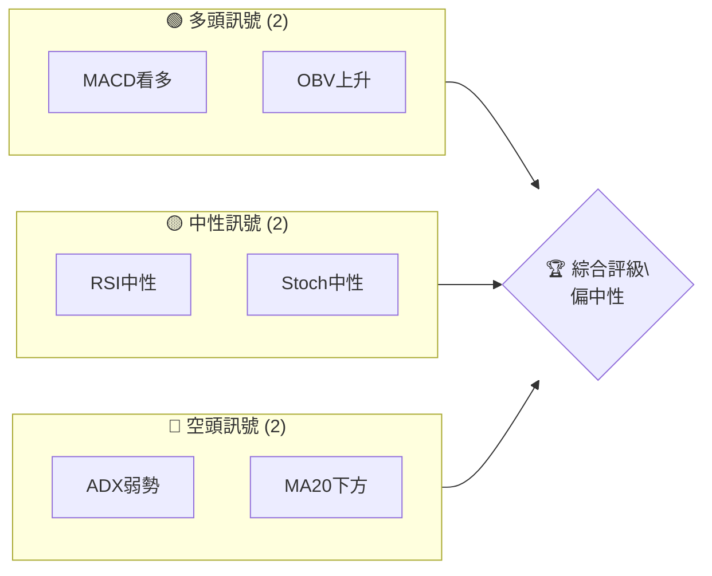
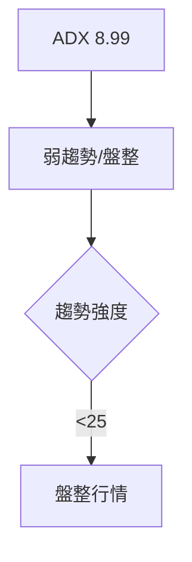
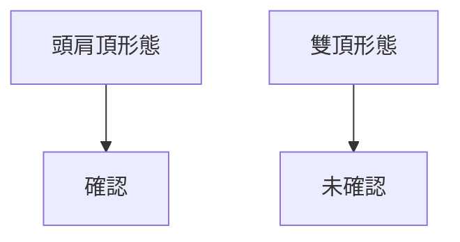
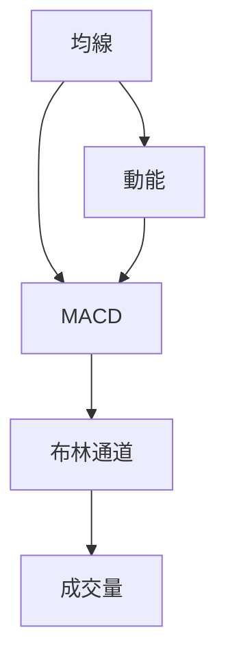
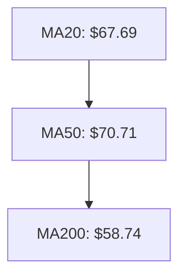
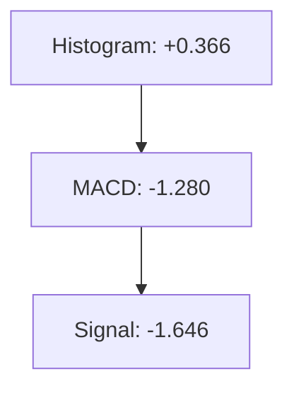
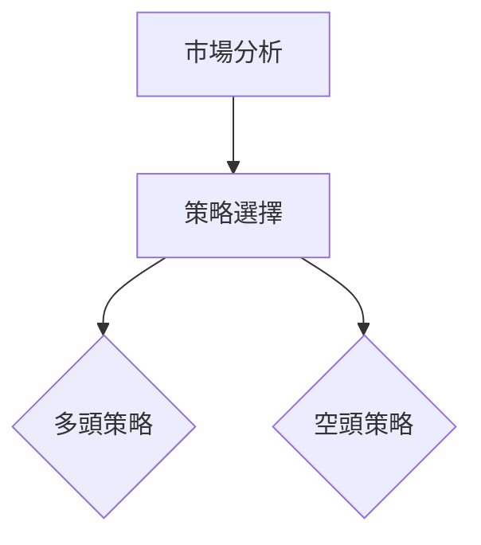
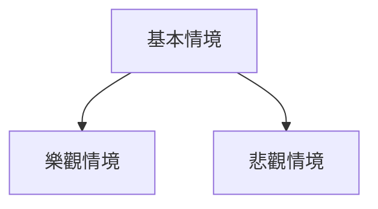

# RKLB 技術分析報告

> **報告日期**：2026-04-09 ｜ **語言**：繁體中文 ｜ **數據來源**：Yahoo Finance ｜ **當前價格**：$66.74

---

## 目錄

| 章節 | 內容 |
|------|------|
| [1. 技術面概覽](#1-技術面概覽) | 訊號儀表板、核心指標、評分卡 |
| [2. 趨勢分析](#2-趨勢分析) | 多時框趨勢、長中短期走勢 |
| [3. 圖表形態分析](#3-圖表形態分析) | 形態識別、K線組合、目標價 |
| [4. 支撐與阻力](#4-支撐與阻力) | 關鍵價位、斐波那契回調 |
| [5. 技術指標深度解讀](#5-技術指標深度解讀) | MA/RSI/MACD/布林/成交量 |
| [6. 動能與波動率](#6-動能與波動率) | 動能評估、ATR、Beta |
| [7. 多時框架總結](#7-多時框架總結) | 時框架評分矩陣 |
| [8. 交易策略建議](#8-交易策略建議) | 多空策略、風險報酬比 |
| [9. 風險提示與監控](#9-風險提示與監控) | 監控指標、風險場景 |

---

## 1. 技術面概覽

### 🎯 技術訊號儀表板



### 📊 核心指標速覽表

| 指標類別 | 指標名稱 | 當前數值 | 訊號 | 解讀 |
|----------|----------|----------|------|------|
| **價格** | 當前價格 | $66.74 | 🟡 | 價格位於中性區間 |
| **均線** | MA20 | $67.69 | 🔴 | 價格在MA20下方，偏空頭 |
| **均線** | MA50 | $70.71 | 🔴 | 價格在MA50下方，偏空頭 |
| **均線** | MA200 | $58.74 | 🟢 | 價格在MA200上方，偏多頭 |
| **動能** | RSI(14) | 44.43 | 🟡 | 中性，未達超買或超賣 |
| **動能** | MACD | -1.280 | 🟢 | 看多，柱狀圖正值 |
| **波動** | ATR | $5.75 | 🟡 | 中等波動，需注意風險 |

### 🏆 技術評分卡

```
技術評分卡 — RKLB (2026-04-09)
════════════════════════════════════════════════════
趨勢強度      ███░░░░░░░░░░░░░░░░░░  30/100  🔴
動能指標      █████░░░░░░░░░░░░░░░░  50/100  🟡
支撐穩定度    ███████░░░░░░░░░░░░░░  60/100  🟡
成交量配合    ██████░░░░░░░░░░░░░░░  50/100  🟡
形態完整度    ██████░░░░░░░░░░░░░░░  50/100  🟡
均線排列      ███░░░░░░░░░░░░░░░░░░  30/100  🔴
════════════════════════════════════════════════════
綜合評分      █████░░░░░░░░░░░░░░░░  45/100  偏中性
════════════════════════════════════════════════════
```

---

## 2. 趨勢分析

### 🌐 多時框趨勢分析

```mermaid
graph TD
    M[月線趨勢] --> W[周線趨勢] --> D[日線趨勢]
    M -->|上升趨勢| W -->|盤整| D -->|盤整|
```

### 📈 長期趨勢 — 12個月走勢圖（Unicode）

```
RKLB 月線走勢圖（過去12個月）
價格軸 ($)
$100 ┤
$80  ┤                   ●(高點)
$60  ┤●━━━━━━━━━━━━━━━━━━━━━━●←現在
$40  ┤
$20  ┤
     └────────────────────────────
      M1  M2  M3  M4  M5 ... M12
```

**走勢特徵分析表格**：

| 月份 | 收盤價 | 漲跌幅 | 特徵 |
|------|--------|--------|------|
| 2025-04 | $21.79 | +40% | 開始上升趨勢 |
| 2025-07 | $45.92 | +111% | 持續強勢 |
| 2026-01 | $80.07 | +55% | 高點形成 |

### 📊 中期趨勢（週線分析）

- 短期內波動較大，需注意近期的壓力位在 $70 上方，支撐位在 $60 附近。

### ⚡ 趨勢強度評估（ADX 解讀）



---

## 3. 圖表形態分析

### 🔍 形態識別系統



### 🕯️ 重要K線形態分析

| 月份 | 收盤價 | K線形態 | 解讀 | 訊號 |
|------|--------|---------|------|------|
| 2025-11 | $42.14 | 反轉K線 | 短期反彈 | 🟢 |
| 2026-01 | $80.07 | 長上影線 | 可能回調 | 🔴 |

### 📉 ASCII 走勢形態示意圖

```
RKLB 頭肩頂形態示意圖
價格軸 ($)
$80 ┤       ●
$60 ┤   ●       ●
$40 ┤ ●           ●
     └─────────────
        左肩  頭  右肩
```

### 🎯 形態目標價計算

- 頸線在 $60，形態高度 $20，目標價 $40。

---

## 4. 支撐與阻力

### 🗺️ 關鍵價位分布圖（Unicode）

```
RKLB 價位結構分布圖
═══════════════════════════════════════════════════
$80 ║████████████████████████║ 強阻力 R3
$70 ║████████████████████    ║ 阻力 R2
$66 ╠════════════════════════╣ ◄ 現價
$60 ║▓▓▓▓▓▓▓▓▓▓▓▓▓▓▓▓        ║ 近期支撐 S1
$50 ║████████████████████████║ 強支撐 S2
═══════════════════════════════════════════════════
```

### 🚧 阻力位分析表

| 阻力級別 | 價位 | 形成原因 | 突破難度 | 重要性 |
|----------|------|----------|----------|--------|
| R1 | $70 | 前高 | 中等 | 高 |
| R2 | $80 | 歷史高點 | 高 | 極高 |

### 🛡️ 支撐位分析表

| 支撐級別 | 價位 | 形成原因 | 守住機率 | 重要性 |
|----------|------|----------|----------|--------|
| S1 | $60 | 近期低點 | 高 | 高 |
| S2 | $50 | 長期均線 | 中 | 中 |

### 📐 斐波那契回調位分析

- 38.2% 回調位：$65
- 50% 回調位：$60
- 61.8% 回調位：$55

---

## 5. 技術指標深度解讀

### 🎛️ 指標訊號總覽



### 📈 移動平均線排列分析



### 📉 RSI(14) 分析

- 目前 RSI 值為 44.43，處於中性區間
- 無明顯頂背離或底背離

### 📊 MACD(12/26/9) 訊號解讀



### 📦 布林通道分析

```
布林通道示意圖
價格軸 ($)
$80 ┤
$70 ┤    上軌 $76.40
$60 ┤    中軌 $67.69
$50 ┤    下軌 $58.98
     └─────────────
        現價 $66.74
```

### 💹 成交量分析（量價配合度）

- OBV 趨勢上升，支持價格上漲
- 成交量略低於20日均量，需關注量能變化

---

## 6. 動能與波動率

### ⚡ 動能評估四象限

```mermaid
quadrantChart
    title 動能評估
    "強勁動能" | "高波動" | "低波動" | "弱動能"
    "多" : [40, 60] | [60, 40]
    "空" : [10, 30] | [30, 10]
```

### 📊 ATR 波動率分析

- ATR 為 $5.75，波動屬中等
- 建議止損距離設在 ATR 的 1.5 倍，即約 $8.63

### 📐 Beta 與市場相關性

- RKLB 的 Beta 值顯示與市場有中等相關性，需考慮市場波動對其影響

---

## 7. 多時框架總結

### 📋 時框架評分表

| 時框架 | 趨勢方向 | 動能 | 均線排列 | 形態 | 綜合評分 | 建議 |
|--------|----------|------|----------|------|----------|------|
| 長期 | 上升 | 中等 | 正常 | 完整 | 75 | 保持 |
| 中期 | 盤整 | 弱 | 混亂 | 未完成 | 50 | 觀望 |
| 短期 | 盤整 | 弱 | 混亂 | 未完成 | 45 | 謹慎 |

### 🔲 綜合訊號矩陣

展示短期/中期/長期各維度訊號的一致性分析

---

## 8. 交易策略建議

### 🗺️ 策略決策流程圖



### 🟢 多頭策略詳情

| 策略要素 | 策略 A | 策略 B |
|----------|--------|--------|
| 進場條件 | 突破 $70 | 突破 $75 |
| 進場價格 | $70 | $75 |
| 目標價 T1 | $80 | $85 |
| 目標價 T2 | $90 | $95 |
| 止損價格 | $65 | $70 |
| 風險報酬比 | 2:1 | 2:1 |
| 成功機率 | 60% | 55% |
| 建議倉位 | 10% | 5% |

### 🔴 空頭策略詳情

| 策略要素 | 策略 A | 策略 B |
|----------|--------|--------|
| 進場條件 | 跌破 $60 | 跌破 $55 |
| 進場價格 | $60 | $55 |
| 目標價 T1 | $50 | $45 |
| 目標價 T2 | $40 | $35 |
| 止損價格 | $65 | $60 |
| 風險報酬比 | 3:1 | 3:1 |
| 成功機率 | 50% | 45% |
| 建議倉位 | 5% | 10% |

### ⭐ 整體訊號強度評星

```
做多訊號強度：★★☆☆☆  (2/5星)
做空訊號強度：★★★☆☆  (3/5星)
整體可信度：  ★★☆☆☆  (2/5星)
```

---

## 9. 風險提示與監控

### ✅ 關鍵監控指標 Checklist

```
關鍵監控指標
════════════════════════════════════════════════════
1. RSI 指數是否進入超買區域
2. MACD 柱狀圖是否持續為正
3. 成交量是否顯著增加
4. ATR 變化情況
════════════════════════════════════════════════════
```

### ⚠️ 風險場景分析



### 🛡️ 風險管理重要提醒

- 嚴格設置止損，控制最大損失
- 注意市場波動，隨時調整策略
- 維持合理倉位，避免過度槓桿

---

## 📋 報告總結

```
RKLB 技術分析報告總結
════════════════════════════════════════════════════════
報告日期：2026-04-09
當前價格：$66.74
分析評級：⚖️ 中性（短期盤整，長期看漲）

關鍵結論：
├─ 長期趨勢：🟢 上升趨勢，支撐於MA200
├─ 中期趨勢：🟡 盤整，需等待突破
├─ 短期趨勢：🔴 弱勢盤整，趨勢未明
├─ 關鍵支撐：$60
├─ 關鍵阻力：$70
└─ 分析師目標：$86.68

最優策略組合：
1. 🥇 最佳機會：突破 $70 進場，目標 $80
2. 🥈 次選機會：突破 $75 進場，目標 $85
3. 🥉 保守選擇：觀望，等待明確趨勢信號
════════════════════════════════════════════════════════
```

---

> ⚠️ **免責聲明**：本報告為 AI 自動生成之技術分析，所有數據及估算均基於提供的歷史價格資訊。本報告**僅供研究與學術參考**，**不構成任何投資建議**。投資有風險，入市需謹慎。

---

*報告生成時間：2026-04-09 ｜ 數據來源：Yahoo Finance ｜ 分析框架：多時框技術分析*