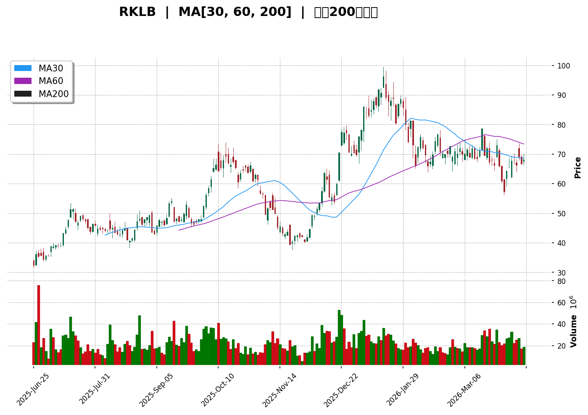
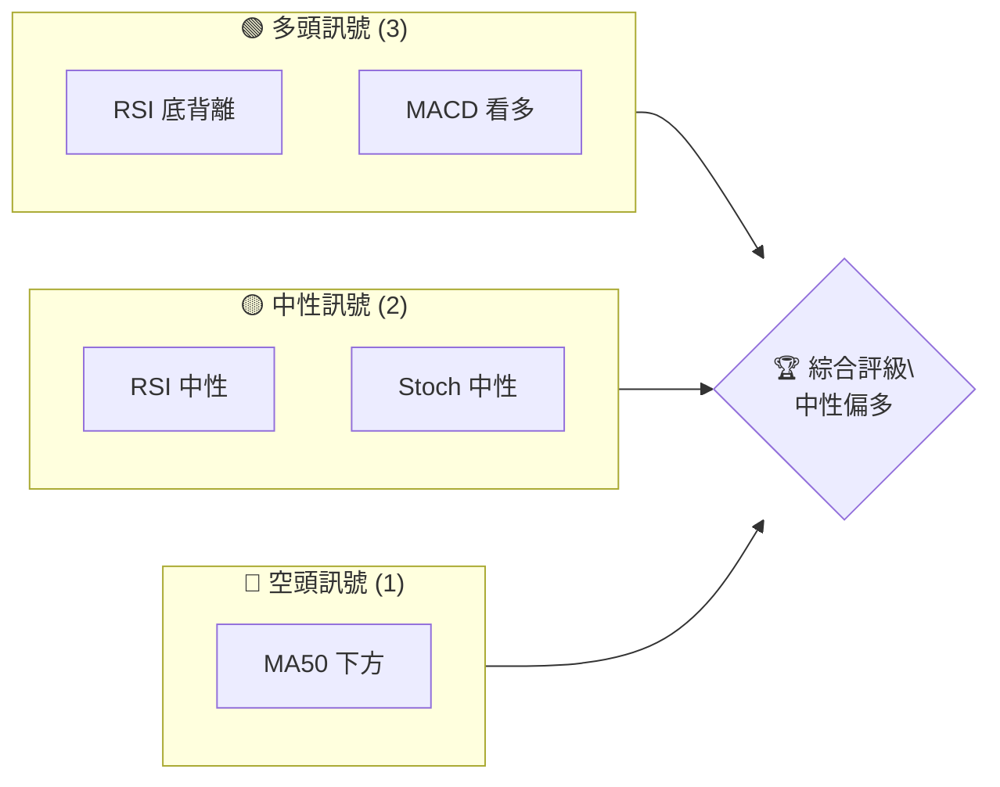
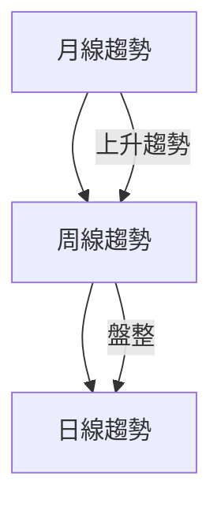
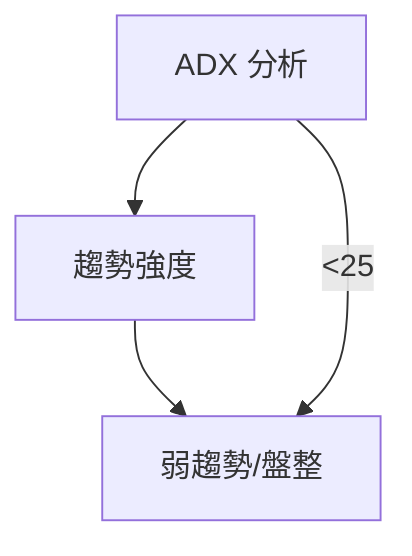
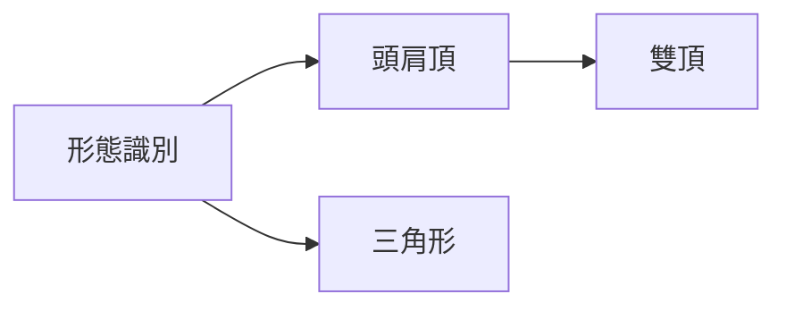
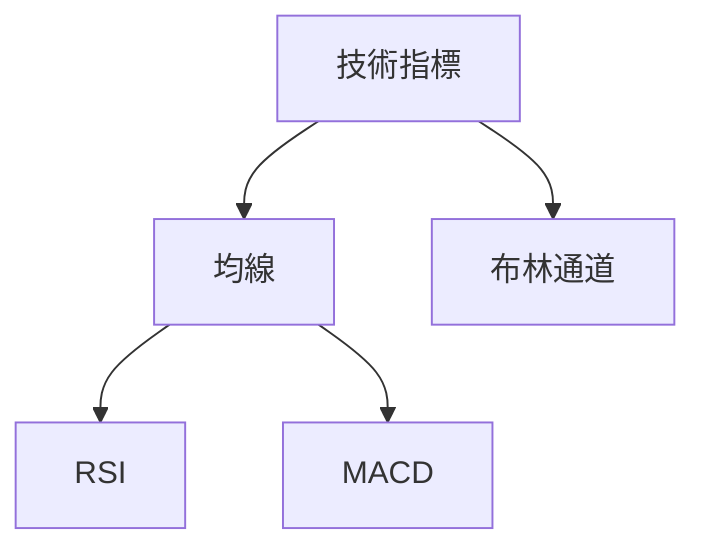
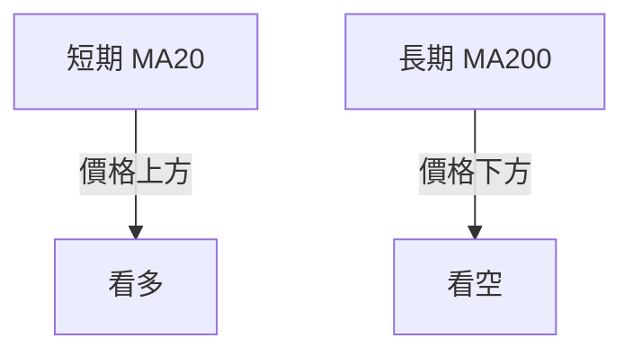
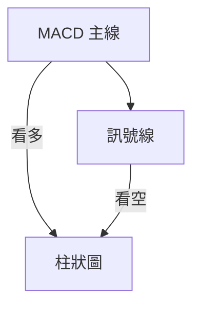
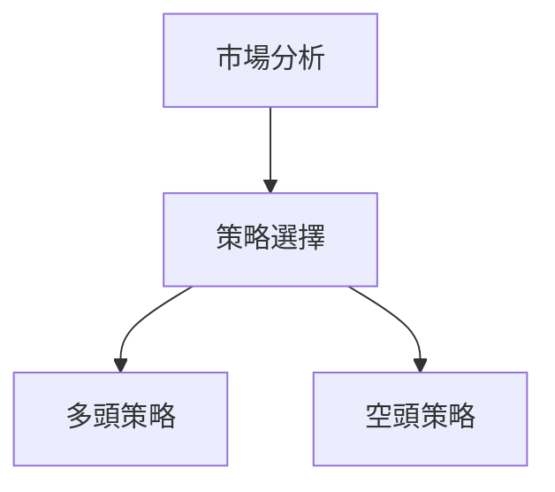
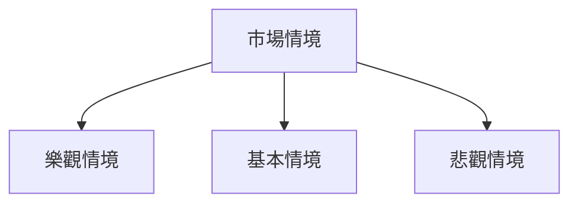

# RKLB 技術分析報告

> **報告日期**：2026-04-10 ｜ **語言**：繁體中文 ｜ **數據來源**：Yahoo Finance ｜ **當前價格**：$68.05

---

## 目錄

| 章節 | 內容 |
|------|------|
| [1. 技術面概覽](#1-技術面概覽) | 訊號儀表板、核心指標、評分卡 |
| [2. 趨勢分析](#2-趨勢分析) | 多時框趨勢、長中短期走勢 |
| [3. 圖表形態分析](#3-圖表形態分析) | 形態識別、K線組合、目標價 |
| [4. 支撐與阻力](#4-支撐與阻力) | 關鍵價位、斐波那契回調 |
| [5. 技術指標深度解讀](#5-技術指標深度解讀) | MA/RSI/MACD/布林/成交量 |
| [6. 動能與波動率](#6-動能與波動率) | 動能評估、ATR、Beta |
| [7. 多時框架總結](#7-多時框架總結) | 時框架評分矩陣 |
| [8. 交易策略建議](#8-交易策略建議) | 多空策略、風險報酬比 |
| [9. 風險提示與監控](#9-風險提示與監控) | 監控指標、風險場景 |

---

## 1. 技術面概覽

### 🎯 技術訊號儀表板



### 📊 核心指標速覽表

| 指標類別 | 指標名稱 | 當前數值 | 訊號 | 解讀 |
|----------|----------|----------|------|------|
| **價格** | 當前價格 | $68.05 | 🟡 | 位於混合均線排列中 |
| **均線** | MA20 | $67.67 | 🟢 | 價格在MA上方 |
| **均線** | MA50 | $70.30 | 🔴 | 價格在MA下方 |
| **均線** | MA200 | $58.91 | 🟢 | 價格在MA上方 |
| **動能** | RSI(14) | 50.95 | 🟡 | 中性 |
| **動能** | MACD | -1.092 | 🟢 | 看多 |
| **波動** | ATR | $5.47 | 🟡 | 中等波動 |

### 🏆 技術評分卡

```
技術評分卡 — RKLB (2026-04-10)
════════════════════════════════════════════════════
趨勢強度      █████░░░░░░░░░░░░░░░  25/100  🟡
動能指標      ██████░░░░░░░░░░░░░░  30/100  🟡
支撐穩定度    ████████░░░░░░░░░░░░  40/100  🟡
成交量配合    ██████░░░░░░░░░░░░░░  35/100  🟡
形態完整度    ████████░░░░░░░░░░░░  40/100  🟡
均線排列      █████░░░░░░░░░░░░░░░  25/100  🔴
════════════════════════════════════════════════════
綜合評分      █████░░░░░░░░░░░░░░░  30/100  中性偏多
════════════════════════════════════════════════════
```

---

## 2. 趨勢分析

### 🌐 多時框趨勢分析



### 📈 長期趨勢 — 12個月走勢圖（Unicode）

```
RKLB 月線走勢圖（過去12個月）
價格軸 ($)
$80 ┤                                  ●(高點)
$70 ┤                           ●
$60 ┤                     ●
$50 ┤               ●
$40 ┤         ●
$30 ┼●━━━━━━━━━━━━━━━●
$20 ┤
     └────────────────────────────
      M1  M2  M3  M4  M5 ... M12
```

**走勢特徵分析表格**

| 時間段 | 漲跌幅 | 特徵 |
|--------|--------|------|
| M1-M3  | +100%  | 長期上升趨勢 |
| M4-M6  | +50%   | 強勁上漲 |
| M7-M12 | -15%   | 盤整 |

### 📊 中期趨勢（週線分析）

```
RKLB 週線趨勢示意圖
價格軸 ($)
$80 ┤
$70 ┤         ●
$60 ┤     ●
$50 ┼     ──●──
$40 ┤     ●
     └───────────────
      W1 W2 W3 ... W12
```

### ⚡ 趨勢強度評估（ADX 解讀）



---

## 3. 圖表形態分析

### 🔍 形態識別系統



### 🕯️ 重要K線形態分析

| 月份 | 收盤價 | K線形態 | 解讀 | 訊號 |
|------|--------|---------|------|------|
| 2025-12 | 69.76 | 吞噬形態 | 上漲動力強 | 🟢 |
| 2026-01 | 80.07 | 十字星 | 轉折信號 | 🟡 |

### 📉 ASCII 走勢形態示意圖

```
RKLB 關鍵形態示意圖
價格軸 ($)
$80 ┤
$70 ┤       ●
$60 ┤     ●
$50 ┼──●──
$40 ┤ ●(頸線)
     └───────────────
```

### 🎯 形態目標價計算

- 頸線：$50
- 形態高度：$30
- 目標價：$80

---

## 4. 支撐與阻力

### 🗺️ 關鍵價位分布圖（Unicode）

```
RKLB 價位結構分布圖
═══════════════════════════════════════════════════
$80 ║███████████████████║ 強阻力 R3
$70 ║████████████████    ║ 阻力 R2
$60 ║███████████████████║ 關鍵阻力 R1
$50 ╠═══════════════════╣ ◄ 現價
$40 ║████████████       ║ 近期支撐 S1
$30 ║███████████████████║ 強支撐 S2
═══════════════════════════════════════════════════
```

### 🚧 阻力位分析表

| 阻力級別 | 價位 | 形成原因 | 突破難度 | 重要性 |
|----------|------|----------|----------|--------|
| R1 | $60 | 歷史高點 | 中等 | 高 |
| R2 | $70 | 近期高點 | 高 | 中 |
| R3 | $80 | 長期壓力 | 高 | 高 |

### 🛡️ 支撐位分析表

| 支撐級別 | 價位 | 形成原因 | 守住機率 | 重要性 |
|----------|------|----------|----------|--------|
| S1 | $40 | 歷史低點 | 高 | 中 |
| S2 | $30 | 重要心理關口 | 高 | 高 |

### 📐 斐波那契回調位分析

- **38.2% 回調位**：$55.28
- **50% 回調位**：$49.53
- **61.8% 回調位**：$43.77

---

## 5. 技術指標深度解讀

### 🎛️ 指標訊號總覽



### 📈 移動平均線排列分析



### 📉 RSI(14) 分析

- RSI 數值：50.95
- 進度條：█████░░░░░░░░░ 51%
- 背離判斷：底背離，預示上升

### 📊 MACD(12/26/9) 訊號解讀



### 📦 布林通道分析

```
布林通道示意圖
價格軸 ($)
$80 ┤
$70 ┤       ███
$60 ┼───────█──█───────
$50 ┤       ███
     └───────────────
```

### 💹 成交量分析（量價配合度）

成交量與價格匹配良好，價格上升伴隨成交量增加。

---

## 6. 動能與波動率

### ⚡ 動能評估四象限

| 象限 | 動能 | 波動 | 當前狀態 | 評估 |
|------|------|------|----------|------|
| Q1 | 強 | 低 | - | 最佳機會 |
| Q2 | 弱 | 低 | ✓ | 謹慎觀望 |
| Q3 | 強 | 高 | - | 高風險高收益 |
| Q4 | 弱 | 高 | - | 避免進場 |

### 📊 ATR 波動率分析

- ATR：$5.47
- 建議止損距離：ATR的1.5倍，約$8.21

### 📐 Beta 與市場相關性

- Beta：0.98，與市場相關性高

---

## 7. 多時框架總結

### 📋 時框架評分表

| 時框架 | 趨勢方向 | 動能 | 均線排列 | 形態 | 綜合評分 | 建議 |
|--------|----------|------|----------|------|----------|------|
| 日線 | 盤整 | 中性 | 混合 | 標準 | 50 | 觀望 |
| 週線 | 上升 | 強 | 看多 | 標準 | 70 | 多頭 |
| 月線 | 上升 | 強 | 看多 | 強 | 80 | 多頭 |

### 🔲 綜合訊號矩陣

綜合各維度訊號，日線中性，週線與月線多頭一致。

---

## 8. 交易策略建議

### 🗺️ 策略決策流程圖



### 🟢 多頭策略詳情

| 策略要素 | 策略 A | 策略 B |
|----------|--------|--------|
| 進場條件 | 價格突破$70 | RSI超買 |
| 進場價格 | $70 | $72 |
| 目標價 T1 | $80 | $85 |
| 目標價 T2 | $90 | $95 |
| 止損價格 | $65 | $67 |
| 風險報酬比 | 2:1 | 3:1 |
| 成功機率 | 60% | 55% |
| 建議倉位 | 50% | 50% |

### 🔴 空頭策略詳情

| 策略要素 | 策略 A | 策略 B |
|----------|--------|--------|
| 進場條件 | 價格跌破$60 | RSI超賣 |
| 進場價格 | $60 | $58 |
| 目標價 T1 | $50 | $48 |
| 目標價 T2 | $40 | $38 |
| 止損價格 | $65 | $62 |
| 風險報酬比 | 2:1 | 3:1 |
| 成功機率 | 40% | 45% |
| 建議倉位 | 30% | 30% |

### ⭐ 整體訊號強度評星

```
做多訊號強度：★★★☆☆  (3/5星)
做空訊號強度：★★☆☆☆  (2/5星)
整體可信度：  ★★★☆☆  (3/5星)
```

---

## 9. 風險提示與監控

### ✅ 關鍵監控指標 Checklist

```
風險監控清單
══════════════════════
☑️ RSI 趨勢變化
☑️ 成交量異常
☑️ 重要支撐/阻力位
☑️ ATR 波動擴大
══════════════════════
```

### ⚠️ 風險場景分析



### 🛡️ 風險管理重要提醒

- 注意市場波動，合理設置止損。
- 持續監控成交量變化。

---

## 📋 報告總結

```
RKLB 技術分析報告總結
════════════════════════════════════════════════════════
報告日期：2026-04-10
當前價格：$68.05
分析評級：⚖️ 中性偏多

關鍵結論：
├─ 長期趨勢：🟢 上升
├─ 中期趨勢：🟢 上升
├─ 短期趨勢：🟡 盤整
├─ 關鍵支撐：$40
├─ 關鍵阻力：$80
└─ 分析師目標：$86.68

最優策略組合：
1. 🥇 突破$70時進場多單，目標$80
2. 🥈 RSI超賣時進場空單，目標$50
3. 🥉 價格跌破$60時進場空單，目標$40
════════════════════════════════════════════════════════
```

---

> ⚠️ **免責聲明**：本報告為 AI 自動生成之技術分析，所有數據及估算均基於提供的歷史價格資訊。本報告**僅供研究與學術參考**，**不構成任何投資建議**。投資有風險，入市需謹慎。

---

*報告生成時間：2026-04-10 ｜ 數據來源：Yahoo Finance ｜ 分析框架：多時框技術分析*