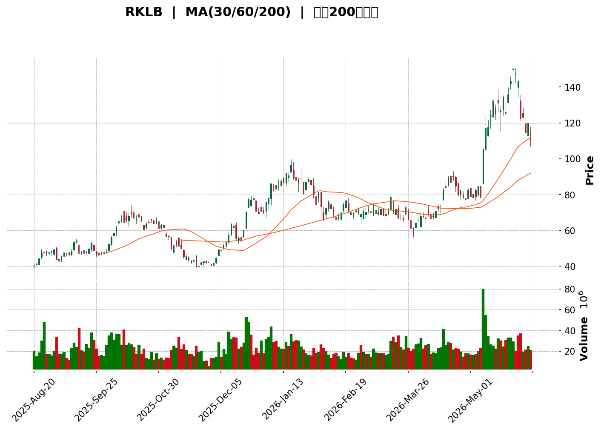
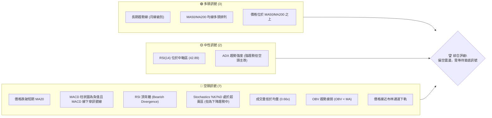

<details>
<summary>📊 靜態圖表 (點擊展開)</summary>

</details>

<html>
<head><meta charset="utf-8" /></head>
<body>
    <div style="height:500px; width:100%;">                        <script>window.PlotlyConfig = {MathJaxConfig: 'local'};</script>
        <script charset="utf-8" src="https://cdn.plot.ly/plotly-3.6.0.min.js" integrity="sha256-QaOVwtVY0T02VaHrr6pnoHLCwayMJp4O5n4YyaE3rJk=" crossorigin="anonymous"></script>                <div id="candlestick-chart" class="plotly-graph-div" style="height:100%; width:100%;"></div>            <script>                window.PLOTLYENV=window.PLOTLYENV || {};                                if (document.getElementById("candlestick-chart")) {                    Plotly.newPlot(                        "candlestick-chart",                        [{"close":{"dtype":"f8","bdata":"AAAA4FFYREAAAAAA18NEQAAAAOCjMEZAAAAAACmcR0AAAADgoxBIQAAAAAAAIEdAAAAA4Hr0R0AAAADAzExIQAAAACCup0hAAAAAANfDRUAAAABguH5FQAAAACCF60ZAAAAAoHDdR0AAAAAA14NHQAAAAIDCFUdAAAAAQAo3SEAAAAAghatKQAAAAMAeBUtAAAAAIFyfR0AAAACAPQpIQAAAAEAKl0dAAAAAwB7lR0AAAAAgrudIQAAAAOB6dEpAAAAA4FFYSEAAAADgo1BHQAAAAKBHIUdAAAAAoEeBR0AAAADgevRHQAAAAAAp\u002fEdAAAAAACk8SkAAAADgehRMQAAAAAAAQE1AAAAAoEfBTkAAAAAA11NQQAAAAEDhmlBAAAAA4KMQUEAAAABA4VpQQAAAAIDrAVFAAAAAoEdRUUAAAAAAAMBQQAAAAKBHkVBAAAAAYGbWUEAAAACgmVlQQAAAAOBRSE5AAAAAwPXIT0AAAAAA1yNQQAAAACCuZ1BAAAAAAADgT0AAAACAPYpQQAAAAIDCdU5AAAAAoHB9T0AAAAAghatOQAAAAMD1SExAAAAAgMI1TEAAAACAFM5IQAAAAIDr0UlAAAAAQDPzSUAAAABguJ5JQAAAAAAp\u002fEhAAAAAAACgRkAAAADAHsVGQAAAACCup0VAAAAAANdjRUAAAAAgXM9FQAAAAKBwvUNAAAAAYGYmREAAAACgmTlFQAAAAMDMTEVAAAAAQAr3REAAAACA6xFFQAAAACBcL0RAAAAAQDPzREAAAAAAKVxGQAAAACBcr0hAAAAAQAqHSEAAAAAgrsdJQAAAAEAKt0pAAAAAYI\u002fCTEAAAAAA18NPQAAAAGC4vk5AAAAA4Hq0S0AAAABguL5LQAAAAEDh+kpAAAAAgML1TUAAAACgR6FRQAAAAEAzY1NAAAAAIIVLU0AAAAAghUtTQAAAAKCZqVFAAAAAIK6HUUAAAADAzJxRQAAAAOCjcFFAAAAAIFz\u002fUkAAAADA9YhTQAAAAIDrgVVAAAAAwB4FVUAAAADAHsVUQAAAAGBmNlVAAAAAoJn5VUAAAADAHqVVQAAAAEAz81ZAAAAA4KOwVkAAAABAMxNYQAAAAIA9SlZAAAAA4Hr0VUAAAABguP5VQAAAAKCZOVZAAAAAYLgeVEAAAAAAAMBVQAAAAOB6JFZAAAAAIIVrVUAAAADgegRUQAAAAKCZiVJAAAAAoEdRVEAAAABACkdSQAAAAOB6lFBAAAAA4HoUUkAAAACAwvVSQAAAAIDrAVJAAAAAIK5nUUAAAADgo4BQQAAAAAAp3FBAAAAAwPV4UUAAAABA4ZpSQAAAAMAeJVNAAAAAQAq3UUAAAACgcI1RQAAAAIAUflFAAAAAwMyMUUAAAACgmSlSQAAAAGBmRlFAAAAAgBS+UUAAAADgUYhRQAAAAIA9+lFAAAAAAACAUUAAAABACodRQAAAAGC43lFAAAAAIIU7UUAAAACgcP1RQAAAACCuF1FAAAAAgD0aUUAAAAAA19NRQAAAAIDCpVNAAAAAYLheUUAAAAAghftRQAAAAGC4zlBAAAAAAAAAUUAAAADgeoRQQAAAAOBROFJAAAAAACl8UEAAAABACndOQAAAAOCjsExAAAAAgBQOUEAAAACgR2FQQAAAAGC47lBAAAAAQOHqUEAAAADgepRQQAAAAMAeRVFAAAAAIFyvUEAAAABAMwNRQAAAACCup1FAAAAAgBQOUkAAAABgZmZSQAAAACCFu1RAAAAAQDMzVUAAAACgcF1WQAAAAMD1qFVAAAAAYI+CVkAAAABgZiZVQAAAACCF61NAAAAAYI+SVEAAAACAwqVTQAAAAKBHQVNAAAAA4KOgVEAAAAAA17NTQAAAAADXE1RAAAAA4KOwU0AAAACgmSlVQAAAAMAepVNAAAAAgBReWkAAAABgZlZdQAAAAADXY11AAAAAoJkJX0AAAACgmZFgQAAAAKBHMV9AAAAAwB5lYEAAAAAA19NfQAAAAMD1yGBAAAAAwMxcX0AAAADgUfhgQAAAAGBm5mFAAAAAIFzHYkAAAADA9YBiQAAAACBc72FAAAAAwPWYXkAAAADgetReQAAAAMDMrFxAAAAAwMz8XUAAAADAHoVbQA=="},"high":{"dtype":"f8","bdata":"AAAAgBRuREAAAAAgXO9EQAAAAECNV0ZAAAAAIIXLSEAAAACAwnVJQAAAAGC4XkhAAAAAwMz8R0AAAABgZmZIQAAAAMAexUhAAAAAQDNzSUAAAACAPUpGQAAAAGC4\u002fkZAAAAAoJkZSEAAAAAA18NHQAAAAIAUDkhAAAAAwB7VSEAAAAAA1wNLQAAAAIDClUtAAAAAgD0KSkAAAADAHkVIQAAAAOBRmEhAAAAAQAp3SEAAAACgRyFJQAAAAGA5FEtAAAAAoHA9SkAAAAAgXE9IQAAAAOBR2EdAAAAAwMwMSEAAAABguP5HQAAAAIDCtUhAAAAAQDNTSkAAAAAgMXhMQAAAAKBHoU1AAAAAIK5HT0AAAAAALSJRQAAAAGCPIlFAAAAAAABgUkAAAAAAKZxRQAAAAEDhalFAAAAAgBR+UkAAAAAAABBSQAAAAAAAIFFAAAAAIIULUkAAAABgjwJRQAAAAKBHAVBAAAAAwMwsUEAAAAAghYtQQAAAAGBmllBAAAAAYI+iUEAAAADA9dhQQAAAACCFS1BAAAAAoJm5T0AAAADAzIxPQAAAAGC4vk1AAAAAANejTEAAAABA4RpMQAAAAMDMDEpAAAAAAABAS0AAAABA4XpMQAAAAIA9qktAAAAA4KOwSEAAAAAAKZxHQAAAAMBL10ZAAAAAgBTORUAAAAAA10NGQAAAAKBHIUdAAAAAgMKFREAAAAAA10NFQAAAAEAKZ0VAAAAAIIXLRUAAAACgmVlFQAAAAGBmpkRAAAAAYLh+RUAAAABguF5GQAAAAEAK10hAAAAAoJnZSEAAAAAgXC9KQAAAAAAA4EpAAAAAgD1qTUAAAACgmQlQQAAAACCFS1BAAAAAANcjUEAAAACgcF1MQAAAAOB6dExAAAAAAAAgTkAAAAAA16NRQAAAAMDMnFNAAAAAIIXLU0AAAADAHvVTQAAAACBcP1NAAAAAIFwvUkAAAAAAKaxSQAAAAECLTFJAAAAAIFwPU0AAAAAAAJBTQAAAAAAAkFVAAAAAoHB9VUAAAAAgrndWQAAAACCFG1ZAAAAAgMI1VkAAAADgp25WQAAAAAApDFdAAAAAQGAdV0AAAADAHuVYQAAAAKBHkVhAAAAAAADQVkAAAACgmVlWQAAAAMDMnFdAAAAAgD3KVUAAAAAAAMBVQAAAAEAzc1ZAAAAAAABAVkAAAADgelRWQAAAAMDMLFRAAAAA4HpUVEAAAABgZlZUQAAAACBcP1JAAAAAgD0qUkAAAABAMzNTQAAAAEAK91JAAAAAoJlZUkAAAADAzBxRQAAAAGBmZlFAAAAAIFy\u002fUUAAAADA9fBSQAAAAEAKR1NAAAAAwMyMU0AAAAAAANBRQAAAACCFg1FAAAAAYGb2UUAAAAAgXC9SQAAAAIDCZVFAAAAAYGYGUkAAAAAAAFBSQAAAAGBmhlJAAAAAANcTUkAAAABACsdSQAAAAAAACFJAAAAAANc7UkAAAABAM1NSQAAAAGBmJlJAAAAAANfTUUAAAADgURhSQAAAAEDhqlNAAAAA4FE4U0AAAABguC5SQAAAAGC4flJAAAAAwMxcUUAAAABgZiZRQAAAAADXw1JAAAAAgMIFUkAAAACAFIZQQAAAAIDr0U5AAAAAwB4lUEAAAABA4SpRQAAAAMD1WFFAAAAA4HqUUUAAAABAMxNRQAAAAIDAalJAAAAAYI9yUUAAAAAA14NRQAAAAEAz41FAAAAAAACwUkAAAACAwqVSQAAAACBc31RAAAAAIFy\u002fVUAAAABgZpZWQAAAAMDM\u002fFZAAAAAYGZGV0AAAABAM5NWQAAAAIA9mlVAAAAAYLieVEAAAACA63FUQAAAAOCjgFNAAAAAgMLlVEAAAABgj\u002fJUQAAAAOBPdVRAAAAAAADAVEAAAAAghStVQAAAAGCPMlVAAAAAIK5nWkAAAAAAKfxeQAAAACBcX15AAAAAIFzPX0AAAACAwqVgQAAAAADXS2BAAAAAAClMYUAAAACAPTJgQAAAAEAz62BAAAAAANdbYEAAAADgUXhhQAAAAAAAQGJAAAAAAADgYkAAAABgj9piQAAAAAAAAGJAAAAAACn0YEAAAADAzAxgQAAAAOBRoF5AAAAA4FGoXkAAAACAFH5dQA=="},"hovertemplate":"\u003cb\u003e%{x|%Y-%m-%d}\u003c\u002fb\u003e\u003cbr\u003e\u958b: $%{open:.2f}\u003cbr\u003e\u9ad8: $%{high:.2f}\u003cbr\u003e\u4f4e: $%{low:.2f}\u003cbr\u003e\u6536: $%{close:.2f}\u003cextra\u003e\u003c\u002fextra\u003e","low":{"dtype":"f8","bdata":"AAAAoEchQ0AAAAAAKRxEQAAAAMChNURAAAAAYGYGRkAAAAAAAIBHQAAAAMD16EZAAAAAIIWrRkAAAABgjwJHQAAAAEAK10ZAAAAAQInBRUAAAACgmVlFQAAAAIDrMUVAAAAAwHa+RkAAAABAicFGQAAAAMDMzEZAAAAAQAoHR0AAAABANU5IQAAAAAApXEpAAAAAoEeBR0AAAACgmTlHQAAAAAAAgEdAAAAA4KOQR0AAAABgZmZHQAAAAOB69EdAAAAAQAo3SEAAAABA4ZpGQAAAAIA96kZAAAAAIFwvR0AAAACgR0FHQAAAACBcj0dAAAAAoEdBSEAAAACgR6FJQAAAAGBm5ktAAAAAYI+CTEAAAABAM9NPQAAAAEDhGlBAAAAAwPUIUEAAAADgzidQQAAAAOBRGE9AAAAAwB7FUEAAAABAM5tQQAAAAKCZ2U9AAAAAQDOrUEAAAABACjdQQAAAAOB6NE1AAAAAAABgTkAAAABAM9NPQAAAAKCZCVBAAAAAgBTOT0AAAACgcL1PQAAAAIDrcU5AAAAAQDMzTkAAAADgo5BNQAAAAKBHQUxAAAAAIFxvS0AAAADgerRIQAAAAODOJ0dAAAAAoEdhSUAAAABA4ZpJQAAAAOB61EhAAAAAIFwvRkAAAABgZqZFQAAAAMDMHEVAAAAAoHCdREAAAABACjdFQAAAAMD1qENAAAAAwPXIQkAAAABgZqZDQAAAAOCjMERAAAAA4KOwREAAAABgZuZEQAAAAKBw\u002fUNAAAAAgMI1REAAAAAAAMBEQAAAAMD1aEZAAAAAoJnZR0AAAAAAKZxIQAAAACCFK0lAAAAAAAAgSkAAAADAzGxMQAAAAGBm5k1AAAAAgD2KS0AAAABACldKQAAAAEDhikpAAAAAANcDTEAAAADAnV9OQAAAAMAgMFJAAAAAYI9SUkAAAACgQ7NSQAAAAMD1mFFAAAAAoJtUUUAAAAAAKZxRQAAAAOBRSFFAAAAAYGa2UEAAAAAA19NRQAAAAEAzg1JAAAAAYGZ2VEAAAADgo5BUQAAAAMDMnFRAAAAA4NDaVEAAAACgmWlVQAAAAAAAIFVAAAAAoJmpVUAAAACgmRlXQAAAAEAzE1ZAAAAAoHCtVEAAAADAdlZUQAAAACCuh1VAAAAA4KMAVEAAAAAAAIBUQAAAAMDKgVVAAAAAAADAVEAAAACgR4FTQAAAAIBBeFJAAAAAoEfxUkAAAABACCRRQAAAAMDMTFBAAAAAAADAUEAAAAAAALBRQAAAAEAz41FAAAAAoEfBUEAAAAAgXO9PQAAAAAAAYFBAAAAAAABAUEAAAADAS39RQAAAAGBmFlJAAAAAoJlZUUAAAAAAACBRQAAAAGBmplBAAAAA4FE4UUAAAAAA1zNRQAAAAGBmBlBAAAAAwMycUEAAAAAAKYxQQAAAAIAUXlFAAAAAgMLVUEAAAADgowhRQAAAAOB69FBAAAAAgL4nUUAAAADAHhVRQAAAAIDrEVFAAAAAACncUEAAAABA4SpRQAAAAKBH0VFAAAAAoJlZUUAAAAAAAABRQAAAAMD1mFBAAAAAQDODUEAAAACgcB1QQAAAAAApPFFAAAAAgMJlUEAAAADAzCxOQAAAAGDlEExAAAAAANeDTUAAAABAM1NQQAAAAIAU7k5AAAAAYGamUEAAAABA4fpPQAAAAGDn81BAAAAAQOGiUEAAAACAwpVQQAAAAIDCpVBAAAAAYLieUUAAAABgZmZRQAAAAKCZOVNAAAAAYGbmVEAAAABgZiZVQAAAAAAAcFVAAAAA4KPwVUAAAAAAKWRUQAAAAMAexVNAAAAAwHRDU0AAAABgZmZTQAAAACBcf1JAAAAAgBReU0AAAAAghZtTQAAAAAAAEFNAAAAAANcjU0AAAABACrdTQAAAACCFe1NAAAAAIK53VUAAAAAAAABaQAAAAIA9GlxAAAAAwPU4XUAAAAAA11NeQAAAAEAzc15AAAAAoPFqX0AAAABguM5cQAAAAIAUDl9AAAAAQDPzXkAAAACA62lgQAAAAIDrUWFAAAAAwB49YUAAAAAA18thQAAAAKCZwWBAAAAAAABAXkAAAAAA16NeQAAAAIA9alxAAAAAwPWYW0AAAABguK5aQA=="},"name":"\u50f9\u683c","open":{"dtype":"f8","bdata":"AAAAQOEaREAAAAAA12NEQAAAAAApfERAAAAA4HqURkAAAACgcN1HQAAAAEAKV0hAAAAA4KNwR0AAAADAzOxHQAAAAAAAYEdAAAAAYI8iSUAAAADgehRGQAAAAOBRyEVAAAAAAADARkAAAACgR4FHQAAAAADXw0dAAAAAwPUoR0AAAACgcH1IQAAAAIA9ykpAAAAAAAAASkAAAADgUchHQAAAAIDCdUhAAAAAQArXR0AAAADgo5BHQAAAAEAzg0hAAAAAgMLlSUAAAAAAAABIQAAAAGBmpkdAAAAAQDOzR0AAAABA4ZpHQAAAAOCjsEdAAAAAgOtRSEAAAABgZgZKQAAAAGC4bkxAAAAAoEeBTUAAAACgmQlQQAAAAKCZOVBAAAAAQDOzUUAAAADgUfhQQAAAAIDCVVBAAAAAoEeBUUAAAADgeoRRQAAAAMD1eFBAAAAA4KNIUUAAAABgjwJRQAAAAAApfE9AAAAAIK7HTkAAAAAA1zNQQAAAAAApjFBAAAAAQDNrUEAAAACgRwlQQAAAAAAAQFBAAAAAYI\u002fiTkAAAAAA14NPQAAAAGBm5kxAAAAA4HpUTEAAAABA4RpMQAAAAKAY1EdAAAAAYLjeSkAAAAAAAABMQAAAAEAK90lAAAAAoEdhSEAAAABA4dpFQAAAAEAzk0ZAAAAAACkcRUAAAAAAAEBFQAAAAIA9CkdAAAAAgD3qQ0AAAACgR2FEQAAAAADXA0VAAAAAYLieRUAAAACgR0FFQAAAAEAzk0RAAAAAIK5HREAAAABgj\u002fJEQAAAAGCP0kZAAAAAAABwSEAAAACAPQpJQAAAAKBwnUlAAAAA4FG4SkAAAACgR8FMQAAAAAAAQE9AAAAA4KeGT0AAAADgURhLQAAAAMDMDExAAAAAoJkZTEAAAAAgXI9OQAAAAAApPFJAAAAAANdzUkAAAACAPYJTQAAAACCFK1NAAAAAAABgUUAAAACgmUFSQAAAAAAA4FFAAAAA4FGoUUAAAAAgrqdSQAAAAOCjcFNAAAAAYGYGVUAAAAAAAGBVQAAAAKCZIVVAAAAAYLg+VUAAAADA9UhWQAAAAGBmllVAAAAAwPVQVkAAAACgmSFXQAAAAMDMbFdAAAAAoEeBVkAAAADgUZhVQAAAACCFQ1ZAAAAAIK6vVUAAAADA9bhUQAAAAIAUzlVAAAAAACn8VUAAAAAAAEBVQAAAAIA9ylNAAAAAYGamU0AAAABgZlZUQAAAAGC4flFAAAAAAABAUUAAAACgmQFSQAAAAIAUplJAAAAA4FFIUkAAAACA6+FQQAAAAOB6rFBAAAAAQGCFUEAAAAAAAMBRQAAAAKCZOVJAAAAAINneUkAAAADgUTBRQAAAAOBROFFAAAAAgBTGUUAAAABA4YJRQAAAAIDC5VBAAAAAIIWrUEAAAABguDZRQAAAAADXs1FAAAAAQOG6UUAAAADgowhRQAAAAMD1WFFAAAAAgMKVUUAAAABAMzNRQAAAAMDM\u002fFFAAAAAoJlJUUAAAADAzFRRQAAAAGBm3lFAAAAAYI8CU0AAAADgejRRQAAAAAAAAFJAAAAAoHAFUUAAAAAAAMBQQAAAAAApPFFAAAAAwMzMUUAAAADgo4BQQAAAAKCZuU5AAAAAQOHaTkAAAAAAAGBQQAAAAMDMHE9AAAAAYLjuUEAAAAAgXMdQQAAAAAAAAFJAAAAAANdDUUAAAADAzOxQQAAAAEAzw1BAAAAAIIVjUkAAAACgcGVSQAAAAIAUPlNAAAAAwB4FVUAAAABgZjZVQAAAAMAelVZAAAAAgMKdVkAAAABgZnZWQAAAAIDClVVAAAAAACnsU0AAAADAzARUQAAAAEAKd1NAAAAAQDNjU0AAAACA6+FUQAAAAEAKl1NAAAAAYGamVEAAAAAgrudTQAAAAKBwLVVAAAAAgD2CVUAAAACgR1FaQAAAAOCjMFxAAAAAoEf5XkAAAABgZsZeQAAAAEAzA2BAAAAAACmYYEAAAACAFH5fQAAAAGC43l9AAAAAwPWIX0AAAADAHm1gQAAAAEDhvmFAAAAAQAq3YkAAAACgcGViQAAAAIAUfmFAAAAAACmMYEAAAACAwlVfQAAAAMAe5V1AAAAAoHBFXEAAAACgR5FcQA=="},"x":["2025-08-20T00:00:00-04:00","2025-08-21T00:00:00-04:00","2025-08-22T00:00:00-04:00","2025-08-25T00:00:00-04:00","2025-08-26T00:00:00-04:00","2025-08-27T00:00:00-04:00","2025-08-28T00:00:00-04:00","2025-08-29T00:00:00-04:00","2025-09-02T00:00:00-04:00","2025-09-03T00:00:00-04:00","2025-09-04T00:00:00-04:00","2025-09-05T00:00:00-04:00","2025-09-08T00:00:00-04:00","2025-09-09T00:00:00-04:00","2025-09-10T00:00:00-04:00","2025-09-11T00:00:00-04:00","2025-09-12T00:00:00-04:00","2025-09-15T00:00:00-04:00","2025-09-16T00:00:00-04:00","2025-09-17T00:00:00-04:00","2025-09-18T00:00:00-04:00","2025-09-19T00:00:00-04:00","2025-09-22T00:00:00-04:00","2025-09-23T00:00:00-04:00","2025-09-24T00:00:00-04:00","2025-09-25T00:00:00-04:00","2025-09-26T00:00:00-04:00","2025-09-29T00:00:00-04:00","2025-09-30T00:00:00-04:00","2025-10-01T00:00:00-04:00","2025-10-02T00:00:00-04:00","2025-10-03T00:00:00-04:00","2025-10-06T00:00:00-04:00","2025-10-07T00:00:00-04:00","2025-10-08T00:00:00-04:00","2025-10-09T00:00:00-04:00","2025-10-10T00:00:00-04:00","2025-10-13T00:00:00-04:00","2025-10-14T00:00:00-04:00","2025-10-15T00:00:00-04:00","2025-10-16T00:00:00-04:00","2025-10-17T00:00:00-04:00","2025-10-20T00:00:00-04:00","2025-10-21T00:00:00-04:00","2025-10-22T00:00:00-04:00","2025-10-23T00:00:00-04:00","2025-10-24T00:00:00-04:00","2025-10-27T00:00:00-04:00","2025-10-28T00:00:00-04:00","2025-10-29T00:00:00-04:00","2025-10-30T00:00:00-04:00","2025-10-31T00:00:00-04:00","2025-11-03T00:00:00-05:00","2025-11-04T00:00:00-05:00","2025-11-05T00:00:00-05:00","2025-11-06T00:00:00-05:00","2025-11-07T00:00:00-05:00","2025-11-10T00:00:00-05:00","2025-11-11T00:00:00-05:00","2025-11-12T00:00:00-05:00","2025-11-13T00:00:00-05:00","2025-11-14T00:00:00-05:00","2025-11-17T00:00:00-05:00","2025-11-18T00:00:00-05:00","2025-11-19T00:00:00-05:00","2025-11-20T00:00:00-05:00","2025-11-21T00:00:00-05:00","2025-11-24T00:00:00-05:00","2025-11-25T00:00:00-05:00","2025-11-26T00:00:00-05:00","2025-11-28T00:00:00-05:00","2025-12-01T00:00:00-05:00","2025-12-02T00:00:00-05:00","2025-12-03T00:00:00-05:00","2025-12-04T00:00:00-05:00","2025-12-05T00:00:00-05:00","2025-12-08T00:00:00-05:00","2025-12-09T00:00:00-05:00","2025-12-10T00:00:00-05:00","2025-12-11T00:00:00-05:00","2025-12-12T00:00:00-05:00","2025-12-15T00:00:00-05:00","2025-12-16T00:00:00-05:00","2025-12-17T00:00:00-05:00","2025-12-18T00:00:00-05:00","2025-12-19T00:00:00-05:00","2025-12-22T00:00:00-05:00","2025-12-23T00:00:00-05:00","2025-12-24T00:00:00-05:00","2025-12-26T00:00:00-05:00","2025-12-29T00:00:00-05:00","2025-12-30T00:00:00-05:00","2025-12-31T00:00:00-05:00","2026-01-02T00:00:00-05:00","2026-01-05T00:00:00-05:00","2026-01-06T00:00:00-05:00","2026-01-07T00:00:00-05:00","2026-01-08T00:00:00-05:00","2026-01-09T00:00:00-05:00","2026-01-12T00:00:00-05:00","2026-01-13T00:00:00-05:00","2026-01-14T00:00:00-05:00","2026-01-15T00:00:00-05:00","2026-01-16T00:00:00-05:00","2026-01-20T00:00:00-05:00","2026-01-21T00:00:00-05:00","2026-01-22T00:00:00-05:00","2026-01-23T00:00:00-05:00","2026-01-26T00:00:00-05:00","2026-01-27T00:00:00-05:00","2026-01-28T00:00:00-05:00","2026-01-29T00:00:00-05:00","2026-01-30T00:00:00-05:00","2026-02-02T00:00:00-05:00","2026-02-03T00:00:00-05:00","2026-02-04T00:00:00-05:00","2026-02-05T00:00:00-05:00","2026-02-06T00:00:00-05:00","2026-02-09T00:00:00-05:00","2026-02-10T00:00:00-05:00","2026-02-11T00:00:00-05:00","2026-02-12T00:00:00-05:00","2026-02-13T00:00:00-05:00","2026-02-17T00:00:00-05:00","2026-02-18T00:00:00-05:00","2026-02-19T00:00:00-05:00","2026-02-20T00:00:00-05:00","2026-02-23T00:00:00-05:00","2026-02-24T00:00:00-05:00","2026-02-25T00:00:00-05:00","2026-02-26T00:00:00-05:00","2026-02-27T00:00:00-05:00","2026-03-02T00:00:00-05:00","2026-03-03T00:00:00-05:00","2026-03-04T00:00:00-05:00","2026-03-05T00:00:00-05:00","2026-03-06T00:00:00-05:00","2026-03-09T00:00:00-04:00","2026-03-10T00:00:00-04:00","2026-03-11T00:00:00-04:00","2026-03-12T00:00:00-04:00","2026-03-13T00:00:00-04:00","2026-03-16T00:00:00-04:00","2026-03-17T00:00:00-04:00","2026-03-18T00:00:00-04:00","2026-03-19T00:00:00-04:00","2026-03-20T00:00:00-04:00","2026-03-23T00:00:00-04:00","2026-03-24T00:00:00-04:00","2026-03-25T00:00:00-04:00","2026-03-26T00:00:00-04:00","2026-03-27T00:00:00-04:00","2026-03-30T00:00:00-04:00","2026-03-31T00:00:00-04:00","2026-04-01T00:00:00-04:00","2026-04-02T00:00:00-04:00","2026-04-06T00:00:00-04:00","2026-04-07T00:00:00-04:00","2026-04-08T00:00:00-04:00","2026-04-09T00:00:00-04:00","2026-04-10T00:00:00-04:00","2026-04-13T00:00:00-04:00","2026-04-14T00:00:00-04:00","2026-04-15T00:00:00-04:00","2026-04-16T00:00:00-04:00","2026-04-17T00:00:00-04:00","2026-04-20T00:00:00-04:00","2026-04-21T00:00:00-04:00","2026-04-22T00:00:00-04:00","2026-04-23T00:00:00-04:00","2026-04-24T00:00:00-04:00","2026-04-27T00:00:00-04:00","2026-04-28T00:00:00-04:00","2026-04-29T00:00:00-04:00","2026-04-30T00:00:00-04:00","2026-05-01T00:00:00-04:00","2026-05-04T00:00:00-04:00","2026-05-05T00:00:00-04:00","2026-05-06T00:00:00-04:00","2026-05-07T00:00:00-04:00","2026-05-08T00:00:00-04:00","2026-05-11T00:00:00-04:00","2026-05-12T00:00:00-04:00","2026-05-13T00:00:00-04:00","2026-05-14T00:00:00-04:00","2026-05-15T00:00:00-04:00","2026-05-18T00:00:00-04:00","2026-05-19T00:00:00-04:00","2026-05-20T00:00:00-04:00","2026-05-21T00:00:00-04:00","2026-05-22T00:00:00-04:00","2026-05-26T00:00:00-04:00","2026-05-27T00:00:00-04:00","2026-05-28T00:00:00-04:00","2026-05-29T00:00:00-04:00","2026-06-01T00:00:00-04:00","2026-06-02T00:00:00-04:00","2026-06-03T00:00:00-04:00","2026-06-04T00:00:00-04:00","2026-06-05T00:00:00-04:00"],"type":"candlestick"},{"hovertemplate":"MA30: $%{y:.2f}\u003cextra\u003e\u003c\u002fextra\u003e","line":{"color":"#2196F3","dash":"dash","width":2},"mode":"lines","name":"MA30","x":["2025-08-20T00:00:00-04:00","2025-08-21T00:00:00-04:00","2025-08-22T00:00:00-04:00","2025-08-25T00:00:00-04:00","2025-08-26T00:00:00-04:00","2025-08-27T00:00:00-04:00","2025-08-28T00:00:00-04:00","2025-08-29T00:00:00-04:00","2025-09-02T00:00:00-04:00","2025-09-03T00:00:00-04:00","2025-09-04T00:00:00-04:00","2025-09-05T00:00:00-04:00","2025-09-08T00:00:00-04:00","2025-09-09T00:00:00-04:00","2025-09-10T00:00:00-04:00","2025-09-11T00:00:00-04:00","2025-09-12T00:00:00-04:00","2025-09-15T00:00:00-04:00","2025-09-16T00:00:00-04:00","2025-09-17T00:00:00-04:00","2025-09-18T00:00:00-04:00","2025-09-19T00:00:00-04:00","2025-09-22T00:00:00-04:00","2025-09-23T00:00:00-04:00","2025-09-24T00:00:00-04:00","2025-09-25T00:00:00-04:00","2025-09-26T00:00:00-04:00","2025-09-29T00:00:00-04:00","2025-09-30T00:00:00-04:00","2025-10-01T00:00:00-04:00","2025-10-02T00:00:00-04:00","2025-10-03T00:00:00-04:00","2025-10-06T00:00:00-04:00","2025-10-07T00:00:00-04:00","2025-10-08T00:00:00-04:00","2025-10-09T00:00:00-04:00","2025-10-10T00:00:00-04:00","2025-10-13T00:00:00-04:00","2025-10-14T00:00:00-04:00","2025-10-15T00:00:00-04:00","2025-10-16T00:00:00-04:00","2025-10-17T00:00:00-04:00","2025-10-20T00:00:00-04:00","2025-10-21T00:00:00-04:00","2025-10-22T00:00:00-04:00","2025-10-23T00:00:00-04:00","2025-10-24T00:00:00-04:00","2025-10-27T00:00:00-04:00","2025-10-28T00:00:00-04:00","2025-10-29T00:00:00-04:00","2025-10-30T00:00:00-04:00","2025-10-31T00:00:00-04:00","2025-11-03T00:00:00-05:00","2025-11-04T00:00:00-05:00","2025-11-05T00:00:00-05:00","2025-11-06T00:00:00-05:00","2025-11-07T00:00:00-05:00","2025-11-10T00:00:00-05:00","2025-11-11T00:00:00-05:00","2025-11-12T00:00:00-05:00","2025-11-13T00:00:00-05:00","2025-11-14T00:00:00-05:00","2025-11-17T00:00:00-05:00","2025-11-18T00:00:00-05:00","2025-11-19T00:00:00-05:00","2025-11-20T00:00:00-05:00","2025-11-21T00:00:00-05:00","2025-11-24T00:00:00-05:00","2025-11-25T00:00:00-05:00","2025-11-26T00:00:00-05:00","2025-11-28T00:00:00-05:00","2025-12-01T00:00:00-05:00","2025-12-02T00:00:00-05:00","2025-12-03T00:00:00-05:00","2025-12-04T00:00:00-05:00","2025-12-05T00:00:00-05:00","2025-12-08T00:00:00-05:00","2025-12-09T00:00:00-05:00","2025-12-10T00:00:00-05:00","2025-12-11T00:00:00-05:00","2025-12-12T00:00:00-05:00","2025-12-15T00:00:00-05:00","2025-12-16T00:00:00-05:00","2025-12-17T00:00:00-05:00","2025-12-18T00:00:00-05:00","2025-12-19T00:00:00-05:00","2025-12-22T00:00:00-05:00","2025-12-23T00:00:00-05:00","2025-12-24T00:00:00-05:00","2025-12-26T00:00:00-05:00","2025-12-29T00:00:00-05:00","2025-12-30T00:00:00-05:00","2025-12-31T00:00:00-05:00","2026-01-02T00:00:00-05:00","2026-01-05T00:00:00-05:00","2026-01-06T00:00:00-05:00","2026-01-07T00:00:00-05:00","2026-01-08T00:00:00-05:00","2026-01-09T00:00:00-05:00","2026-01-12T00:00:00-05:00","2026-01-13T00:00:00-05:00","2026-01-14T00:00:00-05:00","2026-01-15T00:00:00-05:00","2026-01-16T00:00:00-05:00","2026-01-20T00:00:00-05:00","2026-01-21T00:00:00-05:00","2026-01-22T00:00:00-05:00","2026-01-23T00:00:00-05:00","2026-01-26T00:00:00-05:00","2026-01-27T00:00:00-05:00","2026-01-28T00:00:00-05:00","2026-01-29T00:00:00-05:00","2026-01-30T00:00:00-05:00","2026-02-02T00:00:00-05:00","2026-02-03T00:00:00-05:00","2026-02-04T00:00:00-05:00","2026-02-05T00:00:00-05:00","2026-02-06T00:00:00-05:00","2026-02-09T00:00:00-05:00","2026-02-10T00:00:00-05:00","2026-02-11T00:00:00-05:00","2026-02-12T00:00:00-05:00","2026-02-13T00:00:00-05:00","2026-02-17T00:00:00-05:00","2026-02-18T00:00:00-05:00","2026-02-19T00:00:00-05:00","2026-02-20T00:00:00-05:00","2026-02-23T00:00:00-05:00","2026-02-24T00:00:00-05:00","2026-02-25T00:00:00-05:00","2026-02-26T00:00:00-05:00","2026-02-27T00:00:00-05:00","2026-03-02T00:00:00-05:00","2026-03-03T00:00:00-05:00","2026-03-04T00:00:00-05:00","2026-03-05T00:00:00-05:00","2026-03-06T00:00:00-05:00","2026-03-09T00:00:00-04:00","2026-03-10T00:00:00-04:00","2026-03-11T00:00:00-04:00","2026-03-12T00:00:00-04:00","2026-03-13T00:00:00-04:00","2026-03-16T00:00:00-04:00","2026-03-17T00:00:00-04:00","2026-03-18T00:00:00-04:00","2026-03-19T00:00:00-04:00","2026-03-20T00:00:00-04:00","2026-03-23T00:00:00-04:00","2026-03-24T00:00:00-04:00","2026-03-25T00:00:00-04:00","2026-03-26T00:00:00-04:00","2026-03-27T00:00:00-04:00","2026-03-30T00:00:00-04:00","2026-03-31T00:00:00-04:00","2026-04-01T00:00:00-04:00","2026-04-02T00:00:00-04:00","2026-04-06T00:00:00-04:00","2026-04-07T00:00:00-04:00","2026-04-08T00:00:00-04:00","2026-04-09T00:00:00-04:00","2026-04-10T00:00:00-04:00","2026-04-13T00:00:00-04:00","2026-04-14T00:00:00-04:00","2026-04-15T00:00:00-04:00","2026-04-16T00:00:00-04:00","2026-04-17T00:00:00-04:00","2026-04-20T00:00:00-04:00","2026-04-21T00:00:00-04:00","2026-04-22T00:00:00-04:00","2026-04-23T00:00:00-04:00","2026-04-24T00:00:00-04:00","2026-04-27T00:00:00-04:00","2026-04-28T00:00:00-04:00","2026-04-29T00:00:00-04:00","2026-04-30T00:00:00-04:00","2026-05-01T00:00:00-04:00","2026-05-04T00:00:00-04:00","2026-05-05T00:00:00-04:00","2026-05-06T00:00:00-04:00","2026-05-07T00:00:00-04:00","2026-05-08T00:00:00-04:00","2026-05-11T00:00:00-04:00","2026-05-12T00:00:00-04:00","2026-05-13T00:00:00-04:00","2026-05-14T00:00:00-04:00","2026-05-15T00:00:00-04:00","2026-05-18T00:00:00-04:00","2026-05-19T00:00:00-04:00","2026-05-20T00:00:00-04:00","2026-05-21T00:00:00-04:00","2026-05-22T00:00:00-04:00","2026-05-26T00:00:00-04:00","2026-05-27T00:00:00-04:00","2026-05-28T00:00:00-04:00","2026-05-29T00:00:00-04:00","2026-06-01T00:00:00-04:00","2026-06-02T00:00:00-04:00","2026-06-03T00:00:00-04:00","2026-06-04T00:00:00-04:00","2026-06-05T00:00:00-04:00"],"y":{"dtype":"f8","bdata":"AAAAAAAA+H8AAAAAAAD4fwAAAAAAAPh\u002fAAAAAAAA+H8AAAAAAAD4fwAAAAAAAPh\u002fAAAAAAAA+H8AAAAAAAD4fwAAAAAAAPh\u002fAAAAAAAA+H8AAAAAAAD4fwAAAAAAAPh\u002fAAAAAAAA+H8AAAAAAAD4fwAAAAAAAPh\u002fAAAAAAAA+H8AAAAAAAD4fwAAAAAAAPh\u002fAAAAAAAA+H8AAAAAAAD4fwAAAAAAAPh\u002fAAAAAAAA+H8AAAAAAAD4fwAAAAAAAPh\u002fAAAAAAAA+H8AAAAAAAD4fwAAAAAAAPh\u002fAAAAAAAA+H8AAAAAAAD4f83MzHw\u002frUdAREREZILfR0ARERFB7h1IQO\u002fu7g4tWkhAvLu7iyWXSEDv7u6ucuBIQDMzM7OBNklAMzMzQ0R8SUAAAAAwCMRJQKuqqmrnE0pAvLu7W7qBSkDe3d2tK+hKQO\u002fu7q5WP0tARERE9AyTS0BVVVXlbeFLQDMzMxPZHkxA3t3d\u002fXFfTECJiIg4UY9MQLy7u6u5wExAiYiIiCUHTUB3d3e3SVRNQFVVVXXpjk1AzczM\u002fLjPTUAiIiLS6gBOQERERISIEE5AzczMvIMxTkARERGxOj5OQGZmZhYvVU5AZmZmRgxqTkBmZmaGQXhOQO\u002fu7g7KgE5ARERE5PthTkBVVVUFrDROQN7d3X3c801AZmZmVvKjTUAzMzMTZ0dNQJqZmWl11ExAMzMzszpuTEBmZmZWOQxMQO\u002fu7v64n0tA3t3dbRIrS0De3d2tAMFKQJqZmfl+UkpAq6qqyujlSUB3d3e3rI1JQKuqqsroXUlAq6qqivofSUBEREQUg+hIQImIiFiAtEhAZmZmhuuZSEC8u7vbso5IQERERHQhkUhA7+7u\u002ftRwSEDNzMw831dIQLy7u2u8TEhAq6qqWqtbSEBVVVWl4rRIQHd3d0dvI0lAd3d3x0uPSUDNzMws+f1JQAAAAEA1VkpAzczM7FHASkCJiIhImipLQM3MzLx0m0tAmpmZ6SYpTEBVVVX1b7xMQImIiPgMg01AiYiIaNg9TkBEREQ0M+tOQImIiHh3n09AREREfM0xUEDv7u6mm5BQQKuqqkpT\u002flBA3t3dXY9mUUDNzMzsmNRRQKuqqpJ7KVJAZmZmbi58UkC8u7ub4MlSQFVVVfWLFVNAZmZmLodGU0BmZmbumHhTQImIiDheslNAVVVVrfHyU0AiIiKiYSdUQBERERF0UlRAMzMzAwCAVEAAAACAhoVUQLy7u2uRbVRAZmZmNjNjVEBERERkV2BUQN7d3Q1JY1RAzczM\u002fDdiVECJiIgov1hUQBERESHMU1RAd3d3t8hGVECamZkZ2T5UQERERCSwKlRAIiIiQnwOVEBVVVWFB\u002fNTQO\u002fu7g5J01NA7+7ufoatU0C8u7vbzo9TQBEREaFhX1NAZmZmpik1U0BmZmZWVf1SQJqZmYmI2FJAERERcYSyUkCamZkJZYxSQFVVVWU7Z1JA3t3djZdOUkBVVVW1gS5SQBEREdFpA1JAiYiIGJLeUUB3d3f34ctRQLy7u8ta1VFAMzMz4zO8UUAzMzNzr7lRQO\u002fu7m6gu1FAMzMzI2myUUCrqqpqkZ1RQBEREaFhn1FAvLu724eXUUAAAACAsYxRQN7d3WU7d1FAq6qq0iJrUUBEREQ8JlhRQM3MzPRERVFAIiIiynY+UUDNzMxUKjZRQN7d3UVENFFA7+7upuIsUUCJiIhwEiNRQImIiJBQJlFAMzMzO\u002fsoUUCJiIhQYjBRQLy7u7PkR1FAIiIiendnUUAAAAAov5BRQBEREYkWsVFAERERaR\u002feUUARERGJFvlRQFVVVU03EVJAmpmZodMuUkAzMzN7Wz5SQFVVVQ0CO1JAMzMzK85WUkCJiIiQe2VSQERERPxigVJAmpmZYVeYUkAiIiKK+r9SQImIiIAjzFJA7+7uJnggU0BmZmb+1JhTQLy7u0s3GVRAERERERGZVEAzMzNjEChVQERERNS\u002foVVAZmZm1jEpVkAiIiKCTqtWQGZmZmZmNldAMzMz46WzV0AiIiKSGERYQM3MzOzu3lhAiYiIyFqFWUDNzMx8IyRaQLy7u9tPpVpAIiIiAoH1WkBVVVUVvT1bQFVVVZWZeVtA3t3dbWi5W0CJiIjow+9bQA=="},"type":"scatter"},{"hovertemplate":"MA60: $%{y:.2f}\u003cextra\u003e\u003c\u002fextra\u003e","line":{"color":"#9C27B0","dash":"dash","width":2},"mode":"lines","name":"MA60","x":["2025-08-20T00:00:00-04:00","2025-08-21T00:00:00-04:00","2025-08-22T00:00:00-04:00","2025-08-25T00:00:00-04:00","2025-08-26T00:00:00-04:00","2025-08-27T00:00:00-04:00","2025-08-28T00:00:00-04:00","2025-08-29T00:00:00-04:00","2025-09-02T00:00:00-04:00","2025-09-03T00:00:00-04:00","2025-09-04T00:00:00-04:00","2025-09-05T00:00:00-04:00","2025-09-08T00:00:00-04:00","2025-09-09T00:00:00-04:00","2025-09-10T00:00:00-04:00","2025-09-11T00:00:00-04:00","2025-09-12T00:00:00-04:00","2025-09-15T00:00:00-04:00","2025-09-16T00:00:00-04:00","2025-09-17T00:00:00-04:00","2025-09-18T00:00:00-04:00","2025-09-19T00:00:00-04:00","2025-09-22T00:00:00-04:00","2025-09-23T00:00:00-04:00","2025-09-24T00:00:00-04:00","2025-09-25T00:00:00-04:00","2025-09-26T00:00:00-04:00","2025-09-29T00:00:00-04:00","2025-09-30T00:00:00-04:00","2025-10-01T00:00:00-04:00","2025-10-02T00:00:00-04:00","2025-10-03T00:00:00-04:00","2025-10-06T00:00:00-04:00","2025-10-07T00:00:00-04:00","2025-10-08T00:00:00-04:00","2025-10-09T00:00:00-04:00","2025-10-10T00:00:00-04:00","2025-10-13T00:00:00-04:00","2025-10-14T00:00:00-04:00","2025-10-15T00:00:00-04:00","2025-10-16T00:00:00-04:00","2025-10-17T00:00:00-04:00","2025-10-20T00:00:00-04:00","2025-10-21T00:00:00-04:00","2025-10-22T00:00:00-04:00","2025-10-23T00:00:00-04:00","2025-10-24T00:00:00-04:00","2025-10-27T00:00:00-04:00","2025-10-28T00:00:00-04:00","2025-10-29T00:00:00-04:00","2025-10-30T00:00:00-04:00","2025-10-31T00:00:00-04:00","2025-11-03T00:00:00-05:00","2025-11-04T00:00:00-05:00","2025-11-05T00:00:00-05:00","2025-11-06T00:00:00-05:00","2025-11-07T00:00:00-05:00","2025-11-10T00:00:00-05:00","2025-11-11T00:00:00-05:00","2025-11-12T00:00:00-05:00","2025-11-13T00:00:00-05:00","2025-11-14T00:00:00-05:00","2025-11-17T00:00:00-05:00","2025-11-18T00:00:00-05:00","2025-11-19T00:00:00-05:00","2025-11-20T00:00:00-05:00","2025-11-21T00:00:00-05:00","2025-11-24T00:00:00-05:00","2025-11-25T00:00:00-05:00","2025-11-26T00:00:00-05:00","2025-11-28T00:00:00-05:00","2025-12-01T00:00:00-05:00","2025-12-02T00:00:00-05:00","2025-12-03T00:00:00-05:00","2025-12-04T00:00:00-05:00","2025-12-05T00:00:00-05:00","2025-12-08T00:00:00-05:00","2025-12-09T00:00:00-05:00","2025-12-10T00:00:00-05:00","2025-12-11T00:00:00-05:00","2025-12-12T00:00:00-05:00","2025-12-15T00:00:00-05:00","2025-12-16T00:00:00-05:00","2025-12-17T00:00:00-05:00","2025-12-18T00:00:00-05:00","2025-12-19T00:00:00-05:00","2025-12-22T00:00:00-05:00","2025-12-23T00:00:00-05:00","2025-12-24T00:00:00-05:00","2025-12-26T00:00:00-05:00","2025-12-29T00:00:00-05:00","2025-12-30T00:00:00-05:00","2025-12-31T00:00:00-05:00","2026-01-02T00:00:00-05:00","2026-01-05T00:00:00-05:00","2026-01-06T00:00:00-05:00","2026-01-07T00:00:00-05:00","2026-01-08T00:00:00-05:00","2026-01-09T00:00:00-05:00","2026-01-12T00:00:00-05:00","2026-01-13T00:00:00-05:00","2026-01-14T00:00:00-05:00","2026-01-15T00:00:00-05:00","2026-01-16T00:00:00-05:00","2026-01-20T00:00:00-05:00","2026-01-21T00:00:00-05:00","2026-01-22T00:00:00-05:00","2026-01-23T00:00:00-05:00","2026-01-26T00:00:00-05:00","2026-01-27T00:00:00-05:00","2026-01-28T00:00:00-05:00","2026-01-29T00:00:00-05:00","2026-01-30T00:00:00-05:00","2026-02-02T00:00:00-05:00","2026-02-03T00:00:00-05:00","2026-02-04T00:00:00-05:00","2026-02-05T00:00:00-05:00","2026-02-06T00:00:00-05:00","2026-02-09T00:00:00-05:00","2026-02-10T00:00:00-05:00","2026-02-11T00:00:00-05:00","2026-02-12T00:00:00-05:00","2026-02-13T00:00:00-05:00","2026-02-17T00:00:00-05:00","2026-02-18T00:00:00-05:00","2026-02-19T00:00:00-05:00","2026-02-20T00:00:00-05:00","2026-02-23T00:00:00-05:00","2026-02-24T00:00:00-05:00","2026-02-25T00:00:00-05:00","2026-02-26T00:00:00-05:00","2026-02-27T00:00:00-05:00","2026-03-02T00:00:00-05:00","2026-03-03T00:00:00-05:00","2026-03-04T00:00:00-05:00","2026-03-05T00:00:00-05:00","2026-03-06T00:00:00-05:00","2026-03-09T00:00:00-04:00","2026-03-10T00:00:00-04:00","2026-03-11T00:00:00-04:00","2026-03-12T00:00:00-04:00","2026-03-13T00:00:00-04:00","2026-03-16T00:00:00-04:00","2026-03-17T00:00:00-04:00","2026-03-18T00:00:00-04:00","2026-03-19T00:00:00-04:00","2026-03-20T00:00:00-04:00","2026-03-23T00:00:00-04:00","2026-03-24T00:00:00-04:00","2026-03-25T00:00:00-04:00","2026-03-26T00:00:00-04:00","2026-03-27T00:00:00-04:00","2026-03-30T00:00:00-04:00","2026-03-31T00:00:00-04:00","2026-04-01T00:00:00-04:00","2026-04-02T00:00:00-04:00","2026-04-06T00:00:00-04:00","2026-04-07T00:00:00-04:00","2026-04-08T00:00:00-04:00","2026-04-09T00:00:00-04:00","2026-04-10T00:00:00-04:00","2026-04-13T00:00:00-04:00","2026-04-14T00:00:00-04:00","2026-04-15T00:00:00-04:00","2026-04-16T00:00:00-04:00","2026-04-17T00:00:00-04:00","2026-04-20T00:00:00-04:00","2026-04-21T00:00:00-04:00","2026-04-22T00:00:00-04:00","2026-04-23T00:00:00-04:00","2026-04-24T00:00:00-04:00","2026-04-27T00:00:00-04:00","2026-04-28T00:00:00-04:00","2026-04-29T00:00:00-04:00","2026-04-30T00:00:00-04:00","2026-05-01T00:00:00-04:00","2026-05-04T00:00:00-04:00","2026-05-05T00:00:00-04:00","2026-05-06T00:00:00-04:00","2026-05-07T00:00:00-04:00","2026-05-08T00:00:00-04:00","2026-05-11T00:00:00-04:00","2026-05-12T00:00:00-04:00","2026-05-13T00:00:00-04:00","2026-05-14T00:00:00-04:00","2026-05-15T00:00:00-04:00","2026-05-18T00:00:00-04:00","2026-05-19T00:00:00-04:00","2026-05-20T00:00:00-04:00","2026-05-21T00:00:00-04:00","2026-05-22T00:00:00-04:00","2026-05-26T00:00:00-04:00","2026-05-27T00:00:00-04:00","2026-05-28T00:00:00-04:00","2026-05-29T00:00:00-04:00","2026-06-01T00:00:00-04:00","2026-06-02T00:00:00-04:00","2026-06-03T00:00:00-04:00","2026-06-04T00:00:00-04:00","2026-06-05T00:00:00-04:00"],"y":{"dtype":"f8","bdata":"AAAAAAAA+H8AAAAAAAD4fwAAAAAAAPh\u002fAAAAAAAA+H8AAAAAAAD4fwAAAAAAAPh\u002fAAAAAAAA+H8AAAAAAAD4fwAAAAAAAPh\u002fAAAAAAAA+H8AAAAAAAD4fwAAAAAAAPh\u002fAAAAAAAA+H8AAAAAAAD4fwAAAAAAAPh\u002fAAAAAAAA+H8AAAAAAAD4fwAAAAAAAPh\u002fAAAAAAAA+H8AAAAAAAD4fwAAAAAAAPh\u002fAAAAAAAA+H8AAAAAAAD4fwAAAAAAAPh\u002fAAAAAAAA+H8AAAAAAAD4fwAAAAAAAPh\u002fAAAAAAAA+H8AAAAAAAD4fwAAAAAAAPh\u002fAAAAAAAA+H8AAAAAAAD4fwAAAAAAAPh\u002fAAAAAAAA+H8AAAAAAAD4fwAAAAAAAPh\u002fAAAAAAAA+H8AAAAAAAD4fwAAAAAAAPh\u002fAAAAAAAA+H8AAAAAAAD4fwAAAAAAAPh\u002fAAAAAAAA+H8AAAAAAAD4fwAAAAAAAPh\u002fAAAAAAAA+H8AAAAAAAD4fwAAAAAAAPh\u002fAAAAAAAA+H8AAAAAAAD4fwAAAAAAAPh\u002fAAAAAAAA+H8AAAAAAAD4fwAAAAAAAPh\u002fAAAAAAAA+H8AAAAAAAD4fwAAAAAAAPh\u002fAAAAAAAA+H8AAAAAAAD4f97d3cUEF0tAREREJL8gS0AzMzMjTSlLQGZmZsYEJ0tAERER8YsdS0ARERHh7BNLQGZmZo57BUtAMzMzez\u002f1SkAzMzPDIOhKQM3MzDTQ2UpAzczMZGbWSkDe3d0tltRKQERERNTqyEpAd3d333q8SkBmZmZOjbdKQO\u002fu7u5gvkpARERERLa\u002fSkBmZmYm6rtKQCIiIgKdukpAd3d3h4jQSkCamZlJfvFKQM3MzHQFEEtA3t3d\u002fUYgS0B3d3cHZSxLQAAAAHiiLktAvLu7i5dGS0AzMzOrjnlLQO\u002fu7i5PvEtA7+7uBqz8S0CamZlZHTtMQHd3d6d\u002fa0xAiYiI6CaRTEDv7u4mo69MQFVVVZ2ox0xAAAAAoIzmTEBERESE6wFNQBERETHBK01A3t3djQlWTUBVVVVFtntNQLy7uzuYn01AMzMzs1bHTUDe3d39G\u002fFNQHd3d8eSJ05AMzMzw4NZTkCJiIhIb5tOQAAAAPhv2E5AvLu7sysMT0De3d0lIj5PQJqZmSHMb09AmpmZ8XyTT0BERERc8r9PQKuqqvLu+k9AZmZmFq4VUEBERESgqClQQHd3dyNpPFBARERE2OpWUEBVVVXp+29QQLy7u4ekf1BAERERjWyVUEBVVVX9qa9QQO\u002fu7tYxx1BAmpmZeTDhUEBmZmYmBvdQQLy7uz\u002fDEFFAIiIiFq4tUUAiIiKKiE5RQERERFAbdlFAMzMzO7SWUUC8u7uPULRRQJqZmWWC0VFAmpmZ\u002fanvUUBVVVVBNRBSQN7d3XXaLlJAIiIigtxNUkCamZkh92hSQCIiIg4CgVJAvLu7b1mXUkCrqqrSIqtSQFVVVa1jvlJAIiIiXo\u002fKUkDe3d1RjdNSQM3MzATk2lJA7+7u4sHoUkDNzMzMoflSQGZmZm7nE1NAMzMz8xkeU0CamZn5mh9TQFVVVe2YFFNAzczMLM4KU0B3d3dn9P5SQHd3d1dVAVNARERE7N\u002f8UkBERERUuPJSQHd3d8OD5VJAERERxfXYUkDv7u6qf8tSQImIiIz6t1JAIiIihnmmUkARERHtmJRSQGZmZqrGg1JA7+7ukjRtUkAiIiKmcFlSQM3MzBjZQlJAzczMcBIvUkB3d3fT2xZSQKuqqp42EFJAmpmZ9f0MUkDNzMwYkg5SQDMzM\u002fcoDFJAd3d3e1sWUkAzMzMfzBNSQDMzM49QClJAERER3bIGUkBVVVW5HgVSQImIiGwuCFJAMzMzB4EJUkDe3d2BlQ9SQJqZmbWBHlJAZmZmQmAlUkBmZmb6xS5SQM3MzJDCNVJAVVVVAQBcUkAzMzM\u002fw5JSQM3MzFg5yFJA3t3d8RkCU0C8u7tPG0BTQImIiGSCc1NAREREUNSzU0B3d3drvPBTQCIiIlZVNVRAERERRURwVEBVVVWBlbNUQKuqqr6fAlVA3t3dAStXVUCrqqrmQqpVQLy7u0ea9lVAIiIiPnwuVkCrqqoePmdWQDMzMw9YlVZAd3d368PLVkDNzMw4bfRWQA=="},"type":"scatter"},{"hovertemplate":"MA200: $%{y:.2f}\u003cextra\u003e\u003c\u002fextra\u003e","line":{"color":"#FF6F00","dash":"solid","width":2},"mode":"lines","name":"MA200","x":["2025-08-20T00:00:00-04:00","2025-08-21T00:00:00-04:00","2025-08-22T00:00:00-04:00","2025-08-25T00:00:00-04:00","2025-08-26T00:00:00-04:00","2025-08-27T00:00:00-04:00","2025-08-28T00:00:00-04:00","2025-08-29T00:00:00-04:00","2025-09-02T00:00:00-04:00","2025-09-03T00:00:00-04:00","2025-09-04T00:00:00-04:00","2025-09-05T00:00:00-04:00","2025-09-08T00:00:00-04:00","2025-09-09T00:00:00-04:00","2025-09-10T00:00:00-04:00","2025-09-11T00:00:00-04:00","2025-09-12T00:00:00-04:00","2025-09-15T00:00:00-04:00","2025-09-16T00:00:00-04:00","2025-09-17T00:00:00-04:00","2025-09-18T00:00:00-04:00","2025-09-19T00:00:00-04:00","2025-09-22T00:00:00-04:00","2025-09-23T00:00:00-04:00","2025-09-24T00:00:00-04:00","2025-09-25T00:00:00-04:00","2025-09-26T00:00:00-04:00","2025-09-29T00:00:00-04:00","2025-09-30T00:00:00-04:00","2025-10-01T00:00:00-04:00","2025-10-02T00:00:00-04:00","2025-10-03T00:00:00-04:00","2025-10-06T00:00:00-04:00","2025-10-07T00:00:00-04:00","2025-10-08T00:00:00-04:00","2025-10-09T00:00:00-04:00","2025-10-10T00:00:00-04:00","2025-10-13T00:00:00-04:00","2025-10-14T00:00:00-04:00","2025-10-15T00:00:00-04:00","2025-10-16T00:00:00-04:00","2025-10-17T00:00:00-04:00","2025-10-20T00:00:00-04:00","2025-10-21T00:00:00-04:00","2025-10-22T00:00:00-04:00","2025-10-23T00:00:00-04:00","2025-10-24T00:00:00-04:00","2025-10-27T00:00:00-04:00","2025-10-28T00:00:00-04:00","2025-10-29T00:00:00-04:00","2025-10-30T00:00:00-04:00","2025-10-31T00:00:00-04:00","2025-11-03T00:00:00-05:00","2025-11-04T00:00:00-05:00","2025-11-05T00:00:00-05:00","2025-11-06T00:00:00-05:00","2025-11-07T00:00:00-05:00","2025-11-10T00:00:00-05:00","2025-11-11T00:00:00-05:00","2025-11-12T00:00:00-05:00","2025-11-13T00:00:00-05:00","2025-11-14T00:00:00-05:00","2025-11-17T00:00:00-05:00","2025-11-18T00:00:00-05:00","2025-11-19T00:00:00-05:00","2025-11-20T00:00:00-05:00","2025-11-21T00:00:00-05:00","2025-11-24T00:00:00-05:00","2025-11-25T00:00:00-05:00","2025-11-26T00:00:00-05:00","2025-11-28T00:00:00-05:00","2025-12-01T00:00:00-05:00","2025-12-02T00:00:00-05:00","2025-12-03T00:00:00-05:00","2025-12-04T00:00:00-05:00","2025-12-05T00:00:00-05:00","2025-12-08T00:00:00-05:00","2025-12-09T00:00:00-05:00","2025-12-10T00:00:00-05:00","2025-12-11T00:00:00-05:00","2025-12-12T00:00:00-05:00","2025-12-15T00:00:00-05:00","2025-12-16T00:00:00-05:00","2025-12-17T00:00:00-05:00","2025-12-18T00:00:00-05:00","2025-12-19T00:00:00-05:00","2025-12-22T00:00:00-05:00","2025-12-23T00:00:00-05:00","2025-12-24T00:00:00-05:00","2025-12-26T00:00:00-05:00","2025-12-29T00:00:00-05:00","2025-12-30T00:00:00-05:00","2025-12-31T00:00:00-05:00","2026-01-02T00:00:00-05:00","2026-01-05T00:00:00-05:00","2026-01-06T00:00:00-05:00","2026-01-07T00:00:00-05:00","2026-01-08T00:00:00-05:00","2026-01-09T00:00:00-05:00","2026-01-12T00:00:00-05:00","2026-01-13T00:00:00-05:00","2026-01-14T00:00:00-05:00","2026-01-15T00:00:00-05:00","2026-01-16T00:00:00-05:00","2026-01-20T00:00:00-05:00","2026-01-21T00:00:00-05:00","2026-01-22T00:00:00-05:00","2026-01-23T00:00:00-05:00","2026-01-26T00:00:00-05:00","2026-01-27T00:00:00-05:00","2026-01-28T00:00:00-05:00","2026-01-29T00:00:00-05:00","2026-01-30T00:00:00-05:00","2026-02-02T00:00:00-05:00","2026-02-03T00:00:00-05:00","2026-02-04T00:00:00-05:00","2026-02-05T00:00:00-05:00","2026-02-06T00:00:00-05:00","2026-02-09T00:00:00-05:00","2026-02-10T00:00:00-05:00","2026-02-11T00:00:00-05:00","2026-02-12T00:00:00-05:00","2026-02-13T00:00:00-05:00","2026-02-17T00:00:00-05:00","2026-02-18T00:00:00-05:00","2026-02-19T00:00:00-05:00","2026-02-20T00:00:00-05:00","2026-02-23T00:00:00-05:00","2026-02-24T00:00:00-05:00","2026-02-25T00:00:00-05:00","2026-02-26T00:00:00-05:00","2026-02-27T00:00:00-05:00","2026-03-02T00:00:00-05:00","2026-03-03T00:00:00-05:00","2026-03-04T00:00:00-05:00","2026-03-05T00:00:00-05:00","2026-03-06T00:00:00-05:00","2026-03-09T00:00:00-04:00","2026-03-10T00:00:00-04:00","2026-03-11T00:00:00-04:00","2026-03-12T00:00:00-04:00","2026-03-13T00:00:00-04:00","2026-03-16T00:00:00-04:00","2026-03-17T00:00:00-04:00","2026-03-18T00:00:00-04:00","2026-03-19T00:00:00-04:00","2026-03-20T00:00:00-04:00","2026-03-23T00:00:00-04:00","2026-03-24T00:00:00-04:00","2026-03-25T00:00:00-04:00","2026-03-26T00:00:00-04:00","2026-03-27T00:00:00-04:00","2026-03-30T00:00:00-04:00","2026-03-31T00:00:00-04:00","2026-04-01T00:00:00-04:00","2026-04-02T00:00:00-04:00","2026-04-06T00:00:00-04:00","2026-04-07T00:00:00-04:00","2026-04-08T00:00:00-04:00","2026-04-09T00:00:00-04:00","2026-04-10T00:00:00-04:00","2026-04-13T00:00:00-04:00","2026-04-14T00:00:00-04:00","2026-04-15T00:00:00-04:00","2026-04-16T00:00:00-04:00","2026-04-17T00:00:00-04:00","2026-04-20T00:00:00-04:00","2026-04-21T00:00:00-04:00","2026-04-22T00:00:00-04:00","2026-04-23T00:00:00-04:00","2026-04-24T00:00:00-04:00","2026-04-27T00:00:00-04:00","2026-04-28T00:00:00-04:00","2026-04-29T00:00:00-04:00","2026-04-30T00:00:00-04:00","2026-05-01T00:00:00-04:00","2026-05-04T00:00:00-04:00","2026-05-05T00:00:00-04:00","2026-05-06T00:00:00-04:00","2026-05-07T00:00:00-04:00","2026-05-08T00:00:00-04:00","2026-05-11T00:00:00-04:00","2026-05-12T00:00:00-04:00","2026-05-13T00:00:00-04:00","2026-05-14T00:00:00-04:00","2026-05-15T00:00:00-04:00","2026-05-18T00:00:00-04:00","2026-05-19T00:00:00-04:00","2026-05-20T00:00:00-04:00","2026-05-21T00:00:00-04:00","2026-05-22T00:00:00-04:00","2026-05-26T00:00:00-04:00","2026-05-27T00:00:00-04:00","2026-05-28T00:00:00-04:00","2026-05-29T00:00:00-04:00","2026-06-01T00:00:00-04:00","2026-06-02T00:00:00-04:00","2026-06-03T00:00:00-04:00","2026-06-04T00:00:00-04:00","2026-06-05T00:00:00-04:00"],"y":{"dtype":"f8","bdata":"AAAAAAAA+H8AAAAAAAD4fwAAAAAAAPh\u002fAAAAAAAA+H8AAAAAAAD4fwAAAAAAAPh\u002fAAAAAAAA+H8AAAAAAAD4fwAAAAAAAPh\u002fAAAAAAAA+H8AAAAAAAD4fwAAAAAAAPh\u002fAAAAAAAA+H8AAAAAAAD4fwAAAAAAAPh\u002fAAAAAAAA+H8AAAAAAAD4fwAAAAAAAPh\u002fAAAAAAAA+H8AAAAAAAD4fwAAAAAAAPh\u002fAAAAAAAA+H8AAAAAAAD4fwAAAAAAAPh\u002fAAAAAAAA+H8AAAAAAAD4fwAAAAAAAPh\u002fAAAAAAAA+H8AAAAAAAD4fwAAAAAAAPh\u002fAAAAAAAA+H8AAAAAAAD4fwAAAAAAAPh\u002fAAAAAAAA+H8AAAAAAAD4fwAAAAAAAPh\u002fAAAAAAAA+H8AAAAAAAD4fwAAAAAAAPh\u002fAAAAAAAA+H8AAAAAAAD4fwAAAAAAAPh\u002fAAAAAAAA+H8AAAAAAAD4fwAAAAAAAPh\u002fAAAAAAAA+H8AAAAAAAD4fwAAAAAAAPh\u002fAAAAAAAA+H8AAAAAAAD4fwAAAAAAAPh\u002fAAAAAAAA+H8AAAAAAAD4fwAAAAAAAPh\u002fAAAAAAAA+H8AAAAAAAD4fwAAAAAAAPh\u002fAAAAAAAA+H8AAAAAAAD4fwAAAAAAAPh\u002fAAAAAAAA+H8AAAAAAAD4fwAAAAAAAPh\u002fAAAAAAAA+H8AAAAAAAD4fwAAAAAAAPh\u002fAAAAAAAA+H8AAAAAAAD4fwAAAAAAAPh\u002fAAAAAAAA+H8AAAAAAAD4fwAAAAAAAPh\u002fAAAAAAAA+H8AAAAAAAD4fwAAAAAAAPh\u002fAAAAAAAA+H8AAAAAAAD4fwAAAAAAAPh\u002fAAAAAAAA+H8AAAAAAAD4fwAAAAAAAPh\u002fAAAAAAAA+H8AAAAAAAD4fwAAAAAAAPh\u002fAAAAAAAA+H8AAAAAAAD4fwAAAAAAAPh\u002fAAAAAAAA+H8AAAAAAAD4fwAAAAAAAPh\u002fAAAAAAAA+H8AAAAAAAD4fwAAAAAAAPh\u002fAAAAAAAA+H8AAAAAAAD4fwAAAAAAAPh\u002fAAAAAAAA+H8AAAAAAAD4fwAAAAAAAPh\u002fAAAAAAAA+H8AAAAAAAD4fwAAAAAAAPh\u002fAAAAAAAA+H8AAAAAAAD4fwAAAAAAAPh\u002fAAAAAAAA+H8AAAAAAAD4fwAAAAAAAPh\u002fAAAAAAAA+H8AAAAAAAD4fwAAAAAAAPh\u002fAAAAAAAA+H8AAAAAAAD4fwAAAAAAAPh\u002fAAAAAAAA+H8AAAAAAAD4fwAAAAAAAPh\u002fAAAAAAAA+H8AAAAAAAD4fwAAAAAAAPh\u002fAAAAAAAA+H8AAAAAAAD4fwAAAAAAAPh\u002fAAAAAAAA+H8AAAAAAAD4fwAAAAAAAPh\u002fAAAAAAAA+H8AAAAAAAD4fwAAAAAAAPh\u002fAAAAAAAA+H8AAAAAAAD4fwAAAAAAAPh\u002fAAAAAAAA+H8AAAAAAAD4fwAAAAAAAPh\u002fAAAAAAAA+H8AAAAAAAD4fwAAAAAAAPh\u002fAAAAAAAA+H8AAAAAAAD4fwAAAAAAAPh\u002fAAAAAAAA+H8AAAAAAAD4fwAAAAAAAPh\u002fAAAAAAAA+H8AAAAAAAD4fwAAAAAAAPh\u002fAAAAAAAA+H8AAAAAAAD4fwAAAAAAAPh\u002fAAAAAAAA+H8AAAAAAAD4fwAAAAAAAPh\u002fAAAAAAAA+H8AAAAAAAD4fwAAAAAAAPh\u002fAAAAAAAA+H8AAAAAAAD4fwAAAAAAAPh\u002fAAAAAAAA+H8AAAAAAAD4fwAAAAAAAPh\u002fAAAAAAAA+H8AAAAAAAD4fwAAAAAAAPh\u002fAAAAAAAA+H8AAAAAAAD4fwAAAAAAAPh\u002fAAAAAAAA+H8AAAAAAAD4fwAAAAAAAPh\u002fAAAAAAAA+H8AAAAAAAD4fwAAAAAAAPh\u002fAAAAAAAA+H8AAAAAAAD4fwAAAAAAAPh\u002fAAAAAAAA+H8AAAAAAAD4fwAAAAAAAPh\u002fAAAAAAAA+H8AAAAAAAD4fwAAAAAAAPh\u002fAAAAAAAA+H8AAAAAAAD4fwAAAAAAAPh\u002fAAAAAAAA+H8AAAAAAAD4fwAAAAAAAPh\u002fAAAAAAAA+H8AAAAAAAD4fwAAAAAAAPh\u002fAAAAAAAA+H8AAAAAAAD4fwAAAAAAAPh\u002fAAAAAAAA+H8AAAAAAAD4fwAAAAAAAPh\u002fAAAAAAAA+H8fhetRuL9RQA=="},"type":"scatter"}],                        {"template":{"data":{"barpolar":[{"marker":{"line":{"color":"rgb(17,17,17)","width":0.5},"pattern":{"fillmode":"overlay","size":10,"solidity":0.2}},"type":"barpolar"}],"bar":[{"error_x":{"color":"#f2f5fa"},"error_y":{"color":"#f2f5fa"},"marker":{"line":{"color":"rgb(17,17,17)","width":0.5},"pattern":{"fillmode":"overlay","size":10,"solidity":0.2}},"type":"bar"}],"carpet":[{"aaxis":{"endlinecolor":"#A2B1C6","gridcolor":"#506784","linecolor":"#506784","minorgridcolor":"#506784","startlinecolor":"#A2B1C6"},"baxis":{"endlinecolor":"#A2B1C6","gridcolor":"#506784","linecolor":"#506784","minorgridcolor":"#506784","startlinecolor":"#A2B1C6"},"type":"carpet"}],"choropleth":[{"colorbar":{"outlinewidth":0,"ticks":""},"type":"choropleth"}],"contourcarpet":[{"colorbar":{"outlinewidth":0,"ticks":""},"type":"contourcarpet"}],"contour":[{"colorbar":{"outlinewidth":0,"ticks":""},"colorscale":[[0.0,"#0d0887"],[0.1111111111111111,"#46039f"],[0.2222222222222222,"#7201a8"],[0.3333333333333333,"#9c179e"],[0.4444444444444444,"#bd3786"],[0.5555555555555556,"#d8576b"],[0.6666666666666666,"#ed7953"],[0.7777777777777778,"#fb9f3a"],[0.8888888888888888,"#fdca26"],[1.0,"#f0f921"]],"type":"contour"}],"heatmap":[{"colorbar":{"outlinewidth":0,"ticks":""},"colorscale":[[0.0,"#0d0887"],[0.1111111111111111,"#46039f"],[0.2222222222222222,"#7201a8"],[0.3333333333333333,"#9c179e"],[0.4444444444444444,"#bd3786"],[0.5555555555555556,"#d8576b"],[0.6666666666666666,"#ed7953"],[0.7777777777777778,"#fb9f3a"],[0.8888888888888888,"#fdca26"],[1.0,"#f0f921"]],"type":"heatmap"}],"histogram2dcontour":[{"colorbar":{"outlinewidth":0,"ticks":""},"colorscale":[[0.0,"#0d0887"],[0.1111111111111111,"#46039f"],[0.2222222222222222,"#7201a8"],[0.3333333333333333,"#9c179e"],[0.4444444444444444,"#bd3786"],[0.5555555555555556,"#d8576b"],[0.6666666666666666,"#ed7953"],[0.7777777777777778,"#fb9f3a"],[0.8888888888888888,"#fdca26"],[1.0,"#f0f921"]],"type":"histogram2dcontour"}],"histogram2d":[{"colorbar":{"outlinewidth":0,"ticks":""},"colorscale":[[0.0,"#0d0887"],[0.1111111111111111,"#46039f"],[0.2222222222222222,"#7201a8"],[0.3333333333333333,"#9c179e"],[0.4444444444444444,"#bd3786"],[0.5555555555555556,"#d8576b"],[0.6666666666666666,"#ed7953"],[0.7777777777777778,"#fb9f3a"],[0.8888888888888888,"#fdca26"],[1.0,"#f0f921"]],"type":"histogram2d"}],"histogram":[{"marker":{"pattern":{"fillmode":"overlay","size":10,"solidity":0.2}},"type":"histogram"}],"mesh3d":[{"colorbar":{"outlinewidth":0,"ticks":""},"type":"mesh3d"}],"parcoords":[{"line":{"colorbar":{"outlinewidth":0,"ticks":""}},"type":"parcoords"}],"pie":[{"automargin":true,"type":"pie"}],"scatter3d":[{"line":{"colorbar":{"outlinewidth":0,"ticks":""}},"marker":{"colorbar":{"outlinewidth":0,"ticks":""}},"type":"scatter3d"}],"scattercarpet":[{"marker":{"colorbar":{"outlinewidth":0,"ticks":""}},"type":"scattercarpet"}],"scattergeo":[{"marker":{"colorbar":{"outlinewidth":0,"ticks":""}},"type":"scattergeo"}],"scattergl":[{"marker":{"line":{"color":"#283442"}},"type":"scattergl"}],"scattermapbox":[{"marker":{"colorbar":{"outlinewidth":0,"ticks":""}},"type":"scattermapbox"}],"scattermap":[{"marker":{"colorbar":{"outlinewidth":0,"ticks":""}},"type":"scattermap"}],"scatterpolargl":[{"marker":{"colorbar":{"outlinewidth":0,"ticks":""}},"type":"scatterpolargl"}],"scatterpolar":[{"marker":{"colorbar":{"outlinewidth":0,"ticks":""}},"type":"scatterpolar"}],"scatter":[{"marker":{"line":{"color":"#283442"}},"type":"scatter"}],"scatterternary":[{"marker":{"colorbar":{"outlinewidth":0,"ticks":""}},"type":"scatterternary"}],"surface":[{"colorbar":{"outlinewidth":0,"ticks":""},"colorscale":[[0.0,"#0d0887"],[0.1111111111111111,"#46039f"],[0.2222222222222222,"#7201a8"],[0.3333333333333333,"#9c179e"],[0.4444444444444444,"#bd3786"],[0.5555555555555556,"#d8576b"],[0.6666666666666666,"#ed7953"],[0.7777777777777778,"#fb9f3a"],[0.8888888888888888,"#fdca26"],[1.0,"#f0f921"]],"type":"surface"}],"table":[{"cells":{"fill":{"color":"#506784"},"line":{"color":"rgb(17,17,17)"}},"header":{"fill":{"color":"#2a3f5f"},"line":{"color":"rgb(17,17,17)"}},"type":"table"}]},"layout":{"annotationdefaults":{"arrowcolor":"#f2f5fa","arrowhead":0,"arrowwidth":1},"autotypenumbers":"strict","coloraxis":{"colorbar":{"outlinewidth":0,"ticks":""}},"colorscale":{"diverging":[[0,"#8e0152"],[0.1,"#c51b7d"],[0.2,"#de77ae"],[0.3,"#f1b6da"],[0.4,"#fde0ef"],[0.5,"#f7f7f7"],[0.6,"#e6f5d0"],[0.7,"#b8e186"],[0.8,"#7fbc41"],[0.9,"#4d9221"],[1,"#276419"]],"sequential":[[0.0,"#0d0887"],[0.1111111111111111,"#46039f"],[0.2222222222222222,"#7201a8"],[0.3333333333333333,"#9c179e"],[0.4444444444444444,"#bd3786"],[0.5555555555555556,"#d8576b"],[0.6666666666666666,"#ed7953"],[0.7777777777777778,"#fb9f3a"],[0.8888888888888888,"#fdca26"],[1.0,"#f0f921"]],"sequentialminus":[[0.0,"#0d0887"],[0.1111111111111111,"#46039f"],[0.2222222222222222,"#7201a8"],[0.3333333333333333,"#9c179e"],[0.4444444444444444,"#bd3786"],[0.5555555555555556,"#d8576b"],[0.6666666666666666,"#ed7953"],[0.7777777777777778,"#fb9f3a"],[0.8888888888888888,"#fdca26"],[1.0,"#f0f921"]]},"colorway":["#636efa","#EF553B","#00cc96","#ab63fa","#FFA15A","#19d3f3","#FF6692","#B6E880","#FF97FF","#FECB52"],"font":{"color":"#f2f5fa"},"geo":{"bgcolor":"rgb(17,17,17)","lakecolor":"rgb(17,17,17)","landcolor":"rgb(17,17,17)","showlakes":true,"showland":true,"subunitcolor":"#506784"},"hoverlabel":{"align":"left"},"hovermode":"closest","mapbox":{"style":"dark"},"paper_bgcolor":"rgb(17,17,17)","plot_bgcolor":"rgb(17,17,17)","polar":{"angularaxis":{"gridcolor":"#506784","linecolor":"#506784","ticks":""},"bgcolor":"rgb(17,17,17)","radialaxis":{"gridcolor":"#506784","linecolor":"#506784","ticks":""}},"scene":{"xaxis":{"backgroundcolor":"rgb(17,17,17)","gridcolor":"#506784","gridwidth":2,"linecolor":"#506784","showbackground":true,"ticks":"","zerolinecolor":"#C8D4E3"},"yaxis":{"backgroundcolor":"rgb(17,17,17)","gridcolor":"#506784","gridwidth":2,"linecolor":"#506784","showbackground":true,"ticks":"","zerolinecolor":"#C8D4E3"},"zaxis":{"backgroundcolor":"rgb(17,17,17)","gridcolor":"#506784","gridwidth":2,"linecolor":"#506784","showbackground":true,"ticks":"","zerolinecolor":"#C8D4E3"}},"shapedefaults":{"line":{"color":"#f2f5fa"}},"sliderdefaults":{"bgcolor":"#C8D4E3","bordercolor":"rgb(17,17,17)","borderwidth":1,"tickwidth":0},"ternary":{"aaxis":{"gridcolor":"#506784","linecolor":"#506784","ticks":""},"baxis":{"gridcolor":"#506784","linecolor":"#506784","ticks":""},"bgcolor":"rgb(17,17,17)","caxis":{"gridcolor":"#506784","linecolor":"#506784","ticks":""}},"title":{"x":0.05},"updatemenudefaults":{"bgcolor":"#506784","borderwidth":0},"xaxis":{"automargin":true,"gridcolor":"#283442","linecolor":"#506784","ticks":"","title":{"standoff":15},"zerolinecolor":"#283442","zerolinewidth":2},"yaxis":{"automargin":true,"gridcolor":"#283442","linecolor":"#506784","ticks":"","title":{"standoff":15},"zerolinecolor":"#283442","zerolinewidth":2}}},"xaxis":{"rangeslider":{"visible":false},"title":{"text":"\u65e5\u671f"}},"font":{"size":11},"title":{"text":"RKLB  |  MA(30\u002f60\u002f200)  |  \u6700\u8fd1200\u4ea4\u6613\u65e5"},"yaxis":{"title":{"text":"\u80a1\u50f9 (USD)"}},"hovermode":"x unified","height":500},                        {"responsive": true}                    )                };            </script>        </div>
</body>
</html>

# RKLB 技術分析報告

> **報告日期**：2026-06-05 ｜ **語言**：繁體中文 ｜ **數據來源**：Yahoo Finance ｜ **當前價格**：$110.08

---

## 目錄

| 章節 | 內容 |
|------|------|
| [1. 技術面概覽](#1-技術面概覽) | 訊號儀表板、核心指標、評分卡 |
| [2. 趨勢分析](#2-趨勢分析) | 多時框趨勢、長中短期走勢 |
| [3. 圖表形態分析](#3-圖表形態分析) | 形態識別、K線組合、目標價 |
| [4. 支撐與阻力](#4-支撐與阻力) | 關鍵價位、斐波那契回調 |
| [5. 技術指標深度解讀](#5-技術指標深度解讀) | MA/RSI/MACD/布林/成交量 |
| [6. 動能與波動率](#6-動能與波動率) | 動能評估、ATR、Beta |
| [7. 多時框架總結](#7-多時框架總結) | 時框架評分矩陣 |
| [8. 交易策略建議](#8-交易策略建議) | 多空策略、風險報酬比 |
| [9. 風險提示與監控](#9-風險提示與監控) | 監控指標、風險場景 |

---

## 1. 技術面概覽

本章節將提供 RKLB 股票在 2026 年 6 月 5 日的技術面綜合快照，透過訊號儀表板、核心指標速覽表及技術評分卡，快速掌握當前市場情緒與潛在走勢。

### 🎯 技術訊號儀表板

以下儀表板匯總了 RKLB 當前的主要技術訊號，將其歸類為多頭、中性或空頭，以提供直觀的市場判斷。



**儀表板解讀**：
從訊號儀表板來看，RKLB 的長期趨勢雖然仍受 MA50 和 MA200 的多頭排列支撐，但短期和中期動能已轉弱。空頭訊號數量明顯多於多頭訊號，主要體現在價格跌破短期均線、動能指標（MACD、RSI 背離、Stochastics）的看空表現，以及成交量和布林通道的疲弱訊號。RSI 雖然在中軸區，但其背離和 ADX 的空頭主導性使得整體傾向偏空。綜合來看，RKLB 正處於一個強勢回調或短期下行趨勢中，需要警惕。

### 📊 核心指標速覽表

以下表格提供 RKLB 當前核心技術指標的即時概覽，幫助投資者快速掌握關鍵數據。

| 指標類別 | 指標名稱 | 當前數值 | 訊號 | 解讀 |
|:---------|:---------|:---------|:-----|:-----|
| **價格** | 當前價格 | $110.08 | 🔴 | 較近期高點 $143.48 大幅回落 |
| **均線** | MA20 | $127.56 | 🔴 | 價格位於 MA20 下方，短期趨勢承壓 |
| **均線** | MA50 | $96.14 | 🟢 | 價格位於 MA50 上方，中期趨勢仍具支撐 |
| **均線** | MA200 | $71.00 | 🟢 | 價格位於 MA200 上方，長期趨勢保持強勁 |
| **動能** | RSI(14) | 42.89 | 🟡 | 處於中性區間，但存在頂背離風險 |
| **動能** | MACD | 7.170 | 🔴 | MACD 線 (7.170) 低於訊號線 (11.581)，柱狀圖為負 (-4.411)，空頭動能增強 |
| **動能** | Stoch %K | 7.57 | 🔴 | %K 和 %D 均處於超賣區，表示股價短期下跌過快，但仍處於下降趨勢中 |
| **趨勢** | ADX(14) | 32.82 | 🟡 | 趨勢強度較強 (>25)，但 -DI (24.16) > +DI (22.12)，顯示空頭主導 |
| **波動** | ATR(14) | $12.49 | 🟡 | 相對較高的波動性 (11.34% of price) |
| **布林** | BB %B | 0.14 | 🔴 | 價格接近布林通道下軌，短期處於相對低位 |
| **量能** | 最新成交量 | 20.93M | 🔴 | 明顯低於 20 日和 50 日均量，量能萎縮 |
| **量能** | OBV趨勢 | OBV < MA | 🔴 | 量能疲弱，未能確認價格走勢，可能存在資金流出 |

**速覽表總結**：
RKLB 的核心指標顯示，雖然長期趨勢依舊向上，但短期和中期面臨顯著的下行壓力。價格已跌破短期關鍵均線，動能指標如 MACD 和 RSI 頂背離均發出看空訊號。成交量萎縮和 OBV 疲弱進一步證實了市場缺乏買盤支撐。ADX 雖顯示強趨勢，但卻是由空頭主導，意味著目前的下跌趨勢具備一定強度。投資者應對此保持高度警惕。

### 🏆 技術評分卡

這張評分卡將 RKLB 的各項技術要素進行量化評估，以進度條和交通燈號的形式直觀呈現其健康狀況。

```
╔══════════════════════════════════════════════════════════════╗
║                 技術評分卡 — RKLB (2026-06-05)                ║
╠══════════════════════════════════════════════════════════════╣
║ 趨勢強度      ████████████░░░░░░░░  65/100  🟡 (長多中短空)  ║
║ 動能指標      ████░░░░░░░░░░░░░░░░  20/100  🔴 (全面偏空)    ║
║ 支撐穩定度    ██████████░░░░░░░░░░  50/100  🟡 (短期支撐待考驗)║
║ 成交量配合    ████░░░░░░░░░░░░░░░░  20/100  🔴 (量價背離，量能萎縮)║
║ 形態完整度    ██████░░░░░░░░░░░░░░  30/100  🔴 (近期出現看跌形態)║
║ 均線排列      ████████████░░░░░░░░  60/100  🟡 (長多短空)    ║
╠══════════════════════════════════════════════════════════════╣
║ 綜合評分      ██████░░░░░░░░░░░░░░  35/100  🔴 偏空警示        ║
╚══════════════════════════════════════════════════════════════╝
```

**評分卡分析**：
- **趨勢強度 (65/100, 🟡)**：長期趨勢（MA200）仍向上，但中期（MA50）和短期（MA20）趨勢已出現明顯回調，ADX 指示強勢下跌趨勢。因此，綜合評分處於中性偏多，但短期風險不容忽視。
- **動能指標 (20/100, 🔴)**：RSI 頂背離、MACD 死叉及負柱狀圖、Stochastics 進入超賣區但未見反轉訊號，所有動能指標均指向強烈空頭動能。
- **支撐穩定度 (50/100, 🟡)**：價格跌破短期 MA20，正向斐波那契回調 38.2% 附近尋求支撐，但尚未確認有效。下方有 MA50 和 50% / 61.8% 斐波那契回調位作為潛在支撐，但穩定性有待觀察。
- **成交量配合 (20/100, 🔴)**：近期下跌伴隨著成交量顯著萎縮，且 OBV 趨勢疲弱，顯示市場缺乏買盤承接，賣壓相對輕鬆。量能未能支持價格，為看跌訊號。
- **形態完整度 (30/100, 🔴)**：從近期高點 $143.48 的急劇下跌，形成強烈的看跌 K 線組合，可能預示短期頭部形態的形成。
- **均線排列 (60/100, 🟡)**：雖然 MA20 > MA50 > MA200 的多頭排列仍在，但價格已跌破 MA20，且 MA20 也開始向下彎曲，顯示短期上漲動能衰竭。這是一種“多頭排列下的短期回調”狀態。

**綜合評分 (35/100, 🔴)**：RKLB 的技術評分整體偏低，主要受制於動能指標的全面惡化、成交量的疲弱配合以及短期趨勢的轉弱。雖然長期均線仍提供一定支撐，但短期內股價面臨較大下行壓力，投資者應保持謹慎。

---

## 2. 趨勢分析

本章節將從多個時間框架對 RKLB 的趨勢進行深入剖析，包括長期月線、中期週線和短期日線級別，並結合 ADX 指標評估趨勢強度。

### 🌐 多時框趨勢分析

```mermaid
graph TD
    A[RKLB 多時框趨勢分析] --> B[長期趨勢 (月線)]
    B --> B1{2024年6月至2026年5月：強勁上升趨勢}
    B1 --> B2{2026年5月至今：高位回調}
    B --> C[中期趨勢 (週線)]
    C --> C1{2026年3月低點 $60.93 至 5月高點 $143.48：強勁反彈}
    C1 --> C2{2026年5月底以來：急劇下跌，跌破MA20}
    C2 --> C3{ADX(14) 32.82: 強趨勢, -DI > +DI (空頭主導)}
    A --> D[短期趨勢 (日線)]
    D --> D1{當前價格 $110.08 遠低於 MA20 $127.56}
    D1 --> D2{動能指標 (RSI, MACD, Stoch) 顯示空頭動能}
    D2 --> D3{布林通道下軌 $102.97 附近}
    B2 & C3 & D3 --> E{綜合判斷: 長期趨勢未變，中短期面臨強勢回調}
```

**多時框趨勢解讀**：
- **長期趨勢 (月線級別)**：從 2024 年 6 月的 $4.80 一路飆升至 2026 年 5 月的 $143.48，RKLB 在過去兩年展現出驚人的成長動能，形成了非常強勁的長期上升趨勢。儘管近期從高點回落，但其長期均線 MA200 ($71.00) 仍位於股價下方，並保持上揚，顯示長期多頭格局未變。這波回調可以被視為牛市中的一次健康修正，但其幅度和速度值得關注。
- **中期趨勢 (週線級別)**：從 2026 年 3 月底的低點 $60.93 開始，RKLB 經歷了一波強勁的反彈，最高觸及 $143.48。然而，在 2026 年 5 月底至 6 月初，股價出現急劇下跌，已跌破了週線級別的短期均線 (約等同於日線的 MA20)。ADX 指標顯示當前趨勢強度較高，且空頭佔據主導，表明中期回調的趨勢正在強化。
- **短期趨勢 (日線級別)**：RKLB 的日線圖顯示其已明確進入短期下跌趨勢。當前價格 $110.08 顯著低於短期均線 MA20 ($127.56)，且 MA20 已開始下彎。MACD 形成死叉，RSI 出現頂背離，Stochastics 進入超賣區，這些都明確指向短期空頭動能的掌控。價格正向布林通道下軌 $102.97 靠攏，顯示短期內可能存在超跌反彈的機會，但也可能在跌破後加速下行。

**總結**：RKLB 的長期上漲趨勢依然穩固，但中期和短期趨勢正經歷顯著的、由空頭主導的強勢回調。這是一個典型的“牛市中的修正”，但修正的深度和持續時間需要密切監控。

### 📈 長期趨勢 — 12個月走勢圖（Unicode）

以下 ASCII 走勢圖描繪了 RKLB 過去 12 個月的月線收盤價走勢，標註了關鍵的高點與低點。

```
RKLB 月線走勢圖（過去12個月：2025-06 至 2026-06）
價格軸 ($)
$143.48 ┤                                       ●(2026-05)
$130.00 ┤                                      │
$120.00 ┤                                      │
$110.08 ┤                                      ●(2026-06)
$100.00 ┤              ●(2025-10)             │
$90.00  ┤            ●                        │
$80.07  ┤          ●(2026-01)                 │
$70.00  ┤        ●                            │
$60.00  ┤      ●                              │
$50.00  ┤    ●                                │
$45.92  ┤  ●(2025-07)                         │
$35.77  ┤●(2025-06)                           │
        └───────────────────────────────────────────
         2025-06 07  08  09  10  11  12  2026-01 02  03  04  05  06
```

**走勢特徵分析表格**：
下表詳細分析了 RKLB 過去 12 個月的價格走勢特徵。

| 期間        | 始點收盤價 | 終點收盤價 | 漲跌幅    | 走勢特徵                                     | 訊號 |
|:------------|:-----------|:-----------|:----------|:---------------------------------------------|:-----|
| 2025-06     | $35.77     | $35.77     | -         | 基準點                                       | 🟡   |
| 2025-07     | $35.77     | $45.92     | +28.37%   | 強勁上漲，突破前期壓力                       | 🟢   |
| 2025-08     | $45.92     | $48.60     | +5.84%    | 漲勢延續，動能持續                           | 🟢   |
| 2025-09     | $48.60     | $47.91     | -1.42%    | 短期回調，漲勢暫歇                           | 🟡   |
| 2025-10     | $47.91     | $62.98     | +31.45%   | 再次加速上漲，突破前期高點                   | 🟢   |
| 2025-11     | $62.98     | $42.14     | -33.09%   | 急劇回調，跌幅較大，考驗支撐                 | 🔴   |
| 2025-12     | $42.14     | $69.76     | +65.55%   | 強勢反彈，收復失地並創短期新高               | 🟢   |
| 2026-01     | $69.76     | $80.07     | +14.78%   | 漲勢延續，動能強勁                           | 🟢   |
| 2026-02     | $80.07     | $69.10     | -13.70%   | 再次回調，但幅度相對溫和                     | 🟡   |
| 2026-03     | $69.10     | $64.22     | -7.06%    | 回調持續，但跌幅有所收斂                     | 🟡   |
| 2026-04     | $64.22     | $82.51     | +28.48%   | 強勁反彈，突破前期震盪區間                   | 🟢   |
| 2026-05     | $82.51     | $143.48    | +73.90%   | 超級飆漲，創歷史新高，市場情緒極度樂觀       | 🟢   |
| 2026-06     | $143.48    | $110.08    | -23.28%   | 急劇回落，漲幅顯著回吐，市場情緒轉為謹慎     | 🔴   |

**長期走勢總結**：
RKLB 在過去一年呈現出強勁的上升趨勢，期間伴隨多次大幅回調，但每次都能在關鍵支撐位獲得支撐並創出新高。這表明其基本面或市場預期具有強大支撐力。然而，2026 年 5 月的超高漲幅 ($73.90%) 之後，6 月份出現了顯著的急劇回落 (-23.28%)，這暗示了市場可能正在進行獲利了結或對前期漲幅的修正。此次回調的幅度較大，且發生在歷史高點附近，需要警惕其是否會演變為更深度的調整。

### 📊 中期趨勢（週線分析）

從提供的近 20 週數據來看，RKLB 的中期趨勢在 2026 年 3 月底 $60.93 築底後，經歷了快速且強勁的拉升，至 5 月底達到 $143.48 的高點。這波漲勢顯示了強大的買盤動能。然而，最近一週 (2026-06-07) 的收盤價從 $143.48 急跌至 $110.08，這是一個非常明顯且強烈的看跌訊號，顯示中期上漲趨勢受到嚴重挑戰。

**近期壓力與支撐示意圖**：
```
RKLB 週線級別近期壓力與支撐示意圖
════════════════════════════════════════════════════════
$143.48 ║███████████████████████████████║ 近期高點 / 強阻力
$135.76 ║████████████████████████       ║ 近期阻力
$127.56 ║████████████████████           ║ (MA20阻力)
$118.09 ║████████████                   ║ (MA5阻力)
$110.08 ╠════════════════════════════════╣ ◄ 當前價格
$102.97 ║▓▓▓▓▓▓▓▓▓▓▓▓▓▓▓▓▓▓▓▓▓▓▓▓▓▓▓▓▓▓▓║ 布林下軌 / 潛在支撐
$96.14  ║███████████████████████████████║ MA50 強支撐
$91.82  ║██████████████████             ║ (MA60支撐)
$71.00  ║███████████████████████████████║ MA200 強支撐
$60.93  ║███████████████████████████████║ 中期底部 / 強支撐
════════════════════════════════════════════════════════
```
**分析**：
- **中期阻力**：近期高點 $143.48 形成了強大的心理和技術阻力。MA20 ($127.56) 和 MA5 ($118.09) 在股價跌破後，現在轉化為重要的短期和中期阻力。
- **中期支撐**：當前價格 $110.08 正在測試布林通道下軌 $102.97 附近的支撐。更重要的中期支撐位於 MA50 ($96.14) 和 MA60 ($91.82)。若這些支撐被有效跌破，則可能進一步下探至 MA200 ($71.00) 甚至 2026 年 3 月底的 $60.93 底部。

### ⚡ 趨勢強度評估（ADX 解讀）

ADX (Average Directional Index) 用於衡量趨勢的強度，而非方向。當 ADX 高於 25 時，通常表示趨勢強勁。DI+ 和 DI- 則指示趨勢的方向。

```mermaid
graph TD
    A[ADX 趨勢強度評估] --> B{ADX(14) 值: 32.82}
    B --> B1{結論: 趨勢強勁 (>25)}
    B1 --> C{比較: +DI (22.12) vs -DI (24.16)}
    C --> C1{結果: -DI > +DI}
    C1 --> D[判斷: 空頭主導強勢趨勢]
    D --> E{綜合解讀: RKLB 目前處於一個強勁的下跌趨勢中}
```

**ADX 強度對照表**：

| ADX 數值範圍 | 趨勢強度 | 市場狀態 |
|:-------------|:---------|:---------|
| 0-20         | 弱趨勢   | 盤整/無趨勢 |
| 20-25        | 新興趨勢 | 趨勢形成中 |
| 25-50        | 強趨勢   | 趨勢明確且強勁 |
| 50-75        | 非常強趨勢 | 極端趨勢 |
| 75-100       | 超強趨勢 | 市場失衡 |

**ADX 解讀**：
- **ADX(14) 數值為 32.82**：這明確表示 RKLB 目前處於一個**強勢趨勢**中，而非盤整。
- **+DI (22.12) 與 -DI (24.16) 的比較**：由於 -DI (24.16) 大於 +DI (22.12)，這表明當前的強勢趨勢是由**空頭主導**的。換言之，RKLB 正在經歷一個強勁的下跌趨勢。

**綜合判斷**：ADX 指標確認了 RKLB 當前的下跌並非簡單的短期波動，而是一個具備一定強度和持續性的趨勢。投資者應警惕此強勢空頭趨勢的延續性，並避免盲目抄底。在沒有明確的止跌反轉訊號之前，目前的下跌趨勢將繼續佔據主導地位。

---

## 3. 圖表形態分析

圖表形態是價格行為的視覺化表現，能提供關於市場心理和未來價格走向的線索。本章節將識別 RKLB 近期的重要圖表形態和 K 線組合，並據此計算潛在的形態目標價。

### 🔍 形態識別系統

從提供的月線和週線數據來看，RKLB 在 2026 年 5 月達到 $143.48 的歷史高點後，隨即在 6 月份出現大幅回落至 $110.08。這種快速的漲跌，尤其是在高位，可能預示著一些看跌的形態正在形成或已經形成。

```mermaid
graph TD
    A[RKLB 圖表形態識別] --> B{股價從 $60.93 (2026-03) 快速拉升至 $143.48 (2026-05)}
    B --> C{隨後在 2026-06 急劇回落至 $110.08}
    C --> D[潛在形態分析]
    D --> D1["看跌吞噬 (Bearish Engulfing) 或烏雲蓋頂 (Dark Cloud Cover)"]
    D1 --> D2["可能形成雙頂 (Double Top) 的左肩或潛在頭部"]
    D2 --> D3["上升楔形 (Rising Wedge) 突破下沿後的確認回調"]
    D --> D4["缺乏清晰的底部反轉形態"]
    D4 --> E{結論: 近期價格行為暗示看跌，需警惕頂部形態形成}
```

**形態分析**：
1.  **看跌吞噬/烏雲蓋頂 (Bearish Engulfing / Dark Cloud Cover)**：從 2026 年 5 月的 $143.48 高點到 6 月的 $110.08 收盤價，這在月線級別上構成了一個非常強烈的看跌 K 線組合。如果 5 月是實體陽線，6 月是實體陰線且完全覆蓋或深入 5 月陽線實體，則形成看跌吞噬或烏雲蓋頂，這通常是頂部反轉的強烈訊號。
2.  **潛在雙頂 (Double Top)**：考慮到 52 週高點為 $151.00，而 5 月高點為 $143.48，若股價在未來反彈至 $143.48 或 $151.00 附近再次受阻回落，則可能形成雙頂形態。當前股價的回落可以被視為雙頂形態的頸線測試或回調。
3.  **上升楔形 (Rising Wedge)**：從 2026 年 3 月底的 $60.93 到 5 月底的 $143.48，股價可能運行在一個上升楔形中。這種形態在突破下沿後通常會伴隨較大幅度的下跌。目前的下跌可能正是對該形態下沿的有效突破確認。

### 🕯️ 重要K線形態分析

以下表格分析了 RKLB 近 20 週數據中，特別是近期出現的關鍵 K 線形態。

| 月份      | 收盤價 | K線形態 (週線) | 解讀                                                              | 訊號 |
|:----------|:-------|:----------------|:------------------------------------------------------------------|:-----|
| 2026-04-19| $84.80 | 大陽線          | 強勁上漲，突破前期壓力位，買盤動能強勁。RSI 達 81.0，進入超買區。 | 🟢   |
| 2026-04-26| $79.68 | 陰線            | 短暫回調，但仍守住大部分漲幅，量能相對萎縮。RSI 回落但仍偏高。    | 🟡   |
| 2026-05-03| $78.81 | 陰線            | 繼續小幅回調，MACD 柱狀圖轉負，顯示動能減弱。                      | 🟡   |
| 2026-05-10| $105.47| 大陽線          | 強勢反彈，再次突破多條均線，買盤重新主導。成交量放大。            | 🟢   |
| 2026-05-17| $124.77| 大陽線          | 漲勢加速，RSI 達到 73.3，再次進入超買區。                           | 🟢   |
| 2026-05-24| $135.76| 陽線            | 漲勢持續，但漲幅有所收斂，RSI 仍維持高位 74.8。                     | 🟢   |
| 2026-05-31| $143.48| 陽線            | 創新高，但可能伴隨上影線，RSI 從高位 70.6 略微回落，漲勢面臨阻力。| 🟡   |
| 2026-06-07| $110.08| 大陰線          | **看跌吞噬/長陰線**，從 $143.48 急劇下跌，幾乎吞噬前數週漲幅。成交量放大，且 MACD 柱狀圖大幅轉負。這是極其強烈的看跌訊號，顯示賣壓沉重，市場情緒急轉直下。 | 🔴   |

**K線形態總結**：
在 2026 年 5 月底至 6 月初，RKLB 出現了非常關鍵的 K 線形態轉變。從連續的強勁陽線，突然轉變為一根巨大的陰線，其收盤價 $110.08 甚至跌破了 5 月初的支撐位。這根大陰線在週線圖上構成了一個強烈的看跌吞噬形態，或至少是烏雲蓋頂形態的變種。這種形態通常預示著股價將在短期內繼續下行，或者進入較長時間的盤整階段。

### 📉 ASCII 走勢形態示意圖

以下 ASCII 圖示描繪了 RKLB 近期從高點回落的形態，重點標註了潛在的頂部結構。

```
RKLB 近期走勢形態示意圖 - 潛在頭部形態
價格軸 ($)
$151.00 ┤                                   ● (52W 高點)
$143.48 ┤                  ┌───┐          │
$130.00 ┤               ┌──┴───┴──┐       │
$120.00 ┤            ┌───┐       │       │
$110.08 ┤           │     │       ●<─── 現在價格 (跌破)
$100.00 ┤           │     │       │
$90.00  ┤           └─────┘       │
$80.00  ┤                         │
$70.00  ┤                         │
$60.93  ┤●───────────────────────────┘ (中期底部)
        └───────────────────────────────────────────
             2026-03       2026-04       2026-05       2026-06
             (築底)        (反彈)        (高點)        (回落)

示意：
- 2026-05: 價格衝上 $143.48，接近 52W 高點 $151.00，形成一個潛在的「左肩」或「第一個頂點」。
- 2026-06: 價格從高點急劇回落至 $110.08，形成一根強勁的看跌 K 線，可能意味著頂部形態的確認。
- 頸線位置：若形成雙頂或頭肩頂，頸線可能位於 $102.20 (50% Fib) 或 $96.14 (MA50) 附近。
```

**形態示意圖解讀**：
此圖清晰地展示了 RKLB 從 2026 年 3 月的 $60.93 底部強勁反彈，在 5 月達到 $143.48 的高點。隨後的 6 月份出現了快速且大幅的回落，這在高位形成了一個明顯的「回落」結構。雖然目前還無法確定是完整的頭肩頂或雙頂，但這種高位急跌的形態本身就具有強烈的警示作用。若股價無法有效站穩當前支撐並反彈，則可能進一步下探，並確認一個更大的頂部形態。

### 🎯 形態目標價計算

基於上述對潛在頂部形態的分析，我們嘗試計算可能的下跌目標價。由於目前尚未形成完整的雙頂或頭肩頂，我們將基於最近的「高點到回調」幅度進行初步預估，並假設若跌破關鍵支撐，可能形成的目標價。

**假設情境一：若 $143.48 是一個獨立的短期頂部，且下方支撐失效。**
- **形態類型**：單一頂部快速回落，類似於「倒 V 形反轉」的初期。
- **計算方法**：通常這種形態的目標價會回測到形態啟動點或重要支撐。考慮到 50% 斐波那契回調位 $102.20 和 MA50 $96.14 的重要性。
- **目標價 T1**：$96.14 (MA50 支撐)
- **目標價 T2**：$92.56 (61.8% 斐波那契回調位)

**假設情境二：若 $143.48 是一個潛在的雙頂或頭肩頂的「左肩/第一個頂部」，且頸線位於 $102.20 (50% Fib) 附近。**
- **形態類型**：潛在雙頂。
- **頸線位置**：$102.20 (50% 斐波那契回調位，同時接近布林通道下軌 $102.97)。
- **形態高度**：從 $60.93 (底部) 到 $143.48 (頂部) 的高度為 $143.48 - $60.93 = $82.55。
- **目標價計算**：若跌破頸線 $102.20，則目標價約為 頸線 - (形態高度 * 0.5) 或 頸線 - (形態高度)。
    - 若以 $102.20 為頸線，形態高度為 $143.48 - $102.20 = $41.28。
    - **目標價 T1 (保守)**：$102.20 - ($41.28 * 0.5) = $102.20 - $20.64 = $81.56。
    - **目標價 T2 (激進)**：$102.20 - $41.28 = $60.92 (恰好接近 3 月底的底部)。

**綜合目標價區間**：
- **短期下跌目標**：$102.20 (50% Fib) 至 $96.14 (MA50)。
- **中期下跌目標 (若跌破關鍵頸線)**：$81.56 至 $71.00 (MA200)。
- **極端下跌目標 (若形成大型頭部)**：$60.92 (回測前低)。

**重要提醒**：這些目標價是基於形態學的推演，實際走勢可能因市場情緒、基本面變化而異。當前價格 $110.08 尚未跌破關鍵的 50% 斐波那契回調位 $102.20 和 MA50 $96.14，因此這些目標價仍為潛在風險，而非確定會達到。

---

## 4. 支撐與阻力

識別關鍵的支撐與阻力位是技術分析的基石，它們代表了買賣雙方力量的平衡點。本章節將詳細分析 RKLB 的關鍵價位，包括歷史高低點、均線、布林通道以及斐波那契回調位。

### 🗺️ 關鍵價位分布圖（Unicode）

以下 ASCII 圖表展示了 RKLB 當前的價位結構，標註了主要的支撐與阻力區間。

```
RKLB 價位結構分布圖 (2026-06-05)
═══════════════════════════════════════════════════════
$152.14 ║████████████████████████████████║ 布林上軌 / 強阻力 R3
$151.00 ║████████████████████████████████║ 52週高點 / 強阻力 R3
$143.48 ║████████████████████████████████║ 近期高點 / 關鍵阻力 R2
$131.11 ║████████████████████████████████║ MA10 阻力 R1
$127.56 ║████████████████████████████████║ MA20 / 布林中軌 關鍵阻力 R1
$118.09 ║████████████████████████████████║ MA5 阻力 R1
$111.94 ║▓▓▓▓▓▓▓▓▓▓▓▓▓▓▓▓▓▓▓▓▓▓▓▓▓▓▓▓▓▓▓║ 38.2% 斐波那契回調位 (潛在支撐/阻力)
$110.08 ╠═════════════════════════════════╣ ◄ 現價
$102.97 ║▓▓▓▓▓▓▓▓▓▓▓▓▓▓▓▓▓▓▓▓▓▓▓▓▓▓▓▓▓▓▓║ 布林下軌 / 關鍵支撐 S1
$102.20 ║████████████████████████████████║ 50% 斐波那契回調位 關鍵支撐 S1
$96.14  ║████████████████████████████████║ MA50 強支撐 S2
$92.56  ║████████████████████████████████║ 61.8% 斐波那契回調位 強支撐 S2
$71.00  ║████████████████████████████████║ MA200 極強支撐 S3
$60.93  ║████████████████████████████████║ 中期底部 / 極強支撐 S3
═══════════════════════════════════════════════════════
```

**價位結構解讀**：
RKLB 當前價格 $110.08 位於一個關鍵的爭奪區間。上方是密集的均線阻力，下方是斐波那契回調位和長期均線支撐。這表明市場正在尋找新的平衡點，價格波動可能加劇。

### 🚧 阻力位分析表

| 阻力級別 | 價位     | 形成原因                                     | 突破難度 | 重要性 |
|:---------|:---------|:---------------------------------------------|:---------|:-------|
| **R1**   | $111.94  | 38.2% 斐波那契回調位 (回抽確認阻力)          | 中       | 🟡     |
| **R1**   | $118.09  | MA5 (5日均線)                                | 中       | 🟡     |
| **R1**   | $127.56  | MA20 (20日均線) / 布林通道中軌               | 高       | 🔴     |
| **R2**   | $131.11  | MA10 (10日均線)                              | 高       | 🔴     |
| **R2**   | $143.48  | 近期歷史高點 / 心理關口                      | 極高     | 🔴     |
| **R3**   | $151.00  | 52週高點 / 歷史高點                          | 極高     | 🔴     |
| **R3**   | $152.14  | 布林通道上軌                                 | 極高     | 🔴     |

**阻力分析**：
RKLB 面臨多重阻力。短期而言，38.2% 斐波那契回調位 $111.94 和 MA5 ($118.09) 是當前反彈的初步考驗。更重要的阻力在於 MA20 ($127.56) 和布林通道中軌，這兩者重合，形成強大的技術壓力。如果能突破這些短期阻力，則需挑戰近期高點 $143.48 和 52 週高點 $151.00。在當前空頭主導的環境下，突破這些阻力將需要非常強勁的買盤動能。

### 🛡️ 支撐位分析表

| 支撐級別 | 價位     | 形成原因                                     | 守住機率 | 重要性 |
|:---------|:---------|:---------------------------------------------|:---------|:-------|
| **S1**   | $102.97  | 布林通道下軌                                 | 中       | 🟡     |
| **S1**   | $102.20  | 50% 斐波那契回調位                           | 中       | 🟡     |
| **S2**   | $96.14   | MA50 (50日均線)                              | 高       | 🟢     |
| **S2**   | $92.56   | 61.8% 斐波那契回調位                         | 高       | 🟢     |
| **S3**   | $71.00   | MA200 (200日均線)                            | 極高     | 🟢     |
| **S3**   | $60.93   | 2026年3月低點 / 中期底部                     | 極高     | 🟢     |

**支撐分析**：
RKLB 的第一個關鍵支撐區間在 $102.97 (布林下軌) 到 $102.20 (50% 斐波那契回調位)。這個區間將決定短期內股價是否能止跌企穩。如果此處未能守住，下一個重要的心理和技術支撐將是 MA50 ($96.14) 和 61.8% 斐波那契回調位 ($92.56)。歷史經驗表明，61.8% 回調位通常是強勁趨勢修正的極限。最後，MA200 ($71.00) 和 3 月份的底部 $60.93 構成了長期趨勢的最後防線，這些支撐的失守將意味著長期趨勢的逆轉。

### 📐 斐波那契回調位分析

斐波那契回調是市場在趨勢運動後修正的常見比例，常用於識別潛在的支撐和阻力位。我們將以 2026 年 3 月底的低點 $60.93 作為起點，2026 年 5 月底的高點 $143.48 作為終點，計算其回調位。

- **斐波那契起點 (Fibo Low)**：$60.93 (2026-03-29 週收盤價)
- **斐波那契終點 (Fibo High)**：$143.48 (2026-05-31 週收盤價)
- **總漲幅**：$143.48 - $60.93 = $82.55

**斐波那契回調位計算**：
- **23.6% 回調**：$143.48 - ($82.55 * 0.236) = $143.48 - $19.48 = **$124.00**
- **38.2% 回調**：$143.48 - ($82.55 * 0.382) = $143.48 - $31.54 = **$111.94**
- **50% 回調**：$143.48 - ($82.55 * 0.500) = $143.48 - $41.28 = **$102.20**
- **61.8% 回調**：$143.48 - ($82.55 * 0.618) = $143.48 - $50.92 = **$92.56**
- **76.4% 回調**：$143.48 - ($82.55 * 0.764) = $143.48 - $63.07 = **$80.41**

**斐波那契回調位視覺化**：
```
RKLB 斐波那契回調位示意圖
═══════════════════════════════════════════════════════
$143.48 ║████████████████████████████████║ Fibo High (100%)
$124.00 ║▓▓▓▓▓▓▓▓▓▓▓▓▓▓▓▓▓▓▓▓▓▓▓▓▓▓▓▓▓▓▓║ 23.6% 回調位
$111.94 ║████████████████████████████████║ 38.2% 回調位
$110.08 ╠═════════════════════════════════╣ ◄ 現價
$102.20 ║▓▓▓▓▓▓▓▓▓▓▓▓▓▓▓▓▓▓▓▓▓▓▓▓▓▓▓▓▓▓▓║ 50% 回調位
$92.56  ║████████████████████████████████║ 61.8% 回調位
$80.41  ║▓▓▓▓▓▓▓▓▓▓▓▓▓▓▓▓▓▓▓▓▓▓▓▓▓▓▓▓▓▓▓║ 76.4% 回調位
$60.93  ║████████████████████████████████║ Fibo Low (0%)
═══════════════════════════════════════════════════════
```

**斐波那契分析結論**：
當前價格 $110.08 已經跌破了 23.6% 回調位 ($124.00)，並正在 38.2% 回調位 ($111.94) 附近掙扎。如果 38.2% 回調位不能有效支撐，則下一個關鍵支撐將是 50% 回調位 $102.20，這與布林通道下軌 $102.97 和 MA50 ($96.14) 構成了一個重要的支撐區間。50% 回調位通常被視為健康回調的極限，若此處失守，則意味著回調可能深化至 61.8% 回調位 $92.56，屆時將對中期趨勢構成更嚴峻的考驗。

---

## 5. 技術指標深度解讀

技術指標是量化分析市場動能、趨勢和超買超賣狀況的有力工具。本章節將對 RKLB 的主要技術指標進行深入分析，並探討它們之間的相互確認或矛盾。

### 🎛️ 指標訊號總覽

以下 Mermaid 圖表展示了 RKLB 各項技術指標的訊號及其相互關係。

```mermaid
graph TD
    A[RKLB 技術指標訊號總覽] --> B[價格行為 (當前 $110.08)]
    B --> B1{跌破 MA20}
    B --> B2{接近布林下軌}
    B1 & B2 --> C[動能指標]
    C --> C1[RSI(14): 42.89 (中性偏弱)]
    C1 --> C1a[⚠️ 頂背離 (看空)]
    C --> C2[MACD: 7.170 (MACD線)]
    C2 --> C2a[MACD Signal: 11.581 (看空死叉)]
    C2 --> C2b[MACD Hist: -4.411 (看空)]
    C --> C3[Stoch %K: 7.57, %D: 11.30 (超賣，但下降趨勢中)]
    C1a & C2a & C2b & C3 --> D[趨勢強度與方向]
    D --> D1[ADX(14): 32.82 (強趨勢)]
    D1 --> D1a[+DI: 22.12 < -DI: 24.16 (空頭主導)]
    D --> D2[移動平均線: MA20 ($127.56) / MA50 ($96.14) / MA200 ($71.00)]
    D2 --> D2a[價格 < MA20 (短期空頭)]
    D2 --> D2b[價格 > MA50/MA200 (中長期多頭)]
    D1a & D2a --> E[成交量分析]
    E --> E1[最新成交量: 20.93M (低於均量)]
    E1 --> E1a[20日均量: 31.77M (量能萎縮)]
    E --> E2[OBV趨勢: OBV < MA (量能疲弱)]
    B1 & B2 & C1a & C2a & C2b & C3 & D1a & D2a & E1a & E2 --> F[綜合判斷: 短期強勢回調，中長期趨勢面臨考驗]
```

**指標訊號總覽解讀**：
RKLB 的技術指標呈現出短期與長期趨勢的矛盾。長期均線仍維持多頭排列，但價格已明顯跌破短期均線。動能指標全面轉弱，MACD 形成死叉且柱狀圖為負，RSI 存在頂背離，Stochastics 處於超賣區。ADX 確認了當前趨勢的強度，且由空頭主導。成交量萎縮和 OBV 疲弱，表明下跌過程中缺乏買