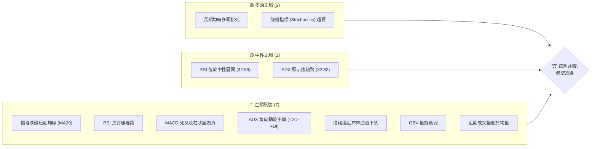
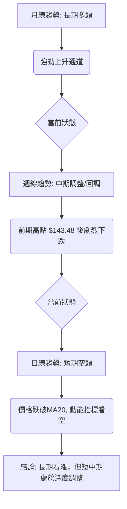
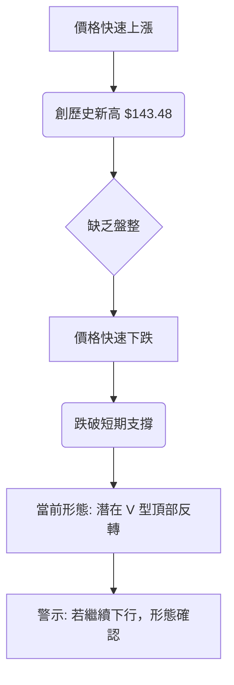
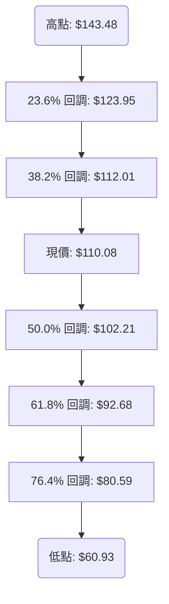

<details>
<summary>📊 靜態圖表 (點擊展開)</summary>

</details>

<html>
<head><meta charset="utf-8" /></head>
<body>
    <div style="height:500px; width:100%;">                        <script>window.PlotlyConfig = {MathJaxConfig: 'local'};</script>
        <script charset="utf-8" src="https://cdn.plot.ly/plotly-3.6.0.min.js" integrity="sha256-QaOVwtVY0T02VaHrr6pnoHLCwayMJp4O5n4YyaE3rJk=" crossorigin="anonymous"></script>                <div id="candlestick-chart" class="plotly-graph-div" style="height:100%; width:100%;"></div>            <script>                window.PLOTLYENV=window.PLOTLYENV || {};                                if (document.getElementById("candlestick-chart")) {                    Plotly.newPlot(                        "candlestick-chart",                        [{"close":{"dtype":"f8","bdata":"AAAA4FFYREAAAAAA18NEQAAAAOCjMEZAAAAAACmcR0AAAADgoxBIQAAAAAAAIEdAAAAA4Hr0R0AAAADAzExIQAAAACCup0hAAAAAANfDRUAAAABguH5FQAAAACCF60ZAAAAAoHDdR0AAAAAA14NHQAAAAIDCFUdAAAAAQAo3SEAAAAAghatKQAAAAMAeBUtAAAAAIFyfR0AAAACAPQpIQAAAAEAKl0dAAAAAwB7lR0AAAAAgrudIQAAAAOB6dEpAAAAA4FFYSEAAAADgo1BHQAAAAKBHIUdAAAAAoEeBR0AAAADgevRHQAAAAAAp\u002fEdAAAAAACk8SkAAAADgehRMQAAAAAAAQE1AAAAAoEfBTkAAAAAA11NQQAAAAEDhmlBAAAAA4KMQUEAAAABA4VpQQAAAAIDrAVFAAAAAoEdRUUAAAAAAAMBQQAAAAKBHkVBAAAAAYGbWUEAAAACgmVlQQAAAAOBRSE5AAAAAwPXIT0AAAAAA1yNQQAAAACCuZ1BAAAAAAADgT0AAAACAPYpQQAAAAIDCdU5AAAAAoHB9T0AAAAAghatOQAAAAMD1SExAAAAAgMI1TEAAAACAFM5IQAAAAIDr0UlAAAAAQDPzSUAAAABguJ5JQAAAAAAp\u002fEhAAAAAAACgRkAAAADAHsVGQAAAACCup0VAAAAAANdjRUAAAAAgXM9FQAAAAKBwvUNAAAAAYGYmREAAAACgmTlFQAAAAMDMTEVAAAAAQAr3REAAAACA6xFFQAAAACBcL0RAAAAAQDPzREAAAAAAKVxGQAAAACBcr0hAAAAAQAqHSEAAAAAgrsdJQAAAAEAKt0pAAAAAYI\u002fCTEAAAAAA18NPQAAAAGC4vk5AAAAA4Hq0S0AAAABguL5LQAAAAEDh+kpAAAAAgML1TUAAAACgR6FRQAAAAEAzY1NAAAAAIIVLU0AAAAAghUtTQAAAAKCZqVFAAAAAIK6HUUAAAADAzJxRQAAAAOCjcFFAAAAAIFz\u002fUkAAAADA9YhTQAAAAIDrgVVAAAAAwB4FVUAAAADAHsVUQAAAAGBmNlVAAAAAoJn5VUAAAADAHqVVQAAAAEAz81ZAAAAA4KOwVkAAAABAMxNYQAAAAIA9SlZAAAAA4Hr0VUAAAABguP5VQAAAAKCZOVZAAAAAYLgeVEAAAAAAAMBVQAAAAOB6JFZAAAAAIIVrVUAAAADgegRUQAAAAKCZiVJAAAAAoEdRVEAAAABACkdSQAAAAOB6lFBAAAAA4HoUUkAAAACAwvVSQAAAAIDrAVJAAAAAIK5nUUAAAADgo4BQQAAAAAAp3FBAAAAAwPV4UUAAAABA4ZpSQAAAAMAeJVNAAAAAQAq3UUAAAACgcI1RQAAAAIAUflFAAAAAwMyMUUAAAACgmSlSQAAAAGBmRlFAAAAAgBS+UUAAAADgUYhRQAAAAIA9+lFAAAAAAACAUUAAAABACodRQAAAAGC43lFAAAAAIIU7UUAAAACgcP1RQAAAACCuF1FAAAAAgD0aUUAAAAAA19NRQAAAAIDCpVNAAAAAYLheUUAAAAAghftRQAAAAGC4zlBAAAAAAAAAUUAAAADgeoRQQAAAAOBROFJAAAAAACl8UEAAAABACndOQAAAAOCjsExAAAAAgBQOUEAAAACgR2FQQAAAAGC47lBAAAAAQOHqUEAAAADgepRQQAAAAMAeRVFAAAAAIFyvUEAAAABAMwNRQAAAACCup1FAAAAAgBQOUkAAAABgZmZSQAAAACCFu1RAAAAAQDMzVUAAAACgcF1WQAAAAMD1qFVAAAAAYI+CVkAAAABgZiZVQAAAACCF61NAAAAAYI+SVEAAAACAwqVTQAAAAKBHQVNAAAAA4KOgVEAAAAAA17NTQAAAAADXE1RAAAAA4KOwU0AAAACgmSlVQAAAAMAepVNAAAAAgBReWkAAAABgZlZdQAAAAADXY11AAAAAoJkJX0AAAACgmZFgQAAAAKBHMV9AAAAAwB5lYEAAAAAA19NfQAAAAMD1yGBAAAAAwMxcX0AAAADgUfhgQAAAAGBm5mFAAAAAIFzHYkAAAADA9YBiQAAAACBc72FAAAAAwPWYXkAAAADgetReQAAAAMDMrFxAAAAAwMz8XUAAAADAHoVbQA=="},"high":{"dtype":"f8","bdata":"AAAAgBRuREAAAAAgXO9EQAAAAECNV0ZAAAAAIIXLSEAAAACAwnVJQAAAAGC4XkhAAAAAwMz8R0AAAABgZmZIQAAAAMAexUhAAAAAQDNzSUAAAACAPUpGQAAAAGC4\u002fkZAAAAAoJkZSEAAAAAA18NHQAAAAIAUDkhAAAAAwB7VSEAAAAAA1wNLQAAAAIDClUtAAAAAgD0KSkAAAADAHkVIQAAAAOBRmEhAAAAAQAp3SEAAAACgRyFJQAAAAGA5FEtAAAAAoHA9SkAAAAAgXE9IQAAAAOBR2EdAAAAAwMwMSEAAAABguP5HQAAAAIDCtUhAAAAAQDNTSkAAAAAgMXhMQAAAAKBHoU1AAAAAIK5HT0AAAAAALSJRQAAAAGCPIlFAAAAAAABgUkAAAAAAKZxRQAAAAEDhalFAAAAAgBR+UkAAAAAAABBSQAAAAAAAIFFAAAAAIIULUkAAAABgjwJRQAAAAKBHAVBAAAAAwMwsUEAAAAAghYtQQAAAAGBmllBAAAAAYI+iUEAAAADA9dhQQAAAACCFS1BAAAAAoJm5T0AAAADAzIxPQAAAAGC4vk1AAAAAANejTEAAAABA4RpMQAAAAMDMDEpAAAAAAABAS0AAAABA4XpMQAAAAIA9qktAAAAA4KOwSEAAAAAAKZxHQAAAAMBL10ZAAAAAgBTORUAAAAAA10NGQAAAAKBHIUdAAAAAgMKFREAAAAAA10NFQAAAAEAKZ0VAAAAAIIXLRUAAAACgmVlFQAAAAGBmpkRAAAAAYLh+RUAAAABguF5GQAAAAEAK10hAAAAAoJnZSEAAAAAgXC9KQAAAAAAA4EpAAAAAgD1qTUAAAACgmQlQQAAAACCFS1BAAAAAANcjUEAAAACgcF1MQAAAAOB6dExAAAAAAAAgTkAAAAAA16NRQAAAAMDMnFNAAAAAIIXLU0AAAADAHvVTQAAAACBcP1NAAAAAIFwvUkAAAAAAKaxSQAAAAECLTFJAAAAAIFwPU0AAAAAAAJBTQAAAAAAAkFVAAAAAoHB9VUAAAAAgrndWQAAAACCFG1ZAAAAAgMI1VkAAAADgp25WQAAAAAApDFdAAAAAQGAdV0AAAADAHuVYQAAAAKBHkVhAAAAAAADQVkAAAACgmVlWQAAAAMDMnFdAAAAAgD3KVUAAAAAAAMBVQAAAAEAzc1ZAAAAAAABAVkAAAADgelRWQAAAAMDMLFRAAAAA4HpUVEAAAABgZlZUQAAAACBcP1JAAAAAgD0qUkAAAABAMzNTQAAAAEAK91JAAAAAoJlZUkAAAADAzBxRQAAAAGBmZlFAAAAAIFy\u002fUUAAAADA9fBSQAAAAEAKR1NAAAAAwMyMU0AAAAAAANBRQAAAACCFg1FAAAAAYGb2UUAAAAAgXC9SQAAAAIDCZVFAAAAAYGYGUkAAAAAAAFBSQAAAAGBmhlJAAAAAANcTUkAAAABACsdSQAAAAAAACFJAAAAAANc7UkAAAABAM1NSQAAAAGBmJlJAAAAAANfTUUAAAADgURhSQAAAAEDhqlNAAAAA4FE4U0AAAABguC5SQAAAAGC4flJAAAAAwMxcUUAAAABgZiZRQAAAAADXw1JAAAAAgMIFUkAAAACAFIZQQAAAAIDr0U5AAAAAwB4lUEAAAABA4SpRQAAAAMD1WFFAAAAA4HqUUUAAAABAMxNRQAAAAIDAalJAAAAAYI9yUUAAAAAA14NRQAAAAEAz41FAAAAAAACwUkAAAACAwqVSQAAAACBc31RAAAAAIFy\u002fVUAAAABgZpZWQAAAAMDM\u002fFZAAAAAYGZGV0AAAABAM5NWQAAAAIA9mlVAAAAAYLieVEAAAACA63FUQAAAAOCjgFNAAAAAgMLlVEAAAABgj\u002fJUQAAAAOBPdVRAAAAAAADAVEAAAAAghStVQAAAAGCPMlVAAAAAIK5nWkAAAAAAKfxeQAAAACBcX15AAAAAIFzPX0AAAACAwqVgQAAAAADXS2BAAAAAAClMYUAAAACAPTJgQAAAAEAz62BAAAAAANdbYEAAAADgUXhhQAAAAAAAQGJAAAAAAADgYkAAAABgj9piQAAAAAAAAGJAAAAAACn0YEAAAADAzAxgQAAAAOBRoF5AAAAA4FGoXkAAAABguH5dQA=="},"hovertemplate":"\u003cb\u003e%{x|%Y-%m-%d}\u003c\u002fb\u003e\u003cbr\u003e\u958b: $%{open:.2f}\u003cbr\u003e\u9ad8: $%{high:.2f}\u003cbr\u003e\u4f4e: $%{low:.2f}\u003cbr\u003e\u6536: $%{close:.2f}\u003cextra\u003e\u003c\u002fextra\u003e","low":{"dtype":"f8","bdata":"AAAAoEchQ0AAAAAAKRxEQAAAAMChNURAAAAAYGYGRkAAAAAAAIBHQAAAAMD16EZAAAAAIIWrRkAAAABgjwJHQAAAAEAK10ZAAAAAQInBRUAAAACgmVlFQAAAAIDrMUVAAAAAwHa+RkAAAABAicFGQAAAAMDMzEZAAAAAQAoHR0AAAABANU5IQAAAAAApXEpAAAAAoEeBR0AAAACgmTlHQAAAAAAAgEdAAAAA4KOQR0AAAABgZmZHQAAAAOB69EdAAAAAQAo3SEAAAABA4ZpGQAAAAIA96kZAAAAAIFwvR0AAAACgR0FHQAAAACBcj0dAAAAAoEdBSEAAAACgR6FJQAAAAGBm5ktAAAAAYI+CTEAAAABAM9NPQAAAAEDhGlBAAAAAwPUIUEAAAADgzidQQAAAAOBRGE9AAAAAwB7FUEAAAABAM5tQQAAAAKCZ2U9AAAAAQDOrUEAAAABACjdQQAAAAOB6NE1AAAAAAABgTkAAAABAM9NPQAAAAKCZCVBAAAAAgBTOT0AAAACgcL1PQAAAAIDrcU5AAAAAQDMzTkAAAADgo5BNQAAAAKBHQUxAAAAAIFxvS0AAAADgerRIQAAAAODOJ0dAAAAAoEdhSUAAAABA4ZpJQAAAAOB61EhAAAAAIFwvRkAAAABgZqZFQAAAAMDMHEVAAAAAoHCdREAAAABACjdFQAAAAMD1qENAAAAAwPXIQkAAAABgZqZDQAAAAOCjMERAAAAA4KOwREAAAABgZuZEQAAAAKBw\u002fUNAAAAAgMI1REAAAAAAAMBEQAAAAMD1aEZAAAAAoJnZR0AAAAAAKZxIQAAAACCFK0lAAAAAAAAgSkAAAADAzGxMQAAAAGBm5k1AAAAAgD2KS0AAAABACldKQAAAAEDhikpAAAAAANcDTEAAAADAnV9OQAAAAMAgMFJAAAAAYI9SUkAAAACgQ7NSQAAAAMD1mFFAAAAAoJtUUUAAAAAAKZxRQAAAAOBRSFFAAAAAYGa2UEAAAAAA19NRQAAAAEAzg1JAAAAAYGZ2VEAAAADgo5BUQAAAAMDMnFRAAAAA4NDaVEAAAACgmWlVQAAAAAAAIFVAAAAAoJmpVUAAAACgmRlXQAAAAEAzE1ZAAAAAoHCtVEAAAADAdlZUQAAAACCuh1VAAAAA4KMAVEAAAAAAAIBUQAAAAMDKgVVAAAAAAADAVEAAAACgR4FTQAAAAIBBeFJAAAAAoEfxUkAAAABACCRRQAAAAMDMTFBAAAAAAADAUEAAAAAAALBRQAAAAEAz41FAAAAAoEfBUEAAAAAgXO9PQAAAAAAAYFBAAAAAAABAUEAAAADAS39RQAAAAGBmFlJAAAAAoJlZUUAAAAAAACBRQAAAAGBmplBAAAAA4FE4UUAAAAAA1zNRQAAAAGBmBlBAAAAAwMycUEAAAAAAKYxQQAAAAIAUXlFAAAAAgMLVUEAAAADgowhRQAAAAOB69FBAAAAAgL4nUUAAAADAHhVRQAAAAIDrEVFAAAAAACncUEAAAABA4SpRQAAAAKBH0VFAAAAAoJlZUUAAAAAAAABRQAAAAMD1mFBAAAAAQDODUEAAAACgcB1QQAAAAAApPFFAAAAAgMJlUEAAAADAzCxOQAAAAGDlEExAAAAAANeDTUAAAABAM1NQQAAAAIAU7k5AAAAAYGamUEAAAABA4fpPQAAAAGDn81BAAAAAQOGiUEAAAACAwpVQQAAAAIDCpVBAAAAAYLieUUAAAABgZmZRQAAAAKCZOVNAAAAAYGbmVEAAAABgZiZVQAAAAAAAcFVAAAAA4KPwVUAAAAAAKWRUQAAAAMAexVNAAAAAwHRDU0AAAABgZmZTQAAAACBcf1JAAAAAgBReU0AAAAAghZtTQAAAAAAAEFNAAAAAANcjU0AAAABACrdTQAAAACCFe1NAAAAAIK53VUAAAAAAAABaQAAAAIA9GlxAAAAAwPU4XUAAAAAA11NeQAAAAEAzc15AAAAAoPFqX0AAAABguM5cQAAAAIAUDl9AAAAAQDPzXkAAAACA62lgQAAAAIDrUWFAAAAAwB49YUAAAAAA18thQAAAAKCZwWBAAAAAAABAXkAAAAAA16NeQAAAAIA9alxAAAAAwPWYW0AAAABguK5aQA=="},"name":"\u50f9\u683c","open":{"dtype":"f8","bdata":"AAAAQOEaREAAAAAA12NEQAAAAAApfERAAAAA4HqURkAAAACgcN1HQAAAAEAKV0hAAAAA4KNwR0AAAADAzOxHQAAAAAAAYEdAAAAAYI8iSUAAAADgehRGQAAAAOBRyEVAAAAAAADARkAAAACgR4FHQAAAAADXw0dAAAAAwPUoR0AAAACgcH1IQAAAAIA9ykpAAAAAAAAASkAAAADgUchHQAAAAIDCdUhAAAAAQArXR0AAAADgo5BHQAAAAEAzg0hAAAAAgMLlSUAAAAAAAABIQAAAAGBmpkdAAAAAQDOzR0AAAABA4ZpHQAAAAOCjsEdAAAAAgOtRSEAAAABgZgZKQAAAAGC4bkxAAAAAoEeBTUAAAACgmQlQQAAAAKCZOVBAAAAAQDOzUUAAAADgUfhQQAAAAIDCVVBAAAAAoEeBUUAAAADgeoRRQAAAAMD1eFBAAAAA4KNIUUAAAABgjwJRQAAAAAApfE9AAAAAIK7HTkAAAAAA1zNQQAAAAAApjFBAAAAAQDNrUEAAAACgRwlQQAAAAAAAQFBAAAAAYI\u002fiTkAAAAAA14NPQAAAAGBm5kxAAAAA4HpUTEAAAABA4RpMQAAAAKAY1EdAAAAAYLjeSkAAAAAAAABMQAAAAEAK90lAAAAAoEdhSEAAAABA4dpFQAAAAEAzk0ZAAAAAACkcRUAAAAAAAEBFQAAAAIA9CkdAAAAAgD3qQ0AAAACgR2FEQAAAAADXA0VAAAAAYLieRUAAAACgR0FFQAAAAEAzk0RAAAAAIK5HREAAAABgj\u002fJEQAAAAGCP0kZAAAAAAABwSEAAAACAPQpJQAAAAKBwnUlAAAAA4FG4SkAAAACgR8FMQAAAAAAAQE9AAAAA4KeGT0AAAADgURhLQAAAAMDMDExAAAAAoJkZTEAAAAAgXI9OQAAAAAApPFJAAAAAANdzUkAAAACAPYJTQAAAACCFK1NAAAAAAABgUUAAAACgmUFSQAAAAAAA4FFAAAAA4FGoUUAAAAAgrqdSQAAAAOCjcFNAAAAAYGYGVUAAAAAAAGBVQAAAAKCZIVVAAAAAYLg+VUAAAADA9UhWQAAAAGBmllVAAAAAwPVQVkAAAACgmSFXQAAAAMDMbFdAAAAAoEeBVkAAAADgUZhVQAAAACCFQ1ZAAAAAIK6vVUAAAADA9bhUQAAAAIAUzlVAAAAAACn8VUAAAAAAAEBVQAAAAIA9ylNAAAAAYGamU0AAAABgZlZUQAAAAGC4flFAAAAAAABAUUAAAACgmQFSQAAAAIAUplJAAAAA4FFIUkAAAACA6+FQQAAAAOB6rFBAAAAAQGCFUEAAAAAAAMBRQAAAAKCZOVJAAAAAINneUkAAAADgUTBRQAAAAOBROFFAAAAAgBTGUUAAAABA4YJRQAAAAIDC5VBAAAAAIIWrUEAAAABguDZRQAAAAADXs1FAAAAAQOG6UUAAAADgowhRQAAAAMD1WFFAAAAAgMKVUUAAAABAMzNRQAAAAMDM\u002fFFAAAAAoJlJUUAAAADAzFRRQAAAAGBm3lFAAAAAYI8CU0AAAADgejRRQAAAAAAAAFJAAAAAoHAFUUAAAAAAAMBQQAAAAAApPFFAAAAAwMzMUUAAAADgo4BQQAAAAKCZuU5AAAAAQOHaTkAAAAAAAGBQQAAAAMDMHE9AAAAAYLjuUEAAAAAgXMdQQAAAAAAAAFJAAAAAANdDUUAAAADAzOxQQAAAAEAzw1BAAAAAIIVjUkAAAACgcGVSQAAAAIAUPlNAAAAAwB4FVUAAAABgZjZVQAAAAMAelVZAAAAAgMKdVkAAAABgZnZWQAAAAIDClVVAAAAAACnsU0AAAADAzARUQAAAAEAKd1NAAAAAQDNjU0AAAACA6+FUQAAAAEAKl1NAAAAAYGamVEAAAAAgrudTQAAAAKBwLVVAAAAAgD2CVUAAAACgR1FaQAAAAOCjMFxAAAAAoEf5XkAAAABgZsZeQAAAAEAzA2BAAAAAACmYYEAAAACAFH5fQAAAAGC43l9AAAAAwPWIX0AAAADAHm1gQAAAAEDhvmFAAAAAQAq3YkAAAACgcGViQAAAAIAUfmFAAAAAACmMYEAAAACAwlVfQAAAAMAe5V1AAAAAoHBFXEAAAACgR5FcQA=="},"x":["2025-08-20T00:00:00-04:00","2025-08-21T00:00:00-04:00","2025-08-22T00:00:00-04:00","2025-08-25T00:00:00-04:00","2025-08-26T00:00:00-04:00","2025-08-27T00:00:00-04:00","2025-08-28T00:00:00-04:00","2025-08-29T00:00:00-04:00","2025-09-02T00:00:00-04:00","2025-09-03T00:00:00-04:00","2025-09-04T00:00:00-04:00","2025-09-05T00:00:00-04:00","2025-09-08T00:00:00-04:00","2025-09-09T00:00:00-04:00","2025-09-10T00:00:00-04:00","2025-09-11T00:00:00-04:00","2025-09-12T00:00:00-04:00","2025-09-15T00:00:00-04:00","2025-09-16T00:00:00-04:00","2025-09-17T00:00:00-04:00","2025-09-18T00:00:00-04:00","2025-09-19T00:00:00-04:00","2025-09-22T00:00:00-04:00","2025-09-23T00:00:00-04:00","2025-09-24T00:00:00-04:00","2025-09-25T00:00:00-04:00","2025-09-26T00:00:00-04:00","2025-09-29T00:00:00-04:00","2025-09-30T00:00:00-04:00","2025-10-01T00:00:00-04:00","2025-10-02T00:00:00-04:00","2025-10-03T00:00:00-04:00","2025-10-06T00:00:00-04:00","2025-10-07T00:00:00-04:00","2025-10-08T00:00:00-04:00","2025-10-09T00:00:00-04:00","2025-10-10T00:00:00-04:00","2025-10-13T00:00:00-04:00","2025-10-14T00:00:00-04:00","2025-10-15T00:00:00-04:00","2025-10-16T00:00:00-04:00","2025-10-17T00:00:00-04:00","2025-10-20T00:00:00-04:00","2025-10-21T00:00:00-04:00","2025-10-22T00:00:00-04:00","2025-10-23T00:00:00-04:00","2025-10-24T00:00:00-04:00","2025-10-27T00:00:00-04:00","2025-10-28T00:00:00-04:00","2025-10-29T00:00:00-04:00","2025-10-30T00:00:00-04:00","2025-10-31T00:00:00-04:00","2025-11-03T00:00:00-05:00","2025-11-04T00:00:00-05:00","2025-11-05T00:00:00-05:00","2025-11-06T00:00:00-05:00","2025-11-07T00:00:00-05:00","2025-11-10T00:00:00-05:00","2025-11-11T00:00:00-05:00","2025-11-12T00:00:00-05:00","2025-11-13T00:00:00-05:00","2025-11-14T00:00:00-05:00","2025-11-17T00:00:00-05:00","2025-11-18T00:00:00-05:00","2025-11-19T00:00:00-05:00","2025-11-20T00:00:00-05:00","2025-11-21T00:00:00-05:00","2025-11-24T00:00:00-05:00","2025-11-25T00:00:00-05:00","2025-11-26T00:00:00-05:00","2025-11-28T00:00:00-05:00","2025-12-01T00:00:00-05:00","2025-12-02T00:00:00-05:00","2025-12-03T00:00:00-05:00","2025-12-04T00:00:00-05:00","2025-12-05T00:00:00-05:00","2025-12-08T00:00:00-05:00","2025-12-09T00:00:00-05:00","2025-12-10T00:00:00-05:00","2025-12-11T00:00:00-05:00","2025-12-12T00:00:00-05:00","2025-12-15T00:00:00-05:00","2025-12-16T00:00:00-05:00","2025-12-17T00:00:00-05:00","2025-12-18T00:00:00-05:00","2025-12-19T00:00:00-05:00","2025-12-22T00:00:00-05:00","2025-12-23T00:00:00-05:00","2025-12-24T00:00:00-05:00","2025-12-26T00:00:00-05:00","2025-12-29T00:00:00-05:00","2025-12-30T00:00:00-05:00","2025-12-31T00:00:00-05:00","2026-01-02T00:00:00-05:00","2026-01-05T00:00:00-05:00","2026-01-06T00:00:00-05:00","2026-01-07T00:00:00-05:00","2026-01-08T00:00:00-05:00","2026-01-09T00:00:00-05:00","2026-01-12T00:00:00-05:00","2026-01-13T00:00:00-05:00","2026-01-14T00:00:00-05:00","2026-01-15T00:00:00-05:00","2026-01-16T00:00:00-05:00","2026-01-20T00:00:00-05:00","2026-01-21T00:00:00-05:00","2026-01-22T00:00:00-05:00","2026-01-23T00:00:00-05:00","2026-01-26T00:00:00-05:00","2026-01-27T00:00:00-05:00","2026-01-28T00:00:00-05:00","2026-01-29T00:00:00-05:00","2026-01-30T00:00:00-05:00","2026-02-02T00:00:00-05:00","2026-02-03T00:00:00-05:00","2026-02-04T00:00:00-05:00","2026-02-05T00:00:00-05:00","2026-02-06T00:00:00-05:00","2026-02-09T00:00:00-05:00","2026-02-10T00:00:00-05:00","2026-02-11T00:00:00-05:00","2026-02-12T00:00:00-05:00","2026-02-13T00:00:00-05:00","2026-02-17T00:00:00-05:00","2026-02-18T00:00:00-05:00","2026-02-19T00:00:00-05:00","2026-02-20T00:00:00-05:00","2026-02-23T00:00:00-05:00","2026-02-24T00:00:00-05:00","2026-02-25T00:00:00-05:00","2026-02-26T00:00:00-05:00","2026-02-27T00:00:00-05:00","2026-03-02T00:00:00-05:00","2026-03-03T00:00:00-05:00","2026-03-04T00:00:00-05:00","2026-03-05T00:00:00-05:00","2026-03-06T00:00:00-05:00","2026-03-09T00:00:00-04:00","2026-03-10T00:00:00-04:00","2026-03-11T00:00:00-04:00","2026-03-12T00:00:00-04:00","2026-03-13T00:00:00-04:00","2026-03-16T00:00:00-04:00","2026-03-17T00:00:00-04:00","2026-03-18T00:00:00-04:00","2026-03-19T00:00:00-04:00","2026-03-20T00:00:00-04:00","2026-03-23T00:00:00-04:00","2026-03-24T00:00:00-04:00","2026-03-25T00:00:00-04:00","2026-03-26T00:00:00-04:00","2026-03-27T00:00:00-04:00","2026-03-30T00:00:00-04:00","2026-03-31T00:00:00-04:00","2026-04-01T00:00:00-04:00","2026-04-02T00:00:00-04:00","2026-04-06T00:00:00-04:00","2026-04-07T00:00:00-04:00","2026-04-08T00:00:00-04:00","2026-04-09T00:00:00-04:00","2026-04-10T00:00:00-04:00","2026-04-13T00:00:00-04:00","2026-04-14T00:00:00-04:00","2026-04-15T00:00:00-04:00","2026-04-16T00:00:00-04:00","2026-04-17T00:00:00-04:00","2026-04-20T00:00:00-04:00","2026-04-21T00:00:00-04:00","2026-04-22T00:00:00-04:00","2026-04-23T00:00:00-04:00","2026-04-24T00:00:00-04:00","2026-04-27T00:00:00-04:00","2026-04-28T00:00:00-04:00","2026-04-29T00:00:00-04:00","2026-04-30T00:00:00-04:00","2026-05-01T00:00:00-04:00","2026-05-04T00:00:00-04:00","2026-05-05T00:00:00-04:00","2026-05-06T00:00:00-04:00","2026-05-07T00:00:00-04:00","2026-05-08T00:00:00-04:00","2026-05-11T00:00:00-04:00","2026-05-12T00:00:00-04:00","2026-05-13T00:00:00-04:00","2026-05-14T00:00:00-04:00","2026-05-15T00:00:00-04:00","2026-05-18T00:00:00-04:00","2026-05-19T00:00:00-04:00","2026-05-20T00:00:00-04:00","2026-05-21T00:00:00-04:00","2026-05-22T00:00:00-04:00","2026-05-26T00:00:00-04:00","2026-05-27T00:00:00-04:00","2026-05-28T00:00:00-04:00","2026-05-29T00:00:00-04:00","2026-06-01T00:00:00-04:00","2026-06-02T00:00:00-04:00","2026-06-03T00:00:00-04:00","2026-06-04T00:00:00-04:00","2026-06-05T00:00:00-04:00"],"type":"candlestick"},{"hovertemplate":"MA30: $%{y:.2f}\u003cextra\u003e\u003c\u002fextra\u003e","line":{"color":"#2196F3","dash":"dash","width":2},"mode":"lines","name":"MA30","x":["2025-08-20T00:00:00-04:00","2025-08-21T00:00:00-04:00","2025-08-22T00:00:00-04:00","2025-08-25T00:00:00-04:00","2025-08-26T00:00:00-04:00","2025-08-27T00:00:00-04:00","2025-08-28T00:00:00-04:00","2025-08-29T00:00:00-04:00","2025-09-02T00:00:00-04:00","2025-09-03T00:00:00-04:00","2025-09-04T00:00:00-04:00","2025-09-05T00:00:00-04:00","2025-09-08T00:00:00-04:00","2025-09-09T00:00:00-04:00","2025-09-10T00:00:00-04:00","2025-09-11T00:00:00-04:00","2025-09-12T00:00:00-04:00","2025-09-15T00:00:00-04:00","2025-09-16T00:00:00-04:00","2025-09-17T00:00:00-04:00","2025-09-18T00:00:00-04:00","2025-09-19T00:00:00-04:00","2025-09-22T00:00:00-04:00","2025-09-23T00:00:00-04:00","2025-09-24T00:00:00-04:00","2025-09-25T00:00:00-04:00","2025-09-26T00:00:00-04:00","2025-09-29T00:00:00-04:00","2025-09-30T00:00:00-04:00","2025-10-01T00:00:00-04:00","2025-10-02T00:00:00-04:00","2025-10-03T00:00:00-04:00","2025-10-06T00:00:00-04:00","2025-10-07T00:00:00-04:00","2025-10-08T00:00:00-04:00","2025-10-09T00:00:00-04:00","2025-10-10T00:00:00-04:00","2025-10-13T00:00:00-04:00","2025-10-14T00:00:00-04:00","2025-10-15T00:00:00-04:00","2025-10-16T00:00:00-04:00","2025-10-17T00:00:00-04:00","2025-10-20T00:00:00-04:00","2025-10-21T00:00:00-04:00","2025-10-22T00:00:00-04:00","2025-10-23T00:00:00-04:00","2025-10-24T00:00:00-04:00","2025-10-27T00:00:00-04:00","2025-10-28T00:00:00-04:00","2025-10-29T00:00:00-04:00","2025-10-30T00:00:00-04:00","2025-10-31T00:00:00-04:00","2025-11-03T00:00:00-05:00","2025-11-04T00:00:00-05:00","2025-11-05T00:00:00-05:00","2025-11-06T00:00:00-05:00","2025-11-07T00:00:00-05:00","2025-11-10T00:00:00-05:00","2025-11-11T00:00:00-05:00","2025-11-12T00:00:00-05:00","2025-11-13T00:00:00-05:00","2025-11-14T00:00:00-05:00","2025-11-17T00:00:00-05:00","2025-11-18T00:00:00-05:00","2025-11-19T00:00:00-05:00","2025-11-20T00:00:00-05:00","2025-11-21T00:00:00-05:00","2025-11-24T00:00:00-05:00","2025-11-25T00:00:00-05:00","2025-11-26T00:00:00-05:00","2025-11-28T00:00:00-05:00","2025-12-01T00:00:00-05:00","2025-12-02T00:00:00-05:00","2025-12-03T00:00:00-05:00","2025-12-04T00:00:00-05:00","2025-12-05T00:00:00-05:00","2025-12-08T00:00:00-05:00","2025-12-09T00:00:00-05:00","2025-12-10T00:00:00-05:00","2025-12-11T00:00:00-05:00","2025-12-12T00:00:00-05:00","2025-12-15T00:00:00-05:00","2025-12-16T00:00:00-05:00","2025-12-17T00:00:00-05:00","2025-12-18T00:00:00-05:00","2025-12-19T00:00:00-05:00","2025-12-22T00:00:00-05:00","2025-12-23T00:00:00-05:00","2025-12-24T00:00:00-05:00","2025-12-26T00:00:00-05:00","2025-12-29T00:00:00-05:00","2025-12-30T00:00:00-05:00","2025-12-31T00:00:00-05:00","2026-01-02T00:00:00-05:00","2026-01-05T00:00:00-05:00","2026-01-06T00:00:00-05:00","2026-01-07T00:00:00-05:00","2026-01-08T00:00:00-05:00","2026-01-09T00:00:00-05:00","2026-01-12T00:00:00-05:00","2026-01-13T00:00:00-05:00","2026-01-14T00:00:00-05:00","2026-01-15T00:00:00-05:00","2026-01-16T00:00:00-05:00","2026-01-20T00:00:00-05:00","2026-01-21T00:00:00-05:00","2026-01-22T00:00:00-05:00","2026-01-23T00:00:00-05:00","2026-01-26T00:00:00-05:00","2026-01-27T00:00:00-05:00","2026-01-28T00:00:00-05:00","2026-01-29T00:00:00-05:00","2026-01-30T00:00:00-05:00","2026-02-02T00:00:00-05:00","2026-02-03T00:00:00-05:00","2026-02-04T00:00:00-05:00","2026-02-05T00:00:00-05:00","2026-02-06T00:00:00-05:00","2026-02-09T00:00:00-05:00","2026-02-10T00:00:00-05:00","2026-02-11T00:00:00-05:00","2026-02-12T00:00:00-05:00","2026-02-13T00:00:00-05:00","2026-02-17T00:00:00-05:00","2026-02-18T00:00:00-05:00","2026-02-19T00:00:00-05:00","2026-02-20T00:00:00-05:00","2026-02-23T00:00:00-05:00","2026-02-24T00:00:00-05:00","2026-02-25T00:00:00-05:00","2026-02-26T00:00:00-05:00","2026-02-27T00:00:00-05:00","2026-03-02T00:00:00-05:00","2026-03-03T00:00:00-05:00","2026-03-04T00:00:00-05:00","2026-03-05T00:00:00-05:00","2026-03-06T00:00:00-05:00","2026-03-09T00:00:00-04:00","2026-03-10T00:00:00-04:00","2026-03-11T00:00:00-04:00","2026-03-12T00:00:00-04:00","2026-03-13T00:00:00-04:00","2026-03-16T00:00:00-04:00","2026-03-17T00:00:00-04:00","2026-03-18T00:00:00-04:00","2026-03-19T00:00:00-04:00","2026-03-20T00:00:00-04:00","2026-03-23T00:00:00-04:00","2026-03-24T00:00:00-04:00","2026-03-25T00:00:00-04:00","2026-03-26T00:00:00-04:00","2026-03-27T00:00:00-04:00","2026-03-30T00:00:00-04:00","2026-03-31T00:00:00-04:00","2026-04-01T00:00:00-04:00","2026-04-02T00:00:00-04:00","2026-04-06T00:00:00-04:00","2026-04-07T00:00:00-04:00","2026-04-08T00:00:00-04:00","2026-04-09T00:00:00-04:00","2026-04-10T00:00:00-04:00","2026-04-13T00:00:00-04:00","2026-04-14T00:00:00-04:00","2026-04-15T00:00:00-04:00","2026-04-16T00:00:00-04:00","2026-04-17T00:00:00-04:00","2026-04-20T00:00:00-04:00","2026-04-21T00:00:00-04:00","2026-04-22T00:00:00-04:00","2026-04-23T00:00:00-04:00","2026-04-24T00:00:00-04:00","2026-04-27T00:00:00-04:00","2026-04-28T00:00:00-04:00","2026-04-29T00:00:00-04:00","2026-04-30T00:00:00-04:00","2026-05-01T00:00:00-04:00","2026-05-04T00:00:00-04:00","2026-05-05T00:00:00-04:00","2026-05-06T00:00:00-04:00","2026-05-07T00:00:00-04:00","2026-05-08T00:00:00-04:00","2026-05-11T00:00:00-04:00","2026-05-12T00:00:00-04:00","2026-05-13T00:00:00-04:00","2026-05-14T00:00:00-04:00","2026-05-15T00:00:00-04:00","2026-05-18T00:00:00-04:00","2026-05-19T00:00:00-04:00","2026-05-20T00:00:00-04:00","2026-05-21T00:00:00-04:00","2026-05-22T00:00:00-04:00","2026-05-26T00:00:00-04:00","2026-05-27T00:00:00-04:00","2026-05-28T00:00:00-04:00","2026-05-29T00:00:00-04:00","2026-06-01T00:00:00-04:00","2026-06-02T00:00:00-04:00","2026-06-03T00:00:00-04:00","2026-06-04T00:00:00-04:00","2026-06-05T00:00:00-04:00"],"y":{"dtype":"f8","bdata":"AAAAAAAA+H8AAAAAAAD4fwAAAAAAAPh\u002fAAAAAAAA+H8AAAAAAAD4fwAAAAAAAPh\u002fAAAAAAAA+H8AAAAAAAD4fwAAAAAAAPh\u002fAAAAAAAA+H8AAAAAAAD4fwAAAAAAAPh\u002fAAAAAAAA+H8AAAAAAAD4fwAAAAAAAPh\u002fAAAAAAAA+H8AAAAAAAD4fwAAAAAAAPh\u002fAAAAAAAA+H8AAAAAAAD4fwAAAAAAAPh\u002fAAAAAAAA+H8AAAAAAAD4fwAAAAAAAPh\u002fAAAAAAAA+H8AAAAAAAD4fwAAAAAAAPh\u002fAAAAAAAA+H8AAAAAAAD4f83MzHw\u002frUdAREREZILfR0ARERFB7h1IQO\u002fu7g4tWkhAvLu7iyWXSEDv7u6ucuBIQDMzM7OBNklAMzMzQ0R8SUAAAAAwCMRJQKuqqmrnE0pAvLu7W7qBSkDe3d2tK+hKQO\u002fu7q5WP0tARERE9AyTS0BVVVXlbeFLQDMzMxPZHkxA3t3d\u002fXFfTECJiIg4UY9MQLy7u6u5wExAiYiIiCUHTUB3d3e3SVRNQFVVVXXpjk1AzczM\u002fLjPTUAiIiLS6gBOQERERISIEE5AzczMvIMxTkARERGxOj5OQGZmZhYvVU5AZmZmRgxqTkBmZmaGQXhOQO\u002fu7g7KgE5ARERE5PthTkBVVVUFrDROQN7d3X3c801AZmZmVvKjTUAzMzMTZ0dNQJqZmWl11ExAMzMzszpuTEBmZmZWOQxMQO\u002fu7v64n0tA3t3dbRIrS0De3d2tAMFKQJqZmfl+UkpAq6qqyujlSUB3d3e3rI1JQKuqqsroXUlAq6qqivofSUBEREQUg+hIQImIiFiAtEhAZmZmhuuZSEC8u7vbso5IQERERHQhkUhA7+7u\u002ftRwSEDNzMw831dIQLy7u2u8TEhAq6qqWqtbSEBVVVWl4rRIQHd3d0dvI0lAd3d3x0uPSUDNzMws+f1JQAAAAEA1VkpAzczM7FHASkCJiIhImipLQM3MzLx0m0tAmpmZ6SYpTEBVVVX1b7xMQImIiPgMg01AiYiIaNg9TkBEREQ0M+tOQImIiHh3n09AREREfM0xUEDv7u6mm5BQQKuqqkpT\u002flBA3t3dXY9mUUDNzMzsmNRRQKuqqpJ7KVJAZmZmbi58UkC8u7ub4MlSQFVVVfWLFVNAZmZmLodGU0BmZmbumHhTQImIiDheslNAVVVVrfHyU0AiIiKiYSdUQBERERF0UlRAMzMzAwCAVEAAAACAhoVUQLy7u2uRbVRAZmZmNjNjVEBERERkV2BUQN7d3Q1JY1RAzczM\u002fDdiVECJiIgov1hUQBERESHMU1RAd3d3t8hGVECamZkZ2T5UQERERCSwKlRAIiIiQnwOVEBVVVWFB\u002fNTQO\u002fu7g5J01NA7+7ufoatU0C8u7vbzo9TQBEREaFhX1NAZmZmpik1U0BmZmZWVf1SQJqZmYmI2FJAERERcYSyUkCamZkJZYxSQFVVVWU7Z1JA3t3djZdOUkBVVVW1gS5SQBEREdFpA1JAiYiIGJLeUUB3d3f34ctRQLy7u8ta1VFAMzMz4zO8UUAzMzNzr7lRQO\u002fu7m6gu1FAMzMzI2myUUCrqqpqkZ1RQBEREaFhn1FAvLu724eXUUAAAACAsYxRQN7d3WU7d1FAq6qq0iJrUUBEREQ8JlhRQM3MzPRERVFAIiIiynY+UUDNzMxUKjZRQN7d3UVENFFA7+7upuIsUUCJiIhwEiNRQImIiJBQJlFAMzMzO\u002fsoUUCJiIhQYjBRQLy7u7PkR1FAIiIiendnUUAAAAAov5BRQBEREYkWsVFAERERaR\u002feUUARERGJFvlRQFVVVU03EVJAmpmZodMuUkAzMzN7Wz5SQFVVVQ0CO1JAMzMzK85WUkCJiIiQe2VSQERERPxigVJAmpmZYVeYUkAiIiKK+r9SQImIiIAjzFJA7+7uJnggU0BmZmb+1JhTQLy7u0s3GVRAERERERGZVEAzMzNjEChVQERERNS\u002foVVAZmZm1jEpVkAiIiKCTqtWQGZmZmZmNldAMzMz46WzV0AiIiKSGERYQM3MzOzu3lhAiYiIyFqFWUDNzMx8IyRaQLy7u9tPpVpAIiIiAoH1WkBVVVUVvT1bQFVVVZWZeVtA3t3dbWi5W0CJiIjow+9bQA=="},"type":"scatter"},{"hovertemplate":"MA60: $%{y:.2f}\u003cextra\u003e\u003c\u002fextra\u003e","line":{"color":"#9C27B0","dash":"dash","width":2},"mode":"lines","name":"MA60","x":["2025-08-20T00:00:00-04:00","2025-08-21T00:00:00-04:00","2025-08-22T00:00:00-04:00","2025-08-25T00:00:00-04:00","2025-08-26T00:00:00-04:00","2025-08-27T00:00:00-04:00","2025-08-28T00:00:00-04:00","2025-08-29T00:00:00-04:00","2025-09-02T00:00:00-04:00","2025-09-03T00:00:00-04:00","2025-09-04T00:00:00-04:00","2025-09-05T00:00:00-04:00","2025-09-08T00:00:00-04:00","2025-09-09T00:00:00-04:00","2025-09-10T00:00:00-04:00","2025-09-11T00:00:00-04:00","2025-09-12T00:00:00-04:00","2025-09-15T00:00:00-04:00","2025-09-16T00:00:00-04:00","2025-09-17T00:00:00-04:00","2025-09-18T00:00:00-04:00","2025-09-19T00:00:00-04:00","2025-09-22T00:00:00-04:00","2025-09-23T00:00:00-04:00","2025-09-24T00:00:00-04:00","2025-09-25T00:00:00-04:00","2025-09-26T00:00:00-04:00","2025-09-29T00:00:00-04:00","2025-09-30T00:00:00-04:00","2025-10-01T00:00:00-04:00","2025-10-02T00:00:00-04:00","2025-10-03T00:00:00-04:00","2025-10-06T00:00:00-04:00","2025-10-07T00:00:00-04:00","2025-10-08T00:00:00-04:00","2025-10-09T00:00:00-04:00","2025-10-10T00:00:00-04:00","2025-10-13T00:00:00-04:00","2025-10-14T00:00:00-04:00","2025-10-15T00:00:00-04:00","2025-10-16T00:00:00-04:00","2025-10-17T00:00:00-04:00","2025-10-20T00:00:00-04:00","2025-10-21T00:00:00-04:00","2025-10-22T00:00:00-04:00","2025-10-23T00:00:00-04:00","2025-10-24T00:00:00-04:00","2025-10-27T00:00:00-04:00","2025-10-28T00:00:00-04:00","2025-10-29T00:00:00-04:00","2025-10-30T00:00:00-04:00","2025-10-31T00:00:00-04:00","2025-11-03T00:00:00-05:00","2025-11-04T00:00:00-05:00","2025-11-05T00:00:00-05:00","2025-11-06T00:00:00-05:00","2025-11-07T00:00:00-05:00","2025-11-10T00:00:00-05:00","2025-11-11T00:00:00-05:00","2025-11-12T00:00:00-05:00","2025-11-13T00:00:00-05:00","2025-11-14T00:00:00-05:00","2025-11-17T00:00:00-05:00","2025-11-18T00:00:00-05:00","2025-11-19T00:00:00-05:00","2025-11-20T00:00:00-05:00","2025-11-21T00:00:00-05:00","2025-11-24T00:00:00-05:00","2025-11-25T00:00:00-05:00","2025-11-26T00:00:00-05:00","2025-11-28T00:00:00-05:00","2025-12-01T00:00:00-05:00","2025-12-02T00:00:00-05:00","2025-12-03T00:00:00-05:00","2025-12-04T00:00:00-05:00","2025-12-05T00:00:00-05:00","2025-12-08T00:00:00-05:00","2025-12-09T00:00:00-05:00","2025-12-10T00:00:00-05:00","2025-12-11T00:00:00-05:00","2025-12-12T00:00:00-05:00","2025-12-15T00:00:00-05:00","2025-12-16T00:00:00-05:00","2025-12-17T00:00:00-05:00","2025-12-18T00:00:00-05:00","2025-12-19T00:00:00-05:00","2025-12-22T00:00:00-05:00","2025-12-23T00:00:00-05:00","2025-12-24T00:00:00-05:00","2025-12-26T00:00:00-05:00","2025-12-29T00:00:00-05:00","2025-12-30T00:00:00-05:00","2025-12-31T00:00:00-05:00","2026-01-02T00:00:00-05:00","2026-01-05T00:00:00-05:00","2026-01-06T00:00:00-05:00","2026-01-07T00:00:00-05:00","2026-01-08T00:00:00-05:00","2026-01-09T00:00:00-05:00","2026-01-12T00:00:00-05:00","2026-01-13T00:00:00-05:00","2026-01-14T00:00:00-05:00","2026-01-15T00:00:00-05:00","2026-01-16T00:00:00-05:00","2026-01-20T00:00:00-05:00","2026-01-21T00:00:00-05:00","2026-01-22T00:00:00-05:00","2026-01-23T00:00:00-05:00","2026-01-26T00:00:00-05:00","2026-01-27T00:00:00-05:00","2026-01-28T00:00:00-05:00","2026-01-29T00:00:00-05:00","2026-01-30T00:00:00-05:00","2026-02-02T00:00:00-05:00","2026-02-03T00:00:00-05:00","2026-02-04T00:00:00-05:00","2026-02-05T00:00:00-05:00","2026-02-06T00:00:00-05:00","2026-02-09T00:00:00-05:00","2026-02-10T00:00:00-05:00","2026-02-11T00:00:00-05:00","2026-02-12T00:00:00-05:00","2026-02-13T00:00:00-05:00","2026-02-17T00:00:00-05:00","2026-02-18T00:00:00-05:00","2026-02-19T00:00:00-05:00","2026-02-20T00:00:00-05:00","2026-02-23T00:00:00-05:00","2026-02-24T00:00:00-05:00","2026-02-25T00:00:00-05:00","2026-02-26T00:00:00-05:00","2026-02-27T00:00:00-05:00","2026-03-02T00:00:00-05:00","2026-03-03T00:00:00-05:00","2026-03-04T00:00:00-05:00","2026-03-05T00:00:00-05:00","2026-03-06T00:00:00-05:00","2026-03-09T00:00:00-04:00","2026-03-10T00:00:00-04:00","2026-03-11T00:00:00-04:00","2026-03-12T00:00:00-04:00","2026-03-13T00:00:00-04:00","2026-03-16T00:00:00-04:00","2026-03-17T00:00:00-04:00","2026-03-18T00:00:00-04:00","2026-03-19T00:00:00-04:00","2026-03-20T00:00:00-04:00","2026-03-23T00:00:00-04:00","2026-03-24T00:00:00-04:00","2026-03-25T00:00:00-04:00","2026-03-26T00:00:00-04:00","2026-03-27T00:00:00-04:00","2026-03-30T00:00:00-04:00","2026-03-31T00:00:00-04:00","2026-04-01T00:00:00-04:00","2026-04-02T00:00:00-04:00","2026-04-06T00:00:00-04:00","2026-04-07T00:00:00-04:00","2026-04-08T00:00:00-04:00","2026-04-09T00:00:00-04:00","2026-04-10T00:00:00-04:00","2026-04-13T00:00:00-04:00","2026-04-14T00:00:00-04:00","2026-04-15T00:00:00-04:00","2026-04-16T00:00:00-04:00","2026-04-17T00:00:00-04:00","2026-04-20T00:00:00-04:00","2026-04-21T00:00:00-04:00","2026-04-22T00:00:00-04:00","2026-04-23T00:00:00-04:00","2026-04-24T00:00:00-04:00","2026-04-27T00:00:00-04:00","2026-04-28T00:00:00-04:00","2026-04-29T00:00:00-04:00","2026-04-30T00:00:00-04:00","2026-05-01T00:00:00-04:00","2026-05-04T00:00:00-04:00","2026-05-05T00:00:00-04:00","2026-05-06T00:00:00-04:00","2026-05-07T00:00:00-04:00","2026-05-08T00:00:00-04:00","2026-05-11T00:00:00-04:00","2026-05-12T00:00:00-04:00","2026-05-13T00:00:00-04:00","2026-05-14T00:00:00-04:00","2026-05-15T00:00:00-04:00","2026-05-18T00:00:00-04:00","2026-05-19T00:00:00-04:00","2026-05-20T00:00:00-04:00","2026-05-21T00:00:00-04:00","2026-05-22T00:00:00-04:00","2026-05-26T00:00:00-04:00","2026-05-27T00:00:00-04:00","2026-05-28T00:00:00-04:00","2026-05-29T00:00:00-04:00","2026-06-01T00:00:00-04:00","2026-06-02T00:00:00-04:00","2026-06-03T00:00:00-04:00","2026-06-04T00:00:00-04:00","2026-06-05T00:00:00-04:00"],"y":{"dtype":"f8","bdata":"AAAAAAAA+H8AAAAAAAD4fwAAAAAAAPh\u002fAAAAAAAA+H8AAAAAAAD4fwAAAAAAAPh\u002fAAAAAAAA+H8AAAAAAAD4fwAAAAAAAPh\u002fAAAAAAAA+H8AAAAAAAD4fwAAAAAAAPh\u002fAAAAAAAA+H8AAAAAAAD4fwAAAAAAAPh\u002fAAAAAAAA+H8AAAAAAAD4fwAAAAAAAPh\u002fAAAAAAAA+H8AAAAAAAD4fwAAAAAAAPh\u002fAAAAAAAA+H8AAAAAAAD4fwAAAAAAAPh\u002fAAAAAAAA+H8AAAAAAAD4fwAAAAAAAPh\u002fAAAAAAAA+H8AAAAAAAD4fwAAAAAAAPh\u002fAAAAAAAA+H8AAAAAAAD4fwAAAAAAAPh\u002fAAAAAAAA+H8AAAAAAAD4fwAAAAAAAPh\u002fAAAAAAAA+H8AAAAAAAD4fwAAAAAAAPh\u002fAAAAAAAA+H8AAAAAAAD4fwAAAAAAAPh\u002fAAAAAAAA+H8AAAAAAAD4fwAAAAAAAPh\u002fAAAAAAAA+H8AAAAAAAD4fwAAAAAAAPh\u002fAAAAAAAA+H8AAAAAAAD4fwAAAAAAAPh\u002fAAAAAAAA+H8AAAAAAAD4fwAAAAAAAPh\u002fAAAAAAAA+H8AAAAAAAD4fwAAAAAAAPh\u002fAAAAAAAA+H8AAAAAAAD4f97d3cUEF0tAREREJL8gS0AzMzMjTSlLQGZmZsYEJ0tAERER8YsdS0ARERHh7BNLQGZmZo57BUtAMzMzez\u002f1SkAzMzPDIOhKQM3MzDTQ2UpAzczMZGbWSkDe3d0tltRKQERERNTqyEpAd3d333q8SkBmZmZOjbdKQO\u002fu7u5gvkpARERERLa\u002fSkBmZmYm6rtKQCIiIgKdukpAd3d3h4jQSkCamZlJfvFKQM3MzHQFEEtA3t3d\u002fUYgS0B3d3cHZSxLQAAAAHiiLktAvLu7i5dGS0AzMzOrjnlLQO\u002fu7i5PvEtA7+7uBqz8S0CamZlZHTtMQHd3d6d\u002fa0xAiYiI6CaRTEDv7u4mo69MQFVVVZ2ox0xAAAAAoIzmTEBERESE6wFNQBERETHBK01A3t3djQlWTUBVVVVFtntNQLy7uzuYn01AMzMzs1bHTUDe3d39G\u002fFNQHd3d8eSJ05AMzMzw4NZTkCJiIhIb5tOQAAAAPhv2E5AvLu7sysMT0De3d0lIj5PQJqZmSHMb09AmpmZ8XyTT0BERERc8r9PQKuqqvLu+k9AZmZmFq4VUEBERESgqClQQHd3dyNpPFBARERE2OpWUEBVVVXp+29QQLy7u4ekf1BAERERjWyVUEBVVVX9qa9QQO\u002fu7tYxx1BAmpmZeTDhUEBmZmYmBvdQQLy7uz\u002fDEFFAIiIiFq4tUUAiIiKKiE5RQERERFAbdlFAMzMzO7SWUUC8u7uPULRRQJqZmWWC0VFAmpmZ\u002fanvUUBVVVVBNRBSQN7d3XXaLlJAIiIigtxNUkCamZkh92hSQCIiIg4CgVJAvLu7b1mXUkCrqqrSIqtSQFVVVa1jvlJAIiIiXo\u002fKUkDe3d1RjdNSQM3MzATk2lJA7+7u4sHoUkDNzMzMoflSQGZmZm7nE1NAMzMz8xkeU0CamZn5mh9TQFVVVe2YFFNAzczMLM4KU0B3d3dn9P5SQHd3d1dVAVNARERE7N\u002f8UkBERERUuPJSQHd3d8OD5VJAERERxfXYUkDv7u6qf8tSQImIiIz6t1JAIiIihnmmUkARERHtmJRSQGZmZqrGg1JA7+7ukjRtUkAiIiKmcFlSQM3MzBjZQlJAzczMcBIvUkB3d3fT2xZSQKuqqp42EFJAmpmZ9f0MUkDNzMwYkg5SQDMzM\u002fcoDFJAd3d3e1sWUkAzMzMfzBNSQDMzM49QClJAERER3bIGUkBVVVW5HgVSQImIiGwuCFJAMzMzB4EJUkDe3d2BlQ9SQJqZmbWBHlJAZmZmQmAlUkBmZmb6xS5SQM3MzJDCNVJAVVVVAQBcUkAzMzM\u002fw5JSQM3MzFg5yFJA3t3d8RkCU0C8u7tPG0BTQImIiGSCc1NAREREUNSzU0B3d3drvPBTQCIiIlZVNVRAERERRURwVEBVVVWBlbNUQKuqqr6fAlVA3t3dAStXVUCrqqrmQqpVQLy7u0ea9lVAIiIiPnwuVkCrqqoePmdWQDMzMw9YlVZAd3d368PLVkDNzMw4bfRWQA=="},"type":"scatter"},{"hovertemplate":"MA200: $%{y:.2f}\u003cextra\u003e\u003c\u002fextra\u003e","line":{"color":"#FF6F00","dash":"solid","width":2},"mode":"lines","name":"MA200","x":["2025-08-20T00:00:00-04:00","2025-08-21T00:00:00-04:00","2025-08-22T00:00:00-04:00","2025-08-25T00:00:00-04:00","2025-08-26T00:00:00-04:00","2025-08-27T00:00:00-04:00","2025-08-28T00:00:00-04:00","2025-08-29T00:00:00-04:00","2025-09-02T00:00:00-04:00","2025-09-03T00:00:00-04:00","2025-09-04T00:00:00-04:00","2025-09-05T00:00:00-04:00","2025-09-08T00:00:00-04:00","2025-09-09T00:00:00-04:00","2025-09-10T00:00:00-04:00","2025-09-11T00:00:00-04:00","2025-09-12T00:00:00-04:00","2025-09-15T00:00:00-04:00","2025-09-16T00:00:00-04:00","2025-09-17T00:00:00-04:00","2025-09-18T00:00:00-04:00","2025-09-19T00:00:00-04:00","2025-09-22T00:00:00-04:00","2025-09-23T00:00:00-04:00","2025-09-24T00:00:00-04:00","2025-09-25T00:00:00-04:00","2025-09-26T00:00:00-04:00","2025-09-29T00:00:00-04:00","2025-09-30T00:00:00-04:00","2025-10-01T00:00:00-04:00","2025-10-02T00:00:00-04:00","2025-10-03T00:00:00-04:00","2025-10-06T00:00:00-04:00","2025-10-07T00:00:00-04:00","2025-10-08T00:00:00-04:00","2025-10-09T00:00:00-04:00","2025-10-10T00:00:00-04:00","2025-10-13T00:00:00-04:00","2025-10-14T00:00:00-04:00","2025-10-15T00:00:00-04:00","2025-10-16T00:00:00-04:00","2025-10-17T00:00:00-04:00","2025-10-20T00:00:00-04:00","2025-10-21T00:00:00-04:00","2025-10-22T00:00:00-04:00","2025-10-23T00:00:00-04:00","2025-10-24T00:00:00-04:00","2025-10-27T00:00:00-04:00","2025-10-28T00:00:00-04:00","2025-10-29T00:00:00-04:00","2025-10-30T00:00:00-04:00","2025-10-31T00:00:00-04:00","2025-11-03T00:00:00-05:00","2025-11-04T00:00:00-05:00","2025-11-05T00:00:00-05:00","2025-11-06T00:00:00-05:00","2025-11-07T00:00:00-05:00","2025-11-10T00:00:00-05:00","2025-11-11T00:00:00-05:00","2025-11-12T00:00:00-05:00","2025-11-13T00:00:00-05:00","2025-11-14T00:00:00-05:00","2025-11-17T00:00:00-05:00","2025-11-18T00:00:00-05:00","2025-11-19T00:00:00-05:00","2025-11-20T00:00:00-05:00","2025-11-21T00:00:00-05:00","2025-11-24T00:00:00-05:00","2025-11-25T00:00:00-05:00","2025-11-26T00:00:00-05:00","2025-11-28T00:00:00-05:00","2025-12-01T00:00:00-05:00","2025-12-02T00:00:00-05:00","2025-12-03T00:00:00-05:00","2025-12-04T00:00:00-05:00","2025-12-05T00:00:00-05:00","2025-12-08T00:00:00-05:00","2025-12-09T00:00:00-05:00","2025-12-10T00:00:00-05:00","2025-12-11T00:00:00-05:00","2025-12-12T00:00:00-05:00","2025-12-15T00:00:00-05:00","2025-12-16T00:00:00-05:00","2025-12-17T00:00:00-05:00","2025-12-18T00:00:00-05:00","2025-12-19T00:00:00-05:00","2025-12-22T00:00:00-05:00","2025-12-23T00:00:00-05:00","2025-12-24T00:00:00-05:00","2025-12-26T00:00:00-05:00","2025-12-29T00:00:00-05:00","2025-12-30T00:00:00-05:00","2025-12-31T00:00:00-05:00","2026-01-02T00:00:00-05:00","2026-01-05T00:00:00-05:00","2026-01-06T00:00:00-05:00","2026-01-07T00:00:00-05:00","2026-01-08T00:00:00-05:00","2026-01-09T00:00:00-05:00","2026-01-12T00:00:00-05:00","2026-01-13T00:00:00-05:00","2026-01-14T00:00:00-05:00","2026-01-15T00:00:00-05:00","2026-01-16T00:00:00-05:00","2026-01-20T00:00:00-05:00","2026-01-21T00:00:00-05:00","2026-01-22T00:00:00-05:00","2026-01-23T00:00:00-05:00","2026-01-26T00:00:00-05:00","2026-01-27T00:00:00-05:00","2026-01-28T00:00:00-05:00","2026-01-29T00:00:00-05:00","2026-01-30T00:00:00-05:00","2026-02-02T00:00:00-05:00","2026-02-03T00:00:00-05:00","2026-02-04T00:00:00-05:00","2026-02-05T00:00:00-05:00","2026-02-06T00:00:00-05:00","2026-02-09T00:00:00-05:00","2026-02-10T00:00:00-05:00","2026-02-11T00:00:00-05:00","2026-02-12T00:00:00-05:00","2026-02-13T00:00:00-05:00","2026-02-17T00:00:00-05:00","2026-02-18T00:00:00-05:00","2026-02-19T00:00:00-05:00","2026-02-20T00:00:00-05:00","2026-02-23T00:00:00-05:00","2026-02-24T00:00:00-05:00","2026-02-25T00:00:00-05:00","2026-02-26T00:00:00-05:00","2026-02-27T00:00:00-05:00","2026-03-02T00:00:00-05:00","2026-03-03T00:00:00-05:00","2026-03-04T00:00:00-05:00","2026-03-05T00:00:00-05:00","2026-03-06T00:00:00-05:00","2026-03-09T00:00:00-04:00","2026-03-10T00:00:00-04:00","2026-03-11T00:00:00-04:00","2026-03-12T00:00:00-04:00","2026-03-13T00:00:00-04:00","2026-03-16T00:00:00-04:00","2026-03-17T00:00:00-04:00","2026-03-18T00:00:00-04:00","2026-03-19T00:00:00-04:00","2026-03-20T00:00:00-04:00","2026-03-23T00:00:00-04:00","2026-03-24T00:00:00-04:00","2026-03-25T00:00:00-04:00","2026-03-26T00:00:00-04:00","2026-03-27T00:00:00-04:00","2026-03-30T00:00:00-04:00","2026-03-31T00:00:00-04:00","2026-04-01T00:00:00-04:00","2026-04-02T00:00:00-04:00","2026-04-06T00:00:00-04:00","2026-04-07T00:00:00-04:00","2026-04-08T00:00:00-04:00","2026-04-09T00:00:00-04:00","2026-04-10T00:00:00-04:00","2026-04-13T00:00:00-04:00","2026-04-14T00:00:00-04:00","2026-04-15T00:00:00-04:00","2026-04-16T00:00:00-04:00","2026-04-17T00:00:00-04:00","2026-04-20T00:00:00-04:00","2026-04-21T00:00:00-04:00","2026-04-22T00:00:00-04:00","2026-04-23T00:00:00-04:00","2026-04-24T00:00:00-04:00","2026-04-27T00:00:00-04:00","2026-04-28T00:00:00-04:00","2026-04-29T00:00:00-04:00","2026-04-30T00:00:00-04:00","2026-05-01T00:00:00-04:00","2026-05-04T00:00:00-04:00","2026-05-05T00:00:00-04:00","2026-05-06T00:00:00-04:00","2026-05-07T00:00:00-04:00","2026-05-08T00:00:00-04:00","2026-05-11T00:00:00-04:00","2026-05-12T00:00:00-04:00","2026-05-13T00:00:00-04:00","2026-05-14T00:00:00-04:00","2026-05-15T00:00:00-04:00","2026-05-18T00:00:00-04:00","2026-05-19T00:00:00-04:00","2026-05-20T00:00:00-04:00","2026-05-21T00:00:00-04:00","2026-05-22T00:00:00-04:00","2026-05-26T00:00:00-04:00","2026-05-27T00:00:00-04:00","2026-05-28T00:00:00-04:00","2026-05-29T00:00:00-04:00","2026-06-01T00:00:00-04:00","2026-06-02T00:00:00-04:00","2026-06-03T00:00:00-04:00","2026-06-04T00:00:00-04:00","2026-06-05T00:00:00-04:00"],"y":{"dtype":"f8","bdata":"AAAAAAAA+H8AAAAAAAD4fwAAAAAAAPh\u002fAAAAAAAA+H8AAAAAAAD4fwAAAAAAAPh\u002fAAAAAAAA+H8AAAAAAAD4fwAAAAAAAPh\u002fAAAAAAAA+H8AAAAAAAD4fwAAAAAAAPh\u002fAAAAAAAA+H8AAAAAAAD4fwAAAAAAAPh\u002fAAAAAAAA+H8AAAAAAAD4fwAAAAAAAPh\u002fAAAAAAAA+H8AAAAAAAD4fwAAAAAAAPh\u002fAAAAAAAA+H8AAAAAAAD4fwAAAAAAAPh\u002fAAAAAAAA+H8AAAAAAAD4fwAAAAAAAPh\u002fAAAAAAAA+H8AAAAAAAD4fwAAAAAAAPh\u002fAAAAAAAA+H8AAAAAAAD4fwAAAAAAAPh\u002fAAAAAAAA+H8AAAAAAAD4fwAAAAAAAPh\u002fAAAAAAAA+H8AAAAAAAD4fwAAAAAAAPh\u002fAAAAAAAA+H8AAAAAAAD4fwAAAAAAAPh\u002fAAAAAAAA+H8AAAAAAAD4fwAAAAAAAPh\u002fAAAAAAAA+H8AAAAAAAD4fwAAAAAAAPh\u002fAAAAAAAA+H8AAAAAAAD4fwAAAAAAAPh\u002fAAAAAAAA+H8AAAAAAAD4fwAAAAAAAPh\u002fAAAAAAAA+H8AAAAAAAD4fwAAAAAAAPh\u002fAAAAAAAA+H8AAAAAAAD4fwAAAAAAAPh\u002fAAAAAAAA+H8AAAAAAAD4fwAAAAAAAPh\u002fAAAAAAAA+H8AAAAAAAD4fwAAAAAAAPh\u002fAAAAAAAA+H8AAAAAAAD4fwAAAAAAAPh\u002fAAAAAAAA+H8AAAAAAAD4fwAAAAAAAPh\u002fAAAAAAAA+H8AAAAAAAD4fwAAAAAAAPh\u002fAAAAAAAA+H8AAAAAAAD4fwAAAAAAAPh\u002fAAAAAAAA+H8AAAAAAAD4fwAAAAAAAPh\u002fAAAAAAAA+H8AAAAAAAD4fwAAAAAAAPh\u002fAAAAAAAA+H8AAAAAAAD4fwAAAAAAAPh\u002fAAAAAAAA+H8AAAAAAAD4fwAAAAAAAPh\u002fAAAAAAAA+H8AAAAAAAD4fwAAAAAAAPh\u002fAAAAAAAA+H8AAAAAAAD4fwAAAAAAAPh\u002fAAAAAAAA+H8AAAAAAAD4fwAAAAAAAPh\u002fAAAAAAAA+H8AAAAAAAD4fwAAAAAAAPh\u002fAAAAAAAA+H8AAAAAAAD4fwAAAAAAAPh\u002fAAAAAAAA+H8AAAAAAAD4fwAAAAAAAPh\u002fAAAAAAAA+H8AAAAAAAD4fwAAAAAAAPh\u002fAAAAAAAA+H8AAAAAAAD4fwAAAAAAAPh\u002fAAAAAAAA+H8AAAAAAAD4fwAAAAAAAPh\u002fAAAAAAAA+H8AAAAAAAD4fwAAAAAAAPh\u002fAAAAAAAA+H8AAAAAAAD4fwAAAAAAAPh\u002fAAAAAAAA+H8AAAAAAAD4fwAAAAAAAPh\u002fAAAAAAAA+H8AAAAAAAD4fwAAAAAAAPh\u002fAAAAAAAA+H8AAAAAAAD4fwAAAAAAAPh\u002fAAAAAAAA+H8AAAAAAAD4fwAAAAAAAPh\u002fAAAAAAAA+H8AAAAAAAD4fwAAAAAAAPh\u002fAAAAAAAA+H8AAAAAAAD4fwAAAAAAAPh\u002fAAAAAAAA+H8AAAAAAAD4fwAAAAAAAPh\u002fAAAAAAAA+H8AAAAAAAD4fwAAAAAAAPh\u002fAAAAAAAA+H8AAAAAAAD4fwAAAAAAAPh\u002fAAAAAAAA+H8AAAAAAAD4fwAAAAAAAPh\u002fAAAAAAAA+H8AAAAAAAD4fwAAAAAAAPh\u002fAAAAAAAA+H8AAAAAAAD4fwAAAAAAAPh\u002fAAAAAAAA+H8AAAAAAAD4fwAAAAAAAPh\u002fAAAAAAAA+H8AAAAAAAD4fwAAAAAAAPh\u002fAAAAAAAA+H8AAAAAAAD4fwAAAAAAAPh\u002fAAAAAAAA+H8AAAAAAAD4fwAAAAAAAPh\u002fAAAAAAAA+H8AAAAAAAD4fwAAAAAAAPh\u002fAAAAAAAA+H8AAAAAAAD4fwAAAAAAAPh\u002fAAAAAAAA+H8AAAAAAAD4fwAAAAAAAPh\u002fAAAAAAAA+H8AAAAAAAD4fwAAAAAAAPh\u002fAAAAAAAA+H8AAAAAAAD4fwAAAAAAAPh\u002fAAAAAAAA+H8AAAAAAAD4fwAAAAAAAPh\u002fAAAAAAAA+H8AAAAAAAD4fwAAAAAAAPh\u002fAAAAAAAA+H8AAAAAAAD4fwAAAAAAAPh\u002fAAAAAAAA+H8AAAAAAAD4fwAAAAAAAPh\u002fAAAAAAAA+H8fhetRuL9RQA=="},"type":"scatter"}],                        {"template":{"data":{"barpolar":[{"marker":{"line":{"color":"rgb(17,17,17)","width":0.5},"pattern":{"fillmode":"overlay","size":10,"solidity":0.2}},"type":"barpolar"}],"bar":[{"error_x":{"color":"#f2f5fa"},"error_y":{"color":"#f2f5fa"},"marker":{"line":{"color":"rgb(17,17,17)","width":0.5},"pattern":{"fillmode":"overlay","size":10,"solidity":0.2}},"type":"bar"}],"carpet":[{"aaxis":{"endlinecolor":"#A2B1C6","gridcolor":"#506784","linecolor":"#506784","minorgridcolor":"#506784","startlinecolor":"#A2B1C6"},"baxis":{"endlinecolor":"#A2B1C6","gridcolor":"#506784","linecolor":"#506784","minorgridcolor":"#506784","startlinecolor":"#A2B1C6"},"type":"carpet"}],"choropleth":[{"colorbar":{"outlinewidth":0,"ticks":""},"type":"choropleth"}],"contourcarpet":[{"colorbar":{"outlinewidth":0,"ticks":""},"type":"contourcarpet"}],"contour":[{"colorbar":{"outlinewidth":0,"ticks":""},"colorscale":[[0.0,"#0d0887"],[0.1111111111111111,"#46039f"],[0.2222222222222222,"#7201a8"],[0.3333333333333333,"#9c179e"],[0.4444444444444444,"#bd3786"],[0.5555555555555556,"#d8576b"],[0.6666666666666666,"#ed7953"],[0.7777777777777778,"#fb9f3a"],[0.8888888888888888,"#fdca26"],[1.0,"#f0f921"]],"type":"contour"}],"heatmap":[{"colorbar":{"outlinewidth":0,"ticks":""},"colorscale":[[0.0,"#0d0887"],[0.1111111111111111,"#46039f"],[0.2222222222222222,"#7201a8"],[0.3333333333333333,"#9c179e"],[0.4444444444444444,"#bd3786"],[0.5555555555555556,"#d8576b"],[0.6666666666666666,"#ed7953"],[0.7777777777777778,"#fb9f3a"],[0.8888888888888888,"#fdca26"],[1.0,"#f0f921"]],"type":"heatmap"}],"histogram2dcontour":[{"colorbar":{"outlinewidth":0,"ticks":""},"colorscale":[[0.0,"#0d0887"],[0.1111111111111111,"#46039f"],[0.2222222222222222,"#7201a8"],[0.3333333333333333,"#9c179e"],[0.4444444444444444,"#bd3786"],[0.5555555555555556,"#d8576b"],[0.6666666666666666,"#ed7953"],[0.7777777777777778,"#fb9f3a"],[0.8888888888888888,"#fdca26"],[1.0,"#f0f921"]],"type":"histogram2dcontour"}],"histogram2d":[{"colorbar":{"outlinewidth":0,"ticks":""},"colorscale":[[0.0,"#0d0887"],[0.1111111111111111,"#46039f"],[0.2222222222222222,"#7201a8"],[0.3333333333333333,"#9c179e"],[0.4444444444444444,"#bd3786"],[0.5555555555555556,"#d8576b"],[0.6666666666666666,"#ed7953"],[0.7777777777777778,"#fb9f3a"],[0.8888888888888888,"#fdca26"],[1.0,"#f0f921"]],"type":"histogram2d"}],"histogram":[{"marker":{"pattern":{"fillmode":"overlay","size":10,"solidity":0.2}},"type":"histogram"}],"mesh3d":[{"colorbar":{"outlinewidth":0,"ticks":""},"type":"mesh3d"}],"parcoords":[{"line":{"colorbar":{"outlinewidth":0,"ticks":""}},"type":"parcoords"}],"pie":[{"automargin":true,"type":"pie"}],"scatter3d":[{"line":{"colorbar":{"outlinewidth":0,"ticks":""}},"marker":{"colorbar":{"outlinewidth":0,"ticks":""}},"type":"scatter3d"}],"scattercarpet":[{"marker":{"colorbar":{"outlinewidth":0,"ticks":""}},"type":"scattercarpet"}],"scattergeo":[{"marker":{"colorbar":{"outlinewidth":0,"ticks":""}},"type":"scattergeo"}],"scattergl":[{"marker":{"line":{"color":"#283442"}},"type":"scattergl"}],"scattermapbox":[{"marker":{"colorbar":{"outlinewidth":0,"ticks":""}},"type":"scattermapbox"}],"scattermap":[{"marker":{"colorbar":{"outlinewidth":0,"ticks":""}},"type":"scattermap"}],"scatterpolargl":[{"marker":{"colorbar":{"outlinewidth":0,"ticks":""}},"type":"scatterpolargl"}],"scatterpolar":[{"marker":{"colorbar":{"outlinewidth":0,"ticks":""}},"type":"scatterpolar"}],"scatter":[{"marker":{"line":{"color":"#283442"}},"type":"scatter"}],"scatterternary":[{"marker":{"colorbar":{"outlinewidth":0,"ticks":""}},"type":"scatterternary"}],"surface":[{"colorbar":{"outlinewidth":0,"ticks":""},"colorscale":[[0.0,"#0d0887"],[0.1111111111111111,"#46039f"],[0.2222222222222222,"#7201a8"],[0.3333333333333333,"#9c179e"],[0.4444444444444444,"#bd3786"],[0.5555555555555556,"#d8576b"],[0.6666666666666666,"#ed7953"],[0.7777777777777778,"#fb9f3a"],[0.8888888888888888,"#fdca26"],[1.0,"#f0f921"]],"type":"surface"}],"table":[{"cells":{"fill":{"color":"#506784"},"line":{"color":"rgb(17,17,17)"}},"header":{"fill":{"color":"#2a3f5f"},"line":{"color":"rgb(17,17,17)"}},"type":"table"}]},"layout":{"annotationdefaults":{"arrowcolor":"#f2f5fa","arrowhead":0,"arrowwidth":1},"autotypenumbers":"strict","coloraxis":{"colorbar":{"outlinewidth":0,"ticks":""}},"colorscale":{"diverging":[[0,"#8e0152"],[0.1,"#c51b7d"],[0.2,"#de77ae"],[0.3,"#f1b6da"],[0.4,"#fde0ef"],[0.5,"#f7f7f7"],[0.6,"#e6f5d0"],[0.7,"#b8e186"],[0.8,"#7fbc41"],[0.9,"#4d9221"],[1,"#276419"]],"sequential":[[0.0,"#0d0887"],[0.1111111111111111,"#46039f"],[0.2222222222222222,"#7201a8"],[0.3333333333333333,"#9c179e"],[0.4444444444444444,"#bd3786"],[0.5555555555555556,"#d8576b"],[0.6666666666666666,"#ed7953"],[0.7777777777777778,"#fb9f3a"],[0.8888888888888888,"#fdca26"],[1.0,"#f0f921"]],"sequentialminus":[[0.0,"#0d0887"],[0.1111111111111111,"#46039f"],[0.2222222222222222,"#7201a8"],[0.3333333333333333,"#9c179e"],[0.4444444444444444,"#bd3786"],[0.5555555555555556,"#d8576b"],[0.6666666666666666,"#ed7953"],[0.7777777777777778,"#fb9f3a"],[0.8888888888888888,"#fdca26"],[1.0,"#f0f921"]]},"colorway":["#636efa","#EF553B","#00cc96","#ab63fa","#FFA15A","#19d3f3","#FF6692","#B6E880","#FF97FF","#FECB52"],"font":{"color":"#f2f5fa"},"geo":{"bgcolor":"rgb(17,17,17)","lakecolor":"rgb(17,17,17)","landcolor":"rgb(17,17,17)","showlakes":true,"showland":true,"subunitcolor":"#506784"},"hoverlabel":{"align":"left"},"hovermode":"closest","mapbox":{"style":"dark"},"paper_bgcolor":"rgb(17,17,17)","plot_bgcolor":"rgb(17,17,17)","polar":{"angularaxis":{"gridcolor":"#506784","linecolor":"#506784","ticks":""},"bgcolor":"rgb(17,17,17)","radialaxis":{"gridcolor":"#506784","linecolor":"#506784","ticks":""}},"scene":{"xaxis":{"backgroundcolor":"rgb(17,17,17)","gridcolor":"#506784","gridwidth":2,"linecolor":"#506784","showbackground":true,"ticks":"","zerolinecolor":"#C8D4E3"},"yaxis":{"backgroundcolor":"rgb(17,17,17)","gridcolor":"#506784","gridwidth":2,"linecolor":"#506784","showbackground":true,"ticks":"","zerolinecolor":"#C8D4E3"},"zaxis":{"backgroundcolor":"rgb(17,17,17)","gridcolor":"#506784","gridwidth":2,"linecolor":"#506784","showbackground":true,"ticks":"","zerolinecolor":"#C8D4E3"}},"shapedefaults":{"line":{"color":"#f2f5fa"}},"sliderdefaults":{"bgcolor":"#C8D4E3","bordercolor":"rgb(17,17,17)","borderwidth":1,"tickwidth":0},"ternary":{"aaxis":{"gridcolor":"#506784","linecolor":"#506784","ticks":""},"baxis":{"gridcolor":"#506784","linecolor":"#506784","ticks":""},"bgcolor":"rgb(17,17,17)","caxis":{"gridcolor":"#506784","linecolor":"#506784","ticks":""}},"title":{"x":0.05},"updatemenudefaults":{"bgcolor":"#506784","borderwidth":0},"xaxis":{"automargin":true,"gridcolor":"#283442","linecolor":"#506784","ticks":"","title":{"standoff":15},"zerolinecolor":"#283442","zerolinewidth":2},"yaxis":{"automargin":true,"gridcolor":"#283442","linecolor":"#506784","ticks":"","title":{"standoff":15},"zerolinecolor":"#283442","zerolinewidth":2}}},"xaxis":{"rangeslider":{"visible":false},"title":{"text":"\u65e5\u671f"}},"font":{"size":11},"title":{"text":"RKLB  |  MA(30\u002f60\u002f200)  |  \u6700\u8fd1200\u4ea4\u6613\u65e5"},"yaxis":{"title":{"text":"\u80a1\u50f9 (USD)"}},"hovermode":"x unified","height":500},                        {"responsive": true}                    )                };            </script>        </div>
</body>
</html>

# RKLB 技術分析報告

> **報告日期**：2026-06-06 ｜ **語言**：繁體中文 ｜ **數據來源**：Yahoo Finance ｜ **當前價格**：$110.08

---

## 目錄

| 章節 | 內容 |
|------|------|
| [1. 技術面概覽](#1-技術面概覽) | 訊號儀表板、核心指標、評分卡 |
| [2. 趨勢分析](#2-趨勢分析) | 多時框趨勢、長中短期走勢 |
| [3. 圖表形態分析](#3-圖表形態分析) | 形態識別、K線組合、目標價 |
| [4. 支撐與阻力](#4-支撐與阻力) | 關鍵價位、斐波那契回調 |
| [5. 技術指標深度解讀](#5-技術指標深度解讀) | MA/RSI/MACD/布林/成交量 |
| [6. 動能與波動率](#6-動能與波動率) | 動能評估、ATR、Beta |
| [7. 多時框架總結](#7-多時框架總結) | 時框架評分矩陣 |
| [8. 交易策略建議](#8-交易策略建議) | 多空策略、風險報酬比 |
| [9. 風險提示與監控](#9-風險提示與監控) | 監控指標、風險場景 |
| [10. 報告總結](#10-報告總結) | 報告總結 |

---

## 1. 技術面概覽

本章節將對 Rocket Lab Corporation (RKLB) 的當前技術面狀況進行快速而全面的掃描，透過訊號儀表板、核心指標速覽表及綜合評分卡，為後續的深度分析奠定基礎。當前 RKLB 股價經歷了從歷史高點的劇烈回調，市場情緒從極度樂觀轉為謹慎，技術指標呈現出短中期空頭佔優的局面。

### 🎯 技術訊號儀表板

以下 Mermaid 圖表展示了當前 RKLB 的多空訊號分佈，旨在提供一個宏觀的技術面判斷。



**解讀**：
從訊號儀表板可見，RKLB 目前的空頭訊號數量明顯多於多頭訊號，中性訊號則反映了市場的複雜性。儘管長期均線仍維持多頭排列，且隨機指標已進入超賣區，預示著潛在的反彈需求，但短期內價格跌破關鍵均線、RSI頂背離、MACD死叉、ADX負向動能主導以及量能疲弱等多個空頭訊號相互印證，顯示當前市場由空方主導，股價處於顯著的調整階段。綜合來看，RKLB 面臨較大的下行壓力，短期操作需極度謹慎。

### 📊 核心指標速覽表

下表彙整了 RKLB 當前的關鍵技術指標數據及其初步解讀。

| 指標類別 | 指標名稱 | 當前數值 | 訊號 | 解讀 | 評分 (1-10) |
|----------|----------|----------|------|------|-------------|
| **價格** | 當前價格 | $110.08 | 🔴 | 較前高 $143.48 顯著回落 | 3 |
| **均線** | MA5 | $118.09 | 🔴 | 價格位於 MA5 下方，短期壓力 | 2 |
| **均線** | MA10 | $131.11 | 🔴 | 價格位於 MA10 下方，短期壓力 | 2 |
| **均線** | MA20 | $127.56 | 🔴 | 價格位於 MA20 下方，短中期壓力 | 3 |
| **均線** | MA50 | $96.14 | 🟢 | 價格位於 MA50 上方，中期支撐 | 7 |
| **均線** | MA200 | $71.00 | 🟢 | 價格位於 MA200 上方，長期支撐 | 9 |
| **動能** | RSI(14) | 42.89 | 🟡 | 位於中性區間，但趨勢向下，並存在頂背離 | 4 |
| **動能** | MACD | 7.170 | 🔴 | MACD 線下穿訊號線，柱狀圖為負 | 2 |
| **動能** | Stoch %K | 7.57 | 🟢 | 進入超賣區，預示潛在反彈 | 6 |
| **趨勢** | ADX(14) | 32.82 | 🟡 | 趨勢強度較強，但空頭主導 | 5 |
| **波動** | ATR(14) | $12.49 | 🟡 | 相對價格波動率高 (11.34%) | 6 |
| **成交量** | 量比 (vs 20MA) | 0.67x | 🔴 | 當前成交量低於平均，量能疲弱 | 3 |
| **成交量** | OBV趨勢 | OBV < MA | 🔴 | 量能與價格走勢不配合，疲弱 | 2 |

**分析總結**：
從核心指標速覽表可以看出，RKLB 在短期和中期動能指標上呈現出明顯的空頭訊號，例如價格跌破短期均線、MACD死叉及柱狀圖為負、RSI頂背離等。儘管長期均線仍維持多頭排列，且隨機指標已進入超賣區，暗示著可能出現技術性反彈，但整體而言，市場的賣壓仍然顯著。成交量方面，當前成交量低於均量且OBV趨勢疲弱，表明在價格下跌的過程中，缺乏積極的買盤介入。

### 🏆 技術評分卡

以下 ASCII 方框圖呈現了 RKLB 各技術維度的評分，以及綜合評級。

```
╔══════════════════════════════════════════════════════════════╗
║                 技術評分卡 — RKLB (2026-06-06)                 ║
╠══════════════════════════════════════════════════════════════╣
║ 趨勢強度      █████████░░░░░░░░░░░  45/100  🟡 (強趨勢但空頭主導)║
║ 動能指標      ██████░░░░░░░░░░░░░░  30/100  🔴 (MACD死叉,RSI頂背離)║
║ 支撐穩定度    ████████████░░░░░░░░  60/100  🟡 (MA50/MA200提供支撐)║
║ 成交量配合    ████░░░░░░░░░░░░░░░░  20/100  🔴 (量能疲弱,OBV背離)║
║ 形態完整度    ██████░░░░░░░░░░░░░░  30/100  🔴 (潛在V型頂反轉)║
║ 均線排列      ████████████░░░░░░░░  60/100  🟢 (長期多頭排列,短期承壓)║
╠══════════════════════════════════════════════════════════════╣
║ 綜合評分      ██████░░░░░░░░░░░░░░  41/100  🔴 (偏空震盪,短期承壓)║
╚══════════════════════════════════════════════════════════════╝
```

**評分卡總結**：
RKLB 的技術評分卡顯示，當前市場情緒偏向悲觀。趨勢強度雖然較高，但主要是由空頭動能驅動。動能指標（RSI, MACD）發出明確的空頭訊號，且成交量配合度極差，顯示下跌過程中缺乏買盤支撐。儘管長期均線排列仍屬多頭，且下方存在較強支撐，但短期內股價面臨顯著壓力。形態上，近期快速下跌可能形成 V 型頂或 M 型頂的初步跡象，需警惕進一步下行風險。綜合評分僅為 41/100，表明目前不宜貿然進場做多，應以觀望或尋找反彈做空機會為主。

---

## 2. 趨勢分析

本章節將深入分析 RKLB 在不同時間框架下的價格趨勢，從長期、中期到短期，層層遞進地勾勒出其市場走勢的全貌，並透過 ADX 指標評估趨勢的強度與方向。

### 🌐 多時框趨勢分析

以下 Mermaid 圖表展示了 RKLB 在月線、週線和日線等不同時間框架下的趨勢判斷，以提供一個全面的市場視角。



**詳細解讀**：
1.  **月線趨勢 (長期)**：從過去 24 個月的價格歷史來看，RKLB 經歷了一個非常強勁的長期上升趨勢。從 2024 年 6 月的 $4.80 一路飆升至 2026 年 5 月的 $143.48，漲幅驚人。儘管近期出現大幅回調，但股價仍遠高於長期均線 MA200 ($71.00)，顯示長期牛市結構並未被破壞。這是一個健康的成長型股票在牛市中的典型表現，但亦伴隨著較大的波動性。
2.  **週線趨勢 (中期)**：週線圖顯示，在衝擊 $143.48 的歷史高點後，RKLB 進入了劇烈的調整階段。雖然價格仍位於 MA50 ($96.14) 上方，但已跌破 MA20 ($127.56)，MACD 和 RSI 等中期指標均發出看空訊號，確認中期趨勢正在從強勁上升轉為回調。這種回調的深度和速度值得警惕，表明多頭力量暫時熄火。
3.  **日線趨勢 (短期)**：基於最新的日線數據，RKLB 呈現出明確的短期空頭趨勢。價格 $110.08 顯著低於短期均線 MA5 ($118.09)、MA10 ($131.11) 和 MA20 ($127.56)。MACD 柱狀圖為負且持續擴大，RSI 快速下跌並存在頂背離，都強烈暗示短期賣壓沉重。當前市場情緒悲觀，短期內尋找支撐是關鍵。

### 📈 長期趨勢 — 12個月走勢圖（Unicode）

以下 ASCII 圖表展示了 RKLB 過去 12 個月的月線收盤價走勢，並標註了關鍵高低點。

```
RKLB 月線走勢圖（過去12個月）
價格軸 ($)
$150 ┤                                                ●(26/05 $143.48)
$140 ┤                                            ╭──╯
$130 ┤                                            │
$120 ┤                                            │
$110 ┤                                            ╰─●(26/06 $110.08)←現在
$100 ┤                                         ╭──╯
 $90 ┤                                         │
 $80 ┤                            ●(26/01 $80.07)
 $70 ┤                          ╭─╯       ●(26/02 $69.10)
 $60 ┤             ●(25/10 $62.98)        ╰─●(26/03 $64.22)
 $50 ┤        ●(25/08 $48.60)   ╭─●(25/09 $47.91)
 $40 ┤●(25/07 $45.92)           ╰─●(25/11 $42.14)
 $30 ┤●(25/06 $35.77)
      └───────────────────────────────────────────────────────────
       25/06 25/07 25/08 25/09 25/10 25/11 25/12 26/01 26/02 26/03 26/04 26/05 26/06
                                     月份
```

**走勢特徵分析表格**：

| 階段 | 時間區間 | 主要特徵 | 漲跌幅 (起始-結束) | 關鍵價位 | 評級 |
|------|----------|----------|--------------------|----------|------|
| **強勁上升** | 2025/06 - 2025/10 | 穩定上升，突破多個阻力 | +76.0% ($35.77 → $62.98) | 低點 $35.77, 高點 $62.98 | 🟢 |
| **短期回調** | 2025/11 | 快速回調，但守住關鍵支撐 | -33.0% ($62.98 → $42.14) | 支撐 $42.14 | 🟡 |
| **再次拉升** | 2025/12 - 2026/01 | 量價齊升，重拾上升動能 | +89.9% ($42.14 → $80.07) | 高點 $80.07 | 🟢 |
| **盤整震盪** | 2026/02 - 2026/03 | 區間震盪，尋求方向 | -19.7% ($80.07 → $64.22) | 支撐 $64.22, 阻力 $80.07 | 🟡 |
| **加速上漲** | 2026/04 - 2026/05 | 強勁突破，創歷史新高 | +123.4% ($64.22 → $143.48) | 歷史高點 $143.48 | 🟢 |
| **劇烈回調** | 2026/06 | 高位急跌，失守短期支撐 | -23.3% ($143.48 → $110.08) | 現價 $110.08 | 🔴 |

**總結**：
RKLB 在過去一年呈現出明顯的多頭趨勢，並伴隨多次強勁的拉升和健康的技術性回調。特別是從 2026 年 4 月至 5 月，股價經歷了一波爆炸性的上漲，創下 $143.48 的歷史新高。然而，進入 2026 年 6 月，股價出現了劇烈且快速的回調，單月跌幅超過 23%，顯示市場在高位出現了獲利了結的賣壓。儘管長期趨勢依然向上，但短期內的快速下跌已經改變了中短期趨勢的格局，需要警惕進一步的調整風險。

### 📊 中期趨勢（週線分析）

中期趨勢主要由週線圖反映。RKLB 在 2026 年 5 月份達到 $143.48 的高峰，隨後迅速下跌，這表明中期上升趨勢的動能已大幅減弱，並轉入調整階段。從週線數據來看，2026 年 5 月 31 日收盤於 $143.48，而 2026 年 6 月 7 日收盤於 $110.08，單週跌幅高達 23.3%。如此劇烈的下跌，在過去一年中相對罕見，僅次於 2025 年 11 月從 $62.98 跌至 $42.14 的回調。

**近期壓力與支撐示意圖**：
以下 ASCII 圖表展示了 RKLB 近期的關鍵壓力與支撐區域，主要基於週線級別的價格行為。

```
RKLB 中期價位結構
═══════════════════════════════════════════════════
$150.00 ║████████████████████████║ 歷史高點 & 強阻力
$143.48 ║████████████████████    ║ 前期高點 R2
$127.56 ║████████████████████████║ MA20 (中期阻力 R1)
$118.09 ║▓▓▓▓▓▓▓▓▓▓▓▓▓▓▓▓        ║ MA5 (短期阻力)
$110.08 ╠════════════════════════╣ ◄ 現價
$102.97 ║▓▓▓▓▓▓▓▓▓▓▓▓▓▓▓▓        ║ 布林下軌 (短期支撐 S1)
$96.14  ║████████████████████████║ MA50 (中期支撐 S2)
$80.07  ║████████████████████    ║ 前期次高點 (重要支撐 S3)
$71.00  ║████████████████████████║ MA200 (長期強支撐 S4)
═══════════════════════════════════════════════════
```

**解讀**：
目前股價 $110.08 已經跌破了 MA20 ($127.56) 和 MA5 ($118.09)，這些都轉化為中期上漲的阻力。下方最近的支撐位於布林通道下軌 $102.97 以及更重要的 MA50 ($96.14)。如果 MA50 能夠守住，則中期趨勢仍有機會維持在上升通道中，否則可能面臨更深層次的回調，目標看向 $80.07 甚至 MA200 ($71.00)。

### ⚡ 趨勢強度評估（ADX 解讀）

ADX (Average Directional Index) 指標用於衡量趨勢的強度，而非方向。+DI 和 -DI 則指示趨勢的方向。

```mermaid
graph TD
    A[ADX (14): 32.82] --> B{趨勢強度判斷}
    B --> C{強趨勢: ADX > 25}
    C --> D[結論: RKLB 目前處於強趨勢行情]
    A --> E[+DI (14): 22.12]
    A --> F[-DI (14): 24.16]
    E --> G{趨勢方向判斷}
    F --> G
    G --> H[空頭主導: -DI > +DI]
    H --> I[結論: 雖然趨勢強勁，但方向由空方掌控]
```

**ADX 強度對照表**：

| ADX 數值範圍 | 趨勢強度 | 狀態 |
|--------------|----------|------|
| 0-20         | 無趨勢或弱趨勢 | 盤整行情 |
| 20-25        | 趨勢形成中 | 趨勢初顯 |
| **25-50**    | **強趨勢** | **趨勢行情** |
| 50-75        | 非常強趨勢 | 趨勢強勁 |
| 75-100       | 極強趨勢 | 極端趨勢 |

**當前 RKLB 的 ADX 分析**：
-   **ADX(14) 數值為 32.82**：這明顯高於 25，表明 RKLB 目前正處於一個強勁的趨勢行情中。這與其近期股價的劇烈波動（從高點大幅下跌）相符，顯示市場並非處於無方向的盤整，而是在明確的方向上移動。
-   **+DI 數值為 22.12，-DI 數值為 24.16**：由於 -DI (24.16) 大於 +DI (22.12)，這明確指出當前強勢趨勢是由空頭力量主導的。換言之，RKLB 正在經歷一個強勁的下跌趨勢。

**綜合判斷**：
ADX 指標確認了 RKLB 目前處於一個強勁的下跌趨勢中，而非盤整。這意味著空頭力量正在積極推動價格下行，投資者應避免逆勢操作，除非有明確的築底訊號出現。這種強趨勢下的空頭主導，預示著股價仍有進一步探底的空間，或者至少在短期內難以快速反轉。

---

## 3. 圖表形態分析

圖表形態是技術分析中預測價格走勢的重要工具。本章節將識別 RKLB 價格走勢中可能形成的圖表形態，分析其 K 線組合，並計算潛在的形態目標價。

### 🔍 形態識別系統

根據 RKLB 近期的價格走勢，特別是從 2026 年 5 月高點 $143.48 的快速回落，目前正在形成一個潛在的**V 型頂部反轉 (V-Top Reversal)** 形態。這種形態的特點是價格在快速上漲後，在頂部幾乎沒有盤整就立即快速下跌，形成一個尖銳的頂部。



**形態特徵**：
-   **尖銳頂部**：價格在 2026 年 5 月 31 日達到 $143.48 的高點後，在沒有明顯橫盤整理的情況下，於 2026 年 6 月 7 日迅速下跌至 $110.08。
-   **對稱下跌**：V 型頂的下跌通常與之前的上漲一樣迅速且劇烈，這與 RKLB 近期的走勢高度吻合。
-   **成交量**：通常在 V 型頂部，成交量會達到峰值，隨後在下跌過程中保持高位或逐漸減少。從數據來看，5 月份的週成交量高達 1.5-1.6 億，而 6 月初的下跌週成交量仍有 1.2 億，顯示賣壓沉重。

### 🕯️ 重要K線形態分析

根據提供的近 20 週收盤走勢數據，我們重點分析 2026 年 5 月底至 6 月初的 K 線形態。

| 月份/日期 | 收盤價 | K線形態 (週線) | 解讀 | 訊號 |
|-----------|--------|----------------|------|------|
| 2026-05-10 | $105.47 | 大陽線 | 強勁上漲動能，突破關鍵阻力 | 🟢 |
| 2026-05-17 | $124.77 | 大陽線 | 延續漲勢，RSI進入超買區 | 🟢 |
| 2026-05-24 | $135.76 | 大陽線 | 漲勢持續，市場情緒高漲 | 🟢 |
| 2026-05-31 | $143.48 | 長上影線陽線/十字星（假設） | 接近歷史高點，出現上漲阻力，多頭力量減弱 | 🟡 |
| 2026-06-07 | $110.08 | **大型陰線/吞噬形態** | 價格從高點急劇下跌，完全吞噬前一週或前幾週的漲幅，強烈的看跌反轉訊號 | 🔴 |

**詳細分析**：
-   **2026 年 5 月份**：RKLB 經歷了連續數週的強勁上漲，週線圖上連續出現大陽線，顯示買盤強勁。RSI 在此期間也進入超買區 (70+)，表明市場過熱。
-   **2026 年 5 月 31 日 (收盤 $143.48)**：儘管收盤價創歷史新高，但若當週 K 線帶有長上影線或形成十字星（數據未提供具體開高低收，但從隔週急跌判斷極有可能），則暗示在高位遭遇強大賣壓，多頭動能開始衰竭。
-   **2026 年 6 月 7 日 (收盤 $110.08)**：這是最具決定性的一週。從 $143.48 跌至 $110.08，形成了一根巨大的陰線。這根陰線如果完全覆蓋了前一週甚至前幾週的陽線實體，則構成**看跌吞噬 (Bearish Engulfing)** 或 **烏雲蓋頂 (Dark Cloud Cover)** 等強烈反轉形態。這是一個極其強烈的空頭訊號，確認了 V 型頂部反轉的初步形成。

### 📉 ASCII 走勢形態示意圖

以下 ASCII 圖表清晰展示了 RKLB 近期形成的 V 型頂部反轉形態。

```
RKLB V 型頂部反轉示意圖
═════════════════════════════════════════════════════════════════════════════════════
價格軸 ($)
$150 ┤                                      ● (歷史高點 $143.48, 2026/05/31)
$140 ┤                                     ╱│
$130 ┤                                    ╱ │
$120 ┤                                   ╱  │
$110 ┤                                  ╱   ● (現價 $110.08, 2026/06/07)
$100 ┤                                 ╱    │
 $90 ┤                                ╱     │
 $80 ┤                               ╱      │
 $70 ┤                              ╱       │
 $60 ┤                             ╱        │
     └───────────────────────────────────────────────────────────────────────────────
      時間軸 (2026年4月 --> 2026年6月)
      上升趨勢                 V 型頂部             下跌趨勢
```

**形態關鍵點位**：
-   **頂點**：$143.48 (2026 年 5 月 31 日)
-   **形態頸線 (潛在)**：對於 V 型頂，通常沒有明確的頸線，而是以頂部前最後一個重要支撐位作為突破點。目前可將 $102.97 (布林下軌) 或 $96.14 (MA50) 視為潛在的關鍵支撐，一旦跌破則確認形態並打開更大的下跌空間。

### 🎯 形態目標價計算

對於 V 型頂形態，其目標價的計算通常是從頂點到形態形成前的最後一個重要支撐位的距離，然後將這個距離從支撐位向下投射。

1.  **形態高度 (H)**：
    -   頂點價格 (Peak Price): $143.48
    -   近期重要支撐位 (Previous Significant Support): 根據斐波那契回調分析，38.2% 回調位 $112.01 已被跌破，50% 回調位 $102.21 正在測試中。我們取 $102.21 作為初步的形態底部參考。
    -   形態高度 H = $143.48 - $102.21 = $41.27

2.  **形態目標價 (Target Price)**：
    -   目標價 = 形態底部支撐位 - 形態高度 H
    -   目標價 T1 = $102.21 - $41.27 = **$60.94**

**解讀**：
若 RKLB 的 V 型頂部反轉形態確認，並跌破 $102.21 的關鍵支撐，則其潛在的形態下跌目標價將指向約 **$60.94**。這個目標價位與分析師的低目標價 $60.00 非常接近，也接近 2026 年 3 月 29 日的低點 $60.93，以及 MA200 ($71.00) 附近。這表明如果當前跌勢持續，RKLB 有可能回測更深層次的長期支撐區域。

**重要提示**：V 型頂反轉通常伴隨快速的下跌，但由於其缺乏盤整區，有時也可能出現快速反彈。因此，應密切關注 $102.21 和 $96.14 等關鍵支撐位的表現。

---

## 4. 支撐與阻力

支撐與阻力是技術分析的基石，它們定義了價格可能反彈或受阻的關鍵區域。本章節將詳細繪製 RKLB 的價位結構分布圖，並分析各級別的支撐與阻力位，同時結合斐波那契回調進行綜合判斷。

### 🗺️ 關鍵價位分布圖（Unicode）

以下 ASCII 圖表展示了 RKLB 當前的價位結構，標註了重要的支撐與阻力水平。

```
RKLB 價位結構分布圖
═══════════════════════════════════════════════════
$152.14 ║████████████████████████║ 強阻力 R4 (布林上軌)
$151.00 ║████████████████████    ║ 強阻力 R3 (52週高點)
$143.48 ║████████████████████████║ 阻力 R2 (前期歷史高點)
$127.56 ║████████████████████    ║ 阻力 R1 (MA20, 布林中軌)
$118.09 ║▓▓▓▓▓▓▓▓▓▓▓▓▓▓▓▓        ║ 短期阻力 (MA5)
$112.01 ║▓▓▓▓▓▓▓▓▓▓▓▓▓▓▓▓        ║ 斐波那契38.2%回調位
$110.08 ╠════════════════════════╣ ◄ 現價
$102.97 ║▓▓▓▓▓▓▓▓▓▓▓▓▓▓▓▓        ║ 近期支撐 S1 (布林下軌)
$102.21 ║▓▓▓▓▓▓▓▓▓▓▓▓▓▓▓▓        ║ 斐波那契50%回調位
$96.14  ║████████████████████████║ 強支撐 S2 (MA50)
$92.68  ║████████████████████    ║ 斐波那契61.8%回調位
$80.59  ║████████████████████████║ 斐波那契76.4%回調位
$80.07  ║████████████████████    ║ 強支撐 S3 (2026年1月高點)
$71.00  ║████████████████████████║ 極強支撐 S4 (MA200)
$60.93  ║████████████████████    ║ 極強支撐 S5 (2026年3月低點, 形態目標)
═══════════════════════════════════════════════════
```

**解讀**：
RKLB 的價位結構顯示，在當前價格 $110.08 上方存在多重阻力，特別是短期均線和布林中軌的疊加。下方則有布林下軌、斐波那契回調位以及長期均線提供的多層次支撐。目前股價處於一個關鍵的真空區，上方阻力重重，下方支撐則成為市場關注的焦點。

### 🚧 阻力位分析表

| 阻力級別 | 價位 | 形成原因 | 突破難度 | 重要性 |
|----------|------|----------|----------|--------|
| **短期阻力** | $118.09 | MA5 (5日移動平均線) | 中等 | 價格需首先突破此位才能緩解短期壓力 |
| **關鍵阻力 R1** | $127.56 | MA20 (20日移動平均線), 布林中軌 | 高 | 這是短中期趨勢的判斷線，突破則短空解除 |
| **中期阻力 R2** | $143.48 | 前期歷史高點 (2026年5月31日) | 極高 | 心理阻力巨大，代表前期獲利盤的壓力區 |
| **強阻力 R3** | $151.00 | 52週高點 | 極高 | 市場最高點，突破需極大動能和基本面支撐 |
| **強阻力 R4** | $152.14 | 布林上軌 | 極高 | 價格波動的上限，突破往往意味著超漲 |

**分析**：
RKLB 在 $110.08 上方遇到的第一個阻力是 $118.09 (MA5)。如果能夠突破，下一個重要阻力是 $127.56 (MA20 和布林中軌的疊加)，這是判斷短中期趨勢是否轉強的關鍵。若能站穩 $127.56 之上，則可能挑戰前高 $143.48。然而，鑑於當前的空頭動能和 RSI 頂背離，短期內突破 $127.56 的難度極高。

### 🛡️ 支撐位分析表

| 支撐級別 | 價位 | 形成原因 | 守住機率 | 重要性 |
|----------|------|----------|----------|--------|
| **近期支撐 S1** | $102.97 | 布林下軌 | 中等偏低 | 價格已逼近，可能觸發技術性反彈，但若跌破則加速下行 |
| **關鍵支撐 S2** | $96.14 | MA50 (50日移動平均線) | 中等 | 中期趨勢生命線，若跌破則中期多頭趨勢受損 |
| **重要支撐 S3** | $80.07 | 2026年1月高點，多頭起漲點 | 中等偏高 | 心理關口，也是歷史價格密集區 |
| **強支撐 S4** | $71.00 | MA200 (200日移動平均線) | 高 | 長期牛市的關鍵防線，極具參考價值 |
| **極強支撐 S5** | $60.93 | 2026年3月低點, V型頂形態目標 | 極高 | 歷史性支撐位，也是形態目標價，若觸及可能引發強勁反彈 |

**分析**：
目前股價 $110.08 正試圖尋找支撐。最近的支撐是 $102.97 (布林下軌) 和 $102.21 (斐波那契 50% 回調)。如果這些支撐未能守住，則 $96.14 (MA50) 將是下一個關鍵防線。MA50 是中期趨勢的判斷線，其重要性不言而喻。如果 MA50 也被跌破，那麼市場將會非常悲觀，股價可能會進一步下探至 $80.07 甚至 MA200 ($71.00)。MA200 是長期牛市的最後一道防線，通常會提供非常強勁的支撐。

### 📐 斐波那契回調位分析

我們以 2026 年 3 月 29 日的低點 $60.93 作為起點，2026 年 5 月 31 日的高點 $143.48 作為終點，計算斐波那契回調位。

-   **波動區間**：$143.48 - $60.93 = $82.55

| 回調比例 | 價位計算 | 斐波那契回調位 | 意義 |
|----------|----------|----------------|------|
| **23.6%** | $143.48 - ($82.55 * 0.236) | $123.95 | 輕微回調後的支撐，目前已跌破 |
| **38.2%** | $143.48 - ($82.55 * 0.382) | **$112.01** | **重要回調位，心理支撐，現價 $110.08 已跌破** |
| **50.0%** | $143.48 - ($82.55 * 0.500) | **$102.21** | **中期關鍵回調位，通常為強勁支撐** |
| **61.8%** | $143.48 - ($82.55 * 0.618) | $92.68 | 黃金分割點，若跌破則回調傾向於更深 |
| **76.4%** | $143.48 - ($82.55 * 0.764) | $80.59 | 接近前低點，通常是最後一道防線 |

**斐波那契回調視覺化**：


**斐波那契分析**：
當前價格 $110.08 已經跌破了 38.2% 回調位 $112.01，這是一個看跌訊號，表明回調的深度超過了輕微調整的範疇。下一個重要支撐是 50% 回調位 $102.21，此點位與布林下軌 $102.97 僅相差 $0.76，形成了一個非常強勁的疊加支撐區域。若 $102.21 能夠守住，則可能引發一波技術性反彈；但若跌破，則回調將深化至 61.8% 回調位 $92.68 甚至更低。這也與 MA50 ($96.14) 形成一個重要的中期支撐區間。

---

## 5. 技術指標深度解讀

本章節將對 RKLB 的多個核心技術指標進行深入分析，包括移動平均線、RSI、MACD、布林通道和成交量，並探討它們之間的相互關係和訊號一致性。

### 🎛️ 指標訊號總覽

以下 Mermaid 圖表展示了各主要技術指標當前發出的訊號及其關係。

```mermaid
graph TD
    SUBGRAPH Price_Action ["價格行為"]
        P1(現價 $110.08) --> P2(跌破MA20)
        P2 --> P3(逼近布林下軌)
        P3 --> P4(V型頂初步形成)
    END

    SUBGRAPH Moving_Averages ["移動平均線 (MA)"]
        MA1(MA20: $127.56) --> MA_Cross(短期壓力)
        MA2(MA50: $96.14) --> MA_Support(中期支撐)
        MA3(MA200: $71.00) --> MA_Strong_Support(長期強支撐)
        MA_Cross --> MA_Arrangement(MA20>MA50>MA200 但價格跌破MA20)
    END

    SUBGRAPH Momentum_Oscillators ["動能指標"]
        RSI(RSI(14): 42.89) --> RSI_State(中性區間,快速下降)
        RSI_State --> RSI_Divergence(頂背離確認 🔴)
        MACD(MACD: 7.170) --> MACD_Signal(MACD線下穿訊號線 🔴)
        MACD_Signal --> MACD_Hist(MACD柱狀圖負值擴大 🔴)
        Stoch(Stoch %K: 7.57) --> Stoch_Oversold(超賣區 🟢)
    END

    SUBGRAPH Trend_Strength ["趨勢強度"]
        ADX(ADX(14): 32.82) --> ADX_Strong_Trend(強趨勢)
        ADX_Strong_Trend --> ADX_Direction(-DI > +DI, 空頭主導 🔴)
    END

    SUBGRAPH Volatility ["波動率"]
        ATR(ATR(14): $12.49) --> ATR_High_Volatility(高波動性)
    END

    SUBGRAPH Volume ["成交量"]
        Vol(最新成交量: 21.3M) --> Vol_Below_Avg(低於20日均量 🔴)
        Vol_Below_Avg --> OBV_Weakness(OBV < MA, 量能疲弱 🔴)
    END

    P4 --> Combined_Analysis(綜合分析)
    MA_Arrangement --> Combined_Analysis
    RSI_Divergence --> Combined_Analysis
    MACD_Hist --> Combined_Analysis
    Stoch_Oversold --> Combined_Analysis
    ADX_Direction --> Combined_Analysis
    ATR_High_Volatility --> Combined_Analysis
    OBV_Weakness --> Combined_Analysis

    Combined_Analysis --> Conclusion(短期空頭強勢，中期回調，長期多頭結構未破)
```

### 📈 移動平均線排列分析

RKLB 的移動平均線系統呈現出多空交織的複雜局面。

**均線排列現狀**：
-   MA20: $127.56
-   MA50: $96.14
-   MA200: $71.00

從數值上看，MA20 ($127.56) > MA50 ($96.14) > MA200 ($71.00)，這是一個典型的**多頭排列 (Bullish Alignment)**。這種排列通常被視為長期趨勢強勁的訊號，表明該股票仍處於牛市中。

```mermaid
graph TD
    MA20_Val["MA20: $127.56"]
    MA50_Val["MA50: $96.14"]
    MA200_Val["MA200: $71.00"]

    MA20_Val -->|高於| MA50_Val
    MA50_Val -->|高於| MA200_Val
    MA20_Val --> MA_Align[多頭排列 🟢]

    Current_Price["現價: $110.08"]
    Current_Price -->|低於| MA20_Val[MA20: $127.56]
    Current_Price -->|高於| MA50_Val[MA50: $96.14]
    Current_Price -->|高於| MA200_Val[MA200: $7