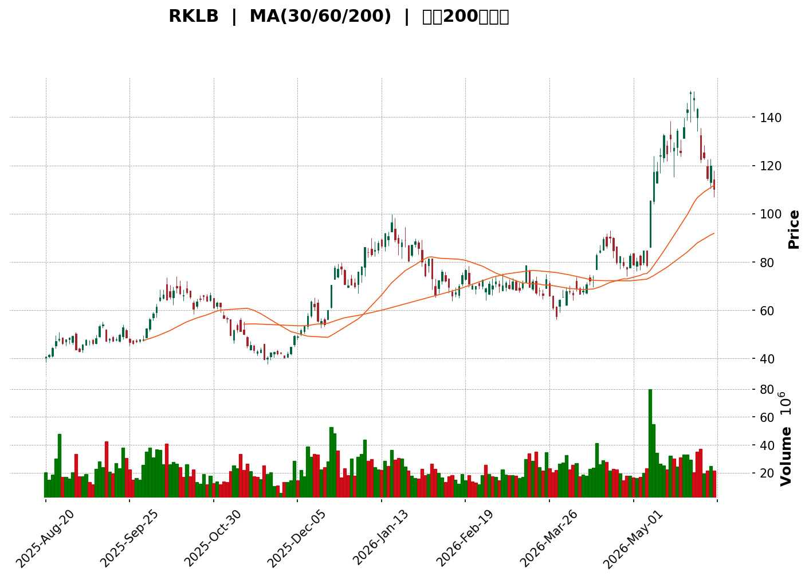
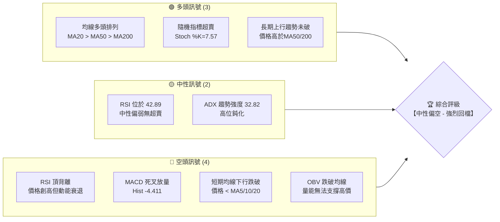
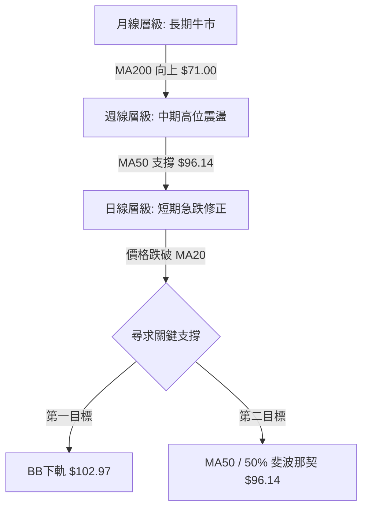
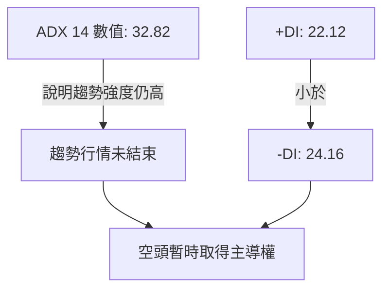
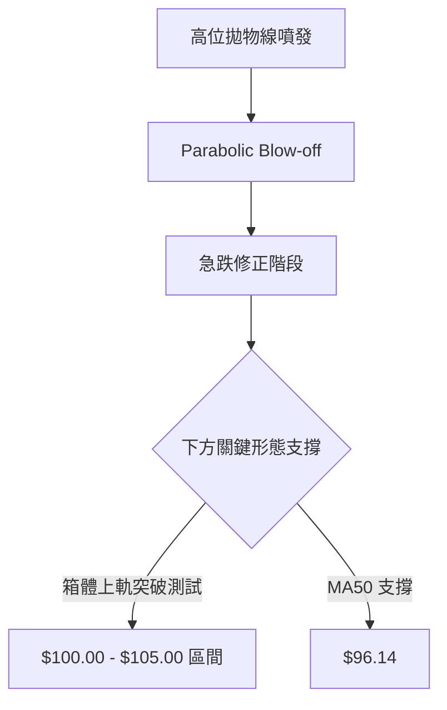

<details>
<summary>📊 靜態圖表 (點擊展開)</summary>

</details>

<html>
<head><meta charset="utf-8" /></head>
<body>
    <div style="height:500px; width:100%;">                        <script>window.PlotlyConfig = {MathJaxConfig: 'local'};</script>
        <script charset="utf-8" src="https://cdn.plot.ly/plotly-3.6.0.min.js" integrity="sha256-QaOVwtVY0T02VaHrr6pnoHLCwayMJp4O5n4YyaE3rJk=" crossorigin="anonymous"></script>                <div id="candlestick-chart" class="plotly-graph-div" style="height:100%; width:100%;"></div>            <script>                window.PLOTLYENV=window.PLOTLYENV || {};                                if (document.getElementById("candlestick-chart")) {                    Plotly.newPlot(                        "candlestick-chart",                        [{"close":{"dtype":"f8","bdata":"AAAA4FFYREAAAAAA18NEQAAAAOCjMEZAAAAAACmcR0AAAADgoxBIQAAAAAAAIEdAAAAA4Hr0R0AAAADAzExIQAAAACCup0hAAAAAANfDRUAAAABguH5FQAAAACCF60ZAAAAAoHDdR0AAAAAA14NHQAAAAIDCFUdAAAAAQAo3SEAAAAAghatKQAAAAMAeBUtAAAAAIFyfR0AAAACAPQpIQAAAAEAKl0dAAAAAwB7lR0AAAAAgrudIQAAAAOB6dEpAAAAA4FFYSEAAAADgo1BHQAAAAKBHIUdAAAAAoEeBR0AAAADgevRHQAAAAAAp\u002fEdAAAAAACk8SkAAAADgehRMQAAAAAAAQE1AAAAAoEfBTkAAAAAA11NQQAAAAEDhmlBAAAAA4KMQUEAAAABA4VpQQAAAAIDrAVFAAAAAoEdRUUAAAAAAAMBQQAAAAKBHkVBAAAAAYGbWUEAAAACgmVlQQAAAAOBRSE5AAAAAwPXIT0AAAAAA1yNQQAAAACCuZ1BAAAAAAADgT0AAAACAPYpQQAAAAIDCdU5AAAAAoHB9T0AAAAAghatOQAAAAMD1SExAAAAAgMI1TEAAAACAFM5IQAAAAIDr0UlAAAAAQDPzSUAAAABguJ5JQAAAAAAp\u002fEhAAAAAAACgRkAAAADAHsVGQAAAACCup0VAAAAAANdjRUAAAAAgXM9FQAAAAKBwvUNAAAAAYGYmREAAAACgmTlFQAAAAMDMTEVAAAAAQAr3REAAAACA6xFFQAAAACBcL0RAAAAAQDPzREAAAAAAKVxGQAAAACBcr0hAAAAAQAqHSEAAAAAgrsdJQAAAAEAKt0pAAAAAYI\u002fCTEAAAAAA18NPQAAAAGC4vk5AAAAA4Hq0S0AAAABguL5LQAAAAEDh+kpAAAAAgML1TUAAAACgR6FRQAAAAEAzY1NAAAAAIIVLU0AAAAAghUtTQAAAAKCZqVFAAAAAIK6HUUAAAADAzJxRQAAAAOCjcFFAAAAAIFz\u002fUkAAAADA9YhTQAAAAIDrgVVAAAAAwB4FVUAAAADAHsVUQAAAAGBmNlVAAAAAoJn5VUAAAADAHqVVQAAAAEAz81ZAAAAA4KOwVkAAAABAMxNYQAAAAIA9SlZAAAAA4Hr0VUAAAABguP5VQAAAAKCZOVZAAAAAYLgeVEAAAAAAAMBVQAAAAOB6JFZAAAAAIIVrVUAAAADgegRUQAAAAKCZiVJAAAAAoEdRVEAAAABACkdSQAAAAOB6lFBAAAAA4HoUUkAAAACAwvVSQAAAAIDrAVJAAAAAIK5nUUAAAADgo4BQQAAAAAAp3FBAAAAAwPV4UUAAAABA4ZpSQAAAAMAeJVNAAAAAQAq3UUAAAACgcI1RQAAAAIAUflFAAAAAwMyMUUAAAACgmSlSQAAAAGBmRlFAAAAAgBS+UUAAAADgUYhRQAAAAIA9+lFAAAAAAACAUUAAAABACodRQAAAAGC43lFAAAAAIIU7UUAAAACgcP1RQAAAACCuF1FAAAAAgD0aUUAAAAAA19NRQAAAAIDCpVNAAAAAYLheUUAAAAAghftRQAAAAGC4zlBAAAAAAAAAUUAAAADgeoRQQAAAAOBROFJAAAAAACl8UEAAAABACndOQAAAAOCjsExAAAAAgBQOUEAAAACgR2FQQAAAAGC47lBAAAAAQOHqUEAAAADgepRQQAAAAMAeRVFAAAAAIFyvUEAAAABAMwNRQAAAACCup1FAAAAAgBQOUkAAAABgZmZSQAAAACCFu1RAAAAAQDMzVUAAAACgcF1WQAAAAMD1qFVAAAAAYI+CVkAAAABgZiZVQAAAACCF61NAAAAAYI+SVEAAAACAwqVTQAAAAKBHQVNAAAAA4KOgVEAAAAAA17NTQAAAAADXE1RAAAAA4KOwU0AAAACgmSlVQAAAAMAepVNAAAAAgBReWkAAAABgZlZdQAAAAADXY11AAAAAoJkJX0AAAACgmZFgQAAAAKBHMV9AAAAAwB5lYEAAAAAA19NfQAAAAMD1yGBAAAAAwMxcX0AAAADgUfhgQAAAAGBm5mFAAAAAIFzHYkAAAADA9YBiQAAAACBc72FAAAAAwPWYXkAAAADgetReQAAAAMDMrFxAAAAAwMz8XUAAAADAHoVbQA=="},"high":{"dtype":"f8","bdata":"AAAAgBRuREAAAAAgXO9EQAAAAECNV0ZAAAAAIIXLSEAAAACAwnVJQAAAAGC4XkhAAAAAwMz8R0AAAABgZmZIQAAAAMAexUhAAAAAQDNzSUAAAACAPUpGQAAAAGC4\u002fkZAAAAAoJkZSEAAAAAA18NHQAAAAIAUDkhAAAAAwB7VSEAAAAAA1wNLQAAAAIDClUtAAAAAgD0KSkAAAADAHkVIQAAAAOBRmEhAAAAAQAp3SEAAAACgRyFJQAAAAGA5FEtAAAAAoHA9SkAAAAAgXE9IQAAAAOBR2EdAAAAAwMwMSEAAAABguP5HQAAAAIDCtUhAAAAAQDNTSkAAAAAgMXhMQAAAAKBHoU1AAAAAIK5HT0AAAAAALSJRQAAAAGCPIlFAAAAAAABgUkAAAAAAKZxRQAAAAEDhalFAAAAAgBR+UkAAAAAAABBSQAAAAAAAIFFAAAAAIIULUkAAAABgjwJRQAAAAKBHAVBAAAAAwMwsUEAAAAAghYtQQAAAAGBmllBAAAAAYI+iUEAAAADA9dhQQAAAACCFS1BAAAAAoJm5T0AAAADAzIxPQAAAAGC4vk1AAAAAANejTEAAAABA4RpMQAAAAMDMDEpAAAAAAABAS0AAAABA4XpMQAAAAIA9qktAAAAA4KOwSEAAAAAAKZxHQAAAAMBL10ZAAAAAgBTORUAAAAAA10NGQAAAAKBHIUdAAAAAgMKFREAAAAAA10NFQAAAAEAKZ0VAAAAAIIXLRUAAAACgmVlFQAAAAGBmpkRAAAAAYLh+RUAAAABguF5GQAAAAEAK10hAAAAAoJnZSEAAAAAgXC9KQAAAAAAA4EpAAAAAgD1qTUAAAACgmQlQQAAAACCFS1BAAAAAANcjUEAAAACgcF1MQAAAAOB6dExAAAAAAAAgTkAAAAAA16NRQAAAAMDMnFNAAAAAIIXLU0AAAADAHvVTQAAAACBcP1NAAAAAIFwvUkAAAAAAKaxSQAAAAECLTFJAAAAAIFwPU0AAAAAAAJBTQAAAAAAAkFVAAAAAoHB9VUAAAAAgrndWQAAAACCFG1ZAAAAAgMI1VkAAAADgp25WQAAAAAApDFdAAAAAQGAdV0AAAADAHuVYQAAAAKBHkVhAAAAAAADQVkAAAACgmVlWQAAAAMDMnFdAAAAAgD3KVUAAAAAAAMBVQAAAAEAzc1ZAAAAAAABAVkAAAADgelRWQAAAAMDMLFRAAAAA4HpUVEAAAABgZlZUQAAAACBcP1JAAAAAgD0qUkAAAABAMzNTQAAAAEAK91JAAAAAoJlZUkAAAADAzBxRQAAAAGBmZlFAAAAAIFy\u002fUUAAAADA9fBSQAAAAEAKR1NAAAAAwMyMU0AAAAAAANBRQAAAACCFg1FAAAAAYGb2UUAAAAAgXC9SQAAAAIDCZVFAAAAAYGYGUkAAAAAAAFBSQAAAAGBmhlJAAAAAANcTUkAAAABACsdSQAAAAAAACFJAAAAAANc7UkAAAABAM1NSQAAAAGBmJlJAAAAAANfTUUAAAADgURhSQAAAAEDhqlNAAAAA4FE4U0AAAABguC5SQAAAAGC4flJAAAAAwMxcUUAAAABgZiZRQAAAAADXw1JAAAAAgMIFUkAAAACAFIZQQAAAAIDr0U5AAAAAwB4lUEAAAABA4SpRQAAAAMD1WFFAAAAA4HqUUUAAAABAMxNRQAAAAIDAalJAAAAAYI9yUUAAAAAA14NRQAAAAEAz41FAAAAAAACwUkAAAACAwqVSQAAAACBc31RAAAAAIFy\u002fVUAAAABgZpZWQAAAAMDM\u002fFZAAAAAYGZGV0AAAABAM5NWQAAAAIA9mlVAAAAAYLieVEAAAACA63FUQAAAAOCjgFNAAAAAgMLlVEAAAABgj\u002fJUQAAAAOBPdVRAAAAAAADAVEAAAAAghStVQAAAAGCPMlVAAAAAIK5nWkAAAAAAKfxeQAAAACBcX15AAAAAIFzPX0AAAACAwqVgQAAAAADXS2BAAAAAAClMYUAAAACAPTJgQAAAAEAz62BAAAAAANdbYEAAAADgUXhhQAAAAAAAQGJAAAAAAADgYkAAAABgj9piQAAAAAAAAGJAAAAAACn0YEAAAADAzAxgQAAAAOBRoF5AAAAA4FGoXkAAAABguH5dQA=="},"hovertemplate":"\u003cb\u003e%{x|%Y-%m-%d}\u003c\u002fb\u003e\u003cbr\u003e\u958b: $%{open:.2f}\u003cbr\u003e\u9ad8: $%{high:.2f}\u003cbr\u003e\u4f4e: $%{low:.2f}\u003cbr\u003e\u6536: $%{close:.2f}\u003cextra\u003e\u003c\u002fextra\u003e","low":{"dtype":"f8","bdata":"AAAAoEchQ0AAAAAAKRxEQAAAAMChNURAAAAAYGYGRkAAAAAAAIBHQAAAAMD16EZAAAAAIIWrRkAAAABgjwJHQAAAAEAK10ZAAAAAQInBRUAAAACgmVlFQAAAAIDrMUVAAAAAwHa+RkAAAABAicFGQAAAAMDMzEZAAAAAQAoHR0AAAABANU5IQAAAAAApXEpAAAAAoEeBR0AAAACgmTlHQAAAAAAAgEdAAAAA4KOQR0AAAABgZmZHQAAAAOB69EdAAAAAQAo3SEAAAABA4ZpGQAAAAIA96kZAAAAAIFwvR0AAAACgR0FHQAAAACBcj0dAAAAAoEdBSEAAAACgR6FJQAAAAGBm5ktAAAAAYI+CTEAAAABAM9NPQAAAAEDhGlBAAAAAwPUIUEAAAADgzidQQAAAAOBRGE9AAAAAwB7FUEAAAABAM5tQQAAAAKCZ2U9AAAAAQDOrUEAAAABACjdQQAAAAOB6NE1AAAAAAABgTkAAAABAM9NPQAAAAKCZCVBAAAAAgBTOT0AAAACgcL1PQAAAAIDrcU5AAAAAQDMzTkAAAADgo5BNQAAAAKBHQUxAAAAAIFxvS0AAAADgerRIQAAAAODOJ0dAAAAAoEdhSUAAAABA4ZpJQAAAAOB61EhAAAAAIFwvRkAAAABgZqZFQAAAAMDMHEVAAAAAoHCdREAAAABACjdFQAAAAMD1qENAAAAAwPXIQkAAAABgZqZDQAAAAOCjMERAAAAA4KOwREAAAABgZuZEQAAAAKBw\u002fUNAAAAAgMI1REAAAAAAAMBEQAAAAMD1aEZAAAAAoJnZR0AAAAAAKZxIQAAAACCFK0lAAAAAAAAgSkAAAADAzGxMQAAAAGBm5k1AAAAAgD2KS0AAAABACldKQAAAAEDhikpAAAAAANcDTEAAAADAnV9OQAAAAMAgMFJAAAAAYI9SUkAAAACgQ7NSQAAAAMD1mFFAAAAAoJtUUUAAAAAAKZxRQAAAAOBRSFFAAAAAYGa2UEAAAAAA19NRQAAAAEAzg1JAAAAAYGZ2VEAAAADgo5BUQAAAAMDMnFRAAAAA4NDaVEAAAACgmWlVQAAAAAAAIFVAAAAAoJmpVUAAAACgmRlXQAAAAEAzE1ZAAAAAoHCtVEAAAADAdlZUQAAAACCuh1VAAAAA4KMAVEAAAAAAAIBUQAAAAMDKgVVAAAAAAADAVEAAAACgR4FTQAAAAIBBeFJAAAAAoEfxUkAAAABACCRRQAAAAMDMTFBAAAAAAADAUEAAAAAAALBRQAAAAEAz41FAAAAAoEfBUEAAAAAgXO9PQAAAAAAAYFBAAAAAAABAUEAAAADAS39RQAAAAGBmFlJAAAAAoJlZUUAAAAAAACBRQAAAAGBmplBAAAAA4FE4UUAAAAAA1zNRQAAAAGBmBlBAAAAAwMycUEAAAAAAKYxQQAAAAIAUXlFAAAAAgMLVUEAAAADgowhRQAAAAOB69FBAAAAAgL4nUUAAAADAHhVRQAAAAIDrEVFAAAAAACncUEAAAABA4SpRQAAAAKBH0VFAAAAAoJlZUUAAAAAAAABRQAAAAMD1mFBAAAAAQDODUEAAAACgcB1QQAAAAAApPFFAAAAAgMJlUEAAAADAzCxOQAAAAGDlEExAAAAAANeDTUAAAABAM1NQQAAAAIAU7k5AAAAAYGamUEAAAABA4fpPQAAAAGDn81BAAAAAQOGiUEAAAACAwpVQQAAAAIDCpVBAAAAAYLieUUAAAABgZmZRQAAAAKCZOVNAAAAAYGbmVEAAAABgZiZVQAAAAAAAcFVAAAAA4KPwVUAAAAAAKWRUQAAAAMAexVNAAAAAwHRDU0AAAABgZmZTQAAAACBcf1JAAAAAgBReU0AAAAAghZtTQAAAAAAAEFNAAAAAANcjU0AAAABACrdTQAAAACCFe1NAAAAAIK53VUAAAAAAAABaQAAAAIA9GlxAAAAAwPU4XUAAAAAA11NeQAAAAEAzc15AAAAAoPFqX0AAAABguM5cQAAAAIAUDl9AAAAAQDPzXkAAAACA62lgQAAAAIDrUWFAAAAAwB49YUAAAAAA18thQAAAAKCZwWBAAAAAAABAXkAAAAAA16NeQAAAAIA9alxAAAAAwPWYW0AAAABguK5aQA=="},"name":"\u50f9\u683c","open":{"dtype":"f8","bdata":"AAAAQOEaREAAAAAA12NEQAAAAAApfERAAAAA4HqURkAAAACgcN1HQAAAAEAKV0hAAAAA4KNwR0AAAADAzOxHQAAAAAAAYEdAAAAAYI8iSUAAAADgehRGQAAAAOBRyEVAAAAAAADARkAAAACgR4FHQAAAAADXw0dAAAAAwPUoR0AAAACgcH1IQAAAAIA9ykpAAAAAAAAASkAAAADgUchHQAAAAIDCdUhAAAAAQArXR0AAAADgo5BHQAAAAEAzg0hAAAAAgMLlSUAAAAAAAABIQAAAAGBmpkdAAAAAQDOzR0AAAABA4ZpHQAAAAOCjsEdAAAAAgOtRSEAAAABgZgZKQAAAAGC4bkxAAAAAoEeBTUAAAACgmQlQQAAAAKCZOVBAAAAAQDOzUUAAAADgUfhQQAAAAIDCVVBAAAAAoEeBUUAAAADgeoRRQAAAAMD1eFBAAAAA4KNIUUAAAABgjwJRQAAAAAApfE9AAAAAIK7HTkAAAAAA1zNQQAAAAAApjFBAAAAAQDNrUEAAAACgRwlQQAAAAAAAQFBAAAAAYI\u002fiTkAAAAAA14NPQAAAAGBm5kxAAAAA4HpUTEAAAABA4RpMQAAAAKAY1EdAAAAAYLjeSkAAAAAAAABMQAAAAEAK90lAAAAAoEdhSEAAAABA4dpFQAAAAEAzk0ZAAAAAACkcRUAAAAAAAEBFQAAAAIA9CkdAAAAAgD3qQ0AAAACgR2FEQAAAAADXA0VAAAAAYLieRUAAAACgR0FFQAAAAEAzk0RAAAAAIK5HREAAAABgj\u002fJEQAAAAGCP0kZAAAAAAABwSEAAAACAPQpJQAAAAKBwnUlAAAAA4FG4SkAAAACgR8FMQAAAAAAAQE9AAAAA4KeGT0AAAADgURhLQAAAAMDMDExAAAAAoJkZTEAAAAAgXI9OQAAAAAApPFJAAAAAANdzUkAAAACAPYJTQAAAACCFK1NAAAAAAABgUUAAAACgmUFSQAAAAAAA4FFAAAAA4FGoUUAAAAAgrqdSQAAAAOCjcFNAAAAAYGYGVUAAAAAAAGBVQAAAAKCZIVVAAAAAYLg+VUAAAADA9UhWQAAAAGBmllVAAAAAwPVQVkAAAACgmSFXQAAAAMDMbFdAAAAAoEeBVkAAAADgUZhVQAAAACCFQ1ZAAAAAIK6vVUAAAADA9bhUQAAAAIAUzlVAAAAAACn8VUAAAAAAAEBVQAAAAIA9ylNAAAAAYGamU0AAAABgZlZUQAAAAGC4flFAAAAAAABAUUAAAACgmQFSQAAAAIAUplJAAAAA4FFIUkAAAACA6+FQQAAAAOB6rFBAAAAAQGCFUEAAAAAAAMBRQAAAAKCZOVJAAAAAINneUkAAAADgUTBRQAAAAOBROFFAAAAAgBTGUUAAAABA4YJRQAAAAIDC5VBAAAAAIIWrUEAAAABguDZRQAAAAADXs1FAAAAAQOG6UUAAAADgowhRQAAAAMD1WFFAAAAAgMKVUUAAAABAMzNRQAAAAMDM\u002fFFAAAAAoJlJUUAAAADAzFRRQAAAAGBm3lFAAAAAYI8CU0AAAADgejRRQAAAAAAAAFJAAAAAoHAFUUAAAAAAAMBQQAAAAAApPFFAAAAAwMzMUUAAAADgo4BQQAAAAKCZuU5AAAAAQOHaTkAAAAAAAGBQQAAAAMDMHE9AAAAAYLjuUEAAAAAgXMdQQAAAAAAAAFJAAAAAANdDUUAAAADAzOxQQAAAAEAzw1BAAAAAIIVjUkAAAACgcGVSQAAAAIAUPlNAAAAAwB4FVUAAAABgZjZVQAAAAMAelVZAAAAAgMKdVkAAAABgZnZWQAAAAIDClVVAAAAAACnsU0AAAADAzARUQAAAAEAKd1NAAAAAQDNjU0AAAACA6+FUQAAAAEAKl1NAAAAAYGamVEAAAAAgrudTQAAAAKBwLVVAAAAAgD2CVUAAAACgR1FaQAAAAOCjMFxAAAAAoEf5XkAAAABgZsZeQAAAAEAzA2BAAAAAACmYYEAAAACAFH5fQAAAAGC43l9AAAAAwPWIX0AAAADAHm1gQAAAAEDhvmFAAAAAQAq3YkAAAACgcGViQAAAAIAUfmFAAAAAACmMYEAAAACAwlVfQAAAAMAe5V1AAAAAoHBFXEAAAACgR5FcQA=="},"x":["2025-08-20T00:00:00-04:00","2025-08-21T00:00:00-04:00","2025-08-22T00:00:00-04:00","2025-08-25T00:00:00-04:00","2025-08-26T00:00:00-04:00","2025-08-27T00:00:00-04:00","2025-08-28T00:00:00-04:00","2025-08-29T00:00:00-04:00","2025-09-02T00:00:00-04:00","2025-09-03T00:00:00-04:00","2025-09-04T00:00:00-04:00","2025-09-05T00:00:00-04:00","2025-09-08T00:00:00-04:00","2025-09-09T00:00:00-04:00","2025-09-10T00:00:00-04:00","2025-09-11T00:00:00-04:00","2025-09-12T00:00:00-04:00","2025-09-15T00:00:00-04:00","2025-09-16T00:00:00-04:00","2025-09-17T00:00:00-04:00","2025-09-18T00:00:00-04:00","2025-09-19T00:00:00-04:00","2025-09-22T00:00:00-04:00","2025-09-23T00:00:00-04:00","2025-09-24T00:00:00-04:00","2025-09-25T00:00:00-04:00","2025-09-26T00:00:00-04:00","2025-09-29T00:00:00-04:00","2025-09-30T00:00:00-04:00","2025-10-01T00:00:00-04:00","2025-10-02T00:00:00-04:00","2025-10-03T00:00:00-04:00","2025-10-06T00:00:00-04:00","2025-10-07T00:00:00-04:00","2025-10-08T00:00:00-04:00","2025-10-09T00:00:00-04:00","2025-10-10T00:00:00-04:00","2025-10-13T00:00:00-04:00","2025-10-14T00:00:00-04:00","2025-10-15T00:00:00-04:00","2025-10-16T00:00:00-04:00","2025-10-17T00:00:00-04:00","2025-10-20T00:00:00-04:00","2025-10-21T00:00:00-04:00","2025-10-22T00:00:00-04:00","2025-10-23T00:00:00-04:00","2025-10-24T00:00:00-04:00","2025-10-27T00:00:00-04:00","2025-10-28T00:00:00-04:00","2025-10-29T00:00:00-04:00","2025-10-30T00:00:00-04:00","2025-10-31T00:00:00-04:00","2025-11-03T00:00:00-05:00","2025-11-04T00:00:00-05:00","2025-11-05T00:00:00-05:00","2025-11-06T00:00:00-05:00","2025-11-07T00:00:00-05:00","2025-11-10T00:00:00-05:00","2025-11-11T00:00:00-05:00","2025-11-12T00:00:00-05:00","2025-11-13T00:00:00-05:00","2025-11-14T00:00:00-05:00","2025-11-17T00:00:00-05:00","2025-11-18T00:00:00-05:00","2025-11-19T00:00:00-05:00","2025-11-20T00:00:00-05:00","2025-11-21T00:00:00-05:00","2025-11-24T00:00:00-05:00","2025-11-25T00:00:00-05:00","2025-11-26T00:00:00-05:00","2025-11-28T00:00:00-05:00","2025-12-01T00:00:00-05:00","2025-12-02T00:00:00-05:00","2025-12-03T00:00:00-05:00","2025-12-04T00:00:00-05:00","2025-12-05T00:00:00-05:00","2025-12-08T00:00:00-05:00","2025-12-09T00:00:00-05:00","2025-12-10T00:00:00-05:00","2025-12-11T00:00:00-05:00","2025-12-12T00:00:00-05:00","2025-12-15T00:00:00-05:00","2025-12-16T00:00:00-05:00","2025-12-17T00:00:00-05:00","2025-12-18T00:00:00-05:00","2025-12-19T00:00:00-05:00","2025-12-22T00:00:00-05:00","2025-12-23T00:00:00-05:00","2025-12-24T00:00:00-05:00","2025-12-26T00:00:00-05:00","2025-12-29T00:00:00-05:00","2025-12-30T00:00:00-05:00","2025-12-31T00:00:00-05:00","2026-01-02T00:00:00-05:00","2026-01-05T00:00:00-05:00","2026-01-06T00:00:00-05:00","2026-01-07T00:00:00-05:00","2026-01-08T00:00:00-05:00","2026-01-09T00:00:00-05:00","2026-01-12T00:00:00-05:00","2026-01-13T00:00:00-05:00","2026-01-14T00:00:00-05:00","2026-01-15T00:00:00-05:00","2026-01-16T00:00:00-05:00","2026-01-20T00:00:00-05:00","2026-01-21T00:00:00-05:00","2026-01-22T00:00:00-05:00","2026-01-23T00:00:00-05:00","2026-01-26T00:00:00-05:00","2026-01-27T00:00:00-05:00","2026-01-28T00:00:00-05:00","2026-01-29T00:00:00-05:00","2026-01-30T00:00:00-05:00","2026-02-02T00:00:00-05:00","2026-02-03T00:00:00-05:00","2026-02-04T00:00:00-05:00","2026-02-05T00:00:00-05:00","2026-02-06T00:00:00-05:00","2026-02-09T00:00:00-05:00","2026-02-10T00:00:00-05:00","2026-02-11T00:00:00-05:00","2026-02-12T00:00:00-05:00","2026-02-13T00:00:00-05:00","2026-02-17T00:00:00-05:00","2026-02-18T00:00:00-05:00","2026-02-19T00:00:00-05:00","2026-02-20T00:00:00-05:00","2026-02-23T00:00:00-05:00","2026-02-24T00:00:00-05:00","2026-02-25T00:00:00-05:00","2026-02-26T00:00:00-05:00","2026-02-27T00:00:00-05:00","2026-03-02T00:00:00-05:00","2026-03-03T00:00:00-05:00","2026-03-04T00:00:00-05:00","2026-03-05T00:00:00-05:00","2026-03-06T00:00:00-05:00","2026-03-09T00:00:00-04:00","2026-03-10T00:00:00-04:00","2026-03-11T00:00:00-04:00","2026-03-12T00:00:00-04:00","2026-03-13T00:00:00-04:00","2026-03-16T00:00:00-04:00","2026-03-17T00:00:00-04:00","2026-03-18T00:00:00-04:00","2026-03-19T00:00:00-04:00","2026-03-20T00:00:00-04:00","2026-03-23T00:00:00-04:00","2026-03-24T00:00:00-04:00","2026-03-25T00:00:00-04:00","2026-03-26T00:00:00-04:00","2026-03-27T00:00:00-04:00","2026-03-30T00:00:00-04:00","2026-03-31T00:00:00-04:00","2026-04-01T00:00:00-04:00","2026-04-02T00:00:00-04:00","2026-04-06T00:00:00-04:00","2026-04-07T00:00:00-04:00","2026-04-08T00:00:00-04:00","2026-04-09T00:00:00-04:00","2026-04-10T00:00:00-04:00","2026-04-13T00:00:00-04:00","2026-04-14T00:00:00-04:00","2026-04-15T00:00:00-04:00","2026-04-16T00:00:00-04:00","2026-04-17T00:00:00-04:00","2026-04-20T00:00:00-04:00","2026-04-21T00:00:00-04:00","2026-04-22T00:00:00-04:00","2026-04-23T00:00:00-04:00","2026-04-24T00:00:00-04:00","2026-04-27T00:00:00-04:00","2026-04-28T00:00:00-04:00","2026-04-29T00:00:00-04:00","2026-04-30T00:00:00-04:00","2026-05-01T00:00:00-04:00","2026-05-04T00:00:00-04:00","2026-05-05T00:00:00-04:00","2026-05-06T00:00:00-04:00","2026-05-07T00:00:00-04:00","2026-05-08T00:00:00-04:00","2026-05-11T00:00:00-04:00","2026-05-12T00:00:00-04:00","2026-05-13T00:00:00-04:00","2026-05-14T00:00:00-04:00","2026-05-15T00:00:00-04:00","2026-05-18T00:00:00-04:00","2026-05-19T00:00:00-04:00","2026-05-20T00:00:00-04:00","2026-05-21T00:00:00-04:00","2026-05-22T00:00:00-04:00","2026-05-26T00:00:00-04:00","2026-05-27T00:00:00-04:00","2026-05-28T00:00:00-04:00","2026-05-29T00:00:00-04:00","2026-06-01T00:00:00-04:00","2026-06-02T00:00:00-04:00","2026-06-03T00:00:00-04:00","2026-06-04T00:00:00-04:00","2026-06-05T00:00:00-04:00"],"type":"candlestick"},{"hovertemplate":"MA30: $%{y:.2f}\u003cextra\u003e\u003c\u002fextra\u003e","line":{"color":"#2196F3","dash":"dash","width":2},"mode":"lines","name":"MA30","x":["2025-08-20T00:00:00-04:00","2025-08-21T00:00:00-04:00","2025-08-22T00:00:00-04:00","2025-08-25T00:00:00-04:00","2025-08-26T00:00:00-04:00","2025-08-27T00:00:00-04:00","2025-08-28T00:00:00-04:00","2025-08-29T00:00:00-04:00","2025-09-02T00:00:00-04:00","2025-09-03T00:00:00-04:00","2025-09-04T00:00:00-04:00","2025-09-05T00:00:00-04:00","2025-09-08T00:00:00-04:00","2025-09-09T00:00:00-04:00","2025-09-10T00:00:00-04:00","2025-09-11T00:00:00-04:00","2025-09-12T00:00:00-04:00","2025-09-15T00:00:00-04:00","2025-09-16T00:00:00-04:00","2025-09-17T00:00:00-04:00","2025-09-18T00:00:00-04:00","2025-09-19T00:00:00-04:00","2025-09-22T00:00:00-04:00","2025-09-23T00:00:00-04:00","2025-09-24T00:00:00-04:00","2025-09-25T00:00:00-04:00","2025-09-26T00:00:00-04:00","2025-09-29T00:00:00-04:00","2025-09-30T00:00:00-04:00","2025-10-01T00:00:00-04:00","2025-10-02T00:00:00-04:00","2025-10-03T00:00:00-04:00","2025-10-06T00:00:00-04:00","2025-10-07T00:00:00-04:00","2025-10-08T00:00:00-04:00","2025-10-09T00:00:00-04:00","2025-10-10T00:00:00-04:00","2025-10-13T00:00:00-04:00","2025-10-14T00:00:00-04:00","2025-10-15T00:00:00-04:00","2025-10-16T00:00:00-04:00","2025-10-17T00:00:00-04:00","2025-10-20T00:00:00-04:00","2025-10-21T00:00:00-04:00","2025-10-22T00:00:00-04:00","2025-10-23T00:00:00-04:00","2025-10-24T00:00:00-04:00","2025-10-27T00:00:00-04:00","2025-10-28T00:00:00-04:00","2025-10-29T00:00:00-04:00","2025-10-30T00:00:00-04:00","2025-10-31T00:00:00-04:00","2025-11-03T00:00:00-05:00","2025-11-04T00:00:00-05:00","2025-11-05T00:00:00-05:00","2025-11-06T00:00:00-05:00","2025-11-07T00:00:00-05:00","2025-11-10T00:00:00-05:00","2025-11-11T00:00:00-05:00","2025-11-12T00:00:00-05:00","2025-11-13T00:00:00-05:00","2025-11-14T00:00:00-05:00","2025-11-17T00:00:00-05:00","2025-11-18T00:00:00-05:00","2025-11-19T00:00:00-05:00","2025-11-20T00:00:00-05:00","2025-11-21T00:00:00-05:00","2025-11-24T00:00:00-05:00","2025-11-25T00:00:00-05:00","2025-11-26T00:00:00-05:00","2025-11-28T00:00:00-05:00","2025-12-01T00:00:00-05:00","2025-12-02T00:00:00-05:00","2025-12-03T00:00:00-05:00","2025-12-04T00:00:00-05:00","2025-12-05T00:00:00-05:00","2025-12-08T00:00:00-05:00","2025-12-09T00:00:00-05:00","2025-12-10T00:00:00-05:00","2025-12-11T00:00:00-05:00","2025-12-12T00:00:00-05:00","2025-12-15T00:00:00-05:00","2025-12-16T00:00:00-05:00","2025-12-17T00:00:00-05:00","2025-12-18T00:00:00-05:00","2025-12-19T00:00:00-05:00","2025-12-22T00:00:00-05:00","2025-12-23T00:00:00-05:00","2025-12-24T00:00:00-05:00","2025-12-26T00:00:00-05:00","2025-12-29T00:00:00-05:00","2025-12-30T00:00:00-05:00","2025-12-31T00:00:00-05:00","2026-01-02T00:00:00-05:00","2026-01-05T00:00:00-05:00","2026-01-06T00:00:00-05:00","2026-01-07T00:00:00-05:00","2026-01-08T00:00:00-05:00","2026-01-09T00:00:00-05:00","2026-01-12T00:00:00-05:00","2026-01-13T00:00:00-05:00","2026-01-14T00:00:00-05:00","2026-01-15T00:00:00-05:00","2026-01-16T00:00:00-05:00","2026-01-20T00:00:00-05:00","2026-01-21T00:00:00-05:00","2026-01-22T00:00:00-05:00","2026-01-23T00:00:00-05:00","2026-01-26T00:00:00-05:00","2026-01-27T00:00:00-05:00","2026-01-28T00:00:00-05:00","2026-01-29T00:00:00-05:00","2026-01-30T00:00:00-05:00","2026-02-02T00:00:00-05:00","2026-02-03T00:00:00-05:00","2026-02-04T00:00:00-05:00","2026-02-05T00:00:00-05:00","2026-02-06T00:00:00-05:00","2026-02-09T00:00:00-05:00","2026-02-10T00:00:00-05:00","2026-02-11T00:00:00-05:00","2026-02-12T00:00:00-05:00","2026-02-13T00:00:00-05:00","2026-02-17T00:00:00-05:00","2026-02-18T00:00:00-05:00","2026-02-19T00:00:00-05:00","2026-02-20T00:00:00-05:00","2026-02-23T00:00:00-05:00","2026-02-24T00:00:00-05:00","2026-02-25T00:00:00-05:00","2026-02-26T00:00:00-05:00","2026-02-27T00:00:00-05:00","2026-03-02T00:00:00-05:00","2026-03-03T00:00:00-05:00","2026-03-04T00:00:00-05:00","2026-03-05T00:00:00-05:00","2026-03-06T00:00:00-05:00","2026-03-09T00:00:00-04:00","2026-03-10T00:00:00-04:00","2026-03-11T00:00:00-04:00","2026-03-12T00:00:00-04:00","2026-03-13T00:00:00-04:00","2026-03-16T00:00:00-04:00","2026-03-17T00:00:00-04:00","2026-03-18T00:00:00-04:00","2026-03-19T00:00:00-04:00","2026-03-20T00:00:00-04:00","2026-03-23T00:00:00-04:00","2026-03-24T00:00:00-04:00","2026-03-25T00:00:00-04:00","2026-03-26T00:00:00-04:00","2026-03-27T00:00:00-04:00","2026-03-30T00:00:00-04:00","2026-03-31T00:00:00-04:00","2026-04-01T00:00:00-04:00","2026-04-02T00:00:00-04:00","2026-04-06T00:00:00-04:00","2026-04-07T00:00:00-04:00","2026-04-08T00:00:00-04:00","2026-04-09T00:00:00-04:00","2026-04-10T00:00:00-04:00","2026-04-13T00:00:00-04:00","2026-04-14T00:00:00-04:00","2026-04-15T00:00:00-04:00","2026-04-16T00:00:00-04:00","2026-04-17T00:00:00-04:00","2026-04-20T00:00:00-04:00","2026-04-21T00:00:00-04:00","2026-04-22T00:00:00-04:00","2026-04-23T00:00:00-04:00","2026-04-24T00:00:00-04:00","2026-04-27T00:00:00-04:00","2026-04-28T00:00:00-04:00","2026-04-29T00:00:00-04:00","2026-04-30T00:00:00-04:00","2026-05-01T00:00:00-04:00","2026-05-04T00:00:00-04:00","2026-05-05T00:00:00-04:00","2026-05-06T00:00:00-04:00","2026-05-07T00:00:00-04:00","2026-05-08T00:00:00-04:00","2026-05-11T00:00:00-04:00","2026-05-12T00:00:00-04:00","2026-05-13T00:00:00-04:00","2026-05-14T00:00:00-04:00","2026-05-15T00:00:00-04:00","2026-05-18T00:00:00-04:00","2026-05-19T00:00:00-04:00","2026-05-20T00:00:00-04:00","2026-05-21T00:00:00-04:00","2026-05-22T00:00:00-04:00","2026-05-26T00:00:00-04:00","2026-05-27T00:00:00-04:00","2026-05-28T00:00:00-04:00","2026-05-29T00:00:00-04:00","2026-06-01T00:00:00-04:00","2026-06-02T00:00:00-04:00","2026-06-03T00:00:00-04:00","2026-06-04T00:00:00-04:00","2026-06-05T00:00:00-04:00"],"y":{"dtype":"f8","bdata":"AAAAAAAA+H8AAAAAAAD4fwAAAAAAAPh\u002fAAAAAAAA+H8AAAAAAAD4fwAAAAAAAPh\u002fAAAAAAAA+H8AAAAAAAD4fwAAAAAAAPh\u002fAAAAAAAA+H8AAAAAAAD4fwAAAAAAAPh\u002fAAAAAAAA+H8AAAAAAAD4fwAAAAAAAPh\u002fAAAAAAAA+H8AAAAAAAD4fwAAAAAAAPh\u002fAAAAAAAA+H8AAAAAAAD4fwAAAAAAAPh\u002fAAAAAAAA+H8AAAAAAAD4fwAAAAAAAPh\u002fAAAAAAAA+H8AAAAAAAD4fwAAAAAAAPh\u002fAAAAAAAA+H8AAAAAAAD4f83MzHw\u002frUdAREREZILfR0ARERFB7h1IQO\u002fu7g4tWkhAvLu7iyWXSEDv7u6ucuBIQDMzM7OBNklAMzMzQ0R8SUAAAAAwCMRJQKuqqmrnE0pAvLu7W7qBSkDe3d2tK+hKQO\u002fu7q5WP0tARERE9AyTS0BVVVXlbeFLQDMzMxPZHkxA3t3d\u002fXFfTECJiIg4UY9MQLy7u6u5wExAiYiIiCUHTUB3d3e3SVRNQFVVVXXpjk1AzczM\u002fLjPTUAiIiLS6gBOQERERISIEE5AzczMvIMxTkARERGxOj5OQGZmZhYvVU5AZmZmRgxqTkBmZmaGQXhOQO\u002fu7g7KgE5ARERE5PthTkBVVVUFrDROQN7d3X3c801AZmZmVvKjTUAzMzMTZ0dNQJqZmWl11ExAMzMzszpuTEBmZmZWOQxMQO\u002fu7v64n0tA3t3dbRIrS0De3d2tAMFKQJqZmfl+UkpAq6qqyujlSUB3d3e3rI1JQKuqqsroXUlAq6qqivofSUBEREQUg+hIQImIiFiAtEhAZmZmhuuZSEC8u7vbso5IQERERHQhkUhA7+7u\u002ftRwSEDNzMw831dIQLy7u2u8TEhAq6qqWqtbSEBVVVWl4rRIQHd3d0dvI0lAd3d3x0uPSUDNzMws+f1JQAAAAEA1VkpAzczM7FHASkCJiIhImipLQM3MzLx0m0tAmpmZ6SYpTEBVVVX1b7xMQImIiPgMg01AiYiIaNg9TkBEREQ0M+tOQImIiHh3n09AREREfM0xUEDv7u6mm5BQQKuqqkpT\u002flBA3t3dXY9mUUDNzMzsmNRRQKuqqpJ7KVJAZmZmbi58UkC8u7ub4MlSQFVVVfWLFVNAZmZmLodGU0BmZmbumHhTQImIiDheslNAVVVVrfHyU0AiIiKiYSdUQBERERF0UlRAMzMzAwCAVEAAAACAhoVUQLy7u2uRbVRAZmZmNjNjVEBERERkV2BUQN7d3Q1JY1RAzczM\u002fDdiVECJiIgov1hUQBERESHMU1RAd3d3t8hGVECamZkZ2T5UQERERCSwKlRAIiIiQnwOVEBVVVWFB\u002fNTQO\u002fu7g5J01NA7+7ufoatU0C8u7vbzo9TQBEREaFhX1NAZmZmpik1U0BmZmZWVf1SQJqZmYmI2FJAERERcYSyUkCamZkJZYxSQFVVVWU7Z1JA3t3djZdOUkBVVVW1gS5SQBEREdFpA1JAiYiIGJLeUUB3d3f34ctRQLy7u8ta1VFAMzMz4zO8UUAzMzNzr7lRQO\u002fu7m6gu1FAMzMzI2myUUCrqqpqkZ1RQBEREaFhn1FAvLu724eXUUAAAACAsYxRQN7d3WU7d1FAq6qq0iJrUUBEREQ8JlhRQM3MzPRERVFAIiIiynY+UUDNzMxUKjZRQN7d3UVENFFA7+7upuIsUUCJiIhwEiNRQImIiJBQJlFAMzMzO\u002fsoUUCJiIhQYjBRQLy7u7PkR1FAIiIiendnUUAAAAAov5BRQBEREYkWsVFAERERaR\u002feUUARERGJFvlRQFVVVU03EVJAmpmZodMuUkAzMzN7Wz5SQFVVVQ0CO1JAMzMzK85WUkCJiIiQe2VSQERERPxigVJAmpmZYVeYUkAiIiKK+r9SQImIiIAjzFJA7+7uJnggU0BmZmb+1JhTQLy7u0s3GVRAERERERGZVEAzMzNjEChVQERERNS\u002foVVAZmZm1jEpVkAiIiKCTqtWQGZmZmZmNldAMzMz46WzV0AiIiKSGERYQM3MzOzu3lhAiYiIyFqFWUDNzMx8IyRaQLy7u9tPpVpAIiIiAoH1WkBVVVUVvT1bQFVVVZWZeVtA3t3dbWi5W0CJiIjow+9bQA=="},"type":"scatter"},{"hovertemplate":"MA60: $%{y:.2f}\u003cextra\u003e\u003c\u002fextra\u003e","line":{"color":"#9C27B0","dash":"dash","width":2},"mode":"lines","name":"MA60","x":["2025-08-20T00:00:00-04:00","2025-08-21T00:00:00-04:00","2025-08-22T00:00:00-04:00","2025-08-25T00:00:00-04:00","2025-08-26T00:00:00-04:00","2025-08-27T00:00:00-04:00","2025-08-28T00:00:00-04:00","2025-08-29T00:00:00-04:00","2025-09-02T00:00:00-04:00","2025-09-03T00:00:00-04:00","2025-09-04T00:00:00-04:00","2025-09-05T00:00:00-04:00","2025-09-08T00:00:00-04:00","2025-09-09T00:00:00-04:00","2025-09-10T00:00:00-04:00","2025-09-11T00:00:00-04:00","2025-09-12T00:00:00-04:00","2025-09-15T00:00:00-04:00","2025-09-16T00:00:00-04:00","2025-09-17T00:00:00-04:00","2025-09-18T00:00:00-04:00","2025-09-19T00:00:00-04:00","2025-09-22T00:00:00-04:00","2025-09-23T00:00:00-04:00","2025-09-24T00:00:00-04:00","2025-09-25T00:00:00-04:00","2025-09-26T00:00:00-04:00","2025-09-29T00:00:00-04:00","2025-09-30T00:00:00-04:00","2025-10-01T00:00:00-04:00","2025-10-02T00:00:00-04:00","2025-10-03T00:00:00-04:00","2025-10-06T00:00:00-04:00","2025-10-07T00:00:00-04:00","2025-10-08T00:00:00-04:00","2025-10-09T00:00:00-04:00","2025-10-10T00:00:00-04:00","2025-10-13T00:00:00-04:00","2025-10-14T00:00:00-04:00","2025-10-15T00:00:00-04:00","2025-10-16T00:00:00-04:00","2025-10-17T00:00:00-04:00","2025-10-20T00:00:00-04:00","2025-10-21T00:00:00-04:00","2025-10-22T00:00:00-04:00","2025-10-23T00:00:00-04:00","2025-10-24T00:00:00-04:00","2025-10-27T00:00:00-04:00","2025-10-28T00:00:00-04:00","2025-10-29T00:00:00-04:00","2025-10-30T00:00:00-04:00","2025-10-31T00:00:00-04:00","2025-11-03T00:00:00-05:00","2025-11-04T00:00:00-05:00","2025-11-05T00:00:00-05:00","2025-11-06T00:00:00-05:00","2025-11-07T00:00:00-05:00","2025-11-10T00:00:00-05:00","2025-11-11T00:00:00-05:00","2025-11-12T00:00:00-05:00","2025-11-13T00:00:00-05:00","2025-11-14T00:00:00-05:00","2025-11-17T00:00:00-05:00","2025-11-18T00:00:00-05:00","2025-11-19T00:00:00-05:00","2025-11-20T00:00:00-05:00","2025-11-21T00:00:00-05:00","2025-11-24T00:00:00-05:00","2025-11-25T00:00:00-05:00","2025-11-26T00:00:00-05:00","2025-11-28T00:00:00-05:00","2025-12-01T00:00:00-05:00","2025-12-02T00:00:00-05:00","2025-12-03T00:00:00-05:00","2025-12-04T00:00:00-05:00","2025-12-05T00:00:00-05:00","2025-12-08T00:00:00-05:00","2025-12-09T00:00:00-05:00","2025-12-10T00:00:00-05:00","2025-12-11T00:00:00-05:00","2025-12-12T00:00:00-05:00","2025-12-15T00:00:00-05:00","2025-12-16T00:00:00-05:00","2025-12-17T00:00:00-05:00","2025-12-18T00:00:00-05:00","2025-12-19T00:00:00-05:00","2025-12-22T00:00:00-05:00","2025-12-23T00:00:00-05:00","2025-12-24T00:00:00-05:00","2025-12-26T00:00:00-05:00","2025-12-29T00:00:00-05:00","2025-12-30T00:00:00-05:00","2025-12-31T00:00:00-05:00","2026-01-02T00:00:00-05:00","2026-01-05T00:00:00-05:00","2026-01-06T00:00:00-05:00","2026-01-07T00:00:00-05:00","2026-01-08T00:00:00-05:00","2026-01-09T00:00:00-05:00","2026-01-12T00:00:00-05:00","2026-01-13T00:00:00-05:00","2026-01-14T00:00:00-05:00","2026-01-15T00:00:00-05:00","2026-01-16T00:00:00-05:00","2026-01-20T00:00:00-05:00","2026-01-21T00:00:00-05:00","2026-01-22T00:00:00-05:00","2026-01-23T00:00:00-05:00","2026-01-26T00:00:00-05:00","2026-01-27T00:00:00-05:00","2026-01-28T00:00:00-05:00","2026-01-29T00:00:00-05:00","2026-01-30T00:00:00-05:00","2026-02-02T00:00:00-05:00","2026-02-03T00:00:00-05:00","2026-02-04T00:00:00-05:00","2026-02-05T00:00:00-05:00","2026-02-06T00:00:00-05:00","2026-02-09T00:00:00-05:00","2026-02-10T00:00:00-05:00","2026-02-11T00:00:00-05:00","2026-02-12T00:00:00-05:00","2026-02-13T00:00:00-05:00","2026-02-17T00:00:00-05:00","2026-02-18T00:00:00-05:00","2026-02-19T00:00:00-05:00","2026-02-20T00:00:00-05:00","2026-02-23T00:00:00-05:00","2026-02-24T00:00:00-05:00","2026-02-25T00:00:00-05:00","2026-02-26T00:00:00-05:00","2026-02-27T00:00:00-05:00","2026-03-02T00:00:00-05:00","2026-03-03T00:00:00-05:00","2026-03-04T00:00:00-05:00","2026-03-05T00:00:00-05:00","2026-03-06T00:00:00-05:00","2026-03-09T00:00:00-04:00","2026-03-10T00:00:00-04:00","2026-03-11T00:00:00-04:00","2026-03-12T00:00:00-04:00","2026-03-13T00:00:00-04:00","2026-03-16T00:00:00-04:00","2026-03-17T00:00:00-04:00","2026-03-18T00:00:00-04:00","2026-03-19T00:00:00-04:00","2026-03-20T00:00:00-04:00","2026-03-23T00:00:00-04:00","2026-03-24T00:00:00-04:00","2026-03-25T00:00:00-04:00","2026-03-26T00:00:00-04:00","2026-03-27T00:00:00-04:00","2026-03-30T00:00:00-04:00","2026-03-31T00:00:00-04:00","2026-04-01T00:00:00-04:00","2026-04-02T00:00:00-04:00","2026-04-06T00:00:00-04:00","2026-04-07T00:00:00-04:00","2026-04-08T00:00:00-04:00","2026-04-09T00:00:00-04:00","2026-04-10T00:00:00-04:00","2026-04-13T00:00:00-04:00","2026-04-14T00:00:00-04:00","2026-04-15T00:00:00-04:00","2026-04-16T00:00:00-04:00","2026-04-17T00:00:00-04:00","2026-04-20T00:00:00-04:00","2026-04-21T00:00:00-04:00","2026-04-22T00:00:00-04:00","2026-04-23T00:00:00-04:00","2026-04-24T00:00:00-04:00","2026-04-27T00:00:00-04:00","2026-04-28T00:00:00-04:00","2026-04-29T00:00:00-04:00","2026-04-30T00:00:00-04:00","2026-05-01T00:00:00-04:00","2026-05-04T00:00:00-04:00","2026-05-05T00:00:00-04:00","2026-05-06T00:00:00-04:00","2026-05-07T00:00:00-04:00","2026-05-08T00:00:00-04:00","2026-05-11T00:00:00-04:00","2026-05-12T00:00:00-04:00","2026-05-13T00:00:00-04:00","2026-05-14T00:00:00-04:00","2026-05-15T00:00:00-04:00","2026-05-18T00:00:00-04:00","2026-05-19T00:00:00-04:00","2026-05-20T00:00:00-04:00","2026-05-21T00:00:00-04:00","2026-05-22T00:00:00-04:00","2026-05-26T00:00:00-04:00","2026-05-27T00:00:00-04:00","2026-05-28T00:00:00-04:00","2026-05-29T00:00:00-04:00","2026-06-01T00:00:00-04:00","2026-06-02T00:00:00-04:00","2026-06-03T00:00:00-04:00","2026-06-04T00:00:00-04:00","2026-06-05T00:00:00-04:00"],"y":{"dtype":"f8","bdata":"AAAAAAAA+H8AAAAAAAD4fwAAAAAAAPh\u002fAAAAAAAA+H8AAAAAAAD4fwAAAAAAAPh\u002fAAAAAAAA+H8AAAAAAAD4fwAAAAAAAPh\u002fAAAAAAAA+H8AAAAAAAD4fwAAAAAAAPh\u002fAAAAAAAA+H8AAAAAAAD4fwAAAAAAAPh\u002fAAAAAAAA+H8AAAAAAAD4fwAAAAAAAPh\u002fAAAAAAAA+H8AAAAAAAD4fwAAAAAAAPh\u002fAAAAAAAA+H8AAAAAAAD4fwAAAAAAAPh\u002fAAAAAAAA+H8AAAAAAAD4fwAAAAAAAPh\u002fAAAAAAAA+H8AAAAAAAD4fwAAAAAAAPh\u002fAAAAAAAA+H8AAAAAAAD4fwAAAAAAAPh\u002fAAAAAAAA+H8AAAAAAAD4fwAAAAAAAPh\u002fAAAAAAAA+H8AAAAAAAD4fwAAAAAAAPh\u002fAAAAAAAA+H8AAAAAAAD4fwAAAAAAAPh\u002fAAAAAAAA+H8AAAAAAAD4fwAAAAAAAPh\u002fAAAAAAAA+H8AAAAAAAD4fwAAAAAAAPh\u002fAAAAAAAA+H8AAAAAAAD4fwAAAAAAAPh\u002fAAAAAAAA+H8AAAAAAAD4fwAAAAAAAPh\u002fAAAAAAAA+H8AAAAAAAD4fwAAAAAAAPh\u002fAAAAAAAA+H8AAAAAAAD4f97d3cUEF0tAREREJL8gS0AzMzMjTSlLQGZmZsYEJ0tAERER8YsdS0ARERHh7BNLQGZmZo57BUtAMzMzez\u002f1SkAzMzPDIOhKQM3MzDTQ2UpAzczMZGbWSkDe3d0tltRKQERERNTqyEpAd3d333q8SkBmZmZOjbdKQO\u002fu7u5gvkpARERERLa\u002fSkBmZmYm6rtKQCIiIgKdukpAd3d3h4jQSkCamZlJfvFKQM3MzHQFEEtA3t3d\u002fUYgS0B3d3cHZSxLQAAAAHiiLktAvLu7i5dGS0AzMzOrjnlLQO\u002fu7i5PvEtA7+7uBqz8S0CamZlZHTtMQHd3d6d\u002fa0xAiYiI6CaRTEDv7u4mo69MQFVVVZ2ox0xAAAAAoIzmTEBERESE6wFNQBERETHBK01A3t3djQlWTUBVVVVFtntNQLy7uzuYn01AMzMzs1bHTUDe3d39G\u002fFNQHd3d8eSJ05AMzMzw4NZTkCJiIhIb5tOQAAAAPhv2E5AvLu7sysMT0De3d0lIj5PQJqZmSHMb09AmpmZ8XyTT0BERERc8r9PQKuqqvLu+k9AZmZmFq4VUEBERESgqClQQHd3dyNpPFBARERE2OpWUEBVVVXp+29QQLy7u4ekf1BAERERjWyVUEBVVVX9qa9QQO\u002fu7tYxx1BAmpmZeTDhUEBmZmYmBvdQQLy7uz\u002fDEFFAIiIiFq4tUUAiIiKKiE5RQERERFAbdlFAMzMzO7SWUUC8u7uPULRRQJqZmWWC0VFAmpmZ\u002fanvUUBVVVVBNRBSQN7d3XXaLlJAIiIigtxNUkCamZkh92hSQCIiIg4CgVJAvLu7b1mXUkCrqqrSIqtSQFVVVa1jvlJAIiIiXo\u002fKUkDe3d1RjdNSQM3MzATk2lJA7+7u4sHoUkDNzMzMoflSQGZmZm7nE1NAMzMz8xkeU0CamZn5mh9TQFVVVe2YFFNAzczMLM4KU0B3d3dn9P5SQHd3d1dVAVNARERE7N\u002f8UkBERERUuPJSQHd3d8OD5VJAERERxfXYUkDv7u6qf8tSQImIiIz6t1JAIiIihnmmUkARERHtmJRSQGZmZqrGg1JA7+7ukjRtUkAiIiKmcFlSQM3MzBjZQlJAzczMcBIvUkB3d3fT2xZSQKuqqp42EFJAmpmZ9f0MUkDNzMwYkg5SQDMzM\u002fcoDFJAd3d3e1sWUkAzMzMfzBNSQDMzM49QClJAERER3bIGUkBVVVW5HgVSQImIiGwuCFJAMzMzB4EJUkDe3d2BlQ9SQJqZmbWBHlJAZmZmQmAlUkBmZmb6xS5SQM3MzJDCNVJAVVVVAQBcUkAzMzM\u002fw5JSQM3MzFg5yFJA3t3d8RkCU0C8u7tPG0BTQImIiGSCc1NAREREUNSzU0B3d3drvPBTQCIiIlZVNVRAERERRURwVEBVVVWBlbNUQKuqqr6fAlVA3t3dAStXVUCrqqrmQqpVQLy7u0ea9lVAIiIiPnwuVkCrqqoePmdWQDMzMw9YlVZAd3d368PLVkDNzMw4bfRWQA=="},"type":"scatter"},{"hovertemplate":"MA200: $%{y:.2f}\u003cextra\u003e\u003c\u002fextra\u003e","line":{"color":"#FF6F00","dash":"solid","width":2},"mode":"lines","name":"MA200","x":["2025-08-20T00:00:00-04:00","2025-08-21T00:00:00-04:00","2025-08-22T00:00:00-04:00","2025-08-25T00:00:00-04:00","2025-08-26T00:00:00-04:00","2025-08-27T00:00:00-04:00","2025-08-28T00:00:00-04:00","2025-08-29T00:00:00-04:00","2025-09-02T00:00:00-04:00","2025-09-03T00:00:00-04:00","2025-09-04T00:00:00-04:00","2025-09-05T00:00:00-04:00","2025-09-08T00:00:00-04:00","2025-09-09T00:00:00-04:00","2025-09-10T00:00:00-04:00","2025-09-11T00:00:00-04:00","2025-09-12T00:00:00-04:00","2025-09-15T00:00:00-04:00","2025-09-16T00:00:00-04:00","2025-09-17T00:00:00-04:00","2025-09-18T00:00:00-04:00","2025-09-19T00:00:00-04:00","2025-09-22T00:00:00-04:00","2025-09-23T00:00:00-04:00","2025-09-24T00:00:00-04:00","2025-09-25T00:00:00-04:00","2025-09-26T00:00:00-04:00","2025-09-29T00:00:00-04:00","2025-09-30T00:00:00-04:00","2025-10-01T00:00:00-04:00","2025-10-02T00:00:00-04:00","2025-10-03T00:00:00-04:00","2025-10-06T00:00:00-04:00","2025-10-07T00:00:00-04:00","2025-10-08T00:00:00-04:00","2025-10-09T00:00:00-04:00","2025-10-10T00:00:00-04:00","2025-10-13T00:00:00-04:00","2025-10-14T00:00:00-04:00","2025-10-15T00:00:00-04:00","2025-10-16T00:00:00-04:00","2025-10-17T00:00:00-04:00","2025-10-20T00:00:00-04:00","2025-10-21T00:00:00-04:00","2025-10-22T00:00:00-04:00","2025-10-23T00:00:00-04:00","2025-10-24T00:00:00-04:00","2025-10-27T00:00:00-04:00","2025-10-28T00:00:00-04:00","2025-10-29T00:00:00-04:00","2025-10-30T00:00:00-04:00","2025-10-31T00:00:00-04:00","2025-11-03T00:00:00-05:00","2025-11-04T00:00:00-05:00","2025-11-05T00:00:00-05:00","2025-11-06T00:00:00-05:00","2025-11-07T00:00:00-05:00","2025-11-10T00:00:00-05:00","2025-11-11T00:00:00-05:00","2025-11-12T00:00:00-05:00","2025-11-13T00:00:00-05:00","2025-11-14T00:00:00-05:00","2025-11-17T00:00:00-05:00","2025-11-18T00:00:00-05:00","2025-11-19T00:00:00-05:00","2025-11-20T00:00:00-05:00","2025-11-21T00:00:00-05:00","2025-11-24T00:00:00-05:00","2025-11-25T00:00:00-05:00","2025-11-26T00:00:00-05:00","2025-11-28T00:00:00-05:00","2025-12-01T00:00:00-05:00","2025-12-02T00:00:00-05:00","2025-12-03T00:00:00-05:00","2025-12-04T00:00:00-05:00","2025-12-05T00:00:00-05:00","2025-12-08T00:00:00-05:00","2025-12-09T00:00:00-05:00","2025-12-10T00:00:00-05:00","2025-12-11T00:00:00-05:00","2025-12-12T00:00:00-05:00","2025-12-15T00:00:00-05:00","2025-12-16T00:00:00-05:00","2025-12-17T00:00:00-05:00","2025-12-18T00:00:00-05:00","2025-12-19T00:00:00-05:00","2025-12-22T00:00:00-05:00","2025-12-23T00:00:00-05:00","2025-12-24T00:00:00-05:00","2025-12-26T00:00:00-05:00","2025-12-29T00:00:00-05:00","2025-12-30T00:00:00-05:00","2025-12-31T00:00:00-05:00","2026-01-02T00:00:00-05:00","2026-01-05T00:00:00-05:00","2026-01-06T00:00:00-05:00","2026-01-07T00:00:00-05:00","2026-01-08T00:00:00-05:00","2026-01-09T00:00:00-05:00","2026-01-12T00:00:00-05:00","2026-01-13T00:00:00-05:00","2026-01-14T00:00:00-05:00","2026-01-15T00:00:00-05:00","2026-01-16T00:00:00-05:00","2026-01-20T00:00:00-05:00","2026-01-21T00:00:00-05:00","2026-01-22T00:00:00-05:00","2026-01-23T00:00:00-05:00","2026-01-26T00:00:00-05:00","2026-01-27T00:00:00-05:00","2026-01-28T00:00:00-05:00","2026-01-29T00:00:00-05:00","2026-01-30T00:00:00-05:00","2026-02-02T00:00:00-05:00","2026-02-03T00:00:00-05:00","2026-02-04T00:00:00-05:00","2026-02-05T00:00:00-05:00","2026-02-06T00:00:00-05:00","2026-02-09T00:00:00-05:00","2026-02-10T00:00:00-05:00","2026-02-11T00:00:00-05:00","2026-02-12T00:00:00-05:00","2026-02-13T00:00:00-05:00","2026-02-17T00:00:00-05:00","2026-02-18T00:00:00-05:00","2026-02-19T00:00:00-05:00","2026-02-20T00:00:00-05:00","2026-02-23T00:00:00-05:00","2026-02-24T00:00:00-05:00","2026-02-25T00:00:00-05:00","2026-02-26T00:00:00-05:00","2026-02-27T00:00:00-05:00","2026-03-02T00:00:00-05:00","2026-03-03T00:00:00-05:00","2026-03-04T00:00:00-05:00","2026-03-05T00:00:00-05:00","2026-03-06T00:00:00-05:00","2026-03-09T00:00:00-04:00","2026-03-10T00:00:00-04:00","2026-03-11T00:00:00-04:00","2026-03-12T00:00:00-04:00","2026-03-13T00:00:00-04:00","2026-03-16T00:00:00-04:00","2026-03-17T00:00:00-04:00","2026-03-18T00:00:00-04:00","2026-03-19T00:00:00-04:00","2026-03-20T00:00:00-04:00","2026-03-23T00:00:00-04:00","2026-03-24T00:00:00-04:00","2026-03-25T00:00:00-04:00","2026-03-26T00:00:00-04:00","2026-03-27T00:00:00-04:00","2026-03-30T00:00:00-04:00","2026-03-31T00:00:00-04:00","2026-04-01T00:00:00-04:00","2026-04-02T00:00:00-04:00","2026-04-06T00:00:00-04:00","2026-04-07T00:00:00-04:00","2026-04-08T00:00:00-04:00","2026-04-09T00:00:00-04:00","2026-04-10T00:00:00-04:00","2026-04-13T00:00:00-04:00","2026-04-14T00:00:00-04:00","2026-04-15T00:00:00-04:00","2026-04-16T00:00:00-04:00","2026-04-17T00:00:00-04:00","2026-04-20T00:00:00-04:00","2026-04-21T00:00:00-04:00","2026-04-22T00:00:00-04:00","2026-04-23T00:00:00-04:00","2026-04-24T00:00:00-04:00","2026-04-27T00:00:00-04:00","2026-04-28T00:00:00-04:00","2026-04-29T00:00:00-04:00","2026-04-30T00:00:00-04:00","2026-05-01T00:00:00-04:00","2026-05-04T00:00:00-04:00","2026-05-05T00:00:00-04:00","2026-05-06T00:00:00-04:00","2026-05-07T00:00:00-04:00","2026-05-08T00:00:00-04:00","2026-05-11T00:00:00-04:00","2026-05-12T00:00:00-04:00","2026-05-13T00:00:00-04:00","2026-05-14T00:00:00-04:00","2026-05-15T00:00:00-04:00","2026-05-18T00:00:00-04:00","2026-05-19T00:00:00-04:00","2026-05-20T00:00:00-04:00","2026-05-21T00:00:00-04:00","2026-05-22T00:00:00-04:00","2026-05-26T00:00:00-04:00","2026-05-27T00:00:00-04:00","2026-05-28T00:00:00-04:00","2026-05-29T00:00:00-04:00","2026-06-01T00:00:00-04:00","2026-06-02T00:00:00-04:00","2026-06-03T00:00:00-04:00","2026-06-04T00:00:00-04:00","2026-06-05T00:00:00-04:00"],"y":{"dtype":"f8","bdata":"AAAAAAAA+H8AAAAAAAD4fwAAAAAAAPh\u002fAAAAAAAA+H8AAAAAAAD4fwAAAAAAAPh\u002fAAAAAAAA+H8AAAAAAAD4fwAAAAAAAPh\u002fAAAAAAAA+H8AAAAAAAD4fwAAAAAAAPh\u002fAAAAAAAA+H8AAAAAAAD4fwAAAAAAAPh\u002fAAAAAAAA+H8AAAAAAAD4fwAAAAAAAPh\u002fAAAAAAAA+H8AAAAAAAD4fwAAAAAAAPh\u002fAAAAAAAA+H8AAAAAAAD4fwAAAAAAAPh\u002fAAAAAAAA+H8AAAAAAAD4fwAAAAAAAPh\u002fAAAAAAAA+H8AAAAAAAD4fwAAAAAAAPh\u002fAAAAAAAA+H8AAAAAAAD4fwAAAAAAAPh\u002fAAAAAAAA+H8AAAAAAAD4fwAAAAAAAPh\u002fAAAAAAAA+H8AAAAAAAD4fwAAAAAAAPh\u002fAAAAAAAA+H8AAAAAAAD4fwAAAAAAAPh\u002fAAAAAAAA+H8AAAAAAAD4fwAAAAAAAPh\u002fAAAAAAAA+H8AAAAAAAD4fwAAAAAAAPh\u002fAAAAAAAA+H8AAAAAAAD4fwAAAAAAAPh\u002fAAAAAAAA+H8AAAAAAAD4fwAAAAAAAPh\u002fAAAAAAAA+H8AAAAAAAD4fwAAAAAAAPh\u002fAAAAAAAA+H8AAAAAAAD4fwAAAAAAAPh\u002fAAAAAAAA+H8AAAAAAAD4fwAAAAAAAPh\u002fAAAAAAAA+H8AAAAAAAD4fwAAAAAAAPh\u002fAAAAAAAA+H8AAAAAAAD4fwAAAAAAAPh\u002fAAAAAAAA+H8AAAAAAAD4fwAAAAAAAPh\u002fAAAAAAAA+H8AAAAAAAD4fwAAAAAAAPh\u002fAAAAAAAA+H8AAAAAAAD4fwAAAAAAAPh\u002fAAAAAAAA+H8AAAAAAAD4fwAAAAAAAPh\u002fAAAAAAAA+H8AAAAAAAD4fwAAAAAAAPh\u002fAAAAAAAA+H8AAAAAAAD4fwAAAAAAAPh\u002fAAAAAAAA+H8AAAAAAAD4fwAAAAAAAPh\u002fAAAAAAAA+H8AAAAAAAD4fwAAAAAAAPh\u002fAAAAAAAA+H8AAAAAAAD4fwAAAAAAAPh\u002fAAAAAAAA+H8AAAAAAAD4fwAAAAAAAPh\u002fAAAAAAAA+H8AAAAAAAD4fwAAAAAAAPh\u002fAAAAAAAA+H8AAAAAAAD4fwAAAAAAAPh\u002fAAAAAAAA+H8AAAAAAAD4fwAAAAAAAPh\u002fAAAAAAAA+H8AAAAAAAD4fwAAAAAAAPh\u002fAAAAAAAA+H8AAAAAAAD4fwAAAAAAAPh\u002fAAAAAAAA+H8AAAAAAAD4fwAAAAAAAPh\u002fAAAAAAAA+H8AAAAAAAD4fwAAAAAAAPh\u002fAAAAAAAA+H8AAAAAAAD4fwAAAAAAAPh\u002fAAAAAAAA+H8AAAAAAAD4fwAAAAAAAPh\u002fAAAAAAAA+H8AAAAAAAD4fwAAAAAAAPh\u002fAAAAAAAA+H8AAAAAAAD4fwAAAAAAAPh\u002fAAAAAAAA+H8AAAAAAAD4fwAAAAAAAPh\u002fAAAAAAAA+H8AAAAAAAD4fwAAAAAAAPh\u002fAAAAAAAA+H8AAAAAAAD4fwAAAAAAAPh\u002fAAAAAAAA+H8AAAAAAAD4fwAAAAAAAPh\u002fAAAAAAAA+H8AAAAAAAD4fwAAAAAAAPh\u002fAAAAAAAA+H8AAAAAAAD4fwAAAAAAAPh\u002fAAAAAAAA+H8AAAAAAAD4fwAAAAAAAPh\u002fAAAAAAAA+H8AAAAAAAD4fwAAAAAAAPh\u002fAAAAAAAA+H8AAAAAAAD4fwAAAAAAAPh\u002fAAAAAAAA+H8AAAAAAAD4fwAAAAAAAPh\u002fAAAAAAAA+H8AAAAAAAD4fwAAAAAAAPh\u002fAAAAAAAA+H8AAAAAAAD4fwAAAAAAAPh\u002fAAAAAAAA+H8AAAAAAAD4fwAAAAAAAPh\u002fAAAAAAAA+H8AAAAAAAD4fwAAAAAAAPh\u002fAAAAAAAA+H8AAAAAAAD4fwAAAAAAAPh\u002fAAAAAAAA+H8AAAAAAAD4fwAAAAAAAPh\u002fAAAAAAAA+H8AAAAAAAD4fwAAAAAAAPh\u002fAAAAAAAA+H8AAAAAAAD4fwAAAAAAAPh\u002fAAAAAAAA+H8AAAAAAAD4fwAAAAAAAPh\u002fAAAAAAAA+H8AAAAAAAD4fwAAAAAAAPh\u002fAAAAAAAA+H8AAAAAAAD4fwAAAAAAAPh\u002fAAAAAAAA+H8AAAAAAAD4fwAAAAAAAPh\u002fAAAAAAAA+H8fhetRuL9RQA=="},"type":"scatter"}],                        {"template":{"data":{"barpolar":[{"marker":{"line":{"color":"rgb(17,17,17)","width":0.5},"pattern":{"fillmode":"overlay","size":10,"solidity":0.2}},"type":"barpolar"}],"bar":[{"error_x":{"color":"#f2f5fa"},"error_y":{"color":"#f2f5fa"},"marker":{"line":{"color":"rgb(17,17,17)","width":0.5},"pattern":{"fillmode":"overlay","size":10,"solidity":0.2}},"type":"bar"}],"carpet":[{"aaxis":{"endlinecolor":"#A2B1C6","gridcolor":"#506784","linecolor":"#506784","minorgridcolor":"#506784","startlinecolor":"#A2B1C6"},"baxis":{"endlinecolor":"#A2B1C6","gridcolor":"#506784","linecolor":"#506784","minorgridcolor":"#506784","startlinecolor":"#A2B1C6"},"type":"carpet"}],"choropleth":[{"colorbar":{"outlinewidth":0,"ticks":""},"type":"choropleth"}],"contourcarpet":[{"colorbar":{"outlinewidth":0,"ticks":""},"type":"contourcarpet"}],"contour":[{"colorbar":{"outlinewidth":0,"ticks":""},"colorscale":[[0.0,"#0d0887"],[0.1111111111111111,"#46039f"],[0.2222222222222222,"#7201a8"],[0.3333333333333333,"#9c179e"],[0.4444444444444444,"#bd3786"],[0.5555555555555556,"#d8576b"],[0.6666666666666666,"#ed7953"],[0.7777777777777778,"#fb9f3a"],[0.8888888888888888,"#fdca26"],[1.0,"#f0f921"]],"type":"contour"}],"heatmap":[{"colorbar":{"outlinewidth":0,"ticks":""},"colorscale":[[0.0,"#0d0887"],[0.1111111111111111,"#46039f"],[0.2222222222222222,"#7201a8"],[0.3333333333333333,"#9c179e"],[0.4444444444444444,"#bd3786"],[0.5555555555555556,"#d8576b"],[0.6666666666666666,"#ed7953"],[0.7777777777777778,"#fb9f3a"],[0.8888888888888888,"#fdca26"],[1.0,"#f0f921"]],"type":"heatmap"}],"histogram2dcontour":[{"colorbar":{"outlinewidth":0,"ticks":""},"colorscale":[[0.0,"#0d0887"],[0.1111111111111111,"#46039f"],[0.2222222222222222,"#7201a8"],[0.3333333333333333,"#9c179e"],[0.4444444444444444,"#bd3786"],[0.5555555555555556,"#d8576b"],[0.6666666666666666,"#ed7953"],[0.7777777777777778,"#fb9f3a"],[0.8888888888888888,"#fdca26"],[1.0,"#f0f921"]],"type":"histogram2dcontour"}],"histogram2d":[{"colorbar":{"outlinewidth":0,"ticks":""},"colorscale":[[0.0,"#0d0887"],[0.1111111111111111,"#46039f"],[0.2222222222222222,"#7201a8"],[0.3333333333333333,"#9c179e"],[0.4444444444444444,"#bd3786"],[0.5555555555555556,"#d8576b"],[0.6666666666666666,"#ed7953"],[0.7777777777777778,"#fb9f3a"],[0.8888888888888888,"#fdca26"],[1.0,"#f0f921"]],"type":"histogram2d"}],"histogram":[{"marker":{"pattern":{"fillmode":"overlay","size":10,"solidity":0.2}},"type":"histogram"}],"mesh3d":[{"colorbar":{"outlinewidth":0,"ticks":""},"type":"mesh3d"}],"parcoords":[{"line":{"colorbar":{"outlinewidth":0,"ticks":""}},"type":"parcoords"}],"pie":[{"automargin":true,"type":"pie"}],"scatter3d":[{"line":{"colorbar":{"outlinewidth":0,"ticks":""}},"marker":{"colorbar":{"outlinewidth":0,"ticks":""}},"type":"scatter3d"}],"scattercarpet":[{"marker":{"colorbar":{"outlinewidth":0,"ticks":""}},"type":"scattercarpet"}],"scattergeo":[{"marker":{"colorbar":{"outlinewidth":0,"ticks":""}},"type":"scattergeo"}],"scattergl":[{"marker":{"line":{"color":"#283442"}},"type":"scattergl"}],"scattermapbox":[{"marker":{"colorbar":{"outlinewidth":0,"ticks":""}},"type":"scattermapbox"}],"scattermap":[{"marker":{"colorbar":{"outlinewidth":0,"ticks":""}},"type":"scattermap"}],"scatterpolargl":[{"marker":{"colorbar":{"outlinewidth":0,"ticks":""}},"type":"scatterpolargl"}],"scatterpolar":[{"marker":{"colorbar":{"outlinewidth":0,"ticks":""}},"type":"scatterpolar"}],"scatter":[{"marker":{"line":{"color":"#283442"}},"type":"scatter"}],"scatterternary":[{"marker":{"colorbar":{"outlinewidth":0,"ticks":""}},"type":"scatterternary"}],"surface":[{"colorbar":{"outlinewidth":0,"ticks":""},"colorscale":[[0.0,"#0d0887"],[0.1111111111111111,"#46039f"],[0.2222222222222222,"#7201a8"],[0.3333333333333333,"#9c179e"],[0.4444444444444444,"#bd3786"],[0.5555555555555556,"#d8576b"],[0.6666666666666666,"#ed7953"],[0.7777777777777778,"#fb9f3a"],[0.8888888888888888,"#fdca26"],[1.0,"#f0f921"]],"type":"surface"}],"table":[{"cells":{"fill":{"color":"#506784"},"line":{"color":"rgb(17,17,17)"}},"header":{"fill":{"color":"#2a3f5f"},"line":{"color":"rgb(17,17,17)"}},"type":"table"}]},"layout":{"annotationdefaults":{"arrowcolor":"#f2f5fa","arrowhead":0,"arrowwidth":1},"autotypenumbers":"strict","coloraxis":{"colorbar":{"outlinewidth":0,"ticks":""}},"colorscale":{"diverging":[[0,"#8e0152"],[0.1,"#c51b7d"],[0.2,"#de77ae"],[0.3,"#f1b6da"],[0.4,"#fde0ef"],[0.5,"#f7f7f7"],[0.6,"#e6f5d0"],[0.7,"#b8e186"],[0.8,"#7fbc41"],[0.9,"#4d9221"],[1,"#276419"]],"sequential":[[0.0,"#0d0887"],[0.1111111111111111,"#46039f"],[0.2222222222222222,"#7201a8"],[0.3333333333333333,"#9c179e"],[0.4444444444444444,"#bd3786"],[0.5555555555555556,"#d8576b"],[0.6666666666666666,"#ed7953"],[0.7777777777777778,"#fb9f3a"],[0.8888888888888888,"#fdca26"],[1.0,"#f0f921"]],"sequentialminus":[[0.0,"#0d0887"],[0.1111111111111111,"#46039f"],[0.2222222222222222,"#7201a8"],[0.3333333333333333,"#9c179e"],[0.4444444444444444,"#bd3786"],[0.5555555555555556,"#d8576b"],[0.6666666666666666,"#ed7953"],[0.7777777777777778,"#fb9f3a"],[0.8888888888888888,"#fdca26"],[1.0,"#f0f921"]]},"colorway":["#636efa","#EF553B","#00cc96","#ab63fa","#FFA15A","#19d3f3","#FF6692","#B6E880","#FF97FF","#FECB52"],"font":{"color":"#f2f5fa"},"geo":{"bgcolor":"rgb(17,17,17)","lakecolor":"rgb(17,17,17)","landcolor":"rgb(17,17,17)","showlakes":true,"showland":true,"subunitcolor":"#506784"},"hoverlabel":{"align":"left"},"hovermode":"closest","mapbox":{"style":"dark"},"paper_bgcolor":"rgb(17,17,17)","plot_bgcolor":"rgb(17,17,17)","polar":{"angularaxis":{"gridcolor":"#506784","linecolor":"#506784","ticks":""},"bgcolor":"rgb(17,17,17)","radialaxis":{"gridcolor":"#506784","linecolor":"#506784","ticks":""}},"scene":{"xaxis":{"backgroundcolor":"rgb(17,17,17)","gridcolor":"#506784","gridwidth":2,"linecolor":"#506784","showbackground":true,"ticks":"","zerolinecolor":"#C8D4E3"},"yaxis":{"backgroundcolor":"rgb(17,17,17)","gridcolor":"#506784","gridwidth":2,"linecolor":"#506784","showbackground":true,"ticks":"","zerolinecolor":"#C8D4E3"},"zaxis":{"backgroundcolor":"rgb(17,17,17)","gridcolor":"#506784","gridwidth":2,"linecolor":"#506784","showbackground":true,"ticks":"","zerolinecolor":"#C8D4E3"}},"shapedefaults":{"line":{"color":"#f2f5fa"}},"sliderdefaults":{"bgcolor":"#C8D4E3","bordercolor":"rgb(17,17,17)","borderwidth":1,"tickwidth":0},"ternary":{"aaxis":{"gridcolor":"#506784","linecolor":"#506784","ticks":""},"baxis":{"gridcolor":"#506784","linecolor":"#506784","ticks":""},"bgcolor":"rgb(17,17,17)","caxis":{"gridcolor":"#506784","linecolor":"#506784","ticks":""}},"title":{"x":0.05},"updatemenudefaults":{"bgcolor":"#506784","borderwidth":0},"xaxis":{"automargin":true,"gridcolor":"#283442","linecolor":"#506784","ticks":"","title":{"standoff":15},"zerolinecolor":"#283442","zerolinewidth":2},"yaxis":{"automargin":true,"gridcolor":"#283442","linecolor":"#506784","ticks":"","title":{"standoff":15},"zerolinecolor":"#283442","zerolinewidth":2}}},"xaxis":{"rangeslider":{"visible":false},"title":{"text":"\u65e5\u671f"}},"font":{"size":11},"title":{"text":"RKLB  |  MA(30\u002f60\u002f200)  |  \u6700\u8fd1200\u4ea4\u6613\u65e5"},"yaxis":{"title":{"text":"\u80a1\u50f9 (USD)"}},"hovermode":"x unified","height":500},                        {"responsive": true}                    )                };            </script>        </div>
</body>
</html>

# RKLB 技術分析報告

> **報告日期**：2026-06-07 ｜ **語言**：繁體中文 ｜ **數據來源**：Yahoo Finance ｜ **當前價格**：$110.08

---

## 目錄

| 章節 | 內容 |
|------|------|
| [1. 技術面概覽](#1-技術面概覽) | 訊號儀表板、核心指標、評分卡 |
| [2. 趨勢分析](#2-趨勢分析) | 多時框趨勢、長中短期走勢 |
| [3. 圖表形態分析](#3-圖表形態分析) | 形態識別、K線組合、目標價 |
| [4. 支撐與阻力](#4-支撐與阻力) | 關鍵價位、斐波那契回調 |
| [5. 技術指標深度解讀](#5-技術指標深度解讀) | MA/RSI/MACD/布林/成交量 |
| [6. 動能與波動率](#6-動能與波動率) | 動能評估、ATR、Beta |
| [7. 多時框架總結](#7-多時框架總結) | 時框架評分矩陣 |
| [8. 交易策略建議](#8-交易策略建議) | 多空策略、風險報酬比 |
| [9. 風險提示與監控](#9-風險提示與監控) | 監控指標、風險場景 |
| [10. 📋 報告總結](#10-報告總結) | 核心結論與最優策略組合 |

---

## 1. 技術面概覽

### 🎯 技術訊號儀表板



### 📊 核心指標速覽表

| 指標類別 | 指標名稱 | 當前數值 | 訊號 | 解讀 |
|----------|----------|----------|------|------|
| **價格** | 當前收盤價 | $110.08 | 🟡 中性 | 52週區間 67.5% 處，短期遭遇劇烈獲利回吐 |
| **均線** | MA20 | $127.56 | 🔴 空頭 | 跌破月線，短期趨勢轉空，月線轉為強阻力 |
| **均線** | MA50 | $96.14 | 🟢 多頭 | 價格仍維持在生命線上方，中期多頭結構未壞 |
| **均線** | MA200 | $71.00 | 🟢 多頭 | 遠高於年線，長期牛市基調依舊穩固 |
| **動能** | RSI(14) | 42.89 | 🟡 中性 | 脫離超買區，向 40 支撐區靠攏，存在頂背離警告 |
| **動能** | MACD | 7.170 | 🔴 空頭 | MACD 跌破訊號線（11.581），柱狀圖放大量能（-4.411） |
| **波動** | ATR(14) | $12.49 | 🔴 高波動 | 佔股價 11.34%，波動率極大，需放寬止損區間 |
| **資金** | OBV | < MA | 🔴 空頭 | 量能無法配合股價上行，資金呈現短期流出狀態 |

### 🏆 技術評分卡

```
技術評分卡 — RKLB (2026-06-07)
════════════════════════════════════════════════════
趨勢強度      ██████████████░░░░░░  70/100  🟢 強勁
動能指標      ████████░░░░░░░░░░░░  40/100  🔴 衰退
支撐穩定度    ████████████░░░░░░░░  60/100  🟡 中等
成交量配合    ████████░░░░░░░░░░░░  40/100  🔴 渙散
形態完整度    ██████████████░░░░░░  70/100  🟢 良好
均線排列      ████████████████░░░░  80/100  🟢 優異
════════════════════════════════════════════════════
綜合評分      ████████████░░░░░░░░  60/100  🟡 中性偏多回檔
════════════════════════════════════════════════════
```

---

## 2. 趨勢分析

### 🌐 多時框趨勢分析

RKLB 目前呈現「**長期牛市、中期整理、短期劇烈修正**」的典型成長股特徵。



### 📈 長期趨勢 — 12個月走勢圖（Unicode）

以下為 RKLB 過去 12 個月（2025-06 至 2026-06）的收盤價走勢圖，清晰展示了 2026 年 4-5 月的拋物線飆升及 6 月的急速回撤：

```
RKLB 月線走勢圖（過去12個月）
價格軸 ($)
$150 ┤                                                 ● (5月高點 143.48)
$140 ┤
$130 ┤
$120 ┤
$110 ┤                                                     ● (目前現價 110.08)
$100 ┤
$90  ┤                                             ●
$80  ┤                                         ●
$70  ┤                     ●               ●
$60  ┤                 ●       ●       ●
$50  ┤         ●   ●               ●
$40  ┤     ●
$30  ┤ ●
     └─┬───┬───┬───┬───┬───┬───┬───┬───┬───┬───┬───┬───┬───
      06  07  08  09  10  11  12  01  02  03  04  05  06 (月份)
```

**走勢特徵分析表**：

| 階段 | 時間區間 | 價格區間 | 走勢特徵描述 |
|------|----------|----------|--------------|
| **第一階段** | 2025-06 至 2025-09 | $35.77 - $47.91 | 穩健墊高，多頭初現，成交量溫和放大。 |
| **第二階段** | 2025-10 至 2025-11 | $62.98 - $42.14 | 遭遇系統性回檔，洗盤至 MA50 處獲得強力支撐。 |
| **第三階段** | 2025-12 至 2026-03 | $69.76 - $64.22 | 構築中期箱體平台，形成強大籌碼交換區。 |
| **第四階段** | 2026-04 至 2026-05 | $82.51 - $143.48 | 拋物線噴發（Parabolic Run），爆發性噴射，散戶情緒狂熱。 |
| **第五階段** | 2026-06 (至今) | $110.08 | 漲幅過大引發獲利回吐，呈現「電梯式」無量急跌。 |

### 📊 中期趨勢（週線分析）

從近 20 週數據來看，股價在 5 月底達到 $143.48 的高點後，於 6 月第一週出現了極其暴力的單週長陰線，直接摜破 $120 關卡。

*   **多頭陣營防線**：當前多頭正試圖在 $110.00 整數關卡進行防守。如果此處失守，中期將向布林通道下軌 $102.97 及 MA50（$96.14）尋求支撐。
*   **空頭陣營攻勢**：空頭在跌破 $127.56（MA20）後掌控短期主導權，正利用 MACD 死叉的慣性向下施壓。

### ⚡ 趨勢強度評估（ADX 解讀）



| ADX 數值區間 | 趨勢強度分類 | RKLB 當前狀態 | 交易策略指導 |
|--------------|--------------|---------------|--------------|
| < 20 | 弱趨勢 / 盤整 | | 適合高拋低吸網格交易 |
| 20 - 25 | 趨勢初顯 | | 準備順勢突破進場 |
| **25 - 50** | **強趨勢** | **★ RKLB (32.82)** | **順勢交易，短期以空頭回檔修正視之** |
| > 50 | 極強趨勢 | | 避免逆勢摸頂，注意極端反轉 |

**解讀**：ADX(14) 報 32.82，表明市場仍處於高強度趨勢中。然而，由於 `-DI (24.16)` 已超越 `+DI (22.12)`，這代表**下行修正的動能正在急遽增強**，短期內不宜盲目左側抄底。

---

## 3. 圖表形態分析

### 🔍 形態識別系統



### 🕯️ 重要 K 線形態分析

| 觀測週期 | 關鍵價位 | K線形態名稱 | 形態特徵與市場心理 | 訊號強度 |
|----------|----------|-------------|--------------------|----------|
| **週線 (05-31)** | $143.48 | **高位流星線 (Shooting