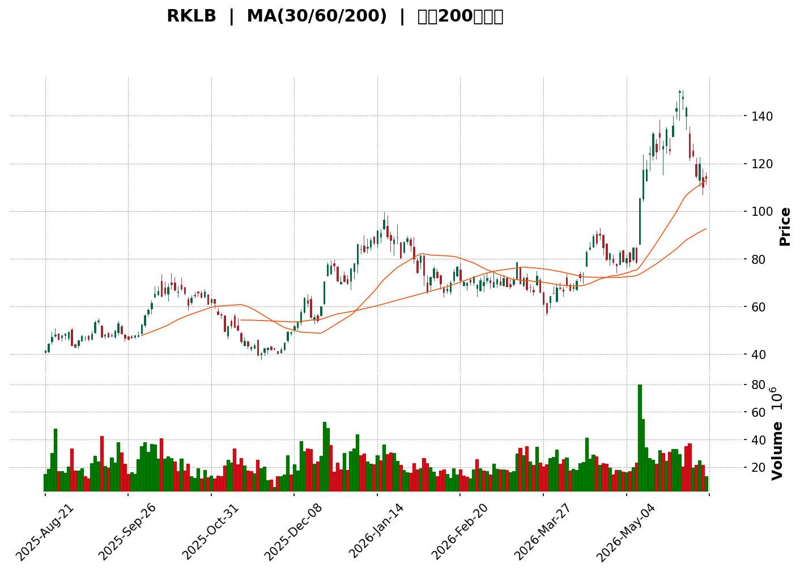
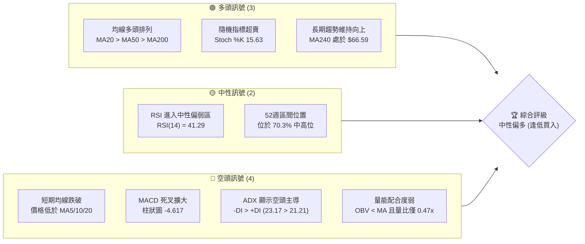
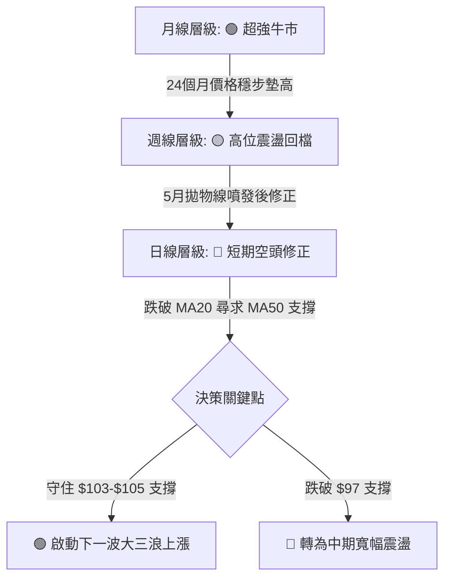
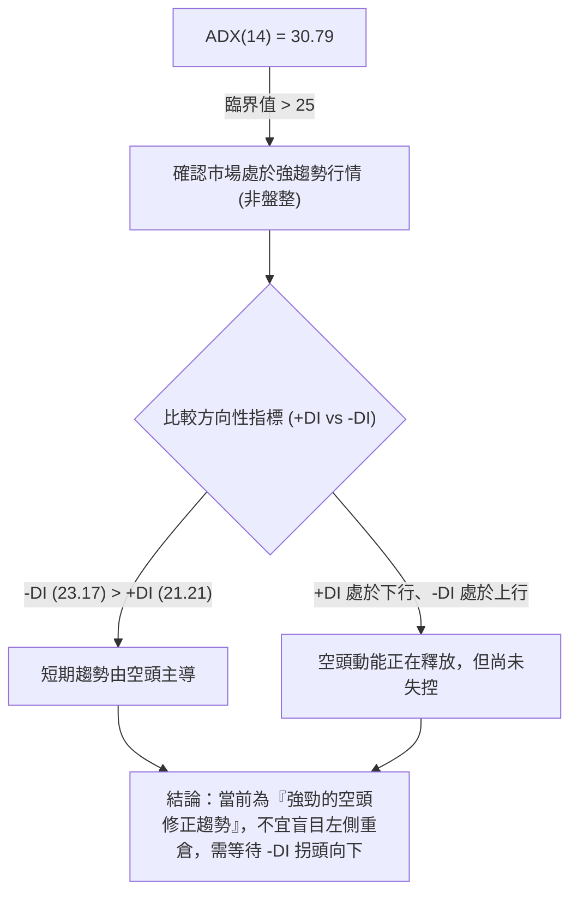

<details>
<summary>📊 靜態圖表 (點擊展開)</summary>

</details>

<html>
<head><meta charset="utf-8" /></head>
<body>
    <div style="height:500px; width:100%;">                        <script>window.PlotlyConfig = {MathJaxConfig: 'local'};</script>
        <script charset="utf-8" src="https://cdn.plot.ly/plotly-3.6.0.min.js" integrity="sha256-QaOVwtVY0T02VaHrr6pnoHLCwayMJp4O5n4YyaE3rJk=" crossorigin="anonymous"></script>                <div id="candlestick-chart" class="plotly-graph-div" style="height:100%; width:100%;"></div>            <script>                window.PLOTLYENV=window.PLOTLYENV || {};                                if (document.getElementById("candlestick-chart")) {                    Plotly.newPlot(                        "candlestick-chart",                        [{"close":{"dtype":"f8","bdata":"AAAAANfDREAAAADgozBGQAAAAAApnEdAAAAA4KMQSEAAAAAAACBHQAAAAOB69EdAAAAAwMxMSEAAAAAgrqdIQAAAAADXw0VAAAAAYLh+RUAAAAAghetGQAAAAKBw3UdAAAAAANeDR0AAAACAwhVHQAAAAEAKN0hAAAAAIIWrSkAAAADAHgVLQAAAACBcn0dAAAAAgD0KSEAAAABACpdHQAAAAMAe5UdAAAAAIK7nSEAAAADgenRKQAAAAOBRWEhAAAAA4KNQR0AAAACgRyFHQAAAAKBHgUdAAAAA4Hr0R0AAAAAAKfxHQAAAAAApPEpAAAAA4HoUTEAAAAAAAEBNQAAAAKBHwU5AAAAAANdTUEAAAABA4ZpQQAAAAOCjEFBAAAAAQOFaUEAAAACA6wFRQAAAAKBHUVFAAAAAAADAUEAAAACgR5FQQAAAAGBm1lBAAAAAoJlZUEAAAADgUUhOQAAAAMD1yE9AAAAAANcjUEAAAAAgrmdQQAAAAAAA4E9AAAAAgD2KUEAAAACAwnVOQAAAAKBwfU9AAAAAIIWrTkAAAADA9UhMQAAAAIDCNUxAAAAAgBTOSEAAAACA69FJQAAAAEAz80lAAAAAYLieSUAAAAAAKfxIQAAAAAAAoEZAAAAAwB7FRkAAAAAgrqdFQAAAAADXY0VAAAAAIFzPRUAAAACgcL1DQAAAAGBmJkRAAAAAoJk5RUAAAADAzExFQAAAAEAK90RAAAAAgOsRRUAAAAAgXC9EQAAAAEAz80RAAAAAAClcRkAAAAAgXK9IQAAAAEAKh0hAAAAAIK7HSUAAAABACrdKQAAAAGCPwkxAAAAAANfDT0AAAABguL5OQAAAAOB6tEtAAAAAYLi+S0AAAABA4fpKQAAAAIDC9U1AAAAAoEehUUAAAABAM2NTQAAAACCFS1NAAAAAIIVLU0AAAACgmalRQAAAACCuh1FAAAAAwMycUUAAAADgo3BRQAAAACBc\u002f1JAAAAAwPWIU0AAAACA64FVQAAAAMAeBVVAAAAAwB7FVEAAAABgZjZVQAAAAKCZ+VVAAAAAwB6lVUAAAABAM\u002fNWQAAAAOCjsFZAAAAAQDMTWEAAAACAPUpWQAAAAOB69FVAAAAAYLj+VUAAAACgmTlWQAAAAGC4HlRAAAAAAADAVUAAAADgeiRWQAAAACCFa1VAAAAA4HoEVEAAAACgmYlSQAAAAKBHUVRAAAAAQApHUkAAAADgepRQQAAAAOB6FFJAAAAAgML1UkAAAACA6wFSQAAAACCuZ1FAAAAA4KOAUEAAAAAAKdxQQAAAAMD1eFFAAAAAQOGaUkAAAADAHiVTQAAAAEAKt1FAAAAAoHCNUUAAAACAFH5RQAAAAMDMjFFAAAAAoJkpUkAAAABgZkZRQAAAAIAUvlFAAAAA4FGIUUAAAACAPfpRQAAAAAAAgFFAAAAAQAqHUUAAAABguN5RQAAAACCFO1FAAAAAoHD9UUAAAAAgrhdRQAAAAIA9GlFAAAAAANfTUUAAAACAwqVTQAAAAGC4XlFAAAAAIIX7UUAAAABguM5QQAAAAAAAAFFAAAAA4HqEUEAAAADgUThSQAAAAAApfFBAAAAAQAp3TkAAAADgo7BMQAAAAIAUDlBAAAAAoEdhUEAAAABguO5QQAAAAEDh6lBAAAAA4HqUUEAAAADAHkVRQAAAACBcr1BAAAAAQDMDUUAAAAAgrqdRQAAAAIAUDlJAAAAAYGZmUkAAAAAghbtUQAAAAEAzM1VAAAAAoHBdVkAAAADA9ahVQAAAAGCPglZAAAAAYGYmVUAAAAAghetTQAAAAGCPklRAAAAAgMKlU0AAAACgR0FTQAAAAOCjoFRAAAAAANezU0AAAAAA1xNUQAAAAOCjsFNAAAAAoJkpVUAAAADAHqVTQAAAAIAUXlpAAAAAYGZWXUAAAAAA12NdQAAAAKCZCV9AAAAAoJmRYEAAAACgRzFfQAAAAMAeZWBAAAAAANfTX0AAAADA9chgQAAAAMDMXF9AAAAA4FH4YEAAAABgZuZhQAAAACBcx2JAAAAAwPWAYkAAAAAgXO9hQAAAAMD1mF5AAAAA4HrUXkAAAADAzKxcQAAAAMDM\u002fF1AAAAAwB6FW0AAAACgmWlcQA=="},"high":{"dtype":"f8","bdata":"AAAAIFzvREAAAABAjVdGQAAAACCFy0hAAAAAgMJ1SUAAAABguF5IQAAAAMDM\u002fEdAAAAAYGZmSEAAAADAHsVIQAAAAEAzc0lAAAAAgD1KRkAAAABguP5GQAAAAKCZGUhAAAAAANfDR0AAAACAFA5IQAAAAMAe1UhAAAAAANcDS0AAAACAwpVLQAAAAIA9CkpAAAAAwB5FSEAAAADgUZhIQAAAAEAKd0hAAAAAoEchSUAAAABgORRLQAAAAKBwPUpAAAAAIFxPSEAAAADgUdhHQAAAAMDMDEhAAAAAYLj+R0AAAACAwrVIQAAAAEAzU0pAAAAAIDF4TEAAAACgR6FNQAAAACCuR09AAAAAAC0iUUAAAABgjyJRQAAAAAAAYFJAAAAAACmcUUAAAABA4WpRQAAAAIAUflJAAAAAAAAQUkAAAAAAACBRQAAAACCFC1JAAAAAYI8CUUAAAACgRwFQQAAAAMDMLFBAAAAAIIWLUEAAAABgZpZQQAAAAGCPolBAAAAAwPXYUEAAAAAghUtQQAAAAKCZuU9AAAAAwMyMT0AAAABguL5NQAAAAADXo0xAAAAAQOEaTEAAAADAzAxKQAAAAAAAQEtAAAAAQOF6TEAAAACAPapLQAAAAOCjsEhAAAAAACmcR0AAAADAS9dGQAAAAIAUzkVAAAAAANdDRkAAAACgRyFHQAAAAIDChURAAAAAANdDRUAAAABACmdFQAAAACCFy0VAAAAAoJlZRUAAAABgZqZEQAAAAGC4fkVAAAAAYLheRkAAAABACtdIQAAAAKCZ2UhAAAAAIFwvSkAAAAAAAOBKQAAAAIA9ak1AAAAAoJkJUEAAAAAghUtQQAAAAADXI1BAAAAAoHBdTEAAAADgenRMQAAAAAAAIE5AAAAAANejUUAAAADAzJxTQAAAACCFy1NAAAAAwB71U0AAAAAgXD9TQAAAACBcL1JAAAAAACmsUkAAAABAi0xSQAAAACBcD1NAAAAAAACQU0AAAAAAAJBVQAAAAKBwfVVAAAAAIK53VkAAAAAghRtWQAAAAIDCNVZAAAAA4KduVkAAAAAAKQxXQAAAAEBgHVdAAAAAwB7lWEAAAACgR5FYQAAAAAAA0FZAAAAAoJlZVkAAAADAzJxXQAAAAIA9ylVAAAAAAADAVUAAAABAM3NWQAAAAAAAQFZAAAAA4HpUVkAAAADAzCxUQAAAAOB6VFRAAAAAYGZWVEAAAAAgXD9SQAAAAIA9KlJAAAAAQDMzU0AAAABACvdSQAAAAKCZWVJAAAAAwMwcUUAAAABgZmZRQAAAACBcv1FAAAAAwPXwUkAAAABACkdTQAAAAMDMjFNAAAAAAADQUUAAAAAghYNRQAAAAGBm9lFAAAAAIFwvUkAAAACAwmVRQAAAAGBmBlJAAAAAAABQUkAAAABgZoZSQAAAAADXE1JAAAAAQArHUkAAAAAAAAhSQAAAAADXO1JAAAAAQDNTUkAAAABgZiZSQAAAAADX01FAAAAA4FEYUkAAAABA4apTQAAAAOBROFNAAAAAYLguUkAAAABguH5SQAAAAMDMXFFAAAAAYGYmUUAAAAAA18NSQAAAAIDCBVJAAAAAgBSGUEAAAACA69FOQAAAAMAeJVBAAAAAQOEqUUAAAADA9VhRQAAAAOB6lFFAAAAAQDMTUUAAAACAwGpSQAAAAGCPclFAAAAAANeDUUAAAABAM+NRQAAAAAAAsFJAAAAAgMKlUkAAAAAgXN9UQAAAACBcv1VAAAAAYGaWVkAAAADAzPxWQAAAAGBmRldAAAAAQDOTVkAAAACAPZpVQAAAAGC4nlRAAAAAgOtxVEAAAADgo4BTQAAAAIDC5VRAAAAAYI\u002fyVEAAAADgT3VUQAAAAAAAwFRAAAAAIIUrVUAAAABgjzJVQAAAACCuZ1pAAAAAACn8XkAAAAAgXF9eQAAAACBcz19AAAAAgMKlYEAAAAAA10tgQAAAAAApTGFAAAAAgD0yYEAAAABAM+tgQAAAAADXW2BAAAAA4FF4YUAAAAAAAEBiQAAAAAAA4GJAAAAAYI\u002faYkAAAAAAAABiQAAAAAAp9GBAAAAAwMwMYEAAAADgUaBeQAAAAOBRqF5AAAAAYLh+XUAAAABg\u002fg9dQA=="},"hovertemplate":"\u003cb\u003e%{x|%Y-%m-%d}\u003c\u002fb\u003e\u003cbr\u003e\u958b: $%{open:.2f}\u003cbr\u003e\u9ad8: $%{high:.2f}\u003cbr\u003e\u4f4e: $%{low:.2f}\u003cbr\u003e\u6536: $%{close:.2f}\u003cextra\u003e\u003c\u002fextra\u003e","low":{"dtype":"f8","bdata":"AAAAACkcREAAAADAoTVEQAAAAGBmBkZAAAAAAACAR0AAAADA9ehGQAAAACCFq0ZAAAAAYI8CR0AAAABACtdGQAAAAECJwUVAAAAAoJlZRUAAAACA6zFFQAAAAMB2vkZAAAAAQInBRkAAAADAzMxGQAAAAEAKB0dAAAAAQDVOSEAAAAAAKVxKQAAAAKBHgUdAAAAAoJk5R0AAAAAAAIBHQAAAAOCjkEdAAAAAYGZmR0AAAADgevRHQAAAAEAKN0hAAAAAQOGaRkAAAACAPepGQAAAACBcL0dAAAAAoEdBR0AAAAAgXI9HQAAAAKBHQUhAAAAAoEehSUAAAABgZuZLQAAAAGCPgkxAAAAAQDPTT0AAAABA4RpQQAAAAMD1CFBAAAAA4M4nUEAAAADgURhPQAAAAMAexVBAAAAAQDObUEAAAACgmdlPQAAAAEAzq1BAAAAAQAo3UEAAAADgejRNQAAAAAAAYE5AAAAAQDPTT0AAAACgmQlQQAAAAIAUzk9AAAAAoHC9T0AAAACA63FOQAAAAEAzM05AAAAA4KOQTUAAAACgR0FMQAAAACBcb0tAAAAA4Hq0SEAAAADgzidHQAAAAKBHYUlAAAAAQOGaSUAAAADgetRIQAAAACBcL0ZAAAAAYGamRUAAAADAzBxFQAAAAKBwnURAAAAAQAo3RUAAAADA9ahDQAAAAMD1yEJAAAAAYGamQ0AAAADgozBEQAAAAOCjsERAAAAAYGbmREAAAACgcP1DQAAAAIDCNURAAAAAAADAREAAAADA9WhGQAAAAKCZ2UdAAAAAACmcSEAAAAAghStJQAAAAAAAIEpAAAAAwMxsTEAAAABgZuZNQAAAAIA9iktAAAAAQApXSkAAAABA4YpKQAAAAADXA0xAAAAAwJ1fTkAAAADAIDBSQAAAAGCPUlJAAAAAoEOzUkAAAADA9ZhRQAAAAKCbVFFAAAAAACmcUUAAAADgUUhRQAAAAGBmtlBAAAAAANfTUUAAAABAM4NSQAAAAGBmdlRAAAAA4KOQVEAAAADAzJxUQAAAAODQ2lRAAAAAoJlpVUAAAAAAACBVQAAAAKCZqVVAAAAAoJkZV0AAAABAMxNWQAAAAKBwrVRAAAAAwHZWVEAAAAAgrodVQAAAAOCjAFRAAAAAAACAVEAAAADAyoFVQAAAAAAAwFRAAAAAoEeBU0AAAACAQXhSQAAAAKBH8VJAAAAAQAgkUUAAAADAzExQQAAAAAAAwFBAAAAAAACwUUAAAABAM+NRQAAAAKBHwVBAAAAAIFzvT0AAAAAAAGBQQAAAAAAAQFBAAAAAwEt\u002fUUAAAABgZhZSQAAAAKCZWVFAAAAAAAAgUUAAAABgZqZQQAAAAOBROFFAAAAAANczUUAAAABgZgZQQAAAAMDMnFBAAAAAACmMUEAAAACAFF5RQAAAAIDC1VBAAAAA4KMIUUAAAADgevRQQAAAAIC+J1FAAAAAwB4VUUAAAACA6xFRQAAAAAAp3FBAAAAAQOEqUUAAAACgR9FRQAAAAKCZWVFAAAAAAAAAUUAAAADA9ZhQQAAAAEAzg1BAAAAAoHAdUEAAAAAAKTxRQAAAAIDCZVBAAAAAwMwsTkAAAABg5RBMQAAAAADXg01AAAAAQDNTUEAAAACAFO5OQAAAAGBmplBAAAAAQOH6T0AAAABg5\u002fNQQAAAAEDholBAAAAAgMKVUEAAAACAwqVQQAAAAGC4nlFAAAAAYGZmUUAAAACgmTlTQAAAAGBm5lRAAAAAYGYmVUAAAAAAAHBVQAAAAOCj8FVAAAAAAClkVEAAAADAHsVTQAAAAMB0Q1NAAAAAYGZmU0AAAAAgXH9SQAAAAIAUXlNAAAAAIIWbU0AAAAAAABBTQAAAAADXI1NAAAAAQAq3U0AAAAAghXtTQAAAACCud1VAAAAAAAAAWkAAAACAPRpcQAAAAMD1OF1AAAAAANdTXkAAAABAM3NeQAAAAKDxal9AAAAAYLjOXEAAAACAFA5fQAAAAEAz815AAAAAgOtpYEAAAACA61FhQAAAAMAePWFAAAAAANfLYUAAAACgmcFgQAAAAAAAQF5AAAAAANejXkAAAACAPWpcQAAAAMD1mFtAAAAAYLiuWkAAAAAAAMBbQA=="},"name":"\u50f9\u683c","open":{"dtype":"f8","bdata":"AAAAANdjREAAAAAAKXxEQAAAAOB6lEZAAAAAoHDdR0AAAABACldIQAAAAOCjcEdAAAAAwMzsR0AAAAAAAGBHQAAAAGCPIklAAAAA4HoURkAAAADgUchFQAAAAAAAwEZAAAAAoEeBR0AAAAAA18NHQAAAAMD1KEdAAAAAoHB9SEAAAACAPcpKQAAAAAAAAEpAAAAA4FHIR0AAAACAwnVIQAAAAEAK10dAAAAA4KOQR0AAAABAM4NIQAAAAIDC5UlAAAAAAAAASEAAAABgZqZHQAAAAEAzs0dAAAAAQOGaR0AAAADgo7BHQAAAAIDrUUhAAAAAYGYGSkAAAABguG5MQAAAAKBHgU1AAAAAoJkJUEAAAACgmTlQQAAAAEAzs1FAAAAA4FH4UEAAAACAwlVQQAAAAKBHgVFAAAAA4HqEUUAAAADA9XhQQAAAAOCjSFFAAAAAYI8CUUAAAAAAKXxPQAAAACCux05AAAAAANczUEAAAAAAKYxQQAAAAEAza1BAAAAAoEcJUEAAAAAAAEBQQAAAAGCP4k5AAAAAANeDT0AAAABgZuZMQAAAAOB6VExAAAAAQOEaTEAAAACgGNRHQAAAAGC43kpAAAAAAAAATEAAAABACvdJQAAAAKBHYUhAAAAAQOHaRUAAAABAM5NGQAAAAAApHEVAAAAAAABARUAAAACAPQpHQAAAAIA96kNAAAAAoEdhREAAAAAA1wNFQAAAAGC4nkVAAAAAoEdBRUAAAABAM5NEQAAAACCuR0RAAAAAYI\u002fyREAAAABgj9JGQAAAAAAAcEhAAAAAgD0KSUAAAACgcJ1JQAAAAOBRuEpAAAAAoEfBTEAAAAAAAEBPQAAAAOCnhk9AAAAA4FEYS0AAAADAzAxMQAAAAKCZGUxAAAAAIFyPTkAAAAAAKTxSQAAAAADXc1JAAAAAgD2CU0AAAAAghStTQAAAAAAAYFFAAAAAoJlBUkAAAAAAAOBRQAAAAOBRqFFAAAAAIK6nUkAAAADgo3BTQAAAAGBmBlVAAAAAAABgVUAAAACgmSFVQAAAAGC4PlVAAAAAwPVIVkAAAABgZpZVQAAAAMD1UFZAAAAAoJkhV0AAAADAzGxXQAAAAKBHgVZAAAAA4FGYVUAAAAAghUNWQAAAACCur1VAAAAAwPW4VEAAAACAFM5VQAAAAAAp\u002fFVAAAAAAABAVUAAAACAPcpTQAAAAGBmplNAAAAAYGZWVEAAAABguH5RQAAAAAAAQFFAAAAAoJkBUkAAAACAFKZSQAAAAOBRSFJAAAAAgOvhUEAAAADgeqxQQAAAAEBghVBAAAAAAADAUUAAAACgmTlSQAAAACDZ3lJAAAAA4FEwUUAAAADgUThRQAAAAIAUxlFAAAAAQOGCUUAAAACAwuVQQAAAACCFq1BAAAAAYLg2UUAAAAAA17NRQAAAAEDhulFAAAAA4KMIUUAAAADA9VhRQAAAAIDClVFAAAAAQDMzUUAAAADAzPxRQAAAAKCZSVFAAAAAwMxUUUAAAABgZt5RQAAAAGCPAlNAAAAA4Ho0UUAAAAAAAABSQAAAAKBwBVFAAAAAAADAUEAAAAAAKTxRQAAAAMDMzFFAAAAA4KOAUEAAAACgmblOQAAAAEDh2k5AAAAAAABgUEAAAADAzBxPQAAAAGC47lBAAAAAIFzHUEAAAAAAAABSQAAAAADXQ1FAAAAAwMzsUEAAAABAM8NQQAAAACCFY1JAAAAAoHBlUkAAAACAFD5TQAAAAMAeBVVAAAAAYGY2VUAAAADAHpVWQAAAAIDCnVZAAAAAYGZ2VkAAAACAwpVVQAAAAAAp7FNAAAAAwMwEVEAAAABACndTQAAAAEAzY1NAAAAAgOvhVEAAAABACpdTQAAAAGBmplRAAAAAIK7nU0AAAACgcC1VQAAAAIA9glVAAAAAoEdRWkAAAADgozBcQAAAAKBH+V5AAAAAYGbGXkAAAABAMwNgQAAAAAApmGBAAAAAgBR+X0AAAABguN5fQAAAAMD1iF9AAAAAwB5tYEAAAABA4b5hQAAAAEAKt2JAAAAAoHBlYkAAAACAFH5hQAAAAAApjGBAAAAAgMJVX0AAAADAHuVdQAAAAKBwRVxAAAAAoEeRXEAAAADASaRcQA=="},"x":["2025-08-21T00:00:00-04:00","2025-08-22T00:00:00-04:00","2025-08-25T00:00:00-04:00","2025-08-26T00:00:00-04:00","2025-08-27T00:00:00-04:00","2025-08-28T00:00:00-04:00","2025-08-29T00:00:00-04:00","2025-09-02T00:00:00-04:00","2025-09-03T00:00:00-04:00","2025-09-04T00:00:00-04:00","2025-09-05T00:00:00-04:00","2025-09-08T00:00:00-04:00","2025-09-09T00:00:00-04:00","2025-09-10T00:00:00-04:00","2025-09-11T00:00:00-04:00","2025-09-12T00:00:00-04:00","2025-09-15T00:00:00-04:00","2025-09-16T00:00:00-04:00","2025-09-17T00:00:00-04:00","2025-09-18T00:00:00-04:00","2025-09-19T00:00:00-04:00","2025-09-22T00:00:00-04:00","2025-09-23T00:00:00-04:00","2025-09-24T00:00:00-04:00","2025-09-25T00:00:00-04:00","2025-09-26T00:00:00-04:00","2025-09-29T00:00:00-04:00","2025-09-30T00:00:00-04:00","2025-10-01T00:00:00-04:00","2025-10-02T00:00:00-04:00","2025-10-03T00:00:00-04:00","2025-10-06T00:00:00-04:00","2025-10-07T00:00:00-04:00","2025-10-08T00:00:00-04:00","2025-10-09T00:00:00-04:00","2025-10-10T00:00:00-04:00","2025-10-13T00:00:00-04:00","2025-10-14T00:00:00-04:00","2025-10-15T00:00:00-04:00","2025-10-16T00:00:00-04:00","2025-10-17T00:00:00-04:00","2025-10-20T00:00:00-04:00","2025-10-21T00:00:00-04:00","2025-10-22T00:00:00-04:00","2025-10-23T00:00:00-04:00","2025-10-24T00:00:00-04:00","2025-10-27T00:00:00-04:00","2025-10-28T00:00:00-04:00","2025-10-29T00:00:00-04:00","2025-10-30T00:00:00-04:00","2025-10-31T00:00:00-04:00","2025-11-03T00:00:00-05:00","2025-11-04T00:00:00-05:00","2025-11-05T00:00:00-05:00","2025-11-06T00:00:00-05:00","2025-11-07T00:00:00-05:00","2025-11-10T00:00:00-05:00","2025-11-11T00:00:00-05:00","2025-11-12T00:00:00-05:00","2025-11-13T00:00:00-05:00","2025-11-14T00:00:00-05:00","2025-11-17T00:00:00-05:00","2025-11-18T00:00:00-05:00","2025-11-19T00:00:00-05:00","2025-11-20T00:00:00-05:00","2025-11-21T00:00:00-05:00","2025-11-24T00:00:00-05:00","2025-11-25T00:00:00-05:00","2025-11-26T00:00:00-05:00","2025-11-28T00:00:00-05:00","2025-12-01T00:00:00-05:00","2025-12-02T00:00:00-05:00","2025-12-03T00:00:00-05:00","2025-12-04T00:00:00-05:00","2025-12-05T00:00:00-05:00","2025-12-08T00:00:00-05:00","2025-12-09T00:00:00-05:00","2025-12-10T00:00:00-05:00","2025-12-11T00:00:00-05:00","2025-12-12T00:00:00-05:00","2025-12-15T00:00:00-05:00","2025-12-16T00:00:00-05:00","2025-12-17T00:00:00-05:00","2025-12-18T00:00:00-05:00","2025-12-19T00:00:00-05:00","2025-12-22T00:00:00-05:00","2025-12-23T00:00:00-05:00","2025-12-24T00:00:00-05:00","2025-12-26T00:00:00-05:00","2025-12-29T00:00:00-05:00","2025-12-30T00:00:00-05:00","2025-12-31T00:00:00-05:00","2026-01-02T00:00:00-05:00","2026-01-05T00:00:00-05:00","2026-01-06T00:00:00-05:00","2026-01-07T00:00:00-05:00","2026-01-08T00:00:00-05:00","2026-01-09T00:00:00-05:00","2026-01-12T00:00:00-05:00","2026-01-13T00:00:00-05:00","2026-01-14T00:00:00-05:00","2026-01-15T00:00:00-05:00","2026-01-16T00:00:00-05:00","2026-01-20T00:00:00-05:00","2026-01-21T00:00:00-05:00","2026-01-22T00:00:00-05:00","2026-01-23T00:00:00-05:00","2026-01-26T00:00:00-05:00","2026-01-27T00:00:00-05:00","2026-01-28T00:00:00-05:00","2026-01-29T00:00:00-05:00","2026-01-30T00:00:00-05:00","2026-02-02T00:00:00-05:00","2026-02-03T00:00:00-05:00","2026-02-04T00:00:00-05:00","2026-02-05T00:00:00-05:00","2026-02-06T00:00:00-05:00","2026-02-09T00:00:00-05:00","2026-02-10T00:00:00-05:00","2026-02-11T00:00:00-05:00","2026-02-12T00:00:00-05:00","2026-02-13T00:00:00-05:00","2026-02-17T00:00:00-05:00","2026-02-18T00:00:00-05:00","2026-02-19T00:00:00-05:00","2026-02-20T00:00:00-05:00","2026-02-23T00:00:00-05:00","2026-02-24T00:00:00-05:00","2026-02-25T00:00:00-05:00","2026-02-26T00:00:00-05:00","2026-02-27T00:00:00-05:00","2026-03-02T00:00:00-05:00","2026-03-03T00:00:00-05:00","2026-03-04T00:00:00-05:00","2026-03-05T00:00:00-05:00","2026-03-06T00:00:00-05:00","2026-03-09T00:00:00-04:00","2026-03-10T00:00:00-04:00","2026-03-11T00:00:00-04:00","2026-03-12T00:00:00-04:00","2026-03-13T00:00:00-04:00","2026-03-16T00:00:00-04:00","2026-03-17T00:00:00-04:00","2026-03-18T00:00:00-04:00","2026-03-19T00:00:00-04:00","2026-03-20T00:00:00-04:00","2026-03-23T00:00:00-04:00","2026-03-24T00:00:00-04:00","2026-03-25T00:00:00-04:00","2026-03-26T00:00:00-04:00","2026-03-27T00:00:00-04:00","2026-03-30T00:00:00-04:00","2026-03-31T00:00:00-04:00","2026-04-01T00:00:00-04:00","2026-04-02T00:00:00-04:00","2026-04-06T00:00:00-04:00","2026-04-07T00:00:00-04:00","2026-04-08T00:00:00-04:00","2026-04-09T00:00:00-04:00","2026-04-10T00:00:00-04:00","2026-04-13T00:00:00-04:00","2026-04-14T00:00:00-04:00","2026-04-15T00:00:00-04:00","2026-04-16T00:00:00-04:00","2026-04-17T00:00:00-04:00","2026-04-20T00:00:00-04:00","2026-04-21T00:00:00-04:00","2026-04-22T00:00:00-04:00","2026-04-23T00:00:00-04:00","2026-04-24T00:00:00-04:00","2026-04-27T00:00:00-04:00","2026-04-28T00:00:00-04:00","2026-04-29T00:00:00-04:00","2026-04-30T00:00:00-04:00","2026-05-01T00:00:00-04:00","2026-05-04T00:00:00-04:00","2026-05-05T00:00:00-04:00","2026-05-06T00:00:00-04:00","2026-05-07T00:00:00-04:00","2026-05-08T00:00:00-04:00","2026-05-11T00:00:00-04:00","2026-05-12T00:00:00-04:00","2026-05-13T00:00:00-04:00","2026-05-14T00:00:00-04:00","2026-05-15T00:00:00-04:00","2026-05-18T00:00:00-04:00","2026-05-19T00:00:00-04:00","2026-05-20T00:00:00-04:00","2026-05-21T00:00:00-04:00","2026-05-22T00:00:00-04:00","2026-05-26T00:00:00-04:00","2026-05-27T00:00:00-04:00","2026-05-28T00:00:00-04:00","2026-05-29T00:00:00-04:00","2026-06-01T00:00:00-04:00","2026-06-02T00:00:00-04:00","2026-06-03T00:00:00-04:00","2026-06-04T00:00:00-04:00","2026-06-05T00:00:00-04:00","2026-06-08T00:00:00-04:00"],"type":"candlestick"},{"hovertemplate":"MA30: $%{y:.2f}\u003cextra\u003e\u003c\u002fextra\u003e","line":{"color":"#2196F3","dash":"dash","width":2},"mode":"lines","name":"MA30","x":["2025-08-21T00:00:00-04:00","2025-08-22T00:00:00-04:00","2025-08-25T00:00:00-04:00","2025-08-26T00:00:00-04:00","2025-08-27T00:00:00-04:00","2025-08-28T00:00:00-04:00","2025-08-29T00:00:00-04:00","2025-09-02T00:00:00-04:00","2025-09-03T00:00:00-04:00","2025-09-04T00:00:00-04:00","2025-09-05T00:00:00-04:00","2025-09-08T00:00:00-04:00","2025-09-09T00:00:00-04:00","2025-09-10T00:00:00-04:00","2025-09-11T00:00:00-04:00","2025-09-12T00:00:00-04:00","2025-09-15T00:00:00-04:00","2025-09-16T00:00:00-04:00","2025-09-17T00:00:00-04:00","2025-09-18T00:00:00-04:00","2025-09-19T00:00:00-04:00","2025-09-22T00:00:00-04:00","2025-09-23T00:00:00-04:00","2025-09-24T00:00:00-04:00","2025-09-25T00:00:00-04:00","2025-09-26T00:00:00-04:00","2025-09-29T00:00:00-04:00","2025-09-30T00:00:00-04:00","2025-10-01T00:00:00-04:00","2025-10-02T00:00:00-04:00","2025-10-03T00:00:00-04:00","2025-10-06T00:00:00-04:00","2025-10-07T00:00:00-04:00","2025-10-08T00:00:00-04:00","2025-10-09T00:00:00-04:00","2025-10-10T00:00:00-04:00","2025-10-13T00:00:00-04:00","2025-10-14T00:00:00-04:00","2025-10-15T00:00:00-04:00","2025-10-16T00:00:00-04:00","2025-10-17T00:00:00-04:00","2025-10-20T00:00:00-04:00","2025-10-21T00:00:00-04:00","2025-10-22T00:00:00-04:00","2025-10-23T00:00:00-04:00","2025-10-24T00:00:00-04:00","2025-10-27T00:00:00-04:00","2025-10-28T00:00:00-04:00","2025-10-29T00:00:00-04:00","2025-10-30T00:00:00-04:00","2025-10-31T00:00:00-04:00","2025-11-03T00:00:00-05:00","2025-11-04T00:00:00-05:00","2025-11-05T00:00:00-05:00","2025-11-06T00:00:00-05:00","2025-11-07T00:00:00-05:00","2025-11-10T00:00:00-05:00","2025-11-11T00:00:00-05:00","2025-11-12T00:00:00-05:00","2025-11-13T00:00:00-05:00","2025-11-14T00:00:00-05:00","2025-11-17T00:00:00-05:00","2025-11-18T00:00:00-05:00","2025-11-19T00:00:00-05:00","2025-11-20T00:00:00-05:00","2025-11-21T00:00:00-05:00","2025-11-24T00:00:00-05:00","2025-11-25T00:00:00-05:00","2025-11-26T00:00:00-05:00","2025-11-28T00:00:00-05:00","2025-12-01T00:00:00-05:00","2025-12-02T00:00:00-05:00","2025-12-03T00:00:00-05:00","2025-12-04T00:00:00-05:00","2025-12-05T00:00:00-05:00","2025-12-08T00:00:00-05:00","2025-12-09T00:00:00-05:00","2025-12-10T00:00:00-05:00","2025-12-11T00:00:00-05:00","2025-12-12T00:00:00-05:00","2025-12-15T00:00:00-05:00","2025-12-16T00:00:00-05:00","2025-12-17T00:00:00-05:00","2025-12-18T00:00:00-05:00","2025-12-19T00:00:00-05:00","2025-12-22T00:00:00-05:00","2025-12-23T00:00:00-05:00","2025-12-24T00:00:00-05:00","2025-12-26T00:00:00-05:00","2025-12-29T00:00:00-05:00","2025-12-30T00:00:00-05:00","2025-12-31T00:00:00-05:00","2026-01-02T00:00:00-05:00","2026-01-05T00:00:00-05:00","2026-01-06T00:00:00-05:00","2026-01-07T00:00:00-05:00","2026-01-08T00:00:00-05:00","2026-01-09T00:00:00-05:00","2026-01-12T00:00:00-05:00","2026-01-13T00:00:00-05:00","2026-01-14T00:00:00-05:00","2026-01-15T00:00:00-05:00","2026-01-16T00:00:00-05:00","2026-01-20T00:00:00-05:00","2026-01-21T00:00:00-05:00","2026-01-22T00:00:00-05:00","2026-01-23T00:00:00-05:00","2026-01-26T00:00:00-05:00","2026-01-27T00:00:00-05:00","2026-01-28T00:00:00-05:00","2026-01-29T00:00:00-05:00","2026-01-30T00:00:00-05:00","2026-02-02T00:00:00-05:00","2026-02-03T00:00:00-05:00","2026-02-04T00:00:00-05:00","2026-02-05T00:00:00-05:00","2026-02-06T00:00:00-05:00","2026-02-09T00:00:00-05:00","2026-02-10T00:00:00-05:00","2026-02-11T00:00:00-05:00","2026-02-12T00:00:00-05:00","2026-02-13T00:00:00-05:00","2026-02-17T00:00:00-05:00","2026-02-18T00:00:00-05:00","2026-02-19T00:00:00-05:00","2026-02-20T00:00:00-05:00","2026-02-23T00:00:00-05:00","2026-02-24T00:00:00-05:00","2026-02-25T00:00:00-05:00","2026-02-26T00:00:00-05:00","2026-02-27T00:00:00-05:00","2026-03-02T00:00:00-05:00","2026-03-03T00:00:00-05:00","2026-03-04T00:00:00-05:00","2026-03-05T00:00:00-05:00","2026-03-06T00:00:00-05:00","2026-03-09T00:00:00-04:00","2026-03-10T00:00:00-04:00","2026-03-11T00:00:00-04:00","2026-03-12T00:00:00-04:00","2026-03-13T00:00:00-04:00","2026-03-16T00:00:00-04:00","2026-03-17T00:00:00-04:00","2026-03-18T00:00:00-04:00","2026-03-19T00:00:00-04:00","2026-03-20T00:00:00-04:00","2026-03-23T00:00:00-04:00","2026-03-24T00:00:00-04:00","2026-03-25T00:00:00-04:00","2026-03-26T00:00:00-04:00","2026-03-27T00:00:00-04:00","2026-03-30T00:00:00-04:00","2026-03-31T00:00:00-04:00","2026-04-01T00:00:00-04:00","2026-04-02T00:00:00-04:00","2026-04-06T00:00:00-04:00","2026-04-07T00:00:00-04:00","2026-04-08T00:00:00-04:00","2026-04-09T00:00:00-04:00","2026-04-10T00:00:00-04:00","2026-04-13T00:00:00-04:00","2026-04-14T00:00:00-04:00","2026-04-15T00:00:00-04:00","2026-04-16T00:00:00-04:00","2026-04-17T00:00:00-04:00","2026-04-20T00:00:00-04:00","2026-04-21T00:00:00-04:00","2026-04-22T00:00:00-04:00","2026-04-23T00:00:00-04:00","2026-04-24T00:00:00-04:00","2026-04-27T00:00:00-04:00","2026-04-28T00:00:00-04:00","2026-04-29T00:00:00-04:00","2026-04-30T00:00:00-04:00","2026-05-01T00:00:00-04:00","2026-05-04T00:00:00-04:00","2026-05-05T00:00:00-04:00","2026-05-06T00:00:00-04:00","2026-05-07T00:00:00-04:00","2026-05-08T00:00:00-04:00","2026-05-11T00:00:00-04:00","2026-05-12T00:00:00-04:00","2026-05-13T00:00:00-04:00","2026-05-14T00:00:00-04:00","2026-05-15T00:00:00-04:00","2026-05-18T00:00:00-04:00","2026-05-19T00:00:00-04:00","2026-05-20T00:00:00-04:00","2026-05-21T00:00:00-04:00","2026-05-22T00:00:00-04:00","2026-05-26T00:00:00-04:00","2026-05-27T00:00:00-04:00","2026-05-28T00:00:00-04:00","2026-05-29T00:00:00-04:00","2026-06-01T00:00:00-04:00","2026-06-02T00:00:00-04:00","2026-06-03T00:00:00-04:00","2026-06-04T00:00:00-04:00","2026-06-05T00:00:00-04:00","2026-06-08T00:00:00-04:00"],"y":{"dtype":"f8","bdata":"AAAAAAAA+H8AAAAAAAD4fwAAAAAAAPh\u002fAAAAAAAA+H8AAAAAAAD4fwAAAAAAAPh\u002fAAAAAAAA+H8AAAAAAAD4fwAAAAAAAPh\u002fAAAAAAAA+H8AAAAAAAD4fwAAAAAAAPh\u002fAAAAAAAA+H8AAAAAAAD4fwAAAAAAAPh\u002fAAAAAAAA+H8AAAAAAAD4fwAAAAAAAPh\u002fAAAAAAAA+H8AAAAAAAD4fwAAAAAAAPh\u002fAAAAAAAA+H8AAAAAAAD4fwAAAAAAAPh\u002fAAAAAAAA+H8AAAAAAAD4fwAAAAAAAPh\u002fAAAAAAAA+H8AAAAAAAD4f0RERGSC30dAERERQe4dSEDv7u4OLVpIQLy7u4sll0hA7+7urnLgSEAzMzOzgTZJQDMzM0NEfElAAAAAMAjESUCrqqpq5xNKQLy7u1u6gUpA3t3drSvoSkDv7u6uVj9LQERERPQMk0tAVVVV5W3hS0AzMzMT2R5MQN7d3f1xX0xAiYiIOFGPTEC8u7urucBMQImIiIglB01Ad3d3t0lUTUBVVVV16Y5NQM3MzPy4z01AIiIi0uoATkBERESEiBBOQM3MzLyDMU5AERERsTo+TkBmZmYWL1VOQGZmZkYMak5AZmZmhkF4TkDv7u4OyoBOQEREROT7YU5AVVVVBaw0TkDe3d193PNNQGZmZlbyo01AMzMzE2dHTUCamZlpddRMQDMzM7M6bkxAZmZmVjkMTEDv7u7+uJ9LQN7d3W0SK0tA3t3drQDBSkCamZn5flJKQKuqqsro5UlAd3d3t6yNSUCrqqrK6F1JQKuqqor6H0lAREREFIPoSECJiIhYgLRIQGZmZobrmUhAvLu727KOSEBERER0IZFIQO\u002fu7v7UcEhAzczMPN9XSEC8u7trvExIQKuqqlqrW0hAVVVVpeK0SEB3d3dHbyNJQHd3d8dLj0lAzczMLPn9SUAAAABANVZKQM3MzOxRwEpAiYiISJoqS0DNzMy8dJtLQJqZmekmKUxAVVVV9W+8TECJiIj4DINNQImIiGjYPU5ARERENDPrTkCJiIh4d59PQERERHzNMVBA7+7uppuQUECrqqpKU\u002f5QQN7d3V2PZlFAzczM7JjUUUCrqqqSeylSQGZmZm4ufFJAvLu7m+DJUkBVVVX1ixVTQGZmZi6HRlNAZmZm7ph4U0CJiIg4XrJTQFVVVa3x8lNAIiIiomEnVEARERERdFJUQDMzMwMAgFRAAAAAgIaFVEC8u7trkW1UQGZmZjYzY1RAREREZFdgVEDe3d0NSWNUQM3MzPw3YlRAiYiIKL9YVEAREREhzFNUQHd3d7fIRlRAmpmZGdk+VEBEREQksCpUQCIiIkJ8DlRAVVVVhQfzU0Dv7u4OSdNTQO\u002fu7n6GrVNAvLu7286PU0ARERGhYV9TQGZmZqYpNVNAZmZmVlX9UkCamZmJiNhSQBEREXGEslJAmpmZCWWMUkBVVVVlO2dSQN7d3Y2XTlJAVVVVtYEuUkARERHRaQNSQImIiBiS3lFAd3d39+HLUUC8u7vLWtVRQDMzM+MzvFFAMzMzc6+5UUDv7u5uoLtRQDMzMyNpslFAq6qqapGdUUARERGhYZ9RQLy7u9uHl1FAAAAAgLGMUUDe3d1lO3dRQKuqqtIia1FAREREPCZYUUDNzMz0REVRQCIiIsp2PlFAzczMVCo2UUDe3d1FRDRRQO\u002fu7qbiLFFAiYiIcBIjUUCJiIiQUCZRQDMzMzv7KFFAiYiIUGIwUUC8u7uz5EdRQCIiInp3Z1FAAAAAKL+QUUARERGJFrFRQBEREWkf3lFAERERiRb5UUBVVVVNNxFSQJqZmaHTLlJAMzMze1s+UkBVVVUNAjtSQDMzMyvOVlJAiYiIkHtlUkBERET8YoFSQJqZmWFXmFJAIiIiivq\u002fUkCJiIiAI8xSQO\u002fu7iZ4IFNAZmZm\u002ftSYU0C8u7tLNxlUQBERERERmVRAMzMzYxAoVUBERETUv6FVQGZmZtYxKVZAIiIigk6rVkBmZmZmZjZXQDMzM+Ols1dAIiIikhhEWEDNzMzs7t5YQImIiMhahVlAzczMfCMkWkC8u7vbT6VaQCIiIgKB9VpAVVVVFb09W0BVVVWVmXlbQN7d3W1ouVtAiYiI6MPvW0Dv7u4OPDhcQA=="},"type":"scatter"},{"hovertemplate":"MA60: $%{y:.2f}\u003cextra\u003e\u003c\u002fextra\u003e","line":{"color":"#9C27B0","dash":"dash","width":2},"mode":"lines","name":"MA60","x":["2025-08-21T00:00:00-04:00","2025-08-22T00:00:00-04:00","2025-08-25T00:00:00-04:00","2025-08-26T00:00:00-04:00","2025-08-27T00:00:00-04:00","2025-08-28T00:00:00-04:00","2025-08-29T00:00:00-04:00","2025-09-02T00:00:00-04:00","2025-09-03T00:00:00-04:00","2025-09-04T00:00:00-04:00","2025-09-05T00:00:00-04:00","2025-09-08T00:00:00-04:00","2025-09-09T00:00:00-04:00","2025-09-10T00:00:00-04:00","2025-09-11T00:00:00-04:00","2025-09-12T00:00:00-04:00","2025-09-15T00:00:00-04:00","2025-09-16T00:00:00-04:00","2025-09-17T00:00:00-04:00","2025-09-18T00:00:00-04:00","2025-09-19T00:00:00-04:00","2025-09-22T00:00:00-04:00","2025-09-23T00:00:00-04:00","2025-09-24T00:00:00-04:00","2025-09-25T00:00:00-04:00","2025-09-26T00:00:00-04:00","2025-09-29T00:00:00-04:00","2025-09-30T00:00:00-04:00","2025-10-01T00:00:00-04:00","2025-10-02T00:00:00-04:00","2025-10-03T00:00:00-04:00","2025-10-06T00:00:00-04:00","2025-10-07T00:00:00-04:00","2025-10-08T00:00:00-04:00","2025-10-09T00:00:00-04:00","2025-10-10T00:00:00-04:00","2025-10-13T00:00:00-04:00","2025-10-14T00:00:00-04:00","2025-10-15T00:00:00-04:00","2025-10-16T00:00:00-04:00","2025-10-17T00:00:00-04:00","2025-10-20T00:00:00-04:00","2025-10-21T00:00:00-04:00","2025-10-22T00:00:00-04:00","2025-10-23T00:00:00-04:00","2025-10-24T00:00:00-04:00","2025-10-27T00:00:00-04:00","2025-10-28T00:00:00-04:00","2025-10-29T00:00:00-04:00","2025-10-30T00:00:00-04:00","2025-10-31T00:00:00-04:00","2025-11-03T00:00:00-05:00","2025-11-04T00:00:00-05:00","2025-11-05T00:00:00-05:00","2025-11-06T00:00:00-05:00","2025-11-07T00:00:00-05:00","2025-11-10T00:00:00-05:00","2025-11-11T00:00:00-05:00","2025-11-12T00:00:00-05:00","2025-11-13T00:00:00-05:00","2025-11-14T00:00:00-05:00","2025-11-17T00:00:00-05:00","2025-11-18T00:00:00-05:00","2025-11-19T00:00:00-05:00","2025-11-20T00:00:00-05:00","2025-11-21T00:00:00-05:00","2025-11-24T00:00:00-05:00","2025-11-25T00:00:00-05:00","2025-11-26T00:00:00-05:00","2025-11-28T00:00:00-05:00","2025-12-01T00:00:00-05:00","2025-12-02T00:00:00-05:00","2025-12-03T00:00:00-05:00","2025-12-04T00:00:00-05:00","2025-12-05T00:00:00-05:00","2025-12-08T00:00:00-05:00","2025-12-09T00:00:00-05:00","2025-12-10T00:00:00-05:00","2025-12-11T00:00:00-05:00","2025-12-12T00:00:00-05:00","2025-12-15T00:00:00-05:00","2025-12-16T00:00:00-05:00","2025-12-17T00:00:00-05:00","2025-12-18T00:00:00-05:00","2025-12-19T00:00:00-05:00","2025-12-22T00:00:00-05:00","2025-12-23T00:00:00-05:00","2025-12-24T00:00:00-05:00","2025-12-26T00:00:00-05:00","2025-12-29T00:00:00-05:00","2025-12-30T00:00:00-05:00","2025-12-31T00:00:00-05:00","2026-01-02T00:00:00-05:00","2026-01-05T00:00:00-05:00","2026-01-06T00:00:00-05:00","2026-01-07T00:00:00-05:00","2026-01-08T00:00:00-05:00","2026-01-09T00:00:00-05:00","2026-01-12T00:00:00-05:00","2026-01-13T00:00:00-05:00","2026-01-14T00:00:00-05:00","2026-01-15T00:00:00-05:00","2026-01-16T00:00:00-05:00","2026-01-20T00:00:00-05:00","2026-01-21T00:00:00-05:00","2026-01-22T00:00:00-05:00","2026-01-23T00:00:00-05:00","2026-01-26T00:00:00-05:00","2026-01-27T00:00:00-05:00","2026-01-28T00:00:00-05:00","2026-01-29T00:00:00-05:00","2026-01-30T00:00:00-05:00","2026-02-02T00:00:00-05:00","2026-02-03T00:00:00-05:00","2026-02-04T00:00:00-05:00","2026-02-05T00:00:00-05:00","2026-02-06T00:00:00-05:00","2026-02-09T00:00:00-05:00","2026-02-10T00:00:00-05:00","2026-02-11T00:00:00-05:00","2026-02-12T00:00:00-05:00","2026-02-13T00:00:00-05:00","2026-02-17T00:00:00-05:00","2026-02-18T00:00:00-05:00","2026-02-19T00:00:00-05:00","2026-02-20T00:00:00-05:00","2026-02-23T00:00:00-05:00","2026-02-24T00:00:00-05:00","2026-02-25T00:00:00-05:00","2026-02-26T00:00:00-05:00","2026-02-27T00:00:00-05:00","2026-03-02T00:00:00-05:00","2026-03-03T00:00:00-05:00","2026-03-04T00:00:00-05:00","2026-03-05T00:00:00-05:00","2026-03-06T00:00:00-05:00","2026-03-09T00:00:00-04:00","2026-03-10T00:00:00-04:00","2026-03-11T00:00:00-04:00","2026-03-12T00:00:00-04:00","2026-03-13T00:00:00-04:00","2026-03-16T00:00:00-04:00","2026-03-17T00:00:00-04:00","2026-03-18T00:00:00-04:00","2026-03-19T00:00:00-04:00","2026-03-20T00:00:00-04:00","2026-03-23T00:00:00-04:00","2026-03-24T00:00:00-04:00","2026-03-25T00:00:00-04:00","2026-03-26T00:00:00-04:00","2026-03-27T00:00:00-04:00","2026-03-30T00:00:00-04:00","2026-03-31T00:00:00-04:00","2026-04-01T00:00:00-04:00","2026-04-02T00:00:00-04:00","2026-04-06T00:00:00-04:00","2026-04-07T00:00:00-04:00","2026-04-08T00:00:00-04:00","2026-04-09T00:00:00-04:00","2026-04-10T00:00:00-04:00","2026-04-13T00:00:00-04:00","2026-04-14T00:00:00-04:00","2026-04-15T00:00:00-04:00","2026-04-16T00:00:00-04:00","2026-04-17T00:00:00-04:00","2026-04-20T00:00:00-04:00","2026-04-21T00:00:00-04:00","2026-04-22T00:00:00-04:00","2026-04-23T00:00:00-04:00","2026-04-24T00:00:00-04:00","2026-04-27T00:00:00-04:00","2026-04-28T00:00:00-04:00","2026-04-29T00:00:00-04:00","2026-04-30T00:00:00-04:00","2026-05-01T00:00:00-04:00","2026-05-04T00:00:00-04:00","2026-05-05T00:00:00-04:00","2026-05-06T00:00:00-04:00","2026-05-07T00:00:00-04:00","2026-05-08T00:00:00-04:00","2026-05-11T00:00:00-04:00","2026-05-12T00:00:00-04:00","2026-05-13T00:00:00-04:00","2026-05-14T00:00:00-04:00","2026-05-15T00:00:00-04:00","2026-05-18T00:00:00-04:00","2026-05-19T00:00:00-04:00","2026-05-20T00:00:00-04:00","2026-05-21T00:00:00-04:00","2026-05-22T00:00:00-04:00","2026-05-26T00:00:00-04:00","2026-05-27T00:00:00-04:00","2026-05-28T00:00:00-04:00","2026-05-29T00:00:00-04:00","2026-06-01T00:00:00-04:00","2026-06-02T00:00:00-04:00","2026-06-03T00:00:00-04:00","2026-06-04T00:00:00-04:00","2026-06-05T00:00:00-04:00","2026-06-08T00:00:00-04:00"],"y":{"dtype":"f8","bdata":"AAAAAAAA+H8AAAAAAAD4fwAAAAAAAPh\u002fAAAAAAAA+H8AAAAAAAD4fwAAAAAAAPh\u002fAAAAAAAA+H8AAAAAAAD4fwAAAAAAAPh\u002fAAAAAAAA+H8AAAAAAAD4fwAAAAAAAPh\u002fAAAAAAAA+H8AAAAAAAD4fwAAAAAAAPh\u002fAAAAAAAA+H8AAAAAAAD4fwAAAAAAAPh\u002fAAAAAAAA+H8AAAAAAAD4fwAAAAAAAPh\u002fAAAAAAAA+H8AAAAAAAD4fwAAAAAAAPh\u002fAAAAAAAA+H8AAAAAAAD4fwAAAAAAAPh\u002fAAAAAAAA+H8AAAAAAAD4fwAAAAAAAPh\u002fAAAAAAAA+H8AAAAAAAD4fwAAAAAAAPh\u002fAAAAAAAA+H8AAAAAAAD4fwAAAAAAAPh\u002fAAAAAAAA+H8AAAAAAAD4fwAAAAAAAPh\u002fAAAAAAAA+H8AAAAAAAD4fwAAAAAAAPh\u002fAAAAAAAA+H8AAAAAAAD4fwAAAAAAAPh\u002fAAAAAAAA+H8AAAAAAAD4fwAAAAAAAPh\u002fAAAAAAAA+H8AAAAAAAD4fwAAAAAAAPh\u002fAAAAAAAA+H8AAAAAAAD4fwAAAAAAAPh\u002fAAAAAAAA+H8AAAAAAAD4fwAAAAAAAPh\u002fAAAAAAAA+H8AAAAAAAD4f0RERCS\u002fIEtAMzMzI00pS0BmZmbGBCdLQBEREfGLHUtAERER4ewTS0BmZmaOewVLQDMzM3s\u002f9UpAMzMzwyDoSkDNzMw00NlKQM3MzGRm1kpA3t3dLZbUSkBERETU6shKQHd3d996vEpAZmZmTo23SkDv7u7uYL5KQERERES2v0pAZmZmJuq7SkAiIiICnbpKQHd3d4eI0EpAmpmZSX7xSkDNzMx0BRBLQN7d3f1GIEtAd3d3B2UsS0AAAAB4oi5LQLy7u4uXRktAMzMzq455S0Dv7u4uT7xLQO\u002fu7gas\u002fEtAmpmZWR07TEB3d3enf2tMQImIiOgmkUxA7+7uJqOvTEBVVVWdqMdMQAAAAKCM5kxAREREhOsBTUARERExwStNQN7d3Y0JVk1AVVVVRbZ7TUC8u7s7mJ9NQDMzM7NWx01A3t3d\u002fRvxTUB3d3fHkidOQDMzM8ODWU5AiYiISG+bTkAAAAD4b9hOQLy7u7MrDE9A3t3dJSI+T0CamZkhzG9PQJqZmfF8k09AREREXPK\u002fT0Crqqry7vpPQGZmZhauFVBAREREoKgpUEB3d3cjaTxQQERERNjqVlBAVVVV6ftvUEC8u7uHpH9QQBEREY1slVBAVVVV\u002famvUEDv7u7WMcdQQJqZmXkw4VBAZmZmJgb3UEC8u7s\u002fwxBRQCIiIhauLVFAIiIiiohOUUBERERQG3ZRQDMzMzu0llFAvLu7j1C0UUCamZllgtFRQJqZmf2p71FAVVVVQTUQUkDe3d112i5SQCIiIoLcTVJAmpmZIfdoUkAiIiIOAoFSQLy7u29Zl1JAq6qq0iKrUkBVVVWtY75SQCIiIl6PylJA3t3dUY3TUkDNzMwE5NpSQO\u002fu7uLB6FJAzczMzKH5UkBmZmZu5xNTQDMzM\u002fMZHlNAmpmZ+ZofU0BVVVXtmBRTQM3MzCzOClNAd3d3Z\u002fT+UkB3d3dXVQFTQEREROzf\u002fFJAREREVLjyUkB3d3fDg+VSQBEREcX12FJA7+7uqn\u002fLUkCJiIiM+rdSQCIiIoZ5plJAERER7ZiUUkBmZmaqxoNSQO\u002fu7pI0bVJAIiIipnBZUkDNzMwY2UJSQM3MzHASL1JAd3d309sWUkCrqqqeNhBSQJqZmfX9DFJAzczMGJIOUkAzMzP3KAxSQHd3d3tbFlJAMzMzH8wTUkAzMzOPUApSQBEREd2yBlJAVVVVuR4FUkCJiIhsLghSQDMzMweBCVJA3t3dgZUPUkCamZm1gR5SQGZmZkJgJVJAZmZm+sUuUkDNzMyQwjVSQFVVVQEAXFJAMzMzP8OSUkDNzMxYOchSQN7d3fEZAlNAvLu7TxtAU0CJiIhkgnNTQERERFDUs1NAd3d3a7zwU0AiIiJWVTVUQBEREUVEcFRAVVVVgZWzVECrqqq+nwJVQN7d3QErV1VAq6qq5kKqVUC8u7tHmvZVQCIiIj58LlZAq6qqHj5nVkAzMzMPWJVWQHd3d+vDy1ZAzczMOG30VkAiIiKuuSRXQA=="},"type":"scatter"},{"hovertemplate":"MA200: $%{y:.2f}\u003cextra\u003e\u003c\u002fextra\u003e","line":{"color":"#FF6F00","dash":"solid","width":2},"mode":"lines","name":"MA200","x":["2025-08-21T00:00:00-04:00","2025-08-22T00:00:00-04:00","2025-08-25T00:00:00-04:00","2025-08-26T00:00:00-04:00","2025-08-27T00:00:00-04:00","2025-08-28T00:00:00-04:00","2025-08-29T00:00:00-04:00","2025-09-02T00:00:00-04:00","2025-09-03T00:00:00-04:00","2025-09-04T00:00:00-04:00","2025-09-05T00:00:00-04:00","2025-09-08T00:00:00-04:00","2025-09-09T00:00:00-04:00","2025-09-10T00:00:00-04:00","2025-09-11T00:00:00-04:00","2025-09-12T00:00:00-04:00","2025-09-15T00:00:00-04:00","2025-09-16T00:00:00-04:00","2025-09-17T00:00:00-04:00","2025-09-18T00:00:00-04:00","2025-09-19T00:00:00-04:00","2025-09-22T00:00:00-04:00","2025-09-23T00:00:00-04:00","2025-09-24T00:00:00-04:00","2025-09-25T00:00:00-04:00","2025-09-26T00:00:00-04:00","2025-09-29T00:00:00-04:00","2025-09-30T00:00:00-04:00","2025-10-01T00:00:00-04:00","2025-10-02T00:00:00-04:00","2025-10-03T00:00:00-04:00","2025-10-06T00:00:00-04:00","2025-10-07T00:00:00-04:00","2025-10-08T00:00:00-04:00","2025-10-09T00:00:00-04:00","2025-10-10T00:00:00-04:00","2025-10-13T00:00:00-04:00","2025-10-14T00:00:00-04:00","2025-10-15T00:00:00-04:00","2025-10-16T00:00:00-04:00","2025-10-17T00:00:00-04:00","2025-10-20T00:00:00-04:00","2025-10-21T00:00:00-04:00","2025-10-22T00:00:00-04:00","2025-10-23T00:00:00-04:00","2025-10-24T00:00:00-04:00","2025-10-27T00:00:00-04:00","2025-10-28T00:00:00-04:00","2025-10-29T00:00:00-04:00","2025-10-30T00:00:00-04:00","2025-10-31T00:00:00-04:00","2025-11-03T00:00:00-05:00","2025-11-04T00:00:00-05:00","2025-11-05T00:00:00-05:00","2025-11-06T00:00:00-05:00","2025-11-07T00:00:00-05:00","2025-11-10T00:00:00-05:00","2025-11-11T00:00:00-05:00","2025-11-12T00:00:00-05:00","2025-11-13T00:00:00-05:00","2025-11-14T00:00:00-05:00","2025-11-17T00:00:00-05:00","2025-11-18T00:00:00-05:00","2025-11-19T00:00:00-05:00","2025-11-20T00:00:00-05:00","2025-11-21T00:00:00-05:00","2025-11-24T00:00:00-05:00","2025-11-25T00:00:00-05:00","2025-11-26T00:00:00-05:00","2025-11-28T00:00:00-05:00","2025-12-01T00:00:00-05:00","2025-12-02T00:00:00-05:00","2025-12-03T00:00:00-05:00","2025-12-04T00:00:00-05:00","2025-12-05T00:00:00-05:00","2025-12-08T00:00:00-05:00","2025-12-09T00:00:00-05:00","2025-12-10T00:00:00-05:00","2025-12-11T00:00:00-05:00","2025-12-12T00:00:00-05:00","2025-12-15T00:00:00-05:00","2025-12-16T00:00:00-05:00","2025-12-17T00:00:00-05:00","2025-12-18T00:00:00-05:00","2025-12-19T00:00:00-05:00","2025-12-22T00:00:00-05:00","2025-12-23T00:00:00-05:00","2025-12-24T00:00:00-05:00","2025-12-26T00:00:00-05:00","2025-12-29T00:00:00-05:00","2025-12-30T00:00:00-05:00","2025-12-31T00:00:00-05:00","2026-01-02T00:00:00-05:00","2026-01-05T00:00:00-05:00","2026-01-06T00:00:00-05:00","2026-01-07T00:00:00-05:00","2026-01-08T00:00:00-05:00","2026-01-09T00:00:00-05:00","2026-01-12T00:00:00-05:00","2026-01-13T00:00:00-05:00","2026-01-14T00:00:00-05:00","2026-01-15T00:00:00-05:00","2026-01-16T00:00:00-05:00","2026-01-20T00:00:00-05:00","2026-01-21T00:00:00-05:00","2026-01-22T00:00:00-05:00","2026-01-23T00:00:00-05:00","2026-01-26T00:00:00-05:00","2026-01-27T00:00:00-05:00","2026-01-28T00:00:00-05:00","2026-01-29T00:00:00-05:00","2026-01-30T00:00:00-05:00","2026-02-02T00:00:00-05:00","2026-02-03T00:00:00-05:00","2026-02-04T00:00:00-05:00","2026-02-05T00:00:00-05:00","2026-02-06T00:00:00-05:00","2026-02-09T00:00:00-05:00","2026-02-10T00:00:00-05:00","2026-02-11T00:00:00-05:00","2026-02-12T00:00:00-05:00","2026-02-13T00:00:00-05:00","2026-02-17T00:00:00-05:00","2026-02-18T00:00:00-05:00","2026-02-19T00:00:00-05:00","2026-02-20T00:00:00-05:00","2026-02-23T00:00:00-05:00","2026-02-24T00:00:00-05:00","2026-02-25T00:00:00-05:00","2026-02-26T00:00:00-05:00","2026-02-27T00:00:00-05:00","2026-03-02T00:00:00-05:00","2026-03-03T00:00:00-05:00","2026-03-04T00:00:00-05:00","2026-03-05T00:00:00-05:00","2026-03-06T00:00:00-05:00","2026-03-09T00:00:00-04:00","2026-03-10T00:00:00-04:00","2026-03-11T00:00:00-04:00","2026-03-12T00:00:00-04:00","2026-03-13T00:00:00-04:00","2026-03-16T00:00:00-04:00","2026-03-17T00:00:00-04:00","2026-03-18T00:00:00-04:00","2026-03-19T00:00:00-04:00","2026-03-20T00:00:00-04:00","2026-03-23T00:00:00-04:00","2026-03-24T00:00:00-04:00","2026-03-25T00:00:00-04:00","2026-03-26T00:00:00-04:00","2026-03-27T00:00:00-04:00","2026-03-30T00:00:00-04:00","2026-03-31T00:00:00-04:00","2026-04-01T00:00:00-04:00","2026-04-02T00:00:00-04:00","2026-04-06T00:00:00-04:00","2026-04-07T00:00:00-04:00","2026-04-08T00:00:00-04:00","2026-04-09T00:00:00-04:00","2026-04-10T00:00:00-04:00","2026-04-13T00:00:00-04:00","2026-04-14T00:00:00-04:00","2026-04-15T00:00:00-04:00","2026-04-16T00:00:00-04:00","2026-04-17T00:00:00-04:00","2026-04-20T00:00:00-04:00","2026-04-21T00:00:00-04:00","2026-04-22T00:00:00-04:00","2026-04-23T00:00:00-04:00","2026-04-24T00:00:00-04:00","2026-04-27T00:00:00-04:00","2026-04-28T00:00:00-04:00","2026-04-29T00:00:00-04:00","2026-04-30T00:00:00-04:00","2026-05-01T00:00:00-04:00","2026-05-04T00:00:00-04:00","2026-05-05T00:00:00-04:00","2026-05-06T00:00:00-04:00","2026-05-07T00:00:00-04:00","2026-05-08T00:00:00-04:00","2026-05-11T00:00:00-04:00","2026-05-12T00:00:00-04:00","2026-05-13T00:00:00-04:00","2026-05-14T00:00:00-04:00","2026-05-15T00:00:00-04:00","2026-05-18T00:00:00-04:00","2026-05-19T00:00:00-04:00","2026-05-20T00:00:00-04:00","2026-05-21T00:00:00-04:00","2026-05-22T00:00:00-04:00","2026-05-26T00:00:00-04:00","2026-05-27T00:00:00-04:00","2026-05-28T00:00:00-04:00","2026-05-29T00:00:00-04:00","2026-06-01T00:00:00-04:00","2026-06-02T00:00:00-04:00","2026-06-03T00:00:00-04:00","2026-06-04T00:00:00-04:00","2026-06-05T00:00:00-04:00","2026-06-08T00:00:00-04:00"],"y":{"dtype":"f8","bdata":"AAAAAAAA+H8AAAAAAAD4fwAAAAAAAPh\u002fAAAAAAAA+H8AAAAAAAD4fwAAAAAAAPh\u002fAAAAAAAA+H8AAAAAAAD4fwAAAAAAAPh\u002fAAAAAAAA+H8AAAAAAAD4fwAAAAAAAPh\u002fAAAAAAAA+H8AAAAAAAD4fwAAAAAAAPh\u002fAAAAAAAA+H8AAAAAAAD4fwAAAAAAAPh\u002fAAAAAAAA+H8AAAAAAAD4fwAAAAAAAPh\u002fAAAAAAAA+H8AAAAAAAD4fwAAAAAAAPh\u002fAAAAAAAA+H8AAAAAAAD4fwAAAAAAAPh\u002fAAAAAAAA+H8AAAAAAAD4fwAAAAAAAPh\u002fAAAAAAAA+H8AAAAAAAD4fwAAAAAAAPh\u002fAAAAAAAA+H8AAAAAAAD4fwAAAAAAAPh\u002fAAAAAAAA+H8AAAAAAAD4fwAAAAAAAPh\u002fAAAAAAAA+H8AAAAAAAD4fwAAAAAAAPh\u002fAAAAAAAA+H8AAAAAAAD4fwAAAAAAAPh\u002fAAAAAAAA+H8AAAAAAAD4fwAAAAAAAPh\u002fAAAAAAAA+H8AAAAAAAD4fwAAAAAAAPh\u002fAAAAAAAA+H8AAAAAAAD4fwAAAAAAAPh\u002fAAAAAAAA+H8AAAAAAAD4fwAAAAAAAPh\u002fAAAAAAAA+H8AAAAAAAD4fwAAAAAAAPh\u002fAAAAAAAA+H8AAAAAAAD4fwAAAAAAAPh\u002fAAAAAAAA+H8AAAAAAAD4fwAAAAAAAPh\u002fAAAAAAAA+H8AAAAAAAD4fwAAAAAAAPh\u002fAAAAAAAA+H8AAAAAAAD4fwAAAAAAAPh\u002fAAAAAAAA+H8AAAAAAAD4fwAAAAAAAPh\u002fAAAAAAAA+H8AAAAAAAD4fwAAAAAAAPh\u002fAAAAAAAA+H8AAAAAAAD4fwAAAAAAAPh\u002fAAAAAAAA+H8AAAAAAAD4fwAAAAAAAPh\u002fAAAAAAAA+H8AAAAAAAD4fwAAAAAAAPh\u002fAAAAAAAA+H8AAAAAAAD4fwAAAAAAAPh\u002fAAAAAAAA+H8AAAAAAAD4fwAAAAAAAPh\u002fAAAAAAAA+H8AAAAAAAD4fwAAAAAAAPh\u002fAAAAAAAA+H8AAAAAAAD4fwAAAAAAAPh\u002fAAAAAAAA+H8AAAAAAAD4fwAAAAAAAPh\u002fAAAAAAAA+H8AAAAAAAD4fwAAAAAAAPh\u002fAAAAAAAA+H8AAAAAAAD4fwAAAAAAAPh\u002fAAAAAAAA+H8AAAAAAAD4fwAAAAAAAPh\u002fAAAAAAAA+H8AAAAAAAD4fwAAAAAAAPh\u002fAAAAAAAA+H8AAAAAAAD4fwAAAAAAAPh\u002fAAAAAAAA+H8AAAAAAAD4fwAAAAAAAPh\u002fAAAAAAAA+H8AAAAAAAD4fwAAAAAAAPh\u002fAAAAAAAA+H8AAAAAAAD4fwAAAAAAAPh\u002fAAAAAAAA+H8AAAAAAAD4fwAAAAAAAPh\u002fAAAAAAAA+H8AAAAAAAD4fwAAAAAAAPh\u002fAAAAAAAA+H8AAAAAAAD4fwAAAAAAAPh\u002fAAAAAAAA+H8AAAAAAAD4fwAAAAAAAPh\u002fAAAAAAAA+H8AAAAAAAD4fwAAAAAAAPh\u002fAAAAAAAA+H8AAAAAAAD4fwAAAAAAAPh\u002fAAAAAAAA+H8AAAAAAAD4fwAAAAAAAPh\u002fAAAAAAAA+H8AAAAAAAD4fwAAAAAAAPh\u002fAAAAAAAA+H8AAAAAAAD4fwAAAAAAAPh\u002fAAAAAAAA+H8AAAAAAAD4fwAAAAAAAPh\u002fAAAAAAAA+H8AAAAAAAD4fwAAAAAAAPh\u002fAAAAAAAA+H8AAAAAAAD4fwAAAAAAAPh\u002fAAAAAAAA+H8AAAAAAAD4fwAAAAAAAPh\u002fAAAAAAAA+H8AAAAAAAD4fwAAAAAAAPh\u002fAAAAAAAA+H8AAAAAAAD4fwAAAAAAAPh\u002fAAAAAAAA+H8AAAAAAAD4fwAAAAAAAPh\u002fAAAAAAAA+H8AAAAAAAD4fwAAAAAAAPh\u002fAAAAAAAA+H8AAAAAAAD4fwAAAAAAAPh\u002fAAAAAAAA+H8AAAAAAAD4fwAAAAAAAPh\u002fAAAAAAAA+H8AAAAAAAD4fwAAAAAAAPh\u002fAAAAAAAA+H8AAAAAAAD4fwAAAAAAAPh\u002fAAAAAAAA+H8AAAAAAAD4fwAAAAAAAPh\u002fAAAAAAAA+H8AAAAAAAD4fwAAAAAAAPh\u002fAAAAAAAA+H8AAAAAAAD4fwAAAAAAAPh\u002fAAAAAAAA+H\u002fhehQ0EddRQA=="},"type":"scatter"}],                        {"template":{"data":{"barpolar":[{"marker":{"line":{"color":"rgb(17,17,17)","width":0.5},"pattern":{"fillmode":"overlay","size":10,"solidity":0.2}},"type":"barpolar"}],"bar":[{"error_x":{"color":"#f2f5fa"},"error_y":{"color":"#f2f5fa"},"marker":{"line":{"color":"rgb(17,17,17)","width":0.5},"pattern":{"fillmode":"overlay","size":10,"solidity":0.2}},"type":"bar"}],"carpet":[{"aaxis":{"endlinecolor":"#A2B1C6","gridcolor":"#506784","linecolor":"#506784","minorgridcolor":"#506784","startlinecolor":"#A2B1C6"},"baxis":{"endlinecolor":"#A2B1C6","gridcolor":"#506784","linecolor":"#506784","minorgridcolor":"#506784","startlinecolor":"#A2B1C6"},"type":"carpet"}],"choropleth":[{"colorbar":{"outlinewidth":0,"ticks":""},"type":"choropleth"}],"contourcarpet":[{"colorbar":{"outlinewidth":0,"ticks":""},"type":"contourcarpet"}],"contour":[{"colorbar":{"outlinewidth":0,"ticks":""},"colorscale":[[0.0,"#0d0887"],[0.1111111111111111,"#46039f"],[0.2222222222222222,"#7201a8"],[0.3333333333333333,"#9c179e"],[0.4444444444444444,"#bd3786"],[0.5555555555555556,"#d8576b"],[0.6666666666666666,"#ed7953"],[0.7777777777777778,"#fb9f3a"],[0.8888888888888888,"#fdca26"],[1.0,"#f0f921"]],"type":"contour"}],"heatmap":[{"colorbar":{"outlinewidth":0,"ticks":""},"colorscale":[[0.0,"#0d0887"],[0.1111111111111111,"#46039f"],[0.2222222222222222,"#7201a8"],[0.3333333333333333,"#9c179e"],[0.4444444444444444,"#bd3786"],[0.5555555555555556,"#d8576b"],[0.6666666666666666,"#ed7953"],[0.7777777777777778,"#fb9f3a"],[0.8888888888888888,"#fdca26"],[1.0,"#f0f921"]],"type":"heatmap"}],"histogram2dcontour":[{"colorbar":{"outlinewidth":0,"ticks":""},"colorscale":[[0.0,"#0d0887"],[0.1111111111111111,"#46039f"],[0.2222222222222222,"#7201a8"],[0.3333333333333333,"#9c179e"],[0.4444444444444444,"#bd3786"],[0.5555555555555556,"#d8576b"],[0.6666666666666666,"#ed7953"],[0.7777777777777778,"#fb9f3a"],[0.8888888888888888,"#fdca26"],[1.0,"#f0f921"]],"type":"histogram2dcontour"}],"histogram2d":[{"colorbar":{"outlinewidth":0,"ticks":""},"colorscale":[[0.0,"#0d0887"],[0.1111111111111111,"#46039f"],[0.2222222222222222,"#7201a8"],[0.3333333333333333,"#9c179e"],[0.4444444444444444,"#bd3786"],[0.5555555555555556,"#d8576b"],[0.6666666666666666,"#ed7953"],[0.7777777777777778,"#fb9f3a"],[0.8888888888888888,"#fdca26"],[1.0,"#f0f921"]],"type":"histogram2d"}],"histogram":[{"marker":{"pattern":{"fillmode":"overlay","size":10,"solidity":0.2}},"type":"histogram"}],"mesh3d":[{"colorbar":{"outlinewidth":0,"ticks":""},"type":"mesh3d"}],"parcoords":[{"line":{"colorbar":{"outlinewidth":0,"ticks":""}},"type":"parcoords"}],"pie":[{"automargin":true,"type":"pie"}],"scatter3d":[{"line":{"colorbar":{"outlinewidth":0,"ticks":""}},"marker":{"colorbar":{"outlinewidth":0,"ticks":""}},"type":"scatter3d"}],"scattercarpet":[{"marker":{"colorbar":{"outlinewidth":0,"ticks":""}},"type":"scattercarpet"}],"scattergeo":[{"marker":{"colorbar":{"outlinewidth":0,"ticks":""}},"type":"scattergeo"}],"scattergl":[{"marker":{"line":{"color":"#283442"}},"type":"scattergl"}],"scattermapbox":[{"marker":{"colorbar":{"outlinewidth":0,"ticks":""}},"type":"scattermapbox"}],"scattermap":[{"marker":{"colorbar":{"outlinewidth":0,"ticks":""}},"type":"scattermap"}],"scatterpolargl":[{"marker":{"colorbar":{"outlinewidth":0,"ticks":""}},"type":"scatterpolargl"}],"scatterpolar":[{"marker":{"colorbar":{"outlinewidth":0,"ticks":""}},"type":"scatterpolar"}],"scatter":[{"marker":{"line":{"color":"#283442"}},"type":"scatter"}],"scatterternary":[{"marker":{"colorbar":{"outlinewidth":0,"ticks":""}},"type":"scatterternary"}],"surface":[{"colorbar":{"outlinewidth":0,"ticks":""},"colorscale":[[0.0,"#0d0887"],[0.1111111111111111,"#46039f"],[0.2222222222222222,"#7201a8"],[0.3333333333333333,"#9c179e"],[0.4444444444444444,"#bd3786"],[0.5555555555555556,"#d8576b"],[0.6666666666666666,"#ed7953"],[0.7777777777777778,"#fb9f3a"],[0.8888888888888888,"#fdca26"],[1.0,"#f0f921"]],"type":"surface"}],"table":[{"cells":{"fill":{"color":"#506784"},"line":{"color":"rgb(17,17,17)"}},"header":{"fill":{"color":"#2a3f5f"},"line":{"color":"rgb(17,17,17)"}},"type":"table"}]},"layout":{"annotationdefaults":{"arrowcolor":"#f2f5fa","arrowhead":0,"arrowwidth":1},"autotypenumbers":"strict","coloraxis":{"colorbar":{"outlinewidth":0,"ticks":""}},"colorscale":{"diverging":[[0,"#8e0152"],[0.1,"#c51b7d"],[0.2,"#de77ae"],[0.3,"#f1b6da"],[0.4,"#fde0ef"],[0.5,"#f7f7f7"],[0.6,"#e6f5d0"],[0.7,"#b8e186"],[0.8,"#7fbc41"],[0.9,"#4d9221"],[1,"#276419"]],"sequential":[[0.0,"#0d0887"],[0.1111111111111111,"#46039f"],[0.2222222222222222,"#7201a8"],[0.3333333333333333,"#9c179e"],[0.4444444444444444,"#bd3786"],[0.5555555555555556,"#d8576b"],[0.6666666666666666,"#ed7953"],[0.7777777777777778,"#fb9f3a"],[0.8888888888888888,"#fdca26"],[1.0,"#f0f921"]],"sequentialminus":[[0.0,"#0d0887"],[0.1111111111111111,"#46039f"],[0.2222222222222222,"#7201a8"],[0.3333333333333333,"#9c179e"],[0.4444444444444444,"#bd3786"],[0.5555555555555556,"#d8576b"],[0.6666666666666666,"#ed7953"],[0.7777777777777778,"#fb9f3a"],[0.8888888888888888,"#fdca26"],[1.0,"#f0f921"]]},"colorway":["#636efa","#EF553B","#00cc96","#ab63fa","#FFA15A","#19d3f3","#FF6692","#B6E880","#FF97FF","#FECB52"],"font":{"color":"#f2f5fa"},"geo":{"bgcolor":"rgb(17,17,17)","lakecolor":"rgb(17,17,17)","landcolor":"rgb(17,17,17)","showlakes":true,"showland":true,"subunitcolor":"#506784"},"hoverlabel":{"align":"left"},"hovermode":"closest","mapbox":{"style":"dark"},"paper_bgcolor":"rgb(17,17,17)","plot_bgcolor":"rgb(17,17,17)","polar":{"angularaxis":{"gridcolor":"#506784","linecolor":"#506784","ticks":""},"bgcolor":"rgb(17,17,17)","radialaxis":{"gridcolor":"#506784","linecolor":"#506784","ticks":""}},"scene":{"xaxis":{"backgroundcolor":"rgb(17,17,17)","gridcolor":"#506784","gridwidth":2,"linecolor":"#506784","showbackground":true,"ticks":"","zerolinecolor":"#C8D4E3"},"yaxis":{"backgroundcolor":"rgb(17,17,17)","gridcolor":"#506784","gridwidth":2,"linecolor":"#506784","showbackground":true,"ticks":"","zerolinecolor":"#C8D4E3"},"zaxis":{"backgroundcolor":"rgb(17,17,17)","gridcolor":"#506784","gridwidth":2,"linecolor":"#506784","showbackground":true,"ticks":"","zerolinecolor":"#C8D4E3"}},"shapedefaults":{"line":{"color":"#f2f5fa"}},"sliderdefaults":{"bgcolor":"#C8D4E3","bordercolor":"rgb(17,17,17)","borderwidth":1,"tickwidth":0},"ternary":{"aaxis":{"gridcolor":"#506784","linecolor":"#506784","ticks":""},"baxis":{"gridcolor":"#506784","linecolor":"#506784","ticks":""},"bgcolor":"rgb(17,17,17)","caxis":{"gridcolor":"#506784","linecolor":"#506784","ticks":""}},"title":{"x":0.05},"updatemenudefaults":{"bgcolor":"#506784","borderwidth":0},"xaxis":{"automargin":true,"gridcolor":"#283442","linecolor":"#506784","ticks":"","title":{"standoff":15},"zerolinecolor":"#283442","zerolinewidth":2},"yaxis":{"automargin":true,"gridcolor":"#283442","linecolor":"#506784","ticks":"","title":{"standoff":15},"zerolinecolor":"#283442","zerolinewidth":2}}},"xaxis":{"rangeslider":{"visible":false},"title":{"text":"\u65e5\u671f"}},"font":{"size":11},"title":{"text":"RKLB  |  MA(30\u002f60\u002f200)  |  \u6700\u8fd1200\u4ea4\u6613\u65e5"},"yaxis":{"title":{"text":"\u80a1\u50f9 (USD)"}},"hovermode":"x unified","height":500},                        {"responsive": true}                    )                };            </script>        </div>
</body>
</html>

# RKLB 技術分析報告

> **報告日期**：2026-06-08 ｜ **語言**：繁體中文 ｜ **數據來源**：Yahoo Finance ｜ **當前價格**：$113.65

---

## 目錄

| 章節 | 內容 |
|------|------|
| [1. 技術面概覽](#1-技術面概覽) | 訊號儀表板、核心指標、評分卡 |
| [2. 趨勢分析](#2-趨勢分析) | 多時框趨勢、長中短期走勢、12個月走勢圖 |
| [3. 圖表形態分析](#3-圖表形態分析) | 形態識別、K線組合、目標價計算 |
| [4. 支撐與阻力](#4-支撐與阻力) | 關鍵價位、斐波那契回調分析 |
| [5. 技術指標深度解讀](#5-技術指標深度解讀) | MA/RSI/MACD/布林/成交量量價配合 |
| [6. 動能與波動率](#6-動能與波動率) | 動能評估、ATR 波動率、大盤相關性 |
| [7. 多時框架總結](#7-多時框架總結) | 時框架評分矩陣與訊號一致性 |
| [8. 交易策略建議](#8-交易策略建議) | 多空策略、精確進場/止損/目標價、風險報酬比 |
| [9. 風險提示與監控](#9-風險提示與監控) | 監控指標 Checklist、三情境分析 |
| [10. 報告總結](#10-報告總結) | 核心結論與最優策略組合 |

---

## 1. 技術面概覽

### 🎯 技術訊號儀表板

目前 Rocket Lab Corporation (RKLB) 正處於高位劇烈回檔的關鍵技術節點。下圖展示了當前多空訊號的分布結構：



### 📊 核心指標速覽表

| 指標類別 | 指標名稱 | 當前數值 | 訊號 | 解讀 |
|----------|----------|----------|------|------|
| **價格** | 當前收盤價 | $113.65 | 🟡 中性 | 經歷 5 月大漲後進行技術性回檔，目前位於 52W 區間 70.3% |
| **均線** | MA20 (中軌) | $127.97 | 🔴 看空 | 價格已跌破 20 日均線，短期多頭防線失守，轉為阻力 |
| **均線** | MA50 | $97.09 | 🟢 看多 | 價格仍高於 50 日均線，中期上行趨勢未破壞 |
| **均線** | MA200 | $71.36 | 🟢 看多 | 價格遠高於年線，長期牛市格局確立 |
| **動能** | RSI(14) | 41.29 | 🟡 中性 | 無背離，動能由強轉弱，但未進入極端超賣區 (<30) |
| **動能** | MACD | 5.811 (信號: 10.427) | 🔴 看空 | MACD 於高位形成死叉，柱狀圖 -4.617 持續向下擴大 |
| **動能** | Stoch %K / %D| 15.63 / 15.58 | 🟢 看多 | 隨機指標在 20 以下形成低位金叉跡象，暗示超賣反彈在即 |
| **波動** | ATR(14) | $11.96 (10.52%) | 🔴 高波動 | 每日波動幅度極大，需適度放寬止損區間並降低倉位 |
| **趨勢** | ADX(14) | 30.79 | 🟢 強趨勢 | ADX > 25 顯示趨勢動能強勁，唯目前由空頭 (-DI: 23.17) 主導短期 |
| **量能** | 當日成交量 | 13,387,095 | 🟡 中性 | 量比 0.47x，下跌過程並未出現恐慌性放量，屬於良性回檔 |

### 🏆 技術評分卡

╔══════════════════════════════════════════════════════════════╗
║             技術評分卡 — RKLB (2026-06-08)                  ║
╠══════════════════════════════════════════════════════════════╣
║ 趨勢強度    ██████████████░░░░░░  70/100  🟡 中性偏強         ║
║ 動能指標    ████████░░░░░░░░░░░░  40/100  🔴 短期偏弱         ║
║ 支撐穩定度  ████████████████░░░░  80/100  🟢 強勁支撐         ║
║ 成交量配合  ██████████░░░░░░░░░░  50/100  🟡 中性             ║
║ 形態完整度  ██████████████░░░░░░  70/100  🟢 牛市旗形         ║
║ 均線排列    ██████████████████░░  90/100  🟢 完美多頭         ║
╠══════════════════════════════════════════════════════════════╣
║ 綜合評分    █████████████░░░░░░░  66/100  ★ ★ ★ ☆ ☆ (3.5星) ║
║ 評級結論    ⚖️ 逢低買入 (Buy on Diops) / 中期多頭回檔          ║
╚══════════════════════════════════════════════════════════════╝

---

## 2. 趨勢分析

### 🌐 多時框趨勢分析

RKLB 的多時框架呈現典型的「長多、中整、短空」格局。透過下圖可以清晰看出不同時間維度之間的演變關係：



*   **長期趨勢（月線）**：極度強勁。從 2024 年 6 月的 $4.80 一路攀升至 2026 年 5 月的 $143.48，高低點持續上移（Higher Highs, Higher Lows），MA240 穩定上行至 $66.59，奠定了堅實的長期牛市基調。
*   **中期趨勢（週線）**：強勢修正。在經歷了 2026 年 5 月單月暴漲近 80% 的拋物線走勢後，6 月出現健康的獲利回吐。週線級別目前正朝向 10 週均線（約 $108.50）進行技術性靠攏。
*   **短期趨勢（日線）**：空頭主導。股價在創下 $151.00 的歷史新高後，連續跌破 5 日、10 日及 20 日均線（$127.97），目前正向 50 日均線（$97.09）和布林通道下軌（$104.69）尋求支撐。

---

### 📈 長期趨勢 — 12個月走勢圖（Unicode）

以下為 RKLB 過去 12 個月（2025-07 至 2026-06）的收盤價走勢圖，清晰展示了其從中軌起飛、加速噴發到近期回檔的軌跡：

```
RKLB 月線走勢圖（過去12個月）
價格軸 ($)
$150 ┤                                                    ● (2026-05: $143.48)
$135 ┤
$120 ┤                                                        ● (當前: $113.65)
$105 ┤                                  ● (2026-01: $80.07)
$90  ┤                             ● (2025-12: $69.76)  ● (2026-04: $82.51)
$75  ┤                        ● (2025-10: $62.98)  ● (2026-02: $69.10)
$60  ┤    ● (2025-07: $45.92)      ● (2025-11: $42.14)
$45  ┤● (2025-06: $35.77)
$30  ┤
     └────────────────────────────────────────────────────────────────────────
       06   07   08   09   10   11   12   01   02   03   04   05   06 (月份)
```

#### 走勢特徵分析表

| 階段 | 時間區間 | 價格區間 | 漲跌幅 | 成交量特徵 | 技術面主導因素 |
|------|----------|----------|--------|------------|----------------|
| **第一階段：蓄勢突破** | 2025-06 ~ 2025-10 | $35.77 → $62.98 | +76.07% | 溫和放量 | 突破前期高點，MA50 與 MA200 黃金交叉 |
| **第二階段：高位洗盤** | 2025-11 ~ 2026-03 | $42.14 → $64.22 | +52.39% | 巨量震盪 | 11月單月暴跌後，於 $60-$80 區間進行籌碼沉澱 |
| **第三階段：拋物線主升**| 2026-04 ~ 2026-05 | $82.51 → $143.48| +73.89% | 極度放量 | 5月單週成交量突破 1.6 億股，多頭強勢逼空 |
| **第四階段：技術性回檔**| 2026-06 (至今)    | $143.48 → $113.65| -20.79% | 縮量修正 | 觸及 $151.00 歷史高點後，因獲利回吐跌破 MA20 |

---

### 📊 中期趨勢（週線分析）

從週線結構來看，RKLB 在 $140.00 - $151.00 區間形成了明顯的「短期頭部」，但下方具有極為堅實的週線級別支撐。

```
週線級別壓力與支撐示意圖
────────────────────────────────────────────────────────────────────────
[151.00] ═══════════════════════════════════════════════ (52週最高點 / 強阻力區)
         \
          \  (5月下旬拋物線噴發)
           \
[127.97] ───*────────────────────────────────────────── (週線 MA5 / 短期阻力)
             \
              \  (6月第一週大陰線回檔)
               \
[113.65] ───────* ◄ 當前價格 (位於布林下軌支撐區)
                 \
[104.69] ▱▱▱▱▱▱▱*▱▱▱▱▱▱▱▱▱▱▱▱▱▱▱▱▱▱▱▱▱▱▱▱▱▱▱ (布林通道下軌 / 黃金買點 S1)
                   \
[97.09]  ━━━━━━━━━*━━━━━━━━━━━━━━━━━━━━━━━━━━━━━━━━━ (50日移動平均線 / 強力防守位 S2)
────────────────────────────────────────────────────────────────────────
```

---

### ⚡ 趨勢強度評估（ADX 解讀）

ADX (平均趨向指標) 目前數值為 **30.79**，這是一個非常關鍵的訊號。



#### ADX 趨勢強度對照

| ADX 數值區間 | 趨勢強度 | RKLB 當前狀態 (30.79) | 交易策略指引 |
|--------------|----------|-----------------------|--------------|
| < 20 | 趨勢微弱 / 盤整 | | 適合網格交易、高拋低吸 |
| 20 - 25 | 趨勢形成中 | | 準備順勢突破交易 |
| **25 - 50** | **強趨勢** | **✓ 處於此區間** | **順勢操作。因 -DI > +DI，短期應以逢高做空或耐心等待回檔支撐做多為主。** |
| > 50 | 極強趨勢 | | 避免逆勢操作，極易出現單邊軋空/殺多 |

---

## 3. 圖表形態分析

### 🔍 形態識別系統

在日線與週線圖表上，RKLB 展現出一個非常經典的**「高位牛市旗形」(Bull Flag)** 或者是 **「下降楔形」(Falling Wedge)**。這通常是主升浪之後的良性整理形態。

```mermaid
graph TD
    subgraph 旗桿階段 (Flagpole)
        A["4月低點 $60.93"] -->|放量單邊暴漲| B["5月高點 $151.00"]
    end
    subgraph 旗面整理 (Flag/Wedge)
        B -->|縮量通道下滑| C["高點1: $143.48"]
        C -->|波段走低| D["低點1: $110.08"]
        D -->|微幅反彈| E["高點2: $113.65 (現價)