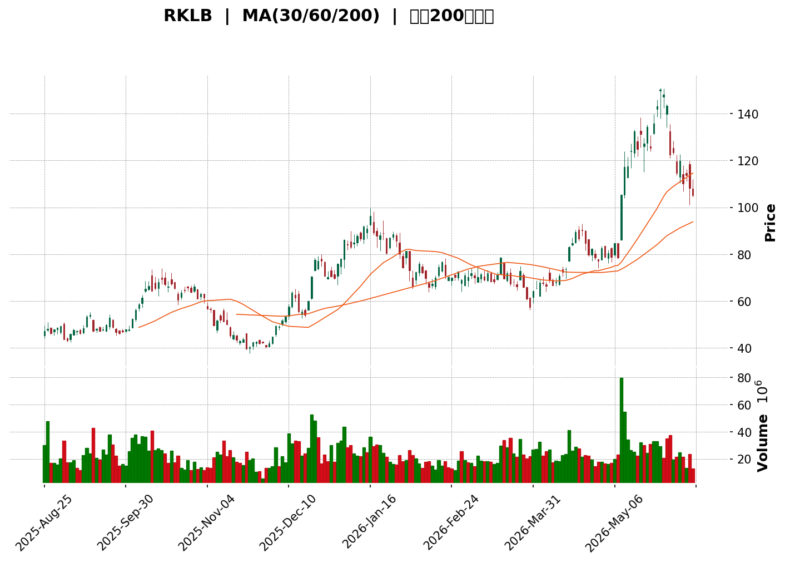
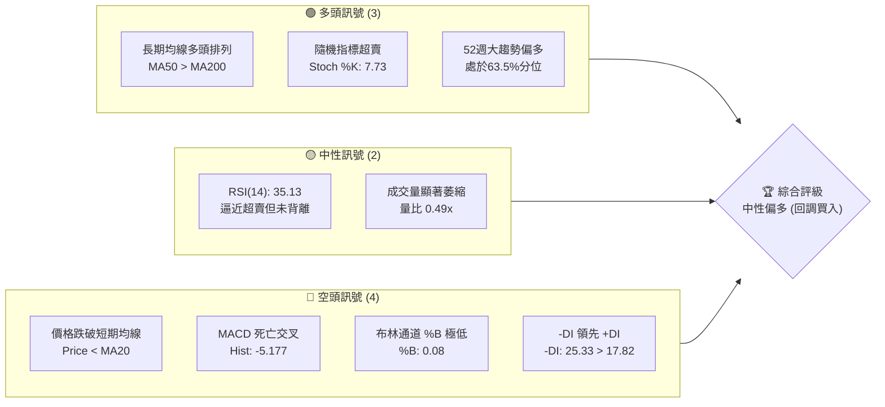
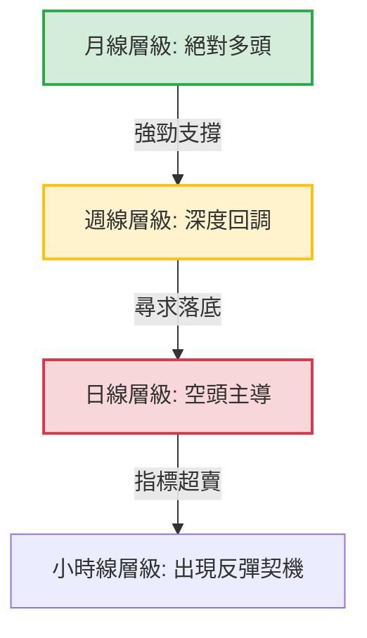
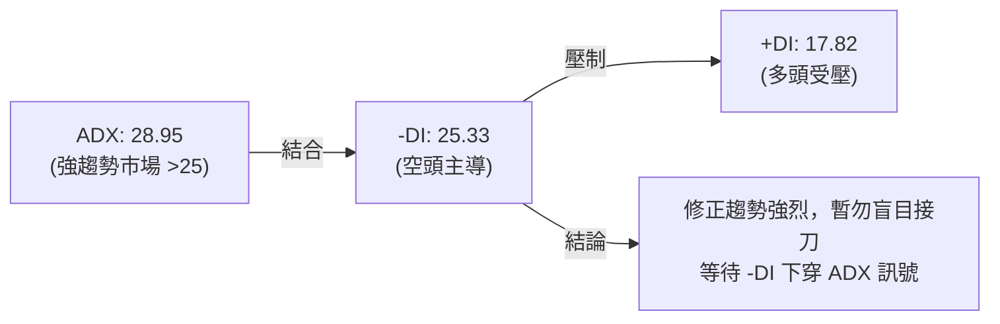
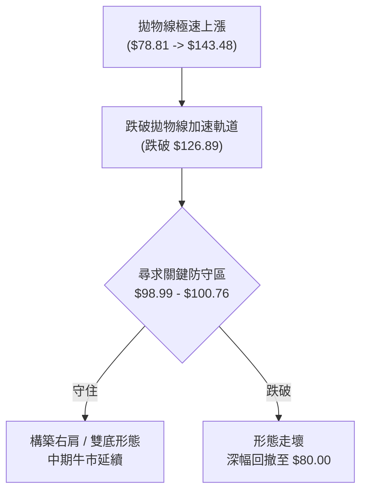

<details>
<summary>📊 靜態圖表 (點擊展開)</summary>

</details>

<html>
<head><meta charset="utf-8" /></head>
<body>
    <div style="height:500px; width:100%;">                        <script>window.PlotlyConfig = {MathJaxConfig: 'local'};</script>
        <script charset="utf-8" src="https://cdn.plot.ly/plotly-3.6.0.min.js" integrity="sha256-QaOVwtVY0T02VaHrr6pnoHLCwayMJp4O5n4YyaE3rJk=" crossorigin="anonymous"></script>                <div id="candlestick-chart" class="plotly-graph-div" style="height:100%; width:100%;"></div>            <script>                window.PLOTLYENV=window.PLOTLYENV || {};                                if (document.getElementById("candlestick-chart")) {                    Plotly.newPlot(                        "candlestick-chart",                        [{"close":{"dtype":"f8","bdata":"AAAAACmcR0AAAADgoxBIQAAAAAAAIEdAAAAA4Hr0R0AAAADAzExIQAAAACCup0hAAAAAANfDRUAAAABguH5FQAAAACCF60ZAAAAAoHDdR0AAAAAA14NHQAAAAIDCFUdAAAAAQAo3SEAAAAAghatKQAAAAMAeBUtAAAAAIFyfR0AAAACAPQpIQAAAAEAKl0dAAAAAwB7lR0AAAAAgrudIQAAAAOB6dEpAAAAA4FFYSEAAAADgo1BHQAAAAKBHIUdAAAAAoEeBR0AAAADgevRHQAAAAAAp\u002fEdAAAAAACk8SkAAAADgehRMQAAAAAAAQE1AAAAAoEfBTkAAAAAA11NQQAAAAEDhmlBAAAAA4KMQUEAAAABA4VpQQAAAAIDrAVFAAAAAoEdRUUAAAAAAAMBQQAAAAKBHkVBAAAAAYGbWUEAAAACgmVlQQAAAAOBRSE5AAAAAwPXIT0AAAAAA1yNQQAAAACCuZ1BAAAAAAADgT0AAAACAPYpQQAAAAIDCdU5AAAAAoHB9T0AAAAAghatOQAAAAMD1SExAAAAAgMI1TEAAAACAFM5IQAAAAIDr0UlAAAAAQDPzSUAAAABguJ5JQAAAAAAp\u002fEhAAAAAAACgRkAAAADAHsVGQAAAACCup0VAAAAAANdjRUAAAAAgXM9FQAAAAKBwvUNAAAAAYGYmREAAAACgmTlFQAAAAMDMTEVAAAAAQAr3REAAAACA6xFFQAAAACBcL0RAAAAAQDPzREAAAAAAKVxGQAAAACBcr0hAAAAAQAqHSEAAAAAgrsdJQAAAAEAKt0pAAAAAYI\u002fCTEAAAAAA18NPQAAAAGC4vk5AAAAA4Hq0S0AAAABguL5LQAAAAEDh+kpAAAAAgML1TUAAAACgR6FRQAAAAEAzY1NAAAAAIIVLU0AAAAAghUtTQAAAAKCZqVFAAAAAIK6HUUAAAADAzJxRQAAAAOCjcFFAAAAAIFz\u002fUkAAAADA9YhTQAAAAIDrgVVAAAAAwB4FVUAAAADAHsVUQAAAAGBmNlVAAAAAoJn5VUAAAADAHqVVQAAAAEAz81ZAAAAA4KOwVkAAAABAMxNYQAAAAIA9SlZAAAAA4Hr0VUAAAABguP5VQAAAAKCZOVZAAAAAYLgeVEAAAAAAAMBVQAAAAOB6JFZAAAAAIIVrVUAAAADgegRUQAAAAKCZiVJAAAAAoEdRVEAAAABACkdSQAAAAOB6lFBAAAAA4HoUUkAAAACAwvVSQAAAAIDrAVJAAAAAIK5nUUAAAADgo4BQQAAAAAAp3FBAAAAAwPV4UUAAAABA4ZpSQAAAAMAeJVNAAAAAQAq3UUAAAACgcI1RQAAAAIAUflFAAAAAwMyMUUAAAACgmSlSQAAAAGBmRlFAAAAAgBS+UUAAAADgUYhRQAAAAIA9+lFAAAAAAACAUUAAAABACodRQAAAAGC43lFAAAAAIIU7UUAAAACgcP1RQAAAACCuF1FAAAAAgD0aUUAAAAAA19NRQAAAAIDCpVNAAAAAYLheUUAAAAAghftRQAAAAGC4zlBAAAAAAAAAUUAAAADgeoRQQAAAAOBROFJAAAAAACl8UEAAAABACndOQAAAAOCjsExAAAAAgBQOUEAAAACgR2FQQAAAAGC47lBAAAAAQOHqUEAAAADgepRQQAAAAMAeRVFAAAAAIFyvUEAAAABAMwNRQAAAACCup1FAAAAAgBQOUkAAAABgZmZSQAAAACCFu1RAAAAAQDMzVUAAAACgcF1WQAAAAMD1qFVAAAAAYI+CVkAAAABgZiZVQAAAACCF61NAAAAAYI+SVEAAAACAwqVTQAAAAKBHQVNAAAAA4KOgVEAAAAAA17NTQAAAAADXE1RAAAAA4KOwU0AAAACgmSlVQAAAAMAepVNAAAAAgBReWkAAAABgZlZdQAAAAADXY11AAAAAoJkJX0AAAACgmZFgQAAAAKBHMV9AAAAAwB5lYEAAAAAA19NfQAAAAMD1yGBAAAAAwMxcX0AAAADgUfhgQAAAAGBm5mFAAAAAIFzHYkAAAADA9YBiQAAAACBc72FAAAAAwPWYXkAAAADgetReQAAAAMDMrFxAAAAAwMz8XUAAAADAHoVbQAAAAKCZaVxAAAAAYLgOW0AAAABAM0NaQA=="},"high":{"dtype":"f8","bdata":"AAAAIIXLSEAAAACAwnVJQAAAAGC4XkhAAAAAwMz8R0AAAABgZmZIQAAAAMAexUhAAAAAQDNzSUAAAACAPUpGQAAAAGC4\u002fkZAAAAAoJkZSEAAAAAA18NHQAAAAIAUDkhAAAAAwB7VSEAAAAAA1wNLQAAAAIDClUtAAAAAgD0KSkAAAADAHkVIQAAAAOBRmEhAAAAAQAp3SEAAAACgRyFJQAAAAGA5FEtAAAAAoHA9SkAAAAAgXE9IQAAAAOBR2EdAAAAAwMwMSEAAAABguP5HQAAAAIDCtUhAAAAAQDNTSkAAAAAgMXhMQAAAAKBHoU1AAAAAIK5HT0AAAAAALSJRQAAAAGCPIlFAAAAAAABgUkAAAAAAKZxRQAAAAEDhalFAAAAAgBR+UkAAAAAAABBSQAAAAAAAIFFAAAAAIIULUkAAAABgjwJRQAAAAKBHAVBAAAAAwMwsUEAAAAAghYtQQAAAAGBmllBAAAAAYI+iUEAAAADA9dhQQAAAACCFS1BAAAAAoJm5T0AAAADAzIxPQAAAAGC4vk1AAAAAANejTEAAAABA4RpMQAAAAMDMDEpAAAAAAABAS0AAAABA4XpMQAAAAIA9qktAAAAA4KOwSEAAAAAAKZxHQAAAAMBL10ZAAAAAgBTORUAAAAAA10NGQAAAAKBHIUdAAAAAgMKFREAAAAAA10NFQAAAAEAKZ0VAAAAAIIXLRUAAAACgmVlFQAAAAGBmpkRAAAAAYLh+RUAAAABguF5GQAAAAEAK10hAAAAAoJnZSEAAAAAgXC9KQAAAAAAA4EpAAAAAgD1qTUAAAACgmQlQQAAAACCFS1BAAAAAANcjUEAAAACgcF1MQAAAAOB6dExAAAAAAAAgTkAAAAAA16NRQAAAAMDMnFNAAAAAIIXLU0AAAADAHvVTQAAAACBcP1NAAAAAIFwvUkAAAAAAKaxSQAAAAECLTFJAAAAAIFwPU0AAAAAAAJBTQAAAAAAAkFVAAAAAoHB9VUAAAAAgrndWQAAAACCFG1ZAAAAAgMI1VkAAAADgp25WQAAAAAApDFdAAAAAQGAdV0AAAADAHuVYQAAAAKBHkVhAAAAAAADQVkAAAACgmVlWQAAAAMDMnFdAAAAAgD3KVUAAAAAAAMBVQAAAAEAzc1ZAAAAAAABAVkAAAADgelRWQAAAAMDMLFRAAAAA4HpUVEAAAABgZlZUQAAAACBcP1JAAAAAgD0qUkAAAABAMzNTQAAAAEAK91JAAAAAoJlZUkAAAADAzBxRQAAAAGBmZlFAAAAAIFy\u002fUUAAAADA9fBSQAAAAEAKR1NAAAAAwMyMU0AAAAAAANBRQAAAACCFg1FAAAAAYGb2UUAAAAAgXC9SQAAAAIDCZVFAAAAAYGYGUkAAAAAAAFBSQAAAAGBmhlJAAAAAANcTUkAAAABACsdSQAAAAAAACFJAAAAAANc7UkAAAABAM1NSQAAAAGBmJlJAAAAAANfTUUAAAADgURhSQAAAAEDhqlNAAAAA4FE4U0AAAABguC5SQAAAAGC4flJAAAAAwMxcUUAAAABgZiZRQAAAAADXw1JAAAAAgMIFUkAAAACAFIZQQAAAAIDr0U5AAAAAwB4lUEAAAABA4SpRQAAAAMD1WFFAAAAA4HqUUUAAAABAMxNRQAAAAIDAalJAAAAAYI9yUUAAAAAA14NRQAAAAEAz41FAAAAAAACwUkAAAACAwqVSQAAAACBc31RAAAAAIFy\u002fVUAAAABgZpZWQAAAAMDM\u002fFZAAAAAYGZGV0AAAABAM5NWQAAAAIA9mlVAAAAAYLieVEAAAACA63FUQAAAAOCjgFNAAAAAgMLlVEAAAABgj\u002fJUQAAAAOBPdVRAAAAAAADAVEAAAAAghStVQAAAAGCPMlVAAAAAIK5nWkAAAAAAKfxeQAAAACBcX15AAAAAIFzPX0AAAACAwqVgQAAAAADXS2BAAAAAAClMYUAAAACAPTJgQAAAAEAz62BAAAAAANdbYEAAAADgUXhhQAAAAAAAQGJAAAAAAADgYkAAAABgj9piQAAAAAAAAGJAAAAAACn0YEAAAADAzAxgQAAAAOBRoF5AAAAA4FGoXkAAAABguH5dQAAAAAAAEF1AAAAAYI\u002fyXUAAAACgcP1bQA=="},"hovertemplate":"\u003cb\u003e%{x|%Y-%m-%d}\u003c\u002fb\u003e\u003cbr\u003e\u958b: $%{open:.2f}\u003cbr\u003e\u9ad8: $%{high:.2f}\u003cbr\u003e\u4f4e: $%{low:.2f}\u003cbr\u003e\u6536: $%{close:.2f}\u003cextra\u003e\u003c\u002fextra\u003e","low":{"dtype":"f8","bdata":"AAAAYGYGRkAAAAAAAIBHQAAAAMD16EZAAAAAIIWrRkAAAABgjwJHQAAAAEAK10ZAAAAAQInBRUAAAACgmVlFQAAAAIDrMUVAAAAAwHa+RkAAAABAicFGQAAAAMDMzEZAAAAAQAoHR0AAAABANU5IQAAAAAApXEpAAAAAoEeBR0AAAACgmTlHQAAAAAAAgEdAAAAA4KOQR0AAAABgZmZHQAAAAOB69EdAAAAAQAo3SEAAAABA4ZpGQAAAAIA96kZAAAAAIFwvR0AAAACgR0FHQAAAACBcj0dAAAAAoEdBSEAAAACgR6FJQAAAAGBm5ktAAAAAYI+CTEAAAABAM9NPQAAAAEDhGlBAAAAAwPUIUEAAAADgzidQQAAAAOBRGE9AAAAAwB7FUEAAAABAM5tQQAAAAKCZ2U9AAAAAQDOrUEAAAABACjdQQAAAAOB6NE1AAAAAAABgTkAAAABAM9NPQAAAAKCZCVBAAAAAgBTOT0AAAACgcL1PQAAAAIDrcU5AAAAAQDMzTkAAAADgo5BNQAAAAKBHQUxAAAAAIFxvS0AAAADgerRIQAAAAODOJ0dAAAAAoEdhSUAAAABA4ZpJQAAAAOB61EhAAAAAIFwvRkAAAABgZqZFQAAAAMDMHEVAAAAAoHCdREAAAABACjdFQAAAAMD1qENAAAAAwPXIQkAAAABgZqZDQAAAAOCjMERAAAAA4KOwREAAAABgZuZEQAAAAKBw\u002fUNAAAAAgMI1REAAAAAAAMBEQAAAAMD1aEZAAAAAoJnZR0AAAAAAKZxIQAAAACCFK0lAAAAAAAAgSkAAAADAzGxMQAAAAGBm5k1AAAAAgD2KS0AAAABACldKQAAAAEDhikpAAAAAANcDTEAAAADAnV9OQAAAAMAgMFJAAAAAYI9SUkAAAACgQ7NSQAAAAMD1mFFAAAAAoJtUUUAAAAAAKZxRQAAAAOBRSFFAAAAAYGa2UEAAAAAA19NRQAAAAEAzg1JAAAAAYGZ2VEAAAADgo5BUQAAAAMDMnFRAAAAA4NDaVEAAAACgmWlVQAAAAAAAIFVAAAAAoJmpVUAAAACgmRlXQAAAAEAzE1ZAAAAAoHCtVEAAAADAdlZUQAAAACCuh1VAAAAA4KMAVEAAAAAAAIBUQAAAAMDKgVVAAAAAAADAVEAAAACgR4FTQAAAAIBBeFJAAAAAoEfxUkAAAABACCRRQAAAAMDMTFBAAAAAAADAUEAAAAAAALBRQAAAAEAz41FAAAAAoEfBUEAAAAAgXO9PQAAAAAAAYFBAAAAAAABAUEAAAADAS39RQAAAAGBmFlJAAAAAoJlZUUAAAAAAACBRQAAAAGBmplBAAAAA4FE4UUAAAAAA1zNRQAAAAGBmBlBAAAAAwMycUEAAAAAAKYxQQAAAAIAUXlFAAAAAgMLVUEAAAADgowhRQAAAAOB69FBAAAAAgL4nUUAAAADAHhVRQAAAAIDrEVFAAAAAACncUEAAAABA4SpRQAAAAKBH0VFAAAAAoJlZUUAAAAAAAABRQAAAAMD1mFBAAAAAQDODUEAAAACgcB1QQAAAAAApPFFAAAAAgMJlUEAAAADAzCxOQAAAAGDlEExAAAAAANeDTUAAAABAM1NQQAAAAIAU7k5AAAAAYGamUEAAAABA4fpPQAAAAGDn81BAAAAAQOGiUEAAAACAwpVQQAAAAIDCpVBAAAAAYLieUUAAAABgZmZRQAAAAKCZOVNAAAAAYGbmVEAAAABgZiZVQAAAAAAAcFVAAAAA4KPwVUAAAAAAKWRUQAAAAMAexVNAAAAAwHRDU0AAAABgZmZTQAAAACBcf1JAAAAAgBReU0AAAAAghZtTQAAAAAAAEFNAAAAAANcjU0AAAABACrdTQAAAACCFe1NAAAAAIK53VUAAAAAAAABaQAAAAIA9GlxAAAAAwPU4XUAAAAAA11NeQAAAAEAzc15AAAAAoPFqX0AAAABguM5cQAAAAIAUDl9AAAAAQDPzXkAAAACA62lgQAAAAIDrUWFAAAAAwB49YUAAAAAA18thQAAAAKCZwWBAAAAAAABAXkAAAAAA16NeQAAAAIA9alxAAAAAwPWYW0AAAABguK5aQAAAAAAAwFtAAAAAwMxMWUAAAACAPRpaQA=="},"name":"\u50f9\u683c","open":{"dtype":"f8","bdata":"AAAA4HqURkAAAACgcN1HQAAAAEAKV0hAAAAA4KNwR0AAAADAzOxHQAAAAAAAYEdAAAAAYI8iSUAAAADgehRGQAAAAOBRyEVAAAAAAADARkAAAACgR4FHQAAAAADXw0dAAAAAwPUoR0AAAACgcH1IQAAAAIA9ykpAAAAAAAAASkAAAADgUchHQAAAAIDCdUhAAAAAQArXR0AAAADgo5BHQAAAAEAzg0hAAAAAgMLlSUAAAAAAAABIQAAAAGBmpkdAAAAAQDOzR0AAAABA4ZpHQAAAAOCjsEdAAAAAgOtRSEAAAABgZgZKQAAAAGC4bkxAAAAAoEeBTUAAAACgmQlQQAAAAKCZOVBAAAAAQDOzUUAAAADgUfhQQAAAAIDCVVBAAAAAoEeBUUAAAADgeoRRQAAAAMD1eFBAAAAA4KNIUUAAAABgjwJRQAAAAAApfE9AAAAAIK7HTkAAAAAA1zNQQAAAAAApjFBAAAAAQDNrUEAAAACgRwlQQAAAAAAAQFBAAAAAYI\u002fiTkAAAAAA14NPQAAAAGBm5kxAAAAA4HpUTEAAAABA4RpMQAAAAKAY1EdAAAAAYLjeSkAAAAAAAABMQAAAAEAK90lAAAAAoEdhSEAAAABA4dpFQAAAAEAzk0ZAAAAAACkcRUAAAAAAAEBFQAAAAIA9CkdAAAAAgD3qQ0AAAACgR2FEQAAAAADXA0VAAAAAYLieRUAAAACgR0FFQAAAAEAzk0RAAAAAIK5HREAAAABgj\u002fJEQAAAAGCP0kZAAAAAAABwSEAAAACAPQpJQAAAAKBwnUlAAAAA4FG4SkAAAACgR8FMQAAAAAAAQE9AAAAA4KeGT0AAAADgURhLQAAAAMDMDExAAAAAoJkZTEAAAAAgXI9OQAAAAAApPFJAAAAAANdzUkAAAACAPYJTQAAAACCFK1NAAAAAAABgUUAAAACgmUFSQAAAAAAA4FFAAAAA4FGoUUAAAAAgrqdSQAAAAOCjcFNAAAAAYGYGVUAAAAAAAGBVQAAAAKCZIVVAAAAAYLg+VUAAAADA9UhWQAAAAGBmllVAAAAAwPVQVkAAAACgmSFXQAAAAMDMbFdAAAAAoEeBVkAAAADgUZhVQAAAACCFQ1ZAAAAAIK6vVUAAAADA9bhUQAAAAIAUzlVAAAAAACn8VUAAAAAAAEBVQAAAAIA9ylNAAAAAYGamU0AAAABgZlZUQAAAAGC4flFAAAAAAABAUUAAAACgmQFSQAAAAIAUplJAAAAA4FFIUkAAAACA6+FQQAAAAOB6rFBAAAAAQGCFUEAAAAAAAMBRQAAAAKCZOVJAAAAAINneUkAAAADgUTBRQAAAAOBROFFAAAAAgBTGUUAAAABA4YJRQAAAAIDC5VBAAAAAIIWrUEAAAABguDZRQAAAAADXs1FAAAAAQOG6UUAAAADgowhRQAAAAMD1WFFAAAAAgMKVUUAAAABAMzNRQAAAAMDM\u002fFFAAAAAoJlJUUAAAADAzFRRQAAAAGBm3lFAAAAAYI8CU0AAAADgejRRQAAAAAAAAFJAAAAAoHAFUUAAAAAAAMBQQAAAAAApPFFAAAAAwMzMUUAAAADgo4BQQAAAAKCZuU5AAAAAQOHaTkAAAAAAAGBQQAAAAMDMHE9AAAAAYLjuUEAAAAAgXMdQQAAAAAAAAFJAAAAAANdDUUAAAADAzOxQQAAAAEAzw1BAAAAAIIVjUkAAAACgcGVSQAAAAIAUPlNAAAAAwB4FVUAAAABgZjZVQAAAAMAelVZAAAAAgMKdVkAAAABgZnZWQAAAAIDClVVAAAAAACnsU0AAAADAzARUQAAAAEAKd1NAAAAAQDNjU0AAAACA6+FUQAAAAEAKl1NAAAAAYGamVEAAAAAgrudTQAAAAKBwLVVAAAAAgD2CVUAAAACgR1FaQAAAAOCjMFxAAAAAoEf5XkAAAABgZsZeQAAAAEAzA2BAAAAAACmYYEAAAACAFH5fQAAAAGC43l9AAAAAwPWIX0AAAADAHm1gQAAAAEDhvmFAAAAAQAq3YkAAAACgcGViQAAAAIAUfmFAAAAAACmMYEAAAACAwlVfQAAAAMAe5V1AAAAAoHBFXEAAAACgR5FcQAAAAEDhqlxAAAAAoJmZXUAAAADAzPxaQA=="},"x":["2025-08-25T00:00:00-04:00","2025-08-26T00:00:00-04:00","2025-08-27T00:00:00-04:00","2025-08-28T00:00:00-04:00","2025-08-29T00:00:00-04:00","2025-09-02T00:00:00-04:00","2025-09-03T00:00:00-04:00","2025-09-04T00:00:00-04:00","2025-09-05T00:00:00-04:00","2025-09-08T00:00:00-04:00","2025-09-09T00:00:00-04:00","2025-09-10T00:00:00-04:00","2025-09-11T00:00:00-04:00","2025-09-12T00:00:00-04:00","2025-09-15T00:00:00-04:00","2025-09-16T00:00:00-04:00","2025-09-17T00:00:00-04:00","2025-09-18T00:00:00-04:00","2025-09-19T00:00:00-04:00","2025-09-22T00:00:00-04:00","2025-09-23T00:00:00-04:00","2025-09-24T00:00:00-04:00","2025-09-25T00:00:00-04:00","2025-09-26T00:00:00-04:00","2025-09-29T00:00:00-04:00","2025-09-30T00:00:00-04:00","2025-10-01T00:00:00-04:00","2025-10-02T00:00:00-04:00","2025-10-03T00:00:00-04:00","2025-10-06T00:00:00-04:00","2025-10-07T00:00:00-04:00","2025-10-08T00:00:00-04:00","2025-10-09T00:00:00-04:00","2025-10-10T00:00:00-04:00","2025-10-13T00:00:00-04:00","2025-10-14T00:00:00-04:00","2025-10-15T00:00:00-04:00","2025-10-16T00:00:00-04:00","2025-10-17T00:00:00-04:00","2025-10-20T00:00:00-04:00","2025-10-21T00:00:00-04:00","2025-10-22T00:00:00-04:00","2025-10-23T00:00:00-04:00","2025-10-24T00:00:00-04:00","2025-10-27T00:00:00-04:00","2025-10-28T00:00:00-04:00","2025-10-29T00:00:00-04:00","2025-10-30T00:00:00-04:00","2025-10-31T00:00:00-04:00","2025-11-03T00:00:00-05:00","2025-11-04T00:00:00-05:00","2025-11-05T00:00:00-05:00","2025-11-06T00:00:00-05:00","2025-11-07T00:00:00-05:00","2025-11-10T00:00:00-05:00","2025-11-11T00:00:00-05:00","2025-11-12T00:00:00-05:00","2025-11-13T00:00:00-05:00","2025-11-14T00:00:00-05:00","2025-11-17T00:00:00-05:00","2025-11-18T00:00:00-05:00","2025-11-19T00:00:00-05:00","2025-11-20T00:00:00-05:00","2025-11-21T00:00:00-05:00","2025-11-24T00:00:00-05:00","2025-11-25T00:00:00-05:00","2025-11-26T00:00:00-05:00","2025-11-28T00:00:00-05:00","2025-12-01T00:00:00-05:00","2025-12-02T00:00:00-05:00","2025-12-03T00:00:00-05:00","2025-12-04T00:00:00-05:00","2025-12-05T00:00:00-05:00","2025-12-08T00:00:00-05:00","2025-12-09T00:00:00-05:00","2025-12-10T00:00:00-05:00","2025-12-11T00:00:00-05:00","2025-12-12T00:00:00-05:00","2025-12-15T00:00:00-05:00","2025-12-16T00:00:00-05:00","2025-12-17T00:00:00-05:00","2025-12-18T00:00:00-05:00","2025-12-19T00:00:00-05:00","2025-12-22T00:00:00-05:00","2025-12-23T00:00:00-05:00","2025-12-24T00:00:00-05:00","2025-12-26T00:00:00-05:00","2025-12-29T00:00:00-05:00","2025-12-30T00:00:00-05:00","2025-12-31T00:00:00-05:00","2026-01-02T00:00:00-05:00","2026-01-05T00:00:00-05:00","2026-01-06T00:00:00-05:00","2026-01-07T00:00:00-05:00","2026-01-08T00:00:00-05:00","2026-01-09T00:00:00-05:00","2026-01-12T00:00:00-05:00","2026-01-13T00:00:00-05:00","2026-01-14T00:00:00-05:00","2026-01-15T00:00:00-05:00","2026-01-16T00:00:00-05:00","2026-01-20T00:00:00-05:00","2026-01-21T00:00:00-05:00","2026-01-22T00:00:00-05:00","2026-01-23T00:00:00-05:00","2026-01-26T00:00:00-05:00","2026-01-27T00:00:00-05:00","2026-01-28T00:00:00-05:00","2026-01-29T00:00:00-05:00","2026-01-30T00:00:00-05:00","2026-02-02T00:00:00-05:00","2026-02-03T00:00:00-05:00","2026-02-04T00:00:00-05:00","2026-02-05T00:00:00-05:00","2026-02-06T00:00:00-05:00","2026-02-09T00:00:00-05:00","2026-02-10T00:00:00-05:00","2026-02-11T00:00:00-05:00","2026-02-12T00:00:00-05:00","2026-02-13T00:00:00-05:00","2026-02-17T00:00:00-05:00","2026-02-18T00:00:00-05:00","2026-02-19T00:00:00-05:00","2026-02-20T00:00:00-05:00","2026-02-23T00:00:00-05:00","2026-02-24T00:00:00-05:00","2026-02-25T00:00:00-05:00","2026-02-26T00:00:00-05:00","2026-02-27T00:00:00-05:00","2026-03-02T00:00:00-05:00","2026-03-03T00:00:00-05:00","2026-03-04T00:00:00-05:00","2026-03-05T00:00:00-05:00","2026-03-06T00:00:00-05:00","2026-03-09T00:00:00-04:00","2026-03-10T00:00:00-04:00","2026-03-11T00:00:00-04:00","2026-03-12T00:00:00-04:00","2026-03-13T00:00:00-04:00","2026-03-16T00:00:00-04:00","2026-03-17T00:00:00-04:00","2026-03-18T00:00:00-04:00","2026-03-19T00:00:00-04:00","2026-03-20T00:00:00-04:00","2026-03-23T00:00:00-04:00","2026-03-24T00:00:00-04:00","2026-03-25T00:00:00-04:00","2026-03-26T00:00:00-04:00","2026-03-27T00:00:00-04:00","2026-03-30T00:00:00-04:00","2026-03-31T00:00:00-04:00","2026-04-01T00:00:00-04:00","2026-04-02T00:00:00-04:00","2026-04-06T00:00:00-04:00","2026-04-07T00:00:00-04:00","2026-04-08T00:00:00-04:00","2026-04-09T00:00:00-04:00","2026-04-10T00:00:00-04:00","2026-04-13T00:00:00-04:00","2026-04-14T00:00:00-04:00","2026-04-15T00:00:00-04:00","2026-04-16T00:00:00-04:00","2026-04-17T00:00:00-04:00","2026-04-20T00:00:00-04:00","2026-04-21T00:00:00-04:00","2026-04-22T00:00:00-04:00","2026-04-23T00:00:00-04:00","2026-04-24T00:00:00-04:00","2026-04-27T00:00:00-04:00","2026-04-28T00:00:00-04:00","2026-04-29T00:00:00-04:00","2026-04-30T00:00:00-04:00","2026-05-01T00:00:00-04:00","2026-05-04T00:00:00-04:00","2026-05-05T00:00:00-04:00","2026-05-06T00:00:00-04:00","2026-05-07T00:00:00-04:00","2026-05-08T00:00:00-04:00","2026-05-11T00:00:00-04:00","2026-05-12T00:00:00-04:00","2026-05-13T00:00:00-04:00","2026-05-14T00:00:00-04:00","2026-05-15T00:00:00-04:00","2026-05-18T00:00:00-04:00","2026-05-19T00:00:00-04:00","2026-05-20T00:00:00-04:00","2026-05-21T00:00:00-04:00","2026-05-22T00:00:00-04:00","2026-05-26T00:00:00-04:00","2026-05-27T00:00:00-04:00","2026-05-28T00:00:00-04:00","2026-05-29T00:00:00-04:00","2026-06-01T00:00:00-04:00","2026-06-02T00:00:00-04:00","2026-06-03T00:00:00-04:00","2026-06-04T00:00:00-04:00","2026-06-05T00:00:00-04:00","2026-06-08T00:00:00-04:00","2026-06-09T00:00:00-04:00","2026-06-10T00:00:00-04:00"],"type":"candlestick"},{"hovertemplate":"MA30: $%{y:.2f}\u003cextra\u003e\u003c\u002fextra\u003e","line":{"color":"#2196F3","dash":"dash","width":2},"mode":"lines","name":"MA30","x":["2025-08-25T00:00:00-04:00","2025-08-26T00:00:00-04:00","2025-08-27T00:00:00-04:00","2025-08-28T00:00:00-04:00","2025-08-29T00:00:00-04:00","2025-09-02T00:00:00-04:00","2025-09-03T00:00:00-04:00","2025-09-04T00:00:00-04:00","2025-09-05T00:00:00-04:00","2025-09-08T00:00:00-04:00","2025-09-09T00:00:00-04:00","2025-09-10T00:00:00-04:00","2025-09-11T00:00:00-04:00","2025-09-12T00:00:00-04:00","2025-09-15T00:00:00-04:00","2025-09-16T00:00:00-04:00","2025-09-17T00:00:00-04:00","2025-09-18T00:00:00-04:00","2025-09-19T00:00:00-04:00","2025-09-22T00:00:00-04:00","2025-09-23T00:00:00-04:00","2025-09-24T00:00:00-04:00","2025-09-25T00:00:00-04:00","2025-09-26T00:00:00-04:00","2025-09-29T00:00:00-04:00","2025-09-30T00:00:00-04:00","2025-10-01T00:00:00-04:00","2025-10-02T00:00:00-04:00","2025-10-03T00:00:00-04:00","2025-10-06T00:00:00-04:00","2025-10-07T00:00:00-04:00","2025-10-08T00:00:00-04:00","2025-10-09T00:00:00-04:00","2025-10-10T00:00:00-04:00","2025-10-13T00:00:00-04:00","2025-10-14T00:00:00-04:00","2025-10-15T00:00:00-04:00","2025-10-16T00:00:00-04:00","2025-10-17T00:00:00-04:00","2025-10-20T00:00:00-04:00","2025-10-21T00:00:00-04:00","2025-10-22T00:00:00-04:00","2025-10-23T00:00:00-04:00","2025-10-24T00:00:00-04:00","2025-10-27T00:00:00-04:00","2025-10-28T00:00:00-04:00","2025-10-29T00:00:00-04:00","2025-10-30T00:00:00-04:00","2025-10-31T00:00:00-04:00","2025-11-03T00:00:00-05:00","2025-11-04T00:00:00-05:00","2025-11-05T00:00:00-05:00","2025-11-06T00:00:00-05:00","2025-11-07T00:00:00-05:00","2025-11-10T00:00:00-05:00","2025-11-11T00:00:00-05:00","2025-11-12T00:00:00-05:00","2025-11-13T00:00:00-05:00","2025-11-14T00:00:00-05:00","2025-11-17T00:00:00-05:00","2025-11-18T00:00:00-05:00","2025-11-19T00:00:00-05:00","2025-11-20T00:00:00-05:00","2025-11-21T00:00:00-05:00","2025-11-24T00:00:00-05:00","2025-11-25T00:00:00-05:00","2025-11-26T00:00:00-05:00","2025-11-28T00:00:00-05:00","2025-12-01T00:00:00-05:00","2025-12-02T00:00:00-05:00","2025-12-03T00:00:00-05:00","2025-12-04T00:00:00-05:00","2025-12-05T00:00:00-05:00","2025-12-08T00:00:00-05:00","2025-12-09T00:00:00-05:00","2025-12-10T00:00:00-05:00","2025-12-11T00:00:00-05:00","2025-12-12T00:00:00-05:00","2025-12-15T00:00:00-05:00","2025-12-16T00:00:00-05:00","2025-12-17T00:00:00-05:00","2025-12-18T00:00:00-05:00","2025-12-19T00:00:00-05:00","2025-12-22T00:00:00-05:00","2025-12-23T00:00:00-05:00","2025-12-24T00:00:00-05:00","2025-12-26T00:00:00-05:00","2025-12-29T00:00:00-05:00","2025-12-30T00:00:00-05:00","2025-12-31T00:00:00-05:00","2026-01-02T00:00:00-05:00","2026-01-05T00:00:00-05:00","2026-01-06T00:00:00-05:00","2026-01-07T00:00:00-05:00","2026-01-08T00:00:00-05:00","2026-01-09T00:00:00-05:00","2026-01-12T00:00:00-05:00","2026-01-13T00:00:00-05:00","2026-01-14T00:00:00-05:00","2026-01-15T00:00:00-05:00","2026-01-16T00:00:00-05:00","2026-01-20T00:00:00-05:00","2026-01-21T00:00:00-05:00","2026-01-22T00:00:00-05:00","2026-01-23T00:00:00-05:00","2026-01-26T00:00:00-05:00","2026-01-27T00:00:00-05:00","2026-01-28T00:00:00-05:00","2026-01-29T00:00:00-05:00","2026-01-30T00:00:00-05:00","2026-02-02T00:00:00-05:00","2026-02-03T00:00:00-05:00","2026-02-04T00:00:00-05:00","2026-02-05T00:00:00-05:00","2026-02-06T00:00:00-05:00","2026-02-09T00:00:00-05:00","2026-02-10T00:00:00-05:00","2026-02-11T00:00:00-05:00","2026-02-12T00:00:00-05:00","2026-02-13T00:00:00-05:00","2026-02-17T00:00:00-05:00","2026-02-18T00:00:00-05:00","2026-02-19T00:00:00-05:00","2026-02-20T00:00:00-05:00","2026-02-23T00:00:00-05:00","2026-02-24T00:00:00-05:00","2026-02-25T00:00:00-05:00","2026-02-26T00:00:00-05:00","2026-02-27T00:00:00-05:00","2026-03-02T00:00:00-05:00","2026-03-03T00:00:00-05:00","2026-03-04T00:00:00-05:00","2026-03-05T00:00:00-05:00","2026-03-06T00:00:00-05:00","2026-03-09T00:00:00-04:00","2026-03-10T00:00:00-04:00","2026-03-11T00:00:00-04:00","2026-03-12T00:00:00-04:00","2026-03-13T00:00:00-04:00","2026-03-16T00:00:00-04:00","2026-03-17T00:00:00-04:00","2026-03-18T00:00:00-04:00","2026-03-19T00:00:00-04:00","2026-03-20T00:00:00-04:00","2026-03-23T00:00:00-04:00","2026-03-24T00:00:00-04:00","2026-03-25T00:00:00-04:00","2026-03-26T00:00:00-04:00","2026-03-27T00:00:00-04:00","2026-03-30T00:00:00-04:00","2026-03-31T00:00:00-04:00","2026-04-01T00:00:00-04:00","2026-04-02T00:00:00-04:00","2026-04-06T00:00:00-04:00","2026-04-07T00:00:00-04:00","2026-04-08T00:00:00-04:00","2026-04-09T00:00:00-04:00","2026-04-10T00:00:00-04:00","2026-04-13T00:00:00-04:00","2026-04-14T00:00:00-04:00","2026-04-15T00:00:00-04:00","2026-04-16T00:00:00-04:00","2026-04-17T00:00:00-04:00","2026-04-20T00:00:00-04:00","2026-04-21T00:00:00-04:00","2026-04-22T00:00:00-04:00","2026-04-23T00:00:00-04:00","2026-04-24T00:00:00-04:00","2026-04-27T00:00:00-04:00","2026-04-28T00:00:00-04:00","2026-04-29T00:00:00-04:00","2026-04-30T00:00:00-04:00","2026-05-01T00:00:00-04:00","2026-05-04T00:00:00-04:00","2026-05-05T00:00:00-04:00","2026-05-06T00:00:00-04:00","2026-05-07T00:00:00-04:00","2026-05-08T00:00:00-04:00","2026-05-11T00:00:00-04:00","2026-05-12T00:00:00-04:00","2026-05-13T00:00:00-04:00","2026-05-14T00:00:00-04:00","2026-05-15T00:00:00-04:00","2026-05-18T00:00:00-04:00","2026-05-19T00:00:00-04:00","2026-05-20T00:00:00-04:00","2026-05-21T00:00:00-04:00","2026-05-22T00:00:00-04:00","2026-05-26T00:00:00-04:00","2026-05-27T00:00:00-04:00","2026-05-28T00:00:00-04:00","2026-05-29T00:00:00-04:00","2026-06-01T00:00:00-04:00","2026-06-02T00:00:00-04:00","2026-06-03T00:00:00-04:00","2026-06-04T00:00:00-04:00","2026-06-05T00:00:00-04:00","2026-06-08T00:00:00-04:00","2026-06-09T00:00:00-04:00","2026-06-10T00:00:00-04:00"],"y":{"dtype":"f8","bdata":"AAAAAAAA+H8AAAAAAAD4fwAAAAAAAPh\u002fAAAAAAAA+H8AAAAAAAD4fwAAAAAAAPh\u002fAAAAAAAA+H8AAAAAAAD4fwAAAAAAAPh\u002fAAAAAAAA+H8AAAAAAAD4fwAAAAAAAPh\u002fAAAAAAAA+H8AAAAAAAD4fwAAAAAAAPh\u002fAAAAAAAA+H8AAAAAAAD4fwAAAAAAAPh\u002fAAAAAAAA+H8AAAAAAAD4fwAAAAAAAPh\u002fAAAAAAAA+H8AAAAAAAD4fwAAAAAAAPh\u002fAAAAAAAA+H8AAAAAAAD4fwAAAAAAAPh\u002fAAAAAAAA+H8AAAAAAAD4f+\u002fu7g4tWkhAvLu7iyWXSEDv7u6ucuBIQDMzM7OBNklAMzMzQ0R8SUAAAAAwCMRJQKuqqmrnE0pAvLu7W7qBSkDe3d2tK+hKQO\u002fu7q5WP0tARERE9AyTS0BVVVXlbeFLQDMzMxPZHkxA3t3d\u002fXFfTECJiIg4UY9MQLy7u6u5wExAiYiIiCUHTUB3d3e3SVRNQFVVVXXpjk1AzczM\u002fLjPTUAiIiLS6gBOQERERISIEE5AzczMvIMxTkARERGxOj5OQGZmZhYvVU5AZmZmRgxqTkBmZmaGQXhOQO\u002fu7g7KgE5ARERE5PthTkBVVVUFrDROQN7d3X3c801AZmZmVvKjTUAzMzMTZ0dNQJqZmWl11ExAMzMzszpuTEBmZmZWOQxMQO\u002fu7v64n0tA3t3dbRIrS0De3d2tAMFKQJqZmfl+UkpAq6qqyujlSUB3d3e3rI1JQKuqqsroXUlAq6qqivofSUBEREQUg+hIQImIiFiAtEhAZmZmhuuZSEC8u7vbso5IQERERHQhkUhA7+7u\u002ftRwSEDNzMw831dIQLy7u2u8TEhAq6qqWqtbSEBVVVWl4rRIQHd3d0dvI0lAd3d3x0uPSUDNzMws+f1JQAAAAEA1VkpAzczM7FHASkCJiIhImipLQM3MzLx0m0tAmpmZ6SYpTEBVVVX1b7xMQImIiPgMg01AiYiIaNg9TkBEREQ0M+tOQImIiHh3n09AREREfM0xUEDv7u6mm5BQQKuqqkpT\u002flBA3t3dXY9mUUDNzMzsmNRRQKuqqpJ7KVJAZmZmbi58UkC8u7ub4MlSQFVVVfWLFVNAZmZmLodGU0BmZmbumHhTQImIiDheslNAVVVVrfHyU0AiIiKiYSdUQBERERF0UlRAMzMzAwCAVEAAAACAhoVUQLy7u2uRbVRAZmZmNjNjVEBERERkV2BUQN7d3Q1JY1RAzczM\u002fDdiVECJiIgov1hUQBERESHMU1RAd3d3t8hGVECamZkZ2T5UQERERCSwKlRAIiIiQnwOVEBVVVWFB\u002fNTQO\u002fu7g5J01NA7+7ufoatU0C8u7vbzo9TQBEREaFhX1NAZmZmpik1U0BmZmZWVf1SQJqZmYmI2FJAERERcYSyUkCamZkJZYxSQFVVVWU7Z1JA3t3djZdOUkBVVVW1gS5SQBEREdFpA1JAiYiIGJLeUUB3d3f34ctRQLy7u8ta1VFAMzMz4zO8UUAzMzNzr7lRQO\u002fu7m6gu1FAMzMzI2myUUCrqqpqkZ1RQBEREaFhn1FAvLu724eXUUAAAACAsYxRQN7d3WU7d1FAq6qq0iJrUUBEREQ8JlhRQM3MzPRERVFAIiIiynY+UUDNzMxUKjZRQN7d3UVENFFA7+7upuIsUUCJiIhwEiNRQImIiJBQJlFAMzMzO\u002fsoUUCJiIhQYjBRQLy7u7PkR1FAIiIiendnUUAAAAAov5BRQBEREYkWsVFAERERaR\u002feUUARERGJFvlRQFVVVU03EVJAmpmZodMuUkAzMzN7Wz5SQFVVVQ0CO1JAMzMzK85WUkCJiIiQe2VSQERERPxigVJAmpmZYVeYUkAiIiKK+r9SQImIiIAjzFJA7+7uJnggU0BmZmb+1JhTQLy7u0s3GVRAERERERGZVEAzMzNjEChVQERERNS\u002foVVAZmZm1jEpVkAiIiKCTqtWQGZmZmZmNldAMzMz46WzV0AiIiKSGERYQM3MzOzu3lhAiYiIyFqFWUDNzMx8IyRaQLy7u9tPpVpAIiIiAoH1WkBVVVUVvT1bQFVVVZWZeVtA3t3dbWi5W0CJiIjow+9bQO\u002fu7g48OFxAIiIiwpJvXEAzMzNzBahcQA=="},"type":"scatter"},{"hovertemplate":"MA60: $%{y:.2f}\u003cextra\u003e\u003c\u002fextra\u003e","line":{"color":"#9C27B0","dash":"dash","width":2},"mode":"lines","name":"MA60","x":["2025-08-25T00:00:00-04:00","2025-08-26T00:00:00-04:00","2025-08-27T00:00:00-04:00","2025-08-28T00:00:00-04:00","2025-08-29T00:00:00-04:00","2025-09-02T00:00:00-04:00","2025-09-03T00:00:00-04:00","2025-09-04T00:00:00-04:00","2025-09-05T00:00:00-04:00","2025-09-08T00:00:00-04:00","2025-09-09T00:00:00-04:00","2025-09-10T00:00:00-04:00","2025-09-11T00:00:00-04:00","2025-09-12T00:00:00-04:00","2025-09-15T00:00:00-04:00","2025-09-16T00:00:00-04:00","2025-09-17T00:00:00-04:00","2025-09-18T00:00:00-04:00","2025-09-19T00:00:00-04:00","2025-09-22T00:00:00-04:00","2025-09-23T00:00:00-04:00","2025-09-24T00:00:00-04:00","2025-09-25T00:00:00-04:00","2025-09-26T00:00:00-04:00","2025-09-29T00:00:00-04:00","2025-09-30T00:00:00-04:00","2025-10-01T00:00:00-04:00","2025-10-02T00:00:00-04:00","2025-10-03T00:00:00-04:00","2025-10-06T00:00:00-04:00","2025-10-07T00:00:00-04:00","2025-10-08T00:00:00-04:00","2025-10-09T00:00:00-04:00","2025-10-10T00:00:00-04:00","2025-10-13T00:00:00-04:00","2025-10-14T00:00:00-04:00","2025-10-15T00:00:00-04:00","2025-10-16T00:00:00-04:00","2025-10-17T00:00:00-04:00","2025-10-20T00:00:00-04:00","2025-10-21T00:00:00-04:00","2025-10-22T00:00:00-04:00","2025-10-23T00:00:00-04:00","2025-10-24T00:00:00-04:00","2025-10-27T00:00:00-04:00","2025-10-28T00:00:00-04:00","2025-10-29T00:00:00-04:00","2025-10-30T00:00:00-04:00","2025-10-31T00:00:00-04:00","2025-11-03T00:00:00-05:00","2025-11-04T00:00:00-05:00","2025-11-05T00:00:00-05:00","2025-11-06T00:00:00-05:00","2025-11-07T00:00:00-05:00","2025-11-10T00:00:00-05:00","2025-11-11T00:00:00-05:00","2025-11-12T00:00:00-05:00","2025-11-13T00:00:00-05:00","2025-11-14T00:00:00-05:00","2025-11-17T00:00:00-05:00","2025-11-18T00:00:00-05:00","2025-11-19T00:00:00-05:00","2025-11-20T00:00:00-05:00","2025-11-21T00:00:00-05:00","2025-11-24T00:00:00-05:00","2025-11-25T00:00:00-05:00","2025-11-26T00:00:00-05:00","2025-11-28T00:00:00-05:00","2025-12-01T00:00:00-05:00","2025-12-02T00:00:00-05:00","2025-12-03T00:00:00-05:00","2025-12-04T00:00:00-05:00","2025-12-05T00:00:00-05:00","2025-12-08T00:00:00-05:00","2025-12-09T00:00:00-05:00","2025-12-10T00:00:00-05:00","2025-12-11T00:00:00-05:00","2025-12-12T00:00:00-05:00","2025-12-15T00:00:00-05:00","2025-12-16T00:00:00-05:00","2025-12-17T00:00:00-05:00","2025-12-18T00:00:00-05:00","2025-12-19T00:00:00-05:00","2025-12-22T00:00:00-05:00","2025-12-23T00:00:00-05:00","2025-12-24T00:00:00-05:00","2025-12-26T00:00:00-05:00","2025-12-29T00:00:00-05:00","2025-12-30T00:00:00-05:00","2025-12-31T00:00:00-05:00","2026-01-02T00:00:00-05:00","2026-01-05T00:00:00-05:00","2026-01-06T00:00:00-05:00","2026-01-07T00:00:00-05:00","2026-01-08T00:00:00-05:00","2026-01-09T00:00:00-05:00","2026-01-12T00:00:00-05:00","2026-01-13T00:00:00-05:00","2026-01-14T00:00:00-05:00","2026-01-15T00:00:00-05:00","2026-01-16T00:00:00-05:00","2026-01-20T00:00:00-05:00","2026-01-21T00:00:00-05:00","2026-01-22T00:00:00-05:00","2026-01-23T00:00:00-05:00","2026-01-26T00:00:00-05:00","2026-01-27T00:00:00-05:00","2026-01-28T00:00:00-05:00","2026-01-29T00:00:00-05:00","2026-01-30T00:00:00-05:00","2026-02-02T00:00:00-05:00","2026-02-03T00:00:00-05:00","2026-02-04T00:00:00-05:00","2026-02-05T00:00:00-05:00","2026-02-06T00:00:00-05:00","2026-02-09T00:00:00-05:00","2026-02-10T00:00:00-05:00","2026-02-11T00:00:00-05:00","2026-02-12T00:00:00-05:00","2026-02-13T00:00:00-05:00","2026-02-17T00:00:00-05:00","2026-02-18T00:00:00-05:00","2026-02-19T00:00:00-05:00","2026-02-20T00:00:00-05:00","2026-02-23T00:00:00-05:00","2026-02-24T00:00:00-05:00","2026-02-25T00:00:00-05:00","2026-02-26T00:00:00-05:00","2026-02-27T00:00:00-05:00","2026-03-02T00:00:00-05:00","2026-03-03T00:00:00-05:00","2026-03-04T00:00:00-05:00","2026-03-05T00:00:00-05:00","2026-03-06T00:00:00-05:00","2026-03-09T00:00:00-04:00","2026-03-10T00:00:00-04:00","2026-03-11T00:00:00-04:00","2026-03-12T00:00:00-04:00","2026-03-13T00:00:00-04:00","2026-03-16T00:00:00-04:00","2026-03-17T00:00:00-04:00","2026-03-18T00:00:00-04:00","2026-03-19T00:00:00-04:00","2026-03-20T00:00:00-04:00","2026-03-23T00:00:00-04:00","2026-03-24T00:00:00-04:00","2026-03-25T00:00:00-04:00","2026-03-26T00:00:00-04:00","2026-03-27T00:00:00-04:00","2026-03-30T00:00:00-04:00","2026-03-31T00:00:00-04:00","2026-04-01T00:00:00-04:00","2026-04-02T00:00:00-04:00","2026-04-06T00:00:00-04:00","2026-04-07T00:00:00-04:00","2026-04-08T00:00:00-04:00","2026-04-09T00:00:00-04:00","2026-04-10T00:00:00-04:00","2026-04-13T00:00:00-04:00","2026-04-14T00:00:00-04:00","2026-04-15T00:00:00-04:00","2026-04-16T00:00:00-04:00","2026-04-17T00:00:00-04:00","2026-04-20T00:00:00-04:00","2026-04-21T00:00:00-04:00","2026-04-22T00:00:00-04:00","2026-04-23T00:00:00-04:00","2026-04-24T00:00:00-04:00","2026-04-27T00:00:00-04:00","2026-04-28T00:00:00-04:00","2026-04-29T00:00:00-04:00","2026-04-30T00:00:00-04:00","2026-05-01T00:00:00-04:00","2026-05-04T00:00:00-04:00","2026-05-05T00:00:00-04:00","2026-05-06T00:00:00-04:00","2026-05-07T00:00:00-04:00","2026-05-08T00:00:00-04:00","2026-05-11T00:00:00-04:00","2026-05-12T00:00:00-04:00","2026-05-13T00:00:00-04:00","2026-05-14T00:00:00-04:00","2026-05-15T00:00:00-04:00","2026-05-18T00:00:00-04:00","2026-05-19T00:00:00-04:00","2026-05-20T00:00:00-04:00","2026-05-21T00:00:00-04:00","2026-05-22T00:00:00-04:00","2026-05-26T00:00:00-04:00","2026-05-27T00:00:00-04:00","2026-05-28T00:00:00-04:00","2026-05-29T00:00:00-04:00","2026-06-01T00:00:00-04:00","2026-06-02T00:00:00-04:00","2026-06-03T00:00:00-04:00","2026-06-04T00:00:00-04:00","2026-06-05T00:00:00-04:00","2026-06-08T00:00:00-04:00","2026-06-09T00:00:00-04:00","2026-06-10T00:00:00-04:00"],"y":{"dtype":"f8","bdata":"AAAAAAAA+H8AAAAAAAD4fwAAAAAAAPh\u002fAAAAAAAA+H8AAAAAAAD4fwAAAAAAAPh\u002fAAAAAAAA+H8AAAAAAAD4fwAAAAAAAPh\u002fAAAAAAAA+H8AAAAAAAD4fwAAAAAAAPh\u002fAAAAAAAA+H8AAAAAAAD4fwAAAAAAAPh\u002fAAAAAAAA+H8AAAAAAAD4fwAAAAAAAPh\u002fAAAAAAAA+H8AAAAAAAD4fwAAAAAAAPh\u002fAAAAAAAA+H8AAAAAAAD4fwAAAAAAAPh\u002fAAAAAAAA+H8AAAAAAAD4fwAAAAAAAPh\u002fAAAAAAAA+H8AAAAAAAD4fwAAAAAAAPh\u002fAAAAAAAA+H8AAAAAAAD4fwAAAAAAAPh\u002fAAAAAAAA+H8AAAAAAAD4fwAAAAAAAPh\u002fAAAAAAAA+H8AAAAAAAD4fwAAAAAAAPh\u002fAAAAAAAA+H8AAAAAAAD4fwAAAAAAAPh\u002fAAAAAAAA+H8AAAAAAAD4fwAAAAAAAPh\u002fAAAAAAAA+H8AAAAAAAD4fwAAAAAAAPh\u002fAAAAAAAA+H8AAAAAAAD4fwAAAAAAAPh\u002fAAAAAAAA+H8AAAAAAAD4fwAAAAAAAPh\u002fAAAAAAAA+H8AAAAAAAD4fwAAAAAAAPh\u002fAAAAAAAA+H8AAAAAAAD4f2ZmZsYEJ0tAERER8YsdS0ARERHh7BNLQGZmZo57BUtAMzMzez\u002f1SkAzMzPDIOhKQM3MzDTQ2UpAzczMZGbWSkDe3d0tltRKQERERNTqyEpAd3d333q8SkBmZmZOjbdKQO\u002fu7u5gvkpARERERLa\u002fSkBmZmYm6rtKQCIiIgKdukpAd3d3h4jQSkCamZlJfvFKQM3MzHQFEEtA3t3d\u002fUYgS0B3d3cHZSxLQAAAAHiiLktAvLu7i5dGS0AzMzOrjnlLQO\u002fu7i5PvEtA7+7uBqz8S0CamZlZHTtMQHd3d6d\u002fa0xAiYiI6CaRTEDv7u4mo69MQFVVVZ2ox0xAAAAAoIzmTEBERESE6wFNQBERETHBK01A3t3djQlWTUBVVVVFtntNQLy7uzuYn01AMzMzs1bHTUDe3d39G\u002fFNQHd3d8eSJ05AMzMzw4NZTkCJiIhIb5tOQAAAAPhv2E5AvLu7sysMT0De3d0lIj5PQJqZmSHMb09AmpmZ8XyTT0BERERc8r9PQKuqqvLu+k9AZmZmFq4VUEBERESgqClQQHd3dyNpPFBARERE2OpWUEBVVVXp+29QQLy7u4ekf1BAERERjWyVUEBVVVX9qa9QQO\u002fu7tYxx1BAmpmZeTDhUEBmZmYmBvdQQLy7uz\u002fDEFFAIiIiFq4tUUAiIiKKiE5RQERERFAbdlFAMzMzO7SWUUC8u7uPULRRQJqZmWWC0VFAmpmZ\u002fanvUUBVVVVBNRBSQN7d3XXaLlJAIiIigtxNUkCamZkh92hSQCIiIg4CgVJAvLu7b1mXUkCrqqrSIqtSQFVVVa1jvlJAIiIiXo\u002fKUkDe3d1RjdNSQM3MzATk2lJA7+7u4sHoUkDNzMzMoflSQGZmZm7nE1NAMzMz8xkeU0CamZn5mh9TQFVVVe2YFFNAzczMLM4KU0B3d3dn9P5SQHd3d1dVAVNARERE7N\u002f8UkBERERUuPJSQHd3d8OD5VJAERERxfXYUkDv7u6qf8tSQImIiIz6t1JAIiIihnmmUkARERHtmJRSQGZmZqrGg1JA7+7ukjRtUkAiIiKmcFlSQM3MzBjZQlJAzczMcBIvUkB3d3fT2xZSQKuqqp42EFJAmpmZ9f0MUkDNzMwYkg5SQDMzM\u002fcoDFJAd3d3e1sWUkAzMzMfzBNSQDMzM49QClJAERER3bIGUkBVVVW5HgVSQImIiGwuCFJAMzMzB4EJUkDe3d2BlQ9SQJqZmbWBHlJAZmZmQmAlUkBmZmb6xS5SQM3MzJDCNVJAVVVVAQBcUkAzMzM\u002fw5JSQM3MzFg5yFJA3t3d8RkCU0C8u7tPG0BTQImIiGSCc1NAREREUNSzU0B3d3drvPBTQCIiIlZVNVRAERERRURwVEBVVVWBlbNUQKuqqr6fAlVA3t3dAStXVUCrqqrmQqpVQLy7u0ea9lVAIiIiPnwuVkCrqqoePmdWQDMzMw9YlVZAd3d368PLVkDNzMw4bfRWQCIiIq65JFdA3t3dMTNPV0AzMzN3MHNXQA=="},"type":"scatter"},{"hovertemplate":"MA200: $%{y:.2f}\u003cextra\u003e\u003c\u002fextra\u003e","line":{"color":"#FF6F00","dash":"solid","width":2},"mode":"lines","name":"MA200","x":["2025-08-25T00:00:00-04:00","2025-08-26T00:00:00-04:00","2025-08-27T00:00:00-04:00","2025-08-28T00:00:00-04:00","2025-08-29T00:00:00-04:00","2025-09-02T00:00:00-04:00","2025-09-03T00:00:00-04:00","2025-09-04T00:00:00-04:00","2025-09-05T00:00:00-04:00","2025-09-08T00:00:00-04:00","2025-09-09T00:00:00-04:00","2025-09-10T00:00:00-04:00","2025-09-11T00:00:00-04:00","2025-09-12T00:00:00-04:00","2025-09-15T00:00:00-04:00","2025-09-16T00:00:00-04:00","2025-09-17T00:00:00-04:00","2025-09-18T00:00:00-04:00","2025-09-19T00:00:00-04:00","2025-09-22T00:00:00-04:00","2025-09-23T00:00:00-04:00","2025-09-24T00:00:00-04:00","2025-09-25T00:00:00-04:00","2025-09-26T00:00:00-04:00","2025-09-29T00:00:00-04:00","2025-09-30T00:00:00-04:00","2025-10-01T00:00:00-04:00","2025-10-02T00:00:00-04:00","2025-10-03T00:00:00-04:00","2025-10-06T00:00:00-04:00","2025-10-07T00:00:00-04:00","2025-10-08T00:00:00-04:00","2025-10-09T00:00:00-04:00","2025-10-10T00:00:00-04:00","2025-10-13T00:00:00-04:00","2025-10-14T00:00:00-04:00","2025-10-15T00:00:00-04:00","2025-10-16T00:00:00-04:00","2025-10-17T00:00:00-04:00","2025-10-20T00:00:00-04:00","2025-10-21T00:00:00-04:00","2025-10-22T00:00:00-04:00","2025-10-23T00:00:00-04:00","2025-10-24T00:00:00-04:00","2025-10-27T00:00:00-04:00","2025-10-28T00:00:00-04:00","2025-10-29T00:00:00-04:00","2025-10-30T00:00:00-04:00","2025-10-31T00:00:00-04:00","2025-11-03T00:00:00-05:00","2025-11-04T00:00:00-05:00","2025-11-05T00:00:00-05:00","2025-11-06T00:00:00-05:00","2025-11-07T00:00:00-05:00","2025-11-10T00:00:00-05:00","2025-11-11T00:00:00-05:00","2025-11-12T00:00:00-05:00","2025-11-13T00:00:00-05:00","2025-11-14T00:00:00-05:00","2025-11-17T00:00:00-05:00","2025-11-18T00:00:00-05:00","2025-11-19T00:00:00-05:00","2025-11-20T00:00:00-05:00","2025-11-21T00:00:00-05:00","2025-11-24T00:00:00-05:00","2025-11-25T00:00:00-05:00","2025-11-26T00:00:00-05:00","2025-11-28T00:00:00-05:00","2025-12-01T00:00:00-05:00","2025-12-02T00:00:00-05:00","2025-12-03T00:00:00-05:00","2025-12-04T00:00:00-05:00","2025-12-05T00:00:00-05:00","2025-12-08T00:00:00-05:00","2025-12-09T00:00:00-05:00","2025-12-10T00:00:00-05:00","2025-12-11T00:00:00-05:00","2025-12-12T00:00:00-05:00","2025-12-15T00:00:00-05:00","2025-12-16T00:00:00-05:00","2025-12-17T00:00:00-05:00","2025-12-18T00:00:00-05:00","2025-12-19T00:00:00-05:00","2025-12-22T00:00:00-05:00","2025-12-23T00:00:00-05:00","2025-12-24T00:00:00-05:00","2025-12-26T00:00:00-05:00","2025-12-29T00:00:00-05:00","2025-12-30T00:00:00-05:00","2025-12-31T00:00:00-05:00","2026-01-02T00:00:00-05:00","2026-01-05T00:00:00-05:00","2026-01-06T00:00:00-05:00","2026-01-07T00:00:00-05:00","2026-01-08T00:00:00-05:00","2026-01-09T00:00:00-05:00","2026-01-12T00:00:00-05:00","2026-01-13T00:00:00-05:00","2026-01-14T00:00:00-05:00","2026-01-15T00:00:00-05:00","2026-01-16T00:00:00-05:00","2026-01-20T00:00:00-05:00","2026-01-21T00:00:00-05:00","2026-01-22T00:00:00-05:00","2026-01-23T00:00:00-05:00","2026-01-26T00:00:00-05:00","2026-01-27T00:00:00-05:00","2026-01-28T00:00:00-05:00","2026-01-29T00:00:00-05:00","2026-01-30T00:00:00-05:00","2026-02-02T00:00:00-05:00","2026-02-03T00:00:00-05:00","2026-02-04T00:00:00-05:00","2026-02-05T00:00:00-05:00","2026-02-06T00:00:00-05:00","2026-02-09T00:00:00-05:00","2026-02-10T00:00:00-05:00","2026-02-11T00:00:00-05:00","2026-02-12T00:00:00-05:00","2026-02-13T00:00:00-05:00","2026-02-17T00:00:00-05:00","2026-02-18T00:00:00-05:00","2026-02-19T00:00:00-05:00","2026-02-20T00:00:00-05:00","2026-02-23T00:00:00-05:00","2026-02-24T00:00:00-05:00","2026-02-25T00:00:00-05:00","2026-02-26T00:00:00-05:00","2026-02-27T00:00:00-05:00","2026-03-02T00:00:00-05:00","2026-03-03T00:00:00-05:00","2026-03-04T00:00:00-05:00","2026-03-05T00:00:00-05:00","2026-03-06T00:00:00-05:00","2026-03-09T00:00:00-04:00","2026-03-10T00:00:00-04:00","2026-03-11T00:00:00-04:00","2026-03-12T00:00:00-04:00","2026-03-13T00:00:00-04:00","2026-03-16T00:00:00-04:00","2026-03-17T00:00:00-04:00","2026-03-18T00:00:00-04:00","2026-03-19T00:00:00-04:00","2026-03-20T00:00:00-04:00","2026-03-23T00:00:00-04:00","2026-03-24T00:00:00-04:00","2026-03-25T00:00:00-04:00","2026-03-26T00:00:00-04:00","2026-03-27T00:00:00-04:00","2026-03-30T00:00:00-04:00","2026-03-31T00:00:00-04:00","2026-04-01T00:00:00-04:00","2026-04-02T00:00:00-04:00","2026-04-06T00:00:00-04:00","2026-04-07T00:00:00-04:00","2026-04-08T00:00:00-04:00","2026-04-09T00:00:00-04:00","2026-04-10T00:00:00-04:00","2026-04-13T00:00:00-04:00","2026-04-14T00:00:00-04:00","2026-04-15T00:00:00-04:00","2026-04-16T00:00:00-04:00","2026-04-17T00:00:00-04:00","2026-04-20T00:00:00-04:00","2026-04-21T00:00:00-04:00","2026-04-22T00:00:00-04:00","2026-04-23T00:00:00-04:00","2026-04-24T00:00:00-04:00","2026-04-27T00:00:00-04:00","2026-04-28T00:00:00-04:00","2026-04-29T00:00:00-04:00","2026-04-30T00:00:00-04:00","2026-05-01T00:00:00-04:00","2026-05-04T00:00:00-04:00","2026-05-05T00:00:00-04:00","2026-05-06T00:00:00-04:00","2026-05-07T00:00:00-04:00","2026-05-08T00:00:00-04:00","2026-05-11T00:00:00-04:00","2026-05-12T00:00:00-04:00","2026-05-13T00:00:00-04:00","2026-05-14T00:00:00-04:00","2026-05-15T00:00:00-04:00","2026-05-18T00:00:00-04:00","2026-05-19T00:00:00-04:00","2026-05-20T00:00:00-04:00","2026-05-21T00:00:00-04:00","2026-05-22T00:00:00-04:00","2026-05-26T00:00:00-04:00","2026-05-27T00:00:00-04:00","2026-05-28T00:00:00-04:00","2026-05-29T00:00:00-04:00","2026-06-01T00:00:00-04:00","2026-06-02T00:00:00-04:00","2026-06-03T00:00:00-04:00","2026-06-04T00:00:00-04:00","2026-06-05T00:00:00-04:00","2026-06-08T00:00:00-04:00","2026-06-09T00:00:00-04:00","2026-06-10T00:00:00-04:00"],"y":{"dtype":"f8","bdata":"AAAAAAAA+H8AAAAAAAD4fwAAAAAAAPh\u002fAAAAAAAA+H8AAAAAAAD4fwAAAAAAAPh\u002fAAAAAAAA+H8AAAAAAAD4fwAAAAAAAPh\u002fAAAAAAAA+H8AAAAAAAD4fwAAAAAAAPh\u002fAAAAAAAA+H8AAAAAAAD4fwAAAAAAAPh\u002fAAAAAAAA+H8AAAAAAAD4fwAAAAAAAPh\u002fAAAAAAAA+H8AAAAAAAD4fwAAAAAAAPh\u002fAAAAAAAA+H8AAAAAAAD4fwAAAAAAAPh\u002fAAAAAAAA+H8AAAAAAAD4fwAAAAAAAPh\u002fAAAAAAAA+H8AAAAAAAD4fwAAAAAAAPh\u002fAAAAAAAA+H8AAAAAAAD4fwAAAAAAAPh\u002fAAAAAAAA+H8AAAAAAAD4fwAAAAAAAPh\u002fAAAAAAAA+H8AAAAAAAD4fwAAAAAAAPh\u002fAAAAAAAA+H8AAAAAAAD4fwAAAAAAAPh\u002fAAAAAAAA+H8AAAAAAAD4fwAAAAAAAPh\u002fAAAAAAAA+H8AAAAAAAD4fwAAAAAAAPh\u002fAAAAAAAA+H8AAAAAAAD4fwAAAAAAAPh\u002fAAAAAAAA+H8AAAAAAAD4fwAAAAAAAPh\u002fAAAAAAAA+H8AAAAAAAD4fwAAAAAAAPh\u002fAAAAAAAA+H8AAAAAAAD4fwAAAAAAAPh\u002fAAAAAAAA+H8AAAAAAAD4fwAAAAAAAPh\u002fAAAAAAAA+H8AAAAAAAD4fwAAAAAAAPh\u002fAAAAAAAA+H8AAAAAAAD4fwAAAAAAAPh\u002fAAAAAAAA+H8AAAAAAAD4fwAAAAAAAPh\u002fAAAAAAAA+H8AAAAAAAD4fwAAAAAAAPh\u002fAAAAAAAA+H8AAAAAAAD4fwAAAAAAAPh\u002fAAAAAAAA+H8AAAAAAAD4fwAAAAAAAPh\u002fAAAAAAAA+H8AAAAAAAD4fwAAAAAAAPh\u002fAAAAAAAA+H8AAAAAAAD4fwAAAAAAAPh\u002fAAAAAAAA+H8AAAAAAAD4fwAAAAAAAPh\u002fAAAAAAAA+H8AAAAAAAD4fwAAAAAAAPh\u002fAAAAAAAA+H8AAAAAAAD4fwAAAAAAAPh\u002fAAAAAAAA+H8AAAAAAAD4fwAAAAAAAPh\u002fAAAAAAAA+H8AAAAAAAD4fwAAAAAAAPh\u002fAAAAAAAA+H8AAAAAAAD4fwAAAAAAAPh\u002fAAAAAAAA+H8AAAAAAAD4fwAAAAAAAPh\u002fAAAAAAAA+H8AAAAAAAD4fwAAAAAAAPh\u002fAAAAAAAA+H8AAAAAAAD4fwAAAAAAAPh\u002fAAAAAAAA+H8AAAAAAAD4fwAAAAAAAPh\u002fAAAAAAAA+H8AAAAAAAD4fwAAAAAAAPh\u002fAAAAAAAA+H8AAAAAAAD4fwAAAAAAAPh\u002fAAAAAAAA+H8AAAAAAAD4fwAAAAAAAPh\u002fAAAAAAAA+H8AAAAAAAD4fwAAAAAAAPh\u002fAAAAAAAA+H8AAAAAAAD4fwAAAAAAAPh\u002fAAAAAAAA+H8AAAAAAAD4fwAAAAAAAPh\u002fAAAAAAAA+H8AAAAAAAD4fwAAAAAAAPh\u002fAAAAAAAA+H8AAAAAAAD4fwAAAAAAAPh\u002fAAAAAAAA+H8AAAAAAAD4fwAAAAAAAPh\u002fAAAAAAAA+H8AAAAAAAD4fwAAAAAAAPh\u002fAAAAAAAA+H8AAAAAAAD4fwAAAAAAAPh\u002fAAAAAAAA+H8AAAAAAAD4fwAAAAAAAPh\u002fAAAAAAAA+H8AAAAAAAD4fwAAAAAAAPh\u002fAAAAAAAA+H8AAAAAAAD4fwAAAAAAAPh\u002fAAAAAAAA+H8AAAAAAAD4fwAAAAAAAPh\u002fAAAAAAAA+H8AAAAAAAD4fwAAAAAAAPh\u002fAAAAAAAA+H8AAAAAAAD4fwAAAAAAAPh\u002fAAAAAAAA+H8AAAAAAAD4fwAAAAAAAPh\u002fAAAAAAAA+H8AAAAAAAD4fwAAAAAAAPh\u002fAAAAAAAA+H8AAAAAAAD4fwAAAAAAAPh\u002fAAAAAAAA+H8AAAAAAAD4fwAAAAAAAPh\u002fAAAAAAAA+H8AAAAAAAD4fwAAAAAAAPh\u002fAAAAAAAA+H8AAAAAAAD4fwAAAAAAAPh\u002fAAAAAAAA+H8AAAAAAAD4fwAAAAAAAPh\u002fAAAAAAAA+H8AAAAAAAD4fwAAAAAAAPh\u002fAAAAAAAA+H8AAAAAAAD4fwAAAAAAAPh\u002fAAAAAAAA+H8AAAAAAAD4fwAAAAAAAPh\u002fAAAAAAAA+H\u002fsUbha0\u002f9RQA=="},"type":"scatter"}],                        {"template":{"data":{"barpolar":[{"marker":{"line":{"color":"rgb(17,17,17)","width":0.5},"pattern":{"fillmode":"overlay","size":10,"solidity":0.2}},"type":"barpolar"}],"bar":[{"error_x":{"color":"#f2f5fa"},"error_y":{"color":"#f2f5fa"},"marker":{"line":{"color":"rgb(17,17,17)","width":0.5},"pattern":{"fillmode":"overlay","size":10,"solidity":0.2}},"type":"bar"}],"carpet":[{"aaxis":{"endlinecolor":"#A2B1C6","gridcolor":"#506784","linecolor":"#506784","minorgridcolor":"#506784","startlinecolor":"#A2B1C6"},"baxis":{"endlinecolor":"#A2B1C6","gridcolor":"#506784","linecolor":"#506784","minorgridcolor":"#506784","startlinecolor":"#A2B1C6"},"type":"carpet"}],"choropleth":[{"colorbar":{"outlinewidth":0,"ticks":""},"type":"choropleth"}],"contourcarpet":[{"colorbar":{"outlinewidth":0,"ticks":""},"type":"contourcarpet"}],"contour":[{"colorbar":{"outlinewidth":0,"ticks":""},"colorscale":[[0.0,"#0d0887"],[0.1111111111111111,"#46039f"],[0.2222222222222222,"#7201a8"],[0.3333333333333333,"#9c179e"],[0.4444444444444444,"#bd3786"],[0.5555555555555556,"#d8576b"],[0.6666666666666666,"#ed7953"],[0.7777777777777778,"#fb9f3a"],[0.8888888888888888,"#fdca26"],[1.0,"#f0f921"]],"type":"contour"}],"heatmap":[{"colorbar":{"outlinewidth":0,"ticks":""},"colorscale":[[0.0,"#0d0887"],[0.1111111111111111,"#46039f"],[0.2222222222222222,"#7201a8"],[0.3333333333333333,"#9c179e"],[0.4444444444444444,"#bd3786"],[0.5555555555555556,"#d8576b"],[0.6666666666666666,"#ed7953"],[0.7777777777777778,"#fb9f3a"],[0.8888888888888888,"#fdca26"],[1.0,"#f0f921"]],"type":"heatmap"}],"histogram2dcontour":[{"colorbar":{"outlinewidth":0,"ticks":""},"colorscale":[[0.0,"#0d0887"],[0.1111111111111111,"#46039f"],[0.2222222222222222,"#7201a8"],[0.3333333333333333,"#9c179e"],[0.4444444444444444,"#bd3786"],[0.5555555555555556,"#d8576b"],[0.6666666666666666,"#ed7953"],[0.7777777777777778,"#fb9f3a"],[0.8888888888888888,"#fdca26"],[1.0,"#f0f921"]],"type":"histogram2dcontour"}],"histogram2d":[{"colorbar":{"outlinewidth":0,"ticks":""},"colorscale":[[0.0,"#0d0887"],[0.1111111111111111,"#46039f"],[0.2222222222222222,"#7201a8"],[0.3333333333333333,"#9c179e"],[0.4444444444444444,"#bd3786"],[0.5555555555555556,"#d8576b"],[0.6666666666666666,"#ed7953"],[0.7777777777777778,"#fb9f3a"],[0.8888888888888888,"#fdca26"],[1.0,"#f0f921"]],"type":"histogram2d"}],"histogram":[{"marker":{"pattern":{"fillmode":"overlay","size":10,"solidity":0.2}},"type":"histogram"}],"mesh3d":[{"colorbar":{"outlinewidth":0,"ticks":""},"type":"mesh3d"}],"parcoords":[{"line":{"colorbar":{"outlinewidth":0,"ticks":""}},"type":"parcoords"}],"pie":[{"automargin":true,"type":"pie"}],"scatter3d":[{"line":{"colorbar":{"outlinewidth":0,"ticks":""}},"marker":{"colorbar":{"outlinewidth":0,"ticks":""}},"type":"scatter3d"}],"scattercarpet":[{"marker":{"colorbar":{"outlinewidth":0,"ticks":""}},"type":"scattercarpet"}],"scattergeo":[{"marker":{"colorbar":{"outlinewidth":0,"ticks":""}},"type":"scattergeo"}],"scattergl":[{"marker":{"line":{"color":"#283442"}},"type":"scattergl"}],"scattermapbox":[{"marker":{"colorbar":{"outlinewidth":0,"ticks":""}},"type":"scattermapbox"}],"scattermap":[{"marker":{"colorbar":{"outlinewidth":0,"ticks":""}},"type":"scattermap"}],"scatterpolargl":[{"marker":{"colorbar":{"outlinewidth":0,"ticks":""}},"type":"scatterpolargl"}],"scatterpolar":[{"marker":{"colorbar":{"outlinewidth":0,"ticks":""}},"type":"scatterpolar"}],"scatter":[{"marker":{"line":{"color":"#283442"}},"type":"scatter"}],"scatterternary":[{"marker":{"colorbar":{"outlinewidth":0,"ticks":""}},"type":"scatterternary"}],"surface":[{"colorbar":{"outlinewidth":0,"ticks":""},"colorscale":[[0.0,"#0d0887"],[0.1111111111111111,"#46039f"],[0.2222222222222222,"#7201a8"],[0.3333333333333333,"#9c179e"],[0.4444444444444444,"#bd3786"],[0.5555555555555556,"#d8576b"],[0.6666666666666666,"#ed7953"],[0.7777777777777778,"#fb9f3a"],[0.8888888888888888,"#fdca26"],[1.0,"#f0f921"]],"type":"surface"}],"table":[{"cells":{"fill":{"color":"#506784"},"line":{"color":"rgb(17,17,17)"}},"header":{"fill":{"color":"#2a3f5f"},"line":{"color":"rgb(17,17,17)"}},"type":"table"}]},"layout":{"annotationdefaults":{"arrowcolor":"#f2f5fa","arrowhead":0,"arrowwidth":1},"autotypenumbers":"strict","coloraxis":{"colorbar":{"outlinewidth":0,"ticks":""}},"colorscale":{"diverging":[[0,"#8e0152"],[0.1,"#c51b7d"],[0.2,"#de77ae"],[0.3,"#f1b6da"],[0.4,"#fde0ef"],[0.5,"#f7f7f7"],[0.6,"#e6f5d0"],[0.7,"#b8e186"],[0.8,"#7fbc41"],[0.9,"#4d9221"],[1,"#276419"]],"sequential":[[0.0,"#0d0887"],[0.1111111111111111,"#46039f"],[0.2222222222222222,"#7201a8"],[0.3333333333333333,"#9c179e"],[0.4444444444444444,"#bd3786"],[0.5555555555555556,"#d8576b"],[0.6666666666666666,"#ed7953"],[0.7777777777777778,"#fb9f3a"],[0.8888888888888888,"#fdca26"],[1.0,"#f0f921"]],"sequentialminus":[[0.0,"#0d0887"],[0.1111111111111111,"#46039f"],[0.2222222222222222,"#7201a8"],[0.3333333333333333,"#9c179e"],[0.4444444444444444,"#bd3786"],[0.5555555555555556,"#d8576b"],[0.6666666666666666,"#ed7953"],[0.7777777777777778,"#fb9f3a"],[0.8888888888888888,"#fdca26"],[1.0,"#f0f921"]]},"colorway":["#636efa","#EF553B","#00cc96","#ab63fa","#FFA15A","#19d3f3","#FF6692","#B6E880","#FF97FF","#FECB52"],"font":{"color":"#f2f5fa"},"geo":{"bgcolor":"rgb(17,17,17)","lakecolor":"rgb(17,17,17)","landcolor":"rgb(17,17,17)","showlakes":true,"showland":true,"subunitcolor":"#506784"},"hoverlabel":{"align":"left"},"hovermode":"closest","mapbox":{"style":"dark"},"paper_bgcolor":"rgb(17,17,17)","plot_bgcolor":"rgb(17,17,17)","polar":{"angularaxis":{"gridcolor":"#506784","linecolor":"#506784","ticks":""},"bgcolor":"rgb(17,17,17)","radialaxis":{"gridcolor":"#506784","linecolor":"#506784","ticks":""}},"scene":{"xaxis":{"backgroundcolor":"rgb(17,17,17)","gridcolor":"#506784","gridwidth":2,"linecolor":"#506784","showbackground":true,"ticks":"","zerolinecolor":"#C8D4E3"},"yaxis":{"backgroundcolor":"rgb(17,17,17)","gridcolor":"#506784","gridwidth":2,"linecolor":"#506784","showbackground":true,"ticks":"","zerolinecolor":"#C8D4E3"},"zaxis":{"backgroundcolor":"rgb(17,17,17)","gridcolor":"#506784","gridwidth":2,"linecolor":"#506784","showbackground":true,"ticks":"","zerolinecolor":"#C8D4E3"}},"shapedefaults":{"line":{"color":"#f2f5fa"}},"sliderdefaults":{"bgcolor":"#C8D4E3","bordercolor":"rgb(17,17,17)","borderwidth":1,"tickwidth":0},"ternary":{"aaxis":{"gridcolor":"#506784","linecolor":"#506784","ticks":""},"baxis":{"gridcolor":"#506784","linecolor":"#506784","ticks":""},"bgcolor":"rgb(17,17,17)","caxis":{"gridcolor":"#506784","linecolor":"#506784","ticks":""}},"title":{"x":0.05},"updatemenudefaults":{"bgcolor":"#506784","borderwidth":0},"xaxis":{"automargin":true,"gridcolor":"#283442","linecolor":"#506784","ticks":"","title":{"standoff":15},"zerolinecolor":"#283442","zerolinewidth":2},"yaxis":{"automargin":true,"gridcolor":"#283442","linecolor":"#506784","ticks":"","title":{"standoff":15},"zerolinecolor":"#283442","zerolinewidth":2}}},"xaxis":{"rangeslider":{"visible":false},"title":{"text":"\u65e5\u671f"}},"font":{"size":11},"title":{"text":"RKLB  |  MA(30\u002f60\u002f200)  |  \u6700\u8fd1200\u4ea4\u6613\u65e5"},"yaxis":{"title":{"text":"\u80a1\u50f9 (USD)"}},"hovermode":"x unified","height":500},                        {"responsive": true}                    )                };            </script>        </div>
</body>
</html>

# RKLB 技術分析報告

> **報告日期**：2026-06-11 ｜ **語言**：繁體中文 ｜ **數據來源**：Yahoo Finance ｜ **當前價格**：$105.05

---

## 目錄

| 章節 | 內容 |
|------|------|
| [1. 技術面概覽](#1-技術面概覽) | 訊號儀表板、核心指標、評分卡 |
| [2. 趨勢分析](#2-趨勢分析) | 多時框趨勢、長中短期走勢 |
| [3. 圖表形態分析](#3-圖表形態分析) | 形態識別、K線組合、目標價 |
| [4. 支撐與阻力](#4-支撐與阻力) | 關鍵價位、斐波那契回調 |
| [5. 技術指標深度解讀](#5-技術指標深度解讀) | MA/RSI/MACD/布林/成交量 |
| [6. 動能與波動率](#6-動能與波動率) | 動能評估、ATR、Beta |
| [7. 多時框架總結](#7-多時框架總結) | 時框架評分矩陣 |
| [8. 交易策略建議](#8-交易策略建議) | 多空策略、風險報酬比 |
| [9. 風險提示與監控](#9-風險提示與監控) | 監控指標、風險場景 |

---

## 1. 技術面概覽

### 🎯 技術訊號儀表板

目前 Rocket Lab Corporation (RKLB) 正處於極具戲劇性的中期回調階段。在經歷了 2026 年 5 月底高達 $143.48 的拋物線式暴漲後，股價在過去兩週內快速失守短期均線，目前回落至 $105.05。以下為多空技術訊號的全面分佈：



### 📊 核心指標速覽表

| 指標類別 | 指標名稱 | 當前數值 | 訊號 | 解讀 |
|----------|----------|----------|------|------|
| **價格** | 當前價格 | $105.05 | 🟡 中性 | 52週區間 $25.24 - $151.00，自高點回撤 30.4% |
| **均線** | MA20 | $126.89 | 🔴 空頭 | 股價位於 MA20 下方，短期趨勢轉弱 |
| **均線** | MA50 | $98.99 | 🟢 多頭 | 股價維持在 MA50 上方，中期多頭防線未破 |
| **均線** | MA200 | $72.00 | 🟢 多頭 | 長期牛市基底極為穩固，遠低於當前現價 |
| **動能** | RSI(14) | 35.13 | 🟡 中性 | 接近超賣區，空頭動能充沛但面臨衰竭 |
| **動能** | MACD | 2.720 | 🔴 空頭 | 雙線高檔死叉，柱狀圖 -5.177 顯示修正持續 |
| **動能** | Stochastic | %K: 7.73 | 🟢 多頭 | 進入嚴重超賣區（<10），隨時可能觸發技術性反彈 |
| **趨勢** | ADX(14) | 28.95 | 🟢 多頭 | 強趨勢市場，當前由空頭 (-DI: 25.33) 主導修正 |
| **波動** | ATR(14) | $11.89 | 🔴 高波動 | 占股價 11.32%，單日波動劇烈，需寬幅止損 |
| **量能** | OBV | 弱於均線 | 🔴 空頭 | 量能未能在下跌中提供支撐，資金短期流出明顯 |

### 🏆 技術評分卡

╔══════════════════════════════════════════════════════════╗
║              技術評分卡 — RKLB (2026-06-11)              ║
╠══════════════════════════════════════════════════════════╣
║  趨勢強度      ████████████░░░░░░░░  60/100  🟡 中性      ║
║  動能指標      ██████░░░░░░░░░░░░░░  30/100  🔴 看空      ║
║  支撐穩定度    ████████████████░░░░  80/100  🟢 看多      ║
║  成交量配合    ████████░░░░░░░░░░░░  40/100  🟡 中性      ║
║  形態完整度    ████████████░░░░░░░░  60/100  🟡 中性      ║
║  均線排列      ██████████████████░░  90/100  🟢 看多      ║
╠══════════════════════════════════════════════════════════╣
║  綜合評分      ████████████░░░░░░░░  60/100  ⚖️ 觀望/回調買入║
╚══════════════════════════════════════════════════════════╝

---

## 2. 趨勢分析

### 🌐 多時框趨勢分析

技術分析的核心在於「在長線的趨勢中，尋找短線的拐點」。RKLB 目前的多時框表現呈現顯著的矛盾與共振：



- **長期（月線）**：自 2024 年中低點 $4.80 攀升至當前 $105.05，漲幅超過 2000%。均線呈現教科書般的完美多頭排列。
- **中期（週線）**：5 月底創下 $143.48 高點後，連續兩週收出大陰線，回踩 10 週均線（約 $101.39）。中期上升通道並未破壞。
- **短期（日線）**：股價連續跌破 5 日、10 日及 20 日均線（MA20: $126.89），進入空頭控制區，但正逼近關鍵的 50 日均線（MA50: $98.99）。

### 📈 長期趨勢 — 12個月走勢圖（Unicode）

以下為 RKLB 過去 12 個月的月線收盤走勢圖，清晰展示了其從穩步上揚到 2026 年 5 月拋物線頂點、再到 6 月大幅回落的軌跡：

```
RKLB 月線走勢圖（過去12個月）
價格軸 ($)
$150 ┤                                                ● (52W高點 $151.00)
$135 ┤                                               ╱ ＼
$120 ┤                                              ╱   ＼
$105 ┤                                             ╱      ● 當前現價 ($105.05)
$90  ┤                                            ╱
$75  ┤                           ●───────●       ╱
$60  ┤                  ●───────╱         ＼    ╱
$45  ┤         ●───────╱                    └───┘
$30  ┤──●─────╱
$15  ┤
     └─┬───────┬───────┬───────┬───────┬───────┬───────┬───────┬───────┬───────┬───────┬───────┤
     07/25   08/25   09/25   10/25   11/25   12/25   01/26   02/26   03/26   04/26   05/26   06/26
```

**走勢特徵分析表**：

| 階段 | 時間區間 | 收盤價範圍 | 趨勢特徵描述 | 累計漲跌幅 |
|------|----------|------------|--------------|------------|
| 1. 蓄勢期 | 2025-06 至 2025-09 | $35.77 - $47.91 | 突破 2024 年底部後的平台整理，買盤穩步墊高。 | +33.9% |
| 2. 第一波主升 | 2025-10 至 2026-01 | $62.98 - $80.07 | 資金大幅流入，伴隨成交量放大，奠定中長期牛市基礎。 | +27.1% |
| 3. 中期調整 | 2026-02 至 2026-03 | $69.10 - $64.22 | 獲利了結盤湧現，股價在 $60 - $70 區間進行箱體整理。 | -19.8% |
| 4. 拋物線噴射 | 2026-04 至 2026-05 | $82.51 - $143.48 | 市場情緒極度狂熱，股價呈現無量空頭軋空與極速拉升。 | +73.9% |
| 5. 獲利回吐 | 2026-06 (至今) | $105.05 | 狂熱過後的均值回歸，股價高檔跳水，尋求 MA50 支撐。 | -26.8% |

### 📊 中期趨勢（週線分析）

從週線級別來看，RKLB 的大幅下跌屬於「急跌」而非「慢刀子割肉」。這種下跌通常由槓桿盤爆倉、程式化交易止損以及高檔獲利盤不計成本湧出所致。

- **週線 K 線形態**：過去兩週的 K 線為大實體陰線，幾乎吞噬了 5 月份的大部分漲幅。
- **成交量特徵**：值得注意的是，本週截至 6 月 14 日（數據計至 11 日），週成交量僅為 49,791,880，相較於 5 月中旬動輒 1.5 億股的成交量，呈現**顯著量縮**。這暗示主力的出貨最狂熱階段已過，目前多為散戶恐慌盤踩踏。

### ⚡ 趨勢強度評估（ADX 解讀）

我們引入趨勢強度指標 (ADX) 來判斷當前走勢的本質：



- **ADX 數值為 28.95**：大於 25 的臨界值，說明市場目前處於**強趨勢**狀態，而非無方向的盤整。
- **方向線關係 (-DI > +DI)**：-DI 位於 25.33，+DI 位於 17.82。這證實了當前的強勢趨勢是由**空頭主導**的修正浪。在 +DI 重新金叉 -DI 之前，任何反彈都應先視為技術性抽頭。

---

## 3. 圖表形態分析

### 🔍 形態識別系統

在日線圖上，RKLB 展現出一個非常經典的**「拋物線軌道破位」與「潛在雙底/深幅回調牛旗」**的過渡形態。



### 🕯️ 重要K線形態分析

分析近期關鍵日 K 線組合，可以窺見多空雙方博弈的心理變化：

| 日期 | 收盤價 | K線形態 | 解讀