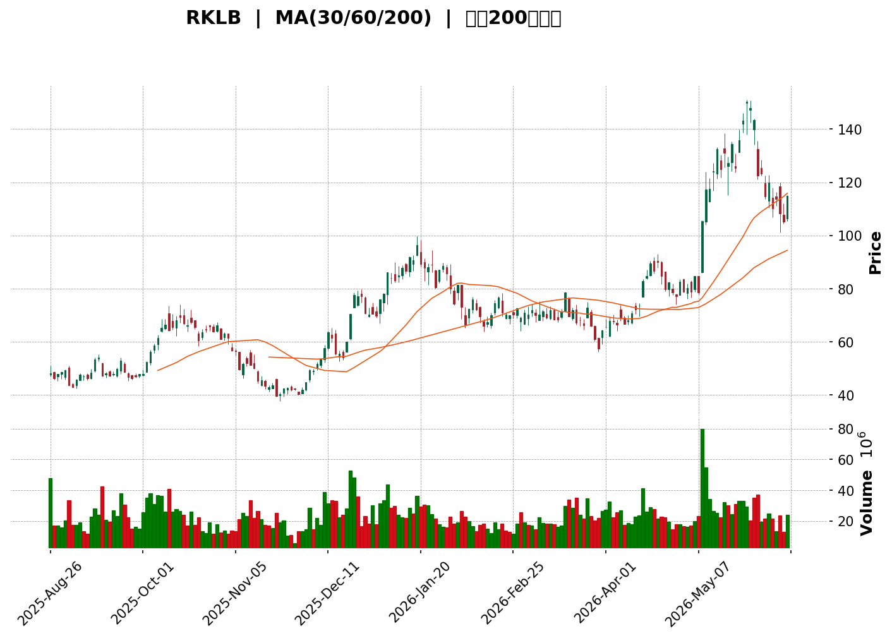
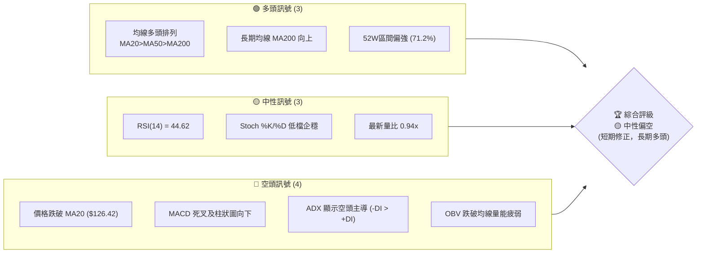
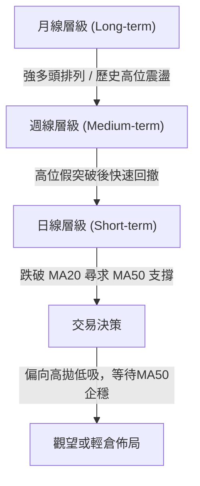
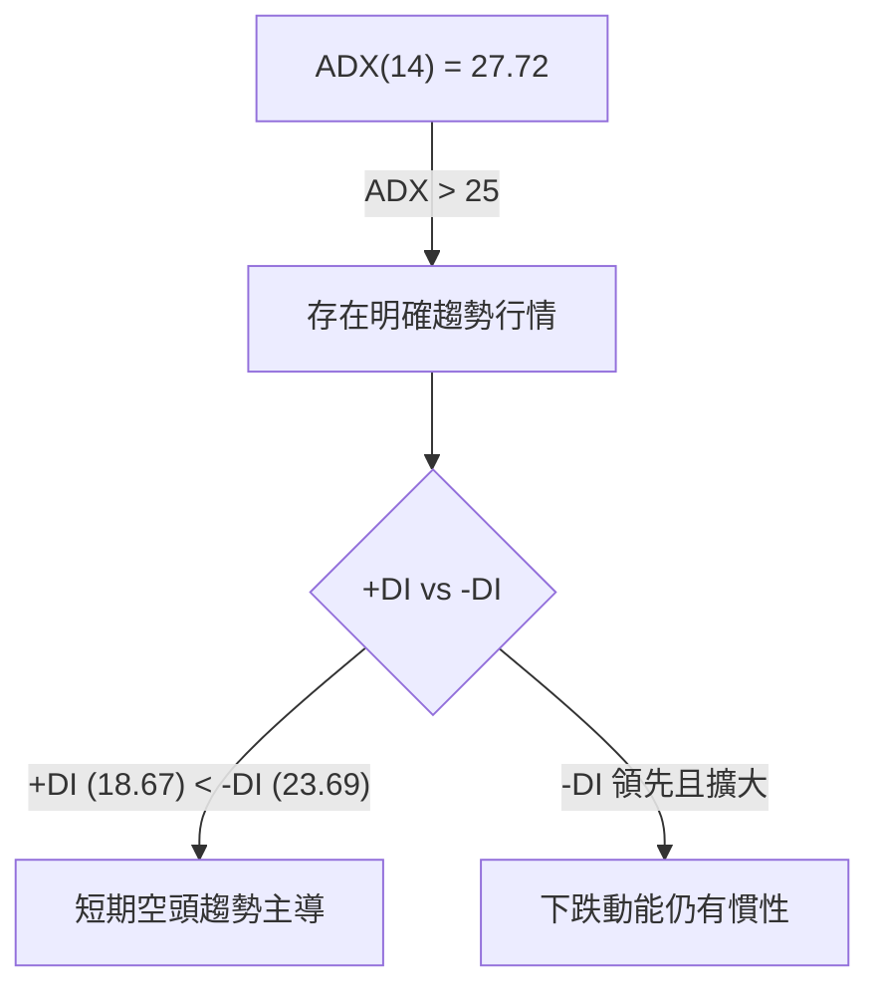
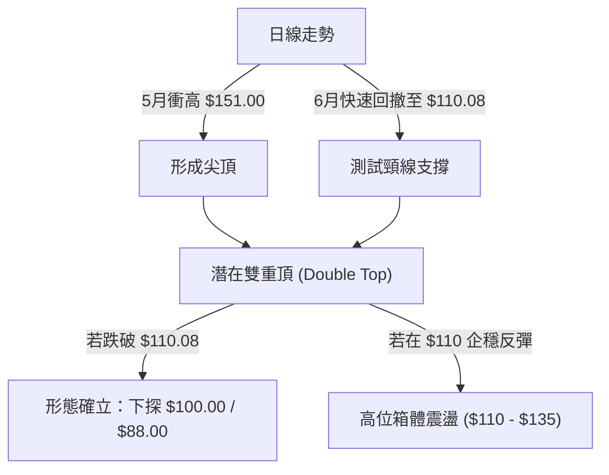

<details>
<summary>📊 靜態圖表 (點擊展開)</summary>

</details>

<html>
<head><meta charset="utf-8" /></head>
<body>
    <div style="height:500px; width:100%;">                        <script>window.PlotlyConfig = {MathJaxConfig: 'local'};</script>
        <script charset="utf-8" src="https://cdn.plot.ly/plotly-3.6.0.min.js" integrity="sha256-QaOVwtVY0T02VaHrr6pnoHLCwayMJp4O5n4YyaE3rJk=" crossorigin="anonymous"></script>                <div id="candlestick-chart" class="plotly-graph-div" style="height:100%; width:100%;"></div>            <script>                window.PLOTLYENV=window.PLOTLYENV || {};                                if (document.getElementById("candlestick-chart")) {                    Plotly.newPlot(                        "candlestick-chart",                        [{"close":{"dtype":"f8","bdata":"AAAA4KMQSEAAAAAAACBHQAAAAOB69EdAAAAAwMxMSEAAAAAgrqdIQAAAAADXw0VAAAAAYLh+RUAAAAAghetGQAAAAKBw3UdAAAAAANeDR0AAAACAwhVHQAAAAEAKN0hAAAAAIIWrSkAAAADAHgVLQAAAACBcn0dAAAAAgD0KSEAAAABACpdHQAAAAMAe5UdAAAAAIK7nSEAAAADgenRKQAAAAOBRWEhAAAAA4KNQR0AAAACgRyFHQAAAAKBHgUdAAAAA4Hr0R0AAAAAAKfxHQAAAAAApPEpAAAAA4HoUTEAAAAAAAEBNQAAAAKBHwU5AAAAAANdTUEAAAABA4ZpQQAAAAOCjEFBAAAAAQOFaUEAAAACA6wFRQAAAAKBHUVFAAAAAAADAUEAAAACgR5FQQAAAAGBm1lBAAAAAoJlZUEAAAADgUUhOQAAAAMD1yE9AAAAAANcjUEAAAAAgrmdQQAAAAAAA4E9AAAAAgD2KUEAAAACAwnVOQAAAAKBwfU9AAAAAIIWrTkAAAADA9UhMQAAAAIDCNUxAAAAAgBTOSEAAAACA69FJQAAAAEAz80lAAAAAYLieSUAAAAAAKfxIQAAAAAAAoEZAAAAAwB7FRkAAAAAgrqdFQAAAAADXY0VAAAAAIFzPRUAAAACgcL1DQAAAAGBmJkRAAAAAoJk5RUAAAADAzExFQAAAAEAK90RAAAAAgOsRRUAAAAAgXC9EQAAAAEAz80RAAAAAAClcRkAAAAAgXK9IQAAAAEAKh0hAAAAAIK7HSUAAAABACrdKQAAAAGCPwkxAAAAAANfDT0AAAABguL5OQAAAAOB6tEtAAAAAYLi+S0AAAABA4fpKQAAAAIDC9U1AAAAAoEehUUAAAABAM2NTQAAAACCFS1NAAAAAIIVLU0AAAACgmalRQAAAACCuh1FAAAAAwMycUUAAAADgo3BRQAAAACBc\u002f1JAAAAAwPWIU0AAAACA64FVQAAAAMAeBVVAAAAAwB7FVEAAAABgZjZVQAAAAKCZ+VVAAAAAwB6lVUAAAABAM\u002fNWQAAAAOCjsFZAAAAAQDMTWEAAAACAPUpWQAAAAOB69FVAAAAAYLj+VUAAAACgmTlWQAAAAGC4HlRAAAAAAADAVUAAAADgeiRWQAAAACCFa1VAAAAA4HoEVEAAAACgmYlSQAAAAKBHUVRAAAAAQApHUkAAAADgepRQQAAAAOB6FFJAAAAAgML1UkAAAACA6wFSQAAAACCuZ1FAAAAA4KOAUEAAAAAAKdxQQAAAAMD1eFFAAAAAQOGaUkAAAADAHiVTQAAAAEAKt1FAAAAAoHCNUUAAAACAFH5RQAAAAMDMjFFAAAAAoJkpUkAAAABgZkZRQAAAAIAUvlFAAAAA4FGIUUAAAACAPfpRQAAAAAAAgFFAAAAAQAqHUUAAAABguN5RQAAAACCFO1FAAAAAoHD9UUAAAAAgrhdRQAAAAIA9GlFAAAAAANfTUUAAAACAwqVTQAAAAGC4XlFAAAAAIIX7UUAAAABguM5QQAAAAAAAAFFAAAAA4HqEUEAAAADgUThSQAAAAAApfFBAAAAAQAp3TkAAAADgo7BMQAAAAIAUDlBAAAAAoEdhUEAAAABguO5QQAAAAEDh6lBAAAAA4HqUUEAAAADAHkVRQAAAACBcr1BAAAAAQDMDUUAAAAAgrqdRQAAAAIAUDlJAAAAAYGZmUkAAAAAghbtUQAAAAEAzM1VAAAAAoHBdVkAAAADA9ahVQAAAAGCPglZAAAAAYGYmVUAAAAAghetTQAAAAGCPklRAAAAAgMKlU0AAAACgR0FTQAAAAOCjoFRAAAAAANezU0AAAAAA1xNUQAAAAOCjsFNAAAAAoJkpVUAAAADAHqVTQAAAAIAUXlpAAAAAYGZWXUAAAAAA12NdQAAAAKCZCV9AAAAAoJmRYEAAAACgRzFfQAAAAMAeZWBAAAAAANfTX0AAAADA9chgQAAAAMDMXF9AAAAA4FH4YEAAAABgZuZhQAAAACBcx2JAAAAAwPWAYkAAAAAgXO9hQAAAAMD1mF5AAAAA4HrUXkAAAADAzKxcQAAAAMDM\u002fF1AAAAAwB6FW0AAAACgmWlcQAAAAGC4DltAAAAAQDNDWkAAAACA67FcQA=="},"high":{"dtype":"f8","bdata":"AAAAgMJ1SUAAAABguF5IQAAAAMDM\u002fEdAAAAAYGZmSEAAAADAHsVIQAAAAEAzc0lAAAAAgD1KRkAAAABguP5GQAAAAKCZGUhAAAAAANfDR0AAAACAFA5IQAAAAMAe1UhAAAAAANcDS0AAAACAwpVLQAAAAIA9CkpAAAAAwB5FSEAAAADgUZhIQAAAAEAKd0hAAAAAoEchSUAAAABgORRLQAAAAKBwPUpAAAAAIFxPSEAAAADgUdhHQAAAAMDMDEhAAAAAYLj+R0AAAACAwrVIQAAAAEAzU0pAAAAAIDF4TEAAAACgR6FNQAAAACCuR09AAAAAAC0iUUAAAABgjyJRQAAAAAAAYFJAAAAAACmcUUAAAABA4WpRQAAAAIAUflJAAAAAAAAQUkAAAAAAACBRQAAAACCFC1JAAAAAYI8CUUAAAACgRwFQQAAAAMDMLFBAAAAAIIWLUEAAAABgZpZQQAAAAGCPolBAAAAAwPXYUEAAAAAghUtQQAAAAKCZuU9AAAAAwMyMT0AAAABguL5NQAAAAADXo0xAAAAAQOEaTEAAAADAzAxKQAAAAAAAQEtAAAAAQOF6TEAAAACAPapLQAAAAOCjsEhAAAAAACmcR0AAAADAS9dGQAAAAIAUzkVAAAAAANdDRkAAAACgRyFHQAAAAIDChURAAAAAANdDRUAAAABACmdFQAAAACCFy0VAAAAAoJlZRUAAAABgZqZEQAAAAGC4fkVAAAAAYLheRkAAAABACtdIQAAAAKCZ2UhAAAAAIFwvSkAAAAAAAOBKQAAAAIA9ak1AAAAAoJkJUEAAAAAghUtQQAAAAADXI1BAAAAAoHBdTEAAAADgenRMQAAAAAAAIE5AAAAAANejUUAAAADAzJxTQAAAACCFy1NAAAAAwB71U0AAAAAgXD9TQAAAACBcL1JAAAAAACmsUkAAAABAi0xSQAAAACBcD1NAAAAAAACQU0AAAAAAAJBVQAAAAKBwfVVAAAAAIK53VkAAAAAghRtWQAAAAIDCNVZAAAAA4KduVkAAAAAAKQxXQAAAAEBgHVdAAAAAwB7lWEAAAACgR5FYQAAAAAAA0FZAAAAAoJlZVkAAAADAzJxXQAAAAIA9ylVAAAAAAADAVUAAAABAM3NWQAAAAAAAQFZAAAAA4HpUVkAAAADAzCxUQAAAAOB6VFRAAAAAYGZWVEAAAAAgXD9SQAAAAIA9KlJAAAAAQDMzU0AAAABACvdSQAAAAKCZWVJAAAAAwMwcUUAAAABgZmZRQAAAACBcv1FAAAAAwPXwUkAAAABACkdTQAAAAMDMjFNAAAAAAADQUUAAAAAghYNRQAAAAGBm9lFAAAAAIFwvUkAAAACAwmVRQAAAAGBmBlJAAAAAAABQUkAAAABgZoZSQAAAAADXE1JAAAAAQArHUkAAAAAAAAhSQAAAAADXO1JAAAAAQDNTUkAAAABgZiZSQAAAAADX01FAAAAA4FEYUkAAAABA4apTQAAAAOBROFNAAAAAYLguUkAAAABguH5SQAAAAMDMXFFAAAAAYGYmUUAAAAAA18NSQAAAAIDCBVJAAAAAgBSGUEAAAACA69FOQAAAAMAeJVBAAAAAQOEqUUAAAADA9VhRQAAAAOB6lFFAAAAAQDMTUUAAAACAwGpSQAAAAGCPclFAAAAAANeDUUAAAABAM+NRQAAAAAAAsFJAAAAAgMKlUkAAAAAgXN9UQAAAACBcv1VAAAAAYGaWVkAAAADAzPxWQAAAAGBmRldAAAAAQDOTVkAAAACAPZpVQAAAAGC4nlRAAAAAgOtxVEAAAADgo4BTQAAAAIDC5VRAAAAAYI\u002fyVEAAAADgT3VUQAAAAAAAwFRAAAAAIIUrVUAAAABgjzJVQAAAACCuZ1pAAAAAACn8XkAAAAAgXF9eQAAAACBcz19AAAAAgMKlYEAAAAAA10tgQAAAAAApTGFAAAAAgD0yYEAAAABAM+tgQAAAAADXW2BAAAAA4FF4YUAAAAAAAEBiQAAAAAAA4GJAAAAAYI\u002faYkAAAAAAAABiQAAAAAAp9GBAAAAAwMwMYEAAAADgUaBeQAAAAOBRqF5AAAAAYLh+XUAAAAAAABBdQAAAAGCP8l1AAAAAoHD9W0AAAABA4cJcQA=="},"hovertemplate":"\u003cb\u003e%{x|%Y-%m-%d}\u003c\u002fb\u003e\u003cbr\u003e\u958b: $%{open:.2f}\u003cbr\u003e\u9ad8: $%{high:.2f}\u003cbr\u003e\u4f4e: $%{low:.2f}\u003cbr\u003e\u6536: $%{close:.2f}\u003cextra\u003e\u003c\u002fextra\u003e","low":{"dtype":"f8","bdata":"AAAAAACAR0AAAADA9ehGQAAAACCFq0ZAAAAAYI8CR0AAAABACtdGQAAAAECJwUVAAAAAoJlZRUAAAACA6zFFQAAAAMB2vkZAAAAAQInBRkAAAADAzMxGQAAAAEAKB0dAAAAAQDVOSEAAAAAAKVxKQAAAAKBHgUdAAAAAoJk5R0AAAAAAAIBHQAAAAOCjkEdAAAAAYGZmR0AAAADgevRHQAAAAEAKN0hAAAAAQOGaRkAAAACAPepGQAAAACBcL0dAAAAAoEdBR0AAAAAgXI9HQAAAAKBHQUhAAAAAoEehSUAAAABgZuZLQAAAAGCPgkxAAAAAQDPTT0AAAABA4RpQQAAAAMD1CFBAAAAA4M4nUEAAAADgURhPQAAAAMAexVBAAAAAQDObUEAAAACgmdlPQAAAAEAzq1BAAAAAQAo3UEAAAADgejRNQAAAAAAAYE5AAAAAQDPTT0AAAACgmQlQQAAAAIAUzk9AAAAAoHC9T0AAAACA63FOQAAAAEAzM05AAAAA4KOQTUAAAACgR0FMQAAAACBcb0tAAAAA4Hq0SEAAAADgzidHQAAAAKBHYUlAAAAAQOGaSUAAAADgetRIQAAAACBcL0ZAAAAAYGamRUAAAADAzBxFQAAAAKBwnURAAAAAQAo3RUAAAADA9ahDQAAAAMD1yEJAAAAAYGamQ0AAAADgozBEQAAAAOCjsERAAAAAYGbmREAAAACgcP1DQAAAAIDCNURAAAAAAADAREAAAADA9WhGQAAAAKCZ2UdAAAAAACmcSEAAAAAghStJQAAAAAAAIEpAAAAAwMxsTEAAAABgZuZNQAAAAIA9iktAAAAAQApXSkAAAABA4YpKQAAAAADXA0xAAAAAwJ1fTkAAAADAIDBSQAAAAGCPUlJAAAAAoEOzUkAAAADA9ZhRQAAAAKCbVFFAAAAAACmcUUAAAADgUUhRQAAAAGBmtlBAAAAAANfTUUAAAABAM4NSQAAAAGBmdlRAAAAA4KOQVEAAAADAzJxUQAAAAODQ2lRAAAAAoJlpVUAAAAAAACBVQAAAAKCZqVVAAAAAoJkZV0AAAABAMxNWQAAAAKBwrVRAAAAAwHZWVEAAAAAgrodVQAAAAOCjAFRAAAAAAACAVEAAAADAyoFVQAAAAAAAwFRAAAAAoEeBU0AAAACAQXhSQAAAAKBH8VJAAAAAQAgkUUAAAADAzExQQAAAAAAAwFBAAAAAAACwUUAAAABAM+NRQAAAAKBHwVBAAAAAIFzvT0AAAAAAAGBQQAAAAAAAQFBAAAAAwEt\u002fUUAAAABgZhZSQAAAAKCZWVFAAAAAAAAgUUAAAABgZqZQQAAAAOBROFFAAAAAANczUUAAAABgZgZQQAAAAMDMnFBAAAAAACmMUEAAAACAFF5RQAAAAIDC1VBAAAAA4KMIUUAAAADgevRQQAAAAIC+J1FAAAAAwB4VUUAAAACA6xFRQAAAAAAp3FBAAAAAQOEqUUAAAACgR9FRQAAAAKCZWVFAAAAAAAAAUUAAAADA9ZhQQAAAAEAzg1BAAAAAoHAdUEAAAAAAKTxRQAAAAIDCZVBAAAAAwMwsTkAAAABg5RBMQAAAAADXg01AAAAAQDNTUEAAAACAFO5OQAAAAGBmplBAAAAAQOH6T0AAAABg5\u002fNQQAAAAEDholBAAAAAgMKVUEAAAACAwqVQQAAAAGC4nlFAAAAAYGZmUUAAAACgmTlTQAAAAGBm5lRAAAAAYGYmVUAAAAAAAHBVQAAAAOCj8FVAAAAAAClkVEAAAADAHsVTQAAAAMB0Q1NAAAAAYGZmU0AAAAAgXH9SQAAAAIAUXlNAAAAAIIWbU0AAAAAAABBTQAAAAADXI1NAAAAAQAq3U0AAAAAghXtTQAAAACCud1VAAAAAAAAAWkAAAACAPRpcQAAAAMD1OF1AAAAAANdTXkAAAABAM3NeQAAAAKDxal9AAAAAYLjOXEAAAACAFA5fQAAAAEAz815AAAAAgOtpYEAAAACA61FhQAAAAMAePWFAAAAAANfLYUAAAACgmcFgQAAAAAAAQF5AAAAAANejXkAAAACAPWpcQAAAAMD1mFtAAAAAYLiuWkAAAAAAAMBbQAAAAMDMTFlAAAAAgD0aWkAAAACgmVlaQA=="},"name":"\u50f9\u683c","open":{"dtype":"f8","bdata":"AAAAoHDdR0AAAABACldIQAAAAOCjcEdAAAAAwMzsR0AAAAAAAGBHQAAAAGCPIklAAAAA4HoURkAAAADgUchFQAAAAAAAwEZAAAAAoEeBR0AAAAAA18NHQAAAAMD1KEdAAAAAoHB9SEAAAACAPcpKQAAAAAAAAEpAAAAA4FHIR0AAAACAwnVIQAAAAEAK10dAAAAA4KOQR0AAAABAM4NIQAAAAIDC5UlAAAAAAAAASEAAAABgZqZHQAAAAEAzs0dAAAAAQOGaR0AAAADgo7BHQAAAAIDrUUhAAAAAYGYGSkAAAABguG5MQAAAAKBHgU1AAAAAoJkJUEAAAACgmTlQQAAAAEAzs1FAAAAA4FH4UEAAAACAwlVQQAAAAKBHgVFAAAAA4HqEUUAAAADA9XhQQAAAAOCjSFFAAAAAYI8CUUAAAAAAKXxPQAAAACCux05AAAAAANczUEAAAAAAKYxQQAAAAEAza1BAAAAAoEcJUEAAAAAAAEBQQAAAAGCP4k5AAAAAANeDT0AAAABgZuZMQAAAAOB6VExAAAAAQOEaTEAAAACgGNRHQAAAAGC43kpAAAAAAAAATEAAAABACvdJQAAAAKBHYUhAAAAAQOHaRUAAAABAM5NGQAAAAAApHEVAAAAAAABARUAAAACAPQpHQAAAAIA96kNAAAAAoEdhREAAAAAA1wNFQAAAAGC4nkVAAAAAoEdBRUAAAABAM5NEQAAAACCuR0RAAAAAYI\u002fyREAAAABgj9JGQAAAAAAAcEhAAAAAgD0KSUAAAACgcJ1JQAAAAOBRuEpAAAAAoEfBTEAAAAAAAEBPQAAAAOCnhk9AAAAA4FEYS0AAAADAzAxMQAAAAKCZGUxAAAAAIFyPTkAAAAAAKTxSQAAAAADXc1JAAAAAgD2CU0AAAAAghStTQAAAAAAAYFFAAAAAoJlBUkAAAAAAAOBRQAAAAOBRqFFAAAAAIK6nUkAAAADgo3BTQAAAAGBmBlVAAAAAAABgVUAAAACgmSFVQAAAAGC4PlVAAAAAwPVIVkAAAABgZpZVQAAAAMD1UFZAAAAAoJkhV0AAAADAzGxXQAAAAKBHgVZAAAAA4FGYVUAAAAAghUNWQAAAACCur1VAAAAAwPW4VEAAAACAFM5VQAAAAAAp\u002fFVAAAAAAABAVUAAAACAPcpTQAAAAGBmplNAAAAAYGZWVEAAAABguH5RQAAAAAAAQFFAAAAAoJkBUkAAAACAFKZSQAAAAOBRSFJAAAAAgOvhUEAAAADgeqxQQAAAAEBghVBAAAAAAADAUUAAAACgmTlSQAAAACDZ3lJAAAAA4FEwUUAAAADgUThRQAAAAIAUxlFAAAAAQOGCUUAAAACAwuVQQAAAACCFq1BAAAAAYLg2UUAAAAAA17NRQAAAAEDhulFAAAAA4KMIUUAAAADA9VhRQAAAAIDClVFAAAAAQDMzUUAAAADAzPxRQAAAAKCZSVFAAAAAwMxUUUAAAABgZt5RQAAAAGCPAlNAAAAA4Ho0UUAAAAAAAABSQAAAAKBwBVFAAAAAAADAUEAAAAAAKTxRQAAAAMDMzFFAAAAA4KOAUEAAAACgmblOQAAAAEDh2k5AAAAAAABgUEAAAADAzBxPQAAAAGC47lBAAAAAIFzHUEAAAAAAAABSQAAAAADXQ1FAAAAAwMzsUEAAAABAM8NQQAAAACCFY1JAAAAAoHBlUkAAAACAFD5TQAAAAMAeBVVAAAAAYGY2VUAAAADAHpVWQAAAAIDCnVZAAAAAYGZ2VkAAAACAwpVVQAAAAAAp7FNAAAAAwMwEVEAAAABACndTQAAAAEAzY1NAAAAAgOvhVEAAAABACpdTQAAAAGBmplRAAAAAIK7nU0AAAACgcC1VQAAAAIA9glVAAAAAoEdRWkAAAADgozBcQAAAAKBH+V5AAAAAYGbGXkAAAABAMwNgQAAAAAApmGBAAAAAgBR+X0AAAABguN5fQAAAAMD1iF9AAAAAwB5tYEAAAABA4b5hQAAAAEAKt2JAAAAAoHBlYkAAAACAFH5hQAAAAAApjGBAAAAAgMJVX0AAAADAHuVdQAAAAKBwRVxAAAAAoEeRXEAAAABA4apcQAAAAKCZmV1AAAAAwMzsWkAAAABACpdaQA=="},"x":["2025-08-26T00:00:00-04:00","2025-08-27T00:00:00-04:00","2025-08-28T00:00:00-04:00","2025-08-29T00:00:00-04:00","2025-09-02T00:00:00-04:00","2025-09-03T00:00:00-04:00","2025-09-04T00:00:00-04:00","2025-09-05T00:00:00-04:00","2025-09-08T00:00:00-04:00","2025-09-09T00:00:00-04:00","2025-09-10T00:00:00-04:00","2025-09-11T00:00:00-04:00","2025-09-12T00:00:00-04:00","2025-09-15T00:00:00-04:00","2025-09-16T00:00:00-04:00","2025-09-17T00:00:00-04:00","2025-09-18T00:00:00-04:00","2025-09-19T00:00:00-04:00","2025-09-22T00:00:00-04:00","2025-09-23T00:00:00-04:00","2025-09-24T00:00:00-04:00","2025-09-25T00:00:00-04:00","2025-09-26T00:00:00-04:00","2025-09-29T00:00:00-04:00","2025-09-30T00:00:00-04:00","2025-10-01T00:00:00-04:00","2025-10-02T00:00:00-04:00","2025-10-03T00:00:00-04:00","2025-10-06T00:00:00-04:00","2025-10-07T00:00:00-04:00","2025-10-08T00:00:00-04:00","2025-10-09T00:00:00-04:00","2025-10-10T00:00:00-04:00","2025-10-13T00:00:00-04:00","2025-10-14T00:00:00-04:00","2025-10-15T00:00:00-04:00","2025-10-16T00:00:00-04:00","2025-10-17T00:00:00-04:00","2025-10-20T00:00:00-04:00","2025-10-21T00:00:00-04:00","2025-10-22T00:00:00-04:00","2025-10-23T00:00:00-04:00","2025-10-24T00:00:00-04:00","2025-10-27T00:00:00-04:00","2025-10-28T00:00:00-04:00","2025-10-29T00:00:00-04:00","2025-10-30T00:00:00-04:00","2025-10-31T00:00:00-04:00","2025-11-03T00:00:00-05:00","2025-11-04T00:00:00-05:00","2025-11-05T00:00:00-05:00","2025-11-06T00:00:00-05:00","2025-11-07T00:00:00-05:00","2025-11-10T00:00:00-05:00","2025-11-11T00:00:00-05:00","2025-11-12T00:00:00-05:00","2025-11-13T00:00:00-05:00","2025-11-14T00:00:00-05:00","2025-11-17T00:00:00-05:00","2025-11-18T00:00:00-05:00","2025-11-19T00:00:00-05:00","2025-11-20T00:00:00-05:00","2025-11-21T00:00:00-05:00","2025-11-24T00:00:00-05:00","2025-11-25T00:00:00-05:00","2025-11-26T00:00:00-05:00","2025-11-28T00:00:00-05:00","2025-12-01T00:00:00-05:00","2025-12-02T00:00:00-05:00","2025-12-03T00:00:00-05:00","2025-12-04T00:00:00-05:00","2025-12-05T00:00:00-05:00","2025-12-08T00:00:00-05:00","2025-12-09T00:00:00-05:00","2025-12-10T00:00:00-05:00","2025-12-11T00:00:00-05:00","2025-12-12T00:00:00-05:00","2025-12-15T00:00:00-05:00","2025-12-16T00:00:00-05:00","2025-12-17T00:00:00-05:00","2025-12-18T00:00:00-05:00","2025-12-19T00:00:00-05:00","2025-12-22T00:00:00-05:00","2025-12-23T00:00:00-05:00","2025-12-24T00:00:00-05:00","2025-12-26T00:00:00-05:00","2025-12-29T00:00:00-05:00","2025-12-30T00:00:00-05:00","2025-12-31T00:00:00-05:00","2026-01-02T00:00:00-05:00","2026-01-05T00:00:00-05:00","2026-01-06T00:00:00-05:00","2026-01-07T00:00:00-05:00","2026-01-08T00:00:00-05:00","2026-01-09T00:00:00-05:00","2026-01-12T00:00:00-05:00","2026-01-13T00:00:00-05:00","2026-01-14T00:00:00-05:00","2026-01-15T00:00:00-05:00","2026-01-16T00:00:00-05:00","2026-01-20T00:00:00-05:00","2026-01-21T00:00:00-05:00","2026-01-22T00:00:00-05:00","2026-01-23T00:00:00-05:00","2026-01-26T00:00:00-05:00","2026-01-27T00:00:00-05:00","2026-01-28T00:00:00-05:00","2026-01-29T00:00:00-05:00","2026-01-30T00:00:00-05:00","2026-02-02T00:00:00-05:00","2026-02-03T00:00:00-05:00","2026-02-04T00:00:00-05:00","2026-02-05T00:00:00-05:00","2026-02-06T00:00:00-05:00","2026-02-09T00:00:00-05:00","2026-02-10T00:00:00-05:00","2026-02-11T00:00:00-05:00","2026-02-12T00:00:00-05:00","2026-02-13T00:00:00-05:00","2026-02-17T00:00:00-05:00","2026-02-18T00:00:00-05:00","2026-02-19T00:00:00-05:00","2026-02-20T00:00:00-05:00","2026-02-23T00:00:00-05:00","2026-02-24T00:00:00-05:00","2026-02-25T00:00:00-05:00","2026-02-26T00:00:00-05:00","2026-02-27T00:00:00-05:00","2026-03-02T00:00:00-05:00","2026-03-03T00:00:00-05:00","2026-03-04T00:00:00-05:00","2026-03-05T00:00:00-05:00","2026-03-06T00:00:00-05:00","2026-03-09T00:00:00-04:00","2026-03-10T00:00:00-04:00","2026-03-11T00:00:00-04:00","2026-03-12T00:00:00-04:00","2026-03-13T00:00:00-04:00","2026-03-16T00:00:00-04:00","2026-03-17T00:00:00-04:00","2026-03-18T00:00:00-04:00","2026-03-19T00:00:00-04:00","2026-03-20T00:00:00-04:00","2026-03-23T00:00:00-04:00","2026-03-24T00:00:00-04:00","2026-03-25T00:00:00-04:00","2026-03-26T00:00:00-04:00","2026-03-27T00:00:00-04:00","2026-03-30T00:00:00-04:00","2026-03-31T00:00:00-04:00","2026-04-01T00:00:00-04:00","2026-04-02T00:00:00-04:00","2026-04-06T00:00:00-04:00","2026-04-07T00:00:00-04:00","2026-04-08T00:00:00-04:00","2026-04-09T00:00:00-04:00","2026-04-10T00:00:00-04:00","2026-04-13T00:00:00-04:00","2026-04-14T00:00:00-04:00","2026-04-15T00:00:00-04:00","2026-04-16T00:00:00-04:00","2026-04-17T00:00:00-04:00","2026-04-20T00:00:00-04:00","2026-04-21T00:00:00-04:00","2026-04-22T00:00:00-04:00","2026-04-23T00:00:00-04:00","2026-04-24T00:00:00-04:00","2026-04-27T00:00:00-04:00","2026-04-28T00:00:00-04:00","2026-04-29T00:00:00-04:00","2026-04-30T00:00:00-04:00","2026-05-01T00:00:00-04:00","2026-05-04T00:00:00-04:00","2026-05-05T00:00:00-04:00","2026-05-06T00:00:00-04:00","2026-05-07T00:00:00-04:00","2026-05-08T00:00:00-04:00","2026-05-11T00:00:00-04:00","2026-05-12T00:00:00-04:00","2026-05-13T00:00:00-04:00","2026-05-14T00:00:00-04:00","2026-05-15T00:00:00-04:00","2026-05-18T00:00:00-04:00","2026-05-19T00:00:00-04:00","2026-05-20T00:00:00-04:00","2026-05-21T00:00:00-04:00","2026-05-22T00:00:00-04:00","2026-05-26T00:00:00-04:00","2026-05-27T00:00:00-04:00","2026-05-28T00:00:00-04:00","2026-05-29T00:00:00-04:00","2026-06-01T00:00:00-04:00","2026-06-02T00:00:00-04:00","2026-06-03T00:00:00-04:00","2026-06-04T00:00:00-04:00","2026-06-05T00:00:00-04:00","2026-06-08T00:00:00-04:00","2026-06-09T00:00:00-04:00","2026-06-10T00:00:00-04:00","2026-06-11T00:00:00-04:00"],"type":"candlestick"},{"hovertemplate":"MA30: $%{y:.2f}\u003cextra\u003e\u003c\u002fextra\u003e","line":{"color":"#2196F3","dash":"dash","width":2},"mode":"lines","name":"MA30","x":["2025-08-26T00:00:00-04:00","2025-08-27T00:00:00-04:00","2025-08-28T00:00:00-04:00","2025-08-29T00:00:00-04:00","2025-09-02T00:00:00-04:00","2025-09-03T00:00:00-04:00","2025-09-04T00:00:00-04:00","2025-09-05T00:00:00-04:00","2025-09-08T00:00:00-04:00","2025-09-09T00:00:00-04:00","2025-09-10T00:00:00-04:00","2025-09-11T00:00:00-04:00","2025-09-12T00:00:00-04:00","2025-09-15T00:00:00-04:00","2025-09-16T00:00:00-04:00","2025-09-17T00:00:00-04:00","2025-09-18T00:00:00-04:00","2025-09-19T00:00:00-04:00","2025-09-22T00:00:00-04:00","2025-09-23T00:00:00-04:00","2025-09-24T00:00:00-04:00","2025-09-25T00:00:00-04:00","2025-09-26T00:00:00-04:00","2025-09-29T00:00:00-04:00","2025-09-30T00:00:00-04:00","2025-10-01T00:00:00-04:00","2025-10-02T00:00:00-04:00","2025-10-03T00:00:00-04:00","2025-10-06T00:00:00-04:00","2025-10-07T00:00:00-04:00","2025-10-08T00:00:00-04:00","2025-10-09T00:00:00-04:00","2025-10-10T00:00:00-04:00","2025-10-13T00:00:00-04:00","2025-10-14T00:00:00-04:00","2025-10-15T00:00:00-04:00","2025-10-16T00:00:00-04:00","2025-10-17T00:00:00-04:00","2025-10-20T00:00:00-04:00","2025-10-21T00:00:00-04:00","2025-10-22T00:00:00-04:00","2025-10-23T00:00:00-04:00","2025-10-24T00:00:00-04:00","2025-10-27T00:00:00-04:00","2025-10-28T00:00:00-04:00","2025-10-29T00:00:00-04:00","2025-10-30T00:00:00-04:00","2025-10-31T00:00:00-04:00","2025-11-03T00:00:00-05:00","2025-11-04T00:00:00-05:00","2025-11-05T00:00:00-05:00","2025-11-06T00:00:00-05:00","2025-11-07T00:00:00-05:00","2025-11-10T00:00:00-05:00","2025-11-11T00:00:00-05:00","2025-11-12T00:00:00-05:00","2025-11-13T00:00:00-05:00","2025-11-14T00:00:00-05:00","2025-11-17T00:00:00-05:00","2025-11-18T00:00:00-05:00","2025-11-19T00:00:00-05:00","2025-11-20T00:00:00-05:00","2025-11-21T00:00:00-05:00","2025-11-24T00:00:00-05:00","2025-11-25T00:00:00-05:00","2025-11-26T00:00:00-05:00","2025-11-28T00:00:00-05:00","2025-12-01T00:00:00-05:00","2025-12-02T00:00:00-05:00","2025-12-03T00:00:00-05:00","2025-12-04T00:00:00-05:00","2025-12-05T00:00:00-05:00","2025-12-08T00:00:00-05:00","2025-12-09T00:00:00-05:00","2025-12-10T00:00:00-05:00","2025-12-11T00:00:00-05:00","2025-12-12T00:00:00-05:00","2025-12-15T00:00:00-05:00","2025-12-16T00:00:00-05:00","2025-12-17T00:00:00-05:00","2025-12-18T00:00:00-05:00","2025-12-19T00:00:00-05:00","2025-12-22T00:00:00-05:00","2025-12-23T00:00:00-05:00","2025-12-24T00:00:00-05:00","2025-12-26T00:00:00-05:00","2025-12-29T00:00:00-05:00","2025-12-30T00:00:00-05:00","2025-12-31T00:00:00-05:00","2026-01-02T00:00:00-05:00","2026-01-05T00:00:00-05:00","2026-01-06T00:00:00-05:00","2026-01-07T00:00:00-05:00","2026-01-08T00:00:00-05:00","2026-01-09T00:00:00-05:00","2026-01-12T00:00:00-05:00","2026-01-13T00:00:00-05:00","2026-01-14T00:00:00-05:00","2026-01-15T00:00:00-05:00","2026-01-16T00:00:00-05:00","2026-01-20T00:00:00-05:00","2026-01-21T00:00:00-05:00","2026-01-22T00:00:00-05:00","2026-01-23T00:00:00-05:00","2026-01-26T00:00:00-05:00","2026-01-27T00:00:00-05:00","2026-01-28T00:00:00-05:00","2026-01-29T00:00:00-05:00","2026-01-30T00:00:00-05:00","2026-02-02T00:00:00-05:00","2026-02-03T00:00:00-05:00","2026-02-04T00:00:00-05:00","2026-02-05T00:00:00-05:00","2026-02-06T00:00:00-05:00","2026-02-09T00:00:00-05:00","2026-02-10T00:00:00-05:00","2026-02-11T00:00:00-05:00","2026-02-12T00:00:00-05:00","2026-02-13T00:00:00-05:00","2026-02-17T00:00:00-05:00","2026-02-18T00:00:00-05:00","2026-02-19T00:00:00-05:00","2026-02-20T00:00:00-05:00","2026-02-23T00:00:00-05:00","2026-02-24T00:00:00-05:00","2026-02-25T00:00:00-05:00","2026-02-26T00:00:00-05:00","2026-02-27T00:00:00-05:00","2026-03-02T00:00:00-05:00","2026-03-03T00:00:00-05:00","2026-03-04T00:00:00-05:00","2026-03-05T00:00:00-05:00","2026-03-06T00:00:00-05:00","2026-03-09T00:00:00-04:00","2026-03-10T00:00:00-04:00","2026-03-11T00:00:00-04:00","2026-03-12T00:00:00-04:00","2026-03-13T00:00:00-04:00","2026-03-16T00:00:00-04:00","2026-03-17T00:00:00-04:00","2026-03-18T00:00:00-04:00","2026-03-19T00:00:00-04:00","2026-03-20T00:00:00-04:00","2026-03-23T00:00:00-04:00","2026-03-24T00:00:00-04:00","2026-03-25T00:00:00-04:00","2026-03-26T00:00:00-04:00","2026-03-27T00:00:00-04:00","2026-03-30T00:00:00-04:00","2026-03-31T00:00:00-04:00","2026-04-01T00:00:00-04:00","2026-04-02T00:00:00-04:00","2026-04-06T00:00:00-04:00","2026-04-07T00:00:00-04:00","2026-04-08T00:00:00-04:00","2026-04-09T00:00:00-04:00","2026-04-10T00:00:00-04:00","2026-04-13T00:00:00-04:00","2026-04-14T00:00:00-04:00","2026-04-15T00:00:00-04:00","2026-04-16T00:00:00-04:00","2026-04-17T00:00:00-04:00","2026-04-20T00:00:00-04:00","2026-04-21T00:00:00-04:00","2026-04-22T00:00:00-04:00","2026-04-23T00:00:00-04:00","2026-04-24T00:00:00-04:00","2026-04-27T00:00:00-04:00","2026-04-28T00:00:00-04:00","2026-04-29T00:00:00-04:00","2026-04-30T00:00:00-04:00","2026-05-01T00:00:00-04:00","2026-05-04T00:00:00-04:00","2026-05-05T00:00:00-04:00","2026-05-06T00:00:00-04:00","2026-05-07T00:00:00-04:00","2026-05-08T00:00:00-04:00","2026-05-11T00:00:00-04:00","2026-05-12T00:00:00-04:00","2026-05-13T00:00:00-04:00","2026-05-14T00:00:00-04:00","2026-05-15T00:00:00-04:00","2026-05-18T00:00:00-04:00","2026-05-19T00:00:00-04:00","2026-05-20T00:00:00-04:00","2026-05-21T00:00:00-04:00","2026-05-22T00:00:00-04:00","2026-05-26T00:00:00-04:00","2026-05-27T00:00:00-04:00","2026-05-28T00:00:00-04:00","2026-05-29T00:00:00-04:00","2026-06-01T00:00:00-04:00","2026-06-02T00:00:00-04:00","2026-06-03T00:00:00-04:00","2026-06-04T00:00:00-04:00","2026-06-05T00:00:00-04:00","2026-06-08T00:00:00-04:00","2026-06-09T00:00:00-04:00","2026-06-10T00:00:00-04:00","2026-06-11T00:00:00-04:00"],"y":{"dtype":"f8","bdata":"AAAAAAAA+H8AAAAAAAD4fwAAAAAAAPh\u002fAAAAAAAA+H8AAAAAAAD4fwAAAAAAAPh\u002fAAAAAAAA+H8AAAAAAAD4fwAAAAAAAPh\u002fAAAAAAAA+H8AAAAAAAD4fwAAAAAAAPh\u002fAAAAAAAA+H8AAAAAAAD4fwAAAAAAAPh\u002fAAAAAAAA+H8AAAAAAAD4fwAAAAAAAPh\u002fAAAAAAAA+H8AAAAAAAD4fwAAAAAAAPh\u002fAAAAAAAA+H8AAAAAAAD4fwAAAAAAAPh\u002fAAAAAAAA+H8AAAAAAAD4fwAAAAAAAPh\u002fAAAAAAAA+H8AAAAAAAD4f7y7u4sll0hA7+7urnLgSEAzMzOzgTZJQDMzM0NEfElAAAAAMAjESUCrqqpq5xNKQLy7u1u6gUpA3t3drSvoSkDv7u6uVj9LQERERPQMk0tAVVVV5W3hS0AzMzMT2R5MQN7d3f1xX0xAiYiIOFGPTEC8u7urucBMQImIiIglB01Ad3d3t0lUTUBVVVV16Y5NQM3MzPy4z01AIiIi0uoATkBERESEiBBOQM3MzLyDMU5AERERsTo+TkBmZmYWL1VOQGZmZkYMak5AZmZmhkF4TkDv7u4OyoBOQEREROT7YU5AVVVVBaw0TkDe3d193PNNQGZmZlbyo01AMzMzE2dHTUCamZlpddRMQDMzM7M6bkxAZmZmVjkMTEDv7u7+uJ9LQN7d3W0SK0tA3t3drQDBSkCamZn5flJKQKuqqsro5UlAd3d3t6yNSUCrqqrK6F1JQKuqqor6H0lAREREFIPoSECJiIhYgLRIQGZmZobrmUhAvLu727KOSEBERER0IZFIQO\u002fu7v7UcEhAzczMPN9XSEC8u7trvExIQKuqqlqrW0hAVVVVpeK0SEB3d3dHbyNJQHd3d8dLj0lAzczMLPn9SUAAAABANVZKQM3MzOxRwEpAiYiISJoqS0DNzMy8dJtLQJqZmekmKUxAVVVV9W+8TECJiIj4DINNQImIiGjYPU5ARERENDPrTkCJiIh4d59PQERERHzNMVBA7+7uppuQUECrqqpKU\u002f5QQN7d3V2PZlFAzczM7JjUUUCrqqqSeylSQGZmZm4ufFJAvLu7m+DJUkBVVVX1ixVTQGZmZi6HRlNAZmZm7ph4U0CJiIg4XrJTQFVVVa3x8lNAIiIiomEnVEARERERdFJUQDMzMwMAgFRAAAAAgIaFVEC8u7trkW1UQGZmZjYzY1RAREREZFdgVEDe3d0NSWNUQM3MzPw3YlRAiYiIKL9YVEAREREhzFNUQHd3d7fIRlRAmpmZGdk+VEBEREQksCpUQCIiIkJ8DlRAVVVVhQfzU0Dv7u4OSdNTQO\u002fu7n6GrVNAvLu7286PU0ARERGhYV9TQGZmZqYpNVNAZmZmVlX9UkCamZmJiNhSQBEREXGEslJAmpmZCWWMUkBVVVVlO2dSQN7d3Y2XTlJAVVVVtYEuUkARERHRaQNSQImIiBiS3lFAd3d39+HLUUC8u7vLWtVRQDMzM+MzvFFAMzMzc6+5UUDv7u5uoLtRQDMzMyNpslFAq6qqapGdUUARERGhYZ9RQLy7u9uHl1FAAAAAgLGMUUDe3d1lO3dRQKuqqtIia1FAREREPCZYUUDNzMz0REVRQCIiIsp2PlFAzczMVCo2UUDe3d1FRDRRQO\u002fu7qbiLFFAiYiIcBIjUUCJiIiQUCZRQDMzMzv7KFFAiYiIUGIwUUC8u7uz5EdRQCIiInp3Z1FAAAAAKL+QUUARERGJFrFRQBEREWkf3lFAERERiRb5UUBVVVVNNxFSQJqZmaHTLlJAMzMze1s+UkBVVVUNAjtSQDMzMyvOVlJAiYiIkHtlUkBERET8YoFSQJqZmWFXmFJAIiIiivq\u002fUkCJiIiAI8xSQO\u002fu7iZ4IFNAZmZm\u002ftSYU0C8u7tLNxlUQBERERERmVRAMzMzYxAoVUBERETUv6FVQGZmZtYxKVZAIiIigk6rVkBmZmZmZjZXQDMzM+Ols1dAIiIikhhEWEDNzMzs7t5YQImIiMhahVlAzczMfCMkWkC8u7vbT6VaQCIiIgKB9VpAVVVVFb09W0BVVVWVmXlbQN7d3W1ouVtAiYiI6MPvW0Dv7u4OPDhcQCIiIsKSb1xAMzMzcwWoXEAiIiJyk\u002fhcQA=="},"type":"scatter"},{"hovertemplate":"MA60: $%{y:.2f}\u003cextra\u003e\u003c\u002fextra\u003e","line":{"color":"#9C27B0","dash":"dash","width":2},"mode":"lines","name":"MA60","x":["2025-08-26T00:00:00-04:00","2025-08-27T00:00:00-04:00","2025-08-28T00:00:00-04:00","2025-08-29T00:00:00-04:00","2025-09-02T00:00:00-04:00","2025-09-03T00:00:00-04:00","2025-09-04T00:00:00-04:00","2025-09-05T00:00:00-04:00","2025-09-08T00:00:00-04:00","2025-09-09T00:00:00-04:00","2025-09-10T00:00:00-04:00","2025-09-11T00:00:00-04:00","2025-09-12T00:00:00-04:00","2025-09-15T00:00:00-04:00","2025-09-16T00:00:00-04:00","2025-09-17T00:00:00-04:00","2025-09-18T00:00:00-04:00","2025-09-19T00:00:00-04:00","2025-09-22T00:00:00-04:00","2025-09-23T00:00:00-04:00","2025-09-24T00:00:00-04:00","2025-09-25T00:00:00-04:00","2025-09-26T00:00:00-04:00","2025-09-29T00:00:00-04:00","2025-09-30T00:00:00-04:00","2025-10-01T00:00:00-04:00","2025-10-02T00:00:00-04:00","2025-10-03T00:00:00-04:00","2025-10-06T00:00:00-04:00","2025-10-07T00:00:00-04:00","2025-10-08T00:00:00-04:00","2025-10-09T00:00:00-04:00","2025-10-10T00:00:00-04:00","2025-10-13T00:00:00-04:00","2025-10-14T00:00:00-04:00","2025-10-15T00:00:00-04:00","2025-10-16T00:00:00-04:00","2025-10-17T00:00:00-04:00","2025-10-20T00:00:00-04:00","2025-10-21T00:00:00-04:00","2025-10-22T00:00:00-04:00","2025-10-23T00:00:00-04:00","2025-10-24T00:00:00-04:00","2025-10-27T00:00:00-04:00","2025-10-28T00:00:00-04:00","2025-10-29T00:00:00-04:00","2025-10-30T00:00:00-04:00","2025-10-31T00:00:00-04:00","2025-11-03T00:00:00-05:00","2025-11-04T00:00:00-05:00","2025-11-05T00:00:00-05:00","2025-11-06T00:00:00-05:00","2025-11-07T00:00:00-05:00","2025-11-10T00:00:00-05:00","2025-11-11T00:00:00-05:00","2025-11-12T00:00:00-05:00","2025-11-13T00:00:00-05:00","2025-11-14T00:00:00-05:00","2025-11-17T00:00:00-05:00","2025-11-18T00:00:00-05:00","2025-11-19T00:00:00-05:00","2025-11-20T00:00:00-05:00","2025-11-21T00:00:00-05:00","2025-11-24T00:00:00-05:00","2025-11-25T00:00:00-05:00","2025-11-26T00:00:00-05:00","2025-11-28T00:00:00-05:00","2025-12-01T00:00:00-05:00","2025-12-02T00:00:00-05:00","2025-12-03T00:00:00-05:00","2025-12-04T00:00:00-05:00","2025-12-05T00:00:00-05:00","2025-12-08T00:00:00-05:00","2025-12-09T00:00:00-05:00","2025-12-10T00:00:00-05:00","2025-12-11T00:00:00-05:00","2025-12-12T00:00:00-05:00","2025-12-15T00:00:00-05:00","2025-12-16T00:00:00-05:00","2025-12-17T00:00:00-05:00","2025-12-18T00:00:00-05:00","2025-12-19T00:00:00-05:00","2025-12-22T00:00:00-05:00","2025-12-23T00:00:00-05:00","2025-12-24T00:00:00-05:00","2025-12-26T00:00:00-05:00","2025-12-29T00:00:00-05:00","2025-12-30T00:00:00-05:00","2025-12-31T00:00:00-05:00","2026-01-02T00:00:00-05:00","2026-01-05T00:00:00-05:00","2026-01-06T00:00:00-05:00","2026-01-07T00:00:00-05:00","2026-01-08T00:00:00-05:00","2026-01-09T00:00:00-05:00","2026-01-12T00:00:00-05:00","2026-01-13T00:00:00-05:00","2026-01-14T00:00:00-05:00","2026-01-15T00:00:00-05:00","2026-01-16T00:00:00-05:00","2026-01-20T00:00:00-05:00","2026-01-21T00:00:00-05:00","2026-01-22T00:00:00-05:00","2026-01-23T00:00:00-05:00","2026-01-26T00:00:00-05:00","2026-01-27T00:00:00-05:00","2026-01-28T00:00:00-05:00","2026-01-29T00:00:00-05:00","2026-01-30T00:00:00-05:00","2026-02-02T00:00:00-05:00","2026-02-03T00:00:00-05:00","2026-02-04T00:00:00-05:00","2026-02-05T00:00:00-05:00","2026-02-06T00:00:00-05:00","2026-02-09T00:00:00-05:00","2026-02-10T00:00:00-05:00","2026-02-11T00:00:00-05:00","2026-02-12T00:00:00-05:00","2026-02-13T00:00:00-05:00","2026-02-17T00:00:00-05:00","2026-02-18T00:00:00-05:00","2026-02-19T00:00:00-05:00","2026-02-20T00:00:00-05:00","2026-02-23T00:00:00-05:00","2026-02-24T00:00:00-05:00","2026-02-25T00:00:00-05:00","2026-02-26T00:00:00-05:00","2026-02-27T00:00:00-05:00","2026-03-02T00:00:00-05:00","2026-03-03T00:00:00-05:00","2026-03-04T00:00:00-05:00","2026-03-05T00:00:00-05:00","2026-03-06T00:00:00-05:00","2026-03-09T00:00:00-04:00","2026-03-10T00:00:00-04:00","2026-03-11T00:00:00-04:00","2026-03-12T00:00:00-04:00","2026-03-13T00:00:00-04:00","2026-03-16T00:00:00-04:00","2026-03-17T00:00:00-04:00","2026-03-18T00:00:00-04:00","2026-03-19T00:00:00-04:00","2026-03-20T00:00:00-04:00","2026-03-23T00:00:00-04:00","2026-03-24T00:00:00-04:00","2026-03-25T00:00:00-04:00","2026-03-26T00:00:00-04:00","2026-03-27T00:00:00-04:00","2026-03-30T00:00:00-04:00","2026-03-31T00:00:00-04:00","2026-04-01T00:00:00-04:00","2026-04-02T00:00:00-04:00","2026-04-06T00:00:00-04:00","2026-04-07T00:00:00-04:00","2026-04-08T00:00:00-04:00","2026-04-09T00:00:00-04:00","2026-04-10T00:00:00-04:00","2026-04-13T00:00:00-04:00","2026-04-14T00:00:00-04:00","2026-04-15T00:00:00-04:00","2026-04-16T00:00:00-04:00","2026-04-17T00:00:00-04:00","2026-04-20T00:00:00-04:00","2026-04-21T00:00:00-04:00","2026-04-22T00:00:00-04:00","2026-04-23T00:00:00-04:00","2026-04-24T00:00:00-04:00","2026-04-27T00:00:00-04:00","2026-04-28T00:00:00-04:00","2026-04-29T00:00:00-04:00","2026-04-30T00:00:00-04:00","2026-05-01T00:00:00-04:00","2026-05-04T00:00:00-04:00","2026-05-05T00:00:00-04:00","2026-05-06T00:00:00-04:00","2026-05-07T00:00:00-04:00","2026-05-08T00:00:00-04:00","2026-05-11T00:00:00-04:00","2026-05-12T00:00:00-04:00","2026-05-13T00:00:00-04:00","2026-05-14T00:00:00-04:00","2026-05-15T00:00:00-04:00","2026-05-18T00:00:00-04:00","2026-05-19T00:00:00-04:00","2026-05-20T00:00:00-04:00","2026-05-21T00:00:00-04:00","2026-05-22T00:00:00-04:00","2026-05-26T00:00:00-04:00","2026-05-27T00:00:00-04:00","2026-05-28T00:00:00-04:00","2026-05-29T00:00:00-04:00","2026-06-01T00:00:00-04:00","2026-06-02T00:00:00-04:00","2026-06-03T00:00:00-04:00","2026-06-04T00:00:00-04:00","2026-06-05T00:00:00-04:00","2026-06-08T00:00:00-04:00","2026-06-09T00:00:00-04:00","2026-06-10T00:00:00-04:00","2026-06-11T00:00:00-04:00"],"y":{"dtype":"f8","bdata":"AAAAAAAA+H8AAAAAAAD4fwAAAAAAAPh\u002fAAAAAAAA+H8AAAAAAAD4fwAAAAAAAPh\u002fAAAAAAAA+H8AAAAAAAD4fwAAAAAAAPh\u002fAAAAAAAA+H8AAAAAAAD4fwAAAAAAAPh\u002fAAAAAAAA+H8AAAAAAAD4fwAAAAAAAPh\u002fAAAAAAAA+H8AAAAAAAD4fwAAAAAAAPh\u002fAAAAAAAA+H8AAAAAAAD4fwAAAAAAAPh\u002fAAAAAAAA+H8AAAAAAAD4fwAAAAAAAPh\u002fAAAAAAAA+H8AAAAAAAD4fwAAAAAAAPh\u002fAAAAAAAA+H8AAAAAAAD4fwAAAAAAAPh\u002fAAAAAAAA+H8AAAAAAAD4fwAAAAAAAPh\u002fAAAAAAAA+H8AAAAAAAD4fwAAAAAAAPh\u002fAAAAAAAA+H8AAAAAAAD4fwAAAAAAAPh\u002fAAAAAAAA+H8AAAAAAAD4fwAAAAAAAPh\u002fAAAAAAAA+H8AAAAAAAD4fwAAAAAAAPh\u002fAAAAAAAA+H8AAAAAAAD4fwAAAAAAAPh\u002fAAAAAAAA+H8AAAAAAAD4fwAAAAAAAPh\u002fAAAAAAAA+H8AAAAAAAD4fwAAAAAAAPh\u002fAAAAAAAA+H8AAAAAAAD4fwAAAAAAAPh\u002fAAAAAAAA+H8AAAAAAAD4fxEREfGLHUtAERER4ewTS0BmZmaOewVLQDMzM3s\u002f9UpAMzMzwyDoSkDNzMw00NlKQM3MzGRm1kpA3t3dLZbUSkBERETU6shKQHd3d996vEpAZmZmTo23SkDv7u7uYL5KQERERES2v0pAZmZmJuq7SkAiIiICnbpKQHd3d4eI0EpAmpmZSX7xSkDNzMx0BRBLQN7d3f1GIEtAd3d3B2UsS0AAAAB4oi5LQLy7u4uXRktAMzMzq455S0Dv7u4uT7xLQO\u002fu7gas\u002fEtAmpmZWR07TEB3d3enf2tMQImIiOgmkUxA7+7uJqOvTEBVVVWdqMdMQAAAAKCM5kxAREREhOsBTUARERExwStNQN7d3Y0JVk1AVVVVRbZ7TUC8u7s7mJ9NQDMzM7NWx01A3t3d\u002fRvxTUB3d3fHkidOQDMzM8ODWU5AiYiISG+bTkAAAAD4b9hOQLy7u7MrDE9A3t3dJSI+T0CamZkhzG9PQJqZmfF8k09AREREXPK\u002fT0Crqqry7vpPQGZmZhauFVBAREREoKgpUEB3d3cjaTxQQERERNjqVlBAVVVV6ftvUEC8u7uHpH9QQBEREY1slVBAVVVV\u002famvUEDv7u7WMcdQQJqZmXkw4VBAZmZmJgb3UEC8u7s\u002fwxBRQCIiIhauLVFAIiIiiohOUUBERERQG3ZRQDMzMzu0llFAvLu7j1C0UUCamZllgtFRQJqZmf2p71FAVVVVQTUQUkDe3d112i5SQCIiIoLcTVJAmpmZIfdoUkAiIiIOAoFSQLy7u29Zl1JAq6qq0iKrUkBVVVWtY75SQCIiIl6PylJA3t3dUY3TUkDNzMwE5NpSQO\u002fu7uLB6FJAzczMzKH5UkBmZmZu5xNTQDMzM\u002fMZHlNAmpmZ+ZofU0BVVVXtmBRTQM3MzCzOClNAd3d3Z\u002fT+UkB3d3dXVQFTQEREROzf\u002fFJAREREVLjyUkB3d3fDg+VSQBEREcX12FJA7+7uqn\u002fLUkCJiIiM+rdSQCIiIoZ5plJAERER7ZiUUkBmZmaqxoNSQO\u002fu7pI0bVJAIiIipnBZUkDNzMwY2UJSQM3MzHASL1JAd3d309sWUkCrqqqeNhBSQJqZmfX9DFJAzczMGJIOUkAzMzP3KAxSQHd3d3tbFlJAMzMzH8wTUkAzMzOPUApSQBEREd2yBlJAVVVVuR4FUkCJiIhsLghSQDMzMweBCVJA3t3dgZUPUkCamZm1gR5SQGZmZkJgJVJAZmZm+sUuUkDNzMyQwjVSQFVVVQEAXFJAMzMzP8OSUkDNzMxYOchSQN7d3fEZAlNAvLu7TxtAU0CJiIhkgnNTQERERFDUs1NAd3d3a7zwU0AiIiJWVTVUQBEREUVEcFRAVVVVgZWzVECrqqq+nwJVQN7d3QErV1VAq6qq5kKqVUC8u7tHmvZVQCIiIj58LlZAq6qqHj5nVkAzMzMPWJVWQHd3d+vDy1ZAzczMOG30VkAiIiKuuSRXQN7d3TEzT1dAMzMzdzBzV0C8u7u\u002fyplXQA=="},"type":"scatter"},{"hovertemplate":"MA200: $%{y:.2f}\u003cextra\u003e\u003c\u002fextra\u003e","line":{"color":"#FF6F00","dash":"solid","width":2},"mode":"lines","name":"MA200","x":["2025-08-26T00:00:00-04:00","2025-08-27T00:00:00-04:00","2025-08-28T00:00:00-04:00","2025-08-29T00:00:00-04:00","2025-09-02T00:00:00-04:00","2025-09-03T00:00:00-04:00","2025-09-04T00:00:00-04:00","2025-09-05T00:00:00-04:00","2025-09-08T00:00:00-04:00","2025-09-09T00:00:00-04:00","2025-09-10T00:00:00-04:00","2025-09-11T00:00:00-04:00","2025-09-12T00:00:00-04:00","2025-09-15T00:00:00-04:00","2025-09-16T00:00:00-04:00","2025-09-17T00:00:00-04:00","2025-09-18T00:00:00-04:00","2025-09-19T00:00:00-04:00","2025-09-22T00:00:00-04:00","2025-09-23T00:00:00-04:00","2025-09-24T00:00:00-04:00","2025-09-25T00:00:00-04:00","2025-09-26T00:00:00-04:00","2025-09-29T00:00:00-04:00","2025-09-30T00:00:00-04:00","2025-10-01T00:00:00-04:00","2025-10-02T00:00:00-04:00","2025-10-03T00:00:00-04:00","2025-10-06T00:00:00-04:00","2025-10-07T00:00:00-04:00","2025-10-08T00:00:00-04:00","2025-10-09T00:00:00-04:00","2025-10-10T00:00:00-04:00","2025-10-13T00:00:00-04:00","2025-10-14T00:00:00-04:00","2025-10-15T00:00:00-04:00","2025-10-16T00:00:00-04:00","2025-10-17T00:00:00-04:00","2025-10-20T00:00:00-04:00","2025-10-21T00:00:00-04:00","2025-10-22T00:00:00-04:00","2025-10-23T00:00:00-04:00","2025-10-24T00:00:00-04:00","2025-10-27T00:00:00-04:00","2025-10-28T00:00:00-04:00","2025-10-29T00:00:00-04:00","2025-10-30T00:00:00-04:00","2025-10-31T00:00:00-04:00","2025-11-03T00:00:00-05:00","2025-11-04T00:00:00-05:00","2025-11-05T00:00:00-05:00","2025-11-06T00:00:00-05:00","2025-11-07T00:00:00-05:00","2025-11-10T00:00:00-05:00","2025-11-11T00:00:00-05:00","2025-11-12T00:00:00-05:00","2025-11-13T00:00:00-05:00","2025-11-14T00:00:00-05:00","2025-11-17T00:00:00-05:00","2025-11-18T00:00:00-05:00","2025-11-19T00:00:00-05:00","2025-11-20T00:00:00-05:00","2025-11-21T00:00:00-05:00","2025-11-24T00:00:00-05:00","2025-11-25T00:00:00-05:00","2025-11-26T00:00:00-05:00","2025-11-28T00:00:00-05:00","2025-12-01T00:00:00-05:00","2025-12-02T00:00:00-05:00","2025-12-03T00:00:00-05:00","2025-12-04T00:00:00-05:00","2025-12-05T00:00:00-05:00","2025-12-08T00:00:00-05:00","2025-12-09T00:00:00-05:00","2025-12-10T00:00:00-05:00","2025-12-11T00:00:00-05:00","2025-12-12T00:00:00-05:00","2025-12-15T00:00:00-05:00","2025-12-16T00:00:00-05:00","2025-12-17T00:00:00-05:00","2025-12-18T00:00:00-05:00","2025-12-19T00:00:00-05:00","2025-12-22T00:00:00-05:00","2025-12-23T00:00:00-05:00","2025-12-24T00:00:00-05:00","2025-12-26T00:00:00-05:00","2025-12-29T00:00:00-05:00","2025-12-30T00:00:00-05:00","2025-12-31T00:00:00-05:00","2026-01-02T00:00:00-05:00","2026-01-05T00:00:00-05:00","2026-01-06T00:00:00-05:00","2026-01-07T00:00:00-05:00","2026-01-08T00:00:00-05:00","2026-01-09T00:00:00-05:00","2026-01-12T00:00:00-05:00","2026-01-13T00:00:00-05:00","2026-01-14T00:00:00-05:00","2026-01-15T00:00:00-05:00","2026-01-16T00:00:00-05:00","2026-01-20T00:00:00-05:00","2026-01-21T00:00:00-05:00","2026-01-22T00:00:00-05:00","2026-01-23T00:00:00-05:00","2026-01-26T00:00:00-05:00","2026-01-27T00:00:00-05:00","2026-01-28T00:00:00-05:00","2026-01-29T00:00:00-05:00","2026-01-30T00:00:00-05:00","2026-02-02T00:00:00-05:00","2026-02-03T00:00:00-05:00","2026-02-04T00:00:00-05:00","2026-02-05T00:00:00-05:00","2026-02-06T00:00:00-05:00","2026-02-09T00:00:00-05:00","2026-02-10T00:00:00-05:00","2026-02-11T00:00:00-05:00","2026-02-12T00:00:00-05:00","2026-02-13T00:00:00-05:00","2026-02-17T00:00:00-05:00","2026-02-18T00:00:00-05:00","2026-02-19T00:00:00-05:00","2026-02-20T00:00:00-05:00","2026-02-23T00:00:00-05:00","2026-02-24T00:00:00-05:00","2026-02-25T00:00:00-05:00","2026-02-26T00:00:00-05:00","2026-02-27T00:00:00-05:00","2026-03-02T00:00:00-05:00","2026-03-03T00:00:00-05:00","2026-03-04T00:00:00-05:00","2026-03-05T00:00:00-05:00","2026-03-06T00:00:00-05:00","2026-03-09T00:00:00-04:00","2026-03-10T00:00:00-04:00","2026-03-11T00:00:00-04:00","2026-03-12T00:00:00-04:00","2026-03-13T00:00:00-04:00","2026-03-16T00:00:00-04:00","2026-03-17T00:00:00-04:00","2026-03-18T00:00:00-04:00","2026-03-19T00:00:00-04:00","2026-03-20T00:00:00-04:00","2026-03-23T00:00:00-04:00","2026-03-24T00:00:00-04:00","2026-03-25T00:00:00-04:00","2026-03-26T00:00:00-04:00","2026-03-27T00:00:00-04:00","2026-03-30T00:00:00-04:00","2026-03-31T00:00:00-04:00","2026-04-01T00:00:00-04:00","2026-04-02T00:00:00-04:00","2026-04-06T00:00:00-04:00","2026-04-07T00:00:00-04:00","2026-04-08T00:00:00-04:00","2026-04-09T00:00:00-04:00","2026-04-10T00:00:00-04:00","2026-04-13T00:00:00-04:00","2026-04-14T00:00:00-04:00","2026-04-15T00:00:00-04:00","2026-04-16T00:00:00-04:00","2026-04-17T00:00:00-04:00","2026-04-20T00:00:00-04:00","2026-04-21T00:00:00-04:00","2026-04-22T00:00:00-04:00","2026-04-23T00:00:00-04:00","2026-04-24T00:00:00-04:00","2026-04-27T00:00:00-04:00","2026-04-28T00:00:00-04:00","2026-04-29T00:00:00-04:00","2026-04-30T00:00:00-04:00","2026-05-01T00:00:00-04:00","2026-05-04T00:00:00-04:00","2026-05-05T00:00:00-04:00","2026-05-06T00:00:00-04:00","2026-05-07T00:00:00-04:00","2026-05-08T00:00:00-04:00","2026-05-11T00:00:00-04:00","2026-05-12T00:00:00-04:00","2026-05-13T00:00:00-04:00","2026-05-14T00:00:00-04:00","2026-05-15T00:00:00-04:00","2026-05-18T00:00:00-04:00","2026-05-19T00:00:00-04:00","2026-05-20T00:00:00-04:00","2026-05-21T00:00:00-04:00","2026-05-22T00:00:00-04:00","2026-05-26T00:00:00-04:00","2026-05-27T00:00:00-04:00","2026-05-28T00:00:00-04:00","2026-05-29T00:00:00-04:00","2026-06-01T00:00:00-04:00","2026-06-02T00:00:00-04:00","2026-06-03T00:00:00-04:00","2026-06-04T00:00:00-04:00","2026-06-05T00:00:00-04:00","2026-06-08T00:00:00-04:00","2026-06-09T00:00:00-04:00","2026-06-10T00:00:00-04:00","2026-06-11T00:00:00-04:00"],"y":{"dtype":"f8","bdata":"AAAAAAAA+H8AAAAAAAD4fwAAAAAAAPh\u002fAAAAAAAA+H8AAAAAAAD4fwAAAAAAAPh\u002fAAAAAAAA+H8AAAAAAAD4fwAAAAAAAPh\u002fAAAAAAAA+H8AAAAAAAD4fwAAAAAAAPh\u002fAAAAAAAA+H8AAAAAAAD4fwAAAAAAAPh\u002fAAAAAAAA+H8AAAAAAAD4fwAAAAAAAPh\u002fAAAAAAAA+H8AAAAAAAD4fwAAAAAAAPh\u002fAAAAAAAA+H8AAAAAAAD4fwAAAAAAAPh\u002fAAAAAAAA+H8AAAAAAAD4fwAAAAAAAPh\u002fAAAAAAAA+H8AAAAAAAD4fwAAAAAAAPh\u002fAAAAAAAA+H8AAAAAAAD4fwAAAAAAAPh\u002fAAAAAAAA+H8AAAAAAAD4fwAAAAAAAPh\u002fAAAAAAAA+H8AAAAAAAD4fwAAAAAAAPh\u002fAAAAAAAA+H8AAAAAAAD4fwAAAAAAAPh\u002fAAAAAAAA+H8AAAAAAAD4fwAAAAAAAPh\u002fAAAAAAAA+H8AAAAAAAD4fwAAAAAAAPh\u002fAAAAAAAA+H8AAAAAAAD4fwAAAAAAAPh\u002fAAAAAAAA+H8AAAAAAAD4fwAAAAAAAPh\u002fAAAAAAAA+H8AAAAAAAD4fwAAAAAAAPh\u002fAAAAAAAA+H8AAAAAAAD4fwAAAAAAAPh\u002fAAAAAAAA+H8AAAAAAAD4fwAAAAAAAPh\u002fAAAAAAAA+H8AAAAAAAD4fwAAAAAAAPh\u002fAAAAAAAA+H8AAAAAAAD4fwAAAAAAAPh\u002fAAAAAAAA+H8AAAAAAAD4fwAAAAAAAPh\u002fAAAAAAAA+H8AAAAAAAD4fwAAAAAAAPh\u002fAAAAAAAA+H8AAAAAAAD4fwAAAAAAAPh\u002fAAAAAAAA+H8AAAAAAAD4fwAAAAAAAPh\u002fAAAAAAAA+H8AAAAAAAD4fwAAAAAAAPh\u002fAAAAAAAA+H8AAAAAAAD4fwAAAAAAAPh\u002fAAAAAAAA+H8AAAAAAAD4fwAAAAAAAPh\u002fAAAAAAAA+H8AAAAAAAD4fwAAAAAAAPh\u002fAAAAAAAA+H8AAAAAAAD4fwAAAAAAAPh\u002fAAAAAAAA+H8AAAAAAAD4fwAAAAAAAPh\u002fAAAAAAAA+H8AAAAAAAD4fwAAAAAAAPh\u002fAAAAAAAA+H8AAAAAAAD4fwAAAAAAAPh\u002fAAAAAAAA+H8AAAAAAAD4fwAAAAAAAPh\u002fAAAAAAAA+H8AAAAAAAD4fwAAAAAAAPh\u002fAAAAAAAA+H8AAAAAAAD4fwAAAAAAAPh\u002fAAAAAAAA+H8AAAAAAAD4fwAAAAAAAPh\u002fAAAAAAAA+H8AAAAAAAD4fwAAAAAAAPh\u002fAAAAAAAA+H8AAAAAAAD4fwAAAAAAAPh\u002fAAAAAAAA+H8AAAAAAAD4fwAAAAAAAPh\u002fAAAAAAAA+H8AAAAAAAD4fwAAAAAAAPh\u002fAAAAAAAA+H8AAAAAAAD4fwAAAAAAAPh\u002fAAAAAAAA+H8AAAAAAAD4fwAAAAAAAPh\u002fAAAAAAAA+H8AAAAAAAD4fwAAAAAAAPh\u002fAAAAAAAA+H8AAAAAAAD4fwAAAAAAAPh\u002fAAAAAAAA+H8AAAAAAAD4fwAAAAAAAPh\u002fAAAAAAAA+H8AAAAAAAD4fwAAAAAAAPh\u002fAAAAAAAA+H8AAAAAAAD4fwAAAAAAAPh\u002fAAAAAAAA+H8AAAAAAAD4fwAAAAAAAPh\u002fAAAAAAAA+H8AAAAAAAD4fwAAAAAAAPh\u002fAAAAAAAA+H8AAAAAAAD4fwAAAAAAAPh\u002fAAAAAAAA+H8AAAAAAAD4fwAAAAAAAPh\u002fAAAAAAAA+H8AAAAAAAD4fwAAAAAAAPh\u002fAAAAAAAA+H8AAAAAAAD4fwAAAAAAAPh\u002fAAAAAAAA+H8AAAAAAAD4fwAAAAAAAPh\u002fAAAAAAAA+H8AAAAAAAD4fwAAAAAAAPh\u002fAAAAAAAA+H8AAAAAAAD4fwAAAAAAAPh\u002fAAAAAAAA+H8AAAAAAAD4fwAAAAAAAPh\u002fAAAAAAAA+H8AAAAAAAD4fwAAAAAAAPh\u002fAAAAAAAA+H8AAAAAAAD4fwAAAAAAAPh\u002fAAAAAAAA+H8AAAAAAAD4fwAAAAAAAPh\u002fAAAAAAAA+H8AAAAAAAD4fwAAAAAAAPh\u002fAAAAAAAA+H8AAAAAAAD4fwAAAAAAAPh\u002fAAAAAAAA+H8AAAAAAAD4fwAAAAAAAPh\u002fAAAAAAAA+H8pXI\u002fecRVSQA=="},"type":"scatter"}],                        {"template":{"data":{"barpolar":[{"marker":{"line":{"color":"rgb(17,17,17)","width":0.5},"pattern":{"fillmode":"overlay","size":10,"solidity":0.2}},"type":"barpolar"}],"bar":[{"error_x":{"color":"#f2f5fa"},"error_y":{"color":"#f2f5fa"},"marker":{"line":{"color":"rgb(17,17,17)","width":0.5},"pattern":{"fillmode":"overlay","size":10,"solidity":0.2}},"type":"bar"}],"carpet":[{"aaxis":{"endlinecolor":"#A2B1C6","gridcolor":"#506784","linecolor":"#506784","minorgridcolor":"#506784","startlinecolor":"#A2B1C6"},"baxis":{"endlinecolor":"#A2B1C6","gridcolor":"#506784","linecolor":"#506784","minorgridcolor":"#506784","startlinecolor":"#A2B1C6"},"type":"carpet"}],"choropleth":[{"colorbar":{"outlinewidth":0,"ticks":""},"type":"choropleth"}],"contourcarpet":[{"colorbar":{"outlinewidth":0,"ticks":""},"type":"contourcarpet"}],"contour":[{"colorbar":{"outlinewidth":0,"ticks":""},"colorscale":[[0.0,"#0d0887"],[0.1111111111111111,"#46039f"],[0.2222222222222222,"#7201a8"],[0.3333333333333333,"#9c179e"],[0.4444444444444444,"#bd3786"],[0.5555555555555556,"#d8576b"],[0.6666666666666666,"#ed7953"],[0.7777777777777778,"#fb9f3a"],[0.8888888888888888,"#fdca26"],[1.0,"#f0f921"]],"type":"contour"}],"heatmap":[{"colorbar":{"outlinewidth":0,"ticks":""},"colorscale":[[0.0,"#0d0887"],[0.1111111111111111,"#46039f"],[0.2222222222222222,"#7201a8"],[0.3333333333333333,"#9c179e"],[0.4444444444444444,"#bd3786"],[0.5555555555555556,"#d8576b"],[0.6666666666666666,"#ed7953"],[0.7777777777777778,"#fb9f3a"],[0.8888888888888888,"#fdca26"],[1.0,"#f0f921"]],"type":"heatmap"}],"histogram2dcontour":[{"colorbar":{"outlinewidth":0,"ticks":""},"colorscale":[[0.0,"#0d0887"],[0.1111111111111111,"#46039f"],[0.2222222222222222,"#7201a8"],[0.3333333333333333,"#9c179e"],[0.4444444444444444,"#bd3786"],[0.5555555555555556,"#d8576b"],[0.6666666666666666,"#ed7953"],[0.7777777777777778,"#fb9f3a"],[0.8888888888888888,"#fdca26"],[1.0,"#f0f921"]],"type":"histogram2dcontour"}],"histogram2d":[{"colorbar":{"outlinewidth":0,"ticks":""},"colorscale":[[0.0,"#0d0887"],[0.1111111111111111,"#46039f"],[0.2222222222222222,"#7201a8"],[0.3333333333333333,"#9c179e"],[0.4444444444444444,"#bd3786"],[0.5555555555555556,"#d8576b"],[0.6666666666666666,"#ed7953"],[0.7777777777777778,"#fb9f3a"],[0.8888888888888888,"#fdca26"],[1.0,"#f0f921"]],"type":"histogram2d"}],"histogram":[{"marker":{"pattern":{"fillmode":"overlay","size":10,"solidity":0.2}},"type":"histogram"}],"mesh3d":[{"colorbar":{"outlinewidth":0,"ticks":""},"type":"mesh3d"}],"parcoords":[{"line":{"colorbar":{"outlinewidth":0,"ticks":""}},"type":"parcoords"}],"pie":[{"automargin":true,"type":"pie"}],"scatter3d":[{"line":{"colorbar":{"outlinewidth":0,"ticks":""}},"marker":{"colorbar":{"outlinewidth":0,"ticks":""}},"type":"scatter3d"}],"scattercarpet":[{"marker":{"colorbar":{"outlinewidth":0,"ticks":""}},"type":"scattercarpet"}],"scattergeo":[{"marker":{"colorbar":{"outlinewidth":0,"ticks":""}},"type":"scattergeo"}],"scattergl":[{"marker":{"line":{"color":"#283442"}},"type":"scattergl"}],"scattermapbox":[{"marker":{"colorbar":{"outlinewidth":0,"ticks":""}},"type":"scattermapbox"}],"scattermap":[{"marker":{"colorbar":{"outlinewidth":0,"ticks":""}},"type":"scattermap"}],"scatterpolargl":[{"marker":{"colorbar":{"outlinewidth":0,"ticks":""}},"type":"scatterpolargl"}],"scatterpolar":[{"marker":{"colorbar":{"outlinewidth":0,"ticks":""}},"type":"scatterpolar"}],"scatter":[{"marker":{"line":{"color":"#283442"}},"type":"scatter"}],"scatterternary":[{"marker":{"colorbar":{"outlinewidth":0,"ticks":""}},"type":"scatterternary"}],"surface":[{"colorbar":{"outlinewidth":0,"ticks":""},"colorscale":[[0.0,"#0d0887"],[0.1111111111111111,"#46039f"],[0.2222222222222222,"#7201a8"],[0.3333333333333333,"#9c179e"],[0.4444444444444444,"#bd3786"],[0.5555555555555556,"#d8576b"],[0.6666666666666666,"#ed7953"],[0.7777777777777778,"#fb9f3a"],[0.8888888888888888,"#fdca26"],[1.0,"#f0f921"]],"type":"surface"}],"table":[{"cells":{"fill":{"color":"#506784"},"line":{"color":"rgb(17,17,17)"}},"header":{"fill":{"color":"#2a3f5f"},"line":{"color":"rgb(17,17,17)"}},"type":"table"}]},"layout":{"annotationdefaults":{"arrowcolor":"#f2f5fa","arrowhead":0,"arrowwidth":1},"autotypenumbers":"strict","coloraxis":{"colorbar":{"outlinewidth":0,"ticks":""}},"colorscale":{"diverging":[[0,"#8e0152"],[0.1,"#c51b7d"],[0.2,"#de77ae"],[0.3,"#f1b6da"],[0.4,"#fde0ef"],[0.5,"#f7f7f7"],[0.6,"#e6f5d0"],[0.7,"#b8e186"],[0.8,"#7fbc41"],[0.9,"#4d9221"],[1,"#276419"]],"sequential":[[0.0,"#0d0887"],[0.1111111111111111,"#46039f"],[0.2222222222222222,"#7201a8"],[0.3333333333333333,"#9c179e"],[0.4444444444444444,"#bd3786"],[0.5555555555555556,"#d8576b"],[0.6666666666666666,"#ed7953"],[0.7777777777777778,"#fb9f3a"],[0.8888888888888888,"#fdca26"],[1.0,"#f0f921"]],"sequentialminus":[[0.0,"#0d0887"],[0.1111111111111111,"#46039f"],[0.2222222222222222,"#7201a8"],[0.3333333333333333,"#9c179e"],[0.4444444444444444,"#bd3786"],[0.5555555555555556,"#d8576b"],[0.6666666666666666,"#ed7953"],[0.7777777777777778,"#fb9f3a"],[0.8888888888888888,"#fdca26"],[1.0,"#f0f921"]]},"colorway":["#636efa","#EF553B","#00cc96","#ab63fa","#FFA15A","#19d3f3","#FF6692","#B6E880","#FF97FF","#FECB52"],"font":{"color":"#f2f5fa"},"geo":{"bgcolor":"rgb(17,17,17)","lakecolor":"rgb(17,17,17)","landcolor":"rgb(17,17,17)","showlakes":true,"showland":true,"subunitcolor":"#506784"},"hoverlabel":{"align":"left"},"hovermode":"closest","mapbox":{"style":"dark"},"paper_bgcolor":"rgb(17,17,17)","plot_bgcolor":"rgb(17,17,17)","polar":{"angularaxis":{"gridcolor":"#506784","linecolor":"#506784","ticks":""},"bgcolor":"rgb(17,17,17)","radialaxis":{"gridcolor":"#506784","linecolor":"#506784","ticks":""}},"scene":{"xaxis":{"backgroundcolor":"rgb(17,17,17)","gridcolor":"#506784","gridwidth":2,"linecolor":"#506784","showbackground":true,"ticks":"","zerolinecolor":"#C8D4E3"},"yaxis":{"backgroundcolor":"rgb(17,17,17)","gridcolor":"#506784","gridwidth":2,"linecolor":"#506784","showbackground":true,"ticks":"","zerolinecolor":"#C8D4E3"},"zaxis":{"backgroundcolor":"rgb(17,17,17)","gridcolor":"#506784","gridwidth":2,"linecolor":"#506784","showbackground":true,"ticks":"","zerolinecolor":"#C8D4E3"}},"shapedefaults":{"line":{"color":"#f2f5fa"}},"sliderdefaults":{"bgcolor":"#C8D4E3","bordercolor":"rgb(17,17,17)","borderwidth":1,"tickwidth":0},"ternary":{"aaxis":{"gridcolor":"#506784","linecolor":"#506784","ticks":""},"baxis":{"gridcolor":"#506784","linecolor":"#506784","ticks":""},"bgcolor":"rgb(17,17,17)","caxis":{"gridcolor":"#506784","linecolor":"#506784","ticks":""}},"title":{"x":0.05},"updatemenudefaults":{"bgcolor":"#506784","borderwidth":0},"xaxis":{"automargin":true,"gridcolor":"#283442","linecolor":"#506784","ticks":"","title":{"standoff":15},"zerolinecolor":"#283442","zerolinewidth":2},"yaxis":{"automargin":true,"gridcolor":"#283442","linecolor":"#506784","ticks":"","title":{"standoff":15},"zerolinecolor":"#283442","zerolinewidth":2}}},"xaxis":{"rangeslider":{"visible":false},"title":{"text":"\u65e5\u671f"}},"font":{"size":11},"title":{"text":"RKLB  |  MA(30\u002f60\u002f200)  |  \u6700\u8fd1200\u4ea4\u6613\u65e5"},"yaxis":{"title":{"text":"\u80a1\u50f9 (USD)"}},"hovermode":"x unified","height":500},                        {"responsive": true}                    )                };            </script>        </div>
</body>
</html>

# RKLB 技術分析報告

> **報告日期**：2026-06-12 ｜ **語言**：繁體中文 ｜ **數據來源**：Yahoo Finance ｜ **當前價格**：$114.78

---

## 目錄

| 章節 | 內容 |
|------|------|
| [1. 技術面概覽](#1-技術面概覽) | 訊號儀表板、核心指標、評分卡 |
| [2. 趨勢分析](#2-趨勢分析) | 多時框趨勢、長中短期走勢 |
| [3. 圖表形態分析](#3-圖表形態分析) | 形態識別、K線組合、目標價 |
| [4. 支撐與阻力](#4-支撐與阻力) | 關鍵價位、斐波那契回調 |
| [5. 技術指標深度解讀](#5-技術指標深度解讀) | MA/RSI/MACD/布林/成交量 |
| [6. 動能與波動率](#6-動能與波動率) | 動能評估、ATR、Beta |
| [7. 多時框架總結](#7-多時框架總結) | 時框架評分矩陣 |
| [8. 交易策略建議](#8-交易策略建議) | 多空策略、風險報酬比 |
| [9. 風險提示與監控](#9-風險提示與監控) | 監控指標、風險場景 |

---

## 1. 技術面概覽

### 🎯 技術訊號儀表板



### 📊 核心指標速覽表

| 指標類別 | 指標名稱 | 當前數值 | 訊號 | 解讀 |
|----------|----------|----------|------|------|
| **價格** | 當前收盤價 | $114.78 | 🟡 中性 | 52週高低點 $151.00 / $25.24 的 71.2% 處，短期自高點回撤 23.9% |
| **均線** | MA20 | $126.42 | 🔴 空頭 | 價格在 MA20 下方，且 MA20 趨勢開始下彎 |
| **均線** | MA50 | $100.00 | 🟢 多頭 | 價格在 MA50 上方，MA50 呈上揚趨勢，為關鍵支撐 |
| **均線** | MA200 | $72.34 | 🟢 多頭 | 價格遠高於 MA200，長期牛市格局未變 |
| **動能** | RSI(14) | 44.62 | 🟡 中性 | 脫離超買區，進入中性偏弱區間，暫無背離 |
| **動能** | MACD | 2.268 (Signal: 6.771) | 🔴 空頭 | MACD 跌破訊號線，柱狀圖為 -4.503，空頭動能擴大 |
| **波動** | ATR(14) | $11.86 (10.33%) | 🔴 高波動 | 每日平均波幅達 10.33%，暗示短期震盪劇烈 |
| **趨勢** | ADX(14) | 27.72 (+DI:18.67, -DI:23.69) | 🔴 空頭主導 | ADX > 25 具備趨勢性，-DI > +DI 顯示短期修正趨勢確立 |
| **量能** | OBV | OBV < MA | 🔴 空頭 | 資金短期呈淨流出狀態，量能無法有效配合反彈 |

### 🏆 技術評分卡

```
技術評分卡 — RKLB (2026-06-12)
════════════════════════════════════════════════════
趨勢強度      ████████████░░░░░░░░  60/100  🟡 中性
動能指標      ████████░░░░░░░░░░░░  40/100  🔴 空頭
支撐穩定度    ██████████████░░░░░░  70/100  🟢 多頭
成交量配合    ████████░░░░░░░░░░░░  40/100  🔴 空頭
形態完整度    ████████████░░░░░░░░  60/100  🟡 中性
均線排列      ████████████████░░░░  80/100  🟢 多頭
════════════════════════════════════════════════════
綜合評分      ████████████░░░░░░░░  58/100  🟡 中性偏弱
════════════════════════════════════════════════════
```

---

## 2. 趨勢分析

### 🌐 多時框趨勢分析



### 📈 長期趨勢 — 12個月走勢圖（Unicode）

```
RKLB 月線走勢圖（過去12個月）
價格軸 ($)
$150 ┤                                                 ● (2026-05: $143.48)
$130 ┤                                                     
$110 ┤                                                     ● (現在: $114.78)
$90  ┤                                         ● (2026-01: $80.07)
$70  ┤                         ● (2025-10: $62.98)
$50  ┤         ●━━━━━━━━━●     
$30  ┤    ● (2025-06: $35.77)
     └─────────────────────────────────────────────────────────────
         M1   M2   M3   M4   M5   M6   M7   M8   M9   M10  M11  M12 (月份)
         06   07   08   09   10   11   12   01   02   03   04   05   06 (2025-2026)
```

#### 📅 走勢特徵分析表

| 階段 | 期間 | 價格區間 | 漲跌幅 | 走勢特徵與量能分析 |
|------|------|----------|--------|-------------------|
| **第一階段：築底突破** | 2024-06 至 2024-10 | $4.80 → $10.70 | +122.9% | 底部緩步墊高，伴隨溫和換手，突破個位數關口。 |
| **第二階段：主升段一** | 2024-11 至 2025-01 | $27.28 → $29.05 | +6.48% | 11月爆發性跳空大漲，隨後進入高檔強勢整理。 |
| **第三階段：中期回撤** | 2025-02 至 2025-03 | $20.49 → $17.88 | -12.74% | 獲利了結賣壓湧現，縮量拉回測試波段支撐。 |
| **第四階段：主升段二** | 2025-04 至 2025-10 | $21.79 → $62.98 | +189.0% | 階梯式上漲，10月創下波段新高，均線呈現完美多頭排列。 |
| **第五階段：劇烈震盪** | 2025-11 至 2026-04 | $42.14 → $82.51 | +95.8% | 寬幅震盪洗盤，2026年1月突破 $80 後再度拉回至 $60 附近打底。 |
| **第六階段：末升噴射** | 2026-05 | $143.48 | +73.9% | 單月暴漲，最高觸及 $151.00，呈現極度超買與資金瘋狂湧入。 |
| **第七階段：高位修正** | 2026-06 (至今) | $114.78 | -20.0% | 獲利回吐，跌破短期均線，尋求中期重要支撐。 |

### 📊 中期趨勢（週線分析）

從週線級別來看，RKLB 在 2026 年 5 月底達到 $143.48 的收盤高點（盤中最高 $151.00）後，於 6 月第一週（2026-06-07）出現了極具破壞性的爆量長黑 K 線，單週暴跌 23.28%（$143.48 → $110.08），成交量高達 124,676,100 股。本週（2026-06-14）股價在 $110-$115 之間進行窄幅震盪企穩，週成交量縮減至 74,259,168 股，顯示拋壓暫時減緩，但尚未出現強力的反轉陽線。

```
週線支撐與阻力示意圖：
$151.00 ═══════════════════════════════════ (52W 歷史高點 - 極強阻力)
         \
          \  快速回撤 (週線爆量長黑)
           \
$126.42 ────\────────────────────────────── (週線阻力 / MA20 頸線)
             \
              ● $114.78 (現價)
             /
$110.08 ════/══════════════════════════════ (近期週線低點 - 短期支撐)
           /
$100.00 ══/════════════════════════════════ (MA50 / 整數心理關卡 - 中期強支撐)
```

### ⚡ 趨勢強度評估（ADX 解讀）



#### ADX 趨勢強度對照表

| ADX 數值區間 | 趨勢強度 | RKLB 當前狀態 | 交易策略導向 |
|--------------|----------|---------------|--------------|
| < 20 | 無趨勢 / 橫盤整理 | | 區間震盪、高拋低吸 |
| 20 - 25 | 趨勢初建 | | 觀察突破方向 |
| **25 - 50** | **強趨勢** | **✓ (27.72)** | **順勢操作（當前為短期順空、中期順多）** |
| > 50 | 極強趨勢 | | 避免逆勢摸頂/抄底 |

---

## 3. 圖表形態分析

### 🔍 形態識別系統



### 🕯️ 重要 K 線形態分析

| 期間/日期 | 收盤價 | K 線形態 | 技術解讀 | 訊號強度 |
|-----------|--------|----------|----------|----------|
| **2026-05-24** | $135.76 | 大陽線 (Marubozu) | 強勢突破前高，買盤極度強勁，主升段噴發。 | 🟢 趨勢極強 |
| **2026-05-31** | $143.48 | 高檔十字星 (Doji) | 買賣雙方在高位出現分歧，多頭動能出現衰竭信號。 | 🟡 變盤訊號 |
| **2026-06-07** | $110.08 | 爆量長陰線 (Bearish Engulfing) | 一舉吞噬前兩週漲幅，跌破短期均線，主力資金出逃明顯。 | 🔴 強烈看空 |
| **2026-06-14** | $114.78 | 下影線小陽線 (Hammer-like) | 在 $110 附近獲得支撐，出現止跌企穩跡象，但反彈無量。 | 🟡 弱反彈 |

### 📉 ASCII 走勢形態示意圖

```
RKLB 日線雙頂與旗形演變可能性：
        (頂1: $151.00)
           ▲
          / \
         /   \
        /     \    (右肩反彈預期阻力: $126.42)
       /       \       ▲
      /         \     / \
     /           ▼   /   ▼
    /             ● /     (若突破失敗，將構築雙頂)
   /          ($114.78)
  /              ▲
 /              / \
▲              /   ▼
══════════════●═════════════════════════
         (頸線關鍵支撐: $110.08)
               \
                ▼ (若跌破，下探 $99.75 - $100.00)
```

### 🎯 形態目標價計算

根據日線級別潛在的「雙重頂」形態：
*   **第一高點 (頂1)**：$151.00 (2026-05-28 盤中高點)
*   **頸線位置 (Neckline)**：$110.08 (2026-06-07 週收盤價)
*   **形態高度 (Height)**：$151.00 - $110.08 = $40.92
*   **破位下行目標價 (Target)**：
    $$\text{頸線} - \text{形態高度} = \$110.08 - \$40.92 = \$69.16$$
    *(註：此極端目標價與 MA200 的 $72.34 及 2026年2月低點 $69.10 高度吻合，若跌破頸線，此區間將是最終防線)*

---

## 4. 支撐與阻力

### 🗺️ 關鍵價位分布圖（Unicode）

```
RKLB 價位結構分布圖
═══════════════════════════════════════════════════
$151.00 ║████████████████████████║ 極強阻力 R3 (52W 歷史高點)
$135.76 ║████████████████████    ║ 強阻力 R2 (前波週線收盤高點)
$126.42 ║████████████████████████║ 關鍵阻力 R1 (MA20 / 布林中軌)
$114.78 ╠════════════════════════╣ ◄ 當前現價
$110.08 ║▓▓▓▓▓▓▓▓▓▓▓▓▓▓▓▓        ║ 近期支撐 S1 (前週低點 / 頸線)
$100.00 ║████████████████████████║ 強支撐 S2 (MA50 / 整數心理關卡)
$72.34  ║████████████████████████║ 長期鐵板支撐 S3 (MA200 支撐)
═══════════════════════════════════════════════════
```

### 🚧 阻力位分析表

| 阻力級別 | 價位 | 形成原因 | 突破難度 | 重要性 |
|----------|------|----------|----------|--------|
| **R1 (弱阻力)** | **$121.28** | 斐波那契 23.6% 回撤位 | 🟡 中等 | 短期反彈的第一道坎，站穩此處才能挑戰 MA20。 |
| **R2 (關鍵阻力)** | **$126.42** | MA20 均線與布林通道中軌重合區 | 🔴 極高 | 多空分水嶺。此處無法收復，中期下行趨勢將延續。 |
| **R3 (強阻力)** | **$135.76** | 5月24日當週收盤價，密集套牢區 | 🔴 極高 | 歷史高位套牢盤重，需要極大成交量配合方能突破。 |
| **R4 (極強阻力)** | **$151.00** | 52週歷史最高點 | 🔴🔴 歷史級 | 突破此處將開啟新一輪無套牢盤的主升段。 |

### 🛡️ 支撐位分析表

| 支撐級別 | 價位 | 形成原因 | 守住機率 | 重要性 |
|----------|------|----------|----------|--------|
| **S1 (短期支撐)** | **$110.08** | 近期週線低點、雙頂形態頸線 | 🟡 50% | 短期多頭防線，一旦失守，下行空間將被打開。 |
| **S2 (中期強支撐)** | **$100.00 - $102.97** | MA50 ($100.00)、布林下軌 ($99.75) 與斐波那契 38.2% ($102.97) 重合區 | 🟢 80% | 極強支撐帶。整數關卡與中期均線共振，極佳買點。 |
| **S3 (波段支撐)** | **$88.12** | 斐波那契 50% 回撤位、前波平台整理區 | 🟢 90% | 中期趨勢的最後底線，不容有失。 |
| **S4 (長期強支撐)** | **$72