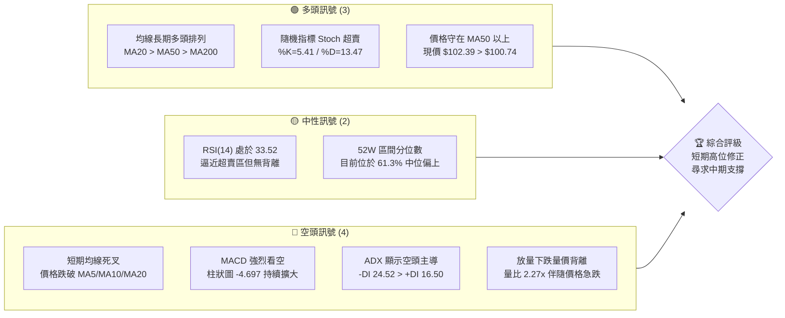
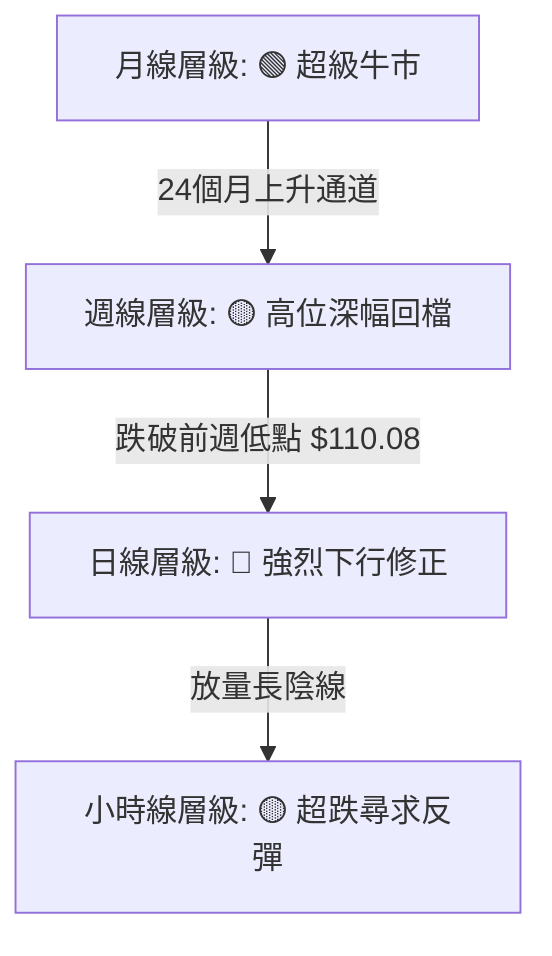
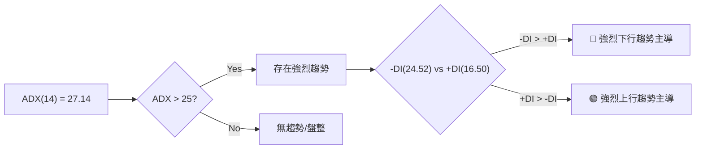
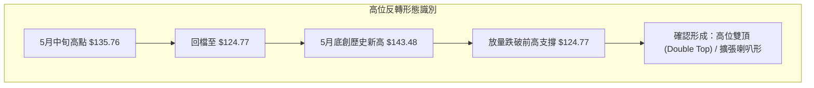

<details>
<summary>📊 靜態圖表 (點擊展開)</summary>

</details>

<html>
<head><meta charset="utf-8" /></head>
<body>
    <div style="height:500px; width:100%;">                        <script>window.PlotlyConfig = {MathJaxConfig: 'local'};</script>
        <script charset="utf-8" src="https://cdn.plot.ly/plotly-3.6.0.min.js" integrity="sha256-QaOVwtVY0T02VaHrr6pnoHLCwayMJp4O5n4YyaE3rJk=" crossorigin="anonymous"></script>                <div id="candlestick-chart" class="plotly-graph-div" style="height:100%; width:100%;"></div>            <script>                window.PLOTLYENV=window.PLOTLYENV || {};                                if (document.getElementById("candlestick-chart")) {                    Plotly.newPlot(                        "candlestick-chart",                        [{"close":{"dtype":"f8","bdata":"AAAAAAAgR0AAAADgevRHQAAAAMDMTEhAAAAAIK6nSEAAAAAA18NFQAAAAGC4fkVAAAAAIIXrRkAAAACgcN1HQAAAAADXg0dAAAAAgMIVR0AAAABACjdIQAAAACCFq0pAAAAAwB4FS0AAAAAgXJ9HQAAAAIA9CkhAAAAAQAqXR0AAAADAHuVHQAAAACCu50hAAAAA4Hp0SkAAAADgUVhIQAAAAOCjUEdAAAAAoEchR0AAAACgR4FHQAAAAOB69EdAAAAAACn8R0AAAAAAKTxKQAAAAOB6FExAAAAAAABATUAAAACgR8FOQAAAAADXU1BAAAAAQOGaUEAAAADgoxBQQAAAAEDhWlBAAAAAgOsBUUAAAACgR1FRQAAAAAAAwFBAAAAAoEeRUEAAAABgZtZQQAAAAKCZWVBAAAAA4FFITkAAAADA9chPQAAAAADXI1BAAAAAIK5nUEAAAAAAAOBPQAAAAIA9ilBAAAAAgMJ1TkAAAACgcH1PQAAAACCFq05AAAAAwPVITEAAAACAwjVMQAAAAIAUzkhAAAAAgOvRSUAAAABAM\u002fNJQAAAAGC4nklAAAAAACn8SEAAAAAAAKBGQAAAAMAexUZAAAAAIK6nRUAAAAAA12NFQAAAACBcz0VAAAAAoHC9Q0AAAABgZiZEQAAAAKCZOUVAAAAAwMxMRUAAAABACvdEQAAAAIDrEUVAAAAAIFwvREAAAABAM\u002fNEQAAAAAApXEZAAAAAIFyvSEAAAABACodIQAAAACCux0lAAAAAQAq3SkAAAABgj8JMQAAAAADXw09AAAAAYLi+TkAAAADgerRLQAAAAGC4vktAAAAAQOH6SkAAAACAwvVNQAAAAKBHoVFAAAAAQDNjU0AAAAAghUtTQAAAACCFS1NAAAAAoJmpUUAAAAAgrodRQAAAAMDMnFFAAAAA4KNwUUAAAAAgXP9SQAAAAMD1iFNAAAAAgOuBVUAAAADAHgVVQAAAAMAexVRAAAAAYGY2VUAAAACgmflVQAAAAMAepVVAAAAAQDPzVkAAAADgo7BWQAAAAEAzE1hAAAAAgD1KVkAAAADgevRVQAAAAGC4\u002flVAAAAAoJk5VkAAAABguB5UQAAAAAAAwFVAAAAA4HokVkAAAAAghWtVQAAAAOB6BFRAAAAAoJmJUkAAAACgR1FUQAAAAEAKR1JAAAAA4HqUUEAAAADgehRSQAAAAIDC9VJAAAAAgOsBUkAAAAAgrmdRQAAAAOCjgFBAAAAAACncUEAAAADA9XhRQAAAAEDhmlJAAAAAwB4lU0AAAABACrdRQAAAAKBwjVFAAAAAgBR+UUAAAADAzIxRQAAAAKCZKVJAAAAAYGZGUUAAAACAFL5RQAAAAOBRiFFAAAAAgD36UUAAAAAAAIBRQAAAAEAKh1FAAAAAYLjeUUAAAAAghTtRQAAAAKBw\u002fVFAAAAAIK4XUUAAAACAPRpRQAAAAADX01FAAAAAgMKlU0AAAABguF5RQAAAACCF+1FAAAAAYLjOUEAAAAAAAABRQAAAAOB6hFBAAAAA4FE4UkAAAAAAKXxQQAAAAEAKd05AAAAA4KOwTEAAAACAFA5QQAAAAKBHYVBAAAAAYLjuUEAAAABA4epQQAAAAOB6lFBAAAAAwB5FUUAAAAAgXK9QQAAAAEAzA1FAAAAAIK6nUUAAAACAFA5SQAAAAGBmZlJAAAAAIIW7VEAAAABAMzNVQAAAAKBwXVZAAAAAwPWoVUAAAABgj4JWQAAAAGBmJlVAAAAAIIXrU0AAAABgj5JUQAAAAIDCpVNAAAAAoEdBU0AAAADgo6BUQAAAAADXs1NAAAAAANcTVEAAAADgo7BTQAAAAKCZKVVAAAAAwB6lU0AAAACAFF5aQAAAAGBmVl1AAAAAANdjXUAAAACgmQlfQAAAAKCZkWBAAAAAoEcxX0AAAADAHmVgQAAAAADX019AAAAAwPXIYEAAAADAzFxfQAAAAOBR+GBAAAAAYGbmYUAAAAAgXMdiQAAAAMD1gGJAAAAAIFzvYUAAAADA9ZheQAAAAOB61F5AAAAAwMysXEAAAADAzPxdQAAAAMAehVtAAAAAoJlpXEAAAABguA5bQAAAAEAzQ1pAAAAAgOuxXEAAAADA9ZhZQA=="},"high":{"dtype":"f8","bdata":"AAAAYLheSEAAAADAzPxHQAAAAGBmZkhAAAAAwB7FSEAAAABAM3NJQAAAAIA9SkZAAAAAYLj+RkAAAACgmRlIQAAAAADXw0dAAAAAgBQOSEAAAADAHtVIQAAAAADXA0tAAAAAgMKVS0AAAACAPQpKQAAAAMAeRUhAAAAA4FGYSEAAAABACndIQAAAAKBHIUlAAAAAYDkUS0AAAACgcD1KQAAAACBcT0hAAAAA4FHYR0AAAADAzAxIQAAAAGC4\u002fkdAAAAAgMK1SEAAAABAM1NKQAAAACAxeExAAAAAoEehTUAAAAAgrkdPQAAAAAAtIlFAAAAAYI8iUUAAAAAAAGBSQAAAAAApnFFAAAAAQOFqUUAAAACAFH5SQAAAAAAAEFJAAAAAAAAgUUAAAAAghQtSQAAAAGCPAlFAAAAAoEcBUEAAAADAzCxQQAAAACCFi1BAAAAAYGaWUEAAAABgj6JQQAAAAMD12FBAAAAAIIVLUEAAAACgmblPQAAAAMDMjE9AAAAAYLi+TUAAAAAA16NMQAAAAEDhGkxAAAAAwMwMSkAAAAAAAEBLQAAAAEDhekxAAAAAgD2qS0AAAADgo7BIQAAAAAApnEdAAAAAwEvXRkAAAACAFM5FQAAAAADXQ0ZAAAAAoEchR0AAAACAwoVEQAAAAADXQ0VAAAAAQApnRUAAAAAghctFQAAAAKCZWUVAAAAAYGamREAAAABguH5FQAAAAGC4XkZAAAAAQArXSEAAAACgmdlIQAAAACBcL0pAAAAAAADgSkAAAACAPWpNQAAAAKCZCVBAAAAAIIVLUEAAAAAA1yNQQAAAAKBwXUxAAAAA4Hp0TEAAAAAAACBOQAAAAADXo1FAAAAAwMycU0AAAAAghctTQAAAAMAe9VNAAAAAIFw\u002fU0AAAAAgXC9SQAAAAAAprFJAAAAAQItMUkAAAAAgXA9TQAAAAAAAkFNAAAAAAACQVUAAAACgcH1VQAAAACCud1ZAAAAAIIUbVkAAAACAwjVWQAAAAOCnblZAAAAAACkMV0AAAABAYB1XQAAAAMAe5VhAAAAAoEeRWEAAAAAAANBWQAAAAKCZWVZAAAAAwMycV0AAAACAPcpVQAAAAAAAwFVAAAAAQDNzVkAAAAAAAEBWQAAAAOB6VFZAAAAAwMwsVEAAAADgelRUQAAAAGBmVlRAAAAAIFw\u002fUkAAAACAPSpSQAAAAEAzM1NAAAAAQAr3UkAAAACgmVlSQAAAAMDMHFFAAAAAYGZmUUAAAAAgXL9RQAAAAMD18FJAAAAAQApHU0AAAADAzIxTQAAAAAAA0FFAAAAAIIWDUUAAAABgZvZRQAAAACBcL1JAAAAAgMJlUUAAAABgZgZSQAAAAAAAUFJAAAAAYGaGUkAAAAAA1xNSQAAAAEAKx1JAAAAAAAAIUkAAAAAA1ztSQAAAAEAzU1JAAAAAYGYmUkAAAAAA19NRQAAAAOBRGFJAAAAAQOGqU0AAAADgUThTQAAAAGC4LlJAAAAAYLh+UkAAAADAzFxRQAAAAGBmJlFAAAAAANfDUkAAAACAwgVSQAAAAIAUhlBAAAAAgOvRTkAAAADAHiVQQAAAAEDhKlFAAAAAwPVYUUAAAADgepRRQAAAAEAzE1FAAAAAgMBqUkAAAABgj3JRQAAAAADXg1FAAAAAQDPjUUAAAAAAALBSQAAAAIDCpVJAAAAAIFzfVEAAAAAgXL9VQAAAAGBmllZAAAAAwMz8VkAAAABgZkZXQAAAAEAzk1ZAAAAAgD2aVUAAAABguJ5UQAAAAIDrcVRAAAAA4KOAU0AAAACAwuVUQAAAAGCP8lRAAAAA4E91VEAAAAAAAMBUQAAAACCFK1VAAAAAYI8yVUAAAAAgrmdaQAAAAAAp\u002fF5AAAAAIFxfXkAAAAAgXM9fQAAAAIDCpWBAAAAAANdLYEAAAAAAKUxhQAAAAIA9MmBAAAAAQDPrYEAAAAAA11tgQAAAAOBReGFAAAAAAABAYkAAAAAAAOBiQAAAAGCP2mJAAAAAAAAAYkAAAAAAKfRgQAAAAMDMDGBAAAAA4FGgXkAAAADgUaheQAAAAGC4fl1AAAAAAAAQXUAAAABgj\u002fJdQAAAAKBw\u002fVtAAAAAQOHCXEAAAADAIJhdQA=="},"hovertemplate":"\u003cb\u003e%{x|%Y-%m-%d}\u003c\u002fb\u003e\u003cbr\u003e\u958b: $%{open:.2f}\u003cbr\u003e\u9ad8: $%{high:.2f}\u003cbr\u003e\u4f4e: $%{low:.2f}\u003cbr\u003e\u6536: $%{close:.2f}\u003cextra\u003e\u003c\u002fextra\u003e","low":{"dtype":"f8","bdata":"AAAAwPXoRkAAAAAghatGQAAAAGCPAkdAAAAAQArXRkAAAABAicFFQAAAAKCZWUVAAAAAgOsxRUAAAADAdr5GQAAAAECJwUZAAAAAwMzMRkAAAABACgdHQAAAAEA1TkhAAAAAAClcSkAAAACgR4FHQAAAAKCZOUdAAAAAAACAR0AAAADgo5BHQAAAAGBmZkdAAAAA4Hr0R0AAAABACjdIQAAAAEDhmkZAAAAAgD3qRkAAAAAgXC9HQAAAAKBHQUdAAAAAIFyPR0AAAACgR0FIQAAAAKBHoUlAAAAAYGbmS0AAAABgj4JMQAAAAEAz009AAAAAQOEaUEAAAADA9QhQQAAAAODOJ1BAAAAA4FEYT0AAAADAHsVQQAAAAEAzm1BAAAAAoJnZT0AAAABAM6tQQAAAAEAKN1BAAAAA4Ho0TUAAAAAAAGBOQAAAAEAz009AAAAAoJkJUEAAAACAFM5PQAAAAKBwvU9AAAAAgOtxTkAAAABAMzNOQAAAAOCjkE1AAAAAoEdBTEAAAAAgXG9LQAAAAOB6tEhAAAAA4M4nR0AAAACgR2FJQAAAAEDhmklAAAAA4HrUSEAAAAAgXC9GQAAAAGBmpkVAAAAAwMwcRUAAAACgcJ1EQAAAAEAKN0VAAAAAwPWoQ0AAAADA9chCQAAAAGBmpkNAAAAA4KMwREAAAADgo7BEQAAAAGBm5kRAAAAAoHD9Q0AAAACAwjVEQAAAAAAAwERAAAAAwPVoRkAAAACgmdlHQAAAAAApnEhAAAAAIIUrSUAAAAAAACBKQAAAAMDMbExAAAAAYGbmTUAAAACAPYpLQAAAAEAKV0pAAAAAQOGKSkAAAAAA1wNMQAAAAMCdX05AAAAAwCAwUkAAAABgj1JSQAAAAKBDs1JAAAAAwPWYUUAAAACgm1RRQAAAAAApnFFAAAAA4FFIUUAAAABgZrZQQAAAAADX01FAAAAAQDODUkAAAABgZnZUQAAAAOCjkFRAAAAAwMycVEAAAADg0NpUQAAAAKCZaVVAAAAAAAAgVUAAAACgmalVQAAAAKCZGVdAAAAAQDMTVkAAAACgcK1UQAAAAMB2VlRAAAAAIK6HVUAAAADgowBUQAAAAAAAgFRAAAAAwMqBVUAAAAAAAMBUQAAAAKBHgVNAAAAAgEF4UkAAAACgR\u002fFSQAAAAEAIJFFAAAAAwMxMUEAAAAAAAMBQQAAAAAAAsFFAAAAAQDPjUUAAAACgR8FQQAAAACBc709AAAAAAABgUEAAAAAAAEBQQAAAAMBLf1FAAAAAYGYWUkAAAACgmVlRQAAAAAAAIFFAAAAAYGamUEAAAADgUThRQAAAAADXM1FAAAAAYGYGUEAAAADAzJxQQAAAAAApjFBAAAAAgBReUUAAAACAwtVQQAAAAOCjCFFAAAAA4Hr0UEAAAACAvidRQAAAAMAeFVFAAAAAgOsRUUAAAAAAKdxQQAAAAEDhKlFAAAAAoEfRUUAAAACgmVlRQAAAAAAAAFFAAAAAwPWYUEAAAABAM4NQQAAAAKBwHVBAAAAAACk8UUAAAACAwmVQQAAAAMDMLE5AAAAAYOUQTEAAAAAA14NNQAAAAEAzU1BAAAAAgBTuTkAAAABgZqZQQAAAAEDh+k9AAAAAYOfzUEAAAABA4aJQQAAAAIDClVBAAAAAgMKlUEAAAABguJ5RQAAAAGBmZlFAAAAAoJk5U0AAAABgZuZUQAAAAGBmJlVAAAAAAABwVUAAAADgo\u002fBVQAAAAAApZFRAAAAAwB7FU0AAAADAdENTQAAAAGBmZlNAAAAAIFx\u002fUkAAAACAFF5TQAAAACCFm1NAAAAAAAAQU0AAAAAA1yNTQAAAAEAKt1NAAAAAIIV7U0AAAAAgrndVQAAAAAAAAFpAAAAAgD0aXEAAAADA9ThdQAAAAADXU15AAAAAQDNzXkAAAACg8WpfQAAAAGC4zlxAAAAAgBQOX0AAAABAM\u002fNeQAAAAIDraWBAAAAAgOtRYUAAAADAHj1hQAAAAADXy2FAAAAAoJnBYEAAAAAAAEBeQAAAAADXo15AAAAAgD1qXEAAAADA9ZhbQAAAAGC4rlpAAAAAAADAW0AAAADAzExZQAAAAIA9GlpAAAAAoJlZWkAAAABACudYQA=="},"name":"\u50f9\u683c","open":{"dtype":"f8","bdata":"AAAAQApXSEAAAADgo3BHQAAAAMDM7EdAAAAAAABgR0AAAABgjyJJQAAAAOB6FEZAAAAA4FHIRUAAAAAAAMBGQAAAAKBHgUdAAAAAANfDR0AAAADA9ShHQAAAAKBwfUhAAAAAgD3KSkAAAAAAAABKQAAAAOBRyEdAAAAAgMJ1SEAAAABACtdHQAAAAOCjkEdAAAAAQDODSEAAAACAwuVJQAAAAAAAAEhAAAAAYGamR0AAAABAM7NHQAAAAEDhmkdAAAAA4KOwR0AAAACA61FIQAAAAGBmBkpAAAAAYLhuTEAAAACgR4FNQAAAAKCZCVBAAAAAoJk5UEAAAABAM7NRQAAAAOBR+FBAAAAAgMJVUEAAAACgR4FRQAAAAOB6hFFAAAAAwPV4UEAAAADgo0hRQAAAAGCPAlFAAAAAACl8T0AAAAAgrsdOQAAAAADXM1BAAAAAACmMUEAAAABAM2tQQAAAAKBHCVBAAAAAAABAUEAAAABgj+JOQAAAAADXg09AAAAAYGbmTEAAAADgelRMQAAAAEDhGkxAAAAAoBjUR0AAAABguN5KQAAAAAAAAExAAAAAQAr3SUAAAACgR2FIQAAAAEDh2kVAAAAAQDOTRkAAAAAAKRxFQAAAAAAAQEVAAAAAgD0KR0AAAACAPepDQAAAAKBHYURAAAAAANcDRUAAAABguJ5FQAAAAKBHQUVAAAAAQDOTREAAAAAgrkdEQAAAAGCP8kRAAAAAYI\u002fSRkAAAAAAAHBIQAAAAIA9CklAAAAAoHCdSUAAAADgUbhKQAAAAKBHwUxAAAAAAABAT0AAAADgp4ZPQAAAAOBRGEtAAAAAwMwMTEAAAACgmRlMQAAAACBcj05AAAAAACk8UkAAAAAA13NSQAAAAIA9glNAAAAAIIUrU0AAAAAAAGBRQAAAAKCZQVJAAAAAAADgUUAAAADgUahRQAAAACCup1JAAAAA4KNwU0AAAABgZgZVQAAAAAAAYFVAAAAAoJkhVUAAAABguD5VQAAAAMD1SFZAAAAAYGaWVUAAAADA9VBWQAAAAKCZIVdAAAAAwMxsV0AAAACgR4FWQAAAAOBRmFVAAAAAIIVDVkAAAAAgrq9VQAAAAMD1uFRAAAAAgBTOVUAAAAAAKfxVQAAAAAAAQFVAAAAAgD3KU0AAAABgZqZTQAAAAGBmVlRAAAAAYLh+UUAAAAAAAEBRQAAAAKCZAVJAAAAAgBSmUkAAAADgUUhSQAAAAIDr4VBAAAAA4HqsUEAAAABAYIVQQAAAAAAAwFFAAAAAoJk5UkAAAAAg2d5SQAAAAOBRMFFAAAAA4FE4UUAAAACAFMZRQAAAAEDhglFAAAAAgMLlUEAAAAAghatQQAAAAGC4NlFAAAAAANezUUAAAABA4bpRQAAAAOCjCFFAAAAAwPVYUUAAAACAwpVRQAAAAEAzM1FAAAAAwMz8UUAAAACgmUlRQAAAAMDMVFFAAAAAYGbeUUAAAABgjwJTQAAAAOB6NFFAAAAAAAAAUkAAAACgcAVRQAAAAAAAwFBAAAAAACk8UUAAAADAzMxRQAAAAOCjgFBAAAAAoJm5TkAAAABA4dpOQAAAAAAAYFBAAAAAwMwcT0AAAABguO5QQAAAACBcx1BAAAAAAAAAUkAAAAAA10NRQAAAAMDM7FBAAAAAQDPDUEAAAAAghWNSQAAAAKBwZVJAAAAAgBQ+U0AAAADAHgVVQAAAAGBmNlVAAAAAwB6VVkAAAACAwp1WQAAAAGBmdlZAAAAAgMKVVUAAAAAAKexTQAAAAMDMBFRAAAAAQAp3U0AAAABAM2NTQAAAAIDr4VRAAAAAQAqXU0AAAABgZqZUQAAAACCu51NAAAAAoHAtVUAAAACAPYJVQAAAAKBHUVpAAAAA4KMwXEAAAACgR\u002fleQAAAAGBmxl5AAAAAQDMDYEAAAAAAKZhgQAAAAIAUfl9AAAAAYLjeX0AAAADA9YhfQAAAAMAebWBAAAAAQOG+YUAAAABACrdiQAAAAKBwZWJAAAAAgBR+YUAAAAAAKYxgQAAAAIDCVV9AAAAAwB7lXUAAAACgcEVcQAAAAKBHkVxAAAAAQOGqXEAAAACgmZldQAAAAMDM7FpAAAAAgMKlWkAAAAAAAIBdQA=="},"x":["2025-08-27T00:00:00-04:00","2025-08-28T00:00:00-04:00","2025-08-29T00:00:00-04:00","2025-09-02T00:00:00-04:00","2025-09-03T00:00:00-04:00","2025-09-04T00:00:00-04:00","2025-09-05T00:00:00-04:00","2025-09-08T00:00:00-04:00","2025-09-09T00:00:00-04:00","2025-09-10T00:00:00-04:00","2025-09-11T00:00:00-04:00","2025-09-12T00:00:00-04:00","2025-09-15T00:00:00-04:00","2025-09-16T00:00:00-04:00","2025-09-17T00:00:00-04:00","2025-09-18T00:00:00-04:00","2025-09-19T00:00:00-04:00","2025-09-22T00:00:00-04:00","2025-09-23T00:00:00-04:00","2025-09-24T00:00:00-04:00","2025-09-25T00:00:00-04:00","2025-09-26T00:00:00-04:00","2025-09-29T00:00:00-04:00","2025-09-30T00:00:00-04:00","2025-10-01T00:00:00-04:00","2025-10-02T00:00:00-04:00","2025-10-03T00:00:00-04:00","2025-10-06T00:00:00-04:00","2025-10-07T00:00:00-04:00","2025-10-08T00:00:00-04:00","2025-10-09T00:00:00-04:00","2025-10-10T00:00:00-04:00","2025-10-13T00:00:00-04:00","2025-10-14T00:00:00-04:00","2025-10-15T00:00:00-04:00","2025-10-16T00:00:00-04:00","2025-10-17T00:00:00-04:00","2025-10-20T00:00:00-04:00","2025-10-21T00:00:00-04:00","2025-10-22T00:00:00-04:00","2025-10-23T00:00:00-04:00","2025-10-24T00:00:00-04:00","2025-10-27T00:00:00-04:00","2025-10-28T00:00:00-04:00","2025-10-29T00:00:00-04:00","2025-10-30T00:00:00-04:00","2025-10-31T00:00:00-04:00","2025-11-03T00:00:00-05:00","2025-11-04T00:00:00-05:00","2025-11-05T00:00:00-05:00","2025-11-06T00:00:00-05:00","2025-11-07T00:00:00-05:00","2025-11-10T00:00:00-05:00","2025-11-11T00:00:00-05:00","2025-11-12T00:00:00-05:00","2025-11-13T00:00:00-05:00","2025-11-14T00:00:00-05:00","2025-11-17T00:00:00-05:00","2025-11-18T00:00:00-05:00","2025-11-19T00:00:00-05:00","2025-11-20T00:00:00-05:00","2025-11-21T00:00:00-05:00","2025-11-24T00:00:00-05:00","2025-11-25T00:00:00-05:00","2025-11-26T00:00:00-05:00","2025-11-28T00:00:00-05:00","2025-12-01T00:00:00-05:00","2025-12-02T00:00:00-05:00","2025-12-03T00:00:00-05:00","2025-12-04T00:00:00-05:00","2025-12-05T00:00:00-05:00","2025-12-08T00:00:00-05:00","2025-12-09T00:00:00-05:00","2025-12-10T00:00:00-05:00","2025-12-11T00:00:00-05:00","2025-12-12T00:00:00-05:00","2025-12-15T00:00:00-05:00","2025-12-16T00:00:00-05:00","2025-12-17T00:00:00-05:00","2025-12-18T00:00:00-05:00","2025-12-19T00:00:00-05:00","2025-12-22T00:00:00-05:00","2025-12-23T00:00:00-05:00","2025-12-24T00:00:00-05:00","2025-12-26T00:00:00-05:00","2025-12-29T00:00:00-05:00","2025-12-30T00:00:00-05:00","2025-12-31T00:00:00-05:00","2026-01-02T00:00:00-05:00","2026-01-05T00:00:00-05:00","2026-01-06T00:00:00-05:00","2026-01-07T00:00:00-05:00","2026-01-08T00:00:00-05:00","2026-01-09T00:00:00-05:00","2026-01-12T00:00:00-05:00","2026-01-13T00:00:00-05:00","2026-01-14T00:00:00-05:00","2026-01-15T00:00:00-05:00","2026-01-16T00:00:00-05:00","2026-01-20T00:00:00-05:00","2026-01-21T00:00:00-05:00","2026-01-22T00:00:00-05:00","2026-01-23T00:00:00-05:00","2026-01-26T00:00:00-05:00","2026-01-27T00:00:00-05:00","2026-01-28T00:00:00-05:00","2026-01-29T00:00:00-05:00","2026-01-30T00:00:00-05:00","2026-02-02T00:00:00-05:00","2026-02-03T00:00:00-05:00","2026-02-04T00:00:00-05:00","2026-02-05T00:00:00-05:00","2026-02-06T00:00:00-05:00","2026-02-09T00:00:00-05:00","2026-02-10T00:00:00-05:00","2026-02-11T00:00:00-05:00","2026-02-12T00:00:00-05:00","2026-02-13T00:00:00-05:00","2026-02-17T00:00:00-05:00","2026-02-18T00:00:00-05:00","2026-02-19T00:00:00-05:00","2026-02-20T00:00:00-05:00","2026-02-23T00:00:00-05:00","2026-02-24T00:00:00-05:00","2026-02-25T00:00:00-05:00","2026-02-26T00:00:00-05:00","2026-02-27T00:00:00-05:00","2026-03-02T00:00:00-05:00","2026-03-03T00:00:00-05:00","2026-03-04T00:00:00-05:00","2026-03-05T00:00:00-05:00","2026-03-06T00:00:00-05:00","2026-03-09T00:00:00-04:00","2026-03-10T00:00:00-04:00","2026-03-11T00:00:00-04:00","2026-03-12T00:00:00-04:00","2026-03-13T00:00:00-04:00","2026-03-16T00:00:00-04:00","2026-03-17T00:00:00-04:00","2026-03-18T00:00:00-04:00","2026-03-19T00:00:00-04:00","2026-03-20T00:00:00-04:00","2026-03-23T00:00:00-04:00","2026-03-24T00:00:00-04:00","2026-03-25T00:00:00-04:00","2026-03-26T00:00:00-04:00","2026-03-27T00:00:00-04:00","2026-03-30T00:00:00-04:00","2026-03-31T00:00:00-04:00","2026-04-01T00:00:00-04:00","2026-04-02T00:00:00-04:00","2026-04-06T00:00:00-04:00","2026-04-07T00:00:00-04:00","2026-04-08T00:00:00-04:00","2026-04-09T00:00:00-04:00","2026-04-10T00:00:00-04:00","2026-04-13T00:00:00-04:00","2026-04-14T00:00:00-04:00","2026-04-15T00:00:00-04:00","2026-04-16T00:00:00-04:00","2026-04-17T00:00:00-04:00","2026-04-20T00:00:00-04:00","2026-04-21T00:00:00-04:00","2026-04-22T00:00:00-04:00","2026-04-23T00:00:00-04:00","2026-04-24T00:00:00-04:00","2026-04-27T00:00:00-04:00","2026-04-28T00:00:00-04:00","2026-04-29T00:00:00-04:00","2026-04-30T00:00:00-04:00","2026-05-01T00:00:00-04:00","2026-05-04T00:00:00-04:00","2026-05-05T00:00:00-04:00","2026-05-06T00:00:00-04:00","2026-05-07T00:00:00-04:00","2026-05-08T00:00:00-04:00","2026-05-11T00:00:00-04:00","2026-05-12T00:00:00-04:00","2026-05-13T00:00:00-04:00","2026-05-14T00:00:00-04:00","2026-05-15T00:00:00-04:00","2026-05-18T00:00:00-04:00","2026-05-19T00:00:00-04:00","2026-05-20T00:00:00-04:00","2026-05-21T00:00:00-04:00","2026-05-22T00:00:00-04:00","2026-05-26T00:00:00-04:00","2026-05-27T00:00:00-04:00","2026-05-28T00:00:00-04:00","2026-05-29T00:00:00-04:00","2026-06-01T00:00:00-04:00","2026-06-02T00:00:00-04:00","2026-06-03T00:00:00-04:00","2026-06-04T00:00:00-04:00","2026-06-05T00:00:00-04:00","2026-06-08T00:00:00-04:00","2026-06-09T00:00:00-04:00","2026-06-10T00:00:00-04:00","2026-06-11T00:00:00-04:00","2026-06-12T00:00:00-04:00"],"type":"candlestick"},{"hovertemplate":"MA30: $%{y:.2f}\u003cextra\u003e\u003c\u002fextra\u003e","line":{"color":"#2196F3","dash":"dash","width":2},"mode":"lines","name":"MA30","x":["2025-08-27T00:00:00-04:00","2025-08-28T00:00:00-04:00","2025-08-29T00:00:00-04:00","2025-09-02T00:00:00-04:00","2025-09-03T00:00:00-04:00","2025-09-04T00:00:00-04:00","2025-09-05T00:00:00-04:00","2025-09-08T00:00:00-04:00","2025-09-09T00:00:00-04:00","2025-09-10T00:00:00-04:00","2025-09-11T00:00:00-04:00","2025-09-12T00:00:00-04:00","2025-09-15T00:00:00-04:00","2025-09-16T00:00:00-04:00","2025-09-17T00:00:00-04:00","2025-09-18T00:00:00-04:00","2025-09-19T00:00:00-04:00","2025-09-22T00:00:00-04:00","2025-09-23T00:00:00-04:00","2025-09-24T00:00:00-04:00","2025-09-25T00:00:00-04:00","2025-09-26T00:00:00-04:00","2025-09-29T00:00:00-04:00","2025-09-30T00:00:00-04:00","2025-10-01T00:00:00-04:00","2025-10-02T00:00:00-04:00","2025-10-03T00:00:00-04:00","2025-10-06T00:00:00-04:00","2025-10-07T00:00:00-04:00","2025-10-08T00:00:00-04:00","2025-10-09T00:00:00-04:00","2025-10-10T00:00:00-04:00","2025-10-13T00:00:00-04:00","2025-10-14T00:00:00-04:00","2025-10-15T00:00:00-04:00","2025-10-16T00:00:00-04:00","2025-10-17T00:00:00-04:00","2025-10-20T00:00:00-04:00","2025-10-21T00:00:00-04:00","2025-10-22T00:00:00-04:00","2025-10-23T00:00:00-04:00","2025-10-24T00:00:00-04:00","2025-10-27T00:00:00-04:00","2025-10-28T00:00:00-04:00","2025-10-29T00:00:00-04:00","2025-10-30T00:00:00-04:00","2025-10-31T00:00:00-04:00","2025-11-03T00:00:00-05:00","2025-11-04T00:00:00-05:00","2025-11-05T00:00:00-05:00","2025-11-06T00:00:00-05:00","2025-11-07T00:00:00-05:00","2025-11-10T00:00:00-05:00","2025-11-11T00:00:00-05:00","2025-11-12T00:00:00-05:00","2025-11-13T00:00:00-05:00","2025-11-14T00:00:00-05:00","2025-11-17T00:00:00-05:00","2025-11-18T00:00:00-05:00","2025-11-19T00:00:00-05:00","2025-11-20T00:00:00-05:00","2025-11-21T00:00:00-05:00","2025-11-24T00:00:00-05:00","2025-11-25T00:00:00-05:00","2025-11-26T00:00:00-05:00","2025-11-28T00:00:00-05:00","2025-12-01T00:00:00-05:00","2025-12-02T00:00:00-05:00","2025-12-03T00:00:00-05:00","2025-12-04T00:00:00-05:00","2025-12-05T00:00:00-05:00","2025-12-08T00:00:00-05:00","2025-12-09T00:00:00-05:00","2025-12-10T00:00:00-05:00","2025-12-11T00:00:00-05:00","2025-12-12T00:00:00-05:00","2025-12-15T00:00:00-05:00","2025-12-16T00:00:00-05:00","2025-12-17T00:00:00-05:00","2025-12-18T00:00:00-05:00","2025-12-19T00:00:00-05:00","2025-12-22T00:00:00-05:00","2025-12-23T00:00:00-05:00","2025-12-24T00:00:00-05:00","2025-12-26T00:00:00-05:00","2025-12-29T00:00:00-05:00","2025-12-30T00:00:00-05:00","2025-12-31T00:00:00-05:00","2026-01-02T00:00:00-05:00","2026-01-05T00:00:00-05:00","2026-01-06T00:00:00-05:00","2026-01-07T00:00:00-05:00","2026-01-08T00:00:00-05:00","2026-01-09T00:00:00-05:00","2026-01-12T00:00:00-05:00","2026-01-13T00:00:00-05:00","2026-01-14T00:00:00-05:00","2026-01-15T00:00:00-05:00","2026-01-16T00:00:00-05:00","2026-01-20T00:00:00-05:00","2026-01-21T00:00:00-05:00","2026-01-22T00:00:00-05:00","2026-01-23T00:00:00-05:00","2026-01-26T00:00:00-05:00","2026-01-27T00:00:00-05:00","2026-01-28T00:00:00-05:00","2026-01-29T00:00:00-05:00","2026-01-30T00:00:00-05:00","2026-02-02T00:00:00-05:00","2026-02-03T00:00:00-05:00","2026-02-04T00:00:00-05:00","2026-02-05T00:00:00-05:00","2026-02-06T00:00:00-05:00","2026-02-09T00:00:00-05:00","2026-02-10T00:00:00-05:00","2026-02-11T00:00:00-05:00","2026-02-12T00:00:00-05:00","2026-02-13T00:00:00-05:00","2026-02-17T00:00:00-05:00","2026-02-18T00:00:00-05:00","2026-02-19T00:00:00-05:00","2026-02-20T00:00:00-05:00","2026-02-23T00:00:00-05:00","2026-02-24T00:00:00-05:00","2026-02-25T00:00:00-05:00","2026-02-26T00:00:00-05:00","2026-02-27T00:00:00-05:00","2026-03-02T00:00:00-05:00","2026-03-03T00:00:00-05:00","2026-03-04T00:00:00-05:00","2026-03-05T00:00:00-05:00","2026-03-06T00:00:00-05:00","2026-03-09T00:00:00-04:00","2026-03-10T00:00:00-04:00","2026-03-11T00:00:00-04:00","2026-03-12T00:00:00-04:00","2026-03-13T00:00:00-04:00","2026-03-16T00:00:00-04:00","2026-03-17T00:00:00-04:00","2026-03-18T00:00:00-04:00","2026-03-19T00:00:00-04:00","2026-03-20T00:00:00-04:00","2026-03-23T00:00:00-04:00","2026-03-24T00:00:00-04:00","2026-03-25T00:00:00-04:00","2026-03-26T00:00:00-04:00","2026-03-27T00:00:00-04:00","2026-03-30T00:00:00-04:00","2026-03-31T00:00:00-04:00","2026-04-01T00:00:00-04:00","2026-04-02T00:00:00-04:00","2026-04-06T00:00:00-04:00","2026-04-07T00:00:00-04:00","2026-04-08T00:00:00-04:00","2026-04-09T00:00:00-04:00","2026-04-10T00:00:00-04:00","2026-04-13T00:00:00-04:00","2026-04-14T00:00:00-04:00","2026-04-15T00:00:00-04:00","2026-04-16T00:00:00-04:00","2026-04-17T00:00:00-04:00","2026-04-20T00:00:00-04:00","2026-04-21T00:00:00-04:00","2026-04-22T00:00:00-04:00","2026-04-23T00:00:00-04:00","2026-04-24T00:00:00-04:00","2026-04-27T00:00:00-04:00","2026-04-28T00:00:00-04:00","2026-04-29T00:00:00-04:00","2026-04-30T00:00:00-04:00","2026-05-01T00:00:00-04:00","2026-05-04T00:00:00-04:00","2026-05-05T00:00:00-04:00","2026-05-06T00:00:00-04:00","2026-05-07T00:00:00-04:00","2026-05-08T00:00:00-04:00","2026-05-11T00:00:00-04:00","2026-05-12T00:00:00-04:00","2026-05-13T00:00:00-04:00","2026-05-14T00:00:00-04:00","2026-05-15T00:00:00-04:00","2026-05-18T00:00:00-04:00","2026-05-19T00:00:00-04:00","2026-05-20T00:00:00-04:00","2026-05-21T00:00:00-04:00","2026-05-22T00:00:00-04:00","2026-05-26T00:00:00-04:00","2026-05-27T00:00:00-04:00","2026-05-28T00:00:00-04:00","2026-05-29T00:00:00-04:00","2026-06-01T00:00:00-04:00","2026-06-02T00:00:00-04:00","2026-06-03T00:00:00-04:00","2026-06-04T00:00:00-04:00","2026-06-05T00:00:00-04:00","2026-06-08T00:00:00-04:00","2026-06-09T00:00:00-04:00","2026-06-10T00:00:00-04:00","2026-06-11T00:00:00-04:00","2026-06-12T00:00:00-04:00"],"y":{"dtype":"f8","bdata":"AAAAAAAA+H8AAAAAAAD4fwAAAAAAAPh\u002fAAAAAAAA+H8AAAAAAAD4fwAAAAAAAPh\u002fAAAAAAAA+H8AAAAAAAD4fwAAAAAAAPh\u002fAAAAAAAA+H8AAAAAAAD4fwAAAAAAAPh\u002fAAAAAAAA+H8AAAAAAAD4fwAAAAAAAPh\u002fAAAAAAAA+H8AAAAAAAD4fwAAAAAAAPh\u002fAAAAAAAA+H8AAAAAAAD4fwAAAAAAAPh\u002fAAAAAAAA+H8AAAAAAAD4fwAAAAAAAPh\u002fAAAAAAAA+H8AAAAAAAD4fwAAAAAAAPh\u002fAAAAAAAA+H8AAAAAAAD4f+\u002fu7q5y4EhAMzMzs4E2SUAzMzNDRHxJQAAAADAIxElAq6qqaucTSkC8u7tbuoFKQN7d3a0r6EpA7+7urlY\u002fS0BERET0DJNLQFVVVeVt4UtAMzMzE9keTEDe3d39cV9MQImIiDhRj0xAvLu7q7nATECJiIiIJQdNQHd3d7dJVE1AVVVVdemOTUDNzMz8uM9NQCIiItLqAE5AREREhIgQTkDNzMy8gzFOQBEREbE6Pk5AZmZmFi9VTkBmZmZGDGpOQGZmZoZBeE5A7+7uDsqATkBERETk+2FOQFVVVQWsNE5A3t3dfdzzTUBmZmZW8qNNQDMzMxNnR01AmpmZaXXUTEAzMzOzOm5MQGZmZlY5DExA7+7u\u002frifS0De3d1tEitLQN7d3a0AwUpAmpmZ+X5SSkCrqqrK6OVJQHd3d7esjUlAq6qqyuhdSUCrqqqK+h9JQERERBSD6EhAiYiIWIC0SEBmZmaG65lIQLy7u9uyjkhAREREdCGRSEDv7u7+1HBIQM3MzDzfV0hAvLu7a7xMSECrqqpaq1tIQFVVVaXitEhAd3d3R28jSUB3d3fHS49JQM3MzCz5\u002fUlAAAAAQDVWSkDNzMzsUcBKQImIiEiaKktAzczMvHSbS0CamZnpJilMQFVVVfVvvExAiYiI+AyDTUCJiIho2D1OQERERDQz605AiYiIeHefT0BERER8zTFQQO\u002fu7qabkFBAq6qqSlP+UEDe3d1dj2ZRQM3MzOyY1FFAq6qqknspUkBmZmZuLnxSQLy7u5vgyVJAVVVV9YsVU0BmZmYuh0ZTQGZmZu6YeFNAiYiIOF6yU0BVVVWt8fJTQCIiIqJhJ1RAEREREXRSVEAzMzMDAIBUQAAAAICGhVRAvLu7a5FtVEBmZmY2M2NUQERERGRXYFRA3t3dDUljVEDNzMz8N2JUQImIiCi\u002fWFRAERERIcxTVEB3d3e3yEZUQJqZmRnZPlRAREREJLAqVEAiIiJCfA5UQFVVVYUH81NA7+7uDknTU0Dv7u5+hq1TQLy7u9vOj1NAERERoWFfU0BmZmamKTVTQGZmZlZV\u002fVJAmpmZiYjYUkARERFxhLJSQJqZmQlljFJAVVVVZTtnUkDe3d2Nl05SQFVVVbWBLlJAERER0WkDUkCJiIgYkt5RQHd3d\u002ffhy1FAvLu7y1rVUUAzMzPjM7xRQDMzM3OvuVFA7+7ubqC7UUAzMzMjabJRQKuqqmqRnVFAERERoWGfUUC8u7vbh5dRQAAAAICxjFFA3t3dZTt3UUCrqqrSImtRQERERDwmWFFAzczM9ERFUUAiIiLKdj5RQM3MzFQqNlFA3t3dRUQ0UUDv7u6m4ixRQImIiHASI1FAiYiIkFAmUUAzMzM7+yhRQImIiFBiMFFAvLu7s+RHUUAiIiJ6d2dRQAAAACi\u002fkFFAERERiRaxUUARERFpH95RQBEREYkW+VFAVVVVTTcRUkCamZmh0y5SQDMzM3tbPlJAVVVVDQI7UkAzMzMrzlZSQImIiJB7ZVJARERE\u002fGKBUkCamZlhV5hSQCIiIor6v1JAiYiIgCPMUkDv7u4meCBTQGZmZv7UmFNAvLu7SzcZVEAREREREZlUQDMzM2MQKFVARERE1L+hVUBmZmbWMSlWQCIiIoJOq1ZAZmZmZmY2V0AzMzPjpbNXQCIiIpIYRFhAzczM7O7eWECJiIjIWoVZQM3MzHwjJFpAvLu720+lWkAiIiICgfVaQFVVVRW9PVtAVVVVlZl5W0De3d1taLlbQImIiOjD71tA7+7uDjw4XEAiIiLCkm9cQDMzM3MFqFxAIiIicpP4XEAzMzOT\u002fCJdQA=="},"type":"scatter"},{"hovertemplate":"MA60: $%{y:.2f}\u003cextra\u003e\u003c\u002fextra\u003e","line":{"color":"#9C27B0","dash":"dash","width":2},"mode":"lines","name":"MA60","x":["2025-08-27T00:00:00-04:00","2025-08-28T00:00:00-04:00","2025-08-29T00:00:00-04:00","2025-09-02T00:00:00-04:00","2025-09-03T00:00:00-04:00","2025-09-04T00:00:00-04:00","2025-09-05T00:00:00-04:00","2025-09-08T00:00:00-04:00","2025-09-09T00:00:00-04:00","2025-09-10T00:00:00-04:00","2025-09-11T00:00:00-04:00","2025-09-12T00:00:00-04:00","2025-09-15T00:00:00-04:00","2025-09-16T00:00:00-04:00","2025-09-17T00:00:00-04:00","2025-09-18T00:00:00-04:00","2025-09-19T00:00:00-04:00","2025-09-22T00:00:00-04:00","2025-09-23T00:00:00-04:00","2025-09-24T00:00:00-04:00","2025-09-25T00:00:00-04:00","2025-09-26T00:00:00-04:00","2025-09-29T00:00:00-04:00","2025-09-30T00:00:00-04:00","2025-10-01T00:00:00-04:00","2025-10-02T00:00:00-04:00","2025-10-03T00:00:00-04:00","2025-10-06T00:00:00-04:00","2025-10-07T00:00:00-04:00","2025-10-08T00:00:00-04:00","2025-10-09T00:00:00-04:00","2025-10-10T00:00:00-04:00","2025-10-13T00:00:00-04:00","2025-10-14T00:00:00-04:00","2025-10-15T00:00:00-04:00","2025-10-16T00:00:00-04:00","2025-10-17T00:00:00-04:00","2025-10-20T00:00:00-04:00","2025-10-21T00:00:00-04:00","2025-10-22T00:00:00-04:00","2025-10-23T00:00:00-04:00","2025-10-24T00:00:00-04:00","2025-10-27T00:00:00-04:00","2025-10-28T00:00:00-04:00","2025-10-29T00:00:00-04:00","2025-10-30T00:00:00-04:00","2025-10-31T00:00:00-04:00","2025-11-03T00:00:00-05:00","2025-11-04T00:00:00-05:00","2025-11-05T00:00:00-05:00","2025-11-06T00:00:00-05:00","2025-11-07T00:00:00-05:00","2025-11-10T00:00:00-05:00","2025-11-11T00:00:00-05:00","2025-11-12T00:00:00-05:00","2025-11-13T00:00:00-05:00","2025-11-14T00:00:00-05:00","2025-11-17T00:00:00-05:00","2025-11-18T00:00:00-05:00","2025-11-19T00:00:00-05:00","2025-11-20T00:00:00-05:00","2025-11-21T00:00:00-05:00","2025-11-24T00:00:00-05:00","2025-11-25T00:00:00-05:00","2025-11-26T00:00:00-05:00","2025-11-28T00:00:00-05:00","2025-12-01T00:00:00-05:00","2025-12-02T00:00:00-05:00","2025-12-03T00:00:00-05:00","2025-12-04T00:00:00-05:00","2025-12-05T00:00:00-05:00","2025-12-08T00:00:00-05:00","2025-12-09T00:00:00-05:00","2025-12-10T00:00:00-05:00","2025-12-11T00:00:00-05:00","2025-12-12T00:00:00-05:00","2025-12-15T00:00:00-05:00","2025-12-16T00:00:00-05:00","2025-12-17T00:00:00-05:00","2025-12-18T00:00:00-05:00","2025-12-19T00:00:00-05:00","2025-12-22T00:00:00-05:00","2025-12-23T00:00:00-05:00","2025-12-24T00:00:00-05:00","2025-12-26T00:00:00-05:00","2025-12-29T00:00:00-05:00","2025-12-30T00:00:00-05:00","2025-12-31T00:00:00-05:00","2026-01-02T00:00:00-05:00","2026-01-05T00:00:00-05:00","2026-01-06T00:00:00-05:00","2026-01-07T00:00:00-05:00","2026-01-08T00:00:00-05:00","2026-01-09T00:00:00-05:00","2026-01-12T00:00:00-05:00","2026-01-13T00:00:00-05:00","2026-01-14T00:00:00-05:00","2026-01-15T00:00:00-05:00","2026-01-16T00:00:00-05:00","2026-01-20T00:00:00-05:00","2026-01-21T00:00:00-05:00","2026-01-22T00:00:00-05:00","2026-01-23T00:00:00-05:00","2026-01-26T00:00:00-05:00","2026-01-27T00:00:00-05:00","2026-01-28T00:00:00-05:00","2026-01-29T00:00:00-05:00","2026-01-30T00:00:00-05:00","2026-02-02T00:00:00-05:00","2026-02-03T00:00:00-05:00","2026-02-04T00:00:00-05:00","2026-02-05T00:00:00-05:00","2026-02-06T00:00:00-05:00","2026-02-09T00:00:00-05:00","2026-02-10T00:00:00-05:00","2026-02-11T00:00:00-05:00","2026-02-12T00:00:00-05:00","2026-02-13T00:00:00-05:00","2026-02-17T00:00:00-05:00","2026-02-18T00:00:00-05:00","2026-02-19T00:00:00-05:00","2026-02-20T00:00:00-05:00","2026-02-23T00:00:00-05:00","2026-02-24T00:00:00-05:00","2026-02-25T00:00:00-05:00","2026-02-26T00:00:00-05:00","2026-02-27T00:00:00-05:00","2026-03-02T00:00:00-05:00","2026-03-03T00:00:00-05:00","2026-03-04T00:00:00-05:00","2026-03-05T00:00:00-05:00","2026-03-06T00:00:00-05:00","2026-03-09T00:00:00-04:00","2026-03-10T00:00:00-04:00","2026-03-11T00:00:00-04:00","2026-03-12T00:00:00-04:00","2026-03-13T00:00:00-04:00","2026-03-16T00:00:00-04:00","2026-03-17T00:00:00-04:00","2026-03-18T00:00:00-04:00","2026-03-19T00:00:00-04:00","2026-03-20T00:00:00-04:00","2026-03-23T00:00:00-04:00","2026-03-24T00:00:00-04:00","2026-03-25T00:00:00-04:00","2026-03-26T00:00:00-04:00","2026-03-27T00:00:00-04:00","2026-03-30T00:00:00-04:00","2026-03-31T00:00:00-04:00","2026-04-01T00:00:00-04:00","2026-04-02T00:00:00-04:00","2026-04-06T00:00:00-04:00","2026-04-07T00:00:00-04:00","2026-04-08T00:00:00-04:00","2026-04-09T00:00:00-04:00","2026-04-10T00:00:00-04:00","2026-04-13T00:00:00-04:00","2026-04-14T00:00:00-04:00","2026-04-15T00:00:00-04:00","2026-04-16T00:00:00-04:00","2026-04-17T00:00:00-04:00","2026-04-20T00:00:00-04:00","2026-04-21T00:00:00-04:00","2026-04-22T00:00:00-04:00","2026-04-23T00:00:00-04:00","2026-04-24T00:00:00-04:00","2026-04-27T00:00:00-04:00","2026-04-28T00:00:00-04:00","2026-04-29T00:00:00-04:00","2026-04-30T00:00:00-04:00","2026-05-01T00:00:00-04:00","2026-05-04T00:00:00-04:00","2026-05-05T00:00:00-04:00","2026-05-06T00:00:00-04:00","2026-05-07T00:00:00-04:00","2026-05-08T00:00:00-04:00","2026-05-11T00:00:00-04:00","2026-05-12T00:00:00-04:00","2026-05-13T00:00:00-04:00","2026-05-14T00:00:00-04:00","2026-05-15T00:00:00-04:00","2026-05-18T00:00:00-04:00","2026-05-19T00:00:00-04:00","2026-05-20T00:00:00-04:00","2026-05-21T00:00:00-04:00","2026-05-22T00:00:00-04:00","2026-05-26T00:00:00-04:00","2026-05-27T00:00:00-04:00","2026-05-28T00:00:00-04:00","2026-05-29T00:00:00-04:00","2026-06-01T00:00:00-04:00","2026-06-02T00:00:00-04:00","2026-06-03T00:00:00-04:00","2026-06-04T00:00:00-04:00","2026-06-05T00:00:00-04:00","2026-06-08T00:00:00-04:00","2026-06-09T00:00:00-04:00","2026-06-10T00:00:00-04:00","2026-06-11T00:00:00-04:00","2026-06-12T00:00:00-04:00"],"y":{"dtype":"f8","bdata":"AAAAAAAA+H8AAAAAAAD4fwAAAAAAAPh\u002fAAAAAAAA+H8AAAAAAAD4fwAAAAAAAPh\u002fAAAAAAAA+H8AAAAAAAD4fwAAAAAAAPh\u002fAAAAAAAA+H8AAAAAAAD4fwAAAAAAAPh\u002fAAAAAAAA+H8AAAAAAAD4fwAAAAAAAPh\u002fAAAAAAAA+H8AAAAAAAD4fwAAAAAAAPh\u002fAAAAAAAA+H8AAAAAAAD4fwAAAAAAAPh\u002fAAAAAAAA+H8AAAAAAAD4fwAAAAAAAPh\u002fAAAAAAAA+H8AAAAAAAD4fwAAAAAAAPh\u002fAAAAAAAA+H8AAAAAAAD4fwAAAAAAAPh\u002fAAAAAAAA+H8AAAAAAAD4fwAAAAAAAPh\u002fAAAAAAAA+H8AAAAAAAD4fwAAAAAAAPh\u002fAAAAAAAA+H8AAAAAAAD4fwAAAAAAAPh\u002fAAAAAAAA+H8AAAAAAAD4fwAAAAAAAPh\u002fAAAAAAAA+H8AAAAAAAD4fwAAAAAAAPh\u002fAAAAAAAA+H8AAAAAAAD4fwAAAAAAAPh\u002fAAAAAAAA+H8AAAAAAAD4fwAAAAAAAPh\u002fAAAAAAAA+H8AAAAAAAD4fwAAAAAAAPh\u002fAAAAAAAA+H8AAAAAAAD4fwAAAAAAAPh\u002fAAAAAAAA+H8AAAAAAAD4fxEREeHsE0tAZmZmjnsFS0AzMzN7P\u002fVKQDMzM8Mg6EpAzczMNNDZSkDNzMxkZtZKQN7d3S2W1EpARERE1OrISkB3d3fferxKQGZmZk6Nt0pA7+7u7mC+SkBEREREtr9KQGZmZibqu0pAIiIiAp26SkB3d3eHiNBKQJqZmUl+8UpAzczMdAUQS0De3d39RiBLQHd3dwdlLEtAAAAAeKIuS0C8u7uLl0ZLQDMzM6uOeUtA7+7uLk+8S0Dv7u4GrPxLQJqZmVkdO0xAd3d3p39rTECJiIjoJpFMQO\u002fu7iajr0xAVVVVnajHTEAAAACgjOZMQERERITrAU1AERERMcErTUDe3d2NCVZNQFVVVUW2e01AvLu7O5ifTUAzMzOzVsdNQN7d3f0b8U1Ad3d3x5InTkAzMzPDg1lOQImIiEhvm05AAAAA+G\u002fYTkC8u7uzKwxPQN7d3SUiPk9AmpmZIcxvT0CamZnxfJNPQERERFzyv09Aq6qq8u76T0BmZmYWrhVQQERERKCoKVBAd3d3I2k8UEBERETY6lZQQFVVVen7b1BAvLu7h6R\u002fUEARERGNbJVQQFVVVf2pr1BA7+7u1jHHUECamZl5MOFQQGZmZiYG91BAvLu7P8MQUUAiIiIWri1RQCIiIoqITlFAREREUBt2UUAzMzM7tJZRQLy7u49QtFFAmpmZZYLRUUCamZn9qe9RQFVVVUE1EFJA3t3dddouUkAiIiKC3E1SQJqZmSH3aFJAIiIiDgKBUkC8u7tvWZdSQKuqqtIiq1JAVVVVrWO+UkAiIiJej8pSQN7d3VGN01JAzczMBOTaUkDv7u7iwehSQM3MzMyh+VJAZmZmbucTU0AzMzPzGR5TQJqZmfmaH1NAVVVV7ZgUU0DNzMwszgpTQHd3d2f0\u002flJAd3d3V1UBU0BERETs3\u002fxSQERERFS48lJAd3d3w4PlUkARERHF9dhSQO\u002fu7qp\u002fy1JAiYiIjPq3UkAiIiKGeaZSQBEREe2YlFJAZmZmqsaDUkDv7u6SNG1SQCIiIqZwWVJAzczMGNlCUkDNzMxwEi9SQHd3d9PbFlJAq6qqnjYQUkCamZn1\u002fQxSQM3MzBiSDlJAMzMz9ygMUkB3d3d7WxZSQDMzMx\u002fME1JAMzMzj1AKUkARERHdsgZSQFVVVbkeBVJAiYiIbC4IUkAzMzMHgQlSQN7d3YGVD1JAmpmZtYEeUkBmZmZCYCVSQGZmZvrFLlJAzczMkMI1UkBVVVUBAFxSQDMzMz\u002fDklJAzczMWDnIUkDe3d3xGQJTQLy7u08bQFNAiYiIZIJzU0BERERQ1LNTQHd3d2u88FNAIiIiVlU1VEARERFFRHBUQFVVVYGVs1RAq6qqvp8CVUDe3d0BK1dVQKuqquZCqlVAvLu7R5r2VUAiIiI+fC5WQKuqqh4+Z1ZAMzMzD1iVVkB3d3frw8tWQM3MzDht9FZAIiIirrkkV0De3d0xM09XQDMzM3cwc1dAvLu7v8qZV0AzMzNf5bxXQA=="},"type":"scatter"},{"hovertemplate":"MA200: $%{y:.2f}\u003cextra\u003e\u003c\u002fextra\u003e","line":{"color":"#FF6F00","dash":"solid","width":2},"mode":"lines","name":"MA200","x":["2025-08-27T00:00:00-04:00","2025-08-28T00:00:00-04:00","2025-08-29T00:00:00-04:00","2025-09-02T00:00:00-04:00","2025-09-03T00:00:00-04:00","2025-09-04T00:00:00-04:00","2025-09-05T00:00:00-04:00","2025-09-08T00:00:00-04:00","2025-09-09T00:00:00-04:00","2025-09-10T00:00:00-04:00","2025-09-11T00:00:00-04:00","2025-09-12T00:00:00-04:00","2025-09-15T00:00:00-04:00","2025-09-16T00:00:00-04:00","2025-09-17T00:00:00-04:00","2025-09-18T00:00:00-04:00","2025-09-19T00:00:00-04:00","2025-09-22T00:00:00-04:00","2025-09-23T00:00:00-04:00","2025-09-24T00:00:00-04:00","2025-09-25T00:00:00-04:00","2025-09-26T00:00:00-04:00","2025-09-29T00:00:00-04:00","2025-09-30T00:00:00-04:00","2025-10-01T00:00:00-04:00","2025-10-02T00:00:00-04:00","2025-10-03T00:00:00-04:00","2025-10-06T00:00:00-04:00","2025-10-07T00:00:00-04:00","2025-10-08T00:00:00-04:00","2025-10-09T00:00:00-04:00","2025-10-10T00:00:00-04:00","2025-10-13T00:00:00-04:00","2025-10-14T00:00:00-04:00","2025-10-15T00:00:00-04:00","2025-10-16T00:00:00-04:00","2025-10-17T00:00:00-04:00","2025-10-20T00:00:00-04:00","2025-10-21T00:00:00-04:00","2025-10-22T00:00:00-04:00","2025-10-23T00:00:00-04:00","2025-10-24T00:00:00-04:00","2025-10-27T00:00:00-04:00","2025-10-28T00:00:00-04:00","2025-10-29T00:00:00-04:00","2025-10-30T00:00:00-04:00","2025-10-31T00:00:00-04:00","2025-11-03T00:00:00-05:00","2025-11-04T00:00:00-05:00","2025-11-05T00:00:00-05:00","2025-11-06T00:00:00-05:00","2025-11-07T00:00:00-05:00","2025-11-10T00:00:00-05:00","2025-11-11T00:00:00-05:00","2025-11-12T00:00:00-05:00","2025-11-13T00:00:00-05:00","2025-11-14T00:00:00-05:00","2025-11-17T00:00:00-05:00","2025-11-18T00:00:00-05:00","2025-11-19T00:00:00-05:00","2025-11-20T00:00:00-05:00","2025-11-21T00:00:00-05:00","2025-11-24T00:00:00-05:00","2025-11-25T00:00:00-05:00","2025-11-26T00:00:00-05:00","2025-11-28T00:00:00-05:00","2025-12-01T00:00:00-05:00","2025-12-02T00:00:00-05:00","2025-12-03T00:00:00-05:00","2025-12-04T00:00:00-05:00","2025-12-05T00:00:00-05:00","2025-12-08T00:00:00-05:00","2025-12-09T00:00:00-05:00","2025-12-10T00:00:00-05:00","2025-12-11T00:00:00-05:00","2025-12-12T00:00:00-05:00","2025-12-15T00:00:00-05:00","2025-12-16T00:00:00-05:00","2025-12-17T00:00:00-05:00","2025-12-18T00:00:00-05:00","2025-12-19T00:00:00-05:00","2025-12-22T00:00:00-05:00","2025-12-23T00:00:00-05:00","2025-12-24T00:00:00-05:00","2025-12-26T00:00:00-05:00","2025-12-29T00:00:00-05:00","2025-12-30T00:00:00-05:00","2025-12-31T00:00:00-05:00","2026-01-02T00:00:00-05:00","2026-01-05T00:00:00-05:00","2026-01-06T00:00:00-05:00","2026-01-07T00:00:00-05:00","2026-01-08T00:00:00-05:00","2026-01-09T00:00:00-05:00","2026-01-12T00:00:00-05:00","2026-01-13T00:00:00-05:00","2026-01-14T00:00:00-05:00","2026-01-15T00:00:00-05:00","2026-01-16T00:00:00-05:00","2026-01-20T00:00:00-05:00","2026-01-21T00:00:00-05:00","2026-01-22T00:00:00-05:00","2026-01-23T00:00:00-05:00","2026-01-26T00:00:00-05:00","2026-01-27T00:00:00-05:00","2026-01-28T00:00:00-05:00","2026-01-29T00:00:00-05:00","2026-01-30T00:00:00-05:00","2026-02-02T00:00:00-05:00","2026-02-03T00:00:00-05:00","2026-02-04T00:00:00-05:00","2026-02-05T00:00:00-05:00","2026-02-06T00:00:00-05:00","2026-02-09T00:00:00-05:00","2026-02-10T00:00:00-05:00","2026-02-11T00:00:00-05:00","2026-02-12T00:00:00-05:00","2026-02-13T00:00:00-05:00","2026-02-17T00:00:00-05:00","2026-02-18T00:00:00-05:00","2026-02-19T00:00:00-05:00","2026-02-20T00:00:00-05:00","2026-02-23T00:00:00-05:00","2026-02-24T00:00:00-05:00","2026-02-25T00:00:00-05:00","2026-02-26T00:00:00-05:00","2026-02-27T00:00:00-05:00","2026-03-02T00:00:00-05:00","2026-03-03T00:00:00-05:00","2026-03-04T00:00:00-05:00","2026-03-05T00:00:00-05:00","2026-03-06T00:00:00-05:00","2026-03-09T00:00:00-04:00","2026-03-10T00:00:00-04:00","2026-03-11T00:00:00-04:00","2026-03-12T00:00:00-04:00","2026-03-13T00:00:00-04:00","2026-03-16T00:00:00-04:00","2026-03-17T00:00:00-04:00","2026-03-18T00:00:00-04:00","2026-03-19T00:00:00-04:00","2026-03-20T00:00:00-04:00","2026-03-23T00:00:00-04:00","2026-03-24T00:00:00-04:00","2026-03-25T00:00:00-04:00","2026-03-26T00:00:00-04:00","2026-03-27T00:00:00-04:00","2026-03-30T00:00:00-04:00","2026-03-31T00:00:00-04:00","2026-04-01T00:00:00-04:00","2026-04-02T00:00:00-04:00","2026-04-06T00:00:00-04:00","2026-04-07T00:00:00-04:00","2026-04-08T00:00:00-04:00","2026-04-09T00:00:00-04:00","2026-04-10T00:00:00-04:00","2026-04-13T00:00:00-04:00","2026-04-14T00:00:00-04:00","2026-04-15T00:00:00-04:00","2026-04-16T00:00:00-04:00","2026-04-17T00:00:00-04:00","2026-04-20T00:00:00-04:00","2026-04-21T00:00:00-04:00","2026-04-22T00:00:00-04:00","2026-04-23T00:00:00-04:00","2026-04-24T00:00:00-04:00","2026-04-27T00:00:00-04:00","2026-04-28T00:00:00-04:00","2026-04-29T00:00:00-04:00","2026-04-30T00:00:00-04:00","2026-05-01T00:00:00-04:00","2026-05-04T00:00:00-04:00","2026-05-05T00:00:00-04:00","2026-05-06T00:00:00-04:00","2026-05-07T00:00:00-04:00","2026-05-08T00:00:00-04:00","2026-05-11T00:00:00-04:00","2026-05-12T00:00:00-04:00","2026-05-13T00:00:00-04:00","2026-05-14T00:00:00-04:00","2026-05-15T00:00:00-04:00","2026-05-18T00:00:00-04:00","2026-05-19T00:00:00-04:00","2026-05-20T00:00:00-04:00","2026-05-21T00:00:00-04:00","2026-05-22T00:00:00-04:00","2026-05-26T00:00:00-04:00","2026-05-27T00:00:00-04:00","2026-05-28T00:00:00-04:00","2026-05-29T00:00:00-04:00","2026-06-01T00:00:00-04:00","2026-06-02T00:00:00-04:00","2026-06-03T00:00:00-04:00","2026-06-04T00:00:00-04:00","2026-06-05T00:00:00-04:00","2026-06-08T00:00:00-04:00","2026-06-09T00:00:00-04:00","2026-06-10T00:00:00-04:00","2026-06-11T00:00:00-04:00","2026-06-12T00:00:00-04:00"],"y":{"dtype":"f8","bdata":"AAAAAAAA+H8AAAAAAAD4fwAAAAAAAPh\u002fAAAAAAAA+H8AAAAAAAD4fwAAAAAAAPh\u002fAAAAAAAA+H8AAAAAAAD4fwAAAAAAAPh\u002fAAAAAAAA+H8AAAAAAAD4fwAAAAAAAPh\u002fAAAAAAAA+H8AAAAAAAD4fwAAAAAAAPh\u002fAAAAAAAA+H8AAAAAAAD4fwAAAAAAAPh\u002fAAAAAAAA+H8AAAAAAAD4fwAAAAAAAPh\u002fAAAAAAAA+H8AAAAAAAD4fwAAAAAAAPh\u002fAAAAAAAA+H8AAAAAAAD4fwAAAAAAAPh\u002fAAAAAAAA+H8AAAAAAAD4fwAAAAAAAPh\u002fAAAAAAAA+H8AAAAAAAD4fwAAAAAAAPh\u002fAAAAAAAA+H8AAAAAAAD4fwAAAAAAAPh\u002fAAAAAAAA+H8AAAAAAAD4fwAAAAAAAPh\u002fAAAAAAAA+H8AAAAAAAD4fwAAAAAAAPh\u002fAAAAAAAA+H8AAAAAAAD4fwAAAAAAAPh\u002fAAAAAAAA+H8AAAAAAAD4fwAAAAAAAPh\u002fAAAAAAAA+H8AAAAAAAD4fwAAAAAAAPh\u002fAAAAAAAA+H8AAAAAAAD4fwAAAAAAAPh\u002fAAAAAAAA+H8AAAAAAAD4fwAAAAAAAPh\u002fAAAAAAAA+H8AAAAAAAD4fwAAAAAAAPh\u002fAAAAAAAA+H8AAAAAAAD4fwAAAAAAAPh\u002fAAAAAAAA+H8AAAAAAAD4fwAAAAAAAPh\u002fAAAAAAAA+H8AAAAAAAD4fwAAAAAAAPh\u002fAAAAAAAA+H8AAAAAAAD4fwAAAAAAAPh\u002fAAAAAAAA+H8AAAAAAAD4fwAAAAAAAPh\u002fAAAAAAAA+H8AAAAAAAD4fwAAAAAAAPh\u002fAAAAAAAA+H8AAAAAAAD4fwAAAAAAAPh\u002fAAAAAAAA+H8AAAAAAAD4fwAAAAAAAPh\u002fAAAAAAAA+H8AAAAAAAD4fwAAAAAAAPh\u002fAAAAAAAA+H8AAAAAAAD4fwAAAAAAAPh\u002fAAAAAAAA+H8AAAAAAAD4fwAAAAAAAPh\u002fAAAAAAAA+H8AAAAAAAD4fwAAAAAAAPh\u002fAAAAAAAA+H8AAAAAAAD4fwAAAAAAAPh\u002fAAAAAAAA+H8AAAAAAAD4fwAAAAAAAPh\u002fAAAAAAAA+H8AAAAAAAD4fwAAAAAAAPh\u002fAAAAAAAA+H8AAAAAAAD4fwAAAAAAAPh\u002fAAAAAAAA+H8AAAAAAAD4fwAAAAAAAPh\u002fAAAAAAAA+H8AAAAAAAD4fwAAAAAAAPh\u002fAAAAAAAA+H8AAAAAAAD4fwAAAAAAAPh\u002fAAAAAAAA+H8AAAAAAAD4fwAAAAAAAPh\u002fAAAAAAAA+H8AAAAAAAD4fwAAAAAAAPh\u002fAAAAAAAA+H8AAAAAAAD4fwAAAAAAAPh\u002fAAAAAAAA+H8AAAAAAAD4fwAAAAAAAPh\u002fAAAAAAAA+H8AAAAAAAD4fwAAAAAAAPh\u002fAAAAAAAA+H8AAAAAAAD4fwAAAAAAAPh\u002fAAAAAAAA+H8AAAAAAAD4fwAAAAAAAPh\u002fAAAAAAAA+H8AAAAAAAD4fwAAAAAAAPh\u002fAAAAAAAA+H8AAAAAAAD4fwAAAAAAAPh\u002fAAAAAAAA+H8AAAAAAAD4fwAAAAAAAPh\u002fAAAAAAAA+H8AAAAAAAD4fwAAAAAAAPh\u002fAAAAAAAA+H8AAAAAAAD4fwAAAAAAAPh\u002fAAAAAAAA+H8AAAAAAAD4fwAAAAAAAPh\u002fAAAAAAAA+H8AAAAAAAD4fwAAAAAAAPh\u002fAAAAAAAA+H8AAAAAAAD4fwAAAAAAAPh\u002fAAAAAAAA+H8AAAAAAAD4fwAAAAAAAPh\u002fAAAAAAAA+H8AAAAAAAD4fwAAAAAAAPh\u002fAAAAAAAA+H8AAAAAAAD4fwAAAAAAAPh\u002fAAAAAAAA+H8AAAAAAAD4fwAAAAAAAPh\u002fAAAAAAAA+H8AAAAAAAD4fwAAAAAAAPh\u002fAAAAAAAA+H8AAAAAAAD4fwAAAAAAAPh\u002fAAAAAAAA+H8AAAAAAAD4fwAAAAAAAPh\u002fAAAAAAAA+H8AAAAAAAD4fwAAAAAAAPh\u002fAAAAAAAA+H8AAAAAAAD4fwAAAAAAAPh\u002fAAAAAAAA+H8AAAAAAAD4fwAAAAAAAPh\u002fAAAAAAAA+H8AAAAAAAD4fwAAAAAAAPh\u002fAAAAAAAA+H8AAAAAAAD4fwAAAAAAAPh\u002fAAAAAAAA+H8zMzPZziZSQA=="},"type":"scatter"}],                        {"template":{"data":{"barpolar":[{"marker":{"line":{"color":"rgb(17,17,17)","width":0.5},"pattern":{"fillmode":"overlay","size":10,"solidity":0.2}},"type":"barpolar"}],"bar":[{"error_x":{"color":"#f2f5fa"},"error_y":{"color":"#f2f5fa"},"marker":{"line":{"color":"rgb(17,17,17)","width":0.5},"pattern":{"fillmode":"overlay","size":10,"solidity":0.2}},"type":"bar"}],"carpet":[{"aaxis":{"endlinecolor":"#A2B1C6","gridcolor":"#506784","linecolor":"#506784","minorgridcolor":"#506784","startlinecolor":"#A2B1C6"},"baxis":{"endlinecolor":"#A2B1C6","gridcolor":"#506784","linecolor":"#506784","minorgridcolor":"#506784","startlinecolor":"#A2B1C6"},"type":"carpet"}],"choropleth":[{"colorbar":{"outlinewidth":0,"ticks":""},"type":"choropleth"}],"contourcarpet":[{"colorbar":{"outlinewidth":0,"ticks":""},"type":"contourcarpet"}],"contour":[{"colorbar":{"outlinewidth":0,"ticks":""},"colorscale":[[0.0,"#0d0887"],[0.1111111111111111,"#46039f"],[0.2222222222222222,"#7201a8"],[0.3333333333333333,"#9c179e"],[0.4444444444444444,"#bd3786"],[0.5555555555555556,"#d8576b"],[0.6666666666666666,"#ed7953"],[0.7777777777777778,"#fb9f3a"],[0.8888888888888888,"#fdca26"],[1.0,"#f0f921"]],"type":"contour"}],"heatmap":[{"colorbar":{"outlinewidth":0,"ticks":""},"colorscale":[[0.0,"#0d0887"],[0.1111111111111111,"#46039f"],[0.2222222222222222,"#7201a8"],[0.3333333333333333,"#9c179e"],[0.4444444444444444,"#bd3786"],[0.5555555555555556,"#d8576b"],[0.6666666666666666,"#ed7953"],[0.7777777777777778,"#fb9f3a"],[0.8888888888888888,"#fdca26"],[1.0,"#f0f921"]],"type":"heatmap"}],"histogram2dcontour":[{"colorbar":{"outlinewidth":0,"ticks":""},"colorscale":[[0.0,"#0d0887"],[0.1111111111111111,"#46039f"],[0.2222222222222222,"#7201a8"],[0.3333333333333333,"#9c179e"],[0.4444444444444444,"#bd3786"],[0.5555555555555556,"#d8576b"],[0.6666666666666666,"#ed7953"],[0.7777777777777778,"#fb9f3a"],[0.8888888888888888,"#fdca26"],[1.0,"#f0f921"]],"type":"histogram2dcontour"}],"histogram2d":[{"colorbar":{"outlinewidth":0,"ticks":""},"colorscale":[[0.0,"#0d0887"],[0.1111111111111111,"#46039f"],[0.2222222222222222,"#7201a8"],[0.3333333333333333,"#9c179e"],[0.4444444444444444,"#bd3786"],[0.5555555555555556,"#d8576b"],[0.6666666666666666,"#ed7953"],[0.7777777777777778,"#fb9f3a"],[0.8888888888888888,"#fdca26"],[1.0,"#f0f921"]],"type":"histogram2d"}],"histogram":[{"marker":{"pattern":{"fillmode":"overlay","size":10,"solidity":0.2}},"type":"histogram"}],"mesh3d":[{"colorbar":{"outlinewidth":0,"ticks":""},"type":"mesh3d"}],"parcoords":[{"line":{"colorbar":{"outlinewidth":0,"ticks":""}},"type":"parcoords"}],"pie":[{"automargin":true,"type":"pie"}],"scatter3d":[{"line":{"colorbar":{"outlinewidth":0,"ticks":""}},"marker":{"colorbar":{"outlinewidth":0,"ticks":""}},"type":"scatter3d"}],"scattercarpet":[{"marker":{"colorbar":{"outlinewidth":0,"ticks":""}},"type":"scattercarpet"}],"scattergeo":[{"marker":{"colorbar":{"outlinewidth":0,"ticks":""}},"type":"scattergeo"}],"scattergl":[{"marker":{"line":{"color":"#283442"}},"type":"scattergl"}],"scattermapbox":[{"marker":{"colorbar":{"outlinewidth":0,"ticks":""}},"type":"scattermapbox"}],"scattermap":[{"marker":{"colorbar":{"outlinewidth":0,"ticks":""}},"type":"scattermap"}],"scatterpolargl":[{"marker":{"colorbar":{"outlinewidth":0,"ticks":""}},"type":"scatterpolargl"}],"scatterpolar":[{"marker":{"colorbar":{"outlinewidth":0,"ticks":""}},"type":"scatterpolar"}],"scatter":[{"marker":{"line":{"color":"#283442"}},"type":"scatter"}],"scatterternary":[{"marker":{"colorbar":{"outlinewidth":0,"ticks":""}},"type":"scatterternary"}],"surface":[{"colorbar":{"outlinewidth":0,"ticks":""},"colorscale":[[0.0,"#0d0887"],[0.1111111111111111,"#46039f"],[0.2222222222222222,"#7201a8"],[0.3333333333333333,"#9c179e"],[0.4444444444444444,"#bd3786"],[0.5555555555555556,"#d8576b"],[0.6666666666666666,"#ed7953"],[0.7777777777777778,"#fb9f3a"],[0.8888888888888888,"#fdca26"],[1.0,"#f0f921"]],"type":"surface"}],"table":[{"cells":{"fill":{"color":"#506784"},"line":{"color":"rgb(17,17,17)"}},"header":{"fill":{"color":"#2a3f5f"},"line":{"color":"rgb(17,17,17)"}},"type":"table"}]},"layout":{"annotationdefaults":{"arrowcolor":"#f2f5fa","arrowhead":0,"arrowwidth":1},"autotypenumbers":"strict","coloraxis":{"colorbar":{"outlinewidth":0,"ticks":""}},"colorscale":{"diverging":[[0,"#8e0152"],[0.1,"#c51b7d"],[0.2,"#de77ae"],[0.3,"#f1b6da"],[0.4,"#fde0ef"],[0.5,"#f7f7f7"],[0.6,"#e6f5d0"],[0.7,"#b8e186"],[0.8,"#7fbc41"],[0.9,"#4d9221"],[1,"#276419"]],"sequential":[[0.0,"#0d0887"],[0.1111111111111111,"#46039f"],[0.2222222222222222,"#7201a8"],[0.3333333333333333,"#9c179e"],[0.4444444444444444,"#bd3786"],[0.5555555555555556,"#d8576b"],[0.6666666666666666,"#ed7953"],[0.7777777777777778,"#fb9f3a"],[0.8888888888888888,"#fdca26"],[1.0,"#f0f921"]],"sequentialminus":[[0.0,"#0d0887"],[0.1111111111111111,"#46039f"],[0.2222222222222222,"#7201a8"],[0.3333333333333333,"#9c179e"],[0.4444444444444444,"#bd3786"],[0.5555555555555556,"#d8576b"],[0.6666666666666666,"#ed7953"],[0.7777777777777778,"#fb9f3a"],[0.8888888888888888,"#fdca26"],[1.0,"#f0f921"]]},"colorway":["#636efa","#EF553B","#00cc96","#ab63fa","#FFA15A","#19d3f3","#FF6692","#B6E880","#FF97FF","#FECB52"],"font":{"color":"#f2f5fa"},"geo":{"bgcolor":"rgb(17,17,17)","lakecolor":"rgb(17,17,17)","landcolor":"rgb(17,17,17)","showlakes":true,"showland":true,"subunitcolor":"#506784"},"hoverlabel":{"align":"left"},"hovermode":"closest","mapbox":{"style":"dark"},"paper_bgcolor":"rgb(17,17,17)","plot_bgcolor":"rgb(17,17,17)","polar":{"angularaxis":{"gridcolor":"#506784","linecolor":"#506784","ticks":""},"bgcolor":"rgb(17,17,17)","radialaxis":{"gridcolor":"#506784","linecolor":"#506784","ticks":""}},"scene":{"xaxis":{"backgroundcolor":"rgb(17,17,17)","gridcolor":"#506784","gridwidth":2,"linecolor":"#506784","showbackground":true,"ticks":"","zerolinecolor":"#C8D4E3"},"yaxis":{"backgroundcolor":"rgb(17,17,17)","gridcolor":"#506784","gridwidth":2,"linecolor":"#506784","showbackground":true,"ticks":"","zerolinecolor":"#C8D4E3"},"zaxis":{"backgroundcolor":"rgb(17,17,17)","gridcolor":"#506784","gridwidth":2,"linecolor":"#506784","showbackground":true,"ticks":"","zerolinecolor":"#C8D4E3"}},"shapedefaults":{"line":{"color":"#f2f5fa"}},"sliderdefaults":{"bgcolor":"#C8D4E3","bordercolor":"rgb(17,17,17)","borderwidth":1,"tickwidth":0},"ternary":{"aaxis":{"gridcolor":"#506784","linecolor":"#506784","ticks":""},"baxis":{"gridcolor":"#506784","linecolor":"#506784","ticks":""},"bgcolor":"rgb(17,17,17)","caxis":{"gridcolor":"#506784","linecolor":"#506784","ticks":""}},"title":{"x":0.05},"updatemenudefaults":{"bgcolor":"#506784","borderwidth":0},"xaxis":{"automargin":true,"gridcolor":"#283442","linecolor":"#506784","ticks":"","title":{"standoff":15},"zerolinecolor":"#283442","zerolinewidth":2},"yaxis":{"automargin":true,"gridcolor":"#283442","linecolor":"#506784","ticks":"","title":{"standoff":15},"zerolinecolor":"#283442","zerolinewidth":2}}},"xaxis":{"rangeslider":{"visible":false},"title":{"text":"\u65e5\u671f"}},"font":{"size":11},"title":{"text":"RKLB  |  MA(30\u002f60\u002f200)  |  \u6700\u8fd1200\u4ea4\u6613\u65e5"},"yaxis":{"title":{"text":"\u80a1\u50f9 (USD)"}},"hovermode":"x unified","height":500},                        {"responsive": true}                    )                };            </script>        </div>
</body>
</html>

# RKLB 技術分析報告

> **報告日期**：2026-06-13 ｜ **語言**：繁體中文 ｜ **數據來源**：Yahoo Finance ｜ **當前價格**：$102.39

---

## 目錄

| 章節 | 內容 |
|------|------|
| [1. 技術面概覽](#1-技術面概覽) | 訊號儀表板、核心指標、評分卡 |
| [2. 趨勢分析](#2-趨勢分析) | 多時框趨勢、長中短期走勢 |
| [3. 圖表形態分析](#3-圖表形態分析) | 形態識別、K線組合、目標價 |
| [4. 支撐與阻力](#4-支撐與阻力) | 關鍵價位、斐波那契回調 |
| [5. 技術指標深度解讀](#5-技術指標深度解讀) | MA/RSI/MACD/布林/成交量 |
| [6. 動能與波動率](#6-動能與波動率) | 動能評估、ATR、Beta |
| [7. 多時框架總結](#7-多時框架總結) | 時框架評分矩陣 |
| [8. 交易策略建議](#8-交易策略建議) | 多空策略、風險報酬比 |
| [9. 風險提示與監控](#9-風險提示與監控) | 監控指標、風險場景 |

---

## 1. 技術面概覽

### 🎯 技術訊號儀表板



### 📊 核心指標速覽表

| 指標類別 | 指標名稱 | 當前數值 | 訊號 | 解讀 |
|----------|----------|----------|------|------|
| **價格** | 當前收盤價 | $102.39 | 🟡 中性 | 自高點 $143.48 急速回檔，目前進行深幅修正 |
| **均線** | MA20 (中軌) | $124.91 | 🔴 看空 | 價格已跌破 20 日線，短期趨勢轉弱，MA20 轉為阻力 |
| **均線** | MA50 | $100.74 | 🟢 看多 | 價格仍守在 50 日線上方，此處為中期多空分水嶺 |
| **均線** | MA200 | $72.61 | 🟢 看多 | 長期牛市基調未變，MA200 仍呈現斜率向上的多頭排列 |
| **動能** | RSI(14) | 33.52 | 🟡 中性 | 進入超賣邊緣，顯示短期賣壓極重，但尚未觸及極端值 |
| **動能** | MACD | 0.900 | 🔴 看空 | MACD 跌破訊號線 (5.597)，柱狀圖 -4.697 顯示空頭動能強勁 |
| **動能** | Stoch %K | 5.41 | 🟢 看多 | 進入嚴重超賣區（< 20），隨時有技術性反彈機會 |
| **趨勢** | ADX(14) | 27.14 | 🔴 看空 | ADX > 25 且 -DI > +DI，顯示下行趨勢正在成形且強度增加 |
| **波動** | ATR(14) | $12.18 | 🔴 看空 | 波動率高達 11.89%，市場情緒極度不穩定，需放寬止損 |
| **通道** | BB %B | 0.11 | 🟡 中性 | 價格極度逼近布林下軌 ($96.36)，暗示下行空間短期受限 |
| **成交量**| 20日量比 | 2.27x | 🔴 看空 | 最新成交量達 62.8M，放量下跌顯示籌碼高位鬆動 |

### 🏆 技術評分卡

```
技術評分卡 — RKLB (2026-06-13)
════════════════════════════════════════════════════
趨勢強度      ████████████░░░░░░░░░░  60/100  🟡 中性
動能指標      ██████░░░░░░░░░░░░░░░░  30/100  🔴 看空
支撐穩定度    ██████████████░░░░░░░░  70/100  🟢 看多
成交量配合    ████████░░░░░░░░░░░░░░  40/100  🔴 看空
形態完整度    ██████████░░░░░░░░░░░░  50/100  🟡 中性
均線排列      ████████████████░░░░░░  80/100  🟢 看多
════════════════════════════════════════════════════
綜合評分      ███████████░░░░░░░░░░░  55/100  🟡 持有 / 觀望
════════════════════════════════════════════════════
```

---

## 2. 趨勢分析

### 🌐 多時框趨勢分析

RKLB 目前正經歷自 2026 年 5 月底見頂 $143.48 以來的強烈獲利回吐潮。在多時框架的視角下，各週期的趨勢呈現顯著的矛盾與過渡狀態：



### 📈 長期趨勢 — 12個月走勢圖

以下為 RKLB 過去 12 個月的月線收盤走勢圖，展示了其從 2025 年中旬約 $35.77 的價位，一路飆升至 2026 年 5 月的歷史高點 $143.48，隨後在 6 月出現劇烈回檔。

```
RKLB 月線走勢圖（過去12個月）
價格軸 ($)
$150 ┤                                                    ● $143.48 (2026-05)
$135 ┤
$120 ┤                                                    
$105 ┤                                                ●   ● $102.39 (現在)
$90  ┤                                            ●
$75  ┤                                ●
$60  ┤                        ●   ●
$45  ┤            ●   ●   ●
$30  ┤    ●   ●
     └────────────────────────────────────────────────────────────────────────
         07/25 08  09  10  11  12  01/26 02  03  04  05  06 (當前)
```

#### 走勢特徵分析表

| 階段 | 時間區間 | 價格區間 | 累計漲跌幅 | 走勢特徵與技術解讀 |
|------|----------|----------|------------|-------------------|
| **啟動期** | 2025-07 ~ 2025-09 | $45.92 → $47.91 | +4.33% | 高位橫盤整理，蓄勢待發。MA50 與 MA200 距離拉開，奠定多頭架構。 |
| **加速期** | 2025-10 ~ 2026-01 | $62.98 → $80.07 | +27.13% | 伴隨成交量溫和放大，股價突破 $60 關鍵阻力，展開第一波主升浪。 |
| **洗盤期** | 2026-02 ~ 2026-03 | $69.10 → $64.22 | -7.06% | 縮量回檔至 MA50（當時約 $60 附近）尋求支撐，完成籌碼換手。 |
| **狂飆期** | 2026-04 ~ 2026-05 | $82.51 → $143.48| +73.89% | 噴射式趕頂。RSI 突破 80 極端超買區，週成交量連續突破 1.5 億股，呈現情緒化買盤。 |
| **修正期** | 2026-06 (至今) | $143.48 → $102.39| -28.64% | 獲利了結盤湧出。日線連續跌破 MA5、MA10、MA20，呈現典型的「A字型」急速回檔。 |

### 📊 中期趨勢（週線分析）

從週線級別來看，RKLB 的中期上升趨勢正受到嚴峻挑戰。

```
[週線壓力與支撐結構示意圖]

   $143.48 ═══════════════════════════════════════════════ (歷史天花板 / 強阻力區)
            \
             \  [週線二連陰，放量下跌]
              \
   $124.91 ────●──────────────────────────────────────── (前週波段中樞 / MA20 阻力)
                 \
                  \
   $102.39 ────────● ◄ [當前價格]
                  /
                 /  [預期反彈/震盪區間]
   $100.74 ═════●═══════════════════════════════════════ (MA50 中期生命線 / 關鍵支撐)
               /
              /
   $72.61  ══●═══════════════════════════════════════════ (MA200 長期牛熊分水嶺)
```

週線指標顯示，自 2026-05-24 當週收盤 $135.76 至 2026-06-14 當週收盤 $102.39，短短三週內，週線 RSI 從 74.8 急墜至 33.5，MACD 柱狀圖亦由正轉負至 -4.697。這表明**中期上升動能已宣告衰竭，市場正在尋求重新定價**。

### ⚡ 趨勢強度評估（ADX 解讀）



#### ADX 趨勢強度對照表

| ADX 數值區間 | 趨勢強度評級 | RKLB 當前狀態 (27.14) | 技術含意 |
|--------------|--------------|----------------------|----------|
| 0 - 20 | 趨勢微弱 / 橫盤整理 | | 市場處於無方向的區間震盪 |
| 20 - 25 | 趨勢初現 / 溫和 | | 新趨勢正在萌芽，方向待確認 |
| **25 - 50** | **強烈趨勢** | **★ 當前定位 (27.14)** | **空頭趨勢已形成，且具備持續下行動能** |
| 50 - 75 | 極強趨勢 | | 極端單邊行情，通常伴隨指標嚴重鈍化 |
| 75 - 100 | 罕見極端趨勢 | | 趨勢即將見頂/見底的訊號 |

---

## 3. 圖表形態分析

### 🔍 形態識別系統

在日線與週線圖表上，RKLB 展現出了高位反轉形態的特徵。



### 🕯️ 重要K線形態分析

| 日期/月份 | 收盤價 | 關鍵K線組合 | 技術解讀 | 訊號強度 |
|-----------|--------|-------------|----------|----------|
| **2026-05-24** | $135.76 | **高位流星線 (Shooting Star)** | 當週盤中曾創高但收盤留有極長上影線，顯示高檔獲利了結賣壓沉重。 | 🔴🔴🔴 |
| **2026-05-31** | $143.48 | **最後瘋狂陽線 (Climax Run)** | 股價最後一次加速衝高，但成交量較前一週萎縮，呈現價量背離。 | 🟡 |
| **2026-06-07** | $110.08 | **放量大陰吞噬 (Bearish Engulfing)**| 一舉吞噬前兩週的漲幅，成交量高達 1.24 億股，確認波段見頂。 | 🔴🔴🔴🔴 |
| **2026-06-14** | $102.39 | **長下影陰線 (Hammer-like Bearish)**| 盤中一度跌破 $100 大關，但收盤收回 $102.39，顯示低檔有買盤嘗試護盤。 | 🟡 |

### 📉 ASCII 走勢形態示意圖

```
RKLB 高位雙頂 (Double Top) 形態分析
價格 ($)
$143.48 ───────────────────────● (右頂：2026-05-31)
                              / \
$135.76 ───────●             /   \
              / \           /     \
             /   \         /       \
$124.77 ────/─────●━━━━━━━/─────────\────────── (頸線 / 關鍵多空分水嶺)
           /    (中期回檔) /           \
          /                           \
$102.39 ─/─────────────────────────────● ◄ (當前位置：跌破頸線後的加速趕底)
                                        \
$96.36  ─────────────────────────────────● (形態理論最小跌幅目標價)
```

### 🎯 形態目標價計算

1. **雙頂頂部 (Top Peak)**：$143.48
2. **雙頂頸線 (Neckline)**：$124.77 (2026-05-17 週收盤價附近)
3. **形態高度 (Height)**：$143.48 - $124.77 = $18.71
4. **理論跌幅目標價 (Target)**：
   $$\text{目標價} = \text{頸線} - \text{形態高度} = 124.77 - 18.71 = 106.06$$
   *當前股價已來到 $102.39，跌破了理論形態目標價 $106.06，顯示市場出現了超跌 (Overshoot) 現象，這通常是空頭動能過度釋放、短期即將迎來技術性反彈的訊號。*

---

## 4. 支撐與阻力

### 🗺️ 關鍵價位分布圖

```
RKLB 價位結構分布圖
═══════════════════════════════════════════════════
$143.48 ║████████████████████████║ 強阻力 R3 (歷史高點，短期難以逾越)
$124.91 ║████████████████████    ║ 阻力 R2 (MA20 / 原雙頂頸線，轉為重壓區)
$110.08 ║████████████████████████║ 關鍵阻力 R1 (前週低點 / MA5 壓制)
$102.39 ╠════════════════════════╣ ◄ 當前現價
$100.74 ║▓▓▓▓▓▓▓▓▓▓▓▓▓▓▓▓        ║ 近期支撐 S1 (MA50 支撐，多頭最後防線)
$96.36  ║████████████████████████║ 強支撐 S2 (布林下軌 / 形態超跌極限)
$72.61  ║████████████████████████║ 終極支撐 S3 (MA200 / 長期價值投資買點)
═══════════════════════════════════════════════════
```

### 🚧 阻力位分析表

| 阻力級別 | 價位 | 形成原因 | 突破難度 | 重要性 |
|----------|------|----------|----------|--------|
| **R1** | **$110.08** | 前週收盤低點與 MA5 ($108.82) 交匯處，短期空頭套牢區。 | 🟡 中等 | 站穩此處方能宣告短期止跌。 |
| **R2** | **$12