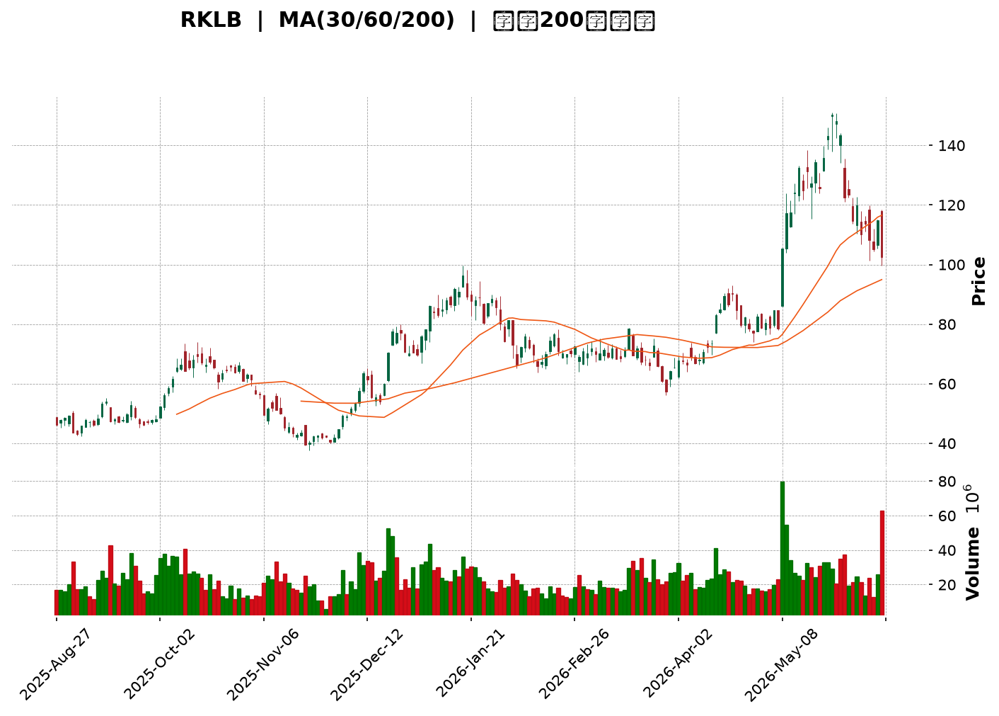
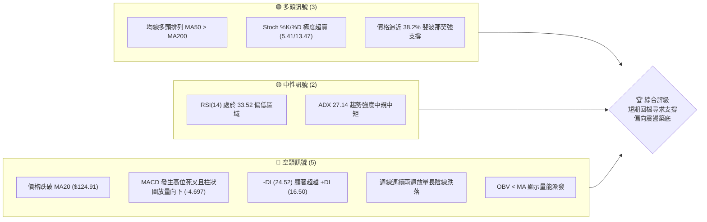
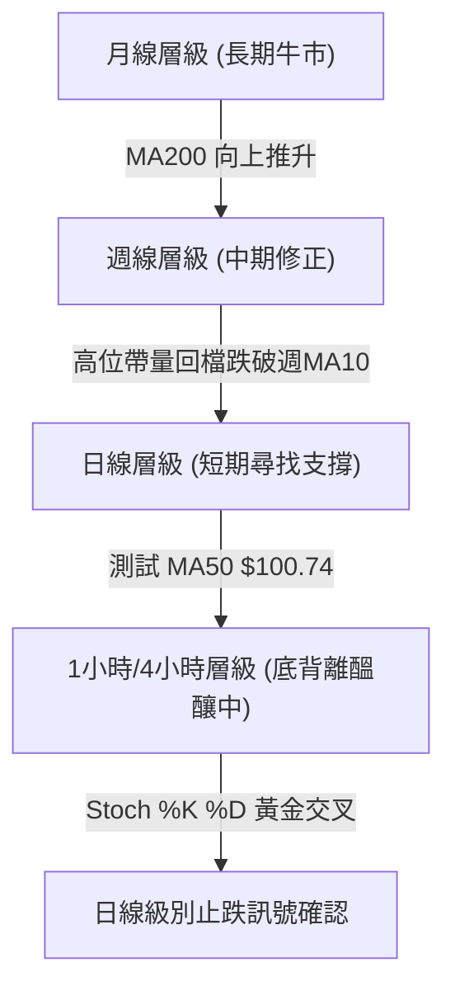
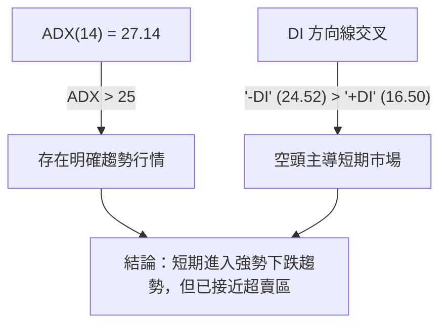
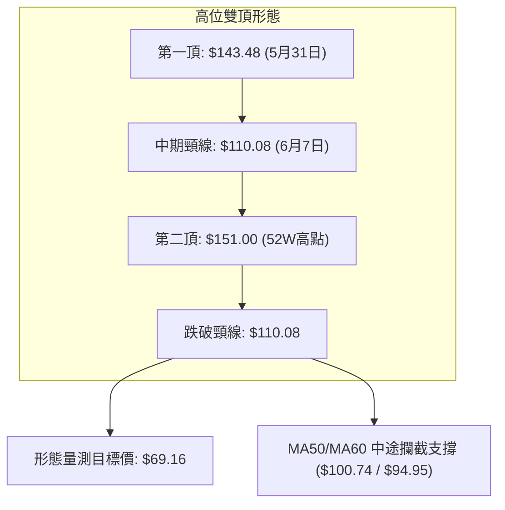
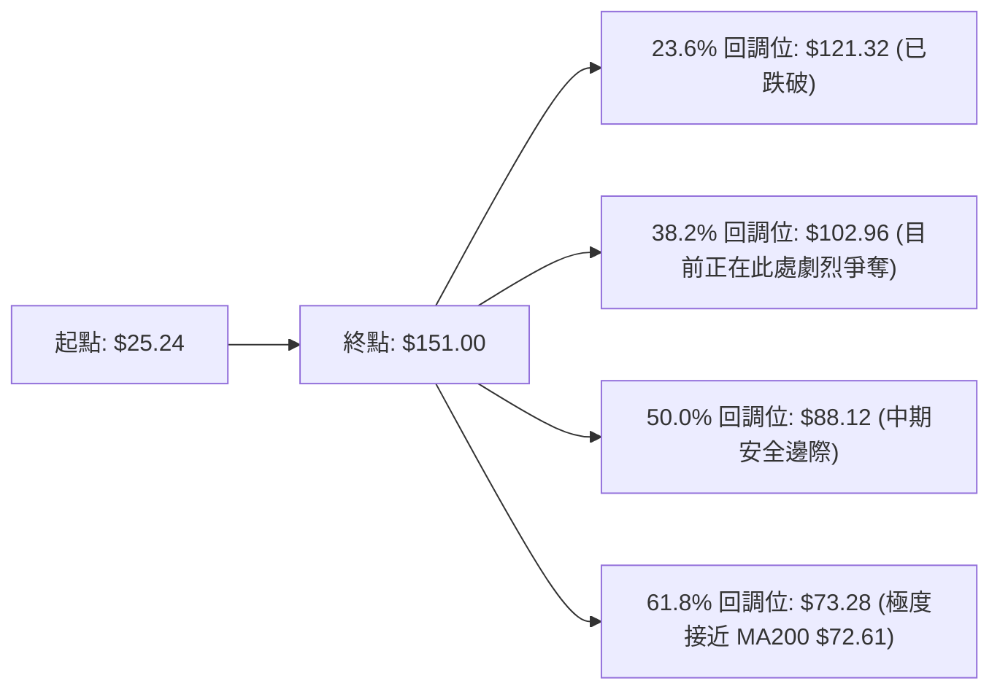
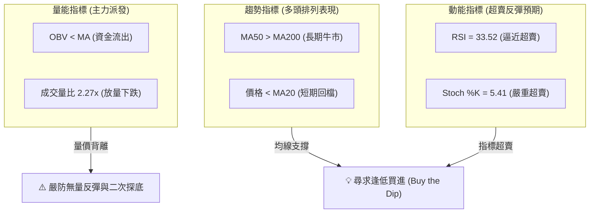
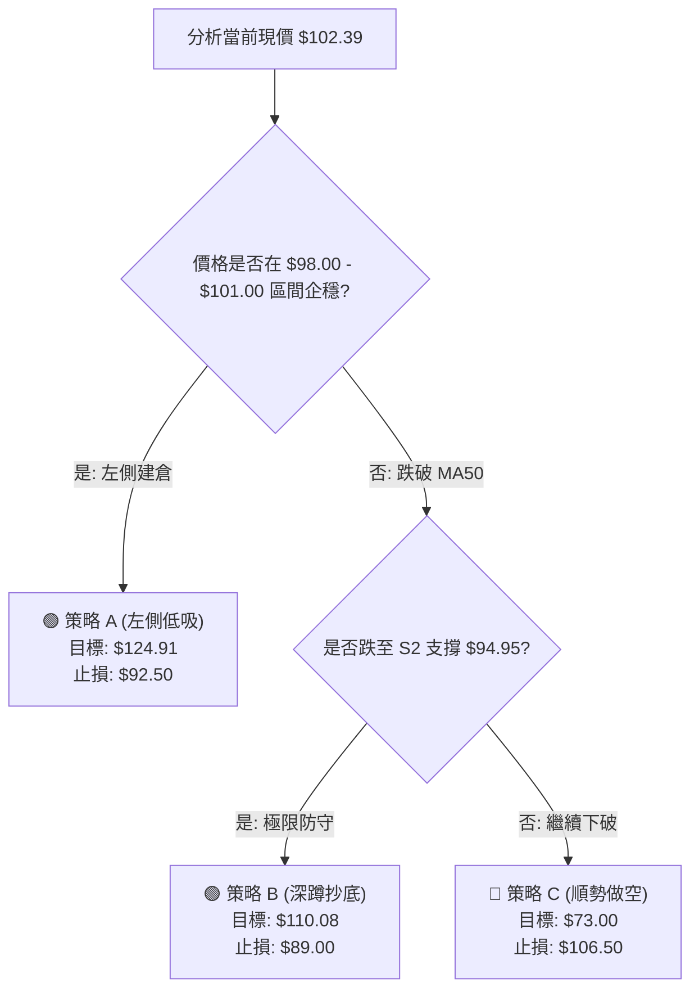
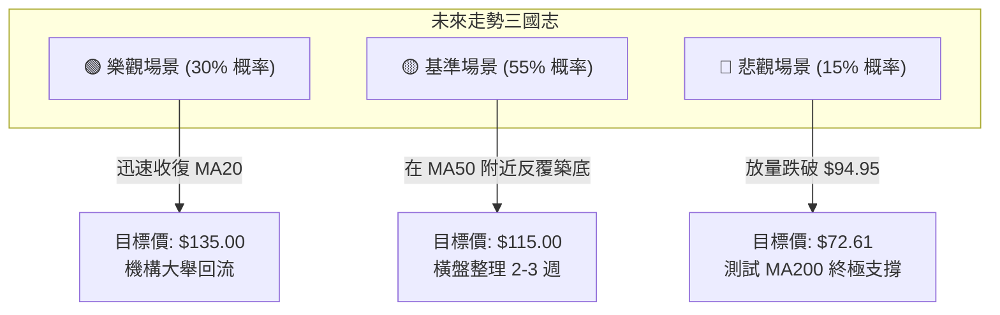

<details>
<summary>📊 靜態圖表 (點擊展開)</summary>

</details>

<html>
<head><meta charset="utf-8" /></head>
<body>
    <div style="height:500px; width:100%;">                        <script>window.PlotlyConfig = {MathJaxConfig: 'local'};</script>
        <script charset="utf-8" src="https://cdn.plot.ly/plotly-3.6.0.min.js" integrity="sha256-QaOVwtVY0T02VaHrr6pnoHLCwayMJp4O5n4YyaE3rJk=" crossorigin="anonymous"></script>                <div id="candlestick-chart" class="plotly-graph-div" style="height:100%; width:100%;"></div>            <script>                window.PLOTLYENV=window.PLOTLYENV || {};                                if (document.getElementById("candlestick-chart")) {                    Plotly.newPlot(                        "candlestick-chart",                        [{"close":{"dtype":"f8","bdata":"AAAAAAAgR0AAAADgevRHQAAAAMDMTEhAAAAAIK6nSEAAAAAA18NFQAAAAGC4fkVAAAAAIIXrRkAAAACgcN1HQAAAAADXg0dAAAAAgMIVR0AAAABACjdIQAAAACCFq0pAAAAAwB4FS0AAAAAgXJ9HQAAAAIA9CkhAAAAAQAqXR0AAAADAHuVHQAAAACCu50hAAAAA4Hp0SkAAAADgUVhIQAAAAOCjUEdAAAAAoEchR0AAAACgR4FHQAAAAOB69EdAAAAAACn8R0AAAAAAKTxKQAAAAOB6FExAAAAAAABATUAAAACgR8FOQAAAAADXU1BAAAAAQOGaUEAAAADgoxBQQAAAAEDhWlBAAAAAgOsBUUAAAACgR1FRQAAAAAAAwFBAAAAAoEeRUEAAAABgZtZQQAAAAKCZWVBAAAAA4FFITkAAAADA9chPQAAAAADXI1BAAAAAIK5nUEAAAAAAAOBPQAAAAIA9ilBAAAAAgMJ1TkAAAACgcH1PQAAAACCFq05AAAAAwPVITEAAAACAwjVMQAAAAIAUzkhAAAAAgOvRSUAAAABAM\u002fNJQAAAAGC4nklAAAAAACn8SEAAAAAAAKBGQAAAAMAexUZAAAAAIK6nRUAAAAAA12NFQAAAACBcz0VAAAAAoHC9Q0AAAABgZiZEQAAAAKCZOUVAAAAAwMxMRUAAAABACvdEQAAAAIDrEUVAAAAAIFwvREAAAABAM\u002fNEQAAAAAApXEZAAAAAIFyvSEAAAABACodIQAAAACCux0lAAAAAQAq3SkAAAABgj8JMQAAAAADXw09AAAAAYLi+TkAAAADgerRLQAAAAGC4vktAAAAAQOH6SkAAAACAwvVNQAAAAKBHoVFAAAAAQDNjU0AAAAAghUtTQAAAACCFS1NAAAAAoJmpUUAAAAAgrodRQAAAAMDMnFFAAAAA4KNwUUAAAAAgXP9SQAAAAMD1iFNAAAAAgOuBVUAAAADAHgVVQAAAAMAexVRAAAAAYGY2VUAAAACgmflVQAAAAMAepVVAAAAAQDPzVkAAAADgo7BWQAAAAEAzE1hAAAAAgD1KVkAAAADgevRVQAAAAGC4\u002flVAAAAAoJk5VkAAAABguB5UQAAAAAAAwFVAAAAA4HokVkAAAAAghWtVQAAAAOB6BFRAAAAAoJmJUkAAAACgR1FUQAAAAEAKR1JAAAAA4HqUUEAAAADgehRSQAAAAIDC9VJAAAAAgOsBUkAAAAAgrmdRQAAAAOCjgFBAAAAAACncUEAAAADA9XhRQAAAAEDhmlJAAAAAwB4lU0AAAABACrdRQAAAAKBwjVFAAAAAgBR+UUAAAADAzIxRQAAAAKCZKVJAAAAAYGZGUUAAAACAFL5RQAAAAOBRiFFAAAAAgD36UUAAAAAAAIBRQAAAAEAKh1FAAAAAYLjeUUAAAAAghTtRQAAAAKBw\u002fVFAAAAAIK4XUUAAAACAPRpRQAAAAADX01FAAAAAgMKlU0AAAABguF5RQAAAACCF+1FAAAAAYLjOUEAAAAAAAABRQAAAAOB6hFBAAAAA4FE4UkAAAAAAKXxQQAAAAEAKd05AAAAA4KOwTEAAAACAFA5QQAAAAKBHYVBAAAAAYLjuUEAAAABA4epQQAAAAOB6lFBAAAAAwB5FUUAAAAAgXK9QQAAAAEAzA1FAAAAAIK6nUUAAAACAFA5SQAAAAGBmZlJAAAAAIIW7VEAAAABAMzNVQAAAAKBwXVZAAAAAwPWoVUAAAABgj4JWQAAAAGBmJlVAAAAAIIXrU0AAAABgj5JUQAAAAIDCpVNAAAAAoEdBU0AAAADgo6BUQAAAAADXs1NAAAAAANcTVEAAAADgo7BTQAAAAKCZKVVAAAAAwB6lU0AAAACAFF5aQAAAAGBmVl1AAAAAANdjXUAAAACgmQlfQAAAAKCZkWBAAAAAoEcxX0AAAADAHmVgQAAAAADX019AAAAAwPXIYEAAAADAzFxfQAAAAOBR+GBAAAAAYGbmYUAAAAAgXMdiQAAAAMD1gGJAAAAAIFzvYUAAAADA9ZheQAAAAOB61F5AAAAAwMysXEAAAADAzPxdQAAAAMAehVtAAAAAoJlpXEAAAABguA5bQAAAAEAzQ1pAAAAAgOuxXEAAAADA9ZhZQA=="},"high":{"dtype":"f8","bdata":"AAAAYLheSEAAAADAzPxHQAAAAGBmZkhAAAAAwB7FSEAAAABAM3NJQAAAAIA9SkZAAAAAYLj+RkAAAACgmRlIQAAAAADXw0dAAAAAgBQOSEAAAADAHtVIQAAAAADXA0tAAAAAgMKVS0AAAACAPQpKQAAAAMAeRUhAAAAA4FGYSEAAAABACndIQAAAAKBHIUlAAAAAYDkUS0AAAACgcD1KQAAAACBcT0hAAAAA4FHYR0AAAADAzAxIQAAAAGC4\u002fkdAAAAAgMK1SEAAAABAM1NKQAAAACAxeExAAAAAoEehTUAAAAAgrkdPQAAAAAAtIlFAAAAAYI8iUUAAAAAAAGBSQAAAAAApnFFAAAAAQOFqUUAAAACAFH5SQAAAAAAAEFJAAAAAAAAgUUAAAAAghQtSQAAAAGCPAlFAAAAAoEcBUEAAAADAzCxQQAAAACCFi1BAAAAAYGaWUEAAAABgj6JQQAAAAMD12FBAAAAAIIVLUEAAAACgmblPQAAAAMDMjE9AAAAAYLi+TUAAAAAA16NMQAAAAEDhGkxAAAAAwMwMSkAAAAAAAEBLQAAAAEDhekxAAAAAgD2qS0AAAADgo7BIQAAAAAApnEdAAAAAwEvXRkAAAACAFM5FQAAAAADXQ0ZAAAAAoEchR0AAAACAwoVEQAAAAADXQ0VAAAAAQApnRUAAAAAghctFQAAAAKCZWUVAAAAAYGamREAAAABguH5FQAAAAGC4XkZAAAAAQArXSEAAAACgmdlIQAAAACBcL0pAAAAAAADgSkAAAACAPWpNQAAAAKCZCVBAAAAAIIVLUEAAAAAA1yNQQAAAAKBwXUxAAAAA4Hp0TEAAAAAAACBOQAAAAADXo1FAAAAAwMycU0AAAAAghctTQAAAAMAe9VNAAAAAIFw\u002fU0AAAAAgXC9SQAAAAAAprFJAAAAAQItMUkAAAAAgXA9TQAAAAAAAkFNAAAAAAACQVUAAAACgcH1VQAAAACCud1ZAAAAAIIUbVkAAAACAwjVWQAAAAOCnblZAAAAAACkMV0AAAABAYB1XQAAAAMAe5VhAAAAAoEeRWEAAAAAAANBWQAAAAKCZWVZAAAAAwMycV0AAAACAPcpVQAAAAAAAwFVAAAAAQDNzVkAAAAAAAEBWQAAAAOB6VFZAAAAAwMwsVEAAAADgelRUQAAAAGBmVlRAAAAAIFw\u002fUkAAAACAPSpSQAAAAEAzM1NAAAAAQAr3UkAAAACgmVlSQAAAAMDMHFFAAAAAYGZmUUAAAAAgXL9RQAAAAMD18FJAAAAAQApHU0AAAADAzIxTQAAAAAAA0FFAAAAAIIWDUUAAAABgZvZRQAAAACBcL1JAAAAAgMJlUUAAAABgZgZSQAAAAAAAUFJAAAAAYGaGUkAAAAAA1xNSQAAAAEAKx1JAAAAAAAAIUkAAAAAA1ztSQAAAAEAzU1JAAAAAYGYmUkAAAAAA19NRQAAAAOBRGFJAAAAAQOGqU0AAAADgUThTQAAAAGC4LlJAAAAAYLh+UkAAAADAzFxRQAAAAGBmJlFAAAAAANfDUkAAAACAwgVSQAAAAIAUhlBAAAAAgOvRTkAAAADAHiVQQAAAAEDhKlFAAAAAwPVYUUAAAADgepRRQAAAAEAzE1FAAAAAgMBqUkAAAABgj3JRQAAAAADXg1FAAAAAQDPjUUAAAAAAALBSQAAAAIDCpVJAAAAAIFzfVEAAAAAgXL9VQAAAAGBmllZAAAAAwMz8VkAAAABgZkZXQAAAAEAzk1ZAAAAAgD2aVUAAAABguJ5UQAAAAIDrcVRAAAAA4KOAU0AAAACAwuVUQAAAAGCP8lRAAAAA4E91VEAAAAAAAMBUQAAAACCFK1VAAAAAYI8yVUAAAAAgrmdaQAAAAAAp\u002fF5AAAAAIFxfXkAAAAAgXM9fQAAAAIDCpWBAAAAAANdLYEAAAAAAKUxhQAAAAIA9MmBAAAAAQDPrYEAAAAAA11tgQAAAAOBReGFAAAAAAABAYkAAAAAAAOBiQAAAAGCP2mJAAAAAAAAAYkAAAAAAKfRgQAAAAMDMDGBAAAAA4FGgXkAAAADgUaheQAAAAGC4fl1AAAAAAAAQXUAAAABgj\u002fJdQAAAAKBw\u002fVtAAAAAQOHCXEAAAADAIJhdQA=="},"hovertemplate":"\u003cb\u003e%{x|%Y-%m-%d}\u003c\u002fb\u003e\u003cbr\u003e\u958b: $%{open:.2f}\u003cbr\u003e\u9ad8: $%{high:.2f}\u003cbr\u003e\u4f4e: $%{low:.2f}\u003cbr\u003e\u6536: $%{close:.2f}\u003cextra\u003e\u003c\u002fextra\u003e","low":{"dtype":"f8","bdata":"AAAAwPXoRkAAAAAghatGQAAAAGCPAkdAAAAAQArXRkAAAABAicFFQAAAAKCZWUVAAAAAgOsxRUAAAADAdr5GQAAAAECJwUZAAAAAwMzMRkAAAABACgdHQAAAAEA1TkhAAAAAAClcSkAAAACgR4FHQAAAAKCZOUdAAAAAAACAR0AAAADgo5BHQAAAAGBmZkdAAAAA4Hr0R0AAAABACjdIQAAAAEDhmkZAAAAAgD3qRkAAAAAgXC9HQAAAAKBHQUdAAAAAIFyPR0AAAACgR0FIQAAAAKBHoUlAAAAAYGbmS0AAAABgj4JMQAAAAEAz009AAAAAQOEaUEAAAADA9QhQQAAAAODOJ1BAAAAA4FEYT0AAAADAHsVQQAAAAEAzm1BAAAAAoJnZT0AAAABAM6tQQAAAAEAKN1BAAAAA4Ho0TUAAAAAAAGBOQAAAAEAz009AAAAAoJkJUEAAAACAFM5PQAAAAKBwvU9AAAAAgOtxTkAAAABAMzNOQAAAAOCjkE1AAAAAoEdBTEAAAAAgXG9LQAAAAOB6tEhAAAAA4M4nR0AAAACgR2FJQAAAAEDhmklAAAAA4HrUSEAAAAAgXC9GQAAAAGBmpkVAAAAAwMwcRUAAAACgcJ1EQAAAAEAKN0VAAAAAwPWoQ0AAAADA9chCQAAAAGBmpkNAAAAA4KMwREAAAADgo7BEQAAAAGBm5kRAAAAAoHD9Q0AAAACAwjVEQAAAAAAAwERAAAAAwPVoRkAAAACgmdlHQAAAAAApnEhAAAAAIIUrSUAAAAAAACBKQAAAAMDMbExAAAAAYGbmTUAAAACAPYpLQAAAAEAKV0pAAAAAQOGKSkAAAAAA1wNMQAAAAMCdX05AAAAAwCAwUkAAAABgj1JSQAAAAKBDs1JAAAAAwPWYUUAAAACgm1RRQAAAAAApnFFAAAAA4FFIUUAAAABgZrZQQAAAAADX01FAAAAAQDODUkAAAABgZnZUQAAAAOCjkFRAAAAAwMycVEAAAADg0NpUQAAAAKCZaVVAAAAAAAAgVUAAAACgmalVQAAAAKCZGVdAAAAAQDMTVkAAAACgcK1UQAAAAMB2VlRAAAAAIK6HVUAAAADgowBUQAAAAAAAgFRAAAAAwMqBVUAAAAAAAMBUQAAAAKBHgVNAAAAAgEF4UkAAAACgR\u002fFSQAAAAEAIJFFAAAAAwMxMUEAAAAAAAMBQQAAAAAAAsFFAAAAAQDPjUUAAAACgR8FQQAAAACBc709AAAAAAABgUEAAAAAAAEBQQAAAAMBLf1FAAAAAYGYWUkAAAACgmVlRQAAAAAAAIFFAAAAAYGamUEAAAADgUThRQAAAAADXM1FAAAAAYGYGUEAAAADAzJxQQAAAAAApjFBAAAAAgBReUUAAAACAwtVQQAAAAOCjCFFAAAAA4Hr0UEAAAACAvidRQAAAAMAeFVFAAAAAgOsRUUAAAAAAKdxQQAAAAEDhKlFAAAAAoEfRUUAAAACgmVlRQAAAAAAAAFFAAAAAwPWYUEAAAABAM4NQQAAAAKBwHVBAAAAAACk8UUAAAACAwmVQQAAAAMDMLE5AAAAAYOUQTEAAAAAA14NNQAAAAEAzU1BAAAAAgBTuTkAAAABgZqZQQAAAAEDh+k9AAAAAYOfzUEAAAABA4aJQQAAAAIDClVBAAAAAgMKlUEAAAABguJ5RQAAAAGBmZlFAAAAAoJk5U0AAAABgZuZUQAAAAGBmJlVAAAAAAABwVUAAAADgo\u002fBVQAAAAAApZFRAAAAAwB7FU0AAAADAdENTQAAAAGBmZlNAAAAAIFx\u002fUkAAAACAFF5TQAAAACCFm1NAAAAAAAAQU0AAAAAA1yNTQAAAAEAKt1NAAAAAIIV7U0AAAAAgrndVQAAAAAAAAFpAAAAAgD0aXEAAAADA9ThdQAAAAADXU15AAAAAQDNzXkAAAACg8WpfQAAAAGC4zlxAAAAAgBQOX0AAAABAM\u002fNeQAAAAIDraWBAAAAAgOtRYUAAAADAHj1hQAAAAADXy2FAAAAAoJnBYEAAAAAAAEBeQAAAAADXo15AAAAAgD1qXEAAAADA9ZhbQAAAAGC4rlpAAAAAAADAW0AAAADAzExZQAAAAIA9GlpAAAAAoJlZWkAAAABACudYQA=="},"name":"\u50f9\u683c","open":{"dtype":"f8","bdata":"AAAAQApXSEAAAADgo3BHQAAAAMDM7EdAAAAAAABgR0AAAABgjyJJQAAAAOB6FEZAAAAA4FHIRUAAAAAAAMBGQAAAAKBHgUdAAAAAANfDR0AAAADA9ShHQAAAAKBwfUhAAAAAgD3KSkAAAAAAAABKQAAAAOBRyEdAAAAAgMJ1SEAAAABACtdHQAAAAOCjkEdAAAAAQDODSEAAAACAwuVJQAAAAAAAAEhAAAAAYGamR0AAAABAM7NHQAAAAEDhmkdAAAAA4KOwR0AAAACA61FIQAAAAGBmBkpAAAAAYLhuTEAAAACgR4FNQAAAAKCZCVBAAAAAoJk5UEAAAABAM7NRQAAAAOBR+FBAAAAAgMJVUEAAAACgR4FRQAAAAOB6hFFAAAAAwPV4UEAAAADgo0hRQAAAAGCPAlFAAAAAACl8T0AAAAAgrsdOQAAAAADXM1BAAAAAACmMUEAAAABAM2tQQAAAAKBHCVBAAAAAAABAUEAAAABgj+JOQAAAAADXg09AAAAAYGbmTEAAAADgelRMQAAAAEDhGkxAAAAAoBjUR0AAAABguN5KQAAAAAAAAExAAAAAQAr3SUAAAACgR2FIQAAAAEDh2kVAAAAAQDOTRkAAAAAAKRxFQAAAAAAAQEVAAAAAgD0KR0AAAACAPepDQAAAAKBHYURAAAAAANcDRUAAAABguJ5FQAAAAKBHQUVAAAAAQDOTREAAAAAgrkdEQAAAAGCP8kRAAAAAYI\u002fSRkAAAAAAAHBIQAAAAIA9CklAAAAAoHCdSUAAAADgUbhKQAAAAKBHwUxAAAAAAABAT0AAAADgp4ZPQAAAAOBRGEtAAAAAwMwMTEAAAACgmRlMQAAAACBcj05AAAAAACk8UkAAAAAA13NSQAAAAIA9glNAAAAAIIUrU0AAAAAAAGBRQAAAAKCZQVJAAAAAAADgUUAAAADgUahRQAAAACCup1JAAAAA4KNwU0AAAABgZgZVQAAAAAAAYFVAAAAAoJkhVUAAAABguD5VQAAAAMD1SFZAAAAAYGaWVUAAAADA9VBWQAAAAKCZIVdAAAAAwMxsV0AAAACgR4FWQAAAAOBRmFVAAAAAIIVDVkAAAAAgrq9VQAAAAMD1uFRAAAAAgBTOVUAAAAAAKfxVQAAAAAAAQFVAAAAAgD3KU0AAAABgZqZTQAAAAGBmVlRAAAAAYLh+UUAAAAAAAEBRQAAAAKCZAVJAAAAAgBSmUkAAAADgUUhSQAAAAIDr4VBAAAAA4HqsUEAAAABAYIVQQAAAAAAAwFFAAAAAoJk5UkAAAAAg2d5SQAAAAOBRMFFAAAAA4FE4UUAAAACAFMZRQAAAAEDhglFAAAAAgMLlUEAAAAAghatQQAAAAGC4NlFAAAAAANezUUAAAABA4bpRQAAAAOCjCFFAAAAAwPVYUUAAAACAwpVRQAAAAEAzM1FAAAAAwMz8UUAAAACgmUlRQAAAAMDMVFFAAAAAYGbeUUAAAABgjwJTQAAAAOB6NFFAAAAAAAAAUkAAAACgcAVRQAAAAAAAwFBAAAAAACk8UUAAAADAzMxRQAAAAOCjgFBAAAAAoJm5TkAAAABA4dpOQAAAAAAAYFBAAAAAwMwcT0AAAABguO5QQAAAACBcx1BAAAAAAAAAUkAAAAAA10NRQAAAAMDM7FBAAAAAQDPDUEAAAAAghWNSQAAAAKBwZVJAAAAAgBQ+U0AAAADAHgVVQAAAAGBmNlVAAAAAwB6VVkAAAACAwp1WQAAAAGBmdlZAAAAAgMKVVUAAAAAAKexTQAAAAMDMBFRAAAAAQAp3U0AAAABAM2NTQAAAAIDr4VRAAAAAQAqXU0AAAABgZqZUQAAAACCu51NAAAAAoHAtVUAAAACAPYJVQAAAAKBHUVpAAAAA4KMwXEAAAACgR\u002fleQAAAAGBmxl5AAAAAQDMDYEAAAAAAKZhgQAAAAIAUfl9AAAAAYLjeX0AAAADA9YhfQAAAAMAebWBAAAAAQOG+YUAAAABACrdiQAAAAKBwZWJAAAAAgBR+YUAAAAAAKYxgQAAAAIDCVV9AAAAAwB7lXUAAAACgcEVcQAAAAKBHkVxAAAAAQOGqXEAAAACgmZldQAAAAMDM7FpAAAAAgMKlWkAAAACgR4FdQA=="},"x":["2025-08-27T00:00:00-04:00","2025-08-28T00:00:00-04:00","2025-08-29T00:00:00-04:00","2025-09-02T00:00:00-04:00","2025-09-03T00:00:00-04:00","2025-09-04T00:00:00-04:00","2025-09-05T00:00:00-04:00","2025-09-08T00:00:00-04:00","2025-09-09T00:00:00-04:00","2025-09-10T00:00:00-04:00","2025-09-11T00:00:00-04:00","2025-09-12T00:00:00-04:00","2025-09-15T00:00:00-04:00","2025-09-16T00:00:00-04:00","2025-09-17T00:00:00-04:00","2025-09-18T00:00:00-04:00","2025-09-19T00:00:00-04:00","2025-09-22T00:00:00-04:00","2025-09-23T00:00:00-04:00","2025-09-24T00:00:00-04:00","2025-09-25T00:00:00-04:00","2025-09-26T00:00:00-04:00","2025-09-29T00:00:00-04:00","2025-09-30T00:00:00-04:00","2025-10-01T00:00:00-04:00","2025-10-02T00:00:00-04:00","2025-10-03T00:00:00-04:00","2025-10-06T00:00:00-04:00","2025-10-07T00:00:00-04:00","2025-10-08T00:00:00-04:00","2025-10-09T00:00:00-04:00","2025-10-10T00:00:00-04:00","2025-10-13T00:00:00-04:00","2025-10-14T00:00:00-04:00","2025-10-15T00:00:00-04:00","2025-10-16T00:00:00-04:00","2025-10-17T00:00:00-04:00","2025-10-20T00:00:00-04:00","2025-10-21T00:00:00-04:00","2025-10-22T00:00:00-04:00","2025-10-23T00:00:00-04:00","2025-10-24T00:00:00-04:00","2025-10-27T00:00:00-04:00","2025-10-28T00:00:00-04:00","2025-10-29T00:00:00-04:00","2025-10-30T00:00:00-04:00","2025-10-31T00:00:00-04:00","2025-11-03T00:00:00-05:00","2025-11-04T00:00:00-05:00","2025-11-05T00:00:00-05:00","2025-11-06T00:00:00-05:00","2025-11-07T00:00:00-05:00","2025-11-10T00:00:00-05:00","2025-11-11T00:00:00-05:00","2025-11-12T00:00:00-05:00","2025-11-13T00:00:00-05:00","2025-11-14T00:00:00-05:00","2025-11-17T00:00:00-05:00","2025-11-18T00:00:00-05:00","2025-11-19T00:00:00-05:00","2025-11-20T00:00:00-05:00","2025-11-21T00:00:00-05:00","2025-11-24T00:00:00-05:00","2025-11-25T00:00:00-05:00","2025-11-26T00:00:00-05:00","2025-11-28T00:00:00-05:00","2025-12-01T00:00:00-05:00","2025-12-02T00:00:00-05:00","2025-12-03T00:00:00-05:00","2025-12-04T00:00:00-05:00","2025-12-05T00:00:00-05:00","2025-12-08T00:00:00-05:00","2025-12-09T00:00:00-05:00","2025-12-10T00:00:00-05:00","2025-12-11T00:00:00-05:00","2025-12-12T00:00:00-05:00","2025-12-15T00:00:00-05:00","2025-12-16T00:00:00-05:00","2025-12-17T00:00:00-05:00","2025-12-18T00:00:00-05:00","2025-12-19T00:00:00-05:00","2025-12-22T00:00:00-05:00","2025-12-23T00:00:00-05:00","2025-12-24T00:00:00-05:00","2025-12-26T00:00:00-05:00","2025-12-29T00:00:00-05:00","2025-12-30T00:00:00-05:00","2025-12-31T00:00:00-05:00","2026-01-02T00:00:00-05:00","2026-01-05T00:00:00-05:00","2026-01-06T00:00:00-05:00","2026-01-07T00:00:00-05:00","2026-01-08T00:00:00-05:00","2026-01-09T00:00:00-05:00","2026-01-12T00:00:00-05:00","2026-01-13T00:00:00-05:00","2026-01-14T00:00:00-05:00","2026-01-15T00:00:00-05:00","2026-01-16T00:00:00-05:00","2026-01-20T00:00:00-05:00","2026-01-21T00:00:00-05:00","2026-01-22T00:00:00-05:00","2026-01-23T00:00:00-05:00","2026-01-26T00:00:00-05:00","2026-01-27T00:00:00-05:00","2026-01-28T00:00:00-05:00","2026-01-29T00:00:00-05:00","2026-01-30T00:00:00-05:00","2026-02-02T00:00:00-05:00","2026-02-03T00:00:00-05:00","2026-02-04T00:00:00-05:00","2026-02-05T00:00:00-05:00","2026-02-06T00:00:00-05:00","2026-02-09T00:00:00-05:00","2026-02-10T00:00:00-05:00","2026-02-11T00:00:00-05:00","2026-02-12T00:00:00-05:00","2026-02-13T00:00:00-05:00","2026-02-17T00:00:00-05:00","2026-02-18T00:00:00-05:00","2026-02-19T00:00:00-05:00","2026-02-20T00:00:00-05:00","2026-02-23T00:00:00-05:00","2026-02-24T00:00:00-05:00","2026-02-25T00:00:00-05:00","2026-02-26T00:00:00-05:00","2026-02-27T00:00:00-05:00","2026-03-02T00:00:00-05:00","2026-03-03T00:00:00-05:00","2026-03-04T00:00:00-05:00","2026-03-05T00:00:00-05:00","2026-03-06T00:00:00-05:00","2026-03-09T00:00:00-04:00","2026-03-10T00:00:00-04:00","2026-03-11T00:00:00-04:00","2026-03-12T00:00:00-04:00","2026-03-13T00:00:00-04:00","2026-03-16T00:00:00-04:00","2026-03-17T00:00:00-04:00","2026-03-18T00:00:00-04:00","2026-03-19T00:00:00-04:00","2026-03-20T00:00:00-04:00","2026-03-23T00:00:00-04:00","2026-03-24T00:00:00-04:00","2026-03-25T00:00:00-04:00","2026-03-26T00:00:00-04:00","2026-03-27T00:00:00-04:00","2026-03-30T00:00:00-04:00","2026-03-31T00:00:00-04:00","2026-04-01T00:00:00-04:00","2026-04-02T00:00:00-04:00","2026-04-06T00:00:00-04:00","2026-04-07T00:00:00-04:00","2026-04-08T00:00:00-04:00","2026-04-09T00:00:00-04:00","2026-04-10T00:00:00-04:00","2026-04-13T00:00:00-04:00","2026-04-14T00:00:00-04:00","2026-04-15T00:00:00-04:00","2026-04-16T00:00:00-04:00","2026-04-17T00:00:00-04:00","2026-04-20T00:00:00-04:00","2026-04-21T00:00:00-04:00","2026-04-22T00:00:00-04:00","2026-04-23T00:00:00-04:00","2026-04-24T00:00:00-04:00","2026-04-27T00:00:00-04:00","2026-04-28T00:00:00-04:00","2026-04-29T00:00:00-04:00","2026-04-30T00:00:00-04:00","2026-05-01T00:00:00-04:00","2026-05-04T00:00:00-04:00","2026-05-05T00:00:00-04:00","2026-05-06T00:00:00-04:00","2026-05-07T00:00:00-04:00","2026-05-08T00:00:00-04:00","2026-05-11T00:00:00-04:00","2026-05-12T00:00:00-04:00","2026-05-13T00:00:00-04:00","2026-05-14T00:00:00-04:00","2026-05-15T00:00:00-04:00","2026-05-18T00:00:00-04:00","2026-05-19T00:00:00-04:00","2026-05-20T00:00:00-04:00","2026-05-21T00:00:00-04:00","2026-05-22T00:00:00-04:00","2026-05-26T00:00:00-04:00","2026-05-27T00:00:00-04:00","2026-05-28T00:00:00-04:00","2026-05-29T00:00:00-04:00","2026-06-01T00:00:00-04:00","2026-06-02T00:00:00-04:00","2026-06-03T00:00:00-04:00","2026-06-04T00:00:00-04:00","2026-06-05T00:00:00-04:00","2026-06-08T00:00:00-04:00","2026-06-09T00:00:00-04:00","2026-06-10T00:00:00-04:00","2026-06-11T00:00:00-04:00","2026-06-12T00:00:00-04:00"],"type":"candlestick"},{"hovertemplate":"MA30: $%{y:.2f}\u003cextra\u003e\u003c\u002fextra\u003e","line":{"color":"#2196F3","dash":"dash","width":2},"mode":"lines","name":"MA30","x":["2025-08-27T00:00:00-04:00","2025-08-28T00:00:00-04:00","2025-08-29T00:00:00-04:00","2025-09-02T00:00:00-04:00","2025-09-03T00:00:00-04:00","2025-09-04T00:00:00-04:00","2025-09-05T00:00:00-04:00","2025-09-08T00:00:00-04:00","2025-09-09T00:00:00-04:00","2025-09-10T00:00:00-04:00","2025-09-11T00:00:00-04:00","2025-09-12T00:00:00-04:00","2025-09-15T00:00:00-04:00","2025-09-16T00:00:00-04:00","2025-09-17T00:00:00-04:00","2025-09-18T00:00:00-04:00","2025-09-19T00:00:00-04:00","2025-09-22T00:00:00-04:00","2025-09-23T00:00:00-04:00","2025-09-24T00:00:00-04:00","2025-09-25T00:00:00-04:00","2025-09-26T00:00:00-04:00","2025-09-29T00:00:00-04:00","2025-09-30T00:00:00-04:00","2025-10-01T00:00:00-04:00","2025-10-02T00:00:00-04:00","2025-10-03T00:00:00-04:00","2025-10-06T00:00:00-04:00","2025-10-07T00:00:00-04:00","2025-10-08T00:00:00-04:00","2025-10-09T00:00:00-04:00","2025-10-10T00:00:00-04:00","2025-10-13T00:00:00-04:00","2025-10-14T00:00:00-04:00","2025-10-15T00:00:00-04:00","2025-10-16T00:00:00-04:00","2025-10-17T00:00:00-04:00","2025-10-20T00:00:00-04:00","2025-10-21T00:00:00-04:00","2025-10-22T00:00:00-04:00","2025-10-23T00:00:00-04:00","2025-10-24T00:00:00-04:00","2025-10-27T00:00:00-04:00","2025-10-28T00:00:00-04:00","2025-10-29T00:00:00-04:00","2025-10-30T00:00:00-04:00","2025-10-31T00:00:00-04:00","2025-11-03T00:00:00-05:00","2025-11-04T00:00:00-05:00","2025-11-05T00:00:00-05:00","2025-11-06T00:00:00-05:00","2025-11-07T00:00:00-05:00","2025-11-10T00:00:00-05:00","2025-11-11T00:00:00-05:00","2025-11-12T00:00:00-05:00","2025-11-13T00:00:00-05:00","2025-11-14T00:00:00-05:00","2025-11-17T00:00:00-05:00","2025-11-18T00:00:00-05:00","2025-11-19T00:00:00-05:00","2025-11-20T00:00:00-05:00","2025-11-21T00:00:00-05:00","2025-11-24T00:00:00-05:00","2025-11-25T00:00:00-05:00","2025-11-26T00:00:00-05:00","2025-11-28T00:00:00-05:00","2025-12-01T00:00:00-05:00","2025-12-02T00:00:00-05:00","2025-12-03T00:00:00-05:00","2025-12-04T00:00:00-05:00","2025-12-05T00:00:00-05:00","2025-12-08T00:00:00-05:00","2025-12-09T00:00:00-05:00","2025-12-10T00:00:00-05:00","2025-12-11T00:00:00-05:00","2025-12-12T00:00:00-05:00","2025-12-15T00:00:00-05:00","2025-12-16T00:00:00-05:00","2025-12-17T00:00:00-05:00","2025-12-18T00:00:00-05:00","2025-12-19T00:00:00-05:00","2025-12-22T00:00:00-05:00","2025-12-23T00:00:00-05:00","2025-12-24T00:00:00-05:00","2025-12-26T00:00:00-05:00","2025-12-29T00:00:00-05:00","2025-12-30T00:00:00-05:00","2025-12-31T00:00:00-05:00","2026-01-02T00:00:00-05:00","2026-01-05T00:00:00-05:00","2026-01-06T00:00:00-05:00","2026-01-07T00:00:00-05:00","2026-01-08T00:00:00-05:00","2026-01-09T00:00:00-05:00","2026-01-12T00:00:00-05:00","2026-01-13T00:00:00-05:00","2026-01-14T00:00:00-05:00","2026-01-15T00:00:00-05:00","2026-01-16T00:00:00-05:00","2026-01-20T00:00:00-05:00","2026-01-21T00:00:00-05:00","2026-01-22T00:00:00-05:00","2026-01-23T00:00:00-05:00","2026-01-26T00:00:00-05:00","2026-01-27T00:00:00-05:00","2026-01-28T00:00:00-05:00","2026-01-29T00:00:00-05:00","2026-01-30T00:00:00-05:00","2026-02-02T00:00:00-05:00","2026-02-03T00:00:00-05:00","2026-02-04T00:00:00-05:00","2026-02-05T00:00:00-05:00","2026-02-06T00:00:00-05:00","2026-02-09T00:00:00-05:00","2026-02-10T00:00:00-05:00","2026-02-11T00:00:00-05:00","2026-02-12T00:00:00-05:00","2026-02-13T00:00:00-05:00","2026-02-17T00:00:00-05:00","2026-02-18T00:00:00-05:00","2026-02-19T00:00:00-05:00","2026-02-20T00:00:00-05:00","2026-02-23T00:00:00-05:00","2026-02-24T00:00:00-05:00","2026-02-25T00:00:00-05:00","2026-02-26T00:00:00-05:00","2026-02-27T00:00:00-05:00","2026-03-02T00:00:00-05:00","2026-03-03T00:00:00-05:00","2026-03-04T00:00:00-05:00","2026-03-05T00:00:00-05:00","2026-03-06T00:00:00-05:00","2026-03-09T00:00:00-04:00","2026-03-10T00:00:00-04:00","2026-03-11T00:00:00-04:00","2026-03-12T00:00:00-04:00","2026-03-13T00:00:00-04:00","2026-03-16T00:00:00-04:00","2026-03-17T00:00:00-04:00","2026-03-18T00:00:00-04:00","2026-03-19T00:00:00-04:00","2026-03-20T00:00:00-04:00","2026-03-23T00:00:00-04:00","2026-03-24T00:00:00-04:00","2026-03-25T00:00:00-04:00","2026-03-26T00:00:00-04:00","2026-03-27T00:00:00-04:00","2026-03-30T00:00:00-04:00","2026-03-31T00:00:00-04:00","2026-04-01T00:00:00-04:00","2026-04-02T00:00:00-04:00","2026-04-06T00:00:00-04:00","2026-04-07T00:00:00-04:00","2026-04-08T00:00:00-04:00","2026-04-09T00:00:00-04:00","2026-04-10T00:00:00-04:00","2026-04-13T00:00:00-04:00","2026-04-14T00:00:00-04:00","2026-04-15T00:00:00-04:00","2026-04-16T00:00:00-04:00","2026-04-17T00:00:00-04:00","2026-04-20T00:00:00-04:00","2026-04-21T00:00:00-04:00","2026-04-22T00:00:00-04:00","2026-04-23T00:00:00-04:00","2026-04-24T00:00:00-04:00","2026-04-27T00:00:00-04:00","2026-04-28T00:00:00-04:00","2026-04-29T00:00:00-04:00","2026-04-30T00:00:00-04:00","2026-05-01T00:00:00-04:00","2026-05-04T00:00:00-04:00","2026-05-05T00:00:00-04:00","2026-05-06T00:00:00-04:00","2026-05-07T00:00:00-04:00","2026-05-08T00:00:00-04:00","2026-05-11T00:00:00-04:00","2026-05-12T00:00:00-04:00","2026-05-13T00:00:00-04:00","2026-05-14T00:00:00-04:00","2026-05-15T00:00:00-04:00","2026-05-18T00:00:00-04:00","2026-05-19T00:00:00-04:00","2026-05-20T00:00:00-04:00","2026-05-21T00:00:00-04:00","2026-05-22T00:00:00-04:00","2026-05-26T00:00:00-04:00","2026-05-27T00:00:00-04:00","2026-05-28T00:00:00-04:00","2026-05-29T00:00:00-04:00","2026-06-01T00:00:00-04:00","2026-06-02T00:00:00-04:00","2026-06-03T00:00:00-04:00","2026-06-04T00:00:00-04:00","2026-06-05T00:00:00-04:00","2026-06-08T00:00:00-04:00","2026-06-09T00:00:00-04:00","2026-06-10T00:00:00-04:00","2026-06-11T00:00:00-04:00","2026-06-12T00:00:00-04:00"],"y":{"dtype":"f8","bdata":"AAAAAAAA+H8AAAAAAAD4fwAAAAAAAPh\u002fAAAAAAAA+H8AAAAAAAD4fwAAAAAAAPh\u002fAAAAAAAA+H8AAAAAAAD4fwAAAAAAAPh\u002fAAAAAAAA+H8AAAAAAAD4fwAAAAAAAPh\u002fAAAAAAAA+H8AAAAAAAD4fwAAAAAAAPh\u002fAAAAAAAA+H8AAAAAAAD4fwAAAAAAAPh\u002fAAAAAAAA+H8AAAAAAAD4fwAAAAAAAPh\u002fAAAAAAAA+H8AAAAAAAD4fwAAAAAAAPh\u002fAAAAAAAA+H8AAAAAAAD4fwAAAAAAAPh\u002fAAAAAAAA+H8AAAAAAAD4f+\u002fu7q5y4EhAMzMzs4E2SUAzMzNDRHxJQAAAADAIxElAq6qqaucTSkC8u7tbuoFKQN7d3a0r6EpA7+7urlY\u002fS0BERET0DJNLQFVVVeVt4UtAMzMzE9keTEDe3d39cV9MQImIiDhRj0xAvLu7q7nATECJiIiIJQdNQHd3d7dJVE1AVVVVdemOTUDNzMz8uM9NQCIiItLqAE5AREREhIgQTkDNzMy8gzFOQBEREbE6Pk5AZmZmFi9VTkBmZmZGDGpOQGZmZoZBeE5A7+7uDsqATkBERETk+2FOQFVVVQWsNE5A3t3dfdzzTUBmZmZW8qNNQDMzMxNnR01AmpmZaXXUTEAzMzOzOm5MQGZmZlY5DExA7+7u\u002frifS0De3d1tEitLQN7d3a0AwUpAmpmZ+X5SSkCrqqrK6OVJQHd3d7esjUlAq6qqyuhdSUCrqqqK+h9JQERERBSD6EhAiYiIWIC0SEBmZmaG65lIQLy7u9uyjkhAREREdCGRSEDv7u7+1HBIQM3MzDzfV0hAvLu7a7xMSECrqqpaq1tIQFVVVaXitEhAd3d3R28jSUB3d3fHS49JQM3MzCz5\u002fUlAAAAAQDVWSkDNzMzsUcBKQImIiEiaKktAzczMvHSbS0CamZnpJilMQFVVVfVvvExAiYiI+AyDTUCJiIho2D1OQERERDQz605AiYiIeHefT0BERER8zTFQQO\u002fu7qabkFBAq6qqSlP+UEDe3d1dj2ZRQM3MzOyY1FFAq6qqknspUkBmZmZuLnxSQLy7u5vgyVJAVVVV9YsVU0BmZmYuh0ZTQGZmZu6YeFNAiYiIOF6yU0BVVVWt8fJTQCIiIqJhJ1RAEREREXRSVEAzMzMDAIBUQAAAAICGhVRAvLu7a5FtVEBmZmY2M2NUQERERGRXYFRA3t3dDUljVEDNzMz8N2JUQImIiCi\u002fWFRAERERIcxTVEB3d3e3yEZUQJqZmRnZPlRAREREJLAqVEAiIiJCfA5UQFVVVYUH81NA7+7uDknTU0Dv7u5+hq1TQLy7u9vOj1NAERERoWFfU0BmZmamKTVTQGZmZlZV\u002fVJAmpmZiYjYUkARERFxhLJSQJqZmQlljFJAVVVVZTtnUkDe3d2Nl05SQFVVVbWBLlJAERER0WkDUkCJiIgYkt5RQHd3d\u002ffhy1FAvLu7y1rVUUAzMzPjM7xRQDMzM3OvuVFA7+7ubqC7UUAzMzMjabJRQKuqqmqRnVFAERERoWGfUUC8u7vbh5dRQAAAAICxjFFA3t3dZTt3UUCrqqrSImtRQERERDwmWFFAzczM9ERFUUAiIiLKdj5RQM3MzFQqNlFA3t3dRUQ0UUDv7u6m4ixRQImIiHASI1FAiYiIkFAmUUAzMzM7+yhRQImIiFBiMFFAvLu7s+RHUUAiIiJ6d2dRQAAAACi\u002fkFFAERERiRaxUUARERFpH95RQBEREYkW+VFAVVVVTTcRUkCamZmh0y5SQDMzM3tbPlJAVVVVDQI7UkAzMzMrzlZSQImIiJB7ZVJARERE\u002fGKBUkCamZlhV5hSQCIiIor6v1JAiYiIgCPMUkDv7u4meCBTQGZmZv7UmFNAvLu7SzcZVEAREREREZlUQDMzM2MQKFVARERE1L+hVUBmZmbWMSlWQCIiIoJOq1ZAZmZmZmY2V0AzMzPjpbNXQCIiIpIYRFhAzczM7O7eWECJiIjIWoVZQM3MzHwjJFpAvLu720+lWkAiIiICgfVaQFVVVRW9PVtAVVVVlZl5W0De3d1taLlbQImIiOjD71tA7+7uDjw4XEAiIiLCkm9cQDMzM3MFqFxAIiIicpP4XEAzMzOT\u002fCJdQA=="},"type":"scatter"},{"hovertemplate":"MA60: $%{y:.2f}\u003cextra\u003e\u003c\u002fextra\u003e","line":{"color":"#9C27B0","dash":"dash","width":2},"mode":"lines","name":"MA60","x":["2025-08-27T00:00:00-04:00","2025-08-28T00:00:00-04:00","2025-08-29T00:00:00-04:00","2025-09-02T00:00:00-04:00","2025-09-03T00:00:00-04:00","2025-09-04T00:00:00-04:00","2025-09-05T00:00:00-04:00","2025-09-08T00:00:00-04:00","2025-09-09T00:00:00-04:00","2025-09-10T00:00:00-04:00","2025-09-11T00:00:00-04:00","2025-09-12T00:00:00-04:00","2025-09-15T00:00:00-04:00","2025-09-16T00:00:00-04:00","2025-09-17T00:00:00-04:00","2025-09-18T00:00:00-04:00","2025-09-19T00:00:00-04:00","2025-09-22T00:00:00-04:00","2025-09-23T00:00:00-04:00","2025-09-24T00:00:00-04:00","2025-09-25T00:00:00-04:00","2025-09-26T00:00:00-04:00","2025-09-29T00:00:00-04:00","2025-09-30T00:00:00-04:00","2025-10-01T00:00:00-04:00","2025-10-02T00:00:00-04:00","2025-10-03T00:00:00-04:00","2025-10-06T00:00:00-04:00","2025-10-07T00:00:00-04:00","2025-10-08T00:00:00-04:00","2025-10-09T00:00:00-04:00","2025-10-10T00:00:00-04:00","2025-10-13T00:00:00-04:00","2025-10-14T00:00:00-04:00","2025-10-15T00:00:00-04:00","2025-10-16T00:00:00-04:00","2025-10-17T00:00:00-04:00","2025-10-20T00:00:00-04:00","2025-10-21T00:00:00-04:00","2025-10-22T00:00:00-04:00","2025-10-23T00:00:00-04:00","2025-10-24T00:00:00-04:00","2025-10-27T00:00:00-04:00","2025-10-28T00:00:00-04:00","2025-10-29T00:00:00-04:00","2025-10-30T00:00:00-04:00","2025-10-31T00:00:00-04:00","2025-11-03T00:00:00-05:00","2025-11-04T00:00:00-05:00","2025-11-05T00:00:00-05:00","2025-11-06T00:00:00-05:00","2025-11-07T00:00:00-05:00","2025-11-10T00:00:00-05:00","2025-11-11T00:00:00-05:00","2025-11-12T00:00:00-05:00","2025-11-13T00:00:00-05:00","2025-11-14T00:00:00-05:00","2025-11-17T00:00:00-05:00","2025-11-18T00:00:00-05:00","2025-11-19T00:00:00-05:00","2025-11-20T00:00:00-05:00","2025-11-21T00:00:00-05:00","2025-11-24T00:00:00-05:00","2025-11-25T00:00:00-05:00","2025-11-26T00:00:00-05:00","2025-11-28T00:00:00-05:00","2025-12-01T00:00:00-05:00","2025-12-02T00:00:00-05:00","2025-12-03T00:00:00-05:00","2025-12-04T00:00:00-05:00","2025-12-05T00:00:00-05:00","2025-12-08T00:00:00-05:00","2025-12-09T00:00:00-05:00","2025-12-10T00:00:00-05:00","2025-12-11T00:00:00-05:00","2025-12-12T00:00:00-05:00","2025-12-15T00:00:00-05:00","2025-12-16T00:00:00-05:00","2025-12-17T00:00:00-05:00","2025-12-18T00:00:00-05:00","2025-12-19T00:00:00-05:00","2025-12-22T00:00:00-05:00","2025-12-23T00:00:00-05:00","2025-12-24T00:00:00-05:00","2025-12-26T00:00:00-05:00","2025-12-29T00:00:00-05:00","2025-12-30T00:00:00-05:00","2025-12-31T00:00:00-05:00","2026-01-02T00:00:00-05:00","2026-01-05T00:00:00-05:00","2026-01-06T00:00:00-05:00","2026-01-07T00:00:00-05:00","2026-01-08T00:00:00-05:00","2026-01-09T00:00:00-05:00","2026-01-12T00:00:00-05:00","2026-01-13T00:00:00-05:00","2026-01-14T00:00:00-05:00","2026-01-15T00:00:00-05:00","2026-01-16T00:00:00-05:00","2026-01-20T00:00:00-05:00","2026-01-21T00:00:00-05:00","2026-01-22T00:00:00-05:00","2026-01-23T00:00:00-05:00","2026-01-26T00:00:00-05:00","2026-01-27T00:00:00-05:00","2026-01-28T00:00:00-05:00","2026-01-29T00:00:00-05:00","2026-01-30T00:00:00-05:00","2026-02-02T00:00:00-05:00","2026-02-03T00:00:00-05:00","2026-02-04T00:00:00-05:00","2026-02-05T00:00:00-05:00","2026-02-06T00:00:00-05:00","2026-02-09T00:00:00-05:00","2026-02-10T00:00:00-05:00","2026-02-11T00:00:00-05:00","2026-02-12T00:00:00-05:00","2026-02-13T00:00:00-05:00","2026-02-17T00:00:00-05:00","2026-02-18T00:00:00-05:00","2026-02-19T00:00:00-05:00","2026-02-20T00:00:00-05:00","2026-02-23T00:00:00-05:00","2026-02-24T00:00:00-05:00","2026-02-25T00:00:00-05:00","2026-02-26T00:00:00-05:00","2026-02-27T00:00:00-05:00","2026-03-02T00:00:00-05:00","2026-03-03T00:00:00-05:00","2026-03-04T00:00:00-05:00","2026-03-05T00:00:00-05:00","2026-03-06T00:00:00-05:00","2026-03-09T00:00:00-04:00","2026-03-10T00:00:00-04:00","2026-03-11T00:00:00-04:00","2026-03-12T00:00:00-04:00","2026-03-13T00:00:00-04:00","2026-03-16T00:00:00-04:00","2026-03-17T00:00:00-04:00","2026-03-18T00:00:00-04:00","2026-03-19T00:00:00-04:00","2026-03-20T00:00:00-04:00","2026-03-23T00:00:00-04:00","2026-03-24T00:00:00-04:00","2026-03-25T00:00:00-04:00","2026-03-26T00:00:00-04:00","2026-03-27T00:00:00-04:00","2026-03-30T00:00:00-04:00","2026-03-31T00:00:00-04:00","2026-04-01T00:00:00-04:00","2026-04-02T00:00:00-04:00","2026-04-06T00:00:00-04:00","2026-04-07T00:00:00-04:00","2026-04-08T00:00:00-04:00","2026-04-09T00:00:00-04:00","2026-04-10T00:00:00-04:00","2026-04-13T00:00:00-04:00","2026-04-14T00:00:00-04:00","2026-04-15T00:00:00-04:00","2026-04-16T00:00:00-04:00","2026-04-17T00:00:00-04:00","2026-04-20T00:00:00-04:00","2026-04-21T00:00:00-04:00","2026-04-22T00:00:00-04:00","2026-04-23T00:00:00-04:00","2026-04-24T00:00:00-04:00","2026-04-27T00:00:00-04:00","2026-04-28T00:00:00-04:00","2026-04-29T00:00:00-04:00","2026-04-30T00:00:00-04:00","2026-05-01T00:00:00-04:00","2026-05-04T00:00:00-04:00","2026-05-05T00:00:00-04:00","2026-05-06T00:00:00-04:00","2026-05-07T00:00:00-04:00","2026-05-08T00:00:00-04:00","2026-05-11T00:00:00-04:00","2026-05-12T00:00:00-04:00","2026-05-13T00:00:00-04:00","2026-05-14T00:00:00-04:00","2026-05-15T00:00:00-04:00","2026-05-18T00:00:00-04:00","2026-05-19T00:00:00-04:00","2026-05-20T00:00:00-04:00","2026-05-21T00:00:00-04:00","2026-05-22T00:00:00-04:00","2026-05-26T00:00:00-04:00","2026-05-27T00:00:00-04:00","2026-05-28T00:00:00-04:00","2026-05-29T00:00:00-04:00","2026-06-01T00:00:00-04:00","2026-06-02T00:00:00-04:00","2026-06-03T00:00:00-04:00","2026-06-04T00:00:00-04:00","2026-06-05T00:00:00-04:00","2026-06-08T00:00:00-04:00","2026-06-09T00:00:00-04:00","2026-06-10T00:00:00-04:00","2026-06-11T00:00:00-04:00","2026-06-12T00:00:00-04:00"],"y":{"dtype":"f8","bdata":"AAAAAAAA+H8AAAAAAAD4fwAAAAAAAPh\u002fAAAAAAAA+H8AAAAAAAD4fwAAAAAAAPh\u002fAAAAAAAA+H8AAAAAAAD4fwAAAAAAAPh\u002fAAAAAAAA+H8AAAAAAAD4fwAAAAAAAPh\u002fAAAAAAAA+H8AAAAAAAD4fwAAAAAAAPh\u002fAAAAAAAA+H8AAAAAAAD4fwAAAAAAAPh\u002fAAAAAAAA+H8AAAAAAAD4fwAAAAAAAPh\u002fAAAAAAAA+H8AAAAAAAD4fwAAAAAAAPh\u002fAAAAAAAA+H8AAAAAAAD4fwAAAAAAAPh\u002fAAAAAAAA+H8AAAAAAAD4fwAAAAAAAPh\u002fAAAAAAAA+H8AAAAAAAD4fwAAAAAAAPh\u002fAAAAAAAA+H8AAAAAAAD4fwAAAAAAAPh\u002fAAAAAAAA+H8AAAAAAAD4fwAAAAAAAPh\u002fAAAAAAAA+H8AAAAAAAD4fwAAAAAAAPh\u002fAAAAAAAA+H8AAAAAAAD4fwAAAAAAAPh\u002fAAAAAAAA+H8AAAAAAAD4fwAAAAAAAPh\u002fAAAAAAAA+H8AAAAAAAD4fwAAAAAAAPh\u002fAAAAAAAA+H8AAAAAAAD4fwAAAAAAAPh\u002fAAAAAAAA+H8AAAAAAAD4fwAAAAAAAPh\u002fAAAAAAAA+H8AAAAAAAD4fxEREeHsE0tAZmZmjnsFS0AzMzN7P\u002fVKQDMzM8Mg6EpAzczMNNDZSkDNzMxkZtZKQN7d3S2W1EpARERE1OrISkB3d3fferxKQGZmZk6Nt0pA7+7u7mC+SkBEREREtr9KQGZmZibqu0pAIiIiAp26SkB3d3eHiNBKQJqZmUl+8UpAzczMdAUQS0De3d39RiBLQHd3dwdlLEtAAAAAeKIuS0C8u7uLl0ZLQDMzM6uOeUtA7+7uLk+8S0Dv7u4GrPxLQJqZmVkdO0xAd3d3p39rTECJiIjoJpFMQO\u002fu7iajr0xAVVVVnajHTEAAAACgjOZMQERERITrAU1AERERMcErTUDe3d2NCVZNQFVVVUW2e01AvLu7O5ifTUAzMzOzVsdNQN7d3f0b8U1Ad3d3x5InTkAzMzPDg1lOQImIiEhvm05AAAAA+G\u002fYTkC8u7uzKwxPQN7d3SUiPk9AmpmZIcxvT0CamZnxfJNPQERERFzyv09Aq6qq8u76T0BmZmYWrhVQQERERKCoKVBAd3d3I2k8UEBERETY6lZQQFVVVen7b1BAvLu7h6R\u002fUEARERGNbJVQQFVVVf2pr1BA7+7u1jHHUECamZl5MOFQQGZmZiYG91BAvLu7P8MQUUAiIiIWri1RQCIiIoqITlFAREREUBt2UUAzMzM7tJZRQLy7u49QtFFAmpmZZYLRUUCamZn9qe9RQFVVVUE1EFJA3t3dddouUkAiIiKC3E1SQJqZmSH3aFJAIiIiDgKBUkC8u7tvWZdSQKuqqtIiq1JAVVVVrWO+UkAiIiJej8pSQN7d3VGN01JAzczMBOTaUkDv7u7iwehSQM3MzMyh+VJAZmZmbucTU0AzMzPzGR5TQJqZmfmaH1NAVVVV7ZgUU0DNzMwszgpTQHd3d2f0\u002flJAd3d3V1UBU0BERETs3\u002fxSQERERFS48lJAd3d3w4PlUkARERHF9dhSQO\u002fu7qp\u002fy1JAiYiIjPq3UkAiIiKGeaZSQBEREe2YlFJAZmZmqsaDUkDv7u6SNG1SQCIiIqZwWVJAzczMGNlCUkDNzMxwEi9SQHd3d9PbFlJAq6qqnjYQUkCamZn1\u002fQxSQM3MzBiSDlJAMzMz9ygMUkB3d3d7WxZSQDMzMx\u002fME1JAMzMzj1AKUkARERHdsgZSQFVVVbkeBVJAiYiIbC4IUkAzMzMHgQlSQN7d3YGVD1JAmpmZtYEeUkBmZmZCYCVSQGZmZvrFLlJAzczMkMI1UkBVVVUBAFxSQDMzMz\u002fDklJAzczMWDnIUkDe3d3xGQJTQLy7u08bQFNAiYiIZIJzU0BERERQ1LNTQHd3d2u88FNAIiIiVlU1VEARERFFRHBUQFVVVYGVs1RAq6qqvp8CVUDe3d0BK1dVQKuqquZCqlVAvLu7R5r2VUAiIiI+fC5WQKuqqh4+Z1ZAMzMzD1iVVkB3d3frw8tWQM3MzDht9FZAIiIirrkkV0De3d0xM09XQDMzM3cwc1dAvLu7v8qZV0AzMzNf5bxXQA=="},"type":"scatter"},{"hovertemplate":"MA200: $%{y:.2f}\u003cextra\u003e\u003c\u002fextra\u003e","line":{"color":"#FF6F00","dash":"solid","width":2},"mode":"lines","name":"MA200","x":["2025-08-27T00:00:00-04:00","2025-08-28T00:00:00-04:00","2025-08-29T00:00:00-04:00","2025-09-02T00:00:00-04:00","2025-09-03T00:00:00-04:00","2025-09-04T00:00:00-04:00","2025-09-05T00:00:00-04:00","2025-09-08T00:00:00-04:00","2025-09-09T00:00:00-04:00","2025-09-10T00:00:00-04:00","2025-09-11T00:00:00-04:00","2025-09-12T00:00:00-04:00","2025-09-15T00:00:00-04:00","2025-09-16T00:00:00-04:00","2025-09-17T00:00:00-04:00","2025-09-18T00:00:00-04:00","2025-09-19T00:00:00-04:00","2025-09-22T00:00:00-04:00","2025-09-23T00:00:00-04:00","2025-09-24T00:00:00-04:00","2025-09-25T00:00:00-04:00","2025-09-26T00:00:00-04:00","2025-09-29T00:00:00-04:00","2025-09-30T00:00:00-04:00","2025-10-01T00:00:00-04:00","2025-10-02T00:00:00-04:00","2025-10-03T00:00:00-04:00","2025-10-06T00:00:00-04:00","2025-10-07T00:00:00-04:00","2025-10-08T00:00:00-04:00","2025-10-09T00:00:00-04:00","2025-10-10T00:00:00-04:00","2025-10-13T00:00:00-04:00","2025-10-14T00:00:00-04:00","2025-10-15T00:00:00-04:00","2025-10-16T00:00:00-04:00","2025-10-17T00:00:00-04:00","2025-10-20T00:00:00-04:00","2025-10-21T00:00:00-04:00","2025-10-22T00:00:00-04:00","2025-10-23T00:00:00-04:00","2025-10-24T00:00:00-04:00","2025-10-27T00:00:00-04:00","2025-10-28T00:00:00-04:00","2025-10-29T00:00:00-04:00","2025-10-30T00:00:00-04:00","2025-10-31T00:00:00-04:00","2025-11-03T00:00:00-05:00","2025-11-04T00:00:00-05:00","2025-11-05T00:00:00-05:00","2025-11-06T00:00:00-05:00","2025-11-07T00:00:00-05:00","2025-11-10T00:00:00-05:00","2025-11-11T00:00:00-05:00","2025-11-12T00:00:00-05:00","2025-11-13T00:00:00-05:00","2025-11-14T00:00:00-05:00","2025-11-17T00:00:00-05:00","2025-11-18T00:00:00-05:00","2025-11-19T00:00:00-05:00","2025-11-20T00:00:00-05:00","2025-11-21T00:00:00-05:00","2025-11-24T00:00:00-05:00","2025-11-25T00:00:00-05:00","2025-11-26T00:00:00-05:00","2025-11-28T00:00:00-05:00","2025-12-01T00:00:00-05:00","2025-12-02T00:00:00-05:00","2025-12-03T00:00:00-05:00","2025-12-04T00:00:00-05:00","2025-12-05T00:00:00-05:00","2025-12-08T00:00:00-05:00","2025-12-09T00:00:00-05:00","2025-12-10T00:00:00-05:00","2025-12-11T00:00:00-05:00","2025-12-12T00:00:00-05:00","2025-12-15T00:00:00-05:00","2025-12-16T00:00:00-05:00","2025-12-17T00:00:00-05:00","2025-12-18T00:00:00-05:00","2025-12-19T00:00:00-05:00","2025-12-22T00:00:00-05:00","2025-12-23T00:00:00-05:00","2025-12-24T00:00:00-05:00","2025-12-26T00:00:00-05:00","2025-12-29T00:00:00-05:00","2025-12-30T00:00:00-05:00","2025-12-31T00:00:00-05:00","2026-01-02T00:00:00-05:00","2026-01-05T00:00:00-05:00","2026-01-06T00:00:00-05:00","2026-01-07T00:00:00-05:00","2026-01-08T00:00:00-05:00","2026-01-09T00:00:00-05:00","2026-01-12T00:00:00-05:00","2026-01-13T00:00:00-05:00","2026-01-14T00:00:00-05:00","2026-01-15T00:00:00-05:00","2026-01-16T00:00:00-05:00","2026-01-20T00:00:00-05:00","2026-01-21T00:00:00-05:00","2026-01-22T00:00:00-05:00","2026-01-23T00:00:00-05:00","2026-01-26T00:00:00-05:00","2026-01-27T00:00:00-05:00","2026-01-28T00:00:00-05:00","2026-01-29T00:00:00-05:00","2026-01-30T00:00:00-05:00","2026-02-02T00:00:00-05:00","2026-02-03T00:00:00-05:00","2026-02-04T00:00:00-05:00","2026-02-05T00:00:00-05:00","2026-02-06T00:00:00-05:00","2026-02-09T00:00:00-05:00","2026-02-10T00:00:00-05:00","2026-02-11T00:00:00-05:00","2026-02-12T00:00:00-05:00","2026-02-13T00:00:00-05:00","2026-02-17T00:00:00-05:00","2026-02-18T00:00:00-05:00","2026-02-19T00:00:00-05:00","2026-02-20T00:00:00-05:00","2026-02-23T00:00:00-05:00","2026-02-24T00:00:00-05:00","2026-02-25T00:00:00-05:00","2026-02-26T00:00:00-05:00","2026-02-27T00:00:00-05:00","2026-03-02T00:00:00-05:00","2026-03-03T00:00:00-05:00","2026-03-04T00:00:00-05:00","2026-03-05T00:00:00-05:00","2026-03-06T00:00:00-05:00","2026-03-09T00:00:00-04:00","2026-03-10T00:00:00-04:00","2026-03-11T00:00:00-04:00","2026-03-12T00:00:00-04:00","2026-03-13T00:00:00-04:00","2026-03-16T00:00:00-04:00","2026-03-17T00:00:00-04:00","2026-03-18T00:00:00-04:00","2026-03-19T00:00:00-04:00","2026-03-20T00:00:00-04:00","2026-03-23T00:00:00-04:00","2026-03-24T00:00:00-04:00","2026-03-25T00:00:00-04:00","2026-03-26T00:00:00-04:00","2026-03-27T00:00:00-04:00","2026-03-30T00:00:00-04:00","2026-03-31T00:00:00-04:00","2026-04-01T00:00:00-04:00","2026-04-02T00:00:00-04:00","2026-04-06T00:00:00-04:00","2026-04-07T00:00:00-04:00","2026-04-08T00:00:00-04:00","2026-04-09T00:00:00-04:00","2026-04-10T00:00:00-04:00","2026-04-13T00:00:00-04:00","2026-04-14T00:00:00-04:00","2026-04-15T00:00:00-04:00","2026-04-16T00:00:00-04:00","2026-04-17T00:00:00-04:00","2026-04-20T00:00:00-04:00","2026-04-21T00:00:00-04:00","2026-04-22T00:00:00-04:00","2026-04-23T00:00:00-04:00","2026-04-24T00:00:00-04:00","2026-04-27T00:00:00-04:00","2026-04-28T00:00:00-04:00","2026-04-29T00:00:00-04:00","2026-04-30T00:00:00-04:00","2026-05-01T00:00:00-04:00","2026-05-04T00:00:00-04:00","2026-05-05T00:00:00-04:00","2026-05-06T00:00:00-04:00","2026-05-07T00:00:00-04:00","2026-05-08T00:00:00-04:00","2026-05-11T00:00:00-04:00","2026-05-12T00:00:00-04:00","2026-05-13T00:00:00-04:00","2026-05-14T00:00:00-04:00","2026-05-15T00:00:00-04:00","2026-05-18T00:00:00-04:00","2026-05-19T00:00:00-04:00","2026-05-20T00:00:00-04:00","2026-05-21T00:00:00-04:00","2026-05-22T00:00:00-04:00","2026-05-26T00:00:00-04:00","2026-05-27T00:00:00-04:00","2026-05-28T00:00:00-04:00","2026-05-29T00:00:00-04:00","2026-06-01T00:00:00-04:00","2026-06-02T00:00:00-04:00","2026-06-03T00:00:00-04:00","2026-06-04T00:00:00-04:00","2026-06-05T00:00:00-04:00","2026-06-08T00:00:00-04:00","2026-06-09T00:00:00-04:00","2026-06-10T00:00:00-04:00","2026-06-11T00:00:00-04:00","2026-06-12T00:00:00-04:00"],"y":{"dtype":"f8","bdata":"AAAAAAAA+H8AAAAAAAD4fwAAAAAAAPh\u002fAAAAAAAA+H8AAAAAAAD4fwAAAAAAAPh\u002fAAAAAAAA+H8AAAAAAAD4fwAAAAAAAPh\u002fAAAAAAAA+H8AAAAAAAD4fwAAAAAAAPh\u002fAAAAAAAA+H8AAAAAAAD4fwAAAAAAAPh\u002fAAAAAAAA+H8AAAAAAAD4fwAAAAAAAPh\u002fAAAAAAAA+H8AAAAAAAD4fwAAAAAAAPh\u002fAAAAAAAA+H8AAAAAAAD4fwAAAAAAAPh\u002fAAAAAAAA+H8AAAAAAAD4fwAAAAAAAPh\u002fAAAAAAAA+H8AAAAAAAD4fwAAAAAAAPh\u002fAAAAAAAA+H8AAAAAAAD4fwAAAAAAAPh\u002fAAAAAAAA+H8AAAAAAAD4fwAAAAAAAPh\u002fAAAAAAAA+H8AAAAAAAD4fwAAAAAAAPh\u002fAAAAAAAA+H8AAAAAAAD4fwAAAAAAAPh\u002fAAAAAAAA+H8AAAAAAAD4fwAAAAAAAPh\u002fAAAAAAAA+H8AAAAAAAD4fwAAAAAAAPh\u002fAAAAAAAA+H8AAAAAAAD4fwAAAAAAAPh\u002fAAAAAAAA+H8AAAAAAAD4fwAAAAAAAPh\u002fAAAAAAAA+H8AAAAAAAD4fwAAAAAAAPh\u002fAAAAAAAA+H8AAAAAAAD4fwAAAAAAAPh\u002fAAAAAAAA+H8AAAAAAAD4fwAAAAAAAPh\u002fAAAAAAAA+H8AAAAAAAD4fwAAAAAAAPh\u002fAAAAAAAA+H8AAAAAAAD4fwAAAAAAAPh\u002fAAAAAAAA+H8AAAAAAAD4fwAAAAAAAPh\u002fAAAAAAAA+H8AAAAAAAD4fwAAAAAAAPh\u002fAAAAAAAA+H8AAAAAAAD4fwAAAAAAAPh\u002fAAAAAAAA+H8AAAAAAAD4fwAAAAAAAPh\u002fAAAAAAAA+H8AAAAAAAD4fwAAAAAAAPh\u002fAAAAAAAA+H8AAAAAAAD4fwAAAAAAAPh\u002fAAAAAAAA+H8AAAAAAAD4fwAAAAAAAPh\u002fAAAAAAAA+H8AAAAAAAD4fwAAAAAAAPh\u002fAAAAAAAA+H8AAAAAAAD4fwAAAAAAAPh\u002fAAAAAAAA+H8AAAAAAAD4fwAAAAAAAPh\u002fAAAAAAAA+H8AAAAAAAD4fwAAAAAAAPh\u002fAAAAAAAA+H8AAAAAAAD4fwAAAAAAAPh\u002fAAAAAAAA+H8AAAAAAAD4fwAAAAAAAPh\u002fAAAAAAAA+H8AAAAAAAD4fwAAAAAAAPh\u002fAAAAAAAA+H8AAAAAAAD4fwAAAAAAAPh\u002fAAAAAAAA+H8AAAAAAAD4fwAAAAAAAPh\u002fAAAAAAAA+H8AAAAAAAD4fwAAAAAAAPh\u002fAAAAAAAA+H8AAAAAAAD4fwAAAAAAAPh\u002fAAAAAAAA+H8AAAAAAAD4fwAAAAAAAPh\u002fAAAAAAAA+H8AAAAAAAD4fwAAAAAAAPh\u002fAAAAAAAA+H8AAAAAAAD4fwAAAAAAAPh\u002fAAAAAAAA+H8AAAAAAAD4fwAAAAAAAPh\u002fAAAAAAAA+H8AAAAAAAD4fwAAAAAAAPh\u002fAAAAAAAA+H8AAAAAAAD4fwAAAAAAAPh\u002fAAAAAAAA+H8AAAAAAAD4fwAAAAAAAPh\u002fAAAAAAAA+H8AAAAAAAD4fwAAAAAAAPh\u002fAAAAAAAA+H8AAAAAAAD4fwAAAAAAAPh\u002fAAAAAAAA+H8AAAAAAAD4fwAAAAAAAPh\u002fAAAAAAAA+H8AAAAAAAD4fwAAAAAAAPh\u002fAAAAAAAA+H8AAAAAAAD4fwAAAAAAAPh\u002fAAAAAAAA+H8AAAAAAAD4fwAAAAAAAPh\u002fAAAAAAAA+H8AAAAAAAD4fwAAAAAAAPh\u002fAAAAAAAA+H8AAAAAAAD4fwAAAAAAAPh\u002fAAAAAAAA+H8AAAAAAAD4fwAAAAAAAPh\u002fAAAAAAAA+H8AAAAAAAD4fwAAAAAAAPh\u002fAAAAAAAA+H8AAAAAAAD4fwAAAAAAAPh\u002fAAAAAAAA+H8AAAAAAAD4fwAAAAAAAPh\u002fAAAAAAAA+H8AAAAAAAD4fwAAAAAAAPh\u002fAAAAAAAA+H8AAAAAAAD4fwAAAAAAAPh\u002fAAAAAAAA+H8AAAAAAAD4fwAAAAAAAPh\u002fAAAAAAAA+H8AAAAAAAD4fwAAAAAAAPh\u002fAAAAAAAA+H8AAAAAAAD4fwAAAAAAAPh\u002fAAAAAAAA+H8AAAAAAAD4fwAAAAAAAPh\u002fAAAAAAAA+H8zMzPZziZSQA=="},"type":"scatter"}],                        {"template":{"data":{"barpolar":[{"marker":{"line":{"color":"rgb(17,17,17)","width":0.5},"pattern":{"fillmode":"overlay","size":10,"solidity":0.2}},"type":"barpolar"}],"bar":[{"error_x":{"color":"#f2f5fa"},"error_y":{"color":"#f2f5fa"},"marker":{"line":{"color":"rgb(17,17,17)","width":0.5},"pattern":{"fillmode":"overlay","size":10,"solidity":0.2}},"type":"bar"}],"carpet":[{"aaxis":{"endlinecolor":"#A2B1C6","gridcolor":"#506784","linecolor":"#506784","minorgridcolor":"#506784","startlinecolor":"#A2B1C6"},"baxis":{"endlinecolor":"#A2B1C6","gridcolor":"#506784","linecolor":"#506784","minorgridcolor":"#506784","startlinecolor":"#A2B1C6"},"type":"carpet"}],"choropleth":[{"colorbar":{"outlinewidth":0,"ticks":""},"type":"choropleth"}],"contourcarpet":[{"colorbar":{"outlinewidth":0,"ticks":""},"type":"contourcarpet"}],"contour":[{"colorbar":{"outlinewidth":0,"ticks":""},"colorscale":[[0.0,"#0d0887"],[0.1111111111111111,"#46039f"],[0.2222222222222222,"#7201a8"],[0.3333333333333333,"#9c179e"],[0.4444444444444444,"#bd3786"],[0.5555555555555556,"#d8576b"],[0.6666666666666666,"#ed7953"],[0.7777777777777778,"#fb9f3a"],[0.8888888888888888,"#fdca26"],[1.0,"#f0f921"]],"type":"contour"}],"heatmap":[{"colorbar":{"outlinewidth":0,"ticks":""},"colorscale":[[0.0,"#0d0887"],[0.1111111111111111,"#46039f"],[0.2222222222222222,"#7201a8"],[0.3333333333333333,"#9c179e"],[0.4444444444444444,"#bd3786"],[0.5555555555555556,"#d8576b"],[0.6666666666666666,"#ed7953"],[0.7777777777777778,"#fb9f3a"],[0.8888888888888888,"#fdca26"],[1.0,"#f0f921"]],"type":"heatmap"}],"histogram2dcontour":[{"colorbar":{"outlinewidth":0,"ticks":""},"colorscale":[[0.0,"#0d0887"],[0.1111111111111111,"#46039f"],[0.2222222222222222,"#7201a8"],[0.3333333333333333,"#9c179e"],[0.4444444444444444,"#bd3786"],[0.5555555555555556,"#d8576b"],[0.6666666666666666,"#ed7953"],[0.7777777777777778,"#fb9f3a"],[0.8888888888888888,"#fdca26"],[1.0,"#f0f921"]],"type":"histogram2dcontour"}],"histogram2d":[{"colorbar":{"outlinewidth":0,"ticks":""},"colorscale":[[0.0,"#0d0887"],[0.1111111111111111,"#46039f"],[0.2222222222222222,"#7201a8"],[0.3333333333333333,"#9c179e"],[0.4444444444444444,"#bd3786"],[0.5555555555555556,"#d8576b"],[0.6666666666666666,"#ed7953"],[0.7777777777777778,"#fb9f3a"],[0.8888888888888888,"#fdca26"],[1.0,"#f0f921"]],"type":"histogram2d"}],"histogram":[{"marker":{"pattern":{"fillmode":"overlay","size":10,"solidity":0.2}},"type":"histogram"}],"mesh3d":[{"colorbar":{"outlinewidth":0,"ticks":""},"type":"mesh3d"}],"parcoords":[{"line":{"colorbar":{"outlinewidth":0,"ticks":""}},"type":"parcoords"}],"pie":[{"automargin":true,"type":"pie"}],"scatter3d":[{"line":{"colorbar":{"outlinewidth":0,"ticks":""}},"marker":{"colorbar":{"outlinewidth":0,"ticks":""}},"type":"scatter3d"}],"scattercarpet":[{"marker":{"colorbar":{"outlinewidth":0,"ticks":""}},"type":"scattercarpet"}],"scattergeo":[{"marker":{"colorbar":{"outlinewidth":0,"ticks":""}},"type":"scattergeo"}],"scattergl":[{"marker":{"line":{"color":"#283442"}},"type":"scattergl"}],"scattermapbox":[{"marker":{"colorbar":{"outlinewidth":0,"ticks":""}},"type":"scattermapbox"}],"scattermap":[{"marker":{"colorbar":{"outlinewidth":0,"ticks":""}},"type":"scattermap"}],"scatterpolargl":[{"marker":{"colorbar":{"outlinewidth":0,"ticks":""}},"type":"scatterpolargl"}],"scatterpolar":[{"marker":{"colorbar":{"outlinewidth":0,"ticks":""}},"type":"scatterpolar"}],"scatter":[{"marker":{"line":{"color":"#283442"}},"type":"scatter"}],"scatterternary":[{"marker":{"colorbar":{"outlinewidth":0,"ticks":""}},"type":"scatterternary"}],"surface":[{"colorbar":{"outlinewidth":0,"ticks":""},"colorscale":[[0.0,"#0d0887"],[0.1111111111111111,"#46039f"],[0.2222222222222222,"#7201a8"],[0.3333333333333333,"#9c179e"],[0.4444444444444444,"#bd3786"],[0.5555555555555556,"#d8576b"],[0.6666666666666666,"#ed7953"],[0.7777777777777778,"#fb9f3a"],[0.8888888888888888,"#fdca26"],[1.0,"#f0f921"]],"type":"surface"}],"table":[{"cells":{"fill":{"color":"#506784"},"line":{"color":"rgb(17,17,17)"}},"header":{"fill":{"color":"#2a3f5f"},"line":{"color":"rgb(17,17,17)"}},"type":"table"}]},"layout":{"annotationdefaults":{"arrowcolor":"#f2f5fa","arrowhead":0,"arrowwidth":1},"autotypenumbers":"strict","coloraxis":{"colorbar":{"outlinewidth":0,"ticks":""}},"colorscale":{"diverging":[[0,"#8e0152"],[0.1,"#c51b7d"],[0.2,"#de77ae"],[0.3,"#f1b6da"],[0.4,"#fde0ef"],[0.5,"#f7f7f7"],[0.6,"#e6f5d0"],[0.7,"#b8e186"],[0.8,"#7fbc41"],[0.9,"#4d9221"],[1,"#276419"]],"sequential":[[0.0,"#0d0887"],[0.1111111111111111,"#46039f"],[0.2222222222222222,"#7201a8"],[0.3333333333333333,"#9c179e"],[0.4444444444444444,"#bd3786"],[0.5555555555555556,"#d8576b"],[0.6666666666666666,"#ed7953"],[0.7777777777777778,"#fb9f3a"],[0.8888888888888888,"#fdca26"],[1.0,"#f0f921"]],"sequentialminus":[[0.0,"#0d0887"],[0.1111111111111111,"#46039f"],[0.2222222222222222,"#7201a8"],[0.3333333333333333,"#9c179e"],[0.4444444444444444,"#bd3786"],[0.5555555555555556,"#d8576b"],[0.6666666666666666,"#ed7953"],[0.7777777777777778,"#fb9f3a"],[0.8888888888888888,"#fdca26"],[1.0,"#f0f921"]]},"colorway":["#636efa","#EF553B","#00cc96","#ab63fa","#FFA15A","#19d3f3","#FF6692","#B6E880","#FF97FF","#FECB52"],"font":{"color":"#f2f5fa"},"geo":{"bgcolor":"rgb(17,17,17)","lakecolor":"rgb(17,17,17)","landcolor":"rgb(17,17,17)","showlakes":true,"showland":true,"subunitcolor":"#506784"},"hoverlabel":{"align":"left"},"hovermode":"closest","mapbox":{"style":"dark"},"paper_bgcolor":"rgb(17,17,17)","plot_bgcolor":"rgb(17,17,17)","polar":{"angularaxis":{"gridcolor":"#506784","linecolor":"#506784","ticks":""},"bgcolor":"rgb(17,17,17)","radialaxis":{"gridcolor":"#506784","linecolor":"#506784","ticks":""}},"scene":{"xaxis":{"backgroundcolor":"rgb(17,17,17)","gridcolor":"#506784","gridwidth":2,"linecolor":"#506784","showbackground":true,"ticks":"","zerolinecolor":"#C8D4E3"},"yaxis":{"backgroundcolor":"rgb(17,17,17)","gridcolor":"#506784","gridwidth":2,"linecolor":"#506784","showbackground":true,"ticks":"","zerolinecolor":"#C8D4E3"},"zaxis":{"backgroundcolor":"rgb(17,17,17)","gridcolor":"#506784","gridwidth":2,"linecolor":"#506784","showbackground":true,"ticks":"","zerolinecolor":"#C8D4E3"}},"shapedefaults":{"line":{"color":"#f2f5fa"}},"sliderdefaults":{"bgcolor":"#C8D4E3","bordercolor":"rgb(17,17,17)","borderwidth":1,"tickwidth":0},"ternary":{"aaxis":{"gridcolor":"#506784","linecolor":"#506784","ticks":""},"baxis":{"gridcolor":"#506784","linecolor":"#506784","ticks":""},"bgcolor":"rgb(17,17,17)","caxis":{"gridcolor":"#506784","linecolor":"#506784","ticks":""}},"title":{"x":0.05},"updatemenudefaults":{"bgcolor":"#506784","borderwidth":0},"xaxis":{"automargin":true,"gridcolor":"#283442","linecolor":"#506784","ticks":"","title":{"standoff":15},"zerolinecolor":"#283442","zerolinewidth":2},"yaxis":{"automargin":true,"gridcolor":"#283442","linecolor":"#506784","ticks":"","title":{"standoff":15},"zerolinecolor":"#283442","zerolinewidth":2}}},"xaxis":{"rangeslider":{"visible":false},"title":{"text":"\u65e5\u671f"}},"font":{"size":11},"title":{"text":"RKLB  |  MA(30\u002f60\u002f200)  |  \u6700\u8fd1200\u4ea4\u6613\u65e5"},"yaxis":{"title":{"text":"\u80a1\u50f9 (USD)"}},"hovermode":"x unified","height":500},                        {"responsive": true}                    )                };            </script>        </div>
</body>
</html>

# RKLB 技術分析報告

> **報告日期**：2026-06-14 ｜ **語言**：繁體中文 ｜ **數據來源**：Yahoo Finance ｜ **當前價格**：$102.39

---

## 目錄

| 章節 | 內容 |
|------|------|
| [1. 技術面概覽](#1-技術面概覽) | 訊號儀表板、核心指標、評分卡 |
| [2. 趨勢分析](#2-趨勢分析) | 多時框趨勢、長中短期走勢 |
| [3. 圖表形態分析](#3-圖表形態分析) | 形態識別、K線組合、目標價 |
| [4. 支撐與阻力](#4-支撐與阻力) | 關鍵價位、斐波那契回調 |
| [5. 技術指標深度解讀](#5-技術指標深度解讀) | MA/RSI/MACD/布林/成交量 |
| [6. 動能與波動率](#6-動能與波動率) | 動能評估、ATR、Beta |
| [7. 多時框架總結](#7-多時框架總結) | 時框架評分矩陣 |
| [8. 交易策略建議](#8-交易策略建議) | 多空策略、風險報酬比 |
| [9. 風險提示與監控](#9-風險提示與監控) | 監控指標、風險場景 |
| [📋 報告總結](#-報告總結) | 核心結論與最優策略組合 |

---

## 1. 技術面概覽

### 🎯 技術訊號儀表板

目前 RKLB 處於高位劇烈回檔的關鍵技術節點。下圖展示了當前市場多空力量的分布與對峙狀態：



### 📊 核心指標速覽表

| 指標類別 | 指標名稱 | 當前數值 | 訊號 | 解讀 |
|----------|----------|----------|------|------|
| **價格** | 當前價格 | $102.39 | 🟡 中性 | 52週高點 $151.00 回檔 32.2%，尋求 MA50 支撐 |
| **均線** | MA20 | $124.91 | 🔴 看空 | 價格位於 MA20 下方，短期趨勢轉弱 |
| **均線** | MA50 | $100.74 | 🟢 看多 | 價格守在 MA50 上方，中期多頭防線未破 |
| **均線** | MA200 | $72.61 | 🟢 看多 | 長期均線穩定上行，長期牛市格局完好 |
| **動能** | RSI(14) | 33.52 | 🟡 中性 | 接近超賣區（30），暗示短期下跌動能或將耗盡 |
| **動能** | MACD | 0.900 | 🔴 看空 | MACD 快慢線死叉，柱狀圖 -4.697 持續擴大 |
| **波動** | ATR(14) | $12.18 | 🔴 高波動 | 占股價 11.89%，洗盤劇烈，需寬幅止損 |
| **資金** | OBV | 疲弱 | 🔴 看空 | OBV 低於其移動平均線，資金短期呈流出態勢 |

### 🏆 技術評分卡

╔══════════════════════════════════════════════════════════════╗
║             技術評分卡 — RKLB (2026-06-14)                   ║
╠══════════════════════════════════════════════════════════════╣
║ 趨勢強度      ▓▓▓▓▓▓▓▓▓▓▓▓▓░░░░░░░  65/100  🟡 中性         ║
║ 動能指標      ▓▓▓▓▓▓░░░░░░░░░░░░░░░░  30/100  🔴 看空         ║
║ 支撐穩定度    ▓▓▓▓▓▓▓▓▓▓▓▓▓▓▓▓░░░░░  80/100  🟢 看多         ║
║ 成交量配合    ▓▓▓▓▓▓▓▓░░░░░░░░░░░░░  40/100  🔴 看空         ║
║ 形態完整度    ▓▓▓▓▓▓▓▓▓▓▓▓░░░░░░░░░  60/100  🟡 中性         ║
║ 均線排列      ▓▓▓▓▓▓▓▓▓▓▓▓▓▓▓▓▓▓░░░  90/100  🟢 看多         ║
╠══════════════════════════════════════════════════════════════╣
║ 綜合評分      ▓▓▓▓▓▓▓▓▓▓▓▓░░░░░░░░░  60/100  ⚖️ 觀望/逢低買進 ║
╚══════════════════════════════════════════════════════════════╝

---

## 2. 趨勢分析

### 🌐 多時框趨勢分析

技術分析必須遵循「自上而下」的原則。以下為 RKLB 的多時框架趨勢演變邏輯：



* **月線層級（長期）**：🟢 **強烈看多**。從 2024-06 的 $4.80 一路飆升至 2026-05 的 $143.48（24個月內漲幅高達 2889%），均線呈現完美的發散多頭排列，長期牛市結構極為穩固。
* **週線層級（中期）**：🟡 **中性偏空**。近兩週遭遇高位獲利回吐，連續兩週錄得長陰線（$143.48 ➔ $110.08 ➔ $102.39），週線 RSI 從 70.6 快速回落至 33.5，顯示中期上升斜率正在修正。
* **日線層級（短期）**：🔴 **看空**。價格已跌破 MA20（$124.91），目前正在考驗重要的中軌支撐 MA50（$100.74）。

### 📈 長期趨勢 — 12個月走勢圖

以下為 2025-06 至 2026-06 的 12 個月收盤價走勢示意圖。可以看出，股價在經歷了 2026-05 的拋物線式暴漲後，目前正在進行技術性回調。

```
RKLB 月線走勢圖（過去12個月）
價格軸 ($)
$150 ┤                                                 ● (2026-05 高點 $143.48)
$130 ┤                                                 
$110 ┤                                                     ● (現在 $102.39)
$90  ┤                                         ● (2026-01 $80.07)
$70  ┤                             ● (2025-10  │
$50  ┤                 ● (2025-07  │  $62.98)  ● (2026-02 $69.10)
$30  ┤● (2025-06 $35.77)   $45.92) │
$10  ┤
     └──────────────────────────────────────────────────────────────────────────
      M06    M07    M08    M09    M10    M11    M12    M01    M02    M03    M04    M05    M06 (2026)
```

#### 走勢特徵分析表

| 階段 | 時間區間 | 起始價 ➔ 結束價 | 漲跌幅 | 交易量特徵 | 技術面主導因素 |
|------|----------|-----------------|--------|------------|----------------|
| **第一階段** | 2025-06 ~ 2025-10 | $35.77 ➔ $62.98 | +76.07% | 溫和放大 | 階梯式上升，突破前期平台 |
| **第二階段** | 2025-11 ~ 2026-01 | $42.14 ➔ $80.07 | +89.99% | 巨量換手 | 經歷 11 月洗盤後，跨年行情爆發 |
| **第三階段** | 2026-02 ~ 2026-04 | $69.10 ➔ $82.51 | +19.41% | 縮量整理 | 橫盤築底，清洗浮動籌碼 |
| **第四階段** | 2026-05 | $82.51 ➔ $143.48| +73.89% | 爆發性巨量 | 噴射式主升浪，觸及 52W 高點 $151.00 |
| **第五階段** | 2026-06 (至今) | $143.48 ➔ $102.39| -28.64% | 恐慌性放量 | 漲幅過大後的技術性回檔，測試 MA50 |

### 📊 中期趨勢（週線分析）

在週線圖上，RKLB 正在構築一個高位的支撐與壓力結構。下圖展示了週線級別的關鍵價格通道：

```
週線支撐與壓力結構示意圖
$151.00 ═══════════════════════════════════════════════════ 52W 歷史高點 (強阻力)
        \
         \  (獲利了結賣壓)
          \
$124.91 ───\─────────────────────────────────────────────── MA20 / 週線中軌 (轉化為阻力)
            \
             ● 當前價格 ($102.39)
              \
$100.74 ═══════\═══════════════════════════════════════════ MA50 / 38.2% 斐波那契 (關鍵多頭防線)
                \ [預期在此企穩]
$96.36  --------------------------------------------------- 布林通道下軌 (極限支撐)
```

### ⚡ 趨勢強度評估（ADX 解讀）

我們引入趨勢指標 ADX(14) 與方向指標（+DI, -DI）來解讀當前趨勢的真實強度與主導力量：



#### ADX 趨勢強度對照表

| ADX 數值區間 | 趨勢強度分類 | RKLB 當前位置 (27.14) 評估 | 交易策略導向 |
|--------------|--------------|---------------------------|--------------|
| < 20 | 盤整 / 無趨勢 | ❌ 否 | 區間震盪，低吸高拋 |
| 20 - 25 | 趨勢初顯 | ❌ 否 | 觀察趨勢突破方向 |
| **25 - 50** | **強趨勢** | 🟢 **是 (當前為 27.14)** | **順勢交易（目前短期為空頭趨勢）** |
| > 50 | 極強趨勢 | ❌ 否 | 避免逆勢摸頂或抄底 |

---

## 3. 圖表形態分析

### 🔍 形態識別系統

在日線與週線圖上，RKLB 在 $143.00 - $151.00 區間形成了明顯的**高位雙重頂（Double Top）**雛形。這解釋了近期為何會出現如此劇烈的修正。



### 🕯️ 重要 K 線形態分析

觀察近期的日線與週線 K 線組合，可以發現高位反轉與低位止跌的信號交織：

| 日期/月份 | 收盤價 | K 線形態 | 技術解讀 | 訊號強度 |
|-----------|--------|----------|----------|----------|
| 2026-05-24 | $135.76 | 巨量長陽線 | 主升浪加速噴射，買盤極度亢奮 | 🟢 强多頭 |
| 2026-05-31 | $143.48 | 高檔十字星 | 買賣雙方分歧加劇，多頭動能出現衰竭跡象 | 🟡 中性轉空 |
| 2026-06-07 | $110.08 | 帶量長陰線 | 跌破前週低點，確認「雙頂」確立，恐慌盤湧出 | 🔴 强空頭 |
| 2026-06-14 | $102.39 | 長下影線陰線 | 價格回踩 MA50 ($100.74) 湧入抄底買盤，下檔支撐強勁 | 🟡 止跌信號 |

### 📉 ASCII 雙頂與回調形態示意圖

```
RKLB 雙頂形態與回調路徑
$151.00 ┤          (第一頂)       (第二頂)
        │            ▲             ▲
        │           / \           / \
$124.91 ┤          /   \         /   \  <-- 跌破 MA20 轉化為阻力
        │         /     \       /     \
$110.08 ┤--------/-------\-----/-------\ <-- 雙頂頸線 (已帶量跌破)
        │       /         \   /         \
$102.39 ┤      /           \ /           ▼ [當前位置：尋求 MA50 支撐]
$100.74 ┤═════/═════════════●═════════════■ <-- 斐波那契 38.2% + MA50 支撐帶 (預期反彈點)
        └─────────────────────────────────
```

### 🎯 形態目標價計算

* **雙頂高度計算**：
  $$\text{雙頂最高點} = \$151.00$$
  $$\text{雙頂頸線} = \$110.08$$
  $$\text{形態高度} = \$151.00 - \$110.08 = \$40.92$$
* **形態理論跌幅目標價**：
  $$\text{理論目標價} = \text{頸線} - \text{形態高度} = \$110.08 - \$40.92 = \$69.16$$
* **實際技術修正**：
  雖然理論目標價為 **$69.16**（極度接近 MA200 的 $72.61），但在實際走勢中，**MA50 ($100.74)** 與 **MA60 ($94.95)** 具備極強的籌碼支撐，通常會在此發動強力的技術性反彈，阻斷直接跌向理論目標價的走勢。

---

## 4. 支撐與阻力

### 🗺️ 關鍵價位分布圖

基於籌碼密集區、歷史高低點以及均線系統，我們繪製出 RKLB 當前的價位結構圖：

```
RKLB 價位結構分布圖 (2026-06-14)
═══════════════════════════════════════════════════
$151.00 ║████████████████████████║ 強阻力 R3 (52W 歷史高點，雙頂頂部)
$124.91 ║████████████████████    ║ 阻力 R2 (MA20 均線，多空分水嶺)
$110.08 ║████████████████████████║ 關鍵阻力 R1 (雙頂頸線位置，極強套牢區)
$102.39 ╠════════════════════════╣ ◄ 當前現價
$100.74 ║▓▓▓▓▓▓▓▓▓▓▓▓▓▓▓▓        ║ 近期支撐 S1 (MA50 均線 + 38.2% 斐波那契回調)
$94.95  ║████████████████████████║ 強支撐 S2 (MA60 均線 + 布林帶下軌 $96.36)
$72.61  ║████████████████████████║ 終極防線 S3 (MA200 牛熊分界線)
═══════════════════════════════════════════════════
```

### 🚧 阻力位分析表

| 阻力級別 | 價位 | 形成原因 | 突破難度 | 交易策略重要性 |
|----------|------|----------|----------|----------------|
| **R1 (弱阻力)** | **$110.08** | 雙頂形態頸線跌破後的「阻力最小路徑」反彈首站 | ⚡ 中等 | 反彈減碼或空頭加倉點 |
| **R2 (中阻力)** | **$124.91** | 日線 MA20 與布林通道中軌重合，短期趨勢分水嶺 | ⚡⚡ 高 | 站穩此處方能宣告警報解除 |
| **R3 (強阻力)** | **$151.00** | 52週歷史高點，籌碼套牢與獲利回吐交織區 | ⚡⚡⚡ 極高 | 中期波段出場與多頭止盈點 |

### 🛡️ 支撐位分析表

| 支撐級別 | 價位 | 形成原因 | 守住機率 | 交易策略重要性 |
|----------|------|----------|----------|----------------|
| **S1 (強支撐)** | **$100.74** | MA50 均線與 38.2% 斐波那契回調位完美重合 | ▓▓▓▓▓ 80% | 左側交易者建立首批多單的黃金點位 |
| **S2 (極強支撐)**| **$94.95** | MA60 均線與日線布林通道下軌 ($96.36) 共振區 | ▓▓▓▓▓▓ 90% | 多頭必須死守的底線，跌破則中期走壞 |
| **S3 (終極支撐)**| **$72.61** | MA200 均線，長期牛市的終極護城河 | ▓▓▓▓▓▓▓ 98% | 長線投資者無腦定投與大舉建倉區 |

### 📐 斐波那契回調位分析

我們以 52週最低價 **$25.24** 作為波段起點，52週最高價 **$151.00** 作為波段終點（波段總振幅為 **$125.76**），計算其黃金分割回調位：



* **38.2% 回調位 ($102.96)**：與當前價格 $102.39 以及 MA50 ($100.74) 形成了一個**寬度僅 2% 的超強支撐帶**。這在技術分析中被稱為「共振支撐」，是極具參考價值的做多錨定點。

---

## 5. 技術指標深度解讀

### 🎛️ 指標訊號總覽

技術指標之間往往存在互相驗證與矛盾。下圖梳理了當前指標的邏輯關係：



### 📈 移動平均線排列分析

雖然短期價格走勢疲弱，但 RKLB 的均線系統依然維持著**標準的多頭排列（MA20 > MA50 > MA200）**。

* **MA200 ($72.61)** 與 **MA240 ($67.81)** 持續向上發散，說明過去兩年的大牛市基石未受動搖。
* 短期均線 **MA5 ($108.82)** 與 **MA10 ($113.45)** 呈現下行斜率，這將對反彈構成第一道阻力。
* 當前最核心的看點在於 **MA50 ($100.74)** 的防守。若日線收盤價連續三天跌破 MA50，則均線多頭排列將面臨瓦解，中期趨勢將轉為寬幅震盪。

### 📉 RSI(14) 分析

* **當前數值**：**33.52**。
* **區間研判**：
  RSI 處於 30-70 的中性偏弱區間，但已極度逼近 30 的超賣臨界點。
* **背離研判**：
  雖然價格在 2026-06 創出新低，但日線 RSI 並未跌破 2026-02-08 的低點（32.5），呈現微弱的**潛在底背離（Bullish Divergence）**雛形，這暗示下跌動能正在減弱，隨時可能迎來技術性抽頭。

### 📊 MACD(12/26/9) 訊號解讀

* **快慢線位置**：MACD（0.900）仍處於零軸上方，說明大趨勢仍未徹底走壞。
* **信號線交叉**：快線已跌破信號線（5.597），形成高位死叉。
* **柱狀圖（Histogram）**：當前數值為 **-4.697**，且紅柱持續放大。這表明空頭在短期內仍牢牢掌握主控權，不排除在反彈前還有最後一次恐慌性下探。

### 📦 布林通道分析

```
日線布林通道縮影
[上軌: $153.46] --------------------------------------------------
                \
                 \
[中軌: $124.91] ──\─────────────────────────────────────────────── (MA20)
                   \
                    ● [現價: $102.39, %B = 0.11]
                     \
[下軌: $96.36]  ──────■───────────────────────────────────────────
```

當前 **%B 僅為 0.11**，意味著股價已經極度貼近布林通道下軌。根據統計學原理，股價有 95% 的時間會在布林通道內運行。當 %B 降至 0.1 左右時，價格通常會因為觸及「彈性極限」而向中軌（$124.91）產生磁吸反彈。

### 💹 成交量分析（量價配合度）

* **量能噴發**：最新交易日成交量高達 **62,987,600**，為 20 日均量（27,720,400）的 **2.27 倍**。
* **量價背離**：
  在最近兩週的下跌中，成交量顯著放大（週成交量分別為 124.6M 與 139.2M），顯示有恐慌性散戶籌碼流出，同時也伴隨著機構的被動接盤。
* **OBV 趨勢**：OBV 指標已跌破其移動平均線，量能配合不佳，這意味著後續的反彈必須伴隨著成交量的快速萎縮（代表賣壓枯竭）或再次放量上攻（代表主力發起反攻），反彈才能走得長遠。

---

## 6. 動能與波動率

### ⚡ 動能評估四象限

為了更直觀地評估 RKLB 當前的交易價值，我們將其置於「動能強度」與「波動率」的四象限分析中：

| 象限 | 動能 (Momentum) | 波動 (Volatility) | RKLB 當前定位與評估 | 適用交易哲學 |
|------|-----------------|-------------------|---------------------|--------------|
| **Q1** | 強 (多頭) | 低 | ❌ 穩定上升通道（已過去） | 趨勢跟蹤、波段持股 |
| **Q2** | 弱 (空頭) | 低 | ❌ 無量陰跌、陰盤（非當前） | 觀望、不輕易建倉 |
| **Q3** | 強 (多頭) | 高 | ❌ 主升浪暴風雨（5月份狀態） | 追隨突破、嚴格移動止盈 |
| **Q4** | **弱 (空頭)** | **高** | 🟢 **當前狀態 (RSI 33, ATR 11.89%)** | **左側尋求共振支撐，輕倉試錯** |

### 📊 ATR 波動率分析

* **當前 ATR(14)**：**$12.18**。
* **波動率佔比**：高達股價的 **11.89%**。
* **止損設置建議**：
  由於 RKLB 屬於高波動的航太板塊，常規的 2% - 3% 止損極易被盤中雜訊震盪出場。建議使用 **1.5倍 至 2倍 ATR** 作為技術止損空間：
  $$\text{安全止損距離} = 1.5 \times \text{ATR} = 1.5 \times \$12.18 = \$18.27$$
  若以 $102.39 進場，技術止損應設在 **$84.12** 附近（此處亦靠近 50% 斐波那契回調位 $88.12，極具戰略防守意義）。

### 📐 Beta 與市場相關性

RKLB 的貝塔值（Beta）約為 **2.10**，屬於高彈性、高 Beta 的成長股。這意味著當標普500指數（SPY）上漲 1% 時，RKLB 理論上將上漲 2.1%；反之亦然。在當前大盤高位震盪、市場避險情緒升溫的背景下，高 Beta 屬性加劇了 RKLB 的回檔幅度。

---

## 7. 多時框架總結

### 📋 時框架評分表

| 時框架 | 趨勢方向 | 動能 (RSI) | 均線排列 | 關鍵形態 | 綜合評分 | 核心交易建議 |
|--------|----------|------------|----------|----------|----------|--------------|
| **日線 (短期)** | 🔴 下行 | 🔴 33.52 | 🟡 跌破 MA20 | 雙頂跌破 | ▓▓▓░░░░░░░ 30% | 觀望，等待 MA50 企穩信號 |
| **週線 (中期)** | 🟡 震盪 | 🟡 42.90 | 🟢 MA50/200多頭 | 漲幅過大修正| ▓▓▓▓▓▓░░░░ 60% | 分批逢低布局 (Buy the Dip) |
| **月線 (長期)** | 🟢 上行 | 🟢 58.00 | 🟢 完美多頭排列 | 長期上升通道| ▓▓▓▓▓▓▓▓▓░ 90% | 長線堅定持有，無懼短期波動 |

### 🔲 綜合訊號矩陣

```
 ➡️ [短期/日線: 🔴] ───┐
                       ├───> [綜合研判: 🟡 中期調整，短期築底]
 ➡️ [中期/週線: 🟡] ───┤
                       └───> [操作方針: 拒絕盲目追高，鎖定 $95-$100 強支撐分批低吸]
 ➡️ [長期/月線: 🟢] ───┘
```

---

## 8. 交易策略建議

### 🗺️ 策略決策流程圖



---

### 🟢 多頭策略詳情

#### 策略 A：左側共振支撐試錯法（適合中短線交易者）

* **進場條件**：股價回踩 **$100.74 - $101.50** 區間，且 1小時 K 線圖出現錘子線或吞噬形態。
* **進場價格**：**$101.00**
* **第一目標價 (T1)**：**$110.08**（雙頂頸線阻力，此處應減倉 50%）
* **第二目標價 (T2)**：**$124.91**（MA20 阻力，波段利潤鎖定點）
* **止損價格**：**$94.00**（跌破 MA60 與布林下軌，宣告支撐失效）
* **風險報酬比 (R:R)**：
  $$\text{風險} = \$101.00 - \$94.00 = \$7.00$$
  $$\text{利潤 (至 T2)} = \$124.91 - \$101.00 = \$23.91$$
  $$\text{風險報酬比} = 1 : 3.42 \quad (\text{極佳})$$
* **成功機率估計**：65%
* **建議倉位**：10%（輕倉）

#### 策略 B：右側趨勢確認突破法（適合穩健型交易者）

* **進場條件**：日線收盤價強勢突破並站穩在 MA20 **$124.91** 上方，且當日成交量大於 20日均量的 1.5 倍。
* **進場價格**：**$126.00**
* **第一目標價 (T1)**：**$143.48**（前期高點）
* **第二目標價 (T2)**：**$151.00**（52W 歷史高點）
* **止損價格**：**$115.00**（跌破突破陽線的實體底部）
* **風險報酬比 (R:R)**：
  $$\text{風險} = \$126.00 - \$115.00 = \$11.00$$
  $$\text{利潤 (至 T2)} = \$151.00 - \$126.00 = \$25.00$$
  $$\text{風險報酬比} = 1 : 2.27 \quad (\text{良好})$$
* **成功機率估計**：55%
* **建議倉位**：15%

---

### 🔴 空頭策略詳情

#### 策略 C：跌破關鍵支撐順勢做空法（適合對沖交易者）

* **進場條件**：日線收盤價放量跌破 **$94.95**（MA60 防線宣告失守，多頭棄守）。
* **進場價格**：**$93.50**
* **第一目標價 (T1)**：**$85.71**（MA120 支撐位）
* **第二目標價 (T2)**：**$72.61**（MA200 終極支撐位）
* **止損價格**：**$101.00**（重新站回 MA50 上方，空頭止損）
* **風險報酬比 (R:R)**：
  $$\text{風險} = \$101.00 - \$93.50 = \$7.50$$
  $$\text{利潤 (至 T2)} = \$93.50 - \$72.61 = \$20.89$$
  $$\text{風險報酬比} = 1 : 2.79 \quad (\text{良好})$$
* **成功機率估計**：60%
* **建議倉位**：10%

---

### ⭐ 整體訊號強度評星

```
做多訊號強度：★★★☆☆  (3/5星 - 短期回檔提供優質低吸機會)
做空訊號強度：★★☆☆☆  (2/5星 - 順勢做空空間受限於下方密集的均線支撐)
整體可信度：  ★★★★☆  (4/5星 - 均線與斐波那契共振，技術面信號清晰)
```

---

## 9. Risk Warning & Monitoring

### ✅ 關鍵監控指標 Checklist

╔══════════════════════════════════════════════════════════════╗
║             交易員每日監控清單 (Checklist)                   ║
╠══════════════════════════════════════════════════════════════╣
║ [ ] 日線收盤價是否守穩在 $100.74 (MA50) 上方？               ║
║ [ ] Stoch %K 線是否在 10 以下與 %D 線完成低位金叉？          ║
║ [ ] 跌勢中的成交量是否出現顯著萎縮（低於 20,000,000 股）？   ║
║ [ ] RSI(14) 是否在 30 附近止跌，並未進一步惡化？             ║
║ [ ] 大盤（SPY/QQQ）是否企穩，未出現系統性流動性危機？        ║
╚══════════════════════════════════════════════════════════════╝

### ⚠️ 風險場景分析



#### 1. 基準場景（Base Case - 55% 概率）
* **發展路徑**：股價在 **$98.00 - $104.00** 區間進行為期 5-8 個交易日的橫盤震盪，消化高位套牢盤。RSI 緩慢爬升，MACD 綠柱開始縮短。
* **應對策略**：在該區間內採用**分批限價買入**策略，設定 $94.00 止損，靜待反彈。

#### 2. 樂觀場景（Bull Case - 30% 概率）
* **發展路徑**：伴隨航太板塊利好消息，股價未跌破 $100.00 便直接拔地而起，日線收出大陽線重新收復 **$110.08**。
* **應對策略**：放棄左側建倉，改用**右側突破策略 B**，在突破 $110.08 時順勢追多，目標直指 $124.91。

#### 3. 悲觀場景（Bear Case - 15% 概率）
* **發展路徑**：市場恐慌蔓延，股價無情跌破 $94.95，觸發大量多頭止損盤，導致股價加速滑落至 **$85.71** 甚至 **$72.61**。
* **應對策略**：多頭果斷止損離場。空頭可執行**策略 C**，或耐心等待股價跌至 $73.00 附近進行長線「黃金坑」定投。

---

## 📋 報告總結

╔══════════════════════════════════════════════════════════════╗
║                 RKLB 技術分析報告總結                        ║
╠══════════════════════════════════════════════════════════════╣
║ 報告日期：2026-06-14                                         ║
║ 當前價格：$102.39                                            ║
║ 分析評級：⚖️ 逢低買進 (Buy the Dip)                           ║
║                                                              ║
║ 關鍵結論：                                                   ║
║ ├─ 長期趨勢：🟢 強烈看多 (MA200 $72.61 持續向上，牛市未變)     ║
║ ├─ 中期趨勢：🟡 中性偏空 (高位雙頂確立，目前進行技術性回檔)     ║
║ ├─ 短期趨勢：🔴 看空 (跌破 MA20，但已極度逼近超賣與強支撐)      ║
║ ├─ 關鍵支撐：$100.74 (MA50) / $94.95 (MA60)                  ║
║ ├─ 關鍵阻力：$110.08 (頸線) / $124.91 (MA20)                 ║
║ └─ 分析師目標均價：$105.28 (目前股價低於分析師均價 2.74%)     ║
║                                                              ║
║ 最優策略組合：                                               ║
║ 1. 🥇 最佳機會：在 $100.00 - $101.50 區間分批建立「試探性多單」║
║ 2. 🥈 次選機會：等股價收復 $110.08 頸線後，順勢做多至 $124.91 ║
║ 3. 🥉 保守選擇：保持現金，等 MACD 柱狀圖翻綠後再行介入       ║
╚══════════════════════════════════════════════════════════════╝

---

> ⚠️ **免責聲明**：本報告為資深技術分析師之獨立研究成果，所有數據及估算均基於 2026-06-14 之歷史價格資訊。本報告**僅供研究與學術參考**，**不構成任何買賣之投資建議**。高波動性科技股（如航太國防板塊）蘊含極高風險，入市交易請務必嚴格執行資金管理與止損紀律。

---
*報告生成時間：2026-06-14 ｜ 數據來源：Yahoo Finance ｜ 分析框架：多時框技術分析*