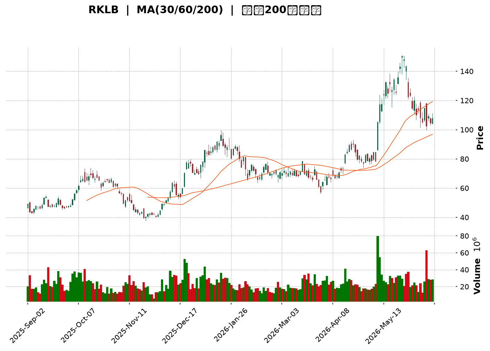
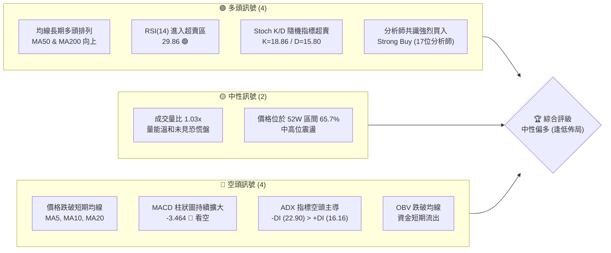
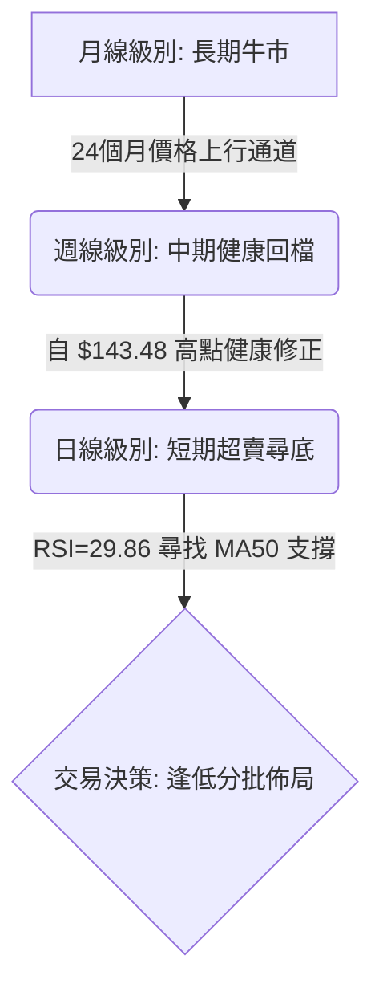
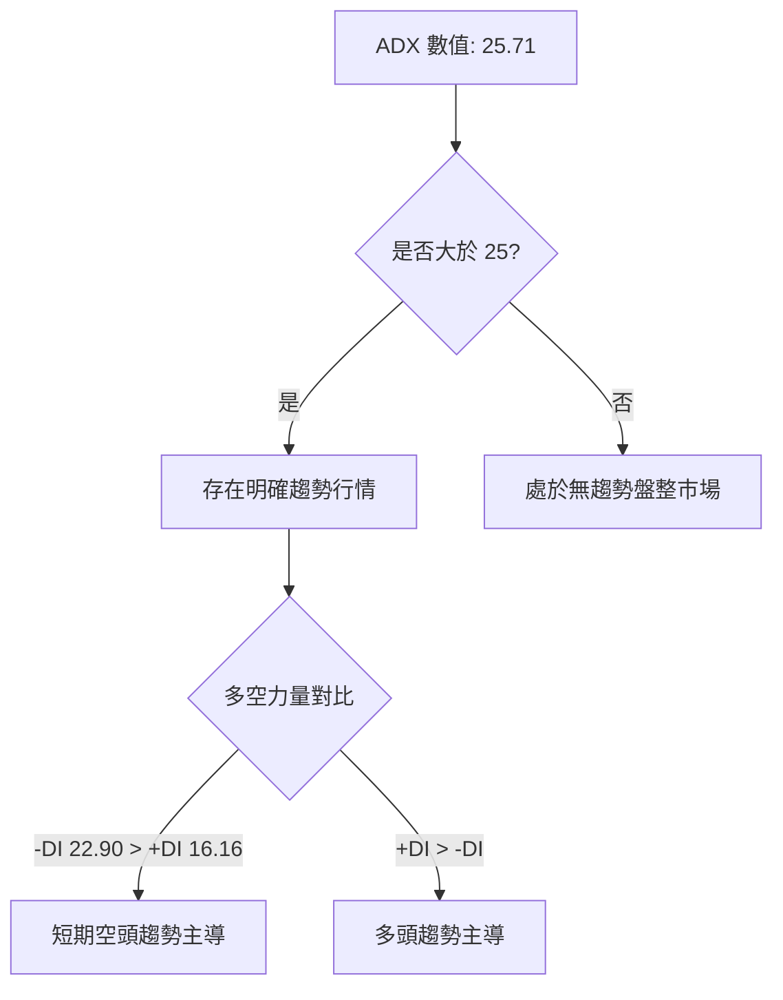
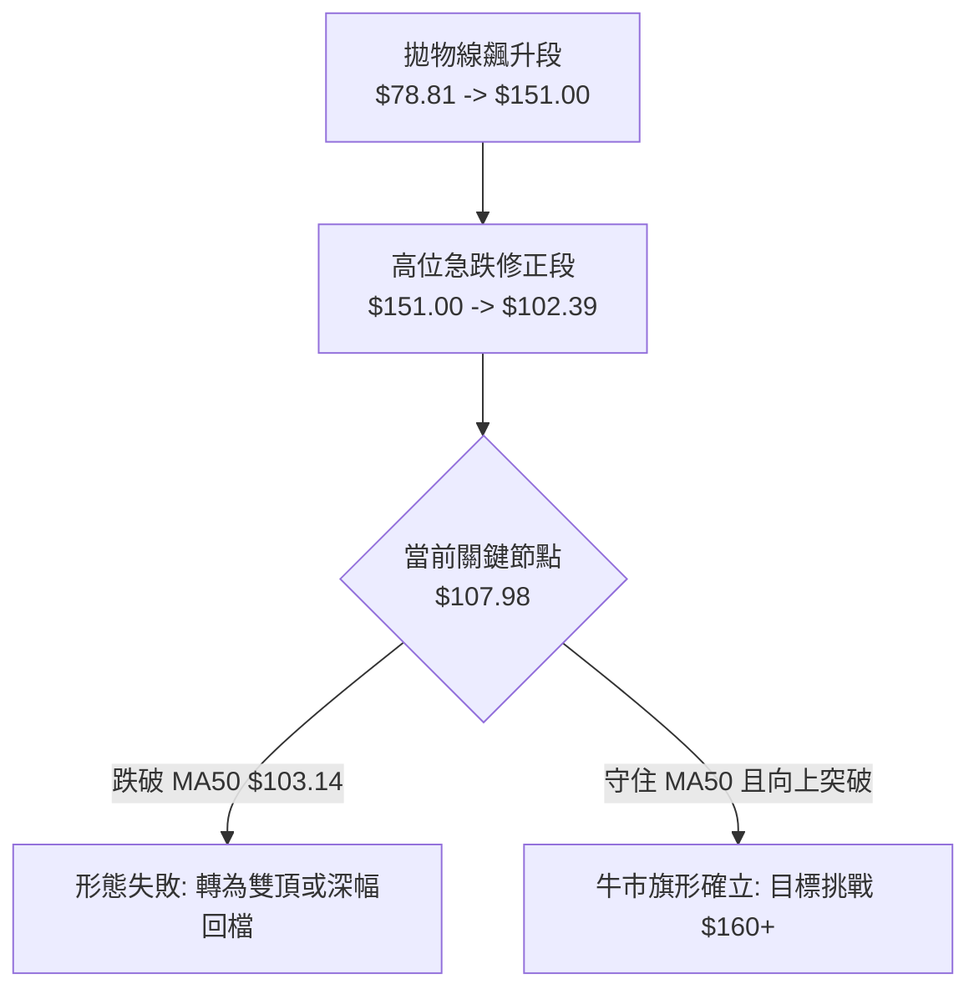
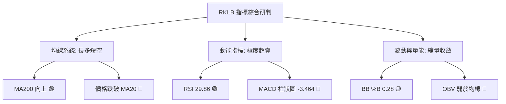
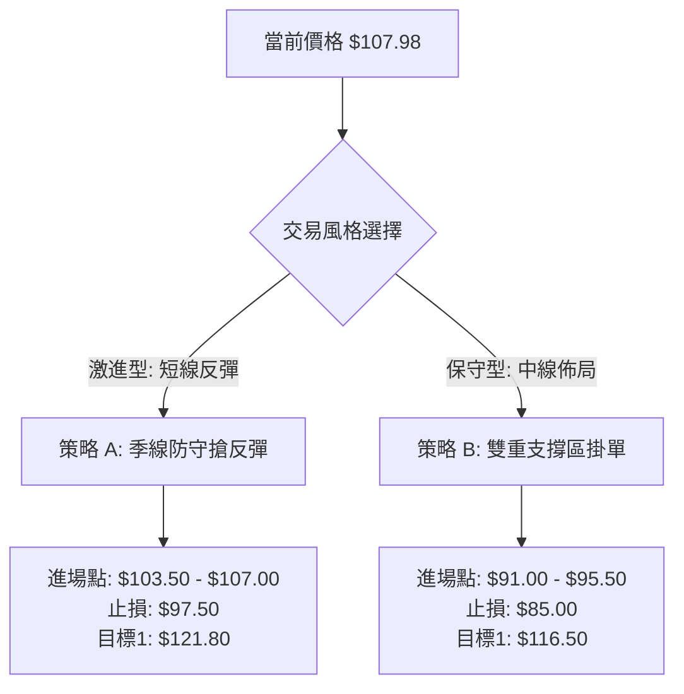
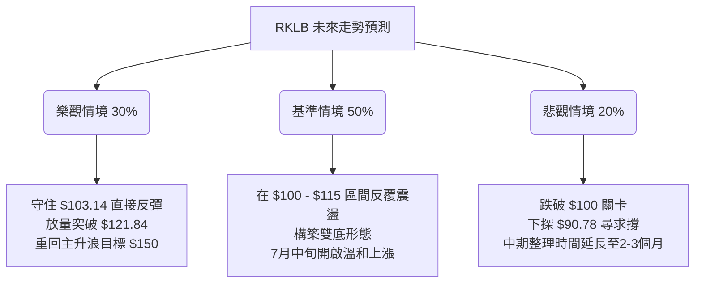

<details>
<summary>📊 靜態圖表 (點擊展開)</summary>

</details>

<html>
<head><meta charset="utf-8" /></head>
<body>
    <div style="height:500px; width:100%;">                        <script>window.PlotlyConfig = {MathJaxConfig: 'local'};</script>
        <script charset="utf-8" src="https://cdn.plot.ly/plotly-3.6.0.min.js" integrity="sha256-QaOVwtVY0T02VaHrr6pnoHLCwayMJp4O5n4YyaE3rJk=" crossorigin="anonymous"></script>                <div id="candlestick-chart" class="plotly-graph-div" style="height:100%; width:100%;"></div>            <script>                window.PLOTLYENV=window.PLOTLYENV || {};                                if (document.getElementById("candlestick-chart")) {                    Plotly.newPlot(                        "candlestick-chart",                        [{"close":{"dtype":"f8","bdata":"AAAAIK6nSEAAAAAA18NFQAAAAGC4fkVAAAAAIIXrRkAAAACgcN1HQAAAAADXg0dAAAAAgMIVR0AAAABACjdIQAAAACCFq0pAAAAAwB4FS0AAAAAgXJ9HQAAAAIA9CkhAAAAAQAqXR0AAAADAHuVHQAAAACCu50hAAAAA4Hp0SkAAAADgUVhIQAAAAOCjUEdAAAAAoEchR0AAAACgR4FHQAAAAOB69EdAAAAAACn8R0AAAAAAKTxKQAAAAOB6FExAAAAAAABATUAAAACgR8FOQAAAAADXU1BAAAAAQOGaUEAAAADgoxBQQAAAAEDhWlBAAAAAgOsBUUAAAACgR1FRQAAAAAAAwFBAAAAAoEeRUEAAAABgZtZQQAAAAKCZWVBAAAAA4FFITkAAAADA9chPQAAAAADXI1BAAAAAIK5nUEAAAAAAAOBPQAAAAIA9ilBAAAAAgMJ1TkAAAACgcH1PQAAAACCFq05AAAAAwPVITEAAAACAwjVMQAAAAIAUzkhAAAAAgOvRSUAAAABAM\u002fNJQAAAAGC4nklAAAAAACn8SEAAAAAAAKBGQAAAAMAexUZAAAAAIK6nRUAAAAAA12NFQAAAACBcz0VAAAAAoHC9Q0AAAABgZiZEQAAAAKCZOUVAAAAAwMxMRUAAAABACvdEQAAAAIDrEUVAAAAAIFwvREAAAABAM\u002fNEQAAAAAApXEZAAAAAIFyvSEAAAABACodIQAAAACCux0lAAAAAQAq3SkAAAABgj8JMQAAAAADXw09AAAAAYLi+TkAAAADgerRLQAAAAGC4vktAAAAAQOH6SkAAAACAwvVNQAAAAKBHoVFAAAAAQDNjU0AAAAAghUtTQAAAACCFS1NAAAAAoJmpUUAAAAAgrodRQAAAAMDMnFFAAAAA4KNwUUAAAAAgXP9SQAAAAMD1iFNAAAAAgOuBVUAAAADAHgVVQAAAAMAexVRAAAAAYGY2VUAAAACgmflVQAAAAMAepVVAAAAAQDPzVkAAAADgo7BWQAAAAEAzE1hAAAAAgD1KVkAAAADgevRVQAAAAGC4\u002flVAAAAAoJk5VkAAAABguB5UQAAAAAAAwFVAAAAA4HokVkAAAAAghWtVQAAAAOB6BFRAAAAAoJmJUkAAAACgR1FUQAAAAEAKR1JAAAAA4HqUUEAAAADgehRSQAAAAIDC9VJAAAAAgOsBUkAAAAAgrmdRQAAAAOCjgFBAAAAAACncUEAAAADA9XhRQAAAAEDhmlJAAAAAwB4lU0AAAABACrdRQAAAAKBwjVFAAAAAgBR+UUAAAADAzIxRQAAAAKCZKVJAAAAAYGZGUUAAAACAFL5RQAAAAOBRiFFAAAAAgD36UUAAAAAAAIBRQAAAAEAKh1FAAAAAYLjeUUAAAAAghTtRQAAAAKBw\u002fVFAAAAAIK4XUUAAAACAPRpRQAAAAADX01FAAAAAgMKlU0AAAABguF5RQAAAACCF+1FAAAAAYLjOUEAAAAAAAABRQAAAAOB6hFBAAAAA4FE4UkAAAAAAKXxQQAAAAEAKd05AAAAA4KOwTEAAAACAFA5QQAAAAKBHYVBAAAAAYLjuUEAAAABA4epQQAAAAOB6lFBAAAAAwB5FUUAAAAAgXK9QQAAAAEAzA1FAAAAAIK6nUUAAAACAFA5SQAAAAGBmZlJAAAAAIIW7VEAAAABAMzNVQAAAAKBwXVZAAAAAwPWoVUAAAABgj4JWQAAAAGBmJlVAAAAAIIXrU0AAAABgj5JUQAAAAIDCpVNAAAAAoEdBU0AAAADgo6BUQAAAAADXs1NAAAAAANcTVEAAAADgo7BTQAAAAKCZKVVAAAAAwB6lU0AAAACAFF5aQAAAAGBmVl1AAAAAANdjXUAAAACgmQlfQAAAAKCZkWBAAAAAoEcxX0AAAADAHmVgQAAAAADX019AAAAAwPXIYEAAAADAzFxfQAAAAOBR+GBAAAAAYGbmYUAAAAAgXMdiQAAAAMD1gGJAAAAAIFzvYUAAAADA9ZheQAAAAOB61F5AAAAAwMysXEAAAADAzPxdQAAAAMAehVtAAAAAoJlpXEAAAABguA5bQAAAAEAzQ1pAAAAAgOuxXEAAAADA9ZhZQAAAAAAAUFtAAAAA4FEoWkAAAABguP5aQA=="},"high":{"dtype":"f8","bdata":"AAAAwB7FSEAAAABAM3NJQAAAAIA9SkZAAAAAYLj+RkAAAACgmRlIQAAAAADXw0dAAAAAgBQOSEAAAADAHtVIQAAAAADXA0tAAAAAgMKVS0AAAACAPQpKQAAAAMAeRUhAAAAA4FGYSEAAAABACndIQAAAAKBHIUlAAAAAYDkUS0AAAACgcD1KQAAAACBcT0hAAAAA4FHYR0AAAADAzAxIQAAAAGC4\u002fkdAAAAAgMK1SEAAAABAM1NKQAAAACAxeExAAAAAoEehTUAAAAAgrkdPQAAAAAAtIlFAAAAAYI8iUUAAAAAAAGBSQAAAAAApnFFAAAAAQOFqUUAAAACAFH5SQAAAAAAAEFJAAAAAAAAgUUAAAAAghQtSQAAAAGCPAlFAAAAAoEcBUEAAAADAzCxQQAAAACCFi1BAAAAAYGaWUEAAAABgj6JQQAAAAMD12FBAAAAAIIVLUEAAAACgmblPQAAAAMDMjE9AAAAAYLi+TUAAAAAA16NMQAAAAEDhGkxAAAAAwMwMSkAAAAAAAEBLQAAAAEDhekxAAAAAgD2qS0AAAADgo7BIQAAAAAApnEdAAAAAwEvXRkAAAACAFM5FQAAAAADXQ0ZAAAAAoEchR0AAAACAwoVEQAAAAADXQ0VAAAAAQApnRUAAAAAghctFQAAAAKCZWUVAAAAAYGamREAAAABguH5FQAAAAGC4XkZAAAAAQArXSEAAAACgmdlIQAAAACBcL0pAAAAAAADgSkAAAACAPWpNQAAAAKCZCVBAAAAAIIVLUEAAAAAA1yNQQAAAAKBwXUxAAAAA4Hp0TEAAAAAAACBOQAAAAADXo1FAAAAAwMycU0AAAAAghctTQAAAAMAe9VNAAAAAIFw\u002fU0AAAAAgXC9SQAAAAAAprFJAAAAAQItMUkAAAAAgXA9TQAAAAAAAkFNAAAAAAACQVUAAAACgcH1VQAAAACCud1ZAAAAAIIUbVkAAAACAwjVWQAAAAOCnblZAAAAAACkMV0AAAABAYB1XQAAAAMAe5VhAAAAAoEeRWEAAAAAAANBWQAAAAKCZWVZAAAAAwMycV0AAAACAPcpVQAAAAAAAwFVAAAAAQDNzVkAAAAAAAEBWQAAAAOB6VFZAAAAAwMwsVEAAAADgelRUQAAAAGBmVlRAAAAAIFw\u002fUkAAAACAPSpSQAAAAEAzM1NAAAAAQAr3UkAAAACgmVlSQAAAAMDMHFFAAAAAYGZmUUAAAAAgXL9RQAAAAMD18FJAAAAAQApHU0AAAADAzIxTQAAAAAAA0FFAAAAAIIWDUUAAAABgZvZRQAAAACBcL1JAAAAAgMJlUUAAAABgZgZSQAAAAAAAUFJAAAAAYGaGUkAAAAAA1xNSQAAAAEAKx1JAAAAAAAAIUkAAAAAA1ztSQAAAAEAzU1JAAAAAYGYmUkAAAAAA19NRQAAAAOBRGFJAAAAAQOGqU0AAAADgUThTQAAAAGC4LlJAAAAAYLh+UkAAAADAzFxRQAAAAGBmJlFAAAAAANfDUkAAAACAwgVSQAAAAIAUhlBAAAAAgOvRTkAAAADAHiVQQAAAAEDhKlFAAAAAwPVYUUAAAADgepRRQAAAAEAzE1FAAAAAgMBqUkAAAABgj3JRQAAAAADXg1FAAAAAQDPjUUAAAAAAALBSQAAAAIDCpVJAAAAAIFzfVEAAAAAgXL9VQAAAAGBmllZAAAAAwMz8VkAAAABgZkZXQAAAAEAzk1ZAAAAAgD2aVUAAAABguJ5UQAAAAIDrcVRAAAAA4KOAU0AAAACAwuVUQAAAAGCP8lRAAAAA4E91VEAAAAAAAMBUQAAAACCFK1VAAAAAYI8yVUAAAAAgrmdaQAAAAAAp\u002fF5AAAAAIFxfXkAAAAAgXM9fQAAAAIDCpWBAAAAAANdLYEAAAAAAKUxhQAAAAIA9MmBAAAAAQDPrYEAAAAAA11tgQAAAAOBReGFAAAAAAABAYkAAAAAAAOBiQAAAAGCP2mJAAAAAAAAAYkAAAAAAKfRgQAAAAMDMDGBAAAAA4FGgXkAAAADgUaheQAAAAGC4fl1AAAAAAAAQXUAAAABgj\u002fJdQAAAAKBw\u002fVtAAAAAQOHCXEAAAADAIJhdQAAAAIDrsVtAAAAAAAAgW0AAAADAHtVbQA=="},"hovertemplate":"\u003cb\u003e%{x|%Y-%m-%d}\u003c\u002fb\u003e\u003cbr\u003e\u958b: $%{open:.2f}\u003cbr\u003e\u9ad8: $%{high:.2f}\u003cbr\u003e\u4f4e: $%{low:.2f}\u003cbr\u003e\u6536: $%{close:.2f}\u003cextra\u003e\u003c\u002fextra\u003e","low":{"dtype":"f8","bdata":"AAAAQArXRkAAAABAicFFQAAAAKCZWUVAAAAAgOsxRUAAAADAdr5GQAAAAECJwUZAAAAAwMzMRkAAAABACgdHQAAAAEA1TkhAAAAAAClcSkAAAACgR4FHQAAAAKCZOUdAAAAAAACAR0AAAADgo5BHQAAAAGBmZkdAAAAA4Hr0R0AAAABACjdIQAAAAEDhmkZAAAAAgD3qRkAAAAAgXC9HQAAAAKBHQUdAAAAAIFyPR0AAAACgR0FIQAAAAKBHoUlAAAAAYGbmS0AAAABgj4JMQAAAAEAz009AAAAAQOEaUEAAAADA9QhQQAAAAODOJ1BAAAAA4FEYT0AAAADAHsVQQAAAAEAzm1BAAAAAoJnZT0AAAABAM6tQQAAAAEAKN1BAAAAA4Ho0TUAAAAAAAGBOQAAAAEAz009AAAAAoJkJUEAAAACAFM5PQAAAAKBwvU9AAAAAgOtxTkAAAABAMzNOQAAAAOCjkE1AAAAAoEdBTEAAAAAgXG9LQAAAAOB6tEhAAAAA4M4nR0AAAACgR2FJQAAAAEDhmklAAAAA4HrUSEAAAAAgXC9GQAAAAGBmpkVAAAAAwMwcRUAAAACgcJ1EQAAAAEAKN0VAAAAAwPWoQ0AAAADA9chCQAAAAGBmpkNAAAAA4KMwREAAAADgo7BEQAAAAGBm5kRAAAAAoHD9Q0AAAACAwjVEQAAAAAAAwERAAAAAwPVoRkAAAACgmdlHQAAAAAApnEhAAAAAIIUrSUAAAAAAACBKQAAAAMDMbExAAAAAYGbmTUAAAACAPYpLQAAAAEAKV0pAAAAAQOGKSkAAAAAA1wNMQAAAAMCdX05AAAAAwCAwUkAAAABgj1JSQAAAAKBDs1JAAAAAwPWYUUAAAACgm1RRQAAAAAApnFFAAAAA4FFIUUAAAABgZrZQQAAAAADX01FAAAAAQDODUkAAAABgZnZUQAAAAOCjkFRAAAAAwMycVEAAAADg0NpUQAAAAKCZaVVAAAAAAAAgVUAAAACgmalVQAAAAKCZGVdAAAAAQDMTVkAAAACgcK1UQAAAAMB2VlRAAAAAIK6HVUAAAADgowBUQAAAAAAAgFRAAAAAwMqBVUAAAAAAAMBUQAAAAKBHgVNAAAAAgEF4UkAAAACgR\u002fFSQAAAAEAIJFFAAAAAwMxMUEAAAAAAAMBQQAAAAAAAsFFAAAAAQDPjUUAAAACgR8FQQAAAACBc709AAAAAAABgUEAAAAAAAEBQQAAAAMBLf1FAAAAAYGYWUkAAAACgmVlRQAAAAAAAIFFAAAAAYGamUEAAAADgUThRQAAAAADXM1FAAAAAYGYGUEAAAADAzJxQQAAAAAApjFBAAAAAgBReUUAAAACAwtVQQAAAAOCjCFFAAAAA4Hr0UEAAAACAvidRQAAAAMAeFVFAAAAAgOsRUUAAAAAAKdxQQAAAAEDhKlFAAAAAoEfRUUAAAACgmVlRQAAAAAAAAFFAAAAAwPWYUEAAAABAM4NQQAAAAKBwHVBAAAAAACk8UUAAAACAwmVQQAAAAMDMLE5AAAAAYOUQTEAAAAAA14NNQAAAAEAzU1BAAAAAgBTuTkAAAABgZqZQQAAAAEDh+k9AAAAAYOfzUEAAAABA4aJQQAAAAIDClVBAAAAAgMKlUEAAAABguJ5RQAAAAGBmZlFAAAAAoJk5U0AAAABgZuZUQAAAAGBmJlVAAAAAAABwVUAAAADgo\u002fBVQAAAAAApZFRAAAAAwB7FU0AAAADAdENTQAAAAGBmZlNAAAAAIFx\u002fUkAAAACAFF5TQAAAACCFm1NAAAAAAAAQU0AAAAAA1yNTQAAAAEAKt1NAAAAAIIV7U0AAAAAgrndVQAAAAAAAAFpAAAAAgD0aXEAAAADA9ThdQAAAAADXU15AAAAAQDNzXkAAAACg8WpfQAAAAGC4zlxAAAAAgBQOX0AAAABAM\u002fNeQAAAAIDraWBAAAAAgOtRYUAAAADAHj1hQAAAAADXy2FAAAAAoJnBYEAAAAAAAEBeQAAAAADXo15AAAAAgD1qXEAAAADA9ZhbQAAAAGC4rlpAAAAAAADAW0AAAADAzExZQAAAAIA9GlpAAAAAoJlZWkAAAABACudYQAAAAEAzc1pAAAAA4HrEWUAAAABgjwJaQA=="},"name":"\u50f9\u683c","open":{"dtype":"f8","bdata":"AAAAAABgR0AAAABgjyJJQAAAAOB6FEZAAAAA4FHIRUAAAAAAAMBGQAAAAKBHgUdAAAAAANfDR0AAAADA9ShHQAAAAKBwfUhAAAAAgD3KSkAAAAAAAABKQAAAAOBRyEdAAAAAgMJ1SEAAAABACtdHQAAAAOCjkEdAAAAAQDODSEAAAACAwuVJQAAAAAAAAEhAAAAAYGamR0AAAABAM7NHQAAAAEDhmkdAAAAA4KOwR0AAAACA61FIQAAAAGBmBkpAAAAAYLhuTEAAAACgR4FNQAAAAKCZCVBAAAAAoJk5UEAAAABAM7NRQAAAAOBR+FBAAAAAgMJVUEAAAACgR4FRQAAAAOB6hFFAAAAAwPV4UEAAAADgo0hRQAAAAGCPAlFAAAAAACl8T0AAAAAgrsdOQAAAAADXM1BAAAAAACmMUEAAAABAM2tQQAAAAKBHCVBAAAAAAABAUEAAAABgj+JOQAAAAADXg09AAAAAYGbmTEAAAADgelRMQAAAAEDhGkxAAAAAoBjUR0AAAABguN5KQAAAAAAAAExAAAAAQAr3SUAAAACgR2FIQAAAAEDh2kVAAAAAQDOTRkAAAAAAKRxFQAAAAAAAQEVAAAAAgD0KR0AAAACAPepDQAAAAKBHYURAAAAAANcDRUAAAABguJ5FQAAAAKBHQUVAAAAAQDOTREAAAAAgrkdEQAAAAGCP8kRAAAAAYI\u002fSRkAAAAAAAHBIQAAAAIA9CklAAAAAoHCdSUAAAADgUbhKQAAAAKBHwUxAAAAAAABAT0AAAADgp4ZPQAAAAOBRGEtAAAAAwMwMTEAAAACgmRlMQAAAACBcj05AAAAAACk8UkAAAAAA13NSQAAAAIA9glNAAAAAIIUrU0AAAAAAAGBRQAAAAKCZQVJAAAAAAADgUUAAAADgUahRQAAAACCup1JAAAAA4KNwU0AAAABgZgZVQAAAAAAAYFVAAAAAoJkhVUAAAABguD5VQAAAAMD1SFZAAAAAYGaWVUAAAADA9VBWQAAAAKCZIVdAAAAAwMxsV0AAAACgR4FWQAAAAOBRmFVAAAAAIIVDVkAAAAAgrq9VQAAAAMD1uFRAAAAAgBTOVUAAAAAAKfxVQAAAAAAAQFVAAAAAgD3KU0AAAABgZqZTQAAAAGBmVlRAAAAAYLh+UUAAAAAAAEBRQAAAAKCZAVJAAAAAgBSmUkAAAADgUUhSQAAAAIDr4VBAAAAA4HqsUEAAAABAYIVQQAAAAAAAwFFAAAAAoJk5UkAAAAAg2d5SQAAAAOBRMFFAAAAA4FE4UUAAAACAFMZRQAAAAEDhglFAAAAAgMLlUEAAAAAghatQQAAAAGC4NlFAAAAAANezUUAAAABA4bpRQAAAAOCjCFFAAAAAwPVYUUAAAACAwpVRQAAAAEAzM1FAAAAAwMz8UUAAAACgmUlRQAAAAMDMVFFAAAAAYGbeUUAAAABgjwJTQAAAAOB6NFFAAAAAAAAAUkAAAACgcAVRQAAAAAAAwFBAAAAAACk8UUAAAADAzMxRQAAAAOCjgFBAAAAAoJm5TkAAAABA4dpOQAAAAAAAYFBAAAAAwMwcT0AAAABguO5QQAAAACBcx1BAAAAAAAAAUkAAAAAA10NRQAAAAMDM7FBAAAAAQDPDUEAAAAAghWNSQAAAAKBwZVJAAAAAgBQ+U0AAAADAHgVVQAAAAGBmNlVAAAAAwB6VVkAAAACAwp1WQAAAAGBmdlZAAAAAgMKVVUAAAAAAKexTQAAAAMDMBFRAAAAAQAp3U0AAAABAM2NTQAAAAIDr4VRAAAAAQAqXU0AAAABgZqZUQAAAACCu51NAAAAAoHAtVUAAAACAPYJVQAAAAKBHUVpAAAAA4KMwXEAAAACgR\u002fleQAAAAGBmxl5AAAAAQDMDYEAAAAAAKZhgQAAAAIAUfl9AAAAAYLjeX0AAAADA9YhfQAAAAMAebWBAAAAAQOG+YUAAAABACrdiQAAAAKBwZWJAAAAAgBR+YUAAAAAAKYxgQAAAAIDCVV9AAAAAwB7lXUAAAACgcEVcQAAAAKBHkVxAAAAAQOGqXEAAAACgmZldQAAAAMDM7FpAAAAAgMKlWkAAAACgR4FdQAAAAKBw\u002fVpAAAAAoHDtWkAAAAAgrgdaQA=="},"x":["2025-09-02T00:00:00-04:00","2025-09-03T00:00:00-04:00","2025-09-04T00:00:00-04:00","2025-09-05T00:00:00-04:00","2025-09-08T00:00:00-04:00","2025-09-09T00:00:00-04:00","2025-09-10T00:00:00-04:00","2025-09-11T00:00:00-04:00","2025-09-12T00:00:00-04:00","2025-09-15T00:00:00-04:00","2025-09-16T00:00:00-04:00","2025-09-17T00:00:00-04:00","2025-09-18T00:00:00-04:00","2025-09-19T00:00:00-04:00","2025-09-22T00:00:00-04:00","2025-09-23T00:00:00-04:00","2025-09-24T00:00:00-04:00","2025-09-25T00:00:00-04:00","2025-09-26T00:00:00-04:00","2025-09-29T00:00:00-04:00","2025-09-30T00:00:00-04:00","2025-10-01T00:00:00-04:00","2025-10-02T00:00:00-04:00","2025-10-03T00:00:00-04:00","2025-10-06T00:00:00-04:00","2025-10-07T00:00:00-04:00","2025-10-08T00:00:00-04:00","2025-10-09T00:00:00-04:00","2025-10-10T00:00:00-04:00","2025-10-13T00:00:00-04:00","2025-10-14T00:00:00-04:00","2025-10-15T00:00:00-04:00","2025-10-16T00:00:00-04:00","2025-10-17T00:00:00-04:00","2025-10-20T00:00:00-04:00","2025-10-21T00:00:00-04:00","2025-10-22T00:00:00-04:00","2025-10-23T00:00:00-04:00","2025-10-24T00:00:00-04:00","2025-10-27T00:00:00-04:00","2025-10-28T00:00:00-04:00","2025-10-29T00:00:00-04:00","2025-10-30T00:00:00-04:00","2025-10-31T00:00:00-04:00","2025-11-03T00:00:00-05:00","2025-11-04T00:00:00-05:00","2025-11-05T00:00:00-05:00","2025-11-06T00:00:00-05:00","2025-11-07T00:00:00-05:00","2025-11-10T00:00:00-05:00","2025-11-11T00:00:00-05:00","2025-11-12T00:00:00-05:00","2025-11-13T00:00:00-05:00","2025-11-14T00:00:00-05:00","2025-11-17T00:00:00-05:00","2025-11-18T00:00:00-05:00","2025-11-19T00:00:00-05:00","2025-11-20T00:00:00-05:00","2025-11-21T00:00:00-05:00","2025-11-24T00:00:00-05:00","2025-11-25T00:00:00-05:00","2025-11-26T00:00:00-05:00","2025-11-28T00:00:00-05:00","2025-12-01T00:00:00-05:00","2025-12-02T00:00:00-05:00","2025-12-03T00:00:00-05:00","2025-12-04T00:00:00-05:00","2025-12-05T00:00:00-05:00","2025-12-08T00:00:00-05:00","2025-12-09T00:00:00-05:00","2025-12-10T00:00:00-05:00","2025-12-11T00:00:00-05:00","2025-12-12T00:00:00-05:00","2025-12-15T00:00:00-05:00","2025-12-16T00:00:00-05:00","2025-12-17T00:00:00-05:00","2025-12-18T00:00:00-05:00","2025-12-19T00:00:00-05:00","2025-12-22T00:00:00-05:00","2025-12-23T00:00:00-05:00","2025-12-24T00:00:00-05:00","2025-12-26T00:00:00-05:00","2025-12-29T00:00:00-05:00","2025-12-30T00:00:00-05:00","2025-12-31T00:00:00-05:00","2026-01-02T00:00:00-05:00","2026-01-05T00:00:00-05:00","2026-01-06T00:00:00-05:00","2026-01-07T00:00:00-05:00","2026-01-08T00:00:00-05:00","2026-01-09T00:00:00-05:00","2026-01-12T00:00:00-05:00","2026-01-13T00:00:00-05:00","2026-01-14T00:00:00-05:00","2026-01-15T00:00:00-05:00","2026-01-16T00:00:00-05:00","2026-01-20T00:00:00-05:00","2026-01-21T00:00:00-05:00","2026-01-22T00:00:00-05:00","2026-01-23T00:00:00-05:00","2026-01-26T00:00:00-05:00","2026-01-27T00:00:00-05:00","2026-01-28T00:00:00-05:00","2026-01-29T00:00:00-05:00","2026-01-30T00:00:00-05:00","2026-02-02T00:00:00-05:00","2026-02-03T00:00:00-05:00","2026-02-04T00:00:00-05:00","2026-02-05T00:00:00-05:00","2026-02-06T00:00:00-05:00","2026-02-09T00:00:00-05:00","2026-02-10T00:00:00-05:00","2026-02-11T00:00:00-05:00","2026-02-12T00:00:00-05:00","2026-02-13T00:00:00-05:00","2026-02-17T00:00:00-05:00","2026-02-18T00:00:00-05:00","2026-02-19T00:00:00-05:00","2026-02-20T00:00:00-05:00","2026-02-23T00:00:00-05:00","2026-02-24T00:00:00-05:00","2026-02-25T00:00:00-05:00","2026-02-26T00:00:00-05:00","2026-02-27T00:00:00-05:00","2026-03-02T00:00:00-05:00","2026-03-03T00:00:00-05:00","2026-03-04T00:00:00-05:00","2026-03-05T00:00:00-05:00","2026-03-06T00:00:00-05:00","2026-03-09T00:00:00-04:00","2026-03-10T00:00:00-04:00","2026-03-11T00:00:00-04:00","2026-03-12T00:00:00-04:00","2026-03-13T00:00:00-04:00","2026-03-16T00:00:00-04:00","2026-03-17T00:00:00-04:00","2026-03-18T00:00:00-04:00","2026-03-19T00:00:00-04:00","2026-03-20T00:00:00-04:00","2026-03-23T00:00:00-04:00","2026-03-24T00:00:00-04:00","2026-03-25T00:00:00-04:00","2026-03-26T00:00:00-04:00","2026-03-27T00:00:00-04:00","2026-03-30T00:00:00-04:00","2026-03-31T00:00:00-04:00","2026-04-01T00:00:00-04:00","2026-04-02T00:00:00-04:00","2026-04-06T00:00:00-04:00","2026-04-07T00:00:00-04:00","2026-04-08T00:00:00-04:00","2026-04-09T00:00:00-04:00","2026-04-10T00:00:00-04:00","2026-04-13T00:00:00-04:00","2026-04-14T00:00:00-04:00","2026-04-15T00:00:00-04:00","2026-04-16T00:00:00-04:00","2026-04-17T00:00:00-04:00","2026-04-20T00:00:00-04:00","2026-04-21T00:00:00-04:00","2026-04-22T00:00:00-04:00","2026-04-23T00:00:00-04:00","2026-04-24T00:00:00-04:00","2026-04-27T00:00:00-04:00","2026-04-28T00:00:00-04:00","2026-04-29T00:00:00-04:00","2026-04-30T00:00:00-04:00","2026-05-01T00:00:00-04:00","2026-05-04T00:00:00-04:00","2026-05-05T00:00:00-04:00","2026-05-06T00:00:00-04:00","2026-05-07T00:00:00-04:00","2026-05-08T00:00:00-04:00","2026-05-11T00:00:00-04:00","2026-05-12T00:00:00-04:00","2026-05-13T00:00:00-04:00","2026-05-14T00:00:00-04:00","2026-05-15T00:00:00-04:00","2026-05-18T00:00:00-04:00","2026-05-19T00:00:00-04:00","2026-05-20T00:00:00-04:00","2026-05-21T00:00:00-04:00","2026-05-22T00:00:00-04:00","2026-05-26T00:00:00-04:00","2026-05-27T00:00:00-04:00","2026-05-28T00:00:00-04:00","2026-05-29T00:00:00-04:00","2026-06-01T00:00:00-04:00","2026-06-02T00:00:00-04:00","2026-06-03T00:00:00-04:00","2026-06-04T00:00:00-04:00","2026-06-05T00:00:00-04:00","2026-06-08T00:00:00-04:00","2026-06-09T00:00:00-04:00","2026-06-10T00:00:00-04:00","2026-06-11T00:00:00-04:00","2026-06-12T00:00:00-04:00","2026-06-15T00:00:00-04:00","2026-06-16T00:00:00-04:00","2026-06-17T00:00:00-04:00"],"type":"candlestick"},{"hovertemplate":"MA30: $%{y:.2f}\u003cextra\u003e\u003c\u002fextra\u003e","line":{"color":"#2196F3","dash":"dash","width":2},"mode":"lines","name":"MA30","x":["2025-09-02T00:00:00-04:00","2025-09-03T00:00:00-04:00","2025-09-04T00:00:00-04:00","2025-09-05T00:00:00-04:00","2025-09-08T00:00:00-04:00","2025-09-09T00:00:00-04:00","2025-09-10T00:00:00-04:00","2025-09-11T00:00:00-04:00","2025-09-12T00:00:00-04:00","2025-09-15T00:00:00-04:00","2025-09-16T00:00:00-04:00","2025-09-17T00:00:00-04:00","2025-09-18T00:00:00-04:00","2025-09-19T00:00:00-04:00","2025-09-22T00:00:00-04:00","2025-09-23T00:00:00-04:00","2025-09-24T00:00:00-04:00","2025-09-25T00:00:00-04:00","2025-09-26T00:00:00-04:00","2025-09-29T00:00:00-04:00","2025-09-30T00:00:00-04:00","2025-10-01T00:00:00-04:00","2025-10-02T00:00:00-04:00","2025-10-03T00:00:00-04:00","2025-10-06T00:00:00-04:00","2025-10-07T00:00:00-04:00","2025-10-08T00:00:00-04:00","2025-10-09T00:00:00-04:00","2025-10-10T00:00:00-04:00","2025-10-13T00:00:00-04:00","2025-10-14T00:00:00-04:00","2025-10-15T00:00:00-04:00","2025-10-16T00:00:00-04:00","2025-10-17T00:00:00-04:00","2025-10-20T00:00:00-04:00","2025-10-21T00:00:00-04:00","2025-10-22T00:00:00-04:00","2025-10-23T00:00:00-04:00","2025-10-24T00:00:00-04:00","2025-10-27T00:00:00-04:00","2025-10-28T00:00:00-04:00","2025-10-29T00:00:00-04:00","2025-10-30T00:00:00-04:00","2025-10-31T00:00:00-04:00","2025-11-03T00:00:00-05:00","2025-11-04T00:00:00-05:00","2025-11-05T00:00:00-05:00","2025-11-06T00:00:00-05:00","2025-11-07T00:00:00-05:00","2025-11-10T00:00:00-05:00","2025-11-11T00:00:00-05:00","2025-11-12T00:00:00-05:00","2025-11-13T00:00:00-05:00","2025-11-14T00:00:00-05:00","2025-11-17T00:00:00-05:00","2025-11-18T00:00:00-05:00","2025-11-19T00:00:00-05:00","2025-11-20T00:00:00-05:00","2025-11-21T00:00:00-05:00","2025-11-24T00:00:00-05:00","2025-11-25T00:00:00-05:00","2025-11-26T00:00:00-05:00","2025-11-28T00:00:00-05:00","2025-12-01T00:00:00-05:00","2025-12-02T00:00:00-05:00","2025-12-03T00:00:00-05:00","2025-12-04T00:00:00-05:00","2025-12-05T00:00:00-05:00","2025-12-08T00:00:00-05:00","2025-12-09T00:00:00-05:00","2025-12-10T00:00:00-05:00","2025-12-11T00:00:00-05:00","2025-12-12T00:00:00-05:00","2025-12-15T00:00:00-05:00","2025-12-16T00:00:00-05:00","2025-12-17T00:00:00-05:00","2025-12-18T00:00:00-05:00","2025-12-19T00:00:00-05:00","2025-12-22T00:00:00-05:00","2025-12-23T00:00:00-05:00","2025-12-24T00:00:00-05:00","2025-12-26T00:00:00-05:00","2025-12-29T00:00:00-05:00","2025-12-30T00:00:00-05:00","2025-12-31T00:00:00-05:00","2026-01-02T00:00:00-05:00","2026-01-05T00:00:00-05:00","2026-01-06T00:00:00-05:00","2026-01-07T00:00:00-05:00","2026-01-08T00:00:00-05:00","2026-01-09T00:00:00-05:00","2026-01-12T00:00:00-05:00","2026-01-13T00:00:00-05:00","2026-01-14T00:00:00-05:00","2026-01-15T00:00:00-05:00","2026-01-16T00:00:00-05:00","2026-01-20T00:00:00-05:00","2026-01-21T00:00:00-05:00","2026-01-22T00:00:00-05:00","2026-01-23T00:00:00-05:00","2026-01-26T00:00:00-05:00","2026-01-27T00:00:00-05:00","2026-01-28T00:00:00-05:00","2026-01-29T00:00:00-05:00","2026-01-30T00:00:00-05:00","2026-02-02T00:00:00-05:00","2026-02-03T00:00:00-05:00","2026-02-04T00:00:00-05:00","2026-02-05T00:00:00-05:00","2026-02-06T00:00:00-05:00","2026-02-09T00:00:00-05:00","2026-02-10T00:00:00-05:00","2026-02-11T00:00:00-05:00","2026-02-12T00:00:00-05:00","2026-02-13T00:00:00-05:00","2026-02-17T00:00:00-05:00","2026-02-18T00:00:00-05:00","2026-02-19T00:00:00-05:00","2026-02-20T00:00:00-05:00","2026-02-23T00:00:00-05:00","2026-02-24T00:00:00-05:00","2026-02-25T00:00:00-05:00","2026-02-26T00:00:00-05:00","2026-02-27T00:00:00-05:00","2026-03-02T00:00:00-05:00","2026-03-03T00:00:00-05:00","2026-03-04T00:00:00-05:00","2026-03-05T00:00:00-05:00","2026-03-06T00:00:00-05:00","2026-03-09T00:00:00-04:00","2026-03-10T00:00:00-04:00","2026-03-11T00:00:00-04:00","2026-03-12T00:00:00-04:00","2026-03-13T00:00:00-04:00","2026-03-16T00:00:00-04:00","2026-03-17T00:00:00-04:00","2026-03-18T00:00:00-04:00","2026-03-19T00:00:00-04:00","2026-03-20T00:00:00-04:00","2026-03-23T00:00:00-04:00","2026-03-24T00:00:00-04:00","2026-03-25T00:00:00-04:00","2026-03-26T00:00:00-04:00","2026-03-27T00:00:00-04:00","2026-03-30T00:00:00-04:00","2026-03-31T00:00:00-04:00","2026-04-01T00:00:00-04:00","2026-04-02T00:00:00-04:00","2026-04-06T00:00:00-04:00","2026-04-07T00:00:00-04:00","2026-04-08T00:00:00-04:00","2026-04-09T00:00:00-04:00","2026-04-10T00:00:00-04:00","2026-04-13T00:00:00-04:00","2026-04-14T00:00:00-04:00","2026-04-15T00:00:00-04:00","2026-04-16T00:00:00-04:00","2026-04-17T00:00:00-04:00","2026-04-20T00:00:00-04:00","2026-04-21T00:00:00-04:00","2026-04-22T00:00:00-04:00","2026-04-23T00:00:00-04:00","2026-04-24T00:00:00-04:00","2026-04-27T00:00:00-04:00","2026-04-28T00:00:00-04:00","2026-04-29T00:00:00-04:00","2026-04-30T00:00:00-04:00","2026-05-01T00:00:00-04:00","2026-05-04T00:00:00-04:00","2026-05-05T00:00:00-04:00","2026-05-06T00:00:00-04:00","2026-05-07T00:00:00-04:00","2026-05-08T00:00:00-04:00","2026-05-11T00:00:00-04:00","2026-05-12T00:00:00-04:00","2026-05-13T00:00:00-04:00","2026-05-14T00:00:00-04:00","2026-05-15T00:00:00-04:00","2026-05-18T00:00:00-04:00","2026-05-19T00:00:00-04:00","2026-05-20T00:00:00-04:00","2026-05-21T00:00:00-04:00","2026-05-22T00:00:00-04:00","2026-05-26T00:00:00-04:00","2026-05-27T00:00:00-04:00","2026-05-28T00:00:00-04:00","2026-05-29T00:00:00-04:00","2026-06-01T00:00:00-04:00","2026-06-02T00:00:00-04:00","2026-06-03T00:00:00-04:00","2026-06-04T00:00:00-04:00","2026-06-05T00:00:00-04:00","2026-06-08T00:00:00-04:00","2026-06-09T00:00:00-04:00","2026-06-10T00:00:00-04:00","2026-06-11T00:00:00-04:00","2026-06-12T00:00:00-04:00","2026-06-15T00:00:00-04:00","2026-06-16T00:00:00-04:00","2026-06-17T00:00:00-04:00"],"y":{"dtype":"f8","bdata":"AAAAAAAA+H8AAAAAAAD4fwAAAAAAAPh\u002fAAAAAAAA+H8AAAAAAAD4fwAAAAAAAPh\u002fAAAAAAAA+H8AAAAAAAD4fwAAAAAAAPh\u002fAAAAAAAA+H8AAAAAAAD4fwAAAAAAAPh\u002fAAAAAAAA+H8AAAAAAAD4fwAAAAAAAPh\u002fAAAAAAAA+H8AAAAAAAD4fwAAAAAAAPh\u002fAAAAAAAA+H8AAAAAAAD4fwAAAAAAAPh\u002fAAAAAAAA+H8AAAAAAAD4fwAAAAAAAPh\u002fAAAAAAAA+H8AAAAAAAD4fwAAAAAAAPh\u002fAAAAAAAA+H8AAAAAAAD4fwAAADAIxElAq6qqaucTSkC8u7tbuoFKQN7d3a0r6EpA7+7urlY\u002fS0BERET0DJNLQFVVVeVt4UtAMzMzE9keTEDe3d39cV9MQImIiDhRj0xAvLu7q7nATECJiIiIJQdNQHd3d7dJVE1AVVVVdemOTUDNzMz8uM9NQCIiItLqAE5AREREhIgQTkDNzMy8gzFOQBEREbE6Pk5AZmZmFi9VTkBmZmZGDGpOQGZmZoZBeE5A7+7uDsqATkBERETk+2FOQFVVVQWsNE5A3t3dfdzzTUBmZmZW8qNNQDMzMxNnR01AmpmZaXXUTEAzMzOzOm5MQGZmZlY5DExA7+7u\u002frifS0De3d1tEitLQN7d3a0AwUpAmpmZ+X5SSkCrqqrK6OVJQHd3d7esjUlAq6qqyuhdSUCrqqqK+h9JQERERBSD6EhAiYiIWIC0SEBmZmaG65lIQLy7u9uyjkhAREREdCGRSEDv7u7+1HBIQM3MzDzfV0hAvLu7a7xMSECrqqpaq1tIQFVVVaXitEhAd3d3R28jSUB3d3fHS49JQM3MzCz5\u002fUlAAAAAQDVWSkDNzMzsUcBKQImIiEiaKktAzczMvHSbS0CamZnpJilMQFVVVfVvvExAiYiI+AyDTUCJiIho2D1OQERERDQz605AiYiIeHefT0BERER8zTFQQO\u002fu7qabkFBAq6qqSlP+UEDe3d1dj2ZRQM3MzOyY1FFAq6qqknspUkBmZmZuLnxSQLy7u5vgyVJAVVVV9YsVU0BmZmYuh0ZTQGZmZu6YeFNAiYiIOF6yU0BVVVWt8fJTQCIiIqJhJ1RAEREREXRSVEAzMzMDAIBUQAAAAICGhVRAvLu7a5FtVEBmZmY2M2NUQERERGRXYFRA3t3dDUljVEDNzMz8N2JUQImIiCi\u002fWFRAERERIcxTVEB3d3e3yEZUQJqZmRnZPlRAREREJLAqVEAiIiJCfA5UQFVVVYUH81NA7+7uDknTU0Dv7u5+hq1TQLy7u9vOj1NAERERoWFfU0BmZmamKTVTQGZmZlZV\u002fVJAmpmZiYjYUkARERFxhLJSQJqZmQlljFJAVVVVZTtnUkDe3d2Nl05SQFVVVbWBLlJAERER0WkDUkCJiIgYkt5RQHd3d\u002ffhy1FAvLu7y1rVUUAzMzPjM7xRQDMzM3OvuVFA7+7ubqC7UUAzMzMjabJRQKuqqmqRnVFAERERoWGfUUC8u7vbh5dRQAAAAICxjFFA3t3dZTt3UUCrqqrSImtRQERERDwmWFFAzczM9ERFUUAiIiLKdj5RQM3MzFQqNlFA3t3dRUQ0UUDv7u6m4ixRQImIiHASI1FAiYiIkFAmUUAzMzM7+yhRQImIiFBiMFFAvLu7s+RHUUAiIiJ6d2dRQAAAACi\u002fkFFAERERiRaxUUARERFpH95RQBEREYkW+VFAVVVVTTcRUkCamZmh0y5SQDMzM3tbPlJAVVVVDQI7UkAzMzMrzlZSQImIiJB7ZVJARERE\u002fGKBUkCamZlhV5hSQCIiIor6v1JAiYiIgCPMUkDv7u4meCBTQGZmZv7UmFNAvLu7SzcZVEAREREREZlUQDMzM2MQKFVARERE1L+hVUBmZmbWMSlWQCIiIoJOq1ZAZmZmZmY2V0AzMzPjpbNXQCIiIpIYRFhAzczM7O7eWECJiIjIWoVZQM3MzHwjJFpAvLu720+lWkAiIiICgfVaQFVVVRW9PVtAVVVVlZl5W0De3d1taLlbQImIiOjD71tA7+7uDjw4XEAiIiLCkm9cQDMzM3MFqFxAIiIicpP4XEAzMzOT\u002fCJdQAAAAODsY11AZmZm1s6XXUCrqqraJNZdQA=="},"type":"scatter"},{"hovertemplate":"MA60: $%{y:.2f}\u003cextra\u003e\u003c\u002fextra\u003e","line":{"color":"#9C27B0","dash":"dash","width":2},"mode":"lines","name":"MA60","x":["2025-09-02T00:00:00-04:00","2025-09-03T00:00:00-04:00","2025-09-04T00:00:00-04:00","2025-09-05T00:00:00-04:00","2025-09-08T00:00:00-04:00","2025-09-09T00:00:00-04:00","2025-09-10T00:00:00-04:00","2025-09-11T00:00:00-04:00","2025-09-12T00:00:00-04:00","2025-09-15T00:00:00-04:00","2025-09-16T00:00:00-04:00","2025-09-17T00:00:00-04:00","2025-09-18T00:00:00-04:00","2025-09-19T00:00:00-04:00","2025-09-22T00:00:00-04:00","2025-09-23T00:00:00-04:00","2025-09-24T00:00:00-04:00","2025-09-25T00:00:00-04:00","2025-09-26T00:00:00-04:00","2025-09-29T00:00:00-04:00","2025-09-30T00:00:00-04:00","2025-10-01T00:00:00-04:00","2025-10-02T00:00:00-04:00","2025-10-03T00:00:00-04:00","2025-10-06T00:00:00-04:00","2025-10-07T00:00:00-04:00","2025-10-08T00:00:00-04:00","2025-10-09T00:00:00-04:00","2025-10-10T00:00:00-04:00","2025-10-13T00:00:00-04:00","2025-10-14T00:00:00-04:00","2025-10-15T00:00:00-04:00","2025-10-16T00:00:00-04:00","2025-10-17T00:00:00-04:00","2025-10-20T00:00:00-04:00","2025-10-21T00:00:00-04:00","2025-10-22T00:00:00-04:00","2025-10-23T00:00:00-04:00","2025-10-24T00:00:00-04:00","2025-10-27T00:00:00-04:00","2025-10-28T00:00:00-04:00","2025-10-29T00:00:00-04:00","2025-10-30T00:00:00-04:00","2025-10-31T00:00:00-04:00","2025-11-03T00:00:00-05:00","2025-11-04T00:00:00-05:00","2025-11-05T00:00:00-05:00","2025-11-06T00:00:00-05:00","2025-11-07T00:00:00-05:00","2025-11-10T00:00:00-05:00","2025-11-11T00:00:00-05:00","2025-11-12T00:00:00-05:00","2025-11-13T00:00:00-05:00","2025-11-14T00:00:00-05:00","2025-11-17T00:00:00-05:00","2025-11-18T00:00:00-05:00","2025-11-19T00:00:00-05:00","2025-11-20T00:00:00-05:00","2025-11-21T00:00:00-05:00","2025-11-24T00:00:00-05:00","2025-11-25T00:00:00-05:00","2025-11-26T00:00:00-05:00","2025-11-28T00:00:00-05:00","2025-12-01T00:00:00-05:00","2025-12-02T00:00:00-05:00","2025-12-03T00:00:00-05:00","2025-12-04T00:00:00-05:00","2025-12-05T00:00:00-05:00","2025-12-08T00:00:00-05:00","2025-12-09T00:00:00-05:00","2025-12-10T00:00:00-05:00","2025-12-11T00:00:00-05:00","2025-12-12T00:00:00-05:00","2025-12-15T00:00:00-05:00","2025-12-16T00:00:00-05:00","2025-12-17T00:00:00-05:00","2025-12-18T00:00:00-05:00","2025-12-19T00:00:00-05:00","2025-12-22T00:00:00-05:00","2025-12-23T00:00:00-05:00","2025-12-24T00:00:00-05:00","2025-12-26T00:00:00-05:00","2025-12-29T00:00:00-05:00","2025-12-30T00:00:00-05:00","2025-12-31T00:00:00-05:00","2026-01-02T00:00:00-05:00","2026-01-05T00:00:00-05:00","2026-01-06T00:00:00-05:00","2026-01-07T00:00:00-05:00","2026-01-08T00:00:00-05:00","2026-01-09T00:00:00-05:00","2026-01-12T00:00:00-05:00","2026-01-13T00:00:00-05:00","2026-01-14T00:00:00-05:00","2026-01-15T00:00:00-05:00","2026-01-16T00:00:00-05:00","2026-01-20T00:00:00-05:00","2026-01-21T00:00:00-05:00","2026-01-22T00:00:00-05:00","2026-01-23T00:00:00-05:00","2026-01-26T00:00:00-05:00","2026-01-27T00:00:00-05:00","2026-01-28T00:00:00-05:00","2026-01-29T00:00:00-05:00","2026-01-30T00:00:00-05:00","2026-02-02T00:00:00-05:00","2026-02-03T00:00:00-05:00","2026-02-04T00:00:00-05:00","2026-02-05T00:00:00-05:00","2026-02-06T00:00:00-05:00","2026-02-09T00:00:00-05:00","2026-02-10T00:00:00-05:00","2026-02-11T00:00:00-05:00","2026-02-12T00:00:00-05:00","2026-02-13T00:00:00-05:00","2026-02-17T00:00:00-05:00","2026-02-18T00:00:00-05:00","2026-02-19T00:00:00-05:00","2026-02-20T00:00:00-05:00","2026-02-23T00:00:00-05:00","2026-02-24T00:00:00-05:00","2026-02-25T00:00:00-05:00","2026-02-26T00:00:00-05:00","2026-02-27T00:00:00-05:00","2026-03-02T00:00:00-05:00","2026-03-03T00:00:00-05:00","2026-03-04T00:00:00-05:00","2026-03-05T00:00:00-05:00","2026-03-06T00:00:00-05:00","2026-03-09T00:00:00-04:00","2026-03-10T00:00:00-04:00","2026-03-11T00:00:00-04:00","2026-03-12T00:00:00-04:00","2026-03-13T00:00:00-04:00","2026-03-16T00:00:00-04:00","2026-03-17T00:00:00-04:00","2026-03-18T00:00:00-04:00","2026-03-19T00:00:00-04:00","2026-03-20T00:00:00-04:00","2026-03-23T00:00:00-04:00","2026-03-24T00:00:00-04:00","2026-03-25T00:00:00-04:00","2026-03-26T00:00:00-04:00","2026-03-27T00:00:00-04:00","2026-03-30T00:00:00-04:00","2026-03-31T00:00:00-04:00","2026-04-01T00:00:00-04:00","2026-04-02T00:00:00-04:00","2026-04-06T00:00:00-04:00","2026-04-07T00:00:00-04:00","2026-04-08T00:00:00-04:00","2026-04-09T00:00:00-04:00","2026-04-10T00:00:00-04:00","2026-04-13T00:00:00-04:00","2026-04-14T00:00:00-04:00","2026-04-15T00:00:00-04:00","2026-04-16T00:00:00-04:00","2026-04-17T00:00:00-04:00","2026-04-20T00:00:00-04:00","2026-04-21T00:00:00-04:00","2026-04-22T00:00:00-04:00","2026-04-23T00:00:00-04:00","2026-04-24T00:00:00-04:00","2026-04-27T00:00:00-04:00","2026-04-28T00:00:00-04:00","2026-04-29T00:00:00-04:00","2026-04-30T00:00:00-04:00","2026-05-01T00:00:00-04:00","2026-05-04T00:00:00-04:00","2026-05-05T00:00:00-04:00","2026-05-06T00:00:00-04:00","2026-05-07T00:00:00-04:00","2026-05-08T00:00:00-04:00","2026-05-11T00:00:00-04:00","2026-05-12T00:00:00-04:00","2026-05-13T00:00:00-04:00","2026-05-14T00:00:00-04:00","2026-05-15T00:00:00-04:00","2026-05-18T00:00:00-04:00","2026-05-19T00:00:00-04:00","2026-05-20T00:00:00-04:00","2026-05-21T00:00:00-04:00","2026-05-22T00:00:00-04:00","2026-05-26T00:00:00-04:00","2026-05-27T00:00:00-04:00","2026-05-28T00:00:00-04:00","2026-05-29T00:00:00-04:00","2026-06-01T00:00:00-04:00","2026-06-02T00:00:00-04:00","2026-06-03T00:00:00-04:00","2026-06-04T00:00:00-04:00","2026-06-05T00:00:00-04:00","2026-06-08T00:00:00-04:00","2026-06-09T00:00:00-04:00","2026-06-10T00:00:00-04:00","2026-06-11T00:00:00-04:00","2026-06-12T00:00:00-04:00","2026-06-15T00:00:00-04:00","2026-06-16T00:00:00-04:00","2026-06-17T00:00:00-04:00"],"y":{"dtype":"f8","bdata":"AAAAAAAA+H8AAAAAAAD4fwAAAAAAAPh\u002fAAAAAAAA+H8AAAAAAAD4fwAAAAAAAPh\u002fAAAAAAAA+H8AAAAAAAD4fwAAAAAAAPh\u002fAAAAAAAA+H8AAAAAAAD4fwAAAAAAAPh\u002fAAAAAAAA+H8AAAAAAAD4fwAAAAAAAPh\u002fAAAAAAAA+H8AAAAAAAD4fwAAAAAAAPh\u002fAAAAAAAA+H8AAAAAAAD4fwAAAAAAAPh\u002fAAAAAAAA+H8AAAAAAAD4fwAAAAAAAPh\u002fAAAAAAAA+H8AAAAAAAD4fwAAAAAAAPh\u002fAAAAAAAA+H8AAAAAAAD4fwAAAAAAAPh\u002fAAAAAAAA+H8AAAAAAAD4fwAAAAAAAPh\u002fAAAAAAAA+H8AAAAAAAD4fwAAAAAAAPh\u002fAAAAAAAA+H8AAAAAAAD4fwAAAAAAAPh\u002fAAAAAAAA+H8AAAAAAAD4fwAAAAAAAPh\u002fAAAAAAAA+H8AAAAAAAD4fwAAAAAAAPh\u002fAAAAAAAA+H8AAAAAAAD4fwAAAAAAAPh\u002fAAAAAAAA+H8AAAAAAAD4fwAAAAAAAPh\u002fAAAAAAAA+H8AAAAAAAD4fwAAAAAAAPh\u002fAAAAAAAA+H8AAAAAAAD4fwAAAAAAAPh\u002fAAAAAAAA+H8AAAAAAAD4fzMzM8Mg6EpAzczMNNDZSkDNzMxkZtZKQN7d3S2W1EpARERE1OrISkB3d3fferxKQGZmZk6Nt0pA7+7u7mC+SkBEREREtr9KQGZmZibqu0pAIiIiAp26SkB3d3eHiNBKQJqZmUl+8UpAzczMdAUQS0De3d39RiBLQHd3dwdlLEtAAAAAeKIuS0C8u7uLl0ZLQDMzM6uOeUtA7+7uLk+8S0Dv7u4GrPxLQJqZmVkdO0xAd3d3p39rTECJiIjoJpFMQO\u002fu7iajr0xAVVVVnajHTEAAAACgjOZMQERERITrAU1AERERMcErTUDe3d2NCVZNQFVVVUW2e01AvLu7O5ifTUAzMzOzVsdNQN7d3f0b8U1Ad3d3x5InTkAzMzPDg1lOQImIiEhvm05AAAAA+G\u002fYTkC8u7uzKwxPQN7d3SUiPk9AmpmZIcxvT0CamZnxfJNPQERERFzyv09Aq6qq8u76T0BmZmYWrhVQQERERKCoKVBAd3d3I2k8UEBERETY6lZQQFVVVen7b1BAvLu7h6R\u002fUEARERGNbJVQQFVVVf2pr1BA7+7u1jHHUECamZl5MOFQQGZmZiYG91BAvLu7P8MQUUAiIiIWri1RQCIiIoqITlFAREREUBt2UUAzMzM7tJZRQLy7u49QtFFAmpmZZYLRUUCamZn9qe9RQFVVVUE1EFJA3t3dddouUkAiIiKC3E1SQJqZmSH3aFJAIiIiDgKBUkC8u7tvWZdSQKuqqtIiq1JAVVVVrWO+UkAiIiJej8pSQN7d3VGN01JAzczMBOTaUkDv7u7iwehSQM3MzMyh+VJAZmZmbucTU0AzMzPzGR5TQJqZmfmaH1NAVVVV7ZgUU0DNzMwszgpTQHd3d2f0\u002flJAd3d3V1UBU0BERETs3\u002fxSQERERFS48lJAd3d3w4PlUkARERHF9dhSQO\u002fu7qp\u002fy1JAiYiIjPq3UkAiIiKGeaZSQBEREe2YlFJAZmZmqsaDUkDv7u6SNG1SQCIiIqZwWVJAzczMGNlCUkDNzMxwEi9SQHd3d9PbFlJAq6qqnjYQUkCamZn1\u002fQxSQM3MzBiSDlJAMzMz9ygMUkB3d3d7WxZSQDMzMx\u002fME1JAMzMzj1AKUkARERHdsgZSQFVVVbkeBVJAiYiIbC4IUkAzMzMHgQlSQN7d3YGVD1JAmpmZtYEeUkBmZmZCYCVSQGZmZvrFLlJAzczMkMI1UkBVVVUBAFxSQDMzMz\u002fDklJAzczMWDnIUkDe3d3xGQJTQLy7u08bQFNAiYiIZIJzU0BERERQ1LNTQHd3d2u88FNAIiIiVlU1VEARERFFRHBUQFVVVYGVs1RAq6qqvp8CVUDe3d0BK1dVQKuqquZCqlVAvLu7R5r2VUAiIiI+fC5WQKuqqh4+Z1ZAMzMzD1iVVkB3d3frw8tWQM3MzDht9FZAIiIirrkkV0De3d0xM09XQDMzM3cwc1dAvLu7v8qZV0AzMzNf5bxXQERERDi05FdAVVVV6ZgMWEAiIiIePjdYQA=="},"type":"scatter"},{"hovertemplate":"MA200: $%{y:.2f}\u003cextra\u003e\u003c\u002fextra\u003e","line":{"color":"#FF6F00","dash":"solid","width":2},"mode":"lines","name":"MA200","x":["2025-09-02T00:00:00-04:00","2025-09-03T00:00:00-04:00","2025-09-04T00:00:00-04:00","2025-09-05T00:00:00-04:00","2025-09-08T00:00:00-04:00","2025-09-09T00:00:00-04:00","2025-09-10T00:00:00-04:00","2025-09-11T00:00:00-04:00","2025-09-12T00:00:00-04:00","2025-09-15T00:00:00-04:00","2025-09-16T00:00:00-04:00","2025-09-17T00:00:00-04:00","2025-09-18T00:00:00-04:00","2025-09-19T00:00:00-04:00","2025-09-22T00:00:00-04:00","2025-09-23T00:00:00-04:00","2025-09-24T00:00:00-04:00","2025-09-25T00:00:00-04:00","2025-09-26T00:00:00-04:00","2025-09-29T00:00:00-04:00","2025-09-30T00:00:00-04:00","2025-10-01T00:00:00-04:00","2025-10-02T00:00:00-04:00","2025-10-03T00:00:00-04:00","2025-10-06T00:00:00-04:00","2025-10-07T00:00:00-04:00","2025-10-08T00:00:00-04:00","2025-10-09T00:00:00-04:00","2025-10-10T00:00:00-04:00","2025-10-13T00:00:00-04:00","2025-10-14T00:00:00-04:00","2025-10-15T00:00:00-04:00","2025-10-16T00:00:00-04:00","2025-10-17T00:00:00-04:00","2025-10-20T00:00:00-04:00","2025-10-21T00:00:00-04:00","2025-10-22T00:00:00-04:00","2025-10-23T00:00:00-04:00","2025-10-24T00:00:00-04:00","2025-10-27T00:00:00-04:00","2025-10-28T00:00:00-04:00","2025-10-29T00:00:00-04:00","2025-10-30T00:00:00-04:00","2025-10-31T00:00:00-04:00","2025-11-03T00:00:00-05:00","2025-11-04T00:00:00-05:00","2025-11-05T00:00:00-05:00","2025-11-06T00:00:00-05:00","2025-11-07T00:00:00-05:00","2025-11-10T00:00:00-05:00","2025-11-11T00:00:00-05:00","2025-11-12T00:00:00-05:00","2025-11-13T00:00:00-05:00","2025-11-14T00:00:00-05:00","2025-11-17T00:00:00-05:00","2025-11-18T00:00:00-05:00","2025-11-19T00:00:00-05:00","2025-11-20T00:00:00-05:00","2025-11-21T00:00:00-05:00","2025-11-24T00:00:00-05:00","2025-11-25T00:00:00-05:00","2025-11-26T00:00:00-05:00","2025-11-28T00:00:00-05:00","2025-12-01T00:00:00-05:00","2025-12-02T00:00:00-05:00","2025-12-03T00:00:00-05:00","2025-12-04T00:00:00-05:00","2025-12-05T00:00:00-05:00","2025-12-08T00:00:00-05:00","2025-12-09T00:00:00-05:00","2025-12-10T00:00:00-05:00","2025-12-11T00:00:00-05:00","2025-12-12T00:00:00-05:00","2025-12-15T00:00:00-05:00","2025-12-16T00:00:00-05:00","2025-12-17T00:00:00-05:00","2025-12-18T00:00:00-05:00","2025-12-19T00:00:00-05:00","2025-12-22T00:00:00-05:00","2025-12-23T00:00:00-05:00","2025-12-24T00:00:00-05:00","2025-12-26T00:00:00-05:00","2025-12-29T00:00:00-05:00","2025-12-30T00:00:00-05:00","2025-12-31T00:00:00-05:00","2026-01-02T00:00:00-05:00","2026-01-05T00:00:00-05:00","2026-01-06T00:00:00-05:00","2026-01-07T00:00:00-05:00","2026-01-08T00:00:00-05:00","2026-01-09T00:00:00-05:00","2026-01-12T00:00:00-05:00","2026-01-13T00:00:00-05:00","2026-01-14T00:00:00-05:00","2026-01-15T00:00:00-05:00","2026-01-16T00:00:00-05:00","2026-01-20T00:00:00-05:00","2026-01-21T00:00:00-05:00","2026-01-22T00:00:00-05:00","2026-01-23T00:00:00-05:00","2026-01-26T00:00:00-05:00","2026-01-27T00:00:00-05:00","2026-01-28T00:00:00-05:00","2026-01-29T00:00:00-05:00","2026-01-30T00:00:00-05:00","2026-02-02T00:00:00-05:00","2026-02-03T00:00:00-05:00","2026-02-04T00:00:00-05:00","2026-02-05T00:00:00-05:00","2026-02-06T00:00:00-05:00","2026-02-09T00:00:00-05:00","2026-02-10T00:00:00-05:00","2026-02-11T00:00:00-05:00","2026-02-12T00:00:00-05:00","2026-02-13T00:00:00-05:00","2026-02-17T00:00:00-05:00","2026-02-18T00:00:00-05:00","2026-02-19T00:00:00-05:00","2026-02-20T00:00:00-05:00","2026-02-23T00:00:00-05:00","2026-02-24T00:00:00-05:00","2026-02-25T00:00:00-05:00","2026-02-26T00:00:00-05:00","2026-02-27T00:00:00-05:00","2026-03-02T00:00:00-05:00","2026-03-03T00:00:00-05:00","2026-03-04T00:00:00-05:00","2026-03-05T00:00:00-05:00","2026-03-06T00:00:00-05:00","2026-03-09T00:00:00-04:00","2026-03-10T00:00:00-04:00","2026-03-11T00:00:00-04:00","2026-03-12T00:00:00-04:00","2026-03-13T00:00:00-04:00","2026-03-16T00:00:00-04:00","2026-03-17T00:00:00-04:00","2026-03-18T00:00:00-04:00","2026-03-19T00:00:00-04:00","2026-03-20T00:00:00-04:00","2026-03-23T00:00:00-04:00","2026-03-24T00:00:00-04:00","2026-03-25T00:00:00-04:00","2026-03-26T00:00:00-04:00","2026-03-27T00:00:00-04:00","2026-03-30T00:00:00-04:00","2026-03-31T00:00:00-04:00","2026-04-01T00:00:00-04:00","2026-04-02T00:00:00-04:00","2026-04-06T00:00:00-04:00","2026-04-07T00:00:00-04:00","2026-04-08T00:00:00-04:00","2026-04-09T00:00:00-04:00","2026-04-10T00:00:00-04:00","2026-04-13T00:00:00-04:00","2026-04-14T00:00:00-04:00","2026-04-15T00:00:00-04:00","2026-04-16T00:00:00-04:00","2026-04-17T00:00:00-04:00","2026-04-20T00:00:00-04:00","2026-04-21T00:00:00-04:00","2026-04-22T00:00:00-04:00","2026-04-23T00:00:00-04:00","2026-04-24T00:00:00-04:00","2026-04-27T00:00:00-04:00","2026-04-28T00:00:00-04:00","2026-04-29T00:00:00-04:00","2026-04-30T00:00:00-04:00","2026-05-01T00:00:00-04:00","2026-05-04T00:00:00-04:00","2026-05-05T00:00:00-04:00","2026-05-06T00:00:00-04:00","2026-05-07T00:00:00-04:00","2026-05-08T00:00:00-04:00","2026-05-11T00:00:00-04:00","2026-05-12T00:00:00-04:00","2026-05-13T00:00:00-04:00","2026-05-14T00:00:00-04:00","2026-05-15T00:00:00-04:00","2026-05-18T00:00:00-04:00","2026-05-19T00:00:00-04:00","2026-05-20T00:00:00-04:00","2026-05-21T00:00:00-04:00","2026-05-22T00:00:00-04:00","2026-05-26T00:00:00-04:00","2026-05-27T00:00:00-04:00","2026-05-28T00:00:00-04:00","2026-05-29T00:00:00-04:00","2026-06-01T00:00:00-04:00","2026-06-02T00:00:00-04:00","2026-06-03T00:00:00-04:00","2026-06-04T00:00:00-04:00","2026-06-05T00:00:00-04:00","2026-06-08T00:00:00-04:00","2026-06-09T00:00:00-04:00","2026-06-10T00:00:00-04:00","2026-06-11T00:00:00-04:00","2026-06-12T00:00:00-04:00","2026-06-15T00:00:00-04:00","2026-06-16T00:00:00-04:00","2026-06-17T00:00:00-04:00"],"y":{"dtype":"f8","bdata":"AAAAAAAA+H8AAAAAAAD4fwAAAAAAAPh\u002fAAAAAAAA+H8AAAAAAAD4fwAAAAAAAPh\u002fAAAAAAAA+H8AAAAAAAD4fwAAAAAAAPh\u002fAAAAAAAA+H8AAAAAAAD4fwAAAAAAAPh\u002fAAAAAAAA+H8AAAAAAAD4fwAAAAAAAPh\u002fAAAAAAAA+H8AAAAAAAD4fwAAAAAAAPh\u002fAAAAAAAA+H8AAAAAAAD4fwAAAAAAAPh\u002fAAAAAAAA+H8AAAAAAAD4fwAAAAAAAPh\u002fAAAAAAAA+H8AAAAAAAD4fwAAAAAAAPh\u002fAAAAAAAA+H8AAAAAAAD4fwAAAAAAAPh\u002fAAAAAAAA+H8AAAAAAAD4fwAAAAAAAPh\u002fAAAAAAAA+H8AAAAAAAD4fwAAAAAAAPh\u002fAAAAAAAA+H8AAAAAAAD4fwAAAAAAAPh\u002fAAAAAAAA+H8AAAAAAAD4fwAAAAAAAPh\u002fAAAAAAAA+H8AAAAAAAD4fwAAAAAAAPh\u002fAAAAAAAA+H8AAAAAAAD4fwAAAAAAAPh\u002fAAAAAAAA+H8AAAAAAAD4fwAAAAAAAPh\u002fAAAAAAAA+H8AAAAAAAD4fwAAAAAAAPh\u002fAAAAAAAA+H8AAAAAAAD4fwAAAAAAAPh\u002fAAAAAAAA+H8AAAAAAAD4fwAAAAAAAPh\u002fAAAAAAAA+H8AAAAAAAD4fwAAAAAAAPh\u002fAAAAAAAA+H8AAAAAAAD4fwAAAAAAAPh\u002fAAAAAAAA+H8AAAAAAAD4fwAAAAAAAPh\u002fAAAAAAAA+H8AAAAAAAD4fwAAAAAAAPh\u002fAAAAAAAA+H8AAAAAAAD4fwAAAAAAAPh\u002fAAAAAAAA+H8AAAAAAAD4fwAAAAAAAPh\u002fAAAAAAAA+H8AAAAAAAD4fwAAAAAAAPh\u002fAAAAAAAA+H8AAAAAAAD4fwAAAAAAAPh\u002fAAAAAAAA+H8AAAAAAAD4fwAAAAAAAPh\u002fAAAAAAAA+H8AAAAAAAD4fwAAAAAAAPh\u002fAAAAAAAA+H8AAAAAAAD4fwAAAAAAAPh\u002fAAAAAAAA+H8AAAAAAAD4fwAAAAAAAPh\u002fAAAAAAAA+H8AAAAAAAD4fwAAAAAAAPh\u002fAAAAAAAA+H8AAAAAAAD4fwAAAAAAAPh\u002fAAAAAAAA+H8AAAAAAAD4fwAAAAAAAPh\u002fAAAAAAAA+H8AAAAAAAD4fwAAAAAAAPh\u002fAAAAAAAA+H8AAAAAAAD4fwAAAAAAAPh\u002fAAAAAAAA+H8AAAAAAAD4fwAAAAAAAPh\u002fAAAAAAAA+H8AAAAAAAD4fwAAAAAAAPh\u002fAAAAAAAA+H8AAAAAAAD4fwAAAAAAAPh\u002fAAAAAAAA+H8AAAAAAAD4fwAAAAAAAPh\u002fAAAAAAAA+H8AAAAAAAD4fwAAAAAAAPh\u002fAAAAAAAA+H8AAAAAAAD4fwAAAAAAAPh\u002fAAAAAAAA+H8AAAAAAAD4fwAAAAAAAPh\u002fAAAAAAAA+H8AAAAAAAD4fwAAAAAAAPh\u002fAAAAAAAA+H8AAAAAAAD4fwAAAAAAAPh\u002fAAAAAAAA+H8AAAAAAAD4fwAAAAAAAPh\u002fAAAAAAAA+H8AAAAAAAD4fwAAAAAAAPh\u002fAAAAAAAA+H8AAAAAAAD4fwAAAAAAAPh\u002fAAAAAAAA+H8AAAAAAAD4fwAAAAAAAPh\u002fAAAAAAAA+H8AAAAAAAD4fwAAAAAAAPh\u002fAAAAAAAA+H8AAAAAAAD4fwAAAAAAAPh\u002fAAAAAAAA+H8AAAAAAAD4fwAAAAAAAPh\u002fAAAAAAAA+H8AAAAAAAD4fwAAAAAAAPh\u002fAAAAAAAA+H8AAAAAAAD4fwAAAAAAAPh\u002fAAAAAAAA+H8AAAAAAAD4fwAAAAAAAPh\u002fAAAAAAAA+H8AAAAAAAD4fwAAAAAAAPh\u002fAAAAAAAA+H8AAAAAAAD4fwAAAAAAAPh\u002fAAAAAAAA+H8AAAAAAAD4fwAAAAAAAPh\u002fAAAAAAAA+H8AAAAAAAD4fwAAAAAAAPh\u002fAAAAAAAA+H8AAAAAAAD4fwAAAAAAAPh\u002fAAAAAAAA+H8AAAAAAAD4fwAAAAAAAPh\u002fAAAAAAAA+H8AAAAAAAD4fwAAAAAAAPh\u002fAAAAAAAA+H8AAAAAAAD4fwAAAAAAAPh\u002fAAAAAAAA+H8AAAAAAAD4fwAAAAAAAPh\u002fAAAAAAAA+H8AAAAAAAD4fwAAAAAAAPh\u002fAAAAAAAA+H9I4Xq4HmBSQA=="},"type":"scatter"}],                        {"template":{"data":{"barpolar":[{"marker":{"line":{"color":"rgb(17,17,17)","width":0.5},"pattern":{"fillmode":"overlay","size":10,"solidity":0.2}},"type":"barpolar"}],"bar":[{"error_x":{"color":"#f2f5fa"},"error_y":{"color":"#f2f5fa"},"marker":{"line":{"color":"rgb(17,17,17)","width":0.5},"pattern":{"fillmode":"overlay","size":10,"solidity":0.2}},"type":"bar"}],"carpet":[{"aaxis":{"endlinecolor":"#A2B1C6","gridcolor":"#506784","linecolor":"#506784","minorgridcolor":"#506784","startlinecolor":"#A2B1C6"},"baxis":{"endlinecolor":"#A2B1C6","gridcolor":"#506784","linecolor":"#506784","minorgridcolor":"#506784","startlinecolor":"#A2B1C6"},"type":"carpet"}],"choropleth":[{"colorbar":{"outlinewidth":0,"ticks":""},"type":"choropleth"}],"contourcarpet":[{"colorbar":{"outlinewidth":0,"ticks":""},"type":"contourcarpet"}],"contour":[{"colorbar":{"outlinewidth":0,"ticks":""},"colorscale":[[0.0,"#0d0887"],[0.1111111111111111,"#46039f"],[0.2222222222222222,"#7201a8"],[0.3333333333333333,"#9c179e"],[0.4444444444444444,"#bd3786"],[0.5555555555555556,"#d8576b"],[0.6666666666666666,"#ed7953"],[0.7777777777777778,"#fb9f3a"],[0.8888888888888888,"#fdca26"],[1.0,"#f0f921"]],"type":"contour"}],"heatmap":[{"colorbar":{"outlinewidth":0,"ticks":""},"colorscale":[[0.0,"#0d0887"],[0.1111111111111111,"#46039f"],[0.2222222222222222,"#7201a8"],[0.3333333333333333,"#9c179e"],[0.4444444444444444,"#bd3786"],[0.5555555555555556,"#d8576b"],[0.6666666666666666,"#ed7953"],[0.7777777777777778,"#fb9f3a"],[0.8888888888888888,"#fdca26"],[1.0,"#f0f921"]],"type":"heatmap"}],"histogram2dcontour":[{"colorbar":{"outlinewidth":0,"ticks":""},"colorscale":[[0.0,"#0d0887"],[0.1111111111111111,"#46039f"],[0.2222222222222222,"#7201a8"],[0.3333333333333333,"#9c179e"],[0.4444444444444444,"#bd3786"],[0.5555555555555556,"#d8576b"],[0.6666666666666666,"#ed7953"],[0.7777777777777778,"#fb9f3a"],[0.8888888888888888,"#fdca26"],[1.0,"#f0f921"]],"type":"histogram2dcontour"}],"histogram2d":[{"colorbar":{"outlinewidth":0,"ticks":""},"colorscale":[[0.0,"#0d0887"],[0.1111111111111111,"#46039f"],[0.2222222222222222,"#7201a8"],[0.3333333333333333,"#9c179e"],[0.4444444444444444,"#bd3786"],[0.5555555555555556,"#d8576b"],[0.6666666666666666,"#ed7953"],[0.7777777777777778,"#fb9f3a"],[0.8888888888888888,"#fdca26"],[1.0,"#f0f921"]],"type":"histogram2d"}],"histogram":[{"marker":{"pattern":{"fillmode":"overlay","size":10,"solidity":0.2}},"type":"histogram"}],"mesh3d":[{"colorbar":{"outlinewidth":0,"ticks":""},"type":"mesh3d"}],"parcoords":[{"line":{"colorbar":{"outlinewidth":0,"ticks":""}},"type":"parcoords"}],"pie":[{"automargin":true,"type":"pie"}],"scatter3d":[{"line":{"colorbar":{"outlinewidth":0,"ticks":""}},"marker":{"colorbar":{"outlinewidth":0,"ticks":""}},"type":"scatter3d"}],"scattercarpet":[{"marker":{"colorbar":{"outlinewidth":0,"ticks":""}},"type":"scattercarpet"}],"scattergeo":[{"marker":{"colorbar":{"outlinewidth":0,"ticks":""}},"type":"scattergeo"}],"scattergl":[{"marker":{"line":{"color":"#283442"}},"type":"scattergl"}],"scattermapbox":[{"marker":{"colorbar":{"outlinewidth":0,"ticks":""}},"type":"scattermapbox"}],"scattermap":[{"marker":{"colorbar":{"outlinewidth":0,"ticks":""}},"type":"scattermap"}],"scatterpolargl":[{"marker":{"colorbar":{"outlinewidth":0,"ticks":""}},"type":"scatterpolargl"}],"scatterpolar":[{"marker":{"colorbar":{"outlinewidth":0,"ticks":""}},"type":"scatterpolar"}],"scatter":[{"marker":{"line":{"color":"#283442"}},"type":"scatter"}],"scatterternary":[{"marker":{"colorbar":{"outlinewidth":0,"ticks":""}},"type":"scatterternary"}],"surface":[{"colorbar":{"outlinewidth":0,"ticks":""},"colorscale":[[0.0,"#0d0887"],[0.1111111111111111,"#46039f"],[0.2222222222222222,"#7201a8"],[0.3333333333333333,"#9c179e"],[0.4444444444444444,"#bd3786"],[0.5555555555555556,"#d8576b"],[0.6666666666666666,"#ed7953"],[0.7777777777777778,"#fb9f3a"],[0.8888888888888888,"#fdca26"],[1.0,"#f0f921"]],"type":"surface"}],"table":[{"cells":{"fill":{"color":"#506784"},"line":{"color":"rgb(17,17,17)"}},"header":{"fill":{"color":"#2a3f5f"},"line":{"color":"rgb(17,17,17)"}},"type":"table"}]},"layout":{"annotationdefaults":{"arrowcolor":"#f2f5fa","arrowhead":0,"arrowwidth":1},"autotypenumbers":"strict","coloraxis":{"colorbar":{"outlinewidth":0,"ticks":""}},"colorscale":{"diverging":[[0,"#8e0152"],[0.1,"#c51b7d"],[0.2,"#de77ae"],[0.3,"#f1b6da"],[0.4,"#fde0ef"],[0.5,"#f7f7f7"],[0.6,"#e6f5d0"],[0.7,"#b8e186"],[0.8,"#7fbc41"],[0.9,"#4d9221"],[1,"#276419"]],"sequential":[[0.0,"#0d0887"],[0.1111111111111111,"#46039f"],[0.2222222222222222,"#7201a8"],[0.3333333333333333,"#9c179e"],[0.4444444444444444,"#bd3786"],[0.5555555555555556,"#d8576b"],[0.6666666666666666,"#ed7953"],[0.7777777777777778,"#fb9f3a"],[0.8888888888888888,"#fdca26"],[1.0,"#f0f921"]],"sequentialminus":[[0.0,"#0d0887"],[0.1111111111111111,"#46039f"],[0.2222222222222222,"#7201a8"],[0.3333333333333333,"#9c179e"],[0.4444444444444444,"#bd3786"],[0.5555555555555556,"#d8576b"],[0.6666666666666666,"#ed7953"],[0.7777777777777778,"#fb9f3a"],[0.8888888888888888,"#fdca26"],[1.0,"#f0f921"]]},"colorway":["#636efa","#EF553B","#00cc96","#ab63fa","#FFA15A","#19d3f3","#FF6692","#B6E880","#FF97FF","#FECB52"],"font":{"color":"#f2f5fa"},"geo":{"bgcolor":"rgb(17,17,17)","lakecolor":"rgb(17,17,17)","landcolor":"rgb(17,17,17)","showlakes":true,"showland":true,"subunitcolor":"#506784"},"hoverlabel":{"align":"left"},"hovermode":"closest","mapbox":{"style":"dark"},"paper_bgcolor":"rgb(17,17,17)","plot_bgcolor":"rgb(17,17,17)","polar":{"angularaxis":{"gridcolor":"#506784","linecolor":"#506784","ticks":""},"bgcolor":"rgb(17,17,17)","radialaxis":{"gridcolor":"#506784","linecolor":"#506784","ticks":""}},"scene":{"xaxis":{"backgroundcolor":"rgb(17,17,17)","gridcolor":"#506784","gridwidth":2,"linecolor":"#506784","showbackground":true,"ticks":"","zerolinecolor":"#C8D4E3"},"yaxis":{"backgroundcolor":"rgb(17,17,17)","gridcolor":"#506784","gridwidth":2,"linecolor":"#506784","showbackground":true,"ticks":"","zerolinecolor":"#C8D4E3"},"zaxis":{"backgroundcolor":"rgb(17,17,17)","gridcolor":"#506784","gridwidth":2,"linecolor":"#506784","showbackground":true,"ticks":"","zerolinecolor":"#C8D4E3"}},"shapedefaults":{"line":{"color":"#f2f5fa"}},"sliderdefaults":{"bgcolor":"#C8D4E3","bordercolor":"rgb(17,17,17)","borderwidth":1,"tickwidth":0},"ternary":{"aaxis":{"gridcolor":"#506784","linecolor":"#506784","ticks":""},"baxis":{"gridcolor":"#506784","linecolor":"#506784","ticks":""},"bgcolor":"rgb(17,17,17)","caxis":{"gridcolor":"#506784","linecolor":"#506784","ticks":""}},"title":{"x":0.05},"updatemenudefaults":{"bgcolor":"#506784","borderwidth":0},"xaxis":{"automargin":true,"gridcolor":"#283442","linecolor":"#506784","ticks":"","title":{"standoff":15},"zerolinecolor":"#283442","zerolinewidth":2},"yaxis":{"automargin":true,"gridcolor":"#283442","linecolor":"#506784","ticks":"","title":{"standoff":15},"zerolinecolor":"#283442","zerolinewidth":2}}},"xaxis":{"rangeslider":{"visible":false},"title":{"text":"\u65e5\u671f"}},"font":{"size":11},"title":{"text":"RKLB  |  MA(30\u002f60\u002f200)  |  \u6700\u8fd1200\u4ea4\u6613\u65e5"},"yaxis":{"title":{"text":"\u80a1\u50f9 (USD)"}},"hovermode":"x unified","height":500},                        {"responsive": true}                    )                };            </script>        </div>
</body>
</html>

# RKLB 技術分析報告

> **報告日期**：2026-06-18 ｜ **語言**：繁體中文 ｜ **數據來源**：Yahoo Finance ｜ **當前價格**：$107.98

---

## 目錄

| 章節 | 內容 |
|------|------|
| [1. 技術面概覽](#1-技術面概覽) | 訊號儀表板、核心指標、評分卡 |
| [2. 趨勢分析](#2-趨勢分析) | 多時框趨勢、長中短期走勢 |
| [3. 圖表形態分析](#3-圖表形態分析) | 形態識別、K線組合、目標價 |
| [4. 支撐與阻力](#4-支撐與阻力) | 關鍵價位、斐波那契回調 |
| [5. 技術指標深度解讀](#5-技術指標深度解讀) | MA/RSI/MACD/布林/成交量 |
| [6. 動能與波動率](#6-動能與波動率) | 動能評估、ATR、Beta |
| [7. 多時框架總結](#7-多時框架總結) | 時框架評分矩陣 |
| [8. 交易策略建議](#8-交易策略建議) | 多空策略、風險報酬比 |
| [9. 風險提示與監控](#9-風險提示與監控) | 監控指標、風險場景 |
| [📋 報告總結](#-報告總結) | 核心結論與最優策略組合 |

---

## 1. 技術面概覽

### 🎯 技術訊號儀表板

Rocket Lab Corporation (RKLB) 當前正處於極端劇烈的價格修正階段。在經歷了 2026 年 5 月份由 $78.81 飆升至 $143.48 的超強勢單邊多頭行情後，6 月份股價出現顯著回檔，目前報收於 $107.98。

以下為當前多空技術訊號的分佈圖解：



### 📊 核心指標速覽表

| 指標類別 | 指標名稱 | 當前數值 | 訊號 | 解讀 |
|----------|----------|----------|------|------|
| **價格** | 當前收盤價 | $107.98 | 🟡 中性 | 52週高點 $151.00 回檔後之支撐測試階段 |
| **均線** | MA20 (月線) | $121.84 | 🔴 空頭 | 價格在 MA20 下方，短期走勢偏弱，MA20 轉為阻力 |
| **均線** | MA50 (季線) | $103.14 | 🟢 多頭 | 價格在 MA50 上方，季線提供中期關鍵支撐 |
| **均線** | MA200 (年線)| $73.50 | 🟢 多頭 | 價格遠高於 MA200，長期多頭趨勢底線穩固 |
| **動能** | RSI(14) | 29.86 | 🟢 超賣 | 進入極端超賣區（<30），隨時可能觸發技術性反彈 |
| **動能** | MACD 柱狀圖 | -3.464 | 🔴 空頭 | 雙線死叉向下，空頭動能仍處於釋放階段 |
| **波動** | ATR(14) | $11.47 | 🔴 高波動 | 佔股價 10.62%，波動極大，需放寬止損區間 |
| **趨勢** | ADX(14) | 25.71 | 🟢 強趨勢 | ADX > 25 顯示當前修正趨勢具有一定強度 |
| **資金** | OBV | 弱於 MA | 🔴 空頭 | 量能未同步配合，短期資金呈防守流出態勢 |

### 🏆 技術評分卡

╔══════════════════════════════════════════════════════════════╗
║             RKLB 技術指標綜合評分卡 (2026-06-18)             ║
╠══════════════════════════════════════════════════════════════╣
║ 趨勢強度    ████████████░░░░░░░░  60/100  🟡 中性偏弱          ║
║ 動能指標    ████████░░░░░░░░░░░░  40/100  🔴 空頭主導          ║
║ 支撐穩定度  ████████████████░░░░  80/100  🟢 強勁支撐          ║
║ 成交量配合  ██████████░░░░░░░░░░  50/100  🟡 中性              ║
║ 形態完整度  ████████████░░░░░░░░  60/100  🟡 中性              ║
║ 均線排列    ████████████████░░░░  80/100  🟢 結構多頭          ║
╠══════════════════════════════════════════════════════════════╣
║ 綜合評分    ████████████░░░░░░░░  61.7/100 ⚖️ 逢低買入 (BUY ON DIP)║
╚══════════════════════════════════════════════════════════════╝

---

## 2. 趨勢分析

### 🌐 多時框趨勢分析

技術分析必須遵循「由大到小」的原則。透過月線、週線與日線的多時框架透視，我們能更清晰地定位 RKLB 目前在整體市場循環中的位置。



- **月線級別（長期）**：🟢 **強烈看多**。回顧 24 個月歷史，RKLB 自 2024 年 6 月的 $4.80 一路攀升至最高 $143.48。年線 MA200 目前位於 $73.50，呈現完美的 45 度角向上爬升。長期上升趨勢未受任何破壞。
- **週線級別（中期）**：🟡 **中性回檔**。5 月底收盤價高達 $143.48，6 月份則快速回吐至 $107.98。這是一次針對 2026 年初以來過度延伸（Parabolic Run）的技術性均值歸值（Mean Reversion）修正。
- **日線級別（短期）**：🔴 **空頭主導但面臨反彈**。股價已連續跌破 MA5、MA10 與 MA20，短期內空頭完全掌控球場。然而，價格已逼近關鍵的 MA50 支撐位（$103.14），且日線指標已極度超賣。

### 📈 長期趨勢 — 24個月收盤走勢圖

以下為 RKLB 過去 24 個月的收盤價歷史走勢與關鍵轉折點標注：

```
RKLB 月線走勢圖（過去24個月）
價格軸 ($)
150 ┤                                                 ● (2026-05: $143.48)
135 ┤
120 ┤                                                     ● (2026-06: $107.98)
105 ┤                                             ●
 90 ┤                                         ●
 75 ┤                                     ●
 60 ┤                             ●   ●
 45 ┤                     ●   ●     ●
 30 ┤             ●   ●     ●
 15 ┤         ●   ●
  0 ┼─●──●──●─────────────────────────────────────────────────────────
     06  08  10  12  02  04  06  08  10  12  02  04  06 (月份)
    [────── 2024 ──────] [────── 2025 ──────] [── 2026 ──]
```

**走勢特徵分析表：**

| 階段時間 | 價格區間 | 走勢特徵描述 | 量能配合度 | 技術性評語 |
|----------|----------|--------------|------------|------------|
| **2024-06 至 2024-10** | $4.80 - $10.70 | 底部築底與初步突破 | 溫和放量 | 歷史底部的確立，MA200 開始走平翻上 |
| **2024-11 至 2025-05** | $27.28 - $26.79 | 首次暴漲後的高位箱體震盪 | 呈現典型的洗盤量 | 消化前期獲利盤，構築了 $20.00 - $29.00 的強大支撐帶 |
| **2025-06 至 2026-01** | $35.77 - $80.07 | 主升浪第一階段，階梯式上揚 | 價漲量增，價跌量縮 | 極其健康的牛市特徵，每次回踩均線皆為買點 |
| **2026-02 至 2026-04** | $69.10 - $82.51 | 中期高位蓄勢平台 | 縮量整理 | 為下一波噴發積蓄動能 |
| **2026-05 至 2026-06** | $143.48 - $107.98| 拋物線式噴發後的高位劇烈修正 | 巨量見頂後縮量回檔 | 短期獲利了結壓力沉重，尋求中軌與季線支撐 |

### 📊 中期趨勢（週線分析）

從近 20 週的週線數據來看，RKLB 在 2026 年 5 月中旬至 5 月底經歷了極為瘋狂的買盤推升，週成交量連續突破 1.5 億股，RSI 最高飆升至 74.8。然而，這種不可持續的斜率必然導致均值回歸。

```
【週線級別價格與指標修正示意圖】

  $151.00 (52W 高點) ──────┐ (5月底頂部)
                           │
                           │ 🔴 修正波 (週線三連陰)
                           ▼
  $107.98 (當前收盤) ───► ✖ [目前位置：測試 MA50 $103.14 支撐]
                           │
  $90.78 (布林下軌)  ──────┴ (極端防守位)
```

週線級別的 MACD 柱狀圖已由 5 月中旬的 +4.702 驟降至當前的 -3.464，這表明中期上升動能已暫時告一段落，市場正在進行籌碼的重新換手。

### ⚡ 趨勢強度評估（ADX 解讀）

當前 RKLB 的 ADX(14) 數值為 **25.71**。在技術分析中，ADX 判讀標準如下：



- **趨勢強度判斷**：ADX 處於 25.71，代表市場**並非處於無方向的盤整**，而是處於一個**具有中等偏強強度的修正趨勢**中。
- **方向性指標 (DMI)**：當前 `+DI` 為 16.16，`-DI` 為 22.90。`-DI` 明顯高於 `+DI`，這證實了在日線級別上，空頭力量（賣盤）目前佔據主導地位。因此，在 ADX 轉折向下或雙線黃金交叉前，不可盲目重倉摸底。

---

## 3. 圖表形態分析

### 🔍 形態識別系統

在日線圖表上，RKLB 展現出一個非常經典的**「拋物線頂部崩潰結合旗形整理」**（Parabolic Blow-off & High Tight Flag）形態。



### 🕯️ 重要K線形態分析

結合近期的 K 線表現，我們可以觀察到市場情緒的劇烈轉變：

| 關鍵時間 | 收盤價 | K線形態 | 技術解讀 | 多空訊號 |
|----------|--------|---------|----------|----------|
| **2026-05-31** | $143.48 | **高檔長上影十字星 (Gravestone Doji)** | 股價盤中創下 $151.00 歷史新高，但收盤大幅回吐，顯示高檔獲利了結賣壓極重。 | 🔴 強烈看空 (見頂訊號) |
| **2026-06-07** | $110.08 | **大陰線吞噬 (Bearish Engulfing)** | 一舉跌破前一週的最低價，確認中期頂部成立，多頭全面防守。 | 🔴 空頭確認 |
| **2026-06-14** | $102.39 | **長下影錘子線 (Hammer)** | 盤中一度下探至 $98.00 附近，但收盤拉回 $102.39，顯示在 $100 整數關卡及 MA50 附近有強力買盤支撐。 | 🟢 潛在止跌訊號 |
| **2026-06-21** (當前) | $107.98 | **孕線/小陽線 (Inside Bar)** | 波動率開始收斂，成交量由 1.39 億萎縮至 8525 萬，顯示殺跌動能減弱，多空雙方進入暫時的平衡。 | 🟡 中性蓄勢 |

### 📉 ASCII 走勢形態示意圖

以下展示 RKLB 近期的「牛市旗形（Bull Flag）」潛在形態：

```
      $151.00 (旗杆頂部)
         /\
        /  \   🔴 修正通道 (旗面)
       /    \──────┐
      /            \
     /              \──────┐  ◄ 當前位置 $107.98 (測試旗面下軌)
    /                      \
   /                        * ◄ 關鍵支撐區 (MA50 $103.14)
  /
 / (旗杆: 5月暴漲)
/
```

### 🎯 形態目標價計算

如果此牛市旗形（Bull Flag）能夠在 MA50（$103.14）至布林下軌（$90.78）區間內完成築底，並在未來伴隨成交量放大突破旗面上軌（約 $122.00），其目標價計算如下：

1. **旗杆高度 (H)** = $151.00 (最高點) - $78.81 (起漲點) = $72.19
2. **保守突破目標價 (T1)** = 突破點 ($122.00) + 0.5 * H ($36.10) = **$158.10**
3. **經典形態目標價 (T2)** = 突破點 ($122.00) + H ($72.19) = **$194.19**
4. **失效判定點**：若週線收盤價跌破 **$90.00**，則此牛市旗形宣告失敗，形態將轉化為高檔大型箱體震盪或深幅回檔。

---

## 4. 支撐與阻力

### 🗺️ 關鍵價位分布圖

RKLB 的價格波動範圍極大，因此明確劃分各級支撐與阻力位是制定交易計劃的重中之重。

```
RKLB 價位結構分布圖
═══════════════════════════════════════════════════
$151.00 ║████████████████████████║ 強阻力 R3 (52W 高點 / 心理關卡)
$143.48 ║████████████████████    ║ 阻力 R2 (5月份收盤價高點)
$121.84 ║████████████████████████║ 關鍵阻力 R1 (MA20 / 布林中軌)
$107.98 ╠════════════════════════╣ ◄ 現價
$103.14 ║▓▓▓▓▓▓▓▓▓▓▓▓▓▓▓▓        ║ 近期支撐 S1 (MA50 季線支撐)
$90.78  ║████████████████████████║ 強支撐 S2 (布林下軌 / 61.8%回調位)
$73.50  ║████████████████████████║ 終極支撐 S3 (MA200 年線防線)
═══════════════════════════════════════════════════
```

### 🚧 阻力位分析表

| 阻力級別 | 價位 | 形成原因 | 突破難度 | 重要性 |
|----------|------|----------|----------|--------|
| **R1 (弱阻力)** | **$121.84** | MA20 與布林通道中軌重合區。此處為多空分水嶺，跌破後已轉為第一道強阻力。 | 🟡 中等 | ★★★☆☆<br>站穩此處方能宣告短期修正結束。 |
| **R2 (強阻力)** | **$143.48** | 5月份週線收盤價。此處累積了大量的歷史套牢籌碼。 | 🔴 極難 | ★★★★☆<br>中期多頭要重啟主升浪必須攻克的大山。 |
| **R3 (極強阻力)**| **$151.00** | 52週歷史最高點，整數心理關卡。 | 🔴 極難 | ★★★★★<br>突破此處將開啟無套牢盤的真空上漲區。 |

### 🛡️ 支撐位分析表

| 支撐級別 | 價位 | 形成原因 | 守住機率 | 重要性 |
|----------|------|----------|----------|--------|
| **S1 (關鍵支撐)**| **$103.14** | MA50 (季線) 支撐。在牛市中，季線通常是機構法人的防守底線。 | 🟢 高 | ★★★★☆<br>多頭短期必須死守的防線。 |
| **S2 (強支撐)** | **$90.78** | 布林通道下軌與斐波那契 61.8% 回調位 ($95.34) 構成的支撐帶。 | 🟢 極高 | ★★★★★<br>中線投資者的黃金買入點。 |
| **S3 (終極支撐)**| **$73.50** | MA200 (年線) 支撐。長期牛市的生命線。 | 🟢 幾乎必守 | ★★★★★<br>若跌破此處，代表長期牛市格局結束。 |

### 📐 斐波那契回調位分析

我們以 2026 年 4 月的波段起漲低點 **$60.93** 為起點，5 月的歷史高點 **$151.00** 為終點進行斐波那契回調分析：

- **0% (高點)**: $151.00
- **23.6% 回調位**: $129.74 — 已迅速跌破，顯示修正力道強勁。
- **38.2% 回調位**: $116.59 — 跌破後轉為短期壓力。
- **50.0% 回調位**: **$105.97** — **當前股價 ($107.98) 正處於此關鍵位置附近！** 這解釋了為什麼股價在此處出現止跌企穩跡象。
- **61.8% 回調位**: **$95.34** — 黃金分割位。若 $105.97 失守，此處將與布林下軌 ($90.78) 共同構成最強大的買盤承接區。
- **100% (起漲點)**: $60.93

---

## 5. 技術指標深度解讀

### 🎛️ 指標訊號總覽



### 📈 移動平均線排列分析

目前 RKLB 的均線排列呈現出**「大週期多頭，小週期空頭」**的典型拉回修正特徵：

- **長期均線（MA120: $86.52, MA240: $68.71）**：保持完美的斜率向上，這確立了 RKLB 長期屬於超級強勢股。
- **中期均線（MA50: $103.14, MA60: $96.86）**：股價目前在 MA50 上方約 4.7% 處。MA50 是機構法人調整持倉的重要參考線，股價在此處止跌的概率極高。
- **短期均線（MA5: $107.81, MA10: $109.60, MA20: $121.84）**：
  - `MA5` 雖然仍微幅上揚（+$0.17），但 `MA10` 與 `MA20` 均呈現下彎之勢。
  - 股價目前低於 `MA20` 達 11.38%，顯示短期內空頭賣壓仍未完全消退。

### 📉 RSI(14) 分析

RSI(14) 當前數值為 **29.86**。

- **超賣判定**：在技術分析中，RSI < 30 即進入極端超賣區。RKLB 目前的 29.86 顯示短期拋售潮已經過度延伸。
- **背離分析**：
  ```
  價格走勢： 5月高點 $151.00 ───► 當前 $107.98 (價格創新低)
  RSI 走勢： 5月高點 74.8   ───► 當前 29.86  (RSI 創新低，無底背離)
  ```
  **結論**：目前**無明顯的日線底背離**。這意味著雖然股價超賣隨時會反彈，但這更可能是一個「技術性反彈」，而非「反轉」。反彈後可能還會有一次二次探底（Double Bottom）來確認底部。

### 📊 MACD 訊號解讀

- **數值**：MACD = -0.774，Signal = 2.689，Histogram (柱狀圖) = -3.464。
- **解讀**：MACD 雙線在零軸上方高位死叉後快速下行，目前已逼近零軸。柱狀圖 -3.464 雖然為負值，但對比前一週的 -4.697，**空頭動能的「殺傷斜率」已經開始放緩**。
- **預期走勢**：未來數個交易日若股價能在 $103.00 - $108.00 區間橫盤，MACD 柱狀圖將進一步縮短，形成潛在的「綠柱收斂」，這通常是短線進場的優質買點。

### 📦 布林通道分析

當前布林通道參數為：
- **BB 上軌**：$152.90
- **BB 中軌 (MA20)**：$121.84
- **BB 下軌**：$90.78
- **%B 數值**：0.28

```
【布林通道現位圖】
  $152.90 ─────────────────────────────────────────── 上軌 (R3)
  
  $121.84 ─────────────────────────────────────────── 中軌 (MA20)
               ● (5月高點 $151.00)
                 \
                  \  🔴 價格向下軌滑落
                   \
  $107.98 ──────────*──────────────────────────────── 當前價格位置 (%B = 0.28)
  $90.78  ─────────────────────────────────────────── 下軌 (S2)
```

當 %B 降至 0.28，代表股價已高度偏向布林通道下軌。根據統計學，股價有 95% 的時間會在布林通道內波動。當價格極度貼近下軌且配合 RSI 超賣時，通常會引發向中軌（$121.84）靠攏的**均值回歸買盤**。

### 💹 成交量分析（量價配合度）

- **最新成交量**：28,438,956 股
- **20日均量**：27,739,738 股 (量比：1.03x)
- **分析**：在本次從 $143.48 回落至 $107.98 的過程中，日均成交量並未出現恐慌性的暴增（基本維持在 20 日均量附近）。這表明**機構資金並未出現無秩序的集體出逃**，更傾向於高檔獲利了結後的自然退潮。
- **OBV (能量潮指標)**：目前 OBV 弱於其移動平均線。這是一個警訊，說明雖然價格超賣，但主導資金尚未發起強勢的「主動買入」攻勢。因此，進場策略應以「限價分批掛單」為主，而非「市價追高」。

---

## 6. 動能與波動率

### ⚡ 動能評估四象限

為了更客觀地評估 RKLB 點位，我們將「動能強度（RSI/MACD）」與「波動率（ATR）」進行跨維度分析：

| 象限 | 動能強度 | 波動率 | 當前狀態評估 | 交易策略對策 |
|------|----------|--------|--------------|--------------|
| **第一象限 (Q1)** | 🟢 強勁多頭 | 🔴 低波動 | 強勢單邊上漲 (如5月初期) | 持股待漲，移動止盈 |
| **第二象限 (Q2)** | 🔴 弱勢空頭 | 🔴 低波動 | 陰跌、無量盤整 | 觀望，不輕易入場 |
| **第三象限 (Q3)** | 🟢 強勁多頭 | 🟢 高波動 | 暴漲暴跌、高位洗盤 | 減倉，落袋為安 |
| **第四象限 (Q4)** | 🔴 弱勢空頭 | 🟢 高波動 | **當前 RKLB 狀態 (RSI超賣 + ATR高達10.6%)** | **分批限價吸納，利用高波動做網格或波段** |

### 📊 ATR 波動率分析

當前 RKLB 的 **ATR(14) 為 $11.47**，佔當前股價的 **10.62%**。

- **波動率解讀**：這是一個極高波動性的標的。這意味著 RKLB 每日的正常波動範圍就可能高達 $11.47。
- **止損距離建議**：在設置止損時，絕對不能使用常規股票的 2% 或 3% 止損。
  - **短線交易止損** 至少需設在 `1.5 * ATR` 外，即：$107.98 - (1.5 * 11.47) = **$90.77**（這剛好與布林下軌 $90.78 重合）。
  - **中線交易止損** 需設在 `2.0 * ATR` 外，即：$107.98 - (2.0 * 11.47) = **$85.04**。

### 📐 Beta 與市場相關性

RKLB 作為商業航太板塊的龍頭，其 Beta 值通常維持在 **1.8 - 2.2** 之間。
- **解讀**：這意味著當標普 500 指數 (SPY) 上漲或下跌 1% 時，RKLB 平均會放大 2 倍波動。在當前大盤可能面臨高位震盪的背景下，RKLB 的高 Beta 屬性會加劇其回檔幅度，但也為技術派交易者提供了極佳的套利空間。

---

## 7. 多時框架總結

### 📋 時框架評分表

| 時框架 | 趨勢方向 | 動能指標 | 均線排列 | 形態特徵 | 綜合評分 | 核心操作建議 |
|--------|----------|----------|----------|----------|----------|--------------|
| **日線 (Daily)** | 🔴 下行修正 | 🟢 極度超賣 (RSI 29.8) | 🟡 跌破MA20 / 守住MA50 | 牛市旗形下軌測試 | **65/100** | 逢低分批買入，博弈技術性反彈 |
| **週線 (Weekly)**| 🟡 橫盤整理 | 🔴 動能減弱 (MACD死叉) | 🟢 MA50/200多頭排列 | 高位大箱體震盪 | **55/100** | 不宜追高，等待底部信號確立 |
| **月線 (Monthly)**| 🟢 強勢多頭 | 🟢 長期看多 | 🟢 完美多頭排列 | 階梯式上升通道 | **90/100** | 長線投資者堅定持有，利用回檔加倉 |

### 🔲 綜合訊號矩陣

```
【多時框指標一致性矩陣】

        短期 (日線)      中期 (週線)      長期 (月線)
      ┌──────────────┐ ┌──────────────┐ ┌──────────────┐
均線  │   🟡 中性    │ │   🟢 多頭    │ │   🟢 多頭    │
動能  │   🟢 超賣    │ │   🔴 空頭    │ │   🟢 多頭    │
量能  │   🟡 中性    │ │   🟡 中性    │ │   🟢 多頭    │
      └──────────────┘ └──────────────┘ └──────────────┘
綜判定：短期「超賣反彈」與長期「多頭趨勢」共振，唯中期需時間消化。
```

---

## 8. 交易策略建議

### 🗺️ 策略決策流程圖



### 🟢 多頭策略詳情

#### 🥇 策略 A：激進型 — 季線防守搶反彈策略

本策略適合期望利用日線極度超賣（RSI 29.86）博弈快速技術性反彈的交易者。

- **進場條件**：股價回踩 $103.50 - $107.00 區間，且日線出現小幅放量止跌陽線。
- **進場價格**：**$105.50** (接近 50% 斐波那契回調位 $105.97)
- **目標價 T1**：**$121.84** (MA20 與布林中軌，預期漲幅：15.4%)
- **目標價 T2**：**$135.00** (前高密集套牢區下沿，預期漲幅：27.9%)
- **止損價格**：**$97.50** (跌破 $100 整數心理關卡及 MA50 支撐)
- **風險報酬比**：
  - 針對 T1：($121.84 - $105.50) / ($105.50 - $97.50) = 16.34 / 8.00 = **2.04 : 1** 🟢 (優良)
  - 針對 T2：($135.00 - $105.50) / ($105.50 - $97.50) = 29.50 / 8.00 = **3.68 : 1** 🟢 (極佳)
- **成功機率估計**：60%
- **建議倉位**：10% (高波動標的，控制總倉位)

#### 🥈 策略 B：保守型 — 黄金分割位中線佈局策略

本策略適合不願承擔當前震盪風險，希望在最強支撐帶「守株待兔」的中長線投資者。

- **進場條件**：股價進一步向下修正，測試 61.8% 斐波那契位與布林下軌構成的強大支撐帶。
- **進場價格**：**$95.00**
- **目標價 T1**：**$116.59** (38.2% 斐波那契回調位轉阻力，預期漲幅：22.7%)
- **目標價 T2**：**$143.48** (5月份週線收盤高點，預期漲幅：51.0%)
- **止損價格**：**$87.00** (跌破布林下軌 $90.78 及前期平台支撐)
- **風險報酬比**：
  - 針對 T1：($116.59 - $95.00) / ($95.00 - $87.00) = 21.59 / 8.00 = **2.70 : 1** 🟢
  - 針對 T2：($143.48 - $95.00) / ($95.00 - $87.00) = 48.48 / 8.00 = **6.06 : 1** 🟢 (極高勝率與報酬比)
- **成功機率估計**：75%
- **建議倉位**：20% (分批建倉)

### 🔴 空頭策略詳情

#### 🥉 策略 C：順勢型 — MA20 阻力確認做空策略

由於 RKLB 長期趨勢極強，做空屬於**逆大勢操作**，僅限於短線套利，必須嚴格執行止損。

- **進場條件**：股價出現技術性反彈至 MA20 ($121.84) 附近受阻，日線收出長上影線或陰吞噬。
- **進場價格**：**$120.00**
- **目標價 T1**：**$103.14** (MA50 季線位置，預期收益：14.0%)
- **目標價 T2**：**$95.00** (斐波那契 61.8% 位置，預期收益：20.8%)
- **止損價格**：**$126.50** (站穩布林中軌之上，宣告做空失敗)
- **風險報酬比**：
  - 針對 T1：($120.00 - $103.14) / ($126.50 - $120.00) = 16.86 / 6.50 = **2.59 : 1** 🟢
- **建議倉位**：5% (極輕倉)

### ⭐ 整體訊號強度評星

```
做多訊號強度：★★★★☆ (4/5星 - 長期趋势完好，日线极度超卖)
做空訊號強度：★★☆☆☆ (2/5星 - 逆大勢操作，僅限短線阻力位套利)
整體可信度：  ★★★★☆ (4/5星 - 指標共振度高，支撐結構清晰)
```

---

## 9. 風險提示與監控

### ✅ 關鍵監控指標 Checklist

╔══════════════════════════════════════════════════════════════╗
║                    每日交易監控 Checklist                    ║
╠══════════════════════════════════════════════════════════════╣
║ [ ] 價格是否跌破 MA50 ($103.14)？ (若跌破，需立即暫緩多頭策略A)║
║ [ ] RSI(14) 是否出現黃金交叉向上？ (確認反彈啟動的關鍵)      ║
║ [ ] MACD 柱狀圖是否開始收窄？ (確認空頭動能衰竭)              ║
║ [ ] 日成交量是否突破 40,000,000 股？ (若放量突破阻力，可追多)  ║
║ [ ] OBV 是否重新站上其移動平均線？ (確認大資金重新流入)        ║
╚══════════════════════════════════════════════════════════════╝

### ⚠️ 風險場景分析



- **樂觀情境 (30% 概率)**：股價在 MA50 ($103.14) 獲得完美支撐，隨後 Keybanc 等分析師的評級調升（2026-06-15 評級 Overweight）引發市場共鳴，股價放量收復 MA20 ($121.84)，短期內重回 $140 以上。
- **基準情境 (50% 概率)**：股價在此處止跌，但由於 5 月份套牢盤過重，股價不會立刻 V 型反轉，而是在 $100.00 - $118.00 之間進行為期 2-3 週的築底（W底或箱體），隨後緩步上行。這是最健康的走勢。
- **悲觀情境 (20% 概率)**：大盤（NASDAQ/SPY）出現系統性回檔，高 Beta 的 RKLB 遭遇泥沙俱下式拋售，跌破 $100 關卡，最終在布林下軌 $90.78 附近才企穩。

### 🛡️ 風險管理重要提醒

1. **嚴格控制單筆交易風險**：鑑於 RKLB 的 ATR 高達 **10.62%**，任何一筆交易的虧損額度不應超過個人總資金的 **1% - 2%**。
2. **禁止一次性滿倉**：在日線級別 MACD 尚未金叉、OBV 尚未走強前，採取**分批建倉法**（例如：在 $105 先建 1/3 倉，若回踩 $95 再補 1/3 倉，突破 $122 確認轉強後補滿）。
3. **注意板塊連動**：密切關注航太與國防板塊（ITA）以及高增長科技板塊的整體資金流向。

