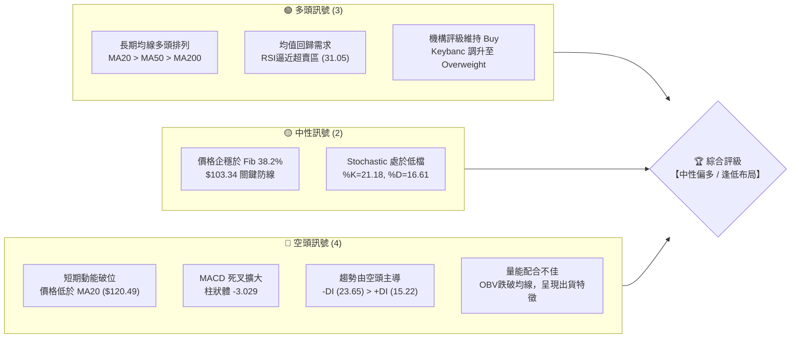
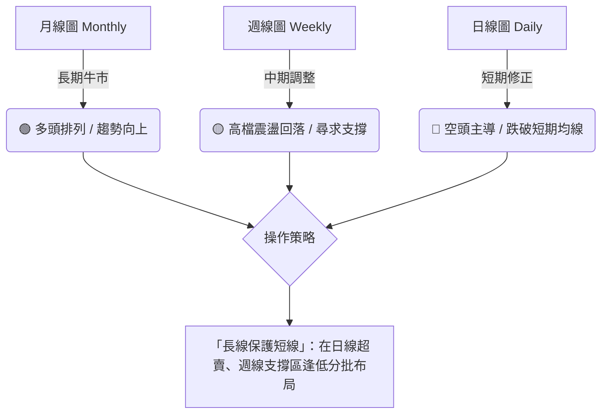
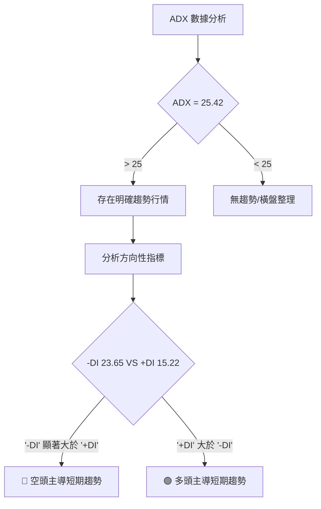
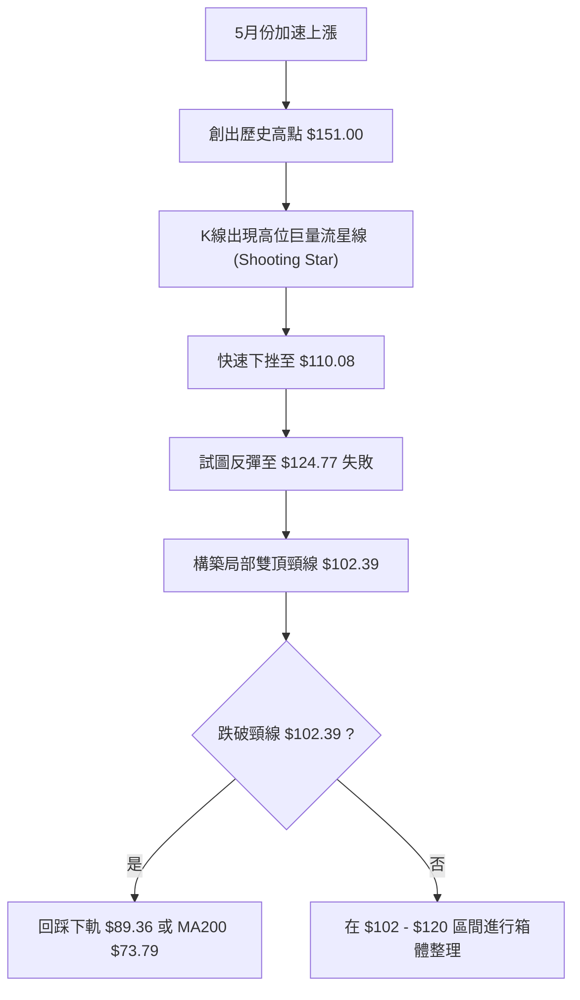
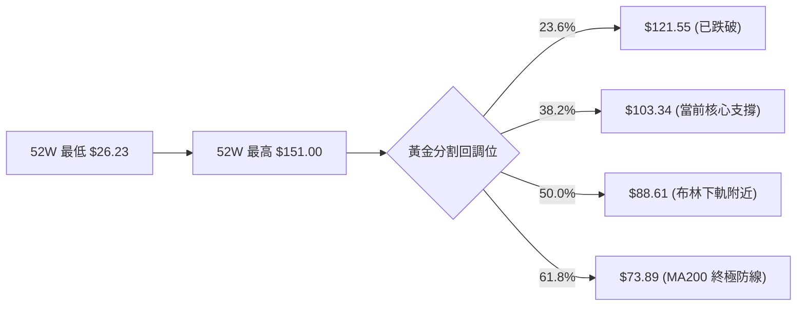
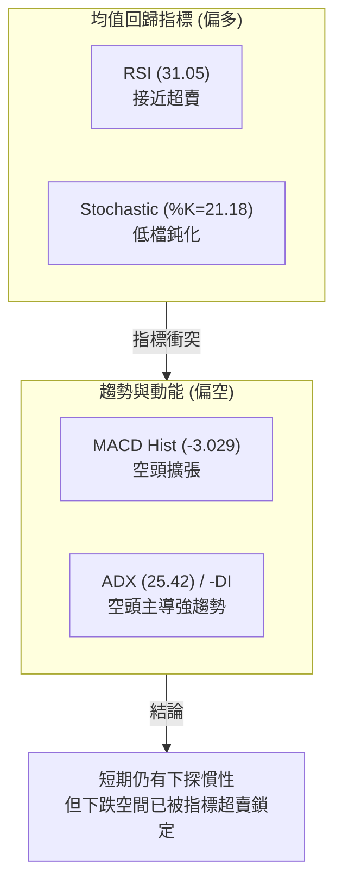
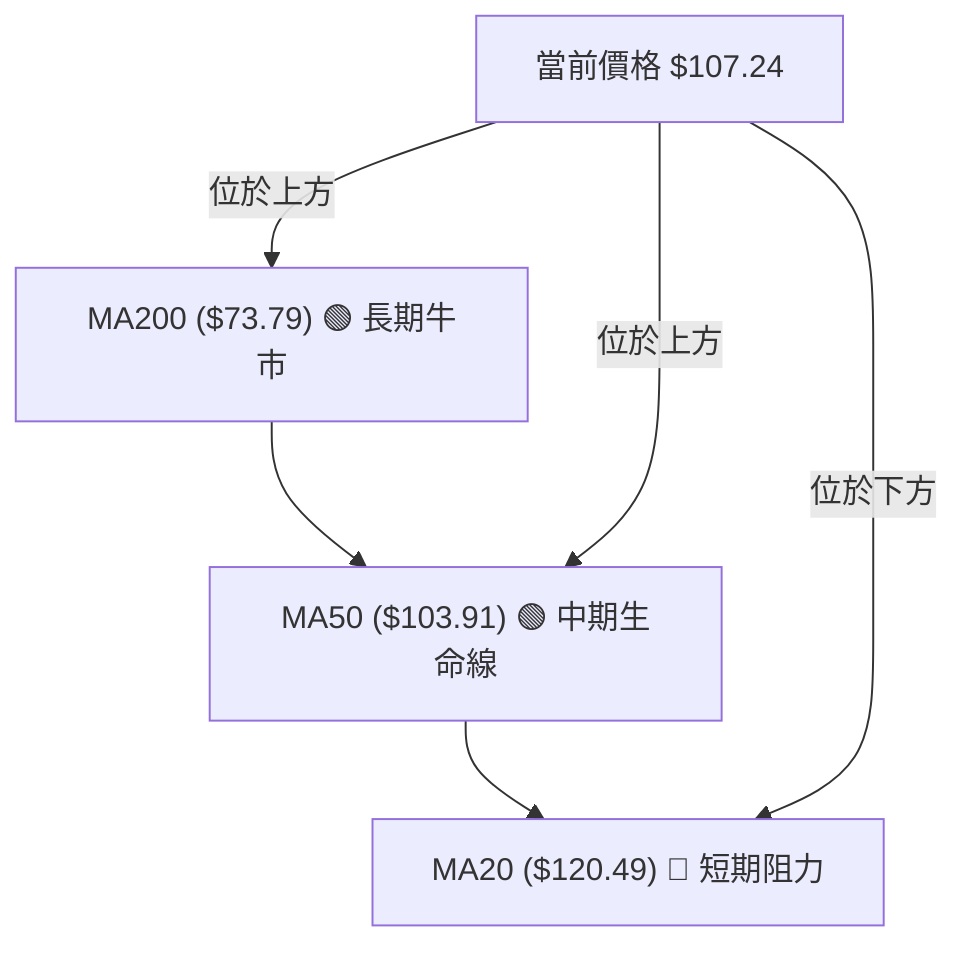
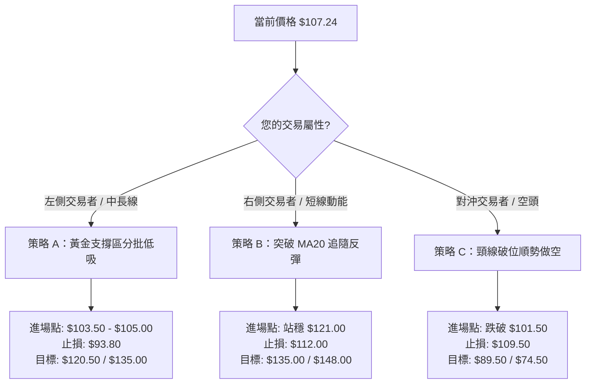
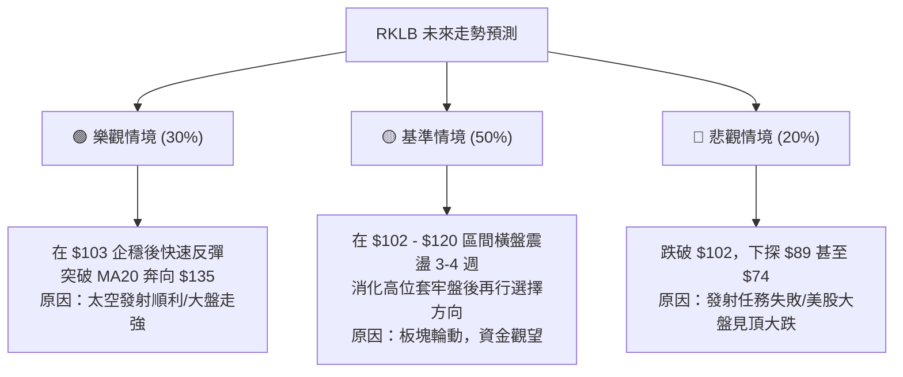

<details>
<summary>📊 靜態圖表 (點擊展開)</summary>

</details>

<html>
<head><meta charset="utf-8" /></head>
<body>
    <div style="height:500px; width:100%;">                        <script>window.PlotlyConfig = {MathJaxConfig: 'local'};</script>
        <script charset="utf-8" src="https://cdn.plot.ly/plotly-3.6.0.min.js" integrity="sha256-QaOVwtVY0T02VaHrr6pnoHLCwayMJp4O5n4YyaE3rJk=" crossorigin="anonymous"></script>                <div id="candlestick-chart" class="plotly-graph-div" style="height:100%; width:100%;"></div>            <script>                window.PLOTLYENV=window.PLOTLYENV || {};                                if (document.getElementById("candlestick-chart")) {                    Plotly.newPlot(                        "candlestick-chart",                        [{"close":{"dtype":"f8","bdata":"AAAAANfDRUAAAABguH5FQAAAACCF60ZAAAAAoHDdR0AAAAAA14NHQAAAAIDCFUdAAAAAQAo3SEAAAAAghatKQAAAAMAeBUtAAAAAIFyfR0AAAACAPQpIQAAAAEAKl0dAAAAAwB7lR0AAAAAgrudIQAAAAOB6dEpAAAAA4FFYSEAAAADgo1BHQAAAAKBHIUdAAAAAoEeBR0AAAADgevRHQAAAAAAp\u002fEdAAAAAACk8SkAAAADgehRMQAAAAAAAQE1AAAAAoEfBTkAAAAAA11NQQAAAAEDhmlBAAAAA4KMQUEAAAABA4VpQQAAAAIDrAVFAAAAAoEdRUUAAAAAAAMBQQAAAAKBHkVBAAAAAYGbWUEAAAACgmVlQQAAAAOBRSE5AAAAAwPXIT0AAAAAA1yNQQAAAACCuZ1BAAAAAAADgT0AAAACAPYpQQAAAAIDCdU5AAAAAoHB9T0AAAAAghatOQAAAAMD1SExAAAAAgMI1TEAAAACAFM5IQAAAAIDr0UlAAAAAQDPzSUAAAABguJ5JQAAAAAAp\u002fEhAAAAAAACgRkAAAADAHsVGQAAAACCup0VAAAAAANdjRUAAAAAgXM9FQAAAAKBwvUNAAAAAYGYmREAAAACgmTlFQAAAAMDMTEVAAAAAQAr3REAAAACA6xFFQAAAACBcL0RAAAAAQDPzREAAAAAAKVxGQAAAACBcr0hAAAAAQAqHSEAAAAAgrsdJQAAAAEAKt0pAAAAAYI\u002fCTEAAAAAA18NPQAAAAGC4vk5AAAAA4Hq0S0AAAABguL5LQAAAAEDh+kpAAAAAgML1TUAAAACgR6FRQAAAAEAzY1NAAAAAIIVLU0AAAAAghUtTQAAAAKCZqVFAAAAAIK6HUUAAAADAzJxRQAAAAOCjcFFAAAAAIFz\u002fUkAAAADA9YhTQAAAAIDrgVVAAAAAwB4FVUAAAADAHsVUQAAAAGBmNlVAAAAAoJn5VUAAAADAHqVVQAAAAEAz81ZAAAAA4KOwVkAAAABAMxNYQAAAAIA9SlZAAAAA4Hr0VUAAAABguP5VQAAAAKCZOVZAAAAAYLgeVEAAAAAAAMBVQAAAAOB6JFZAAAAAIIVrVUAAAADgegRUQAAAAKCZiVJAAAAAoEdRVEAAAABACkdSQAAAAOB6lFBAAAAA4HoUUkAAAACAwvVSQAAAAIDrAVJAAAAAIK5nUUAAAADgo4BQQAAAAAAp3FBAAAAAwPV4UUAAAABA4ZpSQAAAAMAeJVNAAAAAQAq3UUAAAACgcI1RQAAAAIAUflFAAAAAwMyMUUAAAACgmSlSQAAAAGBmRlFAAAAAgBS+UUAAAADgUYhRQAAAAIA9+lFAAAAAAACAUUAAAABACodRQAAAAGC43lFAAAAAIIU7UUAAAACgcP1RQAAAACCuF1FAAAAAgD0aUUAAAAAA19NRQAAAAIDCpVNAAAAAYLheUUAAAAAghftRQAAAAGC4zlBAAAAAAAAAUUAAAADgeoRQQAAAAOBROFJAAAAAACl8UEAAAABACndOQAAAAOCjsExAAAAAgBQOUEAAAACgR2FQQAAAAGC47lBAAAAAQOHqUEAAAADgepRQQAAAAMAeRVFAAAAAIFyvUEAAAABAMwNRQAAAACCup1FAAAAAgBQOUkAAAABgZmZSQAAAACCFu1RAAAAAQDMzVUAAAACgcF1WQAAAAMD1qFVAAAAAYI+CVkAAAABgZiZVQAAAACCF61NAAAAAYI+SVEAAAACAwqVTQAAAAKBHQVNAAAAA4KOgVEAAAAAA17NTQAAAAADXE1RAAAAA4KOwU0AAAACgmSlVQAAAAMAepVNAAAAAgBReWkAAAABgZlZdQAAAAADXY11AAAAAoJkJX0AAAACgmZFgQAAAAKBHMV9AAAAAwB5lYEAAAAAA19NfQAAAAMD1yGBAAAAAwMxcX0AAAADgUfhgQAAAAGBm5mFAAAAAIFzHYkAAAADA9YBiQAAAACBc72FAAAAAwPWYXkAAAADgetReQAAAAMDMrFxAAAAAwMz8XUAAAADAHoVbQAAAAKCZaVxAAAAAYLgOW0AAAABAM0NaQAAAAIDrsVxAAAAAwPWYWUAAAAAAAFBbQAAAAOBRKFpAAAAAYLj+WkAAAAAgXM9aQA=="},"high":{"dtype":"f8","bdata":"AAAAQDNzSUAAAACAPUpGQAAAAGC4\u002fkZAAAAAoJkZSEAAAAAA18NHQAAAAIAUDkhAAAAAwB7VSEAAAAAA1wNLQAAAAIDClUtAAAAAgD0KSkAAAADAHkVIQAAAAOBRmEhAAAAAQAp3SEAAAACgRyFJQAAAAGA5FEtAAAAAoHA9SkAAAAAgXE9IQAAAAOBR2EdAAAAAwMwMSEAAAABguP5HQAAAAIDCtUhAAAAAQDNTSkAAAAAgMXhMQAAAAKBHoU1AAAAAIK5HT0AAAAAALSJRQAAAAGCPIlFAAAAAAABgUkAAAAAAKZxRQAAAAEDhalFAAAAAgBR+UkAAAAAAABBSQAAAAAAAIFFAAAAAIIULUkAAAABgjwJRQAAAAKBHAVBAAAAAwMwsUEAAAAAghYtQQAAAAGBmllBAAAAAYI+iUEAAAADA9dhQQAAAACCFS1BAAAAAoJm5T0AAAADAzIxPQAAAAGC4vk1AAAAAANejTEAAAABA4RpMQAAAAMDMDEpAAAAAAABAS0AAAABA4XpMQAAAAIA9qktAAAAA4KOwSEAAAAAAKZxHQAAAAMBL10ZAAAAAgBTORUAAAAAA10NGQAAAAKBHIUdAAAAAgMKFREAAAAAA10NFQAAAAEAKZ0VAAAAAIIXLRUAAAACgmVlFQAAAAGBmpkRAAAAAYLh+RUAAAABguF5GQAAAAEAK10hAAAAAoJnZSEAAAAAgXC9KQAAAAAAA4EpAAAAAgD1qTUAAAACgmQlQQAAAACCFS1BAAAAAANcjUEAAAACgcF1MQAAAAOB6dExAAAAAAAAgTkAAAAAA16NRQAAAAMDMnFNAAAAAIIXLU0AAAADAHvVTQAAAACBcP1NAAAAAIFwvUkAAAAAAKaxSQAAAAECLTFJAAAAAIFwPU0AAAAAAAJBTQAAAAAAAkFVAAAAAoHB9VUAAAAAgrndWQAAAACCFG1ZAAAAAgMI1VkAAAADgp25WQAAAAAApDFdAAAAAQGAdV0AAAADAHuVYQAAAAKBHkVhAAAAAAADQVkAAAACgmVlWQAAAAMDMnFdAAAAAgD3KVUAAAAAAAMBVQAAAAEAzc1ZAAAAAAABAVkAAAADgelRWQAAAAMDMLFRAAAAA4HpUVEAAAABgZlZUQAAAACBcP1JAAAAAgD0qUkAAAABAMzNTQAAAAEAK91JAAAAAoJlZUkAAAADAzBxRQAAAAGBmZlFAAAAAIFy\u002fUUAAAADA9fBSQAAAAEAKR1NAAAAAwMyMU0AAAAAAANBRQAAAACCFg1FAAAAAYGb2UUAAAAAgXC9SQAAAAIDCZVFAAAAAYGYGUkAAAAAAAFBSQAAAAGBmhlJAAAAAANcTUkAAAABACsdSQAAAAAAACFJAAAAAANc7UkAAAABAM1NSQAAAAGBmJlJAAAAAANfTUUAAAADgURhSQAAAAEDhqlNAAAAA4FE4U0AAAABguC5SQAAAAGC4flJAAAAAwMxcUUAAAABgZiZRQAAAAADXw1JAAAAAgMIFUkAAAACAFIZQQAAAAIDr0U5AAAAAwB4lUEAAAABA4SpRQAAAAMD1WFFAAAAA4HqUUUAAAABAMxNRQAAAAIDAalJAAAAAYI9yUUAAAAAA14NRQAAAAEAz41FAAAAAAACwUkAAAACAwqVSQAAAACBc31RAAAAAIFy\u002fVUAAAABgZpZWQAAAAMDM\u002fFZAAAAAYGZGV0AAAABAM5NWQAAAAIA9mlVAAAAAYLieVEAAAACA63FUQAAAAOCjgFNAAAAAgMLlVEAAAABgj\u002fJUQAAAAOBPdVRAAAAAAADAVEAAAAAghStVQAAAAGCPMlVAAAAAIK5nWkAAAAAAKfxeQAAAACBcX15AAAAAIFzPX0AAAACAwqVgQAAAAADXS2BAAAAAAClMYUAAAACAPTJgQAAAAEAz62BAAAAAANdbYEAAAADgUXhhQAAAAAAAQGJAAAAAAADgYkAAAABgj9piQAAAAAAAAGJAAAAAACn0YEAAAADAzAxgQAAAAOBRoF5AAAAA4FGoXkAAAABguH5dQAAAAAAAEF1AAAAAYI\u002fyXUAAAACgcP1bQAAAAEDhwlxAAAAAwCCYXUAAAACA67FbQAAAAAAAIFtAAAAAgMLVW0AAAABAM2NbQA=="},"hovertemplate":"\u003cb\u003e%{x|%Y-%m-%d}\u003c\u002fb\u003e\u003cbr\u003e\u958b: $%{open:.2f}\u003cbr\u003e\u9ad8: $%{high:.2f}\u003cbr\u003e\u4f4e: $%{low:.2f}\u003cbr\u003e\u6536: $%{close:.2f}\u003cextra\u003e\u003c\u002fextra\u003e","low":{"dtype":"f8","bdata":"AAAAQInBRUAAAACgmVlFQAAAAIDrMUVAAAAAwHa+RkAAAABAicFGQAAAAMDMzEZAAAAAQAoHR0AAAABANU5IQAAAAAApXEpAAAAAoEeBR0AAAACgmTlHQAAAAAAAgEdAAAAA4KOQR0AAAABgZmZHQAAAAOB69EdAAAAAQAo3SEAAAABA4ZpGQAAAAIA96kZAAAAAIFwvR0AAAACgR0FHQAAAACBcj0dAAAAAoEdBSEAAAACgR6FJQAAAAGBm5ktAAAAAYI+CTEAAAABAM9NPQAAAAEDhGlBAAAAAwPUIUEAAAADgzidQQAAAAOBRGE9AAAAAwB7FUEAAAABAM5tQQAAAAKCZ2U9AAAAAQDOrUEAAAABACjdQQAAAAOB6NE1AAAAAAABgTkAAAABAM9NPQAAAAKCZCVBAAAAAgBTOT0AAAACgcL1PQAAAAIDrcU5AAAAAQDMzTkAAAADgo5BNQAAAAKBHQUxAAAAAIFxvS0AAAADgerRIQAAAAODOJ0dAAAAAoEdhSUAAAABA4ZpJQAAAAOB61EhAAAAAIFwvRkAAAABgZqZFQAAAAMDMHEVAAAAAoHCdREAAAABACjdFQAAAAMD1qENAAAAAwPXIQkAAAABgZqZDQAAAAOCjMERAAAAA4KOwREAAAABgZuZEQAAAAKBw\u002fUNAAAAAgMI1REAAAAAAAMBEQAAAAMD1aEZAAAAAoJnZR0AAAAAAKZxIQAAAACCFK0lAAAAAAAAgSkAAAADAzGxMQAAAAGBm5k1AAAAAgD2KS0AAAABACldKQAAAAEDhikpAAAAAANcDTEAAAADAnV9OQAAAAMAgMFJAAAAAYI9SUkAAAACgQ7NSQAAAAMD1mFFAAAAAoJtUUUAAAAAAKZxRQAAAAOBRSFFAAAAAYGa2UEAAAAAA19NRQAAAAEAzg1JAAAAAYGZ2VEAAAADgo5BUQAAAAMDMnFRAAAAA4NDaVEAAAACgmWlVQAAAAAAAIFVAAAAAoJmpVUAAAACgmRlXQAAAAEAzE1ZAAAAAoHCtVEAAAADAdlZUQAAAACCuh1VAAAAA4KMAVEAAAAAAAIBUQAAAAMDKgVVAAAAAAADAVEAAAACgR4FTQAAAAIBBeFJAAAAAoEfxUkAAAABACCRRQAAAAMDMTFBAAAAAAADAUEAAAAAAALBRQAAAAEAz41FAAAAAoEfBUEAAAAAgXO9PQAAAAAAAYFBAAAAAAABAUEAAAADAS39RQAAAAGBmFlJAAAAAoJlZUUAAAAAAACBRQAAAAGBmplBAAAAA4FE4UUAAAAAA1zNRQAAAAGBmBlBAAAAAwMycUEAAAAAAKYxQQAAAAIAUXlFAAAAAgMLVUEAAAADgowhRQAAAAOB69FBAAAAAgL4nUUAAAADAHhVRQAAAAIDrEVFAAAAAACncUEAAAABA4SpRQAAAAKBH0VFAAAAAoJlZUUAAAAAAAABRQAAAAMD1mFBAAAAAQDODUEAAAACgcB1QQAAAAAApPFFAAAAAgMJlUEAAAADAzCxOQAAAAGDlEExAAAAAANeDTUAAAABAM1NQQAAAAIAU7k5AAAAAYGamUEAAAABA4fpPQAAAAGDn81BAAAAAQOGiUEAAAACAwpVQQAAAAIDCpVBAAAAAYLieUUAAAABgZmZRQAAAAKCZOVNAAAAAYGbmVEAAAABgZiZVQAAAAAAAcFVAAAAA4KPwVUAAAAAAKWRUQAAAAMAexVNAAAAAwHRDU0AAAABgZmZTQAAAACBcf1JAAAAAgBReU0AAAAAghZtTQAAAAAAAEFNAAAAAANcjU0AAAABACrdTQAAAACCFe1NAAAAAIK53VUAAAAAAAABaQAAAAIA9GlxAAAAAwPU4XUAAAAAA11NeQAAAAEAzc15AAAAAoPFqX0AAAABguM5cQAAAAIAUDl9AAAAAQDPzXkAAAACA62lgQAAAAIDrUWFAAAAAwB49YUAAAAAA18thQAAAAKCZwWBAAAAAAABAXkAAAAAA16NeQAAAAIA9alxAAAAAwPWYW0AAAABguK5aQAAAAAAAwFtAAAAAwMxMWUAAAACAPRpaQAAAAKCZWVpAAAAAQArnWEAAAABAM3NaQAAAAOB6xFlAAAAAYI8CWkAAAACgcD1ZQA=="},"name":"\u50f9\u683c","open":{"dtype":"f8","bdata":"AAAAYI8iSUAAAADgehRGQAAAAOBRyEVAAAAAAADARkAAAACgR4FHQAAAAADXw0dAAAAAwPUoR0AAAACgcH1IQAAAAIA9ykpAAAAAAAAASkAAAADgUchHQAAAAIDCdUhAAAAAQArXR0AAAADgo5BHQAAAAEAzg0hAAAAAgMLlSUAAAAAAAABIQAAAAGBmpkdAAAAAQDOzR0AAAABA4ZpHQAAAAOCjsEdAAAAAgOtRSEAAAABgZgZKQAAAAGC4bkxAAAAAoEeBTUAAAACgmQlQQAAAAKCZOVBAAAAAQDOzUUAAAADgUfhQQAAAAIDCVVBAAAAAoEeBUUAAAADgeoRRQAAAAMD1eFBAAAAA4KNIUUAAAABgjwJRQAAAAAApfE9AAAAAIK7HTkAAAAAA1zNQQAAAAAApjFBAAAAAQDNrUEAAAACgRwlQQAAAAAAAQFBAAAAAYI\u002fiTkAAAAAA14NPQAAAAGBm5kxAAAAA4HpUTEAAAABA4RpMQAAAAKAY1EdAAAAAYLjeSkAAAAAAAABMQAAAAEAK90lAAAAAoEdhSEAAAABA4dpFQAAAAEAzk0ZAAAAAACkcRUAAAAAAAEBFQAAAAIA9CkdAAAAAgD3qQ0AAAACgR2FEQAAAAADXA0VAAAAAYLieRUAAAACgR0FFQAAAAEAzk0RAAAAAIK5HREAAAABgj\u002fJEQAAAAGCP0kZAAAAAAABwSEAAAACAPQpJQAAAAKBwnUlAAAAA4FG4SkAAAACgR8FMQAAAAAAAQE9AAAAA4KeGT0AAAADgURhLQAAAAMDMDExAAAAAoJkZTEAAAAAgXI9OQAAAAAApPFJAAAAAANdzUkAAAACAPYJTQAAAACCFK1NAAAAAAABgUUAAAACgmUFSQAAAAAAA4FFAAAAA4FGoUUAAAAAgrqdSQAAAAOCjcFNAAAAAYGYGVUAAAAAAAGBVQAAAAKCZIVVAAAAAYLg+VUAAAADA9UhWQAAAAGBmllVAAAAAwPVQVkAAAACgmSFXQAAAAMDMbFdAAAAAoEeBVkAAAADgUZhVQAAAACCFQ1ZAAAAAIK6vVUAAAADA9bhUQAAAAIAUzlVAAAAAACn8VUAAAAAAAEBVQAAAAIA9ylNAAAAAYGamU0AAAABgZlZUQAAAAGC4flFAAAAAAABAUUAAAACgmQFSQAAAAIAUplJAAAAA4FFIUkAAAACA6+FQQAAAAOB6rFBAAAAAQGCFUEAAAAAAAMBRQAAAAKCZOVJAAAAAINneUkAAAADgUTBRQAAAAOBROFFAAAAAgBTGUUAAAABA4YJRQAAAAIDC5VBAAAAAIIWrUEAAAABguDZRQAAAAADXs1FAAAAAQOG6UUAAAADgowhRQAAAAMD1WFFAAAAAgMKVUUAAAABAMzNRQAAAAMDM\u002fFFAAAAAoJlJUUAAAADAzFRRQAAAAGBm3lFAAAAAYI8CU0AAAADgejRRQAAAAAAAAFJAAAAAoHAFUUAAAAAAAMBQQAAAAAApPFFAAAAAwMzMUUAAAADgo4BQQAAAAKCZuU5AAAAAQOHaTkAAAAAAAGBQQAAAAMDMHE9AAAAAYLjuUEAAAAAgXMdQQAAAAAAAAFJAAAAAANdDUUAAAADAzOxQQAAAAEAzw1BAAAAAIIVjUkAAAACgcGVSQAAAAIAUPlNAAAAAwB4FVUAAAABgZjZVQAAAAMAelVZAAAAAgMKdVkAAAABgZnZWQAAAAIDClVVAAAAAACnsU0AAAADAzARUQAAAAEAKd1NAAAAAQDNjU0AAAACA6+FUQAAAAEAKl1NAAAAAYGamVEAAAAAgrudTQAAAAKBwLVVAAAAAgD2CVUAAAACgR1FaQAAAAOCjMFxAAAAAoEf5XkAAAABgZsZeQAAAAEAzA2BAAAAAACmYYEAAAACAFH5fQAAAAGC43l9AAAAAwPWIX0AAAADAHm1gQAAAAEDhvmFAAAAAQAq3YkAAAACgcGViQAAAAIAUfmFAAAAAACmMYEAAAACAwlVfQAAAAMAe5V1AAAAAoHBFXEAAAACgR5FcQAAAAEDhqlxAAAAAoJmZXUAAAADAzOxaQAAAAIDCpVpAAAAAoEeBXUAAAACgcP1aQAAAAKBw7VpAAAAAIK4HWkAAAADAHjVbQA=="},"x":["2025-09-03T00:00:00-04:00","2025-09-04T00:00:00-04:00","2025-09-05T00:00:00-04:00","2025-09-08T00:00:00-04:00","2025-09-09T00:00:00-04:00","2025-09-10T00:00:00-04:00","2025-09-11T00:00:00-04:00","2025-09-12T00:00:00-04:00","2025-09-15T00:00:00-04:00","2025-09-16T00:00:00-04:00","2025-09-17T00:00:00-04:00","2025-09-18T00:00:00-04:00","2025-09-19T00:00:00-04:00","2025-09-22T00:00:00-04:00","2025-09-23T00:00:00-04:00","2025-09-24T00:00:00-04:00","2025-09-25T00:00:00-04:00","2025-09-26T00:00:00-04:00","2025-09-29T00:00:00-04:00","2025-09-30T00:00:00-04:00","2025-10-01T00:00:00-04:00","2025-10-02T00:00:00-04:00","2025-10-03T00:00:00-04:00","2025-10-06T00:00:00-04:00","2025-10-07T00:00:00-04:00","2025-10-08T00:00:00-04:00","2025-10-09T00:00:00-04:00","2025-10-10T00:00:00-04:00","2025-10-13T00:00:00-04:00","2025-10-14T00:00:00-04:00","2025-10-15T00:00:00-04:00","2025-10-16T00:00:00-04:00","2025-10-17T00:00:00-04:00","2025-10-20T00:00:00-04:00","2025-10-21T00:00:00-04:00","2025-10-22T00:00:00-04:00","2025-10-23T00:00:00-04:00","2025-10-24T00:00:00-04:00","2025-10-27T00:00:00-04:00","2025-10-28T00:00:00-04:00","2025-10-29T00:00:00-04:00","2025-10-30T00:00:00-04:00","2025-10-31T00:00:00-04:00","2025-11-03T00:00:00-05:00","2025-11-04T00:00:00-05:00","2025-11-05T00:00:00-05:00","2025-11-06T00:00:00-05:00","2025-11-07T00:00:00-05:00","2025-11-10T00:00:00-05:00","2025-11-11T00:00:00-05:00","2025-11-12T00:00:00-05:00","2025-11-13T00:00:00-05:00","2025-11-14T00:00:00-05:00","2025-11-17T00:00:00-05:00","2025-11-18T00:00:00-05:00","2025-11-19T00:00:00-05:00","2025-11-20T00:00:00-05:00","2025-11-21T00:00:00-05:00","2025-11-24T00:00:00-05:00","2025-11-25T00:00:00-05:00","2025-11-26T00:00:00-05:00","2025-11-28T00:00:00-05:00","2025-12-01T00:00:00-05:00","2025-12-02T00:00:00-05:00","2025-12-03T00:00:00-05:00","2025-12-04T00:00:00-05:00","2025-12-05T00:00:00-05:00","2025-12-08T00:00:00-05:00","2025-12-09T00:00:00-05:00","2025-12-10T00:00:00-05:00","2025-12-11T00:00:00-05:00","2025-12-12T00:00:00-05:00","2025-12-15T00:00:00-05:00","2025-12-16T00:00:00-05:00","2025-12-17T00:00:00-05:00","2025-12-18T00:00:00-05:00","2025-12-19T00:00:00-05:00","2025-12-22T00:00:00-05:00","2025-12-23T00:00:00-05:00","2025-12-24T00:00:00-05:00","2025-12-26T00:00:00-05:00","2025-12-29T00:00:00-05:00","2025-12-30T00:00:00-05:00","2025-12-31T00:00:00-05:00","2026-01-02T00:00:00-05:00","2026-01-05T00:00:00-05:00","2026-01-06T00:00:00-05:00","2026-01-07T00:00:00-05:00","2026-01-08T00:00:00-05:00","2026-01-09T00:00:00-05:00","2026-01-12T00:00:00-05:00","2026-01-13T00:00:00-05:00","2026-01-14T00:00:00-05:00","2026-01-15T00:00:00-05:00","2026-01-16T00:00:00-05:00","2026-01-20T00:00:00-05:00","2026-01-21T00:00:00-05:00","2026-01-22T00:00:00-05:00","2026-01-23T00:00:00-05:00","2026-01-26T00:00:00-05:00","2026-01-27T00:00:00-05:00","2026-01-28T00:00:00-05:00","2026-01-29T00:00:00-05:00","2026-01-30T00:00:00-05:00","2026-02-02T00:00:00-05:00","2026-02-03T00:00:00-05:00","2026-02-04T00:00:00-05:00","2026-02-05T00:00:00-05:00","2026-02-06T00:00:00-05:00","2026-02-09T00:00:00-05:00","2026-02-10T00:00:00-05:00","2026-02-11T00:00:00-05:00","2026-02-12T00:00:00-05:00","2026-02-13T00:00:00-05:00","2026-02-17T00:00:00-05:00","2026-02-18T00:00:00-05:00","2026-02-19T00:00:00-05:00","2026-02-20T00:00:00-05:00","2026-02-23T00:00:00-05:00","2026-02-24T00:00:00-05:00","2026-02-25T00:00:00-05:00","2026-02-26T00:00:00-05:00","2026-02-27T00:00:00-05:00","2026-03-02T00:00:00-05:00","2026-03-03T00:00:00-05:00","2026-03-04T00:00:00-05:00","2026-03-05T00:00:00-05:00","2026-03-06T00:00:00-05:00","2026-03-09T00:00:00-04:00","2026-03-10T00:00:00-04:00","2026-03-11T00:00:00-04:00","2026-03-12T00:00:00-04:00","2026-03-13T00:00:00-04:00","2026-03-16T00:00:00-04:00","2026-03-17T00:00:00-04:00","2026-03-18T00:00:00-04:00","2026-03-19T00:00:00-04:00","2026-03-20T00:00:00-04:00","2026-03-23T00:00:00-04:00","2026-03-24T00:00:00-04:00","2026-03-25T00:00:00-04:00","2026-03-26T00:00:00-04:00","2026-03-27T00:00:00-04:00","2026-03-30T00:00:00-04:00","2026-03-31T00:00:00-04:00","2026-04-01T00:00:00-04:00","2026-04-02T00:00:00-04:00","2026-04-06T00:00:00-04:00","2026-04-07T00:00:00-04:00","2026-04-08T00:00:00-04:00","2026-04-09T00:00:00-04:00","2026-04-10T00:00:00-04:00","2026-04-13T00:00:00-04:00","2026-04-14T00:00:00-04:00","2026-04-15T00:00:00-04:00","2026-04-16T00:00:00-04:00","2026-04-17T00:00:00-04:00","2026-04-20T00:00:00-04:00","2026-04-21T00:00:00-04:00","2026-04-22T00:00:00-04:00","2026-04-23T00:00:00-04:00","2026-04-24T00:00:00-04:00","2026-04-27T00:00:00-04:00","2026-04-28T00:00:00-04:00","2026-04-29T00:00:00-04:00","2026-04-30T00:00:00-04:00","2026-05-01T00:00:00-04:00","2026-05-04T00:00:00-04:00","2026-05-05T00:00:00-04:00","2026-05-06T00:00:00-04:00","2026-05-07T00:00:00-04:00","2026-05-08T00:00:00-04:00","2026-05-11T00:00:00-04:00","2026-05-12T00:00:00-04:00","2026-05-13T00:00:00-04:00","2026-05-14T00:00:00-04:00","2026-05-15T00:00:00-04:00","2026-05-18T00:00:00-04:00","2026-05-19T00:00:00-04:00","2026-05-20T00:00:00-04:00","2026-05-21T00:00:00-04:00","2026-05-22T00:00:00-04:00","2026-05-26T00:00:00-04:00","2026-05-27T00:00:00-04:00","2026-05-28T00:00:00-04:00","2026-05-29T00:00:00-04:00","2026-06-01T00:00:00-04:00","2026-06-02T00:00:00-04:00","2026-06-03T00:00:00-04:00","2026-06-04T00:00:00-04:00","2026-06-05T00:00:00-04:00","2026-06-08T00:00:00-04:00","2026-06-09T00:00:00-04:00","2026-06-10T00:00:00-04:00","2026-06-11T00:00:00-04:00","2026-06-12T00:00:00-04:00","2026-06-15T00:00:00-04:00","2026-06-16T00:00:00-04:00","2026-06-17T00:00:00-04:00","2026-06-18T00:00:00-04:00"],"type":"candlestick"},{"hovertemplate":"MA30: $%{y:.2f}\u003cextra\u003e\u003c\u002fextra\u003e","line":{"color":"#2196F3","dash":"dash","width":2},"mode":"lines","name":"MA30","x":["2025-09-03T00:00:00-04:00","2025-09-04T00:00:00-04:00","2025-09-05T00:00:00-04:00","2025-09-08T00:00:00-04:00","2025-09-09T00:00:00-04:00","2025-09-10T00:00:00-04:00","2025-09-11T00:00:00-04:00","2025-09-12T00:00:00-04:00","2025-09-15T00:00:00-04:00","2025-09-16T00:00:00-04:00","2025-09-17T00:00:00-04:00","2025-09-18T00:00:00-04:00","2025-09-19T00:00:00-04:00","2025-09-22T00:00:00-04:00","2025-09-23T00:00:00-04:00","2025-09-24T00:00:00-04:00","2025-09-25T00:00:00-04:00","2025-09-26T00:00:00-04:00","2025-09-29T00:00:00-04:00","2025-09-30T00:00:00-04:00","2025-10-01T00:00:00-04:00","2025-10-02T00:00:00-04:00","2025-10-03T00:00:00-04:00","2025-10-06T00:00:00-04:00","2025-10-07T00:00:00-04:00","2025-10-08T00:00:00-04:00","2025-10-09T00:00:00-04:00","2025-10-10T00:00:00-04:00","2025-10-13T00:00:00-04:00","2025-10-14T00:00:00-04:00","2025-10-15T00:00:00-04:00","2025-10-16T00:00:00-04:00","2025-10-17T00:00:00-04:00","2025-10-20T00:00:00-04:00","2025-10-21T00:00:00-04:00","2025-10-22T00:00:00-04:00","2025-10-23T00:00:00-04:00","2025-10-24T00:00:00-04:00","2025-10-27T00:00:00-04:00","2025-10-28T00:00:00-04:00","2025-10-29T00:00:00-04:00","2025-10-30T00:00:00-04:00","2025-10-31T00:00:00-04:00","2025-11-03T00:00:00-05:00","2025-11-04T00:00:00-05:00","2025-11-05T00:00:00-05:00","2025-11-06T00:00:00-05:00","2025-11-07T00:00:00-05:00","2025-11-10T00:00:00-05:00","2025-11-11T00:00:00-05:00","2025-11-12T00:00:00-05:00","2025-11-13T00:00:00-05:00","2025-11-14T00:00:00-05:00","2025-11-17T00:00:00-05:00","2025-11-18T00:00:00-05:00","2025-11-19T00:00:00-05:00","2025-11-20T00:00:00-05:00","2025-11-21T00:00:00-05:00","2025-11-24T00:00:00-05:00","2025-11-25T00:00:00-05:00","2025-11-26T00:00:00-05:00","2025-11-28T00:00:00-05:00","2025-12-01T00:00:00-05:00","2025-12-02T00:00:00-05:00","2025-12-03T00:00:00-05:00","2025-12-04T00:00:00-05:00","2025-12-05T00:00:00-05:00","2025-12-08T00:00:00-05:00","2025-12-09T00:00:00-05:00","2025-12-10T00:00:00-05:00","2025-12-11T00:00:00-05:00","2025-12-12T00:00:00-05:00","2025-12-15T00:00:00-05:00","2025-12-16T00:00:00-05:00","2025-12-17T00:00:00-05:00","2025-12-18T00:00:00-05:00","2025-12-19T00:00:00-05:00","2025-12-22T00:00:00-05:00","2025-12-23T00:00:00-05:00","2025-12-24T00:00:00-05:00","2025-12-26T00:00:00-05:00","2025-12-29T00:00:00-05:00","2025-12-30T00:00:00-05:00","2025-12-31T00:00:00-05:00","2026-01-02T00:00:00-05:00","2026-01-05T00:00:00-05:00","2026-01-06T00:00:00-05:00","2026-01-07T00:00:00-05:00","2026-01-08T00:00:00-05:00","2026-01-09T00:00:00-05:00","2026-01-12T00:00:00-05:00","2026-01-13T00:00:00-05:00","2026-01-14T00:00:00-05:00","2026-01-15T00:00:00-05:00","2026-01-16T00:00:00-05:00","2026-01-20T00:00:00-05:00","2026-01-21T00:00:00-05:00","2026-01-22T00:00:00-05:00","2026-01-23T00:00:00-05:00","2026-01-26T00:00:00-05:00","2026-01-27T00:00:00-05:00","2026-01-28T00:00:00-05:00","2026-01-29T00:00:00-05:00","2026-01-30T00:00:00-05:00","2026-02-02T00:00:00-05:00","2026-02-03T00:00:00-05:00","2026-02-04T00:00:00-05:00","2026-02-05T00:00:00-05:00","2026-02-06T00:00:00-05:00","2026-02-09T00:00:00-05:00","2026-02-10T00:00:00-05:00","2026-02-11T00:00:00-05:00","2026-02-12T00:00:00-05:00","2026-02-13T00:00:00-05:00","2026-02-17T00:00:00-05:00","2026-02-18T00:00:00-05:00","2026-02-19T00:00:00-05:00","2026-02-20T00:00:00-05:00","2026-02-23T00:00:00-05:00","2026-02-24T00:00:00-05:00","2026-02-25T00:00:00-05:00","2026-02-26T00:00:00-05:00","2026-02-27T00:00:00-05:00","2026-03-02T00:00:00-05:00","2026-03-03T00:00:00-05:00","2026-03-04T00:00:00-05:00","2026-03-05T00:00:00-05:00","2026-03-06T00:00:00-05:00","2026-03-09T00:00:00-04:00","2026-03-10T00:00:00-04:00","2026-03-11T00:00:00-04:00","2026-03-12T00:00:00-04:00","2026-03-13T00:00:00-04:00","2026-03-16T00:00:00-04:00","2026-03-17T00:00:00-04:00","2026-03-18T00:00:00-04:00","2026-03-19T00:00:00-04:00","2026-03-20T00:00:00-04:00","2026-03-23T00:00:00-04:00","2026-03-24T00:00:00-04:00","2026-03-25T00:00:00-04:00","2026-03-26T00:00:00-04:00","2026-03-27T00:00:00-04:00","2026-03-30T00:00:00-04:00","2026-03-31T00:00:00-04:00","2026-04-01T00:00:00-04:00","2026-04-02T00:00:00-04:00","2026-04-06T00:00:00-04:00","2026-04-07T00:00:00-04:00","2026-04-08T00:00:00-04:00","2026-04-09T00:00:00-04:00","2026-04-10T00:00:00-04:00","2026-04-13T00:00:00-04:00","2026-04-14T00:00:00-04:00","2026-04-15T00:00:00-04:00","2026-04-16T00:00:00-04:00","2026-04-17T00:00:00-04:00","2026-04-20T00:00:00-04:00","2026-04-21T00:00:00-04:00","2026-04-22T00:00:00-04:00","2026-04-23T00:00:00-04:00","2026-04-24T00:00:00-04:00","2026-04-27T00:00:00-04:00","2026-04-28T00:00:00-04:00","2026-04-29T00:00:00-04:00","2026-04-30T00:00:00-04:00","2026-05-01T00:00:00-04:00","2026-05-04T00:00:00-04:00","2026-05-05T00:00:00-04:00","2026-05-06T00:00:00-04:00","2026-05-07T00:00:00-04:00","2026-05-08T00:00:00-04:00","2026-05-11T00:00:00-04:00","2026-05-12T00:00:00-04:00","2026-05-13T00:00:00-04:00","2026-05-14T00:00:00-04:00","2026-05-15T00:00:00-04:00","2026-05-18T00:00:00-04:00","2026-05-19T00:00:00-04:00","2026-05-20T00:00:00-04:00","2026-05-21T00:00:00-04:00","2026-05-22T00:00:00-04:00","2026-05-26T00:00:00-04:00","2026-05-27T00:00:00-04:00","2026-05-28T00:00:00-04:00","2026-05-29T00:00:00-04:00","2026-06-01T00:00:00-04:00","2026-06-02T00:00:00-04:00","2026-06-03T00:00:00-04:00","2026-06-04T00:00:00-04:00","2026-06-05T00:00:00-04:00","2026-06-08T00:00:00-04:00","2026-06-09T00:00:00-04:00","2026-06-10T00:00:00-04:00","2026-06-11T00:00:00-04:00","2026-06-12T00:00:00-04:00","2026-06-15T00:00:00-04:00","2026-06-16T00:00:00-04:00","2026-06-17T00:00:00-04:00","2026-06-18T00:00:00-04:00"],"y":{"dtype":"f8","bdata":"AAAAAAAA+H8AAAAAAAD4fwAAAAAAAPh\u002fAAAAAAAA+H8AAAAAAAD4fwAAAAAAAPh\u002fAAAAAAAA+H8AAAAAAAD4fwAAAAAAAPh\u002fAAAAAAAA+H8AAAAAAAD4fwAAAAAAAPh\u002fAAAAAAAA+H8AAAAAAAD4fwAAAAAAAPh\u002fAAAAAAAA+H8AAAAAAAD4fwAAAAAAAPh\u002fAAAAAAAA+H8AAAAAAAD4fwAAAAAAAPh\u002fAAAAAAAA+H8AAAAAAAD4fwAAAAAAAPh\u002fAAAAAAAA+H8AAAAAAAD4fwAAAAAAAPh\u002fAAAAAAAA+H8AAAAAAAD4f6uqqmrnE0pAvLu7W7qBSkDe3d2tK+hKQO\u002fu7q5WP0tARERE9AyTS0BVVVXlbeFLQDMzMxPZHkxA3t3d\u002fXFfTECJiIg4UY9MQLy7u6u5wExAiYiIiCUHTUB3d3e3SVRNQFVVVXXpjk1AzczM\u002fLjPTUAiIiLS6gBOQERERISIEE5AzczMvIMxTkARERGxOj5OQGZmZhYvVU5AZmZmRgxqTkBmZmaGQXhOQO\u002fu7g7KgE5ARERE5PthTkBVVVUFrDROQN7d3X3c801AZmZmVvKjTUAzMzMTZ0dNQJqZmWl11ExAMzMzszpuTEBmZmZWOQxMQO\u002fu7v64n0tA3t3dbRIrS0De3d2tAMFKQJqZmfl+UkpAq6qqyujlSUB3d3e3rI1JQKuqqsroXUlAq6qqivofSUBEREQUg+hIQImIiFiAtEhAZmZmhuuZSEC8u7vbso5IQERERHQhkUhA7+7u\u002ftRwSEDNzMw831dIQLy7u2u8TEhAq6qqWqtbSEBVVVWl4rRIQHd3d0dvI0lAd3d3x0uPSUDNzMws+f1JQAAAAEA1VkpAzczM7FHASkCJiIhImipLQM3MzLx0m0tAmpmZ6SYpTEBVVVX1b7xMQImIiPgMg01AiYiIaNg9TkBEREQ0M+tOQImIiHh3n09AREREfM0xUEDv7u6mm5BQQKuqqkpT\u002flBA3t3dXY9mUUDNzMzsmNRRQKuqqpJ7KVJAZmZmbi58UkC8u7ub4MlSQFVVVfWLFVNAZmZmLodGU0BmZmbumHhTQImIiDheslNAVVVVrfHyU0AiIiKiYSdUQBERERF0UlRAMzMzAwCAVEAAAACAhoVUQLy7u2uRbVRAZmZmNjNjVEBERERkV2BUQN7d3Q1JY1RAzczM\u002fDdiVECJiIgov1hUQBERESHMU1RAd3d3t8hGVECamZkZ2T5UQERERCSwKlRAIiIiQnwOVEBVVVWFB\u002fNTQO\u002fu7g5J01NA7+7ufoatU0C8u7vbzo9TQBEREaFhX1NAZmZmpik1U0BmZmZWVf1SQJqZmYmI2FJAERERcYSyUkCamZkJZYxSQFVVVWU7Z1JA3t3djZdOUkBVVVW1gS5SQBEREdFpA1JAiYiIGJLeUUB3d3f34ctRQLy7u8ta1VFAMzMz4zO8UUAzMzNzr7lRQO\u002fu7m6gu1FAMzMzI2myUUCrqqpqkZ1RQBEREaFhn1FAvLu724eXUUAAAACAsYxRQN7d3WU7d1FAq6qq0iJrUUBEREQ8JlhRQM3MzPRERVFAIiIiynY+UUDNzMxUKjZRQN7d3UVENFFA7+7upuIsUUCJiIhwEiNRQImIiJBQJlFAMzMzO\u002fsoUUCJiIhQYjBRQLy7u7PkR1FAIiIiendnUUAAAAAov5BRQBEREYkWsVFAERERaR\u002feUUARERGJFvlRQFVVVU03EVJAmpmZodMuUkAzMzN7Wz5SQFVVVQ0CO1JAMzMzK85WUkCJiIiQe2VSQERERPxigVJAmpmZYVeYUkAiIiKK+r9SQImIiIAjzFJA7+7uJnggU0BmZmb+1JhTQLy7u0s3GVRAERERERGZVEAzMzNjEChVQERERNS\u002foVVAZmZm1jEpVkAiIiKCTqtWQGZmZmZmNldAMzMz46WzV0AiIiKSGERYQM3MzOzu3lhAiYiIyFqFWUDNzMx8IyRaQLy7u9tPpVpAIiIiAoH1WkBVVVUVvT1bQFVVVZWZeVtA3t3dbWi5W0CJiIjow+9bQO\u002fu7g48OFxAIiIiwpJvXEAzMzNzBahcQCIiInKT+FxAMzMzk\u002fwiXUAAAADg7GNdQGZmZtbOl11Aq6qq2iTWXUAREREBVgZeQA=="},"type":"scatter"},{"hovertemplate":"MA60: $%{y:.2f}\u003cextra\u003e\u003c\u002fextra\u003e","line":{"color":"#9C27B0","dash":"dash","width":2},"mode":"lines","name":"MA60","x":["2025-09-03T00:00:00-04:00","2025-09-04T00:00:00-04:00","2025-09-05T00:00:00-04:00","2025-09-08T00:00:00-04:00","2025-09-09T00:00:00-04:00","2025-09-10T00:00:00-04:00","2025-09-11T00:00:00-04:00","2025-09-12T00:00:00-04:00","2025-09-15T00:00:00-04:00","2025-09-16T00:00:00-04:00","2025-09-17T00:00:00-04:00","2025-09-18T00:00:00-04:00","2025-09-19T00:00:00-04:00","2025-09-22T00:00:00-04:00","2025-09-23T00:00:00-04:00","2025-09-24T00:00:00-04:00","2025-09-25T00:00:00-04:00","2025-09-26T00:00:00-04:00","2025-09-29T00:00:00-04:00","2025-09-30T00:00:00-04:00","2025-10-01T00:00:00-04:00","2025-10-02T00:00:00-04:00","2025-10-03T00:00:00-04:00","2025-10-06T00:00:00-04:00","2025-10-07T00:00:00-04:00","2025-10-08T00:00:00-04:00","2025-10-09T00:00:00-04:00","2025-10-10T00:00:00-04:00","2025-10-13T00:00:00-04:00","2025-10-14T00:00:00-04:00","2025-10-15T00:00:00-04:00","2025-10-16T00:00:00-04:00","2025-10-17T00:00:00-04:00","2025-10-20T00:00:00-04:00","2025-10-21T00:00:00-04:00","2025-10-22T00:00:00-04:00","2025-10-23T00:00:00-04:00","2025-10-24T00:00:00-04:00","2025-10-27T00:00:00-04:00","2025-10-28T00:00:00-04:00","2025-10-29T00:00:00-04:00","2025-10-30T00:00:00-04:00","2025-10-31T00:00:00-04:00","2025-11-03T00:00:00-05:00","2025-11-04T00:00:00-05:00","2025-11-05T00:00:00-05:00","2025-11-06T00:00:00-05:00","2025-11-07T00:00:00-05:00","2025-11-10T00:00:00-05:00","2025-11-11T00:00:00-05:00","2025-11-12T00:00:00-05:00","2025-11-13T00:00:00-05:00","2025-11-14T00:00:00-05:00","2025-11-17T00:00:00-05:00","2025-11-18T00:00:00-05:00","2025-11-19T00:00:00-05:00","2025-11-20T00:00:00-05:00","2025-11-21T00:00:00-05:00","2025-11-24T00:00:00-05:00","2025-11-25T00:00:00-05:00","2025-11-26T00:00:00-05:00","2025-11-28T00:00:00-05:00","2025-12-01T00:00:00-05:00","2025-12-02T00:00:00-05:00","2025-12-03T00:00:00-05:00","2025-12-04T00:00:00-05:00","2025-12-05T00:00:00-05:00","2025-12-08T00:00:00-05:00","2025-12-09T00:00:00-05:00","2025-12-10T00:00:00-05:00","2025-12-11T00:00:00-05:00","2025-12-12T00:00:00-05:00","2025-12-15T00:00:00-05:00","2025-12-16T00:00:00-05:00","2025-12-17T00:00:00-05:00","2025-12-18T00:00:00-05:00","2025-12-19T00:00:00-05:00","2025-12-22T00:00:00-05:00","2025-12-23T00:00:00-05:00","2025-12-24T00:00:00-05:00","2025-12-26T00:00:00-05:00","2025-12-29T00:00:00-05:00","2025-12-30T00:00:00-05:00","2025-12-31T00:00:00-05:00","2026-01-02T00:00:00-05:00","2026-01-05T00:00:00-05:00","2026-01-06T00:00:00-05:00","2026-01-07T00:00:00-05:00","2026-01-08T00:00:00-05:00","2026-01-09T00:00:00-05:00","2026-01-12T00:00:00-05:00","2026-01-13T00:00:00-05:00","2026-01-14T00:00:00-05:00","2026-01-15T00:00:00-05:00","2026-01-16T00:00:00-05:00","2026-01-20T00:00:00-05:00","2026-01-21T00:00:00-05:00","2026-01-22T00:00:00-05:00","2026-01-23T00:00:00-05:00","2026-01-26T00:00:00-05:00","2026-01-27T00:00:00-05:00","2026-01-28T00:00:00-05:00","2026-01-29T00:00:00-05:00","2026-01-30T00:00:00-05:00","2026-02-02T00:00:00-05:00","2026-02-03T00:00:00-05:00","2026-02-04T00:00:00-05:00","2026-02-05T00:00:00-05:00","2026-02-06T00:00:00-05:00","2026-02-09T00:00:00-05:00","2026-02-10T00:00:00-05:00","2026-02-11T00:00:00-05:00","2026-02-12T00:00:00-05:00","2026-02-13T00:00:00-05:00","2026-02-17T00:00:00-05:00","2026-02-18T00:00:00-05:00","2026-02-19T00:00:00-05:00","2026-02-20T00:00:00-05:00","2026-02-23T00:00:00-05:00","2026-02-24T00:00:00-05:00","2026-02-25T00:00:00-05:00","2026-02-26T00:00:00-05:00","2026-02-27T00:00:00-05:00","2026-03-02T00:00:00-05:00","2026-03-03T00:00:00-05:00","2026-03-04T00:00:00-05:00","2026-03-05T00:00:00-05:00","2026-03-06T00:00:00-05:00","2026-03-09T00:00:00-04:00","2026-03-10T00:00:00-04:00","2026-03-11T00:00:00-04:00","2026-03-12T00:00:00-04:00","2026-03-13T00:00:00-04:00","2026-03-16T00:00:00-04:00","2026-03-17T00:00:00-04:00","2026-03-18T00:00:00-04:00","2026-03-19T00:00:00-04:00","2026-03-20T00:00:00-04:00","2026-03-23T00:00:00-04:00","2026-03-24T00:00:00-04:00","2026-03-25T00:00:00-04:00","2026-03-26T00:00:00-04:00","2026-03-27T00:00:00-04:00","2026-03-30T00:00:00-04:00","2026-03-31T00:00:00-04:00","2026-04-01T00:00:00-04:00","2026-04-02T00:00:00-04:00","2026-04-06T00:00:00-04:00","2026-04-07T00:00:00-04:00","2026-04-08T00:00:00-04:00","2026-04-09T00:00:00-04:00","2026-04-10T00:00:00-04:00","2026-04-13T00:00:00-04:00","2026-04-14T00:00:00-04:00","2026-04-15T00:00:00-04:00","2026-04-16T00:00:00-04:00","2026-04-17T00:00:00-04:00","2026-04-20T00:00:00-04:00","2026-04-21T00:00:00-04:00","2026-04-22T00:00:00-04:00","2026-04-23T00:00:00-04:00","2026-04-24T00:00:00-04:00","2026-04-27T00:00:00-04:00","2026-04-28T00:00:00-04:00","2026-04-29T00:00:00-04:00","2026-04-30T00:00:00-04:00","2026-05-01T00:00:00-04:00","2026-05-04T00:00:00-04:00","2026-05-05T00:00:00-04:00","2026-05-06T00:00:00-04:00","2026-05-07T00:00:00-04:00","2026-05-08T00:00:00-04:00","2026-05-11T00:00:00-04:00","2026-05-12T00:00:00-04:00","2026-05-13T00:00:00-04:00","2026-05-14T00:00:00-04:00","2026-05-15T00:00:00-04:00","2026-05-18T00:00:00-04:00","2026-05-19T00:00:00-04:00","2026-05-20T00:00:00-04:00","2026-05-21T00:00:00-04:00","2026-05-22T00:00:00-04:00","2026-05-26T00:00:00-04:00","2026-05-27T00:00:00-04:00","2026-05-28T00:00:00-04:00","2026-05-29T00:00:00-04:00","2026-06-01T00:00:00-04:00","2026-06-02T00:00:00-04:00","2026-06-03T00:00:00-04:00","2026-06-04T00:00:00-04:00","2026-06-05T00:00:00-04:00","2026-06-08T00:00:00-04:00","2026-06-09T00:00:00-04:00","2026-06-10T00:00:00-04:00","2026-06-11T00:00:00-04:00","2026-06-12T00:00:00-04:00","2026-06-15T00:00:00-04:00","2026-06-16T00:00:00-04:00","2026-06-17T00:00:00-04:00","2026-06-18T00:00:00-04:00"],"y":{"dtype":"f8","bdata":"AAAAAAAA+H8AAAAAAAD4fwAAAAAAAPh\u002fAAAAAAAA+H8AAAAAAAD4fwAAAAAAAPh\u002fAAAAAAAA+H8AAAAAAAD4fwAAAAAAAPh\u002fAAAAAAAA+H8AAAAAAAD4fwAAAAAAAPh\u002fAAAAAAAA+H8AAAAAAAD4fwAAAAAAAPh\u002fAAAAAAAA+H8AAAAAAAD4fwAAAAAAAPh\u002fAAAAAAAA+H8AAAAAAAD4fwAAAAAAAPh\u002fAAAAAAAA+H8AAAAAAAD4fwAAAAAAAPh\u002fAAAAAAAA+H8AAAAAAAD4fwAAAAAAAPh\u002fAAAAAAAA+H8AAAAAAAD4fwAAAAAAAPh\u002fAAAAAAAA+H8AAAAAAAD4fwAAAAAAAPh\u002fAAAAAAAA+H8AAAAAAAD4fwAAAAAAAPh\u002fAAAAAAAA+H8AAAAAAAD4fwAAAAAAAPh\u002fAAAAAAAA+H8AAAAAAAD4fwAAAAAAAPh\u002fAAAAAAAA+H8AAAAAAAD4fwAAAAAAAPh\u002fAAAAAAAA+H8AAAAAAAD4fwAAAAAAAPh\u002fAAAAAAAA+H8AAAAAAAD4fwAAAAAAAPh\u002fAAAAAAAA+H8AAAAAAAD4fwAAAAAAAPh\u002fAAAAAAAA+H8AAAAAAAD4fwAAAAAAAPh\u002fAAAAAAAA+H8AAAAAAAD4f83MzDTQ2UpAzczMZGbWSkDe3d0tltRKQERERNTqyEpAd3d333q8SkBmZmZOjbdKQO\u002fu7u5gvkpARERERLa\u002fSkBmZmYm6rtKQCIiIgKdukpAd3d3h4jQSkCamZlJfvFKQM3MzHQFEEtA3t3d\u002fUYgS0B3d3cHZSxLQAAAAHiiLktAvLu7i5dGS0AzMzOrjnlLQO\u002fu7i5PvEtA7+7uBqz8S0CamZlZHTtMQHd3d6d\u002fa0xAiYiI6CaRTEDv7u4mo69MQFVVVZ2ox0xAAAAAoIzmTEBERESE6wFNQBERETHBK01A3t3djQlWTUBVVVVFtntNQLy7uzuYn01AMzMzs1bHTUDe3d39G\u002fFNQHd3d8eSJ05AMzMzw4NZTkCJiIhIb5tOQAAAAPhv2E5AvLu7sysMT0De3d0lIj5PQJqZmSHMb09AmpmZ8XyTT0BERERc8r9PQKuqqvLu+k9AZmZmFq4VUEBERESgqClQQHd3dyNpPFBARERE2OpWUEBVVVXp+29QQLy7u4ekf1BAERERjWyVUEBVVVX9qa9QQO\u002fu7tYxx1BAmpmZeTDhUEBmZmYmBvdQQLy7uz\u002fDEFFAIiIiFq4tUUAiIiKKiE5RQERERFAbdlFAMzMzO7SWUUC8u7uPULRRQJqZmWWC0VFAmpmZ\u002fanvUUBVVVVBNRBSQN7d3XXaLlJAIiIigtxNUkCamZkh92hSQCIiIg4CgVJAvLu7b1mXUkCrqqrSIqtSQFVVVa1jvlJAIiIiXo\u002fKUkDe3d1RjdNSQM3MzATk2lJA7+7u4sHoUkDNzMzMoflSQGZmZm7nE1NAMzMz8xkeU0CamZn5mh9TQFVVVe2YFFNAzczMLM4KU0B3d3dn9P5SQHd3d1dVAVNARERE7N\u002f8UkBERERUuPJSQHd3d8OD5VJAERERxfXYUkDv7u6qf8tSQImIiIz6t1JAIiIihnmmUkARERHtmJRSQGZmZqrGg1JA7+7ukjRtUkAiIiKmcFlSQM3MzBjZQlJAzczMcBIvUkB3d3fT2xZSQKuqqp42EFJAmpmZ9f0MUkDNzMwYkg5SQDMzM\u002fcoDFJAd3d3e1sWUkAzMzMfzBNSQDMzM49QClJAERER3bIGUkBVVVW5HgVSQImIiGwuCFJAMzMzB4EJUkDe3d2BlQ9SQJqZmbWBHlJAZmZmQmAlUkBmZmb6xS5SQM3MzJDCNVJAVVVVAQBcUkAzMzM\u002fw5JSQM3MzFg5yFJA3t3d8RkCU0C8u7tPG0BTQImIiGSCc1NAREREUNSzU0B3d3drvPBTQCIiIlZVNVRAERERRURwVEBVVVWBlbNUQKuqqr6fAlVA3t3dAStXVUCrqqrmQqpVQLy7u0ea9lVAIiIiPnwuVkCrqqoePmdWQDMzMw9YlVZAd3d368PLVkDNzMw4bfRWQCIiIq65JFdA3t3dMTNPV0AzMzN3MHNXQLy7u7\u002fKmVdAMzMzX+W8V0BEREQ4tORXQFVVVemYDFhAIiIiHj43WECamZlFKGNYQA=="},"type":"scatter"},{"hovertemplate":"MA200: $%{y:.2f}\u003cextra\u003e\u003c\u002fextra\u003e","line":{"color":"#FF6F00","dash":"solid","width":2},"mode":"lines","name":"MA200","x":["2025-09-03T00:00:00-04:00","2025-09-04T00:00:00-04:00","2025-09-05T00:00:00-04:00","2025-09-08T00:00:00-04:00","2025-09-09T00:00:00-04:00","2025-09-10T00:00:00-04:00","2025-09-11T00:00:00-04:00","2025-09-12T00:00:00-04:00","2025-09-15T00:00:00-04:00","2025-09-16T00:00:00-04:00","2025-09-17T00:00:00-04:00","2025-09-18T00:00:00-04:00","2025-09-19T00:00:00-04:00","2025-09-22T00:00:00-04:00","2025-09-23T00:00:00-04:00","2025-09-24T00:00:00-04:00","2025-09-25T00:00:00-04:00","2025-09-26T00:00:00-04:00","2025-09-29T00:00:00-04:00","2025-09-30T00:00:00-04:00","2025-10-01T00:00:00-04:00","2025-10-02T00:00:00-04:00","2025-10-03T00:00:00-04:00","2025-10-06T00:00:00-04:00","2025-10-07T00:00:00-04:00","2025-10-08T00:00:00-04:00","2025-10-09T00:00:00-04:00","2025-10-10T00:00:00-04:00","2025-10-13T00:00:00-04:00","2025-10-14T00:00:00-04:00","2025-10-15T00:00:00-04:00","2025-10-16T00:00:00-04:00","2025-10-17T00:00:00-04:00","2025-10-20T00:00:00-04:00","2025-10-21T00:00:00-04:00","2025-10-22T00:00:00-04:00","2025-10-23T00:00:00-04:00","2025-10-24T00:00:00-04:00","2025-10-27T00:00:00-04:00","2025-10-28T00:00:00-04:00","2025-10-29T00:00:00-04:00","2025-10-30T00:00:00-04:00","2025-10-31T00:00:00-04:00","2025-11-03T00:00:00-05:00","2025-11-04T00:00:00-05:00","2025-11-05T00:00:00-05:00","2025-11-06T00:00:00-05:00","2025-11-07T00:00:00-05:00","2025-11-10T00:00:00-05:00","2025-11-11T00:00:00-05:00","2025-11-12T00:00:00-05:00","2025-11-13T00:00:00-05:00","2025-11-14T00:00:00-05:00","2025-11-17T00:00:00-05:00","2025-11-18T00:00:00-05:00","2025-11-19T00:00:00-05:00","2025-11-20T00:00:00-05:00","2025-11-21T00:00:00-05:00","2025-11-24T00:00:00-05:00","2025-11-25T00:00:00-05:00","2025-11-26T00:00:00-05:00","2025-11-28T00:00:00-05:00","2025-12-01T00:00:00-05:00","2025-12-02T00:00:00-05:00","2025-12-03T00:00:00-05:00","2025-12-04T00:00:00-05:00","2025-12-05T00:00:00-05:00","2025-12-08T00:00:00-05:00","2025-12-09T00:00:00-05:00","2025-12-10T00:00:00-05:00","2025-12-11T00:00:00-05:00","2025-12-12T00:00:00-05:00","2025-12-15T00:00:00-05:00","2025-12-16T00:00:00-05:00","2025-12-17T00:00:00-05:00","2025-12-18T00:00:00-05:00","2025-12-19T00:00:00-05:00","2025-12-22T00:00:00-05:00","2025-12-23T00:00:00-05:00","2025-12-24T00:00:00-05:00","2025-12-26T00:00:00-05:00","2025-12-29T00:00:00-05:00","2025-12-30T00:00:00-05:00","2025-12-31T00:00:00-05:00","2026-01-02T00:00:00-05:00","2026-01-05T00:00:00-05:00","2026-01-06T00:00:00-05:00","2026-01-07T00:00:00-05:00","2026-01-08T00:00:00-05:00","2026-01-09T00:00:00-05:00","2026-01-12T00:00:00-05:00","2026-01-13T00:00:00-05:00","2026-01-14T00:00:00-05:00","2026-01-15T00:00:00-05:00","2026-01-16T00:00:00-05:00","2026-01-20T00:00:00-05:00","2026-01-21T00:00:00-05:00","2026-01-22T00:00:00-05:00","2026-01-23T00:00:00-05:00","2026-01-26T00:00:00-05:00","2026-01-27T00:00:00-05:00","2026-01-28T00:00:00-05:00","2026-01-29T00:00:00-05:00","2026-01-30T00:00:00-05:00","2026-02-02T00:00:00-05:00","2026-02-03T00:00:00-05:00","2026-02-04T00:00:00-05:00","2026-02-05T00:00:00-05:00","2026-02-06T00:00:00-05:00","2026-02-09T00:00:00-05:00","2026-02-10T00:00:00-05:00","2026-02-11T00:00:00-05:00","2026-02-12T00:00:00-05:00","2026-02-13T00:00:00-05:00","2026-02-17T00:00:00-05:00","2026-02-18T00:00:00-05:00","2026-02-19T00:00:00-05:00","2026-02-20T00:00:00-05:00","2026-02-23T00:00:00-05:00","2026-02-24T00:00:00-05:00","2026-02-25T00:00:00-05:00","2026-02-26T00:00:00-05:00","2026-02-27T00:00:00-05:00","2026-03-02T00:00:00-05:00","2026-03-03T00:00:00-05:00","2026-03-04T00:00:00-05:00","2026-03-05T00:00:00-05:00","2026-03-06T00:00:00-05:00","2026-03-09T00:00:00-04:00","2026-03-10T00:00:00-04:00","2026-03-11T00:00:00-04:00","2026-03-12T00:00:00-04:00","2026-03-13T00:00:00-04:00","2026-03-16T00:00:00-04:00","2026-03-17T00:00:00-04:00","2026-03-18T00:00:00-04:00","2026-03-19T00:00:00-04:00","2026-03-20T00:00:00-04:00","2026-03-23T00:00:00-04:00","2026-03-24T00:00:00-04:00","2026-03-25T00:00:00-04:00","2026-03-26T00:00:00-04:00","2026-03-27T00:00:00-04:00","2026-03-30T00:00:00-04:00","2026-03-31T00:00:00-04:00","2026-04-01T00:00:00-04:00","2026-04-02T00:00:00-04:00","2026-04-06T00:00:00-04:00","2026-04-07T00:00:00-04:00","2026-04-08T00:00:00-04:00","2026-04-09T00:00:00-04:00","2026-04-10T00:00:00-04:00","2026-04-13T00:00:00-04:00","2026-04-14T00:00:00-04:00","2026-04-15T00:00:00-04:00","2026-04-16T00:00:00-04:00","2026-04-17T00:00:00-04:00","2026-04-20T00:00:00-04:00","2026-04-21T00:00:00-04:00","2026-04-22T00:00:00-04:00","2026-04-23T00:00:00-04:00","2026-04-24T00:00:00-04:00","2026-04-27T00:00:00-04:00","2026-04-28T00:00:00-04:00","2026-04-29T00:00:00-04:00","2026-04-30T00:00:00-04:00","2026-05-01T00:00:00-04:00","2026-05-04T00:00:00-04:00","2026-05-05T00:00:00-04:00","2026-05-06T00:00:00-04:00","2026-05-07T00:00:00-04:00","2026-05-08T00:00:00-04:00","2026-05-11T00:00:00-04:00","2026-05-12T00:00:00-04:00","2026-05-13T00:00:00-04:00","2026-05-14T00:00:00-04:00","2026-05-15T00:00:00-04:00","2026-05-18T00:00:00-04:00","2026-05-19T00:00:00-04:00","2026-05-20T00:00:00-04:00","2026-05-21T00:00:00-04:00","2026-05-22T00:00:00-04:00","2026-05-26T00:00:00-04:00","2026-05-27T00:00:00-04:00","2026-05-28T00:00:00-04:00","2026-05-29T00:00:00-04:00","2026-06-01T00:00:00-04:00","2026-06-02T00:00:00-04:00","2026-06-03T00:00:00-04:00","2026-06-04T00:00:00-04:00","2026-06-05T00:00:00-04:00","2026-06-08T00:00:00-04:00","2026-06-09T00:00:00-04:00","2026-06-10T00:00:00-04:00","2026-06-11T00:00:00-04:00","2026-06-12T00:00:00-04:00","2026-06-15T00:00:00-04:00","2026-06-16T00:00:00-04:00","2026-06-17T00:00:00-04:00","2026-06-18T00:00:00-04:00"],"y":{"dtype":"f8","bdata":"AAAAAAAA+H8AAAAAAAD4fwAAAAAAAPh\u002fAAAAAAAA+H8AAAAAAAD4fwAAAAAAAPh\u002fAAAAAAAA+H8AAAAAAAD4fwAAAAAAAPh\u002fAAAAAAAA+H8AAAAAAAD4fwAAAAAAAPh\u002fAAAAAAAA+H8AAAAAAAD4fwAAAAAAAPh\u002fAAAAAAAA+H8AAAAAAAD4fwAAAAAAAPh\u002fAAAAAAAA+H8AAAAAAAD4fwAAAAAAAPh\u002fAAAAAAAA+H8AAAAAAAD4fwAAAAAAAPh\u002fAAAAAAAA+H8AAAAAAAD4fwAAAAAAAPh\u002fAAAAAAAA+H8AAAAAAAD4fwAAAAAAAPh\u002fAAAAAAAA+H8AAAAAAAD4fwAAAAAAAPh\u002fAAAAAAAA+H8AAAAAAAD4fwAAAAAAAPh\u002fAAAAAAAA+H8AAAAAAAD4fwAAAAAAAPh\u002fAAAAAAAA+H8AAAAAAAD4fwAAAAAAAPh\u002fAAAAAAAA+H8AAAAAAAD4fwAAAAAAAPh\u002fAAAAAAAA+H8AAAAAAAD4fwAAAAAAAPh\u002fAAAAAAAA+H8AAAAAAAD4fwAAAAAAAPh\u002fAAAAAAAA+H8AAAAAAAD4fwAAAAAAAPh\u002fAAAAAAAA+H8AAAAAAAD4fwAAAAAAAPh\u002fAAAAAAAA+H8AAAAAAAD4fwAAAAAAAPh\u002fAAAAAAAA+H8AAAAAAAD4fwAAAAAAAPh\u002fAAAAAAAA+H8AAAAAAAD4fwAAAAAAAPh\u002fAAAAAAAA+H8AAAAAAAD4fwAAAAAAAPh\u002fAAAAAAAA+H8AAAAAAAD4fwAAAAAAAPh\u002fAAAAAAAA+H8AAAAAAAD4fwAAAAAAAPh\u002fAAAAAAAA+H8AAAAAAAD4fwAAAAAAAPh\u002fAAAAAAAA+H8AAAAAAAD4fwAAAAAAAPh\u002fAAAAAAAA+H8AAAAAAAD4fwAAAAAAAPh\u002fAAAAAAAA+H8AAAAAAAD4fwAAAAAAAPh\u002fAAAAAAAA+H8AAAAAAAD4fwAAAAAAAPh\u002fAAAAAAAA+H8AAAAAAAD4fwAAAAAAAPh\u002fAAAAAAAA+H8AAAAAAAD4fwAAAAAAAPh\u002fAAAAAAAA+H8AAAAAAAD4fwAAAAAAAPh\u002fAAAAAAAA+H8AAAAAAAD4fwAAAAAAAPh\u002fAAAAAAAA+H8AAAAAAAD4fwAAAAAAAPh\u002fAAAAAAAA+H8AAAAAAAD4fwAAAAAAAPh\u002fAAAAAAAA+H8AAAAAAAD4fwAAAAAAAPh\u002fAAAAAAAA+H8AAAAAAAD4fwAAAAAAAPh\u002fAAAAAAAA+H8AAAAAAAD4fwAAAAAAAPh\u002fAAAAAAAA+H8AAAAAAAD4fwAAAAAAAPh\u002fAAAAAAAA+H8AAAAAAAD4fwAAAAAAAPh\u002fAAAAAAAA+H8AAAAAAAD4fwAAAAAAAPh\u002fAAAAAAAA+H8AAAAAAAD4fwAAAAAAAPh\u002fAAAAAAAA+H8AAAAAAAD4fwAAAAAAAPh\u002fAAAAAAAA+H8AAAAAAAD4fwAAAAAAAPh\u002fAAAAAAAA+H8AAAAAAAD4fwAAAAAAAPh\u002fAAAAAAAA+H8AAAAAAAD4fwAAAAAAAPh\u002fAAAAAAAA+H8AAAAAAAD4fwAAAAAAAPh\u002fAAAAAAAA+H8AAAAAAAD4fwAAAAAAAPh\u002fAAAAAAAA+H8AAAAAAAD4fwAAAAAAAPh\u002fAAAAAAAA+H8AAAAAAAD4fwAAAAAAAPh\u002fAAAAAAAA+H8AAAAAAAD4fwAAAAAAAPh\u002fAAAAAAAA+H8AAAAAAAD4fwAAAAAAAPh\u002fAAAAAAAA+H8AAAAAAAD4fwAAAAAAAPh\u002fAAAAAAAA+H8AAAAAAAD4fwAAAAAAAPh\u002fAAAAAAAA+H8AAAAAAAD4fwAAAAAAAPh\u002fAAAAAAAA+H8AAAAAAAD4fwAAAAAAAPh\u002fAAAAAAAA+H8AAAAAAAD4fwAAAAAAAPh\u002fAAAAAAAA+H8AAAAAAAD4fwAAAAAAAPh\u002fAAAAAAAA+H8AAAAAAAD4fwAAAAAAAPh\u002fAAAAAAAA+H8AAAAAAAD4fwAAAAAAAPh\u002fAAAAAAAA+H8AAAAAAAD4fwAAAAAAAPh\u002fAAAAAAAA+H8AAAAAAAD4fwAAAAAAAPh\u002fAAAAAAAA+H8AAAAAAAD4fwAAAAAAAPh\u002fAAAAAAAA+H8AAAAAAAD4fwAAAAAAAPh\u002fAAAAAAAA+H8AAAAAAAD4fwAAAAAAAPh\u002fAAAAAAAA+H8pXI9YqHJSQA=="},"type":"scatter"}],                        {"template":{"data":{"barpolar":[{"marker":{"line":{"color":"rgb(17,17,17)","width":0.5},"pattern":{"fillmode":"overlay","size":10,"solidity":0.2}},"type":"barpolar"}],"bar":[{"error_x":{"color":"#f2f5fa"},"error_y":{"color":"#f2f5fa"},"marker":{"line":{"color":"rgb(17,17,17)","width":0.5},"pattern":{"fillmode":"overlay","size":10,"solidity":0.2}},"type":"bar"}],"carpet":[{"aaxis":{"endlinecolor":"#A2B1C6","gridcolor":"#506784","linecolor":"#506784","minorgridcolor":"#506784","startlinecolor":"#A2B1C6"},"baxis":{"endlinecolor":"#A2B1C6","gridcolor":"#506784","linecolor":"#506784","minorgridcolor":"#506784","startlinecolor":"#A2B1C6"},"type":"carpet"}],"choropleth":[{"colorbar":{"outlinewidth":0,"ticks":""},"type":"choropleth"}],"contourcarpet":[{"colorbar":{"outlinewidth":0,"ticks":""},"type":"contourcarpet"}],"contour":[{"colorbar":{"outlinewidth":0,"ticks":""},"colorscale":[[0.0,"#0d0887"],[0.1111111111111111,"#46039f"],[0.2222222222222222,"#7201a8"],[0.3333333333333333,"#9c179e"],[0.4444444444444444,"#bd3786"],[0.5555555555555556,"#d8576b"],[0.6666666666666666,"#ed7953"],[0.7777777777777778,"#fb9f3a"],[0.8888888888888888,"#fdca26"],[1.0,"#f0f921"]],"type":"contour"}],"heatmap":[{"colorbar":{"outlinewidth":0,"ticks":""},"colorscale":[[0.0,"#0d0887"],[0.1111111111111111,"#46039f"],[0.2222222222222222,"#7201a8"],[0.3333333333333333,"#9c179e"],[0.4444444444444444,"#bd3786"],[0.5555555555555556,"#d8576b"],[0.6666666666666666,"#ed7953"],[0.7777777777777778,"#fb9f3a"],[0.8888888888888888,"#fdca26"],[1.0,"#f0f921"]],"type":"heatmap"}],"histogram2dcontour":[{"colorbar":{"outlinewidth":0,"ticks":""},"colorscale":[[0.0,"#0d0887"],[0.1111111111111111,"#46039f"],[0.2222222222222222,"#7201a8"],[0.3333333333333333,"#9c179e"],[0.4444444444444444,"#bd3786"],[0.5555555555555556,"#d8576b"],[0.6666666666666666,"#ed7953"],[0.7777777777777778,"#fb9f3a"],[0.8888888888888888,"#fdca26"],[1.0,"#f0f921"]],"type":"histogram2dcontour"}],"histogram2d":[{"colorbar":{"outlinewidth":0,"ticks":""},"colorscale":[[0.0,"#0d0887"],[0.1111111111111111,"#46039f"],[0.2222222222222222,"#7201a8"],[0.3333333333333333,"#9c179e"],[0.4444444444444444,"#bd3786"],[0.5555555555555556,"#d8576b"],[0.6666666666666666,"#ed7953"],[0.7777777777777778,"#fb9f3a"],[0.8888888888888888,"#fdca26"],[1.0,"#f0f921"]],"type":"histogram2d"}],"histogram":[{"marker":{"pattern":{"fillmode":"overlay","size":10,"solidity":0.2}},"type":"histogram"}],"mesh3d":[{"colorbar":{"outlinewidth":0,"ticks":""},"type":"mesh3d"}],"parcoords":[{"line":{"colorbar":{"outlinewidth":0,"ticks":""}},"type":"parcoords"}],"pie":[{"automargin":true,"type":"pie"}],"scatter3d":[{"line":{"colorbar":{"outlinewidth":0,"ticks":""}},"marker":{"colorbar":{"outlinewidth":0,"ticks":""}},"type":"scatter3d"}],"scattercarpet":[{"marker":{"colorbar":{"outlinewidth":0,"ticks":""}},"type":"scattercarpet"}],"scattergeo":[{"marker":{"colorbar":{"outlinewidth":0,"ticks":""}},"type":"scattergeo"}],"scattergl":[{"marker":{"line":{"color":"#283442"}},"type":"scattergl"}],"scattermapbox":[{"marker":{"colorbar":{"outlinewidth":0,"ticks":""}},"type":"scattermapbox"}],"scattermap":[{"marker":{"colorbar":{"outlinewidth":0,"ticks":""}},"type":"scattermap"}],"scatterpolargl":[{"marker":{"colorbar":{"outlinewidth":0,"ticks":""}},"type":"scatterpolargl"}],"scatterpolar":[{"marker":{"colorbar":{"outlinewidth":0,"ticks":""}},"type":"scatterpolar"}],"scatter":[{"marker":{"line":{"color":"#283442"}},"type":"scatter"}],"scatterternary":[{"marker":{"colorbar":{"outlinewidth":0,"ticks":""}},"type":"scatterternary"}],"surface":[{"colorbar":{"outlinewidth":0,"ticks":""},"colorscale":[[0.0,"#0d0887"],[0.1111111111111111,"#46039f"],[0.2222222222222222,"#7201a8"],[0.3333333333333333,"#9c179e"],[0.4444444444444444,"#bd3786"],[0.5555555555555556,"#d8576b"],[0.6666666666666666,"#ed7953"],[0.7777777777777778,"#fb9f3a"],[0.8888888888888888,"#fdca26"],[1.0,"#f0f921"]],"type":"surface"}],"table":[{"cells":{"fill":{"color":"#506784"},"line":{"color":"rgb(17,17,17)"}},"header":{"fill":{"color":"#2a3f5f"},"line":{"color":"rgb(17,17,17)"}},"type":"table"}]},"layout":{"annotationdefaults":{"arrowcolor":"#f2f5fa","arrowhead":0,"arrowwidth":1},"autotypenumbers":"strict","coloraxis":{"colorbar":{"outlinewidth":0,"ticks":""}},"colorscale":{"diverging":[[0,"#8e0152"],[0.1,"#c51b7d"],[0.2,"#de77ae"],[0.3,"#f1b6da"],[0.4,"#fde0ef"],[0.5,"#f7f7f7"],[0.6,"#e6f5d0"],[0.7,"#b8e186"],[0.8,"#7fbc41"],[0.9,"#4d9221"],[1,"#276419"]],"sequential":[[0.0,"#0d0887"],[0.1111111111111111,"#46039f"],[0.2222222222222222,"#7201a8"],[0.3333333333333333,"#9c179e"],[0.4444444444444444,"#bd3786"],[0.5555555555555556,"#d8576b"],[0.6666666666666666,"#ed7953"],[0.7777777777777778,"#fb9f3a"],[0.8888888888888888,"#fdca26"],[1.0,"#f0f921"]],"sequentialminus":[[0.0,"#0d0887"],[0.1111111111111111,"#46039f"],[0.2222222222222222,"#7201a8"],[0.3333333333333333,"#9c179e"],[0.4444444444444444,"#bd3786"],[0.5555555555555556,"#d8576b"],[0.6666666666666666,"#ed7953"],[0.7777777777777778,"#fb9f3a"],[0.8888888888888888,"#fdca26"],[1.0,"#f0f921"]]},"colorway":["#636efa","#EF553B","#00cc96","#ab63fa","#FFA15A","#19d3f3","#FF6692","#B6E880","#FF97FF","#FECB52"],"font":{"color":"#f2f5fa"},"geo":{"bgcolor":"rgb(17,17,17)","lakecolor":"rgb(17,17,17)","landcolor":"rgb(17,17,17)","showlakes":true,"showland":true,"subunitcolor":"#506784"},"hoverlabel":{"align":"left"},"hovermode":"closest","mapbox":{"style":"dark"},"paper_bgcolor":"rgb(17,17,17)","plot_bgcolor":"rgb(17,17,17)","polar":{"angularaxis":{"gridcolor":"#506784","linecolor":"#506784","ticks":""},"bgcolor":"rgb(17,17,17)","radialaxis":{"gridcolor":"#506784","linecolor":"#506784","ticks":""}},"scene":{"xaxis":{"backgroundcolor":"rgb(17,17,17)","gridcolor":"#506784","gridwidth":2,"linecolor":"#506784","showbackground":true,"ticks":"","zerolinecolor":"#C8D4E3"},"yaxis":{"backgroundcolor":"rgb(17,17,17)","gridcolor":"#506784","gridwidth":2,"linecolor":"#506784","showbackground":true,"ticks":"","zerolinecolor":"#C8D4E3"},"zaxis":{"backgroundcolor":"rgb(17,17,17)","gridcolor":"#506784","gridwidth":2,"linecolor":"#506784","showbackground":true,"ticks":"","zerolinecolor":"#C8D4E3"}},"shapedefaults":{"line":{"color":"#f2f5fa"}},"sliderdefaults":{"bgcolor":"#C8D4E3","bordercolor":"rgb(17,17,17)","borderwidth":1,"tickwidth":0},"ternary":{"aaxis":{"gridcolor":"#506784","linecolor":"#506784","ticks":""},"baxis":{"gridcolor":"#506784","linecolor":"#506784","ticks":""},"bgcolor":"rgb(17,17,17)","caxis":{"gridcolor":"#506784","linecolor":"#506784","ticks":""}},"title":{"x":0.05},"updatemenudefaults":{"bgcolor":"#506784","borderwidth":0},"xaxis":{"automargin":true,"gridcolor":"#283442","linecolor":"#506784","ticks":"","title":{"standoff":15},"zerolinecolor":"#283442","zerolinewidth":2},"yaxis":{"automargin":true,"gridcolor":"#283442","linecolor":"#506784","ticks":"","title":{"standoff":15},"zerolinecolor":"#283442","zerolinewidth":2}}},"xaxis":{"rangeslider":{"visible":false},"title":{"text":"\u65e5\u671f"}},"font":{"size":11},"title":{"text":"RKLB  |  MA(30\u002f60\u002f200)  |  \u6700\u8fd1200\u4ea4\u6613\u65e5"},"yaxis":{"title":{"text":"\u80a1\u50f9 (USD)"}},"hovermode":"x unified","height":500},                        {"responsive": true}                    )                };            </script>        </div>
</body>
</html>

# RKLB 技術分析報告

> **報告日期**：2026-06-20 ｜ **語言**：繁體中文 ｜ **數據來源**：Yahoo Finance ｜ **當前價格**：$107.24

---

## 目錄

| 章節 | 內容 |
|------|------|
| [1. 技術面概覽](#1-技術面概覽) | 訊號儀表板、核心指標、評分卡 |
| [2. 趨勢分析](#2-趨勢分析) | 多時框趨勢、長中短期走勢、12個月走勢圖 |
| [3. 圖表形態分析](#3-圖表形態分析) | 形態識別、K線組合、目標價計算 |
| [4. 支撐與阻力](#4-支撐與阻力) | 關鍵價位、斐波那契回調深度解析 |
| [5. 技術指標深度解讀](#5-技術指標深度解讀) | MA/RSI/MACD/布林/成交量與OBV |
| [6. 動能與波動率](#6-動能與波動率) | 動能評估、ATR波動、Beta相關性 |
| [7. 多時框架總結](#7-多時框架總結) | 時框架評分矩陣與綜合訊號 |
| [8. 交易策略建議](#8-交易策略建議) | 多空雙向策略、精確點位與風控 |
| [9. 風險提示與監控](#9-風險提示與監控) | 監控指標、情境分析與倉位管理 |

---

## 1. 技術面概覽

### 🎯 技術訊號儀表板

Rocket Lab Corporation (RKLB) 目前正經歷從歷史高點 $151.00 快速回落後的「築底與均值回歸」階段。雖然長期均線系統仍維持多頭排列，但中短期指標已顯著轉弱，呈現出典型的「長多短空」修正格局。



### 📊 核心指標速覽表

| 指標類別 | 指標名稱 | 當前數值 | 訊號 | 解讀 |
|----------|----------|----------|------|------|
| **價格** | 當前收盤價 | $107.24 | 🟡 中性 | 位於 52W 區間 64.9% 處，短期超跌後試圖企穩 |
| **均線** | MA20 | $120.49 | 🔴 空頭 | 價格位於 MA20 下方，短期下行趨勢尚未扭轉 |
| **均線** | MA50 | $103.91 | 🟢 多頭 | 價格守在 MA50 之上，中期生命線提供強力支撐 |
| **均線** | MA200 | $73.79 | 🟢 多頭 | 價格遠高於 MA200，長期牛市格局未變 |
| **動能** | RSI(14) | 31.05 | 🟡 中性 | 逼近 30 超賣臨界點，具備技術性反彈契機 |
| **動能** | MACD | -1.097 | 🔴 空頭 | 雙線在零軸上方死叉下行，柱狀體（-3.029）顯示空頭佔優 |
| **波動** | ATR(14) | $11.08 | 🔴 高波動 | 佔股價 10.33%，波動率極高，需拉寬止損空間 |
| **趨勢** | ADX(14) | 25.42 | 🟢 強趨勢 | ADX > 25 顯示修正趨勢強勁，且由空頭 (-DI) 主導 |
| **量能** | OBV | 弱勢 | 🔴 空頭 | OBV 低於其移動平均線，顯示資金短期呈流出態勢 |

### 🏆 技術評分卡

```
╔══════════════════════════════════════════════════════════════╗
║             技術評分卡 — RKLB (2026-06-20)                   ║
╠══════════════════════════════════════════════════════════════╣
║  趨勢強度      ████████████░░░░░░░░░░  60/100  🟡 中性       ║
║  動能指標      ██████░░░░░░░░░░░░░░░░  30/100  🔴 空頭       ║
║  支撐穩定度    ████████████████░░░░░░  80/100  🟢 強勁       ║
║  成交量配合    ████████░░░░░░░░░░░░░░  40/100  🔴 疲弱       ║
║  形態完整度    ██████████████░░░░░░░░  70/100  🟢 良好       ║
║  均線排列      ██████████████████░░░░  90/100  🟢 極強       ║
╠══════════════════════════════════════════════════════════════╣
║  綜合評分      ████████████░░░░░░░░░░  61.7/100 ⚖️ 中性偏多   ║
╚══════════════════════════════════════════════════════════════╝
```

---

## 2. 趨勢分析

### 🌐 多時框趨勢分析

技術分析必須遵循「從大到小」的原則。RKLB 的多時框展現出顯著的「時框矛盾」，這通常是中期調整、長期孕育買點的典型特徵。



### 📈 長期趨勢 — 12個月走勢圖（Unicode）

以下為 RKLB 自 2025 年 7 月至 2026 年 6 月（當前）的月線收盤走勢圖。可以清晰看見股價在 2026 年 5 月衝高至 $143.48 後，於 6 月份出現顯著的回檔修正。

```
RKLB 月線走勢圖（過去12個月）
價格軸 ($)
$150 ┤                                                    ● (2026-05: $143.48)
$135 ┤
$120 ┤                                                            ● (現在: $107.24)
$105 ┤                                            ● (2026-01)
$90  ┤                                    ● (12)
$75  ┤                    ● (2025-10)     
$60  ┤            ● (08)          ● (11)
$45  ┤    ● (07)
$30  ┤
     └────┬───────┬───────┬───────┬───────┬───────┬───────┬───────┬───────►
        25-07   25-09   25-11   26-01   26-03   26-04   26-05   26-06 (當前)
```

**走勢特徵分析表格**：

| 階段 | 時間區間 | 收盤價變動 | 走勢特徵 | 成交量配合度 |
| :--- | :--- | :--- | :--- | :--- |
| **第一階段：築底突破** | 2024-06 至 2024-11 | $4.80 → $27.28 | 脫離底部，呈爆發式噴射，奠定長期牛市起點 | 極高（爆量突破） |
| **第二階段：震盪盤整** | 2024-12 至 2025-05 | $25.47 → $26.79 | 籌碼換手，於 $20-$30 區間構築強大平台 | 溫和萎縮（健康洗盤） |
| **第三階段：主升浪潮** | 2025-06 至 2026-01 | $35.77 → $80.07 | 伴隨太空產業爆發，股價呈現穩健階梯式上揚 | 持續放量（機構進駐） |
| **第四階段：狂熱噴發** | 2026-02 至 2026-05 | $69.10 → $143.48 | 加速趕頂，5月單月暴漲近 74%，衝至最高 $151.00 | 極高（情緒狂熱） |
| **第五階段：獲利回吐** | 2026-06 (至今) | $143.48 → $107.24 | 狂熱後的均值回歸，短期跌幅達 25.2%，尋求 MA50 支撐 | 放量下跌（短期恐慌） |

### 📊 中期趨勢（週線分析）

從週線級別來看，RKLB 在經歷了 5 月份的極端噴發後，6 月份連續三週收陰，週線級別的 RSI 從 74.8 的超買區快速回落至目前的 31.0。

*   **壓力結構**：前高密集套牢區位於 $135.76 - $143.48。
*   **支撐結構**：週線級別 MA20（約 $103.91）與斐波那契 38.2% 回調位（$103.34）高度重合，形成中期「黃金支撐帶」。

### ⚡ 趨勢強度評估（ADX 解讀）



**ADX 趨勢強度對照表**：

| ADX 數值區間 | 趨勢強度 | RKLB 當前狀態 (25.42) | 交易策略導向 |
| :--- | :--- | :--- | :--- |
| **< 20** | 弱趨勢 / 橫盤 | | 適合網格交易、高拋低吸 |
| **20 - 25** | 趨勢萌芽期 | | 準備順勢突破交易 |
| **25 - 50** | **強趨勢** | **✓ (當前值 25.42，空頭主導)** | **順勢做空，或耐心等待回調至關鍵支撐位企穩** |
| **> 50** | 極強趨勢 | | 避免逆勢操作，極易出現單邊極端行情 |

---

## 3. 圖表形態分析

### 🔍 形態識別系統

在日線與週線圖表上，RKLB 展現出一個非常經典的**「高位流星線（Shooting Star）結合雙頂（Double Top）局部修正形態」**。



### 🕯️ 重要K線形態分析

| 日期/月份 | 收盤價 | K線形態 | 技術解讀 | 訊號強度 |
| :--- | :--- | :--- | :--- | :--- |
| **2026-05-31** | $143.48 | **高檔滯漲十字星** | 股價創出 $151.00 歷史新高後，買盤後繼無力，多空雙方分歧加劇，見頂訊號浮現。 | 🔴🔴🔴 強烈看空 |
| **2026-06-07** | $110.08 | **大陰線吞噬** | 一舉吞噬前一週的大部分漲幅，跌破 MA20 支撐，確認短期頂部成立，多頭獲利了結。 | 🔴🔴🔴🔴 極強看空 |
| **2026-06-14** | $102.39 | **長下影線錘子線** | 最低探至 $102.39 後獲得買盤支撐收窄跌幅，顯示在 MA50 ($103.91) 附近有強烈護盤資金。 | 🟢🟢 中性看多 |
| **2026-06-21** | $107.24 | **低檔孕線 (Harami)** | 股價在前一週的波動範圍內震盪，波幅收窄，表明下跌動能開始減弱，進入多空平衡期。 | 🟡 中性築底 |

### 📉 ASCII 走勢形態示意圖

以下展示 RKLB 近期「高位噴發 → 雙頂回落 → 關鍵支撐企穩」的形態結構：

```
       [歷史高點 $151.00]
             ▲
            / \
           /   \     [次高點 $124.77]
          /     \          ▲
         /       \        / \
        /         \      /   \
       /           ▼    /     ▼
      /             \  /       \
     /               ▼/         \
    /                            ▼
   /                              [現價 $107.24]
  /                                  ●
 /                                    \
/                                      ▼ [近期低點/頸線 $102.39]
───────────────────────────────────────┴───────────────────
                                       ▲
                             [MA50 支撐帶 $103.91]
```

### 🎯 形態目標價計算

若我們將此回檔視為**雙頂（Double Top）**形態的確立（以 $102.39 為頸線，以 $124.77 為第二頂部）：

1.  **形態高度 (H)** = $124.77 (第二頂) - $102.39 (頸線) = $22.38
2.  **下行突破目標價 (Target)** = 頸線 ($102.39) - 形態高度 ($22.38) = **$80.01**
    *   *備註*：此目標價 $80.01 與長期均線 MA200 ($73.79) 形成的支撐區非常接近。
3.  **上行反彈目標價**：若 $102.39 支撐確認不破，重回箱體震盪，則反彈目標為 MA20 阻力位 **$120.49**。

---

## 4. 支撐與阻力

### 🗺️ 關鍵價位分布圖

RKLB 目前的價格結構呈現出極其標準的階梯狀，下方擁有密集的長期買盤支撐，上方則有急跌造成的套牢盤阻力。

```
RKLB 價位結構分布圖
══════════════════════════════════════════════════════════════════════════
$151.00 ║████████████████████████████████████████║ 歷史高點 / 強阻力 R3
$135.76 ║██████████████████████████████          ║ 週線套牢區 / 阻力 R2
$120.49 ║██████████████████                      ║ BB中軌 & MA20 / 關鍵阻力 R1
$107.24 ╠════════════════════════════════════════╣ ◄ 當前現價
$103.91 ║▓▓▓▓▓▓▓▓▓▓▓▓▓▓▓▓▓▓▓▓▓▓▓▓▓▓▓▓▓▓          ║ MA50 & Fib 38.2% / 強支撐 S1
$89.36  ║▓▓▓▓▓▓▓▓▓▓▓▓▓▓▓▓                        ║ BB下軌 & Fib 50.0% / 強支撐 S2
$73.79  ║▓▓▓▓▓▓▓▓                                ║ MA200 & Fib 61.8% / 終極防線 S3
══════════════════════════════════════════════════════════════════════════
```

### 🚧 阻力位分析表

| 阻力級別 | 價位 | 形成原因 | 突破難度 | 交易策略意義 |
| :--- | :--- | :--- | :--- | :--- |
| **強阻力 R3** | **$151.00** | 52週歷史最高點，極端情緒高潮位。 | 🔴🔴🔴🔴🔴 極難 | 長線多單的終極獲利了結區。 |
| **中阻力 R2** | **$135.76** | 5月下旬週線收盤價，密集成交套牢區。 | 🔴🔴🔴🔴 困難 | 反彈至此處預期會有強烈解套拋壓，適合減碼。 |
| **關鍵阻力 R1**| **$120.49** | 日線 MA20、布林通道中軌重合處。 | 🔴🔴🔴 中等 | 短期多空分水嶺，站穩此處方能宣告修正結束。 |

### 🛡️ 支撐位分析表

| 支撐級別 | 價位 | 形成原因 | 守住機率 | 交易策略意義 |
| :--- | :--- | :--- | :--- | :--- |
| **關鍵支撐 S1**| **$103.91** | 日線 MA50、近期週線低點 $102.39、Fib 38.2% 重合。| 🟢🟢🟢 高 | **黃金買點 I**：極佳的左側交易分批建倉區。 |
| **強支撐 S2** | **$89.36** | 布林通道下軌、斐波那契 50% 回調位 ($88.61)。 | 🟢🟢🟢🟢 極高 | **黃金買點 II**：中線安全邊際極高的加碼區。 |
| **終極防線 S3**| **$73.79** | 日線 MA200、斐波那契 61.8% 回調位 ($73.89)。 | 🟢🟢🟢🟢🟢 幾乎必守 | 長線牛熊分界線，若跌破則牛市格局破壞。 |

### 📐 斐波那契回調位分析

以 RKLB 52週最低價 **$26.23** 至最高價 **$151.00** 進行斐波那契黃金分割測算：



*   **當前評估**：股價目前收在 **$107.24**，精準企穩於 **38.2% 回調位 ($103.34)** 上方。在強勢牛市回檔中，38.2% 通常是強勢調整的極限，只要此處週線收盤不破，多頭隨時能發起新一輪攻勢。

---

## 5. 技術指標深度解讀

### 🎛️ 指標訊號總覽

技術指標之間存在著共振與矛盾。以下圖表展示當前指標的交互作用：



### 📈 移動平均線排列分析

RKLB 目前的均線系統呈現「**大週期多頭排列，小週期空頭交叉**」的特徵：



*   **MA5 ($106.30) & MA10 ($108.33)**：價格夾在兩者之間，短期下行斜率開始放緩，呈現橫盤築底跡象。
*   **MA20 ($120.49) 與 MA50 ($103.91) 的距離**：兩者間距較寬，表明短期跌幅過速，存在向 MA20 進行「均值回歸」拉動的技術需求。

### 📉 RSI(14) 分析

RSI 目前讀數為 **31.05**：

```
RSI(14) 強度軸
0 ──────────────── [超賣區] ─── 30 ─────── [中性區] ─────── 70 ── [超買區] ─── 100
                               ▲
                         (當前值: 31.05)
```
*   **背離分析**：目前股價創出 6 月新低，而 RSI 穩定在 31 附近，並未跌破 2 月份低點（32.5），呈現微弱的**「日線級別底背離預備狀態」**。若未來一週股價再次探底而 RSI 不破 30，底背離將正式確立。

### 📊 MACD(12/26/9) 訊號解讀

*   **MACD 主線**：-1.097
*   **Signal 信號線**：1.932
*   **MACD 柱狀體 (Histogram)**：-3.029 (🔴 看空)
*   **深度解讀**：雙線在零軸之上高位死叉後快速向下俯衝，且柱狀體持續為負值，表明空頭動能仍未完全耗盡。然而，最新一週的柱狀體斜率已出現收斂跡象，暗示殺跌最猛烈的階段可能已經過去。

### 📦 布林通道分析

*   **BB 上軌**：$151.62
*   **BB 中軌**：$120.49
*   **BB 下軌**：$89.36
*   **%B 指標**：0.29
*   **通道狀態**：布林通道目前呈現**開口擴大後向下傾斜**的態勢。%B 數值為 0.29，顯示價格正運行於中軌與下軌之間，屬於弱勢區域，但尚未觸及下軌（$89.36）的極端超賣邊界。

### 💹 成交量分析（量價配合度）

*   **最新日成交量**：70,326,000
*   **20日均量**：30,052,855（量比達 **2.34x**）
*   **量價關係分析**：
    1.  **放量下跌**：6 月初從高位回落時，成交量顯著放大（週成交量高達 1.39 億股），顯示高位機構派發跡象明顯，OBV 指標因而跌破其移動平均線，量能指標走弱。
    2.  **縮量企穩**：近期在 $102 - $107 區間震盪時，雖然最新一日因期權結算等因素放量，但整體週成交量有見頂回落趨勢，表明恐慌盤已逐漸枯竭。

---

## 6. 動能與波動率

### ⚡ 動能評估四象限

我們將 RKLB 放在「動能強度」與「歷史波動率」的四象限中進行評估：

| 象限 | 動能 (RSI/MACD) | 波動率 (ATR%) | 當前狀態 | 交易策略導向 |
| :--- | :--- | :--- | :--- | :--- |
| **Q1: 強勢爆發** | 強 (RSI > 60) | 低 (ATR% < 5%) | | 突破追多，順勢持股 |
| **Q2: 狂熱高波** | 強 (RSI > 70) | 高 (ATR% > 10%)| 5月份狀態 | 逐步逢高獲利了結，防範崩盤 |
| **Q3: 弱勢高波** | **弱 (RSI < 35)** | **高 (ATR% > 10%)**| **✓ 當前狀態** | **超跌反彈機會，適合左側分批低吸** |
| **Q4: 陰跌無波** | 弱 (RSI < 40) | 低 (ATR% < 5%) | | 耐心觀望，不宜進場 |

### 📊 ATR 波動率分析

*   **ATR(14)**：**$11.08**
*   **波動率佔比**：10.33% (極高)
*   **止損與倉位控制建議**：
    *   由於日均波動高達 $11.08，常規的 2% - 3% 窄幅止損極易被市場噪音「震盪出局」。
    *   **技術止損距離**：應設在至少 1.5 倍 ATR 之外，即 **$16.62** 的空間。
    *   **倉位調減**：因波動率高，單筆交易頭寸應控制在總資金的 **5% - 8%** 以內，以防範單日極端跳空風險。

### 📐 Beta 與市場相關性

*   **Beta 係數**：2.15 (相對於標普500指數 SPY)
*   **解讀**：RKLB 屬於極高 Beta 的成長股。當美股大盤（SPY/QQQ）上漲 1% 時，RKLB 平均上漲 2.15%；反之，大盤回檔時，其跌幅亦會加倍。在當前大盤高位震盪之際，RKLB 的回調壓力會被 Beta 係數放大。

---

## 7. 多時框架總結

### 📋 時框架評分表

| 時框架 | 趨勢方向 | 動能指標 | 均線排列 | 形態結構 | 綜合評分 | 核心交易建議 |
| :--- | :--- | :--- | :--- | :--- | :--- | :--- |
| **日線 (Daily)** | 🔴 下行 | 🔴 空頭 (RSI 31) | 🟡 跌破MA20/守MA50 | 🟡 雙頂回調中 | **4.5 / 10** | 等待止跌信號，不盲目追空 |
| **週線 (Weekly)**| 🟡 震盪 | 🟡 中性 (RSI 42) | 🟢 多頭排列 | 🟢 階梯式上漲回踩 | **7.0 / 10** | 逢低分批布局中線多單 |
| **月線 (Monthly)**| 🟢 上行 | 🟢 強勁 (RSI 58) | 🟢 完美多頭 | 🟢 長期牛市主升浪 | **8.5 / 10** | 長線堅定持有，視回調為買點 |

### 🔲 綜合訊號矩陣

```
┌────────────────────────────────────────────────────────────────────────┐
│                          RKLB 綜合技術矩陣                             │
├───────────────┬────────────────────────┬───────────────────────────────┤
│   時間維度    │        看多因素        │           看空因素            │
├───────────────┼────────────────────────┼───────────────────────────────┤
│   短期 (日)   │ RSI 逼近超賣，隨時反彈 │ MACD 尚未金叉，MA20 壓制強烈  │
├───────────────┼────────────────────────┼───────────────────────────────┤
│   中期 (週)   │ MA50/Fib 38.2% 強支撐  │ 週線高位放量陰線，需要時間洗盤│
├───────────────┼────────────────────────┼───────────────────────────────┤
│   長期 (月)   │ 太空產業基本面強勁     │ 估值偏高，5月漲幅過大需技術修正│
└───────────────┴────────────────────────┴───────────────────────────────┘
```

---

## 8. 交易策略建議

### 🗺️ 策略決策流程圖



### 🟢 多頭策略詳情

| 策略要素 | 策略 A：左側逢低布局（中長線） | 策略 B：右側突破確認（短線） |
| :--- | :--- | :--- |
| **適用場景** | 股價回踩 MA50 與 Fib 38.2% 支撐帶 | 股價放量突破日線 MA20 阻力位 |
| **進場條件** | 股價回落至 $103.00 - $105.50 區間企穩 | 日K線收盤價 > $120.49，且成交量大於20日均量 |
| **精確進場點** | **$104.00** | **$121.50** |
| **第一目標價 (T1)**| **$120.50** (MA20阻力位) | **$135.50** (前高密集區) |
| **第二目標價 (T2)**| **$135.50** (週線套牢區) | **$148.00** (歷史高點附近) |
| **硬性止損價** | **$93.80** (跌破前低 $102.39 並給予 1.5x ATR 緩衝) | **$112.00** (重新跌回 MA20 下方) |
| **風險報酬比** | **1 : 3.09** (風險 $10.20 / 預期回報 $31.50) | **1 : 2.79** (風險 $9.50 / 預期回報 $26.50) |
| **預估成功率** | 65% | 55% |
| **建議倉位** | 10% (分兩批，每次 5%) | 5% (單筆一次性進場) |

### 🔴 空頭策略詳情

| 策略要素 | 策略 C：破位順勢做空（對沖/短線） |
| :--- | :--- |
| **適用場景** | 股價跌破近期關鍵頸線 $102.39，打開下行空間 |
| **進場條件** | 日線收盤跌破 $102.00，且 -DI 持續走高 |
| **精確進場點** | **$101.50** |
| **第一目標價 (T1)**| **$89.50** (布林下軌 / Fib 50%) |
| **第二目標價 (T2)**| **$74.50** (MA200 終極防線) |
| **硬性止損價** | **$109.50** (重新站回近期震盪箱體內) |
| **風險報酬比** | **1 : 3.38** (風險 $8.00 / 預期回報 $27.00) |
| **預估成功率** | 60% |
| **建議倉位** | 5% |

### ⭐ 整體訊號強度評星

*   **做多訊號強度**：★★★☆☆ (3.5 / 5星) — 長期趨勢極佳，但短期需耐洗盤。
*   **做空訊號強度**：★★☆☆☆ (2.5 / 5星) — 空間受限於下方密集均線支撐。
*   **整體可信度**：  ★★★★☆ (4.0 / 5星) — 均線與斐波那契點位高度共振，技術面極具參考價值。

---

## 9. 風險提示與監控

### ✅ 關鍵監控指標 Checklist

```
╔══════════════════════════════════════════════════════════════╗
║                    每日/每週監控清單                         ║
╠══════════════════════════════════════════════════════════════╣
║ [ ] 價格是否跌破 $102.39 頸線？(若跌破，暫停做多，啟動防禦)   ║
║ [ ] RSI(14) 是否在 30 附近出現「底背離」？(若出現，加碼做多)  ║
║ [ ] MACD 柱狀體是否開始收縮變短？(若收縮，表明下跌動能衰竭)   ║
║ [ ] 成交量是否萎縮至 25,000,000 以下？(縮量築底信號)         ║
║ [ ] 機構評級是否有連續下調？(防範基本面暴雷)                 ║
╚══════════════════════════════════════════════════════════════╝
```

### ⚠️ 風險場景分析



### 🛡️ 風險管理重要提醒

1.  **太空板塊的特殊性**：Rocket Lab 屬於航太高科技板塊，其股價受**火箭發射結果、政府合約簽訂**等非系統性風險影響極大。技術面分析可能因一次發射失敗而瞬間失效（跳空跌停）。因此，**絕對不可滿倉單一股票**。
2.  **止損執行力**：一旦股價收盤跌破 **$93.80**，必須無條件執行止損，切勿將短線投機單套牢被動轉為長線投資。
3.  **波動率適應**：鑑於 ATR 高達 10.33%，持股期間的賬面波動會非常劇烈，投資人應保持心理韌性，專注於週線級別的收盤表現，而非日內波動。

---

## 📋 報告總結

```
╔══════════════════════════════════════════════════════════════╗
║                 RKLB 技術分析報告總結                        ║
╠══════════════════════════════════════════════════════════════╣
║  報告日期：2026-06-20                                        ║
║  當前價格：$107.24                                           ║
║  分析評級：⚖️ 中性偏多 (Neutral to Bullish)                 ║
║                                                              ║
║  關鍵結論：                                                  ║
║  ├─ 長期趨勢：🟢 多頭 (MA200 提供終極防護 $73.79)             ║
║  ├─ 中期趨勢：🟡 調整 (RSI 回落至 31.05 釋放高估值壓力)       ║
║  ├─ 短期趨勢：🔴 空頭 (受制於日線 MA20 $120.49)               ║
║  ├─ 關鍵支撐：$103.91 (MA50) / $102.39 (近期低點)            ║
║  ├─ 關鍵阻力：$120.49 (MA20) / $135.76 (前高)                ║
║  └─ 分析師目標均值：$106.92 (現價與分析師共識估值高度契合)   ║
║                                                              ║
║  最優策略組合：                                              ║
║  1. 🥇 最佳機會：在 $103.50 - $105.00 逢低分批建倉 (策略A)   ║
║  2. 🥈 備用機會：站穩 $121.00 後右側順勢追多 (策略B)         ║
║  3. 🥉 防守對策：跌破 $101.50 輕倉做空對沖多頭持倉 (策略C)   ║
╚══════════════════════════════════════════════════════════════╝
```

---

> ⚠️ **免責聲明**：本報告為基於歷史數據之技術分析，所有點位、走勢預測均為量化指標之客觀呈現。本報告**僅供研究與學術參考**，**不構成任何買賣之投資建議**。太空板塊波動巨大，入市需謹慎，請嚴格執行個人風險控制。

---
*報告生成時間：2026-06-20 ｜ 數據來源：Yahoo Finance ｜ 分析框架：多時框技術分析*