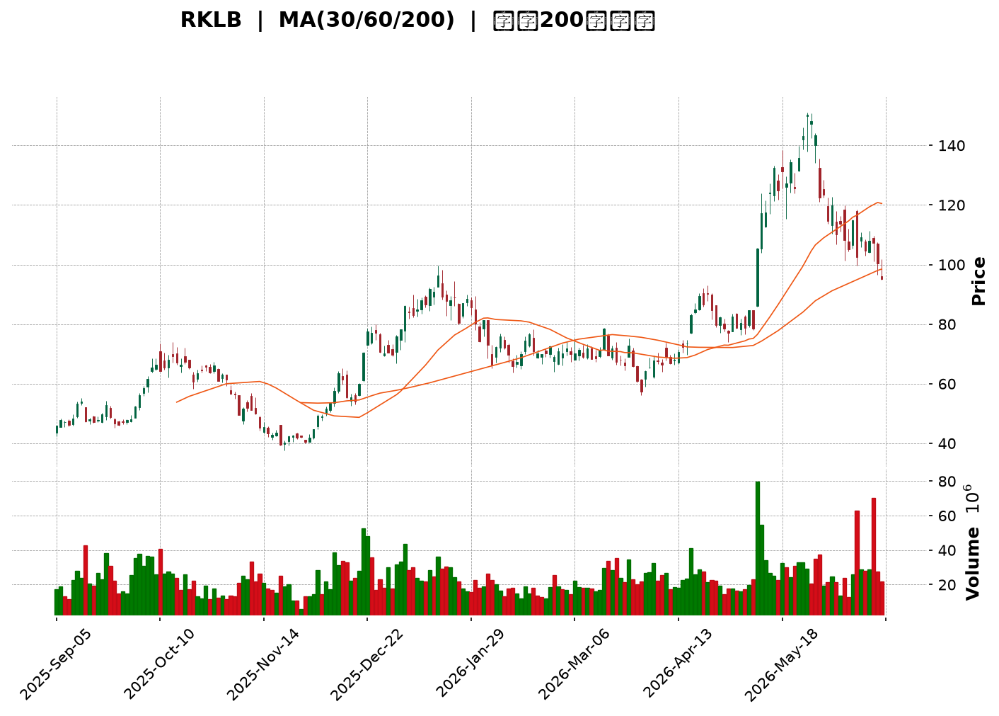
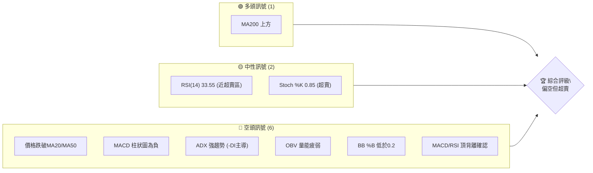
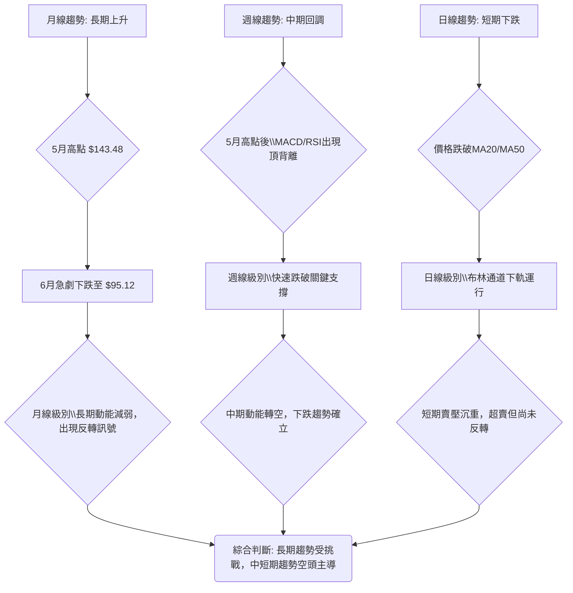
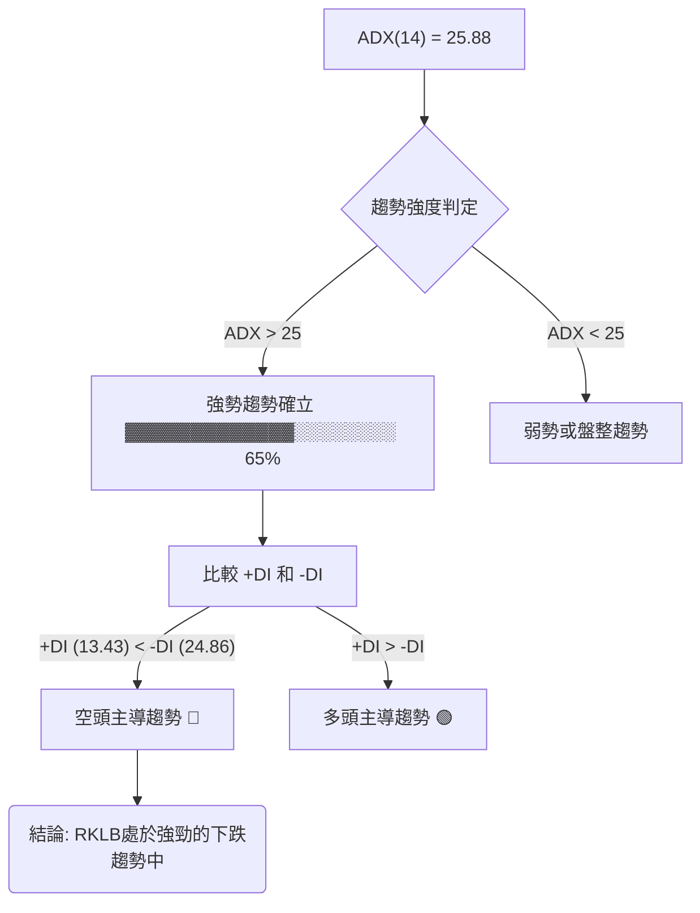
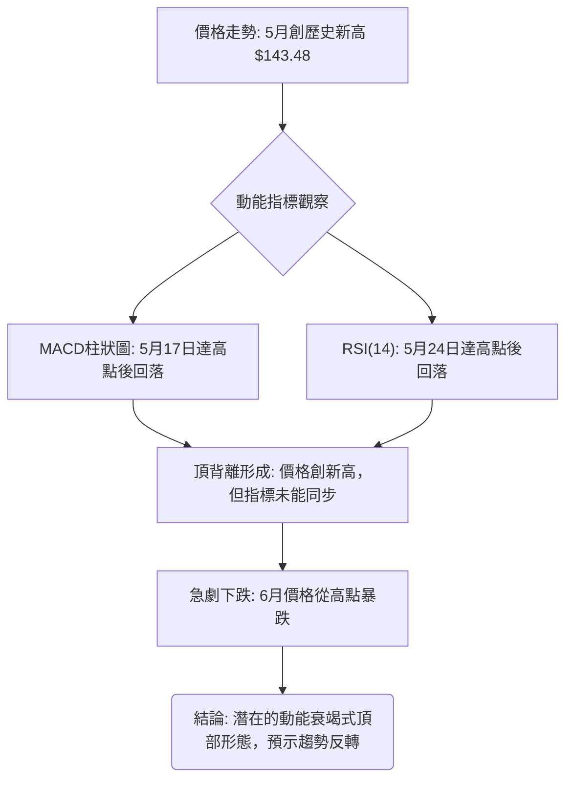
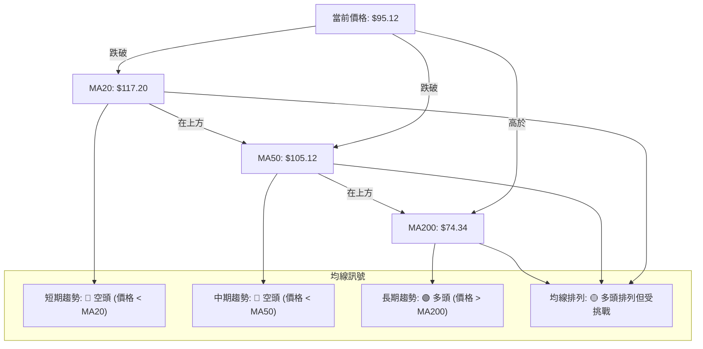
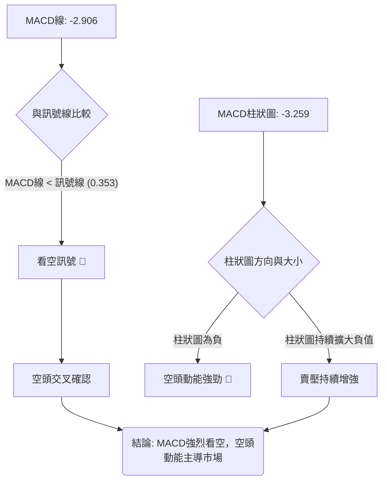
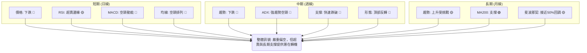
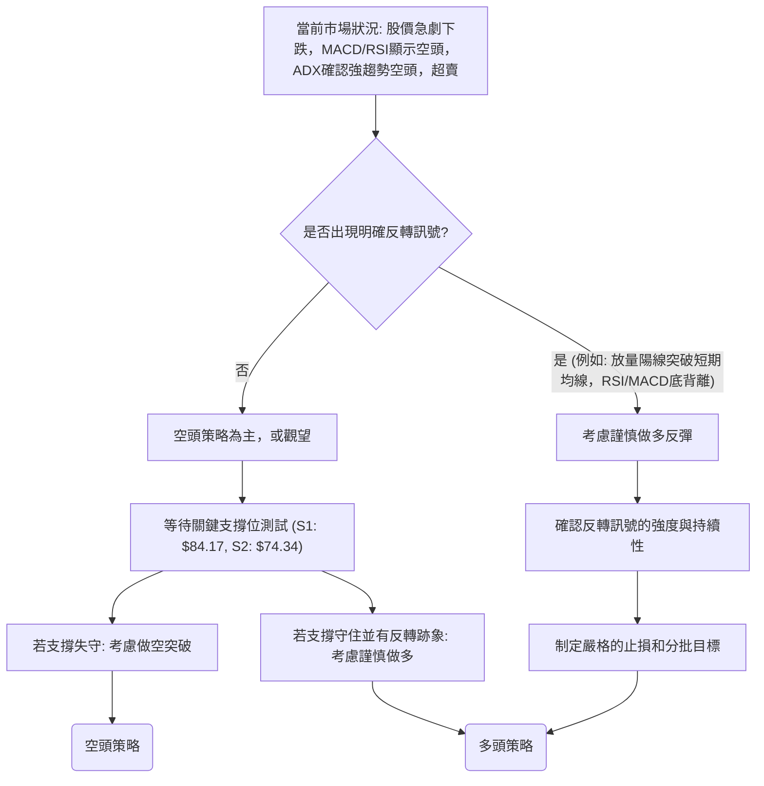

<details>
<summary>📊 靜態圖表 (點擊展開)</summary>

</details>

<html>
<head><meta charset="utf-8" /></head>
<body>
    <div style="height:500px; width:100%;">                        <script>window.PlotlyConfig = {MathJaxConfig: 'local'};</script>
        <script charset="utf-8" src="https://cdn.plot.ly/plotly-3.6.0.min.js" integrity="sha256-QaOVwtVY0T02VaHrr6pnoHLCwayMJp4O5n4YyaE3rJk=" crossorigin="anonymous"></script>                <div id="candlestick-chart" class="plotly-graph-div" style="height:100%; width:100%;"></div>            <script>                window.PLOTLYENV=window.PLOTLYENV || {};                                if (document.getElementById("candlestick-chart")) {                    Plotly.newPlot(                        "candlestick-chart",                        [{"close":{"dtype":"f8","bdata":"AAAAIIXrRkAAAACgcN1HQAAAAADXg0dAAAAAgMIVR0AAAABACjdIQAAAACCFq0pAAAAAwB4FS0AAAAAgXJ9HQAAAAIA9CkhAAAAAQAqXR0AAAADAHuVHQAAAACCu50hAAAAA4Hp0SkAAAADgUVhIQAAAAOCjUEdAAAAAoEchR0AAAACgR4FHQAAAAOB69EdAAAAAACn8R0AAAAAAKTxKQAAAAOB6FExAAAAAAABATUAAAACgR8FOQAAAAADXU1BAAAAAQOGaUEAAAADgoxBQQAAAAEDhWlBAAAAAgOsBUUAAAACgR1FRQAAAAAAAwFBAAAAAoEeRUEAAAABgZtZQQAAAAKCZWVBAAAAA4FFITkAAAADA9chPQAAAAADXI1BAAAAAIK5nUEAAAAAAAOBPQAAAAIA9ilBAAAAAgMJ1TkAAAACgcH1PQAAAACCFq05AAAAAwPVITEAAAACAwjVMQAAAAIAUzkhAAAAAgOvRSUAAAABAM\u002fNJQAAAAGC4nklAAAAAACn8SEAAAAAAAKBGQAAAAMAexUZAAAAAIK6nRUAAAAAA12NFQAAAACBcz0VAAAAAoHC9Q0AAAABgZiZEQAAAAKCZOUVAAAAAwMxMRUAAAABACvdEQAAAAIDrEUVAAAAAIFwvREAAAABAM\u002fNEQAAAAAApXEZAAAAAIFyvSEAAAABACodIQAAAACCux0lAAAAAQAq3SkAAAABgj8JMQAAAAADXw09AAAAAYLi+TkAAAADgerRLQAAAAGC4vktAAAAAQOH6SkAAAACAwvVNQAAAAKBHoVFAAAAAQDNjU0AAAAAghUtTQAAAACCFS1NAAAAAoJmpUUAAAAAgrodRQAAAAMDMnFFAAAAA4KNwUUAAAAAgXP9SQAAAAMD1iFNAAAAAgOuBVUAAAADAHgVVQAAAAMAexVRAAAAAYGY2VUAAAACgmflVQAAAAMAepVVAAAAAQDPzVkAAAADgo7BWQAAAAEAzE1hAAAAAgD1KVkAAAADgevRVQAAAAGC4\u002flVAAAAAoJk5VkAAAABguB5UQAAAAAAAwFVAAAAA4HokVkAAAAAghWtVQAAAAOB6BFRAAAAAoJmJUkAAAACgR1FUQAAAAEAKR1JAAAAA4HqUUEAAAADgehRSQAAAAIDC9VJAAAAAgOsBUkAAAAAgrmdRQAAAAOCjgFBAAAAAACncUEAAAADA9XhRQAAAAEDhmlJAAAAAwB4lU0AAAABACrdRQAAAAKBwjVFAAAAAgBR+UUAAAADAzIxRQAAAAKCZKVJAAAAAYGZGUUAAAACAFL5RQAAAAOBRiFFAAAAAgD36UUAAAAAAAIBRQAAAAEAKh1FAAAAAYLjeUUAAAAAghTtRQAAAAKBw\u002fVFAAAAAIK4XUUAAAACAPRpRQAAAAADX01FAAAAAgMKlU0AAAABguF5RQAAAACCF+1FAAAAAYLjOUEAAAAAAAABRQAAAAOB6hFBAAAAA4FE4UkAAAAAAKXxQQAAAAEAKd05AAAAA4KOwTEAAAACAFA5QQAAAAKBHYVBAAAAAYLjuUEAAAABA4epQQAAAAOB6lFBAAAAAwB5FUUAAAAAgXK9QQAAAAEAzA1FAAAAAIK6nUUAAAACAFA5SQAAAAGBmZlJAAAAAIIW7VEAAAABAMzNVQAAAAKBwXVZAAAAAwPWoVUAAAABgj4JWQAAAAGBmJlVAAAAAIIXrU0AAAABgj5JUQAAAAIDCpVNAAAAAoEdBU0AAAADgo6BUQAAAAADXs1NAAAAAANcTVEAAAADgo7BTQAAAAKCZKVVAAAAAwB6lU0AAAACAFF5aQAAAAGBmVl1AAAAAANdjXUAAAACgmQlfQAAAAKCZkWBAAAAAoEcxX0AAAADAHmVgQAAAAADX019AAAAAwPXIYEAAAADAzFxfQAAAAOBR+GBAAAAAYGbmYUAAAAAgXMdiQAAAAMD1gGJAAAAAIFzvYUAAAADA9ZheQAAAAOB61F5AAAAAwMysXEAAAADAzPxdQAAAAMAehVtAAAAAoJlpXEAAAABguA5bQAAAAEAzQ1pAAAAAgOuxXEAAAADA9ZhZQAAAAAAAUFtAAAAA4FEoWkAAAABguP5aQAAAACBcz1pAAAAAYI8SWUAAAAAgrsdXQA=="},"high":{"dtype":"f8","bdata":"AAAAYLj+RkAAAACgmRlIQAAAAADXw0dAAAAAgBQOSEAAAADAHtVIQAAAAADXA0tAAAAAgMKVS0AAAACAPQpKQAAAAMAeRUhAAAAA4FGYSEAAAABACndIQAAAAKBHIUlAAAAAYDkUS0AAAACgcD1KQAAAACBcT0hAAAAA4FHYR0AAAADAzAxIQAAAAGC4\u002fkdAAAAAgMK1SEAAAABAM1NKQAAAACAxeExAAAAAoEehTUAAAAAgrkdPQAAAAAAtIlFAAAAAYI8iUUAAAAAAAGBSQAAAAAApnFFAAAAAQOFqUUAAAACAFH5SQAAAAAAAEFJAAAAAAAAgUUAAAAAghQtSQAAAAGCPAlFAAAAAoEcBUEAAAADAzCxQQAAAACCFi1BAAAAAYGaWUEAAAABgj6JQQAAAAMD12FBAAAAAIIVLUEAAAACgmblPQAAAAMDMjE9AAAAAYLi+TUAAAAAA16NMQAAAAEDhGkxAAAAAwMwMSkAAAAAAAEBLQAAAAEDhekxAAAAAgD2qS0AAAADgo7BIQAAAAAApnEdAAAAAwEvXRkAAAACAFM5FQAAAAADXQ0ZAAAAAoEchR0AAAACAwoVEQAAAAADXQ0VAAAAAQApnRUAAAAAghctFQAAAAKCZWUVAAAAAYGamREAAAABguH5FQAAAAGC4XkZAAAAAQArXSEAAAACgmdlIQAAAACBcL0pAAAAAAADgSkAAAACAPWpNQAAAAKCZCVBAAAAAIIVLUEAAAAAA1yNQQAAAAKBwXUxAAAAA4Hp0TEAAAAAAACBOQAAAAADXo1FAAAAAwMycU0AAAAAghctTQAAAAMAe9VNAAAAAIFw\u002fU0AAAAAgXC9SQAAAAAAprFJAAAAAQItMUkAAAAAgXA9TQAAAAAAAkFNAAAAAAACQVUAAAACgcH1VQAAAACCud1ZAAAAAIIUbVkAAAACAwjVWQAAAAOCnblZAAAAAACkMV0AAAABAYB1XQAAAAMAe5VhAAAAAoEeRWEAAAAAAANBWQAAAAKCZWVZAAAAAwMycV0AAAACAPcpVQAAAAAAAwFVAAAAAQDNzVkAAAAAAAEBWQAAAAOB6VFZAAAAAwMwsVEAAAADgelRUQAAAAGBmVlRAAAAAIFw\u002fUkAAAACAPSpSQAAAAEAzM1NAAAAAQAr3UkAAAACgmVlSQAAAAMDMHFFAAAAAYGZmUUAAAAAgXL9RQAAAAMD18FJAAAAAQApHU0AAAADAzIxTQAAAAAAA0FFAAAAAIIWDUUAAAABgZvZRQAAAACBcL1JAAAAAgMJlUUAAAABgZgZSQAAAAAAAUFJAAAAAYGaGUkAAAAAA1xNSQAAAAEAKx1JAAAAAAAAIUkAAAAAA1ztSQAAAAEAzU1JAAAAAYGYmUkAAAAAA19NRQAAAAOBRGFJAAAAAQOGqU0AAAADgUThTQAAAAGC4LlJAAAAAYLh+UkAAAADAzFxRQAAAAGBmJlFAAAAAANfDUkAAAACAwgVSQAAAAIAUhlBAAAAAgOvRTkAAAADAHiVQQAAAAEDhKlFAAAAAwPVYUUAAAADgepRRQAAAAEAzE1FAAAAAgMBqUkAAAABgj3JRQAAAAADXg1FAAAAAQDPjUUAAAAAAALBSQAAAAIDCpVJAAAAAIFzfVEAAAAAgXL9VQAAAAGBmllZAAAAAwMz8VkAAAABgZkZXQAAAAEAzk1ZAAAAAgD2aVUAAAABguJ5UQAAAAIDrcVRAAAAA4KOAU0AAAACAwuVUQAAAAGCP8lRAAAAA4E91VEAAAAAAAMBUQAAAACCFK1VAAAAAYI8yVUAAAAAgrmdaQAAAAAAp\u002fF5AAAAAIFxfXkAAAAAgXM9fQAAAAIDCpWBAAAAAANdLYEAAAAAAKUxhQAAAAIA9MmBAAAAAQDPrYEAAAAAA11tgQAAAAOBReGFAAAAAAABAYkAAAAAAAOBiQAAAAGCP2mJAAAAAAAAAYkAAAAAAKfRgQAAAAMDMDGBAAAAA4FGgXkAAAADgUaheQAAAAGC4fl1AAAAAAAAQXUAAAABgj\u002fJdQAAAAKBw\u002fVtAAAAAQOHCXEAAAADAIJhdQAAAAIDrsVtAAAAAAAAgW0AAAACAwtVbQAAAAEAzY1tAAAAAoJnZWkAAAABguG5ZQA=="},"hovertemplate":"\u003cb\u003e%{x|%Y-%m-%d}\u003c\u002fb\u003e\u003cbr\u003e\u958b: $%{open:.2f}\u003cbr\u003e\u9ad8: $%{high:.2f}\u003cbr\u003e\u4f4e: $%{low:.2f}\u003cbr\u003e\u6536: $%{close:.2f}\u003cextra\u003e\u003c\u002fextra\u003e","low":{"dtype":"f8","bdata":"AAAAgOsxRUAAAADAdr5GQAAAAECJwUZAAAAAwMzMRkAAAABACgdHQAAAAEA1TkhAAAAAAClcSkAAAACgR4FHQAAAAKCZOUdAAAAAAACAR0AAAADgo5BHQAAAAGBmZkdAAAAA4Hr0R0AAAABACjdIQAAAAEDhmkZAAAAAgD3qRkAAAAAgXC9HQAAAAKBHQUdAAAAAIFyPR0AAAACgR0FIQAAAAKBHoUlAAAAAYGbmS0AAAABgj4JMQAAAAEAz009AAAAAQOEaUEAAAADA9QhQQAAAAODOJ1BAAAAA4FEYT0AAAADAHsVQQAAAAEAzm1BAAAAAoJnZT0AAAABAM6tQQAAAAEAKN1BAAAAA4Ho0TUAAAAAAAGBOQAAAAEAz009AAAAAoJkJUEAAAACAFM5PQAAAAKBwvU9AAAAAgOtxTkAAAABAMzNOQAAAAOCjkE1AAAAAoEdBTEAAAAAgXG9LQAAAAOB6tEhAAAAA4M4nR0AAAACgR2FJQAAAAEDhmklAAAAA4HrUSEAAAAAgXC9GQAAAAGBmpkVAAAAAwMwcRUAAAACgcJ1EQAAAAEAKN0VAAAAAwPWoQ0AAAADA9chCQAAAAGBmpkNAAAAA4KMwREAAAADgo7BEQAAAAGBm5kRAAAAAoHD9Q0AAAACAwjVEQAAAAAAAwERAAAAAwPVoRkAAAACgmdlHQAAAAAApnEhAAAAAIIUrSUAAAAAAACBKQAAAAMDMbExAAAAAYGbmTUAAAACAPYpLQAAAAEAKV0pAAAAAQOGKSkAAAAAA1wNMQAAAAMCdX05AAAAAwCAwUkAAAABgj1JSQAAAAKBDs1JAAAAAwPWYUUAAAACgm1RRQAAAAAApnFFAAAAA4FFIUUAAAABgZrZQQAAAAADX01FAAAAAQDODUkAAAABgZnZUQAAAAOCjkFRAAAAAwMycVEAAAADg0NpUQAAAAKCZaVVAAAAAAAAgVUAAAACgmalVQAAAAKCZGVdAAAAAQDMTVkAAAACgcK1UQAAAAMB2VlRAAAAAIK6HVUAAAADgowBUQAAAAAAAgFRAAAAAwMqBVUAAAAAAAMBUQAAAAKBHgVNAAAAAgEF4UkAAAACgR\u002fFSQAAAAEAIJFFAAAAAwMxMUEAAAAAAAMBQQAAAAAAAsFFAAAAAQDPjUUAAAACgR8FQQAAAACBc709AAAAAAABgUEAAAAAAAEBQQAAAAMBLf1FAAAAAYGYWUkAAAACgmVlRQAAAAAAAIFFAAAAAYGamUEAAAADgUThRQAAAAADXM1FAAAAAYGYGUEAAAADAzJxQQAAAAAApjFBAAAAAgBReUUAAAACAwtVQQAAAAOCjCFFAAAAA4Hr0UEAAAACAvidRQAAAAMAeFVFAAAAAgOsRUUAAAAAAKdxQQAAAAEDhKlFAAAAAoEfRUUAAAACgmVlRQAAAAAAAAFFAAAAAwPWYUEAAAABAM4NQQAAAAKBwHVBAAAAAACk8UUAAAACAwmVQQAAAAMDMLE5AAAAAYOUQTEAAAAAA14NNQAAAAEAzU1BAAAAAgBTuTkAAAABgZqZQQAAAAEDh+k9AAAAAYOfzUEAAAABA4aJQQAAAAIDClVBAAAAAgMKlUEAAAABguJ5RQAAAAGBmZlFAAAAAoJk5U0AAAABgZuZUQAAAAGBmJlVAAAAAAABwVUAAAADgo\u002fBVQAAAAAApZFRAAAAAwB7FU0AAAADAdENTQAAAAGBmZlNAAAAAIFx\u002fUkAAAACAFF5TQAAAACCFm1NAAAAAAAAQU0AAAAAA1yNTQAAAAEAKt1NAAAAAIIV7U0AAAAAgrndVQAAAAAAAAFpAAAAAgD0aXEAAAADA9ThdQAAAAADXU15AAAAAQDNzXkAAAACg8WpfQAAAAGC4zlxAAAAAgBQOX0AAAABAM\u002fNeQAAAAIDraWBAAAAAgOtRYUAAAADAHj1hQAAAAADXy2FAAAAAoJnBYEAAAAAAAEBeQAAAAADXo15AAAAAgD1qXEAAAADA9ZhbQAAAAGC4rlpAAAAAAADAW0AAAADAzExZQAAAAIA9GlpAAAAAoJlZWkAAAABACudYQAAAAEAzc1pAAAAA4HrEWUAAAABgjwJaQAAAAKBwPVlAAAAAAAAgWEAAAADgo7hXQA=="},"name":"\u50f9\u683c","open":{"dtype":"f8","bdata":"AAAA4FHIRUAAAAAAAMBGQAAAAKBHgUdAAAAAANfDR0AAAADA9ShHQAAAAKBwfUhAAAAAgD3KSkAAAAAAAABKQAAAAOBRyEdAAAAAgMJ1SEAAAABACtdHQAAAAOCjkEdAAAAAQDODSEAAAACAwuVJQAAAAAAAAEhAAAAAYGamR0AAAABAM7NHQAAAAEDhmkdAAAAA4KOwR0AAAACA61FIQAAAAGBmBkpAAAAAYLhuTEAAAACgR4FNQAAAAKCZCVBAAAAAoJk5UEAAAABAM7NRQAAAAOBR+FBAAAAAgMJVUEAAAACgR4FRQAAAAOB6hFFAAAAAwPV4UEAAAADgo0hRQAAAAGCPAlFAAAAAACl8T0AAAAAgrsdOQAAAAADXM1BAAAAAACmMUEAAAABAM2tQQAAAAKBHCVBAAAAAAABAUEAAAABgj+JOQAAAAADXg09AAAAAYGbmTEAAAADgelRMQAAAAEDhGkxAAAAAoBjUR0AAAABguN5KQAAAAAAAAExAAAAAQAr3SUAAAACgR2FIQAAAAEDh2kVAAAAAQDOTRkAAAAAAKRxFQAAAAAAAQEVAAAAAgD0KR0AAAACAPepDQAAAAKBHYURAAAAAANcDRUAAAABguJ5FQAAAAKBHQUVAAAAAQDOTREAAAAAgrkdEQAAAAGCP8kRAAAAAYI\u002fSRkAAAAAAAHBIQAAAAIA9CklAAAAAoHCdSUAAAADgUbhKQAAAAKBHwUxAAAAAAABAT0AAAADgp4ZPQAAAAOBRGEtAAAAAwMwMTEAAAACgmRlMQAAAACBcj05AAAAAACk8UkAAAAAA13NSQAAAAIA9glNAAAAAIIUrU0AAAAAAAGBRQAAAAKCZQVJAAAAAAADgUUAAAADgUahRQAAAACCup1JAAAAA4KNwU0AAAABgZgZVQAAAAAAAYFVAAAAAoJkhVUAAAABguD5VQAAAAMD1SFZAAAAAYGaWVUAAAADA9VBWQAAAAKCZIVdAAAAAwMxsV0AAAACgR4FWQAAAAOBRmFVAAAAAIIVDVkAAAAAgrq9VQAAAAMD1uFRAAAAAgBTOVUAAAAAAKfxVQAAAAAAAQFVAAAAAgD3KU0AAAABgZqZTQAAAAGBmVlRAAAAAYLh+UUAAAAAAAEBRQAAAAKCZAVJAAAAAgBSmUkAAAADgUUhSQAAAAIDr4VBAAAAA4HqsUEAAAABAYIVQQAAAAAAAwFFAAAAAoJk5UkAAAAAg2d5SQAAAAOBRMFFAAAAA4FE4UUAAAACAFMZRQAAAAEDhglFAAAAAgMLlUEAAAAAghatQQAAAAGC4NlFAAAAAANezUUAAAABA4bpRQAAAAOCjCFFAAAAAwPVYUUAAAACAwpVRQAAAAEAzM1FAAAAAwMz8UUAAAACgmUlRQAAAAMDMVFFAAAAAYGbeUUAAAABgjwJTQAAAAOB6NFFAAAAAAAAAUkAAAACgcAVRQAAAAAAAwFBAAAAAACk8UUAAAADAzMxRQAAAAOCjgFBAAAAAoJm5TkAAAABA4dpOQAAAAAAAYFBAAAAAwMwcT0AAAABguO5QQAAAACBcx1BAAAAAAAAAUkAAAAAA10NRQAAAAMDM7FBAAAAAQDPDUEAAAAAghWNSQAAAAKBwZVJAAAAAgBQ+U0AAAADAHgVVQAAAAGBmNlVAAAAAwB6VVkAAAACAwp1WQAAAAGBmdlZAAAAAgMKVVUAAAAAAKexTQAAAAMDMBFRAAAAAQAp3U0AAAABAM2NTQAAAAIDr4VRAAAAAQAqXU0AAAABgZqZUQAAAACCu51NAAAAAoHAtVUAAAACAPYJVQAAAAKBHUVpAAAAA4KMwXEAAAACgR\u002fleQAAAAGBmxl5AAAAAQDMDYEAAAAAAKZhgQAAAAIAUfl9AAAAAYLjeX0AAAADA9YhfQAAAAMAebWBAAAAAQOG+YUAAAABACrdiQAAAAKBwZWJAAAAAgBR+YUAAAAAAKYxgQAAAAIDCVV9AAAAAwB7lXUAAAACgcEVcQAAAAKBHkVxAAAAAQOGqXEAAAACgmZldQAAAAMDM7FpAAAAAgMKlWkAAAACgR4FdQAAAAKBw\u002fVpAAAAAoHDtWkAAAAAgrgdaQAAAAMAeNVtAAAAAIFy\u002fWkAAAACgmQFYQA=="},"x":["2025-09-05T00:00:00-04:00","2025-09-08T00:00:00-04:00","2025-09-09T00:00:00-04:00","2025-09-10T00:00:00-04:00","2025-09-11T00:00:00-04:00","2025-09-12T00:00:00-04:00","2025-09-15T00:00:00-04:00","2025-09-16T00:00:00-04:00","2025-09-17T00:00:00-04:00","2025-09-18T00:00:00-04:00","2025-09-19T00:00:00-04:00","2025-09-22T00:00:00-04:00","2025-09-23T00:00:00-04:00","2025-09-24T00:00:00-04:00","2025-09-25T00:00:00-04:00","2025-09-26T00:00:00-04:00","2025-09-29T00:00:00-04:00","2025-09-30T00:00:00-04:00","2025-10-01T00:00:00-04:00","2025-10-02T00:00:00-04:00","2025-10-03T00:00:00-04:00","2025-10-06T00:00:00-04:00","2025-10-07T00:00:00-04:00","2025-10-08T00:00:00-04:00","2025-10-09T00:00:00-04:00","2025-10-10T00:00:00-04:00","2025-10-13T00:00:00-04:00","2025-10-14T00:00:00-04:00","2025-10-15T00:00:00-04:00","2025-10-16T00:00:00-04:00","2025-10-17T00:00:00-04:00","2025-10-20T00:00:00-04:00","2025-10-21T00:00:00-04:00","2025-10-22T00:00:00-04:00","2025-10-23T00:00:00-04:00","2025-10-24T00:00:00-04:00","2025-10-27T00:00:00-04:00","2025-10-28T00:00:00-04:00","2025-10-29T00:00:00-04:00","2025-10-30T00:00:00-04:00","2025-10-31T00:00:00-04:00","2025-11-03T00:00:00-05:00","2025-11-04T00:00:00-05:00","2025-11-05T00:00:00-05:00","2025-11-06T00:00:00-05:00","2025-11-07T00:00:00-05:00","2025-11-10T00:00:00-05:00","2025-11-11T00:00:00-05:00","2025-11-12T00:00:00-05:00","2025-11-13T00:00:00-05:00","2025-11-14T00:00:00-05:00","2025-11-17T00:00:00-05:00","2025-11-18T00:00:00-05:00","2025-11-19T00:00:00-05:00","2025-11-20T00:00:00-05:00","2025-11-21T00:00:00-05:00","2025-11-24T00:00:00-05:00","2025-11-25T00:00:00-05:00","2025-11-26T00:00:00-05:00","2025-11-28T00:00:00-05:00","2025-12-01T00:00:00-05:00","2025-12-02T00:00:00-05:00","2025-12-03T00:00:00-05:00","2025-12-04T00:00:00-05:00","2025-12-05T00:00:00-05:00","2025-12-08T00:00:00-05:00","2025-12-09T00:00:00-05:00","2025-12-10T00:00:00-05:00","2025-12-11T00:00:00-05:00","2025-12-12T00:00:00-05:00","2025-12-15T00:00:00-05:00","2025-12-16T00:00:00-05:00","2025-12-17T00:00:00-05:00","2025-12-18T00:00:00-05:00","2025-12-19T00:00:00-05:00","2025-12-22T00:00:00-05:00","2025-12-23T00:00:00-05:00","2025-12-24T00:00:00-05:00","2025-12-26T00:00:00-05:00","2025-12-29T00:00:00-05:00","2025-12-30T00:00:00-05:00","2025-12-31T00:00:00-05:00","2026-01-02T00:00:00-05:00","2026-01-05T00:00:00-05:00","2026-01-06T00:00:00-05:00","2026-01-07T00:00:00-05:00","2026-01-08T00:00:00-05:00","2026-01-09T00:00:00-05:00","2026-01-12T00:00:00-05:00","2026-01-13T00:00:00-05:00","2026-01-14T00:00:00-05:00","2026-01-15T00:00:00-05:00","2026-01-16T00:00:00-05:00","2026-01-20T00:00:00-05:00","2026-01-21T00:00:00-05:00","2026-01-22T00:00:00-05:00","2026-01-23T00:00:00-05:00","2026-01-26T00:00:00-05:00","2026-01-27T00:00:00-05:00","2026-01-28T00:00:00-05:00","2026-01-29T00:00:00-05:00","2026-01-30T00:00:00-05:00","2026-02-02T00:00:00-05:00","2026-02-03T00:00:00-05:00","2026-02-04T00:00:00-05:00","2026-02-05T00:00:00-05:00","2026-02-06T00:00:00-05:00","2026-02-09T00:00:00-05:00","2026-02-10T00:00:00-05:00","2026-02-11T00:00:00-05:00","2026-02-12T00:00:00-05:00","2026-02-13T00:00:00-05:00","2026-02-17T00:00:00-05:00","2026-02-18T00:00:00-05:00","2026-02-19T00:00:00-05:00","2026-02-20T00:00:00-05:00","2026-02-23T00:00:00-05:00","2026-02-24T00:00:00-05:00","2026-02-25T00:00:00-05:00","2026-02-26T00:00:00-05:00","2026-02-27T00:00:00-05:00","2026-03-02T00:00:00-05:00","2026-03-03T00:00:00-05:00","2026-03-04T00:00:00-05:00","2026-03-05T00:00:00-05:00","2026-03-06T00:00:00-05:00","2026-03-09T00:00:00-04:00","2026-03-10T00:00:00-04:00","2026-03-11T00:00:00-04:00","2026-03-12T00:00:00-04:00","2026-03-13T00:00:00-04:00","2026-03-16T00:00:00-04:00","2026-03-17T00:00:00-04:00","2026-03-18T00:00:00-04:00","2026-03-19T00:00:00-04:00","2026-03-20T00:00:00-04:00","2026-03-23T00:00:00-04:00","2026-03-24T00:00:00-04:00","2026-03-25T00:00:00-04:00","2026-03-26T00:00:00-04:00","2026-03-27T00:00:00-04:00","2026-03-30T00:00:00-04:00","2026-03-31T00:00:00-04:00","2026-04-01T00:00:00-04:00","2026-04-02T00:00:00-04:00","2026-04-06T00:00:00-04:00","2026-04-07T00:00:00-04:00","2026-04-08T00:00:00-04:00","2026-04-09T00:00:00-04:00","2026-04-10T00:00:00-04:00","2026-04-13T00:00:00-04:00","2026-04-14T00:00:00-04:00","2026-04-15T00:00:00-04:00","2026-04-16T00:00:00-04:00","2026-04-17T00:00:00-04:00","2026-04-20T00:00:00-04:00","2026-04-21T00:00:00-04:00","2026-04-22T00:00:00-04:00","2026-04-23T00:00:00-04:00","2026-04-24T00:00:00-04:00","2026-04-27T00:00:00-04:00","2026-04-28T00:00:00-04:00","2026-04-29T00:00:00-04:00","2026-04-30T00:00:00-04:00","2026-05-01T00:00:00-04:00","2026-05-04T00:00:00-04:00","2026-05-05T00:00:00-04:00","2026-05-06T00:00:00-04:00","2026-05-07T00:00:00-04:00","2026-05-08T00:00:00-04:00","2026-05-11T00:00:00-04:00","2026-05-12T00:00:00-04:00","2026-05-13T00:00:00-04:00","2026-05-14T00:00:00-04:00","2026-05-15T00:00:00-04:00","2026-05-18T00:00:00-04:00","2026-05-19T00:00:00-04:00","2026-05-20T00:00:00-04:00","2026-05-21T00:00:00-04:00","2026-05-22T00:00:00-04:00","2026-05-26T00:00:00-04:00","2026-05-27T00:00:00-04:00","2026-05-28T00:00:00-04:00","2026-05-29T00:00:00-04:00","2026-06-01T00:00:00-04:00","2026-06-02T00:00:00-04:00","2026-06-03T00:00:00-04:00","2026-06-04T00:00:00-04:00","2026-06-05T00:00:00-04:00","2026-06-08T00:00:00-04:00","2026-06-09T00:00:00-04:00","2026-06-10T00:00:00-04:00","2026-06-11T00:00:00-04:00","2026-06-12T00:00:00-04:00","2026-06-15T00:00:00-04:00","2026-06-16T00:00:00-04:00","2026-06-17T00:00:00-04:00","2026-06-18T00:00:00-04:00","2026-06-22T00:00:00-04:00","2026-06-23T00:00:00-04:00"],"type":"candlestick"},{"hovertemplate":"MA30: $%{y:.2f}\u003cextra\u003e\u003c\u002fextra\u003e","line":{"color":"#2196F3","dash":"dash","width":2},"mode":"lines","name":"MA30","x":["2025-09-05T00:00:00-04:00","2025-09-08T00:00:00-04:00","2025-09-09T00:00:00-04:00","2025-09-10T00:00:00-04:00","2025-09-11T00:00:00-04:00","2025-09-12T00:00:00-04:00","2025-09-15T00:00:00-04:00","2025-09-16T00:00:00-04:00","2025-09-17T00:00:00-04:00","2025-09-18T00:00:00-04:00","2025-09-19T00:00:00-04:00","2025-09-22T00:00:00-04:00","2025-09-23T00:00:00-04:00","2025-09-24T00:00:00-04:00","2025-09-25T00:00:00-04:00","2025-09-26T00:00:00-04:00","2025-09-29T00:00:00-04:00","2025-09-30T00:00:00-04:00","2025-10-01T00:00:00-04:00","2025-10-02T00:00:00-04:00","2025-10-03T00:00:00-04:00","2025-10-06T00:00:00-04:00","2025-10-07T00:00:00-04:00","2025-10-08T00:00:00-04:00","2025-10-09T00:00:00-04:00","2025-10-10T00:00:00-04:00","2025-10-13T00:00:00-04:00","2025-10-14T00:00:00-04:00","2025-10-15T00:00:00-04:00","2025-10-16T00:00:00-04:00","2025-10-17T00:00:00-04:00","2025-10-20T00:00:00-04:00","2025-10-21T00:00:00-04:00","2025-10-22T00:00:00-04:00","2025-10-23T00:00:00-04:00","2025-10-24T00:00:00-04:00","2025-10-27T00:00:00-04:00","2025-10-28T00:00:00-04:00","2025-10-29T00:00:00-04:00","2025-10-30T00:00:00-04:00","2025-10-31T00:00:00-04:00","2025-11-03T00:00:00-05:00","2025-11-04T00:00:00-05:00","2025-11-05T00:00:00-05:00","2025-11-06T00:00:00-05:00","2025-11-07T00:00:00-05:00","2025-11-10T00:00:00-05:00","2025-11-11T00:00:00-05:00","2025-11-12T00:00:00-05:00","2025-11-13T00:00:00-05:00","2025-11-14T00:00:00-05:00","2025-11-17T00:00:00-05:00","2025-11-18T00:00:00-05:00","2025-11-19T00:00:00-05:00","2025-11-20T00:00:00-05:00","2025-11-21T00:00:00-05:00","2025-11-24T00:00:00-05:00","2025-11-25T00:00:00-05:00","2025-11-26T00:00:00-05:00","2025-11-28T00:00:00-05:00","2025-12-01T00:00:00-05:00","2025-12-02T00:00:00-05:00","2025-12-03T00:00:00-05:00","2025-12-04T00:00:00-05:00","2025-12-05T00:00:00-05:00","2025-12-08T00:00:00-05:00","2025-12-09T00:00:00-05:00","2025-12-10T00:00:00-05:00","2025-12-11T00:00:00-05:00","2025-12-12T00:00:00-05:00","2025-12-15T00:00:00-05:00","2025-12-16T00:00:00-05:00","2025-12-17T00:00:00-05:00","2025-12-18T00:00:00-05:00","2025-12-19T00:00:00-05:00","2025-12-22T00:00:00-05:00","2025-12-23T00:00:00-05:00","2025-12-24T00:00:00-05:00","2025-12-26T00:00:00-05:00","2025-12-29T00:00:00-05:00","2025-12-30T00:00:00-05:00","2025-12-31T00:00:00-05:00","2026-01-02T00:00:00-05:00","2026-01-05T00:00:00-05:00","2026-01-06T00:00:00-05:00","2026-01-07T00:00:00-05:00","2026-01-08T00:00:00-05:00","2026-01-09T00:00:00-05:00","2026-01-12T00:00:00-05:00","2026-01-13T00:00:00-05:00","2026-01-14T00:00:00-05:00","2026-01-15T00:00:00-05:00","2026-01-16T00:00:00-05:00","2026-01-20T00:00:00-05:00","2026-01-21T00:00:00-05:00","2026-01-22T00:00:00-05:00","2026-01-23T00:00:00-05:00","2026-01-26T00:00:00-05:00","2026-01-27T00:00:00-05:00","2026-01-28T00:00:00-05:00","2026-01-29T00:00:00-05:00","2026-01-30T00:00:00-05:00","2026-02-02T00:00:00-05:00","2026-02-03T00:00:00-05:00","2026-02-04T00:00:00-05:00","2026-02-05T00:00:00-05:00","2026-02-06T00:00:00-05:00","2026-02-09T00:00:00-05:00","2026-02-10T00:00:00-05:00","2026-02-11T00:00:00-05:00","2026-02-12T00:00:00-05:00","2026-02-13T00:00:00-05:00","2026-02-17T00:00:00-05:00","2026-02-18T00:00:00-05:00","2026-02-19T00:00:00-05:00","2026-02-20T00:00:00-05:00","2026-02-23T00:00:00-05:00","2026-02-24T00:00:00-05:00","2026-02-25T00:00:00-05:00","2026-02-26T00:00:00-05:00","2026-02-27T00:00:00-05:00","2026-03-02T00:00:00-05:00","2026-03-03T00:00:00-05:00","2026-03-04T00:00:00-05:00","2026-03-05T00:00:00-05:00","2026-03-06T00:00:00-05:00","2026-03-09T00:00:00-04:00","2026-03-10T00:00:00-04:00","2026-03-11T00:00:00-04:00","2026-03-12T00:00:00-04:00","2026-03-13T00:00:00-04:00","2026-03-16T00:00:00-04:00","2026-03-17T00:00:00-04:00","2026-03-18T00:00:00-04:00","2026-03-19T00:00:00-04:00","2026-03-20T00:00:00-04:00","2026-03-23T00:00:00-04:00","2026-03-24T00:00:00-04:00","2026-03-25T00:00:00-04:00","2026-03-26T00:00:00-04:00","2026-03-27T00:00:00-04:00","2026-03-30T00:00:00-04:00","2026-03-31T00:00:00-04:00","2026-04-01T00:00:00-04:00","2026-04-02T00:00:00-04:00","2026-04-06T00:00:00-04:00","2026-04-07T00:00:00-04:00","2026-04-08T00:00:00-04:00","2026-04-09T00:00:00-04:00","2026-04-10T00:00:00-04:00","2026-04-13T00:00:00-04:00","2026-04-14T00:00:00-04:00","2026-04-15T00:00:00-04:00","2026-04-16T00:00:00-04:00","2026-04-17T00:00:00-04:00","2026-04-20T00:00:00-04:00","2026-04-21T00:00:00-04:00","2026-04-22T00:00:00-04:00","2026-04-23T00:00:00-04:00","2026-04-24T00:00:00-04:00","2026-04-27T00:00:00-04:00","2026-04-28T00:00:00-04:00","2026-04-29T00:00:00-04:00","2026-04-30T00:00:00-04:00","2026-05-01T00:00:00-04:00","2026-05-04T00:00:00-04:00","2026-05-05T00:00:00-04:00","2026-05-06T00:00:00-04:00","2026-05-07T00:00:00-04:00","2026-05-08T00:00:00-04:00","2026-05-11T00:00:00-04:00","2026-05-12T00:00:00-04:00","2026-05-13T00:00:00-04:00","2026-05-14T00:00:00-04:00","2026-05-15T00:00:00-04:00","2026-05-18T00:00:00-04:00","2026-05-19T00:00:00-04:00","2026-05-20T00:00:00-04:00","2026-05-21T00:00:00-04:00","2026-05-22T00:00:00-04:00","2026-05-26T00:00:00-04:00","2026-05-27T00:00:00-04:00","2026-05-28T00:00:00-04:00","2026-05-29T00:00:00-04:00","2026-06-01T00:00:00-04:00","2026-06-02T00:00:00-04:00","2026-06-03T00:00:00-04:00","2026-06-04T00:00:00-04:00","2026-06-05T00:00:00-04:00","2026-06-08T00:00:00-04:00","2026-06-09T00:00:00-04:00","2026-06-10T00:00:00-04:00","2026-06-11T00:00:00-04:00","2026-06-12T00:00:00-04:00","2026-06-15T00:00:00-04:00","2026-06-16T00:00:00-04:00","2026-06-17T00:00:00-04:00","2026-06-18T00:00:00-04:00","2026-06-22T00:00:00-04:00","2026-06-23T00:00:00-04:00"],"y":{"dtype":"f8","bdata":"AAAAAAAA+H8AAAAAAAD4fwAAAAAAAPh\u002fAAAAAAAA+H8AAAAAAAD4fwAAAAAAAPh\u002fAAAAAAAA+H8AAAAAAAD4fwAAAAAAAPh\u002fAAAAAAAA+H8AAAAAAAD4fwAAAAAAAPh\u002fAAAAAAAA+H8AAAAAAAD4fwAAAAAAAPh\u002fAAAAAAAA+H8AAAAAAAD4fwAAAAAAAPh\u002fAAAAAAAA+H8AAAAAAAD4fwAAAAAAAPh\u002fAAAAAAAA+H8AAAAAAAD4fwAAAAAAAPh\u002fAAAAAAAA+H8AAAAAAAD4fwAAAAAAAPh\u002fAAAAAAAA+H8AAAAAAAD4f97d3a0r6EpA7+7urlY\u002fS0BERET0DJNLQFVVVeVt4UtAMzMzE9keTEDe3d39cV9MQImIiDhRj0xAvLu7q7nATECJiIiIJQdNQHd3d7dJVE1AVVVVdemOTUDNzMz8uM9NQCIiItLqAE5AREREhIgQTkDNzMy8gzFOQBEREbE6Pk5AZmZmFi9VTkBmZmZGDGpOQGZmZoZBeE5A7+7uDsqATkBERETk+2FOQFVVVQWsNE5A3t3dfdzzTUBmZmZW8qNNQDMzMxNnR01AmpmZaXXUTEAzMzOzOm5MQGZmZlY5DExA7+7u\u002frifS0De3d1tEitLQN7d3a0AwUpAmpmZ+X5SSkCrqqrK6OVJQHd3d7esjUlAq6qqyuhdSUCrqqqK+h9JQERERBSD6EhAiYiIWIC0SEBmZmaG65lIQLy7u9uyjkhAREREdCGRSEDv7u7+1HBIQM3MzDzfV0hAvLu7a7xMSECrqqpaq1tIQFVVVaXitEhAd3d3R28jSUB3d3fHS49JQM3MzCz5\u002fUlAAAAAQDVWSkDNzMzsUcBKQImIiEiaKktAzczMvHSbS0CamZnpJilMQFVVVfVvvExAiYiI+AyDTUCJiIho2D1OQERERDQz605AiYiIeHefT0BERER8zTFQQO\u002fu7qabkFBAq6qqSlP+UEDe3d1dj2ZRQM3MzOyY1FFAq6qqknspUkBmZmZuLnxSQLy7u5vgyVJAVVVV9YsVU0BmZmYuh0ZTQGZmZu6YeFNAiYiIOF6yU0BVVVWt8fJTQCIiIqJhJ1RAEREREXRSVEAzMzMDAIBUQAAAAICGhVRAvLu7a5FtVEBmZmY2M2NUQERERGRXYFRA3t3dDUljVEDNzMz8N2JUQImIiCi\u002fWFRAERERIcxTVEB3d3e3yEZUQJqZmRnZPlRAREREJLAqVEAiIiJCfA5UQFVVVYUH81NA7+7uDknTU0Dv7u5+hq1TQLy7u9vOj1NAERERoWFfU0BmZmamKTVTQGZmZlZV\u002fVJAmpmZiYjYUkARERFxhLJSQJqZmQlljFJAVVVVZTtnUkDe3d2Nl05SQFVVVbWBLlJAERER0WkDUkCJiIgYkt5RQHd3d\u002ffhy1FAvLu7y1rVUUAzMzPjM7xRQDMzM3OvuVFA7+7ubqC7UUAzMzMjabJRQKuqqmqRnVFAERERoWGfUUC8u7vbh5dRQAAAAICxjFFA3t3dZTt3UUCrqqrSImtRQERERDwmWFFAzczM9ERFUUAiIiLKdj5RQM3MzFQqNlFA3t3dRUQ0UUDv7u6m4ixRQImIiHASI1FAiYiIkFAmUUAzMzM7+yhRQImIiFBiMFFAvLu7s+RHUUAiIiJ6d2dRQAAAACi\u002fkFFAERERiRaxUUARERFpH95RQBEREYkW+VFAVVVVTTcRUkCamZmh0y5SQDMzM3tbPlJAVVVVDQI7UkAzMzMrzlZSQImIiJB7ZVJARERE\u002fGKBUkCamZlhV5hSQCIiIor6v1JAiYiIgCPMUkDv7u4meCBTQGZmZv7UmFNAvLu7SzcZVEAREREREZlUQDMzM2MQKFVARERE1L+hVUBmZmbWMSlWQCIiIoJOq1ZAZmZmZmY2V0AzMzPjpbNXQCIiIpIYRFhAzczM7O7eWECJiIjIWoVZQM3MzHwjJFpAvLu720+lWkAiIiICgfVaQFVVVRW9PVtAVVVVlZl5W0De3d1taLlbQImIiOjD71tA7+7uDjw4XEAiIiLCkm9cQDMzM3MFqFxAIiIicpP4XEAzMzOT\u002fCJdQAAAAODsY11AZmZm1s6XXUCrqqraJNZdQBEREQFWBl5A7+7ujqY0XkBEREQUkh5eQA=="},"type":"scatter"},{"hovertemplate":"MA60: $%{y:.2f}\u003cextra\u003e\u003c\u002fextra\u003e","line":{"color":"#9C27B0","dash":"dash","width":2},"mode":"lines","name":"MA60","x":["2025-09-05T00:00:00-04:00","2025-09-08T00:00:00-04:00","2025-09-09T00:00:00-04:00","2025-09-10T00:00:00-04:00","2025-09-11T00:00:00-04:00","2025-09-12T00:00:00-04:00","2025-09-15T00:00:00-04:00","2025-09-16T00:00:00-04:00","2025-09-17T00:00:00-04:00","2025-09-18T00:00:00-04:00","2025-09-19T00:00:00-04:00","2025-09-22T00:00:00-04:00","2025-09-23T00:00:00-04:00","2025-09-24T00:00:00-04:00","2025-09-25T00:00:00-04:00","2025-09-26T00:00:00-04:00","2025-09-29T00:00:00-04:00","2025-09-30T00:00:00-04:00","2025-10-01T00:00:00-04:00","2025-10-02T00:00:00-04:00","2025-10-03T00:00:00-04:00","2025-10-06T00:00:00-04:00","2025-10-07T00:00:00-04:00","2025-10-08T00:00:00-04:00","2025-10-09T00:00:00-04:00","2025-10-10T00:00:00-04:00","2025-10-13T00:00:00-04:00","2025-10-14T00:00:00-04:00","2025-10-15T00:00:00-04:00","2025-10-16T00:00:00-04:00","2025-10-17T00:00:00-04:00","2025-10-20T00:00:00-04:00","2025-10-21T00:00:00-04:00","2025-10-22T00:00:00-04:00","2025-10-23T00:00:00-04:00","2025-10-24T00:00:00-04:00","2025-10-27T00:00:00-04:00","2025-10-28T00:00:00-04:00","2025-10-29T00:00:00-04:00","2025-10-30T00:00:00-04:00","2025-10-31T00:00:00-04:00","2025-11-03T00:00:00-05:00","2025-11-04T00:00:00-05:00","2025-11-05T00:00:00-05:00","2025-11-06T00:00:00-05:00","2025-11-07T00:00:00-05:00","2025-11-10T00:00:00-05:00","2025-11-11T00:00:00-05:00","2025-11-12T00:00:00-05:00","2025-11-13T00:00:00-05:00","2025-11-14T00:00:00-05:00","2025-11-17T00:00:00-05:00","2025-11-18T00:00:00-05:00","2025-11-19T00:00:00-05:00","2025-11-20T00:00:00-05:00","2025-11-21T00:00:00-05:00","2025-11-24T00:00:00-05:00","2025-11-25T00:00:00-05:00","2025-11-26T00:00:00-05:00","2025-11-28T00:00:00-05:00","2025-12-01T00:00:00-05:00","2025-12-02T00:00:00-05:00","2025-12-03T00:00:00-05:00","2025-12-04T00:00:00-05:00","2025-12-05T00:00:00-05:00","2025-12-08T00:00:00-05:00","2025-12-09T00:00:00-05:00","2025-12-10T00:00:00-05:00","2025-12-11T00:00:00-05:00","2025-12-12T00:00:00-05:00","2025-12-15T00:00:00-05:00","2025-12-16T00:00:00-05:00","2025-12-17T00:00:00-05:00","2025-12-18T00:00:00-05:00","2025-12-19T00:00:00-05:00","2025-12-22T00:00:00-05:00","2025-12-23T00:00:00-05:00","2025-12-24T00:00:00-05:00","2025-12-26T00:00:00-05:00","2025-12-29T00:00:00-05:00","2025-12-30T00:00:00-05:00","2025-12-31T00:00:00-05:00","2026-01-02T00:00:00-05:00","2026-01-05T00:00:00-05:00","2026-01-06T00:00:00-05:00","2026-01-07T00:00:00-05:00","2026-01-08T00:00:00-05:00","2026-01-09T00:00:00-05:00","2026-01-12T00:00:00-05:00","2026-01-13T00:00:00-05:00","2026-01-14T00:00:00-05:00","2026-01-15T00:00:00-05:00","2026-01-16T00:00:00-05:00","2026-01-20T00:00:00-05:00","2026-01-21T00:00:00-05:00","2026-01-22T00:00:00-05:00","2026-01-23T00:00:00-05:00","2026-01-26T00:00:00-05:00","2026-01-27T00:00:00-05:00","2026-01-28T00:00:00-05:00","2026-01-29T00:00:00-05:00","2026-01-30T00:00:00-05:00","2026-02-02T00:00:00-05:00","2026-02-03T00:00:00-05:00","2026-02-04T00:00:00-05:00","2026-02-05T00:00:00-05:00","2026-02-06T00:00:00-05:00","2026-02-09T00:00:00-05:00","2026-02-10T00:00:00-05:00","2026-02-11T00:00:00-05:00","2026-02-12T00:00:00-05:00","2026-02-13T00:00:00-05:00","2026-02-17T00:00:00-05:00","2026-02-18T00:00:00-05:00","2026-02-19T00:00:00-05:00","2026-02-20T00:00:00-05:00","2026-02-23T00:00:00-05:00","2026-02-24T00:00:00-05:00","2026-02-25T00:00:00-05:00","2026-02-26T00:00:00-05:00","2026-02-27T00:00:00-05:00","2026-03-02T00:00:00-05:00","2026-03-03T00:00:00-05:00","2026-03-04T00:00:00-05:00","2026-03-05T00:00:00-05:00","2026-03-06T00:00:00-05:00","2026-03-09T00:00:00-04:00","2026-03-10T00:00:00-04:00","2026-03-11T00:00:00-04:00","2026-03-12T00:00:00-04:00","2026-03-13T00:00:00-04:00","2026-03-16T00:00:00-04:00","2026-03-17T00:00:00-04:00","2026-03-18T00:00:00-04:00","2026-03-19T00:00:00-04:00","2026-03-20T00:00:00-04:00","2026-03-23T00:00:00-04:00","2026-03-24T00:00:00-04:00","2026-03-25T00:00:00-04:00","2026-03-26T00:00:00-04:00","2026-03-27T00:00:00-04:00","2026-03-30T00:00:00-04:00","2026-03-31T00:00:00-04:00","2026-04-01T00:00:00-04:00","2026-04-02T00:00:00-04:00","2026-04-06T00:00:00-04:00","2026-04-07T00:00:00-04:00","2026-04-08T00:00:00-04:00","2026-04-09T00:00:00-04:00","2026-04-10T00:00:00-04:00","2026-04-13T00:00:00-04:00","2026-04-14T00:00:00-04:00","2026-04-15T00:00:00-04:00","2026-04-16T00:00:00-04:00","2026-04-17T00:00:00-04:00","2026-04-20T00:00:00-04:00","2026-04-21T00:00:00-04:00","2026-04-22T00:00:00-04:00","2026-04-23T00:00:00-04:00","2026-04-24T00:00:00-04:00","2026-04-27T00:00:00-04:00","2026-04-28T00:00:00-04:00","2026-04-29T00:00:00-04:00","2026-04-30T00:00:00-04:00","2026-05-01T00:00:00-04:00","2026-05-04T00:00:00-04:00","2026-05-05T00:00:00-04:00","2026-05-06T00:00:00-04:00","2026-05-07T00:00:00-04:00","2026-05-08T00:00:00-04:00","2026-05-11T00:00:00-04:00","2026-05-12T00:00:00-04:00","2026-05-13T00:00:00-04:00","2026-05-14T00:00:00-04:00","2026-05-15T00:00:00-04:00","2026-05-18T00:00:00-04:00","2026-05-19T00:00:00-04:00","2026-05-20T00:00:00-04:00","2026-05-21T00:00:00-04:00","2026-05-22T00:00:00-04:00","2026-05-26T00:00:00-04:00","2026-05-27T00:00:00-04:00","2026-05-28T00:00:00-04:00","2026-05-29T00:00:00-04:00","2026-06-01T00:00:00-04:00","2026-06-02T00:00:00-04:00","2026-06-03T00:00:00-04:00","2026-06-04T00:00:00-04:00","2026-06-05T00:00:00-04:00","2026-06-08T00:00:00-04:00","2026-06-09T00:00:00-04:00","2026-06-10T00:00:00-04:00","2026-06-11T00:00:00-04:00","2026-06-12T00:00:00-04:00","2026-06-15T00:00:00-04:00","2026-06-16T00:00:00-04:00","2026-06-17T00:00:00-04:00","2026-06-18T00:00:00-04:00","2026-06-22T00:00:00-04:00","2026-06-23T00:00:00-04:00"],"y":{"dtype":"f8","bdata":"AAAAAAAA+H8AAAAAAAD4fwAAAAAAAPh\u002fAAAAAAAA+H8AAAAAAAD4fwAAAAAAAPh\u002fAAAAAAAA+H8AAAAAAAD4fwAAAAAAAPh\u002fAAAAAAAA+H8AAAAAAAD4fwAAAAAAAPh\u002fAAAAAAAA+H8AAAAAAAD4fwAAAAAAAPh\u002fAAAAAAAA+H8AAAAAAAD4fwAAAAAAAPh\u002fAAAAAAAA+H8AAAAAAAD4fwAAAAAAAPh\u002fAAAAAAAA+H8AAAAAAAD4fwAAAAAAAPh\u002fAAAAAAAA+H8AAAAAAAD4fwAAAAAAAPh\u002fAAAAAAAA+H8AAAAAAAD4fwAAAAAAAPh\u002fAAAAAAAA+H8AAAAAAAD4fwAAAAAAAPh\u002fAAAAAAAA+H8AAAAAAAD4fwAAAAAAAPh\u002fAAAAAAAA+H8AAAAAAAD4fwAAAAAAAPh\u002fAAAAAAAA+H8AAAAAAAD4fwAAAAAAAPh\u002fAAAAAAAA+H8AAAAAAAD4fwAAAAAAAPh\u002fAAAAAAAA+H8AAAAAAAD4fwAAAAAAAPh\u002fAAAAAAAA+H8AAAAAAAD4fwAAAAAAAPh\u002fAAAAAAAA+H8AAAAAAAD4fwAAAAAAAPh\u002fAAAAAAAA+H8AAAAAAAD4fwAAAAAAAPh\u002fAAAAAAAA+H8AAAAAAAD4f97d3S2W1EpARERE1OrISkB3d3fferxKQGZmZk6Nt0pA7+7u7mC+SkBEREREtr9KQGZmZibqu0pAIiIiAp26SkB3d3eHiNBKQJqZmUl+8UpAzczMdAUQS0De3d39RiBLQHd3dwdlLEtAAAAAeKIuS0C8u7uLl0ZLQDMzM6uOeUtA7+7uLk+8S0Dv7u4GrPxLQJqZmVkdO0xAd3d3p39rTECJiIjoJpFMQO\u002fu7iajr0xAVVVVnajHTEAAAACgjOZMQERERITrAU1AERERMcErTUDe3d2NCVZNQFVVVUW2e01AvLu7O5ifTUAzMzOzVsdNQN7d3f0b8U1Ad3d3x5InTkAzMzPDg1lOQImIiEhvm05AAAAA+G\u002fYTkC8u7uzKwxPQN7d3SUiPk9AmpmZIcxvT0CamZnxfJNPQERERFzyv09Aq6qq8u76T0BmZmYWrhVQQERERKCoKVBAd3d3I2k8UEBERETY6lZQQFVVVen7b1BAvLu7h6R\u002fUEARERGNbJVQQFVVVf2pr1BA7+7u1jHHUECamZl5MOFQQGZmZiYG91BAvLu7P8MQUUAiIiIWri1RQCIiIoqITlFAREREUBt2UUAzMzM7tJZRQLy7u49QtFFAmpmZZYLRUUCamZn9qe9RQFVVVUE1EFJA3t3dddouUkAiIiKC3E1SQJqZmSH3aFJAIiIiDgKBUkC8u7tvWZdSQKuqqtIiq1JAVVVVrWO+UkAiIiJej8pSQN7d3VGN01JAzczMBOTaUkDv7u7iwehSQM3MzMyh+VJAZmZmbucTU0AzMzPzGR5TQJqZmfmaH1NAVVVV7ZgUU0DNzMwszgpTQHd3d2f0\u002flJAd3d3V1UBU0BERETs3\u002fxSQERERFS48lJAd3d3w4PlUkARERHF9dhSQO\u002fu7qp\u002fy1JAiYiIjPq3UkAiIiKGeaZSQBEREe2YlFJAZmZmqsaDUkDv7u6SNG1SQCIiIqZwWVJAzczMGNlCUkDNzMxwEi9SQHd3d9PbFlJAq6qqnjYQUkCamZn1\u002fQxSQM3MzBiSDlJAMzMz9ygMUkB3d3d7WxZSQDMzMx\u002fME1JAMzMzj1AKUkARERHdsgZSQFVVVbkeBVJAiYiIbC4IUkAzMzMHgQlSQN7d3YGVD1JAmpmZtYEeUkBmZmZCYCVSQGZmZvrFLlJAzczMkMI1UkBVVVUBAFxSQDMzMz\u002fDklJAzczMWDnIUkDe3d3xGQJTQLy7u08bQFNAiYiIZIJzU0BERERQ1LNTQHd3d2u88FNAIiIiVlU1VEARERFFRHBUQFVVVYGVs1RAq6qqvp8CVUDe3d0BK1dVQKuqquZCqlVAvLu7R5r2VUAiIiI+fC5WQKuqqh4+Z1ZAMzMzD1iVVkB3d3frw8tWQM3MzDht9FZAIiIirrkkV0De3d0xM09XQDMzM3cwc1dAvLu7v8qZV0AzMzNf5bxXQERERDi05FdAVVVV6ZgMWEAiIiIePjdYQJqZmUUoY1hAvLu7B2WAWECamZkdhZ9YQA=="},"type":"scatter"},{"hovertemplate":"MA200: $%{y:.2f}\u003cextra\u003e\u003c\u002fextra\u003e","line":{"color":"#FF6F00","dash":"solid","width":2},"mode":"lines","name":"MA200","x":["2025-09-05T00:00:00-04:00","2025-09-08T00:00:00-04:00","2025-09-09T00:00:00-04:00","2025-09-10T00:00:00-04:00","2025-09-11T00:00:00-04:00","2025-09-12T00:00:00-04:00","2025-09-15T00:00:00-04:00","2025-09-16T00:00:00-04:00","2025-09-17T00:00:00-04:00","2025-09-18T00:00:00-04:00","2025-09-19T00:00:00-04:00","2025-09-22T00:00:00-04:00","2025-09-23T00:00:00-04:00","2025-09-24T00:00:00-04:00","2025-09-25T00:00:00-04:00","2025-09-26T00:00:00-04:00","2025-09-29T00:00:00-04:00","2025-09-30T00:00:00-04:00","2025-10-01T00:00:00-04:00","2025-10-02T00:00:00-04:00","2025-10-03T00:00:00-04:00","2025-10-06T00:00:00-04:00","2025-10-07T00:00:00-04:00","2025-10-08T00:00:00-04:00","2025-10-09T00:00:00-04:00","2025-10-10T00:00:00-04:00","2025-10-13T00:00:00-04:00","2025-10-14T00:00:00-04:00","2025-10-15T00:00:00-04:00","2025-10-16T00:00:00-04:00","2025-10-17T00:00:00-04:00","2025-10-20T00:00:00-04:00","2025-10-21T00:00:00-04:00","2025-10-22T00:00:00-04:00","2025-10-23T00:00:00-04:00","2025-10-24T00:00:00-04:00","2025-10-27T00:00:00-04:00","2025-10-28T00:00:00-04:00","2025-10-29T00:00:00-04:00","2025-10-30T00:00:00-04:00","2025-10-31T00:00:00-04:00","2025-11-03T00:00:00-05:00","2025-11-04T00:00:00-05:00","2025-11-05T00:00:00-05:00","2025-11-06T00:00:00-05:00","2025-11-07T00:00:00-05:00","2025-11-10T00:00:00-05:00","2025-11-11T00:00:00-05:00","2025-11-12T00:00:00-05:00","2025-11-13T00:00:00-05:00","2025-11-14T00:00:00-05:00","2025-11-17T00:00:00-05:00","2025-11-18T00:00:00-05:00","2025-11-19T00:00:00-05:00","2025-11-20T00:00:00-05:00","2025-11-21T00:00:00-05:00","2025-11-24T00:00:00-05:00","2025-11-25T00:00:00-05:00","2025-11-26T00:00:00-05:00","2025-11-28T00:00:00-05:00","2025-12-01T00:00:00-05:00","2025-12-02T00:00:00-05:00","2025-12-03T00:00:00-05:00","2025-12-04T00:00:00-05:00","2025-12-05T00:00:00-05:00","2025-12-08T00:00:00-05:00","2025-12-09T00:00:00-05:00","2025-12-10T00:00:00-05:00","2025-12-11T00:00:00-05:00","2025-12-12T00:00:00-05:00","2025-12-15T00:00:00-05:00","2025-12-16T00:00:00-05:00","2025-12-17T00:00:00-05:00","2025-12-18T00:00:00-05:00","2025-12-19T00:00:00-05:00","2025-12-22T00:00:00-05:00","2025-12-23T00:00:00-05:00","2025-12-24T00:00:00-05:00","2025-12-26T00:00:00-05:00","2025-12-29T00:00:00-05:00","2025-12-30T00:00:00-05:00","2025-12-31T00:00:00-05:00","2026-01-02T00:00:00-05:00","2026-01-05T00:00:00-05:00","2026-01-06T00:00:00-05:00","2026-01-07T00:00:00-05:00","2026-01-08T00:00:00-05:00","2026-01-09T00:00:00-05:00","2026-01-12T00:00:00-05:00","2026-01-13T00:00:00-05:00","2026-01-14T00:00:00-05:00","2026-01-15T00:00:00-05:00","2026-01-16T00:00:00-05:00","2026-01-20T00:00:00-05:00","2026-01-21T00:00:00-05:00","2026-01-22T00:00:00-05:00","2026-01-23T00:00:00-05:00","2026-01-26T00:00:00-05:00","2026-01-27T00:00:00-05:00","2026-01-28T00:00:00-05:00","2026-01-29T00:00:00-05:00","2026-01-30T00:00:00-05:00","2026-02-02T00:00:00-05:00","2026-02-03T00:00:00-05:00","2026-02-04T00:00:00-05:00","2026-02-05T00:00:00-05:00","2026-02-06T00:00:00-05:00","2026-02-09T00:00:00-05:00","2026-02-10T00:00:00-05:00","2026-02-11T00:00:00-05:00","2026-02-12T00:00:00-05:00","2026-02-13T00:00:00-05:00","2026-02-17T00:00:00-05:00","2026-02-18T00:00:00-05:00","2026-02-19T00:00:00-05:00","2026-02-20T00:00:00-05:00","2026-02-23T00:00:00-05:00","2026-02-24T00:00:00-05:00","2026-02-25T00:00:00-05:00","2026-02-26T00:00:00-05:00","2026-02-27T00:00:00-05:00","2026-03-02T00:00:00-05:00","2026-03-03T00:00:00-05:00","2026-03-04T00:00:00-05:00","2026-03-05T00:00:00-05:00","2026-03-06T00:00:00-05:00","2026-03-09T00:00:00-04:00","2026-03-10T00:00:00-04:00","2026-03-11T00:00:00-04:00","2026-03-12T00:00:00-04:00","2026-03-13T00:00:00-04:00","2026-03-16T00:00:00-04:00","2026-03-17T00:00:00-04:00","2026-03-18T00:00:00-04:00","2026-03-19T00:00:00-04:00","2026-03-20T00:00:00-04:00","2026-03-23T00:00:00-04:00","2026-03-24T00:00:00-04:00","2026-03-25T00:00:00-04:00","2026-03-26T00:00:00-04:00","2026-03-27T00:00:00-04:00","2026-03-30T00:00:00-04:00","2026-03-31T00:00:00-04:00","2026-04-01T00:00:00-04:00","2026-04-02T00:00:00-04:00","2026-04-06T00:00:00-04:00","2026-04-07T00:00:00-04:00","2026-04-08T00:00:00-04:00","2026-04-09T00:00:00-04:00","2026-04-10T00:00:00-04:00","2026-04-13T00:00:00-04:00","2026-04-14T00:00:00-04:00","2026-04-15T00:00:00-04:00","2026-04-16T00:00:00-04:00","2026-04-17T00:00:00-04:00","2026-04-20T00:00:00-04:00","2026-04-21T00:00:00-04:00","2026-04-22T00:00:00-04:00","2026-04-23T00:00:00-04:00","2026-04-24T00:00:00-04:00","2026-04-27T00:00:00-04:00","2026-04-28T00:00:00-04:00","2026-04-29T00:00:00-04:00","2026-04-30T00:00:00-04:00","2026-05-01T00:00:00-04:00","2026-05-04T00:00:00-04:00","2026-05-05T00:00:00-04:00","2026-05-06T00:00:00-04:00","2026-05-07T00:00:00-04:00","2026-05-08T00:00:00-04:00","2026-05-11T00:00:00-04:00","2026-05-12T00:00:00-04:00","2026-05-13T00:00:00-04:00","2026-05-14T00:00:00-04:00","2026-05-15T00:00:00-04:00","2026-05-18T00:00:00-04:00","2026-05-19T00:00:00-04:00","2026-05-20T00:00:00-04:00","2026-05-21T00:00:00-04:00","2026-05-22T00:00:00-04:00","2026-05-26T00:00:00-04:00","2026-05-27T00:00:00-04:00","2026-05-28T00:00:00-04:00","2026-05-29T00:00:00-04:00","2026-06-01T00:00:00-04:00","2026-06-02T00:00:00-04:00","2026-06-03T00:00:00-04:00","2026-06-04T00:00:00-04:00","2026-06-05T00:00:00-04:00","2026-06-08T00:00:00-04:00","2026-06-09T00:00:00-04:00","2026-06-10T00:00:00-04:00","2026-06-11T00:00:00-04:00","2026-06-12T00:00:00-04:00","2026-06-15T00:00:00-04:00","2026-06-16T00:00:00-04:00","2026-06-17T00:00:00-04:00","2026-06-18T00:00:00-04:00","2026-06-22T00:00:00-04:00","2026-06-23T00:00:00-04:00"],"y":{"dtype":"f8","bdata":"AAAAAAAA+H8AAAAAAAD4fwAAAAAAAPh\u002fAAAAAAAA+H8AAAAAAAD4fwAAAAAAAPh\u002fAAAAAAAA+H8AAAAAAAD4fwAAAAAAAPh\u002fAAAAAAAA+H8AAAAAAAD4fwAAAAAAAPh\u002fAAAAAAAA+H8AAAAAAAD4fwAAAAAAAPh\u002fAAAAAAAA+H8AAAAAAAD4fwAAAAAAAPh\u002fAAAAAAAA+H8AAAAAAAD4fwAAAAAAAPh\u002fAAAAAAAA+H8AAAAAAAD4fwAAAAAAAPh\u002fAAAAAAAA+H8AAAAAAAD4fwAAAAAAAPh\u002fAAAAAAAA+H8AAAAAAAD4fwAAAAAAAPh\u002fAAAAAAAA+H8AAAAAAAD4fwAAAAAAAPh\u002fAAAAAAAA+H8AAAAAAAD4fwAAAAAAAPh\u002fAAAAAAAA+H8AAAAAAAD4fwAAAAAAAPh\u002fAAAAAAAA+H8AAAAAAAD4fwAAAAAAAPh\u002fAAAAAAAA+H8AAAAAAAD4fwAAAAAAAPh\u002fAAAAAAAA+H8AAAAAAAD4fwAAAAAAAPh\u002fAAAAAAAA+H8AAAAAAAD4fwAAAAAAAPh\u002fAAAAAAAA+H8AAAAAAAD4fwAAAAAAAPh\u002fAAAAAAAA+H8AAAAAAAD4fwAAAAAAAPh\u002fAAAAAAAA+H8AAAAAAAD4fwAAAAAAAPh\u002fAAAAAAAA+H8AAAAAAAD4fwAAAAAAAPh\u002fAAAAAAAA+H8AAAAAAAD4fwAAAAAAAPh\u002fAAAAAAAA+H8AAAAAAAD4fwAAAAAAAPh\u002fAAAAAAAA+H8AAAAAAAD4fwAAAAAAAPh\u002fAAAAAAAA+H8AAAAAAAD4fwAAAAAAAPh\u002fAAAAAAAA+H8AAAAAAAD4fwAAAAAAAPh\u002fAAAAAAAA+H8AAAAAAAD4fwAAAAAAAPh\u002fAAAAAAAA+H8AAAAAAAD4fwAAAAAAAPh\u002fAAAAAAAA+H8AAAAAAAD4fwAAAAAAAPh\u002fAAAAAAAA+H8AAAAAAAD4fwAAAAAAAPh\u002fAAAAAAAA+H8AAAAAAAD4fwAAAAAAAPh\u002fAAAAAAAA+H8AAAAAAAD4fwAAAAAAAPh\u002fAAAAAAAA+H8AAAAAAAD4fwAAAAAAAPh\u002fAAAAAAAA+H8AAAAAAAD4fwAAAAAAAPh\u002fAAAAAAAA+H8AAAAAAAD4fwAAAAAAAPh\u002fAAAAAAAA+H8AAAAAAAD4fwAAAAAAAPh\u002fAAAAAAAA+H8AAAAAAAD4fwAAAAAAAPh\u002fAAAAAAAA+H8AAAAAAAD4fwAAAAAAAPh\u002fAAAAAAAA+H8AAAAAAAD4fwAAAAAAAPh\u002fAAAAAAAA+H8AAAAAAAD4fwAAAAAAAPh\u002fAAAAAAAA+H8AAAAAAAD4fwAAAAAAAPh\u002fAAAAAAAA+H8AAAAAAAD4fwAAAAAAAPh\u002fAAAAAAAA+H8AAAAAAAD4fwAAAAAAAPh\u002fAAAAAAAA+H8AAAAAAAD4fwAAAAAAAPh\u002fAAAAAAAA+H8AAAAAAAD4fwAAAAAAAPh\u002fAAAAAAAA+H8AAAAAAAD4fwAAAAAAAPh\u002fAAAAAAAA+H8AAAAAAAD4fwAAAAAAAPh\u002fAAAAAAAA+H8AAAAAAAD4fwAAAAAAAPh\u002fAAAAAAAA+H8AAAAAAAD4fwAAAAAAAPh\u002fAAAAAAAA+H8AAAAAAAD4fwAAAAAAAPh\u002fAAAAAAAA+H8AAAAAAAD4fwAAAAAAAPh\u002fAAAAAAAA+H8AAAAAAAD4fwAAAAAAAPh\u002fAAAAAAAA+H8AAAAAAAD4fwAAAAAAAPh\u002fAAAAAAAA+H8AAAAAAAD4fwAAAAAAAPh\u002fAAAAAAAA+H8AAAAAAAD4fwAAAAAAAPh\u002fAAAAAAAA+H8AAAAAAAD4fwAAAAAAAPh\u002fAAAAAAAA+H8AAAAAAAD4fwAAAAAAAPh\u002fAAAAAAAA+H8AAAAAAAD4fwAAAAAAAPh\u002fAAAAAAAA+H8AAAAAAAD4fwAAAAAAAPh\u002fAAAAAAAA+H8AAAAAAAD4fwAAAAAAAPh\u002fAAAAAAAA+H8AAAAAAAD4fwAAAAAAAPh\u002fAAAAAAAA+H8AAAAAAAD4fwAAAAAAAPh\u002fAAAAAAAA+H8AAAAAAAD4fwAAAAAAAPh\u002fAAAAAAAA+H8AAAAAAAD4fwAAAAAAAPh\u002fAAAAAAAA+H8AAAAAAAD4fwAAAAAAAPh\u002fAAAAAAAA+H8AAAAAAAD4fwAAAAAAAPh\u002fAAAAAAAA+H\u002fXo3CdgJVSQA=="},"type":"scatter"}],                        {"template":{"data":{"barpolar":[{"marker":{"line":{"color":"rgb(17,17,17)","width":0.5},"pattern":{"fillmode":"overlay","size":10,"solidity":0.2}},"type":"barpolar"}],"bar":[{"error_x":{"color":"#f2f5fa"},"error_y":{"color":"#f2f5fa"},"marker":{"line":{"color":"rgb(17,17,17)","width":0.5},"pattern":{"fillmode":"overlay","size":10,"solidity":0.2}},"type":"bar"}],"carpet":[{"aaxis":{"endlinecolor":"#A2B1C6","gridcolor":"#506784","linecolor":"#506784","minorgridcolor":"#506784","startlinecolor":"#A2B1C6"},"baxis":{"endlinecolor":"#A2B1C6","gridcolor":"#506784","linecolor":"#506784","minorgridcolor":"#506784","startlinecolor":"#A2B1C6"},"type":"carpet"}],"choropleth":[{"colorbar":{"outlinewidth":0,"ticks":""},"type":"choropleth"}],"contourcarpet":[{"colorbar":{"outlinewidth":0,"ticks":""},"type":"contourcarpet"}],"contour":[{"colorbar":{"outlinewidth":0,"ticks":""},"colorscale":[[0.0,"#0d0887"],[0.1111111111111111,"#46039f"],[0.2222222222222222,"#7201a8"],[0.3333333333333333,"#9c179e"],[0.4444444444444444,"#bd3786"],[0.5555555555555556,"#d8576b"],[0.6666666666666666,"#ed7953"],[0.7777777777777778,"#fb9f3a"],[0.8888888888888888,"#fdca26"],[1.0,"#f0f921"]],"type":"contour"}],"heatmap":[{"colorbar":{"outlinewidth":0,"ticks":""},"colorscale":[[0.0,"#0d0887"],[0.1111111111111111,"#46039f"],[0.2222222222222222,"#7201a8"],[0.3333333333333333,"#9c179e"],[0.4444444444444444,"#bd3786"],[0.5555555555555556,"#d8576b"],[0.6666666666666666,"#ed7953"],[0.7777777777777778,"#fb9f3a"],[0.8888888888888888,"#fdca26"],[1.0,"#f0f921"]],"type":"heatmap"}],"histogram2dcontour":[{"colorbar":{"outlinewidth":0,"ticks":""},"colorscale":[[0.0,"#0d0887"],[0.1111111111111111,"#46039f"],[0.2222222222222222,"#7201a8"],[0.3333333333333333,"#9c179e"],[0.4444444444444444,"#bd3786"],[0.5555555555555556,"#d8576b"],[0.6666666666666666,"#ed7953"],[0.7777777777777778,"#fb9f3a"],[0.8888888888888888,"#fdca26"],[1.0,"#f0f921"]],"type":"histogram2dcontour"}],"histogram2d":[{"colorbar":{"outlinewidth":0,"ticks":""},"colorscale":[[0.0,"#0d0887"],[0.1111111111111111,"#46039f"],[0.2222222222222222,"#7201a8"],[0.3333333333333333,"#9c179e"],[0.4444444444444444,"#bd3786"],[0.5555555555555556,"#d8576b"],[0.6666666666666666,"#ed7953"],[0.7777777777777778,"#fb9f3a"],[0.8888888888888888,"#fdca26"],[1.0,"#f0f921"]],"type":"histogram2d"}],"histogram":[{"marker":{"pattern":{"fillmode":"overlay","size":10,"solidity":0.2}},"type":"histogram"}],"mesh3d":[{"colorbar":{"outlinewidth":0,"ticks":""},"type":"mesh3d"}],"parcoords":[{"line":{"colorbar":{"outlinewidth":0,"ticks":""}},"type":"parcoords"}],"pie":[{"automargin":true,"type":"pie"}],"scatter3d":[{"line":{"colorbar":{"outlinewidth":0,"ticks":""}},"marker":{"colorbar":{"outlinewidth":0,"ticks":""}},"type":"scatter3d"}],"scattercarpet":[{"marker":{"colorbar":{"outlinewidth":0,"ticks":""}},"type":"scattercarpet"}],"scattergeo":[{"marker":{"colorbar":{"outlinewidth":0,"ticks":""}},"type":"scattergeo"}],"scattergl":[{"marker":{"line":{"color":"#283442"}},"type":"scattergl"}],"scattermapbox":[{"marker":{"colorbar":{"outlinewidth":0,"ticks":""}},"type":"scattermapbox"}],"scattermap":[{"marker":{"colorbar":{"outlinewidth":0,"ticks":""}},"type":"scattermap"}],"scatterpolargl":[{"marker":{"colorbar":{"outlinewidth":0,"ticks":""}},"type":"scatterpolargl"}],"scatterpolar":[{"marker":{"colorbar":{"outlinewidth":0,"ticks":""}},"type":"scatterpolar"}],"scatter":[{"marker":{"line":{"color":"#283442"}},"type":"scatter"}],"scatterternary":[{"marker":{"colorbar":{"outlinewidth":0,"ticks":""}},"type":"scatterternary"}],"surface":[{"colorbar":{"outlinewidth":0,"ticks":""},"colorscale":[[0.0,"#0d0887"],[0.1111111111111111,"#46039f"],[0.2222222222222222,"#7201a8"],[0.3333333333333333,"#9c179e"],[0.4444444444444444,"#bd3786"],[0.5555555555555556,"#d8576b"],[0.6666666666666666,"#ed7953"],[0.7777777777777778,"#fb9f3a"],[0.8888888888888888,"#fdca26"],[1.0,"#f0f921"]],"type":"surface"}],"table":[{"cells":{"fill":{"color":"#506784"},"line":{"color":"rgb(17,17,17)"}},"header":{"fill":{"color":"#2a3f5f"},"line":{"color":"rgb(17,17,17)"}},"type":"table"}]},"layout":{"annotationdefaults":{"arrowcolor":"#f2f5fa","arrowhead":0,"arrowwidth":1},"autotypenumbers":"strict","coloraxis":{"colorbar":{"outlinewidth":0,"ticks":""}},"colorscale":{"diverging":[[0,"#8e0152"],[0.1,"#c51b7d"],[0.2,"#de77ae"],[0.3,"#f1b6da"],[0.4,"#fde0ef"],[0.5,"#f7f7f7"],[0.6,"#e6f5d0"],[0.7,"#b8e186"],[0.8,"#7fbc41"],[0.9,"#4d9221"],[1,"#276419"]],"sequential":[[0.0,"#0d0887"],[0.1111111111111111,"#46039f"],[0.2222222222222222,"#7201a8"],[0.3333333333333333,"#9c179e"],[0.4444444444444444,"#bd3786"],[0.5555555555555556,"#d8576b"],[0.6666666666666666,"#ed7953"],[0.7777777777777778,"#fb9f3a"],[0.8888888888888888,"#fdca26"],[1.0,"#f0f921"]],"sequentialminus":[[0.0,"#0d0887"],[0.1111111111111111,"#46039f"],[0.2222222222222222,"#7201a8"],[0.3333333333333333,"#9c179e"],[0.4444444444444444,"#bd3786"],[0.5555555555555556,"#d8576b"],[0.6666666666666666,"#ed7953"],[0.7777777777777778,"#fb9f3a"],[0.8888888888888888,"#fdca26"],[1.0,"#f0f921"]]},"colorway":["#636efa","#EF553B","#00cc96","#ab63fa","#FFA15A","#19d3f3","#FF6692","#B6E880","#FF97FF","#FECB52"],"font":{"color":"#f2f5fa"},"geo":{"bgcolor":"rgb(17,17,17)","lakecolor":"rgb(17,17,17)","landcolor":"rgb(17,17,17)","showlakes":true,"showland":true,"subunitcolor":"#506784"},"hoverlabel":{"align":"left"},"hovermode":"closest","mapbox":{"style":"dark"},"paper_bgcolor":"rgb(17,17,17)","plot_bgcolor":"rgb(17,17,17)","polar":{"angularaxis":{"gridcolor":"#506784","linecolor":"#506784","ticks":""},"bgcolor":"rgb(17,17,17)","radialaxis":{"gridcolor":"#506784","linecolor":"#506784","ticks":""}},"scene":{"xaxis":{"backgroundcolor":"rgb(17,17,17)","gridcolor":"#506784","gridwidth":2,"linecolor":"#506784","showbackground":true,"ticks":"","zerolinecolor":"#C8D4E3"},"yaxis":{"backgroundcolor":"rgb(17,17,17)","gridcolor":"#506784","gridwidth":2,"linecolor":"#506784","showbackground":true,"ticks":"","zerolinecolor":"#C8D4E3"},"zaxis":{"backgroundcolor":"rgb(17,17,17)","gridcolor":"#506784","gridwidth":2,"linecolor":"#506784","showbackground":true,"ticks":"","zerolinecolor":"#C8D4E3"}},"shapedefaults":{"line":{"color":"#f2f5fa"}},"sliderdefaults":{"bgcolor":"#C8D4E3","bordercolor":"rgb(17,17,17)","borderwidth":1,"tickwidth":0},"ternary":{"aaxis":{"gridcolor":"#506784","linecolor":"#506784","ticks":""},"baxis":{"gridcolor":"#506784","linecolor":"#506784","ticks":""},"bgcolor":"rgb(17,17,17)","caxis":{"gridcolor":"#506784","linecolor":"#506784","ticks":""}},"title":{"x":0.05},"updatemenudefaults":{"bgcolor":"#506784","borderwidth":0},"xaxis":{"automargin":true,"gridcolor":"#283442","linecolor":"#506784","ticks":"","title":{"standoff":15},"zerolinecolor":"#283442","zerolinewidth":2},"yaxis":{"automargin":true,"gridcolor":"#283442","linecolor":"#506784","ticks":"","title":{"standoff":15},"zerolinecolor":"#283442","zerolinewidth":2}}},"xaxis":{"rangeslider":{"visible":false},"title":{"text":"\u65e5\u671f"}},"font":{"size":11},"title":{"text":"RKLB  |  MA(30\u002f60\u002f200)  |  \u6700\u8fd1200\u4ea4\u6613\u65e5"},"yaxis":{"title":{"text":"\u80a1\u50f9 (USD)"}},"hovermode":"x unified","height":500},                        {"responsive": true}                    )                };            </script>        </div>
</body>
</html>

# RKLB 技術分析報告

> **報告日期**：2026-06-24 ｜ **語言**：繁體中文 ｜ **數據來源**：提供數據 ｜ **當前價格**：$95.12

---

## 目錄

| 章節 | 內容 |
|------|------|
| [1. 技術面概覽](#1-技術面概覽) | 訊號儀表板、核心指標、評分卡 |
| [2. 趨勢分析](#2-趨勢分析) | 多時框趨勢、長中短期走勢 |
| [3. 圖表形態分析](#3-圖表形態分析) | 形態識別、K線組合、目標價 |
| [4. 支撐與阻力](#4-支撐與阻力) | 關鍵價位、斐波那契回調 |
| [5. 技術指標深度解讀](#5-技術指標深度解讀) | MA/RSI/MACD/布林/成交量 |
| [6. 動能與波動率](#6-動能與波動率) | 動能評估、ATR、Beta |
| [7. 多時框架總結](#7-多時框架總結) | 時框架評分矩陣 |
| [8. 交易策略建議](#8-交易策略建議) | 多空策略、風險報酬比 |
| [9. 風險提示與監控](#9-風險提示與監控) | 監控指標、風險場景 |
| [10. 報告總結](#10-報告總結) | 總結與評級 |

---

## 1. 技術面概覽

RKLB 目前股價為 $95.12，正經歷從 $143.48 高點大幅回調的階段。儘管長期均線仍呈多頭排列，但價格已跌破短期和中期均線，且多數動能指標顯示超賣或空頭主導。本章將提供RKLB當前技術面的快速概覽。

### 🎯 技術訊號儀表板

當前RKLB的技術訊號分佈顯示空頭佔據主導，多頭訊號稀少，中性訊號提示潛在的超賣反彈機會但缺乏明確的反轉確認。



### 📊 核心指標速覽表

以下表格匯總了RKLB當前關鍵技術指標的數值與訊號解讀：

| 指標類別 | 指標名稱 | 當前數值 | 訊號 | 解讀 |
|----------|----------|----------|------|------|
| **價格** | 當前價格 | $95.12 | 🔴 | 較5月高點大幅回落，位於短期均線下方 |
| **均線** | MA20 | $117.20 | 🔴 | 價格位於MA20下方，短期壓力顯著 |
| **均線** | MA50 | $105.12 | 🔴 | 價格位於MA50下方，中期壓力顯著 |
| **均線** | MA200 | $74.34 | 🟢 | 價格位於MA200上方，長期趨勢仍為多頭 |
| **動能** | RSI(14) | 33.55 | 🟡 | 接近超賣區(30)，但尚未觸發強反彈訊號 |
| **動能** | MACD | -2.906 | 🔴 | MACD線在訊號線下方，柱狀圖為負，空頭動能強勁 |
| **波動** | ATR(14) | $10.31 | 🟡 | 波動性中等偏高，佔股價10.84%，需注意風險 |
| **趨勢** | ADX(14) | 25.88 | 🔴 | 趨勢強度較高，且-DI主導，顯示強烈下跌趨勢 |
| **量能** | OBV趨勢 | OBV < MA | 🔴 | 成交量未能配合價格上漲，下跌時量能疲弱，不利多頭 |

### 🏆 技術評分卡

綜合各項指標，RKLB當前的技術評分偏低，主要受制於短中期趨勢的嚴重惡化和強勁的空頭動能。

```
╔══════════════════════════════════════════════════════════════╗
║              技術評分卡 — RKLB (2026-06-24)                    ║
╠══════════════════════════════════════════════════════════════╣
║ 趨勢強度      ██████░░░░░░░░░░░░░░  30/100  🔴 (空頭趨勢確立)    ║
║ 動能指標      ████░░░░░░░░░░░░░░░░  20/100  🔴 (強勁賣壓)        ║
║ 支撐穩定度    ████████░░░░░░░░░░░░  40/100  🟡 (重要支撐待考驗)  ║
║ 成交量配合    ████░░░░░░░░░░░░░░░░  20/100  🔴 (量價背離，量能疲弱)║
║ 形態完整度    ██████░░░░░░░░░░░░░░  30/100  🔴 (高點形態破壞)    ║
║ 均線排列      ████████░░░░░░░░░░░░  40/100  🟡 (長期多頭，短中空頭)║
╠══════════════════════════════════════════════════════════════╣
║ 綜合評分      █████░░░░░░░░░░░░░░░  28/100  🔴 賣出/觀望        ║
╚══════════════════════════════════════════════════════════════╝
```

---

## 2. 趨勢分析

RKLB 的趨勢分析顯示，儘管過去一年呈現顯著成長，但在近一個月內經歷了劇烈下跌，導致短期和中期趨勢轉為空頭，但長期趨勢仍由上升的200日均線支撐。

### 🌐 多時框趨勢分析

多時框趨勢分析揭示了RKLB在不同時間尺度上的複雜走勢。月線級別顯示強勁的上升趨勢在5月達到頂峰後急劇反轉；週線級別則明確呈現下跌動能的累積和釋放；日線級別則顯示近期價格在尋找新的平衡點。



### 📈 長期趨勢 — 12個月走勢圖（Unicode）

RKLB在過去12個月經歷了從 $35.77 (2025-06) 上漲至 $143.48 (2026-05) 的強勁牛市，漲幅高達 301%。然而，在2026年6月，股價從高點 $143.48 急劇下跌至 $95.12，跌幅達 33.7%，顯示出強烈的獲利了結和賣壓。

```
RKLB 月線走勢圖（過去12個月）
價格軸 ($)
$150 ┤                                           ●(143.48)
$125 ┤                                         
$100 ┤                                                  ●(95.12)
$75  ┤                  ●(80.07)           ●(82.51)
$50  ┤        ●(48.60)           ●(62.98)
$25  ┤●(35.77)
     └───────────────────────────────────────────────────────────
      2025-06-25-07-25-08-25-09-25-10-25-11-25-12-26-01-26-02-26-03-26-04-26-05-26-06
```

**走勢特徵分析表格**：

| 階段 | 時間區間 | 起始價 | 結束價 | 漲跌幅 | 主要特徵 |
|------|----------|--------|--------|--------|----------------------------------------------------|
| 1 | 2025-06 至 2025-10 | $35.77 | $62.98 | +76.08% | 穩健上升，築底後加速，量能溫和放大。 |
| 2 | 2025-11 | $62.98 | $42.14 | -33.09% | 快速回調，可能是技術性修正或利空消息影響。 |
| 3 | 2025-12 至 2026-05 | $69.76 | $143.48 | +105.70% | 強勁主升浪，突破歷史高點，動能強勁，RSI多次超買。 |
| 4 | 2026-06 | $143.48 | $95.12 | -33.70% | 急劇下跌，一月內跌去三分之一，顯示賣壓沉重，趨勢逆轉。 |

### 📊 中期趨勢（週線分析）

中期趨勢上，RKLB在2026年5月達到高峰後，經歷了一次劇烈的週線級別下跌。價格在短時間內跌破了多個關鍵支撐，顯示賣方力量強大。

```
RKLB 近期壓力與支撐示意圖 (週線)
價格軸 ($)
$150 ┤                    ● (143.48, 5月高點)
     │                   ╱╲
$120 ┤                  ╱  ╲  (上一個支撐轉為阻力)
     │                 ╱    ╲
$100 ┤─────────────────────────● (95.12, 現價)
     │               ╱          ╲
$80  ┤─────────────● (84.17, 布林下軌/潛在支撐)
     │           ╱
$60  ┤─────────● (74.34, MA200/強支撐)
     └───────────────────────────────────
      時間軸 (近期週線走勢)
```
從週線數據來看，5月31日週收盤 $143.48 達到頂峰，隨後兩週連續大幅下跌。
- 2026-05-31: $143.48
- 2026-06-07: $110.08 (跌幅 23.28%)
- 2026-06-14: $102.39 (跌幅 7.00%)
- 2026-06-21: $107.24 (反彈 4.74%)
- 2026-06-28: $95.12 (跌幅 11.21%)
這顯示市場在 $140-$150 區域形成強烈阻力，而 $110-$120 區域的支撐被迅速跌破，目前 $100 心理關口也已失守，需關注 $84.17 (布林下軌) 和 $74.34 (MA200) 的支撐效果。

### ⚡ 趨勢強度評估（ADX 解讀）

ADX 指標用於衡量趨勢的強度，而非方向。當 ADX 高於 25 時，表示存在強勢趨勢。RKLB 的 ADX(14) 為 25.88，確認當前市場存在一個強勁的趨勢。
同時，+DI (13.43) 和 -DI (24.86) 的交叉和相對位置決定了趨勢的方向。目前 -DI 顯著高於 +DI，表明當前的強勢趨勢是由空頭力量主導，即一個強勁的下跌趨勢正在形成或持續。



**ADX 強度對照表：**

| ADX 數值範圍 | 趨勢強度 | 市場類型 |
|--------------|----------|----------|
| 0-20         | 無趨勢或弱趨勢 | 盤整行情 |
| 20-25        | 新趨勢形成或趨勢不明顯 | 趨勢開始萌芽 |
| **25-50**    | **強趨勢** | **趨勢行情** |
| 50-75        | 非常強勢的趨勢 | 爆發性趨勢行情 |
| 75-100       | 極端強勢的趨勢 | 極端趨勢行情 (罕見) |

根據 ADX 25.88 的數值，RKLB 目前處於強勢的趨勢行情中，且由 -DI 主導，明確指出是強勁的空頭趨勢。

---

## 3. 圖表形態分析

RKLB 在過去幾個月的價格走勢中，出現了從快速上漲到急劇下跌的反轉形態，暗示了市場情緒的重大轉變。

### 🔍 形態識別系統

在RKLB的週線圖上，從5月初到5月底，價格創出新高，但MACD和RSI等動能指標未能同步創出新高，形成了明顯的頂背離，這是潛在反轉的早期警告訊號。隨後，價格的快速下跌確認了這一看跌形態。雖然沒有形成典型的頭肩頂或雙頂，但這種「動能衰竭式頂部」加上急劇下跌，是強烈的看跌訊號。



### 🕯️ 重要K線形態分析

近期RKLB的週線K線形態呈現強烈的看跌訊號。

| 月份 | 收盤價 | K線形態 | 解讀 | 訊號 |
|------|--------|---------|------|------|
| 2026-05-31 | $143.48 | 長上影線或陰線 | 儘管當週收盤價創新高，但可能伴隨長上影線，顯示上方賣壓沉重，或在當週後期出現回落。資料中未提供K線實體，但從次週暴跌看，此處為轉折點。 | 🔴 |
| 2026-06-07 | $110.08 | 長陰線/大陰燭 | 巨量長陰線，吞噬前幾週漲幅，確認頂部壓力，賣方主導。 | 🔴 |
| 2026-06-14 | $102.39 | 中陰線 | 延續下跌趨勢，空頭力量持續釋放，跌破心理關口。 | 🔴 |
| 2026-06-21 | $107.24 | 短陽線/十字星 | 價格在低位嘗試反彈，但未能有效突破阻力，可能僅為技術性反抽，動能不足。 | 🟡 |
| 2026-06-28 | $95.12 | 長陰線/大陰燭 | 再次出現長陰線，確認反彈失敗，空頭繼續發力，創下近期新低。 | 🔴 |

### 📉 ASCII 走勢形態示意圖

以下示意圖展示了RKLB從5月高點至今的下跌形態，類似於「圓弧頂」的快速演變，或者更像是一個「M頂」的右肩迅速形成。

```
RKLB 近期下跌形態示意圖
價格軸 ($)
$150 ┤          ● (143.48)
     │         ╱  ╲
$140 ┤        ╱    ╲ (高點回落)
$130 ┤       ╱      ╲
$120 ┤      ╱        ╲
$110 ┤     ╱          ╲
$100 ┤─────────────────● (95.12, 現價)
$90  ┤
     └───────────────────────────
      時間軸 (5月 -> 6月)

形態觀察：
- 從 $143.48 高點急劇下跌，形成一個 V 型反轉的右側，顯示市場快速變臉。
- 缺乏明顯的盤整區間，直接跳水，表明賣壓的突然性和強度。
- 在週線圖上，這種快速的下跌可能被視為一個失敗的突破或一個快速形成的 M 頂形態。
```

### 🎯 形態目標價計算

由於RKLB的下跌是如此迅速且缺乏經典的形態結構（如頭肩頂有明確的頸線），我們將基於最近一次主要上升趨勢的頂部和回調幅度來估算潛在的形態目標價。
假設 $143.48 為一個短期的頂部，而其之前的主要上升波段是從約 $60 附近開始的。一個快速下跌形態的目標價通常是其跌破關鍵支撐後，形態高度的投射。
如果我們將 $143.48 視為頭部，而第一個關鍵支撐位（例如 $110.08）被突破，那麼形態高度約為 $143.48 - $110.08 = $33.40。
將此高度從 $110.08 投射下去，目標價約為 $110.08 - $33.40 = $76.68。
考慮到目前價格已跌至 $95.12，且動能強勁，這個 $76.68 的目標價是值得關注的潛在底部區域，它也接近MA200 ($74.34) 和布林下軌 ($84.17) 的下方。

**形態目標價 (估算) = $76.68**

---

## 4. 支撐與阻力

識別關鍵的支撐與阻力位對於制定交易策略至關重要。RKLB目前正處於下跌趨勢中，因此阻力位的重要性增加，而支撐位則標誌著潛在的反彈區域。

### 🗺️ 關鍵價位分布圖（Unicode）

RKLB的價位結構清晰地顯示了當前價格 $95.12 位於多個阻力位之下，但仍處於長期均線MA200之上，並接近布林下軌。

```
RKLB 價位結構分布圖
═══════════════════════════════════════════════════
$150.23 ║████████████████████████║ 強阻力 R3 (布林上軌/歷史高點區間)
$143.48 ║████████████████████    ║ 阻力 R2 (5月歷史高點)
$117.20 ║████████████████████████║ 關鍵阻力 R1 (MA20)
$105.12 ║▓▓▓▓▓▓▓▓▓▓▓▓▓▓▓▓▓▓▓▓▓▓▓▓║ 近期阻力 (MA50/心理關口)
$95.12  ╠════════════════════════╣ ◄ 現價
$84.17  ║▓▓▓▓▓▓▓▓▓▓▓▓▓▓▓▓        ║ 近期支撐 S1 (布林下軌)
$74.34  ║████████████████████████║ 強支撐 S2 (MA200/歷史交易密集區)
$60.00  ║████████████████████████║ 強支撐 S3 (分析師低目標價/前期平台)
═══════════════════════════════════════════════════
```

### 🚧 阻力位分析表

RKLB目前的阻力位層層疊疊，顯示市場需要強大買盤才能逆轉跌勢。

| 阻力級別 | 價位 | 形成原因 | 突破難度 | 重要性 |
|----------|------|----------|----------|--------|
| **R1** | $105.12 | MA50、心理關口 | 高 | 🟢 (若突破可視為短期止跌訊號) |
| **R2** | $117.20 | MA20、前支撐位轉阻力 | 中高 | 🟡 (突破則中期跌勢可能結束) |
| **R3** | $143.48 | 2026年5月歷史高點、強勁賣壓區 | 極高 | 🔴 (短期內難以觸及) |
| **R4** | $150.23 | 布林通道上軌 | 極高 | 🔴 (目前距離遙遠，僅作參考) |

### 🛡️ 支撐位分析表

RKLB的支撐位是當前下跌趨勢中需要重點關注的區域，這些價位可能提供暫時的喘息或潛在的反彈機會。

| 支撐級別 | 價位 | 形成原因 | 守住機率 | 重要性 |
|----------|------|----------|----------|--------|
| **S1** | $84.17 | 布林通道下軌、近期低點附近 | 中 | 🟢 (若能守住，可能形成短期反彈) |
| **S2** | $74.34 | MA200、長期趨勢線、分析師低目標價 ($60) 上方 | 高 | 🟢 (長期多頭防線，極其重要) |
| **S3** | $60.00 | 分析師共識低目標價、重要心理關口、前期交易平台 | 極高 | 🟢 (極端情況下的強支撐) |

### 📐 斐波那契回調位分析

我們以過去一年（從2025年6月低點 $35.77 到2026年5月高點 $143.48）的上升波段作為基礎，計算斐波那契回調位，以評估當前下跌的潛在支撐區域。

- **上升波段起點 (0%)**：$35.77
- **上升波段終點 (100%)**：$143.48
- **總漲幅**：$143.48 - $35.77 = $107.71

| 回調比例 | 回調價位 | 意義 |
|----------|----------|------|
| **23.6%** | $143.48 - ($107.71 * 0.236) = $118.06 | 較淺回調，通常在強勢市場中出現，已被跌破。 |
| **38.2%** | $143.48 - ($107.71 * 0.382) = $102.32 | 重要的回調位，通常被認為是健康回調的底部。目前已被跌破。 |
| **50.0%** | $143.48 - ($107.71 * 0.500) = $89.62 | 關鍵心理位，若跌破則趨勢可能進一步惡化。目前接近此位。 |
| **61.8%** | $143.48 - ($107.71 * 0.618) = $76.88 | 黃金分割位，若能在此處獲得支撐，則長期牛市仍有希望。此位接近MA200 ($74.34)。 |
| **76.4%** | $143.48 - ($107.71 * 0.764) = $61.12 | 深度回調位，若跌至此處，則長期趨勢可能面臨逆轉風險。 |

**斐波那契回調位視覺化：**
```
RKLB 斐波那契回調示意圖 (基於 $35.77-$143.48 波段)
價格軸 ($)
$143.48 ┤████████████████████████████████████ (100% 頂部)
$118.06 ┤▓▓▓▓▓▓▓▓▓▓▓▓▓▓▓▓▓▓▓▓▓▓▓▓▓▓▓▓▓▓▓▓▓▓▓▓ (23.6% 回調, 已跌破)
$102.32 ┤▓▓▓▓▓▓▓▓▓▓▓▓▓▓▓▓▓▓▓▓▓▓▓▓▓▓▓▓▓▓▓▓▓▓▓▓ (38.2% 回調, 已跌破)
$95.12  ╠═════════════════════════════════════════════╣ ◄ 現價
$89.62  ┤▓▓▓▓▓▓▓▓▓▓▓▓▓▓▓▓▓▓▓▓▓▓▓▓▓▓▓▓▓▓▓▓▓▓▓▓ (50.0% 回調, 接近)
$76.88  ┤▓▓▓▓▓▓▓▓▓▓▓▓▓▓▓▓▓▓▓▓▓▓▓▓▓▓▓▓▓▓▓▓▓▓▓▓ (61.8% 回調, 黃金分割位)
$61.12  ┤▓▓▓▓▓▓▓▓▓▓▓▓▓▓▓▓▓▓▓▓▓▓▓▓▓▓▓▓▓▓▓▓▓▓▓▓ (76.4% 回調)
$35.77  ┤████████████████████████████████████ (0% 底部)
```
當前價格 $95.12 已經跌破了 38.2% 回調位 ($102.32)，並正逼近 50% 回調位 ($89.62)。61.8% 回調位 $76.88 與 MA200 $74.34 形成一個強大的潛在支撐區間。若價格跌破 50% 回調位，則下一個重要支撐將是 $76.88。

---

## 5. 技術指標深度解讀

本章將對RKLB的關鍵技術指標進行詳細分析，探討它們如何共同描繪當前的市場圖景。

### 🎛️ 指標訊號總覽

當前RKLB的各項技術指標大多指向空頭，或處於超賣狀態，顯示市場情緒極度悲觀。

```mermaid
graph TD
    A["價格 $95.12"] --> B{"均線系統"}
    A --> C{"動能指標"}
    A --> D{"趨勢強度"}
    A --> E{"波動率"}
    A --> F{"成交量"}

    B -- 價格低於MA20/MA50 --> B1["短期/中期空頭 🔴"]
    B -- 價格高於MA200 --> B2["長期多頭 🟢"]
    B -- MA排列: MA20>MA50>MA200 --> B3["均線多頭排列 (但價格已跌破) 🟡"]

    C -- RSI("14") 33.55 --> C1["超賣區邊緣 🟡"]
    C -- Stoch %K 0.85 --> C2["深度超賣 🟢"]
    C -- MACD Hist -3.259 --> C3["空頭動能強勁 🔴"]
    C -- MACD頂背離 --> C4["賣壓確認 🔴"]

    D -- ADX("14") 25.88 --> D1["強趨勢 🔴"]
    D -- -DI > +DI --> D2["空頭主導 🔴"]

    E -- ATR("14") $10.31 --> E1["高波動性 🟡"]
    E -- BB %B 0.17 --> E2["接近下軌 🟡"]

    F -- 量比 0.74x --> F1["成交量萎縮 🔴"]
    F -- OBV < MA --> F2["量能疲弱 🔴"]

    B1 & B3 & C3 & C4 & D1 & D2 & F1 & F2 --> G("綜合判斷: 強烈空頭訊號與超賣狀態並存")
    B2  &  C1  &  C2  &  E1  &  E2 --> G
```

### 📈 移動平均線排列分析

RKLB的移動平均線系統呈現出一個多頭排列的長期結構，但近期股價的急劇下跌已經破壞了短期和中期均線的支撐作用。

- **MA20**: $117.20
- **MA50**: $105.12
- **MA200**: $74.34
- **當前價格**: $95.12

**均線排列關係：**
MA20 ($117.20) > MA50 ($105.12) > MA200 ($74.34)。
這是一個典型的多頭排列，表明從長期來看，RKLB的上升趨勢依然存在。然而，當前價格 $95.12 已經跌破了 MA20 和 MA50，這是一個非常重要的看跌訊號。這意味著短期和中期買盤力量已被擊潰，而長期趨勢線 MA200 ($74.34) 成為了最後一道防線。


**均線排列狀態表：**

| 均線 | 數值 | 與現價關係 | 短期走勢 | 中期走勢 | 長期走勢 |
|------|------|------------|----------|----------|----------|
| MA20 | $117.20 | 價格下方 | 🔴 下跌 | - | - |
| MA50 | $105.12 | 價格下方 | - | 🔴 下跌 | - |
| MA200 | $74.34 | 價格上方 | - | - | 🟢 上升 |
| **均線排列** | **MA20>MA50>MA200** | **多頭排列** | **短期空頭主導** | **中期空頭主導** | **長期多頭支撐** |

**結論**：RKLB的長期趨勢仍由MA200支撐，但短期和中期已轉為下跌，價格的快速回落對多頭排列構成嚴重考驗。MA200 ($74.34) 將是多頭的最後一道防線。

### 📉 RSI(14) 分析

RSI(14) 當前數值為 33.55，位於中性區間 (30-70) 的下邊緣，非常接近超賣區 (低於30)。

**RSI 數值進度條：**
```
RSI(14) 強度：██████░░░░░░░░░░░░░░░░░░░░░░░░ 33.55 (相對疲弱)
```
- **超買超賣區間分析**：
    - RSI 高於 70 為超買區，通常預示價格可能回調。
    - RSI 低於 30 為超賣區，通常預示價格可能反彈。
    - RKLB 當前 RSI 33.55 位於超賣區上方，但已非常接近，顯示賣壓沉重，但尚未達到極端超賣，因此反彈動能可能還需等待更低的RSI值或其他確認訊號。
- **背離判斷**：
    - **頂背離**：在2026年5月的高點，RSI出現了明顯的頂背離訊號。5月24日價格 $135.76 時RSI為 74.8，而5月31日價格 $143.48 創出新高時，RSI卻回落至 70.6。這是一個經典的看跌頂背離，明確預示了隨後的大幅下跌。
    - **底背離**：目前價格從 $143.48 下跌至 $95.12，RSI也從 70.6 下跌至 33.55。價格和RSI均創下新低，因此目前沒有觀察到底背離的跡象。

**結論**：RSI確認了前期的頂部反轉，當前正處於下跌趨勢中，並接近超賣區，但尚未形成底背離，表明跌勢可能仍未完全結束。

### 📊 MACD(12/26/9) 訊號解讀

MACD 是動能和趨勢的複合指標，RKLB的MACD當前數值為：
- MACD 線 (DIF): -2.906
- 訊號線 (DEA): 0.353
- 柱狀圖 (OSC): -3.259


- **MACD 線與訊號線**：MACD 線 (-2.906) 位於訊號線 (0.353) 下方，這是一個明確的看跌訊號，表明短期動能弱於中期動能。
- **MACD 柱狀圖**：柱狀圖為負 (-3.259)，且數值較大，顯示空頭動能非常強勁。這與價格的快速下跌相符。
- **背離判斷**：
    - **頂背離**：與RSI類似，MACD柱狀圖在5月17日達到高點 +4.702，而隨後價格繼續創出新高 ($143.48)，但MACD柱狀圖的峰值卻在5月24日 (+2.375) 和5月31日 (+1.780) 明顯下降。這是一個強烈的看跌頂背離，預示著上升動能的衰竭和即將到來的反轉。
    - **底背離**：目前MACD線和柱狀圖均處於負值區域並持續下降，與價格同步下跌，未見底背離跡象。

**結論**：MACD指標強烈確認了RKLB的空頭趨勢，並在前期成功預警了頂部反轉。當前MACD的負值擴大表明賣壓仍未減輕。

### 📦 布林通道分析

布林通道由三條線組成：中軌 (MA20)、上軌和下軌。它用於衡量價格相對於其平均值的波動性。

- **BB上軌**: $150.23
- **BB中軌(MA20)**: $117.20
- **BB下軌**: $84.17
- **當前價格**: $95.12
- **BB %B**: 0.17 (表示價格位於下軌附近，0=下軌，0.5=中軌，1=上軌)

```
RKLB 布林通道示意圖
價格軸 ($)
$160 ┤
$150 ┤                 BB上軌 ($150.23)
$140 ┤
$130 ┤
$120 ┤                 BB中軌 (MA20: $117.20)
$110 ┤
$100 ┤─────────────────● 現價 ($95.12)
$90  ┤
$80  ┤                 BB下軌 ($84.17)
$70  ┤
     └───────────────────────────────────
      時間軸
```
**分析**：
- 當前價格 $95.12 位於布林通道中軌 ($117.20) 和下軌 ($84.17) 之間，且非常接近下軌。BB %B 為 0.17 進一步確認了這一點。
- 價格貼近下軌運行通常表示強勢的下跌趨勢。
- 若價格持續沿下軌運行，則跌勢有望延續。
- 價格跌破下軌並迅速收回，可能形成買入訊號（但需其他指標確認）。
- 布林通道的寬度 (上軌 $150.23 - 下軌 $84.17 = $66.06) 顯示當前波動性較高，與ATR指標的讀數一致。

**結論**：布林通道顯示RKLB處於強烈的下跌趨勢中，價格正沿下軌運行。下軌 $84.17 提供了重要的短期支撐參考。

### 💹 成交量分析（量價配合度）

成交量是價格走勢的燃料。健康的上升趨勢應伴隨成交量放大，而下跌趨勢則應伴隨成交量萎縮或放大。

- **最新成交量**: 21,709,924
- **20日均量**: 29,337,596 (量比: 0.74x)
- **50日均量**: 27,919,986

**分析**：
- **量比 (0.74x)**：當前成交量低於20日均量，顯示近期交易活躍度有所下降。在下跌趨勢中，量能萎縮可能意味著賣壓暫時減輕，也可能意味著市場觀望情緒濃厚，缺乏承接盤。
- **OBV (On-Balance Volume) 趨勢**：數據顯示 "OBV < MA → 量能疲弱"。OBV指標通過累計每日成交量來判斷市場的買賣壓力。OBV低於其移動平均線，表明累積買盤壓力不足，賣盤佔據優勢，且量能未能有效支撐價格。這與價格的下跌趨勢相符，確認了市場的看跌情緒。
- **量價背離**：在5月價格衝高至 $143.48 期間，雖然成交量有所放大，但在6月急劇下跌時，成交量並沒有出現顯著的恐慌性放量，反而呈現萎縮，這在一定程度上表明雖然賣壓強勁，但可能尚未達到極致的恐慌拋售點，或者說，在下跌過程中缺乏強大的買盤承接。

**結論**：成交量分析顯示RKLB的量能疲弱，且OBV趨勢確認了賣盤主導。雖然近期量能有所萎縮，但並未出現止跌的巨量，因此不能將其解讀為即將反彈的訊號。

---

## 6. 動能與波動率

### ⚡ 動能評估四象限

動能評估四象限分析結合了股票的動能強度和波動率，以判斷其當前所處的市場階段。

| 象限 | 動能 | 波動 | 當前狀態 (RKLB) | 評估 |
|------|------|------|-----------------|------|
| Q1 | 強 | 低 | - | 最佳機會 (趨勢明確，風險較低) |
| Q2 | 弱 | 低 | - | 謹慎觀望 (缺乏動能，波動小，易盤整) |
| Q3 | 強 | 高 | ✓ (當前處於此區間的底部) | 高風險高收益 (趨勢明確但波動大，適於短線交易者) |
| Q4 | 弱 | 高 | - | 避免進場 (缺乏方向，波動大，風險高) |

**RKLB 當前狀態分析**：
RKLB的ADX(14)為25.88，顯示趨勢強度較高，但由-DI主導，表明是強勁的下跌動能。RSI(14)為33.55，接近超賣區，MACD為負值且柱狀圖擴大，均顯示下跌動能強勁。ATR(14)為$10.31，佔股價的10.84%，屬於中高波動性。
因此，RKLB目前處於 **Q3 象限的底部**：下跌動能強勁，且波動性較高。這意味著當前市場風險較高，不適合逆勢操作，除非有明確的築底反轉訊號。對於風險承受能力高的短線交易者，或可關注超跌反彈機會，但需嚴格控制風險。

### 📊 ATR 波動率分析

平均真實波幅 (ATR) 衡量資產的波動性。RKLB的ATR(14)為 $10.31。

**分析**：
- **ATR 數值**: $10.31。這表示在過去14天中，RKLB平均每日的價格波動範圍約為 $10.31。
- **佔股價比例**: $10.31 / $95.12 = 10.84%。這個比例相對較高，表明RKLB是一隻波動性較大的股票，尤其是在近期下跌過程中。高波動性意味著價格變化迅速，既提供了快速獲利的潛力，也帶來了更高的風險。
- **止損距離建議**：對於波動性較高的股票，止損點應根據ATR進行設定，以避免過早被洗出場。一般建議止損設在 1x 至 2x ATR 的距離。
    - **保守止損**：當前價格 $95.12 - 1 * ATR = $95.12 - $10.31 = $84.81。
    - **激進止損**：當前價格 $95.12 - 0.5 * ATR = $95.12 - $5.16 = $89.96。
    - **反彈止損**：若考慮做空反彈，止損可設在 $95.12 + 1 * ATR = $105.43。
    考慮到RKLB的下跌趨勢，若考慮逢低買入，則止損應設在關鍵支撐位下方，例如 $84.17 (布林下軌) 或 $74.34 (MA200) 下方。

**結論**：RKLB的高波動性要求投資者採取更寬鬆的止損設定，並對資金管理有更嚴格的要求。

### 📐 Beta 與市場相關性

Beta 值衡量股票相對於大盤（如標普500指數）的波動性。數據中未直接提供RKLB的Beta值，但作為一家新興的航空航天與國防工業公司，其股價通常會受到產業發展、訂單情況和市場情緒的影響，可能表現出較高的Beta值。

**一般判斷**：
- 如果 Beta > 1，表示股票波動性大於市場，在牛市中漲幅可能更大，在熊市中跌幅也可能更大。
- 如果 Beta < 1，表示股票波動性小於市場。
- 如果 Beta ≈ 1，表示股票波動性與市場大致相同。

考慮到RKLB的產業特性（高增長、高風險）以及近期高達10.84%的ATR佔比，我們可以推斷RKLB很可能具有 **高 Beta 值**。這意味著RKLB的股價波動可能比大盤更劇烈。

**相關性分析**：
- **順週期性**：由於其屬於工業板塊，且業務涉及高科技和國防，RKLB的表現可能與整體經濟景氣度及市場風險偏好高度相關。在市場情緒樂觀時，這類成長型股票往往表現優異；而在市場情緒悲觀時，則可能遭受更大的賣壓。
- **產業特定風險**：除了宏觀經濟因素，RKLB的股價也高度依賴於其火箭發射成功率、新合同簽訂、技術突破以及競爭格局。這些特定因素可能導致其股價與大盤走勢出現一定的背離。

**結論**：雖然沒有具體Beta值，但RKLB的特性表明其可能是一個高Beta股票，與市場相關性較強，但在特定事件驅動下也可能獨立於大盤波動。投資者應意識到其股價波動較大，且在當前下跌趨勢中，其跌幅可能超過大盤。

---

## 7. 多時框架總結

多時框架分析顯示RKLB在不同時間尺度上呈現出複雜的訊號，但總體而言，短中期趨勢的惡化對長期趨勢構成嚴重挑戰。

### 📋 時框架評分表

| 時框架 | 趨勢方向 | 動能 | 均線排列 | 形態 | 綜合評分 | 建議 |
|--------|----------|------|----------|------|----------|------|
| **短期** (日線) | 🔴 下跌 | 🔴 賣壓強勁 | 🔴 價格跌破MA20/MA50 | 🔴 急劇下跌 | 2/10 | 觀望/空頭 |
| **中期** (週線) | 🔴 下跌 | 🔴 空頭主導 | 🔴 價格跌破MA50 | 🔴 頂部反轉 | 3/10 | 觀望/空頭 |
| **長期** (月線) | 🟡 挑戰上升 | 🟡 動能衰竭 | 🟢 MA20>MA50>MA200 (但價格已跌破短期均線) | 🟡 頂部背離 | 5/10 | 謹慎/持有 |

### 🔲 綜合訊號矩陣

綜合訊號矩陣清楚地顯示了RKLB目前多頭訊號的稀缺和空頭訊號的強勢。


**一致性分析**：
- **短期與中期訊號高度一致**：日線和週線級別的指標幾乎全部指向空頭，包括價格走勢、動能指標、均線排列和圖表形態。這表明RKLB正處於一個強勁的下跌趨勢中。
- **長期趨勢面臨挑戰**：儘管MA200仍保持上升，且價格在其上方，但短期和中期的嚴重惡化對長期趨勢的持續性構成了重大威脅。斐波那契回調也顯示價格已進入深度回調區。
- **超賣與支撐**：RSI和Stochastic指標顯示超賣，且價格接近布林下軌和MA200等關鍵長期支撐，這可能提供短期的反彈機會，但目前尚未有明確的反轉訊號。

**總結**：RKLB在短期和中期內處於明確的空頭趨勢，賣壓沉重，動能強勁。長期趨勢雖然仍受MA200支撐，但已受到嚴重考驗。在確認明確的底部反轉訊號之前，應保持高度謹慎。

---

## 8. 交易策略建議

基於RKLB當前的技術分析，市場訊號嚴重偏空，但同時存在超賣和接近長期支撐的情況，這使得交易策略需要特別謹慎。

### 🗺️ 策略決策流程圖



### 🟢 多頭策略詳情

考慮到RKLB目前處於下跌趨勢中，多頭策略應極其謹慎，主要針對超賣反彈機會，且需嚴格控制風險。

| 策略要素 | 策略 A：超賣反彈 (激進) | 策略 B：長期支撐築底 (保守) |
|----------|--------------------------|------------------------------|
| 進場條件 | RSI(14)跌破30後回升，或Stoch %K/%D在20下方金叉，且出現放量陽線。 | 價格成功測試MA200 ($74.34) 或斐波那契61.8% ($76.88)，並出現明確的底部形態 (如雙底、頭肩底) 和放量反轉K線。 |
| 進場價格 | $84.17 - $88.00 (布林下軌附近) | $74.50 - $77.00 (MA200/斐波那契61.8%區間) |
|