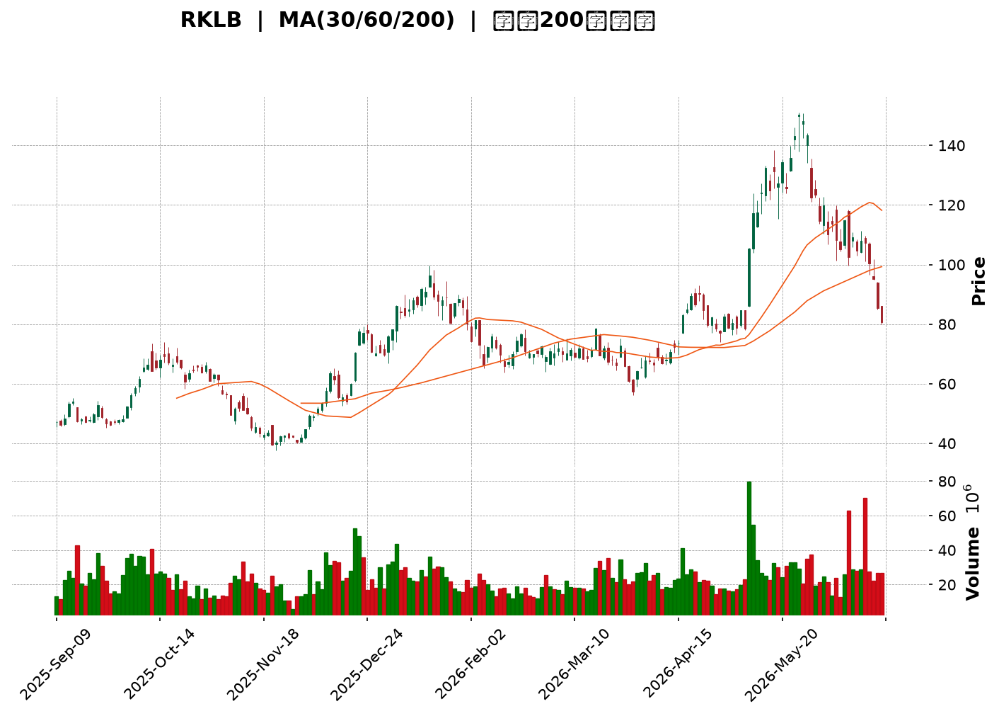
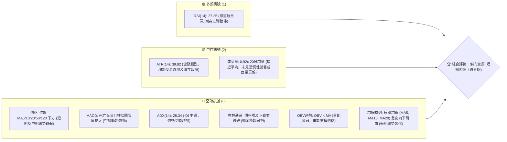
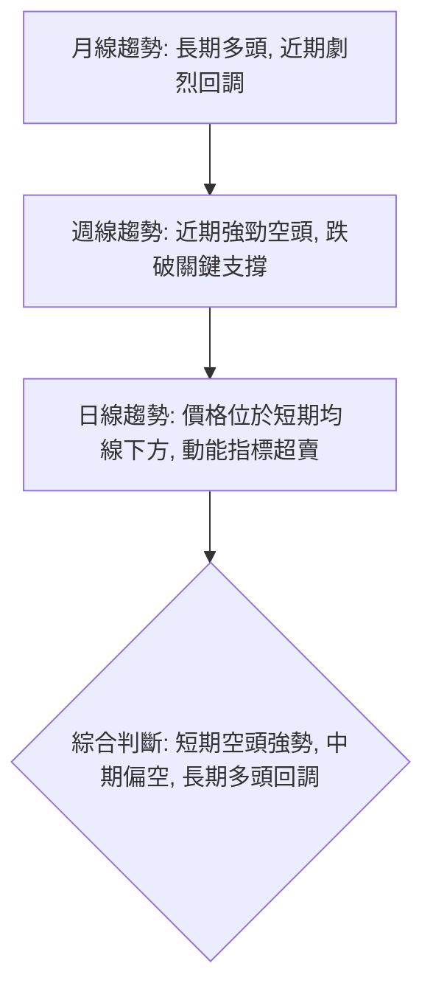
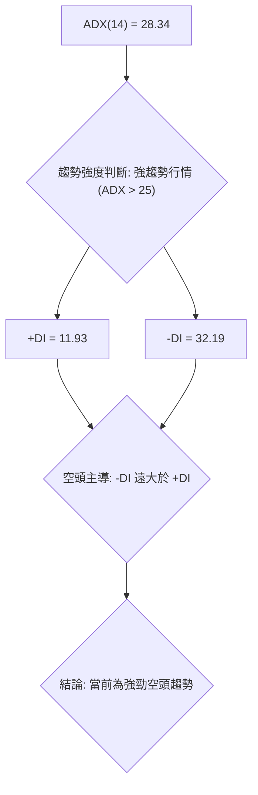
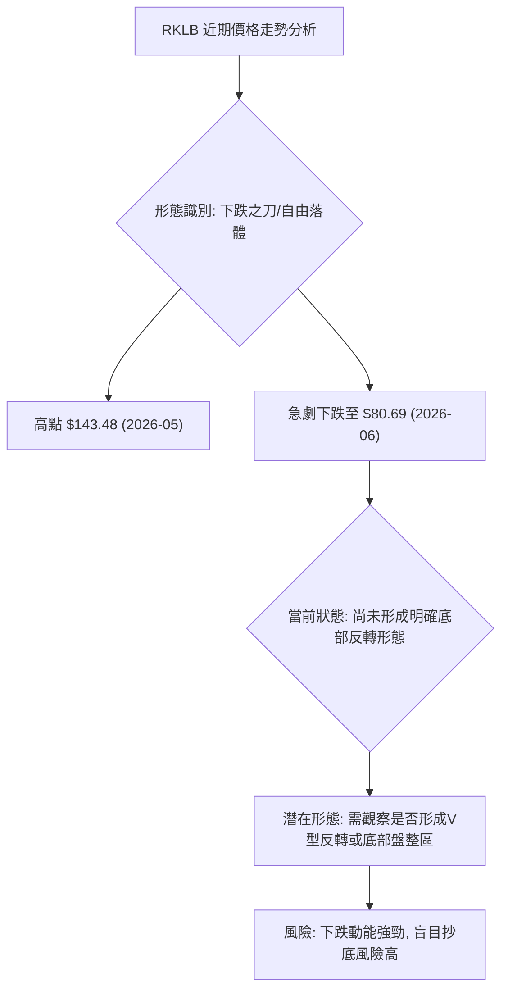
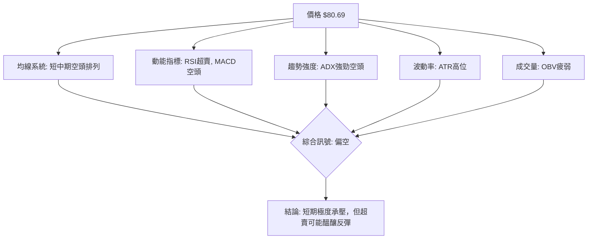
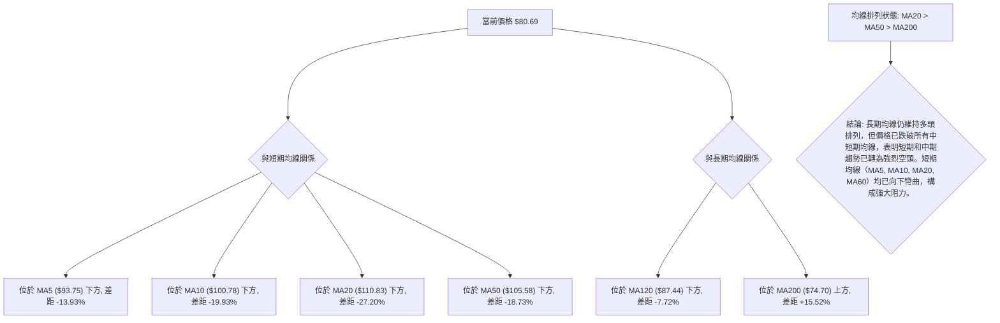
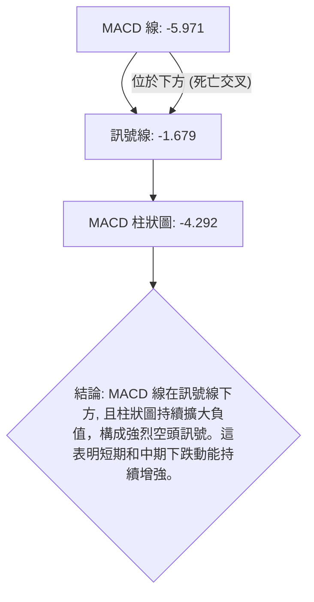

<details>
<summary>📊 靜態圖表 (點擊展開)</summary>

</details>

<html>
<head><meta charset="utf-8" /></head>
<body>
    <div style="height:500px; width:100%;">                        <script>window.PlotlyConfig = {MathJaxConfig: 'local'};</script>
        <script charset="utf-8" src="https://cdn.plot.ly/plotly-3.6.0.min.js" integrity="sha256-QaOVwtVY0T02VaHrr6pnoHLCwayMJp4O5n4YyaE3rJk=" crossorigin="anonymous"></script>                <div id="candlestick-chart" class="plotly-graph-div" style="height:100%; width:100%;"></div>            <script>                window.PLOTLYENV=window.PLOTLYENV || {};                                if (document.getElementById("candlestick-chart")) {                    Plotly.newPlot(                        "candlestick-chart",                        [{"close":{"dtype":"f8","bdata":"AAAAANeDR0AAAACAwhVHQAAAAEAKN0hAAAAAIIWrSkAAAADAHgVLQAAAACBcn0dAAAAAgD0KSEAAAABACpdHQAAAAMAe5UdAAAAAIK7nSEAAAADgenRKQAAAAOBRWEhAAAAA4KNQR0AAAACgRyFHQAAAAKBHgUdAAAAA4Hr0R0AAAAAAKfxHQAAAAAApPEpAAAAA4HoUTEAAAAAAAEBNQAAAAKBHwU5AAAAAANdTUEAAAABA4ZpQQAAAAOCjEFBAAAAAQOFaUEAAAACA6wFRQAAAAKBHUVFAAAAAAADAUEAAAACgR5FQQAAAAGBm1lBAAAAAoJlZUEAAAADgUUhOQAAAAMD1yE9AAAAAANcjUEAAAAAgrmdQQAAAAAAA4E9AAAAAgD2KUEAAAACAwnVOQAAAAKBwfU9AAAAAIIWrTkAAAADA9UhMQAAAAIDCNUxAAAAAgBTOSEAAAACA69FJQAAAAEAz80lAAAAAYLieSUAAAAAAKfxIQAAAAAAAoEZAAAAAwB7FRkAAAAAgrqdFQAAAAADXY0VAAAAAIFzPRUAAAACgcL1DQAAAAGBmJkRAAAAAoJk5RUAAAADAzExFQAAAAEAK90RAAAAAgOsRRUAAAAAgXC9EQAAAAEAz80RAAAAAAClcRkAAAAAgXK9IQAAAAEAKh0hAAAAAIK7HSUAAAABACrdKQAAAAGCPwkxAAAAAANfDT0AAAABguL5OQAAAAOB6tEtAAAAAYLi+S0AAAABA4fpKQAAAAIDC9U1AAAAAoEehUUAAAABAM2NTQAAAACCFS1NAAAAAIIVLU0AAAACgmalRQAAAACCuh1FAAAAAwMycUUAAAADgo3BRQAAAACBc\u002f1JAAAAAwPWIU0AAAACA64FVQAAAAMAeBVVAAAAAwB7FVEAAAABgZjZVQAAAAKCZ+VVAAAAAwB6lVUAAAABAM\u002fNWQAAAAOCjsFZAAAAAQDMTWEAAAACAPUpWQAAAAOB69FVAAAAAYLj+VUAAAACgmTlWQAAAAGC4HlRAAAAAAADAVUAAAADgeiRWQAAAACCFa1VAAAAA4HoEVEAAAACgmYlSQAAAAKBHUVRAAAAAQApHUkAAAADgepRQQAAAAOB6FFJAAAAAgML1UkAAAACA6wFSQAAAACCuZ1FAAAAA4KOAUEAAAAAAKdxQQAAAAMD1eFFAAAAAQOGaUkAAAADAHiVTQAAAAEAKt1FAAAAAoHCNUUAAAACAFH5RQAAAAMDMjFFAAAAAoJkpUkAAAABgZkZRQAAAAIAUvlFAAAAA4FGIUUAAAACAPfpRQAAAAAAAgFFAAAAAQAqHUUAAAABguN5RQAAAACCFO1FAAAAAoHD9UUAAAAAgrhdRQAAAAIA9GlFAAAAAANfTUUAAAACAwqVTQAAAAGC4XlFAAAAAIIX7UUAAAABguM5QQAAAAAAAAFFAAAAA4HqEUEAAAADgUThSQAAAAAApfFBAAAAAQAp3TkAAAADgo7BMQAAAAIAUDlBAAAAAoEdhUEAAAABguO5QQAAAAEDh6lBAAAAA4HqUUEAAAADAHkVRQAAAACBcr1BAAAAAQDMDUUAAAAAgrqdRQAAAAIAUDlJAAAAAYGZmUkAAAAAghbtUQAAAAEAzM1VAAAAAoHBdVkAAAADA9ahVQAAAAGCPglZAAAAAYGYmVUAAAAAghetTQAAAAGCPklRAAAAAgMKlU0AAAACgR0FTQAAAAOCjoFRAAAAAANezU0AAAAAA1xNUQAAAAOCjsFNAAAAAoJkpVUAAAADAHqVTQAAAAIAUXlpAAAAAYGZWXUAAAAAA12NdQAAAAKCZCV9AAAAAoJmRYEAAAACgRzFfQAAAAMAeZWBAAAAAANfTX0AAAADA9chgQAAAAMDMXF9AAAAA4FH4YEAAAABgZuZhQAAAACBcx2JAAAAAwPWAYkAAAAAgXO9hQAAAAMD1mF5AAAAA4HrUXkAAAADAzKxcQAAAAMDM\u002fF1AAAAAwB6FW0AAAACgmWlcQAAAAGC4DltAAAAAQDNDWkAAAACA67FcQAAAAMD1mFlAAAAAAABQW0AAAADgUShaQAAAAGC4\u002flpAAAAAIFzPWkAAAABgjxJZQAAAACCux1dAAAAAgD1aVUAAAAAAKSxUQA=="},"high":{"dtype":"f8","bdata":"AAAAANfDR0AAAACAFA5IQAAAAMAe1UhAAAAAANcDS0AAAACAwpVLQAAAAIA9CkpAAAAAwB5FSEAAAADgUZhIQAAAAEAKd0hAAAAAoEchSUAAAABgORRLQAAAAKBwPUpAAAAAIFxPSEAAAADgUdhHQAAAAMDMDEhAAAAAYLj+R0AAAACAwrVIQAAAAEAzU0pAAAAAIDF4TEAAAACgR6FNQAAAACCuR09AAAAAAC0iUUAAAABgjyJRQAAAAAAAYFJAAAAAACmcUUAAAABA4WpRQAAAAIAUflJAAAAAAAAQUkAAAAAAACBRQAAAACCFC1JAAAAAYI8CUUAAAACgRwFQQAAAAMDMLFBAAAAAIIWLUEAAAABgZpZQQAAAAGCPolBAAAAAwPXYUEAAAAAghUtQQAAAAKCZuU9AAAAAwMyMT0AAAABguL5NQAAAAADXo0xAAAAAQOEaTEAAAADAzAxKQAAAAAAAQEtAAAAAQOF6TEAAAACAPapLQAAAAOCjsEhAAAAAACmcR0AAAADAS9dGQAAAAIAUzkVAAAAAANdDRkAAAACgRyFHQAAAAIDChURAAAAAANdDRUAAAABACmdFQAAAACCFy0VAAAAAoJlZRUAAAABgZqZEQAAAAGC4fkVAAAAAYLheRkAAAABACtdIQAAAAKCZ2UhAAAAAIFwvSkAAAAAAAOBKQAAAAIA9ak1AAAAAoJkJUEAAAAAghUtQQAAAAADXI1BAAAAAoHBdTEAAAADgenRMQAAAAAAAIE5AAAAAANejUUAAAADAzJxTQAAAACCFy1NAAAAAwB71U0AAAAAgXD9TQAAAACBcL1JAAAAAACmsUkAAAABAi0xSQAAAACBcD1NAAAAAAACQU0AAAAAAAJBVQAAAAKBwfVVAAAAAIK53VkAAAAAghRtWQAAAAIDCNVZAAAAA4KduVkAAAAAAKQxXQAAAAEBgHVdAAAAAwB7lWEAAAACgR5FYQAAAAAAA0FZAAAAAoJlZVkAAAADAzJxXQAAAAIA9ylVAAAAAAADAVUAAAABAM3NWQAAAAAAAQFZAAAAA4HpUVkAAAADAzCxUQAAAAOB6VFRAAAAAYGZWVEAAAAAgXD9SQAAAAIA9KlJAAAAAQDMzU0AAAABACvdSQAAAAKCZWVJAAAAAwMwcUUAAAABgZmZRQAAAACBcv1FAAAAAwPXwUkAAAABACkdTQAAAAMDMjFNAAAAAAADQUUAAAAAghYNRQAAAAGBm9lFAAAAAIFwvUkAAAACAwmVRQAAAAGBmBlJAAAAAAABQUkAAAABgZoZSQAAAAADXE1JAAAAAQArHUkAAAAAAAAhSQAAAAADXO1JAAAAAQDNTUkAAAABgZiZSQAAAAADX01FAAAAA4FEYUkAAAABA4apTQAAAAOBROFNAAAAAYLguUkAAAABguH5SQAAAAMDMXFFAAAAAYGYmUUAAAAAA18NSQAAAAIDCBVJAAAAAgBSGUEAAAACA69FOQAAAAMAeJVBAAAAAQOEqUUAAAADA9VhRQAAAAOB6lFFAAAAAQDMTUUAAAACAwGpSQAAAAGCPclFAAAAAANeDUUAAAABAM+NRQAAAAAAAsFJAAAAAgMKlUkAAAAAgXN9UQAAAACBcv1VAAAAAYGaWVkAAAADAzPxWQAAAAGBmRldAAAAAQDOTVkAAAACAPZpVQAAAAGC4nlRAAAAAgOtxVEAAAADgo4BTQAAAAIDC5VRAAAAAYI\u002fyVEAAAADgT3VUQAAAAAAAwFRAAAAAIIUrVUAAAABgjzJVQAAAACCuZ1pAAAAAACn8XkAAAAAgXF9eQAAAACBcz19AAAAAgMKlYEAAAAAA10tgQAAAAAApTGFAAAAAgD0yYEAAAABAM+tgQAAAAADXW2BAAAAA4FF4YUAAAAAAAEBiQAAAAAAA4GJAAAAAYI\u002faYkAAAAAAAABiQAAAAAAp9GBAAAAAwMwMYEAAAADgUaBeQAAAAOBRqF5AAAAAYLh+XUAAAAAAABBdQAAAAGCP8l1AAAAAoHD9W0AAAABA4cJcQAAAAMAgmF1AAAAAgOuxW0AAAAAAACBbQAAAAIDC1VtAAAAAQDNjW0AAAACgmdlaQAAAAGC4bllAAAAAQDOTV0AAAABACodVQA=="},"hovertemplate":"\u003cb\u003e%{x|%Y-%m-%d}\u003c\u002fb\u003e\u003cbr\u003e\u958b: $%{open:.2f}\u003cbr\u003e\u9ad8: $%{high:.2f}\u003cbr\u003e\u4f4e: $%{low:.2f}\u003cbr\u003e\u6536: $%{close:.2f}\u003cextra\u003e\u003c\u002fextra\u003e","low":{"dtype":"f8","bdata":"AAAAQInBRkAAAADAzMxGQAAAAEAKB0dAAAAAQDVOSEAAAAAAKVxKQAAAAKBHgUdAAAAAoJk5R0AAAAAAAIBHQAAAAOCjkEdAAAAAYGZmR0AAAADgevRHQAAAAEAKN0hAAAAAQOGaRkAAAACAPepGQAAAACBcL0dAAAAAoEdBR0AAAAAgXI9HQAAAAKBHQUhAAAAAoEehSUAAAABgZuZLQAAAAGCPgkxAAAAAQDPTT0AAAABA4RpQQAAAAMD1CFBAAAAA4M4nUEAAAADgURhPQAAAAMAexVBAAAAAQDObUEAAAACgmdlPQAAAAEAzq1BAAAAAQAo3UEAAAADgejRNQAAAAAAAYE5AAAAAQDPTT0AAAACgmQlQQAAAAIAUzk9AAAAAoHC9T0AAAACA63FOQAAAAEAzM05AAAAA4KOQTUAAAACgR0FMQAAAACBcb0tAAAAA4Hq0SEAAAADgzidHQAAAAKBHYUlAAAAAQOGaSUAAAADgetRIQAAAACBcL0ZAAAAAYGamRUAAAADAzBxFQAAAAKBwnURAAAAAQAo3RUAAAADA9ahDQAAAAMD1yEJAAAAAYGamQ0AAAADgozBEQAAAAOCjsERAAAAAYGbmREAAAACgcP1DQAAAAIDCNURAAAAAAADAREAAAADA9WhGQAAAAKCZ2UdAAAAAACmcSEAAAAAghStJQAAAAAAAIEpAAAAAwMxsTEAAAABgZuZNQAAAAIA9iktAAAAAQApXSkAAAABA4YpKQAAAAADXA0xAAAAAwJ1fTkAAAADAIDBSQAAAAGCPUlJAAAAAoEOzUkAAAADA9ZhRQAAAAKCbVFFAAAAAACmcUUAAAADgUUhRQAAAAGBmtlBAAAAAANfTUUAAAABAM4NSQAAAAGBmdlRAAAAA4KOQVEAAAADAzJxUQAAAAODQ2lRAAAAAoJlpVUAAAAAAACBVQAAAAKCZqVVAAAAAoJkZV0AAAABAMxNWQAAAAKBwrVRAAAAAwHZWVEAAAAAgrodVQAAAAOCjAFRAAAAAAACAVEAAAADAyoFVQAAAAAAAwFRAAAAAoEeBU0AAAACAQXhSQAAAAKBH8VJAAAAAQAgkUUAAAADAzExQQAAAAAAAwFBAAAAAAACwUUAAAABAM+NRQAAAAKBHwVBAAAAAIFzvT0AAAAAAAGBQQAAAAAAAQFBAAAAAwEt\u002fUUAAAABgZhZSQAAAAKCZWVFAAAAAAAAgUUAAAABgZqZQQAAAAOBROFFAAAAAANczUUAAAABgZgZQQAAAAMDMnFBAAAAAACmMUEAAAACAFF5RQAAAAIDC1VBAAAAA4KMIUUAAAADgevRQQAAAAIC+J1FAAAAAwB4VUUAAAACA6xFRQAAAAAAp3FBAAAAAQOEqUUAAAACgR9FRQAAAAKCZWVFAAAAAAAAAUUAAAADA9ZhQQAAAAEAzg1BAAAAAoHAdUEAAAAAAKTxRQAAAAIDCZVBAAAAAwMwsTkAAAABg5RBMQAAAAADXg01AAAAAQDNTUEAAAACAFO5OQAAAAGBmplBAAAAAQOH6T0AAAABg5\u002fNQQAAAAEDholBAAAAAgMKVUEAAAACAwqVQQAAAAGC4nlFAAAAAYGZmUUAAAACgmTlTQAAAAGBm5lRAAAAAYGYmVUAAAAAAAHBVQAAAAOCj8FVAAAAAAClkVEAAAADAHsVTQAAAAMB0Q1NAAAAAYGZmU0AAAAAgXH9SQAAAAIAUXlNAAAAAIIWbU0AAAAAAABBTQAAAAADXI1NAAAAAQAq3U0AAAAAghXtTQAAAACCud1VAAAAAAAAAWkAAAACAPRpcQAAAAMD1OF1AAAAAANdTXkAAAABAM3NeQAAAAKDxal9AAAAAYLjOXEAAAACAFA5fQAAAAEAz815AAAAAgOtpYEAAAACA61FhQAAAAMAePWFAAAAAANfLYUAAAACgmcFgQAAAAAAAQF5AAAAAANejXkAAAACAPWpcQAAAAMD1mFtAAAAAYLiuWkAAAAAAAMBbQAAAAMDMTFlAAAAAgD0aWkAAAACgmVlaQAAAAEAK51hAAAAAQDNzWkAAAADgesRZQAAAAGCPAlpAAAAAoHA9WUAAAAAAACBYQAAAAOCjuFdAAAAAYGY2VUAAAAAAAABUQA=="},"name":"\u50f9\u683c","open":{"dtype":"f8","bdata":"AAAAoEeBR0AAAAAA18NHQAAAAMD1KEdAAAAAoHB9SEAAAACAPcpKQAAAAAAAAEpAAAAA4FHIR0AAAACAwnVIQAAAAEAK10dAAAAA4KOQR0AAAABAM4NIQAAAAIDC5UlAAAAAAAAASEAAAABgZqZHQAAAAEAzs0dAAAAAQOGaR0AAAADgo7BHQAAAAIDrUUhAAAAAYGYGSkAAAABguG5MQAAAAKBHgU1AAAAAoJkJUEAAAACgmTlQQAAAAEAzs1FAAAAA4FH4UEAAAACAwlVQQAAAAKBHgVFAAAAA4HqEUUAAAADA9XhQQAAAAOCjSFFAAAAAYI8CUUAAAAAAKXxPQAAAACCux05AAAAAANczUEAAAAAAKYxQQAAAAEAza1BAAAAAoEcJUEAAAAAAAEBQQAAAAGCP4k5AAAAAANeDT0AAAABgZuZMQAAAAOB6VExAAAAAQOEaTEAAAACgGNRHQAAAAGC43kpAAAAAAAAATEAAAABACvdJQAAAAKBHYUhAAAAAQOHaRUAAAABAM5NGQAAAAAApHEVAAAAAAABARUAAAACAPQpHQAAAAIA96kNAAAAAoEdhREAAAAAA1wNFQAAAAGC4nkVAAAAAoEdBRUAAAABAM5NEQAAAACCuR0RAAAAAYI\u002fyREAAAABgj9JGQAAAAAAAcEhAAAAAgD0KSUAAAACgcJ1JQAAAAOBRuEpAAAAAoEfBTEAAAAAAAEBPQAAAAOCnhk9AAAAA4FEYS0AAAADAzAxMQAAAAKCZGUxAAAAAIFyPTkAAAAAAKTxSQAAAAADXc1JAAAAAgD2CU0AAAAAghStTQAAAAAAAYFFAAAAAoJlBUkAAAAAAAOBRQAAAAOBRqFFAAAAAIK6nUkAAAADgo3BTQAAAAGBmBlVAAAAAAABgVUAAAACgmSFVQAAAAGC4PlVAAAAAwPVIVkAAAABgZpZVQAAAAMD1UFZAAAAAoJkhV0AAAADAzGxXQAAAAKBHgVZAAAAA4FGYVUAAAAAghUNWQAAAACCur1VAAAAAwPW4VEAAAACAFM5VQAAAAAAp\u002fFVAAAAAAABAVUAAAACAPcpTQAAAAGBmplNAAAAAYGZWVEAAAABguH5RQAAAAAAAQFFAAAAAoJkBUkAAAACAFKZSQAAAAOBRSFJAAAAAgOvhUEAAAADgeqxQQAAAAEBghVBAAAAAAADAUUAAAACgmTlSQAAAACDZ3lJAAAAA4FEwUUAAAADgUThRQAAAAIAUxlFAAAAAQOGCUUAAAACAwuVQQAAAACCFq1BAAAAAYLg2UUAAAAAA17NRQAAAAEDhulFAAAAA4KMIUUAAAADA9VhRQAAAAIDClVFAAAAAQDMzUUAAAADAzPxRQAAAAKCZSVFAAAAAwMxUUUAAAABgZt5RQAAAAGCPAlNAAAAA4Ho0UUAAAAAAAABSQAAAAKBwBVFAAAAAAADAUEAAAAAAKTxRQAAAAMDMzFFAAAAA4KOAUEAAAACgmblOQAAAAEDh2k5AAAAAAABgUEAAAADAzBxPQAAAAGC47lBAAAAAIFzHUEAAAAAAAABSQAAAAADXQ1FAAAAAwMzsUEAAAABAM8NQQAAAACCFY1JAAAAAoHBlUkAAAACAFD5TQAAAAMAeBVVAAAAAYGY2VUAAAADAHpVWQAAAAIDCnVZAAAAAYGZ2VkAAAACAwpVVQAAAAAAp7FNAAAAAwMwEVEAAAABACndTQAAAAEAzY1NAAAAAgOvhVEAAAABACpdTQAAAAGBmplRAAAAAIK7nU0AAAACgcC1VQAAAAIA9glVAAAAAoEdRWkAAAADgozBcQAAAAKBH+V5AAAAAYGbGXkAAAABAMwNgQAAAAAApmGBAAAAAgBR+X0AAAABguN5fQAAAAMD1iF9AAAAAwB5tYEAAAABA4b5hQAAAAEAKt2JAAAAAoHBlYkAAAACAFH5hQAAAAAApjGBAAAAAgMJVX0AAAADAHuVdQAAAAKBwRVxAAAAAoEeRXEAAAABA4apcQAAAAKCZmV1AAAAAwMzsWkAAAACAwqVaQAAAAKBHgV1AAAAAoHD9WkAAAACgcO1aQAAAACCuB1pAAAAAwB41W0AAAAAgXL9aQAAAAKBHAVhAAAAAYGZ2V0AAAABACodVQA=="},"x":["2025-09-09T00:00:00-04:00","2025-09-10T00:00:00-04:00","2025-09-11T00:00:00-04:00","2025-09-12T00:00:00-04:00","2025-09-15T00:00:00-04:00","2025-09-16T00:00:00-04:00","2025-09-17T00:00:00-04:00","2025-09-18T00:00:00-04:00","2025-09-19T00:00:00-04:00","2025-09-22T00:00:00-04:00","2025-09-23T00:00:00-04:00","2025-09-24T00:00:00-04:00","2025-09-25T00:00:00-04:00","2025-09-26T00:00:00-04:00","2025-09-29T00:00:00-04:00","2025-09-30T00:00:00-04:00","2025-10-01T00:00:00-04:00","2025-10-02T00:00:00-04:00","2025-10-03T00:00:00-04:00","2025-10-06T00:00:00-04:00","2025-10-07T00:00:00-04:00","2025-10-08T00:00:00-04:00","2025-10-09T00:00:00-04:00","2025-10-10T00:00:00-04:00","2025-10-13T00:00:00-04:00","2025-10-14T00:00:00-04:00","2025-10-15T00:00:00-04:00","2025-10-16T00:00:00-04:00","2025-10-17T00:00:00-04:00","2025-10-20T00:00:00-04:00","2025-10-21T00:00:00-04:00","2025-10-22T00:00:00-04:00","2025-10-23T00:00:00-04:00","2025-10-24T00:00:00-04:00","2025-10-27T00:00:00-04:00","2025-10-28T00:00:00-04:00","2025-10-29T00:00:00-04:00","2025-10-30T00:00:00-04:00","2025-10-31T00:00:00-04:00","2025-11-03T00:00:00-05:00","2025-11-04T00:00:00-05:00","2025-11-05T00:00:00-05:00","2025-11-06T00:00:00-05:00","2025-11-07T00:00:00-05:00","2025-11-10T00:00:00-05:00","2025-11-11T00:00:00-05:00","2025-11-12T00:00:00-05:00","2025-11-13T00:00:00-05:00","2025-11-14T00:00:00-05:00","2025-11-17T00:00:00-05:00","2025-11-18T00:00:00-05:00","2025-11-19T00:00:00-05:00","2025-11-20T00:00:00-05:00","2025-11-21T00:00:00-05:00","2025-11-24T00:00:00-05:00","2025-11-25T00:00:00-05:00","2025-11-26T00:00:00-05:00","2025-11-28T00:00:00-05:00","2025-12-01T00:00:00-05:00","2025-12-02T00:00:00-05:00","2025-12-03T00:00:00-05:00","2025-12-04T00:00:00-05:00","2025-12-05T00:00:00-05:00","2025-12-08T00:00:00-05:00","2025-12-09T00:00:00-05:00","2025-12-10T00:00:00-05:00","2025-12-11T00:00:00-05:00","2025-12-12T00:00:00-05:00","2025-12-15T00:00:00-05:00","2025-12-16T00:00:00-05:00","2025-12-17T00:00:00-05:00","2025-12-18T00:00:00-05:00","2025-12-19T00:00:00-05:00","2025-12-22T00:00:00-05:00","2025-12-23T00:00:00-05:00","2025-12-24T00:00:00-05:00","2025-12-26T00:00:00-05:00","2025-12-29T00:00:00-05:00","2025-12-30T00:00:00-05:00","2025-12-31T00:00:00-05:00","2026-01-02T00:00:00-05:00","2026-01-05T00:00:00-05:00","2026-01-06T00:00:00-05:00","2026-01-07T00:00:00-05:00","2026-01-08T00:00:00-05:00","2026-01-09T00:00:00-05:00","2026-01-12T00:00:00-05:00","2026-01-13T00:00:00-05:00","2026-01-14T00:00:00-05:00","2026-01-15T00:00:00-05:00","2026-01-16T00:00:00-05:00","2026-01-20T00:00:00-05:00","2026-01-21T00:00:00-05:00","2026-01-22T00:00:00-05:00","2026-01-23T00:00:00-05:00","2026-01-26T00:00:00-05:00","2026-01-27T00:00:00-05:00","2026-01-28T00:00:00-05:00","2026-01-29T00:00:00-05:00","2026-01-30T00:00:00-05:00","2026-02-02T00:00:00-05:00","2026-02-03T00:00:00-05:00","2026-02-04T00:00:00-05:00","2026-02-05T00:00:00-05:00","2026-02-06T00:00:00-05:00","2026-02-09T00:00:00-05:00","2026-02-10T00:00:00-05:00","2026-02-11T00:00:00-05:00","2026-02-12T00:00:00-05:00","2026-02-13T00:00:00-05:00","2026-02-17T00:00:00-05:00","2026-02-18T00:00:00-05:00","2026-02-19T00:00:00-05:00","2026-02-20T00:00:00-05:00","2026-02-23T00:00:00-05:00","2026-02-24T00:00:00-05:00","2026-02-25T00:00:00-05:00","2026-02-26T00:00:00-05:00","2026-02-27T00:00:00-05:00","2026-03-02T00:00:00-05:00","2026-03-03T00:00:00-05:00","2026-03-04T00:00:00-05:00","2026-03-05T00:00:00-05:00","2026-03-06T00:00:00-05:00","2026-03-09T00:00:00-04:00","2026-03-10T00:00:00-04:00","2026-03-11T00:00:00-04:00","2026-03-12T00:00:00-04:00","2026-03-13T00:00:00-04:00","2026-03-16T00:00:00-04:00","2026-03-17T00:00:00-04:00","2026-03-18T00:00:00-04:00","2026-03-19T00:00:00-04:00","2026-03-20T00:00:00-04:00","2026-03-23T00:00:00-04:00","2026-03-24T00:00:00-04:00","2026-03-25T00:00:00-04:00","2026-03-26T00:00:00-04:00","2026-03-27T00:00:00-04:00","2026-03-30T00:00:00-04:00","2026-03-31T00:00:00-04:00","2026-04-01T00:00:00-04:00","2026-04-02T00:00:00-04:00","2026-04-06T00:00:00-04:00","2026-04-07T00:00:00-04:00","2026-04-08T00:00:00-04:00","2026-04-09T00:00:00-04:00","2026-04-10T00:00:00-04:00","2026-04-13T00:00:00-04:00","2026-04-14T00:00:00-04:00","2026-04-15T00:00:00-04:00","2026-04-16T00:00:00-04:00","2026-04-17T00:00:00-04:00","2026-04-20T00:00:00-04:00","2026-04-21T00:00:00-04:00","2026-04-22T00:00:00-04:00","2026-04-23T00:00:00-04:00","2026-04-24T00:00:00-04:00","2026-04-27T00:00:00-04:00","2026-04-28T00:00:00-04:00","2026-04-29T00:00:00-04:00","2026-04-30T00:00:00-04:00","2026-05-01T00:00:00-04:00","2026-05-04T00:00:00-04:00","2026-05-05T00:00:00-04:00","2026-05-06T00:00:00-04:00","2026-05-07T00:00:00-04:00","2026-05-08T00:00:00-04:00","2026-05-11T00:00:00-04:00","2026-05-12T00:00:00-04:00","2026-05-13T00:00:00-04:00","2026-05-14T00:00:00-04:00","2026-05-15T00:00:00-04:00","2026-05-18T00:00:00-04:00","2026-05-19T00:00:00-04:00","2026-05-20T00:00:00-04:00","2026-05-21T00:00:00-04:00","2026-05-22T00:00:00-04:00","2026-05-26T00:00:00-04:00","2026-05-27T00:00:00-04:00","2026-05-28T00:00:00-04:00","2026-05-29T00:00:00-04:00","2026-06-01T00:00:00-04:00","2026-06-02T00:00:00-04:00","2026-06-03T00:00:00-04:00","2026-06-04T00:00:00-04:00","2026-06-05T00:00:00-04:00","2026-06-08T00:00:00-04:00","2026-06-09T00:00:00-04:00","2026-06-10T00:00:00-04:00","2026-06-11T00:00:00-04:00","2026-06-12T00:00:00-04:00","2026-06-15T00:00:00-04:00","2026-06-16T00:00:00-04:00","2026-06-17T00:00:00-04:00","2026-06-18T00:00:00-04:00","2026-06-22T00:00:00-04:00","2026-06-23T00:00:00-04:00","2026-06-24T00:00:00-04:00","2026-06-25T00:00:00-04:00"],"type":"candlestick"},{"hovertemplate":"MA30: $%{y:.2f}\u003cextra\u003e\u003c\u002fextra\u003e","line":{"color":"#2196F3","dash":"dash","width":2},"mode":"lines","name":"MA30","x":["2025-09-09T00:00:00-04:00","2025-09-10T00:00:00-04:00","2025-09-11T00:00:00-04:00","2025-09-12T00:00:00-04:00","2025-09-15T00:00:00-04:00","2025-09-16T00:00:00-04:00","2025-09-17T00:00:00-04:00","2025-09-18T00:00:00-04:00","2025-09-19T00:00:00-04:00","2025-09-22T00:00:00-04:00","2025-09-23T00:00:00-04:00","2025-09-24T00:00:00-04:00","2025-09-25T00:00:00-04:00","2025-09-26T00:00:00-04:00","2025-09-29T00:00:00-04:00","2025-09-30T00:00:00-04:00","2025-10-01T00:00:00-04:00","2025-10-02T00:00:00-04:00","2025-10-03T00:00:00-04:00","2025-10-06T00:00:00-04:00","2025-10-07T00:00:00-04:00","2025-10-08T00:00:00-04:00","2025-10-09T00:00:00-04:00","2025-10-10T00:00:00-04:00","2025-10-13T00:00:00-04:00","2025-10-14T00:00:00-04:00","2025-10-15T00:00:00-04:00","2025-10-16T00:00:00-04:00","2025-10-17T00:00:00-04:00","2025-10-20T00:00:00-04:00","2025-10-21T00:00:00-04:00","2025-10-22T00:00:00-04:00","2025-10-23T00:00:00-04:00","2025-10-24T00:00:00-04:00","2025-10-27T00:00:00-04:00","2025-10-28T00:00:00-04:00","2025-10-29T00:00:00-04:00","2025-10-30T00:00:00-04:00","2025-10-31T00:00:00-04:00","2025-11-03T00:00:00-05:00","2025-11-04T00:00:00-05:00","2025-11-05T00:00:00-05:00","2025-11-06T00:00:00-05:00","2025-11-07T00:00:00-05:00","2025-11-10T00:00:00-05:00","2025-11-11T00:00:00-05:00","2025-11-12T00:00:00-05:00","2025-11-13T00:00:00-05:00","2025-11-14T00:00:00-05:00","2025-11-17T00:00:00-05:00","2025-11-18T00:00:00-05:00","2025-11-19T00:00:00-05:00","2025-11-20T00:00:00-05:00","2025-11-21T00:00:00-05:00","2025-11-24T00:00:00-05:00","2025-11-25T00:00:00-05:00","2025-11-26T00:00:00-05:00","2025-11-28T00:00:00-05:00","2025-12-01T00:00:00-05:00","2025-12-02T00:00:00-05:00","2025-12-03T00:00:00-05:00","2025-12-04T00:00:00-05:00","2025-12-05T00:00:00-05:00","2025-12-08T00:00:00-05:00","2025-12-09T00:00:00-05:00","2025-12-10T00:00:00-05:00","2025-12-11T00:00:00-05:00","2025-12-12T00:00:00-05:00","2025-12-15T00:00:00-05:00","2025-12-16T00:00:00-05:00","2025-12-17T00:00:00-05:00","2025-12-18T00:00:00-05:00","2025-12-19T00:00:00-05:00","2025-12-22T00:00:00-05:00","2025-12-23T00:00:00-05:00","2025-12-24T00:00:00-05:00","2025-12-26T00:00:00-05:00","2025-12-29T00:00:00-05:00","2025-12-30T00:00:00-05:00","2025-12-31T00:00:00-05:00","2026-01-02T00:00:00-05:00","2026-01-05T00:00:00-05:00","2026-01-06T00:00:00-05:00","2026-01-07T00:00:00-05:00","2026-01-08T00:00:00-05:00","2026-01-09T00:00:00-05:00","2026-01-12T00:00:00-05:00","2026-01-13T00:00:00-05:00","2026-01-14T00:00:00-05:00","2026-01-15T00:00:00-05:00","2026-01-16T00:00:00-05:00","2026-01-20T00:00:00-05:00","2026-01-21T00:00:00-05:00","2026-01-22T00:00:00-05:00","2026-01-23T00:00:00-05:00","2026-01-26T00:00:00-05:00","2026-01-27T00:00:00-05:00","2026-01-28T00:00:00-05:00","2026-01-29T00:00:00-05:00","2026-01-30T00:00:00-05:00","2026-02-02T00:00:00-05:00","2026-02-03T00:00:00-05:00","2026-02-04T00:00:00-05:00","2026-02-05T00:00:00-05:00","2026-02-06T00:00:00-05:00","2026-02-09T00:00:00-05:00","2026-02-10T00:00:00-05:00","2026-02-11T00:00:00-05:00","2026-02-12T00:00:00-05:00","2026-02-13T00:00:00-05:00","2026-02-17T00:00:00-05:00","2026-02-18T00:00:00-05:00","2026-02-19T00:00:00-05:00","2026-02-20T00:00:00-05:00","2026-02-23T00:00:00-05:00","2026-02-24T00:00:00-05:00","2026-02-25T00:00:00-05:00","2026-02-26T00:00:00-05:00","2026-02-27T00:00:00-05:00","2026-03-02T00:00:00-05:00","2026-03-03T00:00:00-05:00","2026-03-04T00:00:00-05:00","2026-03-05T00:00:00-05:00","2026-03-06T00:00:00-05:00","2026-03-09T00:00:00-04:00","2026-03-10T00:00:00-04:00","2026-03-11T00:00:00-04:00","2026-03-12T00:00:00-04:00","2026-03-13T00:00:00-04:00","2026-03-16T00:00:00-04:00","2026-03-17T00:00:00-04:00","2026-03-18T00:00:00-04:00","2026-03-19T00:00:00-04:00","2026-03-20T00:00:00-04:00","2026-03-23T00:00:00-04:00","2026-03-24T00:00:00-04:00","2026-03-25T00:00:00-04:00","2026-03-26T00:00:00-04:00","2026-03-27T00:00:00-04:00","2026-03-30T00:00:00-04:00","2026-03-31T00:00:00-04:00","2026-04-01T00:00:00-04:00","2026-04-02T00:00:00-04:00","2026-04-06T00:00:00-04:00","2026-04-07T00:00:00-04:00","2026-04-08T00:00:00-04:00","2026-04-09T00:00:00-04:00","2026-04-10T00:00:00-04:00","2026-04-13T00:00:00-04:00","2026-04-14T00:00:00-04:00","2026-04-15T00:00:00-04:00","2026-04-16T00:00:00-04:00","2026-04-17T00:00:00-04:00","2026-04-20T00:00:00-04:00","2026-04-21T00:00:00-04:00","2026-04-22T00:00:00-04:00","2026-04-23T00:00:00-04:00","2026-04-24T00:00:00-04:00","2026-04-27T00:00:00-04:00","2026-04-28T00:00:00-04:00","2026-04-29T00:00:00-04:00","2026-04-30T00:00:00-04:00","2026-05-01T00:00:00-04:00","2026-05-04T00:00:00-04:00","2026-05-05T00:00:00-04:00","2026-05-06T00:00:00-04:00","2026-05-07T00:00:00-04:00","2026-05-08T00:00:00-04:00","2026-05-11T00:00:00-04:00","2026-05-12T00:00:00-04:00","2026-05-13T00:00:00-04:00","2026-05-14T00:00:00-04:00","2026-05-15T00:00:00-04:00","2026-05-18T00:00:00-04:00","2026-05-19T00:00:00-04:00","2026-05-20T00:00:00-04:00","2026-05-21T00:00:00-04:00","2026-05-22T00:00:00-04:00","2026-05-26T00:00:00-04:00","2026-05-27T00:00:00-04:00","2026-05-28T00:00:00-04:00","2026-05-29T00:00:00-04:00","2026-06-01T00:00:00-04:00","2026-06-02T00:00:00-04:00","2026-06-03T00:00:00-04:00","2026-06-04T00:00:00-04:00","2026-06-05T00:00:00-04:00","2026-06-08T00:00:00-04:00","2026-06-09T00:00:00-04:00","2026-06-10T00:00:00-04:00","2026-06-11T00:00:00-04:00","2026-06-12T00:00:00-04:00","2026-06-15T00:00:00-04:00","2026-06-16T00:00:00-04:00","2026-06-17T00:00:00-04:00","2026-06-18T00:00:00-04:00","2026-06-22T00:00:00-04:00","2026-06-23T00:00:00-04:00","2026-06-24T00:00:00-04:00","2026-06-25T00:00:00-04:00"],"y":{"dtype":"f8","bdata":"AAAAAAAA+H8AAAAAAAD4fwAAAAAAAPh\u002fAAAAAAAA+H8AAAAAAAD4fwAAAAAAAPh\u002fAAAAAAAA+H8AAAAAAAD4fwAAAAAAAPh\u002fAAAAAAAA+H8AAAAAAAD4fwAAAAAAAPh\u002fAAAAAAAA+H8AAAAAAAD4fwAAAAAAAPh\u002fAAAAAAAA+H8AAAAAAAD4fwAAAAAAAPh\u002fAAAAAAAA+H8AAAAAAAD4fwAAAAAAAPh\u002fAAAAAAAA+H8AAAAAAAD4fwAAAAAAAPh\u002fAAAAAAAA+H8AAAAAAAD4fwAAAAAAAPh\u002fAAAAAAAA+H8AAAAAAAD4f0RERPQMk0tAVVVV5W3hS0AzMzMT2R5MQN7d3f1xX0xAiYiIOFGPTEC8u7urucBMQImIiIglB01Ad3d3t0lUTUBVVVV16Y5NQM3MzPy4z01AIiIi0uoATkBERESEiBBOQM3MzLyDMU5AERERsTo+TkBmZmYWL1VOQGZmZkYMak5AZmZmhkF4TkDv7u4OyoBOQEREROT7YU5AVVVVBaw0TkDe3d193PNNQGZmZlbyo01AMzMzE2dHTUCamZlpddRMQDMzM7M6bkxAZmZmVjkMTEDv7u7+uJ9LQN7d3W0SK0tA3t3drQDBSkCamZn5flJKQKuqqsro5UlAd3d3t6yNSUCrqqrK6F1JQKuqqor6H0lAREREFIPoSECJiIhYgLRIQGZmZobrmUhAvLu727KOSEBERER0IZFIQO\u002fu7v7UcEhAzczMPN9XSEC8u7trvExIQKuqqlqrW0hAVVVVpeK0SEB3d3dHbyNJQHd3d8dLj0lAzczMLPn9SUAAAABANVZKQM3MzOxRwEpAiYiISJoqS0DNzMy8dJtLQJqZmekmKUxAVVVV9W+8TECJiIj4DINNQImIiGjYPU5ARERENDPrTkCJiIh4d59PQERERHzNMVBA7+7uppuQUECrqqpKU\u002f5QQN7d3V2PZlFAzczM7JjUUUCrqqqSeylSQGZmZm4ufFJAvLu7m+DJUkBVVVX1ixVTQGZmZi6HRlNAZmZm7ph4U0CJiIg4XrJTQFVVVa3x8lNAIiIiomEnVEARERERdFJUQDMzMwMAgFRAAAAAgIaFVEC8u7trkW1UQGZmZjYzY1RAREREZFdgVEDe3d0NSWNUQM3MzPw3YlRAiYiIKL9YVEAREREhzFNUQHd3d7fIRlRAmpmZGdk+VEBEREQksCpUQCIiIkJ8DlRAVVVVhQfzU0Dv7u4OSdNTQO\u002fu7n6GrVNAvLu7286PU0ARERGhYV9TQGZmZqYpNVNAZmZmVlX9UkCamZmJiNhSQBEREXGEslJAmpmZCWWMUkBVVVVlO2dSQN7d3Y2XTlJAVVVVtYEuUkARERHRaQNSQImIiBiS3lFAd3d39+HLUUC8u7vLWtVRQDMzM+MzvFFAMzMzc6+5UUDv7u5uoLtRQDMzMyNpslFAq6qqapGdUUARERGhYZ9RQLy7u9uHl1FAAAAAgLGMUUDe3d1lO3dRQKuqqtIia1FAREREPCZYUUDNzMz0REVRQCIiIsp2PlFAzczMVCo2UUDe3d1FRDRRQO\u002fu7qbiLFFAiYiIcBIjUUCJiIiQUCZRQDMzMzv7KFFAiYiIUGIwUUC8u7uz5EdRQCIiInp3Z1FAAAAAKL+QUUARERGJFrFRQBEREWkf3lFAERERiRb5UUBVVVVNNxFSQJqZmaHTLlJAMzMze1s+UkBVVVUNAjtSQDMzMyvOVlJAiYiIkHtlUkBERET8YoFSQJqZmWFXmFJAIiIiivq\u002fUkCJiIiAI8xSQO\u002fu7iZ4IFNAZmZm\u002ftSYU0C8u7tLNxlUQBERERERmVRAMzMzYxAoVUBERETUv6FVQGZmZtYxKVZAIiIigk6rVkBmZmZmZjZXQDMzM+Ols1dAIiIikhhEWEDNzMzs7t5YQImIiMhahVlAzczMfCMkWkC8u7vbT6VaQCIiIgKB9VpAVVVVFb09W0BVVVWVmXlbQN7d3W1ouVtAiYiI6MPvW0Dv7u4OPDhcQCIiIsKSb1xAMzMzcwWoXEAiIiJyk\u002fhcQDMzM5P8Il1AAAAA4OxjXUBmZmbWzpddQKuqqtok1l1AERERAVYGXkDv7u6OpjReQERERBSSHl5AVVVVlW7aXUBmZmamxotdQA=="},"type":"scatter"},{"hovertemplate":"MA60: $%{y:.2f}\u003cextra\u003e\u003c\u002fextra\u003e","line":{"color":"#9C27B0","dash":"dash","width":2},"mode":"lines","name":"MA60","x":["2025-09-09T00:00:00-04:00","2025-09-10T00:00:00-04:00","2025-09-11T00:00:00-04:00","2025-09-12T00:00:00-04:00","2025-09-15T00:00:00-04:00","2025-09-16T00:00:00-04:00","2025-09-17T00:00:00-04:00","2025-09-18T00:00:00-04:00","2025-09-19T00:00:00-04:00","2025-09-22T00:00:00-04:00","2025-09-23T00:00:00-04:00","2025-09-24T00:00:00-04:00","2025-09-25T00:00:00-04:00","2025-09-26T00:00:00-04:00","2025-09-29T00:00:00-04:00","2025-09-30T00:00:00-04:00","2025-10-01T00:00:00-04:00","2025-10-02T00:00:00-04:00","2025-10-03T00:00:00-04:00","2025-10-06T00:00:00-04:00","2025-10-07T00:00:00-04:00","2025-10-08T00:00:00-04:00","2025-10-09T00:00:00-04:00","2025-10-10T00:00:00-04:00","2025-10-13T00:00:00-04:00","2025-10-14T00:00:00-04:00","2025-10-15T00:00:00-04:00","2025-10-16T00:00:00-04:00","2025-10-17T00:00:00-04:00","2025-10-20T00:00:00-04:00","2025-10-21T00:00:00-04:00","2025-10-22T00:00:00-04:00","2025-10-23T00:00:00-04:00","2025-10-24T00:00:00-04:00","2025-10-27T00:00:00-04:00","2025-10-28T00:00:00-04:00","2025-10-29T00:00:00-04:00","2025-10-30T00:00:00-04:00","2025-10-31T00:00:00-04:00","2025-11-03T00:00:00-05:00","2025-11-04T00:00:00-05:00","2025-11-05T00:00:00-05:00","2025-11-06T00:00:00-05:00","2025-11-07T00:00:00-05:00","2025-11-10T00:00:00-05:00","2025-11-11T00:00:00-05:00","2025-11-12T00:00:00-05:00","2025-11-13T00:00:00-05:00","2025-11-14T00:00:00-05:00","2025-11-17T00:00:00-05:00","2025-11-18T00:00:00-05:00","2025-11-19T00:00:00-05:00","2025-11-20T00:00:00-05:00","2025-11-21T00:00:00-05:00","2025-11-24T00:00:00-05:00","2025-11-25T00:00:00-05:00","2025-11-26T00:00:00-05:00","2025-11-28T00:00:00-05:00","2025-12-01T00:00:00-05:00","2025-12-02T00:00:00-05:00","2025-12-03T00:00:00-05:00","2025-12-04T00:00:00-05:00","2025-12-05T00:00:00-05:00","2025-12-08T00:00:00-05:00","2025-12-09T00:00:00-05:00","2025-12-10T00:00:00-05:00","2025-12-11T00:00:00-05:00","2025-12-12T00:00:00-05:00","2025-12-15T00:00:00-05:00","2025-12-16T00:00:00-05:00","2025-12-17T00:00:00-05:00","2025-12-18T00:00:00-05:00","2025-12-19T00:00:00-05:00","2025-12-22T00:00:00-05:00","2025-12-23T00:00:00-05:00","2025-12-24T00:00:00-05:00","2025-12-26T00:00:00-05:00","2025-12-29T00:00:00-05:00","2025-12-30T00:00:00-05:00","2025-12-31T00:00:00-05:00","2026-01-02T00:00:00-05:00","2026-01-05T00:00:00-05:00","2026-01-06T00:00:00-05:00","2026-01-07T00:00:00-05:00","2026-01-08T00:00:00-05:00","2026-01-09T00:00:00-05:00","2026-01-12T00:00:00-05:00","2026-01-13T00:00:00-05:00","2026-01-14T00:00:00-05:00","2026-01-15T00:00:00-05:00","2026-01-16T00:00:00-05:00","2026-01-20T00:00:00-05:00","2026-01-21T00:00:00-05:00","2026-01-22T00:00:00-05:00","2026-01-23T00:00:00-05:00","2026-01-26T00:00:00-05:00","2026-01-27T00:00:00-05:00","2026-01-28T00:00:00-05:00","2026-01-29T00:00:00-05:00","2026-01-30T00:00:00-05:00","2026-02-02T00:00:00-05:00","2026-02-03T00:00:00-05:00","2026-02-04T00:00:00-05:00","2026-02-05T00:00:00-05:00","2026-02-06T00:00:00-05:00","2026-02-09T00:00:00-05:00","2026-02-10T00:00:00-05:00","2026-02-11T00:00:00-05:00","2026-02-12T00:00:00-05:00","2026-02-13T00:00:00-05:00","2026-02-17T00:00:00-05:00","2026-02-18T00:00:00-05:00","2026-02-19T00:00:00-05:00","2026-02-20T00:00:00-05:00","2026-02-23T00:00:00-05:00","2026-02-24T00:00:00-05:00","2026-02-25T00:00:00-05:00","2026-02-26T00:00:00-05:00","2026-02-27T00:00:00-05:00","2026-03-02T00:00:00-05:00","2026-03-03T00:00:00-05:00","2026-03-04T00:00:00-05:00","2026-03-05T00:00:00-05:00","2026-03-06T00:00:00-05:00","2026-03-09T00:00:00-04:00","2026-03-10T00:00:00-04:00","2026-03-11T00:00:00-04:00","2026-03-12T00:00:00-04:00","2026-03-13T00:00:00-04:00","2026-03-16T00:00:00-04:00","2026-03-17T00:00:00-04:00","2026-03-18T00:00:00-04:00","2026-03-19T00:00:00-04:00","2026-03-20T00:00:00-04:00","2026-03-23T00:00:00-04:00","2026-03-24T00:00:00-04:00","2026-03-25T00:00:00-04:00","2026-03-26T00:00:00-04:00","2026-03-27T00:00:00-04:00","2026-03-30T00:00:00-04:00","2026-03-31T00:00:00-04:00","2026-04-01T00:00:00-04:00","2026-04-02T00:00:00-04:00","2026-04-06T00:00:00-04:00","2026-04-07T00:00:00-04:00","2026-04-08T00:00:00-04:00","2026-04-09T00:00:00-04:00","2026-04-10T00:00:00-04:00","2026-04-13T00:00:00-04:00","2026-04-14T00:00:00-04:00","2026-04-15T00:00:00-04:00","2026-04-16T00:00:00-04:00","2026-04-17T00:00:00-04:00","2026-04-20T00:00:00-04:00","2026-04-21T00:00:00-04:00","2026-04-22T00:00:00-04:00","2026-04-23T00:00:00-04:00","2026-04-24T00:00:00-04:00","2026-04-27T00:00:00-04:00","2026-04-28T00:00:00-04:00","2026-04-29T00:00:00-04:00","2026-04-30T00:00:00-04:00","2026-05-01T00:00:00-04:00","2026-05-04T00:00:00-04:00","2026-05-05T00:00:00-04:00","2026-05-06T00:00:00-04:00","2026-05-07T00:00:00-04:00","2026-05-08T00:00:00-04:00","2026-05-11T00:00:00-04:00","2026-05-12T00:00:00-04:00","2026-05-13T00:00:00-04:00","2026-05-14T00:00:00-04:00","2026-05-15T00:00:00-04:00","2026-05-18T00:00:00-04:00","2026-05-19T00:00:00-04:00","2026-05-20T00:00:00-04:00","2026-05-21T00:00:00-04:00","2026-05-22T00:00:00-04:00","2026-05-26T00:00:00-04:00","2026-05-27T00:00:00-04:00","2026-05-28T00:00:00-04:00","2026-05-29T00:00:00-04:00","2026-06-01T00:00:00-04:00","2026-06-02T00:00:00-04:00","2026-06-03T00:00:00-04:00","2026-06-04T00:00:00-04:00","2026-06-05T00:00:00-04:00","2026-06-08T00:00:00-04:00","2026-06-09T00:00:00-04:00","2026-06-10T00:00:00-04:00","2026-06-11T00:00:00-04:00","2026-06-12T00:00:00-04:00","2026-06-15T00:00:00-04:00","2026-06-16T00:00:00-04:00","2026-06-17T00:00:00-04:00","2026-06-18T00:00:00-04:00","2026-06-22T00:00:00-04:00","2026-06-23T00:00:00-04:00","2026-06-24T00:00:00-04:00","2026-06-25T00:00:00-04:00"],"y":{"dtype":"f8","bdata":"AAAAAAAA+H8AAAAAAAD4fwAAAAAAAPh\u002fAAAAAAAA+H8AAAAAAAD4fwAAAAAAAPh\u002fAAAAAAAA+H8AAAAAAAD4fwAAAAAAAPh\u002fAAAAAAAA+H8AAAAAAAD4fwAAAAAAAPh\u002fAAAAAAAA+H8AAAAAAAD4fwAAAAAAAPh\u002fAAAAAAAA+H8AAAAAAAD4fwAAAAAAAPh\u002fAAAAAAAA+H8AAAAAAAD4fwAAAAAAAPh\u002fAAAAAAAA+H8AAAAAAAD4fwAAAAAAAPh\u002fAAAAAAAA+H8AAAAAAAD4fwAAAAAAAPh\u002fAAAAAAAA+H8AAAAAAAD4fwAAAAAAAPh\u002fAAAAAAAA+H8AAAAAAAD4fwAAAAAAAPh\u002fAAAAAAAA+H8AAAAAAAD4fwAAAAAAAPh\u002fAAAAAAAA+H8AAAAAAAD4fwAAAAAAAPh\u002fAAAAAAAA+H8AAAAAAAD4fwAAAAAAAPh\u002fAAAAAAAA+H8AAAAAAAD4fwAAAAAAAPh\u002fAAAAAAAA+H8AAAAAAAD4fwAAAAAAAPh\u002fAAAAAAAA+H8AAAAAAAD4fwAAAAAAAPh\u002fAAAAAAAA+H8AAAAAAAD4fwAAAAAAAPh\u002fAAAAAAAA+H8AAAAAAAD4fwAAAAAAAPh\u002fAAAAAAAA+H8AAAAAAAD4f3d3d996vEpAZmZmTo23SkDv7u7uYL5KQERERES2v0pAZmZmJuq7SkAiIiICnbpKQHd3d4eI0EpAmpmZSX7xSkDNzMx0BRBLQN7d3f1GIEtAd3d3B2UsS0AAAAB4oi5LQLy7u4uXRktAMzMzq455S0Dv7u4uT7xLQO\u002fu7gas\u002fEtAmpmZWR07TEB3d3enf2tMQImIiOgmkUxA7+7uJqOvTEBVVVWdqMdMQAAAAKCM5kxAREREhOsBTUARERExwStNQN7d3Y0JVk1AVVVVRbZ7TUC8u7s7mJ9NQDMzM7NWx01A3t3d\u002fRvxTUB3d3fHkidOQDMzM8ODWU5AiYiISG+bTkAAAAD4b9hOQLy7u7MrDE9A3t3dJSI+T0CamZkhzG9PQJqZmfF8k09AREREXPK\u002fT0Crqqry7vpPQGZmZhauFVBAREREoKgpUEB3d3cjaTxQQERERNjqVlBAVVVV6ftvUEC8u7uHpH9QQBEREY1slVBAVVVV\u002famvUEDv7u7WMcdQQJqZmXkw4VBAZmZmJgb3UEC8u7s\u002fwxBRQCIiIhauLVFAIiIiiohOUUBERERQG3ZRQDMzMzu0llFAvLu7j1C0UUCamZllgtFRQJqZmf2p71FAVVVVQTUQUkDe3d112i5SQCIiIoLcTVJAmpmZIfdoUkAiIiIOAoFSQLy7u29Zl1JAq6qq0iKrUkBVVVWtY75SQCIiIl6PylJA3t3dUY3TUkDNzMwE5NpSQO\u002fu7uLB6FJAzczMzKH5UkBmZmZu5xNTQDMzM\u002fMZHlNAmpmZ+ZofU0BVVVXtmBRTQM3MzCzOClNAd3d3Z\u002fT+UkB3d3dXVQFTQEREROzf\u002fFJAREREVLjyUkB3d3fDg+VSQBEREcX12FJA7+7uqn\u002fLUkCJiIiM+rdSQCIiIoZ5plJAERER7ZiUUkBmZmaqxoNSQO\u002fu7pI0bVJAIiIipnBZUkDNzMwY2UJSQM3MzHASL1JAd3d309sWUkCrqqqeNhBSQJqZmfX9DFJAzczMGJIOUkAzMzP3KAxSQHd3d3tbFlJAMzMzH8wTUkAzMzOPUApSQBEREd2yBlJAVVVVuR4FUkCJiIhsLghSQDMzMweBCVJA3t3dgZUPUkCamZm1gR5SQGZmZkJgJVJAZmZm+sUuUkDNzMyQwjVSQFVVVQEAXFJAMzMzP8OSUkDNzMxYOchSQN7d3fEZAlNAvLu7TxtAU0CJiIhkgnNTQERERFDUs1NAd3d3a7zwU0AiIiJWVTVUQBEREUVEcFRAVVVVgZWzVECrqqq+nwJVQN7d3QErV1VAq6qq5kKqVUC8u7tHmvZVQCIiIj58LlZAq6qqHj5nVkAzMzMPWJVWQHd3d+vDy1ZAzczMOG30VkAiIiKuuSRXQN7d3TEzT1dAMzMzdzBzV0C8u7u\u002fyplXQDMzM1\u002flvFdAREREOLTkV0BVVVXpmAxYQCIiIh4+N1hAmpmZRShjWEC8u7sHZYBYQJqZmR2Fn1hA3t3dyaG5WEARERH5ftJYQA=="},"type":"scatter"},{"hovertemplate":"MA200: $%{y:.2f}\u003cextra\u003e\u003c\u002fextra\u003e","line":{"color":"#FF6F00","dash":"solid","width":2},"mode":"lines","name":"MA200","x":["2025-09-09T00:00:00-04:00","2025-09-10T00:00:00-04:00","2025-09-11T00:00:00-04:00","2025-09-12T00:00:00-04:00","2025-09-15T00:00:00-04:00","2025-09-16T00:00:00-04:00","2025-09-17T00:00:00-04:00","2025-09-18T00:00:00-04:00","2025-09-19T00:00:00-04:00","2025-09-22T00:00:00-04:00","2025-09-23T00:00:00-04:00","2025-09-24T00:00:00-04:00","2025-09-25T00:00:00-04:00","2025-09-26T00:00:00-04:00","2025-09-29T00:00:00-04:00","2025-09-30T00:00:00-04:00","2025-10-01T00:00:00-04:00","2025-10-02T00:00:00-04:00","2025-10-03T00:00:00-04:00","2025-10-06T00:00:00-04:00","2025-10-07T00:00:00-04:00","2025-10-08T00:00:00-04:00","2025-10-09T00:00:00-04:00","2025-10-10T00:00:00-04:00","2025-10-13T00:00:00-04:00","2025-10-14T00:00:00-04:00","2025-10-15T00:00:00-04:00","2025-10-16T00:00:00-04:00","2025-10-17T00:00:00-04:00","2025-10-20T00:00:00-04:00","2025-10-21T00:00:00-04:00","2025-10-22T00:00:00-04:00","2025-10-23T00:00:00-04:00","2025-10-24T00:00:00-04:00","2025-10-27T00:00:00-04:00","2025-10-28T00:00:00-04:00","2025-10-29T00:00:00-04:00","2025-10-30T00:00:00-04:00","2025-10-31T00:00:00-04:00","2025-11-03T00:00:00-05:00","2025-11-04T00:00:00-05:00","2025-11-05T00:00:00-05:00","2025-11-06T00:00:00-05:00","2025-11-07T00:00:00-05:00","2025-11-10T00:00:00-05:00","2025-11-11T00:00:00-05:00","2025-11-12T00:00:00-05:00","2025-11-13T00:00:00-05:00","2025-11-14T00:00:00-05:00","2025-11-17T00:00:00-05:00","2025-11-18T00:00:00-05:00","2025-11-19T00:00:00-05:00","2025-11-20T00:00:00-05:00","2025-11-21T00:00:00-05:00","2025-11-24T00:00:00-05:00","2025-11-25T00:00:00-05:00","2025-11-26T00:00:00-05:00","2025-11-28T00:00:00-05:00","2025-12-01T00:00:00-05:00","2025-12-02T00:00:00-05:00","2025-12-03T00:00:00-05:00","2025-12-04T00:00:00-05:00","2025-12-05T00:00:00-05:00","2025-12-08T00:00:00-05:00","2025-12-09T00:00:00-05:00","2025-12-10T00:00:00-05:00","2025-12-11T00:00:00-05:00","2025-12-12T00:00:00-05:00","2025-12-15T00:00:00-05:00","2025-12-16T00:00:00-05:00","2025-12-17T00:00:00-05:00","2025-12-18T00:00:00-05:00","2025-12-19T00:00:00-05:00","2025-12-22T00:00:00-05:00","2025-12-23T00:00:00-05:00","2025-12-24T00:00:00-05:00","2025-12-26T00:00:00-05:00","2025-12-29T00:00:00-05:00","2025-12-30T00:00:00-05:00","2025-12-31T00:00:00-05:00","2026-01-02T00:00:00-05:00","2026-01-05T00:00:00-05:00","2026-01-06T00:00:00-05:00","2026-01-07T00:00:00-05:00","2026-01-08T00:00:00-05:00","2026-01-09T00:00:00-05:00","2026-01-12T00:00:00-05:00","2026-01-13T00:00:00-05:00","2026-01-14T00:00:00-05:00","2026-01-15T00:00:00-05:00","2026-01-16T00:00:00-05:00","2026-01-20T00:00:00-05:00","2026-01-21T00:00:00-05:00","2026-01-22T00:00:00-05:00","2026-01-23T00:00:00-05:00","2026-01-26T00:00:00-05:00","2026-01-27T00:00:00-05:00","2026-01-28T00:00:00-05:00","2026-01-29T00:00:00-05:00","2026-01-30T00:00:00-05:00","2026-02-02T00:00:00-05:00","2026-02-03T00:00:00-05:00","2026-02-04T00:00:00-05:00","2026-02-05T00:00:00-05:00","2026-02-06T00:00:00-05:00","2026-02-09T00:00:00-05:00","2026-02-10T00:00:00-05:00","2026-02-11T00:00:00-05:00","2026-02-12T00:00:00-05:00","2026-02-13T00:00:00-05:00","2026-02-17T00:00:00-05:00","2026-02-18T00:00:00-05:00","2026-02-19T00:00:00-05:00","2026-02-20T00:00:00-05:00","2026-02-23T00:00:00-05:00","2026-02-24T00:00:00-05:00","2026-02-25T00:00:00-05:00","2026-02-26T00:00:00-05:00","2026-02-27T00:00:00-05:00","2026-03-02T00:00:00-05:00","2026-03-03T00:00:00-05:00","2026-03-04T00:00:00-05:00","2026-03-05T00:00:00-05:00","2026-03-06T00:00:00-05:00","2026-03-09T00:00:00-04:00","2026-03-10T00:00:00-04:00","2026-03-11T00:00:00-04:00","2026-03-12T00:00:00-04:00","2026-03-13T00:00:00-04:00","2026-03-16T00:00:00-04:00","2026-03-17T00:00:00-04:00","2026-03-18T00:00:00-04:00","2026-03-19T00:00:00-04:00","2026-03-20T00:00:00-04:00","2026-03-23T00:00:00-04:00","2026-03-24T00:00:00-04:00","2026-03-25T00:00:00-04:00","2026-03-26T00:00:00-04:00","2026-03-27T00:00:00-04:00","2026-03-30T00:00:00-04:00","2026-03-31T00:00:00-04:00","2026-04-01T00:00:00-04:00","2026-04-02T00:00:00-04:00","2026-04-06T00:00:00-04:00","2026-04-07T00:00:00-04:00","2026-04-08T00:00:00-04:00","2026-04-09T00:00:00-04:00","2026-04-10T00:00:00-04:00","2026-04-13T00:00:00-04:00","2026-04-14T00:00:00-04:00","2026-04-15T00:00:00-04:00","2026-04-16T00:00:00-04:00","2026-04-17T00:00:00-04:00","2026-04-20T00:00:00-04:00","2026-04-21T00:00:00-04:00","2026-04-22T00:00:00-04:00","2026-04-23T00:00:00-04:00","2026-04-24T00:00:00-04:00","2026-04-27T00:00:00-04:00","2026-04-28T00:00:00-04:00","2026-04-29T00:00:00-04:00","2026-04-30T00:00:00-04:00","2026-05-01T00:00:00-04:00","2026-05-04T00:00:00-04:00","2026-05-05T00:00:00-04:00","2026-05-06T00:00:00-04:00","2026-05-07T00:00:00-04:00","2026-05-08T00:00:00-04:00","2026-05-11T00:00:00-04:00","2026-05-12T00:00:00-04:00","2026-05-13T00:00:00-04:00","2026-05-14T00:00:00-04:00","2026-05-15T00:00:00-04:00","2026-05-18T00:00:00-04:00","2026-05-19T00:00:00-04:00","2026-05-20T00:00:00-04:00","2026-05-21T00:00:00-04:00","2026-05-22T00:00:00-04:00","2026-05-26T00:00:00-04:00","2026-05-27T00:00:00-04:00","2026-05-28T00:00:00-04:00","2026-05-29T00:00:00-04:00","2026-06-01T00:00:00-04:00","2026-06-02T00:00:00-04:00","2026-06-03T00:00:00-04:00","2026-06-04T00:00:00-04:00","2026-06-05T00:00:00-04:00","2026-06-08T00:00:00-04:00","2026-06-09T00:00:00-04:00","2026-06-10T00:00:00-04:00","2026-06-11T00:00:00-04:00","2026-06-12T00:00:00-04:00","2026-06-15T00:00:00-04:00","2026-06-16T00:00:00-04:00","2026-06-17T00:00:00-04:00","2026-06-18T00:00:00-04:00","2026-06-22T00:00:00-04:00","2026-06-23T00:00:00-04:00","2026-06-24T00:00:00-04:00","2026-06-25T00:00:00-04:00"],"y":{"dtype":"f8","bdata":"AAAAAAAA+H8AAAAAAAD4fwAAAAAAAPh\u002fAAAAAAAA+H8AAAAAAAD4fwAAAAAAAPh\u002fAAAAAAAA+H8AAAAAAAD4fwAAAAAAAPh\u002fAAAAAAAA+H8AAAAAAAD4fwAAAAAAAPh\u002fAAAAAAAA+H8AAAAAAAD4fwAAAAAAAPh\u002fAAAAAAAA+H8AAAAAAAD4fwAAAAAAAPh\u002fAAAAAAAA+H8AAAAAAAD4fwAAAAAAAPh\u002fAAAAAAAA+H8AAAAAAAD4fwAAAAAAAPh\u002fAAAAAAAA+H8AAAAAAAD4fwAAAAAAAPh\u002fAAAAAAAA+H8AAAAAAAD4fwAAAAAAAPh\u002fAAAAAAAA+H8AAAAAAAD4fwAAAAAAAPh\u002fAAAAAAAA+H8AAAAAAAD4fwAAAAAAAPh\u002fAAAAAAAA+H8AAAAAAAD4fwAAAAAAAPh\u002fAAAAAAAA+H8AAAAAAAD4fwAAAAAAAPh\u002fAAAAAAAA+H8AAAAAAAD4fwAAAAAAAPh\u002fAAAAAAAA+H8AAAAAAAD4fwAAAAAAAPh\u002fAAAAAAAA+H8AAAAAAAD4fwAAAAAAAPh\u002fAAAAAAAA+H8AAAAAAAD4fwAAAAAAAPh\u002fAAAAAAAA+H8AAAAAAAD4fwAAAAAAAPh\u002fAAAAAAAA+H8AAAAAAAD4fwAAAAAAAPh\u002fAAAAAAAA+H8AAAAAAAD4fwAAAAAAAPh\u002fAAAAAAAA+H8AAAAAAAD4fwAAAAAAAPh\u002fAAAAAAAA+H8AAAAAAAD4fwAAAAAAAPh\u002fAAAAAAAA+H8AAAAAAAD4fwAAAAAAAPh\u002fAAAAAAAA+H8AAAAAAAD4fwAAAAAAAPh\u002fAAAAAAAA+H8AAAAAAAD4fwAAAAAAAPh\u002fAAAAAAAA+H8AAAAAAAD4fwAAAAAAAPh\u002fAAAAAAAA+H8AAAAAAAD4fwAAAAAAAPh\u002fAAAAAAAA+H8AAAAAAAD4fwAAAAAAAPh\u002fAAAAAAAA+H8AAAAAAAD4fwAAAAAAAPh\u002fAAAAAAAA+H8AAAAAAAD4fwAAAAAAAPh\u002fAAAAAAAA+H8AAAAAAAD4fwAAAAAAAPh\u002fAAAAAAAA+H8AAAAAAAD4fwAAAAAAAPh\u002fAAAAAAAA+H8AAAAAAAD4fwAAAAAAAPh\u002fAAAAAAAA+H8AAAAAAAD4fwAAAAAAAPh\u002fAAAAAAAA+H8AAAAAAAD4fwAAAAAAAPh\u002fAAAAAAAA+H8AAAAAAAD4fwAAAAAAAPh\u002fAAAAAAAA+H8AAAAAAAD4fwAAAAAAAPh\u002fAAAAAAAA+H8AAAAAAAD4fwAAAAAAAPh\u002fAAAAAAAA+H8AAAAAAAD4fwAAAAAAAPh\u002fAAAAAAAA+H8AAAAAAAD4fwAAAAAAAPh\u002fAAAAAAAA+H8AAAAAAAD4fwAAAAAAAPh\u002fAAAAAAAA+H8AAAAAAAD4fwAAAAAAAPh\u002fAAAAAAAA+H8AAAAAAAD4fwAAAAAAAPh\u002fAAAAAAAA+H8AAAAAAAD4fwAAAAAAAPh\u002fAAAAAAAA+H8AAAAAAAD4fwAAAAAAAPh\u002fAAAAAAAA+H8AAAAAAAD4fwAAAAAAAPh\u002fAAAAAAAA+H8AAAAAAAD4fwAAAAAAAPh\u002fAAAAAAAA+H8AAAAAAAD4fwAAAAAAAPh\u002fAAAAAAAA+H8AAAAAAAD4fwAAAAAAAPh\u002fAAAAAAAA+H8AAAAAAAD4fwAAAAAAAPh\u002fAAAAAAAA+H8AAAAAAAD4fwAAAAAAAPh\u002fAAAAAAAA+H8AAAAAAAD4fwAAAAAAAPh\u002fAAAAAAAA+H8AAAAAAAD4fwAAAAAAAPh\u002fAAAAAAAA+H8AAAAAAAD4fwAAAAAAAPh\u002fAAAAAAAA+H8AAAAAAAD4fwAAAAAAAPh\u002fAAAAAAAA+H8AAAAAAAD4fwAAAAAAAPh\u002fAAAAAAAA+H8AAAAAAAD4fwAAAAAAAPh\u002fAAAAAAAA+H8AAAAAAAD4fwAAAAAAAPh\u002fAAAAAAAA+H8AAAAAAAD4fwAAAAAAAPh\u002fAAAAAAAA+H8AAAAAAAD4fwAAAAAAAPh\u002fAAAAAAAA+H8AAAAAAAD4fwAAAAAAAPh\u002fAAAAAAAA+H8AAAAAAAD4fwAAAAAAAPh\u002fAAAAAAAA+H8AAAAAAAD4fwAAAAAAAPh\u002fAAAAAAAA+H8AAAAAAAD4fwAAAAAAAPh\u002fAAAAAAAA+H8AAAAAAAD4fwAAAAAAAPh\u002fAAAAAAAA+H8fhetFtqxSQA=="},"type":"scatter"}],                        {"template":{"data":{"barpolar":[{"marker":{"line":{"color":"rgb(17,17,17)","width":0.5},"pattern":{"fillmode":"overlay","size":10,"solidity":0.2}},"type":"barpolar"}],"bar":[{"error_x":{"color":"#f2f5fa"},"error_y":{"color":"#f2f5fa"},"marker":{"line":{"color":"rgb(17,17,17)","width":0.5},"pattern":{"fillmode":"overlay","size":10,"solidity":0.2}},"type":"bar"}],"carpet":[{"aaxis":{"endlinecolor":"#A2B1C6","gridcolor":"#506784","linecolor":"#506784","minorgridcolor":"#506784","startlinecolor":"#A2B1C6"},"baxis":{"endlinecolor":"#A2B1C6","gridcolor":"#506784","linecolor":"#506784","minorgridcolor":"#506784","startlinecolor":"#A2B1C6"},"type":"carpet"}],"choropleth":[{"colorbar":{"outlinewidth":0,"ticks":""},"type":"choropleth"}],"contourcarpet":[{"colorbar":{"outlinewidth":0,"ticks":""},"type":"contourcarpet"}],"contour":[{"colorbar":{"outlinewidth":0,"ticks":""},"colorscale":[[0.0,"#0d0887"],[0.1111111111111111,"#46039f"],[0.2222222222222222,"#7201a8"],[0.3333333333333333,"#9c179e"],[0.4444444444444444,"#bd3786"],[0.5555555555555556,"#d8576b"],[0.6666666666666666,"#ed7953"],[0.7777777777777778,"#fb9f3a"],[0.8888888888888888,"#fdca26"],[1.0,"#f0f921"]],"type":"contour"}],"heatmap":[{"colorbar":{"outlinewidth":0,"ticks":""},"colorscale":[[0.0,"#0d0887"],[0.1111111111111111,"#46039f"],[0.2222222222222222,"#7201a8"],[0.3333333333333333,"#9c179e"],[0.4444444444444444,"#bd3786"],[0.5555555555555556,"#d8576b"],[0.6666666666666666,"#ed7953"],[0.7777777777777778,"#fb9f3a"],[0.8888888888888888,"#fdca26"],[1.0,"#f0f921"]],"type":"heatmap"}],"histogram2dcontour":[{"colorbar":{"outlinewidth":0,"ticks":""},"colorscale":[[0.0,"#0d0887"],[0.1111111111111111,"#46039f"],[0.2222222222222222,"#7201a8"],[0.3333333333333333,"#9c179e"],[0.4444444444444444,"#bd3786"],[0.5555555555555556,"#d8576b"],[0.6666666666666666,"#ed7953"],[0.7777777777777778,"#fb9f3a"],[0.8888888888888888,"#fdca26"],[1.0,"#f0f921"]],"type":"histogram2dcontour"}],"histogram2d":[{"colorbar":{"outlinewidth":0,"ticks":""},"colorscale":[[0.0,"#0d0887"],[0.1111111111111111,"#46039f"],[0.2222222222222222,"#7201a8"],[0.3333333333333333,"#9c179e"],[0.4444444444444444,"#bd3786"],[0.5555555555555556,"#d8576b"],[0.6666666666666666,"#ed7953"],[0.7777777777777778,"#fb9f3a"],[0.8888888888888888,"#fdca26"],[1.0,"#f0f921"]],"type":"histogram2d"}],"histogram":[{"marker":{"pattern":{"fillmode":"overlay","size":10,"solidity":0.2}},"type":"histogram"}],"mesh3d":[{"colorbar":{"outlinewidth":0,"ticks":""},"type":"mesh3d"}],"parcoords":[{"line":{"colorbar":{"outlinewidth":0,"ticks":""}},"type":"parcoords"}],"pie":[{"automargin":true,"type":"pie"}],"scatter3d":[{"line":{"colorbar":{"outlinewidth":0,"ticks":""}},"marker":{"colorbar":{"outlinewidth":0,"ticks":""}},"type":"scatter3d"}],"scattercarpet":[{"marker":{"colorbar":{"outlinewidth":0,"ticks":""}},"type":"scattercarpet"}],"scattergeo":[{"marker":{"colorbar":{"outlinewidth":0,"ticks":""}},"type":"scattergeo"}],"scattergl":[{"marker":{"line":{"color":"#283442"}},"type":"scattergl"}],"scattermapbox":[{"marker":{"colorbar":{"outlinewidth":0,"ticks":""}},"type":"scattermapbox"}],"scattermap":[{"marker":{"colorbar":{"outlinewidth":0,"ticks":""}},"type":"scattermap"}],"scatterpolargl":[{"marker":{"colorbar":{"outlinewidth":0,"ticks":""}},"type":"scatterpolargl"}],"scatterpolar":[{"marker":{"colorbar":{"outlinewidth":0,"ticks":""}},"type":"scatterpolar"}],"scatter":[{"marker":{"line":{"color":"#283442"}},"type":"scatter"}],"scatterternary":[{"marker":{"colorbar":{"outlinewidth":0,"ticks":""}},"type":"scatterternary"}],"surface":[{"colorbar":{"outlinewidth":0,"ticks":""},"colorscale":[[0.0,"#0d0887"],[0.1111111111111111,"#46039f"],[0.2222222222222222,"#7201a8"],[0.3333333333333333,"#9c179e"],[0.4444444444444444,"#bd3786"],[0.5555555555555556,"#d8576b"],[0.6666666666666666,"#ed7953"],[0.7777777777777778,"#fb9f3a"],[0.8888888888888888,"#fdca26"],[1.0,"#f0f921"]],"type":"surface"}],"table":[{"cells":{"fill":{"color":"#506784"},"line":{"color":"rgb(17,17,17)"}},"header":{"fill":{"color":"#2a3f5f"},"line":{"color":"rgb(17,17,17)"}},"type":"table"}]},"layout":{"annotationdefaults":{"arrowcolor":"#f2f5fa","arrowhead":0,"arrowwidth":1},"autotypenumbers":"strict","coloraxis":{"colorbar":{"outlinewidth":0,"ticks":""}},"colorscale":{"diverging":[[0,"#8e0152"],[0.1,"#c51b7d"],[0.2,"#de77ae"],[0.3,"#f1b6da"],[0.4,"#fde0ef"],[0.5,"#f7f7f7"],[0.6,"#e6f5d0"],[0.7,"#b8e186"],[0.8,"#7fbc41"],[0.9,"#4d9221"],[1,"#276419"]],"sequential":[[0.0,"#0d0887"],[0.1111111111111111,"#46039f"],[0.2222222222222222,"#7201a8"],[0.3333333333333333,"#9c179e"],[0.4444444444444444,"#bd3786"],[0.5555555555555556,"#d8576b"],[0.6666666666666666,"#ed7953"],[0.7777777777777778,"#fb9f3a"],[0.8888888888888888,"#fdca26"],[1.0,"#f0f921"]],"sequentialminus":[[0.0,"#0d0887"],[0.1111111111111111,"#46039f"],[0.2222222222222222,"#7201a8"],[0.3333333333333333,"#9c179e"],[0.4444444444444444,"#bd3786"],[0.5555555555555556,"#d8576b"],[0.6666666666666666,"#ed7953"],[0.7777777777777778,"#fb9f3a"],[0.8888888888888888,"#fdca26"],[1.0,"#f0f921"]]},"colorway":["#636efa","#EF553B","#00cc96","#ab63fa","#FFA15A","#19d3f3","#FF6692","#B6E880","#FF97FF","#FECB52"],"font":{"color":"#f2f5fa"},"geo":{"bgcolor":"rgb(17,17,17)","lakecolor":"rgb(17,17,17)","landcolor":"rgb(17,17,17)","showlakes":true,"showland":true,"subunitcolor":"#506784"},"hoverlabel":{"align":"left"},"hovermode":"closest","mapbox":{"style":"dark"},"paper_bgcolor":"rgb(17,17,17)","plot_bgcolor":"rgb(17,17,17)","polar":{"angularaxis":{"gridcolor":"#506784","linecolor":"#506784","ticks":""},"bgcolor":"rgb(17,17,17)","radialaxis":{"gridcolor":"#506784","linecolor":"#506784","ticks":""}},"scene":{"xaxis":{"backgroundcolor":"rgb(17,17,17)","gridcolor":"#506784","gridwidth":2,"linecolor":"#506784","showbackground":true,"ticks":"","zerolinecolor":"#C8D4E3"},"yaxis":{"backgroundcolor":"rgb(17,17,17)","gridcolor":"#506784","gridwidth":2,"linecolor":"#506784","showbackground":true,"ticks":"","zerolinecolor":"#C8D4E3"},"zaxis":{"backgroundcolor":"rgb(17,17,17)","gridcolor":"#506784","gridwidth":2,"linecolor":"#506784","showbackground":true,"ticks":"","zerolinecolor":"#C8D4E3"}},"shapedefaults":{"line":{"color":"#f2f5fa"}},"sliderdefaults":{"bgcolor":"#C8D4E3","bordercolor":"rgb(17,17,17)","borderwidth":1,"tickwidth":0},"ternary":{"aaxis":{"gridcolor":"#506784","linecolor":"#506784","ticks":""},"baxis":{"gridcolor":"#506784","linecolor":"#506784","ticks":""},"bgcolor":"rgb(17,17,17)","caxis":{"gridcolor":"#506784","linecolor":"#506784","ticks":""}},"title":{"x":0.05},"updatemenudefaults":{"bgcolor":"#506784","borderwidth":0},"xaxis":{"automargin":true,"gridcolor":"#283442","linecolor":"#506784","ticks":"","title":{"standoff":15},"zerolinecolor":"#283442","zerolinewidth":2},"yaxis":{"automargin":true,"gridcolor":"#283442","linecolor":"#506784","ticks":"","title":{"standoff":15},"zerolinecolor":"#283442","zerolinewidth":2}}},"xaxis":{"rangeslider":{"visible":false},"title":{"text":"\u65e5\u671f"}},"font":{"size":11},"title":{"text":"RKLB  |  MA(30\u002f60\u002f200)  |  \u6700\u8fd1200\u4ea4\u6613\u65e5"},"yaxis":{"title":{"text":"\u80a1\u50f9 (USD)"}},"hovermode":"x unified","height":500},                        {"responsive": true}                    )                };            </script>        </div>
</body>
</html>

# RKLB 技術分析報告

> **報告日期**：2026-06-26 ｜ **語言**：繁體中文 ｜ **數據來源**：提供數據 ｜ **當前價格**：$80.69

---

## 目錄

| 章節 | 內容 |
|------|------|
| [1. 技術面概覽](#1-技術面概覽) | 訊號儀表板、核心指標、評分卡 |
| [2. 趨勢分析](#2-趨勢分析) | 多時框趨勢、長中短期走勢 |
| [3. 圖表形態分析](#3-圖表形態分析) | 形態識別、K線組合、目標價 |
| [4. 支撐與阻力](#4-支撐與阻力) | 關鍵價位、斐波那契回調 |
| [5. 技術指標深度解讀](#5-技術指標深度解讀) | MA/RSI/MACD/布林/成交量 |
| [6. 動能與波動率](#6-動能與波動率) | 動能評估、ATR、Beta |
| [7. 多時框架總結](#7-多時框架總結) | 時框架評分矩陣 |
| [8. 交易策略建議](#8-交易策略建議) | 多空策略、風險報酬比 |
| [9. 風險提示與監控](#9-風險提示與監控) | 監控指標、風險場景 |

---

## 1. 技術面概覽

### 🎯 技術訊號儀表板

RKLB 目前正經歷一段快速且劇烈的下跌修正，多數短期技術指標指向空頭。儘管長期均線仍維持多頭排列，但價格已跌破所有中短期均線，且動能指標嚴重超賣。



### 📊 核心指標速覽表

| 指標類別 | 指標名稱 | 當前數值 | 訊號 | 解讀 |
|----------|----------|----------|------|------|
| **價格** | 當前價格 | $80.69 | 🔴 | 位於近期高點 $143.48 下方約 43.8% |
| **均線** | MA20 | $110.83 | 🔴 | 價格遠低於 MA20，短期趨勢承壓 |
| **均線** | MA50 | $105.58 | 🔴 | 價格遠低於 MA50，中期趨勢轉弱 |
| **均線** | MA200 | $74.70 | 🟢 | 價格仍位於 MA200 上方，長期趨勢基礎尚存 |
| **動能** | RSI(14) | 27.25 | 🟢 | 嚴重超賣，可能醞釀技術性反彈 |
| **動能** | MACD | -5.971 | 🔴 | MACD 線在訊號線下方，空頭動能強 |
| **波動** | ATR | $9.92 | 🟡 | 波動性高，每日價格變動幅度大，風險與機會並存 |

### 🏆 技術評分卡

RKLB 的技術評分反映了其在短期內的顯著弱勢，儘管長期趨勢仍有一定支撐，且動能指標顯示超賣。

```
╔══════════════════════════════════════════════════════════════╗
║              技術評分卡 — RKLB (2026-06-26)                  ║
╠══════════════════════════════════════════════════════════════╣
║ 趨勢強度      █████░░░░░░░░░░░░░░░░  25/100  🔴 (強勁空頭趨勢)  ║
║ 動能指標      ██████░░░░░░░░░░░░░░  30/100  🔴 (MACD空頭, RSI超賣)║
║ 支撐穩定度    ████████████░░░░░░░░  60/100  🟡 (MA200及Fib支撐)║
║ 成交量配合    ████░░░░░░░░░░░░░░░░  20/100  🔴 (量能疲弱，未見買盤)║
║ 形態完整度    ████░░░░░░░░░░░░░░░░  20/100  🔴 (急跌，無明確底部形態)║
║ 均線排列      ██████░░░░░░░░░░░░░░  30/100  🔴 (短期均線空頭排列)║
╠══════════════════════════════════════════════════════════════╣
║ 綜合評分      ████░░░░░░░░░░░░░░░░  30/100  🔴 偏空 (短期承壓嚴重)║
╚══════════════════════════════════════════════════════════════╝
```

---

## 2. 趨勢分析

### 🌐 多時框趨勢分析

RKLB 的多時框架趨勢分析顯示，儘管其在過去一年經歷了顯著增長，但近期卻面臨了強勁的修正壓力，特別是在週線和日線層面。


**月線趨勢 (長期)**：從2024年中的低點 $4.80 一路飆升至 2026年5月的 $143.48，展現了強勁的長期多頭趨勢。然而，2026年6月出現了單月近 43.8% 的劇烈回調，使得長期上漲趨勢面臨考驗，但整體而言，價格仍遠高於一年前的水平。
**週線趨勢 (中期)**：在2026年5月底達到高點 $143.48 後，股價迅速下跌，連續數週收陰線。這表明中期趨勢已從多頭轉為強勁的空頭，且跌破了多個關鍵的週線支撐位。
**日線趨勢 (短期)**：價格已跌破所有短期移動平均線 (MA5, MA10, MA20, MA50)，且動能指標如 RSI 進入超賣區，MACD 呈現死亡交叉並擴大負值。這顯示短期空頭動能極其強勁，市場情緒悲觀。

### 📈 長期趨勢 — 12個月走勢圖（Unicode）

過去12個月的價格走勢圖清晰展示了 RKLB 從 2025年下半年開始的強勁上漲，並在 2026年5月達到頂峰，隨後在 2026年6月經歷了陡峭的修正。

```
RKLB 月線走勢圖（過去12個月：2025-07 至 2026-06）
價格軸 ($)
$150 ┤                                    ● (2026-05 高點 $143.48)
$140 ┤
$130 ┤
$120 ┤
$110 ┤
$100 ┤
 $90 ┤                                   ● (2026-06 現價 $80.69)
 $80 ┤           ●           ●         ●
 $70 ┤       ●       ●   ●
 $60 ┤   ●           ●
 $50 ┤ ●
 $40 ┤  ● (2025-11 低點 $42.14)
     └──────────────────────────────────────────────────────
      25-07 25-08 25-09 25-10 25-11 25-12 26-01 26-02 26-03 26-04 26-05 26-06
```

**走勢特徵分析表格**：
| 期間 | 起始價 | 結束價 | 漲跌幅 | 走勢特徵 | 評估 |
|------|--------|--------|--------|----------|------|
| 25-07 ~ 25-10 | $45.92 | $62.98 | +37.15% | 穩步上漲，築底完成 | 🟢 |
| 25-11 | $62.98 | $42.14 | -33.09% | 快速回調，跌破支撐 | 🔴 |
| 25-12 ~ 26-05 | $69.76 | $143.48 | +105.69% | 強勁多頭，加速上漲，創歷史新高 | 🟢 |
| 26-06 | $143.48 | $80.69 | -43.89% | 劇烈修正，單月跌幅巨大 | 🔴 |

### 📊 中期趨勢（週線分析）

從近20週的數據來看，RKLB 在 2026年3月下旬從 $60.93 開始了一波強勁的週線級別反彈，並在 2026年5月底達到 $143.48 的高點。這段期間，股價連續突破多個阻力位，並伴隨較大的成交量。然而，從 2026年6月開始，股價急轉直下，短短數週內從 $143.48 跌至 $80.69，跌幅超過 43%。這種快速且深度的下跌顯示中期趨勢已經徹底轉為空頭，且目前尚未見到明顯的止跌訊號。

**近期壓力與支撐示意圖**
```
RKLB 週線關鍵價位示意圖 (2026-06-26)

價格 ($)
$150.00 ┤                                     (中期頂部/強阻力)
$143.48 ┤─────────────────────── R2
$130.00 ┤
$120.00 ┤
$110.83 ┤─────────────────────── R1 (MA20週線阻力)
$105.58 ┤─────────────────────── R1.5 (MA50週線阻力)
$100.00 ┤
 $90.00 ┤
 $80.69 ├───●─────────────────── 現價
 $78.56 ┤─────────────────────── S1 (布林下軌/斐波那契76.4%回調)
 $74.70 ┤─────────────────────── S2 (MA200週線支撐)
 $70.00 ┤─────────────────────── S2.5 (潛在心理支撐)
 $60.93 ┤─────────────────────── S3 (中期底部/強支撐)
        └──────────────────────────────────────────
```

### ⚡ 趨勢強度評估（ADX 解讀）

ADX 指標用於衡量趨勢的強度，而非方向。當 ADX 高於 25 時，通常表示趨勢強勁。而 +DI 和 -DI 則指示趨勢的方向。



**ADX 強度對照表**：
| ADX 值 | 趨勢強度 | 趨勢階段 |
|--------|----------|----------|
| 0-25   | 無趨勢或弱趨勢 | 盤整 |
| 25-50  | 強趨勢   | 趨勢行情 |
| 50-75  | 非常強趨勢 | 趨勢行情 |
| 75-100 | 極強趨勢 | 趨勢行情 |

**解讀**：RKLB 的 ADX(14) 為 28.34，明確指出當前市場存在一個強勁的趨勢。同時，-DI (32.19) 顯著高於 +DI (11.93)，這表明當前的強趨勢是由空頭主導。換言之，RKLB 目前處於一個強勁的下跌趨勢中，而不是盤整行情。這種情況下，做多風險極高，除非出現明確的趨勢反轉訊號。

---

## 3. 圖表形態分析

### 🔍 形態識別系統

在 RKLB 近期的價格走勢中，最顯著的特徵是從 2026年5月高點 $143.48 之後的急劇下跌。這種快速下跌通常被稱為「自由落體」或「下跌之刀」形態，預示著市場情緒的極度悲觀和恐慌性拋售。目前尚未形成明確的底部反轉形態，如雙底、頭肩底或倒錘頭等。因此，當前市場處於尋找底部的過程中。



**分析**：
- **下跌之刀 (Falling Knife)**：形容股價快速、連續下跌，如同墜落的刀子，難以捕捉底部。RKLB 從 $143.48 跌至 $80.69 正是此類形態的典型表現。
- **無明確底部形態**：目前缺乏如「雙底」、「頭肩底」、「倒錘頭」等經典的看漲反轉形態。這意味著股價可能需要更多的時間來築底，或者在更低的價位尋找支撐。
- **潛在V型反轉**：由於 RSI 已經嚴重超賣，存在技術性反彈的可能性。如果股價在當前或稍低的支撐位迅速反彈，並有效突破短期阻力，則可能形成 V 型反轉。

### 🕯️ 重要K線形態分析

根據提供的近20週收盤走勢，我們可以觀察到一些關鍵的K線形態和量價關係。

| 月份 | 收盤價 | K線形態 (週線) | 解讀 | 訊號 |
|------|--------|-----------------|------|------|
| 2026-05-17 | $124.77 | 大陽線 | 強勁上漲，多頭力量主導 | 🟢 |
| 2026-05-24 | $135.76 | 中陽線 | 上漲動能持續，但RSI已高 | 🟢 |
| 2026-05-31 | $143.48 | 帶上影線陽線 | 創新高後遇阻，多頭動能略顯疲態 | 🟡 |
| 2026-06-07 | $110.08 | 大陰線 | 快速下跌，跌破多個支撐，空頭力量強勁 | 🔴 |
| 2026-06-14 | $102.39 | 中陰線 | 延續跌勢，RSI進入超賣區 | 🔴 |
| 2026-06-21 | $107.24 | 錘子線 (反彈失敗) | 嘗試反彈但收盤仍低，表明上方壓力沉重 | 🔴 |
| 2026-06-28 | $80.69 | 大陰線 (實體) | 強勢下跌，跌破布林下軌，空頭完全主導 | 🔴 |

**總結**：從5月底的高點開始，連續出現大陰線，顯示了強烈的賣壓。2026-06-21 的錘子線形態未能有效止跌，隨後一周的大陰線直接吞噬了所有反彈努力，並將價格推向更低的水平，表明市場極度疲軟。

### 📉 ASCII 走勢形態示意圖

以下示意圖展示了 RKLB 近期的「下跌之刀」形態，以及潛在的底部築底過程。

```
RKLB 近期走勢形態示意圖 (2026-06-26)

價格 ($)
$150.00 ┤                 ● (頂部 $143.48)
$140.00 ┤                 │
$130.00 ┤                 │
$120.00 ┤                 │
$110.00 ┤                 │
$100.00 ┤                 │
 $90.00 ┤                 │
 $80.69 ├───●─────────────┘ (現價)
 $70.00 ┤   │             (尋找底部)
 $60.00 ┤   │
 $50.00 ┤   └─────────── (潛在底部區間)
        └───────────────────────────────────────────
         時間軸 (從高點急跌至現價，並可能繼續探底)
```
**形態關鍵點位**：
- **頂部**：$143.48 (2026-05-31)
- **急跌過程**：從 $143.48 到 $80.69
- **當前位置**：$80.69，處於急跌後的超賣區，但尚未確認底部。

### 🎯 形態目標價計算

由於目前股價處於急跌狀態，尚未形成明確的底部反轉形態，因此無法直接計算形態的「目標價」。傳統的形態目標價計算方法（如頭肩形態或雙底形態）需要頸線和形態高度來推算，這些目前都不存在。

在這種情況下，我們將目標價的分析重點放在：
1. **潛在支撐位**：作為下跌的階段性目標或反彈的起點。
2. **斐波那契回調位**：作為反彈的第一批阻力目標。

**下跌目標**：
- **近期支撐**：$78.56 (布林下軌) 和 $74.70 (MA200)。
- **分析師低點**：$60.00。這將是股價在悲觀情境下的潛在最終目標。

**反彈目標 (若能止跌)**：
若股價能在當前或更低的支撐位止跌並反彈，則其上漲的目標將會是其下跌過程中的斐波那契回調位，這也將作為其短期的阻力位。具體計算見[4. 支撐與阻力](#4-支撐與阻力)章節。

---

## 4. 支撐與阻力

RKLB 在經歷大幅下跌後，其關鍵支撐與阻力位顯得尤為重要。這些價位將決定股價能否止跌反彈，或繼續探底。

### 🗺️ 關鍵價位分布圖（Unicode）

以下圖表展示了 RKLB 當前的價格結構，包括由均線、布林通道、歷史高低點和斐波那契回調位形成的關鍵支撐與阻力。

```
RKLB 價位結構分布圖 (2026-06-26)
═══════════════════════════════════════════════════
$151.00 ║████████████████████████║ 強阻力 R3 (52週高點)
$143.48 ║████████████████████    ║ 阻力 R2 (2026-05 高點)
$110.83 ║████████████████████████║ 關鍵阻力 R1 (MA20)
$105.58 ║████████████████████    ║ 阻力 R1.5 (MA50)
$80.69  ╠════════════════════════╣ ◄ 現價 (當前 $80.69)
$80.59  ║▓▓▓▓▓▓▓▓▓▓▓▓▓▓▓▓        ║ 近期支撐 S1 (76.4% Fib 回調)
$78.56  ║▓▓▓▓▓▓▓▓▓▓▓▓▓▓▓▓        ║ 近期支撐 S1 (布林下軌)
$74.70  ║████████████████████████║ 強支撐 S2 (MA200)
$69.10  ║████████████████████    ║ 支撐 S2.5 (2026-03 震盪低點)
$60.00  ║████████████████████████║ 強支撐 S3 (分析師目標低點)
═══════════════════════════════════════════════════
```

### 🚧 阻力位分析表

當前股價 $80.69 距離其上方阻力位較遠，這意味著任何反彈都將面臨重重阻力。

| 阻力級別 | 價位 | 形成原因 | 突破難度 | 重要性 |
|----------|------|----------|----------|--------|
| **R1**   | $110.83 | MA20 (20日均線) | 極高 | 🔴 |
| **R1.5** | $105.58 | MA50 (50日均線) | 極高 | 🔴 |
| **R2**   | $143.48 | 2026年5月高點 | 非常高 | 🔴 |
| **R3**   | $151.00 | 52週高點 | 極高 | 🔴 |
| **斐波那契** | $92.50 | 61.8% 回調位 | 高 | 🔴 |
| **斐波那契** | $102.21 | 50% 回調位 | 高 | 🔴 |

**分析**：
- **短期阻力**：MA20 ($110.83) 和 MA50 ($105.58) 是當前股價反彈首先要面對的強大阻力。由於價格急劇下跌，這些均線呈現向下彎曲的趨勢，將對任何上漲構成壓制。
- **中期阻力**：斐波那契回調位 $92.50 (61.8%) 和 $102.21 (50%) 將是反彈的關鍵考驗。若能突破這些價位，將有助於修復市場信心。
- **長期阻力**：2026年5月高點 $143.48 以及 52週高點 $151.00 形成極強的心理和技術阻力，短期內難以觸及。

### 🛡️ 支撐位分析表

當前股價 $80.69 正處於關鍵支撐區域，這將是判斷其能否止跌的關鍵。

| 支撐級別 | 價位 | 形成原因 | 守住機率 | 重要性 |
|----------|------|----------|----------|--------|
| **S1**   | $80.59 | 斐波那契 76.4% 回調位 | 中等 | 🟢 |
| **S1.5** | $78.56 | 布林通道下軌 | 中等 | 🟢 |
| **S2**   | $74.70 | MA200 (200日均線) | 高 | 🟢 |
| **S2.5** | $69.10 | 2026年3月震盪低點 | 中等 | 🟡 |
| **S3**   | $60.00 | 分析師目標低點 | 高 | 🟢 |

**分析**：
- **近期關鍵支撐**：當前價格 $80.69 幾乎精確位於斐波那契 76.4% 回調位 $80.59 和布林通道下軌 $78.56 附近。這是一個非常重要的支撐區域，若能在此處有效止跌並反彈，將是積極訊號。
- **強大長期支撐**：MA200 ($74.70) 通常被視為長期趨勢的生命線。如果價格能守住 MA200，則長期多頭結構仍有機會維持。
- **歷史與心理支撐**：2026年3月的震盪低點 $69.10 提供了另一個參考支撐。分析師的最低目標價 $60.00 則代表了市場對公司估值的悲觀預期，也是一個潛在的強支撐。

### 📐 斐波那契回調位分析

我們以 2026年3月29日的低點 $60.93 作為上漲波段的起點，2026年5月31日的最高點 $143.48 作為波段的終點，計算其回調位。
- **上漲波段總幅度**：$143.48 - $60.93 = $82.55

| 斐波那契回調位 | 計算 ($143.48 - $82.55 * 回調比例) | 價位 | 意義 |
|----------------|------------------------------------|------|------|
| **23.6%**      | $143.48 - ($82.55 * 0.236)         | $123.97 | 第一道支撐，已跌破 |
| **38.2%**      | $143.48 - ($82.55 * 0.382)         | $111.93 | 關鍵支撐，已跌破 |
| **50%**        | $143.48 - ($82.55 * 0.500)         | $102.21 | 重要的心理和技術支撐，已跌破 |
| **61.8%**      | $143.48 - ($82.55 * 0.618)         | $92.50 | 黃金回調位，已跌破 |
| **76.4%**      | $143.48 - ($82.55 * 0.764)         | $80.59 | 深度回調支撐，現價 $80.69 緊鄰此位 |

**視覺化斐波那契回調位**：
```
RKLB 斐波那契回調位示意圖 (基於 2026-03-29 低點至 2026-05-31 高點)

價格 ($)
$143.48 ┤─────────────────────────────────── 0% (高點)
$130.00 ┤
$123.97 ┤─────────────────────── 23.6% 回調
$111.93 ┤─────────────────────── 38.2% 回調
$102.21 ┤─────────────────────── 50% 回調
 $92.50 ┤─────────────────────── 61.8% 回調 (黃金分割)
 $80.69 ╠═══════════════════════════════════╣ ◄ 現價
 $80.59 ┤─────────────────────── 76.4% 回調 (深度回調)
 $70.00 ┤
 $60.93 ┤─────────────────────────────────── 100% (低點)
        └──────────────────────────────────────────
```
**分析結論**：當前價格 $80.69 幾乎精確位於 76.4% 的斐波那契回調位 $80.59 附近。這是一個非常深的修正，表明市場對此前的漲幅進行了幾乎全部的回吐。雖然深度回調可能意味著觸底的可能性增加，但同時也顯示了巨大的賣壓。若此位無法守住，則下一個重要支撐將是 MA200 ($74.70) 和 $60.93 的起漲點。

---

## 5. 技術指標深度解讀

### 🎛️ 指標訊號總覽



### 📈 移動平均線排列分析

RKLB 的移動平均線系統呈現出一個長期多頭排列被短期和中期急劇下跌打破的複雜局面。


**分析**：
- **短期均線 (MA5, MA10, MA20, MA60)**：價格 $80.69 遠低於這些短期均線，且這些均線本身都呈現急劇向下的趨勢，形成了強大的動態阻力。這明確指示了短期和中期趨勢的嚴重惡化。
- **長期均線 (MA120, MA200)**：價格目前位於 MA120 ($87.44) 下方，但仍位於 MA200 ($74.70) 上方。MA200 作為長期牛熊分界線，其上方位置為長期多頭提供了一線希望。然而，如果 MA200 被跌破，將是長期趨勢轉空的關鍵訊號。
- **均線排列**：數據顯示 "多頭排列 MA20>MA50>MA200"，這指的是均線之間的相對位置。儘管如此，價格在這些均線下方，意味著這是一個多頭排列被價格跌破的「假多頭」現象，即長期趨勢的慣性仍在，但當前市場力量已轉向空頭。

### 📉 RSI(14) 分析

相對強弱指數 (RSI) 用於衡量價格變動的速度和變化，反映市場的超買和超賣狀態。

**RSI(14) 數值**：27.25
**RSI 強度進度條**：▓▓▓▓▓▓▓▓▓▓▓▓▓▓░░░░░░░░░░░░░░░░ (27.25 / 100)
**超買超賣區間分析**：
- **超賣區**：RSI < 30 (🟢 當前 RKLB 的 RSI 27.25 位於超賣區)
- **超買區**：RSI > 70
- **中性區**：30 < RSI < 70

**分析**：RKLB 的 RSI 數值為 27.25，已深入超賣區。這表明近期賣壓過重，股價下跌速度過快，可能導致技術性反彈。在歷史上，RSI 進入超賣區後，通常會出現股價的短期反彈。然而，在強勢下跌趨勢中，RSI 可能會長時間停留在超賣區，或者反彈力度不足。因此，RSI 超賣雖然是潛在的買入訊號，但需要其他指標的確認，特別是價格行為和成交量配合。

**背離判斷**：
- 數據顯示：「RSI 背離: 無明顯背離」。這意味著在最近的下跌過程中，RSI 並沒有出現底背離（即價格創新低但 RSI 未創新低），因此目前沒有強烈的技術性反轉訊號。這進一步證實了當前下跌趨勢的強度。

### 📊 MACD(12/26/9) 訊號解讀

移動平均收斂發散指標 (MACD) 用於識別趨勢的動能和方向。


**分析**：
- **MACD 線 (-5.971) 與訊號線 (-1.679)**：MACD 線位於訊號線下方，這是一個典型的死亡交叉，指示空頭趨勢。
- **MACD 柱狀圖 (-4.292)**：柱狀圖為負值且數值較大，表示空頭動能強勁。其絕對值越大，空頭力量越強。
- **背離判斷**：數據顯示「無明顯背離」。這與 RSI 的情況一致，表明在當前下跌過程中，MACD 也沒有出現底背離，因此缺乏趨勢反轉的早期訊號。

**綜合**：MACD 指標明確發出空頭訊號，與價格的下跌趨勢相符。在 MACD 柱狀圖開始縮小負值或 MACD 線與訊號線出現黃金交叉之前，空頭趨勢預計將持續。

### 📦 布林通道分析

布林通道 (Bollinger Bands) 用於衡量價格波動性和識別相對高低點。

**布林通道參數**：
- BB上軌: $143.11
- BB中軌 (MA20): $110.83
- BB下軌: $78.56
- 當前收盤價: $80.69
- BB %B: 0.03 (接近下軌)

**ASCII 布林通道示意圖**：
```
RKLB 布林通道示意圖 (2026-06-26)

價格軸 ($)
$143.11 ┤          ┌─────────────────────────┐ 上軌
$130.00 ┤          │                         │
$120.00 ┤          │                         │
$110.83 ┤          ├─────────────────────────┤ 中軌 (MA20)
$100.00 ┤          │                         │
 $90.00 ┤          │                         │
 $80.69 ┤          │                         ● ◄ 現價
 $78.56 ┤          └─────────────────────────┘ 下軌
 $70.00 ┤
        └──────────────────────────────────────────
```
**分析**：
- **價格位置**：當前收盤價 $80.69 位於布林通道下軌 $78.56 附近，BB %B 為 0.03，這表示股價已極度靠近下軌，通常被視為超賣訊號。
- **通道寬度**：從數據來看，上軌 $143.11 和下軌 $78.56 之間的距離較大，表明市場波動性較高，這與 ATR 指標的解讀一致。
- **意義**：價格觸及或跌破布林通道下軌，通常暗示股價可能面臨短期反彈或至少是下跌速度的放緩。然而，在強勁的下跌趨勢中，價格可能會沿著下軌運行一段時間，形成「沿下軌爬行」的趨勢，這表明賣壓持續存在。因此，雖然是超賣訊號，但仍需等待價格重回通道內部或出現明確反轉K線才更可靠。

### 💹 成交量分析（量價配合度）

成交量是確認價格走勢強度的重要指標。

| 成交量指標 | 數值 | 解讀 | 訊號 |
|------------|------|------|------|
| 最新成交量 | 26,649,800 | 低於平均水平 | 🔴 |
| 20日均量   | 28,932,805 | - |