<details>
<summary>📊 靜態圖表 (點擊展開)</summary>
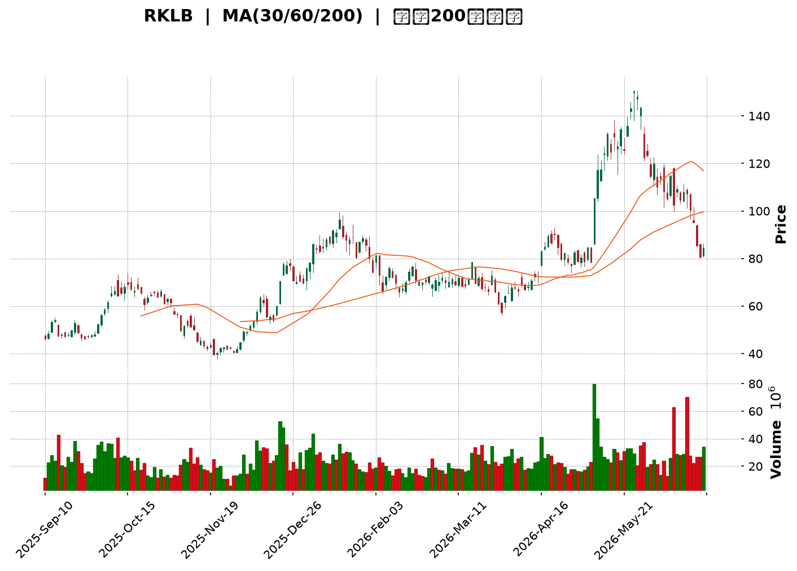
</details>

<html>
<head><meta charset="utf-8" /></head>
<body>
    <div style="height:500px; width:100%;">                        <script>window.PlotlyConfig = {MathJaxConfig: 'local'};</script>
        <script charset="utf-8" src="https://cdn.plot.ly/plotly-3.6.0.min.js" integrity="sha256-QaOVwtVY0T02VaHrr6pnoHLCwayMJp4O5n4YyaE3rJk=" crossorigin="anonymous"></script>                <div id="candlestick-chart" class="plotly-graph-div" style="height:100%; width:100%;"></div>            <script>                window.PLOTLYENV=window.PLOTLYENV || {};                                if (document.getElementById("candlestick-chart")) {                    Plotly.newPlot(                        "candlestick-chart",                        [{"close":{"dtype":"f8","bdata":"AAAAgMIVR0AAAABACjdIQAAAACCFq0pAAAAAwB4FS0AAAAAgXJ9HQAAAAIA9CkhAAAAAQAqXR0AAAADAHuVHQAAAACCu50hAAAAA4Hp0SkAAAADgUVhIQAAAAOCjUEdAAAAAoEchR0AAAACgR4FHQAAAAOB69EdAAAAAACn8R0AAAAAAKTxKQAAAAOB6FExAAAAAAABATUAAAACgR8FOQAAAAADXU1BAAAAAQOGaUEAAAADgoxBQQAAAAEDhWlBAAAAAgOsBUUAAAACgR1FRQAAAAAAAwFBAAAAAoEeRUEAAAABgZtZQQAAAAKCZWVBAAAAA4FFITkAAAADA9chPQAAAAADXI1BAAAAAIK5nUEAAAAAAAOBPQAAAAIA9ilBAAAAAgMJ1TkAAAACgcH1PQAAAACCFq05AAAAAwPVITEAAAACAwjVMQAAAAIAUzkhAAAAAgOvRSUAAAABAM\u002fNJQAAAAGC4nklAAAAAACn8SEAAAAAAAKBGQAAAAMAexUZAAAAAIK6nRUAAAAAA12NFQAAAACBcz0VAAAAAoHC9Q0AAAABgZiZEQAAAAKCZOUVAAAAAwMxMRUAAAABACvdEQAAAAIDrEUVAAAAAIFwvREAAAABAM\u002fNEQAAAAAApXEZAAAAAIFyvSEAAAABACodIQAAAACCux0lAAAAAQAq3SkAAAABgj8JMQAAAAADXw09AAAAAYLi+TkAAAADgerRLQAAAAGC4vktAAAAAQOH6SkAAAACAwvVNQAAAAKBHoVFAAAAAQDNjU0AAAAAghUtTQAAAACCFS1NAAAAAoJmpUUAAAAAgrodRQAAAAMDMnFFAAAAA4KNwUUAAAAAgXP9SQAAAAMD1iFNAAAAAgOuBVUAAAADAHgVVQAAAAMAexVRAAAAAYGY2VUAAAACgmflVQAAAAMAepVVAAAAAQDPzVkAAAADgo7BWQAAAAEAzE1hAAAAAgD1KVkAAAADgevRVQAAAAGC4\u002flVAAAAAoJk5VkAAAABguB5UQAAAAAAAwFVAAAAA4HokVkAAAAAghWtVQAAAAOB6BFRAAAAAoJmJUkAAAACgR1FUQAAAAEAKR1JAAAAA4HqUUEAAAADgehRSQAAAAIDC9VJAAAAAgOsBUkAAAAAgrmdRQAAAAOCjgFBAAAAAACncUEAAAADA9XhRQAAAAEDhmlJAAAAAwB4lU0AAAABACrdRQAAAAKBwjVFAAAAAgBR+UUAAAADAzIxRQAAAAKCZKVJAAAAAYGZGUUAAAACAFL5RQAAAAOBRiFFAAAAAgD36UUAAAAAAAIBRQAAAAEAKh1FAAAAAYLjeUUAAAAAghTtRQAAAAKBw\u002fVFAAAAAIK4XUUAAAACAPRpRQAAAAADX01FAAAAAgMKlU0AAAABguF5RQAAAACCF+1FAAAAAYLjOUEAAAAAAAABRQAAAAOB6hFBAAAAA4FE4UkAAAAAAKXxQQAAAAEAKd05AAAAA4KOwTEAAAACAFA5QQAAAAKBHYVBAAAAAYLjuUEAAAABA4epQQAAAAOB6lFBAAAAAwB5FUUAAAAAgXK9QQAAAAEAzA1FAAAAAIK6nUUAAAACAFA5SQAAAAGBmZlJAAAAAIIW7VEAAAABAMzNVQAAAAKBwXVZAAAAAwPWoVUAAAABgj4JWQAAAAGBmJlVAAAAAIIXrU0AAAABgj5JUQAAAAIDCpVNAAAAAoEdBU0AAAADgo6BUQAAAAADXs1NAAAAAANcTVEAAAADgo7BTQAAAAKCZKVVAAAAAwB6lU0AAAACAFF5aQAAAAGBmVl1AAAAAANdjXUAAAACgmQlfQAAAAKCZkWBAAAAAoEcxX0AAAADAHmVgQAAAAADX019AAAAAwPXIYEAAAADAzFxfQAAAAOBR+GBAAAAAYGbmYUAAAAAgXMdiQAAAAMD1gGJAAAAAIFzvYUAAAADA9ZheQAAAAOB61F5AAAAAwMysXEAAAADAzPxdQAAAAMAehVtAAAAAoJlpXEAAAABguA5bQAAAAEAzQ1pAAAAAgOuxXEAAAADA9ZhZQAAAAAAAUFtAAAAA4FEoWkAAAABguP5aQAAAACBcz1pAAAAAYI8SWUAAAAAgrsdXQAAAAIA9WlVAAAAAACksVEAAAABgjyJVQA=="},"high":{"dtype":"f8","bdata":"AAAAgBQOSEAAAADAHtVIQAAAAADXA0tAAAAAgMKVS0AAAACAPQpKQAAAAMAeRUhAAAAA4FGYSEAAAABACndIQAAAAKBHIUlAAAAAYDkUS0AAAACgcD1KQAAAACBcT0hAAAAA4FHYR0AAAADAzAxIQAAAAGC4\u002fkdAAAAAgMK1SEAAAABAM1NKQAAAACAxeExAAAAAoEehTUAAAAAgrkdPQAAAAAAtIlFAAAAAYI8iUUAAAAAAAGBSQAAAAAApnFFAAAAAQOFqUUAAAACAFH5SQAAAAAAAEFJAAAAAAAAgUUAAAAAghQtSQAAAAGCPAlFAAAAAoEcBUEAAAADAzCxQQAAAACCFi1BAAAAAYGaWUEAAAABgj6JQQAAAAMD12FBAAAAAIIVLUEAAAACgmblPQAAAAMDMjE9AAAAAYLi+TUAAAAAA16NMQAAAAEDhGkxAAAAAwMwMSkAAAAAAAEBLQAAAAEDhekxAAAAAgD2qS0AAAADgo7BIQAAAAAApnEdAAAAAwEvXRkAAAACAFM5FQAAAAADXQ0ZAAAAAoEchR0AAAACAwoVEQAAAAADXQ0VAAAAAQApnRUAAAAAghctFQAAAAKCZWUVAAAAAYGamREAAAABguH5FQAAAAGC4XkZAAAAAQArXSEAAAACgmdlIQAAAACBcL0pAAAAAAADgSkAAAACAPWpNQAAAAKCZCVBAAAAAIIVLUEAAAAAA1yNQQAAAAKBwXUxAAAAA4Hp0TEAAAAAAACBOQAAAAADXo1FAAAAAwMycU0AAAAAghctTQAAAAMAe9VNAAAAAIFw\u002fU0AAAAAgXC9SQAAAAAAprFJAAAAAQItMUkAAAAAgXA9TQAAAAAAAkFNAAAAAAACQVUAAAACgcH1VQAAAACCud1ZAAAAAIIUbVkAAAACAwjVWQAAAAOCnblZAAAAAACkMV0AAAABAYB1XQAAAAMAe5VhAAAAAoEeRWEAAAAAAANBWQAAAAKCZWVZAAAAAwMycV0AAAACAPcpVQAAAAAAAwFVAAAAAQDNzVkAAAAAAAEBWQAAAAOB6VFZAAAAAwMwsVEAAAADgelRUQAAAAGBmVlRAAAAAIFw\u002fUkAAAACAPSpSQAAAAEAzM1NAAAAAQAr3UkAAAACgmVlSQAAAAMDMHFFAAAAAYGZmUUAAAAAgXL9RQAAAAMD18FJAAAAAQApHU0AAAADAzIxTQAAAAAAA0FFAAAAAIIWDUUAAAABgZvZRQAAAACBcL1JAAAAAgMJlUUAAAABgZgZSQAAAAAAAUFJAAAAAYGaGUkAAAAAA1xNSQAAAAEAKx1JAAAAAAAAIUkAAAAAA1ztSQAAAAEAzU1JAAAAAYGYmUkAAAAAA19NRQAAAAOBRGFJAAAAAQOGqU0AAAADgUThTQAAAAGC4LlJAAAAAYLh+UkAAAADAzFxRQAAAAGBmJlFAAAAAANfDUkAAAACAwgVSQAAAAIAUhlBAAAAAgOvRTkAAAADAHiVQQAAAAEDhKlFAAAAAwPVYUUAAAADgepRRQAAAAEAzE1FAAAAAgMBqUkAAAABgj3JRQAAAAADXg1FAAAAAQDPjUUAAAAAAALBSQAAAAIDCpVJAAAAAIFzfVEAAAAAgXL9VQAAAAGBmllZAAAAAwMz8VkAAAABgZkZXQAAAAEAzk1ZAAAAAgD2aVUAAAABguJ5UQAAAAIDrcVRAAAAA4KOAU0AAAACAwuVUQAAAAGCP8lRAAAAA4E91VEAAAAAAAMBUQAAAACCFK1VAAAAAYI8yVUAAAAAgrmdaQAAAAAAp\u002fF5AAAAAIFxfXkAAAAAgXM9fQAAAAIDCpWBAAAAAANdLYEAAAAAAKUxhQAAAAIA9MmBAAAAAQDPrYEAAAAAA11tgQAAAAOBReGFAAAAAAABAYkAAAAAAAOBiQAAAAGCP2mJAAAAAAAAAYkAAAAAAKfRgQAAAAMDMDGBAAAAA4FGgXkAAAADgUaheQAAAAGC4fl1AAAAAAAAQXUAAAABgj\u002fJdQAAAAKBw\u002fVtAAAAAQOHCXEAAAADAIJhdQAAAAIDrsVtAAAAAAAAgW0AAAACAwtVbQAAAAEAzY1tAAAAAoJnZWkAAAABguG5ZQAAAAEAzk1dAAAAAQAqHVUAAAACA65FVQA=="},"hovertemplate":"\u003cb\u003e%{x|%Y-%m-%d}\u003c\u002fb\u003e\u003cbr\u003e\u958b: $%{open:.2f}\u003cbr\u003e\u9ad8: $%{high:.2f}\u003cbr\u003e\u4f4e: $%{low:.2f}\u003cbr\u003e\u6536: $%{close:.2f}\u003cextra\u003e\u003c\u002fextra\u003e","low":{"dtype":"f8","bdata":"AAAAwMzMRkAAAABACgdHQAAAAEA1TkhAAAAAAClcSkAAAACgR4FHQAAAAKCZOUdAAAAAAACAR0AAAADgo5BHQAAAAGBmZkdAAAAA4Hr0R0AAAABACjdIQAAAAEDhmkZAAAAAgD3qRkAAAAAgXC9HQAAAAKBHQUdAAAAAIFyPR0AAAACgR0FIQAAAAKBHoUlAAAAAYGbmS0AAAABgj4JMQAAAAEAz009AAAAAQOEaUEAAAADA9QhQQAAAAODOJ1BAAAAA4FEYT0AAAADAHsVQQAAAAEAzm1BAAAAAoJnZT0AAAABAM6tQQAAAAEAKN1BAAAAA4Ho0TUAAAAAAAGBOQAAAAEAz009AAAAAoJkJUEAAAACAFM5PQAAAAKBwvU9AAAAAgOtxTkAAAABAMzNOQAAAAOCjkE1AAAAAoEdBTEAAAAAgXG9LQAAAAOB6tEhAAAAA4M4nR0AAAACgR2FJQAAAAEDhmklAAAAA4HrUSEAAAAAgXC9GQAAAAGBmpkVAAAAAwMwcRUAAAACgcJ1EQAAAAEAKN0VAAAAAwPWoQ0AAAADA9chCQAAAAGBmpkNAAAAA4KMwREAAAADgo7BEQAAAAGBm5kRAAAAAoHD9Q0AAAACAwjVEQAAAAAAAwERAAAAAwPVoRkAAAACgmdlHQAAAAAApnEhAAAAAIIUrSUAAAAAAACBKQAAAAMDMbExAAAAAYGbmTUAAAACAPYpLQAAAAEAKV0pAAAAAQOGKSkAAAAAA1wNMQAAAAMCdX05AAAAAwCAwUkAAAABgj1JSQAAAAKBDs1JAAAAAwPWYUUAAAACgm1RRQAAAAAApnFFAAAAA4FFIUUAAAABgZrZQQAAAAADX01FAAAAAQDODUkAAAABgZnZUQAAAAOCjkFRAAAAAwMycVEAAAADg0NpUQAAAAKCZaVVAAAAAAAAgVUAAAACgmalVQAAAAKCZGVdAAAAAQDMTVkAAAACgcK1UQAAAAMB2VlRAAAAAIK6HVUAAAADgowBUQAAAAAAAgFRAAAAAwMqBVUAAAAAAAMBUQAAAAKBHgVNAAAAAgEF4UkAAAACgR\u002fFSQAAAAEAIJFFAAAAAwMxMUEAAAAAAAMBQQAAAAAAAsFFAAAAAQDPjUUAAAACgR8FQQAAAACBc709AAAAAAABgUEAAAAAAAEBQQAAAAMBLf1FAAAAAYGYWUkAAAACgmVlRQAAAAAAAIFFAAAAAYGamUEAAAADgUThRQAAAAADXM1FAAAAAYGYGUEAAAADAzJxQQAAAAAApjFBAAAAAgBReUUAAAACAwtVQQAAAAOCjCFFAAAAA4Hr0UEAAAACAvidRQAAAAMAeFVFAAAAAgOsRUUAAAAAAKdxQQAAAAEDhKlFAAAAAoEfRUUAAAACgmVlRQAAAAAAAAFFAAAAAwPWYUEAAAABAM4NQQAAAAKBwHVBAAAAAACk8UUAAAACAwmVQQAAAAMDMLE5AAAAAYOUQTEAAAAAA14NNQAAAAEAzU1BAAAAAgBTuTkAAAABgZqZQQAAAAEDh+k9AAAAAYOfzUEAAAABA4aJQQAAAAIDClVBAAAAAgMKlUEAAAABguJ5RQAAAAGBmZlFAAAAAoJk5U0AAAABgZuZUQAAAAGBmJlVAAAAAAABwVUAAAADgo\u002fBVQAAAAAApZFRAAAAAwB7FU0AAAADAdENTQAAAAGBmZlNAAAAAIFx\u002fUkAAAACAFF5TQAAAACCFm1NAAAAAAAAQU0AAAAAA1yNTQAAAAEAKt1NAAAAAIIV7U0AAAAAgrndVQAAAAAAAAFpAAAAAgD0aXEAAAADA9ThdQAAAAADXU15AAAAAQDNzXkAAAACg8WpfQAAAAGC4zlxAAAAAgBQOX0AAAABAM\u002fNeQAAAAIDraWBAAAAAgOtRYUAAAADAHj1hQAAAAADXy2FAAAAAoJnBYEAAAAAAAEBeQAAAAADXo15AAAAAgD1qXEAAAADA9ZhbQAAAAGC4rlpAAAAAAADAW0AAAADAzExZQAAAAIA9GlpAAAAAoJlZWkAAAABACudYQAAAAEAzc1pAAAAA4HrEWUAAAABgjwJaQAAAAKBwPVlAAAAAAAAgWEAAAADgo7hXQAAAAGBmNlVAAAAAAAAAVEAAAABguC5UQA=="},"name":"\u50f9\u683c","open":{"dtype":"f8","bdata":"AAAAANfDR0AAAADA9ShHQAAAAKBwfUhAAAAAgD3KSkAAAAAAAABKQAAAAOBRyEdAAAAAgMJ1SEAAAABACtdHQAAAAOCjkEdAAAAAQDODSEAAAACAwuVJQAAAAAAAAEhAAAAAYGamR0AAAABAM7NHQAAAAEDhmkdAAAAA4KOwR0AAAACA61FIQAAAAGBmBkpAAAAAYLhuTEAAAACgR4FNQAAAAKCZCVBAAAAAoJk5UEAAAABAM7NRQAAAAOBR+FBAAAAAgMJVUEAAAACgR4FRQAAAAOB6hFFAAAAAwPV4UEAAAADgo0hRQAAAAGCPAlFAAAAAACl8T0AAAAAgrsdOQAAAAADXM1BAAAAAACmMUEAAAABAM2tQQAAAAKBHCVBAAAAAAABAUEAAAABgj+JOQAAAAADXg09AAAAAYGbmTEAAAADgelRMQAAAAEDhGkxAAAAAoBjUR0AAAABguN5KQAAAAAAAAExAAAAAQAr3SUAAAACgR2FIQAAAAEDh2kVAAAAAQDOTRkAAAAAAKRxFQAAAAAAAQEVAAAAAgD0KR0AAAACAPepDQAAAAKBHYURAAAAAANcDRUAAAABguJ5FQAAAAKBHQUVAAAAAQDOTREAAAAAgrkdEQAAAAGCP8kRAAAAAYI\u002fSRkAAAAAAAHBIQAAAAIA9CklAAAAAoHCdSUAAAADgUbhKQAAAAKBHwUxAAAAAAABAT0AAAADgp4ZPQAAAAOBRGEtAAAAAwMwMTEAAAACgmRlMQAAAACBcj05AAAAAACk8UkAAAAAA13NSQAAAAIA9glNAAAAAIIUrU0AAAAAAAGBRQAAAAKCZQVJAAAAAAADgUUAAAADgUahRQAAAACCup1JAAAAA4KNwU0AAAABgZgZVQAAAAAAAYFVAAAAAoJkhVUAAAABguD5VQAAAAMD1SFZAAAAAYGaWVUAAAADA9VBWQAAAAKCZIVdAAAAAwMxsV0AAAACgR4FWQAAAAOBRmFVAAAAAIIVDVkAAAAAgrq9VQAAAAMD1uFRAAAAAgBTOVUAAAAAAKfxVQAAAAAAAQFVAAAAAgD3KU0AAAABgZqZTQAAAAGBmVlRAAAAAYLh+UUAAAAAAAEBRQAAAAKCZAVJAAAAAgBSmUkAAAADgUUhSQAAAAIDr4VBAAAAA4HqsUEAAAABAYIVQQAAAAAAAwFFAAAAAoJk5UkAAAAAg2d5SQAAAAOBRMFFAAAAA4FE4UUAAAACAFMZRQAAAAEDhglFAAAAAgMLlUEAAAAAghatQQAAAAGC4NlFAAAAAANezUUAAAABA4bpRQAAAAOCjCFFAAAAAwPVYUUAAAACAwpVRQAAAAEAzM1FAAAAAwMz8UUAAAACgmUlRQAAAAMDMVFFAAAAAYGbeUUAAAABgjwJTQAAAAOB6NFFAAAAAAAAAUkAAAACgcAVRQAAAAAAAwFBAAAAAACk8UUAAAADAzMxRQAAAAOCjgFBAAAAAoJm5TkAAAABA4dpOQAAAAAAAYFBAAAAAwMwcT0AAAABguO5QQAAAACBcx1BAAAAAAAAAUkAAAAAA10NRQAAAAMDM7FBAAAAAQDPDUEAAAAAghWNSQAAAAKBwZVJAAAAAgBQ+U0AAAADAHgVVQAAAAGBmNlVAAAAAwB6VVkAAAACAwp1WQAAAAGBmdlZAAAAAgMKVVUAAAAAAKexTQAAAAMDMBFRAAAAAQAp3U0AAAABAM2NTQAAAAIDr4VRAAAAAQAqXU0AAAABgZqZUQAAAACCu51NAAAAAoHAtVUAAAACAPYJVQAAAAKBHUVpAAAAA4KMwXEAAAACgR\u002fleQAAAAGBmxl5AAAAAQDMDYEAAAAAAKZhgQAAAAIAUfl9AAAAAYLjeX0AAAADA9YhfQAAAAMAebWBAAAAAQOG+YUAAAABACrdiQAAAAKBwZWJAAAAAgBR+YUAAAAAAKYxgQAAAAIDCVV9AAAAAwB7lXUAAAACgcEVcQAAAAKBHkVxAAAAAQOGqXEAAAACgmZldQAAAAMDM7FpAAAAAgMKlWkAAAACgR4FdQAAAAKBw\u002fVpAAAAAoHDtWkAAAAAgrgdaQAAAAMAeNVtAAAAAIFy\u002fWkAAAACgRwFYQAAAAGBmdldAAAAAQAqHVUAAAABACkdUQA=="},"x":["2025-09-10T00:00:00-04:00","2025-09-11T00:00:00-04:00","2025-09-12T00:00:00-04:00","2025-09-15T00:00:00-04:00","2025-09-16T00:00:00-04:00","2025-09-17T00:00:00-04:00","2025-09-18T00:00:00-04:00","2025-09-19T00:00:00-04:00","2025-09-22T00:00:00-04:00","2025-09-23T00:00:00-04:00","2025-09-24T00:00:00-04:00","2025-09-25T00:00:00-04:00","2025-09-26T00:00:00-04:00","2025-09-29T00:00:00-04:00","2025-09-30T00:00:00-04:00","2025-10-01T00:00:00-04:00","2025-10-02T00:00:00-04:00","2025-10-03T00:00:00-04:00","2025-10-06T00:00:00-04:00","2025-10-07T00:00:00-04:00","2025-10-08T00:00:00-04:00","2025-10-09T00:00:00-04:00","2025-10-10T00:00:00-04:00","2025-10-13T00:00:00-04:00","2025-10-14T00:00:00-04:00","2025-10-15T00:00:00-04:00","2025-10-16T00:00:00-04:00","2025-10-17T00:00:00-04:00","2025-10-20T00:00:00-04:00","2025-10-21T00:00:00-04:00","2025-10-22T00:00:00-04:00","2025-10-23T00:00:00-04:00","2025-10-24T00:00:00-04:00","2025-10-27T00:00:00-04:00","2025-10-28T00:00:00-04:00","2025-10-29T00:00:00-04:00","2025-10-30T00:00:00-04:00","2025-10-31T00:00:00-04:00","2025-11-03T00:00:00-05:00","2025-11-04T00:00:00-05:00","2025-11-05T00:00:00-05:00","2025-11-06T00:00:00-05:00","2025-11-07T00:00:00-05:00","2025-11-10T00:00:00-05:00","2025-11-11T00:00:00-05:00","2025-11-12T00:00:00-05:00","2025-11-13T00:00:00-05:00","2025-11-14T00:00:00-05:00","2025-11-17T00:00:00-05:00","2025-11-18T00:00:00-05:00","2025-11-19T00:00:00-05:00","2025-11-20T00:00:00-05:00","2025-11-21T00:00:00-05:00","2025-11-24T00:00:00-05:00","2025-11-25T00:00:00-05:00","2025-11-26T00:00:00-05:00","2025-11-28T00:00:00-05:00","2025-12-01T00:00:00-05:00","2025-12-02T00:00:00-05:00","2025-12-03T00:00:00-05:00","2025-12-04T00:00:00-05:00","2025-12-05T00:00:00-05:00","2025-12-08T00:00:00-05:00","2025-12-09T00:00:00-05:00","2025-12-10T00:00:00-05:00","2025-12-11T00:00:00-05:00","2025-12-12T00:00:00-05:00","2025-12-15T00:00:00-05:00","2025-12-16T00:00:00-05:00","2025-12-17T00:00:00-05:00","2025-12-18T00:00:00-05:00","2025-12-19T00:00:00-05:00","2025-12-22T00:00:00-05:00","2025-12-23T00:00:00-05:00","2025-12-24T00:00:00-05:00","2025-12-26T00:00:00-05:00","2025-12-29T00:00:00-05:00","2025-12-30T00:00:00-05:00","2025-12-31T00:00:00-05:00","2026-01-02T00:00:00-05:00","2026-01-05T00:00:00-05:00","2026-01-06T00:00:00-05:00","2026-01-07T00:00:00-05:00","2026-01-08T00:00:00-05:00","2026-01-09T00:00:00-05:00","2026-01-12T00:00:00-05:00","2026-01-13T00:00:00-05:00","2026-01-14T00:00:00-05:00","2026-01-15T00:00:00-05:00","2026-01-16T00:00:00-05:00","2026-01-20T00:00:00-05:00","2026-01-21T00:00:00-05:00","2026-01-22T00:00:00-05:00","2026-01-23T00:00:00-05:00","2026-01-26T00:00:00-05:00","2026-01-27T00:00:00-05:00","2026-01-28T00:00:00-05:00","2026-01-29T00:00:00-05:00","2026-01-30T00:00:00-05:00","2026-02-02T00:00:00-05:00","2026-02-03T00:00:00-05:00","2026-02-04T00:00:00-05:00","2026-02-05T00:00:00-05:00","2026-02-06T00:00:00-05:00","2026-02-09T00:00:00-05:00","2026-02-10T00:00:00-05:00","2026-02-11T00:00:00-05:00","2026-02-12T00:00:00-05:00","2026-02-13T00:00:00-05:00","2026-02-17T00:00:00-05:00","2026-02-18T00:00:00-05:00","2026-02-19T00:00:00-05:00","2026-02-20T00:00:00-05:00","2026-02-23T00:00:00-05:00","2026-02-24T00:00:00-05:00","2026-02-25T00:00:00-05:00","2026-02-26T00:00:00-05:00","2026-02-27T00:00:00-05:00","2026-03-02T00:00:00-05:00","2026-03-03T00:00:00-05:00","2026-03-04T00:00:00-05:00","2026-03-05T00:00:00-05:00","2026-03-06T00:00:00-05:00","2026-03-09T00:00:00-04:00","2026-03-10T00:00:00-04:00","2026-03-11T00:00:00-04:00","2026-03-12T00:00:00-04:00","2026-03-13T00:00:00-04:00","2026-03-16T00:00:00-04:00","2026-03-17T00:00:00-04:00","2026-03-18T00:00:00-04:00","2026-03-19T00:00:00-04:00","2026-03-20T00:00:00-04:00","2026-03-23T00:00:00-04:00","2026-03-24T00:00:00-04:00","2026-03-25T00:00:00-04:00","2026-03-26T00:00:00-04:00","2026-03-27T00:00:00-04:00","2026-03-30T00:00:00-04:00","2026-03-31T00:00:00-04:00","2026-04-01T00:00:00-04:00","2026-04-02T00:00:00-04:00","2026-04-06T00:00:00-04:00","2026-04-07T00:00:00-04:00","2026-04-08T00:00:00-04:00","2026-04-09T00:00:00-04:00","2026-04-10T00:00:00-04:00","2026-04-13T00:00:00-04:00","2026-04-14T00:00:00-04:00","2026-04-15T00:00:00-04:00","2026-04-16T00:00:00-04:00","2026-04-17T00:00:00-04:00","2026-04-20T00:00:00-04:00","2026-04-21T00:00:00-04:00","2026-04-22T00:00:00-04:00","2026-04-23T00:00:00-04:00","2026-04-24T00:00:00-04:00","2026-04-27T00:00:00-04:00","2026-04-28T00:00:00-04:00","2026-04-29T00:00:00-04:00","2026-04-30T00:00:00-04:00","2026-05-01T00:00:00-04:00","2026-05-04T00:00:00-04:00","2026-05-05T00:00:00-04:00","2026-05-06T00:00:00-04:00","2026-05-07T00:00:00-04:00","2026-05-08T00:00:00-04:00","2026-05-11T00:00:00-04:00","2026-05-12T00:00:00-04:00","2026-05-13T00:00:00-04:00","2026-05-14T00:00:00-04:00","2026-05-15T00:00:00-04:00","2026-05-18T00:00:00-04:00","2026-05-19T00:00:00-04:00","2026-05-20T00:00:00-04:00","2026-05-21T00:00:00-04:00","2026-05-22T00:00:00-04:00","2026-05-26T00:00:00-04:00","2026-05-27T00:00:00-04:00","2026-05-28T00:00:00-04:00","2026-05-29T00:00:00-04:00","2026-06-01T00:00:00-04:00","2026-06-02T00:00:00-04:00","2026-06-03T00:00:00-04:00","2026-06-04T00:00:00-04:00","2026-06-05T00:00:00-04:00","2026-06-08T00:00:00-04:00","2026-06-09T00:00:00-04:00","2026-06-10T00:00:00-04:00","2026-06-11T00:00:00-04:00","2026-06-12T00:00:00-04:00","2026-06-15T00:00:00-04:00","2026-06-16T00:00:00-04:00","2026-06-17T00:00:00-04:00","2026-06-18T00:00:00-04:00","2026-06-22T00:00:00-04:00","2026-06-23T00:00:00-04:00","2026-06-24T00:00:00-04:00","2026-06-25T00:00:00-04:00","2026-06-26T00:00:00-04:00"],"type":"candlestick"},{"hovertemplate":"MA30: $%{y:.2f}\u003cextra\u003e\u003c\u002fextra\u003e","line":{"color":"#2196F3","dash":"dash","width":2},"mode":"lines","name":"MA30","x":["2025-09-10T00:00:00-04:00","2025-09-11T00:00:00-04:00","2025-09-12T00:00:00-04:00","2025-09-15T00:00:00-04:00","2025-09-16T00:00:00-04:00","2025-09-17T00:00:00-04:00","2025-09-18T00:00:00-04:00","2025-09-19T00:00:00-04:00","2025-09-22T00:00:00-04:00","2025-09-23T00:00:00-04:00","2025-09-24T00:00:00-04:00","2025-09-25T00:00:00-04:00","2025-09-26T00:00:00-04:00","2025-09-29T00:00:00-04:00","2025-09-30T00:00:00-04:00","2025-10-01T00:00:00-04:00","2025-10-02T00:00:00-04:00","2025-10-03T00:00:00-04:00","2025-10-06T00:00:00-04:00","2025-10-07T00:00:00-04:00","2025-10-08T00:00:00-04:00","2025-10-09T00:00:00-04:00","2025-10-10T00:00:00-04:00","2025-10-13T00:00:00-04:00","2025-10-14T00:00:00-04:00","2025-10-15T00:00:00-04:00","2025-10-16T00:00:00-04:00","2025-10-17T00:00:00-04:00","2025-10-20T00:00:00-04:00","2025-10-21T00:00:00-04:00","2025-10-22T00:00:00-04:00","2025-10-23T00:00:00-04:00","2025-10-24T00:00:00-04:00","2025-10-27T00:00:00-04:00","2025-10-28T00:00:00-04:00","2025-10-29T00:00:00-04:00","2025-10-30T00:00:00-04:00","2025-10-31T00:00:00-04:00","2025-11-03T00:00:00-05:00","2025-11-04T00:00:00-05:00","2025-11-05T00:00:00-05:00","2025-11-06T00:00:00-05:00","2025-11-07T00:00:00-05:00","2025-11-10T00:00:00-05:00","2025-11-11T00:00:00-05:00","2025-11-12T00:00:00-05:00","2025-11-13T00:00:00-05:00","2025-11-14T00:00:00-05:00","2025-11-17T00:00:00-05:00","2025-11-18T00:00:00-05:00","2025-11-19T00:00:00-05:00","2025-11-20T00:00:00-05:00","2025-11-21T00:00:00-05:00","2025-11-24T00:00:00-05:00","2025-11-25T00:00:00-05:00","2025-11-26T00:00:00-05:00","2025-11-28T00:00:00-05:00","2025-12-01T00:00:00-05:00","2025-12-02T00:00:00-05:00","2025-12-03T00:00:00-05:00","2025-12-04T00:00:00-05:00","2025-12-05T00:00:00-05:00","2025-12-08T00:00:00-05:00","2025-12-09T00:00:00-05:00","2025-12-10T00:00:00-05:00","2025-12-11T00:00:00-05:00","2025-12-12T00:00:00-05:00","2025-12-15T00:00:00-05:00","2025-12-16T00:00:00-05:00","2025-12-17T00:00:00-05:00","2025-12-18T00:00:00-05:00","2025-12-19T00:00:00-05:00","2025-12-22T00:00:00-05:00","2025-12-23T00:00:00-05:00","2025-12-24T00:00:00-05:00","2025-12-26T00:00:00-05:00","2025-12-29T00:00:00-05:00","2025-12-30T00:00:00-05:00","2025-12-31T00:00:00-05:00","2026-01-02T00:00:00-05:00","2026-01-05T00:00:00-05:00","2026-01-06T00:00:00-05:00","2026-01-07T00:00:00-05:00","2026-01-08T00:00:00-05:00","2026-01-09T00:00:00-05:00","2026-01-12T00:00:00-05:00","2026-01-13T00:00:00-05:00","2026-01-14T00:00:00-05:00","2026-01-15T00:00:00-05:00","2026-01-16T00:00:00-05:00","2026-01-20T00:00:00-05:00","2026-01-21T00:00:00-05:00","2026-01-22T00:00:00-05:00","2026-01-23T00:00:00-05:00","2026-01-26T00:00:00-05:00","2026-01-27T00:00:00-05:00","2026-01-28T00:00:00-05:00","2026-01-29T00:00:00-05:00","2026-01-30T00:00:00-05:00","2026-02-02T00:00:00-05:00","2026-02-03T00:00:00-05:00","2026-02-04T00:00:00-05:00","2026-02-05T00:00:00-05:00","2026-02-06T00:00:00-05:00","2026-02-09T00:00:00-05:00","2026-02-10T00:00:00-05:00","2026-02-11T00:00:00-05:00","2026-02-12T00:00:00-05:00","2026-02-13T00:00:00-05:00","2026-02-17T00:00:00-05:00","2026-02-18T00:00:00-05:00","2026-02-19T00:00:00-05:00","2026-02-20T00:00:00-05:00","2026-02-23T00:00:00-05:00","2026-02-24T00:00:00-05:00","2026-02-25T00:00:00-05:00","2026-02-26T00:00:00-05:00","2026-02-27T00:00:00-05:00","2026-03-02T00:00:00-05:00","2026-03-03T00:00:00-05:00","2026-03-04T00:00:00-05:00","2026-03-05T00:00:00-05:00","2026-03-06T00:00:00-05:00","2026-03-09T00:00:00-04:00","2026-03-10T00:00:00-04:00","2026-03-11T00:00:00-04:00","2026-03-12T00:00:00-04:00","2026-03-13T00:00:00-04:00","2026-03-16T00:00:00-04:00","2026-03-17T00:00:00-04:00","2026-03-18T00:00:00-04:00","2026-03-19T00:00:00-04:00","2026-03-20T00:00:00-04:00","2026-03-23T00:00:00-04:00","2026-03-24T00:00:00-04:00","2026-03-25T00:00:00-04:00","2026-03-26T00:00:00-04:00","2026-03-27T00:00:00-04:00","2026-03-30T00:00:00-04:00","2026-03-31T00:00:00-04:00","2026-04-01T00:00:00-04:00","2026-04-02T00:00:00-04:00","2026-04-06T00:00:00-04:00","2026-04-07T00:00:00-04:00","2026-04-08T00:00:00-04:00","2026-04-09T00:00:00-04:00","2026-04-10T00:00:00-04:00","2026-04-13T00:00:00-04:00","2026-04-14T00:00:00-04:00","2026-04-15T00:00:00-04:00","2026-04-16T00:00:00-04:00","2026-04-17T00:00:00-04:00","2026-04-20T00:00:00-04:00","2026-04-21T00:00:00-04:00","2026-04-22T00:00:00-04:00","2026-04-23T00:00:00-04:00","2026-04-24T00:00:00-04:00","2026-04-27T00:00:00-04:00","2026-04-28T00:00:00-04:00","2026-04-29T00:00:00-04:00","2026-04-30T00:00:00-04:00","2026-05-01T00:00:00-04:00","2026-05-04T00:00:00-04:00","2026-05-05T00:00:00-04:00","2026-05-06T00:00:00-04:00","2026-05-07T00:00:00-04:00","2026-05-08T00:00:00-04:00","2026-05-11T00:00:00-04:00","2026-05-12T00:00:00-04:00","2026-05-13T00:00:00-04:00","2026-05-14T00:00:00-04:00","2026-05-15T00:00:00-04:00","2026-05-18T00:00:00-04:00","2026-05-19T00:00:00-04:00","2026-05-20T00:00:00-04:00","2026-05-21T00:00:00-04:00","2026-05-22T00:00:00-04:00","2026-05-26T00:00:00-04:00","2026-05-27T00:00:00-04:00","2026-05-28T00:00:00-04:00","2026-05-29T00:00:00-04:00","2026-06-01T00:00:00-04:00","2026-06-02T00:00:00-04:00","2026-06-03T00:00:00-04:00","2026-06-04T00:00:00-04:00","2026-06-05T00:00:00-04:00","2026-06-08T00:00:00-04:00","2026-06-09T00:00:00-04:00","2026-06-10T00:00:00-04:00","2026-06-11T00:00:00-04:00","2026-06-12T00:00:00-04:00","2026-06-15T00:00:00-04:00","2026-06-16T00:00:00-04:00","2026-06-17T00:00:00-04:00","2026-06-18T00:00:00-04:00","2026-06-22T00:00:00-04:00","2026-06-23T00:00:00-04:00","2026-06-24T00:00:00-04:00","2026-06-25T00:00:00-04:00","2026-06-26T00:00:00-04:00"],"y":{"dtype":"f8","bdata":"AAAAAAAA+H8AAAAAAAD4fwAAAAAAAPh\u002fAAAAAAAA+H8AAAAAAAD4fwAAAAAAAPh\u002fAAAAAAAA+H8AAAAAAAD4fwAAAAAAAPh\u002fAAAAAAAA+H8AAAAAAAD4fwAAAAAAAPh\u002fAAAAAAAA+H8AAAAAAAD4fwAAAAAAAPh\u002fAAAAAAAA+H8AAAAAAAD4fwAAAAAAAPh\u002fAAAAAAAA+H8AAAAAAAD4fwAAAAAAAPh\u002fAAAAAAAA+H8AAAAAAAD4fwAAAAAAAPh\u002fAAAAAAAA+H8AAAAAAAD4fwAAAAAAAPh\u002fAAAAAAAA+H8AAAAAAAD4f1VVVeVt4UtAMzMzE9keTEDe3d39cV9MQImIiDhRj0xAvLu7q7nATECJiIiIJQdNQHd3d7dJVE1AVVVVdemOTUDNzMz8uM9NQCIiItLqAE5AREREhIgQTkDNzMy8gzFOQBEREbE6Pk5AZmZmFi9VTkBmZmZGDGpOQGZmZoZBeE5A7+7uDsqATkBERETk+2FOQFVVVQWsNE5A3t3dfdzzTUBmZmZW8qNNQDMzMxNnR01AmpmZaXXUTEAzMzOzOm5MQGZmZlY5DExA7+7u\u002frifS0De3d1tEitLQN7d3a0AwUpAmpmZ+X5SSkCrqqrK6OVJQHd3d7esjUlAq6qqyuhdSUCrqqqK+h9JQERERBSD6EhAiYiIWIC0SEBmZmaG65lIQLy7u9uyjkhAREREdCGRSEDv7u7+1HBIQM3MzDzfV0hAvLu7a7xMSECrqqpaq1tIQFVVVaXitEhAd3d3R28jSUB3d3fHS49JQM3MzCz5\u002fUlAAAAAQDVWSkDNzMzsUcBKQImIiEiaKktAzczMvHSbS0CamZnpJilMQFVVVfVvvExAiYiI+AyDTUCJiIho2D1OQERERDQz605AiYiIeHefT0BERER8zTFQQO\u002fu7qabkFBAq6qqSlP+UEDe3d1dj2ZRQM3MzOyY1FFAq6qqknspUkBmZmZuLnxSQLy7u5vgyVJAVVVV9YsVU0BmZmYuh0ZTQGZmZu6YeFNAiYiIOF6yU0BVVVWt8fJTQCIiIqJhJ1RAEREREXRSVEAzMzMDAIBUQAAAAICGhVRAvLu7a5FtVEBmZmY2M2NUQERERGRXYFRA3t3dDUljVEDNzMz8N2JUQImIiCi\u002fWFRAERERIcxTVEB3d3e3yEZUQJqZmRnZPlRAREREJLAqVEAiIiJCfA5UQFVVVYUH81NA7+7uDknTU0Dv7u5+hq1TQLy7u9vOj1NAERERoWFfU0BmZmamKTVTQGZmZlZV\u002fVJAmpmZiYjYUkARERFxhLJSQJqZmQlljFJAVVVVZTtnUkDe3d2Nl05SQFVVVbWBLlJAERER0WkDUkCJiIgYkt5RQHd3d\u002ffhy1FAvLu7y1rVUUAzMzPjM7xRQDMzM3OvuVFA7+7ubqC7UUAzMzMjabJRQKuqqmqRnVFAERERoWGfUUC8u7vbh5dRQAAAAICxjFFA3t3dZTt3UUCrqqrSImtRQERERDwmWFFAzczM9ERFUUAiIiLKdj5RQM3MzFQqNlFA3t3dRUQ0UUDv7u6m4ixRQImIiHASI1FAiYiIkFAmUUAzMzM7+yhRQImIiFBiMFFAvLu7s+RHUUAiIiJ6d2dRQAAAACi\u002fkFFAERERiRaxUUARERFpH95RQBEREYkW+VFAVVVVTTcRUkCamZmh0y5SQDMzM3tbPlJAVVVVDQI7UkAzMzMrzlZSQImIiJB7ZVJARERE\u002fGKBUkCamZlhV5hSQCIiIor6v1JAiYiIgCPMUkDv7u4meCBTQGZmZv7UmFNAvLu7SzcZVEAREREREZlUQDMzM2MQKFVARERE1L+hVUBmZmbWMSlWQCIiIoJOq1ZAZmZmZmY2V0AzMzPjpbNXQCIiIpIYRFhAzczM7O7eWECJiIjIWoVZQM3MzHwjJFpAvLu720+lWkAiIiICgfVaQFVVVRW9PVtAVVVVlZl5W0De3d1taLlbQImIiOjD71tA7+7uDjw4XEAiIiLCkm9cQDMzM3MFqFxAIiIicpP4XEAzMzOT\u002fCJdQAAAAODsY11AZmZm1s6XXUCrqqraJNZdQBEREQFWBl5A7+7ujqY0XkBEREQUkh5eQFVVVZVu2l1AZmZmpsaLXUDv7u5ORjddQA=="},"type":"scatter"},{"hovertemplate":"MA60: $%{y:.2f}\u003cextra\u003e\u003c\u002fextra\u003e","line":{"color":"#9C27B0","dash":"dash","width":2},"mode":"lines","name":"MA60","x":["2025-09-10T00:00:00-04:00","2025-09-11T00:00:00-04:00","2025-09-12T00:00:00-04:00","2025-09-15T00:00:00-04:00","2025-09-16T00:00:00-04:00","2025-09-17T00:00:00-04:00","2025-09-18T00:00:00-04:00","2025-09-19T00:00:00-04:00","2025-09-22T00:00:00-04:00","2025-09-23T00:00:00-04:00","2025-09-24T00:00:00-04:00","2025-09-25T00:00:00-04:00","2025-09-26T00:00:00-04:00","2025-09-29T00:00:00-04:00","2025-09-30T00:00:00-04:00","2025-10-01T00:00:00-04:00","2025-10-02T00:00:00-04:00","2025-10-03T00:00:00-04:00","2025-10-06T00:00:00-04:00","2025-10-07T00:00:00-04:00","2025-10-08T00:00:00-04:00","2025-10-09T00:00:00-04:00","2025-10-10T00:00:00-04:00","2025-10-13T00:00:00-04:00","2025-10-14T00:00:00-04:00","2025-10-15T00:00:00-04:00","2025-10-16T00:00:00-04:00","2025-10-17T00:00:00-04:00","2025-10-20T00:00:00-04:00","2025-10-21T00:00:00-04:00","2025-10-22T00:00:00-04:00","2025-10-23T00:00:00-04:00","2025-10-24T00:00:00-04:00","2025-10-27T00:00:00-04:00","2025-10-28T00:00:00-04:00","2025-10-29T00:00:00-04:00","2025-10-30T00:00:00-04:00","2025-10-31T00:00:00-04:00","2025-11-03T00:00:00-05:00","2025-11-04T00:00:00-05:00","2025-11-05T00:00:00-05:00","2025-11-06T00:00:00-05:00","2025-11-07T00:00:00-05:00","2025-11-10T00:00:00-05:00","2025-11-11T00:00:00-05:00","2025-11-12T00:00:00-05:00","2025-11-13T00:00:00-05:00","2025-11-14T00:00:00-05:00","2025-11-17T00:00:00-05:00","2025-11-18T00:00:00-05:00","2025-11-19T00:00:00-05:00","2025-11-20T00:00:00-05:00","2025-11-21T00:00:00-05:00","2025-11-24T00:00:00-05:00","2025-11-25T00:00:00-05:00","2025-11-26T00:00:00-05:00","2025-11-28T00:00:00-05:00","2025-12-01T00:00:00-05:00","2025-12-02T00:00:00-05:00","2025-12-03T00:00:00-05:00","2025-12-04T00:00:00-05:00","2025-12-05T00:00:00-05:00","2025-12-08T00:00:00-05:00","2025-12-09T00:00:00-05:00","2025-12-10T00:00:00-05:00","2025-12-11T00:00:00-05:00","2025-12-12T00:00:00-05:00","2025-12-15T00:00:00-05:00","2025-12-16T00:00:00-05:00","2025-12-17T00:00:00-05:00","2025-12-18T00:00:00-05:00","2025-12-19T00:00:00-05:00","2025-12-22T00:00:00-05:00","2025-12-23T00:00:00-05:00","2025-12-24T00:00:00-05:00","2025-12-26T00:00:00-05:00","2025-12-29T00:00:00-05:00","2025-12-30T00:00:00-05:00","2025-12-31T00:00:00-05:00","2026-01-02T00:00:00-05:00","2026-01-05T00:00:00-05:00","2026-01-06T00:00:00-05:00","2026-01-07T00:00:00-05:00","2026-01-08T00:00:00-05:00","2026-01-09T00:00:00-05:00","2026-01-12T00:00:00-05:00","2026-01-13T00:00:00-05:00","2026-01-14T00:00:00-05:00","2026-01-15T00:00:00-05:00","2026-01-16T00:00:00-05:00","2026-01-20T00:00:00-05:00","2026-01-21T00:00:00-05:00","2026-01-22T00:00:00-05:00","2026-01-23T00:00:00-05:00","2026-01-26T00:00:00-05:00","2026-01-27T00:00:00-05:00","2026-01-28T00:00:00-05:00","2026-01-29T00:00:00-05:00","2026-01-30T00:00:00-05:00","2026-02-02T00:00:00-05:00","2026-02-03T00:00:00-05:00","2026-02-04T00:00:00-05:00","2026-02-05T00:00:00-05:00","2026-02-06T00:00:00-05:00","2026-02-09T00:00:00-05:00","2026-02-10T00:00:00-05:00","2026-02-11T00:00:00-05:00","2026-02-12T00:00:00-05:00","2026-02-13T00:00:00-05:00","2026-02-17T00:00:00-05:00","2026-02-18T00:00:00-05:00","2026-02-19T00:00:00-05:00","2026-02-20T00:00:00-05:00","2026-02-23T00:00:00-05:00","2026-02-24T00:00:00-05:00","2026-02-25T00:00:00-05:00","2026-02-26T00:00:00-05:00","2026-02-27T00:00:00-05:00","2026-03-02T00:00:00-05:00","2026-03-03T00:00:00-05:00","2026-03-04T00:00:00-05:00","2026-03-05T00:00:00-05:00","2026-03-06T00:00:00-05:00","2026-03-09T00:00:00-04:00","2026-03-10T00:00:00-04:00","2026-03-11T00:00:00-04:00","2026-03-12T00:00:00-04:00","2026-03-13T00:00:00-04:00","2026-03-16T00:00:00-04:00","2026-03-17T00:00:00-04:00","2026-03-18T00:00:00-04:00","2026-03-19T00:00:00-04:00","2026-03-20T00:00:00-04:00","2026-03-23T00:00:00-04:00","2026-03-24T00:00:00-04:00","2026-03-25T00:00:00-04:00","2026-03-26T00:00:00-04:00","2026-03-27T00:00:00-04:00","2026-03-30T00:00:00-04:00","2026-03-31T00:00:00-04:00","2026-04-01T00:00:00-04:00","2026-04-02T00:00:00-04:00","2026-04-06T00:00:00-04:00","2026-04-07T00:00:00-04:00","2026-04-08T00:00:00-04:00","2026-04-09T00:00:00-04:00","2026-04-10T00:00:00-04:00","2026-04-13T00:00:00-04:00","2026-04-14T00:00:00-04:00","2026-04-15T00:00:00-04:00","2026-04-16T00:00:00-04:00","2026-04-17T00:00:00-04:00","2026-04-20T00:00:00-04:00","2026-04-21T00:00:00-04:00","2026-04-22T00:00:00-04:00","2026-04-23T00:00:00-04:00","2026-04-24T00:00:00-04:00","2026-04-27T00:00:00-04:00","2026-04-28T00:00:00-04:00","2026-04-29T00:00:00-04:00","2026-04-30T00:00:00-04:00","2026-05-01T00:00:00-04:00","2026-05-04T00:00:00-04:00","2026-05-05T00:00:00-04:00","2026-05-06T00:00:00-04:00","2026-05-07T00:00:00-04:00","2026-05-08T00:00:00-04:00","2026-05-11T00:00:00-04:00","2026-05-12T00:00:00-04:00","2026-05-13T00:00:00-04:00","2026-05-14T00:00:00-04:00","2026-05-15T00:00:00-04:00","2026-05-18T00:00:00-04:00","2026-05-19T00:00:00-04:00","2026-05-20T00:00:00-04:00","2026-05-21T00:00:00-04:00","2026-05-22T00:00:00-04:00","2026-05-26T00:00:00-04:00","2026-05-27T00:00:00-04:00","2026-05-28T00:00:00-04:00","2026-05-29T00:00:00-04:00","2026-06-01T00:00:00-04:00","2026-06-02T00:00:00-04:00","2026-06-03T00:00:00-04:00","2026-06-04T00:00:00-04:00","2026-06-05T00:00:00-04:00","2026-06-08T00:00:00-04:00","2026-06-09T00:00:00-04:00","2026-06-10T00:00:00-04:00","2026-06-11T00:00:00-04:00","2026-06-12T00:00:00-04:00","2026-06-15T00:00:00-04:00","2026-06-16T00:00:00-04:00","2026-06-17T00:00:00-04:00","2026-06-18T00:00:00-04:00","2026-06-22T00:00:00-04:00","2026-06-23T00:00:00-04:00","2026-06-24T00:00:00-04:00","2026-06-25T00:00:00-04:00","2026-06-26T00:00:00-04:00"],"y":{"dtype":"f8","bdata":"AAAAAAAA+H8AAAAAAAD4fwAAAAAAAPh\u002fAAAAAAAA+H8AAAAAAAD4fwAAAAAAAPh\u002fAAAAAAAA+H8AAAAAAAD4fwAAAAAAAPh\u002fAAAAAAAA+H8AAAAAAAD4fwAAAAAAAPh\u002fAAAAAAAA+H8AAAAAAAD4fwAAAAAAAPh\u002fAAAAAAAA+H8AAAAAAAD4fwAAAAAAAPh\u002fAAAAAAAA+H8AAAAAAAD4fwAAAAAAAPh\u002fAAAAAAAA+H8AAAAAAAD4fwAAAAAAAPh\u002fAAAAAAAA+H8AAAAAAAD4fwAAAAAAAPh\u002fAAAAAAAA+H8AAAAAAAD4fwAAAAAAAPh\u002fAAAAAAAA+H8AAAAAAAD4fwAAAAAAAPh\u002fAAAAAAAA+H8AAAAAAAD4fwAAAAAAAPh\u002fAAAAAAAA+H8AAAAAAAD4fwAAAAAAAPh\u002fAAAAAAAA+H8AAAAAAAD4fwAAAAAAAPh\u002fAAAAAAAA+H8AAAAAAAD4fwAAAAAAAPh\u002fAAAAAAAA+H8AAAAAAAD4fwAAAAAAAPh\u002fAAAAAAAA+H8AAAAAAAD4fwAAAAAAAPh\u002fAAAAAAAA+H8AAAAAAAD4fwAAAAAAAPh\u002fAAAAAAAA+H8AAAAAAAD4fwAAAAAAAPh\u002fAAAAAAAA+H8AAAAAAAD4f2ZmZk6Nt0pA7+7u7mC+SkBEREREtr9KQGZmZibqu0pAIiIiAp26SkB3d3eHiNBKQJqZmUl+8UpAzczMdAUQS0De3d39RiBLQHd3dwdlLEtAAAAAeKIuS0C8u7uLl0ZLQDMzM6uOeUtA7+7uLk+8S0Dv7u4GrPxLQJqZmVkdO0xAd3d3p39rTECJiIjoJpFMQO\u002fu7iajr0xAVVVVnajHTEAAAACgjOZMQERERITrAU1AERERMcErTUDe3d2NCVZNQFVVVUW2e01AvLu7O5ifTUAzMzOzVsdNQN7d3f0b8U1Ad3d3x5InTkAzMzPDg1lOQImIiEhvm05AAAAA+G\u002fYTkC8u7uzKwxPQN7d3SUiPk9AmpmZIcxvT0CamZnxfJNPQERERFzyv09Aq6qq8u76T0BmZmYWrhVQQERERKCoKVBAd3d3I2k8UEBERETY6lZQQFVVVen7b1BAvLu7h6R\u002fUEARERGNbJVQQFVVVf2pr1BA7+7u1jHHUECamZl5MOFQQGZmZiYG91BAvLu7P8MQUUAiIiIWri1RQCIiIoqITlFAREREUBt2UUAzMzM7tJZRQLy7u49QtFFAmpmZZYLRUUCamZn9qe9RQFVVVUE1EFJA3t3dddouUkAiIiKC3E1SQJqZmSH3aFJAIiIiDgKBUkC8u7tvWZdSQKuqqtIiq1JAVVVVrWO+UkAiIiJej8pSQN7d3VGN01JAzczMBOTaUkDv7u7iwehSQM3MzMyh+VJAZmZmbucTU0AzMzPzGR5TQJqZmfmaH1NAVVVV7ZgUU0DNzMwszgpTQHd3d2f0\u002flJAd3d3V1UBU0BERETs3\u002fxSQERERFS48lJAd3d3w4PlUkARERHF9dhSQO\u002fu7qp\u002fy1JAiYiIjPq3UkAiIiKGeaZSQBEREe2YlFJAZmZmqsaDUkDv7u6SNG1SQCIiIqZwWVJAzczMGNlCUkDNzMxwEi9SQHd3d9PbFlJAq6qqnjYQUkCamZn1\u002fQxSQM3MzBiSDlJAMzMz9ygMUkB3d3d7WxZSQDMzMx\u002fME1JAMzMzj1AKUkARERHdsgZSQFVVVbkeBVJAiYiIbC4IUkAzMzMHgQlSQN7d3YGVD1JAmpmZtYEeUkBmZmZCYCVSQGZmZvrFLlJAzczMkMI1UkBVVVUBAFxSQDMzMz\u002fDklJAzczMWDnIUkDe3d3xGQJTQLy7u08bQFNAiYiIZIJzU0BERERQ1LNTQHd3d2u88FNAIiIiVlU1VEARERFFRHBUQFVVVYGVs1RAq6qqvp8CVUDe3d0BK1dVQKuqquZCqlVAvLu7R5r2VUAiIiI+fC5WQKuqqh4+Z1ZAMzMzD1iVVkB3d3frw8tWQM3MzDht9FZAIiIirrkkV0De3d0xM09XQDMzM3cwc1dAvLu7v8qZV0AzMzNf5bxXQERERDi05FdAVVVV6ZgMWEAiIiIePjdYQJqZmUUoY1hAvLu7B2WAWECamZkdhZ9YQN7d3cmhuVhAERER+X7SWEAAAACwK+hYQA=="},"type":"scatter"},{"hovertemplate":"MA200: $%{y:.2f}\u003cextra\u003e\u003c\u002fextra\u003e","line":{"color":"#FF6F00","dash":"solid","width":2},"mode":"lines","name":"MA200","x":["2025-09-10T00:00:00-04:00","2025-09-11T00:00:00-04:00","2025-09-12T00:00:00-04:00","2025-09-15T00:00:00-04:00","2025-09-16T00:00:00-04:00","2025-09-17T00:00:00-04:00","2025-09-18T00:00:00-04:00","2025-09-19T00:00:00-04:00","2025-09-22T00:00:00-04:00","2025-09-23T00:00:00-04:00","2025-09-24T00:00:00-04:00","2025-09-25T00:00:00-04:00","2025-09-26T00:00:00-04:00","2025-09-29T00:00:00-04:00","2025-09-30T00:00:00-04:00","2025-10-01T00:00:00-04:00","2025-10-02T00:00:00-04:00","2025-10-03T00:00:00-04:00","2025-10-06T00:00:00-04:00","2025-10-07T00:00:00-04:00","2025-10-08T00:00:00-04:00","2025-10-09T00:00:00-04:00","2025-10-10T00:00:00-04:00","2025-10-13T00:00:00-04:00","2025-10-14T00:00:00-04:00","2025-10-15T00:00:00-04:00","2025-10-16T00:00:00-04:00","2025-10-17T00:00:00-04:00","2025-10-20T00:00:00-04:00","2025-10-21T00:00:00-04:00","2025-10-22T00:00:00-04:00","2025-10-23T00:00:00-04:00","2025-10-24T00:00:00-04:00","2025-10-27T00:00:00-04:00","2025-10-28T00:00:00-04:00","2025-10-29T00:00:00-04:00","2025-10-30T00:00:00-04:00","2025-10-31T00:00:00-04:00","2025-11-03T00:00:00-05:00","2025-11-04T00:00:00-05:00","2025-11-05T00:00:00-05:00","2025-11-06T00:00:00-05:00","2025-11-07T00:00:00-05:00","2025-11-10T00:00:00-05:00","2025-11-11T00:00:00-05:00","2025-11-12T00:00:00-05:00","2025-11-13T00:00:00-05:00","2025-11-14T00:00:00-05:00","2025-11-17T00:00:00-05:00","2025-11-18T00:00:00-05:00","2025-11-19T00:00:00-05:00","2025-11-20T00:00:00-05:00","2025-11-21T00:00:00-05:00","2025-11-24T00:00:00-05:00","2025-11-25T00:00:00-05:00","2025-11-26T00:00:00-05:00","2025-11-28T00:00:00-05:00","2025-12-01T00:00:00-05:00","2025-12-02T00:00:00-05:00","2025-12-03T00:00:00-05:00","2025-12-04T00:00:00-05:00","2025-12-05T00:00:00-05:00","2025-12-08T00:00:00-05:00","2025-12-09T00:00:00-05:00","2025-12-10T00:00:00-05:00","2025-12-11T00:00:00-05:00","2025-12-12T00:00:00-05:00","2025-12-15T00:00:00-05:00","2025-12-16T00:00:00-05:00","2025-12-17T00:00:00-05:00","2025-12-18T00:00:00-05:00","2025-12-19T00:00:00-05:00","2025-12-22T00:00:00-05:00","2025-12-23T00:00:00-05:00","2025-12-24T00:00:00-05:00","2025-12-26T00:00:00-05:00","2025-12-29T00:00:00-05:00","2025-12-30T00:00:00-05:00","2025-12-31T00:00:00-05:00","2026-01-02T00:00:00-05:00","2026-01-05T00:00:00-05:00","2026-01-06T00:00:00-05:00","2026-01-07T00:00:00-05:00","2026-01-08T00:00:00-05:00","2026-01-09T00:00:00-05:00","2026-01-12T00:00:00-05:00","2026-01-13T00:00:00-05:00","2026-01-14T00:00:00-05:00","2026-01-15T00:00:00-05:00","2026-01-16T00:00:00-05:00","2026-01-20T00:00:00-05:00","2026-01-21T00:00:00-05:00","2026-01-22T00:00:00-05:00","2026-01-23T00:00:00-05:00","2026-01-26T00:00:00-05:00","2026-01-27T00:00:00-05:00","2026-01-28T00:00:00-05:00","2026-01-29T00:00:00-05:00","2026-01-30T00:00:00-05:00","2026-02-02T00:00:00-05:00","2026-02-03T00:00:00-05:00","2026-02-04T00:00:00-05:00","2026-02-05T00:00:00-05:00","2026-02-06T00:00:00-05:00","2026-02-09T00:00:00-05:00","2026-02-10T00:00:00-05:00","2026-02-11T00:00:00-05:00","2026-02-12T00:00:00-05:00","2026-02-13T00:00:00-05:00","2026-02-17T00:00:00-05:00","2026-02-18T00:00:00-05:00","2026-02-19T00:00:00-05:00","2026-02-20T00:00:00-05:00","2026-02-23T00:00:00-05:00","2026-02-24T00:00:00-05:00","2026-02-25T00:00:00-05:00","2026-02-26T00:00:00-05:00","2026-02-27T00:00:00-05:00","2026-03-02T00:00:00-05:00","2026-03-03T00:00:00-05:00","2026-03-04T00:00:00-05:00","2026-03-05T00:00:00-05:00","2026-03-06T00:00:00-05:00","2026-03-09T00:00:00-04:00","2026-03-10T00:00:00-04:00","2026-03-11T00:00:00-04:00","2026-03-12T00:00:00-04:00","2026-03-13T00:00:00-04:00","2026-03-16T00:00:00-04:00","2026-03-17T00:00:00-04:00","2026-03-18T00:00:00-04:00","2026-03-19T00:00:00-04:00","2026-03-20T00:00:00-04:00","2026-03-23T00:00:00-04:00","2026-03-24T00:00:00-04:00","2026-03-25T00:00:00-04:00","2026-03-26T00:00:00-04:00","2026-03-27T00:00:00-04:00","2026-03-30T00:00:00-04:00","2026-03-31T00:00:00-04:00","2026-04-01T00:00:00-04:00","2026-04-02T00:00:00-04:00","2026-04-06T00:00:00-04:00","2026-04-07T00:00:00-04:00","2026-04-08T00:00:00-04:00","2026-04-09T00:00:00-04:00","2026-04-10T00:00:00-04:00","2026-04-13T00:00:00-04:00","2026-04-14T00:00:00-04:00","2026-04-15T00:00:00-04:00","2026-04-16T00:00:00-04:00","2026-04-17T00:00:00-04:00","2026-04-20T00:00:00-04:00","2026-04-21T00:00:00-04:00","2026-04-22T00:00:00-04:00","2026-04-23T00:00:00-04:00","2026-04-24T00:00:00-04:00","2026-04-27T00:00:00-04:00","2026-04-28T00:00:00-04:00","2026-04-29T00:00:00-04:00","2026-04-30T00:00:00-04:00","2026-05-01T00:00:00-04:00","2026-05-04T00:00:00-04:00","2026-05-05T00:00:00-04:00","2026-05-06T00:00:00-04:00","2026-05-07T00:00:00-04:00","2026-05-08T00:00:00-04:00","2026-05-11T00:00:00-04:00","2026-05-12T00:00:00-04:00","2026-05-13T00:00:00-04:00","2026-05-14T00:00:00-04:00","2026-05-15T00:00:00-04:00","2026-05-18T00:00:00-04:00","2026-05-19T00:00:00-04:00","2026-05-20T00:00:00-04:00","2026-05-21T00:00:00-04:00","2026-05-22T00:00:00-04:00","2026-05-26T00:00:00-04:00","2026-05-27T00:00:00-04:00","2026-05-28T00:00:00-04:00","2026-05-29T00:00:00-04:00","2026-06-01T00:00:00-04:00","2026-06-02T00:00:00-04:00","2026-06-03T00:00:00-04:00","2026-06-04T00:00:00-04:00","2026-06-05T00:00:00-04:00","2026-06-08T00:00:00-04:00","2026-06-09T00:00:00-04:00","2026-06-10T00:00:00-04:00","2026-06-11T00:00:00-04:00","2026-06-12T00:00:00-04:00","2026-06-15T00:00:00-04:00","2026-06-16T00:00:00-04:00","2026-06-17T00:00:00-04:00","2026-06-18T00:00:00-04:00","2026-06-22T00:00:00-04:00","2026-06-23T00:00:00-04:00","2026-06-24T00:00:00-04:00","2026-06-25T00:00:00-04:00","2026-06-26T00:00:00-04:00"],"y":{"dtype":"f8","bdata":"AAAAAAAA+H8AAAAAAAD4fwAAAAAAAPh\u002fAAAAAAAA+H8AAAAAAAD4fwAAAAAAAPh\u002fAAAAAAAA+H8AAAAAAAD4fwAAAAAAAPh\u002fAAAAAAAA+H8AAAAAAAD4fwAAAAAAAPh\u002fAAAAAAAA+H8AAAAAAAD4fwAAAAAAAPh\u002fAAAAAAAA+H8AAAAAAAD4fwAAAAAAAPh\u002fAAAAAAAA+H8AAAAAAAD4fwAAAAAAAPh\u002fAAAAAAAA+H8AAAAAAAD4fwAAAAAAAPh\u002fAAAAAAAA+H8AAAAAAAD4fwAAAAAAAPh\u002fAAAAAAAA+H8AAAAAAAD4fwAAAAAAAPh\u002fAAAAAAAA+H8AAAAAAAD4fwAAAAAAAPh\u002fAAAAAAAA+H8AAAAAAAD4fwAAAAAAAPh\u002fAAAAAAAA+H8AAAAAAAD4fwAAAAAAAPh\u002fAAAAAAAA+H8AAAAAAAD4fwAAAAAAAPh\u002fAAAAAAAA+H8AAAAAAAD4fwAAAAAAAPh\u002fAAAAAAAA+H8AAAAAAAD4fwAAAAAAAPh\u002fAAAAAAAA+H8AAAAAAAD4fwAAAAAAAPh\u002fAAAAAAAA+H8AAAAAAAD4fwAAAAAAAPh\u002fAAAAAAAA+H8AAAAAAAD4fwAAAAAAAPh\u002fAAAAAAAA+H8AAAAAAAD4fwAAAAAAAPh\u002fAAAAAAAA+H8AAAAAAAD4fwAAAAAAAPh\u002fAAAAAAAA+H8AAAAAAAD4fwAAAAAAAPh\u002fAAAAAAAA+H8AAAAAAAD4fwAAAAAAAPh\u002fAAAAAAAA+H8AAAAAAAD4fwAAAAAAAPh\u002fAAAAAAAA+H8AAAAAAAD4fwAAAAAAAPh\u002fAAAAAAAA+H8AAAAAAAD4fwAAAAAAAPh\u002fAAAAAAAA+H8AAAAAAAD4fwAAAAAAAPh\u002fAAAAAAAA+H8AAAAAAAD4fwAAAAAAAPh\u002fAAAAAAAA+H8AAAAAAAD4fwAAAAAAAPh\u002fAAAAAAAA+H8AAAAAAAD4fwAAAAAAAPh\u002fAAAAAAAA+H8AAAAAAAD4fwAAAAAAAPh\u002fAAAAAAAA+H8AAAAAAAD4fwAAAAAAAPh\u002fAAAAAAAA+H8AAAAAAAD4fwAAAAAAAPh\u002fAAAAAAAA+H8AAAAAAAD4fwAAAAAAAPh\u002fAAAAAAAA+H8AAAAAAAD4fwAAAAAAAPh\u002fAAAAAAAA+H8AAAAAAAD4fwAAAAAAAPh\u002fAAAAAAAA+H8AAAAAAAD4fwAAAAAAAPh\u002fAAAAAAAA+H8AAAAAAAD4fwAAAAAAAPh\u002fAAAAAAAA+H8AAAAAAAD4fwAAAAAAAPh\u002fAAAAAAAA+H8AAAAAAAD4fwAAAAAAAPh\u002fAAAAAAAA+H8AAAAAAAD4fwAAAAAAAPh\u002fAAAAAAAA+H8AAAAAAAD4fwAAAAAAAPh\u002fAAAAAAAA+H8AAAAAAAD4fwAAAAAAAPh\u002fAAAAAAAA+H8AAAAAAAD4fwAAAAAAAPh\u002fAAAAAAAA+H8AAAAAAAD4fwAAAAAAAPh\u002fAAAAAAAA+H8AAAAAAAD4fwAAAAAAAPh\u002fAAAAAAAA+H8AAAAAAAD4fwAAAAAAAPh\u002fAAAAAAAA+H8AAAAAAAD4fwAAAAAAAPh\u002fAAAAAAAA+H8AAAAAAAD4fwAAAAAAAPh\u002fAAAAAAAA+H8AAAAAAAD4fwAAAAAAAPh\u002fAAAAAAAA+H8AAAAAAAD4fwAAAAAAAPh\u002fAAAAAAAA+H8AAAAAAAD4fwAAAAAAAPh\u002fAAAAAAAA+H8AAAAAAAD4fwAAAAAAAPh\u002fAAAAAAAA+H8AAAAAAAD4fwAAAAAAAPh\u002fAAAAAAAA+H8AAAAAAAD4fwAAAAAAAPh\u002fAAAAAAAA+H8AAAAAAAD4fwAAAAAAAPh\u002fAAAAAAAA+H8AAAAAAAD4fwAAAAAAAPh\u002fAAAAAAAA+H8AAAAAAAD4fwAAAAAAAPh\u002fAAAAAAAA+H8AAAAAAAD4fwAAAAAAAPh\u002fAAAAAAAA+H8AAAAAAAD4fwAAAAAAAPh\u002fAAAAAAAA+H8AAAAAAAD4fwAAAAAAAPh\u002fAAAAAAAA+H8AAAAAAAD4fwAAAAAAAPh\u002fAAAAAAAA+H8AAAAAAAD4fwAAAAAAAPh\u002fAAAAAAAA+H8AAAAAAAD4fwAAAAAAAPh\u002fAAAAAAAA+H8AAAAAAAD4fwAAAAAAAPh\u002fAAAAAAAA+H8AAAAAAAD4fwAAAAAAAPh\u002fAAAAAAAA+H97FK4Xt7hSQA=="},"type":"scatter"}],                        {"template":{"data":{"barpolar":[{"marker":{"line":{"color":"rgb(17,17,17)","width":0.5},"pattern":{"fillmode":"overlay","size":10,"solidity":0.2}},"type":"barpolar"}],"bar":[{"error_x":{"color":"#f2f5fa"},"error_y":{"color":"#f2f5fa"},"marker":{"line":{"color":"rgb(17,17,17)","width":0.5},"pattern":{"fillmode":"overlay","size":10,"solidity":0.2}},"type":"bar"}],"carpet":[{"aaxis":{"endlinecolor":"#A2B1C6","gridcolor":"#506784","linecolor":"#506784","minorgridcolor":"#506784","startlinecolor":"#A2B1C6"},"baxis":{"endlinecolor":"#A2B1C6","gridcolor":"#506784","linecolor":"#506784","minorgridcolor":"#506784","startlinecolor":"#A2B1C6"},"type":"carpet"}],"choropleth":[{"colorbar":{"outlinewidth":0,"ticks":""},"type":"choropleth"}],"contourcarpet":[{"colorbar":{"outlinewidth":0,"ticks":""},"type":"contourcarpet"}],"contour":[{"colorbar":{"outlinewidth":0,"ticks":""},"colorscale":[[0.0,"#0d0887"],[0.1111111111111111,"#46039f"],[0.2222222222222222,"#7201a8"],[0.3333333333333333,"#9c179e"],[0.4444444444444444,"#bd3786"],[0.5555555555555556,"#d8576b"],[0.6666666666666666,"#ed7953"],[0.7777777777777778,"#fb9f3a"],[0.8888888888888888,"#fdca26"],[1.0,"#f0f921"]],"type":"contour"}],"heatmap":[{"colorbar":{"outlinewidth":0,"ticks":""},"colorscale":[[0.0,"#0d0887"],[0.1111111111111111,"#46039f"],[0.2222222222222222,"#7201a8"],[0.3333333333333333,"#9c179e"],[0.4444444444444444,"#bd3786"],[0.5555555555555556,"#d8576b"],[0.6666666666666666,"#ed7953"],[0.7777777777777778,"#fb9f3a"],[0.8888888888888888,"#fdca26"],[1.0,"#f0f921"]],"type":"heatmap"}],"histogram2dcontour":[{"colorbar":{"outlinewidth":0,"ticks":""},"colorscale":[[0.0,"#0d0887"],[0.1111111111111111,"#46039f"],[0.2222222222222222,"#7201a8"],[0.3333333333333333,"#9c179e"],[0.4444444444444444,"#bd3786"],[0.5555555555555556,"#d8576b"],[0.6666666666666666,"#ed7953"],[0.7777777777777778,"#fb9f3a"],[0.8888888888888888,"#fdca26"],[1.0,"#f0f921"]],"type":"histogram2dcontour"}],"histogram2d":[{"colorbar":{"outlinewidth":0,"ticks":""},"colorscale":[[0.0,"#0d0887"],[0.1111111111111111,"#46039f"],[0.2222222222222222,"#7201a8"],[0.3333333333333333,"#9c179e"],[0.4444444444444444,"#bd3786"],[0.5555555555555556,"#d8576b"],[0.6666666666666666,"#ed7953"],[0.7777777777777778,"#fb9f3a"],[0.8888888888888888,"#fdca26"],[1.0,"#f0f921"]],"type":"histogram2d"}],"histogram":[{"marker":{"pattern":{"fillmode":"overlay","size":10,"solidity":0.2}},"type":"histogram"}],"mesh3d":[{"colorbar":{"outlinewidth":0,"ticks":""},"type":"mesh3d"}],"parcoords":[{"line":{"colorbar":{"outlinewidth":0,"ticks":""}},"type":"parcoords"}],"pie":[{"automargin":true,"type":"pie"}],"scatter3d":[{"line":{"colorbar":{"outlinewidth":0,"ticks":""}},"marker":{"colorbar":{"outlinewidth":0,"ticks":""}},"type":"scatter3d"}],"scattercarpet":[{"marker":{"colorbar":{"outlinewidth":0,"ticks":""}},"type":"scattercarpet"}],"scattergeo":[{"marker":{"colorbar":{"outlinewidth":0,"ticks":""}},"type":"scattergeo"}],"scattergl":[{"marker":{"line":{"color":"#283442"}},"type":"scattergl"}],"scattermapbox":[{"marker":{"colorbar":{"outlinewidth":0,"ticks":""}},"type":"scattermapbox"}],"scattermap":[{"marker":{"colorbar":{"outlinewidth":0,"ticks":""}},"type":"scattermap"}],"scatterpolargl":[{"marker":{"colorbar":{"outlinewidth":0,"ticks":""}},"type":"scatterpolargl"}],"scatterpolar":[{"marker":{"colorbar":{"outlinewidth":0,"ticks":""}},"type":"scatterpolar"}],"scatter":[{"marker":{"line":{"color":"#283442"}},"type":"scatter"}],"scatterternary":[{"marker":{"colorbar":{"outlinewidth":0,"ticks":""}},"type":"scatterternary"}],"surface":[{"colorbar":{"outlinewidth":0,"ticks":""},"colorscale":[[0.0,"#0d0887"],[0.1111111111111111,"#46039f"],[0.2222222222222222,"#7201a8"],[0.3333333333333333,"#9c179e"],[0.4444444444444444,"#bd3786"],[0.5555555555555556,"#d8576b"],[0.6666666666666666,"#ed7953"],[0.7777777777777778,"#fb9f3a"],[0.8888888888888888,"#fdca26"],[1.0,"#f0f921"]],"type":"surface"}],"table":[{"cells":{"fill":{"color":"#506784"},"line":{"color":"rgb(17,17,17)"}},"header":{"fill":{"color":"#2a3f5f"},"line":{"color":"rgb(17,17,17)"}},"type":"table"}]},"layout":{"annotationdefaults":{"arrowcolor":"#f2f5fa","arrowhead":0,"arrowwidth":1},"autotypenumbers":"strict","coloraxis":{"colorbar":{"outlinewidth":0,"ticks":""}},"colorscale":{"diverging":[[0,"#8e0152"],[0.1,"#c51b7d"],[0.2,"#de77ae"],[0.3,"#f1b6da"],[0.4,"#fde0ef"],[0.5,"#f7f7f7"],[0.6,"#e6f5d0"],[0.7,"#b8e186"],[0.8,"#7fbc41"],[0.9,"#4d9221"],[1,"#276419"]],"sequential":[[0.0,"#0d0887"],[0.1111111111111111,"#46039f"],[0.2222222222222222,"#7201a8"],[0.3333333333333333,"#9c179e"],[0.4444444444444444,"#bd3786"],[0.5555555555555556,"#d8576b"],[0.6666666666666666,"#ed7953"],[0.7777777777777778,"#fb9f3a"],[0.8888888888888888,"#fdca26"],[1.0,"#f0f921"]],"sequentialminus":[[0.0,"#0d0887"],[0.1111111111111111,"#46039f"],[0.2222222222222222,"#7201a8"],[0.3333333333333333,"#9c179e"],[0.4444444444444444,"#bd3786"],[0.5555555555555556,"#d8576b"],[0.6666666666666666,"#ed7953"],[0.7777777777777778,"#fb9f3a"],[0.8888888888888888,"#fdca26"],[1.0,"#f0f921"]]},"colorway":["#636efa","#EF553B","#00cc96","#ab63fa","#FFA15A","#19d3f3","#FF6692","#B6E880","#FF97FF","#FECB52"],"font":{"color":"#f2f5fa"},"geo":{"bgcolor":"rgb(17,17,17)","lakecolor":"rgb(17,17,17)","landcolor":"rgb(17,17,17)","showlakes":true,"showland":true,"subunitcolor":"#506784"},"hoverlabel":{"align":"left"},"hovermode":"closest","mapbox":{"style":"dark"},"paper_bgcolor":"rgb(17,17,17)","plot_bgcolor":"rgb(17,17,17)","polar":{"angularaxis":{"gridcolor":"#506784","linecolor":"#506784","ticks":""},"bgcolor":"rgb(17,17,17)","radialaxis":{"gridcolor":"#506784","linecolor":"#506784","ticks":""}},"scene":{"xaxis":{"backgroundcolor":"rgb(17,17,17)","gridcolor":"#506784","gridwidth":2,"linecolor":"#506784","showbackground":true,"ticks":"","zerolinecolor":"#C8D4E3"},"yaxis":{"backgroundcolor":"rgb(17,17,17)","gridcolor":"#506784","gridwidth":2,"linecolor":"#506784","showbackground":true,"ticks":"","zerolinecolor":"#C8D4E3"},"zaxis":{"backgroundcolor":"rgb(17,17,17)","gridcolor":"#506784","gridwidth":2,"linecolor":"#506784","showbackground":true,"ticks":"","zerolinecolor":"#C8D4E3"}},"shapedefaults":{"line":{"color":"#f2f5fa"}},"sliderdefaults":{"bgcolor":"#C8D4E3","bordercolor":"rgb(17,17,17)","borderwidth":1,"tickwidth":0},"ternary":{"aaxis":{"gridcolor":"#506784","linecolor":"#506784","ticks":""},"baxis":{"gridcolor":"#506784","linecolor":"#506784","ticks":""},"bgcolor":"rgb(17,17,17)","caxis":{"gridcolor":"#506784","linecolor":"#506784","ticks":""}},"title":{"x":0.05},"updatemenudefaults":{"bgcolor":"#506784","borderwidth":0},"xaxis":{"automargin":true,"gridcolor":"#283442","linecolor":"#506784","ticks":"","title":{"standoff":15},"zerolinecolor":"#283442","zerolinewidth":2},"yaxis":{"automargin":true,"gridcolor":"#283442","linecolor":"#506784","ticks":"","title":{"standoff":15},"zerolinecolor":"#283442","zerolinewidth":2}}},"xaxis":{"rangeslider":{"visible":false},"title":{"text":"\u65e5\u671f"}},"font":{"size":11},"title":{"text":"RKLB  |  MA(30\u002f60\u002f200)  |  \u6700\u8fd1200\u4ea4\u6613\u65e5"},"yaxis":{"title":{"text":"\u80a1\u50f9 (USD)"}},"hovermode":"x unified","height":500},                        {"responsive": true}                    )                };            </script>        </div>
</body>
</html>

# RKLB 技術分析報告

> **報告日期**：2026-06-28 ｜ **語言**：繁體中文 ｜ **數據來源**：Yahoo Finance ｜ **當前價格**：$84.54

---

## 目錄

| 章節 | 內容 |
|------|------|
| [1. 技術面概覽](#1-技術面概覽) | 訊號儀表板、核心指標、評分卡 |
| [2. 趨勢分析](#2-趨勢分析) | 多時框趨勢、長中短期走勢 |
| [3. 圖表形態分析](#3-圖表形態分析) | 形態識別、K線組合、目標價 |
| [4. 支撐與阻力](#4-支撐與阻力) | 關鍵價位、斐波那契回調 |
| [5. 技術指標深度解讀](#5-技術指標深度解讀) | MA/RSI/MACD/布林/成交量 |
| [6. 動能與波動率](#6-動能與波動率) | 動能評估、ATR、Beta |
| [7. 多時框架總結](#7-多時框架總結) | 時框架評分矩陣 |
| [8. 交易策略建議](#8-交易策略建議) | 多空策略、風險報酬比 |
| [9. 風險提示與監控](#9-風險提示與監控) | 監控指標、風險場景 |

---

## 1. 技術面概覽

本章節提供 RKLB 當前技術狀況的快速總覽，透過儀表板、核心指標和評分卡，讓投資者迅速掌握多空訊號。

### 🎯 技術訊號儀表板

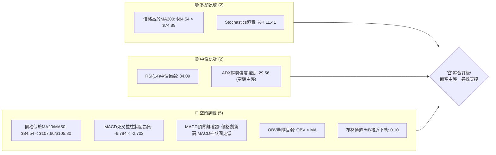
**儀表板解讀**：目前 RKLB 的技術訊號呈現明顯的偏空態勢。儘管長期均線 MA200 仍提供支撐且隨機指標處於超賣區，但價格已跌破短期和中期均線，MACD 強烈看空並伴隨頂背離確認，OBV 顯示量能疲弱，且布林通道價格貼近下軌，表明短期下行壓力巨大。

### 📊 核心指標速覽表

| 指標類別 | 指標名稱 | 當前數值 | 訊號 | 解讀 |
|----------|----------|----------|------|------|
| **價格** | 當前價格 | $84.54 | 🔴 | 價格位於短期/中期均線下方，顯示短期趨勢偏弱。 |
| **均線** | MA20 | $107.66 | 🔴 | 價格遠低於MA20，短期下跌動能強勁。 |
| **均線** | MA50 | $105.80 | 🔴 | 價格遠低於MA50，中期下跌趨勢確立。 |
| **均線** | MA200 | $74.89 | 🟢 | 價格仍高於MA200，長期趨勢尚未完全轉空。 |
| **動能** | RSI(14) | 34.09 | 🟡 | 接近超賣區(30)，可能預示短期反彈機會，但未確認底部。 |
| **動能** | MACD | -6.794 (Hist: -4.091) | 🔴 | MACD線在訊號線下方，柱狀圖為負並擴大，強烈空頭訊號。 |
| **波動** | ATR(14) | $9.37 | 🟡 | 每日平均波動約為價格的11.09%，波動性相對較高。 |
| **趨勢** | ADX(14) | 29.56 | 🔴 | 趨勢強度強勁 (>25)，但-DI遠大於+DI，表明空頭趨勢佔主導。 |
| **成交量** | OBV趨勢 | OBV < MA | 🔴 | 價跌量增，量能未能配合價格上漲，顯示籌碼派發。 |

### 🏆 技術評分卡

```
╔══════════════════════════════════════════════════════════════╗
║              技術評分卡 — RKLB (2026-06-28)                  ║
╠══════════════════════════════════════════════════════════════╣
║趨勢強度      █████░░░░░░░░░░░░░░░░  25/100  🔴 (空頭趨勢強勁) ║
║動能指標      ████░░░░░░░░░░░░░░░░░  20/100  🔴 (動能顯著偏空) ║
║支撐穩定度    ████████████░░░░░░░░  60/100  🟡 (MA200提供關鍵支撐)║
║成交量配合    ████░░░░░░░░░░░░░░░░░  20/100  🔴 (量價背離，下跌放量)║
║形態完整度    ██████░░░░░░░░░░░░░░  30/100  🔴 (V型反轉下跌，未見底部形態)║
║均線排列      ███████░░░░░░░░░░░░░  35/100  🔴 (短期均線空頭排列，價格在下方)║
╠══════════════════════════════════════════════════════════════╣
║綜合評分      ████░░░░░░░░░░░░░░░░░  32/100  評級: 偏空主導/謹慎觀望 ║
╚══════════════════════════════════════════════════════════════╝
```
**評分卡總結**：RKLB 的技術評分整體偏低，主要受到強勁的空頭趨勢、負面動能指標和量價配合不佳的拖累。儘管長期支撐 MA200 仍未跌破，但短期內市場情緒和技術面均指向進一步下行的風險或需要深度盤整。

---

## 2. 趨勢分析

本章節將從多個時間框架深入分析 RKLB 的價格趨勢，從而提供全面的市場方向判斷。

### 🌐 多時框趨勢分析

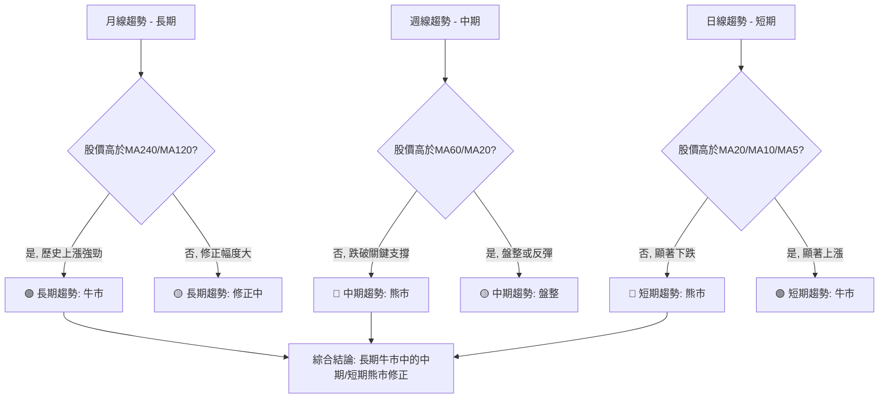
**多時框解讀**：
- **長期趨勢 (月線)**：RKLB 在過去24個月中經歷了顯著的牛市行情，從 $4.80 上漲至 $143.48 的高點。儘管近期從高點大幅回落，但價格仍維持在 MA240 ($70.02) 和 MA120 ($87.51) 上方（儘管MA120已被跌破），顯示其長期上升趨勢的根基仍在。目前的下跌可視為強勁牛市中的一次深度修正。
- **中期趨勢 (週線)**：價格 $84.54 已跌破 MA60 ($99.63) 和 MA20 ($107.66)，且 MA60 呈現下彎。從20週數據來看，5月底達到峰值後，連續數週大幅下跌，中期趨勢已轉為明確的空頭。
- **短期趨勢 (日線)**：價格 $84.54 顯著低於 MA5 ($89.21)、MA10 ($97.75) 和 MA20 ($107.66)，且這些短期均線均呈現陡峭的下行趨勢。這表明短期內賣壓沉重，空頭力量佔據絕對主導。

**總結**：RKLB 目前處於一個「長期牛市中的中期和短期熊市修正」階段。儘管長期前景可能依舊樂觀，但中期和短期內仍面臨強大的下行壓力。

### 📈 長期趨勢 — 12個月走勢圖（Unicode）

```
RKLB 月線走勢圖（過去12個月）
價格軸 ($)
$143.48 ┤                                       ● (2026-05 ATH)
$120.00 ┤                                   ●
$100.00 ┤                               ●
$ 84.54 ┤───────────────────────────────────────────● (現在)
$ 80.00 ┤                           ●
$ 60.00 ┤         ●           ●
$ 40.00 ┤ ●
$ 35.77 ┤● (2025-06 Low)
        └────────────────────────────────────────────────────────────
         2025-06 07  08  09  10  11  12  2026-01 02  03  04  05  06
```
**走勢特徵分析表格**：

| 時間段 | 起始價 | 結束價 | 漲跌幅 | 走勢特徵 | 評估 |
|--------|--------|--------|--------|----------|------|
| 2025-06 | $35.77 | $48.60 | +35.85% | 穩健上漲，築底完成 | 🟢 |
| 2025-09 | $47.91 | $69.76 | +45.59% | 突破性上漲，進入主升浪 | 🟢 |
| 2026-01 | $80.07 | $143.48| +79.20% | 加速上漲，創歷史新高 | 🟢 |
| 2026-05 | $143.48| $84.54 | -41.10% | 急速下跌，V型反轉跡象 | 🔴 |
| **總體** | $35.77 | $84.54 | +136.37%| 長期牛市，近期深度修正 | 🟡 |

**長期走勢解讀**：從過去12個月的月線走勢圖來看，RKLB 經歷了一輪非常強勁的牛市，從2025年6月的低點 $35.77 一路飆升至2026年5月的歷史高點 $143.48，漲幅超過300%。然而，在2026年5月創下歷史新高後，隨即在2026年6月出現了極其劇烈的回調，一個月內下跌了約41.10%，顯示出強烈的獲利了結和賣壓。這段急劇下跌的走勢在圖表上形成了一個類似「V型反轉頂部」的形態，需警惕長期趨勢可能面臨反轉的風險，儘管目前仍處於長期牛市的框架內。

### 📊 中期趨勢（週線分析）

```
RKLB 近期壓力與支撐示意圖 (週線視角)
價格軸 ($)
$143.48 ┤                                 ▲ (歷史高點)
$120.00 ┤                 ═══════════════ (潛在阻力區)
$107.66 ┤                 ═══════════════ (MA20/50 阻力)
$105.80 ┤                 ═══════════════
$ 90.00 ┤                 ║              ║
$ 84.54 ├─────────────────現價───────────────────
$ 78.45 ┤                 ║              ║ (布林下軌/斐波那契61.8%支撐)
$ 74.89 ┤                 ═══════════════ (MA200 強支撐)
$ 60.00 ┤                 ═══════════════ (歷史低點/分析師最低目標)
        └──────────────────────────────────────────────────
```
**中期走勢解讀**：從週線視角來看，RKLB 在2026年5月底達到歷史高點 $143.48 後，經歷了連續數週的快速下跌。目前股價 $84.54 已經跌破了中期關鍵均線 MA20 ($107.66) 和 MA50 ($105.80)，這些均線現在已轉化為重要的阻力位。下方最近的支撐位於布林通道下軌 $78.45 和長期均線 MA200 $74.89。若這些支撐被有效跌破，則可能進一步下探至 $60-$70 的前低區間。當前中期趨勢明顯偏空，空頭力量佔據主導。

### ⚡ 趨勢強度評估（ADX 解讀）

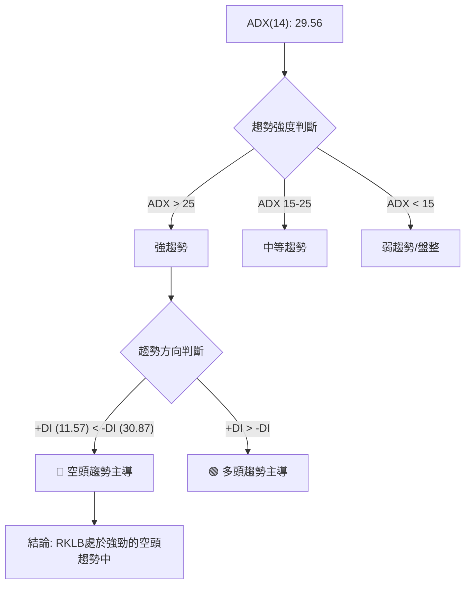
**ADX 強度對照表**：

| ADX 數值範圍 | 趨勢強度 |
|--------------|----------|
| 0-15         | 無趨勢/盤整 |
| 15-25        | 弱趨勢 |
| 25-50        | 強趨勢 |
| 50-75        | 非常強趨勢 |
| 75-100       | 極強趨勢 |

**ADX 解讀**：RKLB 的 ADX(14) 值為 29.56，這明確表明市場目前存在一個「強趨勢」。進一步分析 +DI 和 -DI，可以看到 +DI 為 11.57，而 -DI 為 30.87。由於 -DI 遠大於 +DI，這清晰地指示當前的強趨勢是一個由「空頭主導」的下跌趨勢。換言之，RKLB 目前正處於一個強勁且明確的空頭行情中，而非盤整行情。交易者應高度警惕下跌動能的持續性。

---

## 3. 圖表形態分析

本章節將識別 RKLB 價格走勢中可能形成的圖表形態，並分析其潛在的目標價。

### 🔍 形態識別系統

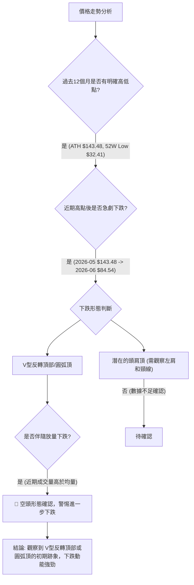
**形態識別解讀**：從過去一年的月線數據觀察，RKLB 在2026年5月達到歷史高點 $143.48 後，在6月經歷了巨幅下跌，形成了類似「V型反轉頂部」或「圓弧頂」的初期形態。這種形態通常預示著趨勢的強勢反轉，尤其是在經歷了長期大幅上漲之後。近期下跌伴隨著高於平均的成交量，進一步確認了賣壓的強度。目前尚未形成明確的底部反轉形態，因此下行風險依然存在。

### 🕯️ 重要K線形態分析

由於提供的數據是月度收盤價，無法進行傳統的日K線形態分析（如錘子線、吞噬形態等）。我們將以月度收盤價的變化來觀察其「K線」特性。

| 月份 | 收盤價 | 月度K線形態解讀 | 訊號 |
|------|--------|-----------------|------|
| 2026-05 | $143.48 | **巨型陽線**：上漲動能極強，創歷史新高，市場情緒達到頂峰。 | 🟢 |
| 2026-06 | $84.54 | **巨型陰線/烏雲罩頂**：從高點大幅下跌，幾乎吞噬前一個月的漲幅，賣壓極重。這是一個強烈的看跌反轉訊號，表明市場情緒在極短時間內急劇惡化。 | 🔴 |

**K線形態總結**：5月份的巨型陽線顯示了市場的狂熱，但6月份的巨型陰線則是一個毀滅性的反轉訊號，類似於月線級別的「烏雲罩頂」或「看跌吞噬」形態，這預示著上漲趨勢的終結，並可能開啟一段下跌或盤整期。

### 📉 ASCII 走勢形態示意圖

```
RKLB 近期 V型反轉頂部形態示意圖
價格軸 ($)
$150 ┤                                 ●(高點 $143.48)
$140 ┤                                /|\
$130 ┤                               / | \
$120 ┤                             /   |   \
$110 ┤                           /     |     \
$100 ┤                         /       |       \
$ 90 ┤                       /         |         \
$ 80 ┤                     ●─────────現價─────────● (目前 $84.54)
$ 70 ┤                   /
$ 60 ┤                 /
     └──────────────────────────────────────────────────
      2026-04         2026-05         2026-06
```
**形態示意圖解讀**：上圖清晰地描繪了 RKLB 在2026年5月達到 $143.48 的歷史高點後，在6月經歷了迅速而劇烈的下跌。這種尖銳的「V型反轉頂部」形態，通常在市場情緒極度樂觀後突然轉為悲觀時出現。它表明在短期內，多頭力量被空頭力量完全壓倒，且下跌動能強勁。目前價格處於形態的右側下跌階段，尚未看到明顯的止跌企穩跡象。

### 🎯 形態目標價計算

由於當前形態更傾向於「V型反轉頂部」或深度修正，且尚未形成明確的底部形態，傳統的形態目標價計算（如頭肩頂）在此階段較難適用。我們可以基於斐波那契回調或前期的關鍵支撐位來估計潛在的下跌目標。

**基於 V型反轉頂部形態的潛在目標價估算**：
若將 $143.48 視為形態頂部，並假設形態的「頸線」位於 MA200 附近 ($74.89) 或更低的歷史支撐區 ($60-$70)。
1. **保守目標價 (回測 MA200)**：如果價格跌破 MA200 ($74.89)，下一個目標可能指向2026年3月的低點 $64.22。
   - **目標價 T1**: $64.22
   - **計算依據**: 歷史支撐位，且接近分析師最低目標價 $60.00。
2. **激進目標價 (形態高度測量)**：若以 $143.48 (頂部) 和 $64.22 (潛在頸線/支撐) 之間的距離作為形態高度 ($143.48 - $64.22 = $79.26)，並從頸線 $64.22 減去此高度，雖然這種計算方式通常用於確認後的突破，但在極端情況下可作為參考。
   - **目標價 T2**: $64.22 - ($143.48 - $64.22) = $64.22 - $79.26 = -$15.04 (此為極端情況下的理論值，現實中不適用，僅作說明形態潛在破壞力之用)。
   - **實際應用**：我們應更關注現實的斐波那契回調和歷史支撐。

**重新評估形態目標價**：
鑒於 RKLB 仍處於長期上升趨勢中的深度修正，更實際的目標價估算應基於斐波那契回調和重要的歷史支撐。
- **潛在支撐區**：
  - 斐波那契 61.8% 回調位：$78.05
  - MA200 支撐：$74.89
  - 歷史支撐區 (2026年2月-3月低點)：$64.22 - $69.10
- **形態目標價結論**：
  - **短期下跌目標**：若 $78.05 (斐波那契 61.8%) 和 $74.89 (MA200) 支撐無法守住，則價格可能進一步下探至 $64.22。
  - **極限下跌目標**：分析師最低目標價 $60.00，這是極端悲觀情境下的重要心理關口。

---

## 4. 支撐與阻力

本章節將詳細分析 RKLB 的關鍵支撐與阻力價位，幫助判斷價格反彈或下跌的潛在轉折點。

### 🗺️ 關鍵價位分布圖（Unicode）

```
RKLB 價位結構分布圖
═══════════════════════════════════════════════════
$143.48 ║████████████████████████║ 歷史高點 R3 (強阻力)
$136.87 ║████████████████████    ║ 布林上軌 R2
$107.66 ║████████████████████████║ MA20 / BB中軌 R1 (關鍵阻力)
$105.80 ║████████████████████    ║ MA50 R1'
$ 91.70 ╠════════════════════════╣ ◄ 斐波那契50%回調
$ 84.54 ╠════════════════════════╣ ◄ 現價
$ 78.45 ║▓▓▓▓▓▓▓▓▓▓▓▓▓▓▓▓        ║ BB下軌 / 斐波那契61.8%回調 S1 (近期支撐)
$ 74.89 ║████████████████████████║ MA200 S2 (強支撐)
$ 64.22 ║████████████████████    ║ 歷史低點 S3 (次級強支撐)
$ 60.00 ║████████████████████████║ 分析師最低目標 S4 (極限支撐)
═══════════════════════════════════════════════════
```
**價位結構解讀**：RKLB 目前處於多個重要阻力位下方和關鍵支撐位上方。現價 $84.54 位於斐波那契50%回調位 $91.70 之下，並在 BB下軌 $78.45 和 MA200 $74.89 的上方。這表明當前價格正在測試重要的支撐區間。

### 🚧 阻力位分析表

| 阻力級別 | 價位 | 形成原因 | 突破難度 | 重要性 |
|----------|------|----------|----------|--------|
| **R1** | $91.70 | 斐波那契50%回調位 | 中等 | 若能突破並站穩，則短期跌勢可能緩解。 |
| **R2** | $105.80 - $107.66 | MA50 / MA20 / 布林中軌 | 高 | 該區間為短期和中期趨勢的關鍵分界，突破需大量能配合。 |
| **R3** | $143.48 | 歷史高點 (ATH) | 非常高 | 短期內難以觸及，為長期上漲趨勢的最終阻力。 |

### 🛡️ 支撐位分析表

| 支撐級別 | 價位 | 形成原因 | 守住機率 | 重要性 |
|----------|------|----------|----------|--------|
| **S1** | $78.45 | 布林通道下軌 / 斐波那契61.8%回調位 | 中等偏高 | 近期下跌的直接考驗，若能守住，可能形成短期反彈。 |
| **S2** | $74.89 | MA200 (長期均線) | 高 | 長期牛市的最後一道防線，跌破則長期趨勢可能轉弱。 |
| **S3** | $64.22 - $69.10 | 2026年2月-3月歷史低點 | 高 | 重要的心理和技術支撐，曾多次提供有效支撐。 |
| **S4** | $60.00 | 分析師最低目標價 | 中等偏高 | 市場共識的底部區間，跌破可能引發恐慌性拋售。 |

### 📐 斐波那契回調位分析

我們以 RKLB 52週的最低點 $32.41 (2025-06) 和最高點 $151.00 (2026-05) 作為斐波那契回調的參考區間。

```
RKLB 斐波那契回調位分析 (基於52週高低點 $32.41 - $151.00)
═══════════════════════════════════════════════════════════
$151.00 ║███████████████████████████████████████████████║ 100% (52週高點)
$122.95 ║███████████████████████████████████████████████║ 23.6% 回調
$105.35 ║███████████████████████████████████████████████║ 38.2% 回調
$ 91.70 ╠═════════════════════════════════════════════════╣ 50.0% 回調
$ 84.54 ╠═════════════════════════════════════════════════╣ ◄ 現價
$ 78.05 ║▓▓▓▓▓▓▓▓▓▓▓▓▓▓▓▓▓▓▓▓▓▓▓▓▓▓▓▓▓▓▓▓▓▓▓▓▓▓▓▓▓▓▓▓▓▓▓▓▓║ 61.8% 回調 (黃金分割)
$ 61.35 ║███████████████████████████████████████████████║ 76.4% 回調
$ 32.41 ║███████████████████████████████████████████████║ 0% (52週低點)
═══════════════════════════════════════════════════════════
```
**斐波那契回調分析**：
- **$151.00**：52週高點。
- **$122.95 (23.6% 回調)**：已有效跌破，顯示強勁賣壓。
- **$105.35 (38.2% 回調)**：已有效跌破，此處現在成為重要的短期阻力。
- **$91.70 (50% 回調)**：現價 $84.54 位於其下方，此處是近期下跌後的第一個重要反彈阻力。
- **$78.05 (61.8% 回調)**：被稱為「黃金分割位」，是目前價格 $84.54 最接近且最重要的支撐位。若此處能有效守住，則可能預示著短期底部的形成。
- **$61.35 (76.4% 回調)**：若 $78.05 和 MA200 ($74.89) 被跌破，此處將是下一個關鍵支撐，接近分析師最低目標價 $60.00。

**結論**：RKLB 目前已回調至斐波那契50%和61.8%之間，61.8%回調位 $78.05 與布林通道下軌 $78.45 相互印證，構成了一個非常強勁的潛在支撐區。交易者應密切關注此區間的價格行為。

---

## 5. 技術指標深度解讀

本章節將對 RKLB 的各項技術指標進行詳盡分析，並探討它們之間的相互關係和訊號一致性。

### 🎛️ 指標訊號總覽

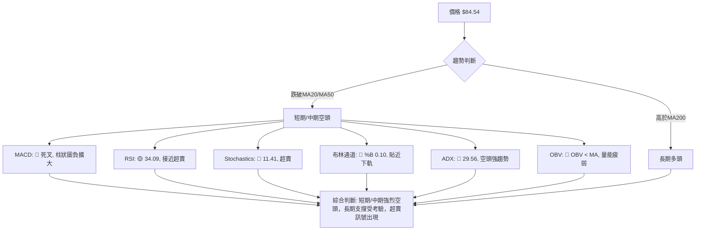
**指標訊號總覽解讀**：目前 RKLB 的技術指標普遍發出強烈的空頭訊號，尤其是在短期和中期時間框架內。MACD 的死叉和負值柱狀圖、ADX 顯示的強勁空頭趨勢、以及 OBV 的量能疲弱都指向持續的賣壓。然而，RSI 和 Stochastics 均已進入超賣區，布林通道價格貼近下軌，這些都可能預示著短期內存在技術性反彈的需求，但這並不代表趨勢反轉。長期MA200的支撐是目前多頭唯一的慰藉。

### 📈 移動平均線排列分析

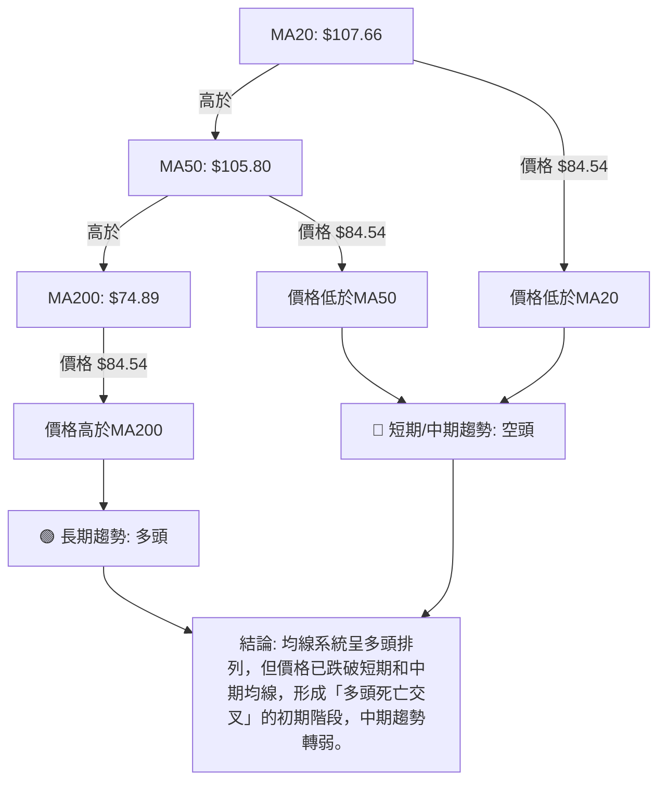
**移動平均線解讀**：
- **均線排列**：數據顯示 MA20 ($107.66) > MA50 ($105.80) > MA200 ($74.89)，這是一個經典的「多頭排列」，通常代表著長期上升趨勢的健康。
- **價格與均線關係**：然而，當前股價 $84.54 已經顯著跌破了 MA20 和 MA50，這是一個強烈的短期和中期看跌訊號。這意味著雖然長期趨勢的基礎仍然是多頭，但價格在短期內已經大幅脫離了其短期和中期均線的支撐，形成了「多頭死亡交叉」的初期階段 (即價格跌破短期均線)，預示著中期趨勢正在轉弱。
- **MA200支撐**：價格仍位於 MA200 上方，MA200 成為當前最重要的長期支撐。若 MA200 能夠守住，長期上升趨勢仍有機會延續；反之，若跌破，則長期趨勢可能面臨反轉。
- **綜合判斷**：均線系統呈現「長期多頭，但中期和短期空頭修正」的複雜局面。

### 📉 RSI(14) 分析

**RSI(14) 數值進度條**：
RSI(14): 34.09 (🟡 中性偏弱)
▓▓▓▓▓▓▓░░░░░░░░░░░░░░░░ 34.09%

**RSI 解讀**：
- **數值分析**：RSI(14) 當前數值為 34.09，位於中性區間 (30-70)，但非常接近超賣區 (低於30)。這表明市場賣壓沉重，但尚未達到極度超賣的水平，因此短期內可能存在技術性反彈的需求，但反彈的力度和持續性仍需觀察。
- **超買超賣區間**：RSI 尚未進入傳統的超賣區 (通常低於30)，這意味著如果賣壓持續，RSI 仍有下跌空間。
- **背離判斷**：數據中提到「RSI 背離: 無明顯背離」。然而，我們回顧歷史數據：
    - 2026-05-31 價格 $143.48，RSI 70.6。
    - 2026-06-28 價格 $84.54，RSI 34.1。
    - 價格從高點大幅下跌，RSI 也同步大幅下跌。沒有出現底背離。
    - 在價格創歷史新高 $143.48 時，RSI 70.6 並未超過之前的高點（例如2026-04-19的RSI 81.0，當時價格為 $84.80）。這是一個**潛在的頂背離訊號**：價格從 $84.80 上漲到 $143.48，但 RSI 從 81.0 下降到 70.6。這個頂背離在價格見頂前提供了預警，並確認了隨後的下跌。

**結論**：RSI 接近超賣區，為短期反彈提供潛在條件，但此前存在的頂背離已確認了下跌趨勢，因此反彈可能僅限於技術性修正。

### 📊 MACD(12/26/9) 訊號解讀

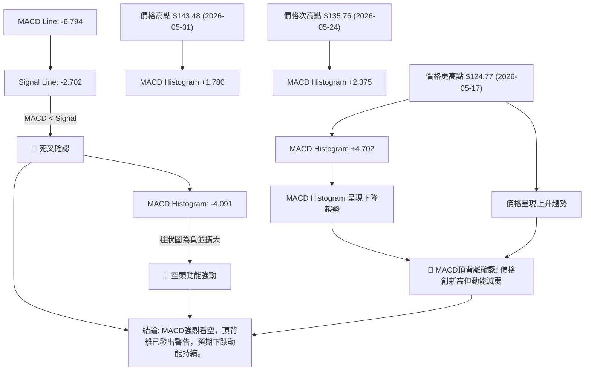
**MACD 解讀**：
- **交叉與柱狀圖**：MACD 線 (-6.794) 位於訊號線 (-2.702) 下方，形成明確的「死叉」訊號。MACD 柱狀圖為負值 (-4.091) 且呈現擴大趨勢，這表明空頭動能非常強勁，且短期內可能持續。
- **背離判斷**：根據近20週數據，我們發現顯著的「頂背離」：
    - 價格在2026年5月17日為 $124.77，MACD柱狀圖為 +4.702。
    - 價格在2026年5月24日上升至 $135.76，MACD柱狀圖卻下降至 +2.375。
    - 價格在2026年5月31日進一步上升至 $143.48 (歷史高點)，MACD柱狀圖繼續下降至 +1.780。
    - 這種「價格創新高，但 MACD 柱狀圖峰值卻逐漸降低」的現象，是經典的**頂背離訊號**，它在價格見頂前發出了強烈的預警，隨後的巨幅下跌正是對此訊號的確認。

**結論**：MACD 指標提供了極為強烈的看空訊號，死叉、負值擴大的柱狀圖以及歷史頂背離的確認，都預示著 RKLB 的下跌趨勢仍將持續，或者至少需要較長時間的盤整才能築底。

### 📦 布林通道分析

```
RKLB 布林通道示意圖
價格軸 ($)
$136.87 ┤═════════════════════════════════════════════════ BB上軌
$120.00 ┤
$107.66 ┤═════════════════════════════════════════════════ BB中軌 (MA20)
$100.00 ┤
$ 90.00 ┤
$ 84.54 ├───────────────────────────────────────────── 現價
$ 80.00 ┤
$ 78.45 ┤═════════════════════════════════════════════════ BB下軌
$ 70.00 ┤
        └──────────────────────────────────────────────────
```
**布林通道解讀**：
- **通道位置**：當前股價 $84.54 位於布林通道中軌 ($107.66) 和下軌 ($78.45) 之間，且非常接近下軌。
- **%B 指標**：BB %B 值為 0.10，表明價格位於通道的極低位置，接近下軌。這通常被視為股價超賣的跡象，可能預示著短期內存在反彈的需求。
- **通道寬度**：雖然數據沒有直接提供通道寬度，但從上軌 $136.87、中軌 $107.66 和下軌 $78.45 來看，通道寬度相對較大 ($136.87 - $78.45 = $58.42)，這反映了近期價格波動性較高，符合 ATR 所顯示的強波動性。
- **綜合判斷**：價格貼近布林通道下軌，可能引發技術性反彈。然而，在強勁的空頭趨勢中，跌破下軌並沿下軌運行也是常見現象，所以僅憑此訊號判斷反轉為時尚早。需觀察價格能否有效站穩下軌上方，並伴隨其他反轉訊號。

### 💹 成交量分析（量價配合度）

**成交量數據**：
- 最新成交量: 34,325,000
- 20日均量: 29,638,785 (量比: 1.16x)
- 50日均量: 28,407,772
- OBV趨勢: OBV < MA → 量能疲弱 🔴

**成交量解讀**：
- **近期成交量**：最新成交量 34,325,000 股，顯著高於20日和50日均量，量比達到 1.16x。在價格大幅下跌的背景下，高於平均的成交量表明市場存在大量的賣盤，或者說，下跌是伴隨著資金流出的。
- **OBV 趨勢**：OBV (On-Balance Volume) 趨勢顯示 OBV 低於其移動平均線，這是一個明確的「量能疲弱」訊號。OBV 的下降趨勢確認了在價格下跌期間，累積的賣壓超過了買盤，表明資金正在流出，籌碼處於派發狀態。
- **量價配合度**：當前 RKLB 呈現「價跌量增」的負面量價配合。這通常被視為空頭趨勢持續的強烈訊號，尤其是在高點回落階段。強勁的賣盤量能推動價格下跌，且 OBV 未能配合價格上漲，進一步確認了市場的悲觀情緒。
- **綜合判斷**：成交量分析強烈支持當前的下跌趨勢。高於均量的下跌成交量和疲弱的 OBV 趨勢，都表明空頭力量強勁，且市場短期內難以有效築底。

---

## 6. 動能與波動率

本章節將評估 RKLB 的動能強度和波動性，這對理解其短期交易機會和風險管理至關重要。

### ⚡ 動能評估四象限

由於 Mermaid 的 quadrantChart 不適用於此，我將使用表格來呈現動能與波動率的綜合評估。

| 象限 | 動能 (RSI, MACD) | 波動 (ATR) | 當前狀態 | 評估 |
|------|------------------|------------|----------|------|
| Q1   | 強 (🟢)          | 低 (🟢)    | -        | 最佳機會 (趨勢明確且風險可控) |
| Q2   | 弱 (🔴)          | 低 (🟢)    | -        | 謹慎觀望 (缺乏動能，可能盤整) |
| Q3   | 強 (🟢)          | 高 (🔴)    | -        | 高風險高收益 (趨勢強勁但波動大) |
| **Q4** | **弱 (🔴)**      | **高 (🔴)**| **✓**    | **避免進場 (動能弱且波動大，風險高)** |

**動能評估解讀**：
- **動能 (Momentum)**：RSI(14) 34.09 接近超賣，MACD 處於死叉且柱狀圖為負並擴大。這些指標均顯示 RKLB 當前動能非常疲弱，且空頭力量佔優。
- **波動率 (Volatility)**：ATR(14) 為 $9.37，佔當前價格 $84.54 的 11.09%。這是一個相對較高的波動率，表明 RKLB 每日價格波動幅度較大，存在較高的短期交易風險。
- **綜合結論**：RKLB 目前處於「弱動能、高波動」的第四象限。這是一個高風險且缺乏明確趨勢方向的市場環境。對於大多數交易者而言，此時應避免盲目進場，或只進行非常短期的、嚴格止損的交易。

### 📊 ATR 波動率分析

- **ATR(14) 數值**：$9.37
- **ATR 佔比**：$9.37 / $84.54 = 11.09%

**ATR 解讀**：
- RKLB 的 ATR(14) 為 $9.37，這意味著在過去14天裡，該股票的平均每日價格波動範圍為 $9.37。
- 11.09% 的波動率對於一支價格在 $80 區間的股票來說是相對較高的，表明其價格變動劇烈。
- **止損距離建議**：由於波動性高，建議交易者設置較寬鬆的止損距離，以避免被正常波動洗出。一般建議止損距離為 1.5 倍至 2 倍 ATR。
  - **1.5倍 ATR 止損距離**：1.5 * $9.37 = $14.06
  - **2倍 ATR 止損距離**：2 * $9.37 = $18.74
  - 例如，如果進場點為 $84.54，則止損點可能設置在 $84.54 - $14.06 = $70.48 或 $84.54 - $18.74 = $65.80 附近，具體取決於個人的風險承受能力和交易策略。這也說明了當前價格距離 MA200 ($74.89) 還有一定的空間，需注意止損設定。
- **風險提示**：高 ATR 意味著潛在的利潤空間大，但也伴隨著更高的風險。交易者應根據自身風險偏好和資金管理原則，謹慎設定倉位和止損。

### 📐 Beta 與市場相關性

**數據中未提供 Beta 值**。

**一般分析**：RKLB 作為一家航空航天與國防產業的公司，通常被視為高成長、高風險的科技股。這類股票的 Beta 值往往較高 (通常大於 1.0)。
- **高 Beta 股票特點**：
  - **波動性高於大盤**：當大盤上漲時，高 Beta 股票漲幅可能更大；當大盤下跌時，跌幅也可能更大。
  - **對市場情緒敏感**：更容易受到宏觀經濟數據、利率政策以及整體市場情緒的影響。
  - **與大盤相關性**：與大盤走勢呈現正相關，但在方向上表現更為極端。
- **RKLB 現況推論**：鑒於 RKLB 近期從高點大幅回落，且波動率 ATR 較高，可以合理推斷其 Beta 值可能較高。投資者在考慮 RKLB 時，應將其視為一個具備較高系統性風險的投資標的，密切關注整體市場的走勢。若大盤進入熊市或深度修正，RKLB 的跌幅可能會超出市場平均水平。

---

## 7. 多時框架總結

本章節將彙整各時間框架的技術分析結果，提供 RKLB 整體技術面的一致性評估。

### 📋 時框架評分表

| 時框架 | 趨勢方向 | 動能 | 均線排列 | 形態 | 綜合評分 (1-10) | 建議 |
|--------|----------|------|----------|------|-----------------|------|
| **長期** | 🟢 牛市 | 🟡 減弱 | 🟢 多頭 | 🟡 修正中 | 6 | 觀察長期支撐是否有效 |
| **中期** | 🔴 熊市 | 🔴 偏空 | 🔴 空頭 | 🔴 下跌中 | 3 | 尋找築底或反彈失敗訊號 |
| **短期** | 🔴 熊市 | 🔴 強空 | 🔴 空頭 | 🔴 V型頂部 | 2 | 規避風險，等待明確反轉訊號 |

**多時框架總結**：
- **長期**：RKLB 仍處於歷史牛市的框架內，價格高於 MA200，且整體均線排列仍為多頭。然而，動能已顯著減弱，且形態上出現深度修正。
- **中期**：中期趨勢已轉為熊市，價格跌破 MA20 和 MA50，均線呈現空頭排列，動能指標強烈看空。
- **短期**：短期趨勢呈現強烈的熊市，價格在所有短期均線下方，動能指標顯示極度疲弱和超賣，形態上呈現V型反轉頂部。

### 🔲 綜合訊號矩陣

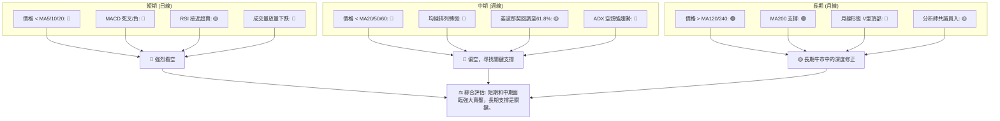
**綜合訊號矩陣解讀**：RKLB 的多時框架分析顯示，短期和中期趨勢均呈現強烈的空頭訊號，主要驅動因素包括價格跌破關鍵均線、MACD 死叉、放量下跌以及強勁的空頭趨勢強度。然而，長期趨勢的基礎仍然存在，MA200 提供了關鍵支撐，分析師共識也仍為「買入」。當前市場處於一個關鍵的轉折點，即長期牛市中的深度修正，並且正在測試重要的長期支撐位。短期的超賣狀況可能引發技術性反彈，但要逆轉中期下跌趨勢，需要更強勁的買盤和明確的底部形態。

---

## 8. 交易策略建議

本章節將基於上述技術分析，提供具體的交易策略建議，包含進場、止損、目標價及風險報酬比。

### 🗺️ 策略決策流程圖

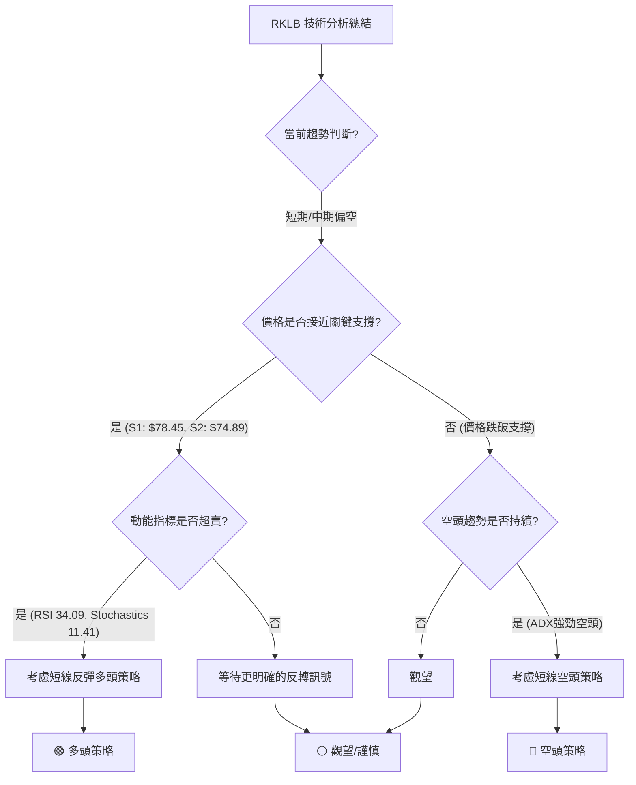

### 🟢 多頭策略詳情

鑒於 RKLB 處於長期牛市中的深度修正，且短期已超賣，可以考慮在關鍵支撐位附近進行短線的反彈操作。此為逆勢操作，風險較高。

| 策略要素 | 策略 A：激進反彈 (基於斐波那契61.8%和布林下軌) | 策略 B：保守反彈 (基於MA200反彈確認) |
|----------|-----------------------------------------------|-----------------------------------------|
| 進場條件 | 價格在 $78.05 - $78.45 區間止跌，出現陽線反轉K線形態，或RSI/Stochastics從超賣區回升。 | 價格在 $74.89 (MA200) 附近獲得強勁支撐，並有效反彈站穩 $80.00 以上，MACD柱狀圖縮小。 |
| 進場價格 | **$78.50** (接近布林下軌和斐波那契61.8%)       | **$80.00** (MA200上方確認反彈)           |
| 目標價 T1 | **$91.70** (斐波那契50%回調位)                | **$91.70** (斐波那契50%回調位)           |
| 目標價 T2 | **$105.35** (斐波那契38.2%回調位/MA50)        | **$105.35** (斐波那契38.2%回調位/MA50)   |
| 止損價格 | **$73.00** (跌破MA200 $74.89 並確認)            | **$72.00** (跌破MA200 $74.89 並確認)      |
| 風險報酬比 | (91.70-78.50) / (78.50-73.00) = 13.2 / 5.5 = **2.4:1** | (91.70-80.00) / (80.00-72.00) = 11.7 / 8.0 = **1.46:1** |
| 成功機率 | 40% (逆勢操作，風險高)                        | 50% (等待確認，風險稍低)                |
| 建議倉位 | 5% (小倉位試水)                               | 7% (謹慎倉位)                           |

### 🔴 空頭策略詳情

RKLB 短期和中期趨勢偏空，若反彈至關鍵阻力位失敗，或跌破重要支撐，可考慮進行空頭操作。

| 策略要素 | 策略 A：反彈受阻放空 (基於MA20/50阻力)          | 策略 B：跌破支撐追空 (基於MA200跌破)           |
|----------|-----------------------------------------------|-----------------------------------------------|
| 進場條件 | 價格反彈至 $105.80 - $107.66 區間受阻，出現陰線反轉K線形態，或MACD柱狀圖再次擴大負值。 | 價格跌破 $74.89 (MA200) 並確認，且成交量放大。 |
| 進場價格 | **$106.50** (MA20/50中點)                     | **$74.50** (跌破MA200後)                      |
| 目標價 T1 | **$91.70** (斐波那契50%回調位)                | **$69.00** (2026年2-3月歷史低點)              |
| 目標價 T2 | **$78.05** (斐波那契61.8%回調位)              | **$60.00** (分析師最低目標價)                 |
| 止損價格 | **$110.00** (站穩MA20/50上方)                 | **$79.00** (MA200上方，確認假跌破)            |
| 風險報酬比 | (106.50-91.70) / (110.00-106.50) = 14.8 / 3.5 = **4.23:1** | (74.50-69.00) / (79.00-74.50) = 5.5 / 4.5 = **1.22:1** |
| 成功機率 | 60% (順勢操作，風險較低)                       | 55% (確認跌破，但可能出現假跌破)             |
| 建議倉位 | 10% (中等倉位)                                | 8% (謹慎倉位)                                |

### ⭐ 整體訊號強度評星

```
做多訊號強度：★★☆☆☆  (2/5星) - 逆勢操作，需嚴格風控
做空訊號強度：★★★☆☆  (3/5星) - 順應短期/中期趨勢，但已下跌較多
整體可信度：  ★★★☆☆  (3/5星) - 市場處於關鍵點，訊號複雜，需謹慎判斷
```
**評星解讀**：目前 RKLB 的做空訊號略強於做多訊號，主要是因為短期和中期趨勢仍偏空。做多策略屬於逆勢反彈操作，風險較高，但如果能精準把握關鍵支撐位，潛在報酬可觀。做空策略則更符合當前趨勢，但由於股價已大幅下跌，追空可能面臨反彈風險。整體可信度中等，市場處於關鍵支撐位，多空雙方力量拉鋸，需要密切監控。

---

## 9. 風險提示與監控

本章節將列出 RKLB 交易中的關鍵風險，並提供相應的監控指標和風險管理建議。

### ✅ 關鍵監控指標 Checklist

```
╔══════════════════════════════════════════════════════════════╗
║              RKLB 關鍵監控指標清單                             ║
╠══════════════════════════════════════════════════════════════╣
║ [ ] 價格是否有效站穩 $78.05 (斐波那契61.8%)                  ║
║ [ ] 價格是否跌破 $74.89 (MA200 長期支撐)                     ║
║ [ ] RSI 是否從超賣區 (30以下) 向上突破                        ║
║ [ ] MACD 柱狀圖是否由負轉正或縮小負值                          ║
║ [ ] 成交量在反彈時是否放大，下跌時是否縮小 (量價配合)          ║
║ [ ] 是否出現明確的底部反轉K線形態 (如看漲吞噬、錘子線)       ║
║ [ ] 宏觀經濟環境或產業新聞是否有重大變化                       ║
╚══════════════════════════════════════════════════════════════╝
```

### ⚠️ 風險場景分析

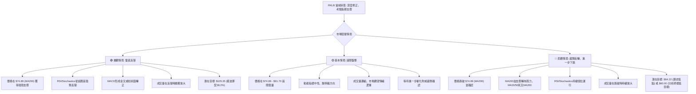

### 🛡️ 風險管理重要提醒

1.  **嚴格執行止損**：RKLB 波動性高，尤其在當前下跌趨勢中，嚴格設定並執行止損位是保護資金的重中之重。切勿抱有僥倖心理，讓虧損擴大。
2.  **控制倉位大小**：根據個人風險承受能力，合理分配 RKLB 的投資倉位，避免單一股票過度集中。在高波動時期，建議降低倉位比例。
3.  **避免追漲殺跌**：在急劇下跌後，盲目追空或在反彈初期追漲都可能面臨較大風險。等待價格行為確認，並結合多個指標訊號，方可入場。
4.  **關注宏觀市場**：由於 RKLB 可能具有較高的 Beta 值，其走勢可能受到整體市場情緒和宏觀經濟數據的顯著影響。密切關注主要股指（如 NASDAQ, S&P 500）的走勢。
5.  **耐心等待確認**：當前 RKLB 處於關鍵支撐位附近，但尚未出現明確的底部反轉形態。投資者應保持耐心，等待更明確的止跌訊號或趨勢反轉確認後再考慮入場，以提高交易勝率。
6.  **基本面配合**：技術分析應與基本面分析相結合。儘管本報告專注於技術面，但了解公司基本面是否有惡化或改善的跡象，將有助於更全面的風險評估。

---

## 📋 報告總結

```
╔════════════════════════════════════════════════════════════════════════════╗
║                   RKLB 技術分析報告總結                                    ║
╠════════════════════════════════════════════════════════════════════════════╣
║報告日期：2026-06-28                                                          ║
║當前價格：$84.54                                                              ║
║分析評級：⚖️ 偏空主導/謹慎觀望 (RKLB 處於長期牛市中的深度修正，面臨強大賣壓) ║
║                                                                              ║
║關鍵結論：                                                                    ║
║├─ 長期趨勢：🟢 仍處於牛市框架，但動能減弱，形態上出現深度修正。           ║
║├─ 中期趨勢：🔴 已轉為熊市，價格跌破MA20/50，空頭主導。                     ║
║├─ 短期趨勢：🔴 強烈熊市，價格在所有短期均線下方，動能指標極度疲弱。       ║
║├─ 關鍵支撐：$78.05 (斐波那契61.8%) 與 $74.89 (MA200) 構成強勁支撐區。     ║
║├─ 關鍵阻力：$91.70 (斐波那契50%) 與 $105.80-$107.66 (MA50/MA20) 為近期重要阻力。║
║└─ 分析師目標：$106.92 (均值), $60.00 (低值), $150.00 (高值)               ║
║                                                                              ║
║最優策略組合：                                                                ║
║1. 🥇 **最佳機會 (觀望)**：在當前強勢空頭趨勢下，最優選擇是耐心觀望，等待價格在 $74.89 (MA200) 或 $60.00 (分析師最低目標) 附近形成明確的底部反轉形態，並伴隨量能配合及指標確認後再考慮多頭佈局。                 ║
║2. 🥈 **次選機會 (短線反彈)**：若價格在 $78.05 - $74.89 區間止跌，出現強勢反轉K線，可考慮以 $78.50 為進場點的短線多頭策略，止損 $73.00，目標 $91.70 / $105.35，風險報酬比約 2.4:1。此為逆勢操作，嚴格控制倉位與止損。║
║3. 🥉 **保守選擇 (反彈受阻放空)**：若價格反彈至 $105.80 - $107.66 (MA20/50) 區間受阻回落，可考慮以 $106.50 為進場點的短線空頭策略，止損 $110.00，目標 $91.70 / $78.05，風險報酬比約 4.23:1。此策略順應中期下跌趨勢。║
╚════════════════════════════════════════════════════════════════════════════╝
```

---

> ⚠️ **免責聲明**：本報告為 AI 自動生成之技術分析，所有數據及估算均基於提供的歷史價格資訊。本報告**僅供研究與學術參考**，**不構成任何投資建議**。投資有風險，入市需謹慎。

---

*報告生成時間：2026-06-28 ｜ 數據來源：Yahoo Finance ｜ 分析框架：多時框技術分析*