<details>
<summary>📊 靜態圖表 (點擊展開)</summary>

</details>

<html>
<head><meta charset="utf-8" /></head>
<body>
    <div style="height:500px; width:100%;">                        <script>window.PlotlyConfig = {MathJaxConfig: 'local'};</script>
        <script charset="utf-8" src="https://cdn.plot.ly/plotly-3.6.0.min.js" integrity="sha256-QaOVwtVY0T02VaHrr6pnoHLCwayMJp4O5n4YyaE3rJk=" crossorigin="anonymous"></script>                <div id="candlestick-chart" class="plotly-graph-div" style="height:100%; width:100%;"></div>            <script>                window.PLOTLYENV=window.PLOTLYENV || {};                                if (document.getElementById("candlestick-chart")) {                    Plotly.newPlot(                        "candlestick-chart",                        [{"close":{"dtype":"f8","bdata":"AAAAgMIVR0AAAABACjdIQAAAACCFq0pAAAAAwB4FS0AAAAAgXJ9HQAAAAIA9CkhAAAAAQAqXR0AAAADAHuVHQAAAACCu50hAAAAA4Hp0SkAAAADgUVhIQAAAAOCjUEdAAAAAoEchR0AAAACgR4FHQAAAAOB69EdAAAAAACn8R0AAAAAAKTxKQAAAAOB6FExAAAAAAABATUAAAACgR8FOQAAAAADXU1BAAAAAQOGaUEAAAADgoxBQQAAAAEDhWlBAAAAAgOsBUUAAAACgR1FRQAAAAAAAwFBAAAAAoEeRUEAAAABgZtZQQAAAAKCZWVBAAAAA4FFITkAAAADA9chPQAAAAADXI1BAAAAAIK5nUEAAAAAAAOBPQAAAAIA9ilBAAAAAgMJ1TkAAAACgcH1PQAAAACCFq05AAAAAwPVITEAAAACAwjVMQAAAAIAUzkhAAAAAgOvRSUAAAABAM\u002fNJQAAAAGC4nklAAAAAACn8SEAAAAAAAKBGQAAAAMAexUZAAAAAIK6nRUAAAAAA12NFQAAAACBcz0VAAAAAoHC9Q0AAAABgZiZEQAAAAKCZOUVAAAAAwMxMRUAAAABACvdEQAAAAIDrEUVAAAAAIFwvREAAAABAM\u002fNEQAAAAAApXEZAAAAAIFyvSEAAAABACodIQAAAACCux0lAAAAAQAq3SkAAAABgj8JMQAAAAADXw09AAAAAYLi+TkAAAADgerRLQAAAAGC4vktAAAAAQOH6SkAAAACAwvVNQAAAAKBHoVFAAAAAQDNjU0AAAAAghUtTQAAAACCFS1NAAAAAoJmpUUAAAAAgrodRQAAAAMDMnFFAAAAA4KNwUUAAAAAgXP9SQAAAAMD1iFNAAAAAgOuBVUAAAADAHgVVQAAAAMAexVRAAAAAYGY2VUAAAACgmflVQAAAAMAepVVAAAAAQDPzVkAAAADgo7BWQAAAAEAzE1hAAAAAgD1KVkAAAADgevRVQAAAAGC4\u002flVAAAAAoJk5VkAAAABguB5UQAAAAAAAwFVAAAAA4HokVkAAAAAghWtVQAAAAOB6BFRAAAAAoJmJUkAAAACgR1FUQAAAAEAKR1JAAAAA4HqUUEAAAADgehRSQAAAAIDC9VJAAAAAgOsBUkAAAAAgrmdRQAAAAOCjgFBAAAAAACncUEAAAADA9XhRQAAAAEDhmlJAAAAAwB4lU0AAAABACrdRQAAAAKBwjVFAAAAAgBR+UUAAAADAzIxRQAAAAKCZKVJAAAAAYGZGUUAAAACAFL5RQAAAAOBRiFFAAAAAgD36UUAAAAAAAIBRQAAAAEAKh1FAAAAAYLjeUUAAAAAghTtRQAAAAKBw\u002fVFAAAAAIK4XUUAAAACAPRpRQAAAAADX01FAAAAAgMKlU0AAAABguF5RQAAAACCF+1FAAAAAYLjOUEAAAAAAAABRQAAAAOB6hFBAAAAA4FE4UkAAAAAAKXxQQAAAAEAKd05AAAAA4KOwTEAAAACAFA5QQAAAAKBHYVBAAAAAYLjuUEAAAABA4epQQAAAAOB6lFBAAAAAwB5FUUAAAAAgXK9QQAAAAEAzA1FAAAAAIK6nUUAAAACAFA5SQAAAAGBmZlJAAAAAIIW7VEAAAABAMzNVQAAAAKBwXVZAAAAAwPWoVUAAAABgj4JWQAAAAGBmJlVAAAAAIIXrU0AAAABgj5JUQAAAAIDCpVNAAAAAoEdBU0AAAADgo6BUQAAAAADXs1NAAAAAANcTVEAAAADgo7BTQAAAAKCZKVVAAAAAwB6lU0AAAACAFF5aQAAAAGBmVl1AAAAAANdjXUAAAACgmQlfQAAAAKCZkWBAAAAAoEcxX0AAAADAHmVgQAAAAADX019AAAAAwPXIYEAAAADAzFxfQAAAAOBR+GBAAAAAYGbmYUAAAAAgXMdiQAAAAMD1gGJAAAAAIFzvYUAAAADA9ZheQAAAAOB61F5AAAAAwMysXEAAAADAzPxdQAAAAMAehVtAAAAAoJlpXEAAAABguA5bQAAAAEAzQ1pAAAAAgOuxXEAAAADA9ZhZQAAAAAAAUFtAAAAA4FEoWkAAAABguP5aQAAAACBcz1pAAAAAYI8SWUAAAAAgrsdXQAAAAIA9WlVAAAAAACksVEAAAABgjyJVQA=="},"high":{"dtype":"f8","bdata":"AAAAgBQOSEAAAADAHtVIQAAAAADXA0tAAAAAgMKVS0AAAACAPQpKQAAAAMAeRUhAAAAA4FGYSEAAAABACndIQAAAAKBHIUlAAAAAYDkUS0AAAACgcD1KQAAAACBcT0hAAAAA4FHYR0AAAADAzAxIQAAAAGC4\u002fkdAAAAAgMK1SEAAAABAM1NKQAAAACAxeExAAAAAoEehTUAAAAAgrkdPQAAAAAAtIlFAAAAAYI8iUUAAAAAAAGBSQAAAAAApnFFAAAAAQOFqUUAAAACAFH5SQAAAAAAAEFJAAAAAAAAgUUAAAAAghQtSQAAAAGCPAlFAAAAAoEcBUEAAAADAzCxQQAAAACCFi1BAAAAAYGaWUEAAAABgj6JQQAAAAMD12FBAAAAAIIVLUEAAAACgmblPQAAAAMDMjE9AAAAAYLi+TUAAAAAA16NMQAAAAEDhGkxAAAAAwMwMSkAAAAAAAEBLQAAAAEDhekxAAAAAgD2qS0AAAADgo7BIQAAAAAApnEdAAAAAwEvXRkAAAACAFM5FQAAAAADXQ0ZAAAAAoEchR0AAAACAwoVEQAAAAADXQ0VAAAAAQApnRUAAAAAghctFQAAAAKCZWUVAAAAAYGamREAAAABguH5FQAAAAGC4XkZAAAAAQArXSEAAAACgmdlIQAAAACBcL0pAAAAAAADgSkAAAACAPWpNQAAAAKCZCVBAAAAAIIVLUEAAAAAA1yNQQAAAAKBwXUxAAAAA4Hp0TEAAAAAAACBOQAAAAADXo1FAAAAAwMycU0AAAAAghctTQAAAAMAe9VNAAAAAIFw\u002fU0AAAAAgXC9SQAAAAAAprFJAAAAAQItMUkAAAAAgXA9TQAAAAAAAkFNAAAAAAACQVUAAAACgcH1VQAAAACCud1ZAAAAAIIUbVkAAAACAwjVWQAAAAOCnblZAAAAAACkMV0AAAABAYB1XQAAAAMAe5VhAAAAAoEeRWEAAAAAAANBWQAAAAKCZWVZAAAAAwMycV0AAAACAPcpVQAAAAAAAwFVAAAAAQDNzVkAAAAAAAEBWQAAAAOB6VFZAAAAAwMwsVEAAAADgelRUQAAAAGBmVlRAAAAAIFw\u002fUkAAAACAPSpSQAAAAEAzM1NAAAAAQAr3UkAAAACgmVlSQAAAAMDMHFFAAAAAYGZmUUAAAAAgXL9RQAAAAMD18FJAAAAAQApHU0AAAADAzIxTQAAAAAAA0FFAAAAAIIWDUUAAAABgZvZRQAAAACBcL1JAAAAAgMJlUUAAAABgZgZSQAAAAAAAUFJAAAAAYGaGUkAAAAAA1xNSQAAAAEAKx1JAAAAAAAAIUkAAAAAA1ztSQAAAAEAzU1JAAAAAYGYmUkAAAAAA19NRQAAAAOBRGFJAAAAAQOGqU0AAAADgUThTQAAAAGC4LlJAAAAAYLh+UkAAAADAzFxRQAAAAGBmJlFAAAAAANfDUkAAAACAwgVSQAAAAIAUhlBAAAAAgOvRTkAAAADAHiVQQAAAAEDhKlFAAAAAwPVYUUAAAADgepRRQAAAAEAzE1FAAAAAgMBqUkAAAABgj3JRQAAAAADXg1FAAAAAQDPjUUAAAAAAALBSQAAAAIDCpVJAAAAAIFzfVEAAAAAgXL9VQAAAAGBmllZAAAAAwMz8VkAAAABgZkZXQAAAAEAzk1ZAAAAAgD2aVUAAAABguJ5UQAAAAIDrcVRAAAAA4KOAU0AAAACAwuVUQAAAAGCP8lRAAAAA4E91VEAAAAAAAMBUQAAAACCFK1VAAAAAYI8yVUAAAAAgrmdaQAAAAAAp\u002fF5AAAAAIFxfXkAAAAAgXM9fQAAAAIDCpWBAAAAAANdLYEAAAAAAKUxhQAAAAIA9MmBAAAAAQDPrYEAAAAAA11tgQAAAAOBReGFAAAAAAABAYkAAAAAAAOBiQAAAAGCP2mJAAAAAAAAAYkAAAAAAKfRgQAAAAMDMDGBAAAAA4FGgXkAAAADgUaheQAAAAGC4fl1AAAAAAAAQXUAAAABgj\u002fJdQAAAAKBw\u002fVtAAAAAQOHCXEAAAADAIJhdQAAAAIDrsVtAAAAAAAAgW0AAAACAwtVbQAAAAEAzY1tAAAAAoJnZWkAAAABguG5ZQAAAAEAzk1dAAAAAQAqHVUAAAACA65FVQA=="},"hovertemplate":"\u003cb\u003e%{x|%Y-%m-%d}\u003c\u002fb\u003e\u003cbr\u003e\u958b: $%{open:.2f}\u003cbr\u003e\u9ad8: $%{high:.2f}\u003cbr\u003e\u4f4e: $%{low:.2f}\u003cbr\u003e\u6536: $%{close:.2f}\u003cextra\u003e\u003c\u002fextra\u003e","low":{"dtype":"f8","bdata":"AAAAwMzMRkAAAABACgdHQAAAAEA1TkhAAAAAAClcSkAAAACgR4FHQAAAAKCZOUdAAAAAAACAR0AAAADgo5BHQAAAAGBmZkdAAAAA4Hr0R0AAAABACjdIQAAAAEDhmkZAAAAAgD3qRkAAAAAgXC9HQAAAAKBHQUdAAAAAIFyPR0AAAACgR0FIQAAAAKBHoUlAAAAAYGbmS0AAAABgj4JMQAAAAEAz009AAAAAQOEaUEAAAADA9QhQQAAAAODOJ1BAAAAA4FEYT0AAAADAHsVQQAAAAEAzm1BAAAAAoJnZT0AAAABAM6tQQAAAAEAKN1BAAAAA4Ho0TUAAAAAAAGBOQAAAAEAz009AAAAAoJkJUEAAAACAFM5PQAAAAKBwvU9AAAAAgOtxTkAAAABAMzNOQAAAAOCjkE1AAAAAoEdBTEAAAAAgXG9LQAAAAOB6tEhAAAAA4M4nR0AAAACgR2FJQAAAAEDhmklAAAAA4HrUSEAAAAAgXC9GQAAAAGBmpkVAAAAAwMwcRUAAAACgcJ1EQAAAAEAKN0VAAAAAwPWoQ0AAAADA9chCQAAAAGBmpkNAAAAA4KMwREAAAADgo7BEQAAAAGBm5kRAAAAAoHD9Q0AAAACAwjVEQAAAAAAAwERAAAAAwPVoRkAAAACgmdlHQAAAAAApnEhAAAAAIIUrSUAAAAAAACBKQAAAAMDMbExAAAAAYGbmTUAAAACAPYpLQAAAAEAKV0pAAAAAQOGKSkAAAAAA1wNMQAAAAMCdX05AAAAAwCAwUkAAAABgj1JSQAAAAKBDs1JAAAAAwPWYUUAAAACgm1RRQAAAAAApnFFAAAAA4FFIUUAAAABgZrZQQAAAAADX01FAAAAAQDODUkAAAABgZnZUQAAAAOCjkFRAAAAAwMycVEAAAADg0NpUQAAAAKCZaVVAAAAAAAAgVUAAAACgmalVQAAAAKCZGVdAAAAAQDMTVkAAAACgcK1UQAAAAMB2VlRAAAAAIK6HVUAAAADgowBUQAAAAAAAgFRAAAAAwMqBVUAAAAAAAMBUQAAAAKBHgVNAAAAAgEF4UkAAAACgR\u002fFSQAAAAEAIJFFAAAAAwMxMUEAAAAAAAMBQQAAAAAAAsFFAAAAAQDPjUUAAAACgR8FQQAAAACBc709AAAAAAABgUEAAAAAAAEBQQAAAAMBLf1FAAAAAYGYWUkAAAACgmVlRQAAAAAAAIFFAAAAAYGamUEAAAADgUThRQAAAAADXM1FAAAAAYGYGUEAAAADAzJxQQAAAAAApjFBAAAAAgBReUUAAAACAwtVQQAAAAOCjCFFAAAAA4Hr0UEAAAACAvidRQAAAAMAeFVFAAAAAgOsRUUAAAAAAKdxQQAAAAEDhKlFAAAAAoEfRUUAAAACgmVlRQAAAAAAAAFFAAAAAwPWYUEAAAABAM4NQQAAAAKBwHVBAAAAAACk8UUAAAACAwmVQQAAAAMDMLE5AAAAAYOUQTEAAAAAA14NNQAAAAEAzU1BAAAAAgBTuTkAAAABgZqZQQAAAAEDh+k9AAAAAYOfzUEAAAABA4aJQQAAAAIDClVBAAAAAgMKlUEAAAABguJ5RQAAAAGBmZlFAAAAAoJk5U0AAAABgZuZUQAAAAGBmJlVAAAAAAABwVUAAAADgo\u002fBVQAAAAAApZFRAAAAAwB7FU0AAAADAdENTQAAAAGBmZlNAAAAAIFx\u002fUkAAAACAFF5TQAAAACCFm1NAAAAAAAAQU0AAAAAA1yNTQAAAAEAKt1NAAAAAIIV7U0AAAAAgrndVQAAAAAAAAFpAAAAAgD0aXEAAAADA9ThdQAAAAADXU15AAAAAQDNzXkAAAACg8WpfQAAAAGC4zlxAAAAAgBQOX0AAAABAM\u002fNeQAAAAIDraWBAAAAAgOtRYUAAAADAHj1hQAAAAADXy2FAAAAAoJnBYEAAAAAAAEBeQAAAAADXo15AAAAAgD1qXEAAAADA9ZhbQAAAAGC4rlpAAAAAAADAW0AAAADAzExZQAAAAIA9GlpAAAAAoJlZWkAAAABACudYQAAAAEAzc1pAAAAA4HrEWUAAAABgjwJaQAAAAKBwPVlAAAAAAAAgWEAAAADgo7hXQAAAAGBmNlVAAAAAAAAAVEAAAABguC5UQA=="},"name":"\u50f9\u683c","open":{"dtype":"f8","bdata":"AAAAANfDR0AAAADA9ShHQAAAAKBwfUhAAAAAgD3KSkAAAAAAAABKQAAAAOBRyEdAAAAAgMJ1SEAAAABACtdHQAAAAOCjkEdAAAAAQDODSEAAAACAwuVJQAAAAAAAAEhAAAAAYGamR0AAAABAM7NHQAAAAEDhmkdAAAAA4KOwR0AAAACA61FIQAAAAGBmBkpAAAAAYLhuTEAAAACgR4FNQAAAAKCZCVBAAAAAoJk5UEAAAABAM7NRQAAAAOBR+FBAAAAAgMJVUEAAAACgR4FRQAAAAOB6hFFAAAAAwPV4UEAAAADgo0hRQAAAAGCPAlFAAAAAACl8T0AAAAAgrsdOQAAAAADXM1BAAAAAACmMUEAAAABAM2tQQAAAAKBHCVBAAAAAAABAUEAAAABgj+JOQAAAAADXg09AAAAAYGbmTEAAAADgelRMQAAAAEDhGkxAAAAAoBjUR0AAAABguN5KQAAAAAAAAExAAAAAQAr3SUAAAACgR2FIQAAAAEDh2kVAAAAAQDOTRkAAAAAAKRxFQAAAAAAAQEVAAAAAgD0KR0AAAACAPepDQAAAAKBHYURAAAAAANcDRUAAAABguJ5FQAAAAKBHQUVAAAAAQDOTREAAAAAgrkdEQAAAAGCP8kRAAAAAYI\u002fSRkAAAAAAAHBIQAAAAIA9CklAAAAAoHCdSUAAAADgUbhKQAAAAKBHwUxAAAAAAABAT0AAAADgp4ZPQAAAAOBRGEtAAAAAwMwMTEAAAACgmRlMQAAAACBcj05AAAAAACk8UkAAAAAA13NSQAAAAIA9glNAAAAAIIUrU0AAAAAAAGBRQAAAAKCZQVJAAAAAAADgUUAAAADgUahRQAAAACCup1JAAAAA4KNwU0AAAABgZgZVQAAAAAAAYFVAAAAAoJkhVUAAAABguD5VQAAAAMD1SFZAAAAAYGaWVUAAAADA9VBWQAAAAKCZIVdAAAAAwMxsV0AAAACgR4FWQAAAAOBRmFVAAAAAIIVDVkAAAAAgrq9VQAAAAMD1uFRAAAAAgBTOVUAAAAAAKfxVQAAAAAAAQFVAAAAAgD3KU0AAAABgZqZTQAAAAGBmVlRAAAAAYLh+UUAAAAAAAEBRQAAAAKCZAVJAAAAAgBSmUkAAAADgUUhSQAAAAIDr4VBAAAAA4HqsUEAAAABAYIVQQAAAAAAAwFFAAAAAoJk5UkAAAAAg2d5SQAAAAOBRMFFAAAAA4FE4UUAAAACAFMZRQAAAAEDhglFAAAAAgMLlUEAAAAAghatQQAAAAGC4NlFAAAAAANezUUAAAABA4bpRQAAAAOCjCFFAAAAAwPVYUUAAAACAwpVRQAAAAEAzM1FAAAAAwMz8UUAAAACgmUlRQAAAAMDMVFFAAAAAYGbeUUAAAABgjwJTQAAAAOB6NFFAAAAAAAAAUkAAAACgcAVRQAAAAAAAwFBAAAAAACk8UUAAAADAzMxRQAAAAOCjgFBAAAAAoJm5TkAAAABA4dpOQAAAAAAAYFBAAAAAwMwcT0AAAABguO5QQAAAACBcx1BAAAAAAAAAUkAAAAAA10NRQAAAAMDM7FBAAAAAQDPDUEAAAAAghWNSQAAAAKBwZVJAAAAAgBQ+U0AAAADAHgVVQAAAAGBmNlVAAAAAwB6VVkAAAACAwp1WQAAAAGBmdlZAAAAAgMKVVUAAAAAAKexTQAAAAMDMBFRAAAAAQAp3U0AAAABAM2NTQAAAAIDr4VRAAAAAQAqXU0AAAABgZqZUQAAAACCu51NAAAAAoHAtVUAAAACAPYJVQAAAAKBHUVpAAAAA4KMwXEAAAACgR\u002fleQAAAAGBmxl5AAAAAQDMDYEAAAAAAKZhgQAAAAIAUfl9AAAAAYLjeX0AAAADA9YhfQAAAAMAebWBAAAAAQOG+YUAAAABACrdiQAAAAKBwZWJAAAAAgBR+YUAAAAAAKYxgQAAAAIDCVV9AAAAAwB7lXUAAAACgcEVcQAAAAKBHkVxAAAAAQOGqXEAAAACgmZldQAAAAMDM7FpAAAAAgMKlWkAAAACgR4FdQAAAAKBw\u002fVpAAAAAoHDtWkAAAAAgrgdaQAAAAMAeNVtAAAAAIFy\u002fWkAAAACgRwFYQAAAAGBmdldAAAAAQAqHVUAAAABACkdUQA=="},"x":["2025-09-10T00:00:00-04:00","2025-09-11T00:00:00-04:00","2025-09-12T00:00:00-04:00","2025-09-15T00:00:00-04:00","2025-09-16T00:00:00-04:00","2025-09-17T00:00:00-04:00","2025-09-18T00:00:00-04:00","2025-09-19T00:00:00-04:00","2025-09-22T00:00:00-04:00","2025-09-23T00:00:00-04:00","2025-09-24T00:00:00-04:00","2025-09-25T00:00:00-04:00","2025-09-26T00:00:00-04:00","2025-09-29T00:00:00-04:00","2025-09-30T00:00:00-04:00","2025-10-01T00:00:00-04:00","2025-10-02T00:00:00-04:00","2025-10-03T00:00:00-04:00","2025-10-06T00:00:00-04:00","2025-10-07T00:00:00-04:00","2025-10-08T00:00:00-04:00","2025-10-09T00:00:00-04:00","2025-10-10T00:00:00-04:00","2025-10-13T00:00:00-04:00","2025-10-14T00:00:00-04:00","2025-10-15T00:00:00-04:00","2025-10-16T00:00:00-04:00","2025-10-17T00:00:00-04:00","2025-10-20T00:00:00-04:00","2025-10-21T00:00:00-04:00","2025-10-22T00:00:00-04:00","2025-10-23T00:00:00-04:00","2025-10-24T00:00:00-04:00","2025-10-27T00:00:00-04:00","2025-10-28T00:00:00-04:00","2025-10-29T00:00:00-04:00","2025-10-30T00:00:00-04:00","2025-10-31T00:00:00-04:00","2025-11-03T00:00:00-05:00","2025-11-04T00:00:00-05:00","2025-11-05T00:00:00-05:00","2025-11-06T00:00:00-05:00","2025-11-07T00:00:00-05:00","2025-11-10T00:00:00-05:00","2025-11-11T00:00:00-05:00","2025-11-12T00:00:00-05:00","2025-11-13T00:00:00-05:00","2025-11-14T00:00:00-05:00","2025-11-17T00:00:00-05:00","2025-11-18T00:00:00-05:00","2025-11-19T00:00:00-05:00","2025-11-20T00:00:00-05:00","2025-11-21T00:00:00-05:00","2025-11-24T00:00:00-05:00","2025-11-25T00:00:00-05:00","2025-11-26T00:00:00-05:00","2025-11-28T00:00:00-05:00","2025-12-01T00:00:00-05:00","2025-12-02T00:00:00-05:00","2025-12-03T00:00:00-05:00","2025-12-04T00:00:00-05:00","2025-12-05T00:00:00-05:00","2025-12-08T00:00:00-05:00","2025-12-09T00:00:00-05:00","2025-12-10T00:00:00-05:00","2025-12-11T00:00:00-05:00","2025-12-12T00:00:00-05:00","2025-12-15T00:00:00-05:00","2025-12-16T00:00:00-05:00","2025-12-17T00:00:00-05:00","2025-12-18T00:00:00-05:00","2025-12-19T00:00:00-05:00","2025-12-22T00:00:00-05:00","2025-12-23T00:00:00-05:00","2025-12-24T00:00:00-05:00","2025-12-26T00:00:00-05:00","2025-12-29T00:00:00-05:00","2025-12-30T00:00:00-05:00","2025-12-31T00:00:00-05:00","2026-01-02T00:00:00-05:00","2026-01-05T00:00:00-05:00","2026-01-06T00:00:00-05:00","2026-01-07T00:00:00-05:00","2026-01-08T00:00:00-05:00","2026-01-09T00:00:00-05:00","2026-01-12T00:00:00-05:00","2026-01-13T00:00:00-05:00","2026-01-14T00:00:00-05:00","2026-01-15T00:00:00-05:00","2026-01-16T00:00:00-05:00","2026-01-20T00:00:00-05:00","2026-01-21T00:00:00-05:00","2026-01-22T00:00:00-05:00","2026-01-23T00:00:00-05:00","2026-01-26T00:00:00-05:00","2026-01-27T00:00:00-05:00","2026-01-28T00:00:00-05:00","2026-01-29T00:00:00-05:00","2026-01-30T00:00:00-05:00","2026-02-02T00:00:00-05:00","2026-02-03T00:00:00-05:00","2026-02-04T00:00:00-05:00","2026-02-05T00:00:00-05:00","2026-02-06T00:00:00-05:00","2026-02-09T00:00:00-05:00","2026-02-10T00:00:00-05:00","2026-02-11T00:00:00-05:00","2026-02-12T00:00:00-05:00","2026-02-13T00:00:00-05:00","2026-02-17T00:00:00-05:00","2026-02-18T00:00:00-05:00","2026-02-19T00:00:00-05:00","2026-02-20T00:00:00-05:00","2026-02-23T00:00:00-05:00","2026-02-24T00:00:00-05:00","2026-02-25T00:00:00-05:00","2026-02-26T00:00:00-05:00","2026-02-27T00:00:00-05:00","2026-03-02T00:00:00-05:00","2026-03-03T00:00:00-05:00","2026-03-04T00:00:00-05:00","2026-03-05T00:00:00-05:00","2026-03-06T00:00:00-05:00","2026-03-09T00:00:00-04:00","2026-03-10T00:00:00-04:00","2026-03-11T00:00:00-04:00","2026-03-12T00:00:00-04:00","2026-03-13T00:00:00-04:00","2026-03-16T00:00:00-04:00","2026-03-17T00:00:00-04:00","2026-03-18T00:00:00-04:00","2026-03-19T00:00:00-04:00","2026-03-20T00:00:00-04:00","2026-03-23T00:00:00-04:00","2026-03-24T00:00:00-04:00","2026-03-25T00:00:00-04:00","2026-03-26T00:00:00-04:00","2026-03-27T00:00:00-04:00","2026-03-30T00:00:00-04:00","2026-03-31T00:00:00-04:00","2026-04-01T00:00:00-04:00","2026-04-02T00:00:00-04:00","2026-04-06T00:00:00-04:00","2026-04-07T00:00:00-04:00","2026-04-08T00:00:00-04:00","2026-04-09T00:00:00-04:00","2026-04-10T00:00:00-04:00","2026-04-13T00:00:00-04:00","2026-04-14T00:00:00-04:00","2026-04-15T00:00:00-04:00","2026-04-16T00:00:00-04:00","2026-04-17T00:00:00-04:00","2026-04-20T00:00:00-04:00","2026-04-21T00:00:00-04:00","2026-04-22T00:00:00-04:00","2026-04-23T00:00:00-04:00","2026-04-24T00:00:00-04:00","2026-04-27T00:00:00-04:00","2026-04-28T00:00:00-04:00","2026-04-29T00:00:00-04:00","2026-04-30T00:00:00-04:00","2026-05-01T00:00:00-04:00","2026-05-04T00:00:00-04:00","2026-05-05T00:00:00-04:00","2026-05-06T00:00:00-04:00","2026-05-07T00:00:00-04:00","2026-05-08T00:00:00-04:00","2026-05-11T00:00:00-04:00","2026-05-12T00:00:00-04:00","2026-05-13T00:00:00-04:00","2026-05-14T00:00:00-04:00","2026-05-15T00:00:00-04:00","2026-05-18T00:00:00-04:00","2026-05-19T00:00:00-04:00","2026-05-20T00:00:00-04:00","2026-05-21T00:00:00-04:00","2026-05-22T00:00:00-04:00","2026-05-26T00:00:00-04:00","2026-05-27T00:00:00-04:00","2026-05-28T00:00:00-04:00","2026-05-29T00:00:00-04:00","2026-06-01T00:00:00-04:00","2026-06-02T00:00:00-04:00","2026-06-03T00:00:00-04:00","2026-06-04T00:00:00-04:00","2026-06-05T00:00:00-04:00","2026-06-08T00:00:00-04:00","2026-06-09T00:00:00-04:00","2026-06-10T00:00:00-04:00","2026-06-11T00:00:00-04:00","2026-06-12T00:00:00-04:00","2026-06-15T00:00:00-04:00","2026-06-16T00:00:00-04:00","2026-06-17T00:00:00-04:00","2026-06-18T00:00:00-04:00","2026-06-22T00:00:00-04:00","2026-06-23T00:00:00-04:00","2026-06-24T00:00:00-04:00","2026-06-25T00:00:00-04:00","2026-06-26T00:00:00-04:00"],"type":"candlestick"},{"hovertemplate":"MA30: $%{y:.2f}\u003cextra\u003e\u003c\u002fextra\u003e","line":{"color":"#2196F3","dash":"dash","width":2},"mode":"lines","name":"MA30","x":["2025-09-10T00:00:00-04:00","2025-09-11T00:00:00-04:00","2025-09-12T00:00:00-04:00","2025-09-15T00:00:00-04:00","2025-09-16T00:00:00-04:00","2025-09-17T00:00:00-04:00","2025-09-18T00:00:00-04:00","2025-09-19T00:00:00-04:00","2025-09-22T00:00:00-04:00","2025-09-23T00:00:00-04:00","2025-09-24T00:00:00-04:00","2025-09-25T00:00:00-04:00","2025-09-26T00:00:00-04:00","2025-09-29T00:00:00-04:00","2025-09-30T00:00:00-04:00","2025-10-01T00:00:00-04:00","2025-10-02T00:00:00-04:00","2025-10-03T00:00:00-04:00","2025-10-06T00:00:00-04:00","2025-10-07T00:00:00-04:00","2025-10-08T00:00:00-04:00","2025-10-09T00:00:00-04:00","2025-10-10T00:00:00-04:00","2025-10-13T00:00:00-04:00","2025-10-14T00:00:00-04:00","2025-10-15T00:00:00-04:00","2025-10-16T00:00:00-04:00","2025-10-17T00:00:00-04:00","2025-10-20T00:00:00-04:00","2025-10-21T00:00:00-04:00","2025-10-22T00:00:00-04:00","2025-10-23T00:00:00-04:00","2025-10-24T00:00:00-04:00","2025-10-27T00:00:00-04:00","2025-10-28T00:00:00-04:00","2025-10-29T00:00:00-04:00","2025-10-30T00:00:00-04:00","2025-10-31T00:00:00-04:00","2025-11-03T00:00:00-05:00","2025-11-04T00:00:00-05:00","2025-11-05T00:00:00-05:00","2025-11-06T00:00:00-05:00","2025-11-07T00:00:00-05:00","2025-11-10T00:00:00-05:00","2025-11-11T00:00:00-05:00","2025-11-12T00:00:00-05:00","2025-11-13T00:00:00-05:00","2025-11-14T00:00:00-05:00","2025-11-17T00:00:00-05:00","2025-11-18T00:00:00-05:00","2025-11-19T00:00:00-05:00","2025-11-20T00:00:00-05:00","2025-11-21T00:00:00-05:00","2025-11-24T00:00:00-05:00","2025-11-25T00:00:00-05:00","2025-11-26T00:00:00-05:00","2025-11-28T00:00:00-05:00","2025-12-01T00:00:00-05:00","2025-12-02T00:00:00-05:00","2025-12-03T00:00:00-05:00","2025-12-04T00:00:00-05:00","2025-12-05T00:00:00-05:00","2025-12-08T00:00:00-05:00","2025-12-09T00:00:00-05:00","2025-12-10T00:00:00-05:00","2025-12-11T00:00:00-05:00","2025-12-12T00:00:00-05:00","2025-12-15T00:00:00-05:00","2025-12-16T00:00:00-05:00","2025-12-17T00:00:00-05:00","2025-12-18T00:00:00-05:00","2025-12-19T00:00:00-05:00","2025-12-22T00:00:00-05:00","2025-12-23T00:00:00-05:00","2025-12-24T00:00:00-05:00","2025-12-26T00:00:00-05:00","2025-12-29T00:00:00-05:00","2025-12-30T00:00:00-05:00","2025-12-31T00:00:00-05:00","2026-01-02T00:00:00-05:00","2026-01-05T00:00:00-05:00","2026-01-06T00:00:00-05:00","2026-01-07T00:00:00-05:00","2026-01-08T00:00:00-05:00","2026-01-09T00:00:00-05:00","2026-01-12T00:00:00-05:00","2026-01-13T00:00:00-05:00","2026-01-14T00:00:00-05:00","2026-01-15T00:00:00-05:00","2026-01-16T00:00:00-05:00","2026-01-20T00:00:00-05:00","2026-01-21T00:00:00-05:00","2026-01-22T00:00:00-05:00","2026-01-23T00:00:00-05:00","2026-01-26T00:00:00-05:00","2026-01-27T00:00:00-05:00","2026-01-28T00:00:00-05:00","2026-01-29T00:00:00-05:00","2026-01-30T00:00:00-05:00","2026-02-02T00:00:00-05:00","2026-02-03T00:00:00-05:00","2026-02-04T00:00:00-05:00","2026-02-05T00:00:00-05:00","2026-02-06T00:00:00-05:00","2026-02-09T00:00:00-05:00","2026-02-10T00:00:00-05:00","2026-02-11T00:00:00-05:00","2026-02-12T00:00:00-05:00","2026-02-13T00:00:00-05:00","2026-02-17T00:00:00-05:00","2026-02-18T00:00:00-05:00","2026-02-19T00:00:00-05:00","2026-02-20T00:00:00-05:00","2026-02-23T00:00:00-05:00","2026-02-24T00:00:00-05:00","2026-02-25T00:00:00-05:00","2026-02-26T00:00:00-05:00","2026-02-27T00:00:00-05:00","2026-03-02T00:00:00-05:00","2026-03-03T00:00:00-05:00","2026-03-04T00:00:00-05:00","2026-03-05T00:00:00-05:00","2026-03-06T00:00:00-05:00","2026-03-09T00:00:00-04:00","2026-03-10T00:00:00-04:00","2026-03-11T00:00:00-04:00","2026-03-12T00:00:00-04:00","2026-03-13T00:00:00-04:00","2026-03-16T00:00:00-04:00","2026-03-17T00:00:00-04:00","2026-03-18T00:00:00-04:00","2026-03-19T00:00:00-04:00","2026-03-20T00:00:00-04:00","2026-03-23T00:00:00-04:00","2026-03-24T00:00:00-04:00","2026-03-25T00:00:00-04:00","2026-03-26T00:00:00-04:00","2026-03-27T00:00:00-04:00","2026-03-30T00:00:00-04:00","2026-03-31T00:00:00-04:00","2026-04-01T00:00:00-04:00","2026-04-02T00:00:00-04:00","2026-04-06T00:00:00-04:00","2026-04-07T00:00:00-04:00","2026-04-08T00:00:00-04:00","2026-04-09T00:00:00-04:00","2026-04-10T00:00:00-04:00","2026-04-13T00:00:00-04:00","2026-04-14T00:00:00-04:00","2026-04-15T00:00:00-04:00","2026-04-16T00:00:00-04:00","2026-04-17T00:00:00-04:00","2026-04-20T00:00:00-04:00","2026-04-21T00:00:00-04:00","2026-04-22T00:00:00-04:00","2026-04-23T00:00:00-04:00","2026-04-24T00:00:00-04:00","2026-04-27T00:00:00-04:00","2026-04-28T00:00:00-04:00","2026-04-29T00:00:00-04:00","2026-04-30T00:00:00-04:00","2026-05-01T00:00:00-04:00","2026-05-04T00:00:00-04:00","2026-05-05T00:00:00-04:00","2026-05-06T00:00:00-04:00","2026-05-07T00:00:00-04:00","2026-05-08T00:00:00-04:00","2026-05-11T00:00:00-04:00","2026-05-12T00:00:00-04:00","2026-05-13T00:00:00-04:00","2026-05-14T00:00:00-04:00","2026-05-15T00:00:00-04:00","2026-05-18T00:00:00-04:00","2026-05-19T00:00:00-04:00","2026-05-20T00:00:00-04:00","2026-05-21T00:00:00-04:00","2026-05-22T00:00:00-04:00","2026-05-26T00:00:00-04:00","2026-05-27T00:00:00-04:00","2026-05-28T00:00:00-04:00","2026-05-29T00:00:00-04:00","2026-06-01T00:00:00-04:00","2026-06-02T00:00:00-04:00","2026-06-03T00:00:00-04:00","2026-06-04T00:00:00-04:00","2026-06-05T00:00:00-04:00","2026-06-08T00:00:00-04:00","2026-06-09T00:00:00-04:00","2026-06-10T00:00:00-04:00","2026-06-11T00:00:00-04:00","2026-06-12T00:00:00-04:00","2026-06-15T00:00:00-04:00","2026-06-16T00:00:00-04:00","2026-06-17T00:00:00-04:00","2026-06-18T00:00:00-04:00","2026-06-22T00:00:00-04:00","2026-06-23T00:00:00-04:00","2026-06-24T00:00:00-04:00","2026-06-25T00:00:00-04:00","2026-06-26T00:00:00-04:00"],"y":{"dtype":"f8","bdata":"AAAAAAAA+H8AAAAAAAD4fwAAAAAAAPh\u002fAAAAAAAA+H8AAAAAAAD4fwAAAAAAAPh\u002fAAAAAAAA+H8AAAAAAAD4fwAAAAAAAPh\u002fAAAAAAAA+H8AAAAAAAD4fwAAAAAAAPh\u002fAAAAAAAA+H8AAAAAAAD4fwAAAAAAAPh\u002fAAAAAAAA+H8AAAAAAAD4fwAAAAAAAPh\u002fAAAAAAAA+H8AAAAAAAD4fwAAAAAAAPh\u002fAAAAAAAA+H8AAAAAAAD4fwAAAAAAAPh\u002fAAAAAAAA+H8AAAAAAAD4fwAAAAAAAPh\u002fAAAAAAAA+H8AAAAAAAD4f1VVVeVt4UtAMzMzE9keTEDe3d39cV9MQImIiDhRj0xAvLu7q7nATECJiIiIJQdNQHd3d7dJVE1AVVVVdemOTUDNzMz8uM9NQCIiItLqAE5AREREhIgQTkDNzMy8gzFOQBEREbE6Pk5AZmZmFi9VTkBmZmZGDGpOQGZmZoZBeE5A7+7uDsqATkBERETk+2FOQFVVVQWsNE5A3t3dfdzzTUBmZmZW8qNNQDMzMxNnR01AmpmZaXXUTEAzMzOzOm5MQGZmZlY5DExA7+7u\u002frifS0De3d1tEitLQN7d3a0AwUpAmpmZ+X5SSkCrqqrK6OVJQHd3d7esjUlAq6qqyuhdSUCrqqqK+h9JQERERBSD6EhAiYiIWIC0SEBmZmaG65lIQLy7u9uyjkhAREREdCGRSEDv7u7+1HBIQM3MzDzfV0hAvLu7a7xMSECrqqpaq1tIQFVVVaXitEhAd3d3R28jSUB3d3fHS49JQM3MzCz5\u002fUlAAAAAQDVWSkDNzMzsUcBKQImIiEiaKktAzczMvHSbS0CamZnpJilMQFVVVfVvvExAiYiI+AyDTUCJiIho2D1OQERERDQz605AiYiIeHefT0BERER8zTFQQO\u002fu7qabkFBAq6qqSlP+UEDe3d1dj2ZRQM3MzOyY1FFAq6qqknspUkBmZmZuLnxSQLy7u5vgyVJAVVVV9YsVU0BmZmYuh0ZTQGZmZu6YeFNAiYiIOF6yU0BVVVWt8fJTQCIiIqJhJ1RAEREREXRSVEAzMzMDAIBUQAAAAICGhVRAvLu7a5FtVEBmZmY2M2NUQERERGRXYFRA3t3dDUljVEDNzMz8N2JUQImIiCi\u002fWFRAERERIcxTVEB3d3e3yEZUQJqZmRnZPlRAREREJLAqVEAiIiJCfA5UQFVVVYUH81NA7+7uDknTU0Dv7u5+hq1TQLy7u9vOj1NAERERoWFfU0BmZmamKTVTQGZmZlZV\u002fVJAmpmZiYjYUkARERFxhLJSQJqZmQlljFJAVVVVZTtnUkDe3d2Nl05SQFVVVbWBLlJAERER0WkDUkCJiIgYkt5RQHd3d\u002ffhy1FAvLu7y1rVUUAzMzPjM7xRQDMzM3OvuVFA7+7ubqC7UUAzMzMjabJRQKuqqmqRnVFAERERoWGfUUC8u7vbh5dRQAAAAICxjFFA3t3dZTt3UUCrqqrSImtRQERERDwmWFFAzczM9ERFUUAiIiLKdj5RQM3MzFQqNlFA3t3dRUQ0UUDv7u6m4ixRQImIiHASI1FAiYiIkFAmUUAzMzM7+yhRQImIiFBiMFFAvLu7s+RHUUAiIiJ6d2dRQAAAACi\u002fkFFAERERiRaxUUARERFpH95RQBEREYkW+VFAVVVVTTcRUkCamZmh0y5SQDMzM3tbPlJAVVVVDQI7UkAzMzMrzlZSQImIiJB7ZVJARERE\u002fGKBUkCamZlhV5hSQCIiIor6v1JAiYiIgCPMUkDv7u4meCBTQGZmZv7UmFNAvLu7SzcZVEAREREREZlUQDMzM2MQKFVARERE1L+hVUBmZmbWMSlWQCIiIoJOq1ZAZmZmZmY2V0AzMzPjpbNXQCIiIpIYRFhAzczM7O7eWECJiIjIWoVZQM3MzHwjJFpAvLu720+lWkAiIiICgfVaQFVVVRW9PVtAVVVVlZl5W0De3d1taLlbQImIiOjD71tA7+7uDjw4XEAiIiLCkm9cQDMzM3MFqFxAIiIicpP4XEAzMzOT\u002fCJdQAAAAODsY11AZmZm1s6XXUCrqqraJNZdQBEREQFWBl5A7+7ujqY0XkBEREQUkh5eQFVVVZVu2l1AZmZmpsaLXUDv7u5ORjddQA=="},"type":"scatter"},{"hovertemplate":"MA60: $%{y:.2f}\u003cextra\u003e\u003c\u002fextra\u003e","line":{"color":"#9C27B0","dash":"dash","width":2},"mode":"lines","name":"MA60","x":["2025-09-10T00:00:00-04:00","2025-09-11T00:00:00-04:00","2025-09-12T00:00:00-04:00","2025-09-15T00:00:00-04:00","2025-09-16T00:00:00-04:00","2025-09-17T00:00:00-04:00","2025-09-18T00:00:00-04:00","2025-09-19T00:00:00-04:00","2025-09-22T00:00:00-04:00","2025-09-23T00:00:00-04:00","2025-09-24T00:00:00-04:00","2025-09-25T00:00:00-04:00","2025-09-26T00:00:00-04:00","2025-09-29T00:00:00-04:00","2025-09-30T00:00:00-04:00","2025-10-01T00:00:00-04:00","2025-10-02T00:00:00-04:00","2025-10-03T00:00:00-04:00","2025-10-06T00:00:00-04:00","2025-10-07T00:00:00-04:00","2025-10-08T00:00:00-04:00","2025-10-09T00:00:00-04:00","2025-10-10T00:00:00-04:00","2025-10-13T00:00:00-04:00","2025-10-14T00:00:00-04:00","2025-10-15T00:00:00-04:00","2025-10-16T00:00:00-04:00","2025-10-17T00:00:00-04:00","2025-10-20T00:00:00-04:00","2025-10-21T00:00:00-04:00","2025-10-22T00:00:00-04:00","2025-10-23T00:00:00-04:00","2025-10-24T00:00:00-04:00","2025-10-27T00:00:00-04:00","2025-10-28T00:00:00-04:00","2025-10-29T00:00:00-04:00","2025-10-30T00:00:00-04:00","2025-10-31T00:00:00-04:00","2025-11-03T00:00:00-05:00","2025-11-04T00:00:00-05:00","2025-11-05T00:00:00-05:00","2025-11-06T00:00:00-05:00","2025-11-07T00:00:00-05:00","2025-11-10T00:00:00-05:00","2025-11-11T00:00:00-05:00","2025-11-12T00:00:00-05:00","2025-11-13T00:00:00-05:00","2025-11-14T00:00:00-05:00","2025-11-17T00:00:00-05:00","2025-11-18T00:00:00-05:00","2025-11-19T00:00:00-05:00","2025-11-20T00:00:00-05:00","2025-11-21T00:00:00-05:00","2025-11-24T00:00:00-05:00","2025-11-25T00:00:00-05:00","2025-11-26T00:00:00-05:00","2025-11-28T00:00:00-05:00","2025-12-01T00:00:00-05:00","2025-12-02T00:00:00-05:00","2025-12-03T00:00:00-05:00","2025-12-04T00:00:00-05:00","2025-12-05T00:00:00-05:00","2025-12-08T00:00:00-05:00","2025-12-09T00:00:00-05:00","2025-12-10T00:00:00-05:00","2025-12-11T00:00:00-05:00","2025-12-12T00:00:00-05:00","2025-12-15T00:00:00-05:00","2025-12-16T00:00:00-05:00","2025-12-17T00:00:00-05:00","2025-12-18T00:00:00-05:00","2025-12-19T00:00:00-05:00","2025-12-22T00:00:00-05:00","2025-12-23T00:00:00-05:00","2025-12-24T00:00:00-05:00","2025-12-26T00:00:00-05:00","2025-12-29T00:00:00-05:00","2025-12-30T00:00:00-05:00","2025-12-31T00:00:00-05:00","2026-01-02T00:00:00-05:00","2026-01-05T00:00:00-05:00","2026-01-06T00:00:00-05:00","2026-01-07T00:00:00-05:00","2026-01-08T00:00:00-05:00","2026-01-09T00:00:00-05:00","2026-01-12T00:00:00-05:00","2026-01-13T00:00:00-05:00","2026-01-14T00:00:00-05:00","2026-01-15T00:00:00-05:00","2026-01-16T00:00:00-05:00","2026-01-20T00:00:00-05:00","2026-01-21T00:00:00-05:00","2026-01-22T00:00:00-05:00","2026-01-23T00:00:00-05:00","2026-01-26T00:00:00-05:00","2026-01-27T00:00:00-05:00","2026-01-28T00:00:00-05:00","2026-01-29T00:00:00-05:00","2026-01-30T00:00:00-05:00","2026-02-02T00:00:00-05:00","2026-02-03T00:00:00-05:00","2026-02-04T00:00:00-05:00","2026-02-05T00:00:00-05:00","2026-02-06T00:00:00-05:00","2026-02-09T00:00:00-05:00","2026-02-10T00:00:00-05:00","2026-02-11T00:00:00-05:00","2026-02-12T00:00:00-05:00","2026-02-13T00:00:00-05:00","2026-02-17T00:00:00-05:00","2026-02-18T00:00:00-05:00","2026-02-19T00:00:00-05:00","2026-02-20T00:00:00-05:00","2026-02-23T00:00:00-05:00","2026-02-24T00:00:00-05:00","2026-02-25T00:00:00-05:00","2026-02-26T00:00:00-05:00","2026-02-27T00:00:00-05:00","2026-03-02T00:00:00-05:00","2026-03-03T00:00:00-05:00","2026-03-04T00:00:00-05:00","2026-03-05T00:00:00-05:00","2026-03-06T00:00:00-05:00","2026-03-09T00:00:00-04:00","2026-03-10T00:00:00-04:00","2026-03-11T00:00:00-04:00","2026-03-12T00:00:00-04:00","2026-03-13T00:00:00-04:00","2026-03-16T00:00:00-04:00","2026-03-17T00:00:00-04:00","2026-03-18T00:00:00-04:00","2026-03-19T00:00:00-04:00","2026-03-20T00:00:00-04:00","2026-03-23T00:00:00-04:00","2026-03-24T00:00:00-04:00","2026-03-25T00:00:00-04:00","2026-03-26T00:00:00-04:00","2026-03-27T00:00:00-04:00","2026-03-30T00:00:00-04:00","2026-03-31T00:00:00-04:00","2026-04-01T00:00:00-04:00","2026-04-02T00:00:00-04:00","2026-04-06T00:00:00-04:00","2026-04-07T00:00:00-04:00","2026-04-08T00:00:00-04:00","2026-04-09T00:00:00-04:00","2026-04-10T00:00:00-04:00","2026-04-13T00:00:00-04:00","2026-04-14T00:00:00-04:00","2026-04-15T00:00:00-04:00","2026-04-16T00:00:00-04:00","2026-04-17T00:00:00-04:00","2026-04-20T00:00:00-04:00","2026-04-21T00:00:00-04:00","2026-04-22T00:00:00-04:00","2026-04-23T00:00:00-04:00","2026-04-24T00:00:00-04:00","2026-04-27T00:00:00-04:00","2026-04-28T00:00:00-04:00","2026-04-29T00:00:00-04:00","2026-04-30T00:00:00-04:00","2026-05-01T00:00:00-04:00","2026-05-04T00:00:00-04:00","2026-05-05T00:00:00-04:00","2026-05-06T00:00:00-04:00","2026-05-07T00:00:00-04:00","2026-05-08T00:00:00-04:00","2026-05-11T00:00:00-04:00","2026-05-12T00:00:00-04:00","2026-05-13T00:00:00-04:00","2026-05-14T00:00:00-04:00","2026-05-15T00:00:00-04:00","2026-05-18T00:00:00-04:00","2026-05-19T00:00:00-04:00","2026-05-20T00:00:00-04:00","2026-05-21T00:00:00-04:00","2026-05-22T00:00:00-04:00","2026-05-26T00:00:00-04:00","2026-05-27T00:00:00-04:00","2026-05-28T00:00:00-04:00","2026-05-29T00:00:00-04:00","2026-06-01T00:00:00-04:00","2026-06-02T00:00:00-04:00","2026-06-03T00:00:00-04:00","2026-06-04T00:00:00-04:00","2026-06-05T00:00:00-04:00","2026-06-08T00:00:00-04:00","2026-06-09T00:00:00-04:00","2026-06-10T00:00:00-04:00","2026-06-11T00:00:00-04:00","2026-06-12T00:00:00-04:00","2026-06-15T00:00:00-04:00","2026-06-16T00:00:00-04:00","2026-06-17T00:00:00-04:00","2026-06-18T00:00:00-04:00","2026-06-22T00:00:00-04:00","2026-06-23T00:00:00-04:00","2026-06-24T00:00:00-04:00","2026-06-25T00:00:00-04:00","2026-06-26T00:00:00-04:00"],"y":{"dtype":"f8","bdata":"AAAAAAAA+H8AAAAAAAD4fwAAAAAAAPh\u002fAAAAAAAA+H8AAAAAAAD4fwAAAAAAAPh\u002fAAAAAAAA+H8AAAAAAAD4fwAAAAAAAPh\u002fAAAAAAAA+H8AAAAAAAD4fwAAAAAAAPh\u002fAAAAAAAA+H8AAAAAAAD4fwAAAAAAAPh\u002fAAAAAAAA+H8AAAAAAAD4fwAAAAAAAPh\u002fAAAAAAAA+H8AAAAAAAD4fwAAAAAAAPh\u002fAAAAAAAA+H8AAAAAAAD4fwAAAAAAAPh\u002fAAAAAAAA+H8AAAAAAAD4fwAAAAAAAPh\u002fAAAAAAAA+H8AAAAAAAD4fwAAAAAAAPh\u002fAAAAAAAA+H8AAAAAAAD4fwAAAAAAAPh\u002fAAAAAAAA+H8AAAAAAAD4fwAAAAAAAPh\u002fAAAAAAAA+H8AAAAAAAD4fwAAAAAAAPh\u002fAAAAAAAA+H8AAAAAAAD4fwAAAAAAAPh\u002fAAAAAAAA+H8AAAAAAAD4fwAAAAAAAPh\u002fAAAAAAAA+H8AAAAAAAD4fwAAAAAAAPh\u002fAAAAAAAA+H8AAAAAAAD4fwAAAAAAAPh\u002fAAAAAAAA+H8AAAAAAAD4fwAAAAAAAPh\u002fAAAAAAAA+H8AAAAAAAD4fwAAAAAAAPh\u002fAAAAAAAA+H8AAAAAAAD4f2ZmZk6Nt0pA7+7u7mC+SkBEREREtr9KQGZmZibqu0pAIiIiAp26SkB3d3eHiNBKQJqZmUl+8UpAzczMdAUQS0De3d39RiBLQHd3dwdlLEtAAAAAeKIuS0C8u7uLl0ZLQDMzM6uOeUtA7+7uLk+8S0Dv7u4GrPxLQJqZmVkdO0xAd3d3p39rTECJiIjoJpFMQO\u002fu7iajr0xAVVVVnajHTEAAAACgjOZMQERERITrAU1AERERMcErTUDe3d2NCVZNQFVVVUW2e01AvLu7O5ifTUAzMzOzVsdNQN7d3f0b8U1Ad3d3x5InTkAzMzPDg1lOQImIiEhvm05AAAAA+G\u002fYTkC8u7uzKwxPQN7d3SUiPk9AmpmZIcxvT0CamZnxfJNPQERERFzyv09Aq6qq8u76T0BmZmYWrhVQQERERKCoKVBAd3d3I2k8UEBERETY6lZQQFVVVen7b1BAvLu7h6R\u002fUEARERGNbJVQQFVVVf2pr1BA7+7u1jHHUECamZl5MOFQQGZmZiYG91BAvLu7P8MQUUAiIiIWri1RQCIiIoqITlFAREREUBt2UUAzMzM7tJZRQLy7u49QtFFAmpmZZYLRUUCamZn9qe9RQFVVVUE1EFJA3t3dddouUkAiIiKC3E1SQJqZmSH3aFJAIiIiDgKBUkC8u7tvWZdSQKuqqtIiq1JAVVVVrWO+UkAiIiJej8pSQN7d3VGN01JAzczMBOTaUkDv7u7iwehSQM3MzMyh+VJAZmZmbucTU0AzMzPzGR5TQJqZmfmaH1NAVVVV7ZgUU0DNzMwszgpTQHd3d2f0\u002flJAd3d3V1UBU0BERETs3\u002fxSQERERFS48lJAd3d3w4PlUkARERHF9dhSQO\u002fu7qp\u002fy1JAiYiIjPq3UkAiIiKGeaZSQBEREe2YlFJAZmZmqsaDUkDv7u6SNG1SQCIiIqZwWVJAzczMGNlCUkDNzMxwEi9SQHd3d9PbFlJAq6qqnjYQUkCamZn1\u002fQxSQM3MzBiSDlJAMzMz9ygMUkB3d3d7WxZSQDMzMx\u002fME1JAMzMzj1AKUkARERHdsgZSQFVVVbkeBVJAiYiIbC4IUkAzMzMHgQlSQN7d3YGVD1JAmpmZtYEeUkBmZmZCYCVSQGZmZvrFLlJAzczMkMI1UkBVVVUBAFxSQDMzMz\u002fDklJAzczMWDnIUkDe3d3xGQJTQLy7u08bQFNAiYiIZIJzU0BERERQ1LNTQHd3d2u88FNAIiIiVlU1VEARERFFRHBUQFVVVYGVs1RAq6qqvp8CVUDe3d0BK1dVQKuqquZCqlVAvLu7R5r2VUAiIiI+fC5WQKuqqh4+Z1ZAMzMzD1iVVkB3d3frw8tWQM3MzDht9FZAIiIirrkkV0De3d0xM09XQDMzM3cwc1dAvLu7v8qZV0AzMzNf5bxXQERERDi05FdAVVVV6ZgMWEAiIiIePjdYQJqZmUUoY1hAvLu7B2WAWECamZkdhZ9YQN7d3cmhuVhAERER+X7SWEAAAACwK+hYQA=="},"type":"scatter"},{"hovertemplate":"MA200: $%{y:.2f}\u003cextra\u003e\u003c\u002fextra\u003e","line":{"color":"#FF6F00","dash":"solid","width":2},"mode":"lines","name":"MA200","x":["2025-09-10T00:00:00-04:00","2025-09-11T00:00:00-04:00","2025-09-12T00:00:00-04:00","2025-09-15T00:00:00-04:00","2025-09-16T00:00:00-04:00","2025-09-17T00:00:00-04:00","2025-09-18T00:00:00-04:00","2025-09-19T00:00:00-04:00","2025-09-22T00:00:00-04:00","2025-09-23T00:00:00-04:00","2025-09-24T00:00:00-04:00","2025-09-25T00:00:00-04:00","2025-09-26T00:00:00-04:00","2025-09-29T00:00:00-04:00","2025-09-30T00:00:00-04:00","2025-10-01T00:00:00-04:00","2025-10-02T00:00:00-04:00","2025-10-03T00:00:00-04:00","2025-10-06T00:00:00-04:00","2025-10-07T00:00:00-04:00","2025-10-08T00:00:00-04:00","2025-10-09T00:00:00-04:00","2025-10-10T00:00:00-04:00","2025-10-13T00:00:00-04:00","2025-10-14T00:00:00-04:00","2025-10-15T00:00:00-04:00","2025-10-16T00:00:00-04:00","2025-10-17T00:00:00-04:00","2025-10-20T00:00:00-04:00","2025-10-21T00:00:00-04:00","2025-10-22T00:00:00-04:00","2025-10-23T00:00:00-04:00","2025-10-24T00:00:00-04:00","2025-10-27T00:00:00-04:00","2025-10-28T00:00:00-04:00","2025-10-29T00:00:00-04:00","2025-10-30T00:00:00-04:00","2025-10-31T00:00:00-04:00","2025-11-03T00:00:00-05:00","2025-11-04T00:00:00-05:00","2025-11-05T00:00:00-05:00","2025-11-06T00:00:00-05:00","2025-11-07T00:00:00-05:00","2025-11-10T00:00:00-05:00","2025-11-11T00:00:00-05:00","2025-11-12T00:00:00-05:00","2025-11-13T00:00:00-05:00","2025-11-14T00:00:00-05:00","2025-11-17T00:00:00-05:00","2025-11-18T00:00:00-05:00","2025-11-19T00:00:00-05:00","2025-11-20T00:00:00-05:00","2025-11-21T00:00:00-05:00","2025-11-24T00:00:00-05:00","2025-11-25T00:00:00-05:00","2025-11-26T00:00:00-05:00","2025-11-28T00:00:00-05:00","2025-12-01T00:00:00-05:00","2025-12-02T00:00:00-05:00","2025-12-03T00:00:00-05:00","2025-12-04T00:00:00-05:00","2025-12-05T00:00:00-05:00","2025-12-08T00:00:00-05:00","2025-12-09T00:00:00-05:00","2025-12-10T00:00:00-05:00","2025-12-11T00:00:00-05:00","2025-12-12T00:00:00-05:00","2025-12-15T00:00:00-05:00","2025-12-16T00:00:00-05:00","2025-12-17T00:00:00-05:00","2025-12-18T00:00:00-05:00","2025-12-19T00:00:00-05:00","2025-12-22T00:00:00-05:00","2025-12-23T00:00:00-05:00","2025-12-24T00:00:00-05:00","2025-12-26T00:00:00-05:00","2025-12-29T00:00:00-05:00","2025-12-30T00:00:00-05:00","2025-12-31T00:00:00-05:00","2026-01-02T00:00:00-05:00","2026-01-05T00:00:00-05:00","2026-01-06T00:00:00-05:00","2026-01-07T00:00:00-05:00","2026-01-08T00:00:00-05:00","2026-01-09T00:00:00-05:00","2026-01-12T00:00:00-05:00","2026-01-13T00:00:00-05:00","2026-01-14T00:00:00-05:00","2026-01-15T00:00:00-05:00","2026-01-16T00:00:00-05:00","2026-01-20T00:00:00-05:00","2026-01-21T00:00:00-05:00","2026-01-22T00:00:00-05:00","2026-01-23T00:00:00-05:00","2026-01-26T00:00:00-05:00","2026-01-27T00:00:00-05:00","2026-01-28T00:00:00-05:00","2026-01-29T00:00:00-05:00","2026-01-30T00:00:00-05:00","2026-02-02T00:00:00-05:00","2026-02-03T00:00:00-05:00","2026-02-04T00:00:00-05:00","2026-02-05T00:00:00-05:00","2026-02-06T00:00:00-05:00","2026-02-09T00:00:00-05:00","2026-02-10T00:00:00-05:00","2026-02-11T00:00:00-05:00","2026-02-12T00:00:00-05:00","2026-02-13T00:00:00-05:00","2026-02-17T00:00:00-05:00","2026-02-18T00:00:00-05:00","2026-02-19T00:00:00-05:00","2026-02-20T00:00:00-05:00","2026-02-23T00:00:00-05:00","2026-02-24T00:00:00-05:00","2026-02-25T00:00:00-05:00","2026-02-26T00:00:00-05:00","2026-02-27T00:00:00-05:00","2026-03-02T00:00:00-05:00","2026-03-03T00:00:00-05:00","2026-03-04T00:00:00-05:00","2026-03-05T00:00:00-05:00","2026-03-06T00:00:00-05:00","2026-03-09T00:00:00-04:00","2026-03-10T00:00:00-04:00","2026-03-11T00:00:00-04:00","2026-03-12T00:00:00-04:00","2026-03-13T00:00:00-04:00","2026-03-16T00:00:00-04:00","2026-03-17T00:00:00-04:00","2026-03-18T00:00:00-04:00","2026-03-19T00:00:00-04:00","2026-03-20T00:00:00-04:00","2026-03-23T00:00:00-04:00","2026-03-24T00:00:00-04:00","2026-03-25T00:00:00-04:00","2026-03-26T00:00:00-04:00","2026-03-27T00:00:00-04:00","2026-03-30T00:00:00-04:00","2026-03-31T00:00:00-04:00","2026-04-01T00:00:00-04:00","2026-04-02T00:00:00-04:00","2026-04-06T00:00:00-04:00","2026-04-07T00:00:00-04:00","2026-04-08T00:00:00-04:00","2026-04-09T00:00:00-04:00","2026-04-10T00:00:00-04:00","2026-04-13T00:00:00-04:00","2026-04-14T00:00:00-04:00","2026-04-15T00:00:00-04:00","2026-04-16T00:00:00-04:00","2026-04-17T00:00:00-04:00","2026-04-20T00:00:00-04:00","2026-04-21T00:00:00-04:00","2026-04-22T00:00:00-04:00","2026-04-23T00:00:00-04:00","2026-04-24T00:00:00-04:00","2026-04-27T00:00:00-04:00","2026-04-28T00:00:00-04:00","2026-04-29T00:00:00-04:00","2026-04-30T00:00:00-04:00","2026-05-01T00:00:00-04:00","2026-05-04T00:00:00-04:00","2026-05-05T00:00:00-04:00","2026-05-06T00:00:00-04:00","2026-05-07T00:00:00-04:00","2026-05-08T00:00:00-04:00","2026-05-11T00:00:00-04:00","2026-05-12T00:00:00-04:00","2026-05-13T00:00:00-04:00","2026-05-14T00:00:00-04:00","2026-05-15T00:00:00-04:00","2026-05-18T00:00:00-04:00","2026-05-19T00:00:00-04:00","2026-05-20T00:00:00-04:00","2026-05-21T00:00:00-04:00","2026-05-22T00:00:00-04:00","2026-05-26T00:00:00-04:00","2026-05-27T00:00:00-04:00","2026-05-28T00:00:00-04:00","2026-05-29T00:00:00-04:00","2026-06-01T00:00:00-04:00","2026-06-02T00:00:00-04:00","2026-06-03T00:00:00-04:00","2026-06-04T00:00:00-04:00","2026-06-05T00:00:00-04:00","2026-06-08T00:00:00-04:00","2026-06-09T00:00:00-04:00","2026-06-10T00:00:00-04:00","2026-06-11T00:00:00-04:00","2026-06-12T00:00:00-04:00","2026-06-15T00:00:00-04:00","2026-06-16T00:00:00-04:00","2026-06-17T00:00:00-04:00","2026-06-18T00:00:00-04:00","2026-06-22T00:00:00-04:00","2026-06-23T00:00:00-04:00","2026-06-24T00:00:00-04:00","2026-06-25T00:00:00-04:00","2026-06-26T00:00:00-04:00"],"y":{"dtype":"f8","bdata":"AAAAAAAA+H8AAAAAAAD4fwAAAAAAAPh\u002fAAAAAAAA+H8AAAAAAAD4fwAAAAAAAPh\u002fAAAAAAAA+H8AAAAAAAD4fwAAAAAAAPh\u002fAAAAAAAA+H8AAAAAAAD4fwAAAAAAAPh\u002fAAAAAAAA+H8AAAAAAAD4fwAAAAAAAPh\u002fAAAAAAAA+H8AAAAAAAD4fwAAAAAAAPh\u002fAAAAAAAA+H8AAAAAAAD4fwAAAAAAAPh\u002fAAAAAAAA+H8AAAAAAAD4fwAAAAAAAPh\u002fAAAAAAAA+H8AAAAAAAD4fwAAAAAAAPh\u002fAAAAAAAA+H8AAAAAAAD4fwAAAAAAAPh\u002fAAAAAAAA+H8AAAAAAAD4fwAAAAAAAPh\u002fAAAAAAAA+H8AAAAAAAD4fwAAAAAAAPh\u002fAAAAAAAA+H8AAAAAAAD4fwAAAAAAAPh\u002fAAAAAAAA+H8AAAAAAAD4fwAAAAAAAPh\u002fAAAAAAAA+H8AAAAAAAD4fwAAAAAAAPh\u002fAAAAAAAA+H8AAAAAAAD4fwAAAAAAAPh\u002fAAAAAAAA+H8AAAAAAAD4fwAAAAAAAPh\u002fAAAAAAAA+H8AAAAAAAD4fwAAAAAAAPh\u002fAAAAAAAA+H8AAAAAAAD4fwAAAAAAAPh\u002fAAAAAAAA+H8AAAAAAAD4fwAAAAAAAPh\u002fAAAAAAAA+H8AAAAAAAD4fwAAAAAAAPh\u002fAAAAAAAA+H8AAAAAAAD4fwAAAAAAAPh\u002fAAAAAAAA+H8AAAAAAAD4fwAAAAAAAPh\u002fAAAAAAAA+H8AAAAAAAD4fwAAAAAAAPh\u002fAAAAAAAA+H8AAAAAAAD4fwAAAAAAAPh\u002fAAAAAAAA+H8AAAAAAAD4fwAAAAAAAPh\u002fAAAAAAAA+H8AAAAAAAD4fwAAAAAAAPh\u002fAAAAAAAA+H8AAAAAAAD4fwAAAAAAAPh\u002fAAAAAAAA+H8AAAAAAAD4fwAAAAAAAPh\u002fAAAAAAAA+H8AAAAAAAD4fwAAAAAAAPh\u002fAAAAAAAA+H8AAAAAAAD4fwAAAAAAAPh\u002fAAAAAAAA+H8AAAAAAAD4fwAAAAAAAPh\u002fAAAAAAAA+H8AAAAAAAD4fwAAAAAAAPh\u002fAAAAAAAA+H8AAAAAAAD4fwAAAAAAAPh\u002fAAAAAAAA+H8AAAAAAAD4fwAAAAAAAPh\u002fAAAAAAAA+H8AAAAAAAD4fwAAAAAAAPh\u002fAAAAAAAA+H8AAAAAAAD4fwAAAAAAAPh\u002fAAAAAAAA+H8AAAAAAAD4fwAAAAAAAPh\u002fAAAAAAAA+H8AAAAAAAD4fwAAAAAAAPh\u002fAAAAAAAA+H8AAAAAAAD4fwAAAAAAAPh\u002fAAAAAAAA+H8AAAAAAAD4fwAAAAAAAPh\u002fAAAAAAAA+H8AAAAAAAD4fwAAAAAAAPh\u002fAAAAAAAA+H8AAAAAAAD4fwAAAAAAAPh\u002fAAAAAAAA+H8AAAAAAAD4fwAAAAAAAPh\u002fAAAAAAAA+H8AAAAAAAD4fwAAAAAAAPh\u002fAAAAAAAA+H8AAAAAAAD4fwAAAAAAAPh\u002fAAAAAAAA+H8AAAAAAAD4fwAAAAAAAPh\u002fAAAAAAAA+H8AAAAAAAD4fwAAAAAAAPh\u002fAAAAAAAA+H8AAAAAAAD4fwAAAAAAAPh\u002fAAAAAAAA+H8AAAAAAAD4fwAAAAAAAPh\u002fAAAAAAAA+H8AAAAAAAD4fwAAAAAAAPh\u002fAAAAAAAA+H8AAAAAAAD4fwAAAAAAAPh\u002fAAAAAAAA+H8AAAAAAAD4fwAAAAAAAPh\u002fAAAAAAAA+H8AAAAAAAD4fwAAAAAAAPh\u002fAAAAAAAA+H8AAAAAAAD4fwAAAAAAAPh\u002fAAAAAAAA+H8AAAAAAAD4fwAAAAAAAPh\u002fAAAAAAAA+H8AAAAAAAD4fwAAAAAAAPh\u002fAAAAAAAA+H8AAAAAAAD4fwAAAAAAAPh\u002fAAAAAAAA+H8AAAAAAAD4fwAAAAAAAPh\u002fAAAAAAAA+H8AAAAAAAD4fwAAAAAAAPh\u002fAAAAAAAA+H8AAAAAAAD4fwAAAAAAAPh\u002fAAAAAAAA+H8AAAAAAAD4fwAAAAAAAPh\u002fAAAAAAAA+H8AAAAAAAD4fwAAAAAAAPh\u002fAAAAAAAA+H8AAAAAAAD4fwAAAAAAAPh\u002fAAAAAAAA+H8AAAAAAAD4fwAAAAAAAPh\u002fAAAAAAAA+H8AAAAAAAD4fwAAAAAAAPh\u002fAAAAAAAA+H97FK4Xt7hSQA=="},"type":"scatter"}],                        {"template":{"data":{"barpolar":[{"marker":{"line":{"color":"rgb(17,17,17)","width":0.5},"pattern":{"fillmode":"overlay","size":10,"solidity":0.2}},"type":"barpolar"}],"bar":[{"error_x":{"color":"#f2f5fa"},"error_y":{"color":"#f2f5fa"},"marker":{"line":{"color":"rgb(17,17,17)","width":0.5},"pattern":{"fillmode":"overlay","size":10,"solidity":0.2}},"type":"bar"}],"carpet":[{"aaxis":{"endlinecolor":"#A2B1C6","gridcolor":"#506784","linecolor":"#506784","minorgridcolor":"#506784","startlinecolor":"#A2B1C6"},"baxis":{"endlinecolor":"#A2B1C6","gridcolor":"#506784","linecolor":"#506784","minorgridcolor":"#506784","startlinecolor":"#A2B1C6"},"type":"carpet"}],"choropleth":[{"colorbar":{"outlinewidth":0,"ticks":""},"type":"choropleth"}],"contourcarpet":[{"colorbar":{"outlinewidth":0,"ticks":""},"type":"contourcarpet"}],"contour":[{"colorbar":{"outlinewidth":0,"ticks":""},"colorscale":[[0.0,"#0d0887"],[0.1111111111111111,"#46039f"],[0.2222222222222222,"#7201a8"],[0.3333333333333333,"#9c179e"],[0.4444444444444444,"#bd3786"],[0.5555555555555556,"#d8576b"],[0.6666666666666666,"#ed7953"],[0.7777777777777778,"#fb9f3a"],[0.8888888888888888,"#fdca26"],[1.0,"#f0f921"]],"type":"contour"}],"heatmap":[{"colorbar":{"outlinewidth":0,"ticks":""},"colorscale":[[0.0,"#0d0887"],[0.1111111111111111,"#46039f"],[0.2222222222222222,"#7201a8"],[0.3333333333333333,"#9c179e"],[0.4444444444444444,"#bd3786"],[0.5555555555555556,"#d8576b"],[0.6666666666666666,"#ed7953"],[0.7777777777777778,"#fb9f3a"],[0.8888888888888888,"#fdca26"],[1.0,"#f0f921"]],"type":"heatmap"}],"histogram2dcontour":[{"colorbar":{"outlinewidth":0,"ticks":""},"colorscale":[[0.0,"#0d0887"],[0.1111111111111111,"#46039f"],[0.2222222222222222,"#7201a8"],[0.3333333333333333,"#9c179e"],[0.4444444444444444,"#bd3786"],[0.5555555555555556,"#d8576b"],[0.6666666666666666,"#ed7953"],[0.7777777777777778,"#fb9f3a"],[0.8888888888888888,"#fdca26"],[1.0,"#f0f921"]],"type":"histogram2dcontour"}],"histogram2d":[{"colorbar":{"outlinewidth":0,"ticks":""},"colorscale":[[0.0,"#0d0887"],[0.1111111111111111,"#46039f"],[0.2222222222222222,"#7201a8"],[0.3333333333333333,"#9c179e"],[0.4444444444444444,"#bd3786"],[0.5555555555555556,"#d8576b"],[0.6666666666666666,"#ed7953"],[0.7777777777777778,"#fb9f3a"],[0.8888888888888888,"#fdca26"],[1.0,"#f0f921"]],"type":"histogram2d"}],"histogram":[{"marker":{"pattern":{"fillmode":"overlay","size":10,"solidity":0.2}},"type":"histogram"}],"mesh3d":[{"colorbar":{"outlinewidth":0,"ticks":""},"type":"mesh3d"}],"parcoords":[{"line":{"colorbar":{"outlinewidth":0,"ticks":""}},"type":"parcoords"}],"pie":[{"automargin":true,"type":"pie"}],"scatter3d":[{"line":{"colorbar":{"outlinewidth":0,"ticks":""}},"marker":{"colorbar":{"outlinewidth":0,"ticks":""}},"type":"scatter3d"}],"scattercarpet":[{"marker":{"colorbar":{"outlinewidth":0,"ticks":""}},"type":"scattercarpet"}],"scattergeo":[{"marker":{"colorbar":{"outlinewidth":0,"ticks":""}},"type":"scattergeo"}],"scattergl":[{"marker":{"line":{"color":"#283442"}},"type":"scattergl"}],"scattermapbox":[{"marker":{"colorbar":{"outlinewidth":0,"ticks":""}},"type":"scattermapbox"}],"scattermap":[{"marker":{"colorbar":{"outlinewidth":0,"ticks":""}},"type":"scattermap"}],"scatterpolargl":[{"marker":{"colorbar":{"outlinewidth":0,"ticks":""}},"type":"scatterpolargl"}],"scatterpolar":[{"marker":{"colorbar":{"outlinewidth":0,"ticks":""}},"type":"scatterpolar"}],"scatter":[{"marker":{"line":{"color":"#283442"}},"type":"scatter"}],"scatterternary":[{"marker":{"colorbar":{"outlinewidth":0,"ticks":""}},"type":"scatterternary"}],"surface":[{"colorbar":{"outlinewidth":0,"ticks":""},"colorscale":[[0.0,"#0d0887"],[0.1111111111111111,"#46039f"],[0.2222222222222222,"#7201a8"],[0.3333333333333333,"#9c179e"],[0.4444444444444444,"#bd3786"],[0.5555555555555556,"#d8576b"],[0.6666666666666666,"#ed7953"],[0.7777777777777778,"#fb9f3a"],[0.8888888888888888,"#fdca26"],[1.0,"#f0f921"]],"type":"surface"}],"table":[{"cells":{"fill":{"color":"#506784"},"line":{"color":"rgb(17,17,17)"}},"header":{"fill":{"color":"#2a3f5f"},"line":{"color":"rgb(17,17,17)"}},"type":"table"}]},"layout":{"annotationdefaults":{"arrowcolor":"#f2f5fa","arrowhead":0,"arrowwidth":1},"autotypenumbers":"strict","coloraxis":{"colorbar":{"outlinewidth":0,"ticks":""}},"colorscale":{"diverging":[[0,"#8e0152"],[0.1,"#c51b7d"],[0.2,"#de77ae"],[0.3,"#f1b6da"],[0.4,"#fde0ef"],[0.5,"#f7f7f7"],[0.6,"#e6f5d0"],[0.7,"#b8e186"],[0.8,"#7fbc41"],[0.9,"#4d9221"],[1,"#276419"]],"sequential":[[0.0,"#0d0887"],[0.1111111111111111,"#46039f"],[0.2222222222222222,"#7201a8"],[0.3333333333333333,"#9c179e"],[0.4444444444444444,"#bd3786"],[0.5555555555555556,"#d8576b"],[0.6666666666666666,"#ed7953"],[0.7777777777777778,"#fb9f3a"],[0.8888888888888888,"#fdca26"],[1.0,"#f0f921"]],"sequentialminus":[[0.0,"#0d0887"],[0.1111111111111111,"#46039f"],[0.2222222222222222,"#7201a8"],[0.3333333333333333,"#9c179e"],[0.4444444444444444,"#bd3786"],[0.5555555555555556,"#d8576b"],[0.6666666666666666,"#ed7953"],[0.7777777777777778,"#fb9f3a"],[0.8888888888888888,"#fdca26"],[1.0,"#f0f921"]]},"colorway":["#636efa","#EF553B","#00cc96","#ab63fa","#FFA15A","#19d3f3","#FF6692","#B6E880","#FF97FF","#FECB52"],"font":{"color":"#f2f5fa"},"geo":{"bgcolor":"rgb(17,17,17)","lakecolor":"rgb(17,17,17)","landcolor":"rgb(17,17,17)","showlakes":true,"showland":true,"subunitcolor":"#506784"},"hoverlabel":{"align":"left"},"hovermode":"closest","mapbox":{"style":"dark"},"paper_bgcolor":"rgb(17,17,17)","plot_bgcolor":"rgb(17,17,17)","polar":{"angularaxis":{"gridcolor":"#506784","linecolor":"#506784","ticks":""},"bgcolor":"rgb(17,17,17)","radialaxis":{"gridcolor":"#506784","linecolor":"#506784","ticks":""}},"scene":{"xaxis":{"backgroundcolor":"rgb(17,17,17)","gridcolor":"#506784","gridwidth":2,"linecolor":"#506784","showbackground":true,"ticks":"","zerolinecolor":"#C8D4E3"},"yaxis":{"backgroundcolor":"rgb(17,17,17)","gridcolor":"#506784","gridwidth":2,"linecolor":"#506784","showbackground":true,"ticks":"","zerolinecolor":"#C8D4E3"},"zaxis":{"backgroundcolor":"rgb(17,17,17)","gridcolor":"#506784","gridwidth":2,"linecolor":"#506784","showbackground":true,"ticks":"","zerolinecolor":"#C8D4E3"}},"shapedefaults":{"line":{"color":"#f2f5fa"}},"sliderdefaults":{"bgcolor":"#C8D4E3","bordercolor":"rgb(17,17,17)","borderwidth":1,"tickwidth":0},"ternary":{"aaxis":{"gridcolor":"#506784","linecolor":"#506784","ticks":""},"baxis":{"gridcolor":"#506784","linecolor":"#506784","ticks":""},"bgcolor":"rgb(17,17,17)","caxis":{"gridcolor":"#506784","linecolor":"#506784","ticks":""}},"title":{"x":0.05},"updatemenudefaults":{"bgcolor":"#506784","borderwidth":0},"xaxis":{"automargin":true,"gridcolor":"#283442","linecolor":"#506784","ticks":"","title":{"standoff":15},"zerolinecolor":"#283442","zerolinewidth":2},"yaxis":{"automargin":true,"gridcolor":"#283442","linecolor":"#506784","ticks":"","title":{"standoff":15},"zerolinecolor":"#283442","zerolinewidth":2}}},"xaxis":{"rangeslider":{"visible":false},"title":{"text":"\u65e5\u671f"}},"font":{"size":11},"title":{"text":"RKLB  |  MA(30\u002f60\u002f200)  |  \u6700\u8fd1200\u4ea4\u6613\u65e5"},"yaxis":{"title":{"text":"\u80a1\u50f9 (USD)"}},"hovermode":"x unified","height":500},                        {"responsive": true}                    )                };            </script>        </div>
</body>
</html>

# RKLB 技術分析報告

> **報告日期**：2026-06-29 ｜ **語言**：繁體中文 ｜ **數據來源**：提供數據 ｜ **當前價格**：$84.54

---

## 目錄

| 章節 | 內容 |
|------|------|
| [1. 技術面概覽](#1-技術面概覽) | 訊號儀表板、核心指標、評分卡 |
| [2. 趨勢分析](#2-趨勢分析) | 多時框趨勢、長中短期走勢 |
| [3. 圖表形態分析](#3-圖表形態分析) | 形態識別、K線組合、目標價 |
| [4. 支撐與阻力](#4-支撐與阻力) | 關鍵價位、斐波那契回調 |
| [5. 技術指標深度解讀](#5-技術指標深度解讀) | MA/RSI/MACD/布林/成交量 |
| [6. 動能與波動率](#6-動能與波動率) | 動能評估、ATR、Beta |
| [7. 多時框架總結](#7-多時框架總結) | 時框架評分矩陣 |
| [8. 交易策略建議](#8-交易策略建議) | 多空策略、風險報酬比 |
| [9. 風險提示與監控](#9-風險提示與監控) | 監控指標、風險場景 |

---

## 1. 技術面概覽

RKLB 目前面臨顯著的賣壓，價格已從近期高點大幅回落。多數短期至中期技術指標均呈現空頭訊號，顯示市場情緒偏向悲觀。然而，長期趨勢線仍提供一定支撐，且部分指標已進入超賣區間，預示潛在的技術性反彈可能性。

### 🎯 技術訊號儀表板

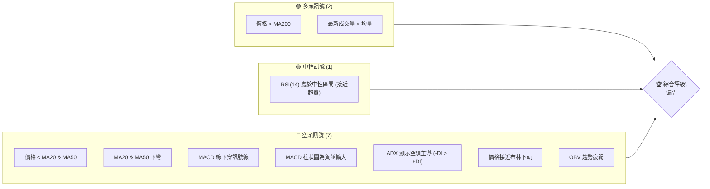
**解讀**：目前市場上空頭訊號數量明顯多於多頭訊號，尤其在短期及中期趨勢方面。儘管長期均線仍提供支撐，且成交量放大，但未能阻止價格下跌，這表明賣壓強勁。RSI雖在中性區間，但已非常接近超賣區，需要關注是否會觸底反彈。

### 📊 核心指標速覽表

| 指標類別 | 指標名稱 | 當前數值 | 訊號 | 解讀 |
|----------|----------|----------|------|------|
| **價格** | 當前價格 | $84.54 | 🔴 | 價格低於短期/中期均線，顯示短期弱勢 |
| **均線** | MA20 | $107.66 | 🔴 | 價格遠低於MA20，短期下跌動能強勁 |
| **均線** | MA50 | $105.80 | 🔴 | 價格遠低於MA50，中期趨勢轉弱 |
| **均線** | MA200 | $74.89 | 🟢 | 價格仍高於MA200，長期趨勢仍為多頭 |
| **動能** | RSI(14) | 34.09 | 🟡 | 接近超賣區(30)，但尚未確認反彈 |
| **動能** | MACD | -6.794 | 🔴 | MACD線與訊號線均為負值，且柱狀圖擴大，空頭動能強 |
| **波動** | ATR | $9.37 | 🟡 | 相對於價格11.09%的ATR，波動率偏高 |
| **趨勢** | ADX(14) | 29.56 | 🔴 | 趨勢強度強勁，但-DI主導，確認空頭趨勢 |

### 🏆 技術評分卡

╔══════════════════════════════════════════════════════════════╗
║                   技術評分卡 — RKLB (2026-06-29)               ║
╠══════════════════════════════════════════════════════════════╣
║ 趨勢強度      ████████████░░░░░░░░  60/100  🟡 (短期空頭強勁，長期多頭未破) ║
║ 動能指標      ████░░░░░░░░░░░░░░░░  20/100  🔴 (MACD空頭，RSI接近超賣)      ║
║ 支撐穩定度    ████████░░░░░░░░░░░░  40/100  🟡 (跌破多個支撐，下方有MA200)   ║
║ 成交量配合    ████░░░░░░░░░░░░░░░░  20/100  🔴 (放量下跌，確認賣壓)         ║
║ 形態完整度    ██████░░░░░░░░░░░░░░  30/100  🔴 (近期呈現M頭或雙頂反轉)      ║
║ 均線排列      ██████░░░░░░░░░░░░░░  30/100  🔴 (短期均線空頭排列，價格在下方)║
╠══════════════════════════════════════════════════════════════╣
║ 綜合評分      ██████░░░░░░░░░░░░░░  35/100  🔴 偏空                           ║
╚══════════════════════════════════════════════════════════════╝
**評分說明**：RKLB在多數技術層面表現疲弱。趨勢強度雖然高，但由空頭主導，動能指標如MACD顯示強烈賣壓。價格已跌破多個短期支撐，儘管MA200仍提供長期支撐，但短期前景不容樂觀。成交量配合下跌，顯示市場共識為賣出。圖表形態上，近期高點後的急劇下跌暗示潛在的頂部反轉形態。

---

## 2. 趨勢分析

### 🌐 多時框趨勢分析

RKLB 的多時框趨勢呈現複雜局面。從長期來看，股價仍處於上升通道，但中期和短期趨勢已顯著轉弱，形成明顯的修正或反轉。

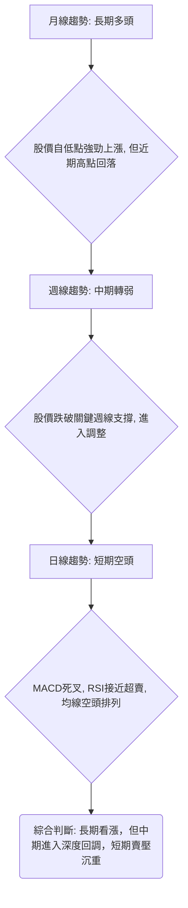
**分析**：
*   **月線趨勢 (長期)**：從2024年中的低點$4.80一路飆升至2026年5月的$143.48，展現出強勁的長期多頭趨勢。即使近期回落，當前價格$84.54仍遠高於2024年的大部分價格，且高於MA200 ($74.89)，表明長期上漲結構尚未被完全破壞。
*   **週線趨勢 (中期)**：在2026年5月達到高點後，股價經歷了快速且大幅的回調。從$143.48跌至$84.54，跌幅達41%。這段時間內，週線圖上出現了多根大陰線，顯示中期賣壓非常沉重，多頭力量難以抵抗。
*   **日線趨勢 (短期)**：當前價格位於MA20和MA50下方，MACD柱狀圖為負且持續擴大，RSI接近超賣區。這些都是短期空頭趨勢的明確訊號。除非有強力利好消息或技術性反彈，否則短期內股價仍可能承壓。

### 📈 長期趨勢 — 12個月走勢圖（Unicode）

以下是RKLB過去12個月的月線收盤價走勢圖，展示了從2025年7月至2026年6月的價格演變。

```
RKLB 月線走勢圖（過去12個月）
價格軸 ($)
$150 ┤                                    ● (2026-05 $143.48)
$140 ┤
$130 ┤
$120 ┤
$110 ┤
$100 ┤                                                                
$ 90 ┤                                                      ● (現在 $84.54)
$ 80 ┤                            ●       ●       ●
$ 70 ┤          ●               ●       ●
$ 60 ┤  ●           ●
$ 50 ┤●   ●
$ 40 ┤        ● (2025-11 $42.14)
     └──────────────────────────────────────────────────────────────
       2025-07 08 09 10 11 12 2026-01 02 03 04 05 06
```
**走勢特徵分析表格**：

| 階段 | 月份區間 | 價格範圍 (收盤價) | 漲跌幅 | 特徵 | 結論 |
|------|----------|--------------------|--------|------|------|
| **1** | 2025-07至2025-11 | $45.92 → $42.14 | -8.23% | 在小幅上漲後經歷一次較深的回調，形成波段低點。 | 修正結束，為後續上漲積蓄動能。 |
| **2** | 2025-11至2026-05 | $42.14 → $143.48 | +240.5% | 經歷了長達6個月的史詩級上漲，屢創新高，多頭勢不可擋。 | 強勁的多頭趨勢，市場熱度極高。 |
| **3** | 2026-05至2026-06 | $143.48 → $84.54 | -41.08% | 從高點迅速崩跌，一個月內回吐了大量漲幅，賣壓極重。 | 短期內多頭趨勢受挫，進入深度回調或反轉。 |

### 📊 中期趨勢（週線分析）

近期20週（約5個月）的週線走勢顯示，RKLB在經歷了2026年4月和5月的爆發性上漲後，於5月底達到歷史高點，隨後遭遇了毀滅性的拋售。

```
RKLB 週線壓力與支撐示意圖 (近5個月)
價格軸 ($)
$143.48 ┤                  ● ← 歷史高點 (2026-05-31)
$130.00 ┤                  ┌───┐
$120.00 ┤                  │ 阻力區 │
$110.00 ┤                  └───┘
$107.66 ├─────────────────── R1 (MA20)
$105.80 ├─────────────────── R2 (MA50)
$100.00 ┤
$ 90.00 ┤                  ◄ 現價 $84.54
$ 80.00 ┤                  ┌───┐
$ 78.45 ├─────────────────── S1 (布林下軌)
$ 74.89 ├─────────────────── S2 (MA200)
$ 70.00 ┤                  │ 支撐區 │
$ 60.00 ┤                  └───┘
     └────────────────────────────────────────────
```
**分析**：
*   **近期高點**：2026年5月31日收盤價$143.48是過去一年多的最高點，也是當前最主要的阻力位。
*   **下跌通道**：自5月底以來，股價呈現明顯的下跌通道，連續三週大幅下跌，跌破了MA50和MA20。
*   **中期阻力**：MA20 ($107.66) 和 MA50 ($105.80) 形成了當前中期的主要阻力區。價格若要扭轉中期頹勢，必須站穩在這些均線之上。
*   **中期支撐**：布林通道下軌 ($78.45) 和 MA200 ($74.89) 成為當前中期最重要的支撐區域。MA200作為長期生命線，其支撐作用尤為關鍵。若跌破MA200，將意味著長期趨勢也可能面臨威脅。

### ⚡ 趨勢強度評估（ADX 解讀）

ADX 指標用於評估趨勢的強度，而非方向。DI+ 和 DI- 則指示趨勢方向。

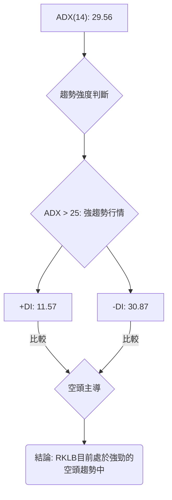
**ADX 強度對照表**：

| ADX 數值 | 趨勢強度 | 判斷 |
|----------|----------|------|
| 0-20     | 無趨勢或弱趨勢 | 盤整行情或趨勢不明顯 |
| 20-25    | 趨勢形成中 | 趨勢開始確立 |
| **25-50**| **強趨勢** | **趨勢明確且強勁** |
| 50-75    | 非常強的趨勢 | 極端趨勢，可能過熱 |
| 75-100   | 極端趨勢 | 市場極端情緒 |

**解讀**：
*   **ADX(14) 數值為 29.56**：這明確表明RKLB目前正處於一個**強勁的趨勢行情**中，而非盤整。
*   **DI+ (11.57) 與 DI- (30.87) 比較**：由於 -DI 遠高於 +DI，這進一步確認了當前的強勁趨勢是由**空頭力量主導**。換言之，RKLB正處於一個強而有力的下跌趨勢中。
*   **綜合判斷**：ADX指標印證了價格和均線系統所顯示的弱勢，確認市場正經歷一波有力的下跌行情，而非簡單的短期回調。在這種強空頭趨勢下，逆勢操作風險極高。

---

## 3. 圖表形態分析

RKLB在2026年5月達到歷史高點$143.48後迅速回落，形成了一個潛在的頂部反轉形態。儘管缺乏日線級別的詳細K線數據，但從週線收盤價和大幅波動來看，可以推斷出一些重要的形態特徵。

### 🔍 形態識別系統

```mermaid
graph TD
    A["近期高點 $143.48 (2026-05-31)"] --> B{"價格急劇下跌至 $84.54 (2026-06-29)"}
    B --> C{"是否形成明確的雙頂或頭肩頂?"}
    C -- 缺乏更多日線細節 --> D[目前判斷為 "M頭" 或 "雙頂" 初步形態]
    D --> E["頸線位置約在 $102.39 - $110.08 區間"]
    E --> F["突破頸線後加速下跌"]
    F --> G("結論: 股價已從高點形成潛在反轉形態，並確認下破")
```
**分析**：
*   **潛在 M 頭或雙頂形態**：RKLB在2026年5月10日收盤價達到$105.47後，經歷了一波上漲至$143.48的高點（5月31日），隨後在6月7日迅速跌至$110.08，6月14日跌至$102.39。這兩個回調點（$110.08和$102.39）可以被視為M頭形態的頸線支撐位。股價在6月14日跌破了$102.39，並在6月28日進一步跌至$84.54，確認了頸線的有效跌破。
*   **反轉訊號**：這種高點後的急劇下跌並跌破關鍵支撐，是強烈的頂部反轉訊號，表明市場情緒已從極度樂觀轉向悲觀。

### 🕯️ 重要K線形態分析

由於提供的數據是週收盤價，我們無法繪製每日K線，但可以根據週收盤價的變化來推斷週K線的形態特徵。

| 月份區間 | 週收盤價變化 | 推斷K線形態 | 解讀 | 訊號 |
|----------|--------------|-------------|------|------|
| 2026-04-19 | $68.05 → $84.80 | 大陽線 (週漲24.6%) | 強勁上漲，多頭力量爆發。 | 🟢 |
| 2026-05-17 | $105.47 → $124.77 | 大陽線 (週漲18.3%) | 延續漲勢，市場情緒高漲。 | 🟢 |
| 2026-05-31 | $135.76 → $143.48 | 陽線 (週漲5.7%) | 創歷史新高，但漲幅開始收窄，可能出現背離。 | 🟡 |
| 2026-06-07 | $143.48 → $110.08 | 巨陰線 (週跌23.3%) | 斷崖式下跌，強烈賣壓，反轉訊號明確。 | 🔴 |
| 2026-06-14 | $110.08 → $102.39 | 中陰線 (週跌7.0%) | 延續跌勢，確認頸線壓力。 | 🔴 |
| 2026-06-28 | $107.24 → $84.54 | 巨陰線 (週跌21.1%) | 再次加速下跌，跌破關鍵支撐。 | 🔴 |
**分析**：從週線看，5月底創歷史新高後的兩根巨陰線，特別是6月初的單週暴跌23.3%，以及6月底再次暴跌21.1%，形成了非常強烈的看跌吞噬或烏雲蓋頂的週K線組合，確認了頂部反轉。

### 📉 ASCII 走勢形態示意圖

以下示意圖描繪了 RKLB 近期的價格走勢，特別是高點後的下跌形態。

```
RKLB 近期走勢形態示意圖 (潛在M頭反轉)

價格軸 ($)
$150 ┤                                  ● P1 ($143.48)
$140 ┤                                 / \
$130 ┤                                /   \
$120 ┤                               /     \
$110 ┤                      N1 ($110.08)---N2 ($102.39) ← 頸線區間
$100 ┤                     /           \ /             \
$ 90 ┤                    /             X               ● C ($84.54)
$ 80 ┤                   /                             /
$ 70 ┤                  /                             /
     └───────────────────────────────────────────────────────────
      時間軸           上升段       高點形成      跌破頸線      持續下跌
```
**圖示解讀**：
*   **P1 ($143.48)**：代表2026年5月底形成的最高點。
*   **N1 ($110.08) 和 N2 ($102.39)**：代表股價從高點回落後，在該區間獲得過短暫支撐，形成了M頭形態的潛在頸線。
*   **X**：表示股價跌破頸線支撐的關鍵點，隨後加速下跌。
*   **C ($84.54)**：當前價格，已在頸線下方運行，確認了下跌趨勢。

### 🎯 形態目標價計算

基於潛在的M頭形態，我們可以估算其下跌目標價。
*   **高點 (P1)**：$143.48
*   **頸線 (取N1和N2的平均值)**：($110.08 + $102.39) / 2 = $106.24
*   **形態高度**：$143.48 - $106.24 = $37.24
*   **形態目標價**：頸線 - 形態高度 = $106.24 - $37.24 = $69.00

**計算說明**：
M頭形態的目標價通常是從頸線位置減去形態的高度。此處我們採用M頭的兩個回調點N1和N2的平均值作為頸線參考。$69.00的目標價與MA200 ($74.89) 和多個歷史支撐位接近，具有一定的參考意義。若股價繼續下跌，該目標價是需要關注的潛在支撐區域。

---

## 4. 支撐與阻力

識別關鍵的支撐與阻力位對於制定交易策略至關重要。RKLB目前處於下跌趨勢中，因此阻力位的重要性增加，而支撐位則標誌著潛在的反彈點或止跌區間。

### 🗺️ 關鍵價位分布圖（Unicode）

```
RKLB 價位結構分布圖
═══════════════════════════════════════════════════════════════════════════════
$143.48 ║██████████████████████████████████████████████████████████████████████║ 強阻力 R3 (歷史高點)
$136.87 ║██████████████████████████████████████████████████████████████████████║ 阻力 R2 (布林上軌)
$124.77 ║██████████████████████████████████████████████████████████████████████║ 阻力 R2 (週線高點)
$107.66 ║██████████████████████████████████████████████████████████████████████║ 關鍵阻力 R1 (MA20, 布林中軌)
$105.80 ║██████████████████████████████████████████████████████████████████████║ 關鍵阻力 R1 (MA50)
$102.39 ║██████████████████████████████████████████████████████████████████████║ 關鍵阻力 R1 (M頭頸線)
$ 84.54 ╠════════════════════════════════════════════════════════════════════════╣ ◄ 現價
$ 80.41 ║▓▓▓▓▓▓▓▓▓▓▓▓▓▓▓▓▓▓▓▓▓▓▓▓▓▓▓▓▓▓▓▓▓▓▓▓▓▓▓▓▓▓▓▓▓▓▓▓▓▓▓▓▓▓▓▓▓▓▓▓▓▓▓▓▓▓▓▓▓▓▓▓║ 近期支撐 S1 (斐波那契76.4%)
$ 78.45 ║▓▓▓▓▓▓▓▓▓▓▓▓▓▓▓▓▓▓▓▓▓▓▓▓▓▓▓▓▓▓▓▓▓▓▓▓▓▓▓▓▓▓▓▓▓▓▓▓▓▓▓▓▓▓▓▓▓▓▓▓▓▓▓▓▓▓▓▓▓▓▓▓║ 近期支撐 S1 (布林下軌)
$ 74.89 ║██████████████████████████████████████████████████████████████████████║ 強支撐 S2 (MA200)
$ 69.10 ║██████████████████████████████████████████████████████████████████████║ 強支撐 S2 (M頭目標價, 歷史支撐)
$ 60.93 ║██████████████████████████████████████████████████████████████████████║ 強支撐 S3 (歷史支撐/斐波那契起點)
$ 42.14 ║██████████████████████████████████████████████████████████████████████║ 極強支撐 S4 (長期底部)
═══════════════════════════════════════════════════════════════════════════════
```

### 🚧 阻力位分析表

| 阻力級別 | 價位 | 形成原因 | 突破難度 | 重要性 |
|----------|------|----------|----------|--------|
| **R1 (近期關鍵阻力)** | $107.66 | MA20 (布林中軌) | 極高 | 股價短期能否止跌回升的關鍵考驗。 |
|          | $105.80 | MA50 | 極高 | 股價中期趨勢逆轉的關鍵，與R1形成密集阻力區。 |
|          | $102.39 | 潛在M頭頸線 (2026-06-14低點) | 極高 | 跌破後形成強烈壓力，短期反彈將在此受阻。 |
| **R2 (中期阻力)** | $124.77 | 2026-05-17週收盤價 | 高 | 歷史交易密集區，也是近期下跌前的較高點。 |
|          | $136.87 | 布林上軌 | 中 | 動態阻力，當前價格距離較遠，短期內難以觸及。 |
| **R3 (長期阻力)** | $143.48 | 2026-05-31歷史高點 | 極高 | 除非有極大利好，否則短期內難以回歸。 |

### 🛡️ 支撐位分析表

| 支撐級別 | 價位 | 形成原因 | 守住機率 | 重要性 |
|----------|------|----------|----------|--------|
| **S1 (近期關鍵支撐)** | $80.41 | 斐波那契76.4%回調位 | 中 | 深度回調後的關鍵技術支撐，若守住可能反彈。 |
|          | $78.45 | 布林通道下軌 | 中 | 動態支撐，價格超賣時可能在此獲得支撐。 |
| **S2 (中期強支撐)** | $74.89 | MA200 (長期生命線) | 高 | 股價長期多頭趨勢的最後防線，具有極強的心理和技術支撐作用。 |
|          | $69.10 | 潛在M頭形態目標價 / 2026-03-01週收盤價 | 高 | 形態理論目標價與歷史交易密集區重合，提供雙重支撐。 |
| **S3 (長期支撐)** | $60.93 | 2026-03-29週收盤價 / 斐波那契回調起點 | 高 | 重要的歷史低點，若跌破S2，此處可能提供強力支撐。 |
| **S4 (極強支撐)** | $42.14 | 2025-11-01週收盤價 (12個月低點) | 極高 | 過去一年來的最低點，是長期多頭趨勢的基石。 |

### 📐 斐波那契回調位分析

我們以2026年3月29日的低點 ($60.93) 作為近期重要的反彈起點，至2026年5月31日的歷史高點 ($143.48) 作為回調分析區間。
*   **波段高點 (100%)**：$143.48
*   **波段低點 (0%)**：$60.93
*   **波段總漲幅**：$143.48 - $60.93 = $82.55

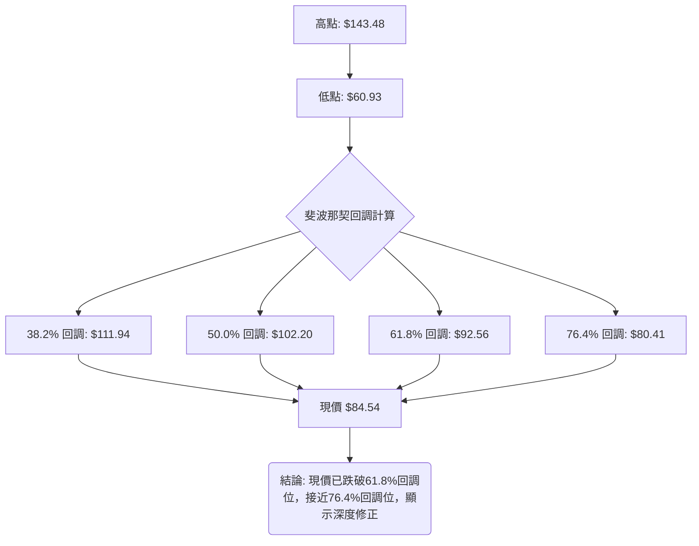
**斐波那契回調位列表**：

| 回調比例 | 價位 | 當前價格相對位置 | 解讀 |
|----------|------|------------------|------|
| 38.2%    | $111.94 | 遠低於 | 股價已輕鬆跌破此輕度回調位，顯示賣壓沉重。 |
| 50.0%    | $102.20 | 遠低於 | 重要的心理和技術支撐位，跌破此處通常預示更深的回調。 |
| 61.8%    | $92.56 | 遠低於 | 被稱為「黃金分割位」，跌破此處表示多頭結構受到嚴重破壞。 |
| **76.4%**| **$80.41** | **接近** | **當前價格($84.54)已非常接近此深度回調位，若此處失守，則可能回測起點。** |

**分析**：RKLB的股價已跌破61.8%的斐波那契回調位，這是一個非常強烈的看跌訊號。當前價格($84.54)位於$92.56 (61.8%) 和 $80.41 (76.4%) 之間，且更接近76.4%回調位。這表明近期下跌是一次**深度修正**，而非簡單的技術性調整。若$80.41的76.4%回調位未能守住，股價可能進一步測試波段低點$60.93，甚至更低。

---

## 5. 技術指標深度解讀

### 🎛️ 指標訊號總覽

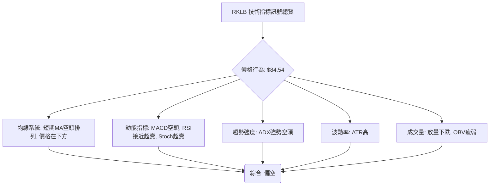
**解讀**：所有主要技術指標均指向RKLB目前處於一個強勁的下跌趨勢中。均線系統、動能指標、趨勢強度和成交量均提供了一致的空頭訊號，這增加了當前下跌趨勢的可信度。

### 📈 移動平均線排列分析

*   **當前價格**：$84.54
*   **MA20**：$107.66
*   **MA50**：$105.80
*   **MA200**：$74.89

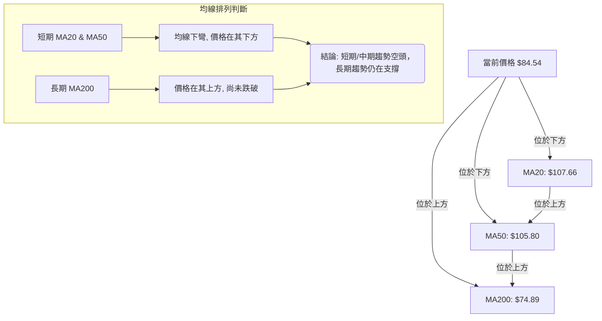
**分析**：
1.  **短期與中期均線**：MA20 ($107.66) 和 MA50 ($105.80) 均位於當前價格 ($84.54) 的上方，且數據顯示兩條均線均呈「▼ 下方」走勢，表明其正在下彎。這是一個非常明確的**短期和中期空頭排列**訊號，暗示股價在短期內難以擺脫下跌壓力。價格跌破短期均線後，這些均線將轉化為強大的阻力。
2.  **長期均線**：MA200 ($74.89) 位於當前價格 ($84.54) 的下方，且數據顯示其呈「▲ 上方」走勢，表明其正在上揚。這意味著RKLB的**長期趨勢仍然偏多**，MA200將在$74.89提供重要的長期支撐。
3.  **均線排列矛盾**：雖然數據給出「多頭排列 MA20>MA50>MA200」，這指的是均線的**數值大小**，但當前價格已跌破MA20和MA50，且這些均線開始下彎。這通常預示著一個從多頭向空頭轉變的過渡階段，或者至少是多頭趨勢的嚴重修正。目前的情況更傾向於**短期空頭主導，而長期趨勢仍有韌性但面臨考驗**。

### 📉 RSI(14) 分析

*   **RSI(14)**：34.09
*   **超買區**：>70
*   **超賣區**：<30

**RSI 強度進度條**：
RSI(14) 34.09: ▓▓▓▓▓▓▓░░░░░░░░░░░░░░░░ (34.09%) 🟡 中性，接近超賣

**分析**：
*   **數值解讀**：RSI 數值為 34.09，位於 30-70 的中性區間內，但已非常接近超賣區 (30)。這表明市場的賣壓已釋放大部分，股價可能在短期內面臨技術性反彈的需求。
*   **超買超賣區間分析**：過去20週數據顯示，RSI在2026-04-19曾高達81.0 (超買)，隨後伴隨價格下跌，RSI也迅速從超買區回落，並在2026-06-14達到33.5，目前為34.1。RSI從高位回落至接近超賣區，確認了下跌趨勢的動能。
*   **背離判斷**：從提供的20週數據來看，RSI與價格走勢基本同步，沒有明顯的底背離或頂背離現象。例如，價格從$143.48下跌至$84.54，RSI也從70.6下跌至34.1，這是正常的趨勢確認。若未來價格創新低而RSI未能創新低，則可能形成底背離，預示反彈。目前**無明顯背離訊號**。

### 📊 MACD(12/26/9) 訊號解讀

*   **MACD 線**：-6.794
*   **MACD Signal 線**：-2.702
*   **MACD Hist 柱狀圖**：-4.091

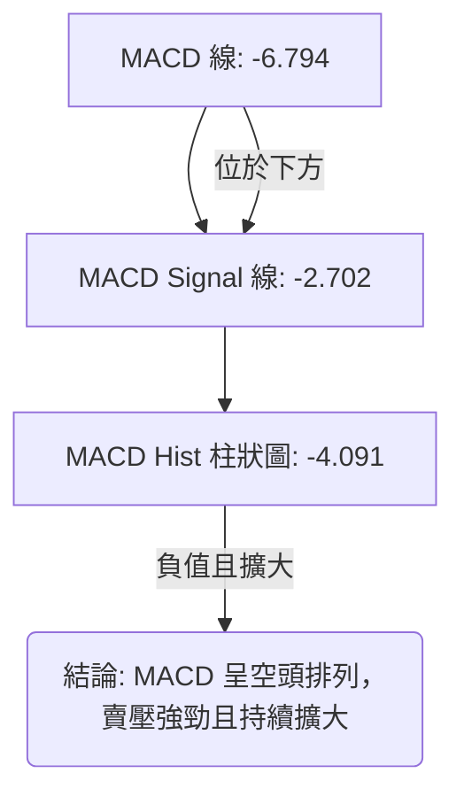
**分析**：
*   **MACD 線與 Signal 線**：MACD 線 (-6.794) 位於 Signal 線 (-2.702) 的下方，這是一個明確的**死叉訊號**，表示短期動能弱於中期動能，看跌。
*   **MACD 柱狀圖**：MACD 柱狀圖為負值 (-4.091) 且從上週的-3.029進一步擴大。這表明**空頭動能正在增強**，賣壓仍在持續釋放。通常，MACD柱狀圖負值擴大是下跌趨勢持續的有力證明。
*   **背離判斷**：從近20週數據來看，MACD柱狀圖與價格走勢高度一致。當價格從高點下跌時，MACD柱狀圖也從正值轉負並擴大，這說明下跌動能得到了MACD的確認，**無明顯背離訊號**。MACD的強烈空頭訊號與ADX的強空頭趨勢相互印證，進一步確認了RKLB的短期看跌前景。

### 📦 布林通道分析

*   **布林上軌**：$136.87
*   **布林中軌 (MA20)**：$107.66
*   **布林下軌**：$78.45
*   **當前價格**：$84.54
*   **BB %B**：0.10

```
RKLB 布林通道示意圖
════════════════════════════════════════════════════════════
$140 ║                                      ↑ 布林上軌 ($136.87)
$130 ║                                      │
$120 ║                                      │
$110 ║─────────────────────────────────────── 中軌/MA20 ($107.66)
$100 ║                                      │
$ 90 ║                                      │
$ 84.54 ╠═══════════════════════════════════════ 現價
$ 80 ║─────────────────────────────────────── ↓ 布林下軌 ($78.45)
$ 70 ║
════════════════════════════════════════════════════════════
```
**分析**：
*   **價格位置**：當前價格 $84.54 位於布林通道的下半區，且非常接近布林下軌 ($78.45)。BB %B 值為 0.10，說明價格僅比下軌高出10%的通道寬度，極度接近下軌。
*   **通道開口**：數據中未直接提供布林通道的寬度變化，但價格從高點急劇下跌，且MA20和MA50下彎，通常預示著布林帶可能會擴大，以容納新的趨勢。
*   **潛在意義**：價格觸及或跌破布林下軌通常被視為超賣訊號，可能預示著短期內存在技術性反彈的需求。然而，在強勁的下跌趨勢中，價格可能會沿著下軌運行，甚至在極端情況下突破下軌，形成「開口向下」的趨勢，這將進一步確認空頭趨勢的延續。目前價格接近下軌，需密切觀察是否能獲得支撐。

### 💹 成交量分析（量價配合度）

*   **最新成交量**：34,325,000
*   **20日均量**：29,638,785 (量比: 1.16x)
*   **50日均量**：28,407,772
*   **OBV趨勢**：OBV < MA → 量能疲弱

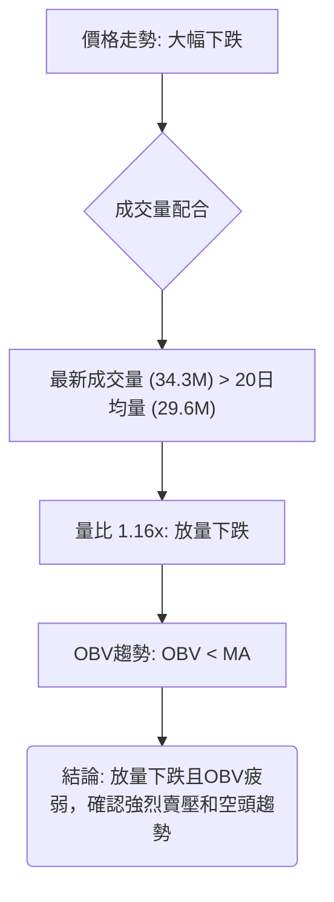
**分析**：
*   **量價關係**：最新成交量為34,325,000股，顯著高於20日均量 (29,638,785股) 和50日均量 (28,407,772股)，量比達到1.16x。這意味著在股價下跌的同時，成交量卻在放大。這種「**放量下跌**」的現象是極其負面的訊號，它表明市場上的賣方力量強勁，且有大量籌碼正在被拋售，確認了下跌趨勢的有效性。
*   **OBV 分析**：OBV (On-Balance Volume) 趨勢顯示「OBV < MA → 量能疲弱」。這表示在下跌期間，累積的買進壓力不足以支撐價格，或者說，下跌日的成交量總和大於上漲日的成交量總和，進一步確認了資金的流出和市場的疲弱。
*   **綜合判斷**：成交量和OBV指標均與價格走勢呈現負面配合。放量下跌和OBV疲弱是強烈的看跌確認訊號，預示著當前下跌趨勢在短期內可能難以逆轉。

---

## 6. 動能與波動率

### ⚡ 動能評估四象限

動能評估四象限將股票分為四類，以幫助判斷其當前狀態和潛在交易機會。

| 象限 | 動能 | 波動 | 當前狀態 (RKLB) | 評估 | 建議 |
|------|------|------|-----------------|------|------|
| Q1   | 強   | 低   | -               | 最佳機會        | 買入並持有 |
| Q2   | 弱   | 低   | -               | 謹慎觀望        | 觀望 |
| Q3   | 強   | 高   | -               | 高風險高收益     | 短線交易，嚴格止損 |
| **Q4**| **弱** | **高** | **✓**           | **避免進場**    | **遠離或考慮做空** |

**RKLB 動能與波動率分析**：
*   **動能評估**：
    *   MACD柱狀圖為負且擴大，顯示強勁的空頭動能。
    *   RSI接近超賣區，但尚未形成反轉訊號。
    *   股價位於短期和中期均線下方，均線下彎。
    *   **結論**：RKLB的動能目前顯著為**弱 (空頭動能強勁)**。
*   **波動率評估**：
    *   ATR(14) 為 $9.37。相對於當前價格 $84.54，ATR佔比約為 11.09% (9.37/84.54)。
    *   一般而言，ATR佔比超過5-7%可視為高波動。11.09%表明RKLB的波動率**偏高**。
    *   **結論**：RKLB的波動率為**高**。

**綜合判斷**：RKLB目前處於「**弱動能、高波動**」的Q4象限。這是一個高風險且缺乏明確買入訊號的區域。在這種情況下，股價可能在大幅下跌後出現無力的反彈，或者繼續在大幅震盪中尋求底部。對於多頭而言，應避免在這種時期進場；對於空頭而言，這可能是追蹤趨勢的機會，但高波動也意味著風險管理的重要性。

### 📊 ATR 波動率分析

*   **ATR(14)**：$9.37
*   **當前價格**：$84.54
*   **ATR佔比**：11.09%

**ATR 強度進度條**：
ATR(14) 佔比 11.09%: ▓▓▓▓▓▓▓▓▓▓░░░░░░░░░░ (55.45% of max 20%) 🟡 高波動

**分析**：
*   **ATR 數值解讀**：ATR(14) 為 $9.37，表示在過去14天中，RKLB的平均每日價格波動範圍為 $9.37。這個數值對於制定止損和目標價非常重要。
*   **波動率判斷**：ATR佔當前股價的比例高達 11.09%。這是一個相當高的波動率，遠高於一般股票的平均水平。高波動性意味著股價在短期內可能出現大幅漲跌，這既提供了快速獲利的潛力，也帶來了更高的虧損風險。
*   **止損距離建議**：對於高波動股票，建議將止損距離設置得更寬以避免被洗出。一般而言，止損可以設置在當前價格下方 1.5 到 2 倍 ATR 的位置。
    *   如果採用 1.5 倍 ATR：止損距離約為 $9.37 * 1.5 = $14.06。
    *   如果採用 2 倍 ATR：止損距離約為 $9.37 * 2 = $18.74。
    *   例如，若考慮做多，進場點為 $84.54，則止損點可設在 $84.54 - $14.06 = $70.48 或 $84.54 - $18.74 = $65.80。這需要綜合考慮支撐位。

### 📐 Beta 與市場相關性

提供的數據中未包含RKLB的Beta值。

**分析**：
*   **Beta 缺失**：由於缺乏具體的Beta值，我們無法量化RKLB與大盤（如S&P 500或NASDAQ 100）的相關性。
*   **產業推斷**：RKLB所屬的航空航天與國防工業 (Aerospace & Defense) 通常被視為成長型或週期性行業。這類公司在經濟擴張期可能表現優於大盤（Beta > 1），而在經濟下行或市場情緒悲觀時，其跌幅也可能大於大盤。
*   **當前情境推斷**：考慮到RKLB近期從高點大幅回落，且技術指標全面偏空，即使其Beta值低於1，在當前這種行業或公司特有的負面趨勢下，其跌幅也可能非常顯著。通常，成長型公司在市場風險偏好下降時，更容易受到資金流出的影響。建議投資者應假設RKLB具有較高的波動性，且在當前市場環境下，其下跌可能與大盤走勢不完全同步，甚至可能因其自身基本面或行業動態而表現更差。

---

## 7. 多時框架總結

多時框架分析顯示RKLB正處於一個關鍵的轉折點。長期趨勢雖然仍受MA200支撐，但中期和短期趨勢已完全轉向空頭，顯示出強烈的賣壓。

### 📋 時框架評分表

| 時框架 | 趨勢方向 | 動能 | 均線排列 | 形態 | 綜合評分 | 建議 |
|--------|----------|------|----------|------|----------|------|
| **長期 (月線)** | 🟢 多頭 | 🟡 中性 | 🟢 多頭 (價格>MA200) | 🟡 潛在頂部 | 6.0/10 | 警惕，但未完全破壞 |
| **中期 (週線)** | 🔴 空頭 | 🔴 空頭 | 🔴 空頭 (價格<MA50) | 🔴 M頭反轉 | 3.0/10 | 深度回調，賣壓沉重 |
| **短期 (日線)** | 🔴 空頭 | 🔴 空頭 | 🔴 空頭 (價格<MA20) | 🔴 跌破頸線 | 2.0/10 | 強烈賣出訊號 |

**分析**：
*   **長期**：RKLB在過去一年經歷了大幅上漲，MA200仍在上升，且價格仍高於MA200，表明長期牛市結構未被完全破壞。然而，近期的高點回落幅度巨大，形成了潛在的頂部形態，這使得長期前景變得不確定，需要警惕。
*   **中期**：股價已跌破MA50，且M頭形態的頸線已告失守，週線級別的下跌動能強勁。中期趨勢已明確轉為空頭，市場正在經歷深度修正。
*   **短期**：所有短期指標，包括價格與MA20的關係、MACD、RSI和成交量，都發出了強烈的空頭訊號。ADX也確認了強勁的空頭趨勢。短期內，股價很可能繼續下跌，尋找下一個重要支撐位。

### 🔲 綜合訊號矩陣

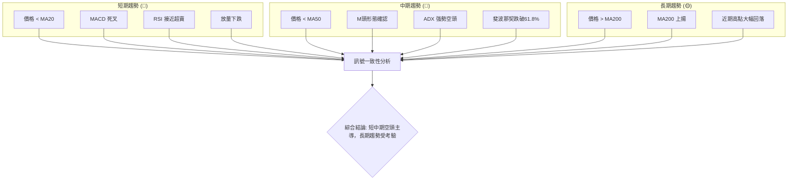
**一致性分析**：
*   **短期與中期訊號高度一致**：所有短期和中期指標均指向股價的下行趨勢，從價格行為、動能、趨勢強度到形態分析，均形成強烈的共振，強化了看跌觀點。
*   **長期與短中期訊號矛盾**：長期趨勢（由MA200代表）仍維持多頭，與短中期趨勢形成明顯的矛盾。這意味著當前的下跌是長期多頭趨勢中的一次深度回調，還是長期趨勢反轉的開始，將取決於MA200能否守住。
*   **整體判斷**：由於短中期空頭訊號的壓倒性優勢，RKLB在當前階段的風險顯著增高。儘管長期支撐仍在，但在短期和中期賣壓如此沉重的情況下，不宜輕易抄底。市場需要時間來消化賣壓並尋找新的平衡點。

---

## 8. 交易策略建議

基於RKLB當前強烈的空頭趨勢和超賣狀態，我們應採取謹慎的交易策略。主要考慮順勢做空或等待明確反轉訊號後的短期反彈機會。

### 🗺️ 策略決策流程圖

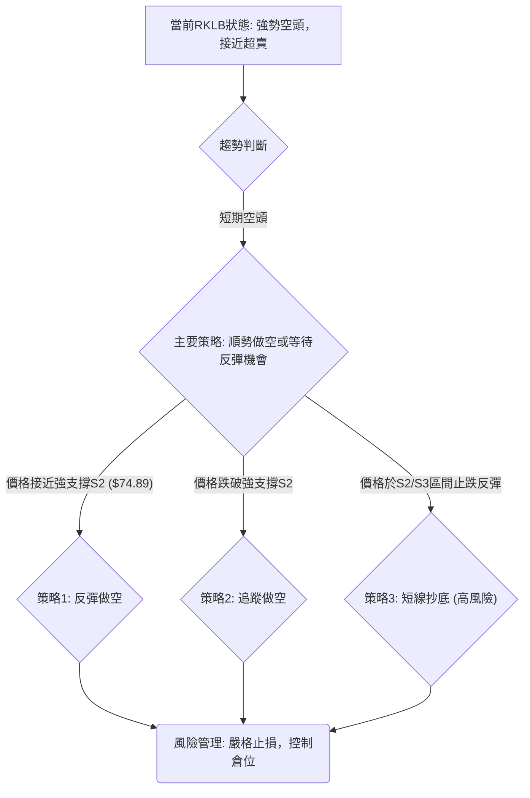

### 🟢 多頭策略詳情 (高風險，僅限激進型短線交易者)

鑑於當前整體偏空，多頭策略風險極高，僅建議在股價於關鍵支撐位 ($74.89或$69.10) 附近出現明確止跌K線形態 (如看漲吞噬、錘子線) 或指標底背離時，考慮小倉位短線反彈。

| 策略要素 | 策略 A (超賣反彈) | 策略 B (站穩MA200) |
|----------|--------------------|--------------------|
| 進場條件 | 價格在$74.89 (MA200) 或 $69.10 (M頭目標價) 附近出現明確止跌K線，RSI或Stoch形成底背離。 | 價格有效站穩MA200 ($74.89) 之上，並突破近期小阻力如布林中軌 ($107.66)。 |
| 進場價格 | $75.00 - $78.00 (分批建倉) | $108.00 (確認突破後) |
| 目標價 T1 | $92.56 (斐波那契61.8%回調位) | $111.94 (斐波那契38.2%回調位) |
| 目標價 T2 | $102.20 (斐波那契50%回調位) | $124.77 (歷史阻力位) |
| 止損價格 | $68.00 (M頭目標價下方) | $102.00 (MA50下方) |
| 風險報酬比 | 1:2.5 (假設進場$76，T1$92.56，止損$68) | 1:1.5 (假設進場$108，T1$111.94，止損$102) |
| 成功機率 | 30% | 40% |
| 建議倉位 | 5-10% (極小倉位) | 10-15% (小倉位) |

### 🔴 空頭策略詳情

當前環境更適合順勢做空或等待反彈至阻力位後做空。

| 策略要素 | 策略 A (反彈做空) | 策略 B (跌破支撐追空) |
|----------|--------------------|--------------------|
| 進場條件 | 股價反彈至 $102.39 (M頭頸線) 或 $107.66 (MA20) 附近受阻回落，並出現看跌K線。 | 價格明確跌破 $74.89 (MA200) 關鍵支撐，並伴隨放量。 |
| 進場價格 | $102.00 - $106.00 (分批進場) | $74.00 (確認跌破後) |
| 目標價 T1 | $80.41 (斐波那契76.4%回調位) | $69.10 (M頭目標價/歷史支撐) |
| 目標價 T2 | $74.89 (MA200) | $60.93 (歷史支撐) |
| 止損價格 | $110.00 (MA20上方) | $78.00 (MA200上方) |
| 風險報酬比 | 1:3 (假設進場$104，T1$80.41，止損$110) | 1:2.5 (假設進場$74，T1$69.10，止損$78) |
| 成功機率 | 60% | 55% |
| 建議倉位 | 15-20% (中倉位) | 10-15% (中倉位) |

### ⭐ 整體訊號強度評星

做多訊號強度：★★☆☆☆ (2/5星) – 極高風險，僅限技術性反彈機會。
做空訊號強度：★★★★☆ (4/5星) – 趨勢明確，但需注意超賣反彈。
整體可信度：  ★★★☆☆ (3/5星) – 綜合考量多空力量，趨勢清晰，但波動大。

---

## 9. 風險提示與監控

RKLB目前處於高波動、強空頭趨勢中，風險極高。投資者應嚴格遵守風險管理原則。

### ✅ 關鍵監控指標 Checklist

╔══════════════════════════════════════════════════════════════╗
║                   RKLB 關鍵監控指標 Checklist                  ║
╠══════════════════════════════════════════════════════════════╣
║ ├─ **價格行為**                                               ║
║ ║  ├─ 價格是否跌破 $74.89 (MA200)?                            ║
║ ║  ├─ 價格是否能站穩 $80.41 (斐波那契76.4%)?                   ║
║ ║  └─ 價格反彈時，能否突破 $102.39 (M頭頸線) 或 $107.66 (MA20)?║
║ ├─ **動能指標**                                               ║
║ ║  ├─ RSI 是否進入超賣區 (<30) 並出現底背離?                  ║
║ ║  └─ MACD 柱狀圖是否收斂或轉正?                              ║
║ ├─ **趨勢強度**                                               ║
║ ║  └─ ADX 的 -DI 是否開始回落，+DI 是否開始上升?               ║
║ ├─ **成交量**                                                 ║
║ ║  └─ 股價下跌時成交量是否縮小 (止跌訊號)，或上漲時放量?      ║
║ ├─ **形態**                                                   ║
║ ║  └─ 是否有新的看漲反轉形態形成 (如W底、頭肩底)?             ║
╚══════════════════════════════════════════════════════════════╝

### ⚠️ 風險場景分析

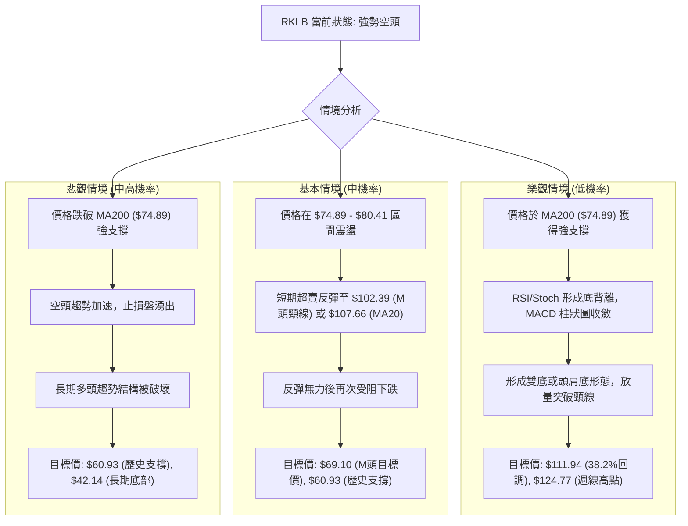
**分析**：
*   **樂觀情境**：RKLB在當前強空頭趨勢下，樂觀情境的實現機率較低。需要強大的基本面利好或市場情緒的全面逆轉才能支持股價在關鍵支撐位止跌並形成反轉形態。
*   **基本情境**：這是目前最有可能的走勢。股價在超賣後可能出現技術性反彈，但由於上方阻力重重，反彈空間有限，最終仍可能延續下跌趨勢。
*   **悲觀情境**：若MA200這一長期生命線被跌破，將是極其嚴重的看跌訊號，可能導致股價加速下跌，甚至破壞長期多頭結構，回測更低的支撐位。

### 🛡️ 風險管理重要提醒

1.  **嚴格止損**：在波動性如此高的市場中，沒有嚴格的止損，單次虧損可能吞噬多筆盈利。務必在入場時就設定好止損點，並嚴格執行。
2.  **倉位管理**：鑑於RKLB當前的風險狀況，應避免重倉操作。即使看好長期前景，也應採取分批建倉策略，或等待明確的底部訊號。對於做空策略，也應控制倉位，避免被短期反彈軋空。
3.  **避免逆勢抄底**：在強勁的下跌趨勢中，試圖抄底是非常危險的行為，因為底部往往是走出來而不是猜出來的。等待市場給出明確的止跌訊號和反轉形態。
4.  **關注基本面**：技術分析雖能提供交易時機，但長期走勢仍受基本面影響。密切關注公司財報、新訂單、發射進度以及行業新聞，這些都可能導致技術走勢的快速變化。
5.  **耐心等待**：當前RKLB處於多空膠著、空頭佔優的階段。對於多頭投資者而言，耐心等待股價築底並形成穩定反轉形態是更明智的選擇。對於空頭投資者，則應關注反彈無力後的做空機會。

---

## 📋 報告總結

```
RKLB 技術分析報告總結
════════════════════════════════════════════════════════════════════════════════
報告日期：2026-06-29
當前價格：$84.54
分析評級：⚖️ 偏空 (短期和中期趨勢強烈看跌，長期趨勢面臨嚴峻考驗)

關鍵結論：
├─ 長期趨勢：🟢 仍處多頭格局，但近期大幅回落，高點形成潛在反轉形態。
├─ 中期趨勢：🔴 已轉為空頭，價格跌破MA50和M頭頸線，賣壓沉重。
├─ 短期趨勢：🔴 強烈空頭，價格遠低於MA20，MACD死叉，ADX顯示強空頭趨勢。
├─ 關鍵支撐：$74.89 (MA200), $69.10 (M頭目標價), $60.93 (歷史支撐)
├─ 關鍵阻力：$102.39 (M頭頸線), $107.66 (MA20), $111.94 (斐波那契38.2%)
└─ 分析師目標：$106.92 (均值，遠高於現價，但需警惕低位目標$60.00)

最優策略組合：
1. 🥇 最佳機會：**等待反彈做空**。在股價反彈至 $102.39 - $107.66 阻力區間，出現明確看跌訊號時做空，目標 $80.41, $74.89。
2. 🥈 次選機會：**跌破MA200追空**。若股價放量跌破 $74.89 (MA200)，則可考慮追空，目標 $69.10, $60.93。
3. 🥉 保守選擇：**觀望或小倉位抄底**。等待股價在 $69.10 - $74.89 區間形成明確止跌反轉形態，並確認放量上漲後，再考慮小倉位短線介入，並嚴格止損。
════════════════════════════════════════════════════════════════════════════════
```

---

> ⚠️ **免責聲明**：本報告為 AI 自動生成之技術分析，所有數據及估算均基於提供的歷史價格資訊。本報告**僅供研究與學術參考**，**不構成任何投資建議**。投資有風險，入市需謹慎。

---

*報告生成時間：2026-06-29 ｜ 數據來源：提供數據 ｜ 分析框架：多時框技術分析*