<details>
<summary>📊 靜態圖表 (點擊展開)</summary>
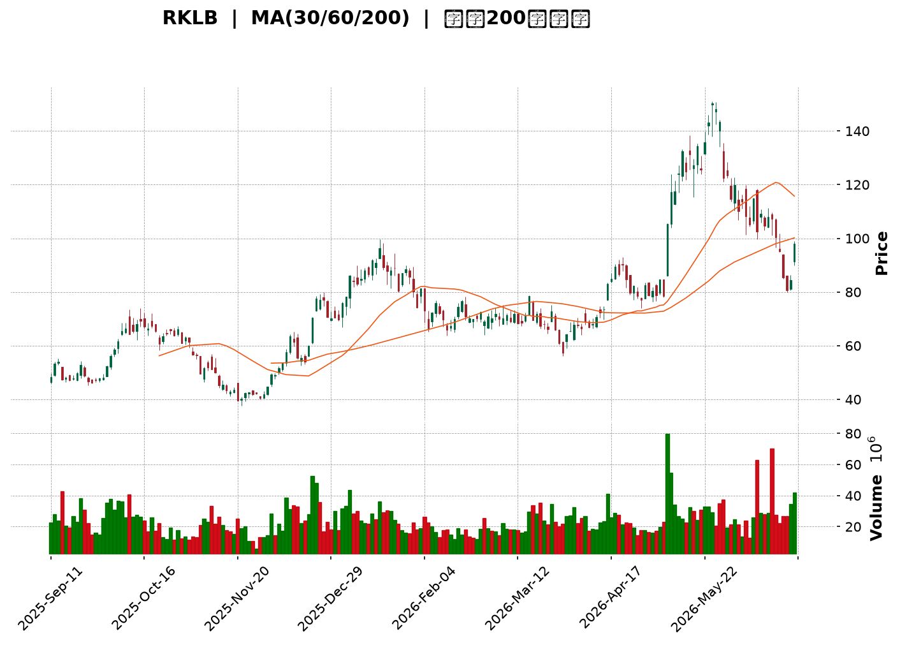
</details>

<html>
<head><meta charset="utf-8" /></head>
<body>
    <div style="height:500px; width:100%;">                        <script>window.PlotlyConfig = {MathJaxConfig: 'local'};</script>
        <script charset="utf-8" src="https://cdn.plot.ly/plotly-3.6.0.min.js" integrity="sha256-QaOVwtVY0T02VaHrr6pnoHLCwayMJp4O5n4YyaE3rJk=" crossorigin="anonymous"></script>                <div id="candlestick-chart" class="plotly-graph-div" style="height:100%; width:100%;"></div>            <script>                window.PLOTLYENV=window.PLOTLYENV || {};                                if (document.getElementById("candlestick-chart")) {                    Plotly.newPlot(                        "candlestick-chart",                        [{"close":{"dtype":"f8","bdata":"AAAAQAo3SEAAAAAghatKQAAAAMAeBUtAAAAAIFyfR0AAAACAPQpIQAAAAEAKl0dAAAAAwB7lR0AAAAAgrudIQAAAAOB6dEpAAAAA4FFYSEAAAADgo1BHQAAAAKBHIUdAAAAAoEeBR0AAAADgevRHQAAAAAAp\u002fEdAAAAAACk8SkAAAADgehRMQAAAAAAAQE1AAAAAoEfBTkAAAAAA11NQQAAAAEDhmlBAAAAA4KMQUEAAAABA4VpQQAAAAIDrAVFAAAAAoEdRUUAAAAAAAMBQQAAAAKBHkVBAAAAAYGbWUEAAAACgmVlQQAAAAOBRSE5AAAAAwPXIT0AAAAAA1yNQQAAAACCuZ1BAAAAAAADgT0AAAACAPYpQQAAAAIDCdU5AAAAAoHB9T0AAAAAghatOQAAAAMD1SExAAAAAgMI1TEAAAACAFM5IQAAAAIDr0UlAAAAAQDPzSUAAAABguJ5JQAAAAAAp\u002fEhAAAAAAACgRkAAAADAHsVGQAAAACCup0VAAAAAANdjRUAAAAAgXM9FQAAAAKBwvUNAAAAAYGYmREAAAACgmTlFQAAAAMDMTEVAAAAAQAr3REAAAACA6xFFQAAAACBcL0RAAAAAQDPzREAAAAAAKVxGQAAAACBcr0hAAAAAQAqHSEAAAAAgrsdJQAAAAEAKt0pAAAAAYI\u002fCTEAAAAAA18NPQAAAAGC4vk5AAAAA4Hq0S0AAAABguL5LQAAAAEDh+kpAAAAAgML1TUAAAACgR6FRQAAAAEAzY1NAAAAAIIVLU0AAAAAghUtTQAAAAKCZqVFAAAAAIK6HUUAAAADAzJxRQAAAAOCjcFFAAAAAIFz\u002fUkAAAADA9YhTQAAAAIDrgVVAAAAAwB4FVUAAAADAHsVUQAAAAGBmNlVAAAAAoJn5VUAAAADAHqVVQAAAAEAz81ZAAAAA4KOwVkAAAABAMxNYQAAAAIA9SlZAAAAA4Hr0VUAAAABguP5VQAAAAKCZOVZAAAAAYLgeVEAAAAAAAMBVQAAAAOB6JFZAAAAAIIVrVUAAAADgegRUQAAAAKCZiVJAAAAAoEdRVEAAAABACkdSQAAAAOB6lFBAAAAA4HoUUkAAAACAwvVSQAAAAIDrAVJAAAAAIK5nUUAAAADgo4BQQAAAAAAp3FBAAAAAwPV4UUAAAABA4ZpSQAAAAMAeJVNAAAAAQAq3UUAAAACgcI1RQAAAAIAUflFAAAAAwMyMUUAAAACgmSlSQAAAAGBmRlFAAAAAgBS+UUAAAADgUYhRQAAAAIA9+lFAAAAAAACAUUAAAABACodRQAAAAGC43lFAAAAAIIU7UUAAAACgcP1RQAAAACCuF1FAAAAAgD0aUUAAAAAA19NRQAAAAIDCpVNAAAAAYLheUUAAAAAghftRQAAAAGC4zlBAAAAAAAAAUUAAAADgeoRQQAAAAOBROFJAAAAAACl8UEAAAABACndOQAAAAOCjsExAAAAAgBQOUEAAAACgR2FQQAAAAGC47lBAAAAAQOHqUEAAAADgepRQQAAAAMAeRVFAAAAAIFyvUEAAAABAMwNRQAAAACCup1FAAAAAgBQOUkAAAABgZmZSQAAAACCFu1RAAAAAQDMzVUAAAACgcF1WQAAAAMD1qFVAAAAAYI+CVkAAAABgZiZVQAAAACCF61NAAAAAYI+SVEAAAACAwqVTQAAAAKBHQVNAAAAA4KOgVEAAAAAA17NTQAAAAADXE1RAAAAA4KOwU0AAAACgmSlVQAAAAMAepVNAAAAAgBReWkAAAABgZlZdQAAAAADXY11AAAAAoJkJX0AAAACgmZFgQAAAAKBHMV9AAAAAwB5lYEAAAAAA19NfQAAAAMD1yGBAAAAAwMxcX0AAAADgUfhgQAAAAGBm5mFAAAAAIFzHYkAAAADA9YBiQAAAACBc72FAAAAAwPWYXkAAAADgetReQAAAAMDMrFxAAAAAwMz8XUAAAADAHoVbQAAAAKCZaVxAAAAAYLgOW0AAAABAM0NaQAAAAIDrsVxAAAAAwPWYWUAAAAAAAFBbQAAAAOBRKFpAAAAAYLj+WkAAAAAgXM9aQAAAAGCPEllAAAAAIK7HV0AAAACAPVpVQAAAAAApLFRAAAAAYI8iVUAAAADgo4BYQA=="},"high":{"dtype":"f8","bdata":"AAAAwB7VSEAAAAAA1wNLQAAAAIDClUtAAAAAgD0KSkAAAADAHkVIQAAAAOBRmEhAAAAAQAp3SEAAAACgRyFJQAAAAGA5FEtAAAAAoHA9SkAAAAAgXE9IQAAAAOBR2EdAAAAAwMwMSEAAAABguP5HQAAAAIDCtUhAAAAAQDNTSkAAAAAgMXhMQAAAAKBHoU1AAAAAIK5HT0AAAAAALSJRQAAAAGCPIlFAAAAAAABgUkAAAAAAKZxRQAAAAEDhalFAAAAAgBR+UkAAAAAAABBSQAAAAAAAIFFAAAAAIIULUkAAAABgjwJRQAAAAKBHAVBAAAAAwMwsUEAAAAAghYtQQAAAAGBmllBAAAAAYI+iUEAAAADA9dhQQAAAACCFS1BAAAAAoJm5T0AAAADAzIxPQAAAAGC4vk1AAAAAANejTEAAAABA4RpMQAAAAMDMDEpAAAAAAABAS0AAAABA4XpMQAAAAIA9qktAAAAA4KOwSEAAAAAAKZxHQAAAAMBL10ZAAAAAgBTORUAAAAAA10NGQAAAAKBHIUdAAAAAgMKFREAAAAAA10NFQAAAAEAKZ0VAAAAAIIXLRUAAAACgmVlFQAAAAGBmpkRAAAAAYLh+RUAAAABguF5GQAAAAEAK10hAAAAAoJnZSEAAAAAgXC9KQAAAAAAA4EpAAAAAgD1qTUAAAACgmQlQQAAAACCFS1BAAAAAANcjUEAAAACgcF1MQAAAAOB6dExAAAAAAAAgTkAAAAAA16NRQAAAAMDMnFNAAAAAIIXLU0AAAADAHvVTQAAAACBcP1NAAAAAIFwvUkAAAAAAKaxSQAAAAECLTFJAAAAAIFwPU0AAAAAAAJBTQAAAAAAAkFVAAAAAoHB9VUAAAAAgrndWQAAAACCFG1ZAAAAAgMI1VkAAAADgp25WQAAAAAApDFdAAAAAQGAdV0AAAADAHuVYQAAAAKBHkVhAAAAAAADQVkAAAACgmVlWQAAAAMDMnFdAAAAAgD3KVUAAAAAAAMBVQAAAAEAzc1ZAAAAAAABAVkAAAADgelRWQAAAAMDMLFRAAAAA4HpUVEAAAABgZlZUQAAAACBcP1JAAAAAgD0qUkAAAABAMzNTQAAAAEAK91JAAAAAoJlZUkAAAADAzBxRQAAAAGBmZlFAAAAAIFy\u002fUUAAAADA9fBSQAAAAEAKR1NAAAAAwMyMU0AAAAAAANBRQAAAACCFg1FAAAAAYGb2UUAAAAAgXC9SQAAAAIDCZVFAAAAAYGYGUkAAAAAAAFBSQAAAAGBmhlJAAAAAANcTUkAAAABACsdSQAAAAAAACFJAAAAAANc7UkAAAABAM1NSQAAAAGBmJlJAAAAAANfTUUAAAADgURhSQAAAAEDhqlNAAAAA4FE4U0AAAABguC5SQAAAAGC4flJAAAAAwMxcUUAAAABgZiZRQAAAAADXw1JAAAAAgMIFUkAAAACAFIZQQAAAAIDr0U5AAAAAwB4lUEAAAABA4SpRQAAAAMD1WFFAAAAA4HqUUUAAAABAMxNRQAAAAIDAalJAAAAAYI9yUUAAAAAA14NRQAAAAEAz41FAAAAAAACwUkAAAACAwqVSQAAAACBc31RAAAAAIFy\u002fVUAAAABgZpZWQAAAAMDM\u002fFZAAAAAYGZGV0AAAABAM5NWQAAAAIA9mlVAAAAAYLieVEAAAACA63FUQAAAAOCjgFNAAAAAgMLlVEAAAABgj\u002fJUQAAAAOBPdVRAAAAAAADAVEAAAAAghStVQAAAAGCPMlVAAAAAIK5nWkAAAAAAKfxeQAAAACBcX15AAAAAIFzPX0AAAACAwqVgQAAAAADXS2BAAAAAAClMYUAAAACAPTJgQAAAAEAz62BAAAAAANdbYEAAAADgUXhhQAAAAAAAQGJAAAAAAADgYkAAAABgj9piQAAAAAAAAGJAAAAAACn0YEAAAADAzAxgQAAAAOBRoF5AAAAA4FGoXkAAAABguH5dQAAAAAAAEF1AAAAAYI\u002fyXUAAAACgcP1bQAAAAEDhwlxAAAAAwCCYXUAAAACA67FbQAAAAAAAIFtAAAAAgMLVW0AAAABAM2NbQAAAAKCZ2VpAAAAAYLhuWUAAAABAM5NXQAAAAEAKh1VAAAAAgOuRVUAAAABgj8JYQA=="},"hovertemplate":"\u003cb\u003e%{x|%Y-%m-%d}\u003c\u002fb\u003e\u003cbr\u003e\u958b: $%{open:.2f}\u003cbr\u003e\u9ad8: $%{high:.2f}\u003cbr\u003e\u4f4e: $%{low:.2f}\u003cbr\u003e\u6536: $%{close:.2f}\u003cextra\u003e\u003c\u002fextra\u003e","low":{"dtype":"f8","bdata":"AAAAQAoHR0AAAABANU5IQAAAAAApXEpAAAAAoEeBR0AAAACgmTlHQAAAAAAAgEdAAAAA4KOQR0AAAABgZmZHQAAAAOB69EdAAAAAQAo3SEAAAABA4ZpGQAAAAIA96kZAAAAAIFwvR0AAAACgR0FHQAAAACBcj0dAAAAAoEdBSEAAAACgR6FJQAAAAGBm5ktAAAAAYI+CTEAAAABAM9NPQAAAAEDhGlBAAAAAwPUIUEAAAADgzidQQAAAAOBRGE9AAAAAwB7FUEAAAABAM5tQQAAAAKCZ2U9AAAAAQDOrUEAAAABACjdQQAAAAOB6NE1AAAAAAABgTkAAAABAM9NPQAAAAKCZCVBAAAAAgBTOT0AAAACgcL1PQAAAAIDrcU5AAAAAQDMzTkAAAADgo5BNQAAAAKBHQUxAAAAAIFxvS0AAAADgerRIQAAAAODOJ0dAAAAAoEdhSUAAAABA4ZpJQAAAAOB61EhAAAAAIFwvRkAAAABgZqZFQAAAAMDMHEVAAAAAoHCdREAAAABACjdFQAAAAMD1qENAAAAAwPXIQkAAAABgZqZDQAAAAOCjMERAAAAA4KOwREAAAABgZuZEQAAAAKBw\u002fUNAAAAAgMI1REAAAAAAAMBEQAAAAMD1aEZAAAAAoJnZR0AAAAAAKZxIQAAAACCFK0lAAAAAAAAgSkAAAADAzGxMQAAAAGBm5k1AAAAAgD2KS0AAAABACldKQAAAAEDhikpAAAAAANcDTEAAAADAnV9OQAAAAMAgMFJAAAAAYI9SUkAAAACgQ7NSQAAAAMD1mFFAAAAAoJtUUUAAAAAAKZxRQAAAAOBRSFFAAAAAYGa2UEAAAAAA19NRQAAAAEAzg1JAAAAAYGZ2VEAAAADgo5BUQAAAAMDMnFRAAAAA4NDaVEAAAACgmWlVQAAAAAAAIFVAAAAAoJmpVUAAAACgmRlXQAAAAEAzE1ZAAAAAoHCtVEAAAADAdlZUQAAAACCuh1VAAAAA4KMAVEAAAAAAAIBUQAAAAMDKgVVAAAAAAADAVEAAAACgR4FTQAAAAIBBeFJAAAAAoEfxUkAAAABACCRRQAAAAMDMTFBAAAAAAADAUEAAAAAAALBRQAAAAEAz41FAAAAAoEfBUEAAAAAgXO9PQAAAAAAAYFBAAAAAAABAUEAAAADAS39RQAAAAGBmFlJAAAAAoJlZUUAAAAAAACBRQAAAAGBmplBAAAAA4FE4UUAAAAAA1zNRQAAAAGBmBlBAAAAAwMycUEAAAAAAKYxQQAAAAIAUXlFAAAAAgMLVUEAAAADgowhRQAAAAOB69FBAAAAAgL4nUUAAAADAHhVRQAAAAIDrEVFAAAAAACncUEAAAABA4SpRQAAAAKBH0VFAAAAAoJlZUUAAAAAAAABRQAAAAMD1mFBAAAAAQDODUEAAAACgcB1QQAAAAAApPFFAAAAAgMJlUEAAAADAzCxOQAAAAGDlEExAAAAAANeDTUAAAABAM1NQQAAAAIAU7k5AAAAAYGamUEAAAABA4fpPQAAAAGDn81BAAAAAQOGiUEAAAACAwpVQQAAAAIDCpVBAAAAAYLieUUAAAABgZmZRQAAAAKCZOVNAAAAAYGbmVEAAAABgZiZVQAAAAAAAcFVAAAAA4KPwVUAAAAAAKWRUQAAAAMAexVNAAAAAwHRDU0AAAABgZmZTQAAAACBcf1JAAAAAgBReU0AAAAAghZtTQAAAAAAAEFNAAAAAANcjU0AAAABACrdTQAAAACCFe1NAAAAAIK53VUAAAAAAAABaQAAAAIA9GlxAAAAAwPU4XUAAAAAA11NeQAAAAEAzc15AAAAAoPFqX0AAAABguM5cQAAAAIAUDl9AAAAAQDPzXkAAAACA62lgQAAAAIDrUWFAAAAAwB49YUAAAAAA18thQAAAAKCZwWBAAAAAAABAXkAAAAAA16NeQAAAAIA9alxAAAAAwPWYW0AAAABguK5aQAAAAAAAwFtAAAAAwMxMWUAAAACAPRpaQAAAAKCZWVpAAAAAQArnWEAAAABAM3NaQAAAAOB6xFlAAAAAYI8CWkAAAACgcD1ZQAAAAAAAIFhAAAAA4KO4V0AAAABgZjZVQAAAAAAAAFRAAAAAYLguVEAAAAAAaHZWQA=="},"name":"\u50f9\u683c","open":{"dtype":"f8","bdata":"AAAAwPUoR0AAAACgcH1IQAAAAIA9ykpAAAAAAAAASkAAAADgUchHQAAAAIDCdUhAAAAAQArXR0AAAADgo5BHQAAAAEAzg0hAAAAAgMLlSUAAAAAAAABIQAAAAGBmpkdAAAAAQDOzR0AAAABA4ZpHQAAAAOCjsEdAAAAAgOtRSEAAAABgZgZKQAAAAGC4bkxAAAAAoEeBTUAAAACgmQlQQAAAAKCZOVBAAAAAQDOzUUAAAADgUfhQQAAAAIDCVVBAAAAAoEeBUUAAAADgeoRRQAAAAMD1eFBAAAAA4KNIUUAAAABgjwJRQAAAAAApfE9AAAAAIK7HTkAAAAAA1zNQQAAAAAApjFBAAAAAQDNrUEAAAACgRwlQQAAAAAAAQFBAAAAAYI\u002fiTkAAAAAA14NPQAAAAGBm5kxAAAAA4HpUTEAAAABA4RpMQAAAAKAY1EdAAAAAYLjeSkAAAAAAAABMQAAAAEAK90lAAAAAoEdhSEAAAABA4dpFQAAAAEAzk0ZAAAAAACkcRUAAAAAAAEBFQAAAAIA9CkdAAAAAgD3qQ0AAAACgR2FEQAAAAADXA0VAAAAAYLieRUAAAACgR0FFQAAAAEAzk0RAAAAAIK5HREAAAABgj\u002fJEQAAAAGCP0kZAAAAAAABwSEAAAACAPQpJQAAAAKBwnUlAAAAA4FG4SkAAAACgR8FMQAAAAAAAQE9AAAAA4KeGT0AAAADgURhLQAAAAMDMDExAAAAAoJkZTEAAAAAgXI9OQAAAAAApPFJAAAAAANdzUkAAAACAPYJTQAAAACCFK1NAAAAAAABgUUAAAACgmUFSQAAAAAAA4FFAAAAA4FGoUUAAAAAgrqdSQAAAAOCjcFNAAAAAYGYGVUAAAAAAAGBVQAAAAKCZIVVAAAAAYLg+VUAAAADA9UhWQAAAAGBmllVAAAAAwPVQVkAAAACgmSFXQAAAAMDMbFdAAAAAoEeBVkAAAADgUZhVQAAAACCFQ1ZAAAAAIK6vVUAAAADA9bhUQAAAAIAUzlVAAAAAACn8VUAAAAAAAEBVQAAAAIA9ylNAAAAAYGamU0AAAABgZlZUQAAAAGC4flFAAAAAAABAUUAAAACgmQFSQAAAAIAUplJAAAAA4FFIUkAAAACA6+FQQAAAAOB6rFBAAAAAQGCFUEAAAAAAAMBRQAAAAKCZOVJAAAAAINneUkAAAADgUTBRQAAAAOBROFFAAAAAgBTGUUAAAABA4YJRQAAAAIDC5VBAAAAAIIWrUEAAAABguDZRQAAAAADXs1FAAAAAQOG6UUAAAADgowhRQAAAAMD1WFFAAAAAgMKVUUAAAABAMzNRQAAAAMDM\u002fFFAAAAAoJlJUUAAAADAzFRRQAAAAGBm3lFAAAAAYI8CU0AAAADgejRRQAAAAAAAAFJAAAAAoHAFUUAAAAAAAMBQQAAAAAApPFFAAAAAwMzMUUAAAADgo4BQQAAAAKCZuU5AAAAAQOHaTkAAAAAAAGBQQAAAAMDMHE9AAAAAYLjuUEAAAAAgXMdQQAAAAAAAAFJAAAAAANdDUUAAAADAzOxQQAAAAEAzw1BAAAAAIIVjUkAAAACgcGVSQAAAAIAUPlNAAAAAwB4FVUAAAABgZjZVQAAAAMAelVZAAAAAgMKdVkAAAABgZnZWQAAAAIDClVVAAAAAACnsU0AAAADAzARUQAAAAEAKd1NAAAAAQDNjU0AAAACA6+FUQAAAAEAKl1NAAAAAYGamVEAAAAAgrudTQAAAAKBwLVVAAAAAgD2CVUAAAACgR1FaQAAAAOCjMFxAAAAAoEf5XkAAAABgZsZeQAAAAEAzA2BAAAAAACmYYEAAAACAFH5fQAAAAGC43l9AAAAAwPWIX0AAAADAHm1gQAAAAEDhvmFAAAAAQAq3YkAAAACgcGViQAAAAIAUfmFAAAAAACmMYEAAAACAwlVfQAAAAMAe5V1AAAAAoHBFXEAAAACgR5FcQAAAAEDhqlxAAAAAoJmZXUAAAADAzOxaQAAAAIDCpVpAAAAAoEeBXUAAAACgcP1aQAAAAKBw7VpAAAAAIK4HWkAAAADAHjVbQAAAACBcv1pAAAAAoEcBWEAAAABgZnZXQAAAAEAKh1VAAAAAQApHVEAAAABA4dpWQA=="},"x":["2025-09-11T00:00:00-04:00","2025-09-12T00:00:00-04:00","2025-09-15T00:00:00-04:00","2025-09-16T00:00:00-04:00","2025-09-17T00:00:00-04:00","2025-09-18T00:00:00-04:00","2025-09-19T00:00:00-04:00","2025-09-22T00:00:00-04:00","2025-09-23T00:00:00-04:00","2025-09-24T00:00:00-04:00","2025-09-25T00:00:00-04:00","2025-09-26T00:00:00-04:00","2025-09-29T00:00:00-04:00","2025-09-30T00:00:00-04:00","2025-10-01T00:00:00-04:00","2025-10-02T00:00:00-04:00","2025-10-03T00:00:00-04:00","2025-10-06T00:00:00-04:00","2025-10-07T00:00:00-04:00","2025-10-08T00:00:00-04:00","2025-10-09T00:00:00-04:00","2025-10-10T00:00:00-04:00","2025-10-13T00:00:00-04:00","2025-10-14T00:00:00-04:00","2025-10-15T00:00:00-04:00","2025-10-16T00:00:00-04:00","2025-10-17T00:00:00-04:00","2025-10-20T00:00:00-04:00","2025-10-21T00:00:00-04:00","2025-10-22T00:00:00-04:00","2025-10-23T00:00:00-04:00","2025-10-24T00:00:00-04:00","2025-10-27T00:00:00-04:00","2025-10-28T00:00:00-04:00","2025-10-29T00:00:00-04:00","2025-10-30T00:00:00-04:00","2025-10-31T00:00:00-04:00","2025-11-03T00:00:00-05:00","2025-11-04T00:00:00-05:00","2025-11-05T00:00:00-05:00","2025-11-06T00:00:00-05:00","2025-11-07T00:00:00-05:00","2025-11-10T00:00:00-05:00","2025-11-11T00:00:00-05:00","2025-11-12T00:00:00-05:00","2025-11-13T00:00:00-05:00","2025-11-14T00:00:00-05:00","2025-11-17T00:00:00-05:00","2025-11-18T00:00:00-05:00","2025-11-19T00:00:00-05:00","2025-11-20T00:00:00-05:00","2025-11-21T00:00:00-05:00","2025-11-24T00:00:00-05:00","2025-11-25T00:00:00-05:00","2025-11-26T00:00:00-05:00","2025-11-28T00:00:00-05:00","2025-12-01T00:00:00-05:00","2025-12-02T00:00:00-05:00","2025-12-03T00:00:00-05:00","2025-12-04T00:00:00-05:00","2025-12-05T00:00:00-05:00","2025-12-08T00:00:00-05:00","2025-12-09T00:00:00-05:00","2025-12-10T00:00:00-05:00","2025-12-11T00:00:00-05:00","2025-12-12T00:00:00-05:00","2025-12-15T00:00:00-05:00","2025-12-16T00:00:00-05:00","2025-12-17T00:00:00-05:00","2025-12-18T00:00:00-05:00","2025-12-19T00:00:00-05:00","2025-12-22T00:00:00-05:00","2025-12-23T00:00:00-05:00","2025-12-24T00:00:00-05:00","2025-12-26T00:00:00-05:00","2025-12-29T00:00:00-05:00","2025-12-30T00:00:00-05:00","2025-12-31T00:00:00-05:00","2026-01-02T00:00:00-05:00","2026-01-05T00:00:00-05:00","2026-01-06T00:00:00-05:00","2026-01-07T00:00:00-05:00","2026-01-08T00:00:00-05:00","2026-01-09T00:00:00-05:00","2026-01-12T00:00:00-05:00","2026-01-13T00:00:00-05:00","2026-01-14T00:00:00-05:00","2026-01-15T00:00:00-05:00","2026-01-16T00:00:00-05:00","2026-01-20T00:00:00-05:00","2026-01-21T00:00:00-05:00","2026-01-22T00:00:00-05:00","2026-01-23T00:00:00-05:00","2026-01-26T00:00:00-05:00","2026-01-27T00:00:00-05:00","2026-01-28T00:00:00-05:00","2026-01-29T00:00:00-05:00","2026-01-30T00:00:00-05:00","2026-02-02T00:00:00-05:00","2026-02-03T00:00:00-05:00","2026-02-04T00:00:00-05:00","2026-02-05T00:00:00-05:00","2026-02-06T00:00:00-05:00","2026-02-09T00:00:00-05:00","2026-02-10T00:00:00-05:00","2026-02-11T00:00:00-05:00","2026-02-12T00:00:00-05:00","2026-02-13T00:00:00-05:00","2026-02-17T00:00:00-05:00","2026-02-18T00:00:00-05:00","2026-02-19T00:00:00-05:00","2026-02-20T00:00:00-05:00","2026-02-23T00:00:00-05:00","2026-02-24T00:00:00-05:00","2026-02-25T00:00:00-05:00","2026-02-26T00:00:00-05:00","2026-02-27T00:00:00-05:00","2026-03-02T00:00:00-05:00","2026-03-03T00:00:00-05:00","2026-03-04T00:00:00-05:00","2026-03-05T00:00:00-05:00","2026-03-06T00:00:00-05:00","2026-03-09T00:00:00-04:00","2026-03-10T00:00:00-04:00","2026-03-11T00:00:00-04:00","2026-03-12T00:00:00-04:00","2026-03-13T00:00:00-04:00","2026-03-16T00:00:00-04:00","2026-03-17T00:00:00-04:00","2026-03-18T00:00:00-04:00","2026-03-19T00:00:00-04:00","2026-03-20T00:00:00-04:00","2026-03-23T00:00:00-04:00","2026-03-24T00:00:00-04:00","2026-03-25T00:00:00-04:00","2026-03-26T00:00:00-04:00","2026-03-27T00:00:00-04:00","2026-03-30T00:00:00-04:00","2026-03-31T00:00:00-04:00","2026-04-01T00:00:00-04:00","2026-04-02T00:00:00-04:00","2026-04-06T00:00:00-04:00","2026-04-07T00:00:00-04:00","2026-04-08T00:00:00-04:00","2026-04-09T00:00:00-04:00","2026-04-10T00:00:00-04:00","2026-04-13T00:00:00-04:00","2026-04-14T00:00:00-04:00","2026-04-15T00:00:00-04:00","2026-04-16T00:00:00-04:00","2026-04-17T00:00:00-04:00","2026-04-20T00:00:00-04:00","2026-04-21T00:00:00-04:00","2026-04-22T00:00:00-04:00","2026-04-23T00:00:00-04:00","2026-04-24T00:00:00-04:00","2026-04-27T00:00:00-04:00","2026-04-28T00:00:00-04:00","2026-04-29T00:00:00-04:00","2026-04-30T00:00:00-04:00","2026-05-01T00:00:00-04:00","2026-05-04T00:00:00-04:00","2026-05-05T00:00:00-04:00","2026-05-06T00:00:00-04:00","2026-05-07T00:00:00-04:00","2026-05-08T00:00:00-04:00","2026-05-11T00:00:00-04:00","2026-05-12T00:00:00-04:00","2026-05-13T00:00:00-04:00","2026-05-14T00:00:00-04:00","2026-05-15T00:00:00-04:00","2026-05-18T00:00:00-04:00","2026-05-19T00:00:00-04:00","2026-05-20T00:00:00-04:00","2026-05-21T00:00:00-04:00","2026-05-22T00:00:00-04:00","2026-05-26T00:00:00-04:00","2026-05-27T00:00:00-04:00","2026-05-28T00:00:00-04:00","2026-05-29T00:00:00-04:00","2026-06-01T00:00:00-04:00","2026-06-02T00:00:00-04:00","2026-06-03T00:00:00-04:00","2026-06-04T00:00:00-04:00","2026-06-05T00:00:00-04:00","2026-06-08T00:00:00-04:00","2026-06-09T00:00:00-04:00","2026-06-10T00:00:00-04:00","2026-06-11T00:00:00-04:00","2026-06-12T00:00:00-04:00","2026-06-15T00:00:00-04:00","2026-06-16T00:00:00-04:00","2026-06-17T00:00:00-04:00","2026-06-18T00:00:00-04:00","2026-06-22T00:00:00-04:00","2026-06-23T00:00:00-04:00","2026-06-24T00:00:00-04:00","2026-06-25T00:00:00-04:00","2026-06-26T00:00:00-04:00","2026-06-29T00:00:00-04:00"],"type":"candlestick"},{"hovertemplate":"MA30: $%{y:.2f}\u003cextra\u003e\u003c\u002fextra\u003e","line":{"color":"#2196F3","dash":"dash","width":2},"mode":"lines","name":"MA30","x":["2025-09-11T00:00:00-04:00","2025-09-12T00:00:00-04:00","2025-09-15T00:00:00-04:00","2025-09-16T00:00:00-04:00","2025-09-17T00:00:00-04:00","2025-09-18T00:00:00-04:00","2025-09-19T00:00:00-04:00","2025-09-22T00:00:00-04:00","2025-09-23T00:00:00-04:00","2025-09-24T00:00:00-04:00","2025-09-25T00:00:00-04:00","2025-09-26T00:00:00-04:00","2025-09-29T00:00:00-04:00","2025-09-30T00:00:00-04:00","2025-10-01T00:00:00-04:00","2025-10-02T00:00:00-04:00","2025-10-03T00:00:00-04:00","2025-10-06T00:00:00-04:00","2025-10-07T00:00:00-04:00","2025-10-08T00:00:00-04:00","2025-10-09T00:00:00-04:00","2025-10-10T00:00:00-04:00","2025-10-13T00:00:00-04:00","2025-10-14T00:00:00-04:00","2025-10-15T00:00:00-04:00","2025-10-16T00:00:00-04:00","2025-10-17T00:00:00-04:00","2025-10-20T00:00:00-04:00","2025-10-21T00:00:00-04:00","2025-10-22T00:00:00-04:00","2025-10-23T00:00:00-04:00","2025-10-24T00:00:00-04:00","2025-10-27T00:00:00-04:00","2025-10-28T00:00:00-04:00","2025-10-29T00:00:00-04:00","2025-10-30T00:00:00-04:00","2025-10-31T00:00:00-04:00","2025-11-03T00:00:00-05:00","2025-11-04T00:00:00-05:00","2025-11-05T00:00:00-05:00","2025-11-06T00:00:00-05:00","2025-11-07T00:00:00-05:00","2025-11-10T00:00:00-05:00","2025-11-11T00:00:00-05:00","2025-11-12T00:00:00-05:00","2025-11-13T00:00:00-05:00","2025-11-14T00:00:00-05:00","2025-11-17T00:00:00-05:00","2025-11-18T00:00:00-05:00","2025-11-19T00:00:00-05:00","2025-11-20T00:00:00-05:00","2025-11-21T00:00:00-05:00","2025-11-24T00:00:00-05:00","2025-11-25T00:00:00-05:00","2025-11-26T00:00:00-05:00","2025-11-28T00:00:00-05:00","2025-12-01T00:00:00-05:00","2025-12-02T00:00:00-05:00","2025-12-03T00:00:00-05:00","2025-12-04T00:00:00-05:00","2025-12-05T00:00:00-05:00","2025-12-08T00:00:00-05:00","2025-12-09T00:00:00-05:00","2025-12-10T00:00:00-05:00","2025-12-11T00:00:00-05:00","2025-12-12T00:00:00-05:00","2025-12-15T00:00:00-05:00","2025-12-16T00:00:00-05:00","2025-12-17T00:00:00-05:00","2025-12-18T00:00:00-05:00","2025-12-19T00:00:00-05:00","2025-12-22T00:00:00-05:00","2025-12-23T00:00:00-05:00","2025-12-24T00:00:00-05:00","2025-12-26T00:00:00-05:00","2025-12-29T00:00:00-05:00","2025-12-30T00:00:00-05:00","2025-12-31T00:00:00-05:00","2026-01-02T00:00:00-05:00","2026-01-05T00:00:00-05:00","2026-01-06T00:00:00-05:00","2026-01-07T00:00:00-05:00","2026-01-08T00:00:00-05:00","2026-01-09T00:00:00-05:00","2026-01-12T00:00:00-05:00","2026-01-13T00:00:00-05:00","2026-01-14T00:00:00-05:00","2026-01-15T00:00:00-05:00","2026-01-16T00:00:00-05:00","2026-01-20T00:00:00-05:00","2026-01-21T00:00:00-05:00","2026-01-22T00:00:00-05:00","2026-01-23T00:00:00-05:00","2026-01-26T00:00:00-05:00","2026-01-27T00:00:00-05:00","2026-01-28T00:00:00-05:00","2026-01-29T00:00:00-05:00","2026-01-30T00:00:00-05:00","2026-02-02T00:00:00-05:00","2026-02-03T00:00:00-05:00","2026-02-04T00:00:00-05:00","2026-02-05T00:00:00-05:00","2026-02-06T00:00:00-05:00","2026-02-09T00:00:00-05:00","2026-02-10T00:00:00-05:00","2026-02-11T00:00:00-05:00","2026-02-12T00:00:00-05:00","2026-02-13T00:00:00-05:00","2026-02-17T00:00:00-05:00","2026-02-18T00:00:00-05:00","2026-02-19T00:00:00-05:00","2026-02-20T00:00:00-05:00","2026-02-23T00:00:00-05:00","2026-02-24T00:00:00-05:00","2026-02-25T00:00:00-05:00","2026-02-26T00:00:00-05:00","2026-02-27T00:00:00-05:00","2026-03-02T00:00:00-05:00","2026-03-03T00:00:00-05:00","2026-03-04T00:00:00-05:00","2026-03-05T00:00:00-05:00","2026-03-06T00:00:00-05:00","2026-03-09T00:00:00-04:00","2026-03-10T00:00:00-04:00","2026-03-11T00:00:00-04:00","2026-03-12T00:00:00-04:00","2026-03-13T00:00:00-04:00","2026-03-16T00:00:00-04:00","2026-03-17T00:00:00-04:00","2026-03-18T00:00:00-04:00","2026-03-19T00:00:00-04:00","2026-03-20T00:00:00-04:00","2026-03-23T00:00:00-04:00","2026-03-24T00:00:00-04:00","2026-03-25T00:00:00-04:00","2026-03-26T00:00:00-04:00","2026-03-27T00:00:00-04:00","2026-03-30T00:00:00-04:00","2026-03-31T00:00:00-04:00","2026-04-01T00:00:00-04:00","2026-04-02T00:00:00-04:00","2026-04-06T00:00:00-04:00","2026-04-07T00:00:00-04:00","2026-04-08T00:00:00-04:00","2026-04-09T00:00:00-04:00","2026-04-10T00:00:00-04:00","2026-04-13T00:00:00-04:00","2026-04-14T00:00:00-04:00","2026-04-15T00:00:00-04:00","2026-04-16T00:00:00-04:00","2026-04-17T00:00:00-04:00","2026-04-20T00:00:00-04:00","2026-04-21T00:00:00-04:00","2026-04-22T00:00:00-04:00","2026-04-23T00:00:00-04:00","2026-04-24T00:00:00-04:00","2026-04-27T00:00:00-04:00","2026-04-28T00:00:00-04:00","2026-04-29T00:00:00-04:00","2026-04-30T00:00:00-04:00","2026-05-01T00:00:00-04:00","2026-05-04T00:00:00-04:00","2026-05-05T00:00:00-04:00","2026-05-06T00:00:00-04:00","2026-05-07T00:00:00-04:00","2026-05-08T00:00:00-04:00","2026-05-11T00:00:00-04:00","2026-05-12T00:00:00-04:00","2026-05-13T00:00:00-04:00","2026-05-14T00:00:00-04:00","2026-05-15T00:00:00-04:00","2026-05-18T00:00:00-04:00","2026-05-19T00:00:00-04:00","2026-05-20T00:00:00-04:00","2026-05-21T00:00:00-04:00","2026-05-22T00:00:00-04:00","2026-05-26T00:00:00-04:00","2026-05-27T00:00:00-04:00","2026-05-28T00:00:00-04:00","2026-05-29T00:00:00-04:00","2026-06-01T00:00:00-04:00","2026-06-02T00:00:00-04:00","2026-06-03T00:00:00-04:00","2026-06-04T00:00:00-04:00","2026-06-05T00:00:00-04:00","2026-06-08T00:00:00-04:00","2026-06-09T00:00:00-04:00","2026-06-10T00:00:00-04:00","2026-06-11T00:00:00-04:00","2026-06-12T00:00:00-04:00","2026-06-15T00:00:00-04:00","2026-06-16T00:00:00-04:00","2026-06-17T00:00:00-04:00","2026-06-18T00:00:00-04:00","2026-06-22T00:00:00-04:00","2026-06-23T00:00:00-04:00","2026-06-24T00:00:00-04:00","2026-06-25T00:00:00-04:00","2026-06-26T00:00:00-04:00","2026-06-29T00:00:00-04:00"],"y":{"dtype":"f8","bdata":"AAAAAAAA+H8AAAAAAAD4fwAAAAAAAPh\u002fAAAAAAAA+H8AAAAAAAD4fwAAAAAAAPh\u002fAAAAAAAA+H8AAAAAAAD4fwAAAAAAAPh\u002fAAAAAAAA+H8AAAAAAAD4fwAAAAAAAPh\u002fAAAAAAAA+H8AAAAAAAD4fwAAAAAAAPh\u002fAAAAAAAA+H8AAAAAAAD4fwAAAAAAAPh\u002fAAAAAAAA+H8AAAAAAAD4fwAAAAAAAPh\u002fAAAAAAAA+H8AAAAAAAD4fwAAAAAAAPh\u002fAAAAAAAA+H8AAAAAAAD4fwAAAAAAAPh\u002fAAAAAAAA+H8AAAAAAAD4fzMzMxPZHkxA3t3d\u002fXFfTECJiIg4UY9MQLy7u6u5wExAiYiIiCUHTUB3d3e3SVRNQFVVVXXpjk1AzczM\u002fLjPTUAiIiLS6gBOQERERISIEE5AzczMvIMxTkARERGxOj5OQGZmZhYvVU5AZmZmRgxqTkBmZmaGQXhOQO\u002fu7g7KgE5ARERE5PthTkBVVVUFrDROQN7d3X3c801AZmZmVvKjTUAzMzMTZ0dNQJqZmWl11ExAMzMzszpuTEBmZmZWOQxMQO\u002fu7v64n0tA3t3dbRIrS0De3d2tAMFKQJqZmfl+UkpAq6qqyujlSUB3d3e3rI1JQKuqqsroXUlAq6qqivofSUBEREQUg+hIQImIiFiAtEhAZmZmhuuZSEC8u7vbso5IQERERHQhkUhA7+7u\u002ftRwSEDNzMw831dIQLy7u2u8TEhAq6qqWqtbSEBVVVWl4rRIQHd3d0dvI0lAd3d3x0uPSUDNzMws+f1JQAAAAEA1VkpAzczM7FHASkCJiIhImipLQM3MzLx0m0tAmpmZ6SYpTEBVVVX1b7xMQImIiPgMg01AiYiIaNg9TkBEREQ0M+tOQImIiHh3n09AREREfM0xUEDv7u6mm5BQQKuqqkpT\u002flBA3t3dXY9mUUDNzMzsmNRRQKuqqpJ7KVJAZmZmbi58UkC8u7ub4MlSQFVVVfWLFVNAZmZmLodGU0BmZmbumHhTQImIiDheslNAVVVVrfHyU0AiIiKiYSdUQBERERF0UlRAMzMzAwCAVEAAAACAhoVUQLy7u2uRbVRAZmZmNjNjVEBERERkV2BUQN7d3Q1JY1RAzczM\u002fDdiVECJiIgov1hUQBERESHMU1RAd3d3t8hGVECamZkZ2T5UQERERCSwKlRAIiIiQnwOVEBVVVWFB\u002fNTQO\u002fu7g5J01NA7+7ufoatU0C8u7vbzo9TQBEREaFhX1NAZmZmpik1U0BmZmZWVf1SQJqZmYmI2FJAERERcYSyUkCamZkJZYxSQFVVVWU7Z1JA3t3djZdOUkBVVVW1gS5SQBEREdFpA1JAiYiIGJLeUUB3d3f34ctRQLy7u8ta1VFAMzMz4zO8UUAzMzNzr7lRQO\u002fu7m6gu1FAMzMzI2myUUCrqqpqkZ1RQBEREaFhn1FAvLu724eXUUAAAACAsYxRQN7d3WU7d1FAq6qq0iJrUUBEREQ8JlhRQM3MzPRERVFAIiIiynY+UUDNzMxUKjZRQN7d3UVENFFA7+7upuIsUUCJiIhwEiNRQImIiJBQJlFAMzMzO\u002fsoUUCJiIhQYjBRQLy7u7PkR1FAIiIiendnUUAAAAAov5BRQBEREYkWsVFAERERaR\u002feUUARERGJFvlRQFVVVU03EVJAmpmZodMuUkAzMzN7Wz5SQFVVVQ0CO1JAMzMzK85WUkCJiIiQe2VSQERERPxigVJAmpmZYVeYUkAiIiKK+r9SQImIiIAjzFJA7+7uJnggU0BmZmb+1JhTQLy7u0s3GVRAERERERGZVEAzMzNjEChVQERERNS\u002foVVAZmZm1jEpVkAiIiKCTqtWQGZmZmZmNldAMzMz46WzV0AiIiKSGERYQM3MzOzu3lhAiYiIyFqFWUDNzMx8IyRaQLy7u9tPpVpAIiIiAoH1WkBVVVUVvT1bQFVVVZWZeVtA3t3dbWi5W0CJiIjow+9bQO\u002fu7g48OFxAIiIiwpJvXEAzMzNzBahcQCIiInKT+FxAMzMzk\u002fwiXUAAAADg7GNdQGZmZtbOl11Aq6qq2iTWXUAREREBVgZeQO\u002fu7o6mNF5AREREFJIeXkBVVVWVbtpdQGZmZqbGi11A7+7uTkY3XUDNzMzclu1cQA=="},"type":"scatter"},{"hovertemplate":"MA60: $%{y:.2f}\u003cextra\u003e\u003c\u002fextra\u003e","line":{"color":"#9C27B0","dash":"dash","width":2},"mode":"lines","name":"MA60","x":["2025-09-11T00:00:00-04:00","2025-09-12T00:00:00-04:00","2025-09-15T00:00:00-04:00","2025-09-16T00:00:00-04:00","2025-09-17T00:00:00-04:00","2025-09-18T00:00:00-04:00","2025-09-19T00:00:00-04:00","2025-09-22T00:00:00-04:00","2025-09-23T00:00:00-04:00","2025-09-24T00:00:00-04:00","2025-09-25T00:00:00-04:00","2025-09-26T00:00:00-04:00","2025-09-29T00:00:00-04:00","2025-09-30T00:00:00-04:00","2025-10-01T00:00:00-04:00","2025-10-02T00:00:00-04:00","2025-10-03T00:00:00-04:00","2025-10-06T00:00:00-04:00","2025-10-07T00:00:00-04:00","2025-10-08T00:00:00-04:00","2025-10-09T00:00:00-04:00","2025-10-10T00:00:00-04:00","2025-10-13T00:00:00-04:00","2025-10-14T00:00:00-04:00","2025-10-15T00:00:00-04:00","2025-10-16T00:00:00-04:00","2025-10-17T00:00:00-04:00","2025-10-20T00:00:00-04:00","2025-10-21T00:00:00-04:00","2025-10-22T00:00:00-04:00","2025-10-23T00:00:00-04:00","2025-10-24T00:00:00-04:00","2025-10-27T00:00:00-04:00","2025-10-28T00:00:00-04:00","2025-10-29T00:00:00-04:00","2025-10-30T00:00:00-04:00","2025-10-31T00:00:00-04:00","2025-11-03T00:00:00-05:00","2025-11-04T00:00:00-05:00","2025-11-05T00:00:00-05:00","2025-11-06T00:00:00-05:00","2025-11-07T00:00:00-05:00","2025-11-10T00:00:00-05:00","2025-11-11T00:00:00-05:00","2025-11-12T00:00:00-05:00","2025-11-13T00:00:00-05:00","2025-11-14T00:00:00-05:00","2025-11-17T00:00:00-05:00","2025-11-18T00:00:00-05:00","2025-11-19T00:00:00-05:00","2025-11-20T00:00:00-05:00","2025-11-21T00:00:00-05:00","2025-11-24T00:00:00-05:00","2025-11-25T00:00:00-05:00","2025-11-26T00:00:00-05:00","2025-11-28T00:00:00-05:00","2025-12-01T00:00:00-05:00","2025-12-02T00:00:00-05:00","2025-12-03T00:00:00-05:00","2025-12-04T00:00:00-05:00","2025-12-05T00:00:00-05:00","2025-12-08T00:00:00-05:00","2025-12-09T00:00:00-05:00","2025-12-10T00:00:00-05:00","2025-12-11T00:00:00-05:00","2025-12-12T00:00:00-05:00","2025-12-15T00:00:00-05:00","2025-12-16T00:00:00-05:00","2025-12-17T00:00:00-05:00","2025-12-18T00:00:00-05:00","2025-12-19T00:00:00-05:00","2025-12-22T00:00:00-05:00","2025-12-23T00:00:00-05:00","2025-12-24T00:00:00-05:00","2025-12-26T00:00:00-05:00","2025-12-29T00:00:00-05:00","2025-12-30T00:00:00-05:00","2025-12-31T00:00:00-05:00","2026-01-02T00:00:00-05:00","2026-01-05T00:00:00-05:00","2026-01-06T00:00:00-05:00","2026-01-07T00:00:00-05:00","2026-01-08T00:00:00-05:00","2026-01-09T00:00:00-05:00","2026-01-12T00:00:00-05:00","2026-01-13T00:00:00-05:00","2026-01-14T00:00:00-05:00","2026-01-15T00:00:00-05:00","2026-01-16T00:00:00-05:00","2026-01-20T00:00:00-05:00","2026-01-21T00:00:00-05:00","2026-01-22T00:00:00-05:00","2026-01-23T00:00:00-05:00","2026-01-26T00:00:00-05:00","2026-01-27T00:00:00-05:00","2026-01-28T00:00:00-05:00","2026-01-29T00:00:00-05:00","2026-01-30T00:00:00-05:00","2026-02-02T00:00:00-05:00","2026-02-03T00:00:00-05:00","2026-02-04T00:00:00-05:00","2026-02-05T00:00:00-05:00","2026-02-06T00:00:00-05:00","2026-02-09T00:00:00-05:00","2026-02-10T00:00:00-05:00","2026-02-11T00:00:00-05:00","2026-02-12T00:00:00-05:00","2026-02-13T00:00:00-05:00","2026-02-17T00:00:00-05:00","2026-02-18T00:00:00-05:00","2026-02-19T00:00:00-05:00","2026-02-20T00:00:00-05:00","2026-02-23T00:00:00-05:00","2026-02-24T00:00:00-05:00","2026-02-25T00:00:00-05:00","2026-02-26T00:00:00-05:00","2026-02-27T00:00:00-05:00","2026-03-02T00:00:00-05:00","2026-03-03T00:00:00-05:00","2026-03-04T00:00:00-05:00","2026-03-05T00:00:00-05:00","2026-03-06T00:00:00-05:00","2026-03-09T00:00:00-04:00","2026-03-10T00:00:00-04:00","2026-03-11T00:00:00-04:00","2026-03-12T00:00:00-04:00","2026-03-13T00:00:00-04:00","2026-03-16T00:00:00-04:00","2026-03-17T00:00:00-04:00","2026-03-18T00:00:00-04:00","2026-03-19T00:00:00-04:00","2026-03-20T00:00:00-04:00","2026-03-23T00:00:00-04:00","2026-03-24T00:00:00-04:00","2026-03-25T00:00:00-04:00","2026-03-26T00:00:00-04:00","2026-03-27T00:00:00-04:00","2026-03-30T00:00:00-04:00","2026-03-31T00:00:00-04:00","2026-04-01T00:00:00-04:00","2026-04-02T00:00:00-04:00","2026-04-06T00:00:00-04:00","2026-04-07T00:00:00-04:00","2026-04-08T00:00:00-04:00","2026-04-09T00:00:00-04:00","2026-04-10T00:00:00-04:00","2026-04-13T00:00:00-04:00","2026-04-14T00:00:00-04:00","2026-04-15T00:00:00-04:00","2026-04-16T00:00:00-04:00","2026-04-17T00:00:00-04:00","2026-04-20T00:00:00-04:00","2026-04-21T00:00:00-04:00","2026-04-22T00:00:00-04:00","2026-04-23T00:00:00-04:00","2026-04-24T00:00:00-04:00","2026-04-27T00:00:00-04:00","2026-04-28T00:00:00-04:00","2026-04-29T00:00:00-04:00","2026-04-30T00:00:00-04:00","2026-05-01T00:00:00-04:00","2026-05-04T00:00:00-04:00","2026-05-05T00:00:00-04:00","2026-05-06T00:00:00-04:00","2026-05-07T00:00:00-04:00","2026-05-08T00:00:00-04:00","2026-05-11T00:00:00-04:00","2026-05-12T00:00:00-04:00","2026-05-13T00:00:00-04:00","2026-05-14T00:00:00-04:00","2026-05-15T00:00:00-04:00","2026-05-18T00:00:00-04:00","2026-05-19T00:00:00-04:00","2026-05-20T00:00:00-04:00","2026-05-21T00:00:00-04:00","2026-05-22T00:00:00-04:00","2026-05-26T00:00:00-04:00","2026-05-27T00:00:00-04:00","2026-05-28T00:00:00-04:00","2026-05-29T00:00:00-04:00","2026-06-01T00:00:00-04:00","2026-06-02T00:00:00-04:00","2026-06-03T00:00:00-04:00","2026-06-04T00:00:00-04:00","2026-06-05T00:00:00-04:00","2026-06-08T00:00:00-04:00","2026-06-09T00:00:00-04:00","2026-06-10T00:00:00-04:00","2026-06-11T00:00:00-04:00","2026-06-12T00:00:00-04:00","2026-06-15T00:00:00-04:00","2026-06-16T00:00:00-04:00","2026-06-17T00:00:00-04:00","2026-06-18T00:00:00-04:00","2026-06-22T00:00:00-04:00","2026-06-23T00:00:00-04:00","2026-06-24T00:00:00-04:00","2026-06-25T00:00:00-04:00","2026-06-26T00:00:00-04:00","2026-06-29T00:00:00-04:00"],"y":{"dtype":"f8","bdata":"AAAAAAAA+H8AAAAAAAD4fwAAAAAAAPh\u002fAAAAAAAA+H8AAAAAAAD4fwAAAAAAAPh\u002fAAAAAAAA+H8AAAAAAAD4fwAAAAAAAPh\u002fAAAAAAAA+H8AAAAAAAD4fwAAAAAAAPh\u002fAAAAAAAA+H8AAAAAAAD4fwAAAAAAAPh\u002fAAAAAAAA+H8AAAAAAAD4fwAAAAAAAPh\u002fAAAAAAAA+H8AAAAAAAD4fwAAAAAAAPh\u002fAAAAAAAA+H8AAAAAAAD4fwAAAAAAAPh\u002fAAAAAAAA+H8AAAAAAAD4fwAAAAAAAPh\u002fAAAAAAAA+H8AAAAAAAD4fwAAAAAAAPh\u002fAAAAAAAA+H8AAAAAAAD4fwAAAAAAAPh\u002fAAAAAAAA+H8AAAAAAAD4fwAAAAAAAPh\u002fAAAAAAAA+H8AAAAAAAD4fwAAAAAAAPh\u002fAAAAAAAA+H8AAAAAAAD4fwAAAAAAAPh\u002fAAAAAAAA+H8AAAAAAAD4fwAAAAAAAPh\u002fAAAAAAAA+H8AAAAAAAD4fwAAAAAAAPh\u002fAAAAAAAA+H8AAAAAAAD4fwAAAAAAAPh\u002fAAAAAAAA+H8AAAAAAAD4fwAAAAAAAPh\u002fAAAAAAAA+H8AAAAAAAD4fwAAAAAAAPh\u002fAAAAAAAA+H8AAAAAAAD4f+\u002fu7u5gvkpARERERLa\u002fSkBmZmYm6rtKQCIiIgKdukpAd3d3h4jQSkCamZlJfvFKQM3MzHQFEEtA3t3d\u002fUYgS0B3d3cHZSxLQAAAAHiiLktAvLu7i5dGS0AzMzOrjnlLQO\u002fu7i5PvEtA7+7uBqz8S0CamZlZHTtMQHd3d6d\u002fa0xAiYiI6CaRTEDv7u4mo69MQFVVVZ2ox0xAAAAAoIzmTEBERESE6wFNQBERETHBK01A3t3djQlWTUBVVVVFtntNQLy7uzuYn01AMzMzs1bHTUDe3d39G\u002fFNQHd3d8eSJ05AMzMzw4NZTkCJiIhIb5tOQAAAAPhv2E5AvLu7sysMT0De3d0lIj5PQJqZmSHMb09AmpmZ8XyTT0BERERc8r9PQKuqqvLu+k9AZmZmFq4VUEBERESgqClQQHd3dyNpPFBARERE2OpWUEBVVVXp+29QQLy7u4ekf1BAERERjWyVUEBVVVX9qa9QQO\u002fu7tYxx1BAmpmZeTDhUEBmZmYmBvdQQLy7uz\u002fDEFFAIiIiFq4tUUAiIiKKiE5RQERERFAbdlFAMzMzO7SWUUC8u7uPULRRQJqZmWWC0VFAmpmZ\u002fanvUUBVVVVBNRBSQN7d3XXaLlJAIiIigtxNUkCamZkh92hSQCIiIg4CgVJAvLu7b1mXUkCrqqrSIqtSQFVVVa1jvlJAIiIiXo\u002fKUkDe3d1RjdNSQM3MzATk2lJA7+7u4sHoUkDNzMzMoflSQGZmZm7nE1NAMzMz8xkeU0CamZn5mh9TQFVVVe2YFFNAzczMLM4KU0B3d3dn9P5SQHd3d1dVAVNARERE7N\u002f8UkBERERUuPJSQHd3d8OD5VJAERERxfXYUkDv7u6qf8tSQImIiIz6t1JAIiIihnmmUkARERHtmJRSQGZmZqrGg1JA7+7ukjRtUkAiIiKmcFlSQM3MzBjZQlJAzczMcBIvUkB3d3fT2xZSQKuqqp42EFJAmpmZ9f0MUkDNzMwYkg5SQDMzM\u002fcoDFJAd3d3e1sWUkAzMzMfzBNSQDMzM49QClJAERER3bIGUkBVVVW5HgVSQImIiGwuCFJAMzMzB4EJUkDe3d2BlQ9SQJqZmbWBHlJAZmZmQmAlUkBmZmb6xS5SQM3MzJDCNVJAVVVVAQBcUkAzMzM\u002fw5JSQM3MzFg5yFJA3t3d8RkCU0C8u7tPG0BTQImIiGSCc1NAREREUNSzU0B3d3drvPBTQCIiIlZVNVRAERERRURwVEBVVVWBlbNUQKuqqr6fAlVA3t3dAStXVUCrqqrmQqpVQLy7u0ea9lVAIiIiPnwuVkCrqqoePmdWQDMzMw9YlVZAd3d368PLVkDNzMw4bfRWQCIiIq65JFdA3t3dMTNPV0AzMzN3MHNXQLy7u7\u002fKmVdAMzMzX+W8V0BEREQ4tORXQFVVVemYDFhAIiIiHj43WECamZlFKGNYQLy7uwdlgFhAmpmZHYWfWEDe3d3JoblYQBEREfl+0lhAAAAAsCvoWEAAAACg0wpZQA=="},"type":"scatter"},{"hovertemplate":"MA200: $%{y:.2f}\u003cextra\u003e\u003c\u002fextra\u003e","line":{"color":"#FF6F00","dash":"solid","width":2},"mode":"lines","name":"MA200","x":["2025-09-11T00:00:00-04:00","2025-09-12T00:00:00-04:00","2025-09-15T00:00:00-04:00","2025-09-16T00:00:00-04:00","2025-09-17T00:00:00-04:00","2025-09-18T00:00:00-04:00","2025-09-19T00:00:00-04:00","2025-09-22T00:00:00-04:00","2025-09-23T00:00:00-04:00","2025-09-24T00:00:00-04:00","2025-09-25T00:00:00-04:00","2025-09-26T00:00:00-04:00","2025-09-29T00:00:00-04:00","2025-09-30T00:00:00-04:00","2025-10-01T00:00:00-04:00","2025-10-02T00:00:00-04:00","2025-10-03T00:00:00-04:00","2025-10-06T00:00:00-04:00","2025-10-07T00:00:00-04:00","2025-10-08T00:00:00-04:00","2025-10-09T00:00:00-04:00","2025-10-10T00:00:00-04:00","2025-10-13T00:00:00-04:00","2025-10-14T00:00:00-04:00","2025-10-15T00:00:00-04:00","2025-10-16T00:00:00-04:00","2025-10-17T00:00:00-04:00","2025-10-20T00:00:00-04:00","2025-10-21T00:00:00-04:00","2025-10-22T00:00:00-04:00","2025-10-23T00:00:00-04:00","2025-10-24T00:00:00-04:00","2025-10-27T00:00:00-04:00","2025-10-28T00:00:00-04:00","2025-10-29T00:00:00-04:00","2025-10-30T00:00:00-04:00","2025-10-31T00:00:00-04:00","2025-11-03T00:00:00-05:00","2025-11-04T00:00:00-05:00","2025-11-05T00:00:00-05:00","2025-11-06T00:00:00-05:00","2025-11-07T00:00:00-05:00","2025-11-10T00:00:00-05:00","2025-11-11T00:00:00-05:00","2025-11-12T00:00:00-05:00","2025-11-13T00:00:00-05:00","2025-11-14T00:00:00-05:00","2025-11-17T00:00:00-05:00","2025-11-18T00:00:00-05:00","2025-11-19T00:00:00-05:00","2025-11-20T00:00:00-05:00","2025-11-21T00:00:00-05:00","2025-11-24T00:00:00-05:00","2025-11-25T00:00:00-05:00","2025-11-26T00:00:00-05:00","2025-11-28T00:00:00-05:00","2025-12-01T00:00:00-05:00","2025-12-02T00:00:00-05:00","2025-12-03T00:00:00-05:00","2025-12-04T00:00:00-05:00","2025-12-05T00:00:00-05:00","2025-12-08T00:00:00-05:00","2025-12-09T00:00:00-05:00","2025-12-10T00:00:00-05:00","2025-12-11T00:00:00-05:00","2025-12-12T00:00:00-05:00","2025-12-15T00:00:00-05:00","2025-12-16T00:00:00-05:00","2025-12-17T00:00:00-05:00","2025-12-18T00:00:00-05:00","2025-12-19T00:00:00-05:00","2025-12-22T00:00:00-05:00","2025-12-23T00:00:00-05:00","2025-12-24T00:00:00-05:00","2025-12-26T00:00:00-05:00","2025-12-29T00:00:00-05:00","2025-12-30T00:00:00-05:00","2025-12-31T00:00:00-05:00","2026-01-02T00:00:00-05:00","2026-01-05T00:00:00-05:00","2026-01-06T00:00:00-05:00","2026-01-07T00:00:00-05:00","2026-01-08T00:00:00-05:00","2026-01-09T00:00:00-05:00","2026-01-12T00:00:00-05:00","2026-01-13T00:00:00-05:00","2026-01-14T00:00:00-05:00","2026-01-15T00:00:00-05:00","2026-01-16T00:00:00-05:00","2026-01-20T00:00:00-05:00","2026-01-21T00:00:00-05:00","2026-01-22T00:00:00-05:00","2026-01-23T00:00:00-05:00","2026-01-26T00:00:00-05:00","2026-01-27T00:00:00-05:00","2026-01-28T00:00:00-05:00","2026-01-29T00:00:00-05:00","2026-01-30T00:00:00-05:00","2026-02-02T00:00:00-05:00","2026-02-03T00:00:00-05:00","2026-02-04T00:00:00-05:00","2026-02-05T00:00:00-05:00","2026-02-06T00:00:00-05:00","2026-02-09T00:00:00-05:00","2026-02-10T00:00:00-05:00","2026-02-11T00:00:00-05:00","2026-02-12T00:00:00-05:00","2026-02-13T00:00:00-05:00","2026-02-17T00:00:00-05:00","2026-02-18T00:00:00-05:00","2026-02-19T00:00:00-05:00","2026-02-20T00:00:00-05:00","2026-02-23T00:00:00-05:00","2026-02-24T00:00:00-05:00","2026-02-25T00:00:00-05:00","2026-02-26T00:00:00-05:00","2026-02-27T00:00:00-05:00","2026-03-02T00:00:00-05:00","2026-03-03T00:00:00-05:00","2026-03-04T00:00:00-05:00","2026-03-05T00:00:00-05:00","2026-03-06T00:00:00-05:00","2026-03-09T00:00:00-04:00","2026-03-10T00:00:00-04:00","2026-03-11T00:00:00-04:00","2026-03-12T00:00:00-04:00","2026-03-13T00:00:00-04:00","2026-03-16T00:00:00-04:00","2026-03-17T00:00:00-04:00","2026-03-18T00:00:00-04:00","2026-03-19T00:00:00-04:00","2026-03-20T00:00:00-04:00","2026-03-23T00:00:00-04:00","2026-03-24T00:00:00-04:00","2026-03-25T00:00:00-04:00","2026-03-26T00:00:00-04:00","2026-03-27T00:00:00-04:00","2026-03-30T00:00:00-04:00","2026-03-31T00:00:00-04:00","2026-04-01T00:00:00-04:00","2026-04-02T00:00:00-04:00","2026-04-06T00:00:00-04:00","2026-04-07T00:00:00-04:00","2026-04-08T00:00:00-04:00","2026-04-09T00:00:00-04:00","2026-04-10T00:00:00-04:00","2026-04-13T00:00:00-04:00","2026-04-14T00:00:00-04:00","2026-04-15T00:00:00-04:00","2026-04-16T00:00:00-04:00","2026-04-17T00:00:00-04:00","2026-04-20T00:00:00-04:00","2026-04-21T00:00:00-04:00","2026-04-22T00:00:00-04:00","2026-04-23T00:00:00-04:00","2026-04-24T00:00:00-04:00","2026-04-27T00:00:00-04:00","2026-04-28T00:00:00-04:00","2026-04-29T00:00:00-04:00","2026-04-30T00:00:00-04:00","2026-05-01T00:00:00-04:00","2026-05-04T00:00:00-04:00","2026-05-05T00:00:00-04:00","2026-05-06T00:00:00-04:00","2026-05-07T00:00:00-04:00","2026-05-08T00:00:00-04:00","2026-05-11T00:00:00-04:00","2026-05-12T00:00:00-04:00","2026-05-13T00:00:00-04:00","2026-05-14T00:00:00-04:00","2026-05-15T00:00:00-04:00","2026-05-18T00:00:00-04:00","2026-05-19T00:00:00-04:00","2026-05-20T00:00:00-04:00","2026-05-21T00:00:00-04:00","2026-05-22T00:00:00-04:00","2026-05-26T00:00:00-04:00","2026-05-27T00:00:00-04:00","2026-05-28T00:00:00-04:00","2026-05-29T00:00:00-04:00","2026-06-01T00:00:00-04:00","2026-06-02T00:00:00-04:00","2026-06-03T00:00:00-04:00","2026-06-04T00:00:00-04:00","2026-06-05T00:00:00-04:00","2026-06-08T00:00:00-04:00","2026-06-09T00:00:00-04:00","2026-06-10T00:00:00-04:00","2026-06-11T00:00:00-04:00","2026-06-12T00:00:00-04:00","2026-06-15T00:00:00-04:00","2026-06-16T00:00:00-04:00","2026-06-17T00:00:00-04:00","2026-06-18T00:00:00-04:00","2026-06-22T00:00:00-04:00","2026-06-23T00:00:00-04:00","2026-06-24T00:00:00-04:00","2026-06-25T00:00:00-04:00","2026-06-26T00:00:00-04:00","2026-06-29T00:00:00-04:00"],"y":{"dtype":"f8","bdata":"AAAAAAAA+H8AAAAAAAD4fwAAAAAAAPh\u002fAAAAAAAA+H8AAAAAAAD4fwAAAAAAAPh\u002fAAAAAAAA+H8AAAAAAAD4fwAAAAAAAPh\u002fAAAAAAAA+H8AAAAAAAD4fwAAAAAAAPh\u002fAAAAAAAA+H8AAAAAAAD4fwAAAAAAAPh\u002fAAAAAAAA+H8AAAAAAAD4fwAAAAAAAPh\u002fAAAAAAAA+H8AAAAAAAD4fwAAAAAAAPh\u002fAAAAAAAA+H8AAAAAAAD4fwAAAAAAAPh\u002fAAAAAAAA+H8AAAAAAAD4fwAAAAAAAPh\u002fAAAAAAAA+H8AAAAAAAD4fwAAAAAAAPh\u002fAAAAAAAA+H8AAAAAAAD4fwAAAAAAAPh\u002fAAAAAAAA+H8AAAAAAAD4fwAAAAAAAPh\u002fAAAAAAAA+H8AAAAAAAD4fwAAAAAAAPh\u002fAAAAAAAA+H8AAAAAAAD4fwAAAAAAAPh\u002fAAAAAAAA+H8AAAAAAAD4fwAAAAAAAPh\u002fAAAAAAAA+H8AAAAAAAD4fwAAAAAAAPh\u002fAAAAAAAA+H8AAAAAAAD4fwAAAAAAAPh\u002fAAAAAAAA+H8AAAAAAAD4fwAAAAAAAPh\u002fAAAAAAAA+H8AAAAAAAD4fwAAAAAAAPh\u002fAAAAAAAA+H8AAAAAAAD4fwAAAAAAAPh\u002fAAAAAAAA+H8AAAAAAAD4fwAAAAAAAPh\u002fAAAAAAAA+H8AAAAAAAD4fwAAAAAAAPh\u002fAAAAAAAA+H8AAAAAAAD4fwAAAAAAAPh\u002fAAAAAAAA+H8AAAAAAAD4fwAAAAAAAPh\u002fAAAAAAAA+H8AAAAAAAD4fwAAAAAAAPh\u002fAAAAAAAA+H8AAAAAAAD4fwAAAAAAAPh\u002fAAAAAAAA+H8AAAAAAAD4fwAAAAAAAPh\u002fAAAAAAAA+H8AAAAAAAD4fwAAAAAAAPh\u002fAAAAAAAA+H8AAAAAAAD4fwAAAAAAAPh\u002fAAAAAAAA+H8AAAAAAAD4fwAAAAAAAPh\u002fAAAAAAAA+H8AAAAAAAD4fwAAAAAAAPh\u002fAAAAAAAA+H8AAAAAAAD4fwAAAAAAAPh\u002fAAAAAAAA+H8AAAAAAAD4fwAAAAAAAPh\u002fAAAAAAAA+H8AAAAAAAD4fwAAAAAAAPh\u002fAAAAAAAA+H8AAAAAAAD4fwAAAAAAAPh\u002fAAAAAAAA+H8AAAAAAAD4fwAAAAAAAPh\u002fAAAAAAAA+H8AAAAAAAD4fwAAAAAAAPh\u002fAAAAAAAA+H8AAAAAAAD4fwAAAAAAAPh\u002fAAAAAAAA+H8AAAAAAAD4fwAAAAAAAPh\u002fAAAAAAAA+H8AAAAAAAD4fwAAAAAAAPh\u002fAAAAAAAA+H8AAAAAAAD4fwAAAAAAAPh\u002fAAAAAAAA+H8AAAAAAAD4fwAAAAAAAPh\u002fAAAAAAAA+H8AAAAAAAD4fwAAAAAAAPh\u002fAAAAAAAA+H8AAAAAAAD4fwAAAAAAAPh\u002fAAAAAAAA+H8AAAAAAAD4fwAAAAAAAPh\u002fAAAAAAAA+H8AAAAAAAD4fwAAAAAAAPh\u002fAAAAAAAA+H8AAAAAAAD4fwAAAAAAAPh\u002fAAAAAAAA+H8AAAAAAAD4fwAAAAAAAPh\u002fAAAAAAAA+H8AAAAAAAD4fwAAAAAAAPh\u002fAAAAAAAA+H8AAAAAAAD4fwAAAAAAAPh\u002fAAAAAAAA+H8AAAAAAAD4fwAAAAAAAPh\u002fAAAAAAAA+H8AAAAAAAD4fwAAAAAAAPh\u002fAAAAAAAA+H8AAAAAAAD4fwAAAAAAAPh\u002fAAAAAAAA+H8AAAAAAAD4fwAAAAAAAPh\u002fAAAAAAAA+H8AAAAAAAD4fwAAAAAAAPh\u002fAAAAAAAA+H8AAAAAAAD4fwAAAAAAAPh\u002fAAAAAAAA+H8AAAAAAAD4fwAAAAAAAPh\u002fAAAAAAAA+H8AAAAAAAD4fwAAAAAAAPh\u002fAAAAAAAA+H8AAAAAAAD4fwAAAAAAAPh\u002fAAAAAAAA+H8AAAAAAAD4fwAAAAAAAPh\u002fAAAAAAAA+H8AAAAAAAD4fwAAAAAAAPh\u002fAAAAAAAA+H8AAAAAAAD4fwAAAAAAAPh\u002fAAAAAAAA+H8AAAAAAAD4fwAAAAAAAPh\u002fAAAAAAAA+H8AAAAAAAD4fwAAAAAAAPh\u002fAAAAAAAA+H8AAAAAAAD4fwAAAAAAAPh\u002fAAAAAAAA+H8AAAAAAAD4fwAAAAAAAPh\u002fAAAAAAAA+H\u002f2KFzTTclSQA=="},"type":"scatter"}],                        {"template":{"data":{"barpolar":[{"marker":{"line":{"color":"rgb(17,17,17)","width":0.5},"pattern":{"fillmode":"overlay","size":10,"solidity":0.2}},"type":"barpolar"}],"bar":[{"error_x":{"color":"#f2f5fa"},"error_y":{"color":"#f2f5fa"},"marker":{"line":{"color":"rgb(17,17,17)","width":0.5},"pattern":{"fillmode":"overlay","size":10,"solidity":0.2}},"type":"bar"}],"carpet":[{"aaxis":{"endlinecolor":"#A2B1C6","gridcolor":"#506784","linecolor":"#506784","minorgridcolor":"#506784","startlinecolor":"#A2B1C6"},"baxis":{"endlinecolor":"#A2B1C6","gridcolor":"#506784","linecolor":"#506784","minorgridcolor":"#506784","startlinecolor":"#A2B1C6"},"type":"carpet"}],"choropleth":[{"colorbar":{"outlinewidth":0,"ticks":""},"type":"choropleth"}],"contourcarpet":[{"colorbar":{"outlinewidth":0,"ticks":""},"type":"contourcarpet"}],"contour":[{"colorbar":{"outlinewidth":0,"ticks":""},"colorscale":[[0.0,"#0d0887"],[0.1111111111111111,"#46039f"],[0.2222222222222222,"#7201a8"],[0.3333333333333333,"#9c179e"],[0.4444444444444444,"#bd3786"],[0.5555555555555556,"#d8576b"],[0.6666666666666666,"#ed7953"],[0.7777777777777778,"#fb9f3a"],[0.8888888888888888,"#fdca26"],[1.0,"#f0f921"]],"type":"contour"}],"heatmap":[{"colorbar":{"outlinewidth":0,"ticks":""},"colorscale":[[0.0,"#0d0887"],[0.1111111111111111,"#46039f"],[0.2222222222222222,"#7201a8"],[0.3333333333333333,"#9c179e"],[0.4444444444444444,"#bd3786"],[0.5555555555555556,"#d8576b"],[0.6666666666666666,"#ed7953"],[0.7777777777777778,"#fb9f3a"],[0.8888888888888888,"#fdca26"],[1.0,"#f0f921"]],"type":"heatmap"}],"histogram2dcontour":[{"colorbar":{"outlinewidth":0,"ticks":""},"colorscale":[[0.0,"#0d0887"],[0.1111111111111111,"#46039f"],[0.2222222222222222,"#7201a8"],[0.3333333333333333,"#9c179e"],[0.4444444444444444,"#bd3786"],[0.5555555555555556,"#d8576b"],[0.6666666666666666,"#ed7953"],[0.7777777777777778,"#fb9f3a"],[0.8888888888888888,"#fdca26"],[1.0,"#f0f921"]],"type":"histogram2dcontour"}],"histogram2d":[{"colorbar":{"outlinewidth":0,"ticks":""},"colorscale":[[0.0,"#0d0887"],[0.1111111111111111,"#46039f"],[0.2222222222222222,"#7201a8"],[0.3333333333333333,"#9c179e"],[0.4444444444444444,"#bd3786"],[0.5555555555555556,"#d8576b"],[0.6666666666666666,"#ed7953"],[0.7777777777777778,"#fb9f3a"],[0.8888888888888888,"#fdca26"],[1.0,"#f0f921"]],"type":"histogram2d"}],"histogram":[{"marker":{"pattern":{"fillmode":"overlay","size":10,"solidity":0.2}},"type":"histogram"}],"mesh3d":[{"colorbar":{"outlinewidth":0,"ticks":""},"type":"mesh3d"}],"parcoords":[{"line":{"colorbar":{"outlinewidth":0,"ticks":""}},"type":"parcoords"}],"pie":[{"automargin":true,"type":"pie"}],"scatter3d":[{"line":{"colorbar":{"outlinewidth":0,"ticks":""}},"marker":{"colorbar":{"outlinewidth":0,"ticks":""}},"type":"scatter3d"}],"scattercarpet":[{"marker":{"colorbar":{"outlinewidth":0,"ticks":""}},"type":"scattercarpet"}],"scattergeo":[{"marker":{"colorbar":{"outlinewidth":0,"ticks":""}},"type":"scattergeo"}],"scattergl":[{"marker":{"line":{"color":"#283442"}},"type":"scattergl"}],"scattermapbox":[{"marker":{"colorbar":{"outlinewidth":0,"ticks":""}},"type":"scattermapbox"}],"scattermap":[{"marker":{"colorbar":{"outlinewidth":0,"ticks":""}},"type":"scattermap"}],"scatterpolargl":[{"marker":{"colorbar":{"outlinewidth":0,"ticks":""}},"type":"scatterpolargl"}],"scatterpolar":[{"marker":{"colorbar":{"outlinewidth":0,"ticks":""}},"type":"scatterpolar"}],"scatter":[{"marker":{"line":{"color":"#283442"}},"type":"scatter"}],"scatterternary":[{"marker":{"colorbar":{"outlinewidth":0,"ticks":""}},"type":"scatterternary"}],"surface":[{"colorbar":{"outlinewidth":0,"ticks":""},"colorscale":[[0.0,"#0d0887"],[0.1111111111111111,"#46039f"],[0.2222222222222222,"#7201a8"],[0.3333333333333333,"#9c179e"],[0.4444444444444444,"#bd3786"],[0.5555555555555556,"#d8576b"],[0.6666666666666666,"#ed7953"],[0.7777777777777778,"#fb9f3a"],[0.8888888888888888,"#fdca26"],[1.0,"#f0f921"]],"type":"surface"}],"table":[{"cells":{"fill":{"color":"#506784"},"line":{"color":"rgb(17,17,17)"}},"header":{"fill":{"color":"#2a3f5f"},"line":{"color":"rgb(17,17,17)"}},"type":"table"}]},"layout":{"annotationdefaults":{"arrowcolor":"#f2f5fa","arrowhead":0,"arrowwidth":1},"autotypenumbers":"strict","coloraxis":{"colorbar":{"outlinewidth":0,"ticks":""}},"colorscale":{"diverging":[[0,"#8e0152"],[0.1,"#c51b7d"],[0.2,"#de77ae"],[0.3,"#f1b6da"],[0.4,"#fde0ef"],[0.5,"#f7f7f7"],[0.6,"#e6f5d0"],[0.7,"#b8e186"],[0.8,"#7fbc41"],[0.9,"#4d9221"],[1,"#276419"]],"sequential":[[0.0,"#0d0887"],[0.1111111111111111,"#46039f"],[0.2222222222222222,"#7201a8"],[0.3333333333333333,"#9c179e"],[0.4444444444444444,"#bd3786"],[0.5555555555555556,"#d8576b"],[0.6666666666666666,"#ed7953"],[0.7777777777777778,"#fb9f3a"],[0.8888888888888888,"#fdca26"],[1.0,"#f0f921"]],"sequentialminus":[[0.0,"#0d0887"],[0.1111111111111111,"#46039f"],[0.2222222222222222,"#7201a8"],[0.3333333333333333,"#9c179e"],[0.4444444444444444,"#bd3786"],[0.5555555555555556,"#d8576b"],[0.6666666666666666,"#ed7953"],[0.7777777777777778,"#fb9f3a"],[0.8888888888888888,"#fdca26"],[1.0,"#f0f921"]]},"colorway":["#636efa","#EF553B","#00cc96","#ab63fa","#FFA15A","#19d3f3","#FF6692","#B6E880","#FF97FF","#FECB52"],"font":{"color":"#f2f5fa"},"geo":{"bgcolor":"rgb(17,17,17)","lakecolor":"rgb(17,17,17)","landcolor":"rgb(17,17,17)","showlakes":true,"showland":true,"subunitcolor":"#506784"},"hoverlabel":{"align":"left"},"hovermode":"closest","mapbox":{"style":"dark"},"paper_bgcolor":"rgb(17,17,17)","plot_bgcolor":"rgb(17,17,17)","polar":{"angularaxis":{"gridcolor":"#506784","linecolor":"#506784","ticks":""},"bgcolor":"rgb(17,17,17)","radialaxis":{"gridcolor":"#506784","linecolor":"#506784","ticks":""}},"scene":{"xaxis":{"backgroundcolor":"rgb(17,17,17)","gridcolor":"#506784","gridwidth":2,"linecolor":"#506784","showbackground":true,"ticks":"","zerolinecolor":"#C8D4E3"},"yaxis":{"backgroundcolor":"rgb(17,17,17)","gridcolor":"#506784","gridwidth":2,"linecolor":"#506784","showbackground":true,"ticks":"","zerolinecolor":"#C8D4E3"},"zaxis":{"backgroundcolor":"rgb(17,17,17)","gridcolor":"#506784","gridwidth":2,"linecolor":"#506784","showbackground":true,"ticks":"","zerolinecolor":"#C8D4E3"}},"shapedefaults":{"line":{"color":"#f2f5fa"}},"sliderdefaults":{"bgcolor":"#C8D4E3","bordercolor":"rgb(17,17,17)","borderwidth":1,"tickwidth":0},"ternary":{"aaxis":{"gridcolor":"#506784","linecolor":"#506784","ticks":""},"baxis":{"gridcolor":"#506784","linecolor":"#506784","ticks":""},"bgcolor":"rgb(17,17,17)","caxis":{"gridcolor":"#506784","linecolor":"#506784","ticks":""}},"title":{"x":0.05},"updatemenudefaults":{"bgcolor":"#506784","borderwidth":0},"xaxis":{"automargin":true,"gridcolor":"#283442","linecolor":"#506784","ticks":"","title":{"standoff":15},"zerolinecolor":"#283442","zerolinewidth":2},"yaxis":{"automargin":true,"gridcolor":"#283442","linecolor":"#506784","ticks":"","title":{"standoff":15},"zerolinecolor":"#283442","zerolinewidth":2}}},"xaxis":{"rangeslider":{"visible":false},"title":{"text":"\u65e5\u671f"}},"font":{"size":11},"title":{"text":"RKLB  |  MA(30\u002f60\u002f200)  |  \u6700\u8fd1200\u4ea4\u6613\u65e5"},"yaxis":{"title":{"text":"\u80a1\u50f9 (USD)"}},"hovermode":"x unified","height":500},                        {"responsive": true}                    )                };            </script>        </div>
</body>
</html>

# RKLB 技術分析報告

> **報告日期**：2026-06-30 ｜ **語言**：繁體中文 ｜ **數據來源**：Yahoo Finance ｜ **當前價格**：$98.01

---

## 目錄

| 章節 | 內容 |
|------|------|
| [1. 技術面概覽](#1-技術面概覽) | 訊號儀表板、核心指標、評分卡 |
| [2. 趨勢分析](#2-趨勢分析) | 多時框趨勢、長中短期走勢 |
| [3. 圖表形態分析](#3-圖表形態分析) | 形態識別、K線組合、目標價 |
| [4. 支撐與阻力](#4-支撐與阻力) | 關鍵價位、斐波那契回調 |
| [5. 技術指標深度解讀](#5-技術指標深度解讀) | MA/RSI/MACD/布林/成交量 |
| [6. 動能與波動率](#6-動能與波動率) | 動能評估、ATR、Beta |
| [7. 多時框架總結](#7-多時框架總結) | 時框架評分矩陣 |
| [8. 交易策略建議](#8-交易策略建議) | 多空策略、風險報酬比 |
| [9. 風險提示與監控](#9-風險提示與監控) | 監控指標、風險場景 |

---

## 1. 技術面概覽

本章節提供 RKLB 當前技術面狀態的快速總覽，透過多維度評估，為後續深入分析奠定基礎。

### 🎯 技術訊號儀表板

當前 RKLB 的技術訊號呈現短期偏空、長期看多的複雜局面。多頭訊號主要來自長期均線和歷史低點的支撐，而空頭訊號則集中於近期價格走勢、動能指標的背離以及短中期均線的壓力。

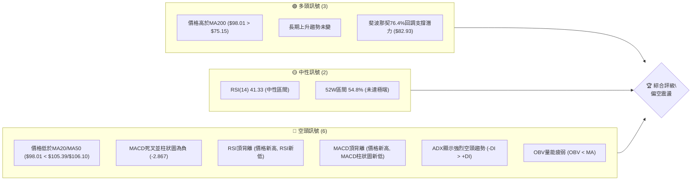

### 📊 核心指標速覽表

下表彙整 RKLB 當前主要技術指標的數值與初步解讀：

| 指標類別 | 指標名稱 | 當前數值 | 訊號 | 解讀 |
|----------|----------|----------|------|------|
| **價格** | 當前價格 | $98.01 | 🔴 | 較5月高點大幅回落 |
| **均線** | MA20 | $105.39 | 🔴 | 價格位於MA20下方，短期壓力 |
| **均線** | MA50 | $106.10 | 🔴 | 價格位於MA50下方，中期壓力 |
| **均線** | MA200 | $75.15 | 🟢 | 價格位於MA200上方，長期支撐 |
| **動能** | RSI(14) | 41.33 | 🟡 | 處於中性區間，但近期趨勢向下 |
| **動能** | MACD | -6.286 | 🔴 | MACD線在訊號線下方，空頭主導 |
| **動能** | MACD Hist | -2.867 | 🔴 | 柱狀圖為負值且持續擴大，空頭動能強勁 |
| **波動** | ATR(14) | $9.97 | 🟡 | 佔價格10.17%，波動性偏高 |
| **趨勢** | ADX(14) | 28.70 | 🔴 | 趨勢強度強勁，但空頭主導 (-DI > +DI) |
| **量能** | OBV趨勢 | OBV < MA | 🔴 | 量能疲弱，未確認價格反彈 |

### 🏆 技術評分卡

綜合各項技術指標與市場動態，對 RKLB 的技術面進行量化評分：

```
技術評分卡 — RKLB (2026-06-30)
════════════════════════════════════════════════════
趨勢強度      █████████████░░░░░░░  65/100  🔴 趨勢強勁但空頭主導
動能指標      ████░░░░░░░░░░░░░░░░  20/100  🔴 動能顯著偏空，存在背離
支撐穩定度    ██████████████░░░░░░  70/100  🟡 關鍵支撐位尚有空間，但短期承壓
成交量配合    ██████░░░░░░░░░░░░░░  30/100  🔴 量能疲弱，未見買盤積極介入
形態完整度    ████████░░░░░░░░░░░░  40/100  🟡 短期呈現下跌形態，長期上升趨勢受考驗
均線排列      ██████░░░░░░░░░░░░░░  30/100  🔴 短中期均線空頭排列，價格承壓
════════════════════════════════════════════════════
綜合評分      ████████░░░░░░░░░░░░  43/100  🔴 偏空震盪
════════════════════════════════════════════════════
```
**評級說明**：RKLB 當前技術面呈現短期明顯偏空，但長期上升趨勢的根基仍在。近期從高點大幅回落，動能指標出現嚴重的頂背離，且均線系統呈現空頭排列。雖然價格仍高於長期MA200，但短期賣壓沉重，建議投資者保持謹慎，等待更明確的底部訊號或趨勢反轉確認。

---

## 2. 趨勢分析

本章將從多時框架深入分析 RKLB 的價格趨勢，從長期宏觀視角到短期微觀動態，全面解讀其走勢特徵。

### 🌐 多時框趨勢分析

RKLB 的趨勢分析需要區分不同的時間框架，因為各框架下的訊號可能不盡相同。當前情況顯示，長期趨勢依然向上，但中期和短期趨勢已轉為下行。

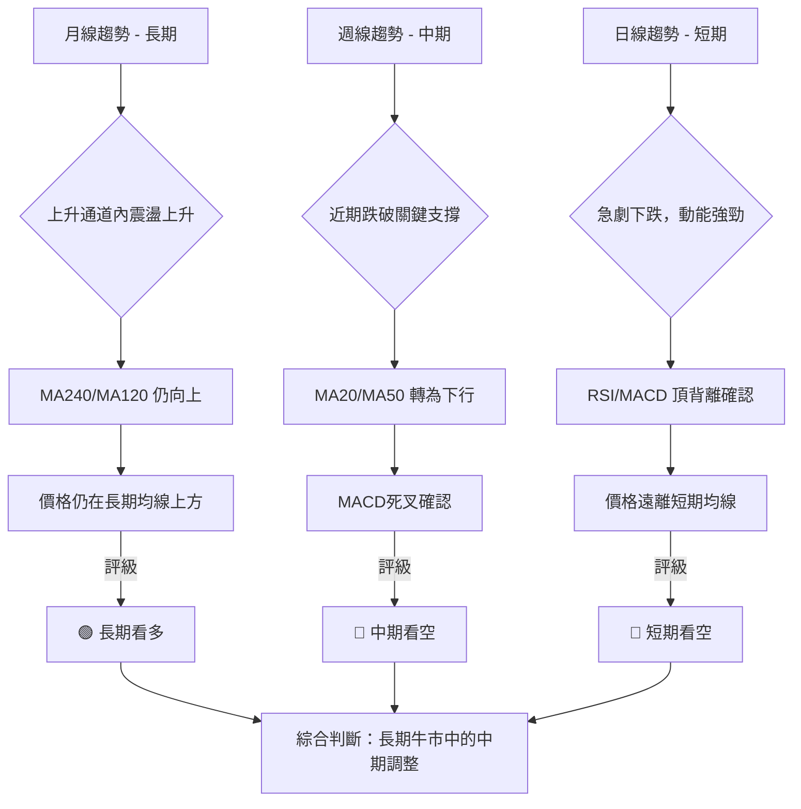

### 📈 長期趨勢 — 12個月走勢圖（Unicode）

RKLB 在過去12個月經歷了一波強勁的牛市，從2025年7月的$45.92一路上漲至2026年5月的歷史高點$143.48，漲幅驚人。然而，2026年6月出現了大幅回調，顯示短期賣壓沉重。

```
RKLB 月線走勢圖（過去12個月）
價格軸 ($)
$150 ┤                                    ●(143.48, 26/05高點)
$140 ┤
$130 ┤
$120 ┤
$110 ┤                                ●
$100 ┤                                  ●(98.01, 現在)
$90  ┤                                 
$80  ┤               ●         ●       
$70  ┤         ●     ●
$60  ┤     ●   ●
$50  ┤ ●
$40  ┤
     └───────────────────────────────────────────────────────
      25/07 25/08 25/09 25/10 25/11 25/12 26/01 26/02 26/03 26/04 26/05 26/06
```

**走勢特徵分析表格**：

| 時間區間 | 起始價 | 結束價 | 漲跌幅 | 主要特徵 | 訊號 |
|----------|--------|--------|--------|----------|------|
| 2025-07 ~ 2026-05 | $45.92 | $143.48 | +212.45% | 強勁上升趨勢，多頭主導，屢創新高 | 🟢 |
| 2026-05 ~ 2026-06 | $143.48 | $98.01 | -31.69% | 急速回調，出現巨量下跌，賣壓沉重 | 🔴 |
| 整體12個月 | $45.92 | $98.01 | +113.43% | 長期仍為牛市，但短期進入深度調整 | 🟡 |

**分析結論**：從長期來看，RKLB 仍處於一個顯著的上升趨勢中，過去12個月實現了超過一倍的漲幅。然而，2026年5月觸及歷史高點後，6月份出現了快速且劇烈的調整，單月跌幅超過30%，這表明市場對高位的承接意願不足，或有獲利了結盤湧出。儘管長期趨勢向上，但中期調整的風險已顯著增加。

### 📊 中期趨勢（週線分析）

中期趨勢主要觀察過去20週的週線收盤價。RKLB 在2026年4月下旬經歷一波快速拉升，從 $68.05 飆升至 $143.48，隨後在6月份出現連續三週的大幅下跌。

```
RKLB 近期週線壓力與支撐示意圖
════════════════════════════════════════════════════════════════════
$143.48 ┤                                    ▲ (26/05 高點)
$130.00 ┤                                  R1 (短期阻力)
$120.00 ┤                              
$110.00 ┤                           S/R (MA20/MA50區間)
$105.39 ┤                        ═════════════════════════════════  MA20
$106.10 ┤                        ═════════════════════════════════  MA50
$98.01  ╠═════════════════════════════════════════════════════════  ◄ 現價
$94.58  ┤                    S1 (斐波那契61.8%回調)
$84.54  ┤                 S2 (近期低點)
$82.93  ┤                 S3 (斐波那契76.4%回調)
$75.15  ┤            ═════════════════════════════════════════════  MA200 (強支撐)
$60.93  ┤         S4 (中期低點)
════════════════════════════════════════════════════════════════════
```

**分析結論**：從週線圖來看，RKLB 在2026年5月底達到高點 $143.48 後，經歷了三週的顯著下跌，收盤價從 $143.48 跌至 $98.01。價格已跌破MA20和MA50，且MA20和MA50的走勢開始轉向下彎，形成短中期均線的空頭排列。這表明中期趨勢已經轉弱，面臨較大的下行壓力。近期低點 $84.54 構成初步支撐，而 $105.39 (MA20) 和 $106.10 (MA50) 則成為重要的中期阻力區。

### ⚡ 趨勢強度評估（ADX 解讀）

ADX 指標用於衡量趨勢的強度，而非方向。當前 ADX(14) 數值為 28.70，表示存在一個「強趨勢」。結合 +DI 和 -DI 的數值，我們可以判斷這個強趨勢的方向。

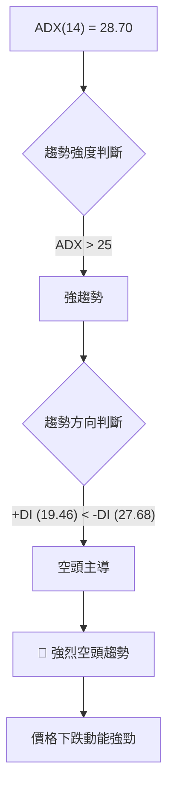

**ADX 強度對照表**：

| ADX 數值範圍 | 趨勢強度 | 建議 |
|--------------|----------|------|
| 0-20         | 無明顯趨勢/盤整 | 觀望，或區間操作 |
| 20-25        | 趨勢正在形成 | 密切關注方向 |
| 25-50        | 強趨勢     | 順勢操作 |
| 50-75        | 非常強趨勢 | 順勢操作，注意超買超賣 |
| 75-100       | 極端強趨勢 | 順勢操作，警惕反轉風險 |

**分析結論**：當前 ADX(14) 為 28.70，明確指出 RKLB 正處於一個強勢的趨勢行情中。進一步觀察方向性指標，+DI (19.46) 遠低於 -DI (27.68)，這表示當前的強趨勢是由空頭力量主導的下跌趨勢。因此，RKLB 目前正經歷一個強勁的下跌行情，空頭力量佔據主導地位，短期內預計將延續此趨勢。

---

## 3. 圖表形態分析

圖表形態是價格行為的視覺化表現，能夠揭示市場的心理和未來潛在的價格走向。

### 🔍 形態識別系統

從 RKLB 的歷史價格走勢來看，特別是2026年5月達到高點 $143.48 後的急劇回落，可能正在形成或已經形成某些反轉形態。

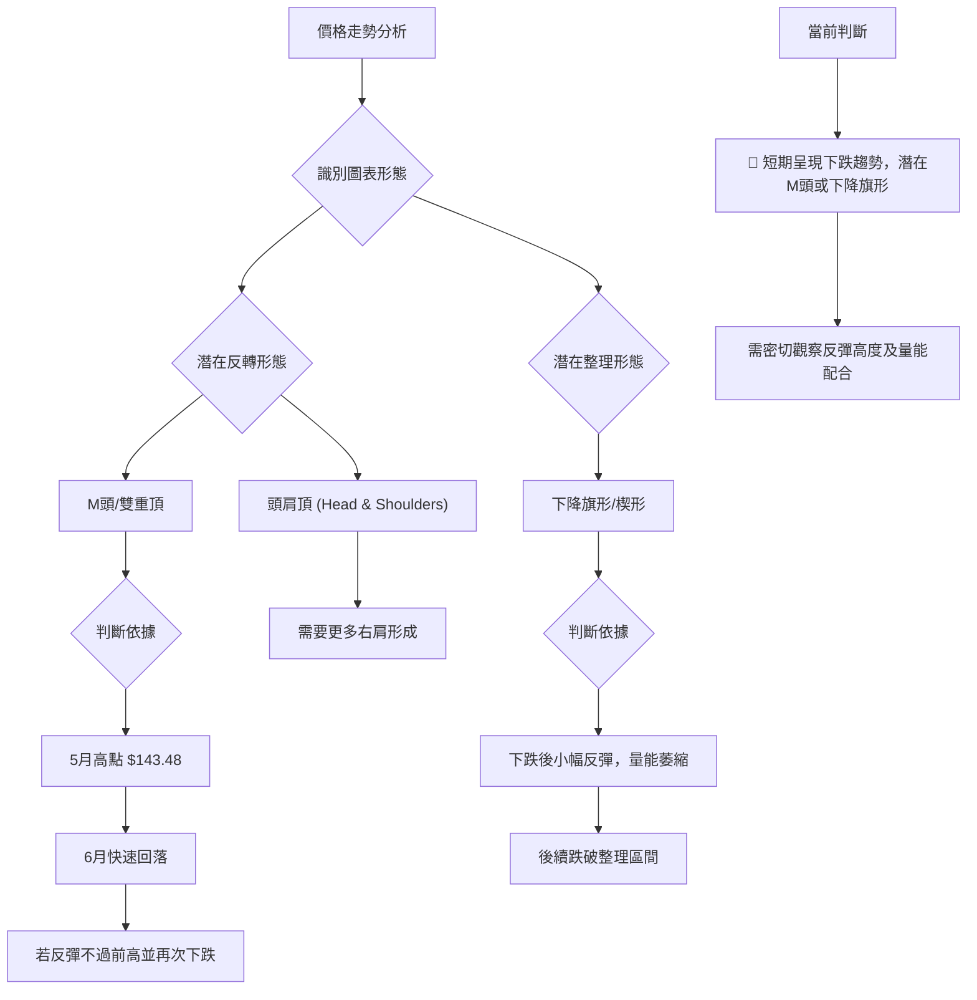

**當前形態判斷**：
目前 RKLB 從 $143.48 高點回落，形態上更接近於一個潛在的「M頭」或「雙重頂」的左側完成與右側下跌開始。如果價格反彈至 $105-$115 區間後再次受阻下跌，並跌破近期低點 $84.54，則M頭形態將得到確認。此外，短期內也可能形成下降旗形或下降通道，作為下跌途中的整理形態。

### 🕯️ 重要K線形態分析

分析近20週的週線收盤走勢，尤其關注高點和低點附近的K線組合。

| 月份 | 收盤價 | K線形態 | 解讀 | 訊號 |
|------|--------|---------|------|------|
| 2026-05-17 | $124.77 | 大陽線 | 強勁上漲，多頭主導，突破前高 | 🟢 |
| 2026-05-24 | $135.76 | 大陽線 | 延續漲勢，市場情緒樂觀 | 🟢 |
| 2026-05-31 | $143.48 | 大陽線 | 創新高點，但漲幅開始收斂，市場可能過熱 | 🟡 |
| 2026-06-07 | $110.08 | 大陰線 | 吞噬前幾週漲幅，強烈反轉訊號，空頭力量強勁 | 🔴 |
| 2026-06-14 | $102.39 | 中陰線 | 延續下跌，空頭動能持續 | 🔴 |
| 2026-06-21 | $107.24 | 長下影線陽線 | 價格一度下探但收回，顯示下方有一定承接力，但未能扭轉跌勢 | 🟡 |
| 2026-06-28 | $84.54 | 大陰線 | 再次出現大幅下跌，跌破關鍵支撐，空頭強勢 | 🔴 |
| 2026-07-05 | $98.01 | 中陽線 | 經歷大跌後的小幅反彈，但量能不足以確認反轉 | 🟡 |

**分析結論**：在2026年5月底創下 $143.48 新高時，雖然當週K線仍為陽線，但隨後一週的 $110.08 大陰線直接吞噬了前幾週的漲幅，形成「烏雲罩頂」或「看跌吞噬」的強烈反轉K線形態。這表明多頭力量在達到頂峰後迅速衰竭，空頭開始主導市場。隨後的幾週雖然有帶長下影線的K線出現，但整體仍處於下跌趨勢中，顯示買盤介入意願不足或未能形成有效反擊。

### 📉 ASCII 走勢形態示意圖

以下為 RKLB 近期潛在的M頭反轉形態示意圖：

```
RKLB 潛在 M頭反轉形態示意圖
════════════════════════════════════════════════════════════════════
價格軸 ($)
$150 ┤                       (M頭左峰) ● $143.48
$140 ┤                                 ╱╲
$130 ┤                                ╱  ╲
$120 ┤                               ╱    ╲ (右峰若形成)
$110 ┤                              ╱      ╲
$100 ┤                     (現價) ● $98.01   ╲
$90  ┤                             ╲         ╱
$80  ┤                              ╲       ╱
$70  ┤                               ╲     ╱
$60  ┤════════════════════════════════════════════════════════════  頸線 (N) $84.54
     └───────────────────────────────────────────────────────────────
      時間軸
```
**形態描述**：RKLB 在2026年5月底達到 $143.48 的歷史高點，隨後在6月初開始急劇下跌，形成M頭的左側峰值。如果價格在當前位置或小幅反彈後再次下跌，並跌破 $84.54 的頸線位置，則M頭形態將被確認，並預示更大幅度的下跌。當前價格 $98.01 位於潛在頸線 $84.54 和高點 $143.48 之間，處於形態確認的關鍵區域。

### 🎯 形態目標價計算

基於潛在的「M頭」形態進行目標價計算。
*   **M頭形態高點**：$143.48 (2026年5月高點)
*   **潛在頸線位置**：選擇近期低點 $84.54 (2026-06-28週收盤價) 作為參考頸線。
*   **形態高度 (H)** = 高點 - 頸線 = $143.48 - $84.54 = $58.94

**目標價計算方法**：
形態目標價 = 頸線 - 形態高度
形態目標價 = $84.54 - $58.94 = $25.60

**分析結論**：如果M頭形態最終被確認（即價格有效跌破 $84.54 頸線），理論上的形態目標價將指向 $25.60。這是一個極端的看跌目標，表明一旦形態確認，下跌空間巨大。然而，在形態確認之前，價格可能會在頸線附近獲得支撐或反彈。投資者應密切關注 $84.54 這一關鍵支撐位的表現。

---

## 4. 支撐與阻力

支撐與阻力是技術分析的核心概念，它們代表了買賣雙方力量平衡的關鍵價格水平。

### 🗺️ 關鍵價位分布圖（Unicode）

RKLB 的關鍵價位分布圖顯示了當前價格在重要支撐和阻力區間中的位置。

```
RKLB 價位結構分布圖 (2026-06-30)
═══════════════════════════════════════════════════
$143.48 ║████████████████████████║ 強阻力 R3 (歷史高點)
$129.49 ║████████████████████    ║ 阻力 R2 (布林上軌)
$113.19 ║████████████████████████║ 關鍵阻力 R1 (斐波那契38.2%)
$106.10 ║████████████████████████║ 阻力 (MA50)
$105.39 ║████████████████████████║ 阻力 (MA20)
$98.01  ╠════════════════════════╣ ◄ 現價
$94.58  ║▓▓▓▓▓▓▓▓▓▓▓▓▓▓▓▓        ║ 近期支撐 S1 (斐波那契61.8%)
$84.54  ║████████████████████████║ 強支撐 S2 (M頭頸線/近期低點)
$82.93  ║████████████████████████║ 強支撐 S3 (斐波那契76.4%)
$81.28  ║████████████████████████║ 支撐 (布林下軌)
$75.15  ║████████████████████████║ 極強支撐 S4 (MA200)
═══════════════════════════════════════════════════
```

### 🚧 阻力位分析表

當前價格 $98.01 面臨多重阻力，上方壓力較大。

| 阻力級別 | 價位 | 形成原因 | 突破難度 | 重要性 |
|----------|------|----------|----------|--------|
| **即時阻力** | $103.85 | 斐波那契50%回調位 | 中等 | 🟡 價格反彈需首先突破此位 |
| **關鍵阻力R1** | $105.39 - $106.10 | MA20 / MA50 均線壓力區 | 高 | 🔴 跌破後反抽難以站穩，確認空頭趨勢 |
| **關鍵阻力R2** | $113.19 | 斐波那契38.2%回調位 | 高 | 🔴 突破此位才能緩解短期跌勢 |
| **強阻力R3** | $129.49 | 布林通道上軌 | 極高 | 🔴 僅在強勢反彈行情中可能觸及 |
| **歷史阻力R4** | $143.48 | 歷史最高點 (2026-05) | 極高 | 🔴 除非基本面出現重大突破，短期難以觸及 |

### 🛡️ 支撐位分析表

當前價格 $98.01 正接近多個重要支撐位，這些位置可能提供暫時的買盤介入。

| 支撐級別 | 價位 | 形成原因 | 守住機率 | 重要性 |
|----------|------|----------|----------|--------|
| **即時支撐** | $94.58 | 斐波那契61.8%回調位 | 中等 | 🟡 若跌破，將加速下跌 |
| **關鍵支撐S1** | $84.54 | 近期週線低點 / 潛在M頭頸線 | 高 | 🔴 極為關鍵，守住則M頭形態未確認 |
| **強支撐S2** | $82.93 | 斐波那契76.4%回調位 | 高 | 🔴 與M頭頸線接近，形成強支撐區 |
| **強支撐S3** | $75.15 | MA200 均線 | 極高 | 🟢 長期趨勢生命線，若跌破則長期趨勢反轉 |
| **心理支撐S4** | $60.00 | 分析師目標價低點 | 極高 | 🟢 具有心理支撐作用，但需配合技術面 |

### 📐 斐波那契回調位分析

我們以 RKLB 近期一波主要上漲行情（從2026年3月低點 $64.22 到2026年5月高點 $143.48）作為參考，計算其斐波那契回調位。

*   **高點 (H)**: $143.48 (2026-05)
*   **低點 (L)**: $64.22 (2026-03)
*   **總漲幅**: $143.48 - $64.22 = $79.26

**斐波那契回調位計算**：
*   **23.6% 回調**: $143.48 - ($79.26 * 0.236) = $143.48 - $18.69 = **$124.79**
*   **38.2% 回調**: $143.48 - ($79.26 * 0.382) = $143.48 - $30.29 = **$113.19**
*   **50.0% 回調**: $143.48 - ($79.26 * 0.500) = $143.48 - $39.63 = **$103.85**
*   **61.8% 回調**: $143.48 - ($79.26 * 0.618) = $143.48 - $48.90 = **$94.58**
*   **76.4% 回調**: $143.48 - ($79.26 * 0.764) = $143.48 - $60.55 = **$82.93**

**視覺化分析**：
```mermaid
graph TD
    A["高點: $143.48"] --> B{"斐波那契回調"}
    B --> C["23.6%: $124.79"]
    B --> D["38.2%: $113.19"]
    B --> E["50.0%: $103.85"]
    B --> F["61.8%: $94.58"]
    B --> G["76.4%: $82.93"]
    G --> H["低點: $64.22"]

    Style A fill:#FFC0CB,stroke:#FF0000,stroke-width:2px;
    Style H fill:#ADD8E6,stroke:#0000FF,stroke-width:2px;
    Style F fill:#FFFF99,stroke:#CCCC00,stroke-width:2px;
    Style E fill:#FFFF99,stroke:#CCCC00,stroke-width:2px;
    Style D fill:#FFFF99,stroke:#CCCC00,stroke-width:2px;

    I["當前價格: $98.01"]
    nb1["I -- 位於"] --> E
    nb2["I -- 和"] --> F
    I -- 之間 --> J["面臨50%回調阻力, 接近61.8%回調支撐"]
```

**分析結論**：當前價格 $98.01 位於斐波那契50%回調位 ($103.85) 和61.8%回調位 ($94.58) 之間。這意味著 $103.85 構成了一個重要的反彈阻力，而 $94.58 則是一個關鍵的支撐。若 $94.58 支撐失守，價格將可能進一步下探至 $82.93 (76.4%回調位)，甚至測試 $84.54 的M頭頸線和 MA200 ($75.15) 的強勁支撐區。

---

## 5. 技術指標深度解讀

本章將對 RKLB 的主要技術指標進行全面而深入的分析，探討它們的當前狀態、相互關係以及對未來價格走勢的預示作用。

### 🎛️ 指標訊號總覽

以下 Mermaid 圖展示了各主要技術指標的當前狀態及其相互關係，判斷其是否互相確認或矛盾。

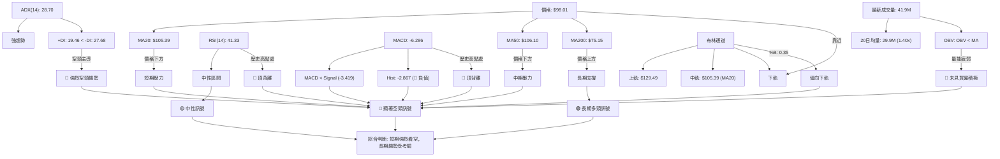
**指標整合分析**：
*   **均線系統**：價格位於MA20和MA50下方，顯示短期和中期趨勢向下。MA20和MA50的下彎也確認了這一點。但價格仍在MA200上方，表明長期上升趨勢尚未被破壞，但正在受到考驗。
*   **RSI與MACD**：這兩個動能指標均發出強烈的空頭訊號。RSI和MACD都出現了明顯的「頂背離」現象，即價格創出新高時，指標未能同步創出新高，反而出現下降，這是非常強烈的反轉訊號。MACD線已在訊號線下方，且柱狀圖為負，進一步確認了空頭動能。
*   **ADX**：ADX數值高於25，表明趨勢強勁。而-DI高於+DI，則明確指出目前是空頭趨勢佔據主導。
*   **布林通道**：價格已跌破布林通道中軌，並向布林下軌靠近，%B值為0.35，顯示價格正在布林通道下半部運行，確認了下跌趨勢。
*   **成交量**：雖然最新成交量高於20日均量，但OBV趨勢顯示量能疲弱，這通常意味著下跌時放量，反彈時縮量，不利於價格上漲。

**總結**：多數短期和中期指標均發出強烈看空訊號，尤其是RSI和MACD的頂背離以及ADX對空頭趨勢強度的確認。雖然長期MA200仍提供支撐，但短期內賣壓沉重，市場情緒偏悲觀。

### 📈 移動平均線排列分析

RKLB 的均線排列呈現「混合排列」狀態，這反映了其長期趨勢與短期趨勢的矛盾。

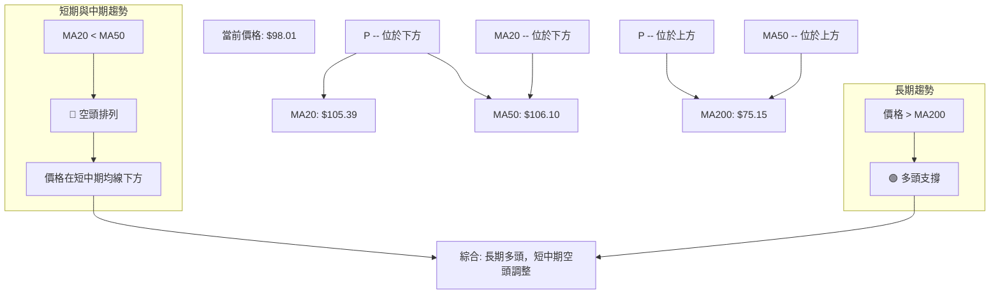

**均線排列狀態**：

| 均線 | 當前數值 | 價格相對位置 | 趨勢方向 | 訊號 |
|------|----------|--------------|----------|------|
| MA5  | $88.75   | ▲ 上方       | 上漲     | 🟢 |
| MA10 | $97.32   | ▲ 上方       | 上漲     | 🟢 |
| MA20 | $105.39  | ▼ 下方       | 下跌     | 🔴 |
| MA50 | $106.10  | ▼ 下方       | 下跌     | 🔴 |
| MA60 | $100.17  | ▼ 下方       | 下跌     | 🔴 |
| MA120| $87.67   | ▲ 上方       | 上漲     | 🟢 |
| MA200| $75.15   | ▲ 上方       | 上漲     | 🟢 |
| MA240| $70.24   | ▲ 上方       | 上漲     | 🟢 |

**分析結論**：
*   **短期均線 (MA5, MA10)**：價格 ($98.01) 高於MA5 ($88.75) 和MA10 ($97.32)，這些均線本身也呈現向上趨勢，這表明在極短線上，市場可能正在經歷一個小幅反彈。
*   **中短期均線 (MA20, MA50, MA60)**：價格 ($98.01) 位於MA20 ($105.39)、MA50 ($106.10) 和MA60 ($100.17) 下方，且這些均線均呈現下彎趨勢，MA20甚至已跌破MA50，形成「死亡交叉」的初步跡象。這是一個強烈的看空訊號，表明中短期趨勢已經轉為下跌。
*   **長期均線 (MA120, MA200, MA240)**：價格 ($98.01) 仍然顯著高於MA120 ($87.67)、MA200 ($75.15) 和MA240 ($70.24)，且這些長期均線保持向上趨勢。這確認了 RKLB 的長期上升趨勢的基礎依然存在。

**綜合判斷**：RKLB 的均線排列顯示，其正處於長期牛市中的一個深度中短期調整。短線可能存在超跌反彈，但中短期壓力重重，需要突破MA20和MA50才能緩解跌勢。MA200是長期趨勢的關鍵生命線，若跌破則長期趨勢將面臨反轉風險。

### 📉 RSI(14) 分析

相對強弱指數 (RSI) 用於衡量價格變動的速度和變化，以識別超買或超賣狀況。

*   **RSI 數值進度條**：
    RSI(14) 當前數值：41.33
    強度：████████░░░░░░░░░░░░ (41.33%) 🟡 中性偏弱

*   **超買超賣區間分析**：
    *   RSI > 70 為超買區：價格上漲過快，有回調風險。
    *   RSI < 30 為超賣區：價格下跌過快，有反彈潛力。
    *   RSI 30-70 為中性區間：趨勢不明顯或處於健康調整。
    當前 RSI 為 41.33，處於中性區間，但明顯偏向超賣區。這表明在經歷了大幅下跌後，賣壓有所緩解，但尚未達到超賣極端，因此反彈動能可能不足。

*   **背離判斷**：
    ```mermaid
    graph TD
        P_APR["2026-04 高點: $84.80"] --> P_MAY["2026-05 高點: $143.48"]
        P_APR -- 價格低點 --> P_MAY["價格高點"]
        RSI_APR["2026-04 RSI: 81.0"] --> RSI_MAY["2026-05 RSI: 70.6"]
        RSI_APR -- RSI高點 --> RSI_MAY["RSI低點"]

        P_MAY -- 價格創新高 --> D["🔴 頂背離確認"]
        nb1["RSI_MAY -- RSI創較低高點"] --> D
        D --> E["強烈看跌訊號"]
    ```
    **分析結論**：RKLB 在2026年4月19日週收盤價 $84.80 時，RSI(14) 達到 81.0，進入嚴重超買區。隨後在2026年5月31日創下 $143.48 的歷史新高，然而此時 RSI(14) 卻只有 70.6。這是一個非常清晰且強烈的 **頂背離 (Bearish Divergence)** 訊號：價格創出新高，但RSI未能同步創出新高，反而出現下降。這表明上漲動能已顯著衰竭，多頭力量難以維繫。此背離訊號是預示隨後價格大幅下跌的重要先兆，並已在6月份得到驗證。

### 📊 MACD(12/26/9) 訊號解讀

平滑異同移動平均線 (MACD) 用於識別趨勢方向、動能和潛在的反轉點。

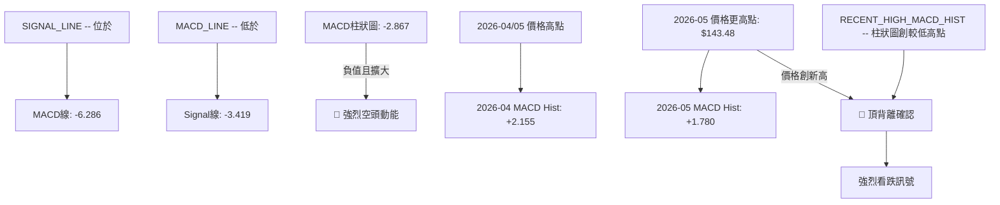
**分析結論**：
*   **MACD線與訊號線**：當前 MACD 線 (-6.286) 位於訊號線 (-3.419) 下方，形成「死叉」，這是典型的看跌訊號，表明短期均線已跌破長期均線，價格動能轉弱。
*   **MACD柱狀圖**：MACD 柱狀圖為負值 (-2.867)，且在近期週線數據中呈現持續擴大的趨勢 (從2026-05-31的 +1.780 迅速轉為負值並擴大)。這表明空頭動能強勁，賣壓仍在加劇。
*   **MACD背離**：與RSI類似，MACD也出現了明顯的頂背離。在2026年4月19日價格 $84.80 時，MACD柱狀圖為 +2.155。而在2026年5月31日價格創下 $143.48 的新高時，MACD柱狀圖的峰值僅為 +1.780。這是一個經典的 **頂背離 (Bearish Divergence)** 訊號，預示著上漲動能的衰竭和即將到來的反轉。此背離與RSI的背離相互確認，大大增強了看跌訊號的可靠性。

### 📦 布林通道分析

布林通道 (Bollinger Bands) 用於衡量價格波動率和超買超賣情況，同時提供動態支撐與阻力。

```
RKLB 布林通道示意圖 (2026-06-30)
════════════════════════════════════════════════════════════════════
$130 ┤                                      BB上軌 ($129.49)
$120 ┤
$110 ┤                           BB中軌 (MA20: $105.39)
$100 ┤                       ◄ 現價 ($98.01)
$90  ┤
$80  ┤                       BB下軌 ($81.28)
════════════════════════════════════════════════════════════════════
```
**分析結論**：
*   **布林上軌**：$129.49
*   **布林中軌 (MA20)**：$105.39
*   **布林下軌**：$81.28
*   **%B 值**：0.35 (0=下軌, 0.5=中軌, 1=上軌)

當前價格 $98.01 位於布林中軌 $105.39 和下軌 $81.28 之間，且更靠近下軌。%B 值為 0.35 也印證了這一點。這表明 RKLB 價格正處於下跌趨勢中，且下跌動能較強。布林中軌 $105.39 (即MA20) 已轉為阻力，而布林下軌 $81.28 則構成潛在的動態支撐。若價格持續在布林下軌附近運行，可能預示著下跌趨勢的延續。

### 💹 成交量分析（量價配合度）

成交量是價格走勢的燃料，量價關係對於判斷趨勢的可靠性至關重要。

*   **最新成交量**：41,915,040
*   **20日均量**：29,994,067 (量比: 1.40x)
*   **50日均量**：28,427,173
*   **OBV趨勢**：OBV < MA → 量能疲弱

**分析結論**：
*   **近期成交量放大**：當前成交量 (41.9M) 顯著高於20日和50日均量 (約1.4倍)，這表明市場活動度很高。然而，結合近期價格從高點大幅回落，高成交量通常發生在趨勢轉折點或趨勢加速時。在下跌趨勢中，放量下跌是空頭力量強勁的表現。
*   **OBV 量能疲弱**：OBV (On-Balance Volume) 趨勢顯示 OBV 線位於其移動平均線下方，這是一個看跌訊號。OBV 的邏輯是上漲時成交量計入正值，下跌時計入負值，因此 OBV 下降表示下跌時的成交量大於上漲時的成交量，或者反彈時成交量不足。當前 OBV 疲弱，表明雖然有交易量，但買盤並沒有積極地在推動價格上漲，反而可能是在下跌過程中出現的賣壓或恐慌性拋售。
*   **量價背離**：在2026年5月創歷史新高 $143.48 時，雖然成交量高，但隨後6月份價格大幅下跌時，成交量依然維持高位。這表明在下跌過程中，賣壓不斷釋放，買盤承接力道不足。這種下跌放量，反彈縮量的量價關係，是典型的看空訊號，確認了當前的下跌趨勢。

---

## 6. 動能與波動率

動能指標評估價格變動的速度和強度，而波動率指標則衡量價格變動的幅度，兩者結合有助於理解市場的活躍度和風險。

### ⚡ 動能評估四象限

我們將 RKLB 當前的動能狀況和波動率進行評估，並歸類到相應的象限。由於 Mermaid `quadrantChart` 的表現力限制，我們將以表格形式呈現分析結果。

| 象限 | 動能 (Momentum) | 波動 (Volatility) | 當前狀態 (RKLB) | 評估 | 訊號 |
|------|-----------------|-------------------|-----------------|------|------|
| Q1   | 強 (Strong)     | 低 (Low)          | -               | 最佳機會 (順勢而為) | 🟢 |
| Q2   | 弱 (Weak)       | 低 (Low)          | -               | 謹慎觀望 (等待方向) | 🟡 |
| Q3   | 強 (Strong)     | 高 (High)         | ✓               | 高風險高收益 (追漲殺跌，風險大) | 🔴 |
| Q4   | 弱 (Weak)       | 高 (High)         | -               | 避免進場 (方向不明，波動劇烈) | 🔴 |

**RKLB 當前評估**：
*   **動能 (Momentum)**：儘管價格在下跌，但 ADX 顯示趨勢強度高達 28.70，且 -DI 遠大於 +DI，表明當前是「強烈空頭動能」。MACD 柱狀圖為負值且持續擴大，也確認了強勁的下跌動能。因此，動能判斷為「強」。
*   **波動 (Volatility)**：ATR(14) 為 $9.97，佔當前價格 $98.01 的 10.17%。這是一個相對較高的波動率，表明價格每日變動幅度大。因此，波動判斷為「高」。

**結論**：RKLB 當前處於「**強動能 / 高波動**」的 Q3 象限。這意味著市場正處於劇烈變動中，價格在強勁的空頭動能推動下大幅下跌，同時伴隨著較高的每日波動幅度。對於激進的交易者來說，這可能提供追隨趨勢的機會，但風險極高，需要嚴格的風險管理。對於保守的投資者，應避免在此時進場，等待波動率下降或趨勢方向明確後再考慮。

### 📊 ATR 波動率分析

平均真實波幅 (ATR) 衡量資產在特定時間段內的波動性。

*   **ATR(14)**：$9.97
*   **佔收盤價比例**：$9.97 / $98.01 = 10.17%

**分析結論**：
ATR 數值為 $9.97，這表示在過去14天中，RKLB 的平均每日價格波動幅度約為 $9.97。這個數值佔當前收盤價的 10.17%，屬於相對較高的波動率。高波動率意味著價格在短時間內可能出現大幅漲跌，既提供了潛在的交易機會，也增加了交易風險。

**止損距離建議**：
在波動率較高的市場中，止損點的設置應考慮 ATR。一般建議將止損點設置在 ATR 的 1.5 到 3 倍距離之外，以避免被正常市場波動「洗掉」。
*   **保守止損距離 (1.5x ATR)**：$9.97 * 1.5 = $14.96
*   **中性止損距離 (2x ATR)**：$9.97 * 2.0 = $19.94
*   **激進止損距離 (3x ATR)**：$9.97 * 3.0 = $29.91

對於目前的空頭趨勢，若採取空頭策略：
*   **止損點**：建議設置在當前價格上方 $15.00 至 $20.00 的範圍，例如 $98.01 + $15.00 = $113.01。這可以將止損點設置在斐波那契38.2%回調位 $113.19 附近，提供合理的緩衝。
若採取多頭策略（逆勢操作，風險更高）：
*   **止損點**：建議設置在當前價格下方 $15.00 至 $20.00 的範圍，例如 $98.01 - $15.00 = $83.01。這將止損點設置在斐波那契76.4%回調位 $82.93 附近，同時考慮MA200 $75.15 的最終防線。

### 📐 Beta 與市場相關性

Beta 值衡量單一資產相對於整體市場的波動性。雖然數據中未直接提供 RKLB 的 Beta 值，但根據其所屬的「工業」板塊中的「航空航天與國防」產業，以及其作為成長型公司的性質，我們可以進行推斷。

**推斷分析**：
*   **產業特性**：航空航天與國防產業通常受政府訂單、技術創新等因素影響較大，可能具有一定的波動性。Rocket Lab 作為一家提供發射服務和空間系統解決方案的公司，其業務模式可能涉及高風險高回報的特性。
*   **成長型公司**：成長型公司通常具有較高的 Beta 值，因為它們的股價對市場情緒和經濟前景的變化更為敏感。在市場上漲時，成長股往往漲幅超過大盤；在市場下跌時，跌幅也可能超過大盤。
*   **近期波動**：RKLB 近期從高點 $143.48 大幅回落至 $98.01，跌幅超過30%，且 ATR 佔價格比例超過10%，這也印證了其高波動的特性。

**結論**：
綜合以上推斷，RKLB 很可能是一個 **高 Beta 值** 的股票。這意味著其股價波動性預計將大於整體市場（例如標普500指數）。
*   **若市場上漲**：RKLB 有機會提供超越大盤的漲幅。
*   **若市場下跌**：RKLB 的跌幅可能也會大於大盤。

**投資含義**：對於投資者而言，持有 RKLB 意味著承擔相對較高的市場風險。在制定投資策略時，應充分考慮其與大盤的高度相關性和放大的波動性，尤其是在當前市場情緒偏弱、技術面偏空的情況下，其下行風險可能被放大。

---

## 7. 多時框架總結

本章將對 RKLB 在不同時間框架下的技術訊號進行綜合評估，以提供一個全面的市場視角。

### 📋 時框架評分表

| 時框架 | 趨勢方向 | 動能 | 均線排列 | 形態 | 綜合評分 (1-10) | 建議 |
|--------|----------|------|----------|------|-----------------|------|
| **短期 (日線)** | 🔴 下跌 | 🔴 強空 | 🔴 空頭 | 🔴 下跌旗形/M頭 | 2.5/10          | 🔴 賣出/觀望 |
| **中期 (週線)** | 🔴 下跌 | 🔴 轉弱 | 🔴 空頭 | 🟡 潛在M頭反轉 | 3.5/10          | 🔴 減倉/謹慎 |
| **長期 (月線)** | 🟢 上漲 | 🟡 調整 | 🟢 多頭 | 🟡 頂部調整中 | 6.0/10          | 🟡 持有/等待機會 |

**分析結論**：
*   **短期**：RKLB 處於明確的下跌趨勢中，動能強勁且空頭主導。所有短期指標（MA、RSI、MACD、ADX）均發出強烈賣出訊號，並存在頂背離。建議投資者避免短期介入，或考慮做空機會。
*   **中期**：中期趨勢已轉為下跌，價格跌破MA20和MA50，且動能指標轉弱。雖然跌幅已大，但尚未出現明確的底部反轉形態。建議持有者考慮減倉或等待更明確的底部訊號。
*   **長期**：長期來看，RKLB 仍處於上升趨勢中，價格遠高於MA200，且長期均線仍向上。目前的下跌可被視為牛市中的一次深度調整。對於長期投資者，可以在關鍵支撐位附近尋找分批建倉的機會，但需注意風險。

### 🔲 綜合訊號矩陣

以下 Mermaid 圖展示了 RKLB 在短期、中期、長期三個維度上的主要技術訊號一致性。

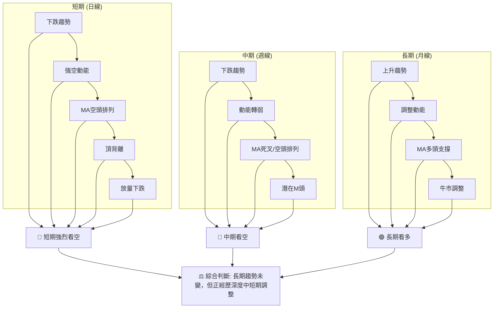
**一致性分析**：
RKLB 的短期和中期訊號高度一致，都指向強烈的下跌趨勢和空頭動能。RSI和MACD的頂背離是極為重要的看跌訊號，且ADX確認了當前下跌趨勢的強度。成交量配合也顯示賣壓沉重。然而，長期趨勢仍由MA200等指標支撐，表明這可能是一次深度調整而非長期反轉。投資者應在長期支撐位附近觀察是否有築底跡象，並等待短期和中期趨勢轉為上行。

---

## 8. 交易策略建議

基於 RKLB 的多時框架技術分析，目前市場情緒偏向悲觀，短期內空頭佔優。因此，交易策略建議以謹慎為主，或考慮順勢做空，但同時也要留意長期支撐位可能帶來的反彈機會。

### 🗺️ 策略決策流程圖

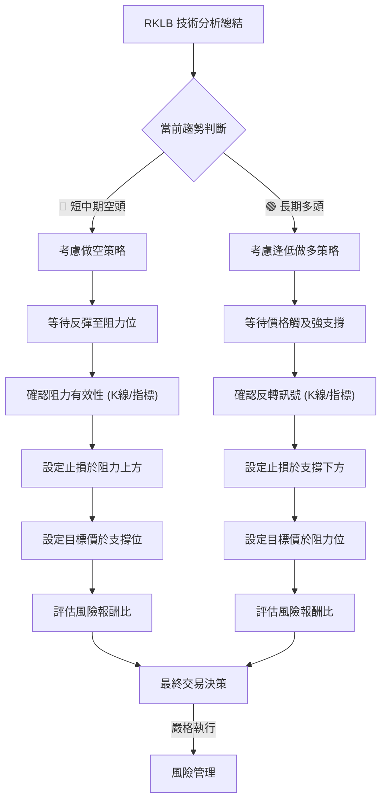

### 🟢 多頭策略詳情 (逆勢操作，風險較高)

鑑於當前短中期趨勢偏空，多頭策略應視為逆勢操作，僅在出現強烈反轉訊號且風險報酬比合理時考慮。

| 策略要素 | 策略 A：底部反彈狙擊 |
|----------|----------------------|
| **進場條件** | 價格下探至強支撐區間 ($82.93 - $84.54) 並出現明確的看漲K線形態 (如錘子線、看漲吞噬)，或RSI進入超賣區後金叉。 |
| **進場價格** | $83.50 (靠近斐波那契76.4%回調位 $82.93 和潛在M頭頸線 $84.54 的中間位置，等待確認) |
| **止損價格** | $74.00 (略低於MA200 $75.15，提供足夠緩衝) |
| **目標價 T1** | $94.58 (斐波那契61.8%回調位，現為短期阻力) |
| **目標價 T2** | $103.85 (斐波那契50%回調位，現為中期阻力) |
| **風險報酬比** | (T1: $94.58-$83.50)/($83.50-$74.00) = $11.08/$9.50 ≈ **1:1.17** |
| **風險報酬比** | (T2: $103.85-$83.50)/($83.50-$74.00) = $20.35/$9.50 ≈ **1:2.14** |
| **成功機率** | 40% (逆勢操作，成功率較低，但潛在回報高) |
| **建議倉位** | 5% (低倉位試探，嚴格控制風險) |

### 🔴 空頭策略詳情 (順勢操作，風險相對較低)

當前短中期趨勢偏空，順勢做空是較為符合當前技術面狀態的策略。

| 策略要素 | 策略 A：反彈受阻做空 |
|----------|----------------------|
| **進場條件** | 價格反彈至關鍵阻力區間 ($103.85 - $106.10，即斐波那契50%回調位、MA20/MA50區間) 後，出現看跌K線形態 (如流星線、看跌吞噬)，或動能指標再次轉弱。 |
| **進場價格** | $103.00 (靠近斐波那契50%回調位 $103.85 和MA20/MA50阻力區間) |
| **止損價格** | $107.00 (略高於MA50 $106.10，防止假突破) |
| **目標價 T1** | $94.58 (斐波那契61.8%回調位，近期關鍵支撐) |
| **目標價 T2** | $82.93 (斐波那契76.4%回調位，與潛在M頭頸線 $84.54 形成強支撐區) |
| **風險報酬比** | (T1: $103.00-$94.58)/($107.00-$103.00) = $8.42/$4.00 ≈ **1:2.10** |
| **風險報酬比** | (T2: $103.00-$82.93)/($107.00-$103.00) = $20.07/$4.00 ≈ **1:5.02** |
| **成功機率** | 65% (順勢操作，成功率較高) |
| **建議倉位** | 10% (中等倉位，但仍需嚴格止損) |

### ⭐ 整體訊號強度評星

```
做多訊號強度：★★☆☆☆  (2/5星) 逆勢操作，風險高，需等待強烈反轉訊號。
做空訊號強度：★★★★☆  (4/5星) 順勢操作，多數指標確認下跌趨勢，風險報酬比佳。
整體可信度：  ★★★☆☆  (3/5星) 短期空頭訊號明確且一致，但長期趨勢仍有支撐，需謹慎。
```

---

## 9. 風險提示與監控

在當前 RKLB 呈現短期偏空、長期多頭調整的複雜局面下，風險管理和持續監控至關重要。

### ✅ 關鍵監控指標 Checklist

以下是交易者在 RKLB 交易中需要密切關注的關鍵指標清單：

```
RKLB 關鍵監控指標 Checklist
════════════════════════════════════════════════════════
├─ 價格行為：
│  ├─ 是否有效跌破 $84.54 (M頭頸線/近期低點)？ → 🔴 M頭確認，加速下跌
│  ├─ 是否有效站穩 $94.58 (斐波那契61.8%回調)？ → 🟡 企穩跡象
│  └─ 反彈是否能突破 $103.85 (斐波那契50%回調)？ → 🟢 短期趨勢轉強
├─ 移動平均線：
│  ├─ MA20 ($105.39) 是否轉為上揚並被突破？ → 🟢 短期趨勢逆轉
│  ├─ MA50 ($106.10) 是否形成黃金交叉？ → 🟢 中期趨勢逆轉
│  └─ MA200 ($75.15) 是否被跌破？ → 🔴 長期趨勢破壞
├─ 動能指標：
│  ├─ RSI 是否進入超賣區 (<30) 後反彈？ → 🟢 潛在底部
│  ├─ MACD 柱狀圖是否由負轉正並金叉？ → 🟢 動能轉強
│  └─ ADX 的 -DI 是否開始下降，+DI 是否上升？ → 🟢 空頭趨勢減弱
├─ 成交量：
│  ├─ 下跌時是否持續放量，反彈時是否縮量？ → 🔴 空頭持續
│  └─ 在關鍵支撐位是否出現放量上漲？ → 🟢 買盤介入
├─ 圖表形態：
│  ├─ 潛在M頭形態是否確認 (跌破頸線)？ → 🔴 大幅下跌風險
│  └─ 是否出現底部反轉形態 (如W底、頭肩底)？ → 🟢 趨勢反轉
════════════════════════════════════════════════════════
```

### ⚠️ 風險場景分析

針對 RKLB 的未來走勢，我們設想三種情境：樂觀、基本和悲觀。

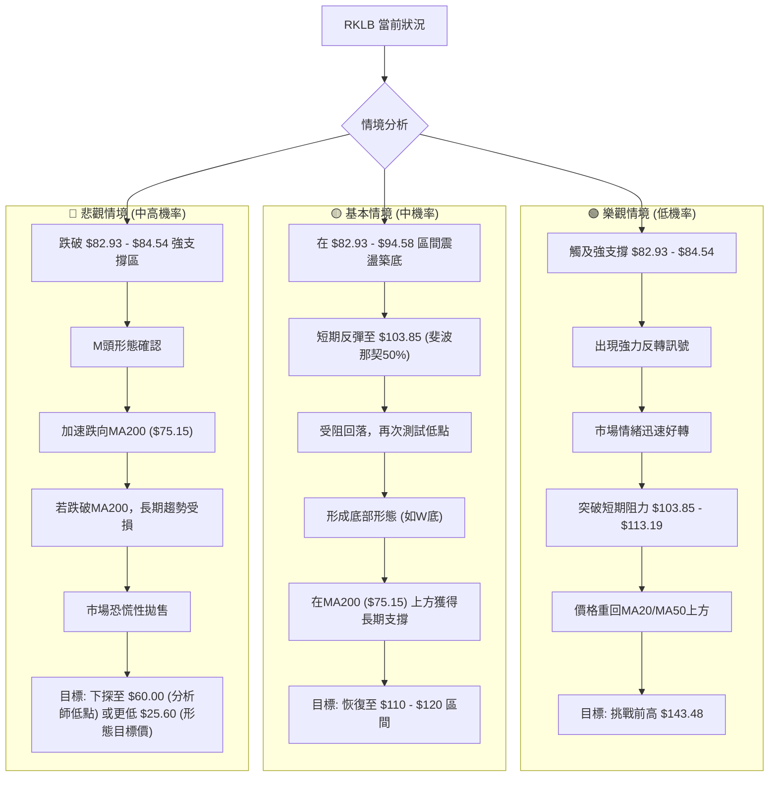

### 🛡️ 風險管理重要提醒

1.  **嚴格止損**：無論採用何種策略，務必設定並嚴格執行止損點。在當前高波動的市場環境下，止損是保護資本的關鍵。
2.  **倉位管理**：避免重倉操作，尤其是在趨勢不明朗或逆勢交易時。建議採用分批建倉、逐步減倉的方式，控制單一股票的風險敞口。
3.  **趨勢確認**：在趨勢轉折點進行交易時，務必等待明確的趨勢反轉訊號確認，例如K線形態、指標金叉/死叉、以及成交量的配合，避免盲目抄底或追高。
4.  **關注基本面**：雖然本報告為技術分析，但仍需留意 RKLB 的基本面新聞和分析師評級變化，這些因素可能對股價產生重大影響。
5.  **市場環境**：密切關注整體美股大盤走勢，特別是科技股和成長股的表現，大盤的系統性風險會對個股造成連帶影響。
6.  **耐心等待**：當前 RKLB 處於深度調整期，市場情緒不穩定。對於不確定性較高的交易機會，耐心等待更明確的訊號或更佳的風險報酬比是明智之舉。

---

## 📋 報告總結

```
RKLB 技術分析報告總結
════════════════════════════════════════════════════════
報告日期：2026-06-30
當前價格：$98.01
分析評級：⚖️ 偏空震盪 (在長期牛市中，經歷強烈的短中期調整，需謹慎)

關鍵結論：
├─ 長期趨勢：🟢 上升趨勢，價格仍在MA200上方，但面臨考驗。
├─ 中期趨勢：🔴 下跌趨勢，價格跌破MA20/MA50，均線形成空頭排列。
├─ 短期趨勢：🔴 強烈下跌，RSI/MACD出現頂背離，ADX確認空頭趨勢強勁。
├─ 關鍵支撐：$84.54 (M頭頸線/近期低點)，其次 $82.93 (斐波那契76.4%)，最終防線MA200 ($75.15)。
├─ 關鍵阻力：$103.85 (斐波那契50%)，其次 $105.39 - $106.10 (MA20/MA50)。
└─ 分析師目標：均值 $109.81，低點 $60.00，高點 $150.00。當前價格低於均值。

最優策略組合：
1. 🥇 **最佳機會**：逢高做空 (順勢策略)。等待價格反彈至 $103.00 (阻力區間 $103.85 - $106.10) 受阻後進場，止損 $107.00，目標 $94.58 / $82.93。風險報酬比優異。
2. 🥈 **次選機會**：觀望等待。由於市場波動劇烈且方向不明，對於風險承受能力較低的投資者，等待價格在 $82.93 - $94.58 區間築底並出現明確反轉訊號後再考慮入場。
3. 🥉 **保守選擇**：長期分批建倉。若價格下探至 $75.15 (MA200) 附近並企穩，可以考慮小倉位長期分批建倉，但需嚴格止損在 $74.00 以下，以防長期趨勢被破壞。
════════════════════════════════════════════════════════
```

---

> ⚠️ **免責聲明**：本報告為 AI 自動生成之技術分析，所有數據及估算均基於提供的歷史價格資訊。本報告**僅供研究與學術參考**，**不構成任何投資建議**。投資有風險，入市需謹慎。

---

*報告生成時間：2026-06-30 ｜ 數據來源：Yahoo Finance ｜ 分析框架：多時框技術分析*