<details>
<summary>📊 靜態圖表 (點擊展開)</summary>
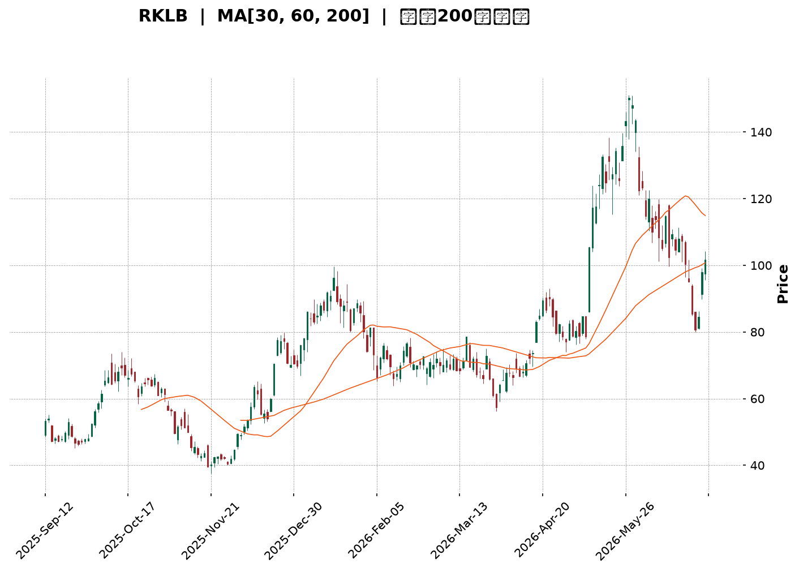
</details>

<html>
<head><meta charset="utf-8" /></head>
<body>
    <div style="height:500px; width:100%;">                        <script>window.PlotlyConfig = {MathJaxConfig: 'local'};</script>
        <script charset="utf-8" src="https://cdn.plot.ly/plotly-3.6.0.min.js" integrity="sha256-QaOVwtVY0T02VaHrr6pnoHLCwayMJp4O5n4YyaE3rJk=" crossorigin="anonymous"></script>                <div id="candlestick-chart" class="plotly-graph-div" style="height:100%; width:100%;"></div>            <script>                window.PLOTLYENV=window.PLOTLYENV || {};                                if (document.getElementById("candlestick-chart")) {                    Plotly.newPlot(                        "candlestick-chart",                        [{"close":{"dtype":"f8","bdata":"AAAAIIWrSkAAAADAHgVLQAAAACBcn0dAAAAAgD0KSEAAAABACpdHQAAAAMAe5UdAAAAAIK7nSEAAAADgenRKQAAAAOBRWEhAAAAA4KNQR0AAAACgRyFHQAAAAKBHgUdAAAAA4Hr0R0AAAAAAKfxHQAAAAAApPEpAAAAA4HoUTEAAAAAAAEBNQAAAAKBHwU5AAAAAANdTUEAAAABA4ZpQQAAAAOCjEFBAAAAAQOFaUEAAAACA6wFRQAAAAKBHUVFAAAAAAADAUEAAAACgR5FQQAAAAGBm1lBAAAAAoJlZUEAAAADgUUhOQAAAAMD1yE9AAAAAANcjUEAAAAAgrmdQQAAAAAAA4E9AAAAAgD2KUEAAAACAwnVOQAAAAKBwfU9AAAAAIIWrTkAAAADA9UhMQAAAAIDCNUxAAAAAgBTOSEAAAACA69FJQAAAAEAz80lAAAAAYLieSUAAAAAAKfxIQAAAAAAAoEZAAAAAwB7FRkAAAAAgrqdFQAAAAADXY0VAAAAAIFzPRUAAAACgcL1DQAAAAGBmJkRAAAAAoJk5RUAAAADAzExFQAAAAEAK90RAAAAAgOsRRUAAAAAgXC9EQAAAAEAz80RAAAAAAClcRkAAAAAgXK9IQAAAAEAKh0hAAAAAIK7HSUAAAABACrdKQAAAAGCPwkxAAAAAANfDT0AAAABguL5OQAAAAOB6tEtAAAAAYLi+S0AAAABA4fpKQAAAAIDC9U1AAAAAoEehUUAAAABAM2NTQAAAACCFS1NAAAAAIIVLU0AAAACgmalRQAAAACCuh1FAAAAAwMycUUAAAADgo3BRQAAAACBc\u002f1JAAAAAwPWIU0AAAACA64FVQAAAAMAeBVVAAAAAwB7FVEAAAABgZjZVQAAAAKCZ+VVAAAAAwB6lVUAAAABAM\u002fNWQAAAAOCjsFZAAAAAQDMTWEAAAACAPUpWQAAAAOB69FVAAAAAYLj+VUAAAACgmTlWQAAAAGC4HlRAAAAAAADAVUAAAADgeiRWQAAAACCFa1VAAAAA4HoEVEAAAACgmYlSQAAAAKBHUVRAAAAAQApHUkAAAADgepRQQAAAAOB6FFJAAAAAgML1UkAAAACA6wFSQAAAACCuZ1FAAAAA4KOAUEAAAAAAKdxQQAAAAMD1eFFAAAAAQOGaUkAAAADAHiVTQAAAAEAKt1FAAAAAoHCNUUAAAACAFH5RQAAAAMDMjFFAAAAAoJkpUkAAAABgZkZRQAAAAIAUvlFAAAAA4FGIUUAAAACAPfpRQAAAAAAAgFFAAAAAQAqHUUAAAABguN5RQAAAACCFO1FAAAAAoHD9UUAAAAAgrhdRQAAAAIA9GlFAAAAAANfTUUAAAACAwqVTQAAAAGC4XlFAAAAAIIX7UUAAAABguM5QQAAAAAAAAFFAAAAA4HqEUEAAAADgUThSQAAAAAApfFBAAAAAQAp3TkAAAADgo7BMQAAAAIAUDlBAAAAAoEdhUEAAAABguO5QQAAAAEDh6lBAAAAA4HqUUEAAAADAHkVRQAAAACBcr1BAAAAAQDMDUUAAAAAgrqdRQAAAAIAUDlJAAAAAYGZmUkAAAAAghbtUQAAAAEAzM1VAAAAAoHBdVkAAAADA9ahVQAAAAGCPglZAAAAAYGYmVUAAAAAghetTQAAAAGCPklRAAAAAgMKlU0AAAACgR0FTQAAAAOCjoFRAAAAAANezU0AAAAAA1xNUQAAAAOCjsFNAAAAAoJkpVUAAAADAHqVTQAAAAIAUXlpAAAAAYGZWXUAAAAAA12NdQAAAAKCZCV9AAAAAoJmRYEAAAACgRzFfQAAAAMAeZWBAAAAAANfTX0AAAADA9chgQAAAAMDMXF9AAAAA4FH4YEAAAABgZuZhQAAAACBcx2JAAAAAwPWAYkAAAAAgXO9hQAAAAMD1mF5AAAAA4HrUXkAAAADAzKxcQAAAAMDM\u002fF1AAAAAwB6FW0AAAACgmWlcQAAAAGC4DltAAAAAQDNDWkAAAACA67FcQAAAAMD1mFlAAAAAAABQW0AAAADgUShaQAAAAGC4\u002flpAAAAAIFzPWkAAAABgjxJZQAAAACCux1dAAAAAgD1aVUAAAAAAKSxUQAAAAGCPIlVAAAAA4KOAWEAAAACgmWlZQA=="},"high":{"dtype":"f8","bdata":"AAAAANcDS0AAAACAwpVLQAAAAIA9CkpAAAAAwB5FSEAAAADgUZhIQAAAAEAKd0hAAAAAoEchSUAAAABgORRLQAAAAKBwPUpAAAAAIFxPSEAAAADgUdhHQAAAAMDMDEhAAAAAYLj+R0AAAACAwrVIQAAAAEAzU0pAAAAAIDF4TEAAAACgR6FNQAAAACCuR09AAAAAAC0iUUAAAABgjyJRQAAAAAAAYFJAAAAAACmcUUAAAABA4WpRQAAAAIAUflJAAAAAAAAQUkAAAAAAACBRQAAAACCFC1JAAAAAYI8CUUAAAACgRwFQQAAAAMDMLFBAAAAAIIWLUEAAAABgZpZQQAAAAGCPolBAAAAAwPXYUEAAAAAghUtQQAAAAKCZuU9AAAAAwMyMT0AAAABguL5NQAAAAADXo0xAAAAAQOEaTEAAAADAzAxKQAAAAAAAQEtAAAAAQOF6TEAAAACAPapLQAAAAOCjsEhAAAAAACmcR0AAAADAS9dGQAAAAIAUzkVAAAAAANdDRkAAAACgRyFHQAAAAIDChURAAAAAANdDRUAAAABACmdFQAAAACCFy0VAAAAAoJlZRUAAAABgZqZEQAAAAGC4fkVAAAAAYLheRkAAAABACtdIQAAAAKCZ2UhAAAAAIFwvSkAAAAAAAOBKQAAAAIA9ak1AAAAAoJkJUEAAAAAghUtQQAAAAADXI1BAAAAAoHBdTEAAAADgenRMQAAAAAAAIE5AAAAAANejUUAAAADAzJxTQAAAACCFy1NAAAAAwB71U0AAAAAgXD9TQAAAACBcL1JAAAAAACmsUkAAAABAi0xSQAAAACBcD1NAAAAAAACQU0AAAAAAAJBVQAAAAKBwfVVAAAAAIK53VkAAAAAghRtWQAAAAIDCNVZAAAAA4KduVkAAAAAAKQxXQAAAAEBgHVdAAAAAwB7lWEAAAACgR5FYQAAAAAAA0FZAAAAAoJlZVkAAAADAzJxXQAAAAIA9ylVAAAAAAADAVUAAAABAM3NWQAAAAAAAQFZAAAAA4HpUVkAAAADAzCxUQAAAAOB6VFRAAAAAYGZWVEAAAAAgXD9SQAAAAIA9KlJAAAAAQDMzU0AAAABACvdSQAAAAKCZWVJAAAAAwMwcUUAAAABgZmZRQAAAACBcv1FAAAAAwPXwUkAAAABACkdTQAAAAMDMjFNAAAAAAADQUUAAAAAghYNRQAAAAGBm9lFAAAAAIFwvUkAAAACAwmVRQAAAAGBmBlJAAAAAAABQUkAAAABgZoZSQAAAAADXE1JAAAAAQArHUkAAAAAAAAhSQAAAAADXO1JAAAAAQDNTUkAAAABgZiZSQAAAAADX01FAAAAA4FEYUkAAAABA4apTQAAAAOBROFNAAAAAYLguUkAAAABguH5SQAAAAMDMXFFAAAAAYGYmUUAAAAAA18NSQAAAAIDCBVJAAAAAgBSGUEAAAACA69FOQAAAAMAeJVBAAAAAQOEqUUAAAADA9VhRQAAAAOB6lFFAAAAAQDMTUUAAAACAwGpSQAAAAGCPclFAAAAAANeDUUAAAABAM+NRQAAAAAAAsFJAAAAAgMKlUkAAAAAgXN9UQAAAACBcv1VAAAAAYGaWVkAAAADAzPxWQAAAAGBmRldAAAAAQDOTVkAAAACAPZpVQAAAAGC4nlRAAAAAgOtxVEAAAADgo4BTQAAAAIDC5VRAAAAAYI\u002fyVEAAAADgT3VUQAAAAAAAwFRAAAAAIIUrVUAAAABgjzJVQAAAACCuZ1pAAAAAACn8XkAAAAAgXF9eQAAAACBcz19AAAAAgMKlYEAAAAAA10tgQAAAAAApTGFAAAAAgD0yYEAAAABAM+tgQAAAAADXW2BAAAAA4FF4YUAAAAAAAEBiQAAAAAAA4GJAAAAAYI\u002faYkAAAAAAAABiQAAAAAAp9GBAAAAAwMwMYEAAAADgUaBeQAAAAOBRqF5AAAAAYLh+XUAAAAAAABBdQAAAAGCP8l1AAAAAoHD9W0AAAABA4cJcQAAAAMAgmF1AAAAAgOuxW0AAAAAAACBbQAAAAIDC1VtAAAAAQDNjW0AAAACgmdlaQAAAAGC4bllAAAAAQDOTV0AAAABACodVQAAAAIDrkVVAAAAAwB7FWEAAAACAPQpaQA=="},"hovertemplate":"\u003cb\u003e%{x|%Y-%m-%d}\u003c\u002fb\u003e\u003cbr\u003e\u958b: $%{open:.2f}\u003cbr\u003e\u9ad8: $%{high:.2f}\u003cbr\u003e\u4f4e: $%{low:.2f}\u003cbr\u003e\u6536: $%{close:.2f}\u003cextra\u003e\u003c\u002fextra\u003e","low":{"dtype":"f8","bdata":"AAAAQDVOSEAAAAAAKVxKQAAAAKBHgUdAAAAAoJk5R0AAAAAAAIBHQAAAAOCjkEdAAAAAYGZmR0AAAADgevRHQAAAAEAKN0hAAAAAQOGaRkAAAACAPepGQAAAACBcL0dAAAAAoEdBR0AAAAAgXI9HQAAAAKBHQUhAAAAAoEehSUAAAABgZuZLQAAAAGCPgkxAAAAAQDPTT0AAAABA4RpQQAAAAMD1CFBAAAAA4M4nUEAAAADgURhPQAAAAMAexVBAAAAAQDObUEAAAACgmdlPQAAAAEAzq1BAAAAAQAo3UEAAAADgejRNQAAAAAAAYE5AAAAAQDPTT0AAAACgmQlQQAAAAIAUzk9AAAAAoHC9T0AAAACA63FOQAAAAEAzM05AAAAA4KOQTUAAAACgR0FMQAAAACBcb0tAAAAA4Hq0SEAAAADgzidHQAAAAKBHYUlAAAAAQOGaSUAAAADgetRIQAAAACBcL0ZAAAAAYGamRUAAAADAzBxFQAAAAKBwnURAAAAAQAo3RUAAAADA9ahDQAAAAMD1yEJAAAAAYGamQ0AAAADgozBEQAAAAOCjsERAAAAAYGbmREAAAACgcP1DQAAAAIDCNURAAAAAAADAREAAAADA9WhGQAAAAKCZ2UdAAAAAACmcSEAAAAAghStJQAAAAAAAIEpAAAAAwMxsTEAAAABgZuZNQAAAAIA9iktAAAAAQApXSkAAAABA4YpKQAAAAADXA0xAAAAAwJ1fTkAAAADAIDBSQAAAAGCPUlJAAAAAoEOzUkAAAADA9ZhRQAAAAKCbVFFAAAAAACmcUUAAAADgUUhRQAAAAGBmtlBAAAAAANfTUUAAAABAM4NSQAAAAGBmdlRAAAAA4KOQVEAAAADAzJxUQAAAAODQ2lRAAAAAoJlpVUAAAAAAACBVQAAAAKCZqVVAAAAAoJkZV0AAAABAMxNWQAAAAKBwrVRAAAAAwHZWVEAAAAAgrodVQAAAAOCjAFRAAAAAAACAVEAAAADAyoFVQAAAAAAAwFRAAAAAoEeBU0AAAACAQXhSQAAAAKBH8VJAAAAAQAgkUUAAAADAzExQQAAAAAAAwFBAAAAAAACwUUAAAABAM+NRQAAAAKBHwVBAAAAAIFzvT0AAAAAAAGBQQAAAAAAAQFBAAAAAwEt\u002fUUAAAABgZhZSQAAAAKCZWVFAAAAAAAAgUUAAAABgZqZQQAAAAOBROFFAAAAAANczUUAAAABgZgZQQAAAAMDMnFBAAAAAACmMUEAAAACAFF5RQAAAAIDC1VBAAAAA4KMIUUAAAADgevRQQAAAAIC+J1FAAAAAwB4VUUAAAACA6xFRQAAAAAAp3FBAAAAAQOEqUUAAAACgR9FRQAAAAKCZWVFAAAAAAAAAUUAAAADA9ZhQQAAAAEAzg1BAAAAAoHAdUEAAAAAAKTxRQAAAAIDCZVBAAAAAwMwsTkAAAABg5RBMQAAAAADXg01AAAAAQDNTUEAAAACAFO5OQAAAAGBmplBAAAAAQOH6T0AAAABg5\u002fNQQAAAAEDholBAAAAAgMKVUEAAAACAwqVQQAAAAGC4nlFAAAAAYGZmUUAAAACgmTlTQAAAAGBm5lRAAAAAYGYmVUAAAAAAAHBVQAAAAOCj8FVAAAAAAClkVEAAAADAHsVTQAAAAMB0Q1NAAAAAYGZmU0AAAAAgXH9SQAAAAIAUXlNAAAAAIIWbU0AAAAAAABBTQAAAAADXI1NAAAAAQAq3U0AAAAAghXtTQAAAACCud1VAAAAAAAAAWkAAAACAPRpcQAAAAMD1OF1AAAAAANdTXkAAAABAM3NeQAAAAKDxal9AAAAAYLjOXEAAAACAFA5fQAAAAEAz815AAAAAgOtpYEAAAACA61FhQAAAAMAePWFAAAAAANfLYUAAAACgmcFgQAAAAAAAQF5AAAAAANejXkAAAACAPWpcQAAAAMD1mFtAAAAAYLiuWkAAAAAAAMBbQAAAAMDMTFlAAAAAgD0aWkAAAACgmVlaQAAAAEAK51hAAAAAQDNzWkAAAADgesRZQAAAAGCPAlpAAAAAoHA9WUAAAAAAACBYQAAAAOCjuFdAAAAAYGY2VUAAAAAAAABUQAAAAGC4LlRAAAAAYGZ2VkAAAADA9ehXQA=="},"name":"\u50f9\u683c","open":{"dtype":"f8","bdata":"AAAAoHB9SEAAAACAPcpKQAAAAAAAAEpAAAAA4FHIR0AAAACAwnVIQAAAAEAK10dAAAAA4KOQR0AAAABAM4NIQAAAAIDC5UlAAAAAAAAASEAAAABgZqZHQAAAAEAzs0dAAAAAQOGaR0AAAADgo7BHQAAAAIDrUUhAAAAAYGYGSkAAAABguG5MQAAAAKBHgU1AAAAAoJkJUEAAAACgmTlQQAAAAEAzs1FAAAAA4FH4UEAAAACAwlVQQAAAAKBHgVFAAAAA4HqEUUAAAADA9XhQQAAAAOCjSFFAAAAAYI8CUUAAAAAAKXxPQAAAACCux05AAAAAANczUEAAAAAAKYxQQAAAAEAza1BAAAAAoEcJUEAAAAAAAEBQQAAAAGCP4k5AAAAAANeDT0AAAABgZuZMQAAAAOB6VExAAAAAQOEaTEAAAACgGNRHQAAAAGC43kpAAAAAAAAATEAAAABACvdJQAAAAKBHYUhAAAAAQOHaRUAAAABAM5NGQAAAAAApHEVAAAAAAABARUAAAACAPQpHQAAAAIA96kNAAAAAoEdhREAAAAAA1wNFQAAAAGC4nkVAAAAAoEdBRUAAAABAM5NEQAAAACCuR0RAAAAAYI\u002fyREAAAABgj9JGQAAAAAAAcEhAAAAAgD0KSUAAAACgcJ1JQAAAAOBRuEpAAAAAoEfBTEAAAAAAAEBPQAAAAOCnhk9AAAAA4FEYS0AAAADAzAxMQAAAAKCZGUxAAAAAIFyPTkAAAAAAKTxSQAAAAADXc1JAAAAAgD2CU0AAAAAghStTQAAAAAAAYFFAAAAAoJlBUkAAAAAAAOBRQAAAAOBRqFFAAAAAIK6nUkAAAADgo3BTQAAAAGBmBlVAAAAAAABgVUAAAACgmSFVQAAAAGC4PlVAAAAAwPVIVkAAAABgZpZVQAAAAMD1UFZAAAAAoJkhV0AAAADAzGxXQAAAAKBHgVZAAAAA4FGYVUAAAAAghUNWQAAAACCur1VAAAAAwPW4VEAAAACAFM5VQAAAAAAp\u002fFVAAAAAAABAVUAAAACAPcpTQAAAAGBmplNAAAAAYGZWVEAAAABguH5RQAAAAAAAQFFAAAAAoJkBUkAAAACAFKZSQAAAAOBRSFJAAAAAgOvhUEAAAADgeqxQQAAAAEBghVBAAAAAAADAUUAAAACgmTlSQAAAACDZ3lJAAAAA4FEwUUAAAADgUThRQAAAAIAUxlFAAAAAQOGCUUAAAACAwuVQQAAAACCFq1BAAAAAYLg2UUAAAAAA17NRQAAAAEDhulFAAAAA4KMIUUAAAADA9VhRQAAAAIDClVFAAAAAQDMzUUAAAADAzPxRQAAAAKCZSVFAAAAAwMxUUUAAAABgZt5RQAAAAGCPAlNAAAAA4Ho0UUAAAAAAAABSQAAAAKBwBVFAAAAAAADAUEAAAAAAKTxRQAAAAMDMzFFAAAAA4KOAUEAAAACgmblOQAAAAEDh2k5AAAAAAABgUEAAAADAzBxPQAAAAGC47lBAAAAAIFzHUEAAAAAAAABSQAAAAADXQ1FAAAAAwMzsUEAAAABAM8NQQAAAACCFY1JAAAAAoHBlUkAAAACAFD5TQAAAAMAeBVVAAAAAYGY2VUAAAADAHpVWQAAAAIDCnVZAAAAAYGZ2VkAAAACAwpVVQAAAAAAp7FNAAAAAwMwEVEAAAABACndTQAAAAEAzY1NAAAAAgOvhVEAAAABACpdTQAAAAGBmplRAAAAAIK7nU0AAAACgcC1VQAAAAIA9glVAAAAAoEdRWkAAAADgozBcQAAAAKBH+V5AAAAAYGbGXkAAAABAMwNgQAAAAAApmGBAAAAAgBR+X0AAAABguN5fQAAAAMD1iF9AAAAAwB5tYEAAAABA4b5hQAAAAEAKt2JAAAAAoHBlYkAAAACAFH5hQAAAAAApjGBAAAAAgMJVX0AAAADAHuVdQAAAAKBwRVxAAAAAoEeRXEAAAABA4apcQAAAAKCZmV1AAAAAwMzsWkAAAACAwqVaQAAAAKBHgV1AAAAAoHD9WkAAAACgcO1aQAAAACCuB1pAAAAAwB41W0AAAAAgXL9aQAAAAKBHAVhAAAAAYGZ2V0AAAABACodVQAAAAEAKR1RAAAAAQOHSVkAAAABA4VpYQA=="},"x":["2025-09-12T00:00:00-04:00","2025-09-15T00:00:00-04:00","2025-09-16T00:00:00-04:00","2025-09-17T00:00:00-04:00","2025-09-18T00:00:00-04:00","2025-09-19T00:00:00-04:00","2025-09-22T00:00:00-04:00","2025-09-23T00:00:00-04:00","2025-09-24T00:00:00-04:00","2025-09-25T00:00:00-04:00","2025-09-26T00:00:00-04:00","2025-09-29T00:00:00-04:00","2025-09-30T00:00:00-04:00","2025-10-01T00:00:00-04:00","2025-10-02T00:00:00-04:00","2025-10-03T00:00:00-04:00","2025-10-06T00:00:00-04:00","2025-10-07T00:00:00-04:00","2025-10-08T00:00:00-04:00","2025-10-09T00:00:00-04:00","2025-10-10T00:00:00-04:00","2025-10-13T00:00:00-04:00","2025-10-14T00:00:00-04:00","2025-10-15T00:00:00-04:00","2025-10-16T00:00:00-04:00","2025-10-17T00:00:00-04:00","2025-10-20T00:00:00-04:00","2025-10-21T00:00:00-04:00","2025-10-22T00:00:00-04:00","2025-10-23T00:00:00-04:00","2025-10-24T00:00:00-04:00","2025-10-27T00:00:00-04:00","2025-10-28T00:00:00-04:00","2025-10-29T00:00:00-04:00","2025-10-30T00:00:00-04:00","2025-10-31T00:00:00-04:00","2025-11-03T00:00:00-05:00","2025-11-04T00:00:00-05:00","2025-11-05T00:00:00-05:00","2025-11-06T00:00:00-05:00","2025-11-07T00:00:00-05:00","2025-11-10T00:00:00-05:00","2025-11-11T00:00:00-05:00","2025-11-12T00:00:00-05:00","2025-11-13T00:00:00-05:00","2025-11-14T00:00:00-05:00","2025-11-17T00:00:00-05:00","2025-11-18T00:00:00-05:00","2025-11-19T00:00:00-05:00","2025-11-20T00:00:00-05:00","2025-11-21T00:00:00-05:00","2025-11-24T00:00:00-05:00","2025-11-25T00:00:00-05:00","2025-11-26T00:00:00-05:00","2025-11-28T00:00:00-05:00","2025-12-01T00:00:00-05:00","2025-12-02T00:00:00-05:00","2025-12-03T00:00:00-05:00","2025-12-04T00:00:00-05:00","2025-12-05T00:00:00-05:00","2025-12-08T00:00:00-05:00","2025-12-09T00:00:00-05:00","2025-12-10T00:00:00-05:00","2025-12-11T00:00:00-05:00","2025-12-12T00:00:00-05:00","2025-12-15T00:00:00-05:00","2025-12-16T00:00:00-05:00","2025-12-17T00:00:00-05:00","2025-12-18T00:00:00-05:00","2025-12-19T00:00:00-05:00","2025-12-22T00:00:00-05:00","2025-12-23T00:00:00-05:00","2025-12-24T00:00:00-05:00","2025-12-26T00:00:00-05:00","2025-12-29T00:00:00-05:00","2025-12-30T00:00:00-05:00","2025-12-31T00:00:00-05:00","2026-01-02T00:00:00-05:00","2026-01-05T00:00:00-05:00","2026-01-06T00:00:00-05:00","2026-01-07T00:00:00-05:00","2026-01-08T00:00:00-05:00","2026-01-09T00:00:00-05:00","2026-01-12T00:00:00-05:00","2026-01-13T00:00:00-05:00","2026-01-14T00:00:00-05:00","2026-01-15T00:00:00-05:00","2026-01-16T00:00:00-05:00","2026-01-20T00:00:00-05:00","2026-01-21T00:00:00-05:00","2026-01-22T00:00:00-05:00","2026-01-23T00:00:00-05:00","2026-01-26T00:00:00-05:00","2026-01-27T00:00:00-05:00","2026-01-28T00:00:00-05:00","2026-01-29T00:00:00-05:00","2026-01-30T00:00:00-05:00","2026-02-02T00:00:00-05:00","2026-02-03T00:00:00-05:00","2026-02-04T00:00:00-05:00","2026-02-05T00:00:00-05:00","2026-02-06T00:00:00-05:00","2026-02-09T00:00:00-05:00","2026-02-10T00:00:00-05:00","2026-02-11T00:00:00-05:00","2026-02-12T00:00:00-05:00","2026-02-13T00:00:00-05:00","2026-02-17T00:00:00-05:00","2026-02-18T00:00:00-05:00","2026-02-19T00:00:00-05:00","2026-02-20T00:00:00-05:00","2026-02-23T00:00:00-05:00","2026-02-24T00:00:00-05:00","2026-02-25T00:00:00-05:00","2026-02-26T00:00:00-05:00","2026-02-27T00:00:00-05:00","2026-03-02T00:00:00-05:00","2026-03-03T00:00:00-05:00","2026-03-04T00:00:00-05:00","2026-03-05T00:00:00-05:00","2026-03-06T00:00:00-05:00","2026-03-09T00:00:00-04:00","2026-03-10T00:00:00-04:00","2026-03-11T00:00:00-04:00","2026-03-12T00:00:00-04:00","2026-03-13T00:00:00-04:00","2026-03-16T00:00:00-04:00","2026-03-17T00:00:00-04:00","2026-03-18T00:00:00-04:00","2026-03-19T00:00:00-04:00","2026-03-20T00:00:00-04:00","2026-03-23T00:00:00-04:00","2026-03-24T00:00:00-04:00","2026-03-25T00:00:00-04:00","2026-03-26T00:00:00-04:00","2026-03-27T00:00:00-04:00","2026-03-30T00:00:00-04:00","2026-03-31T00:00:00-04:00","2026-04-01T00:00:00-04:00","2026-04-02T00:00:00-04:00","2026-04-06T00:00:00-04:00","2026-04-07T00:00:00-04:00","2026-04-08T00:00:00-04:00","2026-04-09T00:00:00-04:00","2026-04-10T00:00:00-04:00","2026-04-13T00:00:00-04:00","2026-04-14T00:00:00-04:00","2026-04-15T00:00:00-04:00","2026-04-16T00:00:00-04:00","2026-04-17T00:00:00-04:00","2026-04-20T00:00:00-04:00","2026-04-21T00:00:00-04:00","2026-04-22T00:00:00-04:00","2026-04-23T00:00:00-04:00","2026-04-24T00:00:00-04:00","2026-04-27T00:00:00-04:00","2026-04-28T00:00:00-04:00","2026-04-29T00:00:00-04:00","2026-04-30T00:00:00-04:00","2026-05-01T00:00:00-04:00","2026-05-04T00:00:00-04:00","2026-05-05T00:00:00-04:00","2026-05-06T00:00:00-04:00","2026-05-07T00:00:00-04:00","2026-05-08T00:00:00-04:00","2026-05-11T00:00:00-04:00","2026-05-12T00:00:00-04:00","2026-05-13T00:00:00-04:00","2026-05-14T00:00:00-04:00","2026-05-15T00:00:00-04:00","2026-05-18T00:00:00-04:00","2026-05-19T00:00:00-04:00","2026-05-20T00:00:00-04:00","2026-05-21T00:00:00-04:00","2026-05-22T00:00:00-04:00","2026-05-26T00:00:00-04:00","2026-05-27T00:00:00-04:00","2026-05-28T00:00:00-04:00","2026-05-29T00:00:00-04:00","2026-06-01T00:00:00-04:00","2026-06-02T00:00:00-04:00","2026-06-03T00:00:00-04:00","2026-06-04T00:00:00-04:00","2026-06-05T00:00:00-04:00","2026-06-08T00:00:00-04:00","2026-06-09T00:00:00-04:00","2026-06-10T00:00:00-04:00","2026-06-11T00:00:00-04:00","2026-06-12T00:00:00-04:00","2026-06-15T00:00:00-04:00","2026-06-16T00:00:00-04:00","2026-06-17T00:00:00-04:00","2026-06-18T00:00:00-04:00","2026-06-22T00:00:00-04:00","2026-06-23T00:00:00-04:00","2026-06-24T00:00:00-04:00","2026-06-25T00:00:00-04:00","2026-06-26T00:00:00-04:00","2026-06-29T00:00:00-04:00","2026-06-30T00:00:00-04:00"],"type":"candlestick"},{"hovertemplate":"MA30: $%{y:.2f}\u003cextra\u003e\u003c\u002fextra\u003e","line":{"color":"#2196F3","dash":"dash","width":2},"mode":"lines","name":"MA30","x":["2025-09-12T00:00:00-04:00","2025-09-15T00:00:00-04:00","2025-09-16T00:00:00-04:00","2025-09-17T00:00:00-04:00","2025-09-18T00:00:00-04:00","2025-09-19T00:00:00-04:00","2025-09-22T00:00:00-04:00","2025-09-23T00:00:00-04:00","2025-09-24T00:00:00-04:00","2025-09-25T00:00:00-04:00","2025-09-26T00:00:00-04:00","2025-09-29T00:00:00-04:00","2025-09-30T00:00:00-04:00","2025-10-01T00:00:00-04:00","2025-10-02T00:00:00-04:00","2025-10-03T00:00:00-04:00","2025-10-06T00:00:00-04:00","2025-10-07T00:00:00-04:00","2025-10-08T00:00:00-04:00","2025-10-09T00:00:00-04:00","2025-10-10T00:00:00-04:00","2025-10-13T00:00:00-04:00","2025-10-14T00:00:00-04:00","2025-10-15T00:00:00-04:00","2025-10-16T00:00:00-04:00","2025-10-17T00:00:00-04:00","2025-10-20T00:00:00-04:00","2025-10-21T00:00:00-04:00","2025-10-22T00:00:00-04:00","2025-10-23T00:00:00-04:00","2025-10-24T00:00:00-04:00","2025-10-27T00:00:00-04:00","2025-10-28T00:00:00-04:00","2025-10-29T00:00:00-04:00","2025-10-30T00:00:00-04:00","2025-10-31T00:00:00-04:00","2025-11-03T00:00:00-05:00","2025-11-04T00:00:00-05:00","2025-11-05T00:00:00-05:00","2025-11-06T00:00:00-05:00","2025-11-07T00:00:00-05:00","2025-11-10T00:00:00-05:00","2025-11-11T00:00:00-05:00","2025-11-12T00:00:00-05:00","2025-11-13T00:00:00-05:00","2025-11-14T00:00:00-05:00","2025-11-17T00:00:00-05:00","2025-11-18T00:00:00-05:00","2025-11-19T00:00:00-05:00","2025-11-20T00:00:00-05:00","2025-11-21T00:00:00-05:00","2025-11-24T00:00:00-05:00","2025-11-25T00:00:00-05:00","2025-11-26T00:00:00-05:00","2025-11-28T00:00:00-05:00","2025-12-01T00:00:00-05:00","2025-12-02T00:00:00-05:00","2025-12-03T00:00:00-05:00","2025-12-04T00:00:00-05:00","2025-12-05T00:00:00-05:00","2025-12-08T00:00:00-05:00","2025-12-09T00:00:00-05:00","2025-12-10T00:00:00-05:00","2025-12-11T00:00:00-05:00","2025-12-12T00:00:00-05:00","2025-12-15T00:00:00-05:00","2025-12-16T00:00:00-05:00","2025-12-17T00:00:00-05:00","2025-12-18T00:00:00-05:00","2025-12-19T00:00:00-05:00","2025-12-22T00:00:00-05:00","2025-12-23T00:00:00-05:00","2025-12-24T00:00:00-05:00","2025-12-26T00:00:00-05:00","2025-12-29T00:00:00-05:00","2025-12-30T00:00:00-05:00","2025-12-31T00:00:00-05:00","2026-01-02T00:00:00-05:00","2026-01-05T00:00:00-05:00","2026-01-06T00:00:00-05:00","2026-01-07T00:00:00-05:00","2026-01-08T00:00:00-05:00","2026-01-09T00:00:00-05:00","2026-01-12T00:00:00-05:00","2026-01-13T00:00:00-05:00","2026-01-14T00:00:00-05:00","2026-01-15T00:00:00-05:00","2026-01-16T00:00:00-05:00","2026-01-20T00:00:00-05:00","2026-01-21T00:00:00-05:00","2026-01-22T00:00:00-05:00","2026-01-23T00:00:00-05:00","2026-01-26T00:00:00-05:00","2026-01-27T00:00:00-05:00","2026-01-28T00:00:00-05:00","2026-01-29T00:00:00-05:00","2026-01-30T00:00:00-05:00","2026-02-02T00:00:00-05:00","2026-02-03T00:00:00-05:00","2026-02-04T00:00:00-05:00","2026-02-05T00:00:00-05:00","2026-02-06T00:00:00-05:00","2026-02-09T00:00:00-05:00","2026-02-10T00:00:00-05:00","2026-02-11T00:00:00-05:00","2026-02-12T00:00:00-05:00","2026-02-13T00:00:00-05:00","2026-02-17T00:00:00-05:00","2026-02-18T00:00:00-05:00","2026-02-19T00:00:00-05:00","2026-02-20T00:00:00-05:00","2026-02-23T00:00:00-05:00","2026-02-24T00:00:00-05:00","2026-02-25T00:00:00-05:00","2026-02-26T00:00:00-05:00","2026-02-27T00:00:00-05:00","2026-03-02T00:00:00-05:00","2026-03-03T00:00:00-05:00","2026-03-04T00:00:00-05:00","2026-03-05T00:00:00-05:00","2026-03-06T00:00:00-05:00","2026-03-09T00:00:00-04:00","2026-03-10T00:00:00-04:00","2026-03-11T00:00:00-04:00","2026-03-12T00:00:00-04:00","2026-03-13T00:00:00-04:00","2026-03-16T00:00:00-04:00","2026-03-17T00:00:00-04:00","2026-03-18T00:00:00-04:00","2026-03-19T00:00:00-04:00","2026-03-20T00:00:00-04:00","2026-03-23T00:00:00-04:00","2026-03-24T00:00:00-04:00","2026-03-25T00:00:00-04:00","2026-03-26T00:00:00-04:00","2026-03-27T00:00:00-04:00","2026-03-30T00:00:00-04:00","2026-03-31T00:00:00-04:00","2026-04-01T00:00:00-04:00","2026-04-02T00:00:00-04:00","2026-04-06T00:00:00-04:00","2026-04-07T00:00:00-04:00","2026-04-08T00:00:00-04:00","2026-04-09T00:00:00-04:00","2026-04-10T00:00:00-04:00","2026-04-13T00:00:00-04:00","2026-04-14T00:00:00-04:00","2026-04-15T00:00:00-04:00","2026-04-16T00:00:00-04:00","2026-04-17T00:00:00-04:00","2026-04-20T00:00:00-04:00","2026-04-21T00:00:00-04:00","2026-04-22T00:00:00-04:00","2026-04-23T00:00:00-04:00","2026-04-24T00:00:00-04:00","2026-04-27T00:00:00-04:00","2026-04-28T00:00:00-04:00","2026-04-29T00:00:00-04:00","2026-04-30T00:00:00-04:00","2026-05-01T00:00:00-04:00","2026-05-04T00:00:00-04:00","2026-05-05T00:00:00-04:00","2026-05-06T00:00:00-04:00","2026-05-07T00:00:00-04:00","2026-05-08T00:00:00-04:00","2026-05-11T00:00:00-04:00","2026-05-12T00:00:00-04:00","2026-05-13T00:00:00-04:00","2026-05-14T00:00:00-04:00","2026-05-15T00:00:00-04:00","2026-05-18T00:00:00-04:00","2026-05-19T00:00:00-04:00","2026-05-20T00:00:00-04:00","2026-05-21T00:00:00-04:00","2026-05-22T00:00:00-04:00","2026-05-26T00:00:00-04:00","2026-05-27T00:00:00-04:00","2026-05-28T00:00:00-04:00","2026-05-29T00:00:00-04:00","2026-06-01T00:00:00-04:00","2026-06-02T00:00:00-04:00","2026-06-03T00:00:00-04:00","2026-06-04T00:00:00-04:00","2026-06-05T00:00:00-04:00","2026-06-08T00:00:00-04:00","2026-06-09T00:00:00-04:00","2026-06-10T00:00:00-04:00","2026-06-11T00:00:00-04:00","2026-06-12T00:00:00-04:00","2026-06-15T00:00:00-04:00","2026-06-16T00:00:00-04:00","2026-06-17T00:00:00-04:00","2026-06-18T00:00:00-04:00","2026-06-22T00:00:00-04:00","2026-06-23T00:00:00-04:00","2026-06-24T00:00:00-04:00","2026-06-25T00:00:00-04:00","2026-06-26T00:00:00-04:00","2026-06-29T00:00:00-04:00","2026-06-30T00:00:00-04:00"],"y":{"dtype":"f8","bdata":"AAAAAAAA+H8AAAAAAAD4fwAAAAAAAPh\u002fAAAAAAAA+H8AAAAAAAD4fwAAAAAAAPh\u002fAAAAAAAA+H8AAAAAAAD4fwAAAAAAAPh\u002fAAAAAAAA+H8AAAAAAAD4fwAAAAAAAPh\u002fAAAAAAAA+H8AAAAAAAD4fwAAAAAAAPh\u002fAAAAAAAA+H8AAAAAAAD4fwAAAAAAAPh\u002fAAAAAAAA+H8AAAAAAAD4fwAAAAAAAPh\u002fAAAAAAAA+H8AAAAAAAD4fwAAAAAAAPh\u002fAAAAAAAA+H8AAAAAAAD4fwAAAAAAAPh\u002fAAAAAAAA+H8AAAAAAAD4f97d3f1xX0xAiYiIOFGPTEC8u7urucBMQImIiIglB01Ad3d3t0lUTUBVVVV16Y5NQM3MzPy4z01AIiIi0uoATkBERESEiBBOQM3MzLyDMU5AERERsTo+TkBmZmYWL1VOQGZmZkYMak5AZmZmhkF4TkDv7u4OyoBOQEREROT7YU5AVVVVBaw0TkDe3d193PNNQGZmZlbyo01AMzMzE2dHTUCamZlpddRMQDMzM7M6bkxAZmZmVjkMTEDv7u7+uJ9LQN7d3W0SK0tA3t3drQDBSkCamZn5flJKQKuqqsro5UlAd3d3t6yNSUCrqqrK6F1JQKuqqor6H0lAREREFIPoSECJiIhYgLRIQGZmZobrmUhAvLu727KOSEBERER0IZFIQO\u002fu7v7UcEhAzczMPN9XSEC8u7trvExIQKuqqlqrW0hAVVVVpeK0SEB3d3dHbyNJQHd3d8dLj0lAzczMLPn9SUAAAABANVZKQM3MzOxRwEpAiYiISJoqS0DNzMy8dJtLQJqZmekmKUxAVVVV9W+8TECJiIj4DINNQImIiGjYPU5ARERENDPrTkCJiIh4d59PQERERHzNMVBA7+7uppuQUECrqqpKU\u002f5QQN7d3V2PZlFAzczM7JjUUUCrqqqSeylSQGZmZm4ufFJAvLu7m+DJUkBVVVX1ixVTQGZmZi6HRlNAZmZm7ph4U0CJiIg4XrJTQFVVVa3x8lNAIiIiomEnVEARERERdFJUQDMzMwMAgFRAAAAAgIaFVEC8u7trkW1UQGZmZjYzY1RAREREZFdgVEDe3d0NSWNUQM3MzPw3YlRAiYiIKL9YVEAREREhzFNUQHd3d7fIRlRAmpmZGdk+VEBEREQksCpUQCIiIkJ8DlRAVVVVhQfzU0Dv7u4OSdNTQO\u002fu7n6GrVNAvLu7286PU0ARERGhYV9TQGZmZqYpNVNAZmZmVlX9UkCamZmJiNhSQBEREXGEslJAmpmZCWWMUkBVVVVlO2dSQN7d3Y2XTlJAVVVVtYEuUkARERHRaQNSQImIiBiS3lFAd3d39+HLUUC8u7vLWtVRQDMzM+MzvFFAMzMzc6+5UUDv7u5uoLtRQDMzMyNpslFAq6qqapGdUUARERGhYZ9RQLy7u9uHl1FAAAAAgLGMUUDe3d1lO3dRQKuqqtIia1FAREREPCZYUUDNzMz0REVRQCIiIsp2PlFAzczMVCo2UUDe3d1FRDRRQO\u002fu7qbiLFFAiYiIcBIjUUCJiIiQUCZRQDMzMzv7KFFAiYiIUGIwUUC8u7uz5EdRQCIiInp3Z1FAAAAAKL+QUUARERGJFrFRQBEREWkf3lFAERERiRb5UUBVVVVNNxFSQJqZmaHTLlJAMzMze1s+UkBVVVUNAjtSQDMzMyvOVlJAiYiIkHtlUkBERET8YoFSQJqZmWFXmFJAIiIiivq\u002fUkCJiIiAI8xSQO\u002fu7iZ4IFNAZmZm\u002ftSYU0C8u7tLNxlUQBERERERmVRAMzMzYxAoVUBERETUv6FVQGZmZtYxKVZAIiIigk6rVkBmZmZmZjZXQDMzM+Ols1dAIiIikhhEWEDNzMzs7t5YQImIiMhahVlAzczMfCMkWkC8u7vbT6VaQCIiIgKB9VpAVVVVFb09W0BVVVWVmXlbQN7d3W1ouVtAiYiI6MPvW0Dv7u4OPDhcQCIiIsKSb1xAMzMzcwWoXEAiIiJyk\u002fhcQDMzM5P8Il1AAAAA4OxjXUBmZmbWzpddQKuqqtok1l1AERERAVYGXkDv7u6OpjReQERERBSSHl5AVVVVlW7aXUBmZmamxotdQO\u002fu7k5GN11AzczM3JbtXEAzMzNDRLxcQA=="},"type":"scatter"},{"hovertemplate":"MA60: $%{y:.2f}\u003cextra\u003e\u003c\u002fextra\u003e","line":{"color":"#9C27B0","dash":"dash","width":2},"mode":"lines","name":"MA60","x":["2025-09-12T00:00:00-04:00","2025-09-15T00:00:00-04:00","2025-09-16T00:00:00-04:00","2025-09-17T00:00:00-04:00","2025-09-18T00:00:00-04:00","2025-09-19T00:00:00-04:00","2025-09-22T00:00:00-04:00","2025-09-23T00:00:00-04:00","2025-09-24T00:00:00-04:00","2025-09-25T00:00:00-04:00","2025-09-26T00:00:00-04:00","2025-09-29T00:00:00-04:00","2025-09-30T00:00:00-04:00","2025-10-01T00:00:00-04:00","2025-10-02T00:00:00-04:00","2025-10-03T00:00:00-04:00","2025-10-06T00:00:00-04:00","2025-10-07T00:00:00-04:00","2025-10-08T00:00:00-04:00","2025-10-09T00:00:00-04:00","2025-10-10T00:00:00-04:00","2025-10-13T00:00:00-04:00","2025-10-14T00:00:00-04:00","2025-10-15T00:00:00-04:00","2025-10-16T00:00:00-04:00","2025-10-17T00:00:00-04:00","2025-10-20T00:00:00-04:00","2025-10-21T00:00:00-04:00","2025-10-22T00:00:00-04:00","2025-10-23T00:00:00-04:00","2025-10-24T00:00:00-04:00","2025-10-27T00:00:00-04:00","2025-10-28T00:00:00-04:00","2025-10-29T00:00:00-04:00","2025-10-30T00:00:00-04:00","2025-10-31T00:00:00-04:00","2025-11-03T00:00:00-05:00","2025-11-04T00:00:00-05:00","2025-11-05T00:00:00-05:00","2025-11-06T00:00:00-05:00","2025-11-07T00:00:00-05:00","2025-11-10T00:00:00-05:00","2025-11-11T00:00:00-05:00","2025-11-12T00:00:00-05:00","2025-11-13T00:00:00-05:00","2025-11-14T00:00:00-05:00","2025-11-17T00:00:00-05:00","2025-11-18T00:00:00-05:00","2025-11-19T00:00:00-05:00","2025-11-20T00:00:00-05:00","2025-11-21T00:00:00-05:00","2025-11-24T00:00:00-05:00","2025-11-25T00:00:00-05:00","2025-11-26T00:00:00-05:00","2025-11-28T00:00:00-05:00","2025-12-01T00:00:00-05:00","2025-12-02T00:00:00-05:00","2025-12-03T00:00:00-05:00","2025-12-04T00:00:00-05:00","2025-12-05T00:00:00-05:00","2025-12-08T00:00:00-05:00","2025-12-09T00:00:00-05:00","2025-12-10T00:00:00-05:00","2025-12-11T00:00:00-05:00","2025-12-12T00:00:00-05:00","2025-12-15T00:00:00-05:00","2025-12-16T00:00:00-05:00","2025-12-17T00:00:00-05:00","2025-12-18T00:00:00-05:00","2025-12-19T00:00:00-05:00","2025-12-22T00:00:00-05:00","2025-12-23T00:00:00-05:00","2025-12-24T00:00:00-05:00","2025-12-26T00:00:00-05:00","2025-12-29T00:00:00-05:00","2025-12-30T00:00:00-05:00","2025-12-31T00:00:00-05:00","2026-01-02T00:00:00-05:00","2026-01-05T00:00:00-05:00","2026-01-06T00:00:00-05:00","2026-01-07T00:00:00-05:00","2026-01-08T00:00:00-05:00","2026-01-09T00:00:00-05:00","2026-01-12T00:00:00-05:00","2026-01-13T00:00:00-05:00","2026-01-14T00:00:00-05:00","2026-01-15T00:00:00-05:00","2026-01-16T00:00:00-05:00","2026-01-20T00:00:00-05:00","2026-01-21T00:00:00-05:00","2026-01-22T00:00:00-05:00","2026-01-23T00:00:00-05:00","2026-01-26T00:00:00-05:00","2026-01-27T00:00:00-05:00","2026-01-28T00:00:00-05:00","2026-01-29T00:00:00-05:00","2026-01-30T00:00:00-05:00","2026-02-02T00:00:00-05:00","2026-02-03T00:00:00-05:00","2026-02-04T00:00:00-05:00","2026-02-05T00:00:00-05:00","2026-02-06T00:00:00-05:00","2026-02-09T00:00:00-05:00","2026-02-10T00:00:00-05:00","2026-02-11T00:00:00-05:00","2026-02-12T00:00:00-05:00","2026-02-13T00:00:00-05:00","2026-02-17T00:00:00-05:00","2026-02-18T00:00:00-05:00","2026-02-19T00:00:00-05:00","2026-02-20T00:00:00-05:00","2026-02-23T00:00:00-05:00","2026-02-24T00:00:00-05:00","2026-02-25T00:00:00-05:00","2026-02-26T00:00:00-05:00","2026-02-27T00:00:00-05:00","2026-03-02T00:00:00-05:00","2026-03-03T00:00:00-05:00","2026-03-04T00:00:00-05:00","2026-03-05T00:00:00-05:00","2026-03-06T00:00:00-05:00","2026-03-09T00:00:00-04:00","2026-03-10T00:00:00-04:00","2026-03-11T00:00:00-04:00","2026-03-12T00:00:00-04:00","2026-03-13T00:00:00-04:00","2026-03-16T00:00:00-04:00","2026-03-17T00:00:00-04:00","2026-03-18T00:00:00-04:00","2026-03-19T00:00:00-04:00","2026-03-20T00:00:00-04:00","2026-03-23T00:00:00-04:00","2026-03-24T00:00:00-04:00","2026-03-25T00:00:00-04:00","2026-03-26T00:00:00-04:00","2026-03-27T00:00:00-04:00","2026-03-30T00:00:00-04:00","2026-03-31T00:00:00-04:00","2026-04-01T00:00:00-04:00","2026-04-02T00:00:00-04:00","2026-04-06T00:00:00-04:00","2026-04-07T00:00:00-04:00","2026-04-08T00:00:00-04:00","2026-04-09T00:00:00-04:00","2026-04-10T00:00:00-04:00","2026-04-13T00:00:00-04:00","2026-04-14T00:00:00-04:00","2026-04-15T00:00:00-04:00","2026-04-16T00:00:00-04:00","2026-04-17T00:00:00-04:00","2026-04-20T00:00:00-04:00","2026-04-21T00:00:00-04:00","2026-04-22T00:00:00-04:00","2026-04-23T00:00:00-04:00","2026-04-24T00:00:00-04:00","2026-04-27T00:00:00-04:00","2026-04-28T00:00:00-04:00","2026-04-29T00:00:00-04:00","2026-04-30T00:00:00-04:00","2026-05-01T00:00:00-04:00","2026-05-04T00:00:00-04:00","2026-05-05T00:00:00-04:00","2026-05-06T00:00:00-04:00","2026-05-07T00:00:00-04:00","2026-05-08T00:00:00-04:00","2026-05-11T00:00:00-04:00","2026-05-12T00:00:00-04:00","2026-05-13T00:00:00-04:00","2026-05-14T00:00:00-04:00","2026-05-15T00:00:00-04:00","2026-05-18T00:00:00-04:00","2026-05-19T00:00:00-04:00","2026-05-20T00:00:00-04:00","2026-05-21T00:00:00-04:00","2026-05-22T00:00:00-04:00","2026-05-26T00:00:00-04:00","2026-05-27T00:00:00-04:00","2026-05-28T00:00:00-04:00","2026-05-29T00:00:00-04:00","2026-06-01T00:00:00-04:00","2026-06-02T00:00:00-04:00","2026-06-03T00:00:00-04:00","2026-06-04T00:00:00-04:00","2026-06-05T00:00:00-04:00","2026-06-08T00:00:00-04:00","2026-06-09T00:00:00-04:00","2026-06-10T00:00:00-04:00","2026-06-11T00:00:00-04:00","2026-06-12T00:00:00-04:00","2026-06-15T00:00:00-04:00","2026-06-16T00:00:00-04:00","2026-06-17T00:00:00-04:00","2026-06-18T00:00:00-04:00","2026-06-22T00:00:00-04:00","2026-06-23T00:00:00-04:00","2026-06-24T00:00:00-04:00","2026-06-25T00:00:00-04:00","2026-06-26T00:00:00-04:00","2026-06-29T00:00:00-04:00","2026-06-30T00:00:00-04:00"],"y":{"dtype":"f8","bdata":"AAAAAAAA+H8AAAAAAAD4fwAAAAAAAPh\u002fAAAAAAAA+H8AAAAAAAD4fwAAAAAAAPh\u002fAAAAAAAA+H8AAAAAAAD4fwAAAAAAAPh\u002fAAAAAAAA+H8AAAAAAAD4fwAAAAAAAPh\u002fAAAAAAAA+H8AAAAAAAD4fwAAAAAAAPh\u002fAAAAAAAA+H8AAAAAAAD4fwAAAAAAAPh\u002fAAAAAAAA+H8AAAAAAAD4fwAAAAAAAPh\u002fAAAAAAAA+H8AAAAAAAD4fwAAAAAAAPh\u002fAAAAAAAA+H8AAAAAAAD4fwAAAAAAAPh\u002fAAAAAAAA+H8AAAAAAAD4fwAAAAAAAPh\u002fAAAAAAAA+H8AAAAAAAD4fwAAAAAAAPh\u002fAAAAAAAA+H8AAAAAAAD4fwAAAAAAAPh\u002fAAAAAAAA+H8AAAAAAAD4fwAAAAAAAPh\u002fAAAAAAAA+H8AAAAAAAD4fwAAAAAAAPh\u002fAAAAAAAA+H8AAAAAAAD4fwAAAAAAAPh\u002fAAAAAAAA+H8AAAAAAAD4fwAAAAAAAPh\u002fAAAAAAAA+H8AAAAAAAD4fwAAAAAAAPh\u002fAAAAAAAA+H8AAAAAAAD4fwAAAAAAAPh\u002fAAAAAAAA+H8AAAAAAAD4fwAAAAAAAPh\u002fAAAAAAAA+H8AAAAAAAD4f0RERES2v0pAZmZmJuq7SkAiIiICnbpKQHd3d4eI0EpAmpmZSX7xSkDNzMx0BRBLQN7d3f1GIEtAd3d3B2UsS0AAAAB4oi5LQLy7u4uXRktAMzMzq455S0Dv7u4uT7xLQO\u002fu7gas\u002fEtAmpmZWR07TEB3d3enf2tMQImIiOgmkUxA7+7uJqOvTEBVVVWdqMdMQAAAAKCM5kxAREREhOsBTUARERExwStNQN7d3Y0JVk1AVVVVRbZ7TUC8u7s7mJ9NQDMzM7NWx01A3t3d\u002fRvxTUB3d3fHkidOQDMzM8ODWU5AiYiISG+bTkAAAAD4b9hOQLy7u7MrDE9A3t3dJSI+T0CamZkhzG9PQJqZmfF8k09AREREXPK\u002fT0Crqqry7vpPQGZmZhauFVBAREREoKgpUEB3d3cjaTxQQERERNjqVlBAVVVV6ftvUEC8u7uHpH9QQBEREY1slVBAVVVV\u002famvUEDv7u7WMcdQQJqZmXkw4VBAZmZmJgb3UEC8u7s\u002fwxBRQCIiIhauLVFAIiIiiohOUUBERERQG3ZRQDMzMzu0llFAvLu7j1C0UUCamZllgtFRQJqZmf2p71FAVVVVQTUQUkDe3d112i5SQCIiIoLcTVJAmpmZIfdoUkAiIiIOAoFSQLy7u29Zl1JAq6qq0iKrUkBVVVWtY75SQCIiIl6PylJA3t3dUY3TUkDNzMwE5NpSQO\u002fu7uLB6FJAzczMzKH5UkBmZmZu5xNTQDMzM\u002fMZHlNAmpmZ+ZofU0BVVVXtmBRTQM3MzCzOClNAd3d3Z\u002fT+UkB3d3dXVQFTQEREROzf\u002fFJAREREVLjyUkB3d3fDg+VSQBEREcX12FJA7+7uqn\u002fLUkCJiIiM+rdSQCIiIoZ5plJAERER7ZiUUkBmZmaqxoNSQO\u002fu7pI0bVJAIiIipnBZUkDNzMwY2UJSQM3MzHASL1JAd3d309sWUkCrqqqeNhBSQJqZmfX9DFJAzczMGJIOUkAzMzP3KAxSQHd3d3tbFlJAMzMzH8wTUkAzMzOPUApSQBEREd2yBlJAVVVVuR4FUkCJiIhsLghSQDMzMweBCVJA3t3dgZUPUkCamZm1gR5SQGZmZkJgJVJAZmZm+sUuUkDNzMyQwjVSQFVVVQEAXFJAMzMzP8OSUkDNzMxYOchSQN7d3fEZAlNAvLu7TxtAU0CJiIhkgnNTQERERFDUs1NAd3d3a7zwU0AiIiJWVTVUQBEREUVEcFRAVVVVgZWzVECrqqq+nwJVQN7d3QErV1VAq6qq5kKqVUC8u7tHmvZVQCIiIj58LlZAq6qqHj5nVkAzMzMPWJVWQHd3d+vDy1ZAzczMOG30VkAiIiKuuSRXQN7d3TEzT1dAMzMzdzBzV0C8u7u\u002fyplXQDMzM1\u002flvFdAREREOLTkV0BVVVXpmAxYQCIiIh4+N1hAmpmZRShjWEC8u7sHZYBYQJqZmR2Fn1hA3t3dyaG5WEARERH5ftJYQAAAALAr6FhAAAAAoNMKWUC8u7sLAi9ZQA=="},"type":"scatter"},{"hovertemplate":"MA200: $%{y:.2f}\u003cextra\u003e\u003c\u002fextra\u003e","line":{"color":"#FF6F00","dash":"solid","width":2},"mode":"lines","name":"MA200","x":["2025-09-12T00:00:00-04:00","2025-09-15T00:00:00-04:00","2025-09-16T00:00:00-04:00","2025-09-17T00:00:00-04:00","2025-09-18T00:00:00-04:00","2025-09-19T00:00:00-04:00","2025-09-22T00:00:00-04:00","2025-09-23T00:00:00-04:00","2025-09-24T00:00:00-04:00","2025-09-25T00:00:00-04:00","2025-09-26T00:00:00-04:00","2025-09-29T00:00:00-04:00","2025-09-30T00:00:00-04:00","2025-10-01T00:00:00-04:00","2025-10-02T00:00:00-04:00","2025-10-03T00:00:00-04:00","2025-10-06T00:00:00-04:00","2025-10-07T00:00:00-04:00","2025-10-08T00:00:00-04:00","2025-10-09T00:00:00-04:00","2025-10-10T00:00:00-04:00","2025-10-13T00:00:00-04:00","2025-10-14T00:00:00-04:00","2025-10-15T00:00:00-04:00","2025-10-16T00:00:00-04:00","2025-10-17T00:00:00-04:00","2025-10-20T00:00:00-04:00","2025-10-21T00:00:00-04:00","2025-10-22T00:00:00-04:00","2025-10-23T00:00:00-04:00","2025-10-24T00:00:00-04:00","2025-10-27T00:00:00-04:00","2025-10-28T00:00:00-04:00","2025-10-29T00:00:00-04:00","2025-10-30T00:00:00-04:00","2025-10-31T00:00:00-04:00","2025-11-03T00:00:00-05:00","2025-11-04T00:00:00-05:00","2025-11-05T00:00:00-05:00","2025-11-06T00:00:00-05:00","2025-11-07T00:00:00-05:00","2025-11-10T00:00:00-05:00","2025-11-11T00:00:00-05:00","2025-11-12T00:00:00-05:00","2025-11-13T00:00:00-05:00","2025-11-14T00:00:00-05:00","2025-11-17T00:00:00-05:00","2025-11-18T00:00:00-05:00","2025-11-19T00:00:00-05:00","2025-11-20T00:00:00-05:00","2025-11-21T00:00:00-05:00","2025-11-24T00:00:00-05:00","2025-11-25T00:00:00-05:00","2025-11-26T00:00:00-05:00","2025-11-28T00:00:00-05:00","2025-12-01T00:00:00-05:00","2025-12-02T00:00:00-05:00","2025-12-03T00:00:00-05:00","2025-12-04T00:00:00-05:00","2025-12-05T00:00:00-05:00","2025-12-08T00:00:00-05:00","2025-12-09T00:00:00-05:00","2025-12-10T00:00:00-05:00","2025-12-11T00:00:00-05:00","2025-12-12T00:00:00-05:00","2025-12-15T00:00:00-05:00","2025-12-16T00:00:00-05:00","2025-12-17T00:00:00-05:00","2025-12-18T00:00:00-05:00","2025-12-19T00:00:00-05:00","2025-12-22T00:00:00-05:00","2025-12-23T00:00:00-05:00","2025-12-24T00:00:00-05:00","2025-12-26T00:00:00-05:00","2025-12-29T00:00:00-05:00","2025-12-30T00:00:00-05:00","2025-12-31T00:00:00-05:00","2026-01-02T00:00:00-05:00","2026-01-05T00:00:00-05:00","2026-01-06T00:00:00-05:00","2026-01-07T00:00:00-05:00","2026-01-08T00:00:00-05:00","2026-01-09T00:00:00-05:00","2026-01-12T00:00:00-05:00","2026-01-13T00:00:00-05:00","2026-01-14T00:00:00-05:00","2026-01-15T00:00:00-05:00","2026-01-16T00:00:00-05:00","2026-01-20T00:00:00-05:00","2026-01-21T00:00:00-05:00","2026-01-22T00:00:00-05:00","2026-01-23T00:00:00-05:00","2026-01-26T00:00:00-05:00","2026-01-27T00:00:00-05:00","2026-01-28T00:00:00-05:00","2026-01-29T00:00:00-05:00","2026-01-30T00:00:00-05:00","2026-02-02T00:00:00-05:00","2026-02-03T00:00:00-05:00","2026-02-04T00:00:00-05:00","2026-02-05T00:00:00-05:00","2026-02-06T00:00:00-05:00","2026-02-09T00:00:00-05:00","2026-02-10T00:00:00-05:00","2026-02-11T00:00:00-05:00","2026-02-12T00:00:00-05:00","2026-02-13T00:00:00-05:00","2026-02-17T00:00:00-05:00","2026-02-18T00:00:00-05:00","2026-02-19T00:00:00-05:00","2026-02-20T00:00:00-05:00","2026-02-23T00:00:00-05:00","2026-02-24T00:00:00-05:00","2026-02-25T00:00:00-05:00","2026-02-26T00:00:00-05:00","2026-02-27T00:00:00-05:00","2026-03-02T00:00:00-05:00","2026-03-03T00:00:00-05:00","2026-03-04T00:00:00-05:00","2026-03-05T00:00:00-05:00","2026-03-06T00:00:00-05:00","2026-03-09T00:00:00-04:00","2026-03-10T00:00:00-04:00","2026-03-11T00:00:00-04:00","2026-03-12T00:00:00-04:00","2026-03-13T00:00:00-04:00","2026-03-16T00:00:00-04:00","2026-03-17T00:00:00-04:00","2026-03-18T00:00:00-04:00","2026-03-19T00:00:00-04:00","2026-03-20T00:00:00-04:00","2026-03-23T00:00:00-04:00","2026-03-24T00:00:00-04:00","2026-03-25T00:00:00-04:00","2026-03-26T00:00:00-04:00","2026-03-27T00:00:00-04:00","2026-03-30T00:00:00-04:00","2026-03-31T00:00:00-04:00","2026-04-01T00:00:00-04:00","2026-04-02T00:00:00-04:00","2026-04-06T00:00:00-04:00","2026-04-07T00:00:00-04:00","2026-04-08T00:00:00-04:00","2026-04-09T00:00:00-04:00","2026-04-10T00:00:00-04:00","2026-04-13T00:00:00-04:00","2026-04-14T00:00:00-04:00","2026-04-15T00:00:00-04:00","2026-04-16T00:00:00-04:00","2026-04-17T00:00:00-04:00","2026-04-20T00:00:00-04:00","2026-04-21T00:00:00-04:00","2026-04-22T00:00:00-04:00","2026-04-23T00:00:00-04:00","2026-04-24T00:00:00-04:00","2026-04-27T00:00:00-04:00","2026-04-28T00:00:00-04:00","2026-04-29T00:00:00-04:00","2026-04-30T00:00:00-04:00","2026-05-01T00:00:00-04:00","2026-05-04T00:00:00-04:00","2026-05-05T00:00:00-04:00","2026-05-06T00:00:00-04:00","2026-05-07T00:00:00-04:00","2026-05-08T00:00:00-04:00","2026-05-11T00:00:00-04:00","2026-05-12T00:00:00-04:00","2026-05-13T00:00:00-04:00","2026-05-14T00:00:00-04:00","2026-05-15T00:00:00-04:00","2026-05-18T00:00:00-04:00","2026-05-19T00:00:00-04:00","2026-05-20T00:00:00-04:00","2026-05-21T00:00:00-04:00","2026-05-22T00:00:00-04:00","2026-05-26T00:00:00-04:00","2026-05-27T00:00:00-04:00","2026-05-28T00:00:00-04:00","2026-05-29T00:00:00-04:00","2026-06-01T00:00:00-04:00","2026-06-02T00:00:00-04:00","2026-06-03T00:00:00-04:00","2026-06-04T00:00:00-04:00","2026-06-05T00:00:00-04:00","2026-06-08T00:00:00-04:00","2026-06-09T00:00:00-04:00","2026-06-10T00:00:00-04:00","2026-06-11T00:00:00-04:00","2026-06-12T00:00:00-04:00","2026-06-15T00:00:00-04:00","2026-06-16T00:00:00-04:00","2026-06-17T00:00:00-04:00","2026-06-18T00:00:00-04:00","2026-06-22T00:00:00-04:00","2026-06-23T00:00:00-04:00","2026-06-24T00:00:00-04:00","2026-06-25T00:00:00-04:00","2026-06-26T00:00:00-04:00","2026-06-29T00:00:00-04:00","2026-06-30T00:00:00-04:00"],"y":{"dtype":"f8","bdata":"AAAAAAAA+H8AAAAAAAD4fwAAAAAAAPh\u002fAAAAAAAA+H8AAAAAAAD4fwAAAAAAAPh\u002fAAAAAAAA+H8AAAAAAAD4fwAAAAAAAPh\u002fAAAAAAAA+H8AAAAAAAD4fwAAAAAAAPh\u002fAAAAAAAA+H8AAAAAAAD4fwAAAAAAAPh\u002fAAAAAAAA+H8AAAAAAAD4fwAAAAAAAPh\u002fAAAAAAAA+H8AAAAAAAD4fwAAAAAAAPh\u002fAAAAAAAA+H8AAAAAAAD4fwAAAAAAAPh\u002fAAAAAAAA+H8AAAAAAAD4fwAAAAAAAPh\u002fAAAAAAAA+H8AAAAAAAD4fwAAAAAAAPh\u002fAAAAAAAA+H8AAAAAAAD4fwAAAAAAAPh\u002fAAAAAAAA+H8AAAAAAAD4fwAAAAAAAPh\u002fAAAAAAAA+H8AAAAAAAD4fwAAAAAAAPh\u002fAAAAAAAA+H8AAAAAAAD4fwAAAAAAAPh\u002fAAAAAAAA+H8AAAAAAAD4fwAAAAAAAPh\u002fAAAAAAAA+H8AAAAAAAD4fwAAAAAAAPh\u002fAAAAAAAA+H8AAAAAAAD4fwAAAAAAAPh\u002fAAAAAAAA+H8AAAAAAAD4fwAAAAAAAPh\u002fAAAAAAAA+H8AAAAAAAD4fwAAAAAAAPh\u002fAAAAAAAA+H8AAAAAAAD4fwAAAAAAAPh\u002fAAAAAAAA+H8AAAAAAAD4fwAAAAAAAPh\u002fAAAAAAAA+H8AAAAAAAD4fwAAAAAAAPh\u002fAAAAAAAA+H8AAAAAAAD4fwAAAAAAAPh\u002fAAAAAAAA+H8AAAAAAAD4fwAAAAAAAPh\u002fAAAAAAAA+H8AAAAAAAD4fwAAAAAAAPh\u002fAAAAAAAA+H8AAAAAAAD4fwAAAAAAAPh\u002fAAAAAAAA+H8AAAAAAAD4fwAAAAAAAPh\u002fAAAAAAAA+H8AAAAAAAD4fwAAAAAAAPh\u002fAAAAAAAA+H8AAAAAAAD4fwAAAAAAAPh\u002fAAAAAAAA+H8AAAAAAAD4fwAAAAAAAPh\u002fAAAAAAAA+H8AAAAAAAD4fwAAAAAAAPh\u002fAAAAAAAA+H8AAAAAAAD4fwAAAAAAAPh\u002fAAAAAAAA+H8AAAAAAAD4fwAAAAAAAPh\u002fAAAAAAAA+H8AAAAAAAD4fwAAAAAAAPh\u002fAAAAAAAA+H8AAAAAAAD4fwAAAAAAAPh\u002fAAAAAAAA+H8AAAAAAAD4fwAAAAAAAPh\u002fAAAAAAAA+H8AAAAAAAD4fwAAAAAAAPh\u002fAAAAAAAA+H8AAAAAAAD4fwAAAAAAAPh\u002fAAAAAAAA+H8AAAAAAAD4fwAAAAAAAPh\u002fAAAAAAAA+H8AAAAAAAD4fwAAAAAAAPh\u002fAAAAAAAA+H8AAAAAAAD4fwAAAAAAAPh\u002fAAAAAAAA+H8AAAAAAAD4fwAAAAAAAPh\u002fAAAAAAAA+H8AAAAAAAD4fwAAAAAAAPh\u002fAAAAAAAA+H8AAAAAAAD4fwAAAAAAAPh\u002fAAAAAAAA+H8AAAAAAAD4fwAAAAAAAPh\u002fAAAAAAAA+H8AAAAAAAD4fwAAAAAAAPh\u002fAAAAAAAA+H8AAAAAAAD4fwAAAAAAAPh\u002fAAAAAAAA+H8AAAAAAAD4fwAAAAAAAPh\u002fAAAAAAAA+H8AAAAAAAD4fwAAAAAAAPh\u002fAAAAAAAA+H8AAAAAAAD4fwAAAAAAAPh\u002fAAAAAAAA+H8AAAAAAAD4fwAAAAAAAPh\u002fAAAAAAAA+H8AAAAAAAD4fwAAAAAAAPh\u002fAAAAAAAA+H8AAAAAAAD4fwAAAAAAAPh\u002fAAAAAAAA+H8AAAAAAAD4fwAAAAAAAPh\u002fAAAAAAAA+H8AAAAAAAD4fwAAAAAAAPh\u002fAAAAAAAA+H8AAAAAAAD4fwAAAAAAAPh\u002fAAAAAAAA+H8AAAAAAAD4fwAAAAAAAPh\u002fAAAAAAAA+H8AAAAAAAD4fwAAAAAAAPh\u002fAAAAAAAA+H8AAAAAAAD4fwAAAAAAAPh\u002fAAAAAAAA+H8AAAAAAAD4fwAAAAAAAPh\u002fAAAAAAAA+H8AAAAAAAD4fwAAAAAAAPh\u002fAAAAAAAA+H8AAAAAAAD4fwAAAAAAAPh\u002fAAAAAAAA+H8AAAAAAAD4fwAAAAAAAPh\u002fAAAAAAAA+H8AAAAAAAD4fwAAAAAAAPh\u002fAAAAAAAA+H8AAAAAAAD4fwAAAAAAAPh\u002fAAAAAAAA+H8AAAAAAAD4fwAAAAAAAPh\u002fAAAAAAAA+H97FK6bVdpSQA=="},"type":"scatter"}],                        {"template":{"data":{"barpolar":[{"marker":{"line":{"color":"rgb(17,17,17)","width":0.5},"pattern":{"fillmode":"overlay","size":10,"solidity":0.2}},"type":"barpolar"}],"bar":[{"error_x":{"color":"#f2f5fa"},"error_y":{"color":"#f2f5fa"},"marker":{"line":{"color":"rgb(17,17,17)","width":0.5},"pattern":{"fillmode":"overlay","size":10,"solidity":0.2}},"type":"bar"}],"carpet":[{"aaxis":{"endlinecolor":"#A2B1C6","gridcolor":"#506784","linecolor":"#506784","minorgridcolor":"#506784","startlinecolor":"#A2B1C6"},"baxis":{"endlinecolor":"#A2B1C6","gridcolor":"#506784","linecolor":"#506784","minorgridcolor":"#506784","startlinecolor":"#A2B1C6"},"type":"carpet"}],"choropleth":[{"colorbar":{"outlinewidth":0,"ticks":""},"type":"choropleth"}],"contourcarpet":[{"colorbar":{"outlinewidth":0,"ticks":""},"type":"contourcarpet"}],"contour":[{"colorbar":{"outlinewidth":0,"ticks":""},"colorscale":[[0.0,"#0d0887"],[0.1111111111111111,"#46039f"],[0.2222222222222222,"#7201a8"],[0.3333333333333333,"#9c179e"],[0.4444444444444444,"#bd3786"],[0.5555555555555556,"#d8576b"],[0.6666666666666666,"#ed7953"],[0.7777777777777778,"#fb9f3a"],[0.8888888888888888,"#fdca26"],[1.0,"#f0f921"]],"type":"contour"}],"heatmap":[{"colorbar":{"outlinewidth":0,"ticks":""},"colorscale":[[0.0,"#0d0887"],[0.1111111111111111,"#46039f"],[0.2222222222222222,"#7201a8"],[0.3333333333333333,"#9c179e"],[0.4444444444444444,"#bd3786"],[0.5555555555555556,"#d8576b"],[0.6666666666666666,"#ed7953"],[0.7777777777777778,"#fb9f3a"],[0.8888888888888888,"#fdca26"],[1.0,"#f0f921"]],"type":"heatmap"}],"histogram2dcontour":[{"colorbar":{"outlinewidth":0,"ticks":""},"colorscale":[[0.0,"#0d0887"],[0.1111111111111111,"#46039f"],[0.2222222222222222,"#7201a8"],[0.3333333333333333,"#9c179e"],[0.4444444444444444,"#bd3786"],[0.5555555555555556,"#d8576b"],[0.6666666666666666,"#ed7953"],[0.7777777777777778,"#fb9f3a"],[0.8888888888888888,"#fdca26"],[1.0,"#f0f921"]],"type":"histogram2dcontour"}],"histogram2d":[{"colorbar":{"outlinewidth":0,"ticks":""},"colorscale":[[0.0,"#0d0887"],[0.1111111111111111,"#46039f"],[0.2222222222222222,"#7201a8"],[0.3333333333333333,"#9c179e"],[0.4444444444444444,"#bd3786"],[0.5555555555555556,"#d8576b"],[0.6666666666666666,"#ed7953"],[0.7777777777777778,"#fb9f3a"],[0.8888888888888888,"#fdca26"],[1.0,"#f0f921"]],"type":"histogram2d"}],"histogram":[{"marker":{"pattern":{"fillmode":"overlay","size":10,"solidity":0.2}},"type":"histogram"}],"mesh3d":[{"colorbar":{"outlinewidth":0,"ticks":""},"type":"mesh3d"}],"parcoords":[{"line":{"colorbar":{"outlinewidth":0,"ticks":""}},"type":"parcoords"}],"pie":[{"automargin":true,"type":"pie"}],"scatter3d":[{"line":{"colorbar":{"outlinewidth":0,"ticks":""}},"marker":{"colorbar":{"outlinewidth":0,"ticks":""}},"type":"scatter3d"}],"scattercarpet":[{"marker":{"colorbar":{"outlinewidth":0,"ticks":""}},"type":"scattercarpet"}],"scattergeo":[{"marker":{"colorbar":{"outlinewidth":0,"ticks":""}},"type":"scattergeo"}],"scattergl":[{"marker":{"line":{"color":"#283442"}},"type":"scattergl"}],"scattermapbox":[{"marker":{"colorbar":{"outlinewidth":0,"ticks":""}},"type":"scattermapbox"}],"scattermap":[{"marker":{"colorbar":{"outlinewidth":0,"ticks":""}},"type":"scattermap"}],"scatterpolargl":[{"marker":{"colorbar":{"outlinewidth":0,"ticks":""}},"type":"scatterpolargl"}],"scatterpolar":[{"marker":{"colorbar":{"outlinewidth":0,"ticks":""}},"type":"scatterpolar"}],"scatter":[{"marker":{"line":{"color":"#283442"}},"type":"scatter"}],"scatterternary":[{"marker":{"colorbar":{"outlinewidth":0,"ticks":""}},"type":"scatterternary"}],"surface":[{"colorbar":{"outlinewidth":0,"ticks":""},"colorscale":[[0.0,"#0d0887"],[0.1111111111111111,"#46039f"],[0.2222222222222222,"#7201a8"],[0.3333333333333333,"#9c179e"],[0.4444444444444444,"#bd3786"],[0.5555555555555556,"#d8576b"],[0.6666666666666666,"#ed7953"],[0.7777777777777778,"#fb9f3a"],[0.8888888888888888,"#fdca26"],[1.0,"#f0f921"]],"type":"surface"}],"table":[{"cells":{"fill":{"color":"#506784"},"line":{"color":"rgb(17,17,17)"}},"header":{"fill":{"color":"#2a3f5f"},"line":{"color":"rgb(17,17,17)"}},"type":"table"}]},"layout":{"annotationdefaults":{"arrowcolor":"#f2f5fa","arrowhead":0,"arrowwidth":1},"autotypenumbers":"strict","coloraxis":{"colorbar":{"outlinewidth":0,"ticks":""}},"colorscale":{"diverging":[[0,"#8e0152"],[0.1,"#c51b7d"],[0.2,"#de77ae"],[0.3,"#f1b6da"],[0.4,"#fde0ef"],[0.5,"#f7f7f7"],[0.6,"#e6f5d0"],[0.7,"#b8e186"],[0.8,"#7fbc41"],[0.9,"#4d9221"],[1,"#276419"]],"sequential":[[0.0,"#0d0887"],[0.1111111111111111,"#46039f"],[0.2222222222222222,"#7201a8"],[0.3333333333333333,"#9c179e"],[0.4444444444444444,"#bd3786"],[0.5555555555555556,"#d8576b"],[0.6666666666666666,"#ed7953"],[0.7777777777777778,"#fb9f3a"],[0.8888888888888888,"#fdca26"],[1.0,"#f0f921"]],"sequentialminus":[[0.0,"#0d0887"],[0.1111111111111111,"#46039f"],[0.2222222222222222,"#7201a8"],[0.3333333333333333,"#9c179e"],[0.4444444444444444,"#bd3786"],[0.5555555555555556,"#d8576b"],[0.6666666666666666,"#ed7953"],[0.7777777777777778,"#fb9f3a"],[0.8888888888888888,"#fdca26"],[1.0,"#f0f921"]]},"colorway":["#636efa","#EF553B","#00cc96","#ab63fa","#FFA15A","#19d3f3","#FF6692","#B6E880","#FF97FF","#FECB52"],"font":{"color":"#f2f5fa"},"geo":{"bgcolor":"rgb(17,17,17)","lakecolor":"rgb(17,17,17)","landcolor":"rgb(17,17,17)","showlakes":true,"showland":true,"subunitcolor":"#506784"},"hoverlabel":{"align":"left"},"hovermode":"closest","mapbox":{"style":"dark"},"paper_bgcolor":"rgb(17,17,17)","plot_bgcolor":"rgb(17,17,17)","polar":{"angularaxis":{"gridcolor":"#506784","linecolor":"#506784","ticks":""},"bgcolor":"rgb(17,17,17)","radialaxis":{"gridcolor":"#506784","linecolor":"#506784","ticks":""}},"scene":{"xaxis":{"backgroundcolor":"rgb(17,17,17)","gridcolor":"#506784","gridwidth":2,"linecolor":"#506784","showbackground":true,"ticks":"","zerolinecolor":"#C8D4E3"},"yaxis":{"backgroundcolor":"rgb(17,17,17)","gridcolor":"#506784","gridwidth":2,"linecolor":"#506784","showbackground":true,"ticks":"","zerolinecolor":"#C8D4E3"},"zaxis":{"backgroundcolor":"rgb(17,17,17)","gridcolor":"#506784","gridwidth":2,"linecolor":"#506784","showbackground":true,"ticks":"","zerolinecolor":"#C8D4E3"}},"shapedefaults":{"line":{"color":"#f2f5fa"}},"sliderdefaults":{"bgcolor":"#C8D4E3","bordercolor":"rgb(17,17,17)","borderwidth":1,"tickwidth":0},"ternary":{"aaxis":{"gridcolor":"#506784","linecolor":"#506784","ticks":""},"baxis":{"gridcolor":"#506784","linecolor":"#506784","ticks":""},"bgcolor":"rgb(17,17,17)","caxis":{"gridcolor":"#506784","linecolor":"#506784","ticks":""}},"title":{"x":0.05},"updatemenudefaults":{"bgcolor":"#506784","borderwidth":0},"xaxis":{"automargin":true,"gridcolor":"#283442","linecolor":"#506784","ticks":"","title":{"standoff":15},"zerolinecolor":"#283442","zerolinewidth":2},"yaxis":{"automargin":true,"gridcolor":"#283442","linecolor":"#506784","ticks":"","title":{"standoff":15},"zerolinecolor":"#283442","zerolinewidth":2}}},"xaxis":{"rangeslider":{"visible":false},"title":{"text":"\u65e5\u671f"}},"font":{"size":11},"title":{"text":"RKLB  |  MA(30\u002f60\u002f200)  |  \u6700\u8fd1200\u4ea4\u6613\u65e5"},"yaxis":{"title":{"text":"\u80a1\u50f9 (USD)"}},"hovermode":"x unified","height":500},                        {"responsive": true}                    )                };            </script>        </div>
</body>
</html>

# RKLB 技術分析報告

> **報告日期**：2026-07-01 ｜ **語言**：繁體中文 ｜ **數據來源**：Yahoo Finance ｜ **當前價格**：$101.65

---

## 目錄

| 章節 | 內容 |
|------|------|
| [1. 技術面概覽](#1-技術面概覽) | 訊號儀表板、核心指標、評分卡 |
| [2. 趨勢分析](#2-趨勢分析) | 多時框趨勢、長中短期走勢 |
| [3. 圖表形態分析](#3-圖表形態分析) | 形態識別、K線組合、目標價 |
| [4. 支撐與阻力](#4-支撐與阻力) | 關鍵價位、斐波那契回調 |
| [5. 技術指標深度解讀](#5-技術指標深度解讀) | MA/RSI/MACD/布林/成交量 |
| [6. 動能與波動率](#6-動能與波動率) | 動能評估、ATR、Beta |
| [7. 多時框架總結](#7-多時框架總結) | 時框架評分矩陣 |
| [8. 交易策略建議](#8-交易策略建議) | 多空策略、風險報酬比 |
| [9. 風險提示與監控](#9-風險提示與監控) | 監控指標、風險場景 |
| [10. 報告總結](#10-報告總結) | 核心結論與策略總覽 |

---

## 1. 技術面概覽

本章提供 RKLB 當前技術狀態的快速概覽，通過視覺化儀表板和評分卡，幫助投資者迅速掌握其多空訊號與潛在風險。

### 🎯 技術訊號儀表板

RKLB 目前的技術訊號呈現複雜的混合狀態，短期壓力與長期支撐並存。多頭訊號主要來自長期均線的支撐及近期價格的反彈，而空頭訊號則來自於短期均線的壓制、MACD的看空排列以及OBV的量能疲弱。

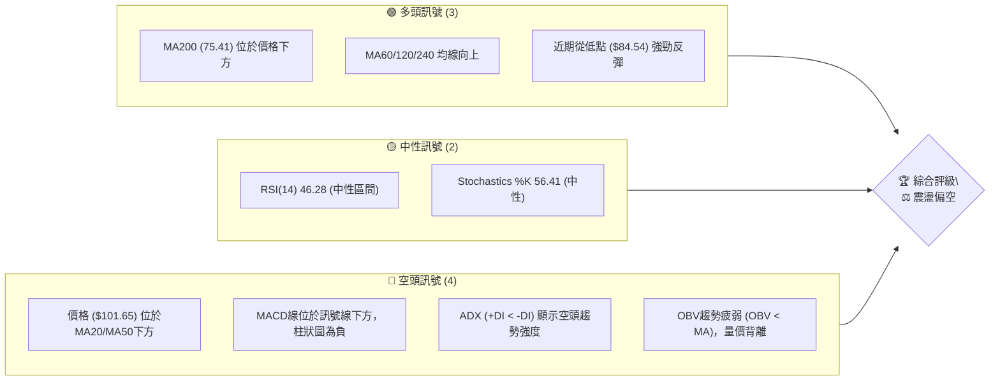

**解讀**：目前多空力量均衡偏空，長期趨勢雖仍向上，但短期面臨較大的賣壓與動能不足。價格位於短期均線下方，顯示短期趨勢偏弱，但下方有長期均線提供強勁支撐。

### 📊 核心指標速覽表

下表彙整了 RKLB 的關鍵技術指標，提供快速參考。

| 指標類別 | 指標名稱 | 當前數值 | 訊號 | 解讀 |
|----------|----------|----------|------|------|
| **價格** | 當前價格 | $101.65 | 🟡 | 位於短期阻力下方，長期支撐上方 |
| **均線** | MA20 | $104.35 | 🔴 | 價格位於MA20下方，短期壓力 |
| **均線** | MA50 | $106.44 | 🔴 | 價格位於MA50下方，中期壓力 |
| **均線** | MA200 | $75.41 | 🟢 | 價格位於MA200上方，長期支撐強勁 |
| **動能** | RSI(14) | 46.28 | 🟡 | 處於中性區間，未達超買或超賣 |
| **動能** | MACD | -5.527 | 🔴 | MACD線位於訊號線下方，柱狀圖為負，看空 |
| **波動** | ATR | $9.25 | 🟡 | 每日波動約9.10%，屬於中等偏高波動 |
| **趨勢** | ADX(14) | 27.25 | 🔴 | 趨勢強度較強，但空頭主導 (-DI > +DI) |
| **量能** | OBV趨勢 | OBV < MA | 🔴 | 量能疲弱，未確認價格反彈 |

### 🏆 技術評分卡

綜合各項技術指標，RKLB 的整體技術評分如下：

╔═════════════════════════════════════════════════════════════════════════════════════╗
║                                技術評分卡 — RKLB (2026-07-01)                        ║
╠═════════════════════════════════════════════════════════════════════════════════════╣
║ 趨勢強度      ████████████░░░░░░░░  60/100  🟡 (長期趨勢強勁，短期空頭主導)         ║
║ 動能指標      ██████░░░░░░░░░░░░░░  30/100  🔴 (MACD看空，RSI中性偏弱)               ║
║ 支撐穩定度    ██████████████████░░  90/100  🟢 (下方有多重重要長期支撐)             ║
║ 成交量配合    ████░░░░░░░░░░░░░░░░  20/100  🔴 (OBV趨勢疲弱，量價背離)               ║
║ 形態完整度    ████████░░░░░░░░░░░░  40/100  🟡 (潛在V型反轉或下降旗形，未確認)       ║
║ 均線排列      ██████░░░░░░░░░░░░░░  30/100  🔴 (短期均線空頭排列，價格承壓)         ║
╠═════════════════════════════════════════════════════════════════════════════════════╣
║ 綜合評分      ██████░░░░░░░░░░░░░░  45/100  ⚖️ 震盪偏空 (短期承壓，長期有底)         ║
╚═════════════════════════════════════════════════════════════════════════════════════╝

**總結評級**：RKLB 目前處於短期震盪偏空的狀態，雖然長期趨勢依舊強勁，但短期動能不足，且面臨上方阻力。近期自低點反彈，但量能配合度不佳，需警惕反彈無力的風險。

---

## 2. 趨勢分析

本章將從多個時間框架深入分析 RKLB 的價格趨勢，從而判斷其長期、中期和短期的市場走向。

### 🌐 多時框趨勢分析

通過不同時間框架的趨勢判斷，我們可以更全面地理解 RKLB 的市場結構。

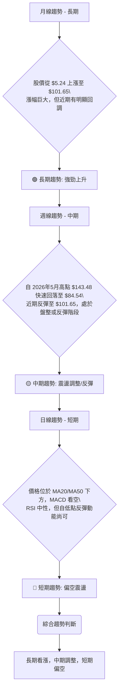

**解讀**：RKLB 在過去一年半呈現出強勁的長期上升趨勢，但近期自歷史高點經歷了劇烈回調。中期來看，目前處於從低點反彈後的震盪調整階段。而短期指標則顯示價格仍受短期均線壓制，動能偏弱，呈現偏空震盪。

### 📈 長期趨勢 — 12個月走勢圖（Unicode）

以下是 RKLB 過去 12 個月的月線收盤價走勢圖，清晰展示了其長期上漲的軌跡及近期的大幅修正。

```
RKLB 月線走勢圖（過去12個月）
價格軸 ($)
$150 ┤                                                    ●($143.48)
$140 ┤                                                ▓
$130 ┤                                            ▓
$120 ┤                                        ▓
$110 ┤                                    ▓
$100 ┤                                ▓       ●($101.65)←現在
$ 90 ┤                            ▓
$ 80 ┤                        ▓
$ 70 ┤                    ▓
$ 60 ┤                ▓
$ 50 ┤            ▓
$ 40 ┤        ▓
$ 30 ┤●($35.77)
     └──────────────────────────────────────────────────────────
      25/06 25/07 25/08 25/09 25/10 25/11 25/12 26/01 26/02 26/03 26/04 26/05 26/06 26/07
     (月)   (45.92) (48.60) (47.91) (62.98) (42.14) (69.76) (80.07) (69.10) (64.22) (82.51) (143.48) (101.65)
```

**走勢特徵分析表格**：

| 階段 | 月份範圍 | 起始價 | 結束價 | 漲跌幅 | 特徵描述 |
|------|----------|--------|--------|--------|--------------------------------------------------|
| **強勁上漲** | 2025-06 至 2026-01 | $35.77 | $80.07 | +123.8% | 股價持續創高，每次回調後均能迅速反彈，動能強勁。 |
| **短期盤整** | 2026-02 至 2026-03 | $80.07 | $64.22 | -19.8% | 經歷短期修正，但仍維持在較高水平，為後續上漲積蓄動能。 |
| **加速上漲** | 2026-04 至 2026-05 | $82.51 | $143.48 | +73.9% | 突破盤整區間，RSI進入超買區，成交量放大，呈現噴發式上漲。 |
| **大幅回調** | 2026-06 | $143.48 | $101.65 | -29.2% | 股價從歷史高點快速下跌，跌破多條短期均線，空頭力量強勁。 |

**結論**：RKLB 在過去一年經歷了顯著的牛市行情，但近期遭遇了大幅度且快速的回調。儘管回調幅度大，但當前價格仍遠高於一年前的水平，顯示長期上漲趨勢的根基依然存在。

### 📊 中期趨勢（週線分析）

中期來看，RKLB 在經歷了強勁上漲後，於 2026 年 5 月達到峰值 $143.48，隨後進入快速下跌通道。近期則出現從低點 $84.54 的反彈，試圖建立新的支撐。

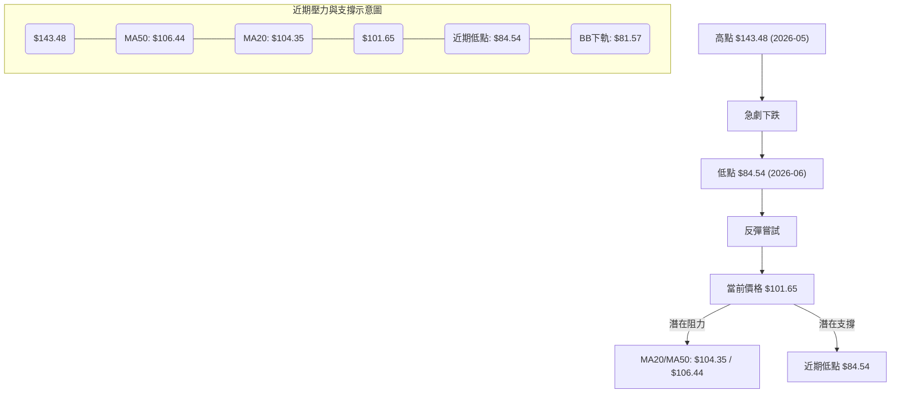

**解讀**：週線級別顯示，RKLB 正處於從急跌中尋求穩定的過程中。近期反彈是對前期超跌的修正，但上方仍有 MA20 ($104.35) 和 MA50 ($106.44) 等短期移動平均線構成的強力阻力。若能有效突破並站穩這些阻力，則中期趨勢有望轉強；反之，若反彈無力並跌破近期低點 $84.54，則可能進一步探底。

### ⚡ 趨勢強度評估（ADX 解讀）

ADX (Average Directional Index) 用於衡量趨勢的強度，不判斷方向。+DI 和 -DI 則分別指示多頭和空頭的趨勢方向。

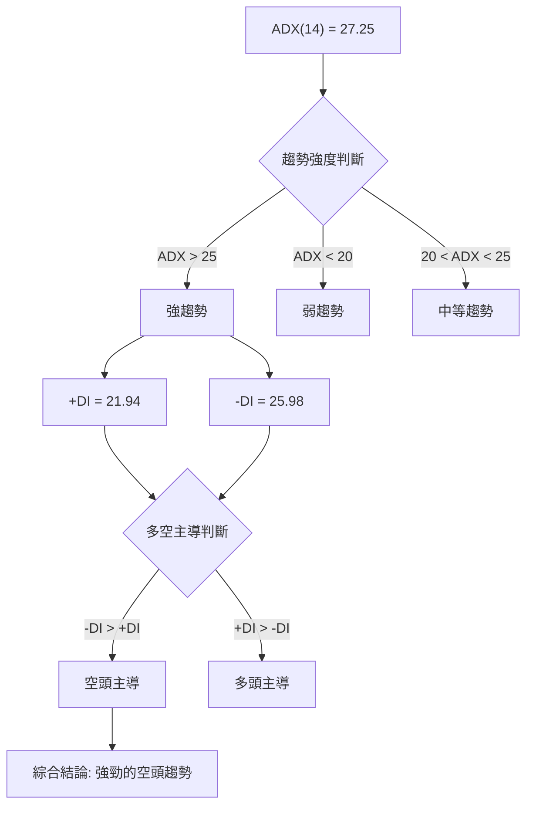

**ADX 強度對照表**：

| ADX 數值 | 趨勢強度 |
|----------|----------|
| 0-20     | 無趨勢或弱趨勢 |
| 20-25    | 中等趨勢 |
| 25-50    | 強趨勢 |
| 50-75    | 非常強趨勢 |
| 75-100   | 極強趨勢 |

**解讀**：RKLB 的 ADX(14) 為 27.25，明確指出當前市場存在一個「強趨勢」。然而，我們需要進一步觀察 +DI 和 -DI 來判斷這個強趨勢是由多頭還是空頭主導。目前 -DI (25.98) 大於 +DI (21.94)，這表明當前的強趨勢是由空頭主導的。儘管價格在近期有所反彈，但從 ADX 指標來看，空頭力量仍佔據上風，市場仍處於一個相對強勢的下跌趨勢中。這與 MACD 的看空訊號相互印證，提示投資者需謹慎看待當前反彈。

---

## 3. 圖表形態分析

圖表形態是價格行為的視覺化表現，能提供潛在的價格目標和轉折點訊號。本章將分析 RKLB 的主要圖表形態和關鍵 K 線組合。

### 🔍 形態識別系統

從 RKLB 近期的價格走勢來看，特別是從 2026 年 5 月高點 $143.48 的急劇下跌，以及隨後從 $84.54 的反彈，我們可以觀察到幾種潛在的形態。

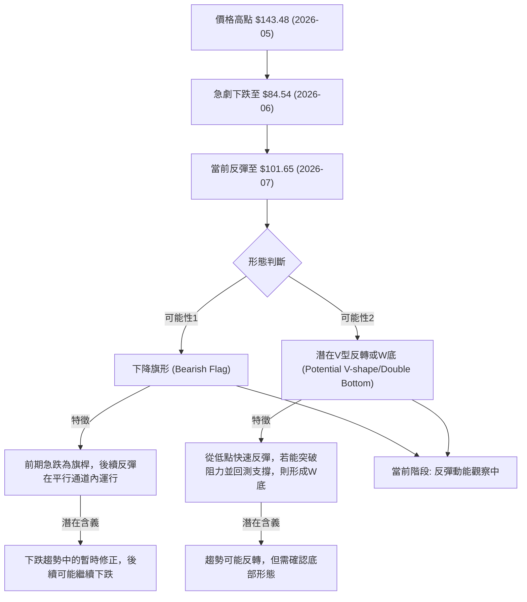

**解讀**：目前 RKLB 價格正處於從高點急跌後的反彈階段。如果將高點 $143.48 到低點 $84.54 視為一個旗桿，那麼當前的反彈可能正在形成一個「下降旗形」。下降旗形通常被視為一個看跌的整理形態，預示著在整理結束後，價格可能會繼續沿著旗桿方向下跌。另一種可能性是，如果 $84.54 是一個堅實的底部，且當前反彈能夠有效突破關鍵阻力，並在回測後再次上漲，則可能形成「V型反轉」或「W底」的初期階段。然而，由於成交量配合度不高且MACD仍看空，下降旗形的可能性目前相對較高，需要密切關注其反彈的強度與持續性。

### 🕯️ 重要K線形態分析

分析近期的週線收盤走勢，識別關鍵的K線形態及其市場意義。

| 月份 | 收盤價 | K線形態 (週線級別推斷) | 解讀 | 訊號 |
|------|--------|------------------------|------|------|
| 2026-05-24 | $135.76 | 長陽線 (或接近) | 強勁上漲動能，多頭主導。 | 🟢 |
| 2026-05-31 | $143.48 | 長陽線帶上影線 (或接近) | 創歷史新高，但可能出現獲利回吐壓力。 | 🟡 |
| 2026-06-07 | $110.08 | 長陰線 (或近似烏雲蓋頂) | 價格從高點急劇下跌，空頭力量迅速佔優，吞噬前一週部分漲幅。 | 🔴 |
| 2026-06-14 | $102.39 | 長陰線 (或近似) | 繼續下跌，確認空頭趨勢。 | 🔴 |
| 2026-06-21 | $107.24 | 短陽線 (或近似十字星/小陽線) | 下跌動能減緩，可能在測試支撐，多空力量暫時平衡。 | 🟡 |
| 2026-06-28 | $84.54 | 長陰線 (或近似錘子線/長下影線) | 跌至近期低點，可能出現超賣反彈。 | 🟡 |
| 2026-07-05 | $101.65 | 長陽線 (或近似吞噬線/啟明星) | 從低點強勁反彈，顯示多頭試圖重新掌握主動權。 | 🟢 |

**綜合K線分析**：RKLB 在 2026 年 5 月底達到高點後，隨即出現連續長陰線，顯示市場情緒從極度樂觀迅速轉為悲觀，空頭力量強勢。6 月底在 $84.54 附近出現止跌訊號 (可能為帶長下影線的 K 線)，隨後 7 月初出現一根強勁的長陽線，形成「看漲吞噬」或「啟明星」的週線級別K線組合，這是一個潛在的底部反轉訊號。然而，需要後續 K 線的確認，並結合成交量和指標分析，判斷反轉的可靠性。

### 📉 ASCII 走勢形態示意圖

以下示意圖展示了 RKLB 近期從高點急跌後的反彈走勢，以及潛在的下降旗形或V型反轉嘗試。

```
RKLB 近期走勢形態示意圖 (週線級別)

價格 ($)
$150 ┤          (高點 $143.48)
     │          ██████████████
     │         █              █
$140 ┤        █                █
     │       █                  █  (潛在下降旗形上軌)
$130 ┤      █                    █
     │     █                      █
$120 ┤    █                        █
     │   █                          █
$110 ┤  █                            █
     │ █                              █
$100 ┤ 現價 $101.65                  █
     │  █                            █ (潛在下降旗形下軌)
$ 90 ┤   █                          █
     │    █                        █
$ 80 ┤     ████████████████████████ (低點 $84.54)
     └───────────────────────────────────────
      時間軸 (2026-05 ~ 2026-07)

形態解讀:
- 高點 $143.48 (2026-05-31) 為近期頂部。
- 急跌至 $84.54 (2026-06-28) 形成旗桿或底部。
- 當前反彈至 $101.65 (2026-07-01) 正在測試短期阻力。
- 若反彈在 $105-$110 區間受阻並回落，可能形成下降旗形。
- 若能有效突破 $110 阻力並站穩，則V型反轉的可能性增加。
```

### 🎯 形態目標價計算

基於上述形態分析，我們將主要考慮「下降旗形」和「V型反轉」兩種情境下的目標價。

1.  **下降旗形 (Bearish Flag) - 看跌情境**
    *   **旗桿長度**：從 $143.48 (高點) 到 $84.54 (低點) = $58.94
    *   **旗形突破點**：假設旗形整理在 $95.00 附近向下突破 (此為推測，實際需觀察)。
    *   **目標價計算**：突破點 - 旗桿長度 = $95.00 - $58.94 = $36.06
    *   **解讀**：若下降旗形確認並向下突破，則潛在的下跌目標價約為 $36.06。這是一個相當悲觀的目標，暗示股價可能回歸到 52 週低點附近甚至更低。

2.  **V型反轉 (V-shape Recovery) / 潛在W底 (Potential Double Bottom) - 看漲情境**
    *   **底部區域**：$84.54
    *   **頸線阻力**：近期反彈的高點，可暫定為斐波那契 38.2% 回調位 $107.03 或 50% 回調位 $114.01。
    *   **形態高度 (假設W底)**：從 $84.54 到 $114.01 (假設頸線) = $29.47
    *   **目標價計算**：頸線 + 形態高度 = $114.01 + $29.47 = $143.48 (即回測前高點)
    *   **解讀**：若 V 型反轉或 W 底形態確認，並有效突破頸線，則潛在的上漲目標價可望回測前高 $143.48。這需要強勁的買盤動能和成交量配合。

**結論**：目前 RKLB 價格處於關鍵的形態發展階段。下降旗形的潛在目標價較低，而 V 型反轉的潛在目標價則為前高。投資者應密切關注價格在關鍵阻力位的表現，以判斷哪種形態將最終成形。

---

## 4. 支撐與阻力

支撐與阻力是技術分析的核心概念，它們代表了買賣雙方力量的關鍵轉折點。本章將識別 RKLB 的主要價格支撐與阻力位。

### 🗺️ 關鍵價位分布圖（Unicode）

以下是 RKLB 的價位結構分布圖，標示了當前價格、關鍵支撐與阻力位。

```
RKLB 價位結構分布圖 (2026-07-01)
═════════════════════════════════════════════════════════════════════════════════════
$151.00 ║███████████████████████████████████████████████████████████████████████████████║ 強阻力 R3 (52W 高點)
$150.00 ║███████████████████████████████████████████████████████████████████████████████║ 強阻力 R3 (分析師高目標)
$143.48 ║███████████████████████████████████████████████████████████████████████████████║ 強阻力 R3 (近期歷史高點)
$127.12 ║███████████████████████████████████████████████████████████████████████████████║ 阻力 R2 (布林上軌)
$120.99 ║███████████████████████████████████████████████████████████████████████████████║ 阻力 R2 (斐波那契 61.8%)
$114.01 ║███████████████████████████████████████████████████████████████████████████████║ 阻力 R2 (斐波那契 50%)
$109.81 ║███████████████████████████████████████████████████████████████████████████████║ 關鍵阻力 R1 (分析師平均目標)
$107.03 ║███████████████████████████████████████████████████████████████████████████████║ 關鍵阻力 R1 (斐波那契 38.2%)
$106.44 ║███████████████████████████████████████████████████████████████████████████████║ 關鍵阻力 R1 (MA50)
$104.35 ║███████████████████████████████████████████████████████████████████████████████║ 關鍵阻力 R1 (MA20 / 布林中軌)
$101.65 ╠═════════════════════════════════════════════════════════════════════════════╣ ◄ 現價
$ 98.66 ║▓▓▓▓▓▓▓▓▓▓▓▓▓▓▓▓▓▓▓▓▓▓▓▓▓▓▓▓▓▓▓▓▓▓▓▓▓▓▓▓▓▓▓▓▓▓▓▓▓▓▓▓▓▓▓▓▓▓▓▓▓▓▓▓▓▓▓▓▓▓▓▓▓▓▓▓▓▓▓▓▓║ 近期支撐 S1 (斐波那契 23.6%)
$ 84.54 ║███████████████████████████████████████████████████████████████████████████████║ 強支撐 S2 (近期低點)
$ 81.57 ║███████████████████████████████████████████████████████████████████████████████║ 強支撐 S2 (布林下軌)
$ 75.41 ║███████████████████████████████████████████████████████████████████████████████║ 強支撐 S2 (MA200)
$ 60.00 ║███████████████████████████████████████████████████████████████████████████████║ 強支撐 S3 (分析師低目標)
$ 33.73 ║███████████████████████████████████████████████████████████████████████████████║ 極強支撐 S4 (52W 低點)
═════════════════════════════════════════════════════════════════════════════════════
```

### 🚧 阻力位分析表

RKLB 面臨著多重阻力，尤其在短期內，需要強勁的買盤才能突破。

| 阻力級別 | 價位 | 形成原因 | 突破難度 | 重要性 |
|----------|------|----------|----------|--------|
| **R1** | $104.35 | MA20 / 布林中軌 | 中等 | 價格若能站穩此位，短期趨勢有望轉強。 |
| **R1** | $106.44 | MA50 | 中等 | 突破此位將改善中期趨勢，挑戰更上層阻力。 |
| **R1** | $107.03 | 斐波那契 38.2% 回調 | 中等 | 該位是反彈的第一個關鍵考驗，突破則反彈有望持續。 |
| **R1** | $109.81 | 分析師平均目標價 | 中等 | 具備市場心理層面意義，可能引發賣壓。 |
| **R2** | $114.01 | 斐波那契 50% 回調 | 較高 | 突破此位將確認更強的反彈動能，並可能挑戰前高。 |
| **R2** | $127.12 | 布林上軌 | 較高 | 價格觸及此位通常意味著短期超買，可能引發回調。 |
| **R3** | $143.48 | 近期歷史高點 | 極高 | 突破此位將創歷史新高，意味著多頭力量極其強勁。 |
| **R3** | $151.00 | 52週高點 | 極高 | 最高阻力，突破代表新一輪上漲趨勢的確立。 |

### 🛡️ 支撐位分析表

RKLB 下方有多個關鍵支撐，特別是長期均線和近期低點，提供了較強的保護。

| 支撐級別 | 價位 | 形成原因 | 守住機率 | 重要性 |
|----------|------|----------|----------|--------|
| **S1** | $98.66 | 斐波那契 23.6% 回調 | 中等 | 短期回調的第一個考驗，若跌破可能測試更深支撐。 |
| **S2** | $84.54 | 近期低點 (2026-06-28) | 較高 | 關鍵心理關口，若跌破可能確認下降趨勢並引發恐慌性拋售。 |
| **S2** | $81.57 | 布林下軌 | 較高 | 價格觸及此位通常意味著短期超賣，可能引發反彈。 |
| **S2** | $75.41 | MA200 | 高 | 長期趨勢線，對股價有強勁的心理和技術支撐作用，不易跌破。 |
| **S3** | $60.00 | 分析師低目標價 | 較高 | 若跌破 MA200，此位將是重要的心理支撐。 |
| **S4** | $33.73 | 52週低點 | 極高 | 極其重要的長期支撐，若跌破意味著長期趨勢的破壞。 |

### 📐 斐波那契回調位分析

我們將以 2026 年 5 月 31 日的高點 $143.48 為起點，以及 2026 年 6 月 28 日的低點 $84.54 為終點，計算其斐波那契回調位，以評估當前反彈的強度。

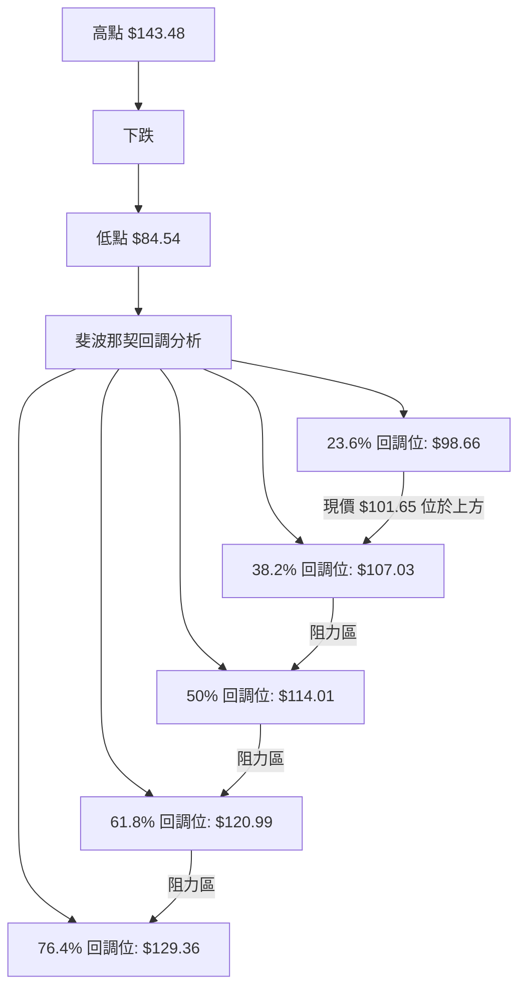

**斐波那契回調位表格**：

| 回調比例 | 價位 | 當前狀態 | 解讀 |
|----------|------|----------|------|
| **23.6%** | $98.66 | 🟢 價格位於其上方 | 價格已成功反彈並站穩 23.6% 回調位，顯示初步反彈動能。 |
| **38.2%** | $107.03 | 🔴 價格位於其下方 | 這是當前反彈面臨的第一個重要阻力，與 MA20/MA50 接近，形成強勁壓力區。 |
| **50%** | $114.01 | 🔴 價格位於其下方 | 若能突破 38.2%，50% 回調位是下一個關鍵考驗，突破則反彈趨勢確認。 |
| **61.8%** | $120.99 | 🔴 價格位於其下方 | 通常被視為強勢反彈的標誌，突破此位可能預示著趨勢反轉。 |
| **76.4%** | $129.36 | 🔴 價格位於其下方 | 若能達到此位，意味著多頭力量極其強勁，有望挑戰前高。 |

**結論**：RKLB 的當前價格 $101.65 位於 23.6% 回調位 $98.66 之上，顯示從低點的反彈具有一定的初步力量。然而，其上方緊鄰著 38.2% 回調位 $107.03，與多條短期移動平均線重疊，構成了一個強大的阻力區。能否有效突破 $107.03 至關重要，這將決定反彈的持續性。若無法突破，則可能再次回測近期低點 $84.54 甚至更低。

---

## 5. 技術指標深度解讀

本章將對 RKLB 的主要技術指標進行深入分析，包括移動平均線、RSI、MACD、布林通道和成交量，並探討它們之間的相互關係與訊號確認。

### 🎛️ 指標訊號總覽

以下 Mermaid 圖表展示了各個技術指標當前的訊號方向及其相互之間的影響。

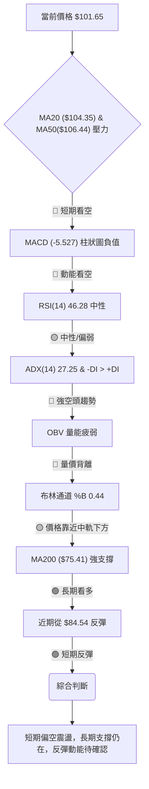

**解讀**：從指標總覽來看，RKLB 面臨著多重空頭訊號的壓制。MACD 和 ADX 指示當前動能和趨勢均偏向空頭，而價格位於短期均線下方也強化了這一點。更令人擔憂的是 OBV 的量能疲弱，這表明近期價格的反彈缺乏實質買盤的確認，存在量價背離的風險。儘管如此，RSI 仍在中性區間，且長期 MA200 提供了堅實的下方支撐，顯示長期趨勢尚未被破壞。

### 📈 移動平均線排列分析

移動平均線 (MA) 是判斷趨勢方向和支撐阻力的重要工具。RKLB 的均線排列呈現出短期看空、長期看多的複雜局面。

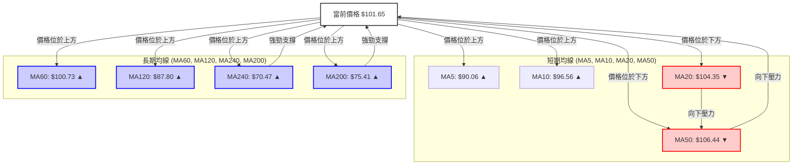

**均線排列狀態**：

| 均線類型 | 數值 | 與現價關係 ($101.65) | 趨勢方向 | 訊號 | 解讀 |
|----------|------|----------------------|----------|------|------|
| **MA5** | $90.06 | 價格位於上方 | ▲ 上升 | 🟢 | 短期買盤力量正在恢復。 |
| **MA10** | $96.56 | 價格位於上方 | ▲ 上升 | 🟢 | 短期買盤力量正在恢復。 |
| **MA20** | $104.35 | 價格位於下方 | ▼ 下降 | 🔴 | 短期趨勢偏弱，MA20 形成壓力。 |
| **MA50** | $106.44 | 價格位於下方 | ▼ 下降 | 🔴 | 中期趨勢偏弱，MA50 形成壓力。 |
| **MA60** | $100.73 | 價格位於上方 | ▲ 上升 | 🟢 | 中期支撐，價格位於其上方。 |
| **MA120** | $87.80 | 價格位於上方 | ▲ 上升 | 🟢 | 長期支撐，顯示長期趨勢向上。 |
| **MA200** | $75.41 | 價格位於上方 | ▲ 上升 | 🟢 | 極強長期支撐，牛市基礎仍在。 |
| **MA240** | $70.47 | 價格位於上方 | ▲ 上升 | 🟢 | 極強長期支撐，牛市基礎仍在。 |

**綜合解讀**：RKLB 的均線系統呈現「混合排列」。短期而言，價格 $101.65 位於 MA20 ($104.35) 和 MA50 ($106.44) 之下，且 MA20 和 MA50 均呈下降趨勢，這明確指示了短期和中期趨勢的疲軟和壓力。這形成了一個「死亡交叉」的早期階段，或至少是短期均線的空頭排列。然而，值得注意的是，價格位於 MA60 ($100.73) 之上，並且遠高於 MA120 ($87.80)、MA200 ($75.41) 和 MA240 ($70.47)，這些長期均線均呈現向上趨勢。這表明 RKLB 的長期牛市結構尚未被破壞，長期支撐強勁。當前價格的表現是短期回調對長期上升趨勢的修正。若要扭轉短期弱勢，價格必須有效突破並站穩 MA20 和 MA50。

### 📉 RSI(14) 分析

RSI (Relative Strength Index) 衡量價格變動的速度和變化，用於判斷超買或超賣狀態。

```
RSI(14) 強度進度條
超買區 (70-100)
中性區 (30-70)    ▓▓▓▓▓▓▓▓▓▓▓▓▓▓░░░░░░  46.28
超賣區 (0-30)

RSI 當前數值: 46.28
```

**RSI 數值解讀**：
*   **超買區 (RSI > 70)**：價格上漲過快，可能面臨回調。
*   **超賣區 (RSI < 30)**：價格下跌過快，可能出現反彈。
*   **中性區 (30 < RSI < 70)**：價格動能平衡，或處於盤整。

**當前RSI分析**：RKLB 的 RSI(14) 為 46.28，處於中性區間。這表示股價既未達到超買狀態，也未進入超賣區域。從近期走勢來看，RSI 從 6 月底的低點 (34.1) 上升，顯示買盤力量有所恢復，但尚未強勁到足以推動 RSI 進入強勢區 (50-70) 或超買區。這與價格的短期反彈相符，但反彈動能仍需觀察。

**RSI 背離判斷**：根據提供的數據，RSI 呈現「無明顯背離」。這意味著近期價格的下跌和反彈與 RSI 的走勢大致同步，沒有出現價格創新高/低而 RSI 未能確認的情況。因此，RSI 目前沒有提供明確的趨勢反轉訊號，僅指示當前動能為中性偏弱。

### 📊 MACD(12/26/9) 訊號解讀

MACD (Moving Average Convergence Divergence) 是一種趨勢跟蹤動能指標，由快線 (MACD Line)、慢線 (Signal Line) 和柱狀圖 (Histogram) 組成。

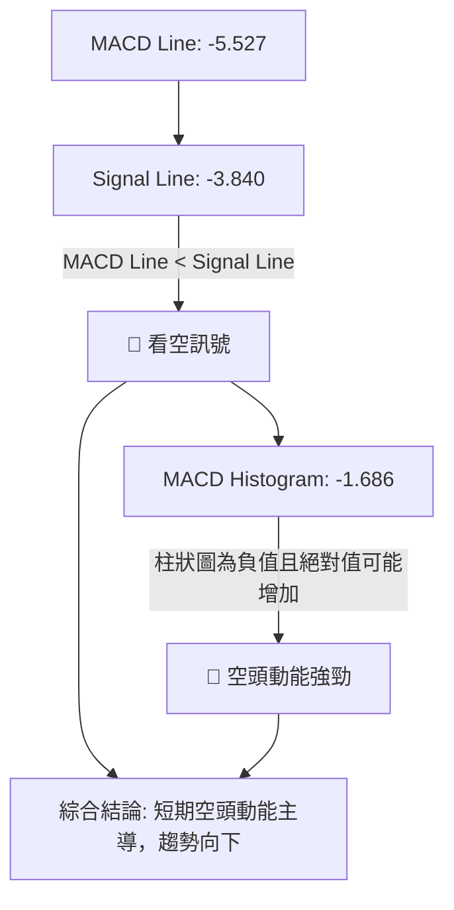

**MACD 數值分析**：
*   **MACD Line**：-5.527
*   **Signal Line**：-3.840
*   **MACD Histogram**：-1.686

**當前MACD分析**：RKLB 的 MACD 線 (-5.527) 位於訊號線 (-3.840) 的下方，這是一個典型的「死亡交叉」或空頭排列訊號，表明短期動能正在向下壓制中期動能。此外，MACD 柱狀圖為負值 (-1.686)，且其絕對值（從 $4.091 減少到 $1.686，但仍為負值）雖然有所收斂，但仍然是空頭動能的體現。這強烈指示了當前市場的空頭力量佔據主導，短期趨勢偏弱。

**MACD 背離判斷**：根據提供的數據，MACD 呈現「無明顯背離」。這表示價格的下跌與 MACD 指標的走勢大致同步。雖然近期價格有所反彈，但 MACD 仍處於空頭排列，尚未形成底背離，這使得當前的反彈缺乏 MACD 的強勢確認。

### 📦 布林通道分析

布林通道 (Bollinger Bands) 由三條線組成：中軌 (通常為 20 期移動平均線)、上軌和下軌，用於衡量價格波動性和判斷超買超賣。

```
RKLB 布林通道示意圖 (2026-07-01)

$130 ┤                                     BB上軌 ($127.12)
     │                                   ╱
$120 ┤                                 ╱
     │                               ╱
$110 ┤                             ╱
     │                           ╱
$105 ┤                         ╱        BB中軌 (MA20: $104.35)
$100 ┤                       ● 現價 ($101.65)
     │                     ╱
$ 90 ┤                   ╱
     │                 ╱
$ 80 ┤               ╱        BB下軌 ($81.57)
     └───────────────────────────────────────
      時間軸
```

**布林通道數值**：
*   **BB上軌**：$127.12
*   **BB中軌 (MA20)**：$104.35
*   **BB下軌**：$81.57
*   **BB %B**：0.44

**當前布林通道分析**：RKLB 的當前價格 $101.65 位於布林通道中軌 ($104.35) 之下，但高於布林下軌 ($81.57)。BB %B 值為 0.44，這表示價格略低於通道的中線，顯示短期趨勢偏弱。布林通道的寬度 (上軌 - 下軌 = $45.55) 相對於價格而言較大，表明市場波動性較高，這與 ATR 指標的提示相符。價格在中軌下方運行，通常被視為弱勢表現。若價格能有效突破中軌並站穩，則可能預示著短期趨勢的轉強。

**指標整合**：布林通道的中軌與 MA20 重合，對當前股價形成直接壓力。價格無法站穩中軌，進一步確認了 MACD 和短期均線的空頭訊號。高波動性也增加了交易的不確定性。

### 💹 成交量分析（量價配合度）

成交量是價格走勢的燃料，量價關係對於判斷趨勢的可靠性至關重要。

**成交量數據**：
*   **最新成交量**：32,656,408
*   **20日均量**：29,811,370 (量比: 1.10x)
*   **50日均量**：28,578,660
*   **OBV趨勢**：OBV < MA → 量能疲弱

**當前成交量分析**：RKLB 的最新成交量為 32,656,408 股，高於其 20 日均量 (29,811,370) 約 10% (量比 1.10x)。這表明在近期價格反彈的過程中，成交量有所放大，這在一定程度上支持了反彈的真實性。
然而，OBV (On-Balance Volume) 趨勢顯示「OBV < MA → 量能疲弱」，這是一個重要的警訊。OBV 指標通過累計成交量來判斷買賣壓力，OBV < MA 意味著儘管近期有單日成交量放大，但整體而言，累計買盤壓力仍不足以推動 OBV 線向上，未能確認價格的反彈。這構成了一個**量價背離**的潛在訊號：價格在反彈，但總體買盤動能卻未跟隨，這使得當前的反彈顯得不夠堅實，可能只是下跌趨勢中的技術性反彈，而非趨勢反轉的開始。

**指標整合**：成交量在反彈時略有放大，但 OBV 的疲弱訊號與 MACD 的看空訊號相互印證，共同提示當前反彈的脆弱性。投資者應警惕無量上漲或反彈的風險。

---

## 6. 動能與波動率

本章將評估 RKLB 的動能強度和價格波動性，這對於制定風險管理策略和預期價格行為至關重要。

### ⚡ 動能評估四象限

我們將結合動能強度（基於MACD、RSI和均線排列）和波動率（基於ATR）來評估 RKLB 的當前狀態。

| 象限 | 動能 | 波動 | 當前狀態 | 評估 |
|------|------|------|----------|------|
| Q1 | 強 | 低 | - | 最佳機會 (穩定上漲) |
| Q2 | 弱 | 低 | - | 謹慎觀望 (盤整築底) |
| Q3 | 強 | 高 | - | 高風險高收益 (突破/加速) |
| Q4 | 弱 | 高 | ✓ | 避免進場/謹慎操作 (下跌/震盪) |

**當前 RKLB 的動能評估**：
*   **動能強度**：MACD 線在訊號線下方且柱狀圖為負，RSI 位於中性區間但未顯示強勢，價格位於 MA20/MA50 下方。儘管有短期反彈，整體動能判斷為「弱」。
*   **波動率**：ATR(14) 為 $9.25，佔當前價格 $101.65 的 9.10%。這是一個相對較高的波動率，顯示股價每日波動幅度較大，市場情緒不穩定。

**結論**：RKLB 目前處於「**弱動能，高波動**」的狀態 (Q4)。這表示股價缺乏明確的上升動能，且每日價格波動劇烈，增加了交易的風險和不確定性。在這種市場環境下，價格容易出現快速的上下震盪，對投資者的心理和倉位管理構成挑戰。通常建議在這種情況下採取謹慎觀望或小倉位操作的策略。

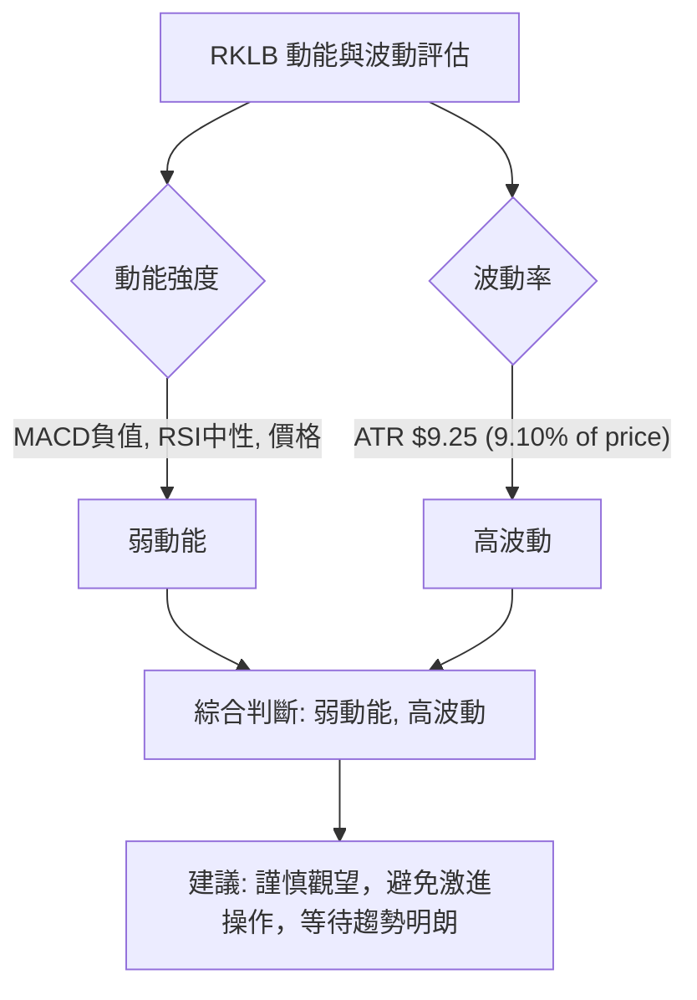

### 📊 ATR 波動率分析

ATR (Average True Range) 衡量資產價格的波動性，通常用於設定止損和目標價。

**ATR(14) 數值**：$9.25
**ATR 佔比**：9.10% of price ($101.65)

**ATR 分析**：RKLB 的 ATR(14) 為 $9.25，這意味著在過去 14 天內，RKLB 的平均每日價格波動範圍約為 $9.25。9.10% 的佔比顯示這是一隻波動性相對較高的股票，其每日價格變化可能相當劇烈。
對於交易者而言，高 ATR 意味著：
1.  **較大的止損空間**：為了避免被日常波動震出，止損點應設置在 ATR 的 1-2 倍之外。例如，若以現價 $101.65 買入，止損可以考慮設置在 $101.65 - 1.5 * $9.25 = $87.87 左右。
2.  **較高的風險**：每次交易潛在虧損可能較大，需要相應調整倉位大小。
3.  **潛在的機會**：高波動性也意味著價格可能在短時間內達到目標價，但也可能快速觸及止損。

**止損距離建議**：鑑於 RKLB 的高波動性，建議將止損距離設置為至少 1.5 倍 ATR。
*   **保守止損**：2 * ATR = 2 * $9.25 = $18.50。若買入價為 $101.65，止損點約為 $83.15。
*   **激進止損**：1 * ATR = 1 * $9.25 = $9.25。若買入價為 $101.65，止損點約為 $92.40。
綜合考慮近期支撐，將止損設置在關鍵支撐位 $84.54 之下，會是一個更穩健的選擇。

### 📐 Beta 與市場相關性

Beta 值衡量股票相對於大盤指數（如 S&P 500）的波動性。由於提供的數據中未包含 RKLB 的 Beta 值，我們將基於其所屬產業（航太與國防）和公司性質進行推斷。

**推斷分析**：
*   **產業特性**：Rocket Lab 屬於航太與國防產業，這類公司通常具有較高的成長潛力，但也伴隨著較高的風險。其業務涉及高科技創新和政府合同，這些因素往往會導致股價波動性高於市場平均水平。
*   **成長型公司**：作為一家成長型公司，RKLB 通常對市場情緒和未來預期更加敏感。在牛市中，這類股票往往漲幅超過大盤；在熊市中，跌幅也可能更大。
*   **市場相關性**：雖然沒有具體 Beta 值，但預計 RKLB 的 Beta 值會**大於 1**。這意味著其股價波動性通常會比大盤高。當大盤上漲 1% 時，RKLB 可能上漲超過 1%；反之，當大盤下跌 1% 時，RKLB 可能下跌超過 1%。
*   **投資影響**：對於投資者而言，RKLB 這種高 Beta 股票可以提供更高的潛在回報，但也伴隨著更高的風險。在市場整體下跌時，RKLB 的跌幅可能被放大，因此需要更嚴格的風險管理。

**總結**：儘管缺乏具體數據，但基於產業和公司特性，RKLB 很可能是一隻高 Beta 股票，其波動性高於大盤。投資者在配置 RKLB 時，應考慮其對整體投資組合波動性的影響，並搭配適當的風險管理策略。

---

## 7. 多時框架總結

本章將彙整 RKLB 在不同時間框架下的技術訊號，提供一個全面的評分和建議，以幫助投資者做出決策。

### 📋 時框架評分表

| 時框架 | 趨勢方向 | 動能 | 均線排列 | 形態 | 綜合評分 (1-10) | 建議 |
|--------|----------|------|----------|------|-----------------|------|
| **長期** | 🟢 上升 | 🟢 強 | 🟢 多頭 | 🟡 修正後上升 | 8 | 持有/逢低買入 |
| **中期** | 🟡 調整 | 🟡 中性 | 🟡 混合 | 🟡 潛在旗形/W底 | 5 | 觀望/謹慎操作 |
| **短期** | 🔴 偏空 | 🔴 弱 | 🔴 空頭 | 🟡 反彈測試阻力 | 3 | 規避風險/等待確認 |

**解讀**：
*   **長期**：RKLB 的長期趨勢依然強勁，價格遠高於長期均線，顯示其基本面和成長前景仍受市場認可。儘管近期有大幅回調，但這被視為牛市中的健康修正。
*   **中期**：中期趨勢處於調整和尋找支撐的階段。從高點急劇下跌後，目前正試圖從低點反彈，但尚未形成明確的反轉形態，MACD和ADX仍指示空頭主導。
*   **短期**：短期內，RKLB 呈現偏空震盪。價格受短期均線壓制，動能指標疲弱，且 OBV 顯示量價背離，反彈的可靠性存疑。

### 🔲 綜合訊號矩陣

以下 Mermaid 圖表展示了 RKLB 在短期、中期和長期維度上的技術訊號一致性。

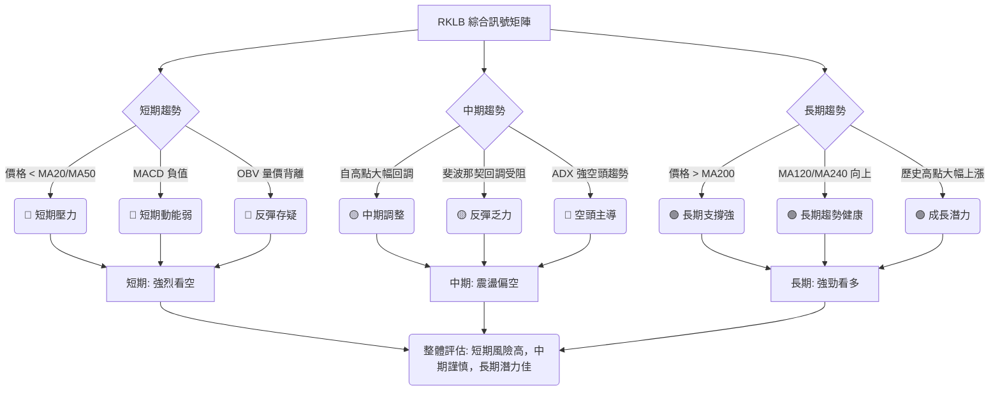

**結論**：RKLB 的多時框架分析顯示出明顯的矛盾。短期和中期訊號偏向空頭，價格面臨較大的下行壓力，反彈動能不足且存在量價背離。然而，長期趨勢依然非常強勁，多條長期均線提供堅實支撐，表明其成長故事仍具吸引力。這種矛盾性使得 RKLB 在當前階段的交易風險較高，更適合長期投資者在價格回調至關鍵長期支撐附近時考慮佈局，而非短期追漲。對於短期交易者，應等待明確的底部形態和趨勢反轉訊號。

---

## 8. 交易策略建議

基於上述詳盡的技術分析，本章將提供 RKLB 的具體交易策略，包括進場、止損、目標價和風險報酬比。

### 🗺️ 策略決策流程圖

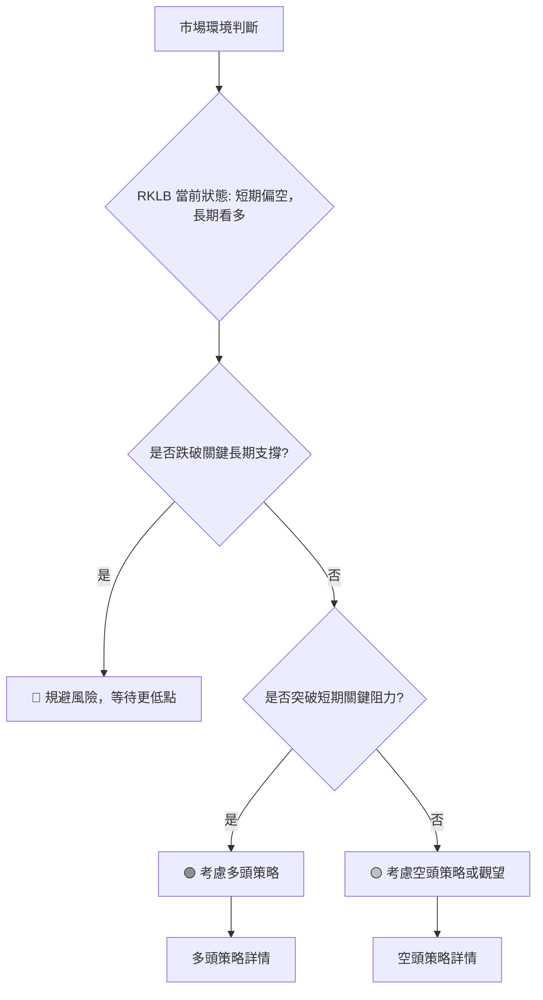

### 🟢 多頭策略詳情

考慮到 RKLB 長期趨勢依然健康，且近期從低點有所反彈，多頭策略主要圍繞反彈的持續性或底部形態的形成。

| 策略要素 | 策略 A：突破阻力追漲 | 策略 B：回調支撐買入 |
|----------|----------------------|----------------------|
| **進場條件** | 價格突破 MA50 且 MACD 轉為多頭排列 | 價格回測 $84.54 支撐位，並出現看漲 K線形態 (如錘子線/啟明星) |
| **進場價格** | 突破 $106.44 (MA50) 並站穩，可於 $107.00 - $108.00 區間進場 | $85.00 - $86.00 區間進場 |
| **目標價 T1** | 斐波那契 50% 回調位 $114.01 | 斐波那契 23.6% 回調位 $98.66 |
| **目標價 T2** | 斐波那契 61.8% 回調位 $120.99 | 斐波那契 38.2% 回調位 $107.03 |
| **止損價格** | 跌破 MA20 $104.35 | 跌破 $81.57 (布林下軌/S2) |
| **風險報酬比** | (T1: $114.01 - $107.00) : ($107.00 - $104.35) = $7.01 : $2.65 ≈ **2.64:1** | (T1: $98.66 - $85.00) : ($85.00 - $81.57) = $13.66 : $3.43 ≈ **3.98:1** |
| **成功機率** | 較低 (需確認突破動能) | 中等 (需等待看漲訊號確認) |
| **建議倉位** | 5% - 10% (輕倉) | 10% - 15% (中倉) |

### 🔴 空頭策略詳情

考慮到 RKLB 短期和中期動能偏弱，MACD 看空，OBV 疲弱，空頭策略可考慮在反彈受阻時入場。

| 策略要素 | 策略 A：反彈受阻做空 | 策略 B：跌破支撐追空 |
|----------|----------------------|----------------------|
| **進場條件** | 價格反彈至 MA50 ($106.44) 附近受阻，出現看跌 K線形態 (如流星線/烏雲蓋頂) | 價格跌破 $84.54 支撐位，並確認放量下跌 |
| **進場價格** | $105.00 - $106.00 區間進場 | 跌破 $84.54 後，於 $84.00 - $83.00 區間進場 |
| **目標價 T1** | 斐波那契 23.6% 回調位 $98.66 | MA200 $75.41 |
| **目標價 T2** | 近期低點 $84.54 | 分析師低目標 $60.00 |
| **止損價格** | 突破 MA50 $106.44 | 突破 $84.54 (反彈) |
| **風險報酬比** | (T1: $105.00 - $98.66) : ($106.44 - $105.00) = $6.34 : $1.44 ≈ **4.40:1** | (T1: $84.00 - $75.41) : ($84.54 - $84.00) = $8.59 : $0.54 ≈ **15.90:1** |
| **成功機率** | 中等 (需確認阻力有效) | 較高 (趨勢一旦確立，下跌空間大) |
| **建議倉位** | 5% - 10% (輕倉) | 10% - 15% (中倉) |

### ⭐ 整體訊號強度評星

綜合多時框架分析和交易策略的風險報酬比，對 RKLB 的交易訊號強度評星如下：

```
做多訊號強度：★★☆☆☆  (2/5星) - 長期雖佳，但短期阻力重重，需等待明確底部或突破。
做空訊號強度：★★★☆☆  (3/5星) - 短期指標偏空，反彈無力可能提供做空機會，但下方有強支撐。
整體可信度：  ★★★☆☆  (3/5星) - 市場處於膠著狀態，訊號複雜，需嚴格執行止損。
```

**建議**：由於當前 RKLB 的多空訊號複雜且存在矛盾，建議投資者保持謹慎。對於激進型交易者，可以在明確的突破或跌破關鍵價位時，採取輕倉追隨趨勢的策略。對於保守型投資者，建議等待更明確的底部形態或趨勢反轉訊號，或者在價格回調至長期強支撐區域 (如 MA200 $75.41) 附近再考慮買入。

---

## 9. 風險提示與監控

投資 RKLB 在當前階段伴隨著多重風險，本章旨在提醒投資者注意潛在風險並提供監控清單。

### ✅ 關鍵監控指標 Checklist

以下是投資 RKLB 時應密切關注的關鍵技術指標和價格行為清單：

╔═════════════════════════════════════════════════════════════════════════════════════╗
║                             RKLB 關鍵監控指標 Checklist                             ║
╠═════════════════════════════════════════════════════════════════════════════════════╣
║ [ ] 價格是否能突破並站穩 MA20 ($104.35) 和 MA50 ($106.44)？ (多頭關鍵)           ║
║ [ ] MACD 線是否能上穿訊號線，且柱狀圖轉正？ (動能轉強訊號)                       ║
║ [ ] RSI(14) 是否能突破 50 進入強勢區？ (動能確認)                                 ║
║ [ ] OBV 趨勢是否能扭轉疲弱，向上突破其均線？ (量能確認反彈)                     ║
║ [ ] 價格是否能有效突破斐波那契 38.2% ($107.03) 和 50% ($114.01) 回調位？ (反彈強度)║
║ [ ] 價格是否跌破近期低點 $84.54？ (空頭確認)                                      ║
║ [ ] 成交量在反彈時是否持續放大，且在下跌時縮小？ (健康量價關係)                 ║
║ [ ] ADX 的 +DI 是否能上穿 -DI？ (趨勢轉向多頭)                                  ║
║ [ ] 布林通道是否收斂後出現方向性突破？ (波動性變化)                             ║
╚═════════════════════════════════════════════════════════════════════════════════════╝

### ⚠️ 風險場景分析

針對 RKLB 的當前市場狀況，我們分析以下三種潛在情境：

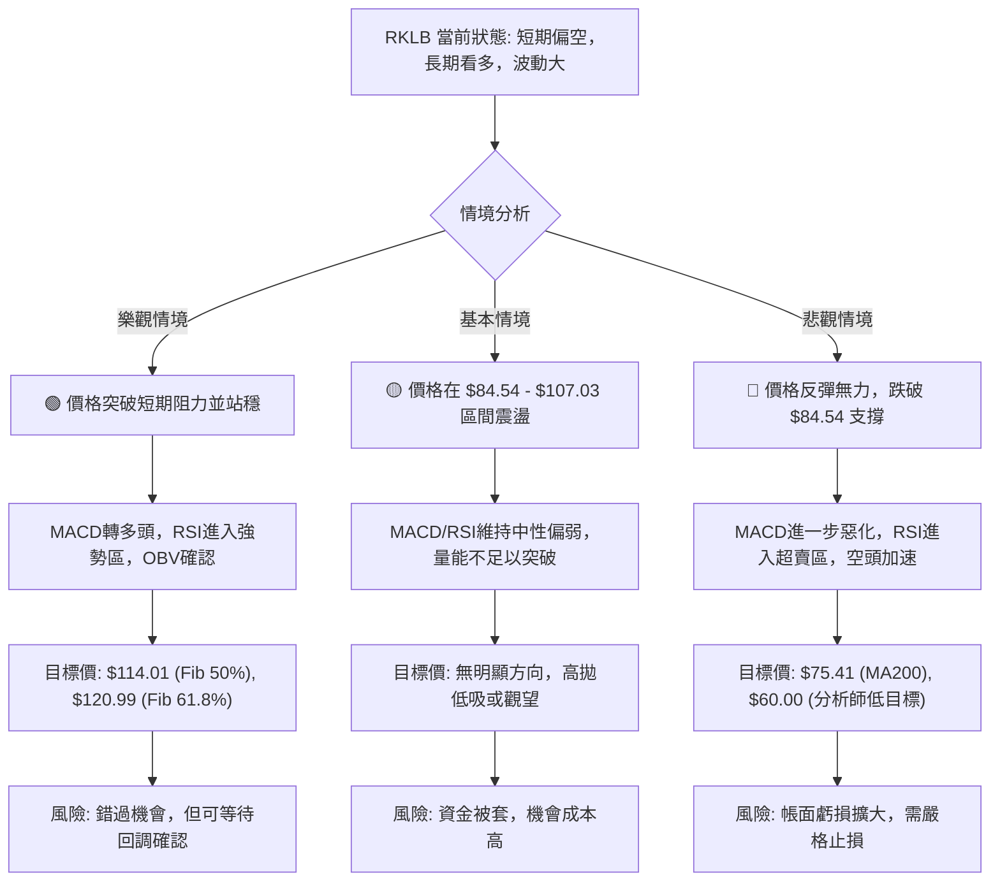

**解讀**：
*   **樂觀情境**：RKLB 能夠有效突破短期阻力區 ($104.35 - $107.03)，並由強勁的成交量和動能指標確認。這將是短期多頭策略的最佳進場時機。
*   **基本情境**：RKLB 繼續在近期低點 $84.54 和斐波那契 38.2% 回調位 $107.03 之間震盪。這種情況下，缺乏明確的方向性，交易機會有限，或可考慮小倉位區間操作。
*   **悲觀情境**：RKLB 的反彈失敗，價格再次跌破 $84.54 的近期低點。這將確認空頭趨勢的延續，並可能觸發止損，進一步下探 MA200 甚至更低。此時應果斷離場。

### 🛡️ 風險管理重要提醒

1.  **倉位管理**：由於 RKLB 波動性高且短期趨勢不明朗，建議投資者採用較小的倉位進行操作，避免因單一股票的劇烈波動對整體投資組合造成過大影響。
2.  **止損原則**：嚴格執行止損是風險管理的基石。在任何交易策略中，都必須預先設定明確的止損點，並在價格觸及時毫不猶豫地執行，以限制潛在虧損。
3.  **趨勢確認**：在趨勢不明朗時，避免逆勢操作。等待明確的趨勢反轉訊號（如底部形態、均線金叉、MACD 轉強等）出現後再考慮進場，可以提高交易的成功率。
4.  **分批建倉**：對於長期看好 RKLB 的投資者，可考慮分批建倉策略。在價格回調至關鍵長期支撐位（如 MA200）附近時，分階段買入，以攤平持倉成本並降低風險。
5.  **市場情緒**：密切關注整體市場情緒和 RKLB 所在產業的新聞動態。負面新聞或整體市場的惡化都可能加劇股價的波動和下跌壓力。

---

## 📋 報告總結

```
RKLB 技術分析報告總結
═════════════════════════════════════════════════════════════════════════════════════
報告日期：2026-07-01
當前價格：$101.65
分析評級：⚖️ 震盪偏空 (短期面臨壓力，長期仍具潛力，需謹慎觀望)

關鍵結論：
├─ 長期趨勢：🟢 強勁上升趨勢，MA200 ($75.41) 提供堅實支撐。
├─ 中期趨勢：🟡 震盪調整，從高點大幅回調後正在尋找支撐，反彈動能待確認。
├─ 短期趨勢：🔴 偏空震盪，價格位於短期均線下方，MACD 看空，OBV 量價背離。
├─ 關鍵支撐：$98.66 (Fib 23.6%)、$84.54 (近期低點)、$75.41 (MA200)。
├─ 關鍵阻力：$104.35 (MA20/布林中軌)、$106.44 (MA50)、$107.03 (Fib 38.2%)。
└─ 分析師目標：平均 $109.81，低 $60.00，高 $150.00。

最優策略組合：
1. 🥇 **最佳機會 (保守多頭)**：在價格回測 MA200 ($75.41) 附近或 S2 ($84.54) 支撐並出現明確看漲K線形態時，考慮分批買入，止損設於 $81.57 之下。
2. 🥈 **次選機會 (激進空頭)**：若價格反彈至 MA50 ($106.44) / Fib 38.2% ($107.03) 附近受阻，並伴隨看跌K線形態，可考慮輕倉做空，止損設於 $107.03 之上。
3. 🥉 **保守選擇 (觀望)**：在短期趨勢不明朗、動能疲弱且多空訊號複雜的情況下，保持觀望，等待價格突破關鍵阻力或跌破關鍵支撐，形成明確趨勢後再做決策。
═════════════════════════════════════════════════════════════════════════════════════
```

---

> ⚠️ **免責聲明**：本報告為 AI 自動生成之技術分析，所有數據及估算均基於提供的歷史價格資訊。本報告**僅供研究與學術參考**，**不構成任何投資建議**。投資有風險，入市需謹慎。

---

*報告生成時間：2026-07-01 ｜ 數據來源：Yahoo Finance ｜ 分析框架：多時框技術分析*