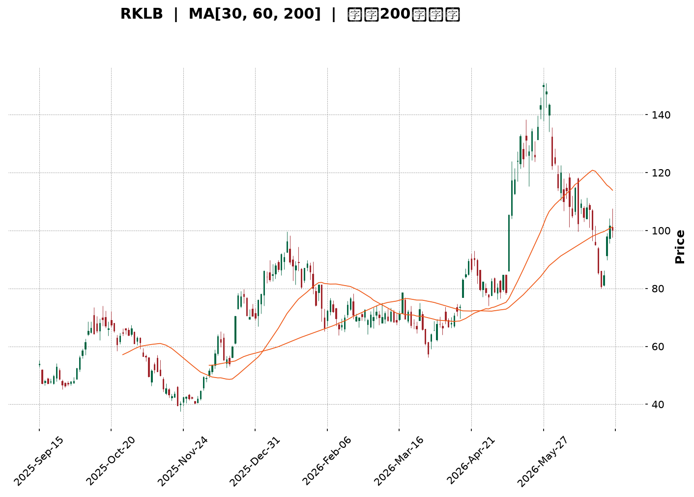
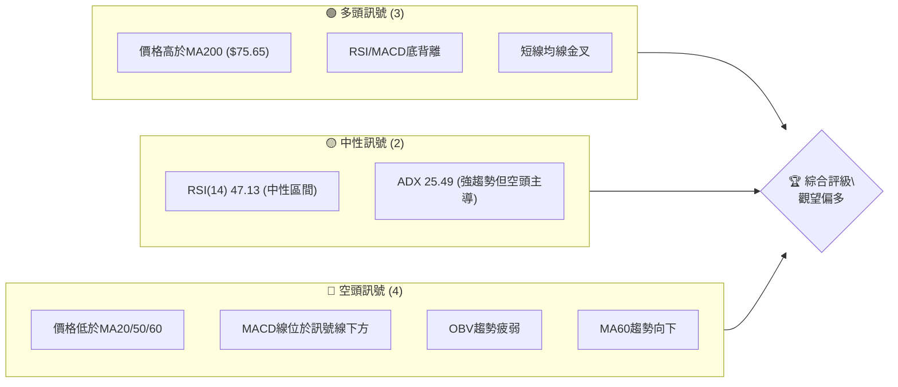
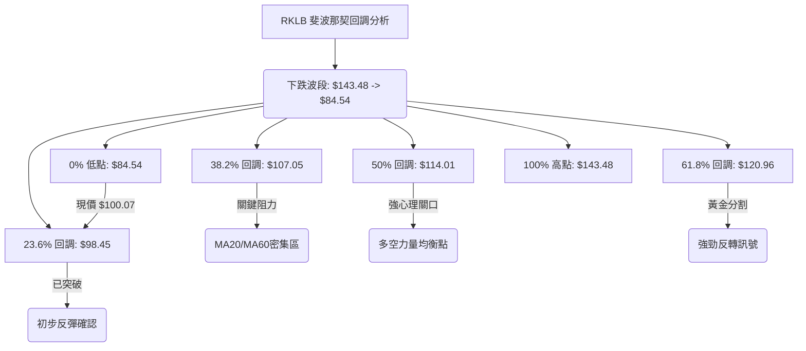

<details>
<summary>📊 靜態圖表 (點擊展開)</summary>

</details>

<html>
<head><meta charset="utf-8" /></head>
<body>
    <div style="height:500px; width:100%;">                        <script>window.PlotlyConfig = {MathJaxConfig: 'local'};</script>
        <script charset="utf-8" src="https://cdn.plot.ly/plotly-3.6.0.min.js" integrity="sha256-QaOVwtVY0T02VaHrr6pnoHLCwayMJp4O5n4YyaE3rJk=" crossorigin="anonymous"></script>                <div id="candlestick-chart" class="plotly-graph-div" style="height:100%; width:100%;"></div>            <script>                window.PLOTLYENV=window.PLOTLYENV || {};                                if (document.getElementById("candlestick-chart")) {                    Plotly.newPlot(                        "candlestick-chart",                        [{"close":{"dtype":"f8","bdata":"AAAAwB4FS0AAAAAgXJ9HQAAAAIA9CkhAAAAAQAqXR0AAAADAHuVHQAAAACCu50hAAAAA4Hp0SkAAAADgUVhIQAAAAOCjUEdAAAAAoEchR0AAAACgR4FHQAAAAOB69EdAAAAAACn8R0AAAAAAKTxKQAAAAOB6FExAAAAAAABATUAAAACgR8FOQAAAAADXU1BAAAAAQOGaUEAAAADgoxBQQAAAAEDhWlBAAAAAgOsBUUAAAACgR1FRQAAAAAAAwFBAAAAAoEeRUEAAAABgZtZQQAAAAKCZWVBAAAAA4FFITkAAAADA9chPQAAAAADXI1BAAAAAIK5nUEAAAAAAAOBPQAAAAIA9ilBAAAAAgMJ1TkAAAACgcH1PQAAAACCFq05AAAAAwPVITEAAAACAwjVMQAAAAIAUzkhAAAAAgOvRSUAAAABAM\u002fNJQAAAAGC4nklAAAAAACn8SEAAAAAAAKBGQAAAAMAexUZAAAAAIK6nRUAAAAAA12NFQAAAACBcz0VAAAAAoHC9Q0AAAABgZiZEQAAAAKCZOUVAAAAAwMxMRUAAAABACvdEQAAAAIDrEUVAAAAAIFwvREAAAABAM\u002fNEQAAAAAApXEZAAAAAIFyvSEAAAABACodIQAAAACCux0lAAAAAQAq3SkAAAABgj8JMQAAAAADXw09AAAAAYLi+TkAAAADgerRLQAAAAGC4vktAAAAAQOH6SkAAAACAwvVNQAAAAKBHoVFAAAAAQDNjU0AAAAAghUtTQAAAACCFS1NAAAAAoJmpUUAAAAAgrodRQAAAAMDMnFFAAAAA4KNwUUAAAAAgXP9SQAAAAMD1iFNAAAAAgOuBVUAAAADAHgVVQAAAAMAexVRAAAAAYGY2VUAAAACgmflVQAAAAMAepVVAAAAAQDPzVkAAAADgo7BWQAAAAEAzE1hAAAAAgD1KVkAAAADgevRVQAAAAGC4\u002flVAAAAAoJk5VkAAAABguB5UQAAAAAAAwFVAAAAA4HokVkAAAAAghWtVQAAAAOB6BFRAAAAAoJmJUkAAAACgR1FUQAAAAEAKR1JAAAAA4HqUUEAAAADgehRSQAAAAIDC9VJAAAAAgOsBUkAAAAAgrmdRQAAAAOCjgFBAAAAAACncUEAAAADA9XhRQAAAAEDhmlJAAAAAwB4lU0AAAABACrdRQAAAAKBwjVFAAAAAgBR+UUAAAADAzIxRQAAAAKCZKVJAAAAAYGZGUUAAAACAFL5RQAAAAOBRiFFAAAAAgD36UUAAAAAAAIBRQAAAAEAKh1FAAAAAYLjeUUAAAAAghTtRQAAAAKBw\u002fVFAAAAAIK4XUUAAAACAPRpRQAAAAADX01FAAAAAgMKlU0AAAABguF5RQAAAACCF+1FAAAAAYLjOUEAAAAAAAABRQAAAAOB6hFBAAAAA4FE4UkAAAAAAKXxQQAAAAEAKd05AAAAA4KOwTEAAAACAFA5QQAAAAKBHYVBAAAAAYLjuUEAAAABA4epQQAAAAOB6lFBAAAAAwB5FUUAAAAAgXK9QQAAAAEAzA1FAAAAAIK6nUUAAAACAFA5SQAAAAGBmZlJAAAAAIIW7VEAAAABAMzNVQAAAAKBwXVZAAAAAwPWoVUAAAABgj4JWQAAAAGBmJlVAAAAAIIXrU0AAAABgj5JUQAAAAIDCpVNAAAAAoEdBU0AAAADgo6BUQAAAAADXs1NAAAAAANcTVEAAAADgo7BTQAAAAKCZKVVAAAAAwB6lU0AAAACAFF5aQAAAAGBmVl1AAAAAANdjXUAAAACgmQlfQAAAAKCZkWBAAAAAoEcxX0AAAADAHmVgQAAAAADX019AAAAAwPXIYEAAAADAzFxfQAAAAOBR+GBAAAAAYGbmYUAAAAAgXMdiQAAAAMD1gGJAAAAAIFzvYUAAAADA9ZheQAAAAOB61F5AAAAAwMysXEAAAADAzPxdQAAAAMAehVtAAAAAoJlpXEAAAABguA5bQAAAAEAzQ1pAAAAAgOuxXEAAAADA9ZhZQAAAAAAAUFtAAAAA4FEoWkAAAABguP5aQAAAACBcz1pAAAAAYI8SWUAAAAAgrsdXQAAAAIA9WlVAAAAAACksVEAAAABgjyJVQAAAAOCjgFhAAAAAoJlpWUAAAADgegRZQA=="},"high":{"dtype":"f8","bdata":"AAAAgMKVS0AAAACAPQpKQAAAAMAeRUhAAAAA4FGYSEAAAABACndIQAAAAKBHIUlAAAAAYDkUS0AAAACgcD1KQAAAACBcT0hAAAAA4FHYR0AAAADAzAxIQAAAAGC4\u002fkdAAAAAgMK1SEAAAABAM1NKQAAAACAxeExAAAAAoEehTUAAAAAgrkdPQAAAAAAtIlFAAAAAYI8iUUAAAAAAAGBSQAAAAAApnFFAAAAAQOFqUUAAAACAFH5SQAAAAAAAEFJAAAAAAAAgUUAAAAAghQtSQAAAAGCPAlFAAAAAoEcBUEAAAADAzCxQQAAAACCFi1BAAAAAYGaWUEAAAABgj6JQQAAAAMD12FBAAAAAIIVLUEAAAACgmblPQAAAAMDMjE9AAAAAYLi+TUAAAAAA16NMQAAAAEDhGkxAAAAAwMwMSkAAAAAAAEBLQAAAAEDhekxAAAAAgD2qS0AAAADgo7BIQAAAAAApnEdAAAAAwEvXRkAAAACAFM5FQAAAAADXQ0ZAAAAAoEchR0AAAACAwoVEQAAAAADXQ0VAAAAAQApnRUAAAAAghctFQAAAAKCZWUVAAAAAYGamREAAAABguH5FQAAAAGC4XkZAAAAAQArXSEAAAACgmdlIQAAAACBcL0pAAAAAAADgSkAAAACAPWpNQAAAAKCZCVBAAAAAIIVLUEAAAAAA1yNQQAAAAKBwXUxAAAAA4Hp0TEAAAAAAACBOQAAAAADXo1FAAAAAwMycU0AAAAAghctTQAAAAMAe9VNAAAAAIFw\u002fU0AAAAAgXC9SQAAAAAAprFJAAAAAQItMUkAAAAAgXA9TQAAAAAAAkFNAAAAAAACQVUAAAACgcH1VQAAAACCud1ZAAAAAIIUbVkAAAACAwjVWQAAAAOCnblZAAAAAACkMV0AAAABAYB1XQAAAAMAe5VhAAAAAoEeRWEAAAAAAANBWQAAAAKCZWVZAAAAAwMycV0AAAACAPcpVQAAAAAAAwFVAAAAAQDNzVkAAAAAAAEBWQAAAAOB6VFZAAAAAwMwsVEAAAADgelRUQAAAAGBmVlRAAAAAIFw\u002fUkAAAACAPSpSQAAAAEAzM1NAAAAAQAr3UkAAAACgmVlSQAAAAMDMHFFAAAAAYGZmUUAAAAAgXL9RQAAAAMD18FJAAAAAQApHU0AAAADAzIxTQAAAAAAA0FFAAAAAIIWDUUAAAABgZvZRQAAAACBcL1JAAAAAgMJlUUAAAABgZgZSQAAAAAAAUFJAAAAAYGaGUkAAAAAA1xNSQAAAAEAKx1JAAAAAAAAIUkAAAAAA1ztSQAAAAEAzU1JAAAAAYGYmUkAAAAAA19NRQAAAAOBRGFJAAAAAQOGqU0AAAADgUThTQAAAAGC4LlJAAAAAYLh+UkAAAADAzFxRQAAAAGBmJlFAAAAAANfDUkAAAACAwgVSQAAAAIAUhlBAAAAAgOvRTkAAAADAHiVQQAAAAEDhKlFAAAAAwPVYUUAAAADgepRRQAAAAEAzE1FAAAAAgMBqUkAAAABgj3JRQAAAAADXg1FAAAAAQDPjUUAAAAAAALBSQAAAAIDCpVJAAAAAIFzfVEAAAAAgXL9VQAAAAGBmllZAAAAAwMz8VkAAAABgZkZXQAAAAEAzk1ZAAAAAgD2aVUAAAABguJ5UQAAAAIDrcVRAAAAA4KOAU0AAAACAwuVUQAAAAGCP8lRAAAAA4E91VEAAAAAAAMBUQAAAACCFK1VAAAAAYI8yVUAAAAAgrmdaQAAAAAAp\u002fF5AAAAAIFxfXkAAAAAgXM9fQAAAAIDCpWBAAAAAANdLYEAAAAAAKUxhQAAAAIA9MmBAAAAAQDPrYEAAAAAA11tgQAAAAOBReGFAAAAAAABAYkAAAAAAAOBiQAAAAGCP2mJAAAAAAAAAYkAAAAAAKfRgQAAAAMDMDGBAAAAA4FGgXkAAAADgUaheQAAAAGC4fl1AAAAAAAAQXUAAAABgj\u002fJdQAAAAKBw\u002fVtAAAAAQOHCXEAAAADAIJhdQAAAAIDrsVtAAAAAAAAgW0AAAACAwtVbQAAAAEAzY1tAAAAAoJnZWkAAAABguG5ZQAAAAEAzk1dAAAAAQAqHVUAAAACA65FVQAAAAMAexVhAAAAAgD0KWkAAAADAZOZaQA=="},"hovertemplate":"\u003cb\u003e%{x|%Y-%m-%d}\u003c\u002fb\u003e\u003cbr\u003e\u958b: $%{open:.2f}\u003cbr\u003e\u9ad8: $%{high:.2f}\u003cbr\u003e\u4f4e: $%{low:.2f}\u003cbr\u003e\u6536: $%{close:.2f}\u003cextra\u003e\u003c\u002fextra\u003e","low":{"dtype":"f8","bdata":"AAAAAClcSkAAAACgR4FHQAAAAKCZOUdAAAAAAACAR0AAAADgo5BHQAAAAGBmZkdAAAAA4Hr0R0AAAABACjdIQAAAAEDhmkZAAAAAgD3qRkAAAAAgXC9HQAAAAKBHQUdAAAAAIFyPR0AAAACgR0FIQAAAAKBHoUlAAAAAYGbmS0AAAABgj4JMQAAAAEAz009AAAAAQOEaUEAAAADA9QhQQAAAAODOJ1BAAAAA4FEYT0AAAADAHsVQQAAAAEAzm1BAAAAAoJnZT0AAAABAM6tQQAAAAEAKN1BAAAAA4Ho0TUAAAAAAAGBOQAAAAEAz009AAAAAoJkJUEAAAACAFM5PQAAAAKBwvU9AAAAAgOtxTkAAAABAMzNOQAAAAOCjkE1AAAAAoEdBTEAAAAAgXG9LQAAAAOB6tEhAAAAA4M4nR0AAAACgR2FJQAAAAEDhmklAAAAA4HrUSEAAAAAgXC9GQAAAAGBmpkVAAAAAwMwcRUAAAACgcJ1EQAAAAEAKN0VAAAAAwPWoQ0AAAADA9chCQAAAAGBmpkNAAAAA4KMwREAAAADgo7BEQAAAAGBm5kRAAAAAoHD9Q0AAAACAwjVEQAAAAAAAwERAAAAAwPVoRkAAAACgmdlHQAAAAAApnEhAAAAAIIUrSUAAAAAAACBKQAAAAMDMbExAAAAAYGbmTUAAAACAPYpLQAAAAEAKV0pAAAAAQOGKSkAAAAAA1wNMQAAAAMCdX05AAAAAwCAwUkAAAABgj1JSQAAAAKBDs1JAAAAAwPWYUUAAAACgm1RRQAAAAAApnFFAAAAA4FFIUUAAAABgZrZQQAAAAADX01FAAAAAQDODUkAAAABgZnZUQAAAAOCjkFRAAAAAwMycVEAAAADg0NpUQAAAAKCZaVVAAAAAAAAgVUAAAACgmalVQAAAAKCZGVdAAAAAQDMTVkAAAACgcK1UQAAAAMB2VlRAAAAAIK6HVUAAAADgowBUQAAAAAAAgFRAAAAAwMqBVUAAAAAAAMBUQAAAAKBHgVNAAAAAgEF4UkAAAACgR\u002fFSQAAAAEAIJFFAAAAAwMxMUEAAAAAAAMBQQAAAAAAAsFFAAAAAQDPjUUAAAACgR8FQQAAAACBc709AAAAAAABgUEAAAAAAAEBQQAAAAMBLf1FAAAAAYGYWUkAAAACgmVlRQAAAAAAAIFFAAAAAYGamUEAAAADgUThRQAAAAADXM1FAAAAAYGYGUEAAAADAzJxQQAAAAAApjFBAAAAAgBReUUAAAACAwtVQQAAAAOCjCFFAAAAA4Hr0UEAAAACAvidRQAAAAMAeFVFAAAAAgOsRUUAAAAAAKdxQQAAAAEDhKlFAAAAAoEfRUUAAAACgmVlRQAAAAAAAAFFAAAAAwPWYUEAAAABAM4NQQAAAAKBwHVBAAAAAACk8UUAAAACAwmVQQAAAAMDMLE5AAAAAYOUQTEAAAAAA14NNQAAAAEAzU1BAAAAAgBTuTkAAAABgZqZQQAAAAEDh+k9AAAAAYOfzUEAAAABA4aJQQAAAAIDClVBAAAAAgMKlUEAAAABguJ5RQAAAAGBmZlFAAAAAoJk5U0AAAABgZuZUQAAAAGBmJlVAAAAAAABwVUAAAADgo\u002fBVQAAAAAApZFRAAAAAwB7FU0AAAADAdENTQAAAAGBmZlNAAAAAIFx\u002fUkAAAACAFF5TQAAAACCFm1NAAAAAAAAQU0AAAAAA1yNTQAAAAEAKt1NAAAAAIIV7U0AAAAAgrndVQAAAAAAAAFpAAAAAgD0aXEAAAADA9ThdQAAAAADXU15AAAAAQDNzXkAAAACg8WpfQAAAAGC4zlxAAAAAgBQOX0AAAABAM\u002fNeQAAAAIDraWBAAAAAgOtRYUAAAADAHj1hQAAAAADXy2FAAAAAoJnBYEAAAAAAAEBeQAAAAADXo15AAAAAgD1qXEAAAADA9ZhbQAAAAGC4rlpAAAAAAADAW0AAAADAzExZQAAAAIA9GlpAAAAAoJlZWkAAAABACudYQAAAAEAzc1pAAAAA4HrEWUAAAABgjwJaQAAAAKBwPVlAAAAAAAAgWEAAAADgo7hXQAAAAGBmNlVAAAAAAAAAVEAAAABguC5UQAAAAGBmdlZAAAAAwPXoV0AAAAAgrmdYQA=="},"name":"\u50f9\u683c","open":{"dtype":"f8","bdata":"AAAAgD3KSkAAAAAAAABKQAAAAOBRyEdAAAAAgMJ1SEAAAABACtdHQAAAAOCjkEdAAAAAQDODSEAAAACAwuVJQAAAAAAAAEhAAAAAYGamR0AAAABAM7NHQAAAAEDhmkdAAAAA4KOwR0AAAACA61FIQAAAAGBmBkpAAAAAYLhuTEAAAACgR4FNQAAAAKCZCVBAAAAAoJk5UEAAAABAM7NRQAAAAOBR+FBAAAAAgMJVUEAAAACgR4FRQAAAAOB6hFFAAAAAwPV4UEAAAADgo0hRQAAAAGCPAlFAAAAAACl8T0AAAAAgrsdOQAAAAADXM1BAAAAAACmMUEAAAABAM2tQQAAAAKBHCVBAAAAAAABAUEAAAABgj+JOQAAAAADXg09AAAAAYGbmTEAAAADgelRMQAAAAEDhGkxAAAAAoBjUR0AAAABguN5KQAAAAAAAAExAAAAAQAr3SUAAAACgR2FIQAAAAEDh2kVAAAAAQDOTRkAAAAAAKRxFQAAAAAAAQEVAAAAAgD0KR0AAAACAPepDQAAAAKBHYURAAAAAANcDRUAAAABguJ5FQAAAAKBHQUVAAAAAQDOTREAAAAAgrkdEQAAAAGCP8kRAAAAAYI\u002fSRkAAAAAAAHBIQAAAAIA9CklAAAAAoHCdSUAAAADgUbhKQAAAAKBHwUxAAAAAAABAT0AAAADgp4ZPQAAAAOBRGEtAAAAAwMwMTEAAAACgmRlMQAAAACBcj05AAAAAACk8UkAAAAAA13NSQAAAAIA9glNAAAAAIIUrU0AAAAAAAGBRQAAAAKCZQVJAAAAAAADgUUAAAADgUahRQAAAACCup1JAAAAA4KNwU0AAAABgZgZVQAAAAAAAYFVAAAAAoJkhVUAAAABguD5VQAAAAMD1SFZAAAAAYGaWVUAAAADA9VBWQAAAAKCZIVdAAAAAwMxsV0AAAACgR4FWQAAAAOBRmFVAAAAAIIVDVkAAAAAgrq9VQAAAAMD1uFRAAAAAgBTOVUAAAAAAKfxVQAAAAAAAQFVAAAAAgD3KU0AAAABgZqZTQAAAAGBmVlRAAAAAYLh+UUAAAAAAAEBRQAAAAKCZAVJAAAAAgBSmUkAAAADgUUhSQAAAAIDr4VBAAAAA4HqsUEAAAABAYIVQQAAAAAAAwFFAAAAAoJk5UkAAAAAg2d5SQAAAAOBRMFFAAAAA4FE4UUAAAACAFMZRQAAAAEDhglFAAAAAgMLlUEAAAAAghatQQAAAAGC4NlFAAAAAANezUUAAAABA4bpRQAAAAOCjCFFAAAAAwPVYUUAAAACAwpVRQAAAAEAzM1FAAAAAwMz8UUAAAACgmUlRQAAAAMDMVFFAAAAAYGbeUUAAAABgjwJTQAAAAOB6NFFAAAAAAAAAUkAAAACgcAVRQAAAAAAAwFBAAAAAACk8UUAAAADAzMxRQAAAAOCjgFBAAAAAoJm5TkAAAABA4dpOQAAAAAAAYFBAAAAAwMwcT0AAAABguO5QQAAAACBcx1BAAAAAAAAAUkAAAAAA10NRQAAAAMDM7FBAAAAAQDPDUEAAAAAghWNSQAAAAKBwZVJAAAAAgBQ+U0AAAADAHgVVQAAAAGBmNlVAAAAAwB6VVkAAAACAwp1WQAAAAGBmdlZAAAAAgMKVVUAAAAAAKexTQAAAAMDMBFRAAAAAQAp3U0AAAABAM2NTQAAAAIDr4VRAAAAAQAqXU0AAAABgZqZUQAAAACCu51NAAAAAoHAtVUAAAACAPYJVQAAAAKBHUVpAAAAA4KMwXEAAAACgR\u002fleQAAAAGBmxl5AAAAAQDMDYEAAAAAAKZhgQAAAAIAUfl9AAAAAYLjeX0AAAADA9YhfQAAAAMAebWBAAAAAQOG+YUAAAABACrdiQAAAAKBwZWJAAAAAgBR+YUAAAAAAKYxgQAAAAIDCVV9AAAAAwB7lXUAAAACgcEVcQAAAAKBHkVxAAAAAQOGqXEAAAACgmZldQAAAAMDM7FpAAAAAgMKlWkAAAACgR4FdQAAAAKBw\u002fVpAAAAAoHDtWkAAAAAgrgdaQAAAAMAeNVtAAAAAIFy\u002fWkAAAACgRwFYQAAAAGBmdldAAAAAQAqHVUAAAABACkdUQAAAAEDh0lZAAAAAwMxMWEAAAADgekxZQA=="},"x":["2025-09-15T00:00:00-04:00","2025-09-16T00:00:00-04:00","2025-09-17T00:00:00-04:00","2025-09-18T00:00:00-04:00","2025-09-19T00:00:00-04:00","2025-09-22T00:00:00-04:00","2025-09-23T00:00:00-04:00","2025-09-24T00:00:00-04:00","2025-09-25T00:00:00-04:00","2025-09-26T00:00:00-04:00","2025-09-29T00:00:00-04:00","2025-09-30T00:00:00-04:00","2025-10-01T00:00:00-04:00","2025-10-02T00:00:00-04:00","2025-10-03T00:00:00-04:00","2025-10-06T00:00:00-04:00","2025-10-07T00:00:00-04:00","2025-10-08T00:00:00-04:00","2025-10-09T00:00:00-04:00","2025-10-10T00:00:00-04:00","2025-10-13T00:00:00-04:00","2025-10-14T00:00:00-04:00","2025-10-15T00:00:00-04:00","2025-10-16T00:00:00-04:00","2025-10-17T00:00:00-04:00","2025-10-20T00:00:00-04:00","2025-10-21T00:00:00-04:00","2025-10-22T00:00:00-04:00","2025-10-23T00:00:00-04:00","2025-10-24T00:00:00-04:00","2025-10-27T00:00:00-04:00","2025-10-28T00:00:00-04:00","2025-10-29T00:00:00-04:00","2025-10-30T00:00:00-04:00","2025-10-31T00:00:00-04:00","2025-11-03T00:00:00-05:00","2025-11-04T00:00:00-05:00","2025-11-05T00:00:00-05:00","2025-11-06T00:00:00-05:00","2025-11-07T00:00:00-05:00","2025-11-10T00:00:00-05:00","2025-11-11T00:00:00-05:00","2025-11-12T00:00:00-05:00","2025-11-13T00:00:00-05:00","2025-11-14T00:00:00-05:00","2025-11-17T00:00:00-05:00","2025-11-18T00:00:00-05:00","2025-11-19T00:00:00-05:00","2025-11-20T00:00:00-05:00","2025-11-21T00:00:00-05:00","2025-11-24T00:00:00-05:00","2025-11-25T00:00:00-05:00","2025-11-26T00:00:00-05:00","2025-11-28T00:00:00-05:00","2025-12-01T00:00:00-05:00","2025-12-02T00:00:00-05:00","2025-12-03T00:00:00-05:00","2025-12-04T00:00:00-05:00","2025-12-05T00:00:00-05:00","2025-12-08T00:00:00-05:00","2025-12-09T00:00:00-05:00","2025-12-10T00:00:00-05:00","2025-12-11T00:00:00-05:00","2025-12-12T00:00:00-05:00","2025-12-15T00:00:00-05:00","2025-12-16T00:00:00-05:00","2025-12-17T00:00:00-05:00","2025-12-18T00:00:00-05:00","2025-12-19T00:00:00-05:00","2025-12-22T00:00:00-05:00","2025-12-23T00:00:00-05:00","2025-12-24T00:00:00-05:00","2025-12-26T00:00:00-05:00","2025-12-29T00:00:00-05:00","2025-12-30T00:00:00-05:00","2025-12-31T00:00:00-05:00","2026-01-02T00:00:00-05:00","2026-01-05T00:00:00-05:00","2026-01-06T00:00:00-05:00","2026-01-07T00:00:00-05:00","2026-01-08T00:00:00-05:00","2026-01-09T00:00:00-05:00","2026-01-12T00:00:00-05:00","2026-01-13T00:00:00-05:00","2026-01-14T00:00:00-05:00","2026-01-15T00:00:00-05:00","2026-01-16T00:00:00-05:00","2026-01-20T00:00:00-05:00","2026-01-21T00:00:00-05:00","2026-01-22T00:00:00-05:00","2026-01-23T00:00:00-05:00","2026-01-26T00:00:00-05:00","2026-01-27T00:00:00-05:00","2026-01-28T00:00:00-05:00","2026-01-29T00:00:00-05:00","2026-01-30T00:00:00-05:00","2026-02-02T00:00:00-05:00","2026-02-03T00:00:00-05:00","2026-02-04T00:00:00-05:00","2026-02-05T00:00:00-05:00","2026-02-06T00:00:00-05:00","2026-02-09T00:00:00-05:00","2026-02-10T00:00:00-05:00","2026-02-11T00:00:00-05:00","2026-02-12T00:00:00-05:00","2026-02-13T00:00:00-05:00","2026-02-17T00:00:00-05:00","2026-02-18T00:00:00-05:00","2026-02-19T00:00:00-05:00","2026-02-20T00:00:00-05:00","2026-02-23T00:00:00-05:00","2026-02-24T00:00:00-05:00","2026-02-25T00:00:00-05:00","2026-02-26T00:00:00-05:00","2026-02-27T00:00:00-05:00","2026-03-02T00:00:00-05:00","2026-03-03T00:00:00-05:00","2026-03-04T00:00:00-05:00","2026-03-05T00:00:00-05:00","2026-03-06T00:00:00-05:00","2026-03-09T00:00:00-04:00","2026-03-10T00:00:00-04:00","2026-03-11T00:00:00-04:00","2026-03-12T00:00:00-04:00","2026-03-13T00:00:00-04:00","2026-03-16T00:00:00-04:00","2026-03-17T00:00:00-04:00","2026-03-18T00:00:00-04:00","2026-03-19T00:00:00-04:00","2026-03-20T00:00:00-04:00","2026-03-23T00:00:00-04:00","2026-03-24T00:00:00-04:00","2026-03-25T00:00:00-04:00","2026-03-26T00:00:00-04:00","2026-03-27T00:00:00-04:00","2026-03-30T00:00:00-04:00","2026-03-31T00:00:00-04:00","2026-04-01T00:00:00-04:00","2026-04-02T00:00:00-04:00","2026-04-06T00:00:00-04:00","2026-04-07T00:00:00-04:00","2026-04-08T00:00:00-04:00","2026-04-09T00:00:00-04:00","2026-04-10T00:00:00-04:00","2026-04-13T00:00:00-04:00","2026-04-14T00:00:00-04:00","2026-04-15T00:00:00-04:00","2026-04-16T00:00:00-04:00","2026-04-17T00:00:00-04:00","2026-04-20T00:00:00-04:00","2026-04-21T00:00:00-04:00","2026-04-22T00:00:00-04:00","2026-04-23T00:00:00-04:00","2026-04-24T00:00:00-04:00","2026-04-27T00:00:00-04:00","2026-04-28T00:00:00-04:00","2026-04-29T00:00:00-04:00","2026-04-30T00:00:00-04:00","2026-05-01T00:00:00-04:00","2026-05-04T00:00:00-04:00","2026-05-05T00:00:00-04:00","2026-05-06T00:00:00-04:00","2026-05-07T00:00:00-04:00","2026-05-08T00:00:00-04:00","2026-05-11T00:00:00-04:00","2026-05-12T00:00:00-04:00","2026-05-13T00:00:00-04:00","2026-05-14T00:00:00-04:00","2026-05-15T00:00:00-04:00","2026-05-18T00:00:00-04:00","2026-05-19T00:00:00-04:00","2026-05-20T00:00:00-04:00","2026-05-21T00:00:00-04:00","2026-05-22T00:00:00-04:00","2026-05-26T00:00:00-04:00","2026-05-27T00:00:00-04:00","2026-05-28T00:00:00-04:00","2026-05-29T00:00:00-04:00","2026-06-01T00:00:00-04:00","2026-06-02T00:00:00-04:00","2026-06-03T00:00:00-04:00","2026-06-04T00:00:00-04:00","2026-06-05T00:00:00-04:00","2026-06-08T00:00:00-04:00","2026-06-09T00:00:00-04:00","2026-06-10T00:00:00-04:00","2026-06-11T00:00:00-04:00","2026-06-12T00:00:00-04:00","2026-06-15T00:00:00-04:00","2026-06-16T00:00:00-04:00","2026-06-17T00:00:00-04:00","2026-06-18T00:00:00-04:00","2026-06-22T00:00:00-04:00","2026-06-23T00:00:00-04:00","2026-06-24T00:00:00-04:00","2026-06-25T00:00:00-04:00","2026-06-26T00:00:00-04:00","2026-06-29T00:00:00-04:00","2026-06-30T00:00:00-04:00","2026-07-01T00:00:00-04:00"],"type":"candlestick"},{"hovertemplate":"MA30: $%{y:.2f}\u003cextra\u003e\u003c\u002fextra\u003e","line":{"color":"#2196F3","dash":"dash","width":2},"mode":"lines","name":"MA30","x":["2025-09-15T00:00:00-04:00","2025-09-16T00:00:00-04:00","2025-09-17T00:00:00-04:00","2025-09-18T00:00:00-04:00","2025-09-19T00:00:00-04:00","2025-09-22T00:00:00-04:00","2025-09-23T00:00:00-04:00","2025-09-24T00:00:00-04:00","2025-09-25T00:00:00-04:00","2025-09-26T00:00:00-04:00","2025-09-29T00:00:00-04:00","2025-09-30T00:00:00-04:00","2025-10-01T00:00:00-04:00","2025-10-02T00:00:00-04:00","2025-10-03T00:00:00-04:00","2025-10-06T00:00:00-04:00","2025-10-07T00:00:00-04:00","2025-10-08T00:00:00-04:00","2025-10-09T00:00:00-04:00","2025-10-10T00:00:00-04:00","2025-10-13T00:00:00-04:00","2025-10-14T00:00:00-04:00","2025-10-15T00:00:00-04:00","2025-10-16T00:00:00-04:00","2025-10-17T00:00:00-04:00","2025-10-20T00:00:00-04:00","2025-10-21T00:00:00-04:00","2025-10-22T00:00:00-04:00","2025-10-23T00:00:00-04:00","2025-10-24T00:00:00-04:00","2025-10-27T00:00:00-04:00","2025-10-28T00:00:00-04:00","2025-10-29T00:00:00-04:00","2025-10-30T00:00:00-04:00","2025-10-31T00:00:00-04:00","2025-11-03T00:00:00-05:00","2025-11-04T00:00:00-05:00","2025-11-05T00:00:00-05:00","2025-11-06T00:00:00-05:00","2025-11-07T00:00:00-05:00","2025-11-10T00:00:00-05:00","2025-11-11T00:00:00-05:00","2025-11-12T00:00:00-05:00","2025-11-13T00:00:00-05:00","2025-11-14T00:00:00-05:00","2025-11-17T00:00:00-05:00","2025-11-18T00:00:00-05:00","2025-11-19T00:00:00-05:00","2025-11-20T00:00:00-05:00","2025-11-21T00:00:00-05:00","2025-11-24T00:00:00-05:00","2025-11-25T00:00:00-05:00","2025-11-26T00:00:00-05:00","2025-11-28T00:00:00-05:00","2025-12-01T00:00:00-05:00","2025-12-02T00:00:00-05:00","2025-12-03T00:00:00-05:00","2025-12-04T00:00:00-05:00","2025-12-05T00:00:00-05:00","2025-12-08T00:00:00-05:00","2025-12-09T00:00:00-05:00","2025-12-10T00:00:00-05:00","2025-12-11T00:00:00-05:00","2025-12-12T00:00:00-05:00","2025-12-15T00:00:00-05:00","2025-12-16T00:00:00-05:00","2025-12-17T00:00:00-05:00","2025-12-18T00:00:00-05:00","2025-12-19T00:00:00-05:00","2025-12-22T00:00:00-05:00","2025-12-23T00:00:00-05:00","2025-12-24T00:00:00-05:00","2025-12-26T00:00:00-05:00","2025-12-29T00:00:00-05:00","2025-12-30T00:00:00-05:00","2025-12-31T00:00:00-05:00","2026-01-02T00:00:00-05:00","2026-01-05T00:00:00-05:00","2026-01-06T00:00:00-05:00","2026-01-07T00:00:00-05:00","2026-01-08T00:00:00-05:00","2026-01-09T00:00:00-05:00","2026-01-12T00:00:00-05:00","2026-01-13T00:00:00-05:00","2026-01-14T00:00:00-05:00","2026-01-15T00:00:00-05:00","2026-01-16T00:00:00-05:00","2026-01-20T00:00:00-05:00","2026-01-21T00:00:00-05:00","2026-01-22T00:00:00-05:00","2026-01-23T00:00:00-05:00","2026-01-26T00:00:00-05:00","2026-01-27T00:00:00-05:00","2026-01-28T00:00:00-05:00","2026-01-29T00:00:00-05:00","2026-01-30T00:00:00-05:00","2026-02-02T00:00:00-05:00","2026-02-03T00:00:00-05:00","2026-02-04T00:00:00-05:00","2026-02-05T00:00:00-05:00","2026-02-06T00:00:00-05:00","2026-02-09T00:00:00-05:00","2026-02-10T00:00:00-05:00","2026-02-11T00:00:00-05:00","2026-02-12T00:00:00-05:00","2026-02-13T00:00:00-05:00","2026-02-17T00:00:00-05:00","2026-02-18T00:00:00-05:00","2026-02-19T00:00:00-05:00","2026-02-20T00:00:00-05:00","2026-02-23T00:00:00-05:00","2026-02-24T00:00:00-05:00","2026-02-25T00:00:00-05:00","2026-02-26T00:00:00-05:00","2026-02-27T00:00:00-05:00","2026-03-02T00:00:00-05:00","2026-03-03T00:00:00-05:00","2026-03-04T00:00:00-05:00","2026-03-05T00:00:00-05:00","2026-03-06T00:00:00-05:00","2026-03-09T00:00:00-04:00","2026-03-10T00:00:00-04:00","2026-03-11T00:00:00-04:00","2026-03-12T00:00:00-04:00","2026-03-13T00:00:00-04:00","2026-03-16T00:00:00-04:00","2026-03-17T00:00:00-04:00","2026-03-18T00:00:00-04:00","2026-03-19T00:00:00-04:00","2026-03-20T00:00:00-04:00","2026-03-23T00:00:00-04:00","2026-03-24T00:00:00-04:00","2026-03-25T00:00:00-04:00","2026-03-26T00:00:00-04:00","2026-03-27T00:00:00-04:00","2026-03-30T00:00:00-04:00","2026-03-31T00:00:00-04:00","2026-04-01T00:00:00-04:00","2026-04-02T00:00:00-04:00","2026-04-06T00:00:00-04:00","2026-04-07T00:00:00-04:00","2026-04-08T00:00:00-04:00","2026-04-09T00:00:00-04:00","2026-04-10T00:00:00-04:00","2026-04-13T00:00:00-04:00","2026-04-14T00:00:00-04:00","2026-04-15T00:00:00-04:00","2026-04-16T00:00:00-04:00","2026-04-17T00:00:00-04:00","2026-04-20T00:00:00-04:00","2026-04-21T00:00:00-04:00","2026-04-22T00:00:00-04:00","2026-04-23T00:00:00-04:00","2026-04-24T00:00:00-04:00","2026-04-27T00:00:00-04:00","2026-04-28T00:00:00-04:00","2026-04-29T00:00:00-04:00","2026-04-30T00:00:00-04:00","2026-05-01T00:00:00-04:00","2026-05-04T00:00:00-04:00","2026-05-05T00:00:00-04:00","2026-05-06T00:00:00-04:00","2026-05-07T00:00:00-04:00","2026-05-08T00:00:00-04:00","2026-05-11T00:00:00-04:00","2026-05-12T00:00:00-04:00","2026-05-13T00:00:00-04:00","2026-05-14T00:00:00-04:00","2026-05-15T00:00:00-04:00","2026-05-18T00:00:00-04:00","2026-05-19T00:00:00-04:00","2026-05-20T00:00:00-04:00","2026-05-21T00:00:00-04:00","2026-05-22T00:00:00-04:00","2026-05-26T00:00:00-04:00","2026-05-27T00:00:00-04:00","2026-05-28T00:00:00-04:00","2026-05-29T00:00:00-04:00","2026-06-01T00:00:00-04:00","2026-06-02T00:00:00-04:00","2026-06-03T00:00:00-04:00","2026-06-04T00:00:00-04:00","2026-06-05T00:00:00-04:00","2026-06-08T00:00:00-04:00","2026-06-09T00:00:00-04:00","2026-06-10T00:00:00-04:00","2026-06-11T00:00:00-04:00","2026-06-12T00:00:00-04:00","2026-06-15T00:00:00-04:00","2026-06-16T00:00:00-04:00","2026-06-17T00:00:00-04:00","2026-06-18T00:00:00-04:00","2026-06-22T00:00:00-04:00","2026-06-23T00:00:00-04:00","2026-06-24T00:00:00-04:00","2026-06-25T00:00:00-04:00","2026-06-26T00:00:00-04:00","2026-06-29T00:00:00-04:00","2026-06-30T00:00:00-04:00","2026-07-01T00:00:00-04:00"],"y":{"dtype":"f8","bdata":"AAAAAAAA+H8AAAAAAAD4fwAAAAAAAPh\u002fAAAAAAAA+H8AAAAAAAD4fwAAAAAAAPh\u002fAAAAAAAA+H8AAAAAAAD4fwAAAAAAAPh\u002fAAAAAAAA+H8AAAAAAAD4fwAAAAAAAPh\u002fAAAAAAAA+H8AAAAAAAD4fwAAAAAAAPh\u002fAAAAAAAA+H8AAAAAAAD4fwAAAAAAAPh\u002fAAAAAAAA+H8AAAAAAAD4fwAAAAAAAPh\u002fAAAAAAAA+H8AAAAAAAD4fwAAAAAAAPh\u002fAAAAAAAA+H8AAAAAAAD4fwAAAAAAAPh\u002fAAAAAAAA+H8AAAAAAAD4f4mIiDhRj0xAvLu7q7nATECJiIiIJQdNQHd3d7dJVE1AVVVVdemOTUDNzMz8uM9NQCIiItLqAE5AREREhIgQTkDNzMy8gzFOQBEREbE6Pk5AZmZmFi9VTkBmZmZGDGpOQGZmZoZBeE5A7+7uDsqATkBERETk+2FOQFVVVQWsNE5A3t3dfdzzTUBmZmZW8qNNQDMzMxNnR01AmpmZaXXUTEAzMzOzOm5MQGZmZlY5DExA7+7u\u002frifS0De3d1tEitLQN7d3a0AwUpAmpmZ+X5SSkCrqqrK6OVJQHd3d7esjUlAq6qqyuhdSUCrqqqK+h9JQERERBSD6EhAiYiIWIC0SEBmZmaG65lIQLy7u9uyjkhAREREdCGRSEDv7u7+1HBIQM3MzDzfV0hAvLu7a7xMSECrqqpaq1tIQFVVVaXitEhAd3d3R28jSUB3d3fHS49JQM3MzCz5\u002fUlAAAAAQDVWSkDNzMzsUcBKQImIiEiaKktAzczMvHSbS0CamZnpJilMQFVVVfVvvExAiYiI+AyDTUCJiIho2D1OQERERDQz605AiYiIeHefT0BERER8zTFQQO\u002fu7qabkFBAq6qqSlP+UEDe3d1dj2ZRQM3MzOyY1FFAq6qqknspUkBmZmZuLnxSQLy7u5vgyVJAVVVV9YsVU0BmZmYuh0ZTQGZmZu6YeFNAiYiIOF6yU0BVVVWt8fJTQCIiIqJhJ1RAEREREXRSVEAzMzMDAIBUQAAAAICGhVRAvLu7a5FtVEBmZmY2M2NUQERERGRXYFRA3t3dDUljVEDNzMz8N2JUQImIiCi\u002fWFRAERERIcxTVEB3d3e3yEZUQJqZmRnZPlRAREREJLAqVEAiIiJCfA5UQFVVVYUH81NA7+7uDknTU0Dv7u5+hq1TQLy7u9vOj1NAERERoWFfU0BmZmamKTVTQGZmZlZV\u002fVJAmpmZiYjYUkARERFxhLJSQJqZmQlljFJAVVVVZTtnUkDe3d2Nl05SQFVVVbWBLlJAERER0WkDUkCJiIgYkt5RQHd3d\u002ffhy1FAvLu7y1rVUUAzMzPjM7xRQDMzM3OvuVFA7+7ubqC7UUAzMzMjabJRQKuqqmqRnVFAERERoWGfUUC8u7vbh5dRQAAAAICxjFFA3t3dZTt3UUCrqqrSImtRQERERDwmWFFAzczM9ERFUUAiIiLKdj5RQM3MzFQqNlFA3t3dRUQ0UUDv7u6m4ixRQImIiHASI1FAiYiIkFAmUUAzMzM7+yhRQImIiFBiMFFAvLu7s+RHUUAiIiJ6d2dRQAAAACi\u002fkFFAERERiRaxUUARERFpH95RQBEREYkW+VFAVVVVTTcRUkCamZmh0y5SQDMzM3tbPlJAVVVVDQI7UkAzMzMrzlZSQImIiJB7ZVJARERE\u002fGKBUkCamZlhV5hSQCIiIor6v1JAiYiIgCPMUkDv7u4meCBTQGZmZv7UmFNAvLu7SzcZVEAREREREZlUQDMzM2MQKFVARERE1L+hVUBmZmbWMSlWQCIiIoJOq1ZAZmZmZmY2V0AzMzPjpbNXQCIiIpIYRFhAzczM7O7eWECJiIjIWoVZQM3MzHwjJFpAvLu720+lWkAiIiICgfVaQFVVVRW9PVtAVVVVlZl5W0De3d1taLlbQImIiOjD71tA7+7uDjw4XEAiIiLCkm9cQDMzM3MFqFxAIiIicpP4XEAzMzOT\u002fCJdQAAAAODsY11AZmZm1s6XXUCrqqraJNZdQBEREQFWBl5A7+7ujqY0XkBEREQUkh5eQFVVVZVu2l1AZmZmpsaLXUDv7u5ORjddQM3MzNyW7VxAMzMzQ0S8XECamZn58HlcQA=="},"type":"scatter"},{"hovertemplate":"MA60: $%{y:.2f}\u003cextra\u003e\u003c\u002fextra\u003e","line":{"color":"#9C27B0","dash":"dash","width":2},"mode":"lines","name":"MA60","x":["2025-09-15T00:00:00-04:00","2025-09-16T00:00:00-04:00","2025-09-17T00:00:00-04:00","2025-09-18T00:00:00-04:00","2025-09-19T00:00:00-04:00","2025-09-22T00:00:00-04:00","2025-09-23T00:00:00-04:00","2025-09-24T00:00:00-04:00","2025-09-25T00:00:00-04:00","2025-09-26T00:00:00-04:00","2025-09-29T00:00:00-04:00","2025-09-30T00:00:00-04:00","2025-10-01T00:00:00-04:00","2025-10-02T00:00:00-04:00","2025-10-03T00:00:00-04:00","2025-10-06T00:00:00-04:00","2025-10-07T00:00:00-04:00","2025-10-08T00:00:00-04:00","2025-10-09T00:00:00-04:00","2025-10-10T00:00:00-04:00","2025-10-13T00:00:00-04:00","2025-10-14T00:00:00-04:00","2025-10-15T00:00:00-04:00","2025-10-16T00:00:00-04:00","2025-10-17T00:00:00-04:00","2025-10-20T00:00:00-04:00","2025-10-21T00:00:00-04:00","2025-10-22T00:00:00-04:00","2025-10-23T00:00:00-04:00","2025-10-24T00:00:00-04:00","2025-10-27T00:00:00-04:00","2025-10-28T00:00:00-04:00","2025-10-29T00:00:00-04:00","2025-10-30T00:00:00-04:00","2025-10-31T00:00:00-04:00","2025-11-03T00:00:00-05:00","2025-11-04T00:00:00-05:00","2025-11-05T00:00:00-05:00","2025-11-06T00:00:00-05:00","2025-11-07T00:00:00-05:00","2025-11-10T00:00:00-05:00","2025-11-11T00:00:00-05:00","2025-11-12T00:00:00-05:00","2025-11-13T00:00:00-05:00","2025-11-14T00:00:00-05:00","2025-11-17T00:00:00-05:00","2025-11-18T00:00:00-05:00","2025-11-19T00:00:00-05:00","2025-11-20T00:00:00-05:00","2025-11-21T00:00:00-05:00","2025-11-24T00:00:00-05:00","2025-11-25T00:00:00-05:00","2025-11-26T00:00:00-05:00","2025-11-28T00:00:00-05:00","2025-12-01T00:00:00-05:00","2025-12-02T00:00:00-05:00","2025-12-03T00:00:00-05:00","2025-12-04T00:00:00-05:00","2025-12-05T00:00:00-05:00","2025-12-08T00:00:00-05:00","2025-12-09T00:00:00-05:00","2025-12-10T00:00:00-05:00","2025-12-11T00:00:00-05:00","2025-12-12T00:00:00-05:00","2025-12-15T00:00:00-05:00","2025-12-16T00:00:00-05:00","2025-12-17T00:00:00-05:00","2025-12-18T00:00:00-05:00","2025-12-19T00:00:00-05:00","2025-12-22T00:00:00-05:00","2025-12-23T00:00:00-05:00","2025-12-24T00:00:00-05:00","2025-12-26T00:00:00-05:00","2025-12-29T00:00:00-05:00","2025-12-30T00:00:00-05:00","2025-12-31T00:00:00-05:00","2026-01-02T00:00:00-05:00","2026-01-05T00:00:00-05:00","2026-01-06T00:00:00-05:00","2026-01-07T00:00:00-05:00","2026-01-08T00:00:00-05:00","2026-01-09T00:00:00-05:00","2026-01-12T00:00:00-05:00","2026-01-13T00:00:00-05:00","2026-01-14T00:00:00-05:00","2026-01-15T00:00:00-05:00","2026-01-16T00:00:00-05:00","2026-01-20T00:00:00-05:00","2026-01-21T00:00:00-05:00","2026-01-22T00:00:00-05:00","2026-01-23T00:00:00-05:00","2026-01-26T00:00:00-05:00","2026-01-27T00:00:00-05:00","2026-01-28T00:00:00-05:00","2026-01-29T00:00:00-05:00","2026-01-30T00:00:00-05:00","2026-02-02T00:00:00-05:00","2026-02-03T00:00:00-05:00","2026-02-04T00:00:00-05:00","2026-02-05T00:00:00-05:00","2026-02-06T00:00:00-05:00","2026-02-09T00:00:00-05:00","2026-02-10T00:00:00-05:00","2026-02-11T00:00:00-05:00","2026-02-12T00:00:00-05:00","2026-02-13T00:00:00-05:00","2026-02-17T00:00:00-05:00","2026-02-18T00:00:00-05:00","2026-02-19T00:00:00-05:00","2026-02-20T00:00:00-05:00","2026-02-23T00:00:00-05:00","2026-02-24T00:00:00-05:00","2026-02-25T00:00:00-05:00","2026-02-26T00:00:00-05:00","2026-02-27T00:00:00-05:00","2026-03-02T00:00:00-05:00","2026-03-03T00:00:00-05:00","2026-03-04T00:00:00-05:00","2026-03-05T00:00:00-05:00","2026-03-06T00:00:00-05:00","2026-03-09T00:00:00-04:00","2026-03-10T00:00:00-04:00","2026-03-11T00:00:00-04:00","2026-03-12T00:00:00-04:00","2026-03-13T00:00:00-04:00","2026-03-16T00:00:00-04:00","2026-03-17T00:00:00-04:00","2026-03-18T00:00:00-04:00","2026-03-19T00:00:00-04:00","2026-03-20T00:00:00-04:00","2026-03-23T00:00:00-04:00","2026-03-24T00:00:00-04:00","2026-03-25T00:00:00-04:00","2026-03-26T00:00:00-04:00","2026-03-27T00:00:00-04:00","2026-03-30T00:00:00-04:00","2026-03-31T00:00:00-04:00","2026-04-01T00:00:00-04:00","2026-04-02T00:00:00-04:00","2026-04-06T00:00:00-04:00","2026-04-07T00:00:00-04:00","2026-04-08T00:00:00-04:00","2026-04-09T00:00:00-04:00","2026-04-10T00:00:00-04:00","2026-04-13T00:00:00-04:00","2026-04-14T00:00:00-04:00","2026-04-15T00:00:00-04:00","2026-04-16T00:00:00-04:00","2026-04-17T00:00:00-04:00","2026-04-20T00:00:00-04:00","2026-04-21T00:00:00-04:00","2026-04-22T00:00:00-04:00","2026-04-23T00:00:00-04:00","2026-04-24T00:00:00-04:00","2026-04-27T00:00:00-04:00","2026-04-28T00:00:00-04:00","2026-04-29T00:00:00-04:00","2026-04-30T00:00:00-04:00","2026-05-01T00:00:00-04:00","2026-05-04T00:00:00-04:00","2026-05-05T00:00:00-04:00","2026-05-06T00:00:00-04:00","2026-05-07T00:00:00-04:00","2026-05-08T00:00:00-04:00","2026-05-11T00:00:00-04:00","2026-05-12T00:00:00-04:00","2026-05-13T00:00:00-04:00","2026-05-14T00:00:00-04:00","2026-05-15T00:00:00-04:00","2026-05-18T00:00:00-04:00","2026-05-19T00:00:00-04:00","2026-05-20T00:00:00-04:00","2026-05-21T00:00:00-04:00","2026-05-22T00:00:00-04:00","2026-05-26T00:00:00-04:00","2026-05-27T00:00:00-04:00","2026-05-28T00:00:00-04:00","2026-05-29T00:00:00-04:00","2026-06-01T00:00:00-04:00","2026-06-02T00:00:00-04:00","2026-06-03T00:00:00-04:00","2026-06-04T00:00:00-04:00","2026-06-05T00:00:00-04:00","2026-06-08T00:00:00-04:00","2026-06-09T00:00:00-04:00","2026-06-10T00:00:00-04:00","2026-06-11T00:00:00-04:00","2026-06-12T00:00:00-04:00","2026-06-15T00:00:00-04:00","2026-06-16T00:00:00-04:00","2026-06-17T00:00:00-04:00","2026-06-18T00:00:00-04:00","2026-06-22T00:00:00-04:00","2026-06-23T00:00:00-04:00","2026-06-24T00:00:00-04:00","2026-06-25T00:00:00-04:00","2026-06-26T00:00:00-04:00","2026-06-29T00:00:00-04:00","2026-06-30T00:00:00-04:00","2026-07-01T00:00:00-04:00"],"y":{"dtype":"f8","bdata":"AAAAAAAA+H8AAAAAAAD4fwAAAAAAAPh\u002fAAAAAAAA+H8AAAAAAAD4fwAAAAAAAPh\u002fAAAAAAAA+H8AAAAAAAD4fwAAAAAAAPh\u002fAAAAAAAA+H8AAAAAAAD4fwAAAAAAAPh\u002fAAAAAAAA+H8AAAAAAAD4fwAAAAAAAPh\u002fAAAAAAAA+H8AAAAAAAD4fwAAAAAAAPh\u002fAAAAAAAA+H8AAAAAAAD4fwAAAAAAAPh\u002fAAAAAAAA+H8AAAAAAAD4fwAAAAAAAPh\u002fAAAAAAAA+H8AAAAAAAD4fwAAAAAAAPh\u002fAAAAAAAA+H8AAAAAAAD4fwAAAAAAAPh\u002fAAAAAAAA+H8AAAAAAAD4fwAAAAAAAPh\u002fAAAAAAAA+H8AAAAAAAD4fwAAAAAAAPh\u002fAAAAAAAA+H8AAAAAAAD4fwAAAAAAAPh\u002fAAAAAAAA+H8AAAAAAAD4fwAAAAAAAPh\u002fAAAAAAAA+H8AAAAAAAD4fwAAAAAAAPh\u002fAAAAAAAA+H8AAAAAAAD4fwAAAAAAAPh\u002fAAAAAAAA+H8AAAAAAAD4fwAAAAAAAPh\u002fAAAAAAAA+H8AAAAAAAD4fwAAAAAAAPh\u002fAAAAAAAA+H8AAAAAAAD4fwAAAAAAAPh\u002fAAAAAAAA+H8AAAAAAAD4f2ZmZibqu0pAIiIiAp26SkB3d3eHiNBKQJqZmUl+8UpAzczMdAUQS0De3d39RiBLQHd3dwdlLEtAAAAAeKIuS0C8u7uLl0ZLQDMzM6uOeUtA7+7uLk+8S0Dv7u4GrPxLQJqZmVkdO0xAd3d3p39rTECJiIjoJpFMQO\u002fu7iajr0xAVVVVnajHTEAAAACgjOZMQERERITrAU1AERERMcErTUDe3d2NCVZNQFVVVUW2e01AvLu7O5ifTUAzMzOzVsdNQN7d3f0b8U1Ad3d3x5InTkAzMzPDg1lOQImIiEhvm05AAAAA+G\u002fYTkC8u7uzKwxPQN7d3SUiPk9AmpmZIcxvT0CamZnxfJNPQERERFzyv09Aq6qq8u76T0BmZmYWrhVQQERERKCoKVBAd3d3I2k8UEBERETY6lZQQFVVVen7b1BAvLu7h6R\u002fUEARERGNbJVQQFVVVf2pr1BA7+7u1jHHUECamZl5MOFQQGZmZiYG91BAvLu7P8MQUUAiIiIWri1RQCIiIoqITlFAREREUBt2UUAzMzM7tJZRQLy7u49QtFFAmpmZZYLRUUCamZn9qe9RQFVVVUE1EFJA3t3dddouUkAiIiKC3E1SQJqZmSH3aFJAIiIiDgKBUkC8u7tvWZdSQKuqqtIiq1JAVVVVrWO+UkAiIiJej8pSQN7d3VGN01JAzczMBOTaUkDv7u7iwehSQM3MzMyh+VJAZmZmbucTU0AzMzPzGR5TQJqZmfmaH1NAVVVV7ZgUU0DNzMwszgpTQHd3d2f0\u002flJAd3d3V1UBU0BERETs3\u002fxSQERERFS48lJAd3d3w4PlUkARERHF9dhSQO\u002fu7qp\u002fy1JAiYiIjPq3UkAiIiKGeaZSQBEREe2YlFJAZmZmqsaDUkDv7u6SNG1SQCIiIqZwWVJAzczMGNlCUkDNzMxwEi9SQHd3d9PbFlJAq6qqnjYQUkCamZn1\u002fQxSQM3MzBiSDlJAMzMz9ygMUkB3d3d7WxZSQDMzMx\u002fME1JAMzMzj1AKUkARERHdsgZSQFVVVbkeBVJAiYiIbC4IUkAzMzMHgQlSQN7d3YGVD1JAmpmZtYEeUkBmZmZCYCVSQGZmZvrFLlJAzczMkMI1UkBVVVUBAFxSQDMzMz\u002fDklJAzczMWDnIUkDe3d3xGQJTQLy7u08bQFNAiYiIZIJzU0BERERQ1LNTQHd3d2u88FNAIiIiVlU1VEARERFFRHBUQFVVVYGVs1RAq6qqvp8CVUDe3d0BK1dVQKuqquZCqlVAvLu7R5r2VUAiIiI+fC5WQKuqqh4+Z1ZAMzMzD1iVVkB3d3frw8tWQM3MzDht9FZAIiIirrkkV0De3d0xM09XQDMzM3cwc1dAvLu7v8qZV0AzMzNf5bxXQERERDi05FdAVVVV6ZgMWEAiIiIePjdYQJqZmUUoY1hAvLu7B2WAWECamZkdhZ9YQN7d3cmhuVhAERER+X7SWEAAAACwK+hYQAAAAKDTCllAvLu7CwIvWUAAAABokVFZQA=="},"type":"scatter"},{"hovertemplate":"MA200: $%{y:.2f}\u003cextra\u003e\u003c\u002fextra\u003e","line":{"color":"#FF6F00","dash":"solid","width":2},"mode":"lines","name":"MA200","x":["2025-09-15T00:00:00-04:00","2025-09-16T00:00:00-04:00","2025-09-17T00:00:00-04:00","2025-09-18T00:00:00-04:00","2025-09-19T00:00:00-04:00","2025-09-22T00:00:00-04:00","2025-09-23T00:00:00-04:00","2025-09-24T00:00:00-04:00","2025-09-25T00:00:00-04:00","2025-09-26T00:00:00-04:00","2025-09-29T00:00:00-04:00","2025-09-30T00:00:00-04:00","2025-10-01T00:00:00-04:00","2025-10-02T00:00:00-04:00","2025-10-03T00:00:00-04:00","2025-10-06T00:00:00-04:00","2025-10-07T00:00:00-04:00","2025-10-08T00:00:00-04:00","2025-10-09T00:00:00-04:00","2025-10-10T00:00:00-04:00","2025-10-13T00:00:00-04:00","2025-10-14T00:00:00-04:00","2025-10-15T00:00:00-04:00","2025-10-16T00:00:00-04:00","2025-10-17T00:00:00-04:00","2025-10-20T00:00:00-04:00","2025-10-21T00:00:00-04:00","2025-10-22T00:00:00-04:00","2025-10-23T00:00:00-04:00","2025-10-24T00:00:00-04:00","2025-10-27T00:00:00-04:00","2025-10-28T00:00:00-04:00","2025-10-29T00:00:00-04:00","2025-10-30T00:00:00-04:00","2025-10-31T00:00:00-04:00","2025-11-03T00:00:00-05:00","2025-11-04T00:00:00-05:00","2025-11-05T00:00:00-05:00","2025-11-06T00:00:00-05:00","2025-11-07T00:00:00-05:00","2025-11-10T00:00:00-05:00","2025-11-11T00:00:00-05:00","2025-11-12T00:00:00-05:00","2025-11-13T00:00:00-05:00","2025-11-14T00:00:00-05:00","2025-11-17T00:00:00-05:00","2025-11-18T00:00:00-05:00","2025-11-19T00:00:00-05:00","2025-11-20T00:00:00-05:00","2025-11-21T00:00:00-05:00","2025-11-24T00:00:00-05:00","2025-11-25T00:00:00-05:00","2025-11-26T00:00:00-05:00","2025-11-28T00:00:00-05:00","2025-12-01T00:00:00-05:00","2025-12-02T00:00:00-05:00","2025-12-03T00:00:00-05:00","2025-12-04T00:00:00-05:00","2025-12-05T00:00:00-05:00","2025-12-08T00:00:00-05:00","2025-12-09T00:00:00-05:00","2025-12-10T00:00:00-05:00","2025-12-11T00:00:00-05:00","2025-12-12T00:00:00-05:00","2025-12-15T00:00:00-05:00","2025-12-16T00:00:00-05:00","2025-12-17T00:00:00-05:00","2025-12-18T00:00:00-05:00","2025-12-19T00:00:00-05:00","2025-12-22T00:00:00-05:00","2025-12-23T00:00:00-05:00","2025-12-24T00:00:00-05:00","2025-12-26T00:00:00-05:00","2025-12-29T00:00:00-05:00","2025-12-30T00:00:00-05:00","2025-12-31T00:00:00-05:00","2026-01-02T00:00:00-05:00","2026-01-05T00:00:00-05:00","2026-01-06T00:00:00-05:00","2026-01-07T00:00:00-05:00","2026-01-08T00:00:00-05:00","2026-01-09T00:00:00-05:00","2026-01-12T00:00:00-05:00","2026-01-13T00:00:00-05:00","2026-01-14T00:00:00-05:00","2026-01-15T00:00:00-05:00","2026-01-16T00:00:00-05:00","2026-01-20T00:00:00-05:00","2026-01-21T00:00:00-05:00","2026-01-22T00:00:00-05:00","2026-01-23T00:00:00-05:00","2026-01-26T00:00:00-05:00","2026-01-27T00:00:00-05:00","2026-01-28T00:00:00-05:00","2026-01-29T00:00:00-05:00","2026-01-30T00:00:00-05:00","2026-02-02T00:00:00-05:00","2026-02-03T00:00:00-05:00","2026-02-04T00:00:00-05:00","2026-02-05T00:00:00-05:00","2026-02-06T00:00:00-05:00","2026-02-09T00:00:00-05:00","2026-02-10T00:00:00-05:00","2026-02-11T00:00:00-05:00","2026-02-12T00:00:00-05:00","2026-02-13T00:00:00-05:00","2026-02-17T00:00:00-05:00","2026-02-18T00:00:00-05:00","2026-02-19T00:00:00-05:00","2026-02-20T00:00:00-05:00","2026-02-23T00:00:00-05:00","2026-02-24T00:00:00-05:00","2026-02-25T00:00:00-05:00","2026-02-26T00:00:00-05:00","2026-02-27T00:00:00-05:00","2026-03-02T00:00:00-05:00","2026-03-03T00:00:00-05:00","2026-03-04T00:00:00-05:00","2026-03-05T00:00:00-05:00","2026-03-06T00:00:00-05:00","2026-03-09T00:00:00-04:00","2026-03-10T00:00:00-04:00","2026-03-11T00:00:00-04:00","2026-03-12T00:00:00-04:00","2026-03-13T00:00:00-04:00","2026-03-16T00:00:00-04:00","2026-03-17T00:00:00-04:00","2026-03-18T00:00:00-04:00","2026-03-19T00:00:00-04:00","2026-03-20T00:00:00-04:00","2026-03-23T00:00:00-04:00","2026-03-24T00:00:00-04:00","2026-03-25T00:00:00-04:00","2026-03-26T00:00:00-04:00","2026-03-27T00:00:00-04:00","2026-03-30T00:00:00-04:00","2026-03-31T00:00:00-04:00","2026-04-01T00:00:00-04:00","2026-04-02T00:00:00-04:00","2026-04-06T00:00:00-04:00","2026-04-07T00:00:00-04:00","2026-04-08T00:00:00-04:00","2026-04-09T00:00:00-04:00","2026-04-10T00:00:00-04:00","2026-04-13T00:00:00-04:00","2026-04-14T00:00:00-04:00","2026-04-15T00:00:00-04:00","2026-04-16T00:00:00-04:00","2026-04-17T00:00:00-04:00","2026-04-20T00:00:00-04:00","2026-04-21T00:00:00-04:00","2026-04-22T00:00:00-04:00","2026-04-23T00:00:00-04:00","2026-04-24T00:00:00-04:00","2026-04-27T00:00:00-04:00","2026-04-28T00:00:00-04:00","2026-04-29T00:00:00-04:00","2026-04-30T00:00:00-04:00","2026-05-01T00:00:00-04:00","2026-05-04T00:00:00-04:00","2026-05-05T00:00:00-04:00","2026-05-06T00:00:00-04:00","2026-05-07T00:00:00-04:00","2026-05-08T00:00:00-04:00","2026-05-11T00:00:00-04:00","2026-05-12T00:00:00-04:00","2026-05-13T00:00:00-04:00","2026-05-14T00:00:00-04:00","2026-05-15T00:00:00-04:00","2026-05-18T00:00:00-04:00","2026-05-19T00:00:00-04:00","2026-05-20T00:00:00-04:00","2026-05-21T00:00:00-04:00","2026-05-22T00:00:00-04:00","2026-05-26T00:00:00-04:00","2026-05-27T00:00:00-04:00","2026-05-28T00:00:00-04:00","2026-05-29T00:00:00-04:00","2026-06-01T00:00:00-04:00","2026-06-02T00:00:00-04:00","2026-06-03T00:00:00-04:00","2026-06-04T00:00:00-04:00","2026-06-05T00:00:00-04:00","2026-06-08T00:00:00-04:00","2026-06-09T00:00:00-04:00","2026-06-10T00:00:00-04:00","2026-06-11T00:00:00-04:00","2026-06-12T00:00:00-04:00","2026-06-15T00:00:00-04:00","2026-06-16T00:00:00-04:00","2026-06-17T00:00:00-04:00","2026-06-18T00:00:00-04:00","2026-06-22T00:00:00-04:00","2026-06-23T00:00:00-04:00","2026-06-24T00:00:00-04:00","2026-06-25T00:00:00-04:00","2026-06-26T00:00:00-04:00","2026-06-29T00:00:00-04:00","2026-06-30T00:00:00-04:00","2026-07-01T00:00:00-04:00"],"y":{"dtype":"f8","bdata":"AAAAAAAA+H8AAAAAAAD4fwAAAAAAAPh\u002fAAAAAAAA+H8AAAAAAAD4fwAAAAAAAPh\u002fAAAAAAAA+H8AAAAAAAD4fwAAAAAAAPh\u002fAAAAAAAA+H8AAAAAAAD4fwAAAAAAAPh\u002fAAAAAAAA+H8AAAAAAAD4fwAAAAAAAPh\u002fAAAAAAAA+H8AAAAAAAD4fwAAAAAAAPh\u002fAAAAAAAA+H8AAAAAAAD4fwAAAAAAAPh\u002fAAAAAAAA+H8AAAAAAAD4fwAAAAAAAPh\u002fAAAAAAAA+H8AAAAAAAD4fwAAAAAAAPh\u002fAAAAAAAA+H8AAAAAAAD4fwAAAAAAAPh\u002fAAAAAAAA+H8AAAAAAAD4fwAAAAAAAPh\u002fAAAAAAAA+H8AAAAAAAD4fwAAAAAAAPh\u002fAAAAAAAA+H8AAAAAAAD4fwAAAAAAAPh\u002fAAAAAAAA+H8AAAAAAAD4fwAAAAAAAPh\u002fAAAAAAAA+H8AAAAAAAD4fwAAAAAAAPh\u002fAAAAAAAA+H8AAAAAAAD4fwAAAAAAAPh\u002fAAAAAAAA+H8AAAAAAAD4fwAAAAAAAPh\u002fAAAAAAAA+H8AAAAAAAD4fwAAAAAAAPh\u002fAAAAAAAA+H8AAAAAAAD4fwAAAAAAAPh\u002fAAAAAAAA+H8AAAAAAAD4fwAAAAAAAPh\u002fAAAAAAAA+H8AAAAAAAD4fwAAAAAAAPh\u002fAAAAAAAA+H8AAAAAAAD4fwAAAAAAAPh\u002fAAAAAAAA+H8AAAAAAAD4fwAAAAAAAPh\u002fAAAAAAAA+H8AAAAAAAD4fwAAAAAAAPh\u002fAAAAAAAA+H8AAAAAAAD4fwAAAAAAAPh\u002fAAAAAAAA+H8AAAAAAAD4fwAAAAAAAPh\u002fAAAAAAAA+H8AAAAAAAD4fwAAAAAAAPh\u002fAAAAAAAA+H8AAAAAAAD4fwAAAAAAAPh\u002fAAAAAAAA+H8AAAAAAAD4fwAAAAAAAPh\u002fAAAAAAAA+H8AAAAAAAD4fwAAAAAAAPh\u002fAAAAAAAA+H8AAAAAAAD4fwAAAAAAAPh\u002fAAAAAAAA+H8AAAAAAAD4fwAAAAAAAPh\u002fAAAAAAAA+H8AAAAAAAD4fwAAAAAAAPh\u002fAAAAAAAA+H8AAAAAAAD4fwAAAAAAAPh\u002fAAAAAAAA+H8AAAAAAAD4fwAAAAAAAPh\u002fAAAAAAAA+H8AAAAAAAD4fwAAAAAAAPh\u002fAAAAAAAA+H8AAAAAAAD4fwAAAAAAAPh\u002fAAAAAAAA+H8AAAAAAAD4fwAAAAAAAPh\u002fAAAAAAAA+H8AAAAAAAD4fwAAAAAAAPh\u002fAAAAAAAA+H8AAAAAAAD4fwAAAAAAAPh\u002fAAAAAAAA+H8AAAAAAAD4fwAAAAAAAPh\u002fAAAAAAAA+H8AAAAAAAD4fwAAAAAAAPh\u002fAAAAAAAA+H8AAAAAAAD4fwAAAAAAAPh\u002fAAAAAAAA+H8AAAAAAAD4fwAAAAAAAPh\u002fAAAAAAAA+H8AAAAAAAD4fwAAAAAAAPh\u002fAAAAAAAA+H8AAAAAAAD4fwAAAAAAAPh\u002fAAAAAAAA+H8AAAAAAAD4fwAAAAAAAPh\u002fAAAAAAAA+H8AAAAAAAD4fwAAAAAAAPh\u002fAAAAAAAA+H8AAAAAAAD4fwAAAAAAAPh\u002fAAAAAAAA+H8AAAAAAAD4fwAAAAAAAPh\u002fAAAAAAAA+H8AAAAAAAD4fwAAAAAAAPh\u002fAAAAAAAA+H8AAAAAAAD4fwAAAAAAAPh\u002fAAAAAAAA+H8AAAAAAAD4fwAAAAAAAPh\u002fAAAAAAAA+H8AAAAAAAD4fwAAAAAAAPh\u002fAAAAAAAA+H8AAAAAAAD4fwAAAAAAAPh\u002fAAAAAAAA+H8AAAAAAAD4fwAAAAAAAPh\u002fAAAAAAAA+H8AAAAAAAD4fwAAAAAAAPh\u002fAAAAAAAA+H8AAAAAAAD4fwAAAAAAAPh\u002fAAAAAAAA+H8AAAAAAAD4fwAAAAAAAPh\u002fAAAAAAAA+H8AAAAAAAD4fwAAAAAAAPh\u002fAAAAAAAA+H8AAAAAAAD4fwAAAAAAAPh\u002fAAAAAAAA+H8AAAAAAAD4fwAAAAAAAPh\u002fAAAAAAAA+H8AAAAAAAD4fwAAAAAAAPh\u002fAAAAAAAA+H8AAAAAAAD4fwAAAAAAAPh\u002fAAAAAAAA+H8AAAAAAAD4fwAAAAAAAPh\u002fAAAAAAAA+H8AAAAAAAD4fwAAAAAAAPh\u002fAAAAAAAA+H\u002fNzMy6SelSQA=="},"type":"scatter"}],                        {"template":{"data":{"barpolar":[{"marker":{"line":{"color":"rgb(17,17,17)","width":0.5},"pattern":{"fillmode":"overlay","size":10,"solidity":0.2}},"type":"barpolar"}],"bar":[{"error_x":{"color":"#f2f5fa"},"error_y":{"color":"#f2f5fa"},"marker":{"line":{"color":"rgb(17,17,17)","width":0.5},"pattern":{"fillmode":"overlay","size":10,"solidity":0.2}},"type":"bar"}],"carpet":[{"aaxis":{"endlinecolor":"#A2B1C6","gridcolor":"#506784","linecolor":"#506784","minorgridcolor":"#506784","startlinecolor":"#A2B1C6"},"baxis":{"endlinecolor":"#A2B1C6","gridcolor":"#506784","linecolor":"#506784","minorgridcolor":"#506784","startlinecolor":"#A2B1C6"},"type":"carpet"}],"choropleth":[{"colorbar":{"outlinewidth":0,"ticks":""},"type":"choropleth"}],"contourcarpet":[{"colorbar":{"outlinewidth":0,"ticks":""},"type":"contourcarpet"}],"contour":[{"colorbar":{"outlinewidth":0,"ticks":""},"colorscale":[[0.0,"#0d0887"],[0.1111111111111111,"#46039f"],[0.2222222222222222,"#7201a8"],[0.3333333333333333,"#9c179e"],[0.4444444444444444,"#bd3786"],[0.5555555555555556,"#d8576b"],[0.6666666666666666,"#ed7953"],[0.7777777777777778,"#fb9f3a"],[0.8888888888888888,"#fdca26"],[1.0,"#f0f921"]],"type":"contour"}],"heatmap":[{"colorbar":{"outlinewidth":0,"ticks":""},"colorscale":[[0.0,"#0d0887"],[0.1111111111111111,"#46039f"],[0.2222222222222222,"#7201a8"],[0.3333333333333333,"#9c179e"],[0.4444444444444444,"#bd3786"],[0.5555555555555556,"#d8576b"],[0.6666666666666666,"#ed7953"],[0.7777777777777778,"#fb9f3a"],[0.8888888888888888,"#fdca26"],[1.0,"#f0f921"]],"type":"heatmap"}],"histogram2dcontour":[{"colorbar":{"outlinewidth":0,"ticks":""},"colorscale":[[0.0,"#0d0887"],[0.1111111111111111,"#46039f"],[0.2222222222222222,"#7201a8"],[0.3333333333333333,"#9c179e"],[0.4444444444444444,"#bd3786"],[0.5555555555555556,"#d8576b"],[0.6666666666666666,"#ed7953"],[0.7777777777777778,"#fb9f3a"],[0.8888888888888888,"#fdca26"],[1.0,"#f0f921"]],"type":"histogram2dcontour"}],"histogram2d":[{"colorbar":{"outlinewidth":0,"ticks":""},"colorscale":[[0.0,"#0d0887"],[0.1111111111111111,"#46039f"],[0.2222222222222222,"#7201a8"],[0.3333333333333333,"#9c179e"],[0.4444444444444444,"#bd3786"],[0.5555555555555556,"#d8576b"],[0.6666666666666666,"#ed7953"],[0.7777777777777778,"#fb9f3a"],[0.8888888888888888,"#fdca26"],[1.0,"#f0f921"]],"type":"histogram2d"}],"histogram":[{"marker":{"pattern":{"fillmode":"overlay","size":10,"solidity":0.2}},"type":"histogram"}],"mesh3d":[{"colorbar":{"outlinewidth":0,"ticks":""},"type":"mesh3d"}],"parcoords":[{"line":{"colorbar":{"outlinewidth":0,"ticks":""}},"type":"parcoords"}],"pie":[{"automargin":true,"type":"pie"}],"scatter3d":[{"line":{"colorbar":{"outlinewidth":0,"ticks":""}},"marker":{"colorbar":{"outlinewidth":0,"ticks":""}},"type":"scatter3d"}],"scattercarpet":[{"marker":{"colorbar":{"outlinewidth":0,"ticks":""}},"type":"scattercarpet"}],"scattergeo":[{"marker":{"colorbar":{"outlinewidth":0,"ticks":""}},"type":"scattergeo"}],"scattergl":[{"marker":{"line":{"color":"#283442"}},"type":"scattergl"}],"scattermapbox":[{"marker":{"colorbar":{"outlinewidth":0,"ticks":""}},"type":"scattermapbox"}],"scattermap":[{"marker":{"colorbar":{"outlinewidth":0,"ticks":""}},"type":"scattermap"}],"scatterpolargl":[{"marker":{"colorbar":{"outlinewidth":0,"ticks":""}},"type":"scatterpolargl"}],"scatterpolar":[{"marker":{"colorbar":{"outlinewidth":0,"ticks":""}},"type":"scatterpolar"}],"scatter":[{"marker":{"line":{"color":"#283442"}},"type":"scatter"}],"scatterternary":[{"marker":{"colorbar":{"outlinewidth":0,"ticks":""}},"type":"scatterternary"}],"surface":[{"colorbar":{"outlinewidth":0,"ticks":""},"colorscale":[[0.0,"#0d0887"],[0.1111111111111111,"#46039f"],[0.2222222222222222,"#7201a8"],[0.3333333333333333,"#9c179e"],[0.4444444444444444,"#bd3786"],[0.5555555555555556,"#d8576b"],[0.6666666666666666,"#ed7953"],[0.7777777777777778,"#fb9f3a"],[0.8888888888888888,"#fdca26"],[1.0,"#f0f921"]],"type":"surface"}],"table":[{"cells":{"fill":{"color":"#506784"},"line":{"color":"rgb(17,17,17)"}},"header":{"fill":{"color":"#2a3f5f"},"line":{"color":"rgb(17,17,17)"}},"type":"table"}]},"layout":{"annotationdefaults":{"arrowcolor":"#f2f5fa","arrowhead":0,"arrowwidth":1},"autotypenumbers":"strict","coloraxis":{"colorbar":{"outlinewidth":0,"ticks":""}},"colorscale":{"diverging":[[0,"#8e0152"],[0.1,"#c51b7d"],[0.2,"#de77ae"],[0.3,"#f1b6da"],[0.4,"#fde0ef"],[0.5,"#f7f7f7"],[0.6,"#e6f5d0"],[0.7,"#b8e186"],[0.8,"#7fbc41"],[0.9,"#4d9221"],[1,"#276419"]],"sequential":[[0.0,"#0d0887"],[0.1111111111111111,"#46039f"],[0.2222222222222222,"#7201a8"],[0.3333333333333333,"#9c179e"],[0.4444444444444444,"#bd3786"],[0.5555555555555556,"#d8576b"],[0.6666666666666666,"#ed7953"],[0.7777777777777778,"#fb9f3a"],[0.8888888888888888,"#fdca26"],[1.0,"#f0f921"]],"sequentialminus":[[0.0,"#0d0887"],[0.1111111111111111,"#46039f"],[0.2222222222222222,"#7201a8"],[0.3333333333333333,"#9c179e"],[0.4444444444444444,"#bd3786"],[0.5555555555555556,"#d8576b"],[0.6666666666666666,"#ed7953"],[0.7777777777777778,"#fb9f3a"],[0.8888888888888888,"#fdca26"],[1.0,"#f0f921"]]},"colorway":["#636efa","#EF553B","#00cc96","#ab63fa","#FFA15A","#19d3f3","#FF6692","#B6E880","#FF97FF","#FECB52"],"font":{"color":"#f2f5fa"},"geo":{"bgcolor":"rgb(17,17,17)","lakecolor":"rgb(17,17,17)","landcolor":"rgb(17,17,17)","showlakes":true,"showland":true,"subunitcolor":"#506784"},"hoverlabel":{"align":"left"},"hovermode":"closest","mapbox":{"style":"dark"},"paper_bgcolor":"rgb(17,17,17)","plot_bgcolor":"rgb(17,17,17)","polar":{"angularaxis":{"gridcolor":"#506784","linecolor":"#506784","ticks":""},"bgcolor":"rgb(17,17,17)","radialaxis":{"gridcolor":"#506784","linecolor":"#506784","ticks":""}},"scene":{"xaxis":{"backgroundcolor":"rgb(17,17,17)","gridcolor":"#506784","gridwidth":2,"linecolor":"#506784","showbackground":true,"ticks":"","zerolinecolor":"#C8D4E3"},"yaxis":{"backgroundcolor":"rgb(17,17,17)","gridcolor":"#506784","gridwidth":2,"linecolor":"#506784","showbackground":true,"ticks":"","zerolinecolor":"#C8D4E3"},"zaxis":{"backgroundcolor":"rgb(17,17,17)","gridcolor":"#506784","gridwidth":2,"linecolor":"#506784","showbackground":true,"ticks":"","zerolinecolor":"#C8D4E3"}},"shapedefaults":{"line":{"color":"#f2f5fa"}},"sliderdefaults":{"bgcolor":"#C8D4E3","bordercolor":"rgb(17,17,17)","borderwidth":1,"tickwidth":0},"ternary":{"aaxis":{"gridcolor":"#506784","linecolor":"#506784","ticks":""},"baxis":{"gridcolor":"#506784","linecolor":"#506784","ticks":""},"bgcolor":"rgb(17,17,17)","caxis":{"gridcolor":"#506784","linecolor":"#506784","ticks":""}},"title":{"x":0.05},"updatemenudefaults":{"bgcolor":"#506784","borderwidth":0},"xaxis":{"automargin":true,"gridcolor":"#283442","linecolor":"#506784","ticks":"","title":{"standoff":15},"zerolinecolor":"#283442","zerolinewidth":2},"yaxis":{"automargin":true,"gridcolor":"#283442","linecolor":"#506784","ticks":"","title":{"standoff":15},"zerolinecolor":"#283442","zerolinewidth":2}}},"xaxis":{"rangeslider":{"visible":false},"title":{"text":"\u65e5\u671f"}},"font":{"size":11},"title":{"text":"RKLB  |  MA(30\u002f60\u002f200)  |  \u6700\u8fd1200\u4ea4\u6613\u65e5"},"yaxis":{"title":{"text":"\u80a1\u50f9 (USD)"}},"hovermode":"x unified","height":500},                        {"responsive": true}                    )                };            </script>        </div>
</body>
</html>

# RKLB 技術分析報告

> **報告日期**：2026-07-02 ｜ **語言**：繁體中文 ｜ **數據來源**：提供數據 ｜ **當前價格**：$100.07

---

## 目錄

| 章節 | 內容 |
|------|------|
| [1. 技術面概覽](#1-技術面概覽) | 訊號儀表板、核心指標、評分卡 |
| [2. 趨勢分析](#2-趨勢分析) | 多時框趨勢、長中短期走勢 |
| [3. 圖表形態分析](#3-圖表形態分析) | 形態識別、K線組合、目標價 |
| [4. 支撐與阻力](#4-支撐與阻力) | 關鍵價位、斐波那契回調 |
| [5. 技術指標深度解讀](#5-技術指標深度解讀) | MA/RSI/MACD/布林/成交量 |
| [6. 動能與波動率](#6-動能與波動率) | 動能評估、ATR、Beta |
| [7. 多時框架總結](#7-多時框架總結) | 時框架評分矩陣 |
| [8. 交易策略建議](#8-交易策略建議) | 多空策略、風險報酬比 |
| [9. 風險提示與監控](#9-風險提示與監控) | 監控指標、風險場景 |
| [📋 報告總結](#-報告總結) | 報告總結 |

---

## 1. 技術面概覽

### 🎯 技術訊號儀表板

RKLB 目前的技術訊號呈現多空交織的複雜局面。長期趨勢仍由多頭主導，但中期回調壓力顯著，而短期則出現止跌反彈訊號。尤其值得注意的是，RSI和MACD均顯示出看漲底背離，暗示潛在的反轉動能，但成交量未能有效配合，為反彈的持續性增添不確定性。



### 📊 核心指標速覽表

| 指標類別 | 指標名稱 | 當前數值 | 訊號 | 解讀 |
|:---------|:---------|:---------|:-----|:-----|
| **價格** | 當前價格 | $100.07 | 🟡 | 位於52週高點下方，但從近期低點反彈 |
| **均線** | MA20 | $103.19 | 🔴 | 價格位於短期均線下方，短期承壓 |
| **均線** | MA50 | $106.65 | 🔴 | 價格位於中期均線下方，中期走弱 |
| **均線** | MA200 | $75.65 | 🟢 | 價格遠高於長期均線，長期趨勢穩健 |
| **動能** | RSI(14) | 47.13 | 🟡 | 處於中性區間，但存在底背離，暗示反轉潛力 |
| **動能** | MACD | -4.995 | 🔴 | MACD線在訊號線下方，但柱狀體收斂，顯示空頭動能減弱 |
| **趨勢** | ADX(14) | 25.49 | 🟡 | 趨勢強度較強，但空頭( -DI: 24.11)略佔優勢 |
| **波動** | ATR(14) | $9.43 | 🔴 | 每日波動較大 (9.42%)，風險與機會並存 |
| **成交量** | 量比 | 0.71x | 🔴 | 成交量低於20日均量，反彈缺乏量能支持 |
| **成交量** | OBV趨勢 | OBV < MA | 🔴 | 量能疲弱，未確認近期反彈走勢 |

### 🏆 技術評分卡

RKLB 的技術面評分顯示其長期趨勢仍具韌性，但中期回調帶來壓力。動能指標的底背離是亮點，但成交量不足和均線排列混亂，使得短期反彈的持續性受到考驗。

```
技術評分卡 — RKLB (2026-07-02)
════════════════════════════════════════════════════
趨勢強度      █████████░░░░░░░░░░░  45/100  🟡
理由：ADX強趨勢但空頭主導；長線多頭，中線空頭。

動能指標      ███████████░░░░░░░░░  55/100  🟡
理由：RSI中性，MACD空頭但柱狀體收斂，關鍵是RSI/MACD底背離。

支撐穩定度    █████████████░░░░░░░  65/100  🟢
理由：MA200提供強勁長線支撐，近期低點$84.54形成短線支撐。

成交量配合    ████░░░░░░░░░░░░░░░░  20/100  🔴
理由：最新成交量低於均量，OBV趨勢疲弱，反彈缺乏量能支持。

形態完整度    ████████░░░░░░░░░░░░  40/100  🟡
理由：近期高點回落呈現潛在M頭壓力，但短線出現V型反彈跡象。

均線排列      ██████░░░░░░░░░░░░░░  30/100  🔴
理由：短期均線糾結且價格位於MA20/50下方，排列混亂。
════════════════════════════════════════════════════
綜合評分      ████████░░░░░░░░░░░░  43/100  🟡 觀望偏多
理由：長期趨勢向好，但中期調整壓力未除，短線反彈有背離支持但量能不足，需謹慎。
════════════════════════════════════════════════════
```

---

## 2. 趨勢分析

### 🌐 多時框趨勢分析

RKLB 在不同的時間框架下呈現出多樣的趨勢特性。長期來看，股價仍處於上升通道中，由MA200提供穩固支撐。然而，中期趨勢受到近期大幅回調的影響，呈現下行壓力。短期內，股價從低點反彈，試圖築底回升。

```mermaid
graph TD
    A[RKLB 多時框架趨勢分析] --> B{長期趨勢 (月/季)}
    B --> B1[MA200 ($75.65) 持續上揚]
    B --> B2[股價 ($100.07) 遠高於MA200]
    B --> B3[過去12個月呈現強勁漲勢]
    B1 & B2 & B3 --> LONG_TERM(🟢 強勁多頭)

    A --> C{中期趨勢 (週/月)}
    C --> C1[價格低於MA20/50/60 ($103.19/$106.65/$101.27)]
    C --> C2[MA60 ($101.27) 開始走平甚至向下]
    C --> C3[從$143.48高點大幅回落]
    C1 & C2 & C3 --> MEDIUM_TERM(🔴 偏空修正)

    A --> D{短期趨勢 (日/週)}
    D --> D1[價格位於MA5/10上方 ($92.99/$96.10)]
    D --> D2[RSI/MACD出現底背離]
    D --> D3[從$84.54低點強勁反彈至$100.07]
    D1 & D2 & D3 --> SHORT_TERM(🟢 短線反彈/築底)

    LONG_TERM --> E{綜合趨勢判斷}
    MEDIUM_TERM --> E
    SHORT_TERM --> E
    E --> F(整體：長期看漲，中期回調，短期反彈)
```

### 📈 長期趨勢 — 12個月走勢圖（Unicode）

RKLB 在過去一年中經歷了顯著的增長，從2025年7月的$45.92一路飆升至2026年5月的$143.48，漲幅高達212%。近期雖有回調，但股價仍遠高於一年前的水平，顯示出強勁的長期上升趨勢。52週高點為$151.00，52週低點為$33.73，當前價格$100.07位於52週區間的56.6%處，顯示距離歷史高點仍有空間，但已脫離低谷。

```
RKLB 月線走勢圖（過去12個月：2025-07 至 2026-07）
價格軸 ($)
$150 ┤                                      ● ($143.48)
$140 ┤
$130 ┤
$120 ┤                                  ● ($124.77)
$110 ┤                           ● ($110.08)
$100 ┤                                          ● ($100.07)←現在
$ 90 ┤
$ 80 ┤                                  ● ($84.54)
$ 70 ┤          ● ($69.76)   ● ($69.10)
$ 60 ┤  ● ($62.98)
$ 50 ┤● ($45.92)
     └─────────────────────────────────────────────────────
      25/07 25/08 25/09 25/10 25/11 25/12 26/01 26/02 26/03 26/04 26/05 26/06 26/07
```

**走勢特徵分析表格**

| 階段 | 時間區間 | 價格變化 | 漲跌幅 | 走勢特徵 | 訊號 |
|:-----|:---------|:---------|:-------|:---------|:-----|
| **啟動** | 2025-07至2025-10 | $45.92 → $62.98 | +37.15% | 穩健上漲，突破關鍵阻力 | 🟢 |
| **加速** | 2025-10至2026-01 | $62.98 → $80.07 | +27.14% | 漲勢加速，動能強勁，創歷史新高 | 🟢 |
| **盤整** | 2026-01至2026-03 | $80.07 → $64.22 | -19.79% | 高位震盪回調，考驗前期支撐 | 🟡 |
| **再次拉升** | 2026-03至2026-05 | $64.22 → $143.48 | +123.41% | 強勢突破，創下歷史最高點 | 🟢 |
| **深度回調** | 2026-05至2026-06 | $143.48 → $84.54 | -41.07% | 快速大幅回落，跌破多條中期均線 | 🔴 |
| **近期反彈** | 2026-06至2026-07 | $84.54 → $100.07 | +18.37% | 從低點反彈，嘗試築底，但量能不足 | 🟡 |

### 📊 中期趨勢（週線分析）

中期來看，RKLB 的股價在2026年5月達到高點$143.48後，經歷了一波快速且深度的回調。目前股價$100.07仍位於MA20 ($103.19)、MA50 ($106.65) 和MA60 ($101.27) 等中期均線下方，顯示中期趨勢依然偏弱。MA60作為中期趨勢的重要指標，其走平甚至略微向下，印證了中期趨勢的轉弱。

近期股價在$84.54附近獲得支撐後反彈，但上方阻力重重，尤其是MA20和MA60形成的壓力區間。若能有效突破這些阻力，中期趨勢有望扭轉。

```
RKLB 中期壓力與支撐示意圖 (週線視角)
價格軸 ($)
$140 ┤                    R3 (前高壓力: $143.48)
$130 ┤
$120 ┤        R2 (斐波那契/MA壓力: $120.96)
$110 ┤  R1 (MA50/MA20壓力: $106.65 / $103.19)
$100 ┤───────●─── 現價 ($100.07)
$ 90 ┤       S1 (近期低點支撐: $84.54)
$ 80 ┤      S2 (布林下軌/MA200支撐: $82.18 / $75.65)
     └───────────────────────────────────────────
      時間軸
```

### ⚡ 趨勢強度評估（ADX 解讀）

ADX 指標用於衡量趨勢的強度，而非方向。當ADX值高於25時，通常表示趨勢強勁。RKLB 的ADX(14)為25.49，略高於25的閾值，表明目前市場存在一個相對強勁的趨勢。

然而，我們需要結合+DI和-DI來判斷這個強趨勢的方向。目前+DI為22.84，而-DI為24.11。由於-DI略高於+DI，這表示當前的強趨勢是由空頭主導的，即RKLB正處於一個強勁的下跌趨勢中（或至少是強勁的修正趨勢）。這與股價從高點大幅回落，且位於中期均線下方的事實相符。

```mermaid
graph TD
    A[ADX 趨勢強度分析] --> B{ADX(14) 值: 25.49}
    B -- ADX > 25 --> C[強趨勢市場]
    C --> D{判斷趨勢方向}
    D -- 比較 +DI 與 -DI --> E[+DI: 22.84]
    D -- 比較 +DI 與 -DI --> F[-DI: 24.11]
    E -- -DI > +DI --> G[空頭主導趨勢]
    C & G --> H(結論: 市場處於強勁的空頭趨勢中)
```

**ADX 趨勢強度對照表**

| ADX 數值範圍 | 趨勢強度 | 市場性質 | 建議操作 |
|:-------------|:---------|:---------|:---------|
| 0-20 | 弱趨勢/無趨勢 | 盤整行情 | 觀望或區間操作 |
| 20-25 | 潛在趨勢 | 趨勢萌芽 | 密切關注 |
| **25-50** | **強趨勢** | **趨勢行情** | **順勢交易** |
| 50-75 | 非常強趨勢 | 極強趨勢 | 順勢交易，注意過熱 |
| 75-100 | 超強趨勢 | 極端趨勢 | 順勢交易，防範反轉 |

RKLB 的ADX(14)為25.49，屬於「強趨勢」範疇，但由於-DI略高於+DI，因此目前是強勁的空頭趨勢。這表明目前市場主要由賣方力量推動，股價下跌動能較強。

---

## 3. 圖表形態分析

### 🔍 形態識別系統

從提供的月線和週線數據來看，RKLB 在達到歷史高點$143.48後，經歷了一波顯著的回調。這種從高點快速下跌的走勢，與潛在的頂部反轉形態（如圓弧頂、複合頂部，或甚至M頭的左側）相符。儘管目前無法明確識別出完整的M頭或頭肩頂形態，但高點回落的結構已形成壓力。

然而，在最近的週線數據中，從$84.54的低點迅速反彈至$100.07，形成了一個短期的V型反轉形態。這種V型反轉通常伴隨著強烈的買盤介入，若能伴隨放量，則其可靠性更高。但目前成交量並未有效放大，需要進一步觀察。

```mermaid
graph TD
    A[圖表形態識別] --> B{股價高點 $143.48}
    B --> C[快速回落至 $84.54]
    C --> D[近期反彈至 $100.07]

    B --> E[潛在頂部形態 (圓弧頂/複合頂部)]
    C --> F[短線底部形態 (V型反轉)]

    E --> G{形態影響: 賣壓增加，回調風險}
    F --> H{形態影響: 買盤介入，短線反彈動能}

    G & H --> I(綜合判斷: 中長期頂部壓力與短線底部反彈並存)
```

### 🕯️ 重要K線形態分析

根據近20週的收盤數據，我們可以觀察到幾個重要的K線形態及其組合：

| 日期 | 收盤價 | K線形態 (週線) | 解讀 | 訊號 |
|:-----|:-------|:----------------|:-----|:-----|
| 2026-05-31 | $143.48 | **高位長上影線/射擊之星 (推斷)** | 價格達到高點後遭遇強勁賣壓，暗示頂部反轉。 | 🔴 |
| 2026-06-07 | $110.08 | **大陰線/烏雲蓋頂 (推斷)** | 股價大幅下跌，吞噬前幾週漲幅，確認頂部壓力。 | 🔴 |
| 2026-06-28 | $84.54 | **錘子線/長下影線 (推斷)** | 價格在盤中大幅下跌後收回，顯示下方有承接買盤。 | 🟡 |
| 2026-07-05 | $100.07 | **大陽線/看漲吞噬 (推斷)** | 強勁上漲，吞噬前一週陰線，確認短期底部反轉。 | 🟢 |

*註：由於僅提供收盤價，K線形態為根據收盤價和價格走勢推斷。*

在2026年5月達到高點後，隨後幾週出現的大陰線（如6月7日）和持續下跌，強烈暗示了頂部反轉。而最近兩週（6月28日和7月5日）的走勢則更為關鍵：6月28日的週收盤價$84.54，雖然是近期低點，但若結合盤中走勢，很可能形成長下影線的錘子線或紡錘線，暗示賣壓衰竭和買盤介入。隨後7月5日的週收盤價$100.07，形成了一根強勁的大陽線，若其開盤價低於前週收盤價，則可能構成看漲吞噬形態，強烈支持短期築底反彈的觀點。

### 📉 ASCII 走勢形態示意圖

以下示意圖展示了RKLB從高點回落至近期低點，隨後反彈的「M頭」或「雙頂」形態的潛在發展，以及近期「V型反轉」的底部形態。

```
RKLB 潛在形態示意圖 (月/週線綜合視角)

高點區域 (M頭/雙頂壓力)
$143.48 ┌───────┐
       │       │
       │       │
       │       │
       └───────┘
$110.08 ───────┐
               │
               │
               │
$100.07 ───────────────●← 現價 (V型反彈中)
               │
               │
               │
$ 84.54 ───────────────┘← 短期V型底部
$ 75.65 ────────────────────── S (長期MA200支撐)

```
**形態分析：**
1.  **高點壓力區 ($143.48 - $151.00)**：股價在2026年5月觸及$143.48的月線高點，並在52週內達到$151.00的最高點。隨後遭遇強大賣壓，導致深度回調。這構成了一個潛在的頂部形態，可能是M頭或圓弧頂的初期，表明中長期上漲動能減弱。
2.  **短期V型反轉 ($84.54 - $100.07)**：在經歷了從高點$143.48到低點$84.54的快速下跌後，股價在最近一周（2026-07-05）錄得強勁反彈，從$84.54回升至$100.07。這種快速的反彈形成了V型反轉的雛形，配合RSI和MACD的底背離，增強了短期築底的可能性。

### 🎯 形態目標價計算

根據上述形態分析，我們可以嘗試推導形態目標價：

1.  **M頭/頂部形態 (潛在)**：
    *   如果將$143.48視為一個高點，而前一個高點在2026年4月為$82.51（月線）或更早的$80.07（2026年1月）。
    *   假設M頭的頸線位於近期低點$84.54，則形態高度為 $143.48 - $84.54 = $58.94。
    *   若M頭成立並跌破頸線，理論下跌目標價為 $84.54 - $58.94 = $25.60。
    *   **結論**：這個目標價極低，且與MA200 ($75.65) 和分析師低目標 ($60.00) 差距甚遠。這表明M頭形態目前尚未完全確認，且其下跌幅度可能不會達到如此極端。更合理的解釋是，這是一個深度回調而非M頭的完整形態。因此，此形態目標價僅作為極端悲觀情境參考。

2.  **V型反轉 (短期)**：
    *   近期下跌波段從$143.48 (2026-05-31) 到 $84.54 (2026-06-28)。
    *   反彈的初步目標通常是回補下跌空間的斐波那契回調位。
    *   若V型反轉成功，則短期目標價可參考斐波那契回調位（詳見下一章節）。
    *   **初步目標**：回補至38.2%回調位 $107.05，50%回調位 $114.01。

**綜合判斷**：目前市場處於從高位回落後的築底反彈階段。M頭形態的完整性存疑，但其壓力不可忽視。V型反轉形態正在形成，短期內有望繼續反彈。

---

## 4. 支撐與阻力

### 🗺️ 關鍵價位分布圖（Unicode）

RKLB 的價格結構顯示，上方存在多重阻力，尤其是在中期均線和斐波那契回調位附近。下方則有MA200和近期低點提供的強勁支撐。

```
RKLB 價位結構分布圖 (當前價格 $100.07)
══════════════════════════════════════════════════════════════════════════
$151.00 ║██████████████████████████████████████████████████████████████████║ 強阻力 R4 (52週高點)
$143.48 ║██████████████████████████████████████████████████████████████████║ 阻力 R3 (歷史高點)
$124.19 ║██████████████████████████████████████████████████████████████████║ 阻力 R2 (布林上軌 / 斐波那契61.8%)
$114.01 ║██████████████████████████████████████████████████████████████████║ 關鍵阻力 R1 (斐波那契50% / MA50)
$107.05 ║██████████████████████████████████████████████████████████████████║ 阻力 (斐波那契38.2% / MA20/MA60)
$103.19 ║██████████████████████████████████████████████████████████████████║ 阻力 (MA20)
$101.27 ║██████████████████████████████████████████████████████████████████║ 阻力 (MA60)
$100.07 ╠══════════════════════════════════════════════════════════════════════════╣ ◄ 現價
$ 96.10 ║▓▓▓▓▓▓▓▓▓▓▓▓▓▓▓▓▓▓▓▓▓▓▓▓▓▓▓▓▓▓▓▓▓▓▓▓▓▓▓▓▓▓▓▓▓▓▓▓▓▓▓▓▓▓▓▓▓▓▓▓▓▓▓▓▓▓▓▓║ 近期支撐 S1 (MA10)
$ 92.99 ║▓▓▓▓▓▓▓▓▓▓▓▓▓▓▓▓▓▓▓▓▓▓▓▓▓▓▓▓▓▓▓▓▓▓▓▓▓▓▓▓▓▓▓▓▓▓▓▓▓▓▓▓▓▓▓▓▓▓▓▓▓▓▓▓▓▓▓▓║ 支撐 (MA5)
$ 84.54 ║██████████████████████████████████████████████████████████████████║ 強支撐 S2 (近期低點)
$ 82.18 ║██████████████████████████████████████████████████████████████████║ 支撐 (布林下軌)
$ 75.65 ║██████████████████████████████████████████████████████████████████║ 超強支撐 S3 (MA200)
$ 60.00 ║██████████████████████████████████████████████████████████████████║ 支撐 S4 (分析師低目標)
══════════════════════════════════════════════════════════════════════════
```

### 🚧 阻力位分析表

RKLB 上方的阻力位密集且層次分明，這些價位將是股價反彈過程中需要克服的關鍵挑戰。

| 阻力級別 | 價位 | 形成原因 | 突破難度 | 重要性 |
|:---------|:-----|:---------|:---------|:-------|
| **R1** | $103.19 | MA20，短期均線壓力 | 中 | 短線反彈的首個考驗，突破則短期趨勢轉強 |
| **R2** | $106.65 | MA50，中期均線壓力 | 中高 | 突破則中期下跌動能顯著減弱 |
| **R3** | $107.05 | 斐波那契38.2%回調位，心理關口 | 高 | 成功站穩此位將確認反彈強度 |
| **R4** | $114.01 | 斐波那契50%回調位，強心理關口 | 高 | 突破則表明回調已完成一半，多頭信心大增 |
| **R5** | $124.19 | 布林上軌，斐波那契61.8%回調位 | 極高 | 股價可能進入超買區，也是重要反轉壓力 |
| **R6** | $143.48 | 歷史高點，強大套牢盤壓力 | 極高 | 突破則意味著新一輪上漲趨勢的確立 |

### 🛡️ 支撐位分析表

RKLB 下方的支撐位相對穩固，特別是長期均線和近期低點，為股價提供了較強的保護。

| 支撐級別 | 價位 | 形成原因 | 守住機率 | 重要性 |
|:---------|:-----|:---------|:---------|:-------|
| **S1** | $96.10 | MA10，短期均線支撐 | 高 | 短線反彈的關鍵支撐，跌破則反彈受挫 |
| **S2** | $92.99 | MA5，極短期均線支撐 | 中高 | 極短期波動的緩衝，跌破則短線看空 |
| **S3** | $84.54 | 近期低點 (2026-06-28)，V型反轉底部 | 極高 | 最關鍵的短線防守位，跌破則可能開啟新一輪跌勢 |
| **S4** | $82.18 | 布林下軌，技術超賣區 | 高 | 通常提供強勁技術支撐，反彈機率高 |
| **S5** | $75.65 | MA200，長期均線，強大歷史支撐 | 極高 | 長線投資者的成本區，跌破將改變長期趨勢 |
| **S6** | $60.00 | 分析師低目標價，心理支撐 | 中高 | 若跌至此位，可能引發抄底盤介入 |

### 📐 斐波那契回調位分析

我們以RKLB從2026-05-31的高點$143.48到2026-06-28的低點$84.54作為一個完整的下跌波段進行斐波那契回調分析，以預測反彈的潛在阻力位。

*   **高點 (100%)**：$143.48
*   **低點 (0%)**：$84.54
*   **下跌幅度**：$143.48 - $84.54 = $58.94

根據計算：

*   **23.6% 回調位**：$84.54 + ($58.94 * 0.236) = $84.54 + $13.91 = **$98.45**
    *   **解讀**：股價已突破此位，表明初步反彈動能較強。
*   **38.2% 回調位**：$84.54 + ($58.94 * 0.382) = $84.54 + $22.51 = **$107.05**
    *   **解讀**：這是反彈的第一個重要阻力，與MA20 ($103.19) 和MA60 ($101.27) 形成密集的阻力區間。若能有效突破並站穩此位，將增強反彈的信心。
*   **50% 回調位**：$84.54 + ($58.94 * 0.500) = $84.54 + $29.47 = **$114.01**
    *   **解讀**：這是反彈的關鍵心理阻力位，突破此位表明多頭力量強勁，有能力扭轉短期跌勢。
*   **61.8% 回調位**：$84.54 + ($58.94 * 0.618) = $84.54 + $36.42 = **$120.96**
    *   **解讀**：黃金分割位，突破此位意味著市場對股價的看漲情緒顯著提升，有望挑戰更高點。



---

## 5. 技術指標深度解讀

### 🎛️ 指標訊號總覽

RKLB 的各項技術指標呈現出複雜的景象，既有長期趨勢的穩固，也有中期回調的壓力，同時短線又出現了反轉的積極訊號。關鍵在於RSI和MACD的底背離，這通常是值得關注的潛在底部訊號。

```mermaid
graph TD
    A[RKLB 技術指標訊號總覽] --> B{趨勢指標}
    B --> B1[MA200: 🟢 多頭]
    B --> B2[MA20/50/60: 🔴 空頭]
    B --> B3[ADX: 🟡 強趨勢但空頭主導]

    A --> C{動能指標}
    C --> C1[RSI(14): 🟡 中性，但有底背離 🟢]
    C --> C2[MACD: 🔴 空頭，但柱狀體收斂且有底背離 🟢]
    C --> C3[Stoch %K/%D: 🟡 中性]

    A --> D{波動率指標}
    D --> D1[ATR(14): 🔴 高波動]
    D --> D2[布林通道: 🟡 價格位於中軌下方，接近下軌反彈]

    A --> E{成交量指標}
    E --> E1[量比: 🔴 低於均量]
    E --> E2[OBV: 🔴 量能疲弱]

    B1 & C1 & C2 --> F(多頭潛力: 長期趨勢、底背離)
    B2 & B3 & E1 & E2 --> G(空頭壓力: 中期回調、量能不足)
    D1 & D2 --> H(市場特徵: 高波動，價格在布林通道內運行)

    F & G & H --> I(綜合評估: 潛在反轉，但需量能確認，短期高波動)
```

### 📈 移動平均線排列分析

RKLB 的移動平均線排列呈現出一個「多頭排列被破壞，短期均線糾結，長線均線保持向上」的複雜局面。

*   **長期趨勢**：MA240 ($70.67) 和 MA120 ($87.94) 均保持向上趨勢，且股價 ($100.07) 遠高於這兩條長期均線，特別是高於MA200 ($75.65)。這明確表示RKLB的長期上升趨勢依然穩固。
*   **中期趨勢**：MA60 ($101.27)、MA50 ($106.65) 和 MA20 ($103.19) 均位於當前股價上方，且MA60和MA20呈現向下趨勢，MA50也已走平。這表明中期趨勢已轉為向下修正。股價在回調中跌破了這些中期支撐。
*   **短期趨勢**：MA5 ($92.99) 和 MA10 ($96.10) 均已向上穿越，且當前股價 ($100.07) 位於這兩條極短期均線上方。這反映了近期從低點的反彈動能。

**綜合判斷**：這是一種典型的「多頭回調」或「修正」階段。長期看好，但中期壓力重重。短期反彈正在進行，但能否突破中期均線阻力是關鍵。目前均線呈現「混合排列」，而非清晰的多頭或空頭排列。

```mermaid
graph TD
    A[移動平均線排列] --> B{長期均線 (MA120/MA240)}
    B --> B1[MA120: $87.94 🟢 上揚]
    B --> B2[MA240: $70.67 🟢 上揚]
    B1 & B2 --> B_SUM(長期趨勢強勁多頭)

    A --> C{中期均線 (MA20/MA50/MA60)}
    C --> C1[MA20: $103.19 🔴 下方, 向下]
    C --> C2[MA50: $106.65 🔴 下方, 走平]
    C --> C3[MA60: $101.27 🔴 下方, 向下]
    C1 & C2 & C3 --> C_SUM(中期趨勢偏空修正)

    A --> D{短期均線 (MA5/MA10)}
    D --> D1[MA5: $92.99 🟢 上方, 向上]
    D --> D2[MA10: $96.10 🟢 上方, 向上]
    D1 & D2 --> D_SUM(短期趨勢反彈向上)

    B_SUM & C_SUM & D_SUM --> E(結論: 長多中空短多，均線排列混亂，等待方向選擇)
```

### 📉 RSI(14) 分析

*   **RSI 數值進度條**：
    RSI(14): 47.13 ▓▓▓▓▓▓▓▓▓▓▓▓▓▓▓▓▓▓▓▓▓▓░░░░░░░░░░░░░░░░░░ 47.13%
    **解讀**：當前RSI值為47.13，處於50的中性線下方，但遠離30的超賣區和70的超買區。這表明市場既不處於超買狀態，也不處於超賣狀態，多空力量相對均衡，但略偏空方。

*   **超買超賣區間分析**：
    *   在2026年4月19日，RSI達到81.0，進入嚴重超買區，隨後股價確實經歷了回調。
    *   在2026年6月21日，RSI跌至31.0，接近30的超賣區，預示著股價可能觸底反彈。而事實上，隨後一周股價確實從低點反彈。
    *   目前RSI從低點回升至47.13，表明賣壓已大幅緩解，買盤開始介入。

*   **RSI 背離判斷**：
    *   **底背離 (Bullish Divergence)**：數據明確指出「⚠️ 底背離 (Bullish Divergence)」。根據提供的週線數據，2026-06-21的收盤價為$107.24，RSI為31.0。2026-06-28的收盤價為$84.54，股價創下更低點，但RSI為34.1，RSI值反而有所升高（或至少沒有創下新低）。這是一個經典的看漲底背離訊號。
    *   **解讀**：股價創新低，但RSI未能創新低，這表明下跌動能正在減弱，市場可能即將反轉向上。這是非常重要的多頭訊號，支持短期反彈的判斷。

### 📊 MACD(12/26/9) 訊號解讀

*   **MACD 線、訊號線、柱狀圖關係**：
    *   MACD線 (快線): -4.995
    *   MACD訊號線 (慢線): -4.071
    *   MACD柱狀圖 (Histogram): -0.923 (MACD線 - 訊號線)
    **解讀**：MACD線位於訊號線下方 (-4.995 < -4.071)，這是一個傳統的空頭排列訊號。然而，MACD柱狀圖為-0.923，雖然仍為負值，但相比前幾週的-4.091 (2026-06-28) 已顯著收斂。柱狀圖從深度負值向零軸靠近，表明空頭動能正在減弱，並可能即將形成金叉。

```mermaid
graph TD
    A[MACD 指標分析] --> B{MACD 線 (-4.995)}
    A --> C{訊號線 (-4.071)}
    A --> D{柱狀圖 (-0.923)}

    B -- MACD < 訊號線 --> E[🔴 短期空頭排列]
    D -- 柱狀圖為負但收斂 --> F[🟡 空頭動能減弱]
    D -- 柱狀圖從低點回升 --> G[🟢 潛在金叉訊號]

    E & F & G --> H(綜合判斷: 雖仍為空頭，但底部動能減弱，反轉潛力大)
```

*   **MACD 背離判斷**：
    *   **底背離 (Bullish Divergence)**：類似RSI，MACD也顯示出底背離。在2026-06-28當週，股價收盤價為$84.54，創下近期新低。而MACD線的數值為-4.995 (根據柱狀圖趨勢，前週應更低，但數據未直接提供MACD線的歷史值，只能從Histogram判斷)，但其柱狀體從-4.091 (2026-06-28) 顯著縮小到-0.923 (2026-07-05)。這表明在股價創新低時，MACD指標並未同步創新低，甚至有回升趨勢。
    *   **解讀**：MACD底背離是強烈的看漲反轉訊號，與RSI的底背離相互確認，極大地增加了短期築底成功的機率。這意味著市場的下跌動能已經衰竭，即將迎來反彈或反轉。

### 📦 布林通道分析

布林通道能有效衡量股價的波動範圍和相對位置。

*   **布林通道參數**：
    *   BB上軌: $124.19
    *   BB中軌(MA20): $103.19
    *   BB下軌: $82.18
    *   當前收盤價: $100.07
    *   BB %B: 0.43 (0=下軌, 0.5=中軌, 1=上軌)

*   **解讀**：
    1.  **股價位置**：RKLB 的當前價格$100.07位於布林中軌（MA20，$103.19）下方，且%B值為0.43，表明股價略微偏向下軌。這與中期趨勢偏弱的判斷一致。
    2.  **波動率**：布林通道的寬度（上軌與下軌之間的距離）為 $124.19 - $82.18 = $42.01。考慮到ATR為$9.43，通道寬度相對較大，表明股價仍處於較高的波動狀態。
    3.  **近期走勢**：股價近期從$84.54（接近布林下軌）強勁反彈至$100.07。這通常是股價在觸及或跌破下軌後，向中軌回歸的正常現象。如果股價能夠突破中軌$103.19，則反彈有望持續。

```
RKLB 布林通道示意圖 (當前價格 $100.07)
═══════════════════════════════════════════════════
$124.19 ║██████████████████████████████████████████████████████████████████║ ← BB上軌 (R)
        ║                                                                  ║
$103.19 ║──────────────────────────────────────────────────────────────────║ ← BB中軌 (MA20)
$100.07 ║                     ● (現價)                                     ║
        ║                                                                  ║
$ 82.18 ║██████████████████████████████████████████████████████████████████║ ← BB下軌 (S)
═══════════════════════════════════════════════════
```

### 💹 成交量分析（量價配合度）

成交量是確認價格走勢的重要輔助指標。

*   **最新成交量**：21,309,760
*   **20日均量**：29,909,768
*   **50日均量**：28,431,431
*   **量比**：0.71x (最新成交量 / 20日均量)
*   **OBV趨勢**：OBV < MA → 量能疲弱

*   **解讀**：
    1.  **量能萎縮**：最新成交量21,309,760明顯低於20日均量29,909,768和50日均量28,431,431，量比僅為0.71x。這表明近期股價的反彈缺乏足夠的買盤量能支持。通常，健康的V型反轉或底部反彈應伴隨著成交量的放大，以確認買盤的強度。
    2.  **OBV疲弱**：OBV (On-Balance Volume) 是一種累積成交量指標，其趨勢與價格趨勢的配合度至關重要。數據顯示「OBV < MA → 量能疲弱」。這意味著儘管股價近期有所反彈，但累積的買盤力量並未有效增加，OBV指標未能確認價格的上升趨勢。這是一個重要的熊市訊號，提醒投資者對當前反彈的持續性保持謹慎。
    3.  **量價背離**：股價從$84.54反彈至$100.07，但成交量卻是萎縮的，且OBV趨勢疲弱。這種「價漲量縮」或「量價背離」的現象，通常預示著反彈的動能不足，可能只是技術性反彈，缺乏實質的買盤推動。

**綜合判斷**：成交量指標發出明確的看空訊號，與RSI和MACD的底背離訊號形成矛盾。這使得RKLB的短期反彈充滿不確定性。若要確認反轉，未來必須看到成交量顯著放大，且OBV趨勢轉強。

---

## 6. 動能與波動率

### ⚡ 動能評估四象限

我們將RKLB的動能（Momentum）和波動率（Volatility）進行綜合評估，以判斷其當前所處的市場狀態和潛在的交易機會。

*   **動能評估**：
    *   RSI(14) 47.13，中性偏弱。
    *   MACD線位於訊號線下方，但柱狀體收斂，顯示空頭動能減弱。
    *   RSI和MACD均出現底背離，暗示潛在的上升動能積累。
    *   結論：儘管短期有反彈動能，但整體動能仍處於從弱勢轉向的階段，可視為「弱動能但有轉強跡象」。

*   **波動率評估**：
    *   ATR(14)為$9.43，佔當前價格$100.07的9.42%。這是一個相對較高的百分比，表明RKLB的股價每日波動幅度較大。
    *   布林通道寬度較大，也印證了其高波動特性。
    *   結論：屬於「高波動」股票。

根據上述評估，RKLB目前處於「弱動能但有轉強跡象，且波動率較高」的狀態。這將其置於高風險高收益的交易機會範疇。

| 象限 | 動能 | 波動 | 當前狀態 (RKLB) | 評估 |
|:-----|:-----|:-----|:----------------|:-----|
| Q1 | 強 | 低 | - | 最佳機會 (趨勢明確，風險可控) |
| Q2 | 弱 | 低 | - | 謹慎觀望 (缺乏動能，波動小，無交易機會) |
| **Q3** | **弱 (轉強)** | **高** | **✓ (RKLB)** | **高風險高收益 (潛在反轉，但波動大，需嚴格止損)** |
| Q4 | 強 | 高 | - | 追高風險高 (趨勢可能已過熱，波動大) |

**總結**：RKLB 目前位於 Q3 象限。這表明其股價波動劇烈，同時動能正從底部積蓄，可能預示著潛在的反轉機會。對於激進型交易者而言，這可能是一個潛在的入場點，但必須伴隨嚴格的風險管理和止損策略。對於保守型投資者，建議繼續觀望，直到動能得到更明確的確認，且波動率有所穩定。

### 📊 ATR 波動率分析

ATR (Average True Range) 是衡量股價波動性的重要指標，它反映了在給定時間段內股價的平均真實波動幅度。

*   **ATR(14)**：$9.43
*   **當前價格**：$100.07
*   **ATR佔股價比例**：($9.43 / $100.07) * 100% = 9.42%

*   **解讀**：
    1.  **高波動性**：ATR佔股價9.42%的比例相當高。一般而言，ATR佔股價3%-5%被認為是中等波動，超過5%則屬於高波動。RKLB顯然屬於高波動性股票。高波動性意味著股價在短期內可能出現大幅漲跌，這既帶來了更大的交易機會，也伴隨著更高的風險。
    2.  **止損距離建議**：ATR常被用於設置動態止損點。
        *   **保守止損**：建議將止損設置在入場點下方1倍ATR處，即 $9.43。
        *   **標準止損**：建議將止損設置在入場點下方1.5倍至2倍ATR處，即 $14.15 至 $18.86。
        *   例如，若在$100.07入場，1.5倍ATR止損點約為 $100.07 - $14.15 = $85.92。這與近期低點$84.54非常接近，可作為一個合理的參考。
    3.  **倉位管理**：由於RKLB的波動性較高，投資者在進行交易時應當降低倉位，以控制單筆交易的潛在損失，避免因劇烈波動而過早觸發止損。

### 📐 Beta 與市場相關性

報告中未提供RKLB的Beta值。因此，無法直接量化其與大盤的相關性及波動幅度。

*   **一般性判斷**：作為一家屬於「航太與國防」產業的公司，RKLB的業務性質通常與科技創新、政府合同、國際關係以及宏觀經濟景氣度相關。這類公司通常具有較高的成長潛力，但也可能伴隨著較高的市場敏感度和波動性。
*   **行業特性推斷**：
    *   **高增長潛力**：航太產業是高科技前沿領域，RKLB作為提供發射服務和太空系統解決方案的公司，具有高成長性，可能吸引風險偏好型資金。
    *   **對市場敏感**：成長型股票通常對市場情緒、利率變化、經濟前景等因素更為敏感，其股價波動可能放大於大盤。
    *   **特定風險**：公司業務可能受到政府政策、技術進展、發射任務成功率等特定因素的影響，這些因素也可能導致股價波動加劇。

**結論**：儘管缺乏具體Beta值，但根據其產業特性，可以合理推斷RKLB可能具有高於市場平均水平的Beta值，即其股價波動幅度可能大於整體市場。這與其ATR所顯示的高波動性相符。在制定交易策略時，應將其視為一個高風險高潛力的標的。

---

## 7. 多時框架總結

### 📋 時框架評分表

此表整合了RKLB在不同時間框架下的趨勢、動能、均線排列和形態分析，提供了一個綜合性的評估。

| 時框架 | 趨勢方向 | 動能 | 均線排列 | 形態 | 綜合評分 (1-10) | 建議 |
|:-------|:---------|:-----|:---------|:-----|:----------------|:-----|
| **長期** | 🟢 強勁多頭 | 🟢 趨勢向上 | 🟢 多頭排列穩固 (MA120/240) | 🟡 上升趨勢線完好 | 8/10 | 長線持有 |
| **中期** | 🔴 偏空修正 | 🔴 賣壓減弱 | 🔴 空頭排列 (MA20/50/60) | 🔴 潛在頂部壓力 | 4/10 | 謹慎觀望 |
| **短期** | 🟢 反彈向上 | 🟢 底部背離 | 🟡 短期均線金叉 (MA5/10) | 🟢 V型反轉雛形 | 7/10 | 短線偏多 |
| **整體** | 🟡 震盪築底 | 🟡 底部動能積蓄 | 🟡 混亂但有改善 | 🟡 頂部壓力與底部反彈並存 | 6/10 | 觀望偏多 |

### 🔲 綜合訊號矩陣

RKLB 的多時框架分析揭示了當前市場的複雜性。長期而言，其增長潛力與趨勢保持穩健，為股價提供了堅實的底部支持。然而，中期的大幅回調已將股價帶入修正區間，並形成了較大的上方壓力。

短期內，RSI和MACD的底部背離訊號是強烈的看漲預警，配合近期從低點的V型反彈，暗示了短期築底的可能性。但成交量未能有效放大，且OBV趨勢疲弱，對反彈的持續性構成挑戰。

```mermaid
graph TD
    A[RKLB 綜合訊號矩陣] --> B{長期視角}
    B --> B1[趨勢: 🟢 (MA200強勁)]
    B --> B2[動能: 🟢 (長期增長)]
    B --> B3[支撐: 🟢 (MA200 $75.65)]

    A --> C{中期視角}
    C --> C1[趨勢: 🔴 (MA20/50/60下方)]
    C --> C2[動能: 🔴 (回調壓力)]
    C --> C3[阻力: 🔴 (斐波那契回調 $107.05 - $120.96)]

    A --> D{短期視角}
    D --> D1[趨勢: 🟢 (V型反彈)]
    D --> D2[動能: 🟢 (RSI/MACD底背離)]
    D3[量能: 🔴 (量縮/OBV疲弱)]
    D --> D4[支撐: 🟢 (近期低點 $84.54)]

    B --> E(長期看漲基礎穩固)
    C --> F(中期回調壓力顯著)
    D1 & D2 & D4 --> G(短期反彈有技術支持)
    D3 --> H(短期反彈量能不足，需警惕)

    E & F & G & H --> I(整體結論: 股價處於長期上漲趨勢中的中期回調末段，短期築底反彈，但量能不足，需耐心等待突破確認)
```

**結論**：RKLB目前正處於一個關鍵的轉折點。長期投資者可繼續持有，但需警惕中期壓力。短期交易者可關注反彈機會，但必須嚴格控制風險，並密切監控成交量是否能有效放大，以確認反彈的可靠性。若股價未能突破中期阻力，則可能再次回落。

---

## 8. 交易策略建議

基於RKLB當前多空交織的技術訊號，我們建議採取靈活的交易策略。RSI和MACD的底背離為多頭提供了入場依據，但量能不足和中期均線壓力提醒我們謹慎行事。

### 🗺️ 策略決策流程圖

```mermaid
graph TD
    A[RKLB 交易策略決策] --> B{當前價格 $100.07}
    B -- 短線反彈動能? --> C{RSI/MACD底背離}
    C -- 是 --> D{量能是否配合?}
    D -- 否 --> E[觀望，等待量能確認]
    D -- 是 (未來) --> F[考慮多頭策略]

    B -- 中期阻力? --> G{MA20/50/60 ($103.19/$106.65/$101.27)}
    G -- 未突破 --> H[考慮逢高減倉/等待突破]
    G -- 突破並站穩 --> I[確認多頭趨勢，考慮多頭策略]

    B -- 關鍵支撐? --> J{近期低點 $84.54}
    J -- 未跌破 --> K[持有或考慮多頭]
    J -- 跌破 --> L[考慮空頭策略/止損]

    F --> M[多頭策略詳情]
    L --> N[空頭策略詳情]
    E & H & K --> O[觀望/等待入場訊號]
```

### 🟢 多頭策略詳情

考慮到RSI和MACD的底背離以及V型反轉的潛力，可以嘗試以下多頭策略。

| 策略要素 | 策略 A (激進型 - 突破追漲) | 策略 B (保守型 - 回調買入) |
|:---------|:--------------------------|:--------------------------|
| **進場條件** | 股價突破MA20並站穩，且成交量放大 | 股價回調至MA10 ($96.10) 或MA5 ($92.99) 附近並企穩 |
| **進場價格** | $103.50 (突破MA20) | $96.50 或 $93.50 |
| **目標價 T1** | $107.05 (斐波那契38.2%回調位) | $107.05 (斐波那契38.2%回調位) |
| **目標價 T2** | $114.01 (斐波那契50%回調位) | $114.01 (斐波那契50%回調位) |
| **止損價格** | $97.00 (跌破MA10，或1倍ATR $9.43下方) | $89.00 (跌破近期低點$84.54上方，約0.5倍ATR) |
| **風險報酬比** | (T1: $107.05 - $103.50) : ($103.50 - $97.00) = 3.55 : 6.5 = **約 1 : 1.83** | (T1: $107.05 - $96.50) : ($96.50 - $89.00) = 10.55 : 7.5 = **約 1 : 0.71** |
| **成功機率** | 55% | 60% |
| **建議倉位** | 較小倉位 (5-10%)，嚴格止損 | 中等倉位 (10-15%)，分批建倉 |
| **額外考量** | 需密切關注成交量是否放大，若量能不足，反彈可能受阻。 | 若股價直接上漲不回調，則錯失機會。 |

### 🔴 空頭策略詳情

如果RKLB的反彈未能持續，且跌破關鍵支撐，則可考慮空頭策略。

| 策略要素 | 策略 A (激進型 - 反彈失敗做空) | 策略 B (保守型 - 跌破支撐做空) |
|:---------|:--------------------------|:--------------------------|
| **進場條件** | 股價反彈至MA20 ($103.19) 或MA60 ($101.27) 附近受阻，K線出現看跌訊號 | 股價跌破近期低點 $84.54，且成交量放大 |
| **進場價格** | $102.50 或 $101.00 (受阻回落時) | $84.00 (跌破$84.54後) |
| **目標價 T1** | $92.99 (MA5支撐) | $75.65 (MA200強支撐) |
| **目標價 T2** | $84.54 (近期低點) | $60.00 (分析師低目標) |
| **止損價格** | $107.50 (突破MA50，或1倍ATR $9.43上方) | $90.00 (回補跌破位上方，約0.6倍ATR) |
| **風險報酬比** | (T1: $102.50 - $92.99) : ($107.50 - $102.50) = 9.51 : 5 = **約 1 : 0.53** | (T1: $84.00 - $75.65) : ($90.00 - $84.00) = 8.35 : 6 = **約 1 : 0.72** |
| **成功機率** | 50% | 65% |
| **建議倉位** | 較小倉位 (5-10%)，嚴格止損 | 中等倉位 (10-15%) |
| **額外考量** | 若反彈超預期，可能面臨較大虧損。 | 若MA200支撐有效，下跌可能受阻。 |

### ⭐ 整體訊號強度評星

```
做多訊號強度：★★★☆☆  (3/5星)
理由：RSI/MACD底背離提供強烈反轉訊號，短期V型反轉。但量能不足，中期阻力重重。

做空訊號強度：★★☆☆☆  (2/5星)
理由：中期趨勢偏空，ADX顯示強空頭趨勢。但短期已出現反彈，且有底部訊號，直接做空風險較高。

整體可信度：  ★★★☆☆  (3/5星)
理由：市場多空訊號交織，存在較大不確定性。底背離雖強，但缺乏量能確認，交易需高度謹慎。
```

---

## 9. 風險提示與監控

### ✅ 關鍵監控指標 Checklist

以下是交易RKLB時需要密切監控的關鍵指標清單，以確保及時調整策略並控制風險。

```
RKLB 關鍵監控指標 Checklist (每日/每週更新)
════════════════════════════════════════════════════════════════════════════
├─ 價格走勢：
│  ├─ 股價是否站穩 $100.07 (現價) 上方？
│  ├─ 是否突破 MA20 ($103.19) 及 MA60 ($101.27) 阻力？
│  ├─ 是否跌破 近期低點 $84.54 支撐？
│  └─ 是否突破 斐波那契38.2% ($107.05) 關鍵阻力？
│
├─ 成交量：
│  ├─ 最新成交量是否持續高於 20日均量 (29,909,768)？
│  └─ OBV趨勢是否轉為向上，確認買盤積累？
│
├─ 動能指標：
│  ├─ RSI(14) 是否突破 50 中性線並持續走高？
│  ├─ MACD 是否形成金叉 (MACD線穿越訊號線向上)？
│  └─ MACD柱狀體是否持續放大並轉為正值？
│
├─ 趨勢強度：
│  └─ ADX的 +DI 是否向上穿越 -DI，確認多頭主導趨勢？
│
├─ 均線系統：
│  ├─ 短期均線 (MA5/10) 是否保持金叉並向上發散？
│  └─ MA20 是否向上穿越 MA50，形成短期金叉？
│
├─ 外部因素：
│  ├─ 航太與國防產業有無重大新聞或政策變化？
│  ├─ 宏觀經濟環境是否出現重大變動？
│  └─ 公司有無發布利好/利空消息？
════════════════════════════════════════════════════════════════════════════
```

### ⚠️ 風險場景分析

RKLB 的交易存在多種潛在風險，以下列出三種主要情境：

```mermaid
graph TD
    A[RKLB 風險場景分析] --> B{樂觀情境 (🟢)}
    B --> B1[觸底反彈成功: RSI/MACD底背離確認，量能放大]
    B --> B2[突破關鍵阻力: 股價站穩MA20/50/60上方]
    B --> B3[形成新一輪漲勢: 挑戰斐波那契50%/61.8%回調位]
    B3 --> B4[目標價: $114.01 - $120.96]

    A --> C{基本情境 (🟡)}
    C --> C1[技術性反彈: 股價反彈至MA20/50/60附近受阻]
    C --> C2[量能不濟: 成交量無法有效放大，OBV疲弱]
    C --> C3[高位震盪: 股價在 $84.54 - $107.05 區間震盪]
    C3 --> C4[目標價: 區間操作，無明確趨勢]

    A --> D{悲觀情境 (🔴)}
    D --> D1[反彈失敗: 股價未能突破MA20，並再次下跌]
    D --> D2[跌破關鍵支撐: 股價跌破近期低點 $84.54 和MA200 $75.65]
    D --> D3[M頭形態確認: 股價進一步下跌，啟動新一輪跌勢]
    D3 --> D4[目標價: $75.65 (MA200) 甚至更低]
```

### 🛡️ 風險管理重要提醒

1.  **嚴格止損**：RKLB屬於高波動性股票 (ATR 9.42%)，任何交易都必須設置嚴格的止損點。一旦觸發，無論盈虧，果斷出場。建議止損範圍為1.5-2倍ATR。
2.  **倉位控制**：由於其高波動性和當前市場的不確定性，建議採用較小的倉位進行交易，避免重倉。對於單筆交易，建議投入資金不超過總資金的5-10%。
3.  **分批建倉/平倉**：在不確定性較高的市場中，分批建倉可以平攤成本，降低單一時間點入場的風險。分批平倉則有助於鎖定利潤，避免過山車行情。
4.  **遵循計劃**：一旦制定交易計劃（包括進場點、止損點、目標價），務必嚴格執行，避免情緒化交易。
5.  **密切監控**：持續關注上述「關鍵監控指標Checklist」，特別是成交量和動能指標的變化，它們將是判斷反彈持續性或趨勢反轉的關鍵。
6.  **基本面結合**：儘管本報告為技術分析，但長期而言，公司的基本面（如發射任務成功率、訂單量、營收增長等）將是支撐股價的根本。建議將技術分析與基本面分析結合，做出更全面的投資決策。

---

## 📋 報告總結

```
RKLB 技術分析報告總結
════════════════════════════════════════════════════════
報告日期：2026-07-02
當前價格：$100.07
分析評級：⚖️ 觀望偏多 (長期趨勢穩健，短期築底反彈，但中期壓力與量能不足)

關鍵結論：
├─ 長期趨勢：🟢 強勁多頭，股價遠高於MA200 ($75.65)。
├─ 中期趨勢：🔴 偏空修正，股價位於MA20/50/60 ($103.19/$106.65/$101.27)下方。
├─ 短期趨勢：🟢 短線反彈，RSI/MACD出現強烈底背離，從低點 $84.54 築底回升。
├─ 關鍵支撐：$84.54 (近期低點)，其次為 $75.65 (MA200)。
├─ 關鍵阻力：$103.19 (MA20)，$107.05 (斐波那契38.2%)，其次為 $114.01 (斐波那契50%)。
└─ 分析師目標：均值 $111.86，低點 $60.00，高點 $150.00。

最優策略組合：
1. 🥇 **最佳機會 (激進型多頭)**：在確認量能放大，且股價突破MA20 ($103.19) 後追漲，目標價 $107.05 - $114.01，止損設於 $97.00。風險報酬比約 1:1.83。
2. 🥈 **次選機會 (保守型多頭)**：等待股價回調至 $96.50 (MA10附近) 或 $93.50 (MA5附近) 企穩後買入，目標價 $107.05 - $114.01，止損設於 $89.00。風險報酬比約 1:0.71。
3. 🥉 **保守選擇 (觀望)**：若反彈量能持續不足，或股價未能突破 $107.05 阻力，則繼續觀望，等待更明確的趨勢訊號或更佳的入場點。
════════════════════════════════════════════════════════
```

---

> ⚠️ **免責聲明**：本報告為 AI 自動生成之技術分析，所有數據及估算均基於提供的歷史價格資訊。本報告**僅供研究與學術參考**，**不構成任何投資建議**。投資有風險，入市需謹慎。

---

*報告生成時間：2026-07-02 ｜ 數據來源：提供數據 ｜ 分析框架：多時框技術分析*