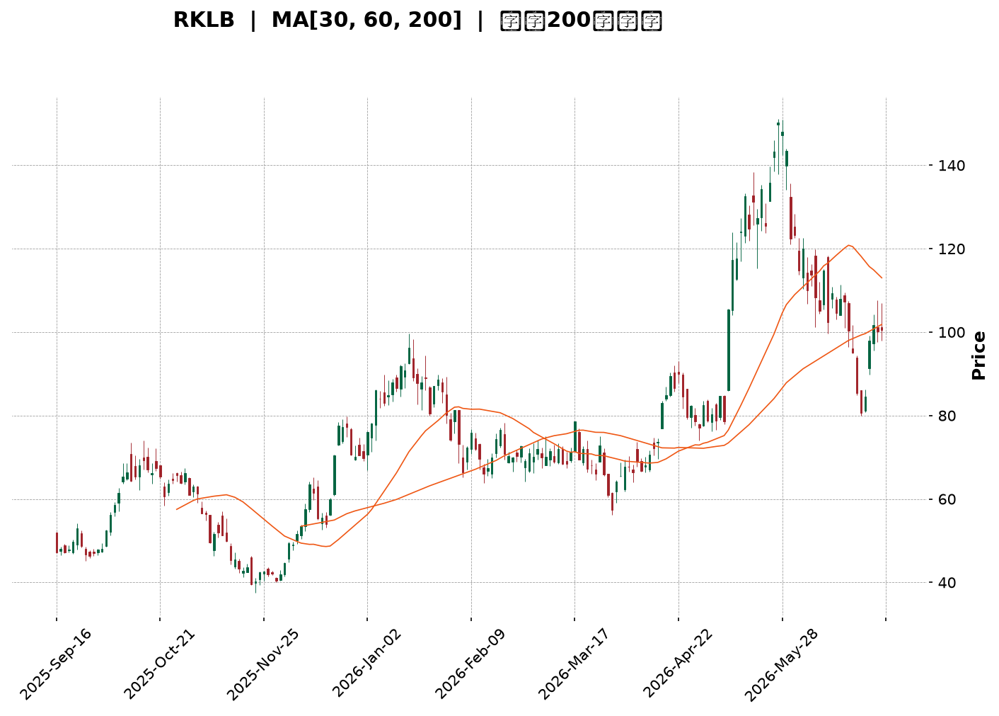
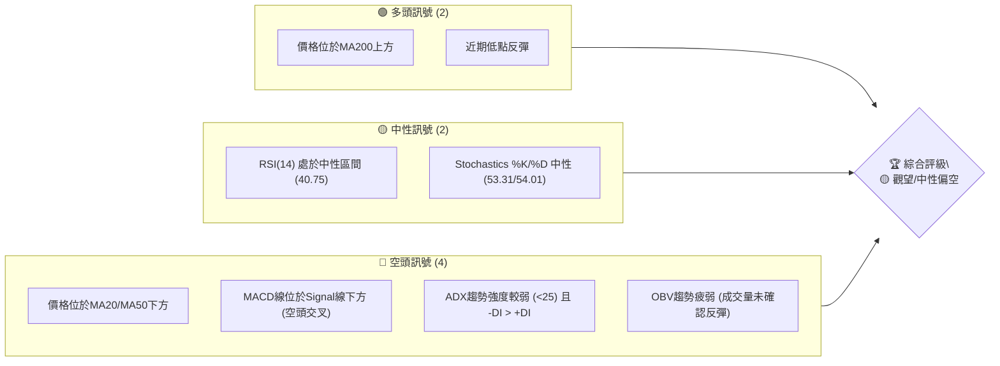
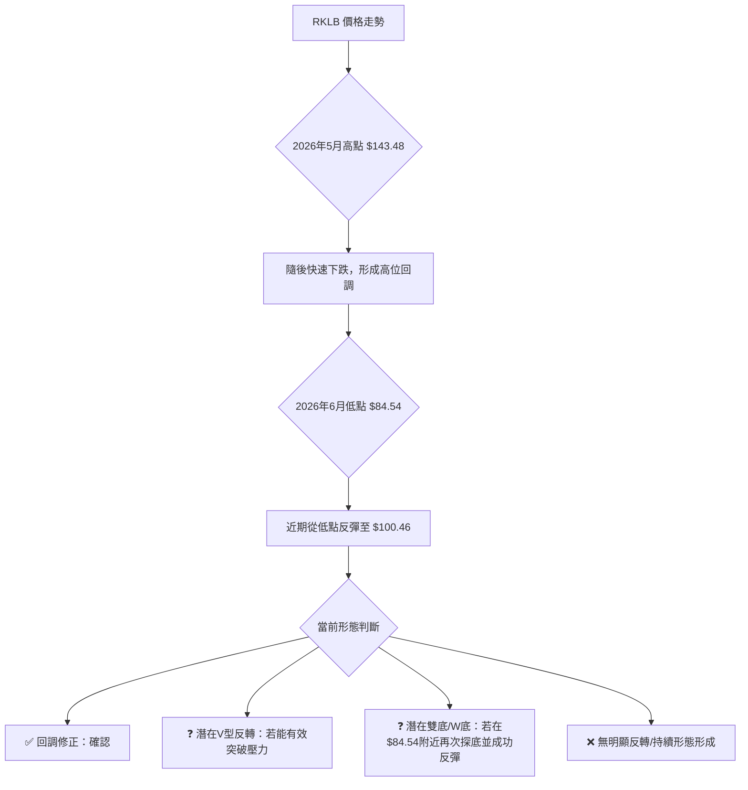
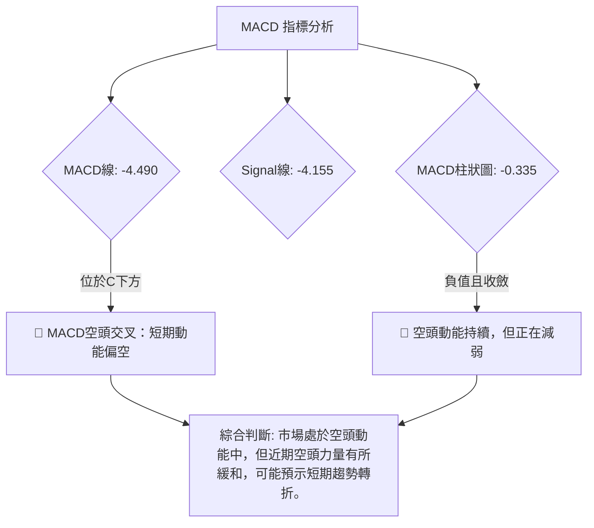
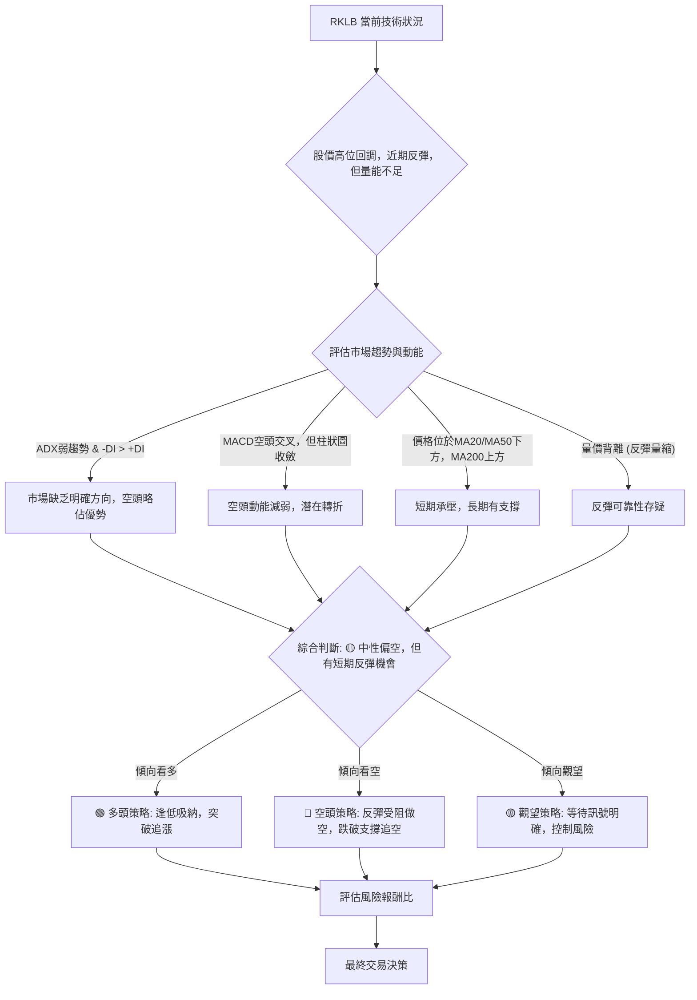

<details>
<summary>📊 靜態圖表 (點擊展開)</summary>

</details>

<html>
<head><meta charset="utf-8" /></head>
<body>
    <div style="height:500px; width:100%;">                        <script>window.PlotlyConfig = {MathJaxConfig: 'local'};</script>
        <script charset="utf-8" src="https://cdn.plot.ly/plotly-3.6.0.min.js" integrity="sha256-QaOVwtVY0T02VaHrr6pnoHLCwayMJp4O5n4YyaE3rJk=" crossorigin="anonymous"></script>                <div id="candlestick-chart" class="plotly-graph-div" style="height:100%; width:100%;"></div>            <script>                window.PLOTLYENV=window.PLOTLYENV || {};                                if (document.getElementById("candlestick-chart")) {                    Plotly.newPlot(                        "candlestick-chart",                        [{"close":{"dtype":"f8","bdata":"AAAAIFyfR0AAAACAPQpIQAAAAEAKl0dAAAAAwB7lR0AAAAAgrudIQAAAAOB6dEpAAAAA4FFYSEAAAADgo1BHQAAAAKBHIUdAAAAAoEeBR0AAAADgevRHQAAAAAAp\u002fEdAAAAAACk8SkAAAADgehRMQAAAAAAAQE1AAAAAoEfBTkAAAAAA11NQQAAAAEDhmlBAAAAA4KMQUEAAAABA4VpQQAAAAIDrAVFAAAAAoEdRUUAAAAAAAMBQQAAAAKBHkVBAAAAAYGbWUEAAAACgmVlQQAAAAOBRSE5AAAAAwPXIT0AAAAAA1yNQQAAAACCuZ1BAAAAAAADgT0AAAACAPYpQQAAAAIDCdU5AAAAAoHB9T0AAAAAghatOQAAAAMD1SExAAAAAgMI1TEAAAACAFM5IQAAAAIDr0UlAAAAAQDPzSUAAAABguJ5JQAAAAAAp\u002fEhAAAAAAACgRkAAAADAHsVGQAAAACCup0VAAAAAANdjRUAAAAAgXM9FQAAAAKBwvUNAAAAAYGYmREAAAACgmTlFQAAAAMDMTEVAAAAAQAr3REAAAACA6xFFQAAAACBcL0RAAAAAQDPzREAAAAAAKVxGQAAAACBcr0hAAAAAQAqHSEAAAAAgrsdJQAAAAEAKt0pAAAAAYI\u002fCTEAAAAAA18NPQAAAAGC4vk5AAAAA4Hq0S0AAAABguL5LQAAAAEDh+kpAAAAAgML1TUAAAACgR6FRQAAAAEAzY1NAAAAAIIVLU0AAAAAghUtTQAAAAKCZqVFAAAAAIK6HUUAAAADAzJxRQAAAAOCjcFFAAAAAIFz\u002fUkAAAADA9YhTQAAAAIDrgVVAAAAAwB4FVUAAAADAHsVUQAAAAGBmNlVAAAAAoJn5VUAAAADAHqVVQAAAAEAz81ZAAAAA4KOwVkAAAABAMxNYQAAAAIA9SlZAAAAA4Hr0VUAAAABguP5VQAAAAKCZOVZAAAAAYLgeVEAAAAAAAMBVQAAAAOB6JFZAAAAAIIVrVUAAAADgegRUQAAAAKCZiVJAAAAAoEdRVEAAAABACkdSQAAAAOB6lFBAAAAA4HoUUkAAAACAwvVSQAAAAIDrAVJAAAAAIK5nUUAAAADgo4BQQAAAAAAp3FBAAAAAwPV4UUAAAABA4ZpSQAAAAMAeJVNAAAAAQAq3UUAAAACgcI1RQAAAAIAUflFAAAAAwMyMUUAAAACgmSlSQAAAAGBmRlFAAAAAgBS+UUAAAADgUYhRQAAAAIA9+lFAAAAAAACAUUAAAABACodRQAAAAGC43lFAAAAAIIU7UUAAAACgcP1RQAAAACCuF1FAAAAAgD0aUUAAAAAA19NRQAAAAIDCpVNAAAAAYLheUUAAAAAghftRQAAAAGC4zlBAAAAAAAAAUUAAAADgeoRQQAAAAOBROFJAAAAAACl8UEAAAABACndOQAAAAOCjsExAAAAAgBQOUEAAAACgR2FQQAAAAGC47lBAAAAAQOHqUEAAAADgepRQQAAAAMAeRVFAAAAAIFyvUEAAAABAMwNRQAAAACCup1FAAAAAgBQOUkAAAABgZmZSQAAAACCFu1RAAAAAQDMzVUAAAACgcF1WQAAAAMD1qFVAAAAAYI+CVkAAAABgZiZVQAAAACCF61NAAAAAYI+SVEAAAACAwqVTQAAAAKBHQVNAAAAA4KOgVEAAAAAA17NTQAAAAADXE1RAAAAA4KOwU0AAAACgmSlVQAAAAMAepVNAAAAAgBReWkAAAABgZlZdQAAAAADXY11AAAAAoJkJX0AAAACgmZFgQAAAAKBHMV9AAAAAwB5lYEAAAAAA19NfQAAAAMD1yGBAAAAAwMxcX0AAAADgUfhgQAAAAGBm5mFAAAAAIFzHYkAAAADA9YBiQAAAACBc72FAAAAAwPWYXkAAAADgetReQAAAAMDMrFxAAAAAwMz8XUAAAADAHoVbQAAAAKCZaVxAAAAAYLgOW0AAAABAM0NaQAAAAIDrsVxAAAAAwPWYWUAAAAAAAFBbQAAAAOBRKFpAAAAAYLj+WkAAAAAgXM9aQAAAAGCPEllAAAAAIK7HV0AAAACAPVpVQAAAAAApLFRAAAAAYI8iVUAAAADgo4BYQAAAAKCZaVlAAAAA4HoEWUAAAACgcB1ZQA=="},"high":{"dtype":"f8","bdata":"AAAAgD0KSkAAAADAHkVIQAAAAOBRmEhAAAAAQAp3SEAAAACgRyFJQAAAAGA5FEtAAAAAoHA9SkAAAAAgXE9IQAAAAOBR2EdAAAAAwMwMSEAAAABguP5HQAAAAIDCtUhAAAAAQDNTSkAAAAAgMXhMQAAAAKBHoU1AAAAAIK5HT0AAAAAALSJRQAAAAGCPIlFAAAAAAABgUkAAAAAAKZxRQAAAAEDhalFAAAAAgBR+UkAAAAAAABBSQAAAAAAAIFFAAAAAIIULUkAAAABgjwJRQAAAAKBHAVBAAAAAwMwsUEAAAAAghYtQQAAAAGBmllBAAAAAYI+iUEAAAADA9dhQQAAAACCFS1BAAAAAoJm5T0AAAADAzIxPQAAAAGC4vk1AAAAAANejTEAAAABA4RpMQAAAAMDMDEpAAAAAAABAS0AAAABA4XpMQAAAAIA9qktAAAAA4KOwSEAAAAAAKZxHQAAAAMBL10ZAAAAAgBTORUAAAAAA10NGQAAAAKBHIUdAAAAAgMKFREAAAAAA10NFQAAAAEAKZ0VAAAAAIIXLRUAAAACgmVlFQAAAAGBmpkRAAAAAYLh+RUAAAABguF5GQAAAAEAK10hAAAAAoJnZSEAAAAAgXC9KQAAAAAAA4EpAAAAAgD1qTUAAAACgmQlQQAAAACCFS1BAAAAAANcjUEAAAACgcF1MQAAAAOB6dExAAAAAAAAgTkAAAAAA16NRQAAAAMDMnFNAAAAAIIXLU0AAAADAHvVTQAAAACBcP1NAAAAAIFwvUkAAAAAAKaxSQAAAAECLTFJAAAAAIFwPU0AAAAAAAJBTQAAAAAAAkFVAAAAAoHB9VUAAAAAgrndWQAAAACCFG1ZAAAAAgMI1VkAAAADgp25WQAAAAAApDFdAAAAAQGAdV0AAAADAHuVYQAAAAKBHkVhAAAAAAADQVkAAAACgmVlWQAAAAMDMnFdAAAAAgD3KVUAAAAAAAMBVQAAAAEAzc1ZAAAAAAABAVkAAAADgelRWQAAAAMDMLFRAAAAA4HpUVEAAAABgZlZUQAAAACBcP1JAAAAAgD0qUkAAAABAMzNTQAAAAEAK91JAAAAAoJlZUkAAAADAzBxRQAAAAGBmZlFAAAAAIFy\u002fUUAAAADA9fBSQAAAAEAKR1NAAAAAwMyMU0AAAAAAANBRQAAAACCFg1FAAAAAYGb2UUAAAAAgXC9SQAAAAIDCZVFAAAAAYGYGUkAAAAAAAFBSQAAAAGBmhlJAAAAAANcTUkAAAABACsdSQAAAAAAACFJAAAAAANc7UkAAAABAM1NSQAAAAGBmJlJAAAAAANfTUUAAAADgURhSQAAAAEDhqlNAAAAA4FE4U0AAAABguC5SQAAAAGC4flJAAAAAwMxcUUAAAABgZiZRQAAAAADXw1JAAAAAgMIFUkAAAACAFIZQQAAAAIDr0U5AAAAAwB4lUEAAAABA4SpRQAAAAMD1WFFAAAAA4HqUUUAAAABAMxNRQAAAAIDAalJAAAAAYI9yUUAAAAAA14NRQAAAAEAz41FAAAAAAACwUkAAAACAwqVSQAAAACBc31RAAAAAIFy\u002fVUAAAABgZpZWQAAAAMDM\u002fFZAAAAAYGZGV0AAAABAM5NWQAAAAIA9mlVAAAAAYLieVEAAAACA63FUQAAAAOCjgFNAAAAAgMLlVEAAAABgj\u002fJUQAAAAOBPdVRAAAAAAADAVEAAAAAghStVQAAAAGCPMlVAAAAAIK5nWkAAAAAAKfxeQAAAACBcX15AAAAAIFzPX0AAAACAwqVgQAAAAADXS2BAAAAAAClMYUAAAACAPTJgQAAAAEAz62BAAAAAANdbYEAAAADgUXhhQAAAAAAAQGJAAAAAAADgYkAAAABgj9piQAAAAAAAAGJAAAAAACn0YEAAAADAzAxgQAAAAOBRoF5AAAAA4FGoXkAAAABguH5dQAAAAAAAEF1AAAAAYI\u002fyXUAAAACgcP1bQAAAAEDhwlxAAAAAwCCYXUAAAACA67FbQAAAAAAAIFtAAAAAgMLVW0AAAABAM2NbQAAAAKCZ2VpAAAAAYLhuWUAAAABAM5NXQAAAAEAKh1VAAAAAgOuRVUAAAADAHsVYQAAAAIA9ClpAAAAAYGbmWkAAAAAgXL9aQA=="},"hovertemplate":"\u003cb\u003e%{x|%Y-%m-%d}\u003c\u002fb\u003e\u003cbr\u003e\u958b: $%{open:.2f}\u003cbr\u003e\u9ad8: $%{high:.2f}\u003cbr\u003e\u4f4e: $%{low:.2f}\u003cbr\u003e\u6536: $%{close:.2f}\u003cextra\u003e\u003c\u002fextra\u003e","low":{"dtype":"f8","bdata":"AAAAoEeBR0AAAACgmTlHQAAAAAAAgEdAAAAA4KOQR0AAAABgZmZHQAAAAOB69EdAAAAAQAo3SEAAAABA4ZpGQAAAAIA96kZAAAAAIFwvR0AAAACgR0FHQAAAACBcj0dAAAAAoEdBSEAAAACgR6FJQAAAAGBm5ktAAAAAYI+CTEAAAABAM9NPQAAAAEDhGlBAAAAAwPUIUEAAAADgzidQQAAAAOBRGE9AAAAAwB7FUEAAAABAM5tQQAAAAKCZ2U9AAAAAQDOrUEAAAABACjdQQAAAAOB6NE1AAAAAAABgTkAAAABAM9NPQAAAAKCZCVBAAAAAgBTOT0AAAACgcL1PQAAAAIDrcU5AAAAAQDMzTkAAAADgo5BNQAAAAKBHQUxAAAAAIFxvS0AAAADgerRIQAAAAODOJ0dAAAAAoEdhSUAAAABA4ZpJQAAAAOB61EhAAAAAIFwvRkAAAABgZqZFQAAAAMDMHEVAAAAAoHCdREAAAABACjdFQAAAAMD1qENAAAAAwPXIQkAAAABgZqZDQAAAAOCjMERAAAAA4KOwREAAAABgZuZEQAAAAKBw\u002fUNAAAAAgMI1REAAAAAAAMBEQAAAAMD1aEZAAAAAoJnZR0AAAAAAKZxIQAAAACCFK0lAAAAAAAAgSkAAAADAzGxMQAAAAGBm5k1AAAAAgD2KS0AAAABACldKQAAAAEDhikpAAAAAANcDTEAAAADAnV9OQAAAAMAgMFJAAAAAYI9SUkAAAACgQ7NSQAAAAMD1mFFAAAAAoJtUUUAAAAAAKZxRQAAAAOBRSFFAAAAAYGa2UEAAAAAA19NRQAAAAEAzg1JAAAAAYGZ2VEAAAADgo5BUQAAAAMDMnFRAAAAA4NDaVEAAAACgmWlVQAAAAAAAIFVAAAAAoJmpVUAAAACgmRlXQAAAAEAzE1ZAAAAAoHCtVEAAAADAdlZUQAAAACCuh1VAAAAA4KMAVEAAAAAAAIBUQAAAAMDKgVVAAAAAAADAVEAAAACgR4FTQAAAAIBBeFJAAAAAoEfxUkAAAABACCRRQAAAAMDMTFBAAAAAAADAUEAAAAAAALBRQAAAAEAz41FAAAAAoEfBUEAAAAAgXO9PQAAAAAAAYFBAAAAAAABAUEAAAADAS39RQAAAAGBmFlJAAAAAoJlZUUAAAAAAACBRQAAAAGBmplBAAAAA4FE4UUAAAAAA1zNRQAAAAGBmBlBAAAAAwMycUEAAAAAAKYxQQAAAAIAUXlFAAAAAgMLVUEAAAADgowhRQAAAAOB69FBAAAAAgL4nUUAAAADAHhVRQAAAAIDrEVFAAAAAACncUEAAAABA4SpRQAAAAKBH0VFAAAAAoJlZUUAAAAAAAABRQAAAAMD1mFBAAAAAQDODUEAAAACgcB1QQAAAAAApPFFAAAAAgMJlUEAAAADAzCxOQAAAAGDlEExAAAAAANeDTUAAAABAM1NQQAAAAIAU7k5AAAAAYGamUEAAAABA4fpPQAAAAGDn81BAAAAAQOGiUEAAAACAwpVQQAAAAIDCpVBAAAAAYLieUUAAAABgZmZRQAAAAKCZOVNAAAAAYGbmVEAAAABgZiZVQAAAAAAAcFVAAAAA4KPwVUAAAAAAKWRUQAAAAMAexVNAAAAAwHRDU0AAAABgZmZTQAAAACBcf1JAAAAAgBReU0AAAAAghZtTQAAAAAAAEFNAAAAAANcjU0AAAABACrdTQAAAACCFe1NAAAAAIK53VUAAAAAAAABaQAAAAIA9GlxAAAAAwPU4XUAAAAAA11NeQAAAAEAzc15AAAAAoPFqX0AAAABguM5cQAAAAIAUDl9AAAAAQDPzXkAAAACA62lgQAAAAIDrUWFAAAAAwB49YUAAAAAA18thQAAAAKCZwWBAAAAAAABAXkAAAAAA16NeQAAAAIA9alxAAAAAwPWYW0AAAABguK5aQAAAAAAAwFtAAAAAwMxMWUAAAACAPRpaQAAAAKCZWVpAAAAAQArnWEAAAABAM3NaQAAAAOB6xFlAAAAAYI8CWkAAAACgcD1ZQAAAAAAAIFhAAAAA4KO4V0AAAABgZjZVQAAAAAAAAFRAAAAAYLguVEAAAABgZnZWQAAAAMD16FdAAAAAIK5nWEAAAABAM3tYQA=="},"name":"\u50f9\u683c","open":{"dtype":"f8","bdata":"AAAAAAAASkAAAADgUchHQAAAAIDCdUhAAAAAQArXR0AAAADgo5BHQAAAAEAzg0hAAAAAgMLlSUAAAAAAAABIQAAAAGBmpkdAAAAAQDOzR0AAAABA4ZpHQAAAAOCjsEdAAAAAgOtRSEAAAABgZgZKQAAAAGC4bkxAAAAAoEeBTUAAAACgmQlQQAAAAKCZOVBAAAAAQDOzUUAAAADgUfhQQAAAAIDCVVBAAAAAoEeBUUAAAADgeoRRQAAAAMD1eFBAAAAA4KNIUUAAAABgjwJRQAAAAAApfE9AAAAAIK7HTkAAAAAA1zNQQAAAAAApjFBAAAAAQDNrUEAAAACgRwlQQAAAAAAAQFBAAAAAYI\u002fiTkAAAAAA14NPQAAAAGBm5kxAAAAA4HpUTEAAAABA4RpMQAAAAKAY1EdAAAAAYLjeSkAAAAAAAABMQAAAAEAK90lAAAAAoEdhSEAAAABA4dpFQAAAAEAzk0ZAAAAAACkcRUAAAAAAAEBFQAAAAIA9CkdAAAAAgD3qQ0AAAACgR2FEQAAAAADXA0VAAAAAYLieRUAAAACgR0FFQAAAAEAzk0RAAAAAIK5HREAAAABgj\u002fJEQAAAAGCP0kZAAAAAAABwSEAAAACAPQpJQAAAAKBwnUlAAAAA4FG4SkAAAACgR8FMQAAAAAAAQE9AAAAA4KeGT0AAAADgURhLQAAAAMDMDExAAAAAoJkZTEAAAAAgXI9OQAAAAAApPFJAAAAAANdzUkAAAACAPYJTQAAAACCFK1NAAAAAAABgUUAAAACgmUFSQAAAAAAA4FFAAAAA4FGoUUAAAAAgrqdSQAAAAOCjcFNAAAAAYGYGVUAAAAAAAGBVQAAAAKCZIVVAAAAAYLg+VUAAAADA9UhWQAAAAGBmllVAAAAAwPVQVkAAAACgmSFXQAAAAMDMbFdAAAAAoEeBVkAAAADgUZhVQAAAACCFQ1ZAAAAAIK6vVUAAAADA9bhUQAAAAIAUzlVAAAAAACn8VUAAAAAAAEBVQAAAAIA9ylNAAAAAYGamU0AAAABgZlZUQAAAAGC4flFAAAAAAABAUUAAAACgmQFSQAAAAIAUplJAAAAA4FFIUkAAAACA6+FQQAAAAOB6rFBAAAAAQGCFUEAAAAAAAMBRQAAAAKCZOVJAAAAAINneUkAAAADgUTBRQAAAAOBROFFAAAAAgBTGUUAAAABA4YJRQAAAAIDC5VBAAAAAIIWrUEAAAABguDZRQAAAAADXs1FAAAAAQOG6UUAAAADgowhRQAAAAMD1WFFAAAAAgMKVUUAAAABAMzNRQAAAAMDM\u002fFFAAAAAoJlJUUAAAADAzFRRQAAAAGBm3lFAAAAAYI8CU0AAAADgejRRQAAAAAAAAFJAAAAAoHAFUUAAAAAAAMBQQAAAAAApPFFAAAAAwMzMUUAAAADgo4BQQAAAAKCZuU5AAAAAQOHaTkAAAAAAAGBQQAAAAMDMHE9AAAAAYLjuUEAAAAAgXMdQQAAAAAAAAFJAAAAAANdDUUAAAADAzOxQQAAAAEAzw1BAAAAAIIVjUkAAAACgcGVSQAAAAIAUPlNAAAAAwB4FVUAAAABgZjZVQAAAAMAelVZAAAAAgMKdVkAAAABgZnZWQAAAAIDClVVAAAAAACnsU0AAAADAzARUQAAAAEAKd1NAAAAAQDNjU0AAAACA6+FUQAAAAEAKl1NAAAAAYGamVEAAAAAgrudTQAAAAKBwLVVAAAAAgD2CVUAAAACgR1FaQAAAAOCjMFxAAAAAoEf5XkAAAABgZsZeQAAAAEAzA2BAAAAAACmYYEAAAACAFH5fQAAAAGC43l9AAAAAwPWIX0AAAADAHm1gQAAAAEDhvmFAAAAAQAq3YkAAAACgcGViQAAAAIAUfmFAAAAAACmMYEAAAACAwlVfQAAAAMAe5V1AAAAAoHBFXEAAAACgR5FcQAAAAEDhqlxAAAAAoJmZXUAAAADAzOxaQAAAAIDCpVpAAAAAoEeBXUAAAACgcP1aQAAAAKBw7VpAAAAAIK4HWkAAAADAHjVbQAAAACBcv1pAAAAAoEcBWEAAAABgZnZXQAAAAEAKh1VAAAAAQApHVEAAAABA4dJWQAAAAMDMTFhAAAAA4HpMWUAAAADgUUhZQA=="},"x":["2025-09-16T00:00:00-04:00","2025-09-17T00:00:00-04:00","2025-09-18T00:00:00-04:00","2025-09-19T00:00:00-04:00","2025-09-22T00:00:00-04:00","2025-09-23T00:00:00-04:00","2025-09-24T00:00:00-04:00","2025-09-25T00:00:00-04:00","2025-09-26T00:00:00-04:00","2025-09-29T00:00:00-04:00","2025-09-30T00:00:00-04:00","2025-10-01T00:00:00-04:00","2025-10-02T00:00:00-04:00","2025-10-03T00:00:00-04:00","2025-10-06T00:00:00-04:00","2025-10-07T00:00:00-04:00","2025-10-08T00:00:00-04:00","2025-10-09T00:00:00-04:00","2025-10-10T00:00:00-04:00","2025-10-13T00:00:00-04:00","2025-10-14T00:00:00-04:00","2025-10-15T00:00:00-04:00","2025-10-16T00:00:00-04:00","2025-10-17T00:00:00-04:00","2025-10-20T00:00:00-04:00","2025-10-21T00:00:00-04:00","2025-10-22T00:00:00-04:00","2025-10-23T00:00:00-04:00","2025-10-24T00:00:00-04:00","2025-10-27T00:00:00-04:00","2025-10-28T00:00:00-04:00","2025-10-29T00:00:00-04:00","2025-10-30T00:00:00-04:00","2025-10-31T00:00:00-04:00","2025-11-03T00:00:00-05:00","2025-11-04T00:00:00-05:00","2025-11-05T00:00:00-05:00","2025-11-06T00:00:00-05:00","2025-11-07T00:00:00-05:00","2025-11-10T00:00:00-05:00","2025-11-11T00:00:00-05:00","2025-11-12T00:00:00-05:00","2025-11-13T00:00:00-05:00","2025-11-14T00:00:00-05:00","2025-11-17T00:00:00-05:00","2025-11-18T00:00:00-05:00","2025-11-19T00:00:00-05:00","2025-11-20T00:00:00-05:00","2025-11-21T00:00:00-05:00","2025-11-24T00:00:00-05:00","2025-11-25T00:00:00-05:00","2025-11-26T00:00:00-05:00","2025-11-28T00:00:00-05:00","2025-12-01T00:00:00-05:00","2025-12-02T00:00:00-05:00","2025-12-03T00:00:00-05:00","2025-12-04T00:00:00-05:00","2025-12-05T00:00:00-05:00","2025-12-08T00:00:00-05:00","2025-12-09T00:00:00-05:00","2025-12-10T00:00:00-05:00","2025-12-11T00:00:00-05:00","2025-12-12T00:00:00-05:00","2025-12-15T00:00:00-05:00","2025-12-16T00:00:00-05:00","2025-12-17T00:00:00-05:00","2025-12-18T00:00:00-05:00","2025-12-19T00:00:00-05:00","2025-12-22T00:00:00-05:00","2025-12-23T00:00:00-05:00","2025-12-24T00:00:00-05:00","2025-12-26T00:00:00-05:00","2025-12-29T00:00:00-05:00","2025-12-30T00:00:00-05:00","2025-12-31T00:00:00-05:00","2026-01-02T00:00:00-05:00","2026-01-05T00:00:00-05:00","2026-01-06T00:00:00-05:00","2026-01-07T00:00:00-05:00","2026-01-08T00:00:00-05:00","2026-01-09T00:00:00-05:00","2026-01-12T00:00:00-05:00","2026-01-13T00:00:00-05:00","2026-01-14T00:00:00-05:00","2026-01-15T00:00:00-05:00","2026-01-16T00:00:00-05:00","2026-01-20T00:00:00-05:00","2026-01-21T00:00:00-05:00","2026-01-22T00:00:00-05:00","2026-01-23T00:00:00-05:00","2026-01-26T00:00:00-05:00","2026-01-27T00:00:00-05:00","2026-01-28T00:00:00-05:00","2026-01-29T00:00:00-05:00","2026-01-30T00:00:00-05:00","2026-02-02T00:00:00-05:00","2026-02-03T00:00:00-05:00","2026-02-04T00:00:00-05:00","2026-02-05T00:00:00-05:00","2026-02-06T00:00:00-05:00","2026-02-09T00:00:00-05:00","2026-02-10T00:00:00-05:00","2026-02-11T00:00:00-05:00","2026-02-12T00:00:00-05:00","2026-02-13T00:00:00-05:00","2026-02-17T00:00:00-05:00","2026-02-18T00:00:00-05:00","2026-02-19T00:00:00-05:00","2026-02-20T00:00:00-05:00","2026-02-23T00:00:00-05:00","2026-02-24T00:00:00-05:00","2026-02-25T00:00:00-05:00","2026-02-26T00:00:00-05:00","2026-02-27T00:00:00-05:00","2026-03-02T00:00:00-05:00","2026-03-03T00:00:00-05:00","2026-03-04T00:00:00-05:00","2026-03-05T00:00:00-05:00","2026-03-06T00:00:00-05:00","2026-03-09T00:00:00-04:00","2026-03-10T00:00:00-04:00","2026-03-11T00:00:00-04:00","2026-03-12T00:00:00-04:00","2026-03-13T00:00:00-04:00","2026-03-16T00:00:00-04:00","2026-03-17T00:00:00-04:00","2026-03-18T00:00:00-04:00","2026-03-19T00:00:00-04:00","2026-03-20T00:00:00-04:00","2026-03-23T00:00:00-04:00","2026-03-24T00:00:00-04:00","2026-03-25T00:00:00-04:00","2026-03-26T00:00:00-04:00","2026-03-27T00:00:00-04:00","2026-03-30T00:00:00-04:00","2026-03-31T00:00:00-04:00","2026-04-01T00:00:00-04:00","2026-04-02T00:00:00-04:00","2026-04-06T00:00:00-04:00","2026-04-07T00:00:00-04:00","2026-04-08T00:00:00-04:00","2026-04-09T00:00:00-04:00","2026-04-10T00:00:00-04:00","2026-04-13T00:00:00-04:00","2026-04-14T00:00:00-04:00","2026-04-15T00:00:00-04:00","2026-04-16T00:00:00-04:00","2026-04-17T00:00:00-04:00","2026-04-20T00:00:00-04:00","2026-04-21T00:00:00-04:00","2026-04-22T00:00:00-04:00","2026-04-23T00:00:00-04:00","2026-04-24T00:00:00-04:00","2026-04-27T00:00:00-04:00","2026-04-28T00:00:00-04:00","2026-04-29T00:00:00-04:00","2026-04-30T00:00:00-04:00","2026-05-01T00:00:00-04:00","2026-05-04T00:00:00-04:00","2026-05-05T00:00:00-04:00","2026-05-06T00:00:00-04:00","2026-05-07T00:00:00-04:00","2026-05-08T00:00:00-04:00","2026-05-11T00:00:00-04:00","2026-05-12T00:00:00-04:00","2026-05-13T00:00:00-04:00","2026-05-14T00:00:00-04:00","2026-05-15T00:00:00-04:00","2026-05-18T00:00:00-04:00","2026-05-19T00:00:00-04:00","2026-05-20T00:00:00-04:00","2026-05-21T00:00:00-04:00","2026-05-22T00:00:00-04:00","2026-05-26T00:00:00-04:00","2026-05-27T00:00:00-04:00","2026-05-28T00:00:00-04:00","2026-05-29T00:00:00-04:00","2026-06-01T00:00:00-04:00","2026-06-02T00:00:00-04:00","2026-06-03T00:00:00-04:00","2026-06-04T00:00:00-04:00","2026-06-05T00:00:00-04:00","2026-06-08T00:00:00-04:00","2026-06-09T00:00:00-04:00","2026-06-10T00:00:00-04:00","2026-06-11T00:00:00-04:00","2026-06-12T00:00:00-04:00","2026-06-15T00:00:00-04:00","2026-06-16T00:00:00-04:00","2026-06-17T00:00:00-04:00","2026-06-18T00:00:00-04:00","2026-06-22T00:00:00-04:00","2026-06-23T00:00:00-04:00","2026-06-24T00:00:00-04:00","2026-06-25T00:00:00-04:00","2026-06-26T00:00:00-04:00","2026-06-29T00:00:00-04:00","2026-06-30T00:00:00-04:00","2026-07-01T00:00:00-04:00","2026-07-02T00:00:00-04:00"],"type":"candlestick"},{"hovertemplate":"MA30: $%{y:.2f}\u003cextra\u003e\u003c\u002fextra\u003e","line":{"color":"#2196F3","dash":"dash","width":2},"mode":"lines","name":"MA30","x":["2025-09-16T00:00:00-04:00","2025-09-17T00:00:00-04:00","2025-09-18T00:00:00-04:00","2025-09-19T00:00:00-04:00","2025-09-22T00:00:00-04:00","2025-09-23T00:00:00-04:00","2025-09-24T00:00:00-04:00","2025-09-25T00:00:00-04:00","2025-09-26T00:00:00-04:00","2025-09-29T00:00:00-04:00","2025-09-30T00:00:00-04:00","2025-10-01T00:00:00-04:00","2025-10-02T00:00:00-04:00","2025-10-03T00:00:00-04:00","2025-10-06T00:00:00-04:00","2025-10-07T00:00:00-04:00","2025-10-08T00:00:00-04:00","2025-10-09T00:00:00-04:00","2025-10-10T00:00:00-04:00","2025-10-13T00:00:00-04:00","2025-10-14T00:00:00-04:00","2025-10-15T00:00:00-04:00","2025-10-16T00:00:00-04:00","2025-10-17T00:00:00-04:00","2025-10-20T00:00:00-04:00","2025-10-21T00:00:00-04:00","2025-10-22T00:00:00-04:00","2025-10-23T00:00:00-04:00","2025-10-24T00:00:00-04:00","2025-10-27T00:00:00-04:00","2025-10-28T00:00:00-04:00","2025-10-29T00:00:00-04:00","2025-10-30T00:00:00-04:00","2025-10-31T00:00:00-04:00","2025-11-03T00:00:00-05:00","2025-11-04T00:00:00-05:00","2025-11-05T00:00:00-05:00","2025-11-06T00:00:00-05:00","2025-11-07T00:00:00-05:00","2025-11-10T00:00:00-05:00","2025-11-11T00:00:00-05:00","2025-11-12T00:00:00-05:00","2025-11-13T00:00:00-05:00","2025-11-14T00:00:00-05:00","2025-11-17T00:00:00-05:00","2025-11-18T00:00:00-05:00","2025-11-19T00:00:00-05:00","2025-11-20T00:00:00-05:00","2025-11-21T00:00:00-05:00","2025-11-24T00:00:00-05:00","2025-11-25T00:00:00-05:00","2025-11-26T00:00:00-05:00","2025-11-28T00:00:00-05:00","2025-12-01T00:00:00-05:00","2025-12-02T00:00:00-05:00","2025-12-03T00:00:00-05:00","2025-12-04T00:00:00-05:00","2025-12-05T00:00:00-05:00","2025-12-08T00:00:00-05:00","2025-12-09T00:00:00-05:00","2025-12-10T00:00:00-05:00","2025-12-11T00:00:00-05:00","2025-12-12T00:00:00-05:00","2025-12-15T00:00:00-05:00","2025-12-16T00:00:00-05:00","2025-12-17T00:00:00-05:00","2025-12-18T00:00:00-05:00","2025-12-19T00:00:00-05:00","2025-12-22T00:00:00-05:00","2025-12-23T00:00:00-05:00","2025-12-24T00:00:00-05:00","2025-12-26T00:00:00-05:00","2025-12-29T00:00:00-05:00","2025-12-30T00:00:00-05:00","2025-12-31T00:00:00-05:00","2026-01-02T00:00:00-05:00","2026-01-05T00:00:00-05:00","2026-01-06T00:00:00-05:00","2026-01-07T00:00:00-05:00","2026-01-08T00:00:00-05:00","2026-01-09T00:00:00-05:00","2026-01-12T00:00:00-05:00","2026-01-13T00:00:00-05:00","2026-01-14T00:00:00-05:00","2026-01-15T00:00:00-05:00","2026-01-16T00:00:00-05:00","2026-01-20T00:00:00-05:00","2026-01-21T00:00:00-05:00","2026-01-22T00:00:00-05:00","2026-01-23T00:00:00-05:00","2026-01-26T00:00:00-05:00","2026-01-27T00:00:00-05:00","2026-01-28T00:00:00-05:00","2026-01-29T00:00:00-05:00","2026-01-30T00:00:00-05:00","2026-02-02T00:00:00-05:00","2026-02-03T00:00:00-05:00","2026-02-04T00:00:00-05:00","2026-02-05T00:00:00-05:00","2026-02-06T00:00:00-05:00","2026-02-09T00:00:00-05:00","2026-02-10T00:00:00-05:00","2026-02-11T00:00:00-05:00","2026-02-12T00:00:00-05:00","2026-02-13T00:00:00-05:00","2026-02-17T00:00:00-05:00","2026-02-18T00:00:00-05:00","2026-02-19T00:00:00-05:00","2026-02-20T00:00:00-05:00","2026-02-23T00:00:00-05:00","2026-02-24T00:00:00-05:00","2026-02-25T00:00:00-05:00","2026-02-26T00:00:00-05:00","2026-02-27T00:00:00-05:00","2026-03-02T00:00:00-05:00","2026-03-03T00:00:00-05:00","2026-03-04T00:00:00-05:00","2026-03-05T00:00:00-05:00","2026-03-06T00:00:00-05:00","2026-03-09T00:00:00-04:00","2026-03-10T00:00:00-04:00","2026-03-11T00:00:00-04:00","2026-03-12T00:00:00-04:00","2026-03-13T00:00:00-04:00","2026-03-16T00:00:00-04:00","2026-03-17T00:00:00-04:00","2026-03-18T00:00:00-04:00","2026-03-19T00:00:00-04:00","2026-03-20T00:00:00-04:00","2026-03-23T00:00:00-04:00","2026-03-24T00:00:00-04:00","2026-03-25T00:00:00-04:00","2026-03-26T00:00:00-04:00","2026-03-27T00:00:00-04:00","2026-03-30T00:00:00-04:00","2026-03-31T00:00:00-04:00","2026-04-01T00:00:00-04:00","2026-04-02T00:00:00-04:00","2026-04-06T00:00:00-04:00","2026-04-07T00:00:00-04:00","2026-04-08T00:00:00-04:00","2026-04-09T00:00:00-04:00","2026-04-10T00:00:00-04:00","2026-04-13T00:00:00-04:00","2026-04-14T00:00:00-04:00","2026-04-15T00:00:00-04:00","2026-04-16T00:00:00-04:00","2026-04-17T00:00:00-04:00","2026-04-20T00:00:00-04:00","2026-04-21T00:00:00-04:00","2026-04-22T00:00:00-04:00","2026-04-23T00:00:00-04:00","2026-04-24T00:00:00-04:00","2026-04-27T00:00:00-04:00","2026-04-28T00:00:00-04:00","2026-04-29T00:00:00-04:00","2026-04-30T00:00:00-04:00","2026-05-01T00:00:00-04:00","2026-05-04T00:00:00-04:00","2026-05-05T00:00:00-04:00","2026-05-06T00:00:00-04:00","2026-05-07T00:00:00-04:00","2026-05-08T00:00:00-04:00","2026-05-11T00:00:00-04:00","2026-05-12T00:00:00-04:00","2026-05-13T00:00:00-04:00","2026-05-14T00:00:00-04:00","2026-05-15T00:00:00-04:00","2026-05-18T00:00:00-04:00","2026-05-19T00:00:00-04:00","2026-05-20T00:00:00-04:00","2026-05-21T00:00:00-04:00","2026-05-22T00:00:00-04:00","2026-05-26T00:00:00-04:00","2026-05-27T00:00:00-04:00","2026-05-28T00:00:00-04:00","2026-05-29T00:00:00-04:00","2026-06-01T00:00:00-04:00","2026-06-02T00:00:00-04:00","2026-06-03T00:00:00-04:00","2026-06-04T00:00:00-04:00","2026-06-05T00:00:00-04:00","2026-06-08T00:00:00-04:00","2026-06-09T00:00:00-04:00","2026-06-10T00:00:00-04:00","2026-06-11T00:00:00-04:00","2026-06-12T00:00:00-04:00","2026-06-15T00:00:00-04:00","2026-06-16T00:00:00-04:00","2026-06-17T00:00:00-04:00","2026-06-18T00:00:00-04:00","2026-06-22T00:00:00-04:00","2026-06-23T00:00:00-04:00","2026-06-24T00:00:00-04:00","2026-06-25T00:00:00-04:00","2026-06-26T00:00:00-04:00","2026-06-29T00:00:00-04:00","2026-06-30T00:00:00-04:00","2026-07-01T00:00:00-04:00","2026-07-02T00:00:00-04:00"],"y":{"dtype":"f8","bdata":"AAAAAAAA+H8AAAAAAAD4fwAAAAAAAPh\u002fAAAAAAAA+H8AAAAAAAD4fwAAAAAAAPh\u002fAAAAAAAA+H8AAAAAAAD4fwAAAAAAAPh\u002fAAAAAAAA+H8AAAAAAAD4fwAAAAAAAPh\u002fAAAAAAAA+H8AAAAAAAD4fwAAAAAAAPh\u002fAAAAAAAA+H8AAAAAAAD4fwAAAAAAAPh\u002fAAAAAAAA+H8AAAAAAAD4fwAAAAAAAPh\u002fAAAAAAAA+H8AAAAAAAD4fwAAAAAAAPh\u002fAAAAAAAA+H8AAAAAAAD4fwAAAAAAAPh\u002fAAAAAAAA+H8AAAAAAAD4f7y7u6u5wExAiYiIiCUHTUB3d3e3SVRNQFVVVXXpjk1AzczM\u002fLjPTUAiIiLS6gBOQERERISIEE5AzczMvIMxTkARERGxOj5OQGZmZhYvVU5AZmZmRgxqTkBmZmaGQXhOQO\u002fu7g7KgE5ARERE5PthTkBVVVUFrDROQN7d3X3c801AZmZmVvKjTUAzMzMTZ0dNQJqZmWl11ExAMzMzszpuTEBmZmZWOQxMQO\u002fu7v64n0tA3t3dbRIrS0De3d2tAMFKQJqZmfl+UkpAq6qqyujlSUB3d3e3rI1JQKuqqsroXUlAq6qqivofSUBEREQUg+hIQImIiFiAtEhAZmZmhuuZSEC8u7vbso5IQERERHQhkUhA7+7u\u002ftRwSEDNzMw831dIQLy7u2u8TEhAq6qqWqtbSEBVVVWl4rRIQHd3d0dvI0lAd3d3x0uPSUDNzMws+f1JQAAAAEA1VkpAzczM7FHASkCJiIhImipLQM3MzLx0m0tAmpmZ6SYpTEBVVVX1b7xMQImIiPgMg01AiYiIaNg9TkBEREQ0M+tOQImIiHh3n09AREREfM0xUEDv7u6mm5BQQKuqqkpT\u002flBA3t3dXY9mUUDNzMzsmNRRQKuqqpJ7KVJAZmZmbi58UkC8u7ub4MlSQFVVVfWLFVNAZmZmLodGU0BmZmbumHhTQImIiDheslNAVVVVrfHyU0AiIiKiYSdUQBERERF0UlRAMzMzAwCAVEAAAACAhoVUQLy7u2uRbVRAZmZmNjNjVEBERERkV2BUQN7d3Q1JY1RAzczM\u002fDdiVECJiIgov1hUQBERESHMU1RAd3d3t8hGVECamZkZ2T5UQERERCSwKlRAIiIiQnwOVEBVVVWFB\u002fNTQO\u002fu7g5J01NA7+7ufoatU0C8u7vbzo9TQBEREaFhX1NAZmZmpik1U0BmZmZWVf1SQJqZmYmI2FJAERERcYSyUkCamZkJZYxSQFVVVWU7Z1JA3t3djZdOUkBVVVW1gS5SQBEREdFpA1JAiYiIGJLeUUB3d3f34ctRQLy7u8ta1VFAMzMz4zO8UUAzMzNzr7lRQO\u002fu7m6gu1FAMzMzI2myUUCrqqpqkZ1RQBEREaFhn1FAvLu724eXUUAAAACAsYxRQN7d3WU7d1FAq6qq0iJrUUBEREQ8JlhRQM3MzPRERVFAIiIiynY+UUDNzMxUKjZRQN7d3UVENFFA7+7upuIsUUCJiIhwEiNRQImIiJBQJlFAMzMzO\u002fsoUUCJiIhQYjBRQLy7u7PkR1FAIiIiendnUUAAAAAov5BRQBEREYkWsVFAERERaR\u002feUUARERGJFvlRQFVVVU03EVJAmpmZodMuUkAzMzN7Wz5SQFVVVQ0CO1JAMzMzK85WUkCJiIiQe2VSQERERPxigVJAmpmZYVeYUkAiIiKK+r9SQImIiIAjzFJA7+7uJnggU0BmZmb+1JhTQLy7u0s3GVRAERERERGZVEAzMzNjEChVQERERNS\u002foVVAZmZm1jEpVkAiIiKCTqtWQGZmZmZmNldAMzMz46WzV0AiIiKSGERYQM3MzOzu3lhAiYiIyFqFWUDNzMx8IyRaQLy7u9tPpVpAIiIiAoH1WkBVVVUVvT1bQFVVVZWZeVtA3t3dbWi5W0CJiIjow+9bQO\u002fu7g48OFxAIiIiwpJvXEAzMzNzBahcQCIiInKT+FxAMzMzk\u002fwiXUAAAADg7GNdQGZmZtbOl11Aq6qq2iTWXUAREREBVgZeQO\u002fu7o6mNF5AREREFJIeXkBVVVWVbtpdQGZmZqbGi11A7+7uTkY3XUDNzMzclu1cQDMzM0NEvFxAmpmZ+fB5XEC8u7tLqUBcQA=="},"type":"scatter"},{"hovertemplate":"MA60: $%{y:.2f}\u003cextra\u003e\u003c\u002fextra\u003e","line":{"color":"#9C27B0","dash":"dash","width":2},"mode":"lines","name":"MA60","x":["2025-09-16T00:00:00-04:00","2025-09-17T00:00:00-04:00","2025-09-18T00:00:00-04:00","2025-09-19T00:00:00-04:00","2025-09-22T00:00:00-04:00","2025-09-23T00:00:00-04:00","2025-09-24T00:00:00-04:00","2025-09-25T00:00:00-04:00","2025-09-26T00:00:00-04:00","2025-09-29T00:00:00-04:00","2025-09-30T00:00:00-04:00","2025-10-01T00:00:00-04:00","2025-10-02T00:00:00-04:00","2025-10-03T00:00:00-04:00","2025-10-06T00:00:00-04:00","2025-10-07T00:00:00-04:00","2025-10-08T00:00:00-04:00","2025-10-09T00:00:00-04:00","2025-10-10T00:00:00-04:00","2025-10-13T00:00:00-04:00","2025-10-14T00:00:00-04:00","2025-10-15T00:00:00-04:00","2025-10-16T00:00:00-04:00","2025-10-17T00:00:00-04:00","2025-10-20T00:00:00-04:00","2025-10-21T00:00:00-04:00","2025-10-22T00:00:00-04:00","2025-10-23T00:00:00-04:00","2025-10-24T00:00:00-04:00","2025-10-27T00:00:00-04:00","2025-10-28T00:00:00-04:00","2025-10-29T00:00:00-04:00","2025-10-30T00:00:00-04:00","2025-10-31T00:00:00-04:00","2025-11-03T00:00:00-05:00","2025-11-04T00:00:00-05:00","2025-11-05T00:00:00-05:00","2025-11-06T00:00:00-05:00","2025-11-07T00:00:00-05:00","2025-11-10T00:00:00-05:00","2025-11-11T00:00:00-05:00","2025-11-12T00:00:00-05:00","2025-11-13T00:00:00-05:00","2025-11-14T00:00:00-05:00","2025-11-17T00:00:00-05:00","2025-11-18T00:00:00-05:00","2025-11-19T00:00:00-05:00","2025-11-20T00:00:00-05:00","2025-11-21T00:00:00-05:00","2025-11-24T00:00:00-05:00","2025-11-25T00:00:00-05:00","2025-11-26T00:00:00-05:00","2025-11-28T00:00:00-05:00","2025-12-01T00:00:00-05:00","2025-12-02T00:00:00-05:00","2025-12-03T00:00:00-05:00","2025-12-04T00:00:00-05:00","2025-12-05T00:00:00-05:00","2025-12-08T00:00:00-05:00","2025-12-09T00:00:00-05:00","2025-12-10T00:00:00-05:00","2025-12-11T00:00:00-05:00","2025-12-12T00:00:00-05:00","2025-12-15T00:00:00-05:00","2025-12-16T00:00:00-05:00","2025-12-17T00:00:00-05:00","2025-12-18T00:00:00-05:00","2025-12-19T00:00:00-05:00","2025-12-22T00:00:00-05:00","2025-12-23T00:00:00-05:00","2025-12-24T00:00:00-05:00","2025-12-26T00:00:00-05:00","2025-12-29T00:00:00-05:00","2025-12-30T00:00:00-05:00","2025-12-31T00:00:00-05:00","2026-01-02T00:00:00-05:00","2026-01-05T00:00:00-05:00","2026-01-06T00:00:00-05:00","2026-01-07T00:00:00-05:00","2026-01-08T00:00:00-05:00","2026-01-09T00:00:00-05:00","2026-01-12T00:00:00-05:00","2026-01-13T00:00:00-05:00","2026-01-14T00:00:00-05:00","2026-01-15T00:00:00-05:00","2026-01-16T00:00:00-05:00","2026-01-20T00:00:00-05:00","2026-01-21T00:00:00-05:00","2026-01-22T00:00:00-05:00","2026-01-23T00:00:00-05:00","2026-01-26T00:00:00-05:00","2026-01-27T00:00:00-05:00","2026-01-28T00:00:00-05:00","2026-01-29T00:00:00-05:00","2026-01-30T00:00:00-05:00","2026-02-02T00:00:00-05:00","2026-02-03T00:00:00-05:00","2026-02-04T00:00:00-05:00","2026-02-05T00:00:00-05:00","2026-02-06T00:00:00-05:00","2026-02-09T00:00:00-05:00","2026-02-10T00:00:00-05:00","2026-02-11T00:00:00-05:00","2026-02-12T00:00:00-05:00","2026-02-13T00:00:00-05:00","2026-02-17T00:00:00-05:00","2026-02-18T00:00:00-05:00","2026-02-19T00:00:00-05:00","2026-02-20T00:00:00-05:00","2026-02-23T00:00:00-05:00","2026-02-24T00:00:00-05:00","2026-02-25T00:00:00-05:00","2026-02-26T00:00:00-05:00","2026-02-27T00:00:00-05:00","2026-03-02T00:00:00-05:00","2026-03-03T00:00:00-05:00","2026-03-04T00:00:00-05:00","2026-03-05T00:00:00-05:00","2026-03-06T00:00:00-05:00","2026-03-09T00:00:00-04:00","2026-03-10T00:00:00-04:00","2026-03-11T00:00:00-04:00","2026-03-12T00:00:00-04:00","2026-03-13T00:00:00-04:00","2026-03-16T00:00:00-04:00","2026-03-17T00:00:00-04:00","2026-03-18T00:00:00-04:00","2026-03-19T00:00:00-04:00","2026-03-20T00:00:00-04:00","2026-03-23T00:00:00-04:00","2026-03-24T00:00:00-04:00","2026-03-25T00:00:00-04:00","2026-03-26T00:00:00-04:00","2026-03-27T00:00:00-04:00","2026-03-30T00:00:00-04:00","2026-03-31T00:00:00-04:00","2026-04-01T00:00:00-04:00","2026-04-02T00:00:00-04:00","2026-04-06T00:00:00-04:00","2026-04-07T00:00:00-04:00","2026-04-08T00:00:00-04:00","2026-04-09T00:00:00-04:00","2026-04-10T00:00:00-04:00","2026-04-13T00:00:00-04:00","2026-04-14T00:00:00-04:00","2026-04-15T00:00:00-04:00","2026-04-16T00:00:00-04:00","2026-04-17T00:00:00-04:00","2026-04-20T00:00:00-04:00","2026-04-21T00:00:00-04:00","2026-04-22T00:00:00-04:00","2026-04-23T00:00:00-04:00","2026-04-24T00:00:00-04:00","2026-04-27T00:00:00-04:00","2026-04-28T00:00:00-04:00","2026-04-29T00:00:00-04:00","2026-04-30T00:00:00-04:00","2026-05-01T00:00:00-04:00","2026-05-04T00:00:00-04:00","2026-05-05T00:00:00-04:00","2026-05-06T00:00:00-04:00","2026-05-07T00:00:00-04:00","2026-05-08T00:00:00-04:00","2026-05-11T00:00:00-04:00","2026-05-12T00:00:00-04:00","2026-05-13T00:00:00-04:00","2026-05-14T00:00:00-04:00","2026-05-15T00:00:00-04:00","2026-05-18T00:00:00-04:00","2026-05-19T00:00:00-04:00","2026-05-20T00:00:00-04:00","2026-05-21T00:00:00-04:00","2026-05-22T00:00:00-04:00","2026-05-26T00:00:00-04:00","2026-05-27T00:00:00-04:00","2026-05-28T00:00:00-04:00","2026-05-29T00:00:00-04:00","2026-06-01T00:00:00-04:00","2026-06-02T00:00:00-04:00","2026-06-03T00:00:00-04:00","2026-06-04T00:00:00-04:00","2026-06-05T00:00:00-04:00","2026-06-08T00:00:00-04:00","2026-06-09T00:00:00-04:00","2026-06-10T00:00:00-04:00","2026-06-11T00:00:00-04:00","2026-06-12T00:00:00-04:00","2026-06-15T00:00:00-04:00","2026-06-16T00:00:00-04:00","2026-06-17T00:00:00-04:00","2026-06-18T00:00:00-04:00","2026-06-22T00:00:00-04:00","2026-06-23T00:00:00-04:00","2026-06-24T00:00:00-04:00","2026-06-25T00:00:00-04:00","2026-06-26T00:00:00-04:00","2026-06-29T00:00:00-04:00","2026-06-30T00:00:00-04:00","2026-07-01T00:00:00-04:00","2026-07-02T00:00:00-04:00"],"y":{"dtype":"f8","bdata":"AAAAAAAA+H8AAAAAAAD4fwAAAAAAAPh\u002fAAAAAAAA+H8AAAAAAAD4fwAAAAAAAPh\u002fAAAAAAAA+H8AAAAAAAD4fwAAAAAAAPh\u002fAAAAAAAA+H8AAAAAAAD4fwAAAAAAAPh\u002fAAAAAAAA+H8AAAAAAAD4fwAAAAAAAPh\u002fAAAAAAAA+H8AAAAAAAD4fwAAAAAAAPh\u002fAAAAAAAA+H8AAAAAAAD4fwAAAAAAAPh\u002fAAAAAAAA+H8AAAAAAAD4fwAAAAAAAPh\u002fAAAAAAAA+H8AAAAAAAD4fwAAAAAAAPh\u002fAAAAAAAA+H8AAAAAAAD4fwAAAAAAAPh\u002fAAAAAAAA+H8AAAAAAAD4fwAAAAAAAPh\u002fAAAAAAAA+H8AAAAAAAD4fwAAAAAAAPh\u002fAAAAAAAA+H8AAAAAAAD4fwAAAAAAAPh\u002fAAAAAAAA+H8AAAAAAAD4fwAAAAAAAPh\u002fAAAAAAAA+H8AAAAAAAD4fwAAAAAAAPh\u002fAAAAAAAA+H8AAAAAAAD4fwAAAAAAAPh\u002fAAAAAAAA+H8AAAAAAAD4fwAAAAAAAPh\u002fAAAAAAAA+H8AAAAAAAD4fwAAAAAAAPh\u002fAAAAAAAA+H8AAAAAAAD4fwAAAAAAAPh\u002fAAAAAAAA+H8AAAAAAAD4fyIiIgKdukpAd3d3h4jQSkCamZlJfvFKQM3MzHQFEEtA3t3d\u002fUYgS0B3d3cHZSxLQAAAAHiiLktAvLu7i5dGS0AzMzOrjnlLQO\u002fu7i5PvEtA7+7uBqz8S0CamZlZHTtMQHd3d6d\u002fa0xAiYiI6CaRTEDv7u4mo69MQFVVVZ2ox0xAAAAAoIzmTEBERESE6wFNQBERETHBK01A3t3djQlWTUBVVVVFtntNQLy7uzuYn01AMzMzs1bHTUDe3d39G\u002fFNQHd3d8eSJ05AMzMzw4NZTkCJiIhIb5tOQAAAAPhv2E5AvLu7sysMT0De3d0lIj5PQJqZmSHMb09AmpmZ8XyTT0BERERc8r9PQKuqqvLu+k9AZmZmFq4VUEBERESgqClQQHd3dyNpPFBARERE2OpWUEBVVVXp+29QQLy7u4ekf1BAERERjWyVUEBVVVX9qa9QQO\u002fu7tYxx1BAmpmZeTDhUEBmZmYmBvdQQLy7uz\u002fDEFFAIiIiFq4tUUAiIiKKiE5RQERERFAbdlFAMzMzO7SWUUC8u7uPULRRQJqZmWWC0VFAmpmZ\u002fanvUUBVVVVBNRBSQN7d3XXaLlJAIiIigtxNUkCamZkh92hSQCIiIg4CgVJAvLu7b1mXUkCrqqrSIqtSQFVVVa1jvlJAIiIiXo\u002fKUkDe3d1RjdNSQM3MzATk2lJA7+7u4sHoUkDNzMzMoflSQGZmZm7nE1NAMzMz8xkeU0CamZn5mh9TQFVVVe2YFFNAzczMLM4KU0B3d3dn9P5SQHd3d1dVAVNARERE7N\u002f8UkBERERUuPJSQHd3d8OD5VJAERERxfXYUkDv7u6qf8tSQImIiIz6t1JAIiIihnmmUkARERHtmJRSQGZmZqrGg1JA7+7ukjRtUkAiIiKmcFlSQM3MzBjZQlJAzczMcBIvUkB3d3fT2xZSQKuqqp42EFJAmpmZ9f0MUkDNzMwYkg5SQDMzM\u002fcoDFJAd3d3e1sWUkAzMzMfzBNSQDMzM49QClJAERER3bIGUkBVVVW5HgVSQImIiGwuCFJAMzMzB4EJUkDe3d2BlQ9SQJqZmbWBHlJAZmZmQmAlUkBmZmb6xS5SQM3MzJDCNVJAVVVVAQBcUkAzMzM\u002fw5JSQM3MzFg5yFJA3t3d8RkCU0C8u7tPG0BTQImIiGSCc1NAREREUNSzU0B3d3drvPBTQCIiIlZVNVRAERERRURwVEBVVVWBlbNUQKuqqr6fAlVA3t3dAStXVUCrqqrmQqpVQLy7u0ea9lVAIiIiPnwuVkCrqqoePmdWQDMzMw9YlVZAd3d368PLVkDNzMw4bfRWQCIiIq65JFdA3t3dMTNPV0AzMzN3MHNXQLy7u7\u002fKmVdAMzMzX+W8V0BEREQ4tORXQFVVVemYDFhAIiIiHj43WECamZlFKGNYQLy7uwdlgFhAmpmZHYWfWEDe3d3JoblYQBEREfl+0lhAAAAAsCvoWEAAAACg0wpZQLy7uwsCL1lAAAAAaJFRWUDv7u7m+3VZQA=="},"type":"scatter"},{"hovertemplate":"MA200: $%{y:.2f}\u003cextra\u003e\u003c\u002fextra\u003e","line":{"color":"#FF6F00","dash":"solid","width":2},"mode":"lines","name":"MA200","x":["2025-09-16T00:00:00-04:00","2025-09-17T00:00:00-04:00","2025-09-18T00:00:00-04:00","2025-09-19T00:00:00-04:00","2025-09-22T00:00:00-04:00","2025-09-23T00:00:00-04:00","2025-09-24T00:00:00-04:00","2025-09-25T00:00:00-04:00","2025-09-26T00:00:00-04:00","2025-09-29T00:00:00-04:00","2025-09-30T00:00:00-04:00","2025-10-01T00:00:00-04:00","2025-10-02T00:00:00-04:00","2025-10-03T00:00:00-04:00","2025-10-06T00:00:00-04:00","2025-10-07T00:00:00-04:00","2025-10-08T00:00:00-04:00","2025-10-09T00:00:00-04:00","2025-10-10T00:00:00-04:00","2025-10-13T00:00:00-04:00","2025-10-14T00:00:00-04:00","2025-10-15T00:00:00-04:00","2025-10-16T00:00:00-04:00","2025-10-17T00:00:00-04:00","2025-10-20T00:00:00-04:00","2025-10-21T00:00:00-04:00","2025-10-22T00:00:00-04:00","2025-10-23T00:00:00-04:00","2025-10-24T00:00:00-04:00","2025-10-27T00:00:00-04:00","2025-10-28T00:00:00-04:00","2025-10-29T00:00:00-04:00","2025-10-30T00:00:00-04:00","2025-10-31T00:00:00-04:00","2025-11-03T00:00:00-05:00","2025-11-04T00:00:00-05:00","2025-11-05T00:00:00-05:00","2025-11-06T00:00:00-05:00","2025-11-07T00:00:00-05:00","2025-11-10T00:00:00-05:00","2025-11-11T00:00:00-05:00","2025-11-12T00:00:00-05:00","2025-11-13T00:00:00-05:00","2025-11-14T00:00:00-05:00","2025-11-17T00:00:00-05:00","2025-11-18T00:00:00-05:00","2025-11-19T00:00:00-05:00","2025-11-20T00:00:00-05:00","2025-11-21T00:00:00-05:00","2025-11-24T00:00:00-05:00","2025-11-25T00:00:00-05:00","2025-11-26T00:00:00-05:00","2025-11-28T00:00:00-05:00","2025-12-01T00:00:00-05:00","2025-12-02T00:00:00-05:00","2025-12-03T00:00:00-05:00","2025-12-04T00:00:00-05:00","2025-12-05T00:00:00-05:00","2025-12-08T00:00:00-05:00","2025-12-09T00:00:00-05:00","2025-12-10T00:00:00-05:00","2025-12-11T00:00:00-05:00","2025-12-12T00:00:00-05:00","2025-12-15T00:00:00-05:00","2025-12-16T00:00:00-05:00","2025-12-17T00:00:00-05:00","2025-12-18T00:00:00-05:00","2025-12-19T00:00:00-05:00","2025-12-22T00:00:00-05:00","2025-12-23T00:00:00-05:00","2025-12-24T00:00:00-05:00","2025-12-26T00:00:00-05:00","2025-12-29T00:00:00-05:00","2025-12-30T00:00:00-05:00","2025-12-31T00:00:00-05:00","2026-01-02T00:00:00-05:00","2026-01-05T00:00:00-05:00","2026-01-06T00:00:00-05:00","2026-01-07T00:00:00-05:00","2026-01-08T00:00:00-05:00","2026-01-09T00:00:00-05:00","2026-01-12T00:00:00-05:00","2026-01-13T00:00:00-05:00","2026-01-14T00:00:00-05:00","2026-01-15T00:00:00-05:00","2026-01-16T00:00:00-05:00","2026-01-20T00:00:00-05:00","2026-01-21T00:00:00-05:00","2026-01-22T00:00:00-05:00","2026-01-23T00:00:00-05:00","2026-01-26T00:00:00-05:00","2026-01-27T00:00:00-05:00","2026-01-28T00:00:00-05:00","2026-01-29T00:00:00-05:00","2026-01-30T00:00:00-05:00","2026-02-02T00:00:00-05:00","2026-02-03T00:00:00-05:00","2026-02-04T00:00:00-05:00","2026-02-05T00:00:00-05:00","2026-02-06T00:00:00-05:00","2026-02-09T00:00:00-05:00","2026-02-10T00:00:00-05:00","2026-02-11T00:00:00-05:00","2026-02-12T00:00:00-05:00","2026-02-13T00:00:00-05:00","2026-02-17T00:00:00-05:00","2026-02-18T00:00:00-05:00","2026-02-19T00:00:00-05:00","2026-02-20T00:00:00-05:00","2026-02-23T00:00:00-05:00","2026-02-24T00:00:00-05:00","2026-02-25T00:00:00-05:00","2026-02-26T00:00:00-05:00","2026-02-27T00:00:00-05:00","2026-03-02T00:00:00-05:00","2026-03-03T00:00:00-05:00","2026-03-04T00:00:00-05:00","2026-03-05T00:00:00-05:00","2026-03-06T00:00:00-05:00","2026-03-09T00:00:00-04:00","2026-03-10T00:00:00-04:00","2026-03-11T00:00:00-04:00","2026-03-12T00:00:00-04:00","2026-03-13T00:00:00-04:00","2026-03-16T00:00:00-04:00","2026-03-17T00:00:00-04:00","2026-03-18T00:00:00-04:00","2026-03-19T00:00:00-04:00","2026-03-20T00:00:00-04:00","2026-03-23T00:00:00-04:00","2026-03-24T00:00:00-04:00","2026-03-25T00:00:00-04:00","2026-03-26T00:00:00-04:00","2026-03-27T00:00:00-04:00","2026-03-30T00:00:00-04:00","2026-03-31T00:00:00-04:00","2026-04-01T00:00:00-04:00","2026-04-02T00:00:00-04:00","2026-04-06T00:00:00-04:00","2026-04-07T00:00:00-04:00","2026-04-08T00:00:00-04:00","2026-04-09T00:00:00-04:00","2026-04-10T00:00:00-04:00","2026-04-13T00:00:00-04:00","2026-04-14T00:00:00-04:00","2026-04-15T00:00:00-04:00","2026-04-16T00:00:00-04:00","2026-04-17T00:00:00-04:00","2026-04-20T00:00:00-04:00","2026-04-21T00:00:00-04:00","2026-04-22T00:00:00-04:00","2026-04-23T00:00:00-04:00","2026-04-24T00:00:00-04:00","2026-04-27T00:00:00-04:00","2026-04-28T00:00:00-04:00","2026-04-29T00:00:00-04:00","2026-04-30T00:00:00-04:00","2026-05-01T00:00:00-04:00","2026-05-04T00:00:00-04:00","2026-05-05T00:00:00-04:00","2026-05-06T00:00:00-04:00","2026-05-07T00:00:00-04:00","2026-05-08T00:00:00-04:00","2026-05-11T00:00:00-04:00","2026-05-12T00:00:00-04:00","2026-05-13T00:00:00-04:00","2026-05-14T00:00:00-04:00","2026-05-15T00:00:00-04:00","2026-05-18T00:00:00-04:00","2026-05-19T00:00:00-04:00","2026-05-20T00:00:00-04:00","2026-05-21T00:00:00-04:00","2026-05-22T00:00:00-04:00","2026-05-26T00:00:00-04:00","2026-05-27T00:00:00-04:00","2026-05-28T00:00:00-04:00","2026-05-29T00:00:00-04:00","2026-06-01T00:00:00-04:00","2026-06-02T00:00:00-04:00","2026-06-03T00:00:00-04:00","2026-06-04T00:00:00-04:00","2026-06-05T00:00:00-04:00","2026-06-08T00:00:00-04:00","2026-06-09T00:00:00-04:00","2026-06-10T00:00:00-04:00","2026-06-11T00:00:00-04:00","2026-06-12T00:00:00-04:00","2026-06-15T00:00:00-04:00","2026-06-16T00:00:00-04:00","2026-06-17T00:00:00-04:00","2026-06-18T00:00:00-04:00","2026-06-22T00:00:00-04:00","2026-06-23T00:00:00-04:00","2026-06-24T00:00:00-04:00","2026-06-25T00:00:00-04:00","2026-06-26T00:00:00-04:00","2026-06-29T00:00:00-04:00","2026-06-30T00:00:00-04:00","2026-07-01T00:00:00-04:00","2026-07-02T00:00:00-04:00"],"y":{"dtype":"f8","bdata":"AAAAAAAA+H8AAAAAAAD4fwAAAAAAAPh\u002fAAAAAAAA+H8AAAAAAAD4fwAAAAAAAPh\u002fAAAAAAAA+H8AAAAAAAD4fwAAAAAAAPh\u002fAAAAAAAA+H8AAAAAAAD4fwAAAAAAAPh\u002fAAAAAAAA+H8AAAAAAAD4fwAAAAAAAPh\u002fAAAAAAAA+H8AAAAAAAD4fwAAAAAAAPh\u002fAAAAAAAA+H8AAAAAAAD4fwAAAAAAAPh\u002fAAAAAAAA+H8AAAAAAAD4fwAAAAAAAPh\u002fAAAAAAAA+H8AAAAAAAD4fwAAAAAAAPh\u002fAAAAAAAA+H8AAAAAAAD4fwAAAAAAAPh\u002fAAAAAAAA+H8AAAAAAAD4fwAAAAAAAPh\u002fAAAAAAAA+H8AAAAAAAD4fwAAAAAAAPh\u002fAAAAAAAA+H8AAAAAAAD4fwAAAAAAAPh\u002fAAAAAAAA+H8AAAAAAAD4fwAAAAAAAPh\u002fAAAAAAAA+H8AAAAAAAD4fwAAAAAAAPh\u002fAAAAAAAA+H8AAAAAAAD4fwAAAAAAAPh\u002fAAAAAAAA+H8AAAAAAAD4fwAAAAAAAPh\u002fAAAAAAAA+H8AAAAAAAD4fwAAAAAAAPh\u002fAAAAAAAA+H8AAAAAAAD4fwAAAAAAAPh\u002fAAAAAAAA+H8AAAAAAAD4fwAAAAAAAPh\u002fAAAAAAAA+H8AAAAAAAD4fwAAAAAAAPh\u002fAAAAAAAA+H8AAAAAAAD4fwAAAAAAAPh\u002fAAAAAAAA+H8AAAAAAAD4fwAAAAAAAPh\u002fAAAAAAAA+H8AAAAAAAD4fwAAAAAAAPh\u002fAAAAAAAA+H8AAAAAAAD4fwAAAAAAAPh\u002fAAAAAAAA+H8AAAAAAAD4fwAAAAAAAPh\u002fAAAAAAAA+H8AAAAAAAD4fwAAAAAAAPh\u002fAAAAAAAA+H8AAAAAAAD4fwAAAAAAAPh\u002fAAAAAAAA+H8AAAAAAAD4fwAAAAAAAPh\u002fAAAAAAAA+H8AAAAAAAD4fwAAAAAAAPh\u002fAAAAAAAA+H8AAAAAAAD4fwAAAAAAAPh\u002fAAAAAAAA+H8AAAAAAAD4fwAAAAAAAPh\u002fAAAAAAAA+H8AAAAAAAD4fwAAAAAAAPh\u002fAAAAAAAA+H8AAAAAAAD4fwAAAAAAAPh\u002fAAAAAAAA+H8AAAAAAAD4fwAAAAAAAPh\u002fAAAAAAAA+H8AAAAAAAD4fwAAAAAAAPh\u002fAAAAAAAA+H8AAAAAAAD4fwAAAAAAAPh\u002fAAAAAAAA+H8AAAAAAAD4fwAAAAAAAPh\u002fAAAAAAAA+H8AAAAAAAD4fwAAAAAAAPh\u002fAAAAAAAA+H8AAAAAAAD4fwAAAAAAAPh\u002fAAAAAAAA+H8AAAAAAAD4fwAAAAAAAPh\u002fAAAAAAAA+H8AAAAAAAD4fwAAAAAAAPh\u002fAAAAAAAA+H8AAAAAAAD4fwAAAAAAAPh\u002fAAAAAAAA+H8AAAAAAAD4fwAAAAAAAPh\u002fAAAAAAAA+H8AAAAAAAD4fwAAAAAAAPh\u002fAAAAAAAA+H8AAAAAAAD4fwAAAAAAAPh\u002fAAAAAAAA+H8AAAAAAAD4fwAAAAAAAPh\u002fAAAAAAAA+H8AAAAAAAD4fwAAAAAAAPh\u002fAAAAAAAA+H8AAAAAAAD4fwAAAAAAAPh\u002fAAAAAAAA+H8AAAAAAAD4fwAAAAAAAPh\u002fAAAAAAAA+H8AAAAAAAD4fwAAAAAAAPh\u002fAAAAAAAA+H8AAAAAAAD4fwAAAAAAAPh\u002fAAAAAAAA+H8AAAAAAAD4fwAAAAAAAPh\u002fAAAAAAAA+H8AAAAAAAD4fwAAAAAAAPh\u002fAAAAAAAA+H8AAAAAAAD4fwAAAAAAAPh\u002fAAAAAAAA+H8AAAAAAAD4fwAAAAAAAPh\u002fAAAAAAAA+H8AAAAAAAD4fwAAAAAAAPh\u002fAAAAAAAA+H8AAAAAAAD4fwAAAAAAAPh\u002fAAAAAAAA+H8AAAAAAAD4fwAAAAAAAPh\u002fAAAAAAAA+H8AAAAAAAD4fwAAAAAAAPh\u002fAAAAAAAA+H8AAAAAAAD4fwAAAAAAAPh\u002fAAAAAAAA+H8AAAAAAAD4fwAAAAAAAPh\u002fAAAAAAAA+H8AAAAAAAD4fwAAAAAAAPh\u002fAAAAAAAA+H8AAAAAAAD4fwAAAAAAAPh\u002fAAAAAAAA+H8AAAAAAAD4fwAAAAAAAPh\u002fAAAAAAAA+H8AAAAAAAD4fwAAAAAAAPh\u002fAAAAAAAA+H\u002fsUbh0JPhSQA=="},"type":"scatter"}],                        {"template":{"data":{"barpolar":[{"marker":{"line":{"color":"rgb(17,17,17)","width":0.5},"pattern":{"fillmode":"overlay","size":10,"solidity":0.2}},"type":"barpolar"}],"bar":[{"error_x":{"color":"#f2f5fa"},"error_y":{"color":"#f2f5fa"},"marker":{"line":{"color":"rgb(17,17,17)","width":0.5},"pattern":{"fillmode":"overlay","size":10,"solidity":0.2}},"type":"bar"}],"carpet":[{"aaxis":{"endlinecolor":"#A2B1C6","gridcolor":"#506784","linecolor":"#506784","minorgridcolor":"#506784","startlinecolor":"#A2B1C6"},"baxis":{"endlinecolor":"#A2B1C6","gridcolor":"#506784","linecolor":"#506784","minorgridcolor":"#506784","startlinecolor":"#A2B1C6"},"type":"carpet"}],"choropleth":[{"colorbar":{"outlinewidth":0,"ticks":""},"type":"choropleth"}],"contourcarpet":[{"colorbar":{"outlinewidth":0,"ticks":""},"type":"contourcarpet"}],"contour":[{"colorbar":{"outlinewidth":0,"ticks":""},"colorscale":[[0.0,"#0d0887"],[0.1111111111111111,"#46039f"],[0.2222222222222222,"#7201a8"],[0.3333333333333333,"#9c179e"],[0.4444444444444444,"#bd3786"],[0.5555555555555556,"#d8576b"],[0.6666666666666666,"#ed7953"],[0.7777777777777778,"#fb9f3a"],[0.8888888888888888,"#fdca26"],[1.0,"#f0f921"]],"type":"contour"}],"heatmap":[{"colorbar":{"outlinewidth":0,"ticks":""},"colorscale":[[0.0,"#0d0887"],[0.1111111111111111,"#46039f"],[0.2222222222222222,"#7201a8"],[0.3333333333333333,"#9c179e"],[0.4444444444444444,"#bd3786"],[0.5555555555555556,"#d8576b"],[0.6666666666666666,"#ed7953"],[0.7777777777777778,"#fb9f3a"],[0.8888888888888888,"#fdca26"],[1.0,"#f0f921"]],"type":"heatmap"}],"histogram2dcontour":[{"colorbar":{"outlinewidth":0,"ticks":""},"colorscale":[[0.0,"#0d0887"],[0.1111111111111111,"#46039f"],[0.2222222222222222,"#7201a8"],[0.3333333333333333,"#9c179e"],[0.4444444444444444,"#bd3786"],[0.5555555555555556,"#d8576b"],[0.6666666666666666,"#ed7953"],[0.7777777777777778,"#fb9f3a"],[0.8888888888888888,"#fdca26"],[1.0,"#f0f921"]],"type":"histogram2dcontour"}],"histogram2d":[{"colorbar":{"outlinewidth":0,"ticks":""},"colorscale":[[0.0,"#0d0887"],[0.1111111111111111,"#46039f"],[0.2222222222222222,"#7201a8"],[0.3333333333333333,"#9c179e"],[0.4444444444444444,"#bd3786"],[0.5555555555555556,"#d8576b"],[0.6666666666666666,"#ed7953"],[0.7777777777777778,"#fb9f3a"],[0.8888888888888888,"#fdca26"],[1.0,"#f0f921"]],"type":"histogram2d"}],"histogram":[{"marker":{"pattern":{"fillmode":"overlay","size":10,"solidity":0.2}},"type":"histogram"}],"mesh3d":[{"colorbar":{"outlinewidth":0,"ticks":""},"type":"mesh3d"}],"parcoords":[{"line":{"colorbar":{"outlinewidth":0,"ticks":""}},"type":"parcoords"}],"pie":[{"automargin":true,"type":"pie"}],"scatter3d":[{"line":{"colorbar":{"outlinewidth":0,"ticks":""}},"marker":{"colorbar":{"outlinewidth":0,"ticks":""}},"type":"scatter3d"}],"scattercarpet":[{"marker":{"colorbar":{"outlinewidth":0,"ticks":""}},"type":"scattercarpet"}],"scattergeo":[{"marker":{"colorbar":{"outlinewidth":0,"ticks":""}},"type":"scattergeo"}],"scattergl":[{"marker":{"line":{"color":"#283442"}},"type":"scattergl"}],"scattermapbox":[{"marker":{"colorbar":{"outlinewidth":0,"ticks":""}},"type":"scattermapbox"}],"scattermap":[{"marker":{"colorbar":{"outlinewidth":0,"ticks":""}},"type":"scattermap"}],"scatterpolargl":[{"marker":{"colorbar":{"outlinewidth":0,"ticks":""}},"type":"scatterpolargl"}],"scatterpolar":[{"marker":{"colorbar":{"outlinewidth":0,"ticks":""}},"type":"scatterpolar"}],"scatter":[{"marker":{"line":{"color":"#283442"}},"type":"scatter"}],"scatterternary":[{"marker":{"colorbar":{"outlinewidth":0,"ticks":""}},"type":"scatterternary"}],"surface":[{"colorbar":{"outlinewidth":0,"ticks":""},"colorscale":[[0.0,"#0d0887"],[0.1111111111111111,"#46039f"],[0.2222222222222222,"#7201a8"],[0.3333333333333333,"#9c179e"],[0.4444444444444444,"#bd3786"],[0.5555555555555556,"#d8576b"],[0.6666666666666666,"#ed7953"],[0.7777777777777778,"#fb9f3a"],[0.8888888888888888,"#fdca26"],[1.0,"#f0f921"]],"type":"surface"}],"table":[{"cells":{"fill":{"color":"#506784"},"line":{"color":"rgb(17,17,17)"}},"header":{"fill":{"color":"#2a3f5f"},"line":{"color":"rgb(17,17,17)"}},"type":"table"}]},"layout":{"annotationdefaults":{"arrowcolor":"#f2f5fa","arrowhead":0,"arrowwidth":1},"autotypenumbers":"strict","coloraxis":{"colorbar":{"outlinewidth":0,"ticks":""}},"colorscale":{"diverging":[[0,"#8e0152"],[0.1,"#c51b7d"],[0.2,"#de77ae"],[0.3,"#f1b6da"],[0.4,"#fde0ef"],[0.5,"#f7f7f7"],[0.6,"#e6f5d0"],[0.7,"#b8e186"],[0.8,"#7fbc41"],[0.9,"#4d9221"],[1,"#276419"]],"sequential":[[0.0,"#0d0887"],[0.1111111111111111,"#46039f"],[0.2222222222222222,"#7201a8"],[0.3333333333333333,"#9c179e"],[0.4444444444444444,"#bd3786"],[0.5555555555555556,"#d8576b"],[0.6666666666666666,"#ed7953"],[0.7777777777777778,"#fb9f3a"],[0.8888888888888888,"#fdca26"],[1.0,"#f0f921"]],"sequentialminus":[[0.0,"#0d0887"],[0.1111111111111111,"#46039f"],[0.2222222222222222,"#7201a8"],[0.3333333333333333,"#9c179e"],[0.4444444444444444,"#bd3786"],[0.5555555555555556,"#d8576b"],[0.6666666666666666,"#ed7953"],[0.7777777777777778,"#fb9f3a"],[0.8888888888888888,"#fdca26"],[1.0,"#f0f921"]]},"colorway":["#636efa","#EF553B","#00cc96","#ab63fa","#FFA15A","#19d3f3","#FF6692","#B6E880","#FF97FF","#FECB52"],"font":{"color":"#f2f5fa"},"geo":{"bgcolor":"rgb(17,17,17)","lakecolor":"rgb(17,17,17)","landcolor":"rgb(17,17,17)","showlakes":true,"showland":true,"subunitcolor":"#506784"},"hoverlabel":{"align":"left"},"hovermode":"closest","mapbox":{"style":"dark"},"paper_bgcolor":"rgb(17,17,17)","plot_bgcolor":"rgb(17,17,17)","polar":{"angularaxis":{"gridcolor":"#506784","linecolor":"#506784","ticks":""},"bgcolor":"rgb(17,17,17)","radialaxis":{"gridcolor":"#506784","linecolor":"#506784","ticks":""}},"scene":{"xaxis":{"backgroundcolor":"rgb(17,17,17)","gridcolor":"#506784","gridwidth":2,"linecolor":"#506784","showbackground":true,"ticks":"","zerolinecolor":"#C8D4E3"},"yaxis":{"backgroundcolor":"rgb(17,17,17)","gridcolor":"#506784","gridwidth":2,"linecolor":"#506784","showbackground":true,"ticks":"","zerolinecolor":"#C8D4E3"},"zaxis":{"backgroundcolor":"rgb(17,17,17)","gridcolor":"#506784","gridwidth":2,"linecolor":"#506784","showbackground":true,"ticks":"","zerolinecolor":"#C8D4E3"}},"shapedefaults":{"line":{"color":"#f2f5fa"}},"sliderdefaults":{"bgcolor":"#C8D4E3","bordercolor":"rgb(17,17,17)","borderwidth":1,"tickwidth":0},"ternary":{"aaxis":{"gridcolor":"#506784","linecolor":"#506784","ticks":""},"baxis":{"gridcolor":"#506784","linecolor":"#506784","ticks":""},"bgcolor":"rgb(17,17,17)","caxis":{"gridcolor":"#506784","linecolor":"#506784","ticks":""}},"title":{"x":0.05},"updatemenudefaults":{"bgcolor":"#506784","borderwidth":0},"xaxis":{"automargin":true,"gridcolor":"#283442","linecolor":"#506784","ticks":"","title":{"standoff":15},"zerolinecolor":"#283442","zerolinewidth":2},"yaxis":{"automargin":true,"gridcolor":"#283442","linecolor":"#506784","ticks":"","title":{"standoff":15},"zerolinecolor":"#283442","zerolinewidth":2}}},"xaxis":{"rangeslider":{"visible":false},"title":{"text":"\u65e5\u671f"}},"font":{"size":11},"title":{"text":"RKLB  |  MA(30\u002f60\u002f200)  |  \u6700\u8fd1200\u4ea4\u6613\u65e5"},"yaxis":{"title":{"text":"\u80a1\u50f9 (USD)"}},"hovermode":"x unified","height":500},                        {"responsive": true}                    )                };            </script>        </div>
</body>
</html>

# RKLB 技術分析報告

> **報告日期**：2026-07-03 ｜ **語言**：繁體中文 ｜ **數據來源**：提供數據 ｜ **當前價格**：$100.46

---

## 目錄

| 章節 | 內容 |
|------|------|
| [1. 技術面概覽](#1-技術面概覽) | 訊號儀表板、核心指標、評分卡 |
| [2. 趨勢分析](#2-趨勢分析) | 多時框趨勢、長中短期走勢 |
| [3. 圖表形態分析](#3-圖表形態分析) | 形態識別、K線組合、目標價 |
| [4. 支撐與阻力](#4-支撐與阻力) | 關鍵價位、斐波那契回調 |
| [5. 技術指標深度解讀](#5-技術指標深度解讀) | MA/RSI/MACD/布林/成交量 |
| [6. 動能與波動率](#6-動能與波動率) | 動能評估、ATR、Beta |
| [7. 多時框架總結](#7-多時框架總結) | 時框架評分矩陣 |
| [8. 交易策略建議](#8-交易策略建議) | 多空策略、風險報酬比 |
| [9. 風險提示與監控](#9-風險提示與監控) | 監控指標、風險場景 |

---

## 1. 技術面概覽

### 🎯 技術訊號儀表板

RKLB 目前的技術訊號呈現多空交織的複雜局面。短期動能指標偏弱，價格位於短期均線下方，但長期均線仍提供堅實支撐。成交量配合度不佳，顯示當前反彈力道存疑。



### 📊 核心指標速覽表

| 指標類別 | 指標名稱 | 當前數值 | 訊號 | 解讀 |
|----------|----------|----------|------|------|
| **價格** | 當前價格 | $100.46 | 🟡 | 位於短期均線下方，但高於長期均線 |
| **均線** | MA20 | $102.47 | 🔴 | 價格位於20日均線下方，顯示短期壓力 |
| **均線** | MA50 | $106.93 | 🔴 | 價格位於50日均線下方，顯示中期壓力 |
| **均線** | MA200 | $75.88 | 🟢 | 價格遠高於200日均線，長期趨勢仍為多頭 |
| **動能** | RSI(14) | 40.75 | 🟡 | 處於中性區間，未超買或超賣 |
| **動能** | MACD | -4.490 | 🔴 | MACD線在訊號線下方，柱狀圖為負，顯示空頭動能 |
| **波動** | ATR(14) | $9.36 | 🟡 | 相對於股價，波動性中等偏高 |

### 🏆 技術評分卡

RKLB 的技術評分卡顯示，儘管長期趨勢仍偏多，但短期動能和成交量配合度不佳，導致整體評級偏向中性偏空，建議投資者保持謹慎。

```
技術評分卡 — RKLB (2026-07-03)
════════════════════════════════════════════════════
趨勢強度      ████████░░░░░░░░░░░░  40/100  🟡 (ADX弱趨勢，空頭略強)
動能指標      ██████░░░░░░░░░░░░░░  30/100  🔴 (MACD空頭，RSI中性)
支撐穩定度    ████████████░░░░░░░░  60/100  🟡 (MA200提供強支撐，但短期支撐受考驗)
成交量配合    ████░░░░░░░░░░░░░░░░  20/100  🔴 (OBV趨勢疲弱，量能未確認反彈)
形態完整度    ██████░░░░░░░░░░░░░░  30/100  🔴 (近期為高位回調，形態不明朗)
均線排列      ██████░░░░░░░░░░░░░░  35/100  🔴 (短期均線空頭排列，中期均線受壓)
════════════════════════════════════════════════════
綜合評分      ██████░░░░░░░░░░░░░░  36/100  🟡 中性偏空
════════════════════════════════════════════════════
```

---

## 2. 趨勢分析

### 🌐 多時框趨勢分析

RKLB 在多時框架下呈現出複雜的趨勢結構。長期來看，股價仍處於上升通道，但中期和短期則經歷了顯著的回調與盤整。

```mermaid
graph TD
    A[長期趨勢 (月線)] --> B{2025年7月至2026年5月強勁上漲\\n2026年5月至今高位修正}
    B --> C[月線MA200仍向上，股價遠高於MA200]
    C --> D[結論: 🟢 長期多頭趨勢不變，但面臨中期修正]

    E[中期趨勢 (週線)] --> F{2026年5月高點$143.48後急劇回落\\n2026年6月低點$84.54後出現反彈}
    F --> G[價格跌破週線MA20和MA50，但MA200提供潛在支撐]
    G --> H[ADX顯示趨勢強度不足，市場處於盤整或弱勢]
    H --> I[結論: 🟡 中期趨勢由強轉弱，進入盤整或修正階段]

    J[短期趨勢 (日線)] --> K{當前價格$100.46，位於日線MA20 ($102.47) 和 MA50 ($106.93) 下方}
    K --> L[MACD空頭交叉，RSI中性但動能疲軟]
    L --> M[近期從$84.54反彈，但成交量未能有效放大]
    M --> N[結論: 🔴 短期趨勢偏空，反彈力道存疑，面臨上方壓力]
```

### 📈 長期趨勢 — 12個月走勢圖（Unicode）

RKLB 在過去12個月的走勢中，經歷了從底部穩步抬升至高點，隨後進行深度回調的過程。從2025年7月的$45.92開始，股價一路飆升，在2026年5月達到歷史高點$143.48，漲幅驚人。然而，隨後兩個月出現大幅回落，目前在$100.46附近尋求支撐。

```
RKLB 月線走勢圖（過去12個月）
價格軸 ($)
$150 ┤                                   ●(2026-05 $143.48)
$140 ┤
$130 ┤
$120 ┤
$110 ┤                                        ●(2026-06 $101.65)
$100 ┤                                            ●(2026-07 $100.46)
$ 90 ┤                            ●(2026-04 $82.51)
$ 80 ┤                      ●(2026-01 $80.07)
$ 70 ┤                 ●(2025-12 $69.76)
$ 60 ┤             ●(2025-10 $62.98)
$ 50 ┤ ●(2025-07 $45.92) ●(2025-08 $48.60) ●(2025-09 $47.91)
$ 40 ┤                ●(2025-11 $42.14)(低點)
     └─────────────────────────────────────────────────────
      Jul'25 Aug'25 Sep'25 Oct'25 Nov'25 Dec'25 Jan'26 Feb'26 Mar'26 Apr'26 May'26 Jun'26 Jul'26
```

**走勢特徵分析表格**

| 階段 | 時間區間 | 價格範圍 | 漲跌幅 | 特徵描述 |
|------|----------|----------|--------|----------|
| **長期上漲** | 2025-07 ~ 2026-05 | $45.92 ~ $143.48 | +212.46% | 經歷多次回調但總體保持強勁上升趨勢，尤其在2026年4-5月加速上漲。 |
| **高點回調** | 2026-05 ~ 2026-06 | $143.48 ~ $101.65 | -29.29% | 快速且大幅度的修正，顯示多頭動能耗盡，空頭力量主導。 |
| **短期反彈** | 2026-06 ~ 2026-07 | $84.54 ~ $100.46 | +18.83% | 從低點嘗試反彈，但成交量未能有效放大，反彈強度有待觀察。 |

### 📊 中期趨勢（週線分析）

從週線圖來看，RKLB 在2026年5月達到歷史高點$143.48後，經歷了連續數週的下跌，最低觸及$84.54。儘管最近一周從$84.54反彈至$100.46，但股價仍位於週線MA20 ($102.47) 和MA50 ($106.93) 之下，顯示中期趨勢依然偏弱，上方壓力沉重。

```
RKLB 近期週線壓力與支撐示意圖
價格軸 ($)
$150 ┤                       R3 (歷史高點 $143.48)
$140 ┤
$130 ┤
$120 ┤          R2 (布林上軌 $122.78)
$110 ┤      R1 (MA50 $106.93)
$100 ┤───────● 現價 $100.46
$ 90 ┤  S1 (近期低點 $84.54)
$ 80 ┤      S2 (布林下軌 $82.16, MA200 $75.88)
$ 70 ┤
     └───────────────────────────
      時間軸
```

### ⚡ 趨勢強度評估（ADX 解讀）

ADX (Average Directional Index) 用於衡量趨勢的強度，而非方向。當前RKLB的ADX(14) 為 23.87，位於20-25的區間，表明趨勢強度處於**弱趨勢或盤整行情**。

```mermaid
graph TD
    A[ADX(14) = 23.87] --> B{判斷趨勢強度}
    B -- ADX < 20 --> C[無趨勢/極弱盤整]
    B -- 20 < ADX < 25 --> D[弱趨勢/盤整行情]
    B -- 25 < ADX < 50 --> E[強趨勢/趨勢行情]
    B -- ADX > 50 --> F[極強趨勢/趨勢行情]

    D --> G{當前結論: RKLB處於弱趨勢或盤整行情}
    G --> H[進一步分析方向: +DI vs -DI]
    H[+DI = 21.34, -DI = 22.53] --> I{空頭力量略佔優勢}
    I --> J[結論: 市場缺乏明確方向，空頭力量略微主導，但未形成強勁趨勢]
```

**ADX 強度對照表**

| ADX 數值範圍 | 趨勢強度 | 市場狀態 |
|--------------|----------|----------|
| 0-20         | 無趨勢/極弱 | 橫盤整理 |
| 20-25        | 弱趨勢/盤整 | 市場方向不明確，波動加劇 |
| 25-50        | 強趨勢     | 明確的趨勢行情 (上漲或下跌) |
| 50-75        | 極強趨勢   | 趨勢非常強勁，慣性強 |
| 75-100       | 超強趨勢   | 極端趨勢，可能接近尾聲 |

當前RKLB的ADX為23.87，明確指示市場處於弱趨勢或盤整狀態。同時，-DI (22.53) 略高於 +DI (21.34)，表明儘管趨勢不強，但空頭力量在當前市場中略佔優勢。這與價格在短期均線下方，且MACD呈現空頭訊號的觀察一致。

---

## 3. 圖表形態分析

### 🔍 形態識別系統

從提供的數據來看，RKLB 在2026年5月創下歷史新高$143.48後，經歷了快速且深度的回調。目前股價正在從$84.54的近期低點反彈。在這種情況下，尚未形成明確的傳統反轉或持續形態（如頭肩頂/底、雙頂/底）。然而，我們可以將當前走勢視為一個**高位回調修正**，並觀察其是否能形成潛在的築底形態。



當前走勢更像是從歷史高點的快速下跌後的技術性反彈。如果反彈受阻並再次跌破$84.54，則可能形成更複雜的頂部形態。反之，如果能有效突破短期壓力並伴隨量能放大，則可能形成V型反轉。

### 🕯️ 重要K線形態分析

儘管僅提供週收盤價，我們仍可以觀察到一些重要K線組合的暗示。

| 月份 | 收盤價 | RSI | MACD柱 | 週成交量 | K線形態暗示 (週線) | 解讀 | 訊號 |
|------|--------|-----|--------|----------|---------------------|------|------|
| 2026-05-24 | $135.76 | 74.8 | +2.375 | 150,541,200 | **高位十字星/紡錘線** | 高點動能減弱，多空力量拉鋸，潛在反轉訊號 | 🔴 |
| 2026-05-31 | $143.48 | 70.6 | +1.780 | 117,450,500 | **長上影線/射擊之星** | 創歷史新高後，多頭無力守住漲幅，隨後下跌 | 🔴 |
| 2026-06-07 | $110.08 | 42.9 | -4.411 | 124,676,100 | **長陰線/烏雲蓋頂** | 實體陰線吞噬前一週陽線，確認空頭強勢 | 🔴 |
| 2026-06-14 | $102.39 | 33.5 | -4.697 | 139,271,100 | **長陰線** | 持續下跌，動能強勁，但RSI接近超賣 | 🔴 |
| 2026-06-21 | $107.24 | 31.0 | -3.029 | 155,862,300 | **短陽線/錘子線 (低點)** | 跌至低位後出現反彈，可能預示短期築底 | 🟡 |
| 2026-06-28 | $84.54 | 34.1 | -4.091 | 138,156,800 | **長陰線** | 再次下跌，創近期新低，但RSI未破30 | 🔴 |
| 2026-07-05 | $100.46 | 40.8 | -0.335 | 119,251,093 | **長陽線/看漲吞噬 (潛在)** | 從低點強勢反彈，吞噬前一週陰線，積極訊號 | 🟢 |

*註：K線形態判斷基於週收盤價和前後週期的相對位置，未能完全呈現日線K線的細節，僅為推斷性分析。*

最近一週從$84.54反彈至$100.46，形成一根顯著的陽線，可能在日線圖上構成看漲吞噬或啟明星等底部反轉形態，這是一個積極的短期訊號。

### 📉 ASCII 走勢形態示意圖

以下示意圖展示了RKLB從高點回調並嘗試築底的過程。

```
RKLB 高位回調與潛在築底示意圖
價格軸 ($)
$150 ┤                                      ▲ (高點 $143.48)
$140 ┤                                     /
$130 ┤                                    /
$120 ┤                                   /
$110 ┤                                  /
$100 ┤                                 ● (現價 $100.46)
$ 90 ┤                                / \
$ 80 ┤                               ▼   / (低點 $84.54)
$ 70 ┤                                   /
$ 60 ┤
     └───────────────────────────────────────
      時間軸 (高點 → 低點 → 反彈)

形態解讀：
- 股價從 $143.48 高點迅速下跌，形成一個 V 型下跌走勢。
- 在 $84.54 附近找到短期支撐，並迅速反彈至 $100.46。
- 如果能持續突破上方壓力，則可能形成 V 型反轉。
- 如果反彈失敗，再次探底 $84.54 並成功守住，則可能形成雙底。
```

### 🎯 形態目標價計算

由於目前尚未形成明確的傳統反轉或持續形態，我們將基於最近的V型反彈走勢，推算其潛在目標價。

1.  **V型反轉潛在目標價**：
    *   近期低點：$84.54
    *   反彈起點至高點的距離：假設V型反轉的目標是回補前期跌幅。
    *   從$143.48跌至$84.54，跌幅為 $143.48 - $84.54 = $58.94。
    *   若能完全V型反轉，則目標價可能回到 $143.48。
    *   **較保守的目標**：回補跌幅的50%或61.8%。
        *   50%回補：$84.54 + ($58.94 * 0.50) = $84.54 + $29.47 = $114.01
        *   61.8%回補：$84.54 + ($58.94 * 0.618) = $84.54 + $36.43 = $120.97
    *   **形態目標價 T1 (V型反轉保守)**：$114.01
    *   **形態目標價 T2 (V型反轉樂觀)**：$120.97

2.  **雙底/W底形態目標價 (假設形成)**：
    *   若RKLB在$84.54附近再次探底，並形成雙底形態，其頸線將是此次反彈的高點。
    *   假設反彈至$108.00受阻後回調，並在$84.54附近形成第二個底部，則頸線為$108.00。
    *   雙底形態的高度：$108.00 - $84.54 = $23.46。
    *   突破頸線後的目標價：$108.00 + $23.46 = $131.46。
    *   **此為假設性目標，需等待形態確認。**

**當前階段，由於形態尚未完全確立，上述目標價僅為潛在預估。我們將主要參考斐波那契回調位和關鍵支撐阻力位。**

---

## 4. 支撐與阻力

### 🗺️ 關鍵價位分布圖（Unicode）

RKLB 的價格在 $100.46，位於多個短期均線下方，但遠高於長期均線。這使得目前的價位處於一個關鍵的轉折點，上方壓力與下方支撐都非常重要。

```
RKLB 價位結構分布圖 (2026-07-03)
═══════════════════════════════════════════════════
$143.48 ║████████████████████████║ 強阻力 R3 (歷史高點)
$122.78 ║████████████████████    ║ 阻力 R2 (布林上軌)
$106.93 ║████████████████████████║ 關鍵阻力 R1 (MA50)
$102.47 ║████████████████████████║ 阻力 R1' (MA20)
$100.46 ╠════════════════════════╣ ◄ 現價
$ 84.54 ║▓▓▓▓▓▓▓▓▓▓▓▓▓▓▓▓        ║ 近期支撐 S1 (近期低點)
$ 82.16 ║▓▓▓▓▓▓▓▓▓▓▓▓▓▓▓▓        ║ 近期支撐 S1' (布林下軌)
$ 75.88 ║████████████████████████║ 強支撐 S2 (MA200)
$ 42.14 ║████████████████████████║ 極強支撐 S3 (12個月低點)
═══════════════════════════════════════════════════
```

### 🚧 阻力位分析表

| 阻力級別 | 價位 | 形成原因 | 突破難度 | 重要性 |
|----------|------|----------|----------|--------|
| **R1**   | $102.47 | MA20 (20日移動平均線) | 中等 | 股價需突破此線才能扭轉短期跌勢 |
| **R1'**  | $106.93 | MA50 (50日移動平均線) | 較高 | 中期趨勢的關鍵壓力，突破將改善中期展望 |
| **R2**   | $110.08 | 2026年6月7日週收盤價 | 中等 | 前期反彈高點，心理關卡 |
| **R3**   | $122.78 | 布林通道上軌 | 較高 | 股價進入超買區間的潛在上限 |
| **R4**   | $143.48 | 歷史高點 (2026年5月) | 極高 | 需極強動能和基本面支持才能挑戰 |

### 🛡️ 支撐位分析表

| 支撐級別 | 價位 | 形成原因 | 守住機率 | 重要性 |
|----------|------|----------|----------|--------|
| **S1**   | $84.54 | 近期週線低點 (2026年6月28日) | 中等 | 短期多頭防線，若跌破將確認空頭趨勢延續 |
| **S1'**  | $82.16 | 布林通道下軌 | 中等 | 股價進入超賣區間的潛在下限，通常有反彈需求 |
| **S2**   | $75.88 | MA200 (200日移動平均線) | 極高 | 長期趨勢的生命線，提供強大支撐，若跌破將是嚴重看空訊號 |
| **S3**   | $60.93 | 2026年3月29日週收盤價 | 較高 | 前期重要低點，具備一定心理支撐 |
| **S4**   | $42.14 | 12個月低點 (2025年11月) | 極高 | 股價長期上升趨勢的關鍵支撐，極端情況下才會觸及 |

### 📐 斐波那契回調位分析

我們將以RKLB過去12個月的最低點 $42.14 (2025年11月) 至歷史高點 $143.48 (2026年5月) 作為斐波那契回調的參考區間，來分析當前股價的回調水平。

*   **上漲區間**：$143.48 - $42.14 = $101.34

```mermaid
graph TD
    A[斐波那契回調分析] --> B{高點: $143.48 (2026-05)}
    A --> C{低點: $42.14 (2025-11)}
    B --> D[當前價格: $100.46]
    C --> D

    subgraph 回調水平
        D -- 38.2% 回調 --> F[$104.77]
        D -- 50.0% 回調 --> G[$92.81]
        D -- 61.8% 回調 --> H[$80.86]
        D -- 76.4% 回調 --> I[$66.06]
    end

    D --> J{解讀: 當前價格 $100.46 位於 38.2% 和 50% 回調之間}
    J --> K[若能突破 $104.77 (38.2%回調)，則反彈有望延續]
    J --> L[若跌破 $92.81 (50%回調)，則可能測試 $80.86 (61.8%回調) 甚至更低]
```

**斐波那契回調位計算：**

*   **38.2% 回調位**：$143.48 - ($101.34 * 0.382) = **$104.77**
*   **50.0% 回調位**：$143.48 - ($101.34 * 0.500) = **$92.81**
*   **61.8% 回調位**：$143.48 - ($101.34 * 0.618) = **$80.86**
*   **76.4% 回調位**：$143.48 - ($101.34 * 0.764) = **$66.06**

**分析：**
當前價格 $100.46 已經回調至 38.2% 和 50% 斐波那契回調位之間。這表明股價已經從高點進行了相當深度的修正。
*   **$104.77 (38.2%回調)** 是一個重要的短期阻力位。如果股價能夠有效突破並站穩此位，將增強反彈的信心。這個位置也與MA20 ($102.47) 和MA50 ($106.93) 形成的阻力區非常接近，使得這一區域成為多頭能否扭轉局勢的關鍵。
*   **$92.81 (50%回調)** 是另一個關鍵支撐。如果當前反彈失敗並跌破此位，則市場將傾向於測試下一個重要的支撐位，即 $80.86 (61.8%回調)。
*   **$80.86 (61.8%回調)** 是一個非常重要的黃金回調位，通常被視為多頭趨勢的最後一道防線。此位與MA200 ($75.88) 和布林通道下軌 ($82.16) 區域非常接近，形成一個強大的支撐區。若此位被有效跌破，長期多頭趨勢將受到嚴重威脅。

---

## 5. 技術指標深度解讀

### 🎛️ 指標訊號總覽

以下圖表展示了RKLB主要技術指標的當前訊號及其相互關係。

```mermaid
graph TD
    A[RKLB 當前價格 $100.46] --> B{多空動態}

    subgraph 移動平均線 (MA)
        MA20[$102.47] -->|價格在其下方| B_MA_BEAR[🔴 短期空頭]
        MA50[$106.93] -->|價格在其下方| B_MA_BEAR
        MA200[$75.88] -->|價格在其上方| B_MA_BULL[🟢 長期多頭]
    end

    subgraph 動能指標
        RSI40_75[RSI(14): 40.75] --> B_RSI_NEUTRAL[🟡 中性]
        MACD_LINE[MACD: -4.490] -->|位於Signal線下方| B_MACD_BEAR[🔴 空頭動能]
        MACD_SIG[Signal: -4.155]
        MACD_HIST[Histogram: -0.335] -->|負值但收斂| B_MACD_BEAR_WEAK[🔴 空頭動能減弱]
        STOCH_53_54[Stoch %K/%D: 53.31/54.01] --> B_STOCH_NEUTRAL[🟡 中性]
    end

    subgraph 趨勢強度與波動率
        ADX23_87[ADX(14): 23.87] --> B_ADX_WEAK[🟡 弱趨勢/盤整]
        PLUSDI[+DI: 21.34] -->|低於-DI| B_ADX_BEAR[🔴 空頭略強]
        MINUSDI[-DI: 22.53]
        ATR9_36[ATR(14): $9.36] --> B_ATR_HIGH[🟡 中高波動]
    end

    subgraph 成交量與布林通道
        VOL_21M[最新成交量: 21.87M] -->|低於均量 (0.73x)| B_VOL_WEAK[🔴 量能疲弱]
        OBV_TREND[OBV趨勢: OBV < MA] --> B_OBV_BEAR[🔴 量能未確認價格]
        BB_UPPER[BB上軌: $122.78]
        BB_MID[BB中軌: $102.47] -->|價格在其下方| B_BB_BEAR[🔴 偏空]
        BB_LOWER[BB下軌: $82.16]
        BB_PERCB[BB %B: 0.45] --> B_BB_NEUTRAL[🟡 靠近中軌下方]
    end

    B_MA_BEAR --> B
    B_MA_BULL --> B
    B_RSI_NEUTRAL --> B
    B_MACD_BEAR --> B
    B_MACD_BEAR_WEAK --> B
    B_STOCH_NEUTRAL --> B
    B_ADX_WEAK --> B
    B_ADX_BEAR --> B
    B_ATR_HIGH --> B
    B_VOL_WEAK --> B
    B_OBV_BEAR --> B
    B_BB_BEAR --> B
    B_BB_NEUTRAL --> B
```

### 📈 移動平均線排列分析

RKLB 的均線系統呈現「混合排列」狀態，短期均線（MA20, MA50）位於股價上方形成壓力，而長期均線（MA200）則位於股價下方提供強勁支撐。

```mermaid
graph TD
    A[當前價格 $100.46] --> B(與短期均線關係)
    B --> C{MA20: $102.47}
    B --> D{MA50: $106.93}
    C --> E[價格 < MA20: 🔴 短期空頭壓力]
    D --> F[價格 < MA50: 🔴 中期空頭壓力]

    A --> G(與長期均線關係)
    G --> H{MA200: $75.88}
    H --> I[價格 > MA200: 🟢 長期多頭支撐]

    E & F & I --> J[綜合判斷: 短期/中期承壓，長期趨勢向上，處於回調修正中]
    J --> K[均線排列: MA20 < MA50 (空頭排列) 且 MA50 < MA200 (多頭排列)]
    K --> L[結論: 🟡 混合排列，短期偏弱，長期偏強]
```

**均線排列狀態：**
*   **MA5 ($96.95)**, **MA10 ($95.35)** 位於現價 $100.46 下方，且趨勢向上，顯示超短期有反彈動能。
*   **MA20 ($102.47)**, **MA50 ($106.93)** 位於現價 $100.46 上方，且趨勢向下，對股價構成即時阻力。這表明短期和中期趨勢正在惡化。
*   **MA60 ($101.84)** 位於現價上方，趨勢向下，進一步確認中期壓力。
*   **MA120 ($88.08)**, **MA240 ($70.88)** 位於現價下方，且趨勢向上，為股價提供強勁的長期支撐。這表明RKLB的長期上升趨勢尚未被破壞。

**結論：** RKLB 的均線系統顯示，短期和中期趨勢偏弱，股價面臨來自MA20和MA50的雙重壓力。然而，長期MA120和MA240依然保持上升趨勢並提供遠端支撐，表明當前走勢為長期上升趨勢中的一次深度回調。

### 📉 RSI(14) 分析

RSI(14) 指標衡量股票的相對強弱，反映超買或超賣狀態。

*   **RSI 數值進度條**：
    RSI(14): 40.75  ▓▓▓▓▓▓▓▓░░░░░░░░░░░░ (40.75%) 🟡 中性
    *   超買區 (>70)：░░░░░░░░░░░░░░░░░░░░
    *   超賣區 (<30)：░░░░░░░░░░░░░░░░░░░░

*   **超買超賣區間分析**：
    當前 RSI 數值為 40.75，位於 30-70 的中性區間。這表示RKLB目前既沒有處於超買狀態，也沒有處於超賣狀態。因此，RSI本身並未提供明確的買入或賣出訊號。
    *   歷史數據顯示，在2026年4月19日，RSI達到81.0，進入嚴重超買區，隨後股價在5月創下高點後開始回調，這印證了RSI超買的預警作用。
    *   最近一次RSI接近超賣區是在2026年6月21日，RSI為31.0，隨後一周股價跌至$84.54，RSI為34.1。這表明股價在接近超賣區時獲得了支撐，並開始反彈。

*   **背離判斷 (頂背離/底背離)**：
    從提供的近20週數據來看，**無明顯的頂背離或底背離訊號**。
    *   在2026年5月31日創下高點$143.48時，RSI為70.6。此前的RSI高點是2026年5月24日的74.8 ($135.76)，價格更高但RSI略低，這可能存在微弱的頂背離跡象，但由於價格變化較大，且RSI仍在高位，並非經典的頂背離。
    *   在2026年6月28日價格下跌至$84.54時，RSI為34.1。前一周價格$107.24時RSI為31.0。價格下跌但RSI上升，這也不是底背離。最近一周價格反彈，RSI也隨之反彈，量價配合正常。
    *   **結論：** RSI 目前處於中性區間，且未觀察到明顯的頂背離或底背離現象。

### 📊 MACD(12/26/9) 訊號解讀

MACD (Moving Average Convergence Divergence) 用於判斷趨勢的動能和方向。



**MACD 訊號分析：**
*   **MACD線 (-4.490)** 位於 **Signal線 (-4.155)** 下方，這是一個典型的**空頭交叉訊號 (Death Cross)**，表明短期動能弱於中期動能，趨勢偏空。
*   **MACD柱狀圖 (-0.335)** 為負值，確認了空頭動能的存在。
*   然而，與上一週的 MACD 柱狀圖 (-4.091) 相比，當前的 -0.335 顯著收斂，幾乎回到零軸附近。這是一個非常重要的訊號，表明**空頭動能正在快速減弱**。儘管MACD線仍處於訊號線下方，但柱狀圖的快速收斂通常預示著短期內可能出現黃金交叉，或者至少是下跌趨勢的緩和。

**背離判斷 (頂背離/底背離)**：
*   從近20週數據來看，**無明顯的MACD背離訊號**。
    *   在2026年5月31日價格達到高點$143.48時，MACD柱狀圖為+1.780。隨後價格下跌，MACD柱狀圖也持續下跌，並未出現頂背離。
    *   在2026年6月28日價格低點$84.54時，MACD柱狀圖為-4.091。隨後價格反彈至$100.46，MACD柱狀圖收斂至-0.335。價格反彈，MACD柱狀圖也收斂，沒有底背離。

**結論：** MACD 指標目前顯示空頭動能仍佔優勢，但柱狀圖的快速收斂是一個潛在的積極訊號，表明空頭力量正在衰退，多頭可能在積蓄力量。投資者應密切關注MACD線是否能向上突破Signal線，形成黃金交叉。

### 📦 布林通道分析

布林通道 (Bollinger Bands) 用於衡量價格的波動區間。

```
RKLB 布林通道示意圖
價格軸 ($)
$130 ┤                                        BB上軌: $122.78
$120 ┤
$110 ┤
$100 ┤─────────● 現價: $100.46
$ 90 ┤           BB中軌 (MA20): $102.47
$ 80 ┤           BB下軌: $82.16
$ 70 ┤
     └──────────────────────────────────
      時間軸
```

*   **BB上軌**：$122.78
*   **BB中軌 (MA20)**：$102.47
*   **BB下軌**：$82.16
*   **BB %B**：0.45

**分析：**
*   當前價格 $100.46 位於布林通道中軌 ($102.47) 略下方，且距離下軌 ($82.16) 有一定距離。
*   BB %B 為 0.45，表示價格位於中軌和下軌之間，但略微偏向上軌。這與價格從近期低點反彈的走勢相符。
*   布林通道中軌 (即MA20) 成為當前價格的直接阻力。如果RKLB能夠突破中軌，則有機會向上測試上軌。
*   布林通道下軌 $82.16 提供了強勁的短期支撐。注意到近期低點 $84.54 略高於下軌，這表明股價在觸及或接近下軌時獲得了買盤支撐。
*   布林通道的寬度代表波動率。數據未直接提供布林帶寬度，但ATR顯示波動性中等偏高。

**結論：** 布林通道顯示RKLB目前處於中軌下方，面臨中軌的阻力，但同時受到下軌的良好支撐。價格從下軌區域的反彈是積極訊號，但需突破中軌才能進一步看多。

### 💹 成交量分析（量價配合度）

成交量是價格走勢的能量來源，量價配合度對於判斷趨勢的有效性至關重要。

*   **最新成交量**：21,871,193
*   **20日均量**：29,942,250
*   **50日均量**：28,327,012
*   **量比**：0.73x (最新成交量 / 20日均量)
*   **OBV趨勢**：OBV < MA → 量能疲弱

**分析：**
*   **成交量萎縮**：最新成交量 21,871,193 顯著低於20日均量 (0.73x) 和50日均量。這表明當前市場的活躍度較低。
*   **OBV趨勢疲弱**：OBV (On Balance Volume) 趨勢顯示 OBV 線位於其移動平均線下方，這是一個看空訊號，說明儘管近期股價有所反彈，但買盤的累積力量不足，量能未有效確認價格的反彈。
*   **量價背離**：
    *   在2026年5月達到高點$143.48時，週成交量達到117,450,500。隨後價格下跌，成交量在下跌初期有所放大，但在近期反彈的過程中，成交量卻顯著萎縮。
    *   最近一周價格從$84.54反彈至$100.46，漲幅達18.83%，但成交量為119,251,093，雖然相比前一周的138,156,800有所下降，但這個數據是週成交量，不是日成交量。如果我們看單日最新成交量21,871,193，它顯著低於20日和50日均量。
    *   **結論：** 當前股價的反彈伴隨著成交量的萎縮，這是一種**量價背離**的現象。通常，健康的價格上漲需要伴隨成交量的放大來確認其有效性。當前量能疲弱，使得這次從低點的反彈顯得有些不可靠，未來容易遭遇壓力。

**總結：** 成交量分析是目前RKLB技術面中一個較為弱勢的環節。量能的疲弱和OBV的看空訊號，對當前股價的反彈構成潛在風險。多頭若要持續上攻，必須伴隨成交量的有效放大。

---

## 6. 動能與波動率

### ⚡ 動能評估四象限

我們將RKLB的動能與波動率進行綜合評估，以判斷其當前的市場狀態。

| 象限 | 動能 | 波動 | 當前狀態 | 評估 |
|------|------|------|----------|------|
| Q1   | 強   | 低   | -        | 最佳機會：股價穩定上漲，風險相對可控 |
| Q2   | 弱   | 低   | -        | 謹慎觀望：缺乏方向，波動小，但無明顯機會 |
| Q3   | 強   | 高   | -        | 高風險高收益：股價快速變動，機會與風險並存 |
| **Q4** | **弱** | **高** | **✓**    | **避免進場：方向不明確，但波動劇烈，風險高** |

**RKLB 當前狀態分析：**
*   **動能 (Momentum)**：
    *   RSI(14) 40.75 處於中性區間。
    *   MACD 雖然是空頭交叉，但MACD柱狀圖從-4.091收斂至-0.335，顯示空頭動能正在減弱，但尚未轉為多頭。
    *   ADX 23.87 顯示趨勢強度弱。
    *   綜合來看，市場缺乏明確的強勁動能，可以評估為「**弱動能**」。
*   **波動率 (Volatility)**：
    *   ATR(14) 為 $9.36，佔當前價格 $100.46 的 9.32%。對於一般股票而言，9%以上的每日波動率屬於相對較高的水平。
    *   因此，波動率評估為「**高波動**」。

**綜合評估：** RKLB 目前處於**弱動能、高波動**的第四象限。這是一個相對不利於交易的市場環境。股價缺乏明確的方向指引，但每日波動幅度較大，這使得投資者難以把握交易機會，同時面臨較高的不確定性和風險。在這種情況下，建議投資者保持謹慎，避免盲目進場，或只進行短線小倉位操作。

### 📊 ATR 波動率分析

ATR (Average True Range) 衡量股票在特定時間內的平均波動幅度，是衡量波動率的關鍵指標。

*   **ATR(14)**：$9.36
*   **ATR佔股價比率**：$9.36 / $100.46 = 9.32%

**分析：**
*   RKLB 的14日ATR為 $9.36，這意味著在過去14天中，RKLB平均每日的價格波動範圍約為 $9.36。
*   9.32% 的 ATR 佔股價比率顯示 RKLB 是一隻波動性相對較高的股票。高波動性意味著價格在短時間內可能出現大幅度變動，這既提供了快速獲利的潛力，也帶來了更高的虧損風險。
*   **止損距離建議**：對於高波動性股票，止損點的設置應考慮 ATR。通常建議將止損設置在 1.5 到 3 倍 ATR 的距離。
    *   **保守止損** (1.5倍ATR)：$9.36 * 1.5 = $14.04。若進場價格為 $100.46，則止損點約為 $100.46 - $14.04 = $86.42。
    *   **積極止損** (2倍ATR)：$9.36 * 2 = $18.72。若進場價格為 $100.46，則止損點約為 $100.46 - $18.72 = $81.74。
    *   這些止損點與近期支撐位 S1 ($84.54) 和 S2 (MA200 $75.88) 具有一定的參考意義。在實際交易中，應結合關鍵支撐位來精確設置止損。

**結論：** RKLB 的高波動性需要投資者在設定交易策略時，預留足夠的波動空間，並嚴格執行止損以控制風險。

### 📐 Beta 與市場相關性

Beta 值衡量單一股票相對於整體市場（通常是S&P 500指數）的波動性。數據中未直接提供RKLB的Beta值。

**一般產業分析推斷：**
*   RKLB 屬於工業板塊中的航空航天與國防產業。這類公司通常具有中等到較高的 Beta 值。
*   航空航天產業的股票往往受到政府合同、技術創新、地緣政治事件以及宏觀經濟週期的影響。由於其高成長性和技術密集型特點，其股價波動性通常會高於市場平均水平。
*   如果 RKLB 的 Beta 值較高 (例如 > 1.2)，則意味著它在市場上漲時漲幅可能更大，在市場下跌時跌幅也可能更大。如果 Beta 值接近 1，則表明其走勢與市場同步。
*   **推斷結論**：考慮到RKLB的產業特性和其自身的價格波動率 (ATR高)，預計其Beta值會在中等偏高水平。這意味著RKLB的股價走勢與大盤的相關性較強，且波動性可能高於大盤。投資者在配置RKLB時，應考慮其對整體投資組合波動性的影響。

---

## 7. 多時框架總結

### 📋 時框架評分表

我們綜合分析RKLB在不同時間框架下的趨勢、動能、均線排列和圖表形態，給出綜合評分和交易建議。

| 時框架 | 趨勢方向 | 動能 | 均線排列 | 形態 | 綜合評分 (1-10) | 建議 |
|--------|----------|------|----------|------|-----------------|------|
| **短期** | 🔴 偏空   | 🔴 減弱空頭 | 🔴 空頭承壓 | 🟡 潛在反轉 | 3.5             | 觀望/短線謹慎 |
| **中期** | 🟡 盤整   | 🟡 中性    | 🔴 混合偏空 | 🟡 回調修正 | 4.5             | 謹慎觀望 |
| **長期** | 🟢 多頭   | 🟢 積極    | 🟢 多頭支撐 | 🟡 高位修正 | 7.0             | 長線持有，關注修正結束 |

**詳細解釋：**
*   **短期 (日線/週線近期)**：儘管近期從低點反彈，但股價仍在MA20和MA50下方，MACD空頭交叉，成交量萎縮，ADX趨勢強度弱。空頭動能減弱是積極訊號，但尚未完全扭轉。
*   **中期 (週線)**：股價從歷史高點大幅回調，跌破了中期均線。ADX顯示盤整。雖然長期均線提供支撐，但中期趨勢已轉為修正。
*   **長期 (月線)**：股價仍遠高於MA200等長期均線，整體上升趨勢未變。高位回調是健康市場的一部分，但修正的深度和持續時間仍需觀察。

### 🔲 綜合訊號矩陣

以下矩陣展示了RKLB在不同時框架下各維度訊號的一致性。

```mermaid
graph LR
    subgraph 短期 (Short-Term)
        ST_T[趨勢: 🔴 偏空]
        ST_M[動能: 🔴 減弱空頭]
        ST_MA[均線: 🔴 空頭承壓]
        ST_P[形態: 🟡 潛在反轉]
    end

    subgraph 中期 (Medium-Term)
        MT_T[趨勢: 🟡 盤整]
        MT_M[動能: 🟡 中性]
        MT_MA[均線: 🔴 混合偏空]
        MT_P[形態: 🟡 回調修正]
    end

    subgraph 長期 (Long-Term)
        LT_T[趨勢: 🟢 多頭]
        LT_M[動能: 🟢 積極]
        LT_MA[均線: 🟢 多頭支撐]
        LT_P[形態: 🟡 高位修正]
    end

    ST_T --> CONSISTENCY[訊號一致性分析]
    MT_T --> CONSISTENCY
    LT_T --> CONSISTENCY

    CONSISTENCY --> RESULT{結論: 短中期承壓，長期趨勢仍在，但修復需時。\\n多空訊號複雜，需謹慎選擇交易方向。}
```

**分析：**
*   **趨勢維度**：短期和中期趨勢顯示壓力或盤整，與長期多頭趨勢形成衝突。這表明當前處於長期上升通道中的修正期。
*   **動能維度**：短期動能顯示空頭減弱，中期動能中性，長期動能積極。這支持了短期空頭力量正在衰竭，但多頭尚未完全掌握主導權的判斷。
*   **均線維度**：短期和中期均線排列偏空，而長期均線排列偏多。這與趨勢維度分析一致，再次確認了當前股價在長期上漲基礎上的短期修正。
*   **形態維度**：所有時框架都指向了「修正」或「潛在反轉/築底」的形態，表明市場正在尋找新的平衡點。

**總體而言，RKLB 的多時框架分析顯示，其長期上漲趨勢的基礎依然穩固 (🟢)，但短中期面臨顯著的修正和壓力 (🔴🟡)。目前的市場狀況更傾向於觀望，等待短期趨勢明確轉為多頭，或在關鍵支撐位確認築底成功。**

---

## 8. 交易策略建議

RKLB 的技術面呈現多空交織的複雜訊號，短期動能偏弱但長期趨勢仍為多頭，且近期出現底部反彈。基於此，我們提出以下交易策略建議。

### 🗺️ 策略決策流程圖



### 🟢 多頭策略詳情

考慮到RKLB的長期趨勢仍為多頭，且近期從$84.54低點強勢反彈，對於看好其長期發展的投資者，可考慮逢低佈局或等待關鍵阻力突破。

| 策略要素 | 策略 A (激進反彈追蹤) | 策略 B (保守回調買入) |
|----------|----------------------|----------------------|
| **進場條件** | 股價突破MA20 ($102.47) 並站穩，成交量放大 | 股價回調至 $95.00 (MA5/MA10附近) 獲得支撐，或在 $92.81 (50%斐波那契回調) 附近築底成功 |
| **進場價格** | $102.50 (確認突破MA20) | $95.00 |
| **目標價 T1** | $106.93 (MA50) 或 $104.77 (38.2%斐波那契回調) | $102.47 (MA20) |
| **目標價 T2** | $114.01 (V型反轉保守目標) 或 $122.78 (布林上軌) | $106.93 (MA50) |
| **止損價格** | $92.80 (跌破50%斐波那契回調) | $84.00 (跌破近期低點 $84.54) |
| **風險報酬比** | (目標T1: $104.77 - $102.50) : ($102.50 - $92.80) = $2.27 : $9.70 ≈ 1:4.27 (風險高，報酬低)  **需調整** | (目標T1: $102.47 - $95.00) : ($95.00 - $84.00) = $7.47 : $11.00 ≈ 1:1.47 |
| **調整後策略A (突破MA50)** | | |
| **進場條件** | 股價突破MA50 ($106.93) 並站穩，成交量放大 | |
| **進場價格** | $107.00 | |
| **目標價 T1** | $114.01 (V型反轉保守目標) | |
| **目標價 T2** | $120.97 (V型反轉樂觀目標) | |
| **止損價格** | $102.00 (跌破MA20) | |
| **風險報酬比** | (目標T1: $114.01 - $107.00) : ($107.00 - $102.00) = $7.01 : $5.00 ≈ 1.4:1 | |
| **成功機率** | 40% (突破後需量能配合) | 55% (回調至支撐位後反彈) |
| **建議倉位** | 中低倉位 (5-10%) | 中等倉位 (10-15%) |

*註：策略A的風險報酬比在調整後更合理。突破MA50是更強的買入訊號。*

### 🔴 空頭策略詳情

儘管長期趨勢為多頭，但短中期壓力明顯，若反彈失敗或跌破關鍵支撐，則可考慮空頭策略。

| 策略要素 | 策略 C (反彈受阻做空) | 策略 D (跌破支撐追空) |
|----------|----------------------|----------------------|
| **進場條件** | 股價反彈至 $104.77 (38.2%斐波那契回調) 或 MA50 ($106.93) 附近受阻，並出現看跌K線形態 | 股價跌破 $92.81 (50%斐波那契回調) 並站不穩，成交量放大 |
| **進場價格** | $104.50 (確認受阻後) | $92.50 (確認跌破後) |
| **目標價 T1** | $92.81 (50%斐波那契回調) | $84.54 (近期低點) 或 $80.86 (61.8%斐波那契回調) |
| **目標價 T2** | $84.54 (近期低點) | $75.88 (MA200) |
| **止損價格** | $107.50 (突破MA50) | $95.00 (反彈回破50%斐波那契回調) |
| **風險報酬比** | (目標T1: $104.50 - $92.81) : ($107.50 - $104.50) = $11.69 : $3.00 ≈ 3.9:1 | (目標T1: $92.50 - $80.86) : ($95.00 - $92.50) = $11.64 : $2.50 ≈ 4.6:1 |
| **成功機率** | 50% (反彈受阻是常見現象) | 60% (跌破關鍵支撐通常引發更大賣壓) |
| **建議倉位** | 低倉位 (5%) | 中低倉位 (5-10%) |

### ⭐ 整體訊號強度評星

綜合RKLB當前的多空訊號，市場處於一個複雜的修正階段，多空力量拉鋸。

做多訊號強度：★★☆☆☆  (2/5星) - 長期趨勢支持，但短期壓力大，量能不足。
做空訊號強度：★★★☆☆  (3/5星) - 短中期承壓，空頭動能仍存在，反彈量能不足。
整體可信度：  ★★★☆☆  (3/5星) - 訊號複雜，但重要支撐阻力明確，交易需嚴格紀律。

---

## 9. 風險提示與監控

RKLB 作為一家航太科技公司，其股價不僅受技術面影響，也高度依賴公司營運進展、政府合同、技術突破等基本面因素。在當前技術面複雜的情況下，風險管理至關重要。

### ✅ 關鍵監控指標 Checklist

以下是交易RKLB時需要密切關注的關鍵技術指標和價位：

```
╔══════════════════════════════════════════════════════════════╗
║             RKLB 關鍵監控指標 Checklist                      ║
╠══════════════════════════════════════════════════════════════╣
║ [ ] 價格是否有效突破 MA20 ($102.47) 和 MA50 ($106.93)？   ║
║ [ ] 價格是否跌破近期低點 $84.54 或 50%斐波那契回調 $92.81？║
║ [ ] 成交量是否伴隨價格上漲而放大？(量價配合度)              ║
║ [ ] OBV 趨勢是否轉為向上？(量能是否恢復)                   ║
║ [ ] MACD 線是否形成黃金交叉？(多頭動能是否恢復)            ║
║ [ ] RSI 是否突破 50 中線並持續向上？(動能轉強)             ║
║ [ ] ADX 是否開始上升並指示明確的趨勢方向？                 ║
║ [ ] 關鍵斐波那契回調位 $104.77 和 $92.81 是否被有效突破或跌破？║
║ [ ] 股價是否觸及或跌破長期 MA200 ($75.88)？                ║
╚══════════════════════════════════════════════════════════════╝
```

### ⚠️ 風險場景分析

RKLB 的未來走勢可能受到多種因素影響，以下是三種主要情境分析：

```mermaid
graph TD
    A[RKLB 當前市場狀況] --> B{高位回調，量能不足的反彈}

    subgraph 樂觀情境 (Bullish Scenario)
        L1[🟢 突破關鍵阻力] --> L2[股價有效突破 MA50 ($106.93) 及 38.2%斐波那契回調 ($104.77)]
        L2 --> L3[成交量顯著放大，MACD形成黃金交叉，RSI突破50]
        L3 --> L4[形成 V 型反轉或雙底形態，挑戰前期高點 $143.48]
        L4 --> L5[目標價區間: $114.01 - $130.00]
    end

    subgraph 基本情境 (Base Case Scenario)
        B1[🟡 盤整或震盪] --> B2[股價在 $90.00 - $110.00 區間震盪，未能有效突破上方阻力]
        B2 --> B3[成交量維持低迷，MACD、RSI等指標在中性區間徘徊]
        B3 --> B4[市場等待新的催化劑或基本面變化，趨勢不明]
        B4 --> B5[目標價區間: $90.00 - $110.00]
    end

    subgraph 悲觀情境 (Bearish Scenario)
        P1[🔴 跌破關鍵支撐] --> P2[股價反彈失敗，跌破 $92.81 (50%斐波那契回調) 及 $84.54 (近期低點)]
        P2 --> P3[成交量在下跌時放大，MACD再次擴大空頭動能]
        P3 --> P4[測試長期 MA200 ($75.88) 及 61.8%斐波那契回調 ($80.86)]
        P4 --> P5[目標價區間: $75.00 - $80.00]
    end

    B --> L1
    B --> B1
    B --> P1
```

### 🛡️ 風險管理重要提醒

1.  **嚴格執行止損**：RKLB 波動性較高 (ATR 9.32%)，任何交易都必須設定並嚴格執行止損，以避免潛在的巨額虧損。
2.  **倉位管理**：鑑於市場的不確定性和高波動性，建議採用較小的倉位進行交易，尤其是對於短期策略。
3.  **分批建倉/減倉**：不要一次性投入所有資金，可以分批建倉以平攤成本，分批減倉以鎖定利潤。
4.  **關注基本面**：技術分析是基於歷史價格行為，但RKLB作為成長型公司，其基本面（如發射合同、新技術、盈利能力）的變化可能迅速改變技術面走勢。應密切關注公司新聞和財報。
5.  **不追漲殺跌**：在弱趨勢/盤整行情中，追漲殺跌容易被套。應耐心等待明確的趨勢訊號或在關鍵支撐阻力位進行操作。
6.  **多時框確認**：在做出交易決策前，務必確保不同時框架的訊號相互確認，以提高交易的成功率。

---

## 📋 報告總結

```
RKLB 技術分析報告總結
════════════════════════════════════════════════════════
報告日期：2026-07-03
當前價格：$100.46
分析評級：⚖️ 中性偏空 (短期承壓，長期趨勢未破，但修正需時，量能疲弱)

關鍵結論：
├─ 長期趨勢：🟢 多頭 (股價遠高於MA200，但高位修正中)
├─ 中期趨勢：🟡 盤整 (高點回調，價格在MA20/MA50下方)
├─ 短期趨勢：🔴 偏空 (價格在短期均線下方，MACD空頭，但空頭動能減弱)
├─ 關鍵支撐：$84.54 (近期低點), $82.16 (布林下軌), $75.88 (MA200, 61.8%斐波那契回調 $80.86)
├─ 關鍵阻力：$102.47 (MA20), $104.77 (38.2%斐波那契回調), $106.93 (MA50)
└─ 分析師目標：均價 $111.86 (高於現價，但需時間修復)

最優策略組合：
1. 🥇 **最佳機會**：若股價能有效突破MA50 ($106.93) 並伴隨成交量放大，MACD形成黃金交叉，則可考慮中等倉位做多，目標價 $114.01 - $120.97。
2. 🥈 **次選機會**：若股價回調至 $95.00 或 $92.81 (50%斐波那契回調) 附近，並出現明確的築底或看漲K線形態，可考慮小倉位逢低買入，止損設在 $84.00 之下。
3. 🥉 **保守選擇**：若股價反彈至 $104.77 或 $106.93 附近受阻，並出現看跌訊號且量能萎縮，可考慮小倉位做空，止損設在 $107.50 之上，目標價 $92.81 - $80.86。
════════════════════════════════════════════════════════
```

---

> ⚠️ **免責聲明**：本報告為 AI 自動生成之技術分析，所有數據及估算均基於提供的歷史價格資訊。本報告**僅供研究與學術參考**，**不構成任何投資建議**。投資有風險，入市需謹慎。

---

*報告生成時間：2026-07-03 ｜ 數據來源：提供數據 ｜ 分析框架：多時框技術分析*