<details>
<summary>📊 靜態圖表 (點擊展開)</summary>
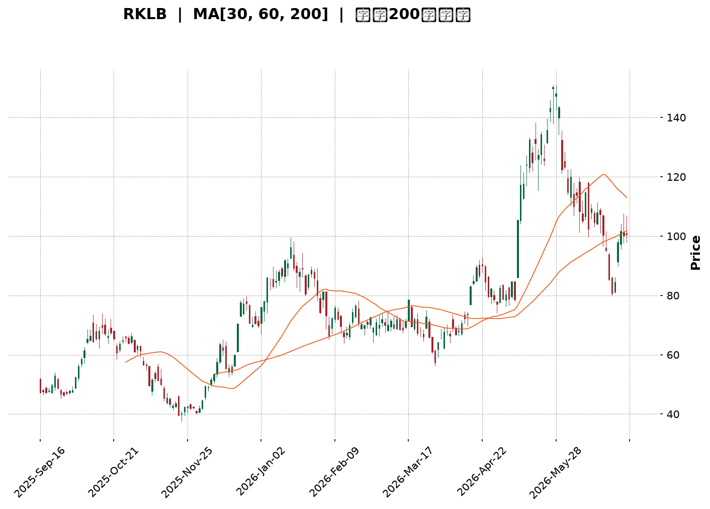
</details>

<html>
<head><meta charset="utf-8" /></head>
<body>
    <div style="height:500px; width:100%;">                        <script>window.PlotlyConfig = {MathJaxConfig: 'local'};</script>
        <script charset="utf-8" src="https://cdn.plot.ly/plotly-3.6.0.min.js" integrity="sha256-QaOVwtVY0T02VaHrr6pnoHLCwayMJp4O5n4YyaE3rJk=" crossorigin="anonymous"></script>                <div id="candlestick-chart" class="plotly-graph-div" style="height:100%; width:100%;"></div>            <script>                window.PLOTLYENV=window.PLOTLYENV || {};                                if (document.getElementById("candlestick-chart")) {                    Plotly.newPlot(                        "candlestick-chart",                        [{"close":{"dtype":"f8","bdata":"AAAAIFyfR0AAAACAPQpIQAAAAEAKl0dAAAAAwB7lR0AAAAAgrudIQAAAAOB6dEpAAAAA4FFYSEAAAADgo1BHQAAAAKBHIUdAAAAAoEeBR0AAAADgevRHQAAAAAAp\u002fEdAAAAAACk8SkAAAADgehRMQAAAAAAAQE1AAAAAoEfBTkAAAAAA11NQQAAAAEDhmlBAAAAA4KMQUEAAAABA4VpQQAAAAIDrAVFAAAAAoEdRUUAAAAAAAMBQQAAAAKBHkVBAAAAAYGbWUEAAAACgmVlQQAAAAOBRSE5AAAAAwPXIT0AAAAAA1yNQQAAAACCuZ1BAAAAAAADgT0AAAACAPYpQQAAAAIDCdU5AAAAAoHB9T0AAAAAghatOQAAAAMD1SExAAAAAgMI1TEAAAACAFM5IQAAAAIDr0UlAAAAAQDPzSUAAAABguJ5JQAAAAAAp\u002fEhAAAAAAACgRkAAAADAHsVGQAAAACCup0VAAAAAANdjRUAAAAAgXM9FQAAAAKBwvUNAAAAAYGYmREAAAACgmTlFQAAAAMDMTEVAAAAAQAr3REAAAACA6xFFQAAAACBcL0RAAAAAQDPzREAAAAAAKVxGQAAAACBcr0hAAAAAQAqHSEAAAAAgrsdJQAAAAEAKt0pAAAAAYI\u002fCTEAAAAAA18NPQAAAAGC4vk5AAAAA4Hq0S0AAAABguL5LQAAAAEDh+kpAAAAAgML1TUAAAACgR6FRQAAAAEAzY1NAAAAAIIVLU0AAAAAghUtTQAAAAKCZqVFAAAAAIK6HUUAAAADAzJxRQAAAAOCjcFFAAAAAIFz\u002fUkAAAADA9YhTQAAAAIDrgVVAAAAAwB4FVUAAAADAHsVUQAAAAGBmNlVAAAAAoJn5VUAAAADAHqVVQAAAAEAz81ZAAAAA4KOwVkAAAABAMxNYQAAAAIA9SlZAAAAA4Hr0VUAAAABguP5VQAAAAKCZOVZAAAAAYLgeVEAAAAAAAMBVQAAAAOB6JFZAAAAAIIVrVUAAAADgegRUQAAAAKCZiVJAAAAAoEdRVEAAAABACkdSQAAAAOB6lFBAAAAA4HoUUkAAAACAwvVSQAAAAIDrAVJAAAAAIK5nUUAAAADgo4BQQAAAAAAp3FBAAAAAwPV4UUAAAABA4ZpSQAAAAMAeJVNAAAAAQAq3UUAAAACgcI1RQAAAAIAUflFAAAAAwMyMUUAAAACgmSlSQAAAAGBmRlFAAAAAgBS+UUAAAADgUYhRQAAAAIA9+lFAAAAAAACAUUAAAABACodRQAAAAGC43lFAAAAAIIU7UUAAAACgcP1RQAAAACCuF1FAAAAAgD0aUUAAAAAA19NRQAAAAIDCpVNAAAAAYLheUUAAAAAghftRQAAAAGC4zlBAAAAAAAAAUUAAAADgeoRQQAAAAOBROFJAAAAAACl8UEAAAABACndOQAAAAOCjsExAAAAAgBQOUEAAAACgR2FQQAAAAGC47lBAAAAAQOHqUEAAAADgepRQQAAAAMAeRVFAAAAAIFyvUEAAAABAMwNRQAAAACCup1FAAAAAgBQOUkAAAABgZmZSQAAAACCFu1RAAAAAQDMzVUAAAACgcF1WQAAAAMD1qFVAAAAAYI+CVkAAAABgZiZVQAAAACCF61NAAAAAYI+SVEAAAACAwqVTQAAAAKBHQVNAAAAA4KOgVEAAAAAA17NTQAAAAADXE1RAAAAA4KOwU0AAAACgmSlVQAAAAMAepVNAAAAAgBReWkAAAABgZlZdQAAAAADXY11AAAAAoJkJX0AAAACgmZFgQAAAAKBHMV9AAAAAwB5lYEAAAAAA19NfQAAAAMD1yGBAAAAAwMxcX0AAAADgUfhgQAAAAGBm5mFAAAAAIFzHYkAAAADA9YBiQAAAACBc72FAAAAAwPWYXkAAAADgetReQAAAAMDMrFxAAAAAwMz8XUAAAADAHoVbQAAAAKCZaVxAAAAAYLgOW0AAAABAM0NaQAAAAIDrsVxAAAAAwPWYWUAAAAAAAFBbQAAAAOBRKFpAAAAAYLj+WkAAAAAgXM9aQAAAAGCPEllAAAAAIK7HV0AAAACAPVpVQAAAAAApLFRAAAAAYI8iVUAAAADgo4BYQAAAAKCZaVlAAAAA4HoEWUAAAACgcB1ZQA=="},"high":{"dtype":"f8","bdata":"AAAAgD0KSkAAAADAHkVIQAAAAOBRmEhAAAAAQAp3SEAAAACgRyFJQAAAAGA5FEtAAAAAoHA9SkAAAAAgXE9IQAAAAOBR2EdAAAAAwMwMSEAAAABguP5HQAAAAIDCtUhAAAAAQDNTSkAAAAAgMXhMQAAAAKBHoU1AAAAAIK5HT0AAAAAALSJRQAAAAGCPIlFAAAAAAABgUkAAAAAAKZxRQAAAAEDhalFAAAAAgBR+UkAAAAAAABBSQAAAAAAAIFFAAAAAIIULUkAAAABgjwJRQAAAAKBHAVBAAAAAwMwsUEAAAAAghYtQQAAAAGBmllBAAAAAYI+iUEAAAADA9dhQQAAAACCFS1BAAAAAoJm5T0AAAADAzIxPQAAAAGC4vk1AAAAAANejTEAAAABA4RpMQAAAAMDMDEpAAAAAAABAS0AAAABA4XpMQAAAAIA9qktAAAAA4KOwSEAAAAAAKZxHQAAAAMBL10ZAAAAAgBTORUAAAAAA10NGQAAAAKBHIUdAAAAAgMKFREAAAAAA10NFQAAAAEAKZ0VAAAAAIIXLRUAAAACgmVlFQAAAAGBmpkRAAAAAYLh+RUAAAABguF5GQAAAAEAK10hAAAAAoJnZSEAAAAAgXC9KQAAAAAAA4EpAAAAAgD1qTUAAAACgmQlQQAAAACCFS1BAAAAAANcjUEAAAACgcF1MQAAAAOB6dExAAAAAAAAgTkAAAAAA16NRQAAAAMDMnFNAAAAAIIXLU0AAAADAHvVTQAAAACBcP1NAAAAAIFwvUkAAAAAAKaxSQAAAAECLTFJAAAAAIFwPU0AAAAAAAJBTQAAAAAAAkFVAAAAAoHB9VUAAAAAgrndWQAAAACCFG1ZAAAAAgMI1VkAAAADgp25WQAAAAAApDFdAAAAAQGAdV0AAAADAHuVYQAAAAKBHkVhAAAAAAADQVkAAAACgmVlWQAAAAMDMnFdAAAAAgD3KVUAAAAAAAMBVQAAAAEAzc1ZAAAAAAABAVkAAAADgelRWQAAAAMDMLFRAAAAA4HpUVEAAAABgZlZUQAAAACBcP1JAAAAAgD0qUkAAAABAMzNTQAAAAEAK91JAAAAAoJlZUkAAAADAzBxRQAAAAGBmZlFAAAAAIFy\u002fUUAAAADA9fBSQAAAAEAKR1NAAAAAwMyMU0AAAAAAANBRQAAAACCFg1FAAAAAYGb2UUAAAAAgXC9SQAAAAIDCZVFAAAAAYGYGUkAAAAAAAFBSQAAAAGBmhlJAAAAAANcTUkAAAABACsdSQAAAAAAACFJAAAAAANc7UkAAAABAM1NSQAAAAGBmJlJAAAAAANfTUUAAAADgURhSQAAAAEDhqlNAAAAA4FE4U0AAAABguC5SQAAAAGC4flJAAAAAwMxcUUAAAABgZiZRQAAAAADXw1JAAAAAgMIFUkAAAACAFIZQQAAAAIDr0U5AAAAAwB4lUEAAAABA4SpRQAAAAMD1WFFAAAAA4HqUUUAAAABAMxNRQAAAAIDAalJAAAAAYI9yUUAAAAAA14NRQAAAAEAz41FAAAAAAACwUkAAAACAwqVSQAAAACBc31RAAAAAIFy\u002fVUAAAABgZpZWQAAAAMDM\u002fFZAAAAAYGZGV0AAAABAM5NWQAAAAIA9mlVAAAAAYLieVEAAAACA63FUQAAAAOCjgFNAAAAAgMLlVEAAAABgj\u002fJUQAAAAOBPdVRAAAAAAADAVEAAAAAghStVQAAAAGCPMlVAAAAAIK5nWkAAAAAAKfxeQAAAACBcX15AAAAAIFzPX0AAAACAwqVgQAAAAADXS2BAAAAAAClMYUAAAACAPTJgQAAAAEAz62BAAAAAANdbYEAAAADgUXhhQAAAAAAAQGJAAAAAAADgYkAAAABgj9piQAAAAAAAAGJAAAAAACn0YEAAAADAzAxgQAAAAOBRoF5AAAAA4FGoXkAAAABguH5dQAAAAAAAEF1AAAAAYI\u002fyXUAAAACgcP1bQAAAAEDhwlxAAAAAwCCYXUAAAACA67FbQAAAAAAAIFtAAAAAgMLVW0AAAABAM2NbQAAAAKCZ2VpAAAAAYLhuWUAAAABAM5NXQAAAAEAKh1VAAAAAgOuRVUAAAADAHsVYQAAAAIA9ClpAAAAAYGbmWkAAAAAgXL9aQA=="},"hovertemplate":"\u003cb\u003e%{x|%Y-%m-%d}\u003c\u002fb\u003e\u003cbr\u003e\u958b: $%{open:.2f}\u003cbr\u003e\u9ad8: $%{high:.2f}\u003cbr\u003e\u4f4e: $%{low:.2f}\u003cbr\u003e\u6536: $%{close:.2f}\u003cextra\u003e\u003c\u002fextra\u003e","low":{"dtype":"f8","bdata":"AAAAoEeBR0AAAACgmTlHQAAAAAAAgEdAAAAA4KOQR0AAAABgZmZHQAAAAOB69EdAAAAAQAo3SEAAAABA4ZpGQAAAAIA96kZAAAAAIFwvR0AAAACgR0FHQAAAACBcj0dAAAAAoEdBSEAAAACgR6FJQAAAAGBm5ktAAAAAYI+CTEAAAABAM9NPQAAAAEDhGlBAAAAAwPUIUEAAAADgzidQQAAAAOBRGE9AAAAAwB7FUEAAAABAM5tQQAAAAKCZ2U9AAAAAQDOrUEAAAABACjdQQAAAAOB6NE1AAAAAAABgTkAAAABAM9NPQAAAAKCZCVBAAAAAgBTOT0AAAACgcL1PQAAAAIDrcU5AAAAAQDMzTkAAAADgo5BNQAAAAKBHQUxAAAAAIFxvS0AAAADgerRIQAAAAODOJ0dAAAAAoEdhSUAAAABA4ZpJQAAAAOB61EhAAAAAIFwvRkAAAABgZqZFQAAAAMDMHEVAAAAAoHCdREAAAABACjdFQAAAAMD1qENAAAAAwPXIQkAAAABgZqZDQAAAAOCjMERAAAAA4KOwREAAAABgZuZEQAAAAKBw\u002fUNAAAAAgMI1REAAAAAAAMBEQAAAAMD1aEZAAAAAoJnZR0AAAAAAKZxIQAAAACCFK0lAAAAAAAAgSkAAAADAzGxMQAAAAGBm5k1AAAAAgD2KS0AAAABACldKQAAAAEDhikpAAAAAANcDTEAAAADAnV9OQAAAAMAgMFJAAAAAYI9SUkAAAACgQ7NSQAAAAMD1mFFAAAAAoJtUUUAAAAAAKZxRQAAAAOBRSFFAAAAAYGa2UEAAAAAA19NRQAAAAEAzg1JAAAAAYGZ2VEAAAADgo5BUQAAAAMDMnFRAAAAA4NDaVEAAAACgmWlVQAAAAAAAIFVAAAAAoJmpVUAAAACgmRlXQAAAAEAzE1ZAAAAAoHCtVEAAAADAdlZUQAAAACCuh1VAAAAA4KMAVEAAAAAAAIBUQAAAAMDKgVVAAAAAAADAVEAAAACgR4FTQAAAAIBBeFJAAAAAoEfxUkAAAABACCRRQAAAAMDMTFBAAAAAAADAUEAAAAAAALBRQAAAAEAz41FAAAAAoEfBUEAAAAAgXO9PQAAAAAAAYFBAAAAAAABAUEAAAADAS39RQAAAAGBmFlJAAAAAoJlZUUAAAAAAACBRQAAAAGBmplBAAAAA4FE4UUAAAAAA1zNRQAAAAGBmBlBAAAAAwMycUEAAAAAAKYxQQAAAAIAUXlFAAAAAgMLVUEAAAADgowhRQAAAAOB69FBAAAAAgL4nUUAAAADAHhVRQAAAAIDrEVFAAAAAACncUEAAAABA4SpRQAAAAKBH0VFAAAAAoJlZUUAAAAAAAABRQAAAAMD1mFBAAAAAQDODUEAAAACgcB1QQAAAAAApPFFAAAAAgMJlUEAAAADAzCxOQAAAAGDlEExAAAAAANeDTUAAAABAM1NQQAAAAIAU7k5AAAAAYGamUEAAAABA4fpPQAAAAGDn81BAAAAAQOGiUEAAAACAwpVQQAAAAIDCpVBAAAAAYLieUUAAAABgZmZRQAAAAKCZOVNAAAAAYGbmVEAAAABgZiZVQAAAAAAAcFVAAAAA4KPwVUAAAAAAKWRUQAAAAMAexVNAAAAAwHRDU0AAAABgZmZTQAAAACBcf1JAAAAAgBReU0AAAAAghZtTQAAAAAAAEFNAAAAAANcjU0AAAABACrdTQAAAACCFe1NAAAAAIK53VUAAAAAAAABaQAAAAIA9GlxAAAAAwPU4XUAAAAAA11NeQAAAAEAzc15AAAAAoPFqX0AAAABguM5cQAAAAIAUDl9AAAAAQDPzXkAAAACA62lgQAAAAIDrUWFAAAAAwB49YUAAAAAA18thQAAAAKCZwWBAAAAAAABAXkAAAAAA16NeQAAAAIA9alxAAAAAwPWYW0AAAABguK5aQAAAAAAAwFtAAAAAwMxMWUAAAACAPRpaQAAAAKCZWVpAAAAAQArnWEAAAABAM3NaQAAAAOB6xFlAAAAAYI8CWkAAAACgcD1ZQAAAAAAAIFhAAAAA4KO4V0AAAABgZjZVQAAAAAAAAFRAAAAAYLguVEAAAABgZnZWQAAAAMD16FdAAAAAIK5nWEAAAACAPXpYQA=="},"name":"\u50f9\u683c","open":{"dtype":"f8","bdata":"AAAAAAAASkAAAADgUchHQAAAAIDCdUhAAAAAQArXR0AAAADgo5BHQAAAAEAzg0hAAAAAgMLlSUAAAAAAAABIQAAAAGBmpkdAAAAAQDOzR0AAAABA4ZpHQAAAAOCjsEdAAAAAgOtRSEAAAABgZgZKQAAAAGC4bkxAAAAAoEeBTUAAAACgmQlQQAAAAKCZOVBAAAAAQDOzUUAAAADgUfhQQAAAAIDCVVBAAAAAoEeBUUAAAADgeoRRQAAAAMD1eFBAAAAA4KNIUUAAAABgjwJRQAAAAAApfE9AAAAAIK7HTkAAAAAA1zNQQAAAAAApjFBAAAAAQDNrUEAAAACgRwlQQAAAAAAAQFBAAAAAYI\u002fiTkAAAAAA14NPQAAAAGBm5kxAAAAA4HpUTEAAAABA4RpMQAAAAKAY1EdAAAAAYLjeSkAAAAAAAABMQAAAAEAK90lAAAAAoEdhSEAAAABA4dpFQAAAAEAzk0ZAAAAAACkcRUAAAAAAAEBFQAAAAIA9CkdAAAAAgD3qQ0AAAACgR2FEQAAAAADXA0VAAAAAYLieRUAAAACgR0FFQAAAAEAzk0RAAAAAIK5HREAAAABgj\u002fJEQAAAAGCP0kZAAAAAAABwSEAAAACAPQpJQAAAAKBwnUlAAAAA4FG4SkAAAACgR8FMQAAAAAAAQE9AAAAA4KeGT0AAAADgURhLQAAAAMDMDExAAAAAoJkZTEAAAAAgXI9OQAAAAAApPFJAAAAAANdzUkAAAACAPYJTQAAAACCFK1NAAAAAAABgUUAAAACgmUFSQAAAAAAA4FFAAAAA4FGoUUAAAAAgrqdSQAAAAOCjcFNAAAAAYGYGVUAAAAAAAGBVQAAAAKCZIVVAAAAAYLg+VUAAAADA9UhWQAAAAGBmllVAAAAAwPVQVkAAAACgmSFXQAAAAMDMbFdAAAAAoEeBVkAAAADgUZhVQAAAACCFQ1ZAAAAAIK6vVUAAAADA9bhUQAAAAIAUzlVAAAAAACn8VUAAAAAAAEBVQAAAAIA9ylNAAAAAYGamU0AAAABgZlZUQAAAAGC4flFAAAAAAABAUUAAAACgmQFSQAAAAIAUplJAAAAA4FFIUkAAAACA6+FQQAAAAOB6rFBAAAAAQGCFUEAAAAAAAMBRQAAAAKCZOVJAAAAAINneUkAAAADgUTBRQAAAAOBROFFAAAAAgBTGUUAAAABA4YJRQAAAAIDC5VBAAAAAIIWrUEAAAABguDZRQAAAAADXs1FAAAAAQOG6UUAAAADgowhRQAAAAMD1WFFAAAAAgMKVUUAAAABAMzNRQAAAAMDM\u002fFFAAAAAoJlJUUAAAADAzFRRQAAAAGBm3lFAAAAAYI8CU0AAAADgejRRQAAAAAAAAFJAAAAAoHAFUUAAAAAAAMBQQAAAAAApPFFAAAAAwMzMUUAAAADgo4BQQAAAAKCZuU5AAAAAQOHaTkAAAAAAAGBQQAAAAMDMHE9AAAAAYLjuUEAAAAAgXMdQQAAAAAAAAFJAAAAAANdDUUAAAADAzOxQQAAAAEAzw1BAAAAAIIVjUkAAAACgcGVSQAAAAIAUPlNAAAAAwB4FVUAAAABgZjZVQAAAAMAelVZAAAAAgMKdVkAAAABgZnZWQAAAAIDClVVAAAAAACnsU0AAAADAzARUQAAAAEAKd1NAAAAAQDNjU0AAAACA6+FUQAAAAEAKl1NAAAAAYGamVEAAAAAgrudTQAAAAKBwLVVAAAAAgD2CVUAAAACgR1FaQAAAAOCjMFxAAAAAoEf5XkAAAABgZsZeQAAAAEAzA2BAAAAAACmYYEAAAACAFH5fQAAAAGC43l9AAAAAwPWIX0AAAADAHm1gQAAAAEDhvmFAAAAAQAq3YkAAAACgcGViQAAAAIAUfmFAAAAAACmMYEAAAACAwlVfQAAAAMAe5V1AAAAAoHBFXEAAAACgR5FcQAAAAEDhqlxAAAAAoJmZXUAAAADAzOxaQAAAAIDCpVpAAAAAoEeBXUAAAACgcP1aQAAAAKBw7VpAAAAAIK4HWkAAAADAHjVbQAAAACBcv1pAAAAAoEcBWEAAAABgZnZXQAAAAEAKh1VAAAAAQApHVEAAAABA4dJWQAAAAMDMTFhAAAAA4HpMWUAAAAAgXD9ZQA=="},"x":["2025-09-16T00:00:00-04:00","2025-09-17T00:00:00-04:00","2025-09-18T00:00:00-04:00","2025-09-19T00:00:00-04:00","2025-09-22T00:00:00-04:00","2025-09-23T00:00:00-04:00","2025-09-24T00:00:00-04:00","2025-09-25T00:00:00-04:00","2025-09-26T00:00:00-04:00","2025-09-29T00:00:00-04:00","2025-09-30T00:00:00-04:00","2025-10-01T00:00:00-04:00","2025-10-02T00:00:00-04:00","2025-10-03T00:00:00-04:00","2025-10-06T00:00:00-04:00","2025-10-07T00:00:00-04:00","2025-10-08T00:00:00-04:00","2025-10-09T00:00:00-04:00","2025-10-10T00:00:00-04:00","2025-10-13T00:00:00-04:00","2025-10-14T00:00:00-04:00","2025-10-15T00:00:00-04:00","2025-10-16T00:00:00-04:00","2025-10-17T00:00:00-04:00","2025-10-20T00:00:00-04:00","2025-10-21T00:00:00-04:00","2025-10-22T00:00:00-04:00","2025-10-23T00:00:00-04:00","2025-10-24T00:00:00-04:00","2025-10-27T00:00:00-04:00","2025-10-28T00:00:00-04:00","2025-10-29T00:00:00-04:00","2025-10-30T00:00:00-04:00","2025-10-31T00:00:00-04:00","2025-11-03T00:00:00-05:00","2025-11-04T00:00:00-05:00","2025-11-05T00:00:00-05:00","2025-11-06T00:00:00-05:00","2025-11-07T00:00:00-05:00","2025-11-10T00:00:00-05:00","2025-11-11T00:00:00-05:00","2025-11-12T00:00:00-05:00","2025-11-13T00:00:00-05:00","2025-11-14T00:00:00-05:00","2025-11-17T00:00:00-05:00","2025-11-18T00:00:00-05:00","2025-11-19T00:00:00-05:00","2025-11-20T00:00:00-05:00","2025-11-21T00:00:00-05:00","2025-11-24T00:00:00-05:00","2025-11-25T00:00:00-05:00","2025-11-26T00:00:00-05:00","2025-11-28T00:00:00-05:00","2025-12-01T00:00:00-05:00","2025-12-02T00:00:00-05:00","2025-12-03T00:00:00-05:00","2025-12-04T00:00:00-05:00","2025-12-05T00:00:00-05:00","2025-12-08T00:00:00-05:00","2025-12-09T00:00:00-05:00","2025-12-10T00:00:00-05:00","2025-12-11T00:00:00-05:00","2025-12-12T00:00:00-05:00","2025-12-15T00:00:00-05:00","2025-12-16T00:00:00-05:00","2025-12-17T00:00:00-05:00","2025-12-18T00:00:00-05:00","2025-12-19T00:00:00-05:00","2025-12-22T00:00:00-05:00","2025-12-23T00:00:00-05:00","2025-12-24T00:00:00-05:00","2025-12-26T00:00:00-05:00","2025-12-29T00:00:00-05:00","2025-12-30T00:00:00-05:00","2025-12-31T00:00:00-05:00","2026-01-02T00:00:00-05:00","2026-01-05T00:00:00-05:00","2026-01-06T00:00:00-05:00","2026-01-07T00:00:00-05:00","2026-01-08T00:00:00-05:00","2026-01-09T00:00:00-05:00","2026-01-12T00:00:00-05:00","2026-01-13T00:00:00-05:00","2026-01-14T00:00:00-05:00","2026-01-15T00:00:00-05:00","2026-01-16T00:00:00-05:00","2026-01-20T00:00:00-05:00","2026-01-21T00:00:00-05:00","2026-01-22T00:00:00-05:00","2026-01-23T00:00:00-05:00","2026-01-26T00:00:00-05:00","2026-01-27T00:00:00-05:00","2026-01-28T00:00:00-05:00","2026-01-29T00:00:00-05:00","2026-01-30T00:00:00-05:00","2026-02-02T00:00:00-05:00","2026-02-03T00:00:00-05:00","2026-02-04T00:00:00-05:00","2026-02-05T00:00:00-05:00","2026-02-06T00:00:00-05:00","2026-02-09T00:00:00-05:00","2026-02-10T00:00:00-05:00","2026-02-11T00:00:00-05:00","2026-02-12T00:00:00-05:00","2026-02-13T00:00:00-05:00","2026-02-17T00:00:00-05:00","2026-02-18T00:00:00-05:00","2026-02-19T00:00:00-05:00","2026-02-20T00:00:00-05:00","2026-02-23T00:00:00-05:00","2026-02-24T00:00:00-05:00","2026-02-25T00:00:00-05:00","2026-02-26T00:00:00-05:00","2026-02-27T00:00:00-05:00","2026-03-02T00:00:00-05:00","2026-03-03T00:00:00-05:00","2026-03-04T00:00:00-05:00","2026-03-05T00:00:00-05:00","2026-03-06T00:00:00-05:00","2026-03-09T00:00:00-04:00","2026-03-10T00:00:00-04:00","2026-03-11T00:00:00-04:00","2026-03-12T00:00:00-04:00","2026-03-13T00:00:00-04:00","2026-03-16T00:00:00-04:00","2026-03-17T00:00:00-04:00","2026-03-18T00:00:00-04:00","2026-03-19T00:00:00-04:00","2026-03-20T00:00:00-04:00","2026-03-23T00:00:00-04:00","2026-03-24T00:00:00-04:00","2026-03-25T00:00:00-04:00","2026-03-26T00:00:00-04:00","2026-03-27T00:00:00-04:00","2026-03-30T00:00:00-04:00","2026-03-31T00:00:00-04:00","2026-04-01T00:00:00-04:00","2026-04-02T00:00:00-04:00","2026-04-06T00:00:00-04:00","2026-04-07T00:00:00-04:00","2026-04-08T00:00:00-04:00","2026-04-09T00:00:00-04:00","2026-04-10T00:00:00-04:00","2026-04-13T00:00:00-04:00","2026-04-14T00:00:00-04:00","2026-04-15T00:00:00-04:00","2026-04-16T00:00:00-04:00","2026-04-17T00:00:00-04:00","2026-04-20T00:00:00-04:00","2026-04-21T00:00:00-04:00","2026-04-22T00:00:00-04:00","2026-04-23T00:00:00-04:00","2026-04-24T00:00:00-04:00","2026-04-27T00:00:00-04:00","2026-04-28T00:00:00-04:00","2026-04-29T00:00:00-04:00","2026-04-30T00:00:00-04:00","2026-05-01T00:00:00-04:00","2026-05-04T00:00:00-04:00","2026-05-05T00:00:00-04:00","2026-05-06T00:00:00-04:00","2026-05-07T00:00:00-04:00","2026-05-08T00:00:00-04:00","2026-05-11T00:00:00-04:00","2026-05-12T00:00:00-04:00","2026-05-13T00:00:00-04:00","2026-05-14T00:00:00-04:00","2026-05-15T00:00:00-04:00","2026-05-18T00:00:00-04:00","2026-05-19T00:00:00-04:00","2026-05-20T00:00:00-04:00","2026-05-21T00:00:00-04:00","2026-05-22T00:00:00-04:00","2026-05-26T00:00:00-04:00","2026-05-27T00:00:00-04:00","2026-05-28T00:00:00-04:00","2026-05-29T00:00:00-04:00","2026-06-01T00:00:00-04:00","2026-06-02T00:00:00-04:00","2026-06-03T00:00:00-04:00","2026-06-04T00:00:00-04:00","2026-06-05T00:00:00-04:00","2026-06-08T00:00:00-04:00","2026-06-09T00:00:00-04:00","2026-06-10T00:00:00-04:00","2026-06-11T00:00:00-04:00","2026-06-12T00:00:00-04:00","2026-06-15T00:00:00-04:00","2026-06-16T00:00:00-04:00","2026-06-17T00:00:00-04:00","2026-06-18T00:00:00-04:00","2026-06-22T00:00:00-04:00","2026-06-23T00:00:00-04:00","2026-06-24T00:00:00-04:00","2026-06-25T00:00:00-04:00","2026-06-26T00:00:00-04:00","2026-06-29T00:00:00-04:00","2026-06-30T00:00:00-04:00","2026-07-01T00:00:00-04:00","2026-07-02T00:00:00-04:00"],"type":"candlestick"},{"hovertemplate":"MA30: $%{y:.2f}\u003cextra\u003e\u003c\u002fextra\u003e","line":{"color":"#2196F3","dash":"dash","width":2},"mode":"lines","name":"MA30","x":["2025-09-16T00:00:00-04:00","2025-09-17T00:00:00-04:00","2025-09-18T00:00:00-04:00","2025-09-19T00:00:00-04:00","2025-09-22T00:00:00-04:00","2025-09-23T00:00:00-04:00","2025-09-24T00:00:00-04:00","2025-09-25T00:00:00-04:00","2025-09-26T00:00:00-04:00","2025-09-29T00:00:00-04:00","2025-09-30T00:00:00-04:00","2025-10-01T00:00:00-04:00","2025-10-02T00:00:00-04:00","2025-10-03T00:00:00-04:00","2025-10-06T00:00:00-04:00","2025-10-07T00:00:00-04:00","2025-10-08T00:00:00-04:00","2025-10-09T00:00:00-04:00","2025-10-10T00:00:00-04:00","2025-10-13T00:00:00-04:00","2025-10-14T00:00:00-04:00","2025-10-15T00:00:00-04:00","2025-10-16T00:00:00-04:00","2025-10-17T00:00:00-04:00","2025-10-20T00:00:00-04:00","2025-10-21T00:00:00-04:00","2025-10-22T00:00:00-04:00","2025-10-23T00:00:00-04:00","2025-10-24T00:00:00-04:00","2025-10-27T00:00:00-04:00","2025-10-28T00:00:00-04:00","2025-10-29T00:00:00-04:00","2025-10-30T00:00:00-04:00","2025-10-31T00:00:00-04:00","2025-11-03T00:00:00-05:00","2025-11-04T00:00:00-05:00","2025-11-05T00:00:00-05:00","2025-11-06T00:00:00-05:00","2025-11-07T00:00:00-05:00","2025-11-10T00:00:00-05:00","2025-11-11T00:00:00-05:00","2025-11-12T00:00:00-05:00","2025-11-13T00:00:00-05:00","2025-11-14T00:00:00-05:00","2025-11-17T00:00:00-05:00","2025-11-18T00:00:00-05:00","2025-11-19T00:00:00-05:00","2025-11-20T00:00:00-05:00","2025-11-21T00:00:00-05:00","2025-11-24T00:00:00-05:00","2025-11-25T00:00:00-05:00","2025-11-26T00:00:00-05:00","2025-11-28T00:00:00-05:00","2025-12-01T00:00:00-05:00","2025-12-02T00:00:00-05:00","2025-12-03T00:00:00-05:00","2025-12-04T00:00:00-05:00","2025-12-05T00:00:00-05:00","2025-12-08T00:00:00-05:00","2025-12-09T00:00:00-05:00","2025-12-10T00:00:00-05:00","2025-12-11T00:00:00-05:00","2025-12-12T00:00:00-05:00","2025-12-15T00:00:00-05:00","2025-12-16T00:00:00-05:00","2025-12-17T00:00:00-05:00","2025-12-18T00:00:00-05:00","2025-12-19T00:00:00-05:00","2025-12-22T00:00:00-05:00","2025-12-23T00:00:00-05:00","2025-12-24T00:00:00-05:00","2025-12-26T00:00:00-05:00","2025-12-29T00:00:00-05:00","2025-12-30T00:00:00-05:00","2025-12-31T00:00:00-05:00","2026-01-02T00:00:00-05:00","2026-01-05T00:00:00-05:00","2026-01-06T00:00:00-05:00","2026-01-07T00:00:00-05:00","2026-01-08T00:00:00-05:00","2026-01-09T00:00:00-05:00","2026-01-12T00:00:00-05:00","2026-01-13T00:00:00-05:00","2026-01-14T00:00:00-05:00","2026-01-15T00:00:00-05:00","2026-01-16T00:00:00-05:00","2026-01-20T00:00:00-05:00","2026-01-21T00:00:00-05:00","2026-01-22T00:00:00-05:00","2026-01-23T00:00:00-05:00","2026-01-26T00:00:00-05:00","2026-01-27T00:00:00-05:00","2026-01-28T00:00:00-05:00","2026-01-29T00:00:00-05:00","2026-01-30T00:00:00-05:00","2026-02-02T00:00:00-05:00","2026-02-03T00:00:00-05:00","2026-02-04T00:00:00-05:00","2026-02-05T00:00:00-05:00","2026-02-06T00:00:00-05:00","2026-02-09T00:00:00-05:00","2026-02-10T00:00:00-05:00","2026-02-11T00:00:00-05:00","2026-02-12T00:00:00-05:00","2026-02-13T00:00:00-05:00","2026-02-17T00:00:00-05:00","2026-02-18T00:00:00-05:00","2026-02-19T00:00:00-05:00","2026-02-20T00:00:00-05:00","2026-02-23T00:00:00-05:00","2026-02-24T00:00:00-05:00","2026-02-25T00:00:00-05:00","2026-02-26T00:00:00-05:00","2026-02-27T00:00:00-05:00","2026-03-02T00:00:00-05:00","2026-03-03T00:00:00-05:00","2026-03-04T00:00:00-05:00","2026-03-05T00:00:00-05:00","2026-03-06T00:00:00-05:00","2026-03-09T00:00:00-04:00","2026-03-10T00:00:00-04:00","2026-03-11T00:00:00-04:00","2026-03-12T00:00:00-04:00","2026-03-13T00:00:00-04:00","2026-03-16T00:00:00-04:00","2026-03-17T00:00:00-04:00","2026-03-18T00:00:00-04:00","2026-03-19T00:00:00-04:00","2026-03-20T00:00:00-04:00","2026-03-23T00:00:00-04:00","2026-03-24T00:00:00-04:00","2026-03-25T00:00:00-04:00","2026-03-26T00:00:00-04:00","2026-03-27T00:00:00-04:00","2026-03-30T00:00:00-04:00","2026-03-31T00:00:00-04:00","2026-04-01T00:00:00-04:00","2026-04-02T00:00:00-04:00","2026-04-06T00:00:00-04:00","2026-04-07T00:00:00-04:00","2026-04-08T00:00:00-04:00","2026-04-09T00:00:00-04:00","2026-04-10T00:00:00-04:00","2026-04-13T00:00:00-04:00","2026-04-14T00:00:00-04:00","2026-04-15T00:00:00-04:00","2026-04-16T00:00:00-04:00","2026-04-17T00:00:00-04:00","2026-04-20T00:00:00-04:00","2026-04-21T00:00:00-04:00","2026-04-22T00:00:00-04:00","2026-04-23T00:00:00-04:00","2026-04-24T00:00:00-04:00","2026-04-27T00:00:00-04:00","2026-04-28T00:00:00-04:00","2026-04-29T00:00:00-04:00","2026-04-30T00:00:00-04:00","2026-05-01T00:00:00-04:00","2026-05-04T00:00:00-04:00","2026-05-05T00:00:00-04:00","2026-05-06T00:00:00-04:00","2026-05-07T00:00:00-04:00","2026-05-08T00:00:00-04:00","2026-05-11T00:00:00-04:00","2026-05-12T00:00:00-04:00","2026-05-13T00:00:00-04:00","2026-05-14T00:00:00-04:00","2026-05-15T00:00:00-04:00","2026-05-18T00:00:00-04:00","2026-05-19T00:00:00-04:00","2026-05-20T00:00:00-04:00","2026-05-21T00:00:00-04:00","2026-05-22T00:00:00-04:00","2026-05-26T00:00:00-04:00","2026-05-27T00:00:00-04:00","2026-05-28T00:00:00-04:00","2026-05-29T00:00:00-04:00","2026-06-01T00:00:00-04:00","2026-06-02T00:00:00-04:00","2026-06-03T00:00:00-04:00","2026-06-04T00:00:00-04:00","2026-06-05T00:00:00-04:00","2026-06-08T00:00:00-04:00","2026-06-09T00:00:00-04:00","2026-06-10T00:00:00-04:00","2026-06-11T00:00:00-04:00","2026-06-12T00:00:00-04:00","2026-06-15T00:00:00-04:00","2026-06-16T00:00:00-04:00","2026-06-17T00:00:00-04:00","2026-06-18T00:00:00-04:00","2026-06-22T00:00:00-04:00","2026-06-23T00:00:00-04:00","2026-06-24T00:00:00-04:00","2026-06-25T00:00:00-04:00","2026-06-26T00:00:00-04:00","2026-06-29T00:00:00-04:00","2026-06-30T00:00:00-04:00","2026-07-01T00:00:00-04:00","2026-07-02T00:00:00-04:00"],"y":{"dtype":"f8","bdata":"AAAAAAAA+H8AAAAAAAD4fwAAAAAAAPh\u002fAAAAAAAA+H8AAAAAAAD4fwAAAAAAAPh\u002fAAAAAAAA+H8AAAAAAAD4fwAAAAAAAPh\u002fAAAAAAAA+H8AAAAAAAD4fwAAAAAAAPh\u002fAAAAAAAA+H8AAAAAAAD4fwAAAAAAAPh\u002fAAAAAAAA+H8AAAAAAAD4fwAAAAAAAPh\u002fAAAAAAAA+H8AAAAAAAD4fwAAAAAAAPh\u002fAAAAAAAA+H8AAAAAAAD4fwAAAAAAAPh\u002fAAAAAAAA+H8AAAAAAAD4fwAAAAAAAPh\u002fAAAAAAAA+H8AAAAAAAD4f7y7u6u5wExAiYiIiCUHTUB3d3e3SVRNQFVVVXXpjk1AzczM\u002fLjPTUAiIiLS6gBOQERERISIEE5AzczMvIMxTkARERGxOj5OQGZmZhYvVU5AZmZmRgxqTkBmZmaGQXhOQO\u002fu7g7KgE5ARERE5PthTkBVVVUFrDROQN7d3X3c801AZmZmVvKjTUAzMzMTZ0dNQJqZmWl11ExAMzMzszpuTEBmZmZWOQxMQO\u002fu7v64n0tA3t3dbRIrS0De3d2tAMFKQJqZmfl+UkpAq6qqyujlSUB3d3e3rI1JQKuqqsroXUlAq6qqivofSUBEREQUg+hIQImIiFiAtEhAZmZmhuuZSEC8u7vbso5IQERERHQhkUhA7+7u\u002ftRwSEDNzMw831dIQLy7u2u8TEhAq6qqWqtbSEBVVVWl4rRIQHd3d0dvI0lAd3d3x0uPSUDNzMws+f1JQAAAAEA1VkpAzczM7FHASkCJiIhImipLQM3MzLx0m0tAmpmZ6SYpTEBVVVX1b7xMQImIiPgMg01AiYiIaNg9TkBEREQ0M+tOQImIiHh3n09AREREfM0xUEDv7u6mm5BQQKuqqkpT\u002flBA3t3dXY9mUUDNzMzsmNRRQKuqqpJ7KVJAZmZmbi58UkC8u7ub4MlSQFVVVfWLFVNAZmZmLodGU0BmZmbumHhTQImIiDheslNAVVVVrfHyU0AiIiKiYSdUQBERERF0UlRAMzMzAwCAVEAAAACAhoVUQLy7u2uRbVRAZmZmNjNjVEBERERkV2BUQN7d3Q1JY1RAzczM\u002fDdiVECJiIgov1hUQBERESHMU1RAd3d3t8hGVECamZkZ2T5UQERERCSwKlRAIiIiQnwOVEBVVVWFB\u002fNTQO\u002fu7g5J01NA7+7ufoatU0C8u7vbzo9TQBEREaFhX1NAZmZmpik1U0BmZmZWVf1SQJqZmYmI2FJAERERcYSyUkCamZkJZYxSQFVVVWU7Z1JA3t3djZdOUkBVVVW1gS5SQBEREdFpA1JAiYiIGJLeUUB3d3f34ctRQLy7u8ta1VFAMzMz4zO8UUAzMzNzr7lRQO\u002fu7m6gu1FAMzMzI2myUUCrqqpqkZ1RQBEREaFhn1FAvLu724eXUUAAAACAsYxRQN7d3WU7d1FAq6qq0iJrUUBEREQ8JlhRQM3MzPRERVFAIiIiynY+UUDNzMxUKjZRQN7d3UVENFFA7+7upuIsUUCJiIhwEiNRQImIiJBQJlFAMzMzO\u002fsoUUCJiIhQYjBRQLy7u7PkR1FAIiIiendnUUAAAAAov5BRQBEREYkWsVFAERERaR\u002feUUARERGJFvlRQFVVVU03EVJAmpmZodMuUkAzMzN7Wz5SQFVVVQ0CO1JAMzMzK85WUkCJiIiQe2VSQERERPxigVJAmpmZYVeYUkAiIiKK+r9SQImIiIAjzFJA7+7uJnggU0BmZmb+1JhTQLy7u0s3GVRAERERERGZVEAzMzNjEChVQERERNS\u002foVVAZmZm1jEpVkAiIiKCTqtWQGZmZmZmNldAMzMz46WzV0AiIiKSGERYQM3MzOzu3lhAiYiIyFqFWUDNzMx8IyRaQLy7u9tPpVpAIiIiAoH1WkBVVVUVvT1bQFVVVZWZeVtA3t3dbWi5W0CJiIjow+9bQO\u002fu7g48OFxAIiIiwpJvXEAzMzNzBahcQCIiInKT+FxAMzMzk\u002fwiXUAAAADg7GNdQGZmZtbOl11Aq6qq2iTWXUAREREBVgZeQO\u002fu7o6mNF5AREREFJIeXkBVVVWVbtpdQGZmZqbGi11A7+7uTkY3XUDNzMzclu1cQDMzM0NEvFxAmpmZ+fB5XEC8u7tLqUBcQA=="},"type":"scatter"},{"hovertemplate":"MA60: $%{y:.2f}\u003cextra\u003e\u003c\u002fextra\u003e","line":{"color":"#9C27B0","dash":"dash","width":2},"mode":"lines","name":"MA60","x":["2025-09-16T00:00:00-04:00","2025-09-17T00:00:00-04:00","2025-09-18T00:00:00-04:00","2025-09-19T00:00:00-04:00","2025-09-22T00:00:00-04:00","2025-09-23T00:00:00-04:00","2025-09-24T00:00:00-04:00","2025-09-25T00:00:00-04:00","2025-09-26T00:00:00-04:00","2025-09-29T00:00:00-04:00","2025-09-30T00:00:00-04:00","2025-10-01T00:00:00-04:00","2025-10-02T00:00:00-04:00","2025-10-03T00:00:00-04:00","2025-10-06T00:00:00-04:00","2025-10-07T00:00:00-04:00","2025-10-08T00:00:00-04:00","2025-10-09T00:00:00-04:00","2025-10-10T00:00:00-04:00","2025-10-13T00:00:00-04:00","2025-10-14T00:00:00-04:00","2025-10-15T00:00:00-04:00","2025-10-16T00:00:00-04:00","2025-10-17T00:00:00-04:00","2025-10-20T00:00:00-04:00","2025-10-21T00:00:00-04:00","2025-10-22T00:00:00-04:00","2025-10-23T00:00:00-04:00","2025-10-24T00:00:00-04:00","2025-10-27T00:00:00-04:00","2025-10-28T00:00:00-04:00","2025-10-29T00:00:00-04:00","2025-10-30T00:00:00-04:00","2025-10-31T00:00:00-04:00","2025-11-03T00:00:00-05:00","2025-11-04T00:00:00-05:00","2025-11-05T00:00:00-05:00","2025-11-06T00:00:00-05:00","2025-11-07T00:00:00-05:00","2025-11-10T00:00:00-05:00","2025-11-11T00:00:00-05:00","2025-11-12T00:00:00-05:00","2025-11-13T00:00:00-05:00","2025-11-14T00:00:00-05:00","2025-11-17T00:00:00-05:00","2025-11-18T00:00:00-05:00","2025-11-19T00:00:00-05:00","2025-11-20T00:00:00-05:00","2025-11-21T00:00:00-05:00","2025-11-24T00:00:00-05:00","2025-11-25T00:00:00-05:00","2025-11-26T00:00:00-05:00","2025-11-28T00:00:00-05:00","2025-12-01T00:00:00-05:00","2025-12-02T00:00:00-05:00","2025-12-03T00:00:00-05:00","2025-12-04T00:00:00-05:00","2025-12-05T00:00:00-05:00","2025-12-08T00:00:00-05:00","2025-12-09T00:00:00-05:00","2025-12-10T00:00:00-05:00","2025-12-11T00:00:00-05:00","2025-12-12T00:00:00-05:00","2025-12-15T00:00:00-05:00","2025-12-16T00:00:00-05:00","2025-12-17T00:00:00-05:00","2025-12-18T00:00:00-05:00","2025-12-19T00:00:00-05:00","2025-12-22T00:00:00-05:00","2025-12-23T00:00:00-05:00","2025-12-24T00:00:00-05:00","2025-12-26T00:00:00-05:00","2025-12-29T00:00:00-05:00","2025-12-30T00:00:00-05:00","2025-12-31T00:00:00-05:00","2026-01-02T00:00:00-05:00","2026-01-05T00:00:00-05:00","2026-01-06T00:00:00-05:00","2026-01-07T00:00:00-05:00","2026-01-08T00:00:00-05:00","2026-01-09T00:00:00-05:00","2026-01-12T00:00:00-05:00","2026-01-13T00:00:00-05:00","2026-01-14T00:00:00-05:00","2026-01-15T00:00:00-05:00","2026-01-16T00:00:00-05:00","2026-01-20T00:00:00-05:00","2026-01-21T00:00:00-05:00","2026-01-22T00:00:00-05:00","2026-01-23T00:00:00-05:00","2026-01-26T00:00:00-05:00","2026-01-27T00:00:00-05:00","2026-01-28T00:00:00-05:00","2026-01-29T00:00:00-05:00","2026-01-30T00:00:00-05:00","2026-02-02T00:00:00-05:00","2026-02-03T00:00:00-05:00","2026-02-04T00:00:00-05:00","2026-02-05T00:00:00-05:00","2026-02-06T00:00:00-05:00","2026-02-09T00:00:00-05:00","2026-02-10T00:00:00-05:00","2026-02-11T00:00:00-05:00","2026-02-12T00:00:00-05:00","2026-02-13T00:00:00-05:00","2026-02-17T00:00:00-05:00","2026-02-18T00:00:00-05:00","2026-02-19T00:00:00-05:00","2026-02-20T00:00:00-05:00","2026-02-23T00:00:00-05:00","2026-02-24T00:00:00-05:00","2026-02-25T00:00:00-05:00","2026-02-26T00:00:00-05:00","2026-02-27T00:00:00-05:00","2026-03-02T00:00:00-05:00","2026-03-03T00:00:00-05:00","2026-03-04T00:00:00-05:00","2026-03-05T00:00:00-05:00","2026-03-06T00:00:00-05:00","2026-03-09T00:00:00-04:00","2026-03-10T00:00:00-04:00","2026-03-11T00:00:00-04:00","2026-03-12T00:00:00-04:00","2026-03-13T00:00:00-04:00","2026-03-16T00:00:00-04:00","2026-03-17T00:00:00-04:00","2026-03-18T00:00:00-04:00","2026-03-19T00:00:00-04:00","2026-03-20T00:00:00-04:00","2026-03-23T00:00:00-04:00","2026-03-24T00:00:00-04:00","2026-03-25T00:00:00-04:00","2026-03-26T00:00:00-04:00","2026-03-27T00:00:00-04:00","2026-03-30T00:00:00-04:00","2026-03-31T00:00:00-04:00","2026-04-01T00:00:00-04:00","2026-04-02T00:00:00-04:00","2026-04-06T00:00:00-04:00","2026-04-07T00:00:00-04:00","2026-04-08T00:00:00-04:00","2026-04-09T00:00:00-04:00","2026-04-10T00:00:00-04:00","2026-04-13T00:00:00-04:00","2026-04-14T00:00:00-04:00","2026-04-15T00:00:00-04:00","2026-04-16T00:00:00-04:00","2026-04-17T00:00:00-04:00","2026-04-20T00:00:00-04:00","2026-04-21T00:00:00-04:00","2026-04-22T00:00:00-04:00","2026-04-23T00:00:00-04:00","2026-04-24T00:00:00-04:00","2026-04-27T00:00:00-04:00","2026-04-28T00:00:00-04:00","2026-04-29T00:00:00-04:00","2026-04-30T00:00:00-04:00","2026-05-01T00:00:00-04:00","2026-05-04T00:00:00-04:00","2026-05-05T00:00:00-04:00","2026-05-06T00:00:00-04:00","2026-05-07T00:00:00-04:00","2026-05-08T00:00:00-04:00","2026-05-11T00:00:00-04:00","2026-05-12T00:00:00-04:00","2026-05-13T00:00:00-04:00","2026-05-14T00:00:00-04:00","2026-05-15T00:00:00-04:00","2026-05-18T00:00:00-04:00","2026-05-19T00:00:00-04:00","2026-05-20T00:00:00-04:00","2026-05-21T00:00:00-04:00","2026-05-22T00:00:00-04:00","2026-05-26T00:00:00-04:00","2026-05-27T00:00:00-04:00","2026-05-28T00:00:00-04:00","2026-05-29T00:00:00-04:00","2026-06-01T00:00:00-04:00","2026-06-02T00:00:00-04:00","2026-06-03T00:00:00-04:00","2026-06-04T00:00:00-04:00","2026-06-05T00:00:00-04:00","2026-06-08T00:00:00-04:00","2026-06-09T00:00:00-04:00","2026-06-10T00:00:00-04:00","2026-06-11T00:00:00-04:00","2026-06-12T00:00:00-04:00","2026-06-15T00:00:00-04:00","2026-06-16T00:00:00-04:00","2026-06-17T00:00:00-04:00","2026-06-18T00:00:00-04:00","2026-06-22T00:00:00-04:00","2026-06-23T00:00:00-04:00","2026-06-24T00:00:00-04:00","2026-06-25T00:00:00-04:00","2026-06-26T00:00:00-04:00","2026-06-29T00:00:00-04:00","2026-06-30T00:00:00-04:00","2026-07-01T00:00:00-04:00","2026-07-02T00:00:00-04:00"],"y":{"dtype":"f8","bdata":"AAAAAAAA+H8AAAAAAAD4fwAAAAAAAPh\u002fAAAAAAAA+H8AAAAAAAD4fwAAAAAAAPh\u002fAAAAAAAA+H8AAAAAAAD4fwAAAAAAAPh\u002fAAAAAAAA+H8AAAAAAAD4fwAAAAAAAPh\u002fAAAAAAAA+H8AAAAAAAD4fwAAAAAAAPh\u002fAAAAAAAA+H8AAAAAAAD4fwAAAAAAAPh\u002fAAAAAAAA+H8AAAAAAAD4fwAAAAAAAPh\u002fAAAAAAAA+H8AAAAAAAD4fwAAAAAAAPh\u002fAAAAAAAA+H8AAAAAAAD4fwAAAAAAAPh\u002fAAAAAAAA+H8AAAAAAAD4fwAAAAAAAPh\u002fAAAAAAAA+H8AAAAAAAD4fwAAAAAAAPh\u002fAAAAAAAA+H8AAAAAAAD4fwAAAAAAAPh\u002fAAAAAAAA+H8AAAAAAAD4fwAAAAAAAPh\u002fAAAAAAAA+H8AAAAAAAD4fwAAAAAAAPh\u002fAAAAAAAA+H8AAAAAAAD4fwAAAAAAAPh\u002fAAAAAAAA+H8AAAAAAAD4fwAAAAAAAPh\u002fAAAAAAAA+H8AAAAAAAD4fwAAAAAAAPh\u002fAAAAAAAA+H8AAAAAAAD4fwAAAAAAAPh\u002fAAAAAAAA+H8AAAAAAAD4fwAAAAAAAPh\u002fAAAAAAAA+H8AAAAAAAD4fyIiIgKdukpAd3d3h4jQSkCamZlJfvFKQM3MzHQFEEtA3t3d\u002fUYgS0B3d3cHZSxLQAAAAHiiLktAvLu7i5dGS0AzMzOrjnlLQO\u002fu7i5PvEtA7+7uBqz8S0CamZlZHTtMQHd3d6d\u002fa0xAiYiI6CaRTEDv7u4mo69MQFVVVZ2ox0xAAAAAoIzmTEBERESE6wFNQBERETHBK01A3t3djQlWTUBVVVVFtntNQLy7uzuYn01AMzMzs1bHTUDe3d39G\u002fFNQHd3d8eSJ05AMzMzw4NZTkCJiIhIb5tOQAAAAPhv2E5AvLu7sysMT0De3d0lIj5PQJqZmSHMb09AmpmZ8XyTT0BERERc8r9PQKuqqvLu+k9AZmZmFq4VUEBERESgqClQQHd3dyNpPFBARERE2OpWUEBVVVXp+29QQLy7u4ekf1BAERERjWyVUEBVVVX9qa9QQO\u002fu7tYxx1BAmpmZeTDhUEBmZmYmBvdQQLy7uz\u002fDEFFAIiIiFq4tUUAiIiKKiE5RQERERFAbdlFAMzMzO7SWUUC8u7uPULRRQJqZmWWC0VFAmpmZ\u002fanvUUBVVVVBNRBSQN7d3XXaLlJAIiIigtxNUkCamZkh92hSQCIiIg4CgVJAvLu7b1mXUkCrqqrSIqtSQFVVVa1jvlJAIiIiXo\u002fKUkDe3d1RjdNSQM3MzATk2lJA7+7u4sHoUkDNzMzMoflSQGZmZm7nE1NAMzMz8xkeU0CamZn5mh9TQFVVVe2YFFNAzczMLM4KU0B3d3dn9P5SQHd3d1dVAVNARERE7N\u002f8UkBERERUuPJSQHd3d8OD5VJAERERxfXYUkDv7u6qf8tSQImIiIz6t1JAIiIihnmmUkARERHtmJRSQGZmZqrGg1JA7+7ukjRtUkAiIiKmcFlSQM3MzBjZQlJAzczMcBIvUkB3d3fT2xZSQKuqqp42EFJAmpmZ9f0MUkDNzMwYkg5SQDMzM\u002fcoDFJAd3d3e1sWUkAzMzMfzBNSQDMzM49QClJAERER3bIGUkBVVVW5HgVSQImIiGwuCFJAMzMzB4EJUkDe3d2BlQ9SQJqZmbWBHlJAZmZmQmAlUkBmZmb6xS5SQM3MzJDCNVJAVVVVAQBcUkAzMzM\u002fw5JSQM3MzFg5yFJA3t3d8RkCU0C8u7tPG0BTQImIiGSCc1NAREREUNSzU0B3d3drvPBTQCIiIlZVNVRAERERRURwVEBVVVWBlbNUQKuqqr6fAlVA3t3dAStXVUCrqqrmQqpVQLy7u0ea9lVAIiIiPnwuVkCrqqoePmdWQDMzMw9YlVZAd3d368PLVkDNzMw4bfRWQCIiIq65JFdA3t3dMTNPV0AzMzN3MHNXQLy7u7\u002fKmVdAMzMzX+W8V0BEREQ4tORXQFVVVemYDFhAIiIiHj43WECamZlFKGNYQLy7uwdlgFhAmpmZHYWfWEDe3d3JoblYQBEREfl+0lhAAAAAsCvoWEAAAACg0wpZQLy7uwsCL1lAAAAAaJFRWUDv7u7m+3VZQA=="},"type":"scatter"},{"hovertemplate":"MA200: $%{y:.2f}\u003cextra\u003e\u003c\u002fextra\u003e","line":{"color":"#FF6F00","dash":"solid","width":2},"mode":"lines","name":"MA200","x":["2025-09-16T00:00:00-04:00","2025-09-17T00:00:00-04:00","2025-09-18T00:00:00-04:00","2025-09-19T00:00:00-04:00","2025-09-22T00:00:00-04:00","2025-09-23T00:00:00-04:00","2025-09-24T00:00:00-04:00","2025-09-25T00:00:00-04:00","2025-09-26T00:00:00-04:00","2025-09-29T00:00:00-04:00","2025-09-30T00:00:00-04:00","2025-10-01T00:00:00-04:00","2025-10-02T00:00:00-04:00","2025-10-03T00:00:00-04:00","2025-10-06T00:00:00-04:00","2025-10-07T00:00:00-04:00","2025-10-08T00:00:00-04:00","2025-10-09T00:00:00-04:00","2025-10-10T00:00:00-04:00","2025-10-13T00:00:00-04:00","2025-10-14T00:00:00-04:00","2025-10-15T00:00:00-04:00","2025-10-16T00:00:00-04:00","2025-10-17T00:00:00-04:00","2025-10-20T00:00:00-04:00","2025-10-21T00:00:00-04:00","2025-10-22T00:00:00-04:00","2025-10-23T00:00:00-04:00","2025-10-24T00:00:00-04:00","2025-10-27T00:00:00-04:00","2025-10-28T00:00:00-04:00","2025-10-29T00:00:00-04:00","2025-10-30T00:00:00-04:00","2025-10-31T00:00:00-04:00","2025-11-03T00:00:00-05:00","2025-11-04T00:00:00-05:00","2025-11-05T00:00:00-05:00","2025-11-06T00:00:00-05:00","2025-11-07T00:00:00-05:00","2025-11-10T00:00:00-05:00","2025-11-11T00:00:00-05:00","2025-11-12T00:00:00-05:00","2025-11-13T00:00:00-05:00","2025-11-14T00:00:00-05:00","2025-11-17T00:00:00-05:00","2025-11-18T00:00:00-05:00","2025-11-19T00:00:00-05:00","2025-11-20T00:00:00-05:00","2025-11-21T00:00:00-05:00","2025-11-24T00:00:00-05:00","2025-11-25T00:00:00-05:00","2025-11-26T00:00:00-05:00","2025-11-28T00:00:00-05:00","2025-12-01T00:00:00-05:00","2025-12-02T00:00:00-05:00","2025-12-03T00:00:00-05:00","2025-12-04T00:00:00-05:00","2025-12-05T00:00:00-05:00","2025-12-08T00:00:00-05:00","2025-12-09T00:00:00-05:00","2025-12-10T00:00:00-05:00","2025-12-11T00:00:00-05:00","2025-12-12T00:00:00-05:00","2025-12-15T00:00:00-05:00","2025-12-16T00:00:00-05:00","2025-12-17T00:00:00-05:00","2025-12-18T00:00:00-05:00","2025-12-19T00:00:00-05:00","2025-12-22T00:00:00-05:00","2025-12-23T00:00:00-05:00","2025-12-24T00:00:00-05:00","2025-12-26T00:00:00-05:00","2025-12-29T00:00:00-05:00","2025-12-30T00:00:00-05:00","2025-12-31T00:00:00-05:00","2026-01-02T00:00:00-05:00","2026-01-05T00:00:00-05:00","2026-01-06T00:00:00-05:00","2026-01-07T00:00:00-05:00","2026-01-08T00:00:00-05:00","2026-01-09T00:00:00-05:00","2026-01-12T00:00:00-05:00","2026-01-13T00:00:00-05:00","2026-01-14T00:00:00-05:00","2026-01-15T00:00:00-05:00","2026-01-16T00:00:00-05:00","2026-01-20T00:00:00-05:00","2026-01-21T00:00:00-05:00","2026-01-22T00:00:00-05:00","2026-01-23T00:00:00-05:00","2026-01-26T00:00:00-05:00","2026-01-27T00:00:00-05:00","2026-01-28T00:00:00-05:00","2026-01-29T00:00:00-05:00","2026-01-30T00:00:00-05:00","2026-02-02T00:00:00-05:00","2026-02-03T00:00:00-05:00","2026-02-04T00:00:00-05:00","2026-02-05T00:00:00-05:00","2026-02-06T00:00:00-05:00","2026-02-09T00:00:00-05:00","2026-02-10T00:00:00-05:00","2026-02-11T00:00:00-05:00","2026-02-12T00:00:00-05:00","2026-02-13T00:00:00-05:00","2026-02-17T00:00:00-05:00","2026-02-18T00:00:00-05:00","2026-02-19T00:00:00-05:00","2026-02-20T00:00:00-05:00","2026-02-23T00:00:00-05:00","2026-02-24T00:00:00-05:00","2026-02-25T00:00:00-05:00","2026-02-26T00:00:00-05:00","2026-02-27T00:00:00-05:00","2026-03-02T00:00:00-05:00","2026-03-03T00:00:00-05:00","2026-03-04T00:00:00-05:00","2026-03-05T00:00:00-05:00","2026-03-06T00:00:00-05:00","2026-03-09T00:00:00-04:00","2026-03-10T00:00:00-04:00","2026-03-11T00:00:00-04:00","2026-03-12T00:00:00-04:00","2026-03-13T00:00:00-04:00","2026-03-16T00:00:00-04:00","2026-03-17T00:00:00-04:00","2026-03-18T00:00:00-04:00","2026-03-19T00:00:00-04:00","2026-03-20T00:00:00-04:00","2026-03-23T00:00:00-04:00","2026-03-24T00:00:00-04:00","2026-03-25T00:00:00-04:00","2026-03-26T00:00:00-04:00","2026-03-27T00:00:00-04:00","2026-03-30T00:00:00-04:00","2026-03-31T00:00:00-04:00","2026-04-01T00:00:00-04:00","2026-04-02T00:00:00-04:00","2026-04-06T00:00:00-04:00","2026-04-07T00:00:00-04:00","2026-04-08T00:00:00-04:00","2026-04-09T00:00:00-04:00","2026-04-10T00:00:00-04:00","2026-04-13T00:00:00-04:00","2026-04-14T00:00:00-04:00","2026-04-15T00:00:00-04:00","2026-04-16T00:00:00-04:00","2026-04-17T00:00:00-04:00","2026-04-20T00:00:00-04:00","2026-04-21T00:00:00-04:00","2026-04-22T00:00:00-04:00","2026-04-23T00:00:00-04:00","2026-04-24T00:00:00-04:00","2026-04-27T00:00:00-04:00","2026-04-28T00:00:00-04:00","2026-04-29T00:00:00-04:00","2026-04-30T00:00:00-04:00","2026-05-01T00:00:00-04:00","2026-05-04T00:00:00-04:00","2026-05-05T00:00:00-04:00","2026-05-06T00:00:00-04:00","2026-05-07T00:00:00-04:00","2026-05-08T00:00:00-04:00","2026-05-11T00:00:00-04:00","2026-05-12T00:00:00-04:00","2026-05-13T00:00:00-04:00","2026-05-14T00:00:00-04:00","2026-05-15T00:00:00-04:00","2026-05-18T00:00:00-04:00","2026-05-19T00:00:00-04:00","2026-05-20T00:00:00-04:00","2026-05-21T00:00:00-04:00","2026-05-22T00:00:00-04:00","2026-05-26T00:00:00-04:00","2026-05-27T00:00:00-04:00","2026-05-28T00:00:00-04:00","2026-05-29T00:00:00-04:00","2026-06-01T00:00:00-04:00","2026-06-02T00:00:00-04:00","2026-06-03T00:00:00-04:00","2026-06-04T00:00:00-04:00","2026-06-05T00:00:00-04:00","2026-06-08T00:00:00-04:00","2026-06-09T00:00:00-04:00","2026-06-10T00:00:00-04:00","2026-06-11T00:00:00-04:00","2026-06-12T00:00:00-04:00","2026-06-15T00:00:00-04:00","2026-06-16T00:00:00-04:00","2026-06-17T00:00:00-04:00","2026-06-18T00:00:00-04:00","2026-06-22T00:00:00-04:00","2026-06-23T00:00:00-04:00","2026-06-24T00:00:00-04:00","2026-06-25T00:00:00-04:00","2026-06-26T00:00:00-04:00","2026-06-29T00:00:00-04:00","2026-06-30T00:00:00-04:00","2026-07-01T00:00:00-04:00","2026-07-02T00:00:00-04:00"],"y":{"dtype":"f8","bdata":"AAAAAAAA+H8AAAAAAAD4fwAAAAAAAPh\u002fAAAAAAAA+H8AAAAAAAD4fwAAAAAAAPh\u002fAAAAAAAA+H8AAAAAAAD4fwAAAAAAAPh\u002fAAAAAAAA+H8AAAAAAAD4fwAAAAAAAPh\u002fAAAAAAAA+H8AAAAAAAD4fwAAAAAAAPh\u002fAAAAAAAA+H8AAAAAAAD4fwAAAAAAAPh\u002fAAAAAAAA+H8AAAAAAAD4fwAAAAAAAPh\u002fAAAAAAAA+H8AAAAAAAD4fwAAAAAAAPh\u002fAAAAAAAA+H8AAAAAAAD4fwAAAAAAAPh\u002fAAAAAAAA+H8AAAAAAAD4fwAAAAAAAPh\u002fAAAAAAAA+H8AAAAAAAD4fwAAAAAAAPh\u002fAAAAAAAA+H8AAAAAAAD4fwAAAAAAAPh\u002fAAAAAAAA+H8AAAAAAAD4fwAAAAAAAPh\u002fAAAAAAAA+H8AAAAAAAD4fwAAAAAAAPh\u002fAAAAAAAA+H8AAAAAAAD4fwAAAAAAAPh\u002fAAAAAAAA+H8AAAAAAAD4fwAAAAAAAPh\u002fAAAAAAAA+H8AAAAAAAD4fwAAAAAAAPh\u002fAAAAAAAA+H8AAAAAAAD4fwAAAAAAAPh\u002fAAAAAAAA+H8AAAAAAAD4fwAAAAAAAPh\u002fAAAAAAAA+H8AAAAAAAD4fwAAAAAAAPh\u002fAAAAAAAA+H8AAAAAAAD4fwAAAAAAAPh\u002fAAAAAAAA+H8AAAAAAAD4fwAAAAAAAPh\u002fAAAAAAAA+H8AAAAAAAD4fwAAAAAAAPh\u002fAAAAAAAA+H8AAAAAAAD4fwAAAAAAAPh\u002fAAAAAAAA+H8AAAAAAAD4fwAAAAAAAPh\u002fAAAAAAAA+H8AAAAAAAD4fwAAAAAAAPh\u002fAAAAAAAA+H8AAAAAAAD4fwAAAAAAAPh\u002fAAAAAAAA+H8AAAAAAAD4fwAAAAAAAPh\u002fAAAAAAAA+H8AAAAAAAD4fwAAAAAAAPh\u002fAAAAAAAA+H8AAAAAAAD4fwAAAAAAAPh\u002fAAAAAAAA+H8AAAAAAAD4fwAAAAAAAPh\u002fAAAAAAAA+H8AAAAAAAD4fwAAAAAAAPh\u002fAAAAAAAA+H8AAAAAAAD4fwAAAAAAAPh\u002fAAAAAAAA+H8AAAAAAAD4fwAAAAAAAPh\u002fAAAAAAAA+H8AAAAAAAD4fwAAAAAAAPh\u002fAAAAAAAA+H8AAAAAAAD4fwAAAAAAAPh\u002fAAAAAAAA+H8AAAAAAAD4fwAAAAAAAPh\u002fAAAAAAAA+H8AAAAAAAD4fwAAAAAAAPh\u002fAAAAAAAA+H8AAAAAAAD4fwAAAAAAAPh\u002fAAAAAAAA+H8AAAAAAAD4fwAAAAAAAPh\u002fAAAAAAAA+H8AAAAAAAD4fwAAAAAAAPh\u002fAAAAAAAA+H8AAAAAAAD4fwAAAAAAAPh\u002fAAAAAAAA+H8AAAAAAAD4fwAAAAAAAPh\u002fAAAAAAAA+H8AAAAAAAD4fwAAAAAAAPh\u002fAAAAAAAA+H8AAAAAAAD4fwAAAAAAAPh\u002fAAAAAAAA+H8AAAAAAAD4fwAAAAAAAPh\u002fAAAAAAAA+H8AAAAAAAD4fwAAAAAAAPh\u002fAAAAAAAA+H8AAAAAAAD4fwAAAAAAAPh\u002fAAAAAAAA+H8AAAAAAAD4fwAAAAAAAPh\u002fAAAAAAAA+H8AAAAAAAD4fwAAAAAAAPh\u002fAAAAAAAA+H8AAAAAAAD4fwAAAAAAAPh\u002fAAAAAAAA+H8AAAAAAAD4fwAAAAAAAPh\u002fAAAAAAAA+H8AAAAAAAD4fwAAAAAAAPh\u002fAAAAAAAA+H8AAAAAAAD4fwAAAAAAAPh\u002fAAAAAAAA+H8AAAAAAAD4fwAAAAAAAPh\u002fAAAAAAAA+H8AAAAAAAD4fwAAAAAAAPh\u002fAAAAAAAA+H8AAAAAAAD4fwAAAAAAAPh\u002fAAAAAAAA+H8AAAAAAAD4fwAAAAAAAPh\u002fAAAAAAAA+H8AAAAAAAD4fwAAAAAAAPh\u002fAAAAAAAA+H8AAAAAAAD4fwAAAAAAAPh\u002fAAAAAAAA+H8AAAAAAAD4fwAAAAAAAPh\u002fAAAAAAAA+H8AAAAAAAD4fwAAAAAAAPh\u002fAAAAAAAA+H8AAAAAAAD4fwAAAAAAAPh\u002fAAAAAAAA+H8AAAAAAAD4fwAAAAAAAPh\u002fAAAAAAAA+H8AAAAAAAD4fwAAAAAAAPh\u002fAAAAAAAA+H8AAAAAAAD4fwAAAAAAAPh\u002fAAAAAAAA+H\u002fsUbh0JPhSQA=="},"type":"scatter"}],                        {"template":{"data":{"barpolar":[{"marker":{"line":{"color":"rgb(17,17,17)","width":0.5},"pattern":{"fillmode":"overlay","size":10,"solidity":0.2}},"type":"barpolar"}],"bar":[{"error_x":{"color":"#f2f5fa"},"error_y":{"color":"#f2f5fa"},"marker":{"line":{"color":"rgb(17,17,17)","width":0.5},"pattern":{"fillmode":"overlay","size":10,"solidity":0.2}},"type":"bar"}],"carpet":[{"aaxis":{"endlinecolor":"#A2B1C6","gridcolor":"#506784","linecolor":"#506784","minorgridcolor":"#506784","startlinecolor":"#A2B1C6"},"baxis":{"endlinecolor":"#A2B1C6","gridcolor":"#506784","linecolor":"#506784","minorgridcolor":"#506784","startlinecolor":"#A2B1C6"},"type":"carpet"}],"choropleth":[{"colorbar":{"outlinewidth":0,"ticks":""},"type":"choropleth"}],"contourcarpet":[{"colorbar":{"outlinewidth":0,"ticks":""},"type":"contourcarpet"}],"contour":[{"colorbar":{"outlinewidth":0,"ticks":""},"colorscale":[[0.0,"#0d0887"],[0.1111111111111111,"#46039f"],[0.2222222222222222,"#7201a8"],[0.3333333333333333,"#9c179e"],[0.4444444444444444,"#bd3786"],[0.5555555555555556,"#d8576b"],[0.6666666666666666,"#ed7953"],[0.7777777777777778,"#fb9f3a"],[0.8888888888888888,"#fdca26"],[1.0,"#f0f921"]],"type":"contour"}],"heatmap":[{"colorbar":{"outlinewidth":0,"ticks":""},"colorscale":[[0.0,"#0d0887"],[0.1111111111111111,"#46039f"],[0.2222222222222222,"#7201a8"],[0.3333333333333333,"#9c179e"],[0.4444444444444444,"#bd3786"],[0.5555555555555556,"#d8576b"],[0.6666666666666666,"#ed7953"],[0.7777777777777778,"#fb9f3a"],[0.8888888888888888,"#fdca26"],[1.0,"#f0f921"]],"type":"heatmap"}],"histogram2dcontour":[{"colorbar":{"outlinewidth":0,"ticks":""},"colorscale":[[0.0,"#0d0887"],[0.1111111111111111,"#46039f"],[0.2222222222222222,"#7201a8"],[0.3333333333333333,"#9c179e"],[0.4444444444444444,"#bd3786"],[0.5555555555555556,"#d8576b"],[0.6666666666666666,"#ed7953"],[0.7777777777777778,"#fb9f3a"],[0.8888888888888888,"#fdca26"],[1.0,"#f0f921"]],"type":"histogram2dcontour"}],"histogram2d":[{"colorbar":{"outlinewidth":0,"ticks":""},"colorscale":[[0.0,"#0d0887"],[0.1111111111111111,"#46039f"],[0.2222222222222222,"#7201a8"],[0.3333333333333333,"#9c179e"],[0.4444444444444444,"#bd3786"],[0.5555555555555556,"#d8576b"],[0.6666666666666666,"#ed7953"],[0.7777777777777778,"#fb9f3a"],[0.8888888888888888,"#fdca26"],[1.0,"#f0f921"]],"type":"histogram2d"}],"histogram":[{"marker":{"pattern":{"fillmode":"overlay","size":10,"solidity":0.2}},"type":"histogram"}],"mesh3d":[{"colorbar":{"outlinewidth":0,"ticks":""},"type":"mesh3d"}],"parcoords":[{"line":{"colorbar":{"outlinewidth":0,"ticks":""}},"type":"parcoords"}],"pie":[{"automargin":true,"type":"pie"}],"scatter3d":[{"line":{"colorbar":{"outlinewidth":0,"ticks":""}},"marker":{"colorbar":{"outlinewidth":0,"ticks":""}},"type":"scatter3d"}],"scattercarpet":[{"marker":{"colorbar":{"outlinewidth":0,"ticks":""}},"type":"scattercarpet"}],"scattergeo":[{"marker":{"colorbar":{"outlinewidth":0,"ticks":""}},"type":"scattergeo"}],"scattergl":[{"marker":{"line":{"color":"#283442"}},"type":"scattergl"}],"scattermapbox":[{"marker":{"colorbar":{"outlinewidth":0,"ticks":""}},"type":"scattermapbox"}],"scattermap":[{"marker":{"colorbar":{"outlinewidth":0,"ticks":""}},"type":"scattermap"}],"scatterpolargl":[{"marker":{"colorbar":{"outlinewidth":0,"ticks":""}},"type":"scatterpolargl"}],"scatterpolar":[{"marker":{"colorbar":{"outlinewidth":0,"ticks":""}},"type":"scatterpolar"}],"scatter":[{"marker":{"line":{"color":"#283442"}},"type":"scatter"}],"scatterternary":[{"marker":{"colorbar":{"outlinewidth":0,"ticks":""}},"type":"scatterternary"}],"surface":[{"colorbar":{"outlinewidth":0,"ticks":""},"colorscale":[[0.0,"#0d0887"],[0.1111111111111111,"#46039f"],[0.2222222222222222,"#7201a8"],[0.3333333333333333,"#9c179e"],[0.4444444444444444,"#bd3786"],[0.5555555555555556,"#d8576b"],[0.6666666666666666,"#ed7953"],[0.7777777777777778,"#fb9f3a"],[0.8888888888888888,"#fdca26"],[1.0,"#f0f921"]],"type":"surface"}],"table":[{"cells":{"fill":{"color":"#506784"},"line":{"color":"rgb(17,17,17)"}},"header":{"fill":{"color":"#2a3f5f"},"line":{"color":"rgb(17,17,17)"}},"type":"table"}]},"layout":{"annotationdefaults":{"arrowcolor":"#f2f5fa","arrowhead":0,"arrowwidth":1},"autotypenumbers":"strict","coloraxis":{"colorbar":{"outlinewidth":0,"ticks":""}},"colorscale":{"diverging":[[0,"#8e0152"],[0.1,"#c51b7d"],[0.2,"#de77ae"],[0.3,"#f1b6da"],[0.4,"#fde0ef"],[0.5,"#f7f7f7"],[0.6,"#e6f5d0"],[0.7,"#b8e186"],[0.8,"#7fbc41"],[0.9,"#4d9221"],[1,"#276419"]],"sequential":[[0.0,"#0d0887"],[0.1111111111111111,"#46039f"],[0.2222222222222222,"#7201a8"],[0.3333333333333333,"#9c179e"],[0.4444444444444444,"#bd3786"],[0.5555555555555556,"#d8576b"],[0.6666666666666666,"#ed7953"],[0.7777777777777778,"#fb9f3a"],[0.8888888888888888,"#fdca26"],[1.0,"#f0f921"]],"sequentialminus":[[0.0,"#0d0887"],[0.1111111111111111,"#46039f"],[0.2222222222222222,"#7201a8"],[0.3333333333333333,"#9c179e"],[0.4444444444444444,"#bd3786"],[0.5555555555555556,"#d8576b"],[0.6666666666666666,"#ed7953"],[0.7777777777777778,"#fb9f3a"],[0.8888888888888888,"#fdca26"],[1.0,"#f0f921"]]},"colorway":["#636efa","#EF553B","#00cc96","#ab63fa","#FFA15A","#19d3f3","#FF6692","#B6E880","#FF97FF","#FECB52"],"font":{"color":"#f2f5fa"},"geo":{"bgcolor":"rgb(17,17,17)","lakecolor":"rgb(17,17,17)","landcolor":"rgb(17,17,17)","showlakes":true,"showland":true,"subunitcolor":"#506784"},"hoverlabel":{"align":"left"},"hovermode":"closest","mapbox":{"style":"dark"},"paper_bgcolor":"rgb(17,17,17)","plot_bgcolor":"rgb(17,17,17)","polar":{"angularaxis":{"gridcolor":"#506784","linecolor":"#506784","ticks":""},"bgcolor":"rgb(17,17,17)","radialaxis":{"gridcolor":"#506784","linecolor":"#506784","ticks":""}},"scene":{"xaxis":{"backgroundcolor":"rgb(17,17,17)","gridcolor":"#506784","gridwidth":2,"linecolor":"#506784","showbackground":true,"ticks":"","zerolinecolor":"#C8D4E3"},"yaxis":{"backgroundcolor":"rgb(17,17,17)","gridcolor":"#506784","gridwidth":2,"linecolor":"#506784","showbackground":true,"ticks":"","zerolinecolor":"#C8D4E3"},"zaxis":{"backgroundcolor":"rgb(17,17,17)","gridcolor":"#506784","gridwidth":2,"linecolor":"#506784","showbackground":true,"ticks":"","zerolinecolor":"#C8D4E3"}},"shapedefaults":{"line":{"color":"#f2f5fa"}},"sliderdefaults":{"bgcolor":"#C8D4E3","bordercolor":"rgb(17,17,17)","borderwidth":1,"tickwidth":0},"ternary":{"aaxis":{"gridcolor":"#506784","linecolor":"#506784","ticks":""},"baxis":{"gridcolor":"#506784","linecolor":"#506784","ticks":""},"bgcolor":"rgb(17,17,17)","caxis":{"gridcolor":"#506784","linecolor":"#506784","ticks":""}},"title":{"x":0.05},"updatemenudefaults":{"bgcolor":"#506784","borderwidth":0},"xaxis":{"automargin":true,"gridcolor":"#283442","linecolor":"#506784","ticks":"","title":{"standoff":15},"zerolinecolor":"#283442","zerolinewidth":2},"yaxis":{"automargin":true,"gridcolor":"#283442","linecolor":"#506784","ticks":"","title":{"standoff":15},"zerolinecolor":"#283442","zerolinewidth":2}}},"xaxis":{"rangeslider":{"visible":false},"title":{"text":"\u65e5\u671f"}},"font":{"size":11},"title":{"text":"RKLB  |  MA(30\u002f60\u002f200)  |  \u6700\u8fd1200\u4ea4\u6613\u65e5"},"yaxis":{"title":{"text":"\u80a1\u50f9 (USD)"}},"hovermode":"x unified","height":500},                        {"responsive": true}                    )                };            </script>        </div>
</body>
</html>

# RKLB 技術分析報告

> **報告日期**：2026-07-04 ｜ **語言**：繁體中文 ｜ **數據來源**：Yahoo Finance ｜ **當前價格**：$100.46

---

## 目錄

| 章節 | 內容 |
|------|------|
| [1. 技術面概覽](#1-技術面概覽) | 訊號儀表板、核心指標、評分卡 |
| [2. 趨勢分析](#2-趨勢分析) | 多時框趨勢、長中短期走勢 |
| [3. 圖表形態分析](#3-圖表形態分析) | 形態識別、K線組合、目標價 |
| [4. 支撐與阻力](#4-支撐與阻力) | 關鍵價位、斐波那契回調 |
| [5. 技術指標深度解讀](#5-技術指標深度解讀) | MA/RSI/MACD/布林/成交量 |
| [6. 動能與波動率](#6-動能與波動率) | 動能評估、ATR、Beta |
| [7. 多時框架總結](#7-多時框架總結) | 時框架評分矩陣 |
| [8. 交易策略建議](#8-交易策略建議) | 多空策略、風險報酬比 |
| [9. 風險提示與監控](#9-風險提示與監控) | 監控指標、風險場景 |

---

## 1. 技術面概覽

本章節將對 RKLB 的當前技術面狀況進行快速而全面的評估，透過訊號儀表板、核心指標速覽表及技術評分卡，提供讀者對RKLB技術前景的初步印象。

### 🎯 技術訊號儀表板

當前RKLB的技術訊號呈現多空交織的局面，短期趨勢偏弱，但長期仍有支撐。

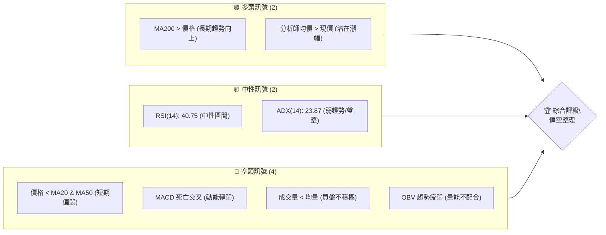

### 📊 核心指標速覽表

以下表格彙整了RKLB當前關鍵技術指標的數值與初步解讀：

| 指標類別 | 指標名稱 | 當前數值 | 訊號 | 解讀 |
|----------|----------|----------|------|------|
| **價格** | 當前收盤價 | $100.46 | 🟡 | 位於52週高點 $151.00 與低點 $33.73 的 56.9% 區間，近期明顯回調。 |
| **均線** | MA20 | $102.47 | 🔴 | 價格 $100.46 位於 MA20 $102.47 下方，顯示短期壓力。 |
| **均線** | MA50 | $106.93 | 🔴 | 價格 $100.46 位於 MA50 $106.93 下方，顯示中期承壓。 |
| **均線** | MA200 | $75.88 | 🟢 | 價格 $100.46 位於 MA200 $75.88 上方，長期趨勢仍為多頭。 |
| **動能** | RSI(14) | 40.75 | 🟡 | 處於中性區間，未達超買或超賣，顯示動能不足。 |
| **動能** | MACD | -4.490 | 🔴 | MACD 線位於訊號線下方 (-4.490 < -4.155)，MACD 柱狀圖為負值 (-0.335)，確認空頭動能。 |
| **趨勢** | ADX(14) | 23.87 | 🟡 | 低於 25，表示趨勢強度不足，市場處於盤整或弱趨勢。 |
| **波動** | ATR(14) | $9.36 | 🟡 | 相對於價格 ($100.46) 而言，每日波動幅度為 9.32%，屬中高波動，需注意風險。 |
| **成交量** | 量比(20日) | 0.74x | 🔴 | 當日成交量低於20日均量，顯示市場買盤興趣不足。 |
| **成交量** | OBV趨勢 | OBV < MA | 🔴 | 順勢指標 (OBV) 位於其移動平均線下方，量能疲弱，未能支持價格上漲。 |

### 🏆 技術評分卡

根據上述核心指標與分析，RKLB 的技術評分如下：

```
技術評分卡 — RKLB (2026-07-04)
════════════════════════════════════════════════════
趨勢強度      ████████░░░░░░░░░░░░  40/100  🟡 (ADX弱趨勢，但長期趨勢仍向上)
動能指標      ██████░░░░░░░░░░░░░░  30/100  🔴 (MACD空頭，RSI中性偏弱)
支撐穩定度    ████████████░░░░░░░░  60/100  🟡 (MA200提供遠期強支撐，但短期支撐承壓)
成交量配合    ████░░░░░░░░░░░░░░░░  20/100  🔴 (量能疲弱，OBV不配合)
形態完整度    ████████░░░░░░░░░░░░  40/100  🟡 (無明確經典形態，但近期為回調走勢)
均線排列      ██████░░░░░░░░░░░░░░  30/100  🔴 (短期均線空頭排列，中期承壓，長期多頭)
════════════════════════════════════════════════════
綜合評分      ██████░░░░░░░░░░░░░░  37/100  🔴 偏空整理
════════════════════════════════════════════════════
```

**評分理由：**
- **趨勢強度 (40/100 🟡)**：ADX 低於 25 顯示趨勢疲弱，但考慮到價格仍遠高於長期 MA200，長期趨勢仍為多頭，故評為中性偏弱。
- **動能指標 (30/100 🔴)**：MACD 已形成死亡交叉且柱狀圖為負，RSI 處於中性但偏弱的 40.75，整體動能偏空。
- **支撐穩定度 (60/100 🟡)**：$84.54 為近期重要支撐，下方有布林下軌 $82.16 和強大的 MA200 $75.88 提供支撐，但短期回調壓力大，需注意是否能守住。
- **成交量配合 (20/100 🔴)**：當前成交量遠低於均量，OBV 疲弱且低於其移動平均線，顯示市場缺乏買盤動能，不利於價格反彈。
- **形態完整度 (40/100 🟡)**：目前數據未顯示明確的經典圖表形態，但近期從高點回落的走勢本身就是一個修正形態，等待築底或反轉形態確認。
- **均線排列 (30/100 🔴)**：MA20 ($102.47) 和 MA50 ($106.93) 均位於現價上方，且 MA20 向下穿越 MA50 的風險增加，形成短期空頭排列；儘管 MA200 ($75.88) 提供長期支撐，但短期壓力顯著。

**綜合評級**：RKLB 目前處於偏空整理階段，短中期動能和量能不足，價格受短期均線壓制。雖然長期趨勢依舊看好，但短期內需要警惕進一步回調的風險。

---

## 2. 趨勢分析

本章將從多時框架深入剖析 RKLB 的價格趨勢，從長期宏觀視角到短期微觀動態，並結合 ADX 指標評估趨勢強度。

### 🌐 多時框趨勢分析

RKLB 的趨勢呈現出明顯的多時框差異性，長期向上，但中短期面臨顯著的回調壓力。

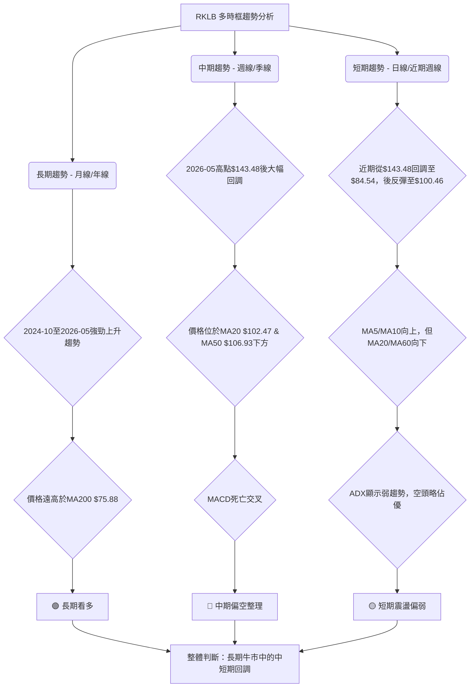

### 📈 長期趨勢 — 12個月走勢圖（Unicode）

RKLB 在過去12個月經歷了顯著的價格波動，從2025年7月的 $45.92 上漲至2026年5月的歷史高點 $143.48，隨後出現大幅回調。

```
RKLB 月線走勢圖（過去12個月）
價格軸 ($)
$150 ┤                                    ●(143.48, 26/05)
$140 ┤
$130 ┤
$120 ┤
$110 ┤                                              ●(100.46, 26/07)
$100 ┤                                        ●
$90  ┤                                  ●
$80  ┤                   ●(80.07, 26/01)
$70  ┤             ●(69.76, 25/12)
$60  ┤          ●(62.98, 25/10)
$50  ┤●(45.92, 25/07)
$40  ┤   ●(48.60, 25/08) ●(47.91, 25/09)
     └──────────────────────────────────────────────────────
      25/07 25/08 25/09 25/10 25/11 25/12 26/01 26/02 26/03 26/04 26/05 26/06 26/07
      (月份)
```

**走勢特徵分析表格**：

| 時間區間 | 主要走勢 | 價格範圍 | 漲跌幅 | 特徵分析 |
|----------|----------|----------|--------|----------|
| 2025-07 ~ 2026-01 | 強勁上漲 | $45.92 ~ $80.07 | +74.36% | 在此期間，RKLB 展現出強勁的多頭趨勢，價格持續創高，顯示市場對其前景高度看好。 |
| 2026-02 ~ 2026-03 | 震盪整理 | $64.22 ~ $80.07 | -19.79% | 經歷快速上漲後，進入短暫整理階段，價格在一定區間內波動，市場觀望情緒增加。 |
| 2026-04 ~ 2026-05 | 爆發性上漲 | $82.51 ~ $143.48 | +73.90% | 在此期間，RKLB 再次爆發性上漲，創下歷史新高 $143.48，顯示強大的買盤動能和市場熱情。 |
| 2026-06 ~ 2026-07 | 大幅回調 | $100.46 ~ $143.48 | -30.0% | 達到歷史高點後，RKLB 經歷了劇烈的大幅回調，價格從 $143.48 下跌至 $100.46，顯示獲利了結壓力巨大，市場情緒轉為謹慎。 |

### 📊 中期趨勢（週線分析）

從週線級別來看，RKLB 在經歷了2026年5月的歷史高點 $143.48 後，進入了中期回調趨勢。最近幾週的價格走勢顯示，雖然有嘗試反彈，但整體仍受阻於上方壓力。

```
RKLB 近期壓力與支撐示意圖 (週線)
價格軸 ($)
$145 ┤            R (143.48) ← 歷史高點阻力
$135 ┤
$125 ┤
$115 ┤  R (114.01) ← 50%斐波那契回調阻力
$105 ┤  R (106.93) ← MA50阻力
$100 ┤═══════════════════════════════════════════ 現價 (100.46)
$95  ┤  S (96.95)  ← MA5支撐 (近期)
$85  ┤  S (84.54)  ← 近期低點支撐
$75  ┤  S (75.88)  ← MA200強支撐
     └──────────────────────────────────────────────────────
      (時間軸)
```
**分析**：
- **近期高點與低點**：最近20週內，RKLB 在2026年5月31日觸及 $143.48 的高點，隨後在2026年6月28日下探至 $84.54 的低點，形成一個明顯的下降趨勢通道。
- **反彈與壓力**：當前價格 $100.46 較 $84.54 有所反彈，但上方 MA20 ($102.47) 和 MA50 ($106.93) 構成直接阻力。
- **成交量配合**：在下跌過程中，週成交量仍然較高，但最近一週（119,613,500）相較於前幾週有所下降，且低於20日均量，顯示市場買盤動能不足以推動價格持續上漲。

### ⚡ 趨勢強度評估（ADX 解讀）

ADX 指標用於衡量趨勢的強度，而非方向。當前 RKLB 的 ADX 數值為 23.87，這表示市場處於弱趨勢或盤整行情。

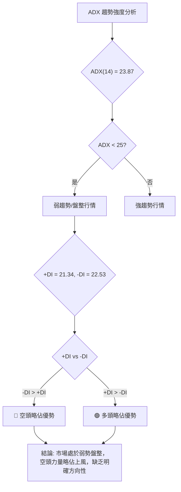

**ADX 強度對照表**：

| ADX 數值 | 趨勢強度 | 市場狀態 | 建議 |
|----------|----------|----------|------|
| 0-25     | 弱趨勢/盤整 | 市場缺乏方向，價格波動較小或震盪 | 觀望，等待趨勢明確或區間操作 |
| 25-50    | 中等趨勢 | 趨勢正在形成或已形成，動能較強 | 順勢交易，關注突破 |
| 50-75    | 強趨勢 | 趨勢非常明顯，動能強勁 | 順勢交易，持倉 |
| 75-100   | 極強趨勢 | 趨勢極度強勁，可能面臨超買/超賣 | 警惕反轉風險，但仍順勢 |

**解讀**：
RKLB 的 ADX 數值 23.87 位於「弱趨勢/盤整」區間，這意味著當前市場缺乏明確的單邊趨勢，價格可能在一個較窄的範圍內震盪。同時，-DI (22.53) 略高於 +DI (21.34)，這表明在當前的弱勢行情中，空頭力量略微佔據主導地位，但差異不大，不足以形成強勁的下跌趨勢。投資者應避免在這種情況下追漲殺跌，更適合採取區間操作或等待明確的趨勢訊號出現。

---

## 3. 圖表形態分析

本章將嘗試從 RKLB 的歷史價格走勢中識別潛在的圖表形態，分析其K線組合，並據此推導可能的價格目標。由於數據提供的精細度有限，將主要關注近期價格行為形成的宏觀形態。

### 🔍 形態識別系統

根據提供的月線和週線數據，RKLB 近期從 $143.48 的高點迅速回落，形成了一個明顯的「下降旗形」或「下降楔形」的初步特徵，這通常是趨勢中繼或反轉的形態。目前還未形成明確的經典反轉形態（如頭肩底、雙底），但其調整走勢本身可能構成一個修正形態。

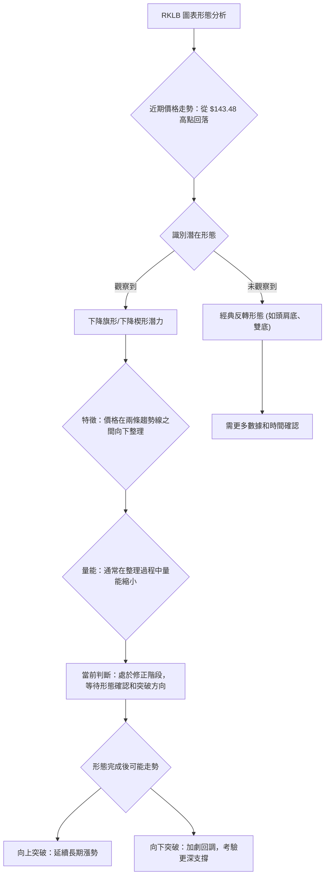

**分析**：
- **下降旗形/下降楔形潛力**：從2026年5月高點 $143.48 開始，RKLB 股價經歷了大幅下跌，並在 $84.54 附近獲得支撐後有所反彈。如果價格在 $143.48 和 $84.54 之間形成一系列更低的高點和更低的低點，並在兩條收斂的趨勢線內波動，則可能形成下降楔形。若價格在兩條平行線內向下運行，則為下降旗形。這兩種形態通常被視為修正形態，預示著在突破後可能延續之前的趨勢（本例中為上升趨勢）。
- **當前階段**：目前價格 $100.46 處於回調後的反彈階段，但尚未突破關鍵阻力位。形態仍在發展中，需要觀察未來幾週的價格行為以確認。

### 🕯️ 重要K線形態分析

由於提供的數據為週收盤價，我們將分析連續週收盤價的變化來推斷K線組合的意義。

| 月份 | 收盤價 | K線形態推斷 (基於週線) | 解讀 | 訊號 |
|------|--------|-------------------------|------|------|
| 2026-05-31 | $143.48 | 長上影線或吞噬頂部 (推斷) | 達到高點後，空頭開始發力，獲利了結盤湧現。 | 🔴 |
| 2026-06-07 | $110.08 | 大陰線 | 繼高點後出現巨量下跌，確認下跌趨勢。 | 🔴 |
| 2026-06-14 | $102.39 | 陰線 | 延續下跌趨勢，但跌幅有所收斂。 | 🔴 |
| 2026-06-21 | $107.24 | 短陽線/十字星 (反彈) | 嘗試反彈，但未能突破壓力，力量不足。 | 🟡 |
| 2026-06-28 | $84.54 | 大陰線 | 再次大幅下跌，下破支撐，市場恐慌。 | 🔴 |
| 2026-07-05 | $100.46 | 長陽線 (反彈) | 從低點強勁反彈，可能意味著短期買盤介入，但需確認。 | 🟢 |

**分析**：
- 在2026年5月底至6月初，RKLB 在 $143.48 附近形成了潛在的頂部K線形態，如長上影線或看跌吞噬形態（根據隨後的大幅下跌推斷）。這通常預示著趨勢的逆轉。
- 6月份連續出現大陰線，特別是6月7日的 $110.08 和6月28日的 $84.54，顯示了強大的空頭力量。
- 最近一週（7月5日）的 $100.46 較前一週的 $84.54 出現了顯著反彈，形成了一根較長的陽線。這可能是一個「錘子線」或「看漲吞噬」的底部反轉訊號，但需要未來幾週的走勢來確認，例如價格能否站穩並突破近期阻力。

### 📉 ASCII 走勢形態示意圖

以下為 RKLB 近期從高點回調的走勢示意圖，顯示潛在的下降通道或楔形。

```
RKLB 近期走勢形態示意圖 (2026-05 ~ 2026-07)
價格軸 ($)
$145 ┤            R1 (143.48)
$135 ┤             ╲
$125 ┤              ╲
$115 ┤               ╲ R2 (110.08)
$105 ┤                ╲
$100 ┤                 ● (100.46) ← 現價
$95  ┤                  ╲
$85  ┤                   ● (84.54)
$75  ┤
     └───────────────────────────────────────────────────
      26/05      26/06      26/07
      (時間軸)

圖示：價格從高點 $143.48 沿下降趨勢線 R1-R2 回調，在 S1 ($84.54) 獲得支撐後反彈。
      R1: $143.48 (2026-05-31 高點)
      S1: $84.54 (2026-06-28 低點)
      R2: 預估壓力線，約 $110.00 - $115.00 區間。
```

### 🎯 形態目標價計算

由於尚未形成明確的經典形態，我們將根據近期下跌的修正幅度來估算潛在的反彈目標。
我們將使用從 2026-05-31 高點 $143.48 到 2026-06-28 低點 $84.54 的下跌波段進行斐波那契回調分析，以作為潛在反彈目標。

- **高點 (A)**: $143.48
- **低點 (B)**: $84.54
- **下跌幅度**: $143.48 - $84.54 = $58.94

**潛在反彈目標價計算**：
1. **38.2% 斐波那契回調位**：$84.54 + ($58.94 * 0.382) = $84.54 + $22.51 = **$107.05**
2. **50% 斐波那契回調位**：$84.54 + ($58.94 * 0.50) = $84.54 + $29.47 = **$114.01**
3. **61.8% 斐波那契回調位**：$84.54 + ($58.94 * 0.618) = $84.54 + $36.43 = **$120.97**

**解讀**：
若 RKLB 能在 $84.54 附近築底成功並開啟反彈，則上述斐波那契回調位將是重要的阻力目標。當前價格 $100.46 位於 38.2% 回調位 $107.05 之下，顯示反彈仍有空間，但需突破此關鍵阻力才能進一步上行。

---

## 4. 支撐與阻力

本章將詳細分析 RKLB 的關鍵支撐與阻力價位，這些價位對於判斷股價未來走勢至關重要。我們將綜合歷史價格、移動平均線和布林通道來確定這些關鍵區域，並納入斐波那契回調位。

### 🗺️ 關鍵價位分布圖（Unicode）

以下為 RKLB 當前的價位結構分布圖，清晰標示了各級阻力與支撐。

```
RKLB 價位結構分布圖
═══════════════════════════════════════════════════
$143.48 ║████████████████████████║ 強阻力 R3 (歷史高點)
$120.97 ║████████████████████    ║ 阻力 R2 (61.8% 斐波那契回調)
$114.01 ║████████████████████████║ 阻力 R1 (50% 斐波那契回調 & 潛在形態阻力)
$107.05 ║████████████████████    ║ 關鍵阻力 R0 (38.2% 斐波那契回調 & MA50)
$106.93 ║████████████████████████║ MA50 阻力
$102.47 ║▓▓▓▓▓▓▓▓▓▓▓▓▓▓▓▓        ║ MA20 阻力
$100.46 ╠════════════════════════╣ ◄ 現價
$96.95  ║▓▓▓▓▓▓▓▓▓▓▓▓▓▓▓▓        ║ MA5 支撐
$84.54  ║████████████████████████║ 近期支撐 S1 (2026-06-28 低點)
$82.16  ║████████████████████    ║ 布林下軌支撐
$75.88  ║████████████████████████║ 強支撐 S2 (MA200)
$60.93  ║████████████████████    ║ 次級支撐 S3 (2026-03-29 低點)
═══════════════════════════════════════════════════
```

### 🚧 阻力位分析表

RKLB 面臨多重阻力，尤其是在近期回調後的反彈過程中。

| 阻力級別 | 價位 | 形成原因 | 突破難度 | 重要性 |
|----------|------|----------|----------|--------|
| **即時阻力 (R0)** | $102.47 | MA20 (20日移動平均線) | 中等 | 短期多空分界線，突破則短期趨勢有望轉強。 |
| **關鍵阻力 (R1)** | $106.93 | MA50 (50日移動平均線) & 38.2% 斐波那契回調位 $107.05 | 高 | 突破此區間將顯著改善中期趨勢，並確認反彈的有效性。 |
| **主要阻力 (R2)** | $114.01 | 50% 斐波那契回調位 | 高 | 突破此位將意味著市場對近期跌幅的修正力度較大，有機會測試更高點。 |
| **強阻力 (R3)** | $120.97 | 61.8% 斐波那契回調位 | 很高 | 若能突破此位，則說明反彈勢頭強勁，可能挑戰前高。 |
| **歷史阻力 (R4)** | $143.48 | 2026年5月歷史高點 | 極高 | 股價需極強動能和利好消息才能再次挑戰並突破此高點。 |

### 🛡️ 支撐位分析表

RKLB 在下方擁有多層支撐，尤其是長期移動平均線提供了堅實的心理和技術支撐。

| 支撐級別 | 價位 | 形成原因 | 守住機率 | 重要性 |
|----------|------|----------|----------|--------|
| **即時支撐 (S0)** | $96.95 | MA5 (5日移動平均線) | 中等 | 短期反彈的生命線，跌破則可能再次下探。 |
| **關鍵支撐 (S1)** | $84.54 | 2026年6月28日低點 | 中高 | 近期下跌的底部，若能守住則形成雙底或W底形態的基礎。 |
| **主要支撐 (S2)** | $82.16 | 布林通道下軌 | 高 | 布林通道的動態支撐，通常在極端下跌後提供反彈機會。 |
| **強支撐 (S3)** | $75.88 | MA200 (200日移動平均線) | 很高 | 長期牛市的關鍵防線，跌破將嚴重破壞長期趨勢。 |
| **次級支撐 (S4)** | $60.93 | 2026年3月29日低點 | 很高 | 若 S1/S2/S3 均失守，此為更深層次的重要支撐。 |

### 📐 斐波那契回調位分析

我們以 2026年5月31日高點 $143.48 至 2026年6月28日低點 $84.54 的下跌波段作為基礎，計算斐波那契回調位，以評估反彈的潛在阻力。

- **起點 (高點)**: $143.48
- **終點 (低點)**: $84.54
- **下跌幅度**: $58.94

| 斐波那契回調位 | 價位 ($) | 意義 |
|----------------|----------|------|
| **23.6% 回調** | $84.54 + ($58.94 * 0.236) = $84.54 + $13.91 = **$98.45** | 輕微反彈目標，跌破此位則反彈乏力。 |
| **38.2% 回調** | $84.54 + ($58.94 * 0.382) = $84.54 + $22.51 = **$107.05** | 重要的反彈阻力，突破此位則反彈勢頭增強。 |
| **50% 回調**   | $84.54 + ($58.94 * 0.50) = $84.54 + $29.47 = **$114.01** | 強力心理阻力，通常為反彈的關鍵點。 |
| **61.8% 回調** | $84.54 + ($58.94 * 0.618) = $84.54 + $36.43 = **$120.97** | 黃金分割點，若能突破則意味著趨勢可能逆轉。 |

**視覺化**：

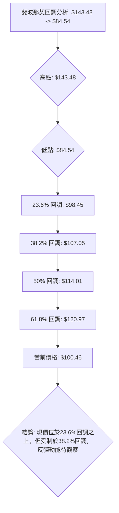

**結論**：RKLB 目前位於 $98.45 和 $107.05 之間，若能站穩 $100.46 並突破 $107.05，則有望挑戰更高的回調目標 $114.01 和 $120.97。反之，若跌破 $98.45，則可能再次測試 $84.54 的低點支撐。

---

## 5. 技術指標深度解讀

本章將對 RKLB 的主要技術指標進行深入分析，包括移動平均線、RSI、MACD、布林通道和成交量，並探討它們之間的相互關係和訊號確認。

### 🎛️ 指標訊號總覽

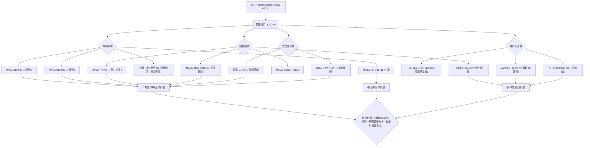

### 📈 移動平均線排列分析

RKLB 的移動平均線系統呈現出複雜的「混合排列」，顯示長期趨勢與短中期趨勢之間存在顯著差異。

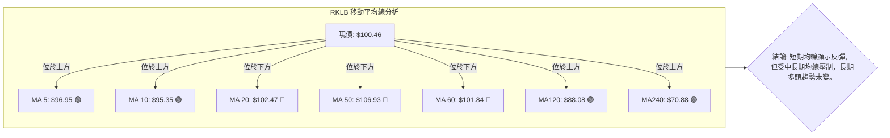

**當前均線排列狀態**：

| 移動平均線 | 數值 ($) | 價格關係 | 訊號 | 解讀 |
|------------|----------|----------|------|------|
| MA5        | $96.95   | 價格上方 | 🟢 | 近期反彈，短期買盤支撐。 |
| MA10       | $95.35   | 價格上方 | 🟢 | 近期反彈，短期買盤支撐。 |
| MA20       | $102.47  | 價格下方 | 🔴 | 價格受短期均線壓制，短期趨勢偏弱。 |
| MA50       | $106.93  | 價格下方 | 🔴 | 價格受中期均線壓制，中期趨勢偏弱。 |
| MA60       | $101.84  | 價格下方 | 🔴 | 價格受中期均線壓制，中期趨勢偏弱。 |
| MA120      | $88.08   | 價格上方 | 🟢 | 價格遠高於長期均線，長期趨勢保持多頭。 |
| MA240      | $70.88   | 價格上方 | 🟢 | 價格遠高於長期均線，長期趨勢保持多頭。 |

**整合分析**：
- **短期趨勢**：MA5 和 MA10 處於現價 $100.46 下方，且向上移動，顯示近期有短期反彈的跡象。然而，價格 $100.46 仍位於 MA20 $102.47 和 MA60 $101.84 之下，表明短期反彈仍受壓制，上方阻力較大。
- **中期趨勢**：價格位於 MA50 $106.93 之下，且 MA20 和 MA60 均向下，顯示中期趨勢依然偏空，RKLB 處於中期回調整理階段。
- **長期趨勢**：價格遠高於 MA120 $88.08 和 MA240 $70.88，且這些長期均線保持向上趨勢，這強烈表明 RKLB 的長期牛市格局並未改變，當前的下跌被視為長期上升趨勢中的一次健康修正。

**均線總結**：RKLB 的均線排列呈現「空頭陷阱」或「長期回調」的特徵。雖然短中期均線提供阻力，但長期均線的堅實支撐限制了下跌空間。

### 📉 RSI(14) 分析

RSI(14) 當前數值為 40.75，處於中性區間。

**RSI 數值進度條**：
RSI(14) 強度：████████░░░░░░░░░░░░  40.75/100 🟡

**超買超賣區間分析**：
- **超買區 (RSI > 70)**：RKLB 在2026年5月底價格達到 $143.48 時，RSI 曾一度飆升至 70 以上（根據數據，2026-05-17 週 RSI 為 73.3，2026-05-24 週 RSI 為 74.8，2026-05-31 週 RSI 為 70.6），顯示市場處於過熱狀態，隨後價格大幅回調。
- **超賣區 (RSI < 30)**：當前 RSI 40.75 尚未進入超賣區，表示雖然價格大幅下跌，但市場並未出現極度恐慌性拋售，或者說，下跌空間可能還有。最近一次接近超賣區是在2026年6月21日，RSI 達到 31.0。
- **中性區 (30-70)**：RSI 40.75 位於中性區間中下部，顯示當前市場買賣雙方力量相對平衡，但多頭動能不足。

**背離判斷 (頂背離/底背離)**：
- **頂背離**：在提供的數據中，從2026年5月高點 $143.48 到6月底的快速下跌，價格創下新低，RSI 也同步創下新低（從70+跌至31）。因此，**無明顯頂背離現象**。價格下跌與RSI下跌是同步的，確認了下跌趨勢。
- **底背離**：近期價格從 $84.54 反彈至 $100.46，而RSI從 34.1 (2026-06-28) 反彈至 40.8 (2026-07-05)。雖然價格和RSI同步反彈，但由於反彈幅度不大，且RSI未曾跌入超賣區，**無明顯底背離現象**。若價格再次下探 $84.54 附近甚至更低，而 RSI 卻不再創新低，則可能形成底背離，預示潛在的反轉。

**結論**：RSI 處於中性偏弱區間，未能提供明確的買賣訊號，但其未達超賣區也提示當前市場並非極度悲觀，但反彈動能尚未形成。

### 📊 MACD(12/26/9) 訊號解讀

MACD 指標當前顯示為空頭訊號。

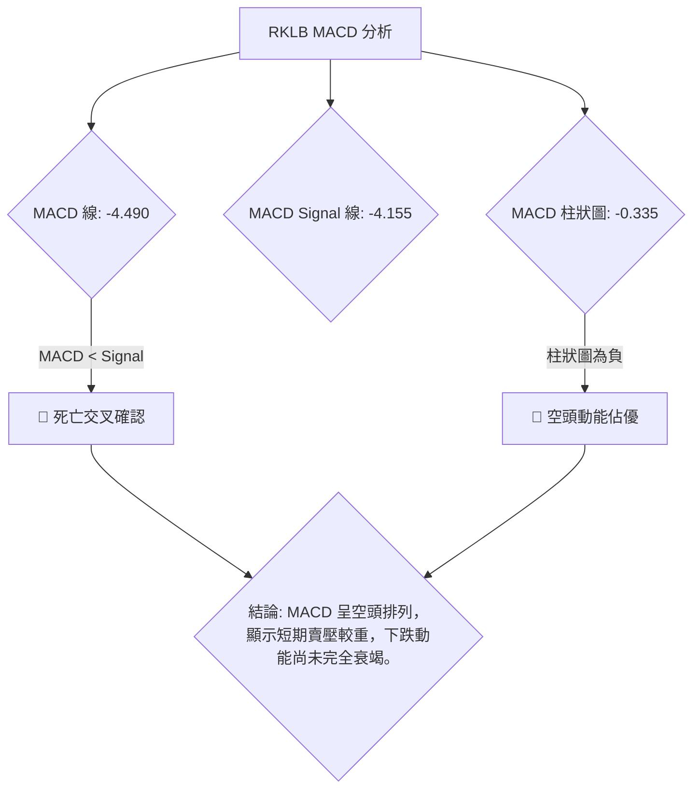

**詳細解讀**：
- **MACD 線 (-4.490)** 位於 **MACD 訊號線 (-4.155)** 之下，這是一個典型的 **死亡交叉 (Death Cross)** 訊號，表明短期動能已轉為向下，賣壓佔據主導地位。
- **MACD 柱狀圖 (-0.335)** 為負值且數值不大，這表明空頭動能雖然存在，但其強度可能正在減弱或處於盤整狀態。然而，只要柱狀圖仍為負值，就意味著空頭力量仍在釋放。
- **背離判斷**：
    - 從2026年5月高點 $143.48 開始，MACD 指標也從高位 (如2026-05-17 的 +4.702) 迅速下跌至當前的負值，價格和 MACD 均同步下跌，**無明顯頂背離**。
    - 近期價格從 $84.54 反彈至 $100.46，而 MACD 柱狀圖從 -4.091 (2026-06-28) 縮小至 -0.335 (2026-07-05)，顯示空頭動能減弱，MACD 線也正在嘗試向上收斂。這是一個初步的止跌訊號，但由於 MACD 線仍低於訊號線，**尚未形成底背離或黃金交叉**。

**結論**：MACD 指標確認了 RKLB 當前的空頭趨勢和賣壓，儘管空頭動能有減弱跡象，但仍需等待 MACD 形成黃金交叉才能確認反轉。

### 📦 布林通道分析

布林通道能反映價格的波動範圍和相對位置。

```
RKLB 布林通道示意圖 (2026-07-04)
價格軸 ($)
$130 ┤                                        BB上軌 ($122.78)
$120 ┤
$110 ┤                                        BB中軌 (MA20: $102.47)
$100 ┤═════════════════════════════════════════● 現價 ($100.46)
$90  ┤
$80  ┤                                        BB下軌 ($82.16)
$70  ┤
     └───────────────────────────────────────────────────
      (時間軸)
```

**詳細解讀**：
- **BB上軌**: $122.78
- **BB中軌 (MA20)**: $102.47
- **BB下軌**: $82.16
- **當前價格**: $100.46
- **BB %B**: 0.45

**分析**：
- **價格位置**：當前價格 $100.46 位於布林通道中軌 $102.47 之下，且接近中軌。這表明價格處於中軌下方，呈現弱勢。
- **%B 值**：%B 值為 0.45，表示價格位於布林通道的下半區間，但並未觸及下軌，這與 RSI 未達超賣區的判斷一致，說明雖然偏弱，但尚未到極端超賣狀態。
- **通道寬度**：數據未直接提供布林通道的寬度變化，但 ATR ($9.36) 顯示波動性較高。如果通道正在收窄，可能預示著趨勢的盤整和未來突破的可能性。如果通道擴大，則趨勢可能延續。

**結論**：RKLB 股價位於布林通道中軌下方，顯示短期偏空，但未觸及下軌，說明仍有回調空間或可能在中軌附近震盪。中軌 $102.47 將是價格反彈的首要阻力。

### 💹 成交量分析（量價配合度）

成交量是價格走勢的能量來源，其變化對判斷趨勢的可靠性至關重要。

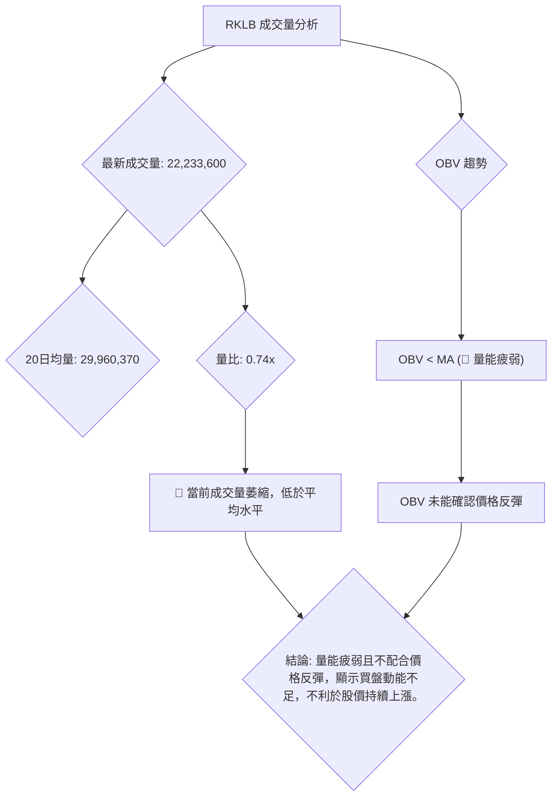

**詳細解讀**：
- **最新成交量**：22,233,600
- **20日均量**：29,960,370
- **量比**：0.74x (當前成交量僅為20日均量的 74%)
- **OBV 趨勢**：OBV < MA → 量能疲弱

**量價配合度分析**：
- **量能萎縮**：當前成交量遠低於20日和50日均量，量比僅為 0.74x。這是一個明顯的空頭訊號，表示在近期價格從 $84.54 反彈至 $100.46 的過程中，缺乏足夠的買盤動能支撐。通常，健康的價格反彈或上漲應伴隨成交量的放大。
- **OBV 疲弱**：OBV（On-Balance Volume）指標的趨勢低於其移動平均線，這進一步確認了量能的疲弱。OBV 是一個累積性指標，當其下降時，表明在下跌日期的成交量大於上漲日期的成交量，顯示賣壓持續。即便價格近期有所反彈，OBV 仍未顯示出強勁的買盤回歸，未能確認價格反彈的有效性。

**結論**：RKLB 的成交量分析顯示出明顯的量能疲弱，這與 MACD 的空頭訊號和 RSI 的中性偏弱狀態相互印證。在缺乏量能支持的情況下，任何價格反彈都可能只是短期行為，難以持續。這也增加了價格再次回調的風險。

---

## 6. 動能與波動率

本章將分析 RKLB 的動能指標和波動率，以評估其當前的市場活躍度和風險水平。

### ⚡ 動能評估四象限

動能評估四象限分析結合了股票的動能強度和波動率，以判斷其所處的市場階段。

| 象限 | 動能 | 波動 | 當前狀態 | 評估 |
|------|------|------|----------|------|
| Q1 | 強 | 低 | - | 最佳機會：趨勢明確且穩定，適合順勢交易。 |
| Q2 | 弱 | 低 | - | 謹慎觀望：市場缺乏方向和波動，不適合積極交易。 |
| Q3 | 強 | 高 | - | 高風險高收益：趨勢強勁但波動劇烈，適合經驗豐富的交易者。 |
| Q4 | 弱 | 高 | ✓ | 避免進場：市場缺乏方向但波動大，風險高，不易獲利。 |

**RKLB 當前狀態評估**：
- **動能**：RSI(14) 40.75 處於中性偏弱，MACD 死亡交叉且柱狀圖為負，OBV 疲弱。整體動能評估為 **弱**。
- **波動**：ATR(14) 為 $9.36，佔當前價格 $100.46 的 9.32%。對於一支個股而言，9.32% 的日波動率屬於 **高** 波動。

因此，RKLB 目前處於 **Q4 (弱動能, 高波動)** 象限。

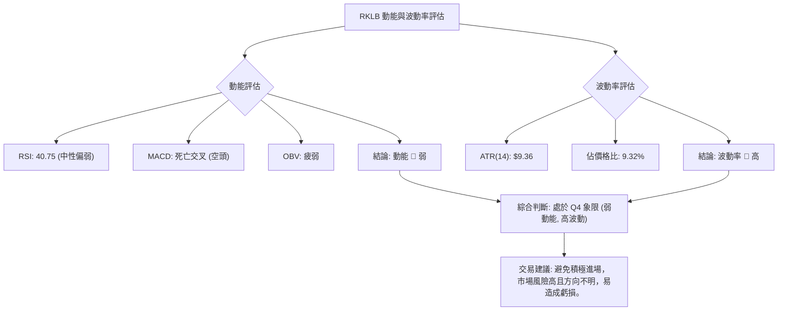

**結論**：RKLB 處於弱動能高波動的市場環境中。這意味著股價缺乏明確的趨勢方向，但每日波動幅度卻很大，容易造成頻繁的止損或錯失機會。在這種情況下，投資者應避免盲目進場，建議觀望，等待動能增強或波動率降低，使市場趨於穩定。

### 📊 ATR 波動率分析

平均真實波幅 (ATR) 是衡量市場波動性的指標。RKLB 的 ATR(14) 為 $9.36。

**詳細分析**：
- **ATR 數值**: $9.36
- **佔價格比**: $9.36 / $100.46 = 9.32%

**解讀**：
- ATR 數值 $9.36 意味著在過去14天中，RKLB 的平均每日價格波動範圍約為 $9.36。
- 9.32% 的波動幅度相對於許多大型股而言是偏高的，這證實了 RKLB 具有較高的日度波動性。高波動性既帶來了快速獲利的潛力，也伴隨著更高的風險。
- 在高波動市場中，止損點的設置需要相對寬鬆，以避免被正常的市場波動「洗出場」。

**止損距離建議**：
基於 ATR，一個常見的止損設置方法是將止損點設置在 ATR 的 1.5 倍至 3 倍距離。
- **保守止損** (1.5 x ATR): $9.36 * 1.5 = $14.04。若從現價 $100.46 算起，止損點約為 $100.46 - $14.04 = $86.42。
- **適中止損** (2 x ATR): $9.36 * 2 = $18.72。止損點約為 $100.46 - $18.72 = $81.74。
- **較寬鬆止損** (3 x ATR): $9.36 * 3 = $28.08。止損點約為 $100.46 - $28.08 = $72.38。

**建議**：由於 RKLB 波動較大，建議採用至少 2 倍 ATR 的止損距離，以降低被短期波動觸發止損的風險。例如，考慮將止損點設置在 $81.74 附近，這也接近布林通道下軌 $82.16 和近期低點 $84.54 下方，提供了結構性支撐。

### 📐 Beta 與市場相關性

提供的數據中未包含 RKLB 的 Beta 值。
**分析**：
- **缺乏 Beta 值**：由於沒有 Beta 數值，我們無法精確量化 RKLB 與整體市場（如 S&P 500）的相關性和波動放大程度。
- **行業特性推斷**：RKLB 屬於航太與國防產業，通常具有較高的成長潛力，但也可能伴隨著較高的不確定性和波動性。此類股票在市場上漲時可能漲幅更大，在市場下跌時也可能跌幅更深。
- **影響**：在沒有 Beta 值的情況下，投資者需要更加關注 RKLB 自身的技術面和基本面，並對其波動性保持警惕。建議將其視為波動性較高的個股，在投資組合中控制倉位，避免過度集中。

---

## 7. 多時框架總結

本章將綜合前述所有分析，從短期、中期、長期三個時間框架對 RKLB 的技術面進行評分和總結，以提供一個全面的視角。

### 📋 時框架評分表

| 時框架 | 趨勢方向 | 動能 | 均線排列 | 形態 | 綜合評分 | 建議 |
|--------|----------|------|----------|------|----------|------|
| **短期 (日線)** | 🔴 偏空 | 🔴 弱 | 🔴 承壓 | 🟡 修正中 | 3.0/10 🔴 | 觀望，等待築底或反轉訊號 |
| **中期 (週線)** | 🔴 偏空 | 🔴 弱 | 🔴 偏空 | 🟡 修正中 | 3.5/10 🔴 | 謹慎，避免追高，關注支撐 |
| **長期 (月線)** | 🟢 多頭 | 🟡 中性 | 🟢 多頭 | 🟢 上升趨勢 | 7.0/10 🟢 | 逢低關注，但需等待中短期風險釋放 |

**評分理由**：
- **短期**：價格位於 MA20/MA50 之下，MACD 死亡交叉，RSI 中性偏弱，量能萎縮。儘管近期有反彈，但缺乏持續性動能。
- **中期**：從 $143.48 高點大幅回調，MACD 空頭排列，ADX 弱勢盤整。中期趨勢明顯偏空，處於修正階段。
- **長期**：價格遠高於 MA200，整體上升趨勢仍在，分析師目標價也高於現價。長期基本面和趨勢未被破壞。

### 🔲 綜合訊號矩陣

以下矩陣展示了 RKLB 在不同時間框架下各技術維度訊號的一致性。

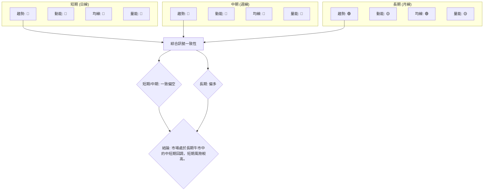

**一致性分析**：
- **短期與中期**：在趨勢方向、動能、均線排列和量能方面，短期和中期訊號高度一致地指向偏空。這表明 RKLB 目前正經歷一個較為顯著且持續的回調階段。
- **長期**：長期趨勢和均線排列仍保持多頭，動能和量能也處於中性水平（非極度悲觀），這與短中期的空頭訊號形成對比。這意味著當前的回調是長期上升趨勢中的修正，而非趨勢反轉。

**總結**：RKLB 處於一個複雜的市場環境中。雖然長期投資者可以視當前回調為逢低買入的機會，但短中期交易者應保持謹慎，因為市場動能和量能均不支持強勢反彈。策略上應等待中短期風險充分釋放，並出現明確的築底或反轉訊號。

---

## 8. 交易策略建議

基於對 RKLB 的多維度技術分析，我們將提供具體的交易策略建議，涵蓋多頭和空頭情境，並強調風險報酬比。

### 🗺️ 策略決策流程圖

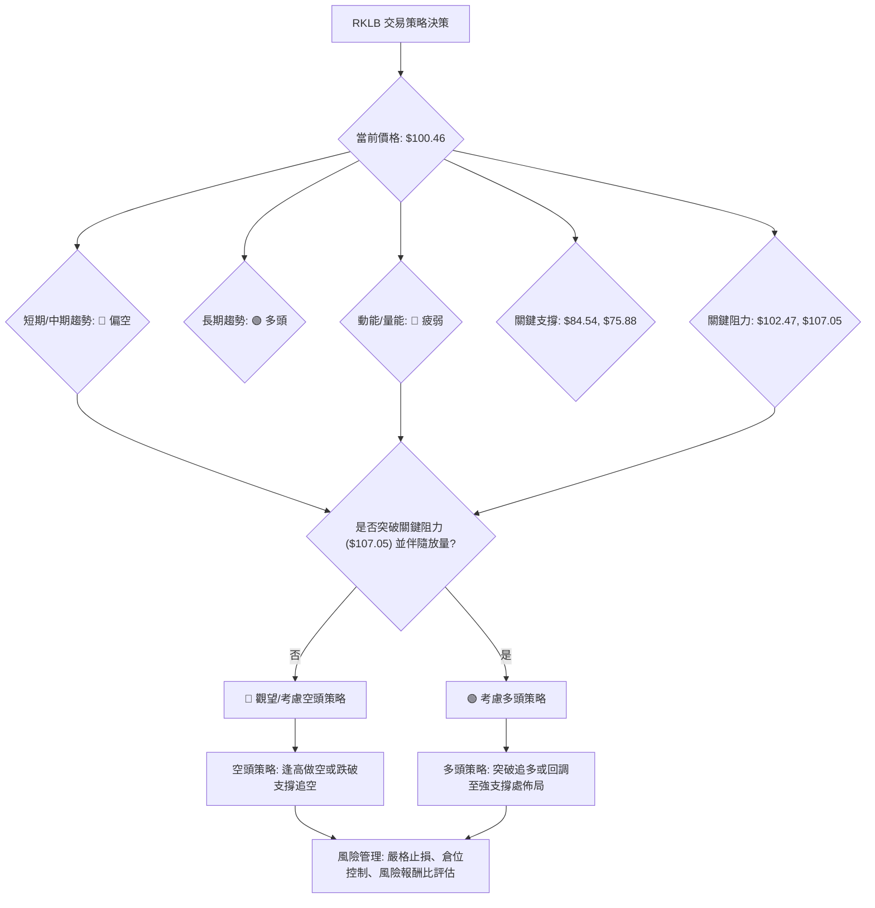

### 🟢 多頭策略詳情

鑑於 RKLB 長期趨勢仍為多頭，多頭策略應著重於在關鍵支撐位附近佈局，或等待明確的反轉訊號出現後追入。

| 策略要素 | 策略 A (保守築底) | 策略 B (突破追多) |
|----------|--------------------|--------------------|
| **進場條件** | 股價回調至強支撐區，並出現明確的看漲K線形態 (如錘子線、吞噬陽線) 或量價配合的止跌訊號。 | 股價放量突破關鍵阻力 $107.05 (38.2% 斐波那契回調) 並站穩。 |
| **進場價格** | **$85.00 - $82.50** (靠近S1 $84.54 和BB下軌 $82.16) | **$107.50 - $108.00** (突破 $107.05 後確認站穩) |
| **目標價 T1** | **$107.05** (38.2% 斐波那契回調 & MA50附近) | **$114.01** (50% 斐波那契回調) |
| **目標價 T2** | **$114.01** (50% 斐波那契回調) | **$120.97** (61.8% 斐波那契回調) |
| **止損價格** | **$74.00** (略低於 MA200 $75.88 和2倍ATR止損) | **$100.00** (跌破現價 $100.46，或MA20 $102.47) |
| **風險報酬比** | **($107.05 - $85.00) : ($85.00 - $74.00) = 22.05 : 11.00 ≈ 2.01:1 (T1)** | **($114.01 - $107.50) : ($107.50 - $100.00) = 6.51 : 7.50 ≈ 0.87:1 (T1)** |
| **成功機率** | 60% (基於長期支撐可靠性) | 45% (需確認突破有效性，避免假突破) |
| **建議倉位** | 中等倉位 (5-10%) | 小倉位 (3-5%) |

**風險報酬比分析**：
- **策略 A**：風險報酬比約 2:1，較為吸引。在強支撐位附近佈局，一旦反彈空間較大，止損距離合理。
- **策略 B**：風險報酬比不足 1:1，相對較差。突破追多策略通常風險較高，需要極高的突破確認度，且若無量能配合，易陷於假突破。

### 🔴 空頭策略詳情

RKLB 短中期動能偏弱，存在進一步回調的風險，可以考慮在反彈受阻或跌破關鍵支撐時進行空頭操作。

| 策略要素 | 策略 C (反彈做空) | 策略 D (跌破追空) |
|----------|--------------------|--------------------|
| **進場條件** | 股價反彈至關鍵阻力位 $107.05 - $114.01 區間，但未能有效突破，並出現看跌K線形態或量價背離。 | 股價跌破近期支撐 $84.54，並伴隨放量。 |
| **進場價格** | **$107.00 - $110.00** (在阻力區間內確認受阻) | **$84.00 - $83.50** (跌破 $84.54 後確認) |
| **目標價 T1** | **$84.54** (近期低點支撐) | **$75.88** (MA200強支撐) |
| **目標價 T2** | **$75.88** (MA200強支撐) | **$60.93** (2026-03-29低點) |
| **止損價格** | **$115.00** (略高於50%斐波那契回調 $114.01) | **$87.00** (略高於 $84.54 支撐) |
| **風險報酬比** | **($107.00 - $84.54) : ($115.00 - $107.00) = 22.46 : 8.00 ≈ 2.81:1 (T1)** | **($84.00 - $75.88) : ($87.00 - $84.00) = 8.12 : 3.00 ≈ 2.71:1 (T1)** |
| **成功機率** | 55% (基於動能疲弱和阻力有效性) | 65% (跌破關鍵支撐通常會引發恐慌性拋售) |
| **建議倉位** | 中等倉位 (5-8%) | 中等倉位 (5-10%) |

**風險報酬比分析**：
- **策略 C & D**：空頭策略的風險報酬比均在 2.7:1 以上，顯示較好的交易機會。在當前弱勢市場中，空頭策略可能更具優勢。

### ⭐ 整體訊號強度評星

```
做多訊號強度：★★☆☆☆  (2/5星)
做空訊號強度：★★★☆☆  (3/5星)
整體可信度：  ★★★☆☆  (3/5星)
```
**評星理由**：
- **做多訊號強度 (2/5星)**：儘管長期趨勢多頭，但短中期動能和量能疲弱，市場情緒偏空，反彈面臨重重阻力。做多需要耐心等待更明確的築底訊號。
- **做空訊號強度 (3/5星)**：短中期趨勢偏空，MACD 死亡交叉，量能不濟，且 ADX 顯示弱勢盤整，空頭略佔優勢。在反彈受阻或跌破關鍵支撐時，空頭策略有較高勝率。
- **整體可信度 (3/5星)**：RKLB 市場處於長期牛市中的中短期回調，多空交織，但短期內空頭力量佔優，因此整體交易訊號的可信度為中等，需謹慎操作。

---

## 9. 風險提示與監控

本章將闡述 RKLB 交易中的潛在風險，並提供關鍵監控指標清單和風險管理建議，以幫助投資者更好地應對市場不確定性。

### ✅ 關鍵監控指標 Checklist

以下是交易 RKLB 時應密切關注的關鍵技術指標清單：

```
RKLB 關鍵監控指標 Checklist
╔══════════════════════════════════════════════════════════════╗
║ [ ] 價格走勢：密切關注股價是否能站穩 $100.00 並突破 $102.47 (MA20) ║
║ [ ] 成交量：反彈時是否伴隨放量，下跌時是否縮量 (健康訊號)       ║
║ [ ] MACD：是否形成黃金交叉，MACD 柱狀圖是否轉正並持續放大       ║
║ [ ] RSI：是否能突破 50 關口，並朝超買區運行                     ║
║ [ ] 均線排列：MA20/MA50 是否能向上穿越，形成多頭排列             ║
║ [ ] ADX：ADX 是否能升破 25，且 +DI 向上突破 -DI，確認趨勢形成     ║
║ [ ] 支撐位：$84.54 (S1), $75.88 (S2) 是否能有效守住               ║
║ [ ] 阻力位：$107.05 (R0), $114.01 (R1) 是否能被突破               ║
╚══════════════════════════════════════════════════════════════╝
```

### ⚠️ 風險場景分析

針對 RKLB 的當前市場狀況，我們分析以下三種情境：

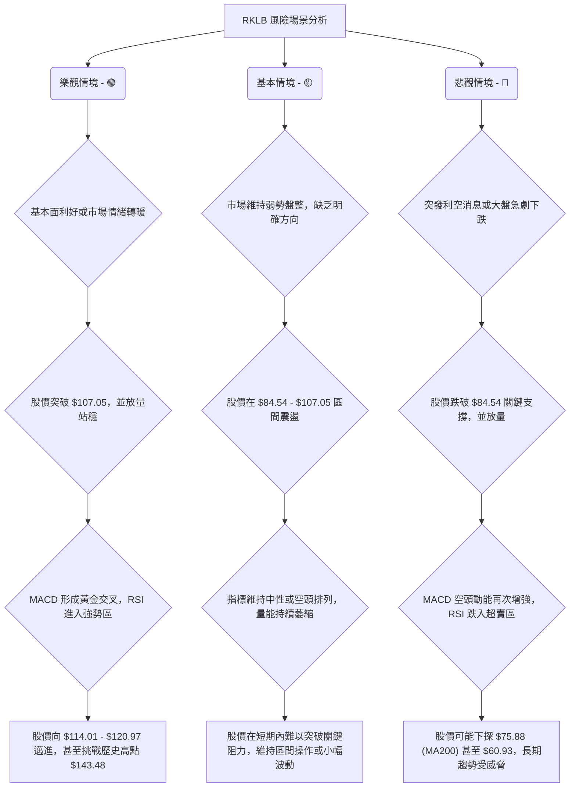

**風險分析**：
- **市場風險**：RKLB 屬於成長型股票，對市場情緒和宏觀經濟環境較為敏感。若整體市場出現大幅回調，RKLB 可能會受到更大衝擊。
- **行業風險**：航太與國防產業受政策、技術進步、競爭格局變化等影響較大。任何負面消息都可能對股價造成壓力。
- **流動性風險**：雖然 RKLB 成交量不小，但在極端市場情況下，流動性可能迅速惡化，導致買賣價差擴大。
- **技術面風險**：當前短中期均線空頭排列，MACD 死亡交叉，量能萎縮，這些都是技術面上的負面訊號，提示股價仍有下跌空間。

### 🛡️ 風險管理重要提醒

1.  **嚴格止損**：無論採取何種策略，都必須設定明確的止損點並嚴格執行。ATR 指標可作為設置止損的參考依據。
2.  **倉位管理**：避免單一股票倉位過重，尤其是在高波動、弱趨勢的市場中。建議將 RKLB 的倉位控制在總投資組合的合理比例內。
3.  **分批建倉/平倉**：在不確定的市場環境下，分批建倉或平倉可以有效分散風險，避免一次性重倉帶來的巨大波動。
4.  **關注基本面**：雖然本報告側重技術分析，但基本面（如公司財報、新訂單、產業新聞）的變化最終會影響股價走勢，應持續關注。
5.  **耐心等待訊號**：在弱趨勢/盤整行情中，過於頻繁的交易往往會增加交易成本和虧損風險。耐心等待明確的趨號出現，例如 MACD 黃金交叉、RSI 突破 50、價格放量突破關鍵阻力等。
6.  **情緒控制**：避免因市場波動而產生恐慌或貪婪情緒，堅持既定的交易計劃和風險管理原則。

---

## 📋 報告總結

```
RKLB 技術分析報告總結
════════════════════════════════════════════════════════
報告日期：2026-07-04
當前價格：$100.46
分析評級：⚖️ 偏空整理 (長線仍看多，但短中期回調壓力大)

關鍵結論：
├─ 長期趨勢：🟢 多頭。價格遠高於MA200，整體上升趨勢仍在。
├─ 中期趨勢：🔴 偏空。從 $143.48 高點大幅回調，MACD死亡交叉。
├─ 短期趨勢：🔴 偏空。價格受MA20/MA50壓制，動能和量能不足。
├─ 關鍵支撐：$84.54 (近期低點), $75.88 (MA200強支撐)
├─ 關鍵阻力：$107.05 (38.2%斐波那契回調), $114.01 (50%斐波那契回調)
└─ 分析師目標：$111.86 (均值)

最優策略組合：
1. 🥇 最佳機會：**保守築底多頭策略 (策略 A)**。在 $85.00 - $82.50 區間尋找止跌訊號佈局，止損 $74.00，目標 $107.05 / $114.01。風險報酬比約 2:1。
2. 🥈 次選機會：**反彈做空策略 (策略 C)**。若股價反彈至 $107.05 - $114.01 區間受阻，可考慮在 $107.00 - $110.00 處做空，止損 $115.00，目標 $84.54 / $75.88。風險報酬比約 2.8:1。
3. 🥉 保守選擇：**觀望等待**。當前市場處於弱動能高波動狀態，缺乏明確趨勢，最穩妥的策略是等待市場訊號更加清晰，例如 MACD 黃金交叉或價格放量突破關鍵阻力。
════════════════════════════════════════════════════════
```

---

> ⚠️ **免責聲明**：本報告為 AI 自動生成之技術分析，所有數據及估算均基於提供的歷史價格資訊。本報告**僅供研究與學術參考**，**不構成任何投資建議**。投資有風險，入市需謹慎。

---

*報告生成時間：2026-07-04 ｜ 數據來源：Yahoo Finance ｜ 分析框架：多時框技術分析*