<details>
<summary>📊 靜態圖表 (點擊展開)</summary>

</details>

<html>
<head><meta charset="utf-8" /></head>
<body>
    <div style="height:500px; width:100%;">                        <script>window.PlotlyConfig = {MathJaxConfig: 'local'};</script>
        <script charset="utf-8" src="https://cdn.plot.ly/plotly-3.6.0.min.js" integrity="sha256-QaOVwtVY0T02VaHrr6pnoHLCwayMJp4O5n4YyaE3rJk=" crossorigin="anonymous"></script>                <div id="candlestick-chart" class="plotly-graph-div" style="height:100%; width:100%;"></div>            <script>                window.PLOTLYENV=window.PLOTLYENV || {};                                if (document.getElementById("candlestick-chart")) {                    Plotly.newPlot(                        "candlestick-chart",                        [{"close":{"dtype":"f8","bdata":"AAAAIFyfR0AAAACAPQpIQAAAAEAKl0dAAAAAwB7lR0AAAAAgrudIQAAAAOB6dEpAAAAA4FFYSEAAAADgo1BHQAAAAKBHIUdAAAAAoEeBR0AAAADgevRHQAAAAAAp\u002fEdAAAAAACk8SkAAAADgehRMQAAAAAAAQE1AAAAAoEfBTkAAAAAA11NQQAAAAEDhmlBAAAAA4KMQUEAAAABA4VpQQAAAAIDrAVFAAAAAoEdRUUAAAAAAAMBQQAAAAKBHkVBAAAAAYGbWUEAAAACgmVlQQAAAAOBRSE5AAAAAwPXIT0AAAAAA1yNQQAAAACCuZ1BAAAAAAADgT0AAAACAPYpQQAAAAIDCdU5AAAAAoHB9T0AAAAAghatOQAAAAMD1SExAAAAAgMI1TEAAAACAFM5IQAAAAIDr0UlAAAAAQDPzSUAAAABguJ5JQAAAAAAp\u002fEhAAAAAAACgRkAAAADAHsVGQAAAACCup0VAAAAAANdjRUAAAAAgXM9FQAAAAKBwvUNAAAAAYGYmREAAAACgmTlFQAAAAMDMTEVAAAAAQAr3REAAAACA6xFFQAAAACBcL0RAAAAAQDPzREAAAAAAKVxGQAAAACBcr0hAAAAAQAqHSEAAAAAgrsdJQAAAAEAKt0pAAAAAYI\u002fCTEAAAAAA18NPQAAAAGC4vk5AAAAA4Hq0S0AAAABguL5LQAAAAEDh+kpAAAAAgML1TUAAAACgR6FRQAAAAEAzY1NAAAAAIIVLU0AAAAAghUtTQAAAAKCZqVFAAAAAIK6HUUAAAADAzJxRQAAAAOCjcFFAAAAAIFz\u002fUkAAAADA9YhTQAAAAIDrgVVAAAAAwB4FVUAAAADAHsVUQAAAAGBmNlVAAAAAoJn5VUAAAADAHqVVQAAAAEAz81ZAAAAA4KOwVkAAAABAMxNYQAAAAIA9SlZAAAAA4Hr0VUAAAABguP5VQAAAAKCZOVZAAAAAYLgeVEAAAAAAAMBVQAAAAOB6JFZAAAAAIIVrVUAAAADgegRUQAAAAKCZiVJAAAAAoEdRVEAAAABACkdSQAAAAOB6lFBAAAAA4HoUUkAAAACAwvVSQAAAAIDrAVJAAAAAIK5nUUAAAADgo4BQQAAAAAAp3FBAAAAAwPV4UUAAAABA4ZpSQAAAAMAeJVNAAAAAQAq3UUAAAACgcI1RQAAAAIAUflFAAAAAwMyMUUAAAACgmSlSQAAAAGBmRlFAAAAAgBS+UUAAAADgUYhRQAAAAIA9+lFAAAAAAACAUUAAAABACodRQAAAAGC43lFAAAAAIIU7UUAAAACgcP1RQAAAACCuF1FAAAAAgD0aUUAAAAAA19NRQAAAAIDCpVNAAAAAYLheUUAAAAAghftRQAAAAGC4zlBAAAAAAAAAUUAAAADgeoRQQAAAAOBROFJAAAAAACl8UEAAAABACndOQAAAAOCjsExAAAAAgBQOUEAAAACgR2FQQAAAAGC47lBAAAAAQOHqUEAAAADgepRQQAAAAMAeRVFAAAAAIFyvUEAAAABAMwNRQAAAACCup1FAAAAAgBQOUkAAAABgZmZSQAAAACCFu1RAAAAAQDMzVUAAAACgcF1WQAAAAMD1qFVAAAAAYI+CVkAAAABgZiZVQAAAACCF61NAAAAAYI+SVEAAAACAwqVTQAAAAKBHQVNAAAAA4KOgVEAAAAAA17NTQAAAAADXE1RAAAAA4KOwU0AAAACgmSlVQAAAAMAepVNAAAAAgBReWkAAAABgZlZdQAAAAADXY11AAAAAoJkJX0AAAACgmZFgQAAAAKBHMV9AAAAAwB5lYEAAAAAA19NfQAAAAMD1yGBAAAAAwMxcX0AAAADgUfhgQAAAAGBm5mFAAAAAIFzHYkAAAADA9YBiQAAAACBc72FAAAAAwPWYXkAAAADgetReQAAAAMDMrFxAAAAAwMz8XUAAAADAHoVbQAAAAKCZaVxAAAAAYLgOW0AAAABAM0NaQAAAAIDrsVxAAAAAwPWYWUAAAAAAAFBbQAAAAOBRKFpAAAAAYLj+WkAAAAAgXM9aQAAAAGCPEllAAAAAIK7HV0AAAACAPVpVQAAAAAApLFRAAAAAYI8iVUAAAADgo4BYQAAAAKCZaVlAAAAA4HoEWUAAAACgcB1ZQA=="},"high":{"dtype":"f8","bdata":"AAAAgD0KSkAAAADAHkVIQAAAAOBRmEhAAAAAQAp3SEAAAACgRyFJQAAAAGA5FEtAAAAAoHA9SkAAAAAgXE9IQAAAAOBR2EdAAAAAwMwMSEAAAABguP5HQAAAAIDCtUhAAAAAQDNTSkAAAAAgMXhMQAAAAKBHoU1AAAAAIK5HT0AAAAAALSJRQAAAAGCPIlFAAAAAAABgUkAAAAAAKZxRQAAAAEDhalFAAAAAgBR+UkAAAAAAABBSQAAAAAAAIFFAAAAAIIULUkAAAABgjwJRQAAAAKBHAVBAAAAAwMwsUEAAAAAghYtQQAAAAGBmllBAAAAAYI+iUEAAAADA9dhQQAAAACCFS1BAAAAAoJm5T0AAAADAzIxPQAAAAGC4vk1AAAAAANejTEAAAABA4RpMQAAAAMDMDEpAAAAAAABAS0AAAABA4XpMQAAAAIA9qktAAAAA4KOwSEAAAAAAKZxHQAAAAMBL10ZAAAAAgBTORUAAAAAA10NGQAAAAKBHIUdAAAAAgMKFREAAAAAA10NFQAAAAEAKZ0VAAAAAIIXLRUAAAACgmVlFQAAAAGBmpkRAAAAAYLh+RUAAAABguF5GQAAAAEAK10hAAAAAoJnZSEAAAAAgXC9KQAAAAAAA4EpAAAAAgD1qTUAAAACgmQlQQAAAACCFS1BAAAAAANcjUEAAAACgcF1MQAAAAOB6dExAAAAAAAAgTkAAAAAA16NRQAAAAMDMnFNAAAAAIIXLU0AAAADAHvVTQAAAACBcP1NAAAAAIFwvUkAAAAAAKaxSQAAAAECLTFJAAAAAIFwPU0AAAAAAAJBTQAAAAAAAkFVAAAAAoHB9VUAAAAAgrndWQAAAACCFG1ZAAAAAgMI1VkAAAADgp25WQAAAAAApDFdAAAAAQGAdV0AAAADAHuVYQAAAAKBHkVhAAAAAAADQVkAAAACgmVlWQAAAAMDMnFdAAAAAgD3KVUAAAAAAAMBVQAAAAEAzc1ZAAAAAAABAVkAAAADgelRWQAAAAMDMLFRAAAAA4HpUVEAAAABgZlZUQAAAACBcP1JAAAAAgD0qUkAAAABAMzNTQAAAAEAK91JAAAAAoJlZUkAAAADAzBxRQAAAAGBmZlFAAAAAIFy\u002fUUAAAADA9fBSQAAAAEAKR1NAAAAAwMyMU0AAAAAAANBRQAAAACCFg1FAAAAAYGb2UUAAAAAgXC9SQAAAAIDCZVFAAAAAYGYGUkAAAAAAAFBSQAAAAGBmhlJAAAAAANcTUkAAAABACsdSQAAAAAAACFJAAAAAANc7UkAAAABAM1NSQAAAAGBmJlJAAAAAANfTUUAAAADgURhSQAAAAEDhqlNAAAAA4FE4U0AAAABguC5SQAAAAGC4flJAAAAAwMxcUUAAAABgZiZRQAAAAADXw1JAAAAAgMIFUkAAAACAFIZQQAAAAIDr0U5AAAAAwB4lUEAAAABA4SpRQAAAAMD1WFFAAAAA4HqUUUAAAABAMxNRQAAAAIDAalJAAAAAYI9yUUAAAAAA14NRQAAAAEAz41FAAAAAAACwUkAAAACAwqVSQAAAACBc31RAAAAAIFy\u002fVUAAAABgZpZWQAAAAMDM\u002fFZAAAAAYGZGV0AAAABAM5NWQAAAAIA9mlVAAAAAYLieVEAAAACA63FUQAAAAOCjgFNAAAAAgMLlVEAAAABgj\u002fJUQAAAAOBPdVRAAAAAAADAVEAAAAAghStVQAAAAGCPMlVAAAAAIK5nWkAAAAAAKfxeQAAAACBcX15AAAAAIFzPX0AAAACAwqVgQAAAAADXS2BAAAAAAClMYUAAAACAPTJgQAAAAEAz62BAAAAAANdbYEAAAADgUXhhQAAAAAAAQGJAAAAAAADgYkAAAABgj9piQAAAAAAAAGJAAAAAACn0YEAAAADAzAxgQAAAAOBRoF5AAAAA4FGoXkAAAABguH5dQAAAAAAAEF1AAAAAYI\u002fyXUAAAACgcP1bQAAAAEDhwlxAAAAAwCCYXUAAAACA67FbQAAAAAAAIFtAAAAAgMLVW0AAAABAM2NbQAAAAKCZ2VpAAAAAYLhuWUAAAABAM5NXQAAAAEAKh1VAAAAAgOuRVUAAAADAHsVYQAAAAIA9ClpAAAAAYGbmWkAAAAAgXL9aQA=="},"hovertemplate":"\u003cb\u003e%{x|%Y-%m-%d}\u003c\u002fb\u003e\u003cbr\u003e\u958b: $%{open:.2f}\u003cbr\u003e\u9ad8: $%{high:.2f}\u003cbr\u003e\u4f4e: $%{low:.2f}\u003cbr\u003e\u6536: $%{close:.2f}\u003cextra\u003e\u003c\u002fextra\u003e","low":{"dtype":"f8","bdata":"AAAAoEeBR0AAAACgmTlHQAAAAAAAgEdAAAAA4KOQR0AAAABgZmZHQAAAAOB69EdAAAAAQAo3SEAAAABA4ZpGQAAAAIA96kZAAAAAIFwvR0AAAACgR0FHQAAAACBcj0dAAAAAoEdBSEAAAACgR6FJQAAAAGBm5ktAAAAAYI+CTEAAAABAM9NPQAAAAEDhGlBAAAAAwPUIUEAAAADgzidQQAAAAOBRGE9AAAAAwB7FUEAAAABAM5tQQAAAAKCZ2U9AAAAAQDOrUEAAAABACjdQQAAAAOB6NE1AAAAAAABgTkAAAABAM9NPQAAAAKCZCVBAAAAAgBTOT0AAAACgcL1PQAAAAIDrcU5AAAAAQDMzTkAAAADgo5BNQAAAAKBHQUxAAAAAIFxvS0AAAADgerRIQAAAAODOJ0dAAAAAoEdhSUAAAABA4ZpJQAAAAOB61EhAAAAAIFwvRkAAAABgZqZFQAAAAMDMHEVAAAAAoHCdREAAAABACjdFQAAAAMD1qENAAAAAwPXIQkAAAABgZqZDQAAAAOCjMERAAAAA4KOwREAAAABgZuZEQAAAAKBw\u002fUNAAAAAgMI1REAAAAAAAMBEQAAAAMD1aEZAAAAAoJnZR0AAAAAAKZxIQAAAACCFK0lAAAAAAAAgSkAAAADAzGxMQAAAAGBm5k1AAAAAgD2KS0AAAABACldKQAAAAEDhikpAAAAAANcDTEAAAADAnV9OQAAAAMAgMFJAAAAAYI9SUkAAAACgQ7NSQAAAAMD1mFFAAAAAoJtUUUAAAAAAKZxRQAAAAOBRSFFAAAAAYGa2UEAAAAAA19NRQAAAAEAzg1JAAAAAYGZ2VEAAAADgo5BUQAAAAMDMnFRAAAAA4NDaVEAAAACgmWlVQAAAAAAAIFVAAAAAoJmpVUAAAACgmRlXQAAAAEAzE1ZAAAAAoHCtVEAAAADAdlZUQAAAACCuh1VAAAAA4KMAVEAAAAAAAIBUQAAAAMDKgVVAAAAAAADAVEAAAACgR4FTQAAAAIBBeFJAAAAAoEfxUkAAAABACCRRQAAAAMDMTFBAAAAAAADAUEAAAAAAALBRQAAAAEAz41FAAAAAoEfBUEAAAAAgXO9PQAAAAAAAYFBAAAAAAABAUEAAAADAS39RQAAAAGBmFlJAAAAAoJlZUUAAAAAAACBRQAAAAGBmplBAAAAA4FE4UUAAAAAA1zNRQAAAAGBmBlBAAAAAwMycUEAAAAAAKYxQQAAAAIAUXlFAAAAAgMLVUEAAAADgowhRQAAAAOB69FBAAAAAgL4nUUAAAADAHhVRQAAAAIDrEVFAAAAAACncUEAAAABA4SpRQAAAAKBH0VFAAAAAoJlZUUAAAAAAAABRQAAAAMD1mFBAAAAAQDODUEAAAACgcB1QQAAAAAApPFFAAAAAgMJlUEAAAADAzCxOQAAAAGDlEExAAAAAANeDTUAAAABAM1NQQAAAAIAU7k5AAAAAYGamUEAAAABA4fpPQAAAAGDn81BAAAAAQOGiUEAAAACAwpVQQAAAAIDCpVBAAAAAYLieUUAAAABgZmZRQAAAAKCZOVNAAAAAYGbmVEAAAABgZiZVQAAAAAAAcFVAAAAA4KPwVUAAAAAAKWRUQAAAAMAexVNAAAAAwHRDU0AAAABgZmZTQAAAACBcf1JAAAAAgBReU0AAAAAghZtTQAAAAAAAEFNAAAAAANcjU0AAAABACrdTQAAAACCFe1NAAAAAIK53VUAAAAAAAABaQAAAAIA9GlxAAAAAwPU4XUAAAAAA11NeQAAAAEAzc15AAAAAoPFqX0AAAABguM5cQAAAAIAUDl9AAAAAQDPzXkAAAACA62lgQAAAAIDrUWFAAAAAwB49YUAAAAAA18thQAAAAKCZwWBAAAAAAABAXkAAAAAA16NeQAAAAIA9alxAAAAAwPWYW0AAAABguK5aQAAAAAAAwFtAAAAAwMxMWUAAAACAPRpaQAAAAKCZWVpAAAAAQArnWEAAAABAM3NaQAAAAOB6xFlAAAAAYI8CWkAAAACgcD1ZQAAAAAAAIFhAAAAA4KO4V0AAAABgZjZVQAAAAAAAAFRAAAAAYLguVEAAAABgZnZWQAAAAMD16FdAAAAAIK5nWEAAAACAPXpYQA=="},"name":"\u50f9\u683c","open":{"dtype":"f8","bdata":"AAAAAAAASkAAAADgUchHQAAAAIDCdUhAAAAAQArXR0AAAADgo5BHQAAAAEAzg0hAAAAAgMLlSUAAAAAAAABIQAAAAGBmpkdAAAAAQDOzR0AAAABA4ZpHQAAAAOCjsEdAAAAAgOtRSEAAAABgZgZKQAAAAGC4bkxAAAAAoEeBTUAAAACgmQlQQAAAAKCZOVBAAAAAQDOzUUAAAADgUfhQQAAAAIDCVVBAAAAAoEeBUUAAAADgeoRRQAAAAMD1eFBAAAAA4KNIUUAAAABgjwJRQAAAAAApfE9AAAAAIK7HTkAAAAAA1zNQQAAAAAApjFBAAAAAQDNrUEAAAACgRwlQQAAAAAAAQFBAAAAAYI\u002fiTkAAAAAA14NPQAAAAGBm5kxAAAAA4HpUTEAAAABA4RpMQAAAAKAY1EdAAAAAYLjeSkAAAAAAAABMQAAAAEAK90lAAAAAoEdhSEAAAABA4dpFQAAAAEAzk0ZAAAAAACkcRUAAAAAAAEBFQAAAAIA9CkdAAAAAgD3qQ0AAAACgR2FEQAAAAADXA0VAAAAAYLieRUAAAACgR0FFQAAAAEAzk0RAAAAAIK5HREAAAABgj\u002fJEQAAAAGCP0kZAAAAAAABwSEAAAACAPQpJQAAAAKBwnUlAAAAA4FG4SkAAAACgR8FMQAAAAAAAQE9AAAAA4KeGT0AAAADgURhLQAAAAMDMDExAAAAAoJkZTEAAAAAgXI9OQAAAAAApPFJAAAAAANdzUkAAAACAPYJTQAAAACCFK1NAAAAAAABgUUAAAACgmUFSQAAAAAAA4FFAAAAA4FGoUUAAAAAgrqdSQAAAAOCjcFNAAAAAYGYGVUAAAAAAAGBVQAAAAKCZIVVAAAAAYLg+VUAAAADA9UhWQAAAAGBmllVAAAAAwPVQVkAAAACgmSFXQAAAAMDMbFdAAAAAoEeBVkAAAADgUZhVQAAAACCFQ1ZAAAAAIK6vVUAAAADA9bhUQAAAAIAUzlVAAAAAACn8VUAAAAAAAEBVQAAAAIA9ylNAAAAAYGamU0AAAABgZlZUQAAAAGC4flFAAAAAAABAUUAAAACgmQFSQAAAAIAUplJAAAAA4FFIUkAAAACA6+FQQAAAAOB6rFBAAAAAQGCFUEAAAAAAAMBRQAAAAKCZOVJAAAAAINneUkAAAADgUTBRQAAAAOBROFFAAAAAgBTGUUAAAABA4YJRQAAAAIDC5VBAAAAAIIWrUEAAAABguDZRQAAAAADXs1FAAAAAQOG6UUAAAADgowhRQAAAAMD1WFFAAAAAgMKVUUAAAABAMzNRQAAAAMDM\u002fFFAAAAAoJlJUUAAAADAzFRRQAAAAGBm3lFAAAAAYI8CU0AAAADgejRRQAAAAAAAAFJAAAAAoHAFUUAAAAAAAMBQQAAAAAApPFFAAAAAwMzMUUAAAADgo4BQQAAAAKCZuU5AAAAAQOHaTkAAAAAAAGBQQAAAAMDMHE9AAAAAYLjuUEAAAAAgXMdQQAAAAAAAAFJAAAAAANdDUUAAAADAzOxQQAAAAEAzw1BAAAAAIIVjUkAAAACgcGVSQAAAAIAUPlNAAAAAwB4FVUAAAABgZjZVQAAAAMAelVZAAAAAgMKdVkAAAABgZnZWQAAAAIDClVVAAAAAACnsU0AAAADAzARUQAAAAEAKd1NAAAAAQDNjU0AAAACA6+FUQAAAAEAKl1NAAAAAYGamVEAAAAAgrudTQAAAAKBwLVVAAAAAgD2CVUAAAACgR1FaQAAAAOCjMFxAAAAAoEf5XkAAAABgZsZeQAAAAEAzA2BAAAAAACmYYEAAAACAFH5fQAAAAGC43l9AAAAAwPWIX0AAAADAHm1gQAAAAEDhvmFAAAAAQAq3YkAAAACgcGViQAAAAIAUfmFAAAAAACmMYEAAAACAwlVfQAAAAMAe5V1AAAAAoHBFXEAAAACgR5FcQAAAAEDhqlxAAAAAoJmZXUAAAADAzOxaQAAAAIDCpVpAAAAAoEeBXUAAAACgcP1aQAAAAKBw7VpAAAAAIK4HWkAAAADAHjVbQAAAACBcv1pAAAAAoEcBWEAAAABgZnZXQAAAAEAKh1VAAAAAQApHVEAAAABA4dJWQAAAAMDMTFhAAAAA4HpMWUAAAAAgXD9ZQA=="},"x":["2025-09-16T00:00:00-04:00","2025-09-17T00:00:00-04:00","2025-09-18T00:00:00-04:00","2025-09-19T00:00:00-04:00","2025-09-22T00:00:00-04:00","2025-09-23T00:00:00-04:00","2025-09-24T00:00:00-04:00","2025-09-25T00:00:00-04:00","2025-09-26T00:00:00-04:00","2025-09-29T00:00:00-04:00","2025-09-30T00:00:00-04:00","2025-10-01T00:00:00-04:00","2025-10-02T00:00:00-04:00","2025-10-03T00:00:00-04:00","2025-10-06T00:00:00-04:00","2025-10-07T00:00:00-04:00","2025-10-08T00:00:00-04:00","2025-10-09T00:00:00-04:00","2025-10-10T00:00:00-04:00","2025-10-13T00:00:00-04:00","2025-10-14T00:00:00-04:00","2025-10-15T00:00:00-04:00","2025-10-16T00:00:00-04:00","2025-10-17T00:00:00-04:00","2025-10-20T00:00:00-04:00","2025-10-21T00:00:00-04:00","2025-10-22T00:00:00-04:00","2025-10-23T00:00:00-04:00","2025-10-24T00:00:00-04:00","2025-10-27T00:00:00-04:00","2025-10-28T00:00:00-04:00","2025-10-29T00:00:00-04:00","2025-10-30T00:00:00-04:00","2025-10-31T00:00:00-04:00","2025-11-03T00:00:00-05:00","2025-11-04T00:00:00-05:00","2025-11-05T00:00:00-05:00","2025-11-06T00:00:00-05:00","2025-11-07T00:00:00-05:00","2025-11-10T00:00:00-05:00","2025-11-11T00:00:00-05:00","2025-11-12T00:00:00-05:00","2025-11-13T00:00:00-05:00","2025-11-14T00:00:00-05:00","2025-11-17T00:00:00-05:00","2025-11-18T00:00:00-05:00","2025-11-19T00:00:00-05:00","2025-11-20T00:00:00-05:00","2025-11-21T00:00:00-05:00","2025-11-24T00:00:00-05:00","2025-11-25T00:00:00-05:00","2025-11-26T00:00:00-05:00","2025-11-28T00:00:00-05:00","2025-12-01T00:00:00-05:00","2025-12-02T00:00:00-05:00","2025-12-03T00:00:00-05:00","2025-12-04T00:00:00-05:00","2025-12-05T00:00:00-05:00","2025-12-08T00:00:00-05:00","2025-12-09T00:00:00-05:00","2025-12-10T00:00:00-05:00","2025-12-11T00:00:00-05:00","2025-12-12T00:00:00-05:00","2025-12-15T00:00:00-05:00","2025-12-16T00:00:00-05:00","2025-12-17T00:00:00-05:00","2025-12-18T00:00:00-05:00","2025-12-19T00:00:00-05:00","2025-12-22T00:00:00-05:00","2025-12-23T00:00:00-05:00","2025-12-24T00:00:00-05:00","2025-12-26T00:00:00-05:00","2025-12-29T00:00:00-05:00","2025-12-30T00:00:00-05:00","2025-12-31T00:00:00-05:00","2026-01-02T00:00:00-05:00","2026-01-05T00:00:00-05:00","2026-01-06T00:00:00-05:00","2026-01-07T00:00:00-05:00","2026-01-08T00:00:00-05:00","2026-01-09T00:00:00-05:00","2026-01-12T00:00:00-05:00","2026-01-13T00:00:00-05:00","2026-01-14T00:00:00-05:00","2026-01-15T00:00:00-05:00","2026-01-16T00:00:00-05:00","2026-01-20T00:00:00-05:00","2026-01-21T00:00:00-05:00","2026-01-22T00:00:00-05:00","2026-01-23T00:00:00-05:00","2026-01-26T00:00:00-05:00","2026-01-27T00:00:00-05:00","2026-01-28T00:00:00-05:00","2026-01-29T00:00:00-05:00","2026-01-30T00:00:00-05:00","2026-02-02T00:00:00-05:00","2026-02-03T00:00:00-05:00","2026-02-04T00:00:00-05:00","2026-02-05T00:00:00-05:00","2026-02-06T00:00:00-05:00","2026-02-09T00:00:00-05:00","2026-02-10T00:00:00-05:00","2026-02-11T00:00:00-05:00","2026-02-12T00:00:00-05:00","2026-02-13T00:00:00-05:00","2026-02-17T00:00:00-05:00","2026-02-18T00:00:00-05:00","2026-02-19T00:00:00-05:00","2026-02-20T00:00:00-05:00","2026-02-23T00:00:00-05:00","2026-02-24T00:00:00-05:00","2026-02-25T00:00:00-05:00","2026-02-26T00:00:00-05:00","2026-02-27T00:00:00-05:00","2026-03-02T00:00:00-05:00","2026-03-03T00:00:00-05:00","2026-03-04T00:00:00-05:00","2026-03-05T00:00:00-05:00","2026-03-06T00:00:00-05:00","2026-03-09T00:00:00-04:00","2026-03-10T00:00:00-04:00","2026-03-11T00:00:00-04:00","2026-03-12T00:00:00-04:00","2026-03-13T00:00:00-04:00","2026-03-16T00:00:00-04:00","2026-03-17T00:00:00-04:00","2026-03-18T00:00:00-04:00","2026-03-19T00:00:00-04:00","2026-03-20T00:00:00-04:00","2026-03-23T00:00:00-04:00","2026-03-24T00:00:00-04:00","2026-03-25T00:00:00-04:00","2026-03-26T00:00:00-04:00","2026-03-27T00:00:00-04:00","2026-03-30T00:00:00-04:00","2026-03-31T00:00:00-04:00","2026-04-01T00:00:00-04:00","2026-04-02T00:00:00-04:00","2026-04-06T00:00:00-04:00","2026-04-07T00:00:00-04:00","2026-04-08T00:00:00-04:00","2026-04-09T00:00:00-04:00","2026-04-10T00:00:00-04:00","2026-04-13T00:00:00-04:00","2026-04-14T00:00:00-04:00","2026-04-15T00:00:00-04:00","2026-04-16T00:00:00-04:00","2026-04-17T00:00:00-04:00","2026-04-20T00:00:00-04:00","2026-04-21T00:00:00-04:00","2026-04-22T00:00:00-04:00","2026-04-23T00:00:00-04:00","2026-04-24T00:00:00-04:00","2026-04-27T00:00:00-04:00","2026-04-28T00:00:00-04:00","2026-04-29T00:00:00-04:00","2026-04-30T00:00:00-04:00","2026-05-01T00:00:00-04:00","2026-05-04T00:00:00-04:00","2026-05-05T00:00:00-04:00","2026-05-06T00:00:00-04:00","2026-05-07T00:00:00-04:00","2026-05-08T00:00:00-04:00","2026-05-11T00:00:00-04:00","2026-05-12T00:00:00-04:00","2026-05-13T00:00:00-04:00","2026-05-14T00:00:00-04:00","2026-05-15T00:00:00-04:00","2026-05-18T00:00:00-04:00","2026-05-19T00:00:00-04:00","2026-05-20T00:00:00-04:00","2026-05-21T00:00:00-04:00","2026-05-22T00:00:00-04:00","2026-05-26T00:00:00-04:00","2026-05-27T00:00:00-04:00","2026-05-28T00:00:00-04:00","2026-05-29T00:00:00-04:00","2026-06-01T00:00:00-04:00","2026-06-02T00:00:00-04:00","2026-06-03T00:00:00-04:00","2026-06-04T00:00:00-04:00","2026-06-05T00:00:00-04:00","2026-06-08T00:00:00-04:00","2026-06-09T00:00:00-04:00","2026-06-10T00:00:00-04:00","2026-06-11T00:00:00-04:00","2026-06-12T00:00:00-04:00","2026-06-15T00:00:00-04:00","2026-06-16T00:00:00-04:00","2026-06-17T00:00:00-04:00","2026-06-18T00:00:00-04:00","2026-06-22T00:00:00-04:00","2026-06-23T00:00:00-04:00","2026-06-24T00:00:00-04:00","2026-06-25T00:00:00-04:00","2026-06-26T00:00:00-04:00","2026-06-29T00:00:00-04:00","2026-06-30T00:00:00-04:00","2026-07-01T00:00:00-04:00","2026-07-02T00:00:00-04:00"],"type":"candlestick"},{"hovertemplate":"MA30: $%{y:.2f}\u003cextra\u003e\u003c\u002fextra\u003e","line":{"color":"#2196F3","dash":"dash","width":2},"mode":"lines","name":"MA30","x":["2025-09-16T00:00:00-04:00","2025-09-17T00:00:00-04:00","2025-09-18T00:00:00-04:00","2025-09-19T00:00:00-04:00","2025-09-22T00:00:00-04:00","2025-09-23T00:00:00-04:00","2025-09-24T00:00:00-04:00","2025-09-25T00:00:00-04:00","2025-09-26T00:00:00-04:00","2025-09-29T00:00:00-04:00","2025-09-30T00:00:00-04:00","2025-10-01T00:00:00-04:00","2025-10-02T00:00:00-04:00","2025-10-03T00:00:00-04:00","2025-10-06T00:00:00-04:00","2025-10-07T00:00:00-04:00","2025-10-08T00:00:00-04:00","2025-10-09T00:00:00-04:00","2025-10-10T00:00:00-04:00","2025-10-13T00:00:00-04:00","2025-10-14T00:00:00-04:00","2025-10-15T00:00:00-04:00","2025-10-16T00:00:00-04:00","2025-10-17T00:00:00-04:00","2025-10-20T00:00:00-04:00","2025-10-21T00:00:00-04:00","2025-10-22T00:00:00-04:00","2025-10-23T00:00:00-04:00","2025-10-24T00:00:00-04:00","2025-10-27T00:00:00-04:00","2025-10-28T00:00:00-04:00","2025-10-29T00:00:00-04:00","2025-10-30T00:00:00-04:00","2025-10-31T00:00:00-04:00","2025-11-03T00:00:00-05:00","2025-11-04T00:00:00-05:00","2025-11-05T00:00:00-05:00","2025-11-06T00:00:00-05:00","2025-11-07T00:00:00-05:00","2025-11-10T00:00:00-05:00","2025-11-11T00:00:00-05:00","2025-11-12T00:00:00-05:00","2025-11-13T00:00:00-05:00","2025-11-14T00:00:00-05:00","2025-11-17T00:00:00-05:00","2025-11-18T00:00:00-05:00","2025-11-19T00:00:00-05:00","2025-11-20T00:00:00-05:00","2025-11-21T00:00:00-05:00","2025-11-24T00:00:00-05:00","2025-11-25T00:00:00-05:00","2025-11-26T00:00:00-05:00","2025-11-28T00:00:00-05:00","2025-12-01T00:00:00-05:00","2025-12-02T00:00:00-05:00","2025-12-03T00:00:00-05:00","2025-12-04T00:00:00-05:00","2025-12-05T00:00:00-05:00","2025-12-08T00:00:00-05:00","2025-12-09T00:00:00-05:00","2025-12-10T00:00:00-05:00","2025-12-11T00:00:00-05:00","2025-12-12T00:00:00-05:00","2025-12-15T00:00:00-05:00","2025-12-16T00:00:00-05:00","2025-12-17T00:00:00-05:00","2025-12-18T00:00:00-05:00","2025-12-19T00:00:00-05:00","2025-12-22T00:00:00-05:00","2025-12-23T00:00:00-05:00","2025-12-24T00:00:00-05:00","2025-12-26T00:00:00-05:00","2025-12-29T00:00:00-05:00","2025-12-30T00:00:00-05:00","2025-12-31T00:00:00-05:00","2026-01-02T00:00:00-05:00","2026-01-05T00:00:00-05:00","2026-01-06T00:00:00-05:00","2026-01-07T00:00:00-05:00","2026-01-08T00:00:00-05:00","2026-01-09T00:00:00-05:00","2026-01-12T00:00:00-05:00","2026-01-13T00:00:00-05:00","2026-01-14T00:00:00-05:00","2026-01-15T00:00:00-05:00","2026-01-16T00:00:00-05:00","2026-01-20T00:00:00-05:00","2026-01-21T00:00:00-05:00","2026-01-22T00:00:00-05:00","2026-01-23T00:00:00-05:00","2026-01-26T00:00:00-05:00","2026-01-27T00:00:00-05:00","2026-01-28T00:00:00-05:00","2026-01-29T00:00:00-05:00","2026-01-30T00:00:00-05:00","2026-02-02T00:00:00-05:00","2026-02-03T00:00:00-05:00","2026-02-04T00:00:00-05:00","2026-02-05T00:00:00-05:00","2026-02-06T00:00:00-05:00","2026-02-09T00:00:00-05:00","2026-02-10T00:00:00-05:00","2026-02-11T00:00:00-05:00","2026-02-12T00:00:00-05:00","2026-02-13T00:00:00-05:00","2026-02-17T00:00:00-05:00","2026-02-18T00:00:00-05:00","2026-02-19T00:00:00-05:00","2026-02-20T00:00:00-05:00","2026-02-23T00:00:00-05:00","2026-02-24T00:00:00-05:00","2026-02-25T00:00:00-05:00","2026-02-26T00:00:00-05:00","2026-02-27T00:00:00-05:00","2026-03-02T00:00:00-05:00","2026-03-03T00:00:00-05:00","2026-03-04T00:00:00-05:00","2026-03-05T00:00:00-05:00","2026-03-06T00:00:00-05:00","2026-03-09T00:00:00-04:00","2026-03-10T00:00:00-04:00","2026-03-11T00:00:00-04:00","2026-03-12T00:00:00-04:00","2026-03-13T00:00:00-04:00","2026-03-16T00:00:00-04:00","2026-03-17T00:00:00-04:00","2026-03-18T00:00:00-04:00","2026-03-19T00:00:00-04:00","2026-03-20T00:00:00-04:00","2026-03-23T00:00:00-04:00","2026-03-24T00:00:00-04:00","2026-03-25T00:00:00-04:00","2026-03-26T00:00:00-04:00","2026-03-27T00:00:00-04:00","2026-03-30T00:00:00-04:00","2026-03-31T00:00:00-04:00","2026-04-01T00:00:00-04:00","2026-04-02T00:00:00-04:00","2026-04-06T00:00:00-04:00","2026-04-07T00:00:00-04:00","2026-04-08T00:00:00-04:00","2026-04-09T00:00:00-04:00","2026-04-10T00:00:00-04:00","2026-04-13T00:00:00-04:00","2026-04-14T00:00:00-04:00","2026-04-15T00:00:00-04:00","2026-04-16T00:00:00-04:00","2026-04-17T00:00:00-04:00","2026-04-20T00:00:00-04:00","2026-04-21T00:00:00-04:00","2026-04-22T00:00:00-04:00","2026-04-23T00:00:00-04:00","2026-04-24T00:00:00-04:00","2026-04-27T00:00:00-04:00","2026-04-28T00:00:00-04:00","2026-04-29T00:00:00-04:00","2026-04-30T00:00:00-04:00","2026-05-01T00:00:00-04:00","2026-05-04T00:00:00-04:00","2026-05-05T00:00:00-04:00","2026-05-06T00:00:00-04:00","2026-05-07T00:00:00-04:00","2026-05-08T00:00:00-04:00","2026-05-11T00:00:00-04:00","2026-05-12T00:00:00-04:00","2026-05-13T00:00:00-04:00","2026-05-14T00:00:00-04:00","2026-05-15T00:00:00-04:00","2026-05-18T00:00:00-04:00","2026-05-19T00:00:00-04:00","2026-05-20T00:00:00-04:00","2026-05-21T00:00:00-04:00","2026-05-22T00:00:00-04:00","2026-05-26T00:00:00-04:00","2026-05-27T00:00:00-04:00","2026-05-28T00:00:00-04:00","2026-05-29T00:00:00-04:00","2026-06-01T00:00:00-04:00","2026-06-02T00:00:00-04:00","2026-06-03T00:00:00-04:00","2026-06-04T00:00:00-04:00","2026-06-05T00:00:00-04:00","2026-06-08T00:00:00-04:00","2026-06-09T00:00:00-04:00","2026-06-10T00:00:00-04:00","2026-06-11T00:00:00-04:00","2026-06-12T00:00:00-04:00","2026-06-15T00:00:00-04:00","2026-06-16T00:00:00-04:00","2026-06-17T00:00:00-04:00","2026-06-18T00:00:00-04:00","2026-06-22T00:00:00-04:00","2026-06-23T00:00:00-04:00","2026-06-24T00:00:00-04:00","2026-06-25T00:00:00-04:00","2026-06-26T00:00:00-04:00","2026-06-29T00:00:00-04:00","2026-06-30T00:00:00-04:00","2026-07-01T00:00:00-04:00","2026-07-02T00:00:00-04:00"],"y":{"dtype":"f8","bdata":"AAAAAAAA+H8AAAAAAAD4fwAAAAAAAPh\u002fAAAAAAAA+H8AAAAAAAD4fwAAAAAAAPh\u002fAAAAAAAA+H8AAAAAAAD4fwAAAAAAAPh\u002fAAAAAAAA+H8AAAAAAAD4fwAAAAAAAPh\u002fAAAAAAAA+H8AAAAAAAD4fwAAAAAAAPh\u002fAAAAAAAA+H8AAAAAAAD4fwAAAAAAAPh\u002fAAAAAAAA+H8AAAAAAAD4fwAAAAAAAPh\u002fAAAAAAAA+H8AAAAAAAD4fwAAAAAAAPh\u002fAAAAAAAA+H8AAAAAAAD4fwAAAAAAAPh\u002fAAAAAAAA+H8AAAAAAAD4f7y7u6u5wExAiYiIiCUHTUB3d3e3SVRNQFVVVXXpjk1AzczM\u002fLjPTUAiIiLS6gBOQERERISIEE5AzczMvIMxTkARERGxOj5OQGZmZhYvVU5AZmZmRgxqTkBmZmaGQXhOQO\u002fu7g7KgE5ARERE5PthTkBVVVUFrDROQN7d3X3c801AZmZmVvKjTUAzMzMTZ0dNQJqZmWl11ExAMzMzszpuTEBmZmZWOQxMQO\u002fu7v64n0tA3t3dbRIrS0De3d2tAMFKQJqZmfl+UkpAq6qqyujlSUB3d3e3rI1JQKuqqsroXUlAq6qqivofSUBEREQUg+hIQImIiFiAtEhAZmZmhuuZSEC8u7vbso5IQERERHQhkUhA7+7u\u002ftRwSEDNzMw831dIQLy7u2u8TEhAq6qqWqtbSEBVVVWl4rRIQHd3d0dvI0lAd3d3x0uPSUDNzMws+f1JQAAAAEA1VkpAzczM7FHASkCJiIhImipLQM3MzLx0m0tAmpmZ6SYpTEBVVVX1b7xMQImIiPgMg01AiYiIaNg9TkBEREQ0M+tOQImIiHh3n09AREREfM0xUEDv7u6mm5BQQKuqqkpT\u002flBA3t3dXY9mUUDNzMzsmNRRQKuqqpJ7KVJAZmZmbi58UkC8u7ub4MlSQFVVVfWLFVNAZmZmLodGU0BmZmbumHhTQImIiDheslNAVVVVrfHyU0AiIiKiYSdUQBERERF0UlRAMzMzAwCAVEAAAACAhoVUQLy7u2uRbVRAZmZmNjNjVEBERERkV2BUQN7d3Q1JY1RAzczM\u002fDdiVECJiIgov1hUQBERESHMU1RAd3d3t8hGVECamZkZ2T5UQERERCSwKlRAIiIiQnwOVEBVVVWFB\u002fNTQO\u002fu7g5J01NA7+7ufoatU0C8u7vbzo9TQBEREaFhX1NAZmZmpik1U0BmZmZWVf1SQJqZmYmI2FJAERERcYSyUkCamZkJZYxSQFVVVWU7Z1JA3t3djZdOUkBVVVW1gS5SQBEREdFpA1JAiYiIGJLeUUB3d3f34ctRQLy7u8ta1VFAMzMz4zO8UUAzMzNzr7lRQO\u002fu7m6gu1FAMzMzI2myUUCrqqpqkZ1RQBEREaFhn1FAvLu724eXUUAAAACAsYxRQN7d3WU7d1FAq6qq0iJrUUBEREQ8JlhRQM3MzPRERVFAIiIiynY+UUDNzMxUKjZRQN7d3UVENFFA7+7upuIsUUCJiIhwEiNRQImIiJBQJlFAMzMzO\u002fsoUUCJiIhQYjBRQLy7u7PkR1FAIiIiendnUUAAAAAov5BRQBEREYkWsVFAERERaR\u002feUUARERGJFvlRQFVVVU03EVJAmpmZodMuUkAzMzN7Wz5SQFVVVQ0CO1JAMzMzK85WUkCJiIiQe2VSQERERPxigVJAmpmZYVeYUkAiIiKK+r9SQImIiIAjzFJA7+7uJnggU0BmZmb+1JhTQLy7u0s3GVRAERERERGZVEAzMzNjEChVQERERNS\u002foVVAZmZm1jEpVkAiIiKCTqtWQGZmZmZmNldAMzMz46WzV0AiIiKSGERYQM3MzOzu3lhAiYiIyFqFWUDNzMx8IyRaQLy7u9tPpVpAIiIiAoH1WkBVVVUVvT1bQFVVVZWZeVtA3t3dbWi5W0CJiIjow+9bQO\u002fu7g48OFxAIiIiwpJvXEAzMzNzBahcQCIiInKT+FxAMzMzk\u002fwiXUAAAADg7GNdQGZmZtbOl11Aq6qq2iTWXUAREREBVgZeQO\u002fu7o6mNF5AREREFJIeXkBVVVWVbtpdQGZmZqbGi11A7+7uTkY3XUDNzMzclu1cQDMzM0NEvFxAmpmZ+fB5XEC8u7tLqUBcQA=="},"type":"scatter"},{"hovertemplate":"MA60: $%{y:.2f}\u003cextra\u003e\u003c\u002fextra\u003e","line":{"color":"#9C27B0","dash":"dash","width":2},"mode":"lines","name":"MA60","x":["2025-09-16T00:00:00-04:00","2025-09-17T00:00:00-04:00","2025-09-18T00:00:00-04:00","2025-09-19T00:00:00-04:00","2025-09-22T00:00:00-04:00","2025-09-23T00:00:00-04:00","2025-09-24T00:00:00-04:00","2025-09-25T00:00:00-04:00","2025-09-26T00:00:00-04:00","2025-09-29T00:00:00-04:00","2025-09-30T00:00:00-04:00","2025-10-01T00:00:00-04:00","2025-10-02T00:00:00-04:00","2025-10-03T00:00:00-04:00","2025-10-06T00:00:00-04:00","2025-10-07T00:00:00-04:00","2025-10-08T00:00:00-04:00","2025-10-09T00:00:00-04:00","2025-10-10T00:00:00-04:00","2025-10-13T00:00:00-04:00","2025-10-14T00:00:00-04:00","2025-10-15T00:00:00-04:00","2025-10-16T00:00:00-04:00","2025-10-17T00:00:00-04:00","2025-10-20T00:00:00-04:00","2025-10-21T00:00:00-04:00","2025-10-22T00:00:00-04:00","2025-10-23T00:00:00-04:00","2025-10-24T00:00:00-04:00","2025-10-27T00:00:00-04:00","2025-10-28T00:00:00-04:00","2025-10-29T00:00:00-04:00","2025-10-30T00:00:00-04:00","2025-10-31T00:00:00-04:00","2025-11-03T00:00:00-05:00","2025-11-04T00:00:00-05:00","2025-11-05T00:00:00-05:00","2025-11-06T00:00:00-05:00","2025-11-07T00:00:00-05:00","2025-11-10T00:00:00-05:00","2025-11-11T00:00:00-05:00","2025-11-12T00:00:00-05:00","2025-11-13T00:00:00-05:00","2025-11-14T00:00:00-05:00","2025-11-17T00:00:00-05:00","2025-11-18T00:00:00-05:00","2025-11-19T00:00:00-05:00","2025-11-20T00:00:00-05:00","2025-11-21T00:00:00-05:00","2025-11-24T00:00:00-05:00","2025-11-25T00:00:00-05:00","2025-11-26T00:00:00-05:00","2025-11-28T00:00:00-05:00","2025-12-01T00:00:00-05:00","2025-12-02T00:00:00-05:00","2025-12-03T00:00:00-05:00","2025-12-04T00:00:00-05:00","2025-12-05T00:00:00-05:00","2025-12-08T00:00:00-05:00","2025-12-09T00:00:00-05:00","2025-12-10T00:00:00-05:00","2025-12-11T00:00:00-05:00","2025-12-12T00:00:00-05:00","2025-12-15T00:00:00-05:00","2025-12-16T00:00:00-05:00","2025-12-17T00:00:00-05:00","2025-12-18T00:00:00-05:00","2025-12-19T00:00:00-05:00","2025-12-22T00:00:00-05:00","2025-12-23T00:00:00-05:00","2025-12-24T00:00:00-05:00","2025-12-26T00:00:00-05:00","2025-12-29T00:00:00-05:00","2025-12-30T00:00:00-05:00","2025-12-31T00:00:00-05:00","2026-01-02T00:00:00-05:00","2026-01-05T00:00:00-05:00","2026-01-06T00:00:00-05:00","2026-01-07T00:00:00-05:00","2026-01-08T00:00:00-05:00","2026-01-09T00:00:00-05:00","2026-01-12T00:00:00-05:00","2026-01-13T00:00:00-05:00","2026-01-14T00:00:00-05:00","2026-01-15T00:00:00-05:00","2026-01-16T00:00:00-05:00","2026-01-20T00:00:00-05:00","2026-01-21T00:00:00-05:00","2026-01-22T00:00:00-05:00","2026-01-23T00:00:00-05:00","2026-01-26T00:00:00-05:00","2026-01-27T00:00:00-05:00","2026-01-28T00:00:00-05:00","2026-01-29T00:00:00-05:00","2026-01-30T00:00:00-05:00","2026-02-02T00:00:00-05:00","2026-02-03T00:00:00-05:00","2026-02-04T00:00:00-05:00","2026-02-05T00:00:00-05:00","2026-02-06T00:00:00-05:00","2026-02-09T00:00:00-05:00","2026-02-10T00:00:00-05:00","2026-02-11T00:00:00-05:00","2026-02-12T00:00:00-05:00","2026-02-13T00:00:00-05:00","2026-02-17T00:00:00-05:00","2026-02-18T00:00:00-05:00","2026-02-19T00:00:00-05:00","2026-02-20T00:00:00-05:00","2026-02-23T00:00:00-05:00","2026-02-24T00:00:00-05:00","2026-02-25T00:00:00-05:00","2026-02-26T00:00:00-05:00","2026-02-27T00:00:00-05:00","2026-03-02T00:00:00-05:00","2026-03-03T00:00:00-05:00","2026-03-04T00:00:00-05:00","2026-03-05T00:00:00-05:00","2026-03-06T00:00:00-05:00","2026-03-09T00:00:00-04:00","2026-03-10T00:00:00-04:00","2026-03-11T00:00:00-04:00","2026-03-12T00:00:00-04:00","2026-03-13T00:00:00-04:00","2026-03-16T00:00:00-04:00","2026-03-17T00:00:00-04:00","2026-03-18T00:00:00-04:00","2026-03-19T00:00:00-04:00","2026-03-20T00:00:00-04:00","2026-03-23T00:00:00-04:00","2026-03-24T00:00:00-04:00","2026-03-25T00:00:00-04:00","2026-03-26T00:00:00-04:00","2026-03-27T00:00:00-04:00","2026-03-30T00:00:00-04:00","2026-03-31T00:00:00-04:00","2026-04-01T00:00:00-04:00","2026-04-02T00:00:00-04:00","2026-04-06T00:00:00-04:00","2026-04-07T00:00:00-04:00","2026-04-08T00:00:00-04:00","2026-04-09T00:00:00-04:00","2026-04-10T00:00:00-04:00","2026-04-13T00:00:00-04:00","2026-04-14T00:00:00-04:00","2026-04-15T00:00:00-04:00","2026-04-16T00:00:00-04:00","2026-04-17T00:00:00-04:00","2026-04-20T00:00:00-04:00","2026-04-21T00:00:00-04:00","2026-04-22T00:00:00-04:00","2026-04-23T00:00:00-04:00","2026-04-24T00:00:00-04:00","2026-04-27T00:00:00-04:00","2026-04-28T00:00:00-04:00","2026-04-29T00:00:00-04:00","2026-04-30T00:00:00-04:00","2026-05-01T00:00:00-04:00","2026-05-04T00:00:00-04:00","2026-05-05T00:00:00-04:00","2026-05-06T00:00:00-04:00","2026-05-07T00:00:00-04:00","2026-05-08T00:00:00-04:00","2026-05-11T00:00:00-04:00","2026-05-12T00:00:00-04:00","2026-05-13T00:00:00-04:00","2026-05-14T00:00:00-04:00","2026-05-15T00:00:00-04:00","2026-05-18T00:00:00-04:00","2026-05-19T00:00:00-04:00","2026-05-20T00:00:00-04:00","2026-05-21T00:00:00-04:00","2026-05-22T00:00:00-04:00","2026-05-26T00:00:00-04:00","2026-05-27T00:00:00-04:00","2026-05-28T00:00:00-04:00","2026-05-29T00:00:00-04:00","2026-06-01T00:00:00-04:00","2026-06-02T00:00:00-04:00","2026-06-03T00:00:00-04:00","2026-06-04T00:00:00-04:00","2026-06-05T00:00:00-04:00","2026-06-08T00:00:00-04:00","2026-06-09T00:00:00-04:00","2026-06-10T00:00:00-04:00","2026-06-11T00:00:00-04:00","2026-06-12T00:00:00-04:00","2026-06-15T00:00:00-04:00","2026-06-16T00:00:00-04:00","2026-06-17T00:00:00-04:00","2026-06-18T00:00:00-04:00","2026-06-22T00:00:00-04:00","2026-06-23T00:00:00-04:00","2026-06-24T00:00:00-04:00","2026-06-25T00:00:00-04:00","2026-06-26T00:00:00-04:00","2026-06-29T00:00:00-04:00","2026-06-30T00:00:00-04:00","2026-07-01T00:00:00-04:00","2026-07-02T00:00:00-04:00"],"y":{"dtype":"f8","bdata":"AAAAAAAA+H8AAAAAAAD4fwAAAAAAAPh\u002fAAAAAAAA+H8AAAAAAAD4fwAAAAAAAPh\u002fAAAAAAAA+H8AAAAAAAD4fwAAAAAAAPh\u002fAAAAAAAA+H8AAAAAAAD4fwAAAAAAAPh\u002fAAAAAAAA+H8AAAAAAAD4fwAAAAAAAPh\u002fAAAAAAAA+H8AAAAAAAD4fwAAAAAAAPh\u002fAAAAAAAA+H8AAAAAAAD4fwAAAAAAAPh\u002fAAAAAAAA+H8AAAAAAAD4fwAAAAAAAPh\u002fAAAAAAAA+H8AAAAAAAD4fwAAAAAAAPh\u002fAAAAAAAA+H8AAAAAAAD4fwAAAAAAAPh\u002fAAAAAAAA+H8AAAAAAAD4fwAAAAAAAPh\u002fAAAAAAAA+H8AAAAAAAD4fwAAAAAAAPh\u002fAAAAAAAA+H8AAAAAAAD4fwAAAAAAAPh\u002fAAAAAAAA+H8AAAAAAAD4fwAAAAAAAPh\u002fAAAAAAAA+H8AAAAAAAD4fwAAAAAAAPh\u002fAAAAAAAA+H8AAAAAAAD4fwAAAAAAAPh\u002fAAAAAAAA+H8AAAAAAAD4fwAAAAAAAPh\u002fAAAAAAAA+H8AAAAAAAD4fwAAAAAAAPh\u002fAAAAAAAA+H8AAAAAAAD4fwAAAAAAAPh\u002fAAAAAAAA+H8AAAAAAAD4fyIiIgKdukpAd3d3h4jQSkCamZlJfvFKQM3MzHQFEEtA3t3d\u002fUYgS0B3d3cHZSxLQAAAAHiiLktAvLu7i5dGS0AzMzOrjnlLQO\u002fu7i5PvEtA7+7uBqz8S0CamZlZHTtMQHd3d6d\u002fa0xAiYiI6CaRTEDv7u4mo69MQFVVVZ2ox0xAAAAAoIzmTEBERESE6wFNQBERETHBK01A3t3djQlWTUBVVVVFtntNQLy7uzuYn01AMzMzs1bHTUDe3d39G\u002fFNQHd3d8eSJ05AMzMzw4NZTkCJiIhIb5tOQAAAAPhv2E5AvLu7sysMT0De3d0lIj5PQJqZmSHMb09AmpmZ8XyTT0BERERc8r9PQKuqqvLu+k9AZmZmFq4VUEBERESgqClQQHd3dyNpPFBARERE2OpWUEBVVVXp+29QQLy7u4ekf1BAERERjWyVUEBVVVX9qa9QQO\u002fu7tYxx1BAmpmZeTDhUEBmZmYmBvdQQLy7uz\u002fDEFFAIiIiFq4tUUAiIiKKiE5RQERERFAbdlFAMzMzO7SWUUC8u7uPULRRQJqZmWWC0VFAmpmZ\u002fanvUUBVVVVBNRBSQN7d3XXaLlJAIiIigtxNUkCamZkh92hSQCIiIg4CgVJAvLu7b1mXUkCrqqrSIqtSQFVVVa1jvlJAIiIiXo\u002fKUkDe3d1RjdNSQM3MzATk2lJA7+7u4sHoUkDNzMzMoflSQGZmZm7nE1NAMzMz8xkeU0CamZn5mh9TQFVVVe2YFFNAzczMLM4KU0B3d3dn9P5SQHd3d1dVAVNARERE7N\u002f8UkBERERUuPJSQHd3d8OD5VJAERERxfXYUkDv7u6qf8tSQImIiIz6t1JAIiIihnmmUkARERHtmJRSQGZmZqrGg1JA7+7ukjRtUkAiIiKmcFlSQM3MzBjZQlJAzczMcBIvUkB3d3fT2xZSQKuqqp42EFJAmpmZ9f0MUkDNzMwYkg5SQDMzM\u002fcoDFJAd3d3e1sWUkAzMzMfzBNSQDMzM49QClJAERER3bIGUkBVVVW5HgVSQImIiGwuCFJAMzMzB4EJUkDe3d2BlQ9SQJqZmbWBHlJAZmZmQmAlUkBmZmb6xS5SQM3MzJDCNVJAVVVVAQBcUkAzMzM\u002fw5JSQM3MzFg5yFJA3t3d8RkCU0C8u7tPG0BTQImIiGSCc1NAREREUNSzU0B3d3drvPBTQCIiIlZVNVRAERERRURwVEBVVVWBlbNUQKuqqr6fAlVA3t3dAStXVUCrqqrmQqpVQLy7u0ea9lVAIiIiPnwuVkCrqqoePmdWQDMzMw9YlVZAd3d368PLVkDNzMw4bfRWQCIiIq65JFdA3t3dMTNPV0AzMzN3MHNXQLy7u7\u002fKmVdAMzMzX+W8V0BEREQ4tORXQFVVVemYDFhAIiIiHj43WECamZlFKGNYQLy7uwdlgFhAmpmZHYWfWEDe3d3JoblYQBEREfl+0lhAAAAAsCvoWEAAAACg0wpZQLy7uwsCL1lAAAAAaJFRWUDv7u7m+3VZQA=="},"type":"scatter"},{"hovertemplate":"MA200: $%{y:.2f}\u003cextra\u003e\u003c\u002fextra\u003e","line":{"color":"#FF6F00","dash":"solid","width":2},"mode":"lines","name":"MA200","x":["2025-09-16T00:00:00-04:00","2025-09-17T00:00:00-04:00","2025-09-18T00:00:00-04:00","2025-09-19T00:00:00-04:00","2025-09-22T00:00:00-04:00","2025-09-23T00:00:00-04:00","2025-09-24T00:00:00-04:00","2025-09-25T00:00:00-04:00","2025-09-26T00:00:00-04:00","2025-09-29T00:00:00-04:00","2025-09-30T00:00:00-04:00","2025-10-01T00:00:00-04:00","2025-10-02T00:00:00-04:00","2025-10-03T00:00:00-04:00","2025-10-06T00:00:00-04:00","2025-10-07T00:00:00-04:00","2025-10-08T00:00:00-04:00","2025-10-09T00:00:00-04:00","2025-10-10T00:00:00-04:00","2025-10-13T00:00:00-04:00","2025-10-14T00:00:00-04:00","2025-10-15T00:00:00-04:00","2025-10-16T00:00:00-04:00","2025-10-17T00:00:00-04:00","2025-10-20T00:00:00-04:00","2025-10-21T00:00:00-04:00","2025-10-22T00:00:00-04:00","2025-10-23T00:00:00-04:00","2025-10-24T00:00:00-04:00","2025-10-27T00:00:00-04:00","2025-10-28T00:00:00-04:00","2025-10-29T00:00:00-04:00","2025-10-30T00:00:00-04:00","2025-10-31T00:00:00-04:00","2025-11-03T00:00:00-05:00","2025-11-04T00:00:00-05:00","2025-11-05T00:00:00-05:00","2025-11-06T00:00:00-05:00","2025-11-07T00:00:00-05:00","2025-11-10T00:00:00-05:00","2025-11-11T00:00:00-05:00","2025-11-12T00:00:00-05:00","2025-11-13T00:00:00-05:00","2025-11-14T00:00:00-05:00","2025-11-17T00:00:00-05:00","2025-11-18T00:00:00-05:00","2025-11-19T00:00:00-05:00","2025-11-20T00:00:00-05:00","2025-11-21T00:00:00-05:00","2025-11-24T00:00:00-05:00","2025-11-25T00:00:00-05:00","2025-11-26T00:00:00-05:00","2025-11-28T00:00:00-05:00","2025-12-01T00:00:00-05:00","2025-12-02T00:00:00-05:00","2025-12-03T00:00:00-05:00","2025-12-04T00:00:00-05:00","2025-12-05T00:00:00-05:00","2025-12-08T00:00:00-05:00","2025-12-09T00:00:00-05:00","2025-12-10T00:00:00-05:00","2025-12-11T00:00:00-05:00","2025-12-12T00:00:00-05:00","2025-12-15T00:00:00-05:00","2025-12-16T00:00:00-05:00","2025-12-17T00:00:00-05:00","2025-12-18T00:00:00-05:00","2025-12-19T00:00:00-05:00","2025-12-22T00:00:00-05:00","2025-12-23T00:00:00-05:00","2025-12-24T00:00:00-05:00","2025-12-26T00:00:00-05:00","2025-12-29T00:00:00-05:00","2025-12-30T00:00:00-05:00","2025-12-31T00:00:00-05:00","2026-01-02T00:00:00-05:00","2026-01-05T00:00:00-05:00","2026-01-06T00:00:00-05:00","2026-01-07T00:00:00-05:00","2026-01-08T00:00:00-05:00","2026-01-09T00:00:00-05:00","2026-01-12T00:00:00-05:00","2026-01-13T00:00:00-05:00","2026-01-14T00:00:00-05:00","2026-01-15T00:00:00-05:00","2026-01-16T00:00:00-05:00","2026-01-20T00:00:00-05:00","2026-01-21T00:00:00-05:00","2026-01-22T00:00:00-05:00","2026-01-23T00:00:00-05:00","2026-01-26T00:00:00-05:00","2026-01-27T00:00:00-05:00","2026-01-28T00:00:00-05:00","2026-01-29T00:00:00-05:00","2026-01-30T00:00:00-05:00","2026-02-02T00:00:00-05:00","2026-02-03T00:00:00-05:00","2026-02-04T00:00:00-05:00","2026-02-05T00:00:00-05:00","2026-02-06T00:00:00-05:00","2026-02-09T00:00:00-05:00","2026-02-10T00:00:00-05:00","2026-02-11T00:00:00-05:00","2026-02-12T00:00:00-05:00","2026-02-13T00:00:00-05:00","2026-02-17T00:00:00-05:00","2026-02-18T00:00:00-05:00","2026-02-19T00:00:00-05:00","2026-02-20T00:00:00-05:00","2026-02-23T00:00:00-05:00","2026-02-24T00:00:00-05:00","2026-02-25T00:00:00-05:00","2026-02-26T00:00:00-05:00","2026-02-27T00:00:00-05:00","2026-03-02T00:00:00-05:00","2026-03-03T00:00:00-05:00","2026-03-04T00:00:00-05:00","2026-03-05T00:00:00-05:00","2026-03-06T00:00:00-05:00","2026-03-09T00:00:00-04:00","2026-03-10T00:00:00-04:00","2026-03-11T00:00:00-04:00","2026-03-12T00:00:00-04:00","2026-03-13T00:00:00-04:00","2026-03-16T00:00:00-04:00","2026-03-17T00:00:00-04:00","2026-03-18T00:00:00-04:00","2026-03-19T00:00:00-04:00","2026-03-20T00:00:00-04:00","2026-03-23T00:00:00-04:00","2026-03-24T00:00:00-04:00","2026-03-25T00:00:00-04:00","2026-03-26T00:00:00-04:00","2026-03-27T00:00:00-04:00","2026-03-30T00:00:00-04:00","2026-03-31T00:00:00-04:00","2026-04-01T00:00:00-04:00","2026-04-02T00:00:00-04:00","2026-04-06T00:00:00-04:00","2026-04-07T00:00:00-04:00","2026-04-08T00:00:00-04:00","2026-04-09T00:00:00-04:00","2026-04-10T00:00:00-04:00","2026-04-13T00:00:00-04:00","2026-04-14T00:00:00-04:00","2026-04-15T00:00:00-04:00","2026-04-16T00:00:00-04:00","2026-04-17T00:00:00-04:00","2026-04-20T00:00:00-04:00","2026-04-21T00:00:00-04:00","2026-04-22T00:00:00-04:00","2026-04-23T00:00:00-04:00","2026-04-24T00:00:00-04:00","2026-04-27T00:00:00-04:00","2026-04-28T00:00:00-04:00","2026-04-29T00:00:00-04:00","2026-04-30T00:00:00-04:00","2026-05-01T00:00:00-04:00","2026-05-04T00:00:00-04:00","2026-05-05T00:00:00-04:00","2026-05-06T00:00:00-04:00","2026-05-07T00:00:00-04:00","2026-05-08T00:00:00-04:00","2026-05-11T00:00:00-04:00","2026-05-12T00:00:00-04:00","2026-05-13T00:00:00-04:00","2026-05-14T00:00:00-04:00","2026-05-15T00:00:00-04:00","2026-05-18T00:00:00-04:00","2026-05-19T00:00:00-04:00","2026-05-20T00:00:00-04:00","2026-05-21T00:00:00-04:00","2026-05-22T00:00:00-04:00","2026-05-26T00:00:00-04:00","2026-05-27T00:00:00-04:00","2026-05-28T00:00:00-04:00","2026-05-29T00:00:00-04:00","2026-06-01T00:00:00-04:00","2026-06-02T00:00:00-04:00","2026-06-03T00:00:00-04:00","2026-06-04T00:00:00-04:00","2026-06-05T00:00:00-04:00","2026-06-08T00:00:00-04:00","2026-06-09T00:00:00-04:00","2026-06-10T00:00:00-04:00","2026-06-11T00:00:00-04:00","2026-06-12T00:00:00-04:00","2026-06-15T00:00:00-04:00","2026-06-16T00:00:00-04:00","2026-06-17T00:00:00-04:00","2026-06-18T00:00:00-04:00","2026-06-22T00:00:00-04:00","2026-06-23T00:00:00-04:00","2026-06-24T00:00:00-04:00","2026-06-25T00:00:00-04:00","2026-06-26T00:00:00-04:00","2026-06-29T00:00:00-04:00","2026-06-30T00:00:00-04:00","2026-07-01T00:00:00-04:00","2026-07-02T00:00:00-04:00"],"y":{"dtype":"f8","bdata":"AAAAAAAA+H8AAAAAAAD4fwAAAAAAAPh\u002fAAAAAAAA+H8AAAAAAAD4fwAAAAAAAPh\u002fAAAAAAAA+H8AAAAAAAD4fwAAAAAAAPh\u002fAAAAAAAA+H8AAAAAAAD4fwAAAAAAAPh\u002fAAAAAAAA+H8AAAAAAAD4fwAAAAAAAPh\u002fAAAAAAAA+H8AAAAAAAD4fwAAAAAAAPh\u002fAAAAAAAA+H8AAAAAAAD4fwAAAAAAAPh\u002fAAAAAAAA+H8AAAAAAAD4fwAAAAAAAPh\u002fAAAAAAAA+H8AAAAAAAD4fwAAAAAAAPh\u002fAAAAAAAA+H8AAAAAAAD4fwAAAAAAAPh\u002fAAAAAAAA+H8AAAAAAAD4fwAAAAAAAPh\u002fAAAAAAAA+H8AAAAAAAD4fwAAAAAAAPh\u002fAAAAAAAA+H8AAAAAAAD4fwAAAAAAAPh\u002fAAAAAAAA+H8AAAAAAAD4fwAAAAAAAPh\u002fAAAAAAAA+H8AAAAAAAD4fwAAAAAAAPh\u002fAAAAAAAA+H8AAAAAAAD4fwAAAAAAAPh\u002fAAAAAAAA+H8AAAAAAAD4fwAAAAAAAPh\u002fAAAAAAAA+H8AAAAAAAD4fwAAAAAAAPh\u002fAAAAAAAA+H8AAAAAAAD4fwAAAAAAAPh\u002fAAAAAAAA+H8AAAAAAAD4fwAAAAAAAPh\u002fAAAAAAAA+H8AAAAAAAD4fwAAAAAAAPh\u002fAAAAAAAA+H8AAAAAAAD4fwAAAAAAAPh\u002fAAAAAAAA+H8AAAAAAAD4fwAAAAAAAPh\u002fAAAAAAAA+H8AAAAAAAD4fwAAAAAAAPh\u002fAAAAAAAA+H8AAAAAAAD4fwAAAAAAAPh\u002fAAAAAAAA+H8AAAAAAAD4fwAAAAAAAPh\u002fAAAAAAAA+H8AAAAAAAD4fwAAAAAAAPh\u002fAAAAAAAA+H8AAAAAAAD4fwAAAAAAAPh\u002fAAAAAAAA+H8AAAAAAAD4fwAAAAAAAPh\u002fAAAAAAAA+H8AAAAAAAD4fwAAAAAAAPh\u002fAAAAAAAA+H8AAAAAAAD4fwAAAAAAAPh\u002fAAAAAAAA+H8AAAAAAAD4fwAAAAAAAPh\u002fAAAAAAAA+H8AAAAAAAD4fwAAAAAAAPh\u002fAAAAAAAA+H8AAAAAAAD4fwAAAAAAAPh\u002fAAAAAAAA+H8AAAAAAAD4fwAAAAAAAPh\u002fAAAAAAAA+H8AAAAAAAD4fwAAAAAAAPh\u002fAAAAAAAA+H8AAAAAAAD4fwAAAAAAAPh\u002fAAAAAAAA+H8AAAAAAAD4fwAAAAAAAPh\u002fAAAAAAAA+H8AAAAAAAD4fwAAAAAAAPh\u002fAAAAAAAA+H8AAAAAAAD4fwAAAAAAAPh\u002fAAAAAAAA+H8AAAAAAAD4fwAAAAAAAPh\u002fAAAAAAAA+H8AAAAAAAD4fwAAAAAAAPh\u002fAAAAAAAA+H8AAAAAAAD4fwAAAAAAAPh\u002fAAAAAAAA+H8AAAAAAAD4fwAAAAAAAPh\u002fAAAAAAAA+H8AAAAAAAD4fwAAAAAAAPh\u002fAAAAAAAA+H8AAAAAAAD4fwAAAAAAAPh\u002fAAAAAAAA+H8AAAAAAAD4fwAAAAAAAPh\u002fAAAAAAAA+H8AAAAAAAD4fwAAAAAAAPh\u002fAAAAAAAA+H8AAAAAAAD4fwAAAAAAAPh\u002fAAAAAAAA+H8AAAAAAAD4fwAAAAAAAPh\u002fAAAAAAAA+H8AAAAAAAD4fwAAAAAAAPh\u002fAAAAAAAA+H8AAAAAAAD4fwAAAAAAAPh\u002fAAAAAAAA+H8AAAAAAAD4fwAAAAAAAPh\u002fAAAAAAAA+H8AAAAAAAD4fwAAAAAAAPh\u002fAAAAAAAA+H8AAAAAAAD4fwAAAAAAAPh\u002fAAAAAAAA+H8AAAAAAAD4fwAAAAAAAPh\u002fAAAAAAAA+H8AAAAAAAD4fwAAAAAAAPh\u002fAAAAAAAA+H8AAAAAAAD4fwAAAAAAAPh\u002fAAAAAAAA+H8AAAAAAAD4fwAAAAAAAPh\u002fAAAAAAAA+H8AAAAAAAD4fwAAAAAAAPh\u002fAAAAAAAA+H8AAAAAAAD4fwAAAAAAAPh\u002fAAAAAAAA+H8AAAAAAAD4fwAAAAAAAPh\u002fAAAAAAAA+H8AAAAAAAD4fwAAAAAAAPh\u002fAAAAAAAA+H8AAAAAAAD4fwAAAAAAAPh\u002fAAAAAAAA+H8AAAAAAAD4fwAAAAAAAPh\u002fAAAAAAAA+H8AAAAAAAD4fwAAAAAAAPh\u002fAAAAAAAA+H\u002fsUbh0JPhSQA=="},"type":"scatter"}],                        {"template":{"data":{"barpolar":[{"marker":{"line":{"color":"rgb(17,17,17)","width":0.5},"pattern":{"fillmode":"overlay","size":10,"solidity":0.2}},"type":"barpolar"}],"bar":[{"error_x":{"color":"#f2f5fa"},"error_y":{"color":"#f2f5fa"},"marker":{"line":{"color":"rgb(17,17,17)","width":0.5},"pattern":{"fillmode":"overlay","size":10,"solidity":0.2}},"type":"bar"}],"carpet":[{"aaxis":{"endlinecolor":"#A2B1C6","gridcolor":"#506784","linecolor":"#506784","minorgridcolor":"#506784","startlinecolor":"#A2B1C6"},"baxis":{"endlinecolor":"#A2B1C6","gridcolor":"#506784","linecolor":"#506784","minorgridcolor":"#506784","startlinecolor":"#A2B1C6"},"type":"carpet"}],"choropleth":[{"colorbar":{"outlinewidth":0,"ticks":""},"type":"choropleth"}],"contourcarpet":[{"colorbar":{"outlinewidth":0,"ticks":""},"type":"contourcarpet"}],"contour":[{"colorbar":{"outlinewidth":0,"ticks":""},"colorscale":[[0.0,"#0d0887"],[0.1111111111111111,"#46039f"],[0.2222222222222222,"#7201a8"],[0.3333333333333333,"#9c179e"],[0.4444444444444444,"#bd3786"],[0.5555555555555556,"#d8576b"],[0.6666666666666666,"#ed7953"],[0.7777777777777778,"#fb9f3a"],[0.8888888888888888,"#fdca26"],[1.0,"#f0f921"]],"type":"contour"}],"heatmap":[{"colorbar":{"outlinewidth":0,"ticks":""},"colorscale":[[0.0,"#0d0887"],[0.1111111111111111,"#46039f"],[0.2222222222222222,"#7201a8"],[0.3333333333333333,"#9c179e"],[0.4444444444444444,"#bd3786"],[0.5555555555555556,"#d8576b"],[0.6666666666666666,"#ed7953"],[0.7777777777777778,"#fb9f3a"],[0.8888888888888888,"#fdca26"],[1.0,"#f0f921"]],"type":"heatmap"}],"histogram2dcontour":[{"colorbar":{"outlinewidth":0,"ticks":""},"colorscale":[[0.0,"#0d0887"],[0.1111111111111111,"#46039f"],[0.2222222222222222,"#7201a8"],[0.3333333333333333,"#9c179e"],[0.4444444444444444,"#bd3786"],[0.5555555555555556,"#d8576b"],[0.6666666666666666,"#ed7953"],[0.7777777777777778,"#fb9f3a"],[0.8888888888888888,"#fdca26"],[1.0,"#f0f921"]],"type":"histogram2dcontour"}],"histogram2d":[{"colorbar":{"outlinewidth":0,"ticks":""},"colorscale":[[0.0,"#0d0887"],[0.1111111111111111,"#46039f"],[0.2222222222222222,"#7201a8"],[0.3333333333333333,"#9c179e"],[0.4444444444444444,"#bd3786"],[0.5555555555555556,"#d8576b"],[0.6666666666666666,"#ed7953"],[0.7777777777777778,"#fb9f3a"],[0.8888888888888888,"#fdca26"],[1.0,"#f0f921"]],"type":"histogram2d"}],"histogram":[{"marker":{"pattern":{"fillmode":"overlay","size":10,"solidity":0.2}},"type":"histogram"}],"mesh3d":[{"colorbar":{"outlinewidth":0,"ticks":""},"type":"mesh3d"}],"parcoords":[{"line":{"colorbar":{"outlinewidth":0,"ticks":""}},"type":"parcoords"}],"pie":[{"automargin":true,"type":"pie"}],"scatter3d":[{"line":{"colorbar":{"outlinewidth":0,"ticks":""}},"marker":{"colorbar":{"outlinewidth":0,"ticks":""}},"type":"scatter3d"}],"scattercarpet":[{"marker":{"colorbar":{"outlinewidth":0,"ticks":""}},"type":"scattercarpet"}],"scattergeo":[{"marker":{"colorbar":{"outlinewidth":0,"ticks":""}},"type":"scattergeo"}],"scattergl":[{"marker":{"line":{"color":"#283442"}},"type":"scattergl"}],"scattermapbox":[{"marker":{"colorbar":{"outlinewidth":0,"ticks":""}},"type":"scattermapbox"}],"scattermap":[{"marker":{"colorbar":{"outlinewidth":0,"ticks":""}},"type":"scattermap"}],"scatterpolargl":[{"marker":{"colorbar":{"outlinewidth":0,"ticks":""}},"type":"scatterpolargl"}],"scatterpolar":[{"marker":{"colorbar":{"outlinewidth":0,"ticks":""}},"type":"scatterpolar"}],"scatter":[{"marker":{"line":{"color":"#283442"}},"type":"scatter"}],"scatterternary":[{"marker":{"colorbar":{"outlinewidth":0,"ticks":""}},"type":"scatterternary"}],"surface":[{"colorbar":{"outlinewidth":0,"ticks":""},"colorscale":[[0.0,"#0d0887"],[0.1111111111111111,"#46039f"],[0.2222222222222222,"#7201a8"],[0.3333333333333333,"#9c179e"],[0.4444444444444444,"#bd3786"],[0.5555555555555556,"#d8576b"],[0.6666666666666666,"#ed7953"],[0.7777777777777778,"#fb9f3a"],[0.8888888888888888,"#fdca26"],[1.0,"#f0f921"]],"type":"surface"}],"table":[{"cells":{"fill":{"color":"#506784"},"line":{"color":"rgb(17,17,17)"}},"header":{"fill":{"color":"#2a3f5f"},"line":{"color":"rgb(17,17,17)"}},"type":"table"}]},"layout":{"annotationdefaults":{"arrowcolor":"#f2f5fa","arrowhead":0,"arrowwidth":1},"autotypenumbers":"strict","coloraxis":{"colorbar":{"outlinewidth":0,"ticks":""}},"colorscale":{"diverging":[[0,"#8e0152"],[0.1,"#c51b7d"],[0.2,"#de77ae"],[0.3,"#f1b6da"],[0.4,"#fde0ef"],[0.5,"#f7f7f7"],[0.6,"#e6f5d0"],[0.7,"#b8e186"],[0.8,"#7fbc41"],[0.9,"#4d9221"],[1,"#276419"]],"sequential":[[0.0,"#0d0887"],[0.1111111111111111,"#46039f"],[0.2222222222222222,"#7201a8"],[0.3333333333333333,"#9c179e"],[0.4444444444444444,"#bd3786"],[0.5555555555555556,"#d8576b"],[0.6666666666666666,"#ed7953"],[0.7777777777777778,"#fb9f3a"],[0.8888888888888888,"#fdca26"],[1.0,"#f0f921"]],"sequentialminus":[[0.0,"#0d0887"],[0.1111111111111111,"#46039f"],[0.2222222222222222,"#7201a8"],[0.3333333333333333,"#9c179e"],[0.4444444444444444,"#bd3786"],[0.5555555555555556,"#d8576b"],[0.6666666666666666,"#ed7953"],[0.7777777777777778,"#fb9f3a"],[0.8888888888888888,"#fdca26"],[1.0,"#f0f921"]]},"colorway":["#636efa","#EF553B","#00cc96","#ab63fa","#FFA15A","#19d3f3","#FF6692","#B6E880","#FF97FF","#FECB52"],"font":{"color":"#f2f5fa"},"geo":{"bgcolor":"rgb(17,17,17)","lakecolor":"rgb(17,17,17)","landcolor":"rgb(17,17,17)","showlakes":true,"showland":true,"subunitcolor":"#506784"},"hoverlabel":{"align":"left"},"hovermode":"closest","mapbox":{"style":"dark"},"paper_bgcolor":"rgb(17,17,17)","plot_bgcolor":"rgb(17,17,17)","polar":{"angularaxis":{"gridcolor":"#506784","linecolor":"#506784","ticks":""},"bgcolor":"rgb(17,17,17)","radialaxis":{"gridcolor":"#506784","linecolor":"#506784","ticks":""}},"scene":{"xaxis":{"backgroundcolor":"rgb(17,17,17)","gridcolor":"#506784","gridwidth":2,"linecolor":"#506784","showbackground":true,"ticks":"","zerolinecolor":"#C8D4E3"},"yaxis":{"backgroundcolor":"rgb(17,17,17)","gridcolor":"#506784","gridwidth":2,"linecolor":"#506784","showbackground":true,"ticks":"","zerolinecolor":"#C8D4E3"},"zaxis":{"backgroundcolor":"rgb(17,17,17)","gridcolor":"#506784","gridwidth":2,"linecolor":"#506784","showbackground":true,"ticks":"","zerolinecolor":"#C8D4E3"}},"shapedefaults":{"line":{"color":"#f2f5fa"}},"sliderdefaults":{"bgcolor":"#C8D4E3","bordercolor":"rgb(17,17,17)","borderwidth":1,"tickwidth":0},"ternary":{"aaxis":{"gridcolor":"#506784","linecolor":"#506784","ticks":""},"baxis":{"gridcolor":"#506784","linecolor":"#506784","ticks":""},"bgcolor":"rgb(17,17,17)","caxis":{"gridcolor":"#506784","linecolor":"#506784","ticks":""}},"title":{"x":0.05},"updatemenudefaults":{"bgcolor":"#506784","borderwidth":0},"xaxis":{"automargin":true,"gridcolor":"#283442","linecolor":"#506784","ticks":"","title":{"standoff":15},"zerolinecolor":"#283442","zerolinewidth":2},"yaxis":{"automargin":true,"gridcolor":"#283442","linecolor":"#506784","ticks":"","title":{"standoff":15},"zerolinecolor":"#283442","zerolinewidth":2}}},"xaxis":{"rangeslider":{"visible":false},"title":{"text":"\u65e5\u671f"}},"font":{"size":11},"title":{"text":"RKLB  |  MA(30\u002f60\u002f200)  |  \u6700\u8fd1200\u4ea4\u6613\u65e5"},"yaxis":{"title":{"text":"\u80a1\u50f9 (USD)"}},"hovermode":"x unified","height":500},                        {"responsive": true}                    )                };            </script>        </div>
</body>
</html>

# RKLB 技術分析報告

> **報告日期**：2026-07-05 ｜ **語言**：繁體中文 ｜ **數據來源**：Yahoo Finance ｜ **當前價格**：$100.46

---

## 目錄

| 章節 | 內容 |
|------|------|
| [1. 技術面概覽](#1-技術面概覽) | 訊號儀表板、核心指標、評分卡 |
| [2. 趨勢分析](#2-趨勢分析) | 多時框趨勢、長中短期走勢 |
| [3. 圖表形態分析](#3-圖表形態分析) | 形態識別、K線組合、目標價 |
| [4. 支撐與阻力](#4-支撐與阻力) | 關鍵價位、斐波那契回調 |
| [5. 技術指標深度解讀](#5-技術指標深度解讀) | MA/RSI/MACD/布林/成交量 |
| [6. 動能與波動率](#6-動能與波動率) | 動能評估、ATR、Beta |
| [7. 多時框架總結](#7-多時框架總結) | 時框架評分矩陣 |
| [8. 交易策略建議](#8-交易策略建議) | 多空策略、風險報酬比 |
| [9. 風險提示與監控](#9-風險提示與監控) | 監控指標、風險場景 |
| [10. 報告總結](#10-報告總結) | 綜合評級與關鍵結論 |

---

## 1. 技術面概覽

RKLB 目前價格為 $100.46，經歷了從 2025 年底至 2026 年初的強勁上漲後，在 2026 年 5 月達到 $143.48 的高點，隨後進入顯著的回調階段。當前價格位於 52 週高點 $151.00 與低點 $33.73 區間的 56.9% 處，顯示其已從高位大幅回落。短期內，股價面臨均線壓力，但長期仍受到 MA200 的有效支撐。

### 🎯 技術訊號儀表板

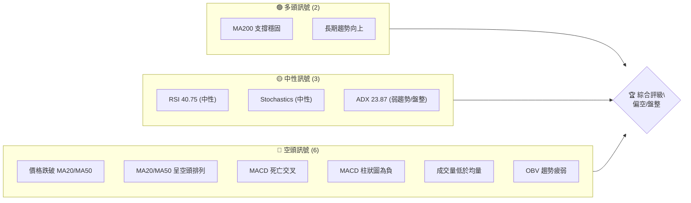
**解讀**：目前 RKLB 的技術面訊號呈現出短期偏空且趨勢不明朗的狀態。儘管長期趨勢仍有 MA200 的強力支撐，但短期移動平均線的下行壓力、MACD 的空頭訊號以及成交量的疲弱，均指向市場處於回調或盤整階段。

### 📊 核心指標速覽表

| 指標類別 | 指標名稱 | 當前數值 | 訊號 | 解讀 |
|----------|----------|----------|------|------|
| **價格** | 當前價格 | $100.46 | 🟡 | 位於 52W 區間中上部，但從高點回落。 |
| **均線** | MA20 | $102.47 | 🔴 | 價格位於 MA20 下方，短期壓力。 |
| **均線** | MA50 | $106.93 | 🔴 | 價格位於 MA50 下方，中期壓力。 |
| **均線** | MA200 | $75.88 | 🟢 | 價格位於 MA200 上方，長期支撐穩固。 |
| **動能** | RSI(14) | 40.75 | 🟡 | 處於中性區間，未超買或超賣。 |
| **動能** | MACD | -4.490 | 🔴 | MACD 線低於訊號線，柱狀圖為負，看空。 |
| **趨勢** | ADX(14) | 23.87 | 🟡 | 趨勢強度較弱，市場處於盤整或弱勢趨勢。 |
| **波動** | ATR(14) | $9.36 | 🟡 | 每日波動約 9.32%，波動性偏高。 |
| **成交量** | 量比(20日) | 0.74x | 🔴 | 成交量顯著低於 20 日均量，量能萎縮。 |

### 🏆 技術評分卡

```
╔════════════════════════════════════════════════════╗
║             技術評分卡 — RKLB (2026-07-05)         ║
╠════════════════════════════════════════════════════╣
║ 趨勢強度      ██████░░░░░░░░░░░░░░  30/100  🟡     ║
║ 動能指標      ████░░░░░░░░░░░░░░░░  20/100  🔴     ║
║ 支撐穩定度    ██████████░░░░░░░░░░  50/100  🟡     ║
║ 成交量配合    ████░░░░░░░░░░░░░░░░  20/100  🔴     ║
║ 形態完整度    ██████░░░░░░░░░░░░░░  30/100  🟡     ║
║ 均線排列      ████░░░░░░░░░░░░░░░░  20/100  🔴     ║
╠════════════════════════════════════════════════════╣
║ 綜合評分      ████░░░░░░░░░░░░░░░░  30/100  評級: 偏空/盤整 ║
╚════════════════════════════════════════════════════╝
```
**評分解讀**：RKLB 的綜合技術評分顯示其短期內面臨較大的下行壓力，趨勢強度不足，動能指標偏弱，且成交量未能配合價格反彈。儘管長期支撐尚存，但整體而言，市場情緒偏向謹慎或悲觀，建議投資者保持觀望或採取保守策略。

---

## 2. 趨勢分析

### 🌐 多時框趨勢分析

RKLB 的多時框趨勢分析揭示了長期牛市中的短期修正行為。理解不同時間框架下的趨勢有助於建立全面的交易視角。

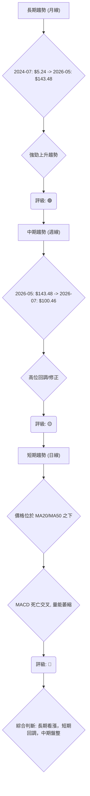
**解讀**：
- **長期趨勢**：從 2024 年 7 月的 $5.24 飆升至 2026 年 5 月的 $143.48，RKLB 在過去兩年展現了極其強勁的長期上升趨勢。儘管近期有所回落，但其主要趨勢仍是多頭主導。
- **中期趨勢**：自 5 月高點以來，RKLB 進入了顯著的中期回調階段。價格從 $143.48 回落至 $100.46，跌幅約 30%，顯示市場正在消化前期漲幅。這個階段可能伴隨著震盪築底或進一步探底。
- **短期趨勢**：當前短期趨勢明確偏空。股價跌破了短期和中期移動平均線（MA20 和 MA50），且 MACD 指標發出賣出訊號，成交量也未能支持價格反彈。這表明短期內空頭力量佔優。

### 📈 長期趨勢 — 12個月走勢圖（Unicode）

以下是 RKLB 過去 12 個月的月線收盤價走勢圖，清晰展示了其從上升通道轉入回調的過程。

```
RKLB 月線走勢圖（過去12個月）
價格軸 ($)
$150 ┤                                      ● (143.48)
$140 ┤
$130 ┤
$120 ┤
$110 ┤
$100 ┤                                            ● (101.65) ● (100.46) ← 現價
$ 90 ┤              ● (80.07)           ● (82.51)
$ 80 ┤          ● (69.76)   ● (69.10)
$ 70 ┤    ● (62.98)       ● (64.22)
$ 60 ┤
$ 50 ┤● (45.92) ● (48.60) ● (47.91)
$ 40 ┤    ● (42.14)
     └──────────────────────────────────────────────────────────────
       J25 A25 S25 O25 N25 D25 J26 F26 M26 A26 M26 J26 J26 (月份)
```
**走勢特徵分析表格**：

| 階段 | 時間範圍 | 價格區間 | 漲跌幅 | 主要特徵 | 訊號 |
|------|----------|----------|--------|----------|------|
| **強勁上漲** | 2025-07 至 2026-05 | $45.92 -> $143.48 | +212.4% | 持續性多頭行情，突破多個阻力位，量價配合良好。 | 🟢 |
| **高位盤整** | 2026-05 | $143.48 | - | 達到歷史高點，隨後出現上影線或放量滯漲，顯示多頭動能減弱。 | 🟡 |
| **快速回調** | 2026-06 | $143.48 -> $101.65 | -29.2% | 價格快速下跌，跌破短期均線，空頭力量迅速釋放。 | 🔴 |
| **近期反彈** | 2026-07 (至今) | $101.65 -> $100.46 | -1.2% | 價格在 $84.54 附近獲得支撐後反彈，但量能不足，顯示反彈動能存疑。 | 🟡 |

### 📊 中期趨勢（週線分析）

從提供的近 20 週數據來看，RKLB 在 2026 年 5 月達到 $143.48 的高點後，經歷了劇烈的下跌。尤其是在 2026-06-07 當週，股價從 $143.48 暴跌至 $110.08，跌幅超過 23%，伴隨巨大成交量，顯示多頭潰敗。隨後股價持續探底，於 2026-06-28 觸及 $84.54 的相對低點，並在最新一週反彈至 $100.46。
中期趨勢已由強勁上漲轉為回調和盤整。當前價格 $100.46 位於 MA20 ($102.47) 和 MA50 ($106.93) 之下，這兩條均線形成中期反彈的強大阻力。MA200 ($75.88) 則為長期上漲趨勢提供了堅實的基礎支撐，目前股價仍遠高於此。

```
RKLB 近期壓力與支撐示意圖 (週線視角)

$150 ┤                                  R3 (歷史高點)
$140 ┤
$130 ┤                                  R2 (回調阻力區)
$120 ┤          ═══════════════════════════════════════
$110 ┤          R1 (MA50, 短期反彈阻力)
$105 ┤          R0 (MA20, 即時阻力)
$100 ┤─────────現價 $100.46──────────────
$ 95 ┤
$ 90 ┤          S0 (近期低點反彈支撐)
$ 85 ┤          ═══════════════════════════════════════
$ 80 ┤          S1 (BB下軌, MA200長期支撐區)
$ 75 ┤
$ 70 ┤
     └──────────────────────────────────────────────────
```

### ⚡ 趨勢強度評估（ADX 解讀）

ADX 指標用於衡量趨勢的強度，而非方向。當前 ADX(14) 為 23.87，位於 25 以下，這明確表示 RKLB 目前處於**弱趨勢或盤整行情**。這與股價從高位回調後，在尋找新的平衡點的市場行為相符。

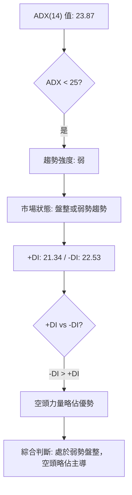

**ADX 強度對照表**：

| ADX 值範圍 | 趨勢強度 | 市場狀態 | 評級 |
|------------|----------|----------|------|
| 0-25       | 弱       | 盤整/無趨勢 | 🟡 |
| 25-50      | 中等     | 明顯趨勢 | 🟢/🔴 |
| 50-75      | 強       | 強勁趨勢 | 🟢/🔴 |
| 75-100     | 極強     | 極端趨勢 | 🟢/🔴 |

**解讀**：目前 ADX 處於弱勢區域，表明 RKLB 缺乏明確的方向性趨勢。在此情況下，價格更容易在支撐與阻力之間來回震盪。此外，-DI (22.53) 略高於 +DI (21.34)，這表明在當前的弱勢市場中，空頭力量稍微強於多頭，預示著下行壓力可能略大。

---

## 3. 圖表形態分析

RKLB 在過去一年半的走勢中，形成了典型的「V型反轉」後的「高位震盪回調」形態。從 2024 年底的底部強勁拉升，至 2026 年 5 月的歷史高點，隨後快速回落。目前市場正在消化高點的賣壓，尚未形成明確的底部反轉形態。

### 🔍 形態識別系統

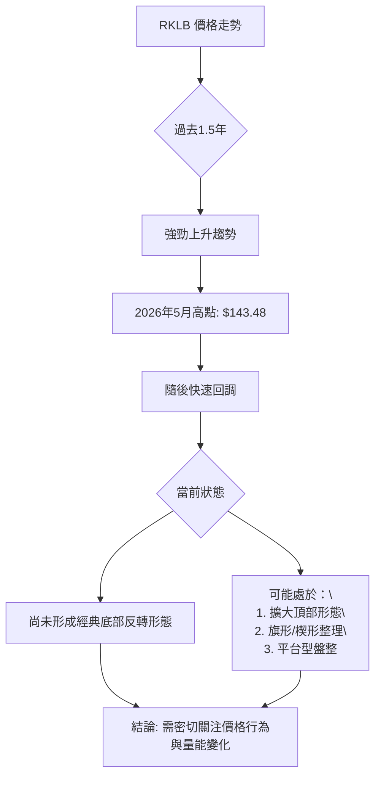
**解讀**：目前 RKLB 尚未識別出如頭肩頂/底、雙頂/底等經典的明確反轉形態。其走勢更像是在經歷了一輪波瀾壯闊的單邊上漲後，進入了高位籌碼交換和價值重估的階段。這種情況下，價格可能會在一個較大的區間內震盪，形成類似擴大頂部、旗形整理或平台型盤整等較為複雜的形態。

### 🕯️ 重要K線形態分析

根據近 20 週的收盤價數據，我們可以推測一些關鍵的 K 線形態，儘管缺乏開盤價、高價和低價，但從週收盤價的劇烈變化仍能窺見市場情緒。

| 月份 | 收盤價 | K線形態 (推測) | 解讀 | 訊號 |
|------|--------|-----------------|------|------|
| 2026-05-31 | $143.48 | **潛在射擊之星/烏雲罩頂** | 達到歷史高點，次週即大幅下跌，暗示高點壓力重重，多頭力竭。 | 🔴 |
| 2026-06-07 | $110.08 | **大型陰線/吞噬形態** | 從高位暴跌，跌幅巨大，伴隨高成交量，強烈看跌訊號，顯示市場恐慌性拋售。 | 🔴 |
| 2026-06-28 | $84.54 | **錘子線/啟明星** | 股價觸及近期低點，隨後收盤價大幅反彈，暗示下方有買盤承接，可能為短期止跌訊號。 | 🟡 |
| 2026-07-05 | $100.46 | **陽線反彈/吞噬形態** | 從前週低點 $84.54 強勁反彈，收盤價重新站上 $100，顯示短期多頭有所抵抗，但量能不足。 | 🟡 |

**備註**：上述 K 線形態為基於週收盤價變動的推測，實際形態可能因開盤、高低價而異。

### 📉 ASCII 走勢形態示意圖

以下示意圖描繪了 RKLB 從高點回調的走勢，並假設其可能正在形成一個下降旗形或通道，等待方向選擇。

```
RKLB 高位回調形態示意圖

$150 ┤        ┌───────高點 (143.48)
$140 ┤        │
$130 ┤        │
$120 ┤        │    ┌───潛在阻力線
$110 ┤        │   ╱
$100 ┤─────────● (現價 100.46)
$ 90 ┤        │  ╱
$ 80 ┤        │ ╱
$ 70 ┤        │╱
$ 60 ┤        ┴───────潛在支撐線
     └────────────────────────────
      (時間軸)
```
**形態解讀**：從高點 $143.48 回落後，RKLB 價格走勢呈現下跌趨勢，但近期在 $84.54 附近獲得支撐後反彈。這種走勢可能構成一個下降通道或旗形整理。若能突破下降趨勢線並伴隨成交量放大，則可能預示著回調結束；反之，若跌破下方支撐線，則可能開啟新的下跌波段。

### 🎯 形態目標價計算

由於目前尚未形成明確的經典圖表形態（如頭肩頂/底、雙頂/底），因此無法直接依據形態高度來計算目標價。當前更應關注關鍵的斐波那契回調位和移動平均線作為潛在的支撐與阻力。

如果未來形成下降旗形 (Bear Flag) 或下降通道：
- **下降旗形目標價**：通常是旗桿高度的等幅下跌。若從 $143.48 到 $84.54 視為旗桿（高度約 $58.94），則跌破旗形後可能目標價為 $84.54 - $58.94 = $25.60。但這是一個極端情況，且需等待形態確認。
- **下降通道目標價**：價格通常在通道內波動，直到突破。通道上軌為阻力，下軌為支撐。

**當前階段，目標價的設定更依賴於斐波那契回調位和關鍵支撐阻力位。**

---

## 4. 支撐與阻力

識別關鍵支撐與阻力位對於制定交易策略至關重要。RKLB 目前處於高位回調後的關鍵區間，多空雙方在此進行激烈博弈。

### 🗺️ 關鍵價位分布圖（Unicode）

```
RKLB 價位結構分布圖
═══════════════════════════════════════════════════
$151.00 ║████████████████████████║ 52W 高點 (極強阻力 R4)
$143.48 ║████████████████████████║ 歷史高點 (強阻力 R3)
$122.78 ║████████████████████    ║ 布林上軌 (阻力 R2)
$117.59 ║████████████████████████║ 斐波那契 23.6% (阻力 R1.5)
$106.93 ║████████████████████████║ MA50 (關鍵阻力 R1)
$102.47 ║████████████████████████║ MA20 / 布林中軌 (即時阻力 R0)
$101.56 ║████████████████████████║ 斐波那契 38.2% (即時阻力 R0')
$100.46 ╠════════════════════════╣ ◄ 現價
$ 88.60 ║▓▓▓▓▓▓▓▓▓▓▓▓▓▓▓▓        ║ 斐波那契 50% (近期支撐 S0)
$ 84.54 ║▓▓▓▓▓▓▓▓▓▓▓▓▓▓▓▓        ║ 近期低點 (關鍵支撐 S1)
$ 82.16 ║████████████████████████║ 布林下軌 (強支撐 S2)
$ 75.88 ║████████████████████████║ MA200 (長期支撐 S3)
$ 75.65 ║████████████████████████║ 斐波那契 61.8% (長期支撐 S3')
$ 33.73 ║████████████████████████║ 52W 低點 (極強支撐 S4)
═══════════════════════════════════════════════════
```

### 🚧 阻力位分析表

| 阻力級別 | 價位 | 形成原因 | 突破難度 | 重要性 | 訊號 |
|----------|------|----------|----------|--------|------|
| **即時阻力 R0** | $101.56 - $102.47 | 斐波那契 38.2% 回調位 / MA20 / 布林中軌 | 中等偏高 | 決定短期反彈能否持續的關鍵。 | 🔴 |
| **關鍵阻力 R1** | $106.93 | MA50 | 較高 | 突破此處將改善中期看跌格局。 | 🔴 |
| **阻力 R1.5** | $117.59 | 斐波那契 23.6% 回調位 | 較高 | 回調後的第一個重要反彈目標。 | 🔴 |
| **阻力 R2** | $122.78 | 布林上軌 | 高 | 限制價格上漲的通道頂部。 | 🔴 |
| **強阻力 R3** | $143.48 | 歷史高點 (2026-05) | 極高 | 巨大的套牢盤和獲利了結壓力。 | 🔴 |
| **極強阻力 R4** | $151.00 | 52 週高點 | 極高 | 歷史性高點，突破需要極大動能。 | 🔴 |

### 🛡️ 支撐位分析表

| 支撐級別 | 價位 | 形成原因 | 守住機率 | 重要性 | 訊號 |
|----------|------|----------|----------|--------|------|
| **近期支撐 S0** | $88.60 | 斐波那契 50% 回調位 | 中等 | 若價格再次回落，此處為重要心理關口。 | 🟡 |
| **關鍵支撐 S1** | $84.54 | 近期回調低點 (2026-06-28) | 較高 | 短期反彈的起點，跌破則回調加劇。 | 🟡 |
| **強支撐 S2** | $82.16 | 布林下軌 | 較高 | 布林通道的底部，通常有較強支撐。 | 🟢 |
| **長期支撐 S3** | $75.65 - $75.88 | MA200 / 斐波那契 61.8% 回調位 | 極高 | 長期牛市的生命線，具有極強的心理和技術支撐。 | 🟢 |
| **極強支撐 S4** | $33.73 | 52 週低點 | 極高 | 極端情況下的最終防線。 | 🟢 |

### 📐 斐波那契回調位分析

我們以 RKLB 過去 52 週的上升波段（從 $33.73 的 52 週低點到 $143.48 的 2026 年 5 月高點）作為參考，計算其回調位。
- **波段高點 (H)**: $143.48
- **波段低點 (L)**: $33.73
- **波段範圍**: $143.48 - $33.73 = $109.75

| 回調比例 | 價位 ($) | 意義 | 訊號 |
|----------|----------|------|------|
| **23.6%** | $143.48 - ($109.75 * 0.236) = $117.59 | 淺度回調，若價格在此反彈，表明多頭極強。 | 🔴 |
| **38.2%** | $143.48 - ($109.75 * 0.382) = $101.56 | 較為常見的回調位，通常為第一道重要支撐。目前價格 $100.46 略低於此位，表示此處壓力重重。 | 🟡 |
| **50%** | $143.48 - ($109.75 * 0.50) = $88.60 | 心理關口，若跌破 38.2%，此處為重要觀察點。 | 🟡 |
| **61.8%** | $143.48 - ($109.75 * 0.618) = $75.65 | 黃金分割位，與 MA200 ($75.88) 重疊，形成極強的長期支撐區域。 | 🟢 |

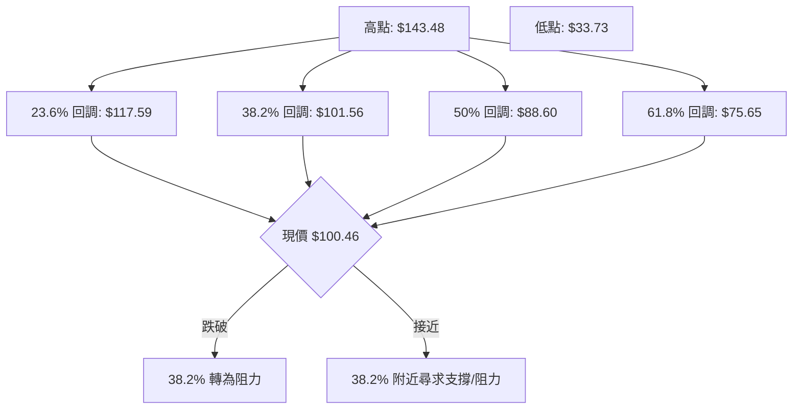
**斐波那契解讀**：目前 RKLB 價格 $100.46 位於 38.2% 回調位 $101.56 附近，顯示此處是多空爭奪的焦點。若能站穩並突破 $101.56，則有望測試更高的回調位；若跌破，則 $88.60 (50% 回調) 和 $75.65 (61.8% 回調) 將成為下一重要支撐。特別是 61.8% 回調位與 MA200 重疊，構成極其關鍵的長期防線。

---

## 5. 技術指標深度解讀

### 🎛️ 指標訊號總覽

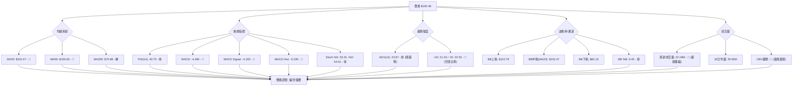

### 📈 移動平均線排列分析

RKLB 的移動平均線系統呈現出短期看空、長期看多的複雜局面。
- **短期均線**：MA5 ($96.95) 和 MA10 ($95.35) 均位於 MA20 ($102.47) 和 MA50 ($106.93) 之下，且 MA20 和 MA50 均呈向下趨勢。當前價格 $100.46 位於 MA20 和 MA50 之下，構成即時和中期阻力。這種排列是典型的空頭排列，表明短期下行壓力較大。
- **長期均線**：MA120 ($88.08) 和 MA240 ($70.88) 則呈向上趨勢，且股價遠高於這些長期均線。特別是 MA200 ($75.88) 仍是強勁的上升支撐，表明 RKLB 的長期牛市結構尚未改變。

```mermaid
graph TD
    P["現價: $100.46"]

    subgraph 短期壓力 🔴
        MA20["MA20: $102.47 ↓"]
        MA50["MA50: $106.93 ↓"]
    end

    subgraph 長期支撐 🟢
        MA200["MA200: $75.88 ↑"]
        MA120["MA120: $88.08 ↑"]
        MA240["MA240: $70.88 ↑"]
    end

    nb1["P -- 位於下方"] --> MA20
    nb1["P -- 位於下方"] --> MA50
    nb2["P -- 位於上方"] --> MA200
    nb2["P -- 位於上方"] --> MA120
    nb2["P -- 位於上方"] --> MA240

    MA20 -->|"向下交叉"| MA50["形成短期空頭排列"]
    MA200 -->|"提供強力支撐"| P
```
**綜合判斷**：均線系統顯示 RKLB 正處於短期回調階段，短期均線形成阻力。然而，長期均線的堅實支撐表明，這更可能是一個大趨勢中的修正，而非趨勢反轉。投資者應關注價格能否重新站上短期均線，以判斷回調是否結束。

### 📉 RSI(14) 分析

**RSI 數值進度條**：
RSI(14): 40.75  ▓▓▓▓▓▓▓▓░░░░░░░░░░░░  40.75% (中性偏弱)

**超買超賣區間分析**：
- RSI 當前數值為 40.75，處於 30-70 的中性區間。這表示 RKLB 既未處於超買狀態（RSI > 70），也未處於超賣狀態（RSI < 30）。
- 從歷史數據看，RSI 在 2026-05-17 達到 73.3，在 2026-05-24 達到 74.8，顯示當時市場處於超買狀態，隨後價格開始回落。目前的 40.75 顯示動能已大幅減弱，但尚未達到超賣區間，意味著價格仍有下跌空間，或將繼續盤整。

**背離判斷**：
- 根據提供的數據，**無明顯 RSI 頂背離或底背離訊號**。價格在 5 月達到高點 $143.48 時，RSI 達到 74.8。隨後價格下跌，RSI 也同步下跌。雖然在 6 月底價格觸及 $84.54 時，RSI 為 34.1，而在 7 月初價格反彈至 $100.46 時，RSI 為 40.8。這段小反彈中，RSI 隨價格同步上漲，並未形成底背離。

### 📊 MACD(12/26/9) 訊號解讀

MACD (Moving Average Convergence Divergence) 指標當前發出明確的空頭訊號。
- **MACD 線**：-4.490
- **MACD Signal 線**：-4.155
- **MACD 柱狀圖 (Histogram)**：-0.335

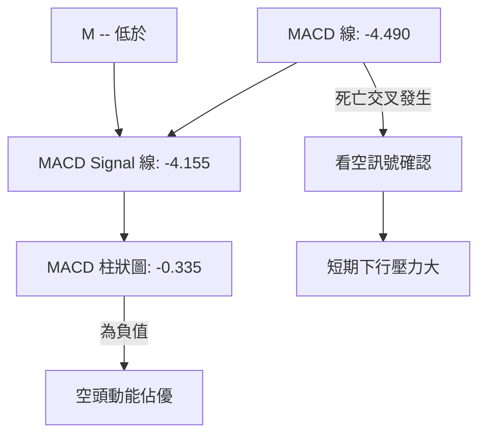
**解讀**：
1.  **MACD 線低於 Signal 線**：這是一個典型的 MACD 死亡交叉訊號，表明短期動能已轉弱並跌破長期動能，預示著股價可能繼續下跌。
2.  **MACD 柱狀圖為負**：柱狀圖是 MACD 線與 Signal 線之間的差值。當其為負值 (-0.335) 時，表明空頭動能正在釋放，且 MACD 線位於 Signal 線下方。雖然柱狀圖絕對值不大，但仍是空頭主導的表現。
3.  **MACD 背離**：根據提供的數據，**無明顯 MACD 頂背離或底背離訊號**。MACD 線與價格走勢大致同步，從高點回落後，MACD 也隨之走低。

**綜合判斷**：MACD 指標明確支持短期偏空觀點，顯示 RKLB 的下行壓力仍在持續，儘管柱狀圖絕對值不大可能暗示空頭力量有所減弱，但仍未見多頭反轉訊號。

### 📦 布林通道分析

布林通道 (Bollinger Bands) 提供了一個動態的價格區間，包含上軌、中軌 (MA20) 和下軌。
- **BB上軌**: $122.78
- **BB中軌(MA20)**: $102.47
- **BB下軌**: $82.16
- **BB %B**: 0.45 (0=下軌, 0.5=中軌, 1=上軌)

```
RKLB 布林通道示意圖

$130 ┤              ┌─────────────────── BB上軌 ($122.78)
$120 ┤              │
$110 ┤              │
$105 ┤              │
$100 ┤─────────●(現價 $100.46)
$ 95 ┤              │  ─────────────────── BB中軌(MA20 $102.47)
$ 90 ┤              │
$ 85 ┤              │
$ 80 ┤              └─────────────────── BB下軌 ($82.16)
     └──────────────────────────────────────────────────
      (時間軸)
```
**解讀**：
1.  **價格與中軌**：當前價格 $100.46 位於中軌 ($102.47) 之下，這是一個偏空的訊號。中軌通常作為價格趨勢的參考點，跌破中軌表明短期趨勢向下。
2.  **BB %B**：0.45 的 %B 值表示價格位於布林通道的下半部分，但尚未觸及下軌。這意味著價格仍有向布林下軌 $82.16 測試的潛在空間。
3.  **通道寬度**：從數據中無法直接判斷通道是收縮還是擴張，但結合 ATR 數據 ($9.36, 9.32% of price) 和近期劇烈波動，推測布林通道可能在經歷擴張後，目前正處於收縮或震盪狀態。如果通道收縮，則預示著波動性可能降低，進入盤整期；如果通道擴張，則可能預示著趨勢的延續。

**綜合判斷**：布林通道顯示 RKLB 短期走勢偏弱，價格在通道下半部運行，但尚未觸及下軌。下軌 $82.16 將是一個重要的潛在支撐位。

### 💹 成交量分析（量價配合度）

成交量是價格走勢的重要確認指標。
- **最新成交量**：22,180,300
- **20日均量**：29,957,705
- **50日均量**：28,333,194
- **量比 (最新/20日均量)**：0.74x
- **OBV 趨勢**：OBV < MA → 量能疲弱

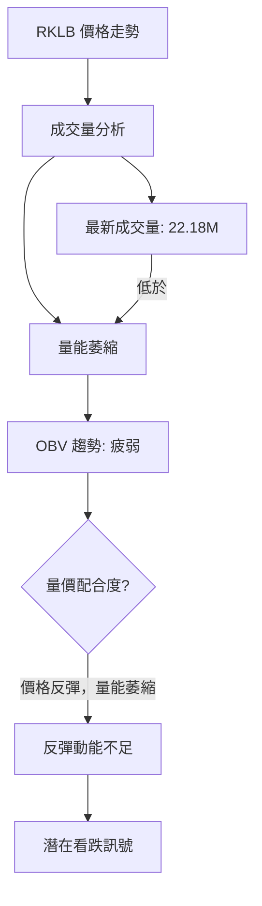
**解讀**：
1.  **量能萎縮**：RKLB 的最新成交量 22.18M 顯著低於其 20 日和 50 日均量（量比 0.74x）。這表明市場參與度不高，買賣雙方的活躍度都在下降。
2.  **OBV 疲弱**：OBV (On-Balance Volume) 趨勢疲弱，且低於其移動平均線，這是一個明確的看跌訊號。OBV 旨在確認價格趨勢，當價格上漲而 OBV 下降時，表明上漲缺乏真實買盤支撐；當價格下跌而 OBV 也下跌時，則確認了下跌趨勢的強度。目前 OBV 疲弱，表明市場缺乏持續的買盤動能。
3.  **量價背離**：從 2026-06-28 的低點 $84.54 反彈至 $100.46，但成交量卻低於均量。這形成了典型的**量價背離**：價格反彈但量能萎縮，預示著當前的反彈可能只是技術性修正，缺乏強勁的買盤支持，反彈的持續性存疑。

**綜合判斷**：成交量分析發出強烈看跌訊號。量能萎縮和 OBV 疲弱表明市場缺乏上漲動能，且當前的價格反彈可能不可持續。投資者應警惕價格再次回落的風險。

---

## 6. 動能與波動率

### ⚡ 動能評估四象限

動能評估四象限分析旨在根據股票的動能強度和波動率，判斷其當前所處的市場階段，並提供相應的交易建議。

| 象限 | 動能 (MACD, RSI) | 波動 (ATR) | 當前狀態 | 評估 | 訊號 |
|------|------------------|------------|----------|------|------|
| Q1   | 強 (🟢)           | 低 (🟢)    | -        | 最佳機會 (趨勢啟動) | 🟢 |
| Q2   | 弱 (🔴)           | 低 (🟢)    | -        | 謹慎觀望 (盤整築底) | 🟡 |
| Q3   | 強 (🟢)           | 高 (🔴)    | -        | 高風險高收益 (趨勢加速) | 🟡 |
| Q4   | 弱 (🔴)           | 高 (🔴)    | ✓        | 避免進場 (震盪尋底/派發) | 🔴 |

**RKLB 當前狀態評估**：
- **動能**：MACD 死亡交叉，柱狀圖為負；RSI 處於中性區間 (40.75)，但從高位回落。整體動能偏弱。
- **波動率**：ATR(14) 為 $9.36，佔當前價格 $100.46 的 9.32%，這是一個相對較高的波動率，表明股價每日波動幅度大。
- **結論**：RKLB 目前處於 **Q4 (弱動能 / 高波動)** 象限。
**解讀**：RKLB 處於弱動能和高波動的市場環境中。這通常意味著市場缺乏明確的方向，價格波動劇烈且無序，投資者容易被假突破和假跌破所困擾。在此階段，追漲殺跌風險極高，建議投資者避免貿然進場，或只進行短線交易並嚴格控制風險。

### 📊 ATR 波動率分析

ATR (Average True Range) 衡量資產的每日價格波動幅度，是評估波動率和設定止損的重要工具。
- **ATR(14)**：$9.36
- **ATR 佔當前價格比例**：$9.36 / $100.46 = 9.32%

**解讀**：
1.  **波動性高**：9.32% 的 ATR 相對於當前價格而言是一個顯著的波動幅度。這表示 RKLB 的每日價格波動可達約 $9.36，顯示其為一個高波動性股票。高波動性既帶來了快速獲利的潛力，也伴隨著更高的風險。
2.  **止損距離建議**：在交易 RKLB 時，應考慮其高波動性來設定止損。一般建議將止損設定在 1.5 倍至 3 倍 ATR 之外，以避免被日常波動震出。
    - **保守止損**：當前價格 - (2 * ATR) = $100.46 - (2 * $9.36) = $100.46 - $18.72 = $81.74
    - **激進止損**：當前價格 - (1.5 * ATR) = $100.46 - (1.5 * $9.36) = $100.46 - $14.04 = $86.42
    - 這些止損位應與關鍵支撐位結合考慮。例如，布林下軌 $82.16 和斐波那契 50% 回調位 $88.60 都在此範圍內，增加了止損設定的參考價值。

### 📐 Beta 與市場相關性

提供的數據中未包含 RKLB 的 Beta 值。
**解讀**：Beta 值衡量個股相對於大盤的波動性。如果 Beta 值高於 1，則表示其波動性大於大盤；若低於 1，則波動性小於大盤。由於缺乏此數據，我們無法量化 RKLB 與整體市場的相關性。然而，從其行業（航空航天與國防）來看，該行業通常被視為成長型或週期性行業，可能對市場情緒和宏觀經濟數據較為敏感。投資者在缺乏 Beta 數據時，應自行評估其行業特性和公司基本面，以判斷其受市場系統性風險的影響程度。

---

## 7. 多時框架總結

綜合不同時間框架的技術指標和價格行為，我們可以更全面地評估 RKLB 的當前市場狀況。

### 📋 時框架評分表

| 時框架 | 趨勢方向 | 動能 | 均線排列 | 形態 | 綜合評分 (1-10) | 建議 | 訊號 |
|--------|----------|------|----------|------|-----------------|------|------|
| **長期 (月線)** | 上升     | 🟢 強勁 | 🟢 多頭 | 築頂/回調 | 7               | 持有/觀望 | 🟢 |
| **中期 (週線)** | 回調     | 🟡 減弱 | 🔴 混合 | 盤整/築底 | 4               | 謹慎觀望 | 🟡 |
| **短期 (日線)** | 下跌     | 🔴 疲弱 | 🔴 空頭 | 下跌通道 | 2               | 避免/賣出 | 🔴 |

**解讀**：
- **長期**：RKLB 的長期趨勢依然強勁，儘管經歷了大幅回調，但仍遠高於長期均線。這表明其基本面和成長潛力仍受市場認可。
- **中期**：中期趨勢已轉為回調和盤整，動能顯著減弱。股價需要時間來消化高點的賣壓，並重新積蓄上漲動能。
- **短期**：短期內 RKLB 面臨較大的下行壓力，多數指標發出看跌訊號。價格可能繼續在短期支撐和阻力之間震盪或尋求更低的支撐。

### 🔲 綜合訊號矩陣

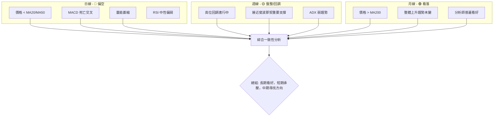
**一致性分析**：
- **短期與中期訊號**：短期和中期訊號在很大程度上保持一致，均指向價格處於回調或盤整階段，且短期內空頭力量佔優。這表明當前市場環境對多頭不利。
- **長期與短期/中期訊號**：長期看漲訊號與短期/中期看跌/盤整訊號存在明顯矛盾。這種矛盾是牛市回調的典型特徵，長期投資者可能會視為買入機會，而短期交易者則應規避風險。
**結論**：RKLB 目前處於一個「長期健康，但短期病態」的階段。對於長期投資者而言，這可能是一個逢低吸納的機會，但對於短期交易者而言，風險較高，需要等待明確的底部訊號和趨勢反轉。

---

## 8. 交易策略建議

基於上述多時框架的技術分析，RKLB 目前處於長期牛市中的短期回調與盤整階段。雖然長期看好，但短期風險較高。我們將針對不同的市場情境提供交易策略。

### 🗺️ 策略決策流程圖

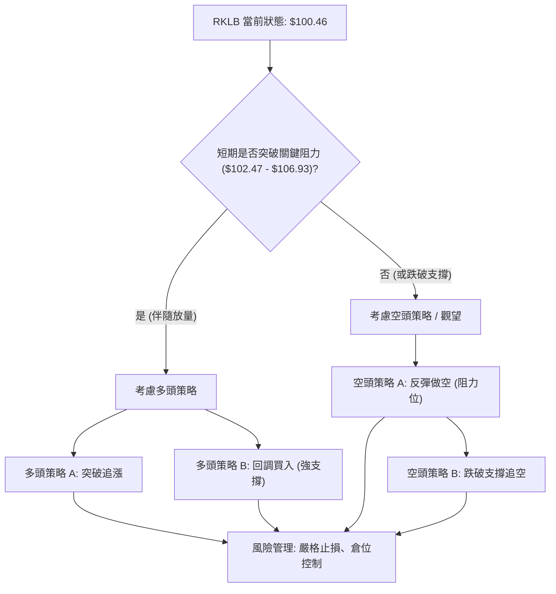

### 🟢 多頭策略詳情

**情境**：RKLB 在 $84.54 - $88.60 區間獲得強勁支撐，並有效突破短期阻力位。

| 策略要素 | 策略 A：突破回調阻力 | 策略 B：強支撐位反彈 |
|----------|----------------------|----------------------|
| **進場條件** | 價格站穩 $102.47 (MA20) 並伴隨成交量放大 | 價格回測 $88.60 (Fib 50%) 或 $84.54 (近期低點) 附近，出現止跌 K 線形態 |
| **進場價格** | $103.00 (確認突破 MA20) | $89.00 (在 $88.60 附近) 或 $85.00 (在 $84.54 附近) |
| **目標價 T1** | $117.59 (Fib 23.6%) | $101.56 (Fib 38.2%) |
| **目標價 T2** | $122.78 (BB上軌) | $106.93 (MA50) |
| **止損價格** | $97.00 (MA5下方，或 1.5倍ATR $103 - $14 = $89) | $81.50 (略低於 BB下軌 $82.16 和 2倍ATR $89 - $18 = $71) |
| **風險報酬比** | (T1-進場)/(進場-止損) = ($117.59-$103)/($103-$97) = 14.59/6 = 2.43:1 | (T1-進場)/(進場-止損) = ($101.56-$89)/($89-$81.5) = 12.56/7.5 = 1.67:1 |
| **成功機率** | 40% (需強勁量能配合) | 55% (若能守住關鍵支撐) |
| **建議倉位** | 5-10% (中低) | 10-15% (中) |

### 🔴 空頭策略詳情

**情境**：RKLB 無法突破短期阻力，或跌破關鍵支撐，空頭力量持續佔優。

| 策略要素 | 策略 A：反彈受阻做空 | 策略 B：跌破關鍵支撐追空 |
|----------|----------------------|--------------------------|
| **進場條件** | 價格反彈至 $102.47 (MA20) 或 $106.93 (MA50) 附近，出現看跌 K 線形態或動能衰竭 | 價格跌破 $88.60 (Fib 50%) 並伴隨成交量放大 |
| **進場價格** | $102.00 (MA20下方確認) 或 $106.00 (MA50下方確認) | $88.00 (確認跌破 Fib 50%) |
| **目標價 T1** | $88.60 (Fib 50%) | $82.16 (BB下軌) |
| **目標價 T2** | $82.16 (BB下軌) | $75.65 (Fib 61.8% / MA200) |
| **止損價格** | $107.50 (略高於 MA50 $106.93) | $92.00 (略高於 Fib 50% $88.60) |
| **風險報酬比** | (進場-T1)/(止損-進場) = ($102-$88.6)/($107.5-$102) = 13.4/5.5 = 2.44:1 | (進場-T1)/(止損-進場) = ($88-$82.16)/($92-$88) = 5.84/4 = 1.46:1 |
| **成功機率** | 50% (若阻力有效) | 45% (需市場恐慌情緒配合) |
| **建議倉位** | 5-10% (中低) | 5-10% (中低) |

### ⭐ 整體訊號強度評星

```
做多訊號強度：★★☆☆☆  (2/5星)  - 長期看好，但短期阻力重重，需等待明確底部。
做空訊號強度：★★★☆☆  (3/5星)  - 短期指標偏空，反彈量能不足，有下行風險。
整體可信度：  ★★★☆☆  (3/5星)  - 綜合多空訊號，市場方向不明，需謹慎操作。
```
**評星解讀**：目前 RKLB 的市場環境對多頭不太有利，做空訊號略強於做多訊號。整體市場方向不明確，波動性高，交易難度較大。建議投資者保持謹慎，等待更明確的趨勢訊號出現。

---

## 9. 風險提示與監控

RKLB 目前處於高波動、弱趨勢的市場環境，風險不容忽視。有效的風險管理是成功交易的基石。

### ✅ 關鍵監控指標 Checklist

```
╔══════════════════════════════════════════════════════════════╗
║             RKLB 關鍵監控指標清單 (2026-07-05)              ║
╠══════════════════════════════════════════════════════════════╣
║ [ ] 價格是否站穩 $101.56 (Fib 38.2%)？                       ║
║ [ ] 價格是否突破 $102.47 (MA20) 和 $106.93 (MA50)？         ║
║ [ ] MACD 是否形成黃金交叉，柱狀圖轉正？                       ║
║ [ ] RSI 是否上穿 50，或接近 70 (超買)？                       ║
║ [ ] 成交量是否持續放大，並高於 20 日均量？                    ║
║ [ ] OBV 趨勢是否轉強，並向上突破其均線？                      ║
║ [ ] ADX 是否回升至 25 以上，且 +DI > -DI？                    ║
║ [ ] 價格是否跌破 $88.60 (Fib 50%) 和 $84.54 (近期低點)？      ║
║ [ ] 價格是否跌破 $75.88 (MA200) 和 $75.65 (Fib 61.8%)？      ║
║ [ ] 公司是否有重大利好/利空消息發布？                         ║
╚══════════════════════════════════════════════════════════════╝
```

### ⚠️ 風險場景分析

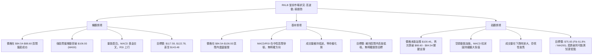

### 🛡️ 風險管理重要提醒

1.  **嚴格止損**：在 RKLB 這種高波動性股票上，必須設定並嚴格執行止損點。一旦價格觸及止損，應果斷離場，避免損失擴大。可參考 ATR 指標來設定合理的止損距離。
2.  **倉位管理**：鑑於當前市場的不確定性和高波動性，建議採取小倉位或分批建倉策略。避免重倉單一股票，以分散風險。
3.  **多時框架確認**：在做出交易決策前，務必確認不同時間框架的訊號是否一致。當長期、中期、短期趨勢出現分歧時，應更加謹慎。
4.  **關注基本面**：雖然本報告專注於技術分析，但 RKLB 的基本面（如發射任務成功率、訂單量、盈利能力、新技術突破等）將最終決定其長期走勢。任何基本面變化都可能迅速影響技術走勢。
5.  **市場情緒**：密切關注整體市場情緒和宏觀經濟數據，特別是利率、通脹等因素對成長股的影響。
6.  **避免追漲殺跌**：在盤整或弱勢趨勢中，價格波動容易誘發追漲殺跌行為。應耐心等待明確的趨勢訊號或在關鍵支撐阻力位附近進行交易。

---

## 📋 報告總結

```
╔════════════════════════════════════════════════════════════════╗
║                   RKLB 技術分析報告總結                        ║
╠════════════════════════════════════════════════════════════════╣
║ 報告日期：2026-07-05                                           ║
║ 當前價格：$100.46                                              ║
║ 分析評級：⚖️ 盤整偏空 (短期承壓，長期潛力)                     ║
║                                                                ║
║ 關鍵結論：                                                     ║
║ ├─ 長期趨勢：🟢 強勁上升趨勢，MA200 ($75.88) 提供堅實支撐。    ║
║ ├─ 中期趨勢：🟡 高位回調/盤整，MA20/MA50 形成壓力。           ║
║ ├─ 短期趨勢：🔴 偏空，MACD 死亡交叉，量能疲弱，反彈動能不足。 ║
║ ├─ 關鍵支撐：$88.60 (Fib 50%), $84.54 (近期低點), $75.65 (Fib 61.8% / MA200)。 ║
║ ├─ 關鍵阻力：$101.56 (Fib 38.2%), $102.47 (MA20), $106.93 (MA50)。 ║
║ └─ 分析師目標：均值 $114.10 (與當前技術阻力區間吻合)。        ║
║                                                                ║
║ 最優策略組合：                                                 ║
║ 1. 🥇 **最佳機會 (觀望)**：等待價格在 $84.54 - $88.60 區間形成明確底部反轉訊號，並伴隨量能放大，方可考慮分批建倉。此時風險報酬比最佳。 ║
║ 2. 🥈 **次選機會 (謹慎做多)**：若價格能有效突破並站穩 $106.93 (MA50) 阻力，則可考慮輕倉追漲，目標 $117.59 - $122.78。止損設在 MA50 之下。 ║
║ 3. 🥉 **保守選擇 (逢高做空/規避)**：若價格反彈至 $102.47 (MA20) 或 $106.93 (MA50) 附近受阻，且未見量能配合，可考慮輕倉做空，目標 $88.60 - $82.16。止損設在阻力位上方。 ║
╚════════════════════════════════════════════════════════════════╝
```

---

> ⚠️ **免責聲明**：本報告為 AI 自動生成之技術分析，所有數據及估算均基於提供的歷史價格資訊。本報告**僅供研究與學術參考**，**不構成任何投資建議**。投資有風險，入市需謹慎。

---

*報告生成時間：2026-07-05 ｜ 數據來源：Yahoo Finance ｜ 分析框架：多時框技術分析*