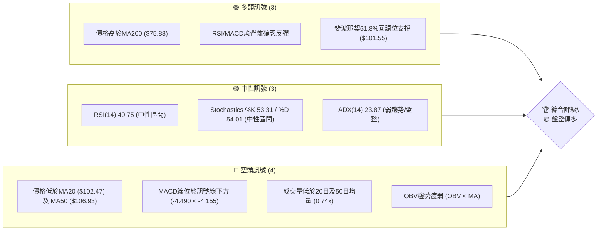
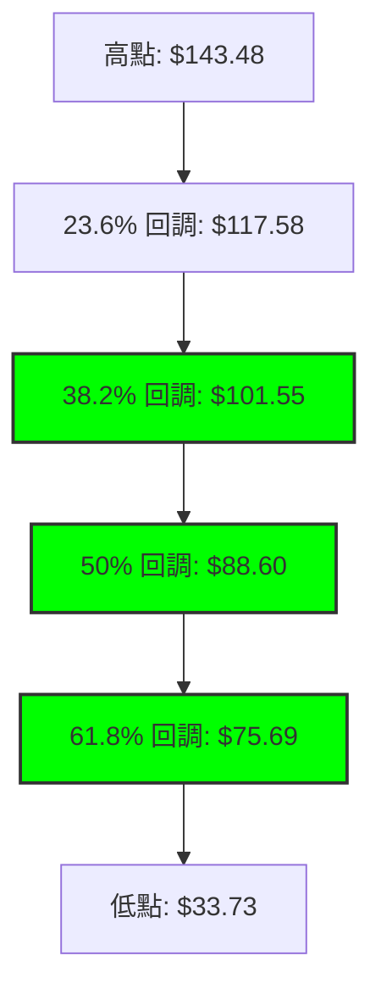
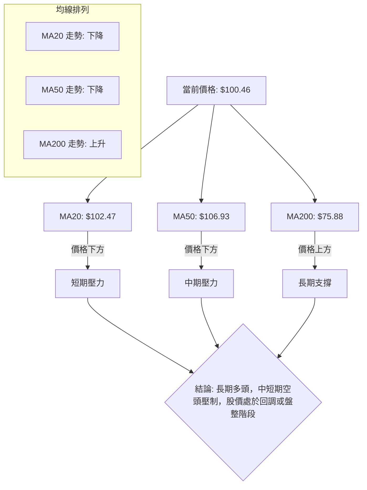
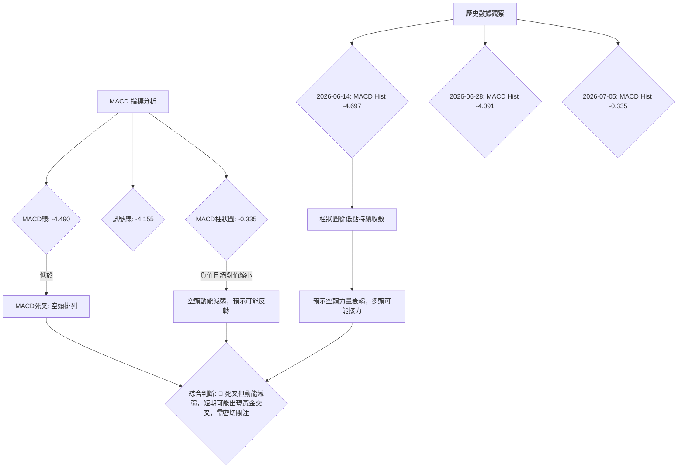

<details>
<summary>📊 靜態圖表 (點擊展開)</summary>

</details>

<html>
<head><meta charset="utf-8" /></head>
<body>
    <div style="height:500px; width:100%;">                        <script>window.PlotlyConfig = {MathJaxConfig: 'local'};</script>
        <script charset="utf-8" src="https://cdn.plot.ly/plotly-3.6.0.min.js" integrity="sha256-QaOVwtVY0T02VaHrr6pnoHLCwayMJp4O5n4YyaE3rJk=" crossorigin="anonymous"></script>                <div id="candlestick-chart" class="plotly-graph-div" style="height:100%; width:100%;"></div>            <script>                window.PLOTLYENV=window.PLOTLYENV || {};                                if (document.getElementById("candlestick-chart")) {                    Plotly.newPlot(                        "candlestick-chart",                        [{"close":{"dtype":"f8","bdata":"AAAAIFyfR0AAAACAPQpIQAAAAEAKl0dAAAAAwB7lR0AAAAAgrudIQAAAAOB6dEpAAAAA4FFYSEAAAADgo1BHQAAAAKBHIUdAAAAAoEeBR0AAAADgevRHQAAAAAAp\u002fEdAAAAAACk8SkAAAADgehRMQAAAAAAAQE1AAAAAoEfBTkAAAAAA11NQQAAAAEDhmlBAAAAA4KMQUEAAAABA4VpQQAAAAIDrAVFAAAAAoEdRUUAAAAAAAMBQQAAAAKBHkVBAAAAAYGbWUEAAAACgmVlQQAAAAOBRSE5AAAAAwPXIT0AAAAAA1yNQQAAAACCuZ1BAAAAAAADgT0AAAACAPYpQQAAAAIDCdU5AAAAAoHB9T0AAAAAghatOQAAAAMD1SExAAAAAgMI1TEAAAACAFM5IQAAAAIDr0UlAAAAAQDPzSUAAAABguJ5JQAAAAAAp\u002fEhAAAAAAACgRkAAAADAHsVGQAAAACCup0VAAAAAANdjRUAAAAAgXM9FQAAAAKBwvUNAAAAAYGYmREAAAACgmTlFQAAAAMDMTEVAAAAAQAr3REAAAACA6xFFQAAAACBcL0RAAAAAQDPzREAAAAAAKVxGQAAAACBcr0hAAAAAQAqHSEAAAAAgrsdJQAAAAEAKt0pAAAAAYI\u002fCTEAAAAAA18NPQAAAAGC4vk5AAAAA4Hq0S0AAAABguL5LQAAAAEDh+kpAAAAAgML1TUAAAACgR6FRQAAAAEAzY1NAAAAAIIVLU0AAAAAghUtTQAAAAKCZqVFAAAAAIK6HUUAAAADAzJxRQAAAAOCjcFFAAAAAIFz\u002fUkAAAADA9YhTQAAAAIDrgVVAAAAAwB4FVUAAAADAHsVUQAAAAGBmNlVAAAAAoJn5VUAAAADAHqVVQAAAAEAz81ZAAAAA4KOwVkAAAABAMxNYQAAAAIA9SlZAAAAA4Hr0VUAAAABguP5VQAAAAKCZOVZAAAAAYLgeVEAAAAAAAMBVQAAAAOB6JFZAAAAAIIVrVUAAAADgegRUQAAAAKCZiVJAAAAAoEdRVEAAAABACkdSQAAAAOB6lFBAAAAA4HoUUkAAAACAwvVSQAAAAIDrAVJAAAAAIK5nUUAAAADgo4BQQAAAAAAp3FBAAAAAwPV4UUAAAABA4ZpSQAAAAMAeJVNAAAAAQAq3UUAAAACgcI1RQAAAAIAUflFAAAAAwMyMUUAAAACgmSlSQAAAAGBmRlFAAAAAgBS+UUAAAADgUYhRQAAAAIA9+lFAAAAAAACAUUAAAABACodRQAAAAGC43lFAAAAAIIU7UUAAAACgcP1RQAAAACCuF1FAAAAAgD0aUUAAAAAA19NRQAAAAIDCpVNAAAAAYLheUUAAAAAghftRQAAAAGC4zlBAAAAAAAAAUUAAAADgeoRQQAAAAOBROFJAAAAAACl8UEAAAABACndOQAAAAOCjsExAAAAAgBQOUEAAAACgR2FQQAAAAGC47lBAAAAAQOHqUEAAAADgepRQQAAAAMAeRVFAAAAAIFyvUEAAAABAMwNRQAAAACCup1FAAAAAgBQOUkAAAABgZmZSQAAAACCFu1RAAAAAQDMzVUAAAACgcF1WQAAAAMD1qFVAAAAAYI+CVkAAAABgZiZVQAAAACCF61NAAAAAYI+SVEAAAACAwqVTQAAAAKBHQVNAAAAA4KOgVEAAAAAA17NTQAAAAADXE1RAAAAA4KOwU0AAAACgmSlVQAAAAMAepVNAAAAAgBReWkAAAABgZlZdQAAAAADXY11AAAAAoJkJX0AAAACgmZFgQAAAAKBHMV9AAAAAwB5lYEAAAAAA19NfQAAAAMD1yGBAAAAAwMxcX0AAAADgUfhgQAAAAGBm5mFAAAAAIFzHYkAAAADA9YBiQAAAACBc72FAAAAAwPWYXkAAAADgetReQAAAAMDMrFxAAAAAwMz8XUAAAADAHoVbQAAAAKCZaVxAAAAAYLgOW0AAAABAM0NaQAAAAIDrsVxAAAAAwPWYWUAAAAAAAFBbQAAAAOBRKFpAAAAAYLj+WkAAAAAgXM9aQAAAAGCPEllAAAAAIK7HV0AAAACAPVpVQAAAAAApLFRAAAAAYI8iVUAAAADgo4BYQAAAAKCZaVlAAAAA4HoEWUAAAACgcB1ZQA=="},"high":{"dtype":"f8","bdata":"AAAAgD0KSkAAAADAHkVIQAAAAOBRmEhAAAAAQAp3SEAAAACgRyFJQAAAAGA5FEtAAAAAoHA9SkAAAAAgXE9IQAAAAOBR2EdAAAAAwMwMSEAAAABguP5HQAAAAIDCtUhAAAAAQDNTSkAAAAAgMXhMQAAAAKBHoU1AAAAAIK5HT0AAAAAALSJRQAAAAGCPIlFAAAAAAABgUkAAAAAAKZxRQAAAAEDhalFAAAAAgBR+UkAAAAAAABBSQAAAAAAAIFFAAAAAIIULUkAAAABgjwJRQAAAAKBHAVBAAAAAwMwsUEAAAAAghYtQQAAAAGBmllBAAAAAYI+iUEAAAADA9dhQQAAAACCFS1BAAAAAoJm5T0AAAADAzIxPQAAAAGC4vk1AAAAAANejTEAAAABA4RpMQAAAAMDMDEpAAAAAAABAS0AAAABA4XpMQAAAAIA9qktAAAAA4KOwSEAAAAAAKZxHQAAAAMBL10ZAAAAAgBTORUAAAAAA10NGQAAAAKBHIUdAAAAAgMKFREAAAAAA10NFQAAAAEAKZ0VAAAAAIIXLRUAAAACgmVlFQAAAAGBmpkRAAAAAYLh+RUAAAABguF5GQAAAAEAK10hAAAAAoJnZSEAAAAAgXC9KQAAAAAAA4EpAAAAAgD1qTUAAAACgmQlQQAAAACCFS1BAAAAAANcjUEAAAACgcF1MQAAAAOB6dExAAAAAAAAgTkAAAAAA16NRQAAAAMDMnFNAAAAAIIXLU0AAAADAHvVTQAAAACBcP1NAAAAAIFwvUkAAAAAAKaxSQAAAAECLTFJAAAAAIFwPU0AAAAAAAJBTQAAAAAAAkFVAAAAAoHB9VUAAAAAgrndWQAAAACCFG1ZAAAAAgMI1VkAAAADgp25WQAAAAAApDFdAAAAAQGAdV0AAAADAHuVYQAAAAKBHkVhAAAAAAADQVkAAAACgmVlWQAAAAMDMnFdAAAAAgD3KVUAAAAAAAMBVQAAAAEAzc1ZAAAAAAABAVkAAAADgelRWQAAAAMDMLFRAAAAA4HpUVEAAAABgZlZUQAAAACBcP1JAAAAAgD0qUkAAAABAMzNTQAAAAEAK91JAAAAAoJlZUkAAAADAzBxRQAAAAGBmZlFAAAAAIFy\u002fUUAAAADA9fBSQAAAAEAKR1NAAAAAwMyMU0AAAAAAANBRQAAAACCFg1FAAAAAYGb2UUAAAAAgXC9SQAAAAIDCZVFAAAAAYGYGUkAAAAAAAFBSQAAAAGBmhlJAAAAAANcTUkAAAABACsdSQAAAAAAACFJAAAAAANc7UkAAAABAM1NSQAAAAGBmJlJAAAAAANfTUUAAAADgURhSQAAAAEDhqlNAAAAA4FE4U0AAAABguC5SQAAAAGC4flJAAAAAwMxcUUAAAABgZiZRQAAAAADXw1JAAAAAgMIFUkAAAACAFIZQQAAAAIDr0U5AAAAAwB4lUEAAAABA4SpRQAAAAMD1WFFAAAAA4HqUUUAAAABAMxNRQAAAAIDAalJAAAAAYI9yUUAAAAAA14NRQAAAAEAz41FAAAAAAACwUkAAAACAwqVSQAAAACBc31RAAAAAIFy\u002fVUAAAABgZpZWQAAAAMDM\u002fFZAAAAAYGZGV0AAAABAM5NWQAAAAIA9mlVAAAAAYLieVEAAAACA63FUQAAAAOCjgFNAAAAAgMLlVEAAAABgj\u002fJUQAAAAOBPdVRAAAAAAADAVEAAAAAghStVQAAAAGCPMlVAAAAAIK5nWkAAAAAAKfxeQAAAACBcX15AAAAAIFzPX0AAAACAwqVgQAAAAADXS2BAAAAAAClMYUAAAACAPTJgQAAAAEAz62BAAAAAANdbYEAAAADgUXhhQAAAAAAAQGJAAAAAAADgYkAAAABgj9piQAAAAAAAAGJAAAAAACn0YEAAAADAzAxgQAAAAOBRoF5AAAAA4FGoXkAAAABguH5dQAAAAAAAEF1AAAAAYI\u002fyXUAAAACgcP1bQAAAAEDhwlxAAAAAwCCYXUAAAACA67FbQAAAAAAAIFtAAAAAgMLVW0AAAABAM2NbQAAAAKCZ2VpAAAAAYLhuWUAAAABAM5NXQAAAAEAKh1VAAAAAgOuRVUAAAADAHsVYQAAAAIA9ClpAAAAAYGbmWkAAAAAgXL9aQA=="},"hovertemplate":"\u003cb\u003e%{x|%Y-%m-%d}\u003c\u002fb\u003e\u003cbr\u003e\u958b: $%{open:.2f}\u003cbr\u003e\u9ad8: $%{high:.2f}\u003cbr\u003e\u4f4e: $%{low:.2f}\u003cbr\u003e\u6536: $%{close:.2f}\u003cextra\u003e\u003c\u002fextra\u003e","low":{"dtype":"f8","bdata":"AAAAoEeBR0AAAACgmTlHQAAAAAAAgEdAAAAA4KOQR0AAAABgZmZHQAAAAOB69EdAAAAAQAo3SEAAAABA4ZpGQAAAAIA96kZAAAAAIFwvR0AAAACgR0FHQAAAACBcj0dAAAAAoEdBSEAAAACgR6FJQAAAAGBm5ktAAAAAYI+CTEAAAABAM9NPQAAAAEDhGlBAAAAAwPUIUEAAAADgzidQQAAAAOBRGE9AAAAAwB7FUEAAAABAM5tQQAAAAKCZ2U9AAAAAQDOrUEAAAABACjdQQAAAAOB6NE1AAAAAAABgTkAAAABAM9NPQAAAAKCZCVBAAAAAgBTOT0AAAACgcL1PQAAAAIDrcU5AAAAAQDMzTkAAAADgo5BNQAAAAKBHQUxAAAAAIFxvS0AAAADgerRIQAAAAODOJ0dAAAAAoEdhSUAAAABA4ZpJQAAAAOB61EhAAAAAIFwvRkAAAABgZqZFQAAAAMDMHEVAAAAAoHCdREAAAABACjdFQAAAAMD1qENAAAAAwPXIQkAAAABgZqZDQAAAAOCjMERAAAAA4KOwREAAAABgZuZEQAAAAKBw\u002fUNAAAAAgMI1REAAAAAAAMBEQAAAAMD1aEZAAAAAoJnZR0AAAAAAKZxIQAAAACCFK0lAAAAAAAAgSkAAAADAzGxMQAAAAGBm5k1AAAAAgD2KS0AAAABACldKQAAAAEDhikpAAAAAANcDTEAAAADAnV9OQAAAAMAgMFJAAAAAYI9SUkAAAACgQ7NSQAAAAMD1mFFAAAAAoJtUUUAAAAAAKZxRQAAAAOBRSFFAAAAAYGa2UEAAAAAA19NRQAAAAEAzg1JAAAAAYGZ2VEAAAADgo5BUQAAAAMDMnFRAAAAA4NDaVEAAAACgmWlVQAAAAAAAIFVAAAAAoJmpVUAAAACgmRlXQAAAAEAzE1ZAAAAAoHCtVEAAAADAdlZUQAAAACCuh1VAAAAA4KMAVEAAAAAAAIBUQAAAAMDKgVVAAAAAAADAVEAAAACgR4FTQAAAAIBBeFJAAAAAoEfxUkAAAABACCRRQAAAAMDMTFBAAAAAAADAUEAAAAAAALBRQAAAAEAz41FAAAAAoEfBUEAAAAAgXO9PQAAAAAAAYFBAAAAAAABAUEAAAADAS39RQAAAAGBmFlJAAAAAoJlZUUAAAAAAACBRQAAAAGBmplBAAAAA4FE4UUAAAAAA1zNRQAAAAGBmBlBAAAAAwMycUEAAAAAAKYxQQAAAAIAUXlFAAAAAgMLVUEAAAADgowhRQAAAAOB69FBAAAAAgL4nUUAAAADAHhVRQAAAAIDrEVFAAAAAACncUEAAAABA4SpRQAAAAKBH0VFAAAAAoJlZUUAAAAAAAABRQAAAAMD1mFBAAAAAQDODUEAAAACgcB1QQAAAAAApPFFAAAAAgMJlUEAAAADAzCxOQAAAAGDlEExAAAAAANeDTUAAAABAM1NQQAAAAIAU7k5AAAAAYGamUEAAAABA4fpPQAAAAGDn81BAAAAAQOGiUEAAAACAwpVQQAAAAIDCpVBAAAAAYLieUUAAAABgZmZRQAAAAKCZOVNAAAAAYGbmVEAAAABgZiZVQAAAAAAAcFVAAAAA4KPwVUAAAAAAKWRUQAAAAMAexVNAAAAAwHRDU0AAAABgZmZTQAAAACBcf1JAAAAAgBReU0AAAAAghZtTQAAAAAAAEFNAAAAAANcjU0AAAABACrdTQAAAACCFe1NAAAAAIK53VUAAAAAAAABaQAAAAIA9GlxAAAAAwPU4XUAAAAAA11NeQAAAAEAzc15AAAAAoPFqX0AAAABguM5cQAAAAIAUDl9AAAAAQDPzXkAAAACA62lgQAAAAIDrUWFAAAAAwB49YUAAAAAA18thQAAAAKCZwWBAAAAAAABAXkAAAAAA16NeQAAAAIA9alxAAAAAwPWYW0AAAABguK5aQAAAAAAAwFtAAAAAwMxMWUAAAACAPRpaQAAAAKCZWVpAAAAAQArnWEAAAABAM3NaQAAAAOB6xFlAAAAAYI8CWkAAAACgcD1ZQAAAAAAAIFhAAAAA4KO4V0AAAABgZjZVQAAAAAAAAFRAAAAAYLguVEAAAABgZnZWQAAAAMD16FdAAAAAIK5nWEAAAACAPXpYQA=="},"name":"\u50f9\u683c","open":{"dtype":"f8","bdata":"AAAAAAAASkAAAADgUchHQAAAAIDCdUhAAAAAQArXR0AAAADgo5BHQAAAAEAzg0hAAAAAgMLlSUAAAAAAAABIQAAAAGBmpkdAAAAAQDOzR0AAAABA4ZpHQAAAAOCjsEdAAAAAgOtRSEAAAABgZgZKQAAAAGC4bkxAAAAAoEeBTUAAAACgmQlQQAAAAKCZOVBAAAAAQDOzUUAAAADgUfhQQAAAAIDCVVBAAAAAoEeBUUAAAADgeoRRQAAAAMD1eFBAAAAA4KNIUUAAAABgjwJRQAAAAAApfE9AAAAAIK7HTkAAAAAA1zNQQAAAAAApjFBAAAAAQDNrUEAAAACgRwlQQAAAAAAAQFBAAAAAYI\u002fiTkAAAAAA14NPQAAAAGBm5kxAAAAA4HpUTEAAAABA4RpMQAAAAKAY1EdAAAAAYLjeSkAAAAAAAABMQAAAAEAK90lAAAAAoEdhSEAAAABA4dpFQAAAAEAzk0ZAAAAAACkcRUAAAAAAAEBFQAAAAIA9CkdAAAAAgD3qQ0AAAACgR2FEQAAAAADXA0VAAAAAYLieRUAAAACgR0FFQAAAAEAzk0RAAAAAIK5HREAAAABgj\u002fJEQAAAAGCP0kZAAAAAAABwSEAAAACAPQpJQAAAAKBwnUlAAAAA4FG4SkAAAACgR8FMQAAAAAAAQE9AAAAA4KeGT0AAAADgURhLQAAAAMDMDExAAAAAoJkZTEAAAAAgXI9OQAAAAAApPFJAAAAAANdzUkAAAACAPYJTQAAAACCFK1NAAAAAAABgUUAAAACgmUFSQAAAAAAA4FFAAAAA4FGoUUAAAAAgrqdSQAAAAOCjcFNAAAAAYGYGVUAAAAAAAGBVQAAAAKCZIVVAAAAAYLg+VUAAAADA9UhWQAAAAGBmllVAAAAAwPVQVkAAAACgmSFXQAAAAMDMbFdAAAAAoEeBVkAAAADgUZhVQAAAACCFQ1ZAAAAAIK6vVUAAAADA9bhUQAAAAIAUzlVAAAAAACn8VUAAAAAAAEBVQAAAAIA9ylNAAAAAYGamU0AAAABgZlZUQAAAAGC4flFAAAAAAABAUUAAAACgmQFSQAAAAIAUplJAAAAA4FFIUkAAAACA6+FQQAAAAOB6rFBAAAAAQGCFUEAAAAAAAMBRQAAAAKCZOVJAAAAAINneUkAAAADgUTBRQAAAAOBROFFAAAAAgBTGUUAAAABA4YJRQAAAAIDC5VBAAAAAIIWrUEAAAABguDZRQAAAAADXs1FAAAAAQOG6UUAAAADgowhRQAAAAMD1WFFAAAAAgMKVUUAAAABAMzNRQAAAAMDM\u002fFFAAAAAoJlJUUAAAADAzFRRQAAAAGBm3lFAAAAAYI8CU0AAAADgejRRQAAAAAAAAFJAAAAAoHAFUUAAAAAAAMBQQAAAAAApPFFAAAAAwMzMUUAAAADgo4BQQAAAAKCZuU5AAAAAQOHaTkAAAAAAAGBQQAAAAMDMHE9AAAAAYLjuUEAAAAAgXMdQQAAAAAAAAFJAAAAAANdDUUAAAADAzOxQQAAAAEAzw1BAAAAAIIVjUkAAAACgcGVSQAAAAIAUPlNAAAAAwB4FVUAAAABgZjZVQAAAAMAelVZAAAAAgMKdVkAAAABgZnZWQAAAAIDClVVAAAAAACnsU0AAAADAzARUQAAAAEAKd1NAAAAAQDNjU0AAAACA6+FUQAAAAEAKl1NAAAAAYGamVEAAAAAgrudTQAAAAKBwLVVAAAAAgD2CVUAAAACgR1FaQAAAAOCjMFxAAAAAoEf5XkAAAABgZsZeQAAAAEAzA2BAAAAAACmYYEAAAACAFH5fQAAAAGC43l9AAAAAwPWIX0AAAADAHm1gQAAAAEDhvmFAAAAAQAq3YkAAAACgcGViQAAAAIAUfmFAAAAAACmMYEAAAACAwlVfQAAAAMAe5V1AAAAAoHBFXEAAAACgR5FcQAAAAEDhqlxAAAAAoJmZXUAAAADAzOxaQAAAAIDCpVpAAAAAoEeBXUAAAACgcP1aQAAAAKBw7VpAAAAAIK4HWkAAAADAHjVbQAAAACBcv1pAAAAAoEcBWEAAAABgZnZXQAAAAEAKh1VAAAAAQApHVEAAAABA4dJWQAAAAMDMTFhAAAAA4HpMWUAAAAAgXD9ZQA=="},"x":["2025-09-16T00:00:00-04:00","2025-09-17T00:00:00-04:00","2025-09-18T00:00:00-04:00","2025-09-19T00:00:00-04:00","2025-09-22T00:00:00-04:00","2025-09-23T00:00:00-04:00","2025-09-24T00:00:00-04:00","2025-09-25T00:00:00-04:00","2025-09-26T00:00:00-04:00","2025-09-29T00:00:00-04:00","2025-09-30T00:00:00-04:00","2025-10-01T00:00:00-04:00","2025-10-02T00:00:00-04:00","2025-10-03T00:00:00-04:00","2025-10-06T00:00:00-04:00","2025-10-07T00:00:00-04:00","2025-10-08T00:00:00-04:00","2025-10-09T00:00:00-04:00","2025-10-10T00:00:00-04:00","2025-10-13T00:00:00-04:00","2025-10-14T00:00:00-04:00","2025-10-15T00:00:00-04:00","2025-10-16T00:00:00-04:00","2025-10-17T00:00:00-04:00","2025-10-20T00:00:00-04:00","2025-10-21T00:00:00-04:00","2025-10-22T00:00:00-04:00","2025-10-23T00:00:00-04:00","2025-10-24T00:00:00-04:00","2025-10-27T00:00:00-04:00","2025-10-28T00:00:00-04:00","2025-10-29T00:00:00-04:00","2025-10-30T00:00:00-04:00","2025-10-31T00:00:00-04:00","2025-11-03T00:00:00-05:00","2025-11-04T00:00:00-05:00","2025-11-05T00:00:00-05:00","2025-11-06T00:00:00-05:00","2025-11-07T00:00:00-05:00","2025-11-10T00:00:00-05:00","2025-11-11T00:00:00-05:00","2025-11-12T00:00:00-05:00","2025-11-13T00:00:00-05:00","2025-11-14T00:00:00-05:00","2025-11-17T00:00:00-05:00","2025-11-18T00:00:00-05:00","2025-11-19T00:00:00-05:00","2025-11-20T00:00:00-05:00","2025-11-21T00:00:00-05:00","2025-11-24T00:00:00-05:00","2025-11-25T00:00:00-05:00","2025-11-26T00:00:00-05:00","2025-11-28T00:00:00-05:00","2025-12-01T00:00:00-05:00","2025-12-02T00:00:00-05:00","2025-12-03T00:00:00-05:00","2025-12-04T00:00:00-05:00","2025-12-05T00:00:00-05:00","2025-12-08T00:00:00-05:00","2025-12-09T00:00:00-05:00","2025-12-10T00:00:00-05:00","2025-12-11T00:00:00-05:00","2025-12-12T00:00:00-05:00","2025-12-15T00:00:00-05:00","2025-12-16T00:00:00-05:00","2025-12-17T00:00:00-05:00","2025-12-18T00:00:00-05:00","2025-12-19T00:00:00-05:00","2025-12-22T00:00:00-05:00","2025-12-23T00:00:00-05:00","2025-12-24T00:00:00-05:00","2025-12-26T00:00:00-05:00","2025-12-29T00:00:00-05:00","2025-12-30T00:00:00-05:00","2025-12-31T00:00:00-05:00","2026-01-02T00:00:00-05:00","2026-01-05T00:00:00-05:00","2026-01-06T00:00:00-05:00","2026-01-07T00:00:00-05:00","2026-01-08T00:00:00-05:00","2026-01-09T00:00:00-05:00","2026-01-12T00:00:00-05:00","2026-01-13T00:00:00-05:00","2026-01-14T00:00:00-05:00","2026-01-15T00:00:00-05:00","2026-01-16T00:00:00-05:00","2026-01-20T00:00:00-05:00","2026-01-21T00:00:00-05:00","2026-01-22T00:00:00-05:00","2026-01-23T00:00:00-05:00","2026-01-26T00:00:00-05:00","2026-01-27T00:00:00-05:00","2026-01-28T00:00:00-05:00","2026-01-29T00:00:00-05:00","2026-01-30T00:00:00-05:00","2026-02-02T00:00:00-05:00","2026-02-03T00:00:00-05:00","2026-02-04T00:00:00-05:00","2026-02-05T00:00:00-05:00","2026-02-06T00:00:00-05:00","2026-02-09T00:00:00-05:00","2026-02-10T00:00:00-05:00","2026-02-11T00:00:00-05:00","2026-02-12T00:00:00-05:00","2026-02-13T00:00:00-05:00","2026-02-17T00:00:00-05:00","2026-02-18T00:00:00-05:00","2026-02-19T00:00:00-05:00","2026-02-20T00:00:00-05:00","2026-02-23T00:00:00-05:00","2026-02-24T00:00:00-05:00","2026-02-25T00:00:00-05:00","2026-02-26T00:00:00-05:00","2026-02-27T00:00:00-05:00","2026-03-02T00:00:00-05:00","2026-03-03T00:00:00-05:00","2026-03-04T00:00:00-05:00","2026-03-05T00:00:00-05:00","2026-03-06T00:00:00-05:00","2026-03-09T00:00:00-04:00","2026-03-10T00:00:00-04:00","2026-03-11T00:00:00-04:00","2026-03-12T00:00:00-04:00","2026-03-13T00:00:00-04:00","2026-03-16T00:00:00-04:00","2026-03-17T00:00:00-04:00","2026-03-18T00:00:00-04:00","2026-03-19T00:00:00-04:00","2026-03-20T00:00:00-04:00","2026-03-23T00:00:00-04:00","2026-03-24T00:00:00-04:00","2026-03-25T00:00:00-04:00","2026-03-26T00:00:00-04:00","2026-03-27T00:00:00-04:00","2026-03-30T00:00:00-04:00","2026-03-31T00:00:00-04:00","2026-04-01T00:00:00-04:00","2026-04-02T00:00:00-04:00","2026-04-06T00:00:00-04:00","2026-04-07T00:00:00-04:00","2026-04-08T00:00:00-04:00","2026-04-09T00:00:00-04:00","2026-04-10T00:00:00-04:00","2026-04-13T00:00:00-04:00","2026-04-14T00:00:00-04:00","2026-04-15T00:00:00-04:00","2026-04-16T00:00:00-04:00","2026-04-17T00:00:00-04:00","2026-04-20T00:00:00-04:00","2026-04-21T00:00:00-04:00","2026-04-22T00:00:00-04:00","2026-04-23T00:00:00-04:00","2026-04-24T00:00:00-04:00","2026-04-27T00:00:00-04:00","2026-04-28T00:00:00-04:00","2026-04-29T00:00:00-04:00","2026-04-30T00:00:00-04:00","2026-05-01T00:00:00-04:00","2026-05-04T00:00:00-04:00","2026-05-05T00:00:00-04:00","2026-05-06T00:00:00-04:00","2026-05-07T00:00:00-04:00","2026-05-08T00:00:00-04:00","2026-05-11T00:00:00-04:00","2026-05-12T00:00:00-04:00","2026-05-13T00:00:00-04:00","2026-05-14T00:00:00-04:00","2026-05-15T00:00:00-04:00","2026-05-18T00:00:00-04:00","2026-05-19T00:00:00-04:00","2026-05-20T00:00:00-04:00","2026-05-21T00:00:00-04:00","2026-05-22T00:00:00-04:00","2026-05-26T00:00:00-04:00","2026-05-27T00:00:00-04:00","2026-05-28T00:00:00-04:00","2026-05-29T00:00:00-04:00","2026-06-01T00:00:00-04:00","2026-06-02T00:00:00-04:00","2026-06-03T00:00:00-04:00","2026-06-04T00:00:00-04:00","2026-06-05T00:00:00-04:00","2026-06-08T00:00:00-04:00","2026-06-09T00:00:00-04:00","2026-06-10T00:00:00-04:00","2026-06-11T00:00:00-04:00","2026-06-12T00:00:00-04:00","2026-06-15T00:00:00-04:00","2026-06-16T00:00:00-04:00","2026-06-17T00:00:00-04:00","2026-06-18T00:00:00-04:00","2026-06-22T00:00:00-04:00","2026-06-23T00:00:00-04:00","2026-06-24T00:00:00-04:00","2026-06-25T00:00:00-04:00","2026-06-26T00:00:00-04:00","2026-06-29T00:00:00-04:00","2026-06-30T00:00:00-04:00","2026-07-01T00:00:00-04:00","2026-07-02T00:00:00-04:00"],"type":"candlestick"},{"hovertemplate":"MA30: $%{y:.2f}\u003cextra\u003e\u003c\u002fextra\u003e","line":{"color":"#2196F3","dash":"dash","width":2},"mode":"lines","name":"MA30","x":["2025-09-16T00:00:00-04:00","2025-09-17T00:00:00-04:00","2025-09-18T00:00:00-04:00","2025-09-19T00:00:00-04:00","2025-09-22T00:00:00-04:00","2025-09-23T00:00:00-04:00","2025-09-24T00:00:00-04:00","2025-09-25T00:00:00-04:00","2025-09-26T00:00:00-04:00","2025-09-29T00:00:00-04:00","2025-09-30T00:00:00-04:00","2025-10-01T00:00:00-04:00","2025-10-02T00:00:00-04:00","2025-10-03T00:00:00-04:00","2025-10-06T00:00:00-04:00","2025-10-07T00:00:00-04:00","2025-10-08T00:00:00-04:00","2025-10-09T00:00:00-04:00","2025-10-10T00:00:00-04:00","2025-10-13T00:00:00-04:00","2025-10-14T00:00:00-04:00","2025-10-15T00:00:00-04:00","2025-10-16T00:00:00-04:00","2025-10-17T00:00:00-04:00","2025-10-20T00:00:00-04:00","2025-10-21T00:00:00-04:00","2025-10-22T00:00:00-04:00","2025-10-23T00:00:00-04:00","2025-10-24T00:00:00-04:00","2025-10-27T00:00:00-04:00","2025-10-28T00:00:00-04:00","2025-10-29T00:00:00-04:00","2025-10-30T00:00:00-04:00","2025-10-31T00:00:00-04:00","2025-11-03T00:00:00-05:00","2025-11-04T00:00:00-05:00","2025-11-05T00:00:00-05:00","2025-11-06T00:00:00-05:00","2025-11-07T00:00:00-05:00","2025-11-10T00:00:00-05:00","2025-11-11T00:00:00-05:00","2025-11-12T00:00:00-05:00","2025-11-13T00:00:00-05:00","2025-11-14T00:00:00-05:00","2025-11-17T00:00:00-05:00","2025-11-18T00:00:00-05:00","2025-11-19T00:00:00-05:00","2025-11-20T00:00:00-05:00","2025-11-21T00:00:00-05:00","2025-11-24T00:00:00-05:00","2025-11-25T00:00:00-05:00","2025-11-26T00:00:00-05:00","2025-11-28T00:00:00-05:00","2025-12-01T00:00:00-05:00","2025-12-02T00:00:00-05:00","2025-12-03T00:00:00-05:00","2025-12-04T00:00:00-05:00","2025-12-05T00:00:00-05:00","2025-12-08T00:00:00-05:00","2025-12-09T00:00:00-05:00","2025-12-10T00:00:00-05:00","2025-12-11T00:00:00-05:00","2025-12-12T00:00:00-05:00","2025-12-15T00:00:00-05:00","2025-12-16T00:00:00-05:00","2025-12-17T00:00:00-05:00","2025-12-18T00:00:00-05:00","2025-12-19T00:00:00-05:00","2025-12-22T00:00:00-05:00","2025-12-23T00:00:00-05:00","2025-12-24T00:00:00-05:00","2025-12-26T00:00:00-05:00","2025-12-29T00:00:00-05:00","2025-12-30T00:00:00-05:00","2025-12-31T00:00:00-05:00","2026-01-02T00:00:00-05:00","2026-01-05T00:00:00-05:00","2026-01-06T00:00:00-05:00","2026-01-07T00:00:00-05:00","2026-01-08T00:00:00-05:00","2026-01-09T00:00:00-05:00","2026-01-12T00:00:00-05:00","2026-01-13T00:00:00-05:00","2026-01-14T00:00:00-05:00","2026-01-15T00:00:00-05:00","2026-01-16T00:00:00-05:00","2026-01-20T00:00:00-05:00","2026-01-21T00:00:00-05:00","2026-01-22T00:00:00-05:00","2026-01-23T00:00:00-05:00","2026-01-26T00:00:00-05:00","2026-01-27T00:00:00-05:00","2026-01-28T00:00:00-05:00","2026-01-29T00:00:00-05:00","2026-01-30T00:00:00-05:00","2026-02-02T00:00:00-05:00","2026-02-03T00:00:00-05:00","2026-02-04T00:00:00-05:00","2026-02-05T00:00:00-05:00","2026-02-06T00:00:00-05:00","2026-02-09T00:00:00-05:00","2026-02-10T00:00:00-05:00","2026-02-11T00:00:00-05:00","2026-02-12T00:00:00-05:00","2026-02-13T00:00:00-05:00","2026-02-17T00:00:00-05:00","2026-02-18T00:00:00-05:00","2026-02-19T00:00:00-05:00","2026-02-20T00:00:00-05:00","2026-02-23T00:00:00-05:00","2026-02-24T00:00:00-05:00","2026-02-25T00:00:00-05:00","2026-02-26T00:00:00-05:00","2026-02-27T00:00:00-05:00","2026-03-02T00:00:00-05:00","2026-03-03T00:00:00-05:00","2026-03-04T00:00:00-05:00","2026-03-05T00:00:00-05:00","2026-03-06T00:00:00-05:00","2026-03-09T00:00:00-04:00","2026-03-10T00:00:00-04:00","2026-03-11T00:00:00-04:00","2026-03-12T00:00:00-04:00","2026-03-13T00:00:00-04:00","2026-03-16T00:00:00-04:00","2026-03-17T00:00:00-04:00","2026-03-18T00:00:00-04:00","2026-03-19T00:00:00-04:00","2026-03-20T00:00:00-04:00","2026-03-23T00:00:00-04:00","2026-03-24T00:00:00-04:00","2026-03-25T00:00:00-04:00","2026-03-26T00:00:00-04:00","2026-03-27T00:00:00-04:00","2026-03-30T00:00:00-04:00","2026-03-31T00:00:00-04:00","2026-04-01T00:00:00-04:00","2026-04-02T00:00:00-04:00","2026-04-06T00:00:00-04:00","2026-04-07T00:00:00-04:00","2026-04-08T00:00:00-04:00","2026-04-09T00:00:00-04:00","2026-04-10T00:00:00-04:00","2026-04-13T00:00:00-04:00","2026-04-14T00:00:00-04:00","2026-04-15T00:00:00-04:00","2026-04-16T00:00:00-04:00","2026-04-17T00:00:00-04:00","2026-04-20T00:00:00-04:00","2026-04-21T00:00:00-04:00","2026-04-22T00:00:00-04:00","2026-04-23T00:00:00-04:00","2026-04-24T00:00:00-04:00","2026-04-27T00:00:00-04:00","2026-04-28T00:00:00-04:00","2026-04-29T00:00:00-04:00","2026-04-30T00:00:00-04:00","2026-05-01T00:00:00-04:00","2026-05-04T00:00:00-04:00","2026-05-05T00:00:00-04:00","2026-05-06T00:00:00-04:00","2026-05-07T00:00:00-04:00","2026-05-08T00:00:00-04:00","2026-05-11T00:00:00-04:00","2026-05-12T00:00:00-04:00","2026-05-13T00:00:00-04:00","2026-05-14T00:00:00-04:00","2026-05-15T00:00:00-04:00","2026-05-18T00:00:00-04:00","2026-05-19T00:00:00-04:00","2026-05-20T00:00:00-04:00","2026-05-21T00:00:00-04:00","2026-05-22T00:00:00-04:00","2026-05-26T00:00:00-04:00","2026-05-27T00:00:00-04:00","2026-05-28T00:00:00-04:00","2026-05-29T00:00:00-04:00","2026-06-01T00:00:00-04:00","2026-06-02T00:00:00-04:00","2026-06-03T00:00:00-04:00","2026-06-04T00:00:00-04:00","2026-06-05T00:00:00-04:00","2026-06-08T00:00:00-04:00","2026-06-09T00:00:00-04:00","2026-06-10T00:00:00-04:00","2026-06-11T00:00:00-04:00","2026-06-12T00:00:00-04:00","2026-06-15T00:00:00-04:00","2026-06-16T00:00:00-04:00","2026-06-17T00:00:00-04:00","2026-06-18T00:00:00-04:00","2026-06-22T00:00:00-04:00","2026-06-23T00:00:00-04:00","2026-06-24T00:00:00-04:00","2026-06-25T00:00:00-04:00","2026-06-26T00:00:00-04:00","2026-06-29T00:00:00-04:00","2026-06-30T00:00:00-04:00","2026-07-01T00:00:00-04:00","2026-07-02T00:00:00-04:00"],"y":{"dtype":"f8","bdata":"AAAAAAAA+H8AAAAAAAD4fwAAAAAAAPh\u002fAAAAAAAA+H8AAAAAAAD4fwAAAAAAAPh\u002fAAAAAAAA+H8AAAAAAAD4fwAAAAAAAPh\u002fAAAAAAAA+H8AAAAAAAD4fwAAAAAAAPh\u002fAAAAAAAA+H8AAAAAAAD4fwAAAAAAAPh\u002fAAAAAAAA+H8AAAAAAAD4fwAAAAAAAPh\u002fAAAAAAAA+H8AAAAAAAD4fwAAAAAAAPh\u002fAAAAAAAA+H8AAAAAAAD4fwAAAAAAAPh\u002fAAAAAAAA+H8AAAAAAAD4fwAAAAAAAPh\u002fAAAAAAAA+H8AAAAAAAD4f7y7u6u5wExAiYiIiCUHTUB3d3e3SVRNQFVVVXXpjk1AzczM\u002fLjPTUAiIiLS6gBOQERERISIEE5AzczMvIMxTkARERGxOj5OQGZmZhYvVU5AZmZmRgxqTkBmZmaGQXhOQO\u002fu7g7KgE5ARERE5PthTkBVVVUFrDROQN7d3X3c801AZmZmVvKjTUAzMzMTZ0dNQJqZmWl11ExAMzMzszpuTEBmZmZWOQxMQO\u002fu7v64n0tA3t3dbRIrS0De3d2tAMFKQJqZmfl+UkpAq6qqyujlSUB3d3e3rI1JQKuqqsroXUlAq6qqivofSUBEREQUg+hIQImIiFiAtEhAZmZmhuuZSEC8u7vbso5IQERERHQhkUhA7+7u\u002ftRwSEDNzMw831dIQLy7u2u8TEhAq6qqWqtbSEBVVVWl4rRIQHd3d0dvI0lAd3d3x0uPSUDNzMws+f1JQAAAAEA1VkpAzczM7FHASkCJiIhImipLQM3MzLx0m0tAmpmZ6SYpTEBVVVX1b7xMQImIiPgMg01AiYiIaNg9TkBEREQ0M+tOQImIiHh3n09AREREfM0xUEDv7u6mm5BQQKuqqkpT\u002flBA3t3dXY9mUUDNzMzsmNRRQKuqqpJ7KVJAZmZmbi58UkC8u7ub4MlSQFVVVfWLFVNAZmZmLodGU0BmZmbumHhTQImIiDheslNAVVVVrfHyU0AiIiKiYSdUQBERERF0UlRAMzMzAwCAVEAAAACAhoVUQLy7u2uRbVRAZmZmNjNjVEBERERkV2BUQN7d3Q1JY1RAzczM\u002fDdiVECJiIgov1hUQBERESHMU1RAd3d3t8hGVECamZkZ2T5UQERERCSwKlRAIiIiQnwOVEBVVVWFB\u002fNTQO\u002fu7g5J01NA7+7ufoatU0C8u7vbzo9TQBEREaFhX1NAZmZmpik1U0BmZmZWVf1SQJqZmYmI2FJAERERcYSyUkCamZkJZYxSQFVVVWU7Z1JA3t3djZdOUkBVVVW1gS5SQBEREdFpA1JAiYiIGJLeUUB3d3f34ctRQLy7u8ta1VFAMzMz4zO8UUAzMzNzr7lRQO\u002fu7m6gu1FAMzMzI2myUUCrqqpqkZ1RQBEREaFhn1FAvLu724eXUUAAAACAsYxRQN7d3WU7d1FAq6qq0iJrUUBEREQ8JlhRQM3MzPRERVFAIiIiynY+UUDNzMxUKjZRQN7d3UVENFFA7+7upuIsUUCJiIhwEiNRQImIiJBQJlFAMzMzO\u002fsoUUCJiIhQYjBRQLy7u7PkR1FAIiIiendnUUAAAAAov5BRQBEREYkWsVFAERERaR\u002feUUARERGJFvlRQFVVVU03EVJAmpmZodMuUkAzMzN7Wz5SQFVVVQ0CO1JAMzMzK85WUkCJiIiQe2VSQERERPxigVJAmpmZYVeYUkAiIiKK+r9SQImIiIAjzFJA7+7uJnggU0BmZmb+1JhTQLy7u0s3GVRAERERERGZVEAzMzNjEChVQERERNS\u002foVVAZmZm1jEpVkAiIiKCTqtWQGZmZmZmNldAMzMz46WzV0AiIiKSGERYQM3MzOzu3lhAiYiIyFqFWUDNzMx8IyRaQLy7u9tPpVpAIiIiAoH1WkBVVVUVvT1bQFVVVZWZeVtA3t3dbWi5W0CJiIjow+9bQO\u002fu7g48OFxAIiIiwpJvXEAzMzNzBahcQCIiInKT+FxAMzMzk\u002fwiXUAAAADg7GNdQGZmZtbOl11Aq6qq2iTWXUAREREBVgZeQO\u002fu7o6mNF5AREREFJIeXkBVVVWVbtpdQGZmZqbGi11A7+7uTkY3XUDNzMzclu1cQDMzM0NEvFxAmpmZ+fB5XEC8u7tLqUBcQA=="},"type":"scatter"},{"hovertemplate":"MA60: $%{y:.2f}\u003cextra\u003e\u003c\u002fextra\u003e","line":{"color":"#9C27B0","dash":"dash","width":2},"mode":"lines","name":"MA60","x":["2025-09-16T00:00:00-04:00","2025-09-17T00:00:00-04:00","2025-09-18T00:00:00-04:00","2025-09-19T00:00:00-04:00","2025-09-22T00:00:00-04:00","2025-09-23T00:00:00-04:00","2025-09-24T00:00:00-04:00","2025-09-25T00:00:00-04:00","2025-09-26T00:00:00-04:00","2025-09-29T00:00:00-04:00","2025-09-30T00:00:00-04:00","2025-10-01T00:00:00-04:00","2025-10-02T00:00:00-04:00","2025-10-03T00:00:00-04:00","2025-10-06T00:00:00-04:00","2025-10-07T00:00:00-04:00","2025-10-08T00:00:00-04:00","2025-10-09T00:00:00-04:00","2025-10-10T00:00:00-04:00","2025-10-13T00:00:00-04:00","2025-10-14T00:00:00-04:00","2025-10-15T00:00:00-04:00","2025-10-16T00:00:00-04:00","2025-10-17T00:00:00-04:00","2025-10-20T00:00:00-04:00","2025-10-21T00:00:00-04:00","2025-10-22T00:00:00-04:00","2025-10-23T00:00:00-04:00","2025-10-24T00:00:00-04:00","2025-10-27T00:00:00-04:00","2025-10-28T00:00:00-04:00","2025-10-29T00:00:00-04:00","2025-10-30T00:00:00-04:00","2025-10-31T00:00:00-04:00","2025-11-03T00:00:00-05:00","2025-11-04T00:00:00-05:00","2025-11-05T00:00:00-05:00","2025-11-06T00:00:00-05:00","2025-11-07T00:00:00-05:00","2025-11-10T00:00:00-05:00","2025-11-11T00:00:00-05:00","2025-11-12T00:00:00-05:00","2025-11-13T00:00:00-05:00","2025-11-14T00:00:00-05:00","2025-11-17T00:00:00-05:00","2025-11-18T00:00:00-05:00","2025-11-19T00:00:00-05:00","2025-11-20T00:00:00-05:00","2025-11-21T00:00:00-05:00","2025-11-24T00:00:00-05:00","2025-11-25T00:00:00-05:00","2025-11-26T00:00:00-05:00","2025-11-28T00:00:00-05:00","2025-12-01T00:00:00-05:00","2025-12-02T00:00:00-05:00","2025-12-03T00:00:00-05:00","2025-12-04T00:00:00-05:00","2025-12-05T00:00:00-05:00","2025-12-08T00:00:00-05:00","2025-12-09T00:00:00-05:00","2025-12-10T00:00:00-05:00","2025-12-11T00:00:00-05:00","2025-12-12T00:00:00-05:00","2025-12-15T00:00:00-05:00","2025-12-16T00:00:00-05:00","2025-12-17T00:00:00-05:00","2025-12-18T00:00:00-05:00","2025-12-19T00:00:00-05:00","2025-12-22T00:00:00-05:00","2025-12-23T00:00:00-05:00","2025-12-24T00:00:00-05:00","2025-12-26T00:00:00-05:00","2025-12-29T00:00:00-05:00","2025-12-30T00:00:00-05:00","2025-12-31T00:00:00-05:00","2026-01-02T00:00:00-05:00","2026-01-05T00:00:00-05:00","2026-01-06T00:00:00-05:00","2026-01-07T00:00:00-05:00","2026-01-08T00:00:00-05:00","2026-01-09T00:00:00-05:00","2026-01-12T00:00:00-05:00","2026-01-13T00:00:00-05:00","2026-01-14T00:00:00-05:00","2026-01-15T00:00:00-05:00","2026-01-16T00:00:00-05:00","2026-01-20T00:00:00-05:00","2026-01-21T00:00:00-05:00","2026-01-22T00:00:00-05:00","2026-01-23T00:00:00-05:00","2026-01-26T00:00:00-05:00","2026-01-27T00:00:00-05:00","2026-01-28T00:00:00-05:00","2026-01-29T00:00:00-05:00","2026-01-30T00:00:00-05:00","2026-02-02T00:00:00-05:00","2026-02-03T00:00:00-05:00","2026-02-04T00:00:00-05:00","2026-02-05T00:00:00-05:00","2026-02-06T00:00:00-05:00","2026-02-09T00:00:00-05:00","2026-02-10T00:00:00-05:00","2026-02-11T00:00:00-05:00","2026-02-12T00:00:00-05:00","2026-02-13T00:00:00-05:00","2026-02-17T00:00:00-05:00","2026-02-18T00:00:00-05:00","2026-02-19T00:00:00-05:00","2026-02-20T00:00:00-05:00","2026-02-23T00:00:00-05:00","2026-02-24T00:00:00-05:00","2026-02-25T00:00:00-05:00","2026-02-26T00:00:00-05:00","2026-02-27T00:00:00-05:00","2026-03-02T00:00:00-05:00","2026-03-03T00:00:00-05:00","2026-03-04T00:00:00-05:00","2026-03-05T00:00:00-05:00","2026-03-06T00:00:00-05:00","2026-03-09T00:00:00-04:00","2026-03-10T00:00:00-04:00","2026-03-11T00:00:00-04:00","2026-03-12T00:00:00-04:00","2026-03-13T00:00:00-04:00","2026-03-16T00:00:00-04:00","2026-03-17T00:00:00-04:00","2026-03-18T00:00:00-04:00","2026-03-19T00:00:00-04:00","2026-03-20T00:00:00-04:00","2026-03-23T00:00:00-04:00","2026-03-24T00:00:00-04:00","2026-03-25T00:00:00-04:00","2026-03-26T00:00:00-04:00","2026-03-27T00:00:00-04:00","2026-03-30T00:00:00-04:00","2026-03-31T00:00:00-04:00","2026-04-01T00:00:00-04:00","2026-04-02T00:00:00-04:00","2026-04-06T00:00:00-04:00","2026-04-07T00:00:00-04:00","2026-04-08T00:00:00-04:00","2026-04-09T00:00:00-04:00","2026-04-10T00:00:00-04:00","2026-04-13T00:00:00-04:00","2026-04-14T00:00:00-04:00","2026-04-15T00:00:00-04:00","2026-04-16T00:00:00-04:00","2026-04-17T00:00:00-04:00","2026-04-20T00:00:00-04:00","2026-04-21T00:00:00-04:00","2026-04-22T00:00:00-04:00","2026-04-23T00:00:00-04:00","2026-04-24T00:00:00-04:00","2026-04-27T00:00:00-04:00","2026-04-28T00:00:00-04:00","2026-04-29T00:00:00-04:00","2026-04-30T00:00:00-04:00","2026-05-01T00:00:00-04:00","2026-05-04T00:00:00-04:00","2026-05-05T00:00:00-04:00","2026-05-06T00:00:00-04:00","2026-05-07T00:00:00-04:00","2026-05-08T00:00:00-04:00","2026-05-11T00:00:00-04:00","2026-05-12T00:00:00-04:00","2026-05-13T00:00:00-04:00","2026-05-14T00:00:00-04:00","2026-05-15T00:00:00-04:00","2026-05-18T00:00:00-04:00","2026-05-19T00:00:00-04:00","2026-05-20T00:00:00-04:00","2026-05-21T00:00:00-04:00","2026-05-22T00:00:00-04:00","2026-05-26T00:00:00-04:00","2026-05-27T00:00:00-04:00","2026-05-28T00:00:00-04:00","2026-05-29T00:00:00-04:00","2026-06-01T00:00:00-04:00","2026-06-02T00:00:00-04:00","2026-06-03T00:00:00-04:00","2026-06-04T00:00:00-04:00","2026-06-05T00:00:00-04:00","2026-06-08T00:00:00-04:00","2026-06-09T00:00:00-04:00","2026-06-10T00:00:00-04:00","2026-06-11T00:00:00-04:00","2026-06-12T00:00:00-04:00","2026-06-15T00:00:00-04:00","2026-06-16T00:00:00-04:00","2026-06-17T00:00:00-04:00","2026-06-18T00:00:00-04:00","2026-06-22T00:00:00-04:00","2026-06-23T00:00:00-04:00","2026-06-24T00:00:00-04:00","2026-06-25T00:00:00-04:00","2026-06-26T00:00:00-04:00","2026-06-29T00:00:00-04:00","2026-06-30T00:00:00-04:00","2026-07-01T00:00:00-04:00","2026-07-02T00:00:00-04:00"],"y":{"dtype":"f8","bdata":"AAAAAAAA+H8AAAAAAAD4fwAAAAAAAPh\u002fAAAAAAAA+H8AAAAAAAD4fwAAAAAAAPh\u002fAAAAAAAA+H8AAAAAAAD4fwAAAAAAAPh\u002fAAAAAAAA+H8AAAAAAAD4fwAAAAAAAPh\u002fAAAAAAAA+H8AAAAAAAD4fwAAAAAAAPh\u002fAAAAAAAA+H8AAAAAAAD4fwAAAAAAAPh\u002fAAAAAAAA+H8AAAAAAAD4fwAAAAAAAPh\u002fAAAAAAAA+H8AAAAAAAD4fwAAAAAAAPh\u002fAAAAAAAA+H8AAAAAAAD4fwAAAAAAAPh\u002fAAAAAAAA+H8AAAAAAAD4fwAAAAAAAPh\u002fAAAAAAAA+H8AAAAAAAD4fwAAAAAAAPh\u002fAAAAAAAA+H8AAAAAAAD4fwAAAAAAAPh\u002fAAAAAAAA+H8AAAAAAAD4fwAAAAAAAPh\u002fAAAAAAAA+H8AAAAAAAD4fwAAAAAAAPh\u002fAAAAAAAA+H8AAAAAAAD4fwAAAAAAAPh\u002fAAAAAAAA+H8AAAAAAAD4fwAAAAAAAPh\u002fAAAAAAAA+H8AAAAAAAD4fwAAAAAAAPh\u002fAAAAAAAA+H8AAAAAAAD4fwAAAAAAAPh\u002fAAAAAAAA+H8AAAAAAAD4fwAAAAAAAPh\u002fAAAAAAAA+H8AAAAAAAD4fyIiIgKdukpAd3d3h4jQSkCamZlJfvFKQM3MzHQFEEtA3t3d\u002fUYgS0B3d3cHZSxLQAAAAHiiLktAvLu7i5dGS0AzMzOrjnlLQO\u002fu7i5PvEtA7+7uBqz8S0CamZlZHTtMQHd3d6d\u002fa0xAiYiI6CaRTEDv7u4mo69MQFVVVZ2ox0xAAAAAoIzmTEBERESE6wFNQBERETHBK01A3t3djQlWTUBVVVVFtntNQLy7uzuYn01AMzMzs1bHTUDe3d39G\u002fFNQHd3d8eSJ05AMzMzw4NZTkCJiIhIb5tOQAAAAPhv2E5AvLu7sysMT0De3d0lIj5PQJqZmSHMb09AmpmZ8XyTT0BERERc8r9PQKuqqvLu+k9AZmZmFq4VUEBERESgqClQQHd3dyNpPFBARERE2OpWUEBVVVXp+29QQLy7u4ekf1BAERERjWyVUEBVVVX9qa9QQO\u002fu7tYxx1BAmpmZeTDhUEBmZmYmBvdQQLy7uz\u002fDEFFAIiIiFq4tUUAiIiKKiE5RQERERFAbdlFAMzMzO7SWUUC8u7uPULRRQJqZmWWC0VFAmpmZ\u002fanvUUBVVVVBNRBSQN7d3XXaLlJAIiIigtxNUkCamZkh92hSQCIiIg4CgVJAvLu7b1mXUkCrqqrSIqtSQFVVVa1jvlJAIiIiXo\u002fKUkDe3d1RjdNSQM3MzATk2lJA7+7u4sHoUkDNzMzMoflSQGZmZm7nE1NAMzMz8xkeU0CamZn5mh9TQFVVVe2YFFNAzczMLM4KU0B3d3dn9P5SQHd3d1dVAVNARERE7N\u002f8UkBERERUuPJSQHd3d8OD5VJAERERxfXYUkDv7u6qf8tSQImIiIz6t1JAIiIihnmmUkARERHtmJRSQGZmZqrGg1JA7+7ukjRtUkAiIiKmcFlSQM3MzBjZQlJAzczMcBIvUkB3d3fT2xZSQKuqqp42EFJAmpmZ9f0MUkDNzMwYkg5SQDMzM\u002fcoDFJAd3d3e1sWUkAzMzMfzBNSQDMzM49QClJAERER3bIGUkBVVVW5HgVSQImIiGwuCFJAMzMzB4EJUkDe3d2BlQ9SQJqZmbWBHlJAZmZmQmAlUkBmZmb6xS5SQM3MzJDCNVJAVVVVAQBcUkAzMzM\u002fw5JSQM3MzFg5yFJA3t3d8RkCU0C8u7tPG0BTQImIiGSCc1NAREREUNSzU0B3d3drvPBTQCIiIlZVNVRAERERRURwVEBVVVWBlbNUQKuqqr6fAlVA3t3dAStXVUCrqqrmQqpVQLy7u0ea9lVAIiIiPnwuVkCrqqoePmdWQDMzMw9YlVZAd3d368PLVkDNzMw4bfRWQCIiIq65JFdA3t3dMTNPV0AzMzN3MHNXQLy7u7\u002fKmVdAMzMzX+W8V0BEREQ4tORXQFVVVemYDFhAIiIiHj43WECamZlFKGNYQLy7uwdlgFhAmpmZHYWfWEDe3d3JoblYQBEREfl+0lhAAAAAsCvoWEAAAACg0wpZQLy7uwsCL1lAAAAAaJFRWUDv7u7m+3VZQA=="},"type":"scatter"},{"hovertemplate":"MA200: $%{y:.2f}\u003cextra\u003e\u003c\u002fextra\u003e","line":{"color":"#FF6F00","dash":"solid","width":2},"mode":"lines","name":"MA200","x":["2025-09-16T00:00:00-04:00","2025-09-17T00:00:00-04:00","2025-09-18T00:00:00-04:00","2025-09-19T00:00:00-04:00","2025-09-22T00:00:00-04:00","2025-09-23T00:00:00-04:00","2025-09-24T00:00:00-04:00","2025-09-25T00:00:00-04:00","2025-09-26T00:00:00-04:00","2025-09-29T00:00:00-04:00","2025-09-30T00:00:00-04:00","2025-10-01T00:00:00-04:00","2025-10-02T00:00:00-04:00","2025-10-03T00:00:00-04:00","2025-10-06T00:00:00-04:00","2025-10-07T00:00:00-04:00","2025-10-08T00:00:00-04:00","2025-10-09T00:00:00-04:00","2025-10-10T00:00:00-04:00","2025-10-13T00:00:00-04:00","2025-10-14T00:00:00-04:00","2025-10-15T00:00:00-04:00","2025-10-16T00:00:00-04:00","2025-10-17T00:00:00-04:00","2025-10-20T00:00:00-04:00","2025-10-21T00:00:00-04:00","2025-10-22T00:00:00-04:00","2025-10-23T00:00:00-04:00","2025-10-24T00:00:00-04:00","2025-10-27T00:00:00-04:00","2025-10-28T00:00:00-04:00","2025-10-29T00:00:00-04:00","2025-10-30T00:00:00-04:00","2025-10-31T00:00:00-04:00","2025-11-03T00:00:00-05:00","2025-11-04T00:00:00-05:00","2025-11-05T00:00:00-05:00","2025-11-06T00:00:00-05:00","2025-11-07T00:00:00-05:00","2025-11-10T00:00:00-05:00","2025-11-11T00:00:00-05:00","2025-11-12T00:00:00-05:00","2025-11-13T00:00:00-05:00","2025-11-14T00:00:00-05:00","2025-11-17T00:00:00-05:00","2025-11-18T00:00:00-05:00","2025-11-19T00:00:00-05:00","2025-11-20T00:00:00-05:00","2025-11-21T00:00:00-05:00","2025-11-24T00:00:00-05:00","2025-11-25T00:00:00-05:00","2025-11-26T00:00:00-05:00","2025-11-28T00:00:00-05:00","2025-12-01T00:00:00-05:00","2025-12-02T00:00:00-05:00","2025-12-03T00:00:00-05:00","2025-12-04T00:00:00-05:00","2025-12-05T00:00:00-05:00","2025-12-08T00:00:00-05:00","2025-12-09T00:00:00-05:00","2025-12-10T00:00:00-05:00","2025-12-11T00:00:00-05:00","2025-12-12T00:00:00-05:00","2025-12-15T00:00:00-05:00","2025-12-16T00:00:00-05:00","2025-12-17T00:00:00-05:00","2025-12-18T00:00:00-05:00","2025-12-19T00:00:00-05:00","2025-12-22T00:00:00-05:00","2025-12-23T00:00:00-05:00","2025-12-24T00:00:00-05:00","2025-12-26T00:00:00-05:00","2025-12-29T00:00:00-05:00","2025-12-30T00:00:00-05:00","2025-12-31T00:00:00-05:00","2026-01-02T00:00:00-05:00","2026-01-05T00:00:00-05:00","2026-01-06T00:00:00-05:00","2026-01-07T00:00:00-05:00","2026-01-08T00:00:00-05:00","2026-01-09T00:00:00-05:00","2026-01-12T00:00:00-05:00","2026-01-13T00:00:00-05:00","2026-01-14T00:00:00-05:00","2026-01-15T00:00:00-05:00","2026-01-16T00:00:00-05:00","2026-01-20T00:00:00-05:00","2026-01-21T00:00:00-05:00","2026-01-22T00:00:00-05:00","2026-01-23T00:00:00-05:00","2026-01-26T00:00:00-05:00","2026-01-27T00:00:00-05:00","2026-01-28T00:00:00-05:00","2026-01-29T00:00:00-05:00","2026-01-30T00:00:00-05:00","2026-02-02T00:00:00-05:00","2026-02-03T00:00:00-05:00","2026-02-04T00:00:00-05:00","2026-02-05T00:00:00-05:00","2026-02-06T00:00:00-05:00","2026-02-09T00:00:00-05:00","2026-02-10T00:00:00-05:00","2026-02-11T00:00:00-05:00","2026-02-12T00:00:00-05:00","2026-02-13T00:00:00-05:00","2026-02-17T00:00:00-05:00","2026-02-18T00:00:00-05:00","2026-02-19T00:00:00-05:00","2026-02-20T00:00:00-05:00","2026-02-23T00:00:00-05:00","2026-02-24T00:00:00-05:00","2026-02-25T00:00:00-05:00","2026-02-26T00:00:00-05:00","2026-02-27T00:00:00-05:00","2026-03-02T00:00:00-05:00","2026-03-03T00:00:00-05:00","2026-03-04T00:00:00-05:00","2026-03-05T00:00:00-05:00","2026-03-06T00:00:00-05:00","2026-03-09T00:00:00-04:00","2026-03-10T00:00:00-04:00","2026-03-11T00:00:00-04:00","2026-03-12T00:00:00-04:00","2026-03-13T00:00:00-04:00","2026-03-16T00:00:00-04:00","2026-03-17T00:00:00-04:00","2026-03-18T00:00:00-04:00","2026-03-19T00:00:00-04:00","2026-03-20T00:00:00-04:00","2026-03-23T00:00:00-04:00","2026-03-24T00:00:00-04:00","2026-03-25T00:00:00-04:00","2026-03-26T00:00:00-04:00","2026-03-27T00:00:00-04:00","2026-03-30T00:00:00-04:00","2026-03-31T00:00:00-04:00","2026-04-01T00:00:00-04:00","2026-04-02T00:00:00-04:00","2026-04-06T00:00:00-04:00","2026-04-07T00:00:00-04:00","2026-04-08T00:00:00-04:00","2026-04-09T00:00:00-04:00","2026-04-10T00:00:00-04:00","2026-04-13T00:00:00-04:00","2026-04-14T00:00:00-04:00","2026-04-15T00:00:00-04:00","2026-04-16T00:00:00-04:00","2026-04-17T00:00:00-04:00","2026-04-20T00:00:00-04:00","2026-04-21T00:00:00-04:00","2026-04-22T00:00:00-04:00","2026-04-23T00:00:00-04:00","2026-04-24T00:00:00-04:00","2026-04-27T00:00:00-04:00","2026-04-28T00:00:00-04:00","2026-04-29T00:00:00-04:00","2026-04-30T00:00:00-04:00","2026-05-01T00:00:00-04:00","2026-05-04T00:00:00-04:00","2026-05-05T00:00:00-04:00","2026-05-06T00:00:00-04:00","2026-05-07T00:00:00-04:00","2026-05-08T00:00:00-04:00","2026-05-11T00:00:00-04:00","2026-05-12T00:00:00-04:00","2026-05-13T00:00:00-04:00","2026-05-14T00:00:00-04:00","2026-05-15T00:00:00-04:00","2026-05-18T00:00:00-04:00","2026-05-19T00:00:00-04:00","2026-05-20T00:00:00-04:00","2026-05-21T00:00:00-04:00","2026-05-22T00:00:00-04:00","2026-05-26T00:00:00-04:00","2026-05-27T00:00:00-04:00","2026-05-28T00:00:00-04:00","2026-05-29T00:00:00-04:00","2026-06-01T00:00:00-04:00","2026-06-02T00:00:00-04:00","2026-06-03T00:00:00-04:00","2026-06-04T00:00:00-04:00","2026-06-05T00:00:00-04:00","2026-06-08T00:00:00-04:00","2026-06-09T00:00:00-04:00","2026-06-10T00:00:00-04:00","2026-06-11T00:00:00-04:00","2026-06-12T00:00:00-04:00","2026-06-15T00:00:00-04:00","2026-06-16T00:00:00-04:00","2026-06-17T00:00:00-04:00","2026-06-18T00:00:00-04:00","2026-06-22T00:00:00-04:00","2026-06-23T00:00:00-04:00","2026-06-24T00:00:00-04:00","2026-06-25T00:00:00-04:00","2026-06-26T00:00:00-04:00","2026-06-29T00:00:00-04:00","2026-06-30T00:00:00-04:00","2026-07-01T00:00:00-04:00","2026-07-02T00:00:00-04:00"],"y":{"dtype":"f8","bdata":"AAAAAAAA+H8AAAAAAAD4fwAAAAAAAPh\u002fAAAAAAAA+H8AAAAAAAD4fwAAAAAAAPh\u002fAAAAAAAA+H8AAAAAAAD4fwAAAAAAAPh\u002fAAAAAAAA+H8AAAAAAAD4fwAAAAAAAPh\u002fAAAAAAAA+H8AAAAAAAD4fwAAAAAAAPh\u002fAAAAAAAA+H8AAAAAAAD4fwAAAAAAAPh\u002fAAAAAAAA+H8AAAAAAAD4fwAAAAAAAPh\u002fAAAAAAAA+H8AAAAAAAD4fwAAAAAAAPh\u002fAAAAAAAA+H8AAAAAAAD4fwAAAAAAAPh\u002fAAAAAAAA+H8AAAAAAAD4fwAAAAAAAPh\u002fAAAAAAAA+H8AAAAAAAD4fwAAAAAAAPh\u002fAAAAAAAA+H8AAAAAAAD4fwAAAAAAAPh\u002fAAAAAAAA+H8AAAAAAAD4fwAAAAAAAPh\u002fAAAAAAAA+H8AAAAAAAD4fwAAAAAAAPh\u002fAAAAAAAA+H8AAAAAAAD4fwAAAAAAAPh\u002fAAAAAAAA+H8AAAAAAAD4fwAAAAAAAPh\u002fAAAAAAAA+H8AAAAAAAD4fwAAAAAAAPh\u002fAAAAAAAA+H8AAAAAAAD4fwAAAAAAAPh\u002fAAAAAAAA+H8AAAAAAAD4fwAAAAAAAPh\u002fAAAAAAAA+H8AAAAAAAD4fwAAAAAAAPh\u002fAAAAAAAA+H8AAAAAAAD4fwAAAAAAAPh\u002fAAAAAAAA+H8AAAAAAAD4fwAAAAAAAPh\u002fAAAAAAAA+H8AAAAAAAD4fwAAAAAAAPh\u002fAAAAAAAA+H8AAAAAAAD4fwAAAAAAAPh\u002fAAAAAAAA+H8AAAAAAAD4fwAAAAAAAPh\u002fAAAAAAAA+H8AAAAAAAD4fwAAAAAAAPh\u002fAAAAAAAA+H8AAAAAAAD4fwAAAAAAAPh\u002fAAAAAAAA+H8AAAAAAAD4fwAAAAAAAPh\u002fAAAAAAAA+H8AAAAAAAD4fwAAAAAAAPh\u002fAAAAAAAA+H8AAAAAAAD4fwAAAAAAAPh\u002fAAAAAAAA+H8AAAAAAAD4fwAAAAAAAPh\u002fAAAAAAAA+H8AAAAAAAD4fwAAAAAAAPh\u002fAAAAAAAA+H8AAAAAAAD4fwAAAAAAAPh\u002fAAAAAAAA+H8AAAAAAAD4fwAAAAAAAPh\u002fAAAAAAAA+H8AAAAAAAD4fwAAAAAAAPh\u002fAAAAAAAA+H8AAAAAAAD4fwAAAAAAAPh\u002fAAAAAAAA+H8AAAAAAAD4fwAAAAAAAPh\u002fAAAAAAAA+H8AAAAAAAD4fwAAAAAAAPh\u002fAAAAAAAA+H8AAAAAAAD4fwAAAAAAAPh\u002fAAAAAAAA+H8AAAAAAAD4fwAAAAAAAPh\u002fAAAAAAAA+H8AAAAAAAD4fwAAAAAAAPh\u002fAAAAAAAA+H8AAAAAAAD4fwAAAAAAAPh\u002fAAAAAAAA+H8AAAAAAAD4fwAAAAAAAPh\u002fAAAAAAAA+H8AAAAAAAD4fwAAAAAAAPh\u002fAAAAAAAA+H8AAAAAAAD4fwAAAAAAAPh\u002fAAAAAAAA+H8AAAAAAAD4fwAAAAAAAPh\u002fAAAAAAAA+H8AAAAAAAD4fwAAAAAAAPh\u002fAAAAAAAA+H8AAAAAAAD4fwAAAAAAAPh\u002fAAAAAAAA+H8AAAAAAAD4fwAAAAAAAPh\u002fAAAAAAAA+H8AAAAAAAD4fwAAAAAAAPh\u002fAAAAAAAA+H8AAAAAAAD4fwAAAAAAAPh\u002fAAAAAAAA+H8AAAAAAAD4fwAAAAAAAPh\u002fAAAAAAAA+H8AAAAAAAD4fwAAAAAAAPh\u002fAAAAAAAA+H8AAAAAAAD4fwAAAAAAAPh\u002fAAAAAAAA+H8AAAAAAAD4fwAAAAAAAPh\u002fAAAAAAAA+H8AAAAAAAD4fwAAAAAAAPh\u002fAAAAAAAA+H8AAAAAAAD4fwAAAAAAAPh\u002fAAAAAAAA+H8AAAAAAAD4fwAAAAAAAPh\u002fAAAAAAAA+H8AAAAAAAD4fwAAAAAAAPh\u002fAAAAAAAA+H8AAAAAAAD4fwAAAAAAAPh\u002fAAAAAAAA+H8AAAAAAAD4fwAAAAAAAPh\u002fAAAAAAAA+H8AAAAAAAD4fwAAAAAAAPh\u002fAAAAAAAA+H8AAAAAAAD4fwAAAAAAAPh\u002fAAAAAAAA+H8AAAAAAAD4fwAAAAAAAPh\u002fAAAAAAAA+H8AAAAAAAD4fwAAAAAAAPh\u002fAAAAAAAA+H8AAAAAAAD4fwAAAAAAAPh\u002fAAAAAAAA+H\u002fsUbh0JPhSQA=="},"type":"scatter"}],                        {"template":{"data":{"barpolar":[{"marker":{"line":{"color":"rgb(17,17,17)","width":0.5},"pattern":{"fillmode":"overlay","size":10,"solidity":0.2}},"type":"barpolar"}],"bar":[{"error_x":{"color":"#f2f5fa"},"error_y":{"color":"#f2f5fa"},"marker":{"line":{"color":"rgb(17,17,17)","width":0.5},"pattern":{"fillmode":"overlay","size":10,"solidity":0.2}},"type":"bar"}],"carpet":[{"aaxis":{"endlinecolor":"#A2B1C6","gridcolor":"#506784","linecolor":"#506784","minorgridcolor":"#506784","startlinecolor":"#A2B1C6"},"baxis":{"endlinecolor":"#A2B1C6","gridcolor":"#506784","linecolor":"#506784","minorgridcolor":"#506784","startlinecolor":"#A2B1C6"},"type":"carpet"}],"choropleth":[{"colorbar":{"outlinewidth":0,"ticks":""},"type":"choropleth"}],"contourcarpet":[{"colorbar":{"outlinewidth":0,"ticks":""},"type":"contourcarpet"}],"contour":[{"colorbar":{"outlinewidth":0,"ticks":""},"colorscale":[[0.0,"#0d0887"],[0.1111111111111111,"#46039f"],[0.2222222222222222,"#7201a8"],[0.3333333333333333,"#9c179e"],[0.4444444444444444,"#bd3786"],[0.5555555555555556,"#d8576b"],[0.6666666666666666,"#ed7953"],[0.7777777777777778,"#fb9f3a"],[0.8888888888888888,"#fdca26"],[1.0,"#f0f921"]],"type":"contour"}],"heatmap":[{"colorbar":{"outlinewidth":0,"ticks":""},"colorscale":[[0.0,"#0d0887"],[0.1111111111111111,"#46039f"],[0.2222222222222222,"#7201a8"],[0.3333333333333333,"#9c179e"],[0.4444444444444444,"#bd3786"],[0.5555555555555556,"#d8576b"],[0.6666666666666666,"#ed7953"],[0.7777777777777778,"#fb9f3a"],[0.8888888888888888,"#fdca26"],[1.0,"#f0f921"]],"type":"heatmap"}],"histogram2dcontour":[{"colorbar":{"outlinewidth":0,"ticks":""},"colorscale":[[0.0,"#0d0887"],[0.1111111111111111,"#46039f"],[0.2222222222222222,"#7201a8"],[0.3333333333333333,"#9c179e"],[0.4444444444444444,"#bd3786"],[0.5555555555555556,"#d8576b"],[0.6666666666666666,"#ed7953"],[0.7777777777777778,"#fb9f3a"],[0.8888888888888888,"#fdca26"],[1.0,"#f0f921"]],"type":"histogram2dcontour"}],"histogram2d":[{"colorbar":{"outlinewidth":0,"ticks":""},"colorscale":[[0.0,"#0d0887"],[0.1111111111111111,"#46039f"],[0.2222222222222222,"#7201a8"],[0.3333333333333333,"#9c179e"],[0.4444444444444444,"#bd3786"],[0.5555555555555556,"#d8576b"],[0.6666666666666666,"#ed7953"],[0.7777777777777778,"#fb9f3a"],[0.8888888888888888,"#fdca26"],[1.0,"#f0f921"]],"type":"histogram2d"}],"histogram":[{"marker":{"pattern":{"fillmode":"overlay","size":10,"solidity":0.2}},"type":"histogram"}],"mesh3d":[{"colorbar":{"outlinewidth":0,"ticks":""},"type":"mesh3d"}],"parcoords":[{"line":{"colorbar":{"outlinewidth":0,"ticks":""}},"type":"parcoords"}],"pie":[{"automargin":true,"type":"pie"}],"scatter3d":[{"line":{"colorbar":{"outlinewidth":0,"ticks":""}},"marker":{"colorbar":{"outlinewidth":0,"ticks":""}},"type":"scatter3d"}],"scattercarpet":[{"marker":{"colorbar":{"outlinewidth":0,"ticks":""}},"type":"scattercarpet"}],"scattergeo":[{"marker":{"colorbar":{"outlinewidth":0,"ticks":""}},"type":"scattergeo"}],"scattergl":[{"marker":{"line":{"color":"#283442"}},"type":"scattergl"}],"scattermapbox":[{"marker":{"colorbar":{"outlinewidth":0,"ticks":""}},"type":"scattermapbox"}],"scattermap":[{"marker":{"colorbar":{"outlinewidth":0,"ticks":""}},"type":"scattermap"}],"scatterpolargl":[{"marker":{"colorbar":{"outlinewidth":0,"ticks":""}},"type":"scatterpolargl"}],"scatterpolar":[{"marker":{"colorbar":{"outlinewidth":0,"ticks":""}},"type":"scatterpolar"}],"scatter":[{"marker":{"line":{"color":"#283442"}},"type":"scatter"}],"scatterternary":[{"marker":{"colorbar":{"outlinewidth":0,"ticks":""}},"type":"scatterternary"}],"surface":[{"colorbar":{"outlinewidth":0,"ticks":""},"colorscale":[[0.0,"#0d0887"],[0.1111111111111111,"#46039f"],[0.2222222222222222,"#7201a8"],[0.3333333333333333,"#9c179e"],[0.4444444444444444,"#bd3786"],[0.5555555555555556,"#d8576b"],[0.6666666666666666,"#ed7953"],[0.7777777777777778,"#fb9f3a"],[0.8888888888888888,"#fdca26"],[1.0,"#f0f921"]],"type":"surface"}],"table":[{"cells":{"fill":{"color":"#506784"},"line":{"color":"rgb(17,17,17)"}},"header":{"fill":{"color":"#2a3f5f"},"line":{"color":"rgb(17,17,17)"}},"type":"table"}]},"layout":{"annotationdefaults":{"arrowcolor":"#f2f5fa","arrowhead":0,"arrowwidth":1},"autotypenumbers":"strict","coloraxis":{"colorbar":{"outlinewidth":0,"ticks":""}},"colorscale":{"diverging":[[0,"#8e0152"],[0.1,"#c51b7d"],[0.2,"#de77ae"],[0.3,"#f1b6da"],[0.4,"#fde0ef"],[0.5,"#f7f7f7"],[0.6,"#e6f5d0"],[0.7,"#b8e186"],[0.8,"#7fbc41"],[0.9,"#4d9221"],[1,"#276419"]],"sequential":[[0.0,"#0d0887"],[0.1111111111111111,"#46039f"],[0.2222222222222222,"#7201a8"],[0.3333333333333333,"#9c179e"],[0.4444444444444444,"#bd3786"],[0.5555555555555556,"#d8576b"],[0.6666666666666666,"#ed7953"],[0.7777777777777778,"#fb9f3a"],[0.8888888888888888,"#fdca26"],[1.0,"#f0f921"]],"sequentialminus":[[0.0,"#0d0887"],[0.1111111111111111,"#46039f"],[0.2222222222222222,"#7201a8"],[0.3333333333333333,"#9c179e"],[0.4444444444444444,"#bd3786"],[0.5555555555555556,"#d8576b"],[0.6666666666666666,"#ed7953"],[0.7777777777777778,"#fb9f3a"],[0.8888888888888888,"#fdca26"],[1.0,"#f0f921"]]},"colorway":["#636efa","#EF553B","#00cc96","#ab63fa","#FFA15A","#19d3f3","#FF6692","#B6E880","#FF97FF","#FECB52"],"font":{"color":"#f2f5fa"},"geo":{"bgcolor":"rgb(17,17,17)","lakecolor":"rgb(17,17,17)","landcolor":"rgb(17,17,17)","showlakes":true,"showland":true,"subunitcolor":"#506784"},"hoverlabel":{"align":"left"},"hovermode":"closest","mapbox":{"style":"dark"},"paper_bgcolor":"rgb(17,17,17)","plot_bgcolor":"rgb(17,17,17)","polar":{"angularaxis":{"gridcolor":"#506784","linecolor":"#506784","ticks":""},"bgcolor":"rgb(17,17,17)","radialaxis":{"gridcolor":"#506784","linecolor":"#506784","ticks":""}},"scene":{"xaxis":{"backgroundcolor":"rgb(17,17,17)","gridcolor":"#506784","gridwidth":2,"linecolor":"#506784","showbackground":true,"ticks":"","zerolinecolor":"#C8D4E3"},"yaxis":{"backgroundcolor":"rgb(17,17,17)","gridcolor":"#506784","gridwidth":2,"linecolor":"#506784","showbackground":true,"ticks":"","zerolinecolor":"#C8D4E3"},"zaxis":{"backgroundcolor":"rgb(17,17,17)","gridcolor":"#506784","gridwidth":2,"linecolor":"#506784","showbackground":true,"ticks":"","zerolinecolor":"#C8D4E3"}},"shapedefaults":{"line":{"color":"#f2f5fa"}},"sliderdefaults":{"bgcolor":"#C8D4E3","bordercolor":"rgb(17,17,17)","borderwidth":1,"tickwidth":0},"ternary":{"aaxis":{"gridcolor":"#506784","linecolor":"#506784","ticks":""},"baxis":{"gridcolor":"#506784","linecolor":"#506784","ticks":""},"bgcolor":"rgb(17,17,17)","caxis":{"gridcolor":"#506784","linecolor":"#506784","ticks":""}},"title":{"x":0.05},"updatemenudefaults":{"bgcolor":"#506784","borderwidth":0},"xaxis":{"automargin":true,"gridcolor":"#283442","linecolor":"#506784","ticks":"","title":{"standoff":15},"zerolinecolor":"#283442","zerolinewidth":2},"yaxis":{"automargin":true,"gridcolor":"#283442","linecolor":"#506784","ticks":"","title":{"standoff":15},"zerolinecolor":"#283442","zerolinewidth":2}}},"xaxis":{"rangeslider":{"visible":false},"title":{"text":"\u65e5\u671f"}},"font":{"size":11},"title":{"text":"RKLB  |  MA(30\u002f60\u002f200)  |  \u6700\u8fd1200\u4ea4\u6613\u65e5"},"yaxis":{"title":{"text":"\u80a1\u50f9 (USD)"}},"hovermode":"x unified","height":500},                        {"responsive": true}                    )                };            </script>        </div>
</body>
</html>

# RKLB 技術分析報告

> **報告日期**：2026-07-06 ｜ **語言**：繁體中文 ｜ **數據來源**：提供數據 ｜ **當前價格**：$100.46

---

## 目錄

| 章節 | 內容 |
|------|------|
| [1. 技術面概覽](#1-技術面概覽) | 訊號儀表板、核心指標、評分卡 |
| [2. 趨勢分析](#2-趨勢分析) | 多時框趨勢、長中短期走勢 |
| [3. 圖表形態分析](#3-圖表形態分析) | 形態識別、K線組合、目標價 |
| [4. 支撐與阻力](#4-支撐與阻力) | 關鍵價位、斐波那契回調 |
| [5. 技術指標深度解讀](#5-技術指標深度解讀) | MA/RSI/MACD/布林/成交量 |
| [6. 動能與波動率](#6-動能與波動率) | 動能評估、ATR、Beta |
| [7. 多時框架總結](#7-多時框架總結) | 時框架評分矩陣 |
| [8. 交易策略建議](#8-交易策略建議) | 多空策略、風險報酬比 |
| [9. 風險提示與監控](#9-風險提示與監控) | 監控指標、風險場景 |
| [📋 報告總結](#-報告總結) | 報告總結 |

---

## 1. 技術面概覽

RKLB 目前價格為 $100.46，近期經歷從高點回落後的反彈。本節將透過技術訊號儀表板、核心指標速覽及技術評分卡，對RKLB當前的技術面狀態進行初步評估。

### 🎯 技術訊號儀表板

當前RKLB的技術訊號呈現多空交織的局面。長期趨勢仍偏多，但中短期面臨修正與盤整壓力，動能指標顯示空頭力道減弱，但多頭尚未完全掌握主導權。



### 📊 核心指標速覽表

下表彙整了RKLB當前的關鍵技術指標數值及其所發出的訊號。

| 指標類別 | 指標名稱 | 當前數值 | 訊號 | 解讀 |
|----------|----------|----------|------|------|
| **價格** | 當前價格 | $100.46 | 🟡 | 位於短期均線下方，長期均線上方 |
| **均線** | MA20 | $102.47 | 🔴 | 價格位於MA20下方，短期壓力 |
| **均線** | MA50 | $106.93 | 🔴 | 價格位於MA50下方，中期壓力 |
| **均線** | MA200 | $75.88 | 🟢 | 價格位於MA200上方，長期支撐 |
| **動能** | RSI(14) | 40.75 | 🟡 | 處於中性區間，未達超買或超賣 |
| **動能** | MACD | -4.490 | 🔴 | MACD線在訊號線下方，空頭排列，但柱狀圖收斂 |
| **波動** | ATR(14) | $9.36 | 🟡 | 相對較高，約為價格的9.32%，顯示波動性較大 |
| **趨勢** | ADX(14) | 23.87 | 🟡 | 趨勢強度較弱，市場處於盤整或弱勢趨勢 |
| **量能** | 量比(20日) | 0.74x | 🔴 | 成交量顯著低於均量，反彈缺乏量能支持 |

### 🏆 技術評分卡

綜合各項技術指標分析，RKLB的當前技術評分為中性偏弱，主要受到短期均線壓制、成交量不足及趨勢強度不高的影響。然而，長期趨勢仍保持多頭，且近期出現的底背離訊號為多頭提供了一線希望。

```
技術評分卡 — RKLB (2026-07-06)
════════════════════════════════════════════════════
趨勢強度      ████████░░░░░░░░░░░░  40/100  🟡 (ADX < 25)
動能指標      ████████░░░░░░░░░░░░  45/100  🟡 (RSI中性, MACD空頭但動能減弱)
支撐穩定度    ████████████░░░░░░░░  65/100  🟡 (MA200及斐波那契提供強支撐)
成交量配合    ████░░░░░░░░░░░░░░░░  25/100  🔴 (成交量不足，OBV疲弱)
形態完整度    ██████████░░░░░░░░░░  55/100  🟡 (V形反轉初步形成，但需確認)
均線排列      ██████░░░░░░░░░░░░░░  35/100  🔴 (短期均線空頭排列，價格受壓)
════════════════════════════════════════════════════
綜合評分      ████████░░░░░░░░░░░░  45/100  🟡 盤整偏多
════════════════════════════════════════════════════
```

## 2. 趨勢分析

本章將從多時框架角度深入剖析RKLB的趨勢，包括長期月線、中期週線和短期日線走勢，並結合ADX指標評估趨勢強度。

### 🌐 多時框趨勢分析

RKLB在不同時間框架下呈現出不同的趨勢特徵，理解這些差異有助於制定全面的交易策略。

```mermaid
graph TD
    A[長期趨勢: 月線] --> B{判斷: 強勁上升趨勢中的回調}
    B --> C[中期趨勢: 週線]
    C --> D{判斷: 熊旗形整理或V形反轉嘗試}
    D --> E[短期趨勢: 日線]
    E --> F{判斷: 盤整區間內的反彈，阻力重重}

    subgraph 趨勢強度
        G[ADX(14): 23.87] --> H{趨勢強度評估}
        H --> I[結論: 弱趨勢/盤整行情]
    end
```

### 📈 長期趨勢 — 12個月走勢圖（Unicode）

RKLB在過去12個月呈現顯著的長期上升趨勢，儘管近期經歷了深度回調，但整體結構仍偏多。

```
RKLB 月線走勢圖（過去12個月）
價格軸 ($)
$150 ┤                                  ●(143.48, 26/05)
$140 ┤
$130 ┤
$120 ┤
$110 ┤                                        ●(101.65, 26/06)
$100 ┤                                          ●(100.46, 26/07)
$90  ┤                     ●(82.51, 26/04)
$80  ┤               ●(80.07, 26/01)
$70  ┤           ●(69.76, 25/12)   ●(69.10, 26/02)
$60  ┤         ●(62.98, 25/10)   ●(64.22, 26/03)
$50  ┤   ●(48.60, 25/08) ●(47.91, 25/09)
$40  ┤●(45.92, 25/07)          ●(42.14, 25/11)
     └───────────────────────────────────────────────────────────
      25/07 25/08 25/09 25/10 25/11 25/12 26/01 26/02 26/03 26/04 26/05 26/06 26/07
```

**走勢特徵分析表格**

| 階段 | 時間區間 | 價格區間 | 漲跌幅 | 主要特徵 | 訊號 |
|------|----------|----------|--------|----------|------|
| **V形築底** | 2025-07 ~ 2025-11 | $42.14 - $62.98 | +49.4% | 從低點$42.14反彈，構築底部，蓄積上漲動能。 | 🟢 |
| **強勁上漲** | 2025-12 ~ 2026-05 | $69.76 - $143.48 | +105.7% | 經歷數次震盪整理後，於2026年4-5月加速上漲，創下歷史新高。 | 🟢 |
| **深度回調** | 2026-05 ~ 2026-06 | $143.48 - $84.54 | -41.1% | 從高點$143.48迅速回落，跌破多條短期均線，市場情緒轉為謹慎。 | 🔴 |
| **近期反彈** | 2026-06 ~ 2026-07 | $84.54 - $100.46 | +18.8% | 從$84.54低點反彈，但受阻於短期均線，量能不足。 | 🟡 |

### 📊 中期趨勢（週線分析）

中期來看，RKLB在2026年5月底觸及$143.48高點後，經歷了快速且深度的回調，最低觸及$84.54。隨後，股價從該低點展開反彈，目前已回升至$100.46。這波反彈可以視為對前期超跌的修正，但仍未擺脫中期下降通道的潛在影響。週線圖上，短期均線（如MA20、MA50）已形成壓力區，股價需有效突破這些均線才能確立中期反轉。

**近期壓力與支撐示意圖**
```
RKLB 週線關鍵價位
═══════════════════════════════════════════════════════════
$143.48 ║██████████████████████████████████████████████████║ (前高點/強阻力)
$122.78 ║██████████████████████████████████████████████████║ (布林上軌/阻力)
$106.93 ║██████████████████████████████████████████████████║ (MA50/關鍵阻力)
$102.47 ║██████████████████████████████████████████████████║ (MA20/近期阻力)
$100.46 ╠══════════════════════════════════════════════════╣ ◄ 現價
$84.54  ║▓▓▓▓▓▓▓▓▓▓▓▓▓▓▓▓▓▓▓▓▓▓▓▓▓▓▓▓▓▓▓▓▓▓▓▓▓▓▓▓▓▓▓▓▓▓▓▓║ (近期低點/強支撐)
$82.16  ║▓▓▓▓▓▓▓▓▓▓▓▓▓▓▓▓▓▓▓▓▓▓▓▓▓▓▓▓▓▓▓▓▓▓▓▓▓▓▓▓▓▓▓▓▓▓▓▓║ (布林下軌/支撐)
$75.88  ║▓▓▓▓▓▓▓▓▓▓▓▓▓▓▓▓▓▓▓▓▓▓▓▓▓▓▓▓▓▓▓▓▓▓▓▓▓▓▓▓▓▓▓▓▓▓▓▓║ (MA200/長期支撐)
═══════════════════════════════════════════════════════════
```

### ⚡ 趨勢強度評估（ADX 解讀）

ADX指標用於衡量趨勢的強度，而非方向。當前RKLB的ADX(14)數值為23.87，位於20-25之間，這表明市場處於一個相對較弱的趨勢或盤整狀態。

```mermaid
graph TD
    A[ADX(14) 值: 23.87] --> B{判斷ADX強度}
    B -- ADX < 20 --> C[無趨勢/盤整]
    B -- 20 < ADX < 25 --> D[弱趨勢/盤整]
    B -- 25 < ADX < 50 --> E[中等趨勢]
    B -- ADX > 50 --> F[強趨勢]

    D --> G{當前結論: RKLB處於弱趨勢或盤整行情}
    G --> H[+DI: 21.34]
    G --> I[-DI: 22.53]
    I --> J{判斷: -DI略高於+DI，顯示空頭力量輕微佔優，但差距不大，進一步確認盤整特性}
```

**ADX強度對照表**

| ADX 區間 | 趨勢強度 | 市場狀態 |
|----------|----------|----------|
| 0-20     | 無趨勢   | 高度盤整，價格波動小 |
| 20-25    | 弱趨勢   | 盤整或弱勢趨勢，方向不明確 |
| 25-50    | 中等趨勢 | 趨勢明確，適合順勢交易 |
| 50-75    | 強趨勢   | 趨勢非常強勁，動能十足 |
| 75-100   | 極強趨勢 | 趨勢極端強勁，可能面臨超買/超賣修正 |

當前ADX為23.87，處於「弱趨勢/盤整」區間，表明RKLB目前缺乏明確的單邊趨勢，多空雙方力量相對均衡，市場更可能呈現區間震盪。同時，-DI (22.53) 略高於 +DI (21.34)，暗示在當前的弱勢中，空頭仍稍佔上風，但兩者差距不大，不足以形成強勁的下降趨勢。投資者應避免追漲殺跌，等待趨勢明朗。

## 3. 圖表形態分析

圖表形態是價格行為的視覺化表現，能提供潛在的價格轉折點和目標價位。本節將根據RKLB的近期價格走勢，識別可能的圖表形態，並分析其蘊含的交易訊號。

### 🔍 形態識別系統

根據RKLB近期從$143.48高點回落至$84.54，隨後反彈至$100.46的走勢，可以觀察到一個潛在的「V形反轉」形態，或者是一個「下降旗形」後的反彈。考慮到反彈的力度，V形反轉的可能性正在增加，但需要更高的成交量和對關鍵阻力位的突破來確認。

```mermaid
graph TD
    A[RKLB 近期價格走勢] --> B{從高點$143.48回落}
    B --> C{觸及低點$84.54}
    C --> D{迅速反彈至$100.46}

    D --> E{形態識別}
    E -- 可能性1 --> F[V形反轉 (V-shaped Reversal)]
    E -- 可能性2 (較弱) --> G[下降旗形 (Bear Flag) 後的反彈]

    F --> H{V形反轉特徵: 快速下跌後快速上漲，底部尖銳}
    H --> I{確認條件: 突破頸線 (通常是V字形中間的高點)，帶量上漲}

    G --> J{下降旗形特徵: 快速下跌後在一個平行通道內反彈}
    J --> K{當前RKLB更偏向V形反轉的初步形成，但需觀察能否突破短期均線壓力}
```

### 🕯️ 重要K線形態分析

分析近20週的收盤數據，我們可以觀察到幾個關鍵的K線組合，這些組合在價格轉折點附近出現，為我們提供了重要的市場情緒線索。

| 月份 | 收盤價 | K線形態 | 解讀 | 訊號 |
|------|--------|---------|------|------|
| 2026-05-31 | $143.48 | **長上影線/流星線 (隱含)** | 價格創出新高，但收盤價相對較低，顯示上方賣壓沉重，預示回調。 | 🔴 |
| 2026-06-07 | $110.08 | **大陰線** | 價格大幅下跌，跌破多條短期均線，確認市場情緒轉為空頭。 | 🔴 |
| 2026-06-28 | $84.54 | **錘頭線/晨星形態 (隱含)** | 價格在低位企穩，收盤價顯著高於開盤價，顯示下方有承接買盤，預示反彈。 | 🟢 |
| 2026-07-05 | $100.46 | **大陽線** | 價格從低點強勁反彈，收復部分失地，確認買盤力量增強。 | 🟢 |

*註：由於提供的是週收盤價而非完整K線數據，上述K線形態為根據收盤價走勢和前後關係推斷的可能形態，例如2026-05-31的$143.48為當週高點，若收盤在此附近但下週即大跌，則可推斷為帶長上影的K線。2026-06-28的$84.54為近期低點，隨後即強力反彈，可推斷為止跌K線。*

### 📉 ASCII 走勢形態示意圖

以下示意圖描繪了RKLB近期從高點回落後，呈現V形反轉的初步形態。

```
RKLB 走勢形態示意圖 - V形反轉 (初步)
價格軸 ($)
$143.48 ┤                        ● (高點)
$130.00 ┤                       /
$120.00 ┤                      /
$110.00 ┤                     /
$100.46 ├────────────────────● (現價)
$90.00  ┤                   /
$84.54  ┤                  ● (低點)
        └───────────────────────────────────────────
         時間軸 (5月 -> 7月)
```
此圖顯示RKLB在5月底達到高點後迅速下跌，於6月底觸底，隨後快速反彈。這個V形形態的形成，預示著在$84.54附近存在強勁的買盤支撐，並可能啟動一波新的上漲行情。

### 🎯 形態目標價計算

基於V形反轉形態，其目標價通常是從形態底部到頸線（或形態高點）的垂直距離，再從頸線突破點向上疊加。
- V形高點 (頸線)： $143.48 (2026-05-31)
- V形低點： $84.54 (2026-06-28)
- 形態高度： $143.48 - $84.54 = $58.94

如果RKLB能夠有效突破V形反轉的潛在頸線（例如，如果我們將$110.08或$107.24視為反彈途中的一個小高點作為頸線參考，或者直接以前高點$143.48作為最終目標），那麼其目標價計算如下：

**情境一：以近期反彈高點 $107.24 (2026-06-21) 作為突破點，目標為前高點**
由於V形反轉通常是急跌急漲，其目標會指向跌幅的起點。
- **形態目標價 T1**： 回補大部分跌幅，指向$120.00 - $125.00區間。
  - 潛在目標價： $143.48 (前高點)
  - 考慮到中間阻力： $122.78 (布林上軌)

**情境二：保守目標，以形態高度回疊**
如果股價能夠有效突破$107.24（近期反彈高點），那麼其潛在目標將是：
- **形態目標價 T2**： $107.24 + ($107.24 - $84.54) = $107.24 + $22.70 = $129.94
  - 這個目標價與分析師的平均目標價$114.10及高目標價$150.00相符，也與布林上軌$122.78構成阻力區。

綜合來看，V形反轉形態的形成，為RKLB提供了明確的反彈目標，但需關注成交量能否配合，以及能否有效突破短期均線壓力。

## 4. 支撐與阻力

識別關鍵的支撐與阻力位對於制定交易策略至關重要。這些價位代表了市場供需力量的轉折點，股價在這些點位附近往往會出現反轉或盤整。

### 🗺️ 關鍵價位分布圖（Unicode）

以下圖表展示了RKLB當前的價格結構，標註了重要的阻力與支撐位。

```
RKLB 價位結構分布圖
═══════════════════════════════════════════════════
$143.48 ║████████████████████████║ 強阻力 R3 (歷史高點)
$122.78 ║████████████████████    ║ 阻力 R2 (布林上軌, 斐波那契回調)
$114.10 ║████████████████████████║ 關鍵阻力 R1 (分析師平均目標)
$106.93 ║████████████████████████║ 阻力 R1 (MA50)
$102.47 ║████████████████████████║ 阻力 R1 (MA20)
$100.46 ╠════════════════════════╣ ◄ 現價
$98.66  ║▓▓▓▓▓▓▓▓▓▓▓▓▓▓▓▓        ║ 近期支撐 S1 (斐波那契76.4%回調)
$84.54  ║████████████████████████║ 強支撐 S2 (近期低點)
$82.16  ║████████████████████████║ 強支撐 S2 (布林下軌)
$75.88  ║████████████████████████║ 極強支撐 S3 (MA200)
$33.73  ║████████████████████████║ 歷史支撐 S4 (52週低點)
═══════════════════════════════════════════════════
```

### 🚧 阻力位分析表

| 阻力級別 | 價位 | 形成原因 | 突破難度 | 重要性 |
|----------|------|----------|----------|--------|
| **R1**   | $102.47 | MA20 (短期均線壓力) | 中等 | 短期反彈的第一道考驗 |
| **R1**   | $106.93 | MA50 (中期均線壓力) | 中等 | 確認中期趨勢轉強的關鍵 |
| **R1**   | $114.10 | 分析師平均目標價 | 中等 | 市場預期阻力 |
| **R2**   | $122.78 | 布林通道上軌 | 較高 | 價格波動區間上限，超買區 |
| **R3**   | $143.48 | 前期歷史高點 (2026-05) | 高 | 強大心理和技術阻力 |
| **R4**   | $151.00 | 52週高點 | 極高 | 歷史性阻力，突破需極大動能 |

### 🛡️ 支撐位分析表

| 支撐級別 | 價位 | 形成原因 | 守住機率 | 重要性 |
|----------|------|----------|----------|--------|
| **S1**   | $98.66 | 斐波那契76.4%回調位 (近期高點回調) | 中等 | 近期反彈的關鍵回調位 |
| **S2**   | $84.54 | 近期低點 (2026-06-28) | 較高 | 形成V形反轉的底部，具備心理和技術支撐 |
| **S2**   | $82.16 | 布林通道下軌 | 較高 | 價格波動區間下限，超賣區 |
| **S3**   | $75.88 | MA200 (長期均線支撐) | 極高 | 長期趨勢生命線，強大技術支撐 |
| **S4**   | $33.73 | 52週低點 | 極高 | 極限支撐，跌破意味長期趨勢反轉 |

### 📐 斐波那契回調位分析

我們將基於RKLB從52週低點$33.73到近期歷史高點$143.48的這波主要上漲趨勢來計算斐波那契回調位，以評估當前回調的潛在支撐。

- **高點 (H)**: $143.48 (2026-05-31)
- **低點 (L)**: $33.73 (52週低點)
- **總漲幅**: $143.48 - $33.73 = $109.75

| 回調比例 | 計算方式 | 價位 | 意義 | 訊號 |
|----------|----------|------|------|------|
| **23.6%** | $143.48 - ($109.75 * 0.236) | $117.58 | 輕微回調支撐 | 🟡 |
| **38.2%** | $143.48 - ($109.75 * 0.382) | $101.55 | 重要回調支撐，接近現價 | 🟢 |
| **50.0%** | $143.48 - ($109.75 * 0.500) | $88.60 | 深度回調支撐 | 🟢 |
| **61.8%** | $143.48 - ($109.75 * 0.618) | $75.69 | 黃金分割線，極強支撐 | 🟢 |

**分析**：
當前價格 $100.46 位於斐波那契38.2%回調位 $101.55 附近，略低於該水平。這表明RKLB在經歷深度回調後，目前正在38.2%回調位附近尋求支撐。過去一周股價從$84.54反彈至現價，顯示該區域買盤活躍。如果$101.55能被有效站穩，將為進一步反彈提供堅實基礎；若跌破，則下一支撐位將是50%回調位 $88.60，這也接近近期低點 $84.54。

**斐波那契回調視覺化**


## 5. 技術指標深度解讀

本節將對RKLB的移動平均線、RSI、MACD、布林通道及成交量等關鍵技術指標進行深入分析，並探討它們之間的相互關係及潛在訊號。

### 🎛️ 指標訊號總覽

```mermaid
graph TD
    A[RKLB 指標總覽] --> B{價格行為: $100.46}
    B -- 短期壓力 --> C[MA20 ($102.47) & MA50 ($106.93) 均線壓制]
    B -- 長期支撐 --> D[MA200 ($75.88) 均線支撐]

    E[動能指標] --> F[RSI(14): 40.75 (中性)]
    E --> G[MACD: -4.490, Signal: -4.155 (空頭排列，但柱狀圖收斂)]
    F -- 配合 --> G_1[RSI/MACD均出現底背離，預示反彈]

    H[趨勢強度] --> I[ADX(14): 23.87 (弱趨勢/盤整)]
    I -- 配合 --> J[+/-DI: -DI略高，但趨勢不明顯]

    K[波動率] --> L[ATR(14): $9.36 (波動較大)]
    K --> M[布林通道: 價格位於中軌下方，下軌上方，BB%B 0.45]

    N[成交量] --> O[最新成交量: 22.18M (低於均量)]
    N --> P[OBV趨勢: OBV < MA (量能疲弱)]

    C & D & F & G_1 & I & M & O & P --> Q{綜合判斷: 多空交織，短期反彈面臨阻力，但長期趨勢未破壞，需觀察量能配合}
```

### 📈 移動平均線排列分析

RKLB的移動平均線系統呈現「混合排列」狀態，這反映了其當前處於長期上升趨勢中的中期回調或盤整階段。

- **短期均線 (MA20 $102.47, MA50 $106.93)**：當前價格 $100.46 位於MA20和MA50下方。這構成短期和中期的賣壓，顯示股價近期處於弱勢。MA20和MA50呈現下行趨勢（MA20: -1.96%, MA60: -1.36%），短期空頭排列。
- **長期均線 (MA200 $75.88)**：當前價格 $100.46 顯著高於MA200。MA200呈現上行趨勢（MA240: +41.74%），這確認了RKLB的長期上升趨勢依然健康。MA120 ($88.08) 也遠低於現價並保持上升趨勢 (+14.05%)。


**均線排列狀態表格**

| 均線 | 當前數值 | 價格比較 | 趨勢方向 | 訊號 |
|------|----------|----------|----------|------|
| MA5  | $96.95   | 價格上方 | ▲ 上升   | 🟢 |
| MA10 | $95.35   | 價格上方 | ▲ 上升   | 🟢 |
| MA20 | $102.47  | 價格下方 | ▼ 下降   | 🔴 |
| MA50 | $106.93  | 價格下方 | ▼ 下降   | 🔴 |
| MA60 | $101.84  | 價格下方 | ▼ 下降   | 🔴 |
| MA120| $88.08   | 價格上方 | ▲ 上升   | 🟢 |
| MA240| $70.88   | 價格上方 | ▲ 上升   | 🟢 |

整體而言，短期均線（MA5/10）已開始向上翻轉，表明短線反彈動能正在累積，但MA20/50/60仍位於價格上方並呈下降趨勢，構成強大阻力。長期均線（MA120/240）則保持強勁上升趨勢，為股價提供堅實底部。

### 📉 RSI(14) 分析

- **RSI 數值進度條展示**：
  RSI(14): 40.75 ▓▓▓▓▓▓▓▓░░░░░░░░░░░░ 40.75% 🟡 (中性區間)

- **超買超賣區間分析**：
  RSI(14)當前數值為40.75，位於中性區間 (30-70) 內，既未達到超買區 (>70)，也未觸及超賣區 (<30)。這表示RKLB目前在動能上相對平衡，沒有明顯的超買或超賣壓力。然而，從近期高點$143.48時RSI曾達70.6 (2026-05-31)和74.8 (2026-05-24)來看，當時存在超買現象，隨後的回調是合理的修正。而近期在$84.54低點時RSI為34.1 (2026-06-28)，接近超賣區，為反彈提供了基礎。

- **背離判斷 (頂背離/底背離)**：
  - **🔴 頂背離 (Bearish Divergence) 確認**：
    - 價格：2026-05-24 $135.76 -> 2026-05-31 $143.48 (價格創更高高點)
    - RSI：2026-05-24 74.8 -> 2026-05-31 70.6 (RSI創更低高點)
    - **結論**：明顯的頂背離形態，預示著隨後的下跌。這在2026年6月初的深度回調中得到了驗證，是強烈的賣出訊號。

  - **🟢 底背離 (Bullish Divergence) 確認**：
    - 價格：2026-06-21 $107.24 -> 2026-06-28 $84.54 (價格創更低低點)
    - RSI：2026-06-21 31.0 -> 2026-06-28 34.1 (RSI創更高低點)
    - **結論**：明確的底背離形態，預示著隨後的反彈。這在2026年6月底至7月初的反彈中得到了驗證，是強烈的買入訊號。

RSI的背離分析顯示，該指標成功預警了RKLB近期的高點回調和低點反彈，其訊號可靠性較高。當前RSI位於中性區，需要新的動能來推動其進入超買或超賣區。

### 📊 MACD(12/26/9) 訊號解讀

- **MACD 線、訊號線、柱狀圖關係**：
  - MACD線 (-4.490) 位於訊號線 (-4.155) 下方，形成死叉，顯示短期仍處於空頭趨勢。
  - MACD柱狀圖為負值 (-0.335)，但其絕對值相較於前幾週 (-4.091) 顯著縮小，表明空頭動能正在急劇減弱，甚至可能即將向上突破訊號線形成黃金交叉。



- **背離判斷 (頂背離/底背離)**：
  - **🔴 頂背離 (Bearish Divergence) 確認**：
    - 價格：2026-05-24 $135.76 (MACD Hist +2.375) -> 2026-05-31 $143.48 (MACD Hist +1.780)
    - **結論**：價格創更高高點，但MACD柱狀圖創更低高點 (動能減弱)。此頂背離與RSI頂背離相互驗證，預示了隨後的深度回調。

  - **🟢 底背離 (Bullish Divergence) 確認**：
    - 價格：2026-06-14 $102.39 (MACD Hist -4.697) -> 2026-06-28 $84.54 (MACD Hist -4.091)
    - **結論**：價格創更低低點，但MACD柱狀圖創更高低點 (負值縮小)。此底背離與RSI底背離相互驗證，預示了近期從$84.54開始的反彈。

MACD指標與RSI指標相互印證，均發出了可靠的頂底背離訊號，對於RKLB近期的價格轉折點提供了強有力的預警。當前MACD柱狀圖的快速收斂是值得關注的積極訊號，預示著短期內可能出現多頭動能的恢復。

### 📦 布林通道分析

布林通道能衡量價格的波動範圍和相對位置。

- **布林通道示意圖**：
```
RKLB 布林通道示意圖
═══════════════════════════════════════════════════
$122.78 ║████████████████████████║ ← 布林上軌 (Upper Band)
$110.00 ║                        ║
$102.47 ║▓▓▓▓▓▓▓▓▓▓▓▓▓▓▓▓▓▓▓▓▓▓▓▓║ ← 布林中軌 (MA20)
$100.46 ╠════════════════════════╣ ← 現價
$90.00  ║                        ║
$82.16  ║████████████████████████║ ← 布林下軌 (Lower Band)
═══════════════════════════════════════════════════
```

- **分析**：
  - **價格位置**：當前價格 $100.46 位於布林通道中軌 ($102.47) 下方，但顯著高於下軌 ($82.16)。這表明股價在近期從下軌附近反彈，但尚未突破中軌的壓力。
  - **BB %B**：0.45。這個數值接近0.5，再次確認股價位於中軌附近，但略偏向下方。
  - **通道寬度**：從ATR ($9.36, 9.32% of price) 來看，布林通道的寬度較大，表明RKLB的波動性相對較高。通道的擴張通常發生在趨勢啟動或劇烈波動時。
  - **訊號**：股價從布林下軌附近反彈，是一個潛在的買入訊號，但未能站穩中軌則顯示反彈力度仍受限。如果股價能帶量突破中軌，將是看漲訊號；反之，若在中軌受阻後再次下跌，則可能重新測試下軌。

### 💹 成交量分析（量價配合度）

成交量是價格走勢的「燃料」，其變化對於確認價格趨勢至關重要。

- **最新成交量**：22,180,300 股。
- **20日均量**：29,957,705 股。
- **50日均量**：28,333,194 股。
- **量比**：0.74x (最新成交量 / 20日均量)。

**分析**：
當前RKLB的成交量顯著低於其20日和50日均量，量比僅為0.74x。這是一個**🔴 負面訊號**，表明近期從$84.54的反彈缺乏足夠的買盤支持。健康的價格上漲通常伴隨著成交量的放大，而當前量能不足可能導致反彈難以持續，容易在關鍵阻力位受阻。

- **OBV 趨勢**：數據顯示「OBV < MA → 量能疲弱」。這進一步確認了成交量上的疲軟。OBV（On-Balance Volume）是累積成交量的指標，當OBV趨勢弱於其移動平均線時，表明買盤動能不足，賣壓可能仍在積累，或者市場對當前的反彈持觀望態度。

**量價配合度結論**：
儘管RKLB在價格上出現了V形反轉的初步形態和RSI/MACD的底背離，但成交量的不足和OBV的疲弱是其反彈能否持續的關鍵隱憂。多頭若要發力，必須伴隨成交量的顯著放大，否則反彈可能僅是技術性修正，難以突破上方阻力。

## 6. 動能與波動率

本章將評估RKLB的動能狀態和波動性特徵，這對於理解股票的風險收益潛力及選擇合適的交易策略至關重要。

### ⚡ 動能評估四象限

我們根據當前RKLB的動能強度（RSI中性但MACD柱狀圖收斂，底背離暗示動能轉強）和波動率（ATR較高）來進行評估。

| 象限 | 動能 | 波動 | 當前狀態 | 評估 |
|------|------|------|----------|------|
| Q1 | 強 | 低 | - | 最佳機會 (穩定上漲) |
| Q2 | 弱 | 低 | - | 謹慎觀望 (盤整築底) |
| Q3 | 強 | 高 | - | 高風險高收益 (突破或反轉初期) |
| Q4 | 弱 | 高 | ✓ | **避免進場 / 謹慎操作** (方向不明，震盪劇烈) |

**當前RKLB的評估**：
RKLB的RSI(14)為40.75，處於中性區間，但MACD柱狀圖從負值快速收斂，且RSI/MACD均出現底背離，這暗示動能正在從「弱」轉向「中等偏強」。然而，目前的成交量不足對此構成挑戰。
ATR(14)為$9.36，佔股價的9.32%，顯示其波動性較高。
綜合來看，RKLB目前處於「弱動能，高波動」的Q4象限，或正在從Q4向Q3轉變的過渡期。這是一個高風險的階段，市場方向不明，價格震盪劇烈，不適合激進追漲。建議投資者謹慎觀望，等待動能進一步確認和波動率趨於穩定。

```mermaid
graph TD
    A[動能評估] --> B{當前動能評分: 🟡 中性偏弱，但有轉強跡象}
    B --> C[MACD柱狀圖收斂: 空頭動能減弱]
    B --> D[RSI/MACD底背離: 預示反彈]
    B --> E[成交量不足: 反彈動能受限]

    F[波動率評估] --> G{當前波動率: 🟢 高波動}
    G --> H[ATR(14): $9.36 (9.32% of price)]
    G --> I[布林通道寬度: 較寬]

    B & G --> J{綜合狀態: 弱動能，高波動 (Q4)}
    J --> K[建議: 謹慎觀望，等待動能確認和波動率降低]
```

### 📊 ATR 波動率分析

- **ATR(14)**：$9.36
- **ATR佔股價比例**：$9.36 / $100.46 = 9.32%

**分析**：
RKLB的ATR為$9.36，這意味著在過去14個交易日中，RKLB平均每日的波動幅度約為$9.36。這個數值佔當前股價的9.32%，相對於一般股票而言，屬於較高的波動水平。
- **高波動性影響**：高波動性意味著RKLB的日內價格變化較大，這對短線交易者來說可能意味著更多的交易機會，但也伴隨著更高的風險。對於中長線投資者，則需要更寬的止損範圍，以避免被日常波動洗出。
- **止損距離建議**：鑒於ATR較高，建議止損點應設定在1.5到2倍ATR的距離。
  - 1.5倍ATR止損： $1.5 \times $9.36 = $14.04
  - 2倍ATR止損： $2.0 \times $9.36 = $18.72
  - 如果從現價 $100.46 計算，止損點大約在 $86.42 ($100.46 - $14.04) 到 $81.74 ($100.46 - $18.72) 之間。這與近期低點 $84.54 和布林下軌 $82.16 吻合，提供了合理的止損參考區間。

### 📐 Beta 與市場相關性

報告中未提供RKLB的Beta值，因此無法進行精確的量化分析。然而，根據公司所屬的「工業」板塊及「航空航天與國防」行業特性，我們可以推斷其Beta值可能高於市場平均水平（即Beta > 1）。

- **行業特性推斷**：航空航天與國防行業通常被視為資本密集型和技術密集型行業，其業績表現往往與經濟周期和政府開支密切相關。在經濟擴張期，這類公司可能會有更高的增長潛力，而在經濟衰退期則可能面臨較大壓力。因此，RKLB的股價波動性可能比大盤更劇烈。
- **市場相關性影響**：如果RKLB的Beta值較高，則意味著當市場整體上漲時，RKLB的漲幅可能更大；反之，當市場下跌時，RKLB的跌幅也可能更大。投資者在配置RKLB時，應考慮其對投資組合整體風險的影響，並結合對大盤走勢的判斷。

## 7. 多時框架總結

本章將綜合前述分析，從短期、中期、長期三個時間框架對RKLB的技術面進行總結評分，以提供一個全面的視角。

### 📋 時框架評分表

| 時框架 | 趨勢方向 | 動能 | 均線排列 | 形態 | 綜合評分 | 建議 |
|--------|----------|------|----------|------|----------|------|
| **短期** | 🟡 盤整偏空 | 🟡 減弱反彈 | 🔴 短期均線壓制 | 🟡 V形反彈初階 | 4.5/10 | 謹慎觀望/逢高減碼 |
| **中期** | 🟡 修正中 | 🟡 築底轉強 | 🔴 中期均線壓制 | 🟢 V形反轉進行中 | 6.0/10 | 等待突破/逢低吸納 |
| **長期** | 🟢 上升趨勢 | 🟢 潛力較大 | 🟢 長期均線支撐 | 🟢 趨勢未破壞 | 8.0/10 | 持有/逢低加碼 |

**解釋**：
- **短期**：價格受MA20/50壓制，成交量不足，反彈動能有限。儘管有底背離，但仍需突破關鍵阻力。
- **中期**：從高點深度回調，但已在強支撐位附近形成V形反轉形態，MACD柱狀圖收斂，RSI底背離，顯示中期築底反彈的潛力。
- **長期**：價格遠高於MA200，MA200呈強勁上升趨勢，整體長期牛市格局未變。深度回調可視為長期趨勢中的健康修正。

### 🔲 綜合訊號矩陣

此矩陣將展示不同時間框架下各項技術訊號的一致性，以判斷整體趨勢的可靠性。

```mermaid
graph TD
    subgraph 短期 (日線)
        S_TREND[趨勢: 🟡 盤整]
        S_MOMENTUM[動能: 🟡 減弱反彈]
        S_MA[均線: 🔴 空頭壓制]
        S_VOL[量能: 🔴 不足]
        S_PAT[形態: 🟡 V形反轉初期]
    end

    subgraph 中期 (週線)
        M_TREND[趨勢: 🟡 修正中]
        M_MOMENTUM[動能: 🟢 築底轉強]
        M_MA[均線: 🔴 中期壓制]
        M_VOL[量能: 🔴 缺乏確認]
        M_PAT[形態: 🟢 V形反轉進行]
    end

    subgraph 長期 (月線)
        L_TREND[趨勢: 🟢 上升趨勢]
        L_MOMENTUM[動能: 🟢 潛力較大]
        L_MA[均線: 🟢 強勁支撐]
        L_VOL[量能: 🟡 歷史支撐]
        L_PAT[形態: 🟢 趨勢未破壞]
    end

    S_TREND --> M_TREND
    M_TREND --> L_TREND

    S_MOMENTUM -- 預示 --> M_MOMENTUM
    M_MOMENTUM -- 支持 --> L_MOMENTUM

    S_MA -- 影響 --> M_MA
    M_MA -- 不影響 --> L_MA

    S_VOL -- 限制 --> M_VOL
    M_VOL -- 不影響 --> L_VOL

    S_PAT -- 構成 --> M_PAT
    M_PAT -- 融入 --> L_PAT

    style S_TREND fill:#FFC107,stroke:#333,stroke-width:1px
    style S_MOMENTUM fill:#FFC107,stroke:#333,stroke-width:1px
    style S_MA fill:#DC3545,stroke:#333,stroke-width:1px
    style S_VOL fill:#DC3545,stroke:#333,stroke-width:1px
    style S_PAT fill:#FFC107,stroke:#333,stroke-width:1px

    style M_TREND fill:#FFC107,stroke:#333,stroke-width:1px
    style M_MOMENTUM fill:#28A745,stroke:#333,stroke-width:1px
    style M_MA fill:#DC3545,stroke:#333,stroke-width:1px
    style M_VOL fill:#DC3545,stroke:#333,stroke-width:1px
    style M_PAT fill:#28A745,stroke:#333,stroke-width:1px

    style L_TREND fill:#28A745,stroke:#333,stroke-width:1px
    style L_MOMENTUM fill:#28A745,stroke:#333,stroke-width:1px
    style L_MA fill:#28A745,stroke:#333,stroke-width:1px
    style L_VOL fill:#FFC107,stroke:#333,stroke-width:1px
    style L_PAT fill:#28A745,stroke:#333,stroke-width:1px
```

**結論**：
RKLB的長期趨勢保持強勁多頭，為其股價提供了堅實的基礎。中期來看，股價在經歷深度回調後，已在關鍵支撐位附近展現出V形反轉的潛力，動能指標也發出築底轉強的訊號。然而，短期內RKLB仍面臨短期均線的壓制和成交量不足的問題，這使得當前的反彈缺乏強勁的說服力，可能需要時間進行盤整或再次測試支撐。投資者應在長期看多的前提下，對中短期波動保持警惕，並等待更明確的突破訊號。

## 8. 交易策略建議

基於上述多時框架的技術分析，RKLB目前處於長期上升趨勢中的中期修正與短期反彈階段。動能指標顯示反彈潛力，但量能不足且面臨短期均線阻力。以下提供多頭與空頭策略，並強調風險報酬管理。

### 🗺️ 策略決策流程圖

```mermaid
graph TD
    A[當前RKLB狀態: 🟡 盤整偏多] --> B{是否突破短期阻力 ($102.47/$106.93)?}
    B -- 是 (帶量) --> C[執行 🟢 多頭策略 (突破追漲)]
    B -- 否 (受阻回落) --> D{是否跌破近期支撐 ($98.66/$84.54)?}
    D -- 是 (帶量) --> E[執行 🔴 空頭策略 (跌破追空/止損)]
    D -- 否 (企穩反彈) --> F[執行 🟢 多頭策略 (逢低買入)]

    C --> G[目標: $114.10, $122.78]
    E --> H[目標: $88.60, $75.88]
    F --> I[目標: $102.47, $106.93]

    G & H & I --> J[風險管理: 嚴格止損，控制倉位]
```

### 🟢 多頭策略詳情

**策略 A：突破追漲策略**
針對RKLB若能有效突破短期均線壓力的情境。
- **進場條件**：價格帶量突破MA20 ($102.47) 並站穩MA50 ($106.93)。
- **進場價格**：$107.00 - $108.00 區間。
- **目標價 T1**：$114.10 (分析師平均目標價/斐波那契23.6%回調位 $117.58)
- **目標價 T2**：$122.78 (布林通道上軌)
- **止損價格**：$98.50 (跌破斐波那契76.4%回調位 $98.66 或MA20下方)
- **風險報酬比**：
  - 以進場 $107.50，止損 $98.50 (風險 $9.00) 計算：
  - 目標 T1 $114.10 (報酬 $6.60) -> 0.73:1 (不理想)
  - 目標 T2 $122.78 (報酬 $15.28) -> 1.7:1 (可接受)
  - **調整目標價 T1**：$117.58 (斐波那契23.6%回調位)
  - 目標 T1 $117.58 (報酬 $10.08) -> 1.12:1 (可接受)
- **成功機率**：55% (需高成交量確認)
- **建議倉位**：中等偏低 (5-10%)，待確認後可加碼。

**策略 B：逢低買入策略**
針對RKLB若回調至關鍵支撐位的情境，利用其長期多頭趨勢。
- **進場條件**：價格回調至MA200 ($75.88) 或近期低點 $84.54 附近並出現止跌K線形態 (如錘頭線、啟明星)，或在斐波那契50%回調位 $88.60 附近企穩。
- **進場價格**：$85.00 - $89.00 區間。
- **目標價 T1**：$102.47 (MA20壓力位)
- **目標價 T2**：$114.10 (分析師平均目標價)
- **止損價格**：$79.00 (跌破MA200 $75.88 和布林下軌 $82.16 之下)
- **風險報酬比**：
  - 以進場 $87.00，止損 $79.00 (風險 $8.00) 計算：
  - 目標 T1 $102.47 (報酬 $15.47) -> 1.93:1 (良好)
  - 目標 T2 $114.10 (報酬 $27.10) -> 3.38:1 (極佳)
- **成功機率**：65% (長期支撐較強)
- **建議倉位**：中等 (10-15%)。

### 🔴 空頭策略詳情

**策略 C：反彈受阻放空策略**
針對RKLB反彈至關鍵阻力位未能突破的情境。
- **進場條件**：價格反彈至MA20 ($102.47) 或MA50 ($106.93) 附近，出現長上影線、烏雲蓋頂等看跌K線，且成交量萎縮。
- **進場價格**：$102.00 - $106.00 區間。
- **目標價 T1**：$98.66 (斐波那契76.4%回調位)
- **目標價 T2**：$88.60 (斐波那契50%回調位)
- **止損價格**：$108.00 (突破MA50 $106.93)
- **風險報酬比**：
  - 以進場 $104.00，止損 $108.00 (風險 $4.00) 計算：
  - 目標 T1 $98.66 (報酬 $5.34) -> 1.33:1 (可接受)
  - 目標 T2 $88.60 (報酬 $15.40) -> 3.85:1 (極佳)
- **成功機率**：50% (短期阻力較強，但V形反轉潛力存在)
- **建議倉位**：低 (5%)。

### ⭐ 整體訊號強度評星

做多訊號強度：★★★★☆ (4/5星) - 主要基於長期趨勢、底背離及關鍵支撐。
做空訊號強度：★★☆☆☆ (2/5星) - 主要基於短期均線壓制及成交量不足，但長期趨勢偏多。
整體可信度：  ★★★☆☆ (3/5星) - 多空訊號交織，需謹慎判斷並嚴格執行止損。

## 9. 風險提示與監控

投資RKLB存在固有風險，尤其是在當前多空交織的技術格局下。本節將概述關鍵監控指標、可能的風險場景以及重要的風險管理原則。

### ✅ 關鍵監控指標 Checklist

以下是交易RKLB時需要密切關注的技術指標清單。

```
RKLB 關鍵監控指標 Checklist
════════════════════════════════════════════════════════
├─ [ ] **價格行為**：是否有效突破 $102.47 (MA20) 及 $106.93 (MA50)？
├─ [ ] **成交量**：反彈時成交量是否能顯著放大，突破20日均量？
├─ [ ] **RSI(14)**：是否能突破50中線，甚至進入超買區 (>70)？
├─ [ ] **MACD**：MACD線是否能向上穿越訊號線形成黃金交叉，且柱狀圖轉正？
├─ [ ] **ADX(14)**：ADX是否能突破25，且+DI是否能超越-DI，確立上升趨勢？
├─ [ ] **布林通道**：股價是否能站穩中軌 ($102.47)？通道是否收窄或擴張？
├─ [ ] **關鍵支撐**：$98.66 (Fib 76.4%) 及 $84.54 (近期低點) 是否被有效守住？
├─ [ ] **關鍵阻力**：$114.10 (分析師平均目標) 及 $122.78 (布林上軌) 是否能被突破？
════════════════════════════════════════════════════════
```

### ⚠️ 風險場景分析

```mermaid
graph TD
    A[RKLB 當前狀況: 🟡 盤整偏多，波動較大] --> B{樂觀情境}
    B --> C{基本情境}
    B --> D{悲觀情境}

    B -- 突破上行 --> B1[RKLB帶量突破MA50 ($106.93)，RSI/MACD指標轉強，ADX上升。]
    B1 --> B2[股價衝擊 $114.10 (分析師目標) 及 $122.78 (布林上軌)。]
    B2 --> B3[V形反轉形態確認，長期上升趨勢延續。]

    C -- 區間震盪 --> C1[RKLB在 $98.66 - $106.93 區間內震盪，量能持續低迷。]
    C1 --> C2[未能有效突破短期均線壓力，也未跌破近期支撐。]
    C2 --> C3[ADX維持低位，市場等待新的催化劑或方向。]

    D -- 跌破支撐 --> D1[RKLB未能突破阻力，成交量持續萎縮，跌破 $98.66 (斐波那契76.4%)。]
    D1 --> D2[進一步跌破 $84.54 (近期低點) 及 $82.16 (布林下軌)。]
    D2 --> D3[MACD再次向下擴散，RSI跌入超賣區，長期MA200 ($75.88) 面臨考驗。]
```

### 🛡️ 風險管理重要提醒

1.  **嚴格執行止損**：RKLB波動性較高 (ATR 9.32%)，必須設定並嚴格執行止損點，以限制潛在損失。建議將止損點設置在關鍵支撐位下方或ATR的1.5至2倍範圍。
2.  **倉位管理**：鑒於目前的盤整和不確定性，建議採取較低的初始倉位。待趨勢明確或突破確認後再考慮加碼。避免單一股票佔用過大資金。
3.  **多時框架確認**：在任何交易決策前，務必確認不同時間框架下的訊號是否一致或相互支持。例如，短期反彈若無中期趨勢配合，則難以持續。
4.  **關注成交量**：成交量是判斷價格趨勢可靠性的重要依據。任何突破或反轉訊號，若無成交量配合，其可信度將大打折扣。
5.  **不盲目追漲殺跌**：在盤整行情中，追漲殺跌往往容易被套。應耐心等待價格到達關鍵支撐或阻力位，並結合K線形態和指標訊號再做決策。
6.  **基本面配合**：雖然本報告是技術分析，但長期投資仍需結合RKLB的基本面發展、公司新聞和行業動態，以獲得更全面的判斷。

---

## 📋 報告總結

```
RKLB 技術分析報告總結
════════════════════════════════════════════════════════
報告日期：2026-07-06
當前價格：$100.46
分析評級：⚖️ 盤整偏多 (長期看好，中短期面臨阻力與波動)

關鍵結論：
├─ 長期趨勢：🟢 強勁上升趨勢，MA200提供堅實支撐。
├─ 中期趨勢：🟡 經歷深度回調後，V形反轉形態初步形成，動能指標底背離支持反彈。
├─ 短期趨勢：🟡 盤整偏空，價格受MA20/50壓制，成交量不足，反彈缺乏量能支持。
├─ 關鍵支撐：$98.66 (斐波那契76.4%回調位), $84.54 (近期低點), $75.88 (MA200)。
├─ 關鍵阻力：$102.47 (MA20), $106.93 (MA50), $114.10 (分析師平均目標)。
└─ 分析師目標：均價 $114.10，高 $150.00，低 $76.00。

最優策略組合：
1. 🥇 最佳機會 (逢低買入)：在 $85.00 - $89.00 區間尋找止跌訊號進場，止損 $79.00，目標 $102.47 / $114.10。
2. 🥈 次選機會 (突破追漲)：帶量突破 $106.93 (MA50) 後進場，止損 $98.50，目標 $117.58 / $122.78。
3. 🥉 保守選擇 (觀望)：等待ADX突破25，且+DI超越-DI，或成交量顯著放大確認趨勢後再做決策。
════════════════════════════════════════════════════════
```

---

> ⚠️ **免責聲明**：本報告為 AI 自動生成之技術分析，所有數據及估算均基於提供的歷史價格資訊。本報告**僅供研究與學術參考**，**不構成任何投資建議**。投資有風險，入市需謹慎。

---

*報告生成時間：2026-07-06 ｜ 數據來源：提供數據 ｜ 分析框架：多時框技術分析*