<details>
<summary>📊 靜態圖表 (點擊展開)</summary>
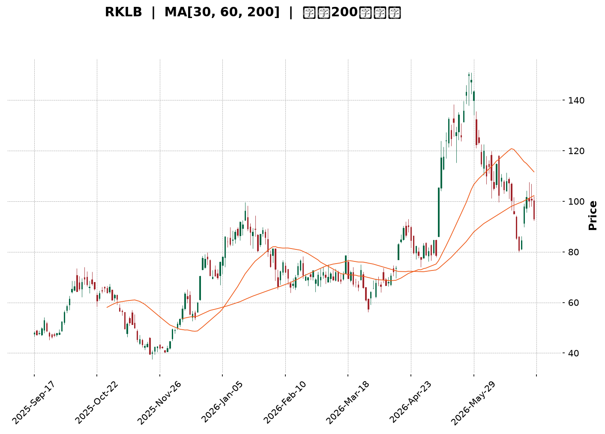
</details>

<html>
<head><meta charset="utf-8" /></head>
<body>
    <div style="height:500px; width:100%;">                        <script>window.PlotlyConfig = {MathJaxConfig: 'local'};</script>
        <script charset="utf-8" src="https://cdn.plot.ly/plotly-3.6.0.min.js" integrity="sha256-QaOVwtVY0T02VaHrr6pnoHLCwayMJp4O5n4YyaE3rJk=" crossorigin="anonymous"></script>                <div id="candlestick-chart" class="plotly-graph-div" style="height:100%; width:100%;"></div>            <script>                window.PLOTLYENV=window.PLOTLYENV || {};                                if (document.getElementById("candlestick-chart")) {                    Plotly.newPlot(                        "candlestick-chart",                        [{"close":{"dtype":"f8","bdata":"AAAAgD0KSEAAAABACpdHQAAAAMAe5UdAAAAAIK7nSEAAAADgenRKQAAAAOBRWEhAAAAA4KNQR0AAAACgRyFHQAAAAKBHgUdAAAAA4Hr0R0AAAAAAKfxHQAAAAAApPEpAAAAA4HoUTEAAAAAAAEBNQAAAAKBHwU5AAAAAANdTUEAAAABA4ZpQQAAAAOCjEFBAAAAAQOFaUEAAAACA6wFRQAAAAKBHUVFAAAAAAADAUEAAAACgR5FQQAAAAGBm1lBAAAAAoJlZUEAAAADgUUhOQAAAAMD1yE9AAAAAANcjUEAAAAAgrmdQQAAAAAAA4E9AAAAAgD2KUEAAAACAwnVOQAAAAKBwfU9AAAAAIIWrTkAAAADA9UhMQAAAAIDCNUxAAAAAgBTOSEAAAACA69FJQAAAAEAz80lAAAAAYLieSUAAAAAAKfxIQAAAAAAAoEZAAAAAwB7FRkAAAAAgrqdFQAAAAADXY0VAAAAAIFzPRUAAAACgcL1DQAAAAGBmJkRAAAAAoJk5RUAAAADAzExFQAAAAEAK90RAAAAAgOsRRUAAAAAgXC9EQAAAAEAz80RAAAAAAClcRkAAAAAgXK9IQAAAAEAKh0hAAAAAIK7HSUAAAABACrdKQAAAAGCPwkxAAAAAANfDT0AAAABguL5OQAAAAOB6tEtAAAAAYLi+S0AAAABA4fpKQAAAAIDC9U1AAAAAoEehUUAAAABAM2NTQAAAACCFS1NAAAAAIIVLU0AAAACgmalRQAAAACCuh1FAAAAAwMycUUAAAADgo3BRQAAAACBc\u002f1JAAAAAwPWIU0AAAACA64FVQAAAAMAeBVVAAAAAwB7FVEAAAABgZjZVQAAAAKCZ+VVAAAAAwB6lVUAAAABAM\u002fNWQAAAAOCjsFZAAAAAQDMTWEAAAACAPUpWQAAAAOB69FVAAAAAYLj+VUAAAACgmTlWQAAAAGC4HlRAAAAAAADAVUAAAADgeiRWQAAAACCFa1VAAAAA4HoEVEAAAACgmYlSQAAAAKBHUVRAAAAAQApHUkAAAADgepRQQAAAAOB6FFJAAAAAgML1UkAAAACA6wFSQAAAACCuZ1FAAAAA4KOAUEAAAAAAKdxQQAAAAMD1eFFAAAAAQOGaUkAAAADAHiVTQAAAAEAKt1FAAAAAoHCNUUAAAACAFH5RQAAAAMDMjFFAAAAAoJkpUkAAAABgZkZRQAAAAIAUvlFAAAAA4FGIUUAAAACAPfpRQAAAAAAAgFFAAAAAQAqHUUAAAABguN5RQAAAACCFO1FAAAAAoHD9UUAAAAAgrhdRQAAAAIA9GlFAAAAAANfTUUAAAACAwqVTQAAAAGC4XlFAAAAAIIX7UUAAAABguM5QQAAAAAAAAFFAAAAA4HqEUEAAAADgUThSQAAAAAApfFBAAAAAQAp3TkAAAADgo7BMQAAAAIAUDlBAAAAAoEdhUEAAAABguO5QQAAAAEDh6lBAAAAA4HqUUEAAAADAHkVRQAAAACBcr1BAAAAAQDMDUUAAAAAgrqdRQAAAAIAUDlJAAAAAYGZmUkAAAAAghbtUQAAAAEAzM1VAAAAAoHBdVkAAAADA9ahVQAAAAGCPglZAAAAAYGYmVUAAAAAghetTQAAAAGCPklRAAAAAgMKlU0AAAACgR0FTQAAAAOCjoFRAAAAAANezU0AAAAAA1xNUQAAAAOCjsFNAAAAAoJkpVUAAAADAHqVTQAAAAIAUXlpAAAAAYGZWXUAAAAAA12NdQAAAAKCZCV9AAAAAoJmRYEAAAACgRzFfQAAAAMAeZWBAAAAAANfTX0AAAADA9chgQAAAAMDMXF9AAAAA4FH4YEAAAABgZuZhQAAAACBcx2JAAAAAwPWAYkAAAAAgXO9hQAAAAMD1mF5AAAAA4HrUXkAAAADAzKxcQAAAAMDM\u002fF1AAAAAwB6FW0AAAACgmWlcQAAAAGC4DltAAAAAQDNDWkAAAACA67FcQAAAAMD1mFlAAAAAAABQW0AAAADgUShaQAAAAGC4\u002flpAAAAAIFzPWkAAAABgjxJZQAAAACCux1dAAAAAgD1aVUAAAAAAKSxUQAAAAGCPIlVAAAAA4KOAWEAAAACgmWlZQAAAAOB6BFlAAAAAoHAdWUAAAACAwkVXQA=="},"high":{"dtype":"f8","bdata":"AAAAwB5FSEAAAADgUZhIQAAAAEAKd0hAAAAAoEchSUAAAABgORRLQAAAAKBwPUpAAAAAIFxPSEAAAADgUdhHQAAAAMDMDEhAAAAAYLj+R0AAAACAwrVIQAAAAEAzU0pAAAAAIDF4TEAAAACgR6FNQAAAACCuR09AAAAAAC0iUUAAAABgjyJRQAAAAAAAYFJAAAAAACmcUUAAAABA4WpRQAAAAIAUflJAAAAAAAAQUkAAAAAAACBRQAAAACCFC1JAAAAAYI8CUUAAAACgRwFQQAAAAMDMLFBAAAAAIIWLUEAAAABgZpZQQAAAAGCPolBAAAAAwPXYUEAAAAAghUtQQAAAAKCZuU9AAAAAwMyMT0AAAABguL5NQAAAAADXo0xAAAAAQOEaTEAAAADAzAxKQAAAAAAAQEtAAAAAQOF6TEAAAACAPapLQAAAAOCjsEhAAAAAACmcR0AAAADAS9dGQAAAAIAUzkVAAAAAANdDRkAAAACgRyFHQAAAAIDChURAAAAAANdDRUAAAABACmdFQAAAACCFy0VAAAAAoJlZRUAAAABgZqZEQAAAAGC4fkVAAAAAYLheRkAAAABACtdIQAAAAKCZ2UhAAAAAIFwvSkAAAAAAAOBKQAAAAIA9ak1AAAAAoJkJUEAAAAAghUtQQAAAAADXI1BAAAAAoHBdTEAAAADgenRMQAAAAAAAIE5AAAAAANejUUAAAADAzJxTQAAAACCFy1NAAAAAwB71U0AAAAAgXD9TQAAAACBcL1JAAAAAACmsUkAAAABAi0xSQAAAACBcD1NAAAAAAACQU0AAAAAAAJBVQAAAAKBwfVVAAAAAIK53VkAAAAAghRtWQAAAAIDCNVZAAAAA4KduVkAAAAAAKQxXQAAAAEBgHVdAAAAAwB7lWEAAAACgR5FYQAAAAAAA0FZAAAAAoJlZVkAAAADAzJxXQAAAAIA9ylVAAAAAAADAVUAAAABAM3NWQAAAAAAAQFZAAAAA4HpUVkAAAADAzCxUQAAAAOB6VFRAAAAAYGZWVEAAAAAgXD9SQAAAAIA9KlJAAAAAQDMzU0AAAABACvdSQAAAAKCZWVJAAAAAwMwcUUAAAABgZmZRQAAAACBcv1FAAAAAwPXwUkAAAABACkdTQAAAAMDMjFNAAAAAAADQUUAAAAAghYNRQAAAAGBm9lFAAAAAIFwvUkAAAACAwmVRQAAAAGBmBlJAAAAAAABQUkAAAABgZoZSQAAAAADXE1JAAAAAQArHUkAAAAAAAAhSQAAAAADXO1JAAAAAQDNTUkAAAABgZiZSQAAAAADX01FAAAAA4FEYUkAAAABA4apTQAAAAOBROFNAAAAAYLguUkAAAABguH5SQAAAAMDMXFFAAAAAYGYmUUAAAAAA18NSQAAAAIDCBVJAAAAAgBSGUEAAAACA69FOQAAAAMAeJVBAAAAAQOEqUUAAAADA9VhRQAAAAOB6lFFAAAAAQDMTUUAAAACAwGpSQAAAAGCPclFAAAAAANeDUUAAAABAM+NRQAAAAAAAsFJAAAAAgMKlUkAAAAAgXN9UQAAAACBcv1VAAAAAYGaWVkAAAADAzPxWQAAAAGBmRldAAAAAQDOTVkAAAACAPZpVQAAAAGC4nlRAAAAAgOtxVEAAAADgo4BTQAAAAIDC5VRAAAAAYI\u002fyVEAAAADgT3VUQAAAAAAAwFRAAAAAIIUrVUAAAABgjzJVQAAAACCuZ1pAAAAAACn8XkAAAAAgXF9eQAAAACBcz19AAAAAgMKlYEAAAAAA10tgQAAAAAApTGFAAAAAgD0yYEAAAABAM+tgQAAAAADXW2BAAAAA4FF4YUAAAAAAAEBiQAAAAAAA4GJAAAAAYI\u002faYkAAAAAAAABiQAAAAAAp9GBAAAAAwMwMYEAAAADgUaBeQAAAAOBRqF5AAAAAYLh+XUAAAAAAABBdQAAAAGCP8l1AAAAAoHD9W0AAAABA4cJcQAAAAMAgmF1AAAAAgOuxW0AAAAAAACBbQAAAAIDC1VtAAAAAQDNjW0AAAACgmdlaQAAAAGC4bllAAAAAQDOTV0AAAABACodVQAAAAIDrkVVAAAAAwB7FWEAAAACAPQpaQAAAAGBm5lpAAAAAIFy\u002fWkAAAADAZIZZQA=="},"hovertemplate":"\u003cb\u003e%{x|%Y-%m-%d}\u003c\u002fb\u003e\u003cbr\u003e\u958b: $%{open:.2f}\u003cbr\u003e\u9ad8: $%{high:.2f}\u003cbr\u003e\u4f4e: $%{low:.2f}\u003cbr\u003e\u6536: $%{close:.2f}\u003cextra\u003e\u003c\u002fextra\u003e","low":{"dtype":"f8","bdata":"AAAAoJk5R0AAAAAAAIBHQAAAAOCjkEdAAAAAYGZmR0AAAADgevRHQAAAAEAKN0hAAAAAQOGaRkAAAACAPepGQAAAACBcL0dAAAAAoEdBR0AAAAAgXI9HQAAAAKBHQUhAAAAAoEehSUAAAABgZuZLQAAAAGCPgkxAAAAAQDPTT0AAAABA4RpQQAAAAMD1CFBAAAAA4M4nUEAAAADgURhPQAAAAMAexVBAAAAAQDObUEAAAACgmdlPQAAAAEAzq1BAAAAAQAo3UEAAAADgejRNQAAAAAAAYE5AAAAAQDPTT0AAAACgmQlQQAAAAIAUzk9AAAAAoHC9T0AAAACA63FOQAAAAEAzM05AAAAA4KOQTUAAAACgR0FMQAAAACBcb0tAAAAA4Hq0SEAAAADgzidHQAAAAKBHYUlAAAAAQOGaSUAAAADgetRIQAAAACBcL0ZAAAAAYGamRUAAAADAzBxFQAAAAKBwnURAAAAAQAo3RUAAAADA9ahDQAAAAMD1yEJAAAAAYGamQ0AAAADgozBEQAAAAOCjsERAAAAAYGbmREAAAACgcP1DQAAAAIDCNURAAAAAAADAREAAAADA9WhGQAAAAKCZ2UdAAAAAACmcSEAAAAAghStJQAAAAAAAIEpAAAAAwMxsTEAAAABgZuZNQAAAAIA9iktAAAAAQApXSkAAAABA4YpKQAAAAADXA0xAAAAAwJ1fTkAAAADAIDBSQAAAAGCPUlJAAAAAoEOzUkAAAADA9ZhRQAAAAKCbVFFAAAAAACmcUUAAAADgUUhRQAAAAGBmtlBAAAAAANfTUUAAAABAM4NSQAAAAGBmdlRAAAAA4KOQVEAAAADAzJxUQAAAAODQ2lRAAAAAoJlpVUAAAAAAACBVQAAAAKCZqVVAAAAAoJkZV0AAAABAMxNWQAAAAKBwrVRAAAAAwHZWVEAAAAAgrodVQAAAAOCjAFRAAAAAAACAVEAAAADAyoFVQAAAAAAAwFRAAAAAoEeBU0AAAACAQXhSQAAAAKBH8VJAAAAAQAgkUUAAAADAzExQQAAAAAAAwFBAAAAAAACwUUAAAABAM+NRQAAAAKBHwVBAAAAAIFzvT0AAAAAAAGBQQAAAAAAAQFBAAAAAwEt\u002fUUAAAABgZhZSQAAAAKCZWVFAAAAAAAAgUUAAAABgZqZQQAAAAOBROFFAAAAAANczUUAAAABgZgZQQAAAAMDMnFBAAAAAACmMUEAAAACAFF5RQAAAAIDC1VBAAAAA4KMIUUAAAADgevRQQAAAAIC+J1FAAAAAwB4VUUAAAACA6xFRQAAAAAAp3FBAAAAAQOEqUUAAAACgR9FRQAAAAKCZWVFAAAAAAAAAUUAAAADA9ZhQQAAAAEAzg1BAAAAAoHAdUEAAAAAAKTxRQAAAAIDCZVBAAAAAwMwsTkAAAABg5RBMQAAAAADXg01AAAAAQDNTUEAAAACAFO5OQAAAAGBmplBAAAAAQOH6T0AAAABg5\u002fNQQAAAAEDholBAAAAAgMKVUEAAAACAwqVQQAAAAGC4nlFAAAAAYGZmUUAAAACgmTlTQAAAAGBm5lRAAAAAYGYmVUAAAAAAAHBVQAAAAOCj8FVAAAAAAClkVEAAAADAHsVTQAAAAMB0Q1NAAAAAYGZmU0AAAAAgXH9SQAAAAIAUXlNAAAAAIIWbU0AAAAAAABBTQAAAAADXI1NAAAAAQAq3U0AAAAAghXtTQAAAACCud1VAAAAAAAAAWkAAAACAPRpcQAAAAMD1OF1AAAAAANdTXkAAAABAM3NeQAAAAKDxal9AAAAAYLjOXEAAAACAFA5fQAAAAEAz815AAAAAgOtpYEAAAACA61FhQAAAAMAePWFAAAAAANfLYUAAAACgmcFgQAAAAAAAQF5AAAAAANejXkAAAACAPWpcQAAAAMD1mFtAAAAAYLiuWkAAAAAAAMBbQAAAAMDMTFlAAAAAgD0aWkAAAACgmVlaQAAAAEAK51hAAAAAQDNzWkAAAADgesRZQAAAAGCPAlpAAAAAoHA9WUAAAAAAACBYQAAAAOCjuFdAAAAAYGY2VUAAAAAAAABUQAAAAGC4LlRAAAAAYGZ2VkAAAADA9ehXQAAAACCuZ1hAAAAAgD16WEAAAABAMxNXQA=="},"name":"\u50f9\u683c","open":{"dtype":"f8","bdata":"AAAA4FHIR0AAAACAwnVIQAAAAEAK10dAAAAA4KOQR0AAAABAM4NIQAAAAIDC5UlAAAAAAAAASEAAAABgZqZHQAAAAEAzs0dAAAAAQOGaR0AAAADgo7BHQAAAAIDrUUhAAAAAYGYGSkAAAABguG5MQAAAAKBHgU1AAAAAoJkJUEAAAACgmTlQQAAAAEAzs1FAAAAA4FH4UEAAAACAwlVQQAAAAKBHgVFAAAAA4HqEUUAAAADA9XhQQAAAAOCjSFFAAAAAYI8CUUAAAAAAKXxPQAAAACCux05AAAAAANczUEAAAAAAKYxQQAAAAEAza1BAAAAAoEcJUEAAAAAAAEBQQAAAAGCP4k5AAAAAANeDT0AAAABgZuZMQAAAAOB6VExAAAAAQOEaTEAAAACgGNRHQAAAAGC43kpAAAAAAAAATEAAAABACvdJQAAAAKBHYUhAAAAAQOHaRUAAAABAM5NGQAAAAAApHEVAAAAAAABARUAAAACAPQpHQAAAAIA96kNAAAAAoEdhREAAAAAA1wNFQAAAAGC4nkVAAAAAoEdBRUAAAABAM5NEQAAAACCuR0RAAAAAYI\u002fyREAAAABgj9JGQAAAAAAAcEhAAAAAgD0KSUAAAACgcJ1JQAAAAOBRuEpAAAAAoEfBTEAAAAAAAEBPQAAAAOCnhk9AAAAA4FEYS0AAAADAzAxMQAAAAKCZGUxAAAAAIFyPTkAAAAAAKTxSQAAAAADXc1JAAAAAgD2CU0AAAAAghStTQAAAAAAAYFFAAAAAoJlBUkAAAAAAAOBRQAAAAOBRqFFAAAAAIK6nUkAAAADgo3BTQAAAAGBmBlVAAAAAAABgVUAAAACgmSFVQAAAAGC4PlVAAAAAwPVIVkAAAABgZpZVQAAAAMD1UFZAAAAAoJkhV0AAAADAzGxXQAAAAKBHgVZAAAAA4FGYVUAAAAAghUNWQAAAACCur1VAAAAAwPW4VEAAAACAFM5VQAAAAAAp\u002fFVAAAAAAABAVUAAAACAPcpTQAAAAGBmplNAAAAAYGZWVEAAAABguH5RQAAAAAAAQFFAAAAAoJkBUkAAAACAFKZSQAAAAOBRSFJAAAAAgOvhUEAAAADgeqxQQAAAAEBghVBAAAAAAADAUUAAAACgmTlSQAAAACDZ3lJAAAAA4FEwUUAAAADgUThRQAAAAIAUxlFAAAAAQOGCUUAAAACAwuVQQAAAACCFq1BAAAAAYLg2UUAAAAAA17NRQAAAAEDhulFAAAAA4KMIUUAAAADA9VhRQAAAAIDClVFAAAAAQDMzUUAAAADAzPxRQAAAAKCZSVFAAAAAwMxUUUAAAABgZt5RQAAAAGCPAlNAAAAA4Ho0UUAAAAAAAABSQAAAAKBwBVFAAAAAAADAUEAAAAAAKTxRQAAAAMDMzFFAAAAA4KOAUEAAAACgmblOQAAAAEDh2k5AAAAAAABgUEAAAADAzBxPQAAAAGC47lBAAAAAIFzHUEAAAAAAAABSQAAAAADXQ1FAAAAAwMzsUEAAAABAM8NQQAAAACCFY1JAAAAAoHBlUkAAAACAFD5TQAAAAMAeBVVAAAAAYGY2VUAAAADAHpVWQAAAAIDCnVZAAAAAYGZ2VkAAAACAwpVVQAAAAAAp7FNAAAAAwMwEVEAAAABACndTQAAAAEAzY1NAAAAAgOvhVEAAAABACpdTQAAAAGBmplRAAAAAIK7nU0AAAACgcC1VQAAAAIA9glVAAAAAoEdRWkAAAADgozBcQAAAAKBH+V5AAAAAYGbGXkAAAABAMwNgQAAAAAApmGBAAAAAgBR+X0AAAABguN5fQAAAAMD1iF9AAAAAwB5tYEAAAABA4b5hQAAAAEAKt2JAAAAAoHBlYkAAAACAFH5hQAAAAAApjGBAAAAAgMJVX0AAAADAHuVdQAAAAKBwRVxAAAAAoEeRXEAAAABA4apcQAAAAKCZmV1AAAAAwMzsWkAAAACAwqVaQAAAAKBHgV1AAAAAoHD9WkAAAACgcO1aQAAAACCuB1pAAAAAwB41W0AAAAAgXL9aQAAAAKBHAVhAAAAAYGZ2V0AAAABACodVQAAAAEAKR1RAAAAAQOHSVkAAAADAzExYQAAAAOB6TFlAAAAAIFw\u002fWUAAAABAChdZQA=="},"x":["2025-09-17T00:00:00-04:00","2025-09-18T00:00:00-04:00","2025-09-19T00:00:00-04:00","2025-09-22T00:00:00-04:00","2025-09-23T00:00:00-04:00","2025-09-24T00:00:00-04:00","2025-09-25T00:00:00-04:00","2025-09-26T00:00:00-04:00","2025-09-29T00:00:00-04:00","2025-09-30T00:00:00-04:00","2025-10-01T00:00:00-04:00","2025-10-02T00:00:00-04:00","2025-10-03T00:00:00-04:00","2025-10-06T00:00:00-04:00","2025-10-07T00:00:00-04:00","2025-10-08T00:00:00-04:00","2025-10-09T00:00:00-04:00","2025-10-10T00:00:00-04:00","2025-10-13T00:00:00-04:00","2025-10-14T00:00:00-04:00","2025-10-15T00:00:00-04:00","2025-10-16T00:00:00-04:00","2025-10-17T00:00:00-04:00","2025-10-20T00:00:00-04:00","2025-10-21T00:00:00-04:00","2025-10-22T00:00:00-04:00","2025-10-23T00:00:00-04:00","2025-10-24T00:00:00-04:00","2025-10-27T00:00:00-04:00","2025-10-28T00:00:00-04:00","2025-10-29T00:00:00-04:00","2025-10-30T00:00:00-04:00","2025-10-31T00:00:00-04:00","2025-11-03T00:00:00-05:00","2025-11-04T00:00:00-05:00","2025-11-05T00:00:00-05:00","2025-11-06T00:00:00-05:00","2025-11-07T00:00:00-05:00","2025-11-10T00:00:00-05:00","2025-11-11T00:00:00-05:00","2025-11-12T00:00:00-05:00","2025-11-13T00:00:00-05:00","2025-11-14T00:00:00-05:00","2025-11-17T00:00:00-05:00","2025-11-18T00:00:00-05:00","2025-11-19T00:00:00-05:00","2025-11-20T00:00:00-05:00","2025-11-21T00:00:00-05:00","2025-11-24T00:00:00-05:00","2025-11-25T00:00:00-05:00","2025-11-26T00:00:00-05:00","2025-11-28T00:00:00-05:00","2025-12-01T00:00:00-05:00","2025-12-02T00:00:00-05:00","2025-12-03T00:00:00-05:00","2025-12-04T00:00:00-05:00","2025-12-05T00:00:00-05:00","2025-12-08T00:00:00-05:00","2025-12-09T00:00:00-05:00","2025-12-10T00:00:00-05:00","2025-12-11T00:00:00-05:00","2025-12-12T00:00:00-05:00","2025-12-15T00:00:00-05:00","2025-12-16T00:00:00-05:00","2025-12-17T00:00:00-05:00","2025-12-18T00:00:00-05:00","2025-12-19T00:00:00-05:00","2025-12-22T00:00:00-05:00","2025-12-23T00:00:00-05:00","2025-12-24T00:00:00-05:00","2025-12-26T00:00:00-05:00","2025-12-29T00:00:00-05:00","2025-12-30T00:00:00-05:00","2025-12-31T00:00:00-05:00","2026-01-02T00:00:00-05:00","2026-01-05T00:00:00-05:00","2026-01-06T00:00:00-05:00","2026-01-07T00:00:00-05:00","2026-01-08T00:00:00-05:00","2026-01-09T00:00:00-05:00","2026-01-12T00:00:00-05:00","2026-01-13T00:00:00-05:00","2026-01-14T00:00:00-05:00","2026-01-15T00:00:00-05:00","2026-01-16T00:00:00-05:00","2026-01-20T00:00:00-05:00","2026-01-21T00:00:00-05:00","2026-01-22T00:00:00-05:00","2026-01-23T00:00:00-05:00","2026-01-26T00:00:00-05:00","2026-01-27T00:00:00-05:00","2026-01-28T00:00:00-05:00","2026-01-29T00:00:00-05:00","2026-01-30T00:00:00-05:00","2026-02-02T00:00:00-05:00","2026-02-03T00:00:00-05:00","2026-02-04T00:00:00-05:00","2026-02-05T00:00:00-05:00","2026-02-06T00:00:00-05:00","2026-02-09T00:00:00-05:00","2026-02-10T00:00:00-05:00","2026-02-11T00:00:00-05:00","2026-02-12T00:00:00-05:00","2026-02-13T00:00:00-05:00","2026-02-17T00:00:00-05:00","2026-02-18T00:00:00-05:00","2026-02-19T00:00:00-05:00","2026-02-20T00:00:00-05:00","2026-02-23T00:00:00-05:00","2026-02-24T00:00:00-05:00","2026-02-25T00:00:00-05:00","2026-02-26T00:00:00-05:00","2026-02-27T00:00:00-05:00","2026-03-02T00:00:00-05:00","2026-03-03T00:00:00-05:00","2026-03-04T00:00:00-05:00","2026-03-05T00:00:00-05:00","2026-03-06T00:00:00-05:00","2026-03-09T00:00:00-04:00","2026-03-10T00:00:00-04:00","2026-03-11T00:00:00-04:00","2026-03-12T00:00:00-04:00","2026-03-13T00:00:00-04:00","2026-03-16T00:00:00-04:00","2026-03-17T00:00:00-04:00","2026-03-18T00:00:00-04:00","2026-03-19T00:00:00-04:00","2026-03-20T00:00:00-04:00","2026-03-23T00:00:00-04:00","2026-03-24T00:00:00-04:00","2026-03-25T00:00:00-04:00","2026-03-26T00:00:00-04:00","2026-03-27T00:00:00-04:00","2026-03-30T00:00:00-04:00","2026-03-31T00:00:00-04:00","2026-04-01T00:00:00-04:00","2026-04-02T00:00:00-04:00","2026-04-06T00:00:00-04:00","2026-04-07T00:00:00-04:00","2026-04-08T00:00:00-04:00","2026-04-09T00:00:00-04:00","2026-04-10T00:00:00-04:00","2026-04-13T00:00:00-04:00","2026-04-14T00:00:00-04:00","2026-04-15T00:00:00-04:00","2026-04-16T00:00:00-04:00","2026-04-17T00:00:00-04:00","2026-04-20T00:00:00-04:00","2026-04-21T00:00:00-04:00","2026-04-22T00:00:00-04:00","2026-04-23T00:00:00-04:00","2026-04-24T00:00:00-04:00","2026-04-27T00:00:00-04:00","2026-04-28T00:00:00-04:00","2026-04-29T00:00:00-04:00","2026-04-30T00:00:00-04:00","2026-05-01T00:00:00-04:00","2026-05-04T00:00:00-04:00","2026-05-05T00:00:00-04:00","2026-05-06T00:00:00-04:00","2026-05-07T00:00:00-04:00","2026-05-08T00:00:00-04:00","2026-05-11T00:00:00-04:00","2026-05-12T00:00:00-04:00","2026-05-13T00:00:00-04:00","2026-05-14T00:00:00-04:00","2026-05-15T00:00:00-04:00","2026-05-18T00:00:00-04:00","2026-05-19T00:00:00-04:00","2026-05-20T00:00:00-04:00","2026-05-21T00:00:00-04:00","2026-05-22T00:00:00-04:00","2026-05-26T00:00:00-04:00","2026-05-27T00:00:00-04:00","2026-05-28T00:00:00-04:00","2026-05-29T00:00:00-04:00","2026-06-01T00:00:00-04:00","2026-06-02T00:00:00-04:00","2026-06-03T00:00:00-04:00","2026-06-04T00:00:00-04:00","2026-06-05T00:00:00-04:00","2026-06-08T00:00:00-04:00","2026-06-09T00:00:00-04:00","2026-06-10T00:00:00-04:00","2026-06-11T00:00:00-04:00","2026-06-12T00:00:00-04:00","2026-06-15T00:00:00-04:00","2026-06-16T00:00:00-04:00","2026-06-17T00:00:00-04:00","2026-06-18T00:00:00-04:00","2026-06-22T00:00:00-04:00","2026-06-23T00:00:00-04:00","2026-06-24T00:00:00-04:00","2026-06-25T00:00:00-04:00","2026-06-26T00:00:00-04:00","2026-06-29T00:00:00-04:00","2026-06-30T00:00:00-04:00","2026-07-01T00:00:00-04:00","2026-07-02T00:00:00-04:00","2026-07-06T00:00:00-04:00"],"type":"candlestick"},{"hovertemplate":"MA30: $%{y:.2f}\u003cextra\u003e\u003c\u002fextra\u003e","line":{"color":"#2196F3","dash":"dash","width":2},"mode":"lines","name":"MA30","x":["2025-09-17T00:00:00-04:00","2025-09-18T00:00:00-04:00","2025-09-19T00:00:00-04:00","2025-09-22T00:00:00-04:00","2025-09-23T00:00:00-04:00","2025-09-24T00:00:00-04:00","2025-09-25T00:00:00-04:00","2025-09-26T00:00:00-04:00","2025-09-29T00:00:00-04:00","2025-09-30T00:00:00-04:00","2025-10-01T00:00:00-04:00","2025-10-02T00:00:00-04:00","2025-10-03T00:00:00-04:00","2025-10-06T00:00:00-04:00","2025-10-07T00:00:00-04:00","2025-10-08T00:00:00-04:00","2025-10-09T00:00:00-04:00","2025-10-10T00:00:00-04:00","2025-10-13T00:00:00-04:00","2025-10-14T00:00:00-04:00","2025-10-15T00:00:00-04:00","2025-10-16T00:00:00-04:00","2025-10-17T00:00:00-04:00","2025-10-20T00:00:00-04:00","2025-10-21T00:00:00-04:00","2025-10-22T00:00:00-04:00","2025-10-23T00:00:00-04:00","2025-10-24T00:00:00-04:00","2025-10-27T00:00:00-04:00","2025-10-28T00:00:00-04:00","2025-10-29T00:00:00-04:00","2025-10-30T00:00:00-04:00","2025-10-31T00:00:00-04:00","2025-11-03T00:00:00-05:00","2025-11-04T00:00:00-05:00","2025-11-05T00:00:00-05:00","2025-11-06T00:00:00-05:00","2025-11-07T00:00:00-05:00","2025-11-10T00:00:00-05:00","2025-11-11T00:00:00-05:00","2025-11-12T00:00:00-05:00","2025-11-13T00:00:00-05:00","2025-11-14T00:00:00-05:00","2025-11-17T00:00:00-05:00","2025-11-18T00:00:00-05:00","2025-11-19T00:00:00-05:00","2025-11-20T00:00:00-05:00","2025-11-21T00:00:00-05:00","2025-11-24T00:00:00-05:00","2025-11-25T00:00:00-05:00","2025-11-26T00:00:00-05:00","2025-11-28T00:00:00-05:00","2025-12-01T00:00:00-05:00","2025-12-02T00:00:00-05:00","2025-12-03T00:00:00-05:00","2025-12-04T00:00:00-05:00","2025-12-05T00:00:00-05:00","2025-12-08T00:00:00-05:00","2025-12-09T00:00:00-05:00","2025-12-10T00:00:00-05:00","2025-12-11T00:00:00-05:00","2025-12-12T00:00:00-05:00","2025-12-15T00:00:00-05:00","2025-12-16T00:00:00-05:00","2025-12-17T00:00:00-05:00","2025-12-18T00:00:00-05:00","2025-12-19T00:00:00-05:00","2025-12-22T00:00:00-05:00","2025-12-23T00:00:00-05:00","2025-12-24T00:00:00-05:00","2025-12-26T00:00:00-05:00","2025-12-29T00:00:00-05:00","2025-12-30T00:00:00-05:00","2025-12-31T00:00:00-05:00","2026-01-02T00:00:00-05:00","2026-01-05T00:00:00-05:00","2026-01-06T00:00:00-05:00","2026-01-07T00:00:00-05:00","2026-01-08T00:00:00-05:00","2026-01-09T00:00:00-05:00","2026-01-12T00:00:00-05:00","2026-01-13T00:00:00-05:00","2026-01-14T00:00:00-05:00","2026-01-15T00:00:00-05:00","2026-01-16T00:00:00-05:00","2026-01-20T00:00:00-05:00","2026-01-21T00:00:00-05:00","2026-01-22T00:00:00-05:00","2026-01-23T00:00:00-05:00","2026-01-26T00:00:00-05:00","2026-01-27T00:00:00-05:00","2026-01-28T00:00:00-05:00","2026-01-29T00:00:00-05:00","2026-01-30T00:00:00-05:00","2026-02-02T00:00:00-05:00","2026-02-03T00:00:00-05:00","2026-02-04T00:00:00-05:00","2026-02-05T00:00:00-05:00","2026-02-06T00:00:00-05:00","2026-02-09T00:00:00-05:00","2026-02-10T00:00:00-05:00","2026-02-11T00:00:00-05:00","2026-02-12T00:00:00-05:00","2026-02-13T00:00:00-05:00","2026-02-17T00:00:00-05:00","2026-02-18T00:00:00-05:00","2026-02-19T00:00:00-05:00","2026-02-20T00:00:00-05:00","2026-02-23T00:00:00-05:00","2026-02-24T00:00:00-05:00","2026-02-25T00:00:00-05:00","2026-02-26T00:00:00-05:00","2026-02-27T00:00:00-05:00","2026-03-02T00:00:00-05:00","2026-03-03T00:00:00-05:00","2026-03-04T00:00:00-05:00","2026-03-05T00:00:00-05:00","2026-03-06T00:00:00-05:00","2026-03-09T00:00:00-04:00","2026-03-10T00:00:00-04:00","2026-03-11T00:00:00-04:00","2026-03-12T00:00:00-04:00","2026-03-13T00:00:00-04:00","2026-03-16T00:00:00-04:00","2026-03-17T00:00:00-04:00","2026-03-18T00:00:00-04:00","2026-03-19T00:00:00-04:00","2026-03-20T00:00:00-04:00","2026-03-23T00:00:00-04:00","2026-03-24T00:00:00-04:00","2026-03-25T00:00:00-04:00","2026-03-26T00:00:00-04:00","2026-03-27T00:00:00-04:00","2026-03-30T00:00:00-04:00","2026-03-31T00:00:00-04:00","2026-04-01T00:00:00-04:00","2026-04-02T00:00:00-04:00","2026-04-06T00:00:00-04:00","2026-04-07T00:00:00-04:00","2026-04-08T00:00:00-04:00","2026-04-09T00:00:00-04:00","2026-04-10T00:00:00-04:00","2026-04-13T00:00:00-04:00","2026-04-14T00:00:00-04:00","2026-04-15T00:00:00-04:00","2026-04-16T00:00:00-04:00","2026-04-17T00:00:00-04:00","2026-04-20T00:00:00-04:00","2026-04-21T00:00:00-04:00","2026-04-22T00:00:00-04:00","2026-04-23T00:00:00-04:00","2026-04-24T00:00:00-04:00","2026-04-27T00:00:00-04:00","2026-04-28T00:00:00-04:00","2026-04-29T00:00:00-04:00","2026-04-30T00:00:00-04:00","2026-05-01T00:00:00-04:00","2026-05-04T00:00:00-04:00","2026-05-05T00:00:00-04:00","2026-05-06T00:00:00-04:00","2026-05-07T00:00:00-04:00","2026-05-08T00:00:00-04:00","2026-05-11T00:00:00-04:00","2026-05-12T00:00:00-04:00","2026-05-13T00:00:00-04:00","2026-05-14T00:00:00-04:00","2026-05-15T00:00:00-04:00","2026-05-18T00:00:00-04:00","2026-05-19T00:00:00-04:00","2026-05-20T00:00:00-04:00","2026-05-21T00:00:00-04:00","2026-05-22T00:00:00-04:00","2026-05-26T00:00:00-04:00","2026-05-27T00:00:00-04:00","2026-05-28T00:00:00-04:00","2026-05-29T00:00:00-04:00","2026-06-01T00:00:00-04:00","2026-06-02T00:00:00-04:00","2026-06-03T00:00:00-04:00","2026-06-04T00:00:00-04:00","2026-06-05T00:00:00-04:00","2026-06-08T00:00:00-04:00","2026-06-09T00:00:00-04:00","2026-06-10T00:00:00-04:00","2026-06-11T00:00:00-04:00","2026-06-12T00:00:00-04:00","2026-06-15T00:00:00-04:00","2026-06-16T00:00:00-04:00","2026-06-17T00:00:00-04:00","2026-06-18T00:00:00-04:00","2026-06-22T00:00:00-04:00","2026-06-23T00:00:00-04:00","2026-06-24T00:00:00-04:00","2026-06-25T00:00:00-04:00","2026-06-26T00:00:00-04:00","2026-06-29T00:00:00-04:00","2026-06-30T00:00:00-04:00","2026-07-01T00:00:00-04:00","2026-07-02T00:00:00-04:00","2026-07-06T00:00:00-04:00"],"y":{"dtype":"f8","bdata":"AAAAAAAA+H8AAAAAAAD4fwAAAAAAAPh\u002fAAAAAAAA+H8AAAAAAAD4fwAAAAAAAPh\u002fAAAAAAAA+H8AAAAAAAD4fwAAAAAAAPh\u002fAAAAAAAA+H8AAAAAAAD4fwAAAAAAAPh\u002fAAAAAAAA+H8AAAAAAAD4fwAAAAAAAPh\u002fAAAAAAAA+H8AAAAAAAD4fwAAAAAAAPh\u002fAAAAAAAA+H8AAAAAAAD4fwAAAAAAAPh\u002fAAAAAAAA+H8AAAAAAAD4fwAAAAAAAPh\u002fAAAAAAAA+H8AAAAAAAD4fwAAAAAAAPh\u002fAAAAAAAA+H8AAAAAAAD4f4mIiIglB01Ad3d3t0lUTUBVVVV16Y5NQM3MzPy4z01AIiIi0uoATkBERESEiBBOQM3MzLyDMU5AERERsTo+TkBmZmYWL1VOQGZmZkYMak5AZmZmhkF4TkDv7u4OyoBOQEREROT7YU5AVVVVBaw0TkDe3d193PNNQGZmZlbyo01AMzMzE2dHTUCamZlpddRMQDMzM7M6bkxAZmZmVjkMTEDv7u7+uJ9LQN7d3W0SK0tA3t3drQDBSkCamZn5flJKQKuqqsro5UlAd3d3t6yNSUCrqqrK6F1JQKuqqor6H0lAREREFIPoSECJiIhYgLRIQGZmZobrmUhAvLu727KOSEBERER0IZFIQO\u002fu7v7UcEhAzczMPN9XSEC8u7trvExIQKuqqlqrW0hAVVVVpeK0SEB3d3dHbyNJQHd3d8dLj0lAzczMLPn9SUAAAABANVZKQM3MzOxRwEpAiYiISJoqS0DNzMy8dJtLQJqZmekmKUxAVVVV9W+8TECJiIj4DINNQImIiGjYPU5ARERENDPrTkCJiIh4d59PQERERHzNMVBA7+7uppuQUECrqqpKU\u002f5QQN7d3V2PZlFAzczM7JjUUUCrqqqSeylSQGZmZm4ufFJAvLu7m+DJUkBVVVX1ixVTQGZmZi6HRlNAZmZm7ph4U0CJiIg4XrJTQFVVVa3x8lNAIiIiomEnVEARERERdFJUQDMzMwMAgFRAAAAAgIaFVEC8u7trkW1UQGZmZjYzY1RAREREZFdgVEDe3d0NSWNUQM3MzPw3YlRAiYiIKL9YVEAREREhzFNUQHd3d7fIRlRAmpmZGdk+VEBEREQksCpUQCIiIkJ8DlRAVVVVhQfzU0Dv7u4OSdNTQO\u002fu7n6GrVNAvLu7286PU0ARERGhYV9TQGZmZqYpNVNAZmZmVlX9UkCamZmJiNhSQBEREXGEslJAmpmZCWWMUkBVVVVlO2dSQN7d3Y2XTlJAVVVVtYEuUkARERHRaQNSQImIiBiS3lFAd3d39+HLUUC8u7vLWtVRQDMzM+MzvFFAMzMzc6+5UUDv7u5uoLtRQDMzMyNpslFAq6qqapGdUUARERGhYZ9RQLy7u9uHl1FAAAAAgLGMUUDe3d1lO3dRQKuqqtIia1FAREREPCZYUUDNzMz0REVRQCIiIsp2PlFAzczMVCo2UUDe3d1FRDRRQO\u002fu7qbiLFFAiYiIcBIjUUCJiIiQUCZRQDMzMzv7KFFAiYiIUGIwUUC8u7uz5EdRQCIiInp3Z1FAAAAAKL+QUUARERGJFrFRQBEREWkf3lFAERERiRb5UUBVVVVNNxFSQJqZmaHTLlJAMzMze1s+UkBVVVUNAjtSQDMzMyvOVlJAiYiIkHtlUkBERET8YoFSQJqZmWFXmFJAIiIiivq\u002fUkCJiIiAI8xSQO\u002fu7iZ4IFNAZmZm\u002ftSYU0C8u7tLNxlUQBERERERmVRAMzMzYxAoVUBERETUv6FVQGZmZtYxKVZAIiIigk6rVkBmZmZmZjZXQDMzM+Ols1dAIiIikhhEWEDNzMzs7t5YQImIiMhahVlAzczMfCMkWkC8u7vbT6VaQCIiIgKB9VpAVVVVFb09W0BVVVWVmXlbQN7d3W1ouVtAiYiI6MPvW0Dv7u4OPDhcQCIiIsKSb1xAMzMzcwWoXEAiIiJyk\u002fhcQDMzM5P8Il1AAAAA4OxjXUBmZmbWzpddQKuqqtok1l1AERERAVYGXkDv7u6OpjReQERERBSSHl5AVVVVlW7aXUBmZmamxotdQO\u002fu7k5GN11AzczM3JbtXEAzMzNDRLxcQJqZmfnweVxAvLu7S6lAXEAAAAAQyuhbQA=="},"type":"scatter"},{"hovertemplate":"MA60: $%{y:.2f}\u003cextra\u003e\u003c\u002fextra\u003e","line":{"color":"#9C27B0","dash":"dash","width":2},"mode":"lines","name":"MA60","x":["2025-09-17T00:00:00-04:00","2025-09-18T00:00:00-04:00","2025-09-19T00:00:00-04:00","2025-09-22T00:00:00-04:00","2025-09-23T00:00:00-04:00","2025-09-24T00:00:00-04:00","2025-09-25T00:00:00-04:00","2025-09-26T00:00:00-04:00","2025-09-29T00:00:00-04:00","2025-09-30T00:00:00-04:00","2025-10-01T00:00:00-04:00","2025-10-02T00:00:00-04:00","2025-10-03T00:00:00-04:00","2025-10-06T00:00:00-04:00","2025-10-07T00:00:00-04:00","2025-10-08T00:00:00-04:00","2025-10-09T00:00:00-04:00","2025-10-10T00:00:00-04:00","2025-10-13T00:00:00-04:00","2025-10-14T00:00:00-04:00","2025-10-15T00:00:00-04:00","2025-10-16T00:00:00-04:00","2025-10-17T00:00:00-04:00","2025-10-20T00:00:00-04:00","2025-10-21T00:00:00-04:00","2025-10-22T00:00:00-04:00","2025-10-23T00:00:00-04:00","2025-10-24T00:00:00-04:00","2025-10-27T00:00:00-04:00","2025-10-28T00:00:00-04:00","2025-10-29T00:00:00-04:00","2025-10-30T00:00:00-04:00","2025-10-31T00:00:00-04:00","2025-11-03T00:00:00-05:00","2025-11-04T00:00:00-05:00","2025-11-05T00:00:00-05:00","2025-11-06T00:00:00-05:00","2025-11-07T00:00:00-05:00","2025-11-10T00:00:00-05:00","2025-11-11T00:00:00-05:00","2025-11-12T00:00:00-05:00","2025-11-13T00:00:00-05:00","2025-11-14T00:00:00-05:00","2025-11-17T00:00:00-05:00","2025-11-18T00:00:00-05:00","2025-11-19T00:00:00-05:00","2025-11-20T00:00:00-05:00","2025-11-21T00:00:00-05:00","2025-11-24T00:00:00-05:00","2025-11-25T00:00:00-05:00","2025-11-26T00:00:00-05:00","2025-11-28T00:00:00-05:00","2025-12-01T00:00:00-05:00","2025-12-02T00:00:00-05:00","2025-12-03T00:00:00-05:00","2025-12-04T00:00:00-05:00","2025-12-05T00:00:00-05:00","2025-12-08T00:00:00-05:00","2025-12-09T00:00:00-05:00","2025-12-10T00:00:00-05:00","2025-12-11T00:00:00-05:00","2025-12-12T00:00:00-05:00","2025-12-15T00:00:00-05:00","2025-12-16T00:00:00-05:00","2025-12-17T00:00:00-05:00","2025-12-18T00:00:00-05:00","2025-12-19T00:00:00-05:00","2025-12-22T00:00:00-05:00","2025-12-23T00:00:00-05:00","2025-12-24T00:00:00-05:00","2025-12-26T00:00:00-05:00","2025-12-29T00:00:00-05:00","2025-12-30T00:00:00-05:00","2025-12-31T00:00:00-05:00","2026-01-02T00:00:00-05:00","2026-01-05T00:00:00-05:00","2026-01-06T00:00:00-05:00","2026-01-07T00:00:00-05:00","2026-01-08T00:00:00-05:00","2026-01-09T00:00:00-05:00","2026-01-12T00:00:00-05:00","2026-01-13T00:00:00-05:00","2026-01-14T00:00:00-05:00","2026-01-15T00:00:00-05:00","2026-01-16T00:00:00-05:00","2026-01-20T00:00:00-05:00","2026-01-21T00:00:00-05:00","2026-01-22T00:00:00-05:00","2026-01-23T00:00:00-05:00","2026-01-26T00:00:00-05:00","2026-01-27T00:00:00-05:00","2026-01-28T00:00:00-05:00","2026-01-29T00:00:00-05:00","2026-01-30T00:00:00-05:00","2026-02-02T00:00:00-05:00","2026-02-03T00:00:00-05:00","2026-02-04T00:00:00-05:00","2026-02-05T00:00:00-05:00","2026-02-06T00:00:00-05:00","2026-02-09T00:00:00-05:00","2026-02-10T00:00:00-05:00","2026-02-11T00:00:00-05:00","2026-02-12T00:00:00-05:00","2026-02-13T00:00:00-05:00","2026-02-17T00:00:00-05:00","2026-02-18T00:00:00-05:00","2026-02-19T00:00:00-05:00","2026-02-20T00:00:00-05:00","2026-02-23T00:00:00-05:00","2026-02-24T00:00:00-05:00","2026-02-25T00:00:00-05:00","2026-02-26T00:00:00-05:00","2026-02-27T00:00:00-05:00","2026-03-02T00:00:00-05:00","2026-03-03T00:00:00-05:00","2026-03-04T00:00:00-05:00","2026-03-05T00:00:00-05:00","2026-03-06T00:00:00-05:00","2026-03-09T00:00:00-04:00","2026-03-10T00:00:00-04:00","2026-03-11T00:00:00-04:00","2026-03-12T00:00:00-04:00","2026-03-13T00:00:00-04:00","2026-03-16T00:00:00-04:00","2026-03-17T00:00:00-04:00","2026-03-18T00:00:00-04:00","2026-03-19T00:00:00-04:00","2026-03-20T00:00:00-04:00","2026-03-23T00:00:00-04:00","2026-03-24T00:00:00-04:00","2026-03-25T00:00:00-04:00","2026-03-26T00:00:00-04:00","2026-03-27T00:00:00-04:00","2026-03-30T00:00:00-04:00","2026-03-31T00:00:00-04:00","2026-04-01T00:00:00-04:00","2026-04-02T00:00:00-04:00","2026-04-06T00:00:00-04:00","2026-04-07T00:00:00-04:00","2026-04-08T00:00:00-04:00","2026-04-09T00:00:00-04:00","2026-04-10T00:00:00-04:00","2026-04-13T00:00:00-04:00","2026-04-14T00:00:00-04:00","2026-04-15T00:00:00-04:00","2026-04-16T00:00:00-04:00","2026-04-17T00:00:00-04:00","2026-04-20T00:00:00-04:00","2026-04-21T00:00:00-04:00","2026-04-22T00:00:00-04:00","2026-04-23T00:00:00-04:00","2026-04-24T00:00:00-04:00","2026-04-27T00:00:00-04:00","2026-04-28T00:00:00-04:00","2026-04-29T00:00:00-04:00","2026-04-30T00:00:00-04:00","2026-05-01T00:00:00-04:00","2026-05-04T00:00:00-04:00","2026-05-05T00:00:00-04:00","2026-05-06T00:00:00-04:00","2026-05-07T00:00:00-04:00","2026-05-08T00:00:00-04:00","2026-05-11T00:00:00-04:00","2026-05-12T00:00:00-04:00","2026-05-13T00:00:00-04:00","2026-05-14T00:00:00-04:00","2026-05-15T00:00:00-04:00","2026-05-18T00:00:00-04:00","2026-05-19T00:00:00-04:00","2026-05-20T00:00:00-04:00","2026-05-21T00:00:00-04:00","2026-05-22T00:00:00-04:00","2026-05-26T00:00:00-04:00","2026-05-27T00:00:00-04:00","2026-05-28T00:00:00-04:00","2026-05-29T00:00:00-04:00","2026-06-01T00:00:00-04:00","2026-06-02T00:00:00-04:00","2026-06-03T00:00:00-04:00","2026-06-04T00:00:00-04:00","2026-06-05T00:00:00-04:00","2026-06-08T00:00:00-04:00","2026-06-09T00:00:00-04:00","2026-06-10T00:00:00-04:00","2026-06-11T00:00:00-04:00","2026-06-12T00:00:00-04:00","2026-06-15T00:00:00-04:00","2026-06-16T00:00:00-04:00","2026-06-17T00:00:00-04:00","2026-06-18T00:00:00-04:00","2026-06-22T00:00:00-04:00","2026-06-23T00:00:00-04:00","2026-06-24T00:00:00-04:00","2026-06-25T00:00:00-04:00","2026-06-26T00:00:00-04:00","2026-06-29T00:00:00-04:00","2026-06-30T00:00:00-04:00","2026-07-01T00:00:00-04:00","2026-07-02T00:00:00-04:00","2026-07-06T00:00:00-04:00"],"y":{"dtype":"f8","bdata":"AAAAAAAA+H8AAAAAAAD4fwAAAAAAAPh\u002fAAAAAAAA+H8AAAAAAAD4fwAAAAAAAPh\u002fAAAAAAAA+H8AAAAAAAD4fwAAAAAAAPh\u002fAAAAAAAA+H8AAAAAAAD4fwAAAAAAAPh\u002fAAAAAAAA+H8AAAAAAAD4fwAAAAAAAPh\u002fAAAAAAAA+H8AAAAAAAD4fwAAAAAAAPh\u002fAAAAAAAA+H8AAAAAAAD4fwAAAAAAAPh\u002fAAAAAAAA+H8AAAAAAAD4fwAAAAAAAPh\u002fAAAAAAAA+H8AAAAAAAD4fwAAAAAAAPh\u002fAAAAAAAA+H8AAAAAAAD4fwAAAAAAAPh\u002fAAAAAAAA+H8AAAAAAAD4fwAAAAAAAPh\u002fAAAAAAAA+H8AAAAAAAD4fwAAAAAAAPh\u002fAAAAAAAA+H8AAAAAAAD4fwAAAAAAAPh\u002fAAAAAAAA+H8AAAAAAAD4fwAAAAAAAPh\u002fAAAAAAAA+H8AAAAAAAD4fwAAAAAAAPh\u002fAAAAAAAA+H8AAAAAAAD4fwAAAAAAAPh\u002fAAAAAAAA+H8AAAAAAAD4fwAAAAAAAPh\u002fAAAAAAAA+H8AAAAAAAD4fwAAAAAAAPh\u002fAAAAAAAA+H8AAAAAAAD4fwAAAAAAAPh\u002fAAAAAAAA+H8AAAAAAAD4f3d3d4eI0EpAmpmZSX7xSkDNzMx0BRBLQN7d3f1GIEtAd3d3B2UsS0AAAAB4oi5LQLy7u4uXRktAMzMzq455S0Dv7u4uT7xLQO\u002fu7gas\u002fEtAmpmZWR07TEB3d3enf2tMQImIiOgmkUxA7+7uJqOvTEBVVVWdqMdMQAAAAKCM5kxAREREhOsBTUARERExwStNQN7d3Y0JVk1AVVVVRbZ7TUC8u7s7mJ9NQDMzM7NWx01A3t3d\u002fRvxTUB3d3fHkidOQDMzM8ODWU5AiYiISG+bTkAAAAD4b9hOQLy7u7MrDE9A3t3dJSI+T0CamZkhzG9PQJqZmfF8k09AREREXPK\u002fT0Crqqry7vpPQGZmZhauFVBAREREoKgpUEB3d3cjaTxQQERERNjqVlBAVVVV6ftvUEC8u7uHpH9QQBEREY1slVBAVVVV\u002famvUEDv7u7WMcdQQJqZmXkw4VBAZmZmJgb3UEC8u7s\u002fwxBRQCIiIhauLVFAIiIiiohOUUBERERQG3ZRQDMzMzu0llFAvLu7j1C0UUCamZllgtFRQJqZmf2p71FAVVVVQTUQUkDe3d112i5SQCIiIoLcTVJAmpmZIfdoUkAiIiIOAoFSQLy7u29Zl1JAq6qq0iKrUkBVVVWtY75SQCIiIl6PylJA3t3dUY3TUkDNzMwE5NpSQO\u002fu7uLB6FJAzczMzKH5UkBmZmZu5xNTQDMzM\u002fMZHlNAmpmZ+ZofU0BVVVXtmBRTQM3MzCzOClNAd3d3Z\u002fT+UkB3d3dXVQFTQEREROzf\u002fFJAREREVLjyUkB3d3fDg+VSQBEREcX12FJA7+7uqn\u002fLUkCJiIiM+rdSQCIiIoZ5plJAERER7ZiUUkBmZmaqxoNSQO\u002fu7pI0bVJAIiIipnBZUkDNzMwY2UJSQM3MzHASL1JAd3d309sWUkCrqqqeNhBSQJqZmfX9DFJAzczMGJIOUkAzMzP3KAxSQHd3d3tbFlJAMzMzH8wTUkAzMzOPUApSQBEREd2yBlJAVVVVuR4FUkCJiIhsLghSQDMzMweBCVJA3t3dgZUPUkCamZm1gR5SQGZmZkJgJVJAZmZm+sUuUkDNzMyQwjVSQFVVVQEAXFJAMzMzP8OSUkDNzMxYOchSQN7d3fEZAlNAvLu7TxtAU0CJiIhkgnNTQERERFDUs1NAd3d3a7zwU0AiIiJWVTVUQBEREUVEcFRAVVVVgZWzVECrqqq+nwJVQN7d3QErV1VAq6qq5kKqVUC8u7tHmvZVQCIiIj58LlZAq6qqHj5nVkAzMzMPWJVWQHd3d+vDy1ZAzczMOG30VkAiIiKuuSRXQN7d3TEzT1dAMzMzdzBzV0C8u7u\u002fyplXQDMzM1\u002flvFdAREREOLTkV0BVVVXpmAxYQCIiIh4+N1hAmpmZRShjWEC8u7sHZYBYQJqZmR2Fn1hA3t3dyaG5WEARERH5ftJYQAAAALAr6FhAAAAAoNMKWUC8u7sLAi9ZQAAAAGiRUVlA7+7u5vt1WUAzMzM7mI9ZQA=="},"type":"scatter"},{"hovertemplate":"MA200: $%{y:.2f}\u003cextra\u003e\u003c\u002fextra\u003e","line":{"color":"#FF6F00","dash":"solid","width":2},"mode":"lines","name":"MA200","x":["2025-09-17T00:00:00-04:00","2025-09-18T00:00:00-04:00","2025-09-19T00:00:00-04:00","2025-09-22T00:00:00-04:00","2025-09-23T00:00:00-04:00","2025-09-24T00:00:00-04:00","2025-09-25T00:00:00-04:00","2025-09-26T00:00:00-04:00","2025-09-29T00:00:00-04:00","2025-09-30T00:00:00-04:00","2025-10-01T00:00:00-04:00","2025-10-02T00:00:00-04:00","2025-10-03T00:00:00-04:00","2025-10-06T00:00:00-04:00","2025-10-07T00:00:00-04:00","2025-10-08T00:00:00-04:00","2025-10-09T00:00:00-04:00","2025-10-10T00:00:00-04:00","2025-10-13T00:00:00-04:00","2025-10-14T00:00:00-04:00","2025-10-15T00:00:00-04:00","2025-10-16T00:00:00-04:00","2025-10-17T00:00:00-04:00","2025-10-20T00:00:00-04:00","2025-10-21T00:00:00-04:00","2025-10-22T00:00:00-04:00","2025-10-23T00:00:00-04:00","2025-10-24T00:00:00-04:00","2025-10-27T00:00:00-04:00","2025-10-28T00:00:00-04:00","2025-10-29T00:00:00-04:00","2025-10-30T00:00:00-04:00","2025-10-31T00:00:00-04:00","2025-11-03T00:00:00-05:00","2025-11-04T00:00:00-05:00","2025-11-05T00:00:00-05:00","2025-11-06T00:00:00-05:00","2025-11-07T00:00:00-05:00","2025-11-10T00:00:00-05:00","2025-11-11T00:00:00-05:00","2025-11-12T00:00:00-05:00","2025-11-13T00:00:00-05:00","2025-11-14T00:00:00-05:00","2025-11-17T00:00:00-05:00","2025-11-18T00:00:00-05:00","2025-11-19T00:00:00-05:00","2025-11-20T00:00:00-05:00","2025-11-21T00:00:00-05:00","2025-11-24T00:00:00-05:00","2025-11-25T00:00:00-05:00","2025-11-26T00:00:00-05:00","2025-11-28T00:00:00-05:00","2025-12-01T00:00:00-05:00","2025-12-02T00:00:00-05:00","2025-12-03T00:00:00-05:00","2025-12-04T00:00:00-05:00","2025-12-05T00:00:00-05:00","2025-12-08T00:00:00-05:00","2025-12-09T00:00:00-05:00","2025-12-10T00:00:00-05:00","2025-12-11T00:00:00-05:00","2025-12-12T00:00:00-05:00","2025-12-15T00:00:00-05:00","2025-12-16T00:00:00-05:00","2025-12-17T00:00:00-05:00","2025-12-18T00:00:00-05:00","2025-12-19T00:00:00-05:00","2025-12-22T00:00:00-05:00","2025-12-23T00:00:00-05:00","2025-12-24T00:00:00-05:00","2025-12-26T00:00:00-05:00","2025-12-29T00:00:00-05:00","2025-12-30T00:00:00-05:00","2025-12-31T00:00:00-05:00","2026-01-02T00:00:00-05:00","2026-01-05T00:00:00-05:00","2026-01-06T00:00:00-05:00","2026-01-07T00:00:00-05:00","2026-01-08T00:00:00-05:00","2026-01-09T00:00:00-05:00","2026-01-12T00:00:00-05:00","2026-01-13T00:00:00-05:00","2026-01-14T00:00:00-05:00","2026-01-15T00:00:00-05:00","2026-01-16T00:00:00-05:00","2026-01-20T00:00:00-05:00","2026-01-21T00:00:00-05:00","2026-01-22T00:00:00-05:00","2026-01-23T00:00:00-05:00","2026-01-26T00:00:00-05:00","2026-01-27T00:00:00-05:00","2026-01-28T00:00:00-05:00","2026-01-29T00:00:00-05:00","2026-01-30T00:00:00-05:00","2026-02-02T00:00:00-05:00","2026-02-03T00:00:00-05:00","2026-02-04T00:00:00-05:00","2026-02-05T00:00:00-05:00","2026-02-06T00:00:00-05:00","2026-02-09T00:00:00-05:00","2026-02-10T00:00:00-05:00","2026-02-11T00:00:00-05:00","2026-02-12T00:00:00-05:00","2026-02-13T00:00:00-05:00","2026-02-17T00:00:00-05:00","2026-02-18T00:00:00-05:00","2026-02-19T00:00:00-05:00","2026-02-20T00:00:00-05:00","2026-02-23T00:00:00-05:00","2026-02-24T00:00:00-05:00","2026-02-25T00:00:00-05:00","2026-02-26T00:00:00-05:00","2026-02-27T00:00:00-05:00","2026-03-02T00:00:00-05:00","2026-03-03T00:00:00-05:00","2026-03-04T00:00:00-05:00","2026-03-05T00:00:00-05:00","2026-03-06T00:00:00-05:00","2026-03-09T00:00:00-04:00","2026-03-10T00:00:00-04:00","2026-03-11T00:00:00-04:00","2026-03-12T00:00:00-04:00","2026-03-13T00:00:00-04:00","2026-03-16T00:00:00-04:00","2026-03-17T00:00:00-04:00","2026-03-18T00:00:00-04:00","2026-03-19T00:00:00-04:00","2026-03-20T00:00:00-04:00","2026-03-23T00:00:00-04:00","2026-03-24T00:00:00-04:00","2026-03-25T00:00:00-04:00","2026-03-26T00:00:00-04:00","2026-03-27T00:00:00-04:00","2026-03-30T00:00:00-04:00","2026-03-31T00:00:00-04:00","2026-04-01T00:00:00-04:00","2026-04-02T00:00:00-04:00","2026-04-06T00:00:00-04:00","2026-04-07T00:00:00-04:00","2026-04-08T00:00:00-04:00","2026-04-09T00:00:00-04:00","2026-04-10T00:00:00-04:00","2026-04-13T00:00:00-04:00","2026-04-14T00:00:00-04:00","2026-04-15T00:00:00-04:00","2026-04-16T00:00:00-04:00","2026-04-17T00:00:00-04:00","2026-04-20T00:00:00-04:00","2026-04-21T00:00:00-04:00","2026-04-22T00:00:00-04:00","2026-04-23T00:00:00-04:00","2026-04-24T00:00:00-04:00","2026-04-27T00:00:00-04:00","2026-04-28T00:00:00-04:00","2026-04-29T00:00:00-04:00","2026-04-30T00:00:00-04:00","2026-05-01T00:00:00-04:00","2026-05-04T00:00:00-04:00","2026-05-05T00:00:00-04:00","2026-05-06T00:00:00-04:00","2026-05-07T00:00:00-04:00","2026-05-08T00:00:00-04:00","2026-05-11T00:00:00-04:00","2026-05-12T00:00:00-04:00","2026-05-13T00:00:00-04:00","2026-05-14T00:00:00-04:00","2026-05-15T00:00:00-04:00","2026-05-18T00:00:00-04:00","2026-05-19T00:00:00-04:00","2026-05-20T00:00:00-04:00","2026-05-21T00:00:00-04:00","2026-05-22T00:00:00-04:00","2026-05-26T00:00:00-04:00","2026-05-27T00:00:00-04:00","2026-05-28T00:00:00-04:00","2026-05-29T00:00:00-04:00","2026-06-01T00:00:00-04:00","2026-06-02T00:00:00-04:00","2026-06-03T00:00:00-04:00","2026-06-04T00:00:00-04:00","2026-06-05T00:00:00-04:00","2026-06-08T00:00:00-04:00","2026-06-09T00:00:00-04:00","2026-06-10T00:00:00-04:00","2026-06-11T00:00:00-04:00","2026-06-12T00:00:00-04:00","2026-06-15T00:00:00-04:00","2026-06-16T00:00:00-04:00","2026-06-17T00:00:00-04:00","2026-06-18T00:00:00-04:00","2026-06-22T00:00:00-04:00","2026-06-23T00:00:00-04:00","2026-06-24T00:00:00-04:00","2026-06-25T00:00:00-04:00","2026-06-26T00:00:00-04:00","2026-06-29T00:00:00-04:00","2026-06-30T00:00:00-04:00","2026-07-01T00:00:00-04:00","2026-07-02T00:00:00-04:00","2026-07-06T00:00:00-04:00"],"y":{"dtype":"f8","bdata":"AAAAAAAA+H8AAAAAAAD4fwAAAAAAAPh\u002fAAAAAAAA+H8AAAAAAAD4fwAAAAAAAPh\u002fAAAAAAAA+H8AAAAAAAD4fwAAAAAAAPh\u002fAAAAAAAA+H8AAAAAAAD4fwAAAAAAAPh\u002fAAAAAAAA+H8AAAAAAAD4fwAAAAAAAPh\u002fAAAAAAAA+H8AAAAAAAD4fwAAAAAAAPh\u002fAAAAAAAA+H8AAAAAAAD4fwAAAAAAAPh\u002fAAAAAAAA+H8AAAAAAAD4fwAAAAAAAPh\u002fAAAAAAAA+H8AAAAAAAD4fwAAAAAAAPh\u002fAAAAAAAA+H8AAAAAAAD4fwAAAAAAAPh\u002fAAAAAAAA+H8AAAAAAAD4fwAAAAAAAPh\u002fAAAAAAAA+H8AAAAAAAD4fwAAAAAAAPh\u002fAAAAAAAA+H8AAAAAAAD4fwAAAAAAAPh\u002fAAAAAAAA+H8AAAAAAAD4fwAAAAAAAPh\u002fAAAAAAAA+H8AAAAAAAD4fwAAAAAAAPh\u002fAAAAAAAA+H8AAAAAAAD4fwAAAAAAAPh\u002fAAAAAAAA+H8AAAAAAAD4fwAAAAAAAPh\u002fAAAAAAAA+H8AAAAAAAD4fwAAAAAAAPh\u002fAAAAAAAA+H8AAAAAAAD4fwAAAAAAAPh\u002fAAAAAAAA+H8AAAAAAAD4fwAAAAAAAPh\u002fAAAAAAAA+H8AAAAAAAD4fwAAAAAAAPh\u002fAAAAAAAA+H8AAAAAAAD4fwAAAAAAAPh\u002fAAAAAAAA+H8AAAAAAAD4fwAAAAAAAPh\u002fAAAAAAAA+H8AAAAAAAD4fwAAAAAAAPh\u002fAAAAAAAA+H8AAAAAAAD4fwAAAAAAAPh\u002fAAAAAAAA+H8AAAAAAAD4fwAAAAAAAPh\u002fAAAAAAAA+H8AAAAAAAD4fwAAAAAAAPh\u002fAAAAAAAA+H8AAAAAAAD4fwAAAAAAAPh\u002fAAAAAAAA+H8AAAAAAAD4fwAAAAAAAPh\u002fAAAAAAAA+H8AAAAAAAD4fwAAAAAAAPh\u002fAAAAAAAA+H8AAAAAAAD4fwAAAAAAAPh\u002fAAAAAAAA+H8AAAAAAAD4fwAAAAAAAPh\u002fAAAAAAAA+H8AAAAAAAD4fwAAAAAAAPh\u002fAAAAAAAA+H8AAAAAAAD4fwAAAAAAAPh\u002fAAAAAAAA+H8AAAAAAAD4fwAAAAAAAPh\u002fAAAAAAAA+H8AAAAAAAD4fwAAAAAAAPh\u002fAAAAAAAA+H8AAAAAAAD4fwAAAAAAAPh\u002fAAAAAAAA+H8AAAAAAAD4fwAAAAAAAPh\u002fAAAAAAAA+H8AAAAAAAD4fwAAAAAAAPh\u002fAAAAAAAA+H8AAAAAAAD4fwAAAAAAAPh\u002fAAAAAAAA+H8AAAAAAAD4fwAAAAAAAPh\u002fAAAAAAAA+H8AAAAAAAD4fwAAAAAAAPh\u002fAAAAAAAA+H8AAAAAAAD4fwAAAAAAAPh\u002fAAAAAAAA+H8AAAAAAAD4fwAAAAAAAPh\u002fAAAAAAAA+H8AAAAAAAD4fwAAAAAAAPh\u002fAAAAAAAA+H8AAAAAAAD4fwAAAAAAAPh\u002fAAAAAAAA+H8AAAAAAAD4fwAAAAAAAPh\u002fAAAAAAAA+H8AAAAAAAD4fwAAAAAAAPh\u002fAAAAAAAA+H8AAAAAAAD4fwAAAAAAAPh\u002fAAAAAAAA+H8AAAAAAAD4fwAAAAAAAPh\u002fAAAAAAAA+H8AAAAAAAD4fwAAAAAAAPh\u002fAAAAAAAA+H8AAAAAAAD4fwAAAAAAAPh\u002fAAAAAAAA+H8AAAAAAAD4fwAAAAAAAPh\u002fAAAAAAAA+H8AAAAAAAD4fwAAAAAAAPh\u002fAAAAAAAA+H8AAAAAAAD4fwAAAAAAAPh\u002fAAAAAAAA+H8AAAAAAAD4fwAAAAAAAPh\u002fAAAAAAAA+H8AAAAAAAD4fwAAAAAAAPh\u002fAAAAAAAA+H8AAAAAAAD4fwAAAAAAAPh\u002fAAAAAAAA+H8AAAAAAAD4fwAAAAAAAPh\u002fAAAAAAAA+H8AAAAAAAD4fwAAAAAAAPh\u002fAAAAAAAA+H8AAAAAAAD4fwAAAAAAAPh\u002fAAAAAAAA+H8AAAAAAAD4fwAAAAAAAPh\u002fAAAAAAAA+H8AAAAAAAD4fwAAAAAAAPh\u002fAAAAAAAA+H8AAAAAAAD4fwAAAAAAAPh\u002fAAAAAAAA+H8AAAAAAAD4fwAAAAAAAPh\u002fAAAAAAAA+H8AAAAAAAD4fwAAAAAAAPh\u002fAAAAAAAA+H8AAAAU0AZTQA=="},"type":"scatter"}],                        {"template":{"data":{"barpolar":[{"marker":{"line":{"color":"rgb(17,17,17)","width":0.5},"pattern":{"fillmode":"overlay","size":10,"solidity":0.2}},"type":"barpolar"}],"bar":[{"error_x":{"color":"#f2f5fa"},"error_y":{"color":"#f2f5fa"},"marker":{"line":{"color":"rgb(17,17,17)","width":0.5},"pattern":{"fillmode":"overlay","size":10,"solidity":0.2}},"type":"bar"}],"carpet":[{"aaxis":{"endlinecolor":"#A2B1C6","gridcolor":"#506784","linecolor":"#506784","minorgridcolor":"#506784","startlinecolor":"#A2B1C6"},"baxis":{"endlinecolor":"#A2B1C6","gridcolor":"#506784","linecolor":"#506784","minorgridcolor":"#506784","startlinecolor":"#A2B1C6"},"type":"carpet"}],"choropleth":[{"colorbar":{"outlinewidth":0,"ticks":""},"type":"choropleth"}],"contourcarpet":[{"colorbar":{"outlinewidth":0,"ticks":""},"type":"contourcarpet"}],"contour":[{"colorbar":{"outlinewidth":0,"ticks":""},"colorscale":[[0.0,"#0d0887"],[0.1111111111111111,"#46039f"],[0.2222222222222222,"#7201a8"],[0.3333333333333333,"#9c179e"],[0.4444444444444444,"#bd3786"],[0.5555555555555556,"#d8576b"],[0.6666666666666666,"#ed7953"],[0.7777777777777778,"#fb9f3a"],[0.8888888888888888,"#fdca26"],[1.0,"#f0f921"]],"type":"contour"}],"heatmap":[{"colorbar":{"outlinewidth":0,"ticks":""},"colorscale":[[0.0,"#0d0887"],[0.1111111111111111,"#46039f"],[0.2222222222222222,"#7201a8"],[0.3333333333333333,"#9c179e"],[0.4444444444444444,"#bd3786"],[0.5555555555555556,"#d8576b"],[0.6666666666666666,"#ed7953"],[0.7777777777777778,"#fb9f3a"],[0.8888888888888888,"#fdca26"],[1.0,"#f0f921"]],"type":"heatmap"}],"histogram2dcontour":[{"colorbar":{"outlinewidth":0,"ticks":""},"colorscale":[[0.0,"#0d0887"],[0.1111111111111111,"#46039f"],[0.2222222222222222,"#7201a8"],[0.3333333333333333,"#9c179e"],[0.4444444444444444,"#bd3786"],[0.5555555555555556,"#d8576b"],[0.6666666666666666,"#ed7953"],[0.7777777777777778,"#fb9f3a"],[0.8888888888888888,"#fdca26"],[1.0,"#f0f921"]],"type":"histogram2dcontour"}],"histogram2d":[{"colorbar":{"outlinewidth":0,"ticks":""},"colorscale":[[0.0,"#0d0887"],[0.1111111111111111,"#46039f"],[0.2222222222222222,"#7201a8"],[0.3333333333333333,"#9c179e"],[0.4444444444444444,"#bd3786"],[0.5555555555555556,"#d8576b"],[0.6666666666666666,"#ed7953"],[0.7777777777777778,"#fb9f3a"],[0.8888888888888888,"#fdca26"],[1.0,"#f0f921"]],"type":"histogram2d"}],"histogram":[{"marker":{"pattern":{"fillmode":"overlay","size":10,"solidity":0.2}},"type":"histogram"}],"mesh3d":[{"colorbar":{"outlinewidth":0,"ticks":""},"type":"mesh3d"}],"parcoords":[{"line":{"colorbar":{"outlinewidth":0,"ticks":""}},"type":"parcoords"}],"pie":[{"automargin":true,"type":"pie"}],"scatter3d":[{"line":{"colorbar":{"outlinewidth":0,"ticks":""}},"marker":{"colorbar":{"outlinewidth":0,"ticks":""}},"type":"scatter3d"}],"scattercarpet":[{"marker":{"colorbar":{"outlinewidth":0,"ticks":""}},"type":"scattercarpet"}],"scattergeo":[{"marker":{"colorbar":{"outlinewidth":0,"ticks":""}},"type":"scattergeo"}],"scattergl":[{"marker":{"line":{"color":"#283442"}},"type":"scattergl"}],"scattermapbox":[{"marker":{"colorbar":{"outlinewidth":0,"ticks":""}},"type":"scattermapbox"}],"scattermap":[{"marker":{"colorbar":{"outlinewidth":0,"ticks":""}},"type":"scattermap"}],"scatterpolargl":[{"marker":{"colorbar":{"outlinewidth":0,"ticks":""}},"type":"scatterpolargl"}],"scatterpolar":[{"marker":{"colorbar":{"outlinewidth":0,"ticks":""}},"type":"scatterpolar"}],"scatter":[{"marker":{"line":{"color":"#283442"}},"type":"scatter"}],"scatterternary":[{"marker":{"colorbar":{"outlinewidth":0,"ticks":""}},"type":"scatterternary"}],"surface":[{"colorbar":{"outlinewidth":0,"ticks":""},"colorscale":[[0.0,"#0d0887"],[0.1111111111111111,"#46039f"],[0.2222222222222222,"#7201a8"],[0.3333333333333333,"#9c179e"],[0.4444444444444444,"#bd3786"],[0.5555555555555556,"#d8576b"],[0.6666666666666666,"#ed7953"],[0.7777777777777778,"#fb9f3a"],[0.8888888888888888,"#fdca26"],[1.0,"#f0f921"]],"type":"surface"}],"table":[{"cells":{"fill":{"color":"#506784"},"line":{"color":"rgb(17,17,17)"}},"header":{"fill":{"color":"#2a3f5f"},"line":{"color":"rgb(17,17,17)"}},"type":"table"}]},"layout":{"annotationdefaults":{"arrowcolor":"#f2f5fa","arrowhead":0,"arrowwidth":1},"autotypenumbers":"strict","coloraxis":{"colorbar":{"outlinewidth":0,"ticks":""}},"colorscale":{"diverging":[[0,"#8e0152"],[0.1,"#c51b7d"],[0.2,"#de77ae"],[0.3,"#f1b6da"],[0.4,"#fde0ef"],[0.5,"#f7f7f7"],[0.6,"#e6f5d0"],[0.7,"#b8e186"],[0.8,"#7fbc41"],[0.9,"#4d9221"],[1,"#276419"]],"sequential":[[0.0,"#0d0887"],[0.1111111111111111,"#46039f"],[0.2222222222222222,"#7201a8"],[0.3333333333333333,"#9c179e"],[0.4444444444444444,"#bd3786"],[0.5555555555555556,"#d8576b"],[0.6666666666666666,"#ed7953"],[0.7777777777777778,"#fb9f3a"],[0.8888888888888888,"#fdca26"],[1.0,"#f0f921"]],"sequentialminus":[[0.0,"#0d0887"],[0.1111111111111111,"#46039f"],[0.2222222222222222,"#7201a8"],[0.3333333333333333,"#9c179e"],[0.4444444444444444,"#bd3786"],[0.5555555555555556,"#d8576b"],[0.6666666666666666,"#ed7953"],[0.7777777777777778,"#fb9f3a"],[0.8888888888888888,"#fdca26"],[1.0,"#f0f921"]]},"colorway":["#636efa","#EF553B","#00cc96","#ab63fa","#FFA15A","#19d3f3","#FF6692","#B6E880","#FF97FF","#FECB52"],"font":{"color":"#f2f5fa"},"geo":{"bgcolor":"rgb(17,17,17)","lakecolor":"rgb(17,17,17)","landcolor":"rgb(17,17,17)","showlakes":true,"showland":true,"subunitcolor":"#506784"},"hoverlabel":{"align":"left"},"hovermode":"closest","mapbox":{"style":"dark"},"paper_bgcolor":"rgb(17,17,17)","plot_bgcolor":"rgb(17,17,17)","polar":{"angularaxis":{"gridcolor":"#506784","linecolor":"#506784","ticks":""},"bgcolor":"rgb(17,17,17)","radialaxis":{"gridcolor":"#506784","linecolor":"#506784","ticks":""}},"scene":{"xaxis":{"backgroundcolor":"rgb(17,17,17)","gridcolor":"#506784","gridwidth":2,"linecolor":"#506784","showbackground":true,"ticks":"","zerolinecolor":"#C8D4E3"},"yaxis":{"backgroundcolor":"rgb(17,17,17)","gridcolor":"#506784","gridwidth":2,"linecolor":"#506784","showbackground":true,"ticks":"","zerolinecolor":"#C8D4E3"},"zaxis":{"backgroundcolor":"rgb(17,17,17)","gridcolor":"#506784","gridwidth":2,"linecolor":"#506784","showbackground":true,"ticks":"","zerolinecolor":"#C8D4E3"}},"shapedefaults":{"line":{"color":"#f2f5fa"}},"sliderdefaults":{"bgcolor":"#C8D4E3","bordercolor":"rgb(17,17,17)","borderwidth":1,"tickwidth":0},"ternary":{"aaxis":{"gridcolor":"#506784","linecolor":"#506784","ticks":""},"baxis":{"gridcolor":"#506784","linecolor":"#506784","ticks":""},"bgcolor":"rgb(17,17,17)","caxis":{"gridcolor":"#506784","linecolor":"#506784","ticks":""}},"title":{"x":0.05},"updatemenudefaults":{"bgcolor":"#506784","borderwidth":0},"xaxis":{"automargin":true,"gridcolor":"#283442","linecolor":"#506784","ticks":"","title":{"standoff":15},"zerolinecolor":"#283442","zerolinewidth":2},"yaxis":{"automargin":true,"gridcolor":"#283442","linecolor":"#506784","ticks":"","title":{"standoff":15},"zerolinecolor":"#283442","zerolinewidth":2}}},"xaxis":{"rangeslider":{"visible":false},"title":{"text":"\u65e5\u671f"}},"font":{"size":11},"title":{"text":"RKLB  |  MA(30\u002f60\u002f200)  |  \u6700\u8fd1200\u4ea4\u6613\u65e5"},"yaxis":{"title":{"text":"\u80a1\u50f9 (USD)"}},"hovermode":"x unified","height":500},                        {"responsive": true}                    )                };            </script>        </div>
</body>
</html>

# RKLB 技術分析報告

> **報告日期**：2026-07-07 ｜ **語言**：繁體中文 ｜ **數據來源**：提供數據 ｜ **當前價格**：$93.09

---

## 目錄

| 章節 | 內容 |
|------|------|
| [1. 技術面概覽](#1-技術面概覽) | 訊號儀表板、核心指標、評分卡 |
| [2. 趨勢分析](#2-趨勢分析) | 多時框趨勢、長中短期走勢 |
| [3. 圖表形態分析](#3-圖表形態分析) | 形態識別、K線組合、目標價 |
| [4. 支撐與阻力](#4-支撐與阻力) | 關鍵價位、斐波那契回調 |
| [5. 技術指標深度解讀](#5-技術指標深度解讀) | MA/RSI/MACD/布林/成交量 |
| [6. 動能與波動率](#6-動能與波動率) | 動能評估、ATR、Beta |
| [7. 多時框架總結](#7-多時框架總結) | 時框架評分矩陣 |
| [8. 交易策略建議](#8-交易策略建議) | 多空策略、風險報酬比 |
| [9. 風險提示與監控](#9-風險提示與監控) | 監控指標、風險場景 |

---

## 1. 技術面概覽

RKLB 目前股價為 $93.09，正處於一個關鍵的技術轉折點。從長期來看，股價仍位於主要長期均線上方，顯示長期趨勢偏多。然而，短期和中期均線均被股價跌破，且呈現下行趨勢，表明短期內面臨較大的賣壓。值得注意的是，RSI 指標出現了底背離，這是一個潛在的看漲反轉訊號，但仍需成交量的配合才能確認。

### 🎯 技術訊號儀表板

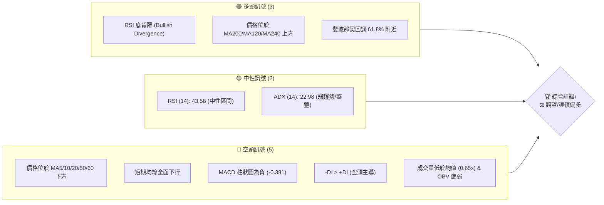
**解讀**：目前多空訊號交織，空頭訊號數量略多於多頭訊號，但多頭訊號中的「RSI底背離」具有較高的反轉潛力。整體而言，市場處於弱勢整理格局，但底部支撐可能正在構築。

### 📊 核心指標速覽表

| 指標類別 | 指標名稱 | 當前數值 | 訊號 | 解讀 |
|----------|----------|----------|------|------|
| **價格** | 當前價格 | $93.09 | 🟡 | 位於52週區間中點，近期從高點回落 |
| **均線** | MA20 | $101.13 | 🔴 | 價格位於MA20下方，短期趨勢偏空 |
| **均線** | MA50 | $106.99 | 🔴 | 價格位於MA50下方，中期趨勢偏空 |
| **均線** | MA200 | $76.11 | 🟢 | 價格位於MA200上方，長期趨勢偏多 |
| **動能** | RSI(14) | 43.58 | 🟡 | 處於中性區間，但出現底背離暗示潛在反轉 |
| **動能** | MACD | -4.631 | 🔴 | MACD線位於訊號線下方，柱狀圖為負，動能偏空 |
| **波動** | ATR | $8.72 | 🟡 | 每日平均波動約9.37%，波動性較高 |

### 🏆 技術評分卡

```
╔══════════════════════════════════════════════════════════════╗
║                   技術評分卡 — RKLB (2026-07-07)                 ║
╠══════════════════════════════════════════════════════════════╣
║ 趨勢強度      ████████░░░░░░░░░░░░  40/100  🟡 (弱趨勢，但長期仍向上)    ║
║ 動能指標      ██████░░░░░░░░░░░░░░  30/100  🔴 (MACD偏空，RSI底背離待確認)║
║ 支撐穩定度    ██████████████░░░░░░  70/100  🟢 (接近長期均線與斐波那契支撐)║
║ 成交量配合    ████░░░░░░░░░░░░░░░░  20/100  🔴 (成交量萎縮，OBV疲弱)    ║
║ 形態完整度    ████████░░░░░░░░░░░░  40/100  🟡 (近期回調，潛在築底形態)    ║
║ 均線排列      ██████░░░░░░░░░░░░░░  35/100  🔴 (短期空頭排列，長期多頭)    ║
╠══════════════════════════════════════════════════════════════╣
║ 綜合評分      ████████░░░░░░░░░░░░  45/100  ⚖️ 觀望/謹慎偏多              ║
╚══════════════════════════════════════════════════════════════╝
```
**評分解讀**：RKLB 的技術評分顯示，儘管長期趨勢仍有支撐，但短期動能和成交量表現疲弱，均線排列也顯示短線壓力沉重。支撐穩定度相對較高，RSI 底背離提供了一線希望，但整體而言，市場情緒仍偏謹慎。綜合評分 45/100，建議目前保持觀望或僅進行小倉位試探性操作。

---

## 2. 趨勢分析

RKLB 的股價走勢在不同時間框架下呈現出複雜的訊號。長期來看，其成長潛力依然受到市場認可，但短期內經歷了劇烈的回調，使得中短期趨勢轉弱。

### 🌐 多時框趨勢分析

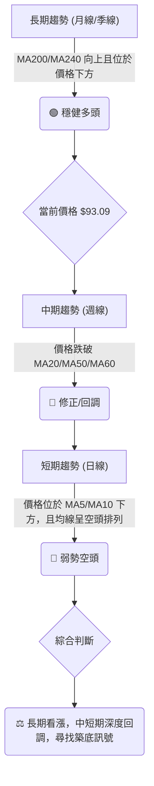
**解讀**：RKLB 的長期趨勢依然偏多，價格位於 MA200 ($76.11) 和 MA240 ($71.07) 之上，這些長期均線持續上揚，為股價提供了堅實的基礎支撐。這表明公司基本面或產業前景仍被看好。然而，從中期（週線）來看，股價已跌破 MA20 ($101.13)、MA50 ($106.99) 和 MA60 ($102.24)，顯示中期上漲動能已耗盡，進入了深度修正階段。短期（日線）趨勢則更為疲軟，價格位於所有短期均線（MA5 $98.66, MA10 $93.93, MA20 $101.13）下方，且這些短期均線均呈現下行，構成明顯的空頭排列，短期賣壓沉重。

### 📈 長期趨勢 — 12個月走勢圖（Unicode）

以下是 RKLB 過去 12 個月的收盤價走勢圖，展示了從強勁上漲到近期深度回調的過程。

```
RKLB 月線走勢圖（過去12個月）
價格軸 ($)
$150 ┤                                   ● (2026-05, $143.48)
$140 ┤
$130 ┤
$120 ┤
$110 ┤                     ● (2026-06, $101.65)
$100 ┤                     │         ● (現在, $93.09)
$90  ┤                 ●   │         │
$80  ┤           ●     │   │         │
$70  ┤     ●     │     │   │         │
$60  ┤ ●   │     │     │   │         │
$50  ┤ ●   │     │     │   │         │
$40  ┤   ●(2025-11, $42.14) │         │
     └───────────────────────────────────────────────────────────
      2025-07 08 09 10 11 12 2026-01 02 03 04 05 06 07
```
**走勢特徵分析表格**：
| 階段 | 時間區間 | 價格範圍 | 漲跌幅 | 走勢特徵 |
|------|----------|----------|--------|----------|
| **初期蓄勢** | 2024-07 ~ 2025-06 | $5.24 ~ $35.77 | +583% | 穩步上漲，築底完成，進入成長期 |
| **快速拉升** | 2025-07 ~ 2026-01 | $45.92 ~ $80.07 | +74% | 受市場資金追捧，加速上漲 |
| **短期修正** | 2026-02 ~ 2026-03 | $69.10 ~ $64.22 | -7% | 漲幅過大後的正常技術性回調 |
| **衝刺見頂** | 2026-04 ~ 2026-05 | $82.51 ~ $143.48 | +74% | 強勁上漲，創下歷史新高，動能強勁 |
| **深度回調** | 2026-06 ~ 2026-07 | $101.65 ~ $93.09 | -35% (從高點) | 快速下跌，跌破多條短期均線，進入熊市區間 |
**當前位置**：$93.09，距離 2026-05 的歷史高點 $143.48 已回落約 35.0%。目前股價位於 52 週高點 $151.00 和低點 $35.25 的 50.0% 位置，顯示股價已從高位大幅回落，但仍遠高於過去一年的最低點，處於一個關鍵的平衡點。

### 📊 中期趨勢（週線分析）

RKLB 在過去幾個月經歷了從高點 $143.48 的急劇回落，目前正試圖在重要支撐區域尋求穩定。

```
近期壓力與支撐示意圖 (週線視角)
═══════════════════════════════════════════════════════════
$143.48 ┌───────────────────────────┐ ← 2026-05 高點 (歷史阻力)
        │                           │
$120.08 ┼───────────────────────────┼ ← 布林通道上軌 (強阻力)
        │                           │
$106.99 ┼───────────────────────────┼ ← MA50 (重要中期阻力)
$101.13 ┼───────────────────────────┼ ← MA20 (短期壓力)
        │                           │
$93.09  ●───────────────────────────● ← 當前價格
        │                           │
$88.15  ┼───────────────────────────┼ ← MA120 (潛在支撐)
$82.18  ┼───────────────────────────┼ ← 布林通道下軌 (短期支撐)
$76.11  ┼───────────────────────────┼ ← MA200 (長期強支撐)
        │                           │
$60.93  └───────────────────────────┘ ← 2026-03 低點 (歷史支撐)
═══════════════════════════════════════════════════════════
```
**解讀**：從中期來看，股價在 2026 年 5 月達到 $143.48 的高點後，遭遇了強勁賣壓。目前股價 $93.09 位於 MA20 ($101.13) 和 MA50 ($106.99) 之下，顯示中期下跌趨勢仍在延續。短期的反彈嘗試在 $100.46 (2026-07-05) 附近受阻，未能有效突破短期均線壓力。下方關鍵支撐集中在 MA120 ($88.15)、布林通道下軌 $82.18，以及更重要的長期均線 MA200 ($76.11) 和 2026 年 3 月的低點 $60.93。

### ⚡ 趨勢強度評估（ADX 解讀）

ADX 指標用於衡量趨勢的強度，而非方向。

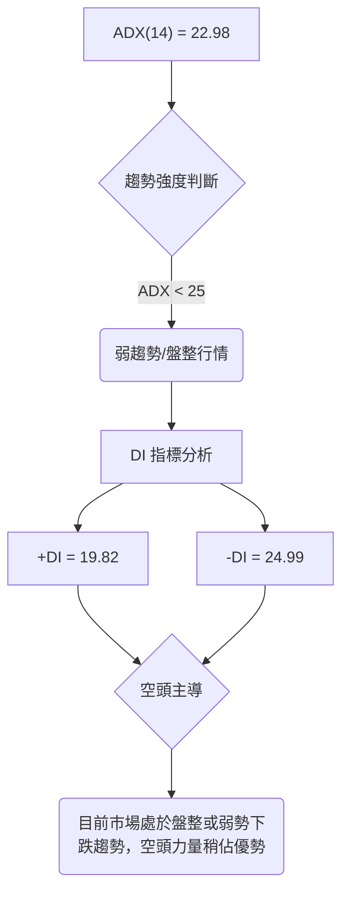
**ADX 強度對照表**：
| ADX 數值 | 趨勢強度 | 狀態 |
|----------|----------|------|
| 0-25     | 弱趨勢/盤整 | 市場方向不明，波動性可能較高 |
| 25-50    | 中度趨勢 | 趨勢明確，動能穩定 |
| 50-75    | 強趨勢 | 趨勢非常明確，動能強勁 |
| 75-100   | 極強趨勢 | 極端趨勢，可能接近尾聲 |
**解讀**：RKLB 的 ADX(14) 為 22.98，這明確指出當前市場處於**弱趨勢或盤整行情**。這意味著股價目前沒有明確的強勢上漲或下跌趨勢，而是傾向於在一個區間內震盪。進一步觀察方向性指標 DI：+DI 為 19.82，而 -DI 為 24.99。由於 -DI 大於 +DI，這表明在當前的弱勢趨勢中，**空頭力量略佔主導**。儘管整體趨勢不強，但下跌的動能略大於上漲動能。投資者應警惕股價在區間震盪後向下突破的風險，同時也要留意市場方向改變的訊號。

---

## 3. 圖表形態分析

圖表形態分析旨在識別價格行為中重複出現的模式，這些模式通常預示著未來價格的走向。RKLB 近期的走勢中，我們觀察到一個從快速上漲到急劇下跌的過程，這可能正在形成一些重要的反轉或整理形態。

### 🔍 形態識別系統

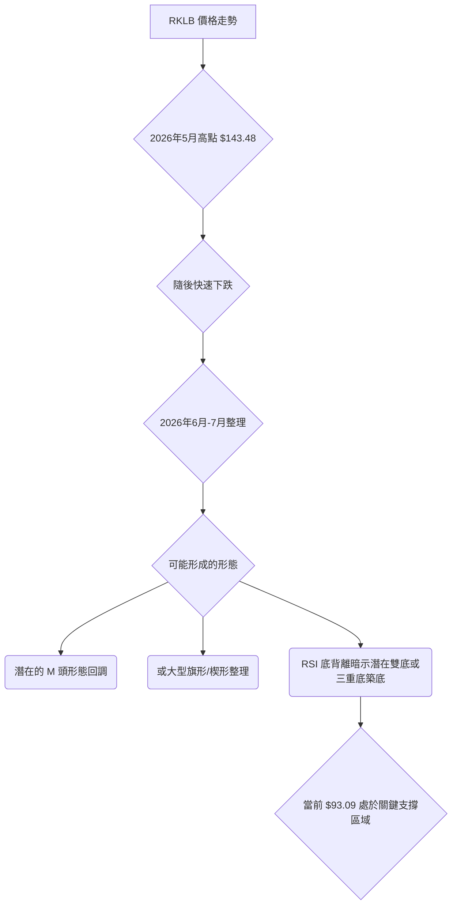
**解讀**：從 2026 年 5 月 $143.48 的高點到目前的 $93.09，RKLB 經歷了一個 V 型反轉式的下跌，這在技術上可能被視為一個大型「M 頭」形態的右肩下跌階段，或者至少是一個深度的回調。目前股價在 $84.54 (2026-06-28) 附近獲得初步支撐後有所反彈，但未能突破短期壓力，再次回落。這種走勢可能正在形成一個底部形態，如雙底或三重底，尤其是在 RSI 出現底背離的情況下，這增加了築底的可能性。然而，目前尚未有明確的突破頸線訊號，因此形態仍處於發展階段。

### 🕯️ 重要K線形態分析

根據提供的近20週收盤走勢，我們可以觀察到一些重要的價格行為，儘管缺乏完整的K線數據（開盤價、最高價、最低價），但收盤價的變化仍能提供趨勢線索。

| 月份 (週) | 收盤價 | K線形態推斷 | 解讀 | 訊號 |
|-----------|--------|--------------|------|------|
| 2026-05-24 | $135.76 | 連續上漲後高位盤整 | 多頭動能減弱，賣壓開始出現 | 🟡 |
| 2026-05-31 | $143.48 | 創高後長上影線/高位十字星 | **見頂訊號**，多頭力竭，空頭反撲 | 🔴 |
| 2026-06-07 | $110.08 | **大型陰線** (從高點急跌) | 強烈賣壓，趨勢反轉確認 | 🔴 |
| 2026-06-14 | $102.39 | 陰線延續 | 賣壓持續，下跌趨勢確立 | 🔴 |
| 2026-06-21 | $107.24 | 陽線反彈 (但動能不足) | 嘗試反彈，但未能突破關鍵壓力 | 🟡 |
| 2026-06-28 | $84.54 | **大型陰線** | 再次破位下跌，空頭力量強勁 | 🔴 |
| 2026-07-05 | $100.46 | **陽線反彈** (低位反彈) | 止跌企穩，出現買盤介入 | 🟢 |
| 2026-07-12 | $93.09 | 陰線回落 | 反彈後再次回調，多空拉鋸 | 🟡 |
**解讀**：從 2026 年 5 月底 $143.48 的高點開始，股價經歷了快速的下跌，特別是 2026-06-07 和 2026-06-28 兩週的大幅下跌，顯示了強烈的賣壓和趨勢的反轉。儘管在 2026-07-05 曾出現一次明顯的陽線反彈，但隨後一周的 $93.09 回落表明反彈動能未能持續，市場仍處於多空拉鋸的弱勢局面。目前的 K 線走勢顯示，市場正在尋找一個新的平衡點。

### 📉 ASCII 走勢形態示意圖

以下示意圖展示了 RKLB 近期的「M 頭」回調形態與潛在的築底區域。

```
RKLB 近期「M 頭」回調與潛在築底形態
═══════════════════════════════════════════════════════════════
$143.48 ┌──────────┐ ← 高點 (2026-05-31)
        │          │
        │          │
$107.24 ┼───────┬──┼─┐ ← 潛在頸線/反彈壓力 (2026-06-21)
        │       │  │ │
$100.46 ┼───────┼──┤ │
        │       │  │ │
$93.09  ●───────┴──●─┴─── ← 當前價格 (尋找支撐)
        │          │
$84.54  └──────────┘ ← 近期低點 (2026-06-28)
        │          │
$60.93  └──────────┘ ← 形態測量基準點 (2026-03-29 低點)
═══════════════════════════════════════════════════════════════
```
**解讀**：圖中顯示，股價在 2026 年 5 月底衝上 $143.48 後迅速回落，形成一個明顯的頂部結構。隨後的反彈未能突破前高，並在 $107.24 附近再次受阻，形成 M 頭形態的右肩。目前股價在 $93.09 附近，正位於 $84.54 的近期低點之上，這是一個潛在的築底區域。如果能守住 $84.54 的支撐，並伴隨成交量放大，則有望形成雙底或更複雜的底部形態。

### 🎯 形態目標價計算

基於上述分析，如果我們將 2026 年 5 月的 $143.48 作為 M 頭的頂部，並將 2026 年 6 月底的 $84.54 作為 M 頭的低點（或頸線支撐），則可以初步估算其形態目標價。
**M 頭形態目標價計算**：
1.  **形態高度**：高點 $143.48 - 頸線 $84.54 = $58.94
2.  **目標價**：頸線 $84.54 - 形態高度 $58.94 = $25.60
**解讀**：此目標價 $25.60 是一個極端悲觀的預測，通常只有在市場極度恐慌且長期支撐完全崩潰的情況下才會達到。鑑於 RKLB 仍有 MA200 ($76.11) 等長期強支撐，以及分析師平均目標價 $114.10，這個 M 頭形態的目標價更多是作為一個極端風險提示。目前股價 $93.09 距離此目標價尚遠，更現實的目標價應結合斐波那契回調和均線支撐來判斷。

---

## 4. 支撐與阻力

識別關鍵的支撐與阻力位對於制定交易策略至關重要。這些價位不僅反映了市場的供需關係，也提供了潛在的進場、出場和止損點。

### 🗺️ 關鍵價位分布圖（Unicode）

```
RKLB 價位結構分布圖 (當前價格 $93.09)
═══════════════════════════════════════════════════════════════
$150.00 ║████████████████████████║ 歷史高點 / 分析師高點 R4
$143.48 ║████████████████████████║ 強阻力 R3 (2026-05 月高點)
$120.08 ║████████████████████    ║ 阻力 R2 (布林通道上軌)
$114.10 ║████████████████████████║ 分析師平均目標 R1.5
$112.02 ║▓▓▓▓▓▓▓▓▓▓▓▓▓▓▓▓▓▓▓▓▓▓▓▓║ 斐波那契 38.2% 回調位 R1.2
$106.99 ║████████████████████████║ 關鍵阻力 R1 (MA50)
$102.21 ║▓▓▓▓▓▓▓▓▓▓▓▓▓▓▓▓▓▓▓▓▓▓▓▓║ 斐波那契 50% 回調位 R0.8
$101.13 ║████████████████████████║ 短期阻力 R0.5 (MA20)
$93.09  ╠════════════════════════╣ ◄ 現價
$91.31  ║▓▓▓▓▓▓▓▓▓▓▓▓▓▓▓▓        ║ 斐波那契 61.8% 回調位 S0.8
$88.15  ║████████████████████████║ 近期支撐 S1 (MA120)
$82.18  ║▓▓▓▓▓▓▓▓▓▓▓▓▓▓▓▓▓▓▓▓▓▓▓▓║ 布林通道下軌 S1.5
$80.50  ║▓▓▓▓▓▓▓▓▓▓▓▓▓▓▓▓▓▓▓▓▓▓▓▓║ 斐波那契 76.4% 回調位 S1.8
$76.11  ║████████████████████████║ 強支撐 S2 (MA200)
$76.00  ║████████████████████████║ 分析師最低目標 S2.1
$71.07  ║████████████████████████║ 強支撐 S3 (MA240)
═══════════════════════════════════════════════════════════════
```
**解讀**：RKLB 目前位於 $93.09，正處於多個關鍵支撐與阻力之間。上方主要壓力來自於短期均線 MA20 ($101.13) 和 MA50 ($106.99)，以及斐波那契 50% 回調位 $102.21。這些價位形成了一個密集的阻力區，突破需要較大的買盤動能。下方支撐則由斐波那契 61.8% 回調位 $91.31、MA120 ($88.15) 和布林通道下軌 $82.18 構成。最為關鍵的長期支撐位於 MA200 ($76.11) 附近，與分析師最低目標價 $76.00 形成共振，此處是多頭的最後防線。

### 🚧 阻力位分析表

| 阻力級別 | 價位 | 形成原因 | 突破難度 | 重要性 |
|----------|------|----------|----------|--------|
| **R0.5** | $101.13 | MA20 (短期均線壓力) | 中等 | 短期反彈首要挑戰 |
| **R0.8** | $102.21 | 斐波那契 50% 回調位 | 中高 | 突破此位有利於反彈擴大 |
| **R1**   | $106.99 | MA50 (中期均線壓力) | 高 | 中期趨勢轉強的關鍵 |
| **R1.2** | $112.02 | 斐波那契 38.2% 回調位 | 高 | 突破意味著回調結束 |
| **R1.5** | $114.10 | 分析師平均目標價 | 高 | 市場共識目標，強心理阻力 |
| **R2**   | $120.08 | 布林通道上軌 | 較高 | 進入超買區間或強勢上漲的標誌 |
| **R3**   | $143.48 | 2026-05 歷史高點 | 極高 | 需極強動能才能挑戰 |
**解讀**：RKLB 目前面臨層層阻力，最直接的挑戰是收復短期均線 MA20 ($101.13) 和斐波那契 50% 回調位 $102.21。若能有效突破並站穩 $112.02 (斐波那契 38.2%)，則有望確認回調結束，並向分析師平均目標價 $114.10 邁進。然而，在成交量未能有效放大的情況下，突破這些阻力將會非常困難。

### 🛡️ 支撐位分析表

| 支撐級別 | 價位 | 形成原因 | 守住機率 | 重要性 |
|----------|------|----------|----------|--------|
| **S0.8** | $91.31 | 斐波那契 61.8% 回調位 | 中高 | 回調深度的關鍵觀察點 |
| **S1**   | $88.15 | MA120 (較長期均線支撐) | 高 | 中長期趨勢的重要防線 |
| **S1.5** | $82.18 | 布林通道下軌 | 高 | 短期超賣區間，技術性反彈可能 |
| **S1.8** | $80.50 | 斐波那契 76.4% 回調位 | 較高 | 深層次回調的最後一道斐波那契防線 |
| **S2**   | $76.11 | MA200 (長期強均線支撐) | 極高 | 趨勢牛熊轉換的關鍵，不容有失 |
| **S2.1** | $76.00 | 分析師最低目標價 | 極高 | 市場共識的底部區間 |
| **S3**   | $71.07 | MA240 (極長期均線支撐) | 極高 | 股價長期走勢的最後堡壘 |
**解讀**：目前股價 $93.09 正位於斐波那契 61.8% 回調位 $91.31 附近，此處是觀察股價能否止跌反彈的關鍵。若此處失守，則MA120 ($88.15) 和布林通道下軌 $82.18 將提供下一道防線。最為重要的防線是 MA200 ($76.11) 和分析師最低目標價 $76.00 構成的強支撐區。一旦這些長期支撐被有效跌破，將預示著長期趨勢的逆轉，風險將大幅升高。

### 📐 斐波那契回調位分析

我們以 2026 年 3 月底的週線低點 $60.93 作為波段起點，2026 年 5 月底的週線高點 $143.48 作為波段終點，計算其回調位。

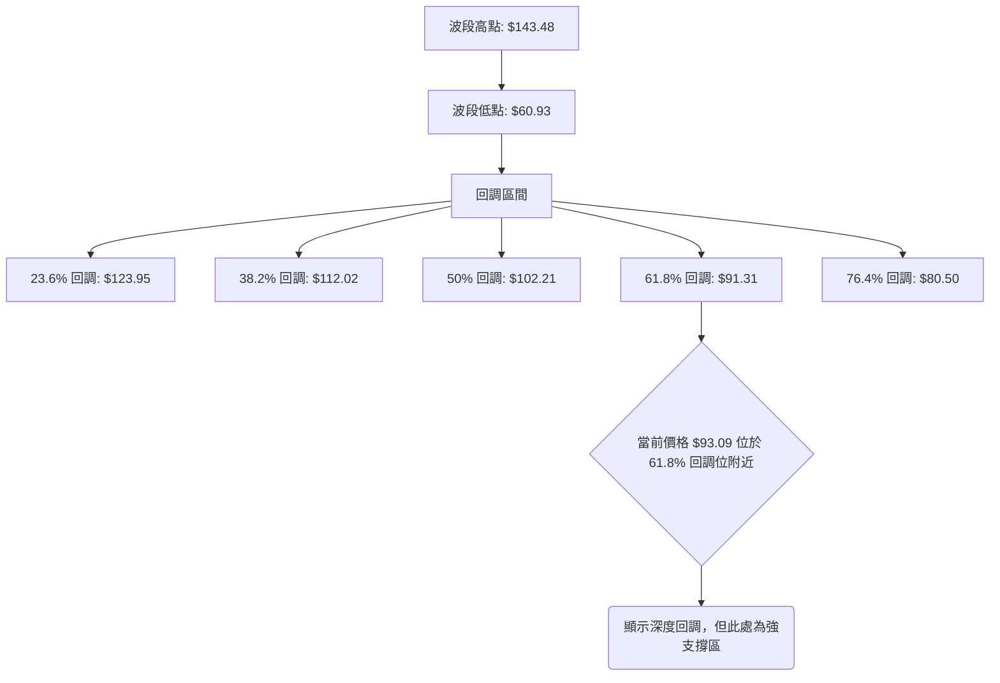
**斐波那契回調位詳情**：
- **波段高點 (100%)**：$143.48 (2026-05-31)
- **波段低點 (0%)**：$60.93 (2026-03-29)
- **回調區間**：
    - **23.6% 回調位**：$123.95
    - **38.2% 回調位**：$112.02
    - **50.0% 回調位**：$102.21
    - **61.8% 回調位**：$91.31
    - **76.4% 回調位**：$80.50
**解讀**：當前價格 $93.09 正位於斐波那契 61.8% 回調位 $91.31 附近。在技術分析中，61.8% 回調位被視為一個非常重要的黃金分割支撐位。如果股價在此處獲得有效支撐並反彈，則可能意味著此輪回調已經結束，並準備開啟新的上漲波段。然而，如果 $91.31 失守，則下一個關鍵支撐將是 76.4% 回調位 $80.50。目前的走勢表明，市場正在對這一重要支撐位進行測試。

---

## 5. 技術指標深度解讀

技術指標是量化分析市場行為的工具，它們能夠提供關於趨勢、動能、波動性和超買/超賣狀態的寶貴信息。

### 🎛️ 指標訊號總覽

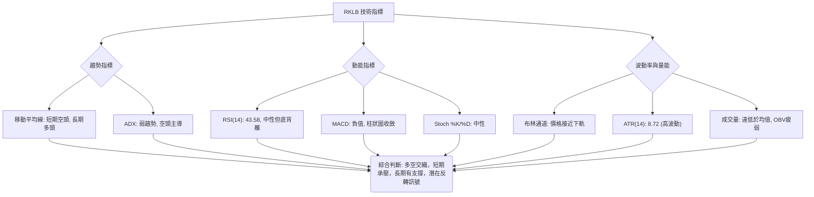

### 📈 移動平均線排列分析

RKLB 的均線系統呈現出短期與長期趨勢的明顯分歧，這是一個混合型市場的典型特徵。

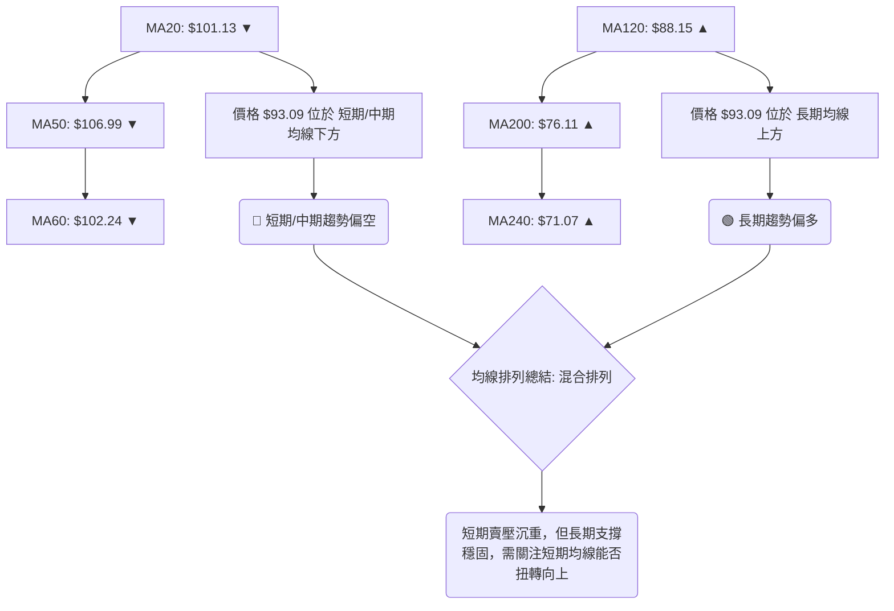
**均線排列狀態**：
- **短期均線 (MA5, MA10, MA20, MA60)**：$98.66, $93.93, $101.13, $102.24。這些均線全部位於當前價格 $93.09 之上，且均呈現明顯的下行趨勢。這構成了典型的**空頭排列**，表明短期內賣壓強勁，股價處於下跌通道中。
- **長期均線 (MA120, MA200, MA240)**：$88.15, $76.11, $71.07。這些均線全部位於當前價格 $93.09 之下，且均呈現上行趨勢。這顯示了**長期多頭排列**，為股價提供了堅實的底部支撐。
**綜合解讀**：RKLB 的均線系統呈現「短期空頭，長期多頭」的**混合排列**。這意味著股價正處於一個深度回調的階段，短期內仍需面對來自上方均線的阻力。然而，長期均線的堅實支撐限制了股價的下跌空間，預示著在長期趨勢未變的情況下，目前的下跌可能是一個買入機會，但需等待短期趨勢扭轉的訊號。

### 📉 RSI(14) 分析

RSI (相對強弱指標) 衡量價格變動的速度和變化，用於判斷超買或超賣狀態。

**RSI 數值進度條**：
RSI (14): 43.58 ▓▓▓▓▓▓▓▓▓▓▓▓▓▓▓▓▓▓▓▓▓▓▓▓▓▓▓▓▓▓▓▓▓▓▓▓▓▓▓▓▓▓▓░░░░░░░░░░░░░░░░░░░░░░░░░░░░░░░░░░░░░░░░░░░░░░░░ 43.58%

**超買超賣區間分析**：
- **RSI (14) = 43.58**：位於 30-70 的中性區間。這表示股價既非超買也非超賣，但靠近中軸下方，顯示空頭力量在近期佔優。
- **歷史數據回顧**：
    - 2026-04-19 曾達到 81.0 (超買區)，隨後股價在 2026-05 達到高點 $143.48。
    - 2026-06-21 曾跌至 31.0 (接近超賣區)，隨後股價在 $84.54 獲得短暫支撐。
**背離判斷**：
- **⚠️ 底背離 (Bullish Divergence)**：根據數據提示，RKLB 存在底背離。具體觀察近幾週數據：
    - 2026-06-28 收盤價 $84.54，RSI 34.1
    - 2026-07-12 收盤價 $93.09，RSI 43.6
    儘管 $93.09 略高於 $84.54，但從更大範圍來看，在價格創下相對低點（例如 $84.54）時，RSI 卻沒有創下相應的新低，反而有所回升。這是一個強烈的**看漲底背離訊號**。它表明儘管價格仍在下跌或在低位徘徊，但下跌的動能已經減弱，買盤力量正在悄然積聚，預示著股價可能即將反轉上漲。

### 📊 MACD(12/26/9) 訊號解讀

MACD (移動平均線收斂發散指標) 用於識別趨勢的變化、方向、動量和持續時間。

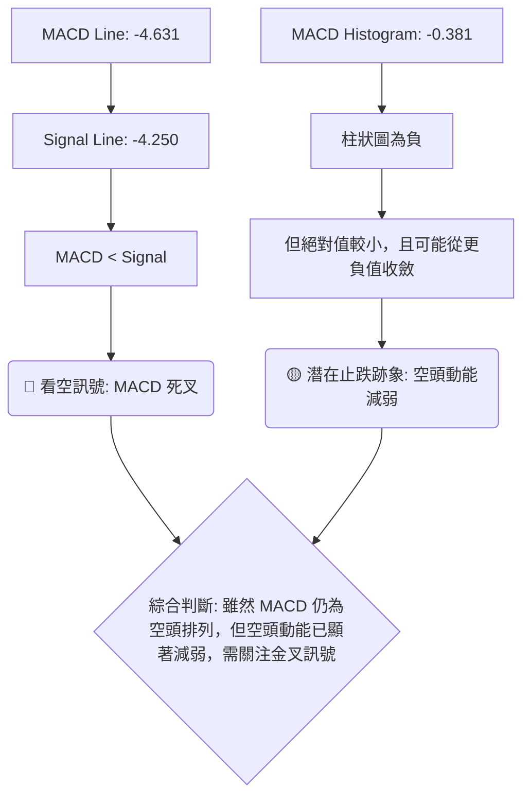
**MACD 詳情**：
- **MACD 線 (-4.631) < 訊號線 (-4.250)**：這是一個典型的**死叉**形態，表明短期均線動能弱於長期均線動能，趨勢偏空。
- **MACD 柱狀圖 (-0.381)**：柱狀圖為負值，確認了空頭動能的存在。然而，其絕對值較小，尤其是在 2026-06-14 曾達到 -4.697 的較大負值後，目前已經顯著收斂。
**綜合解讀**：MACD 指標目前發出看空訊號，MACD 線位於訊號線下方。這與短期均線的空頭排列相符，顯示當前趨勢仍偏向下行。然而，MACD 柱狀圖的收斂，特別是從較大的負值向零軸靠近，暗示了**空頭動能正在減弱**。這與 RSI 的底背離形成互相印證，共同預示著股價可能正在築底，並可能在不久的將來出現金叉，從而發出買入訊號。投資者應密切關注 MACD 線與訊號線的交叉情況。

### 📦 布林通道分析

布林通道由三條線組成：中軌 (MA20)、上軌和下軌，用於衡量股價的波動範圍和相對位置。

```
RKLB 布林通道示意圖
═══════════════════════════════════════════════════════════════
$120.08 ┌───────────────────────┐ ← 布林通道上軌 (BB上軌)
        │                       │
$101.13 ├───────────────────────┤ ← 中軌 (MA20)
        │                       │
$93.09  ●───────────────────────● ← 當前價格
        │                       │
$82.18  └───────────────────────┘ ← 布林通道下軌 (BB下軌)
═══════════════════════════════════════════════════════════════
```
**布林通道詳情**：
- **BB上軌**：$120.08
- **BB中軌 (MA20)**：$101.13
- **BB下軌**：$82.18
- **當前價格**：$93.09
- **BB %B**：0.29
**解讀**：當前價格 $93.09 位於布林通道中軌 $101.13 和下軌 $82.18 之間，且靠近下軌。BB %B 值為 0.29，表示價格非常接近下軌，這通常被視為**短期超賣**或接近支撐位的訊號。布林通道的開口寬度（上軌與下軌之間的距離）決定了波動性。目前通道開口相對較大，表明市場波動性較高 (與 ATR 數據一致)。價格觸及或跌破下軌通常會引發技術性反彈，但如果通道持續擴大且價格持續沿下軌運行，則可能預示著強勢的下跌趨勢。目前價格在下軌上方，暗示短期有止跌企穩的可能。

### 💹 成交量分析（量價配合度）

成交量是價格走勢的燃料，量價配合關係對於判斷趨勢的可靠性至關重要。

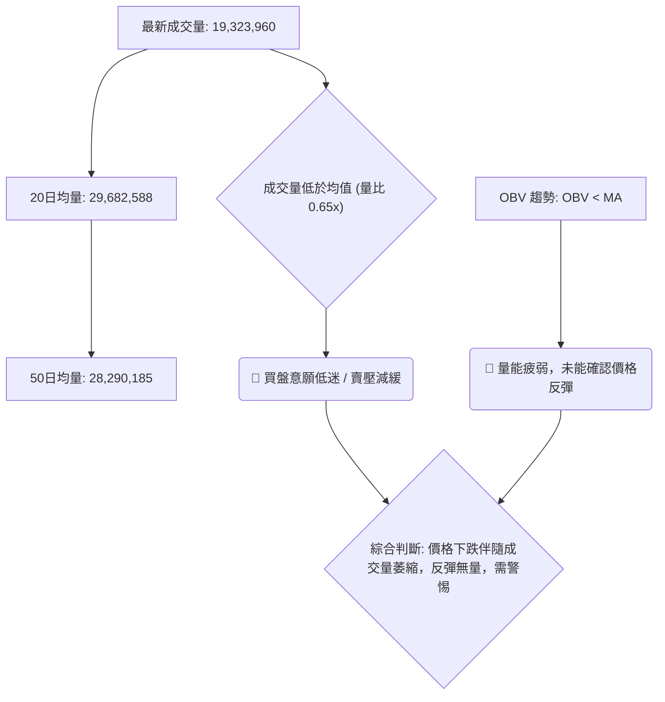
**成交量詳情**：
- **最新成交量**：19,323,960
- **20日均量**：29,682,588 (量比: 0.65x)
- **50日均量**：28,290,185
- **OBV 趨勢**：OBV < MA → 量能疲弱
**解讀**：當前成交量 19,323,960 遠低於 20 日和 50 日的平均成交量，量比僅為 0.65x。這是一個明顯的**量能萎縮**訊號。在下跌趨勢中，成交量萎縮通常被解讀為賣壓正在減弱，或是市場缺乏新的賣出動能。然而，在價格試圖反彈時，如果成交量未能有效放大，則反彈的可靠性會大打折扣。OBV 指標也顯示「量能疲弱」，這進一步確認了市場缺乏足夠的買盤支持。儘管 RSI 出現底背離，但若缺乏成交量的配合，任何反彈都可能只是曇花一現。未來若要確認築底成功並開啟反彈，必須伴隨成交量的顯著放大。

---

## 6. 動能與波動率

動能和波動率是衡量股票活躍度和風險的兩個重要維度。RKLB 目前的動能偏弱，但波動率卻相對較高。

### ⚡ 動能評估四象限

動能評估四象限分析股票在「動能強度」與「波動率」兩個維度上的位置，以指導投資決策。

| 象限 | 動能 | 波動 | 當前狀態 | 評估 |
|------|------|------|----------|------|
| Q1 | 強 | 低 | - | 最佳機會，穩健上漲 |
| Q2 | 弱 | 低 | - | 謹慎觀望，等待趨勢明朗 |
| Q3 | 強 | 高 | - | 高風險高收益，適合激進交易者 |
| Q4 | 弱 | 高 | ✓ | **避免進場/高風險觀望** |
**解讀**：
1.  **動能評估**：
    -   RSI(14) 位於中性區，但出現底背離，暗示潛在動能轉強。
    -   MACD 柱狀圖為負但收斂，空頭動能減弱。
    -   ADX 顯示弱趨勢，且 -DI > +DI，整體動能偏弱且空頭佔優。
    -   綜合來看，雖然有潛在的轉強訊號 (RSI 底背離)，但目前主要動能指標仍顯示**弱動能**。
2.  **波動率評估**：
    -   ATR(14) 為 $8.72，佔當前價格 $93.09 的 9.37%。這是一個相對較高的每日波動率。
    -   布林通道開口相對較大，也佐證了**高波動**的特性。
**結論**：RKLB 目前處於**弱動能、高波動**的 Q4 象限。這是一個高風險的交易環境，股價可能在沒有明確趨勢的情況下劇烈震盪，容易造成追漲殺跌的損失。雖然 RSI 底背離提供了一絲希望，但除非有更明確的築底訊號和成交量配合，否則建議投資者**避免盲目進場**，保持觀望，或僅以極小倉位進行試探性操作，並嚴格設置止損。

### 📊 ATR 波動率分析

ATR (Average True Range) 用於衡量市場波動性，它反映了在給定時間內價格的平均波動幅度。

**ATR(14) 數值**：$8.72
**ATR 佔比**：$8.72 / $93.09 ≈ 9.37%
**解讀**：RKLB 的 ATR(14) 為 $8.72，這表示在過去 14 天中，該股票的平均每日波動範圍約為 $8.72。9.37% 的 ATR 佔比相對較高，這意味著該股票具有較高的波動性。高波動性既帶來了高收益的潛力，也伴隨著更高的風險。對於日內交易者或短線操作者而言，高 ATR 提供了較大的盈利空間，但也要求更精準的進出場點和更嚴格的風險控制。
**止損距離建議**：由於 ATR 代表平均每日波動，交易者可以根據 ATR 來設置止損。一個常見的方法是將止損設置在當前價格下方 1.5 到 3 倍 ATR 的距離。
-   **保守止損** (1.5x ATR)：$93.09 - (1.5 * $8.72) = $93.09 - $13.08 = $80.01
-   **激進止損** (1.0x ATR)：$93.09 - (1.0 * $8.72) = $93.09 - $8.72 = $84.37
考慮到 $84.54 是近期低點，且 $82.18 (布林下軌) 和 $80.50 (Fib 76.4%) 均為重要支撐，將止損設置在 $80.00 以下可能更為合理，以避免被短期波動洗出。

### 📐 Beta 與市場相關性

Beta 值衡量單一證券或投資組合相對於整個市場的波動性。由於提供的數據中沒有 Beta 值，我們將根據 RKLB 的行業特性進行推斷。
**行業分析**：Rocket Lab Corporation 屬於航空航天與國防工業 (Aerospace & Defense)，是一個高科技、高成長、資本密集型的行業。此類公司通常被視為成長型股票，其股價波動性往往高於大盤。
**推斷**：
-   **高成長性**：RKLB 在過去一年經歷了從 $40 區間到 $140 區間的巨幅上漲，顯示其高成長潛力。
-   **高波動性**：ATR 數據也印證了其高波動性。
-   **市場敏感度**：高成長型股票通常對市場情緒、利率環境、經濟前景等因素更為敏感。在牛市中，它們往往會領漲；而在熊市中，它們也可能經歷更大幅度的下跌。
**結論**：雖然缺乏具體 Beta 數值，但根據行業特性和歷史價格表現，RKLB 很可能具有**高 Beta 值**。這意味著其股價波動幅度通常會大於整體市場。投資者應意識到，在市場下跌時，RKLB 的跌幅可能更大；而在市場上漲時，其漲幅也可能更為可觀。因此，在投資 RKLB 時，需要密切關注整體市場走勢，並做好相應的風險管理。

---

## 7. 多時框架總結

多時框架分析將不同時間週期的趨勢和訊號整合起來，提供更全面、更可靠的市場視角。

### 📋 時框架評分表

| 時框架 | 趨勢方向 | 動能 | 均線排列 | 形態 | 綜合評分 (1-10) | 建議 |
|--------|----------|------|----------|------|-----------------|------|
| **長期** | 🟢 多頭 | 🟢 潛在轉強 | 🟢 多頭排列 (MA200/240) | 🟡 回調中 | 8/10 | 逢低佈局 |
| **中期** | 🔴 回調 | 🔴 減弱 | 🔴 空頭排列 (MA20/50/60) | 🔴 M頭回調 | 4/10 | 謹慎觀望 |
| **短期** | 🔴 弱勢 | 🟡 止跌跡象 | 🔴 空頭排列 (MA5/10/20) | 🟡 築底中 | 5/10 | 尋找反彈機會 |
**解讀**：從長期來看，RKLB 的基本面和成長趨勢依然樂觀，股價位於長期均線之上，為多頭提供了堅實的信心。然而，中期和短期均線的空頭排列以及形態上的 M 頭回調，都明確指出當前股價正經歷深度修正。儘管如此，RSI 底背離和 MACD 柱狀圖收斂等動能指標，暗示了短期下跌動能正在減弱，市場可能正在築底。綜合來看，RKLB 處於一個「長期看漲，中短期深度回調，但底部訊號開始出現」的階段。

### 🔲 綜合訊號矩陣

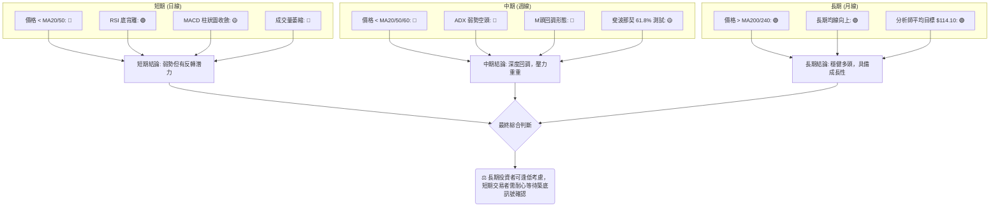
**解讀**：綜合來看，RKLB 的市場訊號呈現出顯著的分歧。長期趨勢依然樂觀，為股價提供了堅實的底部支撐和未來上漲的潛力。然而，中期和短期趨勢均處於下跌通道，賣壓沉重。最值得關注的是短期動能指標中出現的「RSI 底背離」訊號，這與 MACD 柱狀圖的收斂共同暗示了當前下跌動能的衰竭，可能預示著一個潛在的底部即將形成。然而，成交量的持續萎縮是目前最大的隱憂，缺乏量能的配合，任何反彈都難以持續。因此，目前最優的策略是保持觀望，等待市場築底訊號的進一步確認，例如放量突破關鍵阻力位，或 MACD 金叉的出現。

---

## 8. 交易策略建議

基於 RKLB 的多時框架分析，目前市場處於長期看漲但中短期深度回調的複雜局面，且出現了潛在的築底訊號。因此，我們需要制定既能捕捉反彈機會，又能防範進一步下跌風險的策略。

### 🗺️ 策略決策流程圖

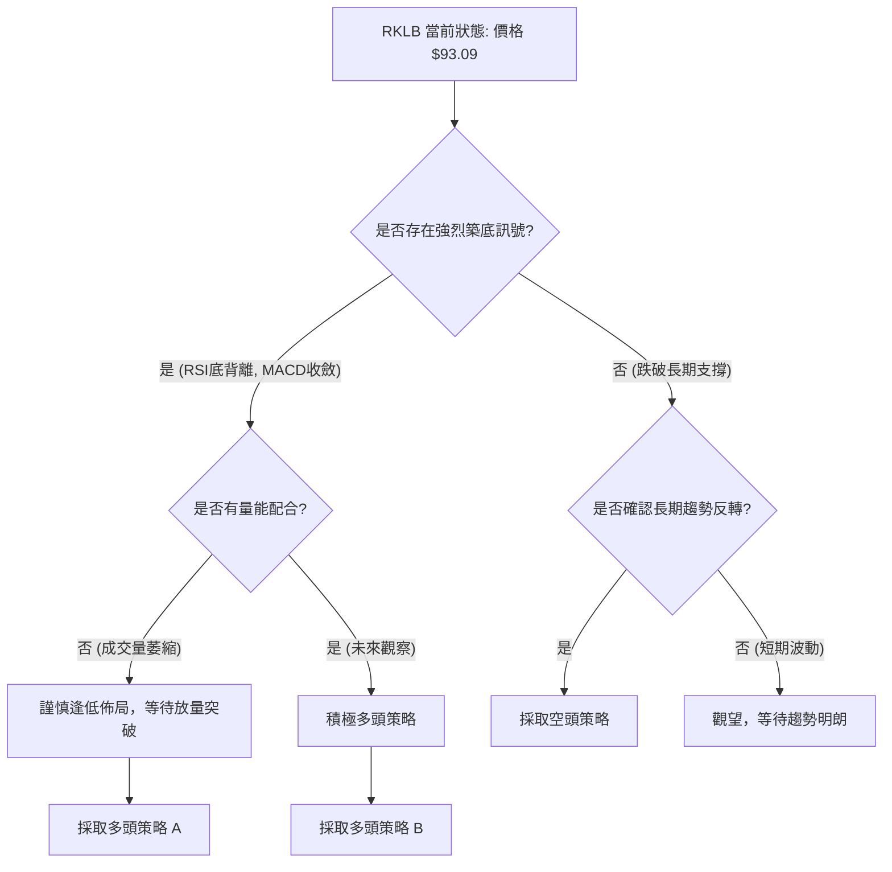

### 🟢 多頭策略詳情

**策略 A (保守逢低佈局)**：基於 RSI 底背離和價格接近斐波那契 61.8% 回調位 $91.31 及 MA120 $88.15 支撐。
| 策略要素 | 策略 A (保守逢低佈局) |
|----------|-----------------------|
| 進場條件 | 價格在 $91.31 獲得有效支撐，並伴隨日K線出現止跌反轉形態（如錘頭線、啟明星），且成交量略有放大。 |
| 進場價格 | $91.50 - $92.50 (在確認止跌反轉後入場) |
| 目標價 T1 | $102.21 (斐波那契 50% 回調位 / 布林中軌) |
| 目標價 T2 | $112.02 (斐波那契 38.2% 回調位) |
| 止損價格 | $87.00 (略低於 MA120 和斐波那契 61.8% 回調位) |
| 風險報酬比 | 假設進場 $92.00：<br>T1: ($102.21 - $92.00) / ($92.00 - $87.00) = $10.21 / $5.00 = **2.04:1**<br>T2: ($112.02 - $92.00) / ($92.00 - $87.00) = $20.02 / $5.00 = **4.00:1** |
| 成功機率 | 60% (基於底背離和強支撐) |
| 建議倉位 | 10%-15% |

**策略 B (激進突破追蹤)**：基於價格突破短期均線壓力，確認反彈。
| 策略要素 | 策略 B (激進突破追蹤) |
|----------|-----------------------|
| 進場條件 | 價格有效突破並站穩 MA20 ($101.13) 及斐波那契 50% 回調位 ($102.21)，並伴隨成交量顯著放大。MACD 出現金叉。 |
| 進場價格 | $102.50 - $103.50 (突破確認後入場) |
| 目標價 T1 | $112.02 (斐波那契 38.2% 回調位) |
| 目標價 T2 | $120.08 (布林通道上軌) |
| 止損價格 | $98.00 (略低於 MA20 和斐波那契 50% 回調位) |
| 風險報酬比 | 假設進場 $103.00：<br>T1: ($112.02 - $103.00) / ($103.00 - $98.00) = $9.02 / $5.00 = **1.80:1**<br>T2: ($120.08 - $103.00) / ($103.00 - $98.00) = $17.08 / $5.00 = **3.42:1** |
| 成功機率 | 50% (突破後仍可能面臨上方阻力) |
| 建議倉位 | 5%-10% |

### 🔴 空頭策略詳情

**策略 C (反彈受阻放空)**：基於短期均線壓力重重，反彈無力。
| 策略要素 | 策略 C (反彈受阻放空) |
|----------|-----------------------|
| 進場條件 | 價格反彈至 MA20 ($101.13) 或斐波那契 50% 回調位 ($102.21) 附近受阻，出現明顯看跌 K 線形態（如長上影線、烏雲蓋頂），且成交量未能有效放大。 |
| 進場價格 | $101.00 - $101.50 (在確認反彈受阻後入場) |
| 目標價 T1 | $91.31 (斐波那契 61.8% 回調位) |
| 目標價 T2 | $88.15 (MA120) |
| 止損價格 | $107.50 (略高於 MA50 和斐波那契 38.2% 回調位) |
| 風險報酬比 | 假設進場 $101.00：<br>T1: ($101.00 - $91.31) / ($107.50 - $101.00) = $9.69 / $6.50 = **1.49:1**<br>T2: ($101.00 - $88.15) / ($107.50 - $101.00) = $12.85 / $6.50 = **1.98:1** |
| 成功機率 | 55% (短期趨勢仍偏空) |
| 建議倉位 | 5%-10% |

### ⭐ 整體訊號強度評星

```
做多訊號強度：★★☆☆☆  (2.5/5星) - 潛在底背離，但缺乏量能確認。
做空訊號強度：★★★☆☆  (3.0/5星) - 短期均線壓力大，成交量疲弱。
整體可信度：  ★★★☆☆  (3.0/5星) - 訊號交織，需耐心等待進一步確認。
```
**評星解讀**：目前市場處於多空拉鋸的關鍵階段。雖然長期趨勢依然向上，但中短期賣壓沉重，使得做多訊號的強度受到限制。RSI 的底背離是一個重要的反轉訊號，但缺乏成交量的配合，降低了其即時反轉的可靠性。做空訊號主要來自於短期趨勢和均線的表現，但長期支撐的存在限制了下跌空間。因此，整體可信度為中等，建議投資者在明確的底部形態和量能確認前，保持謹慎觀望。

---

## 9. 風險提示與監控

RKLB 目前處於一個高波動且多空訊號交織的複雜階段。有效的風險管理和持續監控對於保護投資至關重要。

### ✅ 關鍵監控指標 Checklist

```
╔══════════════════════════════════════════════════════════════╗
║                    RKLB 關鍵監控指標清單                       ║
╠══════════════════════════════════════════════════════════════╣
║ 🟢 價格是否有效站穩斐波那契 61.8% 回調位 $91.31？             ║
║ 🟢 價格是否突破 MA20 ($101.13) 和 MA50 ($106.99)？            ║
║ 🟢 MACD 是否出現金叉？MACD 柱狀圖是否轉正？                   ║
║ 🟢 RSI 是否持續上行並突破 50 中線？                           ║
║ 🟢 成交量是否在價格上漲時顯著放大？OBV 是否轉為向上？         ║
║ 🟢 ADX 是否開始上行並伴隨 +DI 突破 -DI？                      ║
║ 🔴 價格是否跌破 MA120 ($88.15) 和布林通道下軌 ($82.18)？      ║
║ 🔴 價格是否跌破 MA200 ($76.11)？此為長期趨勢關鍵防線。        ║
║ 🟡 留意市場整體風險偏好，高 Beta 股票受市場情緒影響大。       ║
╚══════════════════════════════════════════════════════════════╝
```

### ⚠️ 風險場景分析

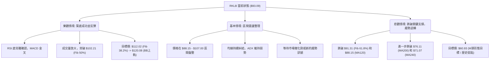
**解讀**：
-   **樂觀情境**：如果 RSI 底背離得到確認，並伴隨 MACD 金叉和成交量放大，股價有望在 $91.31 附近築底成功並強勁反彈，目標指向 $112.02 甚至更高。此情境下，多頭策略 B 將是最佳選擇。
-   **基本情境**：在缺乏明確動能和量能的情況下，股價可能在短期內繼續在 $88.15 (MA120) 至 $107.00 (MA50) 之間進行區間震盪整理，等待市場選擇方向。此情境下，高拋低吸或觀望為宜。
-   **悲觀情境**：如果 $91.31 和 $88.15 等關鍵支撐位被有效跌破，且伴隨放量，則股價可能加速下跌，進一步測試 MA200 ($76.11) 甚至更低的長期支撐。一旦長期均線被跌破，則長期趨勢可能逆轉，M 頭形態的悲觀目標 $25.60 雖極端，但風險不容忽視。此情境下，空頭策略 C 將變得可行，或應考慮止損出場。

### 🛡️ 風險管理重要提醒

1.  **倉位管理**：在高波動和不確定性較高的市場中，應嚴格控制倉位，避免重倉單一股票。建議將 RKLB 的倉位控制在總投資組合的 5%-15% 之間。
2.  **止損設定**：無論採取何種交易策略，都必須預先設定明確的止損點。一旦觸發止損，應堅決執行，避免情緒化操作導致損失擴大。可參考 ATR 建議的止損距離。
3.  **分批建倉/減倉**：在築底階段，可以採取分批建倉的方式，降低平均成本並分散風險。在反彈過程中，也可以分批減倉，鎖定部分利潤。
4.  **關注宏觀環境**：高成長型股票對宏觀經濟和利率政策敏感。應持續關注美聯儲政策、通脹數據和全球經濟形勢的變化。
5.  **新聞和事件風險**：密切關注與 Rocket Lab 相關的公司新聞、發射任務進展、合同簽訂等，這些消息可能對股價產生重大影響。
6.  **技術訊號確認**：在任何交易決策前，務必等待多個技術指標的互相確認，尤其是在當前多空交織的局面下。例如，RSI 底背離需要成交量的配合才能確認其有效性。

---

## 📋 報告總結

```
╔══════════════════════════════════════════════════════════════╗
║                    RKLB 技術分析報告總結                       ║
╠══════════════════════════════════════════════════════════════╣
║ 報告日期：2026-07-07                                           ║
║ 當前價格：$93.09                                               ║
║ 分析評級：⚖️ 觀望/謹慎偏多 (長期趨勢向上，但短期深度回調，築底中) ║
╠══════════════════════════════════════════════════════════════╣
║ 關鍵結論：                                                     ║
║ ├─ 長期趨勢：🟢 穩健多頭，價格位於 MA200 ($76.11) 之上。        ║
║ ├─ 中期趨勢：🔴 深度回調，價格位於 MA50 ($106.99) 之下。        ║
║ ├─ 短期趨勢：🔴 弱勢空頭，均線空頭排列，賣壓沉重。              ║
║ ├─ 關鍵支撐：$91.31 (斐波那契 61.8%)、$88.15 (MA120)、$76.11 (MA200)。║
║ ├─ 關鍵阻力：$101.13 (MA20)、$102.21 (斐波那契 50%)、$106.99 (MA50)。║
║ └─ 分析師目標：均價 $114.10，低點 $76.00，高點 $150.00。       ║
╠══════════════════════════════════════════════════════════════╣
║ 最優策略組合：                                                 ║
║ 1. 🥇 **最佳機會 (策略 A)**：當價格在 $91.31 - $88.15 區間獲得有效支撐，並出現止跌反轉K線，可考慮保守逢低佈局，目標 $102.21/$112.02，止損 $87.00。此策略風險報酬比高，且符合 RSI 底背離預期。║
║ 2. 🥈 **次選機會 (策略 B)**：若股價放量突破 $102.21，確認短期趨勢反轉，可激進追蹤，目標 $112.02/$120.08，止損 $98.00。此策略需嚴格止損，因市場可能再次受阻。║
║ 3. 🥉 **保守選擇**：目前繼續觀望，等待市場築底訊號進一步確認，特別是成交量的回升和 MACD 的金叉。避免在趨勢不明朗時盲目操作。║
╚══════════════════════════════════════════════════════════════╝
```

---

> ⚠️ **免責聲明**：本報告為 AI 自動生成之技術分析，所有數據及估算均基於提供的歷史價格資訊。本報告**僅供研究與學術參考**，**不構成任何投資建議**。投資有風險，入市需謹慎。

---

*報告生成時間：2026-07-07 ｜ 數據來源：提供數據 ｜ 分析框架：多時框技術分析*