<details>
<summary>📊 靜態圖表 (點擊展開)</summary>
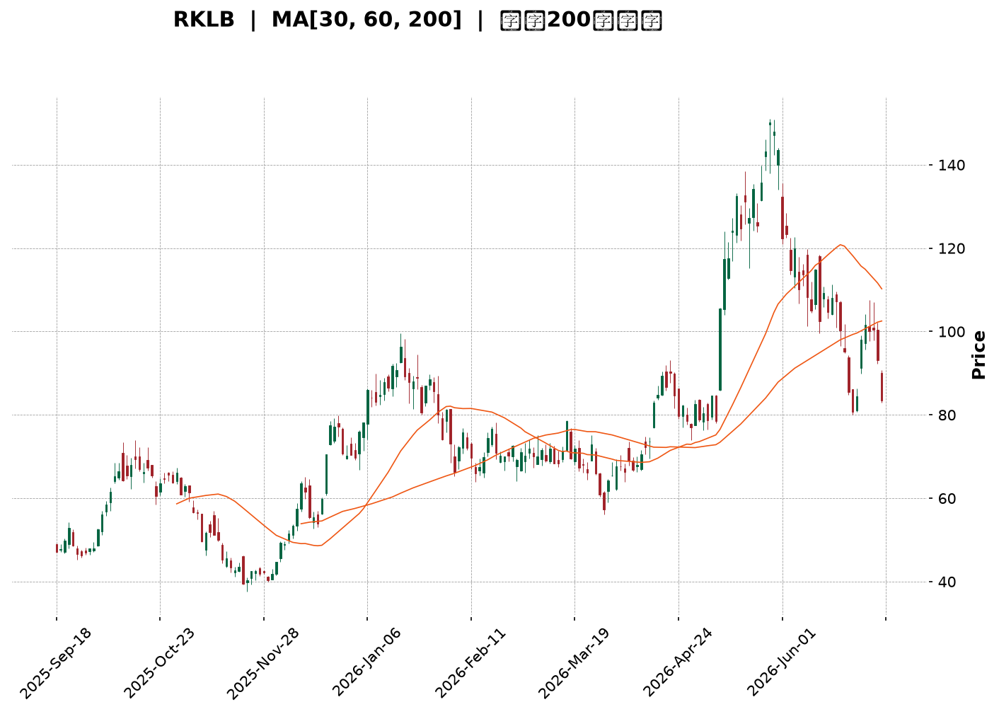
</details>

<html>
<head><meta charset="utf-8" /></head>
<body>
    <div style="height:500px; width:100%;">                        <script>window.PlotlyConfig = {MathJaxConfig: 'local'};</script>
        <script charset="utf-8" src="https://cdn.plot.ly/plotly-3.6.0.min.js" integrity="sha256-QaOVwtVY0T02VaHrr6pnoHLCwayMJp4O5n4YyaE3rJk=" crossorigin="anonymous"></script>                <div id="candlestick-chart" class="plotly-graph-div" style="height:100%; width:100%;"></div>            <script>                window.PLOTLYENV=window.PLOTLYENV || {};                                if (document.getElementById("candlestick-chart")) {                    Plotly.newPlot(                        "candlestick-chart",                        [{"close":{"dtype":"f8","bdata":"AAAAQAqXR0AAAADAHuVHQAAAACCu50hAAAAA4Hp0SkAAAADgUVhIQAAAAOCjUEdAAAAAoEchR0AAAACgR4FHQAAAAOB69EdAAAAAACn8R0AAAAAAKTxKQAAAAOB6FExAAAAAAABATUAAAACgR8FOQAAAAADXU1BAAAAAQOGaUEAAAADgoxBQQAAAAEDhWlBAAAAAgOsBUUAAAACgR1FRQAAAAAAAwFBAAAAAoEeRUEAAAABgZtZQQAAAAKCZWVBAAAAA4FFITkAAAADA9chPQAAAAADXI1BAAAAAIK5nUEAAAAAAAOBPQAAAAIA9ilBAAAAAgMJ1TkAAAACgcH1PQAAAACCFq05AAAAAwPVITEAAAACAwjVMQAAAAIAUzkhAAAAAgOvRSUAAAABAM\u002fNJQAAAAGC4nklAAAAAACn8SEAAAAAAAKBGQAAAAMAexUZAAAAAIK6nRUAAAAAA12NFQAAAACBcz0VAAAAAoHC9Q0AAAABgZiZEQAAAAKCZOUVAAAAAwMxMRUAAAABACvdEQAAAAIDrEUVAAAAAIFwvREAAAABAM\u002fNEQAAAAAApXEZAAAAAIFyvSEAAAABACodIQAAAACCux0lAAAAAQAq3SkAAAABgj8JMQAAAAADXw09AAAAAYLi+TkAAAADgerRLQAAAAGC4vktAAAAAQOH6SkAAAACAwvVNQAAAAKBHoVFAAAAAQDNjU0AAAAAghUtTQAAAACCFS1NAAAAAoJmpUUAAAAAgrodRQAAAAMDMnFFAAAAA4KNwUUAAAAAgXP9SQAAAAMD1iFNAAAAAgOuBVUAAAADAHgVVQAAAAMAexVRAAAAAYGY2VUAAAACgmflVQAAAAMAepVVAAAAAQDPzVkAAAADgo7BWQAAAAEAzE1hAAAAAgD1KVkAAAADgevRVQAAAAGC4\u002flVAAAAAoJk5VkAAAABguB5UQAAAAAAAwFVAAAAA4HokVkAAAAAghWtVQAAAAOB6BFRAAAAAoJmJUkAAAACgR1FUQAAAAEAKR1JAAAAA4HqUUEAAAADgehRSQAAAAIDC9VJAAAAAgOsBUkAAAAAgrmdRQAAAAOCjgFBAAAAAACncUEAAAADA9XhRQAAAAEDhmlJAAAAAwB4lU0AAAABACrdRQAAAAKBwjVFAAAAAgBR+UUAAAADAzIxRQAAAAKCZKVJAAAAAYGZGUUAAAACAFL5RQAAAAOBRiFFAAAAAgD36UUAAAAAAAIBRQAAAAEAKh1FAAAAAYLjeUUAAAAAghTtRQAAAAKBw\u002fVFAAAAAIK4XUUAAAACAPRpRQAAAAADX01FAAAAAgMKlU0AAAABguF5RQAAAACCF+1FAAAAAYLjOUEAAAAAAAABRQAAAAOB6hFBAAAAA4FE4UkAAAAAAKXxQQAAAAEAKd05AAAAA4KOwTEAAAACAFA5QQAAAAKBHYVBAAAAAYLjuUEAAAABA4epQQAAAAOB6lFBAAAAAwB5FUUAAAAAgXK9QQAAAAEAzA1FAAAAAIK6nUUAAAACAFA5SQAAAAGBmZlJAAAAAIIW7VEAAAABAMzNVQAAAAKBwXVZAAAAAwPWoVUAAAABgj4JWQAAAAGBmJlVAAAAAIIXrU0AAAABgj5JUQAAAAIDCpVNAAAAAoEdBU0AAAADgo6BUQAAAAADXs1NAAAAAANcTVEAAAADgo7BTQAAAAKCZKVVAAAAAwB6lU0AAAACAFF5aQAAAAGBmVl1AAAAAANdjXUAAAACgmQlfQAAAAKCZkWBAAAAAoEcxX0AAAADAHmVgQAAAAADX019AAAAAwPXIYEAAAADAzFxfQAAAAOBR+GBAAAAAYGbmYUAAAAAgXMdiQAAAAMD1gGJAAAAAIFzvYUAAAADA9ZheQAAAAOB61F5AAAAAwMysXEAAAADAzPxdQAAAAMAehVtAAAAAoJlpXEAAAABguA5bQAAAAEAzQ1pAAAAAgOuxXEAAAADA9ZhZQAAAAAAAUFtAAAAA4FEoWkAAAABguP5aQAAAACBcz1pAAAAAYI8SWUAAAAAgrsdXQAAAAIA9WlVAAAAAACksVEAAAABgjyJVQAAAAOCjgFhAAAAAoJlpWUAAAADgegRZQAAAAKBwHVlAAAAAgMJFV0AAAACAPdpUQA=="},"high":{"dtype":"f8","bdata":"AAAA4FGYSEAAAABACndIQAAAAKBHIUlAAAAAYDkUS0AAAACgcD1KQAAAACBcT0hAAAAA4FHYR0AAAADAzAxIQAAAAGC4\u002fkdAAAAAgMK1SEAAAABAM1NKQAAAACAxeExAAAAAoEehTUAAAAAgrkdPQAAAAAAtIlFAAAAAYI8iUUAAAAAAAGBSQAAAAAApnFFAAAAAQOFqUUAAAACAFH5SQAAAAAAAEFJAAAAAAAAgUUAAAAAghQtSQAAAAGCPAlFAAAAAoEcBUEAAAADAzCxQQAAAACCFi1BAAAAAYGaWUEAAAABgj6JQQAAAAMD12FBAAAAAIIVLUEAAAACgmblPQAAAAMDMjE9AAAAAYLi+TUAAAAAA16NMQAAAAEDhGkxAAAAAwMwMSkAAAAAAAEBLQAAAAEDhekxAAAAAgD2qS0AAAADgo7BIQAAAAAApnEdAAAAAwEvXRkAAAACAFM5FQAAAAADXQ0ZAAAAAoEchR0AAAACAwoVEQAAAAADXQ0VAAAAAQApnRUAAAAAghctFQAAAAKCZWUVAAAAAYGamREAAAABguH5FQAAAAGC4XkZAAAAAQArXSEAAAACgmdlIQAAAACBcL0pAAAAAAADgSkAAAACAPWpNQAAAAKCZCVBAAAAAIIVLUEAAAAAA1yNQQAAAAKBwXUxAAAAA4Hp0TEAAAAAAACBOQAAAAADXo1FAAAAAwMycU0AAAAAghctTQAAAAMAe9VNAAAAAIFw\u002fU0AAAAAgXC9SQAAAAAAprFJAAAAAQItMUkAAAAAgXA9TQAAAAAAAkFNAAAAAAACQVUAAAACgcH1VQAAAACCud1ZAAAAAIIUbVkAAAACAwjVWQAAAAOCnblZAAAAAACkMV0AAAABAYB1XQAAAAMAe5VhAAAAAoEeRWEAAAAAAANBWQAAAAKCZWVZAAAAAwMycV0AAAACAPcpVQAAAAAAAwFVAAAAAQDNzVkAAAAAAAEBWQAAAAOB6VFZAAAAAwMwsVEAAAADgelRUQAAAAGBmVlRAAAAAIFw\u002fUkAAAACAPSpSQAAAAEAzM1NAAAAAQAr3UkAAAACgmVlSQAAAAMDMHFFAAAAAYGZmUUAAAAAgXL9RQAAAAMD18FJAAAAAQApHU0AAAADAzIxTQAAAAAAA0FFAAAAAIIWDUUAAAABgZvZRQAAAACBcL1JAAAAAgMJlUUAAAABgZgZSQAAAAAAAUFJAAAAAYGaGUkAAAAAA1xNSQAAAAEAKx1JAAAAAAAAIUkAAAAAA1ztSQAAAAEAzU1JAAAAAYGYmUkAAAAAA19NRQAAAAOBRGFJAAAAAQOGqU0AAAADgUThTQAAAAGC4LlJAAAAAYLh+UkAAAADAzFxRQAAAAGBmJlFAAAAAANfDUkAAAACAwgVSQAAAAIAUhlBAAAAAgOvRTkAAAADAHiVQQAAAAEDhKlFAAAAAwPVYUUAAAADgepRRQAAAAEAzE1FAAAAAgMBqUkAAAABgj3JRQAAAAADXg1FAAAAAQDPjUUAAAAAAALBSQAAAAIDCpVJAAAAAIFzfVEAAAAAgXL9VQAAAAGBmllZAAAAAwMz8VkAAAABgZkZXQAAAAEAzk1ZAAAAAgD2aVUAAAABguJ5UQAAAAIDrcVRAAAAA4KOAU0AAAACAwuVUQAAAAGCP8lRAAAAA4E91VEAAAAAAAMBUQAAAACCFK1VAAAAAYI8yVUAAAAAgrmdaQAAAAAAp\u002fF5AAAAAIFxfXkAAAAAgXM9fQAAAAIDCpWBAAAAAANdLYEAAAAAAKUxhQAAAAIA9MmBAAAAAQDPrYEAAAAAA11tgQAAAAOBReGFAAAAAAABAYkAAAAAAAOBiQAAAAGCP2mJAAAAAAAAAYkAAAAAAKfRgQAAAAMDMDGBAAAAA4FGgXkAAAADgUaheQAAAAGC4fl1AAAAAAAAQXUAAAABgj\u002fJdQAAAAKBw\u002fVtAAAAAQOHCXEAAAADAIJhdQAAAAIDrsVtAAAAAAAAgW0AAAACAwtVbQAAAAEAzY1tAAAAAoJnZWkAAAABguG5ZQAAAAEAzk1dAAAAAQAqHVUAAAACA65FVQAAAAMAexVhAAAAAgD0KWkAAAABgZuZaQAAAACBcv1pAAAAAYGaGWUAAAAAAKaxWQA=="},"hovertemplate":"\u003cb\u003e%{x|%Y-%m-%d}\u003c\u002fb\u003e\u003cbr\u003e\u958b: $%{open:.2f}\u003cbr\u003e\u9ad8: $%{high:.2f}\u003cbr\u003e\u4f4e: $%{low:.2f}\u003cbr\u003e\u6536: $%{close:.2f}\u003cextra\u003e\u003c\u002fextra\u003e","low":{"dtype":"f8","bdata":"AAAAAACAR0AAAADgo5BHQAAAAGBmZkdAAAAA4Hr0R0AAAABACjdIQAAAAEDhmkZAAAAAgD3qRkAAAAAgXC9HQAAAAKBHQUdAAAAAIFyPR0AAAACgR0FIQAAAAKBHoUlAAAAAYGbmS0AAAABgj4JMQAAAAEAz009AAAAAQOEaUEAAAADA9QhQQAAAAODOJ1BAAAAA4FEYT0AAAADAHsVQQAAAAEAzm1BAAAAAoJnZT0AAAABAM6tQQAAAAEAKN1BAAAAA4Ho0TUAAAAAAAGBOQAAAAEAz009AAAAAoJkJUEAAAACAFM5PQAAAAKBwvU9AAAAAgOtxTkAAAABAMzNOQAAAAOCjkE1AAAAAoEdBTEAAAAAgXG9LQAAAAOB6tEhAAAAA4M4nR0AAAACgR2FJQAAAAEDhmklAAAAA4HrUSEAAAAAgXC9GQAAAAGBmpkVAAAAAwMwcRUAAAACgcJ1EQAAAAEAKN0VAAAAAwPWoQ0AAAADA9chCQAAAAGBmpkNAAAAA4KMwREAAAADgo7BEQAAAAGBm5kRAAAAAoHD9Q0AAAACAwjVEQAAAAAAAwERAAAAAwPVoRkAAAACgmdlHQAAAAAApnEhAAAAAIIUrSUAAAAAAACBKQAAAAMDMbExAAAAAYGbmTUAAAACAPYpLQAAAAEAKV0pAAAAAQOGKSkAAAAAA1wNMQAAAAMCdX05AAAAAwCAwUkAAAABgj1JSQAAAAKBDs1JAAAAAwPWYUUAAAACgm1RRQAAAAAApnFFAAAAA4FFIUUAAAABgZrZQQAAAAADX01FAAAAAQDODUkAAAABgZnZUQAAAAOCjkFRAAAAAwMycVEAAAADg0NpUQAAAAKCZaVVAAAAAAAAgVUAAAACgmalVQAAAAKCZGVdAAAAAQDMTVkAAAACgcK1UQAAAAMB2VlRAAAAAIK6HVUAAAADgowBUQAAAAAAAgFRAAAAAwMqBVUAAAAAAAMBUQAAAAKBHgVNAAAAAgEF4UkAAAACgR\u002fFSQAAAAEAIJFFAAAAAwMxMUEAAAAAAAMBQQAAAAAAAsFFAAAAAQDPjUUAAAACgR8FQQAAAACBc709AAAAAAABgUEAAAAAAAEBQQAAAAMBLf1FAAAAAYGYWUkAAAACgmVlRQAAAAAAAIFFAAAAAYGamUEAAAADgUThRQAAAAADXM1FAAAAAYGYGUEAAAADAzJxQQAAAAAApjFBAAAAAgBReUUAAAACAwtVQQAAAAOCjCFFAAAAA4Hr0UEAAAACAvidRQAAAAMAeFVFAAAAAgOsRUUAAAAAAKdxQQAAAAEDhKlFAAAAAoEfRUUAAAACgmVlRQAAAAAAAAFFAAAAAwPWYUEAAAABAM4NQQAAAAKBwHVBAAAAAACk8UUAAAACAwmVQQAAAAMDMLE5AAAAAYOUQTEAAAAAA14NNQAAAAEAzU1BAAAAAgBTuTkAAAABgZqZQQAAAAEDh+k9AAAAAYOfzUEAAAABA4aJQQAAAAIDClVBAAAAAgMKlUEAAAABguJ5RQAAAAGBmZlFAAAAAoJk5U0AAAABgZuZUQAAAAGBmJlVAAAAAAABwVUAAAADgo\u002fBVQAAAAAApZFRAAAAAwB7FU0AAAADAdENTQAAAAGBmZlNAAAAAIFx\u002fUkAAAACAFF5TQAAAACCFm1NAAAAAAAAQU0AAAAAA1yNTQAAAAEAKt1NAAAAAIIV7U0AAAAAgrndVQAAAAAAAAFpAAAAAgD0aXEAAAADA9ThdQAAAAADXU15AAAAAQDNzXkAAAACg8WpfQAAAAGC4zlxAAAAAgBQOX0AAAABAM\u002fNeQAAAAIDraWBAAAAAgOtRYUAAAADAHj1hQAAAAADXy2FAAAAAoJnBYEAAAAAAAEBeQAAAAADXo15AAAAAgD1qXEAAAADA9ZhbQAAAAGC4rlpAAAAAAADAW0AAAADAzExZQAAAAIA9GlpAAAAAoJlZWkAAAABACudYQAAAAEAzc1pAAAAA4HrEWUAAAABgjwJaQAAAAKBwPVlAAAAAAAAgWEAAAADgo7hXQAAAAGBmNlVAAAAAAAAAVEAAAABguC5UQAAAAGBmdlZAAAAAwPXoV0AAAAAgrmdYQAAAAIA9elhAAAAAQDMTV0AAAABgZrZUQA=="},"name":"\u50f9\u683c","open":{"dtype":"f8","bdata":"AAAAgMJ1SEAAAABACtdHQAAAAOCjkEdAAAAAQDODSEAAAACAwuVJQAAAAAAAAEhAAAAAYGamR0AAAABAM7NHQAAAAEDhmkdAAAAA4KOwR0AAAACA61FIQAAAAGBmBkpAAAAAYLhuTEAAAACgR4FNQAAAAKCZCVBAAAAAoJk5UEAAAABAM7NRQAAAAOBR+FBAAAAAgMJVUEAAAACgR4FRQAAAAOB6hFFAAAAAwPV4UEAAAADgo0hRQAAAAGCPAlFAAAAAACl8T0AAAAAgrsdOQAAAAADXM1BAAAAAACmMUEAAAABAM2tQQAAAAKBHCVBAAAAAAABAUEAAAABgj+JOQAAAAADXg09AAAAAYGbmTEAAAADgelRMQAAAAEDhGkxAAAAAoBjUR0AAAABguN5KQAAAAAAAAExAAAAAQAr3SUAAAACgR2FIQAAAAEDh2kVAAAAAQDOTRkAAAAAAKRxFQAAAAAAAQEVAAAAAgD0KR0AAAACAPepDQAAAAKBHYURAAAAAANcDRUAAAABguJ5FQAAAAKBHQUVAAAAAQDOTREAAAAAgrkdEQAAAAGCP8kRAAAAAYI\u002fSRkAAAAAAAHBIQAAAAIA9CklAAAAAoHCdSUAAAADgUbhKQAAAAKBHwUxAAAAAAABAT0AAAADgp4ZPQAAAAOBRGEtAAAAAwMwMTEAAAACgmRlMQAAAACBcj05AAAAAACk8UkAAAAAA13NSQAAAAIA9glNAAAAAIIUrU0AAAAAAAGBRQAAAAKCZQVJAAAAAAADgUUAAAADgUahRQAAAACCup1JAAAAA4KNwU0AAAABgZgZVQAAAAAAAYFVAAAAAoJkhVUAAAABguD5VQAAAAMD1SFZAAAAAYGaWVUAAAADA9VBWQAAAAKCZIVdAAAAAwMxsV0AAAACgR4FWQAAAAOBRmFVAAAAAIIVDVkAAAAAgrq9VQAAAAMD1uFRAAAAAgBTOVUAAAAAAKfxVQAAAAAAAQFVAAAAAgD3KU0AAAABgZqZTQAAAAGBmVlRAAAAAYLh+UUAAAAAAAEBRQAAAAKCZAVJAAAAAgBSmUkAAAADgUUhSQAAAAIDr4VBAAAAA4HqsUEAAAABAYIVQQAAAAAAAwFFAAAAAoJk5UkAAAAAg2d5SQAAAAOBRMFFAAAAA4FE4UUAAAACAFMZRQAAAAEDhglFAAAAAgMLlUEAAAAAghatQQAAAAGC4NlFAAAAAANezUUAAAABA4bpRQAAAAOCjCFFAAAAAwPVYUUAAAACAwpVRQAAAAEAzM1FAAAAAwMz8UUAAAACgmUlRQAAAAMDMVFFAAAAAYGbeUUAAAABgjwJTQAAAAOB6NFFAAAAAAAAAUkAAAACgcAVRQAAAAAAAwFBAAAAAACk8UUAAAADAzMxRQAAAAOCjgFBAAAAAoJm5TkAAAABA4dpOQAAAAAAAYFBAAAAAwMwcT0AAAABguO5QQAAAACBcx1BAAAAAAAAAUkAAAAAA10NRQAAAAMDM7FBAAAAAQDPDUEAAAAAghWNSQAAAAKBwZVJAAAAAgBQ+U0AAAADAHgVVQAAAAGBmNlVAAAAAwB6VVkAAAACAwp1WQAAAAGBmdlZAAAAAgMKVVUAAAAAAKexTQAAAAMDMBFRAAAAAQAp3U0AAAABAM2NTQAAAAIDr4VRAAAAAQAqXU0AAAABgZqZUQAAAACCu51NAAAAAoHAtVUAAAACAPYJVQAAAAKBHUVpAAAAA4KMwXEAAAACgR\u002fleQAAAAGBmxl5AAAAAQDMDYEAAAAAAKZhgQAAAAIAUfl9AAAAAYLjeX0AAAADA9YhfQAAAAMAebWBAAAAAQOG+YUAAAABACrdiQAAAAKBwZWJAAAAAgBR+YUAAAAAAKYxgQAAAAIDCVV9AAAAAwB7lXUAAAACgcEVcQAAAAKBHkVxAAAAAQOGqXEAAAACgmZldQAAAAMDM7FpAAAAAgMKlWkAAAACgR4FdQAAAAKBw\u002fVpAAAAAoHDtWkAAAAAgrgdaQAAAAMAeNVtAAAAAIFy\u002fWkAAAACgRwFYQAAAAGBmdldAAAAAQAqHVUAAAABACkdUQAAAAEDh0lZAAAAAwMxMWEAAAADgekxZQAAAACBcP1lAAAAAIIUbWUAAAADgo4BWQA=="},"x":["2025-09-18T00:00:00-04:00","2025-09-19T00:00:00-04:00","2025-09-22T00:00:00-04:00","2025-09-23T00:00:00-04:00","2025-09-24T00:00:00-04:00","2025-09-25T00:00:00-04:00","2025-09-26T00:00:00-04:00","2025-09-29T00:00:00-04:00","2025-09-30T00:00:00-04:00","2025-10-01T00:00:00-04:00","2025-10-02T00:00:00-04:00","2025-10-03T00:00:00-04:00","2025-10-06T00:00:00-04:00","2025-10-07T00:00:00-04:00","2025-10-08T00:00:00-04:00","2025-10-09T00:00:00-04:00","2025-10-10T00:00:00-04:00","2025-10-13T00:00:00-04:00","2025-10-14T00:00:00-04:00","2025-10-15T00:00:00-04:00","2025-10-16T00:00:00-04:00","2025-10-17T00:00:00-04:00","2025-10-20T00:00:00-04:00","2025-10-21T00:00:00-04:00","2025-10-22T00:00:00-04:00","2025-10-23T00:00:00-04:00","2025-10-24T00:00:00-04:00","2025-10-27T00:00:00-04:00","2025-10-28T00:00:00-04:00","2025-10-29T00:00:00-04:00","2025-10-30T00:00:00-04:00","2025-10-31T00:00:00-04:00","2025-11-03T00:00:00-05:00","2025-11-04T00:00:00-05:00","2025-11-05T00:00:00-05:00","2025-11-06T00:00:00-05:00","2025-11-07T00:00:00-05:00","2025-11-10T00:00:00-05:00","2025-11-11T00:00:00-05:00","2025-11-12T00:00:00-05:00","2025-11-13T00:00:00-05:00","2025-11-14T00:00:00-05:00","2025-11-17T00:00:00-05:00","2025-11-18T00:00:00-05:00","2025-11-19T00:00:00-05:00","2025-11-20T00:00:00-05:00","2025-11-21T00:00:00-05:00","2025-11-24T00:00:00-05:00","2025-11-25T00:00:00-05:00","2025-11-26T00:00:00-05:00","2025-11-28T00:00:00-05:00","2025-12-01T00:00:00-05:00","2025-12-02T00:00:00-05:00","2025-12-03T00:00:00-05:00","2025-12-04T00:00:00-05:00","2025-12-05T00:00:00-05:00","2025-12-08T00:00:00-05:00","2025-12-09T00:00:00-05:00","2025-12-10T00:00:00-05:00","2025-12-11T00:00:00-05:00","2025-12-12T00:00:00-05:00","2025-12-15T00:00:00-05:00","2025-12-16T00:00:00-05:00","2025-12-17T00:00:00-05:00","2025-12-18T00:00:00-05:00","2025-12-19T00:00:00-05:00","2025-12-22T00:00:00-05:00","2025-12-23T00:00:00-05:00","2025-12-24T00:00:00-05:00","2025-12-26T00:00:00-05:00","2025-12-29T00:00:00-05:00","2025-12-30T00:00:00-05:00","2025-12-31T00:00:00-05:00","2026-01-02T00:00:00-05:00","2026-01-05T00:00:00-05:00","2026-01-06T00:00:00-05:00","2026-01-07T00:00:00-05:00","2026-01-08T00:00:00-05:00","2026-01-09T00:00:00-05:00","2026-01-12T00:00:00-05:00","2026-01-13T00:00:00-05:00","2026-01-14T00:00:00-05:00","2026-01-15T00:00:00-05:00","2026-01-16T00:00:00-05:00","2026-01-20T00:00:00-05:00","2026-01-21T00:00:00-05:00","2026-01-22T00:00:00-05:00","2026-01-23T00:00:00-05:00","2026-01-26T00:00:00-05:00","2026-01-27T00:00:00-05:00","2026-01-28T00:00:00-05:00","2026-01-29T00:00:00-05:00","2026-01-30T00:00:00-05:00","2026-02-02T00:00:00-05:00","2026-02-03T00:00:00-05:00","2026-02-04T00:00:00-05:00","2026-02-05T00:00:00-05:00","2026-02-06T00:00:00-05:00","2026-02-09T00:00:00-05:00","2026-02-10T00:00:00-05:00","2026-02-11T00:00:00-05:00","2026-02-12T00:00:00-05:00","2026-02-13T00:00:00-05:00","2026-02-17T00:00:00-05:00","2026-02-18T00:00:00-05:00","2026-02-19T00:00:00-05:00","2026-02-20T00:00:00-05:00","2026-02-23T00:00:00-05:00","2026-02-24T00:00:00-05:00","2026-02-25T00:00:00-05:00","2026-02-26T00:00:00-05:00","2026-02-27T00:00:00-05:00","2026-03-02T00:00:00-05:00","2026-03-03T00:00:00-05:00","2026-03-04T00:00:00-05:00","2026-03-05T00:00:00-05:00","2026-03-06T00:00:00-05:00","2026-03-09T00:00:00-04:00","2026-03-10T00:00:00-04:00","2026-03-11T00:00:00-04:00","2026-03-12T00:00:00-04:00","2026-03-13T00:00:00-04:00","2026-03-16T00:00:00-04:00","2026-03-17T00:00:00-04:00","2026-03-18T00:00:00-04:00","2026-03-19T00:00:00-04:00","2026-03-20T00:00:00-04:00","2026-03-23T00:00:00-04:00","2026-03-24T00:00:00-04:00","2026-03-25T00:00:00-04:00","2026-03-26T00:00:00-04:00","2026-03-27T00:00:00-04:00","2026-03-30T00:00:00-04:00","2026-03-31T00:00:00-04:00","2026-04-01T00:00:00-04:00","2026-04-02T00:00:00-04:00","2026-04-06T00:00:00-04:00","2026-04-07T00:00:00-04:00","2026-04-08T00:00:00-04:00","2026-04-09T00:00:00-04:00","2026-04-10T00:00:00-04:00","2026-04-13T00:00:00-04:00","2026-04-14T00:00:00-04:00","2026-04-15T00:00:00-04:00","2026-04-16T00:00:00-04:00","2026-04-17T00:00:00-04:00","2026-04-20T00:00:00-04:00","2026-04-21T00:00:00-04:00","2026-04-22T00:00:00-04:00","2026-04-23T00:00:00-04:00","2026-04-24T00:00:00-04:00","2026-04-27T00:00:00-04:00","2026-04-28T00:00:00-04:00","2026-04-29T00:00:00-04:00","2026-04-30T00:00:00-04:00","2026-05-01T00:00:00-04:00","2026-05-04T00:00:00-04:00","2026-05-05T00:00:00-04:00","2026-05-06T00:00:00-04:00","2026-05-07T00:00:00-04:00","2026-05-08T00:00:00-04:00","2026-05-11T00:00:00-04:00","2026-05-12T00:00:00-04:00","2026-05-13T00:00:00-04:00","2026-05-14T00:00:00-04:00","2026-05-15T00:00:00-04:00","2026-05-18T00:00:00-04:00","2026-05-19T00:00:00-04:00","2026-05-20T00:00:00-04:00","2026-05-21T00:00:00-04:00","2026-05-22T00:00:00-04:00","2026-05-26T00:00:00-04:00","2026-05-27T00:00:00-04:00","2026-05-28T00:00:00-04:00","2026-05-29T00:00:00-04:00","2026-06-01T00:00:00-04:00","2026-06-02T00:00:00-04:00","2026-06-03T00:00:00-04:00","2026-06-04T00:00:00-04:00","2026-06-05T00:00:00-04:00","2026-06-08T00:00:00-04:00","2026-06-09T00:00:00-04:00","2026-06-10T00:00:00-04:00","2026-06-11T00:00:00-04:00","2026-06-12T00:00:00-04:00","2026-06-15T00:00:00-04:00","2026-06-16T00:00:00-04:00","2026-06-17T00:00:00-04:00","2026-06-18T00:00:00-04:00","2026-06-22T00:00:00-04:00","2026-06-23T00:00:00-04:00","2026-06-24T00:00:00-04:00","2026-06-25T00:00:00-04:00","2026-06-26T00:00:00-04:00","2026-06-29T00:00:00-04:00","2026-06-30T00:00:00-04:00","2026-07-01T00:00:00-04:00","2026-07-02T00:00:00-04:00","2026-07-06T00:00:00-04:00","2026-07-07T00:00:00-04:00"],"type":"candlestick"},{"hovertemplate":"MA30: $%{y:.2f}\u003cextra\u003e\u003c\u002fextra\u003e","line":{"color":"#2196F3","dash":"dash","width":2},"mode":"lines","name":"MA30","x":["2025-09-18T00:00:00-04:00","2025-09-19T00:00:00-04:00","2025-09-22T00:00:00-04:00","2025-09-23T00:00:00-04:00","2025-09-24T00:00:00-04:00","2025-09-25T00:00:00-04:00","2025-09-26T00:00:00-04:00","2025-09-29T00:00:00-04:00","2025-09-30T00:00:00-04:00","2025-10-01T00:00:00-04:00","2025-10-02T00:00:00-04:00","2025-10-03T00:00:00-04:00","2025-10-06T00:00:00-04:00","2025-10-07T00:00:00-04:00","2025-10-08T00:00:00-04:00","2025-10-09T00:00:00-04:00","2025-10-10T00:00:00-04:00","2025-10-13T00:00:00-04:00","2025-10-14T00:00:00-04:00","2025-10-15T00:00:00-04:00","2025-10-16T00:00:00-04:00","2025-10-17T00:00:00-04:00","2025-10-20T00:00:00-04:00","2025-10-21T00:00:00-04:00","2025-10-22T00:00:00-04:00","2025-10-23T00:00:00-04:00","2025-10-24T00:00:00-04:00","2025-10-27T00:00:00-04:00","2025-10-28T00:00:00-04:00","2025-10-29T00:00:00-04:00","2025-10-30T00:00:00-04:00","2025-10-31T00:00:00-04:00","2025-11-03T00:00:00-05:00","2025-11-04T00:00:00-05:00","2025-11-05T00:00:00-05:00","2025-11-06T00:00:00-05:00","2025-11-07T00:00:00-05:00","2025-11-10T00:00:00-05:00","2025-11-11T00:00:00-05:00","2025-11-12T00:00:00-05:00","2025-11-13T00:00:00-05:00","2025-11-14T00:00:00-05:00","2025-11-17T00:00:00-05:00","2025-11-18T00:00:00-05:00","2025-11-19T00:00:00-05:00","2025-11-20T00:00:00-05:00","2025-11-21T00:00:00-05:00","2025-11-24T00:00:00-05:00","2025-11-25T00:00:00-05:00","2025-11-26T00:00:00-05:00","2025-11-28T00:00:00-05:00","2025-12-01T00:00:00-05:00","2025-12-02T00:00:00-05:00","2025-12-03T00:00:00-05:00","2025-12-04T00:00:00-05:00","2025-12-05T00:00:00-05:00","2025-12-08T00:00:00-05:00","2025-12-09T00:00:00-05:00","2025-12-10T00:00:00-05:00","2025-12-11T00:00:00-05:00","2025-12-12T00:00:00-05:00","2025-12-15T00:00:00-05:00","2025-12-16T00:00:00-05:00","2025-12-17T00:00:00-05:00","2025-12-18T00:00:00-05:00","2025-12-19T00:00:00-05:00","2025-12-22T00:00:00-05:00","2025-12-23T00:00:00-05:00","2025-12-24T00:00:00-05:00","2025-12-26T00:00:00-05:00","2025-12-29T00:00:00-05:00","2025-12-30T00:00:00-05:00","2025-12-31T00:00:00-05:00","2026-01-02T00:00:00-05:00","2026-01-05T00:00:00-05:00","2026-01-06T00:00:00-05:00","2026-01-07T00:00:00-05:00","2026-01-08T00:00:00-05:00","2026-01-09T00:00:00-05:00","2026-01-12T00:00:00-05:00","2026-01-13T00:00:00-05:00","2026-01-14T00:00:00-05:00","2026-01-15T00:00:00-05:00","2026-01-16T00:00:00-05:00","2026-01-20T00:00:00-05:00","2026-01-21T00:00:00-05:00","2026-01-22T00:00:00-05:00","2026-01-23T00:00:00-05:00","2026-01-26T00:00:00-05:00","2026-01-27T00:00:00-05:00","2026-01-28T00:00:00-05:00","2026-01-29T00:00:00-05:00","2026-01-30T00:00:00-05:00","2026-02-02T00:00:00-05:00","2026-02-03T00:00:00-05:00","2026-02-04T00:00:00-05:00","2026-02-05T00:00:00-05:00","2026-02-06T00:00:00-05:00","2026-02-09T00:00:00-05:00","2026-02-10T00:00:00-05:00","2026-02-11T00:00:00-05:00","2026-02-12T00:00:00-05:00","2026-02-13T00:00:00-05:00","2026-02-17T00:00:00-05:00","2026-02-18T00:00:00-05:00","2026-02-19T00:00:00-05:00","2026-02-20T00:00:00-05:00","2026-02-23T00:00:00-05:00","2026-02-24T00:00:00-05:00","2026-02-25T00:00:00-05:00","2026-02-26T00:00:00-05:00","2026-02-27T00:00:00-05:00","2026-03-02T00:00:00-05:00","2026-03-03T00:00:00-05:00","2026-03-04T00:00:00-05:00","2026-03-05T00:00:00-05:00","2026-03-06T00:00:00-05:00","2026-03-09T00:00:00-04:00","2026-03-10T00:00:00-04:00","2026-03-11T00:00:00-04:00","2026-03-12T00:00:00-04:00","2026-03-13T00:00:00-04:00","2026-03-16T00:00:00-04:00","2026-03-17T00:00:00-04:00","2026-03-18T00:00:00-04:00","2026-03-19T00:00:00-04:00","2026-03-20T00:00:00-04:00","2026-03-23T00:00:00-04:00","2026-03-24T00:00:00-04:00","2026-03-25T00:00:00-04:00","2026-03-26T00:00:00-04:00","2026-03-27T00:00:00-04:00","2026-03-30T00:00:00-04:00","2026-03-31T00:00:00-04:00","2026-04-01T00:00:00-04:00","2026-04-02T00:00:00-04:00","2026-04-06T00:00:00-04:00","2026-04-07T00:00:00-04:00","2026-04-08T00:00:00-04:00","2026-04-09T00:00:00-04:00","2026-04-10T00:00:00-04:00","2026-04-13T00:00:00-04:00","2026-04-14T00:00:00-04:00","2026-04-15T00:00:00-04:00","2026-04-16T00:00:00-04:00","2026-04-17T00:00:00-04:00","2026-04-20T00:00:00-04:00","2026-04-21T00:00:00-04:00","2026-04-22T00:00:00-04:00","2026-04-23T00:00:00-04:00","2026-04-24T00:00:00-04:00","2026-04-27T00:00:00-04:00","2026-04-28T00:00:00-04:00","2026-04-29T00:00:00-04:00","2026-04-30T00:00:00-04:00","2026-05-01T00:00:00-04:00","2026-05-04T00:00:00-04:00","2026-05-05T00:00:00-04:00","2026-05-06T00:00:00-04:00","2026-05-07T00:00:00-04:00","2026-05-08T00:00:00-04:00","2026-05-11T00:00:00-04:00","2026-05-12T00:00:00-04:00","2026-05-13T00:00:00-04:00","2026-05-14T00:00:00-04:00","2026-05-15T00:00:00-04:00","2026-05-18T00:00:00-04:00","2026-05-19T00:00:00-04:00","2026-05-20T00:00:00-04:00","2026-05-21T00:00:00-04:00","2026-05-22T00:00:00-04:00","2026-05-26T00:00:00-04:00","2026-05-27T00:00:00-04:00","2026-05-28T00:00:00-04:00","2026-05-29T00:00:00-04:00","2026-06-01T00:00:00-04:00","2026-06-02T00:00:00-04:00","2026-06-03T00:00:00-04:00","2026-06-04T00:00:00-04:00","2026-06-05T00:00:00-04:00","2026-06-08T00:00:00-04:00","2026-06-09T00:00:00-04:00","2026-06-10T00:00:00-04:00","2026-06-11T00:00:00-04:00","2026-06-12T00:00:00-04:00","2026-06-15T00:00:00-04:00","2026-06-16T00:00:00-04:00","2026-06-17T00:00:00-04:00","2026-06-18T00:00:00-04:00","2026-06-22T00:00:00-04:00","2026-06-23T00:00:00-04:00","2026-06-24T00:00:00-04:00","2026-06-25T00:00:00-04:00","2026-06-26T00:00:00-04:00","2026-06-29T00:00:00-04:00","2026-06-30T00:00:00-04:00","2026-07-01T00:00:00-04:00","2026-07-02T00:00:00-04:00","2026-07-06T00:00:00-04:00","2026-07-07T00:00:00-04:00"],"y":{"dtype":"f8","bdata":"AAAAAAAA+H8AAAAAAAD4fwAAAAAAAPh\u002fAAAAAAAA+H8AAAAAAAD4fwAAAAAAAPh\u002fAAAAAAAA+H8AAAAAAAD4fwAAAAAAAPh\u002fAAAAAAAA+H8AAAAAAAD4fwAAAAAAAPh\u002fAAAAAAAA+H8AAAAAAAD4fwAAAAAAAPh\u002fAAAAAAAA+H8AAAAAAAD4fwAAAAAAAPh\u002fAAAAAAAA+H8AAAAAAAD4fwAAAAAAAPh\u002fAAAAAAAA+H8AAAAAAAD4fwAAAAAAAPh\u002fAAAAAAAA+H8AAAAAAAD4fwAAAAAAAPh\u002fAAAAAAAA+H8AAAAAAAD4f3d3d7dJVE1AVVVVdemOTUDNzMz8uM9NQCIiItLqAE5AREREhIgQTkDNzMy8gzFOQBEREbE6Pk5AZmZmFi9VTkBmZmZGDGpOQGZmZoZBeE5A7+7uDsqATkBERETk+2FOQFVVVQWsNE5A3t3dfdzzTUBmZmZW8qNNQDMzMxNnR01AmpmZaXXUTEAzMzOzOm5MQGZmZlY5DExA7+7u\u002frifS0De3d1tEitLQN7d3a0AwUpAmpmZ+X5SSkCrqqrK6OVJQHd3d7esjUlAq6qqyuhdSUCrqqqK+h9JQERERBSD6EhAiYiIWIC0SEBmZmaG65lIQLy7u9uyjkhAREREdCGRSEDv7u7+1HBIQM3MzDzfV0hAvLu7a7xMSECrqqpaq1tIQFVVVaXitEhAd3d3R28jSUB3d3fHS49JQM3MzCz5\u002fUlAAAAAQDVWSkDNzMzsUcBKQImIiEiaKktAzczMvHSbS0CamZnpJilMQFVVVfVvvExAiYiI+AyDTUCJiIho2D1OQERERDQz605AiYiIeHefT0BERER8zTFQQO\u002fu7qabkFBAq6qqSlP+UEDe3d1dj2ZRQM3MzOyY1FFAq6qqknspUkBmZmZuLnxSQLy7u5vgyVJAVVVV9YsVU0BmZmYuh0ZTQGZmZu6YeFNAiYiIOF6yU0BVVVWt8fJTQCIiIqJhJ1RAEREREXRSVEAzMzMDAIBUQAAAAICGhVRAvLu7a5FtVEBmZmY2M2NUQERERGRXYFRA3t3dDUljVEDNzMz8N2JUQImIiCi\u002fWFRAERERIcxTVEB3d3e3yEZUQJqZmRnZPlRAREREJLAqVEAiIiJCfA5UQFVVVYUH81NA7+7uDknTU0Dv7u5+hq1TQLy7u9vOj1NAERERoWFfU0BmZmamKTVTQGZmZlZV\u002fVJAmpmZiYjYUkARERFxhLJSQJqZmQlljFJAVVVVZTtnUkDe3d2Nl05SQFVVVbWBLlJAERER0WkDUkCJiIgYkt5RQHd3d\u002ffhy1FAvLu7y1rVUUAzMzPjM7xRQDMzM3OvuVFA7+7ubqC7UUAzMzMjabJRQKuqqmqRnVFAERERoWGfUUC8u7vbh5dRQAAAAICxjFFA3t3dZTt3UUCrqqrSImtRQERERDwmWFFAzczM9ERFUUAiIiLKdj5RQM3MzFQqNlFA3t3dRUQ0UUDv7u6m4ixRQImIiHASI1FAiYiIkFAmUUAzMzM7+yhRQImIiFBiMFFAvLu7s+RHUUAiIiJ6d2dRQAAAACi\u002fkFFAERERiRaxUUARERFpH95RQBEREYkW+VFAVVVVTTcRUkCamZmh0y5SQDMzM3tbPlJAVVVVDQI7UkAzMzMrzlZSQImIiJB7ZVJARERE\u002fGKBUkCamZlhV5hSQCIiIor6v1JAiYiIgCPMUkDv7u4meCBTQGZmZv7UmFNAvLu7SzcZVEAREREREZlUQDMzM2MQKFVARERE1L+hVUBmZmbWMSlWQCIiIoJOq1ZAZmZmZmY2V0AzMzPjpbNXQCIiIpIYRFhAzczM7O7eWECJiIjIWoVZQM3MzHwjJFpAvLu720+lWkAiIiICgfVaQFVVVRW9PVtAVVVVlZl5W0De3d1taLlbQImIiOjD71tA7+7uDjw4XEAiIiLCkm9cQDMzM3MFqFxAIiIicpP4XEAzMzOT\u002fCJdQAAAAODsY11AZmZm1s6XXUCrqqraJNZdQBEREQFWBl5A7+7ujqY0XkBEREQUkh5eQFVVVZVu2l1AZmZmpsaLXUDv7u5ORjddQM3MzNyW7VxAMzMzQ0S8XECamZn58HlcQLy7u0upQFxAAAAAEMroW0Dv7u6eGo9bQA=="},"type":"scatter"},{"hovertemplate":"MA60: $%{y:.2f}\u003cextra\u003e\u003c\u002fextra\u003e","line":{"color":"#9C27B0","dash":"dash","width":2},"mode":"lines","name":"MA60","x":["2025-09-18T00:00:00-04:00","2025-09-19T00:00:00-04:00","2025-09-22T00:00:00-04:00","2025-09-23T00:00:00-04:00","2025-09-24T00:00:00-04:00","2025-09-25T00:00:00-04:00","2025-09-26T00:00:00-04:00","2025-09-29T00:00:00-04:00","2025-09-30T00:00:00-04:00","2025-10-01T00:00:00-04:00","2025-10-02T00:00:00-04:00","2025-10-03T00:00:00-04:00","2025-10-06T00:00:00-04:00","2025-10-07T00:00:00-04:00","2025-10-08T00:00:00-04:00","2025-10-09T00:00:00-04:00","2025-10-10T00:00:00-04:00","2025-10-13T00:00:00-04:00","2025-10-14T00:00:00-04:00","2025-10-15T00:00:00-04:00","2025-10-16T00:00:00-04:00","2025-10-17T00:00:00-04:00","2025-10-20T00:00:00-04:00","2025-10-21T00:00:00-04:00","2025-10-22T00:00:00-04:00","2025-10-23T00:00:00-04:00","2025-10-24T00:00:00-04:00","2025-10-27T00:00:00-04:00","2025-10-28T00:00:00-04:00","2025-10-29T00:00:00-04:00","2025-10-30T00:00:00-04:00","2025-10-31T00:00:00-04:00","2025-11-03T00:00:00-05:00","2025-11-04T00:00:00-05:00","2025-11-05T00:00:00-05:00","2025-11-06T00:00:00-05:00","2025-11-07T00:00:00-05:00","2025-11-10T00:00:00-05:00","2025-11-11T00:00:00-05:00","2025-11-12T00:00:00-05:00","2025-11-13T00:00:00-05:00","2025-11-14T00:00:00-05:00","2025-11-17T00:00:00-05:00","2025-11-18T00:00:00-05:00","2025-11-19T00:00:00-05:00","2025-11-20T00:00:00-05:00","2025-11-21T00:00:00-05:00","2025-11-24T00:00:00-05:00","2025-11-25T00:00:00-05:00","2025-11-26T00:00:00-05:00","2025-11-28T00:00:00-05:00","2025-12-01T00:00:00-05:00","2025-12-02T00:00:00-05:00","2025-12-03T00:00:00-05:00","2025-12-04T00:00:00-05:00","2025-12-05T00:00:00-05:00","2025-12-08T00:00:00-05:00","2025-12-09T00:00:00-05:00","2025-12-10T00:00:00-05:00","2025-12-11T00:00:00-05:00","2025-12-12T00:00:00-05:00","2025-12-15T00:00:00-05:00","2025-12-16T00:00:00-05:00","2025-12-17T00:00:00-05:00","2025-12-18T00:00:00-05:00","2025-12-19T00:00:00-05:00","2025-12-22T00:00:00-05:00","2025-12-23T00:00:00-05:00","2025-12-24T00:00:00-05:00","2025-12-26T00:00:00-05:00","2025-12-29T00:00:00-05:00","2025-12-30T00:00:00-05:00","2025-12-31T00:00:00-05:00","2026-01-02T00:00:00-05:00","2026-01-05T00:00:00-05:00","2026-01-06T00:00:00-05:00","2026-01-07T00:00:00-05:00","2026-01-08T00:00:00-05:00","2026-01-09T00:00:00-05:00","2026-01-12T00:00:00-05:00","2026-01-13T00:00:00-05:00","2026-01-14T00:00:00-05:00","2026-01-15T00:00:00-05:00","2026-01-16T00:00:00-05:00","2026-01-20T00:00:00-05:00","2026-01-21T00:00:00-05:00","2026-01-22T00:00:00-05:00","2026-01-23T00:00:00-05:00","2026-01-26T00:00:00-05:00","2026-01-27T00:00:00-05:00","2026-01-28T00:00:00-05:00","2026-01-29T00:00:00-05:00","2026-01-30T00:00:00-05:00","2026-02-02T00:00:00-05:00","2026-02-03T00:00:00-05:00","2026-02-04T00:00:00-05:00","2026-02-05T00:00:00-05:00","2026-02-06T00:00:00-05:00","2026-02-09T00:00:00-05:00","2026-02-10T00:00:00-05:00","2026-02-11T00:00:00-05:00","2026-02-12T00:00:00-05:00","2026-02-13T00:00:00-05:00","2026-02-17T00:00:00-05:00","2026-02-18T00:00:00-05:00","2026-02-19T00:00:00-05:00","2026-02-20T00:00:00-05:00","2026-02-23T00:00:00-05:00","2026-02-24T00:00:00-05:00","2026-02-25T00:00:00-05:00","2026-02-26T00:00:00-05:00","2026-02-27T00:00:00-05:00","2026-03-02T00:00:00-05:00","2026-03-03T00:00:00-05:00","2026-03-04T00:00:00-05:00","2026-03-05T00:00:00-05:00","2026-03-06T00:00:00-05:00","2026-03-09T00:00:00-04:00","2026-03-10T00:00:00-04:00","2026-03-11T00:00:00-04:00","2026-03-12T00:00:00-04:00","2026-03-13T00:00:00-04:00","2026-03-16T00:00:00-04:00","2026-03-17T00:00:00-04:00","2026-03-18T00:00:00-04:00","2026-03-19T00:00:00-04:00","2026-03-20T00:00:00-04:00","2026-03-23T00:00:00-04:00","2026-03-24T00:00:00-04:00","2026-03-25T00:00:00-04:00","2026-03-26T00:00:00-04:00","2026-03-27T00:00:00-04:00","2026-03-30T00:00:00-04:00","2026-03-31T00:00:00-04:00","2026-04-01T00:00:00-04:00","2026-04-02T00:00:00-04:00","2026-04-06T00:00:00-04:00","2026-04-07T00:00:00-04:00","2026-04-08T00:00:00-04:00","2026-04-09T00:00:00-04:00","2026-04-10T00:00:00-04:00","2026-04-13T00:00:00-04:00","2026-04-14T00:00:00-04:00","2026-04-15T00:00:00-04:00","2026-04-16T00:00:00-04:00","2026-04-17T00:00:00-04:00","2026-04-20T00:00:00-04:00","2026-04-21T00:00:00-04:00","2026-04-22T00:00:00-04:00","2026-04-23T00:00:00-04:00","2026-04-24T00:00:00-04:00","2026-04-27T00:00:00-04:00","2026-04-28T00:00:00-04:00","2026-04-29T00:00:00-04:00","2026-04-30T00:00:00-04:00","2026-05-01T00:00:00-04:00","2026-05-04T00:00:00-04:00","2026-05-05T00:00:00-04:00","2026-05-06T00:00:00-04:00","2026-05-07T00:00:00-04:00","2026-05-08T00:00:00-04:00","2026-05-11T00:00:00-04:00","2026-05-12T00:00:00-04:00","2026-05-13T00:00:00-04:00","2026-05-14T00:00:00-04:00","2026-05-15T00:00:00-04:00","2026-05-18T00:00:00-04:00","2026-05-19T00:00:00-04:00","2026-05-20T00:00:00-04:00","2026-05-21T00:00:00-04:00","2026-05-22T00:00:00-04:00","2026-05-26T00:00:00-04:00","2026-05-27T00:00:00-04:00","2026-05-28T00:00:00-04:00","2026-05-29T00:00:00-04:00","2026-06-01T00:00:00-04:00","2026-06-02T00:00:00-04:00","2026-06-03T00:00:00-04:00","2026-06-04T00:00:00-04:00","2026-06-05T00:00:00-04:00","2026-06-08T00:00:00-04:00","2026-06-09T00:00:00-04:00","2026-06-10T00:00:00-04:00","2026-06-11T00:00:00-04:00","2026-06-12T00:00:00-04:00","2026-06-15T00:00:00-04:00","2026-06-16T00:00:00-04:00","2026-06-17T00:00:00-04:00","2026-06-18T00:00:00-04:00","2026-06-22T00:00:00-04:00","2026-06-23T00:00:00-04:00","2026-06-24T00:00:00-04:00","2026-06-25T00:00:00-04:00","2026-06-26T00:00:00-04:00","2026-06-29T00:00:00-04:00","2026-06-30T00:00:00-04:00","2026-07-01T00:00:00-04:00","2026-07-02T00:00:00-04:00","2026-07-06T00:00:00-04:00","2026-07-07T00:00:00-04:00"],"y":{"dtype":"f8","bdata":"AAAAAAAA+H8AAAAAAAD4fwAAAAAAAPh\u002fAAAAAAAA+H8AAAAAAAD4fwAAAAAAAPh\u002fAAAAAAAA+H8AAAAAAAD4fwAAAAAAAPh\u002fAAAAAAAA+H8AAAAAAAD4fwAAAAAAAPh\u002fAAAAAAAA+H8AAAAAAAD4fwAAAAAAAPh\u002fAAAAAAAA+H8AAAAAAAD4fwAAAAAAAPh\u002fAAAAAAAA+H8AAAAAAAD4fwAAAAAAAPh\u002fAAAAAAAA+H8AAAAAAAD4fwAAAAAAAPh\u002fAAAAAAAA+H8AAAAAAAD4fwAAAAAAAPh\u002fAAAAAAAA+H8AAAAAAAD4fwAAAAAAAPh\u002fAAAAAAAA+H8AAAAAAAD4fwAAAAAAAPh\u002fAAAAAAAA+H8AAAAAAAD4fwAAAAAAAPh\u002fAAAAAAAA+H8AAAAAAAD4fwAAAAAAAPh\u002fAAAAAAAA+H8AAAAAAAD4fwAAAAAAAPh\u002fAAAAAAAA+H8AAAAAAAD4fwAAAAAAAPh\u002fAAAAAAAA+H8AAAAAAAD4fwAAAAAAAPh\u002fAAAAAAAA+H8AAAAAAAD4fwAAAAAAAPh\u002fAAAAAAAA+H8AAAAAAAD4fwAAAAAAAPh\u002fAAAAAAAA+H8AAAAAAAD4fwAAAAAAAPh\u002fAAAAAAAA+H8AAAAAAAD4f5qZmUl+8UpAzczMdAUQS0De3d39RiBLQHd3dwdlLEtAAAAAeKIuS0C8u7uLl0ZLQDMzM6uOeUtA7+7uLk+8S0Dv7u4GrPxLQJqZmVkdO0xAd3d3p39rTECJiIjoJpFMQO\u002fu7iajr0xAVVVVnajHTEAAAACgjOZMQERERITrAU1AERERMcErTUDe3d2NCVZNQFVVVUW2e01AvLu7O5ifTUAzMzOzVsdNQN7d3f0b8U1Ad3d3x5InTkAzMzPDg1lOQImIiEhvm05AAAAA+G\u002fYTkC8u7uzKwxPQN7d3SUiPk9AmpmZIcxvT0CamZnxfJNPQERERFzyv09Aq6qq8u76T0BmZmYWrhVQQERERKCoKVBAd3d3I2k8UEBERETY6lZQQFVVVen7b1BAvLu7h6R\u002fUEARERGNbJVQQFVVVf2pr1BA7+7u1jHHUECamZl5MOFQQGZmZiYG91BAvLu7P8MQUUAiIiIWri1RQCIiIoqITlFAREREUBt2UUAzMzM7tJZRQLy7u49QtFFAmpmZZYLRUUCamZn9qe9RQFVVVUE1EFJA3t3dddouUkAiIiKC3E1SQJqZmSH3aFJAIiIiDgKBUkC8u7tvWZdSQKuqqtIiq1JAVVVVrWO+UkAiIiJej8pSQN7d3VGN01JAzczMBOTaUkDv7u7iwehSQM3MzMyh+VJAZmZmbucTU0AzMzPzGR5TQJqZmfmaH1NAVVVV7ZgUU0DNzMwszgpTQHd3d2f0\u002flJAd3d3V1UBU0BERETs3\u002fxSQERERFS48lJAd3d3w4PlUkARERHF9dhSQO\u002fu7qp\u002fy1JAiYiIjPq3UkAiIiKGeaZSQBEREe2YlFJAZmZmqsaDUkDv7u6SNG1SQCIiIqZwWVJAzczMGNlCUkDNzMxwEi9SQHd3d9PbFlJAq6qqnjYQUkCamZn1\u002fQxSQM3MzBiSDlJAMzMz9ygMUkB3d3d7WxZSQDMzMx\u002fME1JAMzMzj1AKUkARERHdsgZSQFVVVbkeBVJAiYiIbC4IUkAzMzMHgQlSQN7d3YGVD1JAmpmZtYEeUkBmZmZCYCVSQGZmZvrFLlJAzczMkMI1UkBVVVUBAFxSQDMzMz\u002fDklJAzczMWDnIUkDe3d3xGQJTQLy7u08bQFNAiYiIZIJzU0BERERQ1LNTQHd3d2u88FNAIiIiVlU1VEARERFFRHBUQFVVVYGVs1RAq6qqvp8CVUDe3d0BK1dVQKuqquZCqlVAvLu7R5r2VUAiIiI+fC5WQKuqqh4+Z1ZAMzMzD1iVVkB3d3frw8tWQM3MzDht9FZAIiIirrkkV0De3d0xM09XQDMzM3cwc1dAvLu7v8qZV0AzMzNf5bxXQERERDi05FdAVVVV6ZgMWEAiIiIePjdYQJqZmUUoY1hAvLu7B2WAWECamZkdhZ9YQN7d3cmhuVhAERER+X7SWEAAAACwK+hYQAAAAKDTCllAvLu7CwIvWUAAAABokVFZQO\u002fu7ub7dVlAMzMzO5iPWUARERFBYKFZQA=="},"type":"scatter"},{"hovertemplate":"MA200: $%{y:.2f}\u003cextra\u003e\u003c\u002fextra\u003e","line":{"color":"#FF6F00","dash":"solid","width":2},"mode":"lines","name":"MA200","x":["2025-09-18T00:00:00-04:00","2025-09-19T00:00:00-04:00","2025-09-22T00:00:00-04:00","2025-09-23T00:00:00-04:00","2025-09-24T00:00:00-04:00","2025-09-25T00:00:00-04:00","2025-09-26T00:00:00-04:00","2025-09-29T00:00:00-04:00","2025-09-30T00:00:00-04:00","2025-10-01T00:00:00-04:00","2025-10-02T00:00:00-04:00","2025-10-03T00:00:00-04:00","2025-10-06T00:00:00-04:00","2025-10-07T00:00:00-04:00","2025-10-08T00:00:00-04:00","2025-10-09T00:00:00-04:00","2025-10-10T00:00:00-04:00","2025-10-13T00:00:00-04:00","2025-10-14T00:00:00-04:00","2025-10-15T00:00:00-04:00","2025-10-16T00:00:00-04:00","2025-10-17T00:00:00-04:00","2025-10-20T00:00:00-04:00","2025-10-21T00:00:00-04:00","2025-10-22T00:00:00-04:00","2025-10-23T00:00:00-04:00","2025-10-24T00:00:00-04:00","2025-10-27T00:00:00-04:00","2025-10-28T00:00:00-04:00","2025-10-29T00:00:00-04:00","2025-10-30T00:00:00-04:00","2025-10-31T00:00:00-04:00","2025-11-03T00:00:00-05:00","2025-11-04T00:00:00-05:00","2025-11-05T00:00:00-05:00","2025-11-06T00:00:00-05:00","2025-11-07T00:00:00-05:00","2025-11-10T00:00:00-05:00","2025-11-11T00:00:00-05:00","2025-11-12T00:00:00-05:00","2025-11-13T00:00:00-05:00","2025-11-14T00:00:00-05:00","2025-11-17T00:00:00-05:00","2025-11-18T00:00:00-05:00","2025-11-19T00:00:00-05:00","2025-11-20T00:00:00-05:00","2025-11-21T00:00:00-05:00","2025-11-24T00:00:00-05:00","2025-11-25T00:00:00-05:00","2025-11-26T00:00:00-05:00","2025-11-28T00:00:00-05:00","2025-12-01T00:00:00-05:00","2025-12-02T00:00:00-05:00","2025-12-03T00:00:00-05:00","2025-12-04T00:00:00-05:00","2025-12-05T00:00:00-05:00","2025-12-08T00:00:00-05:00","2025-12-09T00:00:00-05:00","2025-12-10T00:00:00-05:00","2025-12-11T00:00:00-05:00","2025-12-12T00:00:00-05:00","2025-12-15T00:00:00-05:00","2025-12-16T00:00:00-05:00","2025-12-17T00:00:00-05:00","2025-12-18T00:00:00-05:00","2025-12-19T00:00:00-05:00","2025-12-22T00:00:00-05:00","2025-12-23T00:00:00-05:00","2025-12-24T00:00:00-05:00","2025-12-26T00:00:00-05:00","2025-12-29T00:00:00-05:00","2025-12-30T00:00:00-05:00","2025-12-31T00:00:00-05:00","2026-01-02T00:00:00-05:00","2026-01-05T00:00:00-05:00","2026-01-06T00:00:00-05:00","2026-01-07T00:00:00-05:00","2026-01-08T00:00:00-05:00","2026-01-09T00:00:00-05:00","2026-01-12T00:00:00-05:00","2026-01-13T00:00:00-05:00","2026-01-14T00:00:00-05:00","2026-01-15T00:00:00-05:00","2026-01-16T00:00:00-05:00","2026-01-20T00:00:00-05:00","2026-01-21T00:00:00-05:00","2026-01-22T00:00:00-05:00","2026-01-23T00:00:00-05:00","2026-01-26T00:00:00-05:00","2026-01-27T00:00:00-05:00","2026-01-28T00:00:00-05:00","2026-01-29T00:00:00-05:00","2026-01-30T00:00:00-05:00","2026-02-02T00:00:00-05:00","2026-02-03T00:00:00-05:00","2026-02-04T00:00:00-05:00","2026-02-05T00:00:00-05:00","2026-02-06T00:00:00-05:00","2026-02-09T00:00:00-05:00","2026-02-10T00:00:00-05:00","2026-02-11T00:00:00-05:00","2026-02-12T00:00:00-05:00","2026-02-13T00:00:00-05:00","2026-02-17T00:00:00-05:00","2026-02-18T00:00:00-05:00","2026-02-19T00:00:00-05:00","2026-02-20T00:00:00-05:00","2026-02-23T00:00:00-05:00","2026-02-24T00:00:00-05:00","2026-02-25T00:00:00-05:00","2026-02-26T00:00:00-05:00","2026-02-27T00:00:00-05:00","2026-03-02T00:00:00-05:00","2026-03-03T00:00:00-05:00","2026-03-04T00:00:00-05:00","2026-03-05T00:00:00-05:00","2026-03-06T00:00:00-05:00","2026-03-09T00:00:00-04:00","2026-03-10T00:00:00-04:00","2026-03-11T00:00:00-04:00","2026-03-12T00:00:00-04:00","2026-03-13T00:00:00-04:00","2026-03-16T00:00:00-04:00","2026-03-17T00:00:00-04:00","2026-03-18T00:00:00-04:00","2026-03-19T00:00:00-04:00","2026-03-20T00:00:00-04:00","2026-03-23T00:00:00-04:00","2026-03-24T00:00:00-04:00","2026-03-25T00:00:00-04:00","2026-03-26T00:00:00-04:00","2026-03-27T00:00:00-04:00","2026-03-30T00:00:00-04:00","2026-03-31T00:00:00-04:00","2026-04-01T00:00:00-04:00","2026-04-02T00:00:00-04:00","2026-04-06T00:00:00-04:00","2026-04-07T00:00:00-04:00","2026-04-08T00:00:00-04:00","2026-04-09T00:00:00-04:00","2026-04-10T00:00:00-04:00","2026-04-13T00:00:00-04:00","2026-04-14T00:00:00-04:00","2026-04-15T00:00:00-04:00","2026-04-16T00:00:00-04:00","2026-04-17T00:00:00-04:00","2026-04-20T00:00:00-04:00","2026-04-21T00:00:00-04:00","2026-04-22T00:00:00-04:00","2026-04-23T00:00:00-04:00","2026-04-24T00:00:00-04:00","2026-04-27T00:00:00-04:00","2026-04-28T00:00:00-04:00","2026-04-29T00:00:00-04:00","2026-04-30T00:00:00-04:00","2026-05-01T00:00:00-04:00","2026-05-04T00:00:00-04:00","2026-05-05T00:00:00-04:00","2026-05-06T00:00:00-04:00","2026-05-07T00:00:00-04:00","2026-05-08T00:00:00-04:00","2026-05-11T00:00:00-04:00","2026-05-12T00:00:00-04:00","2026-05-13T00:00:00-04:00","2026-05-14T00:00:00-04:00","2026-05-15T00:00:00-04:00","2026-05-18T00:00:00-04:00","2026-05-19T00:00:00-04:00","2026-05-20T00:00:00-04:00","2026-05-21T00:00:00-04:00","2026-05-22T00:00:00-04:00","2026-05-26T00:00:00-04:00","2026-05-27T00:00:00-04:00","2026-05-28T00:00:00-04:00","2026-05-29T00:00:00-04:00","2026-06-01T00:00:00-04:00","2026-06-02T00:00:00-04:00","2026-06-03T00:00:00-04:00","2026-06-04T00:00:00-04:00","2026-06-05T00:00:00-04:00","2026-06-08T00:00:00-04:00","2026-06-09T00:00:00-04:00","2026-06-10T00:00:00-04:00","2026-06-11T00:00:00-04:00","2026-06-12T00:00:00-04:00","2026-06-15T00:00:00-04:00","2026-06-16T00:00:00-04:00","2026-06-17T00:00:00-04:00","2026-06-18T00:00:00-04:00","2026-06-22T00:00:00-04:00","2026-06-23T00:00:00-04:00","2026-06-24T00:00:00-04:00","2026-06-25T00:00:00-04:00","2026-06-26T00:00:00-04:00","2026-06-29T00:00:00-04:00","2026-06-30T00:00:00-04:00","2026-07-01T00:00:00-04:00","2026-07-02T00:00:00-04:00","2026-07-06T00:00:00-04:00","2026-07-07T00:00:00-04:00"],"y":{"dtype":"f8","bdata":"AAAAAAAA+H8AAAAAAAD4fwAAAAAAAPh\u002fAAAAAAAA+H8AAAAAAAD4fwAAAAAAAPh\u002fAAAAAAAA+H8AAAAAAAD4fwAAAAAAAPh\u002fAAAAAAAA+H8AAAAAAAD4fwAAAAAAAPh\u002fAAAAAAAA+H8AAAAAAAD4fwAAAAAAAPh\u002fAAAAAAAA+H8AAAAAAAD4fwAAAAAAAPh\u002fAAAAAAAA+H8AAAAAAAD4fwAAAAAAAPh\u002fAAAAAAAA+H8AAAAAAAD4fwAAAAAAAPh\u002fAAAAAAAA+H8AAAAAAAD4fwAAAAAAAPh\u002fAAAAAAAA+H8AAAAAAAD4fwAAAAAAAPh\u002fAAAAAAAA+H8AAAAAAAD4fwAAAAAAAPh\u002fAAAAAAAA+H8AAAAAAAD4fwAAAAAAAPh\u002fAAAAAAAA+H8AAAAAAAD4fwAAAAAAAPh\u002fAAAAAAAA+H8AAAAAAAD4fwAAAAAAAPh\u002fAAAAAAAA+H8AAAAAAAD4fwAAAAAAAPh\u002fAAAAAAAA+H8AAAAAAAD4fwAAAAAAAPh\u002fAAAAAAAA+H8AAAAAAAD4fwAAAAAAAPh\u002fAAAAAAAA+H8AAAAAAAD4fwAAAAAAAPh\u002fAAAAAAAA+H8AAAAAAAD4fwAAAAAAAPh\u002fAAAAAAAA+H8AAAAAAAD4fwAAAAAAAPh\u002fAAAAAAAA+H8AAAAAAAD4fwAAAAAAAPh\u002fAAAAAAAA+H8AAAAAAAD4fwAAAAAAAPh\u002fAAAAAAAA+H8AAAAAAAD4fwAAAAAAAPh\u002fAAAAAAAA+H8AAAAAAAD4fwAAAAAAAPh\u002fAAAAAAAA+H8AAAAAAAD4fwAAAAAAAPh\u002fAAAAAAAA+H8AAAAAAAD4fwAAAAAAAPh\u002fAAAAAAAA+H8AAAAAAAD4fwAAAAAAAPh\u002fAAAAAAAA+H8AAAAAAAD4fwAAAAAAAPh\u002fAAAAAAAA+H8AAAAAAAD4fwAAAAAAAPh\u002fAAAAAAAA+H8AAAAAAAD4fwAAAAAAAPh\u002fAAAAAAAA+H8AAAAAAAD4fwAAAAAAAPh\u002fAAAAAAAA+H8AAAAAAAD4fwAAAAAAAPh\u002fAAAAAAAA+H8AAAAAAAD4fwAAAAAAAPh\u002fAAAAAAAA+H8AAAAAAAD4fwAAAAAAAPh\u002fAAAAAAAA+H8AAAAAAAD4fwAAAAAAAPh\u002fAAAAAAAA+H8AAAAAAAD4fwAAAAAAAPh\u002fAAAAAAAA+H8AAAAAAAD4fwAAAAAAAPh\u002fAAAAAAAA+H8AAAAAAAD4fwAAAAAAAPh\u002fAAAAAAAA+H8AAAAAAAD4fwAAAAAAAPh\u002fAAAAAAAA+H8AAAAAAAD4fwAAAAAAAPh\u002fAAAAAAAA+H8AAAAAAAD4fwAAAAAAAPh\u002fAAAAAAAA+H8AAAAAAAD4fwAAAAAAAPh\u002fAAAAAAAA+H8AAAAAAAD4fwAAAAAAAPh\u002fAAAAAAAA+H8AAAAAAAD4fwAAAAAAAPh\u002fAAAAAAAA+H8AAAAAAAD4fwAAAAAAAPh\u002fAAAAAAAA+H8AAAAAAAD4fwAAAAAAAPh\u002fAAAAAAAA+H8AAAAAAAD4fwAAAAAAAPh\u002fAAAAAAAA+H8AAAAAAAD4fwAAAAAAAPh\u002fAAAAAAAA+H8AAAAAAAD4fwAAAAAAAPh\u002fAAAAAAAA+H8AAAAAAAD4fwAAAAAAAPh\u002fAAAAAAAA+H8AAAAAAAD4fwAAAAAAAPh\u002fAAAAAAAA+H8AAAAAAAD4fwAAAAAAAPh\u002fAAAAAAAA+H8AAAAAAAD4fwAAAAAAAPh\u002fAAAAAAAA+H8AAAAAAAD4fwAAAAAAAPh\u002fAAAAAAAA+H8AAAAAAAD4fwAAAAAAAPh\u002fAAAAAAAA+H8AAAAAAAD4fwAAAAAAAPh\u002fAAAAAAAA+H8AAAAAAAD4fwAAAAAAAPh\u002fAAAAAAAA+H8AAAAAAAD4fwAAAAAAAPh\u002fAAAAAAAA+H8AAAAAAAD4fwAAAAAAAPh\u002fAAAAAAAA+H8AAAAAAAD4fwAAAAAAAPh\u002fAAAAAAAA+H8AAAAAAAD4fwAAAAAAAPh\u002fAAAAAAAA+H8AAAAAAAD4fwAAAAAAAPh\u002fAAAAAAAA+H8AAAAAAAD4fwAAAAAAAPh\u002fAAAAAAAA+H8AAAAAAAD4fwAAAAAAAPh\u002fAAAAAAAA+H8AAAAAAAD4fwAAAAAAAPh\u002fAAAAAAAA+H8AAAAAAAD4fwAAAAAAAPh\u002fAAAAAAAA+H89CtdPHhJTQA=="},"type":"scatter"}],                        {"template":{"data":{"barpolar":[{"marker":{"line":{"color":"rgb(17,17,17)","width":0.5},"pattern":{"fillmode":"overlay","size":10,"solidity":0.2}},"type":"barpolar"}],"bar":[{"error_x":{"color":"#f2f5fa"},"error_y":{"color":"#f2f5fa"},"marker":{"line":{"color":"rgb(17,17,17)","width":0.5},"pattern":{"fillmode":"overlay","size":10,"solidity":0.2}},"type":"bar"}],"carpet":[{"aaxis":{"endlinecolor":"#A2B1C6","gridcolor":"#506784","linecolor":"#506784","minorgridcolor":"#506784","startlinecolor":"#A2B1C6"},"baxis":{"endlinecolor":"#A2B1C6","gridcolor":"#506784","linecolor":"#506784","minorgridcolor":"#506784","startlinecolor":"#A2B1C6"},"type":"carpet"}],"choropleth":[{"colorbar":{"outlinewidth":0,"ticks":""},"type":"choropleth"}],"contourcarpet":[{"colorbar":{"outlinewidth":0,"ticks":""},"type":"contourcarpet"}],"contour":[{"colorbar":{"outlinewidth":0,"ticks":""},"colorscale":[[0.0,"#0d0887"],[0.1111111111111111,"#46039f"],[0.2222222222222222,"#7201a8"],[0.3333333333333333,"#9c179e"],[0.4444444444444444,"#bd3786"],[0.5555555555555556,"#d8576b"],[0.6666666666666666,"#ed7953"],[0.7777777777777778,"#fb9f3a"],[0.8888888888888888,"#fdca26"],[1.0,"#f0f921"]],"type":"contour"}],"heatmap":[{"colorbar":{"outlinewidth":0,"ticks":""},"colorscale":[[0.0,"#0d0887"],[0.1111111111111111,"#46039f"],[0.2222222222222222,"#7201a8"],[0.3333333333333333,"#9c179e"],[0.4444444444444444,"#bd3786"],[0.5555555555555556,"#d8576b"],[0.6666666666666666,"#ed7953"],[0.7777777777777778,"#fb9f3a"],[0.8888888888888888,"#fdca26"],[1.0,"#f0f921"]],"type":"heatmap"}],"histogram2dcontour":[{"colorbar":{"outlinewidth":0,"ticks":""},"colorscale":[[0.0,"#0d0887"],[0.1111111111111111,"#46039f"],[0.2222222222222222,"#7201a8"],[0.3333333333333333,"#9c179e"],[0.4444444444444444,"#bd3786"],[0.5555555555555556,"#d8576b"],[0.6666666666666666,"#ed7953"],[0.7777777777777778,"#fb9f3a"],[0.8888888888888888,"#fdca26"],[1.0,"#f0f921"]],"type":"histogram2dcontour"}],"histogram2d":[{"colorbar":{"outlinewidth":0,"ticks":""},"colorscale":[[0.0,"#0d0887"],[0.1111111111111111,"#46039f"],[0.2222222222222222,"#7201a8"],[0.3333333333333333,"#9c179e"],[0.4444444444444444,"#bd3786"],[0.5555555555555556,"#d8576b"],[0.6666666666666666,"#ed7953"],[0.7777777777777778,"#fb9f3a"],[0.8888888888888888,"#fdca26"],[1.0,"#f0f921"]],"type":"histogram2d"}],"histogram":[{"marker":{"pattern":{"fillmode":"overlay","size":10,"solidity":0.2}},"type":"histogram"}],"mesh3d":[{"colorbar":{"outlinewidth":0,"ticks":""},"type":"mesh3d"}],"parcoords":[{"line":{"colorbar":{"outlinewidth":0,"ticks":""}},"type":"parcoords"}],"pie":[{"automargin":true,"type":"pie"}],"scatter3d":[{"line":{"colorbar":{"outlinewidth":0,"ticks":""}},"marker":{"colorbar":{"outlinewidth":0,"ticks":""}},"type":"scatter3d"}],"scattercarpet":[{"marker":{"colorbar":{"outlinewidth":0,"ticks":""}},"type":"scattercarpet"}],"scattergeo":[{"marker":{"colorbar":{"outlinewidth":0,"ticks":""}},"type":"scattergeo"}],"scattergl":[{"marker":{"line":{"color":"#283442"}},"type":"scattergl"}],"scattermapbox":[{"marker":{"colorbar":{"outlinewidth":0,"ticks":""}},"type":"scattermapbox"}],"scattermap":[{"marker":{"colorbar":{"outlinewidth":0,"ticks":""}},"type":"scattermap"}],"scatterpolargl":[{"marker":{"colorbar":{"outlinewidth":0,"ticks":""}},"type":"scatterpolargl"}],"scatterpolar":[{"marker":{"colorbar":{"outlinewidth":0,"ticks":""}},"type":"scatterpolar"}],"scatter":[{"marker":{"line":{"color":"#283442"}},"type":"scatter"}],"scatterternary":[{"marker":{"colorbar":{"outlinewidth":0,"ticks":""}},"type":"scatterternary"}],"surface":[{"colorbar":{"outlinewidth":0,"ticks":""},"colorscale":[[0.0,"#0d0887"],[0.1111111111111111,"#46039f"],[0.2222222222222222,"#7201a8"],[0.3333333333333333,"#9c179e"],[0.4444444444444444,"#bd3786"],[0.5555555555555556,"#d8576b"],[0.6666666666666666,"#ed7953"],[0.7777777777777778,"#fb9f3a"],[0.8888888888888888,"#fdca26"],[1.0,"#f0f921"]],"type":"surface"}],"table":[{"cells":{"fill":{"color":"#506784"},"line":{"color":"rgb(17,17,17)"}},"header":{"fill":{"color":"#2a3f5f"},"line":{"color":"rgb(17,17,17)"}},"type":"table"}]},"layout":{"annotationdefaults":{"arrowcolor":"#f2f5fa","arrowhead":0,"arrowwidth":1},"autotypenumbers":"strict","coloraxis":{"colorbar":{"outlinewidth":0,"ticks":""}},"colorscale":{"diverging":[[0,"#8e0152"],[0.1,"#c51b7d"],[0.2,"#de77ae"],[0.3,"#f1b6da"],[0.4,"#fde0ef"],[0.5,"#f7f7f7"],[0.6,"#e6f5d0"],[0.7,"#b8e186"],[0.8,"#7fbc41"],[0.9,"#4d9221"],[1,"#276419"]],"sequential":[[0.0,"#0d0887"],[0.1111111111111111,"#46039f"],[0.2222222222222222,"#7201a8"],[0.3333333333333333,"#9c179e"],[0.4444444444444444,"#bd3786"],[0.5555555555555556,"#d8576b"],[0.6666666666666666,"#ed7953"],[0.7777777777777778,"#fb9f3a"],[0.8888888888888888,"#fdca26"],[1.0,"#f0f921"]],"sequentialminus":[[0.0,"#0d0887"],[0.1111111111111111,"#46039f"],[0.2222222222222222,"#7201a8"],[0.3333333333333333,"#9c179e"],[0.4444444444444444,"#bd3786"],[0.5555555555555556,"#d8576b"],[0.6666666666666666,"#ed7953"],[0.7777777777777778,"#fb9f3a"],[0.8888888888888888,"#fdca26"],[1.0,"#f0f921"]]},"colorway":["#636efa","#EF553B","#00cc96","#ab63fa","#FFA15A","#19d3f3","#FF6692","#B6E880","#FF97FF","#FECB52"],"font":{"color":"#f2f5fa"},"geo":{"bgcolor":"rgb(17,17,17)","lakecolor":"rgb(17,17,17)","landcolor":"rgb(17,17,17)","showlakes":true,"showland":true,"subunitcolor":"#506784"},"hoverlabel":{"align":"left"},"hovermode":"closest","mapbox":{"style":"dark"},"paper_bgcolor":"rgb(17,17,17)","plot_bgcolor":"rgb(17,17,17)","polar":{"angularaxis":{"gridcolor":"#506784","linecolor":"#506784","ticks":""},"bgcolor":"rgb(17,17,17)","radialaxis":{"gridcolor":"#506784","linecolor":"#506784","ticks":""}},"scene":{"xaxis":{"backgroundcolor":"rgb(17,17,17)","gridcolor":"#506784","gridwidth":2,"linecolor":"#506784","showbackground":true,"ticks":"","zerolinecolor":"#C8D4E3"},"yaxis":{"backgroundcolor":"rgb(17,17,17)","gridcolor":"#506784","gridwidth":2,"linecolor":"#506784","showbackground":true,"ticks":"","zerolinecolor":"#C8D4E3"},"zaxis":{"backgroundcolor":"rgb(17,17,17)","gridcolor":"#506784","gridwidth":2,"linecolor":"#506784","showbackground":true,"ticks":"","zerolinecolor":"#C8D4E3"}},"shapedefaults":{"line":{"color":"#f2f5fa"}},"sliderdefaults":{"bgcolor":"#C8D4E3","bordercolor":"rgb(17,17,17)","borderwidth":1,"tickwidth":0},"ternary":{"aaxis":{"gridcolor":"#506784","linecolor":"#506784","ticks":""},"baxis":{"gridcolor":"#506784","linecolor":"#506784","ticks":""},"bgcolor":"rgb(17,17,17)","caxis":{"gridcolor":"#506784","linecolor":"#506784","ticks":""}},"title":{"x":0.05},"updatemenudefaults":{"bgcolor":"#506784","borderwidth":0},"xaxis":{"automargin":true,"gridcolor":"#283442","linecolor":"#506784","ticks":"","title":{"standoff":15},"zerolinecolor":"#283442","zerolinewidth":2},"yaxis":{"automargin":true,"gridcolor":"#283442","linecolor":"#506784","ticks":"","title":{"standoff":15},"zerolinecolor":"#283442","zerolinewidth":2}}},"xaxis":{"rangeslider":{"visible":false},"title":{"text":"\u65e5\u671f"}},"font":{"size":11},"title":{"text":"RKLB  |  MA(30\u002f60\u002f200)  |  \u6700\u8fd1200\u4ea4\u6613\u65e5"},"yaxis":{"title":{"text":"\u80a1\u50f9 (USD)"}},"hovermode":"x unified","height":500},                        {"responsive": true}                    )                };            </script>        </div>
</body>
</html>

# RKLB 技術分析報告

> **報告日期**：2026-07-08 ｜ **語言**：繁體中文 ｜ **數據來源**：Yahoo Finance ｜ **當前價格**：$83.41

---

## 目錄

| 章節 | 內容 |
|------|------|
| [1. 技術面概覽](#1-技術面概覽) | 訊號儀表板、核心指標、評分卡 |
| [2. 趨勢分析](#2-趨勢分析) | 多時框趨勢、長中短期走勢 |
| [3. 圖表形態分析](#3-圖表形態分析) | 形態識別、K線組合、目標價 |
| [4. 支撐與阻力](#4-支撐與阻力) | 關鍵價位、斐波那契回調 |
| [5. 技術指標深度解讀](#5-技術指標深度解讀) | MA/RSI/MACD/布林/成交量 |
| [6. 動能與波動率](#6-動能與波動率) | 動能評估、ATR、Beta |
| [7. 多時框架總結](#7-多時框架總結) | 時框架評分矩陣 |
| [8. 交易策略建議](#8-交易策略建議) | 多空策略、風險報酬比 |
| [9. 風險提示與監控](#9-風險提示與監控) | 監控指標、風險場景 |

---

## 1. 技術面概覽

本章節提供 RKLB 當前技術狀況的快速總覽，透過視覺化儀表板與評分卡，幫助投資者迅速掌握多空力量對比。

### 🎯 技術訊號儀表板

RKLB 目前的多空訊號呈現較為混亂但短期偏空的局面。長期趨勢仍有支撐，但中短期動能顯著疲弱，價格持續承壓。

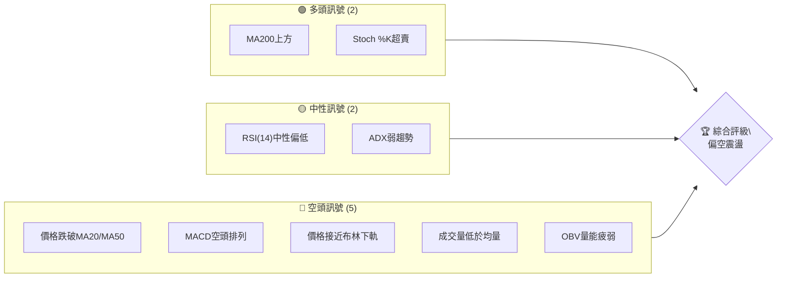

**解讀：**
多頭訊號主要來自於價格仍處於長期均線MA200上方，以及短線動能指標Stochastics進入超賣區，暗示存在技術性反彈的可能性。中性訊號則指出RSI尚未完全進入超賣區，且ADX顯示當前趨勢強度不足，市場處於弱勢整理或盤整階段。然而，空頭訊號數量明顯佔優，包括價格跌破關鍵的MA20和MA50，MACD形成空頭排列，價格逼近布林通道下軌，以及成交量和OBV均顯示量能不足以支撐價格。綜合來看，RKLB短期內面臨較大下行壓力，但長期趨勢尚未完全破壞，需警惕超賣反彈。

### 📊 核心指標速覽表

| 指標類別 | 指標名稱 | 當前數值 | 訊號 | 解讀 |
|----------|----------|----------|------|------|
| **價格** | 當前價格 | $83.41 | 🔴 | 較52週高點大幅回落，短期趨勢偏弱 |
| **均線** | MA20 | $99.80 | 🔴 | 價格 ($83.41) 位於MA20 ($99.80) 下方，短期壓力顯著 |
| **均線** | MA50 | $106.97 | 🔴 | 價格 ($83.41) 位於MA50 ($106.97) 下方，中期趨勢偏空 |
| **均線** | MA200 | $76.28 | 🟢 | 價格 ($83.41) 位於MA200 ($76.28) 上方，長期趨勢仍有支撐 |
| **動能** | RSI(14) | 32.83 | 🟡 | 接近超賣區 (30以下)，但尚未確認，中性偏空 |
| **動能** | MACD | -5.461 | 🔴 | MACD線位於訊號線下方，柱狀圖為負，顯示空頭動能強勁 |
| **波動** | ATR(14) | $8.85 | 🔴 | 相對價格的10.61%，波動率較高，意味著價格變動劇烈 |
| **趨勢** | ADX(14) | 23.06 | 🟡 | 趨勢強度較弱，市場處於盤整或弱勢趨勢中 |
| **量能** | OBV趨勢 | OBV < MA | 🔴 | 量能未能配合價格走勢，顯示買盤動能不足 |

### 🏆 技術評分卡

RKLB 的技術評分顯示其整體處於弱勢，尤其在動能和均線排列方面表現不佳。

```
╔══════════════════════════════════════════════════════════════╗
║                技術評分卡 — RKLB (2026-07-08)                  ║
╠══════════════════════════════════════════════════════════════╣
║ 趨勢強度      ██████░░░░░░░░░░░░░░  30/100  🔴               ║
║ 動能指標      ████░░░░░░░░░░░░░░░░  20/100  🔴               ║
║ 支撐穩定度    ████████░░░░░░░░░░░░  40/100  🟡               ║
║ 成交量配合    ████░░░░░░░░░░░░░░░░  20/100  🔴               ║
║ 形態完整度    ██████░░░░░░░░░░░░░░  30/100  🔴               ║
║ 均線排列      ████░░░░░░░░░░░░░░░░  20/100  🔴               ║
╠══════════════════════════════════════════════════════════════╣
║ 綜合評分      ████░░░░░░░░░░░░░░░░  28/100  🔴 偏空震盪       ║
╚══════════════════════════════════════════════════════════════╝
```

**評分解讀：**
*   **趨勢強度 (30/100 🔴):** ADX 數值低於25，顯示當前趨勢強度較弱，市場處於盤整或弱勢下跌階段。雖然長期MA200仍向上，但中短期均線向下，整體趨勢偏空。
*   **動能指標 (20/100 🔴):** MACD 處於空頭排列且柱狀圖為負，RSI 接近超賣但未完全進入，Stochastics 雖然超賣但並未形成金叉，顯示整體空頭動能強勁。
*   **支撐穩定度 (40/100 🟡):** 價格接近布林通道下軌及斐波那契76.4%回調位，下方有MA200提供一定支撐 ($76.28)，但短期支撐位 ($79.77) 較為脆弱，存在跌破風險。
*   **成交量配合 (20/100 🔴):** 當前成交量低於20日和50日均量，OBV 趨勢向下，顯示在價格下跌過程中缺乏買盤承接，量價配合不佳，確認空頭趨勢。
*   **形態完整度 (30/100 🔴):** 從近期走勢來看，價格呈現高點逐漸降低、低點也降低的下降趨勢，尚未形成明確的反轉形態，短期內未見底部形態。
*   **均線排列 (20/100 🔴):** 短期MA5、MA10、MA20、MA60、MA120均位於現價上方並呈下降趨勢，形成空頭排列，對價格構成強大壓力。僅MA240位於現價下方且向上，提供長期支撐。
*   **綜合評分 (28/100 🔴):** 整體評分偏低，RKLB 技術面顯示出明顯的空頭主導，短期內風險較高，建議投資者保持謹慎。

---

## 2. 趨勢分析

本章節將從多時框架深入分析 RKLB 的價格趨勢，從長期到短期，全面評估其市場方向與強度。

### 🌐 多時框趨勢分析

RKLB 的多時框趨勢顯示，儘管長期仍有潛在的上升動能，但中短期已明顯轉弱，進入修正或下降通道。

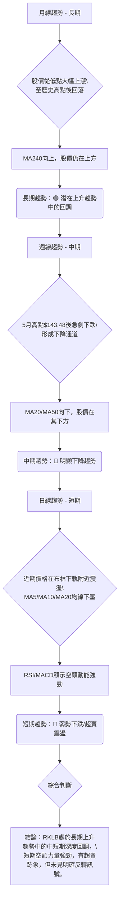

**詳細解讀：**
*   **月線趨勢 (長期):** 從24個月的價格歷史來看，RKLB 從2024年7月的 $5.24 一路飆升至2026年5月的 $143.48，漲幅驚人。儘管近期大幅回落，但其MA240 ($71.22) 仍保持向上趨勢，且當前價格 $83.41 仍位於MA240之上，這表明其長期基本面或產業前景仍被市場看好，當前可能處於牛市中的深度回調階段。
*   **週線趨勢 (中期):** 觀察近20週的數據，RKLB 在2026年5月底創下 $143.48 的歷史新高後，便進入了快速下跌通道。週線圖上，價格已跌破MA20 ($99.80) 和MA50 ($106.97)，且這些均線已開始向下彎曲，形成中期下降趨勢。高點和低點都在不斷降低，顯示賣壓沉重。
*   **日線趨勢 (短期):** 當前日線級別，RKLB 股價 $83.41 已經連續跌破多條短期和中期移動平均線 (MA5 $95.74, MA10 $92.25, MA20 $99.80, MA60 $102.52, MA120 $88.11)，所有這些均線都位於現價上方並呈明顯下降趨勢。價格正貼近布林通道下軌運行，RSI 位於32.83，MACD 處於空頭排列，這些都指向短期內強烈的空頭動能和弱勢格局。雖然Stochastics進入超賣區，但需等待價格行為確認反彈。

### 📈 長期趨勢 — 12個月走勢圖（Unicode）

過去12個月，RKLB 經歷了從 $45.92 到 $143.48 的飆升，隨後大幅回落至 $83.41，呈現一個 V 型反轉後的深度調整。

```
RKLB 月線走勢圖（過去12個月：2025-07 至 2026-07）
價格軸 ($)
$150 ┤                                  ●(26-05 $143.48)
$140 ┤
$130 ┤
$120 ┤
$110 ┤
$100 ┤                                                ●(26-06 $101.65)
 $90 ┤                                                        ●(26-07 $83.41)←現在
 $80 ┤                                       ●(26-01 $80.07)
 $70 ┤             ●(25-12 $69.76)
 $60 ┤  ●(25-10 $62.98)
 $50 ┤●(25-07 $45.92)
 $40 ┤
     └──────────────────────────────────────────────────────────
      25-07 25-08 25-09 25-10 25-11 25-12 26-01 26-02 26-03 26-04 26-05 26-06 26-07
```

**走勢特徵分析表格**

| 階段 | 時間區間 | 主要走勢 | 價格區間 | 漲跌幅 | 特徵分析 |
|------|----------|----------|----------|--------|----------|
| **強勁上漲** | 2025-07 至 2026-05 | 🚀 快速拉升 | $45.92 - $143.48 | +212.46% | 股價幾乎是直線拉升，期間雖有小幅回調但很快被買盤消化，量價齊升，動能極強，創下歷史新高。 |
| **高位震盪** | 2026-05 | 📉 衝高回落 | $143.48 - $101.65 | -29.15% | 達到歷史高點後，遭遇強大賣壓，價格迅速回落，成交量放大，顯示多空分歧加劇。 |
| **深度調整** | 2026-06 至 2026-07 | 🔻 持續下跌 | $101.65 - $83.41 | -17.94% | 股價未能守住關鍵支撐，持續下探，目前已跌破多條中短期均線，空頭動能佔據主導，市場情緒悲觀。 |

### 📊 中期趨勢（週線分析）

從週線級別來看，RKLB 經歷了一次快速的「M型頂部」形成過程，目前處於下降趨勢中。

```
RKLB 近期壓力與支撐示意圖（週線）
價格軸 ($)
$150 ┤         R (143.48)
$140 ┤        / \
$130 ┤       /   \
$120 ┤      /     \
$110 ┤     /       \
$100 ┤────R1(106.97, MA50)─────────── S1(100.46, 近期反彈高點)
 $90 ┤                                / \
 $80 ┤─────────── S2(84.54, 前低) ─── C (83.41, 現價)
 $70 ┤           S3(76.28, MA200)
     └──────────────────────────────────────────────────────────
      5月上旬     5月底       6月中旬      6月底       7月初       現在
```

**解讀：**
RKLB 在5月底達到 $143.48 的峰值後，迅速回落。週線圖上，最近的反彈高點在 $100.46 (2026-07-05)，未能突破MA50 ($106.97) 和MA20 ($99.80) 等中期阻力，隨後再次下跌。前一個低點 $84.54 (2026-06-28) 已被跌破，目前價格 $83.41 正在測試更低的支撐位。MA20 ($99.80) 和MA50 ($106.97) 均已向下彎曲，並對價格構成強大壓制。長期均線MA200 ($76.28) 則成為重要的心理和技術支撐。

### ⚡ 趨勢強度評估（ADX 解讀）

ADX 指標顯示 RKLB 當前處於弱勢趨勢或盤整階段，且空頭力量佔據主導。

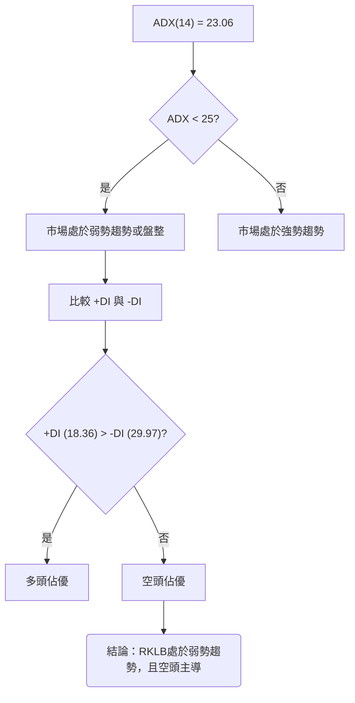

**ADX 強度對照表**

| ADX 數值 | 趨勢強度 | 市場狀態 |
|----------|----------|----------|
| 0-25     | 弱趨勢   | 盤整或弱勢行情 |
| 25-50    | 中等趨勢 | 趨勢行情確立 |
| 50-75    | 強趨勢   | 強勁趨勢行情 |
| 75-100   | 極強趨勢 | 極端強勢行情 |

**解讀：**
RKLB 的 ADX(14) 值為 23.06，這明確表明當前市場處於**弱勢趨勢或盤整行情**。ADX 低於25，意味著無論是多頭還是空頭，其推動價格的力量都不足以形成一個強勁的單邊趨勢。然而，進一步分析 +DI 和 -DI 則能揭示主導方向：+DI 為 18.36，而 -DI 為 29.97。由於 **-DI 高於 +DI**，這說明在當前的弱勢格局中，**空頭力量佔據主導地位**，賣壓仍然較大。這與價格跌破多條均線的表現一致，雖然跌勢可能不夠迅猛，但持續性較強。投資者應警惕在弱勢趨勢中，空頭主導可能導致價格緩慢下行。

---

## 3. 圖表形態分析

本章節將識別 RKLB 價格走勢中可能形成的圖表形態和關鍵K線組合，並據此推斷潛在的價格目標。

### 🔍 形態識別系統

從 RKLB 近期的價格走勢來看，主要識別出一個潛在的「下降通道」形態，以及在峰值處的「M型頂部」雛形。

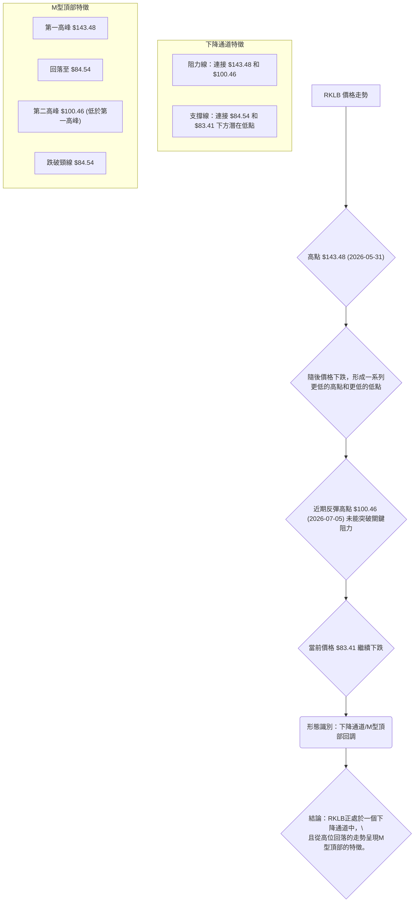

**解讀：**
RKLB 在2026年5月底創下 $143.48 的歷史高點後，隨即遭遇強勁拋售，價格快速回落。隨後的反彈未能達到前高，在 $100.46 附近受阻再次下跌，這形成了典型的「M型頂部」或「雙頂」的雛形，其中第二個頂部明顯低於第一個頂部，顯示多頭動能衰竭。同時，連接這些高點和低點，價格呈現出一個清晰的「下降通道」走勢，股價在兩條平行的下降趨勢線之間波動。當前價格 $83.41 已跌破了M型頂部的頸線位（約 $84.54），預示著進一步下跌的可能性。

### 🕯️ 重要K線形態分析

分析近期的週線K線組合，可以觀察到賣壓的演變。

| 月份 | 收盤價 | K線形態 (週線) | 解讀 | 訊號 |
|------|--------|-----------------|------|------|
| 2026-05-31 | $143.48 | 長上影線陰線 (近似) | 價格創高後，當週遭遇強勁拋壓，收盤價遠低於最高價，顯示上漲動能不足，賣壓開始湧現。 | 🔴 強烈看空 |
| 2026-06-07 | $110.08 | 長陰線 | 價格大幅下跌，收盤接近當週最低點，確認空頭力量主導，市場情緒恐慌。 | 🔴 強烈看空 |
| 2026-06-21 | $107.24 | 長下影線陰線 (近似) | 價格一度深跌，但尾盤有所拉升，形成較長下影線，顯示下方有部分買盤承接，但未能阻止收陰。 | 🟡 潛在支撐 |
| 2026-06-28 | $84.54 | 長陰線 | 再次出現大幅下跌，收盤價接近最低點，確認空頭趨勢延續，賣壓未減。 | 🔴 強烈看空 |
| 2026-07-05 | $100.46 | 長陽線 | 經歷連續下跌後，出現一根實體較長的陽線，伴隨成交量放大，顯示有資金入場抄底，形成技術性反彈。 | 🟢 短暫看多 |
| 2026-07-12 | $83.41 | 長陰線 | 反彈後再次遭遇拋售，形成長陰線，吞噬了前一週的漲幅，確認反彈失敗，空頭趨勢恢復。 | 🔴 強烈看空 |

**綜合K線解讀：**
從5月底高點的長上影線陰線開始，一系列長陰線確認了賣壓的持續存在。雖然在6月底出現一次帶長下影線的陰線，以及7月初的長陽線反彈，但最新一週的長陰線直接吞噬了反彈成果，表明市場反彈動能不足，空頭力量依然強勁，短期內價格仍有下行風險。

### 📉 ASCII 走勢形態示意圖

以下示意圖展示了 RKLB 從高點回落後，形成M型頂部並進入下降通道的走勢。

```
RKLB 走勢形態示意圖 (M型頂部 & 下降通道)
價格 ($)
$150 ┤          (R1) $143.48
$140 ┤         /  \
$130 ┤        /    \
$120 ┤       /      \
$110 ┤      /        (R2) $100.46 <-- 下降通道阻力線
$100 ┤     /          \    /
 $90 ┤    /            \  /
 $80 ┤   /              \/ (現價 $83.41)
 $70 ┤  (S1) $60.93        \    <-- 下降通道支撐線
     └──────────────────────────────────────────────────────────
      26-03     26-04      26-05      26-06      26-07
```
**圖示說明：**
*   **R1 ($143.48):** 2026年5月底的歷史最高點，M型頂部的第一個高峰。
*   **R2 ($100.46):** 2026年7月初的反彈高點，M型頂部的第二個高峰，低於R1，確認多頭乏力。同時也是下降通道的上軌阻力。
*   **S1 ($60.93):** 2026年3月底的相對低點，是上一波漲勢的起點，也可用作M型頂部的潛在頸線參考。
*   **現價 ($83.41):** 目前價格位於下降通道內部，並已跌破M型頂部的關鍵頸線區域（約 $84.54）。

### 🎯 形態目標價計算

基於M型頂部形態，我們可以估算其潛在的下跌目標價。
*   **M型頂部高點 (R1):** $143.48 (2026-05-31)
*   **M型頂部第二高點 (R2):** $100.46 (2026-07-05)
*   **M型頂部頸線位 (S1):** 考慮到近期低點 $84.54 (2026-06-28) 是反彈前的支撐，可將其視為M型頂部的關鍵頸線。

**計算方法：**
M型頂部的目標價通常是從頸線位減去形態的高度。
形態高度 = 第一高峰 - 頸線位 = $143.48 - $84.54 = $58.94
目標價 = 頸線位 - 形態高度 = $84.54 - $58.94 = $25.60

**結論：**
基於M型頂部形態的推算，RKLB 的潛在下跌目標價約為 **$25.60**。這個目標價顯著低於當前價格，且遠低於MA200 ($76.28)，表明一旦M型頂部形態確認跌破並有效運行，後市跌幅可能非常巨大。然而，由於此目標價過於極端，且未考慮到長期MA200的強勁支撐，實際走勢可能在 $76.28 (MA200) 或更早的斐波那契回調位獲得支撐。因此，應將此目標價視為最悲觀情境下的理論值，而非必然發生。短期更實際的目標應關注下降通道的下軌支撐。

---

## 4. 支撐與阻力

本章節將詳細分析 RKLB 的關鍵支撐與阻力價位，結合技術指標和斐波那契回調，構建完整的價位結構。

### 🗺️ 關鍵價位分布圖（Unicode）

以下圖表展示了 RKLB 當前價格附近的關鍵阻力與支撐位。

```
RKLB 價位結構分布圖 (2026-07-08)
═══════════════════════════════════════════════════
$143.48 ║████████████████████████║ 歷史高點 / 強阻力 R4
$119.82 ║████████████████████    ║ 布林上軌 / 阻力 R3
$106.97 ║████████████████████████║ MA50 / 阻力 R2 (強)
$100.46 ║████████████████████    ║ 近期反彈高點 / 阻力 R1 (關鍵)
$99.80  ║████████████████████████║ MA20 / 阻力 R0
$88.11  ║▓▓▓▓▓▓▓▓▓▓▓▓▓▓▓▓        ║ MA120
$83.41  ╠════════════════════════╣ ◄ 現價
$81.08  ║▓▓▓▓▓▓▓▓▓▓▓▓▓▓▓▓        ║ 斐波那契76.4%回調 / 近期支撐 S0
$79.77  ║████████████████████████║ 布林下軌 / 支撐 S1 (關鍵)
$76.28  ║████████████████████    ║ MA200 / 支撐 S2 (強)
$71.22  ║████████████████████████║ MA240 / 支撐 S3 (強)
$60.93  ║████████████████████    ║ 前期低點 / 強支撐 S4
═══════════════════════════════════════════════════
```

**圖示解讀：**
當前價格 $83.41 位於多條短期/中期移動平均線下方，並接近布林通道下軌和斐波那契76.4%回調位。上方阻力密集，下方則有MA200和MA240提供長期支撐。

### 🚧 阻力位分析表

RKLB 的阻力位分佈密集，顯示上方賣壓沉重。

| 阻力級別 | 價位 | 形成原因 | 突破難度 | 重要性 |
|----------|------|----------|----------|--------|
| **R0**   | $99.80 | MA20 (20日移動平均線) | 中等 | 短期反彈的首個考驗，突破則短期壓力減輕。 |
| **R1 (關鍵)** | $100.46 | 近期反彈高點 (2026-07-05) | 高 | 跌破後反彈未過前高，形成下降趨勢。突破此位才能破壞短期下降結構。 |
| **R2 (強)** | $106.97 | MA50 (50日移動平均線) | 高 | 中期趨勢的關鍵分界線，突破則中期趨勢可能改善。 |
| **R3**   | $119.82 | 布林通道上軌 | 中等 | 短期極限反彈目標，通常在強勢上漲時觸及。 |
| **R4 (強)** | $143.48 | 歷史高點 (2026-05-31) | 極高 | 巨大的套牢盤，長期趨勢逆轉的終極目標。 |

### 🛡️ 支撐位分析表

RKLB 的支撐位在 $80 附近有較強的聚集，但需警惕跌破後可能加速下行。

| 支撐級別 | 價位 | 形成原因 | 守住機率 | 重要性 |
|----------|------|----------|----------|--------|
| **S0**   | $81.08 | 斐波那契76.4%回調位 | 中等 | 深度回調的關鍵點位，常有技術性反彈。 |
| **S1 (關鍵)** | $79.77 | 布林通道下軌 | 中等 | 短期超賣的極限，通常在此處獲得支撐或反彈。 |
| **S2 (強)** | $76.28 | MA200 (200日移動平均線) | 高 | 長期牛熊分界線，通常提供強勁心理和技術支撐。 |
| **S3 (強)** | $71.22 | MA240 (240日移動平均線) | 高 | 更長期的趨勢支撐，具有極高重要性。 |
| **S4 (強)** | $60.93 | 前期低點 (2026-03-29) | 極高 | 啟動上一波大漲的起點，若跌破則長期趨勢可能轉壞。 |

### 📐 斐波那契回調位分析

我們將以 RKLB 從 $60.93 (2026-03-29) 的低點起漲，到 $143.48 (2026-05-31) 的高點作為主要波動區間，計算其回調位。

*   **起漲點 (Low):** $60.93
*   **高峰 (High):** $143.48
*   **波動區間:** $143.48 - $60.93 = $82.55

| 回調比例 | 價位計算 | 斐波那契回調位 | 距現價 ($83.41) | 解讀 |
|----------|----------|----------------|-----------------|------|
| **23.6%** | $143.48 - $82.55 * 0.236 | **$123.73** | +48.32% | 輕微回調，已遠被跌破。 |
| **38.2%** | $143.48 - $82.55 * 0.382 | **$111.08** | +33.17% | 較深回調，目前為重要阻力。 |
| **50.0%** | $143.48 - $82.55 * 0.500 | **$101.99** | +22.27% | 心理關卡，也接近MA20/MA50。 |
| **61.8%** | $143.48 - $82.55 * 0.618 | **$92.90** | +11.37% | 黃金分割線，通常是強勁支撐位，目前已跌破，轉為阻力。 |
| **76.4%** | $143.48 - $82.55 * 0.764 | **$81.08** | -2.79% | 深度回調，當前價格 $83.41 位於此位上方不遠處，是重要支撐。 |

**視覺化斐波那契回調：**

```
RKLB 斐波那契回調示意圖 (從 $60.93 至 $143.48)
價格 ($)
$150 ┤                                  ● $143.48 (高點)
$140 ┤
$130 ┤
$123.73 ┤─────────── 23.6% 回調
$110 ┤
$111.08 ┤────────────── 38.2% 回調
$100 ┤
$101.99 ┤───────────────── 50.0% 回調
 $90 ┤
 $92.90 ┤───────────────────── 61.8% 回調 (已跌破)
 $83.41 ╠═════════════════════════════════════════════╣ ◄ 現價
 $81.08 ┤───────────────────────── 76.4% 回調 (關鍵支撐)
 $70 ┤
 $60.93 ┤● $60.93 (低點)
     └──────────────────────────────────────────────────────────
      26-03     26-04      26-05      26-06      26-07
```

**斐波那契回調解讀：**
RKLB 股價從高點 $143.48 回落，目前已跌破了 61.8% 回調位 ($92.90)，並在 76.4% 回調位 ($81.08) 附近尋求支撐。這表明RKLB經歷了一次非常深度的回調，幾乎回吐了上一波漲幅的大部分。76.4% 回調位是一個非常關鍵的支撐區域，如果此位被有效跌破，將預示著價格可能進一步回調至起漲點 $60.93，甚至更低。投資者應密切關注 $81.08 附近的價格行為，若能在此處企穩並形成反轉K線，則可能迎來一波技術性反彈。

---

## 5. 技術指標深度解讀

本章節將對 RKLB 的主要技術指標進行深入分析，包括移動平均線、RSI、MACD、布林通道和成交量，並探討它們之間的相互確認或矛盾關係。

### 🎛️ 指標訊號總覽

以下 Mermaid 圖表展示了各技術指標的當前訊號及其相互關係。

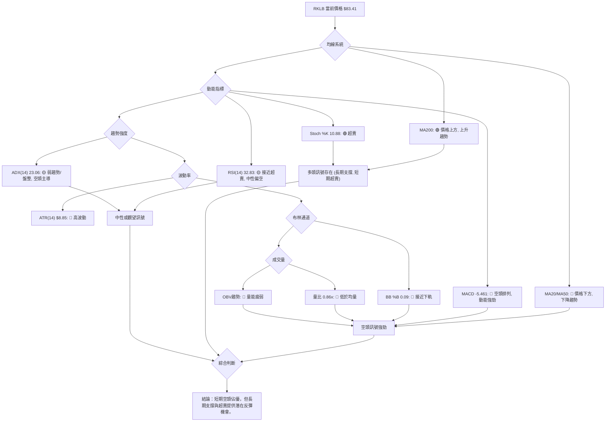

**綜合指標解讀：**
整體而言，RKLB 的技術指標呈現出短期和中期強烈看空，但長期支撐尚存，且短期有超賣跡象的複雜局面。移動平均線系統明確顯示價格已跌破短期和中期均線，形成空頭排列，但仍高於長期均線。動能指標MACD的空頭排列確認了當前的下行趨勢，而RSI和Stochastics則顯示出超賣狀態，暗示短期可能存在技術性反彈的需求。ADX的弱趨勢表明目前缺乏強勁的單邊動能，但-DI主導則確認了空頭的優勢。成交量和OBV的疲弱則進一步確認了價格下跌的有效性，缺乏買盤支撐。

### 📈 移動平均線排列分析

RKLB 的移動平均線排列呈現出典型的空頭趨勢特徵，但長期均線仍提供支撐。

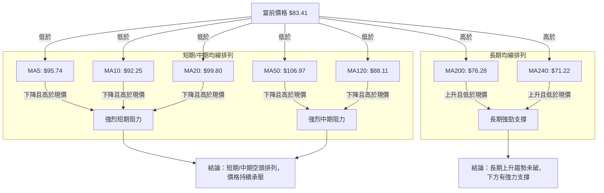

**均線排列狀態：**

| 移動平均線 (MA) | 數值 | 與現價 ($83.41) 關係 | 走勢 | 訊號 |
|-----------------|------|----------------------|------|------|
| MA5             | $95.74 | 價格下方             | 下降 | 🔴 極短期空頭 |
| MA10            | $92.25 | 價格下方             | 下降 | 🔴 短期空頭 |
| MA20            | $99.80 | 價格下方             | 下降 | 🔴 短期空頭 |
| MA50            | $106.97 | 價格下方             | 下降 | 🔴 中期空頭 |
| MA60            | $102.52 | 價格下方             | 下降 | 🔴 中期空頭 |
| MA120           | $88.11 | 價格下方             | 下降 | 🔴 中長期空頭 |
| MA200           | $76.28 | 價格上方             | 上升 | 🟢 長期多頭 |
| MA240           | $71.22 | 價格上方             | 上升 | 🟢 極長期多頭 |

**解讀：**
RKLB 的短期 (MA5, MA10, MA20)、中期 (MA50, MA60) 乃至中長期 (MA120) 移動平均線均位於當前價格 $83.41 之上，且這些均線的走勢都呈現明顯的下降趨勢。這形成了一個強烈的空頭排列，每一條均線都對股價構成壓力，每次反彈都可能在這些均線處遇到阻力。這表明 RKLB 在短期和中期內處於明確的下降趨勢中。然而，長期均線 MA200 ($76.28) 和 MA240 ($71.22) 仍然在價格下方，且保持向上趨勢，這為股價提供了重要的長期支撐。這是一個混合訊號，短期和中期空頭主導，但長期趨勢的根基尚未動搖。

### 📉 RSI(14) 分析

*   **RSI 數值進度條：**
    RSI(14): 32.83 ▓▓▓▓▓▓▓░░░░░░░░░░░░  (32.83/100) 🟡
*   **超買超賣區間分析：**
    RSI 當前數值為 32.83，位於傳統的 30-70 中性區間內，但已非常接近超賣區 (30 以下)。這表明市場賣壓沉重，股價處於相對弱勢，但尚未達到極度超賣的狀態。雖然接近超賣區可能預示著短期反彈的可能性，但僅憑 RSI 並不足以確認底部，仍需觀察價格行為和成交量的配合。
*   **背離判斷：**
    根據提供的數據，RSI 背離顯示為「無明顯背離」。回顧近20週數據，2026-05-31 價格高點 $143.48 時 RSI 為 70.6，隨後價格下跌。近期價格低點 $84.54 (2026-06-28) 時 RSI 為 34.1，而當前價格 $83.41 時 RSI 為 32.83。價格創下更低低點 ($83.41 < $84.54)，RSI 也創下更低低點 (32.83 < 34.1)，這並未形成底背離。同樣，在價格反彈至 $100.46 (2026-07-05) 時 RSI 為 40.8，而前高點 $143.48 時 RSI 為 70.6，價格和 RSI 均呈現下降趨勢，因此也未形成頂背離。因此，RSI 目前沒有提供明確的背離訊號來預示趨勢反轉。

### 📊 MACD(12/26/9) 訊號解讀

RKLB 的 MACD 指標呈現明確的空頭訊號。

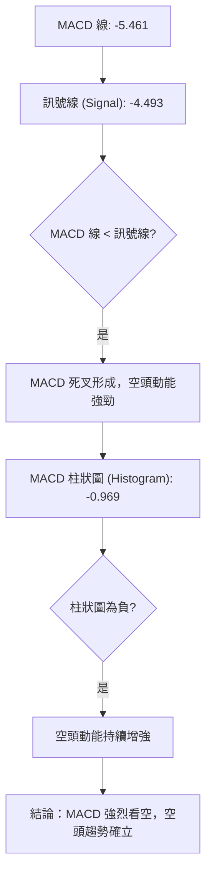

**解讀：**
MACD 線當前數值為 -5.461，訊號線為 -4.493。由於 MACD 線位於訊號線下方，這是一個標準的「死叉」訊號，表明短期動能已轉為向下，且強於中期動能。MACD 柱狀圖 (Histogram) 為 -0.969，且為負值，這進一步確認了空頭動能的存在，並顯示空頭力量仍在持續。從近20週的數據來看，MACD 柱狀圖在2026-06-07 左右轉為負值，並持續擴大，這與價格的下跌趨勢高度吻合，相互確認了空頭的強勢。MACD 指標目前沒有顯示任何底背離的跡象，因此其訊號強烈偏空。

### 📦 布林通道分析

RKLB 的價格正緊貼布林通道下軌運行，顯示極度弱勢。

```
RKLB 布林通道示意圖 (2026-07-08)
價格 ($)
$120 ┤                                  BB上軌: $119.82
$110 ┤
$100 ┤              BB中軌 (MA20): $99.80
 $90 ┤
 $83.41 ╠═════════════════════════════════════════════╣ ◄ 現價
 $80 ┤ BB下軌: $79.77
 $70 ┤
     └──────────────────────────────────────────────────────────
```

**解讀：**
布林通道上軌為 $119.82，中軌 (MA20) 為 $99.80，下軌為 $79.77。當前價格 $83.41 位於中軌下方，並非常接近下軌。布林通道 %B 值為 0.09，這意味著價格幾乎貼在下軌上，這是典型的極度弱勢表現。當價格持續貼近下軌時，通常表明賣壓沉重，短期內難以形成有效反彈。雖然價格長期貼近下軌可能預示著超賣，但若通道開口持續向下擴大，則跌勢可能繼續。目前通道開口呈現向下擴大趨勢，暗示價格可能繼續尋找更低支撐。

### 💹 成交量分析（量價配合度）

RKLB 的成交量數據顯示量能疲弱，未能有效支撐價格。

| 指標 | 當前數值 | 20日均量 | 50日均量 | 量比 | 解讀 | 訊號 |
|------|----------|----------|----------|------|------|
| **成交量** | 25,825,605 | 29,959,395 | 28,377,174 | 0.86x | 當前成交量低於近20日和50日均量，顯示市場活躍度下降，買盤意願不足。 | 🔴 |
| **OBV趨勢** | OBV < MA | - | - | - | OBV線位於其移動平均線下方，且呈現下降趨勢，表明在價格下跌過程中，累積的買盤壓力不足，賣壓佔據主導。 | 🔴 |

**量價配合度解讀：**
在 RKLB 價格下跌的過程中，當前成交量 ($25,825,605) 顯著低於其20日均量 ($29,959,395) 和50日均量 ($28,377,174)，量比僅為0.86x。這表明在價格下跌時，市場缺乏足夠的賣盤恐慌性拋售，也缺乏買盤積極介入承接。通常，在下跌趨勢中，如果成交量萎縮，可能意味著賣壓正在減輕，但結合 OBV 來看，情況並非如此。OBV 趨勢顯示 OBV 線位於其移動平均線下方，且整體呈下降態勢。這意味著在價格下跌期間，累積的買盤量少於賣盤量，未能有效支撐價格。這種「價跌量縮，OBV 下降」的組合，確認了當前空頭趨勢的有效性，且缺乏積極買盤入場的跡象，預示著價格可能繼續探底，直至出現放量止跌或反轉訊號。

---

## 6. 動能與波動率

本章節將評估 RKLB 的動能強度和波動性特徵，這些因素對於交易策略的制定至關重要。

### ⚡ 動能評估四象限

RKLB 目前的動能評估顯示其處於「弱動能，高波動」的狀態，屬於高風險區。

| 象限 | 動能 | 波動 | 當前狀態 | 評估 |
|------|------|------|----------|------|
| Q1 | 強 | 低 | - | 最佳機會 (趨勢明確，風險可控) |
| Q2 | 弱 | 低 | - | 謹慎觀望 (缺乏方向，波動小，無交易機會) |
| Q3 | 強 | 高 | - | 高風險高收益 (趨勢強勁，但波動大，需嚴格止損) |
| Q4 | 弱 | 高 | ✓ | **避免進場** (方向不明確，但波動劇烈，極易被洗盤) |

**動能評估流程圖：**
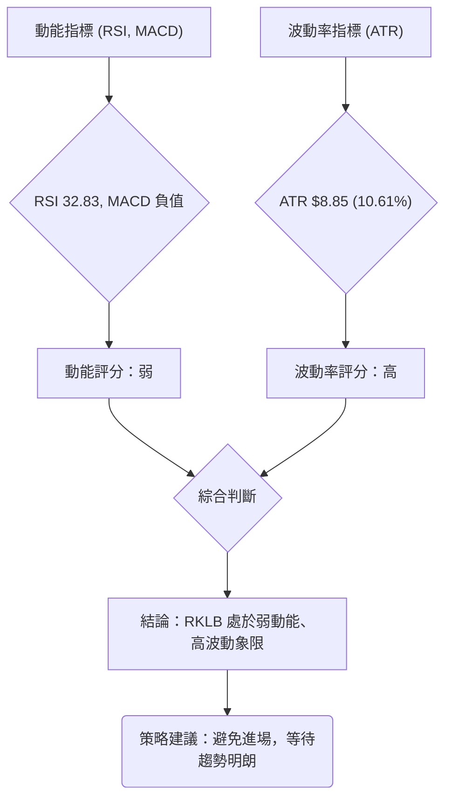

**解讀：**
*   **動能 (弱):** RSI 位於中性偏低區 (32.83)，MACD 處於空頭排列且柱狀圖為負，表明股價缺乏上升動能，反而被空頭主導。儘管 Stochastics 顯示超賣，但這只是潛在反彈訊號，並非強勁動能。
*   **波動 (高):** ATR(14) 為 $8.85，佔股價的 10.61%，這是一個相對較高的波動率。高波動意味著股價在短期內可能出現大幅度漲跌，交易風險較大。

綜合來看，RKLB 處於「弱動能、高波動」的象限 (Q4)。這是一種極具挑戰性的市場環境，股價缺乏明確的方向性（弱動能），但每日波動卻非常劇烈（高波動）。在這種情況下，投資者很容易在震盪中被來回止損，或者因方向判斷失誤而遭受重大損失。因此，當前應避免貿然進場，等待市場趨勢明朗化，或者波動率降低，動能重新積聚。

### 📊 ATR 波動率分析

*   **ATR(14):** $8.85
*   **佔收盤價比例:** ($8.85 / $83.41) * 100% = 10.61%

**詳細分析：**
RKLB 的 ATR(14) 為 $8.85，這是一個相對較高的數值，佔當前收盤價的 10.61%。高 ATR 表明該股票在過去14天內的平均每日波動幅度較大。對於交易者而言，高波動性既意味著潛在的快速獲利機會，也伴隨著更高的風險。

**止損距離建議：**
由於 ATR 較高，傳統的固定百分比止損可能會過於緊密，容易被市場正常波動掃出。建議使用基於 ATR 的止損方法，例如將止損點設置在進場點下方 1.5 到 3 倍 ATR 的距離。
*   **保守止損 (1.5 x ATR):** $83.41 - (1.5 * $8.85) = $83.41 - $13.28 = **$70.13**
*   **標準止損 (2 x ATR):** $83.41 - (2 * $8.85) = $83.41 - $17.70 = **$65.71**
*   **寬鬆止損 (3 x ATR):** $83.41 - (3 * $8.85) = $83.41 - $26.55 = **$56.86**

考慮到 RKLB 當前處於下降趨勢且波動較大，若考慮做多，止損點應設置在關鍵支撐位下方，並參考 ATR 數值。例如，如果進場點在 $81.08 附近，則止損點可考慮設置在 $76.28 (MA200) 甚至 $70.13 (1.5 ATR 距離)，以避免過早被洗出。若考慮做空，止損點應設置在關鍵阻力位上方，同樣參考 ATR。

### 📐 Beta 與市場相關性

由於提供的數據中未包含 RKLB 的 Beta 值，我們無法進行精確的量化分析。然而，根據 RKLB 作為一家高成長性、屬於太空產業的科技公司，通常這類股票具有以下市場相關性特徵：
*   **高 Beta 值傾向：** 成長型股票和新興產業的股票通常具有較高的 Beta 值，這意味著它們對大盤的波動反應更為劇烈。在大盤上漲時，它們可能漲幅更大；在大盤下跌時，它們也可能跌幅更深。
*   **風險偏好指標：** 投資者對太空產業等高風險高回報領域的興趣，往往與市場整體的風險偏好情緒高度相關。當市場風險偏好上升時，資金會流向這類股票；反之，則會被拋售。
*   **行業特異性風險：** 儘管與大盤相關，但 RKLB 也會受到其所屬的太空與國防工業特有風險的影響，例如政府政策、發射任務成功率、技術進步、競爭格局等，這些因素可能使其走勢與大盤有所偏離。

**結論：**
雖然缺乏具體 Beta 數值，但可合理推斷 RKLB 應具有較高的 Beta 值，對市場波動敏感。投資者在交易 RKLB 時，應密切關注大盤走勢，並將其視為一個波動性較大、與市場情緒高度相關的標的。

---

## 7. 多時框架總結

本章節將整合前述的多時框架分析，提供 RKLB 在不同時間維度下的綜合評估，以形成一致的交易視角。

### 📋 時框架評分表

| 時框架 | 趨勢方向 | 動能 | 均線排列 | 形態 | 綜合評分 | 建議 |
|--------|----------|------|----------|------|----------|------|
| **長期** | 🟢 上升趨勢中的回調 | 🟡 減弱 | 🟢 多頭尚存 (MA200/240) | 🟡 回調修正 | 6/10 | 觀望/逢低配置 |
| **中期** | 🔴 下降趨勢 | 🔴 弱勢 | 🔴 空頭排列 (MA50/60/120) | 🔴 下降通道 | 3/10 | 謹慎做空/規避 |
| **短期** | 🔴 弱勢下跌/超賣震盪 | 🔴 極弱 | 🔴 空頭排列 (MA5/10/20) | 🔴 下降通道延續 | 2/10 | 謹慎做空/等待反彈機會 |

**解讀：**
*   **長期來看，** RKLB 仍處於一個宏觀的上升趨勢中，主要得益於其長期移動平均線 (MA200, MA240) 仍保持向上且位於股價下方提供支撐。然而，當前的動能已大幅減弱，且正經歷一次深度的回調修正。對於長期投資者而言，這可能是一個潛在的逢低配置機會，但需等待築底訊號。
*   **中期來看，** RKLB 表現出明確的下降趨勢。股價已跌破中期關鍵均線 (MA50, MA60, MA120)，且這些均線呈現空頭排列。形態上，中期下降通道清晰可見，顯示賣壓持續。此時介入中期交易風險較高，建議以規避或逢高做空為主。
*   **短期來看，** RKLB 處於極度弱勢的下跌階段。所有短期移動平均線均已形成空頭排列，價格緊貼布林通道下軌，且動能指標顯示強勁的空頭力量。雖然 RSI 和 Stochastics 進入超賣區，存在技術性反彈的需求，但整體環境仍是空頭主導。短期交易者應極度謹慎，可考慮在超賣反彈至阻力位時進行短線做空，或等待明確的反轉訊號。

### 🔲 綜合訊號矩陣

以下 Mermaid 圖表展示了 RKLB 在不同時框架下各技術維度訊號的一致性。

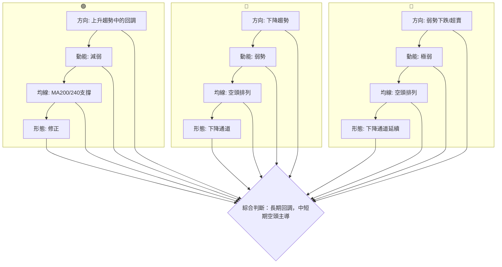

**訊號一致性分析：**
綜合訊號矩陣顯示，RKLB 的長期、中期和短期趨勢之間存在明顯的分歧。長期趨勢雖然處於回調，但其根本的上升動能和長期均線支撐尚未被破壞。然而，中期和短期趨勢則呈現出高度的一致性，均明確指向下降趨勢、弱勢動能、空頭排列的均線以及下降通道形態。這種一致性使得中短期交易者應當極度謹慎，避免逆勢操作。長期投資者則可以關注長期支撐位的有效性，等待市場情緒穩定和築底訊號出現。當前市場的賣壓主要來自於中短期資金的撤離，而非長期基本面的徹底改變（儘管基本面分析不在本報告範圍內）。

---

## 8. 交易策略建議

基於上述詳盡的技術分析，RKLB 目前處於長期上升趨勢中的深度回調階段，中短期空頭力量強勁，但部分指標顯示超賣。以下提供多空兩種潛在交易策略。

### 🗺️ 策略決策流程圖

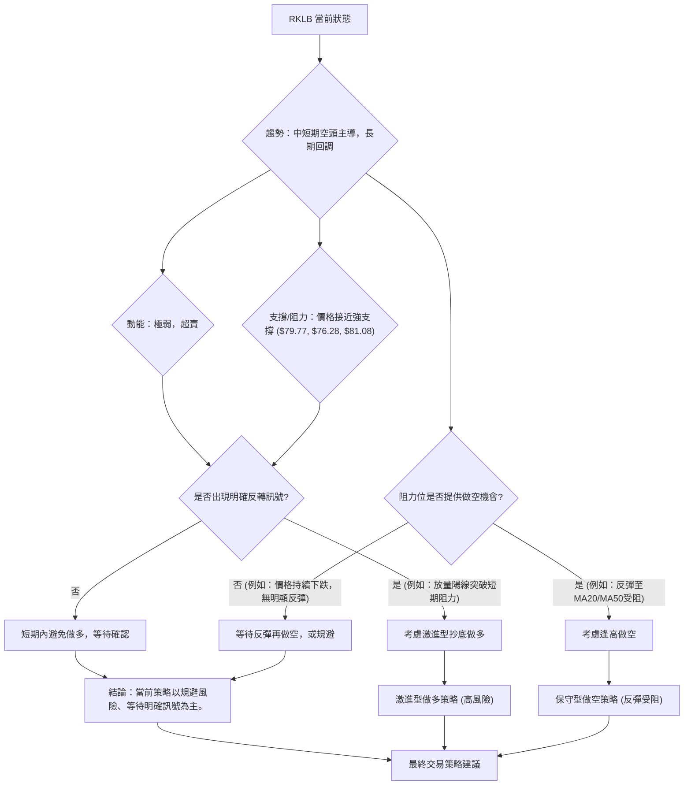

### 🟢 多頭策略詳情

鑑於 RKLB 目前的弱勢，激進型抄底做多策略風險極高。僅建議在以下條件同時滿足時，且僅適用於風險承受能力較高的短線交易者。

| 策略要素 | 策略 A: 激進型超賣反彈做多 |
|----------|----------------------------|
| **進場條件** | 價格在 $81.08 (斐波那契76.4%) 或 $79.77 (布林下軌) 附近企穩，出現放量陽線或底部K線形態 (如錘子線、啟明星)，且Stochastics金叉向上。 |
| **進場價格** | **$80.50** (在 $81.08 附近確認企穩後) |
| **目標價 T1** | **$92.90** (斐波那契61.8%回調位，MA120附近) |
| **目標價 T2** | **$99.80** (MA20，布林中軌) |
| **止損價格** | **$76.20** (略低於MA200 $76.28，確保長期支撐未破) |
| **風險報酬比** | (T1: $92.90 - $80.50) : ($80.50 - $76.20) = $12.40 : $4.30 ≈ **2.88 : 1** |
| | (T2: $99.80 - $80.50) : ($80.50 - $76.20) = $19.30 : $4.30 ≈ **4.49 : 1** |
| **成功機率** | 30% (高風險，需嚴格止損和倉位控制) |
| **建議倉位** | 5-10% (極小倉位) |

### 🔴 空頭策略詳情

RKLB 目前中短期趨勢偏空，逢高做空是較為保守且順應趨勢的策略。

| 策略要素 | 策略 B: 反彈至阻力位做空 |
|----------|--------------------------|
| **進場條件** | 價格反彈至 $92.90 (斐波那契61.8%) 或 $99.80 (MA20) 附近受阻，出現看空K線形態 (如流星線、烏雲蓋頂)，且MACD柱狀圖未能轉正。 |
| **進場價格** | **$98.50** (在 $99.80 (MA20) 附近受阻後) |
| **目標價 T1** | **$81.08** (斐波那契76.4%回調位，布林下軌附近) |
| **目標價 T2** | **$76.28** (MA200，強支撐位) |
| **止損價格** | **$102.00** (略高於MA60 $102.52 和斐波那契50%回調位 $101.99) |
| **風險報酬比** | (T1: $98.50 - $81.08) : ($102.00 - $98.50) = $17.42 : $3.50 ≈ **4.98 : 1** |
| | (T2: $98.50 - $76.28) : ($102.00 - $98.50) = $22.22 : $3.50 ≈ **6.35 : 1** |
| **成功機率** | 65% (順應趨勢，但需關注MA200支撐) |
| **建議倉位** | 10-20% (中等倉位) |

### ⭐ 整體訊號強度評星

```
做多訊號強度：★★☆☆☆  (2/5星) (超賣提供潛在反彈，但趨勢極弱)
做空訊號強度：★★★★☆  (4/5星) (中短期趨勢空頭主導，阻力密集)
整體可信度：  ★★★☆☆  (3/5星) (市場波動大，方向不明朗，需謹慎)
```

**結論：**
RKLB 目前的技術面偏空，做空策略相對具有更高的勝率和風險報酬比。多頭策略雖然有超賣的潛在誘惑，但逆勢操作風險極高，僅適合極度激進且資金管理嚴格的短線交易者。對於大多數投資者而言，建議等待更明確的底部訊號或趨勢反轉確認，或者考慮在反彈至阻力位時進行短線做空。

---

## 9. 風險提示與監控

本章節將列出 RKLB 交易中需要注意的關鍵風險因素和監控指標，並提供風險管理建議。

### ✅ 關鍵監控指標 Checklist

以下是交易 RKLB 時應密切關注的技術指標和價格行為清單。

```
╔══════════════════════════════════════════════════════════════╗
║               RKLB 關鍵監控指標 Checklist                      ║
╠══════════════════════════════════════════════════════════════╣
║ [ ] 價格是否有效跌破 MA200 ($76.28)？ (若跌破，長期趨勢轉壞)  ║
║ [ ] 價格是否有效跌破 斐波那契76.4% ($81.08)？ (若跌破，深度回調確認) ║
║ [ ] RSI 是否進入超賣區 (30以下) 並形成金叉？ (潛在反彈訊號)   ║
║ [ ] MACD 是否形成金叉並柱狀圖轉正？ (空頭動能減弱/轉多訊號)   ║
║ [ ] 成交量是否在下跌過程中放量或在反彈時放量？ (量價配合確認)  ║
║ [ ] OBV 趨勢是否止跌回升？ (買盤力量積聚)                   ║
║ [ ] 價格是否能突破 MA20 ($99.80) 和 MA50 ($106.97)？ (中期趨勢轉好) ║
║ [ ] 是否出現大型底部反轉K線形態？ (如啟明星、W底)            ║
║ [ ] ADX 是否上升並 +DI 轉為主導？ (多頭趨勢確立)              ║
╚══════════════════════════════════════════════════════════════╝
```

### ⚠️ 風險場景分析

以下分析 RKLB 可能面臨的三種情境：樂觀、基本和悲觀。

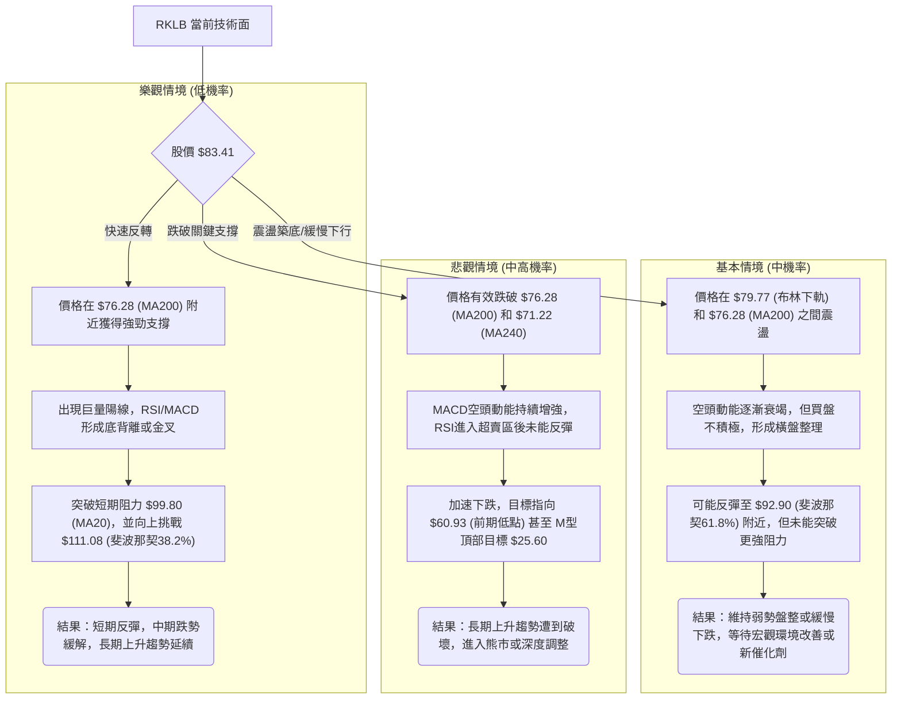

**解讀：**
*   **樂觀情境：** 雖然 RKLB 處於超賣區，但要實現快速反轉需要極其強勁的買盤和利好消息刺激，目前機率較低。
*   **基本情境：** 考慮到 ADX 顯示弱趨勢且空頭主導，價格可能在當前超賣狀態下進行小幅反彈後，再次面臨阻力並進入橫盤整理或緩慢下行，等待新的趨勢方向。
*   **悲觀情境：** RKLB 的中短期均線已形成空頭排列，且跌破了斐波那契61.8%回調位。若無法守住 MA200 ($76.28) 這一長期生命線，則可能引發更大規模的止損盤，加速下跌至 $60.93 甚至更低的 M型頂部理論目標，這是一個需要高度警惕的風險。

### 🛡️ 風險管理重要提醒

1.  **嚴格止損：** 無論採用何種策略，務必設定並嚴格執行止損點。在 RKLB 這種高波動性股票中，止損是保護資本的關鍵。建議使用 ATR 結合關鍵支撐/阻力來設定止損。
2.  **倉位控制：** 鑑於 RKLB 的高波動性和當前的弱勢，建議採用較小的倉位進行交易，避免重倉。對於激進型做多策略，倉位應極小。
3.  **分批建倉/平倉：** 不要一次性投入所有資金。可以考慮分批建倉以降低平均成本，分批平倉以鎖定利潤。
4.  **順勢而為：** 儘管 RKLB 處於超賣區，但目前中短期趨勢仍是空頭。逆勢抄底風險極高，建議等待明確的築底訊號或趨勢反轉確認。逢高做空可能更符合當前趨勢。
5.  **密切監控：** 每日或每週密切關注上述關鍵監控指標的變化，特別是價格對 MA200 ($76.28) 和斐波那契76.4% ($81.08) 的測試情況。
6.  **宏觀環境：** 關注整體市場情緒，特別是科技股和成長股的表現，以及太空產業的相關新聞。
7.  **新聞事件：** 雖然目前無重大新聞，但任何關於發射任務、合同、財報等消息都可能對 RKLB 股價產生劇烈影響。

---

## 📋 報告總結

```
╔════════════════════════════════════════════════════════════════╗
║                   RKLB 技術分析報告總結                          ║
╠════════════════════════════════════════════════════════════════╣
║ 報告日期：2026-07-08                                           ║
║ 當前價格：$83.41                                               ║
║ 分析評級：⚖️ 偏空震盪 (短期空頭主導，長期回調，有超賣跡象)       ║
║                                                                ║
║ 關鍵結論：                                                     ║
║ ├─ 長期趨勢：🟢 上升趨勢中的深度回調，MA200 ($76.28) 提供強支撐。  ║
║ ├─ 中期趨勢：🔴 明確下降趨勢，價格跌破MA50 ($106.97)，形成下降通道。 ║
║ ├─ 短期趨勢：🔴 極度弱勢下跌，價格緊貼布林下軌，RSI/Stochastics超賣。║
║ ├─ 關鍵支撐：$81.08 (斐波那契76.4%)，其次是 $79.77 (布林下軌) 和 $76.28 (MA200)。║
║ ├─ 關鍵阻力：$99.80 (MA20)，其次是 $100.46 (近期反彈高點) 和 $106.97 (MA50)。║
║ └─ 分析師目標：$114.10 (平均目標價，遠高於現價，但技術面短期偏弱)。 ║
║                                                                ║
║ 最優策略組合：                                                 ║
║ 1. 🥇 最佳機會：**逢高做空** — 在價格反彈至 $98.50 附近阻力位受阻時進場，目標 $81.08 / $76.28，止損 $102.00。此策略順應中短期趨勢，風險報酬比優異。║
║ 2. 🥈 次選機會：**等待築底** — 規避當前高波動和弱勢，等待價格在 $76.28 (MA200) 附近企穩，並出現明確的底部反轉訊號 (如放量陽線、MACD金叉等) 後再考慮進場。║
║ 3. 🥉 保守選擇：**觀望為主** — 對於風險承受能力較低的投資者，RKLB 當前走勢複雜，多空拉鋸，應保持觀望，避免盲目進場。                               ║
╚════════════════════════════════════════════════════════════════╝
```

---

> ⚠️ **免責聲明**：本報告為 AI 自動生成之技術分析，所有數據及估算均基於提供的歷史價格資訊。本報告**僅供研究與學術參考**，**不構成任何投資建議**。投資有風險，入市需謹慎。

---

*報告生成時間：2026-07-08 ｜ 數據來源：Yahoo Finance ｜ 分析框架：多時框技術分析*