<details>
<summary>📊 靜態圖表 (點擊展開)</summary>
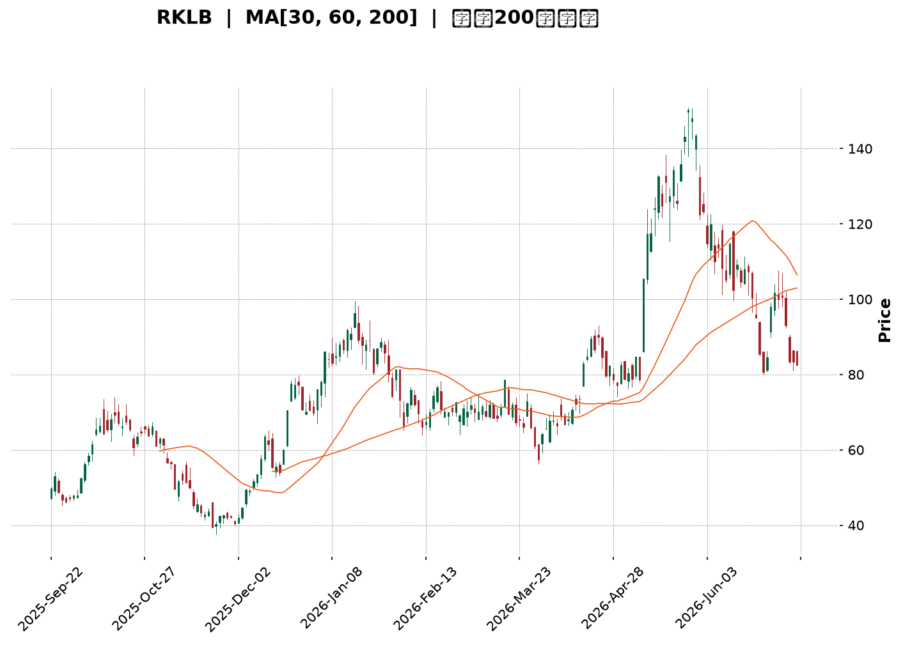
</details>

<html>
<head><meta charset="utf-8" /></head>
<body>
    <div style="height:500px; width:100%;">                        <script>window.PlotlyConfig = {MathJaxConfig: 'local'};</script>
        <script charset="utf-8" src="https://cdn.plot.ly/plotly-3.7.0.min.js" integrity="sha256-jvTGqxNp8AGWEcvNLVuKr+8j5dGe9Yw51LQkmDH+IYA=" crossorigin="anonymous"></script>                <div id="candlestick-chart" class="plotly-graph-div" style="height:100%; width:100%;"></div>            <script>                window.PLOTLYENV=window.PLOTLYENV || {};                                if (document.getElementById("candlestick-chart")) {                    Plotly.newPlot(                        "candlestick-chart",                        [{"close":{"dtype":"f8","bdata":"AAAAIK7nSEAAAADgenRKQAAAAOBRWEhAAAAA4KNQR0AAAACgRyFHQAAAAKBHgUdAAAAA4Hr0R0AAAAAAKfxHQAAAAAApPEpAAAAA4HoUTEAAAAAAAEBNQAAAAKBHwU5AAAAAANdTUEAAAABA4ZpQQAAAAOCjEFBAAAAAQOFaUEAAAACA6wFRQAAAAKBHUVFAAAAAAADAUEAAAACgR5FQQAAAAGBm1lBAAAAAoJlZUEAAAADgUUhOQAAAAMD1yE9AAAAAANcjUEAAAAAgrmdQQAAAAAAA4E9AAAAAgD2KUEAAAACAwnVOQAAAAKBwfU9AAAAAIIWrTkAAAADA9UhMQAAAAIDCNUxAAAAAgBTOSEAAAACA69FJQAAAAEAz80lAAAAAYLieSUAAAAAAKfxIQAAAAAAAoEZAAAAAwB7FRkAAAAAgrqdFQAAAAADXY0VAAAAAIFzPRUAAAACgcL1DQAAAAGBmJkRAAAAAoJk5RUAAAADAzExFQAAAAEAK90RAAAAAgOsRRUAAAAAgXC9EQAAAAEAz80RAAAAAAClcRkAAAAAgXK9IQAAAAEAKh0hAAAAAIK7HSUAAAABACrdKQAAAAGCPwkxAAAAAANfDT0AAAABguL5OQAAAAOB6tEtAAAAAYLi+S0AAAABA4fpKQAAAAIDC9U1AAAAAoEehUUAAAABAM2NTQAAAACCFS1NAAAAAIIVLU0AAAACgmalRQAAAACCuh1FAAAAAwMycUUAAAADgo3BRQAAAACBc\u002f1JAAAAAwPWIU0AAAACA64FVQAAAAMAeBVVAAAAAwB7FVEAAAABgZjZVQAAAAKCZ+VVAAAAAwB6lVUAAAABAM\u002fNWQAAAAOCjsFZAAAAAQDMTWEAAAACAPUpWQAAAAOB69FVAAAAAYLj+VUAAAACgmTlWQAAAAGC4HlRAAAAAAADAVUAAAADgeiRWQAAAACCFa1VAAAAA4HoEVEAAAACgmYlSQAAAAKBHUVRAAAAAQApHUkAAAADgepRQQAAAAOB6FFJAAAAAgML1UkAAAACA6wFSQAAAACCuZ1FAAAAA4KOAUEAAAAAAKdxQQAAAAMD1eFFAAAAAQOGaUkAAAADAHiVTQAAAAEAKt1FAAAAAoHCNUUAAAACAFH5RQAAAAMDMjFFAAAAAoJkpUkAAAABgZkZRQAAAAIAUvlFAAAAA4FGIUUAAAACAPfpRQAAAAAAAgFFAAAAAQAqHUUAAAABguN5RQAAAACCFO1FAAAAAoHD9UUAAAAAgrhdRQAAAAIA9GlFAAAAAANfTUUAAAACAwqVTQAAAAGC4XlFAAAAAIIX7UUAAAABguM5QQAAAAAAAAFFAAAAA4HqEUEAAAADgUThSQAAAAAApfFBAAAAAQAp3TkAAAADgo7BMQAAAAIAUDlBAAAAAoEdhUEAAAABguO5QQAAAAEDh6lBAAAAA4HqUUEAAAADAHkVRQAAAACBcr1BAAAAAQDMDUUAAAAAgrqdRQAAAAIAUDlJAAAAAYGZmUkAAAAAghbtUQAAAAEAzM1VAAAAAoHBdVkAAAADA9ahVQAAAAGCPglZAAAAAYGYmVUAAAAAghetTQAAAAGCPklRAAAAAgMKlU0AAAACgR0FTQAAAAOCjoFRAAAAAANezU0AAAAAA1xNUQAAAAOCjsFNAAAAAoJkpVUAAAADAHqVTQAAAAIAUXlpAAAAAYGZWXUAAAAAA12NdQAAAAKCZCV9AAAAAoJmRYEAAAACgRzFfQAAAAMAeZWBAAAAAANfTX0AAAADA9chgQAAAAMDMXF9AAAAA4FH4YEAAAABgZuZhQAAAACBcx2JAAAAAwPWAYkAAAAAgXO9hQAAAAMD1mF5AAAAA4HrUXkAAAADAzKxcQAAAAMDM\u002fF1AAAAAwB6FW0AAAACgmWlcQAAAAGC4DltAAAAAQDNDWkAAAACA67FcQAAAAMD1mFlAAAAAAABQW0AAAADgUShaQAAAAGC4\u002flpAAAAAIFzPWkAAAABgjxJZQAAAACCux1dAAAAAgD1aVUAAAAAAKSxUQAAAAGCPIlVAAAAA4KOAWEAAAACgmWlZQAAAAOB6BFlAAAAAoHAdWUAAAACAwkVXQAAAAIA92lRAAAAAYGbWVEAAAABAM6NUQA=="},"high":{"dtype":"f8","bdata":"AAAAoEchSUAAAABgORRLQAAAAKBwPUpAAAAAIFxPSEAAAADgUdhHQAAAAMDMDEhAAAAAYLj+R0AAAACAwrVIQAAAAEAzU0pAAAAAIDF4TEAAAACgR6FNQAAAACCuR09AAAAAAC0iUUAAAABgjyJRQAAAAAAAYFJAAAAAACmcUUAAAABA4WpRQAAAAIAUflJAAAAAAAAQUkAAAAAAACBRQAAAACCFC1JAAAAAYI8CUUAAAACgRwFQQAAAAMDMLFBAAAAAIIWLUEAAAABgZpZQQAAAAGCPolBAAAAAwPXYUEAAAAAghUtQQAAAAKCZuU9AAAAAwMyMT0AAAABguL5NQAAAAADXo0xAAAAAQOEaTEAAAADAzAxKQAAAAAAAQEtAAAAAQOF6TEAAAACAPapLQAAAAOCjsEhAAAAAACmcR0AAAADAS9dGQAAAAIAUzkVAAAAAANdDRkAAAACgRyFHQAAAAIDChURAAAAAANdDRUAAAABACmdFQAAAACCFy0VAAAAAoJlZRUAAAABgZqZEQAAAAGC4fkVAAAAAYLheRkAAAABACtdIQAAAAKCZ2UhAAAAAIFwvSkAAAAAAAOBKQAAAAIA9ak1AAAAAoJkJUEAAAAAghUtQQAAAAADXI1BAAAAAoHBdTEAAAADgenRMQAAAAAAAIE5AAAAAANejUUAAAADAzJxTQAAAACCFy1NAAAAAwB71U0AAAAAgXD9TQAAAACBcL1JAAAAAACmsUkAAAABAi0xSQAAAACBcD1NAAAAAAACQU0AAAAAAAJBVQAAAAKBwfVVAAAAAIK53VkAAAAAghRtWQAAAAIDCNVZAAAAA4KduVkAAAAAAKQxXQAAAAEBgHVdAAAAAwB7lWEAAAACgR5FYQAAAAAAA0FZAAAAAoJlZVkAAAADAzJxXQAAAAIA9ylVAAAAAAADAVUAAAABAM3NWQAAAAAAAQFZAAAAA4HpUVkAAAADAzCxUQAAAAOB6VFRAAAAAYGZWVEAAAAAgXD9SQAAAAIA9KlJAAAAAQDMzU0AAAABACvdSQAAAAKCZWVJAAAAAwMwcUUAAAABgZmZRQAAAACBcv1FAAAAAwPXwUkAAAABACkdTQAAAAMDMjFNAAAAAAADQUUAAAAAghYNRQAAAAGBm9lFAAAAAIFwvUkAAAACAwmVRQAAAAGBmBlJAAAAAAABQUkAAAABgZoZSQAAAAADXE1JAAAAAQArHUkAAAAAAAAhSQAAAAADXO1JAAAAAQDNTUkAAAABgZiZSQAAAAADX01FAAAAA4FEYUkAAAABA4apTQAAAAOBROFNAAAAAYLguUkAAAABguH5SQAAAAMDMXFFAAAAAYGYmUUAAAAAA18NSQAAAAIDCBVJAAAAAgBSGUEAAAACA69FOQAAAAMAeJVBAAAAAQOEqUUAAAADA9VhRQAAAAOB6lFFAAAAAQDMTUUAAAACAwGpSQAAAAGCPclFAAAAAANeDUUAAAABAM+NRQAAAAAAAsFJAAAAAgMKlUkAAAAAgXN9UQAAAACBcv1VAAAAAYGaWVkAAAADAzPxWQAAAAGBmRldAAAAAQDOTVkAAAACAPZpVQAAAAGC4nlRAAAAAgOtxVEAAAADgo4BTQAAAAIDC5VRAAAAAYI\u002fyVEAAAADgT3VUQAAAAAAAwFRAAAAAIIUrVUAAAABgjzJVQAAAACCuZ1pAAAAAACn8XkAAAAAgXF9eQAAAACBcz19AAAAAgMKlYEAAAAAA10tgQAAAAAApTGFAAAAAgD0yYEAAAABAM+tgQAAAAADXW2BAAAAA4FF4YUAAAAAAAEBiQAAAAAAA4GJAAAAAYI\u002faYkAAAAAAAABiQAAAAAAp9GBAAAAAwMwMYEAAAADgUaBeQAAAAOBRqF5AAAAAYLh+XUAAAAAAABBdQAAAAGCP8l1AAAAAoHD9W0AAAABA4cJcQAAAAMAgmF1AAAAAgOuxW0AAAAAAACBbQAAAAIDC1VtAAAAAQDNjW0AAAACgmdlaQAAAAGC4bllAAAAAQDOTV0AAAABACodVQAAAAIDrkVVAAAAAwB7FWEAAAACAPQpaQAAAAGBm5lpAAAAAIFy\u002fWkAAAABgZoZZQAAAACBcr1ZAAAAAAACgVUAAAABAM5NVQA=="},"hovertemplate":"\u003cb\u003e%{x|%Y-%m-%d}\u003c\u002fb\u003e\u003cbr\u003e\u958b: $%{open:.2f}\u003cbr\u003e\u9ad8: $%{high:.2f}\u003cbr\u003e\u4f4e: $%{low:.2f}\u003cbr\u003e\u6536: $%{close:.2f}\u003cextra\u003e\u003c\u002fextra\u003e","low":{"dtype":"f8","bdata":"AAAAYGZmR0AAAADgevRHQAAAAEAKN0hAAAAAQOGaRkAAAACAPepGQAAAACBcL0dAAAAAoEdBR0AAAAAgXI9HQAAAAKBHQUhAAAAAoEehSUAAAABgZuZLQAAAAGCPgkxAAAAAQDPTT0AAAABA4RpQQAAAAMD1CFBAAAAA4M4nUEAAAADgURhPQAAAAMAexVBAAAAAQDObUEAAAACgmdlPQAAAAEAzq1BAAAAAQAo3UEAAAADgejRNQAAAAAAAYE5AAAAAQDPTT0AAAACgmQlQQAAAAIAUzk9AAAAAoHC9T0AAAACA63FOQAAAAEAzM05AAAAA4KOQTUAAAACgR0FMQAAAACBcb0tAAAAA4Hq0SEAAAADgzidHQAAAAKBHYUlAAAAAQOGaSUAAAADgetRIQAAAACBcL0ZAAAAAYGamRUAAAADAzBxFQAAAAKBwnURAAAAAQAo3RUAAAADA9ahDQAAAAMD1yEJAAAAAYGamQ0AAAADgozBEQAAAAOCjsERAAAAAYGbmREAAAACgcP1DQAAAAIDCNURAAAAAAADAREAAAADA9WhGQAAAAKCZ2UdAAAAAACmcSEAAAAAghStJQAAAAAAAIEpAAAAAwMxsTEAAAABgZuZNQAAAAIA9iktAAAAAQApXSkAAAABA4YpKQAAAAADXA0xAAAAAwJ1fTkAAAADAIDBSQAAAAGCPUlJAAAAAoEOzUkAAAADA9ZhRQAAAAKCbVFFAAAAAACmcUUAAAADgUUhRQAAAAGBmtlBAAAAAANfTUUAAAABAM4NSQAAAAGBmdlRAAAAA4KOQVEAAAADAzJxUQAAAAODQ2lRAAAAAoJlpVUAAAAAAACBVQAAAAKCZqVVAAAAAoJkZV0AAAABAMxNWQAAAAKBwrVRAAAAAwHZWVEAAAAAgrodVQAAAAOCjAFRAAAAAAACAVEAAAADAyoFVQAAAAAAAwFRAAAAAoEeBU0AAAACAQXhSQAAAAKBH8VJAAAAAQAgkUUAAAADAzExQQAAAAAAAwFBAAAAAAACwUUAAAABAM+NRQAAAAKBHwVBAAAAAIFzvT0AAAAAAAGBQQAAAAAAAQFBAAAAAwEt\u002fUUAAAABgZhZSQAAAAKCZWVFAAAAAAAAgUUAAAABgZqZQQAAAAOBROFFAAAAAANczUUAAAABgZgZQQAAAAMDMnFBAAAAAACmMUEAAAACAFF5RQAAAAIDC1VBAAAAA4KMIUUAAAADgevRQQAAAAIC+J1FAAAAAwB4VUUAAAACA6xFRQAAAAAAp3FBAAAAAQOEqUUAAAACgR9FRQAAAAKCZWVFAAAAAAAAAUUAAAADA9ZhQQAAAAEAzg1BAAAAAoHAdUEAAAAAAKTxRQAAAAIDCZVBAAAAAwMwsTkAAAABg5RBMQAAAAADXg01AAAAAQDNTUEAAAACAFO5OQAAAAGBmplBAAAAAQOH6T0AAAABg5\u002fNQQAAAAEDholBAAAAAgMKVUEAAAACAwqVQQAAAAGC4nlFAAAAAYGZmUUAAAACgmTlTQAAAAGBm5lRAAAAAYGYmVUAAAAAAAHBVQAAAAOCj8FVAAAAAAClkVEAAAADAHsVTQAAAAMB0Q1NAAAAAYGZmU0AAAAAgXH9SQAAAAIAUXlNAAAAAIIWbU0AAAAAAABBTQAAAAADXI1NAAAAAQAq3U0AAAAAghXtTQAAAACCud1VAAAAAAAAAWkAAAACAPRpcQAAAAMD1OF1AAAAAANdTXkAAAABAM3NeQAAAAKDxal9AAAAAYLjOXEAAAACAFA5fQAAAAEAz815AAAAAgOtpYEAAAACA61FhQAAAAMAePWFAAAAAANfLYUAAAACgmcFgQAAAAAAAQF5AAAAAANejXkAAAACAPWpcQAAAAMD1mFtAAAAAYLiuWkAAAAAAAMBbQAAAAMDMTFlAAAAAgD0aWkAAAACgmVlaQAAAAEAK51hAAAAAQDNzWkAAAADgesRZQAAAAGCPAlpAAAAAoHA9WUAAAAAAACBYQAAAAOCjuFdAAAAAYGY2VUAAAAAAAABUQAAAAGC4LlRAAAAAYGZ2VkAAAADA9ehXQAAAACCuZ1hAAAAAgD16WEAAAABAMxNXQAAAAGBmtlRAAAAAAABAVEAAAABgj5pUQA=="},"name":"\u50f9\u683c","open":{"dtype":"f8","bdata":"AAAA4KOQR0AAAABAM4NIQAAAAIDC5UlAAAAAAAAASEAAAABgZqZHQAAAAEAzs0dAAAAAQOGaR0AAAADgo7BHQAAAAIDrUUhAAAAAYGYGSkAAAABguG5MQAAAAKBHgU1AAAAAoJkJUEAAAACgmTlQQAAAAEAzs1FAAAAA4FH4UEAAAACAwlVQQAAAAKBHgVFAAAAA4HqEUUAAAADA9XhQQAAAAOCjSFFAAAAAYI8CUUAAAAAAKXxPQAAAACCux05AAAAAANczUEAAAAAAKYxQQAAAAEAza1BAAAAAoEcJUEAAAAAAAEBQQAAAAGCP4k5AAAAAANeDT0AAAABgZuZMQAAAAOB6VExAAAAAQOEaTEAAAACgGNRHQAAAAGC43kpAAAAAAAAATEAAAABACvdJQAAAAKBHYUhAAAAAQOHaRUAAAABAM5NGQAAAAAApHEVAAAAAAABARUAAAACAPQpHQAAAAIA96kNAAAAAoEdhREAAAAAA1wNFQAAAAGC4nkVAAAAAoEdBRUAAAABAM5NEQAAAACCuR0RAAAAAYI\u002fyREAAAABgj9JGQAAAAAAAcEhAAAAAgD0KSUAAAACgcJ1JQAAAAOBRuEpAAAAAoEfBTEAAAAAAAEBPQAAAAOCnhk9AAAAA4FEYS0AAAADAzAxMQAAAAKCZGUxAAAAAIFyPTkAAAAAAKTxSQAAAAADXc1JAAAAAgD2CU0AAAAAghStTQAAAAAAAYFFAAAAAoJlBUkAAAAAAAOBRQAAAAOBRqFFAAAAAIK6nUkAAAADgo3BTQAAAAGBmBlVAAAAAAABgVUAAAACgmSFVQAAAAGC4PlVAAAAAwPVIVkAAAABgZpZVQAAAAMD1UFZAAAAAoJkhV0AAAADAzGxXQAAAAKBHgVZAAAAA4FGYVUAAAAAghUNWQAAAACCur1VAAAAAwPW4VEAAAACAFM5VQAAAAAAp\u002fFVAAAAAAABAVUAAAACAPcpTQAAAAGBmplNAAAAAYGZWVEAAAABguH5RQAAAAAAAQFFAAAAAoJkBUkAAAACAFKZSQAAAAOBRSFJAAAAAgOvhUEAAAADgeqxQQAAAAEBghVBAAAAAAADAUUAAAACgmTlSQAAAACDZ3lJAAAAA4FEwUUAAAADgUThRQAAAAIAUxlFAAAAAQOGCUUAAAACAwuVQQAAAACCFq1BAAAAAYLg2UUAAAAAA17NRQAAAAEDhulFAAAAA4KMIUUAAAADA9VhRQAAAAIDClVFAAAAAQDMzUUAAAADAzPxRQAAAAKCZSVFAAAAAwMxUUUAAAABgZt5RQAAAAGCPAlNAAAAA4Ho0UUAAAAAAAABSQAAAAKBwBVFAAAAAAADAUEAAAAAAKTxRQAAAAMDMzFFAAAAA4KOAUEAAAACgmblOQAAAAEDh2k5AAAAAAABgUEAAAADAzBxPQAAAAGC47lBAAAAAIFzHUEAAAAAAAABSQAAAAADXQ1FAAAAAwMzsUEAAAABAM8NQQAAAACCFY1JAAAAAoHBlUkAAAACAFD5TQAAAAMAeBVVAAAAAYGY2VUAAAADAHpVWQAAAAIDCnVZAAAAAYGZ2VkAAAACAwpVVQAAAAAAp7FNAAAAAwMwEVEAAAABACndTQAAAAEAzY1NAAAAAgOvhVEAAAABACpdTQAAAAGBmplRAAAAAIK7nU0AAAACgcC1VQAAAAIA9glVAAAAAoEdRWkAAAADgozBcQAAAAKBH+V5AAAAAYGbGXkAAAABAMwNgQAAAAAApmGBAAAAAgBR+X0AAAABguN5fQAAAAMD1iF9AAAAAwB5tYEAAAABA4b5hQAAAAEAKt2JAAAAAoHBlYkAAAACAFH5hQAAAAAApjGBAAAAAgMJVX0AAAADAHuVdQAAAAKBwRVxAAAAAoEeRXEAAAABA4apcQAAAAKCZmV1AAAAAwMzsWkAAAACAwqVaQAAAAKBHgV1AAAAAoHD9WkAAAACgcO1aQAAAACCuB1pAAAAAwB41W0AAAAAgXL9aQAAAAKBHAVhAAAAAYGZ2V0AAAABACodVQAAAAEAKR1RAAAAAQOHSVkAAAADAzExYQAAAAOB6TFlAAAAAIFw\u002fWUAAAAAghRtZQAAAAOCjgFZAAAAAAACgVUAAAABA4ZJVQA=="},"x":["2025-09-22T00:00:00-04:00","2025-09-23T00:00:00-04:00","2025-09-24T00:00:00-04:00","2025-09-25T00:00:00-04:00","2025-09-26T00:00:00-04:00","2025-09-29T00:00:00-04:00","2025-09-30T00:00:00-04:00","2025-10-01T00:00:00-04:00","2025-10-02T00:00:00-04:00","2025-10-03T00:00:00-04:00","2025-10-06T00:00:00-04:00","2025-10-07T00:00:00-04:00","2025-10-08T00:00:00-04:00","2025-10-09T00:00:00-04:00","2025-10-10T00:00:00-04:00","2025-10-13T00:00:00-04:00","2025-10-14T00:00:00-04:00","2025-10-15T00:00:00-04:00","2025-10-16T00:00:00-04:00","2025-10-17T00:00:00-04:00","2025-10-20T00:00:00-04:00","2025-10-21T00:00:00-04:00","2025-10-22T00:00:00-04:00","2025-10-23T00:00:00-04:00","2025-10-24T00:00:00-04:00","2025-10-27T00:00:00-04:00","2025-10-28T00:00:00-04:00","2025-10-29T00:00:00-04:00","2025-10-30T00:00:00-04:00","2025-10-31T00:00:00-04:00","2025-11-03T00:00:00-05:00","2025-11-04T00:00:00-05:00","2025-11-05T00:00:00-05:00","2025-11-06T00:00:00-05:00","2025-11-07T00:00:00-05:00","2025-11-10T00:00:00-05:00","2025-11-11T00:00:00-05:00","2025-11-12T00:00:00-05:00","2025-11-13T00:00:00-05:00","2025-11-14T00:00:00-05:00","2025-11-17T00:00:00-05:00","2025-11-18T00:00:00-05:00","2025-11-19T00:00:00-05:00","2025-11-20T00:00:00-05:00","2025-11-21T00:00:00-05:00","2025-11-24T00:00:00-05:00","2025-11-25T00:00:00-05:00","2025-11-26T00:00:00-05:00","2025-11-28T00:00:00-05:00","2025-12-01T00:00:00-05:00","2025-12-02T00:00:00-05:00","2025-12-03T00:00:00-05:00","2025-12-04T00:00:00-05:00","2025-12-05T00:00:00-05:00","2025-12-08T00:00:00-05:00","2025-12-09T00:00:00-05:00","2025-12-10T00:00:00-05:00","2025-12-11T00:00:00-05:00","2025-12-12T00:00:00-05:00","2025-12-15T00:00:00-05:00","2025-12-16T00:00:00-05:00","2025-12-17T00:00:00-05:00","2025-12-18T00:00:00-05:00","2025-12-19T00:00:00-05:00","2025-12-22T00:00:00-05:00","2025-12-23T00:00:00-05:00","2025-12-24T00:00:00-05:00","2025-12-26T00:00:00-05:00","2025-12-29T00:00:00-05:00","2025-12-30T00:00:00-05:00","2025-12-31T00:00:00-05:00","2026-01-02T00:00:00-05:00","2026-01-05T00:00:00-05:00","2026-01-06T00:00:00-05:00","2026-01-07T00:00:00-05:00","2026-01-08T00:00:00-05:00","2026-01-09T00:00:00-05:00","2026-01-12T00:00:00-05:00","2026-01-13T00:00:00-05:00","2026-01-14T00:00:00-05:00","2026-01-15T00:00:00-05:00","2026-01-16T00:00:00-05:00","2026-01-20T00:00:00-05:00","2026-01-21T00:00:00-05:00","2026-01-22T00:00:00-05:00","2026-01-23T00:00:00-05:00","2026-01-26T00:00:00-05:00","2026-01-27T00:00:00-05:00","2026-01-28T00:00:00-05:00","2026-01-29T00:00:00-05:00","2026-01-30T00:00:00-05:00","2026-02-02T00:00:00-05:00","2026-02-03T00:00:00-05:00","2026-02-04T00:00:00-05:00","2026-02-05T00:00:00-05:00","2026-02-06T00:00:00-05:00","2026-02-09T00:00:00-05:00","2026-02-10T00:00:00-05:00","2026-02-11T00:00:00-05:00","2026-02-12T00:00:00-05:00","2026-02-13T00:00:00-05:00","2026-02-17T00:00:00-05:00","2026-02-18T00:00:00-05:00","2026-02-19T00:00:00-05:00","2026-02-20T00:00:00-05:00","2026-02-23T00:00:00-05:00","2026-02-24T00:00:00-05:00","2026-02-25T00:00:00-05:00","2026-02-26T00:00:00-05:00","2026-02-27T00:00:00-05:00","2026-03-02T00:00:00-05:00","2026-03-03T00:00:00-05:00","2026-03-04T00:00:00-05:00","2026-03-05T00:00:00-05:00","2026-03-06T00:00:00-05:00","2026-03-09T00:00:00-04:00","2026-03-10T00:00:00-04:00","2026-03-11T00:00:00-04:00","2026-03-12T00:00:00-04:00","2026-03-13T00:00:00-04:00","2026-03-16T00:00:00-04:00","2026-03-17T00:00:00-04:00","2026-03-18T00:00:00-04:00","2026-03-19T00:00:00-04:00","2026-03-20T00:00:00-04:00","2026-03-23T00:00:00-04:00","2026-03-24T00:00:00-04:00","2026-03-25T00:00:00-04:00","2026-03-26T00:00:00-04:00","2026-03-27T00:00:00-04:00","2026-03-30T00:00:00-04:00","2026-03-31T00:00:00-04:00","2026-04-01T00:00:00-04:00","2026-04-02T00:00:00-04:00","2026-04-06T00:00:00-04:00","2026-04-07T00:00:00-04:00","2026-04-08T00:00:00-04:00","2026-04-09T00:00:00-04:00","2026-04-10T00:00:00-04:00","2026-04-13T00:00:00-04:00","2026-04-14T00:00:00-04:00","2026-04-15T00:00:00-04:00","2026-04-16T00:00:00-04:00","2026-04-17T00:00:00-04:00","2026-04-20T00:00:00-04:00","2026-04-21T00:00:00-04:00","2026-04-22T00:00:00-04:00","2026-04-23T00:00:00-04:00","2026-04-24T00:00:00-04:00","2026-04-27T00:00:00-04:00","2026-04-28T00:00:00-04:00","2026-04-29T00:00:00-04:00","2026-04-30T00:00:00-04:00","2026-05-01T00:00:00-04:00","2026-05-04T00:00:00-04:00","2026-05-05T00:00:00-04:00","2026-05-06T00:00:00-04:00","2026-05-07T00:00:00-04:00","2026-05-08T00:00:00-04:00","2026-05-11T00:00:00-04:00","2026-05-12T00:00:00-04:00","2026-05-13T00:00:00-04:00","2026-05-14T00:00:00-04:00","2026-05-15T00:00:00-04:00","2026-05-18T00:00:00-04:00","2026-05-19T00:00:00-04:00","2026-05-20T00:00:00-04:00","2026-05-21T00:00:00-04:00","2026-05-22T00:00:00-04:00","2026-05-26T00:00:00-04:00","2026-05-27T00:00:00-04:00","2026-05-28T00:00:00-04:00","2026-05-29T00:00:00-04:00","2026-06-01T00:00:00-04:00","2026-06-02T00:00:00-04:00","2026-06-03T00:00:00-04:00","2026-06-04T00:00:00-04:00","2026-06-05T00:00:00-04:00","2026-06-08T00:00:00-04:00","2026-06-09T00:00:00-04:00","2026-06-10T00:00:00-04:00","2026-06-11T00:00:00-04:00","2026-06-12T00:00:00-04:00","2026-06-15T00:00:00-04:00","2026-06-16T00:00:00-04:00","2026-06-17T00:00:00-04:00","2026-06-18T00:00:00-04:00","2026-06-22T00:00:00-04:00","2026-06-23T00:00:00-04:00","2026-06-24T00:00:00-04:00","2026-06-25T00:00:00-04:00","2026-06-26T00:00:00-04:00","2026-06-29T00:00:00-04:00","2026-06-30T00:00:00-04:00","2026-07-01T00:00:00-04:00","2026-07-02T00:00:00-04:00","2026-07-06T00:00:00-04:00","2026-07-07T00:00:00-04:00","2026-07-08T00:00:00-04:00","2026-07-09T00:00:00-04:00"],"type":"candlestick"},{"hovertemplate":"MA30: $%{y:.2f}\u003cextra\u003e\u003c\u002fextra\u003e","line":{"color":"#2196F3","dash":"dash","width":2},"mode":"lines","name":"MA30","x":["2025-09-22T00:00:00-04:00","2025-09-23T00:00:00-04:00","2025-09-24T00:00:00-04:00","2025-09-25T00:00:00-04:00","2025-09-26T00:00:00-04:00","2025-09-29T00:00:00-04:00","2025-09-30T00:00:00-04:00","2025-10-01T00:00:00-04:00","2025-10-02T00:00:00-04:00","2025-10-03T00:00:00-04:00","2025-10-06T00:00:00-04:00","2025-10-07T00:00:00-04:00","2025-10-08T00:00:00-04:00","2025-10-09T00:00:00-04:00","2025-10-10T00:00:00-04:00","2025-10-13T00:00:00-04:00","2025-10-14T00:00:00-04:00","2025-10-15T00:00:00-04:00","2025-10-16T00:00:00-04:00","2025-10-17T00:00:00-04:00","2025-10-20T00:00:00-04:00","2025-10-21T00:00:00-04:00","2025-10-22T00:00:00-04:00","2025-10-23T00:00:00-04:00","2025-10-24T00:00:00-04:00","2025-10-27T00:00:00-04:00","2025-10-28T00:00:00-04:00","2025-10-29T00:00:00-04:00","2025-10-30T00:00:00-04:00","2025-10-31T00:00:00-04:00","2025-11-03T00:00:00-05:00","2025-11-04T00:00:00-05:00","2025-11-05T00:00:00-05:00","2025-11-06T00:00:00-05:00","2025-11-07T00:00:00-05:00","2025-11-10T00:00:00-05:00","2025-11-11T00:00:00-05:00","2025-11-12T00:00:00-05:00","2025-11-13T00:00:00-05:00","2025-11-14T00:00:00-05:00","2025-11-17T00:00:00-05:00","2025-11-18T00:00:00-05:00","2025-11-19T00:00:00-05:00","2025-11-20T00:00:00-05:00","2025-11-21T00:00:00-05:00","2025-11-24T00:00:00-05:00","2025-11-25T00:00:00-05:00","2025-11-26T00:00:00-05:00","2025-11-28T00:00:00-05:00","2025-12-01T00:00:00-05:00","2025-12-02T00:00:00-05:00","2025-12-03T00:00:00-05:00","2025-12-04T00:00:00-05:00","2025-12-05T00:00:00-05:00","2025-12-08T00:00:00-05:00","2025-12-09T00:00:00-05:00","2025-12-10T00:00:00-05:00","2025-12-11T00:00:00-05:00","2025-12-12T00:00:00-05:00","2025-12-15T00:00:00-05:00","2025-12-16T00:00:00-05:00","2025-12-17T00:00:00-05:00","2025-12-18T00:00:00-05:00","2025-12-19T00:00:00-05:00","2025-12-22T00:00:00-05:00","2025-12-23T00:00:00-05:00","2025-12-24T00:00:00-05:00","2025-12-26T00:00:00-05:00","2025-12-29T00:00:00-05:00","2025-12-30T00:00:00-05:00","2025-12-31T00:00:00-05:00","2026-01-02T00:00:00-05:00","2026-01-05T00:00:00-05:00","2026-01-06T00:00:00-05:00","2026-01-07T00:00:00-05:00","2026-01-08T00:00:00-05:00","2026-01-09T00:00:00-05:00","2026-01-12T00:00:00-05:00","2026-01-13T00:00:00-05:00","2026-01-14T00:00:00-05:00","2026-01-15T00:00:00-05:00","2026-01-16T00:00:00-05:00","2026-01-20T00:00:00-05:00","2026-01-21T00:00:00-05:00","2026-01-22T00:00:00-05:00","2026-01-23T00:00:00-05:00","2026-01-26T00:00:00-05:00","2026-01-27T00:00:00-05:00","2026-01-28T00:00:00-05:00","2026-01-29T00:00:00-05:00","2026-01-30T00:00:00-05:00","2026-02-02T00:00:00-05:00","2026-02-03T00:00:00-05:00","2026-02-04T00:00:00-05:00","2026-02-05T00:00:00-05:00","2026-02-06T00:00:00-05:00","2026-02-09T00:00:00-05:00","2026-02-10T00:00:00-05:00","2026-02-11T00:00:00-05:00","2026-02-12T00:00:00-05:00","2026-02-13T00:00:00-05:00","2026-02-17T00:00:00-05:00","2026-02-18T00:00:00-05:00","2026-02-19T00:00:00-05:00","2026-02-20T00:00:00-05:00","2026-02-23T00:00:00-05:00","2026-02-24T00:00:00-05:00","2026-02-25T00:00:00-05:00","2026-02-26T00:00:00-05:00","2026-02-27T00:00:00-05:00","2026-03-02T00:00:00-05:00","2026-03-03T00:00:00-05:00","2026-03-04T00:00:00-05:00","2026-03-05T00:00:00-05:00","2026-03-06T00:00:00-05:00","2026-03-09T00:00:00-04:00","2026-03-10T00:00:00-04:00","2026-03-11T00:00:00-04:00","2026-03-12T00:00:00-04:00","2026-03-13T00:00:00-04:00","2026-03-16T00:00:00-04:00","2026-03-17T00:00:00-04:00","2026-03-18T00:00:00-04:00","2026-03-19T00:00:00-04:00","2026-03-20T00:00:00-04:00","2026-03-23T00:00:00-04:00","2026-03-24T00:00:00-04:00","2026-03-25T00:00:00-04:00","2026-03-26T00:00:00-04:00","2026-03-27T00:00:00-04:00","2026-03-30T00:00:00-04:00","2026-03-31T00:00:00-04:00","2026-04-01T00:00:00-04:00","2026-04-02T00:00:00-04:00","2026-04-06T00:00:00-04:00","2026-04-07T00:00:00-04:00","2026-04-08T00:00:00-04:00","2026-04-09T00:00:00-04:00","2026-04-10T00:00:00-04:00","2026-04-13T00:00:00-04:00","2026-04-14T00:00:00-04:00","2026-04-15T00:00:00-04:00","2026-04-16T00:00:00-04:00","2026-04-17T00:00:00-04:00","2026-04-20T00:00:00-04:00","2026-04-21T00:00:00-04:00","2026-04-22T00:00:00-04:00","2026-04-23T00:00:00-04:00","2026-04-24T00:00:00-04:00","2026-04-27T00:00:00-04:00","2026-04-28T00:00:00-04:00","2026-04-29T00:00:00-04:00","2026-04-30T00:00:00-04:00","2026-05-01T00:00:00-04:00","2026-05-04T00:00:00-04:00","2026-05-05T00:00:00-04:00","2026-05-06T00:00:00-04:00","2026-05-07T00:00:00-04:00","2026-05-08T00:00:00-04:00","2026-05-11T00:00:00-04:00","2026-05-12T00:00:00-04:00","2026-05-13T00:00:00-04:00","2026-05-14T00:00:00-04:00","2026-05-15T00:00:00-04:00","2026-05-18T00:00:00-04:00","2026-05-19T00:00:00-04:00","2026-05-20T00:00:00-04:00","2026-05-21T00:00:00-04:00","2026-05-22T00:00:00-04:00","2026-05-26T00:00:00-04:00","2026-05-27T00:00:00-04:00","2026-05-28T00:00:00-04:00","2026-05-29T00:00:00-04:00","2026-06-01T00:00:00-04:00","2026-06-02T00:00:00-04:00","2026-06-03T00:00:00-04:00","2026-06-04T00:00:00-04:00","2026-06-05T00:00:00-04:00","2026-06-08T00:00:00-04:00","2026-06-09T00:00:00-04:00","2026-06-10T00:00:00-04:00","2026-06-11T00:00:00-04:00","2026-06-12T00:00:00-04:00","2026-06-15T00:00:00-04:00","2026-06-16T00:00:00-04:00","2026-06-17T00:00:00-04:00","2026-06-18T00:00:00-04:00","2026-06-22T00:00:00-04:00","2026-06-23T00:00:00-04:00","2026-06-24T00:00:00-04:00","2026-06-25T00:00:00-04:00","2026-06-26T00:00:00-04:00","2026-06-29T00:00:00-04:00","2026-06-30T00:00:00-04:00","2026-07-01T00:00:00-04:00","2026-07-02T00:00:00-04:00","2026-07-06T00:00:00-04:00","2026-07-07T00:00:00-04:00","2026-07-08T00:00:00-04:00","2026-07-09T00:00:00-04:00"],"y":{"dtype":"f8","bdata":"AAAAAAAA+H8AAAAAAAD4fwAAAAAAAPh\u002fAAAAAAAA+H8AAAAAAAD4fwAAAAAAAPh\u002fAAAAAAAA+H8AAAAAAAD4fwAAAAAAAPh\u002fAAAAAAAA+H8AAAAAAAD4fwAAAAAAAPh\u002fAAAAAAAA+H8AAAAAAAD4fwAAAAAAAPh\u002fAAAAAAAA+H8AAAAAAAD4fwAAAAAAAPh\u002fAAAAAAAA+H8AAAAAAAD4fwAAAAAAAPh\u002fAAAAAAAA+H8AAAAAAAD4fwAAAAAAAPh\u002fAAAAAAAA+H8AAAAAAAD4fwAAAAAAAPh\u002fAAAAAAAA+H8AAAAAAAD4f83MzPy4z01AIiIi0uoATkBERESEiBBOQM3MzLyDMU5AERERsTo+TkBmZmYWL1VOQGZmZkYMak5AZmZmhkF4TkDv7u4OyoBOQEREROT7YU5AVVVVBaw0TkDe3d193PNNQGZmZlbyo01AMzMzE2dHTUCamZlpddRMQDMzM7M6bkxAZmZmVjkMTEDv7u7+uJ9LQN7d3W0SK0tA3t3drQDBSkCamZn5flJKQKuqqsro5UlAd3d3t6yNSUCrqqrK6F1JQKuqqor6H0lAREREFIPoSECJiIhYgLRIQGZmZobrmUhAvLu727KOSEBERER0IZFIQO\u002fu7v7UcEhAzczMPN9XSEC8u7trvExIQKuqqlqrW0hAVVVVpeK0SEB3d3dHbyNJQHd3d8dLj0lAzczMLPn9SUAAAABANVZKQM3MzOxRwEpAiYiISJoqS0DNzMy8dJtLQJqZmekmKUxAVVVV9W+8TECJiIj4DINNQImIiGjYPU5ARERENDPrTkCJiIh4d59PQERERHzNMVBA7+7uppuQUECrqqpKU\u002f5QQN7d3V2PZlFAzczM7JjUUUCrqqqSeylSQGZmZm4ufFJAvLu7m+DJUkBVVVX1ixVTQGZmZi6HRlNAZmZm7ph4U0CJiIg4XrJTQFVVVa3x8lNAIiIiomEnVEARERERdFJUQDMzMwMAgFRAAAAAgIaFVEC8u7trkW1UQGZmZjYzY1RAREREZFdgVEDe3d0NSWNUQM3MzPw3YlRAiYiIKL9YVEAREREhzFNUQHd3d7fIRlRAmpmZGdk+VEBEREQksCpUQCIiIkJ8DlRAVVVVhQfzU0Dv7u4OSdNTQO\u002fu7n6GrVNAvLu7286PU0ARERGhYV9TQGZmZqYpNVNAZmZmVlX9UkCamZmJiNhSQBEREXGEslJAmpmZCWWMUkBVVVVlO2dSQN7d3Y2XTlJAVVVVtYEuUkARERHRaQNSQImIiBiS3lFAd3d39+HLUUC8u7vLWtVRQDMzM+MzvFFAMzMzc6+5UUDv7u5uoLtRQDMzMyNpslFAq6qqapGdUUARERGhYZ9RQLy7u9uHl1FAAAAAgLGMUUDe3d1lO3dRQKuqqtIia1FAREREPCZYUUDNzMz0REVRQCIiIsp2PlFAzczMVCo2UUDe3d1FRDRRQO\u002fu7qbiLFFAiYiIcBIjUUCJiIiQUCZRQDMzMzv7KFFAiYiIUGIwUUC8u7uz5EdRQCIiInp3Z1FAAAAAKL+QUUARERGJFrFRQBEREWkf3lFAERERiRb5UUBVVVVNNxFSQJqZmaHTLlJAMzMze1s+UkBVVVUNAjtSQDMzMyvOVlJAiYiIkHtlUkBERET8YoFSQJqZmWFXmFJAIiIiivq\u002fUkCJiIiAI8xSQO\u002fu7iZ4IFNAZmZm\u002ftSYU0C8u7tLNxlUQBERERERmVRAMzMzYxAoVUBERETUv6FVQGZmZtYxKVZAIiIigk6rVkBmZmZmZjZXQDMzM+Ols1dAIiIikhhEWEDNzMzs7t5YQImIiMhahVlAzczMfCMkWkC8u7vbT6VaQCIiIgKB9VpAVVVVFb09W0BVVVWVmXlbQN7d3W1ouVtAiYiI6MPvW0Dv7u4OPDhcQCIiIsKSb1xAMzMzcwWoXEAiIiJyk\u002fhcQDMzM5P8Il1AAAAA4OxjXUBmZmbWzpddQKuqqtok1l1AERERAVYGXkDv7u6OpjReQERERBSSHl5AVVVVlW7aXUBmZmamxotdQO\u002fu7k5GN11AzczM3JbtXEAzMzNDRLxcQJqZmfnweVxAvLu7S6lAXEAAAAAQyuhbQO\u002fu7p4aj1tAZmZmxksfW0CrqqrK6J1aQA=="},"type":"scatter"},{"hovertemplate":"MA60: $%{y:.2f}\u003cextra\u003e\u003c\u002fextra\u003e","line":{"color":"#9C27B0","dash":"dash","width":2},"mode":"lines","name":"MA60","x":["2025-09-22T00:00:00-04:00","2025-09-23T00:00:00-04:00","2025-09-24T00:00:00-04:00","2025-09-25T00:00:00-04:00","2025-09-26T00:00:00-04:00","2025-09-29T00:00:00-04:00","2025-09-30T00:00:00-04:00","2025-10-01T00:00:00-04:00","2025-10-02T00:00:00-04:00","2025-10-03T00:00:00-04:00","2025-10-06T00:00:00-04:00","2025-10-07T00:00:00-04:00","2025-10-08T00:00:00-04:00","2025-10-09T00:00:00-04:00","2025-10-10T00:00:00-04:00","2025-10-13T00:00:00-04:00","2025-10-14T00:00:00-04:00","2025-10-15T00:00:00-04:00","2025-10-16T00:00:00-04:00","2025-10-17T00:00:00-04:00","2025-10-20T00:00:00-04:00","2025-10-21T00:00:00-04:00","2025-10-22T00:00:00-04:00","2025-10-23T00:00:00-04:00","2025-10-24T00:00:00-04:00","2025-10-27T00:00:00-04:00","2025-10-28T00:00:00-04:00","2025-10-29T00:00:00-04:00","2025-10-30T00:00:00-04:00","2025-10-31T00:00:00-04:00","2025-11-03T00:00:00-05:00","2025-11-04T00:00:00-05:00","2025-11-05T00:00:00-05:00","2025-11-06T00:00:00-05:00","2025-11-07T00:00:00-05:00","2025-11-10T00:00:00-05:00","2025-11-11T00:00:00-05:00","2025-11-12T00:00:00-05:00","2025-11-13T00:00:00-05:00","2025-11-14T00:00:00-05:00","2025-11-17T00:00:00-05:00","2025-11-18T00:00:00-05:00","2025-11-19T00:00:00-05:00","2025-11-20T00:00:00-05:00","2025-11-21T00:00:00-05:00","2025-11-24T00:00:00-05:00","2025-11-25T00:00:00-05:00","2025-11-26T00:00:00-05:00","2025-11-28T00:00:00-05:00","2025-12-01T00:00:00-05:00","2025-12-02T00:00:00-05:00","2025-12-03T00:00:00-05:00","2025-12-04T00:00:00-05:00","2025-12-05T00:00:00-05:00","2025-12-08T00:00:00-05:00","2025-12-09T00:00:00-05:00","2025-12-10T00:00:00-05:00","2025-12-11T00:00:00-05:00","2025-12-12T00:00:00-05:00","2025-12-15T00:00:00-05:00","2025-12-16T00:00:00-05:00","2025-12-17T00:00:00-05:00","2025-12-18T00:00:00-05:00","2025-12-19T00:00:00-05:00","2025-12-22T00:00:00-05:00","2025-12-23T00:00:00-05:00","2025-12-24T00:00:00-05:00","2025-12-26T00:00:00-05:00","2025-12-29T00:00:00-05:00","2025-12-30T00:00:00-05:00","2025-12-31T00:00:00-05:00","2026-01-02T00:00:00-05:00","2026-01-05T00:00:00-05:00","2026-01-06T00:00:00-05:00","2026-01-07T00:00:00-05:00","2026-01-08T00:00:00-05:00","2026-01-09T00:00:00-05:00","2026-01-12T00:00:00-05:00","2026-01-13T00:00:00-05:00","2026-01-14T00:00:00-05:00","2026-01-15T00:00:00-05:00","2026-01-16T00:00:00-05:00","2026-01-20T00:00:00-05:00","2026-01-21T00:00:00-05:00","2026-01-22T00:00:00-05:00","2026-01-23T00:00:00-05:00","2026-01-26T00:00:00-05:00","2026-01-27T00:00:00-05:00","2026-01-28T00:00:00-05:00","2026-01-29T00:00:00-05:00","2026-01-30T00:00:00-05:00","2026-02-02T00:00:00-05:00","2026-02-03T00:00:00-05:00","2026-02-04T00:00:00-05:00","2026-02-05T00:00:00-05:00","2026-02-06T00:00:00-05:00","2026-02-09T00:00:00-05:00","2026-02-10T00:00:00-05:00","2026-02-11T00:00:00-05:00","2026-02-12T00:00:00-05:00","2026-02-13T00:00:00-05:00","2026-02-17T00:00:00-05:00","2026-02-18T00:00:00-05:00","2026-02-19T00:00:00-05:00","2026-02-20T00:00:00-05:00","2026-02-23T00:00:00-05:00","2026-02-24T00:00:00-05:00","2026-02-25T00:00:00-05:00","2026-02-26T00:00:00-05:00","2026-02-27T00:00:00-05:00","2026-03-02T00:00:00-05:00","2026-03-03T00:00:00-05:00","2026-03-04T00:00:00-05:00","2026-03-05T00:00:00-05:00","2026-03-06T00:00:00-05:00","2026-03-09T00:00:00-04:00","2026-03-10T00:00:00-04:00","2026-03-11T00:00:00-04:00","2026-03-12T00:00:00-04:00","2026-03-13T00:00:00-04:00","2026-03-16T00:00:00-04:00","2026-03-17T00:00:00-04:00","2026-03-18T00:00:00-04:00","2026-03-19T00:00:00-04:00","2026-03-20T00:00:00-04:00","2026-03-23T00:00:00-04:00","2026-03-24T00:00:00-04:00","2026-03-25T00:00:00-04:00","2026-03-26T00:00:00-04:00","2026-03-27T00:00:00-04:00","2026-03-30T00:00:00-04:00","2026-03-31T00:00:00-04:00","2026-04-01T00:00:00-04:00","2026-04-02T00:00:00-04:00","2026-04-06T00:00:00-04:00","2026-04-07T00:00:00-04:00","2026-04-08T00:00:00-04:00","2026-04-09T00:00:00-04:00","2026-04-10T00:00:00-04:00","2026-04-13T00:00:00-04:00","2026-04-14T00:00:00-04:00","2026-04-15T00:00:00-04:00","2026-04-16T00:00:00-04:00","2026-04-17T00:00:00-04:00","2026-04-20T00:00:00-04:00","2026-04-21T00:00:00-04:00","2026-04-22T00:00:00-04:00","2026-04-23T00:00:00-04:00","2026-04-24T00:00:00-04:00","2026-04-27T00:00:00-04:00","2026-04-28T00:00:00-04:00","2026-04-29T00:00:00-04:00","2026-04-30T00:00:00-04:00","2026-05-01T00:00:00-04:00","2026-05-04T00:00:00-04:00","2026-05-05T00:00:00-04:00","2026-05-06T00:00:00-04:00","2026-05-07T00:00:00-04:00","2026-05-08T00:00:00-04:00","2026-05-11T00:00:00-04:00","2026-05-12T00:00:00-04:00","2026-05-13T00:00:00-04:00","2026-05-14T00:00:00-04:00","2026-05-15T00:00:00-04:00","2026-05-18T00:00:00-04:00","2026-05-19T00:00:00-04:00","2026-05-20T00:00:00-04:00","2026-05-21T00:00:00-04:00","2026-05-22T00:00:00-04:00","2026-05-26T00:00:00-04:00","2026-05-27T00:00:00-04:00","2026-05-28T00:00:00-04:00","2026-05-29T00:00:00-04:00","2026-06-01T00:00:00-04:00","2026-06-02T00:00:00-04:00","2026-06-03T00:00:00-04:00","2026-06-04T00:00:00-04:00","2026-06-05T00:00:00-04:00","2026-06-08T00:00:00-04:00","2026-06-09T00:00:00-04:00","2026-06-10T00:00:00-04:00","2026-06-11T00:00:00-04:00","2026-06-12T00:00:00-04:00","2026-06-15T00:00:00-04:00","2026-06-16T00:00:00-04:00","2026-06-17T00:00:00-04:00","2026-06-18T00:00:00-04:00","2026-06-22T00:00:00-04:00","2026-06-23T00:00:00-04:00","2026-06-24T00:00:00-04:00","2026-06-25T00:00:00-04:00","2026-06-26T00:00:00-04:00","2026-06-29T00:00:00-04:00","2026-06-30T00:00:00-04:00","2026-07-01T00:00:00-04:00","2026-07-02T00:00:00-04:00","2026-07-06T00:00:00-04:00","2026-07-07T00:00:00-04:00","2026-07-08T00:00:00-04:00","2026-07-09T00:00:00-04:00"],"y":{"dtype":"f8","bdata":"AAAAAAAA+H8AAAAAAAD4fwAAAAAAAPh\u002fAAAAAAAA+H8AAAAAAAD4fwAAAAAAAPh\u002fAAAAAAAA+H8AAAAAAAD4fwAAAAAAAPh\u002fAAAAAAAA+H8AAAAAAAD4fwAAAAAAAPh\u002fAAAAAAAA+H8AAAAAAAD4fwAAAAAAAPh\u002fAAAAAAAA+H8AAAAAAAD4fwAAAAAAAPh\u002fAAAAAAAA+H8AAAAAAAD4fwAAAAAAAPh\u002fAAAAAAAA+H8AAAAAAAD4fwAAAAAAAPh\u002fAAAAAAAA+H8AAAAAAAD4fwAAAAAAAPh\u002fAAAAAAAA+H8AAAAAAAD4fwAAAAAAAPh\u002fAAAAAAAA+H8AAAAAAAD4fwAAAAAAAPh\u002fAAAAAAAA+H8AAAAAAAD4fwAAAAAAAPh\u002fAAAAAAAA+H8AAAAAAAD4fwAAAAAAAPh\u002fAAAAAAAA+H8AAAAAAAD4fwAAAAAAAPh\u002fAAAAAAAA+H8AAAAAAAD4fwAAAAAAAPh\u002fAAAAAAAA+H8AAAAAAAD4fwAAAAAAAPh\u002fAAAAAAAA+H8AAAAAAAD4fwAAAAAAAPh\u002fAAAAAAAA+H8AAAAAAAD4fwAAAAAAAPh\u002fAAAAAAAA+H8AAAAAAAD4fwAAAAAAAPh\u002fAAAAAAAA+H8AAAAAAAD4f97d3f1GIEtAd3d3B2UsS0AAAAB4oi5LQLy7u4uXRktAMzMzq455S0Dv7u4uT7xLQO\u002fu7gas\u002fEtAmpmZWR07TEB3d3enf2tMQImIiOgmkUxA7+7uJqOvTEBVVVWdqMdMQAAAAKCM5kxAREREhOsBTUARERExwStNQN7d3Y0JVk1AVVVVRbZ7TUC8u7s7mJ9NQDMzM7NWx01A3t3d\u002fRvxTUB3d3fHkidOQDMzM8ODWU5AiYiISG+bTkAAAAD4b9hOQLy7u7MrDE9A3t3dJSI+T0CamZkhzG9PQJqZmfF8k09AREREXPK\u002fT0Crqqry7vpPQGZmZhauFVBAREREoKgpUEB3d3cjaTxQQERERNjqVlBAVVVV6ftvUEC8u7uHpH9QQBEREY1slVBAVVVV\u002famvUEDv7u7WMcdQQJqZmXkw4VBAZmZmJgb3UEC8u7s\u002fwxBRQCIiIhauLVFAIiIiiohOUUBERERQG3ZRQDMzMzu0llFAvLu7j1C0UUCamZllgtFRQJqZmf2p71FAVVVVQTUQUkDe3d112i5SQCIiIoLcTVJAmpmZIfdoUkAiIiIOAoFSQLy7u29Zl1JAq6qq0iKrUkBVVVWtY75SQCIiIl6PylJA3t3dUY3TUkDNzMwE5NpSQO\u002fu7uLB6FJAzczMzKH5UkBmZmZu5xNTQDMzM\u002fMZHlNAmpmZ+ZofU0BVVVXtmBRTQM3MzCzOClNAd3d3Z\u002fT+UkB3d3dXVQFTQEREROzf\u002fFJAREREVLjyUkB3d3fDg+VSQBEREcX12FJA7+7uqn\u002fLUkCJiIiM+rdSQCIiIoZ5plJAERER7ZiUUkBmZmaqxoNSQO\u002fu7pI0bVJAIiIipnBZUkDNzMwY2UJSQM3MzHASL1JAd3d309sWUkCrqqqeNhBSQJqZmfX9DFJAzczMGJIOUkAzMzP3KAxSQHd3d3tbFlJAMzMzH8wTUkAzMzOPUApSQBEREd2yBlJAVVVVuR4FUkCJiIhsLghSQDMzMweBCVJA3t3dgZUPUkCamZm1gR5SQGZmZkJgJVJAZmZm+sUuUkDNzMyQwjVSQFVVVQEAXFJAMzMzP8OSUkDNzMxYOchSQN7d3fEZAlNAvLu7TxtAU0CJiIhkgnNTQERERFDUs1NAd3d3a7zwU0AiIiJWVTVUQBEREUVEcFRAVVVVgZWzVECrqqq+nwJVQN7d3QErV1VAq6qq5kKqVUC8u7tHmvZVQCIiIj58LlZAq6qqHj5nVkAzMzMPWJVWQHd3d+vDy1ZAzczMOG30VkAiIiKuuSRXQN7d3TEzT1dAMzMzdzBzV0C8u7u\u002fyplXQDMzM1\u002flvFdAREREOLTkV0BVVVXpmAxYQCIiIh4+N1hAmpmZRShjWEC8u7sHZYBYQJqZmR2Fn1hA3t3dyaG5WEARERH5ftJYQAAAALAr6FhAAAAAoNMKWUC8u7sLAi9ZQAAAAGiRUVlA7+7u5vt1WUAzMzM7mI9ZQBEREUFgoVlARERELLKxWUC8u7vba75ZQA=="},"type":"scatter"},{"hovertemplate":"MA200: $%{y:.2f}\u003cextra\u003e\u003c\u002fextra\u003e","line":{"color":"#FF6F00","dash":"solid","width":2},"mode":"lines","name":"MA200","x":["2025-09-22T00:00:00-04:00","2025-09-23T00:00:00-04:00","2025-09-24T00:00:00-04:00","2025-09-25T00:00:00-04:00","2025-09-26T00:00:00-04:00","2025-09-29T00:00:00-04:00","2025-09-30T00:00:00-04:00","2025-10-01T00:00:00-04:00","2025-10-02T00:00:00-04:00","2025-10-03T00:00:00-04:00","2025-10-06T00:00:00-04:00","2025-10-07T00:00:00-04:00","2025-10-08T00:00:00-04:00","2025-10-09T00:00:00-04:00","2025-10-10T00:00:00-04:00","2025-10-13T00:00:00-04:00","2025-10-14T00:00:00-04:00","2025-10-15T00:00:00-04:00","2025-10-16T00:00:00-04:00","2025-10-17T00:00:00-04:00","2025-10-20T00:00:00-04:00","2025-10-21T00:00:00-04:00","2025-10-22T00:00:00-04:00","2025-10-23T00:00:00-04:00","2025-10-24T00:00:00-04:00","2025-10-27T00:00:00-04:00","2025-10-28T00:00:00-04:00","2025-10-29T00:00:00-04:00","2025-10-30T00:00:00-04:00","2025-10-31T00:00:00-04:00","2025-11-03T00:00:00-05:00","2025-11-04T00:00:00-05:00","2025-11-05T00:00:00-05:00","2025-11-06T00:00:00-05:00","2025-11-07T00:00:00-05:00","2025-11-10T00:00:00-05:00","2025-11-11T00:00:00-05:00","2025-11-12T00:00:00-05:00","2025-11-13T00:00:00-05:00","2025-11-14T00:00:00-05:00","2025-11-17T00:00:00-05:00","2025-11-18T00:00:00-05:00","2025-11-19T00:00:00-05:00","2025-11-20T00:00:00-05:00","2025-11-21T00:00:00-05:00","2025-11-24T00:00:00-05:00","2025-11-25T00:00:00-05:00","2025-11-26T00:00:00-05:00","2025-11-28T00:00:00-05:00","2025-12-01T00:00:00-05:00","2025-12-02T00:00:00-05:00","2025-12-03T00:00:00-05:00","2025-12-04T00:00:00-05:00","2025-12-05T00:00:00-05:00","2025-12-08T00:00:00-05:00","2025-12-09T00:00:00-05:00","2025-12-10T00:00:00-05:00","2025-12-11T00:00:00-05:00","2025-12-12T00:00:00-05:00","2025-12-15T00:00:00-05:00","2025-12-16T00:00:00-05:00","2025-12-17T00:00:00-05:00","2025-12-18T00:00:00-05:00","2025-12-19T00:00:00-05:00","2025-12-22T00:00:00-05:00","2025-12-23T00:00:00-05:00","2025-12-24T00:00:00-05:00","2025-12-26T00:00:00-05:00","2025-12-29T00:00:00-05:00","2025-12-30T00:00:00-05:00","2025-12-31T00:00:00-05:00","2026-01-02T00:00:00-05:00","2026-01-05T00:00:00-05:00","2026-01-06T00:00:00-05:00","2026-01-07T00:00:00-05:00","2026-01-08T00:00:00-05:00","2026-01-09T00:00:00-05:00","2026-01-12T00:00:00-05:00","2026-01-13T00:00:00-05:00","2026-01-14T00:00:00-05:00","2026-01-15T00:00:00-05:00","2026-01-16T00:00:00-05:00","2026-01-20T00:00:00-05:00","2026-01-21T00:00:00-05:00","2026-01-22T00:00:00-05:00","2026-01-23T00:00:00-05:00","2026-01-26T00:00:00-05:00","2026-01-27T00:00:00-05:00","2026-01-28T00:00:00-05:00","2026-01-29T00:00:00-05:00","2026-01-30T00:00:00-05:00","2026-02-02T00:00:00-05:00","2026-02-03T00:00:00-05:00","2026-02-04T00:00:00-05:00","2026-02-05T00:00:00-05:00","2026-02-06T00:00:00-05:00","2026-02-09T00:00:00-05:00","2026-02-10T00:00:00-05:00","2026-02-11T00:00:00-05:00","2026-02-12T00:00:00-05:00","2026-02-13T00:00:00-05:00","2026-02-17T00:00:00-05:00","2026-02-18T00:00:00-05:00","2026-02-19T00:00:00-05:00","2026-02-20T00:00:00-05:00","2026-02-23T00:00:00-05:00","2026-02-24T00:00:00-05:00","2026-02-25T00:00:00-05:00","2026-02-26T00:00:00-05:00","2026-02-27T00:00:00-05:00","2026-03-02T00:00:00-05:00","2026-03-03T00:00:00-05:00","2026-03-04T00:00:00-05:00","2026-03-05T00:00:00-05:00","2026-03-06T00:00:00-05:00","2026-03-09T00:00:00-04:00","2026-03-10T00:00:00-04:00","2026-03-11T00:00:00-04:00","2026-03-12T00:00:00-04:00","2026-03-13T00:00:00-04:00","2026-03-16T00:00:00-04:00","2026-03-17T00:00:00-04:00","2026-03-18T00:00:00-04:00","2026-03-19T00:00:00-04:00","2026-03-20T00:00:00-04:00","2026-03-23T00:00:00-04:00","2026-03-24T00:00:00-04:00","2026-03-25T00:00:00-04:00","2026-03-26T00:00:00-04:00","2026-03-27T00:00:00-04:00","2026-03-30T00:00:00-04:00","2026-03-31T00:00:00-04:00","2026-04-01T00:00:00-04:00","2026-04-02T00:00:00-04:00","2026-04-06T00:00:00-04:00","2026-04-07T00:00:00-04:00","2026-04-08T00:00:00-04:00","2026-04-09T00:00:00-04:00","2026-04-10T00:00:00-04:00","2026-04-13T00:00:00-04:00","2026-04-14T00:00:00-04:00","2026-04-15T00:00:00-04:00","2026-04-16T00:00:00-04:00","2026-04-17T00:00:00-04:00","2026-04-20T00:00:00-04:00","2026-04-21T00:00:00-04:00","2026-04-22T00:00:00-04:00","2026-04-23T00:00:00-04:00","2026-04-24T00:00:00-04:00","2026-04-27T00:00:00-04:00","2026-04-28T00:00:00-04:00","2026-04-29T00:00:00-04:00","2026-04-30T00:00:00-04:00","2026-05-01T00:00:00-04:00","2026-05-04T00:00:00-04:00","2026-05-05T00:00:00-04:00","2026-05-06T00:00:00-04:00","2026-05-07T00:00:00-04:00","2026-05-08T00:00:00-04:00","2026-05-11T00:00:00-04:00","2026-05-12T00:00:00-04:00","2026-05-13T00:00:00-04:00","2026-05-14T00:00:00-04:00","2026-05-15T00:00:00-04:00","2026-05-18T00:00:00-04:00","2026-05-19T00:00:00-04:00","2026-05-20T00:00:00-04:00","2026-05-21T00:00:00-04:00","2026-05-22T00:00:00-04:00","2026-05-26T00:00:00-04:00","2026-05-27T00:00:00-04:00","2026-05-28T00:00:00-04:00","2026-05-29T00:00:00-04:00","2026-06-01T00:00:00-04:00","2026-06-02T00:00:00-04:00","2026-06-03T00:00:00-04:00","2026-06-04T00:00:00-04:00","2026-06-05T00:00:00-04:00","2026-06-08T00:00:00-04:00","2026-06-09T00:00:00-04:00","2026-06-10T00:00:00-04:00","2026-06-11T00:00:00-04:00","2026-06-12T00:00:00-04:00","2026-06-15T00:00:00-04:00","2026-06-16T00:00:00-04:00","2026-06-17T00:00:00-04:00","2026-06-18T00:00:00-04:00","2026-06-22T00:00:00-04:00","2026-06-23T00:00:00-04:00","2026-06-24T00:00:00-04:00","2026-06-25T00:00:00-04:00","2026-06-26T00:00:00-04:00","2026-06-29T00:00:00-04:00","2026-06-30T00:00:00-04:00","2026-07-01T00:00:00-04:00","2026-07-02T00:00:00-04:00","2026-07-06T00:00:00-04:00","2026-07-07T00:00:00-04:00","2026-07-08T00:00:00-04:00","2026-07-09T00:00:00-04:00"],"y":{"dtype":"f8","bdata":"AAAAAAAA+H8AAAAAAAD4fwAAAAAAAPh\u002fAAAAAAAA+H8AAAAAAAD4fwAAAAAAAPh\u002fAAAAAAAA+H8AAAAAAAD4fwAAAAAAAPh\u002fAAAAAAAA+H8AAAAAAAD4fwAAAAAAAPh\u002fAAAAAAAA+H8AAAAAAAD4fwAAAAAAAPh\u002fAAAAAAAA+H8AAAAAAAD4fwAAAAAAAPh\u002fAAAAAAAA+H8AAAAAAAD4fwAAAAAAAPh\u002fAAAAAAAA+H8AAAAAAAD4fwAAAAAAAPh\u002fAAAAAAAA+H8AAAAAAAD4fwAAAAAAAPh\u002fAAAAAAAA+H8AAAAAAAD4fwAAAAAAAPh\u002fAAAAAAAA+H8AAAAAAAD4fwAAAAAAAPh\u002fAAAAAAAA+H8AAAAAAAD4fwAAAAAAAPh\u002fAAAAAAAA+H8AAAAAAAD4fwAAAAAAAPh\u002fAAAAAAAA+H8AAAAAAAD4fwAAAAAAAPh\u002fAAAAAAAA+H8AAAAAAAD4fwAAAAAAAPh\u002fAAAAAAAA+H8AAAAAAAD4fwAAAAAAAPh\u002fAAAAAAAA+H8AAAAAAAD4fwAAAAAAAPh\u002fAAAAAAAA+H8AAAAAAAD4fwAAAAAAAPh\u002fAAAAAAAA+H8AAAAAAAD4fwAAAAAAAPh\u002fAAAAAAAA+H8AAAAAAAD4fwAAAAAAAPh\u002fAAAAAAAA+H8AAAAAAAD4fwAAAAAAAPh\u002fAAAAAAAA+H8AAAAAAAD4fwAAAAAAAPh\u002fAAAAAAAA+H8AAAAAAAD4fwAAAAAAAPh\u002fAAAAAAAA+H8AAAAAAAD4fwAAAAAAAPh\u002fAAAAAAAA+H8AAAAAAAD4fwAAAAAAAPh\u002fAAAAAAAA+H8AAAAAAAD4fwAAAAAAAPh\u002fAAAAAAAA+H8AAAAAAAD4fwAAAAAAAPh\u002fAAAAAAAA+H8AAAAAAAD4fwAAAAAAAPh\u002fAAAAAAAA+H8AAAAAAAD4fwAAAAAAAPh\u002fAAAAAAAA+H8AAAAAAAD4fwAAAAAAAPh\u002fAAAAAAAA+H8AAAAAAAD4fwAAAAAAAPh\u002fAAAAAAAA+H8AAAAAAAD4fwAAAAAAAPh\u002fAAAAAAAA+H8AAAAAAAD4fwAAAAAAAPh\u002fAAAAAAAA+H8AAAAAAAD4fwAAAAAAAPh\u002fAAAAAAAA+H8AAAAAAAD4fwAAAAAAAPh\u002fAAAAAAAA+H8AAAAAAAD4fwAAAAAAAPh\u002fAAAAAAAA+H8AAAAAAAD4fwAAAAAAAPh\u002fAAAAAAAA+H8AAAAAAAD4fwAAAAAAAPh\u002fAAAAAAAA+H8AAAAAAAD4fwAAAAAAAPh\u002fAAAAAAAA+H8AAAAAAAD4fwAAAAAAAPh\u002fAAAAAAAA+H8AAAAAAAD4fwAAAAAAAPh\u002fAAAAAAAA+H8AAAAAAAD4fwAAAAAAAPh\u002fAAAAAAAA+H8AAAAAAAD4fwAAAAAAAPh\u002fAAAAAAAA+H8AAAAAAAD4fwAAAAAAAPh\u002fAAAAAAAA+H8AAAAAAAD4fwAAAAAAAPh\u002fAAAAAAAA+H8AAAAAAAD4fwAAAAAAAPh\u002fAAAAAAAA+H8AAAAAAAD4fwAAAAAAAPh\u002fAAAAAAAA+H8AAAAAAAD4fwAAAAAAAPh\u002fAAAAAAAA+H8AAAAAAAD4fwAAAAAAAPh\u002fAAAAAAAA+H8AAAAAAAD4fwAAAAAAAPh\u002fAAAAAAAA+H8AAAAAAAD4fwAAAAAAAPh\u002fAAAAAAAA+H8AAAAAAAD4fwAAAAAAAPh\u002fAAAAAAAA+H8AAAAAAAD4fwAAAAAAAPh\u002fAAAAAAAA+H8AAAAAAAD4fwAAAAAAAPh\u002fAAAAAAAA+H8AAAAAAAD4fwAAAAAAAPh\u002fAAAAAAAA+H8AAAAAAAD4fwAAAAAAAPh\u002fAAAAAAAA+H8AAAAAAAD4fwAAAAAAAPh\u002fAAAAAAAA+H8AAAAAAAD4fwAAAAAAAPh\u002fAAAAAAAA+H8AAAAAAAD4fwAAAAAAAPh\u002fAAAAAAAA+H8AAAAAAAD4fwAAAAAAAPh\u002fAAAAAAAA+H8AAAAAAAD4fwAAAAAAAPh\u002fAAAAAAAA+H8AAAAAAAD4fwAAAAAAAPh\u002fAAAAAAAA+H8AAAAAAAD4fwAAAAAAAPh\u002fAAAAAAAA+H8AAAAAAAD4fwAAAAAAAPh\u002fAAAAAAAA+H8AAAAAAAD4fwAAAAAAAPh\u002fAAAAAAAA+H8AAAAAAAD4fwAAAAAAAPh\u002fAAAAAAAA+H9cj8Ll0ChTQA=="},"type":"scatter"}],                        {"template":{"data":{"barpolar":[{"marker":{"line":{"color":"rgb(17,17,17)","width":0.5},"pattern":{"fillmode":"overlay","size":10,"solidity":0.2}},"type":"barpolar"}],"bar":[{"error_x":{"color":"#f2f5fa"},"error_y":{"color":"#f2f5fa"},"marker":{"line":{"color":"rgb(17,17,17)","width":0.5},"pattern":{"fillmode":"overlay","size":10,"solidity":0.2}},"type":"bar"}],"carpet":[{"aaxis":{"endlinecolor":"#A2B1C6","gridcolor":"#506784","linecolor":"#506784","minorgridcolor":"#506784","startlinecolor":"#A2B1C6"},"baxis":{"endlinecolor":"#A2B1C6","gridcolor":"#506784","linecolor":"#506784","minorgridcolor":"#506784","startlinecolor":"#A2B1C6"},"type":"carpet"}],"choropleth":[{"colorbar":{"outlinewidth":0,"ticks":""},"type":"choropleth"}],"contourcarpet":[{"colorbar":{"outlinewidth":0,"ticks":""},"type":"contourcarpet"}],"contour":[{"colorbar":{"outlinewidth":0,"ticks":""},"colorscale":[[0.0,"#0d0887"],[0.1111111111111111,"#46039f"],[0.2222222222222222,"#7201a8"],[0.3333333333333333,"#9c179e"],[0.4444444444444444,"#bd3786"],[0.5555555555555556,"#d8576b"],[0.6666666666666666,"#ed7953"],[0.7777777777777778,"#fb9f3a"],[0.8888888888888888,"#fdca26"],[1.0,"#f0f921"]],"type":"contour"}],"heatmap":[{"colorbar":{"outlinewidth":0,"ticks":""},"colorscale":[[0.0,"#0d0887"],[0.1111111111111111,"#46039f"],[0.2222222222222222,"#7201a8"],[0.3333333333333333,"#9c179e"],[0.4444444444444444,"#bd3786"],[0.5555555555555556,"#d8576b"],[0.6666666666666666,"#ed7953"],[0.7777777777777778,"#fb9f3a"],[0.8888888888888888,"#fdca26"],[1.0,"#f0f921"]],"type":"heatmap"}],"histogram2dcontour":[{"colorbar":{"outlinewidth":0,"ticks":""},"colorscale":[[0.0,"#0d0887"],[0.1111111111111111,"#46039f"],[0.2222222222222222,"#7201a8"],[0.3333333333333333,"#9c179e"],[0.4444444444444444,"#bd3786"],[0.5555555555555556,"#d8576b"],[0.6666666666666666,"#ed7953"],[0.7777777777777778,"#fb9f3a"],[0.8888888888888888,"#fdca26"],[1.0,"#f0f921"]],"type":"histogram2dcontour"}],"histogram2d":[{"colorbar":{"outlinewidth":0,"ticks":""},"colorscale":[[0.0,"#0d0887"],[0.1111111111111111,"#46039f"],[0.2222222222222222,"#7201a8"],[0.3333333333333333,"#9c179e"],[0.4444444444444444,"#bd3786"],[0.5555555555555556,"#d8576b"],[0.6666666666666666,"#ed7953"],[0.7777777777777778,"#fb9f3a"],[0.8888888888888888,"#fdca26"],[1.0,"#f0f921"]],"type":"histogram2d"}],"histogram":[{"marker":{"pattern":{"fillmode":"overlay","size":10,"solidity":0.2}},"type":"histogram"}],"mesh3d":[{"colorbar":{"outlinewidth":0,"ticks":""},"type":"mesh3d"}],"parcoords":[{"line":{"colorbar":{"outlinewidth":0,"ticks":""}},"type":"parcoords"}],"pie":[{"automargin":true,"type":"pie"}],"scatter3d":[{"line":{"colorbar":{"outlinewidth":0,"ticks":""}},"marker":{"colorbar":{"outlinewidth":0,"ticks":""}},"type":"scatter3d"}],"scattercarpet":[{"marker":{"colorbar":{"outlinewidth":0,"ticks":""}},"type":"scattercarpet"}],"scattergeo":[{"marker":{"colorbar":{"outlinewidth":0,"ticks":""}},"type":"scattergeo"}],"scattergl":[{"marker":{"line":{"color":"#283442"}},"type":"scattergl"}],"scattermapbox":[{"marker":{"colorbar":{"outlinewidth":0,"ticks":""}},"type":"scattermapbox"}],"scattermap":[{"marker":{"colorbar":{"outlinewidth":0,"ticks":""}},"type":"scattermap"}],"scatterpolargl":[{"marker":{"colorbar":{"outlinewidth":0,"ticks":""}},"type":"scatterpolargl"}],"scatterpolar":[{"marker":{"colorbar":{"outlinewidth":0,"ticks":""}},"type":"scatterpolar"}],"scatter":[{"marker":{"line":{"color":"#283442"}},"type":"scatter"}],"scatterternary":[{"marker":{"colorbar":{"outlinewidth":0,"ticks":""}},"type":"scatterternary"}],"surface":[{"colorbar":{"outlinewidth":0,"ticks":""},"colorscale":[[0.0,"#0d0887"],[0.1111111111111111,"#46039f"],[0.2222222222222222,"#7201a8"],[0.3333333333333333,"#9c179e"],[0.4444444444444444,"#bd3786"],[0.5555555555555556,"#d8576b"],[0.6666666666666666,"#ed7953"],[0.7777777777777778,"#fb9f3a"],[0.8888888888888888,"#fdca26"],[1.0,"#f0f921"]],"type":"surface"}],"table":[{"cells":{"fill":{"color":"#506784"},"line":{"color":"rgb(17,17,17)"}},"header":{"fill":{"color":"#2a3f5f"},"line":{"color":"rgb(17,17,17)"}},"type":"table"}]},"layout":{"annotationdefaults":{"arrowcolor":"#f2f5fa","arrowhead":0,"arrowwidth":1},"autotypenumbers":"strict","coloraxis":{"colorbar":{"outlinewidth":0,"ticks":""}},"colorscale":{"diverging":[[0,"#8e0152"],[0.1,"#c51b7d"],[0.2,"#de77ae"],[0.3,"#f1b6da"],[0.4,"#fde0ef"],[0.5,"#f7f7f7"],[0.6,"#e6f5d0"],[0.7,"#b8e186"],[0.8,"#7fbc41"],[0.9,"#4d9221"],[1,"#276419"]],"sequential":[[0.0,"#0d0887"],[0.1111111111111111,"#46039f"],[0.2222222222222222,"#7201a8"],[0.3333333333333333,"#9c179e"],[0.4444444444444444,"#bd3786"],[0.5555555555555556,"#d8576b"],[0.6666666666666666,"#ed7953"],[0.7777777777777778,"#fb9f3a"],[0.8888888888888888,"#fdca26"],[1.0,"#f0f921"]],"sequentialminus":[[0.0,"#0d0887"],[0.1111111111111111,"#46039f"],[0.2222222222222222,"#7201a8"],[0.3333333333333333,"#9c179e"],[0.4444444444444444,"#bd3786"],[0.5555555555555556,"#d8576b"],[0.6666666666666666,"#ed7953"],[0.7777777777777778,"#fb9f3a"],[0.8888888888888888,"#fdca26"],[1.0,"#f0f921"]]},"colorway":["#636efa","#EF553B","#00cc96","#ab63fa","#FFA15A","#19d3f3","#FF6692","#B6E880","#FF97FF","#FECB52"],"font":{"color":"#f2f5fa"},"geo":{"bgcolor":"rgb(17,17,17)","lakecolor":"rgb(17,17,17)","landcolor":"rgb(17,17,17)","showlakes":true,"showland":true,"subunitcolor":"#506784"},"hoverlabel":{"align":"left"},"hovermode":"closest","mapbox":{"style":"dark"},"paper_bgcolor":"rgb(17,17,17)","plot_bgcolor":"rgb(17,17,17)","polar":{"angularaxis":{"gridcolor":"#506784","linecolor":"#506784","ticks":""},"bgcolor":"rgb(17,17,17)","radialaxis":{"gridcolor":"#506784","linecolor":"#506784","ticks":""}},"scene":{"xaxis":{"backgroundcolor":"rgb(17,17,17)","gridcolor":"#506784","gridwidth":2,"linecolor":"#506784","showbackground":true,"ticks":"","zerolinecolor":"#C8D4E3"},"yaxis":{"backgroundcolor":"rgb(17,17,17)","gridcolor":"#506784","gridwidth":2,"linecolor":"#506784","showbackground":true,"ticks":"","zerolinecolor":"#C8D4E3"},"zaxis":{"backgroundcolor":"rgb(17,17,17)","gridcolor":"#506784","gridwidth":2,"linecolor":"#506784","showbackground":true,"ticks":"","zerolinecolor":"#C8D4E3"}},"shapedefaults":{"line":{"color":"#f2f5fa"}},"sliderdefaults":{"bgcolor":"#C8D4E3","bordercolor":"rgb(17,17,17)","borderwidth":1,"tickwidth":0},"ternary":{"aaxis":{"gridcolor":"#506784","linecolor":"#506784","ticks":""},"baxis":{"gridcolor":"#506784","linecolor":"#506784","ticks":""},"bgcolor":"rgb(17,17,17)","caxis":{"gridcolor":"#506784","linecolor":"#506784","ticks":""}},"title":{"x":0.05},"updatemenudefaults":{"bgcolor":"#506784","borderwidth":0},"xaxis":{"automargin":true,"gridcolor":"#283442","linecolor":"#506784","ticks":"","title":{"standoff":15},"zerolinecolor":"#283442","zerolinewidth":2},"yaxis":{"automargin":true,"gridcolor":"#283442","linecolor":"#506784","ticks":"","title":{"standoff":15},"zerolinecolor":"#283442","zerolinewidth":2}}},"xaxis":{"rangeslider":{"visible":false},"title":{"text":"\u65e5\u671f"}},"font":{"size":11},"title":{"text":"RKLB  |  MA(30\u002f60\u002f200)  |  \u6700\u8fd1200\u4ea4\u6613\u65e5"},"yaxis":{"title":{"text":"\u80a1\u50f9 (USD)"}},"hovermode":"x unified","height":500},                        {"responsive": true}                    )                };            </script>        </div>
</body>
</html>

# RKLB 技術分析報告

> **報告日期**：2026-07-10 ｜ **語言**：繁體中文 ｜ **數據來源**：Yahoo Finance ｜ **當前價格**：$82.55

---

## 目錄

| 章節 | 內容 |
|------|------|
| [1. 技術面概覽](#1-技術面概覽) | 訊號儀表板、核心指標、評分卡 |
| [2. 趨勢分析](#2-趨勢分析) | 多時框趨勢、長中短期走勢 |
| [3. 圖表形態分析](#3-圖表形態分析) | 形態識別、K線組合、目標價 |
| [4. 支撐與阻力](#4-支撐與阻力) | 關鍵價位、斐波那契回調 |
| [5. 技術指標深度解讀](#5-技術指標深度解讀) | MA/RSI/MACD/布林/成交量 |
| [6. 動能與波動率](#6-動能與波動率) | 動能評估、ATR、Beta |
| [7. 多時框架總結](#7-多時框架總結) | 時框架評分矩陣 |
| [8. 交易策略建議](#8-交易策略建議) | 多空策略、風險報酬比 |
| [9. 風險提示與監控](#9-風險提示與監控) | 監控指標、風險場景 |

---

## 1. 技術面概覽

### 🎯 技術訊號儀表板

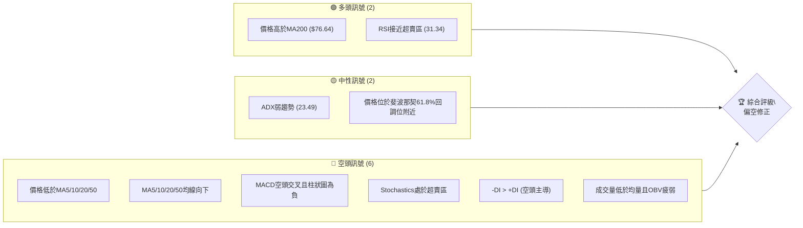
**儀表板解讀**：目前RKLB的技術訊號呈現明顯的偏空態勢。儘管價格仍位於長期均線MA200上方，且RSI和Stochastics指標顯示超賣，為潛在的反彈創造了條件，但短期和中期趨勢均受到顯著的空頭壓力。價格跌破所有短期移動平均線，且這些均線均呈現下降趨勢，MACD和ADX指標也確認了空頭動能的掌控。成交量萎縮，未能支撐價格反彈，進一步證實了當前買盤的疲軟。綜合來看，市場正處於一個強勁的修正階段，儘管短期可能出現技術性反彈，但整體趨勢偏向下行。

### 📊 核心指標速覽表

| 指標類別 | 指標名稱 | 當前數值 | 訊號 | 解讀 |
|----------|----------|----------|------|------|
| **價格** | 當前價格 | $82.55 | 🔴 | 位於多數短期均線下方，接近布林下軌 |
| **均線** | MA20 | $97.00 | 🔴 | 價格遠低於MA20，短期趨勢偏空 |
| **均線** | MA50 | $107.05 | 🔴 | 價格遠低於MA50，中期趨勢偏空 |
| **均線** | MA200 | $76.64 | 🟢 | 價格仍高於MA200，長期趨勢尚未完全破壞 |
| **動能** | RSI(14) | 31.34 | 🟡 | 接近超賣區30，可能醞釀反彈，但尚未進入 |
| **動能** | MACD | -6.514 | 🔴 | MACD線在訊號線下方，柱狀圖為負，空頭動能強勁 |
| **波動** | ATR | $8.56 | 🔴 | 佔股價10.37%，顯示每日波動劇烈，風險較高 |

### 🏆 技術評分卡

```
╔══════════════════════════════════════════════════════════════╗
║               技術評分卡 — RKLB (2026-07-10)                 ║
╠══════════════════════════════════════════════════════════════╣
║ 趨勢強度      ██████░░░░░░░░░░░░░░  30/100  🔴 (ADX弱趨勢，空頭主導) ║
║ 動能指標      ███████░░░░░░░░░░░░░  35/100  🔴 (MACD空頭，RSI近超賣)  ║
║ 支撐穩定度    ████████████░░░░░░░░  60/100  🟡 (接近多重支撐位，但面臨考驗)║
║ 成交量配合    ████░░░░░░░░░░░░░░░░  20/100  🔴 (成交量萎縮，OBV疲弱)   ║
║ 形態完整度    ████████░░░░░░░░░░░░  40/100  🟡 (無明確多頭形態，修正中) ║
║ 均線排列      ██████░░░░░░░░░░░░░░  30/100  🔴 (短期均線空頭排列，價格下方)║
╠══════════════════════════════════════════════════════════════╣
║ 綜合評分      ██████░░░░░░░░░░░░░░  36/100  評級: 🔴 偏空修正       ║
╚══════════════════════════════════════════════════════════════╝
```
**評分卡解讀**：RKLB的綜合技術評分僅為36/100，顯示其目前處於一個明確的偏空修正階段。趨勢強度、動能指標和均線排列均呈現紅色警示，表明短期和中期趨勢均由空頭掌控。成交量配合度極低，未能提供任何止跌反彈的積極訊號。儘管價格接近多重支撐位，但這些支撐的穩定性仍待觀察。當前市場結構不利於多頭，投資者應保持高度警惕。

---

## 2. 趨勢分析

### 🌐 多時框趨勢分析

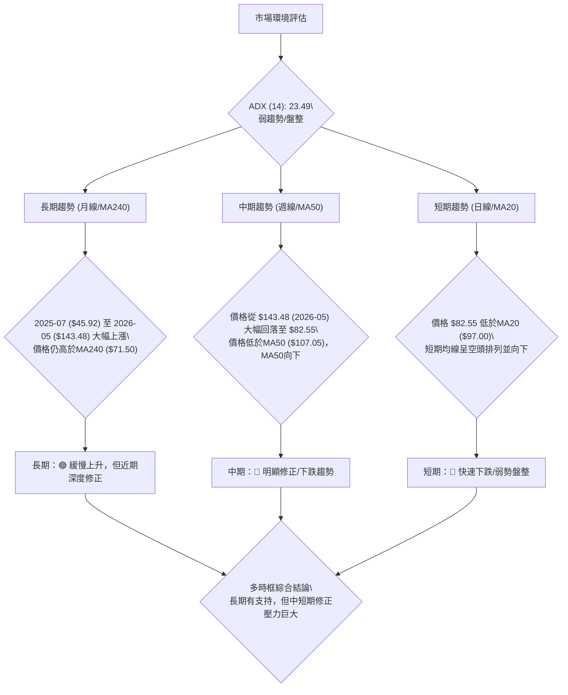
**多時框趨勢解讀**：
RKLB在過去一年呈現出先急劇上漲後大幅回落的「過山車」行情。
*   **長期趨勢**：從2025年7月的$45.92到2026年5月的$143.48，RKLB經歷了顯著的牛市行情，漲幅超過200%。儘管近期價格大幅回落，但$82.55的當前價格仍位於MA240 ($71.50) 上方，表明其長期上升趨勢的根基尚未完全破壞。然而，這並不意味著沒有風險，深度修正已對長期結構造成壓力。
*   **中期趨勢**：週線圖顯示，自2026年5月高點$143.48以來，股價經歷了快速且深度的修正。當前價格$82.55遠低於MA50 ($107.05)，且MA50本身已由上升轉為下降，形成中期空頭排列。這表明中期趨勢已轉為下行，修正動能強勁。
*   **短期趨勢**：日線圖上，價格$82.55已跌破MA5、MA10、MA20和MA50等所有短期和中期移動平均線。這些短期均線均呈現向下發散的態勢，構成顯著的動態阻力。ADX指標顯示當前趨勢強度不足，處於弱趨勢或盤整狀態，但-DI遠高於+DI，表明空頭力量在短期內佔據主導地位。

綜合來看，RKLB的長期趨勢雖仍被MA240支撐，但中短期已陷入嚴峻的修正格局，空頭力量強勁。

### 📈 長期趨勢 — 12個月走勢圖（Unicode）

```
RKLB 月線走勢圖（過去12個月：2025-07 至 2026-07）
價格軸 ($)
$143.48 ┤                                              ●(2026-05 高點)
$130.00 ┤
$110.00 ┤                                        ●
$90.00  ┤                                    ●
$82.55  ┤                                                ●(現在)
$70.00  ┤          ●      ●  ●
$60.00  ┤        ●
$50.00  ┤●━━━━━●
$40.00  ┤    ●(2025-11 低點)
        └─────────────────────────────────────────────────────
         2025-07 -08 -09 -10 -11 -12  2026-01 -02 -03 -04 -05 -06 -07
```

**走勢特徵分析表格**：
| 階段 | 時間區間 | 主要走勢 | 漲跌幅 (約) | 特徵與解讀 |
|------|----------|----------|-------------|--------------------------------------------------|
| **第一階段** | 2025-07 至 2026-05 | 強勁上升趨勢 | +212% (從$45.92到$143.48) | 股價在此期間呈現爆發性增長，多頭動能極強，屢創新高。 |
| **第二階段** | 2026-05 至 2026-07 | 快速深度修正 | -42% (從$143.48到$82.55) | 股價從歷史高點迅速回落，跌幅劇烈，空頭力量佔據主導，抹去大部分漲幅。 |
| **當前狀態** | 2026-07-10 | 弱勢盤整/尋底 | - | 股價在$82.55附近震盪，尋求支撐，但反彈動能不足，市場觀望情緒濃厚。 |

### 📊 中期趨勢（週線分析）

```
RKLB 中期壓力與支撐示意圖 (週線視角)
══════════════════════════════════════════════════════════════
$151.00 ║                                           ▲ 52W 高點 (強阻力)
        ║
$124.23 ║                                          R (Fib 23.6%)
        ║
$107.67 ║                                        R (Fib 38.2%)
        ║                                          ▲ (MA50壓制)
$97.00  ║                                        R (MA20壓制)
        ║
$82.55  ╠═══════════════════════════════════════════╣ ◄ 現價
        ║                                          S (Fib 61.8%)
$80.00  ║                                          S (S1 關鍵支撐)
        ║
$76.21  ║                                          S (布林下軌)
        ║
$73.99  ║                                          S (S2 較強支撐)
        ║
$61.84  ║                                          S (Fib 78.6%)
        ║
$37.57  ║ ▲ 52W 低點 (強支撐)
══════════════════════════════════════════════════════════════
```
**中期趨勢解讀**：從週線圖來看，RKLB目前正處於一個明顯的修正階段。價格從52週高點$151.00大幅回落，目前在$82.55，處於52週區間的39.7%位置。上方密集分佈著MA20 ($97.00)、MA50 ($107.05) 等多條均線阻力，以及斐波那契回調位$94.28 (50%) 和 $107.67 (38.2%)。這些構成了強大的中期上漲壓力。下方則有S1 ($80.00) 和斐波那契61.8%回調位 ($80.90) 形成的重要支撐帶，以及布林通道下軌 ($76.21) 和S2 ($73.99)。股價目前正測試這些關鍵支撐區域，中期走勢將取決於這些支撐能否有效守住。

### ⚡ 趨勢強度評估（ADX 解讀）

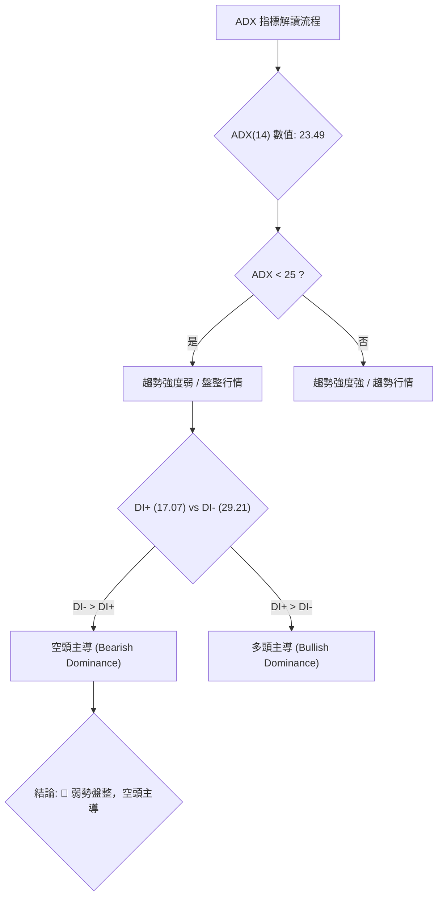
**ADX 解讀**：
RKLB的ADX(14)數值為23.49。根據ADX的判斷標準：
*   **ADX < 25**：表明當前市場處於弱趨勢或盤整行情。RKLB的23.49落在這個區間，因此當前市場缺乏明確的強勢單邊趨勢，更傾向於震盪整理。
*   **+DI (17.07) 與 -DI (29.21)**：在弱趨勢或盤整行情中，DI線的相對位置可以揭示市場的主導方向。當前-DI顯著高於+DI，明確指出空頭力量在市場中佔據主導地位。這意味著即使趨勢強度不高，市場的下行壓力仍然存在，且賣方掌握了主動權。

**趨勢強度對照表**：
| ADX 數值範圍 | 趨勢強度 | 市場性質 | 適用策略 |
|--------------|----------|----------|----------|
| 0-25         | 弱趨勢/盤整 | 市場缺乏方向，震盪為主 | 區間操作、高拋低吸 |
| 25-50        | 中等趨勢 | 趨勢確立，動能增強 | 順勢交易、趨勢追蹤 |
| 50-75        | 強趨勢 | 趨勢非常強勁，慣性大 | 順勢交易、持有 |
| 75-100       | 極強趨勢 | 市場極度超買/超賣，可能反轉 | 謹慎順勢，關注反轉訊號 |

**綜合判斷**：RKLB目前處於弱勢盤整行情，並由空頭力量主導。這表示股價可能在一定區間內震盪，但整體傾向於向下尋找更堅實的支撐，或在反彈時面臨較大阻力。

---

## 3. 圖表形態分析

### 🔍 形態識別系統

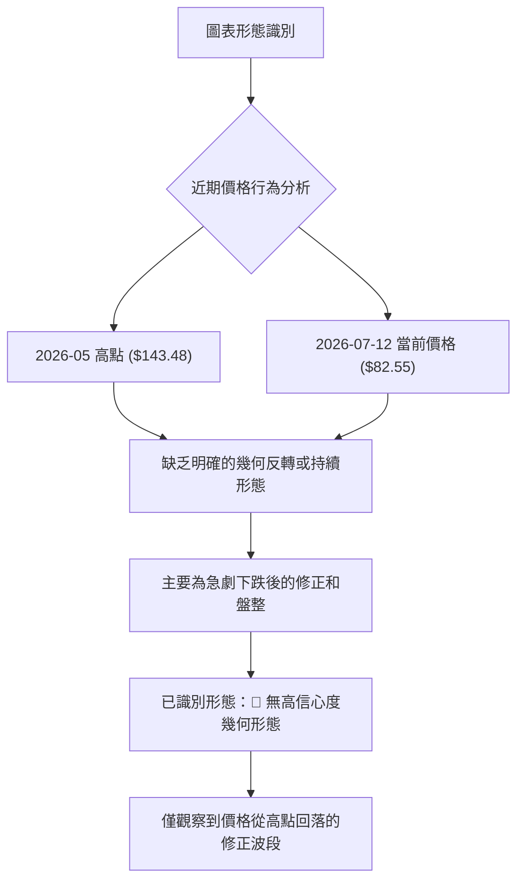
**形態識別結論**：
基於提供的20週收盤價數據和月線走勢，RKLB在2026年5月達到高點$143.48後，經歷了快速且深度的下跌。在當前價格$82.55附近，**數據中未偵測到具有高信心度的經典圖表形態（如頭肩頂、雙底、旗形等）**。市場的行為更傾向於一個急劇下跌後的修正和尋底過程，而非清晰的幾何形態。高波動性和快速的價格變化使得形態的形成和確認變得困難。因此，本節將主要基於K線組合和指標型解讀。

**形態信心度表格**：
| 形態 | 信心度 | 判斷依據（引用數據） | 完成度 | 目標價（附計算式） |
|------|--------|----------------------|--------|--------------------|
| 無明確多頭反轉形態 | < 30% | 價格從$143.48高點大幅下跌，尚未出現底部反轉形態的關鍵特徵（如底部背離、放量突破頸線等）。 | 0% | 不適用 |
| 無明確空頭持續形態 | < 30% | 雖然價格下跌，但缺乏如熊旗、下降三角形等明確的持續形態。更多是直接的修正。 | 0% | 不適用 |

### 🕯️ 重要K線形態分析

| 月份 | 收盤價 | K線形態 | 解讀 | 訊號 |
|------|--------|---------|------|------|
| 2026-05-31 | $143.48 | 巨量長上影線/高位十字星 (週線) | 股價創新高後遭遇巨大賣壓，上漲動能衰竭，預示潛在反轉。 | 🔴 |
| 2026-06-07 | $110.08 | 大陰線 / 長陰實體 (週線) | 股價從高點大幅下挫，強勢看跌訊號，確認高位賣壓。 | 🔴 |
| 2026-07-05 | $100.46 | 陽線反彈 (週線) | 經歷持續下跌後的短暫反彈，可能為技術性修正，但缺乏量能配合。 | 🟡 |
| 2026-07-12 | $82.55 | 大陰線 / 吞噬前一週陽線 (週線) | 股價再次大幅下跌，吞噬前一週反彈成果，確認空頭強勢，反彈失敗。 | 🔴 |

**K線形態解讀**：
從近期的週線K線走勢來看，RKLB在2026年5月底創下高點$143.48後，隨即出現了高位賣壓的跡象，伴隨巨量和長上影線，這是多頭力量枯竭的初步訊號。隨後，2026年6月出現的大陰線確認了趨勢的反轉。儘管在2026年7月5日出現了一次短暫的陽線反彈，但在2026年7月12日，股價再次以大陰線收盤，且其跌幅幾乎吞噬了前一週的漲幅，這是一個極其強烈的**看跌吞噬形態 (Bearish Engulfing)** 或 **烏雲罩頂 (Dark Cloud Cover)** 變體，表明多頭的反撲被空頭徹底壓制，市場情緒極度悲觀。這種K線組合進一步確認了當前下跌趨勢的延續性。

### 📉 ASCII 走勢形態示意圖

```
RKLB 近期走勢形態示意圖 (從2026-05高點修正)

價格軸 ($)
$150.00 ┤                                       ● (2026-05 高點)
        │                                      /|\
$140.00 ┤                                     / | \
        │                                    /  |  \
$130.00 ┤                                   /   |   \
        │                                  /    |    \
$120.00 ┤                                 /     |     \
        │                                /      |      \
$110.00 ┤                               ●───────────┐ (MA50 阻力)
        │                               |           |
$100.00 ┤                               |           ● (2026-07 反彈高點)
        │                               |           | \
$90.00  ┤                               |           |  \ (MA20 阻力)
        │                               |           |   \
$82.55  ╠═══════════════════════════════╣───────────────● (現價)
        │                               |               |
$80.00  ┤                               ●───────────────┘ (S1 / Fib 61.8% 支撐帶)
        │                               |
$70.00  ┤                               ●───────────────┐ (S2 / 布林下軌)
        │                               |               |
$60.00  ┤                                               ● (S3)
        │
$50.00  ┤
        └────────────────────────────────────────────────────────
         時間軸 (2026-05 - 2026-07)
```
**走勢形態解讀**：上圖清晰地描繪了RKLB從2026年5月高點$143.48開始的急劇下跌修正過程。股價快速跌破多個支撐位和移動平均線，並在$80.00-$90.00區間附近形成一個潛在的震盪區間。近期的一次反彈嘗試在$100.46附近受阻，未能突破短期均線壓制，隨後再次下挫，顯示上檔賣壓沉重。當前價格$82.55正位於關鍵支撐S1 ($80.00) 和斐波那契61.8%回調位 ($80.90) 的上方，這是一個非常重要的考驗區域。

### 🎯 形態目標價計算

由於缺乏高信心度的幾何形態，我們無法計算基於形態的目標價。目前的價格行為更像是趨勢修正，因此目標價將主要依賴於斐波那契回調位和關鍵支撐阻力位。

---

## 4. 支撐與阻力

### 🗺️ 關鍵價位分布圖（Unicode）

```
RKLB 價位結構分布圖 (2026-07-10)
══════════════════════════════════════════════════════════════
$151.00 ║████████████████████████║ 52W 高點 (極強阻力)
$124.23 ║████████████████████████║ 斐波那契 23.6% (強阻力)
$107.67 ║████████████████████████║ 斐波那契 38.2% / R3 (強阻力)
$99.58  ║████████████████████    ║ 阻力 R2
$97.00  ║████████████████████████║ MA20 中軌 (動態阻力)
$94.28  ║████████████████████████║ 斐波那契 50.0%
$93.10  ║████████████████████████║ 關鍵阻力 R1
$82.55  ╠════════════════════════╣ ◄ 現價
$80.90  ║▓▓▓▓▓▓▓▓▓▓▓▓▓▓▓▓▓▓▓▓▓▓▓▓║ 斐波那契 61.8% (關鍵支撐)
$80.00  ║▓▓▓▓▓▓▓▓▓▓▓▓▓▓▓▓▓▓▓▓▓▓▓▓║ 近期支撐 S1
$76.64  ║▓▓▓▓▓▓▓▓▓▓▓▓▓▓▓▓▓▓▓▓▓▓▓▓║ MA200 (長期動態支撐)
$76.21  ║▓▓▓▓▓▓▓▓▓▓▓▓▓▓▓▓▓▓▓▓▓▓▓▓║ 布林下軌 (短期動態支撐)
$73.99  ║████████████████████████║ 強支撐 S2
$66.85  ║████████████████████████║ 強支撐 S3
$61.84  ║████████████████████████║ 斐波那契 78.6%
$37.57  ║████████████████████████║ 52W 低點 (極強支撐)
══════════════════════════════════════════════════════════════
```
**價位結構解讀**：
RKLB目前處於一個關鍵的價位區間。上方壓力重重，R1 ($93.10) 是一個重要的短期阻力，其上方還有斐波那契50%回調位 ($94.28)、MA20 ($97.00) 和R2 ($99.58)，形成一個密集的阻力帶。若能突破，下一個主要阻力是斐波那契38.2%回調位 ($107.67) 和R3 ($107.60)。
下方支撐則相對集中，當前價格$82.55正位於斐波那契61.8%回調位 ($80.90) 和S1 ($80.00) 附近，這是多頭必須守住的關鍵區域。一旦跌破，將面臨MA200 ($76.64)、布林下軌 ($76.21) 和S2 ($73.99) 的考驗。S3 ($66.85) 和斐波那契78.6%回調位 ($61.84) 是更深層次的支撐。

### 🚧 阻力位分析表

| 阻力級別 | 價位 | 形成原因 | 突破難度 | 重要性 |
|----------|------|----------|----------|--------|
| **R1**   | $93.10 | 近期波段高點聚類，斐波那契50%回調位 ($94.28) 附近 | 中等偏高 | 🟢 短期反彈能否延續的關鍵 |
| **R2**   | $99.58 | 近期波段高點聚類，MA20 ($97.00) 附近 | 高 | 🟡 突破則中期下跌動能減弱 |
| **R3**   | $107.60 | 近期波段高點聚類，斐波那契38.2%回調位 ($107.67) 附近 | 極高 | 🔴 突破則可能形成反轉，開啟新一輪上漲 |

### 🛡️ 支撐位分析表

| 支撐級別 | 價位 | 形成原因 | 守住機率 | 重要性 |
|----------|------|----------|----------|--------|
| **S1**   | $80.00 | 近期波段低點聚類，斐波那契61.8%回調位 ($80.90) 附近 | 中等 | 🟢 短期下跌能否止穩的關鍵 |
| **S2**   | $73.99 | 近期波段低點聚類，MA200 ($76.64) 和布林下軌 ($76.21) 附近 | 中等偏高 | 🟡 跌破則中期趨勢可能進一步惡化 |
| **S3**   | $66.85 | 近期波段低點聚類，斐波那契78.6%回調位 ($61.84) 附近 | 高 | 🔴 跌破則長期趨勢面臨嚴峻考驗 |

### 📐 斐波那契回調位分析

RKLB的52週區間為 $37.57 (低點) 至 $151.00 (高點)。當前價格 $82.55 位於關鍵的斐波那契回調區間內：

| 斐波那契回調位 | 價位 | 相對位置 | 解讀 |
|----------------|------|----------|------|
| 0.0% (52W High)| $151.00 | - | 上漲趨勢的起點（回調的終點） |
| 23.6%          | $124.23 | 阻力 | 較淺層回調，已跌破，轉為阻力 |
| 38.2%          | $107.67 | 阻力 | 重要阻力位，需突破才能扭轉下跌趨勢 |
| 50.0%          | $94.28 | 阻力 | 心理關卡，也常是修正波反彈的極限 |
| **61.8%**      | **$80.90** | **支撐** | **黃金回調位，當前價格 $82.55 正在此關鍵支撐位上方，是多頭能否守住的關鍵。** |
| 78.6%          | $61.84 | 支撐 | 較深層回調，若跌破61.8%，此位可能提供支撐 |
| 100.0% (52W Low)| $37.57 | 支撐 | 下跌趨勢的終點（回調的起點） |

**斐波那契回調解讀**：
當前價格 $82.55 位於斐波那契61.8%回調位 ($80.90) 和50.0%回調位 ($94.28) 之間，且非常接近61.8%回調位。61.8%通常被視為一個重要的「黃金分割點」，若股價在此獲得有效支撐並反彈，則可能預示著之前的下跌只是健康的回調，而非趨勢反轉。然而，若跌破61.8%回調位，則可能進一步下探至78.6%回調位 ($61.84)，甚至測試52週低點 $37.57，這將對長期多頭趨勢構成嚴峻挑戰。因此，當前價格在$80.90附近的表現至關重要。

---

## 5. 技術指標深度解讀

### 🎛️ 指標訊號總覽

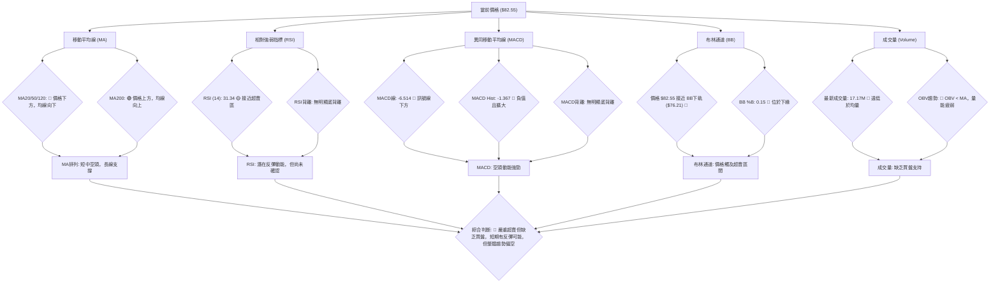

### 📈 移動平均線排列分析

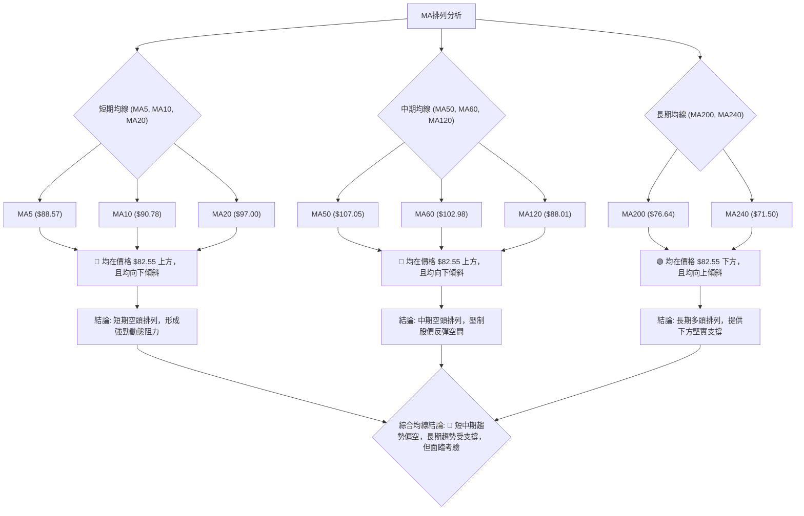
**移動平均線排列解讀**：
RKLB的移動平均線系統呈現出明顯的短中期偏空、長期偏多的混合排列。
*   **短期與中期均線**：MA5 ($88.57)、MA10 ($90.78)、MA20 ($97.00)、MA50 ($107.05)、MA60 ($102.98) 和MA120 ($88.01) 全部位於當前股價 $82.55 的上方，並且都呈現出向下傾斜的趨勢。這形成了一個強大的動態阻力區，每次股價反彈至這些均線附近都可能遭遇賣壓。這種排列是典型的下跌或修正趨勢的特徵，表明短期和中期市場情緒悲觀。
*   **長期均線**：MA200 ($76.64) 和MA240 ($71.50) 則位於當前股價的下方，並且仍呈現向上傾斜的趨勢。這表示RKLB的長期上升趨勢尚未被完全破壞，這些長期均線在下方提供了堅實的支撐。然而，如果股價持續下跌並跌破MA200，將對長期趨勢構成嚴重威脅。

**結論**：均線系統發出明確的**🔴 空頭訊號**，短期和中期均線的壓制使得股價上行空間受限，反彈乏力。長期均線雖然提供支撐，但其穩定性正受到中短期下跌壓力的考驗。

### 📉 RSI(14) 分析

**RSI(14) 數值進度條**：
RSI(14): ▓▓▓▓▓▓░░░░░░░░░░░░░░  31.34/100  🟡

**RSI 分析**：
*   **RSI 數值**：RSI(14) 當前數值為31.34。這個數值非常接近傳統的超賣區間（通常設定為30以下）。這表明股價在過去14天內經歷了顯著的下跌，賣壓沉重，市場可能處於超賣狀態。
*   **超買超賣區間**：RSI進入超賣區間通常被視為股價可能出現技術性反彈的訊號，因為賣方力量可能已過度釋放。然而，超賣並不等同於立即反轉，在強勢下跌趨勢中，RSI可能在超賣區徘徊一段時間。
*   **背離判斷**：
    *   **頂背離**：無。股價近期呈現下跌趨勢，不適用頂背離。
    *   **底背離**：從提供的數據來看，在2026-06-28 ($84.54, RSI 34.1) 到2026-07-12 ($82.55, RSI 31.3) 的過程中，價格創下了更低的低點，而RSI也創下了更低的低點，因此**無明顯的底背離訊號**。這意味著當前下跌動能仍然強勁，缺乏明確的止跌跡象。

**結論**：RSI發出**🟡 中性偏多訊號**，僅在於其接近超賣區，暗示短期有技術性反彈的可能性。然而，缺乏底背離訊號，使得這種反彈的強度和持續性存疑，不應作為單獨的買入依據。

### 📊 MACD(12/26/9) 訊號解讀

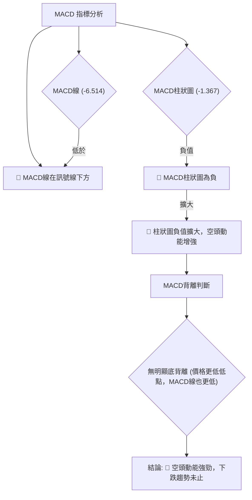
**MACD 訊號解讀**：
*   **MACD線與訊號線**：MACD線 (-6.514) 位於訊號線 (-5.147) 的下方，這是一個明確的**🔴 空頭交叉訊號**。這表示短期動能弱於中期動能，預示股價可能繼續下跌。
*   **MACD柱狀圖**：MACD柱狀圖當前數值為-1.367，為負值。這不僅確認了空頭動能的存在，而且從提供的週線數據來看，MACD柱狀圖在短暫縮小負值後再次擴大 (-0.335 -> -1.367)，表明空頭力量正在重新增強，賣壓持續。
*   **背離判斷**：
    *   **頂背離**：無。股價近期下跌，不適用頂背離。
    *   **底背離**：在近期價格創下更低低點 ($82.55 vs $84.54) 的同時，MACD線也呈現更低的數值（從數據中的MACD柱狀圖負值擴大可推斷MACD線也可能創下更低點），因此**無明顯的底背離訊號**。這與RSI的結論一致，缺乏動能反轉的積極跡象。

**結論**：MACD發出明確的**🔴 空頭訊號**。MACD線在訊號線下方運行，且柱狀圖為負並有擴大趨勢，表明空頭動能強勁，短期內股價仍面臨較大的下行壓力。

### 📦 布林通道分析

```
RKLB 布林通道示意圖
════════════════════════════════════════════════════
BB上軌 ($117.79) ┤                                   ▲
                │                                  / \
BB中軌 ($97.00) ┤─────────────────────────────────●─┼ (MA20)
                │                                /   \
當前價格 ($82.55) ╠══════════════════════════════════╣ ◄ 現價
                │                                \   /
BB下軌 ($76.21) ┤─────────────────────────────────●─┼
                │                                  \ /
                ▼
════════════════════════════════════════════════════
```
**布林通道分析**：
*   **通道位置**：當前價格 $82.55 位於布林通道中軌 ($97.00) 和下軌 ($76.21) 之間，並且非常接近下軌。布林通道中軌 (MA20) 顯著高於當前價格，形成壓制。
*   **%B 值**：布林通道 %B 值為0.15。%B值在0和1之間，0表示價格觸及下軌，1表示價格觸及上軌。0.15的數值表明價格非常接近布林下軌，這通常被視為股價處於相對超賣的狀態。
*   **通道寬度**：雖然沒有直接給出布林帶寬，但從上軌 $117.79 和下軌 $76.21 的差距來看，其寬度約為 $41.58，相對較大，表明波動性較高。
*   **含義**：價格觸及布林下軌或在下軌附近運行，通常暗示兩種可能性：一是股價短期超賣，可能醞釀技術性反彈；二是下跌趨勢強勁，價格沿下軌運行，形成「布林帶外側運行」的趨勢模式。結合其他指標的空頭訊號，當前更傾向於後者，即下跌趨勢強勁，價格在尋找底部。

**結論**：布林通道發出**🔴 偏空訊號**。儘管價格接近下軌可能暗示超賣，但結合均線和動能指標的空頭趨勢，這更可能是下跌趨勢的延續，而非立即反轉的訊號。

### 💹 成交量分析（量價配合度）

**成交量數據**：
*   最新成交量: 17,167,920
*   20日均量: 29,936,916
*   50日均量: 28,281,116
*   量比: 0.57x (最新成交量 / 20日均量)
*   OBV趨勢: OBV < MA → 量能疲弱

**成交量分析**：
*   **最新成交量與均量比較**：RKLB的最新成交量17,167,920股，顯著低於其20日均量29,936,916股和50日均量28,281,116股。量比僅為0.57x，這表明當前市場的活躍度顯著下降，交易清淡。
*   **量價配合度**：
    *   在價格下跌過程中，如果成交量放大，則確認下跌趨勢的強度。如果下跌過程中成交量萎縮，則可能暗示賣壓減輕，但同時也缺乏買盤支持。
    *   在價格反彈時，如果成交量萎縮，則反彈缺乏動能，往往難以持續。
    *   從20週數據看，2026-05-17至2026-05-31價格在高位震盪時，週成交量高達1.5億股以上。隨後價格下跌，成交量有所下降，但仍維持在1.1億至1.4億股之間。最近一周（2026-07-12）的成交量為83,051,320股，相較於前幾週有所下降，這在價格下跌時，可能暗示賣壓在短期內有所緩解，但也同時顯示買盤意願不足。
*   **OBV趨勢**：OBV (On-Balance Volume) 趨勢顯示「OBV < MA → 量能疲弱」。這是一個重要的**🔴 空頭訊號**。OBV是衡量累積買賣壓力的指標，OBV低於其移動平均線，表明總體買盤壓力不足，量能未能配合價格上漲，反而預示著下跌趨勢可能持續或反彈乏力。

**結論**：成交量分析發出明確的**🔴 空頭訊號**。當前成交量萎縮，且OBV趨勢疲弱，表明市場缺乏足夠的買盤動能來支撐股價反彈或止跌。這使得任何反彈都顯得脆弱，而下跌的趨勢更有可能延續。

---

## 6. 動能與波動率

### ⚡ 動能評估四象限

| 象限 | 動能 (RSI, MACD, Stoch) | 波動 (ATR, Beta) | 當前狀態 | 評估 |
|------|-------------------------|------------------|----------|------|
| Q1   | 強 (🟢)                 | 低 (🟢)          | -        | 最佳機會 (強趨勢，低風險) |
| Q2   | 弱 (🔴)                 | 低 (🟢)          | -        | 謹慎觀望 (缺乏方向，低風險) |
| Q3   | 強 (🟢)                 | 高 (🔴)          | -        | 高風險高收益 (強趨勢，高風險) |
| **Q4** | **弱 (🔴)**             | **高 (🔴)**      | **✓**    | **避免進場 (缺乏方向，高風險)** |

**動能評估四象限分析**：
*   **動能維度**：RSI (31.34) 接近超賣但缺乏底背離，MACD線與訊號線空頭交叉且柱狀圖為負，Stochastics (%K 8.63, %D 10.07) 處於超賣區。綜合來看，RKLB的動能處於**🔴 弱勢且偏空**。儘管超賣可能帶來技術性反彈，但缺乏強勁買盤確認，整體動能不足。
*   **波動維度**：ATR(14) 為 $8.56，佔當前股價 $82.55 的10.37%，這是一個相對較高的波動率。Beta值高達2.553，表明RKLB的波動性是市場平均水準的2.5倍以上。綜合來看，RKLB的波動性處於**🔴 高波動**狀態。

**綜合評估**：RKLB目前落在**Q4：弱動能、高波動**的象限。這是一個極具挑戰性的投資環境。市場缺乏明確的多頭動能，且股價波動劇烈，意味著投資者面臨著較高的不確定性和風險。在這種情況下，建議投資者避免貿然進場，應保持謹慎觀望態度，等待市場動能和趨勢的明朗化。

### 📊 ATR 波動率分析

*   **ATR(14) 數值**：RKLB的ATR(14)為 $8.56。
*   **佔股價比例**：ATR佔當前價格 $82.55 的比例為 $8.56 / $82.55 ≈ 10.37%。
*   **解讀**：ATR是衡量股價波動幅度的指標，10.37%的比例顯示RKLB的每日波動幅度非常大。這意味著在一個交易日內，股價可能在 $8.56 的範圍內上下波動。高ATR值通常伴隨著較高的交易風險和潛在收益。
*   **止損距離建議**：對於高波動性股票，止損點的設定需要更寬鬆，以避免被日常波動震出。一般建議將止損點設置在進場價格下方1到2倍ATR的距離。例如，如果進場價格為 $82.55，則1倍ATR止損為 $82.55 - $8.56 = $73.99。2倍ATR止損為 $82.55 - ($8.56 * 2) = $65.43。具體設置需結合個人風險承受能力和交易策略。由於目前市場偏空，且股價接近支撐，建議採用更緊湊的止損策略，或等待波動率降低。

### 📐 Beta 與市場相關性

*   **Beta 數值**：RKLB的Beta值為2.553。
*   **解讀**：Beta值衡量單一股票相對於整個市場（通常是S&P 500指數）的波動性。
    *   Beta > 1 表示股票的波動性高於市場。
    *   Beta < 1 表示股票的波動性低於市場。
    *   Beta = 1 表示股票的波動性與市場一致。
    RKLB的Beta值2.553遠大於1，這是一個非常高的Beta值。它意味著：
    1.  **高波動性**：當市場上漲1%時，RKLB理論上可能上漲2.553%；當市場下跌1%時，RKLB理論上可能下跌2.553%。這證實了ATR所反映的高波動性。
    2.  **高市場相關性**：RKLB的走勢與大盤高度相關，且波動幅度被放大。這意味著在牛市中，RKLB可能會有驚人的表現，但在熊市或市場修正時，其跌幅也將遠超大盤，風險極高。
*   **對投資的影響**：對於RKLB這種高Beta股票，投資者必須對市場的整體走勢有清晰的判斷。在當前修正市場中，高Beta值會加劇下跌風險。因此，在市場前景不明朗或偏空時，持有高Beta股票需要極度謹慎。

---

## 7. 多時框架總結

### 📋 時框架評分表

| 時框架 | 趨勢方向 | 動能 | 均線排列 | 形態 | 綜合評分 | 建議 |
|--------|----------|------|----------|------|----------|------|
| **短期** | 🔴 下跌/盤整 | 🔴 弱勢空頭 | 🔴 空頭壓制 | 🔴 修正中 | 2/10     | 🛑 謹慎觀望/偏空操作 |
| **中期** | 🔴 下跌修正 | 🔴 弱勢空頭 | 🔴 空頭壓制 | 🔴 修正中 | 3/10     | 🛑 謹慎觀望/偏空操作 |
| **長期** | 🟡 上升但修正 | 🟡 缺乏動能 | 🟢 支撐良好 | 🟡 修正中 | 6/10     | ⚠️ 關注長期支撐，等待築底 |

### 🔲 綜合訊號矩陣

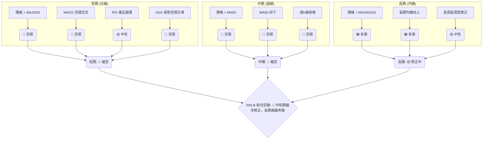

### ⚖️ 多時框收斂結論

根據ADX(14)數值23.49，判斷當前市場處於**弱趨勢或盤整行情**。根據嚴格要求14的多時框收斂規則，在盤整行情（ADX<25）中，應以日線布林通道上下軌為主要交易區間。

然而，僅憑ADX判斷為盤整行情可能低估了當前股價的下行壓力。雖然ADX數值本身較低，但結合以下多個指標，市場實際呈現出**強烈的偏空修正動能**：
1.  **價格位置**：股價 $82.55 位於所有短期（MA5/10/20）和中期（MA50/60/120）移動平均線下方。
2.  **均線排列**：短中期均線均呈現向下發散的空頭排列，形成強勁的動態阻力。
3.  **動能指標**：MACD線在訊號線下方，柱狀圖為負且擴大，確認空頭動能強勁。RSI和Stochastics雖然超賣，但缺乏底背離，且在下跌趨勢中超賣區可能持續。
4.  **K線形態**：週線圖出現強勢的看跌吞噬形態。
5.  **成交量**：成交量萎縮，OBV疲弱，缺乏買盤支持。
6.  **DI指標**：ADX雖低，但-DI (29.21) 遠高於+DI (17.07)，顯示空頭力量主導市場。

**綜合收斂結論**：
儘管ADX顯示為弱趨勢，但RKLB的**整體市場結構和動能指標明確指向偏空修正**。當前股價正處於一個關鍵的支撐區域（S1 $80.00 和斐波那契61.8%回調位 $80.90），短期內可能會有技術性反彈，但上方的阻力密集，且缺乏強勁的買盤支持。因此，**RKLB的唯一方向性結論為：🔴 偏空修正，短期尋求區間底部，但反彈空間有限，下行風險依然存在。**

---

## 8. 交易策略建議

### 🗺️ 策略決策流程圖

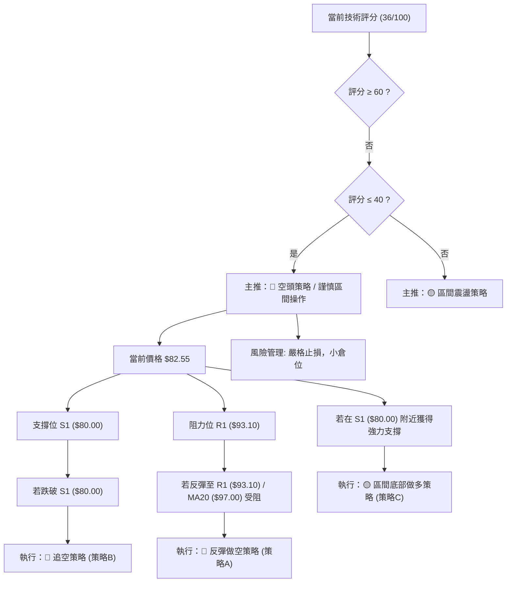

### 🧭 策略路由

**當前主策略方向 = 🔴 偏空／區間操作（依評分 36/100）**

基於RKLB的綜合技術評分36/100（偏空修正），當前的主要策略應以**謹慎的區間操作和捕捉反彈失敗後的做空機會**為主。在強勁下跌趨勢中，逆勢做多風險較高，應極度保守。

### 🎯 價格情境階梯（Price Scenarios）

| 觸發條件 | 下一目標 (短期) | 後續延伸 (中期) | 情境含義 |
|----------|-----------------|-----------------|----------|
| 突破 R1 $93.10 | R2 $99.58       | R3 $107.60      | 短線轉強，空頭壓力減輕，但仍需突破多重阻力才能確認反轉。 |
| 站穩現價區間 ($80.00 - $93.10) | —               | —               | 股價在此區間內震盪整理，尋求方向，可能為築底過程。 |
| 跌破 S1 $80.00 | S2 $73.99       | S3 $66.85       | 中期轉弱，確認下跌趨勢延續，賣壓加劇，可能進一步探底。 |

### 📊 情境機率分佈

| 情境 | 機率 | 主要依據 |
|------|------|----------|
| 繼續上行 / 反彈 | 25% | RSI/Stochastics超賣，價格觸及斐波那契61.8%和S1，可能出現技術性反彈。 |
| 區間震盪 | 45% | ADX弱趨勢，價格在重要支撐位附近，上方阻力密集，可能在$80.00-$93.10區間內整理。 |
| 回落 / 再探底 | 30% | 均線空頭排列，MACD空頭動能強勁，成交量疲弱，週K線看跌吞噬，下行壓力大。 |

### 🟢 主策略詳情

**鑑於當前市場偏空，以下策略以捕捉下跌機會和在強支撐位謹慎嘗試多頭為主。**

#### 策略 A: 反彈做空策略 (Counter-trend Short)
此策略旨在利用股價在下跌趨勢中的技術性反彈，在阻力位受阻後進行做空。
| 策略要素 | 詳情 |
|----------|------|
| 進場條件 | 股價反彈至阻力位R1 ($93.10) 或MA20 ($97.00) 附近，且出現看跌K線形態 (如烏雲罩頂、射擊之星) 或動能指標 (RSI/MACD) 顯示衰竭。 |
| 進場價格 | $93.00 - $96.00 (分批進場區間) |
| 目標價 T1 | $80.00 (S1 / 斐波那契61.8%回調位) |
| 目標價 T2 | $73.99 (S2) |
| 止損價格 | $99.80 (略高於R2 $99.58 和MA20 $97.00，確保反彈強度超預期時及時止損) |
| 風險報酬比 | (以進場 $94.50 為例) <br> T1: (94.50 - 80.00) : (99.80 - 94.50) = 14.50 : 5.30 ≈ 2.74:1 <br> T2: (94.50 - 73.99) : (99.80 - 94.50) = 20.51 : 5.30 ≈ 3.87:1 |
| 成功機率 | 60% (在下跌趨勢中，反彈受阻後做空成功率相對較高) |
| 建議倉位 | 5-10% (保守，控制風險) |

#### 策略 B: 跌破支撐追空策略 (Breakdown Short)
此策略適用於當股價確認跌破關鍵支撐位後，順勢追空。
| 策略要素 | 詳情 |
|----------|------|
| 進場條件 | 日線收盤價明確跌破S1 ($80.00)，且伴隨成交量放大，確認賣壓持續。 |
| 進場價格 | $79.50 (跌破確認後回抽或直接追空) |
| 目標價 T1 | $73.99 (S2) |
| 目標價 T2 | $66.85 (S3) |
| 止損價格 | $82.80 (略高於S1 $80.00，防止假跌破) |
| 風險報酬比 | (以進場 $79.50 為例) <br> T1: (79.50 - 73.99) : (82.80 - 79.50) = 5.51 : 3.30 ≈ 1.67:1 <br> T2: (79.50 - 66.85) : (82.80 - 79.50) = 12.65 : 3.30 ≈ 3.83:1 |
| 成功機率 | 70% (若確認跌破，趨勢延續機率高) |
| 建議倉位 | 5-10% (保守，控制風險) |

#### 策略 C: 區間底部嘗試做多策略 (Conservative Long on Strong Support)
此策略為逆勢操作，風險較高，僅在強支撐位出現明確反轉訊號時謹慎考慮。
| 策略要素 | 詳情 |
|----------|------|
| 進場條件 | 價格在S2 ($73.99) 附近獲得強勁支撐，且RSI/Stochastics出現明確底部背離，或出現強勢看漲K線形態 (如啟明星、錘子線) 伴隨成交量放大。 |
| 進場價格 | $74.50 - $75.50 (等待確認後進場) |
| 目標價 T1 | $80.00 (S1 / 斐波那契61.8%) |
| 目標價 T2 | $93.10 (R1) |
| 止損價格 | $70.00 (略低於S3 $66.85，防止趨勢惡化) |
| 風險報酬比 | (以進場 $75.00 為例) <br> T1: (80.00 - 75.00) : (75.00 - 70.00) = 5.00 : 5.00 ≈ 1:1 <br> T2: (93.10 - 75.00) : (75.00 - 70.00) = 18.10 : 5.00 ≈ 3.62:1 |
| 成功機率 | 40% (逆勢操作，風險較高，需嚴格止損) |
| 建議倉位 | 3-5% (極度保守，試探性倉位) |

### 🔴 反向風險觸發點（對沖提示）

*   **多頭情境下，空頭策略的反向觸發點**：若價格突破並站穩R3 ($107.60)，且MA20/50均線開始向上交叉並轉為多頭排列，MACD形成黃金交叉並柱狀圖轉正，則應考慮停止空頭操作，甚至反向建立多頭倉位。
*   **空頭情境下，多頭策略的反向觸發點**：若價格跌破S3 ($66.85)，且RSI/MACD等動能指標持續惡化並未出現任何底背離，則應停止任何多頭嘗試，並考慮進一步做空。

### ⭐ 整體訊號強度評星

```
做多訊號強度：★★☆☆☆  (2/5星)
做空訊號強度：★★★★☆  (4/5星)
整體可信度：  ★★★☆☆  (3/5星)
```
**評星解讀**：目前RKLB的做空訊號強度較高，主要基於中短期均線空頭排列、MACD空頭動能強勁、成交量疲弱以及近期K線形態的看跌訊號。做多訊號強度較低，僅限於超賣區間可能出現的技術性反彈，缺乏趨勢支持。整體可信度為中等，因為ADX顯示為弱趨勢，市場可能在支撐位附近震盪，但下行壓力顯而易見。

---

## 9. 風險提示與監控

### ✅ 關鍵監控指標 Checklist

```
╔══════════════════════════════════════════════════════════════╗
║               RKLB 關鍵監控指標 Checklist                    ║
╠══════════════════════════════════════════════════════════════╣
║ ├─ 價格行為：                                                 ║
║ ║    ├─ 🟢 價格是否有效站穩 $80.00 (S1 / Fib 61.8%)？          ║
║ ║    ├─ 🔴 價格是否跌破 $73.99 (S2 / MA200)？                  ║
║ ║    └─ 🟡 反彈能否突破 $93.10 (R1) 並站穩？                   ║
║ ├─ 動能指標：                                                 ║
║ ║    ├─ 🟡 RSI 是否從超賣區有效反彈並突破50？                   ║
║ ║    ├─ 🔴 MACD 是否形成黃金交叉並柱狀圖轉正？                 ║
║ ║    └─ 🟢 是否出現價格創新低但RSI/MACD未創新低的底背離？      ║
║ ├─ 趨勢指標：                                                 ║
║ ║    ├─ 🔴 ADX 是否突破25並向上，且+DI> -DI？                  ║
║ ║    └─ 🟡 短期均線 (MA20/50) 是否開始走平或向上交叉？         ║
║ ├─ 成交量：                                                   ║
║ ║    ├─ 🟢 價格上漲時是否伴隨成交量放大？                      ║
║ ║    └─ 🔴 OBV趨勢是否轉為向上？                              ║
║ ├─ 宏觀因素：                                                 ║
║ ║    └─ 🟡 關注美股大盤走勢 (RKLB Beta高，與大盤相關性強)      ║
╚══════════════════════════════════════════════════════════════╝
```

### ⚠️ 風險場景分析

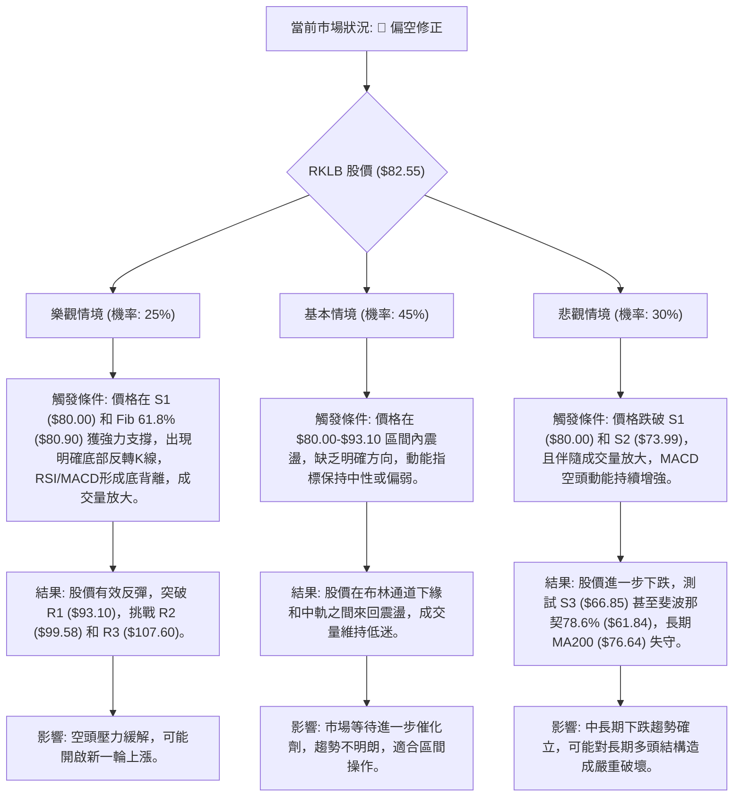

### 🛡️ 風險管理重要提醒

1.  **嚴格止損**：RKLB具有極高的Beta值和ATR，波動劇烈。任何交易策略都必須設定嚴格的止損點，並嚴格執行，以防範快速且大幅度的價格反轉。
2.  **倉位控制**：鑑於其高波動性和當前偏空的市場環境，建議採用小倉位操作，尤其是在逆勢做多時。避免重倉壓注，以免承受過大風險。
3.  **多時框驗證**：在進場前，務必再次檢視不同時框架的指標訊號，確保其互相驗證或至少不產生嚴重衝突。尤其在ADX顯示弱勢趨勢時，應更加依賴短期指標進行精準進出場。
4.  **關注宏觀環境**：RKLB作為高Beta股票，對整體市場情緒和宏觀經濟數據高度敏感。應密切關注美股大盤指數（如SPY, QQQ）的走勢，以及重要的經濟數據發布。
5.  **心理紀律**：在波動劇烈的市場中，保持冷靜和客觀的交易心理至關重要。避免情緒化交易，堅持自己的交易計劃和風險管理原則。
6.  **耐心等待**：當前市場缺乏明確的強勢趨勢，且空頭力量佔優。對於多頭而言，耐心等待明確的築底訊號和動能反轉是關鍵，避免在不明朗的階段過早介入。對於空頭而言，則需警惕技術性反彈的風險，並在反彈無力時果斷進場。

---

## 📋 報告總結

```
╔══════════════════════════════════════════════════════════════════════════╗
║                    RKLB 技術分析報告總結                                 ║
╠══════════════════════════════════════════════════════════════════════════╣
║ 報告日期：2026-07-10                                                     ║
║ 當前價格：$82.55                                                         ║
║ 分析評級：🔴 偏空修正 (綜合評分 36/100)                                  ║
║                                                                          ║
║ 關鍵結論：                                                               ║
║ ├─ 長期趨勢：🟡 緩慢上升趨勢仍在，但正經歷深度修正，MA200 ($76.64) 提供支撐。 ║
║ ├─ 中期趨勢：🔴 明顯下跌修正，價格位於MA50 ($107.05) 之下，均線空頭排列。     ║
║ ├─ 短期趨勢：🔴 弱勢盤整或下跌，ADX顯示弱趨勢但空頭主導，MACD空頭，RSI近超賣。║
║ ├─ 關鍵支撐：S1 $80.00 (斐波那契61.8%回調位 $80.90)；S2 $73.99。            ║
║ └─ 關鍵阻力：R1 $93.10；MA20 $97.00；斐波那契50%回調位 $94.28。            ║
║                                                                          ║
║ 最優策略組合：                                                           ║
║ 1. 🥇 **最佳機會 (偏空)**：**反彈做空策略**。在R1 ($93.10) 或MA20 ($97.00) 附近遇阻時，確認看跌訊號後做空，目標S1 ($80.00) 和S2 ($73.99)。嚴格止損於R2 ($99.58) 上方。                             ║
║ 2. 🥈 **次選機會 (偏空)**：**跌破支撐追空策略**。若日線收盤確認跌破S1 ($80.00) 且成交量放大，則追空，目標S2 ($73.99) 和S3 ($66.85)。止損於S1上方。                                                       ║
║ 3. 🥉 **保守選擇 (逆勢多)**：**區間底部嘗試做多策略**。僅在S2 ($73.99) 附近出現強烈底部反轉訊號 (如底背離、放量K線反轉) 時，極小倉位謹慎嘗試做多，目標S1 ($80.00) 和R1 ($93.10)。止損於S3 ($66.85) 下方。        ║
╚══════════════════════════════════════════════════════════════════════════╝
```

---

> ⚠️ **免責聲明**：本報告為 AI 自動生成之技術分析，所有數據及估算均基於提供的歷史價格資訊。本報告**僅供研究與學術參考**，**不構成任何投資建議**。投資有風險，入市需謹慎。

---

*報告生成時間：2026-07-10 ｜ 數據來源：Yahoo Finance ｜ 分析框架：多時框技術分析*