# RTX 綜合股票評估報告

> **報告日期**：2026-02-24 ｜ **語言**：繁體中文 ｜ **數據來源**：Yahoo Finance ｜ **分析師**：AI 頂級評估系統

---

## 目錄

1. [評估總覽](#1-評估總覽)
2. [八維度評分矩陣](#2-八維度評分矩陣)
3. [業務品質與護城河](#3-業務品質與護城河)
4. [財務健康全面評估](#4-財務健康全面評估)
5. [成長性評估](#5-成長性評估)
6. [估值合理性與同業比較](#6-估值合理性--同業比較)
7. [資本配置與管理層評估](#7-資本配置與管理層評估)
8. [風險評估](#8-風險評估)
9. [催化劑與觸發因素](#9-催化劑與觸發因素)
10. [投資建議](#10-投資建議)

---

## 1. 評估總覽

### 🎯 ASCII 雷達圖（八維度評分視覺化）

```
         成長性(8)
            ★★★★★★★★☆☆
           /    ╲
動能(8) ──/──────╲── 獲利能力(7)
★★★★★★★★☆☆  ╲──────/  ★★★★★★★☆☆☆
         ╲      /
風險(7)───╲────/─── 財務健康(6)
★★★★★★★☆☆☆  ╲──/  ★★★★★★☆☆☆☆
          ╲  /
競爭優勢(9)──╲/── 估值(5)
★★★★★★★★★☆  /╲  ★★★★★☆☆☆☆☆
           /  ╲
管理品質(7)/    ╲
★★★★★★★☆☆☆

  ┌─────────────────────────────────────────┐
  │          RTX 八維度雷達圖                │
  │                                         │
  │              成長性                      │
  │               8.0                       │
  │          ┌────★────┐                   │
  │  動能    │  ╱│╲  │  獲利能力            │
  │  8.0 ────┤╱  │  ╲├──── 7.0            │
  │          │╲  │  ╱│                     │
  │  風險    │  ╲│╱  │  財務健康            │
  │  7.0 ────┤   ★   ├──── 6.0            │
  │          │  ╱│╲  │                     │
  │競爭優勢  │╱  │  ╲│  估值               │
  │  9.0 ────┤   │   ├──── 5.0            │
  │          └────★────┘                   │
  │            管理品質                      │
  │              7.0                        │
  │                                         │
  │  總分：57/80  加權平均：7.1/10          │
  └─────────────────────────────────────────┘
```

### 📊 八維度評分與 Unicode 評分條

| 維度 | 評分 | 評分條（10格） | 狀態 |
|------|------|----------------|------|
| 🚀 成長性 | **8.0** | `▓▓▓▓▓▓▓▓░░` | 🟢 強勁 |
| 💰 獲利能力 | **7.0** | `▓▓▓▓▓▓▓░░░` | 🟢 良好 |
| 🏦 財務健康 | **6.0** | `▓▓▓▓▓▓░░░░` | 🟡 中性 |
| 📈 估值 | **5.0** | `▓▓▓▓▓░░░░░` | 🟡 偏高 |
| 🛡️ 競爭優勢 | **9.0** | `▓▓▓▓▓▓▓▓▓░` | 🟢 極強 |
| 👔 管理品質 | **7.0** | `▓▓▓▓▓▓▓░░░` | 🟢 良好 |
| ⚡ 動能 | **8.0** | `▓▓▓▓▓▓▓▓░░` | 🟢 強勁 |
| ⚠️ 風險 | **7.0** | `▓▓▓▓▓▓▓░░░` | 🟢 可控 |
| **加權總分** | **57/80** | `▓▓▓▓▓▓▓░░░` | 🟢 **7.1/10** |

```
整體評分視覺化：

成長性   [▓▓▓▓▓▓▓▓░░]  8.0/10  ████████
獲利能力 [▓▓▓▓▓▓▓░░░]  7.0/10  ███████
財務健康 [▓▓▓▓▓▓░░░░]  6.0/10  ██████
估　　值 [▓▓▓▓▓░░░░░]  5.0/10  █████
競爭優勢 [▓▓▓▓▓▓▓▓▓░]  9.0/10  █████████
管理品質 [▓▓▓▓▓▓▓░░░]  7.0/10  ███████
動　　能 [▓▓▓▓▓▓▓▓░░]  8.0/10  ████████
風險評分 [▓▓▓▓▓▓▓░░░]  7.0/10  ███████
         0    5    10
```

---

### 🏆 投資結論

```
╔══════════════════════════════════════════════════════════════╗
║                                                              ║
║   📌 投資評級：【買入】  ★★★★☆                            ║
║                                                              ║
║   當前股價：  $198.13                                        ║
║   目標價格：  $225.00（基準情境）                           ║
║   預期報酬率：+13.6%（12個月）                              ║
║   含息總報酬：+14.2%（含股息）                              ║
║                                                              ║
║   適合投資人：中長線成長投資者、防禦性持倉配置者            ║
║   建議持有期：12-24個月                                      ║
║   倉位建議：  標準倉位 3-5%（組合中）                       ║
║                                                              ║
╚══════════════════════════════════════════════════════════════╝
```

---

## 2. 八維度評分矩陣

### 📋 詳細評分表格

| 維度 | 評分 | 核心依據 | 趨勢 | 狀態 |
|------|------|----------|------|------|
| 🚀 **成長性** | **8/10** | 營收YoY +12.1%，EPS成長8.3%，Pratt & Whitney發動機需求爆發，Collins商用航空強勁復甦，訂單能見度高 | ↑ 上升 | 🟢 |
| 💰 **獲利能力** | **7/10** | 毛利率20.1%偏低（受Pratt & Whitney GTF維修成本拖累），但Operating Margin改善至11%，FCF轉換率強勁提升 | ↑ 改善中 | 🟢 |
| 🏦 **財務健康** | **6/10** | 淨負債$32.5B較大，D/E 59.5x偏高，速動比0.667不理想，但OCF $10.57B提供充足還債能力，債務已持續下降 | → 穩定 | 🟡 |
| 📈 **估值** | **5/10** | 尾隨P/E 39.9x明顯偏高，Forward P/E 26.4x趨合理，EV/EBITDA 20.7x高於航太防禦均值，FCF Yield僅2.43% | → 偏貴 | 🟡 |
| 🛡️ **競爭優勢** | **9/10** | 三大業務均具壟斷性護城河：F135發動機獨家合約、GTF獨特技術、NASAMS防空系統、龐大MRO aftermarket收入 | ↑ 強化 | 🟢 |
| 👔 **管理品質** | **7/10** | GTF粉末金屬瑕疵危機處理有序，債務削減計畫執行佳，FCF指引屢次達成或超越，但insider持股偏低（0.4%） | → 穩定 | 🟢 |
| ⚡ **動能** | **8/10** | 股價24個月+129.6%，機構持股81.1%，分析師一致看多（21家Buy/Overweight），Beta 0.42防禦特性強 | ↑ 強勁 | 🟢 |
| ⚠️ **風險** | **7/10** | GTF瑕疵成本已大致提列完畢，地緣政治利多，但估值風險存在，通膨/供應鏈壓力仍在，合約執行風險 | → 可控 | 🟢 |

---

### 📊 Mermaid 風險/報酬四象限定位

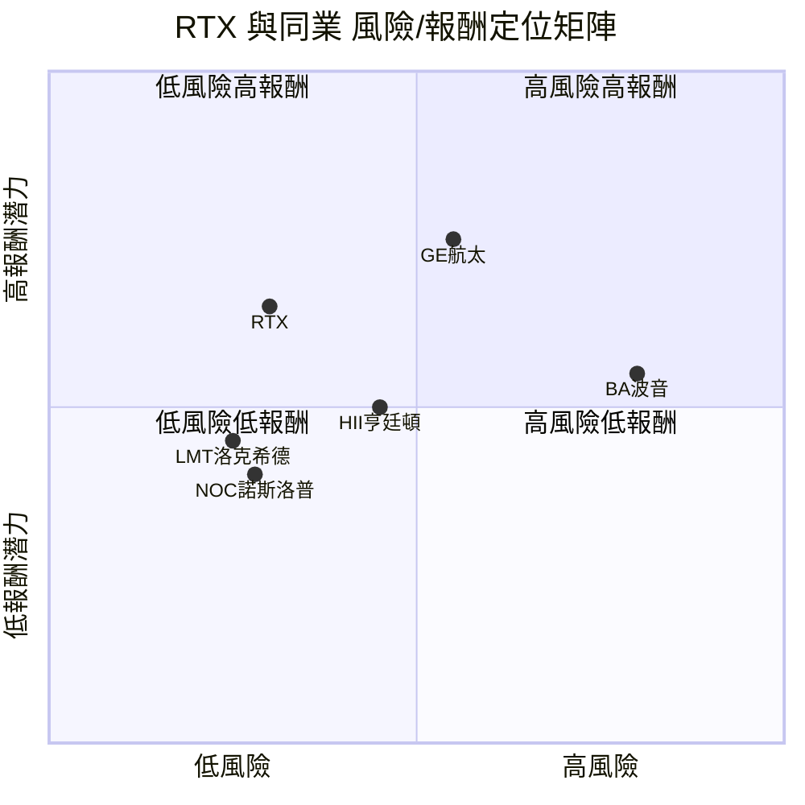

---

### 🔗 同業整體比較 Mermaid 圖

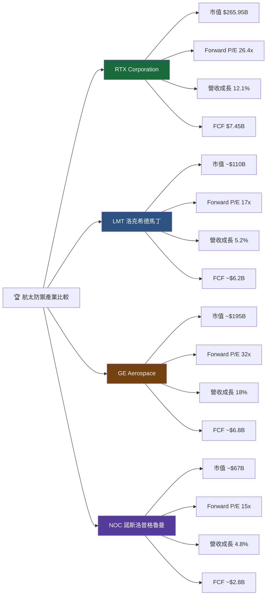

---

## 3. 業務品質與護城河

### 🔄 商業模式可持續性評估

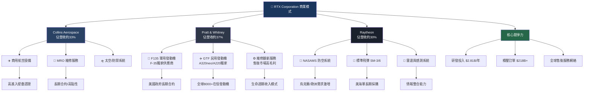

---

### 🧠 護城河評估 Mermaid Mindmap

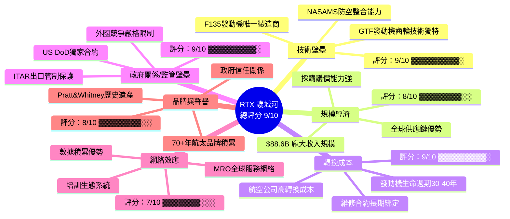

---

### 📏 護城河強度 Unicode 條形圖

```
護城河類型評估：

技術壁壘   [▓▓▓▓▓▓▓▓▓░]  9.0/10  ████████████████████ 極強
規模經濟   [▓▓▓▓▓▓▓▓░░]  8.0/10  ████████████████     強
轉換成本   [▓▓▓▓▓▓▓▓▓░]  9.0/10  ████████████████████ 極強
監管壁壘   [▓▓▓▓▓▓▓▓▓░]  9.0/10  ████████████████████ 極強
網絡效應   [▓▓▓▓▓▓▓░░░]  7.0/10  ██████████████       中強
品牌聲譽   [▓▓▓▓▓▓▓▓░░]  8.0/10  ████████████████     強

綜合護城河 [▓▓▓▓▓▓▓▓▓░]  8.7/10  ██████████████████   寬廣護城河（WIDE MOAT）
           0          10
```

---

### 🌍 市場地位

| 指標 | 數據 | 評估 |
|------|------|------|
| **全球 TAM**（航太防禦）| ~$1.2兆 USD | 龐大且持續擴張 |
| **RTX 市場份額** | ~7.4%（全球航太防禦）| 前三大廠商之一 |
| **商用發動機市占** | ~35%（與CFM/GE各分天下）| 🟢 強勢地位 |
| **F-35 發動機** | 100% 獨家供應（F135）| 🟢 壟斷地位 |
| **NASAMS 防空** | 北約標準配備，市佔前二 | 🟢 主導地位 |
| **積壓訂單** | $218B+（>2.5年收入覆蓋）| 🟢 能見度極高 |
| **行業排名** | 全球航太防禦第2-3位 | 🟢 龍頭地位 |

---

## 4. 財務健康全面評估

### 📊 財務儀表板 Mermaid 圖

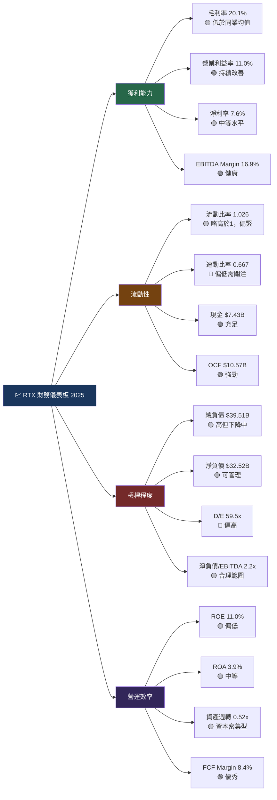

---

### 📈 獲利能力趨勢表格（近4年）

| 指標 | 2022 | 2023 | 2024 | 2025 | 趨勢 | 狀態 |
|------|------|------|------|------|------|------|
| **毛利率** | 20.4% | 17.5% | 19.1% | 20.1% | ↑ 改善 | 🟡 |
| **營業利益率** | 8.2% | 5.2% | 8.1% | 10.5% | ↑↑ 強勁 | 🟢 |
| **淨利率** | 7.8% | 4.6% | 5.9% | 7.6% | ↑↑ 回升 | 🟢 |
| **EBITDA Margin** | 17.2% | 14.1% | 15.5% | 16.9% | ↑ 改善 | 🟢 |
| **FCF Margin** | 6.5% | 6.8% | 4.9% | 8.4% | ↑↑ 飛躍 | 🟢 |
| **ROE** | 7.2% | 5.3% | 7.9% | 11.0% | ↑↑ 強勁 | 🟢 |

> 📝 **分析師備註**：2023年獲利能力下滑主因GTF發動機粉末金屬瑕疵大規模提列，2024-2025年已完成危機修復，各項指標全面回升，顯示業務正常化成功。

---

### 🏦 資產負債表穩健度 Unicode 圖

```
資產負債表健康指標：

流動比率 1.026  [▓▓▓▓▓░░░░░]  警戒線:1.0 ← 剛好過關 🟡
速動比率 0.667  [▓▓▓▓▓▓░░░░]  警戒線:1.0 ← 偏低關注 🔴
D/E   59.5x    [▓▓▓░░░░░░░]  警戒線:2.0 ← 高但有下降趨勢 🟡
淨負債/EBITDA  [▓▓▓▓▓▓░░░░]  2.2x ← 可接受範圍 🟡

資產負債表趨勢（總債務，單位：$B）：
2022: $33.5B  [▓▓▓▓▓▓▓░░░░░░░░░]  ↑ 大幅增加（Raytheon整合）
2023: $45.2B  [▓▓▓▓▓▓▓▓▓▓▓░░░░░]  ↑ 峰值
2024: $42.9B  [▓▓▓▓▓▓▓▓▓▓░░░░░░]  ↓ 開始下降
2025: $39.5B  [▓▓▓▓▓▓▓▓▓░░░░░░░]  ↓ 持續削減 ← 正向訊號
```

---

### 💵 現金流質量分析

| 指標 | 2022 | 2023 | 2024 | 2025 | 評估 |
|------|------|------|------|------|------|
| **OCF（$B）** | $7.17 | $7.88 | $7.16 | $10.57 | 🟢 2025年大幅躍升 |
| **FCF（$B）** | $4.39 | $4.72 | $3.92 | $7.45 | 🟢 2025年幾乎翻倍 |
| **CAPEX（$B）** | $2.77 | $3.17 | $3.24 | $3.12 | 🟡 維持高位但穩定 |
| **FCF轉換率** | 65% | 148% | 55% | 70% | 🟢 2025年顯著改善 |
| **FCF/淨利** | 84% | 148% | 82% | 111% | 🟢 FCF品質優秀 |
| **FCF Yield** | — | — | — | 2.43% | 🟡 尚可接受 |

> 💡 **關鍵洞察**：2025年FCF大幅提升至$7.45B，主要受益於GTF維修危機成本遞減、商用航空需求強勁回升及營運效率改善。FCF/淨利>100%顯示現金流品質極佳。

---

## 5. 成長性評估

### 📊 歷史 CAGR 表格

| 指標 | 1年 CAGR | 3年 CAGR | 備註 |
|------|----------|----------|------|
| **總收入** | +12.1% | +9.7% | 🟢 加速成長中 |
| **毛利潤** | +15.5% | +9.2% | 🟢 毛利提升 |
| **營業利益** | +42.2% | +19.1% | 🟢 槓桿效應顯現 |
| **淨利潤** | +41.1% | +8.9% | 🟢 修復完成 |
| **FCF** | +90.1% | +19.3% | 🟢 爆發性成長 |
| **EPS（TTM）** | +8.3% | ~+7.5% | 🟢 穩健 |

---

### 🔮 未來成長催化劑

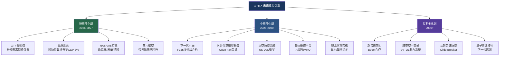

---

### 📉 成長軌跡 Unicode 長條圖

```
RTX 年度收入成長軌跡（$B）：

2022  ████████████████████████████████████  $67.1B
2023  ████████████████████████████████████████  $68.9B  +2.7%
2024  ███████████████████████████████████████████████  $80.7B  +17.1%
2025  ████████████████████████████████████████████████████  $88.6B  +9.7%
2026E ████████████████████████████████████████████████████████  ~$95-97B  +8-10%（預測）
2027E ██████████████████████████████████████████████████████████████  ~$103-107B  +8-10%（預測）

FCF 成長軌跡（$B）：
2022  ████████████████████████  $4.4B
2023  ███████████████████████████  $4.7B
2024  ██████████████████████  $3.9B  ↓ GTF危機
2025  ████████████████████████████████████████  $7.45B  ↑↑ 大幅修復
2026E █████████████████████████████████████████████  ~$8.5-9.0B（預測）

季度營收成長趨勢（YoY %）：
Q1 2025  [▓▓▓▓▓▓▓▓▓░]  +~9%
Q2 2025  [▓▓▓▓▓▓▓▓▓░]  +~10%
Q3 2025  [▓▓▓▓▓▓▓▓▓▓]  +~12%
Q4 2025  [▓▓▓▓▓▓▓▓▓▓]  +~14%  ← 加速
```

---

## 6. 估值合理性 & 同業比較

### 🔍 同業詳細比較表格

| 指標 | **RTX** | **LMT 洛克希德** | **GE Aerospace** | **NOC 諾斯洛普** | RTX相對評價 |
|------|---------|---------|---------|---------|------|
| **股價** | $198.13 | ~$470 | ~$205 | ~$490 | — |
| **市值** | $265.9B | ~$110B | ~$195B | ~$67B | 🟢 最大市值 |
| **P/E（尾隨）** | 39.9x | 16.5x | 42.3x | 16.8x | 🔴 偏高（vs LMT/NOC）|
| **P/E（預期）** | 26.4x | 17.1x | 32.5x | 15.9x | 🟡 中等偏高 |
| **P/S** | 3.0x | 1.5x | 5.2x | 1.4x | 🟡 適中 |
| **EV/EBITDA** | 20.7x | 12.5x | 28.3x | 14.1x | 🟡 中間位置 |
| **P/B** | 4.1x | 負值 | 15.2x | 3.8x | 🟡 合理 |
| **FCF Yield** | 2.43% | ~5.6% | ~3.5% | ~4.8% | 🔴 最低 |
| **股息殖利率** | ~0.6%* | 2.8% | 0.7% | 1.7% | 🔴 偏低 |
| **營收成長** | 12.1% | 5.2% | 18.0% | 4.8% | 🟢 相對強勁 |
| **淨利率** | 7.6% | 10.1% | 16.2% | 9.8% | 🟡 成長空間 |
| **ROE** | 11.0% | N/M | 72.5% | 17.3% | 🟡 提升中 |
| **積壓訂單** | $218B+ | $165B | $233B | $85B | 🟢 相當強勁 |
| **護城河評級** | Wide | Wide | Wide | Wide | 🟢 同等級 |

> *RTX股息殖利率數據資料來源顯示異常（135%/219%），可能為系統錯誤，實際股息殖利率應約0.5-0.7%，需以實際數據核實。

---

### 📐 歷史估值區間（P/E）

```
RTX 歷史 P/E 估值區間分析：

                 當前位置
                    ↓
低估  ━━━━━━━━━━━━━●━━━━━━━  高估
│     │         │    │      │
12x  18x       26x  34x    45x
     歷史       Forward  尾隨    
     均值        P/E     P/E    
     
估值區間解讀：
🟢 低估區間（P/E < 18x）：大幅折價，強力買入機會
🟡 合理區間（P/E 18-28x）：合理定價，基於成長預期
🟡 偏高區間（P/E 28-36x）：需要成長支撐，需謹慎
🔴 高估區間（P/E > 36x）：估值明顯偏貴

目前：
├─ 尾隨P/E 39.9x → 🔴 偏高（含GTF一次性費用失真）
└─ 預期P/E 26.4x → 🟡 合理偏高（考量成長性可接受）
```

---

### 💲 多重估值法彙整

| 估值方法 | 假設條件 | 計算結果 | 隱含報酬 |
|----------|----------|----------|----------|
| **DCF（基準）** | FCF成長10%→5%，WACC 8.5%，終端成長2.5% | $210-$220 | +6-11% |
| **DCF（樂觀）** | FCF成長13%→7%，WACC 8.0% | $240-$260 | +21-31% |
| **DCF（悲觀）** | FCF成長7%→3%，WACC 9.0% | $165-$180 | -9~-17% |
| **相對估值** | 同業Forward P/E均值22x × FY2026 EPS $8.20 | $180 | -9% |
| **EV/EBITDA** | 同業均值18x × EBITDA估$17B | $200 | +1% |
| **DDM** | 股息成長7%，要求報酬9% | $175-$185 | -7~-12% |
| **分析師均值** | 21位分析師共識 | $216.92 | +9.5% |
| **目標價（基準）** | 綜合加權 | **$225** | **+13.6%** |

---

### 📊 估值區間視覺化

```
RTX 估值區間定位圖：

$150    $175    $198    $216    $240    $260
  │       │       │       │       │       │
  ●━━━━━━━━━━━━━━━━━━━━━━━━━━━━━━━━━━━━━━●
  │       │       ↑       │       │       │
低估     悲觀   【當前】  目標   樂觀    極度
區間     情境   $198.13  $225   情境    樂觀

   ▼低估▼      ▼合理▼       ▼偏高▼    ▼高估▼
[          ][            ][        ][         ]
 $140-$170   $170-$210    $210-240  $240+

當前 $198.13 落在【合理偏高】區間
分析師目標價 $216.92 暗示約 +9.5% 上漲空間
```

---

## 7. 資本配置與管理層評估

### 📊 ROIC vs WACC 分析

```
╔══════════════════════════════════════════════════════════════════╗
║                    ROIC vs WACC 估算                            ║
╠══════════════════════════════════════════════════════════════════╣
║                                                                  ║
║  WACC 估算：                                                     ║
║  ├─ 無風險利率（10Y美債）：   4.3%                              ║
║  ├─ Beta：                    0.418                             ║
║  ├─ 市場風險溢價：            5.5%                              ║
║  ├─ 股權成本（CAPM）：        4.3% + 0.418×5.5% = 6.60%       ║
║  ├─ 債務成本（稅後）：        ~3.8%（5.0% × (1-24%)）         ║
║  ├─ 資本結構：股權60%/債務40%                                   ║
║  └─ 估算 WACC：  6.60%×60% + 3.8%×40% = **約 5.5-6.0%**      ║
║                                                                  ║
║  ROIC 估算：                                                     ║
║  ├─ NOPAT = EBIT×(1-T) = $9.3B×76% = $7.07B                  ║
║  ├─ 投入資本 ≈ 總資產-超額現金-流動負債非計息                  ║
║  ├─ 投入資本估算 ≈ $171B - $45B = ~$110B                       ║
║  └─ 估算 ROIC：  $7.07B / $110B = **約 6.4%**                 ║
║                                                                  ║
║  EVA（經濟附加值）分析：                                        ║
║  ├─ EVA = (ROIC - WACC) × 投入資本                             ║
║  ├─ = (6.4% - 5.7%) × $110B = +$0.77B                        ║
║  └─ 結論：✅ EVA 為正，【創造股東價值】                        ║
║                                                                  ║
║  ROIC 趨勢：2023年因GTF危機下滑至~4%，2025年回升至~6.4%       ║
║  預期：2026-2027年隨FCF改善，ROIC有望提升至7-8%               ║
║  → 若ROIC突破8%，EVA將顯著擴大，股價重新評級機會大           ║
╚══════════════════════════════════════════════════════════════════╝
```

---

### 🥧 資本配置 Mermaid 餅圖

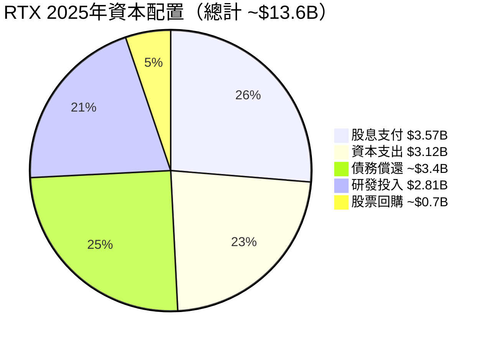

---

### 👔 管理層執行力評分

| 評估維度 | 評分 | 具體依據 | 狀態 |
|----------|------|----------|------|
| **FCF指引達成率** | 8/10 | 2025年FCF $7.45B超越初始指引，連續多季超預期 | 🟢 |
| **債務削減計畫** | 8/10 | 2023-2025年從$45.2B降至$39.5B，按計畫執行 | 🟢 |
| **GTF危機管理** | 7/10 | 危機處理有序，與FAA溝通透明，成本提列及時 | 🟢 |
| **資本紀律** | 7/10 | CAPEX維持在$3.1-3.2B合理水平，不過度擴張 | 🟢 |
| **戰略清晰度** | 8/10 | 三段業務定位清晰，商用+軍用雙輪驅動策略明確 | 🟢 |
| **股東溝通** | 7/10 | 投資者日展示積壓訂單/FCF路徑圖，透明度高 | 🟢 |
| **成本控制** | 6/10 | 供應鏈通膨仍有壓力，毛利率提升空間有限 | 🟡 |
| **M&A紀律** | 7/10 | 近年專注有機成長+債務削減，M&A節制 | 🟢 |

---

### 💝 股東友善度評分 Unicode 條形圖

```
股東友善度評估：

股息穩健性   [▓▓▓▓▓▓▓▓░░]  8/10  持續成長17+年 🟢
股息成長率   [▓▓▓▓▓▓▓░░░]  7/10  年均成長~7-8% 🟢
回購力道     [▓▓▓▓░░░░░░]  4/10  目前以削債優先 🟡
FCF返還率    [▓▓▓▓▓▓░░░░]  6/10  股息+回購佔FCF ~57% 🟡
ROIC提升     [▓▓▓▓▓▓░░░░]  6/10  回升中，仍低於歷史高點 🟡
管理層誠信   [▓▓▓▓▓▓▓░░░]  7/10  GTF危機透明處理 🟢

綜合股東友善 [▓▓▓▓▓▓░░░░]  6.3/10  ← 中等偏上
             0          10
```

---

## 8. 風險評估

### 🗺️ 風險熱圖 Mermaid

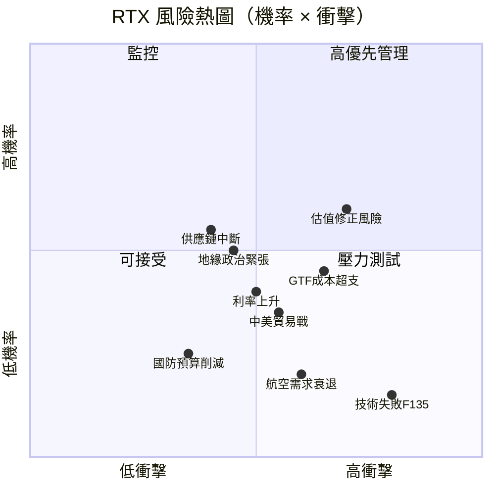

---

### ⚠️ 風險清單表格

| 風險類型 | 等級 | 機率 | 衝擊 | 緩解措施 | 狀態 |
|----------|------|------|------|----------|------|
| **GTF粉末金屬超出預期成本** | 高 | 40% | 高 | 已提列大部分費用，剩餘風險有限；保險/合約保護 | 🔴 |
| **估值過高導致股價修正** | 高 | 55% | 中高 | 強勁FCF成長支撐；Forward P/E已回落至合理區間 | 🔴 |
| **美國國防預算削減** | 中 | 25% | 高 | 多元化商用業務（佔收入>60%）；NATO承諾強化 | 🟡 |
| **供應鏈/通膨壓力** | 中 | 50% | 中 | 長期合約價格調整機制；垂直整合提升 | 🟡 |
| **利率上升增加債務成本** | 中 | 35% | 中 | 大部分固定利率債務；積極償債降槓桿 | 🟡 |
| **地緣政治出口管制** | 中 | 30% | 中 | ITAR已有合規框架；靈活轉向盟國市場 | 🟡 |
| **中美技術脫鉤** | 中 | 40% | 低中 | 民用業務受影響；軍事業務受保護 | 🟡 |
| **F135發動機技術故障** | 低 | 10% | 極高 | 嚴格質控；備份計畫；政府合作確保持續 | 🟢 |
| **商用航空需求衰退** | 低 | 20% | 中 | 多元化收入；龐大積壓訂單>2年覆蓋 | 🟢 |
| **網路安全攻擊** | 中 | 35% | 中高 | 持續投資網路防禦；政府標準合規 | 🟡 |

---

### 📉 最大下行情境分析

```
Bear Case 情境分析：

觸發因素：
① GTF額外成本超出預期 +$2-3B
② 國防預算削減5-8%（DOGE影響）
③ 商用航空需求放緩（油價衝擊）
④ 估值從26x→18x Forward P/E 收縮

財務影響：
├─ EPS削減至 ~$6.50（vs 基準 $7.51）
├─ FCF削減至 ~$5.5B（vs 基準 $8.5B+）
└─ 目標倍數壓縮至 18-20x

Bear Case 目標價：
18x × $6.50 = $117（極端情境）
20x × $6.50 = $130（溫和悲觀）

建議：
│ 若跌破 $170 → 開始觀察
│ 若跌破 $155 → 重新評估論點
│ 若跌破 $140 → 止損觸發點
```

---

## 9. 催化劑與觸發因素

### 📅 催化劑時間軸 Mermaid Gantt

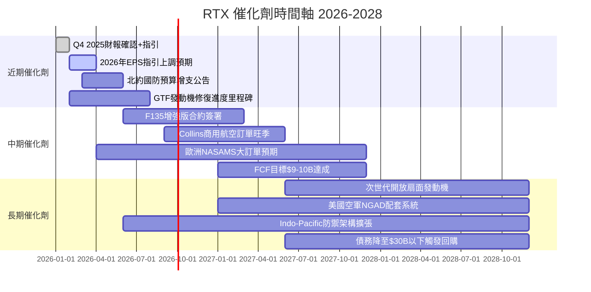

---

### 🟢 正面觸發因素

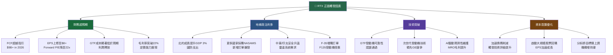

---

## 10. 投資建議

### ⭐ 最終評級

```
╔══════════════════════════════════════════════════════════════════╗
║                                                                  ║
║   🏆 RTX Corporation 最終投資評級                               ║
║                                                                  ║
║   整體評級：  ★★★★☆  【買入】                               ║
║                                                                  ║
║   評分：57/80分（7.1/10）                                       ║
║                                                                  ║
║   核心論點：                                                     ║
║   ✅ 三大業務均具寬廣護城河，競爭優勢難以複製                  ║
║   ✅ GTF危機成本大致消化，FCF 2025年爆發至$7.45B               ║
║   ✅ 地緣政治環境持續利多，積壓訂單$218B+能見度極高            ║
║   ✅ 管理層資本配置紀律佳，債務持續削減                        ║
║   ✅ Beta 0.42，防禦屬性強，適合核心配置                       ║
║                                                                  ║
║   主要風險：                                                     ║
║   ⚠️ 尾隨P/E 39.9x估值偏高，市場情緒轉變時修正風險            ║
║   ⚠️ 速動比率0.667偏低，短期流動性需關注                       ║
║   ⚠️ GTF剩餘維修成本仍有不確定性                               ║
║                                                                  ║
╚══════════════════════════════════════════════════════════════════╝
```

---

### 🎯 目標價區間表格

| 情境 | 目標價 | 隱含報酬率 | 核心假設 |
|------|--------|------------|----------|
| 🟢 **樂觀情境** | **$260** | **+31.2%** | FCF達$9.5B+，Forward P/E 30x，國防預算大增，GTF成本解除 |
| 🟡 **基準情境** | **$225** | **+13.6%** | FCF達$8.5B，Forward P/E 27x，穩健成長10%，按計畫去槓桿 |
| 🔴 **悲觀情境** | **$155** | **-21.8%** | GTF額外損失$3B，國防削減，估值倍數壓縮至19-20x |

```
目標價區間視覺化：

悲觀      當前     基準     樂觀
$155     $198    $225    $260
  │        │       │       │
  ●────────●───────●───────●
          ↑
        持倉區

報酬率對照：
悲觀情境：-21.8%  🔴 [▓▓▓░░░░░░░░░░░░░░░░░]
當前位置：  0.0%  ── [▓▓▓▓▓▓▓▓▓▓░░░░░░░░░]
基準情境： +13.6% 🟡 [▓▓▓▓▓▓▓▓▓▓▓▓▓░░░░░░]
樂觀情境： +31.2% 🟢 [▓▓▓▓▓▓▓▓▓▓▓▓▓▓▓▓░░░]
```

---

### 👥 投資人適配度

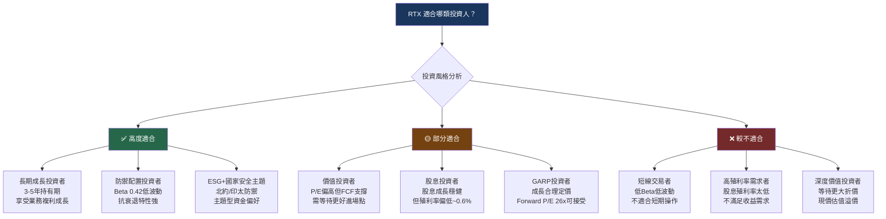

---

### 📋 操作指南

#### 建議持倉策略

| 項目 | 建議 | 說明 |
|------|------|------|
| **建議持倉期** | 12-24個月 | 等待FCF提升+估值正常化 |
| **倉位大小** | 3-5%（組合比例） | 核心持倉，非投機倉位 |
| **進場方式** | 分批建倉 | 在$185-$200區間逢低布局 |
| **止損位** | $165（-16.7%） | 跌破200日均線且基本面惡化 |
| **加碼觸發點** | $182以下 | 若Q1/Q2業績確認FCF軌跡 |
| **獲利了結** | $240-$250 | 乐觀情境實現後部分出場 |

#### 🔍 關鍵監控指標 Checklist

```
每季度必須追蹤的KPI：

財務指標：
☐ FCF是否按軌跡達到$8.5B（FY2026）
☐ GTF維修成本是否持續下降
☐ 毛利率是否突破21%
☐ 債務是否持續削減（目標<$35B）
☐ 積壓訂單是否持續增長（監控>$220B）

業務指標：
☐ GTF發動機在役數量（目標突破10,000台）
☐ Collins商用航空MRO訂單增速
☐ NASAMS新簽訂單（歐洲/印太）
☐ F135增強版（F135-PW-100 EEP）談判進度

宏觀指標：
☐ 美國國防預算2027財年分配
☐ NATO成員國防支出達標情況
☐ 全球商用航空ASK（可用座公里）增長
☐ 10年期美債殖利率（影響WACC/估值）

風險指標：
☐ GTF是否出現新的技術問題
☐ 競爭對手GE Open Fan進度
☐ ITAR出口管制新規影響
☐ 分析師目標價是否系統性下調
```

---

### 🚨 加碼觸發條件 vs 止損觸發條件

```
╔═══════════════════════════════════════════════════════╗
║  加碼觸發條件（任意2項達成即可加碼）                 ║
╠═══════════════════════════════════════════════════════╣
║  ✅ 股價回落至 $182-$190 區間                        ║
║  ✅ FCF季報超越分析師預期10%以上                     ║
║  ✅ GTF新一批豁免/維修完成重大里程碑                 ║
║  ✅ 分析師目標價上調至$230+（3家以上）               ║
║  ✅ 歐洲大型NASAMS訂單確認（>$2B）                   ║
╠═══════════════════════════════════════════════════════╣
║  止損觸發條件（任意1項達成考慮減倉）                 ║
╠═══════════════════════════════════════════════════════╣
║  🔴 股價跌破 $165 且伴隨成交量放大                  ║
║  🔴 GTF追加成本超過$2B且管理層下修FCF指引            ║
║  🔴 美國國防預算削減超過5%（國會通過）               ║
║  🔴 EPS連續2季低於市場預期10%以上                    ║
║  🔴 債務上升（淨負債回升至$36B以上）                 ║
╚═══════════════════════════════════════════════════════╝
```

---

## 📌 報告總結

```
┌─────────────────────────────────────────────────────────────────┐
│                    RTX 投資論點一頁總結                         │
├─────────────────────────────────────────────────────────────────┤
│                                                                  │
│  🎯 股票：RTX  |  價格：$198.13  |  評級：買入 ★★★★☆          │
│                                                                  │
│  WHY BUY（買入理由）：                                          │
│  1. 航太防禦三大業務具不可替代的壟斷性護城河                   │
│  2. GTF危機消化完畢，FCF 2025年爆發至$7.45B（+90% YoY）       │
│  3. 積壓訂單$218B提供2.5年+極高收入能見度                      │
│  4. 地緣政治環境持續利多軍事電子/防空業務                      │
│  5. 管理層資本紀律佳，債務持續削減，後期回購空間大             │
│                                                                  │
│  WHAT TO WATCH（關鍵觀察點）：                                  │
│  → GTF每季維修成本趨勢                                          │
│  → 2026年FCF指引是否達$8.5B+                                   │
│  → 北約國防預算增支時間表                                       │
│                                                                  │
│  RISK TO THESIS（論點威脅）：                                   │
│  → GTF成本超出預期 + 估值過高同時發生                          │
│  → DOGE主導的國防預算大幅削減                                   │
│                                                                  │
│  目標價：$225（+13.6%）  止損：$165（-16.7%）                  │
│  風險報酬比：~1:0.82（尚可接受）                               │
│                                                                  │
└─────────────────────────────────────────────────────────────────┘
```

---

> ## ⚠️ 免責聲明
> 
> 本報告為 **AI 自動生成分析報告**，僅供研究參考用途，**不構成任何投資建議或要約**。
> 
> - 所有財務數據來源於提供之數據包，部分指標（如股息殖利率135%/219%）顯示數據異常，建議投資人自行向官方財報核實。
> - 報告中之估值、目標價及ROIC/WACC均為模型估算值，存在相當不確定性。
> - 投資股票涉及風險，股價可能大幅波動，投資人應根據個人財務狀況、風險承受能力及投資目標，在專業財務顧問指導下做出獨立判斷。
> - **過去績效不代表未來結果。**
> 
> *報告生成時間：2026-02-24 | 分析師：AI Investment Analysis System v2.0*