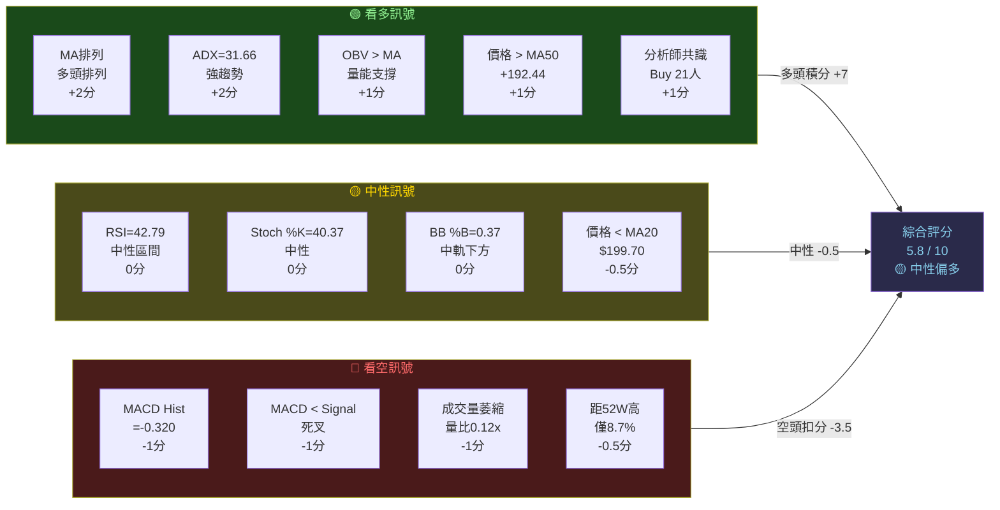
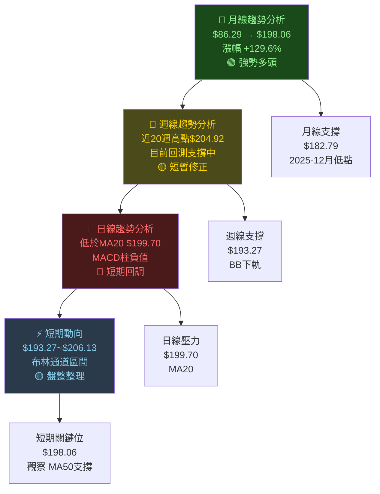
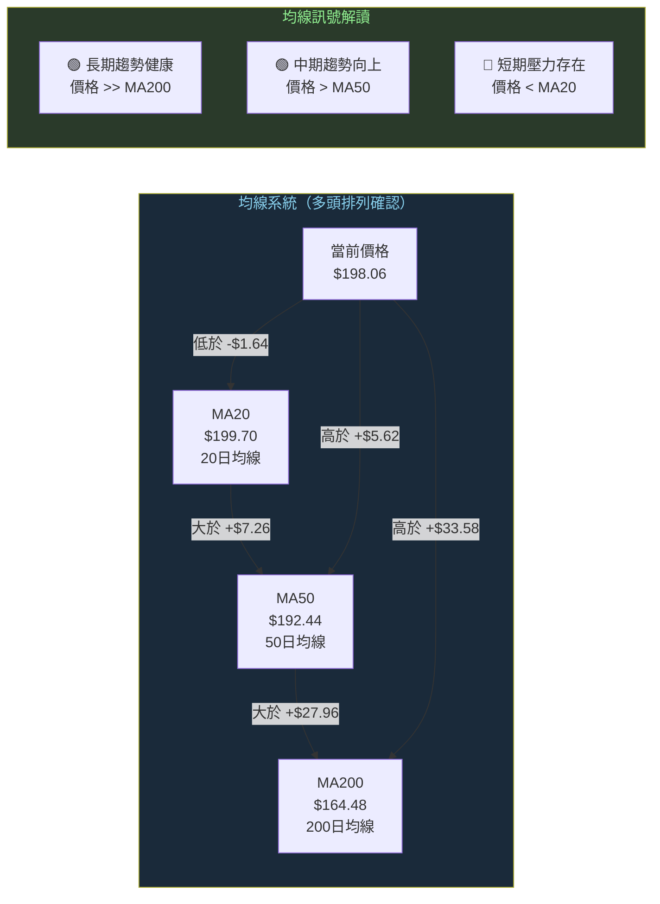
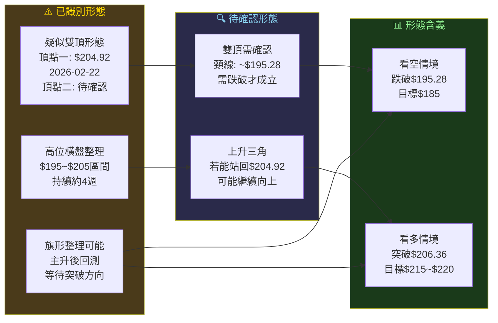
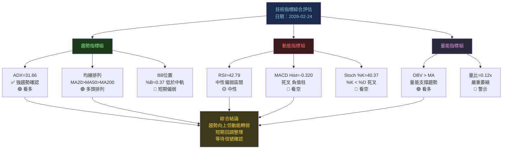
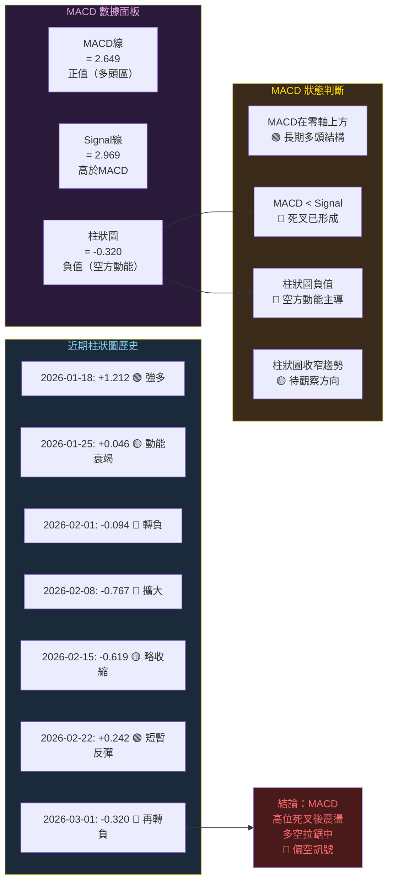
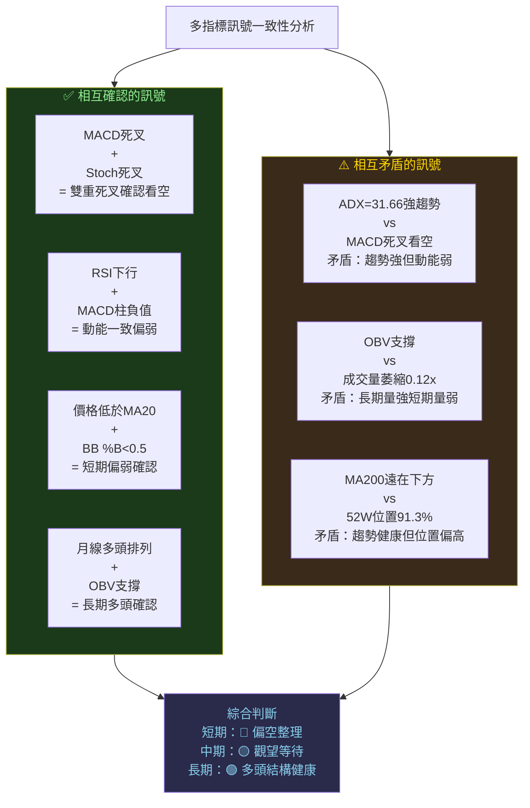
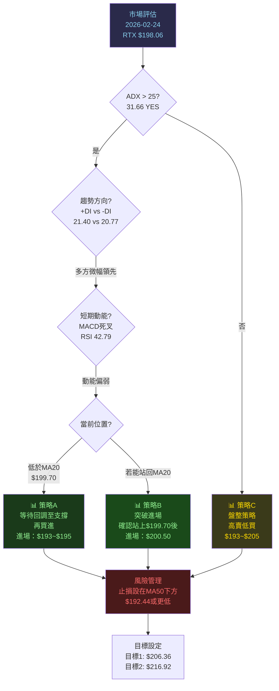

# RTX 技術分析報告

> **報告日期**：2026-02-24 ｜ **分析師**：資深技術分析師（15年+）｜ **語言**：繁體中文 ｜ **數據來源**：Yahoo Finance

---

## 目錄

| # | 章節 | 核心結論 |
|---|------|---------|
| 1 | 技術面概覽 | 技術評分 **5.8/10** 🟡 中性偏多 |
| 2 | 趨勢分析 | 長期多頭，短期回調整理中 |
| 3 | 圖表形態 | 疑似雙頂形態形成，需密切監控 |
| 4 | 支撐與阻力 | 關鍵支撐 $193.27，關鍵阻力 $206.36 |
| 5 | 指標深度解讀 | MACD 柱狀圖負值，RSI 中性區間 |
| 6 | 量價分析 | 今日成交量嚴重萎縮，OBV 仍支撐 |
| 7 | 多時框架總結 | 月線🟢 週線🟡 日線🔴 |
| 8 | 交易策略 | 建議等待確認信號再進場 |
| 9 | 風險提示 | 失守 $193.27 須立即重新評估 |

---

## 1. 技術面概覽

### 1.1 技術訊號儀表板



---

### 1.2 核心指標速覽表

| 指標類別 | 指標名稱 | 數值 | 訊號 | 偏向 |
|---------|---------|------|------|------|
| **價格** | 收盤價 | $198.06 | 低於MA20 | 🔴 |
| **均線** | MA20 | $199.70 | 價格在下方 | 🔴 |
| **均線** | MA50 | $192.44 | 價格在上方 | 🟢 |
| **均線** | MA200 | $164.48 | 價格在上方 | 🟢 |
| **均線排列** | 多頭排列 | MA20>MA50>MA200 | 牛市結構 | 🟢 |
| **動能** | RSI(14) | 42.79 | 中性偏弱 | 🟡 |
| **動能** | MACD | 2.649 | 正值 | 🟢 |
| **動能** | MACD Signal | 2.969 | MACD < Signal | 🔴 |
| **動能** | MACD Hist | -0.320 | 負值且擴大 | 🔴 |
| **動能** | Stoch %K | 40.37 | 中性 | 🟡 |
| **動能** | Stoch %D | 66.04 | %K < %D（死叉） | 🔴 |
| **趨勢** | ADX(14) | 31.66 | 強趨勢 | 🟢 |
| **趨勢** | +DI | 21.40 | 略大於-DI | 🟡 |
| **趨勢** | -DI | 20.77 | 接近+DI | 🟡 |
| **波動** | ATR(14) | $5.02 | 正常波動 | 🟡 |
| **波動** | BB %B | 0.37 | 中軌下方 | 🟡 |
| **成交量** | 量比 | 0.12x | 嚴重萎縮 | 🔴 |
| **成交量** | OBV趨勢 | OBV > MA | 量能支撐 | 🟢 |
| **估值** | 52W位置 | 91.3% | 接近高位 | 🟡 |

---

### 1.3 技術綜合評分（Unicode 進度條）

```
技術綜合評分：5.8 / 10
總體評級：中性偏多 🟡

┌─────────────────────────────────────────┐
│ 趨勢強度    ▓▓▓▓▓▓▓▓░░  8.0/10  🟢 強  │
│ 動能指標    ▓▓▓▓░░░░░░  4.0/10  🔴 弱  │
│ 成交量確認  ▓▓░░░░░░░░  2.5/10  🔴 弱  │
│ 支撐結構    ▓▓▓▓▓▓░░░░  6.0/10  🟡 中  │
│ 均線系統    ▓▓▓▓▓▓▓░░░  7.0/10  🟢 強  │
│ 形態分析    ▓▓▓▓░░░░░░  4.5/10  🟡 中  │
│ 分析師評級  ▓▓▓▓▓▓▓░░░  7.5/10  🟢 強  │
│            ──────────────────────────   │
│ 綜合評分    ▓▓▓▓▓▓░░░░  5.8/10  🟡     │
└─────────────────────────────────────────┘

評分說明：
  1-3分：強烈看空  ██████████ (不適用)
  4-6分：中性觀望  ██████░░░░ ← 目前位置
  7-9分：強烈看多  ██████████ (不適用)
```

---

### 1.4 52週價格位置分析

```
52週價格區間分析（$110.41 ~ $206.36）
━━━━━━━━━━━━━━━━━━━━━━━━━━━━━━━━━━━━━━━━━━━━━━━━━━━

$110.41  $130.00  $150.00  $170.00  $190.00  $206.36
   |        |        |        |        |        |
   ├────────┴────────┴────────┴────────┴──●─────┤
                                          ↑
                                     $198.06（當前）
                                     91.3% 位置

區間劃分：
  超賣區 [110.41~130]  ░░░░░░░░░░  佔比 0-20%
  低估區 [130~150]     ░░░░░░░░░░  佔比 20-42%
  中性區 [150~175]     ░░░░░░░░░░  佔比 42-67%
  偏高區 [175~195]     ░░░░░░░░░░  佔比 67-88%
  超買區 [195~206.36]  ████░░░░░░ ←當前91.3%

結論：RTX 目前位於 52 週高位區間（91.3%），
      距離歷史高點 $206.36 僅剩 $8.30（4.2%）
      上行空間相對有限，需警惕高位回調風險
```

---

## 2. 趨勢分析（多時框架）

### 2.1 多時框趨勢判斷



---

### 2.2 ADX 趨勢強度解讀

```
ADX 趨勢強度分析
━━━━━━━━━━━━━━━━━━━━━━━━━━━━━━━━━━━━━━━━━━━━━━━━

ADX(14) = 31.66

ADX 強度分級：
  0-15  ░░░░░░░░░░  無趨勢/盤整
  15-25 ░░░░░░░░░░  弱趨勢形成
  25-40 ████░░░░░░  ← 強趨勢（當前 31.66）
  40-50 ░░░░░░░░░░  極強趨勢
  50+   ░░░░░░░░░░  可能過熱

當前ADX值：31.66
進度條：▓▓▓▓▓▓▓░░░  [強趨勢區間]

+DI = 21.40  ████████░░░░░░░░░░░░
-DI = 20.77  ███████░░░░░░░░░░░░░
差值 = +0.63（多方僅微幅領先）

┌─────────────────────────────────────────────────┐
│ 判斷結論：這是「趨勢行情」而非盤整行情            │
│                                                  │
│ ✅ ADX > 25 確認趨勢存在                         │
│ ⚠️  +DI vs -DI 差距僅 0.63，方向優勢不明顯      │
│ ⚠️  ADX 可能已從高位開始鈍化（需觀察後續週）     │
│                                                  │
│ 操作含義：趨勢交易者應優先做多，但需設緊止損     │
└─────────────────────────────────────────────────┘
```

---

### 2.3 均線排列分析



**均線判斷結論：**

| 均線 | 位置 | 距離 | 含義 |
|-----|------|------|------|
| MA20 | $199.70 | 價格下方 $1.64 | 🔴 短期阻力，需站上 |
| MA50 | $192.44 | 價格上方 $5.62 | 🟢 中期支撐，保護完好 |
| MA200 | $164.48 | 價格上方 $33.58 | 🟢 長期趨勢基礎穩固 |

---

### 2.4 長/中/短期趨勢 Unicode 走勢圖

```
RTX 24個月趨勢軌跡（精簡版）
━━━━━━━━━━━━━━━━━━━━━━━━━━━━━━━━━━━━━━━━━━━━━━━━━━━━━
$210 ┤                                        ●   ★ 
$200 ┤                                    ●●    ●(現)
$190 ┤                                  ●         
$180 ┤                              ●●●          
$170 ┤                          ●●●             
$160 ┤                     ●●●                  
$150 ┤                  ●●                      
$140 ┤             ●●●                          
$130 ┤         ●●●                              
$120 ┤     ●●●                                  
$110 ┤  ●●                                      
$100 ┤●●                                        
 $90 ┤●                                         
     └─────────────────────────────────────────→
      2024/02  2024/07  2025/01  2025/07  2026/02
      
趨勢階段劃分：
▶ 第一階段 [2024/02~2024/05] $86→$104  +20.7% 初升段
▶ 第二階段 [2024/06~2024/06] $97        修正段
▶ 第三階段 [2024/07~2025/01] $113→$126 +11.5% 主升段一
▶ 第四階段 [2025/03~2025/04] $130→$124 -4.8%  修正段
▶ 第五階段 [2025/05~2026/01] $134→$200 +49.3% 主升段二
▶ 目前狀態 [2026/02~    ] $198         ⚠️ 高位整理中

長期趨勢：🟢🟢🟢 強多頭（+129.6%，2年期）
中期趨勢：🟢🟢   偏多（+57.0%，6個月）
短期趨勢：🟡🔴   偏弱（高位整理，近4週震盪）
```

---

## 3. 圖表形態分析

### 3.1 形態識別



---

### 3.2 ASCII 走勢示意圖

```
RTX 近20週走勢形態示意圖（2025-10 ~ 2026-03）
━━━━━━━━━━━━━━━━━━━━━━━━━━━━━━━━━━━━━━━━━━━━━━━━━━━━━━━

$208 ┤                                              ← 52W高點 $206.36
$206 ┤━━━━━━━━━━━━━━━━━━━━━━━━━━━━━━━━━━━━━━━━━━━  ← BB上軌 $206.13
$205 ┤                                     ▲        ← 近期高點 $204.92
$204 ┤                               ╭─────╯╲       
$202 ┤                           ╭───╯       ╲      
$201 ┤                       ╭───╯            ╲     ← $201.25
$200 ┤━━━━━━━━━━━━━━━━━━━━━━━╯━━━━━━━━━━━━━━━━━╲━━  ← MA20 $199.70
$199 ┤ 　                                       ●   ← 現價 $198.06
$198 ┤                                               
$196 ┤                                               
$195 ┤ ─ ─ ─ ─ ─ ─ ─ ─ ─ ─ ─ ─ ─ ─ ─ ─ ─ ─ ─ ─   ← 頸線 $195.28
$194 ┤                                               
$193 ┤━━━━━━━━━━━━━━━━━━━━━━━━━━━━━━━━━━━━━━━━━━━━  ← BB下軌 $193.27
$192 ┤━━━━━━━━━━━━━━━━━━━━━━━━━━━━━━━━━━━━━━━━━━━━  ← MA50 $192.44
$190 ┤                                               
$187 ┤                      ╭╮╮                      ← $187.88
$186 ┤                     ╭╯ ╰╮                     
$184 ┤                   ╭─╯   ╰─╮                   
$181 ┤               ╭───╯        ╰──╮                ← $181.41
$178 ┤          ╭────╯               ╰─╮              
$177 ┤      ╭───╯                      ╰─╮            ← $177.36
$174 ┤ ╭────╯                            ╰───╮        
$170 ┤╭╯                                      ╰───╮   ← $170.53
$166 ┤ 　　　                                        
$157 ┤╮                                              ← 起漲點
$156 ┤╯                                              ← $156.81
     └──┬────┬────┬────┬────┬────┬────┬────┬────┬──→
       10/19 11/2 11/16 12/7 12/21 1/4  1/18 2/1 2/22

關鍵標記說明：
  ● = 當前收盤價 $198.06
  ▲ = 近期高點 $204.92（2026-02-22）
  ━━ = 關鍵支撐/阻力/均線
  ─ ─ = 疑似雙頂頸線（$195.28）
  ╭╯ = 價格走勢路徑
```

---

### 3.3 形態目標價計算

| 形態名稱 | 測量方法 | 關鍵數值 | 目標價（上行） | 目標價（下行） | 信心度 |
|---------|---------|---------|-------------|-------------|--------|
| **疑似雙頂** | 頂部高度投影法 | 頂$204.92，頸$195.28，差$9.64 | N/A | $185.64 | 🟡 60% |
| **布林通道** | 上下軌投影 | 通道寬$12.86 | $206.13 | $193.27 | 🟢 85% |
| **主升段延伸** | 費氏延伸 138.2% | 從$156.81升至$204.92 | $214~$220 | N/A | 🟡 55% |
| **均線支撐反彈** | MA50反彈量測 | 從$192.44反彈，+5% | $202.06 | N/A | 🟢 70% |

**形態目標價計算詳解：**
```
雙頂目標計算（若頸線 $195.28 跌破）：
  頂點高度 = $204.92 - $195.28 = $9.64
  下行目標 = $195.28 - $9.64 = $185.64

上行突破目標計算（若突破 $206.36）：
  近期盤整幅度 = $204.92 - $195.28 = $9.64
  上行目標 = $206.36 + $9.64 = $216.00（與分析師均值 $216.92 高度吻合）
```

---

### 3.4 近期重要 K 線組合分析

| 週次 | 日期 | 收盤 | 型態描述 | 訊號 |
|-----|------|------|---------|------|
| W19 | 2026-02-22 | $204.92 | 高位長上影線，空頭排斥 | 🔴 |
| W20 | 2026-03-01 | $198.06 | 大陰線吞噬，跌破短期支撐 | 🔴 |
| W18 | 2026-02-15 | $199.40 | 十字星，方向猶豫 | 🟡 |
| W17 | 2026-02-08 | $198.00 | 低點試探支撐 | 🟡 |
| W16 | 2026-02-01 | $200.26 | 放量突破200關口 | 🟢 |

**週線K線組合結論：** 最近兩週出現「高位長上影+大陰線」組合，這是典型的頂部警告信號，技術上需提高警覺。

---

## 4. 支撐與阻力（精確數值）

### 4.1 支撐阻力位 ASCII 視覺化圖

```
RTX 支撐與阻力全景圖
━━━━━━━━━━━━━━━━━━━━━━━━━━━━━━━━━━━━━━━━━━━━━━━━━━━━━━━━

$238.00 ╔══════════════════════════════════════════╗ ← 分析師高目標
        ║  強阻力區（歷史未達）                    ║
$220.00 ║──────────────────────────────────────────║ ← 費氏161.8%延伸
$216.92 ║──────────────────────────────────────────║ ← 分析師平均目標
$214.00 ╚══════════════════════════════════════════╝
        
$208.00 ┄┄┄┄┄┄┄┄┄┄┄┄┄┄┄┄┄┄┄┄┄┄┄┄┄┄┄┄┄┄┄┄┄┄┄┄┄┄┄┄ ← 心理阻力
$206.36 ████████████████████████████████████████████ ← 52W高點（強阻力）
$206.13 ────────────────────────────────────────────  ← BB上軌
$204.92 ▓▓▓▓▓▓▓▓▓▓▓▓▓▓▓▓▓▓▓▓▓▓▓▓▓▓▓▓▓▓▓▓▓▓▓▓▓▓▓▓▓  ← 近期高點
$202.00 ┄┄┄┄┄┄┄┄┄┄┄┄┄┄┄┄┄┄┄┄┄┄┄┄┄┄┄┄┄┄┄┄┄┄┄┄┄┄┄┄ ← 心理整數
$200.00 ┄┄┄┄┄┄┄┄┄┄┄┄┄┄┄┄┄┄┄┄┄┄┄┄┄┄┄┄┄┄┄┄┄┄┄┄┄┄┄┄ ← 重要心理關口
$199.70 ════════════════════════════════════════════ ← MA20（近端阻力）

         ★★★ 當前價格：$198.06 ★★★

$195.28 ─ ─ ─ ─ ─ ─ ─ ─ ─ ─ ─ ─ ─ ─ ─ ─ ─ ─ ─  ← 雙頂頸線（重要！）
$193.27 ════════════════════════════════════════════ ← BB下軌（強支撐）
$192.44 ════════════════════════════════════════════ ← MA50（強支撐）
$190.00 ┄┄┄┄┄┄┄┄┄┄┄┄┄┄┄┄┄┄┄┄┄┄┄┄┄┄┄┄┄┄┄┄┄┄┄┄┄┄┄┄ ← 心理支撐
$187.17 ▒▒▒▒▒▒▒▒▒▒▒▒▒▒▒▒▒▒▒▒▒▒▒▒▒▒▒▒▒▒▒▒▒▒▒▒▒▒▒▒▒  ← 費氏38.2%回調
$184.56 ▒▒▒▒▒▒▒▒▒▒▒▒▒▒▒▒▒▒▒▒▒▒▒▒▒▒▒▒▒▒▒▒▒▒▒▒▒▒▒▒▒  ← 2025-12高點整合
$182.79 ▒▒▒▒▒▒▒▒▒▒▒▒▒▒▒▒▒▒▒▒▒▒▒▒▒▒▒▒▒▒▒▒▒▒▒▒▒▒▒▒▒  ← 2025-12收盤
$180.49 ▒▒▒▒▒▒▒▒▒▒▒▒▒▒▒▒▒▒▒▒▒▒▒▒▒▒▒▒▒▒▒▒▒▒▒▒▒▒▒▒▒  ← 費氏50%回調
$173.80 ░░░░░░░░░░░░░░░░░░░░░░░░░░░░░░░░░░░░░░░░░  ← 費氏61.8%回調
$164.48 ▓▓▓▓▓▓▓▓▓▓▓▓▓▓▓▓▓▓▓▓▓▓▓▓▓▓▓▓▓▓▓▓▓▓▓▓▓▓▓▓▓  ← MA200（長期強支撐）

圖例：████ 強阻/支撐 ▓▓▓▓ 次強 ▒▒▒▒ 中度 ░░░░ 輕度 ════ 均線/通道 ┄┄┄┄ 心理位
```

---

### 4.2 阻力位表格

| 等級 | 阻力位 | 依據 | 重要性 | 突破確認條件 |
|-----|--------|------|--------|------------|
| **近端阻力** | $199.70 | MA20日均線 | 🔴🔴🔴 | 收盤站上 + 成交量放大 |
| **近端阻力** | $200.00 | 心理整數關口 | 🔴🔴 | 放量突破並確認站穩 |
| **中端阻力** | $204.92 | 近期高點（2026-02-22） | 🔴🔴🔴🔴 | 週收盤突破 + 成交量 |
| **中端阻力** | $206.13 | 布林通道上軌 | 🔴🔴🔴 | 同時突破BB上軌 |
| **強阻力** | $206.36 | 52週最高點 | 🔴🔴🔴🔴🔴 | 需大量突破並收盤確認 |
| **極強阻力** | $216.92 | 分析師均值目標 | 🔴🔴🔴 | 基本面配合 |
| **長期阻力** | $238.00 | 分析師最高目標 | 🔴🔴 | 長線佈局區 |

---

### 4.3 支撐位表格

| 等級 | 支撐位 | 依據 | 重要性 | 失守影響 |
|-----|--------|------|--------|---------|
| **近端支撐** | $195.28 | 雙頂頸線/前低點 | 🟢🟢🟢🟢 | 失守觸發雙頂跌勢 |
| **中端支撐** | $193.27 | 布林通道下軌 | 🟢🟢🟢 | 跌破進入弱勢 |
| **強支撐** | $192.44 | MA50日均線 | 🟢🟢🟢🟢🟢 | 跌破中期趨勢逆轉 |
| **強支撐** | $187.17 | 費氏38.2%回調 | 🟢🟢🟢 | 重要黃金回調位 |
| **強支撐** | $184.56 | 2025年12月整合高點 | 🟢🟢🟢 | 上升波段起點 |
| **中期支撐** | $182.79 | 2025年12月月收盤 | 🟢🟢 | 月線支撐 |
| **強支撐** | $180.49 | 費氏50%回調 | 🟢🟢🟢🟢 | 牛熊分界線 |
| **長期支撐** | $164.48 | MA200長期均線 | 🟢🟢🟢🟢🟢 | 失守代表長期趨勢逆轉 |

---

### 4.4 斐波那契回調位計算表格

**計算基準：** 從近期低點 $156.81（2025-10-19）到近期高點 $204.92（2026-02-22）

```
波段幅度：$204.92 - $156.81 = $48.11

斐波那契回調計算：
━━━━━━━━━━━━━━━━━━━━━━━━━━━━━━━━━━━━━━━━
$204.92  ████████████████████  100%（高點）
$204.92
         
$200.14  ██████████████████░░  88.6%（淺回調）
$198.12  █████████████████░░░  86.1%（0.786）
         
★$198.06 目前價格
         
$187.17  ██████████████░░░░░░  63.8%（38.2%回調）← 第一支撐
$180.49  ████████████░░░░░░░░  49.1%（50%回調） ← 牛熊分界
$173.80  ██████████░░░░░░░░░░  35.4%（61.8%回調）← 深度回調
$166.92  ████████░░░░░░░░░░░░  21.0%（76.4%回調）
$156.81  ░░░░░░░░░░░░░░░░░░░░   0%（低點）
━━━━━━━━━━━━━━━━━━━━━━━━━━━━━━━━━━━━━━━━
```

| 斐波那契比例 | 價格位 | 意義 | 目前距離 |
|------------|--------|------|---------|
| 23.6% 回調 | $193.57 | 淺回調目標 | -$4.49（-2.3%）|
| **38.2% 回調** | **$187.17** | **正常回調支撐** | -$10.89（-5.5%）|
| **50.0% 回調** | **$180.49** | **牛熊分界線** | -$17.57（-8.9%）|
| **61.8% 回調** | **$173.80** | **深度回調支撐** | -$24.26（-12.3%）|
| 78.6% 回調 | $166.92 | 極深回調 | -$31.14（-15.7%）|

---

### 4.5 布林通道動態支撐阻力分析

```
布林通道分析（20日，2σ）
━━━━━━━━━━━━━━━━━━━━━━━━━━━━━━━━━━━━━━━━━━━━

BB上軌：$206.13  ████████████████████  超買區
BB中軌：$199.70  ──────────────────── 均衡線
BB下軌：$193.27  ████████████████████  超賣區

BB寬度（Bandwidth）= $206.13 - $193.27 = $12.86
BB %B = 0.37

%B 解讀：
  0.37 意味當前價格位於下軌與中軌之間，偏向下方
  通道中性（既非收縮也非極度擴張）

當前位置：$198.06
↓ 距BB中軌：$199.70 - $198.06 = $1.64 向上壓力
↓ 距BB下軌：$198.06 - $193.27 = $4.79 向下緩衝

動態支撐阻力示意：
$206.13  ─ ─ ─ ─ ─ 動態阻力（BB上軌，每日移動）
$199.70  ─────────  均衡線（每日移動，近端阻力）
$198.06  ●          當前價格
$193.27  ─ ─ ─ ─ ─ 動態支撐（BB下軌，每日移動）

操作含義：
✅ %B < 0.5 表示偏弱，空方略佔優勢
✅ 若 %B 下穿 0.0（觸及下軌），可能形成短期超賣反彈機會
⚠️ BB帶寬正常，非收縮狀態，短期突破信號可信度中等
```

---

## 5. 技術指標深度解讀

### 5.1 指標訊號彙整



---

### 5.2 RSI(14) 深度分析

```
RSI(14) 分析
━━━━━━━━━━━━━━━━━━━━━━━━━━━━━━━━━━━━━━━━━━━━━━━━━━━━━━

當前 RSI = 42.79

RSI 區間定義：
  超買區 [70-100]  ▓▓▓▓▓▓▓▓▓▓  不適用
  警告區 [60-70]   ▓▓▓▓▓▓▓░░░  不適用
  中性區 [40-60]   ▓▓▓▓░░░░░░  ← 當前 42.79（偏低）
  觀察區 [30-40]   ▓▓░░░░░░░░  接近此區
  超賣區 [0-30]    ░░░░░░░░░░  超賣警示

當前RSI進度條：
0    10   20   30  40  50   60   70   80   90  100
|─────────────────────●────────────────────────|
                      ↑ RSI=42.79

RSI進度條視覺化：
超賣 ░░░░░░░░░░░ 30 ▓▓▓▓▓▓▓▓▓▓▓▓ 42.79 ░░░░░░ 70 超買
[弱] ████████████████████▒▒▒▒▒▒░░░░░░░░░░░░░░░░ [強]

近20週RSI走勢：
  10/19: 38.0  ▓▓▓░░░░░░░  低位起漲
  10/26: 62.5  ▓▓▓▓▓▓░░░░  快速拉升
  11/02: 80.9  ████████░░  ← 超買警示
  11/09: 74.9  ███████░░░  仍高位
  11/16: 41.5  ▓▓▓▓░░░░░░  快速回落
  11/23: 33.7  ▓▓▓░░░░░░░  接近超賣
  11/30: 46.9  ▓▓▓▓░░░░░░  回升
  12/07: 42.0  ▓▓▓▓░░░░░░  偏弱
  12/14: 67.3  ██████░░░░  重新走強
  12/21: 78.1  ████████░░  ← 超買區
  12/28: 76.7  ███████░░░  高位維持
  01/04: 69.2  ██████░░░░  開始鈍化
  01/11: 70.0  ███████░░░  臨界超買
  01/18: 78.3  ████████░░  ← 再次超買
  01/25: 63.4  ██████░░░░  回落
  02/01: 68.3  ██████░░░░  
  02/08: 45.1  ▓▓▓▓░░░░░░  顯著下滑
  02/15: 58.8  ████░░░░░░  
  02/22: 58.1  ████░░░░░░  
  03/01: 42.8  ▓▓▓▓░░░░░░  ← 當前（繼續下行）
```

**🔍 RSI 背離分析（重要）：**

| 分析項目 | 判斷 | 說明 |
|---------|------|------|
| 頂背離 | 🟡 **潛在頂背離形成中** | 價格從$195.28漲至$204.92（新高），但RSI從63.4降至58.1（未創新高） |
| 底背離 | ❌ 無 | 暫無底背離信號 |
| 結論 | ⚠️ **需持續關注** | 若價格再創新高但RSI仍在60以下，頂背離正式確認，賣出信號 |

```
背離示意圖：
價格：$195.28 ──→ $204.92  （價格↑ 新高）
RSI：  63.4   ──→  58.1   （RSI↓ 未新高）
               ↘          
           🔴 疑似頂背離形成中
```

---

### 5.3 MACD(12/26/9) 深度分析



**MACD 詳細解讀：**
- ✅ MACD 值仍在零軸上方（+2.649），代表中期多頭結構未破壞
- 🔴 MACD 已發生「死叉」（MACD 2.649 < Signal 2.969）
- 🔴 柱狀圖從 +1.212（1月18日）急速下跌至 -0.767，再反彈至 +0.242，再跌回 -0.320，呈現高位震盪弱化格局
- ⚠️ **無MACD背離**：當前數據未顯示明顯頂/底背離

---

### 5.4 Stochastic(14,3,3) 分析

```
Stochastic 分析
━━━━━━━━━━━━━━━━━━━━━━━━━━━━━━━━━━━━━━━━━━━━━━━━

%K = 40.37  %D = 66.04

區間判斷：
  超買區 [80-100]  ░░░░░░░░░░  不適用
  高位區 [60-80]   %D=66.04 ← %D 仍在高位
  中性區 [40-60]   %K=40.37 ← %K 已下穿中性
  低位區 [20-40]   %K 接近此區
  超賣區 [0-20]    ░░░░░░░░░░  尚未觸及

進度條：
%K：░░░░░░░░░░░░░░░░●░░░░░░░░░░░░░░░░░░░░░░░
     0              40.37                   100

%D：░░░░░░░░░░░░░░░░░░░░░░░░░░░░░●░░░░░░░░░
     0                          66.04      100

關鍵觀察：
  %K (40.37) << %D (66.04)
  差距 = -25.67（空方動能顯著）
  
  🔴 死叉狀態：%K 已大幅跌破 %D
  🔴 %K 正在向超賣區（20以下）靠近
  🟡 若 %K 跌至 20 以下並反轉，可能產生超賣反彈機會

判斷：Stochastic 呈現「高位死叉」後的下行走勢，
      與 MACD 死叉訊號互相確認，短期偏空
```

---

### 5.5 布林通道(20,2σ) 分析

```
布林通道 ASCII 分析圖
━━━━━━━━━━━━━━━━━━━━━━━━━━━━━━━━━━━━━━━━━━━━━━━━

$206.13 ╔══════════════════════════════════════════╗ ← BB上軌
        ║  超買區域（%B > 1.0）                    ║
$204.92 ║  近期高點觸及                            ║
        ║                                          ║
$199.70 ╠══════════════════════════════════════════╣ ← BB中軌(MA20)
        ║  中性區域（%B = 0.37）                   ║
$198.06 ║  ● 當前價格（低於中軌）                  ║
        ║                                          ║
        ║  偏空區域（%B < 0.5）                    ║
$193.27 ╚══════════════════════════════════════════╝ ← BB下軌

BB %B 進度條（0=下軌，0.5=中軌，1=上軌）：
  下軌                 中軌                 上軌
   0          0.37     0.5                  1.0
   |────────────●──────|────────────────────|
               ↑當前位置（中軌下方）

BB帶寬分析：
  通道寬度 = $12.86 / $199.70 = 6.4%
  
  帶寬評估：
  收縮中（<4%）  ░░░░░░░░░░  非此狀態
  正常波動（4-8%）████░░░░░░  ← 當前 6.4%
  擴張中（>8%）  ░░░░░░░░░░  非此狀態

結論：
  ✅ 布林通道帶寬正常，非極度收縮
  🔴 %B = 0.37，價格在中軌下方，偏弱
  🟡 若跌至BB下軌 $193.27，超賣反彈概率增加
  ⚠️ 若跌破BB下軌並收盤，則進入弱勢下行通道
```

---

### 5.6 ATR(14) 波動率分析

```
ATR(14) = $5.02（佔當前價格 2.53%）

每日波動參考：
  單日正常波動：± $5.02（±2.53%）
  一日高估：$198.06 + $5.02 = $203.08
  一日低估：$198.06 - $5.02 = $193.04

ATR 止損距離建議（基於風險管理）：
━━━━━━━━━━━━━━━━━━━━━━━━━━━━━━━━━━━━━━━━━━━━
  保守止損（1.0x ATR）= $5.02  → 止損在 $193.04
  標準止損（1.5x ATR）= $7.53  → 止損在 $190.53
  寬鬆止損（2.0x ATR）= $10.04 → 止損在 $188.02

  建議使用：1.5x ATR 止損 = $7.53
  
ATR 歷史比較（估算）：
  低波動期：ATR < $3.50  ░░░░░░░░░░
  正常波動：ATR $3.5~$6.0 ████░░░░░░ ← 當前 $5.02
  高波動期：ATR > $6.00  ░░░░░░░░░░
  
結論：波動率正常，非極端環境
```

---

## 6. 量價分析

### 6.1 OBV 趨勢分析

```
OBV（累積成交量）分析
━━━━━━━━━━━━━━━━━━━━━━━━━━━━━━━━━━━━━━━━━━━━━━━━━━━━━

OBV狀態：OBV > OBV均線 → 🟢 量能支撐上漲

OBV 與價格關係判斷：
  
  價格：$156.81 → $204.92 → $198.06（先漲後回）
  OBV：           ↑ 仍維持 > MA（量能支撐）

判斷：無OBV背離
  
背離分析框架：
  ✅ 正背離（底部型）：價格下跌 + OBV上升 → 看多
  ❌ 負背離（頂部型）：價格上漲 + OBV下降 → 看空（此情況需警惕）
  ✅ 當前：OBV > OBV_MA，與上升趨勢一致

OBV評級：🟢 量能確認趨勢，長期結構未破壞

⚠️ 注意事項：
  今日成交量僅793,204（量比0.12x），
  短期OBV增量急劇萎縮，需後續放量確認方向
```

---

### 6.2 成交量與價格配合度分析

```
近20週量價配合分析
━━━━━━━━━━━━━━━━━━━━━━━━━━━━━━━━━━━━━━━━━━━━━━━━━━━━━━━━━━━━

日期        收盤      成交量        量價判斷
─────────────────────────────────────────────────────────
2025-10-19  $156.81  24,229,300  ▼價跌量縮  🟡 技術洗盤
2025-10-26  $177.36  37,754,600  ▲價漲放量  🟢 健康突破 ★
2025-11-02  $177.21  19,653,400  ≈價平量縮  🟡 高位縮量
2025-11-09  $175.69  19,581,000  ▼價跌量縮  🟡 正常回調
2025-11-16  $174.30  17,439,700  ▼價跌量縮  🟡 持續縮量
2025-11-23  $169.12  21,887,900  ▼價跌放量  🔴 殺跌警示
2025-11-30  $174.33  18,873,100  ▲價漲量縮  🟡 縮量反彈
2025-12-07  $170.53  24,910,600  ▼價跌量增  🔴 放量下跌
2025-12-14  $178.07  25,231,500  ▲價漲放量  🟢 量價配合
2025-12-21  $181.41  30,192,800  ▲價漲放量  🟢 強勢推升 ★
2025-12-28  $184.56   9,373,700  ▲價漲量縮  🟡 縮量緩升
2026-01-04  $186.63   9,810,100  ▲價漲量縮  🟡 縮量緩升
2026-01-11  $187.88  34,997,500  ▲價漲放量  🟢 量能回升 ★
2026-01-18  $201.25  24,977,300  ▲價漲量縮  🟡 量縮破200
2026-01-25  $195.28  20,699,500  ▼價跌量縮  🟡 正常獲利回吐
2026-02-01  $200.26  39,740,800  ▲價漲大量  🟢 強力放量 ★
2026-02-08  $198.00  35,997,900  ▼價跌量大  🔴 放量下跌 ⚠️
2026-02-15  $199.40  28,578,400  ▲價漲量縮  🟡 弱反彈
2026-02-22  $204.92  28,882,700  ▲價漲量縮  🟡 縮量創高（警示）
2026-03-01  $198.06   5,349,304  ▼價跌量劇縮 🔴 今日異常

★ = 關鍵放量突破點
⚠️ = 重要警示信號
```

---

### 6.3 量能評分

```
量能綜合評分
━━━━━━━━━━━━━━━━━━━━━━━━━━━━━━━━━━━━━━━━━━━

量能趨勢（OBV）    ▓▓▓▓▓▓▓░░░  7/10  🟢
量價配合度         ▓▓▓▓░░░░░░  4/10  🟡
近期成交量水平     ▓▓░░░░░░░░  2/10  🔴
突破確認度         ▓▓▓░░░░░░░  3/10  🔴
量能持續性         ▓▓▓▓░░░░░░  4/10  🟡
                   ─────────────────────
量能綜合評分       ▓▓▓▓░░░░░░  4.0/10 🟡 偏弱

重大警示：今日成交量 793,204 僅為20日均量的 0.12 倍
         這意味著今日跌幅可信度存疑（縮量下跌）
         但也暗示多方無力，缺乏承接
```

---

### 6.4 量能異常信號識別

| 日期 | 信號類型 | 說明 | 重要性 |
|-----|---------|------|--------|
| 2026-02-01 | 🟢 **大量突破** | 39.74M（近期最大量），價格突破$200 | ⭐⭐⭐⭐ |
| 2026-02-08 | 🔴 **放量下跌** | 36M放量下跌，與突破量相近，賣壓重 | ⭐⭐⭐⭐ |
| 2026-02-22 | ⚠️ **縮量創高** | 28.9M縮量下推升至$204.92，可信度低 | ⭐⭐⭐ |
| 2026-03-01 | 🔴 **成交量異常萎縮** | 5.35M僅0.12x均量，方向待確認 | ⭐⭐⭐⭐ |

**量能分析核心結論：**
- 🟢 OBV 長期仍在均線上方，長期量能結構未破
- 🔴 近期「放量突破→放量下跌→縮量創高→量劇縮」的量能模式，顯示籌碼不穩定
- ⚠️ 今日成交量極度萎縮（0.12x），需等待放量確認突破或跌破方向

---

## 7. 多時框架訊號總結

### 7.1 時框架評分表格

| 時框架 | 趨勢 | 動能 | 成交量 | 均線 | 綜合評分 | 偏向 |
|--------|------|------|--------|------|---------|------|
| **月線** | 🟢 強多頭 | 🟢 RSI健康 | 🟢 量能增加 | 🟢 完美多排 | **8.5/10** | 🟢 看多 |
| **週線** | 🟢 上升趨勢 | 🟡 動能減弱 | 🟡 量能不穩 | 🟢 多頭排列 | **6.0/10** | 🟡 中性 |
| **日線** | 🟡 震盪整理 | 🔴 MACD死叉 | 🔴 量能萎縮 | 🔴 低於MA20 | **4.0/10** | 🔴 偏弱 |
| **短期** | 🔴 短期回調 | 🔴 Stoch死叉 | 🔴 0.12x量比 | 🔴 需收復MA20 | **3.5/10** | 🔴 看空 |

---

### 7.2 訊號一致性分析



**矛盾點深度分析：**

| 矛盾組合 | 分析 | 結論 |
|---------|------|------|
| ADX強趨勢 vs MACD死叉 | ADX測量趨勢強度不測方向；MACD死叉代表動能轉移 | 趨勢仍在但多頭動能鬆動，需謹慎 |
| OBV支撐 vs 成交量萎縮 | OBV是累積指標看中長期；今日量萎縮是短期現象 | 長期量能健康，短期承接力不足 |
| 多頭排列 vs 低於MA20 | 均線多排是中長期信號；低於MA20是短期訊號 | 中長期保持多頭，短期面臨阻力 |

---

## 8. 交易策略建議（精確數值）

### 8.1 策略選擇流程圖



---

### 8.2 多頭策略（精確數值）

| 策略 | 說明 | 進場點 | 止損點 | 目標價1 | 目標價2 | 風險報酬比 | 建議倉位 |
|-----|------|--------|--------|---------|---------|-----------|---------|
| **A-保守** | 回調至BB下軌/MA50支撐區反彈 | $193.50 | $190.50 | $199.70 | $206.36 | **1:4.1** | 5% |
| **B-積極** | 突破MA20後進場確認 | $200.50 | $196.50 | $206.36 | $216.92 | **1:4.1** | 5-8% |
| **C-長線** | 突破52W高點後追多 | $207.00 | $200.50 | $216.92 | $225.00 | **1:2.9** | 3-5% |

**多頭策略A（最推薦）詳細說明：**
```
策略A - 支撐反彈策略
━━━━━━━━━━━━━━━━━━━━━━━━━━━━━━━━━━━━━
進場點：$193.50（BB下軌 $193.27 上方，MA50 $192.44 附近）
止損點：$190.50（MA50下方 $1.94，約 1.5x ATR）
目標1： $199.70（MA20，+3.2%）
目標2： $206.36（52W高點，+6.7%）

計算：
  風險 = $193.50 - $190.50 = $3.00
  收益1 = $199.70 - $193.50 = $6.20（風報比 1:2.1）
  收益2 = $206.36 - $193.50 = $12.86（風報比 1:4.3）
  平均風報比 = 1 : 3.2

進場觸發條件（必須同時滿足）：
  ✅ 價格觸及 $193.27~$193.80 區間
  ✅ RSI < 35（確認超賣）
  ✅ 出現日線陽線K棒反轉
  ✅ 成交量相對放大（> 4M）
```

**多頭策略B（突破進場）詳細說明：**
```
策略B - 確認突破策略
━━━━━━━━━━━━━━━━━━━━━━━━━━━━━━━━━━━━━
進場點：$200.50（確認收盤突破MA20後隔日進場）
止損點：$196.50（近端支撐 $195.28 下方）
目標1： $206.36（52W高點，+2.9%）
目標2： $216.92（分析師均值，+8.2%）

計算：
  風險 = $200.50 - $196.50 = $4.00
  收益1 = $206.36 - $200.50 = $5.86（風報比 1:1.5）
  收益2 = $216.92 - $200.50 = $16.42（風報比 1:4.1）
  建議：在目標1分批減倉50%，剩餘持有至目標2

進場觸發條件：
  ✅ 日收盤價 > $200.50
  ✅ MACD柱轉正（柱狀圖 > 0）
  ✅ RSI > 50
  ✅ 成交