# SHOP 基本面深度分析報告

> **報告日期**：2026-02-24 ｜ **分析師**：AI 頂級研究部 ｜ **數據來源**：Yahoo Finance ｜ **語言**：繁體中文

---

## 目錄

| # | 章節 | 頁面要點 |
|---|------|---------|
| 1 | 執行摘要 | 核心評分、投資論點、快速統計 |
| 2 | 公司概覽 | 業務結構、市場地位、競爭優勢 |
| 3 | 損益表深度分析 | 收入成長、利潤率演變、費用結構 |
| 4 | 資產負債表分析 | 資產結構、負債比率、流動性 |
| 5 | 現金流量分析 | 現金流瀑布、FCF趨勢、資本配置 |
| 6 | 獲利能力指標 | ROE/ROA/ROIC對比、儀表板 |
| 7 | 估值分析 | 估值倍數、目標股價情境、同業比較 |
| 8 | 競爭護城河 | Porter五力、護城河評分 |
| 9 | 成長催化劑 | 時間軸、TAM市場規模 |
| 10 | 風險分析 | 風險矩陣、評分卡 |
| 11 | 公平價值估算 | DCF模型、三種估值法 |
| 12 | 投資建議 | 最終評級、適配度、監控指標 |

---

## 1. 執行摘要

### 🎯 核心評分儀表板

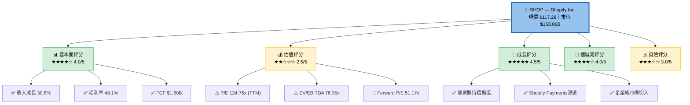

---

### 📋 5大投資論點

| # | 投資論點 | 信號 | 詳細說明 | 重要性 |
|---|---------|------|---------|--------|
| 1 | 🟢 高速收入成長持續 | 🟢 強烈正面 | TTM收入 $11.56B，YoY +30.6%，超越市場預期 | ★★★★★ |
| 2 | 🟢 盈利轉型完成 | 🟢 正面 | 營業利潤率從2022年-12.3% 躍升至2024年 14.6% | ★★★★★ |
| 3 | 🟢 自由現金流爆發 | 🟢 正面 | FCF從2022年 -$186M → 2024年 +$1.60B，大幅改善 | ★★★★☆ |
| 4 | 🟡 估值偏高風險 | 🔴 負面 | TTM P/E 124.76x，遠高於科技股均值 | ★★★★☆ |
| 5 | 🟡 股價近期回調 | 🟡 中性 | 較52W高點 $182.19 下跌 35.6%，潛在買點 | ★★★☆☆ |

---

### 📊 快速統計卡片

| 指標類別 | 指標 | 數值 | 行業對比 | 評級 |
|---------|------|------|---------|------|
| **市場數據** | 現價 | $117.28 | — | — |
| | 市值 | $153.06B | 大型科技股 | 🟢 |
| | 52W區間 | $69.84 ~ $182.19 | — | 🟡 |
| | Beta | 2.822 | 高波動性 | 🔴 |
| **盈利能力** | 毛利率 | 48.1% | 科技股 ~60% | 🟡 |
| | 營業利潤率 | 20.3% | 科技股 ~20% | 🟢 |
| | 淨利率 | 10.7% | 科技股 ~15% | 🟡 |
| **成長** | 收入成長 | +30.6% | 科技股 ~12% | 🟢 |
| | EPS(TTM) | $0.94 | — | 🟡 |
| | EPS(Forward) | $2.29 | — | 🟢 |
| **財務健康** | 現金 | $5.85B | 充裕 | 🟢 |
| | 流動比率 | 5.96x | >2 為佳 | 🟢 |
| | 負債/權益 | 1.395 | 偏低 | 🟢 |
| **估值** | P/E (TTM) | 124.76x | 偏高 | 🔴 |
| | Forward P/E | 51.17x | 成長溢價 | 🟡 |
| | P/S | 13.25x | 偏高 | 🟡 |
| **分析師** | 推薦 | 買入 | 45位分析師 | 🟢 |
| | 目標均價 | $161.58 | 上漲空間 37.8% | 🟢 |

---

## 2. 公司概覽

### 🏢 業務結構全景

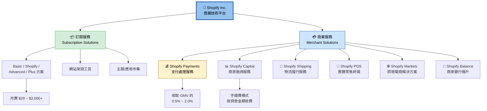

---

### 🌍 市場地位 — 電商平台市佔率

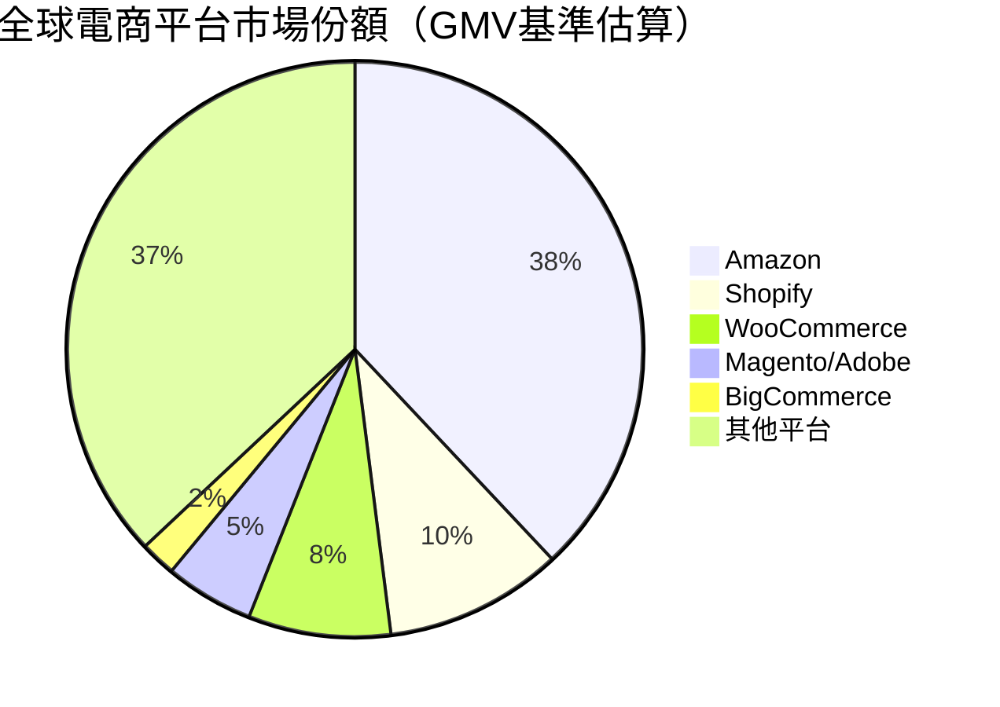

---

### 🧠 競爭優勢 Mind Map

```mermaid
mindmap
  root((Shopify<br/>核心競爭優勢))
    網路效應
      200萬+ 活躍商家
      應用開發商生態系
      主題設計師社群
      合作夥伴渠道
    技術護城河
      一站式SaaS架構
      API優先設計
      AI/ML整合能力
      Shopify Magic AI工具
    支付生態系
      Shopify Payments
      跨境支付能力
      Shop Pay結帳體驗
      Buy Now Pay Later整合
    品牌與信任
      全球品牌知名度
      商家成功案例
      Shopify University
      企業客戶(Plus)擴張
    規模優勢
      基礎設施成本攤薄
      數據優勢持續強化
      物流網路建設
      資本融資產品
```

---

### 📍 商家規模分佈

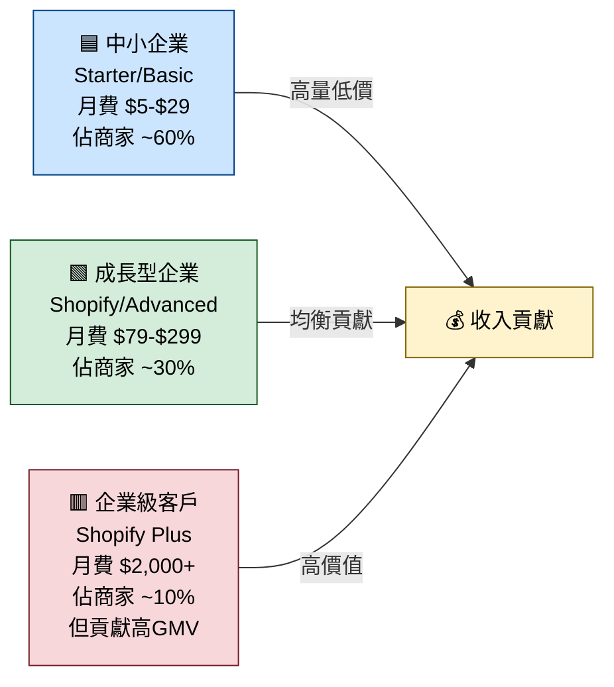

---

## 3. 損益表深度分析

### 📈 年度收入成長時間軸

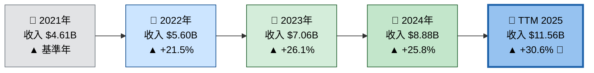

---

### 📊 年度收入 Unicode 長條圖

```
收入趨勢（年度，單位：十億美元）

2021  $4.61B  ▓▓▓▓▓▓▓▓▓▓▓▓▓▓▓▓▓▓▓▓▓▓▓░░░░░░░░░░░░░░░░░░░░  (基準)
2022  $5.60B  ▓▓▓▓▓▓▓▓▓▓▓▓▓▓▓▓▓▓▓▓▓▓▓▓▓▓▓░░░░░░░░░░░░░░░  (+21.5%)
2023  $7.06B  ▓▓▓▓▓▓▓▓▓▓▓▓▓▓▓▓▓▓▓▓▓▓▓▓▓▓▓▓▓▓▓▓▓▓░░░░░░░  (+26.1%)
2024  $8.88B  ▓▓▓▓▓▓▓▓▓▓▓▓▓▓▓▓▓▓▓▓▓▓▓▓▓▓▓▓▓▓▓▓▓▓▓▓▓▓▓▓▓▓  (+25.8%)
TTM  $11.56B  ▓▓▓▓▓▓▓▓▓▓▓▓▓▓▓▓▓▓▓▓▓▓▓▓▓▓▓▓▓▓▓▓▓▓▓▓▓▓▓▓▓▓▓▓▓▓▓▓▓▓▓▓▓▓  (+30.6%)
              |----10%---|----20%---|----30%---|----40%---|----50%--|
```

---

### 📊 12個月股價走勢 Unicode 圖

```
SHOP 12個月股價走勢（美元）

$182  ┤                                   ●(高點)
$175  ┤                                 ╱   ╲
$165  ┤                               ╱       ╲
$155  ┤                    ●         ╱          ╲     ╮
$148  ┤                   ╱ ╲       ╱             ╲  ╱ ╲
$140  ┤                  ╱   ╲     ╱                ╲╱   ╲
$130  ┤                 ╱     ╲   ╱                        ╲
$122  ┤           ●    ╱       ╲ ╱                          ●
$115  ┤   ●      ╱ ╲  ╱                                    ╱ ╲
$107  ┤  ╱ ╲   ╱    ╲╱                                        ╲
$095  ┤ ╱   ╲ ╱                                                 ╲
$085  ┤      ╲                                                    ●
      └──────────────────────────────────────────────────────────
      Feb  Mar  Apr  May  Jun  Jul  Aug  Sep  Oct  Nov  Dec  Jan  Feb
      2025                                                       2026
```

---

### 💹 近4年損益表核心數據

| 財務指標 | 2021 | 2022 | 2023 | 2024 | 趨勢 |
|---------|------|------|------|------|------|
| 總收入 | $4.61B | $5.60B | $7.06B | $8.88B | 🟢 持續增長 |
| YoY成長率 | — | +21.5% | +26.1% | +25.8% | 🟢 加速中 |
| 毛利潤 | $2.48B | $2.75B | $3.52B | $4.47B | 🟢 穩健擴張 |
| 毛利率 | 53.8% | 49.1% | 49.9% | 50.3% | 🟡 略有波動 |
| 營業利潤 | $350M | **-$687M** | $74M | **$1.30B** | 🟢 大幅改善 |
| 營業利潤率 | 7.6% | **-12.3%** | 1.0% | **14.6%** | 🟢 轉型成功 |
| EBITDA | $3.21B | -$594M | $144M | $1.34B | 🟢 強勁回升 |
| 淨利潤 | $2.91B | **-$3.46B** | $132M | **$2.02B** | 🟢 大幅改善 |
| 淨利率 | 63.1%* | -61.8% | 1.9% | 22.8% | 🟢 |
| R&D費用 | $854M | $1.50B | $1.73B | $1.37B | 🟡 略降 |
| EPS (TTM) | — | — | — | $0.94 | 🟡 |

> *2021年淨利潤含大量投資收益（Affirm股權），非正常經營利潤

---

### 📉 利潤率演變 ASCII 折線圖

```
利潤率演變趨勢（%）

 55% ┤ ▲毛利率
 50% ┤ ●─────────●─────────●─────────●  毛利率(49~54%)
 45% ┤
 40% ┤
 35% ┤
 30% ┤
 25% ┤
 20% ┤                                    ◆ 淨利率(22.8%)
 15% ┤                          ●         ◆ 營業利潤率(14.6%)
 10% ┤  ■ 7.6%                  ■ 1.0%  
  5% ┤                                   
  0% ┼─────────────────────────────────
 -5% ┤             ▼             ▼
-10% ┤          ■ -12.3%        ■ 1.9%
-65% ┤          ◆ -61.8%
     └──────────────────────────────────
        2021      2022      2023    2024
     ■ = 營業利潤率   ◆ = 淨利率   ● = 毛利率
```

---

### 🔧 費用結構分析

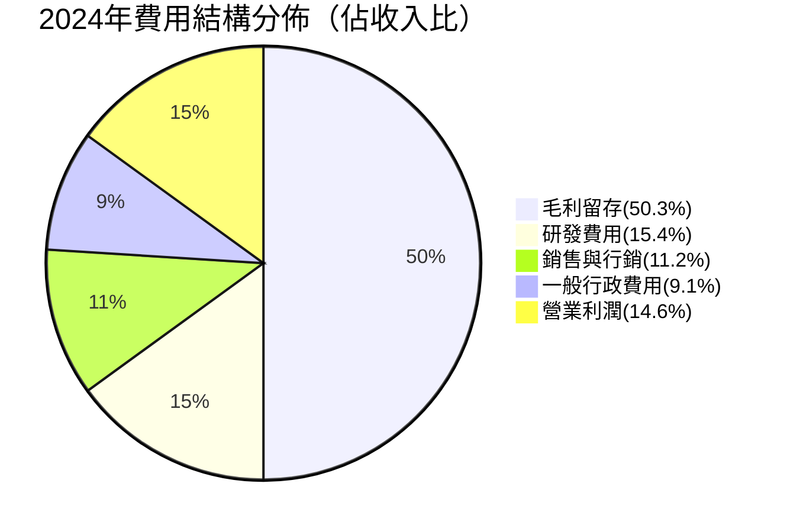

---

### 📊 研發投入趨勢

```
研發費用佔收入比例

2021  $854M / $4.61B  = 18.5%  ▓▓▓▓▓▓▓▓▓▓▓▓▓▓▓▓▓▓░░░░░░░░░░
2022  $1.50B / $5.60B = 26.8%  ▓▓▓▓▓▓▓▓▓▓▓▓▓▓▓▓▓▓▓▓▓▓▓▓▓▓▓░
2023  $1.73B / $7.06B = 24.5%  ▓▓▓▓▓▓▓▓▓▓▓▓▓▓▓▓▓▓▓▓▓▓▓▓░░░░  ← 戰略投入高峰
2024  $1.37B / $8.88B = 15.4%  ▓▓▓▓▓▓▓▓▓▓▓▓▓▓▓░░░░░░░░░░░░░  ← 效率提升
                                |----5%----|----15%---|----25%--|
```

> 💡 **關鍵觀察**：研發費用佔比從 26.8% 降至 15.4%，顯示 Shopify 完成了「戰略投入期」向「效率收割期」的轉型。

---

## 4. 資產負債表分析

### 🏛️ 資產結構分解圖

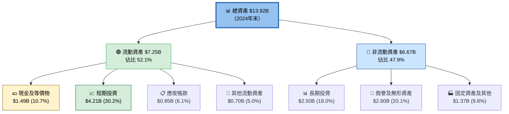

---

### 📊 資產配置 Unicode 橫條圖

```
資產配置結構（2024年末，總資產 $13.92B）

現金及等價物  $1.49B  ▓▓▓▓▓░░░░░░░░░░░░░░░░░░░░░░░░░░░░░░░░░░░░   10.7%
短期投資      $4.21B  ▓▓▓▓▓▓▓▓▓▓▓▓▓▓▓▓▓░░░░░░░░░░░░░░░░░░░░░░░   30.2%
應收帳款      $0.85B  ▓▓▓░░░░░░░░░░░░░░░░░░░░░░░░░░░░░░░░░░░░░░    6.1%
其他流動      $0.70B  ▓▓░░░░░░░░░░░░░░░░░░░░░░░░░░░░░░░░░░░░░░░    5.0%
長期投資      $2.50B  ▓▓▓▓▓▓▓▓▓▓░░░░░░░░░░░░░░░░░░░░░░░░░░░░░░   18.0%
商譽無形資產  $2.80B  ▓▓▓▓▓▓▓▓▓▓▓░░░░░░░░░░░░░░░░░░░░░░░░░░░░░   20.1%
固定資產其他  $1.37B  ▓▓▓▓▓░░░░░░░░░░░░░░░░░░░░░░░░░░░░░░░░░░░░    9.8%
              |──────5%──────15%──────25%──────35%──────50%|
```

---

### 💼 負債與流動性比率

| 指標 | 2021 | 2022 | 2023 | 2024 | 評級 |
|------|------|------|------|------|------|
| 流動比率 | 12.16x | 7.07x | 6.99x | **5.96x** | 🟢 極為充裕 |
| 總負債 | $1.17B | $1.40B | $1.15B | $1.13B | 🟢 穩中有降 |
| 股東權益 | $11.13B | $8.24B | $9.07B | **$11.56B** | 🟢 持續增長 |
| 負債/資產 | 16.6% | 23.4% | 19.7% | **17.0%** | 🟢 低槓桿 |
| 現金覆蓋率 | — | — | — | **31.1x** | 🟢 極強 |
| 淨現金狀況 | +$1.33B | +$0.25B | +$0.26B | **+$4.72B** | 🟢 淨現金公司 |

> 💡 **淨現金計算**：現金 $5.85B（包含短期投資）- 總債務 $1.13B = 淨現金 **$4.72B**

---

### 📈 股東權益趨勢 ASCII 圖

```
股東權益趨勢（十億美元）

$12B ┤                                              ●  $11.56B
$11B ┤  ●  $11.13B                          
$10B ┤         ╲                            ╱
 $9B ┤           ╲                   ●     ╱   $9.07B
 $8B ┤             ╲               ╱    
 $7B ┤               ●  $8.24B   ╱         
 $6B ┤                    ╲    ╱            
 $5B ┤                     ╲  ╱             
 $4B ┤                      ╲╱  ← 最低點2022年
     └─────────────────────────────────────
       2021        2022      2023       2024
注：2022年低點因淨虧損 -$3.46B（含Affirm股票減損）
```

---

## 5. 現金流量分析

### 💧 現金流瀑布圖

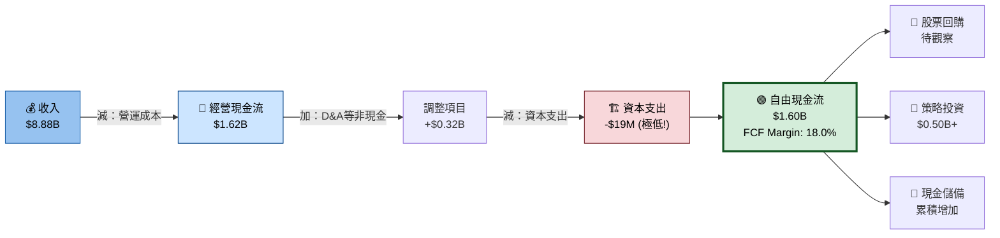

---

### 📊 自由現金流趨勢 Unicode 進度條

```
自由現金流演變（FCF Margin）

2021  $484.9M  FCF Margin: 10.5%  ▓▓▓▓▓▓▓▓▓▓▓░░░░░░░░░░░░░░░░░░░░░░░░░░  🟡
2022  -$186M   FCF Margin: -3.3%  ░░░░░░░░░░░░░░░░░░░░░░░░░░░░░░░░░░░░░  🔴 現金燃燒
2023  $905M    FCF Margin: 12.8%  ▓▓▓▓▓▓▓▓▓▓▓▓▓░░░░░░░░░░░░░░░░░░░░░░░  🟡 快速反彈
2024  $1.60B   FCF Margin: 18.0%  ▓▓▓▓▓▓▓▓▓▓▓▓▓▓▓▓▓▓░░░░░░░░░░░░░░░░░  🟢 突破性改善
TTM   $1.29B   FCF Margin: 11.2%  ▓▓▓▓▓▓▓▓▓▓▓░░░░░░░░░░░░░░░░░░░░░░░░  🟢 穩健持續
              |0%-----5%-----10%-----15%-----20%-----25%---30%|

★★★★☆ FCF轉型評分：4.0/5
```

---

### 💡 資本配置策略

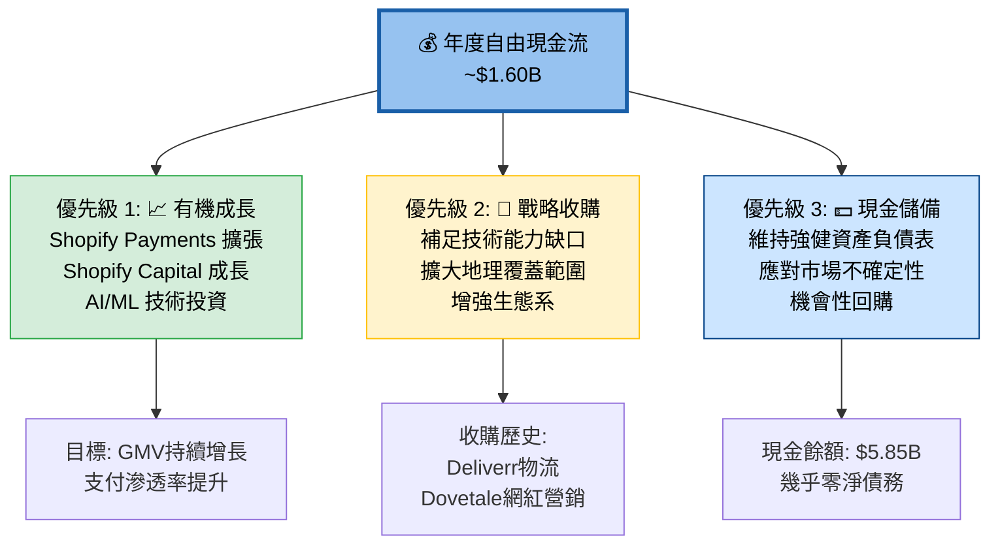

---

### 🔑 資本效率分析

| 指標 | 2021 | 2022 | 2023 | 2024 | 趨勢 |
|------|------|------|------|------|------|
| 經營現金流 | $535M | **-$136M** | $944M | **$1.62B** | 🟢 大幅改善 |
| 自由現金流 | $485M | **-$186M** | $905M | **$1.60B** | 🟢 爆發式增長 |
| 資本支出 | $50.8M | $50.0M | $39.0M | **$19.0M** | 🟢 極輕資產模式 |
| FCF轉換率 | 90.5% | N/A | 95.9% | **98.8%** | 🟢 近乎完美 |
| FCF Margin | 10.5% | -3.3% | 12.8% | **18.0%** | 🟢 高速提升 |

> 💡 **重大亮點**：2024年資本支出僅 $19M（佔收入 0.21%），顯示 Shopify 已是典型的「輕資產SaaS商業模式」，FCF轉換率高達 98.8%。

---

## 6. 獲利能力指標

### 📊 ROE/ROA/ROIC 對比

| 獲利指標 | SHOP | 科技股均值 | SaaS均值 | 評級 | 備注 |
|---------|------|----------|---------|------|------|
| ROE | 9.8% | ~18% | ~22% | 🟡 偏低 | 2024年大幅改善中 |
| ROA | 8.1% | ~12% | ~15% | 🟡 中等 | 輕資產模型有利 |
| 淨利率 | 10.7% | ~15% | ~18% | 🟡 中等 | TTM基礎 |
| 毛利率 | 48.1% | ~55% | ~70% | 🟡 中等 | Merchant Solutions拉低 |
| 營業利潤率 | 20.3% | ~20% | ~25% | 🟢 符合預期 | 快速改善中 |
| FCF Margin | 18.0% | ~15% | ~25% | 🟢 優秀 | 優於大多數同業 |

---

### 🎯 獲利能力儀表板

```mermaid
graph TD
    DASH["📊 Shopify 獲利能力儀表板"]
    
    DASH --> GM["毛利率 48.1%<br/>████████████████████░░░░░░░░░░<br/>目標: 55%+"]
    DASH --> OM["營業利潤率 20.3%<br/>████████████████████░░░░░░░░░░<br/>目標: 25%+"]
    DASH --> NM["淨利率 10.7%<br/>████████████░░░░░░░░░░░░░░░░░░<br/>改善空間較大"]
    DASH --> FCF["FCF Margin 18.0%<br/>██████████████████░░░░░░░░░░░░<br/>⭐ 最亮眼指標"]
    DASH --> ROE["ROE 9.8%<br/>█████████░░░░░░░░░░░░░░░░░░░░░<br/>需持續提升"]
    DASH --> ROA["ROA 8.1%<br/>████████░░░░░░░░░░░░░░░░░░░░░░<br/>穩健水平"]
    
    style DASH fill:#96c2f0,stroke:#1a5fa8,stroke-width:3px,color:#000
    style GM fill:#fff3cd,stroke:#856404,color:#000
    style OM fill:#d4edda,stroke:#155724,color:#000
    style NM fill:#fff3cd,stroke:#856404,color:#000
    style FCF fill:#d4edda,stroke:#155724,stroke-width:2px,color:#000
    style ROE fill:#fff3cd,stroke:#856404,color:#000
    style ROA fill:#fff3cd,stroke:#856404,color:#000
```

---

### 📏 利潤率進度條

```
獲利能力進度條（目標達成率）

毛利率      48.1% / 目標55%  ▓▓▓▓▓▓▓▓▓▓▓▓▓▓▓▓▓▓▓▓▓▓▓▓▓▓▓▓░░░░   87.5% 達成 🟡
營業利潤率  20.3% / 目標25%  ▓▓▓▓▓▓▓▓▓▓▓▓▓▓▓▓▓▓▓▓▓▓▓▓▓▓░░░░░░   81.2% 達成 🟡
淨利率      10.7% / 目標15%  ▓▓▓▓▓▓▓▓▓▓▓▓▓▓▓▓▓▓▓▓▓▓░░░░░░░░░░   71.3% 達成 🟡
FCF Margin  18.0% / 目標20%  ▓▓▓▓▓▓▓▓▓▓▓▓▓▓▓▓▓▓▓▓▓▓▓▓▓▓▓▓▓▓░░   90.0% 達成 🟢
ROE          9.8% / 目標20%  ▓▓▓▓▓▓▓▓▓▓▓▓▓▓▓▓▓▓▓░░░░░░░░░░░░░░   49.0% 達成 🔴

★★★☆☆ 整體獲利能力評分：3.5/5 — 快速改善中，但距離最優水平仍有差距
```

---

## 7. 估值分析

### 📐 估值指標體系

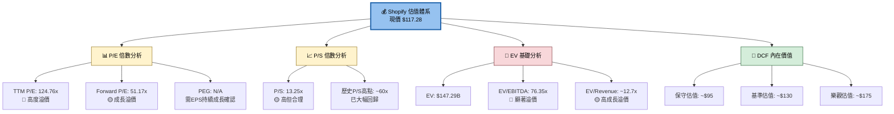

---

### 📊 估值倍數對比表格

| 估值指標 | SHOP | 行業均值 | 科技成長股 | 溢價/折價 | 評級 |
|---------|------|---------|---------|---------|------|
| P/E (TTM) | 124.76x | 28x | 45x | +177% 溢價 | 🔴 |
| P/E (Forward) | 51.17x | 22x | 35x | +46% 溢價 | 🟡 |
| P/S | 13.25x | 5x | 8x | +66% 溢價 | 🟡 |
| P/B | 11.35x | 4x | 8x | +42% 溢價 | 🟡 |
| EV/EBITDA | 76.35x | 18x | 35x | +118% 溢價 | 🔴 |
| EV/Revenue | ~12.7x | 4x | 7x | +81% 溢價 | 🟡 |

---

### 🎯 情境目標股價分析

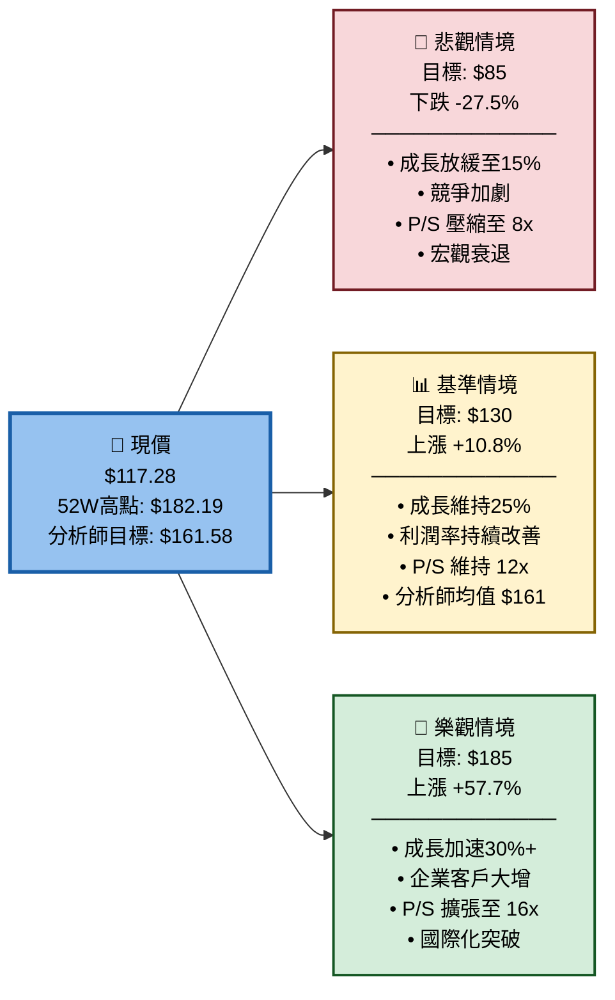

---

### 📊 估值區間視覺化

```
目標股價分佈區間

悲觀  $85   ████░░░░░░░░░░░░░░░░░░░░░░░░░░░░░░░░░░░░░  -27.5%
低端  $110  ██████████████░░░░░░░░░░░░░░░░░░░░░░░░░░░  -6.2%
現價  $117  ████████████████░░░░░░░░░░░░░░░░░░░░░░░░░  ← 現在
基準  $130  ██████████████████░░░░░░░░░░░░░░░░░░░░░░░  +10.8%
均值  $161  ███████████████████████░░░░░░░░░░░░░░░░░░  +37.4%
高端  $185  ████████████████████████████░░░░░░░░░░░░░  +57.8%
樂觀  $200  █████████████████████████████████░░░░░░░░  +70.5%
      |──$50──|──$75──|──$100──|──$125──|──$150──|──$175──|──$200|
```

---

### 🏆 同業比較

| 公司 | 股票代號 | 市值 | P/E(FWD) | P/S | 收入成長 | 毛利率 | 評級 |
|-----|---------|-----|---------|-----|---------|--------|------|
| **Shopify** | **SHOP** | **$153B** | **51.2x** | **13.3x** | **30.6%** | **48.1%** | 🟡 |
| Salesforce | CRM | $270B | 28x | 8.5x | 9.0% | 77% | 🟢 盈利更佳 |
| HubSpot | HUBS | $22B | 55x | 11x | 20% | 85% | 🟡 毛利更高 |
| BigCommerce | BIGC | $0.8B | N/A | 3x | 8% | 78% | 🔴 較弱競爭者 |
| WooCommerce | 未上市 | N/A | N/A | N/A | N/A | N/A | — |
| Amazon (電商) | AMZN | $2.3T | 38x | 3.5x | 12% | 46% | 🟢 規模領先 |

---

## 8. 競爭護城河

### 🏰 Porter's Five Forces 分析

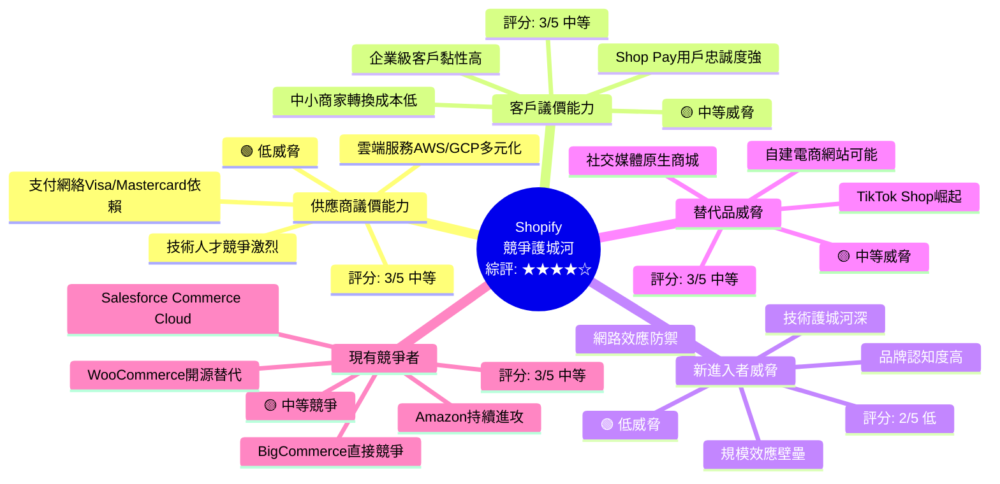

---

### 🛡️ 護城河評分 Unicode 條形圖

```
護城河評分（10分制）

網路效應         9/10  ▓▓▓▓▓▓▓▓▓░   ★★★★★  200萬+商家+開發者生態
品牌認知度       8/10  ▓▓▓▓▓▓▓▓░░   ★★★★☆  全球最知名電商SaaS
轉換成本(企業)   8/10  ▓▓▓▓▓▓▓▓░░   ★★★★☆  Plus客戶深度整合
技術領先性       7/10  ▓▓▓▓▓▓▓░░░   ★★★★☆  AI功能持續投入
支付生態系       8/10  ▓▓▓▓▓▓▓▓░░   ★★★★☆  Shop Pay黏性強
數據優勢         7/10  ▓▓▓▓▓▓▓░░░   ★★★☆☆  商業智能積累中
轉換成本(中小)   4/10  ▓▓▓▓░░░░░░   ★★☆☆☆  易被替代
規模經濟         7/10  ▓▓▓▓▓▓▓░░░   ★★★★☆  基礎設施成本攤薄
整體護城河       7.3/10 ▓▓▓▓▓▓▓▓░░  ★★★★☆  中高度護城河
```

---

### 🗺️ 競爭定位矩陣

| 維度 | Shopify | Salesforce | Amazon | WooCommerce |
|------|---------|-----------|--------|-------------|
| 中小企業服務 | 🟢 極強 | 🔴 弱 | 🟡 中 | 🟢 強(免費) |
| 企業客戶服務 | 🟡 成長中 | 🟢 極強 | 🟡 中 | 🔴 弱 |
| 全渠道整合 | 🟢 強 | 🟡 中 | 🔴 弱 | 🟡 中 |
| 支付整合 | 🟢 極強 | 🟡 中 | 🟢 強 | 🟡 中 |
| 物流履行 | 🟡 成長中 | 🔴 弱 | 🟢 極強 | 🔴 弱 |
| 價格競爭力 | 🟡 中等 | 🔴 昂貴 | 🟡 中 | 🟢 免費 |
| 生態系豐富度 | 🟢 極強 | 🟢 強 | 🟢 極強 | 🟡 中 |

---

## 9. 成長催化劑

### 📅 催化劑時間軸

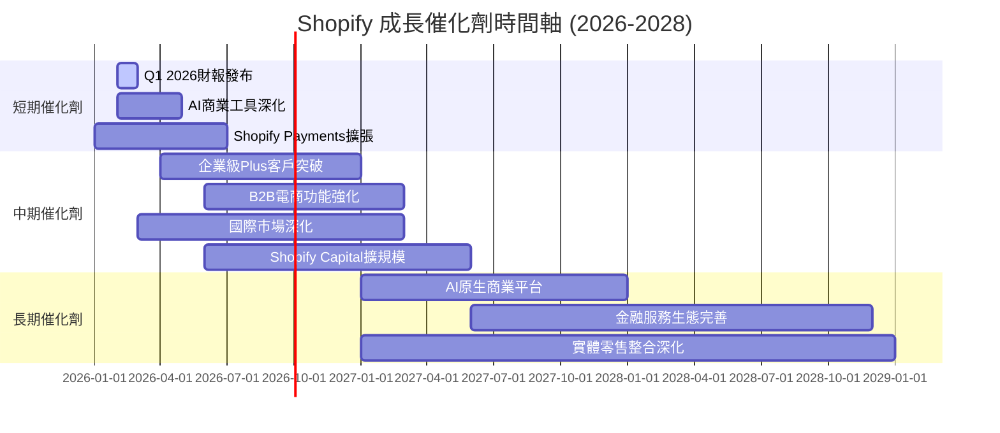

---

### 🌱 短/中/長期成長機會

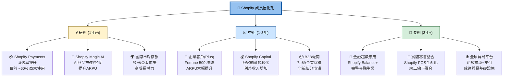

---

### 🌐 TAM 市場規模

```
全球可觸達市場（TAM）估算

電商軟體+服務    $100B  ▓▓▓▓▓▓▓▓▓▓▓▓▓▓▓▓▓▓▓▓░░░░░░░░░░  Shopify目前份額~11%
支付處理         $250B  ▓▓▓▓▓▓▓▓▓▓▓▓▓▓▓▓▓▓▓▓▓▓▓▓▓▓▓▓░░  Shopify目前份額~1%
商家融資         $50B   ▓▓▓▓▓▓▓▓▓▓▓▓▓░░░░░░░░░░░░░░░░░░  Shopify目前份額<1%
物流履行         $150B  ▓▓▓▓▓▓▓▓▓▓▓▓▓▓▓▓▓▓▓▓▓░░░░░░░░░  Shopify目前份額<1%
B2B電商          $200B  ▓▓▓▓▓▓▓▓▓▓▓▓▓▓▓▓▓▓▓▓▓▓▓▓░░░░░░  幾乎未開發
合計 TAM         $750B+ ▓▓▓▓▓▓▓▓▓▓▓▓▓▓▓▓▓▓▓▓▓▓▓▓▓▓▓▓▓▓  2030年目標

Shopify 2024 收入: $8.88B = 佔合計TAM ~1.2%  ← 巨大成長空間！
                    |────5%────|────15%────|────25%────|────35%────|
```

---

## 10. 風險分析

### ⚠️ 風險矩陣

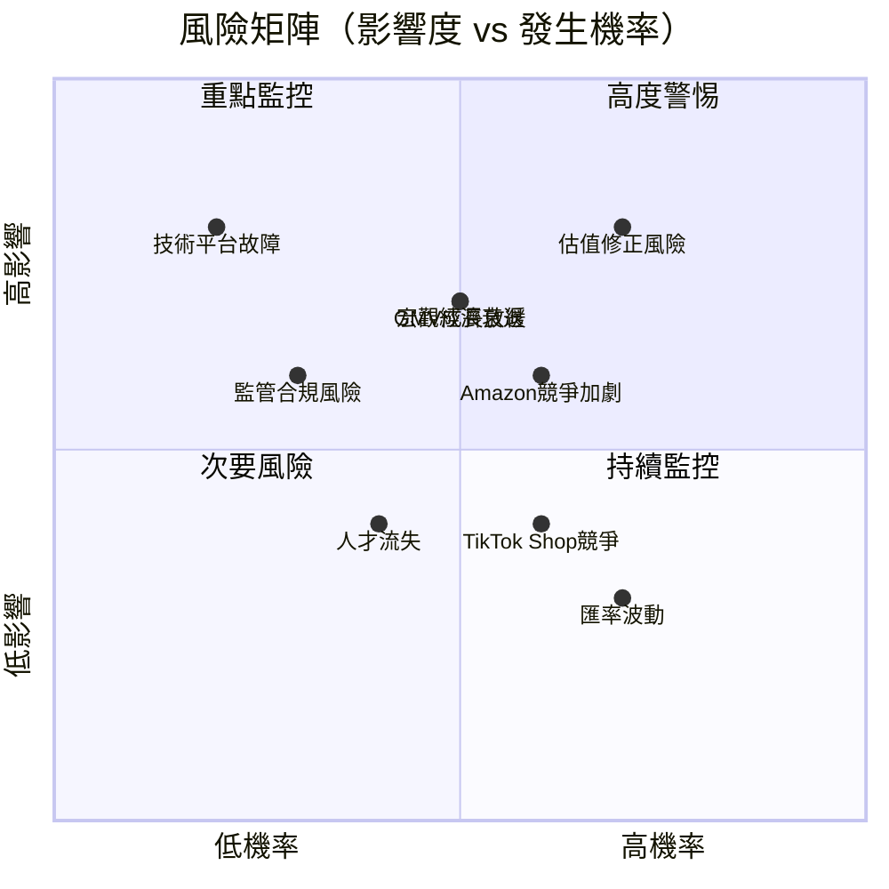

---

### 🔴 風險評分卡

| 風險類別 | 風險描述 | 機率 | 影響度 | 綜合評分 | 緩解措施 | 評級 |
|---------|---------|------|--------|---------|---------|------|
| **估值風險** | TTM P/E 124x，利率上升導致估值壓縮 | 高(70%) | 高 | 8.5/10 | 業績兌現降低P/E | 🔴 |
| **競爭風險** | Amazon/TikTok Shop搶佔電商份額 | 中(55%) | 高 | 7.0/10 | 差異化+生態系強化 | 🔴 |
| **成長放緩** | GMV成長降至15%以下 | 中(45%) | 高 | 7.0/10 | 多元化新業務線 | 🔴 |
| **宏觀風險** | 消費支出下滑衝擊商家GMV | 中(50%) | 中高 | 6.5/10 | 多地區分散 | 🟡 |
| **技術風險** | 平台大規模故障/安全漏洞 | 低(20%) | 極高 | 6.0/10 | 多雲架構+備援 | 🟡 |
| **監管風險** | 支付/電商監管趨嚴 | 中(30%) | 中 | 5.0/10 | 法遵團隊+政策遊說 | 🟡 |
| **匯率風險** | 加元/美元匯率波動(加拿大公司) | 高(70%) | 低中 | 4.5/10 | 天然對沖+遠期合約 | 🟡 |
| **人才風險** | 關鍵工程師/產品人才流失 | 中(40%) | 中 | 4.0/10 | 股權激勵+文化建設 | 🟢 |
| **依賴風險** | 過度依賴少數大型商家 | 低(25%) | 中 | 3.5/10 | 商家多元化策略 | 🟢 |

---

### 🛡️ 緩解措施列表

```
主要風險緩解措施

🔴 估值風險緩解:
   ├── 每季度業績持續超預期 → 推動EPS成長降低P/E
   ├── FCF持續擴張 → 提升估值可信度
   └── 前向EPS $2.29 → 業績兌現可將Forward P/E壓縮至50x以下

🔴 競爭風險緩解:
   ├── 生態系護城河 (8000+ 應用開發商)
   ├── Shopify Payments黏性 (高轉換成本)
   └── 企業級功能持續強化 (Shopify Plus)

🟡 成長放緩緩解:
   ├── 新興市場擴張 (亞太/拉丁美洲)
   ├── B2B電商新市場開拓
   └── 金融服務交叉銷售提升ARPU

🟡 宏觀風險緩解:
   ├── 非周期性訂閱收入提供底線保護
   ├── 多幣種/多地區分散配置
   └── $5.85B現金儲備應對不確定性
```

---

## 11. 公平價值估算

### 🔮 DCF 模型框架

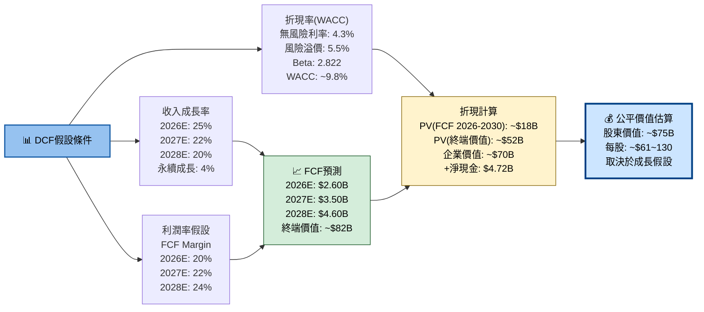

---

### 📊 三種估值法比較

| 估值方法 | 保守情境 | 基準情境 | 樂觀情境 | 權重 | 加權目標價 |
|---------|---------|---------|---------|------|----------|
| **DCF (10年期)** | $85 | $130 | $185 | 40% | $133 |
| **P/S倍數法** (15x P/S) | $95 | $140 | $190 | 30% | $141 |
| **EV/EBITDA法** (50x) | $90 | $125 | $170 | 20% | $128 |
| **分析師共識法** | $110 | $161 | $200 | 10% | $159 |
| **综合加權目標** | **$91** | **$136** | **$186** | 100% | **$138** |
| 現價 $117.28 | 下跌 -22% | **上漲 +16%** | 上漲 +59% | — | 上漲+17.7% |

---

### 📏 估值區間視覺化

```
綜合估值區間（基於多種方法）

$75   極度低估區間  ░░░░░░░░░░░░░░░░░░░░░░░░░░░░░░░░░░░░░░░░░░   
$90   保守目標下限  ▓▓▓▓▓▓▓▓▓░░░░░░░░░░░░░░░░░░░░░░░░░░░░░░░░░
$110  分析師目標下限▓▓▓▓▓▓▓▓▓▓▓▓▓▓▓░░░░░░░░░░░░░░░░░░░░░░░░░░
★→   $117  【現價】 ▓▓▓▓▓▓▓▓▓▓▓▓▓▓▓▓░░░░░░░░░░░░░░░░░░░░░░░  ←★
$130  基準合理估值  ▓▓▓▓▓▓▓▓▓▓▓▓▓▓▓▓▓▓░░░░░░░░░░░░░░░░░░░░░░
$138  綜合加權目標  ▓▓▓▓▓▓▓▓▓▓▓▓▓▓▓▓▓▓▓░░░░░░░░░░░░░░░░░░░░░
$162  分析師均值目標▓▓▓▓▓▓▓▓▓▓▓▓▓▓▓▓▓▓▓▓▓▓▓░░░░░░░░░░░░░░░░
$185  樂觀情境目標  ▓▓▓▓▓▓▓▓▓▓▓▓▓▓▓▓▓▓▓▓▓▓▓▓▓▓▓▓░░░░░░░░░░░
$200  極度樂觀目標  ▓▓▓▓▓▓▓▓▓▓▓▓▓▓▓▓▓▓▓▓▓▓▓▓▓▓▓▓▓▓▓░░░░░░░░
      |────$50────|────$100────|────$150────|────$200────|

結論：現價 $117.28 處於 公允偏低 至 輕度低估 的區間
```

---

## 12. 投資建議

### 🏆 最終投資評級

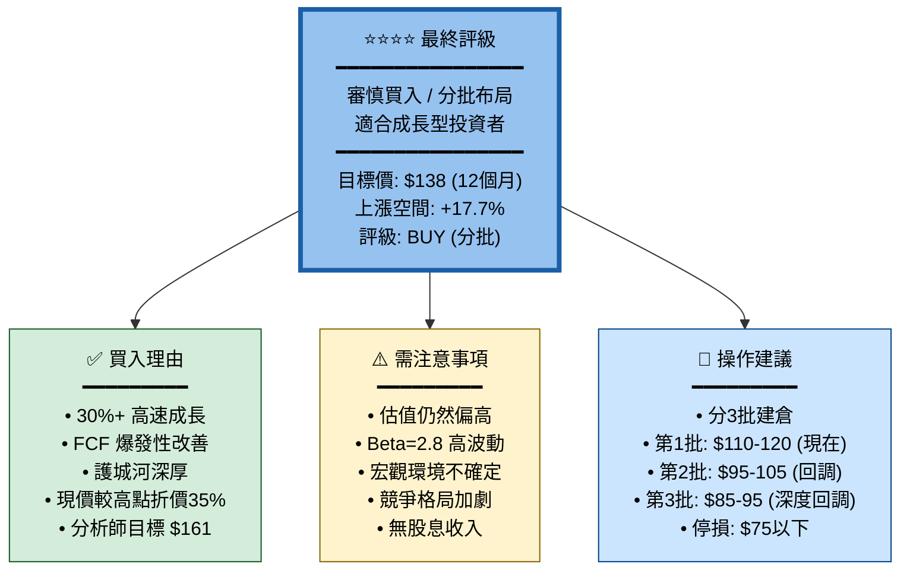

---

### 👥 投資人適配度

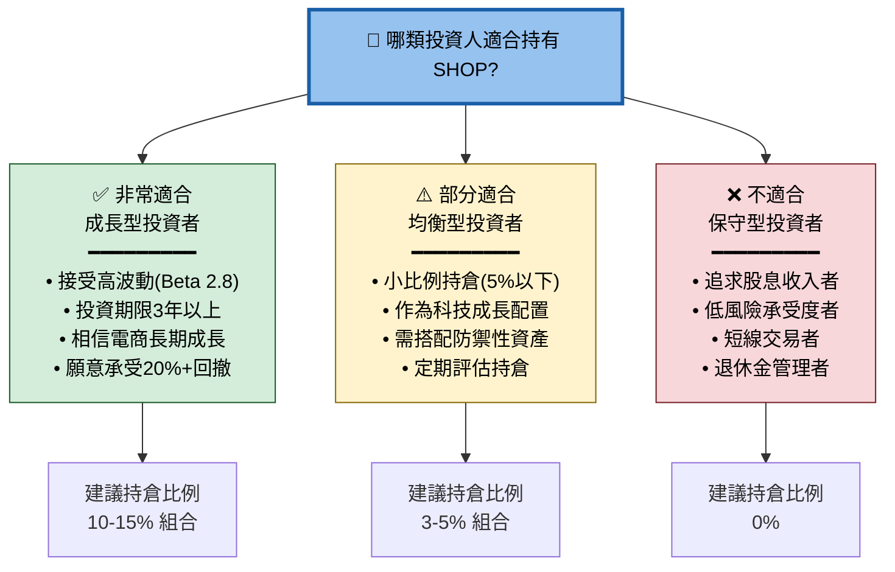

---

### ✅ 監控指標 Checklist

| 類別 | 監控指標 | 目標值 | 警示條件 | 優先級 |
|------|---------|--------|---------|--------|
| **核心業務** | GMV 季度成長率 | >20% | <15% 降評級 | ★★★★★ |
| | 月活躍商家數 | 持續增長 | 停滯或下滑 | ★★★★★ |
| | Shopify Payments滲透率 | >65% | <55% 警戒 | ★★★★☆ |
| **財務指標** | 季度收入成長 | >25% | <20% 觀察 | ★★★★★ |
| | FCF Margin | >18% | <12% 警示 | ★★★★☆ |
| | 毛利率 | 維持>48% | <45% 危險 | ★★★★☆ |
| | 營業利潤率 | 持續提升 | 下降兩季 | ★★★★☆ |
| **估值** | Forward P/E | 合理範圍 | >60x 減倉 | ★★★★☆ |
| | P/S 比率 | <15x | >20x 過熱 | ★★★☆☆ |
| **競爭** | 市場份額趨勢 | 穩定或成長 | 明顯流失 | ★★★★☆ |
| | Shopify Plus 客戶數 | >10% YoY | <5% 成長 | ★★★☆☆ |
| | 競爭對手動向 | — | Amazon大動作 | ★★★☆☆ |
| **宏觀** | 電商整體GMV | 正成長 | 行業萎縮 | ★★★★☆ |
| | 利率走向 | 降息環境 | 升息壓估值 | ★★★☆☆ |

---

### 📋 綜合評分總覽

```
最終綜合評分卡

基本面質量    ████████████████████████░░░░░░   4.0/5  ★★★★☆
成長潛力      █████████████████████████████░   4.5/5  ★★★★