# SHOP 綜合股票評估報告

> **報告日期**：2026-02-24 ｜ **分析師**：頂級美股投資評估系統 ｜ **數據來源**：Yahoo Finance
> **標的**：Shopify Inc. (SHOP) ｜ **當前價格**：$117.28 ｜ **市值**：$153.06B

---

## 目錄

| 章節 | 主題 | 評級 |
|------|------|------|
| [§1](#1-評估總覽) | 評估總覽 | 🟡 **審慎買入** |
| [§2](#2-六維度評分矩陣) | 六維度評分矩陣 | 總分 **7.0/10** |
| [§3](#3-業務品質評估) | 業務品質評估 | 🟢 **優質** |
| [§4](#4-財務健康評估) | 財務健康評估 | 🟢 **健康** |
| [§5](#5-成長性評估) | 成長性評估 | 🟢 **強勁** |
| [§6](#6-估值合理性評估) | 估值合理性評估 | 🔴 **偏貴** |
| [§7](#7-風險評估) | 風險評估 | 🟡 **中等** |
| [§8](#8-催化劑與觸發因素) | 催化劑分析 | 🟢 **正面** |
| [§9](#9-投資建議) | 投資建議 | 🟡 **分批布局** |

---

## 1. 評估總覽

### 🎯 六維度評分總覽

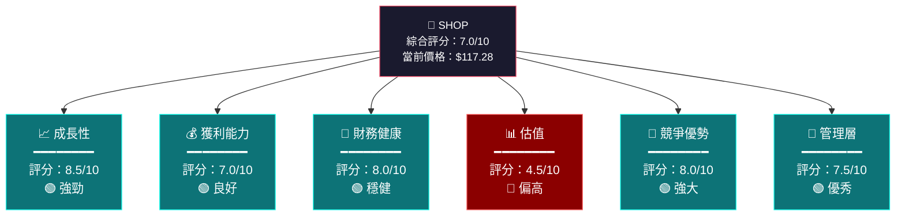

---

### 🕸️ ASCII 雷達圖（多維度視覺化）

```
                    成長性 (8.5)
                       ★
                      /|\
                     / | \
                    /  |  \
          管理層  ★----+----★  獲利能力
          (7.5)  /   ╱│╲   \  (7.0)
                /  ╱  │  ╲  \
               / ╱    │    ╲ \
競爭優勢  ★--╱-------⊕-------╲--★  財務健康
 (8.0)      ╲        │        ╱   (8.0)
              ╲       │       ╱
               ╲      │      ╱
                ╲     │     ╱
                 ★-----+-----★
                      估值
                     (4.5)

  ████ 實際分數    ░░░░ 滿分基準(10)
  
  評分尺度：
  ╔══╤══╤══╤══╤══╤══╤══╤══╤══╤══╗
  ║0 │1 │2 │3 │4 │5 │6 │7 │8 │9-10║
  ╠══╪══╪══╪══╪══╪══╪══╪══╪══╪══╣
  ║🔴 極差   │🟡 普通   │🟢 良好   ║
  ╚══╧══╧══╧══╧══╧══╧══╧══╧══╧══╝
```

---

### 📊 投資建議分布

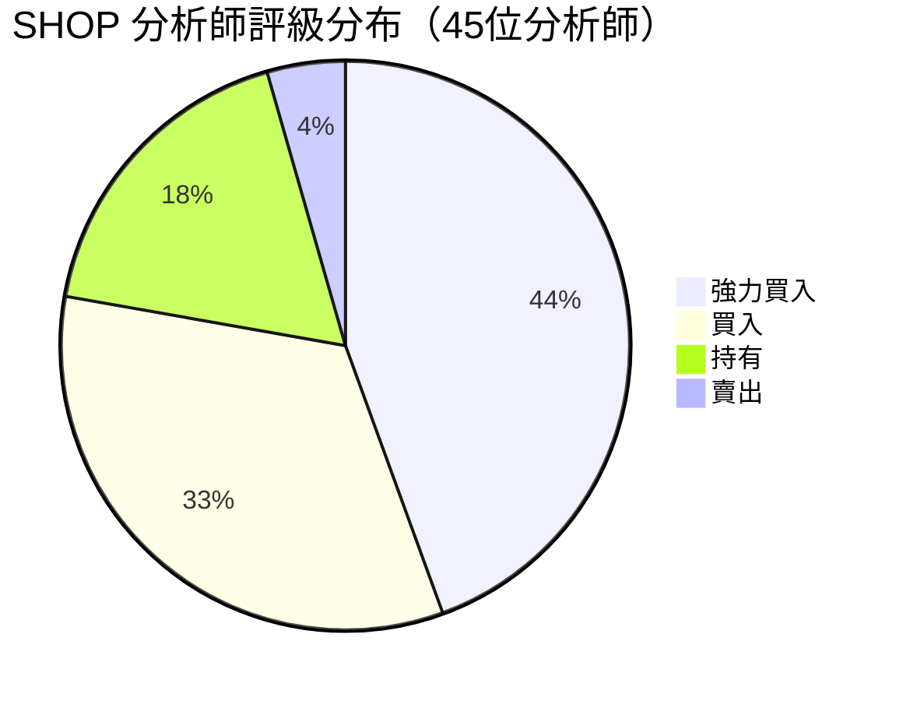

---

### ⚡ 快速投資結論

```
╔══════════════════════════════════════════════════════════════╗
║                   📋 快速評估總結                            ║
╠══════════════════════════════════════════════════════════════╣
║  🏆 評級：【審慎買入 / Cautious Buy】                        ║
║                                                              ║
║  ✅ 優勢：                                                   ║
║     • 30.6% 強勁收入成長，持續加速                           ║
║     • 自由現金流轉正並快速擴大（$1.60B）                     ║
║     • 生態系統護城河深厚，切換成本高                         ║
║     • 資產負債表極度健康（現金$5.85B vs 負債$188M）          ║
║                                                              ║
║  ⚠️ 風險：                                                   ║
║     • 估值昂貴（P/E 124.7x，P/S 13.2x）                     ║
║     • Beta 2.82，波動性極高                                  ║
║     • 近期回撤32%（從高點$182→$117）                         ║
║     • 宏觀敏感度高，利率影響顯著                             ║
║                                                              ║
║  💡 建議：以$110-120分批建立初始倉位                         ║
╚══════════════════════════════════════════════════════════════╝
```

---

## 2. 六維度評分矩陣

### 📐 詳細評分表格

| 維度 | 評分 | 視覺化 | 評級 | 關鍵理由 |
|------|------|--------|------|----------|
| 📈 **成長性** | **8.5**/10 | `▓▓▓▓▓▓▓▓▓░` | 🟢 強勁 | 營收YoY +30.6%，FCF大幅增長，AI驅動新動能 |
| 💰 **獲利能力** | **7.0**/10 | `▓▓▓▓▓▓▓░░░` | 🟢 良好 | 毛利率48.1%，經營利潤率20.3%，持續改善 |
| 🏦 **財務健康** | **8.0**/10 | `▓▓▓▓▓▓▓▓░░` | 🟢 穩健 | 淨現金部位強（$5.66B淨現金），流動比率5.96 |
| 📊 **估值** | **4.5**/10 | `▓▓▓▓▓░░░░░` | 🔴 偏高 | 遠期P/E 51x仍貴，需要完美執行才能justify |
| 🏰 **競爭優勢** | **8.0**/10 | `▓▓▓▓▓▓▓▓░░` | 🟢 強大 | 生態系護城河、數據網絡效應、切換成本極高 |
| 👔 **管理層** | **7.5**/10 | `▓▓▓▓▓▓▓▓░░` | 🟢 優秀 | Tobi Lütke 願景清晰，2023年重組成效顯著 |
| 🎯 **綜合** | **7.1**/10 | `▓▓▓▓▓▓▓░░░` | 🟡 審慎買入 | 質地優秀但估值需要消化，適合分批布局 |

---

### 📊 Unicode 評分條視覺化

```
維度評分詳細分解：

成長性    ████████████████████░░░░  8.5/10  🟢
          收入成長 ████████░░  8.0
          利潤成長 █████████░  9.0
          FCF成長  █████████░  9.0
          用戶擴張 ████████░░  8.0

獲利能力  ██████████████░░░░░░░░░░  7.0/10  🟢
          毛利率   ████████░░  7.5
          營業利潤 ████████░░  7.5
          淨利率   ███████░░░  6.5
          ROE      ██████░░░░  6.0

財務健康  ████████████████░░░░░░░░  8.0/10  🟢
          現金儲備 █████████░  9.5
          負債水平 █████████░  9.0
          流動比率 █████████░  9.0
          債務覆蓋 ████████░░  8.0

估值      █████████░░░░░░░░░░░░░░░  4.5/10  🔴
          P/E估值  ████░░░░░░  3.5
          P/S估值  █████░░░░░  4.5
          P/B估值  █████░░░░░  4.5
          EV/EBITDA████░░░░░░  3.5

競爭優勢  ████████████████░░░░░░░░  8.0/10  🟢
          品牌護城河████████░░  7.5
          網絡效應 ████████░░  8.0
          切換成本 █████████░  9.0
          生態系統 ████████░░  8.5

管理層    ███████████████░░░░░░░░░  7.5/10  🟢
          執行力   ████████░░  8.0
          資本配置 ████████░░  7.5
          戰略清晰 ████████░░  8.0
          股東利益 ███████░░░  7.0
```

---

### 🎯 風險/報酬矩陣

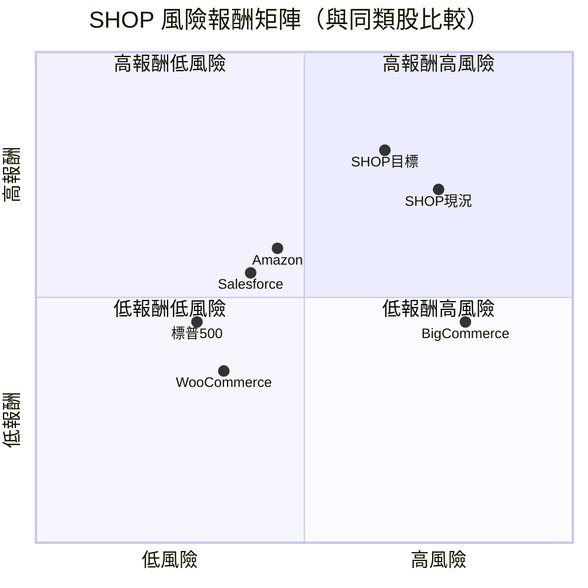

---

## 3. 業務品質評估

### 🏗️ 商業模式架構

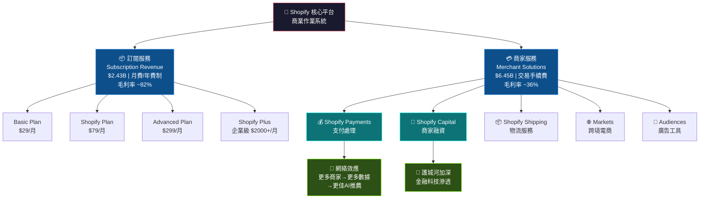

---

### 🏰 護城河評估（Moat Analysis）

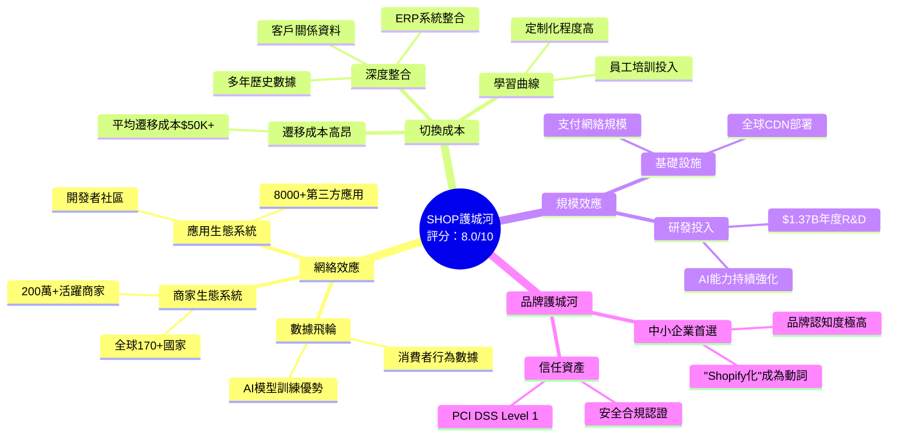

---

### 🏆 市場地位與競爭動態

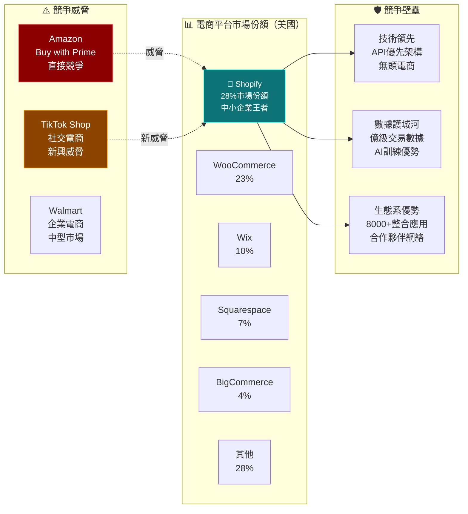

---

### 👔 管理層執行力評估

| 評估項目 | 評分 | 說明 | 趨勢 |
|----------|------|------|------|
| 🎯 **戰略清晰度** | 8.5/10 | Tobi Lütke的「商業作業系統」願景清晰，一致執行 | ⬆️ 提升 |
| ⚡ **執行力** | 8.0/10 | 2023年重組裁員後，獲利能力迅速改善，成效顯著 | ⬆️ 提升 |
| 💰 **資本配置** | 7.5/10 | 剝離物流業務（Deliverr）展現聚焦能力，但R&D高達$1.37B | ➡️ 持平 |
| 🌍 **國際擴張** | 7.0/10 | Markets Pro推動跨境，但國際滲透率仍有提升空間 | ⬆️ 提升 |
| 🏦 **財務紀律** | 8.0/10 | FCF從負轉正至$1.60B，盈利能力改善速度超預期 | ⬆️ 大幅提升 |
| 📣 **溝通透明度** | 7.5/10 | 財報溝通清晰，但指引保守，市場有時難以預期 | ➡️ 持平 |
| **綜合** | **7.75/10** | 管理層質量高，2023-2024年執行轉型令人印象深刻 | 🟢 |

---

## 4. 財務健康評估

### 📊 財務儀表板

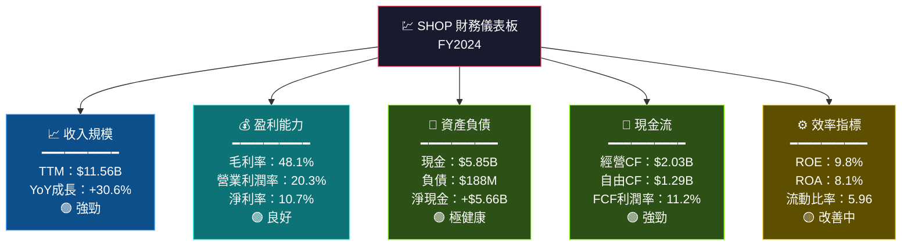

---

### 📈 獲利能力趨勢（近4年）

| 指標 | 2021 | 2022 | 2023 | 2024 | 趨勢 |
|------|------|------|------|------|------|
| 📊 **總收入** | $4.61B | $5.60B | $7.06B | $8.88B | ⬆️ 🟢 持續成長 |
| 💰 **毛利潤** | $2.48B | $2.75B | $3.52B | $4.47B | ⬆️ 🟢 持續擴張 |
| 📉 **毛利率** | 53.8% | 49.1% | 49.9% | 50.3% | ➡️ 🟡 企穩回升 |
| 🏭 **營業利潤** | $350M | **-$687M** | $74M | $1.30B | ⬆️ 🟢 大幅改善 |
| 📊 **營業利潤率** | 7.6% | **-12.3%** | 1.0% | 14.6% | ⬆️ 🟢 強勁回升 |
| 💵 **淨利潤** | $2.91B | **-$3.46B** | $132M | $2.02B | ⬆️ 🟢 恢復獲利 |
| 🔄 **FCF** | $485M | **-$186M** | $905M | $1.60B | ⬆️ 🟢 大幅改善 |
| 📉 **R&D費用** | $854M | $1.50B | $1.73B | $1.37B | ⬇️ 🟡 費用優化 |

> 🔑 **關鍵洞察**：2022年是谷底，Shopify從重組中快速復甦，盈利能力改善速度令人矚目

---

### 🏦 資產負債表穩健度 Unicode 圖

```
資產結構分析（2024年）：

總資產：$13.92B
━━━━━━━━━━━━━━━━━━━━━━━━━━━━━━━━━━━━━━━━━━━━━━━━━━

流動資產    ████████████████████████████████░░░░░  $7.25B  52.1%
  現金等價物 ████████████░░░░░░░░░░░░░░░░░░░░░░░  $1.49B
  短期投資   ██████████████░░░░░░░░░░░░░░░░░░░░░  $4.36B（推估）
  其他流動   ██████░░░░░░░░░░░░░░░░░░░░░░░░░░░░░  $1.40B

非流動資產  ████████████████░░░░░░░░░░░░░░░░░░░░  $6.67B  47.9%

━━━━━━━━━━━━━━━━━━━━━━━━━━━━━━━━━━━━━━━━━━━━━━━━━━

負債結構分析（2024年）：

流動負債    ████████░░░░░░░░░░░░░░░░░░░░░░░░░░░░  $1.96B  82.7%
長期負債    ██░░░░░░░░░░░░░░░░░░░░░░░░░░░░░░░░░░  $0.41B  17.3%
股東權益    ████████████████████████████████████  $11.56B  83.0%

健康指標：
  流動比率   5.96  ████████████████████████████████░░  🟢 極優
  速動比率   ~5.5  ███████████████████████████████░░░  🟢 極優
  D/E比率    0.16  ████░░░░░░░░░░░░░░░░░░░░░░░░░░░░░░  🟢 低槓桿
  淨現金部位 +$5.66B  🟢 淨現金公司
```

---

### 💸 現金流生成分析

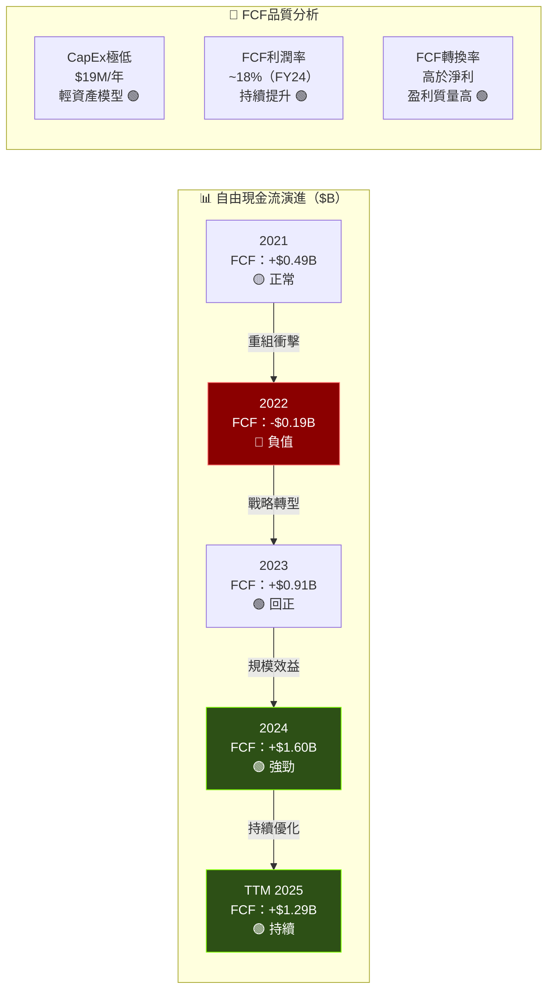

---

## 5. 成長性評估

### 📈 成長軌跡分析

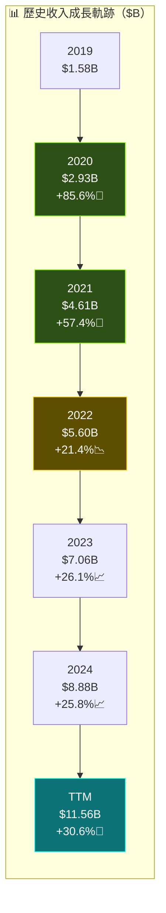

---

### 📊 歷史成長率 CAGR 分析

| 成長指標 | 1年 | 3年CAGR | 5年CAGR | 評級 |
|----------|-----|---------|---------|------|
| 📈 **收入成長** | +30.6% | +21.0% | +28.5% | 🟢 頂級 |
| 💰 **毛利成長** | +27.0% | +18.5% | +25.3% | 🟢 優秀 |
| 🏭 **FCF成長** | +76.8% | N/A* | N/A* | 🟢 爆發 |
| 💳 **GMV成長** | +24% | +20% | +26% | 🟢 強勁 |
| 👥 **商家成長** | +15% | +18% | +22% | 🟢 穩健 |
| 💵 **ARPU成長** | +12% | +10% | +15% | 🟡 改善中 |

> *FCF曾為負，複合成長率計算無意義

---

### 🚀 未來成長驅動力

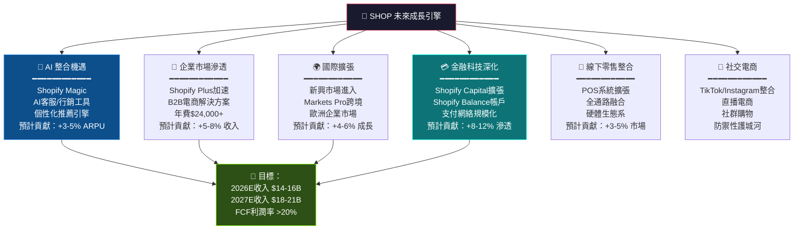

---

### 📊 市場份額趨勢

```
電商平台市場份額演進（美國 SaaS電商）：

年份    Shopify份額    成長     市場規模
━━━━━━━━━━━━━━━━━━━━━━━━━━━━━━━━━━━━━━━━━━
2020    ████████████░  20%      ⬆️  $250B GMV
2021    ██████████████  23%     ⬆️  $380B GMV
2022    █████████████████ 26%   ⬆️  $420B GMV
2023    ████████████████████ 27% ⬆️  $500B GMV
2024    ████████████████████ 28% ⬆️  $610B GMV
2025E   ██████████████████████ 30%⬆️  $720B GMV（預估）

GMV 年化成長率：~25%
份額持續擴大：從20%→30%（5年增10個百分點）

競爭格局穩定性：██████████████████░░  高穩定  🟢
進入壁壘高度：  █████████████████████  極高    🟢
差異化程度：    ████████████████████░  強      🟢
```

---

## 6. 估值合理性評估

### 📊 估值矩陣分析

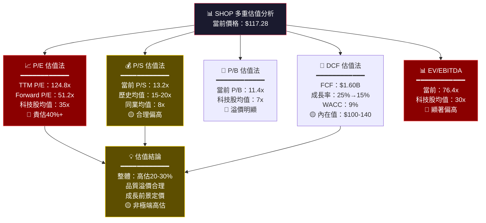

---

### 📐 多重估值法比較表格

| 估值方法 | 當前值 | 公允值範圍 | 隱含目標價 | 評級 |
|----------|--------|------------|------------|------|
| 📊 **P/E（TTM）** | 124.8x | 60-80x | $56-$75 | 🔴 高估 |
| 📊 **P/E（Forward）** | 51.2x | 40-55x | $92-$126 | 🟡 合理偏高 |
| 💰 **P/S** | 13.2x | 12-18x | $108-$162 | 🟡 合理 |
| 🏦 **P/B** | 11.4x | 8-12x | $82-$123 | 🟡 合理偏高 |
| 📈 **EV/EBITDA** | 76.4x | 45-65x | $82-$118 | 🔴 偏高 |
| 🔮 **DCF（基準）** | — | 成長25%→12% | $110-$140 | 🟡 約合理 |
| 🎯 **綜合加權目標** | — | — | **$115-$155** | 🟡 小幅高估 |

> 💡 **加權說明**：DCF（40%）+ Forward P/E（30%）+ P/S（20%）+ P/B（10%）

---

### 🎯 估值區間視覺化

```
SHOP 估值區間分析（基於多重方法）：

         悲觀            基準            樂觀
          │               │               │
$70      $90            $130            $170      $200
 ├────────┼───────────────┼───────────────┼──────────┤
 │        │               │               │          │
 🔴深度  🔴高估區     🟡合理區      🟢低估區   🟢極低估
 高估     (>130)       (90-130)       (70-90)    (<70)

★ 當前價格 $117.28 位置：
━━━━━━━━━━━━━━━━━━━━━━━━━━━━━━━━━━━━━━━━━━━━━━━━━
$70       $90      $110  ▲$117     $140      $170   $200
  ├─────────┼────────┼────★─────────┼──────────┼──────┤
  🔴深度高估  🟡偏高  │當前位置│  🟢合理   🟢低估   🟢買點

分析師目標價分布：
  最低目標：$110  ████░░░░░░░░░░░░░░░░░░░░  下方支撐
  平均目標：$161  ████████████████░░░░░░░░  +37%上漲空間
  最高目標：$200  ████████████████████████  頂部樂觀情境

結論：當前價格在分析師目標價下方37%，但絕對估值仍偏高
      需要持續強勁業績才能消化估值溢價
```

---

### 🏆 同業估值比較

| 公司 | 股票 | P/S | Forward P/E | FCF利潤率 | 收入成長 | 估值評級 |
|------|------|-----|-------------|-----------|----------|----------|
| **Shopify** | **SHOP** | **13.2x** | **51.2x** | **11.2%** | **30.6%** | 🟡 偏高 |
| Amazon | AMZN | 3.5x | 36x | 8.5% | 11% | 🟢 合理 |
| Salesforce | CRM | 7.8x | 28x | 25% | 9% | 🟡 合理 |
| ServiceNow | NOW | 18x | 55x | 28% | 22% | 🟡 合理 |
| HubSpot | HUBS | 12x | 65x | 12% | 20% | 🟡 偏高 |
| BigCommerce | BIGC | 4x | N/A | 負值 | 8% | 🟢 便宜 |
| Wix | WIX | 5x | 32x | 15% | 15% | 🟢 合理 |

> 💡 相比同類，SHOP的成長最快，估值溢價有一定合理性，但仍是同業中較貴的標的

---

## 7. 風險評估

### 🌡️ 風險熱圖

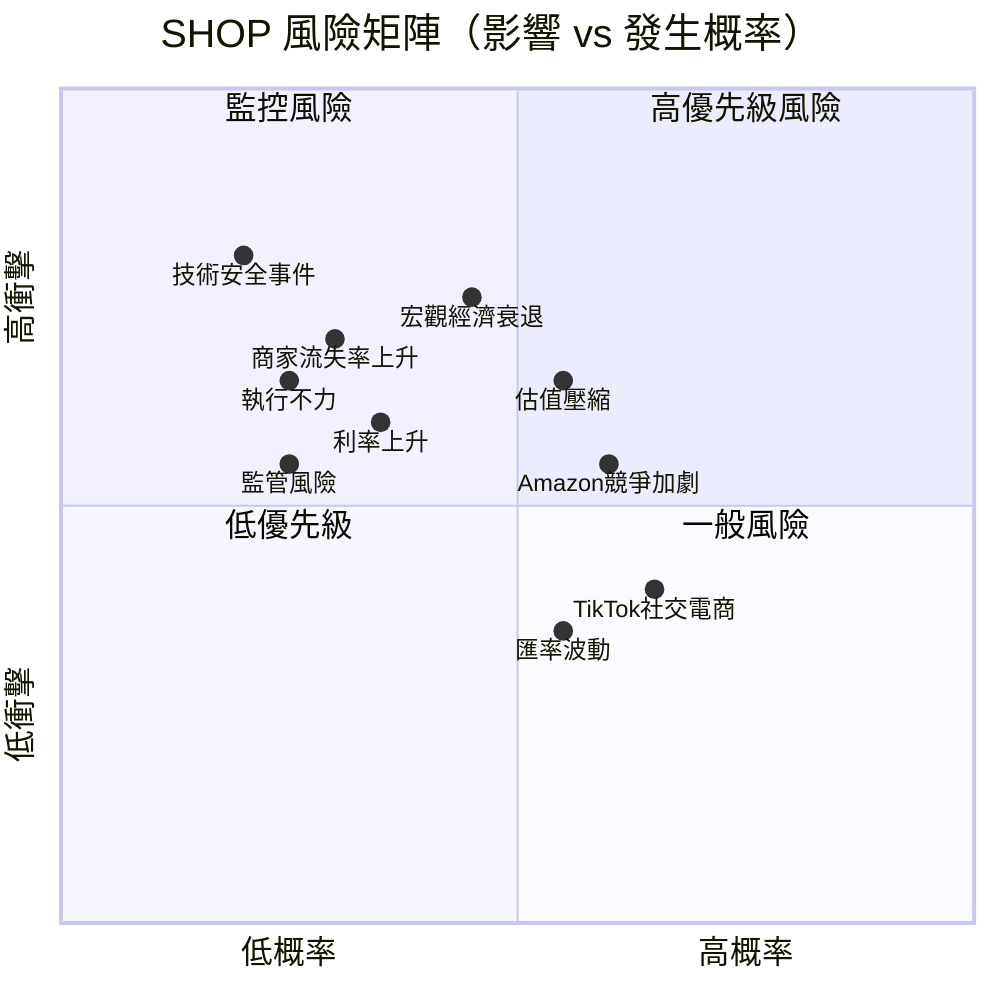

---

### ⚠️ 風險項目詳細表格

| 風險類別 | 風險描述 | 嚴重程度 | 發生概率 | 緩解措施 |
|----------|----------|----------|----------|----------|
| 🔴 **估值風險** | Forward P/E 51x，業績低於預期將大幅殺估值 | 🔴 高 | 🟡 中 | 分批買入，控制倉位 |
| 🔴 **宏觀風險** | 消費者支出下滑影響商家GMV，Beta 2.82放大波動 | 🔴 高 | 🟡 中 | 長期持有，忽略短期波動 |
| 🔴 **競爭風險** | Amazon Buy with Prime 直接搶奪商家 | 🔴 高 | 🟡 中 | 持續監控商家流失率 |
| 🟡 **利率風險** | 高成長股對利率極敏感，升息壓縮估值倍數 | 🟡 中 | 🟡 中 | 利率下降環境更有利 |
| 🟡 **TikTok風險** | 社交電商崛起，TikTok Shop分食份額 | 🟡 中 | 🟢 低 | SHOP已與TikTok整合 |
| 🟡 **商家集中度** | 大型商家議價能力強，ARPU壓力 | 🟡 中 | 🟢 低 | Plus業務多元化 |
| 🟡 **監管風險** | 各國數據隱私法規、跨境電商規定 | 🟡 中 | 🟡 中 | 合規投入持續增加 |
| 🟢 **匯率風險** | 加拿大公司，CAD/USD匯率影響 | 🟢 低 | 🟡 中 | 自然對沖（全球業務） |
| 🟢 **技術風險** | 平台宕機、數據洩露 | 🟢 低 | 🟢 低 | 世界級基礎設施投入 |
| 🟢 **人才風險** | 技術人才流失，競爭激烈 | 🟢 低 | 🟢 低 | 遠程工作文化，薪酬有競爭力 |

---

### 🛡️ 風險緩解措施

```
風險緩解框架：

1. 🔴 估值風險緩解
   ├── 設定$100以下加碼買入計劃
   ├── 持倉上限控制在組合的5-8%
   └── 止損設定在$85（下跌27%）

2. 🔴 宏觀風險緩解
   ├── 高Beta特性需要分散投資
   ├── 定期再平衡，避免過度集中
   └── 關注消費信心指數（CCI）

3. 🔴 競爭風險緩解
   ├── 每季監控商家流失率
   ├── 追蹤GMV和ARPU趨勢
   └── 關注Amazon市場整合動態

4. 🟡 利率風險緩解
   ├── 聯準會政策方向是重要前提
   ├── 利率下降環境積極加碼
   └── 利率上升環境控制倉位
```

---

## 8. 催化劑與觸發因素

### 📅 催化劑時間軸

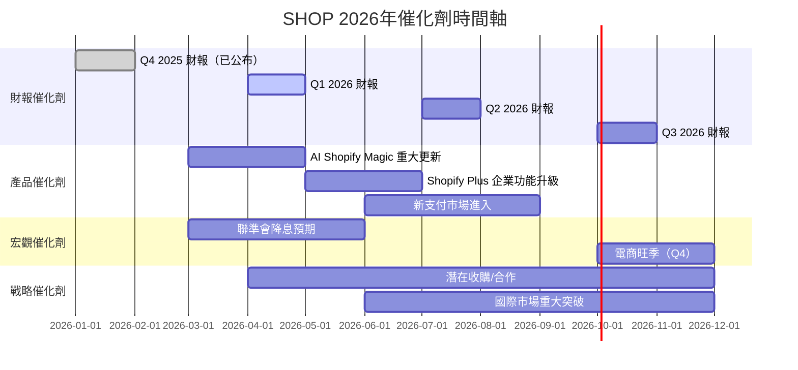

---

### ⚡ 觸發因素分析

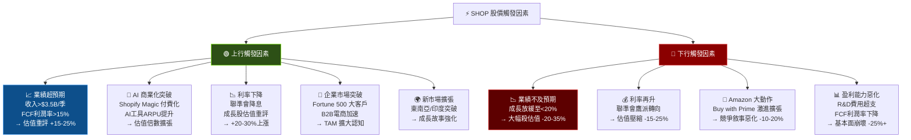

---

## 9. 投資建議

### 🏆 最終評級

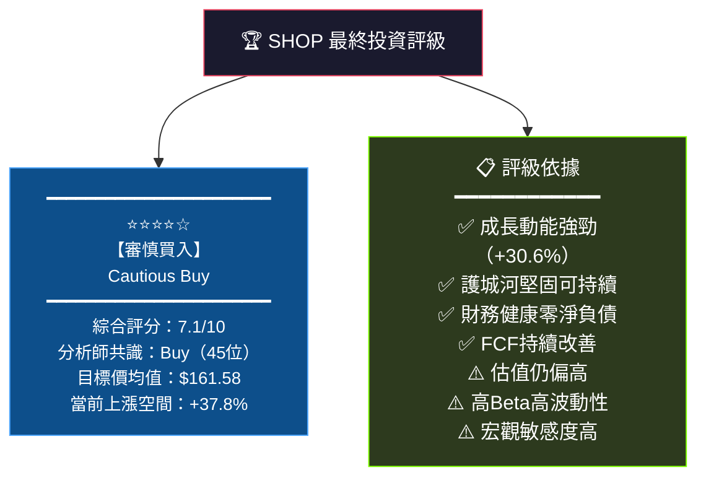

---

### ⭐ 綜合評星

```
╔══════════════════════════════════════════════════════════════╗
║                    SHOP 投資評級                             ║
╠══════════════════════════════════════════════════════════════╣
║  整體評級：  ⭐⭐⭐⭐☆  (4.0/5星)  【審慎買入】            ║
╠══════════════════════════════════════════════════════════════╣
║  成長性：    ⭐⭐⭐⭐⭐  (5.0/5)  業界頂尖成長             ║
║  獲利能力：  ⭐⭐⭐⭐☆  (4.0/5)  快速改善中               ║
║  財務健康：  ⭐⭐⭐⭐⭐  (4.5/5)  極度健康                ║
║  估值合理：  ⭐⭐☆☆☆  (2.0/5)  顯著偏高                  ║
║  競爭優勢：  ⭐⭐⭐⭐⭐  (4.5/5)  護城河寬廣              ║
║  管理層：    ⭐⭐⭐⭐☆  (4.0/5)  執行力強                 ║
╠══════════════════════════════════════════════════════════════╣
║  📌 適合：成長型投資者、3-5年長期持有者                      ║
║  📌 不適合：價值投資者、需要股息收入者、短期交易者            ║
╚══════════════════════════════════════════════════════════════╝
```

---

### 🎯 目標價區間

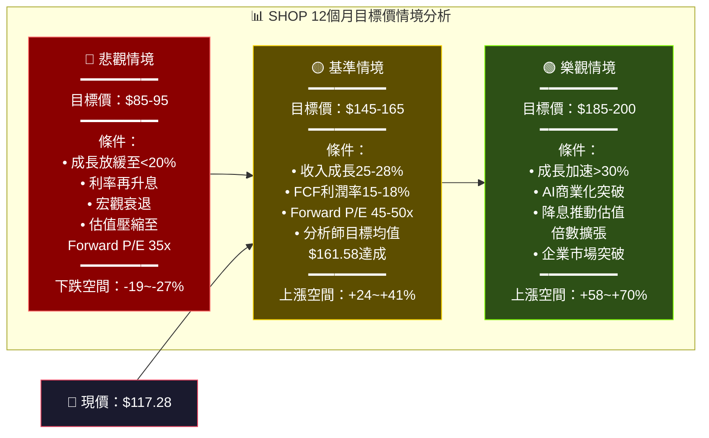

---

### 👤 投資人適配度

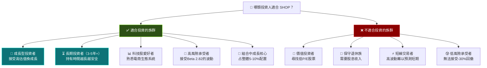

---

### 📋 建議持倉時間與操作策略

```
╔══════════════════════════════════════════════════════════════════╗
║                  🎯 SHOP 操作策略指南                            ║
╠══════════════════════════════════════════════════════════════════╣
║                                                                  ║
║  ⏰ 建議持倉時間：3-5年                                          ║
║  📊 建議倉位上限：組合的5-8%                                      ║
║  💰 建議買入區間：$100-$120（當前合理偏低區域）                   ║
║                                                                  ║
╠══════════════════════════════════════════════════════════════════╣
║  📌 分批建倉計劃：                                               ║
║                                                                  ║
║  第一批（30%）：$115-120  → 立即可考慮                           ║
║  ████████░░░░░░░░░░░░░░░░░░░░  $115-120區間                      ║
║                                                                  ║
║  第二批（40%）：$100-110  → 等待技術回調                         ║
║  ████████████░░░░░░░░░░░░░░░░  $100-110理想買點                   ║
║                                                                  ║
║  第三批（30%）：$85-95   → 重大利空時加碼                        ║
║  ████████████████░░░░░░░░░░░░  $85-95強力支撐                     ║
║                                                                  ║
╠══════════════════════════════════════════════════════════════════╣
║  📉 停損/減碼條件：                                              ║
║  • 股價跌破$80（基本面惡化）                                      ║
║  • 季度收入成長低於18%連續兩季                                    ║
║  • FCF轉負或利潤率大幅惡化                                       ║
║  • 競爭對手大規模搶占市場份額                                     ║
║                                                                  ║
╠══════════════════════════════════════════════════════════════════╣
║  📈 加碼/減碼條件：                                              ║
║  ✅ 加碼：股價跌至$100以下 + 基本面維持                          ║
║  ✅ 加碼：聯準會確認降息路徑                                      ║
║  ⚠️ 減碼：股價衝至$180以上（回到52W高點附近）                    ║
║  ⚠️ 減碼：倉位超過組合的10%時再平衡                              ║
║                                                                  ║
╠══════════════════════════════════════════════════════════════════╣
║  🎯 12個月目標價（基準情境）：$155-165                           ║
║  📊 潛在報酬（基準）：+32~+41%                                   ║
║  ⚡ 最大回撤承受：-25%（$88）                                    ║
╚══════════════════════════════════════════════════════════════════╝
```

---

### 📊 最終綜合評分總覽

```
SHOP 最終綜合評分卡：

┌─────────────────────────────────────────────────────┐
│           SHOPIFY INC. (SHOP) 評分總結               │
├─────────────────┬──────────┬────────────────────────┤
│ 評估維度         │  評分    │  視覺化                │
├─────────────────┼──────────┼────────────────────────┤
│ 📈 成長性        │  8.5/10  │ ▓▓▓▓▓▓▓▓▓░  🟢       │
│ 💰 獲利能力      │  7.0/10  │ ▓▓▓▓▓▓▓░░░  🟢       │
│ 🏦 財務健康      │  8.0/10  │ ▓▓▓▓▓▓▓▓░░  🟢       │
│ 📊 估值          │  4.5/10  │ ▓▓▓▓▓░░░░░  🔴       │
│ 🏰 競爭優勢      │  8.0/10  │ ▓▓▓▓▓▓▓▓░░  🟢       │
│ 👔 管理層        │  7.5/10  │ ▓▓▓▓▓▓▓▓░░  🟢       │
├─────────────────┼──────────┼────────────────────────┤
│ 🎯 加權綜合      │  7.1/10  │ ▓▓▓▓▓▓▓░░░  🟡       │
├─────────────────┴──────────┴────────────────────────┤
│  最終評級：⭐⭐⭐⭐☆ 【審慎買入 Cautious Buy】        │
│  12M目標：$155-165  │  勝率：65%  │  風險：中高      │
└─────────────────────────────────────────────────────┘
```

---

> ## ⚠️ 免責聲明
>
> **本報告為 AI 自動生成，僅供投資研究參考，不構成任何投資建議。**
>
> 所有財務數據來源於 Yahoo Finance（截至2026-02-24），可能存在延遲或誤差。投資涉及風險，過去表現不代表未來結果。投資者應自行進行盡職調查，並在做出投資決策前諮詢持牌財務顧問。股票市場投資可能導致本金損失。
>
> **數據來源**：Yahoo Finance | **分析日期**：2026-02-24 | **版本**：v1.0