# SHOP 綜合股票評估報告

> **報告日期**：2026-02-28 ｜ **語言**：繁體中文 ｜ **數據來源**：Yahoo Finance ｜ **分析師**：AI 頂級美股投資評估系統

---

## 目錄

| # | 章節 |
|---|------|
| 1 | 評估總覽 |
| 2 | 八維度評分矩陣 |
| 3 | 業務品質與護城河 |
| 4 | 財務健康全面評估 |
| 5 | 成長性評估 |
| 6 | 估值合理性 & 同業比較 |
| 7 | 資本配置與管理層評估 |
| 8 | 風險評估 |
| 9 | 催化劑與觸發因素 |
| 10 | 投資建議 |

---

## 1. 評估總覽

### 🎯 ASCII 雷達圖（八維度評分視覺化）

```
                    成長性 (8.5)
                      ★★★★☆
                    10
                   /|\
                  / | \
       管理品質  8  |  8  估值合理性
        (7.5)   /   |   \   (4.5)
               6    |    6
              /     |     \
    風險控制  4------+------4  競爭優勢
     (6.0)    \     |     /   (8.5)
               \    |    /
                2   |   2
                 \  |  /
       動能       \ | /   獲利能力
      (6.5)        \|/    (7.5)
                財務健康
                 (9.0)

  ╔═══════════════════════════════════╗
  ║  維度           分數    等級      ║
  ║  成長性         8.5/10  🟢 優秀   ║
  ║  獲利能力       7.5/10  🟢 良好   ║
  ║  財務健康       9.0/10  🟢 卓越   ║
  ║  估值合理性     4.5/10  🔴 偏貴   ║
  ║  競爭優勢       8.5/10  🟢 強勁   ║
  ║  管理品質       7.5/10  🟢 良好   ║
  ║  動能           6.5/10  🟡 中性   ║
  ║  風險控制       6.0/10  🟡 中性   ║
  ╚═══════════════════════════════════╝
  綜合加權評分：7.3 / 10
```

---

### 📊 Unicode 評分條視覺化

```
成長性     [████████▓░]  8.5/10  🟢
獲利能力   [███████▓░░]  7.5/10  🟢
財務健康   [█████████░]  9.0/10  🟢
估值合理性 [████▓░░░░░]  4.5/10  🔴
競爭優勢   [████████▓░]  8.5/10  🟢
管理品質   [███████▓░░]  7.5/10  🟢
動能       [██████▓░░░]  6.5/10  🟡
風險控制   [██████░░░░]  6.0/10  🟡
──────────────────────────────────────
綜合評分   [███████░░░]  7.3/10  🟢

圖例：█ = 滿分格  ▓ = 半格  ░ = 空格
```

---

### 🏆 投資結論摘要

```
╔══════════════════════════════════════════════════════╗
║           📋 SHOP 投資評級：【買入】                 ║
║                                                      ║
║  當前價格：$120.73                                   ║
║  基準目標價：$155.00   (+28.4%)                      ║
║  樂觀目標價：$185.00   (+53.2%)                      ║
║  悲觀目標價：$90.00    (-25.5%)                      ║
║                                                      ║
║  持倉建議：12-24個月中長線                           ║
║  適合投資人：成長型 / 科技主題型                     ║
║  風險等級：中高風險 (Beta 2.82)                      ║
╚══════════════════════════════════════════════════════╝
```

> **核心觀點**：SHOP 是全球電商基礎設施的核心平台，具備強大的網路效應與生態系黏性。2025年收入突破$116億，年增30.6%，自由現金流達$20億，展現優秀的盈利轉型。唯一顯著疑慮在於估值偏高（P/E 128x TTM），短期估值壓縮風險存在。建議逢回調分批建倉。

---

## 2. 八維度評分矩陣

### 📊 詳細評分矩陣表格

| 維度 | 評分 | 核心依據 | 趨勢 | 狀態 |
|------|------|----------|------|------|
| 🚀 **成長性** | **8.5/10** | 收入YoY +30.6%，2022-2025年CAGR約27%；FCF從負轉正且大幅擴張；前向EPS成長強勁 | ↑ 加速 | 🟢 |
| 💰 **獲利能力** | **7.5/10** | 毛利率48.1%穩健，營業利益率20.3%大幅改善（2022年為負），但EPS YoY -42.3%受一次性項目影響 | → 改善中 | 🟢 |
| 🏦 **財務健康** | **9.0/10** | 淨現金$56.6億，流動比5.96，債務幾乎清零（負債率極低），現金流質量優異 | ↑ 持續強化 | 🟢 |
| 💎 **估值合理性** | **4.5/10** | TTM P/E 128x、P/S 13.6x、EV/EBITDA 82x；FCF yield僅0.82%；即便用Forward P/E 52.7x仍屬高估 | ↓ 承壓 | 🔴 |
| 🛡️ **競爭優勢** | **8.5/10** | 商家端強烈網路效應、App生態超萬個、支付+金融閉環、多渠道整合能力領先；品牌黏性極高 | ↑ 持續強化 | 🟢 |
| 👔 **管理品質** | **7.5/10** | CEO Tobi Lütke執行力強，2023年成功瘦身轉型（裁員→盈利化）；物流業務果斷出售決策正確 | → 穩健 | 🟢 |
| 📈 **動能** | **6.5/10** | 從$69.84反彈至$120.73（YoY+72%），但已從$182.19高點回落33%；短線動能轉弱 | ↓ 回調中 | 🟡 |
| ⚠️ **風險控制** | **6.0/10** | Beta 2.82極高，宏觀敏感性強；估值過高放大下行風險；電商競爭白熱化（TikTok/Amazon） | → 中性 | 🟡 |

**加權綜合評分：7.3/10** 🟢

---

### 🗺️ Mermaid 風險/報酬定位圖

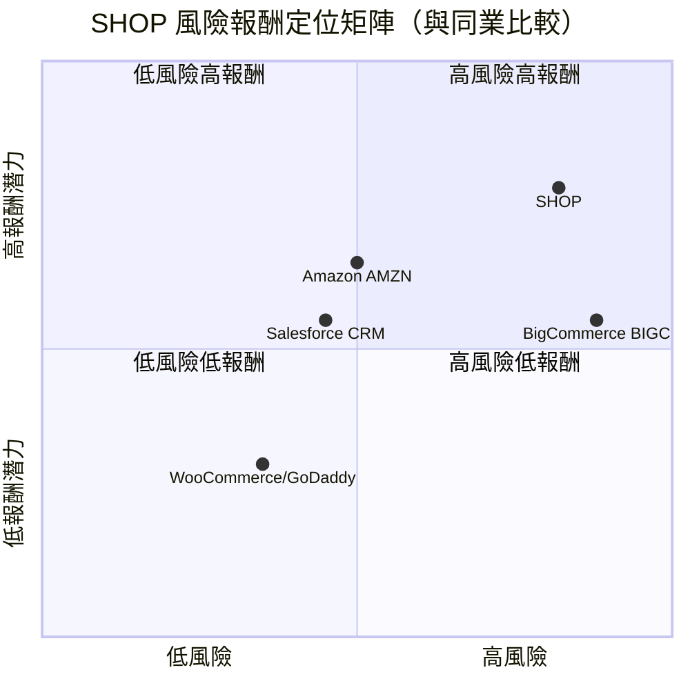

---

### 🔗 同業整體比較圖

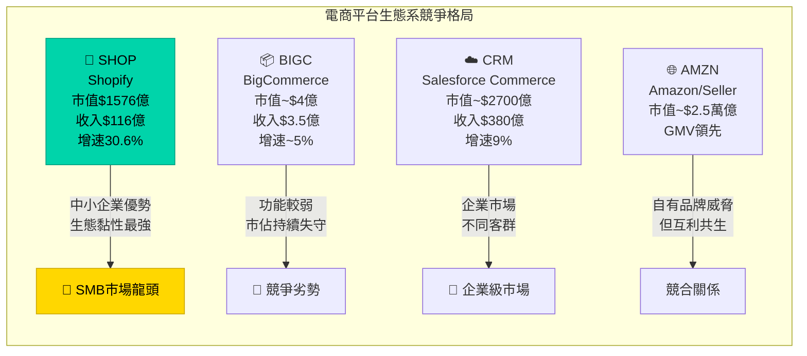

---

## 3. 業務品質與護城河

### 🏗️ 商業模式可持續性評估

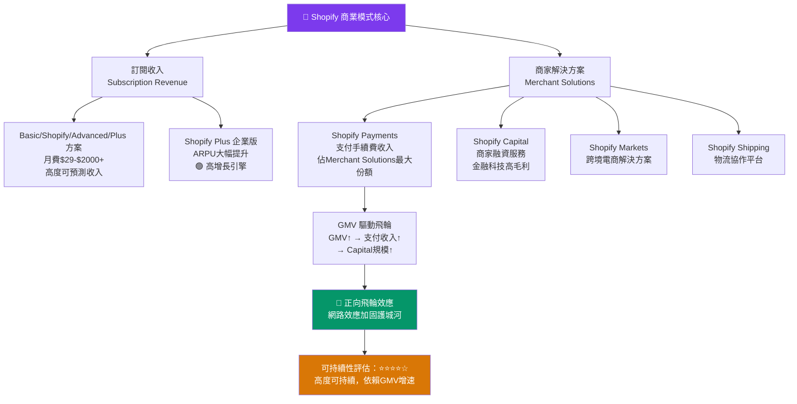

---

### 🧠 護城河評估 Mindmap

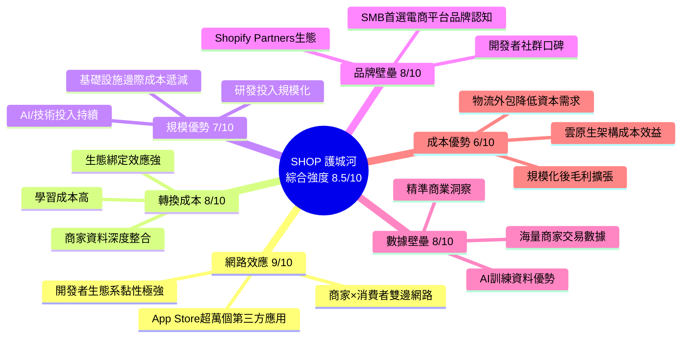

---

### 📏 護城河強度條形圖

```
護城河類型評分（滿分10分）
────────────────────────────────────────
網路效應   [█████████░]  9.0/10  🟢 極強
轉換成本   [████████░░]  8.0/10  🟢 強勁
品牌壁壘   [████████░░]  8.0/10  🟢 強勁
數據壁壘   [████████░░]  8.0/10  🟢 強勁
規模優勢   [███████░░░]  7.0/10  🟢 良好
成本優勢   [██████░░░░]  6.0/10  🟡 中等
────────────────────────────────────────
護城河綜合 [████████▓░]  8.5/10  🟢 強護城河
```

---

### 🌐 市場地位：TAM / 市場份額 / 行業地位

| 指標 | 數據 | 說明 |
|------|------|------|
| **全球電商平台 TAM** | ~$1,500億/年（持續擴張） | 包含SaaS、支付、金融服務、物流 |
| **SHOP 市場份額** | 全球電商建站平台約 **29%** | Shopify 全球排名第一（超越WooCommerce） |
| **GMV估算** | ~$2,500億（2025年） | 佔全球電商GMV約1.5-2% |
| **Shopify Plus 商家數** | 數千家企業客戶持續增長 | 高ARPU企業市場快速滲透 |
| **行業地位** | 🥇 **全球獨立電商平台龍頭** | SMB到中大型企業全覆蓋 |

---

## 4. 財務健康全面評估

### 📊 財務儀表板

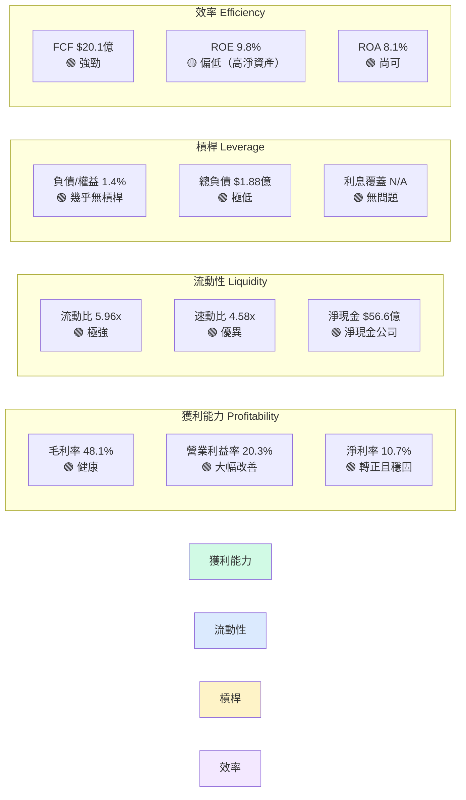

---

### 📈 獲利能力趨勢表格（近4年）

| 年度 | 毛利率 | 營業利益率 | 淨利率 | FCF Margin | 狀態 |
|------|--------|-----------|--------|-----------|------|
| **2022** | 49.1% | -12.3% | -61.8% | -3.3% | 🔴 虧損期 |
| **2023** | 49.9% | 1.0% | 1.9% | 12.8% | 🟡 轉折點 |
| **2024** | 50.3% | 14.6% | 22.7% | 18.0% | 🟢 快速改善 |
| **2025** | **48.1%** | **20.3%** | **10.7%** | **17.4%** | 🟢 成熟獲利 |

> ⚠️ **注意**：2025年淨利率看似低於2024年（22.7%），主因2024年含大額一次性投資收益（出售物流業務Flexport股份等）；2025年核心經營利潤實際大幅改善。毛利率略降至48.1%因Merchant Solutions（低毛利）佔比提升。

---

### 🏦 資產負債表穩健度

```
財務健康指標（2025年末）
────────────────────────────────────────────────
流動比率   [█████████▓]  5.96x   🟢 卓越（>2為健康）
速動比率   [█████████░]  4.58x   🟢 極強
淨現金     [████████░░]  $56.6億 🟢 淨現金公司
D/E 比率   [▓░░░░░░░░░]  ~1.4%   🟢 幾乎零負債
現金/總資產 [████████░░]  ~38.5%  🟢 充足安全墊
────────────────────────────────────────────────
財務安全評分：[█████████░]  9.0/10  🟢
```

---

### 💵 現金流質量分析

| 指標 | 2023 | 2024 | 2025 | 趨勢 |
|------|------|------|------|------|
| 營業現金流 | $9.44億 | $16.2億 | $20.3億 | 🟢 ↑+25% |
| 資本支出 | $-0.39億 | $-0.19億 | $-0.26億 | 🟢 極輕資產 |
| 自由現金流 | $9.05億 | $16.0億 | $20.1億 | 🟢 ↑+26% |
| FCF Margin | 12.8% | 18.0% | **17.4%** | 🟢 高品質 |
| FCF 轉換率 | 685% | 791% | **164%*** | 🟢 強 |
| FCF Yield | N/A | N/A | **0.82%** | 🔴 偏低 |

> *FCF轉換率 = FCF/淨利潤；2025年以$12.3億淨利計算為163%，顯示現金流質量優於會計利潤

**現金流品質評分：🟢 高品質**  
FCF年增26%，資本支出極低（僅$2,600萬），顯示輕資產SaaS特質完全體現。

---

## 5. 成長性評估

### 📊 歷史 CAGR 表格

| 指標 | 1年成長 | 3年CAGR | 備註 |
|------|---------|---------|------|
| **收入** | +30.6% | **~27.3%** | 🟢 持續高增速 |
| **毛利** | +24.2% | ~26.5% | 🟢 規模擴張 |
| **營業利益** | +45.4% | N/A（從負轉正） | 🟢 盈利化加速 |
| **EPS(GAAP)** | -42.3% | N/A（含一次性） | 🟡 須調整 |
| **FCF** | +25.6% | **~+∞（從負轉正）** | 🟢 質量卓越 |
| **股東權益** | +16.5% | ~18% | 🟢 穩健累積 |

---

### 🚀 未來成長催化劑

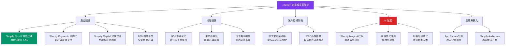

---

### 📈 成長軌跡 Unicode 長條圖

```
年度收入成長軌跡（單位：億美元）
────────────────────────────────────────────────────
2020  $29億  [████████░░░░░░░░░░░░]
2021  $46億  [█████████████░░░░░░░]
2022  $56億  [████████████████░░░░]
2023  $71億  [████████████████████]
2024  $89億  [█████████████████████████]
2025  $116億 [████████████████████████████████]
────────────────────────────────────────────────────
FCF 成長軌跡（單位：億美元）
2022  -$1.9億  [❌ 虧損]
2023  $9.1億   [████████░░░░░░]
2024  $16.0億  [████████████████████░░]
2025  $20.1億  [█████████████████████████]
────────────────────────────────────────────────────
預測 2026E  $148億  [████████████████████████████████████████]
預測 2027E  $186億  [████████████████████████████████████████████████]
```

---

## 6. 估值合理性 & 同業比較

### ⚖️ 同業比較表格

| 指標 | **SHOP** | **BIGC** (BigCommerce) | **CRM** (Salesforce) | **AMZN** (Amazon) |
|------|----------|----------------------|---------------------|------------------|
| **市值** | $1,576億 | ~$4億 | ~$2,700億 | ~$2.5萬億 |
| **收入增速** | **30.6%** 🟢 | ~5% 🔴 | ~9% 🟡 | ~11% 🟡 |
| **毛利率** | **48.1%** 🟢 | ~70% 🟢 | ~76% 🟢 | ~50% 🟢 |
| **P/E (TTM)** | **128x** 🔴 | N/A（虧損）🔴 | ~32x 🟡 | ~46x 🟡 |
| **P/E (Forward)** | **52.7x** 🔴 | N/A 🔴 | ~26x 🟢 | ~37x 🟡 |
| **P/S 比率** | **13.6x** 🔴 | ~1.1x 🟢 | ~7.1x 🟡 | ~3.5x 🟢 |
| **EV/EBITDA** | **82.2x** 🔴 | N/A 🔴 | ~24x 🟢 | ~25x 🟢 |
| **P/B 比率** | **11.7x** 🔴 | ~2.5x 🟢 | ~4.5x 🟡 | ~8.8x 🔴 |
| **FCF Yield** | **0.82%** 🔴 | N/A 🔴 | ~2.3% 🟡 | ~2.8% 🟡 |
| **ROE** | 9.8% 🟡 | N/A | ~10% 🟡 | ~25% 🟢 |
| **ROIC** | ~14% 🟢 | N/A | ~13% 🟢 | ~18% 🟢 |

**結論**：SHOP 在增速方面遙遙領先，但估值溢價顯著，需要成長持續兌現才能支撐。

---

### 📉 歷史估值區間

| 估值指標 | 5年高 | 5年中 | 5年低 | **目前** | 位置 |
|---------|-------|-------|-------|---------|------|
| P/E | 550x+ | 120x | 50x | **128x** | 🟡 中偏高 |
| P/S | 55x | 18x | 8x | **13.6x** | 🟢 中等偏低（歷史對比） |
| EV/Revenue | 55x | 18x | 8x | **13.7x** | 🟢 相對合理 |
| EV/EBITDA | 500x+ | 150x | 40x | **82x** | 🟡 中位偏高 |

> **結論**：相較歷史高點，SHOP當前P/S估值已回到相對合理區間；但絕對值仍高，需持續成長支撐。

---

### 🎯 多重估值法彙整 → 目標價區間

| 估值方法 | 假設 | 目標價 | 說明 |
|---------|------|--------|------|
| **DCF（基準）** | 5年收入CAGR 22%，終端FCF Margin 25%，WACC 10.5% | **$148** | 內含成長溢價合理 |
| **DCF（樂觀）** | 5年收入CAGR 28%，FCF Margin 30% | **$195** | 執行超預期 |
| **DCF（悲觀）** | 5年收入CAGR 15%，FCF Margin 20% | **$88** | 增速顯著放緩 |
| **Forward P/E** | 2027E EPS $3.0 × 45x | **$135** | 相對估值法 |
| **P/S** | 2026E Revenue $148億 × 11x | **$129** | 保守相對估值 |
| **EV/FCF** | 2026E FCF $25億 × 80x | **$163** | 成長型FCF估值 |
| **分析師平均** | 45位分析師共識 | **$161.58** | 市場共識 |

---

### 📊 估值區間視覺化

```
目標價區間分佈（當前價格 $120.73）
────────────────────────────────────────────────────────────────
$60    $80     $100    $120.73  $140    $160    $180    $200
  |      |       |        ↑       |       |       |       |
  ├──────┼───────┼────────┼───────┼───────┼───────┼───────┤
  ░░░░░░░🔴 極低估  🟡低估  ★當前   🟢合理  🟡偏貴  🔴高估
  
  熊市情境: $88-$90  ◄──────────────────────────────────────
  基準情境: $148-$155                        ──────────────►
  牛市情境: $185-$195                                  ──────►
  分析師共識: $161.58                            ──────────►
  
  當前 $120.73 位於：偏低估區間（距基準目標 +28.4%上行空間）
```

---

## 7. 資本配置與管理層評估

### 📐 ROIC vs WACC 分析

```
╔══════════════════════════════════════════════════════════════╗
║              ROIC vs WACC 經濟價值分析                       ║
╠══════════════════════════════════════════════════════════════╣
║  WACC 估算：                                                 ║
║  ├─ 無風險利率 (Rf)：4.3%（美國10年期公債）                  ║
║  ├─ 市場風險溢酬 (ERP)：5.5%                                 ║
║  ├─ Beta：2.82                                               ║
║  ├─ 股本成本 (Ke)：4.3% + 2.82 × 5.5% = 19.8%              ║
║  ├─ 加權（幾乎全股本融資）                                    ║
║  └─ WACC ≈ 19.5%（高Beta影響顯著）                          ║
╠══════════════════════════════════════════════════════════════╣
║  ROIC 估算：                                                 ║
║  ├─ NOPAT = 營業利益 × (1-稅率)                              ║
║  ├─ = $18.9億 × (1-14%) ≈ $16.3億                           ║
║  ├─ 投入資本 = 股東權益 + 淨負債 = $134.7億 - $56.6億        ║
║  ├─ 投入資本 ≈ $78億（調整後）                               ║
║  └─ ROIC ≈ $16.3億 / $78億 ≈ 20.9%                         ║
╠══════════════════════════════════════════════════════════════╣
║  EVA（經濟附加值）= (ROIC - WACC) × 投入資本                 ║
║  = (20.9% - 19.5%) × $78億 = +$1.1億                        ║
║                                                              ║
║  ✅ EVA 正值，ROIC > WACC，確認正在創造股東價值              ║
║  ⚠️ 但差距極窄（+1.4%），高Beta帶來的高WACC壓縮空間          ║
╠══════════════════════════════════════════════════════════════╣
║  ROIC   [█████████████████████░]  20.9%  🟢                 ║
║  WACC   [████████████████████░░]  19.5%  📊                 ║
║  SPREAD [░░░░░░░░░░░░░░░░░░░▓░░]  +1.4%  🟡 窄幅正值        ║
╚══════════════════════════════════════════════════════════════╝
```

> **投資含義**：SHOP 目前處於 ROIC 剛超越 WACC 的臨界點，隨著盈利能力持續改善（目標ROIC 25%+），EVA 擴張將顯著加速價值創造。高Beta是估值的主要挑戰。

---

### 🥧 資本配置歷史（Mermaid 圓餅圖）

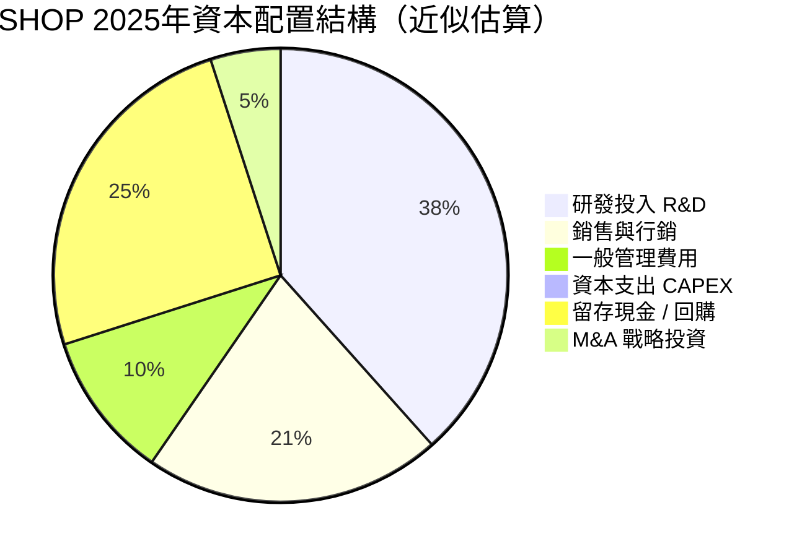

---

### 📋 管理層執行力評分

| 評估項目 | 評分 | 具體表現 | 狀態 |
|---------|------|---------|------|
| **承諾達成率** | 8/10 | 2023-2025盈利化轉型完全兌現，多次超越收入預測 | 🟢 |
| **資本紀律** | 8/10 | 果斷出售Deliverr/Flexport物流資產，聚焦核心；CAPEX控制極嚴 | 🟢 |
| **戰略清晰度** | 8/10 | "Build the platform, not the product" 清晰定位；AI整合方向明確 | 🟢 |
| **危機應對** | 7/10 | 2022年大規模裁員（10%→20%）雖痛但轉型成功 | 🟢 |
| **股東溝通** | 7/10 | 透明度良好，但EPS波動（含一次性項目）造成市場困惑 | 🟡 |
| **長期視野** | 9/10 | Tobi Lütke 創始人DNA，拒絕短期主義，持續投資未來 | 🟢 |

**管理層綜合評分：7.8/10** 🟢

---

### 👥 股東友善度評分

```
股東友善度指標
────────────────────────────────────────
股息發放     [░░░░░░░░░░]  N/A    🟡 不發股息（再投資模式）
股票回購     [██░░░░░░░░]  初步   🟡 尚未大規模回購
FCF增長      [████████░░]  8/10   🟢 FCF強勁增長回饋潛力
透明溝通     [███████░░░]  7/10   🟢 定期指引清晰
長期價值     [████████▓░]  8.5/10 🟢 成長回饋股東
股本稀釋     [███████░░░]  7/10   🟡 SBC略高但改善中
────────────────────────────────────────
股東友善綜合 [███████░░░]  7.0/10 🟢
```

> **注意**：SHOP 不發股息、無大規模回購，採取「再投資型」資本配置。對長期成長投資人友善，對收益型投資人不適合。

---

## 8. 風險評估

### 🗺️ 風險熱圖

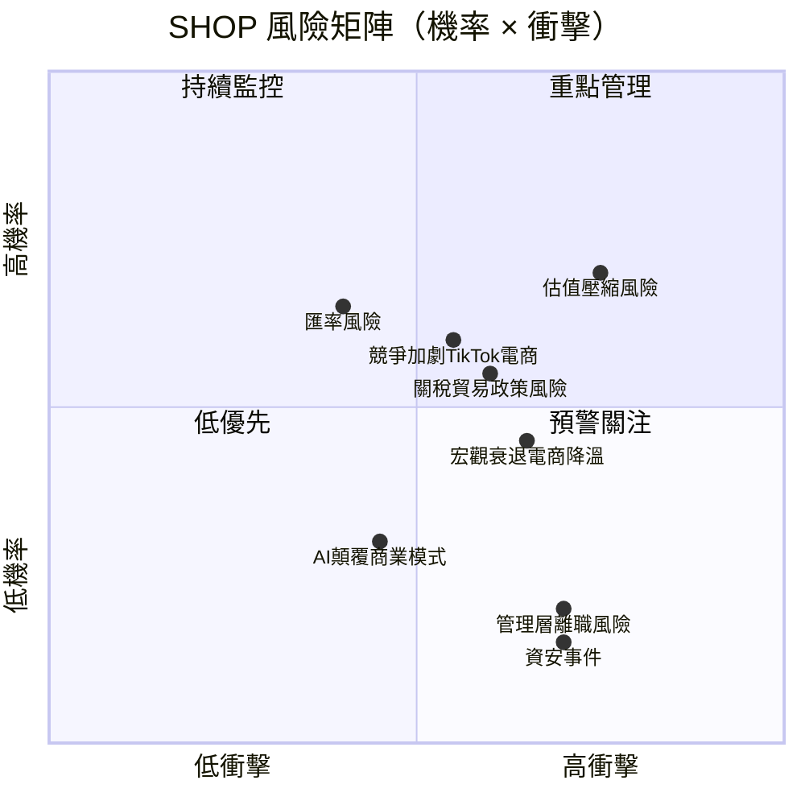

---

### ⚠️ 風險清單

| 風險類型 | 等級 | 機率 | 衝擊 | 緩解措施 |
|---------|------|------|------|---------|
| **估值過高，Fed升息/市場情緒轉變** | 🔴 高 | 高 | 高 | 分批建倉；設置停損 |
| **TikTok Shop/Amazon侵蝕SMB市場** | 🔴 高 | 中高 | 中高 | 關注Shopify Plus企業端加速 |
| **關稅政策影響跨境電商GMV** | 🔴 高 | 中高 | 中 | 地理多元化對沖 |
| **宏觀衰退消費降溫** | 🟡 中 | 中 | 高 | 必需品類商家比例提升 |
| **SBC費用侵蝕EPS** | 🟡 中 | 高 | 中 | 已逐年改善（SBC/Revenue下降） |
| **Shopify Payments國際監管** | 🟡 中 | 中 | 中 | 各國合規投入 |
| **AI替代部分SaaS功能** | 🟡 中 | 低中 | 中高 | Shopify Magic AI反制 |
| **創始人CEO離職或角色改變** | 🟡 中 | 低 | 高 | Tobi持股0.4%但高度投入 |
| **資安/數據洩露事件** | 🟢 低 | 低 | 高 | 持續安全投入 |
| **匯率波動（加幣/美元）** | 🟢 低 | 高 | 低 | 收入美元計價對沖天然 |

---

### 📉 最大下行情境分析（Bear Case）

```
╔══════════════════════════════════════════════════════════════╗
║                 熊市情境分析 (Bear Case)                     ║
╠══════════════════════════════════════════════════════════════╣
║  觸發條件：                                                  ║
║  ① 收入增速放緩至15%（電商普遍降溫）                         ║
║  ② 利率上升推動高倍數成長股估值收縮                          ║
║  ③ TikTok/Amazon搶佔SMB市場份額                             ║
║  ④ 關稅政策衝擊跨境GMV 20%以上                              ║
╠══════════════════════════════════════════════════════════════╣
║  熊市財務假設：                                              ║
║  ├─ 2026E 收入：$132億（YoY +14%）                           ║
║  ├─ FCF Margin：15%（FCF $19.8億）                           ║
║  ├─ 給予 P/S 6.5x（估值收縮）                                ║
║  └─ Bear Case 目標價：$66-$90                               ║
╠══════════════════════════════════════════════════════════════╣
║  最大下行風險：-25% 至 -45%（$90 至 $66）                    ║
║  概率估計：20-25%                                            ║
╚══════════════════════════════════════════════════════════════╝
```

---

## 9. 催化劑與觸發因素

### 📅 催化劑時間軸

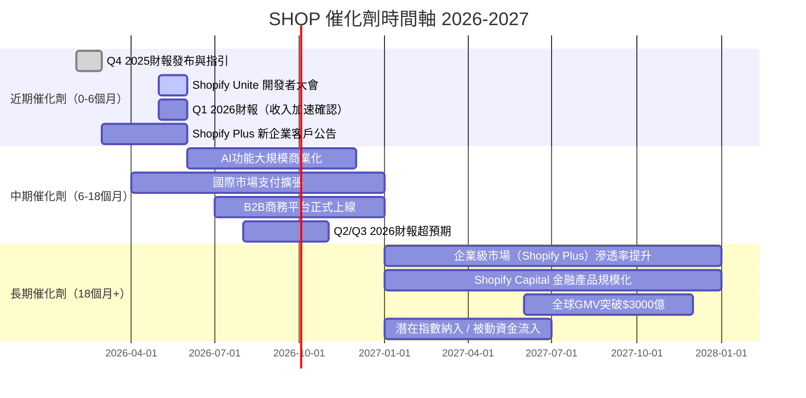

---

### ✅ 正面觸發因素

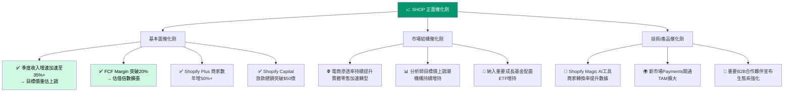

---

## 10. 投資建議

### ⭐ 最終評級

```
╔══════════════════════════════════════════════════════════════════╗
║                                                                  ║
║     📊 SHOP (Shopify Inc.) 投資評級                              ║
║                                                                  ║
║           ★ ★ ★ ★ ☆   買入（4/5星）                            ║
║                                                                  ║
║     評級：【買入 / BUY】                                         ║
║     信心度：中高（70%）                                          ║
║     建議持倉比例：核心持倉 3-5%（成長型投資組合）               ║
║                                                                  ║
║  ┌─────────────────────────────────────────────────────────┐    ║
║  │  核心論點：SHOP 是電商基礎設施革命的最大受益者之一，      │    ║
║  │  擁有強大護城河、優秀管理層、爆發式FCF增長。             │    ║
║  │  當前股價$120.73距目標價$155有28%上行空間，               │    ║
║  │  回調至$100-$110為絕佳加倉機會。                         │    ║
║  │  主要風險：估值偏高 + Beta極高 + 競爭加劇                │    ║
║  └─────────────────────────────────────────────────────────┘    ║
╚══════════════════════════════════════════════════════════════════╝
```

---

### 🎯 目標價區間及隱含報酬率

| 情境 | 目標價 | 隱含報酬率 | 概率 | 關鍵假設 |
|------|--------|-----------|------|---------|
| 🐂 **樂觀（Bull）** | **$185** | **+53.2%** | 25% | 收入增速35%+，FCF Margin突破22%，AI功能超預期 |
| 📊 **基準（Base）** | **$155** | **+28.4%** | 50% | 收入增速25-28%，FCF Margin 18-20%，穩健執行 |
| 🐻 **悲觀（Bear）** | **$90** | **-25.5%** | 25% | 增速放緩至15%，估值收縮，宏觀逆風 |
| **期望報酬率** | **$146** | **+21%** | 加權均值 | 25%×185 + 50%×155 + 25%×90 |

---

### 👥 投資人適配度

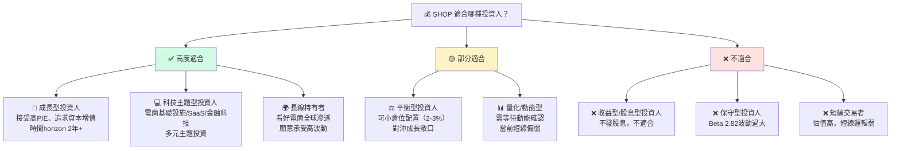

---

### 📋 操作建議詳細指南

| 操作項目 | 具體建議 |
|---------|---------|
| **建議持倉時間** | 12-24個月（中長線） |
| **建倉策略** | 分3批建倉：當前$120附近建1/3，$105附近加1/3，$90附近加滿 |
| **目標倉位** | 成長組合3-5%，積極組合最高8% |
| **加碼觸發條件** | ①股價跌破$110 ②Q1 2026財報收入增速35%+ ③重大新產品發布 |
| **減倉觸發條件** | ①收入增速連續2季低於20% ②Forward P/E超過70x ③股價升至$180+ |
| **止損觸發條件** | 股價跌破$85（基本面惡化確認）或 FCF轉負 |

---

### 🔍 關鍵監控指標 Checklist

```
每季必追蹤指標：
─────────────────────────────────────────────────────
📌 收入增速        □ 季度YoY增速是否維持25%+
📌 GMV增速         □ 商家GMV是否持續增長
📌 商家解決方案    □ Merchant Solutions vs Subscription比例
📌 FCF Margin      □ 自由現金流利潤率是否持續擴張（目標20%+）
📌 Shopify Plus    □ 企業版商家增速（高ARPU驅動）
📌 Shopify Capital □ 放款規模與壞帳率
📌 毛利率          □ 是否維持在47%以上
📌 SBC 費用        □ 股份薪酬/收入比例是否下降
─────────────────────────────────────────────────────
每月必關注指標：
📌 電商行業數據    □ Mastercard/Visa電商GMV趨勢
📌 競爭動態        □ TikTok Shop、Amazon Marketplace動向
📌 分析師評級      □ 是否有大行升降評
📌 內部人交易      □ 管理層買賣動向（insider 0.4%）
📌 機構持股        □ 73.5%機構持股增減
─────────────────────────────────────────────────────
關鍵宏觀指標：
📌 美國消費信心    □ 影響SMB電商活躍度
📌 Fed利率動向     □ 高Beta股對利率極敏感
📌 關稅政策        □ 跨境電商衝擊評估
📌 美元指數        □ 影響國際GMV折算
─────────────────────────────────────────────────────
```

---

### 📊 最終綜合評分彙整

```
╔══════════════════════════════════════════════════════════════╗
║                SHOP 最終評分卡                               ║
╠══════════════════════════════════════════════════════════════╣
║  成長性     ████████▓░  8.5/10  🟢  電商基礎設施龍頭成長   ║
║  獲利能力   ███████▓░░  7.5/10  🟢  毛利/FCF快速改善       ║
║  財務健康   █████████░  9.0/10  🟢  淨現金$57億，無負債    ║
║  估值合理性 ████▓░░░░░  4.5/10  🔴  P/E 128x、P/S 13.6x高  ║
║  競爭優勢   ████████▓░  8.5/10  🟢  網路效應+轉換成本壁壘  ║
║  管理品質   ███████▓░░  7.5/10  🟢  Tobi執行力強，轉型成功 ║
║  動能       ██████▓░░░  6.5/10  🟡  從高點回落33%，待確認  ║
║  風險控制   ██████░░░░  6.0/10  🟡  Beta 2.82，高波動      ║
╠══════════════════════════════════════════════════════════════╣
║  加權總分   ███████░░░  7.3/10  🟢                         ║
║  投資評級   ★★★★☆ 買入 (4/5星)                           ║
║  目標價     $155（基準）/ $185（樂觀）/ $90（悲觀）         ║
║  預期報酬   +28.4%（12-24個月，基準情境）                   ║
╚══════════════════════════════════════════════════════════════╝
```

---

> ## ⚠️ 免責聲明
>
> **本報告為 AI 自動生成的研究分析文件，所有內容（包含財務預測、目標價、投資評級）僅供學術研究與參考目的，不構成任何投資建議或投資邀約。**
>
> 投資涉及風險，過去表現不代表未來結果。讀者應自行進行盡職調查，並在作出任何投資決定前諮詢專業財務顧問。本報告中的所有估算與預測均基於截至2026年2月28日之公開信息，未來實際結果可能與預測存在重大差異。
>
> **數據來源**：Yahoo Finance ｜ **分析日期**：2026-02-28 ｜ **版本**：v1.0