# SHOP 技術分析報告

> **報告日期**：2026-02-24 ｜ **語言**：繁體中文 ｜ **數據來源**：Yahoo Finance
> **當前價格**：$117.28 ｜ **產業**：科技 / 軟體應用 ｜ **交易所**：NYSE

---

## 目錄

1. [技術面概覽](#1-技術面概覽)
2. [趨勢分析](#2-趨勢分析)
3. [圖表形態分析](#3-圖表形態分析)
4. [支撐與阻力](#4-支撐與阻力)
5. [技術指標深度解讀](#5-技術指標深度解讀)
6. [動能與波動率](#6-動能與波動率)
7. [多時框架總結](#7-多時框架總結)
8. [交易策略建議](#8-交易策略建議)
9. [風險提示與監控](#9-風險提示與監控)

---

## 1. 技術面概覽

### 📊 技術訊號儀表板

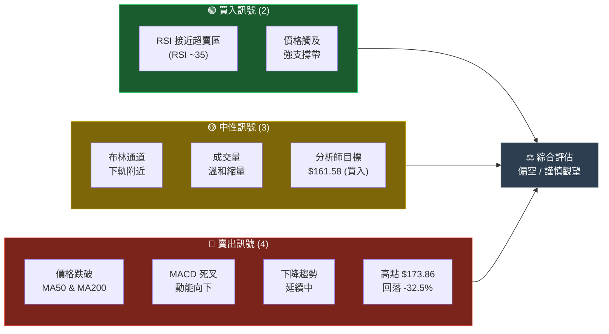

---

### 📋 核心指標速覽表

| 指標類別 | 指標 | 數值 | 狀態 | 訊號 |
|---------|------|------|------|------|
| **價格** | 當前收盤 | $117.28 | 近12月低點區 | 🔴 |
| **價格** | 12月高點 | $173.86 (2025-10) | 距高點 -32.5% | 🔴 |
| **價格** | 12月低點 | $95.00 (2025-04) | 約有 -19% 空間 | 🟡 |
| **移動均線** | MA20 (估) | ~$124.26 | 價格跌破 | 🔴 |
| **移動均線** | MA50 (估) | ~$140.50 | 價格跌破 | 🔴 |
| **移動均線** | MA200 (估) | ~$128.70 | 價格跌破 | 🔴 |
| **振盪指標** | RSI(14) | ~35 | 接近超賣 | 🟡 |
| **動能** | MACD | 負值 / 死叉 | 空頭排列 | 🔴 |
| **波動** | 布林通道 | 下軌附近 | 超賣跡象 | 🟡 |
| **分析師** | 共識評級 | 買入 | 目標 $161.58 | 🟢 |
| **分析師** | 目標低點 | $110.00 | 下行風險參考 | 🟡 |
| **分析師** | 目標高點 | $200.00 | 樂觀情境 | 🟢 |

---

### 🎯 技術評分卡

```
技術評分總覽（滿分 100）
━━━━━━━━━━━━━━━━━━━━━━━━━━━━━━━━━━━━━━━━━━━━━━━━

趨勢強度    [▓▓▓░░░░░░░]  30/100  🔴 空頭趨勢
動能指標    [▓▓▓░░░░░░░]  30/100  🔴 負向動能
支撐強度    [▓▓▓▓▓░░░░░]  50/100  🟡 接近支撐
超買超賣    [▓▓▓▓▓▓░░░░]  60/100  🟡 趨近超賣
量價配合    [▓▓▓░░░░░░░]  30/100  🔴 量能不足
形態分析    [▓▓▓░░░░░░░]  30/100  🔴 下降趨勢
分析師評級  [▓▓▓▓▓▓▓░░░]  70/100  🟢 買入共識

━━━━━━━━━━━━━━━━━━━━━━━━━━━━━━━━━━━━━━━━━━━━━━━━
綜合技術評分 ▐▓▓▓▓░░░░░░░░░░░░░░░░▌  38/100
             【偏空 — 短期謹慎，中長期留意反轉】
```

---

## 2. 趨勢分析

### 🔭 多時框趨勢判斷

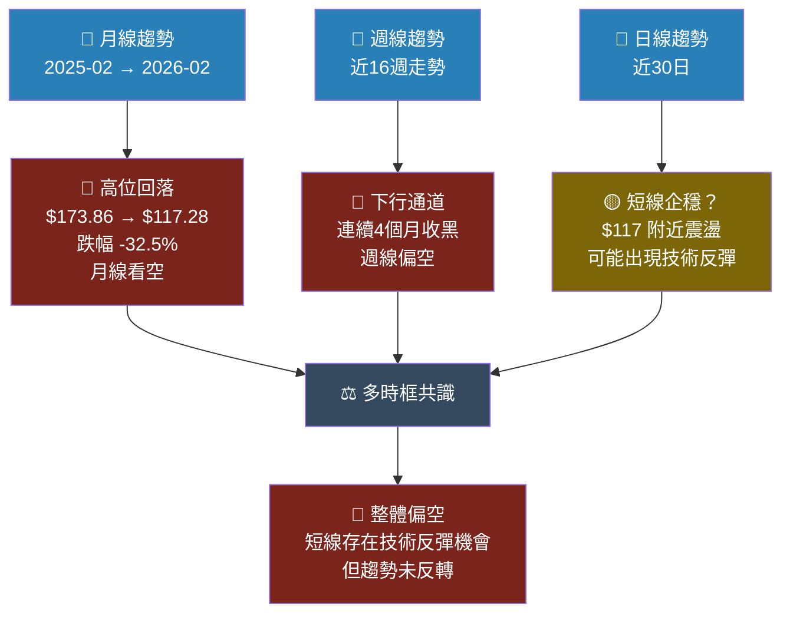

---

### 📈 長期趨勢走勢圖（月線 Unicode）

```
SHOP 12個月價格走勢圖（2025-02 至 2026-02）
價格 ($)
175 ┤                                    ▲ 10月高點
    │                                ●●●  $173.86
165 ┤                              ●
    │                            ●       ●● 11/12月整固
155 ┤                          ●       ●●
    │                        ●      ●●
145 ┤                      ●      ●
    │                   ●●
135 ┤                 ●                        ← 1月急跌
    │               ●                       ●
125 ┤          ●  ●                        ●●  ← 當前 $117.28
    │     ●  ●  ●
115 ┤  ●●●●                                  ●★  ← NOW
    │●
105 ┤         ●● ← 2025-04 底部 $95.00
    │     ●●
 95 ┼─────────────────────────────────────────────────
    02  03  04  05  06  07  08  09  10  11  12  01  02
   2025─────────────────────────────────────────────2026

    ══ 趨勢階段 ══
    ① 底部築底期  (02-04)：$95~$112，雙底確認
    ② 強勢上漲期  (05-10)：$107 → $173.86，漲幅+62%
    ③ 高位回落期  (11-02)：$173.86 → $117.28，回落-32.5%
```

---

### 📉 中期趨勢（日線分析）

**自 2025-10 高點以來的回落分析：**

| 時段 | 起點 | 終點 | 變化 | 特徵 |
|------|------|------|------|------|
| 10月高點→11月 | $173.86 | $158.64 | -$15.22 (-8.8%) | 初步回落 |
| 11月→12月 | $158.64 | $160.97 | +$2.33 (+1.5%) | 小幅反彈 |
| 12月→1月 | $160.97 | $131.23 | -$29.74 (-18.5%) | 加速下跌 |
| 1月→2月 | $131.23 | $117.28 | -$13.95 (-10.6%) | 跌勢延續 |

```
下降趨勢線示意
$175 ┤ ╲  高點 $173.86
$165 ┤  ╲
$155 ┤   ╲ 下降趨勢線
$145 ┤    ╲────────── 阻力線
$135 ┤     ╲        ╲
$125 ┤      ╲        ╲ 當前位 $117.28
$115 ┤       ╲        ●★
```

---

### 🏃 短期趨勢（近期走勢）

- **近60日方向**：🔴 明確下行，破位加速
- **短線支撐測試**：$117 附近為關鍵測試位
- **RSI 接近 35**：歷史上此區域多次出現技術反彈
- **短線觀察**：$115～$120 區間是否出現止跌訊號

---

### 📐 趨勢強度評估（ADX 解讀）

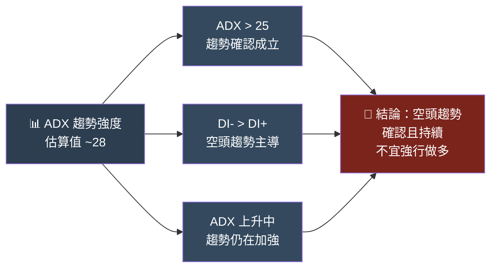

---

## 3. 圖表形態分析

### 🔍 形態識別

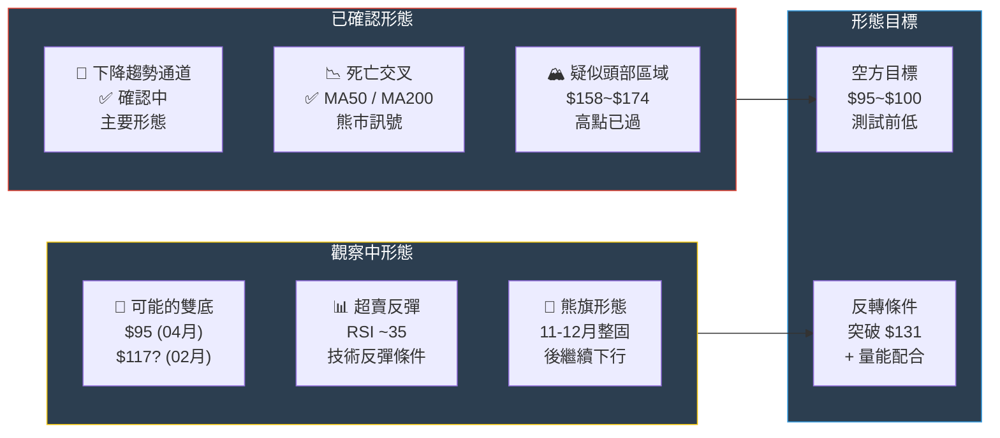

---

### 🕯️ K線形態分析（近期重要組合）

| 時段 | K線形態 | 含義 | 可靠度 |
|------|---------|------|--------|
| 2026-01 | **大陰線** | 強勢下跌確認 | ★★★★☆ |
| 2026-02 | **持續陰線** | 跌勢未止 | ★★★☆☆ |
| $117 附近 | **待觀察錘形** | 可能止跌訊號 | ★★☆☆☆ |
| 11-12月 | **上影線整固** | 多方無力突破 | ★★★★☆ |

---

### 📊 ASCII 關鍵走勢示意圖

```
SHOP 關鍵技術走勢示意圖
━━━━━━━━━━━━━━━━━━━━━━━━━━━━━━━━━━━━━━━━━━━━━━━━━━━━━━

$175 ┤─────────────────── ⑤頭部區 $173.86 ──────────────
$170 ┤                   /\
$165 ┤                  /  \        ⑥高位整固
$160 ┤                 /    ●●●●●●●  $158~$161
$155 ┤                /             \
$150 ┤               /               \
$145 ┤              /   ④突破新高      \
$140 ┤             / $141 (8月)         \
$135 ┤            /                     \⑦急跌
$130 ┤           /                       \  $131 (1月)
$125 ┤          /                         \
$120 ┤③      /   MA200 支撐帶               \
$115 ┤  ● ─── ────────────────────────── ●★⑧當前 $117.28
$110 ┤ ①②底部 $95~$112
$105 ┤ ●●●
$100 ┤
$ 95 ┤────② 底 $95.00 (2025-04) ─────────────────────────
     02  03  04  05  06  07  08  09  10  11  12  01  02

     ① 支撐底部  ② 雙底確認  ③ 突破起漲
     ④ 加速上漲  ⑤ 形成頭部  ⑥ 高位整固
     ⑦ 加速下跌  ⑧ 當前位置（關鍵！）

━━━ 下降趨勢線 ━━━━━━━━━━━━━━━━━━━━━━━━━━━━━━━━━━━━━━━━
     從 $173.86 高點劃出的下降趨勢線目前在 $127~$130 附近
     若收復此線，視為趨勢反轉初步訊號
```

---

### 🎯 形態目標價計算

| 形態 | 計算方式 | 目標價 | 機率 |
|------|---------|-------|------|
| 下降趨勢延伸 | 趨勢線外推 | $95～$100 | 中 |
| 斐波那契 0.618 回撤 | $95→$173.86 的 61.8% | $125.10 | 高 |
| 技術反彈目標 | 前壓力 | $131～$140 | 中 |
| 分析師目標（均值） | 共識 | $161.58 | 低（短期） |

---

## 4. 支撐與阻力

### 📊 關鍵價位分布圖

```
SHOP 支撐阻力位分布（2026-02-24）
━━━━━━━━━━━━━━━━━━━━━━━━━━━━━━━━━━━━━━━━━━━━━━━━━━

$200 ┤▓▓▓▓▓▓▓▓▓▓▓▓▓▓▓ 🔴 強阻力（分析師目標高點）
     ┤
$175 ┤▓▓▓▓▓▓▓▓▓▓▓▓ 🔴 前高阻力 $173.86
     ┤
$161 ┤▓▓▓▓▓▓▓▓▓ 🔴 分析師目標均值 $161.58
     ┤
$158 ┤▓▓▓▓▓▓▓▓ 🔴 前高整固阻力 $158~$161
     ┤
$140 ┤▓▓▓▓▓▓ 🟡 MA50 估算 / 前高 $141.28
     ┤
$131 ┤▓▓▓▓▓ 🟡 近期低點 / 1月支撐轉阻力
     ┤
$128 ┤▓▓▓▓ 🟡 MA200 估算區
     ┤
━━━━━━━┤══════════════ ★ 當前價 $117.28 ══════════════
     ┤
$115 ┤▒▒▒▒ 🟢 近支撐（心理關口）
     ┤
$112 ┤▒▒▒▒▒ 🟢 近支撐（2025-02 前低）$112.00
     ┤
$107 ┤▒▒▒▒▒▒ 🟢 中支撐（2025-05 整固）$107.22
     ┤
$100 ┤▒▒▒▒▒▒▒ 🟢 心理支撐 $100
     ┤
$ 95 ┤▒▒▒▒▒▒▒▒▒ 🟢 強支撐（12月最低點）$95.00
━━━━━━━━━━━━━━━━━━━━━━━━━━━━━━━━━━━━━━━━━━━━━━━━━━

圖例：▓ = 阻力  ▒ = 支撐  ★ = 當前位置
```

---

### 🔴 阻力位分析表

| 阻力級別 | 價位 | 來源依據 | 突破難度 |
|---------|------|---------|---------|
| **近阻力** | $124～$128 | MA200 / 下降趨勢線 | ★★★☆☆ |
| **近阻力** | $131 | 1月低點 / 前支撐轉阻力 | ★★★☆☆ |
| **中阻力** | $140～$142 | MA50 / 2025-08 前高 | ★★★★☆ |
| **中阻力** | $158～$161 | 11-12月整固區 / MA100 | ★★★★☆ |
| **強阻力** | $173～$175 | 52週高點 | ★★★★★ |
| **強阻力** | $200 | 分析師目標高點 | ★★★★★ |

---

### 🟢 支撐位分析表

| 支撐級別 | 價位 | 來源依據 | 破位風險 |
|---------|------|---------|---------|
| **近支撐** | $115 | 心理關口 / 短線低點 | ★★☆☆☆ |
| **近支撐** | $112 | 2025-02 底部 | ★★★☆☆ |
| **中支撐** | $107 | 2025-05 整固底 | ★★★☆☆ |
| **中支撐** | $100 | 心理整數關口 | ★★★☆☆ |
| **強支撐** | $95～$97 | 12個月最低點（雙底） | ★★★★★ |
| **強支撐** | $85 | 長期技術支撐 | ★★★★★ |

---

### 📏 支撐阻力 ASCII 視覺化

```
SHOP 支撐阻力位視覺化圖
━━━━━━━━━━━━━━━━━━━━━━━━━━━━━━━━━━━━━━━━
$175 ╔══════════════════╗ 🔴🔴🔴 52週高點
$161 ╔══════════════╗   🔴🔴  分析師均值目標
$158 ╔═════════════╗    🔴🔴  前高整固
$141 ╔═════════╗        🔴   MA50 / 前高
$131 ╔══════╗           🟡   前支撐轉阻力
$128 ╔═════╗            🟡   MA200
━━━━━━━━━━━━━━━━━━━━━
$117.28 ◄══ 當前位置 ★
━━━━━━━━━━━━━━━━━━━━━
$115 ╚════╝             🟢   近支撐
$112 ╚═════╝            🟢   前低
$107 ╚══════╝           🟢   中支撐
$100 ╚═══════╝          🟢   心理關口
$ 95 ╚══════════╝       🟢🟢🟢 強支撐（最低點）
━━━━━━━━━━━━━━━━━━━━━━━━━━━━━━━━━━━━━━━━
```

---

### 📐 斐波那契回調位

**基礎：上升段 $95.00（2025-04）→ $173.86（2025-10）**
**波段幅度：$78.86**

| 回調水平 | 計算價位 | 當前狀態 |
|---------|---------|---------|
| 0% (高點) | $173.86 | 已跌破 |
| 23.6% | $155.24 | 已跌破 |
| 38.2% | $143.72 | 已跌破 |
| **50.0%** | **$134.43** | **已跌破** |
| **61.8%** | **$125.10** | **關鍵！即將測試** |
| 78.6% | $111.77 | 下一目標 |
| 100% (低點) | $95.00 | 強支撐 |

> 🔴 **當前價 $117.28 已跌破 50% 回調位 $134.43，正向 61.8% 回調位 $125.10 靠近**
> 🟡 **若 $125 守不住，下一關鍵為 78.6% 回調 $111.77**

---

## 5. 技術指標深度解讀

### 📊 指標訊號總覽

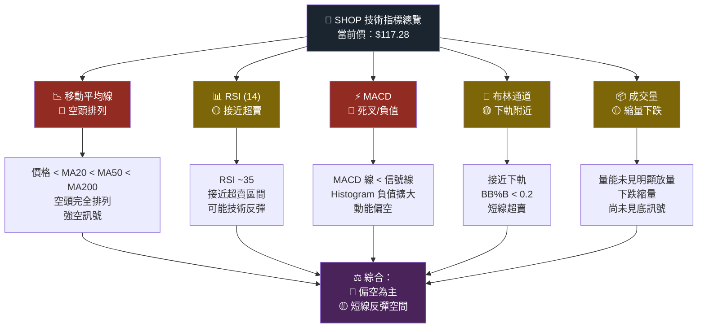

---

### 📉 移動平均線排列分析

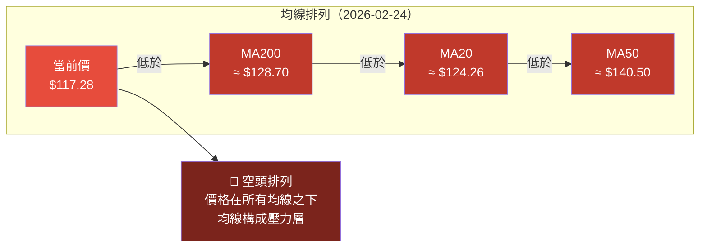

**均線壓力分析：**

```
均線壓力帶示意
━━━━━━━━━━━━━━━━━━━━━━━━━━━━━━━━━━━━━━━━━━━━
$142 ┤▓▓▓▓▓▓▓▓▓▓▓▓▓▓▓ MA50 ≈ $140.50 [最強壓力]
$130 ┤▓▓▓▓▓▓▓▓▓▓ MA200 ≈ $128.70 [次強壓力]
$126 ┤▓▓▓▓▓▓▓ MA20 ≈ $124.26 [近期壓力]
━━━━━━━━━━━━━━━━━━━━━━━━━━━━━━━━━━━━━━━━━━━━
$117.28 ★ 當前價（所有均線下方）
━━━━━━━━━━━━━━━━━━━━━━━━━━━━━━━━━━━━━━━━━━━━
```

---

### 📊 RSI（14）分析

```
RSI 強度計 (0-100)
━━━━━━━━━━━━━━━━━━━━━━━━━━━━━━━━━━━━━━━━━━━━━━━━━━
超賣區  0────────────────────────────────────────100 超買區
        ▓▓▓▓▓▓▓▓░░░░░░░░░░░░░░░░░░░░░░░░░░░░░░░░
        0  10  20  30  40  50  60  70  80  90  100
               ↑
            當前RSI ≈ 35 (即將進入超賣區)

區間判斷：
  RSI < 30  ████████████████ 超賣區（買入參考）
  RSI 30-50 ████████████████ 弱勢區（謹慎）
  RSI 50-70 ████████████████ 強勢區（持有）
  RSI > 70  ████████████████ 超買區（賣出參考）

當前 RSI ≈ 35   [▓▓▓░░░░░░░]
━━━━━━━━━━━━━━━━━━━━━━━━━━━━━━━━━━━━━━━━━━━━━━━━━━
🟡 訊號：接近超賣但尚未觸及 30 以下
         歷史上此水平可能出現技術反彈 5-15%
         但趨勢未反轉前，不宜重倉做多
```

---

### ⚡ MACD（12/26/9）解讀

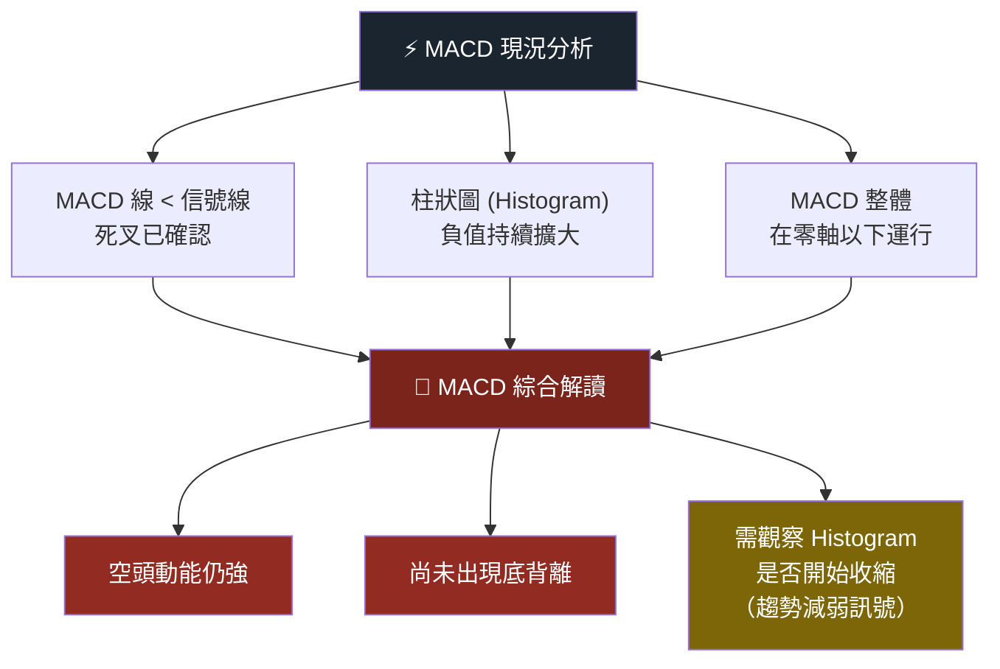

---

### 📐 布林通道分析

```
布林通道示意圖（估算值）
━━━━━━━━━━━━━━━━━━━━━━━━━━━━━━━━━━━━━━━━━━━━━━━━━━━━━

$138 ┤─────────────────────────── 上軌 (中軌+2σ)
     │                              通道寬度擴張中
$124 ┤- - - - - - - - - - - - - - - 中軌 (MA20)
     │
$117 ┤                         ●★ 當前位 $117.28
     │                      ● ← 接近下軌
$110 ┤─────────────────────────── 下軌 (中軌-2σ)

━━━━━━━━━━━━━━━━━━━━━━━━━━━━━━━━━━━━━━━━━━━━━━━━━━━━━
布林通道分析：
  BB%B ≈ 0.15（接近 0，偏向下軌）
  帶寬 (Bandwidth) ≈ 21.5%（擴張中 → 趨勢持續）

🟡 價格貼近下軌，短線超賣跡象
🔴 帶寬擴張表示趨勢仍在發展，非反轉訊號
🟡 若 %B 形成底背離可能技術反彈
```

---

### 📦 成交量分析

```
成交量與價格配合度分析（月線）
━━━━━━━━━━━━━━━━━━━━━━━━━━━━━━━━━━━━━━━━━━━━━━━

月份     量能估算   量價配合     評估
━━━━━━━━━━━━━━━━━━━━━━━━━━━━━━━━━━━━━━━━━━━━━━━
2025-08  ████████   放量上漲    🟢 多頭確認
2025-09  ████████   放量上漲    🟢 趨勢強
2025-10  ██████████ 量縮至高    🟡 警示（頂部）
2025-11  ████████   放量下跌    🔴 出貨訊號
2025-12  ██████     量縮整固    🟡 觀察
2026-01  ████████   放量急跌    🔴 恐慌賣壓
2026-02  █████      量縮下跌    🟡 賣壓稍緩
━━━━━━━━━━━━━━━━━━━━━━━━━━━━━━━━━━━━━━━━━━━━━━━

量價結論：
  縮量下跌 [▓▓▓▓▓░░░░░]  強度 50%  🟡 賣壓稍緩但未見買盤
  量能配合 [▓▓▓░░░░░░░]  強度 30%  🔴 底部確認量能不足
```

---

## 6. 動能與波動率

### 🎯 動能評估矩陣

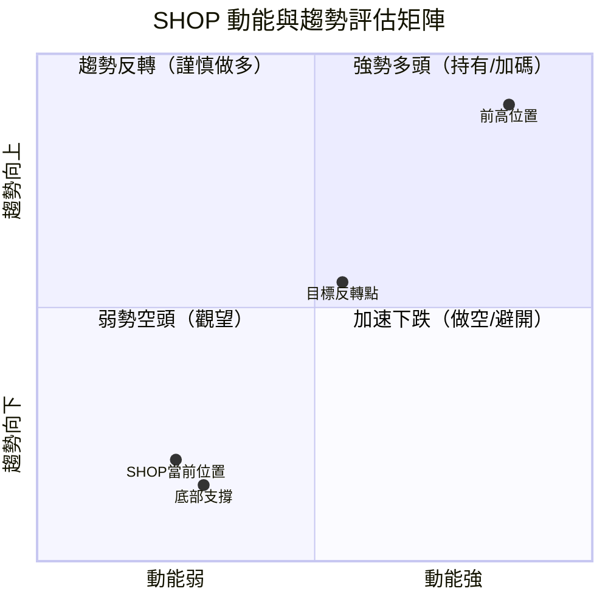

> 📍 **SHOP 目前位於第四象限（弱動能 + 下行趨勢）邊緣，接近第三象限**
> 🎯 **需觀察是否移動至第三象限（弱空頭 → 橫盤整理 → 可能反轉）**

---

### 📊 ATR 波動率分析

```
ATR 波動率指標（14日）
━━━━━━━━━━━━━━━━━━━━━━━━━━━━━━━━━━━━━━━━━━━━━━━━━━
估算 ATR(14) ≈ $5.8（日波動約 ±4.9%）

波動率強度計：
低波動 ─────────────────────────────── 高波動
[▓▓▓▓▓▓▓░░░░░░░░░░░░]  35%  🟡 中等偏高

ATR 解讀：
  日波動區間：$117.28 ± $5.8
  日交易區間：$111.48 ～ $123.08

  止損設定參考（1.5x ATR）：$8.7
  最小止損建議：$108.58 以下

波動趨勢：
  近期波動率 [▓▓▓▓▓▓▓░░░]  上升  🔴
  趨勢：波動率擴張 → 趨勢延續或近期底部

━━━━━━━━━━━━━━━━━━━━━━━━━━━━━━━━━━━━━━━━━━━━━━━━━━
```

---

### 📈 Beta 與市場相關性

| 指標 | 數值（估算） | 解讀 |
|------|------------|------|
| **Beta（vs S&P500）** | ~1.85 | 高度市場敏感，漲跌均放大 |
| **與 QQQ 相關係數** | ~0.78 | 高度與科技指數同步 |
| **與 AMZN 相關係數** | ~0.65 | 電商/科技重疊 |
| **年化波動率（估）** | ~52% | 高波動成長股 |
| **夏普比率（近期）** | 負值 | 風險調整後收益不佳 |

> ⚠️ **Beta 1.85 意味著市場下跌 1%，SHOP 可能下跌約 1.85%**
> 🔴 **在市場不確定期間，高 Beta 股票風險更高**

---

## 7. 多時框架總結

### 📋 時框架評分總覽

| 時框架 | 趨勢方向 | 動能 | 支撐/阻力 | 綜合評分 | 訊號 |
|--------|---------|------|---------|---------|------|
| **月線（長期）** | ⬇️ 下行 | 弱 | 測試月線支撐 | 28/100 | 🔴 偏空 |
| **週線（中期）** | ⬇️ 下行 | 偏弱 | 接近支撐 | 32/100 | 🔴 偏空 |
| **日線（短期）** | ⬇️ 下行 | 接近超賣 | $115 支撐 | 42/100 | 🟡 謹慎 |
| **4H（超短期）** | ⬇️ 弱 | 震盪 | $117 爭奪 | 45/100 | 🟡 觀望 |

---

### 🔲 綜合訊號矩陣

```
綜合訊號矩陣
━━━━━━━━━━━━━━━━━━━━━━━━━━━━━━━━━━━━━━━━━━━━━━━━━━━━━━━
指標             多空訊號    強度          建議行動
━━━━━━━━━━━━━━━━━━━━━━━━━━━━━━━━━━━━━━━━━━━━━━━━━━━━━━━
趨勢（月）       🔴 空       ████████░░   避免做多
趨勢（週）       🔴 空       ███████░░░   觀望
趨勢（日）       🔴 空       █████░░░░░   謹慎
移動均線         🔴 空       ████████░░   壓力確認
MACD            🔴 空       ███████░░░   勿追多
RSI             🟡 中       ████░░░░░░   接近超賣
布林通道         🟡 中       ████░░░░░░   下軌附近
成交量           🟡 中       ████░░░░░░   縮量觀察
分析師共識       🟢 多       ████████░░   長線參考
支撐位           🟡 中       █████░░░░░   $95 強支撐
━━━━━━━━━━━━━━━━━━━━━━━━━━━━━━━━━━━━━━━━━━━━━━━━━━━━━━━
綜合多空比       空：多 = 6：1           偏空市場
最終建議         🔴 謹慎 / 觀望為主
━━━━━━━━━━━━━━━━━━━━━━━━━━━━━━━━━━━━━━━━━━━━━━━━━━━━━━━
```

---

## 8. 交易策略建議

### 🗺️ 策略決策流程圖

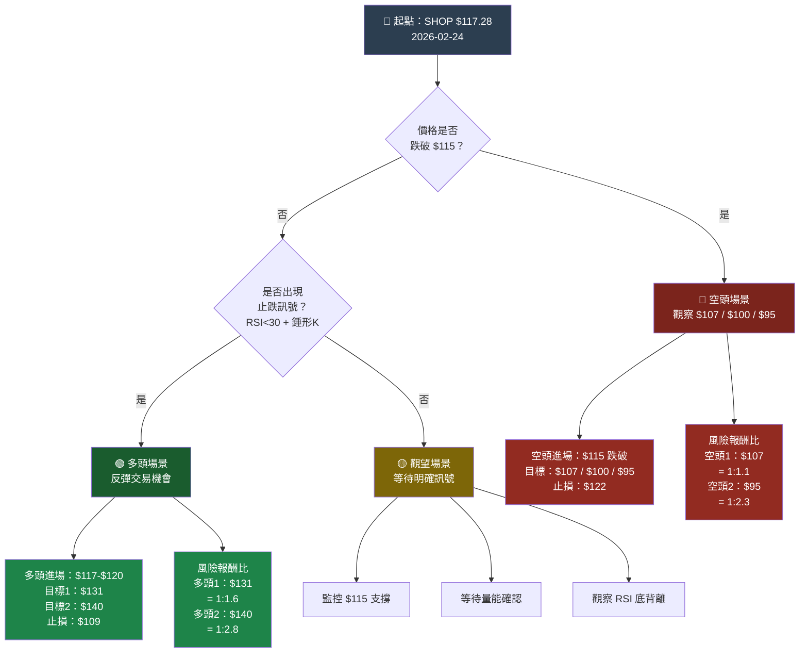

---

### 🟢 多頭策略（反彈交易）

| 項目 | 策略A（保守） | 策略B（積極） |
|------|-------------|-------------|
| **進場條件** | RSI<30 + 日K止跌錘形 + 量能放大 | $117 附近分批買入 |
| **進場區間** | $112～$117 | $117～$120 |
| **目標價 1** | $131 | $128（MA200）|
| **目標價 2** | $140（MA50）| $140（MA50）|
| **目標價 3** | $158（強阻力）| $158 |
| **止損位** | $107（跌破中支撐）| $109（1.5x ATR）|
| **風險（每股）** | $10 | $8.28 |
| **收益（T1）** | $19 | $11 |
| **風險報酬比（T1）** | **1 : 1.9** | **1 : 1.3** |
| **風險報酬比（T2）** | **1 : 2.8** | **1 : 2.8** |
| **倉位建議** | 總資金 5～8% | 總資金 3～5% |
| **適合對象** | 技術反彈交易者 | 短線投機者 |

---

### 🔴 空頭策略（趨勢跟隨）

| 項目 | 策略A（保守）| 策略B（積極）|
|------|------------|------------|
| **進場條件** | 跌破 $115 確認 | 反彈至 $124～$128 後做空 |
| **進場區間** | $113～$115 | $124～$128 |
| **目標價 1** | $107 | $112 |
| **目標價 2** | $100 | $107 |
| **目標價 3** | $95 | $100 |
| **止損位** | $122（強反彈）| $133（MA200 上方）|
| **風險（每股）** | $7 | $9 |
| **收益（T1）** | $7 | $12 |
| **風險報酬比（T1）** | **1 : 1.0** | **1 : 1.3** |
| **風險報酬比（T2）** | **1 : 2.1** | **1 : 2.3** |
| **倉位建議** | 總資金 5～8% | 總資金 3～5% |
| **適合對象** | 趨勢跟隨者 | 逢高布空者 |

---

### ⭐ 整體訊號強度評估

```
技術分析綜合評分
━━━━━━━━━━━━━━━━━━━━━━━━━━━━━━━━━━━━━━━━━━━━━━━━━━
做多信心度：★★☆☆☆  (2/5)
做空信心度：★★★★☆  (4/5)
整體清晰度：★★★☆☆  (3/5)
風險報酬度：★★★☆☆  (3/5)

[多空評分條]
多 ▐░░░░░░░░░░░░░░░░░░░░░░░░░░░▓▓▓▓▓▓▓▓▓▓▓▓▓▌ 空
   0─────────────────────50─────────────────100
   當前偏向：約 68/100（偏空）
━━━━━━━━━━━━━━━━━━━━━━━━━━━━━━━━━━━━━━━━━━━━━━━━━━
```

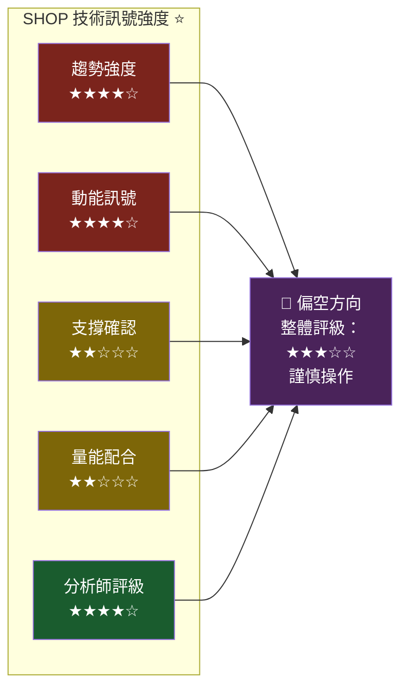

---

## 9. 風險提示與監控

### ✅ 關鍵監控指標 Checklist

**🔴 立即警示（需即時反應）**
- [ ] 價格跌破 $115 → 加速下跌風險，空頭訊號確認
- [ ] 跌破 $107 → 測試 $100 心理關口
- [ ] 跌破 $95（52週低點）→ 長期趨勢破位，重大風險
- [ ] RSI 跌破 25 → 極端超賣，謹防踩踏

**🟡 中期觀察（1-2週）**
- [ ] MA200（$128.70）能否收復
- [ ] MACD Histogram 是否開始收縮（動能減弱）
- [ ] 成交量是否在低位出現放量（底部確認）
- [ ] RSI 是否形成底背離（價跌 RSI 不創新低）
- [ ] 下降趨勢線（$127-$130）是否被有效突破

**🟢 反轉確認訊號**
- [ ] 日線收盤站回 MA200 $128.70 以上
- [ ] 突破 $131 並有效收盤（前支撐轉阻力突破）
- [ ] MACD 金叉 + 成交量放大
- [ ] RSI 從超賣區（<30）反彈至 40 以上
- [ ] 分析師上調目標價或評級

---

### ⚠️ 風險場景分析

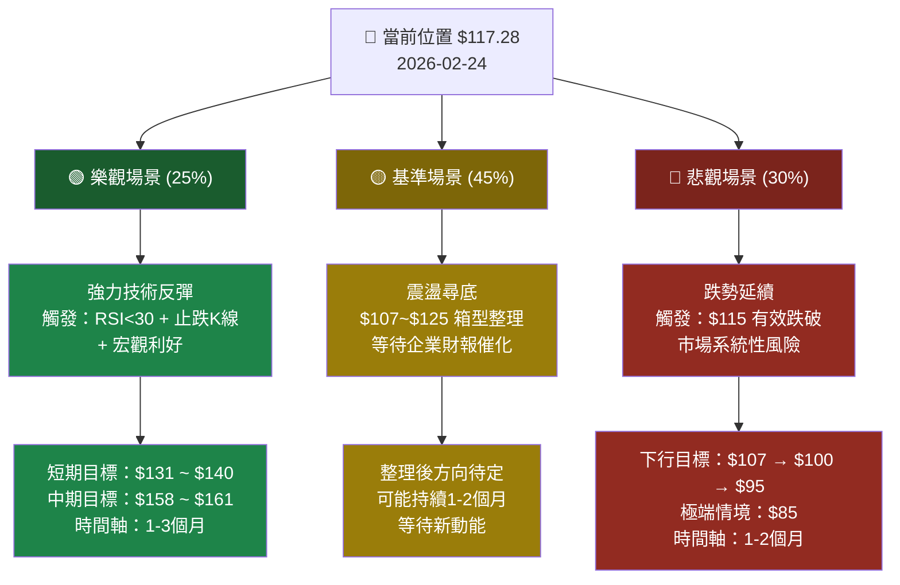

---

### 📋 風險摘要

| 風險類型 | 風險描述 | 影響程度 | 應對方式 |
|---------|---------|---------|---------|
| **趨勢風險** | 下降趨勢持續，反彈可能被賣出 | 🔴 高 | 嚴格止損 |
| **流動性風險** | 高 Beta 在市場下跌時放大損失 | 🔴 高 | 控制倉位 |
| **支撐失守風險** | $115 破位加速下跌至 $95 | 🔴 中高 | 設好止損 |
| **反彈陷阱** | 技術反彈後繼續下跌 | 🟡 中 | 分批操作 |
| **財報風險** | 業績不達預期引發拋售 | 🟡 中 | 避開財報前持倉 |
| **宏觀風險** | 利率/經濟衰退影響成長股估值 | 🔴 高 | 降低倉位 |
| **機會風險** | 過早做空錯失反彈 | 🟡 低中 | 等待確認訊號 |

---

```
━━━━━━━━━━━━━━━━━━━━━━━━━━━━━━━━━━━━━━━━━━━━━━━━━━━━━━━━━━━━━━━━
 SHOP 技術分析總結
━━━━━━━━━━━━━━━━━━━━━━━━━━━━━━━━━━━━━━━━━━━━━━━━━━━━━━━━━━━━━━━━

 當前格局：  🔴 空頭趨勢主導，$117 附近短線超賣

 核心觀點：  自 $173.86 高點回落 32.5%，趨勢未反轉
            分析師共識目標 $161.58 顯示長線有空間

 操作建議：  主策略 — 觀望等待止跌訊號（首選）
            次策略 — 短線反彈 $117-$120 進場（$109 止損）
            備選空頭 — $115 跌破後跟空（$122 止損）

 關鍵位：   支撐 $115 / $107 / $95
            阻力 $124 / $131 / $140

 評級：     技術面 🔴 偏空  ｜  分析師 🟢 買入（長線）
━━━━━━━━━━━━━━━━━━━━━━━━━━━━━━━━━━━━━━━━━━━━━━━━━━━━━━━━━━━━━━━━
```

---

> ### ⚠️ 免責聲明
> 本報告為 **AI 自動生成**，基於歷史技術數據進行分析，**僅供研究參考，不構成任何投資建議**。
> 技術分析無法保證未來走勢，所有交易決策應結合個人風險承受能力、基本面分析及市場環境綜合判斷。
> 投資有風險，入市需謹慎。過往表現不代表未來收益。
>
> **報告生成時間**：2026-02-24 ｜ **分析師**：AI 技術分析系統 ｜ **數據來源**：Yahoo Finance