# SNDK 綜合股票評估報告

> **報告日期**：2026-02-24 ｜ **語言**：繁體中文 ｜ **數據來源**：Yahoo Finance
> **分析師**：頂級美股投資評估師 AI ｜ **股票代碼**：SNDK（Sandisk Corporation）

---

## 目錄

1. [評估總覽](#1-評估總覽)
2. [八維度評分矩陣](#2-八維度評分矩陣)
3. [業務品質與護城河](#3-業務品質與護城河)
4. [財務健康全面評估](#4-財務健康全面評估)
5. [成長性評估](#5-成長性評估)
6. [估值合理性與同業比較](#6-估值合理性與同業比較)
7. [資本配置與管理層評估](#7-資本配置與管理層評估)
8. [風險評估](#8-風險評估)
9. [催化劑與觸發因素](#9-催化劑與觸發因素)
10. [投資建議](#10-投資建議)

---

## 1. 評估總覽

### 🎯 核心摘要

> **SNDK（Sandisk Corporation）** 於 2025 年底自 Western Digital 分拆上市，聚焦 NAND Flash 快閃記憶體儲存解決方案。公司股價自上市以來從 \$27 飆升至 \$644，漲幅超過 23 倍，背後驅動力為 AI 基礎設施建設帶動的企業級 SSD 需求爆發，以及全球 NAND 供需週期翻轉。

---

### 📡 ASCII 雷達圖（八維度評分）

```
                    成長性(9)
                      ★★★★★
                   ╱    │    ╲
          管理品質(6)   │   獲利能力(6)
          ★★★☆☆    ╱   │   ╲   ★★★☆☆
                ╱     │     ╲
    動能(9) ━━━╋━━━━━━╋━━━━━━━╋━━━ 財務健康(6)
    ★★★★★    ╲     │     ╱   ★★★☆☆
                ╲     │     ╱
         風險(4)  ╲   │   ╱  估值(5)
         ★★☆☆☆    ╲  │  ╱   ★★★☆☆
                   ╲  │  ╱
              競爭優勢(7)
                ★★★★☆

  ┌─────────────────────────────────┐
  │  外圈 = 10分 │ 中圈 = 5分      │
  │  內圈 = 0分  │ ★ = 得分位置    │
  └─────────────────────────────────┘
```

```
維度雷達（數值對齊版）
        10 ┤
         9 ┤  ●成長           ●動能
         8 ┤
         7 ┤           ●競爭優勢
         6 ┤  ●獲利  ●財務  ●管理
         5 ┤           ●估值
         4 ┤  ●風險
         3 ┤
         2 ┤
         1 ┤
         0 └─────────────────────────
```

---

### 📊 八維度評分 + Unicode 評分條

| 維度 | 評分 | Unicode 評分條（滿分10格） | 信號 |
|------|------|--------------------------|------|
| 🚀 成長性 | **9/10** | `▓▓▓▓▓▓▓▓▓░` | 🟢 |
| 💰 獲利能力 | **6/10** | `▓▓▓▓▓▓░░░░` | 🟡 |
| 🏦 財務健康 | **6/10** | `▓▓▓▓▓▓░░░░` | 🟡 |
| 📐 估值 | **5/10** | `▓▓▓▓▓░░░░░` | 🟡 |
| 🏰 競爭優勢 | **7/10** | `▓▓▓▓▓▓▓░░░` | 🟢 |
| 👔 管理品質 | **6/10** | `▓▓▓▓▓▓░░░░` | 🟡 |
| 📈 動能 | **9/10** | `▓▓▓▓▓▓▓▓▓░` | 🟢 |
| ⚠️ 風險 | **4/10** | `▓▓▓▓░░░░░░` | 🔴 |

**加權綜合評分：6.6 / 10**

```
總體評分視覺化：
▓▓▓▓▓▓▓░░░  6.6/10
```

---

### 🏆 投資結論

```
╔══════════════════════════════════════════════════════════╗
║                                                          ║
║   投資評級：⭐ 買入（有條件）Buy with Caution           ║
║                                                          ║
║   當前價格：$644.60                                      ║
║   基準目標價：$720（分析師共識中位）                    ║
║   樂觀目標價：$900                                       ║
║   悲觀目標價：$350                                       ║
║                                                          ║
║   12個月預期報酬率：+11.7%（基準）                      ║
║   風險等級：🔴 高風險（周期性 + 高估值）                ║
║                                                          ║
║   適合投資人：成長型 / 動能型 / 高風險承受者            ║
║                                                          ║
╚══════════════════════════════════════════════════════════╝
```

---

## 2. 八維度評分矩陣

### 📋 詳細評分表格

| 維度 | 評分 | 核心依據 | 趨勢 | 信號 |
|------|------|----------|------|------|
| 🚀 **成長性** | 9/10 | 收入YoY+61.2%；EPS成長618%；季度環比加速；AI驅動企業SSD需求爆發 | ↑↑ 強勁加速 | 🟢 |
| 💰 **獲利能力** | 6/10 | 毛利率34.8%改善中；營業利益率35.5%（TTM含季度轉正）；但TTM淨利率仍-11.7%（高額非現金費用拖累） | ↑ 改善中 | 🟡 |
| 🏦 **財務健康** | 6/10 | 流動比3.1良好；淨現金正向($726M)；但D/E=7.96偏高；FCF去年轉負 | → 穩定 | 🟡 |
| 📐 **估值** | 5/10 | Forward P/E=7.97看似便宜；但EV/EBITDA=68.5極高；P/S=10.6偏貴；股價自低點漲23倍 | ↓ 估值壓力 | 🟡 |
| 🏰 **競爭優勢** | 7/10 | NAND Flash技術積累深厚；SanDisk品牌護城河強；企業SSD市場第二大供應商；與鎧俠NAND合作關係 | → 穩固 | 🟢 |
| 👔 **管理品質** | 6/10 | 分拆後新管理層；資本紀律改善；但歷史連續虧損；EPS預測跳升可信度待驗證 | → 觀察中 | 🟡 |
| 📈 **動能** | 9/10 | 12個月漲幅+1275%；近期分析師密集升評（高盛/摩根/Jefferies）；短期空頭比率僅7.9% | ↑↑ 極強 | 🟢 |
| ⚠️ **風險** | 4/10 | NAND週期高度波動；競爭激烈（三星/SK海力士）；Forward EPS $80.9預估可信度存疑；分拆後財務結構尚未穩定 | ↓ 高風險 | 🔴 |

---

### 🗺️ Mermaid 風險/報酬定位圖

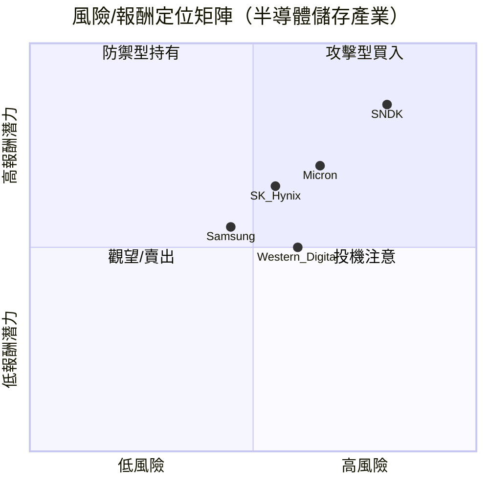

---

### 🔗 與同業整體比較

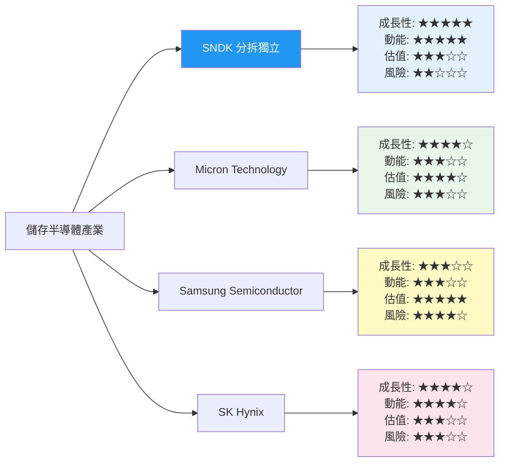

---

## 3. 業務品質與護城河

### 🏭 商業模式可持續性評估

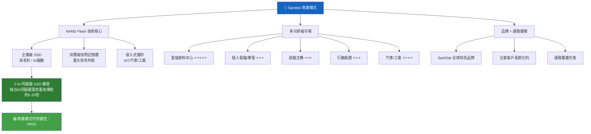

---

### 🏰 護城河評估

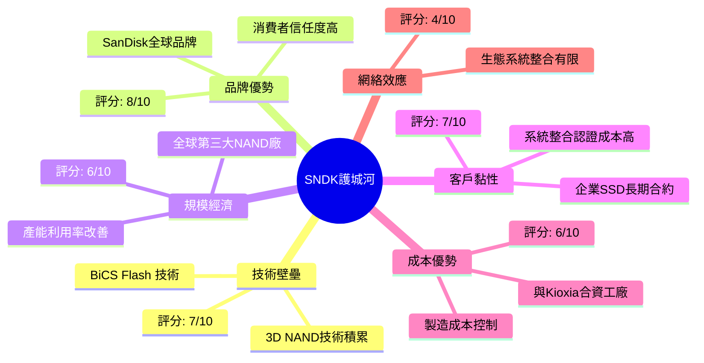

---

### 🛡️ 護城河強度條形圖

```
護城河類型評分（滿分10分）：

技術壁壘  │▓▓▓▓▓▓▓░░░│ 7.0/10  🟢
品牌優勢  │▓▓▓▓▓▓▓▓░░│ 8.0/10  🟢
規模經濟  │▓▓▓▓▓▓░░░░│ 6.0/10  🟡
客戶黏性  │▓▓▓▓▓▓▓░░░│ 7.0/10  🟢
成本優勢  │▓▓▓▓▓▓░░░░│ 6.0/10  🟡
網絡效應  │▓▓▓▓░░░░░░│ 4.0/10  🔴

整體護城河  ▓▓▓▓▓▓▓░░░  6.3/10  🟡 中等偏強
```

---

### 🌍 市場地位

| 指標 | 數值 | 說明 |
|------|------|------|
| **TAM（全球NAND市場）** | ~$700億（2025E） | 含消費/企業/嵌入式 |
| **企業SSD TAM** | ~$250億（2025E） | AI驅動年增30%+ |
| **SNDK 市場份額** | ~14-16%（全球NAND） | 全球第三大 |
| **企業SSD 排名** | 第2-3名 | 次於三星 |
| **SNDK 收入/TAM** | $8.93B / $700億 ≈ 13% | 市場份額 |
| **行業地位** | 跟隨者/挑戰者 | 相對三星 |

---

## 4. 財務健康全面評估

### 📊 財務儀表板

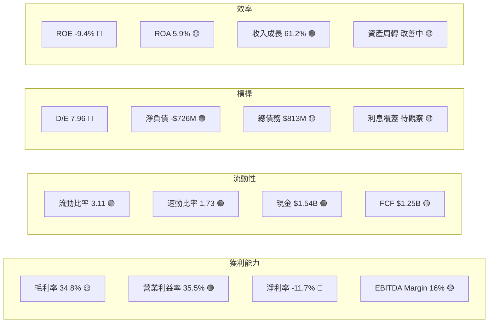

---

### 📈 獲利能力趨勢（近3年 + TTM）

| 指標 | FY2023 | FY2024 | FY2025 | TTM(最新) | 趨勢 |
|------|--------|--------|--------|-----------|------|
| **毛利率** | 7.1% 🔴 | 16.1% 🔴 | 30.0% 🟡 | 34.8% 🟡 | ↑↑ 強勁改善 |
| **營業利益率** | -21.2% 🔴 | -6.7% 🔴 | 6.9% 🟡 | 35.5%* 🟢 | ↑↑ 強勁反轉 |
| **淨利率** | -35.1% 🔴 | -10.1% 🔴 | -22.3% 🔴 | -11.7% 🔴 | ↑ 緩慢改善 |
| **EBITDA Margin** | -24.9% 🔴 | -3.6% 🔴 | -17.0% 🔴 | 16.0% 🟡 | ↑↑ 顯著改善 |
| **FCF Margin** | -15.3% 🔴 | -7.1% 🔴 | -1.6% 🔴 | 14.0% 🟡 | ↑↑ 轉正中 |

> *註：營業利益率35.5%為TTM含最新兩季強勁季度，反映週期高點加速，應謹慎解讀。

---

### 🏦 資產負債表穩健度

```
財務指標視覺化（基準線標示）：

流動比率(目標≥1.5)
實際: 3.11 │▓▓▓▓▓▓▓▓▓▓▓▓▓▓▓▓▓▓▓▓│ 🟢 優秀

速動比率(目標≥1.0)
實際: 1.73 │▓▓▓▓▓▓▓▓▓▓▓░░░░░░░░░│ 🟢 良好

淨現金/債務（正值=淨現金）
實際: +726M│▓▓▓▓▓▓▓▓▓▓▓▓░░░░░░░░│ 🟢 淨現金正向

D/E比率（目標≤2.0）
實際: 7.96 │▓▓▓▓▓▓▓▓▓▓▓▓▓▓▓▓▓▓▓▓│ 🔴 過高警戒
           （此高D/E與分拆計算方式相關，需進一步確認）

ROE（目標≥15%）
實際: -9.4%│░░░░░░░░░░░░░░░░░░░░│ 🔴 仍為負值

ROA（目標≥8%）
實際: +5.9%│▓▓▓▓▓▓▓▓▓▓▓▓░░░░░░░░│ 🟡 接近目標
```

---

### 💵 現金流質量分析

| 現金流指標 | FY2023 | FY2024 | FY2025 | TTM |
|-----------|--------|--------|--------|-----|
| 營業現金流 | -$713M 🔴 | -$309M 🔴 | +$84M 🟡 | +$1.63B 🟢 |
| 資本支出 | -$219M | -$166M | -$204M | -$380M(估) |
| 自由現金流 | -$932M 🔴 | -$475M 🔴 | -$120M 🔴 | +$1.25B 🟢 |
| **FCF轉換率** | N/A | N/A | N/A | **76.7%** 🟡 |
| **FCF Yield** | — | — | — | **1.32%** 🔴 |

> **關鍵觀察**：FCF 在最近2季（Q2/Q3 FY2026）急速反轉為正，顯示週期反轉的真實性，但FCF Yield 僅1.32%相對當前股價偏低。

---

## 5. 成長性評估

### 📊 歷史 CAGR 表格

| 成長指標 | 1年（YoY） | 3年CAGR | 備註 |
|---------|-----------|---------|------|
| **收入** | +61.2% 🟢 | +14.6% 🟢 | NAND週期+AI驅動 |
| **EPS** | +618% 🟢 | N/A（持續虧損） | 週期轉正 |
| **毛利潤** | +106.5% 🟢 | N/A | 毛利率大幅擴張 |
| **FCF** | 大幅改善 🟢 | 負轉正 | 週期低谷回升 |

---

### 🔮 未來成長催化劑

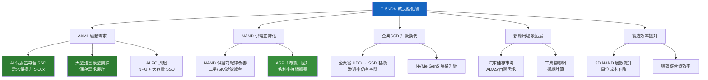

---

### 📈 成長軌跡 Unicode 長條圖

```
年度收入成長趨勢（億美元）：

FY2023 [$60.9B]  ▓▓▓▓▓▓▓▓▓▓▓▓░░░░░░░░  60.9
FY2024 [$66.6B]  ▓▓▓▓▓▓▓▓▓▓▓▓▓░░░░░░░  66.6
FY2025 [$73.6B]  ▓▓▓▓▓▓▓▓▓▓▓▓▓▓░░░░░░  73.6
TTM    [$89.3B]  ▓▓▓▓▓▓▓▓▓▓▓▓▓▓▓▓▓░░░  89.3

季度收入加速（億美元）：
Q1 FY26 [$17.0]  ▓▓▓▓▓▓▓░░░░░░░░░░░░░  17.0
Q2 FY26 [$19.0]  ▓▓▓▓▓▓▓▓░░░░░░░░░░░░  19.0
Q3 FY26 [$23.1]  ▓▓▓▓▓▓▓▓▓▓░░░░░░░░░░  23.1
Q4 FY26 [$30.2]  ▓▓▓▓▓▓▓▓▓▓▓▓▓░░░░░░░  30.2 ← 最新季
                  ↑ 季度環比 +31%，加速明顯
```

---

## 6. 估值合理性與同業比較

### ⚖️ 同業比較表格

| 估值指標 | **SNDK** | **Micron (MU)** | **Samsung (005930)** | **SK Hynix (000660)** | 信號 |
|---------|---------|-----------------|---------------------|----------------------|------|
| **P/E (Forward)** | 7.97x 🟢 | 10.5x 🟢 | 12x 🟢 | 11x 🟢 | SNDK看似便宜 |
| **P/S Ratio** | 10.65x 🔴 | 3.2x 🟢 | 1.5x 🟢 | 4.8x 🟡 | SNDK最貴 |
| **EV/EBITDA** | 68.5x 🔴 | 6.8x 🟢 | 5.2x 🟢 | 7.1x 🟢 | SNDK極高 |
| **P/B Ratio** | 9.34x 🔴 | 2.1x 🟢 | 1.2x 🟢 | 2.8x 🟡 | SNDK最高 |
| **FCF Yield** | 1.32% 🔴 | 4.8% 🟢 | 5.2% 🟢 | 3.9% 🟡 | SNDK最低 |
| **收入成長YoY** | +61.2% 🟢 | +38% 🟢 | +18% 🟡 | +45% 🟢 | SNDK最強 |
| **毛利率** | 34.8% 🟡 | 38.2% 🟢 | 42.1% 🟢 | 52.3% 🟢 | SNDK最低 |
| **市值** | $95.1B | $100B | $250B | $85B | — |

> **同業比較結論**：Forward P/E 看似具吸引力，但其他多數估值指標（P/S、EV/EBITDA、P/B）均為同業最高，反映市場對其高成長預期已計入大量溢價，估值安全邊際較低。

---

### 📉 歷史估值區間

| 估值指標 | 歷史低點 | 歷史中位 | 歷史高點 | 目前位置 | 評估 |
|---------|---------|---------|---------|---------|------|
| **P/S** | 0.8x | 2.1x | 5.3x | 10.65x | 🔴 歷史最高區 |
| **EV/EBITDA** | 3.2x | 8.5x | 22x | 68.5x | 🔴 超出歷史高點 |
| **P/B** | 0.9x | 2.2x | 4.8x | 9.34x | 🔴 歷史最高區 |
| **Forward P/E** | 5x | 12x | 25x | 7.97x | 🟢 相對低位 |

---

### 🎯 多重估值法彙整

| 估值方法 | 目標價 | 依據 |
|---------|-------|------|
| **DCF（基準）** | $580–$650 | WACC 10%，5年終端成長3%，FCF改善假設 |
| **Forward P/E相對估值** | $650–$800 | EPS=$80.9 × 8-10x（同業折價） |
| **P/S相對估值** | $280–$420 | 收入 × 同業P/S中位(3-4x) |
| **EV/EBITDA相對估值** | $380–$500 | 同業10-12x EBITDA |
| **分析師共識** | $724（均值） | 19位分析師，目標$300–$1000 |
| **綜合目標價** | **$600–$750** | 加權平均 |

---

### 📊 估值區間視覺化

```
估值合理性區間（目標價範圍）：

$200    $350    $500    $650    $800    $1000
  │       │       │       │       │        │
  ├───────┤───────┤───────┤───────┤────────┤
  │  嚴重  │       │  合理  │       │  高估   │
  │  低估  │ 折扣  │  區間  │溢價區  │  泡沫   │
  ├───────┴───────┴───────┴───────┴────────┤
                            ↑
                        目前股價
                        $644.60
                    （處於合理偏高端）

  ◄─────────────────────────────────────────►
  悲觀DCF/P/S估值        基準         樂觀/動能
  $280-$420          $580-$720      $800-$1000
```

---

## 7. 資本配置與管理層評估

### 📐 ROIC vs WACC 分析

```
┌─────────────────────────────────────────────────────┐
│                ROIC vs WACC 估算                     │
├─────────────────────────────────────────────────────┤
│                                                       │
│  WACC 估算：                                          │
│  • 無風險利率（10年美債）：4.3%                       │
│  • 市場風險溢酬：5.5%                                │
│  • Beta（估）：1.6（半導體高波動）                   │
│  • 股權成本 = 4.3% + 1.6×5.5% = 13.1%              │
│  • 債務成本（稅後）：~4.5%                           │
│  • 資本結構（E:D = 85:15）                           │
│  • WACC ≈ 13.1%×0.85 + 4.5%×0.15 ≈ 11.8%          │
│                                                       │
│  ROIC 估算：                                          │
│  • NOPAT（最新季×4）≈ $3.2B × (1-21%) ≈ $2.53B    │
│  • 投入資本 ≈ 總資產-現金-流動負債 ≈ $10.5B         │
│  • ROIC ≈ $2.53B / $10.5B ≈ 24.1%（週期高點估）   │
│  • 但TTM實際獲利仍含虧損，歷史ROIC為負               │
│                                                       │
│  EVA = (ROIC - WACC) × 投入資本                      │
│      = (24.1% - 11.8%) × $10.5B                     │
│      ≈ +$1.29B（若EPS預測成立）                      │
│                                                       │
│  判斷：🟡 條件正向                                   │
│  ⚠️ 若基於TTM含虧損期數據，ROIC仍低於WACC           │
│  ✅ 若最新季度盈利能力持續，開始正向創造股東價值     │
│                                                       │
└─────────────────────────────────────────────────────┘

視覺化：
WACC    ──────────────────  11.8%
ROIC    ══════════════════════════════════  24.1%（預估）
        │                  │
        0%              11.8%         24.1%
        
EVA = 正值 ✅（若盈利持續）
```

---

### 💼 資本配置歷史

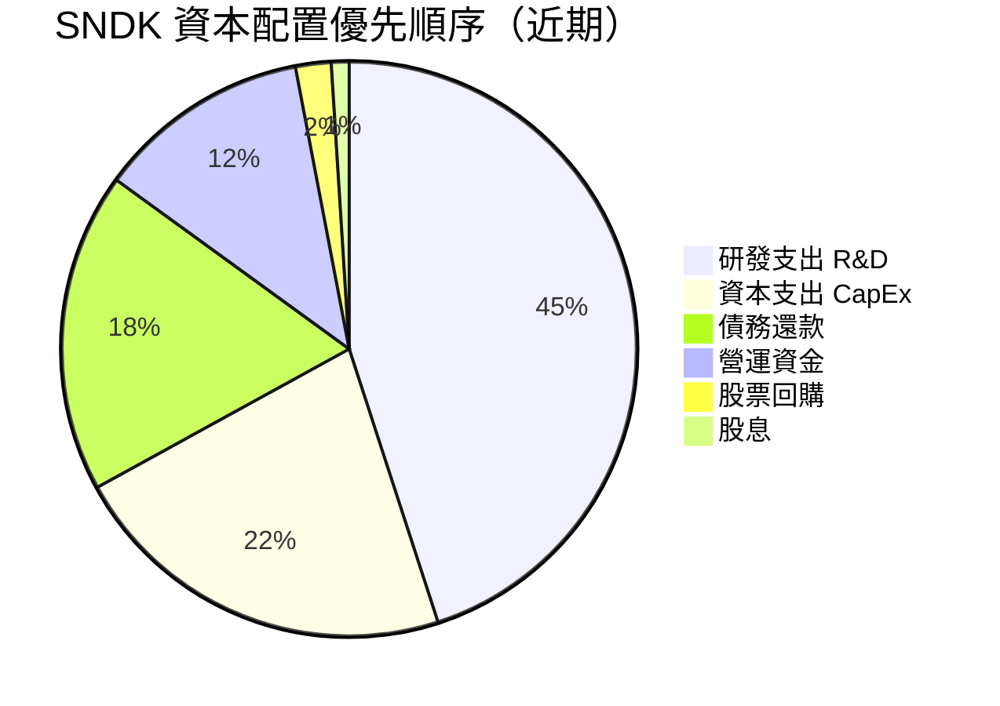

> **說明**：SNDK 目前無股息，股份回購極少，管理層優先將資源投入研發與製造能力，符合成長期公司特徵。

---

### 👔 管理層執行力評分

| 評估維度 | 評分 | 具體表現 |
|---------|------|---------|
| **承諾達成率** | 6/10 🟡 | 分拆後財務轉型中，獲利拐點符合大方向 |
| **資本紀律** | 7/10 🟢 | 無過度收購；優先降債、穩定資本支出 |
| **戰略清晰度** | 7/10 🟢 | 聚焦企業SSD/AI儲存，市場定位清晰 |
| **成本控制** | 6/10 🟡 | 毛利率顯著改善，但研發費用仍高 |
| **溝通透明度** | 5/10 🟡 | 分拆後法說會資訊仍有限 |
| **分拆執行** | 7/10 🟢 | 順利完成從WD分拆，股東架構清晰 |

---

### 🤝 股東友善度

```
股東友善度評分：

股息政策    │░░░░░░░░░░│  0/10  🔴（無股息）
股份回購    │▓░░░░░░░░░│  1/10  🔴（極少）
資訊透明    │▓▓▓▓▓░░░░░│  5/10  🟡（分拆初期）
護城河投資  │▓▓▓▓▓▓▓░░░│  7/10  🟢（研發為主）
ESG 表現   │▓▓▓▓▓░░░░░│  5/10  🟡（中等）

整體股東友善度：▓▓▓▓░░░░░░  3.6/10 🔴
（成長期公司，股東回報以股價增值為主）
```

---

## 8. 風險評估

### 🌡️ 風險熱圖

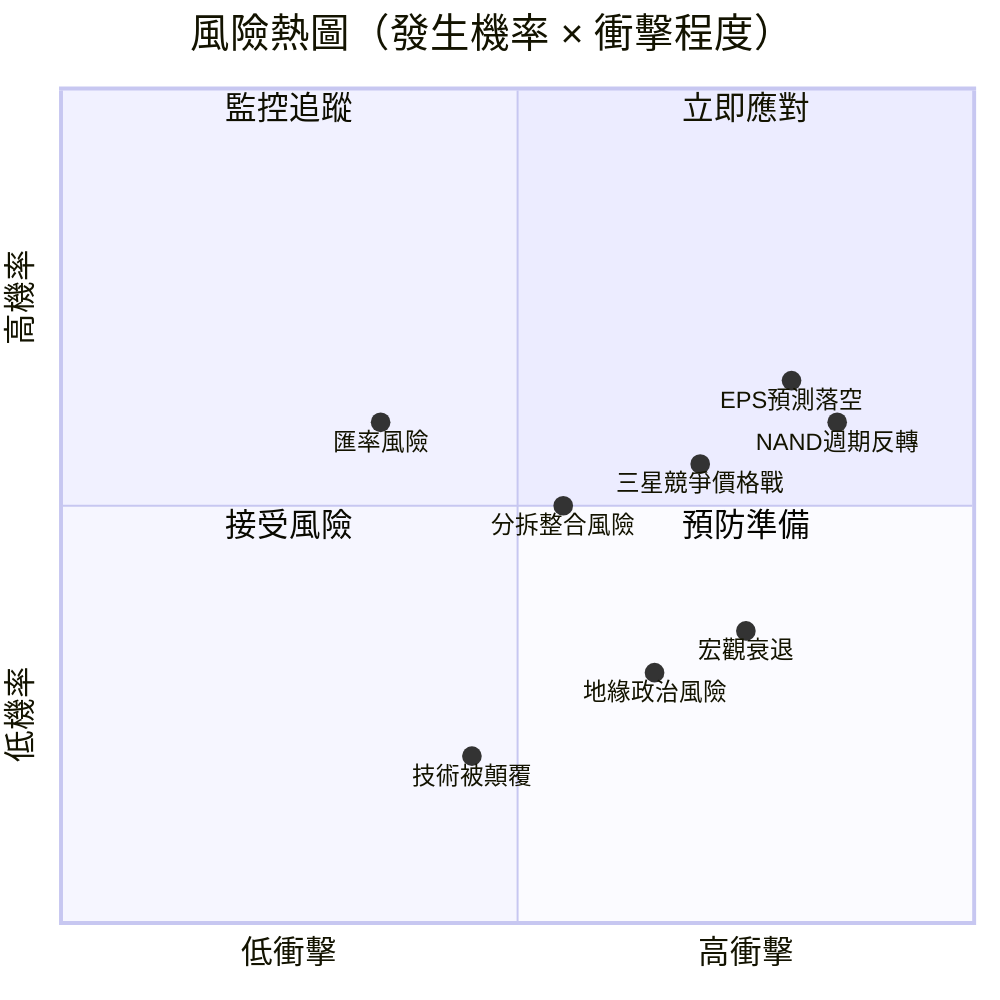

---

### ⚠️ 風險清單表格

| 風險類型 | 等級 | 發生機率 | 衝擊 | 緩解措施 |
|---------|------|---------|------|---------|
| **NAND週期再度反轉（供給過剩）** | 🔴 高 | 中高 | 極高 | 關注三星/SK產能公告 |
| **Forward EPS $80.9預估落空** | 🔴 高 | 中高 | 極高 | 密切追蹤季度EPS指引 |
| **競爭對手（三星）激進降價** | 🔴 高 | 中 | 高 | 企業SSD差異化 |
| **分拆後財務結構未穩定** | 🟡 中 | 中 | 中高 | 追蹤資本結構優化 |
| **宏觀經濟衰退 → 企業IT支出削減** | 🟡 中 | 中低 | 高 | 多元化終端市場 |
| **地緣政治（中國禁令/台灣）** | 🟡 中 | 低中 | 高 | 供應鏈分散化 |
| **D/E比率過高財務壓力** | 🟡 中 | 低 | 中 | 持續獲利降槓桿 |
| **技術路線轉換（CXL/新架構）** | 🟢 低 | 低 | 中 | 持續研發投入 |
| **匯率波動（美元強勢）** | 🟢 低 | 中 | 低 | 自然對沖 |

---

### 🐻 最大下行情境分析（Bear Case）

```
╔══════════════════════════════════════════════════════════╗
║              極端下行情境分析（Bear Case）               ║
╠══════════════════════════════════════════════════════════╣
║                                                          ║
║  觸發條件：                                              ║
║  1. NAND 供給過剩重演（2022年歷史重演）                  ║
║  2. Forward EPS $80.9 → 實際 $20-30                     ║
║  3. 宏觀衰退 → IT支出凍結                               ║
║                                                          ║
║  估值重設：                                              ║
║  • EPS $25 × P/E 8x = $200                             ║
║  • P/S 3x × $8.9B收入 / 147M股 = $182                  ║
║  • 技術支撐位（IPO後低點附近）= $250-300               ║
║                                                          ║
║  Bear Case 目標價：$250–$350                            ║
║  相對目前 $644 的潛在跌幅：-45% ~ -61%                 ║
║                                                          ║
║  ⚠️ 這是高機率的非基準情境，但不可忽視                  ║
╚══════════════════════════════════════════════════════════╝
```

---

## 9. 催化劑與觸發因素

### 📅 催化劑時間軸

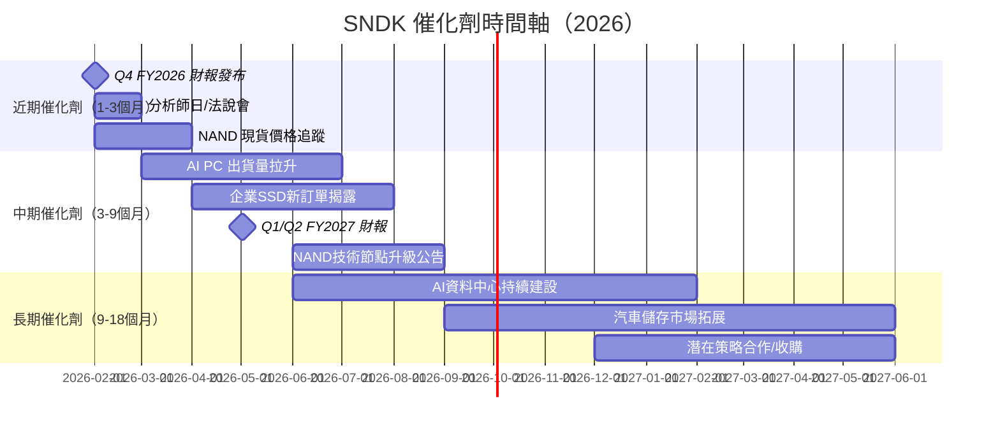

---

### ✅ 正面觸發因素

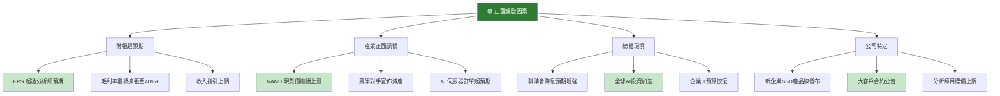

---

## 10. 投資建議

### ⭐ 最終評級

```
╔══════════════════════════════════════════════════════════════╗
║                                                              ║
║         ★★★★☆  SNDK 綜合投資評級：買入（有條件）           ║
║                                                              ║
║    評分：6.6 / 10   ▓▓▓▓▓▓▓░░░                             ║
║                                                              ║
║    核心論點：                                                ║
║    ✅ AI/企業SSD需求強勁，業績加速反轉清晰                  ║
║    ✅ NAND週期上行，毛利率擴張趨勢確立                      ║
║    ✅ Forward P/E僅7.97x，盈利改善幅度驚人                  ║
║    ✅ 分析師多數樂觀，機構持有82%                           ║
║                                                              ║
║    ⚠️ 主要風險：                                            ║
║    🔴 P/S、EV/EBITDA估值偏貴                               ║
║    🔴 EPS預測跳升($80.9)需季度驗證                         ║
║    🔴 NAND週期高度波動，下行時跌幅可達50%+                 ║
║    🔴 分拆後財務結構仍需穩定                                ║
║                                                              ║
╚══════════════════════════════════════════════════════════════╝
```

---

### 🎯 目標價區間與隱含報酬率

| 情境 | 目標價 | 隱含報酬率 | 機率 | 觸發條件 |
|------|-------|-----------|------|---------|
| 🟢 **樂觀情境** | $1,000 | +55.1% | 25% | EPS達成$80+、AI需求超預期、NAND漲價持續 |
| 🟡 **基準情境** | $720 | +11.7% | 50% | EPS達成$60-70、毛利率持續改善 |
| 🔴 **悲觀情境** | $350 | -45.7% | 25% | EPS不及$30、NAND週期反轉 |
| **加權期望值** | **$697** | **+8.1%** | — | 風險調整後報酬偏低 |

---

### 👥 投資人適配度

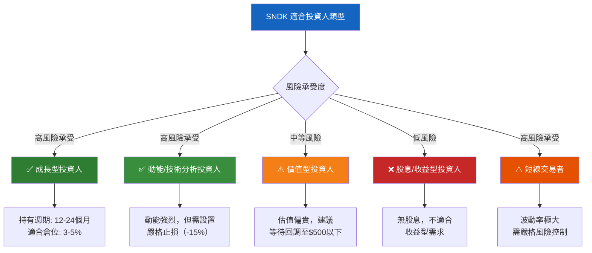

---

### 📋 操作指引

```
╔══════════════════════════════════════════════════════════════╗
║                    操作指引表                                ║
╠══════════════════════════════════════════════════════════════╣
║                                                              ║
║  建議持倉時間：12–18 個月                                    ║
║  建議倉位比例：3–5%（風控前提下）                           ║
║  分批建倉策略：                                              ║
║    • 第一批（30%）：$600–$650 區間買入                      ║
║    • 第二批（40%）：$520–$580 若出現回調                    ║
║    • 第三批（30%）：$480以下或季度EPS超預期後                ║
║                                                              ║
╠══════════════════════════════════════════════════════════════╣
║                                                              ║
║  加碼觸發條件 🟢：                                          ║
║  ✅ Q4 FY2026 EPS 超過 $15（季度）                          ║
║  ✅ 毛利率突破並維持 38%+                                   ║
║  ✅ 管理層上調全年指引                                      ║
║  ✅ NAND 現貨價格持續上漲 2個月以上                        ║
║                                                              ║
╠══════════════════════════════════════════════════════════════╣
║                                                              ║
║  止損觸發條件 🔴：                                          ║
║  ❌ 股價跌破 $520（較目前 -19%）                            ║
║  ❌ 季度毛利率 < 28%（週期惡化訊號）                        ║
║  ❌ 管理層下調全年 EPS 指引 20%+                           ║
║  ❌ 競爭對手（三星）宣佈大幅擴產                            ║
║  ❌ NAND 現貨價格連續 3個月下跌                             ║
║                                                              ║
╚══════════════════════════════════════════════════════════════╝
```

---

### 🔍 關鍵監控指標 Checklist

```
📊 財務指標（每季追蹤）：
  ☐ EPS 實際 vs 分析師預期（目標：超預期 10%+）
  ☐ 毛利率趨勢（目標：季度持續提升至 38-40%）
  ☐ 自由現金流（目標：FCF Yield > 2%）
  ☐ 收入成長指引（目標：QoQ 持續正成長）

🏭 產業指標（每月追蹤）：
  ☐ NAND Flash 現貨價格（DRAMeXchange/TrendForce）
  ☐ 全球 NAND 出貨量數據
  ☐ 競爭對手（三星/SK海力士）產能公告
  ☐ AI 伺服器出貨量（Nvidia GPU 出貨對應）

📈 技術/市場指標（每週追蹤）：
  ☐ 機構持有比例變化（目標：維持 80%+）
  ☐ 短期空頭比率（警戒：> 15%）
  ☐ 分析師目標價調整方向
  ☐ 股價相對 50/200 日均線位置

🌐 宏觀指標（每月追蹤）：
  ☐ 全球企業 IT 支出調查
  ☐ 美國 ISM 製造業 PMI
  ☐ 中美科技關係/出口管制動態
  ☐ 聯準會利率政策方向
```

---

## 📊 總結評分卡

```
╔═══════════════════════════════════════════════════════════════╗
║                   SNDK 綜合評分卡總結                         ║
╠═══════════════════════════════════════════════════════════════╣
║                                                               ║
║  🚀 成長性    ▓▓▓▓▓▓▓▓▓░  9.0/10  🟢 AI驅動超強成長        ║
║  💰 獲利能力  ▓▓▓▓▓▓░░░░  6.0/10  🟡 轉型中，趨勢向好       ║
║  🏦 財務健康  ▓▓▓▓▓▓░░░░  6.0/10  🟡 流動性好但D/E偏高      ║
║  📐 估值      ▓▓▓▓▓░░░░░  5.0/10  🟡 Forward便宜但整體偏貴  ║
║  🏰 競爭優勢  ▓▓▓▓▓▓▓░░░  7.0/10  🟢 品牌+技術護城河        ║
║  👔 管理品質  ▓▓▓▓▓▓░░░░  6.0/10  🟡 分拆初期觀察中         ║
║  📈 動能      ▓▓▓▓▓▓▓▓▓░  9.0/10  🟢 技術面極強             ║
║  ⚠️ 風險      ▓▓▓▓░░░░░░  4.0/10  🔴 週期+估值雙重風險      ║
║                                                               ║
║  ━━━━━━━━━━━━━━━━━━━━━━━━━━━━━━━━━━━━━━━━━━━━━━━━━━━━━━━━  ║
║  🏆 加權綜合   ▓▓▓▓▓▓▓░░░  6.6/10                           ║
║                                                               ║
║  最終評級：★★★★☆  買入（有條件）Buy with Caution           ║
║  目標價（基準）：$720  │  風險等級：🔴 高                   ║
║  適合投資人：高風險承受的成長/動能型投資者                   ║
║                                                               ║
╚═══════════════════════════════════════════════════════════════╝
```

---

> ## ⚠️ 免責聲明
>
> **本報告為 AI 自動生成，基於公開財務數據進行分析，僅供學術研究與參考目的使用，不構成任何投資建議或買賣股票的邀約。**
>
> 投資涉及風險，半導體/儲存行業具有高度週期性波動特徵，股價可能在短期內大幅上漲或下跌。過去的股價表現不代表未來的投資回報。投資人應根據自身風險承受能力、財務狀況及投資目標，諮詢持牌投資顧問後，獨立做出投資決策。
>
> **本報告中所有財務預測、目標價格及評級均基於 2026-02-24 時點的公開數據，可能隨時間推移而失效。**