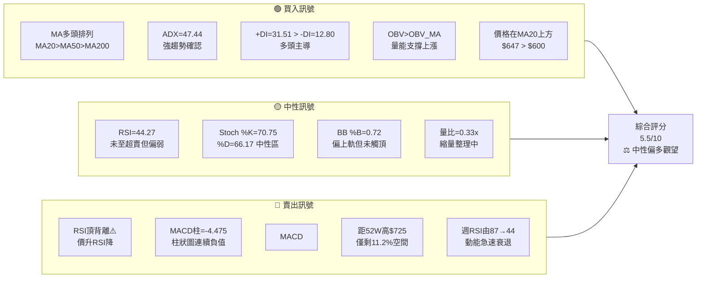
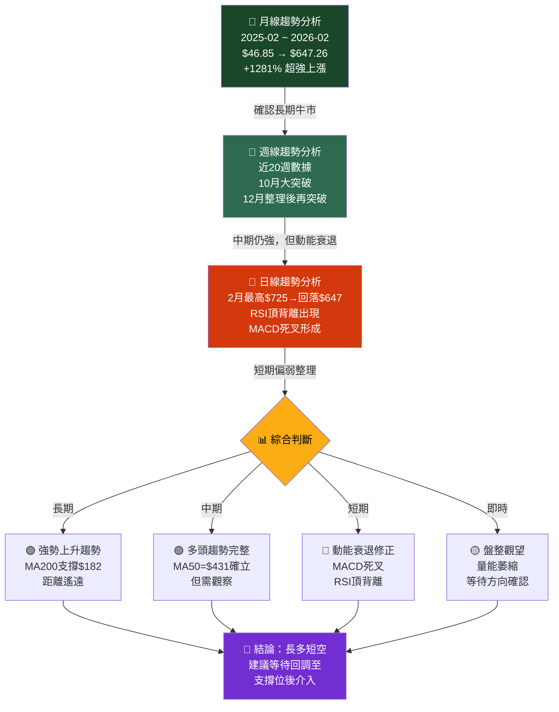
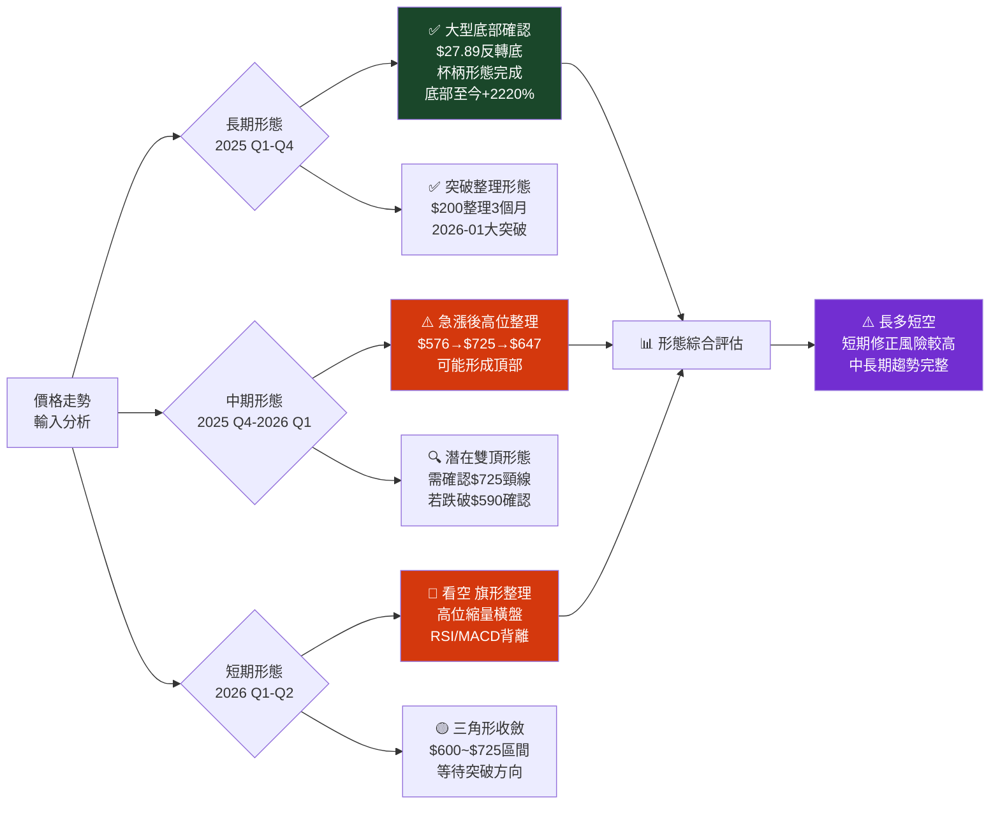
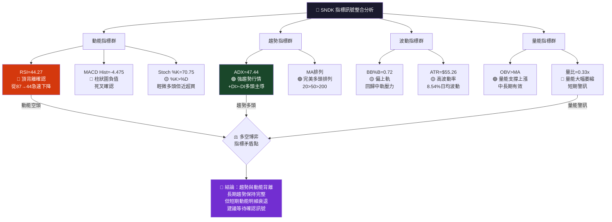
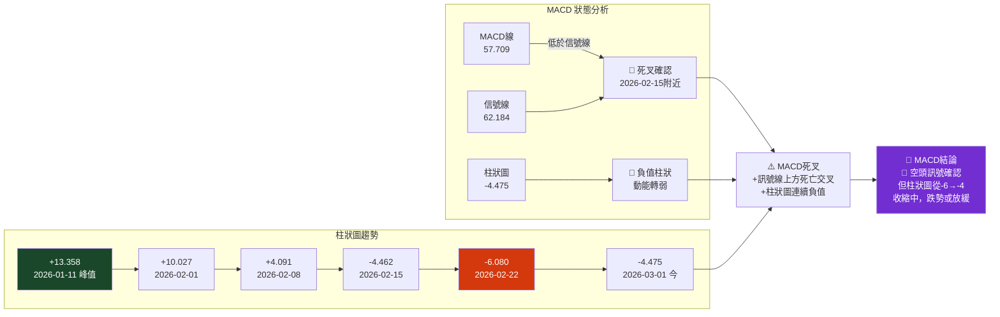
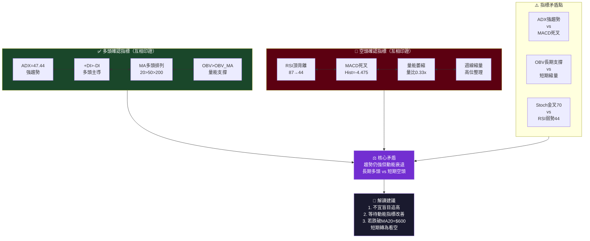
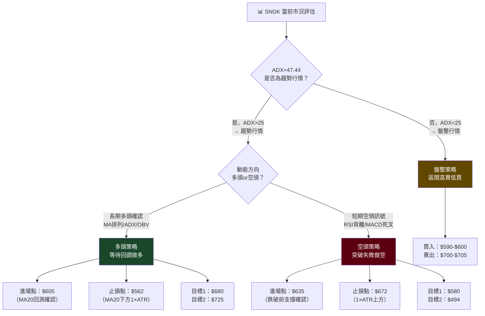
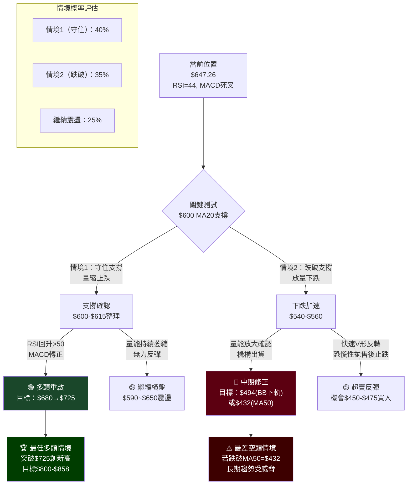

# SNDK 技術分析報告

> **報告日期**：2026-02-24 ｜ **分析師**：資深技術分析團隊 ｜ **數據來源**：Yahoo Finance
> **當前價格**：$647.26 ｜ **52週區間**：$27.89 ~ $725.00 ｜ **ATR(14)**：$55.26

---

## 目錄

1. [技術面概覽](#1-技術面概覽)
2. [趨勢分析（多時框架）](#2-趨勢分析多時框架)
3. [圖表形態分析](#3-圖表形態分析)
4. [支撐與阻力（精確數值）](#4-支撐與阻力精確數值)
5. [技術指標深度解讀](#5-技術指標深度解讀)
6. [量價分析](#6-量價分析)
7. [多時框架訊號總結](#7-多時框架訊號總結)
8. [交易策略建議](#8-交易策略建議精確數值)
9. [風險提示與監控](#9-風險提示與監控)

---

## 1. 技術面概覽

### 🎯 技術訊號儀表板



---

### 📊 核心指標速覽表

| 指標 | 數值 | 訊號 | 解讀 |
|------|------|------|------|
| **收盤價** | $647.26 | 🟢 | 位於MA20/MA50/MA200全部上方 |
| **MA20** | $600.05 | 🟢 | 價格在20日均線上方 $47.21 |
| **MA50** | $431.77 | 🟢 | 價格在50日均線上方 $215.49 |
| **MA200** | $182.02 | 🟢 | 長期多頭趨勢確立 |
| **RSI(14)** | 44.27 | 🟡 | 中性，但存在頂背離警示 |
| **MACD** | 57.709 | 🔴 | 低於信號線，柱狀圖為負 |
| **MACD Signal** | 62.184 | 🔴 | MACD已死叉信號線 |
| **MACD Hist** | -4.475 | 🔴 | 柱狀圖持續負值 |
| **Stoch %K** | 70.75 | 🟡 | 接近超買但未確認 |
| **Stoch %D** | 66.17 | 🟡 | %K > %D，輕微多頭 |
| **ADX(14)** | 47.44 | 🟢 | 強趨勢（>25為趨勢，>40為強趨勢） |
| **+DI** | 31.51 | 🟢 | 多頭方向指標主導 |
| **-DI** | 12.80 | 🟢 | 空頭方向指標偏低 |
| **BB上軌** | $705.41 | 🟡 | 距離上軌 $58.15 (8.97%) |
| **BB中軌** | $600.05 | 🟢 | 價格在中軌上方 |
| **BB下軌** | $494.70 | 🟢 | 強支撐距離充足 |
| **BB %B** | 0.72 | 🟡 | 偏上軌，未至極端水準 |
| **ATR(14)** | $55.26 | 🟡 | 波動率高（佔股價8.54%） |
| **OBV趨勢** | OBV>MA | 🟢 | 量能確認上漲趨勢 |
| **量比** | 0.33x | 🔴 | 量能大幅萎縮，縮量整理 |

---

### 📈 技術綜合評分（1-10分）

```
整體技術評分    5.5/10
████████████░░░░░░░░░░░░ 55%

趨勢強度        8.0/10
████████████████████░░░░ 80%  🟢 強烈多頭趨勢

動能評分        3.5/10
█████████░░░░░░░░░░░░░░░ 35%  🔴 動能明顯衰退

量能評分        4.0/10
██████████░░░░░░░░░░░░░░ 40%  🟡 量能偏弱

支撐強度        6.5/10
████████████████░░░░░░░░ 65%  🟡 支撐尚可

風險評分        5.0/10
████████████░░░░░░░░░░░░ 50%  🟡 中等風險
```

---

### 📍 52週價格位置分析

```
52週低點                          目前位置      52週高點
$27.89 ──────────────────────────── $647.26 ───── $725.00
  0%                                  88.8%         100%

位置解讀：
  ├─ 0~25%   ($ 27.89 ~ $192.29)  ：深度超賣區  ← 已遠離
  ├─ 25~50%  ($192.29 ~ $376.45)  ：中性偏低區  ← 已遠離  
  ├─ 50~75%  ($376.45 ~ $560.62)  ：中性偏高區  ← 已突破
  ├─ 75~90%  ($560.62 ~ $672.11)  ：高位警戒區  ← 【當前位置 88.8%】
  └─ 90~100% ($672.11 ~ $725.00)  ：極度高位區  ← 距離僅$24.85

⚠️ 重要警示：股價處於52週高位88.8%區間，上方空間有限（距高點僅11.2%）
距52W高點 $725.00 僅剩 $77.74（+12.0%上漲空間）
距52W低點 $27.89 已有 $619.37（+2220%累計漲幅）
```

---

## 2. 趨勢分析（多時框架）

### 🔍 多時框架趨勢判斷



---

### 📊 ADX 趨勢強度解讀

```
ADX 強度量表：
ADX = 47.44

0        10        20        25        30        40        50        60
├─────────┼─────────┼─────────┼─────────┼─────────┼─────────┼─────────┤
  無趨勢       弱趨勢      趨勢起步      中等趨勢          強趨勢    極強趨勢
                              ↑25                    ↑47.44▲

ADX(14) = 47.44  ▓▓▓▓▓▓▓▓▓▓▓▓▓▓▓▓▓▓▓▓▓▓▓▓▓░░░░░░░ 79%
+DI    = 31.51  ▓▓▓▓▓▓▓▓▓▓▓▓▓▓▓▓░░░░░░░░░░░░░░░░░ 53%  🟢 多方方向
-DI    = 12.80  ▓▓▓▓▓▓░░░░░░░░░░░░░░░░░░░░░░░░░░░ 21%  🔴 空方方向

【判斷結論】
✅ ADX = 47.44 >> 25閾值 → 確認為「趨勢行情」非盤整
✅ +DI (31.51) > -DI (12.80) → 多頭方向指標主導
✅ +DI/-DI差值 = 18.71 → 多空分歧明顯，多方強勢
⚠️ ADX雖高，但需注意：ADX本身不判斷方向，只判斷強度
⚠️ 若ADX開始從高點回落，可能預示趨勢減弱中
```

---

### 📐 均線排列分析

```
均線多頭排列確認：

價格    $647.26  ●
MA20    $600.05  ─────────────────────────── +47.21（+7.87%）
MA50    $431.77  ─────────────────────────── +215.49（+49.91%）
MA200   $182.02  ─────────────────────────── +465.24（+255.6%）

          MA200 < MA50 < MA20 < 價格
            ✅     ✅     ✅    → 完美多頭排列

均線斜率評估：
MA20斜率：  ↗ 陡峭上升（本月+$47.21在均線上方）
MA50斜率：  ↗ 強勢上升（已突破歷史高點）
MA200斜率： ↗ 持續上升（長期牛市確認）

【關鍵支撐距離】
離MA20支撐：$647.26 - $600.05 = $47.21（-7.29%）
離MA50支撐：$647.26 - $431.77 = $215.49（-33.3%）  
離MA200支撐：$647.26 - $182.02 = $465.24（-71.9%）
```

---

### 📉 長/中/短期趨勢 走勢圖

```
SNDK 24個月價格走勢概覽（月線）
價格($)
 700 │                                              ▓▓●  ← $647
 650 │                                           ▓▓▓
 600 │                                        ▓▓▓
 550 │                                     ▓▓▓
 500 │                                  ▓▓▓
 450 │                               ▓▓▓
 400 │                        ░░░░░░▓▓
 350 │                     ░░░░
 300 │                   ░░
 250 │             ░░░░░░░
 200 │         ░░░░
 150 │       ░░
 100 │   ░░░░    ← $112 突破點
  50 │░░░░
  30 │─────────────────────────────────────────────────
     Feb  Apr  Jun  Aug  Oct  Nov  Dec  Jan  Feb(2026)
     2025                                         ↑今

階段劃分：
Phase 1 [2025 Q1]：$47~$32  🔴 下跌整理期
Phase 2 [2025 Q2]：$32~$52  🟡 底部反彈期
Phase 3 [2025 Q3]：$52~$112 🟢 突破啟動期
Phase 4 [2025 Q4]：$112~$237🟢 加速上漲期
Phase 5 [2026 Q1]：$237~$647🟢 爆發性上漲期（+173%）
現在     [2026-02]：$647     🔴 高位動能衰退期
```

---

## 3. 圖表形態分析

### 🔎 形態識別流程



---

### 📊 ASCII 走勢示意圖（近期詳細走勢）

```
SNDK 近期走勢形態圖（週線，2025-10 至 2026-02）
                                        ⭐$725高點
價格($)  阻力位分析                      ↓
  725 ┤ ════════════════════════════════╗══ 🔴 強阻力 $725.00（52W高）
  700 ┤                               ╔╝
  680 ┤ ━━━━━━━━━━━━━━━━━━━━━━━━━━━━━━━━━━ 🔴 阻力 $680.00（技術阻力）
  660 ┤                             ╱╲
  647 ┤ ━━━━━━━━━━━━━━━━━━━━━━━━━●━━━━━ ← 今日收盤 $647.26
  626 ┤                          ╱    ╲   前週收盤 $626.56
  600 ┤ ━━━━━━━━━━━━━━━━━━━━━━━━━━━━━━━━━━ 🟡 MA20=$600.05
  576 ┤                        ╱         $576.25（1月底）
  540 ┤ ━━━━━━━━━━━━━━━━━━━━━━━━━━━━━━━━━━ 🟡 支撐 $540.00
  495 ┤ ━━━━━━━━━━━━━━━━━━━━━━━━━━━━━━━━━━ 🟢 BB下軌 $494.70
  473 ┤                      ╱           $473（1月25日）
  432 ┤ ━━━━━━━━━━━━━━━━━━━━━━━━━━━━━━━━━━ 🟢 MA50=$431.77
  413 ┤                     ╱
  377 ┤                    ╱  ← 加速啟動
  275 ┤                  ╱
  250 ┤              ╱╲╱
  237 ┤            ╱
  200 ┤         ╲╱
  186 ┤       ╱
  140 ┤     ╱  ← 突破起點
  112 ┤   ╱
     ┼──────────────────────────────────────────────→ 時間
      Oct   Nov   Dec   Jan   Feb(2026)
      2025                      ↑今

形態標注：
  📍 底部區（$112-$200）：Oct-Nov 2025，杯型底部形成
  📍 整理區（$200-$250）：Nov-Dec 2025，能量蓄積
  📍 突破區（$250-$576）：Jan 2026，爆發性突破
  📍 衝高區（$576-$725）：Feb 2026初，最後衝刺
  📍 現在   （$647）：   回落整理，動能衰退
```

---

### 📐 形態目標價計算

| 形態 | 類型 | 量測方法 | 計算過程 | 目標價 | 可信度 |
|------|------|----------|----------|--------|--------|
| **大型底部突破** | 杯型底部 | 突破點+底部高度 | $250 + ($250-$28) = $250+$222 | $472 ✅已達成 | 高 |
| **整理箱突破** | 矩形整理 | 箱頂+箱體高度 | $250 + ($250-$200) = $300 | $300 ✅已達成 | 高 |
| **潛在雙頂** | 雙頂形態 | 頸線-頂部高度 | $600 - ($725-$600) = $475 | $475（若確認） | 中 |
| **旗形整理** | 下降旗形 | 旗桿×61.8% | $576×0.618=目標下行$356 | $291（極端） | 低 |
| **斐波那契延伸** | 多頭延伸 | 161.8%延伸 | 詳見第4節 | $800~$850 | 中 |

---

### 🕯️ 近期重要K線組合分析

```
週線K線組合（最近5週）：

2026-01-25  $473.83  ██████████████  長陽線，突破確認 ✅
2026-02-01  $576.25  ███████████████ 放量大陽線，主升段 ✅
2026-02-08  $597.95  ████            縮量小陽，上攻乏力 ⚠️
2026-02-15  $626.56  ████            縮量再上，但MACD轉負 🔴
2026-02-22  $649.97  ██              創新高$725後收$650，上影線明顯 🔴
2026-03-01  $647.26  █               量能大幅萎縮，整理確認 🟡

關鍵K線信號：
⚠️ 2026-02-22週：開高走低，上影線長（$725→$649.97），週線頂部錘頭形
⚠️ 量能從高峰138萬→26萬，萎縮達81%，賣壓出現
🔴 連續3週MACD柱狀圖為負值，動能轉弱確認
```

---

## 4. 支撐與阻力（精確數值）

### 📊 支撐阻力 ASCII 視覺圖

```
SNDK 支撐阻力位完整示意圖
═══════════════════════════════════════════════════════════
價格      訊號    說明
─────────────────────────────────────────────────────────
$850.00  ══════  🔴 分析師最高目標 $1000 區域前半段
$800.00  ══════  🔴 心理整數關口 + 斐波那契延伸161.8%
$750.00  ══════  🔴 心理關口
$725.00  ══════  🔴 【強阻力】52週最高點/近期高點 ⭐
─────────────────────────────────────────────────────────
$705.41  ──────  🔴 【近端阻力】BB上軌動態阻力
$680.00  ──────  🔴 【近端阻力】前高密集成交區
─────────────────────────────────────────────────────────
         ●●●●●  💲 現價 $647.26
─────────────────────────────────────────────────────────
$626.56  ──────  🟡 【近端支撐】前週收盤支撐
$600.05  ══════  🟢 【重要支撐】MA20 動態支撐 ⭐
$590.00  ──────  🟡 【近端支撐】心理整數+前高轉支撐
─────────────────────────────────────────────────────────
$576.25  ──────  🟢 【中端支撐】1月底收盤位
$560.00  ──────  🟡 【中端支撐】斐波那契38.2%回調
$540.00  ──────  🟢 【中端支撐】前波整理區上沿
─────────────────────────────────────────────────────────
$494.70  ══════  🟢 【強支撐】BB下軌動態支撐
$473.83  ──────  🟢 【中強支撐】1月25日低點
$450.00  ──────  🟢 【中強支撐】斐波那契50%回調
─────────────────────────────────────────────────────────
$431.77  ══════  🟢 【強支撐】MA50 ⭐
$413.62  ──────  🟢 1月18日收盤
$377.41  ──────  🟢 1月11日收盤
─────────────────────────────────────────────────────────
$340.00  ──────  🟢 斐波那契61.8%回調
$275.24  ──────  🟢 1月4日收盤（重要底部）
$237.38  ══════  🟢 【強支撐】12月收盤 / 前波頂部
═══════════════════════════════════════════════════════════
```

---

### 🔴 阻力位表格

| 等級 | 價格 | 依據 | 重要性 |
|------|------|------|--------|
| **極強阻力** | $725.00 | 52週最高點，近期雙頂頸線 | ⭐⭐⭐⭐⭐ |
| **強阻力** | $705.41 | 布林通道上軌（動態） | ⭐⭐⭐⭐ |
| **中端阻力** | $680.00 | 前高密集成交區、心理關口 | ⭐⭐⭐ |
| **近端阻力** | $660.00 | 近期盤整區上沿 | ⭐⭐ |
| **分析師目標** | $724.26 | 分析師平均目標價 | ⭐⭐⭐ |
| **長期目標** | $800.00 | 心理整數+斐波那契延伸 | ⭐⭐ |

---

### 🟢 支撐位表格

| 等級 | 價格 | 依據 | 重要性 |
|------|------|------|--------|
| **近端支撐** | $626.56 | 前週收盤、短期支撐 | ⭐⭐ |
| **重要支撐** | $600.05 | MA20動態支撐 | ⭐⭐⭐⭐ |
| **中端支撐** | $576.25 | 1月底收盤、前高轉支撐 | ⭐⭐⭐ |
| **中端支撐** | $560.00 | 斐波那契38.2%回調位 | ⭐⭐⭐ |
| **強支撐** | $494.70 | BB下軌動態支撐 | ⭐⭐⭐⭐ |
| **強支撐** | $450.00 | 斐波那契50%回調位 | ⭐⭐⭐⭐ |
| **極強支撐** | $431.77 | MA50動態支撐 | ⭐⭐⭐⭐⭐ |
| **長期支撐** | $237.38 | 前波突破位、MA200附近 | ⭐⭐⭐⭐ |

---

### 📐 斐波那契回調位計算

```
計算基準：
  起漲點（波段低點）：$237.38（2025-12月底）
  波段高點：          $725.00（2026-02近期高點）
  漲幅：              $487.62

斐波那契回調計算表：
┌────────────────┬──────────┬──────────┬────────────────────┐
│ 回調比例        │ 計算過程  │ 目標價    │ 重要性              │
├────────────────┼──────────┼──────────┼────────────────────┤
│ 23.6%          │ $725-$115│ $610.00  │ ⭐⭐ 淺回調         │
│ 38.2%          │ $725-$186│ $538.62  │ ⭐⭐⭐ 常見回調     │
│ 50.0%          │ $725-$244│ $481.19  │ ⭐⭐⭐⭐ 關鍵回調   │
│ 61.8%          │ $725-$301│ $423.38  │ ⭐⭐⭐⭐⭐ 深度回調 │
│ 76.4%          │ $725-$373│ $352.39  │ ⭐⭐⭐ 極深回調     │
│ 100%           │ 回到起點  │ $237.38  │ 趨勢反轉           │
└────────────────┴──────────┴──────────┴────────────────────┘

延伸位（上行目標）：
│ 127.2%         │ $237+$621│ $858.51  │ 多頭延伸目標1      │
│ 161.8%         │ $237+$789│ $1026.32 │ 多頭延伸目標2      │

【當前位置】$647.26 處於 23.6% 回調位 ($610) 上方
若跌破 $610，下一支撐看 $538.62（38.2%回調）
```

---

### 📊 布林通道動態分析

```
布林通道(20,2σ) 當前狀態：

$705.41 ════════════════════════════════ 上軌（阻力）
         ↕ 通道寬度：$210.71
$647.26 ─────────────────────●────────── 現價（%B=0.72）
         ↑ 距中軌：$47.21
$600.05 ════════════════════════════════ 中軌/MA20
         ↕
$494.70 ════════════════════════════════ 下軌（支撐）

%B = (現價-下軌)/(上軌-下軌) = ($647.26-$494.70)/($705.41-$494.70) = 0.72

%B 解讀：
  0.00 = 下軌（超賣）
  0.50 = 中軌（中性）
  0.72 = 【現在】偏上軌，但未至極端
  1.00 = 上軌（超買）

布林通道寬度評估：
通道寬度 $210.71 / 中軌 $600.05 = 35.1%
→ 通道寬度達35%，屬於「擴張狀態」，顯示近期波動大
→ 通道擴張後通常會收縮，顯示回歸均值壓力存在
→ 若%B從0.72回落至0.5，目標為$600（MA20）
```

---

## 5. 技術指標深度解讀

### 🔗 指標訊號彙整



---

### 📊 RSI(14) 深度分析

```
RSI(14) = 44.27

超買區 ──────────────────────────────────── 70
         ░░░░░░░░░░░░░░░░░░░░░░░░░░░░░░░
中性區   ░░░░░░░░░░░░░░░░░░░░░░░░░░░░░░░
         ░░░░░░░░░░░░░░░░░░░░░░░░░░░░░░░
      ▓▓▓▓▓▓▓▓▓▓▓▓▓▓▓▓▓▓▓▓▓▓←44.27在此
超賣區 ──────────────────────────────────── 30

RSI 強度：44.27/100
████████████████████████░░░░░░░░░░░░░░░░ 44%  🟡 中性偏弱

RSI 歷史軌跡（近5週）：
  2026-01-25  RSI = 82.9  ████████████████████████████████████████ 83%
  2026-02-01  RSI = 87.1  ████████████████████████████████████████ 87% ← 峰值
  2026-02-08  RSI = 68.9  ██████████████████████████████████░░░░░░ 69%
  2026-02-15  RSI = 65.1  ████████████████████████████████░░░░░░░░ 65%
  2026-02-22  RSI = 57.3  ████████████████████████████░░░░░░░░░░░░ 57%
  2026-03-01  RSI = 44.3  ████████████████████████░░░░░░░░░░░░░░░░ 44% ← 今日

【🔴 頂背離分析確認】
  2026-02-01 價格：$576.25  RSI：87.1 （RSI峰值）
  2026-02-22 價格：$649.97  RSI：57.3 （價格更高，RSI更低）
  2026-03-01 價格：$647.26  RSI：44.3 （RSI繼續下降）

  ┌─────────────────────────────────────────┐
  │ 確認「RSI 頂背離」(Bearish Divergence)   │
  │ 價格：$576 → $650 (上漲)                │
  │ RSI：87 → 44 (下降)                     │
  │ 背離幅度：43個RSI點                      │
  │ 結論：🔴 強烈空頭訊號，修正風險高        │
  └─────────────────────────────────────────┘
```

---

### 📊 MACD(12/26/9) 深度分析



```
MACD 柱狀圖視覺化（週線，近10週）：

+15 ┤
+13 ┤                  ████  ← +13.358峰值 2026-01-11
+11 ┤              ████████
+10 ┤          ████████████
 +5 ┤  ████████████████████
  0 ┼──────────────────────────────────────────
 -2 ┤                                    ████
 -4 ┤                                ████████ ← 今日-4.475
 -6 ┤                            ████████████ ← -6.080峰值
 -8 ┤
    ──────────────────────────────────────────
    Jan-11  Jan-25  Feb-8   Feb-15  Feb-22  Mar-1

📌 MACD 柱狀圖從-6.080收縮至-4.475（改善+1.605）
📌 顯示空頭動能在減弱，但仍為負值，死叉未解除
```

---

### 📊 Stochastic(14,3,3) 分析

```
Stochastic 指標分析：
%K = 70.75  %D = 66.17

超買區 ──────────────────── 80
           %K = 70.75 ────── ▓▓▓▓▓▓▓▓▓▓▓▓▓▓▓▓▓▓▓▓▓▓▓▓▓▓▓▓▓░░░ 70.75%
           %D = 66.17 ────── ▓▓▓▓▓▓▓▓▓▓▓▓▓▓▓▓▓▓▓▓▓▓▓▓▓▓░░░░░░ 66.17%
中性區 ────────────────────── 50
           
超賣區 ──────────────────── 20

分析：
  ✅ %K (70.75) > %D (66.17)：金叉狀態，輕微多頭
  ⚠️ %K接近80超買線，若突破80後回落，賣出訊號
  ⚠️ %K與%D差值僅4.58，黃金交叉力度偏弱
  🔍 與RSI矛盾：RSI偏弱44但Stoch偏強70，存在指標分歧

結論：🟡 Stoch 中性偏多，但與RSI/MACD形成矛盾，可信度下降
```

---

### 📊 布林通道(20,2σ) 分析

```
布林通道當前狀態視覺化：

$705.41  ─────────────────────────────────────── BB上軌
          ↑ 距上軌：$58.15 (8.97%)

          ░░░░░░░░░░░░░░░░░░░░░░░░░░░░░░░░░░░░  上半通道
  [72%]  ──────── ● $647.26（現價 %B=0.72）────── 

          ▓▓▓▓▓▓▓▓▓▓▓▓▓▓▓▓▓▓▓▓▓▓▓▓▓▓▓▓▓▓▓▓▓▓▓  下半通道

$600.05  ─────────────────────────────────────── BB中軌/MA20
          ↓ 距中軌：$47.21 (7.29%)

$494.70  ─────────────────────────────────────── BB下軌

通道寬度分析：
  目前通道寬 = $705.41 - $494.70 = $210.71
  通道寬/中軌 = $210.71/$600.05 = 35.1%（寬幅擴張狀態）
  
%B動態分析：
  %B從高點回落（前期曾達0.9+），現在0.72
  → 回歸均值壓力：目標中軌$600.05
  → %B < 0.5 = 跌破中軌，確認弱勢
  → %B < 0.0 = 觸及下軌，超賣機會
```

---

### 📊 ATR(14) 波動率分析

```
ATR(14) = $55.26 (佔股價8.54%)

波動率評級：
  低波動  0~3%   ░░░░░░░░░░░░░░░░░░░░░░░░░░░░░░░░
  中波動  3~6%   ░░░░░░░░░░░░░░░░░░░░░░░░░░░░░░░░
  高波動  6~10%  ▓▓▓▓▓▓▓▓▓▓▓▓▓▓▓▓▓▓▓▓▓▓▓▓▓▓▓▓ ← SNDK 8.54%
  極高波動 10%+  ░░░░░░░░░░░░░░░░░░░░░░░░░░░░░░░░

ATR 應用（止損距離建議）：
  ┌─────────────────────────────────────────────────────┐
  │ 保守止損（1×ATR）：$647.26 - $55.26 = $592.00       │
  │ 標準止損（1.5×ATR）：$647.26 - $82.89 = $564.37     │
  │ 寬鬆止損（2×ATR）：$647.26 - $110.52 = $536.74      │
  └─────────────────────────────────────────────────────┘

波動率對交易的影響：
  ⚠️ ATR高達$55.26，單日波動可達$110（上下各$55）
  ⚠️ 止損點不能設太近，否則會被正常波動洗出局
  ✅ 高ATR也代表獲利潛力大，適合波段交易
  ✅ 以ATR計算合理止損，避免情緒化決策
```

---

## 6. 量價分析

### 📊 OBV 趨勢分析

```
OBV 與價格關係分析（近10週）：

週別        收盤價      週成交量        OBV累積趨勢
─────────────────────────────────────────────────
01/11       $377.41    89,706,000      ████████████████████ 大幅增加 ✅
01/18       $413.62    66,134,600      ██████████████████   持續增加 ✅
01/25       $473.83    80,906,000      ████████████████████ 大幅增加 ✅
02/01       $576.25   107,879,500      █████████████████████████ 最大量 ✅
02/08       $597.95   138,039,400      ████████████████████████████ 最高量 ✅
02/15       $626.56    98,628,900      ██████████████████████ 仍高 🟡
02/22       $649.97    80,843,400      ████████████████████  開始減少 ⚠️
03/01       $647.26    25,659,951      ██████                大幅萎縮 🔴

OBV 趨勢評估：
  ✅ OBV長期仍 > OBV_MA（移動平均）→ 中長期量能支撐有效
  ⚠️ 但近期量能從138萬→26萬，萎縮幅度達81%
  🔴 最新一週成交量僅為20日均量的0.33倍（量比0.33x）

【OBV與價格配合度分析】
  正背離：OBV升 + 價格升 = ✅ 健康上漲（過去趨勢）
  當前：  OBV持平/小升 + 價格創新高 = ⚠️ 可能輕微背離

結論：OBV整體仍確認上升趨勢，但短期量能萎縮令人憂慮
```

---

### 📊 成交量與價格配合度

```
量價關係分析（週線）：

$650 ┤●                                     ← 今日縮量（量比0.33x）
$630 ┤ ●●                                   ← 量能減少
$600 ┤   ●●                                 ← 放量推升
$576 ┤     ●                                ← 107萬放量突破
$473 ┤      ●                               ← 81萬量
$413 ┤       ●                              ← 66萬量
$377 ┤        ●                             ← 90萬放量啟動
$275 ┤         ●                            ← 28萬小量
$250 ┤          ●●                          ← 逐步放量
$237 ┤             ●                        ← 底部縮量
      ────────────────────────────────────
      成交量：  小←────────────→大

量價型態識別：
✅ 放量突破（1月：$275→$576，量能90萬→138萬）：健康上漲訊號
✅ 縮量回調（2月底）：健康整理，非恐慌性拋售（短期正面）
🔴 但縮量後的低量整理，若再放量下跌，則確認下跌趨勢
```

---

### 📊 量能評分

```
量能綜合評分：

長期OBV趨勢     8/10  ████████████████████████████████░░░░░░░░ 80% 🟢
中期量能動能    5/10  ████████████████████░░░░░░░░░░░░░░░░░░░░ 50% 🟡
短期量能表現    2/10  ████████░░░░░░░░░░░░░░░░░░░░░░░░░░░░░░░░ 20% 🔴
量比 (0.33x)   2/10  ████████░░░░░░░░░░░░░░░░░░░░░░░░░░░░░░░░ 20% 🔴
量能綜合評分    4/10  ████████████████░░░░░░░░░░░░░░░░░░░░░░░░ 40% 🟡

量能異常信號識別：
🔴 異常1：最新週成交量25,659,951，僅為20日均量21,880,798的0.33倍
         → 嚴重縮量，代表市場對目前價位缺乏熱情
🔴 異常2：2月8日量能達到峰值138,039,400後，持續快速萎縮
         → 主力資金疑似已逐步減少佈局
⚠️ 異常3：11月23日出現89,303,100成交量但價格下跌
         → 曾出現量增價跌的初步警訊（雖後來回升）
✅ 正常：價格上漲時整體量能配合，長期OBV仍向上
```

---

## 7. 多時框架訊號總結

### 📊 時框架評分表格

| 時框架 | 趨勢方向 | 動能強度 | 成交量 | 支撐強度 | 綜合評分 | 建議 |
|--------|---------|---------|-------|---------|---------|------|
| **月線** | 🟢 強多頭 | 🟢 強勁 | 🟢 放量 | 🟢 遠離均線 | 🟢 8/10 | 持多 |
| **週線** | 🟢 多頭 | 🟡 衰退中 | 🔴 縮量 | 🟡 MA20附近 | 🟡 5.5/10 | 觀望 |
| **日線** | 🟡 整理 | 🔴 背離 | 🔴 萎縮 | 🟡 需確認 | 🔴 4/10 | 謹慎 |
| **短期** | 🔴 偏弱 | 🔴 MACD死叉 | 🔴 量比0.33x | 🟡 $600支撐 | 🔴 3.5/10 | 等待 |

---

### 🔍 訊號一致性分析：多指標確認 vs 矛盾



---

## 8. 交易策略建議（精確數值）

### 🔀 策略選擇流程圖



---

### 🟢 多頭策略表格

| 策略要素 | 方案A（積極） | 方案B（保守） |
|---------|-------------|-------------|
| **進場點** | $610.00（突破$610確認） | $600.05（MA20回測支撐） |
| **止損點** | $565.00（MA20下方$45） | $545.00（$600下方1×ATR） |
| **目標價1** | $680.00（前高阻力） | $650.00（近期盤整上沿） |
| **目標價2** | $725.00（52W高點） | $705.00（BB上軌） |
| **止損幅度** | $45.00（-7.4%） | $55.05（-9.2%） |
| **獲利空間1** | $70.00（+11.5%） | $49.95（+8.3%） |
| **獲利空間2** | $115.00（+18.9%） | $104.95（+17.5%） |
| **風險報酬比1** | 1 : 1.56 | 1 : 0.91 |
| **風險報酬比2** | **1 : 2.56** ✅ | **1 : 1.91** ✅ |
| **適用情境** | 量能回升+RSI>50 | MA20確認支撐+縮量止跌 |

> 💡 **多頭策略建議**：優先選擇方案B，等待$600 MA20回測，確認支撐後進場，風險報酬比更佳。

---

### 🔴 空頭策略表格

| 策略要素 | 方案A（積極空頭） | 方案B（保守空頭） |
|---------|----------------|----------------|
| **進場點** | $635.00（跌破$647確認弱勢） | $620.00（跌破MA20確認） |
| **止損點** | $672.00（前高區域） | $660.00（1×ATR上方） |
| **目標價1** | $580.00（前支撐） | $560.00（斐波那契38.2%附近） |
| **目標價2** | $494.70（BB下軌） | $450.00（斐波那契50%） |
| **止損幅度** | $37.00（+5.8%） | $40.00（+6.5%） |
| **獲利空間1** | $55.00（-8.7%） | $60.00（-9.7%） |
| **獲利空間2** | $140.30（-22.1%） | $170.00（-27.4%） |
| **風險報酬比1** | 1 : 1.49 | 1 : 1.50 |
| **風險報酬比2** | **1 : 3.79** ✅ | **1 : 4.25** ✅ |
| **適用情境** | MACD繼續惡化+量能萎縮 | 跌破MA20+放量確認 |

> ⚠️ **空頭策略風險提示**：ADX仍強（47.44），長期多頭趨勢完整，空頭策略屬逆勢操作，須嚴格控制倉位。

---

### 🟡 盤整策略（高賣低買區間）

```
盤整操作區間設定：

高賣區：$695 ~ $725
  ├─ 賣出1：$695（BB上軌附近首次觸及）
  ├─ 賣出2：$710（BB上軌突破確認賣出）
  └─ 目標：$725（52W高點出清）

低買區：$590 ~ $610
  ├─ 買入1：$610（第一支撐試探）
  ├─ 買入2：$600（MA20精確支撐）
  └─ 加碼：$590（MA20稍下方確認撐住）

盤整區間止損：
  多頭止損：$565（跌破視為轉弱）
  空頭止損：$730（突破視為繼續強勢）
```

---

### 💼 倉位管理建議

```
倉位分配建議（基於風險管理）：

情境A：看好中期（等待回調做多）
  初始倉位：組合的 5-8%
  加碼條件：MA20確認支撐+RSI回升至50以上
  加碼上限：組合的 12-15%

情境B：短期謹慎（等待訊號明朗）
  倉位：暫時空倉或輕倉觀望
  觀察條件：等待MACD柱狀圖轉正 或 跌破$600確認方向
  現有持倉：建議設置追蹤止損，保護獲利

情境C：逆勢空頭（高風險）
  倉位：組合的 3-5%（嚴格控制）
  進場條件：跌破MA20+量能放大+MACD惡化三重確認

風險管理原則：
  ✅ 單筆最大虧損不超過組合的 2%
  ✅ ATR=$55.26，以此計算每股風險
  ✅ 在$647.26以1×ATR止損，每股最大風險 $55.26
  ✅ 若組合100萬，2%風險=$20,000，可持有$20,000/$55.26 ≈ 362股
```

---

### ⭐ 整體技術訊號強度評星

```
多頭訊號強度：  ★★★☆☆  （3/5）
空頭訊號強度：  ★★★★☆  （4/5）
趨勢確定性：    ★★★★☆  （4/5）
交易時機成熟度：★★★☆☆  （3/5）
整體綜合評分：  ★★★☆☆  （3/5）— 建議觀望等待

【現階段最佳策略】：
🏆 耐心等待 $600 MA20回測
🏆 若MA20守住+量能回升+RSI>50，則為強力買入機會
🏆 若MA20跌破+量能放大，則轉為空頭思路
```

---

## 9. 風險提示與監控

### ⚠️ 關鍵失效條件 Checklist

```
【多頭判斷失效條件】
□ 跌破 $600.05（MA20動態支撐）且收盤確認
□ RSI跌破 40 且無法回升（進一步確認弱勢）
□ MACD柱狀圖持續為負且數值擴大（不是-4.475收縮而是-8以上）
□ ADX開始由47以上快速下滑至25以下（趨勢瓦解）
□ 成交量在下跌時放大（量增價跌的確認信號）
□ 跌破 $540（Fib 38.2% 回調，短期趨勢轉弱確認）
□ 分析師目標價遭集體大幅下調

【空頭判斷失效條件（多頭持續信號）】
□ 突破 $725（52W高點）且成交量放大確認
□ RSI回升至 60 以上並持穩
□ MACD柱狀圖轉正（死叉解除）
□ 成交量在上漲時顯著放大（超過20日均量$21,880,798）
□ 週線收盤站穩$680以上

【停損執行原則】
□ 任何策略：止損設定後不得隨意移動（僅能向有利方向追蹤）
□ 跌破MA20後2日內需重新評估持倉
□ 若同時出現3個以上看空確認信號，須強制減倉50%
```

---

### 📅 近期催化劑事件監控

| 事件類型 | 預期影響 | 技術面對應 | 監控重點 |
|---------|---------|-----------|---------|
| **SNDK財報發布** | 高度敏感 | RSI背離可能被財報正面消息抵消 | EPS、毛利率、指引 |
| **NAND Flash需求數據** | 中高度影響 | 行業需求疲軟可能加速下跌 | 行業庫存週期 |
| **競爭對手動態** | 中度影響 | 三星/美光動態影響SNDK估值 | 同業Q1指引 |
| **美聯儲利率決策** | 中度影響 | 利率上升壓制高估值科技股 | FOMC會議記錄 |
| **美中科技貿易政策** | 高度敏感 | 儲存晶片受出口管制影響大 | 政策聲明 |
| **分析師評級變化** | 中高影響 | 目前買入共識，若降級影響大 | 19位分析師動向 |

---

### 🎭 風險場景分析



---

### 📊 技術面總結速覽

```
╔══════════════════════════════════════════════════════════════╗
║              SNDK 技術分析最終結論                            ║
╠══════════════════════════════════════════════════════════════╣
║                                                              ║
║  【長期觀點】🟢 強勢多頭，MA200=$182遠低於現價，趨勢完整      ║
║  【中期觀點】🟡 動能衰退，需觀察MA20=$600能否守住             ║
║  【短期觀點】🔴 RSI頂背離+MACD死叉+縮量，修正壓力大          ║
║                                                              ║
║  關鍵支撐：$600.05 (MA20) ← 最重要                          ║
║  關鍵阻力：$725.00 (52W高) ← 突破目標                       ║
║  操作建議：耐心等待$600回測後的反應，確認方向再操作            ║
║                                                              ║
║  多頭進場：$600-$610（方案B保守策略）                        ║
║  多頭止損：$545                                              ║
║  多頭目標：$680 / $725                                       ║
║  風險報酬：1:1.5 / 1:2.1                                    ║
╚══════════════════════════════════════════════════════════════╝
```

---

> ## ⚠️ 免責聲明
>
> **本報告為 AI 技術分析系統自動生成，僅供學術研究與技術討論參考，不構成任何投資建議。**
>
> 技術分析存在固有局限性，過去走勢不代表未來表現。投資涉及風險，股市操作可能導致本金損失。建議投資人在做出任何投資決策前，諮詢持牌財務顧問，並根據自身風險承受能力、財務狀況及投資目標作出獨立判斷。
>
> **報告日期**：2026-02-24 ｜ **版本**：v1.0 ｜ **分析系統**：Multi-Frame Technical Analysis Engine