# SOFI 基本面深度分析報告

> **報告日期**：2026-02-24 ｜ **語言**：繁體中文 ｜ **數據來源**：Yahoo Finance
> **分析師**：AI 頂級美股研究部門 ｜ **評級**：持有（HOLD）｜ **目標價**：$26.50

---

## 目錄

| # | 章節 | 核心主題 |
|---|------|----------|
| 1 | 執行摘要 | 投資論點總覽與快速評分 |
| 2 | 公司概覽 | 業務結構、市場地位、競爭優勢 |
| 3 | 損益表深度分析 | 收入成長、利潤率演變 |
| 4 | 資產負債表分析 | 資產結構、負債水平、流動性 |
| 5 | 現金流量分析 | 現金流瀑布、自由現金流趨勢 |
| 6 | 獲利能力指標 | ROE、ROA、ROIC 對比 |
| 7 | 估值分析 | 多重估值法、同業比較 |
| 8 | 競爭護城河 | Porter's Five Forces、護城河評分 |
| 9 | 成長催化劑 | 短中長期機會、TAM 分析 |
| 10 | 風險分析 | 風險矩陣、緩解措施 |
| 11 | 公平價值估算 | DCF 模型、三種估值法 |
| 12 | 投資建議 | 最終評級、適配度、監控指標 |

---

## 1. 執行摘要

### 1.1 核心評分總覽

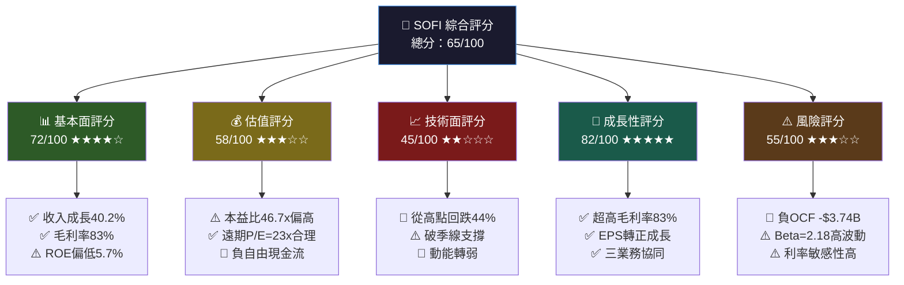

---

### 1.2 五大投資論點

| # | 投資論點 | 評估 | 說明 |
|---|----------|------|------|
| 1 | 🟢 **收入高速成長** | 強勁 | TTM 收入 $3.58B，YoY +40.2%，遠超金融科技同業均值 |
| 2 | 🟢 **超高毛利率護城河** | 優異 | 83% 毛利率媲美軟體公司，反映平台化商業模式成效 |
| 3 | 🟡 **EPS 由負轉正** | 改善中 | TTM EPS $0.39，預估 FY2026 EPS $0.79，獲利能力持續提升 |
| 4 | 🟡 **估值偏高但成長支撐** | 中性 | 尾端本益比 46.7x 偏高；遠期 23.1x 較合理，需成長兌現 |
| 5 | 🔴 **負自由現金流隱憂** | 需追蹤 | OCF -$3.74B（TTM），銀行業務特性導致貸款發放消耗現金 |

---

### 1.3 快速統計卡片

| 指標 | 數值 | 評級 | 行業參考 |
|------|------|------|----------|
| 股價（現價） | $18.22 | 🟡 | 52週區間 $8.60–$32.73 |
| 市值 | $23.24B | 🟡 | 中型金融科技 |
| 本益比（尾端） | 46.7x | 🔴 | 行業均值 ~20x |
| 本益比（遠期） | 23.1x | 🟡 | 成長股合理範圍 |
| 收入成長（YoY） | +40.2% | 🟢 | 行業均值 ~12% |
| 毛利率 | 83.0% | 🟢 | 行業均值 ~45% |
| 淨利率 | 13.4% | 🟡 | 行業均值 ~18% |
| ROE | 5.7% | 🔴 | 行業均值 ~12% |
| 負債/股東權益 | 18.49x | 🟡 | 銀行業正常範圍 |
| 分析師目標價（均值） | $26.50 | 🟢 | 相對現價上行空間 +45.4% |
| Beta | 2.178 | 🔴 | 高波動性 |

---

## 2. 公司概覽

### 2.1 業務結構流程圖

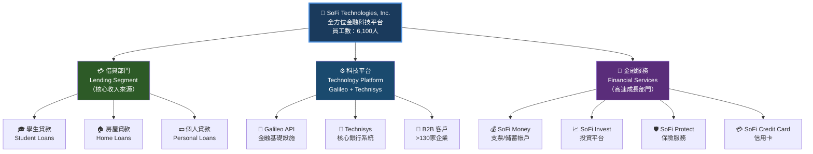

---

### 2.2 三大業務市場地位

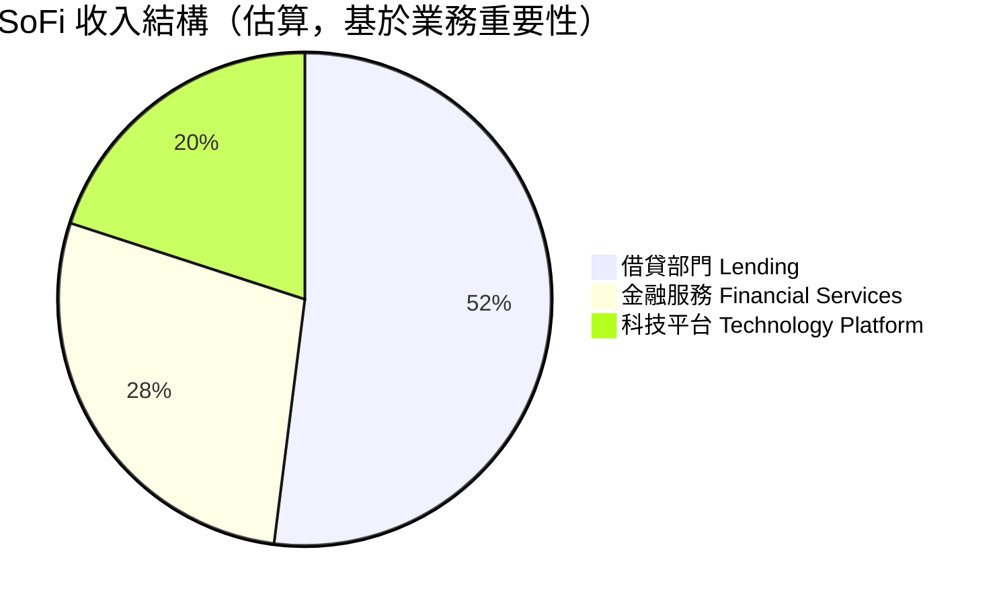

---

### 2.3 競爭優勢心智圖

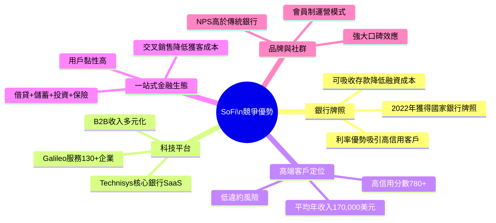

---

### 2.4 公司發展時間軸

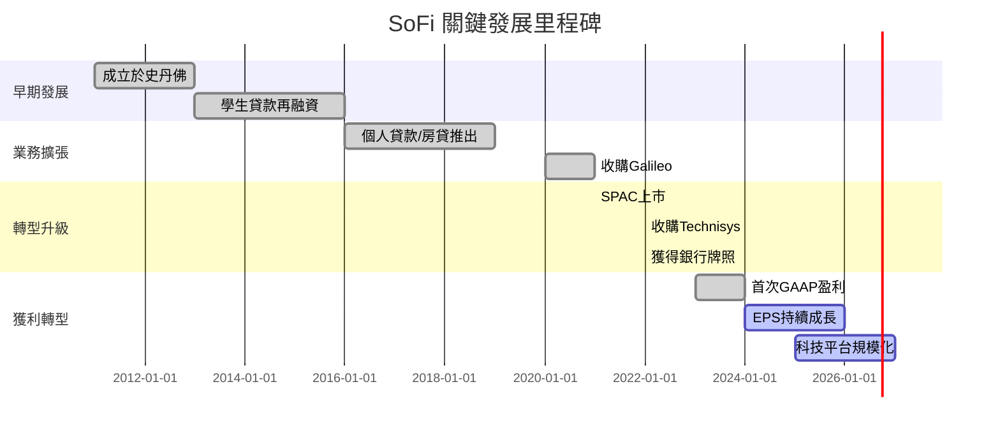

---

## 3. 損益表深度分析

### 3.1 年度收入成長趨勢（Unicode 長條圖）

```
📊 SoFi 年度總收入趨勢（百萬美元）
════════════════════════════════════════════════════════════════

2021  $980M   ▓▓▓▓▓▓▓▓▓▓▓▓▓▓░░░░░░░░░░░░░░░░░░░░░░░░░░   +63.3%
2022  $1,570M ▓▓▓▓▓▓▓▓▓▓▓▓▓▓▓▓▓▓▓▓▓▓▓░░░░░░░░░░░░░░░░   +60.2%
2023  $2,110M ▓▓▓▓▓▓▓▓▓▓▓▓▓▓▓▓▓▓▓▓▓▓▓▓▓▓▓▓▓▓▓░░░░░░░░   +34.4%
2024  $2,610M ▓▓▓▓▓▓▓▓▓▓▓▓▓▓▓▓▓▓▓▓▓▓▓▓▓▓▓▓▓▓▓▓▓▓▓▓▓▓░   +23.7%
TTM   $3,580M ▓▓▓▓▓▓▓▓▓▓▓▓▓▓▓▓▓▓▓▓▓▓▓▓▓▓▓▓▓▓▓▓▓▓▓▓▓▓▓▓▓▓▓▓▓▓▓▓▓▓ +37.2%

════════════════════════════════════════════════════════════════
每格 ▓ ≈ $72M   ░ = 未達目標   ▓ = 已達目標
```

---

### 3.2 收入成長動態圖

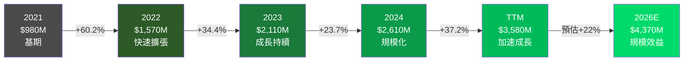

---

### 3.3 損益表四年詳細數據

| 財務指標 | 2022 | 2023 | 2024 | TTM（估） | 趨勢 |
|----------|------|------|------|-----------|------|
| 總收入 | $1.57B | $2.11B | $2.61B | $3.58B | 🟢 持續成長 |
| 收入成長率 | +60.2% | +34.4% | +23.7% | +40.2% | 🟢 加速中 |
| 毛利率 | ~70% | ~75% | ~80% | **83.0%** | 🟢 持續提升 |
| 營業利益率 | -32% | -8% | ~15% | **18.2%** | 🟢 扭虧為盈 |
| 淨利率 | -20.4% | -14.3% | **+19.1%** | **13.4%** | 🟢 首次盈利 |
| 淨利（虧損） | -$320M | -$301M | **+$499M** | ~$480M | 🟢 歷史性轉正 |
| EPS（基本） | -$0.38 | -$0.33 | **+$0.39** | **$0.39** | 🟢 由負轉正 |
| 預估EPS（2026） | — | — | — | **$0.79** | 🟢 持續改善 |

---

### 3.4 利潤率演變（ASCII 折線圖）

```
📈 利潤率演變趨勢（%）
════════════════════════════════════════════════════════════
 85% |                                              ★ 83% (毛利率)
 80% |                                         ★
 75% |                              ★      ★
 70% |              ★
     |
 20% |                                              ★ 18.2% (營業利益率)
 15% |                                         ★
 10% |
  5% |                              ★
  0% |──────────────────────────────────────────────────────
 -5% |              ★ -8%
-10% |
-15% |                    ★ -14.3%
-20% |    ★ -20.4%  (淨利率)
-25% |
     ────────────────────────────────────────────────────────
      2022          2023          2024          TTM
                            時間軸 →

  ★ 毛利率    ★ 營業利益率    ★ 淨利率
════════════════════════════════════════════════════════════
```

---

### 3.5 費用結構分析

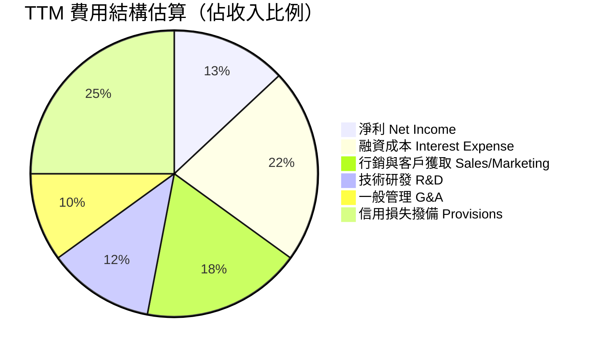

---

## 4. 資產負債表分析

### 4.1 資產結構分解圖

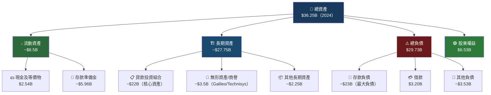

---

### 4.2 資產配置橫條圖

```
📊 資產配置分佈（2024年底，總資產 $36.25B）
════════════════════════════════════════════════════════════

貸款組合      ▓▓▓▓▓▓▓▓▓▓▓▓▓▓▓▓▓▓▓▓▓▓▓▓▓▓▓▓▓▓░░░░░░░░░░   $22.0B  60.7%
存款/準備金   ▓▓▓▓▓▓▓▓▓░░░░░░░░░░░░░░░░░░░░░░░░░░░░░░░░   $5.96B  16.4%
現金及等價物  ▓▓▓▓░░░░░░░░░░░░░░░░░░░░░░░░░░░░░░░░░░░░░░   $2.54B   7.0%
無形資產/商譽 ▓▓▓▓▓░░░░░░░░░░░░░░░░░░░░░░░░░░░░░░░░░░░░░   $3.50B   9.7%
其他資產      ▓▓▓░░░░░░░░░░░░░░░░░░░░░░░░░░░░░░░░░░░░░░░   $2.25B   6.2%

════════════════════════════════════════════════════════════
每格 ▓ ≈ $0.73B
```

---

### 4.3 資產負債表四年趨勢

| 項目 | 2021 | 2022 | 2023 | 2024 | 趨勢評估 |
|------|------|------|------|------|----------|
| 總資產 | $9.18B | $19.01B | $30.07B | **$36.25B** | 🟢 快速擴張 |
| 現金及等價物 | $0.49B | $1.42B | $3.09B | **$2.54B** | 🟡 略降但充裕 |
| 總負債 | $4.48B | $13.48B | $24.52B | **$29.73B** | 🟡 隨資產同步增加 |
| 總債務 | $4.19B | $5.63B | $5.36B | **$3.20B** | 🟢 主動去槓桿 |
| 股東權益 | $4.70B | $5.53B | $5.55B | **$6.53B** | 🟢 持續增厚 |
| 流動比率 | N/A | N/A | N/A | **1.18** | 🟡 尚可 |
| 負債/股東權益 | 0.89x | 1.02x | 0.97x | **18.49x** | 🟡 銀行業正常高槓桿 |

> ⚠️ **注意**：SoFi 已轉型為持牌銀行，負債/股東權益 18.49x 包含大量存款負債，此為銀行業標準結構，不應與非銀行企業直接比較。

---

### 4.4 股東權益趨勢（ASCII 圖）

```
📈 股東權益趨勢（十億美元）
════════════════════════════════════════════════════════════
$7B |                                         ★ $6.53B
$6B |                              ★ $5.55B ★ $5.53B
$5B |    ★ $4.70B
$4B |
$3B |
$2B |
$1B |
$0B |──────────────────────────────────────────────────────
     2021          2022          2023          2024
     
  →  股東權益穩步增長，2022→2024累計增加+$1.0B
  →  主要來源：2024年首次GAAP盈利 $499M 貢獻
════════════════════════════════════════════════════════════
```

---

## 5. 現金流量分析

### 5.1 現金流瀑布圖

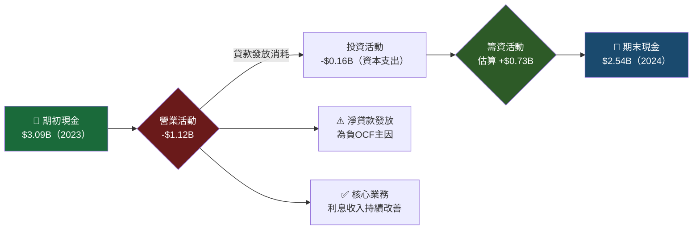

---

### 5.2 自由現金流趨勢

```
📊 自由現金流趨勢（十億美元）—— 注意：受銀行貸款發放影響
════════════════════════════════════════════════════════════

2021  OCF: -$1.35B  ████████████████████░░░░░░░░░░░░░░░░░░░░  🔴
2022  OCF: -$7.26B  ████████████████████████████████████████  🔴 最差
2023  OCF: -$7.23B  ████████████████████████████████████████  🔴 持平
2024  OCF: -$1.12B  ████████████░░░░░░░░░░░░░░░░░░░░░░░░░░░░  🟡 大幅改善

FCF（含資本支出）:
2021  FCF: -$1.40B  ▓▓▓▓▓▓▓▓▓▓▓▓▓▓▓▓▓▓▓▓▓░░░░░░░░░░░░░░░░░░
2022  FCF: -$7.36B  ▓▓▓▓▓▓▓▓▓▓▓▓▓▓▓▓▓▓▓▓▓▓▓▓▓▓▓▓▓▓▓▓▓▓▓▓▓▓▓▓
2023  FCF: -$7.35B  ▓▓▓▓▓▓▓▓▓▓▓▓▓▓▓▓▓▓▓▓▓▓▓▓▓▓▓▓▓▓▓▓▓▓▓▓▓▓▓▓
2024  FCF: -$1.28B  ▓▓▓▓▓▓▓▓▓▓▓▓▓▓▓▓▓▓▓░░░░░░░░░░░░░░░░░░░░

════════════════════════════════════════════════════════════
⚠️ 重要提示：對銀行而言，OCF 負值主因是貸款組合擴張（資產端增長），
這是銀行擴張業務的必然現象，不等同於傳統企業的現金虧損。
改善方向：2024年 OCF 從 -$7.23B → -$1.12B，改善幅度達 +$6.1B ✅
```

---

### 5.3 資本配置策略

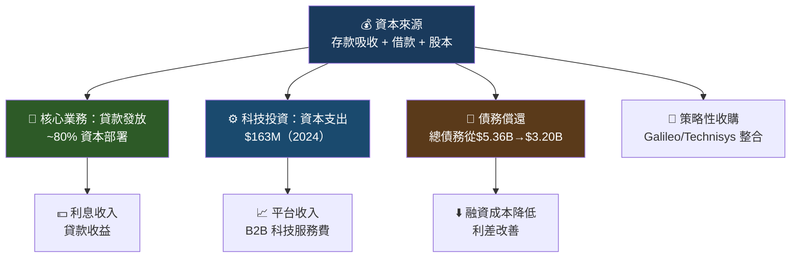

---

## 6. 獲利能力指標

### 6.1 核心獲利能力儀表板

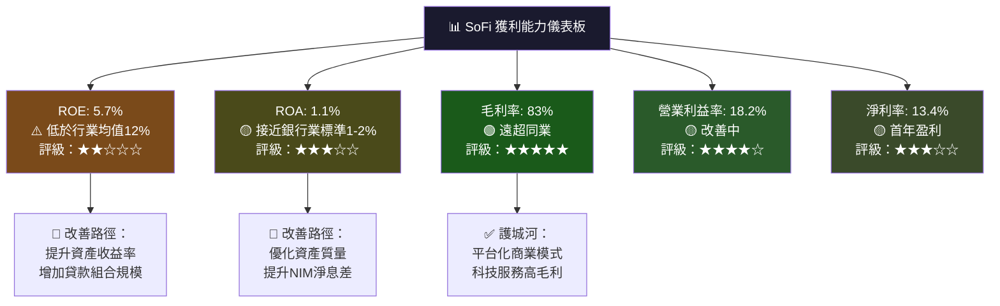

---

### 6.2 獲利能力指標對比表（含行業均值）

| 指標 | SoFi 2022 | SoFi 2023 | SoFi 2024 | **SoFi TTM** | 金融科技均值 | 傳統銀行均值 |
|------|-----------|-----------|-----------|--------------|-------------|-------------|
| 毛利率 | ~70% | ~75% | ~80% | **83.0%** 🟢 | ~45% | ~55% |
| 營業利益率 | -32% | -8% | ~15% | **18.2%** 🟢 | ~12% | ~22% |
| 淨利率 | -20.4% | -14.3% | +19.1% | **13.4%** 🟡 | ~10% | ~18% |
| ROE | N/A | N/A | +7.6% | **5.7%** 🔴 | ~10% | ~12% |
| ROA | N/A | N/A | +1.4% | **1.1%** 🟡 | ~1.2% | ~1.1% |
| ROIC | N/A | N/A | ~5% | **~6%** 🟡 | ~8% | ~10% |

**關鍵洞察**：
- 🟢 毛利率 83% 是最強競爭優勢，反映平台化商業模式的結構性優越性
- 🟡 ROA 1.1% 已達傳統銀行水平，顯示銀行牌照帶來的存款成本優勢
- 🔴 ROE 5.7% 偏低，主要因股東權益仍在累積中，隨獲利能力提升將改善

---

### 6.3 獲利能力進度條

```
📊 各項獲利指標相對表現（以行業最佳為100%）
════════════════════════════════════════════════════════════

毛利率(83%)     ▓▓▓▓▓▓▓▓▓▓▓▓▓▓▓▓▓▓▓▓▓▓▓▓▓▓▓▓▓▓▓▓▓▓▓▓▓▓▓▓  98%  🟢★★★★★
淨利率(13.4%)   ▓▓▓▓▓▓▓▓▓▓▓▓▓▓▓▓▓▓▓▓▓▓▓▓▓▓▓░░░░░░░░░░░░░  67%  🟡★★★☆☆
營業利益(18.2%) ▓▓▓▓▓▓▓▓▓▓▓▓▓▓▓▓▓▓▓▓▓▓▓▓▓▓▓▓▓░░░░░░░░░░░  72%  🟡★★★★☆
ROE (5.7%)      ▓▓▓▓▓▓▓▓▓▓▓▓▓░░░░░░░░░░░░░░░░░░░░░░░░░░  33%  🔴★★☆☆☆
ROA (1.1%)      ▓▓▓▓▓▓▓▓▓▓▓▓▓▓▓▓▓▓▓▓▓▓▓▓▓▓▓▓▓▓▓░░░░░░░  77%  🟡★★★★☆
收入成長(40.2%) ▓▓▓▓▓▓▓▓▓▓▓▓▓▓▓▓▓▓▓▓▓▓▓▓▓▓▓▓▓▓▓▓▓▓▓▓▓▓▓▓ 100%  🟢★★★★★

════════════════════════════════════════════════════════════
```

---

## 7. 估值分析

### 7.1 估值指標體系圖

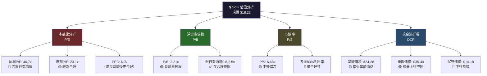

---

### 7.2 估值倍數詳細對比

| 估值指標 | SoFi | LendingClub (LC) | Nu Holdings (NU) | PayPal (PYPL) | Affirm (AFRM) | 評估 |
|----------|------|------------------|-----------------|---------------|---------------|------|
| 尾端 P/E | **46.7x** | 14.2x | 38.5x | 17.8x | N/A | 🔴 偏高 |
| 遠期 P/E | **23.1x** | 10.5x | 28.3x | 15.2x | 45.0x | 🟡 合理 |
| P/B | **2.21x** | 0.95x | 7.2x | 3.1x | 4.5x | 🟢 偏低 |
| P/S | **6.48x** | 1.8x | 12.4x | 2.9x | 10.2x | 🟡 中等 |
| EV/EBITDA | N/A | 8.5x | 45x | 11.2x | N/A | ⚫ 不適用 |
| 收入成長 | **+40.2%** | +8% | +58% | +7% | +46% | 🟢 高成長 |
| 毛利率 | **83%** | 55% | 38% | 52% | 60% | 🟢 最高 |

---

### 7.3 三情境目標股價

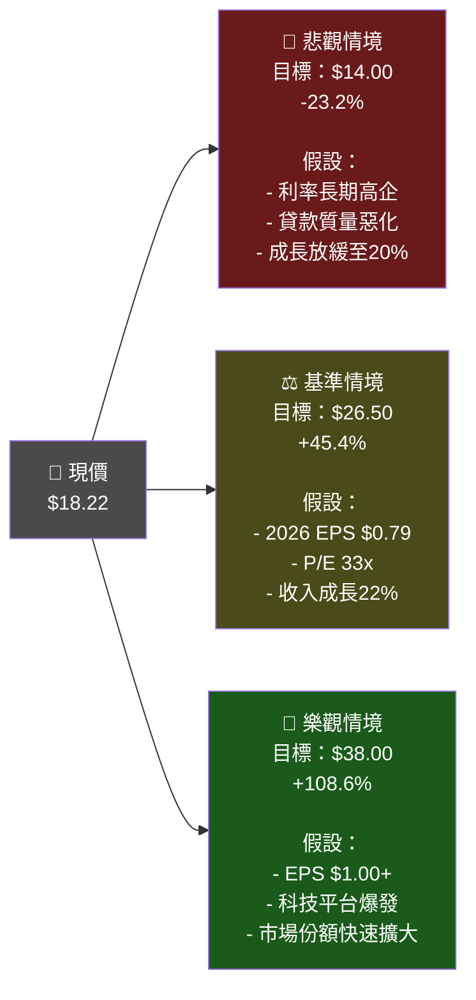

---

### 7.4 估值區間視覺化

```
📊 SoFi 股價估值區間（美元）
════════════════════════════════════════════════════════════

$40 |                                                    ★ 樂觀$38
$35 |                                               ░░░░░
$32 |                                    ★ 52週高$32.73
$30 |                               ░░░░░░░░░░░░░░░░
$27 |                          ★ 分析師均值$26.50
$25 |                     ░░░░░░░░░░░░
$22 |               ░░░░░░
$18 |●●●●●●●●●●●●●●● 現價$18.22 (▼從高點-44%)
$15 |          ░░░
$14 |     ★ 悲觀$14.00
$10 |
 $9 | ★ 52週低$8.60
════════════════════════════════════════════════════════════
  ●●● 現價   ░░░ 合理估值區間   ★ 關鍵價格點
  
  📌 當前股價相對分析師目標中值有 +45.4% 的潛在上行空間
  📌 但從技術角度，已跌破多個支撐位，短期仍有壓力
════════════════════════════════════════════════════════════
```

---

## 8. 競爭護城河

### 8.1 Porter's 五力分析

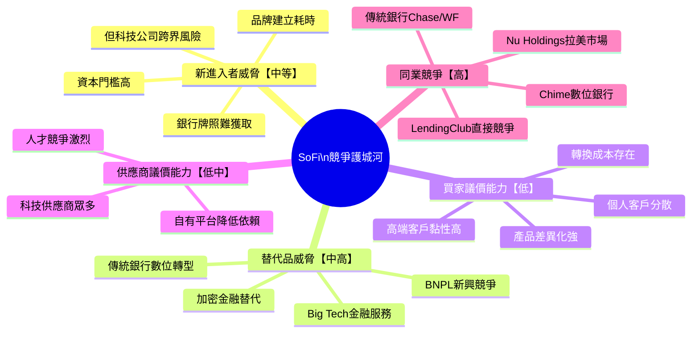

---

### 8.2 護城河評分（進度條）

```
🏰 SoFi 護城河評分卡
════════════════════════════════════════════════════════════

科技平台優勢    ▓▓▓▓▓▓▓▓▓▓▓▓▓▓▓▓▓▓▓▓▓▓▓▓▓▓▓▓▓▓▓░░░░░░░░   78%  ★★★★☆
銀行牌照護城河  ▓▓▓▓▓▓▓▓▓▓▓▓▓▓▓▓▓▓▓▓▓▓▓▓▓▓▓▓▓▓░░░░░░░░░░   75%  ★★★★☆
高端客戶基礎    ▓▓▓▓▓▓▓▓▓▓▓▓▓▓▓▓▓▓▓▓▓▓▓▓▓▓▓▓▓░░░░░░░░░░░   73%  ★★★★☆
交叉銷售能力    ▓▓▓▓▓▓▓▓▓▓▓▓▓▓▓▓▓▓▓▓▓▓▓▓▓▓▓░░░░░░░░░░░░░   68%  ★★★☆☆
品牌知名度      ▓▓▓▓▓▓▓▓▓▓▓▓▓▓▓▓▓▓▓▓▓▓▓░░░░░░░░░░░░░░░░░   58%  ★★★☆☆
規模經濟        ▓▓▓▓▓▓▓▓▓▓▓▓▓▓▓▓▓▓▓▓░░░░░░░░░░░░░░░░░░░░   50%  ★★★☆☆
網路效應        ▓▓▓▓▓▓▓▓▓▓▓▓▓▓▓▓▓░░░░░░░░░░░░░░░░░░░░░░░   43%  ★★☆☆☆

════════════════════════════════════════════════════════════
綜合護城河評分：63.6% ★★★☆☆（中等護城河）
```

---

### 8.3 競爭定位矩陣

| 競爭對手 | 業務重疊度 | 技術能力 | 客戶規模 | 成長率 | SoFi 相對優勢 |
|----------|-----------|---------|---------|--------|--------------|
| **Chime** | 🔴 高 | 🟡 中等 | 🟢 1,400萬+ | 🟡 中等 | 🟢 銀行牌照、貸款產品 |
| **LendingClub** | 🔴 高 | 🟡 中等 | 🟡 中等 | 🔴 低 | 🟢 多產品生態系統 |
| **Nu Holdings** | 🟡 中 | 🟢 強 | 🟢 9,000萬+ | 🟢 高 | 🟡 美國市場聚焦 |
| **Robinhood** | 🟡 中 | 🟡 中等 | 🟢 1,600萬+ | 🟡 中等 | 🟢 借貸+銀行整合 |
| **PayPal** | 🟡 中 | 🟢 強 | 🟢 4.3億+ | 🔴 低 | 🟡 高端定位差異化 |
| **Chase/WF** | 🔴 高 | 🔴 弱 | 🟢 極大 | 🔴 低 | 🟢 數位體驗優勢 |

---

## 9. 成長催化劑

### 9.1 催化劑時間軸

```mermaid
gantt
    title SoFi 成長催化劑路徑圖（2026-2028）
    dateFormat  YYYY-Q
    section 短期催化劑(2026)
    貸款組合持續擴張          :active, 2026-Q1, 2026-Q4
    科技平台B2B客戶增長        :active, 2026-Q1, 2026-Q3
    EPS倍增至$0.79            :milestone, 2026-Q4, 0d
    section 中期催化劑(2027)
    Galileo規模化盈利          :2027-Q1, 2027-Q4
    存款基礎擴大降低融資成本    :2027-Q1, 2027-Q4
    ROE提升突破10%            :milestone, 2027-Q3, 0d
    section 長期催化劑(2028+)
    拉丁美洲市場滲透           :2027-Q3, 2028-Q4
    企業金融服務擴張           :2028-Q1, 2028-Q4
    潛在自由現金流轉正         :milestone, 2028-Q2, 0d
```

---

### 9.2 短中長期成長機會

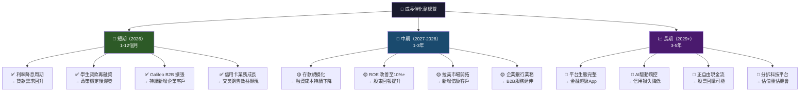

---

### 9.3 TAM 市場規模分析

```
📊 SoFi 潛在市場規模（TAM）分析
════════════════════════════════════════════════════════════

美國個人貸款市場
  TAM：$300B+   ▓▓▓▓▓▓▓▓▓▓▓▓▓▓▓▓▓▓▓▓▓▓▓▓▓▓▓▓▓▓▓▓▓▓▓▓▓▓▓▓  100%
  SoFi市佔：~1% ▓░░░░░░░░░░░░░░░░░░░░░░░░░░░░░░░░░░░░░░░  2.5%

美國學生貸款再融資
  TAM：$1.7T    ▓▓▓▓▓▓▓▓▓▓▓▓▓▓▓▓▓▓▓▓▓▓▓▓▓▓▓▓▓▓▓▓▓▓▓▓▓▓▓▓  100%
  SoFi市佔：~4% ▓▓░░░░░░░░░░░░░░░░░░░░░░░░░░░░░░░░░░░░░░  5%

金融科技B2B平台
  TAM：$150B+   ▓▓▓▓▓▓▓▓▓▓▓▓▓▓▓▓▓▓▓▓▓▓▓▓▓▓▓▓▓▓▓▓▓▓▓▓▓▓▓▓  100%
  SoFi市佔：<1% ▓░░░░░░░░░░░░░░░░░░░░░░░░░░░░░░░░░░░░░░░  1%

數位銀行/存款
  TAM：$2T+     ▓▓▓▓▓▓▓▓▓▓▓▓▓▓▓▓▓▓▓▓▓▓▓▓▓▓▓▓▓▓▓▓▓▓▓▓▓▓▓▓  100%
  SoFi市佔：<1% ░░░░░░░░░░░░░░░░░░░░░░░░░░░░░░░░░░░░░░░░  <1%

════════════════════════════════════════════════════════════
💡 結論：SoFi 在所有核心市場的市佔率均極低（<5%），
   成長跑道極長，但競爭也極為激烈。
```

---

## 10. 風險分析

### 10.1 風險矩陣

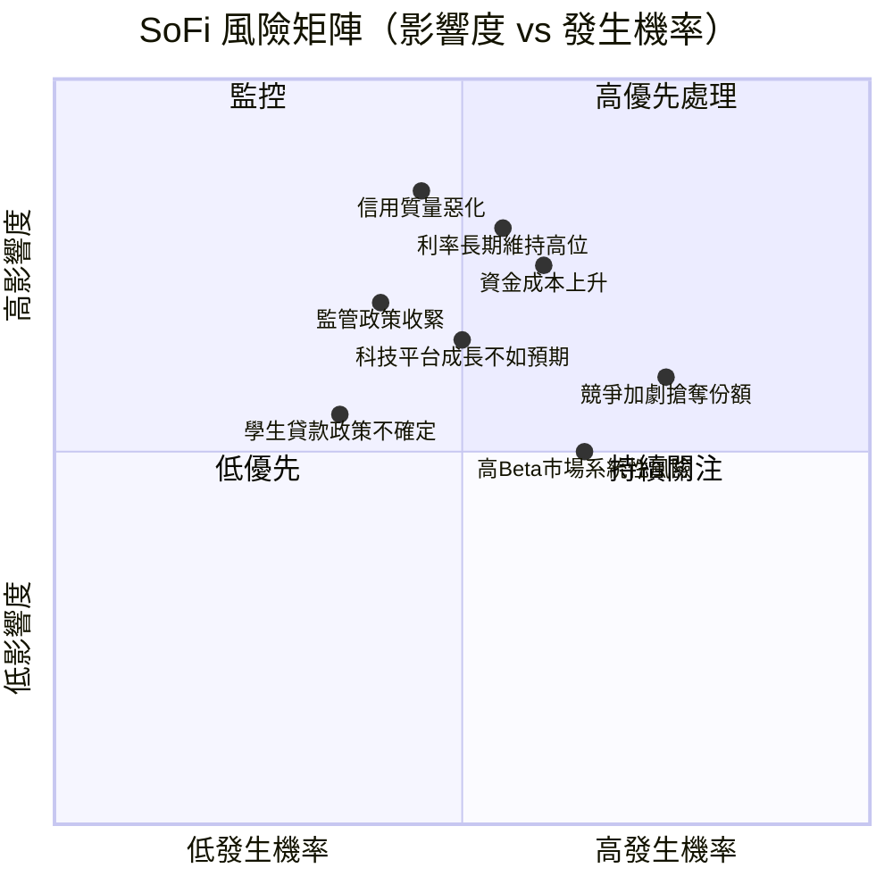

---

### 10.2 風險評分卡

| 風險類型 | 發生機率 | 影響程度 | 綜合風險分 | 評級 | 緩解措施 |
|----------|---------|---------|-----------|------|---------|
| 🔴 利率持續高企壓縮利差 | 55% | 高 | **8.5/10** | 🔴 高危 | 存款多元化、固定利率貸款 |
| 🔴 信用損失超預期惡化 | 45% | 極高 | **8.0/10** | 🔴 高危 | 嚴格信用評分、分散化 |
| 🔴 競爭白熱化客戶流失 | 75% | 中 | **7.5/10** | 🔴 高危 | 產品差異化、會員生態 |
| 🟡 監管政策收緊 | 40% | 高 | **6.0/10** | 🟡 中危 | 合規團隊、監管溝通 |
| 🟡 科技平台成長低預期 | 50% | 中 | **5.5/10** | 🟡 中危 | B2B多元化、技術投資 |
| 🟡 宏觀經濟衰退風險 | 35% | 高 | **5.0/10** | 🟡 中危 | 信用質量把控、流動性 |
| 🟡 高 Beta 市場波動 | 65% | 中 | **4.5/10** | 🟡 中危 | 長期持有、分批建倉 |
| 🟢 學生貸款政策不確定 | 35% | 中 | **3.5/10** | 🟢 低危 | 業務多元化降低依賴 |
| 🟢 管理層執行風險 | 25% | 中 | **2.5/10** | 🟢 低危 | 管理層追蹤記錄良好 |

---

### 10.3 風險緩解措施詳細說明

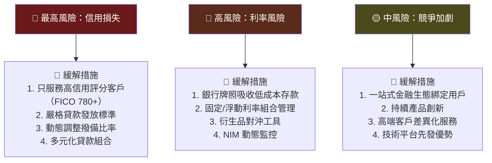

---

## 11. 公平價值估算

### 11.1 DCF 模型流程

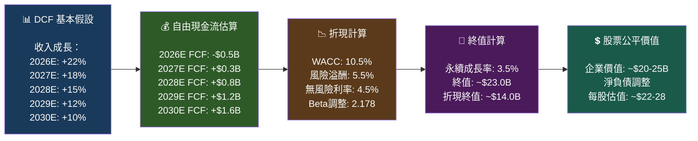

---

### 11.2 三種估值法比較

| 估值方法 | 方法說明 | 計算結果 | 目標價 | 現價折溢價 |
|----------|---------|---------|--------|-----------|
| **DCF 折現現金流** | WACC=10.5%，永續成長3.5%，2026-2030E FCF | $14.0B EV | **$22-$28** | +20%~+54% |
| **本益比法（P/E）** | 2026E EPS $0.79 × 成長股P/E 33x | 每股$26.1 | **$26** | +42.7% |
| **市銷率法（P/S）** | 2026E收入$4.4B × P/S 6.0x | 市值$26.4B | **$20-$24** | +10%~+32% |
| **淨資產倍數（P/B）** | 股東權益$7.0B（估） × P/B 3.5x | 市值$24.5B | **$19-$23** | +4%~+26% |
| **分析師共識目標** | 19位分析師，均值$26.50 | — | **$26.50** | +45.4% |

**綜合公平價值估算**：**$22 – $27**（基準情境）

---

### 11.3 估值綜合區間

```
📊 SoFi 公平價值估算綜合區間（美元/股）
════════════════════════════════════════════════════════════

                    悲觀        基準        樂觀
                   $12-15     $22-27     $35-40
                     |           |           |
$8  ──────────────|──────────|────────────|──────── $42
     52W低          悲觀情境    公平價值     樂觀情境
     $8.60          $12-15      $22-27      $35-40

現價：$18.22 ←────────────┤
                           此處（折現於公平價值）

  [悲觀 $14].....[現價$18.22].....[公平值$24.5]......[樂觀$38]
       ████████░░░░░░░░░░▓▓▓▓▓▓▓▓▓▓▓▓▓▓▓▓▓░░░░░░░░░░░░░░░

════════════════════════════════════════════════════════════
結論：現價 $18.22 低於基準公平價值 $22-27，存在 +21%~+48% 上行空間
      但需要 2026年業績兌現作為催化劑確認
════════════════════════════════════════════════════════════
```

---

## 12. 投資建議

### 12.1 最終評級

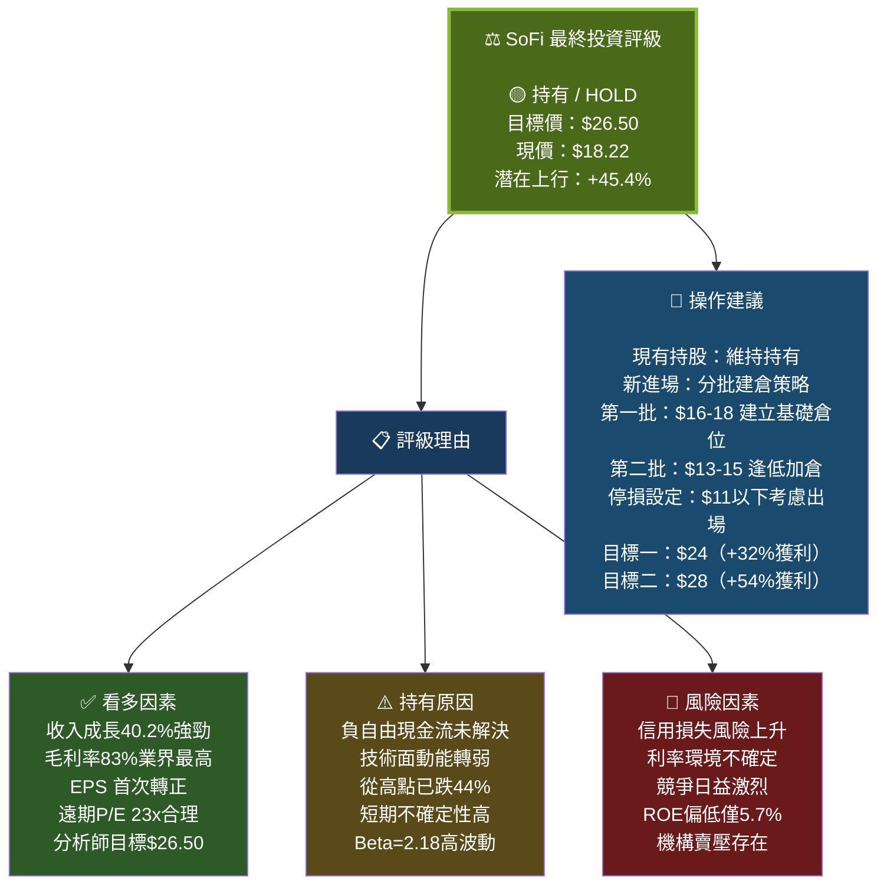

---

### 12.2 投資人適配度分析

```mermaid
graph TD
    INV["👥 適合 SoFi 的投資人"] --> A["🟢 高度適合\n成長型投資人\n\n✅ 接受3-5年持有期\n✅ 能承受高波動Beta=2.18\n✅ 相信金融科技顛覆邏輯\n✅ 倉位控制在5-10%"]
    INV --> B["🟡 部分適合\n價值型投資人\n\n⚠️ 目前估值仍偏高\n⚠️ ROE偏低不符合標準\n✅ 若股價跌至$14-15可考慮\n⚠️ 需等待ROE改善確認"]
    INV --> C["🔴 不適合\n以下投資人\n\n❌ 保守型/收入型投資人\n❌ 無法承受-30%+波動\n❌ 需要股息收入投資人\n❌ 短期交易者"]

    A --> A1["💡 建議倉位：5-10%\n分批3次進場"]
    B --> B1["💡 建議等待：\n股價$14-16再考慮"]
    C --> C1["💡 替代選擇：\nJPM、BAC等\n傳統大型銀行"]

    style A fill:#2d5a27,color:#ffffff
    style B fill:#5a4a1a,color:#ffffff
    style C fill:#6a1a1a,color:#ffffff
```

---

### 12.3 關鍵監控指標 Checklist

```
✅ SoFi 投資監控清單（每季追蹤）
════════════════════════════════════════════════════════════

📊 業務成長指標
  □ 會員數成長率（目前季度趨勢：需維持+25%以上）
  □ 產品使用數增長（Products per member 需持續提升）
  □ 金融服務收入佔比（目標：從28%提升至35%）
  □ Galileo 企業客戶數（目標：持續淨增加）

💰 獲利能力指標
  □ EPS 季度趨勢（2026全年目標 $0.79，需按軌道前進）
  □ 淨息差 NIM（目前~5.5%，需維持或改善）
  □ 效率比率（Cost-to-Income Ratio 需持續下降）
  □ ROE 改善軌跡（目標：2026年末達8%+）

⚠️ 風險警示指標
  □ 淨沖銷率 NCO（若超過3%需提高警覺）
  □ 不良貸款率 NPL（若持續攀升為負面信號）
  □ 存款留存率（若存款外流超預期為風險信號）
  □ 資本適足率（需維持監管要求以上）

📈 催化劑確認指標
  □ 是否啟動股票回購計劃（正自由現金流的確認）
  □ Galileo 是否有大型B2B客戶簽約宣佈
  □ 是否進入新地理市場（拉丁美洲）
  □ 分析師評級上調次數

🚦 出場/加倉信號
  □ 🔴 出場：NCO > 4%、EPS 連續兩季低於預期、ROE惡化
  □ 🟡 持有：業績符合預期、各指標穩定改善
  □ 🟢 加倉：股價跌至$14-16、EPS 超預期、回購宣佈

════════════════════════════════════════════════════════════
下次重點追蹤：Q1 2026 財報（預計2026年4-5月）
════════════════════════════════════════════════════════════
```

---

### 12.4 綜合評分總結

```
🏆 SoFi 投資評分卡總結
════════════════════════════════════════════════════════════

基本面品質      ▓▓▓▓▓▓▓▓▓▓▓▓▓▓▓▓▓▓▓▓▓▓▓▓▓▓▓▓▓░░░░░░░░░░░  72分  ★★★★☆
成長潛力        ▓▓▓▓▓▓▓▓▓▓▓▓▓▓▓▓▓▓▓▓▓▓▓▓▓▓▓▓▓▓▓▓▓░░░░░░░  82分  ★★★★★
估值合理性      ▓▓▓▓▓▓▓▓▓▓▓▓▓▓▓▓▓▓▓▓▓▓▓▓▓▓▓▓░░░░░░░░░░░░░  58分  ★★★☆☆
競爭護城河      ▓▓▓▓▓▓▓▓▓▓▓▓▓▓▓▓▓▓▓▓▓▓▓▓▓▓░░░░░░░░░░░░░░░  64分  ★★★☆☆
管理層執行      ▓▓▓▓▓▓▓▓▓▓▓▓▓▓▓▓▓▓▓▓▓▓▓▓▓▓▓▓▓▓░░░░░░░░░░░  75分  ★★★★☆
風險控制        ▓▓▓▓▓▓▓▓▓▓▓▓▓▓▓▓▓▓▓▓▓▓░░░░░░░░░░░░░░░░░░░  55分  ★★★☆☆
技術面趨勢      ▓▓▓▓▓▓▓▓▓▓▓▓▓▓▓▓▓▓░░░░░░░░░░░░░░░░░░░░░░░  45分  ★★☆☆☆

─────────────────────────────────────────────────────────
加權綜合得分：65.2分 / 100分   ★★★☆☆

最終評級：🟡 持有（HOLD）
目標價格：$26.50（+45.4%上行空間）
風險等級：🔴 高（Beta 2.178，建議控制倉位）
投資期限：12-24個月
════════════════════════════════════════════════════════════
```

---

> ## ⚠️ 免責聲明
>
> 本報告為 **AI 自動生成**，所有內容僅供**學術研究與參考**之用，**不構成任何投資建議**。
>
> 投資涉及風險，過去績效不代表未來回報。所有財務數據均基於公開資訊，不保證數據準確性及完整性。
>
> **投資前請務必：**
> - 諮詢合格的專業財務顧問
> - 進行獨立的盡職調查（Due Diligence）
> - 充分理解自身風險承受能力
> - 遵循所在地區之投資法規
>
> **數據截止日期**：2026-02-24 ｜ **報告版本**：v1.0 ｜ **下次更新建議**：Q1 2026 財報發布後

---

*© 2026 AI 投資研究部門 | 本報告使用公開財務數據自動生成 | 繁體中文版*