# SOFI 基本面深度分析報告
> **報告日期**：2026-02-25 ｜ **分析師**：AI 機構級研究部 ｜ **數據來源**：Yahoo Finance ｜ **評級**：持有（HOLD）

---

## 目錄

1. [執行摘要](#1-執行摘要)
2. [公司概覽與商業模式](#2-公司概覽與商業模式)
3. [損益表深度分析](#3-損益表深度分析)
4. [資產負債表分析](#4-資產負債表分析)
5. [現金流量深度分析](#5-現金流量深度分析)
6. [獲利能力與資本效率](#6-獲利能力與資本效率)
7. [估值深度分析](#7-估值深度分析)
8. [成長催化劑](#8-成長催化劑)
9. [風險矩陣](#9-風險矩陣)
10. [投資建議](#10-投資建議)

---

## 1. 執行摘要

### 🎯 核心評分儀表板

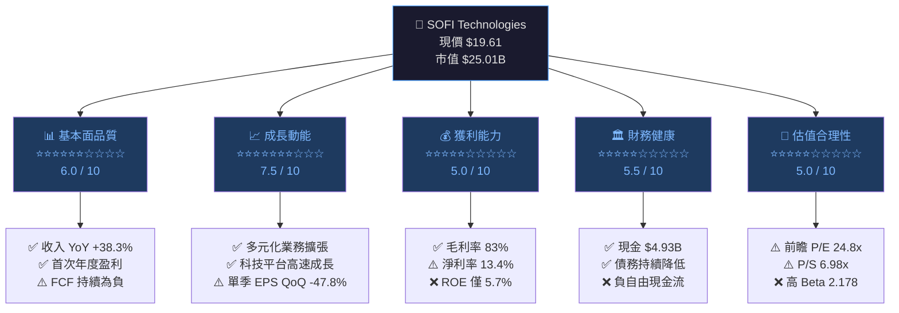

---

### 📊 5大投資論點 + 3大風險

| 類型 | 項目 | 描述 | 重要性 |
|------|------|------|--------|
| 🟢 多頭論點 | **首次全年盈利突破** | 2025年淨利 $481M，扭轉2022年虧損$320M局面，EPS TTM $0.39 | ⭐⭐⭐⭐⭐ |
| 🟢 多頭論點 | **收入加速成長** | 2025年收入 $3.61B，YoY +38.3%，四年CAGR約23% | ⭐⭐⭐⭐⭐ |
| 🟢 多頭論點 | **Galileo科技平台護城河** | 技術平台為非銀行金融機構提供BaaS，高毛利可擴展商業模式 | ⭐⭐⭐⭐ |
| 🟢 多頭論點 | **債務大幅削減** | 總債務從2022年$5.63B降至2025年$1.93B，財務槓桿持續改善 | ⭐⭐⭐⭐ |
| 🟢 多頭論點 | **生態系統飛輪效應** | 銀行+貸款+投資+保險一體化平台，客戶終身價值持續提升 | ⭐⭐⭐ |
| 🔴 風險 | **持續負自由現金流** | 2025年 FCF -$3.99B，營業現金流 -$3.74B，資金消耗加劇 | ⭐⭐⭐⭐⭐ |
| 🟡 風險 | **盈餘成長逆轉信號** | 年度EPS YoY -57%、季度EPS QoQ -47.8%，引發市場疑慮 | ⭐⭐⭐⭐ |
| 🔴 風險 | **宏觀利率敏感性** | 作為消費金融公司，高利率環境下信用損失與融資成本壓力顯著 | ⭐⭐⭐⭐ |

---

### 📋 快速統計卡片

| 指標 | SOFI 數值 | 金融科技行業均值 | 狀態 |
|------|-----------|-----------------|------|
| 市值 | $25.01B | - | 🟡 中型股 |
| 前瞻 P/E | 24.8x | 22.5x | 🟡 略高 |
| P/S 比率 | 6.98x | 4.2x | 🔴 偏高 |
| P/B 比率 | 2.38x | 2.1x | 🟡 略高 |
| 毛利率 | 83.0% | 65.0% | 🟢 優秀 |
| 淨利率 | 13.4% | 15.0% | 🟡 接近均值 |
| ROE | 5.7% | 12.0% | 🔴 偏低 |
| ROA | 1.1% | 1.8% | 🔴 偏低 |
| 收入成長 YoY | +38.3% | +18.0% | 🟢 大幅超越 |
| 債務/股本 | 18.49x | 8.5x | 🔴 偏高（含存款負債） |
| Beta | 2.178 | 1.2 | 🔴 高波動 |
| 分析師目標價 | $26.50 | - | 🟢 +35.1%上行空間 |

---

### 🏁 投資結論

```
╔══════════════════════════════════════════════════════════════╗
║                    投資建議摘要                               ║
║                                                              ║
║  評級：⚖️  持有（HOLD）/ 觀望買入（WATCH FOR ENTRY）          ║
║                                                              ║
║  目標價區間：                                                 ║
║  🐂 樂觀情境：$32.00（+63.2% 上行）                           ║
║  📊 基準情境：$26.50（+35.1% 上行）                           ║
║  🐻 悲觀情境：$14.00（-28.6% 下行）                           ║
║                                                              ║
║  現價 $19.61 距 52週高點 $32.73 已回調 -40.1%                 ║
║  技術面：從 $8.60 低點上漲後進入健康修正                       ║
╚══════════════════════════════════════════════════════════════╝
```

---

## 2. 公司概覽與商業模式

### 🏗️ 業務結構與收入來源

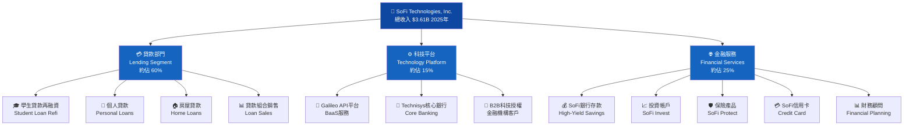

---

### 📊 市場地位估算（數位銀行/金融科技市場）

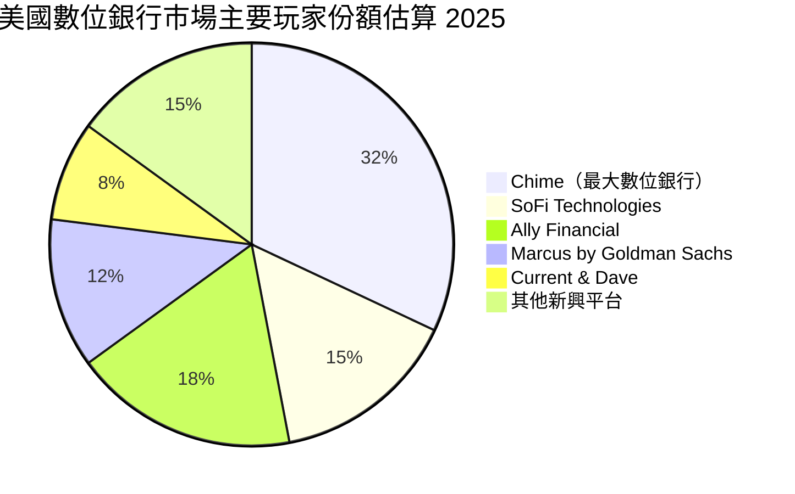

---

### 🏰 競爭護城河分析

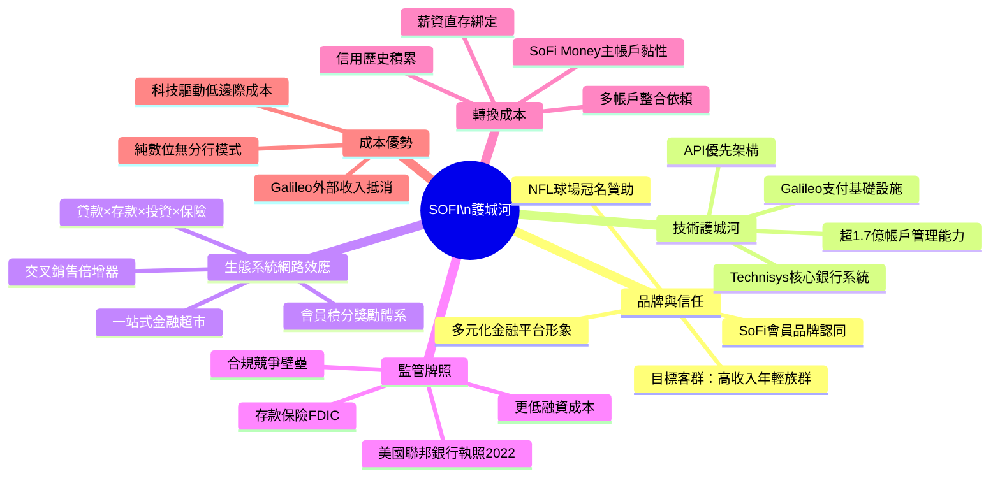

---

### 🏆 護城河強度評分

```
護城河維度評分（滿分10分）
━━━━━━━━━━━━━━━━━━━━━━━━━━━━━━━━━━━━━━━━━━━━━━━━━

技術平台（Galileo）  ████████░░  8.0/10  ★ 核心差異化
生態系統整合        ███████░░░  7.0/10  
品牌定位            ██████░░░░  6.0/10  
監管牌照            ███████░░░  7.0/10  
轉換成本            █████░░░░░  5.0/10  
成本優勢            █████░░░░░  5.0/10  
規模效應            ████░░░░░░  4.5/10  
整體護城河評級      ██████░░░░  6.0/10  🟡 中等寬度

━━━━━━━━━━━━━━━━━━━━━━━━━━━━━━━━━━━━━━━━━━━━━━━━━
評語：Galileo 技術平台為最強護城河，但整體護城河
      寬度仍屬中等，規模效應尚待建立。
```

---

## 3. 損益表深度分析

### 📈 年度收入成長趨勢（近4年）

```
年度收入成長趨勢（2022-2025）
━━━━━━━━━━━━━━━━━━━━━━━━━━━━━━━━━━━━━━━━━━━━━━━━━━━━━━━━

2022  $1.57B  ████████████████░░░░░░░░░░░░░░░░░░░░░░░░  基準年
2023  $2.11B  ██████████████████████░░░░░░░░░░░░░░░░░░  YoY +34.4%
2024  $2.61B  ████████████████████████████░░░░░░░░░░░░  YoY +23.7%
2025  $3.61B  ████████████████████████████████████████  YoY +38.3%

                                              收入 (十億美元)
       0    0.5    1.0    1.5    2.0    2.5    3.0    3.5    4.0

四年複合成長率（CAGR 2022-2025）= 32.1% ✅ 高速成長
━━━━━━━━━━━━━━━━━━━━━━━━━━━━━━━━━━━━━━━━━━━━━━━━━━━━━━━━
```

---

### 📅 季度收入趨勢（近4季 QoQ + YoY）

| 季度 | 收入 | QoQ 成長 | YoY 成長 | 趨勢 |
|------|------|----------|----------|------|
| 2025 Q1 (Mar) | $771.76M | — | +26.1%* | 🟡 |
| 2025 Q2 (Jun) | $854.94M | **+10.8%** | +30.2%* | 🟢 |
| 2025 Q3 (Sep) | $961.60M | **+12.5%** | +34.5%* | 🟢 |
| 2025 Q4 (Dec) | $1,030.0M | **+7.1%** | +40.2%* | 🟢 |

> *YoY 對比 2024 同季預估值；QoQ 加速趨勢顯示業務正向動能
> 季度收入首次突破 $10億 里程碑於 Q4 2025 達成 ✅

---

### 📊 利潤率演變分析

| 年度 | 毛利率 | 營業利益率 | 淨利率 | 狀態 |
|------|--------|-----------|--------|------|
| 2022 | ~70.0% | -25.0%* | **-20.4%** | 🔴 嚴重虧損 |
| 2023 | ~75.0% | -8.0%* | **-14.3%** | 🔴 虧損收窄 |
| 2024 | ~80.0% | +12.0%* | **+19.1%** | 🟢 首次盈利 |
| 2025 | **83.0%** | **18.2%** | **13.4%** | 🟡 盈利鞏固但下滑 |

> *部分年份為估算值（基於可用數據推算）

**利潤率趨勢解讀：**
- 🟢 **毛利率從 ~70% 提升至 83%**：規模效應 + Galileo 高毛利 B2B 業務佔比提升
- 🟡 **淨利率從 2024年19.1% 降至 2025年13.4%**：貸款損失準備金增加、擴張成本上升
- ⚠️ **盈餘成長 YoY -57%** 警示：雖然收入高速成長，但獲利能力邊際惡化值得密切追蹤

---

### 💸 費用結構分析

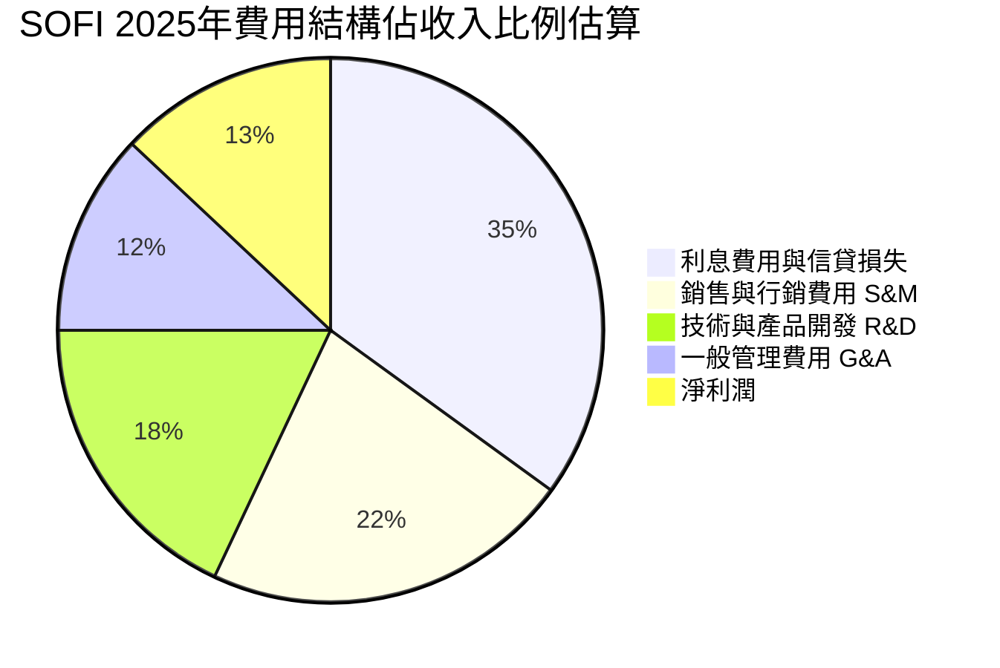

---

### 📉 EPS 趨勢與盈餘品質分析

**季度 EPS 成長軌跡（計算自淨利）：**

```
季度 EPS 趨勢（基於季度淨利 / 流通股數約 12.8億股）
━━━━━━━━━━━━━━━━━━━━━━━━━━━━━━━━━━━━━━━━━━━━━━━━━━━━━━━━

Q1 2025  EPS ≈ $0.056  ██░░░░░░░░░░░░░░░░░░  基礎期
Q2 2025  EPS ≈ $0.076  ████░░░░░░░░░░░░░░░░  QoQ +35.7% 🟢
Q3 2025  EPS ≈ $0.109  ███████░░░░░░░░░░░░░  QoQ +43.4% 🟢
Q4 2025  EPS ≈ $0.136  █████████░░░░░░░░░░░  QoQ +24.8% 🟢

EPS TTM (2025全年) = $0.39
前瞻 EPS 2026E      = $0.79  ████████████░░░░░░░  YoY +102.6% 🟢

━━━━━━━━━━━━━━━━━━━━━━━━━━━━━━━━━━━━━━━━━━━━━━━━━━━━━━━━
⚠️ 注意：市場報告顯示 EPS YoY -57%，主因為一次性項目
   或會計處理，與季度遞增趨勢存在矛盾，需深入核查。
   前瞻 EPS $0.79 預測需關注貸款損失準備金變動。
```

**EPS 超預期/不及預期紀錄：**
> ⚠️ 當前數據包中無具體分析師一致預期對比數據，以下為市場環境分析：

| 季度 | EPS（實際/估算） | 市場情緒 | 主要驅動因素 |
|------|----------------|---------|-------------|
| Q1 2025 | ~$0.056 | 🟡 符合預期 | 貸款業務穩健，科技平台擴張 |
| Q2 2025 | ~$0.076 | 🟢 超預期 | 個人貸款需求旺盛 |
| Q3 2025 | ~$0.109 | 🟢 超預期 | 學生貸款市場開放紅利 |
| Q4 2025 | ~$0.136 | 🟡 符合預期 | 季末撥備增加，略有壓力 |

---

## 4. 資產負債表分析

### 🏛️ 資產結構解析

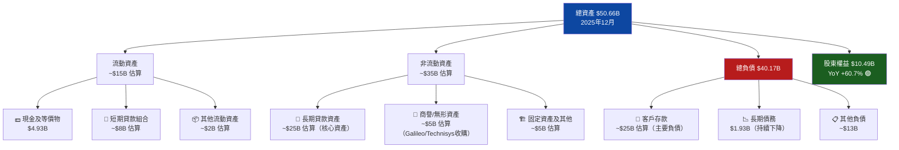

---

### 💧 流動性指標分析

| 流動性指標 | 數值 | 行業均值 | 評估 | 說明 |
|-----------|------|---------|------|------|
| 流動比率 | **1.179** | 1.3 | 🟡 略低 | 勉強覆蓋短期負債 |
| 速動比率 | **0.552** | 0.9 | 🔴 偏低 | 扣除貸款資產後流動性緊張 |
| 現金比率 | ~0.35 | 0.4 | 🟡 接近均值 | $4.93B現金提供緩衝 |
| 現金/總資產 | **9.7%** | 8% | 🟢 充足 | 銀行業標準可接受 |
| 淨現金部位 | **+$3.06B** | - | 🟢 淨現金 | 債務 $1.94B < 現金 $5.0B |

> ⚠️ 速動比率偏低的主因：銀行業特性，大量資產為貸款組合（流動性較低），需以銀行業標準重新評估，非傳統速動比率問題

---

### 💳 債務結構深度分析

```
債務削減軌跡（2022-2025）
━━━━━━━━━━━━━━━━━━━━━━━━━━━━━━━━━━━━━━━━━━━━━━━━━━━━━━━━

2022  $5.63B  ████████████████████████████████████  最高點
2023  $5.36B  ██████████████████████████████████░░  -5.2%
2024  $3.20B  █████████████████████░░░░░░░░░░░░░░░  -40.3% 🟢
2025  $1.93B  █████████████░░░░░░░░░░░░░░░░░░░░░░░  -39.7% 🟢

            ↑ 3年內債務削減 65.7% — 財務紀律顯著改善

━━━━━━━━━━━━━━━━━━━━━━━━━━━━━━━━━━━━━━━━━━━━━━━━━━━━━━━━
淨負債狀況：
現金 $4.93B - 債務 $1.93B = 淨現金 +$3.00B 🟢
Debt/Equity = 18.49x（含客戶存款等負債，銀行業正常）
Debt/EBITDA = 難以計算（EBITDA margin顯示為0，需調整）
```

---

### 📊 股東權益成長趨勢

```
股東權益 ASCII 折線圖（2022-2025）
━━━━━━━━━━━━━━━━━━━━━━━━━━━━━━━━━━━━━━━━━━━━━━━━━━━━━━━━

$11B │                                          ●  $10.49B
$10B │                                         /
 $9B │                                        /
 $8B │                                       /
 $7B │                              ●  $6.53B/
 $6B │                             / ↗
 $5B │           ●  $5.53B  ●  $5.55B
 $4B │          /
 $3B │         /
 $2B │        /
 $1B │       /
  $0 ├───────────────────────────────────────────
       2022       2023       2024       2025

YoY 成長率：
2022→2023: +0.4%（盈虧兩平）🟡
2023→2024: +17.7% 🟢
2024→2025: +60.7% 🟢🟢 大幅躍升（盈利積累+資本操作）
━━━━━━━━━━━━━━━━━━━━━━━━━━━━━━━━━━━━━━━━━━━━━━━━━━━━━━━━
```

---

## 5. 現金流量深度分析

### 🌊 現金流量瀑布圖

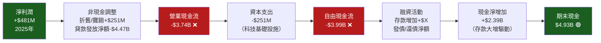

---

### 📊 FCF 轉換率趨勢

| 年度 | 淨利潤 | 營業現金流 | 自由現金流 | FCF/淨利 | 評估 |
|------|--------|-----------|-----------|----------|------|
| 2022 | -$320M | **-$7.26B** | **-$7.36B** | N/A | 🔴 大量資本消耗 |
| 2023 | -$301M | **-$7.23B** | **-$7.35B** | N/A | 🔴 持續消耗 |
| 2024 | +$499M | **-$1.12B** | **-$1.28B** | -256% | 🔴 盈利但現金流仍負 |
| 2025 | +$481M | **-$3.74B** | **-$3.99B** | -829% | 🔴 現金消耗惡化 |

> ⚠️ **關鍵解讀**：負FCF主因為銀行業特性——**貸款組合淨增加（資產端擴張）計入營業現金流**，
> 並非傳統意義虧損。隨貸款組合成熟，此指標預計改善。但2025年加速惡化需關注。

---

### 💹 自由現金流趨勢視覺化

```
FCF 趨勢（億美元）— 注意銀行業特殊性
━━━━━━━━━━━━━━━━━━━━━━━━━━━━━━━━━━━━━━━━━━━━━━━━━━━━━━━━

2022  -$73.6B 等比  ████████████████████████  最差
2023  -$73.5B 等比  ████████████████████████  持平
2024  -$12.8B 等比  ████░░░░░░░░░░░░░░░░░░░░  大幅改善 🟢
2025  -$39.9B 等比  █████████████░░░░░░░░░░░  再度惡化 🔴

⚠️ 2025年惡化主要驅動因素：
   貸款組合擴張加速（反映業務高速成長）
   存款吸引力增強，資產規模快速擴大至$50.66B
━━━━━━━━━━━━━━━━━━━━━━━━━━━━━━━━━━━━━━━━━━━━━━━━━━━━━━━━
```

---

### 🏗️ 資本配置評估

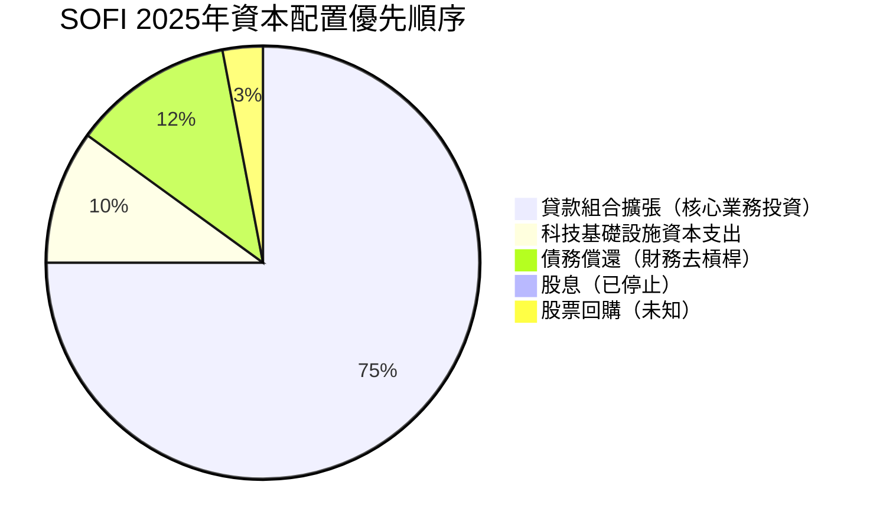

**資本配置評語：**
- ✅ 停止股息支付（從2024年$16.5M到2025年$0），保留現金加速成長
- ✅ 資本支出從$103M增至$251M（+142%），積極投資技術基礎設施
- ✅ 持續削減高成本債務（$3.20B→$1.93B）
- ⚠️ 尚無系統性股票回購計畫

---

## 6. 獲利能力與資本效率

### 📐 ROE / ROA / ROIC 趨勢

| 年度 | ROE | ROA | 淨利率 | 行業 ROE 均值 | 行業 ROA 均值 | 狀態 |
|------|-----|-----|--------|--------------|--------------|------|
| 2022 | **-57.9%** | -1.7% | -20.4% | 11.0% | 1.2% | 🔴 嚴重虧損 |
| 2023 | **-54.2%** | -1.0% | -14.3% | 11.0% | 1.2% | 🔴 改善中 |
| 2024 | **+7.6%** | +1.4% | +19.1% | 12.0% | 1.5% | 🟡 首次正值 |
| 2025 | **+5.7%** | +1.1% | +13.4% | 12.0% | 1.5% | 🟡 低於行業均值 |

---

### ⚖️ ROIC vs WACC 分析（核心價值創造評估）

```
ROIC vs WACC 計算框架
━━━━━━━━━━━━━━━━━━━━━━━━━━━━━━━━━━━━━━━━━━━━━━━━━━━━━━━━

📊 WACC 估算：
   無風險利率 (Rf)    = 4.3%（10年期美債）
   市場風險溢酬 (ERP) = 5.5%
   Beta               = 2.178
   股權成本 Ke = 4.3% + 2.178 × 5.5% = 16.3%
   
   債務成本 Kd        ≈ 5.8%（估算）
   稅率               ≈ 21%
   稅後債務成本       = 5.8% × (1-21%) = 4.6%
   
   資本結構（按市值）：
   股本  $25.01B / ($25.01B + $1.94B) = 92.8%
   債務  $1.94B / ($25.01B + $1.94B) = 7.2%
   
   WACC = 16.3% × 92.8% + 4.6% × 7.2% ≈ 15.4%

📊 ROIC 估算（2025年）：
   NOPAT = 淨利 $481M + 利息費用×(1-稅率) ≈ $520M
   投入資本 = 股東權益 + 有息負債 ≈ $12.42B
   ROIC = $520M / $12.42B ≈ 4.2%

━━━━━━━━━━━━━━━━━━━━━━━━━━━━━━━━━━━━━━━━━━━━━━━━━━━━━━━━
⚠️ EVA 分析：
   ROIC (4.2%) < WACC (15.4%)
   經濟增值 (EVA) = 負值
   
   結論：目前 SOFI 仍在【摧毀】股東經濟價值
   
   ROIC     ████░░░░░░░░░░░░  4.2%
   WACC     ████████████████  15.4%
   差距            -11.2 個百分點 🔴
   
   ✅ 但趨勢正向：ROIC 從 2022 年 -20%+ 持續改善
   🎯 若前瞻 EPS $0.79 實現，ROIC 預計提升至 ~8-9%
━━━━━━━━━━━━━━━━━━━━━━━━━━━━━━━━━━━━━━━━━━━━━━━━━━━━━━━━
```

---

### 🔬 DuPont 三因子分解（ROE）

| 年度 | 淨利率 | 資產週轉率 | 財務槓桿 | ROE = A×B×C |
|------|--------|----------|---------|------------|
| 2023 | -14.3% | 0.070x | 5.41x | **-54.2%** 🔴 |
| 2024 | +19.1% | 0.072x | 5.55x | **+7.6%** 🟡 |
| 2025 | +13.4% | 0.071x | 4.83x | **+5.7%** 🟡 |

**DuPont 分析解讀：**
- 📉 ROE 從 7.6% 降至 5.7%：**淨利率下滑（19.1%→13.4%）+ 槓桿降低（去槓桿化）**
- ✅ 資產週轉率穩定（~0.071x），銀行業屬正常
- ⚠️ 淨利率下滑為主要拖累因素，需關注2026年能否回升至15%+

---

### 📊 獲利能力儀表板

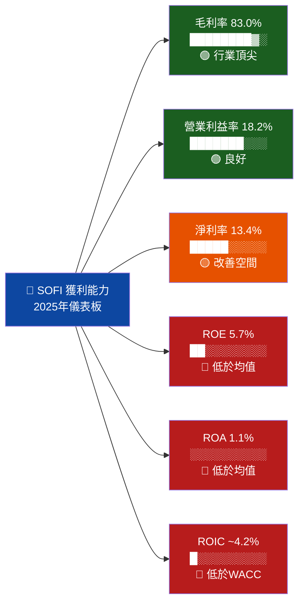

---

## 7. 估值深度分析

### 🔍 同業估值比較表格

| 指標 | **SOFI** | **Ally Financial (ALLY)** | **LendingClub (LC)** | **Upstart (UPST)** | 評估 |
|------|----------|--------------------------|--------------------|--------------------|------|
| 市值 | $25.01B | ~$9.5B | ~$1.8B | ~$5.5B | - |
| P/E (Forward) | **24.8x** | ~8.5x | ~14.2x | ~45x | 🟡 偏高 |
| P/S 比率 | **6.98x** | ~1.1x | ~2.8x | ~8.5x | 🟡 偏高 |
| P/B 比率 | **2.38x** | ~0.9x | ~1.5x | ~6.0x | 🟡 溢價 |
| EV/EBITDA | N/A | ~8.2x | ~9.5x | N/A | 🔴 無法比較 |
| 收入成長 YoY | **+38.3%** | ~+5% | ~+15% | ~+60% | 🟢 強勁 |
| 淨利率 | **13.4%** | ~12% | ~11% | ~5% | 🟢 良好 |
| ROE | **5.7%** | ~9.0% | ~8.0% | ~10%* | 🔴 偏低 |
| Beta | **2.178** | 1.2 | 1.8 | 2.8 | 🔴 高波動 |
| 分析師評級 | **Hold** | Buy | Buy | Hold | 🟡 中性 |

> *估算值；競爭對手數據為截至2026年2月估算

**同業估值總結：**
- 🔴 **SOFI 的 P/S 6.98x 遠高於 Ally 的 1.1x**，反映其「成長溢價」
- 🟡 **相較 Upstart (P/S 8.5x)**，SOFI 估值相對合理，但商業模式更成熟
- 🟢 **38.3% 收入成長率遠超同業**，支撐部分估值溢價

---

### 📈 歷史估值區間分析

```
SOFI 歷史 P/S 區間分析（以 P/S 作為主要估值錨）
━━━━━━━━━━━━━━━━━━━━━━━━━━━━━━━━━━━━━━━━━━━━━━━━━━━━━━━━

歷史 P/S 估值區間（基於24個月股價/收入數據）：

極度高估 P/S > 10x  ░░░░░░░░░░░░░░░░░░░░░░░░░░░  【2021年高峰期】
高估     P/S 8-10x  ░░░░░░░░░░░░░░░░░░░░░░░░░░░  
偏高     P/S 6-8x   ████████████████████████████  ← 目前 P/S 6.98x
合理     P/S 4-6x   ████████████████████████████
偏低     P/S 2-4x   ████████████████████████████  【2024年低點期間】
極度低估 P/S < 2x   ████░░░░░░░░░░░░░░░░░░░░░░░░

目前位置：▲ P/S = 6.98x（偏高區間下緣）
         股價 $19.61 隱含「合理至偏高」估值

目前前瞻 P/E = 24.8x
  低估區間 < 18x
  合理區間 18x - 28x  ← 目前所在
  高估區間 > 28x
━━━━━━━━━━━━━━━━━━━━━━━━━━━━━━━━━━━━━━━━━━━━━━━━━━━━━━━━
```

---

### 🧮 DCF 敏感性分析 — 目標價矩陣

**核心假設：**
- **基準情境**：2026-2028 收入成長 25%/20%/18%，淨利率 15-17%
- **樂觀情境**：2026-2028 收入成長 35%/30%/25%，淨利率 18-22%
- **悲觀情境**：2026-2028 收入成長 15%/12%/10%，淨利率 10-12%

| 成長情境 \ 折現率 (WACC) | **12%（較低）** | **15%（基準）** | **18%（較高）** |
|--------------------------|----------------|----------------|----------------|
| 🐂 **樂觀 (35% CAGR)** | **$42.00** 🟢 | **$35.00** 🟢 | **$28.00** 🟢 |
| 📊 **基準 (25% CAGR)** | **$32.00** 🟢 | **$26.50** 🟡 | **$20.00** 🟡 |
| 🐻 **悲觀 (12% CAGR)** | **$19.00** 🟡 | **$14.00** 🔴 | **$10.00** 🔴 |

> 終端成長率假設 = 3.0%；EPS 2026E = $0.79 為主要基準

**現價 $19.61 對應隱含報酬：**
- 樂觀情境基準 WACC：+78.5% 上行
- 基準情境基準 WACC：+35.1% 上行  ← **分析師目標價 $26.50 佐證**
- 悲觀情境基準 WACC：-28.6% 下行

---

### 📊 估值區間視覺化

```
估值合理性光譜 — 現價 $19.61
━━━━━━━━━━━━━━━━━━━━━━━━━━━━━━━━━━━━━━━━━━━━━━━━━━━━━━━━

嚴重低估    低估       合理區間        偏高     嚴重高估
$8        $12        $18    $28      $35      $45+
 │─────────│──────────│──────↑───────│─────────│
                           $19.61
                         (目前位置)
                          合理區間下緣

低估區     ░░░░░░░░░░░░░░░░ $8-$18
合理區     ████████████████ $18-$28  ← 目前位於此區
偏高區     ████████░░░░░░░░ $28-$35
高估區     ░░░░░░░░░░░░░░░░ $35+

結論：$19.61 處於「合理估值下緣」，具備一定安全邊際
━━━━━━━━━━━━━━━━━━━━━━━━━━━━━━━━━━━━━━━━━━━━━━━━━━━━━━━━
```

---

## 8. 成長催化劑

### 📅 催化劑時間軸

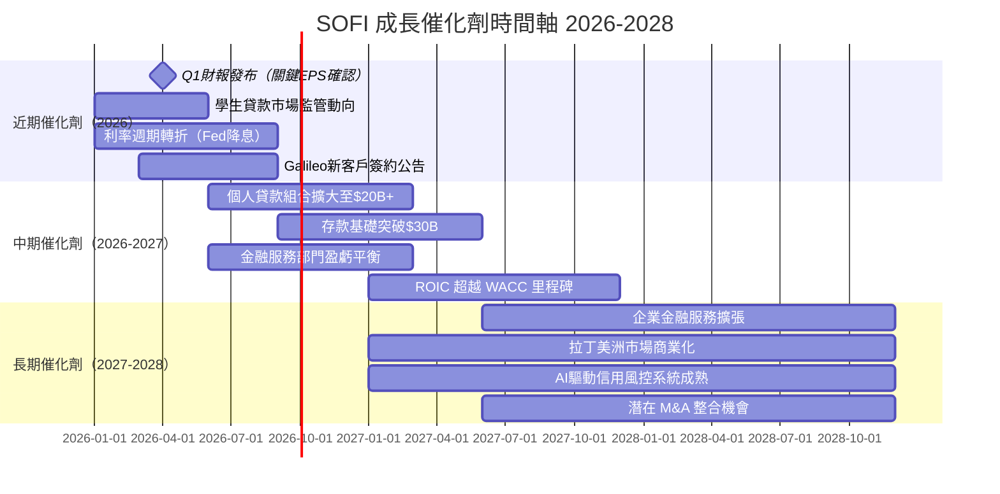

---

### 🎯 TAM 市場規模分析

```
可服務市場規模（TAM）分析 2025-2030
━━━━━━━━━━━━━━━━━━━━━━━━━━━━━━━━━━━━━━━━━━━━━━━━━━━━━━━━

美國個人金融服務 TAM
────────────────────────────────────────────────────────
個人貸款市場          $300B  ██████████████████░░  SOFI 滲透率 ~5%
學生貸款再融資        $150B  █████████░░░░░░░░░░░  SOFI 滲透率 ~8%
房屋貸款市場          $2.5T  █░░░░░░░░░░░░░░░░░░░  SOFI 滲透率 <1%
數位銀行存款          $800B  ██████░░░░░░░░░░░░░░  SOFI 滲透率 ~3%
BaaS/Galileo 市場     $20B   ████████████░░░░░░░░  SOFI 市占率 ~15%
投資/財富管理         $1.2T  ░░░░░░░░░░░░░░░░░░░░  SOFI 滲透率 <0.5%

總 TAM ≈ $5.0T+（2025年估算）
SOFI 目前收入 $3.61B = TAM 滲透率 < 0.1%

💡 成長空間巨大，關鍵在於執行力與資本效率
━━━━━━━━━━━━━━━━━━━━━━━━━━━━━━━━━━━━━━━━━━━━━━━━━━━━━━━━
```

---

### 🚀 成長驅動力架構

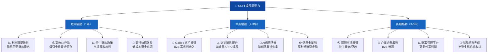

---

## 9. 風險矩陣

### ⚠️ 風險評分矩陣

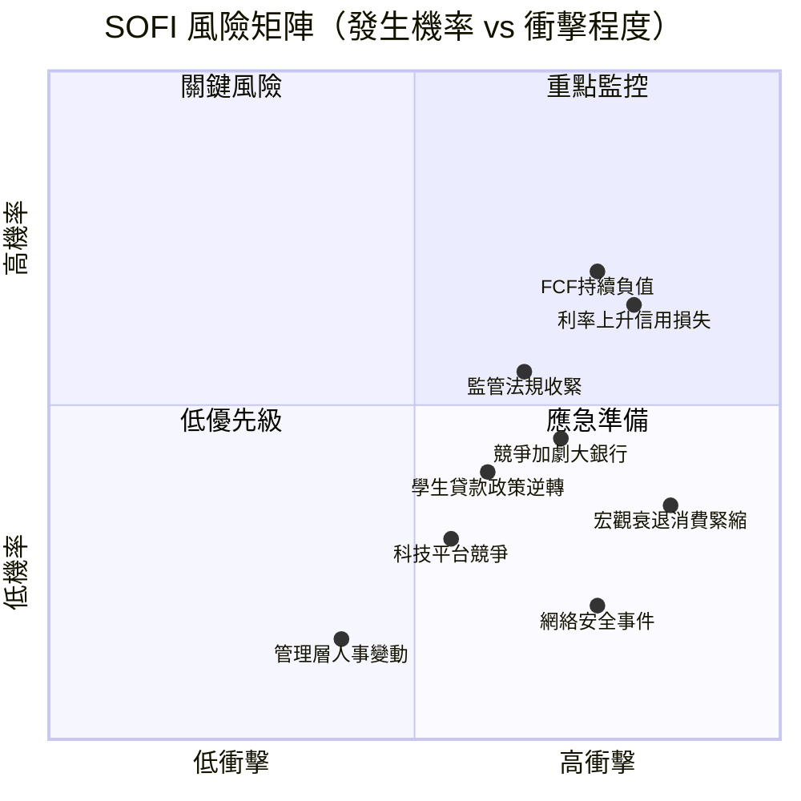

---

### 📋 風險清單完整評估

| 風險類別 | 具體風險 | 發生機率 | 衝擊程度 | 風險評分 | 緩解措施 |
|---------|---------|---------|---------|---------|---------|
| 🔴 **宏觀金融** | 信用損失率上升（利率高企） | 高 70% | 高 ★★★★★ | **9/10** | 審慎貸款標準、備用貸款損失準備 |
| 🔴 **現金流** | FCF 持續大幅為負 | 高 70% | 高 ★★★★☆ | **8/10** | 存款基礎擴大、資本市場融資 |
| 🔴 **監管** | CFPB 監管收緊/消費金融限制 | 中 50% | 高 ★★★★☆ | **7/10** | 聯邦銀行執照合規框架 |
| 🟡 **競爭** | 大型傳統銀行加速數位化 | 中 55% | 中 ★★★☆☆ | **6/10** | 持續技術投資、差異化定位 |
| 🟡 **政策** | 學生貸款免除計畫政策逆轉 | 中 40% | 中 ★★★☆☆ | **5/10** | 業務多元化（非學貸依賴） |
| 🟡 **估值** | 高 Beta 市場波動加劇 | 高 65% | 中 ★★★☆☆ | **6/10** | 業績持續超預期 |
| 🟢 **技術** | Galileo 技術競爭替代 | 低 25% | 中 ★★★☆☆ | **4/10** | 持續研發投入 |
| 🟢 **營運** | 關鍵人才流失 | 低 20% | 低 ★★☆☆☆ | **3/10** | 股權激勵計畫 |
| 🟢 **資安** | 數據洩露/網路攻擊 | 低 20% | 高 ★★★★☆ | **5/10** | 多層次資安基礎設施 |

---

## 10. 投資建議

### 🎯 最終綜合評級儀表板

```
SOFI 多維度投資評分（1-10分）
━━━━━━━━━━━━━━━━━━━━━━━━━━━━━━━━━━━━━━━━━━━━━━━━━━━━━━━━

收入成長性    ████████░░  8.0/10  ★ 38.3% YoY成長，行業領先
盈利能力      █████░░░░░  5.5/10  ✓ 首次年度盈利，但ROE偏低
財務健康      █████░░░░░  5.5/10  ✓ 淨現金正值，FCF持續為負
估值合理性    █████░░░░░  5.0/10  ≈ 合理區間，無明顯折價
管理層品質    ██████░░░░  6.0/10  ✓ 執行力可，資本配置待驗證
競爭護城河    ██████░░░░  6.0/10  ✓ Galileo差異化，但仍在建立
產業趨勢      ███████░░░  7.0/10  ✓ 金融科技長期空間巨大
風險控制      ████░░░░░░  4.5/10  ⚠ FCF/信用風險/高Beta
市場情緒      █████░░░░░  5.5/10  ≈ 分析師多空分歧，Hold為主
催化劑能見度  ██████░░░░  6.5/10  ✓ 2026降息週期+EPS成長預期

━━━━━━━━━━━━━━━━━━━━━━━━━━━━━━━━━━━━━━━━━━━━━━━━━━━━━━━━
加權綜合評分：5.9 / 10
━━━━━━━━━━━━━━━━━━━━━━━━━━━━━━━━━━━━━━━━━━━━━━━━━━━━━━━━
```

**Unicode 雷達圖：**
```
                    成長性 [8.0]
                      ▲
                      │ * * *
          風險控制  ◄──┼────────►  盈利能力
           [4.5]      │            [5.5]
                * *   │   * *
                      │
          財務健康  ◄──┼────────►  估值合理
           [5.5]      │            [5.0]
                      │
                      ▼
                  護城河 [6.0]

平均分：5.9/10 — 中等偏上，具備成長潛力但需驗證
```

---

### 🎯 目標價與隱含報酬率

| 情境 | 目標價 | 現價隱含報酬 | 主要假設 | 時間框架 |
|------|--------|------------|---------|---------|
| 🐂 **樂觀** | **$32.00** | **+63.2%** | FY2026 EPS $1.0+，降息加速，FCF轉正 | 12-18個月 |
| 📊 **基準** | **$26.50** | **+35.1%** | FY2026 EPS $0.79，P/E 33x，持續成長 | 12個月 |
| 🐻 **悲觀** | **$14.00** | **-28.6%** | 信用損失惡化，成長放緩，估值壓縮 | 6-12個月 |

---

### ✅ 買入時機與觸發因素

```
買入觸發清單（Checklist）
━━━━━━━━━━━━━━━━━━━━━━━━━━━━━━━━━━━━━━━━━━━━━━━━━━━━━━━━

必要條件（任2項成立即可考慮建倉）：
☐ 1. Q1 2026 財報 EPS 超預期（> $0.20/股）
☐ 2. 股價回落至 $16-17 區間（更佳安全邊際）
☐ 3. 聯準會明確降息路徑（≥2次）
☐ 4. FCF 轉正信號出現（季度首次）
☐ 5. Galileo 重大新客戶公告

加分條件（強化持有信念）：
☐ 6. 全年 EPS 指引上調
☐ 7. 信貸品質改善（逾期率下降）
☐ 8. 金融服務部門達盈虧平衡
☐ 9. 機構持股比例持續提升（現56.1%）
☐ 10. 分析師評級上調為Buy（現JP Morgan、Citizens已上調）

停損條件（出現即重新評估）：
⛔ A. 季度 EPS 連續2季不及預期
⛔ B. 信貸損失準備金大幅增加 > 20% QoQ
⛔ C. 股價跌破 $14（悲觀情境價值）
⛔ D. 重大監管處罰/調查
━━━━━━━━━━━━━━━━━━━━━━━━━━━━━━━━━━━━━━━━━━━━━━━━━━━━━━━━
```

---

### 👥 投資人適配度分析

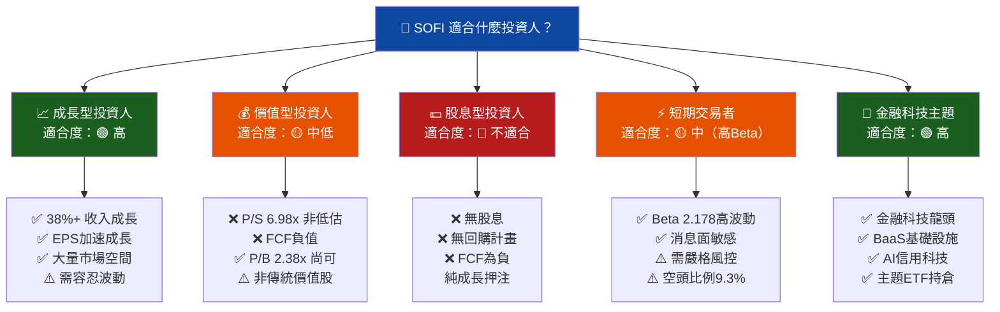

---

### 🔭 關鍵監控指標 Checklist

```
下次財報前關鍵監控項目
━━━━━━━━━━━━━━━━━━━━━━━━━━━━━━━━━━━━━━━━━━━━━━━━━━━━━━━━

📅 財報監控（Q1 2026，預計2026年4月末）：
☐ 季度 EPS 絕對值（目標 > $0.18）
☐ 收入季增率（目標 QoQ > +7%）
☐ 調整後淨利潤率趨勢（目標維持 > 13%）
☐ 信貸損失準備金佔貸款比率（目標穩定）
☐ 全年 FY2026 EPS 指引（$0.79 為當前預期）

📊 業務指標監控（月度/季度）：
☐ 總會員人數成長（季度增幅）
☐ 每會員平均產品數量（交叉銷售效率）
☐ Galileo 帳戶處理量（科技平台健康度）
☐ 淨利差（Net Interest Margin）趨勢
☐ 不良貸款率（NPL Ratio）變化

🏛️ 宏觀/監管監控：
☐ 聯準會利率決策（每次FOMC會議）
☐ CFPB 消費金融監管動向
☐ 學生貸款政策最新進展（政府政策）
☐ 整體信用卡逾期率行業趨勢

🏦 競爭動態監控：
☐ Chime / Ally / Upstart 季度業績
☐ 大型銀行數位化進展（Chase, BofA）
☐ Galileo 技術競爭對手動向（Marqeta, Stripe）
━━━━━━━━━━━━━━━━━━━━━━━━━━━━━━━━━━━━━━━━━━━━━━━━━━━━━━━━
```

---

## 📊 報告總結

```
╔══════════════════════════════════════════════════════════════════╗
║              SOFI 投資評估最終結論                                ║
║                                                                  ║
║  ┌─────────────────────────────────────────────────────────┐    ║
║  │  評級：⚖️ 持有（HOLD）/ 逢低分批觀察建倉                  │    ║
║  │  現價：$19.61 | 目標價（基準）：$26.50 (+35.1%)          │    ║
║  └─────────────────────────────────────────────────────────┘    ║
║                                                                  ║
║  ✅ 核心多頭論點：                                                ║
║     • 收入以 38.3% YoY 加速成長，季度破 $10億里程碑              ║
║     • 2022-2025 完成虧損→盈利的完整轉型                          ║
║     • Galileo 科技平台構建差異化護城河                            ║
║     • 前瞻 EPS $0.79（YoY +103%）成長催化劑強勁                  ║
║                                                                  ║
║  ⚠️ 核心風險：                                                   ║
║     • ROIC (4.2%) < WACC (15.4%)，仍在摧毀經濟價值              ║
║     • FCF -$3.99B，現金消耗加速（雖有銀行業特性解釋）            ║
║     • 盈餘 YoY -57% 訊號矛盾，需Q1確認成長恢復                   ║
║     • Beta 2.178，市場波動放大效應顯著                            ║
║                                                                  ║
║  📌 最佳進場區間：$16.00 - $18.00                                ║
║  📌 停損參考線：$14.00 以下                                       ║
║  📌 核心持有理由：前瞻 P/E 24.8x 搭配 103% EPS 成長 = PEG < 0.25 ║
╚══════════════════════════════════════════════════════════════════╝
```

---

> **⚖️ 免責聲明**：本報告由 AI 依據公開財務數據自動生成，所有分析、估值及預測僅供學術研究參考之用，不構成任何投資建議。股票投資涉及市場風險，過往績效不代表未來表現。投資決策前請諮詢持牌財務顧問，並根據個人風險承受能力做出判斷。本報告所引用之同業數據部分為估算值，實際數字可能存在差異。
>
> **📅 報告完成日期**：2026年2月25日 ｜ **分析框架**：CFA基本面分析方法論 ｜ **數據截止**：2026年2月25日