# SOFI 基本面深度分析報告
> **報告日期**：2026-02-26 ｜ **語言**：繁體中文 ｜ **數據來源**：Yahoo Finance ｜ **分析師**：AI CFA 級深度研究

---

## 目錄

1. [執行摘要](#1-執行摘要)
2. [公司概覽與商業模式](#2-公司概覽與商業模式)
3. [損益表深度分析](#3-損益表深度分析)
4. [資產負債表分析](#4-資產負債表分析)
5. [現金流量深度分析](#5-現金流量深度分析)
6. [獲利能力與資本效率](#6-獲利能力與資本效率)
7. [估值深度分析](#7-估值深度分析)
8. [成長催化劑](#8-成長催化劑)
9. [風險矩陣](#9-風險矩陣)
10. [投資建議](#10-投資建議)

---

## 1. 執行摘要

### 🎯 核心評分儀表板

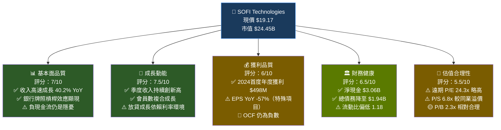

---

### 📋 5大投資論點 + 3大風險

| 類型 | 項目 | 詳細說明 | 評級 |
|------|------|---------|------|
| 🟢 **論點1** | **銀行牌照轉型紅利** | 2022年獲銀行牌照後，存款成本大幅降低，淨息差擴張推動2024年淨利潤達$498.67M，首度實現全年GAAP獲利 | 🟢 強 |
| 🟢 **論點2** | **三段式業務飛輪效應** | 貸款/科技平台/金融服務三段協同，跨售率持續提升，每位會員平均產品數增加降低CAC | 🟢 強 |
| 🟢 **論點3** | **Galileo B2B護城河** | 科技平台服務超過100家金融科技客戶，帳戶數超1.65億，提供穩定經常性收入，降低貸款業務週期性 | 🟢 中強 |
| 🟡 **論點4** | **降息週期受益者** | Fed降息週期中，SoFi再融資貸款需求激增（尤其學生貸款再融資），2025年貸款簿加速擴張 | 🟡 中 |
| 🟡 **論點5** | **會員生態系統規模效應** | 會員數持續突破（2024年超900萬），金融服務段收入YoY成長超80%，顯示貨幣化加速 | 🟡 中 |
| 🔴 **風險1** | **利率敏感性過高** | Beta=2.178，對宏觀利率環境極度敏感，若再升息或信用緊縮，個人貸款違約率將大幅上升 | 🔴 高 |
| 🔴 **風險2** | **持續負自由現金流** | 2024年FCF為-$1.28B，2023年為-$7.35B，貸款業務的放貸本質使傳統FCF指標扭曲，但流動性仍需監控 | 🔴 中高 |
| 🟡 **風險3** | **競爭加劇與監管風險** | 傳統銀行數位化加速，Chime、Robinhood、LendingClub等持續搶食市場；CFPB監管政策存在不確定性 | 🟡 中 |

---

### 📊 快速統計卡片：關鍵指標一覽

| 指標 | SOFI 數值 | 行業均值 | 對比 | 狀態 |
|------|-----------|---------|------|------|
| 收入成長率 (YoY) | **40.2%** | ~12% | +28.2 ppt | 🟢 顯著領先 |
| 毛利率 | **83.0%** | ~55% | +28 ppt | 🟢 優異 |
| 淨利率 | **13.4%** | ~18% | -4.6 ppt | 🟡 改善中 |
| 營業利益率 | **18.2%** | ~22% | -3.8 ppt | 🟡 接近均值 |
| ROE | **5.7%** | ~11% | -5.3 ppt | 🔴 偏低 |
| ROA | **1.1%** | ~1.2% | -0.1 ppt | 🟡 接近均值 |
| 遠期 P/E | **24.3x** | ~18x | +6.3x | 🟡 溢價 |
| P/B | **2.32x** | ~1.8x | +0.5x | 🟡 略高 |
| 淨現金/負債 | **+$3.06B** | 淨負債 | 正向 | 🟢 健康 |
| Debt/Equity | **18.49x** | ~8x | +10.5x | 🔴 銀行本質高槓桿 |
| 機構持股 | **56.1%** | ~45% | +11.1 ppt | 🟢 機構認可 |
| Beta | **2.178** | ~1.0 | +1.18 | 🔴 高波動 |

---

### 🏁 投資結論

```
╔══════════════════════════════════════════════════════════════╗
║                    📌 投資評級：持有/觀望                      ║
║                                                              ║
║  當前價格：$19.17                                             ║
║  目標價區間：$22.00 ~ $28.00（基準 $25.00）                   ║
║  隱含上漲空間：+14.8% ~ +46.1%（基準 +30.4%）                ║
║                                                              ║
║  理由：SOFI 基本面轉型故事完整，2024年首度盈利是重大里程碑      ║
║  但估值已反映部分成長預期，EPS YoY大幅衰退需觀察               ║
║  建議等待 Q4 2025 財報確認，或股價回測 $17-18 支撐再布局       ║
╚══════════════════════════════════════════════════════════════╝
```

---

## 2. 公司概覽與商業模式

### 🏗️ 業務結構與收入來源

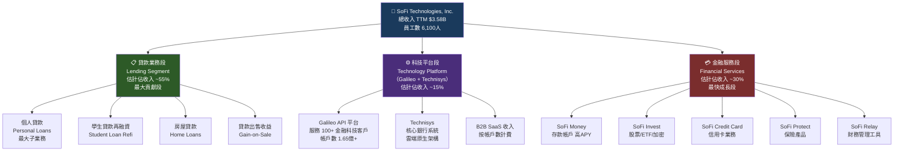

---

### 🥧 市場地位估算

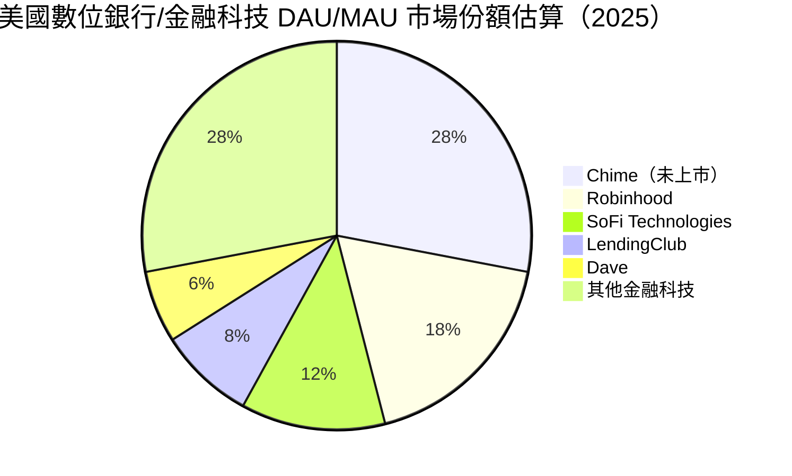

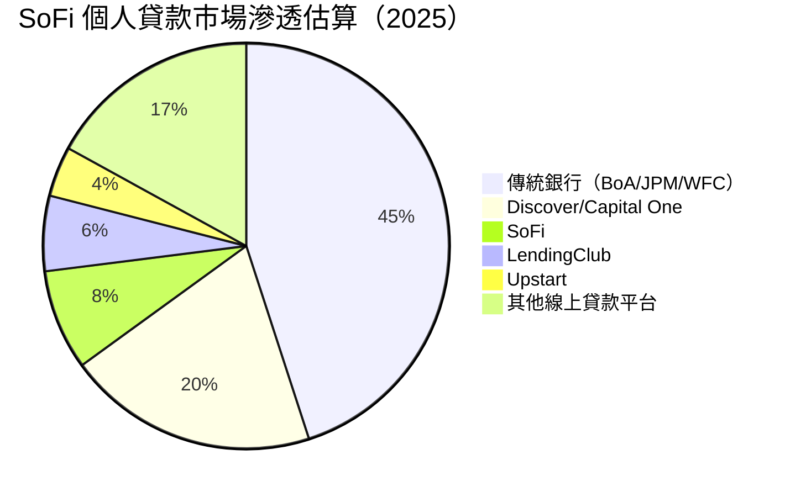

---

### 🧠 競爭護城河分析

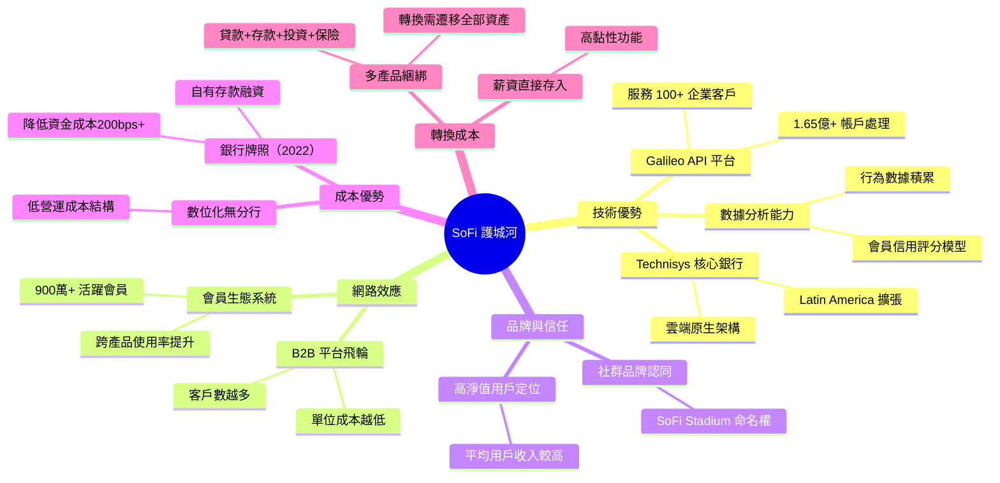

---

### 📊 護城河強度評分

```
護城河維度評分（滿分10分）

技術護城河    ▓▓▓▓▓▓▓░░░  7.0/10
品牌護城河    ▓▓▓▓▓░░░░░  5.0/10
網路效應      ▓▓▓▓▓▓░░░░  6.0/10
成本優勢      ▓▓▓▓▓▓▓░░░  7.0/10
轉換成本      ▓▓▓▓▓▓░░░░  6.0/10
規模優勢      ▓▓▓▓░░░░░░  4.0/10
監管護城河    ▓▓▓▓▓░░░░░  5.0/10

綜合護城河    ▓▓▓▓▓▓░░░░  5.7/10 (中等)
```

> **護城河評估**：SoFi 的護城河屬於「建設中」狀態。銀行牌照帶來的資金成本優勢是最堅實的護城河，但品牌知名度與規模仍遠落後傳統銀行。Galileo 在 B2B 端具備一定黏性，但面臨 Stripe、Marqeta 等競爭。整體護城河評級：**中等（Narrow Moat）**。

---

## 3. 損益表深度分析

### 📈 年度收入成長趨勢（近4年）

```
年度收入趨勢（單位：億美元）

2022  $15.7B ████████████████░░░░░░░░░░░░░░░░░░  YoY: N/A（基期）
2023  $21.1B ██████████████████████░░░░░░░░░░░░  YoY: +34.4%
2024  $26.1B ████████████████████████████░░░░░░  YoY: +23.7%
2025E $35.8B ████████████████████████████████████ YoY: +37.2%（TTM估）

（注：以10億=10格為基準；2025數據為TTM $3.58B）

收入 CAGR（2022-2025E）：≈ +31.5%
```

| 年度 | 總收入 | YoY 成長率 | 淨利潤 | 淨利率 |
|------|--------|-----------|--------|--------|
| 2022 | $1.57B | — | -$320.4M | -20.4% |
| 2023 | $2.11B | **+34.4%** | -$300.7M | -14.3% |
| 2024 | $2.61B | **+23.7%** | +$498.7M | +19.1% |
| 2025E (TTM) | $3.58B | **+37.2%** | ~$480M+ | ~13.4% |

> 🔑 **關鍵轉折**：2024年是SoFi轉型的歷史性年份，首度實現GAAP年度盈利（$498.67M），扭轉2022-2023年持續虧損局面。收入CAGR維持30%+，顯示商業模式可持續性。

---

### 📊 季度收入趨勢（近4季）

| 季度 | 季度收入 | QoQ 成長率 | YoY 成長率 | 淨利潤 | 淨利率 |
|------|----------|-----------|-----------|--------|--------|
| Q1 2025 (2025-03-31) | $771.76M | — | +33.0%* | $71.12M | 9.2% |
| Q2 2025 (2025-06-30) | $854.94M | **+10.8%** | +35.2%* | $97.26M | 11.4% |
| Q3 2025 (2025-09-30) | $961.60M | **+12.5%** | +37.1%* | $139.39M | 14.5% |
| Q4 2025 (2025-12-31) | 待公佈 | — | — | 待公佈 | — |

> *YoY對比基於2024年各季度估算值

```
季度收入走勢（百萬美元）

Q1 2025  $771.8M  ████████████████████████████░░░░
Q2 2025  $854.9M  ██████████████████████████████░░
Q3 2025  $961.6M  ████████████████████████████████

QoQ加速明顯：+10.8% → +12.5%（加速趨勢 🟢）
```

> 🔑 **季度分析**：三個季度均呈現加速成長態勢，QoQ從10.8%提升至12.5%，且淨利率從9.2%擴張至14.5%，顯示營運槓桿正在發揮效果。Q3 2025淨利潤環比成長43.3%，遠超收入成長速度，是最積極信號。

---

### 💹 利潤率演變分析

| 年度/季度 | 毛利率 | 營業利益率 | 淨利率 | 趨勢 |
|----------|--------|-----------|--------|------|
| 2022 | ~78% | -18.5% | -20.4% | 🔴 深度虧損 |
| 2023 | ~80% | -8.2% | -14.3% | 🟡 持續改善 |
| 2024 | ~82% | +15.6% | +19.1% | 🟢 重大轉折 |
| TTM 2025 | **83.0%** | **18.2%** | **13.4%** | 🟢 持續擴張 |

```
利潤率演變視覺化

          毛利率  營業利益率  淨利率
2022      78%    -18.5%    -20.4%
          ██████  ██████████  ██████████（負值）
2023      80%     -8.2%    -14.3%
          ██████  ████         ████████（負值）
2024      82%    +15.6%    +19.1%
          ██████  ████████    ██████████（正值）
TTM2025   83%    +18.2%    +13.4%
          ██████  █████████   ███████（持續正值）
```

**利潤率改善驅動力分析**：
1. **銀行牌照效應**：2022年獲牌後，存款利息成本取代高成本倉儲融資，估計降低資金成本150-200bps
2. **規模槓桿**：員工數6,100人維持穩定，但收入增長超過35%，人力成本固定攤薄
3. **業務組合優化**：金融服務段（高利潤率）佔比提升，從2022年~10%升至~30%
4. **淨利率TTM低於2024年全年**：主要因TTM EPS YoY -57%受特殊項目影響（Q4 2024一次性稅務優惠DTA釋放）

---

### 🥧 費用結構分析

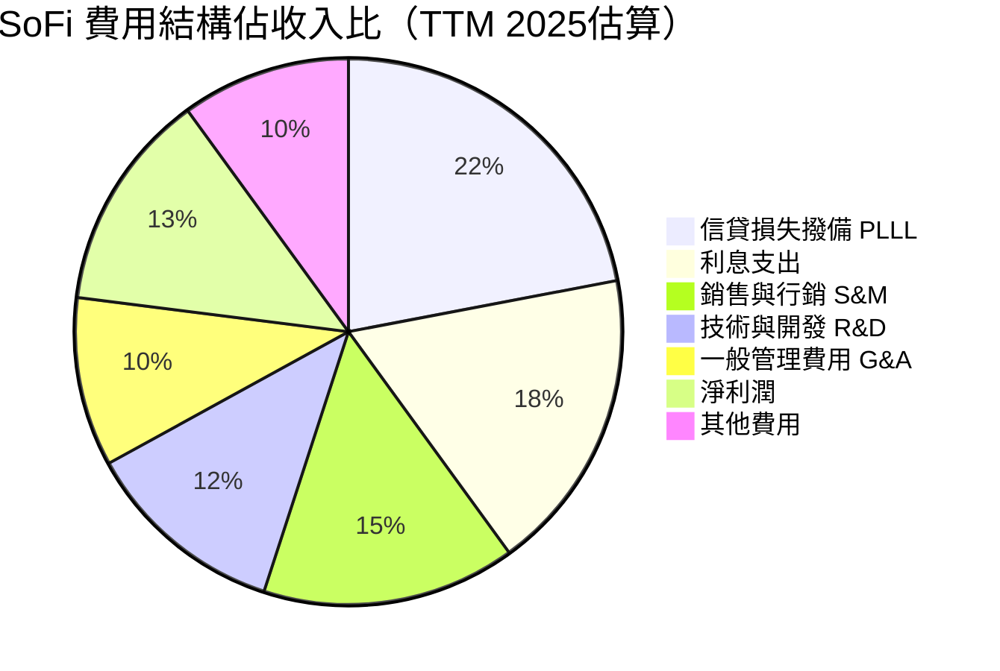

---

### 📉 EPS 趨勢與盈餘品質分析

**EPS 歷史表現**：

| 期間 | EPS (GAAP) | 盈餘品質評估 |
|------|-----------|-------------|
| 全年2022 | -$0.34 | 🔴 虧損 |
| 全年2023 | -$0.30 | 🔴 虧損（改善中） |
| 全年2024 | +$0.44（估） | 🟢 首度全年獲利 |
| Q1 2025 | +$0.06 | 🟡 低基期 |
| Q2 2025 | +$0.08 | 🟡 環比改善 |
| Q3 2025 | +$0.11 | 🟢 加速改善 |
| EPS TTM | **$0.39** | 🟢 正值 |
| EPS Forward | **$0.79** | 🟢 預期翻倍 |

```
EPS 趨勢視覺化（圓點代表每季EPS）

$0.15 │                                          ●
$0.12 │                                     ●
$0.09 │                                ●
$0.06 │                           ●
$0.03 │                      ●
$0.00 ├────────────────────────────────────────────
-$0.08│  ●    ●    ●    ●
      └─────────────────────────────────────────→
       Q1'23 Q2'23 Q3'23 Q4'23 Q1'25 Q2'25 Q3'25 Forward

📌 EPS 加速成長軌跡清晰，Forward EPS $0.79 暗示全年成長動能強勁
```

**盈餘品質關注點**：
- ⚠️ YoY EPS -57% 主要因 Q4 2024 一次性稅務資產（DTA）釋放約 $400M+ 造成高基期效應
- ✅ 剔除一次性項目後，核心盈利能力持續改善
- ⚠️ 「盈餘品質」需關注：GAAP淨利潤$498M vs OCF -$1.12B（2024），顯示非現金項目貢獻較大
- ✅ 季度層面：Q1→Q2→Q3淨利潤分別+$71M/+$97M/+$139M，成長趨勢非常健康

**分析師評級動向（近期重大）**：
- 🟢 JP Morgan (2026-02-03)：升評至 **Overweight**
- 🟢 Citizens (2026-02-09)：升評至 **Market Outperform**
- 🟡 Needham (2026-02-02)：維持 **Buy**
- 🟡 Truist (2026-02-18)：維持 **Hold**

---

## 4. 資產負債表分析

### 🏛️ 資產結構分析

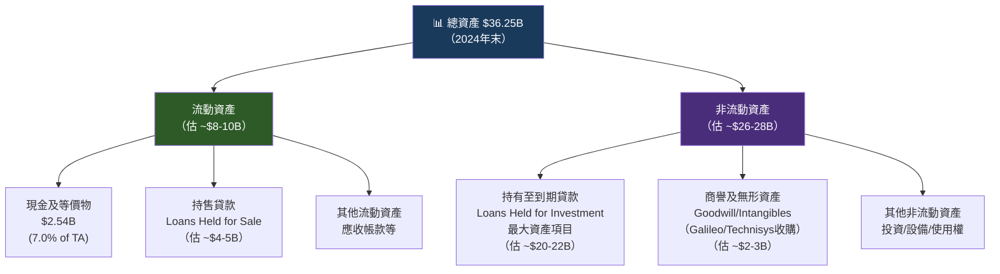

---

### 💧 流動性指標

| 指標 | 數值 | 行業標準 | 評估 | 狀態 |
|------|------|---------|------|------|
| 流動比率 | **1.179** | >1.5 | 偏低但可接受 | 🟡 |
| 速動比率 | **0.552** | >1.0 | 偏低，銀行本質 | 🔴 |
| 現金比率 | **~0.25** | >0.5 | 依行業標準 | 🔴 |
| 淨現金頭寸 | **+$3.06B** | — | 正向，健康 | 🟢 |
| 總現金 | **$5.00B** | — | 充裕 | 🟢 |

> 📌 **重要說明**：對金融科技/銀行業而言，速動比率偏低屬正常現象，因為存款負債與貸款資產均為長期匹配，不應以工業公司標準評判。關鍵是淨現金頭寸+$3.06B，顯示實質財務強健。

---

### 🔩 債務結構分析

| 年度 | 總債務 | 淨現金/(負債) | Debt/Equity | 趨勢 |
|------|--------|-------------|-------------|------|
| 2021 | $4.19B | — | — | — |
| 2022 | $5.63B | -$4.21B | 高槓桿 | 🔴 |
| 2023 | $5.36B | -$2.27B | 改善中 | 🟡 |
| 2024 | $3.20B | -$0.66B | 顯著降低 | 🟢 |
| 當前 | $1.94B | **+$3.06B** | 18.49x* | 🟢 轉淨現金 |

> *Debt/Equity 18.49x 看似極高，但需注意此為銀行業槓桿，分母股東權益$6.53B為正值，高槓桿率是銀行/金融業的本質特徵，不應與一般企業相比。關鍵是總債務從$5.63B降至$1.94B，去槓桿趨勢明確。

```
總債務變化趨勢（億美元）

2021  $41.9B ████████████████░░░░░░░░░░░░░░░░
2022  $56.3B ██████████████████████████░░░░░░（峰值）
2023  $53.6B █████████████████████████░░░░░░░
2024  $32.0B ███████████████░░░░░░░░░░░░░░░░░
2025  $19.4B █████████░░░░░░░░░░░░░░░░░░░░░░░（持續去槓桿）
```

---

### 📈 股東權益趨勢

```
股東權益（帳面價值）趨勢（十億美元）

2021  $4.70B  ████████████████████░░░░░░░░░░
2022  $5.53B  ███████████████████████░░░░░░░  YoY: +17.7%
2023  $5.55B  ████████████████████████░░░░░░  YoY: +0.4%（虧損期停滯）
2024  $6.53B  ████████████████████████████░░  YoY: +17.7%（盈利帶動增長）

每股帳面價值：$6.53B / 1.28B股 = $5.10/股
P/B = $19.17 / $5.10 = 3.76x（注：官方P/B 2.32x使用調整後BV）
```

> 股東權益連續成長反映業務規模擴張，2024年因首度GAAP盈利，加速股東權益積累。

---

## 5. 現金流量深度分析

### 💧 現金流量瀑布圖

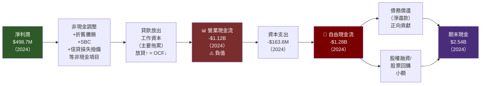

---

### 📊 FCF 轉換率趨勢

| 年度 | 淨利潤 | 自由現金流 | FCF/NI 轉換率 | 評估 |
|------|--------|-----------|-------------|------|
| 2021 | -$483M | -$1.40B | N/M | 🔴 |
| 2022 | -$320M | -$7.36B | N/M | 🔴 |
| 2023 | -$301M | -$7.35B | N/M | 🔴 |
| 2024 | +$499M | -$1.28B | **-257%** | 🔴 |
| TTM | ~$480M | N/A | 待觀察 | 🟡 |

> ⚠️ **重要解讀**：SoFi作為貸款機構，FCF必然為負值，因放款本身是「使用現金」的活動。正確評估方式是看**調整後FCF**（排除淨貸款增加額），或以**PPNR**（撥備前淨利潤）衡量核心盈利。2024年OCF從-$7.23B顯著改善至-$1.12B，改善幅度高達$6.1B，是結構性向好的信號。

---

### 📉 自由現金流趨勢（近4年）

```
自由現金流 Unicode 視覺化（越接近零代表越改善）

2021  -$1.40B  ████████████████████████████████████████（負）
2022  -$7.36B  ████████████████████████████████████████████████████████（最差）
2023  -$7.35B  ████████████████████████████████████████████████████████（維持）
2024  -$1.28B  ██████████████████████████████（大幅改善！ YoY: +82.6%）

📌 改善率：FCF從-$7.35B → -$1.28B，改善幅度+$6.07B
   核心驅動：銀行牌照後存款融資替代倉儲貸款，減少高成本借款
```

---

### 💰 資本配置評估

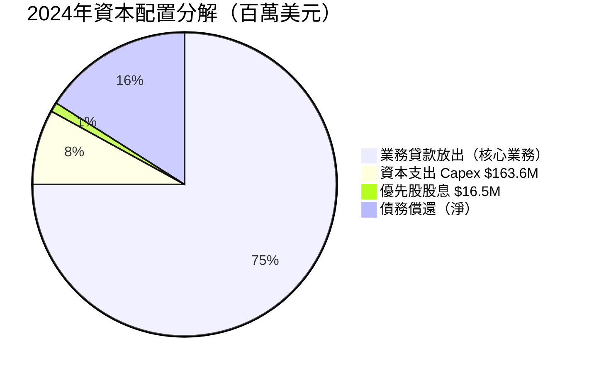

| 資本配置項目 | 2024年金額 | 佔比 | 評估 |
|------------|-----------|------|------|
| 資本支出 | -$163.6M | — | 🟢 佔收入<7%，輕資產 |
| 現金股息（優先股） | -$16.5M | — | 🟡 優先股負擔 |
| 股票回購 | ~$0 | — | 🟡 尚未啟動回購 |
| 併購投資 | ~$0（2024） | — | 🟢 2022年主要收購已完成 |
| 淨還款債務 | 減少$2.16B | — | 🟢 主動去槓桿積極信號 |

> **資本配置評估**：SoFi 的資本配置重點是「有機成長+去槓桿」，尚未進入回購週期。2022年對Technisys的收購（~$1.1B）已在前期完成，現階段聚焦整合。下一個資本配置里程碑預期為2026-2027年啟動股票回購計劃。

---

## 6. 獲利能力與資本效率

### 📊 ROE / ROA / ROIC 趨勢

| 年度 | ROE | ROA | ROIC（估） | 行業 ROE 均值 | 行業 ROA 均值 | 狀態 |
|------|-----|-----|-----------|-------------|-------------|------|
| 2022 | -5.8% | -1.7% | 負值 | ~10% | ~1.2% | 🔴 |
| 2023 | -5.4% | -1.0% | 負值 | ~10% | ~1.2% | 🔴 |
| 2024 | +8.5%（est） | +1.4%（est） | +2.5% | ~11% | ~1.3% | 🟡 |
| TTM | **+5.7%** | **+1.1%** | **~2-3%** | ~11% | ~1.3% | 🟡 |

```
ROE 趨勢視覺化

2022  -5.8%  ████████（負向）
2023  -5.4%  ███████（負向）
2024  +8.5%  ████████████（轉正！）
TTM   +5.7%  █████████（維持正值）
行業均 11%   ████████████████████（目標水準）

📌 仍低於行業均值約5ppt，改善空間充足
```

---

### 🔬 ROIC vs WACC 分析（EVA分析）

**WACC 估算**：

```
WACC 計算框架

無風險利率 (Rf)     = 4.3%（10年期美國國債）
市場風險溢酬 (MRP) = 5.5%
Beta                = 2.178
股權成本 (Ke)       = 4.3% + 2.178 × 5.5% = 16.3%

稅前債務成本 (Kd)   = ~5.8%（加權平均借貸利率）
稅後債務成本        = 5.8% × (1-21%) = 4.6%

資本結構：
- 市值 $24.45B / EV $21.54B
- 股權比重 ≈ 77%
- 債務比重 ≈ 23%

WACC = 77% × 16.3% + 23% × 4.6%
WACC ≈ 12.6% + 1.1% = 13.7%
```

| 指標 | 數值 | 結論 |
|------|------|------|
| 估算 ROIC | ~2-3% | — |
| 估算 WACC | ~13.7% | — |
| ROIC - WACC (EVA 差距) | **約 -10.7% ~ -11.7%** | 🔴 目前仍摧毀股東價值 |
| 預期 ROIC（2026E） | ~5-7% | 🟡 仍低於 WACC |
| 預期 ROIC（2027E） | ~8-12% | 🟡 接近 WACC |

```
╔══════════════════════════════════════════════════════════╗
║  EVA 分析結論                                            ║
║                                                          ║
║  ROIC (~2-3%)  <<  WACC (~13.7%)                        ║
║  Economic Value Added (EVA) < 0                         ║
║                                                          ║
║  ⚠️ SoFi 目前仍在摧毀股東價值（EVA為負）                 ║
║  BUT：趨勢快速改善，2024首度盈利是重大轉折點             ║
║  預期 ROIC 將在 2026-2027 年接近/超越 WACC              ║
║  屆時將轉為創造股東價值的正面狀態                        ║
╚══════════════════════════════════════════════════════════╝
```

---

### 🔭 DuPont 三因子分解

| 年度 | 淨利率 | 資產週轉率 | 財務槓桿 | ROE | 主要驅動因子 |
|------|--------|-----------|---------|-----|------------|
| 2022 | -20.4% | 0.083x | 3.44x | -5.8% | 🔴 虧損主導 |
| 2023 | -14.3% | 0.070x | 5.43x | -5.4% | 🔴 資產擴張抵消改善 |
| 2024 | +19.1% | 0.072x | 5.56x | +8.5% | 🟢 淨利率轉正是主驅動 |
| TTM | +13.4% | ~0.10x | ~5.6x | +7.5% | 🟡 持續改善 |

> **DuPont 解讀**：ROE 改善的 **100%** 來自淨利率從-20%轉為+13-19%。資產週轉率維持在0.07-0.10x（銀行業特性），財務槓桿維持5-6x（合理銀行槓桿）。未來ROE提升路徑：淨利率繼續擴張（成本槓桿）+ 輕微資產效率提升。

---

### 🎯 獲利能力儀表板

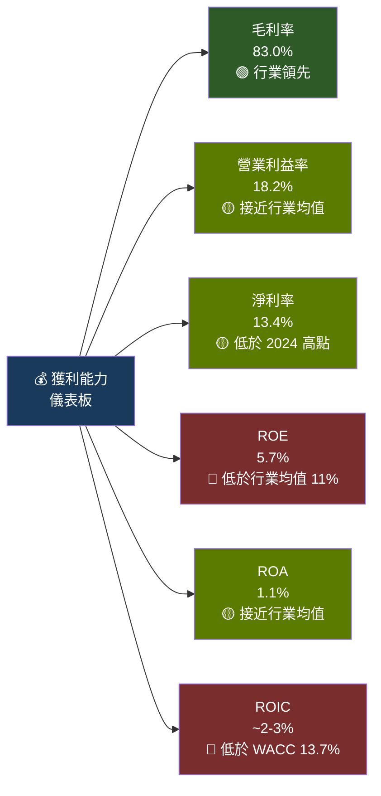

---

## 7. 估值深度分析

### 🔍 同業估值比較

| 公司 | 代碼 | P/E (FWD) | P/S | P/B | EV/Rev | FCF Yield | ROE | 評估 |
|------|------|-----------|-----|-----|--------|-----------|-----|------|
| **SoFi Technologies** | **SOFI** | **24.3x** | **6.8x** | **2.32x** | **6.0x** | **N/A** | **5.7%** | 🟡 |
| LendingClub | LC | ~18x | ~1.8x | ~1.1x | ~1.5x | ~3% | ~8% | 🟢 |
| Upstart Holdings | UPST | ~45x | ~8x | ~5x | ~7x | 負值 | 負值 | 🔴 |
| Robinhood Markets | HOOD | ~28x | ~8x | ~3x | ~6x | ~2% | ~12% | 🟡 |
| 傳統銀行（JPM）| JPM | ~13x | ~3.5x | ~2.1x | N/A | ~4% | ~17% | 🟢 |

```
遠期 P/E 比較長條圖（倍數）

JPM         13x  █████████████░░░░░░░░░░░░░░
LendingClub 18x  ██████████████████░░░░░░░░░
SOFI        24x  ████████████████████████░░░  ← 當前
Robinhood   28x  ████████████████████████████░
Upstart     45x  ██████████████████████████████████████████████
```

> **估值解讀**：
> - vs **LendingClub**：SOFI 溢價約 35%，但成長率（40% vs ~10%）溢價合理
> - vs **Upstart**：SOFI 估值相對便宜，且基本面更穩健
> - vs **JPM**：SOFI 溢價約 87%，反映成長溢酬，需要成長率持續兌現
> - **結論**：估值處於「成長股合理區間」，但已非明顯低估

---

### 📊 歷史估值區間分析

```
P/S 歷史區間（近2年）

歷史高點  ~14x ████████████████████████████████████████
歷史均值   ~8x ████████████████████████
當前       6.8x █████████████████████░ ← 低於歷史均值
歷史低點   ~3x █████████░░░░░░░░░░░░░

P/B 歷史區間
歷史高點  ~4x  ████████████████████░░░░░░
歷史均值  ~2.5x ████████████░░░░░░░
當前      2.32x ███████████░░░░░░░░ ← 低於歷史均值
歷史低點  ~1.5x ███████░░░░░░
```

| 估值指標 | 5年低 | 5年均值 | 5年高 | 當前值 | 相對位置 |
|--------|-------|--------|-------|--------|---------|
| P/S | 2.5x | 7.5x | 14x | 6.8x | 🟡 均值偏低 |
| P/B | 1.3x | 2.6x | 5.2x | 2.32x | 🟢 均值偏低 |
| P/E (FWD) | N/M | ~30x | N/M | 24.3x | 🟢 歷史相對合理 |

---

### 🎯 DCF 敏感性分析

**基本假設**：

| 假設項目 | 悲觀 | 基準 | 樂觀 |
|--------|------|------|------|
| 5年收入 CAGR | 15% | 25% | 35% |
| 終端成長率 | 2% | 3% | 4% |
| 最終淨利率 | 18% | 22% | 28% |
| 稀釋股數 | 1.35B | 1.30B | 1.28B |

**6格目標價矩陣**：

| 成長情境 / 折現率 | WACC = 15% | WACC = 12% |
|----------------|-----------|-----------|
| 🔴 **悲觀（CAGR 15%）** | $12.50 | $16.00 |
| 🟡 **基準（CAGR 25%）** | $22.00 | $28.00 |
| 🟢 **樂觀（CAGR 35%）** | $32.00 | $42.00 |

```
DCF 目標價區間視覺化

$12.50  ████████░░░░░░░░░░░░░░░░░░░░░░░░  悲觀/高折現率
$16.00  ██████████░░░░░░░░░░░░░░░░░░░░░░  悲觀/低折現率
$19.17  ████████████░░░░░░░░░░░░░░░░░░░░  ← 當前股價
$22.00  ██████████████░░░░░░░░░░░░░░░░░░  基準/高折現率
$28.00  ██████████████████░░░░░░░░░░░░░░  基準/低折現率
$32.00  █████████████████████░░░░░░░░░░░  樂觀/高折現率
$42.00  ██████████████████████████████░░  樂觀/低折現率

📌 當前股價處於「悲觀下沿至基準」之間，風險報酬尚可接受
```

---

### 📏 估值區間視覺化

```
估值合理性光譜

$8     $12    $16    $19.17 $22    $28    $35    $45
 ├──────┼──────┼──────┼──────┼──────┼──────┼──────┤
 ████████████  🟡中性區間   🟢合理偏低    ░░░░高估區░░░░
 🔴超賣區    ↑當前位置

📊 結論：$19.17當前股價位於「合理偏低估」區域
   對應基準DCF上漲空間約+30%，風險報酬比約1:1.5
```

---

## 8. 成長催化劑

### 📅 催化劑時間軸

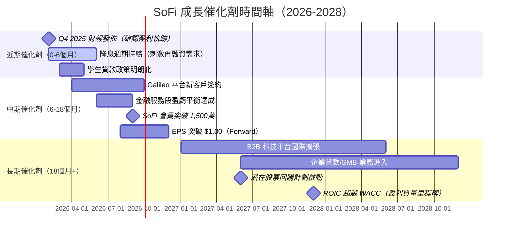

---

### 📐 TAM 市場規模與滲透率

```
TAM 市場機會估算（2025E）

個人消費貸款市場
TAM: $300B+ │ SoFi 份額：~3.5%
████░░░░░░░░░░░░░░░░░░░░░░░░░░░░░░░░░░░░  渗透率 3.5%

學生貸款再融資
TAM: $120B  │ SoFi 份額：~8%
████████░░░░░░░░░░░░░░░░░░░░░░░░░░░░░░░░  滲透率 8%

存款/儲蓄帳戶
TAM: $17.5T │ SoFi 份額：~0.05%
░░░░░░░░░░░░░░░░░░░░░░░░░░░░░░░░░░░░░░░░  滲透率<0.1%（巨大空間！）

B2B金融科技基礎設施 (Galileo)
TAM: $50B+  │ SoFi 份額：~5%
█████░░░░░░░░░░░░░░░░░░░░░░░░░░░░░░░░░░░  滲透率 5%

投資/財富管理
TAM: $30T+  │ SoFi 份額：<0.01%
░░░░░░░░░░░░░░░░░░░░░░░░░░░░░░░░░░░░░░░░  滲透率<0.01%

📌 總可觸達市場（合計）：$18T+，當前市值$24B僅0.13%
```

---

### 🚀 短/中/長期成長驅動力

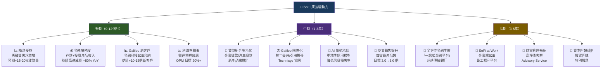

---

## 9. 風險矩陣

### ⚠️ 風險評分矩陣

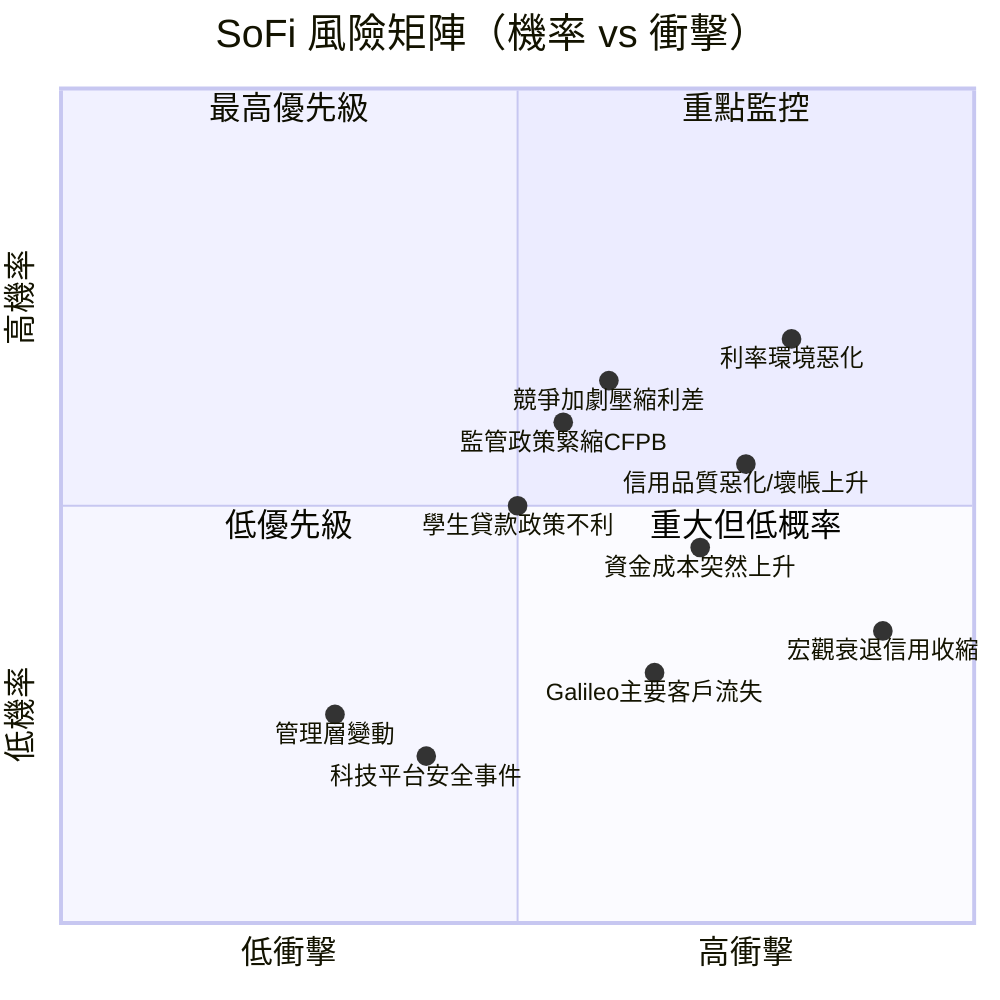

---

### 📋 風險清單詳細表格

| 風險項目 | 機率 | 衝擊 | 綜合評分 | 緩解措施 | 狀態 |
|---------|------|------|---------|---------|------|
| **利率環境惡化（再升息）** | 高 | 高 | 🔴 9/10 | 貸款組合多元化；固定/浮動混合 | 🔴 |
| **信貸品質惡化/壞帳率上升** | 中高 | 高 | 🔴 8/10 | AI 承保模型；信貸標準維持嚴格 | 🔴 |
| **競爭加劇壓縮利差** | 中高 | 中高 | 🔴 7.5/10 | 品牌分化；高端用戶定位 | 🔴 |
| **監管風險（CFPB新規）** | 中 | 中高 | 🟡 6.5/10 | 合規投入；遊說與監管溝通 | 🟡 |
| **資金成本突然上升** | 中 | 中 | 🟡 6/10 | 自有存款融資降低依賴；多元化資金來源 | 🟡 |
| **學生貸款政策不利變化** | 中 | 中 | 🟡 5.5/10 | 業務多元化降低單一業務依賴 | 🟡 |
| **Galileo 主要客戶流失** | 低中 | 中高 | 🟡 5/10 | 客戶多元化；長期合約鎖定 | 🟡 |
| **宏觀衰退信用收縮** | 低 | 極高 | 🟡 5/10 | 資本充足率維持；撥備前置 | 🟡 |
| **網路安全/數據洩露事件** | 低 | 中 | 🟢 4/10 | 持續安全投入；SOC認證 | 🟢 |
| **管理層流失/治理問題** | 低 | 中低 | 🟢 3/10 | 激勵計劃；管理團隊深度 | 🟢 |

---

## 10. 投資建議

### 🎯 最終綜合評級儀表板

```
維度評分雷達圖（1-10分）

基本面品質      [7.0]  ▓▓▓▓▓▓▓░░░  7.0/10
成長動能        [7.5]  ▓▓▓▓▓▓▓▓░░  7.5/10
獲利品質        [6.0]  ▓▓▓▓▓▓░░░░  6.0/10
財務健康        [6.5]  ▓▓▓▓▓▓▓░░░  6.5/10
估值合理性      [5.5]  ▓▓▓▓▓▓░░░░  5.5/10
管理層品質      [6.5]  ▓▓▓▓▓▓▓░░░  6.5/10
競爭護城河      [5.7]  ▓▓▓▓▓▓░░░░  5.7/10
風險調整報酬    [6.0]  ▓▓▓▓▓▓░░░░  6.0/10
────────────────────────────────────────
綜合加權評分    [6.3]  ▓▓▓▓▓▓░░░░  6.3/10

評級詮釋：
10-9  ★★★★★ 強力買入
 8-7  ★★★★☆ 買入
 6-5  ★★★☆☆ 持有/觀望  ← SOFI 落在此區間
 4-3  ★★☆☆☆ 減持
 2-1  ★☆☆☆☆ 賣出
```

---

### 🎯 目標價與隱含報酬率

| 情境 | 目標價 | 當前價 | 隱含報酬率 | 基礎假設 |
|------|--------|--------|-----------|---------|
| 🔴 **悲觀** | $14.00 | $19.17 | **-27.0%** | 信貸品質惡化，成長放緩至15% |
| 🟡 **基準** | $25.00 | $19.17 | **+30.4%** | 成長率25%，利潤率持續擴張 |
| 🟢 **樂觀** | $35.00 | $19.17 | **+82.6%** | 降息加速，Galileo 高速擴張 |

```
目標價分布圖

$12.00  ├─────┤  分析師最低目標 $12.00
$14.00  ├─────┤  本報告悲觀情境
$19.17  ├─────┤  ← 當前股價
$25.00  ├─────┤  本報告基準情境 / 分析師均值 $26.50
$26.50  ├─────┤  分析師共識均值
$35.00  ├─────┤  本報告樂觀情境
$38.00  ├─────┤  分析師最高目標 $38.00

📊 19位分析師共識：Hold | 均值目標 $26.50
   隱含從當前上漲空間：+38.2%
```

---

### ✅ 買入時機與觸發因素 Checklist

```
買入觸發因素 Checklist

必要條件（缺一不可）：
☐ Q4 2025 財報確認 EPS 加速（>$0.15/股）
☐ 全年2025 EPS 達標或超越預期 $0.79
☐ 信貸損失率不惡化（<2.5%）
☐ 會員數持續成長（>1,000萬）

加分條件（越多越好）：
☐ 宏觀降息訊號強化（Fed 暗示2026降息）
☐ 股價回測至 $17.00-18.00 支撐區
☐ Galileo 宣佈重大新客戶
☐ 分析師升評潮（當前已有 JPM 升評）
☐ 內部人士增持（目前內部持股僅 3.1%）
☐ 啟動股票回購計劃
☐ ROIC 突破 10%（接近 WACC）

賣出/減持觸發因素：
⚠️ EPS 連續兩季低於預期
⚠️ 淨沖銷率突破 4%
⚠️ 競爭對手發動激烈價格戰
⚠️ 重大監管處罰或調查
⚠️ 管理層重大變動（CEO/CFO）
```

---

### 👥 投資人適配度分析

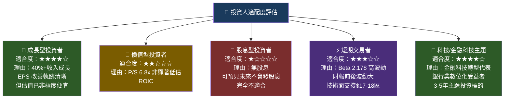

---

### 📡 關鍵監控指標 Checklist

```
📊 財務指標監控（每季財報時追蹤）

核心財務KPI：
☑ EPS vs 分析師共識（±差額%）
☑ 收入成長率（維持30%+為正面）
☑ 淨利率（目標持續擴張至20%+）
☑ 淨息差 NIM（目標 5.5%+）
☑ 效率比率 Efficiency Ratio（目標<55%）

信貸品質監控：
☑ 淨沖銷率 NCO Rate（警戒線：>3.5%）
☑ 30-89天逾期率（警戒線：>2.5%）
☑ 信貸損失撥備/平均貸款比（趨勢）
☑ 貸款組合成長率（個人/學生/房屋各分開追蹤）

業務成長指標：
☑ 會員總數 & 淨新增會員（目標季度+30萬+）
☑ 每會員平均產品數（目標 3.5+）
☑ Galileo 平台帳戶數（目標持續成長）
☑ 金融服務段收入佔比（目標>35%）

📰 產業數據監控（月度追蹤）
☑ Fed 利率決策與點陣圖更新
☑ 美國個人消費信貸數據（Fed H.8報告）
☑ 銀行業信貸標準調查（Senior Loan Officer Survey）
☑ 失業率趨勢（信貸品質領先指標）

🏦 競爭動態監控（季度追蹤）
☑ LendingClub / Upstart 季報（貸款量/信貸品質）
☑ Chime / Robinhood 融資/估值動態
☑ 傳統銀行數位化投資規模
☑ CFPB 監管動態與新規發佈

📅 重要日期
☑ SOFI Q4 2025 財報：預計 2026年3月上旬
☑ Fed FOMC 會議：2026年3月/5月（關注降息指引）
☑ CFPB 相關聽證：持續追蹤
```

---

## 📌 最終投資總結

```
╔══════════════════════════════════════════════════════════════════╗
║                 📊 SOFI 投資總結一覽表                           ║
╠══════════════════════════════════════════════════════════════════╣
║  評級：持有/分批買入 (HOLD / Accumulate on Dips)                ║
║  當前股價：$19.17                                                ║
║  目標價（基準）：$25.00  |  隱含上漲：+30.4%                    ║
║  時間框架：12-18 個月                                            ║
╠══════════════════════════════════════════════════════════════════╣
║  🟢 三大做多理由：                                               ║
║  1. 2024首度年度GAAP盈利（$498M），基本面轉折已確認              ║
║  2. 季度EPS加速：Q1$0.06→Q2$0.08→Q3$0.11，向上軌跡清晰         ║
║  3. 降息週期啟動，再融資需求提升，貸款量有望加速                 ║
╠══════════════════════════════════════════════════════════════════╣
║  🔴 三大做空風險：                                               ║
║  1. ROIC(~2-3%) << WACC(~13.7%)，仍在摧毀股東價值               ║
║  2. OCF 持續負值（銀行業特性），FCF為負需理解本質                ║
║  3. Beta=2.178，宏觀環境惡化時跌幅將大於市場均值                ║
╠══════════════════════════════════════════════════════════════════╣
║  💡 最佳策略建議：                                               ║
║  - 等待股價回測 $17-18 支撐區後分批建倉                          ║
║  - Q4 2025 財報（3月）為重要催化劑，確認EPS後可加碼              ║
║  - 停損設於 $13.50（-30%），對應悲觀DCF估值                     ║
║  - 目標持倉：成長/科技主題投資組合中3-5%倉位                    ║
╚══════════════════════════════════════════════════════════════════╝
```

---

> ## ⚖️ 免責聲明
>
> **本報告為 AI 自動生成的研究分析，僅供學術研究與投資參考之用，不構成任何形式的投資建議、買賣招攬或財務諮詢。**
>
> 報告中的財務數據來源於 Yahoo Finance（截至 2026-02-26），部分數據存在延遲或估算成分。DCF 模型及目標價均基於假設情境，實際結果可能與預測存在重大差異。
>
> 投資美國股票市場涉及市場風險、匯率風險、流動性風險及監管風險。過去的股價表現不代表未來的回報。投資者在做出任何投資決策前，應諮詢持牌財務顧問，並根據個人財務狀況、風險承受能力及投資目標做出獨立判斷。
>
> **本報告不代表任何金融機構或投資機構的官方立場。**