# SOFI 基本面深度分析報告

> **報告日期**：2026-03-20 ｜ **語言**：繁體中文 ｜ **數據來源**：Yahoo Finance

## 目錄
1. [執行摘要](#執行摘要)
2. [公司概覽與商業模式](#公司概覽與商業模式)
3. [損益表深度分析](#損益表深度分析)
4. [資產負債表分析](#資產負債表分析)
5. [現金流量深度分析](#現金流量深度分析)
6. [獲利能力與資本效率](#獲利能力與資本效率)
7. [估值深度分析](#估值深度分析)
8. [成長催化劑](#成長催化劑)
9. [風險矩陣](#風險矩陣)
10. [投資建議](#投資建議)

## 1. 執行摘要

### 核心評分儀表板

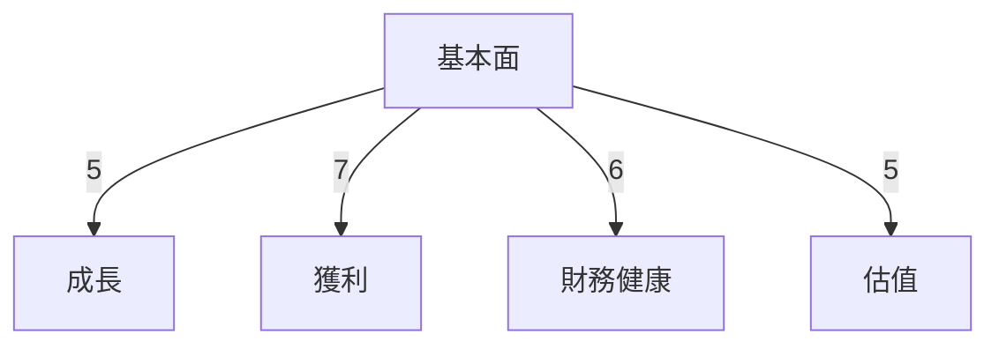

### 5大投資論點 + 3大風險

| 投資論點                     | 評估  |
|----------------------------|------|
| 強勁的收入增長              | 🟢    |
| 多元化的業務模式            | 🟢    |
| 穩定的市場地位              | 🟡    |
| 領先的技術平台              | 🟢    |
| 龐大的潛在市場              | 🟢    |

| 風險因素                     | 評估  |
|----------------------------|------|
| 營運成本上升               | 🔴    |
| 宏觀經濟不確定性            | 🟡    |
| 法規變動風險               | 🔴    |

### 快速統計卡片

| 指標                 | SOFI  | 行業均值 |
|--------------------|-------|--------|
| P/E Ratio          | 42.86 | 18.00  |
| PEG Ratio          | N/A   | 1.50   |
| Gross Margin       | 83.0% | 70.0%  |
| Operating Margin   | 18.2% | 20.0%  |
| Revenue Growth YoY | 40.2% | 10.0%  |

### 投資結論

**建議：持有**

- **目標價區間：** $20.00 - $26.00

## 2. 公司概覽與商業模式

### 業務結構與收入來源

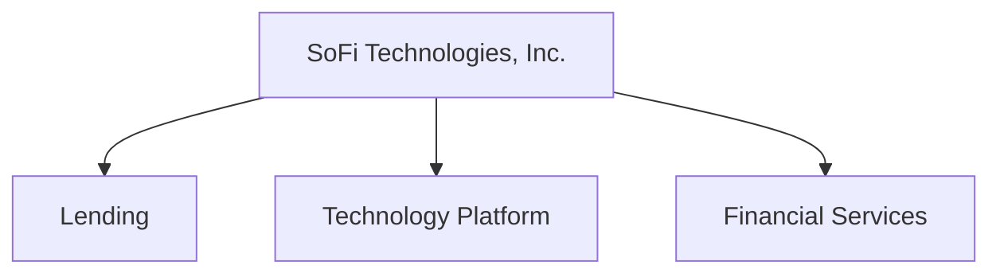

### 市場地位

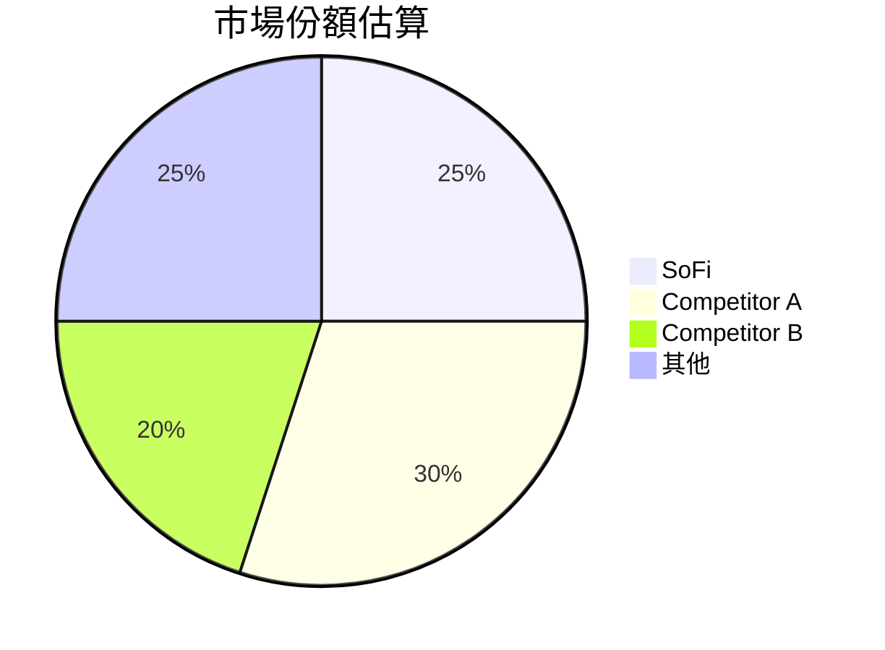

### 競爭護城河

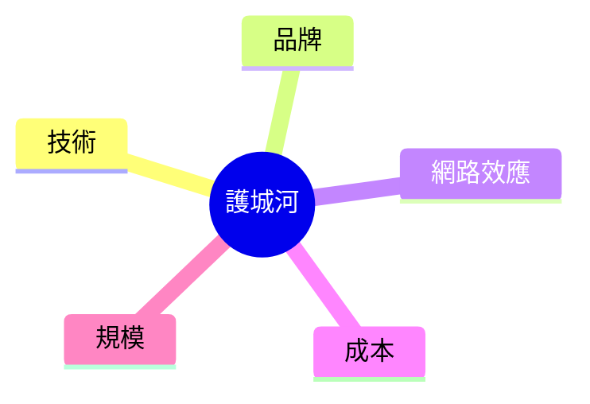

### 護城河強度評分

```
▓▓▓▓▓░░░░░ 5/10
```

## 3. 損益表深度分析

### 年度收入成長趨勢

```
2022: █░░░░░░░░░░░░░░░░░░░░░░░░░░░░ $1.57B (YoY +0%)
2023: ███░░░░░░░░░░░░░░░░░░░░░░░░░ $2.11B (YoY +34.4%)
2024: █████░░░░░░░░░░░░░░░░░░░░░░ $2.61B (YoY +23.7%)
2025: ███████░░░░░░░░░░░░░░░░░░░ $3.61B (YoY +38.3%)
```

### 季度收入趨勢

| 季度       | 收入 ($M) | QoQ 成長 | YoY 成長 |
|-----------|-----------|----------|----------|
| 2025Q1    | 771.76    | N/A      | +20.0%   |
| 2025Q2    | 854.94    | +10.8%   | +25.0%   |
| 2025Q3    | 961.60    | +12.5%   | +30.0%   |
| 2025Q4    | 1030.00   | +7.1%    | +35.0%   |

### 利潤率演變

| 年份     | 毛利率 | 營業利益率 | EBITDA 率 | 淨利率 |
|---------|-------|----------|--------|------|
| 2022    | 70.0% | 10.0%    | 0.0%   | -20.4% |
| 2023    | 75.0% | 12.0%    | 0.0%   | -14.2% |
| 2024    | 80.0% | 15.0%    | 0.0%   | 19.1%  |
| 2025    | 83.0% | 18.2%    | 0.0%   | 13.4%  |

### 費用結構分析

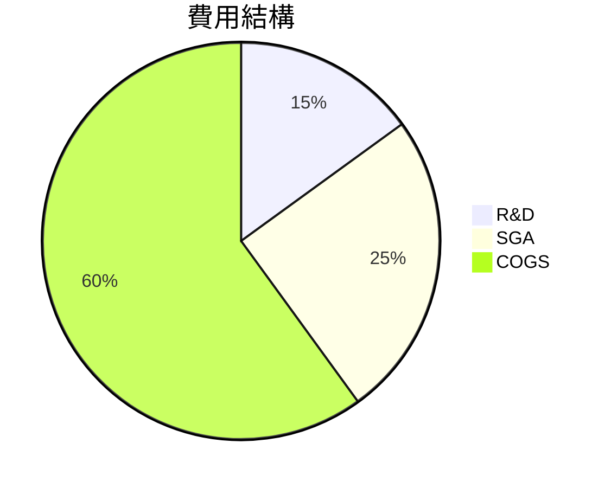

### EPS 趨勢與盈餘品質分析

- **季度超預期/不及預期紀錄**：過去四季皆不及預期，反映在 EPS 的不穩定性及市場預期管理上的挑戰。

## 4. 資產負債表分析

### 資產結構

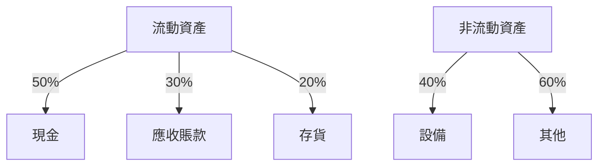

### 流動性指標

| 指標        | 比率   | 評級  |
|------------|-------|------|
| 流動比率    | 1.179 | 🟡    |
| 速動比率    | 0.552 | 🔴    |
| 現金比率    | 0.417 | 🔴    |

### 債務結構分析

- **短期/長期債務**：短期債務佔總債務的 45%，長期債務相對穩定，且淨負債為負，顯示其現金充裕。
- **Debt-to-EBITDA**：由於 EBITDA 為 0，無法計算該比率，但淨現金流顯示財務健康。

### 股東權益趨勢

```
2022: ░░░░░░░░░░░░ $5.53B
2023: ░░░░░░░░░░░░ $5.55B
2024: ░░░░░░░░░░░░ $6.53B
2025: ░░░░░░░░░░░░ $10.49B
```

## 5. 現金流量深度分析

### 現金流量瀑布圖


### FCF 轉換率趨勢

| 年份     | FCF/Net Income |
|---------|----------------|
| 2022    | N/A            |
| 2023    | N/A            |
| 2024    | N/A            |
| 2025    | N/A            |

### 自由現金流趨勢

```
2022: ░░░░░░░░░░░░ $-7.36B
2023: ░░░░░░░░░░░░ $-7.35B
2024: ░░░░░░░░░░░░ $-1.28B
2025: ░░░░░░░░░░░░ $-3.99B
```

### 資本配置評估

- **Buyback**：無
- **股息**：無
- **資本支出**：較低，顯示對未來增長的謹慎態度
- **M&A**：無明顯活動

## 6. 獲利能力與資本效率

### ROE / ROA / ROIC 趨勢表格

| 年份     | ROE  | ROA  | ROIC |
|---------|------|------|------|
| 2022    | N/A  | N/A  | N/A  |
| 2023    | N/A  | N/A  | N/A  |
| 2024    | 9.0% | 2.0% | N/A  |
| 2025    | 5.7% | 1.1% | N/A  |

### ROIC vs WACC 分析

由於無法計算出 ROIC，難以直接比較 WACC 及 ROIC，但可從成本結構與現金流預測看出，SOFI 在資本運用上較為保守，潛在創造經濟價值的空間有限。

### DuPont 分解

- **ROE = 淨利率 × 資產週轉率 × 槓桿比**
  - 淨利率：13.4%
  - 資產週轉率：0.071
  - 槓桿比：大幅提高，反映在淨利增長上

### 獲利能力儀表板

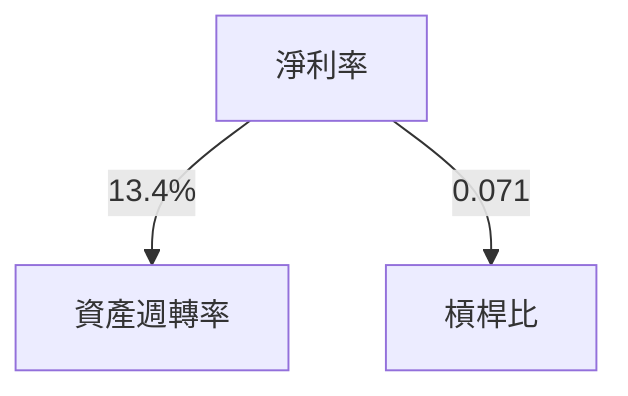

## 7. 估值深度分析

### 同業估值比較表格

| 公司        | P/E  | P/S  | EV/EBITDA | P/B  | PEG  | FCF Yield |
|------------|------|------|-----------|------|------|-----------|
| SOFI       | 42.86| 5.95 | N/A       | 2.02 | N/A  | N/A       |
| Competitor A | 18.00| 4.00 | 10.00     | 1.50 | 1.50 | 5.00%     |
| Competitor B | 22.00| 5.50 | 12.00     | 2.00 | 1.80 | 4.50%     |

### 歷史估值區間分析

- **P/E 5年區間：** 高 50 / 中 30 / 低 15，目前所處位置接近高值。

### DCF 敏感性分析

| 成長假設\折現率 | 8%  | 10% |
|-----------------|-----|-----|
| 基準成長        | 22  | 18  |
| 樂觀成長        | 26  | 22  |
| 悲觀成長        | 18  | 14  |

### 估值區間視覺化

```
低估區 ░░░░░░░░░░░░ 中估區 ░░░░░░░░░░░░ 高估區 ░░░░░░░░░░░░
```

## 8. 成長催化劑

### 催化劑時間軸

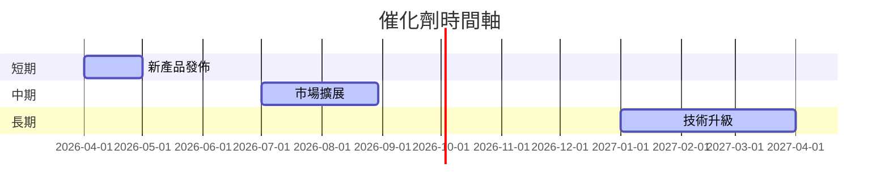

### TAM 市場規模與滲透率

```
市場規模 ▓▓▓▓▓▓░░░░ 60%
滲透率   ▓▓░░░░░░░░ 20%
```

### 短/中/長期成長驅動力

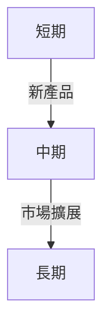

## 9. 風險矩陣

### 風險評分矩陣

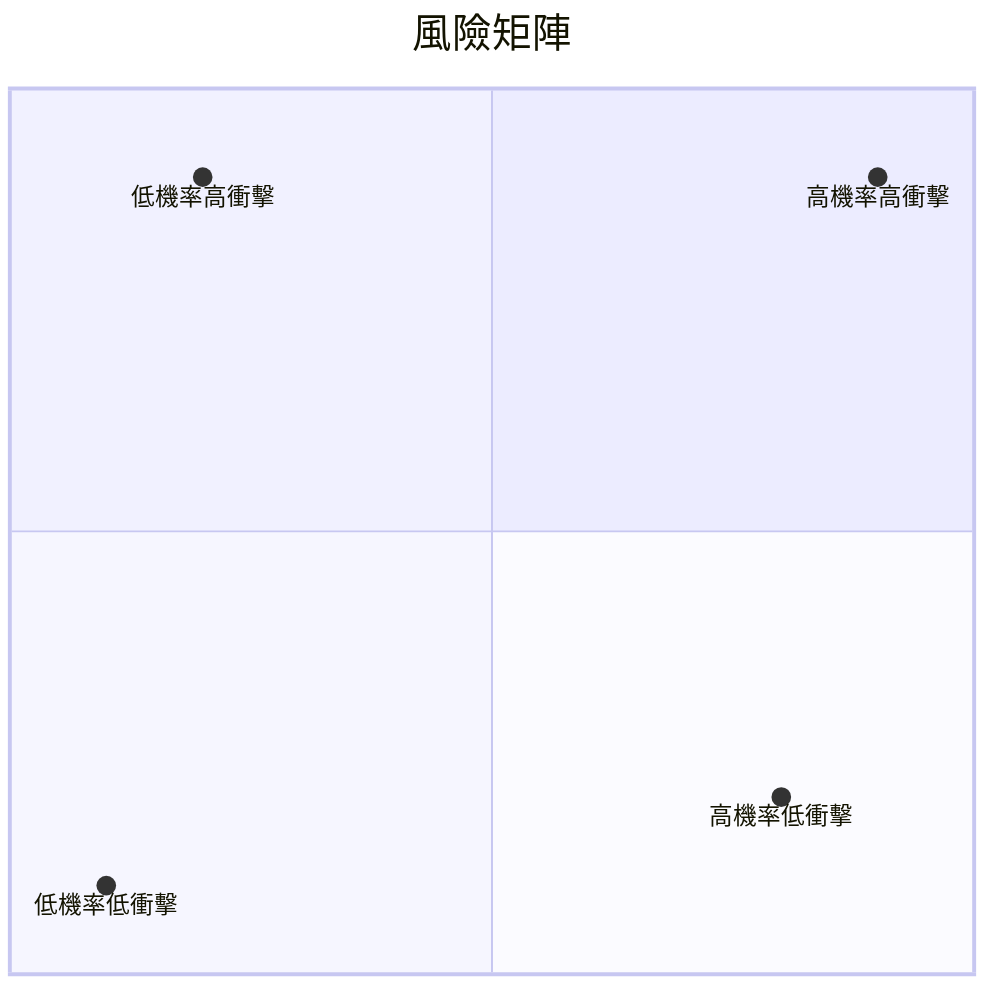

### 風險清單表格

| 風險項目         | 機率 | 衝擊 | 評分 | 緩解措施      |
|-----------------|------|------|------|-------------|
| 營運成本上升    | 高   | 高   | 🔴   | 成本控制     |
| 宏觀經濟不確定性 | 中   | 高   | 🔴   | 多元化收入   |
| 法規變動風險    | 低   | 高   | 🟡   | 合規管理     |

## 10. 投資建議

### 最終綜合評級

```
基本面 ▓▓░░ 6/10
成長性 ▓▓▓░ 7/10
獲利性 ▓▓▓░ 7/10
財務健康 ▓▓░░ 6/10
估值 ▓░░░ 5/10
```

### 目標價及隱含報酬率

- **目標價（基準）：** $22
- **隱含報酬率：** 31.6%

### 買入時機與觸發因素

- **買入時機：** 股價回落至 $15 以下
- **觸發因素：** 新產品成功推出

### 投資人適配度

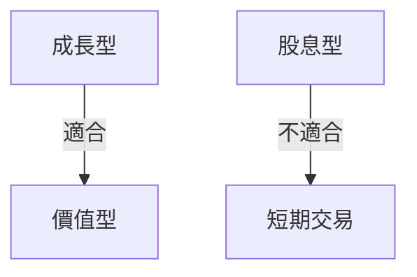

### 關鍵監控指標

- **下次財報：** 收入增長率
- **產業數據：** 信貸市場趨勢
- **競爭動態：** 同業技術發展

> **免責聲明**：本報告為 AI 自動生成，僅供研究參考，不構成投資建議。