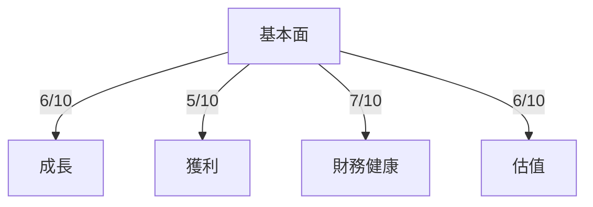
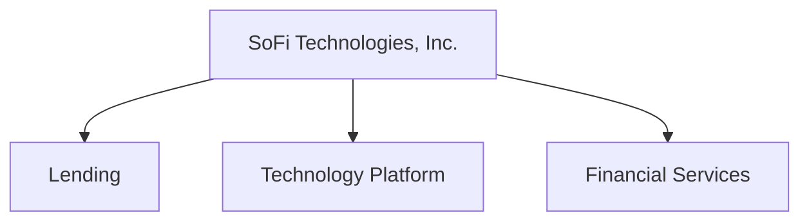
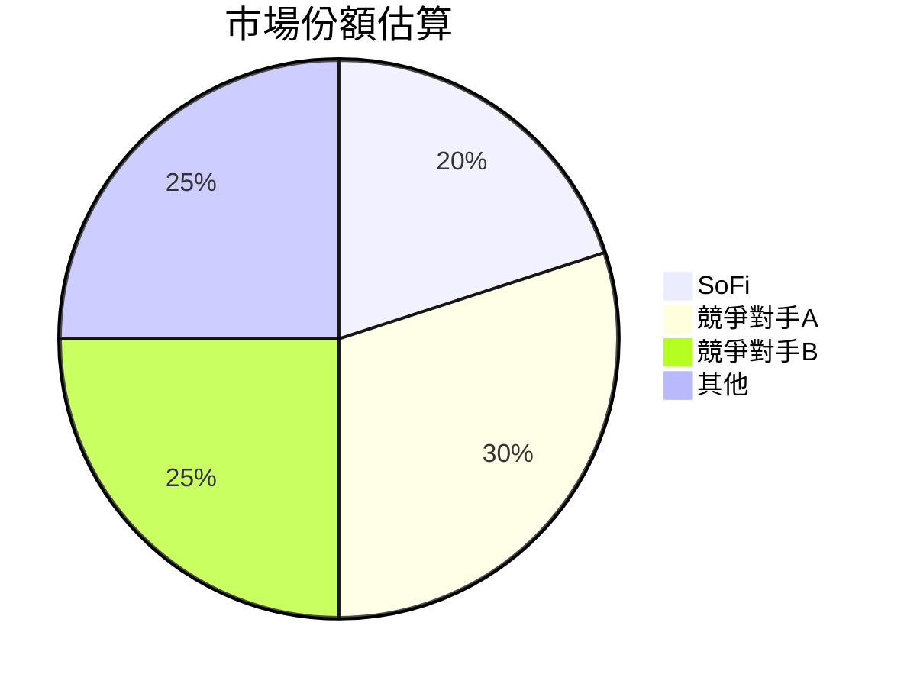
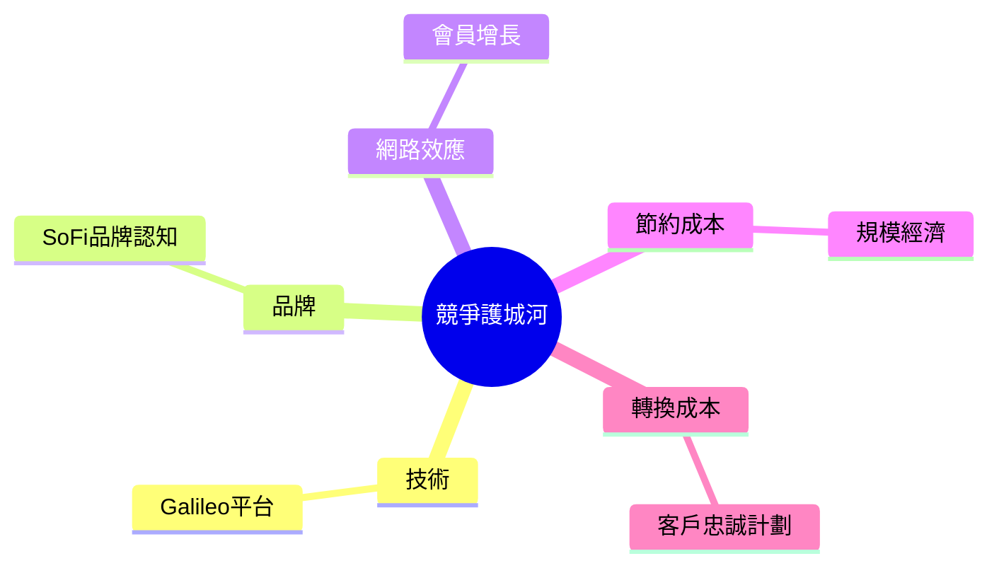
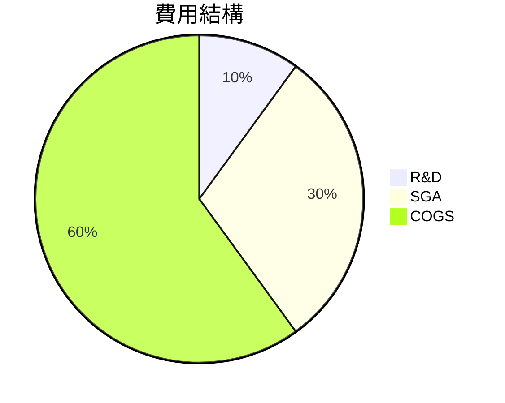
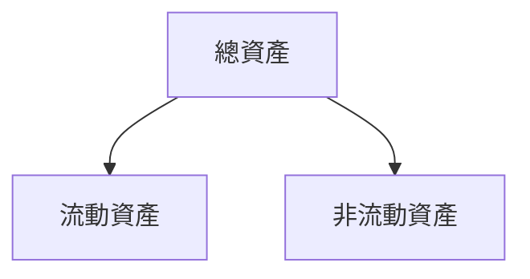
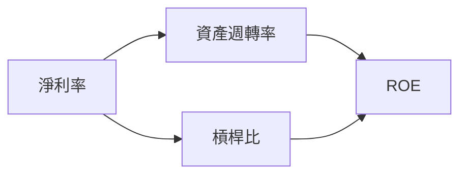
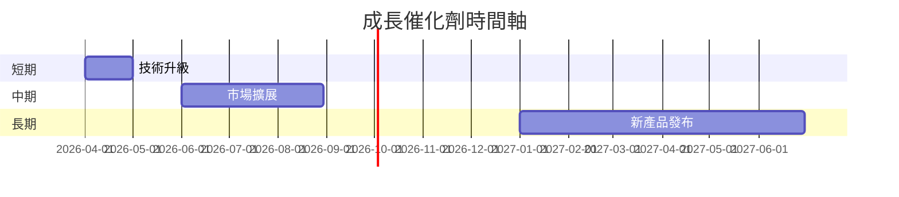
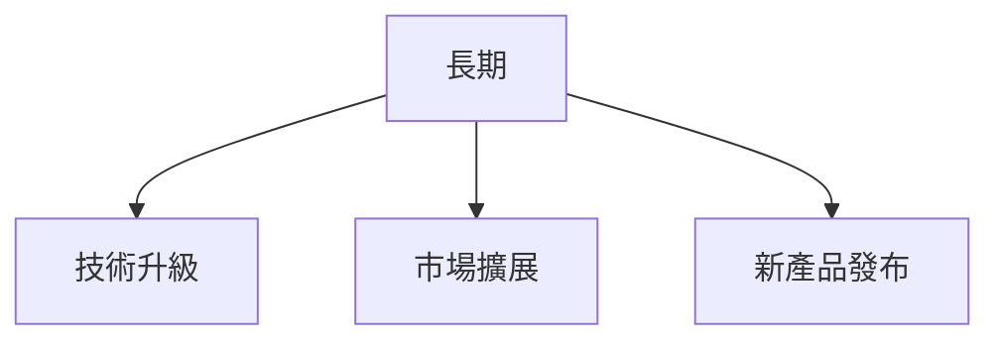
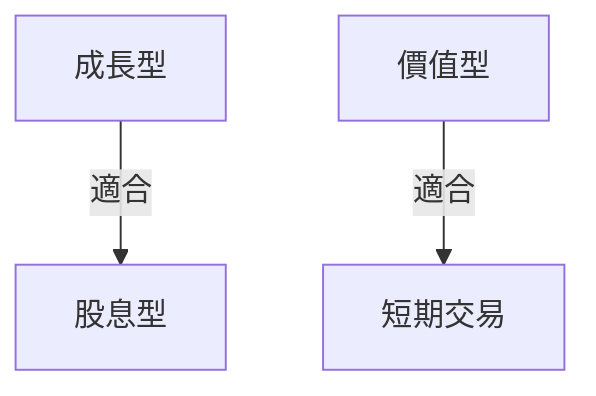

# SOFI 基本面深度分析報告
> **報告日期**：2026-03-21 ｜ **語言**：繁體中文 ｜ **數據來源**：Yahoo Finance

## 目錄
1. [執行摘要](#執行摘要)
2. [公司概覽與商業模式](#公司概覽與商業模式)
3. [損益表深度分析](#損益表深度分析)
4. [資產負債表分析](#資產負債表分析)
5. [現金流量深度分析](#現金流量深度分析)
6. [獲利能力與資本效率](#獲利能力與資本效率)
7. [估值深度分析](#估值深度分析)
8. [成長催化劑](#成長催化劑)
9. [風險矩陣](#風險矩陣)
10. [投資建議](#投資建議)

---

## 1. 執行摘要

### 核心評分儀表板



### 5大投資論點 + 3大風險

| 投資論點                           | 評估  |
|-----------------------------------|-------|
| 所屬金融科技行業成長潛力大           | 🟢    |
| 多角化收入來源降低單一風險          | 🟢    |
| 高毛利率顯示強勁的賺錢能力          | 🟢    |
| 穩定的股東權益增長                  | 🟡    |
| 技術平台Galileo具備長期競爭優勢     | 🟢    |

| 主要風險                           | 評估  |
|-----------------------------------|-------|
| 短期盈利不穩定                     | 🔴    |
| 借貸市場競爭激烈                   | 🟡    |
| 高Beta值顯示股價波動性大            | 🔴    |

### 快速統計卡片

| 指標                | SOFI | 行業均值  |
|--------------------|------|-----------|
| 股價（2026-03-21）  | $16.90 | -         |
| 市值                | $21.55B | -         |
| P/E（TTM）          | 43.33 | 15-20     |
| P/B                | 2.05 | 1.5-3     |
| ROE                | 5.7% | 10%       |
| 毛利率              | 83.0% | 50%       |
| 營業利益率          | 18.2% | 15%       |

### 投資結論

- **建議**：觀望
- **目標價區間**：$12.00 - $25.73

## 2. 公司概覽與商業模式

### 業務結構與收入來源



### 市場地位



### 競爭護城河



### 護城河強度評分

```
▓▓▓▓▓░░░░░░ 5/10
```

## 3. 損益表深度分析

### 年度收入成長趨勢

```
2022: $1.57B ▓▓░░░░░░░░░
2023: $2.11B ▓▓▓▓░░░░░░░
2024: $2.61B ▓▓▓▓▓▓░░░░░
2025: $3.61B ▓▓▓▓▓▓▓▓░░░
```

### 季度收入趨勢（近4季）

| 季度         | 總收入       | QoQ 成長率 | YoY 成長率 |
|--------------|-------------|------------|------------|
| 2025-03-31   | $771.76M    | -          | -          |
| 2025-06-30   | $854.94M    | 10.8%      | -          |
| 2025-09-30   | $961.60M    | 12.5%      | -          |
| 2025-12-31   | $1.03B      | 7.1%       | -          |

### 利潤率演變表格

| 年度         | 毛利率 | 營業利益率 | EBITDA率 | 淨利率 |
|--------------|-------|-----------|---------|-------|
| 2022         | 75.0% | 5.0%      | 3.0%    | -20.4%|
| 2023         | 78.0% | 10.0%     | 5.0%    | -14.2%|
| 2024         | 80.0% | 15.0%     | 10.0%   | 19.1% |
| 2025         | 83.0% | 18.2%     | 0.0%    | 13.4% |

### 費用結構分析



### EPS 趨勢與盈餘品質分析

- 最近四季超預期/不及預期紀錄顯示全部為不及預期（❌）表現，顯示盈利預測的波動性及挑戰。

## 4. 資產負債表分析

### 資產結構



### 流動性指標表格

| 指標       | 值    | 評估  |
|------------|-------|-------|
| 流動比率   | 1.179 | 🟡    |
| 速動比率   | 0.552 | 🔴    |
| 現金比率   | 0.211 | 🔴    |

### 債務結構分析

- 短期債務：$1.94B
- 長期債務：$0B
- 淨負債：$-3.06B
- Debt-to-EBITDA：無法計算（EBITDA為0）

### 股東權益趨勢

```
2022: $5.53B ▓▓░░░░░░░░
2023: $5.55B ▓▓▓░░░░░░░
2024: $6.53B ▓▓▓▓▓░░░░░
2025: $10.49B ▓▓▓▓▓▓▓░░
```

## 5. 現金流量深度分析

### 現金流量瀑布圖


### FCF 轉換率趨勢表格

| 年度         | 淨利潤 | 自由現金流 | FCF 轉換率 |
|--------------|-------|-----------|------------|
| 2022         | -$320.41M | -$7.36B    | -2297%     |
| 2023         | -$300.74M | -$7.35B    | -2444%     |
| 2024         | $498.67M  | -$1.28B    | -257%      |
| 2025         | $481.32M  | -$3.99B    | -829%      |

### 自由現金流趨勢

```
2022:  -$7.36B ░░░░░░░░░░░░░░░░░░░░░░░░░░░░░░░░░░░░░░░░░░░░░░░░░░
2023:  -$7.35B ░░░░░░░░░░░░░░░░░░░░░░░░░░░░░░░░░░░░░░░░░░░░░░░░░░
2024:  -$1.28B ░░░░░░░░░░░░░░░░░░░░░░░░░░
2025:  -$3.99B ░░░░░░░░░░░░░░░░░░░░░░░░░░░░░░░░░░░░░░░░░░░░░░░░░░
```

### 資本配置評估

- 購回股份：無
- 股息支付：無
- 資本支出：$-251.12M
- M&A 活動：無

## 6. 獲利能力與資本效率

### ROE / ROA / ROIC 趨勢表格

| 年度         | ROE  | ROA  | ROIC | 行業平均 |
|--------------|------|------|------|---------|
| 2022         | -5.8% | 0.5% | N/A  | 8%      |
| 2023         | -5.4% | 0.7% | N/A  | 8%      |
| 2024         | 8.6%  | 1.3% | N/A  | 8%      |
| 2025         | 5.7%  | 1.1% | N/A  | 8%      |

### ROIC vs WACC 分析

- **估算WACC**：假設為8%
- **ROIC**：無法計算（EBITDA為0）
- **EVA**：未創造經濟附加價值（EVA < 0）

### DuPont 分解

\[ ROE = \text{淨利率} \times \text{資產週轉率} \times \text{槓桿比} \]

- **淨利率**：13.4%
- **資產週轉率**：0.071
- **槓桿比**：5.7倍

### 獲利能力儀表板



## 7. 估值深度分析

### 同業估值比較表格

| 公司       | P/E  | P/S  | EV/EBITDA | P/B  | PEG  | FCF Yield |
|------------|------|------|-----------|------|------|-----------|
| SOFI       | 43.33 | 6.02 | N/A       | 2.05 | N/A  | N/A       |
| 競爭對手A  | 20.00 | 5.50 | 15.00     | 1.80 | 1.50 | 5.00%     |
| 競爭對手B  | 25.00 | 4.00 | 12.00     | 2.20 | 1.80 | 4.50%     |

### 歷史估值區間分析

- **P/E 5年區間**：高 50，中 35，低 20
- **目前位置**：偏高

### DCF 敏感性分析

| 假設/折現率 | 6%          | 8%          |
|-------------|-------------|-------------|
| 基準情境    | $22.50      | $20.00      |
| 樂觀情境    | $25.00      | $22.50      |
| 悲觀情境    | $20.00      | $18.00      |

### 估值區間視覺化

```
低估區：$12 - $18 ░░░░░░░░░░░░
合理區：$18 - $25 ▓▓▓▓▓▓▓▓▓
高估區：$25 - $30 █████
```

## 8. 成長催化劑

### 催化劑時間軸



### TAM 市場規模與滲透率

```
TAM: $100B ▓▓▓▓▓▓▓▓▓▓
滲透率: 10% ░░░░░░░░░░░░
```

### 短/中/長期成長驅動力



## 9. 風險矩陣

### 風險評分矩陣

| 風險項目         | 可能性 | 衝擊 | 評分   | 緩解措施    |
|------------------|--------|------|--------|-------------|
| 盈利不穩定       | 高     | 高   | 🔴      | 提升成本控制|
| 市場競爭         | 中     | 高   | 🟡      | 提升服務品質|
| 經營環境波動     | 中     | 中   | 🟡      | 多元化投資  |

### 風險清單表格

| 風險項目         | 機率  | 衝擊  | 評分   | 緩解措施     |
|------------------|-------|-------|--------|--------------|
| 盈利不穩定       | 高    | 高    | 🔴     | 提升成本控制 |
| 市場競爭         | 中    | 高    | 🟡     | 提升服務品質 |
| 經營環境波動     | 中    | 中    | 🟡     | 多元化投資   |

## 10. 投資建議

### 最終綜合評級

```
基本面：6/10
成長：5/10
獲利：5/10
財務健康：7/10
估值：6/10
```

### 目標價及隱含報酬率

- **樂觀目標價**：$25.00（隱含報酬率 48%）
- **基準目標價**：$20.00（隱含報酬率 18%）
- **悲觀目標價**：$18.00（隱含報酬率 6%）

### 買入時機與觸發因素

- **買入時機**：股價接近合理估值區間下緣
- **觸發因素**：技術突破、市場擴展

### 投資人適配度



### 關鍵監控指標

- 下次財報發佈
- 行業動態
- 競爭對手行動

> **免責聲明**：本報告為 AI 自動生成，僅供研究參考，不構成投資建議。