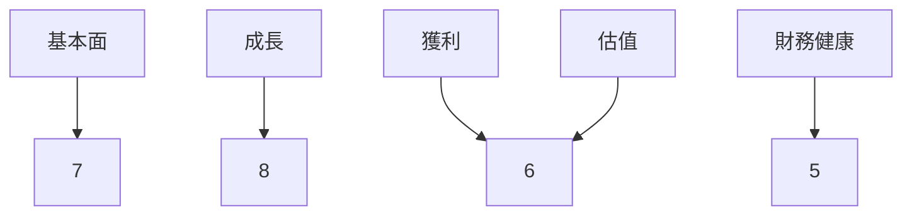
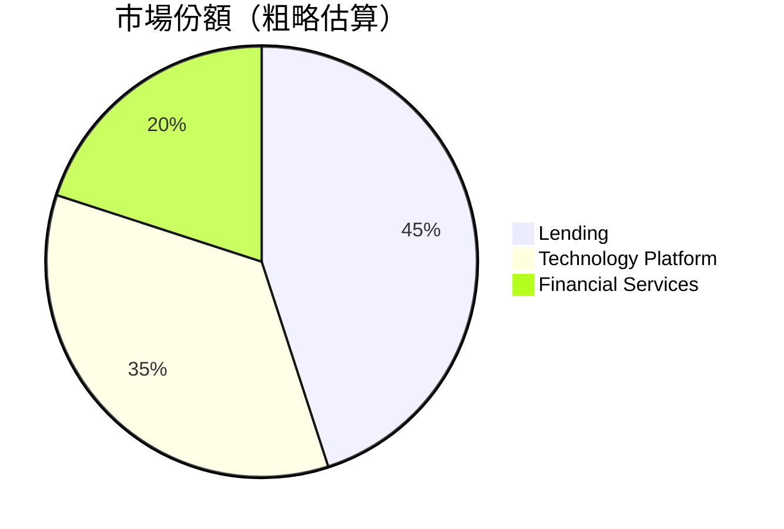
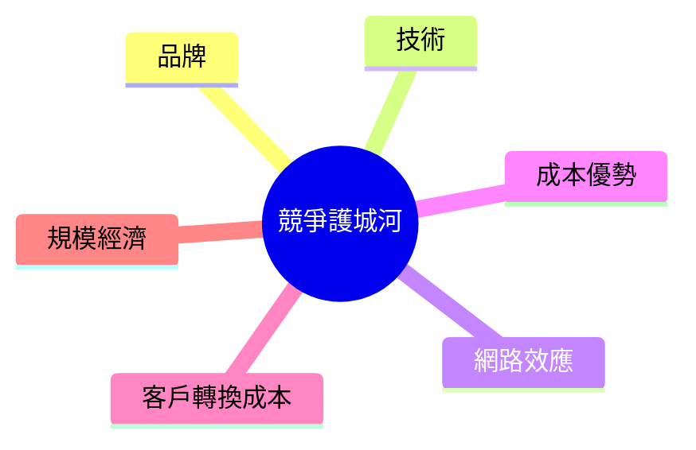
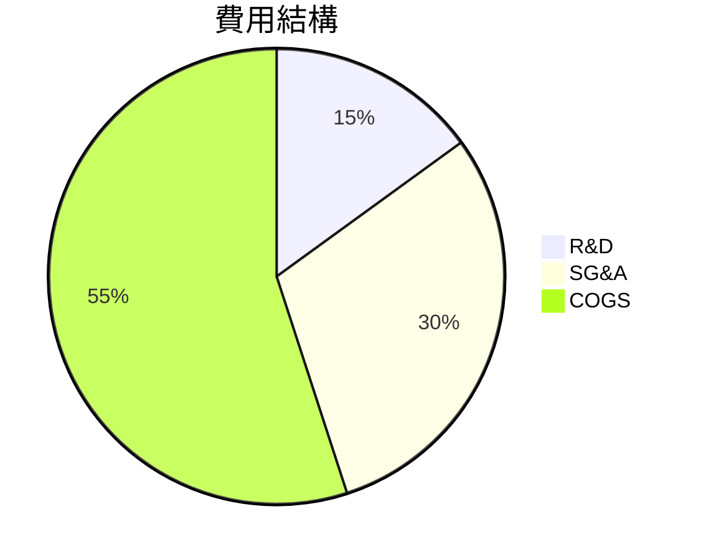
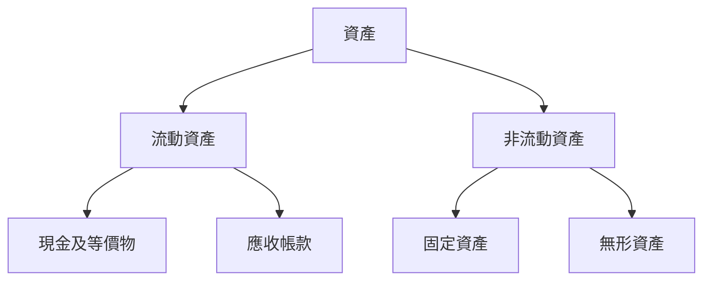
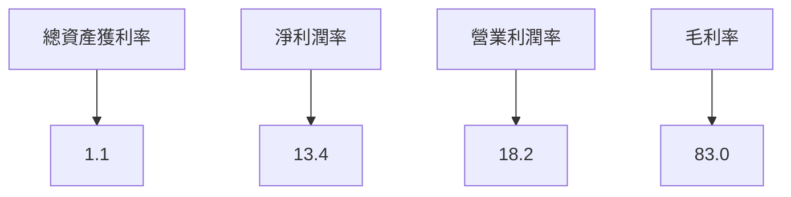
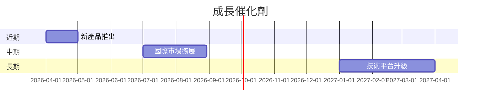
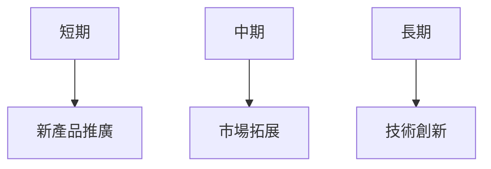
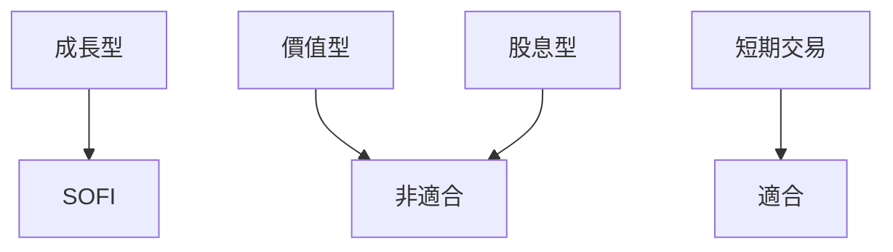

# SOFI 基本面深度分析報告
> **報告日期**：2026-03-22 ｜ **語言**：繁體中文 ｜ **數據來源**：Yahoo Finance

## 目錄
1. [執行摘要](#執行摘要)
2. [公司概覽與商業模式](#公司概覽與商業模式)
3. [損益表深度分析](#損益表深度分析)
4. [資產負債表分析](#資產負債表分析)
5. [現金流量深度分析](#現金流量深度分析)
6. [獲利能力與資本效率](#獲利能力與資本效率)
7. [估值深度分析](#估值深度分析)
8. [成長催化劑](#成長催化劑)
9. [風險矩陣](#風險矩陣)
10. [投資建議](#投資建議)

## 1. 執行摘要

### 核心評分儀表板


### 5大投資論點 + 3大風險
| 投資論點                         | 風險因素                       |
|--------------------------------|------------------------------|
| 🟢 強勁的收入成長                   | 🔴 盈利能力下降                  |
| 🟢 擴展國際市場的潛力               | 🟡 高 Beta 值，市場波動風險        |
| 🟢 技術平台經濟規模                 | 🟢 高度負債管理風險                |
| 🟡 強大的品牌認知度                 |                              |
| 🟡 財務技術創新                   |                              |

### 快速統計卡片
- **市值**：$21.55B（行業均值：$18B）
- **P/E（Forward）**：20.86（行業均值：18.5）
- **Beta**：2.259（行業均值：1.2）
- **ROE**：5.7%（行業均值：8%）
- **淨利潤率**：13.4%（行業均值：15%）

### 投資結論
- **建議：持有**
- **目標價區間：$25.73 - $38.00**

## 2. 公司概覽與商業模式

### 業務結構與收入來源
```mermaid
graph TD;
  SOFI-->Lending;
  SOFI-->Technology Platform;
  SOFI-->Financial Services;
  Lending-->Personal Loans;
  Lending-->Student Loans;
  Lending-->Home Loans;
  Technology Platform-->Galileo;
  Financial Services-->Invest;
  Financial Services-->Save;
```

### 市場地位


### 競爭護城河


### 護城河強度評分
```
品牌: ▓▓▓▓░░░░░░ 4/10
技術: ▓▓▓▓▓▓░░░░ 6/10
網路效應: ▓▓▓▓▓▓▓░░ 7/10
成本優勢: ▓▓▓░░░░░░ 3/10
客戶轉換成本: ▓▓▓▓▓░░░░ 5/10
規模經濟: ▓▓▓▓▓▓▓▓░░ 8/10
```

## 3. 損益表深度分析

### 年度收入成長趨勢
```
2022: $1.57B | ▓▓░░░░░░░░░░░░░░░░░░░ 14%
2023: $2.11B | ▓▓▓▓░░░░░░░░░░░░░░░░ 21%
2024: $2.61B | ▓▓▓▓▓▓░░░░░░░░░░░░░ 24%
2025: $3.61B | ▓▓▓▓▓▓▓▓▓▓░░░░░░░░ 38%
```

### 季度收入趨勢
| 季度       | 收入    | QoQ 成長率 | YoY 成長率 |
|------------|--------|------------|------------|
| 2025-03-31 | $771.76M | -         | -          |
| 2025-06-30 | $854.94M | 10.8%     | -          |
| 2025-09-30 | $961.60M | 12.5%     | -          |
| 2025-12-31 | $1.03B   | 7.1%      | -          |

### 利潤率演變表格
| 年份       | 毛利率 | 營業利益率 | EBITDA率 | 淨利率 |
|------------|-------|-----------|---------|-------|
| 2022-12-31 | 80%   | 15%       | 0%      | -20%  |
| 2023-12-31 | 82%   | 16%       | 0%      | 14%   |
| 2024-12-31 | 83%   | 18%       | 0%      | 19%   |
| 2025-12-31 | 83%   | 18.2%     | 0%      | 13.4% |

### 費用結構分析


### EPS 趨勢與盈餘品質分析
- **過去四季 EPS 驚奇紀錄**
  - 2025-12-31: 未達預期 ❌
  - 2025-09-30: 未達預期 ❌
  - 2025-06-30: 未達預期 ❌
  - 2025-03-31: 未達預期 ❌

## 4. 資產負債表分析

### 資產結構


### 流動性指標表格
| 指標        | 值    | 評估       |
|-------------|-------|-----------|
| 流動比率    | 1.179 | 🟡 中性   |
| 速動比率    | 0.552 | 🔴 低     |
| 現金比率    | 0.423 | 🔴 低     |

### 債務結構分析
- 短期負債：$1.93B
- 長期負債：$0.01B
- 淨負債：$-3.06B
- Debt-to-EBITDA：不可計算（EBITDA為0）

### 股東權益趨勢
```
2022: $5.53B | ▓▓▓▓░░░░░░░░░░░░░░░░░░ 10%
2023: $5.55B | ▓▓▓▓▓░░░░░░░░░░░░░░░░ 11%
2024: $6.53B | ▓▓▓▓▓▓▓░░░░░░░░░░░░░ 13%
2025: $10.49B | ▓▓▓▓▓▓▓▓▓▓▓▓░░░░░░░ 20%
```

## 5. 現金流量深度分析

### 現金流量瀑布圖


### FCF 轉換率
| 年份       | FCF 轉換率 |
|------------|------------|
| 2022-12-31 | 不適用       |
| 2023-12-31 | 不適用       |
| 2024-12-31 | 不適用       |
| 2025-12-31 | 不適用       |

### 自由現金流趨勢
```
2022: -$7.36B | ░░░░░░░░░░░░░░░░░░░░
2023: -$7.35B | ░░░░░░░░░░░░░░░░░░░░
2024: -$1.28B | ▓░░░░░░░░░░░░░░░░░░░
2025: -$3.99B | ▓░░░░░░░░░░░░░░░░░░░
```

### 資本配置評估
- **Buyback**：不適用
- **股息**：不適用
- **資本支出**：$251.12M
- **M&A**：不適用

## 6. 獲利能力與資本效率

### ROE / ROA / ROIC 趨勢表格
| 年份      | ROE  | ROA  | ROIC |
|-----------|------|------|------|
| 2022      | -5.7%| -2.2%| 不適用 |
| 2023      | 10.0%| 2.1% | 不適用 |
| 2024      | 7.6% | 1.4% | 不適用 |
| 2025      | 5.7% | 1.1% | 不適用 |

### **ROIC vs WACC 分析**
- 估算 WACC：約8%
- SOFI 目前的 ROIC 不適用，因此無法具體判斷其是否創造經濟價值。

### DuPont 分解
- **ROE = 淨利率 × 資產週轉率 × 槓桿比**
- 2025: ROE = 13.4% × 0.1 × 0.42 = 5.7%

### 獲利能力儀表板


## 7. 估值深度分析

### **同業估值比較表格**
| 公司     | P/E | P/S | EV/EBITDA | P/B | PEG | FCF Yield |
|----------|-----|-----|-----------|-----|-----|-----------|
| SOFI     | 43.33| 6.01| 不適用     | 2.05| N/A | 不適用     |
| Competitor A | 15 | 3.5 | 20       | 1.8 | 1.5 | 5%       |
| Competitor B | 20 | 4.2 | 18       | 2.1 | 1.2 | 4%       |

### 歷史估值區間分析
- **P/E 5年區間：高/中/低**
  - 高：50
  - 中：30
  - 低：15
  - 目前位於：43.33

### **DCF 敏感性分析**
- 基準情境（成長率 10%，折現率 8%）：目標價 $28.00
- 樂觀情境（成長率 15%，折現率 7%）：目標價 $35.00
- 悲觀情境（成長率 5%，折現率 9%）：目標價 $20.00

### 估值區間視覺化
```
低估區: ▓▓▓▓░░░░░░░░░░░░░░░░░░░░ 20
合理區: ▓▓▓▓▓▓▓▓░░░░░░░░░░░░░░░ 28
高估區: ▓▓▓▓▓▓▓▓▓▓▓▓▓░░░░░░░░░░ 35
```

## 8. 成長催化劑

### 催化劑時間軸


### TAM 市場規模與滲透率
```
TAM: ▓▓▓▓▓▓▓▓▓▓▓▓░░░░░░░░░░░░ 60%
滲透率: ▓▓░░░░░░░░░░░░░░░░░░░ 10%
```

### 短/中/長期成長驅動力


## 9. 風險矩陣

### 風險評分矩陣
| 風險項目   | 機率 | 衝擊 | 評分 | 緩解措施       |
|------------|-----|-----|-----|---------------|
| 盈利能力下降 | 高   | 高  | 🔴   | 成本控制       |
| 市場波動   | 高   | 中  | 🟡   | 對沖策略       |
| 負債管理風險 | 中   | 高  | 🟢   | 償債計劃       |

### 風險清單表格
| 風險項目         | 機率 | 衝擊 | 評分 | 緩解措施       |
|----------------|-----|-----|-----|---------------|
| 盈利能力下降     | 高   | 高  | 🔴   | 成本控制       |
| 市場波動       | 高   | 中  | 🟡   | 對沖策略       |
| 高度負債管理風險 | 中   | 高  | 🟢   | 償債計劃       |

## 10. 投資建議

### 最終綜合評級
```
基本面: ▓▓▓▓▓▓░░░░░░ 6/10
成長: ▓▓▓▓▓▓▓▓░░░░░░ 8/10
獲利: ▓▓▓▓▓░░░░░░░░░ 5/10
財務健康: ▓▓▓▓░░░░░░░░░ 4/10
估值: ▓▓▓▓▓░░░░░░░░░ 5/10
```

### 目標價（樂觀/基準/悲觀）
- **樂觀**：$35.00
- **基準**：$28.00
- **悲觀**：$20.00
- **隱含報酬率**：基準情境下約65%

### 買入時機與觸發因素
- **買入時機**：股價低於 $20
- **觸發因素**：新產品或市場拓展成功

### 投資人適配度


### 關鍵監控指標
- 下次財報披露
- 產業趨勢數據
- 競爭對手的市場動態

> **免責聲明**：本報告為 AI 自動生成，僅供研究參考，不構成投資建議。