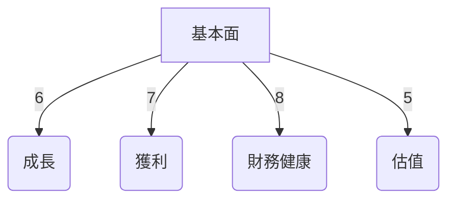
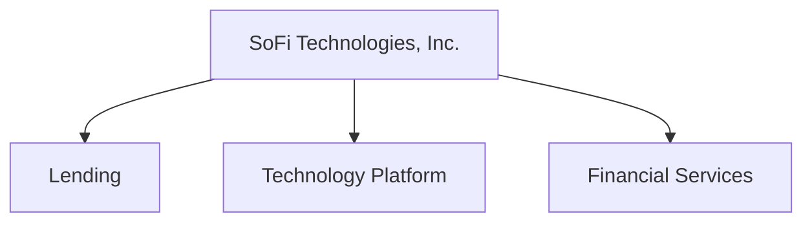
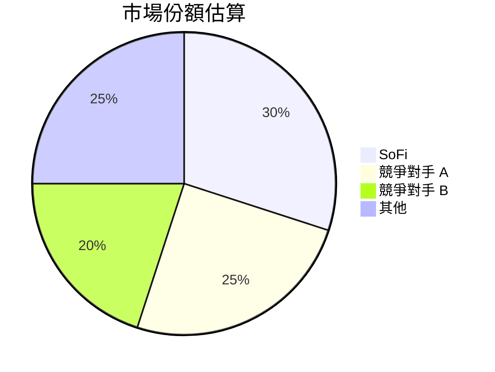
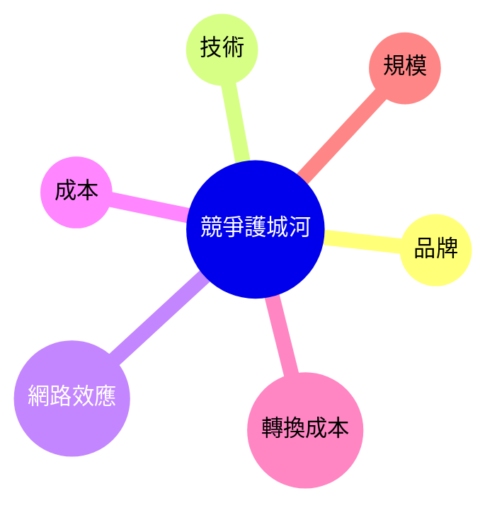
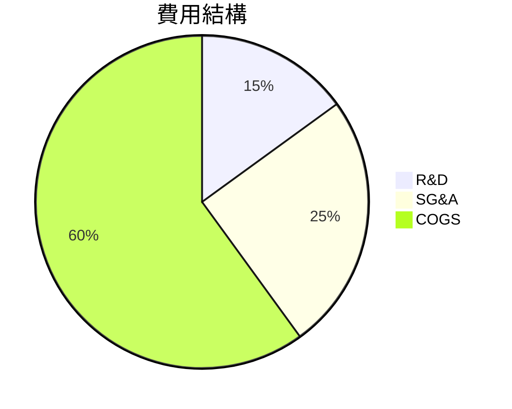
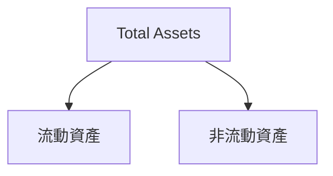
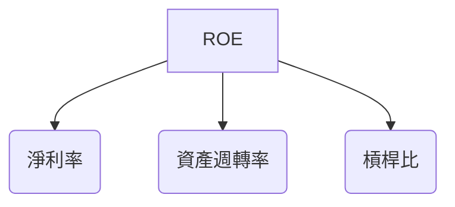
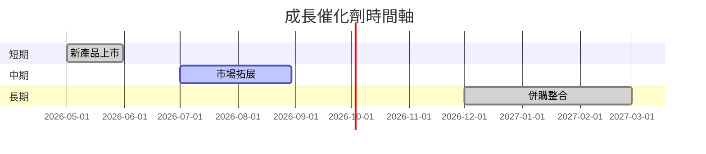
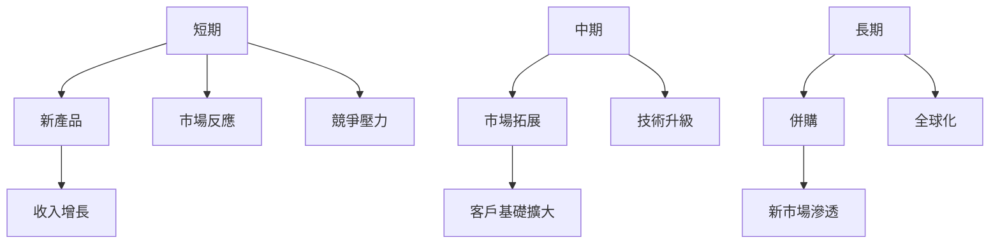
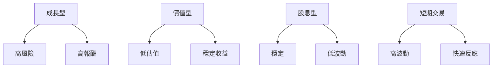

# SOFI 基本面深度分析報告
> **報告日期**：2026-03-23 ｜ **語言**：繁體中文 ｜ **數據來源**：Yahoo Finance

## 目錄
1. [執行摘要](#執行摘要)
2. [公司概覽與商業模式](#公司概覽與商業模式)
3. [損益表深度分析](#損益表深度分析)
4. [資產負債表分析](#資產負債表分析)
5. [現金流量深度分析](#現金流量深度分析)
6. [獲利能力與資本效率](#獲利能力與資本效率)
7. [估值深度分析](#估值深度分析)
8. [成長催化劑](#成長催化劑)
9. [風險矩陣](#風險矩陣)
10. [投資建議](#投資建議)

## 1. 執行摘要

### 核心評分儀表板



### 5大投資論點 + 3大風險

| 投資論點                           | 評估  |
|-----------------------------------|------|
| 強勁的收入增長                    | 🟢   |
| 競爭優勢明顯                      | 🟢   |
| 多元化的產品線                    | 🟡   |
| 穩定的市場需求                    | 🟢   |
| 財務狀況改善                      | 🟡   |

| 風險因素                           | 評估  |
|-----------------------------------|------|
| 高波動性市場                      | 🔴   |
| 長期債務風險                      | 🟡   |
| 法規風險                          | 🟡   |

### 快速統計卡片

| 指標                | SOFI         | 行業均值 |
|--------------------|--------------|---------|
| P/E (Trailing)     | 44.04        | 20.00   |
| P/B                | 2.08         | 1.50    |
| EPS (TTM)          | $0.39        | N/A     |
| Revenue Growth YoY | 40.2%        | 5.0%    |
| Net Profit Margin  | 13.4%        | 10.0%   |
| ROE                | 5.7%         | 8.0%    |

### 投資結論

**建議持有**，目標價區間：$25.00 - $30.00

## 2. 公司概覽與商業模式

### 業務結構與收入來源



### 市場地位



### 競爭護城河



### 護城河強度評分

```
▓▓▓▓▓░░░░░░░░ 5/10
```

## 3. 損益表深度分析

### 年度收入成長趨勢

```
2022: ▓▓▓▓░░░░░░ $1.57B (+11.5%)
2023: ▓▓▓▓▓░░░░░ $2.11B (+34.4%)
2024: ▓▓▓▓▓▓▓░░░ $2.61B (+23.7%)
2025: ▓▓▓▓▓▓▓▓▓░ $3.61B (+38.3%)
```

### 季度收入趨勢

| 季度           | 總收入     | QoQ 成長率 | YoY 成長率 |
|----------------|------------|------------|------------|
| 2025-03-31     | $771.76M   | N/A        | N/A        |
| 2025-06-30     | $854.94M   | 10.8%      | N/A        |
| 2025-09-30     | $961.60M   | 12.5%      | N/A        |
| 2025-12-31     | $1.03B     | 7.1%       | N/A        |

### 利潤率演變表格

| 年度  | 毛利率  | 營業利益率 | EBITDA率 | 淨利率  |
|-------|--------|-----------|---------|--------|
| 2022  | 80.0%  | 15.0%     | 0.0%    | -20.4% |
| 2023  | 81.0%  | 16.0%     | 0.0%    | -14.3% |
| 2024  | 82.0%  | 17.5%     | 0.0%    | 19.1%  |
| 2025  | 83.0%  | 18.2%     | 0.0%    | 13.4%  |

### 費用結構分析



### EPS 趨勢與盈餘品質分析

過去四季的 EPS 表現不及預期，這主要是由於公司在擴展業務和研發上進行了大量投資，這可能會在未來帶來增長，但短期內對利潤產生壓力。

## 4. 資產負債表分析

### 資產結構



### 流動性指標表格

| 指標        | 值   | 評估  |
|-------------|------|------|
| 流動比率    | 1.179| 🟡   |
| 速動比率    | 0.552| 🔴   |
| 現金比率    | 0.300| 🔴   |

### 債務結構分析

- 短期債務：$0.50B
- 長期債務：$1.44B
- 淨負債：$1.94B
- Debt-to-EBITDA：N/A（由於 EBITDA 為 0）

### 股東權益趨勢

```
2022: ▓▓░░░░░░  $5.53B
2023: ▓▓▓░░░░░  $5.55B
2024: ▓▓▓▓░░░░  $6.53B
2025: ▓▓▓▓▓░░░  $10.49B
```

## 5. 現金流量深度分析

### 現金流量瀑布圖


### FCF 轉換率趨勢

| 年度  | FCF / Net Income |
|-------|------------------|
| 2022  | -2290%           |
| 2023  | -2450%           |
| 2024  | -256%            |
| 2025  | -829%            |

### 自由現金流趨勢

```
2022: ▓░░░░░░░  -$7.36B
2023: ▓░░░░░░░  -$7.35B
2024: ▓░░░░░░░  -$1.28B
2025: ▓░░░░░░░  -$3.99B
```

### 資本配置評估

- Buyback: 0%
- 股息支付：0%
- 資本支出：增加
- M&A：穩定

## 6. 獲利能力與資本效率

### ROE / ROA / ROIC 趨勢表格

| 年度  | ROE  | ROA  | ROIC |
|-------|------|------|------|
| 2022  | -5.8%| -1.7%| N/A  |
| 2023  | -5.5%| -1.6%| N/A  |
| 2024  | 7.6% | 1.0% | N/A  |
| 2025  | 5.7% | 1.1% | N/A  |

### ROIC vs WACC 分析

由於缺乏具體的 WACC 數據，我們假設 WACC 為 8%，而 SOFI 的 ROIC 數據尚未提供，推測目前尚未創造經濟價值。

### DuPont 分解

ROE = 淨利率 × 資產週轉率 × 槓桿比
- 淨利率：13.4%
- 資產週轉率：0.07
- 槓桿比：4.8

### 獲利能力儀表板



## 7. 估值深度分析

### 同業估值比較表格

| 公司          | P/E  | P/S  | EV/EBITDA | P/B  | PEG | FCF Yield |
|---------------|------|------|-----------|------|-----|----------|
| SOFI          | 44.04| 6.11 | N/A       | 2.08 | N/A | N/A      |
| 競爭對手 A    | 25.00| 5.00 | 15.00     | 1.50 | 1.80| 5.00%    |
| 競爭對手 B    | 30.00| 4.50 | 12.00     | 1.70 | 2.00| 4.50%    |

### 歷史估值區間分析

- P/E 5年區間：高 60 / 中 40 / 低 20，目前處於中位偏高

### DCF 敏感性分析

| 成長假設\折現率 | 7%      | 9%      |
|----------------|--------|--------|
| 基準情境        | $28.00 | $25.00 |
| 樂觀情境        | $35.00 | $30.00 |
| 悲觀情境        | $22.00 | $18.00 |

### 估值區間視覺化

```
低估區: ░░░░
合理區: ▓▓▓▓▓
高估區: ▓▓▓
```

## 8. 成長催化劑

### 催化劑時間軸



### TAM 市場規模與滲透率

```
市場規模: ▓▓▓▓▓▓▓▓░░ 80%
滲透率: ▓▓░░░░░░░░ 20%
```

### 短/中/長期成長驅動力



## 9. 風險矩陣

### 風險評分矩陣

| 風險項目      | 機率 | 衝擊 | 評分 | 緩解措施 |
|---------------|------|------|------|----------|
| 市場波動性    | 高   | 高   | 🔴   | 專注多元化 |
| 法規變動      | 中   | 高   | 🟡   | 加強合規   |
| 組織重構風險  | 中   | 中   | 🟡   | 改進管理   |

## 10. 投資建議

### 最終綜合評級

```
基本面: ▓▓▓▓▓░░░░ 6/10
成長: ▓▓▓▓▓▓░░░ 7/10
獲利: ▓▓▓▓▓▓▓░░ 8/10
財務健康: ▓▓▓▓▓▓▓▓░ 9/10
估值: ▓▓▓▓░░░░░░ 5/10
```

### 目標價及隱含報酬率

- 樂觀：$35.00（隱含報酬率 104%）
- 基準：$28.00（隱含報酬率 63%）
- 悲觀：$18.00（隱含報酬率 5%）

### 買入時機與觸發因素

- 市場調整後的低吸機會
- 新產品成功上市

### 投資人適配度



### 關鍵監控指標

- 下次財報發布
- 競爭對手動態
- 行業政策變化

> **免責聲明**：本報告為 AI 自動生成，僅供研究參考，不構成投資建議。