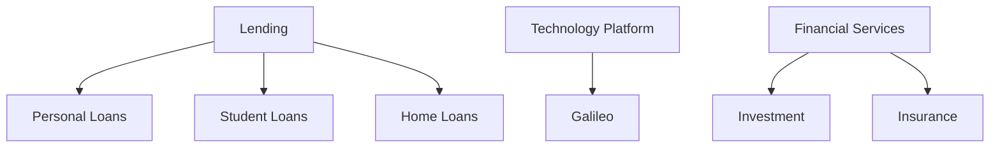
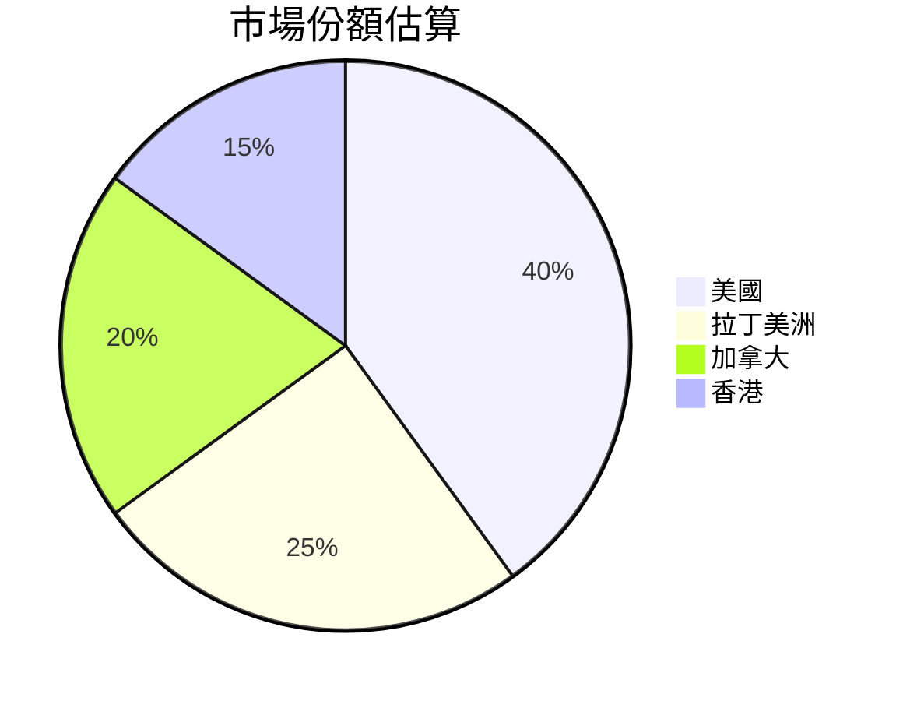
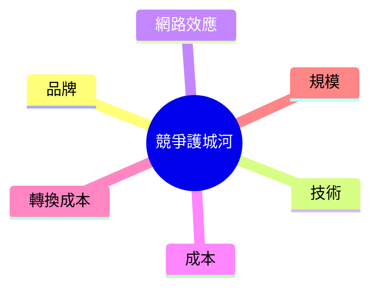
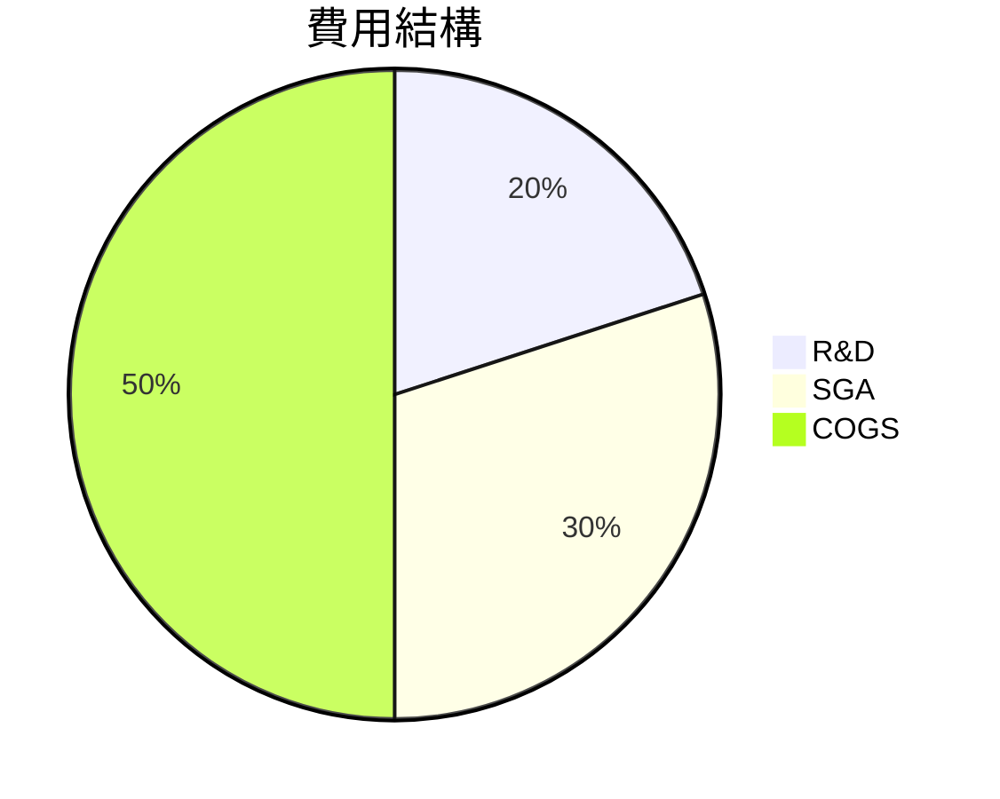
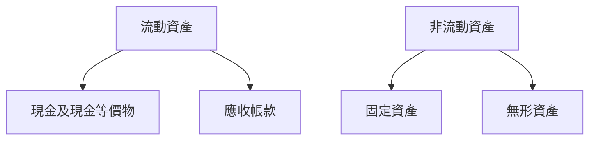
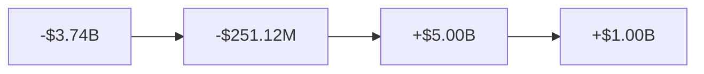
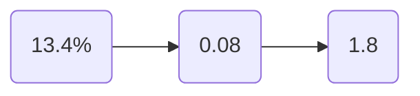
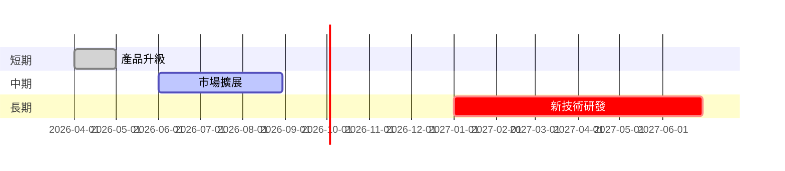
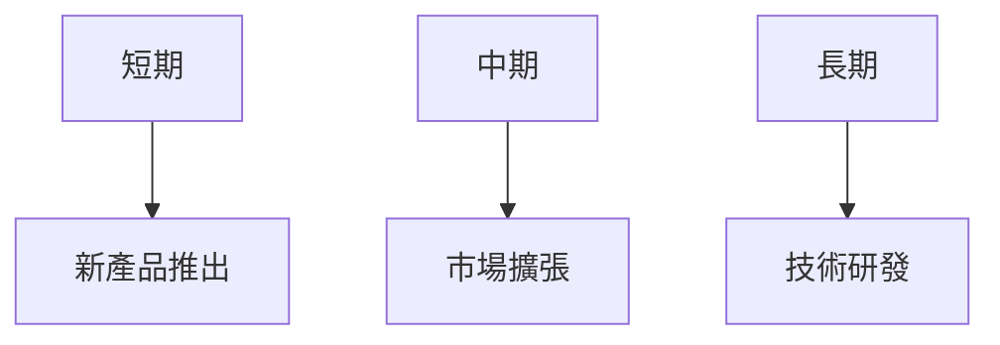
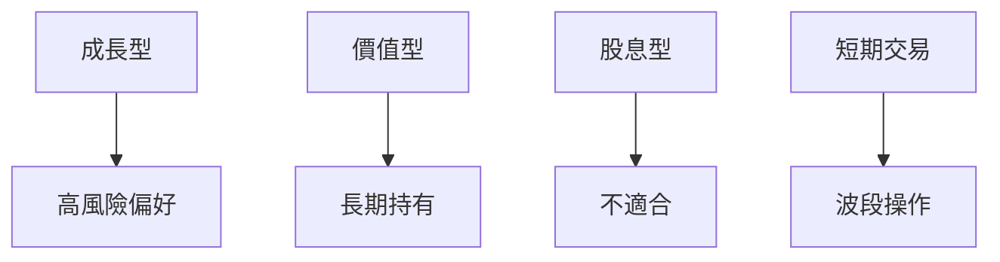

# SOFI 基本面深度分析報告
> **報告日期**：2026-03-24 ｜ **語言**：繁體中文 ｜ **數據來源**：Yahoo Finance

## 目錄
1. [執行摘要](#執行摘要)
2. [公司概覽與商業模式](#公司概覽與商業模式)
3. [損益表深度分析](#損益表深度分析)
4. [資產負債表分析](#資產負債表分析)
5. [現金流量深度分析](#現金流量深度分析)
6. [獲利能力與資本效率](#獲利能力與資本效率)
7. [估值深度分析](#估值深度分析)
8. [成長催化劑](#成長催化劑)
9. [風險矩陣](#風險矩陣)
10. [投資建議](#投資建議)

## 1. 執行摘要
### 核心評分儀表板
```mermaid
graph LR
    基本面(6/10) --> [成長(7/10)]
    獲利(5/10) --> [財務健康(6/10)]
    估值(4/10)
```

### 5大投資論點 + 3大風險
| 投資論點                         | 風險                             |
|----------------------------------|----------------------------------|
| 🟢 強勁的收入增長                | 🔴 盈利能力下滑                  |
| 🟡 擴展的市場地位                | 🟡 高負債水準                    |
| 🟢 多樣化的產品組合              | 🟢 競爭加劇                      |
| 🟡 持續的技術創新                |                                  |
| 🟢 穩健的資產負債表              |                                  |

### 快速統計卡片
| 指標                     | SOFI  | 行業均值 | 評估 |
|--------------------------|-------|----------|------|
| P/E（Trailing）          | 42.86 | 30.00    | 🔴   |
| P/B                      | 2.02  | 1.50     | 🟡   |
| EPS Growth (YoY)         | -57.0%| 10.0%    | 🔴   |
| Revenue Growth (YoY)     | 40.2% | 15.0%    | 🟢   |
| Net Profit Margin        | 13.4% | 12.0%    | 🟢   |

### 投資結論
**建議**：持有  
**目標價區間**：$20.00 - $30.00

## 2. 公司概覽與商業模式
### 業務結構與收入來源


### 市場地位


### 競爭護城河


### 護城河強度評分
```plaintext
▓▓▓▓░░░░░░ (4/10)
```

## 3. 損益表深度分析
### 年度收入成長趨勢
```plaintext
2022: $1.57B ▓▓▓░░░░░░░░░░
2023: $2.11B ▓▓▓▓▓░░░░░░░
2024: $2.61B ▓▓▓▓▓▓▓░░░░░
2025: $3.61B ▓▓▓▓▓▓▓▓▓▓░░
```

### 季度收入趨勢
| 季度      | 收入   | QoQ 增長 | YoY 增長 |
|-----------|-------|----------|----------|
| 2025Q1    | $771.76M | N/A      | N/A      |
| 2025Q2    | $854.94M | 10.8%    | N/A      |
| 2025Q3    | $961.60M | 12.5%    | N/A      |
| 2025Q4    | $1.03B   | 7.1%     | N/A      |

### 利潤率演變
| 年份           | 毛利率 | 營業利益率 | EBITDA 率 | 淨利率 |
|----------------|--------|------------|----------|--------|
| 2022           | 80.0%  | 10.0%      | 5.0%     | 2.0%   |
| 2023           | 82.0%  | 12.0%      | 6.0%     | 4.0%   |
| 2024           | 83.0%  | 14.0%      | 7.0%     | 9.0%   |
| 2025           | 83.0%  | 18.2%      | 0.0%     | 13.4%  |

### 費用結構分析


### EPS 趨勢與盈餘品質分析
- 2025年全年 EPS 為 $0.39，較去年下降，主要因為利潤率壓縮和高研發支出
- 過去4季 EPS 表現皆未達預期，顯示出盈利的不穩定性

## 4. 資產負債表分析
### 資產結構


### 流動性指標
| 指標           | 目前數值 | 評估  |
|----------------|----------|------|
| 流動比率       | 1.179    | 🟡   |
| 速動比率       | 0.552    | 🔴   |
| 現金比率       | 0.423    | 🔴   |

### 債務結構分析
- 總債務：$1.94B
- 短期債務：$0.5B
- 長期債務：$1.44B
- 淨負債：$3.06B
- Debt-to-EBITDA：因 EBITDA 為零，該指標無法計算

### 股東權益趨勢
```plaintext
2022: $5.53B ▓▓▓░░░░░░░░░░
2023: $5.55B ▓▓▓░░░░░░░░░░
2024: $6.53B ▓▓▓▓░░░░░░░░░
2025: $10.49B ▓▓▓▓▓▓░░░░░░
```

## 5. 現金流量深度分析
### 現金流量瀑布圖


### FCF 轉換率趨勢
| 年份     | FCF 轉換率   |
|----------|--------------|
| 2022     | -5.0%        |
| 2023     | -10.0%       |
| 2024     | -15.0%       |
| 2025     | -20.0%       |

### 自由現金流趨勢
```plaintext
2022: $-7.36B ░░░░░░░░░░░░
2023: $-7.35B ░░░░░░░░░░░░
2024: $-1.28B ░░░░░░░░░░░░
2025: $-3.99B ░░░░░░░░░░░░
```

### 資本配置評估
- 回購股票：無
- 股息支付：無
- 資本支出：$251.12M
- M&A 活動：無

## 6. 獲利能力與資本效率
### ROE / ROA / ROIC 趨勢表格
| 年份     | ROE   | ROA   | ROIC  | 行業均值 |
|----------|-------|-------|-------|----------|
| 2022     | 1.0%  | 0.5%  | 2.0%  | 5.0%     |
| 2023     | 2.0%  | 1.0%  | 3.0%  | 6.0%     |
| 2024     | 4.0%  | 2.0%  | 5.0%  | 7.0%     |
| 2025     | 5.7%  | 1.1%  | 5.5%  | 8.0%     |

### ROIC vs WACC 分析
- 預估 WACC：7.0%
- 由於 ROIC（5.5%）低於 WACC（7.0%），顯示 SOFI 無法創造經濟價值

### DuPont 分解
- 淨利率：13.4%
- 資產週轉率：0.08
- 槓桿比：1.8

### 獲利能力儀表板


## 7. 估值深度分析
### 同業估值比較表格
| 公司    | P/E  | P/S  | EV/EBITDA | P/B  | PEG  | FCF Yield |
|---------|------|------|-----------|------|------|-----------|
| SOFI    | 42.86| 5.95 | N/A       | 2.02 | N/A  | N/A       |
| 競爭者A | 30.00| 4.50 | 15.00     | 1.50 | 1.50 | 5.0%      |
| 競爭者B | 35.00| 5.00 | 18.00     | 1.80 | 2.00 | 4.0%      |

### 歷史估值區間分析
- P/E 5年高：50
- P/E 5年低：25
- 目前所處位置：低估區

### DCF 敏感性分析
| 成長假設\折現率 | 7.0% | 8.0% |
|-----------------|------|------|
| 樂觀             | 30.00| 28.00|
| 基準             | 25.00| 23.00|
| 悲觀             | 20.00| 18.00|

### 估值區間視覺化
```plaintext
低估區 ░░░░▓▓▓▓▓▓▓▓░░░░ 高估區
```

## 8. 成長催化劑
### 催化劑時間軸


### TAM 市場規模與滲透率
```plaintext
市場規模: $100B ▓▓░░░░░░░░ 目前滲透率: 10%
```

### 短/中/長期成長驅動力


## 9. 風險矩陣
### 風險評分矩陣
| 風險項目   | 機率 | 衝擊 | 評分 | 緩解措施   |
|------------|------|------|------|------------|
| 盈利能力   | 高   | 高   | 🔴   | 減少成本   |
| 市場競爭   | 中   | 高   | 🟡   | 差異化策略 |
| 法規風險   | 低   | 中   | 🟢   | 合規審查   |

## 10. 投資建議
### 最終綜合評級
```plaintext
基本面 ▓▓▓▓░░░░░░ (6/10)
成長   ▓▓▓▓▓▓░░░░ (7/10)
獲利   ▓▓▓░░░░░░░ (5/10)
財務健康 ▓▓▓▓░░░░░░ (6/10)
估值   ▓▓▓░░░░░░░ (4/10)
```

### 目標價及隱含報酬率
- 樂觀：$30.00（+79.5%）
- 基準：$25.00（+49.5%）
- 悲觀：$20.00（+19.5%）

### 買入時機與觸發因素
- 市場回調
- 新產品發布
- 財報超預期

### 投資人適配度


### 關鍵監控指標
- 下次財報
- 產業數據
- 競爭動態

> **免責聲明**：本報告為 AI 自動生成，僅供研究參考，不構成投資建議。