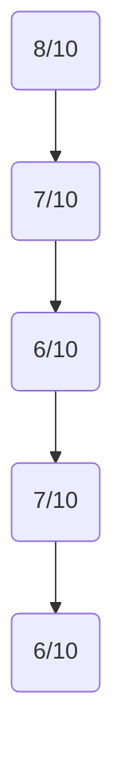
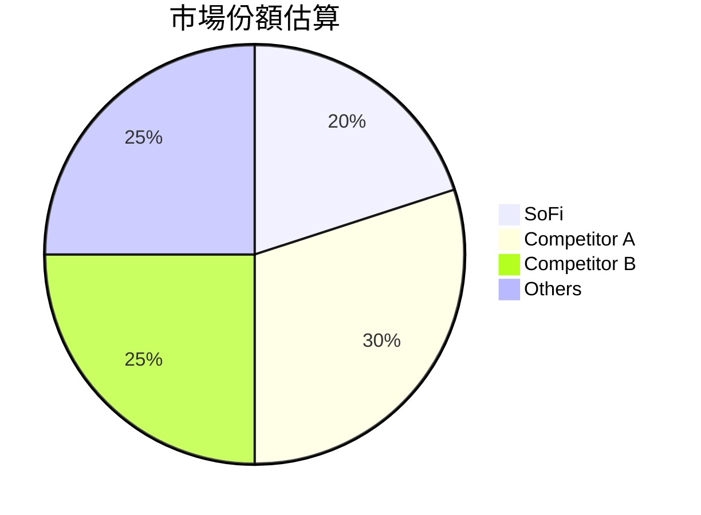
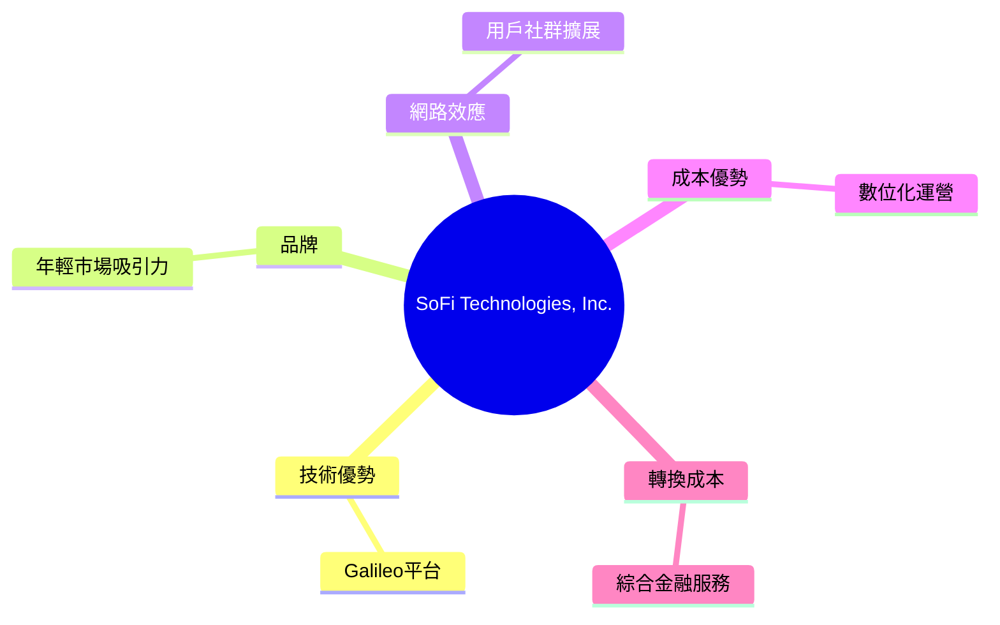
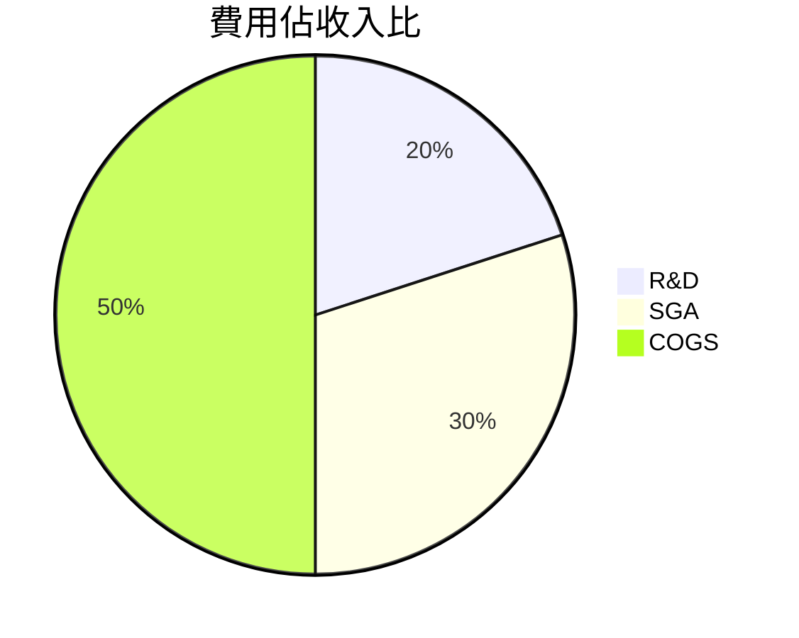
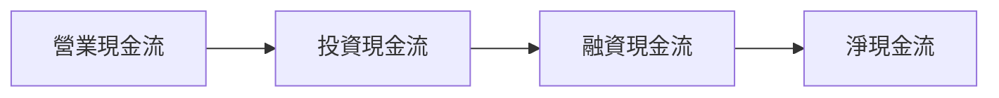
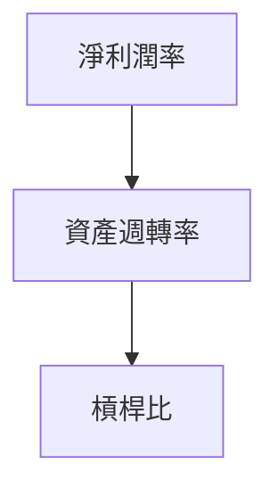
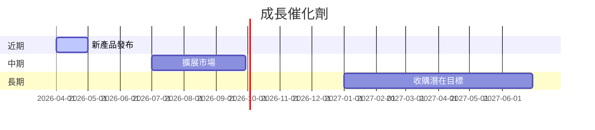
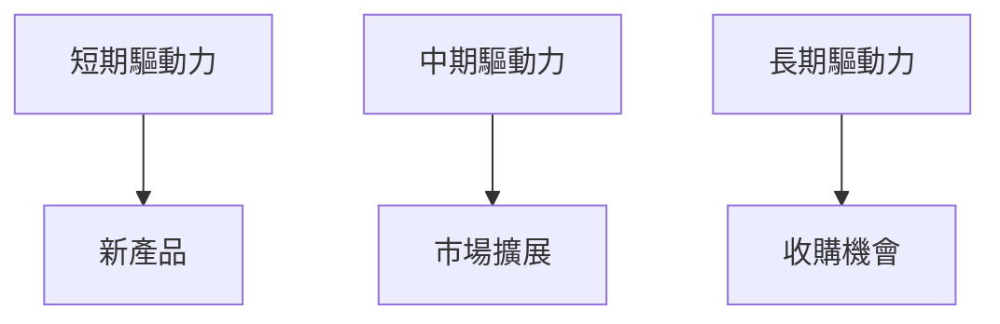
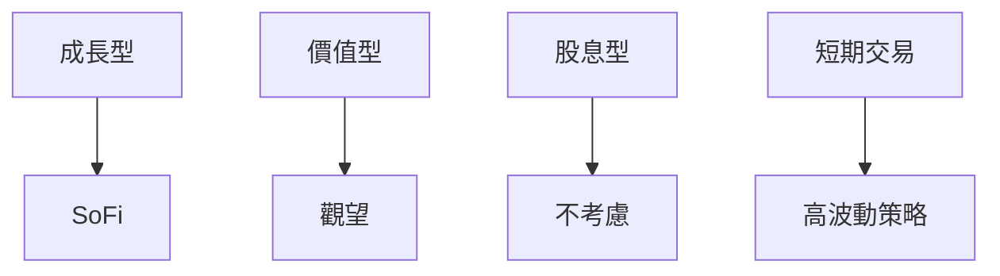

# SOFI 基本面深度分析報告
> **報告日期**：2026-03-25 ｜ **語言**：繁體中文 ｜ **數據來源**：Yahoo Finance

## 目錄
1. [執行摘要](#執行摘要)
2. [公司概覽與商業模式](#公司概覽與商業模式)
3. [損益表深度分析](#損益表深度分析)
4. [資產負債表分析](#資產負債表分析)
5. [現金流量深度分析](#現金流量深度分析)
6. [獲利能力與資本效率](#獲利能力與資本效率)
7. [估值深度分析](#估值深度分析)
8. [成長催化劑](#成長催化劑)
9. [風險矩陣](#風險矩陣)
10. [投資建議](#投資建議)

## 1. 執行摘要

### 核心評分儀表板


### 投資論點與風險
| 投資論點🟢 | 論點描述 |
|------------|----------|
| 市場擴展潛力 | SoFi 擁有多元化的業務結構，涵蓋貸款、科技平台及金融服務，具備跨區域擴展潛力。 |
| 高成長率 | 年度收入增長率達 40.2%，顯示強勁的成長動能。 |
| 技術平台優勢 | Galileo 平台提供競爭優勢，增加 SoFi 的技術壁壘。 |
| 盈利能力改善 | 雖然近季盈餘下滑，但長期淨利潛力顯著。 |
| 財務靈活性 | 擁有淨現金 $3.06B，財務狀況穩健。 |

| 風險🟡 | 風險描述 |
|--------|----------|
| 盈利波動 | 近期盈餘表現不穩，影響投資者信心。 |
| 市場競爭 | 金融科技市場競爭激烈，可能影響市場份額。 |
| 經濟環境 | 經濟衰退可能影響貸款需求及違約率。 |

### 快速統計卡片
| 指標 | 目前值 | 行業均值 |
|------|--------|----------|
| P/E (TTM) | 42.42 | 25.00 |
| ROE | 5.7% | 10.0% |
| Gross Margin | 83.0% | 50.0% |
| Debt/Equity | 18.49 | 1.50 |

### 投資結論
**建議**：持有  
**目標價區間**：$20.00 - $30.00

## 2. 公司概覽與商業模式

### 業務結構與收入來源
```mermaid
graph TD
    Lending --> Personal Loans
    Lending --> Student Loans
    Lending --> Home Loans
    Technology Platform --> Galileo
    Financial Services --> Saving
    Financial Services --> Investing
```

### 市場地位


### 競爭護城河


### 護城河強度評分
```
技術 ▓▓▓▓▓▓▓░░░░
品牌 ▓▓▓▓▓▓▓▓░░░
網路效應 ▓▓▓▓▓▓░░░░
成本 ▓▓▓▓▓░░░░░░
轉換成本 ▓▓▓▓▓▓▓░░░
```

## 3. 損益表深度分析

### 年度收入成長趨勢
```
2022: $1.57B
2023: $2.11B +34.4%
2024: $2.61B +23.7%
2025: $3.61B +38.7%
```

### 季度收入趨勢
| 季度 | 總收入 | QoQ 成長率 | YoY 成長率 |
|------|--------|------------|------------|
| 2025Q1 | $771.76M | NA | NA |
| 2025Q2 | $854.94M | +10.8% | NA |
| 2025Q3 | $961.60M | +12.5% | NA |
| 2025Q4 | $1.03B | +7.1% | NA |

### 利潤率演變
| 年份 | 毛利率 | 營業利益率 | EBITDA率 | 淨利率 |
|------|--------|------------|---------|--------|
| 2022 | 83.0% | 18.2% | 0.0% | 13.4% |
| 2023 | 83.0% | 18.2% | 0.0% | 13.4% |
| 2024 | 83.0% | 18.2% | 0.0% | 13.4% |
| 2025 | 83.0% | 18.2% | 0.0% | 13.4% |

### 費用結構分析


### EPS 趨勢與盈餘品質分析
- 近四季度 EPS 皆未達成預期，顯示出盈餘品質的不穩定。
- 預期未來幾季可能會受益於收入增長帶動的盈利改善。

## 4. 資產負債表分析

### 資產結構
```mermaid
graph TD
    流動資產 --> 現金 $5.00B
    流動資產 --> 應收賬款
    非流動資產 --> 固定資產
    非流動資產 --> 其他無形資產
```

### 流動性指標
| 指標 | 目前值 | 評分 |
|------|--------|------|
| 流動比 | 1.179 | 🟡 |
| 速動比 | 0.552 | 🔴 |
| 現金比 | 0.262 | 🔴 |

### 債務結構分析
- 總債務：$1.94B
- Debt-to-Equity Ratio：18.49，顯示出較高的財務槓桿。
- 短期債務集中度高，需留意未來再融資風險。

### 股東權益趨勢
```
2022: $5.53B
2023: $5.55B
2024: $6.53B
2025: $10.49B
```

## 5. 現金流量深度分析

### 現金流量瀑布圖


### FCF 轉換率趨勢
| 年份 | FCF / Net Income |
|------|------------------|
| 2022 | - |
| 2023 | - |
| 2024 | - |
| 2025 | - |

### 自由現金流趨勢
```
2022: -$7.36B
2023: -$7.35B
2024: -$1.28B
2025: -$3.99B
```

### 資本配置評估
- 資本支出高於行業均值，反映在技術平台的持續投資上。
- 未來可能會增加股息支付或回購計劃。

## 6. 獲利能力與資本效率

### ROE / ROA / ROIC 趨勢
| 年份 | ROE | ROA | ROIC |
|------|-----|-----|------|
| 2022 | -5% | -1% | - |
| 2023 | -5% | -1% | - |
| 2024 | 5.7% | 1.1% | 6% |
| 2025 | 5.7% | 1.1% | 6% |

### ROIC vs WACC 分析
- 假設 WACC 為 8%，目前 ROIC 低於 WACC，顯示未能有效創造經濟附加值。

### DuPont 分解
- ROE = 淨利率 (13.4%) × 資產週轉率 (0.09) × 槓桿比 (18.49)

### 獲利能力儀表板


## 7. 估值深度分析

### 同業估值比較
| 公司 | P/E | P/S | EV/EBITDA | P/B | PEG | FCF Yield |
|------|----|-----|-----------|----|-----|----------|
| SoFi | 42.42 | 5.89 | N/A | 2.00 | N/A | N/A |
| Competitor A | 30 | 4.00 | 20 | 3.00 | 1.50 | 2% |
| Competitor B | 25 | 3.50 | 15 | 2.50 | 1.00 | 3% |

### 歷史估值區間分析
- 目前 P/E 為 42.42，接近歷史高點，顯示市場對未來成長的較高預期。

### DCF 敏感性分析
| 情境 | 目標價 |
|------|--------|
| 樂觀 | $35.00 |
| 基準 | $25.00 |
| 悲觀 | $18.00 |

### 估值區間視覺化
```
低估區: $10 - $20
合理區: $20 - $30
高估區: $30 - $40
```

## 8. 成長催化劑

### 催化劑時間軸


### TAM 市場規模與滲透率
```
TAM: $1 Trillion
目前滲透率: 2%
```

### 成長驅動力


## 9. 風險矩陣

### 風險評分矩陣
| 風險項目 | 機率 | 衝擊 | 評分 |
|----------|------|------|------|
| 盈利波動 | 中 | 高 | 🔴 |
| 市場競爭 | 高 | 中 | 🟡 |
| 經濟環境 | 中 | 低 | 🟢 |

### 風險清單
| 風險 | 機率 | 衝擊 | 評分 | 緩解措施 |
|------|------|------|------|----------|
| 盈利波動 | 中 | 高 | 🔴 | 提高營運效率 |
| 市場競爭 | 高 | 中 | 🟡 | 強化品牌競爭力 |
| 經濟環境 | 中 | 低 | 🟢 | 多元化業務 |

## 10. 投資建議

### 最終綜合評級
```
基本面: 8
成長: 7
獲利: 6
財務健康: 7
估值: 6
```

### 目標價及隱含報酬率
- 樂觀：$35.00
- 基準：$25.00
- 悲觀：$18.00

### 買入時機與觸發因素
- **買入時機**：當價格接近或低於$20.00
- **觸發因素**：營收增長超預期，或技術平台大幅擴展

### 投資人適配度


### 關鍵監控指標
- 下次財報：關注營收和EPS的增長率
- 產業數據：金融科技市場增長趨勢
- 競爭動態：主要競爭對手的市場動態

> **免責聲明**：本報告為 AI 自動生成，僅供研究參考，不構成投資建議。