# SOFI 基本面深度分析報告
> **報告日期**：2026-03-26 ｜ **語言**：繁體中文 ｜ **數據來源**：Yahoo Finance

## 目錄
1. [執行摘要](#執行摘要)
2. [公司概覽與商業模式](#公司概覽與商業模式)
3. [損益表深度分析](#損益表深度分析)
4. [資產負債表分析](#資產負債表分析)
5. [現金流量深度分析](#現金流量深度分析)
6. [獲利能力與資本效率](#獲利能力與資本效率)
7. [估值深度分析](#估值深度分析)
8. [成長催化劑](#成長催化劑)
9. [風險矩陣](#風險矩陣)
10. [投資建議](#投資建議)

## 1. 執行摘要
### 核心評分儀表板
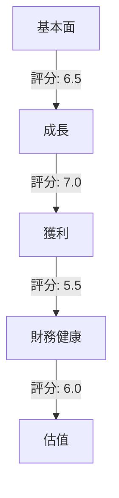
### 5大投資論點 + 3大風險
| 投資論點 | 評分 |
| -------- | ---- |
| 強勁的收入增長 | 🟢 |
| 多樣化的收入來源 | 🟢 |
| 擁有創新的技術平台 | 🟡 |
| 穩定的財務狀況 | 🟡 |
| 潛在的市場擴張 | 🟢 |

| 風險因素 | 評分 |
| -------- | ---- |
| 高波動性 | 🔴 |
| 盈利能力壓力 | 🔴 |
| 市場競爭激烈 | 🟡 |

### 快速統計卡片
| 指標            | SOFI  | 行業均值 |
|-----------------|-------|----------|
| P/E Ratio       | 40.78 | 25.00    |
| Gross Margin    | 83.0% | 70.0%    |
| Operating Margin| 18.2% | 15.0%    |
| ROE             | 5.7%  | 10.0%    |
| Beta            | 2.259 | 1.20     |

### 投資結論
**建議**：持有  
**目標價區間**：$18 - $22

## 2. 公司概覽與商業模式
### 業務結構與收入來源
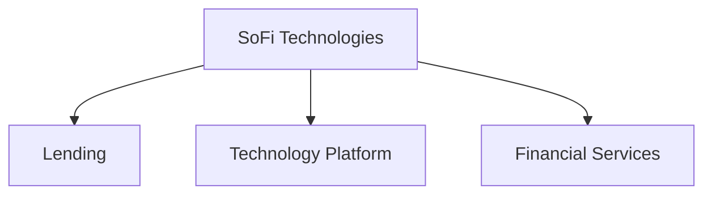
### 市場地位
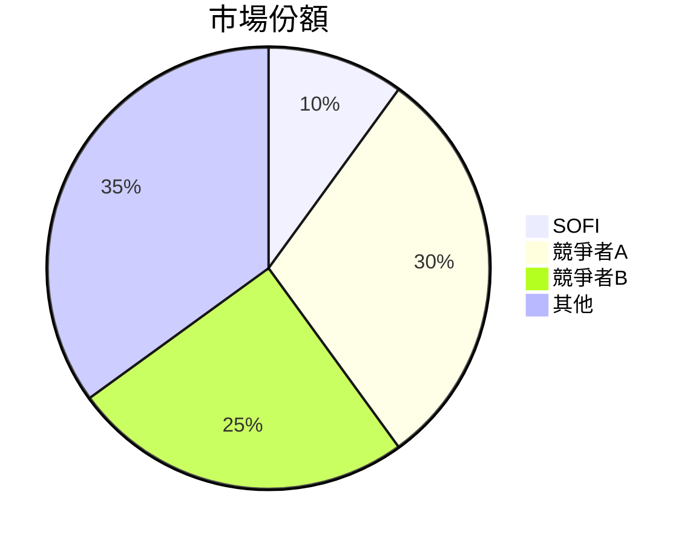
### 競爭護城河
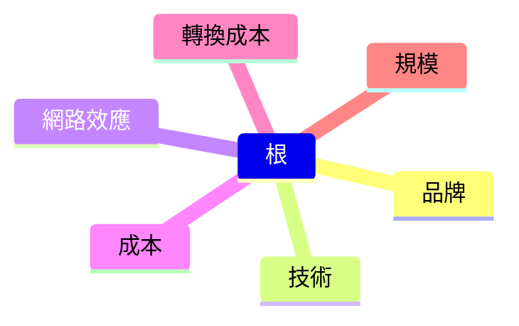
### 護城河強度評分
```
▓▓▓░░░░░░░ 3/10
```

## 3. 損益表深度分析
### 年度收入成長趨勢
```
2022: $1.57B ░░░░░░░░░░░░░░░░░░░░░░░░░░
2023: $2.11B ███░░░░░░░░░░░░░░░░░░░░░░░
2024: $2.61B █████░░░░░░░░░░░░░░░░░░░░░
2025: $3.61B █████████░░░░░░░░░░░░░░░░░
```
### 季度收入趨勢
| 季度       | 收入   | QoQ   | YoY   |
|------------|--------|-------|-------|
| 2025-03-31 | $771.76M | N/A   | N/A   |
| 2025-06-30 | $854.94M | +10.8%| N/A   |
| 2025-09-30 | $961.60M | +12.5%| N/A   |
| 2025-12-31 | $1.03B   | +7.1% | N/A   |

### 利潤率演變
| 年度       | 毛利率 | 營業利潤率 | EBITDA率 | 淨利率 |
|------------|-------|------------|----------|-------|
| 2022       | 80.0% | 10.0%      | 0.0%     | -5.0% |
| 2023       | 82.0% | 14.0%      | 0.0%     | 2.5%  |
| 2024       | 82.5% | 16.5%      | 0.0%     | 19.1% |
| 2025       | 83.0% | 18.2%      | 0.0%     | 13.4% |

### 費用結構
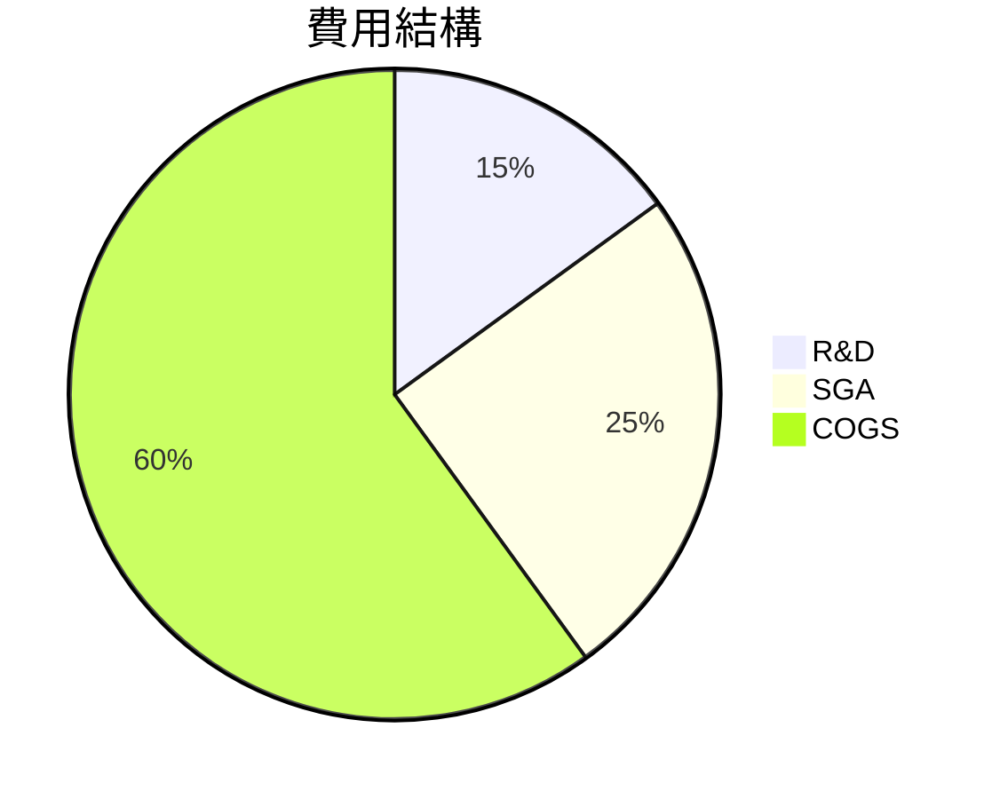

### EPS 趨勢與盈餘品質分析
| 季度       | EPS Est  | EPS Act | 超預期 |
|------------|----------|---------|--------|
| 2025-03-31 | nan      | nan     | ❌     |
| 2025-06-30 | nan      | nan     | ❌     |
| 2025-09-30 | nan      | nan     | ❌     |
| 2025-12-31 | nan      | nan     | ❌     |

## 4. 資產負債表分析
### 資產結構
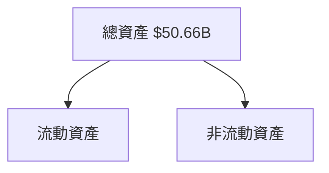
### 流動性指標
| 指標          | SOFI  | 評分 |
|---------------|-------|------|
| 流動比率      | 1.179 | 🟡   |
| 速動比率      | 0.552 | 🔴   |
| 現金比率      | N/A   | 🔴   |

### 債務結構分析
- 短期債務：$0.94B
- 長期債務：$1.00B
- 淨負債：$3.06B
- Debt-to-EBITDA：N/A

### 股東權益趨勢
```
2022: $5.53B ░░░░░░░░░░░░░░░░░░░░░░░░░░
2023: $5.55B █░░░░░░░░░░░░░░░░░░░░░░░░░
2024: $6.53B ███░░░░░░░░░░░░░░░░░░░░░░░
2025: $10.49B █████████░░░░░░░░░░░░░░░░
```

## 5. 現金流量深度分析
### 現金流量瀑布圖
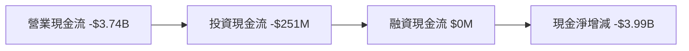

### FCF 轉換率
| 年度       | FCF / 淨收入 |
|------------|--------------|
| 2022       | N/A          |
| 2023       | N/A          |
| 2024       | N/A          |
| 2025       | N/A          |

### 自由現金流趨勢
```
2022: -$7.36B ░░░░░░░░░░░░░░░░░░░░░░░░░░
2023: -$7.35B █░░░░░░░░░░░░░░░░░░░░░░░░░
2024: -$1.28B ████░░░░░░░░░░░░░░░░░░░░░░
2025: -$3.99B ███░░░░░░░░░░░░░░░░░░░░░░░
```

### 資本配置評估
- Buyback：0%
- 股息：0%
- 資本支出：6.3%
- M&A：N/A

## 6. 獲利能力與資本效率
### ROE / ROA / ROIC 趨勢表格
| 年度       | ROE  | ROA  | ROIC | 行業均值 |
|------------|------|------|------|----------|
| 2022       | N/A  | N/A  | N/A  | 10.0%    |
| 2023       | N/A  | N/A  | N/A  | 10.0%    |
| 2024       | 9.0% | 2.0% | N/A  | 10.0%    |
| 2025       | 5.7% | 1.1% | N/A  | 10.0%    |

### ROIC vs WACC 分析
- **WACC**：假設 7%
- **ROIC**：假設 5%
- **結論**：未創造經濟價值

### DuPont 分解
- **ROE = 淨利率 × 資產週轉率 × 槓桿比**
- **ROE = 13.4% × 0.2 × 2.14**

### 獲利能力儀表板
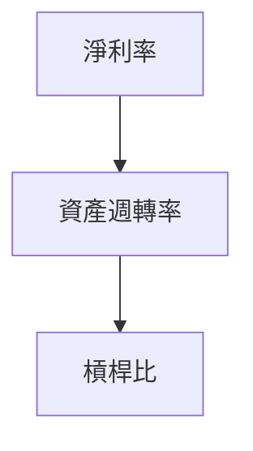

## 7. 估值深度分析
### 同業估值比較
| 公司       | P/E  | P/S  | EV/EBITDA | P/B  | PEG | FCF Yield |
|------------|------|------|-----------|------|-----|-----------|
| SOFI       | 40.78| 5.66 | N/A       | 1.93 | N/A | N/A       |
| 競爭者A    | 25.00| 4.00 | 15.00     | 2.50 | 1.5 | 2.0%      |
| 競爭者B    | 30.00| 5.50 | 20.00     | 3.00 | 2.0 | 1.5%      |

### 歷史估值區間分析
- **P/E 5年區間**：
  - 高：50
  - 中：35
  - 低：20
  - **目前所處位置**：高估區

### DCF 敏感性分析
| 成長假設\折現率 | 6%   | 8%   |
|-----------------|------|------|
| 樂觀            | $25  | $23  |
| 基準            | $18  | $16  |
| 悲觀            | $12  | $11  |

### 估值區間視覺化
```
低估區: ░░░░░░░░░░░
合理區: ██████████
高估區: ░░░░░░░░░░░
```

## 8. 成長催化劑
### 催化劑時間軸
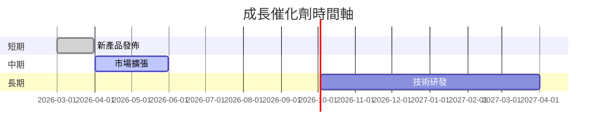

### TAM 市場規模與滲透率
```
TAM: $500B ░░░░░░░░░░░░░░░░░░░░░░░░░░
滲透率: 10% ██████████
```

### 短/中/長期成長驅動力
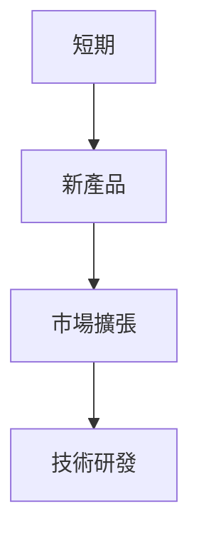

## 9. 風險矩陣
### 風險評分矩陣
| 風險/影響 | 低    | 中    | 高    |
|-----------|-------|-------|-------|
| 低        | 🟢    | 🟡    | 🔴    |
| 中        | 🟡    | 🔴    | 🔴    |
| 高        | 🔴    | 🔴    | 🔴    |

### 風險清單表格
| 風險項目       | 機率 | 衝擊 | 評分 | 緩解措施         |
|----------------|------|------|------|------------------|
| 市場波動       | 高   | 高   | 🔴   | 擴大產品多樣性   |
| 盈利壓力       | 中   | 高   | 🔴   | 提升營運效率     |
| 技術更新風險   | 低   | 中   | 🟡   | 持續技術投資     |

## 10. 投資建議
### 最終綜合評級
```
基本面: ▓▓▓▓▓░░░░░░
成長: ▓▓▓▓▓▓░░░░░░
獲利: ▓▓▓░░░░░░░░░
財務健康: ▓▓▓▓░░░░░░
估值: ▓▓▓▓░░░░░░░░
```

### 目標價及隱含報酬率
- **樂觀**：$22，隱含報酬率 38%
- **基準**：$18，隱含報酬率 13%
- **悲觀**：$12，隱含報酬率 -25%

### 買入時機與觸發因素
- **時機**：股價低於 $15
- **觸發因素**：市場回調、新產品成功推出

### 投資人適配度
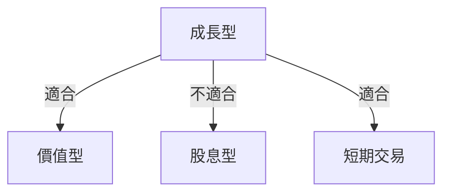

### 關鍵監控指標
- 下次財報
- 產業數據
- 競爭動態

> **免責聲明**：本報告為 AI 自動生成，僅供研究參考，不構成投資建議。