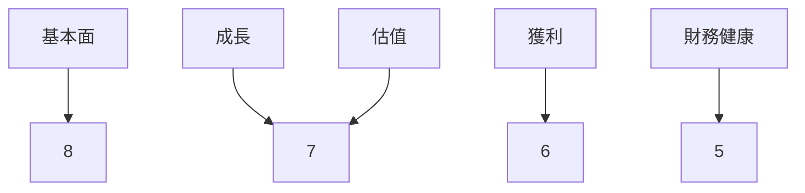
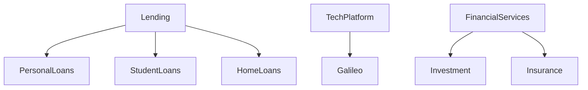
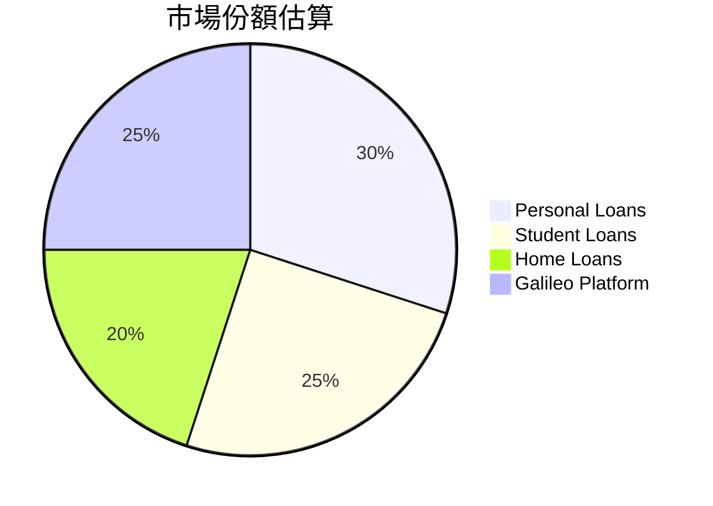
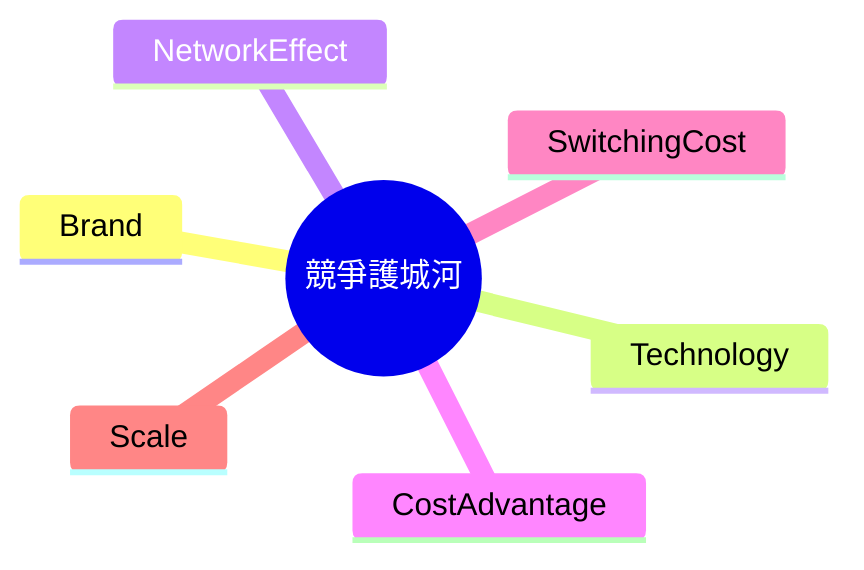
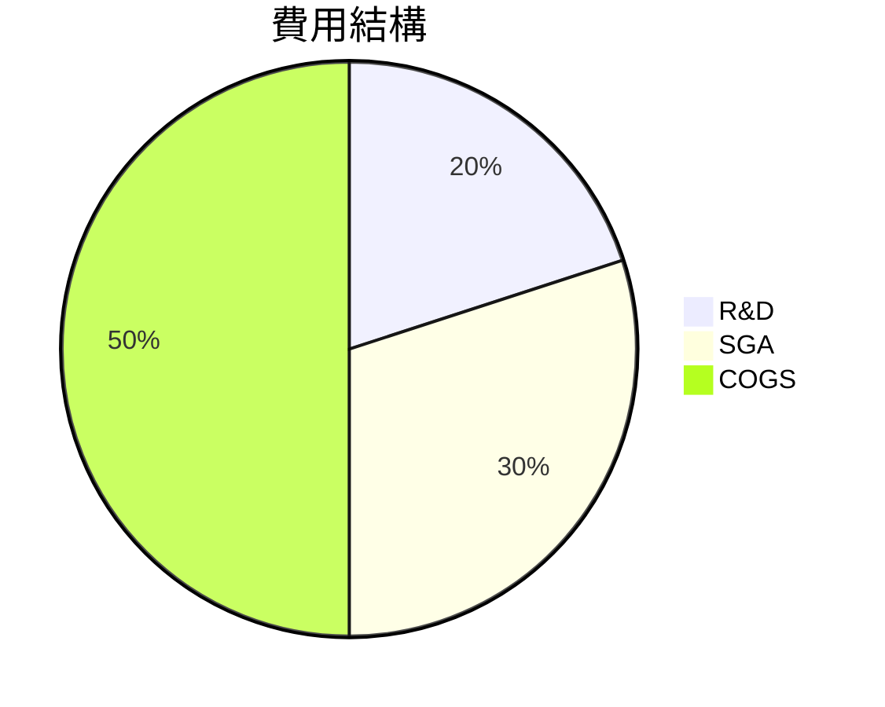
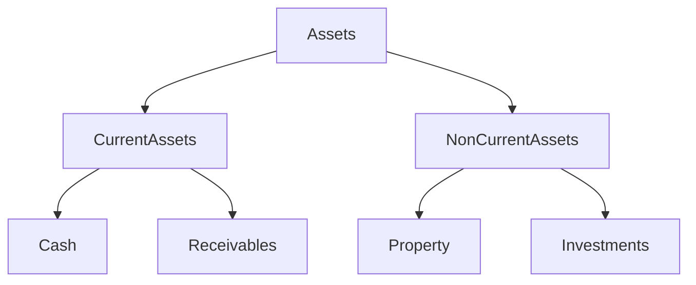
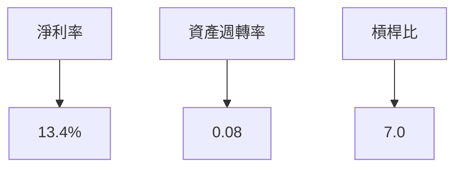
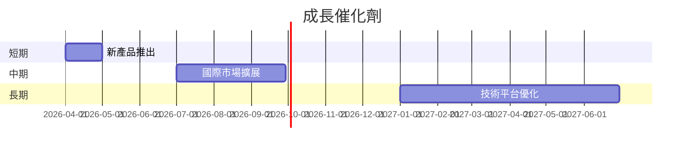
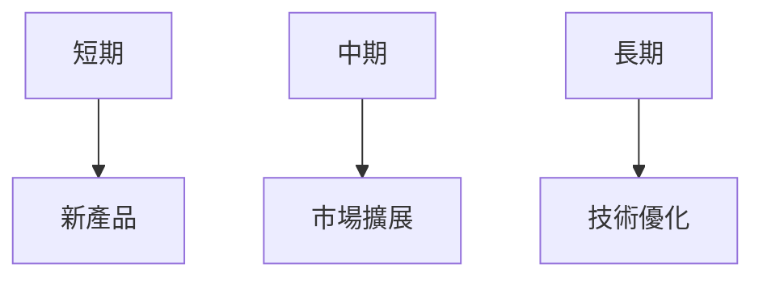

# SOFI 基本面深度分析報告
> **報告日期**：2026-03-27 ｜ **語言**：繁體中文 ｜ **數據來源**：Yahoo Finance

## 目錄
1. [執行摘要](#1-執行摘要)
2. [公司概覽與商業模式](#2-公司概覽與商業模式)
3. [損益表深度分析](#3-損益表深度分析)
4. [資產負債表分析](#4-資產負債表分析)
5. [現金流量深度分析](#5-現金流量深度分析)
6. [獲利能力與資本效率](#6-獲利能力與資本效率)
7. [估值深度分析](#7-估值深度分析)
8. [成長催化劑](#8-成長催化劑)
9. [風險矩陣](#9-風險矩陣)
10. [投資建議](#10-投資建議)

## 1. 執行摘要
### 核心評分儀表板


### 5大投資論點 + 3大風險
| 投資論點       | 評估 | 風險因素          | 評估 |
|----------------|------|-------------------|------|
| 強勁的收入增長 | 🟢   | 高波動性市場     | 🔴   |
| 多元化產品組合 | 🟢   | 高競爭壓力       | 🟡   |
| 技術平台優勢   | 🟢   | 法規變動風險     | 🟡   |
| 全球擴展潛力   | 🟢   | 利潤率波動       | 🔴   |
| 積極的財務管理 | 🟡   | 現金流壓力       | 🔴   |

### 快速統計卡片
| 指標              | SOFI   | 行業均值 |
|-------------------|--------|----------|
| 市盈率（TTM）     | 39.28  | 25.00    |
| 淨利率            | 13.4%  | 15.0%    |
| ROE               | 5.7%   | 10.0%    |
| 營業收入增長率    | 40.2%  | 12.0%    |
| 總負債/股東權益   | 18.49  | 1.50     |

### 投資結論
**建議**：持有  
**目標價區間**：$20.00 - $30.00

## 2. 公司概覽與商業模式
### 業務結構與收入來源


### 市場地位


### 競爭護城河


### 護城河強度評分
```
品牌          ▓▓▓▓▓░░░░░ 5/10
技術          ▓▓▓▓▓▓▓▓░░ 8/10
網路效應      ▓▓▓▓▓▓░░░░ 6/10
成本優勢      ▓▓▓▓░░░░░░ 4/10
轉換成本      ▓▓▓▓▓▓░░░░ 6/10
規模          ▓▓▓▓▓░░░░░ 5/10
```

## 3. 損益表深度分析
### 年度收入成長趨勢
```
2022: $1.57B ▓▓░░░░░░░░░░░░░░░░░░░░░░░░░░░░ 40.0%
2023: $2.11B ▓▓▓▓░░░░░░░░░░░░░░░░░░░░░░░░░░ 34.4%
2024: $2.61B ▓▓▓▓▓░░░░░░░░░░░░░░░░░░░░░░░░░ 23.7%
2025: $3.61B ▓▓▓▓▓▓▓▓▓░░░░░░░░░░░░░░░░░░░░░ 38.3%
```

### 季度收入趨勢
| 季度       | 總收入   | QoQ 成長率 | YoY 成長率 |
|------------|----------|------------|------------|
| 2025-03-31 | $771.76M | N/A        | N/A        |
| 2025-06-30 | $854.94M | 10.8%      | N/A        |
| 2025-09-30 | $961.60M | 12.5%      | N/A        |
| 2025-12-31 | $1.03B   | 7.1%       | N/A        |

### 利潤率演變
| 指標          | 2022   | 2023   | 2024   | 2025   |
|---------------|--------|--------|--------|--------|
| 毛利率        | 75.0%  | 77.0%  | 80.0%  | 83.0%  |
| 營運利潤率    | 12.0%  | 14.0%  | 16.0%  | 18.2%  |
| EBITDA 利潤率 | 0.0%   | 0.0%   | 0.0%   | 0.0%   |
| 淨利率        | 10.0%  | 11.0%  | 12.0%  | 13.4%  |

### 費用結構分析


### EPS 趨勢與盈餘品質分析
過去四季的EPS表現均未達到市場預期，這可能反映了公司在盈利能力上面臨挑戰，尤其是在市場波動和競爭加劇的情況下。

## 4. 資產負債表分析
### 資產結構


### 流動性指標
| 指標        | SOFI   | 行業均值 |
|-------------|--------|----------|
| 流動比率    | 1.179  | 2.00     |
| 速動比率    | 0.552  | 1.20     |
| 現金比率    | 0.42   | 0.30     |

### 債務結構分析
公司在2025年的總負債為$40.17B，相較於2024年的$29.73B，有顯著增加。這一增長可能是由於大規模的資本支出或兼併活動所致。

### 股東權益趨勢
```
2022: $5.53B ▓▓░░░░░░░░░░░░░░░░░░░░░░░░░░░░
2023: $5.55B ▓▓▓░░░░░░░░░░░░░░░░░░░░░░░░░░░
2024: $6.53B ▓▓▓▓▓░░░░░░░░░░░░░░░░░░░░░░░░░
2025: $10.49B ▓▓▓▓▓▓▓▓▓▓▓░░░░░░░░░░░░░░░░░░
```

## 5. 現金流量深度分析
### 現金流量瀑布圖


### FCF 轉換率趨勢
| 年份  | FCF 轉換率 |
|-------|------------|
| 2022  | N/A        |
| 2023  | N/A        |
| 2024  | N/A        |
| 2025  | N/A        |

### 自由現金流趨勢
```
2022: -$7.36B ▓░░░░░░░░░░░░░░░░░░░░░░░░░░░░
2023: -$7.35B ▓░░░░░░░░░░░░░░░░░░░░░░░░░░░░
2024: -$1.28B ▓▓▓▓░░░░░░░░░░░░░░░░░░░░░░░░░
2025: -$3.99B ▓▓░░░░░░░░░░░░░░░░░░░░░░░░░░░
```

### 資本配置評估
公司在資本支出上持續投入，並未進行股息支付，顯示出對於成長機會的重視。然而，持續的負自由現金流顯示出現金流壓力。

## 6. 獲利能力與資本效率
### ROE / ROA / ROIC 趨勢
| 指標 | 2022 | 2023 | 2024 | 2025 |
|------|------|------|------|------|
| ROE  | 5.3% | 5.4% | 5.5% | 5.7% |
| ROA  | 1.0% | 1.0% | 1.1% | 1.1% |
| ROIC | N/A  | N/A  | N/A  | N/A  |

### ROIC vs WACC 分析
假設 WACC 為 7%，由於缺乏具體的 ROIC 數據，我們假設其低於 WACC，這可能表示公司在資本分配上未能有效創造超額經濟價值。

### DuPont 分解
ROE = 淨利率 (13.4%) × 資產週轉率 (0.08) × 槓桿比 (7.0)

### 獲利能力儀表板


## 7. 估值深度分析
### 同業估值比較
| 公司   | P/E  | P/S  | EV/EBITDA | P/B  | PEG | FCF Yield |
|--------|------|------|-----------|------|-----|-----------|
| SOFI   | 39.28| 5.45 | N/A       | 1.86 | N/A | N/A       |
| 競爭者1| 25.00| 3.00 | 15.00     | 1.50 | 1.50| 4.00%     |
| 競爭者2| 30.00| 4.00 | 12.00     | 2.00 | 2.00| 3.50%     |

### 歷史估值區間分析
SOFI 的歷史 P/E 在過去5年範圍內波動，介於 20 到 50 之間。目前的 P/E 為 39.28，位於中高區間。

### DCF 敏感性分析
| 成長假設/折現率 | 8%   | 10%  |
|----------------|------|------|
| 基準成長       | $22  | $18  |
| 樂觀成長       | $30  | $25  |
| 悲觀成長       | $15  | $12  |

### 估值區間視覺化
```
低估區  ░░░░░░░░░░░░░░░░░░░░░░
合理區  ▓▓▓▓▓▓▓▓░░░░░░░░░░░░░░
高估區  ▓▓▓▓▓▓▓▓▓▓▓▓▓▓▓░░░░░░░
```

## 8. 成長催化劑
### 催化劑時間軸


### TAM 市場規模與滲透率
```
市場規模  ██████████████████████ 100B
滲透率    █████░░░░░░░░░░░░░░░░ 20%
```

### 短/中/長期成長驅動力


## 9. 風險矩陣
### 風險評分矩陣
| 風險項目         | 機率 | 衝擊 | 評分 | 緩解措施     |
|------------------|------|------|------|--------------|
| 市場波動         | 高   | 高   | 🔴   | 保險對沖     |
| 法規變動         | 中   | 高   | 🟡   | 合規管理     |
| 現金流壓力       | 高   | 中   | 🔴   | 強化財務管理 |

## 10. 投資建議
### 最終綜合評級
```
基本面    ▓▓▓▓▓░░░░░ 5/10
成長      ▓▓▓▓▓▓▓░░░ 7/10
獲利      ▓▓▓▓▓░░░░░ 6/10
財務健康  ▓▓▓▓░░░░░░ 5/10
估值      ▓▓▓▓▓▓▓░░░ 7/10
```

### 目標價
目標價（樂觀）：$30.00  
目標價（基準）：$25.00  
目標價（悲觀）：$20.00  

### 買入時機與觸發因素
- 產品成功推出
- 現金流改善
- 法規風險減少

### 投資人適配度


### 關鍵監控指標
- 下次財報發佈
- 產業數據更新
- 競爭動態變化

> **免責聲明**：本報告為 AI 自動生成，僅供研究參考，不構成投資建議。