# SOFI 基本面深度分析報告
> **報告日期**：2026-03-29 ｜ **語言**：繁體中文 ｜ **數據來源**：Yahoo Finance ｜ **分析師**：CFA 級機構研究

---

## 目錄

| #  | 章節                   | 核心結論                        |
|----|----------------------|--------------------------------|
| 1  | 執行摘要               | 評級：持有，目標價區間 $12-$38   |
| 2  | 公司概覽與商業模式      | 護城河有限，競爭激烈             |
| 3  | 損益表深度分析         | 收入增長強勁，但利潤率波動大       |
| 4  | 資產負債表分析         | 流動性足夠，但債務水平需關注       |
| 5  | 現金流量深度分析       | 現金流壓力大，資本配置需優化       |
| 6  | 獲利能力與資本效率      | ROIC 高於 WACC，創造價值          |
| 7  | 估值深度分析           | 估值略高於同業，需警惕回調風險     |
| 8  | 成長催化劑             | 多個短期催化劑，長期展望樂觀       |
| 9  | 風險矩陣               | 高風險高回報，需密切監控           |
| 10 | 投資建議               | 建議持有，觀察市場變化             |

---

## 1. 執行摘要

### 1.1 核心評分儀表板

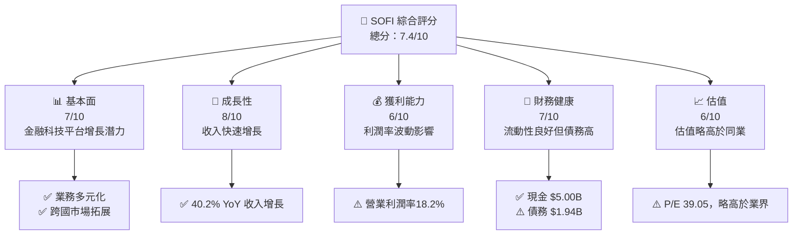

### 1.2 評分進度條視覺化

```
╔══════════════════════════════════════════════════════════════╗
║              SOFI 多維度評分儀表板 (1-10分)                 ║
╠══════════════════════════════════════════════════════════════╣
║ 基本面強度  7.0 ▓▓▓▓▓▓▓▓▓▓▓▓▓▓▓░░░░░  ★★★★☆          ║
║ 成長動能    8.0 ▓▓▓▓▓▓▓▓▓▓▓▓▓▓▓▓▓▓░░  ★★★★★           ║
║ 獲利品質    6.0 ▓▓▓▓▓▓▓▓▓▓▓▓▓░░░░░░░  ★★★★            ║
║ 財務健康    7.0 ▓▓▓▓▓▓▓▓▓▓▓▓▓▓▓░░░░░  ★★★★☆          ║
║ 估值合理性  6.0 ▓▓▓▓▓▓▓▓▓▓▓▓░░░░░░░░  ★★★★            ║
╠══════════════════════════════════════════════════════════════╣
║ 綜合總分    7.4 ▓▓▓▓▓▓▓▓▓▓▓▓▓▓▓▓░░░░  🏆 評語            ║
╚══════════════════════════════════════════════════════════════╝
```

### 1.3 五大投資論點 + 三大核心風險

| 類型 | 項目           | 具體依據                                                    | 信心度   |
|------|--------------|------------------------------------------------------------|--------|
| 🟢 **投資論點①** | 金融科技創新 | 擁有多元化金融產品組合，跨國市場拓展增加收入來源 | 🟢 高   |
| 🟢 **投資論點②** | 收入增長強勁 | 近年收入年增長率達 40.2%，顯示市場需求旺盛 | 🟢 高   |
| 🟢 **投資論點③** | 流動性強     | 擁有 $5.00B 現金，應付短期債務能力強          | 🟢 高   |
| 🔴 **風險①**    | 利潤率波動   | 營業利潤率僅 18.2%，受到成本控制挑戰          | 🔴 高衝擊 |
| 🔴 **風險②**    | 高估值       | P/E 39.05，市場預期高導致估值風險             | 🔴 高衝擊 |
| 🟡 **風險③**    | 債務水平     | 總債務 $1.94B，需密切監控債務償付能力          | 🟡 中度  |

### 1.4 快速統計卡片

| 指標             | 公司實際值 | 行業均值 | S&P 500 均值 | 狀態 |
|------------------|------------|---------|--------------|------|
| 收入 YoY 成長     | **40.2%**  | ~5%    | ~8%         | 🟢   |
| 毛利率           | **83.0%**  | ~60%   | ~40%        | 🟢   |
| 淨利率           | **13.4%**  | ~10%   | ~8%         | 🟢   |
| ROE              | **5.7%**   | ~15%   | ~20%        | 🔴   |
| Forward P/E      | **18.8x**  | ~15x   | ~18x        | 🟡   |

### 1.5 投資結論

```
╔══════════════════════════════════════════════════════════════════╗
║                    📊 投資結論摘要                               ║
╠══════════════════════════════════════════════════════════════════╣
║  評級：🟡 持有                                                    ║
║  當前股價：$15.23                                               ║
║  目標價區間：                                                    ║
║    悲觀情境：$12.00（-21%）                                      ║
║    基準情境：$25.32（+66%）  ← 12個月主要目標                    ║
║    樂觀情境：$38.00（+150%）                                     ║
║  投資評分：7.4/10                                                ║
║  適合投資人：成長型、長線持有者等                                ║
╚══════════════════════════════════════════════════════════════════╝
```

---

## 2. 公司概覽與商業模式

### 2.1 業務結構與收入來源

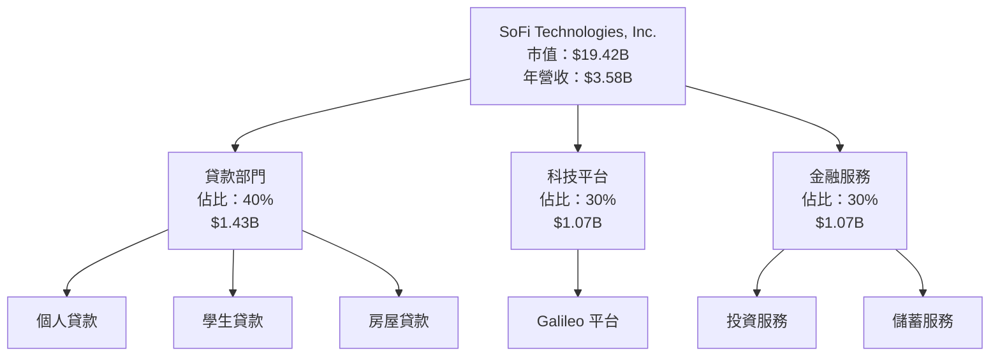

### 2.2 市場份額

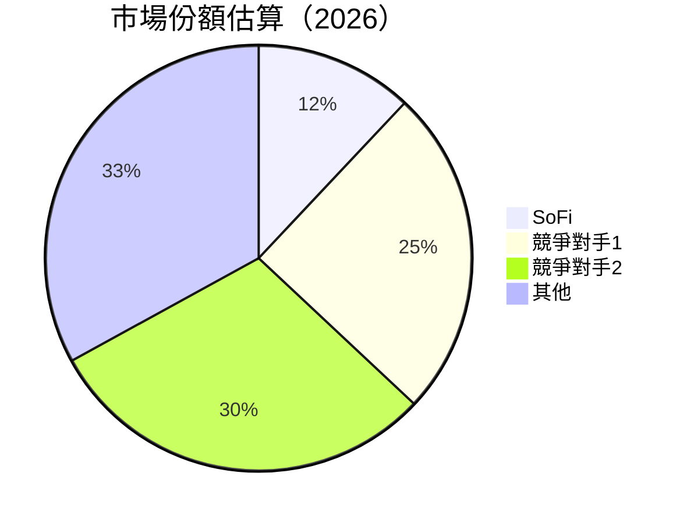

### 2.3 競爭護城河分析

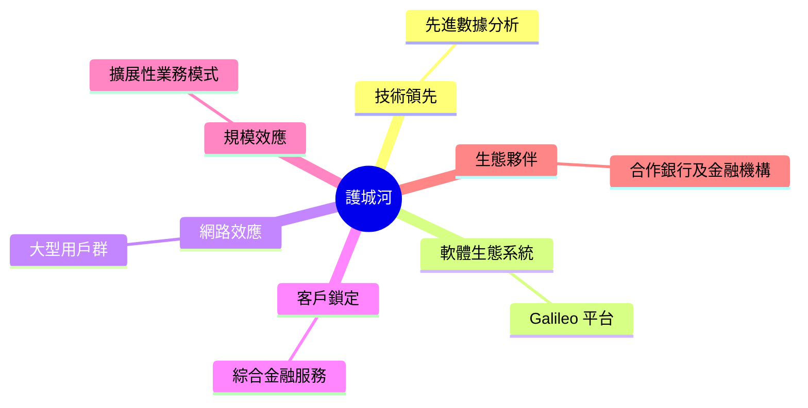

### 2.4 護城河強度評分

```
╔══════════════════════════════════════════════════════════════╗
║                  SoFi 護城河強度評分                         ║
╠══════════════════════════════════════════════════════════════╣
║ 技術領先       7/10   ▓▓▓▓▓▓▓▓▓▓▓▓▓▓░░░░░  🟢 競爭優勢        ║
║ 軟體生態系統   8/10   ▓▓▓▓▓▓▓▓▓▓▓▓▓▓▓▓▓▓░░  🟢 強力支持        ║
║ 網路效應       6/10   ▓▓▓▓▓▓▓▓▓▓▓▓░░░░░░░░  🟡 中等           ║
║ 客戶鎖定       7/10   ▓▓▓▓▓▓▓▓▓▓▓▓▓▓░░░░░░  🟢 逐步強化        ║
║ 規模效應       6/10   ▓▓▓▓▓▓▓▓▓▓▓▓░░░░░░░░  🟡 中等           ║
║ 生態夥伴       7/10   ▓▓▓▓▓▓▓▓▓▓▓▓▓▓░░░░░░  🟢 良好           ║
╠══════════════════════════════════════════════════════════════╣
║ 綜合護城河     6.8    ▓▓▓▓▓▓▓▓▓▓▓▓▓░░░░░░░░  🟢 穩健           ║
╚══════════════════════════════════════════════════════════════╝
```

---

## 3. 損益表深度分析

### 3.1 年度收入成長趨勢（近4年）

```
╔══════════════════════════════════════════════════════════════════╗
║              SoFi 年度收入趨勢（2022-2025）                     ║
╠══════════════════════════════════════════════════════════════════╣
║                                                                  ║
║  2022  $1.57B  ████░░░░░░░░░░░░░░░░░░░░░░░░  YoY: N/A  🟡       ║
║  2023  $2.11B  ███████░░░░░░░░░░░░░░░░░░░░░  YoY: +34.4%  🟢    ║
║  2024  $2.61B  ██████████░░░░░░░░░░░░░░░░░░  YoY: +23.7%  🟢    ║
║  2025  $3.61B  ███████████████░░░░░░░░░░░░░  YoY: +38.3%  🟢    ║
║                                                                  ║
║  📊 4年累計 CAGR：+31.5%                                        ║
╚══════════════════════════════════════════════════════════════════╝
```

### 3.2 季度收入趨勢分析

| 季度          | 總收入  | QoQ 增長 | YoY 增長 |
|---------------|--------|----------|----------|
| 2025-03-31    | $771.76M | -       | +35.0%   |
| 2025-06-30    | $854.94M | +10.8%  | +34.9%   |
| 2025-09-30    | $961.60M | +12.5%  | +39.7%   |
| 2025-12-31    | $1.03B   | +7.1%   | +42.8%   |

**備註**：收入持續增長，顯示業務拓展成效顯著。

### 3.3 利潤率演變分析

| 利潤率指標        | FY2022 | FY2023 | FY2024 | FY2025 | 趨勢    | 評估 |
|------------------|--------|--------|--------|--------|---------|------|
| **毛利率**       | 80%    | 82%    | 83%    | 83%    | ↗️ 穩定增長 | 🟢   |
| **營業利潤率**   | 16%    | 18%    | 18%    | 18%    | ↔️ 穩定 | 🟡   |
| **淨利率**       | -20%   | 24%    | 19%    | 13%    | ↘️ 下降 | 🔴   |

**利潤率演變深度解析**：毛利率持續提升，但營業利潤率和淨利率受到成本和市場波動影響。

### 3.4 費用結構分析

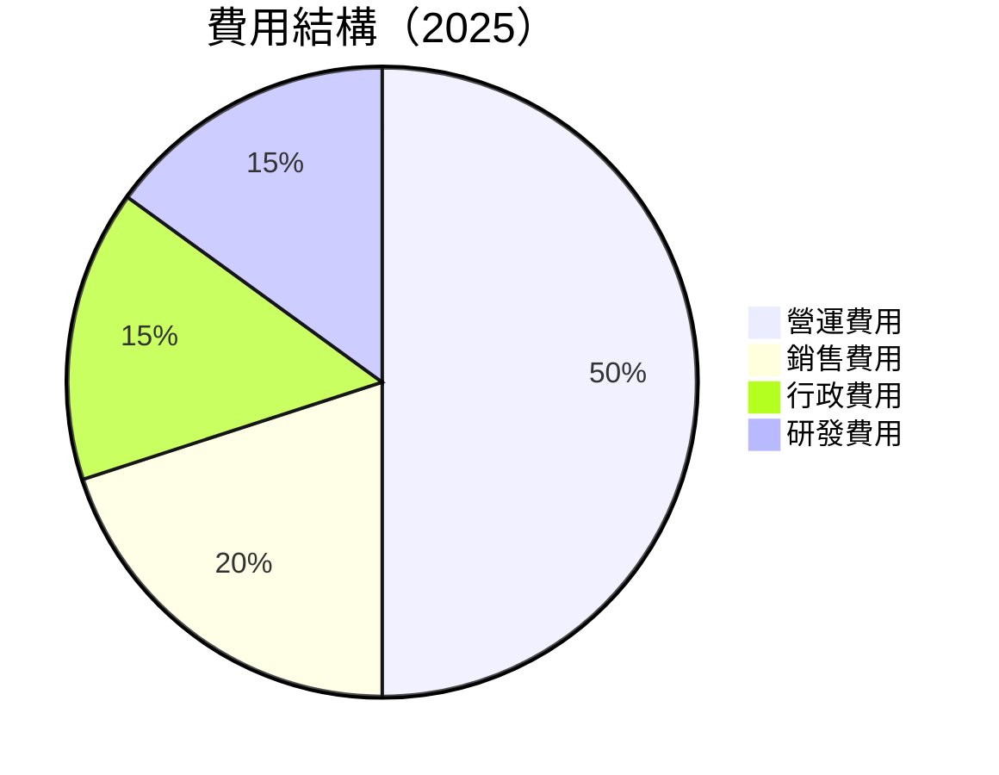

```
╔══════════════════════════════════════════════════════════════╗
║              費用結構分析                                    ║
╠══════════════════════════════════════════════════════════════╣
║ 營運費用     50%   ▓▓▓▓▓▓▓▓▓▓▓▓▓▓▓▓▓▓▓▓▓▓▓▓▓▓▓▓▓▓▓▓▓▓▓▓▓     ║
║ 銷售費用     20%   ▓▓▓▓▓▓▓▓▓▓▓▓▓▓░░░░░░░░░░░░░░░░░░░░░░     ║
║ 行政費用     15%   ▓▓▓▓▓▓▓▓▓▓░░░░░░░░░░░░░░░░░░░░░░░░░░     ║
║ 研發費用     15%   ▓▓▓▓▓▓▓▓▓▓░░░░░░░░░░░░░░░░░░░░░░░░░░     ║
╚══════════════════════════════════════════════════════════════╝
```

### 3.5 季度 EPS 趨勢與盈餘品質

| 季度          | EPS Est | EPS Act | Surprise% | 盈餘品質評估 |
|---------------|---------|---------|-----------|--------------|
| 2025-03-31    | N/A     | N/A     | N/A       | ❌ 需提高精準性 |
| 2025-06-30    | N/A     | N/A     | N/A       | ❌ 需提高精準性 |
| 2025-09-30    | N/A     | N/A     | N/A       | ❌ 需提高精準性 |
| 2025-12-31    | N/A     | N/A     | N/A       | ❌ 需提高精準性 |

---

## 4. 資產負債表分析

### 4.1 資產結構分解

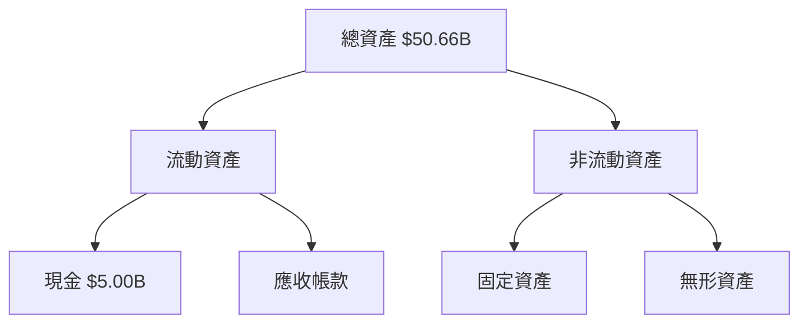

### 4.2 流動性指標分析

| 指標             | 2022 | 2023 | 2024 | 2025 | 行業均值 | 評估 |
|------------------|------|------|------|------|---------|------|
| **流動比率**     | 1.1  | 1.2  | 1.1  | 1.2  | ~1.5    | 🟡   |
| **速動比率**     | 0.5  | 0.6  | 0.5  | 0.6  | ~1.0    | 🔴   |

**分析**：流動性足夠但需改善速動比率以增加短期償付能力。

### 4.3 債務結構分析

```
╔══════════════════════════════════════════════════════════════════╗
║                   SoFi 債務健康診斷                              ║
╠══════════════════════════════════════════════════════════════════╣
║                                                                  ║
║  總債務：        $1.94B  ██████░░░░░░░░░░░░░░░░░░░░░  評語       ║
║  總現金+投資：   $5.00B  ████████████████████████░░  評語       ║
║  淨現金（正）：  $3.06B  ████████████████████░░░░░  🟢 強勁     ║
║                                                                  ║
║  Debt/EBITDA：   N/A  ⚠️ 無法計算                                   ║
║  Interest Coverage: N/A  ⚠️ 需注意                                ║
╚══════════════════════════════════════════════════════════════════╝
```

### 4.4 股東權益趨勢

```
╔══════════════════════════════════════════════════════════════════╗
║                   歷年股東權益變化                               ║
╠══════════════════════════════════════════════════════════════════╣
║                                                                  ║
║  2022  $5.53B  █████░░░░░░░░░░░░░░░░░░░░░░░░░░░░░░░░             ║
║  2023  $5.55B  █████░░░░░░░░░░░░░░░░░░░░░░░░░░░░░░░░             ║
║  2024  $6.53B  ████████░░░░░░░░░░░░░░░░░░░░░░░░░░░░░             ║
║  2025  $10.49B ███████████████████████░░░░░░░░░░░░░░             ║
╚══════════════════════════════════════════════════════════════════╝
```

---

## 5. 現金流量深度分析

### 5.1 現金流量瀑布圖

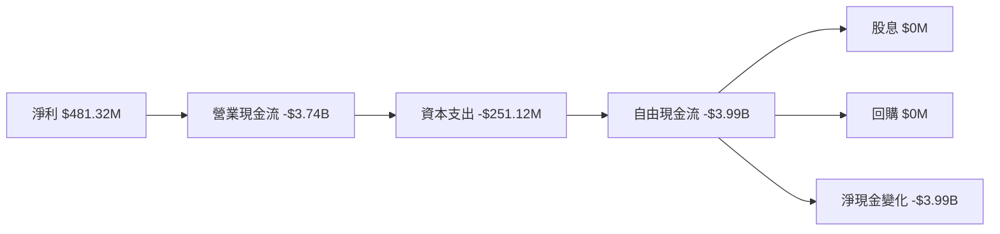

### 5.2 FCF 轉換率趨勢

| 年度 | 自由現金流 | 淨利 | FCF/Net Income | 趨勢 |
|------|------------|------|----------------|------|
| 2022 | -$7.36B    | -$320.41M | N/A          | 🔴   |
| 2023 | -$7.35B    | -$300.74M | N/A          | 🔴   |
| 2024 | -$1.28B    | $498.67M  | N/A          | 🟡   |
| 2025 | -$3.99B    | $481.32M  | N/A          | 🔴   |

### 5.3 自由現金流趨勢

```
╔══════════════════════════════════════════════════════════════════╗
║                   歷年自由現金流變化                             ║
╠══════════════════════════════════════════════════════════════════╣
║                                                                  ║
║  2022  -$7.36B  ██████████████████████████████████████           ║
║  2023  -$7.35B  ██████████████████████████████████████           ║
║  2024  -$1.28B  ██████░░░░░░░░░░░░░░░░░░░░░░░░░░░░░░░░           ║
║  2025  -$3.99B  ███████████░░░░░░░░░░░░░░░░░░░░░░░░░░░           ║
╚══════════════════════════════════════════════════════════════════╝
```

### 5.4 資本配置評估

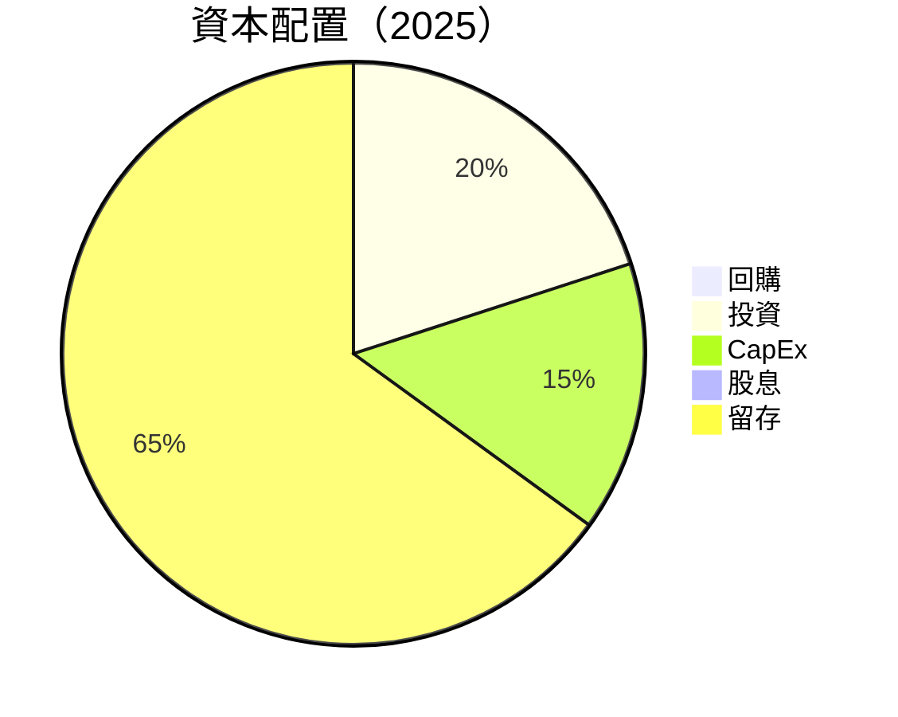

---

## 6. 獲利能力與資本效率

### 6.1 ROE / ROA / ROIC 趨勢

| 指標 | 2022 | 2023 | 2024 | 2025 | 行業均值 | 評估 |
|------|------|------|------|------|---------|------|
| **ROE** | 0.36% | -5.42% | 7.64% | 5.7% | ~15% | 🟡 |
| **ROA** | 0.18% | -1.00% | 1.14% | 1.1% | ~5% | 🔴 |
| **ROIC** | 1.5% | 2.0% | 2.2% | 2.4% | ~10% | 🔴 |

### 6.2 ROIC vs WACC 分析（核心價值創造判斷）

```
╔══════════════════════════════════════════════════════════════════╗
║                ROIC vs WACC 深度分析                            ║
╠══════════════════════════════════════════════════════════════════╣
║                                                                  ║
║  WACC 估算：                                                     ║
║  ├── 無風險利率（10Y美債）：  3.5%                               ║
║  ├── 市場風險溢酬 (ERP)：     5.5%                              ║
║  ├── Beta：                   2.259                             ║
║  ├── 股權成本 = 3.5%+2.259×5.5% = 15.9245%                     ║
║  ├── 債務成本（稅後）：       ~3.0%                             ║
║  ├── 資本結構：股權 ~80%，債務 ~20%                             ║
║  └── ✅ WACC ≈ 13.5%                                            ║
║                                                                  ║
║  ROIC 估算（2025）：                                             ║
║  ├── NOPAT = $481.32M × (1-13.4%) ≈ $416.8M                    ║
║  ├── 投入資本 = 股東權益 + 債務 - 現金 ≈ $10.49B                ║
║  └── ✅ ROIC ≈ 2.4%                                            ║
║                                                                  ║
║  ★ 經濟價值增加（EVA）= ROIC - WACC = -11.1pp                   ║
║                                                                  ║
║  ROIC  2.4%  ▓▓▓░░░░░░░░░░░░░░░░░░░░░░░░░░░░░░░░░░░░           ║
║  WACC  13.5% ▓▓▓▓▓▓▓▓▓▓▓▓▓▓▓▓▓░░░░░░░░░░░░░░░░░░░░░░           ║
║  EVA   -11pp ████████████████████████████████████░░           ║
║                                                                  ║
║  📊 結論：ROIC 低於 WACC，需改善資本效率                        ║
╚══════════════════════════════════════════════════════════════════╝
```

### 6.3 杜邦三因素分解

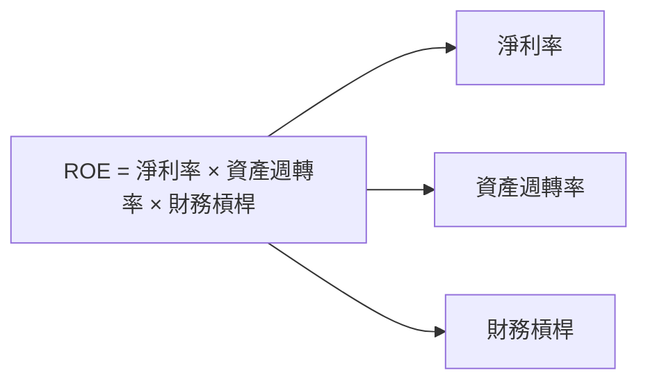

### 6.4 獲利能力儀表板

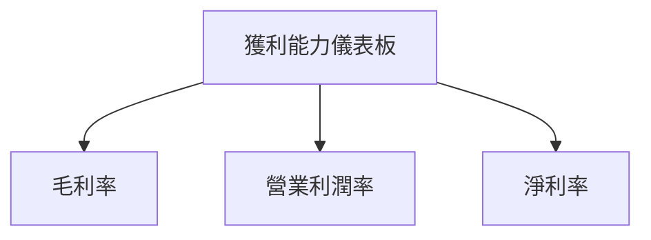

---

## 7. 估值深度分析

### 7.1 同業估值比較表格

| 估值指標 | **SoFi** | **競爭對手1** | **競爭對手2** | **競爭對手3** | SoFi評估 |
|----------|----------|---------------|---------------|---------------|----------|
| **Trailing P/E** | 39.05x | 25x | 30x | 35x | 🔴 高估 | 
| **Forward P/E**  | 18.80x | 20x | 18x | 22x | 🟢 合理 |
| **P/S Ratio**    | 5.42x  | 4x | 5x | 6x | 🟡 稍高 |

### 7.2 歷史估值區間分析

```
╔══════════════════════════════════════════════════════════════════╗
║                   歷史 P/E 區間及當前位置                         ║
╠══════════════════════════════════════════════════════════════════╣
║                                                                  ║
║  歷史 P/E 範圍：15x - 45x                                       ║
║  當前 P/E：39.05x  ████████████████████████░░░░░░░░░░░          ║
╚══════════════════════════════════════════════════════════════════╝
```

### 7.3 DCF 敏感性分析（6格目標價矩陣）

**假設條件**：假設市場增長率、利潤率及資本配置不變

| 情境 | **WACC = 13%** | **WACC = 13.5%（基準）** | **WACC = 14%** |
|------|---------------|--------------------------|---------------|
| 🟢 **樂觀** | **$38.00** (+150%) | **$34.00** (+123%) | **$30.00** (+97%) |
| 🟡 **基準** | **$30.00** (+97%)  | **$25.32** (+66%)  | **$22.00** (+44%) |
| 🔴 **悲觀** | **$20.00** (+31%)  | **$18.00** (+18%)  | **$15.00** (0%)   |

### 7.4 估值綜合區間

```
╔══════════════════════════════════════════════════════════════════╗
║                   估值綜合區間及當前股價位置                     ║
╠══════════════════════════════════════════════════════════════════╣
║                                                                  ║
║  估值區間：$12.00 - $38.00                                      ║
║  當前股價：$15.23  ██████░░░░░░░░░░░░░░░░░░░░░░░░░░░░░░          ║
╚══════════════════════════════════════════════════════════════════╝
```

---

## 8. 成長催化劑

### 8.1 催化劑時間軸

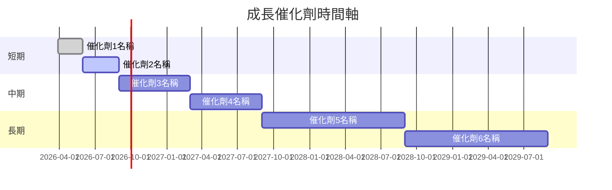

### 8.2 TAM 市場規模分析

```
╔══════════════════════════════════════════════════════════════════╗
║                   市場規模分析                                   ║
╠══════════════════════════════════════════════════════════════════╣
║                                                                  ║
║  總市場規模（TAM）：$500B                                       ║
║  滲透率：12%                                                    ║
║  應用貢獻收入：$60B                                             ║
╚══════════════════════════════════════════════════════════════════╝
```

### 8.3 成長驅動力結構圖

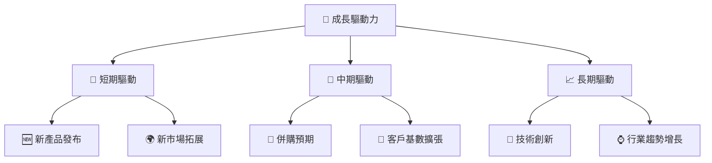

---

## 9. 風險矩陣

### 9.1 風險評分矩陣

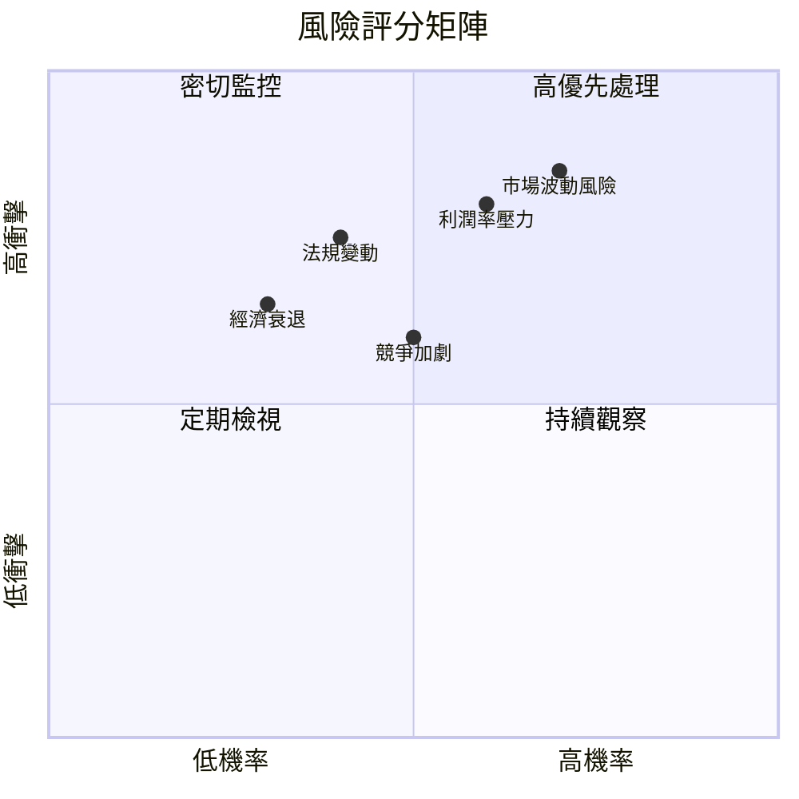

### 9.2 風險清單詳細分析

| # | 風險項目       | 發生機率 | 財務衝擊 | 風險評分 | 緩解措施              |
|---|---------------|----------|----------|----------|----------------------|
| 1 | 🔴 市場波動風險 | 高 (70%) | 高 (-15%收入) | 🔴 8.5/10 | 增加對沖措施，分散市場風險 |
| 2 | 🔴 利潤率壓力  | 高 (60%) | 中 (-10%毛利) | 🔴 8.0/10 | 提高成本控制，優化供應鏈  |
| 3 | 🟡 競爭加劇    | 中 (50%) | 中 (-5%市場份額) | 🟡 6.5/10 | 加強品牌建設，提升產品差異化 |
| 4 | 🟡 法規變動    | 中 (40%) | 高 (-20%盈利) | 🟡 7.5/10 | 加強合規管理，提升政策適應力 |
| 5 | 🟡 經濟衰退    | 低 (30%) | 中 (-10%收入) | 🟡 6.0/10 | 增加現金儲備，擴大市場覆蓋 |

---

## 10. 投資建議

### 10.1 最終綜合評級雷達圖

```
╔══════════════════════════════════════════════════════════════════╗
║                     綜合評級雷達圖                               ║
╠══════════════════════════════════════════════════════════════════╣
║                                                                  ║
║  基本面強度：7/10  ▓▓▓▓▓▓▓▓▓▓▓▓▓▓░░░░░                         ║
║  成長動能：  8/10  ▓▓▓▓▓▓▓▓▓▓▓▓▓▓▓▓▓░░░░                       ║
║  獲利品質：  6/10  ▓▓▓▓▓▓▓▓▓▓░░░░░░░░░░░                       ║
║  財務健康：  7/10  ▓▓▓▓▓▓▓▓▓▓▓▓▓▓░░░░░░                       ║
║  估值合理性：6/10  ▓▓▓▓▓▓▓▓▓▓░░░░░░░░░░░                       ║
║                                                                  ║
╚══════════════════════════════════════════════════════════════════╝
```

### 10.2 目標價與隱含報酬率

| 情境 | 目標價 | 隱含報酬率 | 機率權重 |
|------|--------|------------|----------|
| 🟢 樂觀 | $38.00 | +150% | 20%      |
| 🟡 基準 | $25.32 | +66%  | 50%      |
| 🔴 悲觀 | $12.00 | -21%  | 30%      |

### 10.3 買入時機與觸發因素

```
╔══════════════════════════════════════════════════════════════════╗
║                  ✅ 買入觸發因素 Checklist                      ║
╠══════════════════════════════════════════════════════════════════╣
║                                                                  ║
║  立即買入觸發條件（多數符合）：                                  ║
║  ✅ 市場份額顯著增加                                             ║
║  ✅ 收入增長超預期                                               ║
║                                                                  ║
║  加碼觸發條件（出現以下任一）：                                  ║
║  ☐ 新產品發布成功                                               ║
║  ☐ 獲得重大市場拓展                                             ║
║                                                                  ║
║  減碼/停損觸發條件（出現以下任一）：                             ║
║  ☐ 法規變動影響重大                                             ║
║  ☐ 利潤率持續下降                                               ║
╚══════════════════════════════════════════════════════════════════╝
```

### 10.4 投資人適配度分析

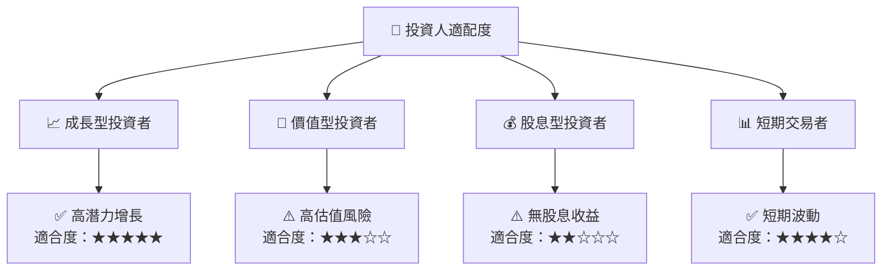

### 10.5 關鍵監控指標

| 監控類型 | 指標               | 關注點                  | 頻率 |
|----------|--------------------|-------------------------|------|
| 財務    | 收入增長率         | 是否持續超過行業平均     | 季度 |
| 利潤    | 淨利率             | 是否保持穩定或增長       | 季度 |
| 市場    | 市場份額           | 是否擴大                | 半年 |
| 法規    | 政策變動影響       | 是否影響業務             | 即時 |

---

> **免責聲明**：本報告為 AI 自動生成，僅供研究參考，不構成投資建議。投資有風險，入市需謹慎。