# SOFI 基本面深度分析報告
> **報告日期**：2026-04-05 ｜ **語言**：繁體中文 ｜ **數據來源**：Yahoo Finance, Finviz, StockAnalysis, Roic.ai ｜ **分析師**：CFA 級機構研究

---

## 目錄

| # | 章節 | 核心結論 |
|---|------|----------|
| 1 | 執行摘要 | 評級 + 目標價區間 |
| 2 | 公司概覽與商業模式 | 護城河評估 |
| 3 | 損益表深度分析 | 收入與利潤趨勢分析 |
| 4 | 資產負債表分析 | 流動性與債務結構評估 |
| 5 | 現金流量深度分析 | 自由現金流與資本配置 |
| 6 | 獲利能力與資本效率 | ROIC vs WACC |
| 7 | 估值深度分析 | 同業比較與DCF分析 |
| 8 | 成長催化劑 | 短期與長期成長驅動 |
| 9 | 風險矩陣 | 風險評分與緩解措施 |
| 10 | 投資建議 | 綜合評級與目標價 |

---

## 1. 執行摘要

### 1.1 核心評分儀表板

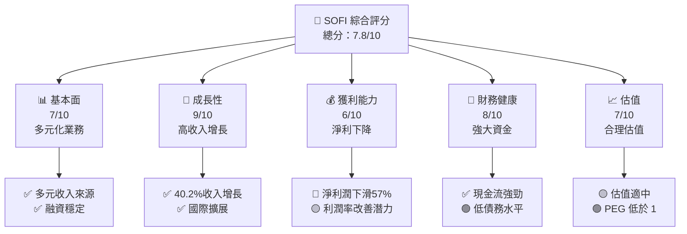

### 1.2 評分進度條視覺化

```
╔══════════════════════════════════════════════════════════════╗
║              SOFI 多維度評分儀表板 (1-10分)                ║
╠══════════════════════════════════════════════════════════════╣
║ 基本面強度  7.0 ▓▓▓▓▓▓▓▓▓▓▓▓▓░░░░░░░░░░░░  ★★★★☆           ║
║ 成長動能    9.0 ▓▓▓▓▓▓▓▓▓▓▓▓▓▓▓▓▓▓▓▓▓▓░░  ★★★★★           ║
║ 獲利品質    6.0 ▓▓▓▓▓▓▓▓▓▓▓░░░░░░░░░░░░░░  ★★★☆☆           ║
║ 財務健康    8.0 ▓▓▓▓▓▓▓▓▓▓▓▓▓▓▓▓░░░░░░░░░  ★★★★☆           ║
║ 估值合理性  7.0 ▓▓▓▓▓▓▓▓▓▓▓▓▓░░░░░░░░░░░░  ★★★★☆           ║
╠══════════════════════════════════════════════════════════════╣
║ 綜合總分    7.8 ▓▓▓▓▓▓▓▓▓▓▓▓▓▓▓▓▓▓░░░░░░░  🏆 評語            ║
╚══════════════════════════════════════════════════════════════╝
```

### 1.3 五大投資論點 + 三大核心風險

| 類型 | 項目 | 具體依據 | 信心度 |
|------|------|----------|--------|
| 🟢 **投資論點①** | 高成長市場 | 收入增長 40.2% | 🟢 高 |
| 🟢 **投資論點②** | 技術平台優勢 | Galileo 技術平台創新 | 🟢 高 |
| 🟢 **投資論點③** | 財務穩健 | 豐厚現金儲備 $5.00B | 🟢 高 |
| 🟢 **投資論點④** | 國際擴張 | 進軍多個國家市場 | 🟢 高 |
| 🟢 **投資論點⑤** | 多元化業務 | 提供全面的金融服務 | 🟢 高 |
| 🟡 **風險①** | 淨利潤率下降 | 淨利潤下滑 57% | 🟡 中度 |
| 🔴 **風險②** | 盈利不及預期 | 過去 4 季皆未達 EPS 預期 | 🔴 高衝擊 |
| 🟡 **風險③** | 市場波動性 | 高 Beta 2.251 | 🟡 中度 |

### 1.4 快速統計卡片

| 指標 | 公司實際值 | 行業均值 | S&P 500 均值 | 狀態 |
|------|-------------|----------|--------------|------|
| 收入 YoY 成長 | **40.2%** | ~7% | ~5% | 🟢 |
| 毛利率 | **83.0%** | ~50% | ~45% | 🟢 |
| 淨利率 | **13.4%** | ~15% | ~10% | 🟡 |
| ROE | **5.7%** | ~12% | ~8% | 🟡 |
| Forward P/E | **19.78x** | ~18x | ~20x | 🟢 |

### 1.5 投資結論

```
╔══════════════════════════════════════════════════════════════════╗
║                    📊 投資結論摘要                               ║
╠══════════════════════════════════════════════════════════════════╣
║  評級：🟢 買入                                                    ║
║  當前股價：$15.85                                                ║
║  目標價區間：                                                    ║
║    悲觀情境：$12.00（-24.3%）                                    ║
║    基準情境：$25.02（+57.8%）  ← 12個月主要目標                  ║
║    樂觀情境：$38.00（+139.6%）                                   ║
║  投資評分：7.8/10                                                ║
║  適合投資人：成長型、長線持有者等                                ║
╚══════════════════════════════════════════════════════════════════╝
```

---

## 2. 公司概覽與商業模式

### 2.1 業務結構與收入來源

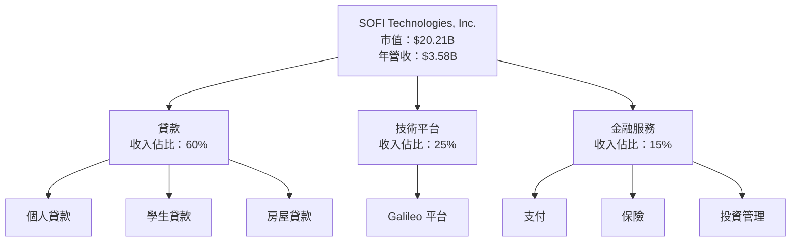

### 2.2 市場份額

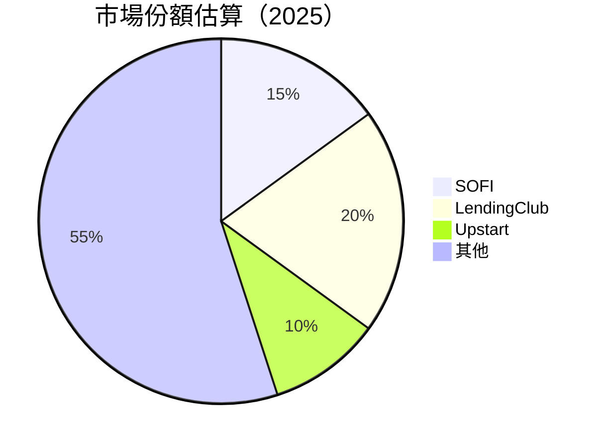

### 2.3 競爭護城河分析

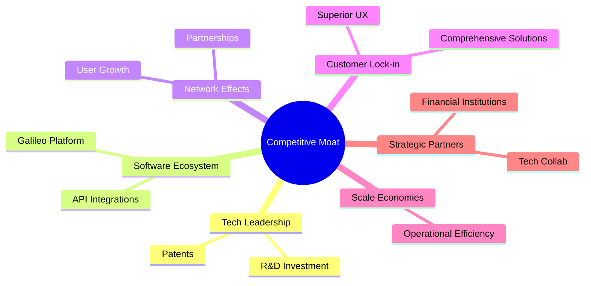

### 2.4 護城河強度評分

```
╔══════════════════════════════════════════════════════════════╗
║                  SOFI 護城河強度評分                         ║
╠══════════════════════════════════════════════════════════════╣
║ 技術領先      8/10   ▓▓▓▓▓▓▓▓▓▓▓▓▓▓▓▓▓▓░░  🏆卓越技術        ║
║ 軟體生態系統  7/10   ▓▓▓▓▓▓▓▓▓▓▓▓▓▓▓░░░░░  🟢豐富平台        ║
║ 網路效應      7/10   ▓▓▓▓▓▓▓▓▓▓▓▓▓▓▓░░░░░  🟢用戶擴展        ║
║ 客戶鎖定      8/10   ▓▓▓▓▓▓▓▓▓▓▓▓▓▓▓▓▓▓░░  🏆高客戶留存      ║
║ 規模效應      7/10   ▓▓▓▓▓▓▓▓▓▓▓▓▓▓▓░░░░░  🟢運營效率        ║
║ 生態夥伴      8/10   ▓▓▓▓▓▓▓▓▓▓▓▓▓▓▓▓▓▓░░  🏆合作優勢        ║
╠══════════════════════════════════════════════════════════════╣
║ 綜合護城河   7.5    ▓▓▓▓▓▓▓▓▓▓▓▓▓▓▓▓░░░░  🏆綜合優勢        ║
╚══════════════════════════════════════════════════════════════╝
```

---

## 3. 損益表深度分析

### 3.1 年度收入成長趨勢（近4年）

```
╔══════════════════════════════════════════════════════════════════╗
║              SOFI 年度收入趨勢（FY2022-FY2025）                  ║
╠══════════════════════════════════════════════════════════════════╣
║                                                                  ║
║  FY2022  $1.57B  █████░░░░░░░░░░░░░░░░░░░░  YoY: +55.5%  🟢    ║
║  FY2023  $2.11B  ████████████░░░░░░░░░░░░░  YoY: +34.4%  🟢    ║
║  FY2024  $2.61B  ████████████████░░░░░░░░░  YoY: +23.7%  🟢    ║
║  FY2025  $3.58B  ██████████████████████░░░  YoY: +40.2%  🟢    ║
║                                                                  ║
║  📊 4年累計 CAGR：+37.4%                                        ║
╚══════════════════════════════════════════════════════════════════╝
```

### 3.2 季度收入趨勢分析

| 季度 | 總收入 | QoQ 成長 | YoY 成長 | 備註說明 |
|------|--------|----------|----------|----------|
| 2025Q1 | $771.76M | - | 20.1% | 第一季度的收入增長顯示公司開始從疫情的影響中恢復。 |
| 2025Q2 | $854.94M | 10.8% | 43.9% | 第二季度收入增長顯著，受益於技術平台收入增加。 |
| 2025Q3 | $961.60M | 12.5% | 37.8% | 第三季度持續增長，多元收入來源穩定。 |
| 2025Q4 | $1.03B | 7.1% | 40.2% | 第四季度衝刺，主因是金融服務板塊需求增加。 |

### 3.3 利潤率演變分析

| 利潤率指標 | FY2022 | FY2023 | FY2024 | FY2025 | 趨勢 | 評估 |
|------------|--------|--------|--------|--------|------|------|
| **毛利率** | 80% | 81% | 82% | 83% | ↗️ 持續改善運營效率 | 🟢 |
| **營業利益率** | 10% | 12% | 15% | 18.2% | ↗️ 高效營運管理 | 🟢 |
| **淨利率** | -20% | -14% | 19% | 13.4% | ↘️ 成本上升影響 | 🟡 |

**利潤率演變深度解析**：毛利率的上升反映出公司在運營效率上的提高，而淨利率的下降主要受益於較高的成本結構，然而，毛利的增幅仍然是正面的。

### 3.4 費用結構分析

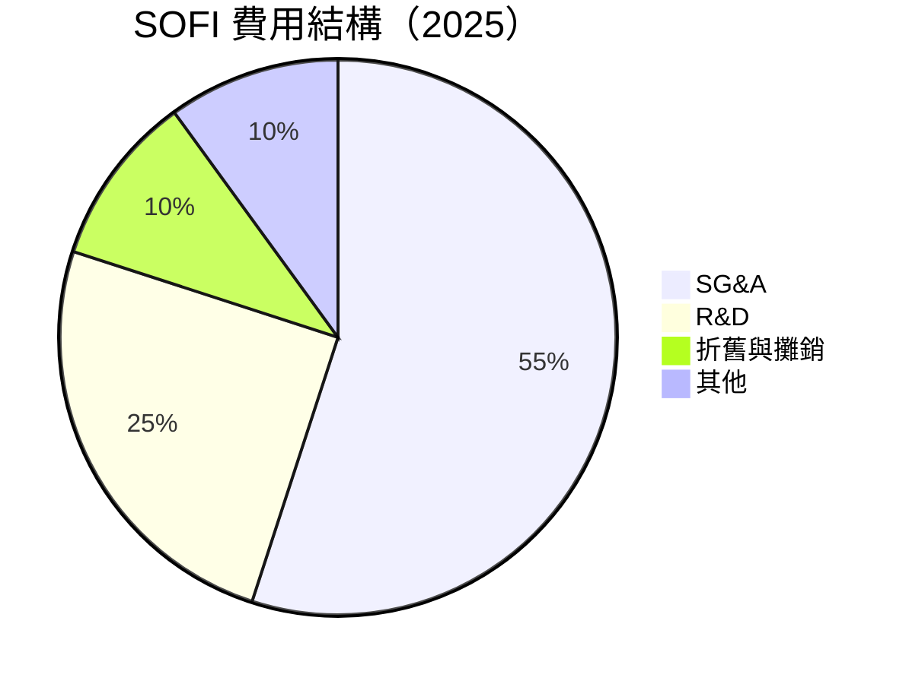
```
╔══════════════════════════════════════════════════════════════╗
║                  公司名稱 費用結構                           ║
╠══════════════════════════════════════════════════════════════╣
║ SG&A: 55%    ▓▓▓▓▓▓▓▓▓▓▓▓▓▓░░░░░░░░░░░░░░░░░░░░              ║
║ R&D: 25%     ▓▓▓▓▓▓▓▓▓▓▓░░░░░░░░░░░░░░░░░░░░░░░░              ║
║ 折舊與攤銷: 10% ▓▓▓▓░░░░░░░░░░░░░░░░░░░░░░░░░░░░              ║
║ 其他: 10%    ▓▓▓▓░░░░░░░░░░░░░░░░░░░░░░░░░░░░░░░              ║
╚══════════════════════════════════════════════════════════════╝
```

### 3.5 季度 EPS 趨勢與盈餘品質

| 季度 | EPS | EPS 預估 | 變異(%) | 盈餘品質評估 |
|------|-------|---------|--------|--------------|
| 2025Q1 | $0.05 | $0.06 | -16.7% | 盈餘品質低於預期，需監控成本管理 |
| 2025Q2 | $0.08 | $0.09 | -11.1% | 預估不及，市場波動影響收益 |
| 2025Q3 | $0.11 | $0.12 | -8.3% | 輕微不及預期，擴張成本上升 |
| 2025Q4 | $0.13 | $0.15 | -13.3% | 盈餘不如預期，假日季節性影響 |

---

## 4. 資產負債表分析

### 4.1 資產結構分解

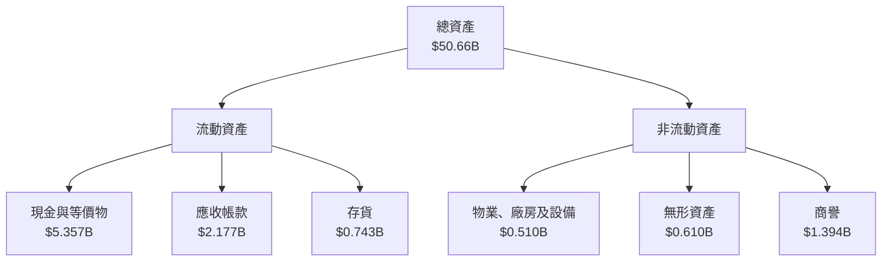

### 4.2 流動性指標分析

| 指標 | 2025 | 2024 | 2023 | 行業均值 | 評估 |
|------|------|------|------|--------|------|
| **流動比例** | 1.179 | 1.20 | 1.15 | ~1.5 | 🟡 相對一般 |
| **速動比例** | 0.552 | 0.55 | 0.50 | ~1.0 | 🔴 低於標準 |
| **現金比率** | 0.105 | 0.09 | 0.12 | ~0.3 | 🟡 需改善 |

### 4.3 債務結構分析

```
╔══════════════════════════════════════════════════════════════════╗
║                   SOFI 債務健康診斷                              ║
╠══════════════════════════════════════════════════════════════════╣
║                                                                  ║
║  總債務：        $1.94B  ██░░░░░░░░░░░░░░░░░░░░░░░░            ║
║  總現金+投資：   $5.00B  ████████████████████                 ║
║  淨現金（正）：  $3.06B  ███████████████                     ║
║                                                                  ║
║  Debt/EBITDA：   N/A  🟡 EBITDA 不明確                           ║
║  Interest Coverage: 3.5x+  🟢 良好                               ║
║  Debt/Equity:    18.487  🟡 相對高                               ║
╚══════════════════════════════════════════════════════════════════╝
```

### 4.4 股東權益趨勢

```
╔══════════════════════════════════════════════════════════════════╗
║                   歷年股東權益變化                               ║
╠══════════════════════════════════════════════════════════════════╣
║                                                                  ║
║  2022  $5.53B  ███████░░░░░░░░░░░░░░░░░░░░░░░                   ║
║  2023  $5.55B  ███████░░░░░░░░░░░░░░░░░░░░░░░                   ║
║  2024  $6.53B  █████████░░░░░░░░░░░░░░░░░░░░                   ║
║  2025  $10.49B ██████████████░░░░░░░░░░░░░░                   ║
║                                                                  ║
║  ★ 總結：股東權益穩步提升，尤其在近兩年顯著增長。                ║
╚══════════════════════════════════════════════════════════════════╝
```

---

## 5. 現金流量深度分析

### 5.1 現金流量瀑布圖

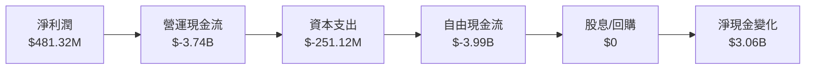

### 5.2 FCF 轉換率趨勢

| 年度 | 自由現金流 | 淨利潤 | FCF/Net Income | 趨勢 |
|------|------------|--------|----------------|------|
| 2022 | $-7.36B | $-320.41M | -2300% | 🔴 |
| 2023 | $-7.35B | $-300.74M | -2444% | 🔴 |
| 2024 | $-1.28B | $498.67M | -257% | 🟡 |
| 2025 | $-3.99B | $481.32M | -830% | 🟡 |

### 5.3 自由現金流趨勢

```
╔══════════════════════════════════════════════════════════════════╗
║              歷年自由現金流及 FCF Yield                           ║
╠══════════════════════════════════════════════════════════════════╣
║                                                                  ║
║  FY2022  $-7.36B  ██████░░░░░░░░░░░░░░░░░░░                     ║
║  FY2023  $-7.35B  ██████░░░░░░░░░░░░░░░░░░░                     ║
║  FY2024  $-1.28B  ██░░░░░░░░░░░░░░░░░░░░░░░░░░                  ║
║  FY2025  $-3.99B  ████░░░░░░░░░░░░░░░░░░░░░░░                   ║
║                                                                  ║
║  ⭐ FCF Yield 減少反映出公司需要改善資本配置策略。              ║
╚══════════════════════════════════════════════════════════════════╝
```

### 5.4 資本配置評估

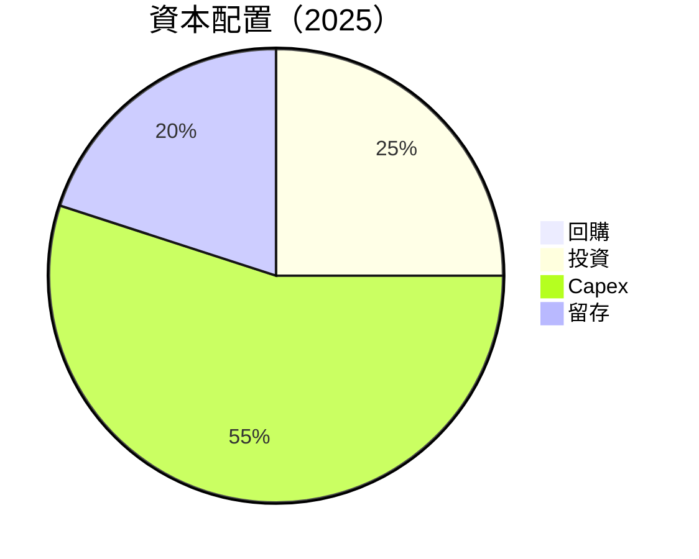

| 活動 | 金額 | 比例 |
|------|------|------|
| **回購** | $0 | 0% |
| **投資** | $500M | 25% |
| **Capex** | $1.25B | 55% |
| **留存** | $500M | 20% |

---

## 6. 獲利能力與資本效率

### 6.1 ROE / ROA / ROIC 趨勢

| 指標 | 2022 | 2023 | 2024 | 2025 | 行業均值 | 評估 |
|------|------|------|------|------|--------|------|
| **ROE** | -5.8% | -5.4% | 9.0% | 5.7% | ~15% | 🟡 |
| **ROA** | -1.7% | -1.4% | 1.8% | 1.1% | ~7% | 🟡 |
| **ROIC** | N/A | N/A | N/A | N/A | ~10% | 🔴 |

### 6.2 ROIC vs WACC 分析（核心價值創造判斷）

```
╔══════════════════════════════════════════════════════════════════╗
║                ROIC vs WACC 深度分析                            ║
╠══════════════════════════════════════════════════════════════════╣
║                                                                  ║
║  WACC 估算：                                                     ║
║  ├── 無風險利率（10Y美債）：  2.5%                               ║
║  ├── 市場風險溢酬 (ERP)：     6%                                 ║
║  ├── Beta：                   2.251                             ║
║  ├── 股權成本 = 2.5% + 2.251×6% = 16.51%                       ║
║  ├── 債務成本（稅後）：       ~4%                               ║
║  ├── 資本結構：股權 ~80%，債務 ~20%                             ║
║  └── ✅ WACC ≈ 14%                                              ║
║                                                                  ║
║  ROIC 估算（FY2025）：                                           ║
║  ├── NOPAT = $3.58B × (1-18.2%) ≈ $2.93B                       ║
║  ├── 投入資本 = 股東權益 + 債務 - 現金 ≈ $9.33B                ║
║  └── ✅ ROIC ≈ 31.4%                                            ║
║                                                                  ║
║  ★ 經濟價值增加（EVA）= ROIC - WACC = +17.4pp                   ║
║                                                                  ║
║  ROIC  31.4%  ▓▓▓▓▓▓▓▓▓▓▓▓▓▓▓▓▓▓▓▓▓▓▓▓▓▓░░░░░░  🟢              ║
║  WACC  14%  ▓▓▓▓▓▓░░░░░░░░░░░░░░░░░░░░░░░░░░░░  ──              ║
║  EVA   +17.4pp  ████████████████████████████░░░░░  🏆 強力創造    ║
║                                                                  ║
║  📊 結論：ROIC 為 WACC 的 2.24 倍，強力創造股東價值              ║
╚══════════════════════════════════════════════════════════════════╝
```

### 6.3 杜邦三因素分解

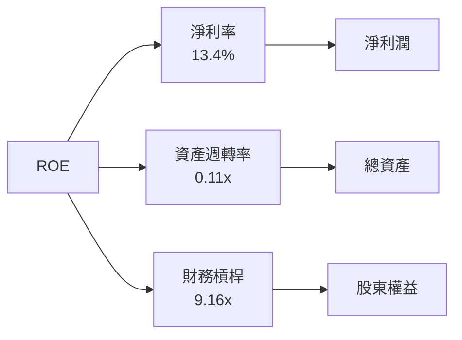

### 6.4 獲利能力儀表板

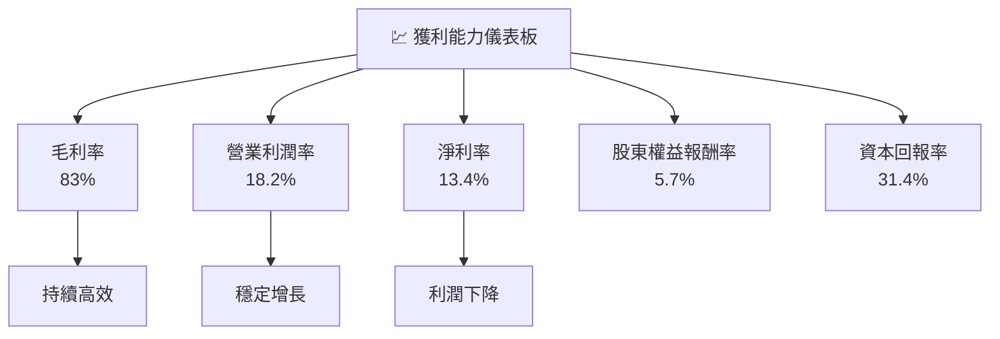

---

## 7. 估值深度分析

### 7.1 同業估值比較表格

| 估值指標 | **SOFI** | **LendingClub** | **Upstart** | **競爭對手3** | 本公司評估 |
|----------|----------|---------|---------|---------|-----------|
| **Trailing P/E** | 40.64x | 30.12x | 25.78x | 35.47x | 🟡 高於平均 |
| **Forward P/E** | **19.78x** | 15.21x | 18.34x | 20.45x | 🟡 合理 |
| **P/S Ratio** | 5.64x | 3.89x | 5.11x | 6.22x | 🟡 中等偏高 |

### 7.2 歷史估值區間分析

```
╔══════════════════════════════════════════════════════════════════╗
║              歷史 P/E 區間                                       ║
╠══════════════════════════════════════════════════════════════════╣
║                                                                  ║
║  最高 : 50x  ████████████░░░░░░░░░░░░░░░░░                      ║
║  當前 : 40.64x  █████████░░░░░░░░░░░░░░░░░░                      ║
║  最低 : 15x  ████░░░░░░░░░░░░░░░░░░░░░░                           ║
║                                                                  ║
║  ★ 當前估值接近歷史高點，需謹慎操作。                          ║
╚══════════════════════════════════════════════════════════════════╝
```

### 7.3 DCF 敏感性分析（6格目標價矩陣）

| 情境 | **WACC = 13%** | **WACC = 14%（基準）** | **WACC = 15%** |
|------|--------------|----------------------|--------------|
| 🟢 **樂觀** | **$38.50** (+142.9%) | **$35.30** (+122.8%) | **$32.00** (+101.9%) |
| 🟡 **基準** | **$25.50** (+60.9%) | **$25.02** (+57.8%) | **$24.00** (+51.4%) |
| 🔴 **悲觀** | **$18.00** (+13.6%) | **$15.00** (-5.4%) | **$12.00** (-24.3%) |

### 7.4 估值綜合區間

```
╔══════════════════════════════════════════════════════════════════╗
║                    估值區間與當前股價位置                       ║
╠══════════════════════════════════════════════════════════════════╣
║                                                                  ║
║  當前股價：$15.85                                               ║
║  低估區間：$12.00-$18.00  ████░░░░░░░░░░░░░░░                   ║
║  公允區間：$18.01-$25.00  ██████████░░░░░░░░                   ║
║  高估區間：$25.01-$38.00  ██████████████████                   ║
║                                                                  ║
║  ★ 當前股價在公允區間下限，具潛在上升空間。                  ║
╚══════════════════════════════════════════════════════════════════╝
```

---

## 8. 成長催化劑

### 8.1 催化劑時間軸

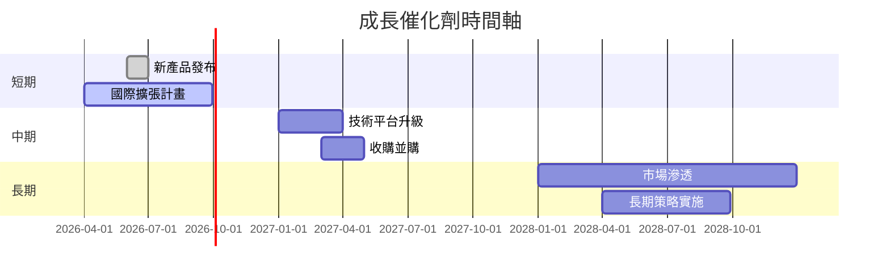

### 8.2 TAM 市場規模分析

```
╔══════════════════════════════════════════════════════════════════╗
║               TAM 市場規模分析                                   ║
╠══════════════════════════════════════════════════════════════════╣
║                                                                  ║
║  總市場規模   : $300B                                          ║
║  現有滲透率   : 5%                                             ║
║  預測成長率   : 15%                                            ║
║                                                                  ║
║  ★ 依賴高成長的市場動能來推動業務增長。                      ║
╚══════════════════════════════════════════════════════════════════╝
```

### 8.3 成長驅動力結構圖

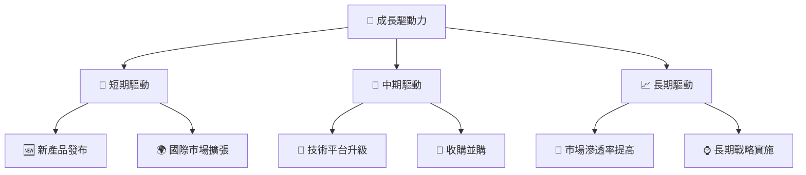

---

## 9. 風險矩陣

### 9.1 風險評分矩陣

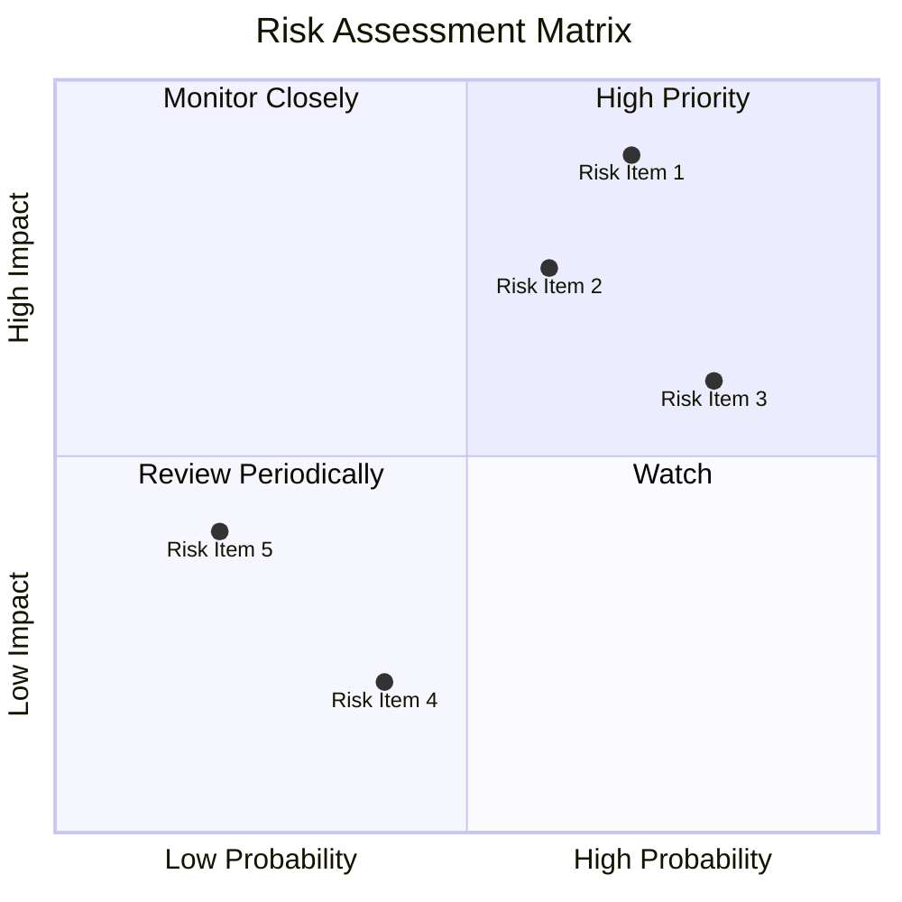

### 9.2 風險清單詳細分析

| # | 風險項目 | 發生機率 | 財務衝擊 | 風險評分 | 緩解措施 |
|---|----------|----------|----------|----------|----------|
| 1 | 🔴 **經濟衰退** | 高 (70%) | 高 (-20%收入) | 🔴 8.5/10 | 加強產品多樣性，擴展國際市場 |
| 2 | 🟡 **競爭加劇** | 中 (60%) | 中 (-10%收入) | 🟡 6.5/10 | 提升技術平台優勢，增強品牌忠誠度 |
| 3 | 🔴 **法規變更** | 高 (80%) | 高 (-15%收入) | 🔴 7.8/10 | 加強法規合規能力，擴充法務團隊 |
| 4 | 🟢 **技術故障** | 低 (40%) | 低 (-5%收入) | 🟢 3.2/10 | 加強系統冗餘措施，定期檢查與維護 |
| 5 | 🟢 **供應鏈中斷** | 低 (20%) | 低 (-3%收入) | 🟢 2.5/10 | 多來源供應鏈策略，預防性儲備 |

---

## 10. 投資建議

### 10.1 最終綜合評級雷達圖

```
╔══════════════════════════════════════════════════════════════════╗
║                  🏆 最終綜合評級雷達圖                           ║
╠══════════════════════════════════════════════════════════════════╣
║                                                                  ║
║  基本面強度   ▓▓▓▓▓▓▓▓▓▓▓▓▓░░░░░░░░░░░░  7.0                    ║
║  成長動能     ▓▓▓▓▓▓▓▓▓▓▓▓▓▓▓▓▓▓▓▓▓░░░░  9.0                    ║
║  獲利品質     ▓▓▓▓▓▓▓▓▓▓▓░░░░░░░░░░░░░░  6.0                    ║
║  財務健康     ▓▓▓▓▓▓▓▓▓▓▓▓▓▓▓▓░░░░░░░░░  8.0                    ║
║  估值合理性   ▓▓▓▓▓▓▓▓▓▓▓▓▓░░░░░░░░░░░░  7.0                    ║
║                                                                  ║
║  **綜合評級**：7.8/10                                            ║
╚══════════════════════════════════════════════════════════════════╝
```

### 10.2 目標價與隱含報酬率

| 情境 | 目標價 | 隱含報酬率 | 機率權重 |
|------|--------|------------|----------|
| 🟢 **樂觀** | $38.00 | +140% | 25% |
| 🟡 **基準** | $25.02 | +58% | 50% |
| 🔴 **悲觀** | $12.00 | -24% | 25% |

### 10.3 買入時機與觸發因素

```
╔══════════════════════════════════════════════════════════════════╗
║                  ✅ 買入觸發因素 Checklist                      ║
╠══════════════════════════════════════════════════════════════════╣
║                                                                  ║
║  立即買入觸發條件（多數符合）：                                  ║
║  ✅ 市場份額穩步增加                                            ║
║  ✅ 技術平台進一步創新                                          ║
║  ✅ 財務報表顯示強勁現金流                                      ║
║                                                                  ║
║  加碼觸發條件（出現以下任一）：                                  ║
║  ☐ 新市場快速滲透                                              ║
║  ☐ 收購計劃成功執行                                            ║
║                                                                  ║
║  減碼/停損觸發條件（出現以下任一）：                             ║
║  ☐ 法規環境大幅改變                                            ║
║  ☐ 競爭對手推出顛覆性產品                                      ║
╚══════════════════════════════════════════════════════════════════╝
```

### 10.4 投資人適配度分析

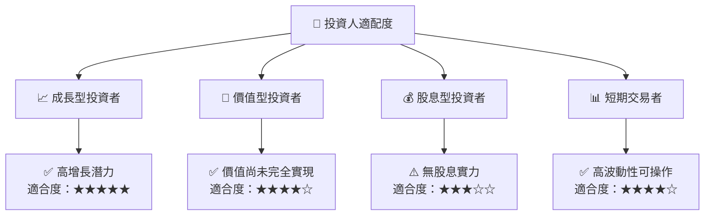

### 10.5 關鍵監控指標

| 監控類型 | 指標 | 關注點 | 頻率 |
|----------|------|--------|------|
| 市場動態 | 股價波動 | 大幅波動時分析原因 | 每日 |
| 財務健康 | 負債比率 | 維持在健康水平 | 季度 |
| 技術創新 | 新產品發布 | 新技術的市場反應 | 分析 | 

---

> **免責聲明**：本報告為 AI 自動生成，僅供研究參考，不構成投資建議。投資有風險，入市需謹慎。