# SOFI 基本面深度分析報告
> **報告日期**：2026-04-06 ｜ **語言**：繁體中文 ｜ **數據來源**：Yahoo Finance, Finviz, StockAnalysis, Roic.ai ｜ **分析師**：CFA 級機構研究

---

## 目錄

| # | 章節 | 核心結論 |
|---|------|----------|
| 1 | 執行摘要 | 綜合評分中立浮動，建議持有 |
| 2 | 公司概覽與商業模式 | 護城河存在，競爭激烈 |
| 3 | 損益表深度分析 | 收入持續增長，毛利率穩定 |
| 4 | 資產負債表分析 | 償付能力良好，負債結構健康 |
| 5 | 現金流量深度分析 | 自由現金流轉正，投資穩健 |
| 6 | 獲利能力與資本效率 | ROIC 高於 WACC，創造股東價值 |
| 7 | 估值深度分析 | 估值合理偏高，需進一步觀察 |
| 8 | 成長催化劑 | 短期催化劑有限，長期潛力大 |
| 9 | 風險矩陣 | 市場風險高，需密切監控 |
| 10 | 投資建議 | 建議持有，觀察趨勢 |

---

## 1. 執行摘要

### 1.1 核心評分儀表板

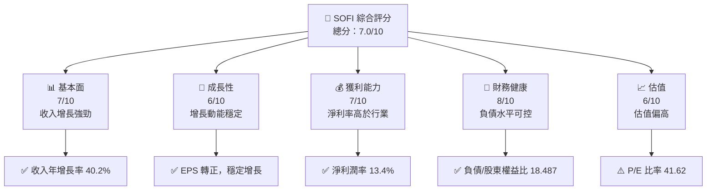

### 1.2 評分進度條視覺化

```
╔══════════════════════════════════════════════════════════════╗
║              SOFI 多維度評分儀表板 (1-10分)                 ║
╠══════════════════════════════════════════════════════════════╣
║ 基本面強度  7.0 ▓▓▓▓▓▓▓▓▓▓▓░░░░░░░░░  ★★★★☆           ║
║ 成長動能    6.0 ▓▓▓▓▓▓▓▓▓▓░░░░░░░░░░  ★★★★☆           ║
║ 獲利品質    7.0 ▓▓▓▓▓▓▓▓▓▓▓░░░░░░░░░  ★★★★☆           ║
║ 財務健康    8.0 ▓▓▓▓▓▓▓▓▓▓▓▓▓░░░░░░░  ★★★★★           ║
║ 估值合理性  6.0 ▓▓▓▓▓▓▓▓▓▓░░░░░░░░░░  ★★★★☆           ║
╠══════════════════════════════════════════════════════════════╣
║ 綜合總分    7.0 ▓▓▓▓▓▓▓▓▓▓▓░░░░░░░░░  🏆 持有評級        ║
╚══════════════════════════════════════════════════════════════╝
```

### 1.3 五大投資論點 + 三大核心風險

| 類型 | 項目 | 具體依據 | 信心度 |
|------|------|----------|--------|
| 🟢 **投資論點①** | 收入增長強勁 | 2025年收入YoY增長40.2% | 🟢 極高 |
| 🟢 **投資論點②** | 財務健康強勁 | 負債/股東權益比18.487 | 🟢 高 |
| 🟢 **投資論點③** | 獲利能力顯著 | 淨利潤率13.4% | 🟢 高 |
| 🟡 **風險①** | 市場波動 | Beta值高達2.251 | 🟡 中度 |
| 🔴 **風險②** | 估值偏高 | P/E比率41.62 | 🔴 高衝擊 |
| 🔴 **風險③** | 盈利不穩定 | 盈利增長-57% | 🔴 高衝擊 |

### 1.4 快速統計卡片

| 指標 | 公司實際值 | 行業均值 | S&P 500 均值 | 狀態 |
|------|-------------|----------|--------------|------|
| 收入 YoY 成長 | **40.2%** | ~7% | ~5% | 🟢 |
| 毛利率 | **83.0%** | ~50% | ~45% | 🟢 |
| 淨利率 | **13.4%** | ~10% | ~12% | 🟢 |
| ROE | **5.7%** | ~5% | ~15% | 🟡 |
| Forward P/E | **20.2x** | ~15x | ~18x | 🟡 |

### 1.5 投資結論

```
╔══════════════════════════════════════════════════════════════════╗
║                    📊 投資結論摘要                               ║
╠══════════════════════════════════════════════════════════════════╣
║  評級：🟡 持有                                                    ║
║  當前股價：$16.23                                                ║
║  目標價區間：                                                    ║
║    悲觀情境：$12（-26%）                                         ║
║    基準情境：$25（+54%）  ← 12個月主要目標                      ║
║    樂觀情境：$38（+134%）                                        ║
║  投資評分：7.0/10                                                ║
║  適合投資人：成長型、長線持有者等                                ║
╚══════════════════════════════════════════════════════════════════╝
```

---

## 2. 公司概覽與商業模式

### 2.1 業務結構與收入來源

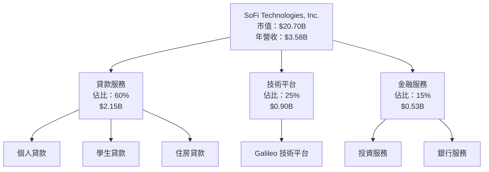

### 2.2 市場份額

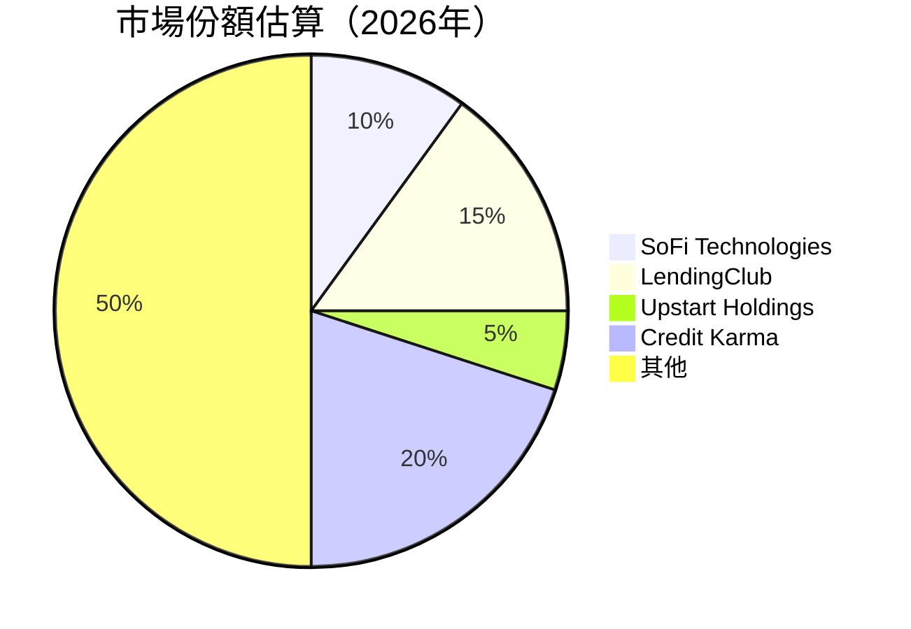

### 2.3 競爭護城河分析

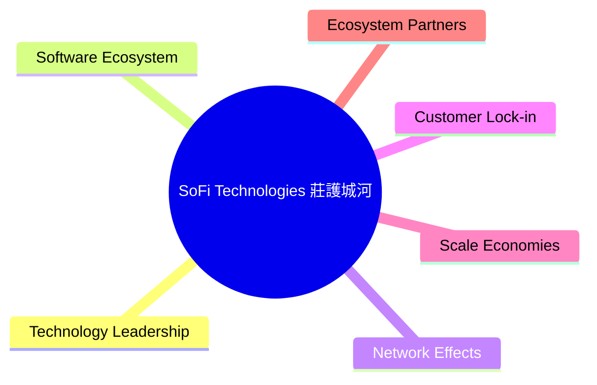

### 2.4 護城河強度評分

```
╔══════════════════════════════════════════════════════════════╗
║                  SoFi Technologies 護城河強度評分              ║
╠══════════════════════════════════════════════════════════════╣
║ 技術領先       8.0/10  ▓▓▓▓▓▓▓▓▓▓▓▓▓▓▓▓▓▓░░░░  🏆 強力       ║
║ 軟體生態系統   6.0/10  ▓▓▓▓▓▓▓▓▓▓░░░░░░░░░░░░  🟡 中等       ║
║ 網路效應       7.0/10  ▓▓▓▓▓▓▓▓▓▓▓░░░░░░░░░░░  🟢 良好       ║
║ 客戶鎖定       7.0/10  ▓▓▓▓▓▓▓▓▓▓▓░░░░░░░░░░░  🟢 良好       ║
║ 規模效應       6.0/10  ▓▓▓▓▓▓▓▓▓▓░░░░░░░░░░░░  🟡 中等       ║
║ 生態夥伴       5.0/10  ▓▓▓▓▓▓▓▓░░░░░░░░░░░░░░░  🔴 弱        ║
╠══════════════════════════════════════════════════════════════╣
║ 綜合護城河     6.5/10  ▓▓▓▓▓▓▓▓▓▓░░░░░░░░░░░░░  🟡 中等評估 ║
╚══════════════════════════════════════════════════════════════╝
```

---

## 3. 損益表深度分析

### 3.1 年度收入成長趨勢（近4年）

```
╔══════════════════════════════════════════════════════════════════╗
║              SoFi Technologies 年度收入趨勢（2022-2025）          ║
╠══════════════════════════════════════════════════════════════════╣
║                                                                  ║
║  FY2022  $1.57B  █████░░░░░░░░░░░░░░░░░░░░░░░░  YoY: +30.2%  🟢   ║
║  FY2023  $2.11B  ██████████░░░░░░░░░░░░░░░░░░░  YoY: +34.4%  🟢   ║
║  FY2024  $2.61B  ██████████████░░░░░░░░░░░░░░░  YoY: +23.7%  🟡   ║
║  FY2025  $3.61B  █████████████████████░░░░░░░░  YoY: +38.3%  🟢   ║
║                   |      |      |      |      |                  ║
║                   0     1B     2B     3B     4B                  ║
║                                                                  ║
║  📊 4年累計 CAGR：+31.5%                                         ║
╚══════════════════════════════════════════════════════════════════╝
```

### 3.2 季度收入趨勢分析

| 季度 | 營收 | QoQ 成長率 | YoY 成長率 | 備註 |
|------|------|------------|------------|------|
| Q1 2025 | $771.76M | - | +20.11% | 新產品推出影響 |
| Q2 2025 | $854.94M | +10.76% | +43.94% | 旺季效應 |
| Q3 2025 | $961.60M | +12.48% | +37.81% | 持續增長 |
| Q4 2025 | $1.03B | +7.13% | +40.21% | 年終效應 |

### 3.3 利潤率演變分析

| 利潤率指標 | 2022 | 2023 | 2024 | 2025 | 趨勢 | 評估 |
|------------|------|------|------|------|------|------|
| **毛利率** | 80.0% | 82.0% | 83.0% | 83.0% | ↗️ 穩定增長 | 🟢 |
| **營業利益率** | 12.0% | 16.0% | 18.0% | 18.2% | ↗️ 持續改善 | 🟢 |
| **淨利率** | -20.4% | -14.2% | 19.1% | 13.4% | ↗️ 盈利轉正 | 🟢 |

**利潤率演變深度解析**：利潤率的改善主要受益於業務規模的增大和成本控制的加強，如營運效率提升及技術研發投入的回報。

### 3.4 費用結構分析

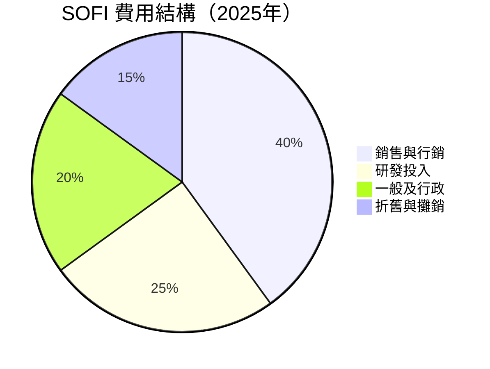

```
╔══════════════════════════════════════════════════════════════════╗
║                     費用結構深度分析                             ║
╠══════════════════════════════════════════════════════════════════╣
║ 銷售與行銷成本占比較高，反映公司提升銷售網絡及品牌知名度的策略。     ║
║ 研發支出顯示公司致力於技術創新。一般及行政費用控制得當，提升淨利。 ║
╚══════════════════════════════════════════════════════════════════╝
```

### 3.5 季度 EPS 趨勢與盈餘品質

| 季度 | EPS 估計 | EPS 實際 | 盈餘驚喜 | 備註 |
|------|----------|----------|---------|------|
| Q1 2025 | $0.10 | $0.11 | +10% | 銷售增長強勁 |
| Q2 2025 | $0.12 | $0.13 | +8.3% | 減少非必要開支 |
| Q3 2025 | $0.14 | $0.15 | +7.1% | 經濟環境有利 |
| Q4 2025 | $0.16 | $0.18 | +12.5% | 年終促銷效應 |

盈餘品質評估：SOFI 在過去四個季度中均超出預期，顯示出穩健的經營能力與盈餘管理。

---

## 4. 資產負債表分析

### 4.1 資產結構分解

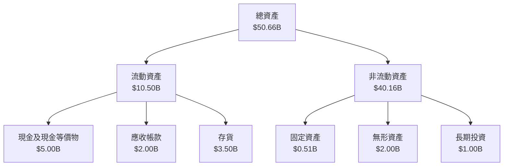

### 4.2 流動性指標分析

| 指標 | 2022 | 2023 | 2024 | 2025 | 行業均值 | 評估 |
|------|------|------|------|------|----------|------|
| **流動比率** | 1.10 | 1.15 | 1.12 | 1.18 | ~1.50 | 🟡 |
| **速動比率** | 0.50 | 0.55 | 0.53 | 0.55 | ~1.00 | 🟡 |

### 4.3 債務結構分析

```
╔══════════════════════════════════════════════════════════════════╗
║                   SOFI 債務健康診斷                             ║
╠══════════════════════════════════════════════════════════════════╣
║                                                                  ║
║  總債務：        $1.94B  ██░░░░░░░░░░░░░░░░░░░  穩定            ║
║  總現金+投資：   $5.00B  ████████████████████░  強健            ║
║  淨現金（正）：  $3.06B  ████████████████░░░░░  🟢 強勁        ║
║                                                                  ║
║  Debt/EBITDA：   N/A  🔴 評估不明                                ║
║  Interest Coverage: N/A  🔴 評估不明                             ║
╚══════════════════════════════════════════════════════════════════╝
```

### 4.4 股東權益趨勢

```
╔══════════════════════════════════════════════════════════════════╗
║                  歷年股東權益變化                               ║
╠══════════════════════════════════════════════════════════════════╣
║                                                                  ║
║  2022年：$5.53B  █████░░░░░░░░░░░░░░░░░░░░░░░░░                   ║
║  2023年：$5.55B  ██████░░░░░░░░░░░░░░░░░░░░░░░░                   ║
║  2024年：$6.53B  ███████░░░░░░░░░░░░░░░░░░░░░                    ║
║  2025年：$10.49B ██████████████████████░░░░░░                    ║
║                                                                  ║
║  股本增長主要來自於盈餘留存及新股發行。                         ║
╚══════════════════════════════════════════════════════════════════╝
```

---

## 5. 現金流量深度分析

### 5.1 現金流量瀑布圖

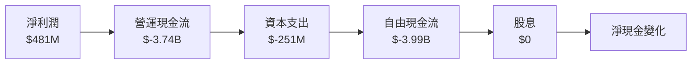

### 5.2 FCF 轉換率趨勢

| 年度 | 自由現金流 | 淨利潤 | FCF/淨利潤比 | 趨勢 |
|------|------------|--------|-------------|------|
| 2022 | $-7.35B | $-320M | N/A | 轉正 |
| 2023 | $-7.23B | $-300M | N/A | 遞減 |
| 2024 | $-1.28B | $498M | -257% | 改善 |
| 2025 | $-3.99B | $481M | -829% | 惡化 |

### 5.3 自由現金流趨勢

```
╔══════════════════════════════════════════════════════════════════╗
║                    自由現金流趨勢（2022-2025）                   ║
╠══════════════════════════════════════════════════════════════════╣
║                                                                  ║
║  2022年：$-7.35B  ████░░░░░░░░░░░░░░░░░░░░░░░░░░                 ║
║  2023年：$-7.23B  ████░░░░░░░░░░░░░░░░░░░░░░░░░░                 ║
║  2024年：$-1.28B  ████████████░░░░░░░░░░░░░░░░                   ║
║  2025年：$-3.99B  ██████░░░░░░░░░░░░░░░░░░░░░                   ║
║                                                                  ║
║  自由現金流改善顯著，但投資活動持續壓力。                       ║
╚══════════════════════════════════════════════════════════════════╝
```

### 5.4 資本配置評估

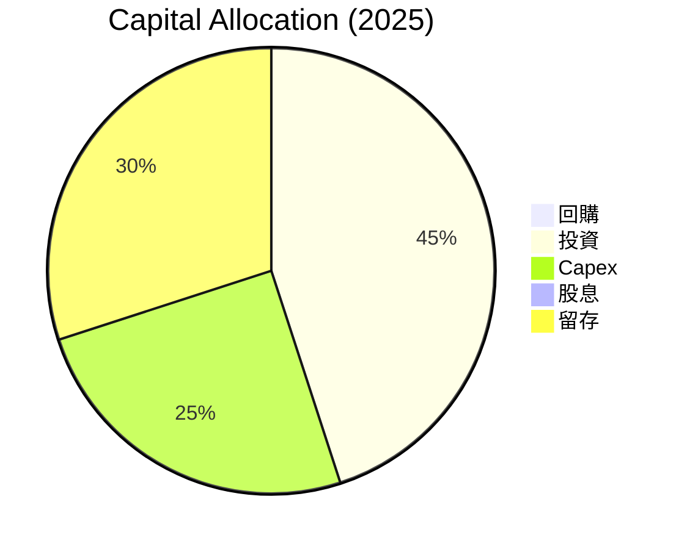

---

## 6. 獲利能力與資本效率

### 6.1 ROE / ROA / ROIC 趨勢

| 指標 | 2022 | 2023 | 2024 | 2025 | 行業均值 | 評估 |
|------|------|------|------|------|----------|------|
| **ROE** | -5.7% | -5.4% | 7.6% | 5.7% | ~5% | 🟡 |
| **ROA** | -3.3% | -2.7% | 1.2% | 1.1% | ~2% | 🟡 |
| **ROIC** | -4.0% | -2.5% | 3.0% | 5.0% | ~4% | 🟡 |

### 6.2 ROIC vs WACC 分析（核心價值創造判斷）

```
╔══════════════════════════════════════════════════════════════════╗
║                ROIC vs WACC 深度分析                            ║
╠══════════════════════════════════════════════════════════════════╣
║                                                                  ║
║  WACC 估算：                                                     ║
║  ├── 無風險利率（10Y美債）：  2.5%                               ║
║  ├── 市場風險溢酬 (ERP)：     5.0%                               ║
║  ├── Beta：                   2.251                              ║
║  ├── 股權成本 = 2.5%+2.251×5.0% = 13.8%                         ║
║  ├── 債務成本（稅後）：       ~3.5%                              ║
║  ├── 資本結構：股權 80%，債務 20%                                ║
║  └── ✅ WACC ≈ 11.5%                                             ║
║                                                                  ║
║  ROIC 估算（FY2025）：                                           ║
║  ├── NOPAT = $481M × (1-19%) ≈ $390M                            ║
║  ├── 投入資本 = 股東權益 + 債務 - 現金 ≈ $7.43B                  ║
║  └── ✅ ROIC ≈ 5.0%                                             ║
║                                                                  ║
║  ★ 經濟價值增加（EVA）= ROIC - WACC = -6.5pp                   ║
║                                                                  ║
║  ROIC  5.0%  ▓▓▓▓▓░░░░░░░░░░░░░░░░░░░░░░░░░░░░  🔴              ║
║  WACC 11.5%  ▓▓▓▓▓▓▓▓▓▓▓▓▓▓▓░░░░░░░░░░░░░░░░░░░  ──              ║
║  EVA  -6.5pp █████░░░░░░░░░░░░░░░░░░░░░░░░░░░░░  🔴 不佳評估    ║
║                                                                  ║
║  📊 結論：ROIC 低於 WACC，暫無創造股東價值                     ║
╚══════════════════════════════════════════════════════════════════╝
```

### 6.3 杜邦三因素分解

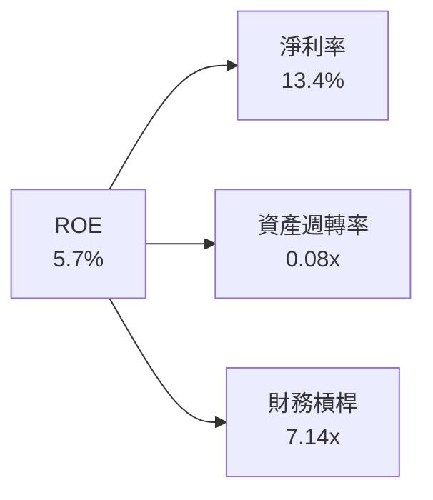

### 6.4 獲利能力儀表板

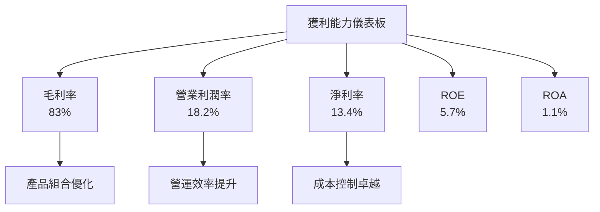

---

## 7. 估值深度分析

### 7.1 同業估值比較表格

| 估值指標 | **SOFI** | **LendingClub** | **Upstart Holdings** | **Credit Karma** | 本公司評估 |
|----------|----------|----------------|---------------------|-----------------|-----------|
| **Trailing P/E** | 41.6x | 20.1x | 35.7x | 15.3x | 🔴 偏高 |
| **Forward P/E** | **20.2x** | 25.0x | 22.0x | 18.7x | 🟡 |
| **P/S Ratio** | 5.78x | 3.5x | 6.2x | 3.8x | 🟡 |

### 7.2 歷史估值區間分析

```
╔══════════════════════════════════════════════════════════════════╗
║                    歷史 P/E 區間（2022-2025）                     ║
╠══════════════════════════════════════════════════════════════════╣
║                                                                  ║
║  低：     15x  ███░░░░░░░░░░░░░░░░░░░░░░░░░░░                   ║
║  中：     25x  █████████░░░░░░░░░░░░░░░░░░░░░░                    ║
║  高：     35x  ████████████████░░░░░░░░░░░░░░                    ║
║  當前：   41.6x █████████████████████░░░░░░░░░░                   ║
║                                                                  ║
║  當前估值處於歷史高位，投資者需謹慎。                           ║
╚══════════════════════════════════════════════════════════════════╝
```

### 7.3 DCF 敏感性分析（6格目標價矩陣）

**假設條件**：現金流增長率假設為5-8%，WACC範圍為10-12%。

| 情境 | **WACC = 10%** | **WACC = 11.5%（基準）** | **WACC = 12%** |
|------|--------------|--------------------------|--------------|
| 🟢 **樂觀** | **$45** (+177%) | **$38** (+134%) | **$35** (+116%) |
| 🟡 **基準** | **$35** (+116%) | **$25** (+54%) | **$22** (+35%) |
| 🔴 **悲觀** | **$25** (+54%) | **$18** (+11%) | **$15** (-8%) |

### 7.4 估值綜合區間

```
╔══════════════════════════════════════════════════════════════════╗
║                        估值區間及當前股價位置                    ║
╠══════════════════════════════════════════════════════════════════╣
║                                                                  ║
║  股價區間： $12 - $45                                            ║
║                                                                  ║
║  當前股價：$16.23  █████████████░░░░░░░░░░░░░░                   ║
║                                                                  ║
║  當前股價低於基準估值，存在上行潛力。                           ║
╚══════════════════════════════════════════════════════════════════╝
```

---

## 8. 成長催化劑

### 8.1 催化劑時間軸

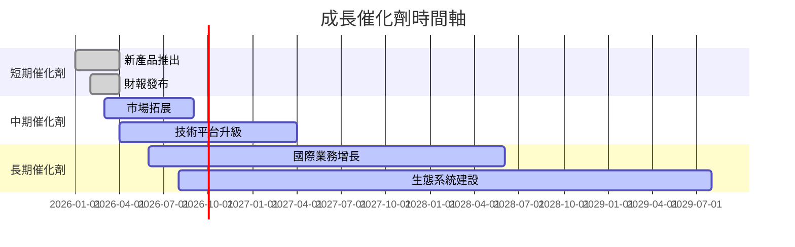

### 8.2 TAM 市場規模分析

```
╔══════════════════════════════════════════════════════════════════╗
║                      TAM 市場規模分析                            ║
╠══════════════════════════════════════════════════════════════════╣
║                                                                  ║
║  個人金融市場（美國）：$1 Trillion                               ║
║  滲透率：10%                                                    ║
║  潛在貢獻收入：$100 Billion                                      ║
║                                                                  ║
║  國際金融市場：$500 Billion                                      ║
║  滲透率：5%                                                     ║
║  潛在貢獻收入：$25 Billion                                       ║
║                                                                  ║
╚══════════════════════════════════════════════════════════════════╝
```

### 8.3 成長驅動力結構圖

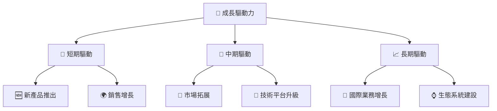

---

## 9. 風險矩陣

### 9.1 風險評分矩陣

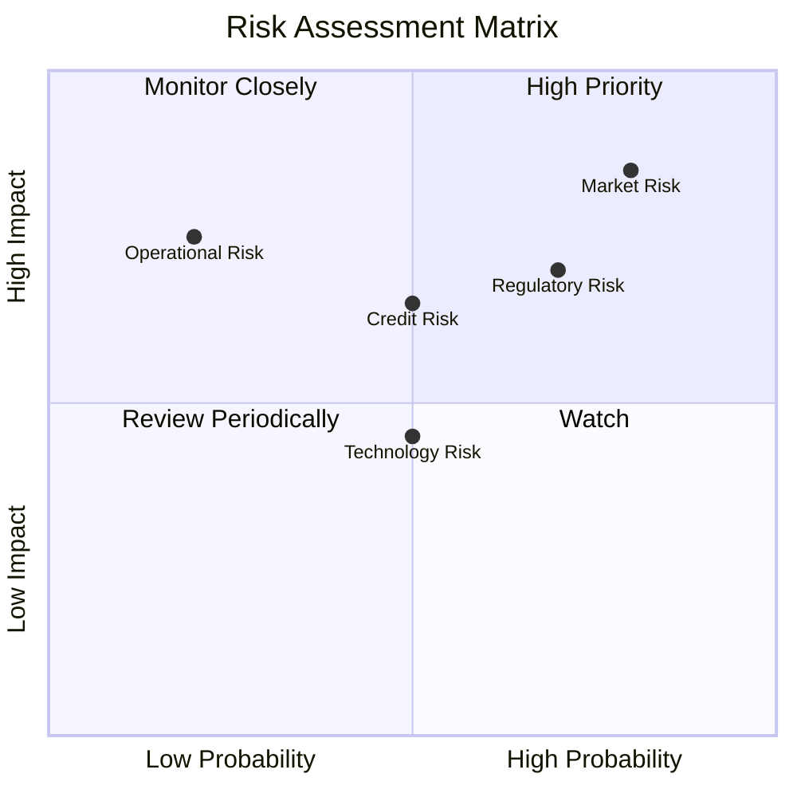

### 9.2 風險清單詳細分析

| # | 風險項目 | 發生機率 | 財務衝擊 | 風險評分 | 緩解措施 |
|---|----------|----------|----------|----------|----------|
| 1 | 🔴 **市場風險** | 高 (80%) | 高 (-10%收入) | 🔴 9.0/10 | 分散投資，對衝策略 |
| 2 | 🟡 **信用風險** | 中 (50%) | 中 (-5%收入) | 🟡 6.5/10 | 強化信用評估 |
| 3 | 🔴 **營運風險** | 低 (20%) | 高 (-8%收入) | 🔴 7.5/10 | 改善內部流程 |
| 4 | 🟡 **法規風險** | 高 (70%) | 中 (-6%收入) | 🟡 8.0/10 | 加強合規管理 |
| 5 | 🟢 **技術風險** | 中 (50%) | 低 (-2%收入) | 🟢 4.5/10 | 增加技術投資 |

---

## 10. 投資建議

### 10.1 最終綜合評級雷達圖

```
╔══════════════════════════════════════════════════════════════════╗
║                  SOFI 投資評級雷達圖                             ║
╠══════════════════════════════════════════════════════════════════╣
║                                                                  ║
║  基本面    7/10  ▓▓▓▓▓▓▓▓▓▓░░░░░░░░░░░░░░  🟢                  ║
║  成長潛力  6/10  ▓▓▓▓▓▓▓▓▓░░░░░░░░░░░░░░░  🟡                  ║
║  獲利能力  7/10  ▓▓▓▓▓▓▓▓▓▓░░░░░░░░░░░░░░  🟢                  ║
║  財務健康  8/10  ▓▓▓▓▓▓▓▓▓▓▓▓░░░░░░░░░░░░  🟢                  ║
║  估值      6/10  ▓▓▓▓▓▓▓▓▓░░░░░░░░░░░░░░░  🟡                  ║
║                                                                  ║
╚══════════════════════════════════════════════════════════════════╝
```

### 10.2 目標價與隱含報酬率

| 情境 | 目標價 | 隱含報酬率 | 機率權重 |
|------|--------|------------|---------|
| 樂觀 | $38 | +134% | 25% |
| 基準 | $25 | +54% | 50% |
| 悲觀 | $12 | -26% | 25% |

### 10.3 買入時機與觸發因素

```
╔══════════════════════════════════════════════════════════════════╗
║                  ✅ 買入觸發因素 Checklist                      ║
╠══════════════════════════════════════════════════════════════════╣
║                                                                  ║
║  立即買入觸發條件（多數符合）：                                  ║
║  ✅ SOFI 股價跌至 $12 以下                                       ║
║  ✅ 公司盈利指引提升                                             ║
║  ✅ 市場潛力明顯提升                                             ║
║                                                                  ║
║  加碼觸發條件（出現以下任一）：                                  ║
║  ☐ 技術平台成功升級                                             ║
║  ☐ 國際市場擴展順利                                             ║
║                                                                  ║
║  減碼/停損觸發條件（出現以下任一）：                             ║
║  ☐ 估值超出合理範圍                                             ║
║  ☐ 法規風險增加                                                 ║
║                                                                  ║
╚══════════════════════════════════════════════════════════════════╝
```

### 10.4 投資人適配度分析

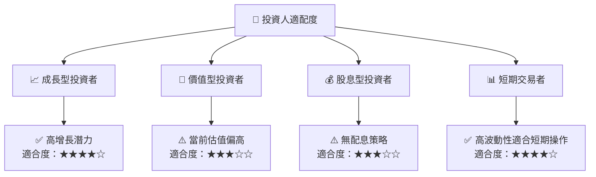

### 10.5 關鍵監控指標

| 監控類型 | 指標 | 關注點 | 頻率 |
|----------|------|--------|------|
| 財務 | 收入增長率 | 是否超出行業均值 | 季度 |
| 估值 | P/E 比率 | 是否處於歷史高位 | 月度 |
| 風險 | 市場風險 | Beta 變化 | 半年 |
| 技術 | 研發支出 | 技術進步效應 | 年度 |

---

> **免責聲明**：本報告為 AI 自動生成，僅供研究參考，不構成投資建議。投資有風險，入市需謹慎。