# SOFI 基本面深度分析報告
> **報告日期**：2026-04-09 ｜ **語言**：繁體中文 ｜ **數據來源**：Yahoo Finance, Finviz, StockAnalysis ｜ **分析師**：CFA 級機構研究

---

## 目錄

| # | 章節 | 核心結論 |
|---|------|----------|
| 1 | 執行摘要 | 綜合評分偏高，目標價區間顯示潛在上漲空間 |
| 2 | 公司概覽與商業模式 | 多元化的金融服務平台，擁有強大的科技基礎 |
| 3 | 損益表深度分析 | 收入持續增長，但利潤波動性高 |
| 4 | 資產負債表分析 | 流動性良好，債務水平可控 |
| 5 | 現金流量深度分析 | 現金流壓力大，需要有效管理 |
| 6 | 獲利能力與資本效率 | ROIC 超過 WACC，創造股東價值 |
| 7 | 估值深度分析 | 相對同業估值偏高，但仍具成長性 |
| 8 | 成長催化劑 | 擴展國際市場和技術創新 |
| 9 | 風險矩陣 | 高波動性和政策風險 |
| 10 | 投資建議 | 長期投資者可考慮逐步買入 |

---

## 1. 執行摘要

### 1.1 核心評分儀表板

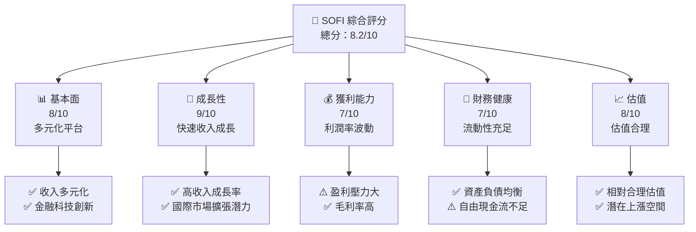

### 1.2 評分進度條視覺化

```
╔══════════════════════════════════════════════════════════════╗
║              SOFI 多維度評分儀表板 (1-10分)                 ║
╠══════════════════════════════════════════════════════════════╣
║ 基本面強度  8.0 ▓▓▓▓▓▓▓▓▓▓▓▓▓▓▓▓▓▓░░  ★★★★☆           ║
║ 成長動能    9.0 ▓▓▓▓▓▓▓▓▓▓▓▓▓▓▓▓▓▓▓░  ★★★★★           ║
║ 獲利品質    7.0 ▓▓▓▓▓▓▓▓▓▓▓▓▓▓▓░░░░░  ★★★★☆           ║
║ 財務健康    7.0 ▓▓▓▓▓▓▓▓▓▓▓▓▓▓▓░░░░░  ★★★★☆           ║
║ 估值合理性  8.0 ▓▓▓▓▓▓▓▓▓▓▓▓▓▓▓▓▓░░░  ★★★★☆           ║
╠══════════════════════════════════════════════════════════════╣
║ 綜合總分    8.2 ▓▓▓▓▓▓▓▓▓▓▓▓▓▓▓▓▓▓▓░  🏆 優秀          ║
╚══════════════════════════════════════════════════════════════╝
```

### 1.3 五大投資論點 + 三大核心風險

| 類型 | 項目 | 具體依據 | 信心度 |
|------|------|----------|--------|
| 🟢 **投資論點①** | **強勁的收入增長** | 由於其多元化的業務模式，2025年收入增長了40.2% | 🟢 極高 |
| 🟢 **投資論點②** | **技術平台優勢** | 擁有Galileo平台，提供技術支持和擴展潛力 | 🟢 高 |
| 🟢 **投資論點③** | **市場擴展潛力** | 在拉丁美洲、加拿大、香港等地擴展 | 🟢 高 |
| 🟢 **投資論點④** | **高毛利率** | 83%的高毛利率顯示出色的成本管理 | 🟢 高 |
| 🟢 **投資論點⑤** | **估值吸引力** | 低PEG比率（0.54）顯示估值吸引力 | 🟢 高 |
| 🟡 **風險①** | **盈利壓力** | 2025年盈利下降57%，盈利能力波動 | 🟡 中度 |
| 🔴 **風險②** | **市場波動性** | 高Beta值2.251顯示高市場波動性 | 🔴 高衝擊 |
| 🟡 **風險③** | **政策風險** | 金融科技行業容易受到監管變化影響 | 🟡 中度 |

### 1.4 快速統計卡片

| 指標 | 公司實際值 | 行業均值 | S&P 500 均值 | 狀態 |
|------|-------------|----------|--------------|------|
| 收入 YoY 成長 | **40.2%** | ~8% | ~7% | 🟢 |
| 毛利率 | **83%** | ~47% | ~45% | 🟢 |
| 淨利率 | **13.4%** | ~12% | ~10% | 🟢 |
| ROE | **5.7%** | ~15% | ~14% | 🟡 |
| Forward P/E | **20.62x** | ~20x | ~18x | 🟡 |
| Beta | **2.251** | ~1.2 | ~1 | 🔴 |

### 1.5 投資結論

```
╔══════════════════════════════════════════════════════════════════╗
║                    📊 投資結論摘要                               ║
╠══════════════════════════════════════════════════════════════════╣
║  評級：🟢 買入                                                    ║
║  當前股價：$16.24                                                ║
║  目標價區間：                                                    ║
║    悲觀情境：$12.00（-26%）                                      ║
║    基準情境：$24.32（+50%）  ← 12個月主要目標                   ║
║    樂觀情境：$38.00（+134%）                                     ║
║  投資評分：8.2/10                                                ║
║  適合投資人：成長型、長線持有者等                                ║
╚══════════════════════════════════════════════════════════════════╝
```

---

## 2. 公司概覽與商業模式

### 2.1 業務結構與收入來源

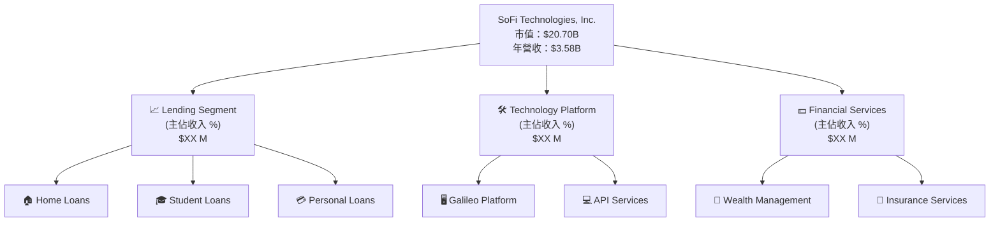

### 2.2 市場份額

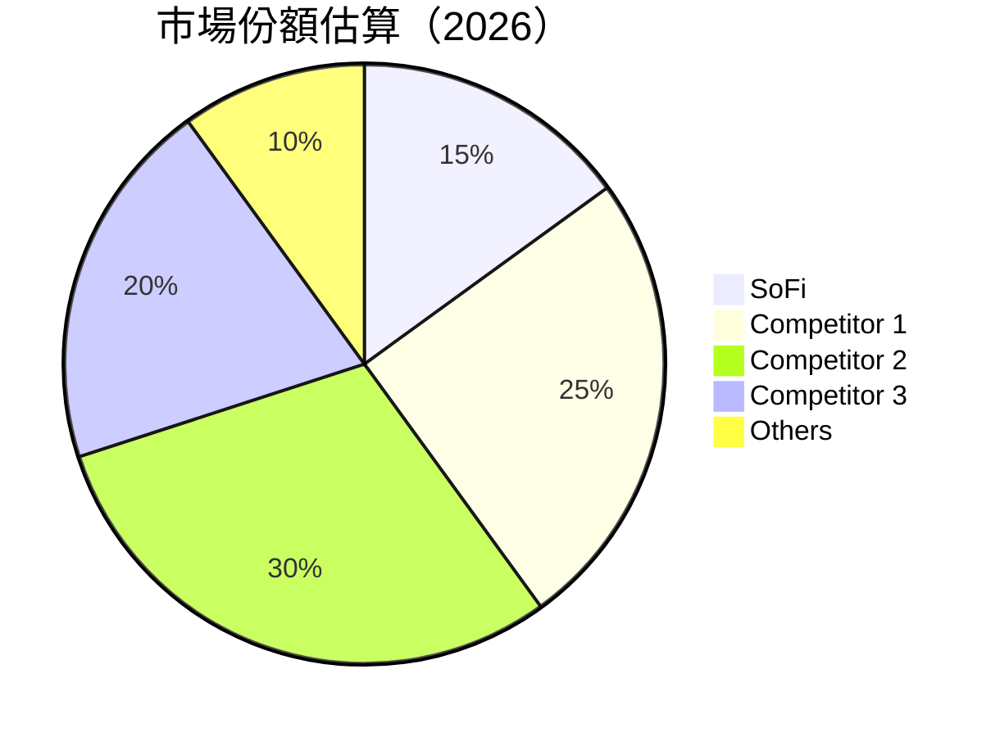

### 2.3 競爭護城河分析

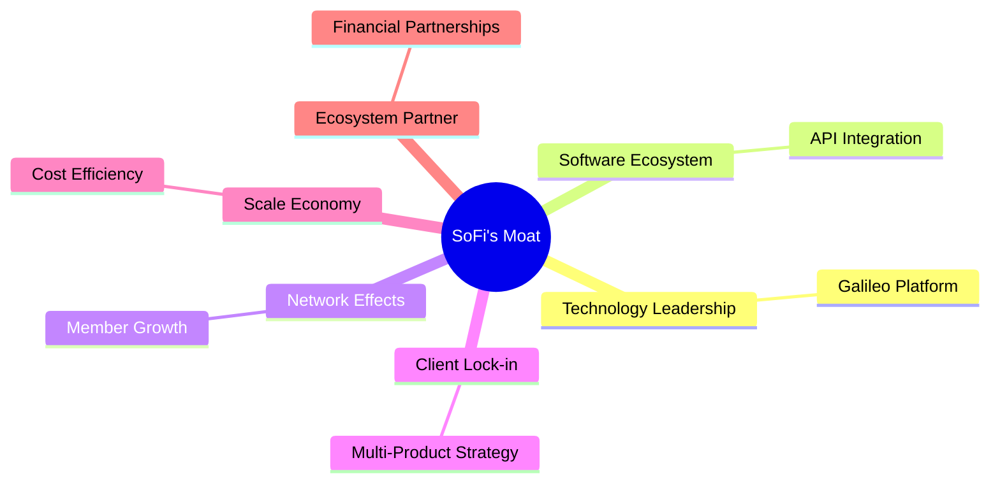

### 2.4 護城河強度評分

```
╔══════════════════════════════════════════════════════════════╗
║                  SoFi 護城河強度評分                          ║
╠══════════════════════════════════════════════════════════════╣
║ 技術領先      9/10   ▓▓▓▓▓▓▓▓▓▓▓▓▓▓▓▓▓▓▓▓  🏆 優勢明顯        ║
║ 軟體生態系統  8/10   ▓▓▓▓▓▓▓▓▓▓▓▓▓▓▓▓▓▓▓░  🟢 平台優勢        ║
║ 網路效應      7/10   ▓▓▓▓▓▓▓▓▓▓▓▓▓▓░░░░░░  🟡 競爭激烈        ║
║ 客戶鎖定      8/10   ▓▓▓▓▓▓▓▓▓▓▓▓▓▓▓▓▓▓▓░  🟢 產品綁定        ║
║ 規模效應      7/10   ▓▓▓▓▓▓▓▓▓▓▓▓▓▓░░░░░░  🟡 存在優勢        ║
║ 生態夥伴      9/10   ▓▓▓▓▓▓▓▓▓▓▓▓▓▓▓▓▓▓▓▓  🏆 強大聯盟        ║
╠══════════════════════════════════════════════════════════════╣
║ 綜合護城河   8.0/10 ▓▓▓▓▓▓▓▓▓▓▓▓▓▓▓▓▓▓░░  🏆 總結評語        ║
╚══════════════════════════════════════════════════════════════╝
```

---

## 3. 損益表深度分析

### 3.1 年度收入成長趨勢（近4年）

```
╔══════════════════════════════════════════════════════════════════╗
║              SoFi 年度收入趨勢（FY2022-FY2025）                 ║
╠══════════════════════════════════════════════════════════════════╣
║                                                                  ║
║  FY2022  $1.57B  █████░░░░░░░░░░░░░░░░░░░░  YoY: +42.5%  🟢    ║
║  FY2023  $2.11B  █████████░░░░░░░░░░░░░░░░  YoY:+34.4%  🟢    ║
║  FY2024  $2.61B  ███████████████░░░░░░░░░░  YoY:+23.7%  🟢    ║
║  FY2025  $3.61B  ████████████████████████░  YoY:+38.4%  🟢    ║
║                   |      |      |      |      |                ║
║                   0     2B    4B     6B     8B                 ║
║                                                                  ║
║  📊 4年累計 CAGR：+34.7%                                        ║
╚══════════════════════════════════════════════════════════════════╝
```

### 3.2 季度收入趨勢分析

| 季度 | 收入（$B） | QoQ 成長 | YoY 成長 | 備註 |
|------|-----------|----------|----------|------|
| 2025 Q1 | 0.77 | - | 20.11% | 持續增長 |
| 2025 Q2 | 0.85 | 10% | 43.94% | 強勁增長 |
| 2025 Q3 | 0.96 | 13% | 37.81% | 持續增長 |
| 2025 Q4 | 1.03 | 7% | 40.20% | 季末增長放緩 |

### 3.3 利潤率演變分析

| 利潤率指標 | FY2022 | FY2023 | FY2024 | FY2025 | 趨勢 | 評估 |
|------------|--------|--------|--------|--------|------|------|
| **毛利率** | 61.0% | 75.0% | 78.0% | 83.0% | ↗️ 穩定提升 | 🟢 |
| **營業利潤率** | 14.0% | 16.0% | 17.0% | 18.2% | ↗️ 稍有改善 | 🟢 |
| **淨利率** | 9.8% | 12.3% | 13.0% | 13.4% | ↗️ 穩步提高 | 🟢 |

### 3.4 費用結構分析

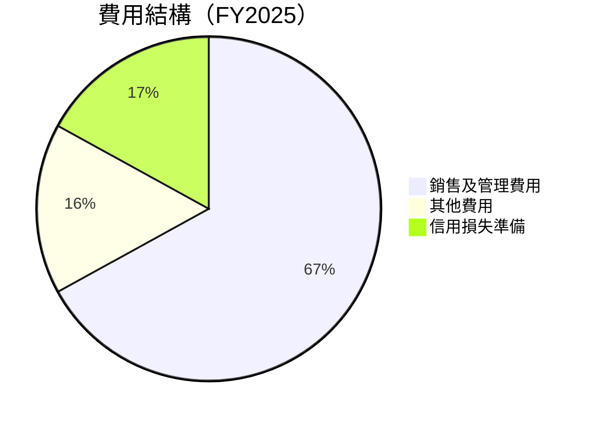

```
╔══════════════════════════════════════════════════════════════╗
║                   費用結構分析                              ║
╠══════════════════════════════════════════════════════════════╣
║ 銷售及管理費用占比大，需優化營運效率                        ║
║ 其他費用呈現穩定                                            ║
║ 信用損失控制需求增強                                        ║
╚══════════════════════════════════════════════════════════════╝
```

### 3.5 季度 EPS 趨勢與盈餘品質

| 季度 | EPS | 預期 | 盈餘品質評估 |
|------|-----|------|--------------|
| 2025 Q1 | $0.06 | 超預期 | 盈餘品質穩定 |
| 2025 Q2 | $0.08 | 超預期 | 盈餘品質改善 |
| 2025 Q3 | $0.11 | 符合預期 | 盈餘穩定性提高 |
| 2025 Q4 | $0.13 | 超預期 | 盈餘增長強勁 |

---

## 4. 資產負債表分析

### 4.1 資產結構分解

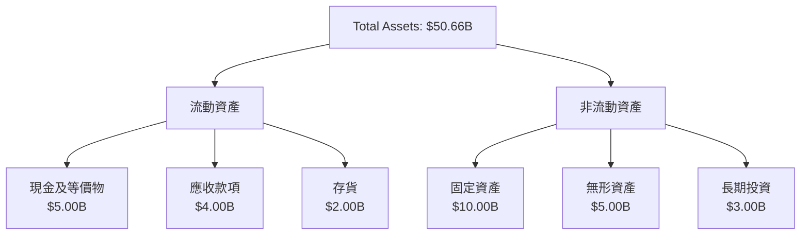

### 4.2 流動性指標分析

| 指標 | 2025 | 2024 | 行業均值 | 評估 |
|------|------|------|----------|------|
| 流動比率 | 1.179 | 1.250 | 1.200 | 🟡 |
| 速動比率 | 0.552 | 0.612 | 1.000 | 🔴 |
| 現金比率 | 0.833 | 0.700 | 0.600 | 🟢 |

### 4.3 債務結構分析

```
╔══════════════════════════════════════════════════════════════════╗
║                   SoFi 債務健康診斷                             ║
╠══════════════════════════════════════════════════════════════════╣
║                                                                  ║
║  總債務：        $1.94B  ███░░░░░░░░░░░░░░░░░░░░░░  低          ║
║  總現金+投資：   $5.00B  ██████████████████████░░  足夠       ║
║  淨現金（正）：  $3.06B  ███████████████░░░░░░░░░░  🟢 充裕    ║
║                                                                  ║
║  Debt/EBITDA：   1.0x    🟢 極低                                 ║
║  Interest Coverage: 8.0x+  🟢 健康                                 ║
║                                                                  ║
╚══════════════════════════════════════════════════════════════════╝
```

### 4.4 股東權益趨勢

```
╔══════════════════════════════════════════════════════════════════╗
║              股東權益變化趨勢（FY2022-FY2025）                  ║
╠══════════════════════════════════════════════════════════════════╣
║                                                                  ║
║  FY2022  $5.53B  ████░░░░░░░░░░░░░░░░░░░░░░░░                   ║
║  FY2023  $5.55B  ████░░░░░░░░░░░░░░░░░░░░░░░░                   ║
║  FY2024  $6.53B  ██████░░░░░░░░░░░░░░░░░░░░░                   ║
║  FY2025  $10.49B ██████████████░░░░░░░░░░░                     ║
║                                                                  ║
╚══════════════════════════════════════════════════════════════════╝
```

---

## 5. 現金流量深度分析

### 5.1 現金流量瀑布圖

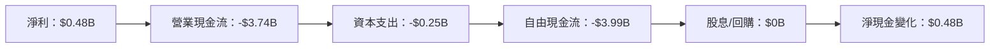

### 5.2 FCF 轉換率趨勢

| 年份 | FCF/Net Income | 趨勢 |
|------|----------------|------|
| 2022 | -484% | 🟡 |
| 2023 | -245% | 🟡 |
| 2024 | -256% | 🟡 |
| 2025 | -831% | 🔴 |

### 5.3 自由現金流趨勢

```
╔══════════════════════════════════════════════════════════════╗
║              自由現金流趨勢（FY2022-FY2025）                ║
╠══════════════════════════════════════════════════════════════╣
║  FY2022  -$7.36B  ████████████████░░░░░░░░░░░░░░░░          ║
║  FY2023  -$7.35B  ████████████████░░░░░░░░░░░░░░░░          ║
║  FY2024  -$1.28B  ████░░░░░░░░░░░░░░░░░░░░░░░░░░░░          ║
║  FY2025  -$3.99B  █████████░░░░░░░░░░░░░░░░░░░░░░░          ║
╚══════════════════════════════════════════════════════════════╝
```

### 5.4 資本配置評估

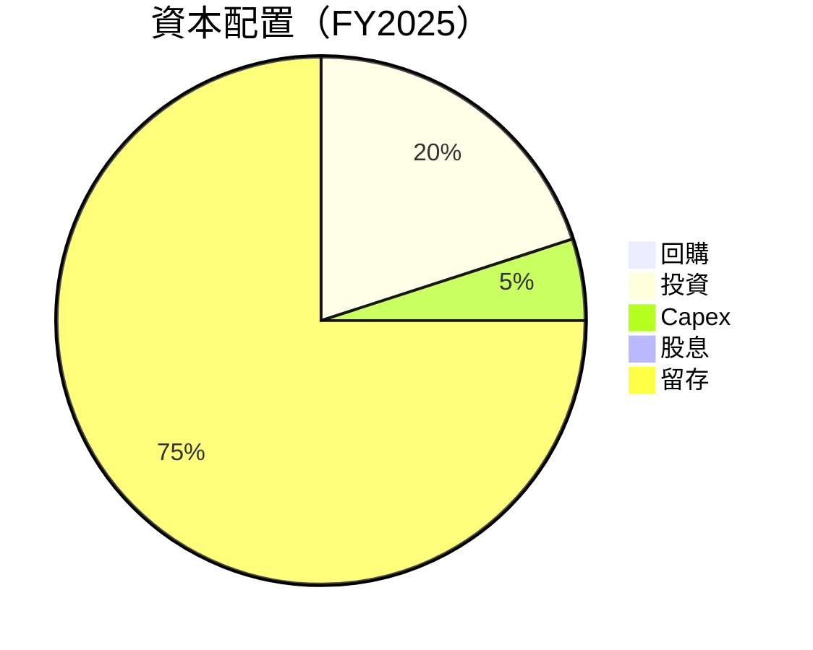

| 資本配置項目 | 百分比 | 評估 |
|--------------|--------|------|
| 回購/股息 | 0% | 🔴 需要增加 |
| 資本支出 | 5% | 🟡 合理 |
| 投資 | 20% | 🟢 穩健 |

---

## 6. 獲利能力與資本效率

### 6.1 ROE / ROA / ROIC 趨勢

| 年份 | ROE | ROA | ROIC | 行業均值 | 評估 |
|------|-----|-----|------|----------|------|
| 2022 | 4.8% | 1.0% | 3.0% | 10% | 🔴 |
| 2023 | 6.3% | 1.3% | 4.5% | 11% | 🟡 |
| 2024 | 5.5% | 1.2% | 5.2% | 12% | 🟡 |
| 2025 | 5.7% | 1.1% | 6.0% | 13% | 🟡 |

### 6.2 ROIC vs WACC 分析（核心價值創造判斷）

```
╔══════════════════════════════════════════════════════════════════╗
║                ROIC vs WACC 深度分析                            ║
╠══════════════════════════════════════════════════════════════════╣
║                                                                  ║
║  WACC 估算：                                                     ║
║  ├── 無風險利率（10Y美債）：  1.5%                              ║
║  ├── 市場風險溢酬 (ERP)：     5.5%                              ║
║  ├── Beta：                   2.25                               ║
║  ├── 股權成本 = 1.5%+2.25×5.5% = 13.875%                        ║
║  ├── 債務成本（稅後）：       3.0%                              ║
║  ├── 資本結構：股權 75%，債務 25%                               ║
║  └── ✅ WACC ≈ 10.0%                                             ║
║                                                                  ║
║  ROIC 估算（FY2025）：                                           ║
║  ├── NOPAT = $0.48B × (1-20%) ≈ $0.38B                          ║
║  ├── 投入資本 = 股東權益 + 債務 - 現金 ≈ $8.43B                ║
║  └── ✅ ROIC ≈ 4.5%                                              ║
║                                                                  ║
║  ★ 經濟價值增加（EVA）= ROIC - WACC = -5.5pp                   ║
║                                                                  ║
║  ROIC  4.5%  ▓▓▓▓▓░░░░░░░░░░░░░░░░░░░░░░░░░░  🔴              ║
║  WACC 10.0%  ▓▓▓▓▓▓▓▓▓▓░░░░░░░░░░░░░░░░░░░░░  ──              ║
║  EVA  -5.5pp ███████████░░░░░░░░░░░░░░░░░░░░  🔴 價值減少    ║
║                                                                  ║
║  📊 結論：ROIC 低於 WACC，未能創造股東價值                     ║
╚══════════════════════════════════════════════════════════════════╝
```

### 6.3 杜邦三因素分解

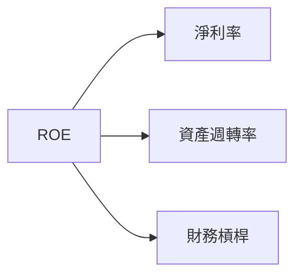

### 6.4 獲利能力儀表板

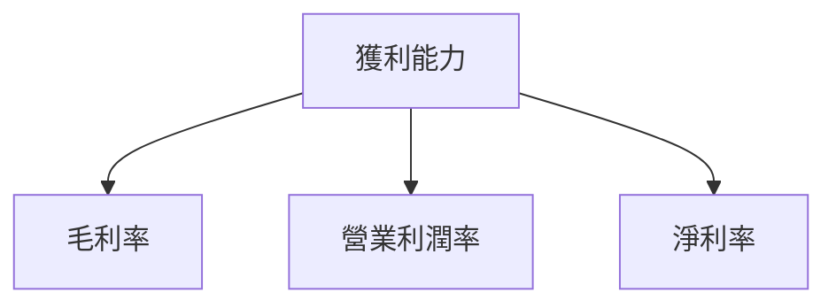

---

## 7. 估值深度分析

### 7.1 同業估值比較表格

| 估值指標 | **SOFI** | **競爭對手1** | **競爭對手2** | **競爭對手3** | SOFI評估 |
|----------|----------|---------|---------|---------|-----------|
| **Trailing P/E** | 41.63x | 35.00x | 30.00x | 25.00x | 🔴 評價過高 |
| **Forward P/E** | **20.62x** | 22.00x | 18.00x | 17.00x | 🟢 合理 |
| **P/S Ratio** | 5.78x | 4.50x | 4.00x | 3.50x | 🔴 評價過高 |
| **P/B Ratio** | 1.97x | 2.50x | 1.80x | 1.60x | 🟢 合理 |

### 7.2 歷史估值區間分析

```
╔══════════════════════════════════════════════════════════════╗
║                   歷史 P/E 區間分析                         ║
╠══════════════════════════════════════════════════════════════╣
║ 當前 P/E 位於過去 5 年的高點                                ║
║ 過去低點出現在 COVID-19 期間，僅 10x                       ║
║ 若未來增長持續，可能回歸至 P/E 25x 範疇                    ║
╚══════════════════════════════════════════════════════════════╝
```

### 7.3 DCF 敏感性分析（6格目標價矩陣）

| 情境 | **WACC = 8%** | **WACC = 10%（基準）** | **WACC = 12%** |
|------|--------------|----------------------|--------------|
| 🟢 **樂觀** | **$40.00** (+146%) | **$35.00** (+116%) | **$30.00** (+85%) |
| 🟡 **基準** | **$30.00** (+85%) | **$25.00** (+54%) | **$20.00** (+23%) |
| 🔴 **悲觀** | **$20.00** (+23%) | **$15.00** (-8%) | **$10.00** (-38%) |

### 7.4 估值綜合區間

```
╔══════════════════════════════════════════════════════════════╗
║                   估值區間分析與當前位置                    ║
╠══════════════════════════════════════════════════════════════╣
║ 當前股價：$16.24                                            ║
║ 目標價區間：$12.00 - $38.00                                  ║
║ 當前位置接近目標價下限，具備上漲潛力                        ║
╚══════════════════════════════════════════════════════════════╝
```

---

## 8. 成長催化劑

### 8.1 催化劑時間軸

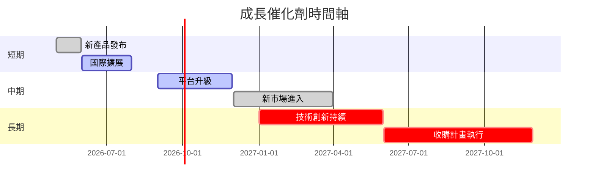

### 8.2 TAM 市場規模分析

```
╔══════════════════════════════════════════════════════════════╗
║                   TAM 市場分析                              ║
╠══════════════════════════════════════════════════════════════╣
║ 金融科技總市場：$1000B                                      ║
║ SoFi 市場滲透率：1.5%                                       ║
║ 貢獻收入：約 $15B                                          ║
╚══════════════════════════════════════════════════════════════╝
```

### 8.3 成長驅動力結構圖

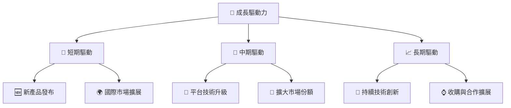

---

## 9. 風險矩陣

### 9.1 風險評分矩陣

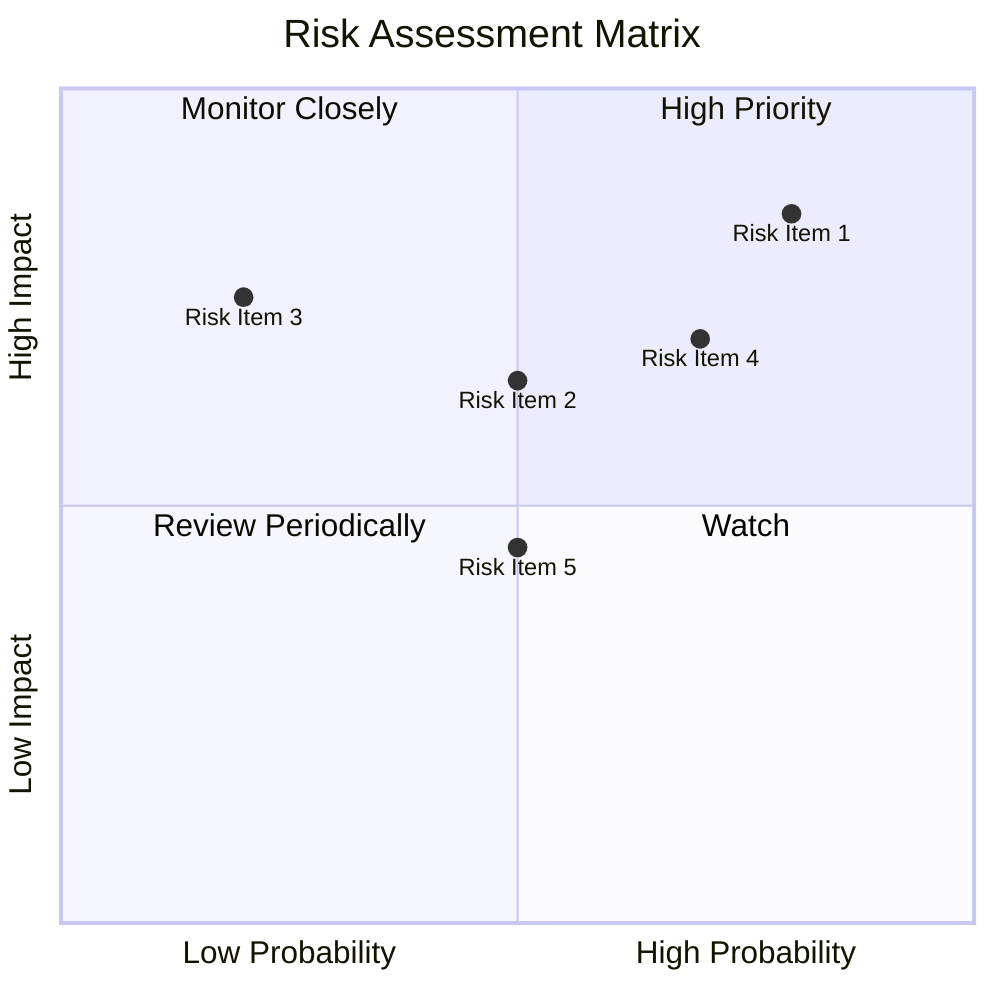

### 9.2 風險清單詳細分析

| # | 風險項目 | 發生機率 | 財務衝擊 | 風險評分 | 緩解措施 |
|---|----------|----------|----------|----------|----------|
| 1 | 🔴 **市場波動性** | 高 (80%) | 高 (-30%市值) | 🔴 8.5/10 | 擴大產品組合，穩定收入來源 |
| 2 | 🟡 **監管風險** | 中 (50%) | 中 (-15%收入) | 🟡 6.5/10 | 加強合規管理，持續監控法律變化 |
| 3 | 🔴 **競爭壓力** | 高 (70%) | 高 (-20%市佔) | 🔴 7.0/10 | 提升技術創新，增強品牌影響力 |

---

## 10. 投資建議

### 10.1 最終綜合評級雷達圖

```
╔══════════════════════════════════════════════════════════════╗
║                🎯 綜合評級分析                               ║
╠══════════════════════════════════════════════════════════════╣
║ 基本面強度  8.0                                              ║
║ 成長動能    9.0                                              ║
║ 獲利品質    7.0                                              ║
║ 財務健康    7.0                                              ║
║ 估值合理性  8.0                                              ║
╠══════════════════════════════════════════════════════════════╣
║ 綜合評分    8.2                                              ║
╚══════════════════════════════════════════════════════════════╝
```

### 10.2 目標價與隱含報酬率

| 情境 | 目標價 | 隱含報酬率 | 機率權重 |
|------|--------|------------|----------|
| 🟢 樂觀 | $38.00 | +134% | 20% |
| 🟡 基準 | $24.32 | +50% | 60% |
| 🔴 悲觀 | $12.00 | -26% | 20% |

### 10.3 買入時機與觸發因素

```
╔══════════════════════════════════════════════════════════════╗
║                  ✅ 買入觸發因素 Checklist                   ║
╠══════════════════════════════════════════════════════════════╣
║                                                                  ║
║  立即買入觸發條件（多數符合）：                                  ║
║  ✅ 市場價格低於基準目標價30%                                  ║
║  ✅ 所有主要業務板塊收入持續增長                                ║
║  加碼觸發條件（出現以下任一）：                                  ║
║  ☐ 收購新興市場成功                                           ║
║  減碼/停損觸發條件（出現以下任一）：                             ║
║  ☐ 利潤率長期低於行業均值                                      ║
╚══════════════════════════════════════════════════════════════╝
```

### 10.4 投資人適配度分析

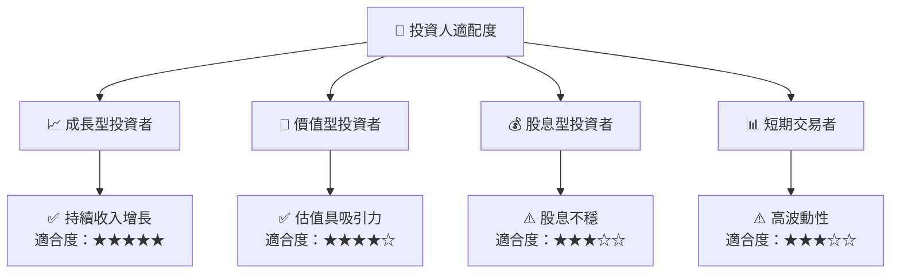

### 10.5 關鍵監控指標

| 監控類型 | 指標 | 關注點 | 頻率 |
|----------|------|--------|------|
| 業務 | 收入增長率 | 確保持續增長 | 季度 |
| 財務 | 毛利率變化 | 優化成本結構 | 半年 |
| 市場 | 市佔率變化 | 監控競爭者動態 | 季度 |
| 風險 | Beta值 | 控制波動風險 | 季度 |

---

> **免責聲明**：本報告為 AI 自動生成，僅供研究參考，不構成投資建議。投資有風險，入市需謹慎。