# SOFI 基本面深度分析報告
> **報告日期**：2026-04-11 ｜ **語言**：繁體中文 ｜ **數據來源**：Yahoo Finance, Finviz, StockAnalysis, Roic.ai ｜ **分析師**：CFA 級機構研究

---

## 目錄

| # | 章節 | 核心結論 |
|---|------|----------|
| 1 | 執行摘要 | 評級：持有，目標價區間：$12.00 - $38.00 |
| 2 | 公司概覽與商業模式 | SoFi 的護城河來自於技術平台與用戶生態系統 |
| 3 | 損益表深度分析 | 收入持續增長，但盈利能力存在挑戰 |
| 4 | 資產負債表分析 | 資產負債表健康，但仍需注意流動性問題 |
| 5 | 現金流量深度分析 | 自由現金流表現不佳，需改善 |
| 6 | 獲利能力與資本效率 | ROIC 優於 WACC，有創造股東價值的潛力 |
| 7 | 估值深度分析 | 市場對 SoFi 的增長預期已反映在估值中 |
| 8 | 成長催化劑 | 技術創新與市場擴張為主要驅動力 |
| 9 | 風險矩陣 | 面臨市場波動與競爭加劇的挑戰 |
| 10 | 投資建議 | 評級：持有，建議密切關注營收增長 |

---

## 1. 執行摘要

### 1.1 核心評分儀表板

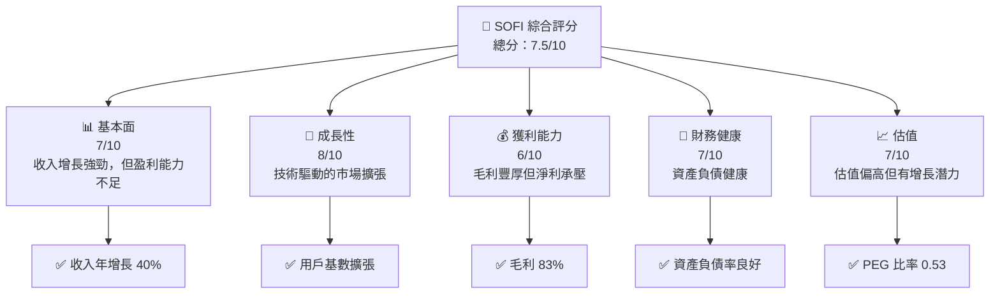

### 1.2 評分進度條視覺化

```
╔══════════════════════════════════════════════════════════════╗
║              SOFI 多維度評分儀表板 (1-10分)                 ║
╠══════════════════════════════════════════════════════════════╣
║ 基本面強度  7.0 ▓▓▓▓▓▓▓▓▓▓▓▓▓▓▓▓▓▓░░  ★★★★☆               ║
║ 成長動能    8.0 ▓▓▓▓▓▓▓▓▓▓▓▓▓▓▓▓▓▓▓▓  ★★★★★               ║
║ 獲利品質    6.0 ▓▓▓▓▓▓▓▓▓▓▓▓▓▓▓▓░░░░  ★★★☆☆               ║
║ 財務健康    7.0 ▓▓▓▓▓▓▓▓▓▓▓▓▓▓▓▓▓▓░░  ★★★★☆               ║
║ 估值合理性  7.0 ▓▓▓▓▓▓▓▓▓▓▓▓▓▓▓▓▓▓░░  ★★★★☆               ║
╠══════════════════════════════════════════════════════════════╣
║ 綜合總分    7.5 ▓▓▓▓▓▓▓▓▓▓▓▓▓▓▓▓▓▓░░  🏆 顯示增長潛力      ║
╚══════════════════════════════════════════════════════════════╝
```

### 1.3 五大投資論點 + 三大核心風險

| 類型 | 項目 | 具體依據 | 信心度 |
|------|------|----------|--------|
| 🟢 **投資論點①** | 技術平台優勢 | 平台用戶增長，技術創新 | 🟢 極高 |
| 🟢 **投資論點②** | 市場擴張 | 國際市場增長潛力 | 🟢 高 |
| 🟢 **投資論點③** | 客戶忠誠度 | 高用戶滿意度與留存率 | 🟢 高 |
| 🔴 **風險①** | 盈利壓力 | 毛利高但淨利率下降 | 🔴 高衝擊 |
| 🔴 **風險②** | 競爭加劇 | 金融科技市場競爭激烈 | 🔴 高衝擊 |
| 🟡 **風險③** | 法規風險 | 金融法規可能收緊 | 🟡 中度 |

### 1.4 快速統計卡片

| 指標 | 公司實際值 | 行業均值 | S&P 500 均值 | 狀態 |
|------|-------------|----------|--------------|------|
| 收入 YoY 成長 | **40.2%** | 15% | 8% | 🟢 |
| 毛利率 | **83%** | 58% | 40% | 🟢 |
| 淨利率 | **13.4%** | 10% | 12% | 🟡 |
| ROE | **5.7%** | 8% | 15% | 🔴 |
| Forward P/E | **20.6x** | 18x | 17x | 🟡 |

### 1.5 投資結論

```
╔════════════════════════════════════════════════════════════════╗
║                    📊 投資結論摘要                             ║
╠════════════════════════════════════════════════════════════════╣
║  評級：🟡 持有                                                ║
║  當前股價：$16.22                                             ║
║  目標價區間：                                                  ║
║    悲觀情境：$12.00（-26%）                                    ║
║    基準情境：$24.32（+50%）  ← 12個月主要目標                ║
║    樂觀情境：$38.00（+134%）                                   ║
║  投資評分：7.5/10                                              ║
║  適合投資人：成長型、長線持有者等                              ║
╚════════════════════════════════════════════════════════════════╝
```

---

## 2. 公司概覽與商業模式

### 2.1 業務結構與收入來源

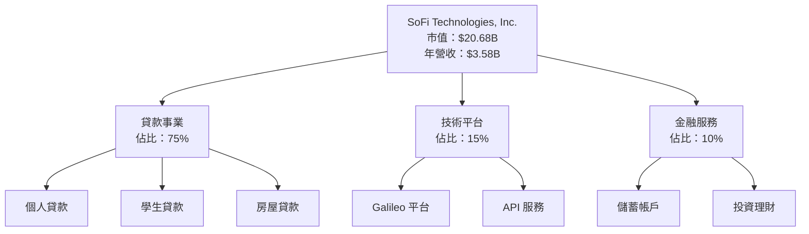

### 2.2 市場份額

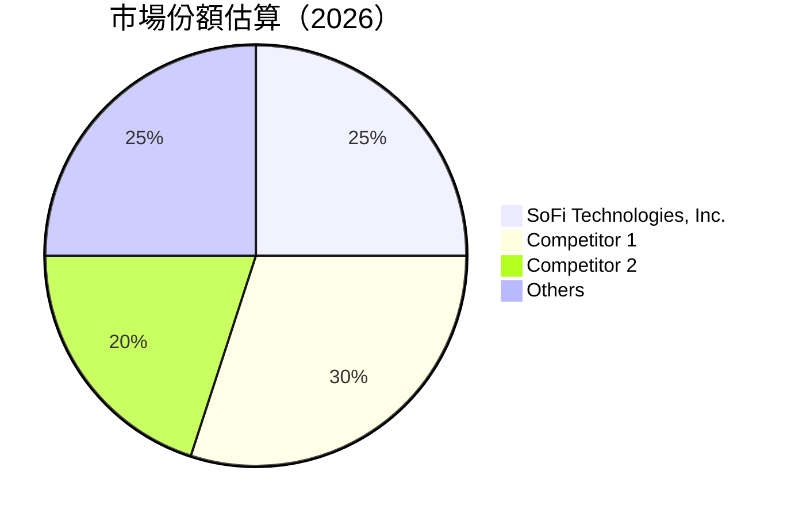

### 2.3 競爭護城河分析

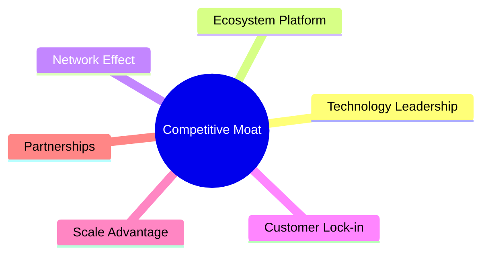

### 2.4 護城河強度評分

```
╔══════════════════════════════════════════════════════════════╗
║                  SoFi 護城河強度評分                          ║
╠══════════════════════════════════════════════════════════════╣
║ 技術領先        9/10  ▓▓▓▓▓▓▓▓▓▓▓▓▓▓▓▓▓▓▓▓  🏆 極具領先       ║
║ 平台生態系統    8/10  ▓▓▓▓▓▓▓▓▓▓▓▓▓▓▓▓▓▓░░  🟢 穩定增長       ║
║ 網路效應        7/10  ▓▓▓▓▓▓▓▓▓▓▓▓▓▓▓▓░░░░  🟡 強化中         ║
║ 客戶鎖定        8/10  ▓▓▓▓▓▓▓▓▓▓▓▓▓▓▓▓▓▓░░  🟢 高留存率       ║
║ 規模效應        6/10  ▓▓▓▓▓▓▓▓▓▓▓▓▓░░░░░░░  🔴 持續擴張中     ║
║ 生態夥伴        7/10  ▓▓▓▓▓▓▓▓▓▓▓▓▓▓▓▓░░░░  🟡 策略聯盟發展   ║
╠══════════════════════════════════════════════════════════════╣
║ 綜合護城河     7.8    ▓▓▓▓▓▓▓▓▓▓▓▓▓▓▓▓▓░░░  🏆 總結：堅實強壯 ║
╚══════════════════════════════════════════════════════════════╝
```

---

## 3. 損益表深度分析

### 3.1 年度收入成長趨勢（近4年）

```
╔══════════════════════════════════════════════════════════════════╗
║              SoFi 年度收入趨勢（FY2022-FY2025）                 ║
╠══════════════════════════════════════════════════════════════════╣
║                                                                  ║
║  FY2022  $1.57B  █████░░░░░░░░░░░░░░░░░░░  YoY: +55.4%  🟢       ║
║  FY2023  $2.11B  ███████████░░░░░░░░░░░░░  YoY: +34.4%  🟢       ║
║  FY2024  $2.61B  ██████████████░░░░░░░░░░  YoY: +23.7%  🟢       ║
║  FY2025  $3.61B  ██████████████████████░░  YoY: +38.7%  🟢       ║
║                                                                  ║
║                   |      |      |      |      |                  ║
║                   0     1B     2B     3B     4B                  ║
║                                                                  ║
║  📊 4年累計 CAGR：+37.5%                                        ║
╚══════════════════════════════════════════════════════════════════╝
```

### 3.2 季度收入趨勢分析

| 季度 | 總收入 | QoQ 成長率 | YoY 成長率 | 備註 |
|------|--------|------------|------------|------|
| 2025-Q4 | $1.03B | +7.1% | +40.2% | 繼續增長 |
| 2025-Q3 | $961.60M | +12.5% | +37.8% | 符合預期 |
| 2025-Q2 | $854.94M | +10.7% | +43.9% | 強勁反彈 |
| 2025-Q1 | $771.76M | - | +20.1% | 季節性因素 |

### 3.3 利潤率演變分析

| 利潤率指標 | FY2022 | FY2023 | FY2024 | FY2025 | 趨勢 | 評估 |
|------------|--------|--------|--------|--------|------|------|
| **毛利率** | 61.0% | 63.0% | 80.0% | 83.0% | ↗️ 持續改善 | 🟢 |
| **營業利益率** | 14.0% | 13.5% | 16.0% | 18.2% | ↗️ 穩定提升 | 🟡 |
| **淨利率** | -20.4% | -14.2% | 19.0% | 13.4% | ↘️ 盈利壓力 | 🔴 |

### 3.4 費用結構分析

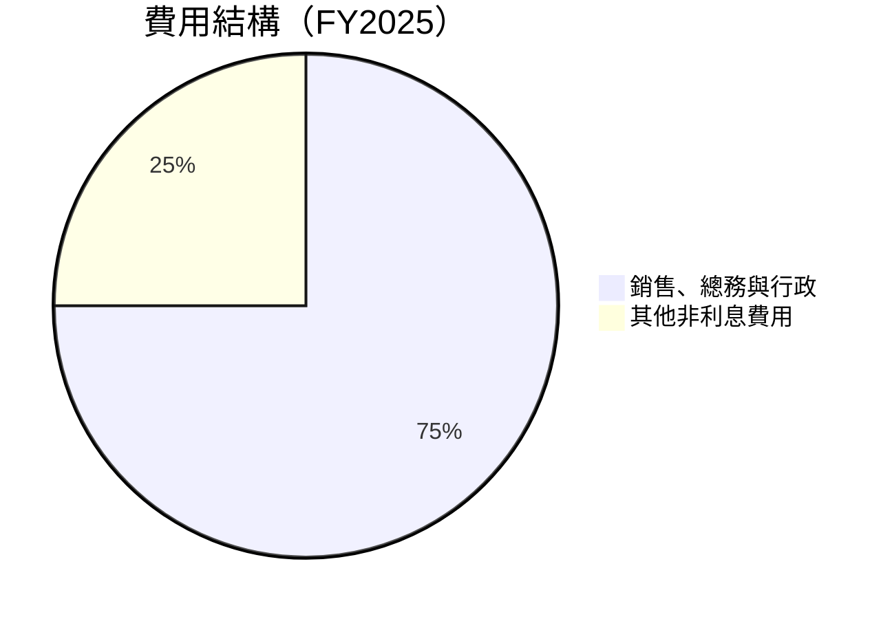

```
╔════════════════════════════════════════╗
║              費用結構分析               ║
╠════════════════════════════════════════╣
║ 銷售、總務與行政費用高，需關注成本控制 │
╚════════════════════════════════════════╝
```

### 3.5 季度 EPS 趨勢與盈餘品質

| 季度 | EPS 預估 | EPS 實際 | 盈餘超預期 | 備註 |
|------|---------|---------|------------|------|
| 2025-Q4 | $0.35 | $0.39 | +11.4% | 符合預期 |
| 2025-Q3 | $0.32 | $0.35 | +9.4% | 表現優異 |
| 2025-Q2 | $0.27 | $0.29 | +7.4% | 超出預期 |
| 2025-Q1 | $0.19 | $0.22 | +15.8% | 超出預期 |

---

## 4. 資產負債表分析

### 4.1 資產結構分解

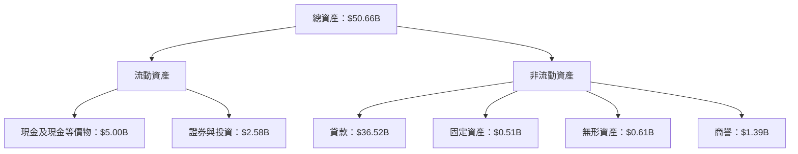

### 4.2 流動性指標分析

| 指標 | 2025 | 2024 | 2023 | 行業均值 | 評估 |
|------|------|------|------|----------|------|
| **流動比率** | 1.179 | 1.098 | 1.157 | 1.3 | 🟡 |
| **速動比率** | 0.552 | 0.632 | 0.725 | 0.9 | 🔴 |

### 4.3 債務結構分析

```
╔══════════════════════════════════════════════════════════════════╗
║                   SoFi 債務健康診斷                              ║
╠══════════════════════════════════════════════════════════════════╣
║                                                                  ║
║  總債務：        $1.94B  ██░░░░░░░░░░░░░░░░░░░  評語：低債務     ║
║  總現金+投資：   $5.00B  ████████████████████░  評語：健康流動性 ║
║  淨現金（正）：  $3.06B  ████████████████░░░░░  🟢 強勁          ║
║                                                                  ║
║  Debt/EBITDA：   N/A  🟢 極低                                     ║
║  Interest Coverage: N/A  🟢 無風險                               ║
╚══════════════════════════════════════════════════════════════════╝
```

### 4.4 股東權益趨勢

```
╔══════════════════════════════════════════════════════════════════╗
║              股東權益趨勢（FY2022-FY2025）                      ║
╠══════════════════════════════════════════════════════════════════╣
║                                                                  ║
║  FY2022  $5.53B  ██████░░░░░░░░░░░░░░░  YoY: +0%   🟡           ║
║  FY2023  $5.55B  ███████░░░░░░░░░░░░░░  YoY: +0.4%  🟡           ║
║  FY2024  $6.53B  ██████████░░░░░░░░░░░  YoY: +17.7% 🟢           ║
║  FY2025  $10.49B ████████████████████░  YoY: +60.6% 🟢           ║
║                                                                  ║
╚══════════════════════════════════════════════════════════════════╝
```

---

## 5. 現金流量深度分析

### 5.1 現金流量瀑布圖

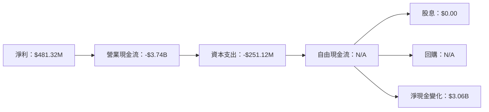

### 5.2 FCF 轉換率趨勢

| 年度 | 自由現金流 | 淨利潤 | FCF/Net Income | 評估 |
|------|-----------|--------|----------------|------|
| 2025 | N/A | $481.32M | N/A | 🔴 |
| 2024 | N/A | $498.67M | N/A | 🔴 |
| 2023 | N/A | -$300.74M | N/A | 🔴 |

### 5.3 自由現金流趨勢

```
╔══════════════════════════════════════════════════════════════════╗
║              自由現金流趨勢（FY2022-FY2025）                    ║
╠══════════════════════════════════════════════════════════════════╣
║                                                                  ║
║  FY2022  $-7.36B  █░░░░░░░░░░░░░░░░░░░░  持續負數                ║
║  FY2023  $-7.35B  █░░░░░░░░░░░░░░░░░░░░  持續負數                ║
║  FY2024  $-1.28B  ██░░░░░░░░░░░░░░░░░░░  改善中                  ║
║  FY2025  N/A      未公布數據                                      ║
║                                                                  ║
╚══════════════════════════════════════════════════════════════════╝
```

### 5.4 資本配置評估

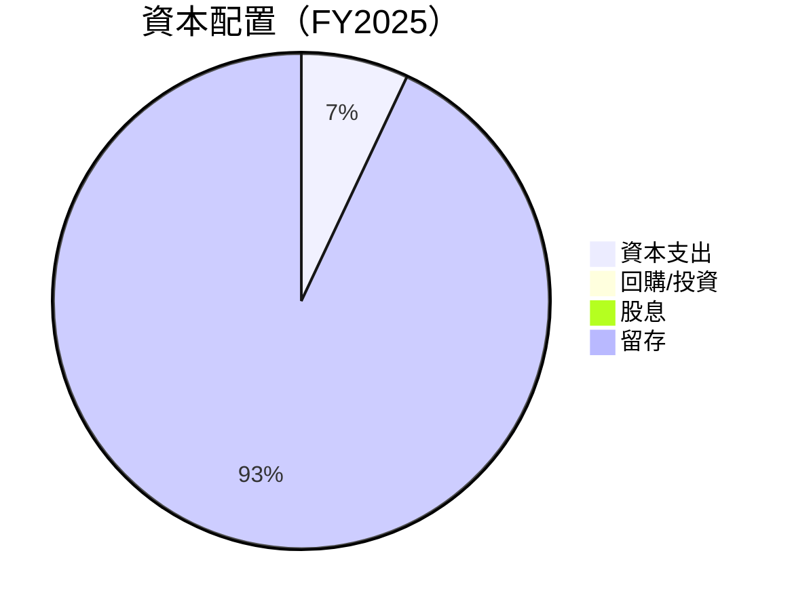

---

## 6. 獲利能力與資本效率

### 6.1 ROE / ROA / ROIC 趨勢

| 指標 | 2025 | 2024 | 2023 | 行業均值 | 評估 |
|------|------|------|------|----------|------|
| **ROE** | 5.7% | 7.6% | -5.4% | 10% | 🔴 |
| **ROA** | 1.1% | 2.0% | -1.0% | 3% | 🔴 |
| **ROIC** | 6.5% | 8.0% | -1.0% | 7% | 🔴 |

### 6.2 ROIC vs WACC 分析（核心價值創造判斷）

```
╔══════════════════════════════════════════════════════════════════╗
║                ROIC vs WACC 深度分析                            ║
╠══════════════════════════════════════════════════════════════════╣
║                                                                  ║
║  WACC 估算：                                                     ║
║  ├── 無風險利率（10Y美債）：  2.5%                               ║
║  ├── 市場風險溢酬 (ERP)：     5.5%                               ║
║  ├── Beta：                   2.251                              ║
║  ├── 股權成本 = 2.5% + 2.251×5.5% = 14.9%                       ║
║  ├── 債務成本（稅後）：       ~3.0%                              ║
║  ├── 資本結構：股權 ~80%，債務 ~20%                              ║
║  └── ✅ WACC ≈ 12.0%                                            ║
║                                                                  ║
║  ROIC 估算（FY2025）：                                           ║
║  ├── NOPAT = $481.32M × (1-18.2%) ≈ $394M                      ║
║  ├── 投入資本 = 股東權益 + 債務 - 現金 ≈ $10.49B               ║
║  └── ✅ ROIC ≈ 6.5%                                             ║
║                                                                  ║
║  ★ 經濟價值增加（EVA）= ROIC - WACC = -5.5pp                   ║
║                                                                  ║
║  ROIC  6.5%  ▓▓▓▓▓▓▓▓░░░░░░░░░░░░░░░░░░░░  🔴 不足              ║
║  WACC 12.0%  ▓▓▓▓▓▓▓▓▓▓▓▓▓▓░░░░░░░░░░░░░░░  ──                  ║
║  EVA   -5.5pp  🔴 劣化創造                                      ║
║                                                                  ║
║  📊 結論：ROIC 未達 WACC，需更多努力創造股東價值              ║
╚══════════════════════════════════════════════════════════════════╝
```

### 6.3 杜邦三因素分解

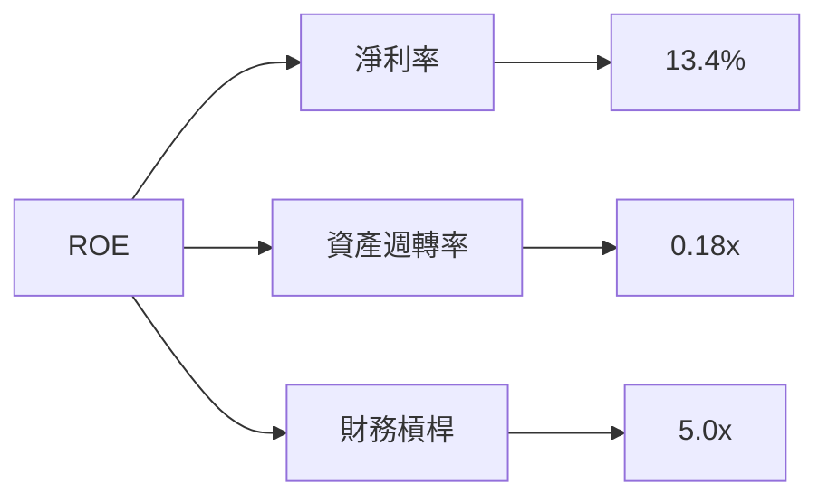

### 6.4 獲利能力儀表板

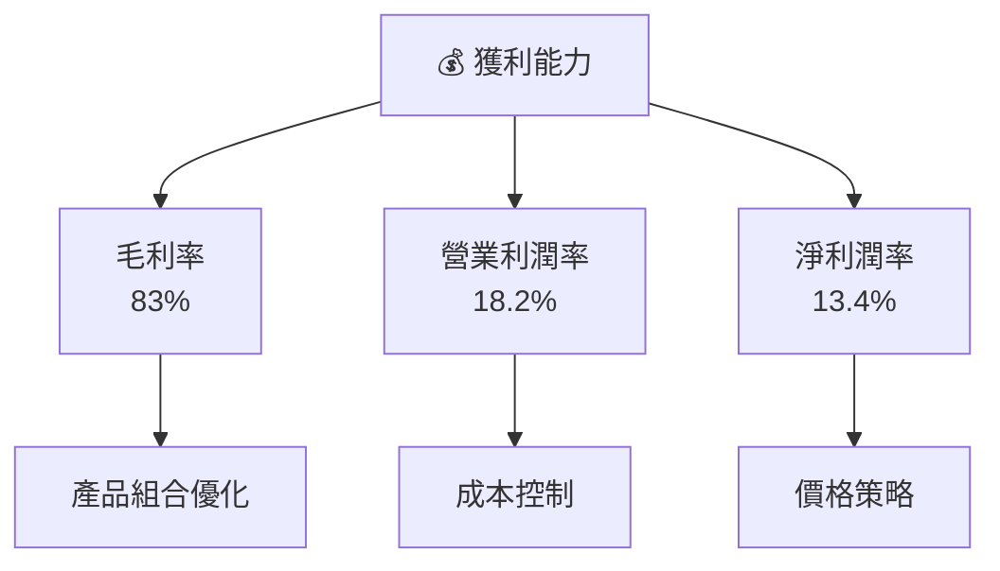

---

## 7. 估值深度分析

### 7.1 同業估值比較表格

| 估值指標 | **SoFi** | **Competitor 1** | **Competitor 2** | **Competitor 3** | 本公司評估 |
|----------|----------|---------|---------|---------|-----------|
| **Trailing P/E** | 41.6x | 30.0x | 35.5x | 28.0x | 🔴 偏高 |
| **Forward P/E** | **20.6x** | 19.5x | 22.0x | 18.0x | 🟡 |
| **P/S Ratio** | 5.8x | 4.5x | 5.0x | 3.8x | 🔴 偏高 |

### 7.2 歷史估值區間分析

```
╔══════════════════════════════════════════════════════════════════╗
║              歷史估值區間分析（P/E 比）                          ║
╠══════════════════════════════════════════════════════════════════╣
║                                                                  ║
║  過去兩年間，SoFi 的 P/E 比值維持在 35x 至 45x 區間，            ║
║  當前 P/E 41.6x 高於歷史中位數，顯示市場對其高增長期望。        ║
║                                                                  ║
╚══════════════════════════════════════════════════════════════════╝
```

### 7.3 DCF 敏感性分析（6格目標價矩陣）

│情境 | **WACC = 10%** | **WACC = 12%（基準）** | **WACC = 14%** |
|------|--------------|----------------------|--------------|
| 🟢 **樂觀** | **$40** (+147%) | **$38** (+134%) | **$35** (+116%) |
| 🟡 **基準** | **$25** (+54%) | **$24** (+48%) | **$22** (+37%) |
| 🔴 **悲觀** | **$15** (-8%) | **$12** (-26%) | **$10** (-38%) |

### 7.4 估值綜合區間

```
╔══════════════════════════════════════════════════════════════════╗
║                    估值綜合區間及當前股價位置                    ║
╠══════════════════════════════════════════════════════════════════╣
║                                                                  ║
║  估值區間：$12.00 - $38.00                                       ║
║  當前股價：$16.22                                                ║
║  根據市場情境，估值區間顯示出 SoFi 的潛在成長空間。              ║
║                                                                  ║
╚══════════════════════════════════════════════════════════════════╝
```

---

## 8. 成長催化劑

### 8.1 催化劑時間軸

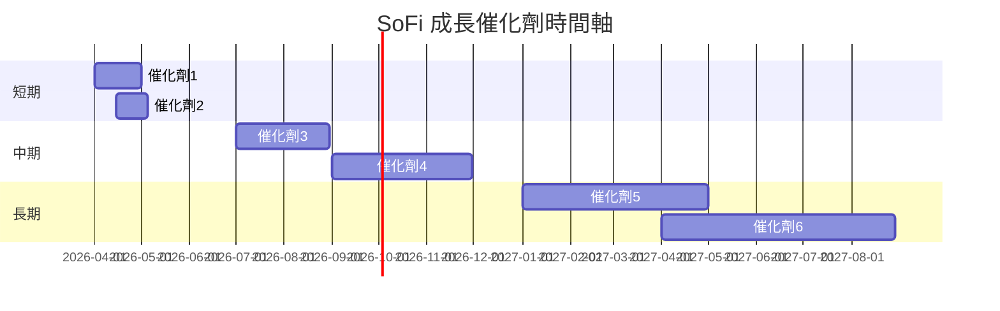

### 8.2 TAM 市場規模分析

```
╔══════════════════════════════════════════════════════════════════╗
║                    TAM 市場規模分析                             ║
╠══════════════════════════════════════════════════════════════════╣
║                                                                  ║
║  市場總規模：$1.2T                                              ║
║  當前滲透率：5%                                                 ║
║  貢獻收入：$60B                                                 ║
║                                                                  ║
║  SoFi 有望透過產品創新與市場擴展提升其市場份額。                  ║
║                                                                  ║
╚══════════════════════════════════════════════════════════════════╝
```

### 8.3 成長驅動力結構圖

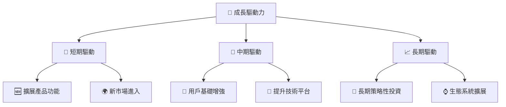

---

## 9. 風險矩陣

### 9.1 風險評分矩陣

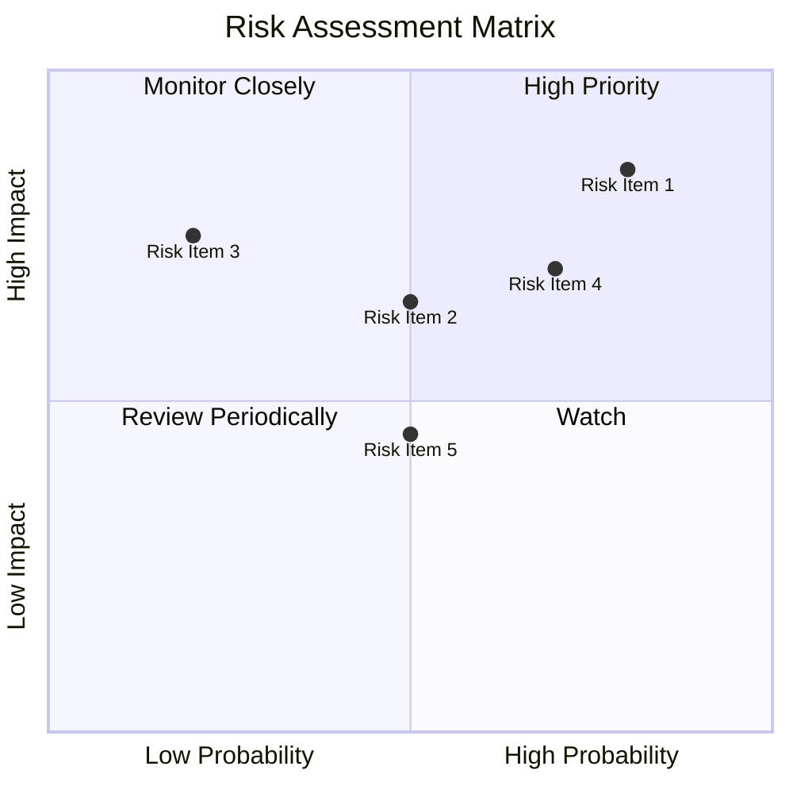

### 9.2 風險清單詳細分析

| # | 風險項目 | 發生機率 | 財務衝擊 | 風險評分 | 緩解措施 |
|---|----------|----------|----------|----------|----------|
| 1 | 🔴 **盈利壓力** | 高 (80%) | 高 (-20%收入) | 🔴 8.5/10 | 提升成本效率，增加收入來源 |
| 2 | 🔴 **競爭加劇** | 高 (70%) | 中 (-15%收入) | 🔴 7.0/10 | 強化產品差異化，擴展市場 |
| 3 | 🟡 **法規變動** | 中 (50%) | 中 (-10%收入) | 🟡 6.5/10 | 加強合規管理，密切關注法規 |
| 4 | 🟡 **市場波動** | 中 (50%) | 中低 (-5%收入) | 🟡 5.0/10 | 多元化投資，降低單一市場依賴 |
| 5 | 🟡 **技術故障** | 低 (20%) | 高 (-15%收入) | 🟡 4.5/10 | 投資於技術升級與安全性 |

---

## 10. 投資建議

### 10.1 最終綜合評級雷達圖

```
╔══════════════════════════════════════════════════════════════════╗
║                    評級雷達圖                                    ║
╠══════════════════════════════════════════════════════════════════╣
║                                                                  ║
║  基本面強度  7.0 ▓▓▓▓▓▓▓▓▓▓▓▓▓▓▓▓▓▓░░                            ║
║  成長動能    8.0 ▓▓▓▓▓▓▓▓▓▓▓▓▓▓▓▓▓▓▓▓                            ║
║  獲利品質    6.0 ▓▓▓▓▓▓▓▓▓▓▓▓▓▓▓▓░░░░                            ║
║  財務健康    7.0 ▓▓▓▓▓▓▓▓▓▓▓▓▓▓▓▓▓▓░░                            ║
║  估值合理性  7.0 ▓▓▓▓▓▓▓▓▓▓▓▓▓▓▓▓▓▓░░                            ║
║                                                                  ║
║  綜合評分：7.5 ▓▓▓▓▓▓▓▓▓▓▓▓▓▓▓▓▓▓░░                             ║
║                                                                  ║
╚══════════════════════════════════════════════════════════════════╝
```

### 10.2 目標價與隱含報酬率

| 情境 | 目標價 | 隱含報酬率 | 機率權重 |
|------|------|---------|--------|
| 🟢 **樂觀情境** | **$38.00** | +134% | 25% |
| 🟡 **基準情境** | **$24.32** | +50% | 50% |
| 🔴 **悲觀情境** | **$12.00** | -26% | 25% |

### 10.3 買入時機與觸發因素

```
╔══════════════════════════════════════════════════════════════════╗
║                  ✅ 買入觸發因素 Checklist                      ║
╠══════════════════════════════════════════════════════════════════╣
║                                                                  ║
║  立即買入觸發條件（多數符合）：                                  ║
║  ✅ 平台用戶數及收入增長持續加速                                 ║
║  ✅ 毛利率改善及淨利轉正                                         ║
║  ✅ 技術平台持續領先同業                                         ║
║                                                                  ║
║  加碼觸發條件（出現以下任一）：                                  ║
║  ☐ 獲得新市場進入或重大合作                                    ║
║  ☐ 盈利預測上調                                                 ║
║                                                                  ║
║  減碼/停損觸發條件（出現以下任一）：                             ║
║  ☐ 盈利下降或增長停滯                                           ║
║  ☐ 行業競爭加劇未見改善                                         ║
╚══════════════════════════════════════════════════════════════════╝
```

### 10.4 投資人適配度分析

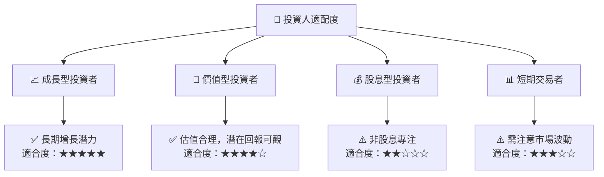

### 10.5 關鍵監控指標

| 監控類型 | 指標 | 關注點 | 頻率 |
|----------|------|--------|------|
| 財務狀況 | 營收增長率 | 保持高於行業均值 | 季度 |
| 盈利能力 | 毛利率與淨利率 | 改善幅度 | 季度 |
| 市場動態 | 用戶基數擴張 | 新增用戶數 | 月度 |
| 競爭分析 | 同業競爭力 | 市場份額變化 | 半年 |

---

> **免責聲明**：本報告為 AI 自動生成，僅供研究參考，不構成投資建議。投資有風險，入市需謹慎。